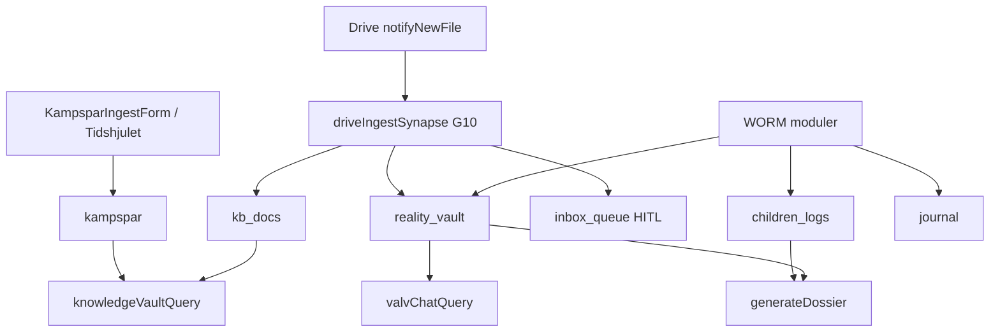

# Hela arkivet — canonical minnesarkitektur (Life OS)

**Status:** Låst princip (2026-05-21). Konsoliderad mot alla Repomix-analyser + GCP.  
**Källor:** Repo, [`docs/GCP-INVENTORY-LATEST.md`](../docs/GCP-INVENTORY-LATEST.md), [`Arkiv-SPEC.md`](../docs/specs/modules/Arkiv-SPEC.md), [`GRUNDER-UTVARDERING-RESULTAT.md`](../docs/specs/modules/GRUNDER-UTVARDERING-RESULTAT.md), [`KONSOLIDERING-2026-05-21.md`](../docs/archive/repomix/KONSOLIDERING-2026-05-21.md).

---

## Invariant: permanent minne

Livskompassen ska **aldrig glömma** användarens WORM-data. Det är **inte** en tidsgräns (t.ex. fem år) utan en arkitekturregel.

| Collection / lager | Roll | Glömmer? |
|--------------------|------|----------|
| `children_logs` | Barnens livslogg + fysiologi | **Nej** — append-only WORM |
| `reality_vault` | Bevis (Sanningens Sköld) | **Nej** — append-only WORM |
| `journal` | Dagbok Lager 1 | **Nej** — append-only WORM |
| `dossier_snapshots` | Bevisad export + hash | **Nej** — WORM snapshot |
| `kampspar` / `kb_docs` | Kunskapsvalvet (RAG) | WORM create; separat retention-policy — **ersätter inte** barn/valv |
| GCS `livskompassen-knowledge-vault-worm` | Embeddings/arkiv-filer | 30d bucket retention — **inte** primär livsdatabas |

**Sacred:** Permanent minne + korrekt silo = lika viktigt som Zero Footprint och Kill Switch.

---

## Begrepp

| Term | Betydelse |
|------|-----------|
| **Hela arkivet** | Koordinerat Life OS-minne över alla moduler — **inte** en gemensam RAG |
| **Kunskapsbank** | Strukturerade dokument/mappar (blueprint: KnowledgeFolder/Doc/Media → `kb_docs`) |
| **Kunskapsvalvet** | UI + RAG ovanpå `kampspar` + `kb_docs` (`/vardagen?tab=kunskap`) |
| **Minne** | Datalager `kampspar` (livshändelser, strategi, mönster) |
| **Synaps** | ADK-händelse (`drive_ingest`, `journal_woven`, …) som kopplar modul → minne utan att blanda silor |
| **SystemSynapse** | Planerat långtids-grounding-schema (blueprint) — ej Firestore-prod än |

---

## Tre kunskapsytor (MUST NOT blandas)

| Yta | Route | Data | Callable | Agent |
|-----|-------|------|----------|-------|
| Kunskapsvalvet | `/vardagen?tab=kunskap` | `kampspar`, `kb_docs` | `knowledgeVaultQuery` | Livs-Arkivarien |
| Valv-Chat | Bevis → Sök | `reality_vault` | `valvChatQuery` | Sannings-Analytikern |
| Barnen | `/familjen` | `children_logs` | — (Dossier export) | Plan: Mönster-Arkivarien |

**MUST NOT:** `valvChatQuery` mot `kampspar`. **MUST NOT:** `knowledgeVaultQuery` mot `reality_vault` som standard.

**Terminologifällor (repomix → kanon):**

| Ord | Repomix (legacy) | Kanon |
|-----|------------------|-------|
| Synaps | CSS / Firestore `synapses` | ADK `SynapseBus`-händelse |
| Silo 3 | Ex-partner / `vault` | Barnen → `children_logs` |
| Minne | Mock-typ `Kampspar` | WORM `KampsparEntry` |
| Vector Search | Vertex AI Search Data Store | Vertex AI Vector Search ANN (768 dim) |

**Förbjudna repomix-mönster:** `SuperArchive` → `kb_docs` för bevis; Kunskap inbäddad i VaultPage; hårdkodad PIN; prompts utanför `sharedRules.ts`.

---

## Legacy → kanon (Firestore)

| Repomix / legacy | Kanon |
|------------------|-------|
| `vault` | `reality_vault` |
| `kids_records` | `children_logs` |
| `diary` | `journal` |
| `synapses` (dokument) | ADK events (`drive_ingest`, `journal_woven`) |
| — | `kampspar`, `dossier_snapshots` (saknas i repomix) |

**Schema-risk (G11):** Mock `Kampspar` i `src/modules/kompis/types/kompis.ts` (challenge/milestone/routine) får **inte** bli ingest-schema — kanonisk typ = `KampsparEntry`.

---

## Inflöde (hur arkivet fylls)

| Källa | Mål | Auto? |
|-------|-----|-------|
| Manuell ingest | `kampspar` | Användaren |
| Drive webhook | `kb_docs` / `reality_vault` / `children_logs` / `inbox_queue` | Ja (G10 klassificering + HITL) |
| Dagbok | `journal` → Vävaren → `reality_vault` metadata | Async |
| Barnen | `children_logs` | Per save |
| Kladd/trauma | `kampspar` | **Endast opt-in manuell** |

---

## RAG idag vs mål (GCP 2026-05-21, live-inventering)

| Lager | Idag | GCP (live) | Mål |
|-------|------|------------|-----|
| Kunskap retrieval | Token-match + ANN-kod `kampsparQueryRag.ts` | Endpoint `4956462078572363776`, index deployad, 4 vectors | ANN prod secrets **VERIFY** (G2) |
| Embeddings | `generateEmbedding` + ingest | Index synkad | Full smoke **VERIFY** (G3) |
| LLM syntes | `GEMINI_API_KEY` | Secret finns | Behåll |
| Legacy Python RAG | — | 4 functions us-central1 | Avveckla (G4) |
| Context Cache | `vertexCache.ts` + `context_cache_registry` (G12) | Firestore delad registry | **done** G12 |

**Deploy-sanning:** [`docs/GCP-INVENTORY-LATEST.md`](../docs/GCP-INVENTORY-LATEST.md) — ersätter arkiv-PDF som säger 0 endpoints / ej deployad valv.

**Kanonisk index (välj vid wire):**

- `projects/1084026575972/locations/europe-west1/indexes/2686894156982255616` (`livskompassen-kv-index`, STREAM)
- eller `.../europe-north1/indexes/9094201410823651328` (`kampspar_index`, BATCH)

---

## Agenter och synapser

| Roll | Fil | Ansvar |
|------|-----|--------|
| Livs-Arkivarien | `sharedRules.ts`, `knowledgeVaultAgent.ts` | Kunskap RAG-svar |
| Mönster-Arkivarien | `sharedRules.ts`, `driveIngestSynapse` | Drive → `kb_docs`, långtidsmönster |
| Sannings-Analytikern | `valvChatAgent.ts` | Forensisk JSON |
| ADK SynapseBus | `synapseBus.ts` | `drive_ingest` live; `journal_woven` stub |

---

## Modul ↔ minne (Life OS)

| Modul | Skriver | RAG/chatt | PDF/export |
|-------|---------|-----------|------------|
| kompis | `kampspar`, `kb_docs` | Kunskap ja | — |
| valv_chatt | — | Valv ja | per post |
| verklighetsvalvet | `reality_vault` | via valv_chatt | per post |
| barnens_livsloggar | `children_logs` | **nej** | Dossier |
| dagbok | `journal` | nej | Dossier opt-in |
| dossier | `dossier_snapshots` | nej | **ja** (hela urval) |
| safe_harbor | valfri → valv | nej | — |
| kompasser | `checkins` | nej | — |
| mabra | `mabra_sessions` | nej | — |
| speglings_system | — (Zero Footprint) | nej | — |
| ekonomi | `transactions` | nej | — |
| core | delade helpers | — | — |

---

## Planerat (MUST NOT tappas)

- [x] **G1** Deploy `valvChatQuery` (live 2026-05-21)
- [ ] **G2** Vector endpoint deployad — prod env/secrets **VERIFY** ([`GCP-INVENTORY-LATEST`](../docs/GCP-INVENTORY-LATEST.md))
- [ ] **G3** Embeddings smoke 768 — index 4 vectors, full ANN **VERIFY**
- [ ] **G4** Avveckla legacy Python RAG (us-central1)
- [x] **G5** Retention allowlist — exkludera WORM permanent
- [ ] **G6** Drive smoke end-to-end (secret + Apps Script — manuellt)
- [ ] **G7** `journal_woven` synaps
- [ ] **G8** Familjen-RAG (Mönster-Arkivarien, **inte** Valv-Chat)
- [x] **G9** EntityProfile / SystemSynapse Firestore + agent grounding
- [x] **G10** Självsorterande inkorg (Kunskap-SPEC §12)
- [x] **G11** Rensa/isolera mock `Kampspar`-typ vs `KampsparEntry`
- [x] **G12** Context Cache delad registry
- [x] **G13** Tidshjulet → `kampspar`-historik (live + ringar)
- [x] **G14** Gräns-Arkitekten — agent card + Hamn (Brusfilter + BIFF)

Se [`Arkiv-GAP-REGISTER.md`](../docs/specs/modules/Arkiv-GAP-REGISTER.md). Implementation: `kör [GAP]`.

---

## Relaterade filer

- [`Arkiv-SPEC.md`](../docs/specs/modules/Arkiv-SPEC.md)
- [`.context/database.md`](./database.md)
- [`.context/arkitektur-beslut.md`](./arkitektur-beslut.md) §1.5
- [`docs/specs/ai-prompts-moduler-master.md`](../docs/specs/ai-prompts-moduler-master.md) §G
- Skills: `.cursor/skills/livskompassen-arkiv-master/`
