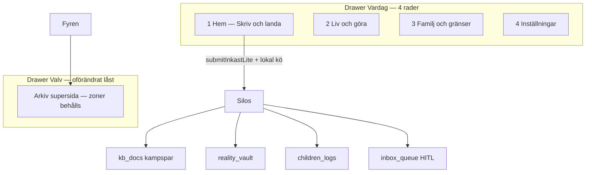
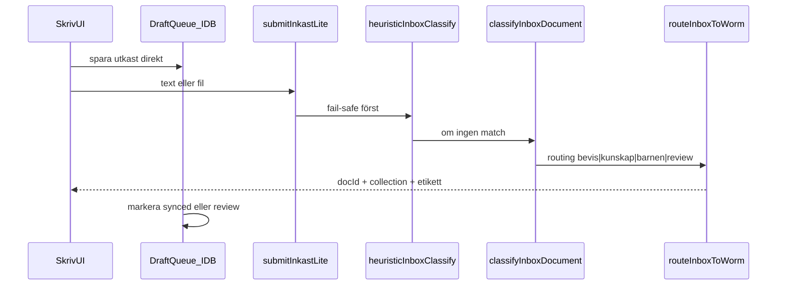

# Supersidor, autosortering och 10h Cursor-bygge

## Utgångsläge (bygg vidare på 2026-05-31)

- Fas 1 hub-nav **deployad** — se [`docs/evaluations/2026-05-31-hub-leverans.md`](docs/evaluations/2026-05-31-hub-leverans.md)
- 8 analyser + syntes finns under `docs/evaluations/2026-05-31-hub-*`
- **Autosortering delvis live:** [`submitInkastLite`](functions/src/lib/submitInkastLite.ts) → [`classifyInboxDocument`](functions/src/lib/inboxClassifier.ts) → [`routeInboxToWorm`](functions/src/lib/inboxPersist.ts) (G10, tre silos + `review`-kö)
- **Zero Footprint idag:** [`useZeroFootprint.ts`](src/modules/core/auth/useZeroFootprint.ts), Speglar unmount, Valv idle — dokumenterat i [`.context/security.md`](.context/security.md) som Sacred

**Dina val (2026-05-31):**
- **Full omstrukturering** → 3–4 livsområden istället för 10+ drawer-rader
- **Ta bort Zero Footprint helt** → persist lokalt tills molnet svarar

---

## Målbild — 4 publika zoner + 1 Arkiv-zon



| Supersida | Route (förslag) | Slår ihop | Default-flik |
|-----------|-----------------|-----------|--------------|
| **Hem — Skriv** | `/` | Inkast Lite, adaptiva kort, snabb capture | Skriv-fält |
| **Liv och göra** | `/liv` *(ny shell)* | Vardagen, MåBra, Göra, Arbetsliv | Kompasser / Handling |
| **Familj och gränser** | `/familj` *(ny shell)* | Familjen, Hamn, Drogfrihet | Reflektion / BIFF |
| **Inställningar** | `/installningar` | oförändrat | Allmänt |
| **Arkiv** | `/dagbok?tab=bevis` + Valv-drawer | Dagbok bevis, alla Valv-zoner | Spara och sök |

**Legacy redirects (MUST):** alla gamla paths (`/mabra`, `/planering`, `/hamn`, …) → nya shells med `?tab=` — ingen död länk.

**Låst UX som INTE får försvinna** (kräver PMIR + smoke):
- Barnfokus, Mönster, Orkester, P3 Kanban på handling, Barnporten HITL, tre silos, WORM, Fyren-gate

---

## A — Global autosortering («allt till arkivet»)

### Pipeline (utöka befintlig G10, inte ny silo)



| Ingång idag | Mål |
|-------------|-----|
| [`InkastLiteCard`](src/modules/inkast/components/InkastLiteCard.tsx) | → gemensam `CapturePanel` |
| Dagbok wizard | valfritt: «känsligt» flag → `review` eller direkt `journal` + async vävning |
| Hamn BIFF textarea | efter svar: erbjud «Spara i arkiv» → `bevis` |
| Planering inkorg klistra-in | behåll `planning_tasks` + parallell arkiv-kopia om bevis |

**Ny frontend-modul:** `src/modules/capture/` — `DraftQueueStore` (IndexedDB via `idb`), `CapturePanel`, `ReviewQueuePanel` (läser `inbox_queue` + lokala pending).

**Ny callable (Fas B):** `submitCapture` — tunn wrapper runt `submitInkastLiteForUser` + stöd för `sourceModule` metadata.

**Säkerhet behålls:**
- DCAP/heuristik **före** LLM ([`inboxClassifier.ts`](functions/src/lib/inboxClassifier.ts))
- `confidence < 0.75` → `review` (redan i inkast)
- Trauma/LVU → `review` utan auto-WORM
- **Ingen** cross-RAG; routing skriver till rätt collection only

---

## B — Ersätt Zero Footprint med «Persistent Draft Layer»

Du valde **ta bort Zero Footprint helt**. Planen implementerar det så här (med säkerhetsnotering):

| Tidigare (ZFP) | Nytt beteende |
|----------------|---------------|
| Speglar rensas vid unmount | Session sparas i IndexedDB tills användaren trycker «Rensa» |
| Valv-chat state ephemeral | Valfri lokal chat-historik (per session-id) |
| `useZeroFootprint` blur/logout wipe | **PMIR:** avaktivera gradvis; behåll **Kill Switch** (skaka) som enda panik-rensning |
| `invalidateSession` vid logout | Behåll för **server-cache** (Vertex/ADK) — det är inte samma som ZFP UI |

**PMIR MUST** före merge till `main`:
- Uppdatera [`.context/security.md`](.context/security.md) — Zero Footprint flyttas från Sacred till «ersatt av Draft Layer + Kill Switch»
- Uppdatera [`.context/locked-ux-features.md`](.context/locked-ux-features.md)
- Kör [`docs/MERGE-IMPACT-RAPPORT.md`](docs/MERGE-IMPACT-RAPPORT.md)

**Risk du accepterar:** enhet som lämnas olåst kan innehålla utkast/bevis-text lokalt. Mitigering: tydlig «Rensa enheten»-knapp i Inställningar + Kill Switch behålls.

---

## C — Nav-sammanslagning (publikt + Valv)

### Publikt drawer — från 10 rader → 4

Källa: [`navTruth.ts`](src/modules/core/navigation/navTruth.ts) + [`MENU-DRAWER-KANON.md`](docs/design/references/MENU-DRAWER-KANON.md)

| Nu | Efter |
|----|-------|
| Dagbok, Vardag, MåBra, Familjen, Göra, Arbetsliv, Hamn, Drogfrihet | **Liv och göra** (inre TabBar) |
| | **Familj och gränser** (inre TabBar) |
| Hem, Inställningar | oförändrade |

**Dagbok reflektion + speglar:** flyttas som **flikar under Hem** eller **Liv** (produktbeslut i Fas 2 — rekommendation: Reflektion/Speglar under **Hem**, eftersom det är «skriv och landa»).

### Valv drawer — behåll 5 zoner, förenkla inre TabBar

- **Ingen** sammanslagning Mönster+Orkester+Dossier (låst)
- UX-förbättring: en **Arkiv-översikt** (`VaultOverviewPanel`) som visar «senast sparat», «väntar granskning», «vävaren pending» — en skärm, inga fler flikar

---

## D — Supersida-komponenter (ny kod)

| Fil | Roll |
|-----|------|
| `src/modules/shell/LivShellPage.tsx` | TabBar: Kompasser · Ekonomi · MåBra · Handling · Projekt · Stämpel |
| `src/modules/shell/FamiljShellPage.tsx` | TabBar: Reflektion · Livslogg · Tillsammans · Barnporten · Hamn · Drogfrihet |
| `src/modules/capture/CapturePanel.tsx` | Global skrivyta + autosync-status |
| `src/modules/capture/draftQueue.ts` | IndexedDB CRUD + sync state |
| `src/modules/core/navigation/navTruth.ts` | 4 drawer-rader + redirects |
| `src/modules/core/routing/AppRoutes.tsx` | `/liv`, `/familj` + legacy redirects |

Befintliga sidor (`MabraPage`, `PlaneringPage`, …) **monteras embedded** — minimal omskrivning.

---

## E — 10 timmar Cursor-autonomi (YOLO utan att du kodar)

### Rekommendation: git worktree — INTE duplicera hela projektet

```bash
cd /Users/Livskompassen/StudioProjects/Livskompassen3.0
git worktree add ../Livskompassen3.0-superhub feat/superhub-v2
cd ../Livskompassen3.0-superhub
```

- **main** fortsätter vara prod-sanning
- **feat/superhub-v2** = YOLO-gren; du testar på Vite `:5173` eller separat hosting preview
- Duplicerat repo utan worktree = dubbel `.env`, dubbel deploy-risk — **undvik**

### Körmodell

| Timme | Våg | Agent | Leverabel |
|-------|-----|-------|-----------|
| 0–0.5 | 0 | Conductor | PMIR-utkast + branch |
| 0.5–2 | 1 | explore + security | `docs/evaluations/2026-06-01-superhub-IA-spec.md` |
| 2–4 | 2 | generalPurpose | `capture/` modul + IndexedDB |
| 4–6 | 3 | UX guardian | `LivShellPage` + `FamiljShellPage` + navTruth |
| 6–8 | 4 | ADK weaver | Wire capture till alla save paths + Review UI |
| 8–9 | 5 | security | ZFP removal + uppdatera security.md |
| 9–10 | smoke-runner | build + all smoke + eval-rapport |

**Starta autonom körning:** öppna Agent (`Cmd+L`), klistra in **Våg 0-prompten** nedan, låt Cursor köra våg för våg utan att fråga (YOLO) — avbryt bara om smoke FAIL.

---

## Färdiga prompter (kopiera per våg)

### Våg 0 — PMIR + worktree

```
Du är Editorial Technical Architect. Skapa docs/evaluations/2026-06-01-superhub-PMIR.md enligt docs/MERGE-IMPACT-RAPPORT.md.
Scope: 4 supersidor, Draft Layer ersätter Zero Footprint, global capture → submitInkastLite, behåll WORM/tre silos/Mönster/Orkester/Kanban/Barnfokus.
Lista: följer med, försvinner, regelanalys, smoke-plan.
Skapa git branch feat/superhub-v2 (worktree om möjligt). Ingen kod ännu.
Jämför dina ändringar mot hela projektets kontext. Arbeta autonomt och sluta inte förrän PMIR är komplett.
```

### Våg 1 — IA-spec + djupanalys (8 underagenter parallellt)

```
Read-only: utöka docs/evaluations/2026-05-31-hub-*-analys.md till docs/evaluations/2026-06-01-superhub-<hub>-deep.md.
Fokus: hur hubben mappas in i Liv|Familj|Hem|Arkiv, vilka routes blir redirects, vilka save paths ska in i capture pipeline.
Returnera markdown med diff-scope. Verifiera fil:rad.
```

Kör **4 parallella** (Liv, Familj, Hem+Capture, Arkiv) — inte 8 igen.

### Våg 2 — Capture + DraftQueue

```
Implementera src/modules/capture/ enligt superhub-PMIR Fas 2:
- draftQueue.ts (IndexedDB, pending|synced|review|failed)
- CapturePanel.tsx (textarea, fil, status «Sorterar…», resultat med länk till rätt silo)
- Anropa befintlig submitInkastLite callable
- Mounta CapturePanel på HomePage ovanför InkastLiteCard (behåll legacy tills migrerat)
Efter kod: npm run build && npm run smoke:inbox (om finns) || smoke:orkester.
Jämför dina ändringar mot hela projektets kontext. Arbeta autonomt och sluta inte förrän koden är helt felfri.
```

### Våg 3 — Supersidor + navTruth

```
Implementera LivShellPage och FamiljShellPage som wrapper med TabBar och embedded befintliga sidor.
Uppdatera navTruth.ts till 4 drawer-rader (Hem, Liv och göra, Familj och gränser, Inställningar).
AppRoutes: /liv, /familj + Navigate från /mabra /planering /hamn /familjen /arbetsliv /drogfrihet.
Uppdatera MENU-DRAWER-KANON.md och smoke_locked_ux.mjs.
MUST NOT: ta bort GoraHubTabBar inuti planering, Barnfokus, Valv-zoner.
npm run smoke:locked-ux && npm run build.
Jämför dina ändringar mot hela projektets kontext. Autonomt till PASS.
```

### Våg 4 — Wire all input → capture

```
Koppla CapturePanel/DraftQueue till: Dagbok quick save, Hamn BIFF «spara som bevis», Planering inkorg klistra-in (dual write).
ReviewQueuePanel: visa inbox_queue + lokala review.
npm run smoke:orkester && smoke:grans && smoke:inbox.
Jämför dina ändringar mot hela projektets kontext. Autonomt till PASS.
```

### Våg 5 — Zero Footprint bort (PMIR godkänd)

```
Efter PMIR OK: ta bort/degradera useZeroFootprint session wipe för Speglar/Dagbok; behåll Kill Switch.
SpeglingsSystem: spara session i IndexedDB; «Rensa»-knapp.
Uppdatera .context/security.md och locked-ux-features.md (Zero Footprint → Draft Layer).
npm run smoke:speglar && smoke:locked-ux && build.
Jämför dina ändringar mot hela projektets kontext. Autonomt till PASS.
```

### Våg 6 — Deploy + manuell checklista

```
Skriv docs/evaluations/2026-06-01-superhub-leverans.md.
npm run build && npm run smoke:orkester && npm run smoke:locked-ux.
firebase deploy --only hosting,functions:submitInkastLite (om capture backend ändrats).
```

---

## Säkerhet — checklista (specialist-security-auditor våg)

| Kontroll | Krav efter ombyggnad |
|----------|---------------------|
| Tre silos | **PASS** — routing skriver till en collection |
| WORM | **PASS** — ingen client update på bevis |
| HITL | **PASS** — review-kö kvar vid låg confidence/trauma |
| Fyren-gate | **PASS** — Arkiv-innehåll kräver gate |
| Kill Switch | **PASS** — rensar local drafts + auth |
| ZFP bort | **PMIR** — dokumenterad risk |
| CMEK | Oförändrat — ingen mock |

---

## YOLO vs försiktigt — praktisk rekommendation

| Strategi | När |
|----------|-----|
| **Worktree + feat/superhub-v2** (rekommenderat) | Du vill att Cursor bygger 10 h utan att röra prod-deploy |
| **YOLO på main** | **Ej rekommenderat** — bryter deploy-paminnelser och din trunk-policy |
| **Projektduplicering** | Endast om du vill två Firebase-projekt — onödigt tungt |

**Din roll:** godkänn PMIR en gång → säg «kör våg 2» … «kör våg 6» — eller en enda prompt «kör hela superhub-planen autonomt» efter PMIR.

---

## Guardrails (oförhandlingsbara utan ny PMIR)

- Slå **inte** ihop Mönster + Orkester
- Flytta **inte** Kanban från `/planering?tab=handling`
- Auto-promote **aldrig** barnlogg → `reality_vault`
- Publik Kunskap-RAG **aldrig** utan Valv-gate
- LLM beslutar **inte** auth eller WORM

---

## Första steg (ett i taget)

Godkänn denna plan → kör **Våg 0 PMIR-prompten** i Agent (`Cmd+L`). När PMIR ligger i `docs/evaluations/` säger du **«kör våg 1–6 autonomt»** så behöver du inte göra något mer tills leveransrapporten kommer.
