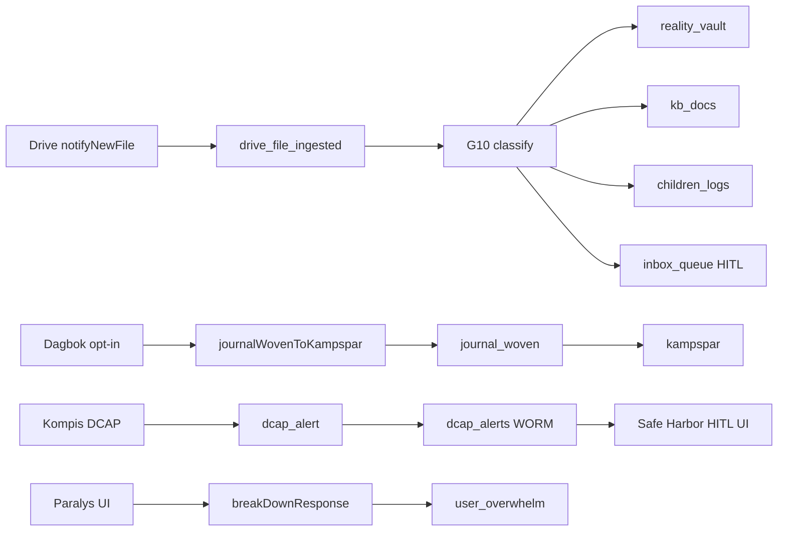

# Synapse-kopplingar (modulgraf)

Skill companion: [`livskompassen-synapser-adk`](../livskompassen-synapser-adk/SKILL.md) · Silo: [`livskompassen-memory-silo-guard`](../livskompassen-memory-silo-guard/SKILL.md)

## Module graph (runtime)

Canonical context: [`.context/arkiv-minne.md`](../../../.context/arkiv-minne.md) (Drive automation, tre silor).

## Connection matrix

| Source module | Entry | Persist target | Auth |
|---------------|-------|----------------|------|
| Drive | HTTP `notifyNewFile` | G10 multi-collection | Webhook secret + `DRIVE_INGEST_OWNER_UID` |
| Dagbok | Callable `journalWovenToKampspar` | `kampspar` (vector) | `context.auth.uid`, `optIn === true` |
| Kompis | In-process after DCAP | `dcap_alerts` | `userId` from supervisor |
| Kompasser/frontend | Callable `breakDownResponse` | In-memory ADK only | `context.auth.uid` |

**Not synapse bus:** Kompis `AdkOrchestrator.dispatch` (A2A cards), RAG callables (`knowledgeVaultQuery`, `valvChatQuery`, `childrenLogsQuery`).

## Checklist — ny koppling

1. Add trigger to `SynapseTrigger` in [`functions/src/adk/types.ts`](../../../functions/src/adk/types.ts).
2. Implement handler; register in [`synapseBus.ts`](../../../functions/src/adk/synapses/synapseBus.ts).
3. Emit only from authenticated callable, webhook with secret, or trusted supervisor — bind `ownerId` to server-known uid.
4. Run silo check: [`livskompassen-memory-silo-guard`](../livskompassen-memory-silo-guard/SKILL.md) — **MUST NOT** cross-RAG.
5. If new Firestore collection: update [`firestore.rules`](../../../firestore.rules) + [`livskompassen-worm-lock`](../livskompassen-worm-lock/SKILL.md).
6. Update [`Arkiv-GAP-REGISTER.md`](../../../docs/specs/modules/Arkiv-GAP-REGISTER.md) if product GAP closes/opens.

## MUST NOT

- Cross-silo RAG (Kunskap ↔ Valv ↔ Barnen) without explicit Dossier/wizard exception.
- Auto-ingest trauma journal text to `kampspar` without opt-in.
- Treat Firestore `system_synapses` (G9) as ADK `stateStore` events.

## Audit trigger

Read-only agent: `.cursor/agents/livskompassen-synapser.md` — `kör synapser`.
