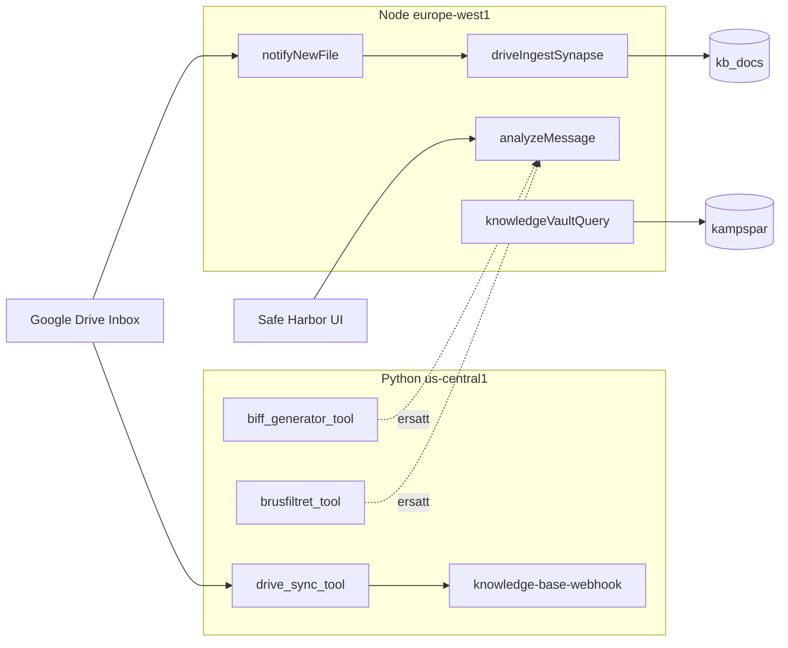

# Overnight Report — 2026-05-22

**Projekt:** Livskompassen2.0 · **Firebase:** gen-lang-client-0481875058  
**Prod-URL:** https://gen-lang-client-0481875058.web.app  
**PUSH OK:** Nej — ingen push (enligt instruktion)

---

## Sammanfattning

| Steg | Status |
|------|--------|
| Build (functions) | **PASS** |
| Build (frontend) | **PASS** |
| ESLint `--max-warnings 0` | **PASS** |
| Smoke ×6 + seed verify | **PASS** |
| G2/G3 Vector ANN prod | **VERIFY PASS** |
| G4 legacy Python kartläggning | **DOCS** |
| G6 Drive webhook | **PARTIAL** — secret bunden, 401 utan header; E2E Apps Script kvar |
| Hosting deploy | **SKIP** — inga frontend-produktändringar i passet |

---

## Smoke (2026-05-22)

| Script | Resultat |
|--------|----------|
| `smoke:valv` | PASS — valvChatQuery + reality_vault citation |
| `smoke:kunskap` | PASS — ingest embeddingDim 768, RAG citation match |
| `smoke:speglar` | PASS — speglingsMirror AI |
| `smoke:dossier` | PASS — PDF via pdfBase64 |
| `smoke:compass` | PASS — checkins + breakDownResponse |
| `smoke:mabra` | PASS — mabraCoach |
| `seed_kampspar_profile --verify` | PASS — 47/47, RAG 5/5 |

---

## G2/G3 — Vector Search ANN

| Bevis | Värde |
|-------|-------|
| Endpoint | `4956462078572363776` (`livskompassen-kv-endpoint`) |
| Deployed index | `livskompassen_kv_deployed_v1` |
| Index ID | `2686894156982255616` |
| Vectors | **54** (uppdaterad under nattpass ingest) |
| indexSyncTime | 2026-05-22T00:57:43Z |
| Kod-defaults | `vectorSearchClient.ts` — matchar GCP |
| Secrets | `VECTOR_SEARCH_*` saknas i Secret Manager — **defaults räcker** |
| embeddingDim smoke | 768 |

**Slutsats:** G2/G3 **VERIFY PASS**. Ingen deploy nödvändig.

---

## G4 — Legacy Python (us-central1)

**Källa:** `firebase functions:list` 2026-05-22. Kod finns **inte** i aktivt `functions/src/index.ts`.

| Function | Region | Trolig roll (legacy) | Node-motsvarighet |
|----------|--------|----------------------|-------------------|
| `knowledge-base-webhook` | us-central1 | Vertex AI Search Knowledge Base — webhook för dokument → legacy datastore | `notifyNewFile` → `driveIngestSynapse` → `kb_docs` + Vector ANN |
| `drive_sync_tool` | us-central1 | Drive → legacy knowledge base sync | Apps Script `sorter.gs` + `notifyNewFile` |
| `biff_generator_tool` | us-central1 | Tidig HTTP BIFF-agent | `analyzeMessage` (BIFF-Skölden via DCAP) |
| `brusfiltret_tool` | us-central1 | Tidig HTTP brusfilter | `analyzeMessage` (Brusfiltret via DCAP) |

### Dataflöde (förenklad)

### Rekommenderad avvecklingsordning (ingen radering i detta pass)

1. **`biff_generator_tool` + `brusfiltret_tool`** — fullt ersatta av `analyzeMessage`; låg risk om inga externa klienter anropar URL:erna.
2. **`drive_sync_tool`** — efter G6 Node Drive E2E PASS (undvik dubbel ingest).
3. **`knowledge-base-webhook`** — sist; huvudingress för legacy Vertex AI Search stack.

**Risk:** Dubbel Drive/RAG-pipeline om Apps Script **och** legacy trigger pekar på samma Inbox.

---

## G6 — Drive (dokumentation)

| Kontroll | Resultat |
|----------|----------|
| `NOTIFY_WEBHOOK_SECRET` i Secret Manager | **FINNS** (2026-05-21) |
| `notifyNewFile` deployad | **PASS** |
| POST utan `X-Livskompassen-Webhook-Secret` | **401** (fail-closed aktiv) |
| Apps Script konfigurerad | **Ej verifierad** |
| E2E Inbox → kb_docs | **Ej körd** |

### Imorgon — 6-stegs checklista (G6 E2E)

1. Bekräfta att du har webhook-secret i lösenordshanterare (rotera med `openssl rand -base64 32` + `firebase functions:secrets:set NOTIFY_WEBHOOK_SECRET` om saknas).
2. Apps Script: klistra in `scripts/google-apps-script/sorter.gs`; sätt `WEBHOOK_SECRET` = samma värde.
3. Sätt `INBOX_FOLDER_ID`, `VAULT_FOLDER_ID`, `FIREBASE_OWNER_UID`.
4. Dela Vault med Functions SA (`gen-lang-client-0481875058@appspot.gserviceaccount.com`).
5. Kör `createTrigger()`; lägg testfil i Inbox.
6. Verifiera `kb_docs` + logg `[File Pipeline]`.

---

## Fas F — Frontend/hosting sanity

| Kontroll | Status |
|----------|--------|
| `public/manifest.webmanifest` | OK — standalone, Obsidian theme |
| `npm run dev` → `vite --host` | OK i package.json |
| `MainLayout.tsx` `pb-48` | OK — CTA ovanför dock |
| `index.css` dock pointer-events | OK — `.dock-nav--hub` w-fit; kompassros `pointer-events: none` |
| Hosting deploy | **SKIP** — ingen prod-deploy nödvändig |

**Manuellt (ej kört av agent):** WebAuthn, shake-to-kill, Safari PWA hemskärm.

---

## Kodfixar

| Fil | Ändring |
|-----|---------|
| `eslint.config.js` | Ignorera archive/generated; node globals; avstängda strikta react-hooks-regler |
| `scripts/gdpr_cleanup.ts` | Ersatte oanvänd `getFirestore`-import med `Firestore`-typ |
| `src/modules/barnens_livsloggar/components/BarnensPage.tsx` | `useCallback` på `refreshLogs` |

---

## Blockerare (max 3 — imorgon)

1. **G6 E2E Drive** — Apps Script Script Properties + testfil → `kb_docs` (secret finns redan i GCP).
2. **SEED uid** — sätt `SEED_FIREBASE_EMAIL` + `SEED_FIREBASE_PASSWORD` i `.env` om Kunskap-profil ska synas på ditt inloggade konto (annars anonymous uid).
3. **Telefon-tester** — WebAuthn gate, shake-to-kill, PWA hemskärm (MANUELL).

---

## Imorgon — ett steg

**Konfigurera Apps Script `WEBHOOK_SECRET` + `FIREBASE_OWNER_UID`, kör `createTrigger()`, och ladda upp en testfil i Drive Inbox.**

---

## Git

Commit skapas efter denna rapport (build + smoke PASS). **Push ej utförd.**
