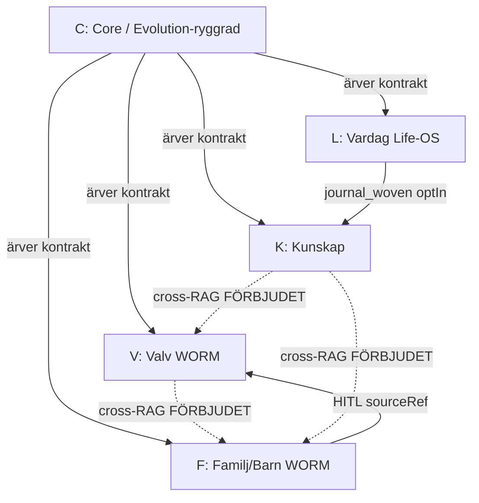

# Master Integration Manifest

**Status:** Kanon (fase 1 — inert TS-skelett, ej inkopplat i runtime)  
**Senast uppdaterad:** 2026-06-14  
**Kanon-kedja:** U1 (tre silos) · U3 (WORM) · U4 (Zero Footprint) · Infinite Evolution · `firestore.rules`

---

## 1. Syfte

Master Integration Manifest är det **enda registreringsstället** för agentdomäner i Livskompassen. Varje ny modul registreras mot en domän och ärvr automatiskt:

- WORM-policy (Write Once, Read Many)
- Silo-isolering (ingen cross-RAG mellan Kunskap, Valv, Barnen)
- Ägarbindning (`ownerId` + `userId`)
- Synapse-triggers (ADK)
- Strikt TypeScript via `tsconfig.core-strict.json`

Manifestet **utökar** befintliga mekanismer — det ersätter dem inte:

| Mekanism | Plats |
|----------|-------|
| Firestore WORM-regler | [`firestore.rules`](../../firestore.rules) |
| Agent collection-gate | [`functions/src/adk/registry.ts`](../../functions/src/adk/registry.ts) `assertCollectionAccess` |
| Silo-guard (skill) | `.cursor/skills/livskompassen-memory-silo-guard` |
| Evolution WORM | [`INFINITE_EVOLUTION.md`](./INFINITE_EVOLUTION.md) |

**TS-skelett (inaktivt):** [`src/modules/core/manifest/`](../../src/modules/core/manifest/)  
**Backend-spegel (inaktivt):** [`functions/src/adk/manifest.ts`](../../functions/src/adk/manifest.ts)

---

## 2. De 5 agentdomänerna

Hybrid-modell: **4 data/silo-zon-domäner** + **1 tvärgående Core-ryggrad** som alla ärver från.

| ID | Domän | Silo | UI-zon | Primär callable |
|----|-------|------|--------|-----------------|
| `K` | Kunskap | `kunskap` | Valv (PIN) / Kunskapsbank | `knowledgeVaultQuery` |
| `V` | Valv | `valv` | Valv (PIN) | `valvChatQuery`, `analyzeMessage` |
| `F` | Familj/Barn | `barnen` | Familjen / Barnporten | `childrenLogsQuery` |
| `L` | Vardag / Life-OS | `vardag` | Vardagen / Hjärtat | — (klient + evolution) |
| `C` | Core / Evolution-ryggrad | `core` | Tvärgående | ADK `emitSynapse` |

### 2.1 K — Kunskap (FACT/RAG)

- **Collections (WORM):** `kampspar`, `kb_docs`, `routines`
- **content_class:** `FACT` (U6)
- **Agenter:** Livs-Arkivarien, Mönster-Arkivarien
- **Förbjudet:** Cross-read till `reality_vault` eller `children_logs`

### 2.2 V — Valv (WORM-bevis)

- **Collections (WORM):** `reality_vault`, `dossier_snapshots`, `dcap_alerts`, `entity_profiles`, `system_synapses`, `vault` (legacy read-only)
- **Auth:** `isSensitiveAuth()` + `isVaultUnlocked()`
- **Agenter:** Sannings-Analytikern, Mönster-Arkivarien (forensisk)
- **Förbjudet:** Auto-promote från Barnen utan HITL; cross-RAG till `kampspar`

### 2.3 F — Familj/Barn (WORM + HITL)

- **Collections (WORM):** `children_logs`
- **Collections (Admin SDK):** `barnporten_pairings`, `barnporten_devices`, `inbox_queue`
- **content_class:** `PLAY` (plan), `EVIDENCE`
- **Agenter:** Gräns-Arkitekten (Hamn/BIFF), Barnporten-agenter
- **Förbjudet:** Cross-read till `kampspar`; auto-promote `private_child` till Valv

### 2.4 L — Vardag / Life-OS

- **Collections (WORM):** `journal`, `mabra_sessions`, `vit_entries`, `transactions`, `checkins`
- **Collections (mutable):** `mabra_progress`, `user_daily_focus`, `vit_hub`, `planning_tasks`, `projects`, `project_blocks`, `planning_email_rules`, `project_rules`, `routine_templates`, `material_pack_overrides`, `economy_*`, `budgets`, `budget_savings`, `time_entries`, `user_widgets`, `user_tags`, `user_insights`
- **content_class:** `REFLECTION`, `PLAY` (Vit/MåBra — ingen cross-RAG till Kunskap)
- **Agenter:** Paralys-Brytaren, Speglings-Coachen, RSD-Kylaren, Uppgifts-Krossaren
- **Kapacitetsstyrning:** Läser `evolution_hub` via Core (Nivå 1–3)

### 2.5 C — Core / Evolution-ryggrad

- **Collections (WORM):** `evolution_ledger`
- **Collections (mutable):** `evolution_hub`
- **Collections (read-only / Admin SDK):** `user_economy_status`, `user_capability_state`, `access_tokens_economy`, `context_cache_registry`, `_rate_limits`
- **Runtime:** `AdkOrchestrator`, `synapseBus`, `stateStore`, `sharedRules.ts`
- **Alla domäner K/V/F/L ärver:** capacity gate, Zero Footprint, synapse-routing

---

## 3. Interaktionsregler (Master Integration Manifest)

### 3.1 Silo-isolering (U1 — MUST)

```
K ↔ V  ❌ cross-RAG förbjudet
K ↔ F  ❌ cross-RAG förbjudet
V ↔ F  ❌ cross-RAG förbjudet
L → K/V/F  ❌ ingen RAG-query över silo
```

Tillåtna **icke-RAG** broar (explicit HITL / `sourceRef`):

| Från | Till | Mekanism |
|------|------|----------|
| Barnen (`children_logs`) | Valv (`reality_vault`) | `SaveAsEvidencePrompt` + förälder godkänner |
| Barnporten inkorg | Valv | `BarnportenInboxPanel` HITL |
| Inkast (G10) | Valv / Kunskap / Barnen | `driveIngestSynapse` + `classifyInboxDocument` |
| Journal (opt-in) | Kunskap (`kampspar`) | `journal_woven` synapse, `optIn === true` |

### 3.2 WORM-arv (U3 — MUST)

Varje collection i `wormCollections` för en domän:

1. `allow update, delete: if false` i Firestore rules
2. `wormKeysOnly([...])` vid create där schema är låst
3. Server-tidsstämpel (`createdAt`) — ingen klient-`updatedAt`
4. Inga retroaktiva ändringar i `evolution_ledger`

**Kanoniska WORM-samlingar:**

`reality_vault`, `children_logs`, `journal`, `evolution_ledger`, `dossier_snapshots`, `kampspar`, `kb_docs`, `dcap_alerts`, `entity_profiles`, `system_synapses`, `insight_summaries`, `allocation_proposals`, `payslip_snapshots`

### 3.3 Synapse-triggers (ADK)

| Trigger | Emitter | Konsument | Effekt |
|---------|---------|-----------|--------|
| `drive_file_ingested` | Inkast / Drive | Core → K/V/F | G10 klassificering, HITL-kö |
| `journal_woven` | Hjärtat (opt-in) | K | `kampspar` + vector |
| `dcap_alert` | DCAP | V | HITL → `dcap_alerts` vid risk ≥70 |
| `user_overwhelm` | Core capacity | L | Paralys-Brytaren, ett mikrosteg |

Synapse state: **hash only** (`payloadHash`) — ingen rå PII (Zero Footprint).

### 3.4 Auth-lager

| Lager | Krav | Domäner |
|-------|------|---------|
| `isAuthenticated` | Inloggad | Alla |
| `isSensitiveAuth` | Verifierad e-post | L (journal), F, V (read) |
| `isVaultUnlocked` | Biometrisk PIN + token | V |
| Admin SDK only | Cloud Functions | `inbox_queue`, `dcap_alerts`, `entity_profiles`, `dossier_snapshots` |

### 3.5 Evolution-arv (Infinite Evolution)

Alla domäner K/V/F/L **läser** `evolution_hub` via Core:

- Kapacitetsnivå styr UI i L (ekonomi, planering)
- `currentBracket` styr Barnporten i F
- Varje nivåändring **skriver** append-only till `evolution_ledger` (WORM)

---

## 4. Domänkontrakt (`DomainContract`)

Varje domän deklarerar ett typat kontrakt:

```typescript
interface DomainContract {
  id: DomainId;                    // 'K' | 'V' | 'F' | 'L' | 'C'
  silo: SiloId;                    // 'kunskap' | 'valv' | 'barnen' | 'vardag' | 'core'
  wormCollections: readonly string[];
  mutableCollections: readonly string[];
  adminOnlyCollections: readonly string[];
  allowedCrossReads: readonly SiloId[];  // MUST [] för K, V, F
  requiresVaultUnlock: boolean;
  requiresVerifiedEmail: boolean;
  synapseEmits: readonly SynapseTrigger[];
  synapseConsumes: readonly SynapseTrigger[];
  callables: readonly string[];
  productAgentIds: readonly string[];
}
```

**Regel:** `allowedCrossReads` MUST vara tom array `[]` för domäner K, V, F. Endast Core (C) får koordinera synapser över silos — aldrig via RAG.

---

## 5. Automatiskt arv för framtida moduler

### 5.1 Bygg-tid (TypeScript)

1. Ny modul under `src/modules/features/<område>/` väljer domän `K|V|F|L`
2. Importerar `getDomainContract(domainId)` från `@/core/manifest`
3. `tsconfig.core-strict.json` tvingar `strict: true` på allt under `src/modules/core/**`
4. Ogiltigt kontrakt → compile-fel via `satisfies DomainContract`

### 5.2 Runtime (efter inkoppling — separat godkännande)

1. `assertCollectionAccess(agentId, collection)` utökas med manifest-lookup
2. `assertWorm(collection)` — neka update/delete i klient-API
3. `assertSiloIsolation(fromSilo, toSilo)` — neka cross-RAG queries
4. `clearSynapseState` vid logout/blur (Zero Footprint)

### 5.3 Drift-skydd (planerat)

`npm run smoke:manifest` — jämför:

- `masterManifest.ts` ↔ `firestore.rules` (WORM-lista)
- `masterManifest.ts` ↔ `AgentCard.dataAccessPolicy.allowedCollections`
- `allowedCrossReads` === `[]` för K/V/F

---

## 6. Arkitekturdiagram



---

## 7. Fas 1-leverabler (denna implementation)

| Fil | Status |
|-----|--------|
| `docs/architecture/MASTER-INTEGRATION-MANIFEST.md` | Kanon |
| `src/modules/core/manifest/domainContract.ts` | TS-typer |
| `src/modules/core/manifest/masterManifest.ts` | 5 domäner `satisfies` |
| `src/modules/core/manifest/manifestGuards.ts` | Guards (inert) |
| `src/modules/core/manifest/index.ts` | Barrel export |
| `functions/src/adk/manifest.ts` | Backend-spegel (inert) |

**Inget körande beteende ändras** förrän explicit inkoppling godkänns.

---

## 8. Nästa steg (efter godkännande)

1. Koppla `assertWorm` / `assertSiloIsolation` i `registry.ts`
2. Lägg `smoke:manifest` i `package.json`
3. Kräv domänregistrering i `module_plan.md` för nya features
4. PMIR före merge som rör manifest ↔ rules
