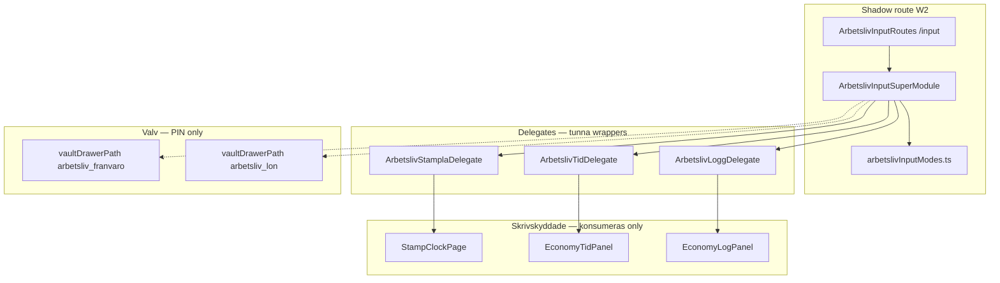

# Arbetsliv — Universal Input Superhub (Djupanalys)

**Datum:** 2026-06-14  
**Fas:** 10A (W2 — isolerat arbetspaket)  
**Status:** Godkänd för routerskelett + delegater (W3 integrerar i live-app)  
**Kanon:** [`.context/system-plan.md`](../../.context/system-plan.md) · [`.context/locked-ux-features.md`](../../.context/locked-ux-features.md) §8 · [`module_plan.md`](../../src/modules/features/dailyLife/arbetsliv/module_plan.md)  
**SPEC:** [`docs/specs/Arbetsliv-INPUT-SUPERHUB-SPEC.md`](../specs/Arbetsliv-INPUT-SUPERHUB-SPEC.md)  
**Referensmönster:** [`Ekonomi-INPUT-SUPERHUB-SPEC.md`](../specs/Ekonomi-INPUT-SUPERHUB-SPEC.md) · [`Familjen-INPUT-SUPERHUB-SPEC.md`](../specs/Familjen-INPUT-SUPERHUB-SPEC.md)

---

## 1. REASONS — sammanfattning

| Dimension | Beslut |
|-----------|--------|
| **Requirements** | En inmatningshub för Arbetsliv (stämpel, tid, logg) utan sidbyte; guld glow (`glow-bottom-gold`); Valv-länkar via `vaultDrawerPath` — aldrig publik frånvaro/lön |
| **Entities** | `time_entries` (stämpel), `economy_ledger` + fasta räkningar (logg), payslip via Valv (`generatePayslip` konsumeras — ej ändrad) |
| **Approach** | Tunn router + tre delegates som wrappar **befintliga** paneler oförändrade |
| **Structure** | `supermodule/` + `routing/ArbetslivInputRoutes.tsx` shadow på `/arbetsliv/input` |
| **Operations** | W2 skelett → W3 montering i `ArbetslivHubPage` / `AppRoutes` → `smoke:arbetsliv-superhub` |
| **Norms** | Ingen write i routern; WORM på ledger; Zero Footprint oförändrat |
| **Safeguards** | Skrivskyddade beroenden (`StampClockPage`, `EconomyTidPanel`, `EconomyLogPanel`); PIN-innehåll endast Valv |

---

## 2. Nuläge (Fas 9 → 10)

### 2.1 Befintlig hub (`ArbetslivHubPage`)

| Flik (`?tab=`) | Komponent | Write-target |
|----------------|-----------|--------------|
| `stampla` | `StampClockPage` | `time_entries` |
| `tid` | `EconomyTidPanel` | Read + payslip-card (Valv-länk) |
| `logg` | `EconomyLogPanel` | `economy_ledger`, fasta räkningar |

Valv (PIN): `arbetsliv_franvaro`, `arbetsliv_lon` — header-CTA via `vaultDrawerPath`.

### 2.2 Gräns mot Ekonomi Superhub

`EkonomiArbetslivBroDelegate` (Fas 8E) navigerar **endast** till `/arbetsliv?tab=…`. Efter W3 kan bro-länkar peka på `/arbetsliv/input?inputMode=…` för paritet — **utan** att flytta ledger-writes till Ekonomi-zonen.

### 2.3 Gap

- Tre separata TabBar-vyer — kognitiv växling vid sidbyte inom hub
- Ingen enhetlig `inputMode`-URL (Till skillnad från MåBra `/mabra/input`, Familjen `/familjen/input`, Ekonomi `?inputMode=`)
- Ingen dedikerad supermodule-mapp under `arbetsliv/`

---

## 3. Målbild (Fas 10B→10C)

```
/arbetsliv/input?inputMode=stampla|tid|logg
```

| Läge | Delegate | Wrappar |
|------|----------|---------|
| `stampla` | `ArbetslivStamplaDelegate` | `StampClockPage` |
| `tid` | `ArbetslivTidDelegate` | `EconomyTidPanel` |
| `logg` | `ArbetslivLoggDelegate` | `EconomyLogPanel` |

**Design:** `calm-card glow-bottom-gold` — Vardagen/Arbetsliv silo enligt `design-calm.mdc` §5.

**Valv:** Routern visar PIN-länkar via `vaultDrawerPath('arbetsliv_franvaro')` och `vaultDrawerPath('arbetsliv_lon')` — samma kanon som hub-header, routerbaserat (ingen `?tab=franvaro` i publikt läge).

---

## 4. Arkitekturdiagram



---

## 5. URL-kontrakt

| Param | Värden | Default |
|-------|--------|---------|
| `inputMode` | `stampla` \| `tid` \| `logg` | `stampla` |

Legacy `?tab=stampla|tid|logg` på `/arbetsliv` förblir i `ArbetslivHubPage` tills W3 migrerar eller dual-mountar.

---

## 6. Risker och mitigering

| Risk | Mitigering |
|------|------------|
| Dubbel Firestore-listeners | Delegates mountar samma paneler som hub — W3 ska **ersätta** TabBar-innehåll, inte köra parallellt |
| Ledger i fel zon | Logg-delegate skriver endast via `EconomyLogPanel` — Ekonomi Superhub har `navigationOnly` bro |
| Valv-läckage | Endast `vaultDrawerPath` — inga frånvaro/lön-paneler i supermodule |
| Git-kollision W1/W2 | W2 rör **inte** `ArbetslivHubPage.tsx`, `AppRoutes.tsx`, firestore |

---

## 7. W3-integration (ej W2)

- [ ] Montera `ArbetslivInputRoutes` under `/arbetsliv/*` i `AppRoutes.tsx`
- [ ] Ersätt eller dual-run TabBar + `publicPanel` i `ArbetslivHubPage`
- [ ] Uppdatera `EkonomiArbetslivBroDelegate`-länkar till `/arbetsliv/input?inputMode=…`
- [ ] Lås i `.context/locked-ux-features.md` efter smoke PASS
- [ ] `npm run smoke:arbetsliv-superhub` i CI/package.json (W3)

---

## 8. Verifiering (W2)

| Check | Kommando / artefakt |
|-------|---------------------|
| Struktur | `npm run smoke:arbetsliv-superhub` |
| Guld glow | Statisk scan i smoke |
| Tre modes | `arbetslivInputModes.ts` |
| Skrivskydd | Delegates importerar — ändrar inte protected filer |

**W2 leverans:** Dokument + routerskelett + delegater + shadow route — **ingen** live-montering.
