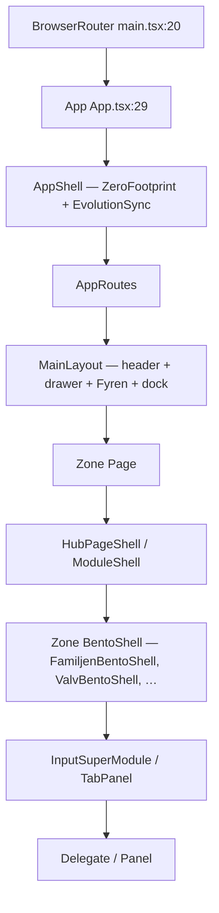

# Arkitektur + navigation — READ-ONLY analys — 2026-06-15

**Status:** Våg A implementerad + deployad 2026-06-15 (F1–F5, smoke PASS, hosting live)  
**Källa:** Cursor-analys mot `gpt-pack-01-arkitektur.md` + levande kod  
**Relaterat:** [`docs/gpt-handoff/README.md`](../gpt-handoff/README.md) Pack 01 · GPT målbild 4 platser + Fyren i bakgrunden  
**Transkript:** Cursor agent `39bf9ea8-d5a0-466d-af02-a629d4644ff0`

## Sammanfattning (3 rader)

- Säkerhet OK: WORM, tre RAG-silos, supermodule-mönster.
- Problem: 12–18 upplevda hubbar vs målbild 4 + bakgrunds-Fyren.
- **Våg A godkänd:** F1 (launcher Handling bort), F2 (dock Hjärtat), F4 (neutral Fyren-label), F5 (snabbare Kanban).

## Låsta regler (rör ej utan PMIR)

Barnfokus · P3 Kanban · Valv Mönster/Orkester · Valv HITL · plausible deniability i drawer.

## Nästa steg

1. ~~Pontus: godkänn Våg A~~ **Klart 2026-06-15**
2. ~~Cursor Agent: implementera F1→F2→F4→F5 + `npm run smoke:locked-ux`~~ **Klart 2026-06-15** (commit `f11d2c946`, hosting deploy)
3. Våg B: PMIR innan routing-sammanslagningar (H1–H4)
4. Våg C: strategiska Fyren-beslut (B1–B3) — defer

---

# Livskompassen 3.0 — Arkitekturanalys (READ-ONLY)

Analysen bygger på levande kod i repot (primärt `AppRoutes.tsx`, `navTruth.ts`, supermoduler, `firestore.rules`, callable-lager). Ingen kod har ändrats.

---

## 1. Zon- och router-karta

### Kanoniska zoner (produkt)

| Zon | Route | Understruktur |
|-----|-------|---------------|
| **Hem** | `/` | `HomePage` + `CaptureSuperModule` |
| **Hjärtat** | `/hjartat` | `?tab=reflektion` (dagbok) · `?tab=speglar` |
| **Vardagen** | `/vardagen` | Launcher + inline `kompasser` / `ekonomi` |
| **Familjen** | `/familjen` | 6 hub-tabs (`reflektion`, `livslogg`, …) |
| **Valvet** | `/valvet` | `vaultTab` + `valvMode` (PIN-gate i `VaultPage`) |

Legacy-redirects håller gamla paths (`/dagbok`, `/liv`, `/valv`, `/hamn`) utanför parallella världar — se ```146:168:src/modules/core/routing/AppRoutes.tsx``` och ```194:205:src/modules/core/routing/AppRoutes.tsx```.

### Alla separata "platser" idag (utöver kanon)

Utöver de fyra zonerna + Hem finns **minst 20 egna routes** som användaren kan nå:

| Kategori | Routes |
|----------|--------|
| Vardagsmoduler (egna sidor) | `/mabra/*`, `/planering`, `/planering/kalender`, `/planering/input`, `/projekt` (+ under), `/arbetsliv/input`, `/ekonomi`, `/morgon` |
| AI / meta | `/kompis`, `/orakel`, `/reflection` |
| Arkiv / legacy | `/arkiv`, `/oversikt`, `/dashboard` |
| Barn | `/barnporten`, `/barnporten/foralder-trygg` |
| System | `/installningar`, `/widget/*`, `/dev/*` |

Full lista i ```274:532:src/modules/core/routing/AppRoutes.tsx```.

### Komponenthierarki



**Exempel kedjor:**

- **Familjen → Barnfokus:** `FamiljenPage` → `ModuleShell` → `FamiljenBentoShell` → `FamiljenInputSuperModule` → `FamiljenBarnfokusDelegate` (```139:141:src/modules/core/pages/FamiljenPage.tsx```)
- **Valv → Inkast:** `ValvetRoutePage` → `HubPageShell` → `VaultPage` → `ValvInputSuperModule` → `ValvSuperModule` (```93:112:src/modules/core/pages/ValvetRoutePage.tsx```, ```235:245:src/modules/features/lifeJournal/evidence/vault/components/VaultPage.tsx```)
- **Hjärtat → Reflektion:** `DagbokPage` → `ModuleShell` → `DagbokInputSuperModule` → `DagbokReflektionDelegate` (```47:50:src/modules/core/pages/DagbokPage.tsx```)

---

## 2. Hub-räkning

### Navigationsskikt (vad användaren *ser*)

| Skikt | Antal distinkta val | Källa |
|-------|---------------------|-------|
| **FloatingDock** | **4** zoner | Vardagen · Familjen · Dagbok · Handling (```17:57:src/modules/core/layout/FloatingDock.tsx```) |
| **Drawer — Vardag** | **4** rader | Hem · Liv och göra · Familj · Inställningar (```88:225:src/modules/core/navigation/navTruth.ts```) |
| **Drawer — Valv** | **6** rader (endast vid unlock) | Samla · Analysera · Kunskap · Vit · Exportera · Forensik (```258:313:src/modules/core/navigation/navTruth.ts```, ```186:233:src/modules/core/layout/NavigationDrawer.tsx```) |
| **LivLauncher** | **6** kort | Kompasser · Ekonomi · MåBra · Handling · Projekt · Arbetsliv (```43:80:src/modules/shell/LivLauncherGrid.tsx```) |
| **FyrenWidgetBar** | **8** genvägar | Inkast · Snabbval · Inspelning · Anteckning · Lista · Planering · **Valv** · Projekt (```20:39:src/modules/core/components/FyrenWidgetBar.tsx```) |
| **Familjen hub-tabs** | **6** | Barnfokus · Livslogg · Tillsammans · Barnporten · Hamn · Drogfrihet (```33:40:src/modules/core/pages/FamiljenPage.tsx```) |
| **Valv input modes** | **7** | spara · granska · analysera · kunskap · vit · rapporter · mer (```13:94:src/modules/features/lifeJournal/evidence/vault/supermodule/valvInputModes.ts```) |

### Jämförelse med målbild

| Målbild | Nuläge |
|---------|--------|
| 4 platser + Fyren i bakgrunden | **4 i dock** — men **6 launcher-kort**, **8 Fyren-genvägar**, **6 Familjen-tabs**, **6–7 Valv-lägen**, plus **egna routes** för MåBra/Planering/Projekt/Arbetsliv/Ekonomi/Kompis/Morgon/Barnporten |
| Fyren = kapacitetsgrind, inte plats | Fyren är **synlig primärnav** (dock-handle + widget-panel med "Valv", "Planering", "Projekt") — ```66:68:src/modules/core/layout/FloatingDock.tsx```, ```37:37:src/modules/core/components/FyrenWidgetBar.tsx``` |

**Slutsats:** Arkitekturen *säger* 3-zon + Valv, men användaren upplever **12–18 mentala "världar"** beroende på skikt (dock → launcher → hub-tab → inputMode → Valv-zone).

---

## 3. Supermoduler

### InputSuperModule-karta

| SuperModule | Zon / Route | Delegates / lägen | Klick dock → första handling* |
|-------------|-------------|-------------------|-------------------------------|
| `FamiljenInputSuperModule` | `/familjen?tab=reflektion\|livslogg` | 6 modes: barnfokus, livslogg_stund, fysiologi, livslogg_observation, vardagsstruktur, inkast (```24:78:src/modules/features/family/children/supermodule/familjenInputModes.ts```) | **2** (dock Familjen → skriv i Barnfokus) |
| `DagbokInputSuperModule` | `/hjartat` (embedded) · `/hjartat/input` | reflektion, quick_mirror, arkiv (```20:48:src/modules/features/lifeJournal/diary/supermodule/dagbokInputModes.ts```) | **2** |
| `EkonomiInputSuperModule` | `/vardagen?tab=ekonomi` | 9 modes, kapacitetsfiltrerade (saldo, mikrosteg, kuvert, impuls, …) (```28:58:src/modules/features/dailyLife/wellbeing/economy/supermodule/ekonomiInputModes.ts```) | **3** (dock Vardagen → kort Ekonomi → formulär) |
| `MabraInputSuperModule` | `/mabra/input` | 9 modes (checkin + vit_* + mer…) (```24:89:src/modules/features/dailyLife/wellbeing/mabra/supermodule/mabraInputModes.ts```) | **3–4** (dock Vardagen → MåBra-kort → hub → ev. input) |
| `PlaneringInputSuperModule` | `/planering/input` · embedded i `/planering?tab=handling` | task_quick, inkast, quick_list (```18:46:src/modules/features/admin/planning/supermodule/planeringInputModes.ts```) | **2–4** (dock Handling direkt; första gången `GoraModulValjare` +1 — ```79:83:src/modules/features/admin/planning/components/PlaneringPage.tsx```) |
| `ArbetslivInputSuperModule` | `/arbetsliv/input` | stampla, inkomster, tid (```18:43:src/modules/features/dailyLife/arbetsliv/supermodule/arbetslivInputModes.ts```) | **3** (Vardagen → Arbetsliv-kort → stämpel) |
| `ValvInputSuperModule` | `/valvet` (efter PIN) | 7 valvModes → `ValvSuperModule` per zon (```37:94:src/modules/features/lifeJournal/evidence/vault/supermodule/valvInputModes.ts```) | **2+** (Fyren 3s-håll / widget Valv → biometri → spara) |
| `CaptureSuperModule` | `/` (Hem) | hem-capture, planering, … | **1** (redan på Hem) |

\*Klick = navigationssteg, inte inmatning/spar.

### InputRoutes (skugg-rutter)

| Fil | Mount | Path |
|-----|-------|------|
| `DagbokInputRoutes` | `/hjartat/*` | `/hjartat/input` (```16:28:src/modules/features/lifeJournal/diary/routing/DagbokInputRoutes.tsx```) |
| `PlaneringInputRoutes` | `/planering/*` | `/planering/input` (```14:26:src/modules/features/admin/planning/routing/PlaneringInputRoutes.tsx```) |
| `ArbetslivInputRoutes` | `/arbetsliv/*` | `/arbetsliv/input` |
| `MabraRoutes` | `/mabra/*` | `/mabra/input` + 10+ under-vyer (```22:39:src/modules/features/dailyLife/wellbeing/mabra/routing/MabraRoutes.tsx```) |

**Observation:** Universal Input är implementerat konsekvent (thin router + delegates), men **monteras på olika djup** — ibland inline i hub (`Familjen`, `Hjärtat`), ibland egen route (`/mabra`, `/planering/input`), ibland launcher-steg emellan.

---

## 4. Navigation & kognitiv belastning

### Dubbel/trippel navigation

| Problem | Var |
|---------|-----|
| **Dock + Launcher** | Dock "Vardagen" → 6 kort till *samma* moduler som egna dock-zoner (Handling finns både i dock **och** launcher) |
| **Dock "Dagbok" vs produkt "Hjärtat"** | Label "Dagbok" i dock (```36:38:src/modules/core/layout/FloatingDock.tsx```) men zon heter Hjärtat i `NAV_PATHS` |
| **Drawer vs Dock** | 4 drawer-rader överlappar delvis dock; drawer har dessutom Inställningar som dock saknar |
| **Hub-tabs + InputMode-picker** | Familjen: `HubDropdownNav` (6 tabs) **+** `FamiljenInputModePicker` (6 modes) på samma vy (```118:141:src/modules/core/pages/FamiljenPage.tsx```) |
| **Planering: tab-bar + modulväljare + Kanban** | `GoraHubTabBar` + `GoraModulValjare` + P3 Kanban (```69:83:src/modules/features/admin/planning/components/PlaneringPage.tsx```) |
| **Fyren som fjärde nav-lager** | Widget-panel ovanför dock med 8 genvägar — inkl. duplicerade Planering/Projekt/Valv (```103:108:src/modules/core/layout/MainLayout.tsx```) |

### evolution_hub / useCapacityGate / CognitiveLoadStrip — styr de UI?

| Mekanism | Vad den gör | Styr navigation? |
|----------|-------------|------------------|
| `useCapacityGate` | Lyssnar `user_capability_state` (kapacitet + `economy_advanced`) (```21:48:src/modules/core/store/useCapacityGate.ts```) | **Delvis** — främst Ekonomi (`useEconomyLevel`, `EkonomiInputSuperModule` filtrerar modes) |
| `useEvolutionStore` | Lyssnar `evolution_hub` — feature flags, barnporten-nivå, ålderssegment (```107:124:src/modules/core/store/useEvolutionStore.ts```) | **Delvis** — Barnporten-segmentering, `economy_advanced`, hem-kort (`AdaptiveMemoryCards`) |
| `CognitiveLoadStrip` | Statisk copy "Ett steg i taget" (```9:24:src/modules/core/ui/CognitiveLoadStrip.tsx```) | **Nej** — informativ, ingen kapacitetslogik |
| Planering Kanban | P3 låst på `/planering` | **Ej verifierat** att `planning_kanban`-flagga döljer Kanban — ingen grep-träff i frontend utöver ekonomi |

**Slutsats:** Kapacitetsmotorerna finns och fungerar för **Ekonomi + Barnporten**, men **styr inte globalt** vilken hub användaren ser. Den största kognitiva kostnaden (för många nav-skikt) är **ostyrd**.

---

## 5. Siloisolering (U1)

### Callable → agent → RAG-lib

| Callable | Agent | RAG-lib | Collections |
|----------|-------|---------|-------------|
| `knowledgeVaultQuery` | `knowledgeVaultAgent` | `kampsparQueryRag` | `kampspar`, `kb_docs` (```63:67:functions/src/callables/knowledge.ts```, ```4:4:functions/src/agents/knowledgeVaultAgent.ts```) |
| `valvChatQuery` | `valvChatAgent` | `vaultRag` | `reality_vault` (```155:169:functions/src/callables/valv.ts```, ```3:3:functions/src/agents/valvChatAgent.ts```) |
| `childrenLogsQuery` | `childrenLogsAgent` | `childrenLogsQueryRag` | `children_logs` (```72:75:functions/src/callables/knowledge.ts```, ```3:3:functions/src/agents/childrenLogsAgent.ts```) |

### Guards

| Guard | Roll |
|-------|------|
| `barnenModuleRouteGuard` | `knowledgeVaultQuery` redirectar barn-intent → Familjen (```54:60:functions/src/callables/knowledge.ts```) |
| `mabraCoachGuard` | Ex/konflikt → Speglar, inte MåBra-coach (```29:41:functions/src/lib/mabraCoachGuard.ts```, klient-speglad i `src/.../mabra/lib/mabraCoachGuard.ts`) |
| `assertVaultSession` | `valvChatQuery`, dossier, mönster-rescan kräver vault-session (```155:157:functions/src/callables/valv.ts```) |

### Cross-read-risker (markerade)

| Risk | Status | Detalj |
|------|--------|--------|
| User-RAG silo-blandning | **Låg** | Separata RAG-libs med collection-scope |
| **Vävaren** (`kampsparRag.ts`) | **Medveten** | Läser `journal` + `reality_vault` för metadata-tagging — ej användar-chat (```12:23:functions/src/lib/kampsparRag.ts```) |
| **Dossier** | **Medveten** | Användarvalda källor kan korsa silos (`dossier/types.ts`) |
| **Vit → Kunskap** | **Guarderad** | MåBra-coach redirectar konflikt till Speglar; U6 förbjuder Vit→kampspar auto-ingest |
| **entityProfileBundle** | **Låg** | Metadata delas i alla tre agenter — append-only aktörskarta, ej RAG-cross |

---

## 6. WORM (U3)

### Firestore rules

```268:271:firestore.rules
    match /reality_vault/{docId} {
      allow read: if isOwnerVault();
      allow create: if isOwnerCreateVault() && isValidRealityVaultCreate();
      allow update, delete: if false;
```

```293:296:firestore.rules
    match /children_logs/{docId} {
      allow read: if isOwnerSensitive() && isParentVisibleChildLog();
      allow create: if isOwnerCreateSensitive() && isValidChildrenVisibility() && isValidChildrenLogCreate();
      allow update, delete: if false;
```

`wormKeysOnly` begränsar fält vid create (```82:95:firestore.rules```, ```110:125:firestore.rules```).

### Klient

- `saveVaultLog` / `saveChildrenLog` → endast `guardedAddDoc` (```297:311:src/modules/core/firebase/firestore.ts```, ```333:359:src/modules/core/firebase/firestore.ts```)
- **Ingen** `updateDoc`/`deleteDoc` mot dessa collections i `src/` (grep: 0 träffar)
- Offline-skriv blockeras för Valv + barnloggar (```68:68:src/modules/core/firebase/offlineWritePolicy.ts```)

**Append-only:** Ja, i rules + klient. Server-side Admin SDK kan fortfarande skriva (t.ex. synapser) — ej verifierat i denna analys utan functions-audit.

---

## 7. Valv säkerhetsmodell

### Upplåsning

| Steg | Mekanism |
|------|----------|
| 1 | WebAuthn (web) eller native biometri (Capacitor) via `openValvViaFyren` (```43:76:src/modules/core/auth/valvFyrenGate.ts```) |
| 2 | `setVaultGate()` → `sessionStorage` (```24:34:src/modules/core/auth/sessionService.ts```) |
| 3 | Server: `issueVaultSession` → `assertVaultSession` på känsliga callables (```155:157:functions/src/callables/valv.ts```) |
| 4 | `VaultPage`: `hasVaultGate()` → annars `VaultLockedGate` (```171:185:src/modules/features/lifeJournal/evidence/vault/components/VaultPage.tsx```) |

### Plausible deniability

| Krav | Status |
|------|--------|
| Drawer Valv-sektion endast vid unlock | **Ja** — `vaultOpen ? DRAWER_VALV_ITEMS` (```186:233:src/modules/core/layout/NavigationDrawer.tsx```) |
| Ingen `?tab=bevis` på Hjärtat | **Ja** — redirect till `/valvet` (```172:191:src/modules/core/routing/AppRoutes.tsx```) |
| `HIDE_BEVIS_TAB` default true | **Ja** (```1:2:src/modules/core/navigation/navFlags.ts```) |

### Publikt läge — exponeras valv/bevis/arkiv?

| UI-element | Exponerar? |
|------------|------------|
| FloatingDock | **Nej** — ingen Valv-knapp |
| NavigationDrawer (låst) | **Nej** Valv-sektion |
| **FyrenWidgetBar** | **Ja** — action `label: 'Valv'` (```37:37:src/modules/core/components/FyrenWidgetBar.tsx```) |
| **KompisHeaderVaultButton** | **Ja** — aria "Kunskapsbank **i Valv**" (```48:49:src/modules/core/components/KompisHeaderVaultButton.tsx```) |
| Hem inkast → granska | Länkar `/valvet?valvMode=granska` (```519:522:src/modules/inkast/api/inkastService.ts```) — når PIN-gate, men ordet "granska/bevis" syns i capture-flöden |
| ValvetRoutePage rubrik | "Sanningsarkivet" / "Arkiv" (```95:97:src/modules/core/pages/ValvetRoutePage.tsx```) — endast efter route-hit |

**Slutsats:** Drawer håller plausible deniability. **Fyren-chrome bryter delvis** genom synlig "Valv"-label och Kompis-knapp som nämner Valv — även innan unlock.

---

## 8. Rekommendationer (arkitektur only)

Prioriterat efter att **minska mentala lager** — inte polish.

### Behåll (fungerar, låst UX)

| Element | Varför | Locked UX-risk |
|---------|--------|----------------|
| 3-zon + separat `/valvet` | Korrekt silo + PIN | — |
| `InputSuperModule`-mönster | Ett läge i taget, tunna delegates | Barnfokus-delegate intakt |
| P3 Kanban på `/planering?tab=handling` | Design lock | **Rör ej** |
| Valv Mönster/Orkester + HITL-bro | Locked § | **Rör ej** |
| WORM rules + `guardedAddDoc` | Säkerhetsfundament | — |
| Tre separata RAG-callables | U1-efterlevnad | — |

### Förenkla navigation (hög prioritet)

| # | Åtgärd | Mentala lager ↓ | Locked UX |
|---|--------|-----------------|-----------|
| **F1** | **Ta bort Handling från launcher** — dock har redan dedikerad Handling-slot | −1 dubbelväg till samma Kanban | P3 oförändrad (dock → `/planering`) |
| **F2** | **Döp om dock "Dagbok" → "Hjärtat"** — matcha zon-språk | −1 begreppsglidning | Speglar/Dagbok oförändrat |
| **F3** | **Slå ihop Familjen tab + inputMode** på reflektion/livslogg — visa bara supermodule-picker, göm redundant `HubDropdownNav` när supermodule räcker | −1 skikt | **Barnfokus** kvar som default mode |
| **F4** | **Fyren widget: dölj "Valv"-label i publikt läge** — visa neutral "Lås upp" / ikon utan ord | Plausible deniability ↑ | PIN-flöde oförändrat |
| **F5** | **Planering: hoppa över `GoraModulValjare` efter första besök** (redan delvis: `picked=1`) — gör dock-Handling → Kanban direkt default | −1–2 klick | P3 Kanban kvar |

### Slå ihop hubbar (medel prioritet — kräver PMIR)

| # | Åtgärd | Effekt | Locked UX |
|---|--------|--------|-----------|
| **H1** | **Routing: `/ekonomi` → `/vardagen?tab=ekonomi`** (legacy `/ekonomi` finns parallellt idag) | −1 "värld" | Ekonomi supermodule oförändrad |
| **H2** | **Routing: `/mabra` → under `/vardagen?module=mabra`** eller behåll route men ta bort från launcher (endast Vardagen-ingång) | −1 mental hub | MåBra-innehåll oförändrat |
| **H3** | **Arkiv `/arkiv` → Valv-zone eller deprecate** | −1 legacy hub | Valv-flikar oförändrade |
| **H4** | **Drogfrihet: Familjen-tab OK** — men överväg att inte ha egen launcher-redirect (`livLauncherRoutes` har `drogfrihet → familjen`) | Redan delvis | — |

### Flytta Fyren till bakgrund (strategiskt — målbild)

| # | Åtgärd | Effekt | Locked UX |
|---|--------|--------|-----------|
| **B1** | **Fyren = kapacitetsring + mikrosteg-förslag** (data från `evolution_hub` + `user_capability_state`) — inte 8-nav-panel | Fyren slutar konkurrera med dock | WH1/WH2 ikoner låsta |
| **B2** | **Global kapacitetsgrind:** vid låg kapacitet, visa endast Hem + ett mikrosteg-kort (Paralys-Brytaren) — dölj launcher-grid | Direkt väg överbelastad → handling | Kräver designbeslut + smoke |
| **B3** | **Kompis-knapp:** kort tryck → Speglar/Hem, inte Kunskapsbank — Kunskap endast i Valv-drawer efter unlock | −1 publik Valv-hint | Kunskapsbank-panel oförändrat bakom PIN |

### Defer

| # | Varför vänta |
|---|-------------|
| **D1** | Slå ihop `/kompis`, `/orakel`, `/reflection` — oklart produktvärde vs risk |
| **D2** | Ta bort `/oversikt` + `/dashboard` — behöver inventering av användning |
| **D3** | En enda `inputMode`-URL över alla zoner — stor refactor, liten UX-vinst vs F1–F5 |
| **D4** | Vector Search silo-audit — ej blockerande för nav-förenkling |

---

## Sammanfattning

Livskompassen har **korrekt djup arkitektur** (zoner, WORM, tre RAG-silos, supermodule-delegates) men **för många navigeringslager** mellan känsla av överbelastning och första mikrosteg. Dock visar 4 zoner — bra — men launcher (6), Fyren (8), hub-tabs (6+) och separata fullsid-routes (MåBra, Planering, Projekt, …) skapar **12–18 upplevda hubbar** mot målbildens **4 + bakgrunds-Fyren**.

Kapacitetsdata (`evolution_hub`, `useCapacityGate`) **styr Ekonomi och Barnporten** men **inte** vilken navigation som visas — `CognitiveLoadStrip` är copy, inte grind.

**Snabbaste arkitekturvinst utan locked UX-risk:** F1 + F2 + F4 + F5 (minska dubbelnav, neutralisera publik Valv-text, kortare väg till Kanban).

---

*Osäkerhet som kräver runtime-smoke (ej körd här):* `npm run smoke:locked-ux`, `npm run smoke:orkester` för att verifiera att nav-redirects inte bryter Barnfokus/Valv-flikar.
