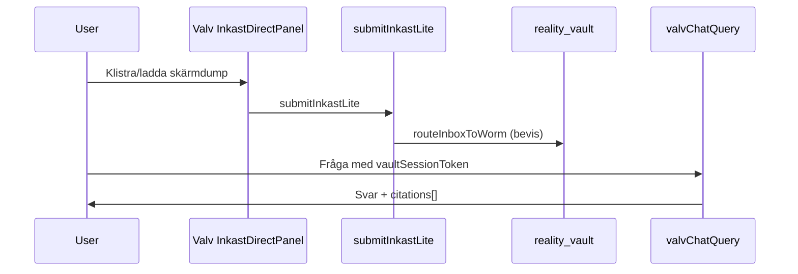

# Backend masterplan — exekvering & FREEZE

**Datum:** 2026-06-16 · **Status:** FREEZE aktiv för backend-kärnan  
**Plan:** Backend Masterplan Låsning & Första Analys

## Pelare — resultat

| Pelare | Status | Verifiering |
|--------|--------|-------------|
| 0 PMIR docs | **PASS** | [`2026-06-16-backend-pmir-docs.md`](./2026-06-16-backend-pmir-docs.md) |
| 1 Security + WORM | **PASS** | `inbox_rules` + `daily_intentions` i rules; `generateWeeklyInsights` vault-gate; `calculateSmartAllocation` guard |
| 2 G10 Inkast + Upload steg 2 | **LOCK** | `CaptureSuperModule` valv-compact → `InkastDirectPanel` |
| 3 Valv E2E | **PASS** | `smoke:valv-chat-e2e` |
| 4 ADK Manifest | **LOCK** | `registry.ts` + `orchestrator.ts` wired |
| 5 SynapseBus | **LOCK** | `smoke:synapse-triggers` |
| 6 CI + deploy | **LOCK** | `smoke:tier1` + functions/rules/storage deploy i workflow |

## Första analysresan (acceptans)

| Kriterium | Smoke |
|-----------|-------|
| WORM create, update/delete denied | `smoke:vault-worm` |
| Vault session gate | `smoke:valv-gate` |
| valvChatQuery E2E | `smoke:valv-chat-e2e` |
| Inkast upload wiring | `smoke:inkast-upload` |
| Pattern metadata sidecar | `smoke:pattern-metadata` + trigger `onVaultCreatePatternScan` |

## FREEZE-regel

Inga nya backend-features utan explicit PMIR + Pontus OK. Design/wave-2/M3.0-C förblir **DEFER**.

## Extern granskning

Se [`docs/external-ai/bifoga/03-prompter/BACKEND-MASTERPLAN-REVIEW-G.md`](../external-ai/bifoga/03-prompter/BACKEND-MASTERPLAN-REVIEW-G.md).
