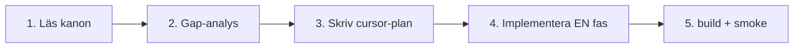

# Mall — modul cursor-plan (Cursor, utan Vertex)

**Syfte:** Replikera Dagbok/Planering-upplägget för valfri modul.  
**Plats:** `docs/evaluations/YYYY-MM-DD-<modul>-cursor-plan.md`  
**Referens:** [`2026-05-29-planering-cursor-plan.md`](./2026-05-29-planering-cursor-plan.md) · [`2026-05-29-dagbok-vertex-plan.md`](./2026-05-29-dagbok-vertex-plan.md)

---

## Agent-flöde



---

## Steg 1 — Läs kanon (ordning)

| # | Källa |
|---|--------|
| 1 | `docs/specs/modules/<Modul>-SPEC.md` |
| 2 | `.context/modules/<modul>.md` |
| 3 | `src/modules/**/module_plan.md` |
| 4 | [`docs/MODUL-FUNKTIONS-REGISTER.md`](../MODUL-FUNKTIONS-REGISTER.md) |
| 5 | Design-lock om finns (`docs/design/*`) |
| 6 | [`docs/MODUL-GAP-OVERSIKT.md`](../MODUL-GAP-OVERSIKT.md) |
| 7 | [`docs/evaluations/SESSION-INDEX.md`](./SESSION-INDEX.md) |

**Vertex/Repomix:** valfritt — `npm run gemini:pack` (lokal, gitignored). Cursor läser repot direkt.

**Efter leverans:** uppdatera `SENASTE-SAMMANFATTNING.md`, `MODUL-GAP-OVERSIKT.md`, `SESSION-INDEX.md`. Sätt `status: closed` överst i planfilen när smoke PASS.

---

## Steg 2 — Planfil (kopiera rubriker)

```markdown
# <Modul> — genomförbarhetsplan (Cursor, utan Vertex)

**Datum:** YYYY-MM-DD
**Metod:** Direkt läsning av repo + design-lock
**Kanon:** [länkar]
**Kod:** `src/modules/...`

## Slutsats
(kort: bygg från noll vs polish befintligt)

## REASONS (kort)
| Requirements | … |
| Entities | … |
| Approach | … |
| Structure | … |
| Operations | … |
| Norms | … |
| Safeguards | … |

## Vad som redan fungerar (verifierat i kod)
| Krav | Kod (fil:rad) |

## Gap-analys (spec vs kod idag)
| Spec | Kod idag | Gap |

## Bevaras (MUST NOT regress)
- …

## Rekommenderade faser
### Fas 1 / 1.5 — (ingen firestore.rules / storage.rules)
### Fas 2+ — (kräver explicit OK + PMIR)

## Acceptans
- [ ] …
- [ ] `npm run build` + relevant smoke PASS

## Nästa steg
Svara **`kör Fas X`** …
```

---

## Modul-matris — rules, skills, smoke

| Modul | Extra kanon | Rules / skills | Smoke (minst) | Rules-stopp? |
|-------|-------------|----------------|---------------|--------------|
| **MåBra** | `Mabra-CONTENT-BANK.md`, `INNEHALL-REGISTER.md` | `innehall-register.mdc` | `smoke:innehall`, `smoke:locked-ux` | Nej |
| **Hamn / Speglar** | `SafeHarbor-SPEC`, `Speglar-SPEC` | ex → Hamn, ej MåBra-bank | `smoke:design-modules` | Nej |
| **Kunskap** | `Kunskap-CONTENT-SEED.md` | `livskompassen-rag-retrieval`, `livskompassen-memory-silo-guard` | `smoke:kunskap`, `smoke:orkester` | Nej |
| **Valv / Dossier** | `Verklighetsvalvet-SPEC`, `locked-ux-features.md` | `livskompassen-arkiv-master`, `locked-ux-features.mdc` | `smoke:valv`, `smoke:locked-ux` | **Ja — firestore.rules** |
| **Barnen / Barnporten** | `Barnen-SPEC`, `BARNPORTEN-SPEC` | `locked-ux-features.mdc` | `smoke:locked-ux`, `smoke:children` | Varning `children_logs` |
| **Planering / Projekt** | `PLANERING-PROJEKT-HYBRID`, `PROJEKT-SPEC` | `locked-ux-features.mdc` | `smoke:locked-ux` | Fas 2+ collections |
| **Dagbok** | `Dagbok-SPEC` | `livskompassen-synapser-adk` | `smoke:locked-ux` | Fas 2+ storage |
| **Core / Widget** | `Core-SPEC`, `WIDGET-BAR-SPEC` | `locked-icons.mdc` | `smoke:design-modules` | Nej |

Full register: [`MODUL-FUNKTIONS-REGISTER.md`](../MODUL-FUNKTIONS-REGISTER.md)

---

## Färdig prompt (byt modulnamn)

```text
Modul: <NAMN>
Läs docs/specs/modules/<Modul>-SPEC.md, .context/modules/<fil>.md,
src/modules/**/module_plan.md och docs/evaluations/MALL-cursor-plan.md.
Skriv docs/evaluations/YYYY-MM-DD-<modul>-cursor-plan.md.
Implementera endast Fas 1.5. Respektera U1–U6 och locked UX.
Jämför mot hela projektet. npm run build && [modul-smoke] före klart.
Arbeta autonomt och sluta inte förrän koden är helt felfri och appen går att använda.
```

---

## Efter implementation

1. Uppdatera `module_plan.md` checkboxar
2. Uppdatera [`MODUL-GAP-OVERSIKT.md`](../MODUL-GAP-OVERSIKT.md)
3. PMIR om `firestore.rules` / `storage.rules` berörs
4. **En modul per chatt** — undvik parallella cursor-planer
