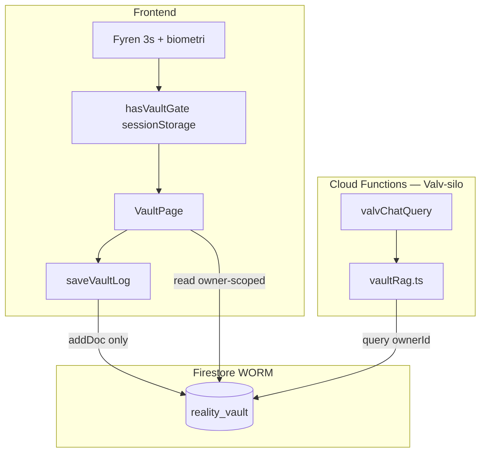

# Verklighetsvalvet — Arkitektur & logik

**Status:** Referensdokument (kvitto) · **Datum:** 2026-06-05  
**Syfte:** Snabb påminnelse om hur *Sanningens Sköld* och WORM-bevislagret är konstruerat enligt Livskompassen-principerna.

---

## 1. Översikt

Verklighetsvalvet är Livskompassens **Sacred Feature** för oföränderliga bevis. Data lagras i Firestore-collection `reality_vault` enligt **WORM** (Write Once, Read Many). Modulen är isolerad i **Valv-silon** — ingen cross-RAG mot Kunskap (`kampspar`, `kb_docs`) eller Barnen (`children_logs`).

| Aspekt | Beslut |
|--------|--------|
| Collection | `reality_vault` |
| Mutability | Endast `create` + `read` (owner-scoped) |
| Åtkomst-gate | Fyren (3 s long-press) + biometri → sessionStorage |
| UI-entry | `/dagbok?tab=bevis&vaultTab=…` (Plausible Deniability) |
| Design | Obsidian Calm 2.0 — indigo botten-glow (`glow-bottom-blue`) |

---

## 2. Filsökvägar (kanon)

| Begrepp | Faktisk plats i repo |
|---------|----------------------|
| Firebase init | `src/modules/core/firebase/init.ts` |
| Firestore + Valv-API | `src/modules/core/firebase/firestore.ts` |
| Auth | `src/modules/core/auth/AuthProvider.tsx` |
| Valv-gate (session) | `src/modules/core/auth/sessionService.ts` |
| Datamodell `VaultLog` | `src/modules/core/types/firestore.ts` |
| Skriv-input (UI) | `src/modules/features/lifeJournal/evidence/vault/types/vaultEntry.ts` |
| Valv-hantering (UI) | `src/modules/features/lifeJournal/evidence/vault/components/VaultPage.tsx` |
| Firestore-regler | `firestore.rules` |
| Valv-RAG (backend) | `functions/src/lib/vaultRag.ts` |
| Valv-chat agent | `functions/src/agents/valvChatAgent.ts` |

---

## 3. Firebase — init, Auth, Firestore

### 3.1 App + Cloud Functions

```typescript
// src/modules/core/firebase/init.ts
import { initializeApp } from 'firebase/app';
import { getFunctions } from 'firebase/functions';

const firebaseConfig = {
  apiKey: import.meta.env.VITE_FIREBASE_API_KEY,
  authDomain: import.meta.env.VITE_FIREBASE_AUTH_DOMAIN,
  projectId: import.meta.env.VITE_FIREBASE_PROJECT_ID,
  storageBucket: import.meta.env.VITE_FIREBASE_STORAGE_BUCKET,
  messagingSenderId: import.meta.env.VITE_FIREBASE_MESSAGING_SENDER_ID,
  appId: import.meta.env.VITE_FIREBASE_APP_ID,
};

export const app = initializeApp(firebaseConfig);
export const functions = getFunctions(app, 'europe-west1');
```

### 3.2 Auth

- `getAuth(app)` i `AuthProvider.tsx`
- Anonym eller Google-inloggning; alla Valv-skrivningar binder `userId` + `ownerId` till `request.auth.uid`
- Valv kräver inloggad användare **och** aktiv Fyren-gate (`hasVaultGate()`)

### 3.3 Firestore — persistence

- `initializeFirestore` med `persistentLocalCache` + `persistentMultipleTabManager` (IndexedDB)
- Offline-skrivning till `reality_vault` styrs av `assertOfflineWriteAllowed` i `offlineWritePolicy.ts`

### 3.4 WORM-guard (klient)

Förbjudna fält vid create:

```typescript
const WORM_FORBIDDEN_KEYS = ['updatedAt', 'deletedAt', 'modifiedAt', 'revision'];
```

`assertWormPayload()` kastar fel om något av dessa finns i payload.

### 3.5 Valv-API (klient)

**Spara bevis:**

```typescript
export async function saveVaultLog(userId, log) {
  assertOfflineWriteAllowed(FIRESTORE_COLLECTIONS.reality_vault);
  const payload = omitUndefinedFields({ ...log, isLocked: true });
  assertWormPayload(payload, 'reality_vault');
  const ref = collection(db, FIRESTORE_COLLECTIONS.reality_vault);
  return (await addDoc(ref, withUserId(userId, payload))).id;
}
```

`withUserId()` sätter alltid: `userId`, `ownerId`, `createdAt: serverTimestamp()`.

**Läsa bevis:**

```typescript
export async function getVaultLogs(userId) {
  const ref = collection(db, FIRESTORE_COLLECTIONS.reality_vault);
  const snap = await getDocs(query(ref, where('ownerId', '==', userId)));
  // normaliseras via normalizeVaultLogFields, sorteras desc på createdAt
}
```

---

## 4. WORM-principen (Sanningens Sköld)

### 4.1 Firestore-regler

```
match /reality_vault/{docId} {
  allow read: if isOwner();
  allow create: if isOwnerCreate();
  allow update, delete: if false;
}
```

`isOwnerCreate()` kräver `userId == ownerId == request.auth.uid`.

### 4.2 Datamodell — `VaultLog`

```typescript
// src/modules/core/types/firestore.ts
export interface VaultLog {
  userId: string;
  category?: string;
  action: string;
  truth: string;
  sourceRef?: string;        // WORM-länk till children_logs/{id} — explicit HITL-bro
  childrenImpact?: string;
  evidenceUrl?: string;
  biffUsed?: boolean;
  isLocked?: boolean;        // sätts alltid true vid saveVaultLog
  entryType?: 'simple' | 'two_column' | 'three_shield' | 'body_signal';
  theirVersion?: string;
  myReality?: string;
  bodySignals?: string[];
  shieldWhat?: string;
  shieldFeeling?: string;
  shieldBoundary?: string;
  pinned?: boolean;          // Sanningens Ankare — endast vid create
  createdAt: IsoDateTime;
}
```

**Skriv-input från UI (`VaultLogInput`):**

```typescript
// vault/types/vaultEntry.ts
export type VaultLogInput = {
  action: string;
  category?: string;
  truth: string;
  entryType?: VaultEntryType;
  theirVersion?: string;
  myReality?: string;
  bodySignals?: string[];
  shieldWhat?: string;
  shieldFeeling?: string;
  shieldBoundary?: string;
  evidenceUrl?: string;
  pinned?: boolean;
};
```

### 4.3 WORM-invarianter (checklista)

- [ ] Inga `updatedAt` / `deletedAt` / `modifiedAt` / `revision` på create
- [ ] Server: `update` och `delete` alltid `false`
- [ ] `isLocked: true` vid varje ny post
- [ ] `sourceRef` endast vid explicit användarval (t.ex. Barnporten → Valv HITL)
- [ ] Aldrig auto-promotion från Barnen till Valv
- [ ] Permanent minne — retention får **inte** purga `reality_vault`

---

## 5. VaultPage — UI-struktur

**Fil:** `src/modules/features/lifeJournal/evidence/vault/components/VaultPage.tsx`

```
VaultPage
├── VaultErrorBoundary
└── VaultPageInner
    ├── Gate: hasVaultGate() — Fyren krävs, annars ingen valv-UI
    ├── Auth: user från Zustand store
    ├── Data: getVaultLogs / saveVaultLog → reality_vault
    ├── Zoner (TabBar): samla | analysera | kunskap | exportera | forensik
    └── Paneler per tab:
        samla/logga  → VaultSamlaHub + VaultLogList + WeaverPendingVaultBanner
        samla/sok    → ValvChatPanel (valvChatQuery)
        analysera    → VaultMonsterPanel, VaultOrkesterPanel (låsta UX)
        exportera    → DossierPage
        kunskap      → VaultKunskapsbankPanel, VaultAktorskartaPanel
        forensik     → VaultForensicPanel
```

### 5.1 Gate & session

| Funktion | Fil | Beteende |
|----------|-----|----------|
| `hasVaultGate()` | `sessionService.ts` | sessionStorage — aktiv efter Fyren |
| `clearVaultGate()` | `sessionService.ts` | Stäng valv → tillbaka till vardag |
| `setVaultUnlocked()` | Zustand store | Synkar drawer/DOM (Plausible Deniability) |
| Idle timeout | `useZeroFootprint` | 1 h → Zero Footprint |

Utan gate renderas endast instruktion om Fyren — inga valv-flikar eller bevislista.

### 5.2 Sparflöde

1. Användare fyller i `VaultSamlaHub` → `VaultLogInput`
2. `handleSaveLog()` → `saveVaultLog(user.uid, input)`
3. Lista uppdateras via `getVaultLogs(user.uid)`
4. Offline blockeras med `OfflineWriteBlockedError`

### 5.3 Stäng valv

`handleCloseToLayer1()`: rensar gate, sätter `vaultUnlocked = false`, navigerar till `/dagbok`.

---

## 6. Backend — Valv-silo

### 6.1 Tre silor (MUST NOT blandas)

| Silo | Collection | Callable | Agent |
|------|------------|----------|-------|
| Kunskap | `kampspar`, `kb_docs` | `knowledgeVaultQuery` | Livs-Arkivarien |
| **Valv** | **`reality_vault`** | **`valvChatQuery`** | Sannings-Analytikern |
| Barnen | `children_logs` | `childrenLogsQuery` | — |

**Blocker:** `knowledgeVaultQuery` får inte läsa `reality_vault`. `valvChatQuery` får inte läsa `kampspar` eller `children_logs`.

### 6.2 Valv-RAG (`vaultRag.ts`)

```typescript
export async function fetchVaultEvidenceForQuery(uid, question, limit = 12) {
  const snap = await db
    .collection('reality_vault')
    .where('ownerId', '==', uid)
    .orderBy('createdAt', 'desc')
    .limit(100)
    .get();
  // token-match + vävaren-filter; exkluderar category === 'vävaren_metadata'
}
```

### 6.3 Relaterade callables

| Callable | Syfte |
|----------|-------|
| `valvChatQuery` | Valv-chat — silo-isolerad RAG |
| `generateDossier` | Immutable export → `dossier_snapshots` |
| `invalidateSession` | Zero Footprint — rensar server-side cache vid logout/stäng |

---

## 7. Säkerhet — Layered Defense

| Lager | Valv-mekanism |
|-------|---------------|
| 1 Identitet | Firebase Auth + `ownerId`/`userId` |
| 2 Åtkomst | WORM append-only (Firestore rules) |
| 3 Kryptering | CMEK via Cloud KMS |
| 4 Session | Fyren-gate + idle 1 h + Device Clear |
| 5 AI-gräns | LLM får inte styra auth, ägarskap eller WORM |
| 6 Silo | Tre kunskapsytor — ingen cross-RAG |
| 7 Nödutgång | Device Clear (Inställningar) |

Kanon: `.context/security.md`, `.cursor/rules/security-firestore.mdc`

---

## 8. Obsidian Calm 2.0 (Valv-relevant)

Kanon: `.cursor/rules/design-calm.mdc`, `src/styles/obsidian-calm-2.css`

| Regel | Valv |
|-------|------|
| Tema | Mörkt Obsidian — låg visuell arousal |
| Kort | `calm-card` / `glass-card`, `rounded-3xl`, `backdrop-blur-xl` |
| Silo-glow | **`glow-bottom-blue`** (Familj/Valv/Dagbok/bevis) |
| Typografi | Zonrubriker: `font-display-serif`, uppercase, `tracking-[0.2em]` |
| Layout | `hub-view-lock` + `calm-scroll-island` |
| Förbjudet | streak/XP, ljusa bakgrunder, regnbågsgradienter |

`VaultPage` använder `BentoCard` med låst ikonografi (`Lock`, `ShieldAlert`).

---

## 9. Flödesdiagram



---

## 10. Verifiering (smoke)

Efter ändringar som rör Valv:

```bash
npm run build
npm run smoke:locked-ux
npm run smoke:orkester
```

Relevanta Sacred Feature-punkter: `.context/locked-ux-features.md` (Mönster, Orkester, Kunskapsbank, Aktörskarta bakom PIN).

Deploy påverkar prod:

```bash
cd functions && npm run build
npm run build
firebase deploy --only firestore:rules,functions:valvChatQuery,hosting
```

---

## 11. Relaterad kanon

| Dokument | Innehåll |
|----------|----------|
| `.context/security.md` | Sacred Features, tre silor, Zero Footprint |
| `.context/arkiv-minne.md` | Permanent minne, WORM-collections |
| `.cursor/rules/grunder-kanon.mdc` | U1–U6 grundregler |
| `.cursor/rules/memory-silo.mdc` | Silo-blocker |
| `.context/locked-ux-features.md` | Låsta Valv-flöden |
| `docs/SMOKE_CHECKLIST.md` | Deploy-verifiering |

---

*Detta dokument är en teknisk snapshot — vid konflikt vinner live kod (`firestore.rules`, `firestore.ts`, `VaultPage.tsx`) och GAP-register.*
