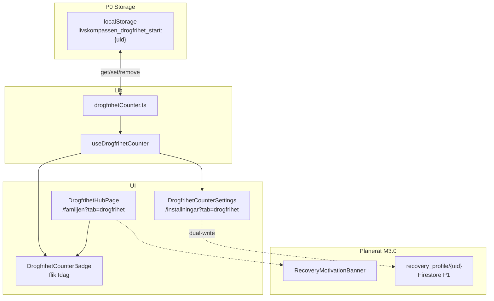

# MåBra 3.0 — Kat 8 UI/Logic Inventory (Drogfrihet)

**Datum:** 2026-06-14  
**Status:** Baslinjeanalys — **ingen** React-ändring i detta steg  
**Kanon:** [`docs/specs/modules/MABRA-3.0-MASTER-SPEC.md`](../specs/modules/MABRA-3.0-MASTER-SPEC.md) § Kat 8 · [`Drogfrihet-SPEC.md`](../specs/modules/Drogfrihet-SPEC.md)  
**Rules (backend, redan live):** `recovery_profile/{uid}` i `firestore.rules` — **ingen klient read/write ännu**

---

## 1. Sammanfattning (nuläge)

| Aspekt | Status |
|--------|--------|
| **Dagräknare P0** | Live — `localStorage` via `drogfrihetCounter.ts` |
| **Firestore P1** | Rules klara · **ingen** frontend för `recovery_profile` |
| **Primär route** | `/familjen?tab=drogfrihet` (`?drogfrihetTab=` för underflikar) |
| **Motiverande banner (SPEC)** | **Saknas** — ska vara deterministisk bank-copy, **inte** LLM/streak |
| **12-steg-modul (SPEC)** | Delvis — `DF-REF-*` i Reflektion-flik + blandat in i MåBra reflection deck |
| **MåBra 8:e pelare (SPEC delta)** | **Saknas** — `mabraHubRegistry` har ingen Kat 8-kategori |
| **Dashboard/Hem-exponering** | **PASS** — räknare syns **inte** på dashboard (grep verifierad) |
| **Device Clear (SPEC regel 5)** | **GAP** — `clearDrogfrihetCounter` anropas **inte** vid logout/device clear |

---

## 2. Filkarta — räknare & UI

### 2.1 Kärnlogik (localStorage)

| Fil | Roll |
|-----|------|
| `src/modules/features/dailyLife/drogfrihet/lib/drogfrihetCounter.ts` | **Kanon** — read/write/compute dagräknare |
| `src/modules/features/dailyLife/drogfrihet/hooks/useDrogfrihetCounter.ts` | React-hook — prenumererar på `DROGFRIHET_COUNTER_EVENT` |

### 2.2 UI-komponenter

| Fil | Roll | Hook / lib |
|-----|------|------------|
| `…/drogfrihet/components/DrogfrihetHubPage.tsx` | Huvudhub (4 underflikar) | — |
| `…/drogfrihet/components/DrogfrihetCounterBadge.tsx` | Skrivskyddad räknare (Idag-flik) | `useDrogfrihetCounter` |
| `…/drogfrihet/components/DrogfrihetCounterSettings.tsx` | Start/nollställ (Inställningar) | `useDrogfrihetCounter` + `set/reset/clear` |
| `src/modules/core/pages/FamiljenPage.tsx` | Monterar `<DrogfrihetHubPage embedded />` | — |
| `src/modules/core/pages/InstallningarPage.tsx` | Flik `drogfrihet` → `DrogfrihetCounterSettings` | — |

### 2.3 Innehåll & rotation (ej räknare)

| Fil | Roll |
|-----|------|
| `…/drogfrihet/content/drogfrihetCatalog.ts` | `DROGFRIHET_CARDS` — `DF-REF-01`…`10` (REFLECTION) |
| `…/drogfrihet/lib/pickDrogfrihetIdag.ts` | Dagligt kort på Idag-fliken |
| `…/drogfrihet/constants/resources.ts` | Stöd-länkar (113, 1177, …) |
| `…/drogfrihet/constants/kunskapFacts.ts` | Statisk FACT (ingen RAG) |
| `…/drogfrihet/index.ts` | Export: `DrogfrihetHubPage` |

### 2.4 MåBra-korsning (Kat 8-innehåll utanför Drogfrihet-hub)

| Fil | Koppling |
|-----|----------|
| `…/mabra/supermodule/MabraReflectionSuperhubPanel.tsx` | `ALL_REFLECTION_CARDS = [...MABRA_REFLECTION_CARDS, ...DROGFRIHET_CARDS]` |
| `…/mabra/components/tools/MabraReflectionDeckTool.tsx` | Importerar `DROGFRIHET_CARDS` |
| `…/mabra/content/curriculumCatalog.ts` | Bro-länk `{ label: 'Drogfrihet-hub', route: '/drogfrihet' }` |

**Obs:** DF-REF-kort kan nås från `/mabra/verktyg/reflection_deck` — **inte** samma som dedikerad Kat 8-pelare. M3.0 bör separera eller filtrera vid pelare-implementering.

### 2.5 Routing & navigation

| Sökväg | Beteende |
|--------|----------|
| `/familjen?tab=drogfrihet` | **Live** — Familjen dropdown, rad 160 `FamiljenPage.tsx` |
| `/familjen?tab=drogfrihet&drogfrihetTab=idag\|resurser\|reflektion\|kunskap` | Underflikar (embedded mode) |
| `/drogfrihet`, `/drogfrihet/*` | Legacy redirect → Familjen (`AppRoutes.tsx` `RedirectDrogfrihetToFamiljen`) |
| Drawer | `navTruth.ts` → `familjen_drogfrihet` → `/familjen?tab=drogfrihet` |
| `/vardagen?tab=drogfrihet` | **Finns inte** i kod (`.cursorrules` legacy — live är Familjen) |
| `/mabra`, `/mabra/*` | Separat MåBra-hub — **ingen** Kat 8-pelare idag |

---

## 3. localStorage — exakt beteende

### 3.1 Nycklar

```text
Prefix: livskompassen_drogfrihet_start
Inloggad:  livskompassen_drogfrihet_start:{uid}
Utloggad:  livskompassen_drogfrihet_start:local
Värde:     YYYY-MM-DD (startDateKey, lokal midnatt)
```

Källa: `drogfrihetCounter.ts` rad 1–12, 32–47.

### 3.2 API (ren lagring, ingen Firestore)

| Funktion | Operation | Anrop från |
|----------|-----------|------------|
| `getDrogfrihetStartDateKey(uid?)` | `localStorage.getItem` | `getDrogfrihetCounterState` |
| `setDrogfrihetStartDateKey(dateKey, uid?)` | `localStorage.setItem` + event | `DrogfrihetCounterSettings` |
| `resetDrogfrihetCounter(uid?)` | Sätter start till **idag** | Inställningar (tvåstegs) |
| `clearDrogfrihetCounter(uid?)` | `localStorage.removeItem` | Inställningar (bekräftelse) |
| `computeDrogfrihetDayCount(startDateKey)` | Ren beräkning — startdag = dag 1 | Badge + Settings |
| `getDrogfrihetCounterState(uid?)` | `{ startDateKey, dayCount, started }` | Hook init |
| `emitDrogfrihetCounterChanged()` | `CustomEvent('livskompassen:drogfrihet-counter-changed')` | Efter set/clear |

### 3.3 Hook (`useDrogfrihetCounter.ts`)

1. Initierar state från `getDrogfrihetCounterState(uid)`.
2. `useEffect([uid])` — läser om vid uid-byte.
3. `window.addEventListener(DROGFRIHET_COUNTER_EVENT)` — synkar Badge + Settings utan prop-drilling.

**Uid-källa:** `useStore((s) => s.user)?.uid` i `DrogfrihetHubPage` och `InstallningarPage`.

### 3.4 Säkerhets-/integritetsgap (vs SPEC)

| SPEC-regel | Nuläge |
|------------|--------|
| Räknare **endast** i Drogfrihet-pelaren | **PASS** — endast `DrogfrihetCounterBadge` i hub + Settings |
| Nollställ **endast** Inställningar | **PASS** — Badge länkar till Inställningar, ingen reset-knapp i hub |
| Device Clear rensar recovery-nycklar | **GAP** — `signOutUser()` (`authService.ts:143–159`) och `clearDeviceSession()` (`clearDeviceSession.ts:15–31`) rensar **inte** `livskompassen_drogfrihet_start:*` |
| P1 `recovery_profile` sync | **Ej påbörjad** — localStorage kvar som P0 sanning |

**Bevarandeprincip (uppgift):** Rör **inte** `drogfrihetCounter.ts` förrän Firestore-migrering har PMIR + dual-write.

---

## 4. UI-monteringspunkter idag

### 4.1 `DrogfrihetHubPage.tsx` — struktur

```text
TabBar (idag | resurser | reflektion | kunskap)
│
├─ tab === 'idag'
│    ├─ [1] DrogfrihetCounterBadge          ← rad 75 (befintlig räknare)
│    └─ [2] BentoCard "Idag"               ← pickDrogfrihetIdag + disclaimer
│
├─ tab === 'resurser'   → DROGFRIHET_RESOURCES (BentoCard-lista)
├─ tab === 'reflektion' → DF-REF pool, "Nästa kort" (client-only state)
└─ tab === 'kunskap'    → DROGFRIHET_FACTS + länk Valv Kunskapsbank
```

Embedded i Familjen: `<div className="space-y-4">{body}</div>` — **ingen** egen `HubPageShell`-rubrik.

### 4.2 Inställningar

`InstallningarPage.tsx` → flik `drogfrihet` → `DrogfrihetCounterSettings`:

- Status + startdatum
- Date input + "Spara startdatum"
- "Starta från idag"
- Tvåstegs "Nollställ räknare…" → reset eller clear

### 4.3 Var räknaren **inte** renderas

- Dashboard / Hem / `MabraPulseWidget` / `RecentIntakeWidget` — **ingen** import av `useDrogfrihetCounter`
- `/mabra` hub (`MabraHubView.tsx`) — **ingen** räknare
- Valv — **ingen** recovery-data

---

## 5. SPEC Kat 8 vs nuläge

| SPEC (MABRA-3.0 § Kat 8) | Nuläge | Delta |
|--------------------------|--------|-------|
| Flik Idag/Stöd/Reflektion/Kunskap | Live | — |
| **Toppbanner** (motiverande, inte streak) | Saknas | Ny komponent |
| Dagräknare localStorage P0 | Live | Ev. dual-write P1 |
| `recovery_profile` Firestore P1 | Rules only | Ny klient + sync |
| 12-steg `DF-REF-*` parafras | Reflektion-flik + MåBra deck | Dedikerad modulingång |
| Ingen LLM "sponsor" | Live (ingen recoveryCoach) | — |
| Kat 8 som 8:e pelare i MåBra-nav | Saknas | `mabraHubRegistry` / ModulValjare |
| Route PMIR `/mabra?pillar=recovery` | Ej implementerad | Behåll `/familjen?tab=drogfrihet` tills PMIR |

**Toppbanner (SPEC):** Deterministisk copy från bank roterad per `dayCount` — **ingen** LLM (RSD-risk). Kräver ny `pickRecoveryBannerCopy({ dayCount, dateKey })` mot statisk bank (ej skriven ännu).

---

## 6. Planerade insättningspunkter (Obsidian Calm)

Design: `BentoCard` / `calm-card`, `rounded-2xl`, `border-[0.5px] border-border`, `text-accent` / `text-text-muted`, **ingen** streak/XP/grön gamification utöver befintlig `glow="green"` på stödkort.

### 6.1 P0 — Motiverande banner (primär, inom Drogfrihet-hub)

**Fil:** `DrogfrihetHubPage.tsx`  
**Position:** Direkt **under** `TabBar`, **ovanför** flikinnehåll — synlig på alla underflikar eller endast `idag` (rekommendation: **alla flikar** = pelare-kontext, en banner).

```tsx
// Planerad ordning (pseudo — ej implementerad):
<TabBar … />
{/* INSERT: RecoveryMotivationBanner uid={user?.uid} */}
{tab === 'idag' && ( … )}
```

**Alternativ (Idag-only):** Mellan rad 74–75, **ovanför** `DrogfrihetCounterBadge` — banner → räknare → dagkort.

**Data:** Läs `useDrogfrihetCounter(uid).dayCount` + `pickBannerFromBank(dayCount)` — **read-only**, ingen write.

### 6.2 P0 — 12-stegs modul startpunkt (Reflektion)

**Fil:** `DrogfrihetHubPage.tsx` — flik `reflektion` (rad 109–129)

**Nu:** Enkel `BentoCard` + `reflectionIndex` state, "Nästa kort", **ingen** sparning till Firestore.

**Planerad utökning (samma insättningspunkt):**

1. **Header-rad** ovanför kortet: `font-display-serif uppercase tracking-[0.2em] text-xs text-text-dim` — t.ex. "12-steg · reflektion"
2. **Ersätt/utöka** knapprad (rad 115–125) med:
   - "Fortsätt modul" (sekventiell DF-REF-bana)
   - Behåll "Nästa kort" som lågenergi-fallback
3. **Valfri bro** till `/mabra/verktyg/reflection_deck?initialBankId=DF-REF-01` — endast om pelare-nav PMIR godkänner korslänk

**Obsidian:** Undvik ny route före PMIR — håll modulstart **inuti** `/familjen?tab=drogfrihet&drogfrihetTab=reflektion`.

### 6.3 P1 — MåBra 3.0 åttonde pelare (nav-ingång)

**Fil A:** `MabraModulValjare.tsx` (rad 68–110, `grid sm:grid-cols-2`)

- **INSERT:** femte `ExamplePreviewCard` — "Återhämtning" / "Drogfrihet"
- **Action:** `navigate('/familjen?tab=drogfrihet')` — **inte** inbädda räknare i `/mabra`
- **Obsidian:** `tone="gold"` eller dämpad indigo sekundär — **inte** streak-copy

**Fil B:** `mabraHubRegistry.ts`

- **INSERT:** ny `MabraHubCategory` (t.ex. `'aterhamtning'`) **eller** `MabraHubAction` `{ type: 'external'; path: '/familjen?tab=drogfrihet' }`
- **Placering i hub:** `MabraVitHub.tsx` — ny zon efter `identitet`, före `projekt` (Kat 8 = emotionell puls, L4)

**Fil C:** `MabraHubView.tsx` (rad 251–273)

- **INTE** montera banner/räknare här (SPEC: räknare endast i pelaren)
- **Tillåtet:** diskret textlänk i `MaterialPackShortcuts` / bro — redan mönster i `curriculumCatalog`

### 6.4 P1 — Firestore `recovery_profile` (när klient finns)

| Lager | Insättningspunkt |
|-------|------------------|
| **Read** | `useDrogfrihetCounter` wrapper eller parallell `useRecoveryProfile` — **behåll** localStorage som fallback |
| **Write** | Endast `DrogfrihetCounterSettings` (startdatum/programType) — samma UX, dual-write |
| **Sync** | Vid login: om Firestore har `startDateKey` och localStorage tom → hydrate local |

Rules redan deployade — se [`mabra-3.0-rules-audit.md`](./mabra-3.0-rules-audit.md).

### 6.5 Device Clear (säkerhet, ej UI men blockerande för Kat 8 compliance)

**Insättningspunkt (framtida, minimal):**

- `clearDeviceSession.ts` — loopa `localStorage` keys med prefix `livskompassen_drogfrihet_start` **eller** anropa `clearDrogfrihetCounter(uid)`
- `signOutUser()` — samma, om Zero Footprint ska gälla recovery på delad enhet

---

## 7. Komponentberoenden (diagram)



---

## 8. Checklista före implementation

| # | Kontroll | Status |
|---|----------|--------|
| 1 | Räknare ej på dashboard | PASS |
| 2 | Nollställ ej i hub | PASS |
| 3 | DF-REF bank KEEP (`drogfrihetCatalog.ts`) | PASS |
| 4 | Motiverande banner | **TODO** |
| 5 | 12-steg dedikerad ingång i Reflektion | **TODO** (utöka befintlig flik) |
| 6 | MåBra 8:e pelare nav | **TODO** |
| 7 | Device Clear rensar LS-nycklar | **TODO** |
| 8 | `recovery_profile` klient | **TODO** (rules klara) |
| 9 | Separera DF-REF från generellt MåBra deck | **Beslut** (PMIR) |

---

## 9. Referenser (rad-verifierade)

| Beteende | Fil:rad |
|----------|---------|
| Storage prefix | `drogfrihetCounter.ts:1–12` |
| Counter i Idag-flik | `DrogfrihetHubPage.tsx:73–75` |
| Reflektion 12-steg pool | `DrogfrihetHubPage.tsx:109–129` |
| Familjen mount | `FamiljenPage.tsx:160` |
| Inställningar mount | `InstallningarPage.tsx:84` |
| DF-REF i MåBra deck | `MabraReflectionSuperhubPanel.tsx:21` |
| MåBra hub layout | `MabraHubView.tsx:251–273` |
| Device clear (saknar drogfrihet) | `clearDeviceSession.ts:15–31` |
| SPEC Kat 8 | `MABRA-3.0-MASTER-SPEC.md:370–409` |

---

**Nästa steg (implementation, ej detta dokument):** 1) `RecoveryMotivationBanner` + bank-picker · 2) Reflektion-flik utökning · 3) Device Clear-hook · 4) PMIR för MåBra pelare-nav.

**Detta dokument:** inventering only — **ingen** React-kod ändrad.
