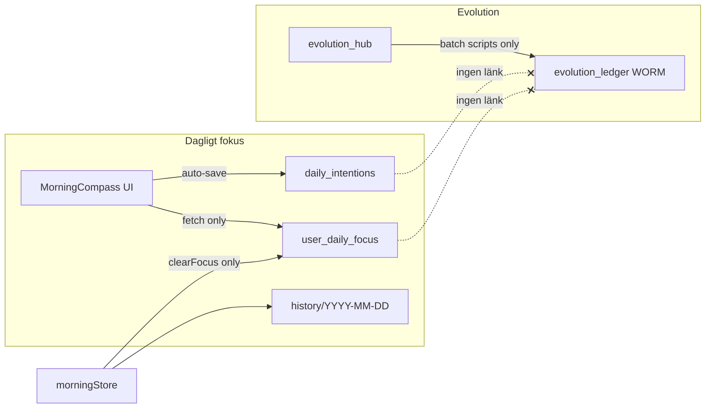

# MåBra 3.0 — Kat 5 baslinje (Målsättning / deterministisk detektering)

**Datum:** 2026-06-14  
**Status:** Inventering klar — **ingen produktionskod ändrad**  
**Kanon:** [`MABRA-PARALLEL-MASTER.md`](../specs/modules/MABRA-PARALLEL-MASTER.md) §4 · [`INFINITE_EVOLUTION.md`](../architecture/INFINITE_EVOLUTION.md)

---

## 0. Sökvägsnotering (begärd vs faktisk)

| Begärd sökväg | Faktisk i repo | Roll |
|---------------|----------------|------|
| `src/modules/features/dailyLife/morning/morningButik.ts` | **Finns ej** | — |
| `src/modules/features/mabra/evolution_hub/evolution_hub.ts` | **Finns ej** | — |
| `src/modules/features/mabra/evolution_hub/ledger.ts` | **Finns ej** | — |
| — | `src/modules/morning/morningStore.ts` | Skriv/läs `user_daily_focus` |
| — | `src/modules/morning/hooks/useMorningOrchestration.ts` | Realtidsläsning fokus + Kanban |
| — | `src/modules/morning/services/CompassService.ts` | Legacy `daily_intentions` |
| — | `src/modules/core/store/useEvolutionStore.ts` | Realtidsläsning `evolution_hub` |
| — | `src/modules/core/types/firestore.ts` | `EvolutionHubDoc`, `EvolutionLedgerEntry` |
| — | `firestore.rules` | `user_daily_focus`, `evolution_ledger`, `evolution_hub` |

---

## 1. Var landar "dagligt fokus" idag?

### 1.1 Kanonisk collection (planerad för Kat 5)

**`user_daily_focus/{uid}`** — mutable root-dokument.

| Fält | Typ | Skrivare (prod) | Läsare (prod) |
|------|-----|-----------------|----------------|
| `focusPoints` | `string[]` (3 platser) | `morningStore.saveFocusPoints` | `morningStore.fetchFocusPoints`, `useMorningOrchestration`, `reflectionStore` |
| `handledProtocolDate` | `string?` | `morningStore.submitProtocolFeedback` | `morningStore.fetchFocusPoints` |
| `updatedAt` | timestamp | `saveFocusPoints` | — |
| `userId`, `ownerId` | string | alla skrivare | rules |

**Subcollection:** `user_daily_focus/{uid}/history/{YYYY-MM-DD}`

| Fält | Typ | Skrivare | Rules |
|------|-----|----------|-------|
| `focusPoints` | `string[]` | `saveFocusPoints` (parallellt med root) | `create` only — **ingen** `update` |
| `date` | string | `saveFocusPoints` | — |
| `updatedAt` | timestamp | `saveFocusPoints` | — |

**Viktigt:** `history/{date}` är WORM per dag i rules (`update, delete: false`). Klienten använder `setDoc(..., { merge: true })` — första skrivning per dag = `create` OK; **andra skrivning samma dag = `update` → nekas**.

### 1.2 Legacy parallell spår (split brain)

**`daily_intentions/{userId_YYYY-MM-DD}`** — separat collection.

| Aspekt | Detalj |
|--------|--------|
| Skrivare | `MorningCompass.tsx` debounced auto-save via `CompassService.saveDailyIntention` |
| Format | `intention` = JSON-sträng av tre `focusPoints` |
| Läsare | `MorningCompass` mount (`getDailyIntentions`), `OracleService` |
| Kat 5-kanon | **Ej kanonisk** — `useMorningOrchestration` läser **inte** denna collection |

```text
MorningCompass (UI)
    ├─ mount: fetchFocusPoints → user_daily_focus
    ├─ mount: getDailyIntentions → daily_intentions  (kan skriva över UI-state)
    └─ auto-save (1s debounce): saveDailyIntention → daily_intentions ONLY

morningStore.saveFocusPoints → user_daily_focus + history
    └─ anropas endast från clearFocusPoints — INTE från MorningCompass auto-save
```

**Konsekvens:** Produktions-UI kan visa data från `user_daily_focus` men **spara** till `daily_intentions`. Kat 5-detektering på `user_daily_focus`/`history` riskerar **incomplete data** tills skrivväg konsolideras (P5-förarbete, ej denna inventering).

### 1.3 Relaterat — inte "mål" men närliggande

| Collection | Innehåll | Koppling till mål |
|------------|----------|-------------------|
| `mabra_progress/{uid}` | `coreValues[]` (ACT) | Värderingar — **inte** dagligt fokus; `capability_engine.ts` härleder score |
| `user_insights` | Protokoll-feedback | Speglar/intention — ej strukturerat mål |
| `planning_tasks` | Kanban | Uppgifter — read-only signal för detektering (planerat) |

---

## 2. Hur lagras och läses `evolution_hub`?

### 2.1 Schema (live TypeScript)

`EvolutionHubDoc` i `src/modules/core/types/firestore.ts`:

```typescript
{
  userId, ownerId, updatedAt,
  pillars: {
    kognitiv: { level, score },
    emotionell: { level, score },
    vardag: { level, score },
    relationell: { level, score },
    valv: { level, score },
  },
  childrenAgeState: { kasper, arvid },
  unlockedFeatureFlags: string[],
  unlockedPacks?: string[],
}
```

**Fält som INTE finns i live schema:**

- `currentCapacityLevel` (nämns i MABRA-PARALLEL-MASTER §4 — **planerat, ej implementerat**)
- `featureFlags.goal_assist` (planerat)

### 2.2 Läsning (frontend)

| Komponent | Mekanism |
|-----------|----------|
| `useEvolutionStore.listenToEvolutionHub` | `onSnapshot(evolution_hub/{uid})` |
| `useEvolutionSync` | Samma — global sync |
| `useEconomyLevel` | Läser `unlockedFeatureFlags` (t.ex. `economy_advanced`) |
| `EvolutionDevPanel` | Dev-skrivning (barnporten test) |

### 2.3 Skrivning (frontend vs backend)

| Skrivare | Kontext | Ledger-par? |
|----------|---------|-------------|
| **Frontend prod** | Ingen automatisk evolution-skrivning vid fokus/måBra | — |
| `EvolutionDevPanel` | Dev manuell `setDoc` | Nej |
| `scripts/orkester_barnporten_evaluator.mjs` | Admin batch: hub + ledger | **Ja** (barnporten) |
| `scripts/smoke_evolution.mjs` | Rules-test | Ja (smoke) |

**Kapacitet idag (ekonomi/planering):** `useEconomyLevel` + `useCapacityGate` härleder nivå från:

1. `user_capability_state` (read-only, admin-skriven)
2. `user_economy_status` (read-only)
3. `evolution_hub.unlockedFeatureFlags`
4. `checkins` senaste 48h (circuit breaker)

**Inte** från `pillars.kognitiv.level` direkt i UI-hooks.

`calculateCapacityScore()` i `capability_engine.ts` använder **`mabra_progress.coreValues.length`** — separat signal från evolution_hub.

---

## 3. Dataflöde: fokus → `evolution_ledger`?

### 3.1 Direkt koppling

**Finns inte.** Ingen kod i `src/` skriver till `evolution_ledger` när användaren sparar fokus.



### 3.2 Indirekt koppling (kanonisk avsikt)

Enligt [`INFINITE_EVOLUTION.md`](../architecture/INFINITE_EVOLUTION.md) §2 och MABRA-PARALLEL-MASTER §4:

1. **Kognitiv pelare** ska påverkas av `checkins` + slutförande av `user_daily_focus`.
2. Varje `evolution_hub`-ändring ska ha **motsvarande** `evolution_ledger`-post (dual-write).
3. Ledger-typer (live rules): `milestone_unlocked` \| `capacity_increased` \| `child_age_milestone` \| `pillar_rebalance`.

**Live gap:** Steg 1–3 är **inte wired** från Morgonkompass/fokus-spar till evolution i frontend. Endast admin/orkester-scripts gör hub+ledger batch idag (barnporten-domän).

### 3.3 Ledger-post vid kapacitetsändring (planerad form)

```typescript
// EvolutionLedgerEntry (firestore.ts)
{
  type: 'capacity_increased' | 'pillar_rebalance',
  pillar: 'kognitiv',
  levelBefore: number,
  levelAfter: number,
  rationale: string,
  metadata: { /* t.ex. trigger: 'focus_recurrence', focusHash */ }
}
```

Kräver `isOwnerCreateSensitive()` (verifierad e-post) — samma WORM-krav som `vit_hub`.

---

## 4. Gap-analys: upprepat fokus → potentiellt "mål"

### 4.1 Vad som finns

| Kapabilitet | Status |
|-------------|--------|
| Tre fokusplatser i UI | Live (`MORNING_FOCUS_SLOTS = 3`) |
| Daglig snapshot i `history/{date}` | Skrivs **endast** via `saveFocusPoints` (sällan) |
| Realtidsläsning fokus | `useMorningOrchestration` |
| Historisk insikt (functions) | `generateWeeklyInsights` läser `focusPoints` |
| Deterministisk kapacitet (delvis) | `useEconomyLevel`, `capability_engine` |
| Evolution ledger WORM rules | Live (`smoke_evolution.mjs`) |

### 4.2 Vad som saknas (blockerar Kat 5-detektering)

| # | Gap | Påverkan | Deterministisk åtgärd (P5) |
|---|-----|----------|----------------------------|
| **G1** | **Split brain:** `daily_intentions` vs `user_daily_focus` | Historik för detektering ofullständig | Konsolidera skrivväg till `user_daily_focus` före/inom P5-B |
| **G2** | `history/` läses **aldrig** i frontend | Ingen recurrence-analys möjlig | Ny `goalDetection.ts`: query `history` senaste N dagar |
| **G3** | Ingen normalisering/fingerprint av fokustext | "Simma" ≠ "simma " ≠ duplicat i slot 1 vs 2 | `normalizeFocusKey(text)` — trim, lowercase, min length |
| **G4** | Ingen recurrence-räknare | Upprepning osynlig | Räkna frekvens per `focusKey` över 7–14d; tröskel t.ex. ≥3 |
| **G5** | Tre platser vs "ett mål i taget" (Kat 5 spec) | UX/konflikt med Paralys-Brytaren | Kat 5-panel: **en** aktiv `primaryGoal` + valfritt behåll 3-slot i Morgonkompass |
| **G6** | Inget `goalCandidate` / `promotedGoal` fält | Ingen strukturerad flagga | Utöka `user_daily_focus` schema (rules-PMIR) eller separat `mabra_goals/{uid}` |
| **G7** | `currentCapacityLevel` saknas i `evolution_hub` | MABRA §4.2 regler ej körbara | Härled från `pillars.kognitiv.level` **eller** `useEconomyLevel` tills fält adderas |
| **G8** | Fokus-spar triggar inte `evolution_ledger` | Ingen evolutionär audit vid mål | Dual-write endast vid **bekräftat** kapacitetsbyte (användar-HITL) |
| **G9** | `mabra_progress` saknar delmål-fält | Delmål ej lagringsbara | Rules-PMIR med Kat 7 (`coreValues` ägarskap) |
| **G10** | Detekteringssignaler ej samlade | Ingen holistisk bild | Read-only aggregate: `checkins` 7d, `mabra_sessions` count, `planning_tasks` completion % |

### 4.3 Affärsregel: "upprepat fokusval = potentiellt mål"

**Deterministisk algoritm (förslag — regelbaserad, ingen LLM):**

```text
INPUT:
  - history docs: user_daily_focus/{uid}/history/* (senaste 14 dagar)
  - root doc: user_daily_focus/{uid}.focusPoints (fallback idag)
  - checkins (7d), mabra_sessions (7d), planning_tasks (7d)
  - capacity signal: pillars.kognitiv.level ELLER economy level 1–3

STEG:
  1. Samla alla icke-tomma focusPoints från history + root
  2. normalisera → focusKey
  3. Räkna frekvens per focusKey (samma text ≥ 3 ggr på 14d)
  4. Om frekvens ≥ TRÖSKEL_RECURRENCE:
       flagga som goalCandidate { text, count, firstSeen, lastSeen }
  5. Justera confidence nedåt om:
       - checkins: ≥3 låga energi/humör (stress)
       - mabra_sessions < 2 (inaktivitet → föreslå mikrosteg, inte långt mål)
       - planning_tasks completion < 30%
  6. Om capacity == nivå 1: max ett goalCandidate, mikroformulering
  7. Visa i Kat 5 UI — användaren BEKRÄFTAR manuellt
  8. Vid bekräftelse: skriv primaryGoal till user_daily_focus (Kat 5 äger write)
  9. Vid kapacitetsändring (valfritt): append evolution_ledger + update evolution_hub

OUTPUT:
  - goalCandidate[] (RAM) — ingen auto-write till fokus
```

**MUST NOT (Kat 5):** LLM detektering · auto-skrivning utan bekräftelse · streak/XP · Valv-läsning.

---

## 5. Rekommenderad deterministisk väg (P5-A → P5-B)

| Fas | Leverans | Beroende |
|-----|----------|----------|
| **P5-A0** | Dokumentera + fixa G1 (skrivväg) i separat PR | Denna baslinje |
| **P5-A** | `goalDetection.ts` — recurrence + signaler, **read-only** | G2, G3, G4, G10 |
| **P5-A′** | Beslut kapacitetskälla: `pillars.kognitiv` vs `useEconomyLevel` | G7 |
| **P5-B** | `MabraGoalPanel` — visa `goalCandidate`, manuell bekräftelse | G5, G6 |
| **P5-B′** | `mabraCoach(coach)` parafras **efter** bekräftelseval (valfritt) | Callable-PR |
| **P5-C** | Morgonkompass-verify: samma `user_daily_focus` | G1 |
| **P5-D** | `evolution_ledger` dual-write vid kapacitetsändring | G8 |

---

## 6. Sammanfattning

| Fråga | Svar |
|-------|------|
| Var landar dagligt fokus? | **Primärt avsett:** `user_daily_focus` + `history/`. **Praktiskt i UI:** auto-save går till `daily_intentions` (legacy). |
| Hur återspeglas det i `evolution_ledger`? | **Inte alls** från fokus-flödet idag. Ledger uppdateras via admin-scripts (barnporten), inte från Morgonkompass. |
| Vad saknas för upprepat fokus → mål? | Historikläsning, normalisering, recurrence-räknare, enhetlig skrivväg, schema för `goalCandidate`, kapacitetsfält, valfri ledger-koppling. |
| Deterministisk väg? | Query `history` → frekvensräkning → regelbaserad `goalCandidate` → manuell HITL → `user_daily_focus` write. |

---

## 7. Referenser (live kod)

| Fil | Rad/intervall | Beteende |
|-----|---------------|----------|
| `morningStore.ts` | 74–137 | `fetchFocusPoints` / `saveFocusPoints` → `user_daily_focus` + `history` |
| `MorningCompass.tsx` | 58–70 | Auto-save → `CompassService` → `daily_intentions` |
| `useMorningOrchestration.ts` | 64–70 | `onSnapshot(user_daily_focus)` |
| `useEvolutionStore.ts` | 85–105 | `onSnapshot(evolution_hub)` |
| `firestore.ts` | `EvolutionHubDoc`, `EvolutionLedgerEntry` | Typer |
| `firestore.rules` | 336–356, 955–972 | focus + evolution rules |
| `capability_engine.ts` | 11–27 | Kapacitet från `coreValues` count |
| `INFINITE_EVOLUTION.md` | §2, §4 | Ledger dual-write princip |

---

**Nästa steg:** P5-A — implementera `goalDetection.ts` (read-only) efter beslut om G1 (konsolidera skrivväg) och G7 (kapacitetskälla).
