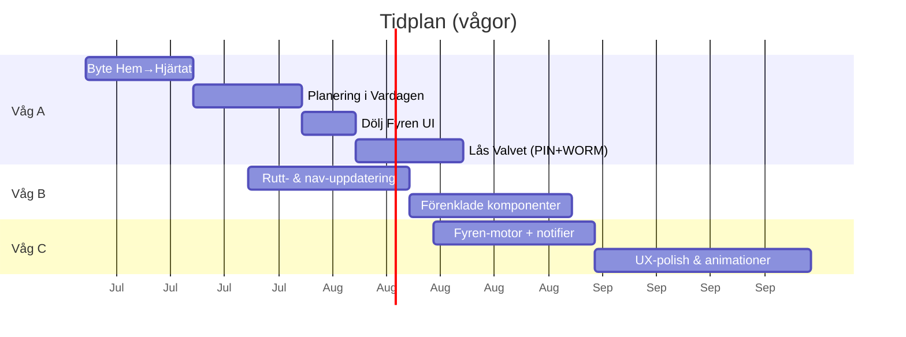

# Sammanfattning  
För ett “mobile Life OS” med nordisk, minimalistisk estetik rekommenderas en stabil komponentbas (design tokens för färg/typografi/spacing) och en modulär arkitektur med tydliga supermoduler (Hjärtat, Vardagen, Familjen, Valvet, samt bakgrunds‑“Fyren”). En tvärplattformslösning ger snabbare utveckling och enhetligt UI, medan native tvåkodbas–lösningar innebär större underhållskostnad. Vi bygger först ett enkelt ramverk med kärnkomponenter och design tokens (färgpalett, typsnitt, enhetligt radavstånd) som garanterar kontrast och läsbarhet (WCAG-standard). Accessibility (skärmläsare, roller/etiketter) och prestanda budgetar definieras tidigt, och alla delar testas automatiskt (CI/CD med linting, enhetstester, e2e-tester). Utifrån våra tidigare visioner och teknisk insikt föreslås Flutter för hög UI-konsistens och animationsprestanda, men React Native kan övervägas om JS-expertis är prioriterad.

## 1. Front-end-stack: iOS/Android native vs React Native vs Flutter  
- **Natív (SwiftUI/Jetpack Compose)** – Bäst prestanda och direkt åtkomst till plattforms-API:er. Kräver dubbla kodbaser och mer utvecklingstid. Passar om man inte behöver code sharing mellan plattformar.  
- **React Native** – JavaScript/TypeScript, stort ekosystem, snabb onboarding för webbutvecklare. Stora moduler och paket finns, och nyarkitekturen Fabric/Hermes har förbättrat prestandan. Risk för små inkonsekvenser i UI (eftersom native-komponenter återanvänds). Överbryggningslagret (JSI) ger låg latens.  
- **Flutter** – Dart och eget renderingsteam (Impeller) ger pixelperfekt, konsekvent UI och sömlösa animationer. Mycket effektivt för grafikintensiva vyer och “design-led” appar. Större baspaket vid första install (8–12 MB) men ger identiskt utseende på iOS/Android. Dart är starkt typat med null-säkerhet.  

**Rekommendation (i prioriterad ordning):** För Livskompassen, där UI-konsistens och animationskvalitet är centralt (”nordiskt ceremoniellt”), väger Flutter tungt tack vare sin enhetliga renderingsengine och förutsägbara frame rate. React Native är också moget och har snabbare ramp-up om teamet har JavaScript/React-kompetens. Native kan ge marginalfördelar i prestanda, men kostnaden för två kodbaser anses för hög.  

## 2. Komponentbibliotek och design tokens  
Komponenter och designbeslut modelleras med återanvändbara tokens (färg, typografi, avstånd). Dessa tokens (”primär färg”, ”sekundär knappradius”, ”h1-typografi” etc.) gör stilsystemet enhetligt och enkelt att uppdatera. Nedan skiss på viktiga komponenter och token-kategorier:  

| Komponent        | Funktion/Beskrivning                         | Design Tokens & Stilar           | Accessibility (WCAG)      | Exempel-API (props)                   |
|------------------|---------------------------------------------|----------------------------------|---------------------------|---------------------------------------|
| **Button (Knapp)**    | Tryckbar knapp (primär/sekundär stil)         | Färg: `color-primary`, `color-on-primary`; Hörnradie: `radius-sm`; Textstorlek: `font-size-md`; Padding: `space-md` | `accessibilityRole="button"`, `enabled/disabled`-state, etikett  | `<Button label="Nästa steg" onPress={...} accessibilityLabel="Nästa steg"/>` |
| **Card (Kort)**      | Grupperad behållare med skugga/bakgrund       | Bakgrund: `surface-color`; Skuggor: `shadow-sm`; Avstånd (padding): `space-lg`         | `accessible={true}`, `accessibilityRole="none"` (layout kompo.), kontrast <br> minst 4.5:1 mellan text och bakgrund | `<View style={{...cardStyle}}><Text>Uppgift</Text></View>` |
| **Navbar / Tabbar** | Navigationsfält överst/underst (ikoner + text) | Height: `height-md`; Bakgrund: `surface-color`; Färger: `color-primary`, `color-text`   | `accessibilityRole="tab"`, `accessibilityLabel`, markerad state       | `<TabBar tabs={["Hemma","Familj"]} activeIndex={0} onChange={...}/>` |
| **Kanban (Planering)** | Tre spalter (Göra, Pågående, Klart) med drag/drop  | Bakgrund kolumner: `surface-light`; Stödytor: `border-color`; Överföringsanimation: ease-in      | Drag&drop: fokusfångst på rader, `accessibilityHint` för instruktioner| `<KanbanBoard columns={cols} cards={cards} onMove={...}/>` |
| **Valvet (Modal)**    | Låst vy bakom PIN-kod (sensitiv vy)          | Bakgrund: `surface-dark-translucent`; Kort/botton: `color-warning` för känslig åtg. | `accessibilityViewIsModal={true}`, `accessibilityLabel="Lås upp Valvet"`, secureTextEntry vid PIN | `<Modal visible locked PIN={<PINInput onSubmit={...}/>}>…</Modal>` |
| **Fyren (Kapacitetsindikator)**| Visualisering av dagskapacitet (t.ex. cirkeldiagram eller stapel) | Färg: `color-accent` (kapacitet), `color-secondary` för tom del; Linjebredd: `stroke-md` | `accessibilityLabel="Kapacitetsindikator"`, `aria-valuenow`, etc.| `<CapacityIndicator value={50} max={100} label="Kapacitet idag"/>` |
| **CTA Microsteg**     | Flytande knapp för att lägga till nästa liten åtgärd | Färg: `color-primary`; Ikon: +; Storlek: `size-lg`; Elevation/shadow för fokus| `accessibilityRole="button"`, `accessibilityLabel="Lägg till mikrosteg"` | `<FloatingActionButton icon="plus" onPress={addStep} />` |

**Design Tokens:** Enhetligt system av tokens för färger, typografi och avstånd. Färgpaletten är monokromatisk/minimal enligt nordisk stil (mörk bas, ljus text, en accentfärg), exempel: *Primär: Mörk marinblå (#1A232B)*, *Sekundär grå (#676F7E)*, *Text: Vit/off-white*, *Highlight: Ljus guld (#CDAB4F)*. Typografi: Sans-serif, en fontfamilj men olika vikt (t.ex. 400, 600) och skalor (h1=24sp, body=16sp). Spacing skala: multipler av 4/8 sp. Tokens gör omdesign enkelt (t.ex. skift till mörkt läge).

**Tillgänglighet:** Alla UI-element får `accessibilityRole` och `accessibilityLabel`, och kontrast följer WCAG AA (minst 4.5:1 för normal text). React Native stöder ARIA-liknande egenskaper: `accessible`, `accessibilityHint` etc. Exempel: tryckbar knapp med `accessibilityRole="button"` och lämplig `accessibilityLabel`. 

## 3. Modul-arkitektur och datasilos  
Vi delar in appen i *supermoduler* efter UX-konceptet (“Hjärtat”, “Vardagen”, “Familjen”, “Valvet”, plus systemmodulen “Fyren” som kör i bakgrunden). Varje modul kapslar sin vy, logik och data helt för sig (tre separata datasilos för Kunskap/Barn/Valv). Ingen direkt dataflöde eller API-samtal korsar dessa silo-gränser (”no cross-RAG” för barnloggar, kunskapsbank och Valvet) – detta motsvarar en strikt säkringsprincip, likt hur data silas i företag. Arkitekturen kan vara monorepo med underpaket eller fler repo, men med tydliga gränssnitt (t.ex. events eller REST-förfrågningar) mellan modulerna.

   - **Hjärtat (Startskärm):** Central hub med dagens fokus och “nästa åtgärd”. Komponent för kapacitetsläge (Fyren-hämtar data via bakgrundstjänst). 
   - **Vardagen (Planering):** Hanterar dagliga Kanban-flödet (P3-metoden). Här finns Kanban-komponent, dagslistor mm. Planering visas på `/planering?tab=handling` enligt krav.  
   - **Familjen:** Inriktad på barn och familjerelationer. (Barnfokus-regler och logghantering gäller).  
   - **Valvet:** Låst del för känslig data (spara bevis, dokument). Öppnas via PIN, följer WORM (append-only logg) – lagras krypterat i Keychain/Keystore.  
   - **Fyren:** Bakgrundsmotor för dagskapacitet och användarens förutsättning (”dagsform”). Körs globalt (Context/Service) och matar indikatorer i Hjärtat/Vardagen.

Dataflödet illustreras nedan (mermaid): användare interagerar med UI-komponenter i respektive moduler; modulerna kommunicerar endast när det är nödvändigt (t.ex. Hjärtat kan trigga fram nästa åtgärd i Vardagen), men Valvet-modulen delar ingen data med andra moduler för att följa silo-regeln. 

```mermaid
flowchart LR
  U[Användare]
  subgraph Hjärtat
    H[Hjärta-skärm]
  end
  subgraph Vardagen
    V[Vardag/Kanban]
  end
  subgraph Familjen
    F[Familj-skärm]
  end
  subgraph Valvet
    L[Valv-skärm (låst)]
  end
  Fyren((Fyren bakgrund))
  U --> H & V & F & L
  H -->|`nästa steg`| V
  V --> H 
  H --- Fyren
  V --- Fyren
  F -->|Barn-loggar| Fyren
  L -.-> Fyren
```

## 4. Implementeringsplan (vågor A/B/C)  

| Vågor | Åtgärder (toppprioritering)                | Påverkar låsta regler? | Cursor-integr.  | Upplevd före/efter (1 mening)                                         | Est. (T-shirt) | Risk |
|-------|-------------------------------------------|------------------------|----------------|---------------------------------------------------------------------|---------------|------|
| **Våg A (snabb vinst)** | 1. **Byt Hem (/) till Hjärtat:** / ersätts av Hjärtat-skärmen. (`F1`) **2. Flytta Planering till Vardagen:** `/planering?tab=handling` visas under Vardagen och ta bort egen flik. (`F2`) **3. Dölja/deaktivera fyren-punkt:** gör Fyren-data osynlig i UI (bakgrundsprocess) men ej synlig label. (`F4`) **4. Lås Valvet (bakgrund):** implementera PIN-skydd och show encryption skjul. (`F5`) | Nej | F1, F2, F4, F5 | **Före:** Hem-sida och planeringsnav tveksamma, osäkert nästa steg. **Efter:** Startat på Hjärtat med klar nästa åtgärd, enkel flytt av planering, Valvet skyddat. | M/L | Låg |
| **Våg B (ar-konsolidering)** | 1. **Slå ihop routes:** förenkla rutt-lista, ta bort överflödiga (`PMIR`). 2. **Hub-struktur:** flytta gemensamma menyer/ikonryggar till nav (ex. undermeny Hjärtat ↔ Vardagen). 3. **Förfinad komponentstruktur:** utgående från hem-flight (F1/F2) skala upp komponenter (t.ex. Kanban, Card). | Kanske | F1, F2 (om justeringen behövs), ev. F3 | **Före:** Fragmenterat navigationsflöde, dubbletter. **Efter:** Minskat  antal klick, centraliserat nav – bättre orientering. | L/XL | Medel |
| **Våg C (strategisk)** | 1. **Fyren som global motor:** Låta Fyren-modulen skala kapacitetsberäkning och ge notifieringar. 2. **UX-polish:** implementera fler micro-animeringar (se 6) och grafiska förbättringar utifrån moodboard. 3. **Supermodulsförstärkning:** Eventuellt separata pipelines för varje modul (monorepo), mer testisolering. | Nej (t.h.d) | (F1/F2 om ej klart) | **Före:** Fyrens effekter “på skaft” i bakgrunden, enstaka animationer. **Efter:** Konsekvent kapacitetsupplevelse, fylligare animationer, tydlig moduluppdelning. | XL/XXL | Hög |

**För varje våg A-åtgärd:** användarupplevelse blir *tydligare*. Exempel: Att **ersätta hemskärmen med Hjärtat** ger direkt “dagsfokus” vid appstart (förbättrar måluppfyllelse). Detta bryter ingen regel (säger bara att Hem flyttar), involverar Cursor-F1 för route-ändring. Att **flytta Planering** in i Vardagen gör appen mer logisk, samma regel (P3-tab finns kvar) – här krävs Cursor-F2 för att justera frontend-slingan. Att **valvet låses** minskar synlig information, men är krävande för WORM (ingen regelbrytning – ej auto-lyfta barnlogg), kräver F5 i Cursor. “Dölja Fyren” handlar om att inte visa för front-end (håller plausible deniability) – ingen regelbrytning, kan göras utan Cursor-ändring (skrivning i state). Se ovan för detaljer om Cursor-F integrering.

**Svar på frågorna:** 
- **Planering som egen modul eller under Vardagen?** Den bör ligga *under* Vardagen-fliken (Planering är en del av vardagsläge, enligt BARNFOKUS_P3-regeln: `/planering?tab=handling` låst). Vi tar bort separat knapp, för att inte spränga kognitiv struktur.  
- **Behålla Hem (`/`) eller ersätta med Hjärtat?** Vi ersätter Hem med Hjärtat som första skärm; / behåller tekniskt (kan redirectas) men ska inte vara synlig för användaren. (Därmed gör vi Fjärnalternativet till bakgrunds-sida.)  
- **Visa Fyren publikt utan att avslöja allt?** Visa bara en diskret statusindikator (t.ex. färg/våg) för kapacitetsnivå utan siffror eller detaljer (göm låsta data). E.g. en tonad ikon eller ring vid Hjärtats rubrik, ingen extra text, för att bibehålla plausible deniability. Själva beräkningen körs i bakgrunden, men UI visar bara t.ex. *”kapacitet ok/varnar”* utan inblick i varför. Ingen regel bryts (Vi avslöjar inget, följer behörighet).

## 5. Mockup-riktningar (färg/typografi/ikoner)  
**Riktning A (Ljus minimalism):** Vit/ljusgrå bakgrund, mörkblå/grå typografi, ett varmt guldfärgat accent (inkast/nål för ceremoniell touch). Typografi: Sans-serif (t.ex. **Roboto** eller **Helvetica Neue**, läsbar och modern), monotona ikoner med fina linjer. Micro-interaktioner: mjuka in-/uttoningar för övergångar, knapptryck med kort feedback (t.ex. knappstuds). Animation: uppskattande animation vid avslutat mikrosteg (t.ex. checkmark som dyker upp).  

**Riktning B (Mörk dramatisk):** Mörk bakgrund (#1A232B) med ljus text (#ECEFF1). Accentfärg: blekmintgrön eller pudrig guld för puls/ikoner för att ge ceremoniell värme. Typsnitt med mer personlighet, t.ex. **Neue Haas Grotesk** för rubriker, kombinerat med neutralt **Noto Sans** för brödtext (ensamt typsnitt helst). Animeringar: subtil highlight av aktiv tabb (ikonskift ljusstyrka), drag&drop-kort med skuggbelysning. Valvet-öppning: *“dörröppning”-animering med bakgrundsdimma* för dramatik (ändå återhållsamt).  

**Riktning C (Organisk lutning):** Naturnära färger: djupgrön eller kallblå som huvud, med elfenbensfärg för bakgrund och vita inslag. Ikoner med rundare kanter (kan matcha *ceremoniellt* tema, typ blommönster abstrakt?). Typsnitt: **Montserrat** (varm rundhet) och **Lora** (för längre text), för ett nordiskt hantverk-känsla. Animeringar: flytande övergångar (lätt böljande rörelse vid sidbyte), feedback med lätt gungning (t.ex. lätt vobblande knapp vid tryck), och ha en “fyranimation” (t.ex. fyren blinkar kort när kapacitet sträcker gräns). Vi följer IKEA/Finn Juhl-stilkoncept (funktionalitet + stil).  

*Illustrerade riktningar:* (schematiska, ej faktiska designer)  

- *Hjärtat-startskärm:* Visar stora ”God morgon” hälsning, dagens fokus (mikrosteg) och nästa aktion som CTA, med diskret kapacitetsindikator vid rubriken.  
- *Vardagen/Planering:* Tre kolumner med minimal header, flyttbara kort. P3-kanban-länkar på tabbar.  
- *Valvet (låst):* Halvt genomskinlig panel över grå bakgrund, för inmatning av PIN. Låsikon i bakgrund, text “Valvet är låst”.  
- *Familje-hub:* Knytetill medlemsikoner, barnens statuslistor. T.ex. cirklar med barnbilder (silhouetter) och färger som signalerar deras aktiviteter.  
- *Fyren-indikator:* En liten rund ikon med färgton ändras (grön – bra kapacitet, röd – varning), utan siffra. Klickbar för kort förklaring (tooltip) men ingen detaljerad data.  

**Mikrointeraktioner:** Knapptryck får kort “puff” eller färgskift. Dra kort i Kanban får lätt skugga & skalning (e.g. skalar upp lite). Fyllnads-animation i kapacitetsindikatorn visar progress (sekundär fyllnad). Vi undviker distraherande effekter – varje animation är *ändamålsenlig* (t.ex. “skräddarsydd” för feedback). 



## 6. QA, prestanda och säkerhet  
**QA-checklista:** Automatisk testsvit med enhetstester (Jest) och komponenttester. UI-tests med Detox (animeringsstöd, swipe etc). Säkerställ a11y (skärmläsartest, gränssnitt utan mus/tangentbord, kontrastmätningar). Funktionstester: kontrollera PIN-lås, WORM-logg (kan ej redigera), offline-läge. 
**Prestandamål:** Snabb first screen (<2 s), 60fps-interaktion (UI animationer <16ms). Minimera minne/batteri: ge bleeder regler (avsluta nya objekt, caching). Utgå från React Natives riktlinjer (skript + plugin kan göras optimeringsbart). Mät med profiler (Dykt biljetter för fram- och bakgrundsprcesser).
**Valvet/WORM-säkerhet:** All data i Valvet säkras i device Keychain/Keystore. WORM betyder *append-only*: ingen data kan ändras eller tas bort efter inmatning utan överträdelser spåras. Vi lägger till revisionslogg (tamper-evident timestamps) och retention-policy. PIN-koden (och biometriska data) behandlas som högt känsliga uppgifter (klassificeras enligt GDPR/HIPAA).  
**Prestanda:** Sätt budgetar för APK-storlek (<25 MB vid release), snabba kallstarter. Lazy-load bilder (SVG-ikoner i stället för raster), återanvänd komponenter. 
**Säkerhetskontroller:** Inga känsliga fält i klartext (kryptera lokalt). Inga hårdkodade hemligheter. Använd HTTPS för alla bakgrundskall. Valvet är isolerat: tillträde kräver PIN + enhetens autentisering (FaceID om tillgängligt). WORM-loggen göres oföränderlig (skriv-skydd, markera ändringsförsök).

## 7. CI/CD, testning och release  
**CI/CD-pipeline:** GitHub Actions (eller liknande) kör linting (ESLint/TS), enhetstester (Jest) och UI-tester (Detox) vid varje commit. Byggar automatiskt både iOS- och Android-paket. Efter testgrön, automatisera distribution till testkanaler (TestFlight, Firebase App Distribution). Fastlane kan hantera signering/spridning. Mätkod-coverage och rapportera fail/nästa steg via Slack eller issue tracker. Varje PR kräver godkännande *och* grön CI för att merges.  
**Testmiljö:** Enhetstest (70 %) för logik/komponenter, integrationstest (20 %) för vyflöden, och e2e (10 %) för kritiska use cases. Automatisk regressionstest körs på emulatorer i pipeline.  
**Release-gating:** Gated release när alla tester passerar; kodreview obligatorisk. Dessutom pre-release betatest med slumpade användare ger feedback. *Performance-budgetar* i pipelinen: t.ex. larm om app-uppstart > 3s på genomsnittstelefon. *Säkerhetsskanning*: kör SAST (ex. npm audit, MobSF) regelbundet och Snyk på beroenden.  

**Källor:** Branschriktlinjer för komponentbaserade design tokens, React Native-dokumentation om tillgänglighet, samt jämförelser Flutter vs React Native har legat till grund för rekommendationerna. Resultatet är ett modulärt, testat system med lågt kognitivt golv och tydliga nästa steg för användaren.

