# ANALYS — Copy of Repomix från cursor.txt

**Källa:** [`repomixer/Copy of Repomix från cursor.txt`](./repomixer/Copy%20of%20Repomix%20fr%C3%A5n%20cursor.txt) (faktisk format: Word/docx trots `.txt`-suffix)  
**Datum:** 2026-05-21  
**Metod:** READ-ONLY extraktion (via ren XML-kopia i [`Copy of repomix-output.xml`](./repomixer/Copy%20of%20repomix-output.xml), samma 52 filer) + diff mot aktivt repo, [`.context/arkiv-minne.md`](../../.context/arkiv-minne.md), [`GCP-INVENTORY-2026-05-21.md`](../GCP-INVENTORY-2026-05-21.md).  
**Jämför även:** [`ANALYS-repomix-baseline-2026-05-21-backend.md`](./ANALYS-repomix-baseline-2026-05-21-backend.md), [`ANALYS-repomix-output.txt.md`](./ANALYS-repomix-output.txt.md)

---

## 1. Vad filen faktiskt innehåller

| Egenskap | Värde |
|----------|-------|
| **Filer** | 52 (exkl. `livskompassen-trasig/` som bara finns i XML-varianten) |
| **Scope** | Monolitisk React-app: `src/pages/*`, `server.ts`, `firebase-blueprint.json`, `firestore.rules` |
| **Backend** | **Express + Vite** (`tsx server.ts`) — **ingen** `functions/` |
| **AI-anrop** | Klient → `geminiService.ts` → `POST /api/gemini` (prompts i frontend) |
| **Auth** | Google popup (`signInWithPopup`) i `App.tsx` |
| **Tidsstämpel** | Ej angiven; **mellan-fas prototyp** — fler moduler än [`repomix-output.txt`](./repomixer/Copy%20of%20repomix-output.txt), före `src/modules/`-refaktor |

### Sidor och komponenter (kärna)

| Repomix-sökväg | Roll i snapshot | Nuvarande repo |
|----------------|-----------------|----------------|
| `src/pages/VaultPage.tsx` | Verklighetsvalv + PIN, `vault`-collection | `src/modules/verklighetsvalvet/` → `reality_vault` |
| `src/pages/KnowledgePage.tsx` | Kunskapsbank, Drive, `kb_docs` | `src/modules/kompis/components/KunskapPage.tsx` + callables |
| `src/pages/SafeHarborPage.tsx` | BIFF, kommunikationslogg | `src/modules/safe_harbor/` + `analyzeMessage` |
| `src/pages/DossierGeneratorPage.tsx` | Dossier-wizard (klient) | `src/modules/dossier/` + `generateDossier` |
| `src/pages/WellnessPage.tsx` | Måbra / andning / mood | `src/modules/mabra/` |
| `src/pages/EconomyPage.tsx` | Transaktioner, budget | `src/modules/ekonomi/` |
| `src/pages/Dashboard.tsx` | Kompasser/checkins | `src/modules/kompasser/` |
| `src/components/Silo3View.tsx` | **"Jurisdiktionsarkivet (Silo 3)"** → `vault` | **Ej samma semantik** — se §6 T1 |
| `src/components/terminal/AnalysisPanel.tsx` | Terminal / bevisanalys UI | Delvis → Speglar + Valv |
| `src/pages/TerminalPage.tsx` | Agent-terminal | `src/modules/valv_chatt/` (plan) |
| `server.ts` | Gemini-proxy, Drive OAuth, health | **Arkiverad** — ersatt av Cloud Functions |

**Slutsats:** Repomix-filen är en **fullständig monolit-prototyp** (UI + Express + Firestore direkt från klient), inte den nuvarande modulära Firebase Functions-arkitekturen.

---

## 2. Extraktion per domän

### 2.1 Hela arkivet

| Aspekt | I repomix | I arkiv-minne / repo |
|--------|-----------|----------------------|
| Koordinerat Life OS-minne (princip) | Delvis i `SYSTEM_MEMORY.md` | Låst i `.context/arkiv-minne.md` |
| Tre silor (Kunskap / Valv / Barnen) | **Fel mappning** — "Silo 3" = ex-partner/juridik, inte Barnen | MUST NOT blandas |
| WORM-källor | `vault`, `diary`, `checkins` (namn legacy) | `reality_vault`, `journal`, `children_logs`, `dossier_snapshots` |
| Permanent minne (invariant) | `security_spec.md` nämner immutability | Firestore WORM + rules i repo |
| Modul ↔ minne-matris | **Saknas** | 12 moduler i arkiv-minne |

**Gap:** Vision finns (`SYSTEM_MEMORY.md`, `firebase-blueprint.json`), men **silo-terminologi och collection-namn** skiljer sig från låst arkitektur 2026-05-21.

---

### 2.2 Kunskapsvalvet

| Aspekt | I repomix | Nuvarande repo | GCP 2026-05-21 |
|--------|-----------|----------------|----------------|
| UI | `KnowledgePage.tsx` — mappar, Drive, `kb_docs` | `KunskapPage`, Tidshjulet, ingest-form | — |
| RAG | Klient-side / Gemini direkt | `knowledgeVaultQuery` + `kampsparQueryRag.ts` | **Deployad** (token-match) |
| `kampspar` collection | **Saknas** i rules/pages | WORM + `ingestKampsparEntry` | Smoke PASS |
| Drive-ingest | `server.ts` `/api/drive/*` | `notifyNewFile` + `driveIngestSynapse` | `notifyNewFile` deployad |
| Minne vs Kunskap | Blandat i samma UI-yta | Separata silor | — |

**Gap:** Repomix har **Kunskapsbank-UI** och `kb_docs`, men **inte** det separata Minne-lager `kampspar` som nuvarande RAG kräver.

---

### 2.3 Minne (`kampspar`)

| Aspekt | I repomix | Nuvarande repo |
|--------|-----------|----------------|
| Collection `kampspar` | **Finns inte** i rules/pages | WORM + RAG |
| `synapses` collection | Ja — UI-logg + Dossier-input | ADK `SynapseBus` (server-side) |
| Tidshjulet / Kampspår | **Saknas** i denna snapshot | `src/modules/kompis/components/Tidshjulet.tsx` |
| Manuell ingest | Via KnowledgePage / vault | `KampsparIngestForm` → callable |

**Gap:** Repomix **antar inte** `kampspar` som datalager. Synapser är **Firestore-dokument**, inte ADK-händelser.

---

### 2.4 RAG

| Lager | I repomix | Repo | GCP |
|-------|-----------|------|-----|
| Kunskap retrieval | Gemini klient + ev. `kb_docs` read | `kampsparQueryRag.ts` | `knowledgeVaultQuery` live |
| Valv retrieval | `vault` + `vault_intelligence` (i trasig klon i XML) | `vaultRag.ts` + `valvChatQuery` | **Ej deployad** (G1) |
| Vector Search | **Saknas** | Stub | 2 index, 0 endpoints (G2) |
| Legacy Python `/analyze/*` | Finns i `livskompassen-trasig-1/backend` (XML only) | **Ej i aktiv repo** | 4 functions us-central1 (G5) |
| Prompts | `geminiService.ts`, sidor, `server.ts` | **Endast** `sharedRules.ts` | — |

**Gap:** Repomix RAG = **frontend prompts + Express proxy**. Nuvarande = **callable + sharedRules** — säkerhetsmodellen är fundamentalt annorlunda.

---

### 2.5 Synapser

| Begrepp | I repomix | I arkiv-minne / repo |
|---------|-----------|----------------------|
| `synapses` Firestore | Dashboard/Dossier läser/skriver | Ersatt av ADK `synapseBus.ts` |
| `SystemSynapse` | `firebase-blueprint.json` entity | Blueprint only — ej prod |
| `drive_ingest` | Drive via Express OAuth | `driveIngestSynapse` → `kb_docs` |
| `journal_woven` | **Saknas** | Stub (G7) |
| Visuella "synapser" | Ej i denna fil (fanns i output.txt) | `SubSynapticBackground` alias |

---

### 2.6 Agenter

| Agent | I repomix | Nuvarande repo |
|-------|-----------|----------------|
| **Gräns-Arkitekten** | UI-lista, SafeHarbor, `SYSTEM_MEMORY.md` | **Ej** som agent card — roll delvis i BIFF/Brusfiltret |
| **Skydds-Agenten** | Nämns i UI | Ej separat card |
| EntityProfile / KEY_ENTITIES | `src/constants.ts` ( eller types) | Blueprint only |
| Produktroller (8 st) | Delvis i docs | `functions/src/agents/cards/` + `sharedRules.ts` |
| `vault_intelligence` | Cloud Function i trasig klon (XML) | **Ej** i aktiv `functions/src` |

---

## 3. Firestore-schema: repomix vs repo

### Collections i repomix (rules + pages)

`vault`, `diary`, `reflections`, `checkins`, `kb_docs`, `transactions`, `budget_savings`, `projects`, `work_logs`, `network`, `routines`, `rules`, `synapses`, `kids_records`, `ai_agents`, `scans`, `system_state`, …

### Collections i aktiv repo (WORM-fokus)

`reality_vault`, `journal`, `children_logs`, `kampspar`, `kb_docs`, `dossier_snapshots`, `checkins`, `transactions`, `economy_profiles`, `mabra_sessions`, `mabra_progress`, …

| Repomix | Repo (kanonisk) | Migration |
|---------|-----------------|-----------|
| `vault` | `reality_vault` | Rename + WORM rules |
| `diary` | `journal` | Rename |
| `kids_records` | `children_logs` | Rename + barn-spec |
| — | `kampspar` | **Nytt** Minne-lager |
| — | `dossier_snapshots` | **Nytt** export-WORM |
| `synapses` | ADK events (ej samma collection) | Omstrukturera |
| `vault_intelligence` | — | **Ej migrerad** — analys i `speglingsMirror` / Dossier |

---

## 4. Trevägs-jämförelse

```mermaid
flowchart LR
  subgraph repomix["Repomix från cursor"]
    Pages[src/pages monolit]
    Express[server.ts Express]
    ClientAI[geminiService klient]
    LegacyCol[vault / diary / kids_records]
  end
  subgraph repo["Nuvarande repo"]
    Mod[src/modules/*]
    CF[Cloud Functions]
    Rules[sharedRules.ts]
    WORM[reality_vault / journal / children_logs / kampspar]
  end
  subgraph gcp["GCP live"]
    KV[knowledgeVaultQuery ✓]
    VC[valvChatQuery ✗]
    VS[2 VS-index 0 endpoints]
  end
  repomix -->|"refaktor + rename"| repo
  repo -->|"delvis deploy"| gcp
```

| Domän | Repomix | Repo | GCP | Status |
|-------|---------|------|-----|--------|
| Hela arkivet (princip) | Vision/docs | ✓ dokumenterat + kod | delvis | **Efter** repomix, silo-fix |
| Kunskapsvalvet UI | ✓ | ✓ | ✓ callable | **Migrerat** |
| Minne / `kampspar` | ✗ | ✓ | ✓ ingest | **Nytt** vs repomix |
| Valv WORM | `vault` (klient) | `reality_vault` | — | **Rename + modul** |
| Barnen | `kids_records` / oklar silo | `children_logs` | rules ✓ | **Rename + PIN** |
| RAG server-side | ✗ (Express) | ✓ | delvis | **Arkitekturbyte** |
| Vector ANN | ✗ | stub | index utan endpoint | G2 |
| Gräns-Arkitekten | ✓ (UI/docs) | ✗ card | — | **Vision kvar** |
| Prompt-säkerhet | ✗ (frontend) | ✓ sharedRules | — | **Kritiskt byte** |

---

## 5. Finns i repomix men SAKNAS eller ändrat i repo

| Post | Repomix | Nuvarande repo |
|------|---------|----------------|
| `server.ts` + Drive OAuth cookies | Ja | Ersatt av Firebase Hosting + callables |
| `src/pages/*` monolit | 10 sidor | `src/modules/*/components/*` |
| Google Auth popup | `App.tsx` | Anonymous + valfri email (`AuthProvider`) |
| `Gräns-Arkitekten` som namngiven agent | UI + SYSTEM_MEMORY | Inte som card — BIFF/Brusfiltret |
| `EntityProfile` / KEY_ENTITIES | constants/types | Blueprint only |
| `NetworkPage`, `ProjectPage` | Ja | **Ej** som egna moduler (ekonomi/kompasser delvis) |
| `vault_intelligence` analys-pipeline | I XML-klon | Ej i aktiv functions |
| Python `/analyze/*` backend | XML-klon `livskompassen-trasig-1` | Legacy GCP only (G5) |

**Notering:** Mycket **innehåll bevarat** via modulport — sökvägar och datalager har ändrats.

---

## 6. Finns i repo/GCP men SAKNAS i repomix

| Post | Källa |
|------|-------|
| `functions/src/**` | Repo |
| `knowledgeVaultQuery`, `valvChatQuery`, `generateDossier`, `speglingsMirror`, … | Repo + GCP |
| `sharedRules.ts`, agent cards (8 roller) | Repo |
| `kampspar` WORM + RAG | Repo |
| `reality_vault`, `journal`, `children_logs`, `dossier_snapshots` | Repo + arkiv-minne |
| Zero Footprint / Kill Switch / WebAuthn | Repo |
| Moduler: `valv_chatt`, `speglings_system`, `barnens_livsloggar`, … | Repo |
| Vertex Vector Search | GCP |
| `mabra_sessions`, `mabra_progress` | Repo |

---

## 7. MOTSÄGELSER (farliga)

| # | Konflikt | Låst tolkning |
|---|----------|---------------|
| **T1** | Repomix **"Silo 3"** = Jurisdiktionsarkiv / Ex-fruns sfär → `vault` | Arkiv-minne **silo 3 = Barnen** (`children_logs`). **Följ arkiv-minne** — repomix-silo är historisk etikett |
| **T2** | Collection `vault` vs `reality_vault` | **`reality_vault`** är kanonisk WORM för Verklighetsvalvet |
| **T3** | `kids_records` vs `children_logs` | **`children_logs`** + barn-modul |
| **T4** | Prompts i `geminiService.ts` / sidor | **Endast** `sharedRules.ts` — repomix modell är **osäker** |
| **T5** | `synapses` Firestore = "Synaps" | ADK **SynapseBus**-händelse är kanonisk term |
| **T6** | Express `server.ts` som backend | **Cloud Functions** + Firebase Hosting är kanonisk stack |
| **T7** | `vault_intelligence` + DARVO/BBIC JSON i legacy klon | Sannings-Analytikern + Dossier i repo — **inte** återinföra duplicerad pipeline utan GAP-review |

---

## 8. Låsta beslut att bevara (oförändrade vs repomix)

1. **Tre kunskapsytor** — blanda aldrig Kunskap-RAG, Valv-Chat och Barnen (repomix blandade begrepp i UI).
2. **Permanent minne** — WORM Firestore; GCS bucket ≠ primär sanning.
3. **Prompts endast** i `sharedRules.ts`.
4. **Trauma/opt-in** för manuell `kampspar`-ingest.
5. **En kanonisk Vector-index-region** vid wire (G2).
6. **Gräns-Arkitekten** som produktroll kan återintroduceras som agent card — **inte** som frontend-hardcoded prompt.

---

## 9. Planerat som repomix antyder men ej i prod

| Repomix-spår | Status i repo/GCP |
|--------------|-------------------|
| EntityProfile anti-hallucination | Blueprint — GAP |
| SystemSynapse / groundingPoints | Blueprint — GAP |
| `vault_intelligence` eskalering | Legacy klon — ej aktiv |
| Drive full OAuth i Express | Delvis → `notifyNewFile` + secret (Apps Script kvar) |
| Terminal forensic analys | Delvis → Speglar + Dossier |
| Python multi-analyze API | Legacy GCP (G5) — avveckla eller migrera |

Se [`Arkiv-GAP-REGISTER.md`](../../specs/incoming/Arkiv-GAP-REGISTER.md).

---

## 10. Slutsats

**Copy of Repomix från cursor.txt** är en **mogen monolit-prototyp** (~52 filer): flera Life OS-sidor, Firestore-direkt, Express/Gemini-proxy och early agent-terminologi (Gräns-Arkitekten, Silo 3). Den **föregår** modulrefaktorn, Cloud Functions, `kampspar`-Minne och låsta silo-namn.

| Fråga | Svar |
|-------|------|
| Kan repomix användas som arkiv-baseline? | **Nej** — använd [`repomix-baseline-2026-05-21-backend.md`](./repomix-baseline-2026-05-21-backend.md) |
| Vad är repomix värdefull för? | **Modul-ursprung** (Vault, Kunskap, Dossier, Safe Harbor, Måbra, Ekonomi), EntityProfile-vision, Gräns-Arkitekten |
| Största risk vid blind återanvändning? | **Fel silo** (Silo 3), **fel collections** (`vault`), **prompts i klient** |
| Är nuvarande repo aligned med arkiv-minne? | **Ja** på arkitektur; prod-GAP kvar (valv deploy, vector ANN) |

---

## 11. Rekommenderad nästa diff (ej utförd här)

1. Jämför `VaultPage.tsx` (repomix) mot `verklighetsvalvet/` — säkerställ att WORM-fält inte tappats.
2. Beslut: **Gräns-Arkitekten** som nionde agent card eller merged med BIFF-Skölden.
3. Ladda ny Repomix med `src/modules/**` + `functions/src/**` om diff mot denna snapshot behövs i kodnivå.
