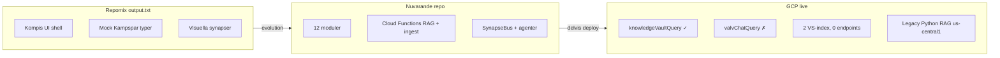

# ANALYS — Copy of repomix-output.txt (Hela arkivet / Minne)

**Källa:** [`repomixer/Copy of repomix-output.txt`](./repomixer/Copy%20of%20repomix-output.txt)  
**Datum:** 2026-05-21  
**Metod:** READ-ONLY extraktion + trevägs-diff mot aktivt repo, [`GCP-INVENTORY-2026-05-21.md`](../GCP-INVENTORY-2026-05-21.md), [`.context/arkiv-minne.md`](../../.context/arkiv-minne.md), [`Arkiv-SPEC.md`](../../specs/incoming/Arkiv-SPEC.md).  
**Jämför även:** [`ANALYS-repomix-baseline-2026-05-21-backend.md`](./ANALYS-repomix-baseline-2026-05-21-backend.md) (backend-baseline), [`ANALYS-repomix-output.xml.md`](./ANALYS-repomix-output.xml.md) (historisk monolit).

---

## 1. Vad filen faktiskt innehåller

| Egenskap | Värde |
|----------|-------|
| **Storlek** | 598 rader |
| **Deklarerad scope** | `src/**/*`, `functions/src/**/*` |
| **Faktisk scope** | **Endast** tidig frontend i `src/` — **0 filer** från `functions/src/` |
| **Tidsstämpel** | Ej angiven; innehåll = **UI-prototyp före modulstruktur och backend** |

### Inkluderade filer (hela listan)

| Sökväg (repomix) | Nuvarande repo | Arkiv-relevans |
|------------------|----------------|----------------|
| `src/components/kompis/KompisAvatar.tsx` | `src/modules/kompis/components/KompisAvatar.tsx` | UI — "Sub-Synaptic Network"-visual |
| `src/components/kompis/Tidshjulet.tsx` | `src/modules/kompis/components/Tidshjulet.tsx` | UI — inre ring märkt **"Dåtid (Kampspår)"** |
| `src/components/layout/SubSynapticBackground.tsx` | `src/modules/core/layout/SubSynapticBackground.tsx` | UI — "Floating synaps nodes" |
| `src/components/layout/MainLayout.tsx` | `src/modules/core/layout/MainLayout.tsx` | Shell |
| `src/components/layout/FloatingDock.tsx` | `src/modules/core/layout/FloatingDock.tsx` | Statisk nav |
| `src/types/kompis.ts` | `src/modules/kompis/types/kompis.ts` | **Mock-typer** (identiska) |
| `src/App.tsx`, CSS, assets | Ersatt av modulrouter | Välkomsttext: "sanning, ekonomi, återhämtning" |

**Slutsats:** Repomix `.txt` är **inte** en arkiv/RAG-baseline. Den dokumenterar **terminologiursprung** (SubSynaptic, Kampspår, KompisAvatar) och en visuell shell — **ingen** Firestore, **ingen** RAG, **ingen** agent, **ingen** WORM.

---

## 2. Extraktion per domän (endast arkiv/minne)

### 2.1 Datamodell (`kampspar`, `kb_docs`, Kunskapsbank, SystemSynapse)

| Entitet | I repomix `.txt` | I repo / arkiv-minne |
|---------|------------------|----------------------|
| **`kampspar` (Firestore WORM)** | **Saknas** | `KampsparEntry` i `src/modules/core/types/firestore.ts`; `ingestKampsparEntry` |
| **`kb_docs`** | **Saknas** | `persistKbDoc.ts`, Drive → `driveIngestSynapse` |
| **Kunskapsbank** (`KnowledgeFolder`/`KnowledgeDoc`) | **Saknas** | Blueprint → mappas till `kb_docs` (`Arkiv-SPEC` §5) |
| **SystemSynapse** | **Saknas** | Blueprint `firebase-blueprint.json` — **ej Firestore-prod** |
| **Mock `Kampspar`** | `type: challenge \| milestone \| routine`, `intensity`, `tags` | **Samma mock kvar** i `src/modules/kompis/types/kompis.ts` — parallellt med `KampsparEntry` |

Repomix enda datamodell-relaterade kod:

```333:364:docs/archive/repomix/repomixer/Copy of repomix-output.txt
export interface Kampspar {
  id: string;
  title: string;
  description: string;
  type: 'challenge' | 'milestone' | 'routine';
  intensity: number; // 1-10
  date: string;
  tags: string[];
}
// ...
export const initialSubSynapticData: SubSynapticData = {
  stressLevel: 30,
  focusScore: 75,
  energyLevel: 80,
  recentKampspar: []
};
```

**Kanonisk Minne-schema (repo):** `title`, `content`, `category`, `source`, `eventDate`, `embeddingDim`, `userId`, `createdAt` — **inte** samma som mock-typen.

---

### 2.2 RAG, Vector Search, embeddings, Context Cache

| Lager | Repomix `.txt` | Repo | GCP 2026-05-21 |
|-------|----------------|------|----------------|
| Kunskap RAG | **Saknas** | `kampsparQueryRag.ts` (token-match) + `knowledgeVaultAgent.ts` | `knowledgeVaultQuery` **deployad**, smoke PASS |
| Valv RAG | **Saknas** | `vaultRag.ts` + `valvChatQuery` | Kod i repo, **ej deployad** (G1) |
| Vector Search ANN | **Saknas** | Stub i `kampsparRag.ts` / env-check i `kampsparQueryRag.ts` | 2 index (768 dim), **0 endpoints** (G2) |
| Embeddings | **Saknas** | `generateEmbeddingInternal.ts`, `embeddingDim` på poster | Ofta `null` (G3) |
| Context Cache | **Saknas** | `functions/src/lib/vertexCache.ts` (TTL 1h, in-memory registry) | Deploy-status okänd; kopplad till DCAP/RAG-kostnad |
| Legacy Python RAG | **Saknas** | Ej i `functions/src/index.ts` | 4 functions `us-central1` (G4/G5) |
| Citations JSON | **Saknas** | `{ answer, citations[] }` i agenter | Kunskap PASS |

**Index (GCP, välj vid wire):**

- `projects/1084026575972/locations/europe-west1/indexes/2686894156982255616` (`livskompassen-kv-index`, STREAM)
- `projects/1084026575972/locations/europe-north1/indexes/9094201410823651328` (`kampspar_index`, BATCH)

---

### 2.3 Synapser, ADK, självsortering, entity recognition

| Begrepp | Repomix `.txt` | Repo / spec |
|---------|----------------|-------------|
| **Synaps (UI)** | `SubSynapticBackground`: "Floating synaps nodes" — CSS-animation | Alias kvar; ADK ≠ UI |
| **SubSynapticData** | Mock biometri: `stressLevel`, `focusScore`, `energyLevel` | Ej kopplat till Minne; Zero Footprint gäller session |
| **ADK SynapseBus** | **Saknas** | `functions/src/adk/synapses/synapseBus.ts` |
| **`drive_ingest`** | **Saknas** | `driveIngestSynapse.ts` → `kb_docs` |
| **`journal_woven`** | **Saknas** | Stub i `synapseBus.ts` (G7) |
| **`dcap_alert`** | **Saknas** | Stub |
| **Självsorterande inkorg** | **Saknas** | Kunskap-SPEC §12, G10 — planerat |
| **Entity recognition / EntityProfile** | **Saknas** | Blueprint + agent card refs; G9 — planerat |
| **Tidshjulet → data** | Visuell "Kampspår"-ring + statiska exempelnoder | Ingen Firestore-koppling i repomix |

---

### 2.4 Agenter (Livs-Arkivarien, Mönster-Arkivarien, Memory Management)

| Agent / roll | Repomix `.txt` | Repo |
|--------------|----------------|------|
| **Livs-Arkivarien** | **Saknas** | `sharedRules.ts`, `knowledgeVaultAgent.ts`, agent card |
| **Mönster-Arkivarien** | **Saknas** | `sharedRules.ts`, `driveIngestSynapse`, agent card |
| **Sannings-Analytikern** | **Saknas** | `valvChatAgent.ts` |
| **Memory Management** (retention, cache purge) | **Saknas** | `retentionJob.ts`, `vertexCache.ts`, `invalidateSession` |
| **Kompis navigator** | Avatar `state: idle` only | Full modul `src/modules/kompis/` |

Repomix = **pre-agent**, **pre-prompt**, **pre-callable**.

---

### 2.5 Permanent minne, retention, WORM

| Aspekt | Repomix `.txt` | arkiv-minne / repo / GCP |
|--------|----------------|--------------------------|
| **Permanent minne (princip)** | **Saknas** | Låst: WORM-källor glömmer aldrig |
| **WORM collections** | **Saknas** | `reality_vault`, `children_logs`, `journal`, `dossier_snapshots`, create-only `kampspar`/`kb_docs` |
| **Retention job** | **Saknas** | `scheduledRetentionJob` deployad — purgar `users/{uid}/kampspar` (legacy path) |
| **GCS WORM bucket** | **Saknas** | `livskompassen-knowledge-vault-worm` — **30d retention** (≠ Firestore permanent) |
| **Kill Switch / Zero Footprint** | **Saknas** | Session + cache invalidation i prod-kod |

---

### 2.6 Kopplingar till moduler (Life OS)

Repomix har **ingen** modulmatris. Endast indirekta metaforer:

| Modul (Life OS) | Repomix `.txt` | Repo (arkiv-minne) |
|-----------------|----------------|---------------------|
| kompis | Avatar + mock SubSynaptic | Skriver `kampspar`/`kb_docs`; Kunskap RAG |
| valv_chatt / verklighetsvalvet | **Saknas** | `reality_vault`; `valvChatQuery` |
| barnens_livsloggar | **Saknas** | `children_logs`; Dossier export |
| dagbok | **Saknas** | `journal` → Vävaren → `reality_vault` |
| dossier | **Saknas** | `generateDossier`, `dossier_snapshots` |
| safe_harbor, kompasser, mabra, speglings, ekonomi | **Saknas** | Dokumenterade i modul-README § Minne |

Välkomsttext i repomix (`App.tsx`) nämner "sanning, ekonomi, återhämtning" — **vision utan implementation**.

---

## 3. Trevägs-jämförelse (sammanfattning)



| Domän | Repomix | Repo | GCP | Bedömning |
|-------|---------|------|-----|-----------|
| Hela arkivet (princip) | ✗ | ✓ dokumenterat + delvis kod | delvis | Arkitektur **efter** repomix |
| Kunskapsvalvet | ✗ | ✓ | ✓ callable | **Implementerat** (token-match) |
| Minne / `kampspar` | mock only | ✓ WORM | ✓ ingest | **Implementerat** (ANN saknas) |
| `kb_docs` / Drive | ✗ | ✓ kod | ✓ webhook | **Delvis** (smoke oklar) |
| Valv-Chat RAG | ✗ | ✓ kod | ✗ deploy | **G1** |
| Vector ANN | ✗ | stub | index utan endpoint | **G2–G3** |
| Context Cache | ✗ | ✓ `vertexCache.ts` | okänd | Repo only |
| ADK synapser | ✗ | ✓ `drive_ingest`; stub `journal_woven` | webhook live | **Delvis** |
| Agenter | ✗ | ✓ | delvis | **Efter** repomix |
| Tre silo-regel | ✗ | ✓ enforced | — | **Låst 2026-05-21** |
| EntityProfile / SystemSynapse | ✗ | blueprint | ✗ | **G9 planerat** |

---

## 4. Finns i Repomix men SAKNAS i repo/moln

| # | Post | Kommentar |
|---|------|-----------|
| R1 | **`functions/src/**`** trots deklarerad include | Repomix-körning fångade **inte** backend — falsk täckning |
| R2 | **Firestore-persistens** för mock `Kampspar` | Repo använder `KampsparEntry` + callables, inte mock-API |
| R3 | **SubSynapticData** som live biometri | Finns som mock i repo men **ej** kopplat till Minne/ADK |
| R4 | **Tidshjulet** med live historiknoder | UI finns migrerat; repomix hade **endast statiska exempelnoder** |
| R5 | **Vite default App.css** hero/counter | Ersatt av modulbaserad app |

**Viktigt:** Inget i repomix `.txt` motsvarar produktionsarkiv (RAG, WORM, agenter). Det som "saknas i moln" är i praktiken **noll arkiv-features** — filen är pre-backend.

---

## 5. Finns i repo/moln men SAKNAS helt i Repomix `.txt`

| # | Post | Källa |
|---|------|-------|
| M1 | Hela `functions/src/**` (34 TS-filer) | Repo |
| M2 | `knowledgeVaultQuery`, `ingestKampsparEntry`, `valvChatQuery` | Repo + GCP (valv ej deploy) |
| M3 | `kampsparQueryRag.ts`, `vaultRag.ts`, `kampsparRag.ts` | Repo |
| M4 | `synapseBus.ts`, `driveIngestSynapse.ts`, `persistKbDoc.ts` | Repo |
| M5 | `sharedRules.ts`, agent cards, `knowledgeVaultAgent.ts`, `valvChatAgent.ts` | Repo |
| M6 | `vertexCache.ts` (Context Cache) | Repo |
| M7 | `retentionJob.ts`, `scheduledRetentionJob` | Repo + GCP deploy |
| M8 | Firestore WORM: `reality_vault`, `children_logs`, `journal`, `dossier_snapshots`, top-level `kampspar`/`kb_docs` | Repo + rules |
| M9 | `KampsparEntry` / `KampsparIngestForm` / `KnowledgeVaultChat` / `KunskapPage` | Repo |
| M10 | Moduler: `valv_chatt`, `verklighetsvalvet`, `barnens_livsloggar`, `dossier`, … | Repo |
| M11 | Vertex Vector Search (2 index) | GCP |
| M12 | Legacy Python RAG: `knowledge-base-webhook`, `drive_sync_tool`, … | GCP only |
| M13 | GCS buckets: `livskompassen-knowledge-vault-*`, CMEK `livskompassenv2` | GCP |
| M14 | `.context/arkiv-minne.md`, `Arkiv-SPEC.md`, tre-silo-regler | Dokumentation (låst efter repomix) |
| M15 | EntityProfile, SystemSynapse Firestore, självsorterande inkorg | Spec/blueprint — planerat |

---

## 6. MOTSÄGELSER

| # | Konflikt | Allvar | Låst tolkning |
|---|----------|--------|---------------|
| **T1** | Repomix mock `Kampspar` (challenge/milestone/routine) vs Firestore `kampspar` (livshändelse WORM) | **FARLIG** | **`KampsparEntry` + arkiv-minne** gäller; mock-typ är legacy UI — får **inte** bli ingest-schema |
| **T2** | Mock-typen **lever kvar** i repo (`src/modules/kompis/types/kompis.ts`) identisk med repomix | **FARLIG** | Risk för framtida felkoppling; canonical typ = `KampsparEntryRow` |
| **T3** | "Synaps" i repomix = CSS-animation vs ADK `SynapseBus`-händelse | Medel | **ADK-händelse** kanonisk; UI-namn kvar som alias |
| **T4** | Repomix header: `functions/src/**/*` inkluderat vs **0 backend-filer** | Medel | Lita **inte** på denna repomix för backend/arkiv-gap |
| **T5** | Tidshjulet "Kampspår" antyder historiskt Minne utan datakoppling | Medel | Riktig historik = `kampspar` + RAG/Tidshjulet-wire (planerat) |
| **T6** | `retentionJob.ts` purgar `users/{uid}/kampspar` medan live data = **top-level** `kampspar` | **FARLIG** | Retention får **inte** radera WORM permanent minne (G5); path måste alignas |
| **T7** | GCS `livskompassen-knowledge-vault-worm` 30d vs Firestore "glömmer aldrig" | **FARLIG** | GCS = embeddings/derivat; **Firestore WORM** = primär sanning |
| **T8** | Legacy Python RAG (us-central1) parallellt med Node `notifyNewFile` | **FARLIG** | Dubbel Drive/RAG-pipeline — avveckla eller migrera (G4) |
| **T9** | 2 Vector-index (north1 + west1) utan vald kanon | Medel | Välj **west1 STREAM** vid wire (samma region som Functions) |

Repomix `.txt` har **inga** direkta konflikter med GCP-inventering — den är **föregångare** till all arkiv-infrastruktur. Farliga motsägelser uppstår om man **implementerar från repomix mock-schema** eller **blandar silor** (se rikare historik i [`ANALYS-repomix-output.xml.md`](./ANALYS-repomix-output.xml.md) för monolit-fasen).

---

## 7. Låsta beslut att bevara

Repomix **implementerar inget** av detta — besluten tillkom efter snapshot och ska **inte** backas:

1. **Permanent minne** — WORM Firestore för `children_logs`, `reality_vault`, `journal`, `dossier_snapshots`; GCS ≠ primär livsdatabas.
2. **Tre kunskapsytor** — `knowledgeVaultQuery` → `kampspar`+`kb_docs` only; `valvChatQuery` → `reality_vault` only; Barnen → Dossier, **inte** Valv-Chat.
3. **Hela arkivet ≠ en RAG** — koordinerat Life OS-minne; Dossier = aggregerad export.
4. **Prompts endast** i `functions/src/sharedRules.ts`.
5. **Trauma/opt-in** för manuell `kampspar`-ingest (Kladd §H).
6. **En kanonisk Vector-index-region** vid wire: `livskompassen-kv-index` europe-west1 STREAM.
7. **Zero Footprint** — session/chatt/cache rensas; WORM-data kvarstår.
8. **Kunskapsbank** → `kb_docs`; **Minne** → `kampspar`; **SystemSynapse** = blueprint tills Firestore-schema låses (G9).

---

## 8. Planerat som inte får glömmas

Från [`Arkiv-GAP-REGISTER.md`](../../specs/incoming/Arkiv-GAP-REGISTER.md) och `.context/arkiv-minne.md` — **saknas både i repomix och delvis i prod**:

| ID | Post | Prioritet |
|----|------|-----------|
| G1 | Deploy `valvChatQuery` | Hög |
| G2 | Vector endpoint + ANN wire i `kampsparQueryRag.ts` | Hög |
| G3 | Embeddings live (`embeddingDim` null → Gecko/004) | Hög |
| G4/G5 | Kartlägg/avveckla legacy Python RAG (us-central1) | Medel |
| G5 | Retention allowlist — **aldrig** radera WORM-källor | Medel |
| G6 | Drive smoke end-to-end (`NOTIFY_WEBHOOK_SECRET`) | Medel |
| G7 | `journal_woven` synaps (stub → riktig) | Planerat |
| G8 | Familjen-RAG (`childrenLogsQuery`, Mönster-Arkivarien) — **inte** Valv-Chat | Planerat |
| G9 | EntityProfile / SystemSynapse Firestore | Planerat |
| G10 | Självsorterande inkorg (Kunskap-SPEC §12) | Planerat |
| — | Context Cache delad registry (Firestore vs in-memory) | Planerat |
| — | Tidshjulet kopplat till `kampspar`-historik + Mönster-Arkivarien | Planerat |
| — | Dagbok/Kompasser auto-ingest till `kampspar` | **Nej** idag — manuell opt-in |

---

## 9. Slutsats

| Fråga | Svar |
|-------|------|
| Kan `Copy of repomix-output.txt` användas som arkiv-baseline? | **Nej** — använd [`repomix-baseline-2026-05-21-backend.md`](./repomix-baseline-2026-05-21-backend.md) eller full ny Repomix med `functions/src/**` |
| Vad är repomix `.txt` värdefull för? | **Terminologiursprung** (SubSynaptic, Kampspår, KompisAvatar) och **UI-evolution** |
| Är repo aligned med arkiv-minne? | **Ja** på arkitektur och silo-regler; **GAP** kvar i prod (G1–G3, legacy Python) enligt GCP-inventering |
| Största risk om man följer repomix? | **T1/T2** — fel `Kampspar`-schema vs WORM Minne; ignorera mock för ingest |
| Var finns rikare historik? | [`ANALYS-repomix-output.xml.md`](./ANALYS-repomix-output.xml.md) (monolit med `vault`, `kb_docs`, SuperArchive — **farliga silo-blandningar**) |

---

## 10. Rekommenderad nästa diff (ej utförd)

Kör Repomix med **full** `functions/src/**/*` + `src/modules/**/*` och jämför mot denna analys — samma metod som [`ANALYS-repomix-baseline-2026-05-21-backend.md`](./ANALYS-repomix-baseline-2026-05-21-backend.md).
