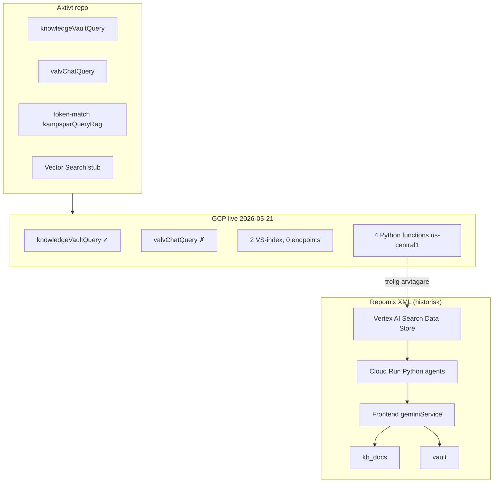

# ANALYS — Copy of repomix-output.xml

**Källa:** [`repomixer/Copy of repomix-output.xml`](./repomixer/Copy%20of%20repomix-output.xml)  
**Datum:** 2026-05-21  
**Metod:** READ-ONLY extraktion + diff mot [`GCP-INVENTORY-2026-05-21.md`](../GCP-INVENTORY-2026-05-21.md), [`.context/arkiv-minne.md`](../../.context/arkiv-minne.md), aktivt repo.  
**Jämför även:** [`ANALYS-repomix-output.txt.md`](./ANALYS-repomix-output.txt.md), [`ANALYS-repomix-baseline-2026-05-21-backend.md`](./ANALYS-repomix-baseline-2026-05-21-backend.md)

---

## 1. Vad filen faktiskt innehåller

| Egenskap | Värde |
|----------|-------|
| **Storlek** | ~39 444 rader, ~1,66 MB |
| **Format** | Repomix XML (`<file path="…">` per fil) |
| **Inbäddade träd** | **Tre** parallella kodbas-varianter + rot-`src/` |
| **Faktiska filposter** | ~100 `<file>`-block (många sökvägar finns bara i `<directory_structure>`) |
| **Brus** | Hela `.git/`-träd (hooks, pack-filer, refs) från `livskompassen-trasig/` och `livskompassen-trasig-1/` |

### Tre inbäddade varianter

| Prefix | Omfattning | Roll i snapshot |
|--------|------------|-----------------|
| **`livskompassen-trasig/`** | Frontend (~25 sidor/komponenter), `firestore.rules`, `firebase-blueprint.json`, `SYSTEM_MEMORY.md` | Tidig Life OS-shell med Verklighetsvalv, Kunskapsbank, Dossier |
| **`livskompassen-trasig-1/`** | Ovan + **Python Cloud Run-backend** (`backend/agents/`, `vertex_service.py`, `synapse_service.py`), utökad frontend (`KnowledgeBank`, `SuperArchive`, `VaultMap`, …), **`functions/src/index.ts`** (legacy triggers) | Mest komplett historisk arkitektur |
| **Rot `src/`** | Nästan identisk med `livskompassen-trasig/src/` | Duplicerad export (samma Vault/Knowledge/Dossier-mönster) |

**Slutsats:** XML-filen är **inte** nuvarande `Livskompassen2.0`-repo. Den är en **sammanslagen historisk export** (trasig + trasig-1 + rot) från en tidigare monolitisk fas — före modulstruktur (`src/modules/`) och före låst arkiv-schema (`kampspar`, `reality_vault`, `children_logs`).

---

## 2. Extraktion per domän

### 2.1 Hela arkivet

| Aspekt | I repomix XML | I arkiv-minne / aktivt repo |
|--------|---------------|-----------------------------|
| **Hela arkivet** som koordinerat Life OS-minne | Delvis — `SuperArchive`, Dossier, multipla Firestore-ytor | Låst princip; modul ↔ minne-matris |
| **Permanent minne (WORM)** | Koncept i `SYSTEM_MEMORY.md` + `isLocked` på `vault`-poster | Firestore WORM: `reality_vault`, `journal`, `children_logs`, `dossier_snapshots` |
| **Tre kunskapsytor (RAG)** | **Saknas** som separata callables | `knowledgeVaultQuery` / `valvChatQuery` / Dossier (ej RAG för barn) |
| **Modulmatris** | Monolitiska `pages/` | 12 moduler under `src/modules/` |

**Gap:** Repomix har **vision och UI** för arkiv, men **inte** det låsta datalagerschema som definierar Hela arkivet idag.

---

### 2.2 Tre silor — kritisk diff

#### A) UI-silor i repomix (VaultPage)

Repomix definierar **tre UX-zoner** inuti Verklighetsvalvet:

| UI-silo | Etikett | Data i kod |
|---------|---------|------------|
| Silo 1 | Jaget & Hälsan | Wellness, ekonomi (knappar) |
| Silo 2 | Barnens Värld | Hårdkodade barnnamn (Kasper/Arvid) |
| Silo 3 | Ex-fruns Sfär | `Silo3View` → collection **`vault`** |

#### B) Låsta kunskapsytor (arkiv-minne 2026-05-21)

| Yta | Route | Collection | Callable |
|-----|-------|------------|----------|
| Kunskapsvalvet | `/vardagen?tab=kunskap` | `kampspar`, `kb_docs` | `knowledgeVaultQuery` |
| Valv-Chat | Bevis → Sök | `reality_vault` | `valvChatQuery` |
| Barnen | `/familjen` | `children_logs` | — (Dossier export) |

#### C) Motsägelser (farliga)

| # | Repomix-beteende | Låst regel |
|---|------------------|------------|
| **S1** | Bevis sparas i **`vault`**, inte `reality_vault` | `reality_vault` är kanonisk WORM för Valv |
| **S2** | `KnowledgePage` **inbäddad i VaultPage** (`activeModule === 'KNOWLEDGE'`) | Kunskap och Valv ska vara **separerade ytor** |
| **S3** | `SuperArchive` analyserar bevis-liknande filer och sparar till **`kb_docs`** | Bevis → Valv-silo; dokument → Kunskap — **MUST NOT blandas** |
| **S4** | `KnowledgeBank` ASK-läge anropar Cloud Run (`shieldApi.ask`) utan silo-filter | Server-side silo-guard saknas |
| **S5** | UI-silo 1/2/3 ≠ Kunskap/Valv/Barnen | Terminologifälla — samma ord, olika semantik |

**Slutsats:** Repomix har **fysisk collection-separation** (`vault` vs `kb_docs` vs `kids_records`) men **ingen** enforcement av arkiv-minnes tre RAG-ytor. Flera komponenter **blandar aktivt** Valv-innehåll in i `kb_docs`.

---

### 2.3 Kunskapsvalvet / Kunskapsbank

| Aspekt | Repomix XML | Aktivt repo | GCP 2026-05-21 |
|--------|-------------|-------------|----------------|
| Collection | `kb_docs` (+ blueprint: `KnowledgeFolder`, `KnowledgeDoc`, `KnowledgeMedia`) | `kb_docs` + `kampspar` | `ingestKampsparEntry`, `notifyNewFile` |
| RAG | Client `geminiService` + Cloud Run Vertex Search | `knowledgeVaultQuery` + token-match | **Deployad** (token-match) |
| Manuell ingest | UI-form → `addDoc(kb_docs)` | `KampsparIngestForm` → `ingestKampsparEntry` | Smoke PASS |
| Drive | UI-stub "Google Drive Synk" | `driveIngestSynapse` + webhook | `notifyNewFile` deployad |
| Minne (`kampspar`) | **Saknas helt** (0 träffar i XML) | WORM `kampspar` | Ingest live |

**Gap:** Repomix = **Kunskapsbank utan Kampspår/Minne**. Nuvarande Kunskapsvalv = **`kampspar` + `kb_docs` + dedikerad callable**.

---

### 2.4 Valv / Verklighetsvalvet

| Aspekt | Repomix XML | Aktivt repo |
|--------|-------------|-------------|
| Collection | **`vault`** | **`reality_vault`** |
| Upplåsning | 3s long-press + **hårdkodad PIN `6469`** (3 kopior) | Firebase Auth + modul `verklighetsvalvet` |
| Bevisfält | `action`, `truth`, `childrenImpact` | WORM-schema med hash/immutable snapshot |
| Valv-RAG | Client-side Gemini (`geminiService.mirroringAnalysis`) | `valvChatQuery` + `vaultRag.ts` |
| Intelligence | `vault_intelligence`, `events`, `actors` | Planerat; ej samma schema |

**GCP:** `valvChatQuery` finns i repo, **ej deployad** (G1). Repomix känner **inte** till callable — all Valv-AI är frontend/Cloud Run.

---

### 2.5 Barnen

| Aspekt | Repomix XML | Aktivt repo |
|--------|-------------|-------------|
| Collection | **`kids_records`** (ROUTINES/INFO/LOGS) | **`children_logs`** (append-only WORM) |
| UI | Silo 2-knappar (hårdkodade scenarion) | `barnens_livsloggar`-modul |
| RAG | Ingen dedikerad | G8 planerat (`childrenLogsQuery`) |
| Dossier | `DossierGeneratorPage` läser `vault` + `synapses` | `generateDossier` över canonical collections |

---

### 2.6 RAG & GCP-jämförelse

| Lager | Repomix XML | Aktivt repo | GCP live |
|-------|-------------|-------------|----------|
| **Kunskap retrieval** | Vertex AI Search (Discovery Engine) via Cloud Run | Token-match + stub ANN | `knowledgeVaultQuery` ✓ |
| **Valv retrieval** | Client Gemini + `vault_intelligence` triggers | `vaultRag.ts` + `valvChatQuery` | Callable **ej deployad** |
| **Vector Search (ANN)** | **Saknas** — Agent Builder Data Store | 2 index, kod stub | Index **utan endpoint** (G2) |
| **Embeddings** | **Saknas** | `generateEmbedding`, `embeddingDim` | Ofta null (G3) |
| **Legacy Python RAG** | **Arkitekturellt aligned** (`VERTEX_DATA_STORE_ID`, us-central1 default) | Ej i `functions/src` | 4 functions us-central1 (G4/G5) |
| **Node Functions** | `analyzeEvidence`, `weeklyPatternScan`, `onNewRadarEvent` | `ingestKampsparEntry`, `weaveJournalEntry`, … | Delvis deployad |
| **Region** | Python default `us-central1`; Node `europe-west1` | `europe-west1` | Split stack |

**GCP-tolkning:** Repomix XML beskriver **Vertex AI Search / Agent Builder-linjen** som delvis **lever kvar i GCP** (legacy Python us-central1). Aktivt repo har **migrerat** mot Node callables + Firestore `kampspar`/`reality_vault`, men **inte** kopplat Vector Search endpoints. **Två parallella RAG-arv** — repomix = äldre gren; repo = ny gren; GCP = **båda** (risk M3 i baseline-analys).

---

### 2.7 Synapser

| Begrepp | Repomix XML | Arkiv-minne / aktivt repo |
|---------|-------------|---------------------------|
| **SystemSynapse** | Firestore collection **`synapses`** (groundingPoints, category) | Blueprint `SystemSynapse` — **ej prod**; ADK events istället |
| **SynapseBus** | Python `synapse_service.py` + `emit_synapse()` mellan agenter | `functions/src/adk/synapses/synapseBus.ts` |
| **`drive_ingest`** | **Saknas** | `driveIngestSynapse.ts` → `kb_docs` |
| **`journal_woven`** | **Saknas** | Stub G7 |
| **Dossier ↔ synapser** | `DossierGeneratorPage` väljer `vault` + `synapses` | `dossier_snapshots` + canonical hash |

**Terminologifälla (T2):** Repomix "synaps" = **Firestore-dokument med analys**. Arkiv-minne "Synaps" = **ADK-händelse** (`drive_ingest`, `journal_woven`). Samma ord — **olika lager**.

---

### 2.8 Agenter

| Agent (repomix) | Implementation | Aktivt repo |
|-----------------|----------------|-------------|
| Livs-Arkivarien | Python `archive_agent.py` + CF `analyzeEvidence` prompt | `knowledgeVaultAgent.ts`, `sharedRules.ts` |
| Gräns-Arkitekten | Python `tactical_agent.py` / UI Dossier-knapp | BIFF via `analyzeMessage` |
| Sannings-Analytikern | `shield_service.py`, `reality_mirror_agent.py` | `valvChatAgent.ts` |
| Mönster-Arkivarien | Chronos / `weeklyPatternScan` | `driveIngestSynapse`, agent card |
| 14+ Python-agenter | `backend/agents/*.py` | 8+ Node agents + cards |

**Gap:** Repomix = **prompts spridda** (Python-klasser, CF inline, `geminiService.ts`). Repo = **prompts låsta** i `sharedRules.ts`.

---

## 3. Firestore-schema — repomix vs kanon

| Repomix collection | Kanon (arkiv-minne) | Status |
|--------------------|---------------------|--------|
| `vault` | `reality_vault` | **Byt namn/migrera** |
| `kb_docs` | `kb_docs` | **Behåll** |
| `kids_records` | `children_logs` | **Byt schema** |
| `diary` / `diary_entries` | `journal` | **Byt namn** |
| `synapses` (SystemSynapse) | ADK + blueprint | **Ej samma** |
| `mood_journal`, `events`, `actors`, `vault_intelligence` | Delvis mappade till moduler | **Legacy — ej WORM-lista** |
| **`kampspar`** | `kampspar` | **Saknas i repomix** |
| **`dossier_snapshots`** | `dossier_snapshots` | **Saknas i repomix** |

---

## 4. Trevägs-jämförelse (sammanfattning)

| Domän | Repomix XML | Aktivt repo | GCP | Status |
|-------|-------------|-------------|-----|--------|
| Hela arkivet (princip) | Vision i SYSTEM_MEMORY | Låst `.context/arkiv-minne.md` | Delvis | **Repo vinner** |
| Tre silo-regel (RAG) | **Bryts** (SuperArchive, Vault→Knowledge) | Enforced i kod/docs | — | **Kritisk diff** |
| Kunskapsvalvet | `kb_docs` only | `kampspar` + `kb_docs` + callable | ✓ Kunskap | **Repo rikare** |
| Valv-Chat RAG | Client/Cloud Run | `valvChatQuery` | ✗ deploy | **G1** |
| Vector ANN | Vertex Search DS (annat produkt) | VS stub | Index utan endpoint | **G2** |
| Legacy Python RAG | **Designad här** | Ej i repo | 4 fn live | **G4 avveckla** |
| WORM permanent minne | Delvis (`isLocked`) | Full WORM lista | GCS 30d ≠ primär | **Repo vinner** |
| Dossier | UI + Gemini client | `generateDossier` + hash | Deployad | **Evolving** |
| Zero Footprint | SYSTEM_MEMORY ✓ | Implementerat | Session | **Behåll** |
| Säkerhet PIN | **6469 hårdkodad** | Auth | — | **Repomix farlig** |

---

## 5. Finns i repomix men SAKNAS i aktivt repo

| Post | Repomix | Nuvarande repo |
|------|---------|----------------|
| Python Cloud Run multi-agent backend | `livskompassen-trasig-1/backend/` | Ej i `functions/` |
| Vertex AI Search Data Store integration | `vertex_service.py`, `VERTEX_DATA_STORE_ID` | Vector Search index-skript |
| `SuperArchive` (multi-agent filanalys) | Sparar till `kb_docs` | Ej motsvarighet |
| `KnowledgeBank` med ASK/CASES/BROWSE | `shieldApi.ask` | `KnowledgeVaultChat` |
| `VaultMap`, `ActorDeepDive`, radar/events | `events`, `actors` collections | Delvis i moduler |
| CF triggers: `analyzeEvidence`, `weeklyPatternScan` | Storage/Firestore triggers | Ersatt av annan Functions-uppsättning |
| `server.ts` Express monolit | Finns | Legacy i `docs/archive/server-legacy/` |
| `SYSTEM_MEMORY.md` agent-manifest | Rich vision doc | `.context/agents.md` + `sharedRules.ts` |
| UI-silo 1/2/3 i Vault | VaultPage bento | Modulbaserad navigation |
| Hårdkodad Vault-PIN | 3× i XML | Firebase Auth |

---

## 6. Finns i repo/GCP men SAKNAS i repomix XML

| Post | Källa |
|------|-------|
| `kampspar`, `ingestKampsparEntry`, `kampsparQueryRag.ts` | Repo + GCP |
| `reality_vault`, `valvChatQuery`, `vaultRag.ts` | Repo (valv ej deploy) |
| `children_logs`, `journal`, `dossier_snapshots` | Repo + arkiv-minne |
| `sharedRules.ts`, agent cards A2A | Repo |
| `synapseBus.ts`, `driveIngestSynapse.ts` | Repo |
| `src/modules/**` (12 moduler) | Repo |
| `knowledgeVaultQuery` callable | Repo + GCP |
| Vertex Vector Search index (west1/north1) | GCP |
| `scheduledRetentionJob`, Kill Switch callables | Repo + GCP |
| Silo-guard (MUST NOT cross-RAG) | `.context/arkiv-minne.md` |

---

## 7. MOTSÄGELSER och terminologifällor

| # | Konflikt | Låst tolkning |
|---|----------|---------------|
| **M1** | Repomix Vertex Search DS vs repo Vector Search ANN | **Olika GCP-produkter** — välj **en** kanonisk pipeline (repo Node + west1 index) |
| **M2** | Repomix `vault` vs repo `reality_vault` | **Migrera** — repomix-namn är legacy |
| **M3** | Legacy Python RAG (GCP) + repomix Cloud Run **och** repo Node RAG | **En kanonisk pipeline** (Arkiv-GAP G4) |
| **M4** | SuperArchive → `kb_docs` för bevis | **Förbjudet** — bevis → `reality_vault` only |
| **M5** | UI "Silo 3" vs arkiv "Valv-Chat silo" | **Arkiv-minne tre ytor** gäller för RAG; UI-silor är historisk UX |
| **M6** | `synapses` Firestore vs ADK SynapseBus | **ADK-händelse** kanonisk för modul→minne |
| **M7** | `isVerified()` relaxed i repomix `firestore.rules` | **Prod rules** i aktivt repo — repomix dev-bypass är farlig |
| **M8** | Hårdkodad PIN + inbäddad `.git` i export | **Säkerhetsartefakt** — repomix får inte behandlas som deploy-källa |

---

## 8. Låsta beslut att bevara (oförändrade vs repomix)

Repomix implementerar **delar** av visionen men **bryter** låsta regler. Vid merge/migrering:

1. **Permanent minne** — Firestore WORM-lista i arkiv-minne; GCS bucket ≠ primär sanning.
2. **Tre kunskapsytor** — blanda aldrig Kunskap-RAG, Valv-Chat och Barnen-RAG.
3. **Prompts endast** i `sharedRules.ts` — inte Python-klasser eller inline CF.
4. **Trauma/opt-in** för manuell `kampspar`-ingest.
5. **En kanonisk Vector-index-region** vid wire (west1 STREAM rekommenderas — G2).
6. **Ingen hårdkodad Vault-PIN** — Auth + modulskydd.

**Värt att rädda från repomix (koncept, inte kod rakt av):**

- `SYSTEM_MEMORY.md` Sacred Features-lista (alignad med nuvarande)
- `firebase-blueprint.json` entity-modell (KnowledgeFolder/Doc/Media, SystemSynapse som **plan**)
- Dossier-Generator UX-flöde (urval → oföränderlig export)
- Layered Defense-principer i `security_spec.md`

---

## 9. Planerat som repomix antyder men repo/GCP ännu saknar

| Idé i repomix | Arkiv-GAP | Status |
|---------------|-----------|--------|
| Entity/actor-profiler (`actors`, VaultMap) | G9 EntityProfile | Blueprint |
| Veckovis Chronos-scan | Cloud Run Jobs plan | Ej wired |
| SuperArchive multi-agent ingest | Självsorterande inkorg | Planerat |
| Drive → arkiv (`driveService.syncFile`) | G6 Drive smoke | Delvis (`notifyNewFile`) |
| SystemSynapse grounding | G9 | Blueprint only |
| Familjen mönster-RAG | G8 | Planerat |

---

## 10. Slutsats

**Copy of repomix-output.xml** är en **stor historisk sammanslagning** (~1,66 MB) av `livskompassen-trasig`, `livskompassen-trasig-1` och rot-`src/`. Den dokumenterar en **mogen Life OS-prototyp** med Verklighetsvalv, Kunskapsbank, Dossier, Python multi-agent-backend och Vertex AI Search — men med **legacy Firestore-schema** (`vault`, `kids_records`) och **aktiva silo-brott** (t.ex. `SuperArchive` → `kb_docs`).

| Fråga | Svar |
|-------|------|
| Kan XML användas som arkiv-baseline? | **Delvis** — bättre än `output.txt`, sämre än [`repomix-baseline-2026-05-21-backend.md`](./repomix-baseline-2026-05-21-backend.md) |
| Varför matchar den GCP legacy Python? | Repomix = **Vertex Search / Cloud Run-linjen** som fortfarande finns i us-central1 |
| Är tre silor implementerade? | **Nej** — UX-silor ja; **RAG-silo-guard nej**; flera komponenter blandar Valv → Kunskap |
| Största migrationsrisk? | Collection-namn (`vault`→`reality_vault`) + silo-blandning + spridda prompts |
| Säkerhetsvarning? | Hårdkodad PIN `6469`, inbäddad `.git`, relaxed Firestore rules |

**Rekommenderad användning:** Historisk **terminologi- och UX-karta** + Python-agent-prototyp. **Inte** deploy-källa. Vid implementation: följ arkiv-minne, migrera schema, avveckla dubbel RAG (G4), deploy `valvChatQuery` (G1), wire Vector endpoint (G2).

---

## 11. Rekommenderad nästa diff (ej utförd här)

Kör Repomix med **endast** aktivt repo (`src/modules/**`, `functions/src/**`, `.context/**`) — undvik inbäddade `livskompassen-trasig*` och `.git` — för ren trevägs-jämförelse mot denna XML.
