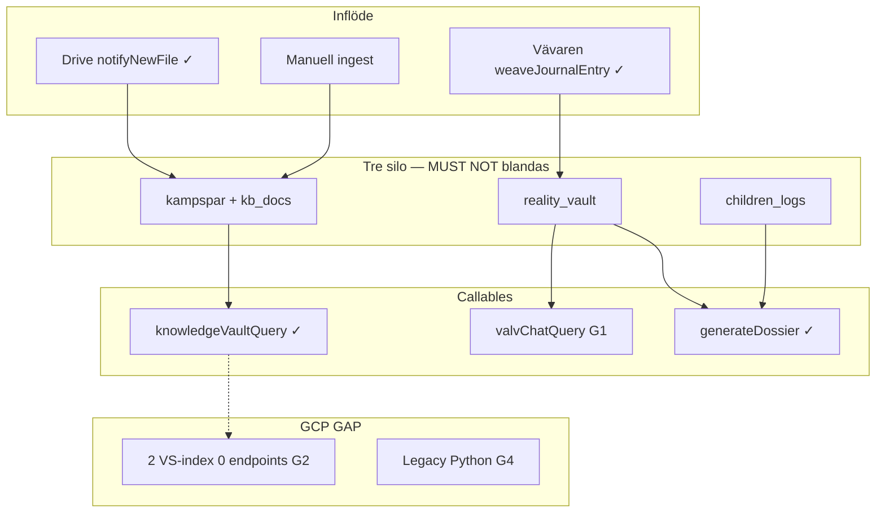

# KONSOLIDERING — Repomix × GCP × aktivt repo (Hela arkivet)

**Datum:** 2026-05-21  
**Status:** Låst minnesarkitektur — **ingen kod** förrän `kör [GAP]`.  
**Källor:**

| Källa | Fil |
|-------|-----|
| Backend-baseline | [`ANALYS-repomix-baseline-2026-05-21-backend.md`](./ANALYS-repomix-baseline-2026-05-21-backend.md) |
| UI-prototyp (pre-backend) | [`ANALYS-repomix-output.txt.md`](./ANALYS-repomix-output.txt.md) |
| Historisk monolit | [`ANALYS-repomix-output.xml.md`](./ANALYS-repomix-output.xml.md) |
| Monolit Express-fas | [`ANALYS-Copy of Repomix från cursor.txt.md`](./ANALYS-Copy%20of%20Repomix%20fr%C3%A5n%20cursor.txt.md) |
| Legacy walkthrough | [`ANALYS-archive-walkthrough-legacy.md`](./ANALYS-archive-walkthrough-legacy.md) |
| Live-moln | [`GCP-INVENTORY-2026-05-21.md`](../GCP-INVENTORY-2026-05-21.md) |
| Canonical | [`.context/arkiv-minne.md`](../../.context/arkiv-minne.md) |

**Canonical efter denna pass:** `.context/arkiv-minne.md`, `Arkiv-SPEC.md`, `Arkiv-GAP-REGISTER.md`, `system-plan.md` § Permanent minne.

---

## 1. Gemensamma låsta beslut (alla källor)

Dessa beslut är **oföränderliga** och gäller oavsett Repomix-snapshot. Repomix-dokument **implementerar dem inte** — de tillkom efter historiska exports.

### 1.1 Permanent minne (invariant)

| Regel | Detalj |
|-------|--------|
| WORM glömmer aldrig | `children_logs`, `reality_vault`, `journal`, `dossier_snapshots` — append-only, ingen tidsgräns |
| `kampspar` / `kb_docs` | WORM create-only; separat retention-policy — **ersätter inte** barn/valv |
| GCS ≠ primär sanning | `livskompassen-knowledge-vault-worm` har 30d retention — derivat/embeddings, inte livsdatabas |
| Sacred | Permanent minne + korrekt silo = Zero Footprint + Kill Switch |

### 1.2 Tre kunskapsytor (MUST NOT blandas)

| Yta | Route | Collection | Callable | Agent |
|-----|-------|------------|----------|-------|
| Kunskapsvalvet | `/vardagen?tab=kunskap` | `kampspar`, `kb_docs` | `knowledgeVaultQuery` | Livs-Arkivarien |
| Valv-Chat | Bevis → Sök | `reality_vault` | `valvChatQuery` | Sannings-Analytikern |
| Barnen | `/familjen` | `children_logs` | — (Dossier export) | Plan: Mönster-Arkivarien |

**MUST NOT:** `valvChatQuery` mot `kampspar`. **MUST NOT:** `knowledgeVaultQuery` mot `reality_vault`. **MUST NOT:** barnfrågor via Valv-Chat.

### 1.3 Hela arkivet ≠ en RAG

Koordinerat Life OS-minne över moduler. Dossier = aggregerad export + hash över valda källor. Kunskap RAG ≠ Hela arkivet.

### 1.4 Kanonisk stack (repo + GCP vinner)

| Beslut | Sanning |
|--------|---------|
| Deploy-sanning | **GCP inventory + aktiv kod** — inte walkthrough/legacy-system-plan |
| Backend | Node Cloud Functions `europe-west1` — **inte** Express `server.ts` eller Python Cloud Run som prod |
| Prompts | **Endast** `functions/src/sharedRules.ts` — aldrig klient/Express/Python-klasser |
| Auth | Firebase Auth — **ingen** hårdkodad Vault-PIN (repomix hade `6469`) |
| RAG pipeline | Node callables + Firestore — **en** kanonisk pipeline; legacy Python us-central1 avvecklas (G4) |
| Vector Search | Vertex AI **Vector Search ANN** (2 index, 768 dim) — **inte** Vertex AI Search Data Store (repomix-linjen) |
| Kanonisk index vid wire | `livskompassen-kv-index` **europe-west1** STREAM (`2686894156982255616`) — samma region som Functions |

### 1.5 Firestore-schema (legacy → kanon)

| Repomix / legacy | Kanon (2026-05-21) |
|------------------|---------------------|
| `vault` | `reality_vault` |
| `kids_records` | `children_logs` |
| `diary` / `diary_entries` | `journal` |
| — | `kampspar` (Minne — **saknas i repomix**) |
| — | `dossier_snapshots` (export-WORM — **saknas i repomix**) |
| `synapses` (Firestore-dokument) | ADK `SynapseBus`-händelser (`drive_ingest`, `journal_woven`) |
| `kb_docs` | `kb_docs` (behåll) |

### 1.6 Förbjudna mönster från repomix

| Mönster | Varför förbjudet |
|---------|------------------|
| `SuperArchive` → `kb_docs` för bevis | Bevis → `reality_vault` only |
| Kunskap inbäddad i VaultPage | Separata ytor och routes |
| Mock `Kampspar` (challenge/milestone/routine) som ingest-schema | Kanonisk typ = `KampsparEntry` |
| UI "Silo 3" = ex-partner/juridik | Arkiv "Barnen-silo" = `children_logs` — **olika semantik** |
| Dubbel Drive/RAG (Python + Node) | En pipeline: `notifyNewFile` → `driveIngestSynapse` |

### 1.7 Trauma / opt-in

Manuell `kampspar`-ingest från Kladd/trauma — **endast opt-in**. Dagbok/Kompasser auto-ingest till `kampspar` — **nej** idag.

### 1.8 GCP live (2026-05-21)

| Område | Status |
|--------|--------|
| `knowledgeVaultQuery` + token-match RAG | **Deployad**, smoke PASS |
| `ingestKampsparEntry`, `generateDossier`, `notifyNewFile` | **Deployade** |
| `valvChatQuery` | Kod i repo, **ej deployad** (G1) |
| Vector Search | 2 index, **0 endpoints**, env saknas (G2–G3) |
| Legacy Python RAG | 4 functions `us-central1` (G4) |
| `embeddingDim` | Ofta null i smoke (G3) |

---

## 2. Unika fynd per analysfil

### 2.1 `ANALYS-repomix-baseline-2026-05-21-backend.md`

| Fynd | Unikt |
|------|-------|
| `vertexCache.ts` (Context Cache, TTL 1h) | Finns i repo; deploy-status okänd |
| `kampsparRag.ts` (Vävaren) läser journal + reality_vault + kampspar | **Tillåtet** för metadata — ≠ Kunskap-RAG UI |
| Skript pekar north1 `kampspar_index`; GCP har även west1 STREAM | Region-val vid wire (G2) |
| Walkthrough påstår Vector live | **Motsägelse M1** — GCP + kod sanning |
| `Gräns-Arkitekten` agent card | Saknas i `functions/src/agents/cards/` (G14) |
| Cloud Run Jobs 24h analys | Planerat i architecture.md, ej wired |

### 2.2 `ANALYS-repomix-output.txt.md`

| Fynd | Unikt |
|------|-------|
| Scope | **Endast** tidig frontend (~598 rader) — **0** `functions/src`-filer trots deklarerad include |
| Värde | Terminologiursprung: SubSynaptic, Kampspår, KompisAvatar, Tidshjulet "Dåtid"-ring |
| Mock `Kampspar` | Identisk kvar i `src/modules/kompis/types/kompis.ts` — **risk T1/T2** (G11) |
| `SubSynapticData` | Mock biometri — ej kopplat till Minne/ADK |
| Tidshjulet | Statiska exempelnoder — ingen Firestore-koppling i snapshot |
| Bedömning | **Inte** arkiv-baseline — använd backend-baseline eller full ny Repomix |

### 2.3 `ANALYS-repomix-output.xml.md`

| Fynd | Unikt |
|------|-------|
| Omfattning | ~39k rader, **tre** inbäddade varianter (`livskompassen-trasig`, `trasig-1`, rot) + `.git`-brus |
| Silo-brott | `SuperArchive` → `kb_docs`; KnowledgePage inbäddad i VaultPage |
| Säkerhet | Hårdkodad PIN `6469` (3×); relaxed Firestore rules i export |
| Python backend | `livskompassen-trasig-1/backend/` — 14+ agenter, Cloud Run |
| Vertex AI Search DS | `vertex_service.py`, `VERTEX_DATA_STORE_ID` — **annan produkt** än repo VS ANN |
| UI-silo 1/2/3 | UX-zoner ≠ arkiv tre RAG-ytor (terminologifälla M5) |
| Värde att rädda (koncept) | `SYSTEM_MEMORY.md` Sacred Features, `firebase-blueprint.json` entity-modell, Dossier UX-flöde |
| Legacy collections | `vault_intelligence`, `events`, `actors`, `mood_journal` — ej WORM-lista |

### 2.4 `ANALYS-Copy of Repomix från cursor.txt.md`

| Fynd | Unikt |
|------|-------|
| Format | 52 filer, monolit: `src/pages/*` + `server.ts` Express |
| Silo 3 | **"Jurisdiktionsarkivet / Ex-fruns sfär"** → `vault` — **inte** Barnen (T1) |
| Gräns-Arkitekten | UI + `SYSTEM_MEMORY.md` — ej agent card (G14) |
| Modul-ursprung | Vault, Kunskap, Dossier, Safe Harbor, Måbra, Ekonomi, Kompasser portade till `src/modules/` |
| Prompt-modell | `geminiService.ts` + sidor — **osäker** vs `sharedRules.ts` |
| `vault_intelligence` | Legacy analys-pipeline — ej i aktiv `functions/src` |

### 2.5 `ANALYS-archive-walkthrough-legacy.md`

| Fynd | Unikt |
|------|-------|
| Falska påståenden | "Vector Search 2.0 live", "Fas 3 slutförd" |
| Retention | Path `users/{uid}/kampspar` ≠ top-level `kampspar` |
| Action | **Använd inte** walkthrough som deploy-sanning |

### 2.6 `GCP-INVENTORY-2026-05-21.md`

| Fynd | Unikt |
|------|-------|
| Live-lista | 13 Node functions deployade; `valvChatQuery` saknas |
| Python legacy | `knowledge-base-webhook`, `drive_sync_tool`, `biff_generator_tool`, `brusfiltret_tool` |
| Buckets | `knowledge-base-*` us-central1 (Google Solution) vs `livskompassen-knowledge-vault-*` north1 |
| CMEK | `gs://livskompassenv2` |
| Secrets | `GEMINI_API_KEY` satt; `VECTOR_SEARCH_*` saknas |

---

## 3. Kvarvarande GAP (prioritet 1–3)

Fullständig spec: [`Arkiv-GAP-REGISTER.md`](../../specs/incoming/Arkiv-GAP-REGISTER.md).  
**Regel:** Säg `kör G1` (eller domän) för implementation.

### Prioritet 1 — Prod-gaps (blockerar hela arkivet)

| ID | Gap | Blockerar |
|----|-----|-----------|
| **G1** | Deploy `valvChatQuery` | Valv-Chat Sök i prod |
| **G2** | Vector Search endpoint + ANN wire (`kampsparQueryRag.ts`) | Semantisk Kunskap-RAG |
| **G3** | Embeddings live (`embeddingDim null` → Gecko/004 west1) | Vector upsert vid ingest |

### Prioritet 2 — Arkitekturhygien

| ID | Gap | Risk om ignoreras |
|----|-----|-------------------|
| **G4** | Legacy Python RAG (us-central1) — kartlägg/avveckla | Dubbel Drive/RAG-pipeline |
| **G5** | Retention allowlist vs permanent minne | WORM-radering via fel path |
| **G6** | Drive smoke end-to-end (`NOTIFY_WEBHOOK_SECRET` + Apps Script) | `kb_docs` auto-ingest oklar |
| **G11** | Mock `Kampspar`-typ i `kompis.ts` vs `KampsparEntry` | Fel ingest-schema (T1/T2) |

### Prioritet 3 — Life OS utbyggnad

| ID | Gap | Källa |
|----|-----|-------|
| **G7** | `journal_woven` synaps (stub → riktig) | ADK |
| **G8** | Familjen-RAG (`childrenLogsQuery`, Mönster-Arkivarien) | **MUST NOT** Valv-Chat |
| **G9** | EntityProfile / SystemSynapse Firestore | Blueprint |
| **G10** | Självsorterande inkorg (Kunskap-SPEC §12) | Repomix SuperArchive-koncept |
| **G12** | Context Cache delad registry (in-memory → Firestore?) | `vertexCache.ts` |
| **G13** | Tidshjulet kopplat till `kampspar`-historik | UI finns, data-wire saknas |
| **G14** | Gräns-Arkitekten — agent card eller merge med BIFF-Skölden? | Repomix UI/docs |

---

## 4. Terminologifällor (referens)

| Ord | Repomix-betydelse | Kanonisk betydelse |
|-----|-------------------|-------------------|
| **Synaps** | CSS-animation / Firestore `synapses`-dokument | ADK `SynapseBus`-händelse |
| **Silo 3** | Ex-partner / jurisdiktion (`vault`) | Barnen (`children_logs`) i arkiv-minne |
| **Kampspår** | UI-ring / mock-typ | WORM `kampspar` + `KampsparEntry` |
| **Kunskapsbank** | `kb_docs` only | `kb_docs` + `kampspar` (Kunskapsvalvet) |
| **Vector Search** | Vertex AI Search Data Store (Discovery Engine) | Vertex AI Vector Search ANN (768 dim index) |

---

## 5. Arkitekturdiagram (låst målbild)

---

## 6. Nästa steg (dokumentation klar — väntar på `kör [GAP]`)

1. **G1** — snabbast prod-vinst för Valv-Chat.
2. **G2+G3** — tillsammans för semantisk Kunskap-RAG.
3. **G11** — låg risk, förhindrar schema-förväxling.
4. **G4** — innan Drive smoke (G6) i prod med dubbel pipeline.

Uppdatera denna fil efter varje deploy — kör om [`GCP-INVENTORY-2026-05-21.md`](../GCP-INVENTORY-2026-05-21.md)-kommandon.
