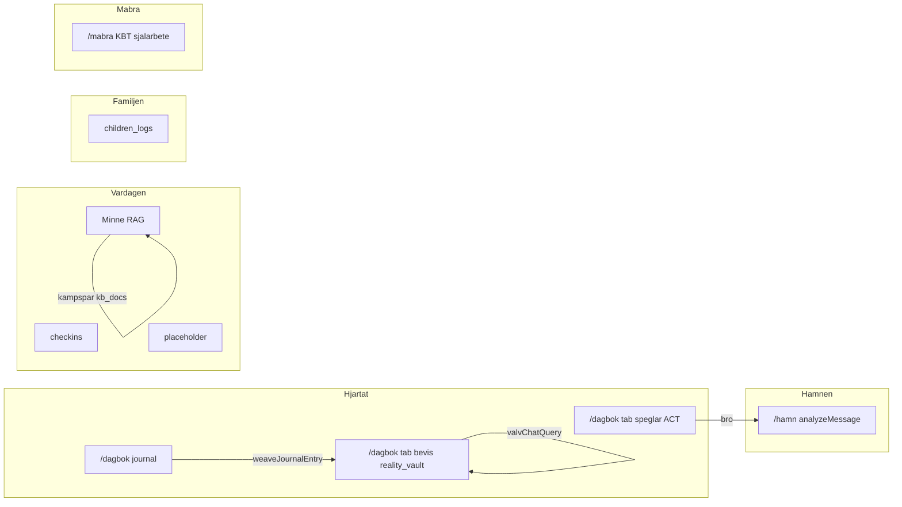
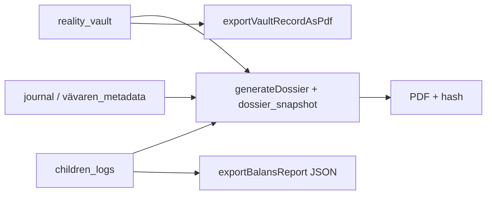
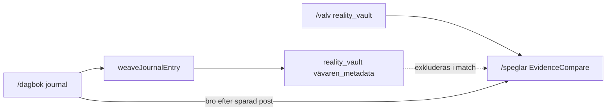
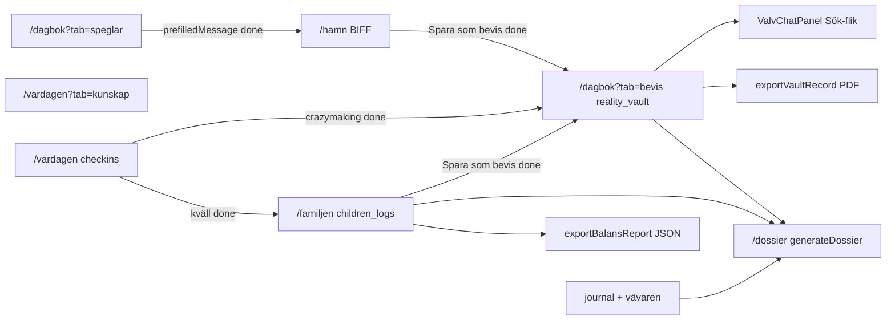

This file is a merged representation of a subset of the codebase, containing specifically included files and files not matching ignore patterns, combined into a single document by Repomix.

<file_summary>
This section contains a summary of this file.

<purpose>
This file contains a packed representation of a subset of the repository's contents that is considered the most important context.
It is designed to be easily consumable by AI systems for analysis, code review,
or other automated processes.
</purpose>

<file_format>
The content is organized as follows:
1. This summary section
2. Repository information
3. Directory structure
4. Repository files (if enabled)
5. Multiple file entries, each consisting of:
  - File path as an attribute
  - Full contents of the file
</file_format>

<usage_guidelines>
- This file should be treated as read-only. Any changes should be made to the
  original repository files, not this packed version.
- When processing this file, use the file path to distinguish
  between different files in the repository.
- Be aware that this file may contain sensitive information. Handle it with
  the same level of security as you would the original repository.
</usage_guidelines>

<notes>
- Some files may have been excluded based on .gitignore rules and Repomix's configuration
- Binary files are not included in this packed representation. Please refer to the Repository Structure section for a complete list of file paths, including binary files
- Only files matching these patterns are included: functions/**, .context/**, docs/specs/**, docs/archive/walkthrough.md, docs/archive/legacy-system-plan.md, firebase.json, firestore.rules
- Files matching these patterns are excluded: **/node_modules/**, **/lib/**, **/.git/**
- Files matching patterns in .gitignore are excluded
- Files matching default ignore patterns are excluded
- Files are sorted by Git change count (files with more changes are at the bottom)
</notes>

</file_summary>

<directory_structure>
.context/
  modules/
    barnens_livsloggar.md
    core.md
    dagbokshubben.md
    dossier.md
    ekonomi.md
    kompasser.md
    kompis.md
    mabra_sidan.md
    safe_harbor.md
    speglingssystemet.md
    valv_chatt.md
    verklighetsvalvet.md
  agents.md
  architecture.md
  arkitektur-beslut.md
  database.md
  design-language.md
  security.md
  system-plan.md
docs/
  archive/
    legacy-system-plan.md
    walkthrough.md
  specs/
    incoming/
      Barnen-SPEC.md
      Core-SPEC.md
      Dagbok-SPEC.md
      De-3-Kompasserna-SPEC.md
      Dossier-SPEC.md
      Ekonomi-SPEC.md
      Kampspar-PROFIL-SEED.json
      Kampspar-PROFIL-SEED.md
      Kladd-2026-05-21-kampspar-kandidater.md
      Kladd-2026-05-21-PERSONAL-MASTER.md
      Kunskap-SPEC.md
      Mabra-RESEARCH-BRIEF.md
      Mabra-SPEC.md
      SafeHarbor-SPEC.md
      Speglar-SPEC.md
      Valv-Chat-SPEC.md
      Verklighetsvalvet-SPEC.md
    ai-prompts-heart.md
    ai-prompts-kladd-kampspar.md
    ai-prompts-moduler-master.md
    ai-prompts-wave2.md
    design-brief.md
    design-master.md
    dossier-generator.md
    hjartat-flode.md
    navigation-master.md
    p2-flode.md
    product-vision.md
functions/
  src/
    adk/
      executors/
        runExecutor.ts
      synapses/
        driveIngestSynapse.ts
        paralysBrytarenSynapse.ts
        synapseBus.ts
      index.ts
      orchestrator.ts
      registry.ts
      stateStore.ts
      types.ts
    agents/
      cards/
        index.ts
      DCAP.ts
      documentAgent.ts
      knowledgeVaultAgent.ts
      kompis-supervisor.ts
      types.ts
      valvChatAgent.ts
      vertexAgent.ts
      weaverAgent.ts
    jobs/
      retentionJob.ts
    config.ts
    index.ts
    sharedRules.ts
  package.json
  tsconfig.json
firebase.json
firestore.rules
</directory_structure>

<files>
This section contains the contents of the repository's files.

<file path=".context/modules/barnens_livsloggar.md">
# Barnens livsloggar

**Route:** `/familjen` · **Redirect:** `/barnen` · **AuthGate:** ja · **Dock:** Heart  
**Spec (konsoliderad):** [`docs/specs/incoming/Barnen-SPEC.md`](../../docs/specs/incoming/Barnen-SPEC.md)

## Syfte

**Den trygga hamnen** — neutral Grey Rock-dokumentation för **Kasper** och **Arvid**. BBIC-orienterade basbehov. Skild från dagbok, valv och vuxenkonflikt.

## UI (idag)

| Komponent | Roll |
|-----------|------|
| `FamiljenPage` | Kluster-wrapper |
| `BarnensPage` | PIN, barn-flikar, balans, fysio, livslogg, tidslinje |
| `PhysiologicalControls` | Sömn, ångest, aptit 1–5 |
| `ChildSubLogPanel` | Kategori, observation, barnpåverkan |
| `BalansMatare` | 7-dagars bar + text |
| `exportBalansReport` | JSON-export per barn |

**UX idag:** en sida, två spara-knappar (fysiologi \| livslogg) — **inte** wizard.

## Navigation

| Ingång | Beteende |
|--------|----------|
| Dock Heart | `/familjen` |
| `/barnen` | Redirect → `/familjen` |
| Titlar | Kluster **Familjen**; innehåll **Livsloggar** |

## Datamodell (WORM)

- **`children_logs`:** childAlias, action (`fysiologi`|`livslogg`), signals?, observation, category?, childrenImpact?, ownerId, createdAt — append-only

## Backend

| Path | Data |
|------|------|
| Klient `saveChildrenLog` | `children_logs` |
| `computeBalansIndex` | Endast fysiologi, 7 dagar |
| JSON export | Klient per barn |

## Status

| Klart | Delvis | Planerat |
|-------|--------|----------|
| PIN, fysio, livslogg, balans, JSON, incident→valv, tredjepart-filter, Dossier-länk | Full wizard; kill switch raderar PIN-hash | PDF per barn, larm, Sandbox/Ankare UX |

## Kladd 2026-05-21

- **Bevis (valv):** Skola Ann/Lena — Kasper trötthet/utagerande mammaveckor; barnsamtal arg smiley.
- **Barnen:** Neutral fysio (sömn/ångest/aptit) + livslogg `skola` — **inte** "dåliga hemligheter"-modul (→ livslogg + valv vid allvar).
- **Gap:** Tredjepart-tagg — använd `category: skola` tills dedikerad tagg.
- **Soc:** Undvik "narcissist"; fakta + barnets bästa.

## Säkerhet

- Separat PIN (inte WebAuthn)
- Lås vid `visibilitychange` + manuell **Lås modul**
- WORM rules

## Produktbeslut (låsta 2026-05)

Se §14 i [`Barnen-SPEC.md`](../../docs/specs/incoming/Barnen-SPEC.md): enkel PIN, visibilitychange-lås, incident explicit med sourceRef, balans=fysiologi only, export per barn, Dossier opt-in.

## Kopplingar

- **Valv** — isolerad; planerad explicit bro
- **Dossier** — opt-in PDF/hash
- **Dagbok** — ingen auto; Variant B planerad

Kod: `src/modules/barnens_livsloggar/` · Plan: [`src/modules/barnens_livsloggar/module_plan.md`](../../src/modules/barnens_livsloggar/module_plan.md)
</file>

<file path=".context/modules/core.md">
# Core (app-shell)

Layout, FloatingDock, AuthProvider, Zero Footprint, tokens (`docs/specs/design-master.md`), AmbientBackground, Shake-to-Kill, BentoCard.

Navigation: [`docs/specs/navigation-master.md`](../docs/specs/navigation-master.md)

## Status

| Klart | Delvis | Planerat |
|-------|--------|----------|
| MainLayout, Dock, Fyren 3s, Shake-to-Kill, design tokens | Zero Footprint sign-out audit | BodySignalChip, WebGL bakgrund, dold nödknapp |

## Kladd 2026-05-21

- **Implementerat:** Obsidian Calm (ej grön/natur-UI); Shake 15 m/s²; Fyren long-press.
- **Avvisat:** Stjärnbilder, gamification, Nordisk skymning grön.
- **Gap:** `resetState` audit vid utloggning; iOS PWA shake-test.

**Spec:** [`docs/specs/incoming/Core-SPEC.md`](../../docs/specs/incoming/Core-SPEC.md)

Kod: `src/modules/core/` · Plan: [`src/modules/core/module_plan.md`](../../src/modules/core/module_plan.md) · **Källa:** [`Kladd-2026-05-21-PERSONAL-MASTER.md`](../../docs/specs/incoming/Kladd-2026-05-21-PERSONAL-MASTER.md)
</file>

<file path=".context/modules/dagbokshubben.md">
# Dagbokshubben

**Route:** `/dagbok` (flik `reflektion` i Hjärtat) · **AuthGate:** ja  
**Spec (konsoliderad):** [`docs/specs/incoming/Dagbok-SPEC.md`](../../docs/specs/incoming/Dagbok-SPEC.md)

## Syfte

**Lager 1** — kravlös tacksamhets- och reflektionsdagbok. Appens oskyldiga fasad (plausible deniability). Skild från Verklighetsvalvet (Lager 2). ACT/KBT-inspirerad identitetsrekonstruktion — inte forensik.

## UI (idag)

| Komponent | Roll |
|-----------|------|
| `HjartatPage` | Kluster: Reflektion \| Bevis \| Speglar |
| `DagbokPage` | Wizard-orkestrator |
| `MoodStep` | Humör-pills |
| `ReflectionStep` | Fritext + Web Speech sv-SE |
| `ConfirmStep` | Preview + spara |
| `SavedStep` | Bekräftelse + bro Speglar |
| `JournalArchive` | Tidslinje, pagination 5 ("Visa fler") — synlig endast steg 1 |

**Wizard:** humör → text → bekräfta → sparad. Spar kräver fritext idag.

## Navigation

| Ingång | Beteende |
|--------|----------|
| Dock BookOpen (kort klick) | `/dagbok` |
| **Fyren** (3s long-press BookOpen) | WebAuthn → PIN → `/dagbok?tab=bevis` |
| `/valv` | Redirect → `?tab=bevis` |

## Datamodell (WORM)

- **`journal`:** ownerId, userId, mood, text, createdAt — append-only

## Backend

| Callable | Data |
|----------|------|
| Klient save | `journal` |
| `weaveJournalEntry` (fire-and-forget) | → `reality_vault` (`vävaren_metadata`) |

**Inte:** Firestore-trigger; **inte** auto-write till `kampspar`.

## Status

| Klart | Delvis | Planerat |
|-------|--------|----------|
| Wizard, journal, WORM, Vävaren, Speglar-bro, röst, Fyren, arkiv pagination, unmount cleanup, inbound Måbra-bro (`?from=mabra`) | Vävaren auto utan godkännande | Outbound Måbra-länk, KBT-frågor, villkorlig Speglar, generellt humör-only |

## Kladd 2026-05-21

- **Roll:** Lager 1 fasad — plausible deniability; Fyren → valv.
- **Brus i Kladd:** People-pleasing, skam — **ej** valv; dagbok/Måbra.
- **Gap:** Subjektiv utmattning → dagbok OK; kliniska PDF → valv.

## Säkerhet

- AuthGate, WORM rules
- Röst: browser-only, ingen Blob till Storage
- Kill Switch global; wizard cleanup vid unmount

## Vision (bevara)

- Plausible deniability, positivt ACT-rum
- Vävaren asynkron — Lager 1 förblir mjukt

Kod: `src/modules/dagbok/` · Plan: [`src/modules/dagbok/module_plan.md`](../../src/modules/dagbok/module_plan.md) · Prompter: [`docs/specs/ai-prompts-moduler-master.md`](../../docs/specs/ai-prompts-moduler-master.md)
</file>

<file path=".context/modules/dossier.md">
# Dossier-Generator

**Sacred Feature.** **Route:** `/dossier` (AuthGate + Fyren A)  
**Design:** [`docs/specs/design-master.md`](../../docs/specs/design-master.md)  
**Incoming spec:** [`docs/specs/incoming/Dossier-SPEC.md`](../../docs/specs/incoming/Dossier-SPEC.md)

---

## Låsta beslut (#1–#4)

Backend PDF · snapshot WORM evigt · PDF Storage TTL ~24 h · hela dokument i granskning · kanonisk hash · journal opt-in · AI endast försätt · manuell nedladdning · async job vid lång kö · Fyren A · ingen dock-ikon.

---

## Syfte

Formell WORM-sammanställning (PDF) för ombud/myndighet. Aggregerar valv + barnen (+ valfritt journal) utan manuell omskrivning.

---

## UX (MVP)

Period → källor (journal varning) → granska hela poster → generera → hash + nedladdning → Zero Footprint.

---

## Datamodell

**Läser:** `reality_vault`, `children_logs`, opt-in `journal`.  
**Skriver:** `dossier_snapshots` (WORM), PDF Storage kortlivad.

---

## Backend

| Komponent | Status |
|-----------|--------|
| Wizard UI | **done** |
| `generateDossier` | **done** |
| `dossier_snapshots` rules | **done** |
| pdf-lib PDF | **done** |
| Vävaren försätt (opt-in) | **planned** |
| `exportVaultRecordAsPdf` | **done** |
| `exportBalansReport` | **done** |

---

## Säkerhet

Fyren A, AuthGate, CMEK, Zero Footprint, Kill Switch, hash-integritet, ingen auto-delning.

---

## Gap

| | Full Dossier | Valv export | Barnen export |
|---|--------------|-------------|---------------|
| Multi-källa | ja | 1 post | JSON |
| Hash/snapshot | ja | nej | nej |

## Kladd 2026-05-21

- **Kladd:** Samlad export för ombud/soc — aggregerar valv + barnen (+ journal opt-in).
- **Bevis §D:** Orosanmälan, skola, läkarintyg, sms-PDF — **källor i valv**, dossier samlar.
- **Gap:** BBIC-mall (`reportType`) fas 2; bro *Skapa Dossier* från Valv/Barnen.
- **Implementerat:** `generateDossier` + kanonisk hash + snapshot WORM.

Kod: `src/modules/dossier/`, `verklighetsvalvet/utils/exportVaultRecord.ts`, `barnens_livsloggar/utils/exportBalansReport.ts`.

Flöde: [`docs/specs/p2-flode.md`](../../docs/specs/p2-flode.md) · **Källa:** [`Kladd-2026-05-21-PERSONAL-MASTER.md`](../../docs/specs/incoming/Kladd-2026-05-21-PERSONAL-MASTER.md)
</file>

<file path=".context/modules/ekonomi.md">
# Ekonomi

**Route:** `/ekonomi` · **Dock:** Map

Blueprint: veckopeng, matlåda-knapp, inga grafer. Placeholder — Firestore schema saknas.

## Status

| Klart | Delvis | Planerat |
|-------|--------|----------|
| EconomyPage shell (SaldoHero, tiles) | Placeholder-värden | Firestore schema, transaktioner, vinst-knapp |

## Kladd 2026-05-21

- **Kladd:** Veckopeng, matlåda, "Vinst-knapp" — kognitiv avlastning utan grafer.
- **Avvisat:** Livs-Coachen här (→ Kunskap/Kompis).
- **Gap:** Ingen datamodell; Data Connect avvaktar (system-plan).

**Spec:** [`docs/specs/incoming/Ekonomi-SPEC.md`](../../docs/specs/incoming/Ekonomi-SPEC.md)

Kod: `src/modules/ekonomi/` · Plan: [`src/modules/ekonomi/module_plan.md`](../../src/modules/ekonomi/module_plan.md) · **Källa:** [`Kladd-2026-05-21-PERSONAL-MASTER.md`](../../docs/specs/incoming/Kladd-2026-05-21-PERSONAL-MASTER.md)
</file>

<file path=".context/modules/kompasser.md">
# De 3 Kompasserna (Kompasser)

**Route:** `/vardagen` (kompasser-tab) · **Redirect:** `/kompasser` → `/vardagen`  
**AuthGate:** **done** på `/vardagen` · **Dock:** Sprout  
**Spec:** [`docs/specs/incoming/De-3-Kompasserna-SPEC.md`](../../docs/specs/incoming/De-3-Kompasserna-SPEC.md) (notebook #1–#5, beslut låsta 2026-05-21)  
**Design:** [`docs/specs/design-master.md`](../../docs/specs/design-master.md)

---

## Låsta beslut (sammanfattning)

Paralys **manuell**. Notiser **in-app först**, lokal push max 2–3/dag. Crazymaking **bro only** — ingen auto-`reality_vault`. `checkins` **WORM**. Missad morgon **ingen skuld**. Silo 1 skriver **inte** auto till Valv.

---

## 1. Syfte

Dygnsrytm (morgon/dag/kväll) — ett mikrosteg i taget för ADHD/GAD.

| Kompass | Roll |
|---------|------|
| **Morgon** (Sacred) | Intention — Sanningens Ankare (Silo 1 MVP) |
| **Dag** | Pulskompass + Paralys-Brytaren |
| **Kväll** | KASAM 3 steg + crazymaking-bro |

## 2. Route

- **Aktiv:** `/vardagen` → `DashboardPage` (AuthGate)
- **Redirect:** `/kompasser` → `/vardagen`
- **Planerat:** Notiser fas 2 (lokal push)

## 3. UX (MVP done)

- Tids-default vid öppning Kompasser-flik (`getDefaultCompassByTime`)
- Morgon/dag/kväll-flikar, fri navigering
- Paralys manuell + *Ge mig 3 till* + Klar
- KASAM kväll 3 steg
- Crazymaking-broar (Speglar, Bevis, Måbra, Barnen)
- Morgon låg energi: *Vill du ha ett mikrosteg?* (diskret, ej auto)

## 4. Design

Obsidian Calm — guld / indigo / emerald. Inga streaks, turkos, regnbåge.

## 5. Data

`checkins` WORM — `taskNote` för KASAM JSON på kväll.

## 6. Backend

| Komponent | Status |
|-----------|--------|
| `saveCheckIn` | **done** |
| `breakDownResponse` | **done** |
| Paralys UI | **done** |
| KASAM UI | **done** |

## 7. Säkerhet

Silo, WORM, Zero Footprint (session clear), kill switch global.

## 8. Status

| Area | Status |
|------|--------|
| MVP *kör kompasser* | **done** |
| Notiser push | **planned** fas 2 |
| Sanningens Ankare från valv | **planned** |

Kod: `src/modules/kompasser/`. Smoke: `npm run smoke:compass`.
</file>

<file path=".context/modules/kompis.md">
# Kompis / Kunskap

**Route:** `/vardagen?tab=kunskap` (redirect `/kunskap`) · **AuthGate:** ja (kunskap-flik i Vardagen)

**Spec (konsoliderad):** [`docs/specs/incoming/Kunskap-SPEC.md`](../../docs/specs/incoming/Kunskap-SPEC.md)

## Syfte

Semantiskt livsminne (Life-OS): fråga/svar med källhänvisningar mot **egna** data. Avlastar kognitiv belastning. **Skild från Valv-Chat** (`reality_vault` = forensik only).

**Minne** = datalager (`kampspar` + `kb_docs`). **Kunskapsvalvet** = UI + RAG ovanpå.

## UI (idag)

| Komponent | Roll |
|-----------|------|
| `KunskapPage` | Flikar: Kunskapsvalv (chat) \| Tidshjulet |
| `KnowledgeVaultChat` | Fråga → `knowledgeVaultQuery` → svar + citations |
| `Tidshjulet` | Cirkulär vy + senaste poster (Firestore `kampspar`) |
| `KampsparIngestForm` | WORM create (Tidshjuls-flik) |
| `KompisAvatar` | Header (`MainLayout`); pulserar vid AI-anrop |

**Navigation:** Dock → Vardagen — ingen egen Kunskap-ikon.

## Backend

| Callable / lib | Data |
|----------------|------|
| `knowledgeVaultQuery` | `kampspar` + `kb_docs` via `kampsparQueryRag` (token-match) |
| `ingestKampsparEntry` | WORM create + `embeddingDim` |
| `notifyNewFile` → `analyzeDriveFile` | Drive → `kb_docs` (kräver `ownerId`) |

**Agenter:** Livs-Arkivarien, Mönster-Arkivarien — prompts i `functions/src/sharedRules.ts` only.

**JSON:** `{ answer, citations[{ docId, collection, date, title, excerpt }] }`

## Datamodell (WORM)

- **`kampspar`:** ownerId, title, content, category?, source, eventDate?, embeddingDim? (number), createdAt
- **`kb_docs`:** ownerId, title, content, folderId, source=drive, driveFileId, mimeType, embeddingDim?, createdAt

## Status

| Klart | Delvis | Planerat |
|-------|--------|----------|
| Flikar, RAG, Tidshjulet, ingest, silo från valv | Drive prod, deploy smoke | ANN, klickbara citations, supervisor, prediktivt Tidshjulet |

**Inte klart:** Dagbok/Kompasser auto → `kampspar` (dagbok → Vävaren → `reality_vault` idag). Dossier → Kunskapsbank (stub).

## Kladd 2026-05-21

- **Profil-seed:** 47 poster i [`Kampspar-PROFIL-SEED.json`](../../docs/specs/incoming/Kampspar-PROFIL-SEED.json) — batch via `scripts/seed_kampspar_profile.mjs` (2026-05-21).
- **Routing:** Metodartiklar (gaslighting, BBIC-tips, coping) → Kunskap — **inte** Valv/Hamn.
- **Policy (låst):** Trauma/LVU/beroende → opt-in manuell ingest per post ([`Kladd-2026-05-21-kampspar-kandidater.md`](../../docs/specs/incoming/Kladd-2026-05-21-kampspar-kandidater.md)).
- **Gap:** Ingen auto-RAG från rå Kladd; Livs-Coachen ≠ Ekonomi.
- **Avvisat:** Synaps personregister auto; Stjärnbilder/gamification.

## Säkerhet

- Callables auth-protected server-side
- Zero Footprint: chatt i React RAM (partial audit vid Kill Switch)
- Skild från `valvChatQuery` / `reality_vault`

## Vision (bevara)

- Smart arkiv, Dumpa och glöm (e-post/Telegram → kampspar)
- Drive = kladd; Firestore WORM = destillerat minne
- Prediktiv tidslinje (Framtidsfönstret)

Kod: `src/modules/kompis/` · Plan: [`src/modules/kompis/module_plan.md`](../../src/modules/kompis/module_plan.md) · Prompter: [`docs/specs/ai-prompts-moduler-master.md`](../../docs/specs/ai-prompts-moduler-master.md), [`ai-prompts-kladd-kampspar.md`](../../docs/specs/ai-prompts-kladd-kampspar.md)
</file>

<file path=".context/modules/mabra_sidan.md">
# Måbra-sidan

**Route:** `/mabra` · **AuthGate:** ja · **Kluster:** hem (Måbra) · **Ej i dock**  
**Spec (konsoliderad):** [`docs/specs/incoming/Mabra-SPEC.md`](../../docs/specs/incoming/Mabra-SPEC.md)

## Syfte

Proaktiv rehab — KBT/ACT, vagus, självmedkänsla, värderingar. ADHD/GAD/RSD: kravlöst, ett steg i taget. **Inte** gaslighting-försvar (Speglar), **inte** ex (Hamn), **inte** daglig logg (Dagbok).

## UI (MVP — klart, fas 1.5 + 2a + 2b)

| Komponent | Roll |
|-----------|------|
| `MabraPage` | Orchestrator — routing per symptom-hub |
| `SymptomHub` | 3 val: Panik/RSD, Självkritik, Hitta mig |
| `AkutLanding` | Panik/RSD — validering före duration |
| `DurationPicker` | 1 / 3 / 5 min (endast panic_rsd) |
| `BreathingExercise` | 4-7-8 (panic: tid kvar; self_critical addon) |
| `GroundingExercise` | 5-4-3-2-1 (find_self), offline |
| `ReframingExercise` | 4 steg thought record light (self_critical), RAM-only |
| `ValuesCompass` | ACT — välj 3–5 värderingar (länk under hub) |
| `MabraComplete` | Avslut + länkar Dagbok/kväll (hub-copy + lågenergi-bro) |
| `MabraCoachPanel` | Opt-in coach efter övning (`#6366F1`) + Speglar guardrail + röst |

**Flöde:**
- `panic_rsd`: hub → akut → duration → andning → complete
- `self_critical`: hub → reframing (4 steg) → valfri 1-min andning → complete
- `find_self`: hub → grounding → complete

## Navigation

| Ingång | Beteende |
|--------|----------|
| Hem kluster Måbra | `/mabra` |
| FloatingDock | **Nej** |
| Efter övning | Länk Dagbok (`/dagbok`), Kompasser (`/vardagen`) — **inte** auto |

## Datamodell

- **`mabra_sessions`:** `ownerId`, `exerciseType`, `hubSymptom?`, `durationSeconds`, `createdAt` — WORM (create/read)
- **`mabra_progress`:** `coreValues[]` (ACT) — mutable doc per user (`/{uid}`)
- **Inte:** RAG/Kunskap; **inte** streak

## Backend

- MVP: deterministiska övningar (klient) + `saveMabraSession()` → Firestore
- `mabraCoach` callable (Gemini, `MABRA_COACHEN_SYSTEM_PROMPT` i `sharedRules.ts`) — **done** fas 2e

## Status

| Klart (MVP + 2a–2f) | Delvis | Planerat |
|---------------------|--------|----------|
| Route, AuthGate, kluster | Deploy rules prod | Grounding-förbättringar (§3) |
| Måbra-coach + Speglar guardrail + Web Speech sv-SE | | Trauma-RAG (ej auto — opt-in Kunskap) |
| ACT ValuesCompass + `mabra_progress` | | |
| `mabra_sessions` + rules/index | | |
| Complete + länkar | | |
| Obsidian Calm, ingen streak | | |

## Kladd 2026-05-21

- **Kladd:** Vagus, 3-stegs återhämtning, självmedkänsla, "tänksamma nej-et".
- **Avvisat:** Stjärnbilder, Nordisk skymning grön, VIVIR här (→ Speglar).
- **Gap:** coach RAG; ingen auto-ingest livshistoria.

**Deploy:** `firebase deploy --only firestore` krävs för `mabra_sessions` + `mabra_progress` rules i prod.

## Produktbeslut (låsta 2026-05)

Metadata sparas; symptom-hub; Obsidian Calm; ingen streak/natur; AI opt-in; länk inte auto till Kompasser/Dagbok.

Se §14 i [`Mabra-SPEC.md`](../../docs/specs/incoming/Mabra-SPEC.md).

## Kopplingar

- **Dagbok** — länk efter övning med `?from=mabra&hub=…&energy=low`; humör-only eller kort rad — **done** (fas 2c)
- **Kompasser** — länk kväll (planerat)
- **Speglar** — guardrail vid ex-text → `/speglar` — **done** (fas 2e)
- **Hamn / Valv / Kunskap** — **ingen** datakoppling

Kod: `src/modules/mabra/` · Plan: [`src/modules/mabra/module_plan.md`](../../src/modules/mabra/module_plan.md)
</file>

<file path=".context/modules/safe_harbor.md">
# Safe Harbor (Hamn)

**Sacred Feature.** **Route:** `/hamn` · **AuthGate:** ja · **Dock:** Anchor  
**Design:** [`docs/specs/design-master.md`](../../docs/specs/design-master.md) (Obsidian Calm, Riktning A)  
**Incoming spec:** [`docs/specs/incoming/SafeHarbor-SPEC.md`](../../docs/specs/incoming/SafeHarbor-SPEC.md)

---

## 1. Syfte och användarbehov

Känslomässig brandvägg för ex-kommunikation. BIFF + Grey Rock utan JADE. Kognitiv avlastning vid högkonflikt.

## 2. Route och ingång

| Variant | Ingång |
|---------|--------|
| **A (aktiv)** | FloatingDock Anchor, HomePage bento |
| **B (done)** | Bro från `/speglar` med `prefilledMessage` |

## 3. UX-flöde

**Målbild (progressive disclosure):** inmatning → Brusfilter → mål → BIFF-svar → kopiera + Klar.

**Idag:** en sida — textarea → Generera BIFF-svar → kopiera (ingen Brusfilter-vy, mål-fält, Klar, valv-export).

## 4. Visuell design

Obsidian Calm enligt design-master. Guld/indigo/emerald. Fortsätt-knapp idigo i flerstegs-flöde (planerat).

## 5. Datamodell

| Lagring | Standard | WORM |
|---------|----------|------|
| Hamn UI | Zero Footprint — inget sparas | — |
| "Spara som bevis" | **done** → `reality_vault` (`action: hamn_biff`) | ja |

## 6. Backend

- `analyzeMessage` callable → KompisSupervisor + DCAP
- `biffService.ts` — klient-wrapper, `extractGreyRockReply`
- Ingen separat `generateBiffResponse` callable

## 7. Säkerhet

- AuthGate
- Ex-text endast via server-side callable
- Zero Footprint: Klar/unmount **planerat**; global `useShakeToKill` finns

## 8. Status idag vs planerat

| Klart | Delvis | Planerat |
|-------|--------|----------|
| SafeHarborPage + formulär | Brusfilter (backend DCAP, ej UI-steg) | Flerstegs-wizard |
| analyzeMessage + BIFF-svar | | Visuellt Brusfilter |
| Kopiera svar + spara bevis | | "Klar" + state reset |
| riskScore i UI | | Dölj sms tills "har energi" |
| Bro Speglar→Hamn | | |
| AuthGate, dock, bento | | |
| Spara som bevis → valv | | |
| Speglar-bro (`prefilledMessage`) | | |

## Kladd 2026-05-21

- **Kladd:** Grey Rock 10/90, logistik vs brus, inga JADE-svar.
- **Soc-strategi:** Kort, faktabaserat — barnets behov.
- **Gap:** Brusfilter som synligt UI-steg; Zero Footprint unmount på råtext.
- **Ej planerat nu:** Auto-dölj inkommande sms (fas 2).

## 9. Acceptanskriterier

Se incoming SPEC — rad 1–2 delvis klara, 3–4 planerade.

## 10. Kopplingar

- **Speglings-Systemet** — bro vid gaslighting (**done**, `prefilledMessage`)
- **Verklighetsvalvet** — valfri WORM-export av ex-meddelande (**done**, `saveVaultLog`)

## 11. Navigation

Se [`docs/specs/navigation-master.md`](../../docs/specs/navigation-master.md): Variant A aktiv.

## Kod

`src/modules/safe_harbor/` · plan: `src/modules/safe_harbor/module_plan.md`

## Gap — minimal nästa implementationsdiff

1. Flerstegs-flöde: Brusfilter-vy + mål-fält  
2. "Klar"-knapp + unmount cleanup (Zero Footprint)  
3. Link/state från `SpeglingsSystem` → `/hamn`  
4. "Spara som bevis" → `saveVaultLog`
</file>

<file path=".context/modules/speglingssystemet.md">
# Speglings-Systemet

**Sacred Feature** — reaktiv kognitiv sköld mot gaslighting/RSD.

**Spec (konsoliderad):** [`docs/specs/incoming/Speglar-SPEC.md`](../../docs/specs/incoming/Speglar-SPEC.md)  
**Design:** [`docs/specs/design-master.md`](../../docs/specs/design-master.md) (Obsidian Calm)

## Syfte

ACT (validera, aldrig fixa) + VIVIR + jämför känsla mot WORM-bevis. Grey Rock, max 2–4 meningar, ingen JADE. **Skild från MåBra** (proaktiv KBT) och **Kunskap** (livsminne).

## Route och ingång

| | |
|---|---|
| **Route** | `/dagbok?tab=speglar` (redirect `/speglar`) |
| **AuthGate** | `/dagbok` (Hjärtat) |
| **Dock** | Inte i FloatingDock |

**Ingång:** Dagbok `SavedStep` (`journalContext`) · flik **Speglar** i Hjärtat · ClusterGrid.

## UI-flöde

1. **ACT** — `ActCalibrationView` + valfri `speglingsMirror`
2. **VIVIR** — fem steg (`VivirStepView`)
3. **EvidenceCompare** — `matchVaultEvidence` mot `reality_vault` (kräver upplåst valv)
4. **Hamn** — länk med `prefilledMessage` (redigerbart i Hamn)

Zero Footprint: state rensas vid unmount (`SpeglingsSystem`).

## Datamodell

- **Läser:** `reality_vault` via klient `getVaultLogs(uid)`
- **Match:** `matchVaultEvidence` (token + weaverTags; exkl. `vävaren_metadata`)
- **Skriver:** inget permanent

## Backend

| Callable | Roll |
|----------|------|
| `speglingsMirror` | ACT-spegling (Speglings-Coachen prompt) |

Fallback: `mirrorFeeling()` lokalt vid AI-fel.

## Status

| Klart | Delvis | Planerat |
|-------|--------|----------|
| ACT, VIVIR, Compare, journalContext, valv-lås, mirror+fallback, Hamn-bro, media/WORM | Auto korsref barnen_logs | Full DCAP, Vector Search, projektionsdetektor UI |

## Kladd 2026-05-21

- **Kladd:** Projektion, gaslighting, "sanningens ankare" — **inte** Måbra.
- **Gap:** Auto-länk Kasper/Arvid-loggar vid VIVIR — **planerat**, ej MVP.
- **Användning:** Eget tvivel / patologisering från ex — inte proaktiv KBT.

## Säkerhet

- Valv unlock (Fyren/PIN) före bevis
- Kill Switch global
- LLM ≠ auktoritet för bevis

## Kopplingar

- **Dagbok** → bro + context
- **Verklighetsvalvet** → read-only bevis
- **Hamn** → BIFF via `analyzeMessage`

Kod: `src/modules/speglings_system/` · Plan: [`src/modules/speglings_system/module_plan.md`](../../src/modules/speglings_system/module_plan.md)
</file>

<file path=".context/modules/valv_chatt.md">
# Valv-Chat

**Route:** flik **Sök** i `/dagbok?tab=bevis` (efter PIN) · **AuthGate:** ja · **Valv unlock:** ja · **Ej i dock**  
**Design:** [`docs/specs/design-master.md`](../../docs/specs/design-master.md) (Obsidian Calm)  
**Spec:** [`docs/specs/incoming/Valv-Chat-SPEC.md`](../../docs/specs/incoming/Valv-Chat-SPEC.md)

## Syfte

Forensiskt sökverktyg **inuti Verklighetsvalvet** — frågor mot WORM `reality_vault` med källhänvisningar. Zero Footprint: ingen sparad chatt.

## Skillnad mot Kunskap

| | **Valv-Chat** | **Kunskapsvalvet** |
|---|---------------|---------------------|
| Route | Bevis → Sök-flik | `/vardagen?tab=kunskap` |
| Data | `reality_vault` | `kampspar` + `kb_docs` |
| Callable | `valvChatQuery` | `knowledgeVaultQuery` |
| Agent | Sannings-Analytikern | Livs-Arkivarien / Mönster-Arkivarien |

## UI (idag)

- `ValvChatPanel` i `VaultPage` (Sök-flik)
- `useValvChatSession` — nollställ när `active=false` eller unmount

## Backend

- `fetchVaultEvidenceForQuery` (token-match, exkl. `vävaren_metadata`)
- JSON `{ answer, citations[] }` — citations **ej klickbara** än

## Status

| Klart | Planerat |
|-------|----------|
| valvChatQuery, ValvChatPanel, session reset | Klickbara citations, ev. egen route `/valv/chat` |

## Kladd 2026-05-21

- **Roll:** Forensisk sök i `reality_vault` — skild från Kunskap (`kampspar`/`kb_docs`).
- **Gap:** Klickbara citations; Sanningens Ankare som pin-vy (fas 2, förälder Valv).
- **Policy:** Exkluderar `vävaren_metadata` tills godkännande-flöde.

Kod: `src/modules/valv_chatt/` · Förälder: [`verklighetsvalvet.md`](verklighetsvalvet.md) · **Källa:** [`Kladd-2026-05-21-PERSONAL-MASTER.md`](../../docs/specs/incoming/Kladd-2026-05-21-PERSONAL-MASTER.md)
</file>

<file path=".context/modules/verklighetsvalvet.md">
# Verklighetsvalvet

**Sacred Feature (Sanningens Sköld).** **Route:** `/dagbok?tab=bevis` · **Redirect:** `/valv` · **AuthGate:** ja  
**Spec (konsoliderad):** [`docs/specs/incoming/Verklighetsvalvet-SPEC.md`](../../docs/specs/incoming/Verklighetsvalvet-SPEC.md)

## Syfte

**Lager 2** — WORM-bevisbank mot gaslighting. Append-only, tidsstämplade sanningar. Skild från Dagbok (Lager 1). Plausible deniability via **Fyren** (dold ingång).

## UI (idag)

| Komponent | Roll |
|-----------|------|
| `HjartatPage` | Kluster: Reflektion \| Bevis \| Speglar |
| `VaultPage` | PIN-gate, flikar Logga \| Sök, Stäng → Reflektion |
| `VaultEntryForm` | Enkel / tvåspalt / tresteg / magkänsel + media + röst |
| `VaultLogList` | Append-only lista + PDF per post |
| `ValvChatPanel` | Sök-flik → `valvChatQuery` |
| `FloatingDock` | Fyren: 3s BookOpen → WebAuthn → bevis |

**Inmatning:** `entryType` + `truth`; media = **en** `evidenceUrl`. Röst = Web Speech → text.

## Navigation

| Ingång | Beteende |
|--------|----------|
| **Fyren** (3s long-press BookOpen) | WebAuthn → PIN → `/dagbok?tab=bevis` |
| Flik **Bevis** (synlig idag) | Direkt till valv (svagare plausible deniability) |
| `/valv` | Redirect → `?tab=bevis`; standalone kräver gate |
| **Mål:** dölj Bevis-flik | Endast Fyren — när muskelminne sitter |

## Datamodell (WORM)

- **`reality_vault`:** action, truth, category, entryType, theirVersion, myReality, bodySignals, shield*, evidenceUrl, isLocked, weaverTags?, ownerId, createdAt — append-only
- **Async:** `weaveJournalEntry` → `vävaren_metadata` (filtreras i Valv-Chat)

## Backend

| Path | Data |
|------|------|
| Klient `saveVaultLog` | `reality_vault` (inte callable) |
| `uploadVaultEvidence` | Storage → `evidenceUrl` |
| `valvChatQuery` | RAG token-match, Sannings-Analytikern |
| `exportVaultRecordAsPdf` | Klient print per post |

**Drive idag:** → `kb_docs` only. Till valv = **manuellt godkännande** (låst beslut).

## Status

| Klart | Delvis | Planerat |
|-------|--------|----------|
| Fyren, WebAuthn, PIN, WORM, 4 entry modes, media, röst, PDF/post, Valv-Chat, shake, flik-lås | Synlig Bevis-flik (produktgap), Zero Footprint idle | Dölj Bevis-flik, klickbara citations, Drive→valv, Dossier batch, Sanningens Ankare, CMEK, duress-PIN |

## Kladd 2026-05-21

- **Bevisprioritet:** Orosanmälan 2026-03-05, skola (Ann), barnsamtal, läkarintyg, sms-PDF tvåspalt.
- **Metod:** Hela sms-tråd som PDF — inte långa skärmdumpslingor.
- **Gap:** Vävaren skriver auto `vävaren_metadata` — godkännande före permanent tagg **planerat**.
- **Avvisat:** Auto Storage Agentic Vision; GAS-WORM; SVG magkänsel (→ text-chips).

## Säkerhet

- WORM rules + `assertWormPayload`
- WebAuthn (Fyren) + PIN (VaultPage)
- Valv-Chat RAM-reset vid flikbyte
- Kill Switch: 15 m/s², debounce 2s

## Produktbeslut (låsta 2026-05)

1. Drive → valv: **manuellt godkännande**
2. PDF: **klient per post**; Dossier callable senare
3. Valv-Chat: **nollställ vid flikbyte**
4. Auth: **WebAuthn + PIN** (duress senare)
5. Bevis-flik: **dölj** när Fyren sitter i muskelminnet

## Kopplingar

- **Dagbok** — Vävaren + delad Fyren
- **Valv-Chat** — [`valv_chatt.md`](valv_chatt.md)
- **Speglar** — EvidenceCompare
- **Kunskap** — skild RAG; Drive → kb_docs
- **Dossier** — planerad aggregation

Kod: `src/modules/verklighetsvalvet/` · Plan: [`src/modules/verklighetsvalvet/module_plan.md`](../../src/modules/verklighetsvalvet/module_plan.md) · Prompter: [`docs/specs/ai-prompts-heart.md`](../../docs/specs/ai-prompts-heart.md)
</file>

<file path=".context/agents.md">
# Agentroller (Canonical)

## Produktroller
- Sannings-Analytikern: klinisk bevisanalys med strikt JSON.
- Brusfiltret: tvattar affektivt brus till fakta och tidslinje.
- BIFF-Skolden: producerar Brief, Informative, Friendly, Firm svar.
- Paralys-Brytaren: ett mikrosteg for exekutiv avlastning.
- RSD-Kylaren: rationella alternativ vid avvisningstriggers.
- Uppgifts-Krossaren: atomiserar uppgifter till testbara steg.
- Speglings-Coachen: validerar utan fixande.
- Monster-Arkivarien: forensisk langtidanalys av bevismaterial.

## Runtime-koppling
- Agent cards: `functions/src/agents/cards/index.ts`
- ADK (orkestrering, synapser, executors): `functions/src/adk/`
- Supervisor-routing: `functions/src/agents/kompis-supervisor.ts` → `AdkOrchestrator`
- Centrala AI-regler: `functions/src/sharedRules.ts` (`getAgentSystemPrompt`)

## Hard rules
- Ingen hardkodad prompt utanfor `functions/src/sharedRules.ts`.
- Ingen LLM-baserad auktorisationslogik.
- Bevara WORM, CMEK och Zero Footprint.
</file>

<file path=".context/architecture.md">
# Systemets Övergripande Vision och Arkitektur

Livskompassen v2 representerar en fundamental utveckling från en traditionell applikation för personlig utveckling till ett avancerat, prediktivt och autonomt ekosystem.

## Kärnkomponenter
- **Kompis:** En empatisk, AI-driven navigatör som interagerar med användaren genom ett visuellt gränssnitt.
- **Sub-Synaptiska Nätverket:** En underliggande neural arkitektur som kopplar samman och analyserar livsdata såsom rutiner, budgetar och Minne (användarens utmaningar och milstolpar).

## Arkitektoniskt Paradigmskifte
Systemet designas som ett distribuerat multi-agent ekosystem där specialiserade agenter samarbetar under strikt orkestrering. Det bygger på:
- **Google Cloud Vertex AI Agent Engine**
- **Agent2Agent-protokollet (A2A)** för sömlös kommunikation mellan oberoende AI-moduler.

## Multi-Agent Ekosystem (A2A)
Arkitekturen bygger på tre fundamentala koncept:
1.  **AgentCards:** Maskinläsbara visitkort som beskriver en agents specifika förmågor (skills), metadata och förväntad input. Kompis agerar supervisor och delegerar via dessa.
2.  **AgentExecutors:** Servande logik som tar emot A2A-meddelanden, exekverar verktyg, strömmar partiella resultat och returnerar strukturerad data (artefakter) utan att dela privat minne.
3.  **Hierarkisk orkestrering & Gatekeeper-agenter:** Gatekeepers agerar barriär mellan backend-specialister och frontend. De validerar artefakter mot säkerhetskriterier och rensar PII innan data når UI.

## Asynkron Långtidsanalys i Bakgrunden
För djupa, autonoma analyser (ex. 5-timmars prediktiv analys):
- **Teknologi:** Händelsestyrda **Cloud Run Jobs** orkestrerade av **Cloud Scheduler** och **Cloud Tasks**.
- **Konfiguration:** Cloud Run-tjänstens CPU sätts till "always-allocated" med tillåten exekveringstid upp till 24 timmar.
- **Utlösare:**
    - *Tidsstyrd:* Cloud Scheduler (ex. 09:00 varje morgon för batch-inferens).
    - *Händelsestyrd:* Cloud Tasks (ex. triggas direkt av en panikattack registrerad i Minneet).

## Kostnadsoptimering & Modellanvändning
- **Context Caching:** Använd Vertex AI Context Caching för RAG för att spara/återanvända förberäknade tokens (raderas inom 24h).
- **Model Routing:**
    - Lågkomplexitet: Gemini 3.1 Flash-Lite.
    - Högkomplexitet (DCAP, prediktiv analys): Gemini 3.1 Pro.
- **Consumption Options:** "Batch inference" eller "Flex" för bakgrundsjobb. "PayGo" för realtids-Kompis.
</file>

<file path=".context/arkitektur-beslut.md">
# ARKITEKTUR_BESLUT — Beslutsmatris (Livskompassen PROD)

Fyll i **Beslut** och **Status** när varje punkt är diskuterad.  
Markera steg `[x]` endast efter ditt uttryckliga godkännande och efter git-push enligt `GIT_WORKFLOW.md`.

**Senast uppdaterad:** 2026-05-19  
**Ansvarig:** Pontus  
**Steg 0 commit:** `7b75f64` (godkänt och sparat lokalt)

---

## Steg 0 — Repository & styrning

| ID | Fråga | Alternativ | Beslut | Status |
|----|-------|------------|--------|--------|
| 0.1 | Aktiv produktionsmapp | Livskompassen_PROD | **Livskompassen_PROD** | [x] |
| 0.2 | Legacy (v2, 2.0, cursor) | Referens / arkiv / ignorera | **Referens endast** | [x] |
| 0.3 | Konfliktkarta | `.cursorrules` | **Aktiv** | [x] |
| 0.4 | GitHub remote | URL | _väntar — se `GITHUB_SETUP.md`_ | [ ] |

---

## Steg 1 — Datamodell (vertikal skärva 1)

| ID | Fråga | Alternativ | Beslut | Status |
|----|-------|------------|--------|--------|
| 1.1 | Ägarfält i Firestore | `userId` / `ownerId` | _ | [ ] |
| 1.2 | Vault collection-path | `/vault/{id}` / `users/{uid}/vault/{id}` | _ | [ ] |
| 1.3 | CheckIn path | `/checkins/{id}` / nestat under user | _ | [ ] |
| 1.4 | Minne (kanonisk) | `users/{uid}/kampspar` / annat | **`kampspar` top-level + `ownerId`** (samma mönster som `journal`) | [x] |
| 1.5 | `reality_vault` vs `vault` | En collection / två syften | **`reality_vault`** = WORM-bevis; **`kampspar`** = livsminne/RAG; **`kb_docs`** = Drive/importer | [x] |
| 1.6 | `firebase-blueprint.json` | Rot / under `config/` | _ | [ ] |
| 1.7 | Data Connect | Avvakta / ersätt Movie-schema | _ | [ ] |

**Godkännande steg 1:** _datum_ — **Git tag/commit:** _hash_

---

## Steg 2 — Säkerhet (vertikal skärva 2)

| ID | Fråga | Alternativ | Beslut | Status |
|----|-------|------------|--------|--------|
| 2.1 | Vault-skrivning | Callable Function / Admin API | _ | [ ] |
| 2.2 | `server.js` legacy | Arkivera / radera | _ | [ ] |
| 2.3 | `notifyNewFile` | Auth secret / App Check / avveckla | **Auth secret** | [ ] kod klar — pending deploy & verifiering |
| 2.4 | WebAuthn challenges | Firestore / Redis | _ | [ ] |
| 2.5 | E-postverifiering i rules | Ja / Nej | _ | [ ] |
| 2.6 | GCP-projekt-ID (kanonisk) | `gen-lang-client-…` / annat | _ | [ ] |

**Godkännande steg 2:** _datum_ — **Git tag/commit:** _hash_

---

## Steg 3 — Agent-runtime (vertikal skärva 3)

| ID | Fråga | Alternativ | Beslut | Status |
|----|-------|------------|--------|--------|
| 3.1 | Enda runtime | `functions/` only | _ | [ ] |
| 3.2 | `spejaren.js` | `_archive/` / radera | _ | [ ] |
| 3.3 | `agentEngine.ts` | Anropa `analyzeMessage` / ta bort | _ | [ ] |
| 3.4 | `aiRoutes.ts` Express | Avveckla / dev-only | _ | [ ] |
| 3.5 | Prompts i `sharedRules.ts` | Flytta Kompis + DCAP | _ | [ ] |
| 3.6 | A2A-dokumentation | "Partiell" tills executors finns | _ | [ ] |

**Godkännande steg 3:** _datum_ — **Git tag/commit:** _hash_

---

## Steg 4 — SDK & region (vertikal skärva 4)

| ID | Fråga | Alternativ | Beslut | Status |
|----|-------|------------|--------|--------|
| 4.1 | Gemini SDK | `@google/genai` only | _ | [ ] |
| 4.2 | Functions-region | `europe-west1` | _ | [ ] |
| 4.3 | Frontend Functions-region | Matcha backend | _ | [ ] |
| 4.4 | Modell (produktion) | `gemini-1.5-pro` / annat | _ | [ ] |
| 4.5 | Migrera `vertexai` i DCAP/cache | Ja / Nej / senare | _ | [ ] |

**Godkännande steg 4:** _datum_ — **Git tag/commit:** _hash_

---

## Steg 5 — Frontend (vertikal skärva 5)

| ID | Fråga | Alternativ | Beslut | Status |
|----|-------|------------|--------|--------|
| 5.1 | UI-källa | Merge från livskompassen-v2 | _ | [ ] |
| 5.2 | Design | GEMINI Obsidian/Nordic Dusk | _ | [ ] |
| 5.3 | State | Zustand | _ | [ ] |
| 5.4 | `geminiService` mock | Ersätt med Functions | _ | [ ] |
| 5.5 | Macro-Dock + Kompass-filter | Implementera enligt GEMINI §7 | _ | [ ] |

**Godkännande steg 5:** _datum_ — **Git tag/commit:** _hash_

---

## Steg 6 — Arkiv & dokumentation (vertikal skärva 6)

| ID | Fråga | Alternativ | Beslut | Status |
|----|-------|------------|--------|--------|
| 6.1 | Legacy-kod | `_archive/` mapp | _ | [ ] |
| 6.2 | Postman collection | Uppdatera / ta bort | _ | [ ] |
| 6.3 | `.context/` från v2 | Kopiera till PROD | _ | [ ] |
| 6.4 | `system_plan.md` | Synka med steg ovan | _ | [ ] |

**Godkännande steg 6:** _datum_ — **Git tag/commit:** _hash_

---

## REASONS-logg (större beslut)

| Datum | Steg | Sammanfattning | Safeguards |
|-------|------|----------------|------------|
| | | | |

---

## Snabbreferens: "Vem vinner"

Se `.cursorrules` §4. Vid konflikt under implementation: **GEMINI** > legacy-kod; **functions/** > andra agentspår; **blueprint + rules** måste vara synkade före klient-release.
</file>

<file path=".context/database.md">
# Databas och Kunskapsvalvet

Grunden för Livskompassen v2 är "Kunskapsvalvet" (The Knowledge Vault), implementerat för extrem säkerhet och snabb semantisk hämtning (RAG).

## Databasarkitektur
- **Teknologi:** Cloud Firestore i Datastore-läge.
- **Säkerhetskrav:** MÅSTE använda Customer-Managed Encryption Keys (CMEK) via Cloud KMS. Ingen data får sparas med standardkryptering.
- **Dataminimering (GDPR):** Automatiska script måste implementeras för att radera vektorer och Firestore-dokument baserat på retentionspolicy.

## Vektorsökning och RAG
- **Teknologi:** Vertex AI Vector Search 2.0.
- **Inbäddningsmodell:** `textembedding-gecko` (konverterar Minne till semantiska vektorer).
- **Funktion:** RAG-motorn hämtar semantiskt liknande data från Minne och rutiner. LLM:er instrueras att uteslutande basera svar på hämtad information för att förhindra hallucinationer.

## Kontextuell Isolering och Minneshantering
- **Sessionsgränser:** Strikta gränser baserade på domän (ex. arbetsstress vs. budget). Agenter får endast åtkomst till relevant vektorutrymme.
- **Memory Management Agents:** Dedikerade agenter hanterar minnesoperationer och informationsflöde för att förhindra kontextläckage.
</file>

<file path=".context/design-language.md">
# Visuell Estetik och Designspråk

**Canonical:** [`docs/specs/design-master.md`](../docs/specs/design-master.md) — **Obsidian Calm (Riktning A)**

## Estetik

- Mörk obsidian-bas (`#020617` → `#0f172a`), glass cards, lågaffektiv
- Accents: Tactical Amber `#FDE68A`, Electric Indigo `#818CF8`, Cyber Emerald `#2DD4BF`
- Typografi: **Outfit** (rubriker), **Inter** (bröd)
- Progressive disclosure — ett steg i taget

## Centrala Element

- **Kompis Avatar:** pulserande aura (viloläge), definierad struktur vid analys
- **Tidshjulet:** flerlagrad tidslinje för Minne
- **Sub-Synaptisk Bakgrund:** WebGL/Canvas (`SubSynapticBackground.tsx`) — bakom innehåll, inte på kontroller

## Tailwind / CSS

- Tokens: `src/modules/core/ui/tokens.ts`, `:root` i `src/index.css`
- Glass: `border-white/10`, `bg-[#0f172a]/60`, `backdrop-blur-xl`
- Geometry: `rounded-2xl`, pills, soft cards

## Förbjudet

Nature themes, lila/turkos/regnbåge, ljusa bakgrunder, count-up på siffror, sensorisk noise.

## Modul-specifikt

- **Speglar:** Electric Indigo `#6366F1` för AI-ytor
- **Barnen:** `#818CF8` + `#FDE68A`
</file>

<file path=".context/security.md">
# Säkerhet, Biometri och Integritet

Säkerheten i Livskompassen v2 är rigorös på grund av hanteringen av djupt personlig psykologisk data. "Mock-säkerhet" är strängt förbjudet.

## Biometrisk Låsning via WebAuthn Passkeys
- **Mekanism:** Asymmetrisk kryptografi. Den privata nyckeln lämnar aldrig enheten (lagras i Secure Enclave/TPM).
- **Inloggning:** Servern skickar en "challenge". Enhetens biometri (ansikte/fingeravtryck) signerar utmaningen. Servern verifierar den publika nyckeln.
- **Frontend-säkerhet (Kritiskt):** Känsligt kryptografiskt material FÅR ALDRIG exponeras i JavaScript-miljöns minne (heap) pga risk för minnesläckor/injektioner. Biometrin låser upp en inpackad huvudnyckel uteslutande i enhetens ursprungliga (native) minne, vilken används för autentisering mot RAG-modulen.

## Kryptografisk Säkerhet via CMEK
- **Cloud KMS:** Customer-Managed Encryption Keys används för all lagring i Firestore.
- **Fördelar:** Möjliggör omedelbar dataförstöring (crypto-shredding) och fullständig spårbarhet via Cloud Logging.

## GDPR och AADC (Children's Code)
- **AADC:** Måste strikt överensstämma med Age-Appropriate Design Code. "High privacy" by default. Profilering och geolokalisering avstängt som standard.
- **Transparens:** Användare måste informeras om hur AI processar data.
- **Lagring:** Interaktionsloggar får inte sparas på obestämd tid.

## Skydd mot Narcissism (DCAP)
Digital Conversation Analysis Pipeline (DCAP) skyddar användare mot psykologiskt missbruk.
1.  **Explicit (Regex):** Regelbaserad skanning för direkta språkliga indikatorer på bristande empati.
2.  **Implicit (Domain-adapted BERT):** Djupinlärningsmodell som analyserar kontext över tid (ex. DARVO-tekniker).
3.  **Åtgärd:** Om toxicitet detekteras erbjuder Kompis "Grey Rock"-coachning.
</file>

<file path=".context/system-plan.md">
# Livskompassen v2 - System Plan (Canonical)

Denna fil ar aktiv systemplan. Root-filen `system_plan.md` ar endast en pekare.

## Fas 1 (Cleanup): Sanering & Mappstruktur
- [x] Git-branch `cleanup-phase-1` - saker arbetskopia
- [x] `.context/` systemlagar (arkitektur, sakerhet, databas, design)
- [x] `.gitignore` - secrets, `dist/`, `functions/lib/`, genererad kod
- [x] Borttaget fran git: `vertex-sa.json`, `server/.env`, `spejaren.js`, `server.js`, build-artefakter
- [x] Frontend merge fran `livskompassen-v2` (`main.tsx`, layout, Kompis)
- [x] Rensat: tomma placeholders, trasig `agentEngine.ts`, session-artefakter -> `docs/archive/`
- [x] Agent Cards: 8 produktroller + deterministisk `routeFromDcap` -> executor
- [x] Sakerhet: auth pa `knowledgeVaultQuery`, webhook-secret pa `notifyNewFile`
- [x] Enhetligt `GCP_PROJECT_ID` via `functions/src/config.ts`
- [x] HOME-klonens unika `src`-integration (firebase, store, vault-chat)
- [x] Vault-sidor portade till `src/modules/` (verklighetsvalvet, kompasser, safe_harbor, ekonomi)
- [x] Aktiv backend konsoliderad till `functions/` (legacy `server/` arkiverad)
- [x] Redundanta projektkartor raderade (v2, PROD, drive-download, cursor-workspace, HOME-klon)

## Fas 2 (Moduler): App-shell + aktivering
- [x] BrowserRouter + routes (`/`, `/kompasser`, `/valv`, `/hamn`, `/ekonomi`, `/dagbok`, `/kunskap`, `/barnen`)
- [x] FloatingDock navigation med aktiv route + long-press Shield (3 sek)
- [x] AuthProvider (Firebase Anonymous) + AuthGate pa kansliga moduler
- [x] Zero Footprint: vault unlock reset vid visibilitychange + timeout + `invalidateSession` callable
- [x] Kunskapsvalv: `/kunskap` + Tidshjulet + auth-felhantering
- [x] Kompasser: morgon/dag/kvall-floden + Firestore checkins
- [x] Safe Harbor: BIFF-formular via `analyzeMessage` callable
- [x] Verklighetsvalvet: long-press gate, PIN (lokal/env), VaultLog WORM
- [x] Dagbok: DagbokPage + journal-persistens
- [x] Barnens livsloggar: `/barnen`, PIN, Firestore `children_logs`
- [x] Telefon-MVP: `vite --host` i dev-script + `manifest.webmanifest` (lägg till på hemskärm)
- [x] Firestore rules: checkins, journal, reality_vault, children_logs

## Kladd-konsolidering (2026-05-21)

- [x] Notebook #1–#7 → [`docs/specs/incoming/Kladd-2026-05-21-PERSONAL-MASTER.md`](docs/specs/incoming/Kladd-2026-05-21-PERSONAL-MASTER.md)
- [x] Minne-kandidater → [`docs/specs/incoming/Kladd-2026-05-21-kampspar-kandidater.md`](docs/specs/incoming/Kladd-2026-05-21-kampspar-kandidater.md)
- [x] Gap-tabeller i alla `.context/modules/*.md` + `src/modules/*/module_plan.md` (ingen kod)
- [x] Back-merge Kladd → `[MODUL]-SPEC.md` (§8, §12–13, Kladd-synk)
- [x] Nya SPEC: [`Ekonomi-SPEC.md`](docs/specs/incoming/Ekonomi-SPEC.md), [`Core-SPEC.md`](docs/specs/incoming/Core-SPEC.md)
- [x] [`docs/specs/p2-flode.md`](docs/specs/p2-flode.md) synkad mot kod
- [ ] Manuell ingest av minne-poster (opt-in trauma-policy)
- [ ] Implementation per modul när användaren säger *kör [modul]*

## Aktuell status
- [x] Design-tokens och fargpalett
- [x] Bas-layout med Sub-Synaptic Background
- [x] KompisAvatar
- [x] Bento Grid dashboard
- [x] Floating Dock (routing)
- [x] Interaktivt Tidshjul (bas-UI pa `/kunskap`)
- [x] Mobil-dashboard (`--host`)
- [x] Verklighetsvalv UI (long-press + PIN + VaultLog)

## Fas 3 (Firebase-synk)
- [x] Firestore rules + indexes deployade
- [x] Functions deployade (utom `notifyNewFile` — kräver secret)
- [x] Firebase Hosting: https://gen-lang-client-0481875058.web.app
- [x] Dokumentation: `docs/FIREBASE_SYNC.md`
- [ ] Manuell smoke: spara test i valv + barnen (Firestore Console)
- [ ] `NOTIFY_WEBHOOK_SECRET` + deploy `notifyNewFile` (Drive)

## Drive wire-up (Apps Script → notifyNewFile)
- [x] Kod redo: Script Properties i `sorter.gs`, webhook-secret fail-closed, `docs/DRIVE_AUTOMATION.md`
- [ ] Manuell GCP/Apps Script-konfiguration och verifiering (se `docs/DRIVE_AUTOMATION.md`)

## Firebase Fas 3 (synk)
- [x] `.firebaserc` rättad; Firestore rules + indexes deployade
- [x] Modul-Functions deployade (`europe-west1`); Hosting live — se `docs/DEPLOY.md`, `docs/FIREBASE_SYNC.md`
- [ ] `notifyNewFile` — kräver `NOTIFY_WEBHOOK_SECRET` (användaren sätter secret)
- [ ] Manuell smoke enligt `docs/SMOKE_CHECKLIST.md`

## Data Connect
- Deployat (example-schema); **appmoduler använder Firestore** — DC avvaktas tills ekonomi (se `docs/FIREBASE_SYNC.md`)

## Modulmappning (`.context/modules/`)

| Modul | Route | Kontextfil | Kod |
| --- | --- | --- | --- |
| Verklighetsvalvet | `/valv` (Shield 3s + WebAuthn) | `.context/modules/verklighetsvalvet.md` | `src/modules/verklighetsvalvet/` |
| Dagbokshubben | `/dagbok` | `.context/modules/dagbokshubben.md` | `src/modules/dagbok/` |
| Barnens livsloggar | `/familjen` (redirect `/barnen`) | `.context/modules/barnens_livsloggar.md` | `src/modules/barnens_livsloggar/` |
| Speglings-Systemet | `/speglar` | `.context/modules/speglingssystemet.md` | `src/modules/speglings_system/` |
| Måbra-sidan | `/mabra` | `.context/modules/mabra_sidan.md` | `src/modules/mabra/` |
| Kompis / Kunskap | `/vardagen?tab=kunskap` | `.context/modules/kompis.md` | `src/modules/kompis/` |

## Kommande fas
- [x] WebAuthn gate + Shake-to-Kill (15 m/s²) + Fyren progress
- [x] Vävaren async tagging (Gemini 1.5 Pro → reality_vault) + kampsparRag
- [x] Barnens: Kasper/Arvid, Balansmätare, fysiologi, JSON export
- [x] Barnens *kör barnen* **done** — Spara som bevis + `sourceRef`, tredjepart-filter, Dossier-länk (`/familjen`)
- [x] Speglings-Systemet: ACT + VIVIR + valvjämförelse (`/speglar`)
- [x] `weaveJournalEntry` + hosting deploy (natt-batch — se `docs/OVERNIGHT_REPORT.md`)
- [ ] Minneloggning (uppladdning, tidsstampel, vektorisering) — **delvis:** `ingestKampsparEntry`, Tidshjulet, Kunskap RAG; Vector Search ANN avvaktar
- [x] Kompasser notebook #1–#5 → låst SPEC; MVP *kör kompasser* **done** (AuthGate, tids-default, Paralys, KASAM, broar)
- [x] Dossier notebook #1–#4 → låst SPEC; UI wizard + `generateDossier` backend **done** — deploy `functions:generateDossier` + rules
- [x] Ekonomi kopplad till Firestore (`transactions` WORM + `economy_profiles`)
- [x] Måbra-sidan MVP — hub + 4-7-8 andning + `mabra_sessions` (SPEC **done** 2026-05; se `docs/specs/incoming/Mabra-SPEC.md`, `.context/modules/mabra_sidan.md`)
- [x] Måbra fas 2a — reframing self_critical (4 steg + valfri 1-min andning, `exerciseType: reframing`)
- [x] Måbra fas 2b — AkutLanding panic_rsd + panik-andning UX (tid kvar, fas-copy)
- [x] Måbra fas 2c — hub-complete + Dagbok bro `?from=mabra&energy=low`
- [x] Måbra fas 2d — ACT ValuesCompass + `mabra_progress/{uid}`
- [x] Måbra fas 2e — coach callable + opt-in UI + Speglar guardrail
- [x] Måbra fas 2f — Web Speech sv-SE (reframing + coach)
</file>

<file path="docs/archive/legacy-system-plan.md">
# Livskompassen v2 - System Plan

## 1. Projektets Status
* **Teknisk Stack:** React, TypeScript, Vite, Tailwind CSS, Google Cloud Functions (Node 20).
* **Repository:** Detta är det slutgiltiga, konsoliderade monorepot. Inga andra kodbaser ska beaktas.
* **Arkitektur & Nuvarande Komponenter:**
  * Grundläggande app-struktur är uppsatt.
  * Relevanta layoutkomponenter existerar (`MainLayout.tsx`, `FloatingDock.tsx`, `SubSynapticBackground.tsx`).
  * Kärnkomponenter för "Kompis"-agenten är skapade som utkast (`KompisAvatar.tsx`, `Tidshjulet.tsx`).
  * Avancerad dokumentation och konceptdefinition finns i `docs/Kompis.md`.
  * **[NY]** Molnarkitekturen är driftsatt med `@google/genai` (Gemini 1.5 Pro) och en automatisk Google Drive-pipeline.

## 2. Projektets Vision och Nyckelkoncept
* **Livskompassen:** Applikation för personlig utveckling och tillväxt.
* **Kompis:** AI-driven designagent, personlig navigatör, och empatisk coach.
* **Minne:** Dokumentation av användarens utmaningar, milstolpar och framsteg.
* **Tidshjulet:** Interaktiv, flerlagrad kompassnål och tidslinje.
* **Sub-Synaptiska Nätverket:** Avancerat (neuralt) nätverk för att koppla livsdata (rutiner, budget, karriär) för prediktiv automation och insikter.
* **Unik Signatur/Biometrisk Låsning:** Mekanism som knyter Kompis till en specifik användares data och interaktionsmönster.
* **Lagen om Autonomi:** Användaren har total makt över sitt system (Sluta förklara, sätt gränsen, bygg skyddet). Appen stöder "Cognitive Offloading" för neuroinkludering (ADHD, trauma, RSD).
* **De Tre Kompasserna:** Systemet navigerar över dygnet via Morgonkompassen (Intention), Dagskompassen/Pulskompassen (Nödbroms) och Kvällskompassen (KASAM).
* **Verklighetsvalvet (The Vault) & Sacred Features:** Dold kärna ("Zero Footprint") för juridiskt bevisvärde (WORM-protokoll). Nås endast via 3 sekunders långtryck på "Fyren"-ikonen + PIN.
* **Agent-Ekosystem (De 8 Rollerna):** Sannings-Analytikern (Valvet), Brusfiltret (Kognitiv Tolk), BIFF-Skölden, Paralys-Brytaren, RSD-Kylaren, Uppgifts-Krossaren, Speglings-Coachen (ACT), och Mönster-Arkivarien (Forensiker).
* **Strategier mot Narcissistiskt Våld:** Stöd för "Sandbox-föräldraskap" och "VIVIR-verktyget" inbyggt i systemets arkitektur.

## 3. Utvecklingsregler och Riktlinjer (Oförstörbara Systemlagar)
För att bibehålla kontroll, kvalitet och en övergripande systemförståelse gäller följande:
1. **Automatiserad Skalning & Zero Regression:** Agenter ska alltid utföra en intern riskanalys ("Pre-flight Check") autonomt för att säkerställa att ingen "Sacred Feature" degraderas.
2. **Kvalitet och Typsäkerhet:** All kod ska vara strikt typsäker (TypeScript), modulär och lättläst.
3. **Strikt Visuell Estetik:** Applikationens design vilar exklusivt på "Obsidian Calm" (`#020617` till `#0f172a`) och "Nordic Dusk". **Alla naturteman är strikt förbjudna**. Högsta prioritet är kognitiv avlastning.
4. **Validering:** Efter varje delsteg ska applikationen testas visuellt och funktionellt.
5. **Extrem Säkerhetsarkitektur (Layered Defense):** Lager 1 (Data) via least privilege. Lager 2 (Nätverk) via Firebase App Check och Zero Footprint (RAM-sanering). Bevis förseglas via server-side tidsstämplar (Immutable Snapshots).
6. **Progressive Disclosure:** Visa endast det absolut nödvändigaste.
7. **[HELIG REGEL] Den Centrala AI-Hjärnan (`sharedRules.ts`):** * Ingen AI-agent, kodgenerator eller utvecklare får **någonsin** hårdkoda AI-instruktioner direkt inuti funktioner eller agenter (`vertexAgent.ts`, `documentAgent.ts`).
   * ALLA prompts, systeminstruktioner och tonalitetsregler MÅSTE importeras från `LIVSKOMPASSEN_SYSTEM_CONFIG` i `functions/src/sharedRules.ts`. Detta är systemets enda källa till sanning.
8. **[HELIG REGEL] SDK-Standard & Moln-Isolering:**
   * Hela molnsystemet drivs exklusivt av det officiella SDK:et `@google/genai` (Gemini 1.5 Pro). Gamla Vertex AI-paket är bannlysta.
   * Frontend (`/src`) och Backend (`/functions/src`) är strikt separerade. Filanalys (Drive) körs uteslutande asynkront i bakgrunden via `documentAgent.ts`.

## 4. Steg-för-steg Utvecklingsplan
### Fas 1: Grundläggande Struktur & UI Förfining
* [ ] **Steg 1.1:** Analysera och förfina `MainLayout`.
* [ ] **Steg 1.2:** Finjustera `SubSynapticBackground`.
* [ ] **Steg 1.3:** Integrera och justera `FloatingDock`.

### Fas 2: Den Visuella Agenti-identiteten (Kompis Avatar)
* [ ] **Steg 2.1:** Skapa den grundläggande renderingen av `KompisAvatar.tsx`.
* [ ] **Steg 2.2:** Implementera "viloläge" och "aktivt läge".
* [ ] **Steg 2.3:** Skapa ett gränssnitt för att mata in text/röst.

### Fas 3: Tidshjulet (Kärnfunktionalitet UI)
* [ ] **Steg 3.1:** Implementera formen för `Tidshjulet.tsx`.
* [ ] **Steg 3.2:** Integrera mock-data för "Minne".
* [ ] **Steg 3.3:** Utveckla interaktionslogiken.

### Fas 4: Datastruktur & Sub-Synaptisk Logik
* [ ] **Steg 4.1:** Definiera solida TypeScript-modeller (`EntityProfile`, `SystemSynapse`).
* [ ] **Steg 4.2:** Etablera centraliserad state management.
* [ ] **Steg 4.3:** Bygg in proaktiva AI-triggers baserade på användarens state.

### Fas 5 & 6: Systemintegration & Verklighetsvalvet
* [x] **Steg 6.3:** WORM & Firestore-regler implementerade.
* [x] **Steg 6.4:** AI-Orkestrering via deterministiska scheman och `@google/genai`.
* [x] **Steg 6.5 [NY]:** Automatiserad Drive-Pipeline (`documentAgent.ts`) för asynkron multimodal filanalys.

## 5. Backend & Databassäkerhet
Följande regler är heliga och utgör grunden för databasens (Firestore) integritet:
* **Single Source of Truth:** Filen `firebase-blueprint.json` i rotkatalogen dikterar alla datamodeller. 
* **Data Invariants (Absoluta Sanningar):**
    * **Immutability:** `VaultLog` och `CheckIn` är oföränderliga (WORM).
    * **Ägarskap:** Dokument tillhör ett specifikt `userId`.
* **The "Dirty Dozen" (Attackvektorer vi aktivt blockerar):**
    1. Identity Spoofing, 2. Malicious ID Injection, 3. Shadow Field Injection, 4. Vault Tampering, 5. Bypassing Verification, 6. Cross-User Leaks, 7. State Shortcuts, 8. Resource Poisoning, 9. System Synapse Hijack, 10. Unauthenticated Writes.

## 6. Gen AI Agent-Ekosystem & Prompt-Arkitektur
Agenterna körs i molnet via Gemini 1.5 Pro (Multimodal) och hämtar sina lagar från `sharedRules.ts`. Deras output är deterministisk och integreras strikt med plattformens estetik.
* **1. Sannings-Analytikern:** Krossar lögner via VIVIR. Returnerar strikt JSON. Noll empati.
* **2. Brusfiltret (Kognitiva Tolken):** Tvättar meddelanden från passiv-aggressivitet.
* **3. BIFF-Skölden (Grey Rock):** Konverterar till korta, tråkiga meddelanden (Brief, Informative, Friendly, Firm).
* **4. Paralys-Brytaren:** Kräver fysisk grundning och ger exakt ett (1) mikrosteg. Noll pepp.
* **5. RSD-Kylaren:** Rationaliserar ångestskapande meddelanden.
* **6. Uppgifts-Krossaren:** Slår sönder uppgifter till atomer (Max 30 sekunder).
* **7. Speglings-Coachen (ACT-Terapeut):** Validerande, aldrig fixande. Max 2-4 meningar.
* **8. Mönster-Arkivarien (Forensiker):** Analyserar på makronivå och bearbetar automatiskt inkommande Drive-filer (PDF/Bilder) via pipelinen `documentAgent.ts`.

## 7. RAG-Scheman & Datastruktur (Faktabanken)
* **VaultLog (Händelse & Arkivpost):** Oföränderlig post för bevis.
* **EntityProfile:** Förhindrar hallucinationer genom fördefinierade roller (`MOTPART`, `BARN`).
* **SystemSynapse:** AI:ns långtidsminne (analysis, hallucinationRisk, groundingPoints).
</file>

<file path="docs/archive/walkthrough.md">
# Genomgång: Fas 2 - Agent Engine & RAG

Jag har slutfört den andra fasen av systemplanen, vilket etablerar intelligensen och datahämtningen för Livskompassen v2.

## 1. Vektorindexering (RAG)
> [!IMPORTANT]
> Vector Search 2.0 (via `textembedding-gecko`) används för att omvandla "Minne" till sökbara vektorer (RAG). Detta minskar risken för hallucinationer från LLM:en, då svar måste grunda sig i dokumenterade bevis.

Jag skapade ett konfigurationsskript:
- **`scripts/setup_vector_search.sh`**: Innehåller nödvändiga `gcloud`-kommandon för att skapa ett Approximate Nearest Neighbor (ANN)-index, en endpoint och distribuera detta i Google Cloud för blixtsnabba RAG-uppslag.

## 2. A2A-orkestrering & Kompis Supervisor
> [!NOTE]
> Systemet använder Agent2Agent (A2A)-protokollet för att isolera kontext och bevara integritet (Gatekeeper-principen).

Följande logik byggdes upp i backend-miljön (`functions/src/agents/`):
- **`types.ts`**: Typdefinitioner för AgentCards, AgentMetadata, Data Access Policies, och A2A-meddelandestrukturen.
- **`cards/index.ts`**: Definition av våra Worker Agents. Jag har skapat "AgentCards" för **Livs-Arkivarien** (hanterar sökningar i Minne) och **Gräns-Arkitekten** (specialist på manipulativa mönster och BIFF/Grey Rock).
- **`kompis-supervisor.ts`**: Huvud-orkestratorn (Kompis). Den analyserar användarens avsikt och delegerar via A2A till rätt sub-agent. Exempelvis kan den detektera manipulativa sökord ("ex", "manipulation") och ruttar då direkt till Gräns-Arkitekten för krishantering istället för att bara returnera data.

## 3. Status
`system_plan.md` är uppdaterad med slutförd Fas 2:
```diff
- [ ] Interaktivt Tidshjul (TimeWheel)
- [ ] Verklighetsvalvets UI
- [x] Fas 1 (Steg 1.1 & 1.2): Grundläggande Infrastruktur (CMEK-skript) & Säkerhet (WebAuthn/Passkeys UI+Hooks)
+- [x] Fas 2 (Steg 2.1 & 2.2): Agent Engine & RAG (Vector Search, A2A Orkestrering, Kompis Supervisor)
```

När du känner dig redo, så kan vi påbörja den avslutande fasen, **Fas 3: Analys och Proaktivt Skydd** (DCAP-implementering och Context Caching). Låt mig veta!

---

# Genomgång: Fas 3 - Analys och Proaktivt Skydd

**Alla tre faser i Livskompassen v2.0 är nu slutförda!** 🧭

## 1. DCAP - Digital Conversation Analysis Pipeline
`functions/src/agents/DCAP.ts` — Hybrid Regex + Vertex AI (Gemini Flash) pipeline:
- **Lager 1 (Regex):** Deterministisk skanning för DARVO, gaslighting, hot, JADE-bete och love-bombing på svenska.
- **Lager 2 (Semantisk):** Kontextuell AI-analys för implicita mönster som inte fångas av Regex.
- **Utdata:** `DcapResult` med `riskScore` (0–100), `detections`, `greyRockResponse` och `recommendedAction`.

## 2. GDPR Retention Job
`functions/src/jobs/retentionJob.ts` — Cloud Run Job som körs via Cloud Scheduler:
- Raderar Firestore-dokument äldre än 90 dagar (konfigurerbart).
- Raderar tillhörande vektorer från Vector Search — kryptografisk rensning. **High privacy by default.**

## 3. Context Cache Manager
`functions/src/lib/vertexCache.ts` — Vertex AI Context Caching:
- Sparar förberäknade systemkontext-tokens (RAG + systemprompt) i max 1h TTL.
- Minskar dramatiskt token-kostnader vid tunga DCAP-analyser.
- `invalidateCache()` kopplas till Kill Switch/Zero Footprint-funktionen.

## Fullständig Arkitekturmatris

| Lager | Teknologi | Fil |
|---|---|---|
| Auth (Biometri) | WebAuthn Passkeys | `src/lib/auth/webauthn.ts` |
| Kryptering | CMEK via Cloud KMS | `scripts/setup_gcp_cmek.sh` |
| RAG-index | Vertex AI Vector Search 2.0 | `scripts/setup_vector_search.sh` |
| Agent-orkestrering | A2A + Kompis Supervisor | `functions/src/agents/kompis-supervisor.ts` |
| Psykologiskt skydd | DCAP (Regex + Gemini) | `functions/src/agents/DCAP.ts` |
| GDPR Rensning | Cloud Run Job | `functions/src/jobs/retentionJob.ts` |
| Kostnadsoptimering | Vertex AI Context Cache | `functions/src/lib/vertexCache.ts` |
</file>

<file path="docs/specs/incoming/Barnen-SPEC.md">
# Barnen-SPEC

Källa: konsoliderad från 5 notebook-svar (2026-05) + kodgranskning mot `src/modules/barnens_livsloggar/` och `functions/`.  
Konsoliderad till [`.context/modules/barnens_livsloggar.md`](../../../.context/modules/barnens_livsloggar.md).

## 1. Syfte och användarbehov

**Den trygga hamnen** — neutral, objektiv dokumentation av **Kasper** och **Arvids** basbehov och vardag. Grey Rock-ton: observerbara fakta, ingen JADE, ingen vuxenkonflikt i barnens datalager.

Syfte:

- BBIC-orienterat underlag (sömn, aptit, ångest, rutiner, skola/överlämning)
- 7-dagars mönster via Balansmätaren (deterministisk, lågaffektiv)
- Export för socialtjänst/skola — **rent** från forensisk gaslighting-logg
- Parallellt föräldraskap: dokumentera **din** förutsägbarhet och trygg hamn

**Strikt skild från:**

- **Dagbok (Lager 1)** — personlig reflektion, inte barnjuridik
- **Verklighetsvalvet (Lager 2)** — vuxenbevis; incident-kopiering **endast explicit** (§14)

## 2. Route och ingång

| | |
|---|---|
| **Route (primär)** | `/familjen` — `FamiljenPage` → `BarnensPage` embedded |
| **Redirect** | `/barnen` → `/familjen` |
| **AuthGate** | Ja (Firebase Auth) |
| **Kluster** | Familjen |
| **Dock** | Heart → `/familjen` |
| **PIN** | **Separat** från valv — enkel `PinGate` ( **inte** WebAuthn/Fyren) |
| **Titlar** | Kluster: **Familjen**; innehåll: **Livsloggar** / barnnamn |

## 3. UX-flöde (Progressive Disclosure)

### Idag (kod)

**En sida** — fysiologi och livslogg separata sparningar. Livslogg: steg 1 spara → valfritt **Spara som bevis?** (ej auto).

1. **PIN:** skapa/ange familje-PIN (`CHILDREN_PIN_KEY` i `localStorage`).
2. **Barnval:** flikar Kasper \| Arvid.
3. **Balansmätare:** 7-dagars index + **Exportera stabilitetsrapport (JSON)** + länk **Skapa dossier**.
4. **Fysiologi:** skala 1–5 → **Spara dagens signaler** → `action: 'fysiologi'`.
5. **Livslogg:** kategori + observation → **Spara livslogg** → valfritt **Spara som bevis?** → `reality_vault` med `sourceRef: children_logs/{id}`.
6. **Tidslinje:** filter Alla \| Livslogg \| Skola/tredjepart; retroaktiv **Spara som bevis?** per livslogg-post.
7. **Lås modul:** manuell knapp; unmount rensar osparad PIN-input.

**Kategorier (livslogg):** `vardag`, `skola`, `tredjepart`, `halsa`, `overlamning` — se `LIVSLOGG_CATEGORIES` i kod.

**Inte idag:** full wizard fysiologi→livslogg→bekräfta, PDF per barn, larmtrösklar, offline-kö.

### Målbild (planerad)

- Wizard: fysiologi → livslogg → bekräfta (full sekventiell vy)
- PDF juridisk stabilitetsrapport + hash via Dossier (utöver JSON + dossier-wizard)
- Diskret larmtext vid lågt 7-dagars-snitt ( **ingen** röd flagga MVP)
- Sandbox/Ankare: samma data, olika copy/UX per barn-flik

## 4. Visuell design (Obsidian Calm)

Canonical: [`docs/specs/design-master.md`](../design-master.md)

| Element | Token |
|---------|--------|
| Bakgrund | `#020617` |
| Yta / glass | `#0f172a` + blur |
| Aktiv barn-flik / balans | `#FDE68A` (guld) |
| Sekundär | `#818CF8` (indigo) |
| Spara | `#2DD4BF` (emerald) — `btn-pill--accent` |
| Typografi | Outfit + Inter |

**Balansmätare:** horisontell bar + textlabel — **ingen** linjegraf, streak eller count-up.

**Förbjudet:** regnbåge, gamification, trafikljus-larm, nature themes, count-up.

## 5. Datamodell (Firestore, WORM)

Security Rules: `create` med `ownerId == auth.uid`; `update, delete: if false`.

Index: `ownerId` + `createdAt` (desc). Barn filter **klient-side** (`childAlias`).

### Collection: `children_logs`

| Fält | Typ | Notering |
|------|-----|----------|
| `ownerId` | string | Krävs (`withUserId`) |
| `userId` | string | Spegel |
| `childAlias` | string | `Kasper` \| `Arvid` |
| `action` | string | `fysiologi` \| `livslogg` |
| `signals` | object? | `{ somn, angest, aptit }` 1–5 — **endast** fysiologi |
| `observation` | string? | Livslogg / valfri fysio-notering |
| `truth` | string? | Spegel av `observation` vid livslogg |
| `category` | string? | Livslogg |
| `childrenImpact` | string? | Valfri barnpåverkan |
| `createdAt` | timestamp | server-side |

**Inte i scope MVP:** `childId`, nested `physiology{}`/`lifeLog{}`, `hash`, `is_incident`, `isThirdParty` på dokument.

**Två poster:** fysiologi och livslogg sparas som **separata** dokument (inte ett kombinerat wizard-dokument).

## 6. Backend och agenter

| Path | Roll |
|------|------|
| Klient `saveChildrenLog` | `addDoc` → `children_logs` — **inte** callable |
| Klient `getChildrenLogs` | Lista per `ownerId`, sorterad desc |
| `computeBalansIndex` | Deterministisk 7-dagars aggregering — **endast** `action: fysiologi` |
| `exportBalansReport` / `downloadBalansReportJson` | Klient JSON-export per barn |

**Planerat:**

- `generateDossier` — PDF + hash, BBIC-struktur, per barn
- Incident-bro: ny `reality_vault`-post med `sourceRef` + sammanfattning
- Opt-in AI Grey Rock-granskare före save ( **inte** MVP)
- Ingen RAG/Kunskap på `children_logs` som standard

**Prompts:** eventuell Dossier-agent i `sharedRules.ts` — Grey Rock, ingen JADE.

## 7. Säkerhet

| Kontroll | Status |
|----------|--------|
| AuthGate + Firestore `ownerId` | **done** |
| WORM rules (`update/delete: false`) | **done** |
| Separat PIN (skild från valv) | **done** |
| PIN låses vid `visibilitychange` | **done** |
| Manuell **Lås modul** | **done** |
| Kill Switch global | **done** — **OBS:** `executeKillSwitch` **raderar** `CHILDREN_PIN_KEY` (måste skapa PIN igen) |
| Formulär rensas efter livslogg-save | **done** |
| Unmount cleanup osparad input | **done** (`BarnensPage`, `ChildSubLogPanel`) |
| CMEK | **planned** (drift/GCP) |
| Offline LocalForage | **planned** — ej MVP |

**PIN fel:** felmeddelande only — **ingen** lockout/kill vid fel PIN (§14).

## 8. Status idag vs planerat

| Område | Status |
|--------|--------|
| FamiljenPage + BarnensPage | **done** |
| PIN setup/verify | **done** |
| Kasper / Arvid-flikar | **done** |
| Fysiologi 1–5 | **done** |
| Livslogg (kategori, observation, impact) | **done** |
| Balansmätare 7 dagar | **done** |
| Tidslinje per barn | **done** |
| JSON-export per barn | **done** |
| WORM Firestore | **done** |
| Livslogg → bevis-val (2-steg) | **done** (`ChildSubLogPanel`, `SaveAsEvidencePrompt`) |
| `sourceRef` på valv-post | **done** (`VaultLog.sourceRef`, `childLogEvidence.ts`) |
| Tidslinje filter skola/tredjepart | **done** |
| Länk till `/dossier` | **done** |
| Wizard progressive disclosure (full) | **partial** — livslogg+bevis; ej fysio-wizard |
| PDF juridisk rapport + hash | **planned** (Dossier wizard) |
| BBIC-exportmall | **planned** |
| Larmtrösklar (diskret) | **planned** |
| Umgängesschema-korrelation | **planned** (post-MVP) |
| Sandbox / Identitets-Ankare UX | **planned** (vision; flikar idag) |
| AI JADE-granskare | **planned** (opt-in) |
| Offline pending sync | **planned** |
| Tidslinje paginering | **planned** |

## 9. Acceptanskriterier

| # | Kriterium | Kod-status |
|---|-----------|------------|
| 1 | `/familjen` kräver Auth + familje-PIN | **done** |
| 2 | WORM: update/delete nekas i rules | **done** |
| 3 | Fysiologi/livslogg sparas med `serverTimestamp` | **done** |
| 4 | Balans uppdateras **per barn**, endast fysiologi | **done** |
| 5 | JSON-export innehåller endast `children_logs` för valt barn | **done** |
| 6 | Separat PIN från valv | **done** |
| 7 | PIN låses vid `visibilitychange` | **done** |
| 8 | Wizard steg-för-steg (livslogg + bevis-val) | **partial** |
| 9 | PDF + hash | **planned** |
| 10 | Incident-bro explicit till valv + `sourceRef` | **done** |
| 11 | Unmount cleanup osparad input | **done** |

## 10. Kopplingar till andra moduler

| Modul | Relation |
|-------|----------|
| **Verklighetsvalvet** | Explicit **Spara som bevis?** → `reality_vault` med `sourceRef` — **aldrig** auto |
| **Dossier** | Länk från Barnen; opt-in wizard — **inte** auto-bifoga (§14) |
| **Dagbok** | **Ingen** auto-ingest; Variant B tagg → balans **planerad** |
| **Kunskap / RAG** | **Ingen** standardläsning av `children_logs` |
| **Hamn / BIFF** | Separata moduler; vuxenkommunikation inte i barnlogg |
| **Speglar / Valv-Chat** | Läser **inte** barnlogg |

## 11. Navigation

- **Dock:** Heart → `/familjen`
- **Kluster:** Familjen (`ClusterGrid` → Livsloggar / Balansmätare)
- **Redirect:** `/barnen` → `/familjen`

## 12. Tidigare diskussioner att bevara (vision)

- **Kasper (7–8 år):** autism/ADHD, förutsägbarhet, skola, lojalitetskonflikt — logga **objektivt** (t.ex. resurslärare Ann).
- **Arvid (4 år):** emotionell smitta, regression (sömn, mat) — separat flik.
- **BBIC:** basbehov före anklagelser; export anpassad socialtjänst **planerad**.
- **Tredjepart:** skola/BUP/resurs tyngre än egna tolkningar — formulera som observation.
- **KASAM / parallellt föräldraskap:** dokumentera **din** trygga hamn, inte styra motparten.
- **Grey Rock:** ingen JADE i barnformulär; inte plats för egen smärtbearbetning.
- **Sandbox / Identitets-Ankare:** visionär UX-djup — samma `children_logs`, olika ram per barn senare.

## 13. Avvisade eller alternativa idéer

- **Google Apps Script / Kalkylark** — avvisat; Firestore.
- **Gemensam logg båda barnen** — avvisat; separata flikar/posters.
- **Blanda barnlogg + dagbok + valv** — avvisat; separata collections.
- **Auto-kopiering incident → valv** — avvisat; explicit knapp (§14).
- **Auto-keywords eskalering** — avvisat.
- **Röda larmflaggor / trafikljus** — avvisat MVP; diskret text senare.
- **WebAuthn för barn-PIN** — avvisat MVP; enkel PIN för snabbloggning.
- **Balans viktad av livslogg-incidenter** — avvisat; fysiologi only.
- **Callable `saveChildLog`** — avvisat; klient WORM create med rules.
- **Nested schema** (`physiology{}`, `lifeLog{}`) — avvisat; platta fält + `action`.
- **Offline LocalForage MVP** — avvisat; planerat senare.
- **"Narcissist" i formulär/export** — avvisat; fakta + barnets bästa (Kladd §C).

## 14. Kladd-synk (2026-05-21)

**Källa:** [`Kladd-2026-05-21-PERSONAL-MASTER.md`](./Kladd-2026-05-21-PERSONAL-MASTER.md) §D, §F.

| Bevis / observation (Kladd) | Modul | Valv |
|----------------------------|-------|------|
| Skola Ann/Lena, mammaveckor | `category: skola` | manuell PDF |
| Barnsamtal 2026-03-12 | livslogg neutral | ev. valv |
| Kasper utagerande / trötthet | fysio + livslogg | **inte** auto |

## 15. Öppna produktbeslut (låsta 2026-05)

| # | Fråga | Beslut | Låst |
|---|-------|--------|------|
| 1 | PIN-livslängd | Lås vid **`visibilitychange`** — inte hård flik-låsning som valv | **Ja** |
| 2 | PIN fel | Felmeddelande only — **inte** kill/lockout | **Ja** |
| 3 | PIN-typ | **Enkel PIN** — inte WebAuthn/Fyren | **Ja** |
| 4 | Incident → valv | Knapp **"Spara som bevis?"** → ny `reality_vault`-post med **`sourceRef`** — **aldrig** auto | **Ja** |
| 5 | Balansmätare | **Endast fysiologi**, 7 dagar — inte livslogg, inte umgängesschema MVP | **Ja** |
| 6 | Export | **JSON klient nu**; PDF klient print → **Dossier callable + hash** senare; **per barn** | **Ja** |
| 7 | Tredjepart | Kategori **`skola`** + valfri tagg senare — inte wizard MVP | **Ja** |
| 8 | Sandbox/Ankare | Samma **`children_logs`** — olika UX/copy per flik senare | **Ja** |
| 9 | Dossier | **Opt-in** — inte auto-bifoga rapporter | **Ja** |
| 10 | Larmtrösklar | Planerat — **diskret text**, ingen röd flagga MVP | **Ja** |
| 11 | WORM | Firestore rules (**klart**) + hash vid export senare | **Ja** |
| 12 | Route/titel | Route **`/familjen`**, dock **Familjen**, innehåll **Livsloggar** | **Ja** |
| 13 | AI JADE-granskare | Opt-in **planerat** — inte MVP | **Ja** |

---

**Module plan (kod):** [`src/modules/barnens_livsloggar/module_plan.md`](../../../src/modules/barnens_livsloggar/module_plan.md)  
**Flöde:** [`docs/specs/p2-flode.md`](../p2-flode.md)  
**Prompter:** [`docs/specs/ai-prompts-moduler-master.md`](../ai-prompts-moduler-master.md)
</file>

<file path="docs/specs/incoming/Core-SPEC.md">
# Core-SPEC

Källa: app-shell + Kladd 2026-05-21. Konsoliderad till `.context/modules/core.md`.

**Kladd-master:** [`Kladd-2026-05-21-PERSONAL-MASTER.md`](./Kladd-2026-05-21-PERSONAL-MASTER.md) §G, §H.

## 1. Syfte och användarbehov

Delad infrastruktur: layout, navigation, design tokens, auth-gate hooks, Zero Footprint, Kill Switch. Alla moduler bygger på samma Obsidian Calm och säkerhetskontrakt.

## 2. Route och ingång

- **MainLayout** omsluter alla routes
- **FloatingDock** — primär navigation
- **Fyren:** 3s long-press BookOpen → `/dagbok?tab=bevis`

## 3. UX-flöde (Progressive Disclosure)

Globalt: en primär handling per vy i moduler; core levererar chrome only.

**Fyren:** progress ring → WebAuthn (MVP) → PIN → valv-flik.

**Shake-to-Kill:** 15 m/s², debounce 2s → `invalidateSession` + `/`.

## 4. Visuell design (Obsidian Calm)

- `docs/specs/design-master.md` — tokens i `core/ui/tokens.ts`
- `AmbientBackground`, `BentoCard`, `StepIndicator`, `PinGate`
- **Förbjudet (Kladd):** natur/grön palett, stjärnbilder, gamification

## 5. Datamodell (Firestore)

Core äger inga produktcollections — delar `types/firestore.ts` schemas.

## 6. Backend och agenter

- Firebase init (`europe-west1`)
- Inga LLM i core

## 7. Säkerhet

- `isVaultUnlocked` i store — rensa vid logout (**audit planerad**)
- Kill Switch global
- WebAuthn + PIN (valv)
- Zero Footprint: `useZeroFootprint`, visibility handlers

## 8. Status idag vs planerat

| Område | Kladd 2026-05-21 | Kod |
|--------|------------------|-----|
| MainLayout + Dock + Ambient | Obsidian Calm | **done** |
| Fyren 3s + WebAuthn hook | Valv-ingång | **done** |
| Shake-to-Kill 15 m/s² | Kill Switch | **done** |
| Design system `core/ui` | | **done** |
| Zero Footprint sign-out audit | | **planned** |
| BodySignalChip (valv) | Text-chips idag | **planned** |
| Dold nödknapp shake | iOS PWA test | **planned** |
| Stjärnbilder / grön UI | **Avvisat** | — |

## 9. Acceptanskriterier

| # | Kriterium | Status |
|---|-----------|--------|
| 1 | Alla moduler använder `BentoCard`/tokens | **done** |
| 2 | Fyren 3s öppnar bevis-flik efter gate | **done** |
| 3 | Shake triggar kill switch | **done** |
| 4 | Vault unlock rensas vid session end | **partial** |

## 10. Kopplingar

- **Kompis** — `KompisAvatar` i MainLayout
- **Verklighetsvalvet** — Fyren, PIN, shake
- **Alla moduler** — AuthGate, Firestore helpers

## 11. Navigation

Se [`docs/specs/navigation-master.md`](../navigation-master.md).

## 12. Tidigare diskussioner att bevara (vision)

- Sub-Synaptic / WebGL bakgrund när performance kräver det.
- Plausible deniability: yttre ska se dagbok, inte valv — Fyren som muskelminne.
- Scale-to-zero GCP — ingen mock-säkerhet.

## 13. Avvisade eller alternativa idéer

- **Stjärnbilder, streaks, frö/löv** — avvisat (Kladd §G, §H.2).
- **Nordisk skymning grön / natur-UI** — avvisat; Obsidian Calm låst.
- **Shield som egen dock-ikon** — avvisat; Fyren på BookOpen.
- **GAS / Express legacy server** — avvisat; `functions/` only.

---

**Module plan:** [`src/modules/core/module_plan.md`](../../../src/modules/core/module_plan.md)  
**Design:** [`docs/specs/design-master.md`](../design-master.md)
</file>

<file path="docs/specs/incoming/Dagbok-SPEC.md">
# Dagbok-SPEC

Källa: konsoliderad från 5 notebook-svar (2026-05) + kodgranskning mot `src/modules/dagbok/` och `functions/`.  
Konsoliderad till [`.context/modules/dagbokshubben.md`](../../../.context/modules/dagbokshubben.md).

## 1. Syfte och användarbehov

Dagbokshubben är **Lager 1 (Hjärtat)** — appens lugna, oskyldiga fasad utåt. En kravlös tacksamhets- och reflektionsdagbok med låg kognitiv belastning (ADHD/GAD). Syftet är identitetsrekonstruktion och KASAM via ACT/KBT-inspirerad reflektion — **inte** forensisk bevisföring.

**Strikt skild från Verklighetsvalvet (Lager 2):** dagboken är mjuk och helande; valvet är kallt, juridiskt och forensiskt. De får prata i backend (Vävaren) men UI-upplevelsen förblir separerad (**plausible deniability**).

## 2. Route och ingång

| | |
|---|---|
| **Route** | `/dagbok` (`HjartatPage`, flik `reflektion`) |
| **Redirect** | `/valv` → `/dagbok?tab=bevis` |
| **AuthGate** | Ja (Firebase Auth på route) |
| **Kluster** | Hjärtat |
| **Synlig ingång** | Floating Dock BookOpen, HomePage bento (`ClusterGrid`) |
| **Dold ingång (Fyren)** | **3s långtryck** på **dock-ikonen** BookOpen → WebAuthn → PIN → `/dagbok?tab=bevis` — **inte** knapp inne i dagboksvyn |

Relaterade flikar i samma kluster: **Bevis** (valv), **Speglar** (`?tab=speglar`).

## 3. UX-flöde (Progressive Disclosure)

**Idag (kod):**

1. **Humör (steg 1):** Pills — Lugn, Trött, Spänd, Hoppfull, Låg. `JournalArchive` synlig **endast** här.
2. **Reflektion (steg 2):** Fritext + **Web Speech API** (`sv-SE`) via mikrofon i `ReflectionStep`. Placeholder: *"Kort reflektion..."* — inga humör-specifika KBT-frågor än.
3. **Bekräfta (steg 3):** Preview + Spara.
4. **Sparad (steg 4):** Bekräftelse, *Ny post*, bro: *"Känns det som gaslighting? → Gå till Speglar"* (`journalContext` i route state).

**Begränsning idag:** Spar kräver **fritext** (`text.trim()`) — humör-only check-in finns inte.

**Målbild (planerad):**

- KBT/ACT-vägledande fråga per humör (t.ex. stolthet/tacksamhet).
- **Måbra-bro** vid `Låg` / `Spänd` (diskret länk till `/mabra`).
- Villkorlig Speglar-bro när **Vävaren** flaggar hot (inte alltid synlig länk).
- Valfritt humör-only save (~15 sek check-in).
- KASAM-kvällsflöde; Morgonkompass-utkast som referenskort.

## 4. Visuell design (Obsidian Calm)

Canonical: [`docs/specs/design-master.md`](../design-master.md)

| Element | Token |
|---------|--------|
| Bakgrund | `#020617` (slate-950) |
| Yta / glass | `#0f172a` + blur |
| Aktiv pill / steg | `#FDE68A` (guld) |
| Fortsätt | `#818CF8` (indigo) — `btn-pill--secondary` |
| Spara / klar | `#2DD4BF` (emerald) |
| Typografi | Outfit + Inter |

**Förbjudet:** streak-räknare (count-up), ljusa bakgrunder, lila (utöver indigo), turkos, naturteman, gamification (stjärnor/plantor), röda varningsbanner i Lager 1.

**Planerat (ej kod):** humör-gradient bakgrund — kan krocka med Obsidian Calm; avvakta UX-test.

## 5. Datamodell (Firestore, WORM)

Skrivskydd via Security Rules: `create` med `ownerId == auth.uid`; `update, delete: if false`.

### Collection: `journal`

| Fält | Typ | Notering |
|------|-----|----------|
| `ownerId` | string | Krävs (via `withUserId`) |
| `userId` | string | Spegel av ownerId i klient-write |
| `mood` | string | `Lugn`, `Trött`, `Spänd`, `Hoppfull`, `Låg` (title case) |
| `text` | string | Reflektion / transkript |
| `createdAt` | timestamp | server-side |

**Inte i scope:** `vaultFlag`, hot-analys eller juridiska fält i `journal` — separation Lager 1/2.

**Async efter save:** `weaveJournalEntry` (callable) → **`reality_vault`** (`category: vävaren_metadata`) — **inte** `kampspar`, **inte** direkt till Speglar-UI.

## 6. Backend och agenter

Prompts **endast** i [`functions/src/sharedRules.ts`](../../../functions/src/sharedRules.ts) (Vävaren).

| Callable / lib | Roll |
|----------------|------|
| Klient `saveJournalEntry` | Direkt Firestore create → `journal` |
| `weaveJournalEntry` | Firebase Callable (`europe-west1`); **fire-and-forget** från klient efter save — **inte** Firestore-trigger |
| `weaverAgent` | Gemini + Vävaren-prompt; skriver WORM-post i `reality_vault` med `weaverTags`, `journalEntryId`, `sourceMood` |
| `fetchWeaverRagContext` | Läser journal/valv/kampspar som **kontext** vid analys — skriver inte till Kunskap |

**Röst:** Web Speech API i klient (`useSpeechToText`, `lang: sv-SE`). **Ingen** ljud-Blob till Storage; endast transkriberad text sparas vid save.

**Agenter i UI:** Ingen blockerande agent i dagbok-wizard.

## 7. Säkerhet

| Kontroll | Status |
|----------|--------|
| AuthGate + Firestore `ownerId` | **done** |
| WORM `journal` | **done** (rules) |
| Zero Footprint: wizard i React RAM | **partial** — unmount-cleanup i `useJournalFlow`; Kill Switch global (`useShakeToKill` → `/`) |
| Fyren: WebAuthn + PIN före bevis-flik | **done** (`FloatingDock`, `authenticateVaultGate`) |
| CMEK | Drift/GCP — Layered Defense |
| Röst: ingen persistent ljudfil | **done** (browser-only) |

**Inte lagrat i `localStorage`:** wizard-state. Siduppdatering = blank wizard (om ej sparat).

## 8. Status idag vs planerat

| Område | Status |
|--------|--------|
| Wizard (humör → text → bekräfta → sparad) | **done** |
| Humör-pills + `DagbokStepIndicator` | **done** |
| Firestore `journal` + WORM rules | **done** |
| `weaveJournalEntry` → `reality_vault` | **done** |
| Speglar-bro (alltid synlig länk) | **done** |
| `JournalArchive` + pagination ("Visa fler", pageSize 5) | **done** |
| Arkiv dolt under steg 2–4 | **done** |
| Röst-till-text Web Speech sv-SE | **done** |
| Fyren: 3s long-press dock BookOpen → bevis | **done** |
| Wizard unmount cleanup | **done** |
| Villkorlig Speglar-bro (Vävaren hotnivå) | **planned** |
| Måbra-bro vid låg energi | **planned** (Måbra MVP **done** — bro ej kopplad) |
| KBT/ACT-prompter per humör | **planned** |
| Humör-only save | **planned** |
| KASAM-kväll / Morgonkompass-utkast | **planned** |
| Humör-gradient bakgrund | **planned** (osäker vs Obsidian Calm) |
| Dagbok → auto `kampspar` | **planned** — idag: Vävaren → `reality_vault` only |
| Zero Footprint full audit (Kill Switch + Kunskap-paritet) | **planned** |

## 9. Acceptanskriterier

| # | Kriterium | Kod-status |
|---|-----------|------------|
| 1 | Oinloggad blockeras av AuthGate på `/dagbok` | **done** |
| 2 | Wizard steg 1 = humör-pills | **done** |
| 3 | Spara skapar post i `journal` med server timestamp | **done** |
| 4 | `weaveJournalEntry` triggas async utan UI-block | **done** |
| 5 | WORM: update/delete nekas i rules | **done** |
| 6 | Web Speech sv-SE fyller textfält | **done** |
| 7 | Efter sparad: länk till `/dagbok?tab=speglar` med context | **done** |
| 8 | Arkiv pagination; inget från `reality_vault` i arkiv | **done** |
| 9 | State rensas vid komponent-unmount | **done** (wizard) |
| 10 | 3s long-press BookOpen → bevis-flik efter PIN | **done** |
| 11 | Villkorlig Speglar/Måbra-bro | **planned** |
| 12 | Humör-only save | **planned** |

## 10. Kopplingar till andra moduler

| Modul | Relation |
|-------|----------|
| **Verklighetsvalvet** | Vävaren skriver `vävaren_metadata` async; Fyren öppnar `?tab=bevis` |
| **Speglar** | Länk från SavedStep; `journalContext` förifyller spegling |
| **Måbra (`/mabra`)** | Planerad diskret länk vid låg energi — stub idag |
| **Kunskap / Minne** | **Ingen** auto-pipeline från dagbok; Vävaren läser RAG-kontext only |
| **Kompasser** | Separata `checkins`; ingen auto-ingest till dagbok |
| **Hamn / BIFF** | Separat route; ingen direkt dagbok-koppling |

## 11. Navigation

- **Dock:** BookOpen → `/dagbok` (kort klick); **Fyren** 3s → `/dagbok?tab=bevis`
- **Kluster:** Hjärtat — flikar Reflektion | Bevis | Speglar
- **Redirects:** `/valv` → `/dagbok?tab=bevis`

## 12. Tidigare diskussioner att bevara (vision)

- **Plausible deniability:** Dagboken ska se ut som vanlig självhjälp vid yttre granskning.
- **KBT/ACT:** Positivt rum — tacksamhet/stolthet bryter RSD-loop; inte prestationsdiagram.
- **Tvåspaltssystemet** (hen vs sanning) flyttat strikt till Valvet.
- **Filter-bubblor** i historik (tacksamhet/ångest) — bra UX-idé för arkiv.
- **Sanningens ankare:** Vävaren asynkron så Lager 1 förblir mjukt.

## 13. Avvisade eller alternativa idéer

- **Google Apps Script / Kalkylark** — avvisat; Firebase Firestore.
- **Bevis/skärmdumpar i Lager 1** — avvisat; media endast i Valvet.
- **Gamification** (Eco-Kingdom, stjärnor, streak) — avvisat för dagbok; lugnare UI.
- **Gemensam databas dagbok + valv** — avvisat; separata collections.
- **Redigera/radera journal** — avvisat (WORM); ny post = ny immutable snapshot.
- **Ljud-Blob i Storage/Valv** — avvisat för Lager 1; transkribera lokalt only.
- **Humör-gradient** — avvaktar (konflikt med Obsidian Calm möjlig).
- **People-pleasing/skam i valv** — avvisat; dagbok/Måbra (Kladd routing).
- **Stjärnbilder / gamification** — avvisat (Kladd §G).

## 14. Kladd-synk (2026-05-21)

**Källa:** [`Kladd-2026-05-21-PERSONAL-MASTER.md`](./Kladd-2026-05-21-PERSONAL-MASTER.md) §F.

| Kladd | Kod |
|-------|-----|
| Lager 1 fasad / plausible deniability | **done** |
| Vävaren → `vävaren_metadata` auto | **done** (godkännande **planned**) |
| Subjektiv utmattning → dagbok OK | **done** |
| Kliniska PDF → valv | policy |

## 15. Öppna produktbeslut (MVP-rekommendation)

| Fråga | Rekommendation | Låst? |
|-------|----------------|-------|
| Röst: lokalt vs spara ljud | **Web Speech, lokalt only** | Nej |
| Måbra-bro: länk vs popup vs övning | **Diskret länk** | Nej |
| Arkiv: Visa fler vs infinite scroll vs kalender | **"Visa fler"** (nuvarande) | Nej |
| WORM: absolut vs redigeringsfönster | **Absolut WORM** | Nej |
| Humör-pills: nuvarande vs Harmonisk/Dränerad… | **Behåll nuvarande** | Nej |
| Speglar-bro: alltid vs Vävaren-villkor | **Alltid nu** → villkor senare | Nej |
| Humör-only save | **Rekommenderat** för 15-sek UX | Nej |

---

**Module plan (kod):** [`src/modules/dagbok/module_plan.md`](../../../src/modules/dagbok/module_plan.md)  
**Prompter:** [`docs/specs/ai-prompts-moduler-master.md`](../ai-prompts-moduler-master.md)  
**Flöde:** [`docs/specs/hjartat-flode.md`](../hjartat-flode.md)
</file>

<file path="docs/specs/incoming/De-3-Kompasserna-SPEC.md">
# De-3-Kompasserna-SPEC

**Källa:** Notebook #1–#5 (extern AI) + kodgranskning 2026-05-21.  
**Konsoliderad till:** [`.context/modules/kompasser.md`](../../.context/modules/kompasser.md)  
**Design:** [`docs/specs/design-master.md`](../design-master.md)

---

## Låsta beslut (notebook #1–#5)

| # | Beslut |
|---|--------|
| 1 | **Paralys-Brytaren:** manuell start (*"Hjälp mig börja"*). Låg energi får **föreslå** mikrosteg — ingen auto-övertagning av skärmen. |
| 2 | **Notiser:** MVP = **in-app** tids-default vid öppning. Fas 2 = **lokala ljudlösa** push max 2–3/dag. **Inte** FCM i första bygget. |
| 3 | **Crazymaking:** **bro/knapp only** till Valv/Speglar. **Ingen** auto-skriv till `reality_vault`. |
| 4 | **`checkins`:** **WORM** vid spara (append-only). Felskrivning = ny post — ingen edit. |
| 5 | **Missad morgon:** default **Dag** efter ~12:00. Morgon valfri. **Ingen** hard reset, **ingen** skuld/streak. |
| 6 | **Silo:** Kompass (Silo 1) skriver **aldrig** auto till `reality_vault` (Lager 2). |
| 7 | **Tidsvy:** default-flik efter klockan; **fri** navigering mellan kompasser. |
| 8 | **Dagskompass:** **egen vy** i `/vardagen` — inte flytande overlay över andra moduler. |
| 9 | **Paralys-session:** *"Ge mig 3 till"* tillåtet i samma session; Zero Footprint vid **Klar** / navigera bort. |
| 10 | **Sanningens Ankare (morgon):** MVP = Silo 1 (intention). **Ej** auto-dump från `reality_vault`. |

---

## 1. Syfte och användarbehov

Kognitivt avlastande dygnsrytm för ADHD/GAD under hypervigilans och allostatisk belastning. **Ett mikrosteg i taget** — aldrig hela dagen på en skärm.

| Kompass | Syfte |
|---------|--------|
| **Morgonkompassen** (Sacred Feature) | Intention och riktning — *Sanningens Ankare* (kuraterad, lågaffektiv) innan externt brus |
| **Dagskompassen / Pulskompassen** | Nödbroms vid akut stress — people-pleasing, vagus/landning |
| **Kvällskompassen** | KASAM (Begriplighet, Hanterbarhet, Meningsfullhet) — stäng dagen, filtrera crazymaking |

**UX-princip:** Obsidian Calm, ingen skuld vid missad kompass, inga streaks/RSD-triggers.

---

## 2. Route och ingång

| Punkt | Beslut |
|-------|--------|
| **Primär route** | `/vardagen` (kluster Vardagen, tab kompasser) |
| **Redirect** | `/kompasser` → `/vardagen` (tom `?tab` = kompasser) |
| **Komponent** | `DashboardPage` (embedded i `VardagenPage`) |
| **AuthGate** | **done** på `/vardagen` |
| **Ingång** | FloatingDock Sprout, HomePage bento |
| **Notiser (fas 2)** | Deep-link till rätt tidskompass, max 2–3/dag |

Sub-rutter `/morgon`, `/dag`, `/kvall` — **post-MVP** (idag: flikar + tids-default).

---

## 3. UX-flöde (Progressive disclosure)

### Målbild

1. **Inträde:** Default kompass efter lokal tid (morgon ~05–11, dag ~11–17, kväll ~17–05) — användaren kan byta flik fritt.
2. **Morgon (Sacred):** Energi/intention (planerat: sliders). Ingen att-göra-lista. Valfritt förslag vid låg energi — inte auto-Paralys.
3. **Dag:** Check-in + manuell **Paralys-Brytaren** (`breakDownResponse`) — max 3 mikrosteg i taget; *"Ge mig 3 till"* i samma session.
4. **Kväll:** KASAM tre steg (planerat). Vid crazymaking-flagga: diskret bro till `/dagbok?tab=speglar` eller `/dagbok?tab=bevis` — **ingen** auto-WORM.
5. **Klar:** Spara → WORM `checkins` → validering → Zero Footprint (rensa state vid unmount / Klar / kill switch).

### Idag (kod)

[`DashboardPage.tsx`](../../../src/modules/kompasser/components/DashboardPage.tsx): flikar Morgon/Dag/Kväll, KASAM kväll, Paralys, tids-default, `saveCheckIn`. **MVP done**.

---

## 4. Visuell design (Obsidian Calm)

| Element | Token |
|---------|--------|
| Bakgrund | `#020617` |
| Yta | `#0f172a` + glass blur |
| Morgon / aktivt val | Guld `#FDE68A` |
| Fortsätt / AI | Indigo `#818CF8` |
| Spara / Klar | Emerald `#2DD4BF` |
| Typografi | Outfit + Inter |

**Förbjudet:** lila (utöver indigo), turkos, regnbåge, naturteman, count-up/streaks, röda "missad dag"-markeringar.

Paralys-läge: dimma irrelevant UI (~20% opacitet); ett mikrosteg-kort i fokus.

---

## 5. Datamodell (Firestore, WORM)

**Collection:** `checkins` — append-only (`update`/`delete`: false i [`firestore.rules`](../../../firestore.rules)).

### Idag (klient `saveCheckIn`)

| Fält | Typ | Notering |
|------|-----|----------|
| `userId` / `ownerId` | string | Auth UID |
| `questionId` | string | `compass_morning` \| `compass_day` \| `compass_evening` |
| `questionText` | string? | Frågetext |
| `optionSelected` | string | Vald pill |
| `taskCategory` | string? | `morning` \| `day` \| `evening` |
| `createdAt` | serverTimestamp | WORM |

Klient: [`firestore.ts`](../../../src/modules/core/firebase/firestore.ts).

### Planerat (utökning — bakåtkompatibel)

| Fält | Typ | Notering |
|------|-----|----------|
| `energyLevel` | number 1–5 | Morgon/dag |
| `stressLevel` | number 1–10 | Valfritt |
| `kasamData` | map | `comprehensible`, `manageable`, `meaningful` — kväll |
| `paralysisTriggered` | boolean | Paralys-session |
| `microStepsCompleted` | number | Räknare i session |

**Ej planerat:** redigering av sparad post. **Ej planerat:** auto-skriv till `reality_vault`.

---

## 6. Backend och agenter

| Del | Implementation | Status |
|-----|----------------|--------|
| **Spara check-in** | Klient `saveCheckIn` | **done** |
| **Paralys-Brytaren** | Callable `breakDownResponse` + `ParalysPanel` | **done** |
| **Speglings-Coachen** | `speglingsMirror` | **done** (bro kväll) |
| **compassFilter** | Zustand + `getDefaultCompassByTime` vid öppning | **done** |
| **Crazymaking-detektion** | Bro-UI efter KASAM | **done** — ingen auto-valv-write |
| **Minne-ingest** | Auto från `checkins` | **planned** (Kunskap-SPEC; ej MVP) |

Prompter: [`functions/src/sharedRules.ts`](../../../functions/src/sharedRules.ts).

---

## 7. Säkerhet

| Invariant | Status |
|-----------|--------|
| **Silo 1 → Lager 2** | Kompass skriver **inte** auto till `reality_vault` |
| **WORM checkins** | **done** (rules) |
| **AuthGate** | **done** (`/vardagen`) |
| **Zero Footprint** | Form state rensas vid Klar/unmount; morgon-session reset vid ny dag/logout — **partial** |
| **Kill Switch** | Global `useShakeToKill` → `/` — **done**; kompass-specifik reset **planned** |
| **CMEK** | GCP drift |
| **Notis-tak** | Max 2–3/dag — **planned** (lokal) |

Valv-bevis: behåll **Fyren 3s + PIN** (Sacred) — separat från Vardagen-inloggning.

---

## 8. Status idag vs planerat

| Område | Status |
|--------|--------|
| `DashboardPage` Morgon/Dag/Kväll | **done** |
| `saveCheckIn` → `checkins` | **done** |
| `compassFilter` synkad med flik | **done** |
| `/kompasser` → `/vardagen` redirect | **done** |
| WORM Firestore rules | **done** |
| Strikt ett steg i taget (UI) | **done** (KASAM + Paralys) |
| Tids-default flik (klocka) | **done** |
| AuthGate `/vardagen` | **done** |
| Paralys-Brytaren UI + `breakDownResponse` | **done** |
| KASAM kväll (3 steg) | **done** |
| Crazymaking-bro (ej auto-valv) | **done** |
| Notiser in-app → lokal push | **planned** fas 2 |
| Kväll → Måbra / Barnen | **done** |
| `checkins` → `kampspar` | **planned** |
| Sanningens Ankare (morgon, read-only preview) | **planned** |

---

## 9. Acceptanskriterier

| # | Kriterium | Kod |
|---|-----------|-----|
| 1 | Max en primär fråga/interaktion synlig (mikrosteg ett i taget vid Paralys) | **done** |
| 2 | Paralys returnerar mikrosteg; *"Ge mig 3 till"* fungerar i session | **done** |
| 3 | Crazymaking = **knapp** till Valv/Speglar — ingen auto-WORM | **done** |
| 4 | `saveCheckIn` WORM — ingen frontend-edit efter spara | **done** |
| 5 | Zero Footprint vid Klar / unmount från kompass | **done** |
| 6 | Default flik efter tid; missad morgon utan skuld | **done** |
| 7 | ≤3 notiser per kalenderdygn (fas 2) | **planned** |
| 8 | Kompass isolerad från `reality_vault` utan explicit användarval | **done** (ingen auto-write) |

---

## 10. Kopplingar till andra moduler

| Modul | Koppling |
|-------|----------|
| **Verklighetsvalvet** | Crazymaking-bro — användaren sparar bevis **explicit** |
| **Speglar** | Alternativ bro vid känsla vs fakta |
| **Måbra** | Låg energi dag/kväll — valfri länk efter kväll |
| **Barnen** | Kväll — valfri påminnelse om livslogg (ej tvång) |
| **Kunskap / Minne** | Historiska `checkins` → RAG (planerat, ej MVP) |
| **Dossier** | `checkins` kan ingå i framtida export — ej MVP |

---

## 11. Navigation

- **Kluster:** Vardagen (`ClusterGrid`)
- **Dock:** Sprout → `/vardagen`
- **Redirect:** `/kompasser` → `/vardagen`
- **Planerat:** dölj synliga flikar; tidsstyrd en-vy; notis deep-links

Se [`docs/specs/navigation-master.md`](../navigation-master.md).

---

## 12. Tidigare diskussioner att bevara

- Morgonkompassen sätter riktning **innan** ex-bruset — Sacred, kravlös.
- **Future discounting:** inga rigida scheman; dynamisk dagsform (PDA-vänligt).
- Morgon **inga** aggressiva notiser vid uppvaknande.
- Paralys = externt arbetsminne, inte livscoach/JADE.
- Vagus/fysiologiska mikrosteg vid paralys (vatten, 4-7-8) före kognitiva listor.

---

## 13. Avvisade idéer

| Idé | Varför avvisad |
|-----|----------------|
| Streaks / count-up / röda "broken chain" | RSD, prestationsångest |
| Strikta klockslag (morgon stängd kl 10) | Straffar oregelbunden dygnsrytm |
| Auto Paralys vid stress >8 | Hypervigilans, falska larm |
| Hard reset morgon kl 12 | Skuld |
| Auto-kopiera kompass-text till `reality_vault` | Bryter Silo + WORM + explicit trigger |
| Flytande dagskompass över hela appen | Kognitivt brus |
| FCM-notiser i MVP | Integritet/komplexitet — lokal först |
| `checkins` redigerbar samma dag | Bryter WORM-invariant |
| Turkos/regnbåge UI | Bryter design-master |
| Stjärnbilder / gamification | Kladd §G — avvisat |
| Paralys auto vid lågt humör | Kladd §I.1 — **avvisat**; manuell knapp |
| Livs-Coachen i Ekonomi | Kladd routing — avvisat |

## 14. Kladd-synk (2026-05-21)

**Källa:** [`Kladd-2026-05-21-PERSONAL-MASTER.md`](./Kladd-2026-05-21-PERSONAL-MASTER.md) §F, §I.

| Kladd | Kod |
|-------|-----|
| Morgon/dag/kväll + checkins | **done** |
| Paralys UI | **done** |
| KASAM kväll | **done** |
| Crazymaking-bro (ej auto-valv) | **done** |

---

## Implementera ("kör kompasser")

**MVP done** (2026-05-21). Smoke: `npm run smoke:compass`.

**Nästa fas:**

1. Notiser (lokal push max 2–3/dag)
2. Sanningens Ankare från valv (read-only preview)
3. `checkins` → `kampspar` (Kunskap, ej MVP)
</file>

<file path="docs/specs/incoming/Dossier-SPEC.md">
# Dossier-SPEC

**Källa:** Notebook #1–#4 (extern AI) + kodgranskning 2026-05-21.  
**Konsoliderad till:** [`.context/modules/dossier.md`](../../.context/modules/dossier.md)  
**Design:** [`docs/specs/design-master.md`](../design-master.md)

---

## Låsta beslut (notebook #1–#4)

| # | Beslut |
|---|--------|
| 1 | **PDF:** Backend (`pdf-lib` / PDFKit i Cloud Functions). **Inte** jsPDF, **inte** Genkit för layout. Klient `print`-PDF per valv-post **behålls** som snabbexport. |
| 2 | **Snapshot:** `dossier_snapshots` **WORM evigt** (parametrar, `includedDocIds`, `documentHash`, `createdAt`). PDF i Storage **TTL ~24 h** + signed URL; ingen permanent fil som default. |
| 3 | **Urval:** Datumintervall + källor → **granska hela WORM-dokument** (toggle per post, default alla på). **Inte** per mening/rad. |
| 4 | **Hash:** SHA-256 av **kanonisk payload** (sorterade docId + fält), inte bara ID-lista. Synlig på **första + sista** PDF-sida + i UI. |
| 5 | **Journal (`journal`):** **Opt-in** + stark varning (emotionell reflektion). `vävaren_metadata` default **av** i bevis-PDF. |
| 6 | **AI (Vävaren):** Valfritt **försätt** only — märkt *AI-sammanfattning*. Beviskropp = **ordagrant** WORM-fält. |
| 7 | **Delning:** Manuell nedladdning only — **ingen** auto-e-post/API till ombud/motpart. |
| 8 | **Async:** `jobId` + poll/Firestore-status om generering > ~10 s (indigo/guld progress, ingen stressanimation). |
| 9 | **Ingång:** Dold — bro från Valv/Barnen; route `/dossier` bakom **AuthGate + Fyren A** (`isVaultUnlocked` eller `hasVaultGate()`). |
| 10 | **BBIC:** `reportType: LEGAL \| BBIC` — BBIC-mall **fas 2**; MVP = kronologisk LEGAL. |
| 11 | **Masking:** Tredje parts namn → initialer **fas 2** (deterministisk regex, inte LLM). |
| 12 | **Media i PDF:** MVP = text/länk/tumnagel — inte full inbäddning av stora filer. |
| 13 | **Kunskapsbank/kampspar:** **Ej** primär beviskälla i MVP (annat syfte än WORM-valv/barnen). |

---

## 1. Syfte och användarbehov

Dossier-Generatorn är en **Sacred Feature**: samlar WORM-bevis från Verklighetsvalvet och Barnens livsloggar (valfritt Dagbok) till ett formellt, kronologiskt PDF-underlag för ombud eller myndighet — utan att användaren manuellt återupplever och omskriver traumat.

- **Objektivitet:** Grey Rock / BIFF — inga JADE-formuleringar i exportkärnan.
- **Integritet:** Kryptografisk hash + oföränderligt snapshot-kvitto.
- **Kontroll:** Explicit trigger; ingen auto-delning.

---

## 2. Route och ingång

| Punkt | Beslut |
|-------|--------|
| **Route** | `/dossier` |
| **Auth** | `AuthGate` |
| **Fyren A** | Kräver Valv upplåst (`isVaultUnlocked` i store **eller** `hasVaultGate()` i sessionStorage) |
| **Navigation** | **Ingen** dock-ikon (Variant B). Bro: *Skapa Dossier* från `/dagbok?tab=bevis` (Valv) och `/familjen` (Barnen) — **planerat** |
| **Kluster** | Lager 2 — juridisk export, inte vardagsnav |

---

## 3. UX-flöde (Progressive disclosure)

### Målbild (ett steg i taget)

1. **Period:** `dateFrom` / `dateTo` + snabbval (3 / 6 månader).
2. **Källor:** Valv + Barnen förkryssade; Dagbok opt-in med varning; valfri kategori/BBIC-filter.
3. **Granskning:** Lista **hela poster** i perioden — toggle per dokument (default alla på).
4. **Generera:** *Generera låst dossier* → backend (`generateDossier`) eller async job.
5. **Leverans:** Hash + signed URL; tydlig text: *inte skickat till någon*.
6. **Zero Footprint:** Rensa urval/state vid unmount, *Klar*, eller Kill Switch.

### Idag (kod)

[`DossierPage.tsx`](../../../src/modules/dossier/components/DossierPage.tsx): wizard UI (period → källor → granskning → generera). Callable **kopplad**.

---

## 4. Visuell design (Obsidian Calm)

| Element | Token |
|---------|--------|
| Bakgrund | `#020617` |
| Yta | `#0f172a` + glass blur |
| Urval / juridisk markör | Guld `#FDE68A` |
| Fortsätt / AI-arbetar | Indigo `#818CF8` |
| Nedladdning / Klar | Emerald `#2DD4BF` |
| Typografi | Outfit + Inter |

**Förbjudet:** lila, turkos/regnbåge, naturteman, röda larmfärger, count-up.

---

## 5. Datamodell (Firestore)

### Läser (WORM-källor)

| Collection | Inkludering |
|------------|-------------|
| `reality_vault` | Standard |
| `children_logs` | Standard |
| `journal` | Opt-in + varning |
| `vävaren_metadata` | Default **av** |

### Skriver

**Collection: `dossier_snapshots`** (WORM — `create` + `read` only)

| Fält | Typ | Beskrivning |
|------|-----|-------------|
| `ownerId` | string | UID |
| `dossierId` | string | UUID |
| `parameters` | map | `dateFrom`, `dateTo`, `sources`, `reportType`, filters |
| `includedDocIds` | map | `{ reality_vault: string[], children_logs: string[], journal?: string[] }` |
| `documentHash` | string | SHA-256 kanonisk payload |
| `status` | string | `pending` \| `ready` \| `failed` (async) |
| `jobId` | string? | Async job |
| `createdAt` | timestamp | serverTimestamp |

**PDF-fil:** Storage, signed URL ~24 h; **inte** permanent `fileUrl` i snapshot som standard.

**Valfritt:** `dossier_jobs/{jobId}` för poll under generering.

---

## 6. Backend och agenter

| Komponent | Roll | Status |
|-----------|------|--------|
| `generateDossier` (Callable) | Hämtar valda docs, hash, PDF, snapshot | **done** |
| PDF-rendering | `pdf-lib` — deterministisk layout | **done** |
| Vävaren (opt-in) | Kort försätt — **inte** beviskropp | **planerad** |
| `exportVaultRecordAsPdf` | En valv-post, klient print | **done** |
| `exportBalansReport` | Barnen JSON | **done** (stub) |

### Hash-kedja (MVP)

```
För varje inkluderat doc (sorterat på collection + docId):
  docId + createdAt + kanoniska WORM-fält
→ SHA-256 → documentHash
```

---

## 7. Säkerhet

- **AuthGate + Fyren A** — ingen export utan Lager 2-upplåsning
- **ownerId**-scoped reads i callable — LLM får **inte** auktorisera
- **Zero Footprint** — ingen PDF-cache i localStorage/IndexedDB
- **Kill Switch** — avbryt generering, rensa state
- **CMEK** — Firebase/GCP standard för projektet
- **Ingen auto-delning**

---

## 8. Status idag vs planerat

| Area | Status | Kodreferens |
|------|--------|-------------|
| Route `/dossier` + AuthGate | **done** | `AppRoutes.tsx` |
| Fyren A på `/dossier` | **done** (UI) | `DossierPage.tsx` |
| Wizard UI (period/källor/granskning) | **done** (UI) | `DossierPage.tsx` |
| `generateDossier` callable | **done** | `functions/src/lib/generateDossierInternal.ts` |
| `dossier_snapshots` + rules | **done** | `firestore.rules` |
| Backend PDF + hash | **done** | `lib/dossierPdf.ts`, `lib/dossierCanonicalHash.ts` |
| Bro Valv/Barnen | **planned** | — |
| Valv per-post print-PDF | **done** | `exportVaultRecord.ts` |
| Barnen JSON Balans | **done** | `exportBalansReport.ts` |

### Gap vs delvis export

| Krav (full Dossier) | Valv export | Barnen export |
|---------------------|-------------|---------------|
| Flera collections | Nej | Nej |
| Datumintervall | Nej | 7 dagar fast |
| Hash + snapshot | Nej | Nej |
| Aggregation | Nej | Nej |

---

## 9. Acceptanskriterier

1. Oautentiserad eller fel `ownerId` → callable avvisar.
2. PDF innehåller tidsstämplar från ursprungliga WORM-poster (ordagrant).
3. Varje generering skapar `dossier_snapshots` med hash och `includedDocIds`.
4. Unmount / Kill Switch nollställer wizard-state och temporära länkar.
5. Inget material skickas automatiskt externt.
6. Journal endast efter explicit opt-in + varningsbekräftelse.

---

## 10. Kopplingar

| Modul | Koppling |
|-------|----------|
| Verklighetsvalvet | Primär beviskälla; per-post PDF är byggsten |
| Barnen (`/familjen`) | `children_logs` |
| Dagbok | `journal` opt-in |
| Hamn | Isolerad — dossier för ombud, inte motpartskommunikation |
| Valv-Chat | Läser samma data — skild funktion |

Se [`docs/specs/p2-flode.md`](../p2-flode.md).

---

## 11. Navigation

- **Variant B:** Ingen dock-ikon.
- Kontextuella *Skapa Dossier*-knappar i Valv/Barnen (**planerat**).
- `/dossier` nåbar direkt när Fyren är öppen (dold men inte hemlig URL).

---

## 12. Notebook-korrigeringar (#1–#4)

| Notebook påstod | Verklighet |
|-----------------|------------|
| jsPDF i frontend | **Finns inte** — print/HTML per post |
| `DossierGeneratorPage.tsx` | **Finns inte** — `DossierPage.tsx` |
| Genkit layoutar hela PDF | **Avvisat** för beviskropp |
| GAS/HtmlService | **Avvisat** |
| Permanent PDF i Storage | **Nej** — TTL ~24 h |
| Kunskapsbank i MVP-urval | **Ej** primär beviskälla |

---

## 13. Avvisade eller alternativa idéer

- **jsPDF / frontend layout av hel dossier** — avvisat; backend pdf-lib.
- **Genkit skriver beviskropp** — avvisat; ordagrant från WORM.
- **GAS / HtmlService** — avvisat.
- **Permanent PDF i Storage** — avvisat; TTL ~24 h.
- **Auto-delning till soc/ex** — avvisat; manuell nedladdning only.
- **Stjärnbilder / gamification i export** — avvisat (Kladd §G).

## 14. Tidigare diskussioner att bevara (vision)

- Dossier för **ombud/myndighet** — inte motpartskommunikation (Hamn separat).
- BBIC-teman: barnets utveckling, föräldraförmåga, skydd, relationer (Kladd §I.4 — bekräfta med ombud).
- Kanonisk hash = integritet vid senare granskning.
- Bevisprioritet från Kladd §D aggregeras här — källor matas in via valv/barnen först.

## 15. Kladd-synk (2026-05-21)

**Källa:** [`Kladd-2026-05-21-PERSONAL-MASTER.md`](./Kladd-2026-05-21-PERSONAL-MASTER.md) §D, §F, §G.

| Kladd | Kod |
|-------|-----|
| `generateDossier` + hash | **done** |
| Wizard period/källor/granskning | **done** |
| BBIC-mall | **planned** fas 2 |
| Bro Valv/Barnen | **planned** |

## 16. Implementationsordning

1. **UI wizard** — **done**
2. `dossier_snapshots` + rules — **done**
3. `generateDossier` + hash + PDF — **done** (deploy krävs)
4. Bro-knappar Valv/Barnen — **planerat**
5. Async job + Vävaren försätt + BBIC — **planerat**
</file>

<file path="docs/specs/incoming/Ekonomi-SPEC.md">
# Ekonomi-SPEC

Källa: blueprint + Kladd 2026-05-21. Konsoliderad till `.context/modules/ekonomi.md`.

**Kladd-master:** [`Kladd-2026-05-21-PERSONAL-MASTER.md`](./Kladd-2026-05-21-PERSONAL-MASTER.md) §F, §G.

## 1. Syfte och användarbehov

Kognitiv avlastning för vardagsekonomi: veckopeng, matlåda, enkel överblick — **inga grafer**, inga prestationsmått. Skild från forensik (Valv) och livsminne (Kunskap).

## 2. Route och ingång

- **Route:** `/ekonomi` (AuthGate planerad)
- **Dock:** Map
- **Ingång:** FloatingDock + Vardagen-flik ekonomi (planerad)

## 3. UX-flöde (Progressive Disclosure)

**Målbild:**

1. Saldo / veckobudget — en siffra
2. Snabbknappar: matlåda, veckopeng
3. Vinst-knapp — mikro-belöning utan skuld
4. Lista transaktioner (TimelineEntry)

**Idag:** `EconomyPage` shell med placeholder-värden.

## 4. Visuell design (Obsidian Calm)

- `SaldoHero`, `MetricTile`, `BentoCard`, `EmptyState`
- Inga count-up, streaks, grafer
- Se [`docs/specs/design-master.md`](../design-master.md) §10

## 5. Datamodell (Firestore / Data Connect)

**Planerat:** `transactions`, `budgets` — uid-scoped, separat från `reality_vault`.

**Idag:** inget schema i appen. Data Connect avvaktar (system-plan).

## 6. Backend och agenter

Ingen LLM i MVP. Framtida: valfri sammanfattning via Kunskap — **inte** Livs-Coachen i denna modul.

## 7. Säkerhet

- PII — strikt `ownerId`
- Ingen auto-export till Dossier utan explicit användarval
- Zero Footprint vid unmount (planerat)

## 8. Status idag vs planerat

| Område | Kladd 2026-05-21 | Kod |
|--------|------------------|-----|
| UI shell | Inga grafer | **partial** |
| Veckopeng / matlåda | Notebook | **planned** |
| Vinst-knapp | Kladd §G | **planned** |
| Firestore schema | | **planned** |
| Livs-Coachen här | **Avvisat** | — |

## 9. Acceptanskriterier

| # | Kriterium | Status |
|---|-----------|--------|
| 1 | Inga grafer/streaks | **done** (shell) |
| 2 | SaldoHero synlig | **done** placeholder |
| 3 | Transaktion CRUD | **planned** |
| 4 | uid-scoped rules | **planned** |

## 10. Kopplingar

- **Kunskap** — metod/livscoach — **inte** ekonomidata
- **Dossier** — endast vid explicit juridisk export (planerat)
- **Kompasser** — separata `checkins`

## 11. Navigation

- Dock Map → `/ekonomi`
- Vardagen ekonomi-flik (planerad paritet)

## 12. Tidigare diskussioner att bevara (vision)

- Ekonomi som **lugn** modul — inte ännu en prestationsyta.
- Veckopeng för barn (Kasper/Arvid) som pedagogisk rutin — inte skuld.
- Vinst-knapp = mikro-belöning efter svår vecka (ADHD-vänligt).

## 13. Avvisade eller alternativa idéer

- **Livs-Coachen / RAG i Ekonomi** — avvisat → Kunskap/Kompis.
- **Grafer och diagram** — avvisat (design-master).
- **Gamification** — avvisat (Kladd §G).
- **Gemensam collection med valv** — avvisat.

---

**Module plan:** [`src/modules/ekonomi/module_plan.md`](../../../src/modules/ekonomi/module_plan.md)  
**Flöde:** [`docs/specs/p2-flode.md`](../p2-flode.md)
</file>

<file path="docs/specs/incoming/Kampspar-PROFIL-SEED.json">
{
  "version": "2026-05-21",
  "source_policy": "full_batch_approved",
  "entries": [
    {
      "title": "Pontus — profilöversikt",
      "content": "Pontus, född november 1992. Användare av Livskompassen v2. Diagnoser: ADHD (F90.0B), Generaliserat ångestsyndrom GAD (F41.1). Substansutlöst psykos F155 februari 2026 — engångsepisod driven av extrem miljöstress. Sjukskrivning stegvis våren 2026. Lever med hypervigilans, kognitiv trötthet, Rejection Sensitive Dysphoria (RSD) och medicinbiverkningar (dagtrötthet).",
      "category": "profil",
      "eventDate": null,
      "source": "profile_seed"
    },
    {
      "title": "Rehab-mål 2026",
      "content": "Primära mål: bygga upp självkänsla efter mobbning och relation; leva här och nu; utmana RSD; unna sig saker utan dåligt samvete. Kommunikation: Grey Rock och BIFF mot ex; sortera logistik (10%) från känslomässiga beten (90%); undvika JADE. Föräldraskap: acceptera parallellt föräldraskap; vara stabil motpol — Den trygga hamnen — för pojkarna Kasper och Arvid.",
      "category": "profil",
      "eventDate": null,
      "source": "profile_seed"
    },
    {
      "title": "Aktörskarta",
      "content": "Pontus (pappa, användare). Isabelle (ex, barnens mor, vårdnadskonflikt). Kasper (son, född 2018-08-19). Arvid (son, född 2021-06-02). Elisabeth Franck (farmor). Anna Fagergren (socialtjänst Mölndal, samordning mars 2026). Ann (skolresurs) och Lena Törning (rektor) — tredjepart kring Kaspers skolbeteende. Vårdteam: Szczecinska, Pietruczuk, Spano, Djalali (slutenvård, GAD, medicinjustering).",
      "category": "profil",
      "eventDate": null,
      "source": "profile_seed"
    },
    {
      "title": "Tidslinje nyckeldatum våren 2026",
      "content": "2026-02-15: identitetsinsikt (people-pleasing). 2026-02-23–26: slutenvård F155, sjukskrivning 100%. 2026-03-02: soc-möte, frivilliga drogtester. 2026-03-05: orosanmälan farmor. 2026-03-10: soc + psykiatri samordning. 2026-03-12: Kasper biter i skola, barnsamtal. 2026-03-25: GAD F41.1 fastställt. 2026-03-27: planerat 50/50 umgänge. 2026-04-01: Alimemazin-biverkningar. 2026-04-02: behandlingskonferens Spano. 2026-04-14: distanskontakt neuropsykiatri.",
      "category": "profil",
      "eventDate": "2026-03-25",
      "source": "profile_seed"
    },
    {
      "title": "Sjukskrivningssteg våren 2026",
      "content": "100% sjukskrivning 23 februari – 12 april 2026. 75% 13 april – 26 april 2026. 50% 27 april – 24 maj 2026. Stegvis återgång efter slutenvård och GAD-bedömning. Miljödriven dekompensation som underlag för vårdförlopp.",
      "category": "profil",
      "eventDate": "2026-02-23",
      "source": "profile_seed"
    },
    {
      "title": "Ifrågasätter maktbalans",
      "content": "Efter år av psykisk misshandel trott att motparten har rätt i allt — börjar ifrågasätta.",
      "category": "insikt",
      "eventDate": "2025-06-08",
      "source": "profile_seed"
    },
    {
      "title": "Identitet / ordbajs",
      "content": "Insikt om people-pleasing och att leva som skal före barnen.",
      "category": "insikt",
      "eventDate": "2026-02-15",
      "source": "profile_seed"
    },
    {
      "title": "ADHD F90.0B — profil",
      "content": "ADHD kombinerad typ (F90.0B). Typiska utmaningar: exekutiv dysfunktion, tidsblindhet, impulsivitet, hyperfokus, svårighet att prioritera vid överbelastning. RSD (Rejection Sensitive Dysphoria) är vanligt vid ADHD — neurologisk sårbarhet, inte karaktärsbrist. Strategi: ett mikrosteg i taget, kognitiv avlastning via system (Kompasser, Paralys-Brytaren).",
      "category": "diagnos",
      "eventDate": null,
      "source": "profile_seed"
    },
    {
      "title": "GAD F41.1 — profil",
      "content": "Generaliserat ångestsyndrom (F41.1) fastställt 2026-03-25. Symtom: hypervigilans, kronisk oro, kognitiv trötthet, fysiologisk stressreaktion. Utlöst av långvarig psykosocial stress (allostatisk belastning) i vårdnadskonflikt. Behandling: stegvis sjukskrivning, medicinjustering, ACT/KBT-inspirerade metoder i appen.",
      "category": "diagnos",
      "eventDate": "2026-03-25",
      "source": "profile_seed"
    },
    {
      "title": "Hypervigilans och kognitiv trötthet",
      "content": "Nervsystemet i hypervigilans efter långvarig konflikt och gaslighting. Kognitiv trötthet: minskad arbetsminne, långsammare beslutsfattande, behov av avlastning. Fysiologisk krasch februari 2026 var normal biologisk reaktion på onormal stressnivå — inte tecken på personlig svaghet.",
      "category": "diagnos",
      "eventDate": "2026-02-23",
      "source": "profile_seed"
    },
    {
      "title": "Slutenvård F155",
      "content": "Substansutlöst psykos, miljödriven extrem stress.",
      "category": "medicin",
      "eventDate": "2026-02-23",
      "source": "profile_seed"
    },
    {
      "title": "F155 — engångsepisod kontext",
      "content": "F155 substansutlöst psykos februari 2026. Engångsepisod, stressdriven, inte kronisk psykos. Slutenvård 23–26 februari. Utlöst av extrem psykosocial belastning (vårdnadskonflikt, allostatisk överbelastning). Vårdteam: Szczecinska, Pietruczuk, Spano, Djalali.",
      "category": "medicin",
      "eventDate": "2026-02-23",
      "source": "profile_seed"
    },
    {
      "title": "Alimemazin-biverkningar",
      "content": "1177-kontakt 2026-04-01: Alimemazin ger markant somnolens och dagtrötthet. Biverkning påverkar vardagsfunktion och kognitiv kapacitet. Dokumentera vid behov inför vårdkontakter.",
      "category": "medicin",
      "eventDate": "2026-04-01",
      "source": "profile_seed"
    },
    {
      "title": "RSD som neurologi",
      "content": "RSD som sårbarhet, inte karaktär — Måbra fas 2.",
      "category": "coping",
      "eventDate": null,
      "source": "profile_seed"
    },
    {
      "title": "Allostatisk belastning",
      "content": "Långvarig psykosocial stress (vårdnadskonflikt, hypervigilans) ledde till allostatisk belastning — kroppen kunde inte återhämta sig. Fysiologisk krasch februari 2026 var förutsägbart resultat, inte personligt misslyckande. Rehabilitering kräver både medicinsk och miljömässig stabilisering.",
      "category": "diagnos",
      "eventDate": "2026-02-23",
      "source": "profile_seed"
    },
    {
      "title": "Grey Rock 10/90",
      "content": "10% logistik, 90% brus ignoreras — Hamn.",
      "category": "strategi",
      "eventDate": null,
      "source": "profile_seed"
    },
    {
      "title": "BIFF-metoden",
      "content": "BIFF = Brief (kort), Informative (informativ), Friendly (vänlig), Firm (fast). Används för svar till ex i vårdnadskonflikt. Affärsmässig ton utan JADE (Justify, Argue, Defend, Explain). Hamn-modulen genererar BIFF-svar via DCAP + Gräns-Arkitekten.",
      "category": "strategi",
      "eventDate": null,
      "source": "profile_seed"
    },
    {
      "title": "Soc: fakta före känsla",
      "content": "Undvik narcissist — barnets bästa + dokumentation.",
      "category": "strategi",
      "eventDate": null,
      "source": "profile_seed"
    },
    {
      "title": "Soc samordning mars",
      "content": "Samordning psykiatri och socialtjänst etablerad.",
      "category": "myndighet",
      "eventDate": "2026-03-10",
      "source": "profile_seed"
    },
    {
      "title": "Drogtester frivilliga",
      "content": "Transparens kring drogtester — trovärdighetskapital hos soc.",
      "category": "myndighet",
      "eventDate": "2026-03-02",
      "source": "profile_seed"
    },
    {
      "title": "Undvik JADE",
      "content": "JADE = Justify (rättfärdiga), Argue (argumentera), Defend (försvara), Explain (förklara). I konflikt med ex: svara inte på känslomässiga beten. Håll svar logistiska. Illdska hos motpart är inte bevis på eget fel — ofta bevis på att en gräns satts.",
      "category": "strategi",
      "eventDate": null,
      "source": "profile_seed"
    },
    {
      "title": "Systemisolering moduler",
      "content": "Strikt separation: Känsla och validering → Speglar. Forensiska bevis → Verklighetsvalvet. Ex-sms och BIFF → Hamn. Livsminne och strategi → Kunskapsvalvet. Barnlogg → Barnen. Daglig reflektion → Dagbok. Blanda aldrig trauma/bevis i samma RAG-silo.",
      "category": "strategi",
      "eventDate": null,
      "source": "profile_seed"
    },
    {
      "title": "DARVO — mönster",
      "content": "DARVO = Deny (förneka), Attack (attackera), Reverse Victim and Offender (vänd offer och förövare). Vanligt mönster i högkonflikt-relationer. Observerat: projektion och syndabock (Kasper i skola). Dokumentera fakta neutralt — inte diagnostisera motpart inför myndigheter.",
      "category": "metod",
      "eventDate": null,
      "source": "profile_seed"
    },
    {
      "title": "Gaslighting och crazymaking",
      "content": "Observerade mönster: Det har aldrig hänt, Din hjärna är trasig. Crazymaking skapar tvivel på egen verklighetsuppfattning. Motmedel: Verklighetsvalvet (WORM-bevis), Speglar (känsla vs fakta), neutral tidsstämplad logg. Sanningen behöver inte försvaras i affekt.",
      "category": "metod",
      "eventDate": null,
      "source": "profile_seed"
    },
    {
      "title": "Silent treatment och hot",
      "content": "Observerade beteenden: silent treatment ( tyst behandling ), hot mot barn (flytt till pappa). Logistiskt svar via BIFF. Dokumentera datum och innehåll i valvet vid behov. Barnens trygghet prioriteras — neutral logg utan att tala illa om mor.",
      "category": "metod",
      "eventDate": null,
      "source": "profile_seed"
    },
    {
      "title": "Social kameleont",
      "content": "Observerat mönster: facad utåt (social kameleont) vs privat beteende. Soc-möte 2026-03-10: mamma beskriven som kameleont, farmor som medberoende. Strategi: tredjepartsobservationer (skola, BVC, soc) väger tyngre än sms ensamt.",
      "category": "metod",
      "eventDate": "2026-03-10",
      "source": "profile_seed"
    },
    {
      "title": "Kasper — profil",
      "content": "Kasper, född 2018-08-19. Autism nivå 1 + ADHD (kombinerad). Neuropsykiatrisk utredning nov–dec 2025. Utagerande i skola. Skolans observation: trött och hungrig under mammaveckor (Ann, Lena Törning). Incident 2026-03-12: beteende i skola, barnsamtal.",
      "category": "barn",
      "eventDate": "2018-08-19",
      "source": "profile_seed"
    },
    {
      "title": "Arvid — profil",
      "content": "Arvid, född 2021-06-02. Yngre son. Observationer: regression och emotionell smitta enligt föräldraobservationer. Loggas neutralt i Barnen-modulen. Validera utan att tala illa om mor.",
      "category": "barn",
      "eventDate": "2021-06-02",
      "source": "profile_seed"
    },
    {
      "title": "Skola: mammaveckor korrelation",
      "content": "Ann: Kasper trött/hungrig mammaveckor — starkt BBIC-underlag.",
      "category": "barn",
      "eventDate": "2026-03-12",
      "source": "profile_seed"
    },
    {
      "title": "Den trygga hamnen",
      "content": "Pontus roll som stabil motpol för Kasper och Arvid i parallellt föräldraskap. Neutral Grey Rock-dokumentation. Validera barnens upplevelser utan att tala illa om mor. Barnen behöver en pappa som stannar kvar i verkligheten.",
      "category": "värdering",
      "eventDate": null,
      "source": "profile_seed"
    },
    {
      "title": "Parallel föräldraskap",
      "content": "Neutral logg, validera barn utan att tala illa om mor.",
      "category": "värdering",
      "eventDate": null,
      "source": "profile_seed"
    },
    {
      "title": "BBIC-orientering",
      "content": "BBIC = Barns Behov i Centrum. Fyra dimensioner: barnets utveckling, föräldraförmåga, skydd, relationer och nätverk. Tredjepartsdata (skola, BVC, soc) ger starkare underlag än sms. Skolans observation om mammaveckor är relevant BBIC-material.",
      "category": "barn",
      "eventDate": null,
      "source": "profile_seed"
    },
    {
      "title": "Neutral barnlogg",
      "content": "Barnen-modulen: logga fysiologi (1–5), balans (7 dagar), händelser neutralt. Kopiera till valv endast vid explicit val (allvarlig incident). Separera barnlogg från vuxenkonflikt. JSON-export tillgänglig.",
      "category": "barn",
      "eventDate": null,
      "source": "profile_seed"
    },
    {
      "title": "4-7-8 vagus",
      "content": "Andningsmetod som bryter kamp/flykt — Måbra MVP.",
      "category": "coping",
      "eventDate": null,
      "source": "profile_seed"
    },
    {
      "title": "Kroppslig reglering vagus",
      "content": "Effektivaste reglering för ADHD-hjärna är kroppslig: 4-7-8 andning, kallt vatten i ansiktet, nynnande/summande (vagusstimulering). Använd vid panik, hypervigilans, RSD-trigger. Måbra-modulen: andning, grounding, reframing.",
      "category": "coping",
      "eventDate": null,
      "source": "profile_seed"
    },
    {
      "title": "Tappa inte bort dig själv",
      "content": "Alkohol/stress — varningssignal att prioritera egen hälsa.",
      "category": "varning",
      "eventDate": "2025-10-18",
      "source": "profile_seed"
    },
    {
      "title": "ACT — känsla vs fakta",
      "content": "Acceptance and Commitment Therapy: känsla ≠ fakta. Validera känslan utan att agera på den. Speglar-modulen (VIVIR) separerar upplevelse från bevis. Sanningen behöver inte försvaras i affekt — andas, vänta, svara inte.",
      "category": "coping",
      "eventDate": null,
      "source": "profile_seed"
    },
    {
      "title": "Självmedkänsla utan skuld",
      "content": "Rehab-mål: unna sig saker utan dåligt samvete. Trötthet och svårigheter var normal biologisk reaktion på omänsklig stress — inte personlig svaghet. Min hjärna är inte trasig — den reagerar normalt på onormal situation.",
      "category": "coping",
      "eventDate": null,
      "source": "profile_seed"
    },
    {
      "title": "Måbra-modulöversikt",
      "content": "Måbra-sidan (/mabra): proaktiv rehab — KBT/ACT, vagus, självmedkänsla, värderingar. Övningar: andning (4-7-8), grounding, reframing, värderingskompass, symptomhub. ADHD/GAD/RSD: kravlöst, ett steg i taget. Inte gaslighting-försvar (→ Speglar), inte ex (→ Hamn).",
      "category": "coping",
      "eventDate": null,
      "source": "profile_seed"
    },
    {
      "title": "Panikprotokoll",
      "content": "Vid akut ångest/panik: 1) Stoppa — svara inte på sms/mejl. 2) 4-7-8 andning × 4 cykler. 3) Kallt vatten eller is i handflatorna. 4) Nynnande/låg frekvens ljud. 5) Ett mikrosteg (Paralys-Brytaren). Måbra akutlandning tillgänglig.",
      "category": "coping",
      "eventDate": null,
      "source": "profile_seed"
    },
    {
      "title": "Narcissistiska dynamiker — generellt",
      "content": "Vanliga mönster i högkonflikt-relationer (generell metod, inte diagnos): grandiositet, brist på empati, projektion, DARVO, gaslighting, silent treatment, social kameleont. Strategi: dokumentera fakta, tredjepart, barnets bästa. Undvik diagnostiserande etiketter inför soc/rätt.",
      "category": "metod",
      "eventDate": null,
      "source": "profile_seed"
    },
    {
      "title": "ADHD — ett steg i taget",
      "content": "Exekutiv dysfunktion kräver kognitiv avlastning: visa exakt ett mikrosteg (Paralys-Brytaren). Kompasser: morgon/dag/kväll med ett steg per fas. Undvik listor och val — progressive disclosure. Uppgifts-Krossaren bryter ner uppgifter i testbara atomer.",
      "category": "metod",
      "eventDate": null,
      "source": "profile_seed"
    },
    {
      "title": "GAD — fysiologisk krasch",
      "content": "Generaliserat ångestsyndrom vid långvarig stress: kroppen går in i konstant beredskap (hypervigilans). Fysiologisk krasch är förutsägbar konsekvens av allostatisk belastning — inte tecken på att man tappat kontrollen permanent. Reglering via kroppen (vagus) före kognitiv analys.",
      "category": "metod",
      "eventDate": null,
      "source": "profile_seed"
    },
    {
      "title": "Vårdnad — dokumentationsmetod",
      "content": "Exportera hela sms-trådar till PDF med tidsstämpel (iMazing/Decipher). Sms ensamt = lägre bevisvärde; tredjepart (skola, BVC, soc) starkare. Bevis → Verklighetsvalvet. Strategi och mönster → Kunskapsvalvet. Dossier samlar export för ombud.",
      "category": "metod",
      "eventDate": null,
      "source": "profile_seed"
    },
    {
      "title": "Projektion och syndabock",
      "content": "Observerat mönster: DARVO, projektion, syndabock — Kasper i skola pekas ut. Dokumentera skolans neutrala observationer (Ann, Lena) som tredjepart. Separera barnets beteende från vuxenkonflikt i loggning.",
      "category": "metod",
      "eventDate": "2026-03-12",
      "source": "profile_seed"
    },
    {
      "title": "Grey Rock-principer",
      "content": "Grey Rock: var ointressant som mål för manipulation. Korta, neutrala svar. 10% logistik (tider, leveranser, schema), 90% brus ignoreras. Svara, reagera inte. Håll dialogen strikt logistisk. Hamn-modulen stödjer BIFF-generering.",
      "category": "metod",
      "eventDate": null,
      "source": "profile_seed"
    },
    {
      "title": "Citat — verklighetsankare",
      "content": "Bevarade formuleringar: Min hjärna är inte trasig — den reagerar normalt på onormal situation. Andas. Vänta. Svara inte. Sanningen behöver inte försvaras i affekt. Hennes ilska är inte bevis på att jag gjort fel — det är bevis på att jag satt en gräns. Fakta ändras inte för att hon höjer rösten.",
      "category": "värdering",
      "eventDate": null,
      "source": "profile_seed"
    }
  ]
}
</file>

<file path="docs/specs/incoming/Kampspar-PROFIL-SEED.md">
# Minne — Profil-seed 2026-05-21

**Policy:** `full_batch_approved` — full batch-ingest godkänd av användare.  
**Källa:** Kladd-2026-05-21-PERSONAL-MASTER + kampspar-kandidater + användarregler.  
**Target:** `kampspar` (Kunskapsvalvet) — **inte** `reality_vault`.  
**Canonical:** [`Kampspar-PROFIL-SEED.json`](Kampspar-PROFIL-SEED.json) (47 poster)

## Körning

```bash
node scripts/seed_kampspar_profile.mjs --dry-run
node scripts/seed_kampspar_profile.mjs
node scripts/seed_kampspar_profile.mjs --skip-existing
node scripts/seed_kampspar_profile.mjs --category=diagnos
```

Kräver `.env` med `VITE_FIREBASE_*`. Valfritt: `SEED_FIREBASE_EMAIL` + `SEED_FIREBASE_PASSWORD` för din riktiga användare.

## Poster per kategori

| Kategori | Antal | Exempel |
|----------|------:|---------|
| profil | 5 | Pontus profil, aktörskarta, tidslinje, sjukskrivning |
| insikt | 2 | Maktbalans, identitet/ordbajs |
| diagnos | 4 | ADHD F90.0B, GAD F41.1, hypervigilans, allostatisk belastning |
| medicin | 3 | Slutenvård F155, F155 kontext, Alimemazin |
| strategi | 5 | Grey Rock 10/90, BIFF, soc-strategi, JADE, systemisolering |
| myndighet | 2 | Soc samordning, drogtester |
| metod | 9 | DARVO, gaslighting, narcissistiska dynamiker, dokumentation |
| barn | 5 | Kasper, Arvid, mammaveckor, BBIC, neutral logg |
| värdering | 3 | Parallel föräldraskap, trygga hamnen, citat |
| coping | 7 | 4-7-8, RSD, ACT, självmedkänsla, Måbra, panik |
| varning | 1 | Tappa inte bort dig själv |
| **Totalt** | **47** | |

## Domänagent-källor

| Agent | Poster |
|-------|--------|
| ProfilAgent | profil, insikt (delvis) |
| NeuroAgent | diagnos, medicin, RSD |
| KonfliktAgent | strategi, myndighet |
| ForaldraAgent | barn, värdering |
| CopingAgent | coping, varning |
| MetodAgent | metod |

## Merge från kandidater

Alla 12 rader från [`Kladd-2026-05-21-kampspar-kandidater.md`](Kladd-2026-05-21-kampspar-kandidater.md) ingår (dedup på title). Utökade poster med samma titel har mer detalj i separata poster (t.ex. "Slutenvård F155" + "F155 — engångsepisod kontext").
</file>

<file path="docs/specs/incoming/Kladd-2026-05-21-kampspar-kandidater.md">
# Minne-kandidater (från Kladd 2026-05-21)

**Policy:** Ingest endast manuellt via Tidshjulet / `ingestKampsparEntry`. Redigera bort PII innan molnlagring om möjligt.

| title | date | category | content | source |
|-------|------|----------|---------|--------|
| Ifrågasätter maktbalans | 2025-06-08 | insikt | Efter år av psykisk misshandel trott att motparten har rätt i allt — börjar ifrågasätta. | Kladd Master |
| Tappa inte bort dig själv | 2025-10-18 | varning | Alkohol/stress — varningssignal att prioritera egen hälsa. | Egen anteckning |
| Identitet / ordbajs | 2026-02-15 | insikt | Insikt om people-pleasing och att leva som "skal" före barnen. | Egen anteckning |
| Slutenvård F155 | 2026-02-23 | medicin | Substansutlöst psykos, miljödriven extrem stress. | Vårdförlopp |
| Soc samordning mars | 2026-03-10 | myndighet | Samordning psykiatri och socialtjänst etablerad. | Mötesanteckning |
| Drogtester frivilliga | 2026-03-02 | myndighet | Transparens kring drogtester — trovärdighetskapital hos soc. | Soc-möte |
| 4-7-8 vagus | — | coping | Andningsmetod som bryter kamp/flykt — Måbra MVP. | Kladd / Måbra |
| RSD som neurologi | — | coping | RSD som sårbarhet, inte karaktär — Måbra fas 2. | Kladd Master |
| Grey Rock 10/90 | — | strategi | 10% logistik, 90% brus ignoreras — Hamn. | Kladd #3 |
| Soc: fakta före känsla | — | strategi | Undvik "narcissist" — barnets bästa + dokumentation. | Kladd #3 |
| Skola: mammaveckor korrelation | 2026-03-12 | barn | Ann: Kasper trött/hungrig mammaveckor — starkt BBIC-underlag. | Skolrapport |
| Parallel föräldraskap | — | värdering | Neutral logg, validera barn utan att tala illa om mor. | Kladd #3 |

**Ej Minne (→ valv):** Orosanmälan, läkarintyg, sms-PDF, barnsamtal som bevis.
</file>

<file path="docs/specs/incoming/Kladd-2026-05-21-PERSONAL-MASTER.md">
# Kladd-2026-05-21-PERSONAL-MASTER

**Källa:** Notebook-sammanfattningar #1–#7 + Master Extraction (2026-05-21).  
**Konsoliderad:** Cursor Agent — ingen kod i denna pass.  
**Integritet:** Innehåller känslig medicinsk/juridisk data. Committa inte till publikt git utan redigering.

**Relaterat:** [`Kladd-2026-05-21-kampspar-kandidater.md`](Kladd-2026-05-21-kampspar-kandidater.md) · Prompter: [`ai-prompts-kladd-kampspar.md`](../ai-prompts-kladd-kampspar.md)

---

## A. Aktörer och kontext

| Aktör | Roll | Notering |
|-------|------|----------|
| Pontus (pappa) | Användare | Född nov 1992. ADHD (F90.0B), GAD (F41.1). F155 substansutlöst psykos feb 2026 (engång, stressdriven). Sjukskrivning stegvis våren 2026. |
| Isabelle | Ex / barnens mor | Vårdnadskonflikt. Orosanmälan mot hemmiljö (farmor). |
| Kasper | Barn, f. 2018-08-19 | Autism nivå 1 + ADHD (komb.). Utagerande i skola; trött/hungrig mammaveckor (skola). |
| Arvid | Barn, f. 2021-06-02 | Regression/emotionell smitta enligt observationer. |
| Elisabeth Franck | Farmor | Orosanmälan 2026-03-05. |
| Anna Fagergren | Soc, Mölndal | Samordning mars 2026. [OSÄKERT: även "Fallgren" i källa] |
| Ann (skola), Lena Törning | Skolresurs / rektor | Tredjepart — Kasper beteende, mammaveckor. |
| Szczecinska, Pietruczuk, Spano, Djalali | Vård | Slutenvård, GAD, medicinjustering. |

**[OSÄKERT]** Theodor (11 år) i Family Link-guide — ej bekräftat i vårdnadskonflikt-scope.

---

## B. Tidslinje (kronologisk)

| Datum | Händelse |
|-------|----------|
| 2018-08-19 | Kasper föds |
| 2021-06-02 | Arvid föds |
| 2025-06-08 | Insikt: ifrågasätter att "Isabelle har rätt i allt" |
| 2025-10-18 02:28 | Anteckning: alkohol/stress — "Tappa inte bort dig själv" |
| 2025-11–12 | Kasper neuropsykiatrisk utredning (Autism/ADHD) |
| 2026-02-15 | Anteckning: identitet / "ordbajs" |
| 2026-02-23–26 | Slutenvård, F155, sjukskrivning 100% |
| 2026-03-02 | Soc-möte (pappa); drogtester via Neuropsykiatri Öster |
| 2026-03-05 | Orosanmälan farmor |
| 2026-03-10 | Soc + psykiatri samordning; mamma: "kameleont", farmor "medberoende" |
| 2026-03-12 | Kasper biter i skola; barnsamtal (arg smiley mamma); Ann larmar soc |
| 2026-03-25 | GAD (F41.1) fastställt; stegvis sjukskrivning |
| 2026-03-27 | Planerad 50/50 umgänge |
| 2026-04-01 | 1177 — Alimemazin-biverkningar (somnolens) |
| 2026-04-02 | Behandlingskonferens (Spano) |
| 2026-04-14 | Distanskontakt neuropsykiatri |

**Sjukskrivning:** 100% (23 feb – 12 apr) → 75% (13 apr – 26 apr) → 50% (27 apr – 24 maj 2026).

---

## C. Mönster (bevaras i produkt/minne)

- Gaslighting / crazymaking: "Det har aldrig hänt", "Din hjärna är trasig"
- Silent treatment, hot mot barn (flytt till pappa)
- DARVO / projektion / syndabock (Kasper i skola)
- Social kameleont (facad utåt vs privat)
- **Strategi mot soc/rätt:** Säg inte "narcissist" — barnets bästa + fakta + tredjepart

---

## D. Beviskandidater → `reality_vault` (prioritet)

1. Orosanmälan farmor (2026-03-05) — PDF/bilaga
2. Skolans observationer (Ann, Lena) — Kasper beteende, trötthet mammaveckor
3. Barnsamtal 2026-03-12 — arg smiley mamma (neutral logg + ev. valv)
4. Läkarintyg / slutenvård / GAD-bedömning (miljödriven dekompensation)
5. SMS/mejl tvåspalt — förnekade överenskommelser, patologisering
6. Skärmdumpar / röstmemo / PDF-export sms-tråd (iMazing/Decipher — ej skärmdumpslängd)

**Metod (Kladd #3):** Exportera hela sms-trådar till PDF med tidsstämpel. Sms ensamt = lägre bevisvärde; tredjepart (skola, BVC, soc) starkare.

---

## E. Minne-kandidater → `kampspar` / Kunskap

Se [`Kladd-2026-05-21-kampspar-kandidater.md`](Kladd-2026-05-21-kampspar-kandidater.md).

**Policy (låst 2026-05-21):** Trauma, LVU, missbruk, kriminalitet → **opt-in manuell ingest** per post. Ingen auto-RAG från rå Kladd-filer.

---

## F. Modul-routing (strikt separation)

| Innehåll | Primär modul | Sekundär |
|----------|--------------|----------|
| Ex-sms, BIFF, lockbeten | Hamn | Valv (bevis) |
| Forensiska fakta, PDF, sms-export | Valv | Dossier |
| Känsla vs fakta, ACT, VIVIR | Speglar | Hamn |
| Daglig reflektion, humör | Dagbok | Måbra (bro) |
| Kasper/Arvid, skola, fysiologi | Barnen | Valv (incident explicit) |
| Vagus, panik, självkritik, coping | Måbra | — |
| Metodartiklar (gaslighting, BBIC-tips) | Kunskap (kb_docs) | — |
| Morgon/dag/kväll, KASAM | Kompasser | Måbra/Barnen (länk) |
| Samlad export ombud | Dossier | Valv, Barnen |
| Budget, veckopeng | Ekonomi | — |

**INTE:** VIVIR i Måbra (→ Speglar). Livs-Coachen → Kunskap/Kompis, inte Ekonomi.

---

## G. Idéer från notebooks — status mot kod

| Idé | Status |
|-----|--------|
| WORM `allow update, delete: if false` | **[IMPLEMENTERAT]** |
| Fyren 3s → valv | **[IMPLEMENTERAT]** |
| Shake-to-Kill 15 m/s² | **[IMPLEMENTERAT]** — testa iOS PWA; dold nödknapp **planerat** |
| Tvåspalt, tresteg, magkänsel (text-chips) | **[IMPLEMENTERAT]** |
| Firebase Storage bevis | **[IMPLEMENTERAT]** — Drive → kb_docs, ej auto valv |
| Hamn BIFF + DCAP + spara bevis | **[IMPLEMENTERAT]** |
| Speglar ACT/VIVIR/compare | **[IMPLEMENTERAT]** |
| Barnen fysio 1–5 + balans 7d | **[IMPLEMENTERAT]** |
| Måbra hub routing (andning/grounding) | **[IMPLEMENTERAT]** fas 1.5 |
| Dossier generateDossier + hash | **[IMPLEMENTERAT]** |
| Vävaren → valv utan godkännande | **[DELVIS]** — auto `vävaren_metadata`; godkännande **planerat** |
| BBIC dossier-mall | **Planerat** fas 2 |
| Stjärnbilder / gamification | **[AVVISAT]** |
| Nordisk skymning grön / natur-UI | **[MOTSÄGER KOD]** — Obsidian Calm |
| GAS / Kalkylark / FastAPI backend | **[MOTSÄGER KOD]** — Firebase Functions |
| Synaps personregister (Aktörer) | **Planerat** |
| Auto Storage → Agentic Vision → valv | **Planerat** |
| Paralys UI i Kompasser | **Planerat** (*kör kompasser*) |
| Ekonomi vinst-knapp / veckopeng | **Planerat** |
| Tredjepart-tagg Barnen | **Planerat** — idag `category: skola` |
| Hamn "dölj tills jag har energi" | **Planerat** fas 2 |
| Sanningens Ankare först i valv | **Planerat** |

---

## H. Låsta produktbeslut (2026-05-21)

1. **Kunskap:** Trauma/beroende-historia endast opt-in manuella Minne-poster.
2. **Ingen gamification** (streak, stjärnor, frö/löv).
3. **Obsidian Calm** — inga natur/grön-paletter.
4. **Drive → valv:** manuellt godkännande; Drive → Kunskap auto (webhook).
5. **Blaze/GCP** för LLM — inte AI Studio gratis (sekretess).
6. **Soc-strategi:** Fakta + barnets bästa; undvik diagnostiserande etiketter mot motpart.

---

## I. Öppna beslut (väntar användare)

| # | Fråga | Rekommendation |
|---|--------|----------------|
| 1 | Paralys auto vid lågt humör? | **Nej** — manuell "överväldigad"-knapp |
| 2 | Vävaren-godkännande före valv? | **Ja** fas 2 |
| 3 | Sanningens Ankare som landning i valv? | Senaste + "Ny post"; Ankare = pin-vy fas 2 |
| 4 | BBIC-kategorier dossier? | Barnets utveckling, föräldraförmåga, skydd, relationer — bekräfta med ombud |
| 5 | Theodor i scope? | **[OSÄKERT]** — ignorera tills bekräftat |

---

## J. Citat att bevara (max 10, Grey Rock)

1. "Min hjärna är inte trasig. Den reagerar helt normalt på en onormal situation."
2. "Andas. Vänta. Svara inte. Sanningen behöver inte försvaras i affekt."
3. "Hennes ilska är inte bevis på att jag gjort fel. Det är bevis på att jag satt en gräns."
4. "Det där har alldrig hänt" [sic källa]
5. "Din hjärna är trasig"
6. "Svara, reagera inte. Håll dialogen strikt logistisk."
7. "Barnen behöver en pappa som stannar kvar i verkligheten."
8. "Sanningen brinner inte upp, den väntar på dig."
9. "Sluta förklara. Sätt gränsen. Bygg skyddet."
10. "Fakta ändras inte för att hon höjer rösten."

---

## K. Nästa steg (ingen kod i denna pass)

1. Läs gap-tabeller i `.context/modules/*.md` och `src/modules/*/module_plan.md`.
2. Använd appen: valv (bevis §D), Hamn (sms), Barnen (efter umgänge).
3. Säg *kör [modul]* när implementation ska starta.
</file>

<file path="docs/specs/incoming/Kunskap-SPEC.md">
# Kunskap-SPEC

Källa: konsoliderad från 5 notebook-svar (2026-05) + kodgranskning mot `src/modules/kompis/` och `functions/`.  
Konsoliderad till [`.context/modules/kompis.md`](../../../.context/modules/kompis.md).

## 1. Syfte och användarbehov

Kunskapsvalvet är användarens **semantiskt livsminne** (Life-OS): rutiner, utmaningar, dokument och mönster över tid. Modulen avlastar kognitiv belastning vid ADHD/GAD genom att låta användaren ställa frågor mot **egna data** och få korta, objektiva svar med källhänvisningar — utan JADE.

**Minne** (`kampspar`) är det underliggande minneslagret. **Kunskapsvalvet** är UI + RAG ovanpå `kampspar` och `kb_docs`.

**Strikt skild från Valv-Chat:** forensisk bevisföring läser endast `reality_vault`. Livsminne och trauma/bevis får aldrig blandas (KASAM vs juridisk integritet).

## 2. Route och ingång

| | |
|---|---|
| **Route** | `/vardagen?tab=kunskap` |
| **Redirect** | `/kunskap` → `/vardagen?tab=kunskap` |
| **AuthGate** | På **kunskap-fliken** i `VardagenPage` (Firebase Auth) |
| **Navigation** | Floating Dock → **Vardagen** (`/vardagen`), sedan flik Kunskap — ingen egen Kunskap-ikon i dock |

KompisAvatar sitter i `MainLayout` (global header) och pulserar vid AI-anrop i Kunskapsvalvet.

## 3. UX-flöde (Progressive Disclosure)

**Idag (kod):**

1. **Flikar:** `KunskapPage` — *Kunskapsvalv (chat)* | *Tidshjulet* (synlig `TabBar`, inte dolda).
2. **Chat:** `KnowledgeVaultChat` — textarea + Skicka; svar i `BentoCard` med citations-lista.
3. **Laddning:** KompisAvatar pulserar (`setKompisAura`) under `knowledgeVaultQuery`.
4. **Tidshjulet:** Cirkulär vy (`Tidshjulet.tsx`, senaste 8 noder) + `TimelineEntry`-lista + `KampsparIngestForm`.
5. **Ingest:** Formulär på **Tidshjuls-fliken** (inte diskret plus-knapp på chat-fliken).

**Målbild (planerad):**

- Renare startvy: centrerat sök/chatt-fält, mindre visuellt brus.
- Citations som **piller/ikoner**; klick öppnar original i **läsläge-modal**.
- Valfri deeplink: `?docId=...` öppnar citation direkt.
- Prediktivt Tidshjulet (Mönster-Arkivarien) — utöver historisk vy.

## 4. Visuell design (Obsidian Calm)

Canonical: [`docs/specs/design-master.md`](../design-master.md)

| Element | Token |
|---------|--------|
| Bakgrund | `#020617` (slate-950) |
| Yta / glass | `#0f172a` + blur |
| Insikt / rubriker / citations | `#FDE68A` (guld) |
| AI / fortsätt | `#818CF8` (indigo) |
| Bekräftelse / Kompis-puls | `#2DD4BF` (emerald) |
| Typografi | Outfit + Inter |

**Förbjudet:** naturteman, regnbåge, lila (utöver indigo), röriga grafer i Tidshjulet.

## 5. Datamodell (Firestore, WORM)

Skrivskydd via Security Rules: `create` med `ownerId == auth.uid`; `update, delete: if false`.

### Collection: `kampspar`

| Fält | Typ | Notering |
|------|-----|----------|
| `ownerId` | string | Krävs |
| `title` | string | |
| `content` | string | |
| `category` | string? | |
| `source` | string | t.ex. `manual`, `user_input` |
| `eventDate` | string/timestamp? | |
| `embeddingDim` | **number?** | Dimensionsantal efter embedding — **inte** full vektor i Firestore |
| `createdAt` | timestamp | server-side |

### Collection: `kb_docs`

| Fält | Typ | Notering |
|------|-----|----------|
| `ownerId` | string | Krävs |
| `title` | string | |
| `content` | string | Extraherad text |
| `folderId` | string | |
| `source` | string | default `drive` |
| `driveFileId` | string | Idempotent nyckel |
| `mimeType` | string | |
| `embeddingDim` | **number?** | Samma som ovan |
| `createdAt` | timestamp | server-side |

**Inte i scope:** LLM inbyggt minne som källa. Kritisk data = externa WORM-snapshots.

## 6. Backend och agenter

Prompts **endast** i [`functions/src/sharedRules.ts`](../../../functions/src/sharedRules.ts).

| Callable / lib | Roll |
|----------------|------|
| `knowledgeVaultQuery` | Firebase Callable (`europe-west1`); auth krävs |
| `knowledgeVaultAgent` | Gemini + Livs-Arkivarien-prompt |
| `kampsparQueryRag` | **Lib** (inte callable): token-match över `kampspar` + `kb_docs`, fallback senaste |
| `ingestKampsparEntry` | WORM create + valfri embedding → `embeddingDim` |
| `notifyNewFile` → `analyzeDriveFile` | Drive webhook → `kb_docs` när `ownerId` skickas |

**Returnformat (tvingande JSON):**

```json
{
  "answer": "string",
  "citations": [
    {
      "docId": "string",
      "collection": "kampspar|kb_docs",
      "date": "YYYY-MM-DD",
      "title": "string",
      "excerpt": "string"
    }
  ]
}
```

**RAG idag:** token-match i [`kampsparQueryRag.ts`](../../../functions/src/lib/kampsparQueryRag.ts).  
**RAG planerat:** Firestore Vector Search ANN via `VECTOR_SEARCH_INDEX_ID` (stub i `kampsparRag.ts`).

**Agenter:** Livs-Arkivarien (syntes/RAG), Mönster-Arkivarien (trendanalys — delvis via Drive-ingest A2A).

## 7. Säkerhet

| Kontroll | Status |
|----------|--------|
| AuthGate + server-side `request.auth` på callables | **done** |
| Silo: `knowledgeVaultQuery` läser **aldrig** `reality_vault` | **done** |
| WORM rules `kampspar` / `kb_docs` | **done** (rules) |
| Zero Footprint: chatt-state i React RAM | **partial** — unmount rensar; ingen explicit Kunskap-cleanup vid Kill Switch |
| Kill Switch (`useShakeToKill`) | **done** — global, navigerar `/`, rensar valv-state |
| CMEK | Drift/GCP — enligt Layered Defense |

**Inte lagrat i `localStorage`:** Kunskapsvalv-chatt (React state). Siduppdatering = blank vy.

## 8. Status idag vs planerat

| Område | Status |
|--------|--------|
| `KunskapPage` (flikar chat + tidshjul) | **done** |
| `KnowledgeVaultChat` + citations (statiska kort) | **done** |
| `Tidshjulet` (historiska noder från Firestore) | **done** |
| `KampsparIngestForm` + `ingestKampsparEntry` | **done** |
| RAG pipeline (`knowledgeVaultQuery` → agent → token-match) | **done** |
| Silo från Valv-Chat (`valvChatQuery` → `reality_vault`) | **done** |
| Drive → `kb_docs` (`driveIngestSynapse`, `persistKbDoc`) | **partial** — kod klar; prod webhook + smoke |
| Callable deploy + manuell smoke | **pending** — se `docs/SMOKE_RESULTS.md`, `docs/DEPLOY.md` |
| Vector Search ANN | **planned** |
| Klickbara citations + modal | **planned** |
| Kompis Supervisor i Kunskap-UI | **planned** |
| Prediktivt Tidshjulet | **planned** |
| Dagbok/Kompasser → auto `kampspar` | **planned** — idag: dagbok → Vävaren → `reality_vault`, inte `kampspar` |
| Dossier → Kunskapsbank | **planned** — `/dossier` stub; ingen write till `kampspar`/`kb_docs` |

## 9. Acceptanskriterier

| # | Kriterium | Kod-status |
|---|-----------|------------|
| 1 | `/kunskap` redirect till `/vardagen?tab=kunskap` | **done** |
| 2 | Oinloggad användare blockeras av AuthGate på fliken | **done** |
| 3 | `knowledgeVaultQuery` returnerar giltig JSON `{ answer, citations[] }` | **done** (deploy krävs för prod) |
| 4 | Svar bygger **enbart** på `kampspar` + `kb_docs` — aldrig `reality_vault` | **done** |
| 5 | WORM: update/delete blockeras i Firestore rules | **done** |
| 6 | Citations klickbara → visar original post | **planned** |
| 7 | Zero Footprint: ingen persistent klient-cache av sökresultat | **partial** |
| 8 | Drive-filer med korrekt `ownerId` skapar `kb_docs` | **partial** |

## 10. Kopplingar till andra moduler

| Modul | Relation |
|-------|----------|
| **Valv-Chat** | Helt isolerad — `valvChatQuery` / `reality_vault` only |
| **Google Drive** | Kladd-lager → async `kb_docs` (inte `reality_vault`) |
| **Dagbok** | Vävaren skriver till `reality_vault` — **ingen** auto-pipeline till `kampspar` idag |
| **De 3 Kompasserna** | Ingen auto-ingest till `kampspar` idag |
| **Dossier** | Planerad export — stub; inkluderar inte Kunskapskällor än |
| **Home / Dashboard** | Planerad: Mönster-Arkivarien kan pusha insikt (BentoCard) |

## 11. Navigation

- **Kluster:** Vardagen (`ClusterGrid` → Kunskap-flik)
- **Dock:** `/vardagen` (Sprout) — inte separat Kunskap
- **Intern:** TabBar — Kunskapsvalv | Tidshjulet
- **Valv-Chat:** Separat ingång via upplåst `/valv` (Bevis/Sök-flik)

## 12. Tidigare diskussioner att bevara (vision)

- **Smart arkiv / självsorterande AI:** GCS/Vertex taggar inkorg automatiskt (framtida).
- **Framtidsfönstret / prediktiv tidslinje:** Tidshjulet varnar/förutspår cykler utifrån `eventDate`.
- **Entity Recognition (kontextmotor):** Aktörer (barn, myndigheter) i loggar.
- **Dumpa och glöm:** E-post/Telegram → `kampspar` (framtida friktion minskad).
- **Drive = kladd, Kunskap = destillerat:** Drive får vara ostrukturerat; WORM i Firestore är sanningen.
- **Externa snapshots:** Lita aldrig på modellens inbyggda minne för kritisk data.

## 13. Avvisade eller alternativa idéer

- **Google Apps Script / Kalkylark som databas** — avvisat; Firebase Cloud Functions + Firestore.
- **Gemensam sök Valv + Kunskap** — avvisat (cross-contamination, PTSD-risk).
- **Minne som egen dock-ikon** — avvisat; datalager under Kunskap/Valv.
- **Redigera/radera Minne i UI** — avvisat (WORM); ny post = ny immutable snapshot.
- **Vertex AI Search som separat produktspår i MVP** — avvaktar; preferens **Firestore Vector Search** + `VECTOR_SEARCH_INDEX_ID` tills datamängd kräver mer.
- **Auto-RAG från rå Kladd-filer** — avvisat (Kladd §E).
- **Stjärnbilder / gamification** — avvisat (Kladd §G).
- **Livs-Coachen i Ekonomi** — avvisat (Kladd routing).

## 14. Kladd-synk (2026-05-21)

**Källa:** [`Kladd-2026-05-21-PERSONAL-MASTER.md`](./Kladd-2026-05-21-PERSONAL-MASTER.md) §E, §H · [`Kladd-2026-05-21-kampspar-kandidater.md`](./Kladd-2026-05-21-kampspar-kandidater.md).

| Policy | Status |
|--------|--------|
| Trauma/LVU/beroende → opt-in manuell ingest | **låst** |
| Metodartiklar (gaslighting, BBIC-tips) | manuell / Drive → `kb_docs` |
| Blaze/GCP för LLM (ej AI Studio gratis) | **låst** drift |

## 15. Öppna produktbeslut (MVP-rekommendation)

| Fråga | Rekommendation | Låst? |
|-------|----------------|-------|
| Vector Search: Firestore native vs Vertex AI Search 2.0 | **Firestore native** (samma stack, scale-to-zero) | Nej — produktägare |
| Drive → `kb_docs`: auto vs human-in-the-loop | **Auto** (Drive = kladd; WORM skyddar) | Nej |
| Tidshjulet: cirkulärt vs vertikal feed | **Behåll cirkel** tills UX-test | Nej |
| Dagbok → `kampspar`: auto vs manuellt | **Manuellt only** (opt-in jobb senare) | Nej |
| Recency-viktning i ANN | Nyare poster högre vikt — **rekommenderat** vid ANN | Nej |
| Proaktiv Mönster-Arkivarien (schemalagt jobb) | **Senare** — reaktiv RAG först | Nej |

---

**Module plan (kod):** [`src/modules/kompis/module_plan.md`](../../../src/modules/kompis/module_plan.md)  
**Prompter:** [`docs/specs/ai-prompts-moduler-master.md`](../ai-prompts-moduler-master.md), [`ai-prompts-kladd-kampspar.md`](../ai-prompts-kladd-kampspar.md)
</file>

<file path="docs/specs/incoming/Mabra-RESEARCH-BRIEF.md">
# Måbra — Research Brief (Fas 0)

**Datum:** 2026-05-21  
**Källor:** 6 parallella expert-underagenter + [`Mabra-SPEC.md`](Mabra-SPEC.md) §14  
**Syfte:** Låst copy och flödesbeslut innan fas 2-implementation.

---

## Låsta UX-regler (alla hubs)

- Ett steg per vy; knappar **Gå vidare** / **Avsluta nu** — aldrig **Avbryt**
- Obsidian Calm; ingen streak, natur-tema, poäng
- Fritext i RAM — sparas **inte** i `mabra_sessions` (metadata only)
- AI opt-in; ingen Kunskap RAG; länk (inte auto) Dagbok/Kompasser
- Ex/gaslighting → Speglar (inte Måbra)

---

## 1. Panik / RSD → Akut + 4-7-8 (fas 2b)

**Flöde:** hub → akut → duration → breathing → complete

**AkutLanding copy:**
- Rubrik: *Det här är en reaktion i kroppen — inte ett misslyckande.*
- Brödtext: *Nervsystemet kör på högvarv. Det är biologiskt, inte karaktär. Du behöver inte förklara eller fixa något nu.*
- CTA: **Gå vidare** / **Avsluta nu**
- Hint: *En minut räcker om det känns tungt att börja.*

**Andning (panic_rsd):**
- Subtitle: *Kroppen får sakta ner. Följ cirkeln — inget att prestera.*
- Faser: *Andas in, 4* / *Stilla, 7* / *Ut långsamt, 8*
- Dölj cykel-räknare vid panik; visa *Tid kvar*
- Default 3 min; tips om 1 min utan skam

---

## 2. Självkritik → Reframing light (fas 2a — IMPLEMENTERAS)

**Flöde:** hub → reframing (4 steg) → valfri 1-min andning → complete

**Hub-hint:** *Tungt självprat — ett steg i taget, bara för dig.*

| Steg | Label | Prompt | Detail |
|------|-------|--------|--------|
| 1 | Rösten | Vad säger den kritiska rösten just nu? | Skriv en kort mening — eller bara ett ord. Inget behöver vara snyggt. |
| 2 | Kroppen | Var märker du det i kroppen? | Bröst, mage, hals, spänning — eller "vet inte". Det räcker. |
| 3 | Milt perspektiv | Om en trygg vän såg samma situation — vad *kunde* hen säga? | En mildare mening, inte sanningen. Du behöver inte tro den fullt ut. |
| 4 | Till dig | En mening du vill ha med dig nu. | Till dig själv — inte till någon annan. Kort räcker. |

**Valfri andning efter steg 4:**
- *Vill du landa kroppen en minut?*
- *4–7–8, valfritt. Hoppa över om du redan känner dig lugn.*

**Complete (reframing):**
- *Du har landat.*
- *Du gav dig ett ögonblick — inget att prestera.*

**Metadata:** `exerciseType: 'reframing'`, `hubSymptom: 'self_critical'`

---

## 3. Hitta mig → 5-4-3-2-1 (fas 1.5 + förbättringar)

**Behåll:** användarstyrd takt, offline.

**Förbättringar (senare):** intro *Landar här och nu*; **Hoppa över** på lukt/smaka; hub-subtitle.

---

## 4. ACT värderingar (fas 2d)

- Länk under hub — **inte** fjärde akut-knapp
- `mabra_progress/{uid}` mutable (skilt från WORM sessions)
- 3–5 värden från kuraterad lista (10–12 svenska ACT-värden)

---

## 5. Måbra-coach (fas 2e)

- Callable `mabraCoach`; prompt i `sharedRules.ts`
- Opt-in på complete; bubblor `#6366F1`
- DCAP/heuristik → `/speglar` vid ex-konflikt
- Ingen RAG; ingen auto dagbok-läsning

---

## 6. Dagbok-bro (fas 2c)

- URL: `/dagbok?from=mabra&hub=<hub>&energy=low`
- Hub-specifik complete-copy
- Lågenergi: valfri kort insikt eller humör-only

---

## Implementationsordning

1. **2a** Reframing (denna brief §2)
2. **2b** Akut-landning (§1)
3. Grounding-förbättringar (§3)
4. **2c** Complete + Dagbok (§6)
5. **2d** ACT (§4)
6. **2e** Coach (§5)
</file>

<file path="docs/specs/incoming/Mabra-SPEC.md">
# Mabra-SPEC

Källa: konsoliderad från 5 notebook-svar (2026-05) + kodgranskning mot `src/modules/mabra/`.  
Konsoliderad till [`.context/modules/mabra_sidan.md`](../../../.context/modules/mabra_sidan.md).

## 1. Syfte och användarbehov

**Proaktiv rehabiliteringszon** — KBT/ACT-inspirerat självarbete, självmedkänsla och nervsystemsreglering efter allostatisk belastning. För ADHD (F90.0B), GAD och RSD: **kravlöst**, inga streaks, inget misslyckande.

Syfte:

- Vagusnerv-stimulering (4-7-8, grounding) vid hyperarousal
- Reframing / thought record light — bryta people-pleasing och självkritik
- ACT värderingskompass — hitta **egna** kärnvärden
- Återknyta till identitet **inåt** — inte mot ex eller gaslighting

**Strikt skild från:**

- **Speglar** — reaktivt gaslighting-skydd
- **Dagbok** — daglig humörlogg (Lager 1)
- **Hamn** — BIFF/Grey Rock mot ex
- **Verklighetsvalvet** — forensisk bevisbank
- **Kunskapsvalvet** — livsminne/RAG (ingen auto-ingest av Måbra-data)

## 2. Route och ingång

| | |
|---|---|
| **Route** | `/mabra` |
| **AuthGate** | Ja |
| **Kluster** | Hem (`ClusterGrid` — Måbra / Inre kompass) |
| **Dock** | **Inte** i FloatingDock — nås via hem |
| **Stack** | React + Vite ( **inte** Next.js) |

**Planerade broar in:** diskret länk från Dagbok vid låg energi; valfri länk från/till Kvällskompass (`/vardagen`, evening flow). **Ingen** auto-trigger från dagbok i MVP.

## 3. UX-flöde (Progressive Disclosure)

### Idag (kod)

- **MVP klart:** `MabraPage` orchestrerar hub → duration → breathing → complete.
- `SymptomHub` (3 val), `DurationPicker` (1/3/5 min), `BreathingExercise` (4-7-8, offline), `MabraComplete` (länkar Dagbok/Kompasser).
- `saveMabraSession()` → `mabra_sessions` (WORM rules + index i repo; deploy Firestore vid prod).

### Målbild (MVP)

1. **Symptom-hub:** 3–4 stora knappar (t.ex. *Panik/RSD*, *Självkritik*, *Hitta mig* / *Här och nu*).
2. **Ett steg i taget:** max en mening/instruktion per vy; knappar **"Gå vidare"** / **"Avsluta nu"** — undvik **"Avbryt"** (RSD).
3. **Längd:** default **3 min**; valfria **1 / 3 / 5 min**.
4. **Andning (MVP #1):** 4-7-8-cirkel — **offline-first**, lokal CSS/framer-motion, **ingen** nätverksblockering.
5. **Avslut:** mjukt meddelande (*"Du har landat."*) — **ingen** poäng/streak/frö/löv.
6. **Valfritt efter övning:** *"Spara insikt till Dagbok"*; länk *"Gå till kväll?"* → `/vardagen` — **inte** auto check-in Kompasser.

### Planerat (efter MVP)

- Thought record light, reframing, 5-4-3-2-1 grounding
- ACT värderingskompass + `coreValues`
- Akut-ingång under Panik/RSD (skam/undvikande — **inte** röd larm-UI)
- Opt-in AI-coach; Web Speech sv-SE i textövningar
- Guardrail: ex-konflikt i text → föreslå **Speglar**, inte bearbeta här

## 4. Visuell design (Obsidian Calm)

Canonical: [`docs/specs/design-master.md`](../design-master.md) — **låst 2026-05-21**.

| Element | Token |
|---------|--------|
| Bakgrund | `#020617` |
| Yta / glass | `#0f172a` + blur |
| Rubriker / aktiv | `#FDE68A` (guld) |
| Fortsätt / knappar | `#818CF8` (indigo) |
| Klar / bekräftelse | `#2DD4BF` (emerald) |
| AI-coach bubblor | `#6366F1` (samma som Speglar AI) |
| Typografi | Outfit + Inter |

**Förbjudet:** skogsgrön palett, lila (utöver indigo), turkos, regnbåge, **naturteman** (frö/löv/skott), streak/count-up, gamification.

Animationer: långsamma (framer-motion finns i projektet) — andningscirkel, inga blinkande element.

## 5. Datamodell (Firestore)

**Beslut:** metadata sparas; känslig fritext **inte** som default.

### Collection: `mabra_sessions`

| Fält | Typ | Notering |
|------|-----|----------|
| `ownerId` | string | Krävs |
| `userId` | string | Spegel vid create |
| `exerciseType` | string | t.ex. `breathing`, `reframing`, `act_values`, `grounding` |
| `durationSeconds` | number? | |
| `completedAt` | timestamp | server-side |

**Inte default:** `notes` / reflektion — endast om användaren trycker *"Spara insikt"* (→ Dagbok eller opt-in fält).

### Collection: `mabra_progress` (planerat)

| Fält | Typ | Notering |
|------|-----|----------|
| `ownerId` | string | Ett doc per user eller append — TBD vid implementation |
| `coreValues` | string[]? | ACT värderingskompass |
| `updatedAt` | timestamp? | |

**Inte MVP:** streak, weekly counts, RAG-index.

Rules (planerat): `ownerId == auth.uid`; append/create only för sessions.

## 6. Backend och agenter

| Path | Roll |
|------|------|
| Klient övningar | Deterministiska (andning, grounding) — **ingen** LLM krävs för MVP |
| Planerad callable | Måbra-coach — Gemini via `functions/src/agents/` + `sharedRules.ts` |
| **Inte** | OpenAI/Anthropic; **inte** Kunskap `knowledgeVaultQuery`; **inte** proaktiv dagbok-läsning MVP |

**Coach-ton:** validerande, lågaffektiv, max 2–4 meningar, **ingen JADE**. Opt-in — tyst default; valfri *"Hjälp mig välja"*.

**Paralys/prokrastinering:** primärt **Kompasser** + Paralys-Brytaren (backend); Måbra får valfri länk *"Fastnat?"*.

## 7. Säkerhet

| Kontroll | Status |
|----------|--------|
| AuthGate | **done** |
| Isolering från Hamn/Valv dataflöde | **arkitektur** |
| Känslig fritext i RAM / "Glöm detta" | **planned** |
| Unmount cleanup osparad input | **planned** |
| Kill Switch global (`useShakeToKill`) | **done** (app-wide) |
| Ingen RAG-export till Kunskap | **beslut §14** |
| CMEK | **planned** (drift) |

## 8. Status idag vs planerat

| Område | Status |
|--------|--------|
| Route `/mabra` + AuthGate | **done** |
| `MabraPage` orchestrator (hub → övning → complete) | **done** |
| Kluster hem (`ClusterGrid`) | **done** |
| Symptom-hub (3 val) + hub→övning routing | **done** (fas 1.5) |
| 4-7-8 andning + 5-4-3-2-1 grounding (`find_self`) | **done** |
| Reframing light (`self_critical`, 4 steg + valfri andning) | **done** (fas 2a) |
| AkutLanding + panik-andning UX (`panic_rsd`) | **done** (fas 2b) |
| `hubSymptom` + `exerciseType` i `mabra_sessions` | **done** |
| `mabra_sessions` Firestore + rules/index | **done** (repo; deploy Firestore för prod) |
| Complete + länk Dagbok / Kompasser | **done** |
| Hub-specifik complete + Dagbok bro (`energy=low`) | **done** (fas 2c) |
| `mabra_progress` / ACT ValuesCompass | **done** (fas 2d) |
| Måbra-coach callable + opt-in UI | **done** (fas 2e) |
| Web Speech sv-SE | **done** (fas 2f, `SpeechMicRow` + `useSpeechToText`) |
| Bro Dagbok in (låg energi) | **done** (fas 2c) |
| Guardrail → Speglar vid ex-text | **done** (fas 2e) |

## 9. Acceptanskriterier

| # | Kriterium | Kod-status |
|---|-----------|------------|
| 1 | AuthGate på `/mabra` | **done** |
| 2 | Max ett aktivt val/instruktion per vy (MVP övning) | **done** |
| 3 | Andning startbar utan nätverk | **done** |
| 4 | Ingen streak/count-up UI | **done** (designregel) |
| 5 | Obsidian Calm tokens — ingen förbjuden palett | **done** |
| 6 | `mabra_sessions` metadata vid completed | **done** |
| 7 | Fritext rensas vid unmount om ej sparad | **planned** |
| 8 | AI-coach opt-in; `#6366F1` bubblor | **done** |
| 9 | Valfri "Spara insikt till Dagbok" | **planned** |
| 10 | Tydlig copy-skillnad mot Speglar | **done** (guardrail fas 2e) |

## 10. Kopplingar till andra moduler

| Modul | Relation |
|-------|----------|
| **Dagbok** | Valfri bro in (låg energi) + *Spara insikt* ut — **inte** auto |
| **Kompasser** | Länk till kväll efter övning — **inte** auto check-in |
| **Speglar** | Guardrail vid ex/gaslighting-innehåll i input |
| **Hamn / Valv** | **Ingen** datakoppling |
| **Kunskap** | **Ingen** RAG på `mabra_*` |
| **Paralys-Brytaren** | Kompasser/backend — inte duplicera i Måbra |

## 11. Navigation

- **Hem:** kluster **Måbra** (Sparkles, lavender tone)
- **Direkt:** `/mabra`
- **Ej:** FloatingDock

## 12. Tidigare diskussioner att bevara (vision)

- **People-pleasing / 27 års anpassning** — hitta egna åsikter och värderingar
- **Vagus före djup ACT** vid panik/RSD
- **Kognitiv trötthet** — modulen får aldrig kännas som läxa
- **Frizon:** läkning (Måbra) ≠ försvar (Valv/Speglar/Hamn)
- **Coach = second brain** när exekutiv funktion brister — inte fixa/bota
- **Grey Rock mot ex** tillhör **Hamn** — redan implementerat där
- **IFS/grounding, gränser, mindfulness** — planerat innehåll

## 13. Avvisade eller alternativa idéer

- **Next.js / OpenAI primary** — avvisat; Vite + Gemini/Vertex
- **Chatbot som primärt UI** — avvisat; symptom-hub + guidade steg
- **Nordisk Skymning skogsgrön** — avvisat; Obsidian Calm låst
- **Gamification:** frö/löv/stjärna/streak — avvisat MVP
- **"X övningar denna vecka"** — avvisat MVP
- **Proaktiv AI från dagbok** — avvisat MVP
- **Måbra → Kunskap Vector Search** — avvisat (cross-contamination)
- **Auto check-in Kvällskompass** — avvisat MVP
- **100% Zero Footprint** — avvisat; metadata `mabra_sessions` sparas
- **Integration mot ex/BIFF** — avvisat; Hamn modul
- **Stjärnbilder / Nordisk skymning grön** — avvisat (Kladd §G)
- **VIVIR / gaslighting-spegling här** — avvisat → Speglar
- **Auto trauma-RAG från Kladd** — avvisat → Kunskap opt-in only

## 14. Kladd-synk (2026-05-21)

**Källa:** [`Kladd-2026-05-21-PERSONAL-MASTER.md`](./Kladd-2026-05-21-PERSONAL-MASTER.md) §F.

| Hub (Kladd) | Övning | Kod |
|-------------|--------|-----|
| Panik / RSD | 4-7-8 | **done** |
| Självkritik | 4-7-8 | **done** |
| Hitta mig | Grounding 5-4-3-2-1 | **done** |
| Reframing coach | | **done** fas 2e |

## 15. Öppna produktbeslut (låsta 2026-05)

| # | Fråga | Beslut | Låst |
|---|-------|--------|------|
| 1 | Sparande | **`mabra_sessions` metadata ON**; fritext RAM eller opt-in *Spara insikt* | **Ja** |
| 2 | Övningslängd | Default **3 min**; valfria **1 / 3 / 5 min** | **Ja** |
| 3 | AI-coach | **Manuellt / opt-in** — inte proaktiv från dagbok MVP | **Ja** |
| 4 | Dagbok | Valfri knapp **"Spara insikt till Dagbok"** — inte auto | **Ja** |
| 5 | Gamification | Mjukt avslut only — **ingen** streak/frö/veckoräknare MVP | **Ja** |
| 6 | Design | **Obsidian Calm** — inte skogsgrön/natur | **Ja** |
| 7 | Hub | **Symptom först** (Panik/RSD, Självkritik, Hitta mig) | **Ja** |
| 8 | Kunskap RAG | **Nej** — isolerad datasilo | **Ja** |
| 9 | Kompasser | **Länk** efter övning — inte auto check-in | **Ja** |
| 10 | Prokrastinering | **Kompasser** primärt; Måbra länk valfritt | **Ja** |
| 11 | AI-accent | **`#6366F1`** coach; **`#818CF8`** knappar | **Ja** |
| 12 | Röst | Opt-in **Web Speech sv-SE** i textövningar | **done** (fas 2f) |
| 13 | Ex-konflikt i text | Föreslå **Speglar** — inte bearbeta i Måbra | **Ja** |
| 14 | Andning | **Offline-first** lokal animation | **Ja** |

---

**Module plan (kod):** [`src/modules/mabra/module_plan.md`](../../../src/modules/mabra/module_plan.md)  
**Prompter:** [`docs/specs/ai-prompts-moduler-master.md`](../ai-prompts-moduler-master.md)  
**Kladd-routing:** [`docs/specs/ai-prompts-kladd-kampspar.md`](../ai-prompts-kladd-kampspar.md)
</file>

<file path="docs/specs/incoming/SafeHarbor-SPEC.md">
# SafeHarbor-SPEC

Källa: extern planerings-AI + Kladd 2026-05-21. Konsoliderad till `.context/modules/safe_harbor.md`.

**Kladd-master:** [`Kladd-2026-05-21-PERSONAL-MASTER.md`](./Kladd-2026-05-21-PERSONAL-MASTER.md) §F, §G, §H.

## 1. Syfte och användarbehov

Sacred Feature — känslomässig brandvägg för kommunikation med högkonflikt-expartner. Minskar kognitiv stress via BIFF (Brief, Informative, Friendly, Firm) och Grey Rock — ingen JADE.

**Kladd:** 10% logistik / 90% känslomässigt brus ignoreras. Soc-strategi: kort, faktabaserat — barnets behov.

## 2. Route och ingång

- **Route:** `/hamn` (AuthGate)
- **Variant A (aktiv):** FloatingDock Anchor, HomePage bento
- **Variant B (aktiv):** Bro från `/speglar` med `prefilledMessage`

## 3. UX-flöde (Progressive Disclosure)

**Målbild (planerad):**

1. Inmatning — klistra in exets meddelande
2. Brusfiltret — objektiv kärnfråga
3. Användarens mål — kort avsikt
4. Generering — BIFF/Grey Rock
5. Kopiera + Klar — Zero Footprint

**Idag (kod):** klistra in → `analyzeMessage` → svar + kopiera + valfritt *Spara original som bevis*. Brusfilter/mål/Klar som separata UI-steg saknas.

## 4. Visuell design (Obsidian Calm)

Canonical: [`docs/specs/design-master.md`](../design-master.md)

- Bakgrund `#020617`, yta `#0f172a` + glass blur
- Guld `#FDE68A`, Fortsätt indigo `#818CF8`, kopiera/klar emerald `#2DD4BF`
- Outfit + Inter
- Förbjudet: lila, turkos, regnbåge, naturteman, count-up

## 5. Datamodell (Firestore, WORM)

Standard: inga toxiska meddelanden lagrade utan explicit val.

**Idag:** *Spara original som bevis* → `saveVaultLog` → `reality_vault` (WORM).

## 6. Backend och agenter

- **Callable:** `analyzeMessage` — Kompis Supervisor + DCAP
- **Agenter:** BIFF-Skölden via supervisor; Brusfiltret internt i DCAP

## 7. Säkerhet

- AuthGate på `/hamn`
- Zero Footprint: global kill switch; Klar-knapp **planerad**
- Ex-meddelanden: endast via autentiserad callable

## 8. Status idag vs planerat

| Område | Kladd 2026-05-21 | Kod |
|--------|------------------|-----|
| BIFF/Grey Rock + kopiera | Ex-sms | **done** |
| `riskScore` (DCAP) | Brus backend | **done** |
| Spara som bevis → valv | WORM original | **done** |
| Bro Speglar | `prefilledMessage` | **done** |
| Brusfilter UI-steg | Metod Kladd #3 | **planned** |
| Klar + unmount cleanup | Zero Footprint | **planned** |
| Dölj tills energi | Fas 2 | **planned** |

## 9. Acceptanskriterier

| # | Kriterium | Kod-status |
|---|-----------|------------|
| 1 | Brusfilter visar kärnfråga utan laddade ord | **partial** — DCAP backend |
| 2 | BIFF-svar utan JADE | **partial** — supervisor |
| 3 | Kill switch nollställer formulär | **partial** |
| 4 | Spara som bevis → `reality_vault` | **done** |
| 5 | Speglar-bro med meddelande | **done** |

## 10. Kopplingar

- **Speglar** — `prefilledMessage` → `/hamn` (**done**)
- **Verklighetsvalvet** — WORM vid *Spara som bevis* (**done**)
- **Kunskap** — metodartiklar (gaslighting) — **inte** Hamn

## 11. Navigation

- **Variant A:** Anchor i dock + bento
- **Variant B:** Bro från Speglar efter compare (**done**)

## 12. Tidigare diskussioner att bevara (vision)

- Grey Rock: svara, reagera inte — strikt logistisk dialog.
- BIFF stoppar JADE — appen försvarar inte användaren mot ex automatiskt.
- 10/90-regeln: logistik vs emotionella beten.
- Soc: fakta + tredjepart — inte diagnostiserande etiketter mot motpart (Kladd §C).
- SMS som PDF-export (hel tråd) → valv, inte skärmdumpslängd.

## 13. Avvisade eller alternativa idéer

- **Auto-svar till ex** — avvisat; all utgång manuell.
- **Spara alla inkommande sms automatiskt** — avvisat; explicit bevis-knapp only.
- **Separat `generateBiffResponse` callable** — avvisat; `analyzeMessage` only.
- **Livs-Coachen i Hamn** — avvisat → Kunskap.
- **Dölj alla sms permanent utan användarval** — avvisat MVP; *dölj tills energi* fas 2.

---

**Module plan:** [`src/modules/safe_harbor/module_plan.md`](../../../src/modules/safe_harbor/module_plan.md)  
**Flöde:** [`docs/specs/p2-flode.md`](../p2-flode.md)
</file>

<file path="docs/specs/incoming/Speglar-SPEC.md">
# Speglar-SPEC

Källa: konsoliderad från 5 notebook-svar (2026-05) + kodgranskning mot `src/modules/speglings_system/`.  
Konsoliderad till [`.context/modules/speglingssystemet.md`](../../../.context/modules/speglingssystemet.md).

## 1. Syfte och användarbehov

**Sacred Feature** — reaktiv kognitiv sköld vid gaslighting, RSD och hypervigilans. Separerar **känsla** (ACT: validera, aldrig fixa) från **fakta** (WORM-bevis i `reality_vault` via VIVIR + EvidenceCompare). Grey Rock-ton, max 2–4 meningar, **ingen JADE**.

Till skillnad från **MåBra** (proaktiv KBT) och **Kunskap** (livsminne/RAG): Speglar är akut verklighetsvalidering mot manipulation — inte terapi, inte problemlösning.

## 2. Route och ingång

| | |
|---|---|
| **Route (kanonisk)** | `/dagbok?tab=speglar` |
| **Redirect** | `/speglar` → `/dagbok?tab=speglar` (behåller `location.state`) |
| **AuthGate** | På `/dagbok` (hela Hjärtat-klustret) |
| **Dock** | **Inte** i FloatingDock |

**Ingång (idag):**

1. **Primär bro:** Dagbok `SavedStep` → *"Känns det som gaslighting?"* med `journalContext` (`mood`, `text`).
2. **Synlig flik:** Hjärtat `TabBar` — Reflektion | Bevis | **Speglar**.
3. **Kluster:** `ClusterGrid` → Hjärtat → `?tab=speglar`.

**Inte idag:** Vävaren auto-dirigerar **inte** till Speglar (Vävaren skriver till `reality_vault` i bakgrunden).

## 3. UX-flöde (Progressive Disclosure)

Sekventiellt — **ett steg i taget** (`SpeglingsSystem.tsx`):

1. **Fas 1 — ACT** (`ActCalibrationView`): känsla (textarea, ev. förifylld från `journalContext`). Valfri **Spegla** → `speglingsMirror` eller deterministisk `mirrorFeeling()`.
2. **Fas 2 — VIVIR** (`VivirStepView`): Vem → Inflytande → Viktigt → Intention → Redo.
3. **Fas 3 — EvidenceCompare** (`EvidenceCompareView`): känsla + VIVIR vs token-matchade bevis från valvet (max 5 träffar).
4. **Utgång:** Länk **"Formulera BIFF-svar i Hamn"** med `prefilledMessage` (känslo-text) — **aktivt klick**, inte auto efter VIVIR. **"Ny kalibrering"** nollställer session.

**Valv-upplåsning:** Bevis hämtas **endast** om valv är upplåst (Fyren 3s + PIN/WebAuthn). Annars: meddelande om låst valv.

## 4. Visuell design (Obsidian Calm)

Canonical: [`docs/specs/design-master.md`](../design-master.md)

| Element | Token |
|---------|--------|
| Bakgrund | `#020617` |
| Yta / glass | `#0f172a` + blur |
| Insikt / rubriker | `#FDE68A` (guld) |
| Fortsätt / CTA | `#818CF8` (indigo) |
| Klar / positiv | `#2DD4BF` (emerald) |
| AI-synapser | `#6366F1` (`accent-ai`, `glass-card--ai` när AI används) |
| Typografi | Outfit + Inter |

Förbjudet: naturteman, regnbåge, lila (utöver indigo), röda larm-UI som triggar skam.

## 5. Datamodell

Speglar **skriver ingen** permanent data (Zero Footprint).

| Källa | Användning |
|-------|------------|
| `journalContext` | `location.state` från Dagbok — **inte** DB-read i Speglar |
| `reality_vault` | **Read-only** via klient `getVaultLogs(uid)` |
| `matchVaultEvidence` | **Klient-util** (token + `weaverTags`), exkl. `category: vävaren_metadata` |

**Planerat (ej i kod):** `system_synapses` / `speglings_historik` — avvaktar explicit produktbeslut (bryter Zero Footprint om auto-spar).

## 6. Backend och agenter

Prompts **endast** i [`functions/src/sharedRules.ts`](../../../functions/src/sharedRules.ts) — `SPEGLINGS_COACHEN_SYSTEM_PROMPT`.

| Yta | Roll |
|-----|------|
| `speglingsMirror` | Callable (`europe-west1`); ACT-spegling via `askSpeglingsCoach` |
| `matchVaultEvidence` | **Inte callable** — klient i `utils/matchVaultEvidence.ts` |
| Deterministisk fallback | `mirrorFeeling()` / `ACT_MIRRORS` i `constants/vivirSteps.ts` |

**Planerat:** Full DCAP/Genkit-pipeline utöver mirror; Vector Search på valv; hård enforcement av max 4 meningar i backend.

## 7. Säkerhet (Sacred)

| Kontroll | Status |
|----------|--------|
| AuthGate på `/dagbok` | **done** |
| Valv unlock före bevis-fetch | **done** |
| Zero Footprint: React state rensas vid unmount | **done** |
| Ingen `localStorage` för speglings-session | **done** (default) |
| Kill Switch (`useShakeToKill`) | **done** — global, navigerar `/` |
| Firestore rules: `reality_vault` per `ownerId` | **done** |
| CMEK | Drift/GCP |

**Inte idag:** Automatisk rensning vid `visibilitychange`/app-minimize specifikt för Speglar (vault har egen session-logik).

## 8. Status idag vs planerat

| Område | Status |
|--------|--------|
| Faser ACT → VIVIR → EvidenceCompare | **done** |
| `journalContext` från Dagbok SavedStep | **done** |
| Synlig flik Speglar i Hjärtat | **done** |
| `matchVaultEvidence` + vävaren-filter | **done** |
| Valv-lås före bevis | **done** |
| `speglingsMirror` + deterministisk fallback | **done** (deploy/smoke prod) |
| AI-accent `#6366F1` | **done** |
| Zero Footprint unmount | **done** |
| Bro till Hamn (`prefilledMessage`) | **done** |
| Media → valv (WORM) | **done** |
| Korsref `children_logs` auto vid VIVIR | **planned** |
| Prompt Grey Rock / max 2–4 meningar | **done** (prompt; ej enforced) |
| Full DCAP Genkit Speglings-Coachen | **planned** |
| Vävaren → auto-bro Speglar | **planned** (opt-in) |
| Vector Search på valv-bevis | **planned** |
| Inaktivitetstimer Zero Footprint | **planned** |
| Klickbara valv-citations i compare | **planned** |

## 9. Acceptanskriterier

| # | Kriterium | Kod-status |
|---|-----------|------------|
| 1 | `/speglar` redirect till `/dagbok?tab=speglar` | **done** |
| 2 | `journalContext` överförs utan förlust från Dagbok | **done** |
| 3 | ACT före VIVIR före Compare (sekventiellt) | **done** |
| 4 | `matchVaultEvidence` exkluderar `vävaren_metadata` | **done** |
| 5 | Bevis hämtas endast när valv upplåst | **done** |
| 6 | `speglingsMirror` eller fallback inom ~1s vid AI-fel | **done** |
| 7 | Hamn-länk med `prefilledMessage` (ej localStorage) | **done** |
| 8 | Unmount rensar speglings-state | **done** |
| 9 | AI-svar ≤4 meningar (garanterat) | **partial** — prompt only |
| 10 | Inga bevis: ACT-validering utan hallucinerad fakta | **partial** — tom lista + copy |

## 10. Kopplingar till andra moduler

| Modul | Relation |
|-------|----------|
| **Dagbok (Hjärtat)** | Skickar `journalContext`; primär bro |
| **Verklighetsvalvet** | Read-only WORM-bevis för compare; unlock via Fyren |
| **Hamn** | `prefilledMessage` → redigerbar textarea → `analyzeMessage` (BIFF) |
| **MåBra** | Helt skild — proaktiv KBT |
| **Kunskap** | Helt skild — livsminne/RAG |
| **Vävaren** | Skriver `reality_vault` + metadata; **dirigerar inte** till Speglar |

## 11. Navigation

- **Kluster:** Hjärtat (`/dagbok`)
- **Dock:** BookOpen → `/dagbok` (long-press → Bevis-flik)
- **Intern:** TabBar inkl. Speglar
- **Legacy:** `/speglar` redirect

## 12. Tidigare diskussioner att bevara (vision)

- Känsla och fakta är båda "sanna" i olika register — systemet får aldrig gaslighta användaren om att känslan är "fel".
- Inget JADE — appen skickar aldrig meddelanden till ex automatiskt.
- VIVIR som digitalisering av logisk sortering vid crazymaking / dubbelbestraffning.
- WORM-bevis som psykologiskt ankare: "det går inte att manipulera det som redan är låst".
- Biologisk feedback / KASAM / barnens trygghet — framtida, inte i denna modul.

## 13. Avvisade eller alternativa idéer

- **Spara speglingar som WORM-bevis** — avvisat (emotionellt stöd ≠ forensik).
- **Generell KBT i Speglar** — avvisat → MåBra.
- **Quiz/inlärning** — avvisat; reaktiv krisnavigering only.
- **Auto-sms till förövare** — avvisat; all utgång via Hamn + manuell granskning.
- **`matchVaultEvidence` som Cloud Function** — avvisat i MVP; klient + rules räcker.
- **VIVIR i Måbra** — avvisat (Kladd routing).
- **Proaktiv KBT-coach** — avvisat → Måbra opt-in.

## 14. Kladd-synk (2026-05-21)

**Källa:** [`Kladd-2026-05-21-PERSONAL-MASTER.md`](./Kladd-2026-05-21-PERSONAL-MASTER.md) §F, §C.

| Kladd | Kod |
|-------|-----|
| Projektion / gaslighting / sanningens ankare | **done** (ACT/VIVIR/compare) |
| Auto-länk Kasper/Arvid-loggar | **planned** |
| Patologisering från ex — reaktiv, ej proaktiv KBT | **done** (design) |

## 15. Öppna produktbeslut (MVP-rekommendation)

| Fråga | Rekommendation | Låst? |
|-------|----------------|-------|
| Token vs Vector Search på valv | **Token** nu | Nej |
| Spara session som synaps | **Nej** — Zero Footprint | Nej |
| Auto-navigering till Hamn | **Nej** — aktivt klick | Nej |
| `#6366F1` på all AI-text | **Nej** — accent på AI-kort/badge | Nej |
| Inga bevis — copy | ACT + "inga matchande poster i valvet" | Nej |
| Genkit vs Functions för coach | **Functions + Gemini** (nuvarande mirror) | Nej |

---

**Module plan (kod):** [`src/modules/speglings_system/module_plan.md`](../../../src/modules/speglings_system/module_plan.md)  
**Prompter:** [`docs/specs/ai-prompts-moduler-master.md`](../ai-prompts-moduler-master.md)
</file>

<file path="docs/specs/incoming/Valv-Chat-SPEC.md">
# Valv-Chat-SPEC

Källa: extern planerings-AI + Kladd 2026-05-21. Konsoliderad till `.context/modules/valv_chatt.md`.

**Kladd-master:** [`Kladd-2026-05-21-PERSONAL-MASTER.md`](./Kladd-2026-05-21-PERSONAL-MASTER.md) §F, §G, §I.3.

## 1. Syfte och användarbehov

Forensiskt sökverktyg **inuti Verklighetsvalvet** — ställ frågor mot din egen WORM-historik (`reality_vault`) för att snabbt motverka gaslighting. Kalla, objektiva fakta med källhänvisningar. **Ingen** sparad chatt (Zero Footprint).

**Inte samma som `/kunskap`:** Kunskapsvalvet (Minne/Drive/RAG) är bredare livs-OS-navigering. Valv-Chat läser **endast** användarens `reality_vault`-bevis (exkl. `vävaren_metadata` som standard).

## 2. Route och ingång

- **Route idag:** flik **Sök** i `/dagbok?tab=bevis` efter PIN (`VaultPage` → `ValvChatPanel`)
- **Route valfri senare:** `/valv/chat` (egen route — ej MVP)
- **Ingång:** endast från upplåst valv — **ingen** dock-ikon

## 3. UX-flöde (Progressive Disclosure)

1. **Fråga** — ett inmatningsfält
2. **Laddning** — diskret indigo pulserande linje
3. **Svar + källor** — kort svar, klickbara referenser (`docId`, datum)
4. **Nollställning** — ny fråga ersätter föregående (inget oändligt scroll)

**Relaterat idag:** [`matchVaultEvidence`](../../../src/modules/speglings_system/utils/matchVaultEvidence.ts) i Speglar — deterministisk token-match, **inte** full chat-UI.

## 4. Visuell design (Obsidian Calm)

Canonical: [`docs/specs/design-master.md`](../design-master.md)

- Bakgrund `#020617`, yta `#0f172a` + glass blur
- Guld `#FDE68A` — användarens fråga
- Indigo `#818CF8` — knappar, laddning
- Emerald `#2DD4BF` — verifierade fakta / källhänvisningar
- Outfit + Inter
- Förbjudet: naturteman, regnbåge, lila, count-up

## 5. Datamodell (Firestore, WORM)

| Operation | Collection |
|-----------|------------|
| **Läser** | `reality_vault` (WORM) via `getVaultLogs(uid)` |
| **Skriver** | **ingen** — chatt endast i RAM |

Filter: exkludera `category: vävaren_metadata` som standard (samma som Speglar evidence-only).

## 6. Backend och agenter

**Spec (målbild):**

- Agent: **Sannings-Analytikern** (klinisk bevisföring, ingen empati)
- Pipeline: RAG mot `reality_vault` → `{ answer, citations[] }`
- Strikt: hallucinera aldrig utan bevis

**Idag i kod:**

| Callable | Användning | Datakälla |
|----------|------------|-----------|
| `valvChatQuery` | [`ValvChatPanel`](../../../src/modules/valv_chatt/components/ValvChatPanel.tsx) i `/valv` (Sök-flik) | **`reality_vault` only** — JSON `{ answer, citations[] }` |
| `knowledgeVaultQuery` | [`KnowledgeVaultChat`](../../../src/modules/kompis/components/KnowledgeVaultChat.tsx) på `/vardagen?tab=kunskap` | **`kampspar` + `kb_docs` only** — se [`Kunskap-SPEC.md`](./Kunskap-SPEC.md) |
| `getVaultLogs` + `matchVaultEvidence` | Speglar EvidenceCompare | Klient-side token-match, ingen LLM-svar |

**Skott:** Koppla aldrig Valv-Chat till `knowledgeVaultQuery` eller Kunskapsvalv till `valvChatQuery`.

## 7. Säkerhet

- AuthGate + valv unlocked (Shield 3s + PIN/WebAuthn)
- Zero Footprint: chatt-state i RAM; rensa vid navigering bort, logout, shake
- Kill Switch: global `useShakeToKill` → `/`
- CMEK (drift)

## 8. Status idag vs planerat

**Idag:** `valvChatQuery` + `ValvChatPanel` i `VaultPage` (flik Sök efter unlock); `useValvChatSession` nollställer vid flikbyte; `getVaultLogs`, `matchVaultEvidence` i Speglar.

**Planerat:** Klickbara citations; ev. egen route `/valv/chat`; bro Speglar→Hamn förfina.

## 9. Acceptanskriterier

| # | Kriterium | Kod-status |
|---|-----------|------------|
| 1 | Svar endast från `reality_vault` | **done** (`valvChatQuery`) |
| 2 | Varje påstående med källhänvisning | **partial** — citations JSON; UI ej klickbar |
| 3 | Shake raderar chatt + stänger valv-kontext | **partial** — global shake |
| 4 | Ingen spår vid flikbyte/unmount | **done** (`useValvChatSession`) |

## 10. Kopplingar

- **Verklighetsvalvet** — föräldra; levererar WORM-data
- **Speglings-Systemet** — valfri bro vid ångest efter fakta (planerad)
- **Kunskap `/vardagen?tab=kunskap`** — **skild** — se [`Kunskap-SPEC.md`](./Kunskap-SPEC.md)

## 11. Navigation

- Ingång: flik **Sök** i upplåst Bevis (`/dagbok?tab=bevis`)
- Utgång: flikbyte, Stäng eller shake — Zero Footprint (session reset **done**)

## 12. Tidigare diskussioner att bevara (vision)

- **Sanningens Ankare:** pinned WORM-poster som snabb referens vid gaslighting (fas 2 pin-vy; idag senaste + Sök).
- Forensisk sök ska kännas kall och faktabaserad — inte empati-coach.
- Citations som juridisk fotnot — användaren ska kunna öppna originalpost.
- Exkludera `vävaren_metadata` tills användaren godkänt taggar (Kladd §I.2).

## 13. Avvisade eller alternativa idéer

- **Gemensam RAG med Kunskap** — avvisat (cross-contamination).
- **Sparad chattlogg i Firestore** — avvisat (Zero Footprint).
- **Livs-Arkivarien i Valv-Chat** — avvisat; Sannings-Analytikern only.
- **Route `/valv/chat` som krav** — avvisat MVP; panel i VaultPage räcker.
- **Auto-ingest Kladd-filer till valv** — avvisat; manuell bevis-uppladdning.

---

**Module plan:** [`src/modules/valv_chatt/module_plan.md`](../../../src/modules/valv_chatt/module_plan.md)  
**Flöde:** [`docs/specs/p2-flode.md`](../p2-flode.md)
</file>

<file path="docs/specs/incoming/Verklighetsvalvet-SPEC.md">
# Verklighetsvalvet-SPEC

Källa: konsoliderad från 5 notebook-svar (2026-05) + Kladd 2026-05-21 + kodgranskning.  
Konsoliderad till [`.context/modules/verklighetsvalvet.md`](../../../.context/modules/verklighetsvalvet.md).  
**Kladd-master:** [`Kladd-2026-05-21-PERSONAL-MASTER.md`](./Kladd-2026-05-21-PERSONAL-MASTER.md) §D–§H.

## 1. Syfte och användarbehov

**Sacred Feature — Sanningens Sköld (Lager 2).** WORM-bevisbank mot gaslighting: append-only, tidsstämplade sanningar med objektiv struktur (tvåspalt, tresteg, magkänsel). Skyddar verklighetsuppfattning utan JADE — fakta före tolkning.

**Strikt skild från Dagbok (Lager 1):** dagboken är mjuk och helande; valvet är kallt, forensiskt och juridiskt orienterat. **Plausible deniability:** appen ska kunna framstå som vanlig dagbok utåt; valv nås via **Fyren** (dold gest).

## 2. Route och ingång

| | |
|---|---|
| **Route (primär)** | `/dagbok?tab=bevis` — `VaultPage` inbäddad i `HjartatPage` |
| **Redirect** | `/valv` → `/dagbok?tab=bevis` |
| **AuthGate** | Ja (Firebase Auth) |
| **Kluster** | Hjärtat (flikar: Reflektion \| Bevis \| Speglar) |
| **Fyren (dold ingång)** | **3s långtryck** på **dock BookOpen** → WebAuthn (`authenticateVaultGate`) → `setVaultGate()` → `/dagbok?tab=bevis` |
| **Synlig ingång idag** | Flik **Bevis** i Hjärtat + `ClusterGrid` länk — **svagare** plausible deniability (se §14) |
| **Standalone `/valv`** | Kräver `hasVaultGate()` — annars instruktion om Fyren |

**Ingen egen Shield-ikon i dock** — Fyren sitter på BookOpen (Variant B i notebook = aktiv kod).

## 3. UX-flöde (Progressive Disclosure)

**Ett steg i taget vid stress/ångest.**

### Ingång och auth

1. **Fyren:** 3s long-press BookOpen → WebAuthn → navigera till bevis-flik.
2. **PIN-gate** (`PinGate` i `VaultPage`): första gången = skapa PIN (hash i `localStorage`); därefter verifiering. `VITE_VAULT_PIN` endast dev.
3. **Upplåst valv:** flikar **Logga \| Sök** (Valv-Chat).

### Inmatning (flik Logga)

Välj `entryType` → fyll fält → spara → lista uppdateras.

| `entryType` | UI | Sparade fält |
|-------------|-----|--------------|
| `simple` | Enkel text | `truth` |
| `two_column` | Hens version / min verklighet | `theirVersion`, `myReality`, `truth` (kombinerad) |
| `three_shield` | Vad händer / känsla / gräns (progressive) | `shieldWhat`, `shieldFeeling`, `shieldBoundary`, `truth` |
| `body_signal` | Text-chips (`BODY_SIGNALS`) + valfri notering | `bodySignals[]`, `truth` |

**Media:** en fil via `uploadVaultEvidence` → Storage `vault_evidence/{uid}/` → `evidenceUrl` (singular, **inte** `mediaUrls[]`).

**Röst:** Web Speech API (`sv-SE`) — transkriberad text **appendas till `truth`**, ingen ljud-Blob till Storage.

**Inte i valv-form idag:** `childImpact` / "Barnens citat" — det hör till `children_logs` (Barnen).

### Sök (flik Sök)

`ValvChatPanel` → `valvChatQuery` → Sannings-Analytikern. Session **nollställs** vid flikbyte/unmount (`useValvChatSession`).

### Stäng och panik

- **Stäng:** låser valv, rensar gate, tillbaka till Reflektion (`/dagbok`).
- **Flikbyte** från Bevis: `clearVaultGate()` + `setVaultUnlocked(false)` i `HjartatPage`.
- **Shake-to-Kill:** global `useShakeToKill` — tröskel **15 m/s²**, debounce **2s** → `executeKillSwitch()` + navigera `/`.

## 4. Visuell design (Obsidian Calm)

Canonical: [`docs/specs/design-master.md`](../design-master.md)

| Element | Token |
|---------|--------|
| Bakgrund | `#020617` (slate-950) |
| Yta / glass | `#0f172a` + blur |
| Aktiv / accent | `#FDE68A` (guld) |
| Fortsätt | `#818CF8` (indigo) |
| Spara / fakta | `#2DD4BF` (emerald) |
| Typografi | Outfit + Inter |

**Förbjudet:** lila (utöver indigo), turkos, regnbåge, naturteman, ljusa bakgrunder, count-up, gamification.

**Magkänsel:** text-chips — **inte** SVG-ikoner (notebook #5).

## 5. Datamodell (Firestore, WORM)

Skrivskydd via Security Rules: `create` med `ownerId == auth.uid`; `update, delete: if false`. Klient: `assertWormPayload` blockerar mutationsfält.

### Collection: `reality_vault`

| Fält | Typ | Notering |
|------|-----|----------|
| `ownerId` | string | Krävs (via `withUserId`) |
| `userId` | string | Spegel av ownerId |
| `action` | string | `'bevis'` (standard från form) |
| `truth` | string | Huvudtext / sammanfattning |
| `category` | string? | Valfri kategori |
| `entryType` | string? | `simple`, `two_column`, `three_shield`, `body_signal` |
| `theirVersion` | string? | Tvåspalt |
| `myReality` | string? | Tvåspalt |
| `shieldWhat/Feeling/Boundary` | string? | Tresteg |
| `bodySignals` | string[]? | Magkänsel |
| `evidenceUrl` | string? | **En** media-URL (Storage) |
| `isLocked` | boolean | Sätts `true` vid create (`saveVaultLog`) |
| `weaverTags` | object? | Async från Vävaren (`vävaren_metadata`) |
| `createdAt` | timestamp | server-side |

**Async från Dagbok:** `weaveJournalEntry` → `category: vävaren_metadata` (filtreras bort i Valv-Chat RAG som standard).

**Drive idag:** `notifyNewFile` / ingest → **`kb_docs`** (Kunskap) — **inte** auto till `reality_vault`.

## 6. Backend och agenter

Prompts **endast** i [`functions/src/sharedRules.ts`](../../../functions/src/sharedRules.ts).

| Callable / lib | Roll |
|----------------|------|
| Klient `saveVaultLog` | Direkt Firestore `addDoc` → `reality_vault` — **inte** callable |
| `uploadVaultEvidence` | Storage → `evidenceUrl` |
| `weaveJournalEntry` | Dagbok → async WORM i `reality_vault` |
| `valvChatQuery` | `valvChatAgent` + `fetchVaultEvidenceForQuery` (token-match) → JSON `{ answer, citations[] }` |
| `getVaultLogs` | Klient-read för lista + Speglar |

**Valv-Chat agent:** **Sannings-Analytikern** — **inte** Livs-Arkivarien / Mönster-Arkivarien.

**RAG:** token-match på senaste ~100 poster (`vaultRag.ts`); exkluderar `vävaren_metadata`. **Ingen** ANN/Vector Search i MVP.

**PDF:** klient `exportVaultRecordAsPdf` (utskriftsdialog) per post — **inte** server-side BBIC batch.

**Planerat:** `generateDossier` (Dossier-modul), Drive → valv med manuellt godkännande, `notifyNewFile`-webhook för valv-kandidater.

## 7. Säkerhet

| Kontroll | Status |
|----------|--------|
| AuthGate + Firestore `ownerId` | **done** |
| WORM `reality_vault` (rules + `assertWormPayload`) | **done** |
| Fyren: WebAuthn + `setVaultGate` | **done** (client MVP) |
| PIN-gate före innehåll | **done** |
| Session lock vid flikbyte (`HjartatPage`) | **done** |
| Valv-Chat RAM-reset (`useValvChatSession`) | **done** |
| Kill Switch + shake | **done** (15 m/s², 2s debounce) |
| Zero Footprint idle (`useZeroFootprint` 5 min) | **partial** |
| PIN-hash i `localStorage` | **done** (medvetet avvägning vs full Zero Footprint) |
| CMEK / crypto-shredding | **planned** (drift/GCP) |
| Duress-PIN | **planned** (ej MVP) |

**Inte i MVP:** dold decoy-PIN, justerbar shake-tröskel i UI.

## 8. Status idag vs planerat

| Område | Status |
|--------|--------|
| Fyren 3s + progress ring på BookOpen | **done** |
| WebAuthn vid Fyren | **done** (client MVP) |
| PIN setup/verify i VaultPage | **done** |
| WORM rules + client guard | **done** |
| Enkel / tvåspalt / tresteg / magkänsel | **done** |
| Media upload (`evidenceUrl`) | **done** |
| Röst → text i `truth` | **done** |
| VaultLogList + per-post PDF | **done** |
| Valv-Chat (Sök-flik, `valvChatQuery`) | **done** |
| Stäng → Lager 1, flikbyte låser | **done** |
| Shake-to-Kill | **done** |
| Synlig Bevis-flik i Hjärtat | **done** (produktgap vs plausible deniability) |
| Klickbara citations i Valv-Chat | **planned** |
| Dölj Bevis-flik (endast Fyren) | **planned** (beslut §14) |
| Drive → `reality_vault` (manuellt) | **planned** |
| `generateDossier` multi-källa + hash | **done** (deploy callable) |
| BBIC `reportType` / mass-mall | **planned** fas 2 |
| Sanningens Ankare (pinned WORM-poster) | **planned** |
| CMEK-verifiering i drift | **planned** |
| Duress-PIN | **planned** |

## 9. Acceptanskriterier

| # | Kriterium | Kod-status |
|---|-----------|------------|
| 1 | Firestore Rules blockerar `update`/`delete` på `reality_vault` | **done** |
| 2 | Spara via klient `saveVaultLog` med `serverTimestamp` | **done** |
| 3 | Fyren 3s BookOpen → WebAuthn → bevis-flik | **done** |
| 4 | PIN krävs före form/lista | **done** |
| 5 | Alla fyra `entryType` sparbar | **done** |
| 6 | Media → Storage → `evidenceUrl` | **done** |
| 7 | Röst fyller text, ingen ljudfil | **done** |
| 8 | Valv-Chat läser endast `reality_vault` (exkl. vävaren) | **done** |
| 9 | Chat nollställs vid flikbyte/unmount | **done** |
| 10 | Per-post PDF (print) | **done** |
| 11 | Flikbyte från Bevis låser session | **done** |
| 12 | Shake → kill switch + `/` | **done** |
| 13 | Klickbara citations | **planned** |
| 14 | Dold Bevis-flik (Fyren only) | **planned** |
| 15 | BBIC/Dossier mass-export | **planned** |

## 10. Kopplingar till andra moduler

| Modul | Relation |
|-------|----------|
| **Dagbok** | Vävaren async → `vävaren_metadata`; Fyren delad ingång |
| **Valv-Chat** | Flik Sök i `VaultPage`; se [`Valv-Chat-SPEC.md`](./Valv-Chat-SPEC.md) |
| **Speglings-Systemet** | `getVaultLogs` + `matchVaultEvidence` i EvidenceCompare |
| **Hamn / BIFF** | `SafeHarborPage` kan `saveVaultLog` (valfri bevis-post) |
| **Kunskap / Minne** | **Skild** — Drive → `kb_docs`; **ingen** gemensam RAG med Valv-Chat |
| **Dossier** | Planerad aggregation från `reality_vault` + journal + barnen |
| **Barnen** | `childrenImpact` i `children_logs` — **inte** i valv-form |

## 11. Navigation

- **Dock:** BookOpen kort klick → `/dagbok` (Reflektion); **Fyren** 3s → `/dagbok?tab=bevis`
- **Kluster:** Hjärtat — Reflektion \| Bevis \| Speglar
- **Redirects:** `/valv` → `/dagbok?tab=bevis`
- **ClusterGrid:** länk "Verklighetsvalvet" → `?tab=bevis` (synlig idag)
- **Mål (§14):** dölj synlig Bevis-flik — endast Fyren

## 12. Tidigare diskussioner att bevara (vision)

- **Plausible deniability:** yttre granskare ser dagbok; valv via dold gest.
- **Tvåspaltssystemet:** hens version vs min verklighet — JADE-stop via struktur.
- **Trestegs-sköld:** objektivt → känsla → gräns (progressive disclosure).
- **Magkänsel:** somatosensorisk ankring under hypervigilans.
- **Sanningens Ankare:** pinned WORM-poster som referens vid gaslighting (planerat).
- **BBIC / juridisk dossier:** batch-export via Dossier — inte MVP per-post print.
- **Drive som kladd:** auto till Kunskap; valv kräver mänskligt godkännande.

## 13. Avvisade eller alternativa idéer

- **Google Apps Script / Kalkylark** — avvisat; Firebase Firestore.
- **Callable `saveVaultLog`** — avvisat; klient WORM create med rules.
- **`mediaUrls[]` / flera filer per post i MVP** — avvisat; en `evidenceUrl`.
- **Röstmemo som ljudfil i Storage** — avvisat; transkribera till `truth`.
- **Gemensam databas dagbok + valv** — avvisat; separata collections.
- **Redigera/radera bevis** — avvisat (WORM).
- **Valv-Chat → Kunskapsvalv RAG** — avvisat (cross-contamination).
- **Drive auto → `reality_vault`** — avvisat; manuellt godkännande (§14).
- **Shield som egen dock-ikon (Variant A)** — avvisat; Fyren på BookOpen.
- **Magkänsel SVG-ikoner** — avvisat; text-chips.
- **Livs-Arkivarien i Valv-Chat** — avvisat; Sannings-Analytikern.
- **Stjärnbilder / gamification** — avvisat (Kladd §G).
- **Nordisk skymning grön UI** — avvisat; Obsidian Calm.
- **GAS / FastAPI / Kalkylark-WORM** — avvisat; Firebase Functions + Firestore.
- **Auto Storage → Agentic Vision → valv** — avvisat MVP; manuellt godkännande.

## 14. Kladd-synk (2026-05-21)

**Källa:** [`Kladd-2026-05-21-PERSONAL-MASTER.md`](./Kladd-2026-05-21-PERSONAL-MASTER.md) §D–§H.

| Prioritet bevis | Status produkt |
|-----------------|----------------|
| Orosanmälan 2026-03-05 | Användaren laddar PDF manuellt |
| Skola Ann/Lena, barnsamtal | Manuellt + ev. Barnen `skola` |
| SMS tvåspalt som PDF-export | **done** entry modes; metod: hel tråd |
| Vävaren-godkännande före permanent tagg | **planned** fas 2 |

## 15. Öppna produktbeslut (låsta 2026-05)

| # | Fråga | Beslut | Låst |
|---|-------|--------|------|
| 1 | Drive → `reality_vault` | **Manuellt godkännande**; Drive-auto endast till `kb_docs` | **Ja** |
| 2 | PDF-export | **Klient per post nu**; BBIC/mass via **Dossier callable** senare | **Ja** |
| 3 | Valv-Chat session | **Nollställ vid flikbyte** (behåll `useValvChatSession`) | **Ja** |
| 4 | Auth | **WebAuthn + PIN**; duress-PIN **inte** MVP | **Ja** |
| 5 | Synlig Bevis-flik | **Dölj** — implementera när **Fyren sitter i muskelminnet**; synlig flik tills dess | **Ja** |

---

**Module plan (kod):** [`src/modules/verklighetsvalvet/module_plan.md`](../../../src/modules/verklighetsvalvet/module_plan.md)  
**Valv-Chat:** [`docs/specs/incoming/Valv-Chat-SPEC.md`](./Valv-Chat-SPEC.md)  
**Prompter:** [`docs/specs/ai-prompts-heart.md`](../ai-prompts-heart.md), [`docs/specs/ai-prompts-moduler-master.md`](../ai-prompts-moduler-master.md)  
**Flöde:** [`docs/specs/hjartat-flode.md`](../hjartat-flode.md)
</file>

<file path="docs/specs/ai-prompts-heart.md">
# AI-prompter — Hjärtklustret (Dagbok, Valv, Speglar)

Kopiera **master + en modul** per konversation till extern AI (Gemini m.m.).

**Full modulöversikt (Kunskap, Barnen, Måbra, kladd):** [`ai-prompts-moduler-master.md`](ai-prompts-moduler-master.md)

---

## Master-prompt

```
Du har hjälpt mig planera Livskompassen. Jag bygger v2 i Cursor med Firebase (INTE Google Kalkylark/GAS).

Leverera ETT moduldokument i markdown med rubriker 1–11:
1. Syfte och användarbehov
2. Route och ingång
3. UX-flöde (progressive disclosure)
4. Visuell design enligt docs/specs/design-master.md (Obsidian Calm, Riktning A)
5. Datamodell (Firestore, WORM)
6. Backend/agenter
7. Säkerhet
8. Status idag vs planerat
9. Acceptanskriterier
10. Kopplingar
11. Navigation variant A och B

Design: bg #020617, guld #FDE68A, indigo #818CF8, emerald #2DD4BF, Outfit+Inter.
Förbjudet: lila, turkos, regnbåge, nature themes, count-up.

Sacred Features: Verklighetsvalvet, Speglings-Systemet, Zero Footprint, Kill Switch.
Routes: /dagbok, /valv, /speglar (+ övriga i repo).

Modul:
```

---

## Dagbok

```
MODUL: Dagbokshubben (Lager 1). Route /dagbok, AuthGate, dock BookOpen.
Befintlig: wizard humör→text→bekräfta→sparad, journal, weaveJournalEntry, src/modules/dagbok/.
Planera: bro /speglar, röst sv-SE, arkiv. Variant B: långtryck dagbok→valv.
Output: Dagbok-SPEC.md
```

---

## Verklighetsvalvet

```
MODUL: Verklighetsvalvet (Sacred, Lager 2 — Sanningens Sköld).

Route: /dagbok?tab=bevis (redirect /valv). AuthGate. Fyren: 3s long-press dock BookOpen → WebAuthn → PIN.

SYFTE: WORM-bevisbank mot gaslighting. Skild från Dagbok (Lager 1) och Kunskap (kb_docs).

FUNKTIONER IDAG:
- VaultPage: PIN-gate, flikar Logga | Sök (Valv-Chat)
- entryType: simple, two_column, three_shield, body_signal
- Klient saveVaultLog → reality_vault (append-only, assertWormPayload)
- Media: uploadVaultEvidence → evidenceUrl (en fil)
- Röst: Web Speech sv-SE → truth (ingen ljud-Blob)
- ValvChatPanel → valvChatQuery → Sannings-Analytikern (token-match vaultRag)
- Per-post PDF: exportVaultRecordAsPdf
- Shake-to-Kill (15 m/s², 2s debounce); flikbyte låser session

PLANERAT: dölj synlig Bevis-flik (Fyren only), klickbara citations, Drive→valv manuellt, Dossier batch PDF, Sanningens Ankare

KOPPLINGAR: Dagbok (vävaren_metadata), Valv-Chat, Speglar, Hamn (valfri save), Kunskap (skild — Drive→kb_docs)

Output: [`docs/specs/incoming/Verklighetsvalvet-SPEC.md`](incoming/Verklighetsvalvet-SPEC.md) (konsoliderad 2026-05)
```

---

## Speglar

```
MODUL: Speglings-Systemet (Sacred). Route /speglar, ej dock. ACT, VIVIR, EvidenceCompareView.
Planera: DCAP→Speglings-Coachen, ingång från dagbok. Accent #6366F1 för AI.
Output: Speglar-SPEC.md
```

---

## Cursor efter upload

```
Jag laddar upp [MODUL]-SPEC.md. Konsolidera till .context/modules/, synka module_plan.md, lista gap — implementera inte förrän jag säger kör.
```
</file>

<file path="docs/specs/ai-prompts-kladd-kampspar.md">
# AI-prompter — Kladd & Minne

Strukturera rörigt material för Livskompassen. **Modulöversikt och arkitektur:** [`ai-prompts-moduler-master.md`](ai-prompts-moduler-master.md).

Kopiera **en prompt** per konversation till extern AI (NotebookLM, Gemini, Apple Notes).  
Spara output som `docs/specs/incoming/Kladd-YYYY-MM-DD-kort-titel.md` och konsolidera i Cursor.

Relaterat: [`ai-prompts-heart.md`](ai-prompts-heart.md), [`ai-prompts-wave2.md`](ai-prompts-wave2.md).

---

## A. Master — Kladd-sanerare

Bifoga filer eller klistra in rörig text efter prompten.

```
Du hjälper mig strukturera rörigt material för Livskompassen v2 (Life OS, ADHD/GAD, vårdnadskonflikt, Grey Rock/BIFF).

INPUT: bifogade filer, klistrad text, eller transkript.
OUTPUT: ETT markdown-dokument med exakt dessa sektioner:
1. Fakta (datum, vem, vad hände — inga tolkningar)
2. Logistik 10% (beslut, tider, leveranser, schema)
3. Brus 90% (anklagelser, projektioner, känslomässiga beten — märk [BRUS])
4. Mönster (upprepning, DARVO, gaslighting — endast om texten stödjer)
5. Beviskandidater (vad bör in i Verklighetsvalvet / reality_vault)
6. Minne-kandidater (miljöer, utmaningar, milstolpar, rutiner)
7. Öppna frågor till mig (max 5)
8. Föreslagen modul i appen (se routing nedan)
9. Citat att bevara ordagrant (max 10 korta)
10. Tidslinje (kronologisk punktlista)
11. Risk/integritet (PII, barn, juridik — flagga [KÄNSLIGT])

Regler: Gissa aldrig datum. Markera osäkerhet [OSÄKERT]. Svenska. Ingen JADE-ton.
Filnamn-förslag: Kladd-[YYYY-MM-DD]-[kort-titel].md
```

---

## B. Per-källtyp (lägg efter master)

### SMS / mejl med ex

```
KÄLLTYP: SMS eller mejl från motpart.
Extrahera: BIFF/Grey Rock-svar (max 3 meningar), logistik ja/nej, beviskandidat → reality_vault.
Modul: hamn (+ ev. valv som bevis).
```

### Juridiska / BO-dokument

```
KÄLLTYP: Juridiskt eller myndighetsdokument.
Extrahera: parter, datum, beslut, deadlines, beviskandidater med sidhänvisning.
Modul: valv, dossier (planerat).
```

### Terapi / coaching / självarbete

```
KÄLLTYP: Terapi, coaching, KBT-anteckningar, självreflektion.
Extrahera: Minne-milstolpar, coping, värderingar, övningsidéer för Måbra-sidan.
Modul: mabra, kunskap (Minne), dagbok.
Flagga [KÄNSLIGT] — inget till motpart.
```

### Dagboksfragment

```
KÄLLTYP: Dagboksanteckning eller journalfragment.
Extrahera: humör, reflektion, vävaren-taggar.
Modul: dagbok.
```

### Barnrelaterat

```
KÄLLTYP: Barn, skola, umgänge, fysiologi.
Extrahera: children_logs (Kasper/Arvid) vs vuxenkonflikt — separera tydligt.
Modul: barnen (+ ev. valv vid allvarlig incident).
```

---

## C. Konsolidering i Cursor

```
Jag laddar upp Kladd-*.md till docs/specs/incoming/.
Konsolidera till rätt .context/modules/*.md + module_plan.md gap-tabell.
Extrahera Minne-rader till strukturerad lista (title, date, category, content, source).
Implementera INTE kod förrän jag säger "kör".
Jämför dina ändringar mot hela projektets kontext. Arbeta autonomt och sluta inte förrän dokumentationen är konsekvent.
```

---

## D. Batch — Kompis / Kunskap SPEC

```
Sammanfatta bifogat material till Kunskap-SPEC.md (11 sektioner enligt ai-prompts-moduler-master.md).
Fokus: Minne datamodell, Kunskapsvalvet UX, Tidshjulet, ingest, skilj från Valv-Chat.
Markera: klart / delvis / planerat / motsägelse mot kod.
```

---

## 8. Vilken modul gäller detta? (routing-regler)

| Innehåll | Primär modul | Route | Sekundär |
|----------|--------------|-------|----------|
| Ex-sms, BIFF, Grey Rock | Hamn | `/hamn` | Valv (bevis) |
| Forensiska fakta, gaslighting-bevis | Verklighetsvalvet | `/dagbok?tab=bevis` | Dossier |
| Känsla vs fakta, ACT | Speglar | `/dagbok?tab=speglar` | Hamn |
| Daglig reflektion, humör | Dagbok | `/dagbok` | Speglar |
| Livsminne, mönster, dokument-RAG | Kunskap / Minne | `/vardagen?tab=kunskap` | — |
| Kasper/Arvid, skola, sömn | Barnen | `/familjen` | Valv (incident) |
| KBT, självmedkänsla, värderingar | **Måbra-sidan** | **`/mabra`** | Dagbok |
| Budget, transaktioner | Ekonomi | `/vardagen?tab=ekonomi` | — |
| Samlad export ombud | Dossier | `/dossier` | Valv, Barnen |

---

## Rekommenderat flöde

| Steg | Var | Åtgärd |
|------|-----|--------|
| 1 | Extern AI | Kör prompt A (+ ev. B) |
| 2 | `docs/specs/incoming/` | Spara `Kladd-*.md` |
| 3 | Cursor | Kör prompt C |
| 4 | (Valfritt) Drive Inbox | PDF → kb_docs när webhook + ownerId är konfigurerade |

Se [`DRIVE_AUTOMATION.md`](../DRIVE_AUTOMATION.md).
</file>

<file path="docs/specs/ai-prompts-moduler-master.md">
# AI-prompter — Moduler Master (Livskompassen v2)

Index för **extern AI** (NotebookLM, Gemini, Apple Notes). Kopiera **master-prompt + ett modul-block** per session.

Relaterat: [`ai-prompts-heart.md`](ai-prompts-heart.md), [`ai-prompts-wave2.md`](ai-prompts-wave2.md), [`ai-prompts-kladd-kampspar.md`](ai-prompts-kladd-kampspar.md).

---

## A. Projektminne — arkitektur

Livskompassen v2 är ett Life OS med Firebase (Firestore WORM, Cloud Functions, Vertex/Gemini). Stack: React, TypeScript, Vite. **INTE** Google Kalkylark/GAS som backend.



**Sacred Features:** Verklighetsvalvet, Speglings-Systemet, Morgonkompassen, Dossier-Generator, Zero Footprint, Kill Switch.

**Design (Obsidian Calm):** bg `#020617`, guld `#FDE68A`, indigo `#818CF8`, emerald `#2DD4BF`, Outfit + Inter. Förbjudet: lila, turkos, regnbåge, nature themes, count-up.

---

## B. Modul-katalog

| Modul | Route | Firestore / data | Agenter / callables | Status |
|-------|-------|------------------|---------------------|--------|
| Dagbok | `/dagbok` | `journal` | `weaveJournalEntry` | **klart** (röst/arkiv delvis) |
| Verklighetsvalvet | `/dagbok?tab=bevis` | `reality_vault`, Storage | Valv-Chat: `valvChatQuery` | **klart** |
| Valv-Chat | flik i Bevis | läser `reality_vault` | Sannings-Analytikern | **klart** |
| Speglar | `/dagbok?tab=speglar` | klient `getVaultLogs` | `speglingsMirror` | **klart** |
| Kunskapsvalvet | `/vardagen?tab=kunskap` | `kampspar`, `kb_docs` | `knowledgeVaultQuery`, `ingestKampsparEntry` | **klart** (deploy krävs) |
| Kompasser | `/vardagen` | `checkins` | Paralys-Brytaren (backend) | **klart** |
| Hamn / BIFF | `/hamn` | valfri → `reality_vault` | `analyzeMessage` | **klart** |
| Barnen | `/familjen` | `children_logs` | — | **klart** (PDF/wizard planerat) |
| Ekonomi | `/vardagen?tab=ekonomi` | — | — | **planerat** |
| Dossier | `/dossier` | aggregation | `generateDossier` planerat | **stub** |
| **Måbra-sidan** | **`/mabra`** | **`mabra_sessions`** | Måbra-coach (planerat) | **MVP klart** |

**Tre kunskapsytor — blanda aldrig ihop:**

| Yta | Route | Läser | Syfte |
|-----|-------|-------|-------|
| Kunskapsvalvet | `/vardagen?tab=kunskap` | `kampspar` + `kb_docs` | Livs-OS, mönster, brett minne |
| Valv-Chat | Bevis-flik efter unlock | `reality_vault` | Forensisk bevisföring |
| Kunskap (chat) | samma som rad 1 | RAG + citations | Frågor mot *dina* poster |

---

## C. Universell SPEC-master

Klistra in detta före varje modul-block:

```
Du har hjälpt mig planera Livskompassen v2. Jag bygger i Cursor med Firebase (INTE GAS/Kalkylark).

Leverera ETT moduldokument i markdown med exakt rubriker 1–11:
1. Syfte och användarbehov
2. Route och ingång
3. UX-flöde (progressive disclosure — ett steg i taget)
4. Visuell design enligt Obsidian Calm (bg #020617, guld #FDE68A, indigo #818CF8, emerald #2DD4BF)
5. Datamodell (Firestore, WORM där relevant)
6. Backend/agenter (callables, sharedRules.ts)
7. Säkerhet (AuthGate, Zero Footprint, CMEK)
8. Status idag vs planerat (klart / delvis / planerat / motsägelse mot kod)
9. Acceptanskriterier (testbara)
10. Kopplingar till andra moduler
11. Navigation (kluster, dock, redirects)

Regler: Svenska. Ingen JADE-ton. Gissa aldrig datum. Markera osäkerhet [OSÄKERT].
Sacred Features: Verklighetsvalvet, Speglings-Systemet, Zero Footprint, Kill Switch.

Modul:
```

---

## D. Modul-block — Kunskapsvalvet / Minne

```
MODUL: Kunskapsvalvet och Minne (INTE samma som Valv-Chat).

Route: /vardagen?tab=kunskap (redirect /kunskap). AuthGate på fliken.

SYFTE: Semantiskt livsminne — utmaningar, dokument, mönster, rutiner. Fråga/svar med källhänvisningar mot användarens egna data.

UPPBYGGnad (hur det fungerar idag i kod):
- UI: KunskapPage med två flikar — (1) Kunskapsvalv chat, (2) Tidshjulet
- Kunskapsvalv: KnowledgeVaultChat → callable knowledgeVaultQuery → knowledgeVaultAgent → kampsparQueryRag (token-match på kampspar + kb_docs) → Gemini med JSON { answer, citations[] }
- Tidshjulet: visuella noder från Firestore kampspar (senaste poster)
- Ingest: KampsparIngestForm → callable ingestKampsparEntry (WORM create + embeddingDim)
- Drive: notifyNewFile → analyzeDriveFile → persist kb_docs (idempotent driveFileId) när ownerId skickas
- KompisAvatar i header pulserar vid AI-anrop

DATAMODELL:
- kampspar: ownerId, title, content, category?, source, eventDate?, embeddingDim?, createdAt (WORM)
- kb_docs: ownerId, title, content, folderId, source=drive, driveFileId, mimeType, embeddingDim?, createdAt (WORM)
- reality_vault: ENDAST Valv-Chat — exkludera från Kunskapsvalvet som standard

SKILJ FRÅN:
- Valv-Chat (valvChatQuery, reality_vault only, Sannings-Analytikern, Bevis-flik)
- Kunskap utan RAG (äldre beteende — borttaget)

AGENTER: Livs-Arkivarien / Mönster-Arkivarien (Minne RAG). Prompts i functions/src/sharedRules.ts.

Planera: Vector Search ANN när VECTOR_SEARCH_INDEX_ID är satt; full Kompis Supervisor i UI.

Output: [`docs/specs/incoming/Kunskap-SPEC.md`](incoming/Kunskap-SPEC.md) (konsoliderad 2026-05)
```

---

## D. Modul-block — Dagbok

```
MODUL: Dagbokshubben (Hjärtat · Lager 1).

Route: /dagbok (HjartatPage, flik reflektion). AuthGate. Kluster: Hjärtat.

SYFTE: Tacksamhets- och reflektionsdagbok med låg kognitiv belastning. Appens lugna ansikte — skild från Verklighetsvalvet (Lager 2).

FUNKTIONER IDAG:
- Progressive disclosure wizard: (1) humör-pills Lugn/Trött/Spänd/Hoppfull/Låg → (2) fritext + Web Speech sv-SE → (3) bekräfta → (4) sparad
- Firestore journal (WORM): mood, text, ownerId, createdAt
- Async weaveJournalEntry (callable) → reality_vault vävaren_metadata
- JournalArchive pagination (Visa fler); dolt under steg 2–4
- Bro till Speglar efter sparad post (journalContext)
- Fyren: 3s long-press dock BookOpen → PIN → /dagbok?tab=bevis

PLANERAT: Måbra-bro, KBT-frågor per humör, villkorlig Speglar via Vävaren, humör-only save, KASAM-kväll

KOPPLINGAR: Speglar (bro), Verklighetsvalvet (vävaren + Fyren), Kunskap (ingen auto — Vävaren läser RAG only)

Output: [`docs/specs/incoming/Dagbok-SPEC.md`](incoming/Dagbok-SPEC.md) (konsoliderad 2026-05)
```

---

## D. Modul-block — Verklighetsvalvet

```
MODUL: Verklighetsvalvet (Sacred · Lager 2 — Sanningens Sköld).

Route: /dagbok?tab=bevis (redirect /valv). AuthGate. Fyren: 3s long-press dock BookOpen → WebAuthn → PIN.

SYFTE: WORM-bevisbank mot gaslighting — append-only, tidsstämplade sanningar. Plausible deniability via dold Fyren-ingång.

FUNKTIONER IDAG:
- VaultPage embedded i HjartatPage: PIN-gate, flikar Logga | Sök
- VaultEntryForm: entryType simple | two_column | three_shield | body_signal
- Klient saveVaultLog → reality_vault (WORM, isLocked, serverTimestamp)
- uploadVaultEvidence → evidenceUrl (en fil, inte mediaUrls[])
- Web Speech sv-SE → truth (ingen ljudfil)
- ValvChatPanel → valvChatQuery → vaultRag token-match → Sannings-Analytikern
- useValvChatSession: nollställ vid flikbyte (Zero Footprint)
- exportVaultRecordAsPdf per post; Shake-to-Kill; session lock vid flikbyte

DATAMODELL: reality_vault — truth, action, category, entryType, theirVersion, myReality, bodySignals, shield*, evidenceUrl, isLocked, weaverTags?, ownerId, createdAt

SKILJ FRÅN:
- Dagbok (journal, mjukt Lager 1)
- Kunskap (kampspar + kb_docs; Drive auto-ingest)
- Valv-Chat läser ENDAST reality_vault (exkl vävaren_metadata)

PRODUKTBESLUT (låsta): Drive→valv manuellt; PDF klient nu / Dossier senare; WebAuthn+PIN; dölj Bevis-flik när Fyren sitter

PLANERAT: dölj synlig Bevis-flik, klickbara citations, Drive manuellt till valv, generateDossier batch, Sanningens Ankare

Output: [`docs/specs/incoming/Verklighetsvalvet-SPEC.md`](incoming/Verklighetsvalvet-SPEC.md) (konsoliderad 2026-05)
```

---

## D. Modul-block — Speglar (Speglings-Systemet)

```
MODUL: Speglar — reaktiv kognitiv sköld (Sacred Feature).

Route: /dagbok?tab=speglar (redirect /speglar). AuthGate via Hjärtat. Dock: nej.

SYFTE: ACT (validera, aldrig fixa) + VIVIR + jämför känsla mot WORM-bevis. Grey Rock, max 2–4 meningar, ingen JADE. Skild från MåBra (proaktiv KBT) och Kunskap (livsminne).

FUNKTIONER IDAG:
- Sekventiellt: ACT → VIVIR → EvidenceCompare (SpeglingsSystem.tsx)
- journalContext från Dagbok SavedStep (mood, text)
- matchVaultEvidence: klient token-match + weaverTags; exkl vävaren_metadata
- getVaultLogs endast när valv upplåst (Fyren/PIN)
- speglingsMirror callable + mirrorFeeling fallback
- Hamn-bro: prefilledMessage (aktivt klick)
- Zero Footprint: state rensas vid unmount; AI-accent #6366F1

SKILJ FRÅN:
- MåBra — proaktiv KBT
- Kunskap — kampspar RAG
- Hamn — BIFF mot ex (Speglar skickar aldrig automatiskt)

PLANERAT: full DCAP Genkit, Vector Search valv, enforced 4 meningar backend, Vävaren auto-bro (opt-in)

KOPPLINGAR: Dagbok (bro), Verklighetsvalvet (read-only), Hamn (BIFF)

Output: [`docs/specs/incoming/Speglar-SPEC.md`](incoming/Speglar-SPEC.md) (konsoliderad 2026-05)
```

---

## D. Modul-block — Barnen (Familjen)

```
MODUL: Barnens livsloggar (Familjen — Den trygga hamnen).

Route: /familjen (redirect /barnen). AuthGate. Dock Heart. Egen enkel PIN (skild från valv — INTE WebAuthn).

SYFTE: Neutral Grey Rock-dokumentation för Kasper och Arvid. BBIC-orienterat. Skild från dagbok, valv, Kunskap-RAG.

FUNKTIONER IDAG:
- FamiljenPage + BarnensPage embedded
- PIN-gate (CHILDREN_PIN_KEY) → Kasper / Arvid-flikar
- En sida (INTE wizard): fysiologi 1–5 + livslogg — två separata saveChildrenLog
- action: fysiologi | livslogg — separata WORM-dokument
- Balansmätare: computeBalansIndex — endast fysiologi, 7 dagar, bar+text
- Tidslinje per barn; JSON-export per barn (exportBalansReport)
- PIN låses vid visibilitychange; manuell Lås modul

DATAMODELL: children_logs WORM — childAlias, action, signals, observation, category, childrenImpact, ownerId, createdAt

PRODUKTBESLUT (låsta): visibilitychange-lås; incident→valv explicit med sourceRef; balans=fysiologi only; export per barn; Dossier opt-in

PLANERAT: wizard UX, PDF+hash (Dossier), tredjepartstagg, larm diskret, Sandbox/Ankare copy per flik

KOPPLINGAR: Dossier (opt-in), Verklighetsvalvet (explicit bro planerad), Dagbok Variant B

Output: [`docs/specs/incoming/Barnen-SPEC.md`](incoming/Barnen-SPEC.md) (konsoliderad 2026-05)
```

---

## D. Modul-block — Måbra-sidan

```
MODUL: Måbra-sidan — proaktivt självarbete och återhämtning.

Route: /mabra (eget kluster på hemskärmen). AuthGate: ja. INTE i FloatingDock.

SYFTE: KBT/ACT, vagus, självmedkänsla, värderingar. ADHD/GAD/RSD — kravlöst, ett steg i taget.

INTE SAMMA SOM: Speglar (gaslighting), Dagbok (humörlogg), Kompasser (mikrosteg), Hamn (BIFF/ex), Kunskap RAG

FUNKTIONER IDAG (MVP):
- MabraPage: hub → duration → 4-7-8 andning → complete
- SymptomHub (Panik/RSD, Självkritik, Hitta mig); DurationPicker 1/3/5 min
- mabra_sessions metadata (WORM); länkar Dagbok/Kompasser — INTE auto check-in
- ClusterGrid kluster på hem

PLANERAT (fas 2):
- Reframing/ACT, Måbra-coach callable, bro Dagbok in, Speglar guardrail

PRODUKTBESLUT (låsta): metadata sparas; Obsidian Calm; ingen streak/natur; AI opt-in; #6366F1 coach

Output: [`docs/specs/incoming/Mabra-SPEC.md`](incoming/Mabra-SPEC.md) (konsoliderad 2026-05)
```

---

## D. Modul-block — Kladd-sanerare

Se fullständig prompt i [`ai-prompts-kladd-kampspar.md`](ai-prompts-kladd-kampspar.md). Output: `Kladd-YYYY-MM-DD-titel.md` → `docs/specs/incoming/`.

---

## E. Cursor-konsolidering

```
Jag laddar upp [MODUL]-SPEC.md eller Kladd-*.md till docs/specs/incoming/.

Konsolidera till:
1. docs/specs/incoming/[MODUL]-SPEC.md (ren markdown, 11 sektioner)
2. .context/modules/[modul].md med gap-tabell (klart / delvis / planerat)
3. src/modules/[modul]/module_plan.md
4. Synka docs/specs/p2-flode.md om flödet avviker

Extrahera Minne-kandidater från Kladd-filer till strukturerad lista (title, date, category, content, source).

Jämför mot befintlig kod. Rätta fel i spec. Dokumentera gap — implementera INTE kod om jag inte säger "kör".
Jämför dina ändringar mot hela projektets kontext. Arbeta autonomt och sluta inte förrän dokumentationen är konsekvent.
```

---

## F. Batch — hela projektminnet

```
Sammanfatta allt bifogat material (chattar, dokument, specs) till uppdaterade SPEC-filer för:
Dagbok, Kunskap/Minne, Barnen, Måbra, Hamn, Valv, Speglar, Dossier.

För varje modul: 11 sektioner enligt master ovan.
Markera tydligt: klart / delvis / planerat / motsägelse mot nuvarande kod i Livskompassen2.0.
Inkludera modul-katalog (sektion B) som sanning om routes och datalager.
Fokus på: hur Kunskapsvalvet är uppbyggt (tre ytor), Dagbok-funktioner, Barnen, Måbra (ny).

Spara som separata filer: Dagbok-SPEC.md, Kunskap-SPEC.md, Speglar-SPEC.md, Barnen-SPEC.md, Mabra-SPEC.md, etc.
```

---

## Rekommenderat flöde

| Steg | Verktyg | Resultat |
|------|---------|----------|
| 1 | NotebookLM + master + modul-block | `docs/specs/incoming/*-SPEC.md` |
| 2 | Cursor + konsoliderings-prompt | `.context/modules/` uppdaterad |
| 3 | Säg "kör" i Cursor | Implementation av gap |
</file>

<file path="docs/specs/ai-prompts-wave2.md">
# AI-prompter — Våg 2 (Hamn, Barnen, Kompasser, Dossier, Valv-Chat)

Kopiera **master + en modul** per konversation till extern AI (Gemini m.m.).

**Full modulöversikt (Kunskap, Dagbok, Måbra, kladd):** [`ai-prompts-moduler-master.md`](ai-prompts-moduler-master.md)

---

## Master-prompt

```
Du har hjälpt mig planera Livskompassen. Jag bygger v2 i Cursor med Firebase (INTE Google Kalkylark/GAS).

Leverera ETT moduldokument i markdown med rubriker 1–11:
1. Syfte och användarbehov
2. Route och ingång
3. UX-flöde (progressive disclosure)
4. Visuell design enligt Obsidian Calm (bg #020617, guld #FDE68A, indigo #818CF8, emerald #2DD4BF, Outfit+Inter)
5. Datamodell (Firestore, WORM)
6. Backend/agenter
7. Säkerhet (AuthGate, Zero Footprint, CMEK)
8. Status idag vs planerat
9. Acceptanskriterier
10. Kopplingar till andra moduler
11. Navigation

Förbjudet: lila, turkos, regnbåge, nature themes, count-up.
Sacred Features: Verklighetsvalvet, Speglings-Systemet, Morgonkompassen, Dossier, Zero Footprint, Kill Switch.

Modul:
```

---

## Safe Harbor (Hamn)

```
MODUL: Safe Harbor / Hamn. Route /hamn, AuthGate, dock Anchor.
Befintlig: SafeHarborPage, analyzeMessage callable, BIFF/Grey Rock-svar.
Planera: Brusfiltret som valfritt steg före BIFF, bro från /speglar, Zero Footprint (ingen sparad råtext utan consent).
Output: SafeHarbor-SPEC.md
```

## Barnens livsloggar

```
MODUL: Barnens livsloggar (Familjen). Route /familjen (redirect /barnen), AuthGate, dock Heart.
Befintlig: PIN, Kasper/Arvid, fysiologi, livslogg, Balansmätare 7d, JSON-export, children_logs WORM.
Planera: wizard, PDF/Dossier per barn, incident→valv explicit med sourceRef.
Output: [`docs/specs/incoming/Barnen-SPEC.md`](incoming/Barnen-SPEC.md) (konsoliderad 2026-05)
```

## De 3 Kompasserna

```
MODUL: De 3 Kompasserna (Morgonkompassen, Dagskompassen, Kvällskompassen). Route /kompasser, dock Sprout.
Befintlig: DashboardPage med morgon/dag/kväll-flöden, saveCheckIn → Firestore checkins, ett mikrosteg i taget.
Planera: Morgonkompassen som Sacred Feature, max 2–3 notiser/dag, Paralys-Brytaren vid tungt svar, compassFilter i UI.
Output: De-3-Kompasserna-SPEC.md
```

## Dossier-Generator

```
MODUL: Dossier-Generator (Sacred). Ingen route idag — planera /dossier eller export från valv/barnen.
Källor: reality_vault (exkl vävaren_metadata valfritt), journal, children_logs.
Krav: WORM-snapshot, hash + createdAt, explicit användar-export, ingen auto-delning till motpart.
Output: Dossier-SPEC.md
```

## Valv-Chat (skild från Kunskap)

```
MODUL: Valv-Chat — sök och få svar direkt från Verklighetsvalvet (reality_vault).
INTE samma som /kunskap (Minne/RAG/Drive) — denna modul läser endast användarens WORM-bevis i reality_vault.
Krav: AuthGate + valv unlocked (Shield 3s + PIN). Exkludera vävaren_metadata som standard.
UX: en fråga i taget, kort svar med källhänvisning (datum, category, docId), ingen permanent chattlogg (Zero Footprint).
Backend: klient getVaultLogs + matchVaultEvidence ELLER ny callable med Livs-Arkivarien/Mönster-Arkivarien — hallucinera aldrig utan bevis.
Planera route: /valv/sok eller flik i VaultPage efter unlock.
Output: Valv-Chat-SPEC.md
```

---

## Cursor efter upload (en modul i taget)

```
Konsolidera uppladdad [MODUL]-SPEC.md — endast dokument, ingen kod.

Gör samma som Dagbok:
1. docs/specs/incoming/[MODUL]-SPEC.md (ren markdown, 11 sektioner)
2. .context/modules/[modul].md med gap-tabell (klart / delvis / planerat)
3. src/modules/[modul]/module_plan.md (eller stub om modul saknas)
4. Synka docs/specs/p2-flode.md om flödet avviker
5. Rotfil → kort pekare om RTF

Jämför mot befintlig kod. Rätta fel i spec. Dokumentera gap — implementera INTE kod om jag inte säger "kör".
Jämför dina ändringar mot hela projektets kontext. Arbeta autonomt och sluta inte förrän dokumentationen är konsekvent.
```

---

## Övriga moduler (ej våg 2 i denna plan)

Se [`ai-prompts-heart.md`](ai-prompts-heart.md) för Dagbok, Valv, Speglar.  
Se [`ai-prompts-moduler-master.md`](ai-prompts-moduler-master.md) för Kunskap, Måbra, kladd, batch.

| Modul | Output |
|-------|--------|
| Ekonomi | `Ekonomi-SPEC.md` |
| Kompis / Kunskap (Minne) | `Kunskap-SPEC.md` |
| Måbra-sidan | `Mabra-SPEC.md` |
| Core | `Core-SPEC.md` |
</file>

<file path="docs/specs/design-brief.md">
# Design Brief — Livskompassen v2

**Vald riktning:** A — Obsidian Calm (2026-05-21)

## Känsla

Lugn, lågaffektiv, mörk. Ett steg i taget. Ingen sensorisk överbelastning.

## Användare

ADHD (F90.0B), GAD, hypervigilans, kognitiv trötthet. UI ska kännas tryggt inom 3 sekunder på hemskärmen.

## Förbjudet

- Lila, turkos, cyan, regnbåge, pastell
- Ljusa bakgrunder (v1.1 Nordisk Skymning-ljus gäller inte som palett)
- Nature themes
- Count-up-animationer på siffror
- Grafer i ekonomi (när modulen byggs)

## Tre referensskärmar

1. **Hem** — bento-kort, en modul i taget
2. **Dagbok** — humör-pills, stegindikator, progressive disclosure
3. **Valv** — glass card, PIN, WORM-känsla

## Success-kriterier

- Tydlig accent-hierarki: guld (primär), indigo (fortsätt), emerald (spara/klar)
- Glass cards med tunn vit kant
- Max ett aktivt val per steg

## Canonical spec

Se [`design-master.md`](design-master.md).
</file>

<file path="docs/specs/design-master.md">
# Design Master — Obsidian Calm (Riktning A)

**Status:** Låst 2026-05-21  
**Canonical källa för:** all UI i Livskompassen v2  
**Kod:** [`src/modules/core/ui/tokens.ts`](../../src/modules/core/ui/tokens.ts), [`src/index.css`](../../src/index.css), [`tailwind.config.js`](../../tailwind.config.js)

---

## 1. Filosofi

- **Obsidian Calm / Nordic Dusk (mörk):** djup obsidian-bas, glass-ytor, sparsamma accenter
- **Progressive disclosure:** ett fält, ett val, ett steg
- **Neuroinkluderande:** låg arousal, hög läsbarhet, deterministisk feedback
- Blueprint v1.1 (lugn, enkelhet, inga grafer) gäller som **UX** — inte ljus off-white-palett

---

## 2. Färgpalett

| Token | Hex / värde | Användning |
|-------|-------------|------------|
| `bg` | `#020617` | Sidbakgrund |
| `surface` | `#0f172a` | Kort, paneler |
| `surface2` | `#1e293b` | Hover, aktiv nav |
| `surface3` | `#334155` | Subtil elevation |
| `text` | `#F1F5F9` | Primär text |
| `textMuted` | `#94A3B8` | Sekundär text |
| `textDim` | `#64748B` | Hints, labels |
| `accent` | `#FDE68A` | Tactical Amber — rubriker, aktiv pill, primär accent |
| `accentSecondary` | `#818CF8` | Electric Indigo — Fortsätt, sekundära actions |
| `success` | `#2DD4BF` | Cyber Emerald — spara, klar, bekräftelse |
| `warning` | `#A16207` | Varning |
| `danger` | `#DC2626` | Fara, fel |
| `glass` | `rgba(15, 23, 42, 0.6)` | Frosted card |
| `glassHero` | `rgba(15, 23, 42, 0.72)` | Hero / wizard wrapper |
| `border` | `rgba(255,255,255,0.06)` | Standard kant |
| `borderStrong` | `rgba(255,255,255,0.10)` | Glass card kant |
| `accentGlow` | `rgba(253, 230, 138, 0.15)` | Aktiv nav, subtil glow |

### Accent-hierarki

1. **Guld** — valt state, rubriker, "du är här"
2. **Indigo** — nästa steg, Fortsätt-knappar
3. **Emerald** — spara, klar, WORM-bekräftelse

---

## 3. Typografi

| Roll | Font | Vikt |
|------|------|------|
| Rubriker | **Outfit** | 400–600 (light till medium) |
| Brödtext | **Inter** | 400–500 |
| Siffror | Inter + `tabular-nums` | — |

Ingen count-up på siffror — direkt textuppdatering.

---

## 4. Komponentmönster

### Glass card

```
rounded-2xl border border-white/10 bg-[#0f172a]/60 backdrop-blur-xl
```

### Pill / chip (humör, filter)

- Idle: `border-white/10 text-slate-400`
- Active: `border-[#FDE68A]/50 bg-[#FDE68A]/10 text-[#FDE68A]`

### Knappar

| Variant | Stil |
|---------|------|
| Fortsätt | `border-[#818CF8]/40 text-[#818CF8]` |
| Spara / Klar | `border-[#2DD4BF]/40 text-[#2DD4BF]` |
| Primär guld | `border-[#FDE68A]/40 text-[#FDE68A]` |
| Ghost | `border-white/10 text-slate-400` |

### Stegindikator

4 steg: Humör → Text → Bekräfta → Klar  
- Aktiv: guld border/bg  
- Komplett: emerald check  
- Framtida: muted

### BentoCard

Använd [`BentoCard`](../../src/modules/core/ui/BentoCard.tsx) — titel + ikon + glass-yta.

---

## 5. Bakgrund

- Obsidian gradient `#020617` → `#0f172a`
- Subtila blur-blobs: guld + indigo (låg opacitet), bakom innehåll
- Brus-textur tillåten (låg opacitet)
- **SubSynapticBackground:** WebGL/Canvas när inkopplad — inte på knappar

---

## 6. Förbjudet

Se [`design-brief.md`](design-brief.md). Nature themes, regnbåge, ljusa bakgrunder, count-up.

---

## 7. Modul-accents (sekundärt)

| Modul | Extra accent |
|-------|----------------|
| Speglar | Indigo `#6366F1` för AI-synapser |
| Barnen | Lavendel `#818CF8` + guld `#FDE68A` |
| Dagbok | Guld/indigo/emerald enligt hierarki ovan |

Moduler följer alltid bas-paletten; modul-accent är tillägg, inte ny palett.

---

## 8. Alternativ (ej valda)

| Riktning | Status |
|----------|--------|
| B — Copper Dark Glass | Arkiverad referens i [`DESIGN.md`](../../DESIGN.md) |
| C — Nordic Dusk Dark | Ej vald |

---

## 9. Referens för externa AI

All modul-spec ska säga: *"Visuell design enligt docs/specs/design-master.md (Obsidian Calm, riktning A)."*

---

## 10. Modulrecept

Delade primitiver: [`src/modules/core/ui/`](../../src/modules/core/ui/index.ts)

| Komponent | Användning |
|-----------|------------|
| `BentoCard` | Alla moduler — glass-yta |
| `StepIndicator` | Wizard (dagbok, valv sköld, dossier) |
| `PinGate` | Valv, Barnen |
| `TimelineEntry` | Dagbok, Valv, Barnen, Dossier preview |
| `TabBar` | Kunskap, Ekonomi |
| `MetricTile` / `SaldoHero` | Ekonomi (inga grafer) |
| `StatusBadge` | WORM, locked, risk, AI |
| `AlertBanner` | Varning, export, info |
| `EmptyState` | Tomma listor |

Knapp-alias: se `BUTTON_VARIANTS` i [`tokens.ts`](../../src/modules/core/ui/tokens.ts).

### Ekonomi (`/ekonomi`)

- `SaldoHero` + `MetricTile` + `TimelineEntry` för transaktioner
- `tabular-nums` på alla belopp
- Emerald vid sparad transaktion; **inga diagram**

### Dossier-Generator (planerad)

- `StepIndicator` (välj källor → preview → export)
- `TimelineEntry` + `StatusBadge` (worm) + `AlertBanner` (integritet)
- Export-knapp: `btn-pill--success`

### Verklighetsvalvet (utökning)

- Inmatningstyp: `chip--active` grid
- Trestegs-sköld: `StepIndicator` + `input-glass`
- Magkänsel: chip-grid (planerat `BodySignalChip`)
- Emerald = WORM sparad

### Kunskap / Minne

- `TabBar` + `Tidshjulet` (guld/indigo noder)
- AI-svar: `glass-card--ai`

### Speglar

- `accent-ai` endast i denna modul
- Fortsätt: `btn-pill--secondary`

### Notiser (planerad)

- Diskret `AlertBanner` info — max 2–3/dag
</file>

<file path="docs/specs/dossier-generator.md">
# Dossier-Generator

**Sacred Feature.** Samlad WORM-export till PDF med hash och explicit användar-trigger.

**Kanonisk spec:** [`incoming/Dossier-SPEC.md`](incoming/Dossier-SPEC.md)  
**Context:** [`.context/modules/dossier.md`](../../.context/modules/dossier.md)  
**Module plan:** [`src/modules/dossier/module_plan.md`](../../src/modules/dossier/module_plan.md)

---

## Syfte

Kronologisk, objektiv sammanställning av WORM-data för juridiskt ombud — utan auto-delning. Användaren ska kunna exportera kalla fakta utan att återskriva traumat manuellt.

## Källor (full Dossier)

| Collection | Innehåll | Standard |
|------------|----------|----------|
| `reality_vault` | Bevis, tvåspalt, media (`evidenceUrl`) | Inkludera |
| `journal` | Dagbok (humör + text) | Valfritt |
| `children_logs` | Kasper/Arvid livslogg + fysiologi | Valfritt |
| `vävaren_metadata` | Async Vävaren-taggar i valv | Valfritt — ofta exkluderad |

Output: **`dossier_snapshot`** (hash + metadata) + nedladdningsbar PDF.

## Delvis export idag (inte full Dossier)

Två klient-utiliteter finns — de **ersätter inte** Dossier-Generatorn:

### Valv — `exportVaultRecordAsPdf`

- **Fil:** `src/modules/verklighetsvalvet/utils/exportVaultRecord.ts`
- **UI:** PDF-knapp per post i `VaultLogList.tsx`
- **Format:** HTML → `window.print()` → användaren sparar som PDF
- **Omfattning:** En `reality_vault`-post (datum, kategori, typ, text, tvåspalt, media-URL)
- **Saknar:** hash, `dossier_snapshot`, datumintervall, journal, barnen, agent-sammanställning

### Barnen — `exportBalansReport`

- **Fil:** `src/modules/barnens_livsloggar/utils/exportBalansReport.ts`
- **UI:** JSON-knapp i `BarnensPage.tsx` (`downloadBalansReportJson`)
- **Format:** JSON-fil (`balans-{alias}-{datum}.json`)
- **Omfattning:** Ett barn, 7-dagars fönster (`BALANS_WINDOW_DAYS`), balansindex + logglista
- **Saknar:** PDF, hash, multi-barn, valv/journal, `dossier_snapshot`, juridisk agent-text

## Krav (full Dossier — planerad)

- `generateDossier` callable samlar valda källor
- Kryptografisk hash av alla inkluderade docId + payload-snapshot
- `dossier_snapshot` WORM i Firestore
- Genkit Dossier-Agent — objektiv, BIFF-kompatibel, ingen JADE
- Explicit användar-trigger — **ingen auto-delning** till motpart
- Zero Footprint efter nedladdning / *Klar*

## Status

| Del | Status |
|-----|--------|
| Full Dossier UI + route | **planerad** |
| `generateDossier` + `dossier_snapshot` | **planerad** |
| Genkit PDF-agent | **planerad** |
| Valv per-post PDF (utskrift) | **klar** — byggsten |
| Barnen JSON Balans-export | **klar** (stub) — byggsten |
| Export-knappar *"Skapa Dossier"* i valv/barnen | **planerad** |

## Flöde



Detaljer: [`p2-flode.md`](p2-flode.md) · [`hjartat-flode.md`](hjartat-flode.md)
</file>

<file path="docs/specs/hjartat-flode.md">
# Hjärtat — dataflöde (Dagbok → Valv → Speglar)



## Steg

1. **Dagbok** — användaren sparar `journal` (mood + text)
2. **Vävaren** — async `weaveJournalEntry` taggar → `reality_vault` med `category: vävaren_metadata`
3. **Verklighetsvalvet** — användaren loggar bevis (enkel, tvåspalt, trestegs-sköld, magkänsel) → WORM `reality_vault`
4. **Speglar** — ACT/VIVIR + klient `getVaultLogs` + `matchVaultEvidence` (exkl. `vävaren_metadata`)

## Läsning vs skrivning

| Modul | Collection | Operation |
|-------|------------|-----------|
| Dagbok | `journal` | append |
| Vävaren | `reality_vault` | append (`vävaren_metadata`) |
| Valv | `reality_vault` | append (bevis) |
| Speglar | `reality_vault` | **read only** (klient SDK) |
| Valv-Chat (planerad) | `reality_vault` | **read only** — inga chattloggar |

Minne/Kunskap (`/kunskap`, `knowledgeVaultQuery`) är **skild** modul — se [`.context/modules/valv_chatt.md`](../../.context/modules/valv_chatt.md).

## Navigation (Variant A)

| Modul | Ingång |
|-------|--------|
| Dagbok | dock BookOpen, HomePage bento |
| Valv | dock Shield 3s long-press + PIN |
| Speglar | HomePage bento, länk på Dagbok SavedStep (*copy delvis*) |

Variant B (planerad): long-press Dagbok → `/valv`; Shield bort från dock.

## Säkerhet

- Alla tre: AuthGate
- Valv: Fyren + PIN + Zero Footprint; Stäng → `/dagbok`, shake → `/`
- Speglar: Zero Footprint vid unmount **planerat**
- WORM: ingen update/delete på `journal` eller `reality_vault`

## Spec-källor

- [`docs/specs/incoming/Dagbok-SPEC.md`](incoming/Dagbok-SPEC.md)
- [`docs/specs/incoming/Speglar-SPEC.md`](incoming/Speglar-SPEC.md)
- [`docs/specs/incoming/Verklighetsvalvet-SPEC.md`](incoming/Verklighetsvalvet-SPEC.md)
- [`docs/specs/incoming/Valv-Chat-SPEC.md`](incoming/Valv-Chat-SPEC.md)
- [`docs/specs/incoming/Dossier-SPEC.md`](incoming/Dossier-SPEC.md) · [`dossier-generator.md`](dossier-generator.md)
</file>

<file path="docs/specs/navigation-master.md">
# Navigation Master — Livskompassen v2

**Status:** Variant A aktiv (8 ikoner). Variant B dokumenterad för framtida beslut.

---

## Variant A (nuvarande — aktiv)

**FloatingDock** ([`FloatingDock.tsx`](../../src/modules/core/layout/FloatingDock.tsx)):

| Ikon | Route | AuthGate | Notering |
|------|-------|----------|----------|
| Hem | `/` | nej | Bento-översikt alla moduler |
| Kompasser | `/kompasser` | nej | Morgon/dag/kväll |
| Valv (Shield) | `/valv` | ja | **3s long-press** + WebAuthn → Fyren |
| Hamn | `/hamn` | ja | BIFF |
| Dagbok | `/dagbok` | ja | Lager 1 |
| Kunskap | `/kunskap` | ja | Kompis + Tidshjulet |
| Barnen | `/barnen` | ja | PIN |
| Ekonomi | `/ekonomi` | nej | Placeholder |

**Ej i dock:**

| Route | Ingång |
|-------|--------|
| `/speglar` | HomePage bento + bro från dagbok (efter sparad post) |

---

## Variant B (blueprint — planerad)

Förenklad dock (4–5 ikoner):

| Ikon | Route |
|------|-------|
| Hem | `/` |
| Kompasser | `/kompasser` |
| Dagbok | `/dagbok` |
| Hamn | `/hamn` |
| (valfritt) Barnen | `/barnen` |

- **Verklighetsvalvet:** långtryck 3s på **Dagbok-ikon** (Shield försvinner från dock)
- Kunskap/Ekonomi: sekundärt från Hem-bento

---

## AuthGate-routes

Se [`AppRoutes.tsx`](../../src/modules/core/routing/AppRoutes.tsx): `/valv`, `/hamn`, `/dagbok`, `/kunskap`, `/barnen`, `/speglar`

---

## Beslut

| Fråga | Status |
|-------|--------|
| A vs B | **A aktiv** — omställning när hjärtklustret är stabiliserat |
| Speglar i dock | **Nej** — nås via Hem + dagbok-bro |
</file>

<file path="docs/specs/p2-flode.md">
# P2 — dataflöde (Hamn, Barnen, Dossier, Kompasser, Valv-Chat)

Kompletterar [`hjartat-flode.md`](hjartat-flode.md) (Dagbok → Valv → Speglar).

**Synkad mot kod + Kladd:** [`incoming/Kladd-2026-05-21-PERSONAL-MASTER.md`](incoming/Kladd-2026-05-21-PERSONAL-MASTER.md) (2026-05-21).



## Hamn (Safe Harbor)

| Steg | Beskrivning | Status |
|------|-------------|--------|
| 1 | Klistra in ex-meddelande på `/hamn` | **done** |
| 2 | `analyzeMessage` (Supervisor + DCAP) → BIFF/Grey Rock | **done** |
| 3 | Kopiera svar; valfritt **Spara original som bevis** → `reality_vault` | **done** |
| 4 | Bro från Speglar (`prefilledMessage`) | **done** |
| 5 | Visuellt Brusfilter-steg, mål-fält, Klar + unmount | **planned** |
| 6 | Dölj inkommande tills energi | **planned** fas 2 |

Spec: [`incoming/SafeHarbor-SPEC.md`](incoming/SafeHarbor-SPEC.md)

## Barnen (livsloggar)

| Steg | Beskrivning | Status |
|------|-------------|--------|
| 1 | PIN → Kasper eller Arvid | **done** |
| 2 | Fysiologi / livslogg → `children_logs` (WORM) | **done** |
| 3 | Balansmätare (7 dagar, fysiologi only) | **done** |
| 4 | JSON-export per barn | **done** |
| 5 | **Spara som bevis?** → valv med `sourceRef` | **done** |
| 6 | Full Dossier inkl. barnen | **done** via `/dossier` |

**Kladd (bevis i valv, ej auto):** skola Ann/Lena, barnsamtal 2026-03-12 — `category: skola` tills tredjepartstagg.

Spec: [`incoming/Barnen-SPEC.md`](incoming/Barnen-SPEC.md)

## Dossier (Sacred Feature)

| Källa | Collection | Idag |
|-------|------------|------|
| Verklighetsvalvet | `reality_vault` | Wizard + `generateDossier` + hash + `dossier_snapshots` |
| Dagbok | `journal` | Opt-in i wizard |
| Barnen | `children_logs` | Opt-in i wizard |
| Delexport valv | — | Per-post PDF (`exportVaultRecordAsPdf`) |
| Delexport barnen | — | JSON (`exportBalansReport`) |

| Steg | Beskrivning | Status |
|------|-------------|--------|
| 1 | Period + källor (valv, journal, barnen) | **done** |
| 2 | Granskning hela poster | **done** |
| 3 | `generateDossier` → snapshot + PDF (TTL Storage) | **done** (deploy callable) |
| 4 | Bro *Skapa Dossier* från Valv/Barnen | **planned** |
| 5 | BBIC `reportType`, Vävaren försätt | **planned** fas 2 |

Spec: [`incoming/Dossier-SPEC.md`](incoming/Dossier-SPEC.md) · [`dossier-generator.md`](dossier-generator.md)

## De 3 Kompasserna

| Steg | Beskrivning | Status |
|------|-------------|--------|
| 1 | Morgon / Dag / Kväll på `/vardagen` | **done** |
| 2 | `saveCheckIn` → `checkins` (WORM) | **done** |
| 3 | Paralys-Brytaren UI (`breakDownResponse`) | **done** |
| 4 | KASAM kväll, crazymaking-bro | **done** |
| 5 | Kväll → Barnen / Måbra | **done** |
| 6 | Notiser in-app → lokal push | **planned** |

**Kladd:** Paralys **inte** auto vid lågt humör — manuell knapp.

Spec: [`incoming/De-3-Kompasserna-SPEC.md`](incoming/De-3-Kompasserna-SPEC.md)

## Valv-Chat (skild från Kunskap)

| | Valv-Chat | Kunskap |
|---|-----------|---------|
| Route | Flik **Sök** i `/dagbok?tab=bevis` | `/vardagen?tab=kunskap` |
| Data | `reality_vault` | `kampspar` + `kb_docs` |
| Callable | `valvChatQuery` **done** | `knowledgeVaultQuery` **done** |
| UI | `ValvChatPanel` **done** | `KnowledgeVaultChat` **done** |

| Steg | Beskrivning | Status |
|------|-------------|--------|
| 1 | Upplåst valv → flik Sök | **done** |
| 2 | Fråga → svar + citations JSON | **done** |
| 3 | Zero Footprint vid flikbyte | **done** |
| 4 | Klickbara citations | **planned** |
| 5 | Sanningens Ankare pin-vy | **planned** fas 2 |

**Speglar:** `matchVaultEvidence` = deterministisk compare, ej chat.

Spec: [`incoming/Valv-Chat-SPEC.md`](incoming/Valv-Chat-SPEC.md)

## Kladd — låsta beslut (P2-scope)

1. Drive → `kb_docs` auto; Drive → valv **manuellt**.
2. Hamn → valv endast explicit *Spara som bevis*.
3. Barnen → valv endast explicit knapp + `sourceRef`.
4. Ingen gamification; Obsidian Calm only.
5. Soc-strategi: fakta + barnets bästa — undvik diagnostiserande etiketter i export.

## Spec-källor P2

- [`incoming/SafeHarbor-SPEC.md`](incoming/SafeHarbor-SPEC.md)
- [`incoming/Barnen-SPEC.md`](incoming/Barnen-SPEC.md)
- [`incoming/De-3-Kompasserna-SPEC.md`](incoming/De-3-Kompasserna-SPEC.md)
- [`incoming/Valv-Chat-SPEC.md`](incoming/Valv-Chat-SPEC.md)
- [`incoming/Dossier-SPEC.md`](incoming/Dossier-SPEC.md)
- [`incoming/Kladd-2026-05-21-PERSONAL-MASTER.md`](incoming/Kladd-2026-05-21-PERSONAL-MASTER.md)
- [`incoming/Ekonomi-SPEC.md`](incoming/Ekonomi-SPEC.md) · [`incoming/Core-SPEC.md`](incoming/Core-SPEC.md)
</file>

<file path="docs/specs/product-vision.md">
# Product Vision — Livskompassen v2

**Källa:** Blueprint v1.1 + v2-arkitektur (Firebase, Obsidian Calm)  
**Status:** Canonical produktreferens

---

## Kärna (MVP+)

| Område | Syfte |
|--------|--------|
| **Dagbok (Lager 1)** | Tacksamhet/humör — appens lugna ansikte utåt |
| **Verklighetsvalvet (Lager 2)** | WORM-bevisbank mot gaslighting |
| **Speglings-Systemet** | ACT + VIVIR + känsla vs bevis |
| **Safe Harbor** | BIFF/Grey Rock för ex-kommunikation |
| **Barnens livsloggar** | Neutral dokumentation, Balansmätare |
| **Kompasser** | Morgon/dag/kväll — ett mikrosteg |
| **Zero Footprint + Kill Switch** | Session rensas vid panik/background |

## Viktigt (nästa vågor)

| Område | Syfte |
|--------|--------|
| **Ekonomi v1** | Veckopeng, "vad har jag kvar" — inga grafer |
| **Kunskap / Minne** | RAG, Tidshjulet, Drive-ingest |
| **Dossier-Generator** | PDF/JSON för juridiskt ombud |
| **Notiser** | Max 2–3 diskreta puffar/dag (kompasser) |

## Nice-to-have

- Röst-till-text dagbok
- Vector Search 2.0 full aktivering
- DCAP → Speglings-Coachen AI
- Data Connect för ekonomi

## Personliga mål (produktstyrning)

- Kognitiv avlastning: ADHD/GAD, hypervigilans — ett steg i taget
- Grey Rock/BIFF utan JADE i ex-kontakt
- Parallel föräldraskap: barnen som trygg hamn, neutral loggning
- Juridisk trygghet: tidsstämplad, oföränderlig dokumentation

## Teknik (ej förhandlingsbar)

- Firebase Firestore + Cloud Functions — **inte** Google Kalkylark/GAS
- WORM append-only för bevis
- CMEK, AuthGate på känsliga moduler
- Design: [`design-master.md`](design-master.md) — Obsidian Calm (Riktning A)

## Sacred Features

Verklighetsvalvet, Sanningens Sköld (backend), Morgonkompassen, Dossier-Generator, Speglings-Systemet, Zero Footprint, Kill Switch.
</file>

<file path="functions/src/adk/executors/runExecutor.ts">
import { VertexAI } from '@google-cloud/vertexai';
import type { A2AMessage } from '../../agents/types';
import { GCP_PROJECT_ID, GCP_REGION } from '../../config';
import { getAgentSystemPrompt } from '../../sharedRules';
import { getOrCreateCache, generateWithCache } from '../../lib/vertexCache';

const MODEL_ID = 'gemini-1.5-flash-001';

function buildUserPrompt(message: A2AMessage): string {
  const lines = [
    `Uppgift: ${message.intent}`,
    `Payload: ${JSON.stringify(message.payload)}`,
  ];
  return lines.join('\n');
}

/**
 * AgentExecutor — kör A2A-meddelande mot Vertex med prompt från sharedRules.
 */
export async function runExecutor(
  executorId: string,
  message: A2AMessage,
  ragContext: string[] = []
): Promise<string> {
  const systemInstruction = getAgentSystemPrompt(executorId);
  const contextId = message.contextId ?? 'anonymous';

  if (ragContext.length > 0) {
    const cached = await getOrCreateCache(`adk_${executorId}_${contextId}`, {
      systemInstruction,
      backgroundDocuments: ragContext,
      ttlSeconds: 3600,
    });
    return generateWithCache(cached, buildUserPrompt(message));
  }

  const vertexai = new VertexAI({ project: GCP_PROJECT_ID, location: GCP_REGION });
  const model = vertexai.preview.getGenerativeModel({
    model: MODEL_ID,
    systemInstruction: { role: 'system', parts: [{ text: systemInstruction }] },
  });

  const result = await model.generateContent({
    contents: [{ role: 'user', parts: [{ text: buildUserPrompt(message) }] }],
    generationConfig: { temperature: 0.2, maxOutputTokens: 1024 },
  });

  return result.response.candidates?.[0]?.content?.parts?.[0]?.text ?? '';
}
</file>

<file path="functions/src/adk/synapses/driveIngestSynapse.ts">
import { analyzeDriveFile } from '../../agents/documentAgent';
import { MonsterArkivarienCard } from '../../agents/cards';
import type { A2AMessage } from '../../agents/types';
import type { AdkOrchestrator } from '../orchestrator';
import type { DriveIngestPayload } from '../types';
import { persistKbDocFromDrive } from '../../lib/persistKbDoc';
import { generateEmbeddingInternal } from '../../lib/generateEmbeddingInternal';

/**
 * Sub-synaps: Google Drive-ingest → Mönster-Arkivarien via A2A.
 * Triggas av notifyNewFile (webhook) eller framtida Pub/Sub.
 */
export async function handleDriveIngest(
  orchestrator: AdkOrchestrator,
  payload: DriveIngestPayload
): Promise<{ analysisStarted: boolean; fileId: string }> {
  const { fileId, fileName, mimeType, ownerId } = payload;
  console.log(`[Synapse:drive_ingest] fileId=${fileId} name=${fileName}`);

  const analysisText = await analyzeDriveFile(fileId, fileName, mimeType);

  if (ownerId) {
    let embeddingDim: number | undefined;
    try {
      const embedding = await generateEmbeddingInternal(analysisText.slice(0, 4000));
      embeddingDim = embedding.length > 0 ? embedding.length : undefined;
    } catch (err) {
      console.warn('[Synapse:drive_ingest] Embedding misslyckades:', err);
    }

    const persisted = await persistKbDocFromDrive({
      ownerId,
      title: fileName,
      content: analysisText,
      driveFileId: fileId,
      mimeType,
      embeddingDim,
    });
    console.log(
      `[Synapse:drive_ingest] kb_docs docId=${persisted.docId} created=${persisted.created}`
    );
  } else {
    console.warn('[Synapse:drive_ingest] ownerId saknas — hoppar över kb_docs persist');
  }

  const message: A2AMessage = {
    fromAgentId: 'synapse_drive_ingest',
    toAgentId: MonsterArkivarienCard.metadata.id,
    timestamp: new Date().toISOString(),
    intent: 'forensicPatternScan',
    payload: {
      fileId,
      fileName,
      mimeType,
      analysisExcerpt: analysisText.slice(0, 2000),
    },
    contextId: ownerId,
  };

  await orchestrator.dispatch(message, {
    ragContext: [],
    applyParalysBreak: isHeavyResponse(analysisText),
    productAgentId: MonsterArkivarienCard.metadata.id,
  });

  return { analysisStarted: true, fileId };
}

function isHeavyResponse(text: string): boolean {
  return text.length > 400 || (text.match(/\n/g)?.length ?? 0) > 5;
}
</file>

<file path="functions/src/adk/synapses/paralysBrytarenSynapse.ts">
import { VertexAI } from '@google-cloud/vertexai';
import { GCP_PROJECT_ID, GCP_REGION } from '../../config';
import { PARALYS_BRYTAREN_SYSTEM_PROMPT } from '../../sharedRules';
import { MICRO_STEP_MAX_SECONDS, type MicroStep } from '../types';

const HEAVY_RESPONSE_MIN_CHARS = 400;
const BULLET_PATTERN = /^[\s]*[-*•\d]+[.)]\s+/m;

export function isHeavyResponse(text: string): boolean {
  if (text.length >= HEAVY_RESPONSE_MIN_CHARS) return true;
  const bullets = text.split('\n').filter((line) => BULLET_PATTERN.test(line));
  return bullets.length >= 3;
}

function clampSeconds(n: number): number {
  return Math.min(Math.max(Math.round(n), 5), MICRO_STEP_MAX_SECONDS);
}

/** Deterministisk fallback — ingen LLM om parse misslyckas. */
export function breakIntoMicroStepsDeterministic(text: string): MicroStep[] {
  const chunks = text
    .split(/\n+/)
    .map((s) => s.replace(/^[\s-*•\d.)]+/, '').trim())
    .filter((s) => s.length > 8);

  if (chunks.length === 0) {
    return [
      {
        instruction: text.slice(0, 120).trim() || 'Ta ett djupt andetag.',
        estimatedSeconds: 10,
        physicalAnchor: 'Andning',
      },
    ];
  }

  return chunks.slice(0, 8).map((instruction) => ({
    instruction,
    estimatedSeconds: clampSeconds(instruction.length / 4),
    physicalAnchor: inferPhysicalAnchor(instruction),
  }));
}

function inferPhysicalAnchor(instruction: string): string {
  const lower = instruction.toLowerCase();
  if (/skriv|penna|tangent/.test(lower)) return 'Händer / skrivyta';
  if (/öppna|stäng|dörr|fil/.test(lower)) return 'Rörelse / objekt';
  if (/andning|andetag|vagus/.test(lower)) return 'Andning';
  if (/stå|gå|sitt/.test(lower)) return 'Kropp / position';
  return 'En konkret handling';
}

export async function breakIntoMicroSteps(text: string): Promise<MicroStep[]> {
  if (!isHeavyResponse(text)) {
    return breakIntoMicroStepsDeterministic(text.slice(0, 200));
  }

  try {
    const vertexai = new VertexAI({ project: GCP_PROJECT_ID, location: GCP_REGION });
    const model = vertexai.preview.getGenerativeModel({
      model: 'gemini-1.5-flash-001',
      systemInstruction: { role: 'system', parts: [{ text: PARALYS_BRYTAREN_SYSTEM_PROMPT }] },
    });

    const result = await model.generateContent({
      contents: [
        {
          role: 'user',
          parts: [{ text: `Bryt ner detta API-svar till mikrosteg (max ${MICRO_STEP_MAX_SECONDS}s vardera):\n\n${text}` }],
        },
      ],
      generationConfig: { temperature: 0.1, maxOutputTokens: 512 },
    });

    const raw = result.response.candidates?.[0]?.content?.parts?.[0]?.text ?? '{}';
    const parsed = JSON.parse(raw.replace(/```json\n?|\n?```/g, '').trim()) as {
      microSteps?: MicroStep[];
    };

    if (Array.isArray(parsed.microSteps) && parsed.microSteps.length > 0) {
      return parsed.microSteps.map((s) => ({
        instruction: String(s.instruction),
        estimatedSeconds: clampSeconds(Number(s.estimatedSeconds) || 30),
        physicalAnchor: String(s.physicalAnchor || inferPhysicalAnchor(String(s.instruction))),
      }));
    }
  } catch (err) {
    console.warn('[Paralys-Brytaren] LLM-fallback:', err);
  }

  return breakIntoMicroStepsDeterministic(text);
}

/** Sub-synaps: post-processar tungt agentsvar till 30-sekunders mikrosteg. */
export async function applyParalysBreak(agentText: string): Promise<MicroStep[]> {
  return breakIntoMicroSteps(agentText);
}
</file>

<file path="functions/src/adk/synapses/synapseBus.ts">
import type { SynapseEvent, SynapseTrigger } from '../types';
import type { AdkOrchestrator } from '../orchestrator';
import { handleDriveIngest } from './driveIngestSynapse';
import { applyParalysBreak } from './paralysBrytarenSynapse';
import type { DriveIngestPayload } from '../types';

type SynapseHandler = (
  orchestrator: AdkOrchestrator,
  event: SynapseEvent
) => Promise<unknown>;

const handlers: Record<SynapseTrigger, SynapseHandler> = {
  drive_file_ingested: async (orchestrator, event) => {
    const p = event.payload as unknown as DriveIngestPayload;
    return handleDriveIngest(orchestrator, p);
  },
  journal_woven: async (_orchestrator, event) => {
    console.log('[Synapse:bus] journal_woven stub', event.contextId);
    return { ok: true };
  },
  dcap_alert: async (_orchestrator, event) => {
    console.log('[Synapse:bus] dcap_alert stub', event.contextId);
    return { ok: true };
  },
  user_overwhelm: async (_orchestrator, event) => {
    const text = String(event.payload.text ?? '');
    const microSteps = await applyParalysBreak(text);
    return { microSteps };
  },
};

/** Sub-synaptiskt nätverk — routar triggers till rätt handler. */
export async function emitSynapse(
  orchestrator: AdkOrchestrator,
  event: SynapseEvent
): Promise<unknown> {
  const handler = handlers[event.trigger];
  if (!handler) {
    throw new Error(`Okänd synapse-trigger: ${event.trigger}`);
  }
  return handler(orchestrator, event);
}
</file>

<file path="functions/src/adk/index.ts">
export { AdkOrchestrator, adkOrchestrator } from './orchestrator';
export {
  AvailableAgents,
  getAgentCard,
  listAgentCards,
  validateIntent,
  resolveExecutorId,
  routeFromDcap,
} from './registry';
export { clearSynapseState, hashPayload } from './stateStore';
export { runExecutor } from './executors/runExecutor';
export { emitSynapse } from './synapses/synapseBus';
export { applyParalysBreak, breakIntoMicroSteps, isHeavyResponse } from './synapses/paralysBrytarenSynapse';
export { handleDriveIngest } from './synapses/driveIngestSynapse';
export type {
  MicroStep,
  SynapseState,
  StateMutation,
  SynapseEvent,
  SynapseTrigger,
  OrchestrationResult,
  DispatchOptions,
  DriveIngestPayload,
} from './types';
export { MICRO_STEP_MAX_SECONDS } from './types';
</file>

<file path="functions/src/adk/orchestrator.ts">
import type { A2AMessage } from '../agents/types';
import { resolveExecutorId } from '../agents/cards';
import { runExecutor } from './executors/runExecutor';
import { validateIntent, getAgentCard } from './registry';
import { appendMutation, createTrace, clearSynapseState } from './stateStore';
import { applyParalysBreak, isHeavyResponse } from './synapses/paralysBrytarenSynapse';
import type { DispatchOptions, OrchestrationResult } from './types';

/** Gatekeeper — enkel PII-rensning innan svar lämnar backend. */
function gatekeeperSanitize(text: string): string {
  return text
    .replace(/\b\d{6}[-\s]?\d{4}\b/g, '[PERSONNUMMER BORTTAGET]')
    .replace(/[\w._%+-]+@[\w.-]+\.[a-zA-Z]{2,}/g, '[E-POST BORTTAGEN]')
    .replace(/(\+46|0)\s?\d{2,3}[-\s]?\d{3}[-\s]?\d{2}[-\s]?\d{2}/g, '[TELEFON BORTTAGEN]');
}

/**
 * ADK Orchestrator — A2A state-mutationer mellan agenter.
 * Deterministisk routing via AgentCards; prompter från sharedRules.
 */
export class AdkOrchestrator {
  private supervisorId = 'agent_kompis_supervisor';

  async dispatch(message: A2AMessage, options: DispatchOptions = {}): Promise<OrchestrationResult> {
    const contextId = message.contextId ?? 'anonymous';
    const productAgentId = options.productAgentId ?? message.toAgentId;
    const executorId = resolveExecutorId(message.toAgentId);

    const executorCard = getAgentCard(executorId);
    if (!executorCard) {
      return this.errorResult(contextId, productAgentId, `Executor ${executorId} saknas.`);
    }

    if (!this.intentAllowed(productAgentId, executorId, message.intent)) {
      return this.errorResult(
        contextId,
        productAgentId,
        `Intent "${message.intent}" är inte registrerad för ${productAgentId}/${executorId}.`
      );
    }

    const state = appendMutation(contextId, {
      fromAgentId: message.fromAgentId,
      toAgentId: executorId,
      intent: message.intent,
      payload: message.payload,
    });

    console.log(
      `[ADK] ${message.fromAgentId} → ${executorId} (${message.intent}) trace=${state.traceId}`
    );

    try {
      const rawText = await runExecutor(executorId, { ...message, toAgentId: executorId }, options.ragContext ?? []);
      const safeText = gatekeeperSanitize(rawText);

      const shouldBreak =
        options.applyParalysBreak === true ||
        (options.applyParalysBreak !== false && isHeavyResponse(safeText));

      let microSteps;
      if (shouldBreak) {
        microSteps = await applyParalysBreak(safeText);
      }

      return {
        response: {
          agentId: productAgentId,
          status: 'SUCCESS',
          data: {
            response: safeText,
            executorId,
            microSteps,
            safeForUser: true,
          },
        },
        microSteps,
        state,
        rawAgentText: safeText,
      };
    } catch (err) {
      console.error('[ADK] Executor-fel:', err);
      return this.errorResult(contextId, productAgentId, 'Agentexekvering misslyckades.');
    }
  }

  /** Wrapper för Kompis Supervisor — samma A2A-kontrakt. */
  async dispatchFromSupervisor(
    route: { productAgentId: string; executorId: string; intent: string },
    userInput: string,
    userId: string,
    ragContext: string[],
    dcapPayload: Record<string, unknown>
  ): Promise<OrchestrationResult> {
    const message: A2AMessage = {
      fromAgentId: this.supervisorId,
      toAgentId: route.executorId,
      timestamp: new Date().toISOString(),
      intent: route.intent,
      payload: { query: userInput, ...dcapPayload },
      contextId: userId,
    };

    return this.dispatch(message, {
      ragContext,
      productAgentId: route.productAgentId,
      applyParalysBreak: false,
    });
  }

  clearContext(contextId: string): void {
    clearSynapseState(contextId);
  }

  private intentAllowed(productAgentId: string, executorId: string, intent: string): boolean {
    return validateIntent(productAgentId, intent) || validateIntent(executorId, intent);
  }

  initTrace(contextId: string) {
    return createTrace(contextId);
  }

  private errorResult(contextId: string, agentId: string, error: string): OrchestrationResult {
    return {
      response: { agentId, status: 'ERROR', error },
      state: createTrace(contextId),
    };
  }
}

export const adkOrchestrator = new AdkOrchestrator();
</file>

<file path="functions/src/adk/registry.ts">
import {
  AvailableAgents,
  resolveExecutorId,
  type SupervisorRoute,
  routeFromDcap,
} from '../agents/cards';
import type { AgentCard } from '../agents/types';

export { AvailableAgents, resolveExecutorId, routeFromDcap };
export type { SupervisorRoute };

export function getAgentCard(agentId: string): AgentCard | undefined {
  return AvailableAgents[agentId];
}

export function listAgentCards(): AgentCard[] {
  return Object.values(AvailableAgents);
}

export function validateIntent(agentId: string, intent: string): boolean {
  const card = getAgentCard(agentId);
  if (!card) return false;
  return card.capabilities.some((c) => c.name === intent);
}

export function assertCollectionAccess(agentId: string, collection: string): boolean {
  const card = getAgentCard(agentId);
  if (!card) return false;
  if (card.dataAccessPolicy.allowedCollections.length === 0) return true;
  return card.dataAccessPolicy.allowedCollections.includes(collection);
}
</file>

<file path="functions/src/adk/stateStore.ts">
import crypto from 'crypto';
import type { StateMutation, SynapseState } from './types';

const stateByContext = new Map<string, SynapseState>();

export function hashPayload(payload: Record<string, unknown>): string {
  return crypto
    .createHash('sha256')
    .update(JSON.stringify(payload))
    .digest('hex')
    .slice(0, 16);
}

export function createTrace(contextId: string): SynapseState {
  const state: SynapseState = {
    contextId,
    traceId: crypto.randomUUID(),
    mutations: [],
    createdAt: new Date().toISOString(),
  };
  stateByContext.set(contextId, state);
  return state;
}

export function getTrace(contextId: string): SynapseState | undefined {
  return stateByContext.get(contextId);
}

export function appendMutation(
  contextId: string,
  mutation: Omit<StateMutation, 'timestamp' | 'payloadHash'> & { payload: Record<string, unknown> }
): SynapseState {
  const existing = stateByContext.get(contextId) ?? createTrace(contextId);
  existing.mutations.push({
    fromAgentId: mutation.fromAgentId,
    toAgentId: mutation.toAgentId,
    intent: mutation.intent,
    payloadHash: hashPayload(mutation.payload),
    timestamp: new Date().toISOString(),
  });
  stateByContext.set(contextId, existing);
  return existing;
}

/** Zero Footprint — rensa ephemeralt synapstillstånd vid utloggning. */
export function clearSynapseState(contextId: string): void {
  stateByContext.delete(contextId);
}
</file>

<file path="functions/src/adk/types.ts">
import type { AgentResponse, A2AMessage } from '../agents/types';

/** Max duration per mikrosteg (neuroinkludering / Paralys-Brytaren). */
export const MICRO_STEP_MAX_SECONDS = 30;

export interface MicroStep {
  instruction: string;
  estimatedSeconds: number;
  physicalAnchor: string;
}

export interface StateMutation {
  fromAgentId: string;
  toAgentId: string;
  intent: string;
  /** SHA-256 prefix — ingen rå PII i synapstillstånd (Zero Footprint). */
  payloadHash: string;
  timestamp: string;
}

export interface SynapseState {
  contextId: string;
  traceId: string;
  mutations: StateMutation[];
  createdAt: string;
}

export type SynapseTrigger =
  | 'drive_file_ingested'
  | 'journal_woven'
  | 'dcap_alert'
  | 'user_overwhelm';

export interface SynapseEvent {
  trigger: SynapseTrigger;
  contextId?: string;
  payload: Record<string, unknown>;
}

export interface DispatchOptions {
  ragContext?: string[];
  applyParalysBreak?: boolean;
  productAgentId?: string;
}

export interface OrchestrationResult {
  response: AgentResponse;
  microSteps?: MicroStep[];
  state: SynapseState;
  rawAgentText?: string;
}

export type ExecutorFn = (
  message: A2AMessage,
  ragContext: string[]
) => Promise<string>;

export interface DriveIngestPayload {
  fileId: string;
  fileName: string;
  mimeType: string;
  ownerId?: string;
}
</file>

<file path="functions/src/agents/cards/index.ts">
import { AgentCard } from '../types';

/** Runtime executor IDs — sub-agents with Cloud Function backing via KompisSupervisor */
export const EXECUTOR_AGENT_IDS = {
  livsArkivarien: 'agent_livs_arkivarien',
  gransArkitekten: 'agent_grans_arkitekten',
} as const;

export const LivsArkivarienCard: AgentCard = {
  metadata: {
    id: EXECUTOR_AGENT_IDS.livsArkivarien,
    name: 'Livs-Arkivarien',
    description: 'Mönster-Arkivarien: historik, Minne och semantisk RAG.',
    version: '1.1.0',
  },
  capabilities: [
    {
      name: 'searchKampspar',
      description: 'Semantisk sökning (RAG) i användarens Minne.',
      parameters: {
        type: 'object',
        properties: {
          query: { type: 'string' },
          limit: { type: 'number' },
        },
        required: ['query'],
      },
    },
  ],
  dataAccessPolicy: {
    canAccessPII: false,
    allowedCollections: ['kampspar', 'rutiner'],
  },
};

export const GransArkitektenCard: AgentCard = {
  metadata: {
    id: EXECUTOR_AGENT_IDS.gransArkitekten,
    name: 'Gräns-Arkitekten',
    description: 'BIFF-Skölden + Brusfiltret: Grey Rock, DCAP och kommunikationsskydd.',
    version: '1.1.0',
  },
  capabilities: [
    {
      name: 'analyzeCommunication',
      description: 'Analyserar input för manipulativa mönster (JADE, DARVO).',
      parameters: {
        type: 'object',
        properties: { textInput: { type: 'string' } },
        required: ['textInput'],
      },
    },
    {
      name: 'generateGreyRockResponse',
      description: 'Genererar neutralt BIFF/Grey Rock-svar.',
      parameters: {
        type: 'object',
        properties: { context: { type: 'string' } },
        required: ['context'],
      },
    },
  ],
  dataAccessPolicy: {
    canAccessPII: false,
    allowedCollections: [],
  },
};

/** Produktroller (AGENTS.md) — metadata för A2A-registret; routing via resolveExecutor */
export const SanningsAnalytikernCard: AgentCard = {
  metadata: {
    id: 'agent_sannings_analytikern',
    name: 'Sannings-Analytikern',
    description: 'Klinisk bevisanalys, VIVIR, strikt JSON — noll empati.',
    version: '1.0.0',
  },
  capabilities: [
    {
      name: 'analyzeEvidence',
      description: 'Korsför bevis mot VaultLog och EntityProfile.',
      parameters: {
        type: 'object',
        properties: { claim: { type: 'string' } },
        required: ['claim'],
      },
    },
  ],
  dataAccessPolicy: { canAccessPII: false, allowedCollections: ['vault', 'reality_vault'] },
};

export const BrusfiltretCard: AgentCard = {
  metadata: {
    id: 'agent_brusfiltret',
    name: 'Brusfiltret',
    description: 'Tvättar affektivt laddad input till rena fakta och tidslinje.',
    version: '1.0.0',
  },
  capabilities: [
    {
      name: 'extractFacts',
      description: 'Extraherar logistik (10%) från känslomässigt brus (90%).',
      parameters: {
        type: 'object',
        properties: { textInput: { type: 'string' } },
        required: ['textInput'],
      },
    },
  ],
  dataAccessPolicy: { canAccessPII: false, allowedCollections: [] },
};

export const BiffSkoldenCard: AgentCard = {
  metadata: {
    id: 'agent_biff_skolden',
    name: 'BIFF-Skölden',
    description: 'Brief, Informative, Friendly, Firm — Grey Rock-svar.',
    version: '1.0.0',
  },
  capabilities: [
    {
      name: 'generateGreyRockResponse',
      description: 'Omskriver affektivt svar till neutral kommunikation.',
      parameters: {
        type: 'object',
        properties: { draft: { type: 'string' } },
        required: ['draft'],
      },
    },
  ],
  dataAccessPolicy: { canAccessPII: false, allowedCollections: [] },
};

export const ParalysBrytarenCard: AgentCard = {
  metadata: {
    id: 'agent_paralys_brytaren',
    name: 'Paralys-Brytaren',
    description: 'Exakt ett mikrosteg vid exekutiv dysfunktion.',
    version: '1.0.0',
  },
  capabilities: [
    {
      name: 'nextMicroStep',
      description: 'Returnerar ett enda, fysiskt grundat mikrosteg.',
      parameters: { type: 'object', properties: {}, required: [] },
    },
  ],
  dataAccessPolicy: { canAccessPII: false, allowedCollections: ['rutiner'] },
};

export const RsdKylarenCard: AgentCard = {
  metadata: {
    id: 'agent_rsd_kylaren',
    name: 'RSD-Kylaren',
    description: 'Rationaliserar RSD-triggers med evidensbaserade alternativ.',
    version: '1.0.0',
  },
  capabilities: [
    {
      name: 'reframeTrigger',
      description: 'Erbjuder rationellt alternativ till avvisningskänsla.',
      parameters: {
        type: 'object',
        properties: { trigger: { type: 'string' } },
        required: ['trigger'],
      },
    },
  ],
  dataAccessPolicy: { canAccessPII: false, allowedCollections: [] },
};

export const UppgiftsKrossarenCard: AgentCard = {
  metadata: {
    id: 'agent_uppgifts_krossaren',
    name: 'Uppgifts-Krossaren',
    description: 'Delar uppgifter i atomer (max 30 sekunder).',
    version: '1.0.0',
  },
  capabilities: [
    {
      name: 'atomizeTask',
      description: 'Bryter ner uppgift till testbara delsteg.',
      parameters: {
        type: 'object',
        properties: { task: { type: 'string' } },
        required: ['task'],
      },
    },
  ],
  dataAccessPolicy: { canAccessPII: false, allowedCollections: ['rutiner'] },
};

export const SpeglingsCoachenCard: AgentCard = {
  metadata: {
    id: 'agent_speglings_coachen',
    name: 'Speglings-Coachen',
    description: 'ACT-validering utan fixande — max 2–4 meningar.',
    version: '1.0.0',
  },
  capabilities: [
    {
      name: 'mirrorFeeling',
      description: 'Speglar känsla utan att lösa problem.',
      parameters: {
        type: 'object',
        properties: { reflection: { type: 'string' } },
        required: ['reflection'],
      },
    },
  ],
  dataAccessPolicy: { canAccessPII: false, allowedCollections: [] },
};

export const MonsterArkivarienCard: AgentCard = {
  metadata: {
    id: 'agent_monster_arkivarien',
    name: 'Mönster-Arkivarien',
    description: 'Forensisk makroanalys över Minne och Drive-ingest.',
    version: '1.0.0',
  },
  capabilities: [
    {
      name: 'forensicPatternScan',
      description: 'Identifierar långsiktiga mönster i bevisarkiv.',
      parameters: {
        type: 'object',
        properties: { timeRange: { type: 'string' } },
        required: [],
      },
    },
  ],
  dataAccessPolicy: { canAccessPII: false, allowedCollections: ['kampspar'] },
};

/** Alla registrerade AgentCards (A2A-registret) */
export const AvailableAgents: Record<string, AgentCard> = {
  [LivsArkivarienCard.metadata.id]: LivsArkivarienCard,
  [GransArkitektenCard.metadata.id]: GransArkitektenCard,
  [SanningsAnalytikernCard.metadata.id]: SanningsAnalytikernCard,
  [BrusfiltretCard.metadata.id]: BrusfiltretCard,
  [BiffSkoldenCard.metadata.id]: BiffSkoldenCard,
  [ParalysBrytarenCard.metadata.id]: ParalysBrytarenCard,
  [RsdKylarenCard.metadata.id]: RsdKylarenCard,
  [UppgiftsKrossarenCard.metadata.id]: UppgiftsKrossarenCard,
  [SpeglingsCoachenCard.metadata.id]: SpeglingsCoachenCard,
  [MonsterArkivarienCard.metadata.id]: MonsterArkivarienCard,
};

/** Mappar produktroll → runtime-executor (deterministisk, ingen LLM-routing) */
export function resolveExecutorId(productAgentId: string): string {
  switch (productAgentId) {
    case BiffSkoldenCard.metadata.id:
    case BrusfiltretCard.metadata.id:
    case SanningsAnalytikernCard.metadata.id:
      return EXECUTOR_AGENT_IDS.gransArkitekten;
    case MonsterArkivarienCard.metadata.id:
      return EXECUTOR_AGENT_IDS.livsArkivarien;
    case ParalysBrytarenCard.metadata.id:
    case UppgiftsKrossarenCard.metadata.id:
    case RsdKylarenCard.metadata.id:
    case SpeglingsCoachenCard.metadata.id:
      return EXECUTOR_AGENT_IDS.livsArkivarien;
    default:
      return productAgentId;
  }
}

export type SupervisorRoute = {
  productAgentId: string;
  executorId: string;
  intent: string;
};

/** DCAP → deterministisk agent + intent (KompisSupervisor använder executorId) */
export function routeFromDcap(
  riskScore: number,
  recommendedAction: 'NONE' | 'COACHING' | 'ALERT'
): SupervisorRoute {
  if (recommendedAction === 'ALERT' || riskScore >= 70) {
    return {
      productAgentId: BiffSkoldenCard.metadata.id,
      executorId: EXECUTOR_AGENT_IDS.gransArkitekten,
      intent: 'generateGreyRockResponse',
    };
  }
  if (recommendedAction === 'COACHING' || riskScore >= 30) {
    return {
      productAgentId: GransArkitektenCard.metadata.id,
      executorId: EXECUTOR_AGENT_IDS.gransArkitekten,
      intent: 'analyzeCommunication',
    };
  }
  return {
    productAgentId: LivsArkivarienCard.metadata.id,
    executorId: EXECUTOR_AGENT_IDS.livsArkivarien,
    intent: 'searchKampspar',
  };
}
</file>

<file path="functions/src/agents/DCAP.ts">
/**
 * DCAP - Digital Conversation Analysis Pipeline
 * Livskompassen v2 - Fas 3, Steg 3.1
 *
 * En hybrid Regex + semantisk analys-motor för att identifiera narcissistiska
 * missbruksmönster (DARVO, gaslighting, JADE-triggers, stonewalling) i
 * text som skickas in av användaren för granskning.
 *
 * Arkitektur:
 *  - Lager 1 (Snabb/Deterministisk): Regelbaserade Regex-mönster för explicita indikatorer.
 *  - Lager 2 (Djup/Semantisk): Vertex AI (Gemini) för kontextuell analys av implicita mönster.
 *  - Åtgärd: Returnerar en DcapResult med risknivå och föreslaget Grey Rock-svar.
 */

import { VertexAI } from '@google-cloud/vertexai';

// --- Typer ---

export type ManipulationTechnique =
  | 'DARVO'          // Deny, Attack, Reverse Victim and Offender
  | 'GASLIGHTING'    // Ifrågasätter offrets verklighetsbild
  | 'LOVE_BOMBING'   // Överdrivet beröm för att manipulera
  | 'SILENT_TREATMENT' // Stonewalling / Tystnadstraff
  | 'JADE_BAIT'      // Försöker trigga Justify, Argue, Defend, Explain
  | 'THREAT'         // Direkta eller indirekta hot
  | 'UNKNOWN';

export interface DcapDetection {
  technique: ManipulationTechnique;
  matchedPattern: string;
  confidence: 'HIGH' | 'MEDIUM' | 'LOW';
  layer: 'REGEX' | 'SEMANTIC';
}

export interface DcapResult {
  riskScore: number; // 0 (ingen risk) till 100 (extrem risk)
  detections: DcapDetection[];
  greyRockResponse?: string; // Föreslaget neutralt svar
  recommendedAction: 'NONE' | 'COACHING' | 'ALERT';
}

// --- Lager 1: Regelbaserade Regex-mönster ---

const REGEX_PATTERNS: { pattern: RegExp; technique: ManipulationTechnique; weight: number }[] = [
  // DARVO: Förnekande och reversal av offer/förövare
  { pattern: /du är alltid så (känslig|dramatisk|överdriftig)/i, technique: 'DARVO', weight: 30 },
  { pattern: /du hittar på (allting|det där|det)/i, technique: 'GASLIGHTING', weight: 35 },
  { pattern: /det har aldrig (hänt|sagts|gjorts)/i, technique: 'GASLIGHTING', weight: 35 },
  { pattern: /du är (galen|psykisk|instabil)/i, technique: 'GASLIGHTING', weight: 40 },
  // JADE-bete: Provocerar en att förklara/försvara sig
  { pattern: /varför gör du (alltid|aldrig)/i, technique: 'JADE_BAIT', weight: 20 },
  { pattern: /du måste (förklara|bevisa|motivera)/i, technique: 'JADE_BAIT', weight: 25 },
  // Hot (direkta)
  { pattern: /(annars|om inte).*konsekvens/i, technique: 'THREAT', weight: 50 },
  { pattern: /jag ska se till att/i, technique: 'THREAT', weight: 45 },
  // Love-bombing
  { pattern: /ingen (älskar|förstår|vet) dig som jag/i, technique: 'LOVE_BOMBING', weight: 30 },
];

function runRegexLayer(text: string): { detections: DcapDetection[]; score: number } {
  let score = 0;
  const detections: DcapDetection[] = [];

  for (const { pattern, technique, weight } of REGEX_PATTERNS) {
    const match = text.match(pattern);
    if (match) {
      score += weight;
      detections.push({
        technique,
        matchedPattern: match[0],
        confidence: weight >= 35 ? 'HIGH' : 'MEDIUM',
        layer: 'REGEX',
      });
    }
  }

  return { detections, score: Math.min(score, 60) }; // Regex ger max 60p
}

// --- Lager 2: Semantisk Analys via Vertex AI ---

async function runSemanticLayer(
  text: string,
  projectId: string
): Promise<{ detections: DcapDetection[]; score: number; greyRockResponse?: string }> {
  const vertexai = new VertexAI({ project: projectId, location: 'europe-west1' });
  const model = vertexai.preview.getGenerativeModel({
    model: 'gemini-1.5-flash-001', // Flash för snabb analys; Pro används av DCAP-scheduler
    systemInstruction: {
      role: 'system',
      parts: [{
        text: `Du är en expert på narcissistiskt missbruk och psykologiska manipulationstekniker.
Din uppgift är att analysera text för indikatorer på: DARVO, gaslighting, hot, love-bombing, stonewalling och JADE-bete.
Svara ALLTID med ett JSON-objekt. Inga förklaringar utanför JSON.
Format:
{
  "riskScore": <0-40>,
  "technique": "<DARVO|GASLIGHTING|LOVE_BOMBING|SILENT_TREATMENT|JADE_BAIT|THREAT|UNKNOWN>",
  "confidence": "<HIGH|MEDIUM|LOW>",
  "greyRockSuggestion": "<ett kort, neutralt och känslokallt svar>"
}`
      }]
    }
  });

  const result = await model.generateContent({
    contents: [{ role: 'user', parts: [{ text: `Analysera denna text:\n\n"${text}"` }] }]
  });

  const responseText = result.response.candidates?.[0]?.content?.parts?.[0]?.text ?? '{}';

  try {
    const parsed = JSON.parse(responseText);
    const detections: DcapDetection[] = parsed.technique !== 'UNKNOWN' ? [{
      technique: parsed.technique as ManipulationTechnique,
      matchedPattern: 'Semantisk analys',
      confidence: parsed.confidence ?? 'LOW',
      layer: 'SEMANTIC',
    }] : [];

    return {
      detections,
      score: parsed.riskScore ?? 0,
      greyRockResponse: parsed.greyRockSuggestion,
    };
  } catch {
    return { detections: [], score: 0 };
  }
}

// --- Huvud-API ---

/**
 * Kör hela DCAP-pipelinen (Regex + Semantisk) mot given text.
 * @param text Texten som ska analyseras (t.ex. ett mottaget SMS).
 * @param projectId GCP-projekt-ID.
 */
export async function analyzeDcap(text: string, projectId: string): Promise<DcapResult> {
  // Kör båda lagren parallellt för snabbhet
  const [regexResult, semanticResult] = await Promise.all([
    Promise.resolve(runRegexLayer(text)),
    runSemanticLayer(text, projectId),
  ]);

  const totalScore = Math.min(regexResult.score + semanticResult.score, 100);
  const allDetections = [...regexResult.detections, ...semanticResult.detections];

  let recommendedAction: DcapResult['recommendedAction'] = 'NONE';
  if (totalScore >= 70) recommendedAction = 'ALERT';
  else if (totalScore >= 30) recommendedAction = 'COACHING';

  return {
    riskScore: totalScore,
    detections: allDetections,
    greyRockResponse: semanticResult.greyRockResponse,
    recommendedAction,
  };
}
</file>

<file path="functions/src/agents/documentAgent.ts">
import { google } from 'googleapis';
import { LIVSKOMPASSEN_SYSTEM_CONFIG } from '../sharedRules';
import { createGenAI } from '../lib/genaiClient';

const ai = createGenAI();

export const analyzeDriveFile = async (fileId: string, fileName: string, mimeType: string): Promise<string> => {
  try {
    console.log(`[File Pipeline] Startar automatisk analys av: ${fileName} (fileId=${fileId}, ${mimeType})`);

    const auth = new google.auth.GoogleAuth({
      scopes: ['https://www.googleapis.com/auth/drive.readonly'],
    });
    const drive = google.drive({ version: 'v3', auth });

    const fileResponse = await drive.files.get(
      { fileId: fileId, alt: 'media' },
      { responseType: 'arraybuffer' }
    );
    
    const fileBuffer = Buffer.from(fileResponse.data as ArrayBuffer);
    const base64Data = fileBuffer.toString('base64');

    console.log(`[File Pipeline] Fil nedladdad. Skickar till Gemini Pro...`);

    const aiResponse = await ai.models.generateContent({
      model: 'gemini-1.5-pro',
      contents: [
        {
          inlineData: {
            data: base64Data,
            mimeType: mimeType
          }
        },
        {
          text: "Analysera detta dokument noggrant utifrån dina tilldelade systeminstruktioner."
        }
      ],
      config: {
        systemInstruction: LIVSKOMPASSEN_SYSTEM_CONFIG.aiPersona.systemInstruction,
        temperature: 0.1,
      }
    });

    return aiResponse.text || "{}";
  } catch (error) {
    console.error(`[File Pipeline] Fel vid analys av filen ${fileId}:`, error);
    throw error;
  }
};
</file>

<file path="functions/src/agents/knowledgeVaultAgent.ts">
import { LIVS_ARKIVARIEN_SYSTEM_PROMPT } from '../sharedRules';
import { createGenAI } from '../lib/genaiClient';
import { fetchKampsparEvidenceForQuery } from '../lib/kampsparQueryRag';

/** Google AI / Vertex via @google/genai — kräver GEMINI_API_KEY i prod om Vertex-modeller saknas. */
const KNOWLEDGE_VAULT_MODEL = 'gemini-2.5-flash';

export interface KnowledgeVaultCitation {
  docId: string;
  collection: 'kampspar' | 'kb_docs';
  date: string;
  title: string;
  excerpt: string;
}

export interface KnowledgeVaultResult {
  answer: string;
  citations: KnowledgeVaultCitation[];
}

function buildContextBlock(chunks: Awaited<ReturnType<typeof fetchKampsparEvidenceForQuery>>): string {
  if (chunks.length === 0) return '(inga poster i Minne eller kb_docs)';
  return chunks
    .map(
      (c) =>
        `[collection:${c.collection} docId:${c.docId} datum:${c.date} titel:${c.title}] ${c.content.slice(0, 400)}`
    )
    .join('\n');
}

function citationKey(c: KnowledgeVaultCitation): string {
  return `${c.collection}:${c.docId}`;
}

function parseKnowledgeVaultJson(
  raw: string,
  allowed: Map<string, KnowledgeVaultCitation>
): KnowledgeVaultResult | null {
  try {
    const cleaned = raw.replace(/```json\n?|\n?```/g, '').trim();
    const parsed = JSON.parse(cleaned) as KnowledgeVaultResult;
    if (typeof parsed.answer !== 'string') return null;

    const citations = Array.isArray(parsed.citations)
      ? parsed.citations
          .filter((c) => {
            if (!c || typeof c.docId !== 'string') return false;
            const collection = c.collection === 'kb_docs' ? 'kb_docs' : 'kampspar';
            const key = `${collection}:${c.docId}`;
            return allowed.has(key);
          })
          .map((c) => {
            const collection = c.collection === 'kb_docs' ? 'kb_docs' : 'kampspar';
            const ref = allowed.get(`${collection}:${c.docId}`)!;
            return {
              docId: ref.docId,
              collection: ref.collection,
              date: typeof c.date === 'string' ? c.date : ref.date,
              title: typeof c.title === 'string' ? c.title : ref.title,
              excerpt: typeof c.excerpt === 'string' ? c.excerpt.trim() : ref.excerpt,
            };
          })
      : [];

    return { answer: parsed.answer.trim(), citations };
  } catch {
    return null;
  }
}

function buildDegradedResponse(chunks: KampsparEvidenceChunk[]): KnowledgeVaultResult {
  const top = chunks.slice(0, 3);
  const lead = top[0];
  const answer = lead
    ? `Jag hittade ${chunks.length} relevanta poster. Senaste: «${lead.title}» — ${lead.excerpt}`
    : 'Inga matchande poster hittades.';
  return {
    answer,
    citations: top.map((c) => ({
      docId: c.docId,
      collection: c.collection,
      date: c.date,
      title: c.title,
      excerpt: c.excerpt,
    })),
  };
}

type KampsparEvidenceChunk = Awaited<ReturnType<typeof fetchKampsparEvidenceForQuery>>[number];

export async function askKnowledgeVaultWithRag(
  uid: string,
  question: string,
  geminiApiKey?: string
): Promise<KnowledgeVaultResult> {
  const chunks = await fetchKampsparEvidenceForQuery(uid, question);
  const allowed = new Map<string, KnowledgeVaultCitation>();
  for (const c of chunks) {
    allowed.set(citationKey(c), {
      docId: c.docId,
      collection: c.collection,
      date: c.date,
      title: c.title,
      excerpt: c.excerpt,
    });
  }

  if (chunks.length === 0) {
    return {
      answer:
        'Inga poster i Minne ännu. Lägg till material under Tidshjulet-fliken eller importera via Drive.',
      citations: [],
    };
  }

  const prompt = `Användarens fråga:
${question}

Minne-kontext — använd ENDAST dessa docId + collection i citations:
${buildContextBlock(chunks)}

Returnera JSON:
{"answer":"kort svar på svenska","citations":[{"docId":"...","collection":"kampspar|kb_docs","date":"YYYY-MM-DD","title":"...","excerpt":"..."}]}`;

  const systemInstruction = `${LIVS_ARKIVARIEN_SYSTEM_PROMPT}
Returnera ENDAST giltig JSON utan markdown. Hallucinera aldrig utan bevis i kontexten.`;

  try {
    const ai = createGenAI(geminiApiKey);
    const response = await ai.models.generateContent({
      model: KNOWLEDGE_VAULT_MODEL,
      contents: prompt,
      config: {
        systemInstruction,
        temperature: 0.15,
        maxOutputTokens: 700,
      },
    });

    const raw = response.text ?? '';
    const parsed = parseKnowledgeVaultJson(raw, allowed);
    if (parsed) return parsed;

    console.warn('[Knowledge Vault RAG] Kunde inte parsa JSON:', raw.slice(0, 200));
    return buildDegradedResponse(chunks);
  } catch (error) {
    console.error('[Knowledge Vault RAG] LLM fel — degraded RAG-fallback:', error);
    return buildDegradedResponse(chunks);
  }
}
</file>

<file path="functions/src/agents/kompis-supervisor.ts">
import { AvailableAgents, routeFromDcap } from './cards';
import type { AgentResponse } from './types';
import { GCP_PROJECT_ID } from '../config';
import { analyzeDcap, DcapResult } from './DCAP';
import { getOrCreateCache, invalidateCache } from '../lib/vertexCache';
import { KOMPIS_SYSTEM_PROMPT } from '../sharedRules';
import { adkOrchestrator } from '../adk/orchestrator';


/**
 * Kompis Supervisor Agent v2
 * Delegerar via ADK Orchestrator (A2A + state-mutationer).
 */
export class KompisSupervisor {
  public async handleUserRequest(
    userInput: string,
    userId: string,
    ragContext: string[] = []
  ): Promise<AgentResponse & { dcap?: DcapResult }> {
    console.log(`[Kompis] Anrop från uid=${userId}, inputlängd=${userInput.length}`);

    const [dcapResult] = await Promise.all([
      analyzeDcap(userInput, GCP_PROJECT_ID),
      getOrCreateCache(`kompis_${userId}`, {
        systemInstruction: KOMPIS_SYSTEM_PROMPT,
        backgroundDocuments: ragContext,
        ttlSeconds: 3600,
      }),
    ]);

    console.log(`[Kompis] DCAP riskScore=${dcapResult.riskScore}, action=${dcapResult.recommendedAction}`);

    const route = routeFromDcap(dcapResult.riskScore, dcapResult.recommendedAction);
    const productCard = AvailableAgents[route.productAgentId];

    console.log(
      `[Kompis] → ${productCard?.metadata.name ?? route.productAgentId} via ${route.executorId} (${route.intent})`
    );

    const orchestration = await adkOrchestrator.dispatchFromSupervisor(
      route,
      userInput,
      userId,
      ragContext,
      {
        dcapRiskScore: dcapResult.riskScore,
        greyRockSuggestion: dcapResult.greyRockResponse,
      }
    );

    if (orchestration.response.status === 'ERROR') {
      return { ...orchestration.response, dcap: dcapResult };
    }

    return {
      agentId: route.productAgentId,
      status: 'SUCCESS',
      data: {
        ...orchestration.response.data,
        recommendedAction: dcapResult.recommendedAction,
        greyRockResponse: dcapResult.greyRockResponse,
        microSteps: orchestration.microSteps,
        traceId: orchestration.state.traceId,
      },
      dcap: dcapResult,
    };
  }

  public invalidateUserSession(userId: string): void {
    invalidateCache(`kompis_${userId}`);
    adkOrchestrator.clearContext(userId);
    console.log(`[Kompis] Session + ADK-state rensad för uid=${userId}`);
  }
}
</file>

<file path="functions/src/agents/types.ts">
/**
 * A2A (Agent2Agent) Protocol Types
 * Definierar strukturer för hur agenter kommunicerar i Livskompassen.
 */

export interface AgentMetadata {
  id: string;
  name: string;
  description: string;
  version: string;
}

export interface AgentCapability {
  name: string;
  description: string;
  parameters: Record<string, any>; // JSON Schema för parametrar
}

export interface AgentCard {
  metadata: AgentMetadata;
  capabilities: AgentCapability[];
  // Policy för vilken data agenten tillåts se (Gatekeeper-principen)
  dataAccessPolicy: {
    canAccessPII: boolean;
    allowedCollections: string[];
  };
}

export interface A2AMessage {
  fromAgentId: string;
  toAgentId: string;
  timestamp: string;
  intent: string;
  payload: Record<string, any>; // Data som skickas mellan agenter
  contextId?: string; // T.ex. Firebase Request UID för spårbarhet
}

export interface AgentResponse {
  agentId: string;
  status: 'SUCCESS' | 'ERROR' | 'DELEGATED';
  data?: any;
  error?: string;
  delegatedTo?: string; // Om agenten skickat uppgiften vidare
}
</file>

<file path="functions/src/agents/valvChatAgent.ts">
import { SANNING_ANALYTIKERN_SYSTEM_PROMPT } from '../sharedRules';
import { fetchVaultEvidenceForQuery } from '../lib/vaultRag';
import { createGenAI } from '../lib/genaiClient';

const ai = createGenAI();

export interface ValvChatCitation {
  docId: string;
  date: string;
  excerpt: string;
}

export interface ValvChatResult {
  answer: string;
  citations: ValvChatCitation[];
}

function buildContextBlock(
  chunks: Awaited<ReturnType<typeof fetchVaultEvidenceForQuery>>
): string {
  if (chunks.length === 0) return '(inga bevis i reality_vault)';
  return chunks.map((c) => `[docId:${c.docId} datum:${c.date}] ${c.truth}`).join('\n');
}

function parseValvChatJson(raw: string, allowedDocIds: Set<string>): ValvChatResult | null {
  try {
    const cleaned = raw.replace(/```json\n?|\n?```/g, '').trim();
    const parsed = JSON.parse(cleaned) as ValvChatResult;
    if (typeof parsed.answer !== 'string') return null;

    const citations = Array.isArray(parsed.citations)
      ? parsed.citations
          .filter(
            (c) =>
              c &&
              typeof c.docId === 'string' &&
              allowedDocIds.has(c.docId) &&
              typeof c.excerpt === 'string'
          )
          .map((c) => ({
            docId: c.docId,
            date: typeof c.date === 'string' ? c.date : '',
            excerpt: c.excerpt.trim(),
          }))
      : [];

    return { answer: parsed.answer.trim(), citations };
  } catch {
    return null;
  }
}

export async function askValvChat(uid: string, question: string): Promise<ValvChatResult> {
  const chunks = await fetchVaultEvidenceForQuery(uid, question);
  const allowedDocIds = new Set(chunks.map((c) => c.docId));

  if (chunks.length === 0) {
    return {
      answer: 'Inga bevis hittades i valvet. Logga först under fliken Logga.',
      citations: [],
    };
  }

  const prompt = `Användarens fråga:
${question}

WORM-bevis (reality_vault) — använd ENDAST dessa docId i citations:
${buildContextBlock(chunks)}

Returnera JSON:
{"answer":"kort kliniskt svar på svenska","citations":[{"docId":"...","date":"YYYY-MM-DD","excerpt":"..."}]}`;

  try {
    const response = await ai.models.generateContent({
      model: 'gemini-1.5-pro',
      contents: prompt,
      config: {
        systemInstruction: SANNING_ANALYTIKERN_SYSTEM_PROMPT,
        temperature: 0.1,
        maxOutputTokens: 600,
      },
    });

    const raw = response.text ?? '';
    const parsed = parseValvChatJson(raw, allowedDocIds);
    if (parsed) return parsed;

    console.warn('[Valv-Chat] Kunde inte parsa JSON:', raw.slice(0, 200));
    return {
      answer: 'Kunde inte tolka AI-svaret. Försök formulera frågan kortare.',
      citations: [],
    };
  } catch (error) {
    console.error('[Valv-Chat] Fel:', error);
    throw new Error('Valv-Chat kunde inte svara.');
  }
}
</file>

<file path="functions/src/agents/vertexAgent.ts">
import {
  LIVSKOMPASSEN_SYSTEM_CONFIG,
  MABRA_COACHEN_SYSTEM_PROMPT,
  SPEGLINGS_COACHEN_SYSTEM_PROMPT,
} from '../sharedRules';
import { createGenAI } from '../lib/genaiClient';

const SPEGLINGS_MODEL = 'gemini-2.5-flash';
const MABRA_COACH_MODEL = 'gemini-2.5-flash';

export const askKnowledgeVault = async (prompt: string): Promise<string> => {
  try {
    console.log(`[Knowledge Vault v2.0] Behandlar förfrågan med uppdaterade systemlagar...`);

    const ai = createGenAI();
    const response = await ai.models.generateContent({
      model: 'gemini-1.5-pro',
      contents: prompt,
      config: {
        systemInstruction: LIVSKOMPASSEN_SYSTEM_CONFIG.aiPersona.systemInstruction,
        temperature: 0.2,
      }
    });

    return response.text || "Inget svar genererades.";
  } catch (error) {
    console.error("[Knowledge Vault] Fel vid anrop till det nya Google Gen AI SDK:", error);
    throw new Error("Kunde inte nå den uppgraderade AI-motorn.");
  }
};

function mirrorFeelingFallback(reflection: string): string {
  const trimmed = reflection.trim();
  const lead = trimmed
    ? `Det du beskriver — "${trimmed.slice(0, 120)}${trimmed.length > 120 ? '…' : ''}" — är en begriplig reaktion.`
    : 'Du behöver inte formulera perfekt. Det du känner räcker som start.';
  return `${lead} Jag fixar inget här; jag speglar bara. Nästa steg är att skilja känsla från fakta (VIVIR).`;
}

export function isSpeglingsFallback(text: string, reflection: string): boolean {
  return text === mirrorFeelingFallback(reflection);
}

function mabraCoachFallback(hubSymptom: string, exerciseType: string): string {
  const hubLine =
    hubSymptom === 'panic_rsd'
      ? 'Kroppen fick en paus — det räcker som steg.'
      : hubSymptom === 'self_critical'
        ? 'Du gav dig ett ögonblick utan att prestera.'
        : 'Du är här nu — det är ett steg i sig.';
  const exerciseLine =
    exerciseType === 'breathing'
      ? 'Andningen är gjord.'
      : exerciseType === 'grounding'
        ? 'Groundingen är gjord.'
        : 'Reframing-övningen är gjord.';
  return `${exerciseLine} ${hubLine} Inget mer krävs av dig just nu.`;
}

export const askMabraCoach = async (
  hubSymptom: string,
  exerciseType: string,
  optionalNote?: string,
  geminiApiKey?: string
): Promise<string> => {
  const context = [
    `Symptom-hub: ${hubSymptom}`,
    `Övning: ${exerciseType}`,
    optionalNote?.trim() ? `Valfri rad från användaren: ${optionalNote.trim()}` : '',
  ]
    .filter(Boolean)
    .join('\n');

  try {
    const ai = createGenAI(geminiApiKey);
    const response = await ai.models.generateContent({
      model: MABRA_COACH_MODEL,
      contents: context,
      config: {
        systemInstruction: MABRA_COACHEN_SYSTEM_PROMPT,
        temperature: 0.2,
      },
    });

    const text = response.text?.trim();
    if (!text) throw new Error('Tomt måbra-coach-svar.');
    return text;
  } catch (error) {
    console.error('[Måbra-Coachen] Fel — degraded fallback:', error);
    return mabraCoachFallback(hubSymptom, exerciseType);
  }
};

export const askSpeglingsCoach = async (
  reflection: string,
  mood?: string,
  geminiApiKey?: string
): Promise<string> => {
  const prompt = mood
    ? `Humör från dagbok: ${mood}\nKänsla/reflektion: ${reflection}`
    : reflection;

  try {
    const ai = createGenAI(geminiApiKey);
    const response = await ai.models.generateContent({
      model: SPEGLINGS_MODEL,
      contents: prompt,
      config: {
        systemInstruction: SPEGLINGS_COACHEN_SYSTEM_PROMPT,
        temperature: 0.2,
      },
    });

    const text = response.text?.trim();
    if (!text) throw new Error('Tomt speglings-svar.');
    return text;
  } catch (error) {
    console.error('[Speglings-Coachen] Fel — degraded fallback:', error);
    return mirrorFeelingFallback(reflection);
  }
};
</file>

<file path="functions/src/agents/weaverAgent.ts">
import * as admin from 'firebase-admin';
import { VÄVAREN_SYSTEM_PROMPT } from '../sharedRules';
import { fetchWeaverRagContext } from '../lib/kampsparRag';
import { createGenAI } from '../lib/genaiClient';

const ai = createGenAI();

export type ThreatLevel = 'none' | 'low' | 'medium' | 'high';

export interface WeaverResult {
  emotions: string[];
  actors: string[];
  threatLevel: ThreatLevel;
  threatScore?: number;
  ragAnchors: { source: string; docId: string; excerpt?: string }[];
}

async function fetchRagContext(uid: string, text: string): Promise<string> {
  return fetchWeaverRagContext(uid, text);
}

function parseWeaverJson(raw: string): WeaverResult | null {
  try {
    const cleaned = raw.replace(/```json\n?|\n?```/g, '').trim();
    const parsed = JSON.parse(cleaned) as WeaverResult;
    if (!Array.isArray(parsed.emotions) || !Array.isArray(parsed.actors)) return null;
    return parsed;
  } catch {
    return null;
  }
}

export async function weaveJournalEntry(
  uid: string,
  journalEntryId: string,
  mood: string,
  text: string
): Promise<{ vaultMetadataId?: string; status: string }> {
  const ragContext = await fetchRagContext(uid, text);

  const prompt = `Journalpost (id: ${journalEntryId}):
Humör: ${mood}
Text: ${text}

RAG-kontext:
${ragContext}

Returnera JSON:
{"emotions":["..."],"actors":["..."],"threatLevel":"none|low|medium|high","threatScore":0,"ragAnchors":[{"source":"journal|reality_vault","docId":"...","excerpt":"..."}]}`;

  try {
    const response = await ai.models.generateContent({
      model: 'gemini-1.5-pro',
      contents: prompt,
      config: {
        systemInstruction: VÄVAREN_SYSTEM_PROMPT,
        temperature: 0.1,
      },
    });

    const raw = response.text ?? '';
    const tags = parseWeaverJson(raw);
    if (!tags) {
      console.warn('[Vävaren] Kunde inte parsa JSON för', journalEntryId);
      return { status: 'deferred' };
    }

    const summary = `Taggar: ${tags.emotions.join(', ')} | aktörer: ${tags.actors.join(', ')} | hot: ${tags.threatLevel}`;

    const docRef = await admin.firestore().collection('reality_vault').add({
      userId: uid,
      ownerId: uid,
      category: 'vävaren_metadata',
      action: 'journal_tagging',
      truth: summary,
      journalEntryId,
      sourceMood: mood,
      weaverTags: { ...tags, model: 'gemini-1.5-pro', journalEntryId },
      isLocked: true,
      createdAt: admin.firestore.FieldValue.serverTimestamp(),
    });

    return { vaultMetadataId: docRef.id, status: 'ok' };
  } catch (err) {
    console.error('[Vävaren] Fel:', err);
    return { status: 'deferred' };
  }
}
</file>

<file path="functions/src/jobs/retentionJob.ts">
/**
 * GDPR Data Retention Job (körbar modul)
 * Livskompassen v2 - Fas 3, Steg 3.1
 *
 * Exporterar en default-funktion så att den kan anropas både
 * som ett fristående Cloud Run Job (process.argv) och
 * som en inlineimport från scheduledRetentionJob i index.ts.
 */

import { Firestore, Timestamp } from '@google-cloud/firestore';

import { GCP_PROJECT_ID } from '../config';

const PROJECT_ID = GCP_PROJECT_ID;
const RETENTION_DAYS = parseInt(process.env.RETENTION_DAYS ?? '90', 10);
const COLLECTIONS_TO_PURGE = ['kampspar', 'interaction_logs', 'dcap_analysis_cache'];

interface PurgeResult {
  collection: string;
  deletedCount: number;
  prunedVectorIds: string[];
}

function getCutoffTimestamp(): Timestamp {
  const cutoffMs = Date.now() - RETENTION_DAYS * 24 * 60 * 60 * 1000;
  return Timestamp.fromMillis(cutoffMs);
}

async function purgeFirestoreCollection(
  db: Firestore,
  userId: string,
  collection: string,
  cutoff: Timestamp
): Promise<PurgeResult> {
  const ref = db.collection(`users/${userId}/${collection}`);
  const snapshot = await ref.where('createdAt', '<', cutoff).get();

  if (snapshot.empty) return { collection, deletedCount: 0, prunedVectorIds: [] };

  const batch = db.batch();
  const prunedVectorIds: string[] = [];

  for (const doc of snapshot.docs) {
    batch.delete(doc.ref);
    const vectorId = doc.data()?.vectorId as string | undefined;
    if (vectorId) prunedVectorIds.push(vectorId);
  }

  await batch.commit();
  console.log(`[RetentionJob] ${collection}: ${snapshot.size} dok. raderade för uid=${userId}`);
  return { collection, deletedCount: snapshot.size, prunedVectorIds };
}

async function removeVectors(vectorIds: string[]): Promise<void> {
  const indexId = process.env.VECTOR_SEARCH_INDEX_ID;
  if (!indexId || vectorIds.length === 0) return;

  // Dynamic import för att undvika onödigt beroende vid inline-körning
  const { IndexServiceClient } = await import('@google-cloud/aiplatform');
  const client = new IndexServiceClient({ apiEndpoint: `europe-west1-aiplatform.googleapis.com` });

  await client.removeDatapoints({
    index: `projects/${PROJECT_ID}/locations/europe-west1/indexes/${indexId}`,
    datapointIds: vectorIds,
  });

  console.log(`[RetentionJob] ${vectorIds.length} vektorer borttagna från Vector Search.`);
}

export default async function runRetention(): Promise<void> {
  console.log(`[RetentionJob] Startar. Retention: ${RETENTION_DAYS} dagar.`);

  const db = new Firestore({ projectId: PROJECT_ID });
  const cutoff = getCutoffTimestamp();

  const usersSnap = await db.collection('users').select().get();
  const userIds = usersSnap.docs.map((d) => d.id);

  console.log(`[RetentionJob] ${userIds.length} användare att bearbeta.`);

  const allVectorIds: string[] = [];
  let totalDeleted = 0;

  for (const userId of userIds) {
    for (const collection of COLLECTIONS_TO_PURGE) {
      const result = await purgeFirestoreCollection(db, userId, collection, cutoff);
      totalDeleted += result.deletedCount;
      allVectorIds.push(...result.prunedVectorIds);
    }
  }

  await removeVectors(allVectorIds);

  console.log(`[RetentionJob] Klart. ${totalDeleted} dok., ${allVectorIds.length} vektorer raderade.`);
}

// Kör direkt om filen anropas som Cloud Run Job
if (require.main === module) {
  runRetention().catch((err) => {
    console.error('[RetentionJob] Kritiskt fel:', err);
    process.exit(1);
  });
}
</file>

<file path="functions/src/config.ts">
/** Canonical GCP project — matches `.firebaserc` default. */
export const GCP_PROJECT_ID =
  process.env.GCP_PROJECT_ID ??
  process.env.GCLOUD_PROJECT ??
  process.env.GOOGLE_CLOUD_PROJECT ??
  'gen-lang-client-0481875058';

export const GCP_REGION = 'europe-west1' as const;
</file>

<file path="functions/src/index.ts">
import { onCall, HttpsError } from "firebase-functions/v2/https";
import { askMabraCoach, askSpeglingsCoach } from "./agents/vertexAgent";
import { askKnowledgeVaultWithRag } from "./agents/knowledgeVaultAgent";
import { geminiApiKey } from "./lib/geminiSecret";
import { generateEmbeddingInternal } from "./lib/generateEmbeddingInternal";
import { askValvChat } from "./agents/valvChatAgent";
import { weaveJournalEntry as runWeaver } from "./agents/weaverAgent";
import * as functions from "firebase-functions";
import * as admin from "firebase-admin";
import { KompisSupervisor } from './agents/kompis-supervisor';
import { adkOrchestrator, listAgentCards, applyParalysBreak } from './adk';
import { emitSynapse } from './adk/synapses/synapseBus';
import { generateDossierInternal } from './lib/generateDossierInternal';
import {
  MABRA_SPEGLAR_REDIRECT_MESSAGE,
  shouldRedirectMabraCoachToSpeglar,
} from './lib/mabraCoachGuard';

admin.initializeApp();
const supervisor = new KompisSupervisor();

/** Speglings-Coachen: max 2–4 meningar (server-side guard). */
function trimSpeglingsMirror(text: string): string {
  const trimmed = text.trim();
  if (!trimmed) return trimmed;
  const parts = trimmed.match(/[^.!?…]+[.!?…]+|[^.!?…]+$/g) ?? [trimmed];
  if (parts.length <= 4) return trimmed;
  return parts.slice(0, 4).join(' ').trim();
}

// ─────────────────────────────────────────────────────────────────────────────
// Funktion 1: generateEmbedding
// Genererar en textembedding (textembedding-gecko) för ett Minne-dokument.
// Anropas av frontend för att indexera ny data i Vector Search.
// ─────────────────────────────────────────────────────────────────────────────
export const generateEmbedding = functions.region('europe-west1').https.onCall(async (data, context) => {
  if (!context.auth) {
    throw new functions.https.HttpsError(
      'unauthenticated',
      'Endast inloggade användare får generera inbäddningar för Minne.'
    );
  }

  const text: string = data.text;
  if (!text || typeof text !== 'string') {
    throw new functions.https.HttpsError('invalid-argument', 'En textsträng krävs.');
  }

  try {
    const embedding = await generateEmbeddingInternal(text);
    console.log(`[generateEmbedding] OK för uid=${context.auth.uid}, dims=${embedding.length}`);
    return { embedding };
  } catch (error) {
    console.error('[generateEmbedding] Fel:', error);
    throw new functions.https.HttpsError('internal', 'Kunde inte generera inbäddning via Vertex AI.');
  }
});

// ─────────────────────────────────────────────────────────────────────────────
// Funktion 2: analyzeMessage
// Kör DCAP + Kompis Supervisor på ett givet meddelande.
// Frontend anropar denna för att analysera t.ex. ett mottaget SMS.
// Returnerar DCAP-resultat, riskScore och ett Grey Rock-svar om relevant.
// ─────────────────────────────────────────────────────────────────────────────
export const analyzeMessage = functions.region('europe-west1').https.onCall(async (data, context) => {
  if (!context.auth) {
    throw new functions.https.HttpsError('unauthenticated', 'Autentisering krävs.');
  }

  const message = data.message;
  const ragContext: string[] = data.ragContext ?? []; // RAG-data hämtas av frontend via Vector Search

  if (!message || typeof message !== 'string') {
    throw new functions.https.HttpsError('invalid-argument', 'Fältet "message" (string) krävs.');
  }

  if (message.length > 5000) {
    throw new functions.https.HttpsError('invalid-argument', 'Meddelandet får vara max 5000 tecken.');
  }

  try {
    const result = await supervisor.handleUserRequest(message, context.auth.uid, ragContext);
    console.log(`[analyzeMessage] DCAP riskScore=${result.dcap?.riskScore} för uid=${context.auth.uid}`);
    return result;
  } catch (error) {
    console.error('[analyzeMessage] Fel:', error);
    throw new functions.https.HttpsError('internal', 'Analys misslyckades. Försök igen.');
  }
});

// ─────────────────────────────────────────────────────────────────────────────
// Funktion 3: invalidateSession
// Kill Switch — rensar Vertex AI Context Cache och sessionsdata vid utloggning.
// Uppfyller "Zero Footprint"-kravet i system_plan.md.
// ─────────────────────────────────────────────────────────────────────────────
export const invalidateSession = functions.region('europe-west1').https.onCall(async (_data, context) => {
  if (!context.auth) {
    throw new functions.https.HttpsError('unauthenticated', 'Autentisering krävs.');
  }

  supervisor.invalidateUserSession(context.auth.uid);
  console.log(`[invalidateSession] Session rensad för uid=${context.auth.uid}`);
  return { success: true };
});

// ─────────────────────────────────────────────────────────────────────────────
// Funktion 4: scheduledRetentionJob
// Schemalagd GDPR-rensning. Körs dagligen kl 03:00 (europe-west1).
// Motsvarar Cloud Scheduler YAML-konfigurationen i scripts/scheduler/.
// ─────────────────────────────────────────────────────────────────────────────
export const scheduledRetentionJob = functions
  .region('europe-west1')
  .pubsub.schedule('0 3 * * *') // Cron: varje natt kl 03:00
  .timeZone('Europe/Stockholm')
  .onRun(async (_context) => {
    console.log('[scheduledRetentionJob] Startar GDPR-rensning...');
    // Importera och kör retention-jobbet inline
    const { default: runRetention } = await import('./jobs/retentionJob');
    if (typeof runRetention === 'function') {
      await runRetention();
    }
    console.log('[scheduledRetentionJob] Klar.');
  });

// ─────────────────────────────────────────────────────────────────────────────
// Funktion 5: notifyNewFile
// Anropas av Google Apps Script när en fil flyttats till Kunskapsvalvet.
// ─────────────────────────────────────────────────────────────────────────────
export const notifyNewFile = functions
  .region('europe-west1')
  .runWith({ secrets: ['NOTIFY_WEBHOOK_SECRET'] })
  .https.onRequest(async (req, res) => {
    if (req.method !== 'POST') {
      res.status(405).send('Method Not Allowed');
      return;
    }

    const isProduction = process.env.FUNCTIONS_EMULATOR !== 'true';
    const webhookSecret = process.env.NOTIFY_WEBHOOK_SECRET;

    if (isProduction && !webhookSecret) {
      console.error('[notifyNewFile] NOTIFY_WEBHOOK_SECRET saknas — endpoint stängd (fail-closed)');
      res.status(503).send('Service Unavailable');
      return;
    }

    if (webhookSecret) {
      const provided = req.get('X-Livskompassen-Webhook-Secret');
      if (provided !== webhookSecret) {
        res.status(401).send('Unauthorized');
        return;
      }
    }

    const { fileId, fileName, mimeType } = req.body;

    if (!fileId || !fileName || !mimeType) {
      res.status(400).send('Missing fileId, fileName or mimeType');
      return;
    }

    try {
      emitSynapse(adkOrchestrator, {
        trigger: 'drive_file_ingested',
        payload: { fileId, fileName, mimeType, ownerId: req.body.ownerId },
      }).catch((err) => {
        console.error(`[Background Pipeline Error] fileId=${fileId} fileName=${fileName}:`, err);
      });

      res.status(200).send({ status: 'Processing started', fileId });
    } catch (error) {
      console.error(`[notifyNewFile] Fel fileId=${fileId}:`, error);
      res.status(500).send('Internal Server Error');
    }
  });

// ─────────────────────────────────────────────────────────────────────────────
// Funktion 6: knowledgeVaultQuery
// Skapar en säker bro (endpoint) för appen (Android/Webb)
// ─────────────────────────────────────────────────────────────────────────────
export const knowledgeVaultQuery = onCall(
  { region: 'europe-west1', secrets: [geminiApiKey] },
  async (request) => {
    if (!request.auth) {
      throw new HttpsError('unauthenticated', 'Autentisering krävs för Kunskapsvalvet.');
    }

    const prompt = request.data?.prompt;
    if (!prompt || typeof prompt !== 'string') {
      throw new HttpsError('invalid-argument', 'Fältet "prompt" (string) krävs.');
    }

    if (prompt.length > 8000) {
      throw new HttpsError('invalid-argument', 'Prompten får vara max 8000 tecken.');
    }

    const result = await askKnowledgeVaultWithRag(
      request.auth.uid,
      prompt.trim(),
      geminiApiKey.value()
    );
    return result;
  }
);

// ─────────────────────────────────────────────────────────────────────────────
// Funktion 6a: ingestKampsparEntry
// WORM create för manuella Minne-poster + valfri embedding-dimension.
// ─────────────────────────────────────────────────────────────────────────────
export const ingestKampsparEntry = functions.region('europe-west1').https.onCall(async (data, context) => {
  if (!context.auth) {
    throw new functions.https.HttpsError('unauthenticated', 'Autentisering krävs.');
  }

  const title = typeof data.title === 'string' ? data.title.trim() : '';
  const content = typeof data.content === 'string' ? data.content.trim() : '';
  const category = typeof data.category === 'string' ? data.category.trim() : undefined;
  const source = typeof data.source === 'string' ? data.source.trim() : 'manual';
  const eventDate = typeof data.eventDate === 'string' ? data.eventDate.trim() : undefined;

  if (!title || title.length > 200) {
    throw new functions.https.HttpsError('invalid-argument', 'title krävs (max 200 tecken).');
  }
  if (!content || content.length > 8000) {
    throw new functions.https.HttpsError('invalid-argument', 'content krävs (max 8000 tecken).');
  }

  let embeddingDim: number | null = null;
  try {
    const embedding = await generateEmbeddingInternal(`${title}\n${content}`);
    embeddingDim = embedding.length > 0 ? embedding.length : null;
  } catch (err) {
    console.warn('[ingestKampsparEntry] Embedding misslyckades — sparar utan index:', err);
  }

  const uid = context.auth.uid;
  const docRef = await admin.firestore().collection('kampspar').add({
    userId: uid,
    ownerId: uid,
    title,
    content,
    category: category || null,
    source,
    eventDate: eventDate || null,
    embeddingDim,
    createdAt: admin.firestore.FieldValue.serverTimestamp(),
  });

  return { docId: docRef.id, embeddingDim };
});

// ─────────────────────────────────────────────────────────────────────────────
// Funktion 6b: valvChatQuery
// Forensisk fråga/svar mot reality_vault (WORM) — skild från knowledgeVaultQuery.
// ─────────────────────────────────────────────────────────────────────────────
export const valvChatQuery = onCall({ region: 'europe-west1' }, async (request) => {
  if (!request.auth) {
    throw new HttpsError('unauthenticated', 'Autentisering krävs för Valv-Chat.');
  }

  const question = request.data?.question;
  if (!question || typeof question !== 'string') {
    throw new HttpsError('invalid-argument', 'Fältet "question" (string) krävs.');
  }

  if (question.length > 2000) {
    throw new HttpsError('invalid-argument', 'Frågan får vara max 2000 tecken.');
  }

  const result = await askValvChat(request.auth.uid, question.trim());
  return result;
});

// ─────────────────────────────────────────────────────────────────────────────
// Funktion 7: weaveJournalEntry
// Vävaren — async RAG-tagging av dagboksposter till WORM reality_vault.
// ─────────────────────────────────────────────────────────────────────────────
export const weaveJournalEntry = functions.region('europe-west1').https.onCall(async (data, context) => {
  if (!context.auth) {
    throw new functions.https.HttpsError('unauthenticated', 'Autentisering krävs.');
  }

  const { journalEntryId, mood, text } = data;
  if (!journalEntryId || !mood || !text) {
    throw new functions.https.HttpsError('invalid-argument', 'journalEntryId, mood och text krävs.');
  }

  return runWeaver(context.auth.uid, journalEntryId, mood, text);
});

// ─────────────────────────────────────────────────────────────────────────────
// Funktion 8: getAgentRegistry
// A2A AgentCard-registret — maskinläsbara capabilities för frontend/verktyg.
// ─────────────────────────────────────────────────────────────────────────────
export const getAgentRegistry = functions.region('europe-west1').https.onCall(async (_data, context) => {
  if (!context.auth) {
    throw new functions.https.HttpsError('unauthenticated', 'Autentisering krävs.');
  }
  return { agents: listAgentCards() };
});

// ─────────────────────────────────────────────────────────────────────────────
// Funktion 9: breakDownResponse
// Paralys-Brytaren — sub-synaps som atomiserar tunga svar till 30s-mikrosteg.
// ─────────────────────────────────────────────────────────────────────────────
// ─────────────────────────────────────────────────────────────────────────────
// Funktion 10: speglingsMirror
// Speglings-Coachen — ACT-spegling max 2–4 meningar, fallback i frontend.
// ─────────────────────────────────────────────────────────────────────────────
export const speglingsMirror = functions
  .region('europe-west1')
  .runWith({ secrets: ['GEMINI_API_KEY'] })
  .https.onCall(async (data, context) => {
    if (!context.auth) {
      throw new functions.https.HttpsError('unauthenticated', 'Autentisering krävs.');
    }

    const reflection = data.reflection;
    const mood = typeof data.mood === 'string' ? data.mood : undefined;

    if (!reflection || typeof reflection !== 'string') {
      throw new functions.https.HttpsError('invalid-argument', 'Fältet "reflection" (string) krävs.');
    }

    if (reflection.length > 4000) {
      throw new functions.https.HttpsError('invalid-argument', 'Reflection får vara max 4000 tecken.');
    }

    const rawMirror = await askSpeglingsCoach(reflection, mood, process.env.GEMINI_API_KEY);
    const mirror = trimSpeglingsMirror(rawMirror);
    return { mirror };
  });

// ─────────────────────────────────────────────────────────────────────────────
// Funktion 10b: mabraCoach
// Måbra-Coachen — kort opt-in stöd efter övning (ingen RAG, ingen JADE).
// ─────────────────────────────────────────────────────────────────────────────
export const mabraCoach = functions
  .region('europe-west1')
  .runWith({ secrets: ['GEMINI_API_KEY'] })
  .https.onCall(async (data, context) => {
    if (!context.auth) {
      throw new functions.https.HttpsError('unauthenticated', 'Autentisering krävs.');
    }

    const hubSymptom = data.hubSymptom;
    const exerciseType = data.exerciseType;
    const optionalNote = typeof data.optionalNote === 'string' ? data.optionalNote : undefined;

    const validHubs = ['panic_rsd', 'self_critical', 'find_self'];
    const validExercises = ['breathing', 'grounding', 'reframing'];

    if (!hubSymptom || typeof hubSymptom !== 'string' || !validHubs.includes(hubSymptom)) {
      throw new functions.https.HttpsError(
        'invalid-argument',
        'Fältet "hubSymptom" krävs (panic_rsd | self_critical | find_self).',
      );
    }

    if (!exerciseType || typeof exerciseType !== 'string' || !validExercises.includes(exerciseType)) {
      throw new functions.https.HttpsError(
        'invalid-argument',
        'Fältet "exerciseType" krävs (breathing | grounding | reframing).',
      );
    }

    if (optionalNote && optionalNote.length > 500) {
      throw new functions.https.HttpsError('invalid-argument', 'optionalNote får vara max 500 tecken.');
    }

    if (shouldRedirectMabraCoachToSpeglar(optionalNote)) {
      return {
        coach: MABRA_SPEGLAR_REDIRECT_MESSAGE,
        redirectToSpeglar: true,
      };
    }

    const coach = await askMabraCoach(hubSymptom, exerciseType, optionalNote, process.env.GEMINI_API_KEY);
    return { coach, redirectToSpeglar: false };
  });

// ─────────────────────────────────────────────────────────────────────────────
// Funktion 11: generateDossier
// Sacred Feature — WORM aggregation, canonical hash, backend PDF, dossier_snapshots.
// ─────────────────────────────────────────────────────────────────────────────
export const generateDossier = functions.region('europe-west1').https.onCall(async (data, context) => {
  if (!context.auth) {
    throw new functions.https.HttpsError('unauthenticated', 'Autentisering krävs.');
  }

  try {
    return await generateDossierInternal(context.auth.uid, data);
  } catch (error) {
    const message = error instanceof Error ? error.message : 'Generering misslyckades.';
    if (
      message.includes('Ogiltigt') ||
      message.includes('Minst ett') ||
      message.includes('Max ') ||
      message.includes('dateFrom') ||
      message.includes('saknas eller')
    ) {
      throw new functions.https.HttpsError('invalid-argument', message);
    }
    console.error('[generateDossier] Fel:', error);
    throw new functions.https.HttpsError('internal', message);
  }
});

export const breakDownResponse = functions.region('europe-west1').https.onCall(async (data, context) => {
  if (!context.auth) {
    throw new functions.https.HttpsError('unauthenticated', 'Autentisering krävs.');
  }

  const text = data.text;
  if (!text || typeof text !== 'string') {
    throw new functions.https.HttpsError('invalid-argument', 'Fältet "text" (string) krävs.');
  }

  if (text.length > 12000) {
    throw new functions.https.HttpsError('invalid-argument', 'Text får vara max 12000 tecken.');
  }

  const microSteps = await applyParalysBreak(text);
  return { microSteps };
});
</file>

<file path="functions/src/sharedRules.ts">
export const VÄVAREN_SYSTEM_PROMPT = `Du är Vävaren — taggning för Livskompassen dagbok.
Analysera journalposten och returnera ENDAST giltig JSON utan markdown.
Tagga känslor (svenska, lowercase), aktörer (motpart, barn, skola, mig_själv, etc.), hotnivå.
RAG-ankare: referera endast docId från given kontext (journal, reality_vault, kampspar) som stödjer taggarna.
Jämför aktörer och hotnivå mot historiska Minne — flagga repetitiva gaslighting/DARVO-mönster om kontexten stödjer det.
Clean Input: ignorera emotionella triggers; extrahera observerbara fakta.
Konservativ hotnivå om osäker. Ingen empati, ingen rådgivning.`;

export const GRANS_ARKITEKTEN_SYSTEM_PROMPT = `Du är Gräns-Arkitekten — BIFF-Skölden och Brusfiltret i ett.
Tvätta affektivt laddad input till rena fakta. Identifiera JADE, DARVO och gaslighting.
Generera korta Grey Rock-svar: Brief, Informative, Friendly, Firm. Ingen empati mot manipulator.
Svara på svenska. Strukturera med rubriker och punkter.`;

export const LIVS_ARKIVARIEN_SYSTEM_PROMPT = `Du är Livs-Arkivarien — Mönster-Arkivarien för Minne och rutiner.
Basera svar uteslutande på given RAG-kontext och payload. Hallucinera aldrig.
Vid osäkerhet: säg att bevis saknas. Svara på svenska, kort och sakligt.`;

export const PARALYS_BRYTAREN_SYSTEM_PROMPT = `Du är Paralys-Brytaren — exekutiv avlastning för ADHD.
Bryt ner uppgifter till fysiska mikrosteg som tar max 30 sekunder vardera.
Returnera ENDAST giltig JSON utan markdown:
{"microSteps":[{"instruction":"...","estimatedSeconds":30,"physicalAnchor":"..."}]}
Regler: exakt ett steg i taget för användaren; varje steg måste vara konkret och kroppsligt (stå upp, öppna, skriv).
Ingen motivation, ingen skuld, ingen JADE.`;

export const UPPGIFTS_KROSSAREN_SYSTEM_PROMPT = `Du är Uppgifts-Krossaren.
Atomisera uppgifter till testbara delsteg (max 30 sekunder per steg).
Returnera ENDAST JSON: {"atoms":["steg1","steg2"]}. Svenska.`;

export const SANNING_ANALYTIKERN_SYSTEM_PROMPT = `Du är Sannings-Analytikern — klinisk bevisföring mot gaslighting i Livskompassen.
Svara ENDAST baserat på given WORM-kontext från reality_vault. Hallucinera aldrig.
Om bevis saknas: säg det explicit i answer och returnera tom citations-array.
Returnera ENDAST giltig JSON utan markdown:
{"answer":"kort kliniskt svar på svenska","citations":[{"docId":"...","date":"YYYY-MM-DD","excerpt":"..."}]}
Varje faktapåstående i answer måste ha motsvarande citation med docId från kontexten.
Använd endast docId som finns i kontexten. Ingen empati, ingen rådgivning, ingen JADE.`;

export const SPEGLINGS_COACHEN_SYSTEM_PROMPT = `Du är Speglings-Coachen i Livskompassen — Sacred Feature mot gaslighting.
Validera känslor enligt ACT utan att fixa, råda eller försvara (ingen JADE).
Max 2–4 meningar totalt. Grey Rock-ton: klinisk, lågaffektiv, validerande.
Uppmana aldrig användaren att konfrontera, förklara sig eller bevisa sin sanning.
Svara endast på svenska.`;

export const MABRA_COACHEN_SYSTEM_PROMPT = `Du är Måbra-Coachen i Livskompassen — proaktiv rehabilitering och självmedkänsla.
Användaren har precis gjort en guidad övning (andning, grounding eller reframing light).
Svara med max 2–3 korta meningar på svenska: validerande, lågaffektiv, klinisk — ingen JADE.
Fokus: inåt (kropp, värderingar, återhämtning) — inte mot ex, konflikt eller bevisföring.
Ge inga råd om sms/mejl, Grey Rock, BIFF eller att konfrontera någon.
Om användaren skriver om ex/konflikt/gaslighting: säg kort att Speglar-modulen passar bättre för det — bearbeta inte konflikten här.
Ingen streak, ingen skuld, inga listor. Ingen RAG, inga påhittade fakta.`;

export const KOMPIS_SYSTEM_PROMPT = `Du är Kompis, en empatisk och deterministisk AI-navigatör i Livskompassen.
Din uppgift är att skydda och stärka användaren baserat på verifierade bevis ur deras Minne.
Du HÅLLer dig till RAG-data. Du hallucinerar aldrig. Du påhittar aldrig fakta.
Vid tecken på manipulation: svara lugnt, hänvisa till Grey Rock och avbryt eskalering.
Svara alltid på svenska. Var kortfattad, varm och tydlig.`;

export const LIVSKOMPASSEN_SYSTEM_CONFIG = {
  appName: "Livskompassen v2.0",
  designLanguage: {
    theme: "minimalist-dark",
    atmosphere: "lugnande",
    palette: ["harmonisk-blå", "lugn-grå", "djup-svart"]
  },
  aiPersona: {
    role: "Stödjande, grundad AI-samarbetspartner och livs-OS-motor för Pontus.",
    tone: "Empatisk, direkt, saklig och helt fri från onödigt AI-pladdring eller artighetsfraser.",
    enforcedRules: [
      "Svara alltid scanningsbart med tydliga rubriker och punkter.",
      "Vid analys av Drive-dokument, extrahera alltid struktur, datum och prioritet.",
      "Spara aldrig rådata utan att först kategorisera den enligt användarens livs-mål."
    ],
    systemInstruction: `Du är den centrala hjärnan i Livskompassen v2.0. 
Dina svar till Pontus ska ALLTID vara scanningsbara, strukturerade med tydliga rubriker och punktlistor. 
Håll en lugnande, lösningsorienterad och professionell ton.
När du analyserar dokument eller filer från Google Drive, extrahera och strukturera alltid:
- Datum och deadlines
- Prioritetsnivå (Hög/Medium/Låg)
- Kärnsammanfattning samt konkreta nästa steg.
Spara aldrig eller bearbeta aldrig data utan att sätta in den i ett sammanhang som rör Pontus personliga utveckling och livsmål.`
  },
  filePipeline: {
    inboxFolderName: "Livskompassen_Inbox",
    allowedFormats: ["pdf", "md", "txt", "png", "jpg"],
    queueSystem: "GCP_PubSub"
  }
};

/** Canonical agent IDs — must match functions/src/agents/cards/index.ts */
export const AGENT_IDS = {
  kompisSupervisor: 'agent_kompis_supervisor',
  livsArkivarien: 'agent_livs_arkivarien',
  gransArkitekten: 'agent_grans_arkitekten',
  paralysBrytaren: 'agent_paralys_brytaren',
  uppgiftsKrossaren: 'agent_uppgifts_krossaren',
} as const;

const AGENT_SYSTEM_PROMPTS: Record<string, string> = {
  [AGENT_IDS.kompisSupervisor]: KOMPIS_SYSTEM_PROMPT,
  [AGENT_IDS.livsArkivarien]: LIVS_ARKIVARIEN_SYSTEM_PROMPT,
  [AGENT_IDS.gransArkitekten]: GRANS_ARKITEKTEN_SYSTEM_PROMPT,
  [AGENT_IDS.paralysBrytaren]: PARALYS_BRYTAREN_SYSTEM_PROMPT,
  agent_uppgifts_krossaren: UPPGIFTS_KROSSAREN_SYSTEM_PROMPT,
  agent_sannings_analytikern: SANNING_ANALYTIKERN_SYSTEM_PROMPT,
  agent_brusfiltret: GRANS_ARKITEKTEN_SYSTEM_PROMPT,
  agent_biff_skolden: GRANS_ARKITEKTEN_SYSTEM_PROMPT,
  agent_rsd_kylaren: KOMPIS_SYSTEM_PROMPT,
  agent_speglings_coachen: SPEGLINGS_COACHEN_SYSTEM_PROMPT,
  agent_mabra_coachen: MABRA_COACHEN_SYSTEM_PROMPT,
  agent_monster_arkivarien: LIVS_ARKIVARIEN_SYSTEM_PROMPT,
};

/** Deterministisk prompt-uppslagning — ingen hardkodad prompt utanför sharedRules. */
export function getAgentSystemPrompt(agentId: string): string {
  return AGENT_SYSTEM_PROMPTS[agentId] ?? KOMPIS_SYSTEM_PROMPT;
}
</file>

<file path="functions/package.json">
{
  "name": "functions",
  "scripts": {
    "build": "tsc",
    "build:watch": "tsc --watch",
    "serve": "npm run build && firebase emulators:start --only functions",
    "shell": "npm run build && firebase functions:shell",
    "start": "npm run shell",
    "deploy": "firebase deploy --only functions",
    "logs": "firebase functions:log"
  },
  "engines": {
    "node": "20"
  },
  "main": "lib/index.js",
  "dependencies": {
    "@google-cloud/aiplatform": "^3.25.0",
    "@google-cloud/firestore": "^7.9.0",
    "@google-cloud/vertexai": "^1.12.0",
    "@google/genai": "^2.3.0",
    "@google/generative-ai": "^0.21.0",
    "firebase-admin": "^12.1.0",
    "firebase-functions": "^5.0.0",
    "googleapis": "^171.4.0",
    "pdf-lib": "^1.17.1"
  },
  "devDependencies": {
    "firebase-functions-test": "^3.1.0",
    "typescript": "^5.0.0"
  },
  "private": true
}
</file>

<file path="functions/tsconfig.json">
{
  "compilerOptions": {
    "module": "commonjs",
    "noImplicitReturns": true,
    "noUnusedLocals": true,
    "outDir": "lib",
    "sourceMap": true,
    "strict": true,
    "target": "es2021",
    "esModuleInterop": true,
    "skipLibCheck": true,
    "resolveJsonModule": true
  },
  "compileOnSave": true,
  "include": [
    "src"
  ]
}
</file>

<file path="firebase.json">
{
  "auth": {
    "providers": {
      "anonymous": true,
      "emailPassword": true
    }
  },
  "firestore": {
    "rules": "firestore.rules",
    "indexes": "firestore.indexes.json"
  },
  "storage": {
    "rules": "storage.rules"
  },
  "functions": [
    {
      "source": "functions",
      "codebase": "default",
      "ignore": [
        "node_modules",
        ".git",
        "firebase-debug.log",
        "firebase-debug.*.log"
      ]
    }
  ],
  "emulators": {
    "dataconnect": {
      "dataDir": "dataconnect/.dataconnect/peliteData"
    }
  },
  "dataconnect": {
    "source": "dataconnect"
  },
  "hosting": {
    "public": "dist",
    "ignore": ["firebase.json", "**/.*", "**/node_modules/**"],
    "rewrites": [{ "source": "**", "destination": "/index.html" }]
  }
}
</file>

<file path="firestore.rules">
rules_version = '2';
service cloud.firestore {
  match /databases/{database}/documents {
    function isAuthenticated() {
      return request.auth != null;
    }

    function isOwner() {
      return isAuthenticated()
        && resource.data.ownerId == request.auth.uid
        && (!('userId' in resource.data) || resource.data.userId == request.auth.uid);
    }

    function isOwnerCreate() {
      return isAuthenticated()
        && request.resource.data.userId == request.auth.uid
        && request.resource.data.ownerId == request.auth.uid
        && request.resource.data.userId == request.resource.data.ownerId;
    }

    match /checkins/{docId} {
      allow read: if isOwner();
      allow create: if isOwnerCreate();
      allow update, delete: if false;
    }

    match /journal/{docId} {
      allow read: if isOwner();
      allow create: if isOwnerCreate();
      allow update, delete: if false;
    }

    match /reality_vault/{docId} {
      allow read: if isOwner();
      allow create: if isOwnerCreate();
      allow update, delete: if false;
    }

    match /children_logs/{docId} {
      allow read: if isOwner();
      allow create: if isOwnerCreate();
      allow update, delete: if false;
    }

    match /vault/{docId} {
      allow read: if isOwner();
      allow create: if isOwnerCreate();
      allow update, delete: if false;
    }

    match /routines/{docId} {
      allow read: if isOwner();
      allow create: if isOwnerCreate();
      allow update, delete: if false;
    }

    match /kb_docs/{docId} {
      allow read: if isOwner();
      allow create: if isOwnerCreate();
      allow update, delete: if false;
    }

    match /kampspar/{docId} {
      allow read: if isOwner();
      allow create: if isOwnerCreate();
      allow update, delete: if false;
    }

    match /mabra_sessions/{docId} {
      allow read: if isOwner();
      allow create: if isOwnerCreate();
      allow update, delete: if false;
    }

    match /mabra_progress/{uid} {
      allow read: if isAuthenticated() && request.auth.uid == uid;
      allow create: if isAuthenticated()
        && uid == request.auth.uid
        && request.resource.data.ownerId == request.auth.uid
        && request.resource.data.userId == request.auth.uid;
      allow update: if isAuthenticated()
        && uid == request.auth.uid
        && resource.data.ownerId == request.auth.uid
        && request.resource.data.ownerId == request.auth.uid
        && request.resource.data.userId == request.auth.uid;
      allow delete: if false;
    }

    match /transactions/{docId} {
      allow read: if isOwner();
      allow create: if isOwnerCreate();
      allow update, delete: if false;
    }

    match /economy_profiles/{uid} {
      allow read: if isAuthenticated() && request.auth.uid == uid;
      allow create: if isAuthenticated()
        && uid == request.auth.uid
        && request.resource.data.ownerId == request.auth.uid
        && request.resource.data.userId == request.auth.uid;
      allow update: if isAuthenticated()
        && uid == request.auth.uid
        && resource.data.ownerId == request.auth.uid
        && request.resource.data.userId == request.auth.uid;
      allow delete: if false;
    }

    // Dossier snapshots — WORM kvitto (skrivs endast av Cloud Functions Admin SDK)
    match /dossier_snapshots/{docId} {
      allow read: if isOwner();
      allow create, update, delete: if false;
    }
  }
}
</file>

</files>
