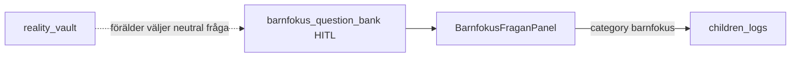

# Familjen — Barnfokus-frågor (ersätter enbart «Middagsfrågan»)

**Kanon UI:** [`references/FAMILIEN-PAGE-KANON.png`](./references/FAMILIEN-PAGE-KANON.png)  
**Route:** `/familjen` · panel på `BarnensPage`

---

## Vad är «Din eld»?

| | |
|---|---|
| **UI** | Liten ruta med flamma + siffra (t.ex. 128) på hem/hamn-mockups |
| **Betydelse (plan)** | **Valfri** «energi/streak» — kvällar du sparar reflektion, check-ins, eller barnfokus-svar |
| **Status** | **IDÉ / P2** — finns **inte** i kod än (`HomeStreakChip`) |
| **ADHD** | Kan döljas i inställningar — ska inte stressa |

Inte kopplat till Valv-bevis. Inte kopplat till ex-konflikt.

---

## Barnfokus — dagens fråga (låst flöde)

**Inte** längre en fast middagsfråga. En **roterande** fråga per dag/barn från kategorier:

| Kategori | Syfte | Exempel |
|----------|--------|---------|
| `gladje` | Roligt, tryggt | «Vad fick dig att skratta?» |
| `kunskap` | Lära något litet | «Vet du var honung kommer ifrån?» |
| `knas` | Knasigt, lek | «Om du vore en robot — vilket ljud?» |
| `lara_kanna` | Lära känna barnet | «Vad gör dig stolt?» |
| `utveckling` | Mastery, mod | «Vad vågade du idag?» |
| `valv_safe` | Föräldervalda från «bank» (ej auto-RAG) | Frågor du lagt i `barnfokus_question_bank` |

### Valv-koppling (säker)

- **Förbjudet:** Auto-dra konflikt/BIFF-text från Valv till barnfrågor.
- **Fas 1:** Inbyggd pool i `constants.ts` (inkl. några `valv_safe`-taggade).
- **Fas 2:** Firestore `barnfokus_question_bank` — förälder lägger till från Kunskap/egna.

### Låst UX (oförändrat beteende)

- Knapp: **Spara till {barn}s logg**
- **Minneslista** direkt under (optimistisk)
- Firestore: `children_logs`, `category: 'barnfokus'` (läs även legacy `middag`)

---

## Middagsfrågan

**Borttagen som egen produktlabel.** Middags-*ton* finns kvar i poolen (`gladje` / `lara_kanna`), inte som rubrik.
