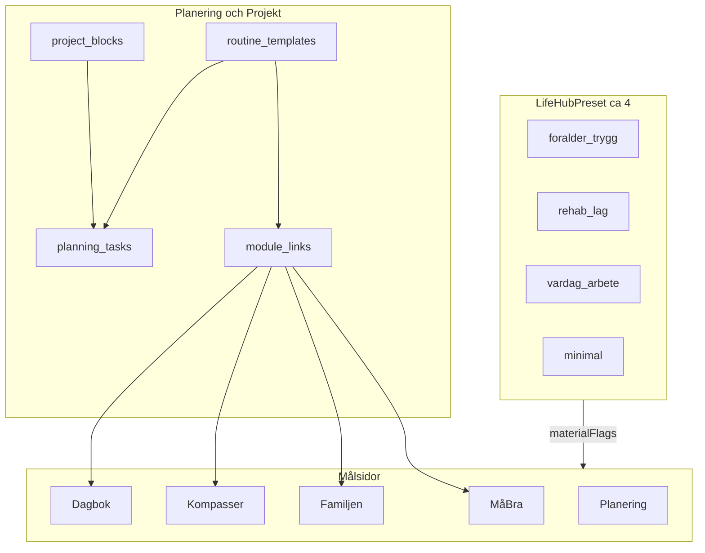

# Life OS — kopplingar, rutiner och exempelhubbar (komihåg)

**Status:** **Fas A+B implementerad** 2026-05-26 (`src/modules/core/lifeOs/`). Fas C–D (Firestore, full Projekt) vid `kör projekt P1` / `kör kopplingar`.  
**Datum:** 2026-05-26  
**Relaterat:** [`PLANERING-PROJEKT-HYBRID.md`](./PLANERING-PROJEKT-HYBRID.md) · [`PROJEKT-SPEC.md`](./PROJEKT-SPEC.md) · [`PLANERINGSSIDA-SPEC.md`](./PLANERINGSSIDA-SPEC.md)

---

## Syfte

Bygga ett **kopplingssystem** i Livskompassen v2 så att du kan:

1. **Lägga in och skapa** saker på **Planering** (`/planering`) och **Projekt** (`/projekt`) — uppgifter, listor, rutiner.
2. **Koppla dem till andra moduler** — t.ex. en rutin som öppnar **MåBra** (`/mabra`), **Familjen** (`/familjen`), **Kompasser**, **Dagbok**, **Hamn**.
3. **Välja mellan ~4 exempelhubbar** (förinställda livsprofiler) som styr **extra material** på utvalda sidor — snabbstart utan att konfigurera allt manuellt.

Detta är **Life OS-orkestrering för vardagen**, inte en vårdapp eller ersättning för BUP/KBT-program. Struktur kan inspireras av internetbehandling och föräldrastöd (veckokapitel, rutinavsnitt), men innehåll följer **U6** (`content_class`, innehållsregister) och **Locked UX**.

---

## Produktvision (låst intent)

| Behov | Lösning (koncept) |
|-------|-------------------|
| “Jag vill samla planering på ett ställe” | Hybrid: **Handling** fast (kanban), **Projekt** flex (block) |
| “Jag vill att en rutin leder mig rätt” | **RoutineTemplate** med steg → **ModuleLink** (deep link) |
| “Jag vill inte bygga om hela appen” | **LifeHubPreset** — 4 profiler som togglar synliga paneler/kort |
| “Extra stöd på rätt sida” | **MaterialPack** per hub (bankat REFLECTION/PLAY, genvägar — **ingen** ny RAG-silo) |

---

## Arkitektur (koncept)



### Principer (Grunder + Locked UX)

| Regel | Betydelse |
|-------|-----------|
| **Koppling ≠ RAG** | Länkar routar användaren och visar godkänt bankinnehåll — **ingen** cross-RAG mellan Kunskap / Valv / Barnen (U1). |
| **Handling förblir fast** | Kanban P3 på `/planering` får inte ersättas av projekt (hybrid-spec). |
| **ADHD-säkert** | En aktiv hub i taget; tydlig “var kom jag ifrån” (som `mabraBridge.ts`). |
| **Locked UX** | Middagsfrågan/Barnfokus, Valv Mönster+Orkester, Planering P3 — endast **tillägg**, inte borttag. |
| **Ingen klinisk triage** | Ingen PHQ-9/GAD-7-gating som vård — ev. energi/humör för **routing i UI**, inte diagnos. |
| **MåBra utan gamification** | Inga streak/XP i MåBra-bank (Mabra-SPEC, U6). |

---

## Modultyper (planerade)

### 1. `LifeHubPreset` (exempelhubbar)

Förinställd profil som användaren väljer **en** av (~4). Sparas lokalt eller i `users/{uid}/preferences`.

| `id` | Label (utkast) | Fokus | Extra material (exempel) |
|------|----------------|-------|---------------------------|
| `foralder_trygg` | Förälder — trygg hamn | Familjen, Hamn, Planering | Barnfokus synligt, BIFF-genväg, lätt Valv-promote (HITL) |
| `rehab_lag` | Rehab — låg stimulus | MåBra, Kompasser, Dagbok | Andning, `?from=mabra&energy=low`-bro, färre notiser |
| `vardag_arbete` | Vardag & arbete | Planering, Stämpla, Inkast | Kanban + inkorg, arbetsliv-kontextrad |
| `minimal` | Minimal | Hem + Handling | Endast P3 + en kontextrad |

`materialFlags`: `Record<routeKey, boolean>` — vilka paneler, adaptiva kort och snabbåtgärder som renderas.

**Befintlig kod att återanvända:** [`hubContextBar.ts`](../../src/modules/core/navigation/hubContextBar.ts), [`compassAdaptiveCards.ts`](../../src/modules/core/home/compassAdaptiveCards.ts), [`LivskompassHero`](../../src/modules/core/home/LivskompassHero.tsx).

### 2. `RoutineTemplate`

Namngiven rutin med valfritt enkelt schema (veckodagar / “varje morgon”) och ordnade steg.

- Steg kan: skapa `planning_task`, öppna `ModuleLink`, eller visa kort text (coach-bank, `bankId`).
- Exempel: *“Kväll — förälder”* → Familjen minneslista → MåBra 4-7-8 → Dagbok humör.

### 3. `ModuleLink`

Deterministisk deep link — samma mönster som dagbok ↔ MåBra:

```ts
// Koncept — ej implementerat
type ModuleLinkTarget =
  | { module: 'mabra'; hub?: 'panic_rsd' | 'self_critical' | 'find_self'; projectId?: string }
  | { module: 'familjen'; tab?: string }
  | { module: 'kompasser'; flow?: 'morning' | 'day' | 'evening' }
  | { module: 'dagbok'; from?: 'mabra'; energy?: 'low' }
  | { module: 'hamn' }
  | { module: 'planering'; tab?: 'handling' | 'fokus' | 'inkorg' }
  | { module: 'projekt'; projectId?: string };
```

**Referens:** [`src/modules/dagbok/constants/mabraBridge.ts`](../../src/modules/dagbok/constants/mabraBridge.ts).

### 4. `MaterialPack`

Kuraterat paket per hub: vilka REFLECTION/PLAY-kort, frågekort eller genvägar som visas. Allt via **INNEHALL-REGISTER** och befintliga banker — inga nya FACT utan kurator.

### 5. `PathwayChapter` (valfritt, senare)

Vecka 1–N som grupperar rutiner (inspirerat av BUP internetbehandling / iKomet avsnitt) — **coach/self-management**, inte behandlingsprogram med behandlare.

---

## Koppling till befintliga lager

| Lager | Route | Roll i kopplingssystemet |
|-------|-------|-------------------------|
| **Handling** | `/planering` | Mål för uppgifter från rutiner; kanban oförändrad |
| **Projekt** | `/projekt` | Flexibla block; rutiner kan bo som `project_blocks` eller egna mallar |
| **MåBra** | `/mabra` | Mål för andning, akut, egna MåBra-projekt (skilj från `/projekt`) |
| **Familjen** | `/familjen` | Barnfokus, loggar — rutiner för föräldraskap |
| **Kompasser** | `/vardagen?tab=kompasser` | Morgon/dag/kväll — check-in-bro |
| **SynapseBus** | events | Ev. framtida: `routine_completed` — **inte** cross-RAG |

**Datamodell (plan, Firestore):**

```
users/{uid}/preferences
  activeLifeHubPreset: string

routine_templates/{id}        // eller under users/{uid}/
  title, schedule?, steps[], links[]

// Projekt P1 (PROJEKT-SPEC):
projects/{id}
project_blocks/{id}
planning_tasks + projectId?
```

---

## Externa förebilder (inspiration, ej kopiera)

| Källa | Modultyp | Lärdom för Livskompassen |
|-------|----------|---------------------------|
| [BUP Internetbehandling](https://www.bup.se/bup-internetbehandling) | Veckokapitel, parallella spår barn/förälder | PathwayChapter + RoutineTemplate |
| [iKomet / Komet](https://www.ipsykologi.se/program/ikomet-parentweb) | Avsnitt 4 “Rutiner och ansvar”, hemuppgifter | Rutin → Familjen + Planering |
| [CARIBOU (CAMH)](https://www.camh.ca/en/professionals/treating-conditions-and-disorders/caribou) | Integrated care pathway, 7 steg | LifeHubPreset som pathway-mall |
| Tiimo / Rutinerad | Visuella rutiner, familjesynk | Barnporten/widget — bildstöd senare |
| Stepped care (primärvård) | Eskalerande nivåer | 4 hubbar = “livsprofil”, inte klinisk triage |

---

## Fasering (implementation)

| Fas | Leverans | Kommando (förslag) |
|-----|----------|-------------------|
| **0** | Detta dokument + system-plan | *(klart när filen mergas)* |
| **A — Snabb MVP** | `lifeHubPresets.ts` + inställning på Hem + villkorliga paneler | `kör life hub MVP` |
| **B — Rutiner light** | Mallar + deep links + skapa `planning_tasks` | `kör kopplingar B` |
| **C — Projekt P1** | `projects`, blocks, `projectId` på kanban | `kör projekt P1` |
| **D — Full** | Firestore rutiner, synapse, MaterialPack-editor | `kör kopplingar` |

**Rök inte utan beslut:** `firestore.rules`, Sacred collections, ny FACT-innehåll utan `INNEHALL-REGISTER`.

**Smoke:** `smoke:locked-ux` måste PASS efter UI-ändringar; ev. ny `smoke:life-os-links` när routes finns.

---

## Icke-mål

- Ersätta BUP, 1177 Stöd och behandling, eller erbjuda internet-KBT med behandlare.
- Fjärde RAG-silo eller automatisk cross-read mellan silor.
- Gamification (streak, XP) i MåBra-zon.
- Dölja eller slå ihop Locked UX (kanban, Valv-flikar, Barnfokus).
- LLM som beslutar vilken modul användaren “ska” till (routing i **kod**, DCAP för risk).

---

## Nästa steg

1. Vid behov: välj och namnge de 4 hubbarna med användaren (copy/ton).  
2. `kör life hub MVP` — Fas A.  
3. Synka [`MODUL-FUNKTIONS-REGISTER.md`](../MODUL-FUNKTIONS-REGISTER.md) när första kod landar.
