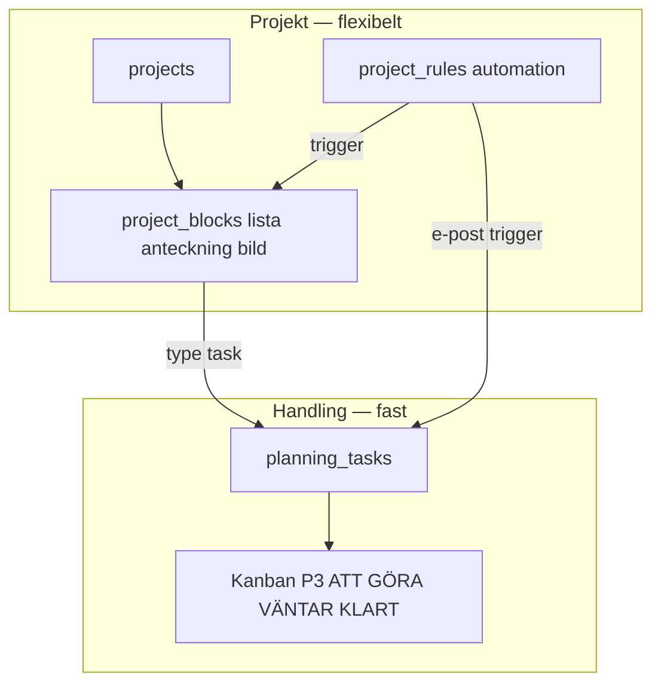

# Planering + Projekt — bekräftat upplägg (låst)

**Beslut:** 2026-05-23 — *«det upplägget ska vi absolut ha»*  
**Princip:** **Handling ligger fast** (kanban) · **Projekt** är flexibelt (lista, anteckning, bild, egna planeringar)

---

## Två lager (får inte slås ihop)

| Lager | Vad | Route |
|-------|-----|-------|
| **Handling (fast)** | Alla **uppgifter** med status — alltid samma 3 kolumner | `/planering` (default) eller `/planering/handling` |
| **Projekt (flex)** | **Mappar** du skapar — listor, anteckningar, bilder, egna planer | `/projekt` · `/projekt/:id` |
| **Regler** | E-post/automation → projekt eller handling | `/projekt/regler` |
| **Inkorg** | Mejl → kort/uppgift | `/planering/inkorg` |

**Handling försvinner inte** när du skapar projekt — uppgifter **syns alltid** i kanban (ev. filter «per projekt»).

---

## Navigation (Planering-modulen)

| Flik | Innehåll |
|------|----------|
| **Handling** | P3 Kanban — **fast, primär** |
| **Projekt** | Hub + egna planeringar |
| **Inkorg** | P1 e-post |
| **Regler** | P4 automation |

Kalender: ikon i header → `/planering/kalender` (P2).

---

## Widget v2 (fast)

- **+ / Nytt projekt** → samma picker som `/projekt/ny`
- **Lista · Anteckning · Bild** → skapar block i valt/nytt projekt
- **Uppgift** → skapar `planning_tasks` → **Handling-kanban**
- Tyst inspelning · Planering · Valv kvar

Mockup: [`galleri/widget/v2/W1-kompakt-projekt.png`](./galleri/widget/v2/W1-kompakt-projekt.png)

---

## Kanonbilder

| Del | Fil |
|-----|-----|
| Handling kanban | [`references/PLANERING-P3-KANBAN-KANON.png`](./references/PLANERING-P3-KANBAN-KANON.png) |
| Projekt regler | [`references/PROJEKT-P4-REGLER-KANON.png`](./references/PROJEKT-P4-REGLER-KANON.png) |
| Nytt projekt picker | [`references/PROJEKT-NY-PICKER.png`](./references/PROJEKT-NY-PICKER.png) |

---

## Spec-filer

- [`PROJEKT-SPEC.md`](./PROJEKT-SPEC.md)
- [`PLANERINGSSIDA-SPEC.md`](./PLANERINGSSIDA-SPEC.md)
- [`planering/PLANERING-P3-KANBAN-SPEC.md`](./planering/PLANERING-P3-KANBAN-SPEC.md)
- [`WIDGET-BAR-SPEC.md`](./WIDGET-BAR-SPEC.md)

## Kod (plan)

- `src/modules/planering/` — kanban, inkorg, kalender
- `src/modules/projekt/` — hub, blocks, regler
- `FyrenWidgetBar.tsx` — v2
