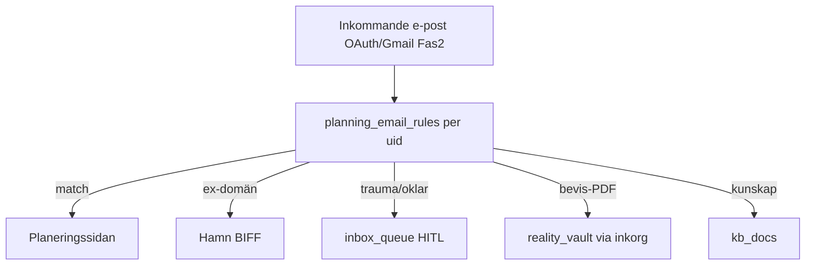

# Planeringssidan — spec (e-post · kalender · handling)

**Route (plan):** `/planering`  
**Kluster:** Nytt sidokluster **Planering** (Calendar-ikon) eller flik under Vardagen — **produktbeslut vid implementation**.  
**Tema:** **E — Nordic Skymning** (guldtext, ingen turkos/lila) + Valv-typografi från F.  
**Visuellt:** Samma språk som [`references/E-home-hero-kanon.png`](./references/E-home-hero-kanon.png) — ikoner **L2 line gold** (inte kompass-emboss).

---

## Syfte

En **affärslogisk hub** för:

- E-post som handlar om **schema, myndighet, skola, advokat, ekonomi** (inte ex-brus → Hamn).
- **Kalender** (hämtning, lämning, möten, deadlines).
- **Uppgifter/atoms** (Paralys-Brytaren-kompatibla, ett steg i taget).

**Skild från:** Valv (bevis-WORM), Kunskap (RAG), Barnen (barnsilo), Hamn (ex/BIFF).

---

## E-postkoppling — hur det fungerar

### Princip: regler, inte “all e-post”

### Regeltyper (Firestore: `planning_email_rules`)

| Fält | Exempel |
|------|---------|
| `matchType` | `from_email` · `from_domain` · `subject_contains` · `label` (Gmail) |
| `pattern` | `@advokat.se`, `skola@`, `Tingsrätt` |
| `route` | `planering` · `hamn` · `inbox_queue` · `vault` · `kunskap` · `ignore` |
| `priority` | 1–100 (lägst vinner vid konflikt) |
| `enabled` | bool |

### Förslag: standardregler (opt-in vid första öppning)

| Regel | Route | Varför |
|-------|-------|--------|
| Avsändare = **mamma/ex** (din lista) | `hamn` | BIFF, inte planering |
| `@skola.` / `förskola` / `grundskola` | `planering` | Schema, utvecklingssamtal |
| `advokat` / `jurist` / `tingsrätt` | `planering` | Handling |
| `Kronofogden` / `Försäkringskassan` | `planering` | Ekonomi/deadline |
| Bilaga PDF + ämne “beslut” | `vault` + länk i planering | Bevis |
| Okänt | `inbox_queue` | Du godkänner (G10 finns) |

### Fas 1 (utan Gmail OAuth)

| Metod | Status |
|-------|--------|
| **Manuell “Klistra in e-post”** på Planeringssidan | **BYGGS** |
| **Vidarebefordran** till dedikerad adress (Cloud Function) | **IDÉ · Fas 2** |
| **Gmail API + OAuth** med regelmotor | **IDÉ · Fas 2** |

### Fas 2 (Gmail)

- Scope: `gmail.readonly` + filter labels `Livskompassen/Planering`
- Användaren skapar filter i Gmail: `from:skola@*` → label → synkas till app
- **Zero Footprint:** förhandsvisning i RAM; känsliga trådar sparas endast vid explicit “Spara till Valv”

---

## Planeringssidan — moduler (innehåll)

| Flik / sektion | Funktion | Data |
|----------------|----------|------|
| **Inkorg** | Filtrerad lista (endast `route: planering`) | `planning_messages` eller `inbox_queue` med tag |
| **Kalender** | Vecka/dag, hämtning, möten | `planning_events` eller export Google Calendar |
| **Handling** | Uppgifter + deadlines, ett mikrosteg | `planning_tasks` WORM-light eller `checkins`-lik |
| **Regler** | Redigera e-postregler | `planning_email_rules` |

### Kopplingar till befintligt

| Befintligt | Bro |
|----------|-----|
| `InboxQueueCard` (Kunskap) | Delar `confirmInboxItem` — planering är **egen route** |
| `analyzeMessage` | Från planering-inkorg → “Öppna i Hamn” med `prefilledMessage` |
| `generateDossier` | Export valda trådar + kalender + tasks |
| Paralys-Brytaren | “Bryt uppgift” på handling-rad |

---

## Fyra versioner — Planeringssidan

| ID | Namn | Layout | Bäst för |
|----|------|--------|----------|
| **P1** | **Trippel-flik** | Inkorg \| Kalender \| Handling (tabs) | Tydlig ADHD-struktur |
| **P2** | **Dags-tidslinje** | En vertikal dag: e-post nålar + händelser + uppgifter | “Vad händer idag?” |
| **P3** | **Byrå-kanban** · **KANON** | Att göra \| Väntar \| Klart + under-nav | **Default** `/planering` — se [`planering/PLANERING-P3-KANBAN-SPEC.md`](./planering/PLANERING-P3-KANBAN-SPEC.md) |
| **P4** | **Handlingskö** | En lista med regelfilter överst + snabb “Lägg till” | Backup om kanban känns tungt |

Mockups: `docs/design/planering/variants/` · kanon [`references/PLANERING-P3-KANBAN-KANON.png`](./references/PLANERING-P3-KANBAN-KANON.png)

**Rekommendation:** **P3** som huvudvy + **P1 inkorg** + **P2 kalender** som delroutes (hybrid).

---

## Fyra versioner — Widget bar

| ID | Namn | Placering | Diskret inspelning |
|----|------|-----------|-------------------|
| **W1** | **Kant-prick** | Höger kant, 3px guld-prick | Dubbeltryck prick → tyst inspelning (ingen REC-röd) |
| **W2** | **Nedre båge** | Halvmåne längs nedre kant | Långtryck båge 1s → inspelning |
| **W3** | **Kompass-dock** | Integrerad i FloatingDock (extra micro-läge) | Håll Kompass 1s (ej 3s valv) → inspelning |
| **W4** | **Volym-hörn** | Osynlig zon nedre höger 12×12px | Trippeltryck → inspelning, skärm oförändrad |

Mockups: `docs/design/planering/variants/W1–W4.png`

### Tyst inspelning (alla W-varianter)

| Krav | Implementation |
|------|----------------|
| Barnen ser inte REC | Ingen röd prick; valfritt svart skärm-läge / “viloläge”-overlay för dig |
| Bevis | `reality_vault` WORM, `category: tyst_inspelning`, `startedAt` server timestamp |
| Etik | Endast där lag tillåter; app visar **inte** juridisk rådgivning — kort info i inställningar |
| Stopp | Samma diskreta gest eller volym upp igen |

Spec: [`WIDGET-BAR-SPEC.md`](./WIDGET-BAR-SPEC.md) (uppdateras).

---

## Tema E — Nordic Skymning (uppdaterat)

| Token | Värde |
|-------|-------|
| Bakgrund | Skymning `#12151f` → `#1a1f2e` (varm horisont, **ej** lila) |
| Text rubriker | **Guld** `#d4af37` |
| Text bröd | Cream `#f5f0e8` |
| Accenter | Amber `#f59e0b` — **ingen** turkos, **ingen** lila |
| Menyer | Obsidian glass `border-white/10` |
| Kompass/loggor | Guld F-stil |

---

## IDÉER & tillägg (backlog)

| IDÉ | Beskrivning | Fas |
|-----|-------------|-----|
| **Deadline från PDF** | Vävaren extraherar datum → `planning_events` | 2 |
| **ICS-export** | Dela kalender med advokat | 2 |
| **Påminnelse hämtning** | Push 30 min före (PWA) | 2 |
| **Mall “svar skola”** | Neutral logistik, kopiera | 1 |
| **Widget → Planering** | fjärde ikon i expanderad widget | 1 |
| **Koppla en kalender** | Google Calendar read-only | 2 |
| **Uppgift → ekonomi** | Förfallen faktura → `/vardagen?tab=ekonomi` | 3 |
| **L-01 Kopplingssystem** | Rutiner, modullänkar, 4 exempelhubbar — se [`LIFE-OS-KOPPLINGAR-KOMIHAG.md`](./LIFE-OS-KOPPLINGAR-KOMIHAG.md) | A–D |

---

## BYGGS vs IDÉ (sammanfattning)

| **BYGGS (P1)** | **IDÉ** |
|----------------|---------|
| Route `/planering` + P1 trippel-flik UI | Gmail OAuth |
| `planning_email_rules` + manuell inkorg | Auto-forward adress |
| Widget W1 + tyst inspelning | W2–W4 (välj efter mockup) |
| Tema E tokens (guldtext) | Google Calendar sync |
| Klistra in e-post → planering | Handlingshub full (e-post+kallelse) |

---

## Nästa steg

1. Välj **P1–P4** och **W1–W4** i galleriet.  
2. Skriv `valt planering P? W?` + `valt tema E`.  
3. Implementation: modul `src/modules/planering/` + `FyrenWidgetBar.tsx`.
