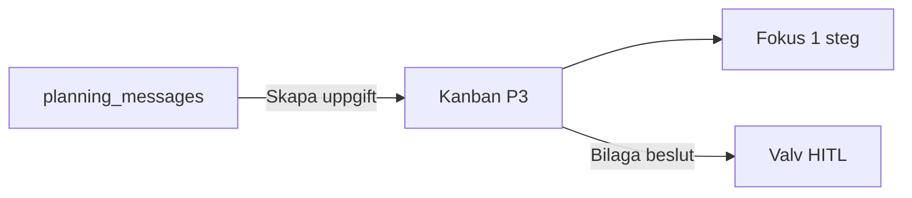

# Planering P3 — Kanban (kanon + funktion)

**Kanonbild:** [`../references/PLANERING-P3-KANBAN-KANON.png`](../references/PLANERING-P3-KANBAN-KANON.png)  
**Route:** `/planering` (standardvy) eller `/planering?vy=kanban`  
**Tagline:** *Håll fokus. En sak i taget.*

---

## Varför snyggare + mer funktionsduglig

| Problem (tidigare) | Lösning |
|------------------|---------|
| Bara flikar utan överblick | **3 kolumner** med antal-badge |
| Otydlig källa | **Ikon per kort** (skola, mejl, deadline, möte, väntar) |
| Svårt lägga till | **+** i varje kolumn |
| Ingen “en sak nu” | Under-nav **Fokus** = ett mikrosteg (Paralys-Brytaren) |

---

## Layout (telefon)

| Zon | Innehåll |
|-----|----------|
| Header | Meny · titel Planering · **kalender-ikon** (→ veckovy P2) |
| Undertitel | Håll fokus. En sak i taget. |
| Bräda | Horisontell scroll **eller** staplade kolumner på smal skärm |
| Kolumner | **ATT GÖRA** · **VÄNTAR** · **KLART** |
| Kort | Titel, rad text, **datum**, ikon vänster |
| Botten (planering-läge) | Planering · Fokus · Framsteg · Reflektion · Profil |

**Linjer:** `border-2` guld (se [`COMPACT-THEME-SPEC.md`](../compact/COMPACT-THEME-SPEC.md)).

---

## Kort — datamodell `planning_tasks`

| Fält | Exempel |
|------|---------|
| `id` | auto |
| `title` | Skoluppgift: läs kapitel 3 |
| `summary` | Mejl från läraren … |
| `status` | `todo` \| `waiting` \| `done` |
| `dueAt` | 2026-05-25 |
| `source` | `email` \| `school` \| `calendar` \| `manual` \| `authority` |
| `sourceRef` | inbox id / event id |
| `microStep` | Läs 2 sidor (Paralys) |
| `ownerId` | uid |

---

## Interaktioner (BYGGS P1)

| Gest | Resultat |
|------|----------|
| Tryck **+** i kolumn | Snabb “Lägg till” — titel + datum, default kolumn |
| Tryck kort | Sheet: detalj, **Bryt till mikrosteg**, flytta kolumn, länk till inkorg |
| Långtryck kort | Flytta till annan kolumn (drag senare P2) |
| Kalender-ikon header | Vecka/dag (P2) |
| Mejl-ikon på kort | Öppna tråd / klistra in-källa |

---

## Under-navigation (inom Planering)

| Flik | Funktion |
|------|----------|
| **Planering** | Kanban (denna skärm) |
| **Fokus** | **Ett** aktivt kort — stort, Paralys-Brytaren |
| **Framsteg** | Antal klara / väntar / försenade (ingen gamification-eldsrök) |
| **Reflektion** | Kort kvällsnotis → journal (opt-in) |
| **Profil** | E-postregler, koppla kalender (Fas 2) |

*Alternativ:* under-nav endast på `/planering/*`; huvuddock Familjen · kompass · Valv oförändrad.

---

## Koppling inkorg / kalender / Valv



| Källa | Skapar kort i |
|-------|----------------|
| E-post regel `planering` | ATT GÖRA eller VÄNTAR |
| Kalenderhändelse | ATT GÖRA med `dueAt` |
| Manuell | valfri kolumn |

---

## Hybrid med P1 (rekommendation)

| Vy | När |
|----|-----|
| **P3 Kanban** | Default `/planering` — uppgifter & ärenden |
| **P1 Inkorg** | `/planering/inkorg` — mejl som ska bli kort |
| **P2 Kalender** | `/planering/kalender` — från header-ikon |

Inte tre konkurrerande hemsidor — **en modul**, tre ingångar.

---

## Implementation

```
src/modules/planering/
  PlaneringKanbanPage.tsx
  PlanningTaskCard.tsx
  PlaneringSubNav.tsx
  hooks/usePlanningTasks.ts
```

Firestore: `planning_tasks` · befintlig `planning_email_rules`.
