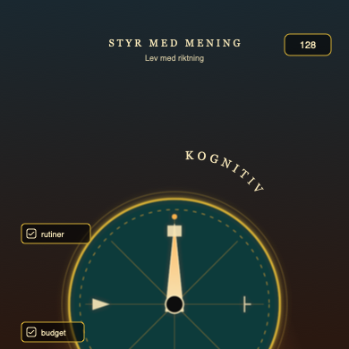
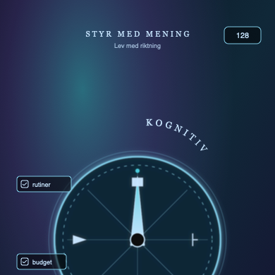
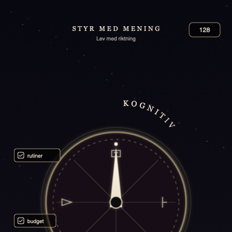
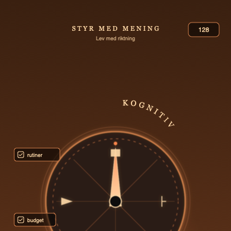
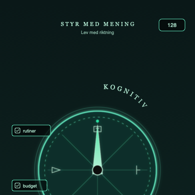
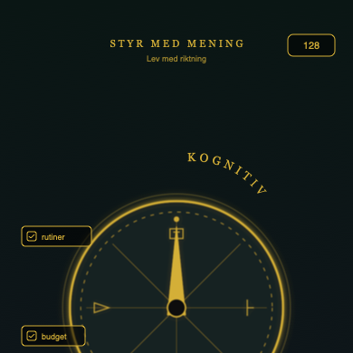
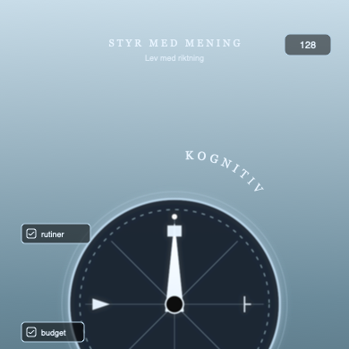
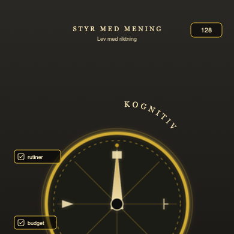
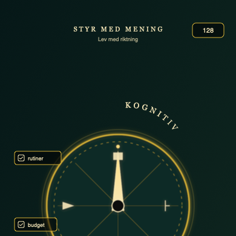
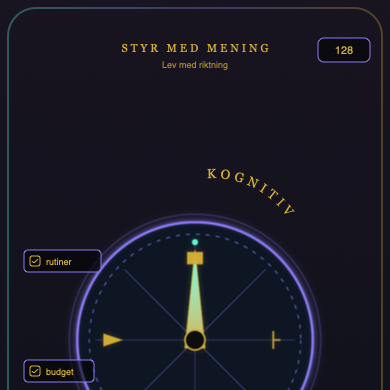

# Kognitiv Sköld — 10 designalternativ

Mall: din referens (sjö + guldsköld + orbit-ikoner). **PNG syns här** — `Cmd + Shift + V`.

Referensbilder: mappen `reference/` (dina uppladdade mockups).

Skriv **K03** (eller annat nummer) i chatten när du valt — då kan vi bygga om `LivskompassHero` + bakgrund.

---

## K01 — Sjö solnedgång (kanon)

Varm sjö · guld emboss · närmast din bild

---

## K02 — Aurora fjällsjö

Nordljus · silver/cyan nål · kall premium

---

## K03 — Obsidian stjärnhimmel

Mörk · tunna linjer · stjärnprickar

---

## K04 — Hamn ember strand

Koppar/brons · varm hamn-glow

---

## K05 — Regn dimma teal

Dimma · smaragd accent · lugn

---

## K06 — Nordic flat guld

Abstrakt gradient · **platta** guldlines (L2 — minst brus)

---

## K07 — Frost isreflex

Ljus is · silver · en varm guldpunkt

---

## K08 — Valv marmor pansar

Tjock guldram · marmor · tyngre sköld

---

## K09 — Astrolab sacred

Sacred geometry · dubbelring · klassisk kompass

---

## K10 — Urban dusk rim

Stadssilhuett-känsla · aurora-kant · v4-DNA

---

## Snabbval

| ID | Bakgrund | Ikoner |
|----|----------|--------|
| K01 | Sjö solnedgång | Guld 3D emboss |
| K02 | Aurora fjäll | Cyan/silver gem |
| K03 | Obsidian + stjärnor | Tunna linjer |
| K04 | Hamn ember | Varm koppar |
| K05 | Regn dimma | Smaragd line |
| K06 | Nordic gradient | Flat guld (ADHD-lugn) |
| K07 | Frost is | Silver frost |
| K08 | Valv marmor | Pansar tjock ram |
| K09 | Astrolab | Sacred geometry |
| K10 | Urban dusk | Lila/teal rim |

**Kommandon:** `npm run kognitiv-skold:preview` · omgenerera SVG: `npm run kognitiv-skold:generate`
