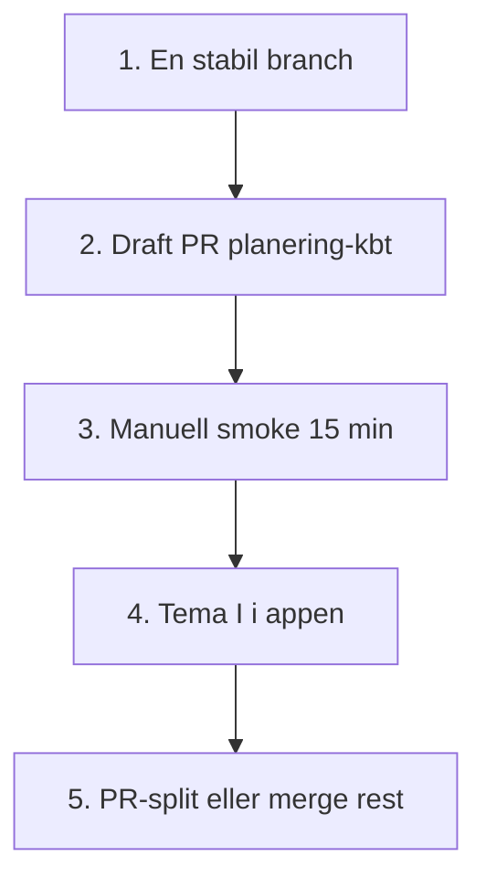

# Dagens plan — 2026-05-24

**Trigger:** Status + plan utifrån gårdagens beslut (2026-05-23 utvärderingsvåg, design P1, Planering, Tema I, PR-split).

**Källor:** `.context/system-plan.md`, `docs/evaluations/2026-05-23-*`, `docs/BRANCH-KARTA.md`, `git branch` / `git log`, agent-historik.

---

## Status i korthet

| Område | Läge |
|--------|------|
| **Fas** | Fas 4 — verifiering + produktpolish |
| **Sacred + G1–G16** | Klart i kod (enligt GAP-register) |
| **Gårdagens kod** | P1 wire-in, KBT Transformator, `/planering` kanban — på **`main` / `**main** (Del A 2026-05-24)`** |
| **Slutligt tema (beslut)** | **Tema I — Architect Vault** (Theme Pack, 5 skins) — runtime på `**main** (Del A 2026-05-24)`; mockups i `docs/design/themes/I-architect-vault/` |
| **Din branch nu** | `**main** (Del A 2026-05-24)` — Planering + Tema I runtime |
| **Ostadigt** | Untracked: teman J–O, `android/`, `.cursor/hooks/`, Data Connect SDK-sync |
| **Öppet (system-plan)** | Manuell smoke; opt-in minne-ingest; sidomeny (D24); projekt-hub P1+ |

---

## Vad vi bestämde igår

1. **Färdigställa design P1** — Hamn, Familjen, Valv, Hem, MåBra (våg 2a) → **gjort** på `main`.
2. **Planering** — `/planering` kanban + `planning_tasks` + deploy rules → **gjort**; rules deployad.
3. **Tema** — **Tema I** som produktion (inte blå E); J–O som lab/mockups.
4. **Grenar** — `**main** (Del A 2026-05-24)` pushad; PR-draft mot `main` (20 commits).
5. **Orkester** — natt-autorun + specialister → branch `split/orkester-autorun`.
6. **PR-split** — 5 mindre PR:er (Orkester → Android → Kunskap → Theme E/hubs → Theme Pack I) — **planerad, ej helt genomförd**.

---

## Dagens mål (prioritet)



| Block | Tid | Leverans |
|-------|-----|----------|
| **A — Orientering** | 10 min | Byt till rätt branch; `npm run dev`; en sida fungerar |
| **B — PR planering** | 15 min | Draft PR `**main** (Del A 2026-05-24)` → `main` (GitHub) |
| **C — Smoke** | 15–20 min | `smoke:locked-ux` + manuell #18 ekonomi + `/planering` spara kort |
| **D — Tema I** | 45–90 min | `checkout **main** (Del A 2026-05-24)` → `/dev/themes` → välj skin |
| **E — Städning** | valfritt | Committa eller rensa J–O docs; slutför PR-split orkester |

---

## Ett steg nu (start här)

**Byt till grenen där Planering + Tema I finns:**

```bash
git checkout **main** (Del A 2026-05-24)
npm run dev
```

Öppna `http://localhost:5173/planering` och bekräfta att sidan laddar.

---

## Efter steg 1 (vänta på OK)

| # | Uppgift | Kommando / plats |
|---|---------|------------------|
| 2 | Skapa **draft PR** (om ej klar) | GitHub compare `main`…`**main** (Del A 2026-05-24)` eller `gh pr create --draft` |
| 3 | Smoke | `npm run smoke:locked-ux` + `npm run smoke:design-modules` |
| 4 | Manuell | [`docs/SMOKE_CHECKLIST.md`](../SMOKE_CHECKLIST.md) #18 ekonomi, `/hamn` BIFF-triage |
| 5 | Tema I | `/dev/themes` — lås default skin i Theme Pack |
| 6 | Orkester | Merge `split/orkester-autorun` → `main` **efter** smoke, eller PR #1 enligt gårdagens split |

---

## Blocker

| Blocker | Åtgärd |
|---------|--------|
| Fel branch → saknar `/planering` | `git checkout **main** (Del A 2026-05-24)` |
| `ERR_CONNECTION_REFUSED` | `npm run dev` måste köra |
| `gh` saknas | Skapa PR i webbläsaren |
| Kognitiv överlast | Kör **bara** steg 1 idag; resten imorgon |

---

## Referenser

- Helhetsstatus: [`2026-05-23-A-helhetsstatus-v2.md`](./2026-05-23-A-helhetsstatus-v2.md)
- Design D1–D29: [`2026-05-23-F-design-moduler.md`](./2026-05-23-F-design-moduler.md)
- Branch-karta: [`docs/BRANCH-KARTA.md`](../BRANCH-KARTA.md)
- Tema I: [`docs/design/themes/I-architect-vault/THEME-I-SPEC.md`](../design/themes/I-architect-vault/THEME-I-SPEC.md)
