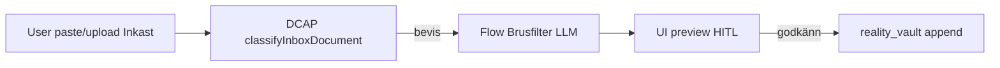
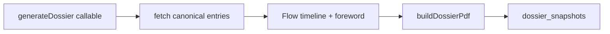

# Deep Research — Flow pipeline-karta (P1 Brusfilter, P2 Dossier v2)

**Datum:** 2026-06-17 · **Subagent:** specialist-adk-weaver  
**Status:** P1 v1+v2 **LOCK** · P2 **LOCK** (2026-06-17)
**Mall:** [`MALL-deep-research-modul.md`](./MALL-deep-research-modul.md)  
**Orkester:** [`docs/external-ai/GEMINI-ORKESTER-MASTER-PROMPT.md`](../external-ai/GEMINI-ORKESTER-MASTER-PROMPT.md)

---

## 1. Syfte

Kartlägga var **Google Flow** (≈2000 krediter) ska användas utan att bryta LOCK-kärna, WORM eller tre silos — med fokus på:

- **P1 Brusfiltret** — rena fakta från ex-sms/mejl före WORM (≈80% HCF-uploads)
- **P2 Dossier v2** — förbättra sammanfattning/tidslinje; prod har redan `generateDossier`

---

## 2. Nuvarande läge (repo-sanning)

### P2 Dossier — redan i prod (inte Flow)

| Del | Plats |
|-----|--------|
| Callable | `functions/src/callables/valv.ts` → `generateDossier` |
| Logik | `functions/src/lib/generateDossierInternal.ts` |
| PDF | `functions/src/lib/dossierPdf.ts` |
| UI | `src/modules/features/lifeJournal/evidence/vault/dossier/` |
| WORM | `dossier_snapshots` append-only |
| Smoke | `smoke:dossier` |

**Beteende idag:** Användaren väljer doc-IDs från `reality_vault`, `children_logs`, `journal` → canonical hash → PDF → Storage → WORM snapshot. Valfritt `includeAiForeword` i PDF — **ingen separat Flow-pipeline i repot**.

**Slutsats:** Eventuell Flow/Dossier-bygge hos Pontus = **prototyp utanför repo**. Prod ska **inte** ersättas — Flow offloader endast tunga LLM-steg.

### P1 Brusfilter — v1 LOCK i prod (2026-06-17)

| Del | Plats | Roll |
|-----|--------|------|
| Callable | `functions/src/callables/processBrusfilter.ts` | DCAP + logistik + BIFF-utkast, Valv-session, **ingen WORM** |
| Frontend | `VaultOrkesterPanel.tsx` + `processBrusfilterService.ts` | Flik **Meddelanden eller SMS-analys** (`vaultTab=orkester`) |
| Deploy | `functions:processBrusfilter` + hosting 2026-06-17 | Prod verifierad av Pontus |

**Kvar (v2, LOCK 2026-06-17):** Inkast HITL — `InkastBrusfilterPreview` i `CapturePanel`, knapp «Filtrera brus först», alias `previewInkastClean` = `processBrusfilter`.

| Del | Plats | Roll |
|-----|--------|------|
| Inkast-klassificering | `inboxClassifier.ts` → `classifyInboxDocument` | Silo-routing (DCAP-liknande), **inte** full brus-rensning |
| Hamn Brusfilter+BIFF | `gransArkitektenAgent.ts` → `askGransArkitekten` | Ex-sms → cleanFacts + greyRockReply (ephemeral) |
| Inkast submit | `submitInkastLite.ts` | Klassificerar, routeInboxToWorm |
| DCAP | `routeFromDcap`, `dcapAlertSynapse` | Risk före LLM |

**P1 v2 LOCK (2026-06-17):** `InkastBrusfilterPreview` i `CapturePanel` — «Filtrera brus först» före WORM via `SaveAsEvidencePrompt`.

### BACKEND-POLICY

[`LIFE-OS-BUILD-STATE.md`](../external-ai/LIFE-OS-BUILD-STATE.md) — LOCK-kärna verifierad. Research får föreslå `backend_impact: YES`; implementation efter PMIR + smoke. Tillåtet utan ny PMIR: bugfix, content ingest. Nya callables: **tunn** brygga (Flow/Vertex) + DCAP + vault session + HITL.

---

## 3. Masterplan — fortfarande optimalt?

| Plan | Innehåll | Bedömning |
|------|----------|-----------|
| GEMINI-GEM-KNOWLEDGE §4 | Flow för Dossier, Brusfilter | **JA** — alignar med FREEZE |
| Fas 19 masterplan | MåBra 19.2–19.5 | **DELVIS DONE** (smoke PASS 2026-06-18) — nästa: system-gap-syntes |
| Domän ~80% HCF | Bevis-routing Valv | **JA** — P1 Brusfilter högst ROI |

---

## 4. Verktygsval och kostnad

| Prioritet | Verktyg | Flow-krediter | Drift | Rekommendation |
|-----------|---------|---------------|-------|----------------|
| **P1 Brusfilter** | `processBrusfilter` + Inkast HITL | — | Låg | **LOCK** 2026-06-17 |
| **P2 Dossier v2** | `dossierAiForeword` + `generateDossier` | — | Låg | **LOCK** 2026-06-17 |
| **P3 Mönster-metadata** | `assistPatternMetadata` FLOW sidecar | Låg | Låg | **LOCK** (2026-06-18 PMIR-A) |
| **P4 MåBra coach** | Flow parafras + `mabraCoach` bankId | Medel | Låg | **KANDIDAT** |
| **P5 Theme mockups** | Antigravity / Flow bild | Låg | — | **KANDIDAT** |
| **P6 Dossier timeline** | Flow strukturerad tidslinje | Medel | Låg | **KANDIDAT** |
| **P7 Hamn BIFF** | Befintlig `askGransArkitekten` | — | Functions redan | DEFER Flow |
| Cross-silo RAG | — | — | — | **REJECT** |

**Gratis alternativ:** Utöka `includeAiForeword` prompt i `dossierPdf` via `sharedRules.ts` — billigare men mindre flexibelt än Flow.

**150 SEK/månad:** On-demand endast; batcha; ingen schemalagd Flow.

---

## 5. Risker

| Risk | Mitigering |
|------|------------|
| Flow skriver WORM utan auth | Callable: `guardSensitiveCallableV2` + vault session |
| Cross-RAG i Dossier | `generateDossier` läser endast explicit `includedDocIds` — behåll |
| Brusfilter läcker till Kunskap | Output endast `reality_vault` eller `inbox_queue` HITL |
| Ersätter LOCK classifyInboxDocument | Flow **efter** classify — komplement, inte ersätt |
| Diagnos i WORM | Prompt: beteende + datum only (domän-kanon) |

---

## 6. Beslut

| Pipeline | Beslut | Motivering |
|----------|--------|------------|
| **P1 Brusfilter v1** | **LOCK** (2026-06-17) | Orkester + `processBrusfilter` — prod-test OK |
| **P1 Brusfilter v2** (Inkast HITL) | **LOCK** (2026-06-17) | CapturePanel + brusfilter preview före spar |
| **P2 Dossier v2** | **LOCK** (2026-06-17) | `dossierAiForeword` + PDF foreword/timeline via Gemini Flash |
| P3–P7 | **KANDIDAT** | Prioriteras i `2026-06-18-system-gap-syntes.md` efter Deep Research |

**Pontus:** ☑ godkänn v1 (2026-06-17) · ☐ avvisa · ☐ ändra X: _______________

---

## 7. Flow-nodgrafer

### P1 — Brusfiltret (Valv-silo)



**Input JSON:**

```json
{
  "rawText": "string",
  "sourceType": "sms|email|note",
  "locale": "sv-SE"
}
```

**Output JSON:**

```json
{
  "cleanFacts": ["string"],
  "timelineHints": [{"date": "YYYY-MM-DD", "fact": "string"}],
  "emotionalBaitStripped": ["string"],
  "suggestedTitle": "string"
}
```

**Callable-brygga (ny, tunn):** `previewInkastClean` — auth + rate limit; **ingen** WORM utan separat confirm.

### P2 — Dossier v2 (Valv-silo)



**Ändra inte:** doc selection, hash, WORM write, PDF storage — endast LLM-innehåll för `includeAiForeword` och ev. strukturerad tidslinje-sektion.

---

## 8. Implementation Package (utkast — efter godkännande)

### P1 — fas 1

| Steg | Ägare | Artefakt |
|------|-------|----------|
| 1 | Pontus + Flow | Flow-verktyg enligt §9 FLOW-prompt |
| 2 | ChatBox | Callable SPEC (GPT-5.5) |
| 3 | Cursor | `previewInkastClean` + UI preview i Inkast |
| 4 | verifier | smoke:inkast, smoke:valv-security |

**MUST NOT:** Auto-write `reality_vault` utan HITL-knapp.

### P2 — fas 2

| Steg | Ägare |
|------|-------|
| 1 | Flow | Dossier timeline/foreword tool |
| 2 | Cursor | Wire Flow URL i `generateDossierInternal` när `includeAiForeword` |
| 3 | verifier | smoke:dossier |

---

## 9. Färdiga prompts (modul-gate — efter Pontus godkänn)

### 9.1 FLOW — P1 Brusfilter (klistra i Google Flow)

```text
Build a Swedish forensic text-cleaning tool "Livskompassen Brusfilter" for high-conflict co-parent SMS/email.

CONSTRAINTS:
- Output neutral observable facts only — no diagnoses, no "narcissist", no party labels
- Strip emotional bait, accusations, JADE triggers
- Preserve dates and logistics
- JSON output schema only

INPUT: rawText, sourceType (sms|email|note), locale sv-SE

OUTPUT JSON:
{
  "cleanFacts": ["max 8 bullet facts"],
  "timelineHints": [{"date": "YYYY-MM-DD or unknown", "fact": "string"}],
  "emotionalBaitStripped": ["what was removed, paraphrased"],
  "suggestedTitle": "short neutral title"
}

SYSTEM TONE: clinical, low-affect, Swedish. Like Brusfiltret in Livskompassen — facts for evidence vault, not coaching.

Do NOT decide legal outcomes or custody. Do NOT merge knowledge from other domains.

Export: tool name, system prompt, user prompt template, example for 1 gaslighting SMS.
```

### 9.2 CHATBOX — Callable SPEC (efter Flow-export)

```text
Livskompassen v2 — SPEC only, no full prod code.

Task: Design thin callable `previewInkastClean` that:
- Uses guardSensitiveCallableV2 + vault session optional
- Calls external Flow endpoint with rawText
- Returns preview JSON only — NO write to reality_vault
- Separate confirm path uses existing routeInboxToWorm / SaveAsEvidencePrompt pattern

READ: functions/src/lib/submitInkastLite.ts, inboxClassifier.ts, callableGuards.ts
MUST NOT: cross-RAG, auto WORM, replace classifyInboxDocument

Deliver: interface types, error codes, sequence diagram, firestore.rules impact (none expected).
Model: GPT-5.5
```

### 9.3 CURSOR — efter ChatBox SPEC godkänd av Gemini

```text
MODEL TIER: HEAVY
SCOPE: backend-only + frontend-only (two waves — backend first)
READ FIRST:
  - functions/src/lib/submitInkastLite.ts
  - functions/src/lib/inboxClassifier.ts
  - functions/src/callables/callableGuards.ts
  - src/modules/features/lifeJournal/capture/CapturePanel.tsx
CONTEXT: P1 Brusfilter — previewInkastClean callable + HITL preview UI
LOCKED UX: G10 Inkast LOCK — extend, do not remove CapturePanel flow
TASK: Wave 1 — implement previewInkastClean callable per approved SPEC. Flow URL from env. No WORM write in preview.
MUST NOT: modify classifyInboxDocument routing logic; cross-silo; auto-promote to reality_vault
VERIFY:
  - cd functions && npm run build
  - npm run smoke:inkast
  - npm run smoke:valv-security
DONE WHEN: build exit 0 AND smoke:inkast PASS

Jämför dina ändringar mot hela projektets kontext. Arbeta autonomt och sluta inte förrän koden är helt felfri och appen går att använda.
```

---

## 10. Subagent-parallellt (Cursor)

| Agent | Uppdrag efter godkännande |
|-------|---------------------------|
| specialist-adk-weaver | Granska Flow-export mot §7 nodgraf |
| specialist-valv-builder | UI-placering preview i Valv Inkast |
| specialist-security-auditor | PMIR före ny callable deploy |
| specialist-verifier | smoke efter Cursor wave 1 |

---

*P1+P2 LOCK 2026-06-17/18. Nästa gate: system-gap-syntes — Deep Research MASTER + SA1–SA10 → CURSOR-FLOW-CREDITS-SYNTHESIS (§11).*


---

## 11. Gate — system-gap-syntes (2026-06-18) ✅

**Status:** Klar — [`2026-06-18-system-gap-syntes.md`](./2026-06-18-system-gap-syntes.md) · **våg 28 innehåll KEEP** (5 poster, `smoke:innehall` PASS).

| Steg | Status |
|------|--------|
| MASTER + SA1–SA10 → `imports/research-2026-06-18-*.md` | Done |
| Dirigent → `imports/research-2026-06-18-content-master.md` | Done |
| Cursor [`CURSOR-FLOW-CREDITS-SYNTHESIS.md`](../external-ai/bifoga/03-prompter/CURSOR-FLOW-CREDITS-SYNTHESIS.md) | Done |
| PMIR-A P3 vald (Mönster) — Worker A äger eval | Pågår |

**Nästa gate:** PMIR-B (P4 MåBra) eller PMIR-C (P6 Dossier) — en i taget efter P3 smoke/deploy.

**BACKEND-POLICY:** Research får föreslå nya callables; varje backend-ändring = egen PMIR → smoke → ny LOCK.
