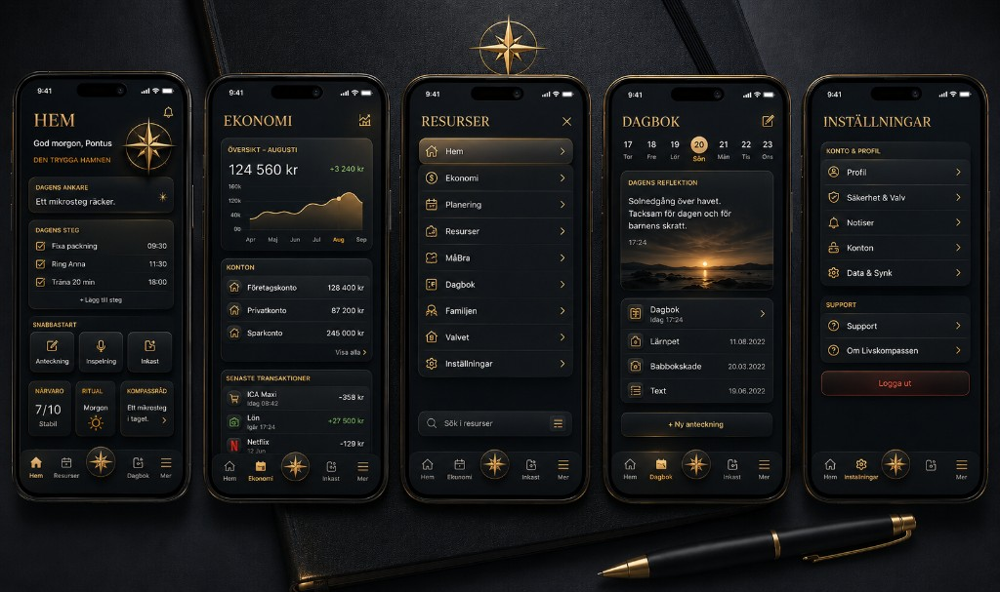
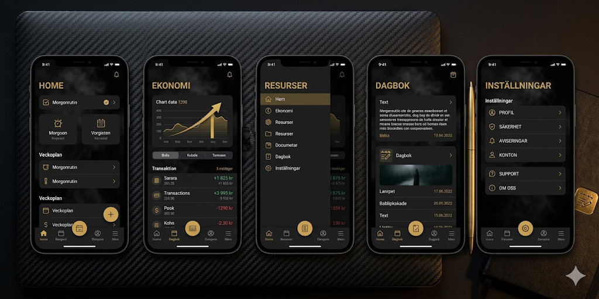

# FP-TI · Riktning E godkänd + referensbild

**Datum:** 2026-06-18 · **Beslut:** Pontus · **Scope:** sandbox (`/dev/design-freeport`) — prod orörd tills PMIR

## Godkänd riktning

| ID | Tema | `data-fp-theme` |
|----|------|-----------------|
| **E** | Obsidian executive | `tactile-obsidian` |

- Accent: guld `#d4af37` på matt svart `#000`
- Cinzel zon/rubrik (HEM), Inter i hub och Chameleon-delegates
- Fyllda modulkort: gradient `#1e1e1e → #121212`, 2px guld-kant, soft shadow
- Sandbox-default: `tactile-obsidian` i `freeportThemes.ts`

## PRIMARY hero referens (rank 0 — MUST HAVE)

**Fil:** `docs/design/references/FP-TI-REF-hero-executive-must-have.png`  
**Status:** Pontus — **«denna designen måste vi ha»** (2026-06-18)

### Ta med (JA)
- Matte black bakgrund (ej navy radial)
- Guld serif uppercase **HEM** + personlig hälsning
- **Fyllda** rundade modulkort med gradient och depth
- Dagens ankare, Dagens steg checklist, 2-col Snabbstart
- Hub-listrader med guld ikon-cirkel + chevron
- **LivskompassMark** som guld FAB i nav-centrum
- 3-zons nav: Hem · Hjärtat · FAB · Vardagen · Familjen (S2)

### Ta inte med (NEJ)
- Prod-nav etiketter Dagbok/Ekonomi/Resurser från ref-bilden
- Finance/luxury copy som prod-default
- Fem-skärms IA som prod-struktur

### Sandbox-alignment (2026-06-18)
- `src/styles/design-freeport.css` — executive tokens + quick-grid + plan-list + FAB mark
- `FreeportHemV3Lab.tsx` — executive hero layout
- Screenshot: `docs/design/references/FP-TI-sandbox-executive-hero.png`

## Sekundär referens (rank 1)

**Fil:** `docs/design/references/FP-TI-REF-hero-gold-filled-cards.png`  
**Status:** VERY CLOSE — ersatt som primary av executive ref ovan
