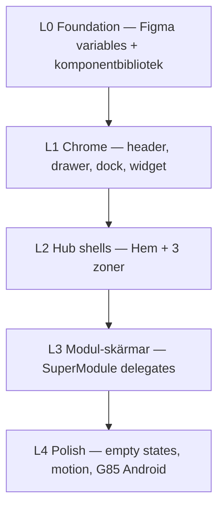

# Figma MCP — UI Masterplan (Obsidian Calm)

**Datum:** 2026-06-19  
**Status:** aktiv — våg 0 (setup)  
**Ägare:** Pontus · **Agent:** Design-Labbet / specialist-theme-lab / Cloud Agent  
**Kanon:** [`docs/specs/design-master.md`](../specs/design-master.md) · [`.context/design-language.md`](../../.context/design-language.md) · [`.context/locked-ux-features.md`](../../.context/locked-ux-features.md)

---

## Slutsats

Livskompassen har **redan** ett fungerande designsystem (Theme Pack I, tokens, Theme Lab, Chameleon-shell).  
Målet är **inte** ny arkitektur — utan **snyggare, konsekvent UI** via Figma som spegel + beslutsyta, med kod som sanning.

**Rekommenderad väg:** Figma MCP i Cursor Desktop (autentiserad) → designbibliotek från kod → zon-för-zon polish i Theme Lab → godkänn → prod-wire.

---

## Två arbetssätt (välj ett per session)

| Sätt | När | Du gör | Agent gör |
|------|-----|--------|-----------|
| **A — Agent kör** | Figma MCP autentiserad i Cursor Desktop | Godkänn våg + titta i Figma/Theme Lab | Bygger frames, variabler, uppdaterar tokens/CSS |
| **B — Prompt-styrt** | Du vill klistra in i `Cmd+I` | Kopiera färdig prompt per våg | Samma arbete, du startar varje våg manuellt |

Båda ska avslutas med: `npm run build` + relevant smoke (minst `smoke:locked-ux` om hub/Valv/Familjen rörs).

---

## Förutsättningar (våg 0)

### 0.1 Figma MCP i Cursor

Repo har redan MCP-config:

```json
// .cursor/mcp.json
"figma": { "url": "https://mcp.figma.com/mcp" }
```

**I Cursor Desktop:**

1. `Cursor Settings` → `MCP` → kontrollera att **Figma** är grön (Connected).
2. Om röd: klicka **Authenticate** och logga in med Figma-konto.
3. Skapa eller öppna en Figma-fil: **`Livskompassen — Obsidian Calm (Master)`**.

> **Cloud Agent:** Figma MCP kräver auth i Desktop — kör designvågor där, eller delegera kod-only polish till Cloud.

### 0.2 Referens-URL:er (lokal preview)

| URL | Syfte |
|-----|--------|
| `/dev/theme-lab` | Jämför utkast, ikoner, mini-previews |
| `/dev/themes` | Befintlig skin-väljare |
| `/` | Hem — kompass + scenic bg |
| `/dev/design-freeport` | Fri token-sandbox |

### 0.3 Kod som är sanning (läs före varje våg)

| Lager | Filer |
|-------|--------|
| Tokens | `src/modules/core/ui/tokens.ts`, `src/index.css`, `tailwind.config.js` |
| Theme packs | `src/modules/core/theme/themeRegistry.ts`, `themeLabVariants.ts` |
| Shell | `ChameleonInputShell.tsx`, `HubPageShell`, `BentoCard.tsx` |
| Chrome | `DockClassicTriad`, `NavigationDrawer`, `FyrenSmartWidgetBar` |
| Kanonbilder | `docs/design/references/MENU-DRAWER-KANON.png`, `DOCK-KANON.md`, `HOME-HERO-KANON.md` |

### 0.4 Hårda gränser (MUST NOT)

- Ta bort/dölj **Locked UX**: Barnfokus, Valv Mönster/Orkester, Planering P3, Barnporten HITL, Fyren widget-kanon.
- Byta `DEFAULT_THEME_ID` / `moduleThemeMap` utan explicit Pontus-OK.
- Hårdkoda hex i `src/modules/features/**` (använd CSS-variabler).
- Natur-tapeter, indigo/lila som primär aktiv-state (guld enligt COLOR-POLICY).
- `functions/`, `firestore.rules`, `sharedRules.ts`.

---

## Arkitektur — 5 lager (bygg i ordning)



| Lager | Figma-sida (förslag) | Kod-scope | Smoke |
|-------|----------------------|-----------|-------|
| **L0** | `00 — Tokens & Components` | tokens, BentoCard, knappar, pills | `npm run build` |
| **L1** | `01 — Chrome` | drawer, dock, widget bar | `smoke:locked-ux` |
| **L2** | `02 — Hubs` | HomePage, FamiljenPage, hub shells | `smoke:locked-ux` |
| **L3** | `03 — Modules` | delegates per zon | zon-smoke + build |
| **L4** | `04 — States & Motion` | EmptyState, skeleton, morph 350ms | `smoke:design-modules` |

---

## Vågplan (12 vågor)

Varje våg = **en chatt** / **ett fokus**. Max 3 beslutspunkter till Pontus per våg.

### Fas A — Foundation (Figma ↔ kod)

| Våg | ID | Leverans | Godkänn-kriterium |
|-----|-----|----------|-------------------|
| A1 | `figma-L0-tokens` | Figma variables: bg, surface, accent, border, typography | Matchar `tokens.ts` + Theme Pack I |
| A2 | `figma-L0-atoms` | Knappar, pills, glass card, AlertBanner, EmptyState | Återanvänder `BentoCard` / `BUTTON_VARIANTS` |
| A3 | `figma-L0-icons` | Ikonregister (dock, drawer, hero orbit) | Följer `ICON-STYLE-GUIDE.md` + locked D1/M2 |

### Fas B — Chrome (hög synlighet, låg risk i Theme Lab)

| Våg | ID | Leverans | Kod |
|-----|-----|----------|-----|
| B1 | `figma-L1-drawer` | Drawer enligt MENU-DRAWER-KANON | `NavigationDrawer.tsx`, `drawerNav.ts` |
| B2 | `figma-L1-dock` | Classic triad + Valv-ark | `DockClassicTriad.tsx` |
| B3 | `figma-L1-widget` | Fyren peek/expanded/hidden | `FyrenSmartWidgetBar.tsx` |
| B4 | `figma-L1-header` | Meny, lås, sköld-glyphs | `HeaderChromeGlyphs.tsx` |

### Fas C — Hubbar (3-zonsystem)

| Våg | ID | Route | Locked |
|-----|-----|-------|--------|
| C1 | `figma-L2-hem` | `/` | LivskompassHero, scenic bg |
| C2 | `figma-L2-hjartat` | `/hjartat` | Dagbok, Speglar, Inkast-entry |
| C3 | `figma-L2-vardagen` | `/vardagen` | MåBra, Planering P3, Ekonomi |
| C4 | `figma-L2-familjen` | `/familjen` | **Barnfokus**, Hamn, Livslogg |
| C5 | `figma-L2-valvet` | `/valvet` | **Mönster + Orkester** flikar |

### Fas D — Polish & ship

| Våg | ID | Leverans |
|-----|-----|----------|
| D1 | `figma-L4-states` | Loading skeleton, fel, tomma listor — alla hubbar |
| D2 | `figma-L4-android` | G85 viewport 390×844, touch 44px, cap sync |

---

## Arbetsloop per våg (agent)

1. **Läs** kanon för zonen (spec + locked-ux).
2. **Skärmdump / kod** → Figma frame (eller uppdatera befintlig).
3. **Jämför** med Theme Lab-utkast (`themeLabVariants.ts`).
4. **Implementera** skin only — inte dataflöde.
5. **Dokumentera** i `docs/design/theme-lab/VARIANTS.md` (skapa vid behov).
6. **Test:** `npm run build` + smoke.
7. **Pontus OK** → ev. flytta vinnare till `themeRegistry.ts`.

---

## Prompt-mallar (läge B)

### Mall — starta valfri våg

```text
Uppgift: Kör våg <VÅG-ID> enligt docs/evaluations/2026-06-19-figma-ui-masterplan.md

Kontext:
- Design-kanon: docs/specs/design-master.md, .context/design-language.md
- Locked UX: .context/locked-ux-features.md — rör INTE Barnfokus, Mönster, Orkester, Planering P3
- Figma-fil: Livskompassen — Obsidian Calm (Master), sida <LAYER>

Gör:
1. Läs befintlig kod för zonen (lista filer du rör).
2. Om Figma MCP finns: skapa/uppdatera frames + variables enligt tokens.ts.
3. Implementera endast Skin-lager (tokens/CSS/komponenter) — ingen backend.
4. Lägg utkast i themeLabVariants.ts om det är experiment.
5. Kör npm run build och npm run smoke:locked-ux om hub/valv/familjen rörs.

Leverans: max 5 punkter + build PASS/FAIL + ett nästa steg.

Jämför dina ändringar mot hela projektets kontext. Arbeta autonomt och sluta inte förrän koden är helt felfri och appen går att använda.
```

### Mall — Figma library från kod (A1)

```text
Uppgift: figma-L0-tokens — exportera designsystem till Figma via MCP.

Läs: src/modules/core/ui/tokens.ts, themeRegistry.ts (I-stone), docs/specs/design-master.md

Skapa i Figma:
- Color variables: bg, surface, surface2, text, textMuted, accent (#d4af37 prod), success, danger, glass, border
- Typography: Outfit (rubriker), Inter (bröd), Cinzel (display hub)
- Spacing/radius: rounded-2xl cards, pill chips, 44px touch

Skapa komponent-exemplar: Glass Card, Pill idle/active, Primär/Sekundär/Ghost knapp.

Skriv inte om prod-tema. Rapportera avvikelser kod ↔ Figma.

Jämför dina ändringar mot hela projektets kontext. Arbeta autonomt och sluta inte förrän koden är helt felfri och appen går att använda.
```

### Mall — zon-polish (ex C4 Familjen)

```text
Uppgift: figma-L2-familjen — UI polish Familjen-hubben.

Route: /familjen
Kanon: docs/specs/Familjen-INPUT-SUPERHUB-SPEC.md, FAMILJEN-BARNFOKUS-FRAGOR-SPEC.md
Locked: Barnfokus-frågor, Spara till logg, Annan fråga — får INTE tas bort.

Filer: FamiljenPage.tsx, FamiljenInputSuperModule, delegates, theme tokens only.

Gör visuell polish: spacing, glass, typografi, calm-scroll. Prototypa i /dev/theme-lab först.

Jämför dina ändringar mot hela projektets kontext. Arbeta autonomt och sluta inte förrän koden är helt felfri och appen går att använda.
```

---

## Beslutsregister

| Datum | Våg | Beslut | Status |
|-------|-----|--------|--------|
| 2026-06-19 | — | Masterplan skapad | aktiv |
| | A1 | | väntar |
| | B1 | | väntar |

Uppdatera även `docs/design/theme-lab/VARIANTS.md` när en variant godkänns.

---

## Acceptans (hela programmet)

- [ ] Figma-fil med L0–L2 frames speglar prod-kod
- [ ] Theme Lab visar max 3–5 aktiva utkast åt gången
- [ ] Ingen regression i `npm run smoke:locked-ux`
- [ ] `npm run build` PASS
- [ ] Android G85: inga hover-only kritiska flöden; touch ≥ 44px
- [ ] Pontus explicit OK innan DEFAULT_THEME ändras

---

## Nästa steg (enda aktiva)

**Våg 0.1:** Autentisera Figma MCP i Cursor Desktop och skapa filen `Livskompassen — Obsidian Calm (Master)`.

När det är grönt — starta **A1** (`figma-L0-tokens`) med agent eller prompt-mallen ovan.
