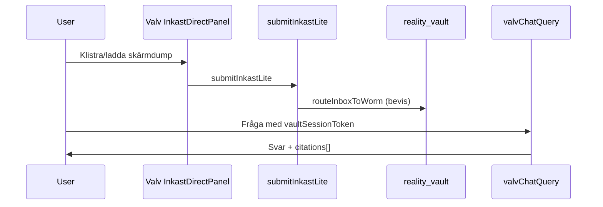

# Evalueringar (Prompt G)

---

# backend-masterplan-exekvering

_Källa: `docs/evaluations/2026-06-16-backend-masterplan-exekvering.md`_

# Backend masterplan — exekvering & FREEZE

**Datum:** 2026-06-16 · **Status:** FREEZE aktiv för backend-kärnan  
**Plan:** Backend Masterplan Låsning & Första Analys

## Pelare — resultat

| Pelare | Status | Verifiering |
|--------|--------|-------------|
| 0 PMIR docs | **PASS** | [`2026-06-16-backend-pmir-docs.md`](./2026-06-16-backend-pmir-docs.md) |
| 1 Security + WORM | **PASS** | `inbox_rules` + `daily_intentions` i rules; `generateWeeklyInsights` vault-gate; `calculateSmartAllocation` guard |
| 2 G10 Inkast + Upload steg 2 | **LOCK** | `CaptureSuperModule` valv-compact → `InkastDirectPanel` |
| 3 Valv E2E | **PASS** | `smoke:valv-chat-e2e` |
| 4 ADK Manifest | **LOCK** | `registry.ts` + `orchestrator.ts` wired |
| 5 SynapseBus | **LOCK** | `smoke:synapse-triggers` |
| 6 CI + deploy | **LOCK** | `smoke:tier1` + functions/rules/storage deploy i workflow |

## Första analysresan (acceptans)



| Kriterium | Smoke |
|-----------|-------|
| WORM create, update/delete denied | `smoke:vault-worm` |
| Vault session gate | `smoke:valv-gate` |
| valvChatQuery E2E | `smoke:valv-chat-e2e` |
| Inkast upload wiring | `smoke:inkast-upload` |
| Pattern metadata sidecar | `smoke:pattern-metadata` + trigger `onVaultCreatePatternScan` |

## FREEZE-regel

Inga nya backend-features utan explicit PMIR + Pontus OK. Design/wave-2/M3.0-C förblir **DEFER**.

## Extern granskning

Se [`docs/external-ai/bifoga/03-prompter/BACKEND-MASTERPLAN-REVIEW-G.md`](../external-ai/bifoga/03-prompter/BACKEND-MASTERPLAN-REVIEW-G.md).

---

# backend-pmir-docs

_Källa: `docs/evaluations/2026-06-16-backend-pmir-docs.md`_

# PMIR — docs/systemlagret (Backend masterplan Fas 0)

**Datum:** 2026-06-16 · **Status:** PASS  
**Acceptans:** `npm run smoke:innehall` · DOC-INDEX uppdaterad

## Utfört

| Åtgärd | Resultat |
|--------|----------|
| `node_modules.corrupt.*` raderad | Root ren |
| `repomix-output.xml` + `exports/repomix-hela-projekt-*` borttagen | Regenereras via `npm run chatbot:pack:*` |
| `docs/gemini-handoff/` → `docs/archive/gemini-handoff-2026-06/` | Superseded; symlink `docs/gemini-handoff` → arkiv (pack/smoke-kompat) |
| `research-cursor-2026-06-16-sa*.md` → `docs/archive/imports-2026-06-16/` | Efter ingest |
| DOC-INDEX design-räkning korrigerad (~83 aktiv, ~244 arkiv) | Sanning synkad |

## Kanon oförändrad

- `.context/*`
- `docs/specs/modules/*`
- `docs/INNEHALL-REGISTER.md`
- `docs/MODUL-FUNKTIONS-REGISTER.md`
- `firestore.rules`, `storage.rules`

## Nästa

Backend-pelare 1–6 enligt [`2026-06-16-backend-masterplan-exekvering.md`](./2026-06-16-backend-masterplan-exekvering.md).

---

# backend-security-pelare1

_Källa: `docs/evaluations/2026-06-16-backend-security-pelare1.md`_

# Backend säkerhet — pelare 1 verifiering

**Datum:** 2026-06-16 · **Status:** PASS (befintlig kod + minimal guard-fix)

## Redan implementerat (ingen kodändring krävdes)

| Gap (djupanalys) | Verifierat |
|------------------|------------|
| `inbox_rules` Firestore rules | `firestore.rules` L988–1032 |
| `daily_intentions` Firestore rules | `firestore.rules` L1034–1049 |
| `generateWeeklyInsights` vault-gate | `vaultSessionGrantsVaultRead` i callable |
| JWT vs session TTL | Dokumenterat i `vaultSessionGate.ts` (1h båda) |

## Implementerat nu

| Ändring | Fil |
|---------|-----|
| `guardSensitiveCallableV2` på `calculateSmartAllocation` | `functions/src/economy/calculateSmartAllocation.ts` |

## Smoke

```bash
npm run smoke:vault-worm
npm run smoke:valv-gate
```

---

# SENASTE-SAMMANFATTNING

_Källa: `docs/evaluations/SENASTE-SAMMANFATTNING.md`_

# Senaste sammanfattning — systemstatus

**Datum:** 2026-06-15 · **Gren:** `main` @ `ba2a1b3aa`+  
**Kanon:** [`2026-06-15-fas19-masterplan-v2.md`](./2026-06-15-fas19-masterplan-v2.md) · **Smoke:** [`SMOKE_RESULTS.md`](../SMOKE_RESULTS.md)

---

## Nuläge i en mening

**Fas 19–24 levererad** — USER smoke #3/#4 **PASS** · Fas 19.6 arkiv **done** · **Hex P2 verifierad**. **Nästa:** M3.0-C (PMIR).

---

## Levererat (Fas 13–23)

| Område | Status |
|--------|--------|
| WORM + vault-gate | **done** Fas 13 |
| Superhubbar Fas 6–11 | **done** |
| Fas 19 masterplan-v2 | **done** + deploy 2026-06-15 |
| Fas 20 doc-synk + arkiv-batch 2 | **done** |
| Fas 21 guards + JOY-17 + Oracle tokens | **done** + deploy 2026-06-15 |
| Fas 22 hex→tokens P0 + typecheck | **done** + hosting deploy 2026-06-15 |
| Fas 19.5 evolution_ledger dual-write | **done** 2026-06-15 |
| Fas 23 USER smoke + Valv biometri + Familjen scroll | **done** 2026-06-15 |
| Fas 19.6 arkiv-batch PMIR | **done** 2026-06-15 |
| Fas 24 Hex P2 (Barnporten + Dossier print) | **done** 2026-06-15 |
| `orkester:night` + `typecheck:core-strict` | **PASS** 2026-06-15 |

---

## Fas 23 (klart)

| Spår | Leverans |
|-----|----------|
| 23.1 | Familjen en scroll-yta på mobil · flow-hub desktop · `smoke:locked-ux` guard |
| 23.2 | Valv biometri — App Check i CI-build · WebAuthn `firebaseapp.com` · tydliga fel |
| 23.3 | USER smoke #3 + #4 **PASS** · doc-synk SMOKE_RESULTS + SENASTE + SYSTEM_PLAN_v2 |

**USER:** #3 Valv biometri + arkiv · #4 Barnen scroll + Barnfokus spara — båda **PASS** 2026-06-15.

---

## Fas 22 (klart)

| Spår | Leverans |
|-----|----------|
| 22.1 | Hex→tokens — MabraHistoryView, ArchiveHub, DailyTasksList, diary supermodule, ImmersiveExperienceShell, VisualCompassWidget |
| 22.2 | Doc-synk — SENASTE-SAMMANFATTNING, SYSTEM_PLAN_v2, SMOKE_RESULTS |
| 22.3 | `typecheck:core-strict` + `src/modules/morning/**` |

---

## Fas 19.5 (klart)

| Spår | Leverans |
|-----|----------|
| 19.5 | `evolution_ledger` dual-write — [`2026-06-15-fas19-5-evolution-ledger-dual-write.md`](./2026-06-15-fas19-5-evolution-ledger-dual-write.md) |

---

## Öppet (backlog)

| ID | Beskrivning | Gate |
|----|-------------|------|
| Hex P2 | Barnporten zon-gradient, dossier print-HTML | **done** 2026-06-15 |
| M3.0-C | Fitness/Näring | PMIR · masterplan defer |
| App Check | Console Enforce | valfritt extra lager (kod redan fail-closed) |

---

## App Check sanning

- **Kod:** `APP_CHECK_ENFORCE=true` (fail-closed) — **PÅ**
- **Console Enforce:** **INTE** på (medvetet)
- **CI hosting:** `VITE_APP_CHECK_RECAPTCHA_SITE_KEY` i workflow (Fas 23.2)