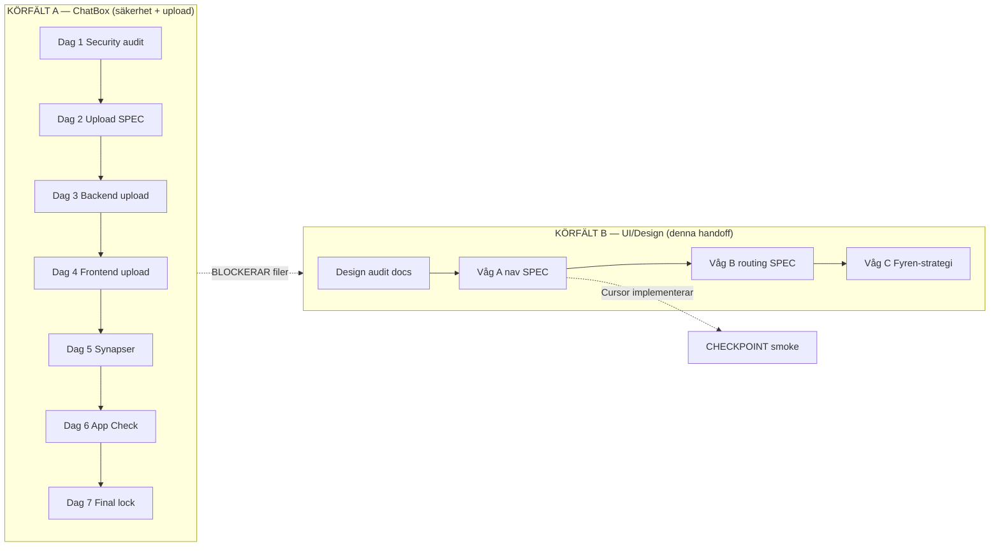

# UI & Design — handoff till extern agent

**Syfte:** Ge en design-/UI-agent **hela projektplanen** (ChatBox 7 dagar + nav-vågor) så navigation, moduler och visuellt formspråk kan planeras **parallellt** utan att krocka med säkerhet/upload-arbetet.

**Start här:** [`UI-DESIGN-MASTER-PROMPT.md`](./UI-DESIGN-MASTER-PROMPT.md) · Repomix: `npm run chatbot:pack:ui-design` → `exports/chatbot-handoff/ui-design-pack.md`

**Aktiv modul-våg (B1–B4):** [`UI-WAVE-ROADMAP.md`](./UI-WAVE-ROADMAP.md) · Valv-fas-prompt: [`PHASE-08-valv-ui.md`](../chatbox/phases/PHASE-08-valv-ui.md)

---

## Två parallella körfält (MUST)



| Körfält | Var | Agent | Output |
|---------|-----|-------|--------|
| **A** | [`CHATBOX-LATHUND.md`](../chatbox/CHATBOX-LATHUND.md) | ChatBox (Opus/GPT/Grok…) | Kod + audit → `leveranser/` |
| **B** | **Denna fil** | ChatBox / GPT / Cursor Theme Lab | SPEC + wireframes → `leveranser/ui-design/` |

**Regel:** Körfält A **äger** backend, WORM, upload-logik, synapser. Körfält B **äger** navigation, layout, copy, Obsidian Calm — men **implementerar inte** utan Cursor CHECKPOINT.

---

## Vad design-agenten får vs inte får

### Får (Körfält B)

- Förenkla **upplevd navigation** (dock, drawer, launcher, hub-tabs)
- Obsidian Calm 2.0 — tokens, spacing, hierarki
- Wireframes / beslutsmemo för zoner (Hjärtat, Vardagen, Familjen, Valvet)
- Plausible deniability i **publikt chrome** (Fyren-label, Kompis-knapp)
- Design-hygien: KEEP vs ARCHIVE enligt [`DESIGN-KEEP-REGISTER.md`](../DESIGN-KEEP-REGISTER.md)
- Prioritera **Våg A** från [`2026-06-15-arkitektur-nav-analys.md`](../evaluations/2026-06-15-arkitektur-nav-analys.md)

### Får INTE (utan PMIR + Pontus OK)

- Röra `firestore.rules`, callables, synapser, DCAP-routing
- Cross-RAG eller fjärde silo
- Ta bort **Locked UX**: Barnfokus, Valv Mönster/Orkester, P3 Kanban, Barnporten HITL
- Byta ikoner D1/M2/WH1/WH2
- Implementera upload/backend — vänta tills Körfält A Dag 3–4 är LOCK
- Två agenter samtidigt på **samma fil**

---

## Filägarskap — undvik krockar

| Fil / område | Ägare | Design får |
|--------------|-------|------------|
| `functions/src/**` | Körfält A | **Nej** — endast läsa |
| `firestore.rules` | Körfält A | **Nej** |
| `src/modules/inkast/**` (logik) | Körfält A | **Nej** tills Dag 4 LOCK |
| `CapturePanel` (layout/copy) | B efter A Dag 4 | SPEC nu, kod efter LOCK |
| `FloatingDock`, `navTruth.ts`, `LivLauncherGrid` | Körfält B | Ja — Våg A |
| `FyrenWidgetBar`, drawer | Körfält B | Ja — F4 m.fl. |
| `AppRoutes.tsx` (redirects H1–H4) | B efter PMIR | SPEC i Våg B, kod efter godkännande |
| Valv-paneler (Mönster, Orkester…) | **Låst** | Endast copy/layout inuti — ingen borttagning |
| `docs/design/**` | Körfält B | Ja — specs + arkivförslag |

Uppdatera [`LIFE-OS-BUILD-STATE.md`](../LIFE-OS-BUILD-STATE.md) när något blir LOCK.

---

## ChatBox 7-dagarsplan (Körfält A) — referens för design

Design-agenten ska **känna till** denna plan men **inte duplicera** arbetet.

| Dag | Fokus | Design relevant? |
|-----|-------|------------------|
| 1 | Security audit | Nej (parallellt: design audit OK) |
| 2 | Upload SPEC | Läs SPEC — rör inte CapturePanel-kod |
| 3 | Backend upload | **Blockera** inkast/backend |
| 4 | Frontend upload | **Vänta** — därefter layout på CapturePanel |
| 5 | Synapse-lås | **Blockera** `functions/src/adk/**` |
| 6 | App Check deploy | **Blockera** `appCheck.ts` |
| 7 | Final lock + hygien | Koordinera design-städlista |

Detaljer: [`CHATBOX-LATHUND.md`](../chatbox/CHATBOX-LATHUND.md)

---

## Nav & moduler — prioriterad designväg

Källa: [`docs/evaluations/2026-06-15-arkitektur-nav-analys.md`](../evaluations/2026-06-15-arkitektur-nav-analys.md) (Våg A **godkänd** 2026-06-15)

### Våg A — design-agent levererar SPEC (Cursor kodar)

| ID | Åtgärd | Nyckelfiler | Locked UX-risk |
|----|--------|-------------|----------------|
| **F1** | Ta bort Handling från launcher (dock räcker) | `LivLauncherGrid`, `livLauncherRoutes` | Nej — P3 kvar |
| **F2** | Dock «Dagbok» → «Hjärtat» | `FloatingDock`, `navTruth.ts` | Nej |
| **F4** | Neutral Fyren-label i publikt läge | `FyrenWidgetBar` | Nej — PIN oförändrat |
| **F5** | Kortare väg till Kanban | `PlaneringPage`, launcher | Nej — P3 kvar |

**Leveransformat:** en fil `NAV-VAG-A-SPEC.md` med före/efter, mock/wireframe-beskrivning, fil-lista, smoke: `npm run smoke:locked-ux`.

### Våg B — SPEC only, PMIR innan kod

H1–H4 (routing `/ekonomi`, `/mabra`, `/arkiv` …). Design-agent **får planera**, Cursor **implementerar inte** förrän Pontus godkänt PMIR.

### Våg C — defer tills core lock

B1–B3 (Fyren som kapacitetsmotor, global paralys-grind). Strategiskt — dokumentera alternativ, implementera inte.

### Medvetet senare (båda körfält)

MåBra hybrid-8, hex-tokens, evolution_ledger UI, Projekt P2+ — **efter** upload + synapse LOCK (Körfält A).

---

## Målbild navigation (4 platser)

| Plats | Route | Design-roll |
|-------|-------|-------------|
| **Hjärtat** | `/hjartat` | Primär start — dagens fokus, reflektion |
| **Familjen** | `/familjen` | Barnfokus, livslogg, Hamn |
| **Vardagen** | `/vardagen` | Kompasser, MåBra, Handling, Ekonomi … |
| **Valvet** | `/valvet` | PIN-gated — publikt endast 🔒 neutral hint |

**Fyren** = bakgrundssystem (kapacitet, mikrosteg) — **inte** en femte dock-plats.

Kartläggning GPT → kod: [`docs/gpt-handoff/README.md`](../gpt-handoff/README.md)

---

## Ritual för design-agent (CHECKPOINT B)

1. Spara leverans → `docs/external-ai/leveranser/ui-design/YYYY-MM-DD-kortnamn.md`
2. Pontus: Godkänn / Ändra X / Defer
3. Cursor: implementera **endast** godkänd Våg A (ett steg i taget)
4. Smoke: `npm run smoke:locked-ux` · ev. `smoke:design-modules`
5. Uppdatera `LIFE-OS-BUILD-STATE.md` om nav-våg blir LOCK
6. **Inte** starta Våg B-kod utan PMIR

---

## Repomix — vad som bifogas

```bash
npm run chatbot:pack:ui-design
```

| Innehåll | Varför |
|----------|--------|
| Denna handoff + BUILD-STATE + arkitektur-eval | Helhetsplan |
| `docs/design/*` (KEEP-specs) | Aktiv designkanon |
| `navTruth`, dock, drawer, launcher, routes | Nav-sanning |
| `.context/locked-ux-features.md` | Hårda gränser |

**Bifoga INTE** samtidigt `chatbot-pack-security.md` i samma chatt — det blir för tungt och blandar körfält.

---

## Snabbstart (ett steg)

1. `npm run chatbot:pack:ui-design`
2. Ny chatt (Sonnet 4.6 eller Opus 4.8 för SPEC)
3. Klistra [`UI-DESIGN-MASTER-PROMPT.md`](./UI-DESIGN-MASTER-PROMPT.md)
4. Bifoga `exports/chatbot-handoff/ui-design-pack.md`
5. Be om **`NAV-VAG-A-SPEC.md`** som första leverans
