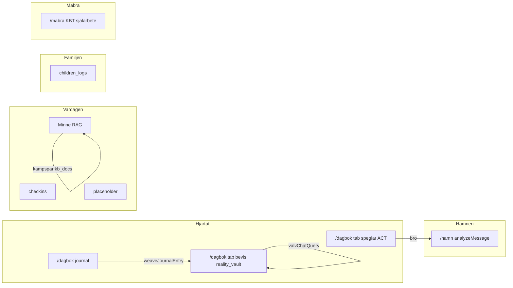

# AI-prompter — Moduler Master (Livskompassen v2)

Index för **extern AI** (NotebookLM, Gemini, Apple Notes). Kopiera **master-prompt + ett modul-block** per session.

Relaterat: [`ai-prompts-heart.md`](ai-prompts-heart.md), [`ai-prompts-wave2.md`](ai-prompts-wave2.md), [`ai-prompts-kladd-kampspar.md`](ai-prompts-kladd-kampspar.md).

---

## A. Projektminne — arkitektur

Livskompassen v2 är ett Life OS med Firebase (Firestore WORM, Cloud Functions, Vertex/Gemini). Stack: React, TypeScript, Vite. **INTE** Google Kalkylark/GAS som backend.



**Sacred Features:** Verklighetsvalvet, Speglings-Systemet, Morgonkompassen, Dossier-Generator, Zero Footprint, Kill Switch.

**Design (Obsidian Calm):** bg `#020617`, guld `#FDE68A`, indigo `#818CF8`, emerald `#2DD4BF`, Outfit + Inter. Förbjudet: lila, turkos, regnbåge, nature themes, count-up.

---

## B. Modul-katalog

| Modul | Route | Firestore / data | Agenter / callables | Status |
|-------|-------|------------------|---------------------|--------|
| Dagbok | `/dagbok` | `journal` | `weaveJournalEntry` | **klart** (röst/arkiv delvis) |
| Verklighetsvalvet | `/dagbok?tab=bevis` | `reality_vault`, Storage | Valv-Chat: `valvChatQuery` | **klart** |
| Valv-Chat | flik i Bevis | läser `reality_vault` | Sannings-Analytikern | **klart** |
| Speglar | `/dagbok?tab=speglar` | klient `getVaultLogs` | `speglingsMirror` | **klart** |
| Kunskapsvalvet | `/vardagen?tab=kunskap` | `kampspar`, `kb_docs` | `knowledgeVaultQuery`, `ingestKampsparEntry` | **klart** (deploy krävs) |
| Kompasser | `/vardagen` | `checkins` | Paralys-Brytaren (backend) | **klart** |
| Hamn / BIFF | `/hamn` | valfri → `reality_vault` | `analyzeMessage` | **klart** |
| Barnen | `/familjen` | `children_logs` | — | **klart** (PDF/wizard planerat) |
| Ekonomi | `/vardagen?tab=ekonomi` | — | — | **planerat** |
| Dossier | `/dossier` | aggregation | `generateDossier` | **klart** (smoke 2026-05-21) |
| **Måbra-sidan** | **`/mabra`** | **`mabra_sessions`** | Måbra-coach (planerat) | **MVP klart** |

**Tre kunskapsytor — blanda aldrig ihop:**

| Yta | Route | Läser | Syfte |
|-----|-------|-------|-------|
| Kunskapsvalvet | `/vardagen?tab=kunskap` | `kampspar` + `kb_docs` | Livs-OS, mönster, brett minne |
| Valv-Chat | Bevis-flik efter unlock | `reality_vault` | Forensisk bevisföring |
| Kunskap (chat) | samma som rad 1 | RAG + citations | Frågor mot *dina* poster |

**Permanent minne:** WORM-poster raderas inte av design. Valv-Chat ≠ hela systemets minne. Barnfrågor → `children_logs` + Dossier (+ planerad Familjen-RAG). Se [`.context/arkiv-minne.md`](../../.context/arkiv-minne.md) och [`Arkiv-SPEC.md`](incoming/Arkiv-SPEC.md).

---

## G. Hela arkivet (Life OS-minne)

Canonical: [`.context/arkiv-minne.md`](../../.context/arkiv-minne.md) · GCP: [`docs/archive/GCP-INVENTORY-2026-05-21.md`](../../docs/archive/GCP-INVENTORY-2026-05-21.md).

| Domän | Skill | GAP |
|-------|-------|-----|
| Master | `livskompassen-arkiv-master` | Helhetsreview |
| RAG | `livskompassen-rag-retrieval` | token-match → ANN |
| Vector | `livskompassen-vector-search` | 2 index, 0 endpoints |
| Synapser | `livskompassen-synapser-adk` | journal_woven stub |
| Agenter | `livskompassen-memory-agents` | sharedRules |
| Silo-vakt | `livskompassen-memory-silo-guard` | cross-RAG |

Implementationsbacklog: [`Arkiv-GAP-REGISTER.md`](incoming/Arkiv-GAP-REGISTER.md).

---

## C. Universell SPEC-master

Klistra in detta före varje modul-block:

```
Du har hjälpt mig planera Livskompassen v2. Jag bygger i Cursor med Firebase (INTE GAS/Kalkylark).

Leverera ETT moduldokument i markdown med exakt rubriker 1–11:
1. Syfte och användarbehov
2. Route och ingång
3. UX-flöde (progressive disclosure — ett steg i taget)
4. Visuell design enligt Obsidian Calm (bg #020617, guld #FDE68A, indigo #818CF8, emerald #2DD4BF)
5. Datamodell (Firestore, WORM där relevant)
6. Backend/agenter (callables, sharedRules.ts)
7. Säkerhet (AuthGate, Zero Footprint, CMEK)
8. Status idag vs planerat (klart / delvis / planerat / motsägelse mot kod)
9. Acceptanskriterier (testbara)
10. Kopplingar till andra moduler
11. Navigation (kluster, dock, redirects)

Regler: Svenska. Ingen JADE-ton. Gissa aldrig datum. Markera osäkerhet [OSÄKERT].
Sacred Features: Verklighetsvalvet, Speglings-Systemet, Zero Footprint, Kill Switch.

Modul:
```

---

## D. Modul-block — Kunskapsvalvet / Minne

```
MODUL: Kunskapsvalvet och Minne (INTE samma som Valv-Chat).

Route: /vardagen?tab=kunskap (redirect /kunskap). AuthGate på fliken.

SYFTE: Semantiskt livsminne — utmaningar, dokument, mönster, rutiner. Fråga/svar med källhänvisningar mot användarens egna data.

UPPBYGGnad (hur det fungerar idag i kod):
- UI: KunskapPage med två flikar — (1) Kunskapsvalv chat, (2) Tidshjulet
- Kunskapsvalv: KnowledgeVaultChat → callable knowledgeVaultQuery → knowledgeVaultAgent → kampsparQueryRag (token-match på kampspar + kb_docs) → Gemini med JSON { answer, citations[] }
- Tidshjulet: visuella noder från Firestore kampspar (senaste poster)
- Ingest: KampsparIngestForm → callable ingestKampsparEntry (WORM create + embeddingDim)
- Drive: notifyNewFile → analyzeDriveFile → persist kb_docs (idempotent driveFileId) när ownerId skickas
- KompisAvatar i header pulserar vid AI-anrop

DATAMODELL:
- kampspar: ownerId, title, content, category?, source, eventDate?, embeddingDim?, createdAt (WORM)
- kb_docs: ownerId, title, content, folderId, source=drive, driveFileId, mimeType, embeddingDim?, createdAt (WORM)
- reality_vault: ENDAST Valv-Chat — exkludera från Kunskapsvalvet som standard

SKILJ FRÅN:
- Valv-Chat (valvChatQuery, reality_vault only, Sannings-Analytikern, Bevis-flik)
- Kunskap utan RAG (äldre beteende — borttaget)

AGENTER: Livs-Arkivarien / Mönster-Arkivarien (Minne RAG). Prompts i functions/src/sharedRules.ts.

Planera: Vector Search ANN när VECTOR_SEARCH_INDEX_ID är satt; full Kompis Supervisor i UI.

Output: [`docs/specs/incoming/Kunskap-SPEC.md`](incoming/Kunskap-SPEC.md) (konsoliderad 2026-05)
```

---

## D. Modul-block — Dagbok

```
MODUL: Dagbokshubben (Hjärtat · Lager 1).

Route: /dagbok (HjartatPage, flik reflektion). AuthGate. Kluster: Hjärtat.

SYFTE: Tacksamhets- och reflektionsdagbok med låg kognitiv belastning. Appens lugna ansikte — skild från Verklighetsvalvet (Lager 2).

FUNKTIONER IDAG:
- Progressive disclosure wizard: (1) humör-pills Lugn/Trött/Spänd/Hoppfull/Låg → (2) fritext + Web Speech sv-SE → (3) bekräfta → (4) sparad
- Firestore journal (WORM): mood, text, ownerId, createdAt
- Async weaveJournalEntry (callable) → reality_vault vävaren_metadata
- JournalArchive pagination (Visa fler); dolt under steg 2–4
- Bro till Speglar efter sparad post (journalContext)
- Fyren: 3s long-press dock BookOpen → PIN → /dagbok?tab=bevis

PLANERAT: Måbra-bro, KBT-frågor per humör, villkorlig Speglar via Vävaren, humör-only save, KASAM-kväll

KOPPLINGAR: Speglar (bro), Verklighetsvalvet (vävaren + Fyren), Kunskap (ingen auto — Vävaren läser RAG only)

Output: [`docs/specs/incoming/Dagbok-SPEC.md`](incoming/Dagbok-SPEC.md) (konsoliderad 2026-05)
```

---

## D. Modul-block — Verklighetsvalvet

```
MODUL: Verklighetsvalvet (Sacred · Lager 2 — Sanningens Sköld).

Route: /dagbok?tab=bevis (redirect /valv). AuthGate. Fyren: 3s long-press dock BookOpen → WebAuthn → PIN.

SYFTE: WORM-bevisbank mot gaslighting — append-only, tidsstämplade sanningar. Plausible deniability via dold Fyren-ingång.

FUNKTIONER IDAG:
- VaultPage embedded i HjartatPage: PIN-gate, flikar Logga | Sök
- VaultEntryForm: entryType simple | two_column | three_shield | body_signal
- Klient saveVaultLog → reality_vault (WORM, isLocked, serverTimestamp)
- uploadVaultEvidence → evidenceUrl (en fil, inte mediaUrls[])
- Web Speech sv-SE → truth (ingen ljudfil)
- ValvChatPanel → valvChatQuery → vaultRag token-match → Sannings-Analytikern
- useValvChatSession: nollställ vid flikbyte (Zero Footprint)
- exportVaultRecordAsPdf per post; Shake-to-Kill; session lock vid flikbyte

DATAMODELL: reality_vault — truth, action, category, entryType, theirVersion, myReality, bodySignals, shield*, evidenceUrl, isLocked, weaverTags?, ownerId, createdAt

SKILJ FRÅN:
- Dagbok (journal, mjukt Lager 1)
- Kunskap (kampspar + kb_docs; Drive auto-ingest)
- Valv-Chat läser ENDAST reality_vault (exkl vävaren_metadata)

PRODUKTBESLUT (låsta): Drive→valv manuellt; PDF klient nu / Dossier senare; WebAuthn+PIN; dölj Bevis-flik när Fyren sitter

PLANERAT: dölj synlig Bevis-flik, klickbara citations, Drive manuellt till valv, generateDossier batch, Sanningens Ankare

Output: [`docs/specs/incoming/Verklighetsvalvet-SPEC.md`](incoming/Verklighetsvalvet-SPEC.md) (konsoliderad 2026-05)
```

---

## D. Modul-block — Speglar (Speglings-Systemet)

```
MODUL: Speglar — reaktiv kognitiv sköld (Sacred Feature).

Route: /dagbok?tab=speglar (redirect /speglar). AuthGate via Hjärtat. Dock: nej.

SYFTE: ACT (validera, aldrig fixa) + VIVIR + jämför känsla mot WORM-bevis. Grey Rock, max 2–4 meningar, ingen JADE. Skild från MåBra (proaktiv KBT) och Kunskap (livsminne).

FUNKTIONER IDAG:
- Sekventiellt: ACT → VIVIR → EvidenceCompare (SpeglingsSystem.tsx)
- journalContext från Dagbok SavedStep (mood, text)
- matchVaultEvidence: klient token-match + weaverTags; exkl vävaren_metadata
- getVaultLogs endast när valv upplåst (Fyren/PIN)
- speglingsMirror callable + mirrorFeeling fallback
- Hamn-bro: prefilledMessage (aktivt klick)
- Zero Footprint: state rensas vid unmount; AI-accent #6366F1

SKILJ FRÅN:
- MåBra — proaktiv KBT
- Kunskap — kampspar RAG
- Hamn — BIFF mot ex (Speglar skickar aldrig automatiskt)

PLANERAT: full DCAP Genkit, Vector Search valv, enforced 4 meningar backend, Vävaren auto-bro (opt-in)

KOPPLINGAR: Dagbok (bro), Verklighetsvalvet (read-only), Hamn (BIFF)

Output: [`docs/specs/incoming/Speglar-SPEC.md`](incoming/Speglar-SPEC.md) (konsoliderad 2026-05)
```

---

## D. Modul-block — Barnen (Familjen)

```
MODUL: Barnens livsloggar (Familjen — Den trygga hamnen).

Route: /familjen (redirect /barnen). AuthGate. Dock Heart. Egen enkel PIN (skild från valv — INTE WebAuthn).

SYFTE: Neutral Grey Rock-dokumentation för Kasper och Arvid. BBIC-orienterat. Skild från dagbok, valv, Kunskap-RAG.

FUNKTIONER IDAG:
- FamiljenPage + BarnensPage embedded
- PIN-gate (CHILDREN_PIN_KEY) → Kasper / Arvid-flikar
- En sida (INTE wizard): fysiologi 1–5 + livslogg — två separata saveChildrenLog
- action: fysiologi | livslogg — separata WORM-dokument
- Balansmätare: computeBalansIndex — endast fysiologi, 7 dagar, bar+text
- Tidslinje per barn; JSON-export per barn (exportBalansReport)
- PIN låses vid visibilitychange; manuell Lås modul

DATAMODELL: children_logs WORM — childAlias, action, signals, observation, category, childrenImpact, ownerId, createdAt

PRODUKTBESLUT (låsta): visibilitychange-lås; incident→valv explicit med sourceRef; balans=fysiologi only; export per barn; Dossier opt-in

PLANERAT: wizard UX, PDF+hash (Dossier), tredjepartstagg, larm diskret, Sandbox/Ankare copy per flik

KOPPLINGAR: Dossier (opt-in), Verklighetsvalvet (explicit bro planerad), Dagbok Variant B

Output: [`docs/specs/incoming/Barnen-SPEC.md`](incoming/Barnen-SPEC.md) (konsoliderad 2026-05)
```

---

## D. Modul-block — Måbra-sidan

```
MODUL: Måbra-sidan — proaktivt självarbete och återhämtning.

Route: /mabra (eget kluster på hemskärmen). AuthGate: ja. INTE i FloatingDock.

SYFTE: KBT/ACT, vagus, självmedkänsla, värderingar. ADHD/GAD/RSD — kravlöst, ett steg i taget.

INTE SAMMA SOM: Speglar (gaslighting), Dagbok (humörlogg), Kompasser (mikrosteg), Hamn (BIFF/ex), Kunskap RAG

FUNKTIONER IDAG (MVP):
- MabraPage: hub → duration → 4-7-8 andning → complete
- SymptomHub (Panik/RSD, Självkritik, Hitta mig); DurationPicker 1/3/5 min
- mabra_sessions metadata (WORM); länkar Dagbok/Kompasser — INTE auto check-in
- ClusterGrid kluster på hem

PLANERAT (fas 2):
- Reframing/ACT, Måbra-coach callable, bro Dagbok in, Speglar guardrail

PRODUKTBESLUT (låsta): metadata sparas; Obsidian Calm; ingen streak/natur; AI opt-in; #6366F1 coach

Output: [`docs/specs/incoming/Mabra-SPEC.md`](incoming/Mabra-SPEC.md) (konsoliderad 2026-05)
```

---

## D. Modul-block — Kladd-sanerare

Se fullständig prompt i [`ai-prompts-kladd-kampspar.md`](ai-prompts-kladd-kampspar.md). Output: `Kladd-YYYY-MM-DD-titel.md` → `docs/specs/incoming/`.

---

## E. Cursor-konsolidering

```
Jag laddar upp [MODUL]-SPEC.md eller Kladd-*.md till docs/specs/incoming/.

Konsolidera till:
1. docs/specs/incoming/[MODUL]-SPEC.md (ren markdown, 11 sektioner)
2. .context/modules/[modul].md med gap-tabell (klart / delvis / planerat)
3. src/modules/[modul]/module_plan.md
4. Synka docs/specs/p2-flode.md om flödet avviker

Extrahera Minne-kandidater från Kladd-filer till strukturerad lista (title, date, category, content, source).

Jämför mot befintlig kod. Rätta fel i spec. Dokumentera gap — implementera INTE kod om jag inte säger "kör".
Jämför dina ändringar mot hela projektets kontext. Arbeta autonomt och sluta inte förrän dokumentationen är konsekvent.
```

---

## F. Batch — hela projektminnet

```
Sammanfatta allt bifogat material (chattar, dokument, specs) till uppdaterade SPEC-filer för:
Dagbok, Kunskap/Minne, Barnen, Måbra, Hamn, Valv, Speglar, Dossier.

För varje modul: 11 sektioner enligt master ovan.
Markera tydligt: klart / delvis / planerat / motsägelse mot nuvarande kod i Livskompassen2.0.
Inkludera modul-katalog (sektion B) som sanning om routes och datalager.
Fokus på: hur Kunskapsvalvet är uppbyggt (tre ytor), Dagbok-funktioner, Barnen, Måbra (ny).

Spara som separata filer: Dagbok-SPEC.md, Kunskap-SPEC.md, Speglar-SPEC.md, Barnen-SPEC.md, Mabra-SPEC.md, etc.
```

---

## Rekommenderat flöde

| Steg | Verktyg | Resultat |
|------|---------|----------|
| 1 | NotebookLM + master + modul-block | `docs/specs/incoming/*-SPEC.md` |
| 2 | Cursor + konsoliderings-prompt | `.context/modules/` uppdaterad |
| 3 | Säg "kör" i Cursor | Implementation av gap |
