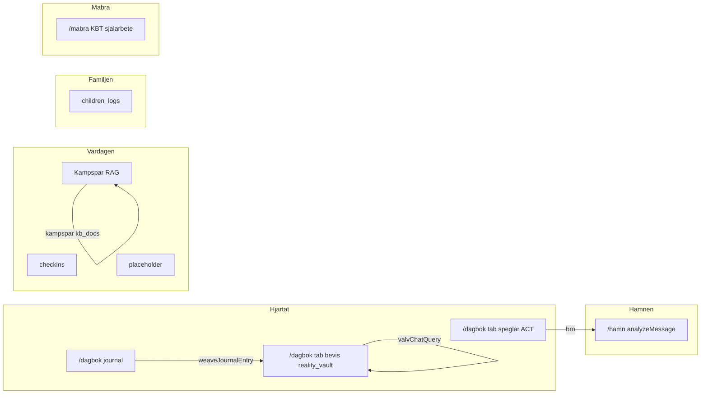

# AI-prompter — Moduler Master (Livskompassen v2)

Index för **extern AI** (NotebookLM, Gemini, Apple Notes). Kopiera **master-prompt + ett modul-block** per session.

Relaterat: [`ai-prompts-heart.md`](ai-prompts-heart.md), [`ai-prompts-wave2.md`](ai-prompts-wave2.md), [`ai-prompts-kladd-kampspar.md`](ai-prompts-kladd-kampspar.md).

---

## A. Projektminne — arkitektur

Livskompassen v2 är ett Life OS med Firebase (Firestore WORM, Cloud Functions, Vertex/Gemini). Stack: React, TypeScript, Vite. **INTE** Google Kalkylark/GAS som backend.



**Sacred Features:** Verklighetsvalvet, Speglings-Systemet, Morgonkompassen, Dossier-Generator, Zero Footprint, Kill Switch.

**Design (Obsidian Calm):** bg `#020617`, guld `#FDE68A`, indigo `#818CF8`, emerald `#2DD4BF`, Outfit + Inter. Förbjudet: lila, turkos, regnbåge, nature themes, count-up.

---

## B. Modul-katalog

| Modul | Route | Firestore / data | Agenter / callables | Status |
|-------|-------|------------------|---------------------|--------|
| Dagbok | `/dagbok` | `journal` | `weaveJournalEntry` | **klart** (röst/arkiv delvis) |
| Verklighetsvalvet | `/dagbok?tab=bevis` | `reality_vault`, Storage | Valv-Chat: `valvChatQuery` | **klart** |
| Valv-Chat | flik i Bevis | läser `reality_vault` | Sannings-Analytikern | **klart** |
| Speglar | `/dagbok?tab=speglar` | klient `getVaultLogs` | `speglingsMirror` | **klart** |
| Kunskapsvalvet | `/vardagen?tab=kunskap` | `kampspar`, `kb_docs` | `knowledgeVaultQuery`, `ingestKampsparEntry` | **klart** (deploy krävs) |
| Kompasser | `/vardagen` | `checkins` | Paralys-Brytaren (backend) | **klart** |
| Hamn / BIFF | `/hamn` | valfri → `reality_vault` | `analyzeMessage` | **klart** |
| Barnen | `/familjen` | `children_logs` | — | **klart** (PDF planerat) |
| Ekonomi | `/vardagen?tab=ekonomi` | — | — | **planerat** |
| Dossier | `/dossier` | aggregation | `generateDossier` planerat | **stub** |
| **Måbra-sidan** | **`/mabra`** | **TBD** | **TBD** | **planerat** |

**Tre kunskapsytor — blanda aldrig ihop:**

| Yta | Route | Läser | Syfte |
|-----|-------|-------|-------|
| Kunskapsvalvet | `/vardagen?tab=kunskap` | `kampspar` + `kb_docs` | Livs-OS, mönster, brett minne |
| Valv-Chat | Bevis-flik efter unlock | `reality_vault` | Forensisk bevisföring |
| Kunskap (chat) | samma som rad 1 | RAG + citations | Frågor mot *dina* poster |

---

## C. Universell SPEC-master

Klistra in detta före varje modul-block:

```
Du har hjälpt mig planera Livskompassen v2. Jag bygger i Cursor med Firebase (INTE GAS/Kalkylark).

Leverera ETT moduldokument i markdown med exakt rubriker 1–11:
1. Syfte och användarbehov
2. Route och ingång
3. UX-flöde (progressive disclosure — ett steg i taget)
4. Visuell design enligt Obsidian Calm (bg #020617, guld #FDE68A, indigo #818CF8, emerald #2DD4BF)
5. Datamodell (Firestore, WORM där relevant)
6. Backend/agenter (callables, sharedRules.ts)
7. Säkerhet (AuthGate, Zero Footprint, CMEK)
8. Status idag vs planerat (klart / delvis / planerat / motsägelse mot kod)
9. Acceptanskriterier (testbara)
10. Kopplingar till andra moduler
11. Navigation (kluster, dock, redirects)

Regler: Svenska. Ingen JADE-ton. Gissa aldrig datum. Markera osäkerhet [OSÄKERT].
Sacred Features: Verklighetsvalvet, Speglings-Systemet, Zero Footprint, Kill Switch.

Modul:
```

---

## D. Modul-block — Kunskapsvalvet / Kampspår

```
MODUL: Kunskapsvalvet och Kampspår (INTE samma som Valv-Chat).

Route: /vardagen?tab=kunskap (redirect /kunskap). AuthGate på fliken.

SYFTE: Semantiskt livsminne — utmaningar, dokument, mönster, rutiner. Fråga/svar med källhänvisningar mot användarens egna data.

UPPBYGGnad (hur det fungerar idag i kod):
- UI: KunskapPage med två flikar — (1) Kunskapsvalv chat, (2) Tidshjulet
- Kunskapsvalv: KnowledgeVaultChat → callable knowledgeVaultQuery → knowledgeVaultAgent → kampsparQueryRag (token-match på kampspar + kb_docs) → Gemini med JSON { answer, citations[] }
- Tidshjulet: visuella noder från Firestore kampspar (senaste poster)
- Ingest: KampsparIngestForm → callable ingestKampsparEntry (WORM create + embeddingDim)
- Drive: notifyNewFile → analyzeDriveFile → persist kb_docs (idempotent driveFileId) när ownerId skickas
- KompisAvatar i header pulserar vid AI-anrop

DATAMODELL:
- kampspar: ownerId, title, content, category?, source, eventDate?, embeddingDim?, createdAt (WORM)
- kb_docs: ownerId, title, content, folderId, source=drive, driveFileId, mimeType, embeddingDim?, createdAt (WORM)
- reality_vault: ENDAST Valv-Chat — exkludera från Kunskapsvalvet som standard

SKILJ FRÅN:
- Valv-Chat (valvChatQuery, reality_vault only, Sannings-Analytikern, Bevis-flik)
- Kunskap utan RAG (äldre beteende — borttaget)

AGENTER: Livs-Arkivarien / Mönster-Arkivarien (Kampspår RAG). Prompts i functions/src/sharedRules.ts.

Planera: Vector Search ANN när VECTOR_SEARCH_INDEX_ID är satt; full Kompis Supervisor i UI.

Output: [`docs/specs/incoming/Kunskap-SPEC.md`](incoming/Kunskap-SPEC.md) (konsoliderad 2026-05)
```

---

## D. Modul-block — Dagbok

```
MODUL: Dagbokshubben (Hjärtat · Lager 1).

Route: /dagbok (HjartatPage, flik reflektion). AuthGate. Kluster: Hjärtat.

SYFTE: Tacksamhets- och reflektionsdagbok med låg kognitiv belastning. Appens lugna ansikte — skild från Verklighetsvalvet (Lager 2).

FUNKTIONER IDAG:
- Progressive disclosure wizard: (1) humör-pills Lugn/Trött/Spänd/Hoppfull/Låg → (2) fritext reflektion → (3) bekräfta preview → (4) sparad
- Firestore journal (WORM): mood, text, ownerId, createdAt
- Async weaveJournalEntry → reality_vault med category vävaren_metadata (Vävaren-taggar)
- JournalArchive (senaste poster)
- Bro till Speglar efter sparad post (journalContext)
- Röst-till-text sv-SE: delvis/planerad (useSpeechToText, ReflectionStep)

PLANERAT: obegränsat arkiv, wizard unmount cleanup, long-press dagbok→valv (Variant B), full röst

KOPPLINGAR: Speglar (bro), Verklighetsvalvet (vävaren), Kunskap (indirekt via vävaren_metadata)

Output: Dagbok-SPEC.md
```

---

## D. Modul-block — Barnen (Familjen)

```
MODUL: Barnens livsloggar (Familjen).

Route: /familjen (redirect /barnen). AuthGate. Egen PIN (skild från valv-PIN).

SYFTE: Neutral dokumentation för Kasper och Arvid. Den trygga hamnen — utan dom. Balansmätare 7 dagar.

FUNKTIONER IDAG:
- PIN-gate → välj barn (Kasper / Arvid)
- Fysiologi: sömn, ångest, aptit (skala 1–5) → children_logs action fysiologi
- Livslogg: kategori, observation, valfri barnpåverkan → children_logs
- Balansmätare: deterministiskt 7-dagars index (balansIndex.ts)
- Tidslinje per barn
- JSON-export (exportBalansReport.ts — stub/juridisk PDF planerad)

DATAMODELL: children_logs WORM — childAlias, action, signals, observation, category, childrenImpact, ownerId, createdAt

PLANERAT: PDF juridisk stabilitetsrapport, incident→reality_vault, wizard UX, full Dossier-koppling

KOPPLINGAR: Dossier (aggregation), Verklighetsvalvet (allvarliga incidenter planerat), Dagbok Variant B

Output: Barnen-SPEC.md
```

---

## D. Modul-block — Måbra-sidan

```
MODUL: Måbra-sidan — proaktivt självarbete och återhämtning.

Route: /mabra (eget kluster på hemskärmen). AuthGate: ja.

SYFTE: KBT-inspirerade övningar, självmedkänsla, värderingar (ACT), små vanor, stressreglering efter allostatisk belastning. Anpassat ADHD (F90.0B), GAD, RSD — ett steg i taget.

INTE SAMMA SOM:
- Speglar (/dagbok?tab=speglar) — reaktivt gaslighting/ACT-skydd, validera utan fixa mot manipulation
- Dagbok — daglig humör+reflektion, låg tröskel
- Kompasser — mikrosteg morgon/dag/kväll, inte djupa KBT-spår
- Hamn — BIFF/Grey Rock mot ex, inte självutveckling

PLANERA:
- Övningsbibliotek (t.ex. andning, värderingskompass, thought record light, självmedkänsla)
- Progressive disclosure: en övning i taget, max 5–10 min
- Valfri AI-coach: lågaffektiv, Speglings-Coachen-liknande ton men proaktiv (inte JADE)
- Zero Footprint: session i RAM eller explicit spara; inga känsliga övningssvar till motpart
- Datamodell: föreslå mabra_sessions eller mabra_progress (WORM eller ephemeral-only — motivera)
- Kopplingar: bro från Dagbok vid låg energi; Kompasser kväll; INTE Hamn/ex

Status idag: route /mabra shell + kluster; inget övningsinnehåll än.

Output: Mabra-SPEC.md
```

---

## D. Modul-block — Kladd-sanerare

Se fullständig prompt i [`ai-prompts-kladd-kampspar.md`](ai-prompts-kladd-kampspar.md). Output: `Kladd-YYYY-MM-DD-titel.md` → `docs/specs/incoming/`.

---

## E. Cursor-konsolidering

```
Jag laddar upp [MODUL]-SPEC.md eller Kladd-*.md till docs/specs/incoming/.

Konsolidera till:
1. docs/specs/incoming/[MODUL]-SPEC.md (ren markdown, 11 sektioner)
2. .context/modules/[modul].md med gap-tabell (klart / delvis / planerat)
3. src/modules/[modul]/module_plan.md
4. Synka docs/specs/p2-flode.md om flödet avviker

Extrahera Kampspår-kandidater från Kladd-filer till strukturerad lista (title, date, category, content, source).

Jämför mot befintlig kod. Rätta fel i spec. Dokumentera gap — implementera INTE kod om jag inte säger "kör".
Jämför dina ändringar mot hela projektets kontext. Arbeta autonomt och sluta inte förrän dokumentationen är konsekvent.
```

---

## F. Batch — hela projektminnet

```
Sammanfatta allt bifogat material (chattar, dokument, specs) till uppdaterade SPEC-filer för:
Dagbok, Kunskap/Kampspår, Barnen, Måbra, Hamn, Valv, Speglar, Dossier.

För varje modul: 11 sektioner enligt master ovan.
Markera tydligt: klart / delvis / planerat / motsägelse mot nuvarande kod i Livskompassen2.0.
Inkludera modul-katalog (sektion B) som sanning om routes och datalager.
Fokus på: hur Kunskapsvalvet är uppbyggt (tre ytor), Dagbok-funktioner, Barnen, Måbra (ny).

Spara som separata filer: Dagbok-SPEC.md, Kunskap-SPEC.md, Barnen-SPEC.md, Mabra-SPEC.md, etc.
```

---

## Rekommenderat flöde

| Steg | Verktyg | Resultat |
|------|---------|----------|
| 1 | NotebookLM + master + modul-block | `docs/specs/incoming/*-SPEC.md` |
| 2 | Cursor + konsoliderings-prompt | `.context/modules/` uppdaterad |
| 3 | Säg "kör" i Cursor | Implementation av gap |
