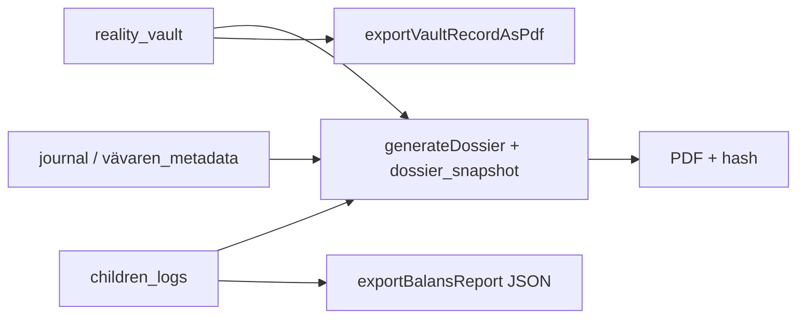

# Dossier-Generator

**Sacred Feature.** Samlad WORM-export till PDF med hash och explicit användar-trigger.

**Kanonisk spec:** [`incoming/Dossier-SPEC.md`](incoming/Dossier-SPEC.md)  
**Context:** [`.context/modules/dossier.md`](../../.context/modules/dossier.md)  
**Module plan:** [`src/modules/dossier/module_plan.md`](../../src/modules/dossier/module_plan.md)

---

## Syfte

Kronologisk, objektiv sammanställning av WORM-data för juridiskt ombud — utan auto-delning. Användaren ska kunna exportera kalla fakta utan att återskriva traumat manuellt.

## Källor (full Dossier)

| Collection | Innehåll | Standard |
|------------|----------|----------|
| `reality_vault` | Bevis, tvåspalt, media (`evidenceUrl`) | Inkludera |
| `journal` | Dagbok (humör + text) | Valfritt |
| `children_logs` | Kasper/Arvid livslogg + fysiologi | Valfritt |
| `vävaren_metadata` | Async Vävaren-taggar i valv | Valfritt — ofta exkluderad |

Output: **`dossier_snapshot`** (hash + metadata) + nedladdningsbar PDF.

## Delvis export idag (inte full Dossier)

Två klient-utiliteter finns — de **ersätter inte** Dossier-Generatorn:

### Valv — `exportVaultRecordAsPdf`

- **Fil:** `src/modules/verklighetsvalvet/utils/exportVaultRecord.ts`
- **UI:** PDF-knapp per post i `VaultLogList.tsx`
- **Format:** HTML → `window.print()` → användaren sparar som PDF
- **Omfattning:** En `reality_vault`-post (datum, kategori, typ, text, tvåspalt, media-URL)
- **Saknar:** hash, `dossier_snapshot`, datumintervall, journal, barnen, agent-sammanställning

### Barnen — `exportBalansReport`

- **Fil:** `src/modules/barnens_livsloggar/utils/exportBalansReport.ts`
- **UI:** JSON-knapp i `BarnensPage.tsx` (`downloadBalansReportJson`)
- **Format:** JSON-fil (`balans-{alias}-{datum}.json`)
- **Omfattning:** Ett barn, 7-dagars fönster (`BALANS_WINDOW_DAYS`), balansindex + logglista
- **Saknar:** PDF, hash, multi-barn, valv/journal, `dossier_snapshot`, juridisk agent-text

## Krav (full Dossier — planerad)

- `generateDossier` callable samlar valda källor
- Kryptografisk hash av alla inkluderade docId + payload-snapshot
- `dossier_snapshot` WORM i Firestore
- Genkit Dossier-Agent — objektiv, BIFF-kompatibel, ingen JADE
- Explicit användar-trigger — **ingen auto-delning** till motpart
- Zero Footprint efter nedladdning / *Klar*

## Status

| Del | Status |
|-----|--------|
| Full Dossier UI + route | **planerad** |
| `generateDossier` + `dossier_snapshot` | **planerad** |
| Genkit PDF-agent | **planerad** |
| Valv per-post PDF (utskrift) | **klar** — byggsten |
| Barnen JSON Balans-export | **klar** (stub) — byggsten |
| Export-knappar *"Skapa Dossier"* i valv/barnen | **planerad** |

## Flöde

Detaljer: [`p2-flode.md`](p2-flode.md) · [`hjartat-flode.md`](hjartat-flode.md)
