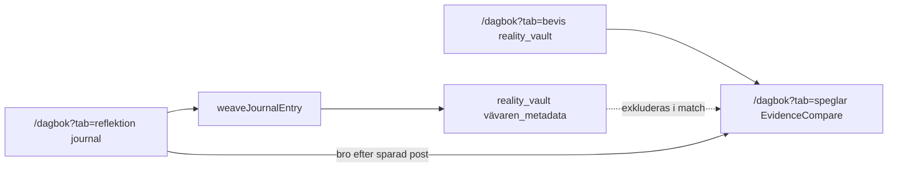

# Hjärtat — dataflöde (Dagbok → Valv → Speglar)

**Navigation:** [`navigation-master.md`](navigation-master.md) (Variant C). Kluster `/dagbok` med flikar `reflektion` | `bevis` | `speglar`.

## Steg

1. **Dagbok (Reflektion)** — användaren sparar `journal` (mood + text)
2. **Vävaren** — async `weaveJournalEntry` taggar → `reality_vault` med `category: vävaren_metadata`
3. **Verklighetsvalvet (Bevis)** — användaren loggar bevis → WORM `reality_vault`
4. **Speglar** — ACT/VIVIR + klient `getVaultLogs` + `matchVaultEvidence` (exkl. `vävaren_metadata`)

## Läsning vs skrivning

| Modul | Collection | Operation |
|-------|------------|-----------|
| Dagbok | `journal` | append |
| Vävaren | `reality_vault` | append (`vävaren_metadata`) |
| Valv | `reality_vault` | append (bevis) |
| Speglar | `reality_vault` | **read only** (klient SDK) |
| Valv-Chat | `reality_vault` | **read only** — inga chattloggar |

Minne/Kunskap (`/vardagen?tab=kunskap`, `knowledgeVaultQuery`) är **skild** silo — se [`.context/modules/valv_chatt.md`](../../.context/modules/valv_chatt.md).

## Navigation (Variant C)

| Modul | Ingång |
|-------|--------|
| Reflektion | `/dagbok`, Modulhub Hjärtat, Hem → Dagbok-chip |
| Bevis | `/dagbok?tab=bevis`, Fyren 3s på hub-centrum, Hem → Verklighetsvalvet-chip |
| Speglar | `/dagbok?tab=speglar`, Hem-chip, bro efter sparad dagbokspost |
| Dossier | **`/dossier`** (canonical); Valv-flik Dossier = bro |

Legacy: `/valv` → `/dagbok?tab=bevis`, `/speglar` → `/dagbok?tab=speglar`.

## Säkerhet

- Kluster: AuthGate
- Valv: Fyren + PIN + Zero Footprint; lämna Bevis-flik → rensa vault gate
- Speglar: Zero Footprint vid unmount **planerat**
- WORM: ingen update/delete på `journal` eller `reality_vault`

## Spec-källor

- [`docs/specs/modules/Dagbok-SPEC.md`](modules/Dagbok-SPEC.md)
- [`docs/specs/modules/Speglar-SPEC.md`](modules/Speglar-SPEC.md)
- [`docs/specs/modules/Verklighetsvalvet-SPEC.md`](modules/Verklighetsvalvet-SPEC.md)
- [`docs/specs/modules/Valv-Chat-SPEC.md`](modules/Valv-Chat-SPEC.md)
- [`docs/specs/modules/Dossier-SPEC.md`](modules/Dossier-SPEC.md) · [`dossier-generator.md`](dossier-generator.md)
