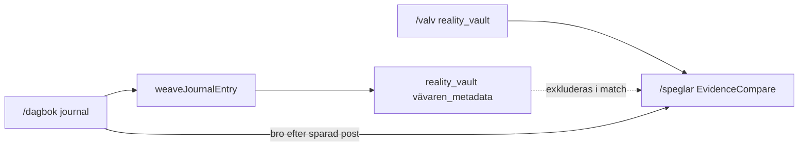

# Hjärtat — dataflöde (Dagbok → Valv → Speglar)

## Steg

1. **Dagbok** — användaren sparar `journal` (mood + text)
2. **Vävaren** — async `weaveJournalEntry` taggar → `reality_vault` med `category: vävaren_metadata`
3. **Verklighetsvalvet** — användaren loggar bevis (enkel, tvåspalt, trestegs-sköld, magkänsel) → WORM `reality_vault`
4. **Speglar** — ACT/VIVIR + klient `getVaultLogs` + `matchVaultEvidence` (exkl. `vävaren_metadata`)

## Läsning vs skrivning

| Modul | Collection | Operation |
|-------|------------|-----------|
| Dagbok | `journal` | append |
| Vävaren | `reality_vault` | append (`vävaren_metadata`) |
| Valv | `reality_vault` | append (bevis) |
| Speglar | `reality_vault` | **read only** (klient SDK) |
| Valv-Chat (planerad) | `reality_vault` | **read only** — inga chattloggar |

Minne/Kunskap (`/kunskap`, `knowledgeVaultQuery`) är **skild** modul — se [`.context/modules/valv_chatt.md`](../../.context/modules/valv_chatt.md).

## Navigation (Variant A)

| Modul | Ingång |
|-------|--------|
| Dagbok | dock BookOpen, HomePage bento |
| Valv | dock Shield 3s long-press + PIN |
| Speglar | HomePage bento, länk på Dagbok SavedStep (*copy delvis*) |

Variant B (planerad): long-press Dagbok → `/valv`; Shield bort från dock.

## Säkerhet

- Alla tre: AuthGate
- Valv: Fyren + PIN + Zero Footprint; Stäng → `/dagbok`, shake → `/`
- Speglar: Zero Footprint vid unmount **planerat**
- WORM: ingen update/delete på `journal` eller `reality_vault`

## Spec-källor

- [`docs/specs/modules/Dagbok-SPEC.md`](modules/Dagbok-SPEC.md)
- [`docs/specs/modules/Speglar-SPEC.md`](modules/Speglar-SPEC.md)
- [`docs/specs/modules/Verklighetsvalvet-SPEC.md`](modules/Verklighetsvalvet-SPEC.md)
- [`docs/specs/modules/Valv-Chat-SPEC.md`](modules/Valv-Chat-SPEC.md)
- [`docs/specs/modules/Dossier-SPEC.md`](modules/Dossier-SPEC.md) · [`dossier-generator.md`](dossier-generator.md)
