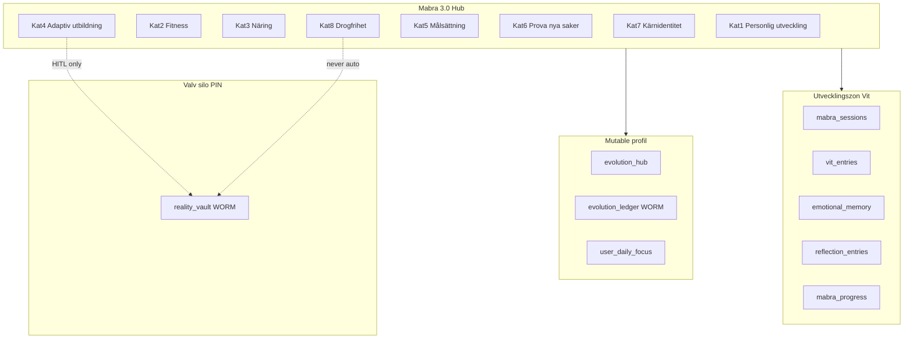
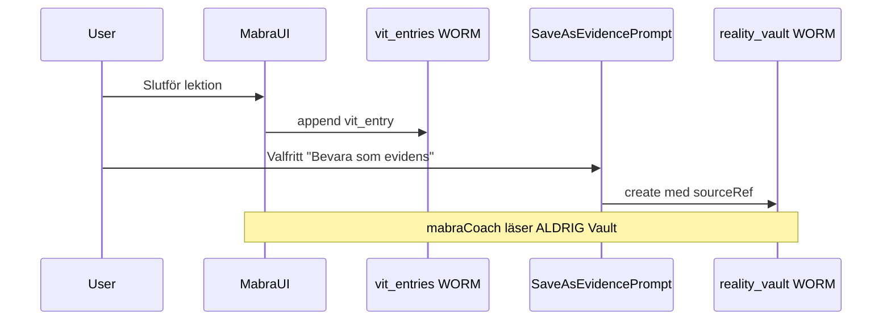

# MåBra 3.0 — Master Architecture SPEC

**Datum:** 2026-06-14  
**Status:** **Planeringsfas** — ingen produktionskod i denna leverans  
**Scope:** Arkitekturplan för åtta pelarkategorier under MåBra 3.0  
**Kanon:** [`SYSTEM_PLAN_v2.md`](../../SYSTEM_PLAN_v2.md) · [`.context/security.md`](../../../.context/security.md) · [`firestore.rules`](../../../firestore.rules) · [`INNEHALL-REGISTER.md`](../../INNEHALL-REGISTER.md)  
**Föregångare:** [`Mabra-SPEC.md`](./Mabra-SPEC.md) · [`Mabra-INPUT-SUPERHUB-SPEC.md`](./Mabra-INPUT-SUPERHUB-SPEC.md) · [`Drogfrihet-SPEC.md`](./Drogfrihet-SPEC.md)

---

## 0. Syfte och känslighet

MåBra 3.0 organiserar **rehabilitering och självutveckling** i åtta pelarkategorier. Data inkluderar missbruksåterhämtning, svår ångest, paranoida tankar och identitetsarbete — **extrem integritet** krävs.

**Denna SPEC:**

- Definierar **datasilo per kategori** (UI-tillstånd vs WORM vs mutable profil).
- Definierar **LLM/callable-mönster** utan cross-RAG till Valv.
- Kartlägger **befintlig kod** (verifierad 2026-06-14) vs **grönt fält**.
- **Föreslår ingen produktionskod** och inga nya UI-komponenter utan verifierad implementation-fas.

**Låst UX:** ingen (planeringsfas enligt uppdrag).

---

## 1. Oförhandlingsbara regler

### 1.1 Tre silos + Utvecklingszon (U1 / U6)

| Silo | Collections | Callable | MåBra 3.0 |
|------|-------------|----------|-----------|
| **Kunskap** | `kampspar`, `kb_docs` | `knowledgeVaultQuery` | FACT visas **statiskt** eller via citation — **aldrig** auto-ingest från MåBra |
| **Valv** | `reality_vault` | `valvChatQuery` | Endast **HITL** (`SaveAsEvidencePrompt`, inkast, explicit bevis-spar) |
| **Barnen** | `children_logs` | `childrenLogsQuery` | **Out of scope** för MåBra 3.0 |
| **Utveckling (Vit)** | `mabra_sessions`, `vit_entries`, `emotional_memory`, `reflection_entries` | `mabraCoach` (parafras bank) | **Primär zon** — **ingen** export till Kunskap-RAG |

**FÖRBJUDET (MUST NOT):**

- Cross-RAG mellan `reality_vault` och standard-MåBra-gränssnitt.
- LLM läser `reality_vault` i `mabraCoach`, `chatWithKompis` eller liknande utan `assertVaultSession` + explicit användaropt-in per anrop.
- Auto-promote känslig MåBra-text till Valv eller Dossier.
- `FACT` i MåBra-bank utan separat Kunskap-seed (`INNEHALL-REGISTER`).

Källa: [`.context/security.md`](../../../.context/security.md) § Tre silor · [`firestore.rules`](../../../firestore.rules) `isOwnerVault()` / `isValidRealityVaultCreate()`.

### 1.2 WORM vs mutable vs UI-only

| Lager | Regel | Exempel collections |
|-------|-------|---------------------|
| **WORM append-only** | `create` ja · `update`/`delete` nej · inga `updatedAt`/`deletedAt` på create | `journal`, `reality_vault`, `mabra_sessions`, `vit_entries`, `emotional_memory`, `reflection_entries`, `evolution_ledger` |
| **Mutable profil** | Användarstyrd profil/tillstånd · append-only historik i separat WORM där krävs | `mabra_progress`, `evolution_hub`, `vit_hub`, `user_daily_focus` (+ `history/` subcollection WORM) |
| **UI / enhet** | Zero Footprint · rensas vid logout/blur enligt policy | IndexedDB draft, `localStorage` (t.ex. dagräknare P0), RAM i reflektionsflöden |
| **Valv (WORM bevis)** | Kräver `isOwnerVault()` — custom claim `vaultUnlocked` | `reality_vault` |

Källa: [`firestore.rules`](../../../firestore.rules) rader 250–402, 747–764.

### 1.3 Känslighetsnivåer (dataklass)

| Nivå | Beskrivning | Standard lagring | LLM |
|------|-------------|------------------|-----|
| **L1 — Låg** | Metadata, duration, exerciseType | `mabra_sessions` | Deterministisk UI; ingen LLM |
| **L2 — Medium** | Reflektion, KBT light, quiz-svar | `vit_entries`, `reflection_entries`, `emotional_memory` | `mabraCoach` parafras **bankId** — max 500 tecken input |
| **L3 — Hög** | Identitet, värderingar, ångestinnehåll | `mabra_progress`, `vit_entries` (projekt) | Guard → Speglar vid ex/konflikt (`mabraCoachGuard`) |
| **L4 — Kritisk** | Missbruk/nykterhet, återfall, steg-arbete | **UI-only P0** → planerad isolerad profil | **Ingen** vault-RAG · dedikerad coach-regel i `sharedRules.ts` · minimal retention |

---

## 2. Pelararkitektur — åtta kategorier

MåBra 3.0 mappar kategorierna till **Infinite Evolution**-pelare ([`INFINITE_EVOLUTION.md`](../../architecture/INFINITE_EVOLUTION.md)) och befintlig hub-struktur (`mabraHubRegistry.ts`).



| Kat | Titel | Evolution-pelare | Hub-kategori idag | Kodstatus |
|-----|-------|------------------|-------------------|-----------|
| **1** | Personlig utveckling | Emotionell puls + Kognitiv grund | `tankar`, `projekt` | **Delvis live** |
| **2** | Fitness / Rörelse | Kognitiv grund | — | **Grönt fält** |
| **3** | Näring / vätska | Vardagens arkitektur | — | **Grönt fält** (widget planerad) |
| **4** | Adaptiv utbildning | Emotionell puls + Kognitiv | `lekar`, `projekt`, `identitet` | **Delvis live** |
| **5** | Målsättning | Kognitiv grund | Koppling Morgonkompass | **Delvis live** |
| **6** | Prova nya saker | Emotionell puls | — | **Grönt fält** |
| **7** | Kärnidentitet | Emotionell puls | `identitet`, `projekt` | **Live (hög känslighet)** |
| **8** | Drogfrihet / Återhämtning | Emotionell puls | `/familjen?tab=drogfrihet` | **Live P0 (kritisk)** |

---

## 3. Master datasilo-modell

### 3.1 Beslutsträd: var sparas data?

```
Användarinmatning
    │
    ├─► Draft / pågående? ──► IndexedDB / RAM / localStorage (Zero Footprint)
    │
    ├─► Övningsmetadata (typ, duration)? ──► mabra_sessions (WORM, L1)
    │
    ├─► Reflektion / Vit / känslominne? ──► vit_entries | emotional_memory | reflection_entries (WORM, L2–L3)
    │
    ├─► Profil / värderingar / kapacitet? ──► mabra_progress | evolution_hub (mutable) + evolution_ledger (WORM append)
    │
    ├─► Dagligt fokus / mål? ──► user_daily_focus (+ history WORM)
    │
    └─► Bevis / forensik? ──► reality_vault ENDAST efter explicit HITL + vaultSessionOpen
```

### 3.2 Callable-yta (tillåten)

| Callable | Silo | Får läsa | Får skriva | MåBra 3.0 |
|----------|------|----------|-----------|-----------|
| `mabraCoach` | Vit | Inget RAG · bankId lookup · användartext ≤500 tecken | Svar i RAM | **Primär** coach/transformator/vit_chat |
| `speglingsMirror` | Zero Footprint session | Session-minne | Session | Redirect vid ex/konflikt — **inte** MåBra-kategori |
| `analyzeMessage` | Hamn/Valv DCAP | Meddelande | BIFF JSON | **Out of scope** |
| `valvChatQuery` | Valv | `reality_vault` | — | **Aldrig** från MåBra UI utan PIN |
| `knowledgeVaultQuery` | Kunskap | `kampspar`/`kb_docs` | — | **Aldrig** från MåBra-sessioner |
| `journalQuickMirror` / Dagbok | Hjärtat | `journal` | `journal` WORM | **Bro** från Superhub — separat silo |

---

## 4. Kategori-specifikationer

### Kat 1 — Personlig utveckling

**Syfte:** KBT/ACT-light, daglig reflektion, thought record, reframing — utan gamification.

| Aspekt | Specifikation |
|--------|---------------|
| **UI-tillstånd** | Flödesstate i React (`MabraFlowViews`, `ReframingExercise`, `MabraReflectionSuperhubPanel`); draft i `reflectionDeckStorage` / `mabraExerciseNoteStorage` (localStorage) |
| **Persistent (Vit WORM)** | `mabra_sessions` (`exerciseType`: `reframing`, `grounding`, …) · `vit_entries` (`content_class`: REFLECTION) · `reflection_entries` |
| **Mutable** | `mabra_progress.coreValues` (delad med Kat 7) |
| **Valv (`reality_vault`)** | **Nej** som default · valfri HITL via Superhub `inkast` eller explicit "Spara som bevis" med `sourceRef` |
| **Kunskap** | FACT visas via `curriculumCatalog.ts` som **statisk bro** — ingen auto-ingest |
| **Känslighet** | L2 |

**Befintlig kod (verifierad):**

- `src/modules/features/dailyLife/wellbeing/mabra/components/ReframingExercise.tsx`
- `src/modules/features/dailyLife/wellbeing/mabra/supermodule/MabraReflectionSuperhubPanel.tsx`
- `src/modules/features/dailyLife/wellbeing/mabra/components/tools/MabraReflectionDeckTool.tsx`
- `functions/src/callables/agents.ts` — `mabraCoach` mode `transformator`

**LLM-mönster:**

1. Användare skriver tanke (≤500 tecken).
2. `shouldRedirectMabraCoachToSpeglar()` — deterministisk guard före LLM.
3. `askKbtTransformator()` parafrasar enligt bank — **ingen** läsning av journal/valv.
4. Svar visas i UI; persist endast vid explicit spar-knapp → `vit_entries` eller Dagbok-bro.

**MåBra 3.0 delta:** Enhetlig pelarmeny-entry "Personlig utveckling" som router till befintliga flows + Superhub-lägen — **ingen ny samling**.

---

### Kat 2 — Fitness / Rörelse

**Syfte:** Skonsam rörelse, nervsystemsreglering genom kropp — inte prestationsapp.

| Aspekt | Specifikation |
|--------|---------------|
| **UI-tillstånd** | Session timer, valt mikroprogram, offline checklista |
| **Persistent (Vit WORM)** | `mabra_sessions` med `exerciseType`: `movement_micro`, `walk_reset`, `stretch_478` — **metadata only** (duration, typ) |
| **Mutable** | `evolution_hub.featureFlags.movement_reminders` (planerat) |
| **Valv** | **Nej** — rörelseloggar är inte bevis |
| **Kunskap** | FACT om ADHD/rörelse kan länkas statiskt (seed) — separat silo |
| **Känslighet** | L1–L2 |

**Befintlig kod:** **Grönt fält** — inga dedikerade fitness-komponenter hittade i `src/modules/features/dailyLife/wellbeing/mabra/`. Närmast: `grounding`, andning (`BreathingExercise` via akut-hub).

**LLM-mönster:**

- **Fas 1:** Deterministisk — inga callables.
- **Fas 2 (valfri):** `mabraCoach` med fast `bankId` (REFLECTION/PLAY) för "välj ett mikrosteg" — **ingen** personlig historik i prompt.

**MåBra 3.0 delta:** Ny pelarkategori UI + `mabra_sessions.exerciseType`-enum utökning · **ingen** `reality_vault` · koppling till `checkins` (energi) som **read-only signal** för kapacitet (från `evolution_hub`, inte RAG).

---

### Kat 3 — Näring / vätskeintag

**Syfte:** Hydrering och enkel näringsspårning som **kognitiv avlastning** — inte kaloriräkning eller skam.

| Aspekt | Specifikation |
|--------|---------------|
| **UI-tillstånd** | Snabb widget-state (glas vatten, enkel måltidsmarkering) |
| **Persistent (planerad)** | Ny mutable collection **`mabra_nutrition_log/{uid}/entries`** (append per dag) **eller** under `user_capability_state` — **TBD vid implementation** · **inte WORM** (användaren får rätta dagens rad) |
| **Mobil snabbwidget (framtida)** | `/widget/nutrition` — offline-first, synkar batch · **Zero Footprint** option: endast lokal dag |
| **Valv** | **Nej** |
| **Kunskap** | FACT om hydration/ADHD via statisk seed — inte RAG från loggar |
| **Känslighet** | L1–L2 |

**Befintlig kod:** **Grönt fält** — ingen nutrition-modul i MåBra. Relaterat: `EconomyMatprepDelegate` (ekonomi-zon, separat Superhub).

**LLM-mönster:**

- **Ingen LLM** i loggning.
- Valbar veckosammanfattning (Fas 2): deterministisk text från aggregerade **siffror** (antal glas) — **inte** LLM på fritext dagbok.

**MåBra 3.0 delta:** Spec för widget + Firestore rules **separata** från WORM · explicit **MUST NOT** blanda med `transactions` (ekonomi) utan användarbeslut.

---

### Kat 4 — Adaptiv utbildning (mikroinlärning, KBT-quiz, självupptäckt, Vault-integrerad)

**Syfte:** Strukturerad mikroinlärning med FACT-kapitel + REFLECTION/PLAY-övningar; Vault endast som **valfri evidensbro**.

| Aspekt | Specifikation |
|--------|---------------|
| **UI-tillstånd** | Aktivt kapitel, quiz-progress, Vit-chatt tråd (session) |
| **Persistent (Vit WORM)** | `vit_entries` (`kind`: card/memory/chat_turn · `content_class`: REFLECTION|PLAY · `bankId` · `projectId`) · `mabra_sessions` för avslutad lektion |
| **Mutable** | `vit_hub/{uid}` — projektstatus · `vitProjectLastSeen.ts` (localStorage) |
| **Valv (integrerad)** | **Endast HITL:** användaren markerar "Detta vill jag bevara som evidens" → `SaveAsEvidencePrompt` → `reality_vault` med `sourceRef` till `vit_entries/{id}` · **aldrig** auto |
| **Kunskap** | `curriculumCatalog.ts` länkar `kunskapFactId` — FACT **läses statiskt** i UI, **inte** via `knowledgeVaultQuery` i MåBra-flöde |
| **Känslighet** | L2–L3 |

**Befintlig kod (verifierad):**

- `content/curriculumCatalog.ts` — CUR-ADHD-01 m.fl.
- `components/VitCardFlowPanel.tsx`, `VitChatFlowPanel.tsx`, `VitMemoryFlowPanel.tsx`
- `components/tools/MabraSelfQuizTool.tsx`, `MabraMicroPlayTool.tsx`
- `constants/mabraProjects.ts` — `learn_together`, `who_am_i`
- `mabraCoach` mode `vit_chat` med `resolveVitChatBankId()`

**LLM-mönster (adaptiv utbildning):**

```
1. UI väljer curriculum chapter → statisk FACT + bankId-lista (deterministisk)
2. Användarsvar → mabraCoach(vit_chat) med projectId + bankId
3. Guard: ex/konflikt → redirectToSpeglar (ingen bearbetning i MåBra)
4. Adaptation (utan RAG):
   - Klient: vitProjectLastSeen, mabra_history (Zustand) — vilka bankIds setts
   - Server: INGEN läsning av vit_entries i prompt (Fas 3.0 plan)
   - evolution_hub: kapacitetsnivå styr **antal** kapitel/vecka — inte innehåll i Valv
5. Vault: separat användargest → HITL → reality_vault (silo 2)
```

**MåBra 3.0 delta:** En "Utbildningspelare" som wrapper kring curriculum + quiz — **förbjudet** att `valvChatQuery` indexera `vit_entries`.

---

### Kat 5 — Målsättning (automatisk detektering + assisterad målsättning)

**Syfte:** Hjälpa användaren sätta **ett** genomförbart mål — inte produktivitetsoptimering.

| Aspekt | Specifikation |
|--------|---------------|
| **UI-tillstånd** | Wizard-steg, förslagslista, aktivt fokus |
| **Persistent (mutable)** | `user_daily_focus/{uid}` + `history/{date}` (history WORM append) · `mabra_progress` (delmål) |
| **Persistent (WORM signaler)** | `checkins`, `mabra_sessions` — **read-only indata** till detektering, inte måltext |
| **Evolution** | `evolution_hub.currentCapacityLevel` · `evolution_ledger` append vid nivåändring |
| **Valv** | **Nej** för vanliga mål · HITL om mål kopplas till vårdnad/bevis (sällsynt) |
| **Känslighet** | L2 |

**Befintlig kod (verifierad):**

- `src/modules/morning/morningStore.ts` — `user_daily_focus`
- `src/modules/reflection/store/reflectionStore.ts`
- `src/modules/features/dailyLife/wellbeing/mabra/components/ValuesCompass.tsx` — värderingar → `mabra_progress`
- `docs/architecture/INFINITE_EVOLUTION.md` — kapacitetsindikatorer

**LLM-mönster (assisterad målsättning):**

| Steg | Mekanism |
|------|----------|
| **Detektering** | Deterministisk kod: räkna `checkins` senaste 7d, `mabra_sessions` stressindikator, `planning_tasks` completion — **ingen LLM** |
| **Förslag** | `mabraCoach` med fast prompt + **generiska** bankIds (Paralys-Brytaren-ton) — **exkludera** användarens journal/valv |
| **Bekräftelse** | Användaren väljer/redigerar mål → skriv `user_daily_focus` (mutable) |
| **Evolution** | Vid kapacitetsändring → `evolution_ledger` WORM-post + uppdatera `evolution_hub` |

**MåBra 3.0 delta:** "Ett mål i taget"-panel under pelare 5 · **förbjudet** streak/XP (`INNEHALL-REGISTER`).

---

### Kat 6 — Prova nya saker (slumpmässig veckouppgift)

**Syfte:** Motverka stagnation med **låg stakes** — budget- och socialfilter, 5 överhoppade uppgifter i kö.

| Aspekt | Specifikation |
|--------|---------------|
| **UI-tillstånd** | Aktuell veckoutmaning, skip-kö (max 5), filter (budget / social / solo) |
| **Persistent (mutable)** | Planerad: `mabra_explore_queue/{uid}` — `{ currentTaskId, skippedIds[], weekKey, filters }` |
| **Persistent (Vit WORM)** | Valfri: `mabra_sessions` med `exerciseType`: `explore_done` — metadata när användaren markerar klart |
| **Valv** | **Nej** |
| **Kunskap** | PLAY-bank (`MB-PLAY-*`) — deterministisk uppgiftslista |
| **Känslighet** | L1–L2 |

**Befintlig kod:** **Grönt fält** — inga explore-komponenter. Närmast: `mabraExtendedPlays.ts`, `pickDagligMix.ts`, `dagligMixCatalog.ts`.

**LLM-mönster:**

- **Fas 1:** Slump från kuraterad PLAY-bank (`specialist-mabra-curator`) — **ingen LLM**.
- **Fas 2 (valfri):** `mabraCoach` parafraserar vald PLAY-post — **inte** generera nya uppgifter utan bankId.

**Affärsregler (låsta i spec):**

| Regel | Värde |
|-------|-------|
| Veckoutmaningar | 1 aktiv / vecka |
| Överhopp | Max **5** sparade i kö — därefter tvinga val eller paus |
| Filter | `budget_low` · `social_safe` · `solo` · `energy_low` — användaren väljer minst ett |
| Gamification | **Förbjudet** — ingen streak |

---

### Kat 7 — Kärnidentitet (självkänsla, värderingar, ångesthantering)

**Syfte:** ACT/värderingar, självkänsla, känslominnen — **hög känslighet**, max progressive disclosure.

| Aspekt | Specifikation |
|--------|---------------|
| **UI-tillstånd** | Projektflöde per `MabraProjectId`; emotional memory draft |
| **Persistent (Vit WORM)** | `vit_entries` (projekt: `self_esteem`, `emotional_memory`, `who_am_i`) · `emotional_memory` collection (`memoryType`: identity/feeling/reflection/freeform) |
| **Mutable** | `mabra_progress.coreValues` · `vit_hub/{uid}` |
| **Valv** | **Nej** default · identitetsdata ska **inte** bli forensisk bevis utan explicit separat beslut |
| **Speglar/Hamn** | **Guard obligatorisk** — ex/konflikt-text redirect |
| **Känslighet** | **L3 — Hög** |

**Befintlig kod (verifierad):**

- `components/ValuesCompass.tsx`
- `components/EmotionalMemoryView.tsx`
- `content/selfEsteemCards.ts`
- `supermodule/MabraInputSuperModule.tsx` — lägen `emotional_memory`, `vit_*`
- `constants/mabraProjects.ts`
- `firestore.rules` — `isValidEmotionalMemoryCreate()` (intensity 1–10)

**LLM-mönster:**

| Mode | Callable | Data i prompt |
|------|----------|---------------|
| Vit-chatt | `mabraCoach(vit_chat)` | `projectId`, `vitMessage`, `bankId` parafras — **ingen** historik från Valv |
| Coach | `mabraCoach(coach)` | `hubSymptom`, `exerciseType`, optionalNote ≤500 |
| Transformator | `mabraCoach(transformator)` | En tanke — guard före LLM |

**Zero Footprint:** `reflection_tool`, `exercise_note` — RAM/localStorage tills explicit save (Superhub SPEC §11).

**MåBra 3.0 delta:** Pelare 7 som **skyddad zon** — kräver kapacitetsnivå ≥2 i `evolution_hub` innan `who_am_i`-djup öppnas (Infinite Evolution).

---

### Kat 8 — Drogfrihet / Återhämtning från missbruk

**Syfte:** 12-stegs-inspirerat stöd, dagräknare, motiverande banner — **kritisk integritet**, ingen skam, ingen dataexponering.

| Aspekt | Specifikation |
|--------|---------------|
| **UI-tillstånd** | Flik Idag/Stöd/Reflektion/Kunskap · toppbanner (motiverande, **inte** streak) |
| **Persistent P0 (nu)** | **`localStorage` only** — `drogfrihetCounter.ts` (`startDateKey` per uid) · **ingen Firestore** |
| **Persistent P1 (planerad)** | Isolerad mutable doc `recovery_profile/{uid}` — `{ programType, startDateKey, shareWithCoach: false }` · **aldrig** `reality_vault` |
| **Valv** | **STRICT MUST NOT auto** · återfallsanteckningar får **inte** promotas till bevis utan separat juridisk/terapeutisk process + HITL |
| **Kunskap** | Statisk FACT i hub (`kunskapFacts.ts`) — seed `kunskap-fact-df-*` · **ingen** `knowledgeVaultQuery` i hub |
| **12-steg** | REFLECTION-bank `DF-REF-*` — parafras only · **ingen** LLM som "sponsor" |
| **Känslighet** | **L4 — Kritisk** |

**Befintlig kod (verifierad):**

- `src/modules/features/dailyLife/drogfrihet/components/DrogfrihetHubPage.tsx`
- `drogfrihet/lib/drogfrihetCounter.ts` — localStorage
- `drogfrihet/content/drogfrihetCatalog.ts` — DF-REF-01..10
- Route: `/familjen?tab=drogfrihet` (redirect från `/drogfrihet`)
- [`Drogfrihet-SPEC.md`](./Drogfrihet-SPEC.md)

**LLM-mönster (planerad P1):**

| Callable | Tillåtet | Förbjudet |
|----------|----------|-----------|
| Dedikerad `recoveryCoach` (ny) | Parafras `DF-REF-*` · kris → statisk 113-text | Läsa valv/journal · diagnostisera · skuldbeläggning |
| `mabraCoach` | **Ej** dela prompt med övriga kategorier i samma session | Cross-kategori context |

**Toppbanner:** Deterministisk copy från bank roterad per `dayCount` — **ingen** LLM-genererad motivation (RSD-risk).

**Integritetsregler (KRITISKA):**

1. Dagräknare synlig **endast** inne i Drogfrihet-pelaren — **inte** på Hem/dashboard.
2. Nollställ endast `Inställningar → Drogfrihet` (tvåstegs bekräftelse) — befintligt mönster.
3. **Ingen** export till Dossier default.
4. **Ingen** RAG-indexering av recovery-data.
5. Device Clear rensar `localStorage` recovery-nycklar.

**MåBra 3.0 delta:** Integrera Drogfrihet som **åttonde pelare** i MåBra 3.0-nav — behåll fysisk route `/familjen?tab=drogfrihet` eller migrera till `/mabra?pillar=recovery` **endast efter PMIR** (navigation lock).

---

## 5. LLM & adaption — systemet "lär sig" utan Valv-kompromiss

### 5.1 Princip: deterministisk routing före LLM

Alla MåBra 3.0-callables följer DCAP-kedjan ([`.context/security.md`](../../../.context/security.md)):

```
Input → mabraCoachGuard / shouldRedirectMabraCoachToSpeglar
      → rate limit (callableGuards)
      → bankId resolve (content bank KEEP)
      → Gemini (sharedRules.ts)
      → Svar till klient (ingen auto-write)
```

### 5.2 Vad får påverka adaption (allowlist)

| Signal | Källa | Användning |
|--------|-------|------------|
| Kapacitetsnivå | `evolution_hub` | Antal val, djup i UI — **inte** LLM-minne |
| Senaste sessionstyper | `mabra_sessions` aggregate (server-side count) | Föreslå pelare — **metadata only** |
| Vit set seen | `vitProjectLastSeen` (klient) | Nästa kort/quiz |
| Dagligt fokus | `user_daily_focus` | Ett mål i taget |
| BankId | `Mabra-CONTENT-BANK` | Parafras — **sanning** |

### 5.3 Förbjudna adaptionskällor

- `reality_vault` (alla kategorier utom explicit HITL-export **från** användaren, aldrig **in** i coach)
- `journal` i `mabraCoach` (redan borttaget från `chatWithKompis` 2026-06-14)
- `children_logs`
- `kampspar` RAG-svar som inline coach-text utan citation UX

### 5.4 Vault-integrerad utbildning (Kat 4) — säkert mönster



---

## 6. UI-arkitektur MåBra 3.0 (planerad)

### 6.1 Navigationsmodell

| Nivå | Beskrivning |
|------|-------------|
| **L0** | `/mabra` — MåBra 3.0 hem med 8 pelarkort (Obsidian Calm, smaragd glow) |
| **L1** | Pelarkategori → befintlig hub/router/delegate |
| **L2** | Superhub-lägen (`MabraInputSuperModule`) för inmatning |
| **L3** | Akut/övning (andning, grounding) — **prioriterad** overlay |

**Befintlig entry (live):**

- `/mabra` — `MabraHub.tsx`, `MabraRoutes.tsx`, `MabraHubView.tsx`
- `/mabra/input` — `MabraInputSuperModule` (låst Superhub §11)
- `/vardagen?tab=mabra` — launcher (parallell ingång — P2 konsolidering)

### 6.2 Obsidian Calm

- Pelare MåBra: `glow-bottom-green`, `calm-card`, `font-display-serif` rubriker
- **Ingen** hårdkodad hex i nya komponenter — semantiska tokens ([`design-calm.mdc`](../../../.cursor/rules/design-calm.mdc))

---

## 7. Firestore — planerad utökning (ej implementerad)

| Collection | Typ | Kat | Notering |
|------------|-----|-----|----------|
| `mabra_nutrition_log` | Mutable | 3 | TBD rules — owner-bound |
| `mabra_explore_queue` | Mutable | 6 | Skip-kö, veckonyckel |
| `recovery_profile` | Mutable | 8 | Isolerad — **inte** WORM |
| `mabra_movement_log` | WORM metadata | 2 | Optional — session only |

**Alla nya collections kräver:** PMIR · `firestore.rules` `keys().hasOnly` · smoke · **ingen** cross-silo callable.

---

## 8. Implementation-faser (dokumentation only)

| Fas | Innehåll | Gate |
|-----|----------|------|
| **M3.0-A** | Eval + denna SPEC godkänd | Pontus OK |
| **M3.0-B** | Pelarnav UI (router only) — wire befintliga moduler | `npm run smoke:mabra` |
| **M3.0-C** | Kat 2, 3, 6 gröna fält — minimal viable | Kapacitetsregler |
| **M3.0-D** | Kat 8 `recovery_profile` Firestore (valfritt) | Säkerhetsaudit |
| **M3.0-E** | Lås i `locked-ux-features.md` | PMIR + smoke |

**Regel:** Ingen fas startar utan `docs/evaluations/YYYY-MM-DD-mabra-3.0-<fas>.md`.

---

## 9. Smoke & verifiering (vid framtida kod)

| Test | Kommando |
|------|----------|
| MåBra bank lock | `npm run smoke:innehall` |
| Superhub | `npm run smoke:mabra` |
| Locked UX (efter lås) | `npm run smoke:locked-ux` |
| Build | `npm run build` |
| Silo guard (manuell) | Bekräfta att `mabraCoach` inte queryar `reality_vault` |

---

## 10. Befintlig kod — inventering (verifierad 2026-06-14)

| Område | Sökväg | Status |
|--------|--------|--------|
| Superhub | `mabra/supermodule/MabraInputSuperModule.tsx` | Live, låst §11 |
| Hub registry | `mabra/mabraHubRegistry.ts` | Live |
| Coach API | `mabra/api/mabraCoachService.ts` | Live |
| Callable | `functions/src/callables/agents.ts` — `mabraCoach` | Live |
| Guard | `mabra/lib/mabraCoachGuard.ts` | Live |
| Drogfrihet | `drogfrihet/components/DrogfrihetHubPage.tsx` | Live P0 |
| Curriculum | `mabra/content/curriculumCatalog.ts` | Live |
| Values / identitet | `mabra/components/ValuesCompass.tsx` | Live |
| Emotional memory | `mabra/components/EmotionalMemoryView.tsx` | Live |
| Fitness | — | **Saknas** |
| Nutrition | — | **Saknas** |
| Explore weekly | — | **Saknas** |

---

## 11. Referenser

| Dokument | Roll |
|----------|------|
| [`SYSTEM_PLAN_v2.md`](../../SYSTEM_PLAN_v2.md) | Fas 9+ styrning |
| [`.context/security.md`](../../../.context/security.md) | Layered Defense, silos |
| [`firestore.rules`](../../../firestore.rules) | WORM validators |
| [`INNEHALL-REGISTER.md`](../../INNEHALL-REGISTER.md) | U6 content_class |
| [`Mabra-CONTENT-BANK.md`](./Mabra-CONTENT-BANK.md) | KEEP-poster |
| [`INFINITE_EVOLUTION.md`](../../architecture/INFINITE_EVOLUTION.md) | Pelare & kapacitet |
| [`2026-06-14-fas9-systemanalys.md`](../../evaluations/2026-06-14-fas9-systemanalys.md) | Säkerhetsaudit |

---

**Nästa steg (ett i taget):** Godkänn denna SPEC → skriv `docs/evaluations/YYYY-MM-DD-mabra-3.0-A-eval.md` → påbörja M3.0-B endast efter explicit "kör MåBra 3.0".
