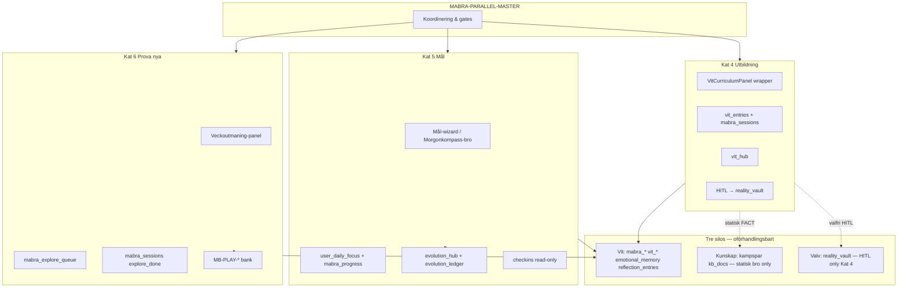
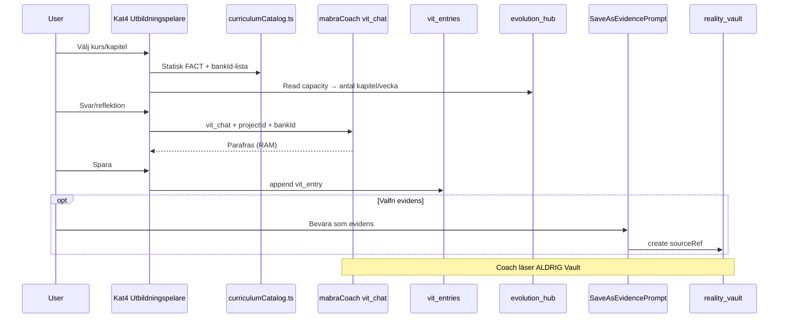
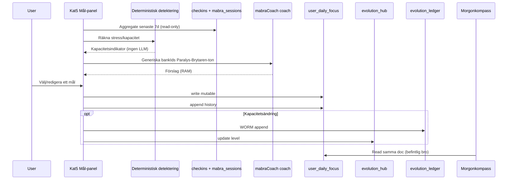
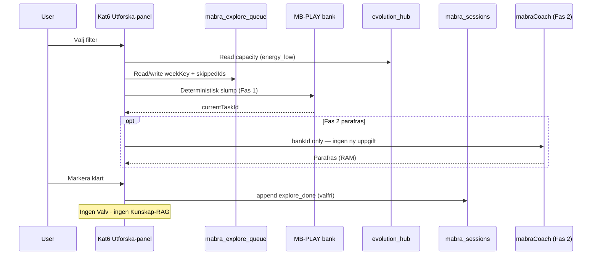

# MåBra 3.0 — Parallell koordinering (Kat 4 · 5 · 6)

**Datum:** 2026-06-14  
**Status:** **Aktiv** — Kat 6 **KLAR** · Kat 4/5 öppna  
**Scope:** Koordinationsritning för parallell utveckling av tre pelarkategorier under MåBra 3.0  
**Kanon:** [`MABRA-3.0-MASTER-SPEC.md`](./MABRA-3.0-MASTER-SPEC.md) · [`.context/security.md`](../../../.context/security.md) · [`INNEHALL-REGISTER.md`](../../INNEHALL-REGISTER.md) · [`firestore.rules`](../../../firestore.rules)

---

## 0. Syfte

Denna fil är **huvudkoordineringen** för att bygga kategori 4 (Adaptiv utbildning), 5 (Målsättning) och 6 (Prova nya saker) **parallellt** utan silokonflikt, rules-kollision eller callable-överlapp.

**Denna fil gör:**

- Definierar **underagentspecifikationer** (datasilo, interaktionsmönster, beroendelista) per kategori.
- Anger **implementeringsordning** och **exklusiva ägarskap** per collection/callable.
- Kartlägger **vad som kan köras samtidigt** vs **vad som måste vänta**.

**Denna fil gör inte:**

- Skriva kod, UI-komponenter eller nya callables.
- Ersätta [`MABRA-3.0-MASTER-SPEC.md`](./MABRA-3.0-MASTER-SPEC.md) — den är **delmodul** under master.

**Låst UX:** ingen (planeringsfas).

---

## 1. Parallell översikt



### 1.1 Konfliktfri parallellism — sammanfattning

| Kategori | Kan starta parallellt | Delad resurs (risk) | Exklusivt ägarskap |
|----------|----------------------|---------------------|-------------------|
| **Kat 4** | Ja (Fas P4-A) | `vit_entries`, `vit_hub`, `mabraCoach(vit_chat)` | Curriculum UI, HITL-bro, `projectId: learn_together` |
| **Kat 5** | Ja (Fas P5-A) | `evolution_hub`, `mabraCoach(coach)` | `user_daily_focus`, detekteringslogik, Morgonkompass-bro |
| **Kat 6** | **KLAR** (2026-06-14) | `mabra_sessions.exerciseType` enum | `mabra_explore_queue`, PLAY-uppgiftsmotor — se [`mabra-3.0-cat6-closure.md`](../../evaluations/mabra-3.0-cat6-closure.md) |

**Regel:** Ingen kategori får introducera **ny callable med RAG** eller **läsa `reality_vault`** i coach-flöde.

---

## 2. Gemensamma låsningar (alla tre kategorier)

### 2.1 Tre silos (U1 / U6)

| Silo | Tillåtet i Kat 4/5/6 | Förbjudet |
|------|----------------------|-----------|
| **Utveckling (Vit)** | Skriv `vit_entries`, `mabra_sessions`, `user_daily_focus`, `mabra_explore_queue` | Export till Kunskap-RAG |
| **Kunskap** | **Statisk** FACT i UI (`curriculumCatalog.ts`, citation) | `knowledgeVaultQuery` från MåBra-session |
| **Valv** | Kat 4: HITL `SaveAsEvidencePrompt` med `sourceRef` | Auto-promote · `valvChatQuery` från MåBra UI |
| **Hjärtat (journal)** | Kat 5: valfri manuell Dagbok-bro (separat silo) | `journal` i `mabraCoach`-prompt |

### 2.2 LLM-kedja (gemensam)

```
Input → mabraCoachGuard / shouldRedirectMabraCoachToSpeglar
      → rate limit (callableGuards)
      → bankId resolve (Mabra-CONTENT-BANK KEEP)
      → Gemini (sharedRules.ts)
      → Svar i RAM (ingen auto-write)
```

### 2.3 Delade callables — ägarskap per mode

| Callable | Mode | Kat 4 | Kat 5 | Kat 6 |
|----------|------|-------|-------|-------|
| `mabraCoach` | `vit_chat` | **Primär** | — | — |
| `mabraCoach` | `coach` | — | **Primär** (målförslag) | Fas 2 valfri |
| `mabraCoach` | `transformator` | Indirekt (quiz) | — | — |
| `knowledgeVaultQuery` | — | **FÖRBJUDEN** | **FÖRBJUDEN** | **FÖRBJUDEN** |
| `valvChatQuery` | — | **FÖRBJUDEN** | **FÖRBJUDEN** | **FÖRBJUDEN** |

**Konfliktregel:** Om två agenter ändrar `functions/src/callables/agents.ts` samtidigt — **serialisera** via en callable-PR; modes får inte dela prompt-context mellan kategorier i samma session.

### 2.4 Evolution-signaler (read-only för coach)

| Signal | Källa | Kat 4 | Kat 5 | Kat 6 |
|--------|-------|-------|-------|-------|
| `currentCapacityLevel` | `evolution_hub` | Styr antal kapitel/vecka | Styr mål-djup | Styr filter `energy_low` |
| `featureFlags` | `evolution_hub` | — | Planerat `goal_assist` | Planerat `explore_weekly` |
| Kapacitetsändring | `evolution_ledger` WORM | — | **Skriv** vid nivåbyte | — |

**Ägarskap:** Endast **Kat 5-agenten** skriver `evolution_ledger` i samband med målbekräftelse/kapacitetsändring. Kat 4 och 6 **läser** `evolution_hub` — ingen skrivning till ledger.

---

## 3. Underagentspec — Kat 4 (Adaptiv utbildning)

**Agent-id (planerad):** `specialist-mabra-cat4-education`  
**Evolution-pelare:** Emotionell puls + Kognitiv grund  
**Känslighet:** L2–L3  
**Kodstatus:** Delvis live (`VitCurriculumPanel`, `VitCardFlowPanel`, `VitChatFlowPanel`, `MabraSelfQuizTool`)

### 3.1 Datasilo

| Lager | Collection / store | Operation | Innehåll |
|-------|-------------------|-----------|----------|
| **UI / Zero Footprint** | React state · `vitProjectLastSeen` (localStorage) | Läs/skriv lokal | Aktivt kapitel, quiz-progress, pågående chatt |
| **Vit WORM** | `vit_entries` | `create` only | `projectId`: `learn_together`, `who_am_i` · `kind`: card/memory/chat_turn · `content_class`: REFLECTION\|PLAY · `bankId` |
| **Vit WORM** | `mabra_sessions` | `create` only | `exerciseType`: `curriculum_complete`, `quiz_complete` — metadata (duration, typ) |
| **Mutable profil** | `vit_hub/{uid}` | create/update | `activeProjectIds` — projektstatus |
| **Kunskap (statisk)** | `curriculumCatalog.ts` | Read-only klient | `kunskapFactId` → FACT-titel/summary/citation — **ingen** Firestore-read i flöde |
| **Valv (HITL)** | `reality_vault` | create via HITL only | `sourceRef` → `vit_entries/{id}` — **aldrig** auto |

**MUST NOT:**

- `valvChatQuery` indexera eller läsa `vit_entries`.
- `mabraCoach` läsa `vit_entries` server-side i prompt (Fas 3.0-plan).
- Auto-ingest FACT till `kampspar` från MåBra-svar.

### 3.2 Interaktionsmönster



| Gränssnitt | Riktning | Mekanism |
|------------|----------|----------|
| **Kunskap** | Kat 4 → användare | Statisk FACT i panel; `broLinks` till `/valvet?vaultTab=kunskapsbank` (PIN) — **inte** inline RAG |
| **Valv** | Kat 4 → Valv | Endast `SaveAsEvidencePrompt` efter explicit användarval |
| **Hjärtat** | Kat 4 → Dagbok | Valfri manuell bro via Superhub `inkast` — separat silo, **inte** default |
| **Morgonkompass / Kat 5** | Kat 5 → Kat 4 | Kapacitet från `evolution_hub` påverkar kapitel-takt — **ingen** delad måltext |
| **Kat 6** | Isolerad | Inga delade collections utom `mabra_sessions` enum — **separata** `exerciseType`-värden |

**Adaptation (utan RAG):**

1. Klient: `vitProjectLastSeen`, Zustand `mabra_history` — vilka `bankId` setts.
2. Server: ingen historik från Valv/journal i prompt.
3. `evolution_hub.currentCapacityLevel` styr **antal** kapitel per vecka — inte innehåll från Valv.

### 3.3 Beroendelista

| Prioritet | Artefakt | Åtgärd | Ägare (agent) |
|-----------|----------|--------|---------------|
| P0 | [`MABRA-3.0-MASTER-SPEC.md`](./MABRA-3.0-MASTER-SPEC.md) § Kat 4 | Referens — redan godkänd plan | Koordinator |
| P0 | `curriculumCatalog.ts` | Utöka kapitel/waves — **ingen** ny collection | Cat4 |
| P0 | `Mabra-CONTENT-BANK.md` | KEEP för `MB-REF-*`, `MB-PLAY-*` i curriculum | Cat4 + `specialist-mabra-curator` |
| P0 | `INNEHALL-REGISTER.md` | Registrera nya bankIds före prod | Cat4 |
| P1 | `firestore.rules` | `isValidVitEntryCreate()` — `projectId` redan inkl. `learn_together` | Cat4 (rules-PR separat) |
| P1 | `vit_hub/{uid}` | Befintliga rules — verifiera `isValidVitHubWrite()` | Cat4 |
| P1 | `VitCurriculumPanel.tsx` + flows | Wrapper "Utbildningspelare" — router only | Cat4 |
| P1 | `SaveAsEvidencePrompt` | Återanvänd HITL — `sourceRef` till `vit_entries` | Cat4 (integration only) |
| P2 | `mabra_sessions` | Utöka `exerciseType` enum: `curriculum_complete`, `quiz_complete` | Cat4 (koordinera med Cat6 enum-PR) |
| P2 | `mabraHubRegistry.ts` | Ny pelare-entry `education` | Cat4 |
| P2 | `sharedRules.ts` | Inga nya prompts utan bankId — ev. `vit_chat` context tag | Callable-PR |
| P3 | `locked-ux-features.md` | Uppdatera **efter** PMIR + smoke | Koordinator |

**Nya collections:** **Inga** för Kat 4.

**Smoke-gate:** `npm run smoke:innehall` · `npm run smoke:mabra` · manuell: `mabraCoach` queryar inte `reality_vault`.

---

## 4. Underagentspec — Kat 5 (Målsättning)

**Agent-id (planerad):** `specialist-mabra-cat5-goals`  
**Evolution-pelare:** Kognitiv grund  
**Känslighet:** L2  
**Kodstatus:** Delvis live (`morningStore`, `ValuesCompass`, `reflectionStore`)

### 4.1 Datasilo

| Lager | Collection / store | Operation | Innehåll |
|-------|-------------------|-----------|----------|
| **UI / Zero Footprint** | Wizard-steg i React | RAM | Aktivt steg, förslagslista (ej sparad) |
| **Mutable profil** | `user_daily_focus/{uid}` | create/update | Aktuellt dagligt fokus — **ett mål i taget** |
| **Mutable + WORM historik** | `user_daily_focus/{uid}/history/{date}` | `create` only (WORM) | Append daglig fokus-historik |
| **Mutable profil** | `mabra_progress/{uid}` | update | Delmål, koppling till `coreValues` (delad med Kat 7 — **läs only** från Kat 5 wizard) |
| **Evolution mutable** | `evolution_hub/{uid}` | update | `currentCapacityLevel`, planerat `featureFlags.goal_assist` |
| **Evolution WORM** | `evolution_ledger` | `create` only | Append vid kapacitetsnivåändring |
| **Read-only signaler** | `checkins`, `mabra_sessions`, `planning_tasks` | aggregate read | Detektering — **metadata only**, ingen fritext i LLM |
| **Valv** | `reality_vault` | **Nej** default | HITL endast om mål kopplas till vårdnad/bevis (sällsynt, manuell) |

**MUST NOT:**

- Streak, XP, gamification (`INNEHALL-REGISTER`).
- LLM läsa `journal` eller `reality_vault` för målförslag.
- Auto-skriva mål utan explicit användarbekräftelse.

### 4.2 Interaktionsmönster



| Gränssnitt | Riktning | Mekanism |
|------------|----------|----------|
| **Morgonkompass** | Kat 5 ↔ Morgonkompass | Delad `user_daily_focus` — **Kat 5 äger** schema/write; Morgonkompass **läser** |
| **Kat 4** | Kat 5 → Kat 4 | `evolution_hub` kapacitet styr utbildningstakt — **ingen** måltext i curriculum |
| **Kat 6** | Kat 5 → Kat 6 | `energy_low` filter kan läsa kapacitetsnivå — **ingen** delad kö |
| **Planering** | Kat 5 → Planering | `planning_tasks` completion som read-only signal — **ingen** auto-skapad uppgift |
| **Valv** | Isolerad | Ingen default-bro; sällsynt HITL vid vårdnadsmål |
| **Hjärtat** | Valfri | Manuell Dagbok-bro — separat silo |

**Detekteringsregler (deterministisk, ingen LLM):**

| Signal | Källa | Tröskel (planerad) |
|--------|-------|-------------------|
| Stressindikator | `checkins` senaste 7d | ≥3 låga energi/humör |
| Aktivitet | `mabra_sessions` count | <2 sessioner/7d → föreslå mikrosteg |
| Planering | `planning_tasks` completion | <30% done → förenkla mål |
| Kapacitet | `evolution_hub.currentCapacityLevel` | Nivå 1 → max ett mikromål, inga delmål |

### 4.3 Beroendelista

| Prioritet | Artefakt | Åtgärd | Ägare (agent) |
|-----------|----------|--------|---------------|
| P0 | `morningStore.ts` | Verifiera `user_daily_focus` read/write — **inte** bryt Morgonkompass | Cat5 |
| P0 | `firestore.rules` | `user_daily_focus` + `history/` — redan live, verifiera validators | Cat5 |
| P0 | `evolution_hub` / `evolution_ledger` rules | Verifiera WORM append-only på ledger | Cat5 |
| P0 | `INFINITE_EVOLUTION.md` | Kapacitetsindikatorer — följ append-only ledger | Cat5 |
| P1 | Ny panel `MabraGoalPanel.tsx` (planerad) | "Ett mål i taget"-wizard | Cat5 |
| P1 | Detekteringsmodul (planerad) | `goalDetection.ts` — ren klient/server aggregate | Cat5 |
| P1 | `mabraCoach` mode `coach` | Fast prompt + generiska bankIds — **exkludera** journal/valv | Callable-PR |
| P1 | `Mabra-CONTENT-BANK.md` | Paralys-Brytaren-ton bankIds KEEP | Cat5 + kurator |
| P2 | `mabra_progress` | Läs `coreValues` — skriv endast delmål-fält (utöka schema i rules-PR) | Cat5 (koordinera Kat 7) |
| P2 | `mabraHubRegistry.ts` | Pelare-entry `goals` | Cat5 |
| P2 | `planning_tasks` | Read-only query — **ingen** write från Kat 5 | Cat5 |
| P3 | `evolution_hub.featureFlags.goal_assist` | Ny flagga — kräver evolution rules-utökning | Cat5 |

**Nya collections:** **Inga** — återanvänder `user_daily_focus`, `evolution_*`, `mabra_progress`.

**Konflikt med Kat 7:** `mabra_progress.coreValues` ägs av Kat 7 för skrivning av värderingar. Kat 5 får endast läsa `coreValues` och skriva **separata** delmål-fält efter rules-PMIR.

**Smoke-gate:** `npm run smoke:mabra` · `npm run build` · manuell: Morgonkompass visar samma fokus efter Kat 5-spar.

---

## 5. Underagentspec — Kat 6 (Prova nya saker) — **KLAR**

**Agent-id (planerad):** `specialist-mabra-cat6-explore`  
**Evolution-pelare:** Emotionell puls  
**Känslighet:** L1–L2  
**Kodstatus:** **Live** — P6-A rules + P6-B picker/UI deployade 2026-06-14  
**Avslut:** [`docs/evaluations/mabra-3.0-cat6-closure.md`](../../evaluations/mabra-3.0-cat6-closure.md)

### 5.1 Datasilo

| Lager | Collection / store | Operation | Innehåll |
|-------|-------------------|-----------|----------|
| **UI / Zero Footprint** | React state | RAM | Aktuell veckoutmaning, filter-val |
| **Mutable profil** | `mabra_explore_queue/{uid}` | create/update | `availableTasks[]`, `completedTasks[]` (append-only), `lastGenerated`, `updatedAt` |
| **Vit WORM** | `mabra_sessions` | `create` only (valfri) | `exerciseType`: `explore_done` — metadata när användaren markerar klart |
| **Innehåll (statisk)** | `Mabra-CONTENT-BANK.md` · `mabraExtendedPlays.ts` | Read-only | PLAY `MB-PLAY-*` — kuraterad lista |
| **Evolution (read-only)** | `evolution_hub` | read | `currentCapacityLevel` → filter `energy_low` |
| **Valv** | — | **Nej** | Inga bevis, inga HITL-broar |
| **Kunskap** | — | **Nej** RAG | Endast PLAY-bank |

**Affärsregler (låsta):**

| Regel | Värde |
|-------|-------|
| Veckoutmaningar | 1 aktiv / `weekKey` (ISO-vecka) |
| Överhopp | Max **5** per vecka — `localStorage` (`exploreSkipStorage`) |
| Filter | Minst ett av: `budget_low` · `social_safe` · `solo` · `energy_low` |
| Gamification | **Förbjudet** — ingen streak |

### 5.2 Interaktionsmönster



| Gränssnitt | Riktning | Mekanism |
|------------|----------|----------|
| **Kat 4** | Isolerad | Delad `mabra_sessions` enum — **separata** `exerciseType`-värden |
| **Kat 5** | Kat 5 → Kat 6 | Kapacitet påverkar `energy_low` filter — **ingen** delad `user_daily_focus` |
| **Kat 7** | Isolerad | Inga `vit_entries` — PLAY är låg stakes |
| **Valv / Kunskap** | **Ingen** | — |
| **Innehållskurator** | Bank → UI | `specialist-mabra-curator` seedar `MB-PLAY-EXPLORE-*` (planerat prefix) |

**LLM-faser:**

| Fas | Mekanism |
|-----|----------|
| **Fas 1 (MVP)** | Slump från kuraterad PLAY-bank — **ingen LLM** |
| **Fas 2 (valfri)** | `mabraCoach` parafraserar vald post — **inte** generera nya uppgifter utan `bankId` |

### 5.3 Beroendelista

| Prioritet | Artefakt | Åtgärd | Ägare (agent) |
|-----------|----------|--------|---------------|
| P0 | [`MABRA-3.0-MASTER-SPEC.md`](./MABRA-3.0-MASTER-SPEC.md) § Kat 6 | Affärsregler låsta | Koordinator |
| P0 | `Mabra-CONTENT-BANK.md` | Nya `MB-PLAY-EXPLORE-*` KEEP-poster | Cat6 + `specialist-mabra-curator` |
| P0 | `INNEHALL-REGISTER.md` | Registrera EXPLORE-bank före prod | Cat6 |
| P1 | `firestore.rules` | **Ny** `mabra_explore_queue/{uid}` — `keys().hasOnly`, owner-bound, mutable | Cat6 (rules-PR **exklusiv**) |
| P1 | `isValidMabraSessionCreate()` | Utöka `exerciseType` med `explore_done` | Cat6 (koordinera med Cat4 enum-PR) |
| P1 | `exploreTaskPicker.ts` (planerad) | Deterministisk slump + filter + skip-kö | Cat6 |
| P1 | `MabraExplorePanel.tsx` (planerad) | Veckoutmaning UI | Cat6 |
| P2 | `mabraHubRegistry.ts` | Pelare-entry `explore` | Cat6 |
| P2 | `evolution_hub` | Read-only `currentCapacityLevel` | Cat6 |
| P3 | `mabraCoach` Fas 2 | Parafras only — callable-PR efter Fas 1 live | Callable-PR |

**Nya collections:** `mabra_explore_queue` — **endast Kat 6** får introducera denna.

**Smoke-gate:** `npm run smoke:innehall` · rules deploy test · manuell: skip-kö stoppar vid 5.

---

## 6. Sekventiell implementeringsordning

Ritningen tillåter **parallell start** men **serialiserar** riskpunkter.

### 6.1 Fas 0 — Gemensam grind (blockerar alla)

| Steg | Leverans | Gate |
|------|----------|------|
| P0.1 | Godkänn [`MABRA-3.0-MASTER-SPEC.md`](./MABRA-3.0-MASTER-SPEC.md) + denna fil | Pontus OK |
| P0.2 | Eval `docs/evaluations/YYYY-MM-DD-mabra-3.0-parallel-eval.md` | Skriven |

### 6.2 Parallella spår (efter P0)

```text
Spår A (Kat 4) ──► P4-A UI wrapper ──► P4-B HITL-integration ──► P4-C curriculum waves
Spår B (Kat 5) ──► P5-A detektering ──► P5-B mål-wizard ──► P5-C Morgonkompass-verify
Spår C (Kat 6) ──► P6-A rules mabra_explore_queue ──► P6-B picker ──► P6-C UI panel
```

### 6.3 Serialiseringspunkter (kö — en i taget)

| Kö-plats | Ägare | Varför | Ordning |
|----------|-------|--------|---------|
| **Rules-PR `mabra_sessions.exerciseType`** | Koordinator | Cat 4 + Cat 6 utökar enum | 1) Cat 6 `explore_done` 2) Cat 4 `curriculum_complete` |
| **Rules-PR `mabra_progress` schema** | Koordinator | Cat 5 delmål vs Kat 7 coreValues | Efter Kat 7-review |
| **Callable-PR `mabraCoach`** | Koordinator | Modes `vit_chat` / `coach` | Efter P4-A + P5-B UI klara |
| **`mabraHubRegistry.ts` pelare** | Koordinator | Tre nya entries | Parallellt OK om separata rader |
| **`firestore.rules` deploy** | Mänsklig | En deploy per kväll | Cat 6 queue först, sedan övrigt |

### 6.4 Rekommenderad byggordning (sekventiell säkerhet)

| # | Kategori | Motivering |
|---|----------|------------|
| 1 | **Kat 6** | Introducerar **enda nya collection** — isolerad, inga Valv/HITL |
| 2 | **Kat 5** | Återanvänder befintliga collections — validerar Morgonkompass-bro |
| 3 | **Kat 4** | Mest komplex (HITL, curriculum, vit_entries) — bygg sist av de tre |

**Alternativ parallell:** Kat 4 UI wrapper (P4-A) kan köras parallellt med Kat 6 rules (P6-A) — **inga** gemensamma filer utom `mabraHubRegistry.ts` (merge-vänlig).

---

## 7. Konfliktmatris — collections & filer

| Resurs | Kat 4 | Kat 5 | Kat 6 | Lösning |
|--------|-------|-------|-------|---------|
| `vit_entries` | **Skriv** | — | — | Exklusiv Cat 4 |
| `vit_hub` | **Skriv** | — | — | Exklusiv Cat 4 |
| `user_daily_focus` | — | **Skriv** | — | Exklusiv Cat 5 |
| `evolution_ledger` | — | **Skriv** | — | Exklusiv Cat 5 |
| `evolution_hub` | Läs | **Skriv** | Läs | Cat 5 äger write |
| `mabra_explore_queue` | — | — | **Skriv** | Exklusiv Cat 6 (ny) |
| `mabra_sessions` | Skriv (curriculum) | Läs (detektering) | Skriv (explore) | Enum-PR serialiseras |
| `mabra_progress` | — | Skriv (delmål) | — | PMIR med Kat 7 |
| `reality_vault` | HITL only | — | — | Exklusiv HITL Cat 4 |
| `curriculumCatalog.ts` | **Skriv** | — | — | Exklusiv Cat 4 |
| `morningStore.ts` | — | **Skriv** | — | Exklusiv Cat 5 |
| `mabraCoach` vit_chat | **Primär** | — | — | Mode-isolerad |
| `mabraCoach` coach | — | **Primär** | Fas 2 | Mode-isolerad |

---

## 8. Underagent-körning (Cursor / orkester)

| Underagent | Uppdrag | Får ändra | Får inte ändra |
|------------|---------|-----------|----------------|
| `specialist-mabra-cat4-education` | Curriculum wrapper, HITL-bro, vit flows | `Vit*Panel`, `curriculumCatalog.ts`, Cat4 eval | `firestore.rules` utan PMIR · `sharedRules.ts` |
| `specialist-mabra-cat5-goals` | Detektering, mål-wizard, evolution ledger | `morningStore`, goal panel, Cat5 eval | `mabra_progress.coreValues` skriv · Valv |
| `specialist-mabra-cat6-explore` | Queue, picker, veckoutmaning | `mabra_explore_queue` rules, explore UI, Cat6 eval | Valv · Kunskap-RAG · LLM Fas 1 |
| `specialist-mabra-curator` | Bank-innehåll alla tre | `Mabra-CONTENT-BANK.md`, `INNEHALL-REGISTER.md` | `firestore.rules` · `sharedRules.ts` |
| Koordinator (master) | Serialisera rules/callable PRs, gates, eval | `MABRA-PARALLEL-MASTER.md`, merge-ordning | Produktionskod direkt |

**Prompt-mall för underagent:**

```text
Läs docs/specs/modules/MABRA-PARALLEL-MASTER.md §[4|5|6].
Arbeta endast inom din kategoris exklusiva ägarskap (§7).
Skriv INTE kod som läser reality_vault eller anropar knowledgeVaultQuery.
Avsluta med eval docs/evaluations/YYYY-MM-DD-mabra-cat[N]-[fas].md.
Jämför dina ändringar mot hela projektets kontext. Arbeta autonomt och sluta inte förrän koden är helt felfri och appen går att använda.
```

---

## 9. Faser, gates & eval

| Fas | Kat | Leverans | Gate |
|-----|-----|----------|------|
| **P6-A** | 6 | `mabra_explore_queue` rules + validator | **KLAR** — rules deploy exit 0 |
| **P6-B** | 6 | `exploreTaskPicker` + `MabraExplorePanel` | **KLAR** — build PASS · hosting deploy |
| **P5-A** | 5 | `goalDetection.ts` (deterministisk) | `npm run build` |
| **P5-B** | 5 | `MabraGoalPanel` + `mabraCoach(coach)` | Morgonkompass manuell test |
| **P4-A** | 4 | Utbildningspelare router wrapper | `npm run smoke:mabra` |
| **P4-B** | 4 | HITL `sourceRef` integration | manuell Valv-test (PIN) |
| **P-INT** | Alla | `mabraHubRegistry` tre pelare + M3.0-B nav | `npm run smoke:locked-ux` |

Eval per fas: `docs/evaluations/YYYY-MM-DD-mabra-cat[4|5|6]-[fas].md`.

**Ingen fas startar utan eval från föregående grind.**

---

## 10. Smoke & acceptans (vid kod)

| # | Kriterium | Kat |
|---|-----------|-----|
| 1 | `mabraCoach` queryar **inte** `reality_vault` | Alla |
| 2 | `knowledgeVaultQuery` anropas **inte** från MåBra UI | 4, 6 |
| 3 | HITL krävs för `reality_vault` från Kat 4 | 4 |
| 4 | Morgonkompass och Kat 5 delar `user_daily_focus` konsekvent | 5 |
| 5 | `evolution_ledger` append-only — ingen update/delete | 5 |
| 6 | Skip-kö stoppar vid 5 — tvingar val | 6 |
| 7 | Ingen streak/XP i UI | 5, 6 |
| 8 | `npm run build` + `npm run smoke:mabra` + `npm run smoke:innehall` | Alla |

---

## 11. Referenser

| Dokument | Roll |
|----------|------|
| [`MABRA-3.0-MASTER-SPEC.md`](./MABRA-3.0-MASTER-SPEC.md) | Master — åtta pelare |
| [`MABRA-CAT8-RECOVERY-SPEC.md`](./MABRA-CAT8-RECOVERY-SPEC.md) | Parallell mall (Kat 8) |
| [`Mabra-INPUT-SUPERHUB-SPEC.md`](./Mabra-INPUT-SUPERHUB-SPEC.md) | Superhub §11 låst |
| [`Mabra-CONTENT-BANK.md`](./Mabra-CONTENT-BANK.md) | bankId KEEP |
| [`INFINITE_EVOLUTION.md`](../../architecture/INFINITE_EVOLUTION.md) | Kapacitet & ledger |
| [`INNEHALL-REGISTER.md`](../../INNEHALL-REGISTER.md) | U6 routing |
| [`.context/security.md`](../../../.context/security.md) | Tre silos, Layered Defense |
| [`firestore.rules`](../../../firestore.rules) | WORM validators live |

---

**Status:** Kat 6 **KLAR** (2026-06-14). **Nästa steg:** **P5-A** (Kat 5 detektering) — läs `evolution_hub` + `user_daily_focus` före wizard.
