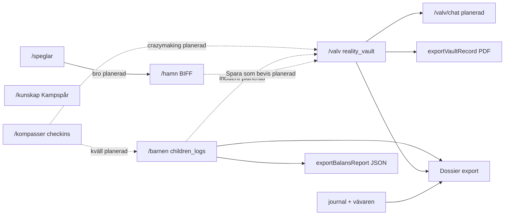

# P2 — dataflöde (Hamn, Barnen, Dossier)

Kompletterar [`hjartat-flode.md`](hjartat-flode.md) (Dagbok → Valv → Speglar).

## Hamn (Safe Harbor)

| Steg | Beskrivning |
|------|-------------|
| 1 | Användaren klistrar in ex-meddelande på `/hamn` |
| 2 | `analyzeMessage` (Kompis Supervisor + DCAP) → Grey Rock/BIFF-svar |
| 3 | Kopiera svar — **valfritt** "Spara original som bevis" → `reality_vault` |
| 4 | **Klart:** bro från Speglar (`prefilledMessage`), Brusfilter internt i DCAP |

Spec: [`incoming/SafeHarbor-SPEC.md`](incoming/SafeHarbor-SPEC.md)

## Barnen (livsloggar)

| Steg | Beskrivning |
|------|-------------|
| 1 | PIN → välj Kasper eller Arvid |
| 2 | Fysiologi och/eller livslogg → `children_logs` (WORM) |
| 3 | Balansmätare uppdateras (7-dagars deterministisk index) |
| 4 | JSON-export idag; **planerat:** PDF juridisk rapport → Dossier |

Spec: [`incoming/Barnen-SPEC.md`](incoming/Barnen-SPEC.md)

## Dossier (planerad — Sacred Feature)

Samlad export från:

| Källa | Collection | Idag |
|-------|------------|------|
| Verklighetsvalvet | `reality_vault` | Per-post PDF via `exportVaultRecordAsPdf` |
| Dagbok | `journal` | Ingen export |
| Vävaren (valfritt) | `reality_vault` (`vävaren_metadata`) | Ingen export — ofta exkluderad |
| Barnen | `children_logs` | JSON via `exportBalansReport` (7 dagar, ett barn) |

**Full Dossier (planerad):** `generateDossier` → `dossier_snapshot` (hash) → PDF via Genkit-agent. Explicit användar-trigger — ingen auto-delning.

**Delvis idag:** Valv-PDF och Barnen-JSON är byggstenar — de aggregerar inte flera källor och skriver ingen snapshot.

| Steg | Beskrivning |
|------|-------------|
| 1 | Användaren väljer period + källor (valv, journal, barnen) |
| 2 | Förhandsgranskning — lista docId/datum, inga textväggar |
| 3 | *Skapa Dossier* — callable + agent |
| 4 | PDF nedladdning → Zero Footprint |

Ingång rekommenderad från `/valv` och `/barnen` (Variant B), inte dock.

Spec: [`dossier-generator.md`](dossier-generator.md) · [`incoming/Dossier-SPEC.md`](incoming/Dossier-SPEC.md)

## De 3 Kompasserna

| Steg | Beskrivning |
|------|-------------|
| 1 | Välj Morgon / Dag / Kväll på `/kompasser` |
| 2 | Svara på en fråga → `saveCheckIn` → `checkins` (WORM) |
| 3 | **Planerat:** Paralys-Brytaren (dag), Speglings-Coachen (kväll) |
| 4 | **Planerat:** kväll → `children_logs` / Balansmätare; crazymaking → valv |

Spec: [`incoming/De-3-Kompasserna-SPEC.md`](incoming/De-3-Kompasserna-SPEC.md)

## Valv-Chat (planerad — skild från Kunskap)

Forensisk fråga/svar mot **egna** WORM-poster i `reality_vault`. Ingen sparad chatt.

| | Valv-Chat | Kunskap (`/kunskap`) |
|---|-----------|----------------------|
| Route | `/valv/chat` (planerad) | `/kunskap` |
| Data | `reality_vault` | Kampspår, Drive, kb_docs |
| Unlock | Valv PIN + Fyren | AuthGate |
| Callable | `valvChatQuery` (planerad) | `knowledgeVaultQuery` (idag) |
| UI | **saknas** | `KnowledgeVaultChat` |

| Steg | Beskrivning |
|------|-------------|
| 1 | Användaren öppnar valv → *"Sök i Valvet"* |
| 2 | Fråga → läs `getVaultLogs` + agent/RAG (planerad) |
| 3 | Svar med källhänvisningar (docId, datum) — **ingen** Firestore-write |
| 4 | Stäng / shake → Zero Footprint |

**Idag:** `matchVaultEvidence` i Speglar är närmaste byggsten (deterministisk, ej chat).

Spec: [`incoming/Valv-Chat-SPEC.md`](incoming/Valv-Chat-SPEC.md)

## Spec-källor P2

- [`incoming/SafeHarbor-SPEC.md`](incoming/SafeHarbor-SPEC.md)
- [`incoming/Barnen-SPEC.md`](incoming/Barnen-SPEC.md)
- [`incoming/De-3-Kompasserna-SPEC.md`](incoming/De-3-Kompasserna-SPEC.md)
- [`incoming/Valv-Chat-SPEC.md`](incoming/Valv-Chat-SPEC.md)
- [`incoming/Dossier-SPEC.md`](incoming/Dossier-SPEC.md)
