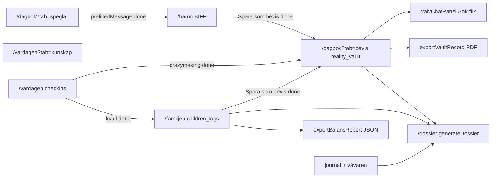

# P2 — dataflöde (Hamn, Barnen, Dossier, Kompasser, Valv-Chat)

Kompletterar [`hjartat-flode.md`](hjartat-flode.md) (Dagbok → Valv → Speglar).

**Synkad mot kod + Kladd:** [`../archive/kladd/Kladd-2026-05-21-PERSONAL-MASTER.md`](../archive/kladd/Kladd-2026-05-21-PERSONAL-MASTER.md) (2026-05-21).

## Hamn (Safe Harbor)

| Steg | Beskrivning | Status |
|------|-------------|--------|
| 1 | Klistra in ex-meddelande på `/hamn` | **done** |
| 2 | `analyzeMessage` (Supervisor + DCAP) → BIFF/Grey Rock | **done** |
| 3 | Kopiera svar; valfritt **Spara original som bevis** → `reality_vault` | **done** |
| 4 | Bro från Speglar (`prefilledMessage`) | **done** |
| 5 | Visuellt Brusfilter-steg, mål-fält, Klar + unmount | **planned** |
| 6 | Dölj inkommande tills energi | **planned** fas 2 |

Spec: [`modules/SafeHarbor-SPEC.md`](modules/SafeHarbor-SPEC.md)

## Barnen (livsloggar)

| Steg | Beskrivning | Status |
|------|-------------|--------|
| 1 | PIN → Kasper eller Arvid | **done** |
| 2 | Fysiologi / livslogg → `children_logs` (WORM) | **done** |
| 3 | Balansmätare (7 dagar, fysiologi only) | **done** |
| 4 | JSON-export per barn | **done** |
| 5 | **Spara som bevis?** → valv med `sourceRef` | **done** |
| 6 | Full Dossier inkl. barnen | **done** via `/dossier` |

**Kladd (bevis i valv, ej auto):** skola Ann/Lena, barnsamtal 2026-03-12 — `category: skola` tills tredjepartstagg.

Spec: [`modules/Barnen-SPEC.md`](modules/Barnen-SPEC.md)

## Dossier (Sacred Feature)

| Källa | Collection | Idag |
|-------|------------|------|
| Verklighetsvalvet | `reality_vault` | Wizard + `generateDossier` + hash + `dossier_snapshots` |
| Dagbok | `journal` | Opt-in i wizard |
| Barnen | `children_logs` | Opt-in i wizard |
| Delexport valv | — | Per-post PDF (`exportVaultRecordAsPdf`) |
| Delexport barnen | — | JSON (`exportBalansReport`) |

| Steg | Beskrivning | Status |
|------|-------------|--------|
| 1 | Period + källor (valv, journal, barnen) | **done** |
| 2 | Granskning hela poster | **done** |
| 3 | `generateDossier` → snapshot + PDF (TTL Storage) | **done** (deploy callable) |
| 4 | Bro *Skapa Dossier* från Valv/Barnen | **planned** |
| 5 | BBIC `reportType`, Vävaren försätt | **planned** fas 2 |

Spec: [`modules/Dossier-SPEC.md`](modules/Dossier-SPEC.md) · [`dossier-generator.md`](dossier-generator.md)

## De 3 Kompasserna

| Steg | Beskrivning | Status |
|------|-------------|--------|
| 1 | Morgon / Dag / Kväll på `/vardagen` | **done** |
| 2 | `saveCheckIn` → `checkins` (WORM) | **done** |
| 3 | Paralys-Brytaren UI (`breakDownResponse`) | **done** |
| 4 | KASAM kväll, crazymaking-bro | **done** |
| 5 | Kväll → Barnen / Måbra | **done** |
| 6 | Notiser in-app → lokal push | **planned** |

**Kladd:** Paralys **inte** auto vid lågt humör — manuell knapp.

Spec: [`modules/De-3-Kompasserna-SPEC.md`](modules/De-3-Kompasserna-SPEC.md)

## Valv-Chat (skild från Kunskap)

| | Valv-Chat | Kunskap |
|---|-----------|---------|
| Route | Flik **Sök** i `/dagbok?tab=bevis` | `/vardagen?tab=kunskap` |
| Data | `reality_vault` | `kampspar` + `kb_docs` |
| Callable | `valvChatQuery` **done** | `knowledgeVaultQuery` **done** |
| UI | `ValvChatPanel` **done** | `KnowledgeVaultChat` **done** |

| Steg | Beskrivning | Status |
|------|-------------|--------|
| 1 | Upplåst valv → flik Sök | **done** |
| 2 | Fråga → svar + citations JSON | **done** |
| 3 | Zero Footprint vid flikbyte | **done** |
| 4 | Klickbara citations | **planned** |
| 5 | Sanningens Ankare pin-vy | **planned** fas 2 |

**Speglar:** `matchVaultEvidence` = deterministisk compare, ej chat.

Spec: [`modules/Valv-Chat-SPEC.md`](modules/Valv-Chat-SPEC.md)

## Kladd — låsta beslut (P2-scope)

1. Drive → `kb_docs` auto; Drive → valv **manuellt**.
2. Hamn → valv endast explicit *Spara som bevis*.
3. Barnen → valv endast explicit knapp + `sourceRef`.
4. Ingen gamification; Obsidian Calm only.
5. Soc-strategi: fakta + barnets bästa — undvik diagnostiserande etiketter i export.

## Spec-källor P2

- [`modules/SafeHarbor-SPEC.md`](modules/SafeHarbor-SPEC.md)
- [`modules/Barnen-SPEC.md`](modules/Barnen-SPEC.md)
- [`modules/De-3-Kompasserna-SPEC.md`](modules/De-3-Kompasserna-SPEC.md)
- [`modules/Valv-Chat-SPEC.md`](modules/Valv-Chat-SPEC.md)
- [`modules/Dossier-SPEC.md`](modules/Dossier-SPEC.md)
- [`../archive/kladd/Kladd-2026-05-21-PERSONAL-MASTER.md`](../archive/kladd/Kladd-2026-05-21-PERSONAL-MASTER.md)
- [`modules/Ekonomi-SPEC.md`](modules/Ekonomi-SPEC.md) · [`modules/Core-SPEC.md`](modules/Core-SPEC.md)
