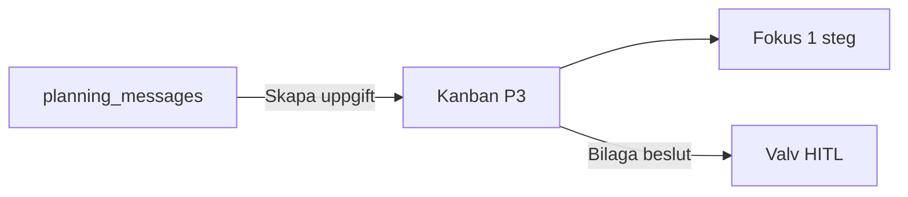
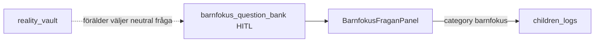
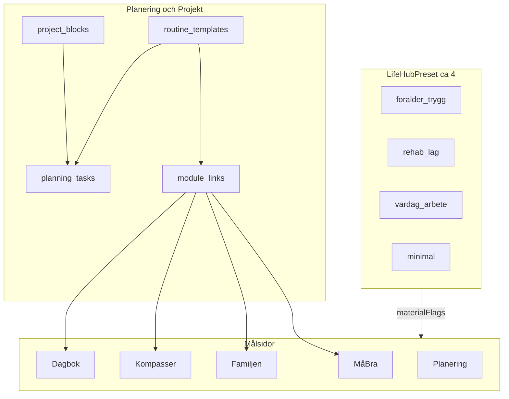
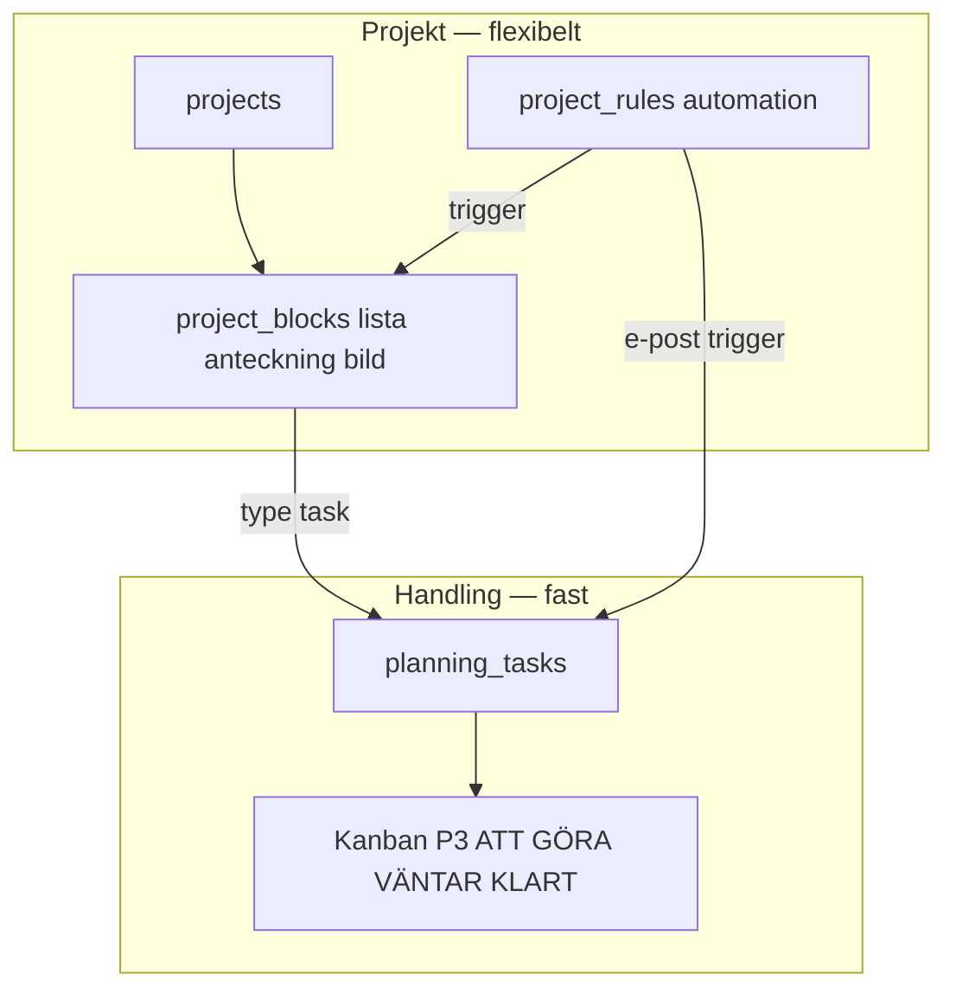
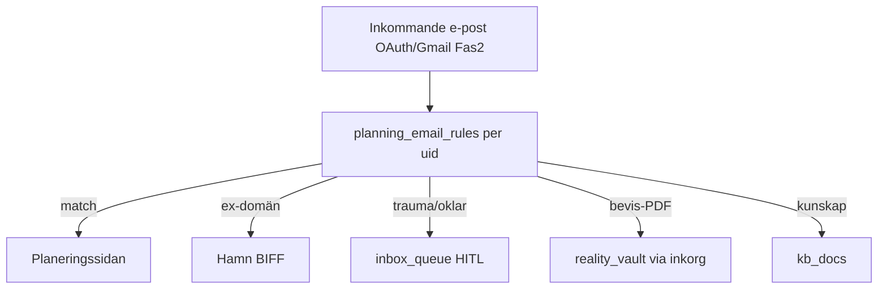
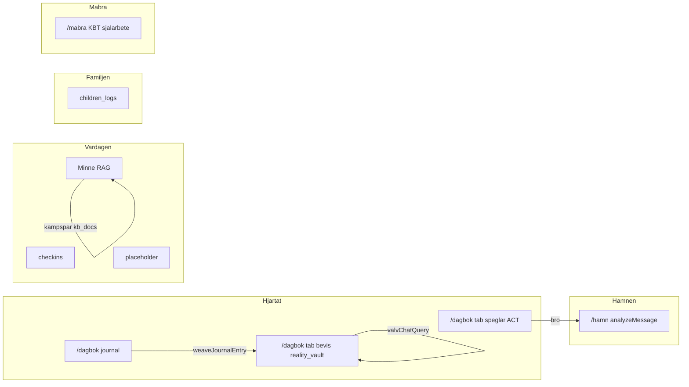
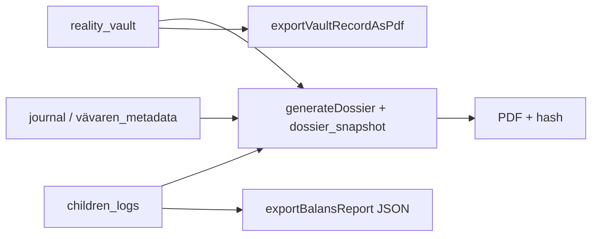
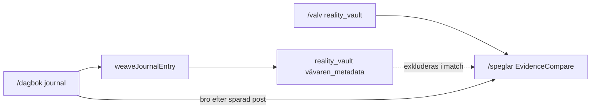
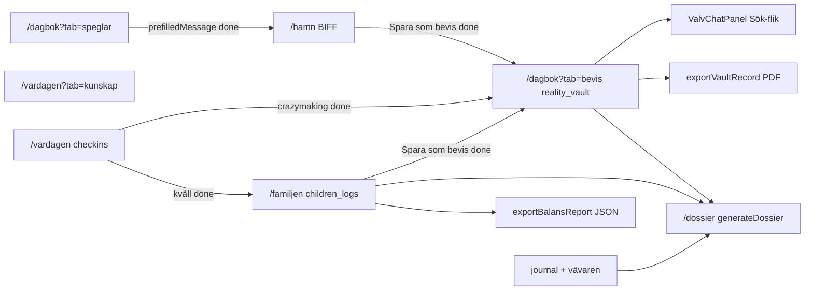
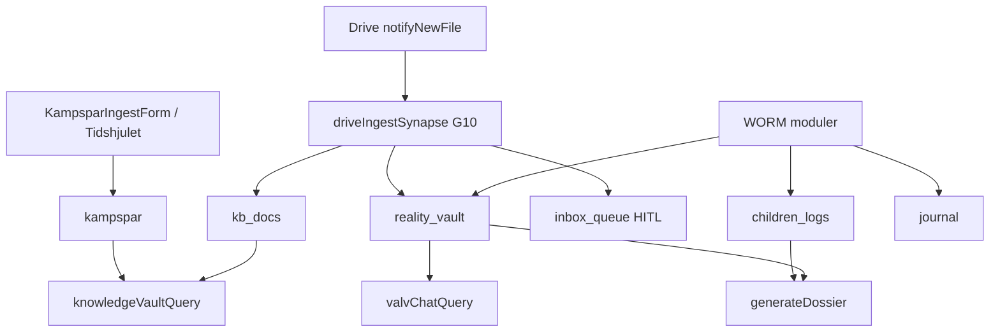

This file is a merged representation of a subset of the codebase, containing specifically included files and files not matching ignore patterns, combined into a single document by Repomix.
The content has been processed where comments have been removed, empty lines have been removed, content has been compressed (code blocks are separated by ⋮---- delimiter).

# File Summary

## Purpose
This file contains a packed representation of a subset of the repository's contents that is considered the most important context.
It is designed to be easily consumable by AI systems for analysis, code review,
or other automated processes.

## File Format
The content is organized as follows:
1. This summary section
2. Repository information
3. Directory structure
4. Repository files (if enabled)
5. Multiple file entries, each consisting of:
  a. A header with the file path (## File: path/to/file)
  b. The full contents of the file in a code block

## Usage Guidelines
- This file should be treated as read-only. Any changes should be made to the
  original repository files, not this packed version.
- When processing this file, use the file path to distinguish
  between different files in the repository.
- Be aware that this file may contain sensitive information. Handle it with
  the same level of security as you would the original repository.

## Notes
- Some files may have been excluded based on .gitignore rules and Repomix's configuration
- Binary files are not included in this packed representation. Please refer to the Repository Structure section for a complete list of file paths, including binary files
- Only files matching these patterns are included: .context/**, AGENTS.md, .cursorrules, docs/SYSTEMKONTROLL.md, docs/INNEHALL-REGISTER.md, docs/MODUL-FUNKTIONS-REGISTER.md, docs/MODUL-GAP-OVERSIKT.md, docs/specs/**, docs/design/**, docs/evaluations/2026-06-11-antigravity-handoff.md, docs/evaluations/2026-06-11-multitask-mt1.md, docs/evaluations/2026-06-11-multitask-mt2.md, docs/evaluations/2026-06-11-mt3-blockers.md, docs/google-ai-pro/**, docs/gemini-handoff/**, src/**, functions/src/**, firebase.json, firestore.rules, storage.rules, package.json, vite.config.ts, tailwind.config.js, tsconfig.json, tsconfig.app.json, eslint.config.js, index.html, capacitor.config.ts, public/favicon.svg
- Files matching these patterns are excluded: docs/archive/**, exports/**, docs/design/icons-proposals/**, docs/design/galleri/**, docs/design/slideshow/**, docs/design/**/*.html, docs/design/themes/**/svg/**, **/*.png, **/*.jpg, **/*.jpeg, **/*.webp, **/*.gif, **/*.test.ts, **/*.test.tsx, **/__tests__/**, android/**, ios/**, dataconnect/**, node_modules/**, public/icons/**, scripts/smoke_*.mjs, scripts/orkester_*.mjs
- Files matching patterns in .gitignore are excluded
- Files matching default ignore patterns are excluded
- Code comments have been removed from supported file types
- Empty lines have been removed from all files
- Content has been compressed - code blocks are separated by ⋮---- delimiter
- Files are sorted by Git change count (files with more changes are at the bottom)

# Files

## File: .context/modules/barnens_livsloggar.md
````markdown
# Barnens livsloggar

**Kanonisk kod:** `src/modules/features/family/children/`  
**Route:** `/familjen?tab=livslogg` (Barnfokus: `?tab=reflektion`) · **Legacy:** `/barnen` → redirect · **AuthGate:** ja · **Dock:** Heart  
**Spec (konsoliderad):** [`docs/specs/modules/Barnen-SPEC.md`](../../docs/specs/modules/Barnen-SPEC.md)

## Syfte

**Den trygga hamnen** — neutral Grey Rock-dokumentation för **Kasper** och **Arvid**. BBIC-orienterade basbehov. Skild från dagbok, valv och vuxenkonflikt.

## UI (idag)

| Komponent | Roll |
|-----------|------|
| `FamiljenPage` | Kluster-wrapper |
| `BarnensPage` | PIN, barn-flikar, balans, fysio, livslogg, tidslinje |
| `BarnfokusFraganPanel` | Middagsfrågan / Barnfokus (låst UX) |
| `PhysiologicalControls` | Sömn, ångest, aptit 1–5 |
| `ChildSubLogPanel` | Kategori, observation, barnpåverkan |
| `BalansMatare` | 7-dagars bar + text |
| `exportBalansReport` | JSON-export per barn |

## Navigation

| Ingång | Beteende |
|--------|----------|
| Dock Heart | `/familjen` |
| `/barnen` | Redirect → `/familjen?tab=reflektion` |
| Titlar | Kluster **Familjen**; innehåll **Livsloggar** / **Barnfokus** |

## Datamodell (WORM)

- **`children_logs`:** childAlias, action (`fysiologi`|`livslogg`), signals?, observation, category?, childrenImpact?, ownerId, createdAt — append-only

## Backend

| Path | Data |
|------|------|
| Klient `saveChildrenLog` | `children_logs` |
| `childrenLogsQuery` | Barnen RAG (Familjen) |
| `computeBalansIndex` | Endast fysiologi, 7 dagar |
| JSON export | Klient per barn |

## Status

| Klart | Delvis | Planerat |
|-------|--------|----------|
| PIN, fysio, livslogg, balans, JSON, incident→valv, tredjepart-filter, Dossier-länk, Barnfokus | Full wizard; kill switch raderar PIN-hash | PDF per barn, larm, Sandbox/Ankare UX |

## Säkerhet

- Separat PIN (inte WebAuthn)
- Lås vid `visibilitychange` + manuell **Lås modul**
- WORM rules

## Kopplingar

- **Valv** — isolerad; explicit bro via `SaveAsEvidencePrompt`
- **Dossier** — opt-in PDF/hash
- **Dagbok** — ingen auto

Kod: `src/modules/features/family/children/` · Plan: [`src/modules/features/family/children/module_plan.md`](../../src/modules/features/family/children/module_plan.md)
````

## File: .context/modules/barnporten.md
````markdown
# Barnporten

**Route (barn):** `/barnporten` (PWA) · **Förälder:** `/familjen?tab=barnporten`  
**Kanonisk kod:** `src/modules/features/onboarding/barnporten/`  
**Spec:** [`docs/design/BARNPORTEN-SPEC.md`](../../docs/design/BARNPORTEN-SPEC.md)  
**Låst:** `.context/locked-ux-features.md` §7 · Inkorg→Valv §7b

## Syfte

Barnens egen hub på telefon/surfplatta: prata av sig, skriva till förälder, humör, privat dagbok, valfri självövning. **Egen** barn-Orkester. Valv endast via förälder HITL.

## Data

- Primär: `children_logs` (`authorRole: child`, `channel: barnporten`)
- Valv: `BarnportenInboxPanel` + `SaveAsEvidencePrompt` → `reality_vault` + `sourceRef`
- **Ej** Kunskap-RAG, **ej** Hamn/BIFF i barn-UI

## Kod

| Path | Roll |
|------|------|
| `components/BarnportenPage.tsx` | Barn-PWA hub |
| `components/BarnportenInboxPanel.tsx` | Förälder inkorg → Valv HITL |
| `constants/barnportenAgents.ts` | Egen barn-Orkester |
| `api/saveBarnportenLog.ts` | WORM write |

## Status

| Klart | Planerat |
|-------|----------|
| Page, agents registry, inbox HITL, offline queue, smoke lock | Full CB1–CB4 widget polish |

Kod: `src/modules/features/onboarding/barnporten/` · Plan: [`src/modules/features/onboarding/barnporten/module_plan.md`](../../src/modules/features/onboarding/barnporten/module_plan.md)
````

## File: .context/modules/core.md
````markdown
# Core (app-shell)

Layout, FloatingDock, AuthProvider, Zero Footprint, tokens (`docs/specs/design-master.md`), AmbientBackground, BentoCard.

Navigation: [`docs/specs/navigation-master.md`](../docs/specs/navigation-master.md) · Kanon routes: [`navTruth.ts`](../../src/modules/core/navigation/navTruth.ts)

## Status

| Klart | Delvis | Planerat |
|-------|--------|----------|
| MainLayout, Dock, Fyren 3s, design tokens, Device Clear | Zero Footprint sign-out audit | BodySignalChip, WebGL bakgrund |

## Kladd 2026-05-21

- **Implementerat:** Obsidian Calm (ej grön/natur-UI); Fyren long-press.
- **Avvisat:** Stjärnbilder, gamification, Nordisk skymning grön.
- **Gap:** `resetState` audit vid utloggning; iOS PWA shake-test.

**Kill Switch (shake-to-kill):** borttagen 2026-06-01 — ersatt av Device Clear i Inställningar (`clearDeviceSession`).

**Spec:** [`docs/specs/modules/Core-SPEC.md`](../../docs/specs/modules/Core-SPEC.md)

Kod: `src/modules/core/` · Plan: [`src/modules/core/module_plan.md`](../../src/modules/core/module_plan.md)
````

## File: .context/modules/dagbokshubben.md
````markdown
# Dagbokshubben

**Kanonisk kod:** `src/modules/features/lifeJournal/diary/diary/`  
**Route:** `/hjartat?tab=reflektion` · **Legacy:** `/dagbok` → redirect · **AuthGate:** ja  
**Spec (konsoliderad):** [`docs/specs/modules/Dagbok-SPEC.md`](../../docs/specs/modules/Dagbok-SPEC.md)

## Syfte

**Lager 1** — kravlös tacksamhets- och reflektionsdagbok. Appens oskyldiga fasad (plausible deniability). Skild från Verklighetsvalvet (Lager 2). ACT/KBT-inspirerad identitetsrekonstruktion — inte forensik.

## UI (idag)

| Komponent | Roll |
|-----------|------|
| `HjartatPage` | Kluster: Reflektion \| Speglar (ingen Bevis-flik — Valv är separat silo) |
| `DagbokRememberCard` | IHÅG: Dagbok (privat) vs Valv (bevis) — ihopfällbar |
| `DagbokPage` | Sub-nav Snabb \| Reflektera \| Arkiv + wizard |
| `MoodStep` | Humör-pills |
| `ReflectionStep` | Fritext + Web Speech sv-SE |
| `ConfirmStep` | Preview + spara |
| `SavedStep` | Bekräftelse + bro Speglar |
| `JournalArchive` | Tidslinje, pagination 5 ("Visa fler") — synlig endast steg 1 |

**Wizard:** humör → text → bekräfta → sparad. Spar kräver fritext idag.

## Navigation

| Ingång | Beteende |
|--------|----------|
| Drawer / Dock BookOpen | `/hjartat` |
| **Fyren** (3s long-press BookOpen) | WebAuthn → PIN → `/valvet` |
| `/dagbok` | Redirect → `/hjartat` (eller `/valvet` om `?tab=bevis`) |
| `/dagbok?tab=bevis` | Redirect → `/valvet?vaultTab=…` |

## Datamodell (WORM)

- **`journal`:** ownerId, userId, mood, text, createdAt — append-only

## Backend

| Callable | Data |
|----------|------|
| Klient save | `journal` |
| `weaveJournalEntry` (fire-and-forget) | → `reality_vault` (`vävaren_metadata`) |

**Inte:** Firestore-trigger; **inte** auto-write till `kampspar`.

## Status

| Klart | Delvis | Planerat |
|-------|--------|----------|
| Wizard, journal, WORM, Vävaren, Speglar-bro, röst, Fyren, arkiv pagination, unmount cleanup, inbound Måbra-bro (`?from=mabra`) | Vävaren auto utan godkännande | Outbound Måbra-länk, KBT-frågor, villkorlig Speglar, generellt humör-only |

## Säkerhet

- AuthGate, WORM rules
- Röst: browser-only, ingen Blob till Storage
- Device Clear global; wizard cleanup vid unmount

## Vision (bevara)

- Plausible deniability, positivt ACT-rum
- Vävaren asynkron — Lager 1 förblir mjukt

Kod: `src/modules/features/lifeJournal/diary/diary/` · Plan: [`src/modules/features/lifeJournal/diary/diary/module_plan.md`](../../src/modules/features/lifeJournal/diary/diary/module_plan.md)
````

## File: .context/modules/dossier.md
````markdown
# Dossier-Generator

**Sacred Feature.** **Route:** `/valvet?vaultTab=dossier` · **Legacy:** `/dossier` → redirect · **AuthGate + PIN**  
**Kanonisk kod:** `src/modules/features/lifeJournal/evidence/vault/dossier/`  
**Design:** [`docs/specs/design-master.md`](../../docs/specs/design-master.md)  
**Spec:** [`docs/specs/modules/Dossier-SPEC.md`](../../docs/specs/modules/Dossier-SPEC.md)

---

## Syfte

Formell WORM-sammanställning (PDF) för ombud/myndighet. Aggregerar valv + barnen (+ valfritt journal) utan manuell omskrivning.

---

## UX (MVP)

Period → källor (journal varning) → granska hela poster → generera → hash + nedladdning → Zero Footprint.

---

## Datamodell

**Läser:** `reality_vault`, `children_logs`, opt-in `journal`.  
**Skriver:** `dossier_snapshots` (WORM), PDF Storage kortlivad.

---

## Backend

| Komponent | Status |
|-----------|--------|
| Wizard UI | **done** |
| `generateDossier` | **done** |
| `dossier_snapshots` rules | **done** |
| pdf-lib PDF | **done** |
| `exportVaultRecordAsPdf` | **done** |
| `exportBalansReport` | **done** |

---

## Säkerhet

Fyren + PIN, AuthGate, CMEK, Zero Footprint, Device Clear, hash-integritet, ingen auto-delning.

Kod: `src/modules/features/lifeJournal/evidence/vault/dossier/` · Export helpers: `vault/utils/exportVaultRecord.ts`, `family/children/utils/exportBalansReport.ts`
````

## File: .context/modules/ekonomi.md
````markdown
# Ekonomi

**Kanonisk kod:** `src/modules/features/dailyLife/wellbeing/economy/`  
**Route:** `/vardagen?tab=ekonomi` · **Legacy:** `/ekonomi` → redirect · **Dock:** via Vardagen

Blueprint: veckopeng, matlåda, vinst — inga grafer. Firestore `transactions` (WORM) + `economy_profiles`.

Valv-side panel (PIN): `src/modules/valv_ekonomi/` → `VaultEconomyPanel`.

## Status

| Klart | Planerat |
|-------|----------|
| EconomyPage, Firestore, rules, retention allowlist | `budgets`, lönespec Fas 2 (vendor parity) |

**Spec:** [`docs/specs/modules/Ekonomi-SPEC.md`](../../docs/specs/modules/Ekonomi-SPEC.md)

Kod: `src/modules/features/dailyLife/wellbeing/economy/` · Plan: [`src/modules/features/dailyLife/wellbeing/economy/module_plan.md`](../../src/modules/features/dailyLife/wellbeing/economy/module_plan.md)
````

## File: .context/modules/kompasser.md
````markdown
# De 3 Kompasserna (Kompasser)

**Kanonisk kod:** `src/modules/features/dailyLife/wellbeing/compasses/`  
**Route:** `/vardagen?tab=kompasser` · **Legacy:** `/kompasser` → `/vardagen` · **AuthGate:** ja  
**Spec:** [`docs/specs/modules/De-3-Kompasserna-SPEC.md`](../../docs/specs/modules/De-3-Kompasserna-SPEC.md)  
**Design:** [`docs/specs/design-master.md`](../../docs/specs/design-master.md)

---

## Låsta beslut (sammanfattning)

Paralys **manuell**. Notiser **in-app först**, lokal push max 2–3/dag. Crazymaking **bro only** — ingen auto-`reality_vault`. `checkins` **WORM**. Missad morgon **ingen skuld**. Silo 1 skriver **inte** auto till Valv.

---

## 1. Syfte

Dygnsrytm (morgon/dag/kväll) — ett mikrosteg i taget för ADHD/GAD.

| Kompass | Roll |
|---------|------|
| **Morgon** (Sacred) | Intention — Sanningens Ankare (Silo 1 MVP) |
| **Dag** | Pulskompass + Paralys-Brytaren |
| **Kväll** | KASAM 3 steg + crazymaking-bro |

## 2. Route

- **Aktiv:** `/vardagen?tab=kompasser` → `DashboardPage` (AuthGate)
- **Redirect:** `/kompasser`, `/liv` → `/vardagen`

## 3. UX (MVP done)

- Tids-default vid öppning Kompasser-flik (`getDefaultCompassByTime`)
- Morgon/dag/kväll-flikar, fri navigering
- Paralys manuell + *Ge mig 3 till* + Klar
- KASAM kväll 3 steg
- Crazymaking-broar (Speglar, Valv, MåBra, Barnen)

## 4. Backend

| Komponent | Status |
|-----------|--------|
| `saveCheckIn` | **done** |
| `breakDownResponse` | **done** |
| Paralys UI | **done** |
| KASAM UI | **done** |

## 5. Status

| Area | Status |
|------|--------|
| MVP *kör kompasser* | **done** |
| Notiser push | **planned** fas 2 |
| Sanningens Ankare från valv | **planned** |

Kod: `src/modules/features/dailyLife/wellbeing/compasses/` · Smoke: `npm run smoke:compass`
````

## File: .context/modules/kompis.md
````markdown
# Kompis / Kunskap

**Kanonisk kod:** `src/modules/features/lifeJournal/evidence/kompis/`  
**Route:** `/valvet?vaultTab=kunskapsbank` (PIN) · **Legacy:** `/kunskap` → redirect · **AuthGate:** ja  
**Spec (konsoliderad):** [`docs/specs/modules/Kunskap-SPEC.md`](../../docs/specs/modules/Kunskap-SPEC.md)

## Syfte

Semantiskt livsminne (Life-OS): fråga/svar med källhänvisningar mot **egna** data. Avlastar kognitiv belastning. **Skild från Valv-Chat** (`reality_vault` = forensik only).

**Minne** = datalager (`kampspar` + `kb_docs`). **Kunskapsvalvet** = UI + RAG ovanpå.

## UI (idag)

| Komponent | Roll |
|-----------|------|
| `VaultKunskapsbankPanel` | Kunskapsvalv + Tidshjulet (bakom Valv PIN) |
| `KnowledgeVaultChat` | Fråga → `knowledgeVaultQuery` → svar + citations |
| `Tidshjulet` | Cirkulär vy + senaste poster (Firestore `kampspar`) |
| `KampsparIngestForm` | WORM create (Tidshjuls-flik) |
| `KompisAvatar` | Header (`MainLayout`); pulserar vid AI-anrop |

**Navigation:** Valv drawer → Kunskapsbank (PIN) — ingen publik Kunskap-flik i Vardagen.

## Backend

| Callable / lib | Data |
|----------------|------|
| `knowledgeVaultQuery` | `kampspar` + `kb_docs` via `kampsparQueryRag` (token-match) |
| `ingestKampsparEntry` | WORM create + `embeddingDim` |
| `notifyNewFile` → `analyzeDriveFile` | Drive → `kb_docs` (kräver `ownerId`) |

**Agenter:** Livs-Arkivarien, Mönster-Arkivarien — prompts i `functions/src/sharedRules.ts` only.

**JSON:** `{ answer, citations[{ docId, collection, date, title, excerpt }] }`

## Datamodell (WORM)

- **`kampspar`:** ownerId, title, content, category?, source, eventDate?, embeddingDim? (number), createdAt
- **`kb_docs`:** ownerId, title, content, folderId, source=drive, driveFileId, mimeType, embeddingDim?, createdAt

## Status

| Klart | Delvis | Planerat |
|-------|--------|----------|
| Flikar, RAG, Tidshjulet, ingest, silo från valv | Drive prod, deploy smoke | ANN, klickbara citations, supervisor, prediktivt Tidshjulet |

## Säkerhet

- Callables auth-protected server-side
- Zero Footprint: chatt i React RAM
- Skild från `valvChatQuery` / `reality_vault`

Kod: `src/modules/features/lifeJournal/evidence/kompis/` · Plan: [`src/modules/features/lifeJournal/evidence/kompis/module_plan.md`](../../src/modules/features/lifeJournal/evidence/kompis/module_plan.md)
````

## File: .context/modules/mabra_sidan.md
````markdown
# Måbra-sidan

**Kanonisk kod:** `src/modules/features/dailyLife/wellbeing/mabra/`  
**Route:** `/mabra` · **AuthGate:** ja · **Kluster:** Vardagen (MåBra) · **Ej i dock**  
**Spec (konsoliderad):** [`docs/specs/modules/Mabra-SPEC.md`](../../docs/specs/modules/Mabra-SPEC.md)

## Syfte

Proaktiv rehab — KBT/ACT, vagus, självmedkänsla, värderingar. ADHD/GAD/RSD: kravlöst, ett steg i taget. **Inte** gaslighting-försvar (Speglar), **inte** ex (Hamn), **inte** daglig logg (Dagbok).

## UI (MVP — klart)

| Komponent | Roll |
|-----------|------|
| `MabraPage` | Orchestrator — routing per symptom-hub |
| `SymptomHub` | 3 val: Panik/RSD, Självkritik, Hitta mig |
| `BreathingExercise` | 4-7-8 (panic: tid kvar; self_critical addon) |
| `GroundingExercise` | 5-4-3-2-1 (find_self), offline |
| `ReframingExercise` | 4 steg thought record light (self_critical), RAM-only |
| `ValuesCompass` | ACT — välj 3–5 värderingar |
| `MabraCoachPanel` | Opt-in coach efter övning + Speglar guardrail + röst |

## Navigation

| Ingång | Beteende |
|--------|----------|
| Vardagen → MåBra | `/mabra` |
| FloatingDock | **Nej** |
| Efter övning | Länk Hjärtat (`/hjartat`), Kompasser (`/vardagen?tab=kompasser`) — **inte** auto |

## Datamodell

- **`mabra_sessions`:** WORM (create/read)
- **`mabra_progress`:** `coreValues[]` (ACT) — mutable doc per user

## Backend

- MVP: deterministiska övningar (klient) + `saveMabraSession()` → Firestore
- `mabraCoach` callable (Gemini, `MABRA_COACHEN_SYSTEM_PROMPT` i `sharedRules.ts`)

## Kopplingar

- **Dagbok** — länk efter övning med `?from=mabra&hub=…&energy=low`
- **Speglar** — guardrail vid ex-text → `/hjartat?tab=speglar`
- **Hamn / Valv / Kunskap** — **ingen** datakoppling

Kod: `src/modules/features/dailyLife/wellbeing/mabra/` · Plan: [`src/modules/features/dailyLife/wellbeing/mabra/module_plan.md`](../../src/modules/features/dailyLife/wellbeing/mabra/module_plan.md)  
**Innehållsbank:** [`docs/specs/modules/Mabra-CONTENT-BANK.md`](../../docs/specs/modules/Mabra-CONTENT-BANK.md)
````

## File: .context/modules/safe_harbor.md
````markdown
# Safe Harbor (Hamn)

**Kanonisk kod:** `src/modules/features/family/safeHarbor/`  
**Sacred Feature.** **Route:** `/familjen?tab=hamn` · **Legacy:** `/hamn` → redirect · **AuthGate:** ja  
**Design:** [`docs/specs/design-master.md`](../../docs/specs/design-master.md) (Obsidian Calm, Riktning A)  
**Spec:** [`docs/specs/modules/SafeHarbor-SPEC.md`](../../docs/specs/modules/SafeHarbor-SPEC.md)

---

## 1. Syfte och användarbehov

Känslomässig brandvägg för ex-kommunikation. BIFF + Grey Rock utan JADE. Kognitiv avlastning vid högkonflikt.

## 2. Route och ingång

| Variant | Ingång |
|---------|--------|
| **A (aktiv)** | Familjen → Trygg hamn (`?tab=hamn`), HomePage bento |
| **B (done)** | Bro från `/hjartat?tab=speglar` med `prefilledMessage` |
| **Legacy** | `/hamn` → `/familjen?tab=hamn` |

## 3. UX-flöde

**Idag:** en sida — textarea → Generera BIFF-svar → kopiera (ingen Brusfilter-vy, mål-fält, Klar, valfri valv-export).

## 4. Datamodell

| Lagring | Standard | WORM |
|---------|----------|------|
| Hamn UI | Zero Footprint — inget sparas | — |
| "Spara som bevis" | **done** → `reality_vault` (`action: hamn_biff`) | ja |

## 5. Backend

- `analyzeMessage` callable → KompisSupervisor + DCAP
- `biffService.ts` — klient-wrapper, `extractGreyRockReply`

## 6. Status idag vs planerat

| Klart | Planerat |
|-------|----------|
| SafeHarborPage + formulär, analyzeMessage + BIFF-svar, kopiera + spara bevis, Bro Speglar→Hamn, AuthGate | Flerstegs-wizard, Brusfilter-vy, "Klar" + state reset |

## 7. Kopplingar

- **Speglings-Systemet** — bro vid gaslighting (**done**, `prefilledMessage`)
- **Verklighetsvalvet** — valfri WORM-export av ex-meddelande (**done**, `saveVaultLog`)

Kod: `src/modules/features/family/safeHarbor/` · Plan: [`src/modules/features/family/safeHarbor/module_plan.md`](../../src/modules/features/family/safeHarbor/module_plan.md)
````

## File: .context/modules/speglingssystemet.md
````markdown
# Speglings-Systemet

**Sacred Feature** — reaktiv kognitiv sköld mot gaslighting/RSD.

**Kanonisk kod:** `src/modules/features/lifeJournal/diary/mirror/`  
**Spec (konsoliderad):** [`docs/specs/modules/Speglar-SPEC.md`](../../docs/specs/modules/Speglar-SPEC.md)  
**Design:** [`docs/specs/design-master.md`](../../docs/specs/design-master.md) (Obsidian Calm)

## Syfte

ACT (validera, aldrig fixa) + VIVIR + jämför känsla mot WORM-bevis. Grey Rock, max 2–4 meningar, ingen JADE. **Skild från MåBra** (proaktiv KBT) och **Kunskap** (livsminne).

## Route och ingång

| | |
|---|---|
| **Route** | `/hjartat?tab=speglar` (legacy redirect `/speglar`) |
| **AuthGate** | `/hjartat` (Hjärtat) |
| **Dock** | Inte i FloatingDock |

**Ingång:** Dagbok `SavedStep` (`journalContext`) · flik **Speglar** i Hjärtat · ClusterGrid.

## UI-flöde

1. **ACT** — `ActCalibrationView` + valfri `speglingsMirror`
2. **VIVIR** — fem steg (`VivirStepView`)
3. **EvidenceCompare** — `matchVaultEvidence` mot `reality_vault` (kräver upplåst valv)
4. **Hamn** — länk med `prefilledMessage` (redigerbart i Familjen → Trygg hamn)

Zero Footprint: state rensas vid unmount (`SpeglingsSystem`).

## Datamodell

- **Läser:** `reality_vault` via klient `getVaultLogs(uid)`
- **Match:** `matchVaultEvidence` (token + weaverTags; exkl. `vävaren_metadata`)
- **Skriver:** inget permanent

## Backend

| Callable | Roll |
|----------|------|
| `speglingsMirror` | ACT-spegling (Speglings-Coachen prompt) |

Fallback: `mirrorFeeling()` lokalt vid AI-fel.

## Status

| Klart | Delvis | Planerat |
|-------|--------|----------|
| ACT, VIVIR, Compare, journalContext, valv-lås, mirror+fallback, Hamn-bro, media/WORM | Auto korsref barnen_logs | Full DCAP, Vector Search, projektionsdetektor UI |

## Säkerhet

- Valv unlock (Fyren/PIN) före bevis
- Device Clear global
- LLM ≠ auktoritet för bevis

## Kopplingar

- **Dagbok** → bro + context
- **Verklighetsvalvet** → read-only bevis
- **Hamn** → BIFF via `analyzeMessage`

Kod: `src/modules/features/lifeJournal/diary/mirror/` · Plan: [`src/modules/features/lifeJournal/diary/mirror/module_plan.md`](../../src/modules/features/lifeJournal/diary/mirror/module_plan.md)
````

## File: .context/modules/valv_chatt.md
````markdown
# Valv-Chat

**Route:** `/valvet?vaultTab=sok` (efter PIN) · **Legacy:** `/dagbok?tab=bevis&vaultTab=sok` · **AuthGate:** ja · **Valv unlock:** ja · **Ej i dock**  
**Design:** [`docs/specs/design-master.md`](../../docs/specs/design-master.md) (Obsidian Calm)  
**Spec:** [`docs/specs/modules/Valv-Chat-SPEC.md`](../../docs/specs/modules/Valv-Chat-SPEC.md)

## Syfte

Forensiskt sökverktyg **inuti Verklighetsvalvet** — frågor mot WORM `reality_vault` med källhänvisningar. Zero Footprint: ingen sparad chatt.

## Skillnad mot Kunskap

| | **Valv-Chat** | **Kunskapsvalvet** |
|---|---------------|---------------------|
| Route | `/valvet?vaultTab=sok` | `/valvet?vaultTab=kunskapsbank` |
| Data | `reality_vault` | `kampspar` + `kb_docs` |
| Callable | `valvChatQuery` | `knowledgeVaultQuery` |
| Agent | Sannings-Analytikern | Livs-Arkivarien / Mönster-Arkivarien |

## UI (idag)

- `ValvChatPanel` i `VaultPage` (Sök-flik / zone *Spara & sök*)
- `useValvChatSession` — nollställ när `active=false` eller unmount

## Backend

- `fetchVaultEvidenceForQuery` (token-match, exkl. `vävaren_metadata`)
- JSON `{ answer, citations[] }` — citations **ej klickbara** än

## Status

| Klart | Planerat |
|-------|----------|
| valvChatQuery, ValvChatPanel, session reset | Klickbara citations |

Kod: `src/modules/features/lifeJournal/evidence/vaultChat/` · Förälder: [`verklighetsvalvet.md`](verklighetsvalvet.md)
````

## File: .context/modules/verklighetsvalvet.md
````markdown
# Verklighetsvalvet

**Kanonisk kod:** `src/modules/features/lifeJournal/evidence/vault/`  
**Sacred Feature (Sanningens Sköld).** **Route:** `/valvet?vaultTab=…` · **Legacy:** `/dagbok?tab=bevis`, `/valv` → redirect · **AuthGate:** ja  
**Spec (konsoliderad):** [`docs/specs/modules/Verklighetsvalvet-SPEC.md`](../../docs/specs/modules/Verklighetsvalvet-SPEC.md)

## Syfte

**Lager 2** — WORM-bevisbank mot gaslighting. Append-only, tidsstämplade sanningar. Skild från Dagbok (Lager 1). Plausible deniability via **Fyren** (dold ingång).

## UI (idag)

| Komponent | Roll |
|-----------|------|
| `ValvetRoutePage` / `VaultPage` | PIN-gate, zoner + flikar (Arkiv, Mönster, Orkester, …) |
| `VaultEntryForm` | Enkel / tvåspalt / tresteg / magkänsel + media + röst |
| `VaultLogList` | Append-only lista + PDF per post |
| `ValvChatPanel` | Sök-flik → `valvChatQuery` |
| `FloatingDock` | Fyren: 3s BookOpen → WebAuthn → Valv |

**Terminologi (låst):** se [`valvNavCopy.ts`](../../src/modules/core/copy/valvNavCopy.ts) — t.ex. flik `logga` = **Arkiv**, drawer **Bevis** = Valv-zon.

## Navigation

| Ingång | Beteende |
|--------|----------|
| **Fyren** (3s long-press BookOpen) | WebAuthn → PIN → `/valvet` |
| Drawer Valv-sektion (efter PIN) | `/valvet?vaultTab=…` |
| `/dagbok?tab=bevis` | Redirect → `/valvet?vaultTab=…` |
| `/valv`, `/kunskap`, `/dossier` | Redirect → `/valvet?vaultTab=…` |

**Hjärtat har ingen Bevis-flik** — Valv är egen silo-route (`NAV_PATHS.VALVET`).

## Datamodell (WORM)

- **`reality_vault`:** action, truth, category, entryType, theirVersion, myReality, bodySignals, shield*, evidenceUrl, isLocked, weaverTags?, ownerId, createdAt — append-only
- **Async:** `weaveJournalEntry` → `vävaren_metadata` (filtreras i Valv-Chat)

## Backend

| Path | Data |
|------|------|
| Klient `saveVaultLog` | `reality_vault` (inte callable) |
| `uploadVaultEvidence` | Storage → `evidenceUrl` |
| `valvChatQuery` | RAG token-match, Sannings-Analytikern |
| `issueVaultSession` | Server-side valv-session gate |
| `exportVaultRecordAsPdf` | Klient print per post |

**Drive (G10):** `classifyInboxDocument` → `kb_docs` | `reality_vault` (bevis) | `children_logs` | `inbox_queue` (trauma/LVU utan optIn). Bevis **MUST NOT** till `kb_docs`.

## Status

| Klart | Delvis | Planerat |
|-------|--------|----------|
| Fyren, WebAuthn, PIN, WORM, 4 entry modes, media, röst, PDF/post, Valv-Chat, flik-lås, issueVaultSession | Zero Footprint idle | Klickbara citations, Drive→valv, Sanningens Ankare, CMEK, duress-PIN |

## Säkerhet

- WORM rules + `assertWormPayload`
- WebAuthn (Fyren) + PIN (VaultPage) + `issueVaultSession`
- Valv-Chat RAM-reset vid flikbyte
- Device Clear (ersätter Kill Switch)

## Kopplingar

- **Dagbok** — Vävaren + delad Fyren
- **Valv-Chat** — [`valv_chatt.md`](valv_chatt.md)
- **Speglar** — EvidenceCompare
- **Kunskap** — skild RAG; Drive G10 → rätt silo (bevis → `reality_vault`)
- **Dossier** — `generateDossier` callable

Kod: `src/modules/features/lifeJournal/evidence/vault/` · Plan: [`src/modules/features/lifeJournal/evidence/vault/module_plan.md`](../../src/modules/features/lifeJournal/evidence/vault/module_plan.md)
````

## File: .context/agents.md
````markdown
# Agentroller (Canonical)

## Produktroller
- Sannings-Analytikern: klinisk bevisanalys med strikt JSON.
- Brusfiltret: tvattar affektivt brus till fakta och tidslinje.
- BIFF-Skolden: producerar Brief, Informative, Friendly, Firm svar.
- Paralys-Brytaren: ett mikrosteg for exekutiv avlastning.
- RSD-Kylaren: rationella alternativ vid avvisningstriggers.
- Uppgifts-Krossaren: atomiserar uppgifter till testbara steg.
- Speglings-Coachen: validerar utan fixande.
- Monster-Arkivarien: forensisk langtidanalys av bevismaterial.

## Runtime-koppling
- Agent cards: `functions/src/agents/cards/index.ts`
- ADK (orkestrering, synapser, executors): `functions/src/adk/` — `synapseBus.ts` + `emitSynapse`; Cursor-regel `.cursor/rules/synapser-adk.mdc`
- Supervisor-routing: `functions/src/agents/kompis-supervisor.ts` → `AdkOrchestrator`
- Centrala AI-regler: `functions/src/sharedRules.ts` (`getAgentSystemPrompt`)

## Hard rules
- Ingen hardkodad prompt utanfor `functions/src/sharedRules.ts`.
- Ingen LLM-baserad auktorisationslogik.
- Bevara WORM, CMEK och Zero Footprint.
````

## File: .context/android-capacitor.md
````markdown
# Android / Capacitor — projektminne

**Senast verifierat:** 2026-05 — Capacitor 8 + JDK 21. Nedgradera **inte** Java till 17 i Gradle (Capacitor 8 kräver 21).

## JDK 21 (Capacitor 8)

- Installera: `brew install --cask temurin@21`
- Android Studio: **Settings → Build, Execution, Deployment → Build Tools → Gradle → Gradle JDK** → **temurin-21** (eller Eclipse Temurin 21)
- **Måste inte** tvinga `JavaVersion.VERSION_17` i `android/build.gradle` — det ger konflikt med `:capacitor-android` (source 21).

## Build före Run (påminn användaren)

Innan **Run** i Android Studio efter frontend- eller auth-ändringar:

```bash
cd /Users/Livskompassen/StudioProjects/Livskompassen3.0
npm run build:web && npx cap sync android
```

Sedan i Android Studio: **Sync Project with Gradle Files** → **Build → Clean Project** → **Run**. Vid auth-strul: avinstallera appen på telefonen och installera om.

| Script | Beteende |
|--------|----------|
| `npm run cap:sync` | Bundlar `dist` i APK (bra för lokal test) |
| `npm run cap:sync:prod` | WebView laddar live från `gen-lang-client-0481875058.web.app` — kräver deployad Hosting |

## Google-inloggning (Mac vs telefon)

| Miljö | Flöde |
|-------|--------|
| Mac / `npm run dev` | Web: popup eller redirect (`authService.ts`) |
| Capacitor Android/iOS | **Native** via `@capacitor-firebase/authentication` → `nativeGoogleAuth.ts` |

**SHA-1 krävs** för native Google på Android:

1. `cd android && ./gradlew signingReport` → kopiera **SHA-1** (debug)
2. Firebase Console → Project settings → Android `com.livskompassen.app` → Add fingerprint
3. Ladda ner ny `google-services.json` → `android/app/google-services.json`
4. Kontroll: `oauth_client` med **`client_type: 1`** (Android), inte bara `3` (web)

**Konto:** fliken **Logga in** (inte Skapa konto) för samma Google-konto som på Mac.

## Relaterade docs

- [`docs/FIREBASE-AUTH-LATHUND.md`](../docs/FIREBASE-AUTH-LATHUND.md)
- [`docs/OFFLINE-ANDROID.md`](../docs/OFFLINE-ANDROID.md)
- [`capacitor.config.ts`](../capacitor.config.ts) — `appId: com.livskompassen.app`
````

## File: .context/architecture.md
````markdown
# Systemets Övergripande Vision och Arkitektur

Livskompassen v2 representerar en fundamental utveckling från en traditionell applikation för personlig utveckling till ett avancerat, prediktivt och autonomt ekosystem.

## Kärnkomponenter
- **Kompis:** En empatisk, AI-driven navigatör som interagerar med användaren genom ett visuellt gränssnitt.
- **Sub-Synaptiska Nätverket:** En underliggande neural arkitektur som kopplar samman och analyserar livsdata såsom rutiner, budgetar och Minne (användarens utmaningar och milstolpar).

## Arkitektoniskt Paradigmskifte
Systemet designas som ett distribuerat multi-agent ekosystem där specialiserade agenter samarbetar under strikt orkestrering. Det bygger på:
- **Google Cloud Vertex AI Agent Engine**
- **Agent2Agent-protokollet (A2A)** för sömlös kommunikation mellan oberoende AI-moduler.

## Multi-Agent Ekosystem (A2A)
Arkitekturen bygger på tre fundamentala koncept:
1.  **AgentCards:** Maskinläsbara visitkort som beskriver en agents specifika förmågor (skills), metadata och förväntad input. Kompis agerar supervisor och delegerar via dessa.
2.  **AgentExecutors:** Servande logik som tar emot A2A-meddelanden, exekverar verktyg, strömmar partiella resultat och returnerar strukturerad data (artefakter) utan att dela privat minne.
3.  **Hierarkisk orkestrering & Gatekeeper-agenter:** Gatekeepers agerar barriär mellan backend-specialister och frontend. De validerar artefakter mot säkerhetskriterier och rensar PII innan data når UI.

## Asynkron Långtidsanalys i Bakgrunden
För djupa, autonoma analyser (ex. 5-timmars prediktiv analys):
- **Teknologi:** Händelsestyrda **Cloud Run Jobs** orkestrerade av **Cloud Scheduler** och **Cloud Tasks**.
- **Konfiguration:** Cloud Run-tjänstens CPU sätts till "always-allocated" med tillåten exekveringstid upp till 24 timmar.
- **Utlösare:**
    - *Tidsstyrd:* Cloud Scheduler (ex. 09:00 varje morgon för batch-inferens).
    - *Händelsestyrd:* Cloud Tasks (ex. triggas direkt av en panikattack registrerad i Minneet).

## Kostnadsoptimering & Modellanvändning
- **Context Caching:** Använd Vertex AI Context Caching för RAG för att spara/återanvända förberäknade tokens (raderas inom 24h).
- **Model Routing:**
    - Lågkomplexitet: Gemini 3.1 Flash-Lite.
    - Högkomplexitet (DCAP, prediktiv analys): Gemini 3.1 Pro.
- **Consumption Options:** "Batch inference" eller "Flex" för bakgrundsjobb. "PayGo" för realtids-Kompis.
````

## File: .context/database.md
````markdown
# Databas och Kunskapsvalvet

Grunden för Livskompassen v2 är "Kunskapsvalvet" (The Knowledge Vault), implementerat för extrem säkerhet och snabb semantisk hämtning (RAG).

**Canonical arkiv:** [`.context/arkiv-minne.md`](./arkiv-minne.md) · **GCP live:** [`docs/GCP-INVENTORY-LATEST.md`](../docs/GCP-INVENTORY-LATEST.md)

## Tre silor (MUST NOT blandas)

| Silo | Firestore | RAG callable | Agent |
|------|-----------|--------------|-------|
| Kunskap | `kampspar`, `kb_docs` | `knowledgeVaultQuery` | Livs-Arkivarien |
| Valv | `reality_vault` | `valvChatQuery` | Sannings-Analytikern |
| Barnen | `children_logs` | — (Dossier read) | Plan: Mönster-Arkivarien |

## Databasarkitektur

- **Teknologi:** Cloud Firestore (appmoduler); Data Connect avvaktas för ekonomi.
- **Säkerhetskrav:** Customer-Managed Encryption Keys (CMEK) via Cloud KMS där bucket/Firestore policy kräver det (`scripts/setup_gcp_cmek.sh`, `gs://livskompassenv2`).
- **Permanent minne:** WORM collections (`children_logs`, `reality_vault`, `journal`, `dossier_snapshots`) — retention får **inte** radera dessa.

## Vektorsökning och RAG (repo vs GCP 2026-05-22)

| Lager | Repo | GCP |
|-------|------|-----|
| Retrieval (prod) | ANN + token-match fallback [`kampsparQueryRag.ts`](../functions/src/lib/kampsparQueryRag.ts) | Endpoint live west1 |
| Vector Search index | [`vectorSearchClient.ts`](../functions/src/lib/vectorSearchClient.ts) defaults | **west1 kanonisk**, 102 vectors |
| Embeddings | `generateEmbeddingInternal.ts` | Buckets `livskompassen-knowledge-vault-*` |
| Inbäddningsmodell | `text-embedding-004` | 768 dim |
| LLM syntes | `GEMINI_API_KEY` secret | Satt på `knowledgeVaultQuery` |

**Kanoniskt index (prod):**

- `projects/1084026575972/locations/europe-west1/indexes/2686894156982255616` (`livskompassen-kv-index`)
- Endpoint `4956462078572363776`, deployed `livskompassen_kv_deployed_v1`

**Avvecklas:** `kampspar_index` north1 (BATCH, 0 endpoints) — se [`GCP-KONSOLIDERING-BESLUT.md`](../docs/GCP-KONSOLIDERING-BESLUT.md).

**GAP:** G2/G3/G4 **done** (2026-05-22). Öppet: G7–G14 i [`Arkiv-GAP-REGISTER.md`](../docs/specs/modules/Arkiv-GAP-REGISTER.md).

## Kunskapsbank (blueprint → kod)

`firebase-blueprint.json`: `KnowledgeFolder`, `KnowledgeDoc`, `KnowledgeMedia` → runtime: `kb_docs` + Drive `folderId`, `driveFileId`.

## Kontextuell isolering

- Agenter läser endast sin silo (Valv-Chat ≠ Kunskap).
- Vävaren (`kampsparRag.ts`) läser journal+valv+kampspar för **metadata-tagging** — skild från användar-facing Kunskap-chat.
- Memory Management: ADK SynapseBus + Zero Footprint (`clearSynapseState`).

## Legacy (GCP, avvecklad)

Python functions `us-central1`: **0 kvar** (G4 **done** 2026-05-22). Se [`LEGACY-KB-MIGRATION-2026-05-22.md`](../docs/LEGACY-KB-MIGRATION-2026-05-22.md).
````

## File: .context/design-language.md
````markdown
# Visuell Estetik och Designspråk

**Canonical:** [`docs/specs/design-master.md`](../docs/specs/design-master.md)  
**Aktivt tema:** **Theme Pack I** (default) + **Pack J** (auto per hub) — [`THEME-I-SPEC.md`](../docs/design/themes/I-architect-vault/THEME-I-SPEC.md) · [`J-PACK-EIGHT-HUBS.md`](../docs/design/themes/J-PACK-EIGHT-HUBS.md)

## Theme Pack I (prod 2026-05-24)

| ID | Modul |
|----|-------|
| I-stone | Hem, Valv, Widget expanded |
| I-alchemical | Kompass, Rutiner, Budget |
| I-skymning | MåBra, KBT, Familjen |
| I-hamn | Hamn |
| I-glass | Widget peek |

**Runtime:** `src/modules/core/theme/themeRegistry.ts` · **Preview:** `/dev/themes`  
**Default:** `E-skymning-prod` · **Auto per route:** `moduleThemeMap.ts` (hel-E)

## Estetik (Tema E prod — `E-skymning-prod`)

- Bakgrund: skog-teal `#0a1614`, skymning `#12151f`, kompass-skiva `#0d3b3b`, guld `#d4af37`
- Typografi: **Cinzel** (hub-rubriker via `font-display-serif`), **Outfit** (övriga rubriker), **Inter** (bröd)
- Dock: klassisk triad (`VITE_DOCK_MODE=classic` default) — [`DOCK-KANON.md`](../docs/design/references/DOCK-KANON.md)
- Skala: [`TYPE-SCALE.md`](../docs/design/TYPE-SCALE.md) · `HubPageShell`
- Smart widget: `FyrenSmartWidgetBar` — hidden / peek / expanded
- Progressive disclosure — ett steg i taget
- **Förbjudet globalt:** indigo/lila text-accent, natur-tapeter

## Ikoner (Premium Helros)

- **Låst:** D1 kompass · M2 Kompis — [`.context/locked-icons.md`](locked-icons.md) · app-ikon upplåst (P1–P5)
- **Stilguide:** [`docs/design/ICON-STYLE-GUIDE.md`](../docs/design/ICON-STYLE-GUIDE.md)
- **Övriga chrome:** `docs/design/icons-proposals/2026-05-26-v4-round2-dna/` · hub v5 `2026-05-29-gold-hub-v5/`

## Centrala Element

- **LivskompassHero:** guld kompass-hub på Hem
- **FyrenSmartWidgetBar:** klocka, Fokus·Struktur·Närvaro, WORM-routes
- **Sub-Synaptisk Bakgrund:** `AmbientBackground` + `data-theme-bg`

## Tailwind / CSS

- Tokens: `themeRegistry.ts` → `applyTheme()` → `:root` + `html[data-theme]`
- Glass: guld border 2px, accent-glow på widget-ikoner
- Chrome (dock/widget/meny): [CHROME-POLICY.md](../docs/design/CHROME-POLICY.md) · **låst ember:** [CHROME-EMBER-KANON.md](../docs/design/CHROME-EMBER-KANON.md) · nav: `navTruth.ts`
- Hub-färger (J-pack): se [COLOR-POLICY.md](../docs/design/COLOR-POLICY.md)
````

## File: .context/design-modules-mockup.md
````markdown
# Designmoduler D1–D29 (mockup → kod)

**Senast:** 2026-05-23 · **Tema:** **E — Nordic Skymning + Guld** (tokens i `src/index.css`)

| ID | Modul | Status | Kod |
|----|-------|--------|-----|
| D1 | Kompis AI-livsarkitekt | partial | `KnowledgeVaultChat` |
| D2 | Livskompass-hero | **wired** | `HomeHeroKanon`, `LivskompassHero` |
| D3 | Kompassråd + taggar | **wired** | `KompassradPanel` → Hem |
| D4–D6 | Kognitiv laddning / Trygg Hamn-hub | **wired** | `TryggHamnHub`, `CognitiveLoadStrip` |
| D7–D10 | Valv-entry, WORM | done | `VaultEntryForm` |
| D11 | Barnfokus hero | **wired** | `BarnfokusFraganPanel`, Familjen |
| D12 | Barnprofilkort | **wired** | `ChildProfileCards` |
| D13 | Positiva minnesankare | **wired** | `PositivaMinnesankare` |
| D14 | Påminnelse-footer | **wired** | `ParentReminderFooter` |
| D15 | Mönster + Orkester (locked) | done | `VaultMonsterPanel`, `VaultOrkesterPanel` |
| D16 | Pansaret header | **wired** | `PansaretHeader` |
| D17 | Flikar Arkiv/Triage | **wired** | `VaultPage` labels |
| D18 | Orkester-trio | **wired** | `OrkesterAgentTrio` |
| D19 | Registrerade dokument | **wired** | `VaultOrkesterPanel` |
| D20 | WORM-kort metadata | **wired** | `VaultLogList` tags + tidsstämpel |
| D21 | Barnfokus-frågor (locked) | done | `BarnfokusFraganPanel` |
| D22–D23 | BIFF + extra | **wired** | `BiffTriagePanel` → Hamn |
| D24–D28 | Lager 2 copy, dock macro | partial/P3 | — |
| D25–D27 | VIVIR akut, Svart på vitt | **wired** | `VivirQuickEntry`, `SvartPaVittForm` |
| D29 | KBT-Transformatorn | **wired** | `KbtTransformatorPanel` + `mabraCoach` transformator |

**Smoke:** `npm run smoke:design-modules` · **Locked UX:** `npm run smoke:locked-ux`

**Planering P1:** `/planering` kanban + inkorg · `planning_tasks` · `/projekt` hub (stub).

**Nästa:** deploy `firestore.rules` · användaren väljer tema (A/B/C/D) → tokens.
````

## File: .context/innehall-kanon.md
````markdown
# Innehållskanon — låst med Grunder (U6)

**Status:** Låst princip (2026-05-25). Konsoliderar U1 silos + Utvecklingszon utan fjärde RAG.

**Register:** [`docs/INNEHALL-REGISTER.md`](../docs/INNEHALL-REGISTER.md) · **Smoke:** `npm run smoke:innehall` (ingår i `smoke:orkester`)

---

## U6 — Innehållszoner (MUST)

| Zon | `content_class` | RAG? | Kurator |
|-----|-----------------|------|---------|
| Kunskap | `FACT` | Ja — `knowledgeVaultQuery` | `specialist-kunskap-seed` |
| Valv | `EVIDENCE` | Ja — `valvChatQuery` | Ingest/HITL — ingen lek-bank |
| Barnen | `EVIDENCE`, `PLAY` | `childrenLogsQuery` — ej Kunskap | `specialist-barn-lek` *(planerad)* |
| Utveckling (Vit) | `REFLECTION`, `PLAY` | **Nej** — ingen export till Kunskap | `specialist-mabra-curator` |

**Dirigent:** `specialist-innehall-dirigent` — klassar, skriver inte innehåll.

---

## MUST NOT

- Fjärde RAG-silo eller “sök överallt”
- LLM skapar `FACT` i prod utan `Kunskap-CONTENT-SEED` + ingest
- LLM skapar frågekort/lek i prod utan `Mabra-CONTENT-BANK` + `bankId` (P1)
- `FACT` i MåBra-bank · `PLAY` som WORM-bevis i Valv
- Auto-ingest `vit_*` → Vector Search / `kampspar`

---

## Content-banker (dokumentsanning)

| Bank | Fil |
|------|-----|
| MåBra | `docs/specs/modules/Mabra-CONTENT-BANK.md` |
| Kunskap | `docs/specs/modules/Kunskap-CONTENT-SEED.md` |
| Barnen lek | `docs/specs/modules/Barnen-PLAY-BANK.md` |

**Runtime prompts:** endast `functions/src/sharedRules.ts` — kuratorer ändrar inte prompts utan explicit order.

---

## Modul ↔ innehåll

| Modul | Tillåtna klasser | Callable / data |
|-------|------------------|-----------------|
| `/mabra` | REFLECTION, PLAY | `mabraCoach`, `mabra_sessions`, `vit_entries` *(P1)* |
| Kunskap/Kompis | FACT | `knowledgeVaultQuery`, `kampspar`, `kb_docs` |
| `/familjen` | PLAY (frågor), EVIDENCE (logg) | `children_logs` |
| Valv/Hamn/Speglar | EVIDENCE, Hamn BIFF | WORM / guardrails |

Se [`arkiv-minne.md`](./arkiv-minne.md) för permanent minne vs Utvecklingszon.
````

## File: .context/locked-icons.md
````markdown
# Låsta ikoner (produkt — 2026-05-29)

**Status:** D1 + M2 låsta. App-ikon: **P7** (vault-sacred-3d, prod 2026-05-29) · P6 · P8-alpha.

| ID | Plats | Komponent / fil | Status |
|----|-------|-----------------|--------|
| **D1** Gold stack | Header lockup, dock-mitt, hero-centrum, drawer-mark | `LivskompassMark.tsx` · `LivskompassBrandLockup.tsx` | LÅST |
| **M2** Orakelöga | Kompis-avatar (header) | `KompisMark.tsx` | LÅST |
| ~~**B1**~~ | Legacy | `d1-helros-2026-05-26-archive` | Arkiverad |

## Hub chrome v5 (G1 default)

- Generator: `npm run icons:proposals-v5`
- Prod: `public/icons/chrome/v5-g1-*.svg` · `ChromeV5Icon`
- Stilar G1–G5: Theme Lab (`lk.chromeIconStyle`)

## Telefonikoner

| ID | Fil |
|----|-----|
| **P7** | `vault-sacred-3d-2026-05-source.png` → `P7-vault-sacred-1024.png` (**prod**) |
| **P7-alpha** | `P7-vault-sacred-alpha-1024.png` (transparent) |
| **P6** | `P6-gold-emboss-1024.png` |
| **P8-alpha** | `P8-orbit-hub-alpha-1024.png` |

`npm run icons:phone-export` · `npm run android:icons:phone`

## Smoke

`npm run smoke:locked-icons` · `npm run smoke:locked-ux`
````

## File: docs/design/compact/COMPACT-THEME-SPEC.md
````markdown
# Kompakt Livskompassen — Tema (modul för modul)

**Referens (låst):** [`../references/LIVSKOMPASSEN-hem-kompakt-ref.png`](../references/LIVSKOMPASSEN-hem-kompakt-ref.png)  
**10 alternativ (bakgrund + ikoner):** [`../themes/kognitiv-skold-variants/PREVIEW.md`](../themes/kognitiv-skold-variants/PREVIEW.md)  
**Behåll alltid:** **Kognitiv sköld**-hub (L1 emboss) — exakt foto-bakgrund väljs via K01–K10.  
**Förbättra:** Kort, menyer, dock — tätare layout, mer gulddetalj (L2), **ingen** turkos/lila.

---

## Telefon (hur det ser ut)

Alla mockups är redan **portrait mobil** (~390×844, iPhone-klass):

| Zon | Telefon |
|-----|---------|
| Safe area | Topp ~47px, botten ~34px (hemindikator) |
| Header + dock | Syns; innehåll scrollar mellan |
| Hamn/Valv-listor | Vertikal scroll; hash-rad kan brytas till 2 rader på små skärmar |
| Kompis | Chat fyller höjden; input fast längst ned |

**Förhandsvisa:** öppna PNG i Cursor eller `compact/index.html` — zooma till 100% på en 390px-bred ruta (DevTools iPhone 14).

---

## Linjer — fylligare guld (din feedback)

Mockups har idag **tunna hårlinjer** (~1px). Vid kodning: **+1 steg tjockare** — samma look, tydligare mot foto-bakgrund.

| Token | CSS (mål) | Användning |
|-------|-----------|------------|
| `--border-gold` | `2px solid rgba(212,175,55,0.45)` | Kort, bubblor, input |
| `--border-gold-strong` | `2.5px solid rgba(212,175,55,0.65)` | Aktiv flik, WORM-banner |
| `--border-gold-subtle` | `1.5px solid rgba(212,175,55,0.30)` | Listavgränsare Valv |
| `--radius-card` | `12px` | Alla glass-kort |

Tailwind-exempel: `border-2 border-[rgba(212,175,55,0.45)]` — **inte** `border` (1px) ensam.

---

## Layout-principer (kompakt)

| Token | Värde |
|-------|--------|
| Kort-padding | `12px` (var 16–20) |
| Kort-gap | `8px` |
| Kompass-bredd | ~42% skärm |
| Kort-kolumn | ~52% skärm, 2 kolumner där det får plats |
| Glass | `rgba(8,12,18,0.72)` + **`--border-gold`** (2px) |
| Rubrik | Cinzel/serif guld caps |
| Bröd | Inter 13px cream |

---

## Hem (modul 00)

| Zon | Innehåll |
|-----|----------|
| Bakgrund | **Oförändrad** foto |
| Vänster | Kompass + `rutiner` · `budget` · `personlig utveckling` |
| Höger kort | Din eld · BIFF Triage · Emotional noise · Dagens riktning · Dold logistik · Fakta inte fluff |
| Dock | Familjen · **kompass (ingen text)** · Valv — se [`DOCK-KANON.md`](../references/DOCK-KANON.md) |

Mockup: [`modules/00-hem-kompakt.png`](./modules/00-hem-kompakt.png)

---

## Modulmockups

| ID | Modul | Fil |
|----|-------|-----|
| 00 | Hem hub | `00-hem-kompakt.png` |
| 01 | Hamn / Trygg hamn | **`01-hamn-hub-kanon.png`** (låst) |
| 02 | Kompis | **`02-kompis-kanon.png`** (låst) |
| 03 | Valv Pansaret | **`03-valv-pansaret-kanon.png`** (låst) |
| 04 | Familjen | `04-familjen.png` |
| 05 | Planering P1 | **`05-planering-kanon.png`** (låst) |
| 06 | MåBra Transformatorn | **`06-mabra-kanon.png`** (låst) |
| 07 | Barnporten | **`07-barnporten-kanon.png`** (låst, 2×2 kort) |
| 08 | **Sidomeny (LÅST)** | `08-meny-drawer-kanon.png` → se [`MENU-DRAWER-KANON.md`](../references/MENU-DRAWER-KANON.md) |

**Galleri:** [`index.html`](./index.html)

---

## Implementation (senare)

- `HomePage` → tvåkolumns grid enligt mockup 00
- `HomeHeroCompass` → L1 kompass oförändrad silhuett
- Nya kortkomponenter: `HomeEldChip`, `HomeBiffCard`, `HomeDoldLogistikCard` (låsta metrics)
- Samma bakgrund: CSS `background-image` + mörk overlay 40%
````

## File: docs/design/hero-orbit/PREVIEW.md
````markdown
# Hero-orbit H1 derivat

| Fil | Användning |
|-----|------------|
| `h1-orbit-hub-full-1920.png` | Full referens |
| `h1-orbit-hub-alpha-1920.png` | Transparent overlay |
| `h1-compass-center-512.png` | D1-alternativ |
| `h1-obsidian-radial.webp` | Hero bakgrund |
| `h1-celestial-web-tile-512.png` | Mönster |
| `icons/h1-*.png` | Orbit-crops |

`npm run icons:hero-orbit-export` · Theme Lab: `lk.heroVisual`
````

## File: docs/design/planering/variants/README.md
````markdown
# Planeringssidan + Widget — 4+4 varianter

**Tema:** Pack I (guld/obsidian) — samma språk som [`HOME-HERO-KANON.md`](../../references/HOME-HERO-KANON.md). **P3 kanon:** [`../../references/PLANERING-P3-KANBAN-KANON.png`](../../references/PLANERING-P3-KANBAN-KANON.png).  
**Ikoner:** L2/L3 endast (line gold) — **inte** kompass-emboss.

Full spec: [`PLANERINGSSIDA-SPEC.md`](../../PLANERINGSSIDA-SPEC.md)

---

## Planeringssidan (välj en)

| ID | Namn | Beskrivning |
|----|------|-------------|
| **P1** | Trippel-flik | `Inkorg` \| `Kalender` \| `Handling` — tydligast ADHD |
| **P2** | Dags-tidslinje | En vertikal “idag” med e-post + möten + mikrosteg |
| **P3** | Byrå-kanban | Att göra / Väntar / Klart |
| **P4** | Handlingskö | Regelfilter överst + en lista |

**Rekommendation:** **P1** först, **P2** som andra vy (toggle).

---

## Widget bar (välj en)

| ID | Aktivering tyst inspelning | Diskretion |
|----|---------------------------|------------|
| **W1** | Dubbeltryck kant-prick | Högst — default |
| **W2** | Långtryck nedre båge | Medel |
| **W3** | Håll dock-kompass 1s | Medel (risk: barn ser dock) |
| **W4** | Trippeltryck hörn 12px | Högst men svårare hitta |

**Rekommendation:** **W1** + samma guld-prick som dock-centrum i kanonbilden.

---

## Snabb wireframe (text)

### P1
```
[PLANERING]  guld
[ Inkorg | Kalender | Handling ]
─────────────────────────
📧 Skola: utvecklingssamtal    →
📧 Advokat: komplettering      →
─────────────────────────
```

### W1 (expanderad)
```
        │ 🎙 tyst
 screen │ 📝 anteckning
        │ 📅 planering
        │ ◆ (prick)
```

---

## Mockup-bilder

| Fil | Status |
|-----|--------|
| `P1-trippel-flik.png` | ✓ |
| `P2-dags-tidslinje.png` | ✓ (återställd) |
| `P3-byrå-kanban.png` | ✓ |
| `P4-handlingskö.png` | ✓ |

Galleri: [`../../galleri/planering/`](../../galleri/planering/) (index) · wireframes i denna mapp · W1–W4 i [`../../galleri/widget/`](../../galleri/widget/) (W1 v2: `widget/v2/W1-kompakt-projekt.png`).
````

## File: docs/design/planering/PLANERING-P3-KANBAN-SPEC.md
````markdown
# Planering P3 — Kanban (kanon + funktion)

**Kanonbild:** [`../references/PLANERING-P3-KANBAN-KANON.png`](../references/PLANERING-P3-KANBAN-KANON.png)  
**Route:** `/planering` (standardvy) eller `/planering?vy=kanban`  
**Tagline:** *Håll fokus. En sak i taget.*

---

## Varför snyggare + mer funktionsduglig

| Problem (tidigare) | Lösning |
|------------------|---------|
| Bara flikar utan överblick | **3 kolumner** med antal-badge |
| Otydlig källa | **Ikon per kort** (skola, mejl, deadline, möte, väntar) |
| Svårt lägga till | **+** i varje kolumn |
| Ingen “en sak nu” | Under-nav **Fokus** = ett mikrosteg (Paralys-Brytaren) |

---

## Layout (telefon)

| Zon | Innehåll |
|-----|----------|
| Header | Meny · titel Planering · **kalender-ikon** (→ veckovy P2) |
| Undertitel | Håll fokus. En sak i taget. |
| Bräda | Horisontell scroll **eller** staplade kolumner på smal skärm |
| Kolumner | **ATT GÖRA** · **VÄNTAR** · **KLART** |
| Kort | Titel, rad text, **datum**, ikon vänster |
| Botten (planering-läge) | Planering · Fokus · Framsteg · Reflektion · Profil |

**Linjer:** `border-2` guld (se [`COMPACT-THEME-SPEC.md`](../compact/COMPACT-THEME-SPEC.md)).

---

## Kort — datamodell `planning_tasks`

| Fält | Exempel |
|------|---------|
| `id` | auto |
| `title` | Skoluppgift: läs kapitel 3 |
| `summary` | Mejl från läraren … |
| `status` | `todo` \| `waiting` \| `done` |
| `dueAt` | 2026-05-25 |
| `source` | `email` \| `school` \| `calendar` \| `manual` \| `authority` |
| `sourceRef` | inbox id / event id |
| `microStep` | Läs 2 sidor (Paralys) |
| `ownerId` | uid |

---

## Interaktioner (BYGGS P1)

| Gest | Resultat |
|------|----------|
| Tryck **+** i kolumn | Snabb “Lägg till” — titel + datum, default kolumn |
| Tryck kort | Sheet: detalj, **Bryt till mikrosteg**, flytta kolumn, länk till inkorg |
| Långtryck kort | Flytta till annan kolumn (drag senare P2) |
| Kalender-ikon header | Vecka/dag (P2) |
| Mejl-ikon på kort | Öppna tråd / klistra in-källa |

---

## Under-navigation (inom Planering)

| Flik | Funktion |
|------|----------|
| **Planering** | Kanban (denna skärm) |
| **Fokus** | **Ett** aktivt kort — stort, Paralys-Brytaren |
| **Framsteg** | Antal klara / väntar / försenade (ingen gamification-eldsrök) |
| **Reflektion** | Kort kvällsnotis → journal (opt-in) |
| **Profil** | E-postregler, koppla kalender (Fas 2) |

*Alternativ:* under-nav endast på `/planering/*`; huvuddock Familjen · kompass · Valv oförändrad.

---

## Koppling inkorg / kalender / Valv



| Källa | Skapar kort i |
|-------|----------------|
| E-post regel `planering` | ATT GÖRA eller VÄNTAR |
| Kalenderhändelse | ATT GÖRA med `dueAt` |
| Manuell | valfri kolumn |

---

## Hybrid med P1 (rekommendation)

| Vy | När |
|----|-----|
| **P3 Kanban** | Default `/planering` — uppgifter & ärenden |
| **P1 Inkorg** | `/planering/inkorg` — mejl som ska bli kort |
| **P2 Kalender** | `/planering/kalender` — från header-ikon |

Inte tre konkurrerande hemsidor — **en modul**, tre ingångar.

---

## Implementation

```
src/modules/planering/
  PlaneringKanbanPage.tsx
  PlanningTaskCard.tsx
  PlaneringSubNav.tsx
  hooks/usePlanningTasks.ts
```

Firestore: `planning_tasks` · befintlig `planning_email_rules`.
````

## File: docs/design/references/HOME-HERO-KANON.md
````markdown
# Hem-hero — kanonisk layout (Tema E)

**Referensbild:** [`E-home-hero-kanon.png`](./E-home-hero-kanon.png)  
**Kompakt variant (sjö + Kognitiv sköld):** [`LIVSKOMPASSEN-hem-kompakt-ref.png`](./LIVSKOMPASSEN-hem-kompakt-ref.png) · mockups [`../compact/`](../compact/)  
**Princip:** Detaljerade guldikoner **endast** i kompassen — övrigt UI tunna linjeikoner (L2) men **mer detaljerade kortkanter** i kompakt läge.

---

## Skärmens delar (uppifrån)

| Zon | Innehåll | Implementation |
|-----|----------|----------------|
| **Top bar** | Hamburgermeny (guld) · `LIVSKOMPASSEN` serif caps · liten kompass-ros | `MainLayout` header |
| **Hälsning** | `God kväll, {namn} ✦` + tagline guld | `HomeGreeting.tsx` |
| **Din eld** | Liten glass-ruta: flamma + siffra (streak/energi) | `HomeStreakChip.tsx` — **IDÉ** gamification, kan vara dold |
| **Kompass-hub** | **Avlång** ellips (16:9), geometriskt grid, tick-märken, guld centrum | `LivskompassHero.tsx` · klass `livskompass-hero--elongated` |
| **Disk-offset** | `inset` + `transform: translate(-5px, -3px)` på `.livskompass-hero__disk` | `index.css` |
| **Dolda menyer** | 4 orbit-symboler — tryck visar glass-meny «Öppna» (progressive disclosure) | Ej synliga pills under skivan |
| **Centrum** | Check-in — dagens kompass | `onCenterPress` → `HomeCheckInPanel` |
| **Dagens riktning** | Glass-kort + kompass-ikon + citat + chevron | `DagensRiktningCard.tsx` |
| **Pager dots** | 5 prickar (karusell copy) | valfritt |
| **Dock** | Familjen · **kompass utan text** · Valv | Se [`DOCK-KANON.md`](./DOCK-KANON.md) — Hamn nås via menyn/hem-kort, inte som dock-etikett |

---

## Ikonregler (viktigt — “inte för mycket”)

| Nivå | Var | Stil |
|------|-----|------|
| **L1 — Hero** | Endast inside kompass-cirkeln | Mjuk guld “emboss”, max **4** symboler (checkbox, mynt/våg, grodd, bok) — **ingen** fotorealism |
| **L2 — Dock & flikar** | Familjen, Hamn, Valv, Planering | Lucide `stroke-width={1.5}` guld `#d4af37`, **platta** |
| **L3 — Listor/kort** | Inkorg, valv, barn | Enfärg line icon 16px, cream/guld |
| **Förbjudet** | Överallt | 3D-ikoner i varje rad, lila/turkos glow, regnbåge |

---

## Palett (från referens)

| Token | Värde |
|-------|-------|
| Bakgrund | Djup skogs-teal `#0a1614` → skymning `#12151f` (gradient) |
| Kompass-skiva | Mörk teal `#0d3b3b` + subtilt geometriskt grid |
| Guld | `#d4af37` rubriker, `#c9a227` skuggor |
| Bröd | Cream `#f5f0e8` |
| Glass | `rgba(10,22,20,0.75)` + border guld 20% opacity |

---

## Typografi

| Användning | Font |
|------------|------|
| `LIVSKOMPASSEN`, hälsning | **Outfit** eller serif-partner (Cinzel-lik) — guld |
| Bröd, pills | **Inter** medium |
| Valv/Bevis | Monospace endast i Valv-flöden (F-stil) |

---

## Koppling moduler

| Pill / nav | Route |
|------------|-------|
| rutiner | `/vardagen?tab=kompasser` |
| mynt (ekonomi, **ingen text**) | `/vardagen?tab=ekonomi` |
| personlig utveckling | `/mabra` eller framtida “Växa” |
| Familjen | `/familjen` |
| Hamn (centrum) | `/` hem eller hub |
| Valv | Fyren 3s → bevis |
| Dagens riktning | `/vardagen` kompassråd |

---

## Widget & Planering (samma språk)

- Widget-prick: **samma guld** som dock-centrum, ingen extra dekoration.
- Planeringssidan: L1-ikoner **inte** användas — endast L2/L3 (se [`PLANERINGSSIDA-SPEC.md`](../PLANERINGSSIDA-SPEC.md)).
````

## File: docs/design/references/KOMPASS-TRE-TIDPUNKTER.md
````markdown
# Tre kompasser — tid på dygnet (sammanhängande familj)

**Bas (solnedgång):** [`KOMPASS-SOLNEDGANG-BAS.png`](./KOMPASS-SOLNEDGANG-BAS.png)  
**Familj:** Samma geometriska kompassros — olika **himmel + glöd** per läge.

| ID | Tid | Bakgrund | Kompass-glöd | App-ikon |
|----|-----|----------|--------------|----------|
| **K1 — Kväll** | 17–21 | Djup blå, sol precis under horisont | Varm amber, stjärnor täta | `kompass-tid-kvall-appicon.png` |
| **K2 — Skymning/gryning** | 21–05 / 05–07 | Teal-skog + mörkblå (Tema E hem) | Guld `#d4af37`, subtila stjärnor | `kompass-tid-skymning-appicon.png` |
| **K3 — Soluppgång** | 05–09 | Rosa-orange horisont, kall blå upptill | Guld med ljus kant, få stjärnor | `kompass-tid-soluppgang-appicon.png` |

Hub-mockups (kompass på hemskärm): `references/kompass-tid/`

---

## Kompass-hub — inga ord på skivan

| Före | Efter |
|------|--------|
| Pill `budget` | **Bort** — diskret **mynt-stack**-ikon (L1 emboss), ingen text |
| Pill `rutiner` | Kvar |
| Pill `personlig utveckling` | Kvar (ev. kortare «utveckling» på smal skärm) |

---

## Dock & «Hamn»

| Plats | Beslut |
|-------|--------|
| **Dock mitten** | **Endast kompass-ikon** — ingen text (varken Hamn eller Hem) |
| `aria-label` | **`Hem`** (skärmläsare) |
| **Sidomeny** | **Trygg hamn** (modulnamn) — inte bara «Hamn»; route `/hamn` oförändrad |
| Route `/hamn` | Behåll internt — produkt «Trygg hamn» i UI |

Se [`DOCK-KANON.md`](./DOCK-KANON.md).

---

## Implementation

- `LivskompassHero` väljer kompass-asset via `getCompassThemeByTime()` → K1/K2/K3
- `public/icons/app-icon-{kvall,skymning,soluppgang}.png` eller en dynamisk PWA-ikon (senare)
- Mynt: SVG emboss, opacity 0.85, **ingen** label
````

## File: docs/design/references/README.md
````markdown
# Designreferenser (bilder)

Bilder här styr **utveckling och känsla** — de importeras inte i appen.

| Fil | Beskrivning |
|-----|-------------|
| [`livskompassen-kompass-koncept.png`](livskompassen-kompass-koncept.png) | Generell moodboard: kompass/metafor, rutiner, budget, personlig utveckling. 3D/guld — **inspiration**, inte 1:1 Obsidian Calm-palett. |

**Canonical UI-spec (kod):** [`docs/specs/design-master.md`](../../specs/design-master.md)
````

## File: docs/design/references/VALV-ICON-KANON.md
````markdown
# Valv-ikon — KANON (ny)

**Beslut 2026-05-23:** Ersätter **sköld + bock** i dock/meny.  
**Gammal (ej använd):** [`VALV-DOCK-OLD-shield-ref.png`](./VALV-DOCK-OLD-shield-ref.png)

---

## Ny ikon

| | |
|---|---|
| **Form** | **Valvbåge** — klassisk båge + pelare + döröppning (line gold) |
| **Inte** | Sköld, hänglås som primär, bock i sköld |
| **Kod** | `src/modules/core/ui/ValvArchIcon.tsx` |
| **PNG** | [`valv-icon-kanon.png`](./valv-icon-kanon.png) |

Samma språk som sidomeny-kanon (valvbåge), inte Bevis-sköld.

---

## Dock — ingen båge

| Bort | Kvar |
|------|------|
| Halvcirkel / båge bakom mitt-kompass | Platt glas-lista `dock-nav--hub` |
| Ellipse-glow under orbit (`dock-orbit-stage::before`) | Rund kompass-platta (cirkel, **inte** båge) |
| Text «Hamn» under kompass | Endast kompass-ikon · `aria-label="Hem"` |

Se [`DOCK-KANON.md`](./DOCK-KANON.md).

---

## Mockup dock (mål)

[`dock-flat-valv-arch.png`](./dock-flat-valv-arch.png) — Familjen · kompass · Valv (båge-ikon), **utan** upphöjd båge.
````

## File: docs/design/theme-lab/ICON-DECISIONS.md
````markdown
# Theme Lab — ikonbeslut

**Stilguide:** [`ICON-STYLE-GUIDE.md`](../ICON-STYLE-GUIDE.md)  
**Låst:** [`.context/locked-icons.md`](../../../.context/locked-icons.md) · smoke: `npm run smoke:locked-icons`  
**Master:** [`IKON-WIDGET-MASTER.md`](../IKON-WIDGET-MASTER.md) · **v4 preview:** [`icons-proposals/2026-05-26-v4-round2-dna/`](../icons-proposals/2026-05-26-v4-round2-dna/) — rad 1 = v2 **B1/D1/M2** ankare + 9 varianter × chrome. `npm run icons:proposals-v4`  
**v5 hub:** [`icons-proposals/2026-05-29-gold-hub-v5/`](../icons-proposals/2026-05-29-gold-hub-v5/) · `npm run icons:proposals-v5`

## Låsta (MUST NOT ändra utan produktbeslut)

| ID | Plats | Fil | Status |
|----|-------|-----|--------|
| **B1** Kanon ros | App / favicon / PWA | `public/favicon.svg` | LÅST |
| **D1** Gold stack | Header lockup, dock, hero | `LivskompassMark.tsx` · `LivskompassBrandLockup.tsx` | LÅST 2026-05-29 |
| **M2** Orakelöga | Kompis-avatar | `KompisMark.tsx` | LÅST |

## Chrome v5 (G1 prod, 2026-05-29)

| Plats | Val | Asset |
|-------|-----|-------|
| Dock / drawer / hero orbit | **G1 wire** | `public/icons/chrome/v5-g1-{kategori}.svg` |
| BIFF | **hamnBiff** | `v5-g1-hamnBiff.svg` |
| Kompis (meny) | **kompis** stjärna | M2 avatar orörd |

`npm run icons:proposals-v5` · preview: `docs/design/icons-proposals/2026-05-29-gold-hub-v5/preview.html`

## Chrome — legacy v4 (ersatt i prod av v5)

## Chrome — inbyggt (v4 rad 1, 2026-05-27)

| Plats | Val | Asset / komponent |
|-------|-----|-------------------|
| Meny Familjen + dock | **F1** | `public/icons/chrome/v4-familjen.svg` · `ChromeV4Icon` |
| Meny Hamn + dock | **H1** | `v4-hamn.svg` |
| Meny Valv (hub) + bevis | **V1** | `v4-valv.svg` |
| Meny + dock Dagbok | **J1** | `v4-dagbok.svg` |
| Meny Planering + dock | **P1** | `v4-planering.svg` |
| Meny MåBra + dock | **A1** | `v4-mabra.svg` |
| Hero rutiner | **R1** | `v4-rutiner.svg` · `HeroOrbitIcons` |
| Hero ekonomi | **E1** | `v4-ekonomi.svg` |
| Hero utveckling | **U1** | `v4-utveckling.svg` |
| Hero kunskap | **Kn1** | `v4-kunskap.svg` |

Byt rad: säg t.ex. `F3, H2, … — byt in chrome` (uppdatera `public/icons/chrome/` + `ChromeV4Icon` SRC).

Stil: D1-skiva (guld, ticks, ringar) + **unik glyph** — inte samma ikon som kompass-mark.

## Övrigt (Lucide OK tills vidare)

| Plats | Nu | Notering |
|-------|-----|----------|
| Meny Hem hub | Compass | Egen “hem”-ikon valfritt — ej samma som D1 |
| Meny Arbetsliv | Clock | P1 Lucide |
| Valv underflikar | BarChart3, Network, … | Följer hub V* när valt |
| Loader / chevron / stäng | Lucide | Tillåtet enligt stilguide |

**Kanon:** [`MENU-DRAWER-KANON.png`](../references/MENU-DRAWER-KANON.png)
````

## File: docs/design/themes/E-aurora-obsidian-compass/THEME-E-SPEC.md
````markdown
# Tema E — Nordic Skymning + Guld (kanon)

**Status:** **Aktiv — primärt visuellt mål**  
**Kanonbild hem:** [`docs/design/references/E-home-hero-kanon.png`](../../references/E-home-hero-kanon.png) · spec [`HOME-HERO-KANON.md`](../../references/HOME-HERO-KANON.md)

**Mix:** Denna referens + Guld Pansar (Valv-text) + Obsidian glass-menyer. **Ingen turkos, ingen lila text.**

---

## Palett

| Token | Värde | Roll |
|-------|-------|------|
| `--bg-teal-deep` | `#0a1614` | Skymning / skog-teal botten |
| `--bg-dusk` | `#12151f` | Top gradient |
| `--compass-disk` | `#0d3b3b` | Kompass-cirkel |
| `--text-gold` | `#d4af37` | Rubriker, loggor, dock aktiv |
| `--text-gold-dim` | `#9a7b2f` | Sekundär guld |
| `--text-body` | `#f5f0e8` | Bröd |
| `--text-dim` | `#a8a29e` | Meta |
| `--accent-ember` | `#f59e0b` | Eld-widget, CTA |
| `--glass` | `rgba(10,22,20,0.75)` | Kort |
| `--glass-border` | `rgba(212,175,55,0.25)` | Guld kant |
| **Förbjudet** | indigo, cyan, teal accent text, purple | — |

---

## Ikoner — “detaljerade men inte för mycket”

Se [`HOME-HERO-KANON.md`](../../references/HOME-HERO-KANON.md):

- **L1:** Endast i kompass-hub (max 4 emboss-symboler).
- **L2:** Dock + flikar = tunna Lucide guld.
- **L3:** Listor = 16px line, ingen 3D.

Planering & widget följer **L2/L3** — aldrig L1.

---

## Komponenter att bygga (hem)

| Komponent | Prioritet |
|-----------|-----------|
| `LivskompassHero` | P1 |
| `HomeGreeting` | P1 |
| `DagensRiktningCard` | P1 |
| `FloatingDock` uppdaterad guld aktiv ring | P1 |
| `HomeStreakChip` (“Din eld”) | P2 / valfri |

---

## Övriga skärmar (samma tema)

| Mockup | Fil (mål) |
|--------|-----------|
| Valv | `05-pansaret-valv.png` — guld SERVER-TIDSSTÄMPEL |
| Widget W1 | `widget-bar-discreet.png` |
| Planering P1 | `planering-P1.png` |
| Appikon | Kompass på teal skymning — samma som hero |

---

## Implementation

1. `valt tema E` → uppdatera `src/index.css` + `tokens.ts`  
2. Bygg `LivskompassHero` enligt kanonbild  
3. Planering `/planering` + widget W1 — samma guld, **inga** emboss-ikoner där
````

## File: docs/design/themes/F-guld-pansar/THEME-F-SPEC.md
````markdown
# Tema F — Guld Pansar

**Valv-textstil:** `text-[10px] uppercase tracking-widest` + monospace för SÄKRAD POST  
**Palett:** `#0a0a0a`, guld `#d4af37`, amber `#f59e0b`, cream `#f5f0e8`  
**Moduler i mockup:** Hero, Pansaret/Valv, BIFF, Widget bar, Appikon  

**Ingen blå/turkos.**
````

## File: docs/design/themes/G-varm-hamn/THEME-G-SPEC.md
````markdown
# Tema G — Varm Hamn

**Palett:** Espresso `#1a1410`, guld kompass, cream, rose-gold `#c9a87c`  
**Moduler i mockup:** Hero, Barnfokus, KBT-Transformatorn, Widget bar  

**Ingen blå/turkos.** Mjukare än F — Familjen/MåBra.
````

## File: docs/design/themes/H-grafit-greyrock/THEME-H-SPEC.md
````markdown
# Tema H — Grafit Grey Rock

**Palett:** Slate `#1c1c1e` / `#2c2c2e`, vit text, **endast guld** som accent  
**Moduler i mockup:** Hero, Trygg hamn-hub, Kompis, Pansaret, Widget bar  

**Ingen blå/turkos.** Max läsbarhet, Grey Rock-estetik.
````

## File: docs/design/themes/I-architect-vault/THEME-I-SPEC.md
````markdown
# Tema I — Architect Vault (Theme Pack System)

**Status:** Implementerad i kod (2026-05-24)  
**Registry:** `src/modules/core/theme/themeRegistry.ts`  
**Preview:** `/dev/themes`

## Fem launch-skins

| Skin | Känsla | Mockup-referens |
|------|--------|-----------------|
| **I-stone** | Svart sten, klocka, smart widget | WIDGETEAR_SMART_MEN_STOR |
| **I-alchemical** | Guld marmor, rutiner/budget | Gulddesign_rutiner_budget |
| **I-skymning** | Aurora glass, KBT/MåBra | nordisk_skymning_bra |
| **I-hamn** | Trygg Hamn nautical | SNYGG_HEMSKA_RM |
| **I-glass** | Dual peek — Snabbanteckning + Röst | WIDGET_2 |

## Smart Widget Bar

- **Komponent:** `FyrenSmartWidgetBar.tsx`
- **Tillstånd:** hidden → peek (dual glass) → expanded (klocka + ikonrad)
- **WORM:** Oförändrat — `/widget/inspelning`, `/widget/anteckning`

## Regler

- Valv/Widget: guld only (COLOR-POLICY)
- Skymning mint: endast MåBra/Familjen via modul-mapping
- Locked UX orörd

Se [THEME-PACK-FORMAT.md](./THEME-PACK-FORMAT.md).
````

## File: docs/design/themes/I-architect-vault/THEME-PACK-FORMAT.md
````markdown
# Theme Pack Format

**Syfte:** Ett nytt coolt tema = en post i `themeRegistry.ts` + valfritt CSS-block. Inga komponentändringar.

## ThemePack-objekt

```typescript
{
  id: 'I-stone',           // data-theme på html
  label: 'Architect Stone',
  description: '...',
  background: 'texture-stone',  // data-theme-bg — styr ambient-bg
  cssVars: {
    '--bg': '#0a0a0a',
    '--accent': '#d4af37',
    // ... se types.ts
  },
}
```

## Launch-skins (I-serien)

| ID | Modul | Bakgrund |
|----|-------|----------|
| I-stone | Hem, Valv, Widget expanded | texture-stone |
| I-alchemical | Kompass, Rutiner, Budget | texture-marble |
| I-skymning | MåBra, Familjen | aurora |
| I-hamn | Hamn | nautical |
| I-glass | Widget peek | texture-stone |

## Runtime

- `src/modules/core/theme/themeRegistry.ts` — alla packs
- `applyTheme(id)` — sätter CSS-variabler + `data-theme` / `data-theme-bg`
- `moduleThemeMap.ts` — route → default skin (auto-läge)
- `/dev/themes` — live preview

## Nytt tema (3 steg)

1. Lägg pack i `THEME_REGISTRY`
2. (Valfritt) Lägg route i `MODULE_THEME_MAP`
3. Testa på `/dev/themes`
````

## File: docs/design/themes/kognitiv-skold-variants/PREVIEW.md
````markdown
# Kognitiv Sköld — 10 designalternativ

Mall: din referens (sjö + guldsköld + orbit-ikoner). **PNG syns här** — `Cmd + Shift + V`.

Referensbilder: mappen `reference/` (dina uppladdade mockups).

Skriv **K03** (eller annat nummer) i chatten när du valt — då kan vi bygga om `LivskompassHero` + bakgrund.

---

## K01 — Sjö solnedgång (kanon)

Varm sjö · guld emboss · närmast din bild


---

## K02 — Aurora fjällsjö

Nordljus · silver/cyan nål · kall premium


---

## K03 — Obsidian stjärnhimmel

Mörk · tunna linjer · stjärnprickar


---

## K04 — Hamn ember strand

Koppar/brons · varm hamn-glow


---

## K05 — Regn dimma teal

Dimma · smaragd accent · lugn


---

## K06 — Nordic flat guld

Abstrakt gradient · **platta** guldlines (L2 — minst brus)


---

## K07 — Frost isreflex

Ljus is · silver · en varm guldpunkt


---

## K08 — Valv marmor pansar

Tjock guldram · marmor · tyngre sköld


---

## K09 — Astrolab sacred

Sacred geometry · dubbelring · klassisk kompass


---

## K10 — Urban dusk rim

Stadssilhuett-känsla · aurora-kant · v4-DNA


---

## Snabbval

| ID | Bakgrund | Ikoner |
|----|----------|--------|
| K01 | Sjö solnedgång | Guld 3D emboss |
| K02 | Aurora fjäll | Cyan/silver gem |
| K03 | Obsidian + stjärnor | Tunna linjer |
| K04 | Hamn ember | Varm koppar |
| K05 | Regn dimma | Smaragd line |
| K06 | Nordic gradient | Flat guld (ADHD-lugn) |
| K07 | Frost is | Silver frost |
| K08 | Valv marmor | Pansar tjock ram |
| K09 | Astrolab | Sacred geometry |
| K10 | Urban dusk | Lila/teal rim |

**Kommandon:** `npm run kognitiv-skold:preview` · omgenerera SVG: `npm run kognitiv-skold:generate`
````

## File: docs/design/themes/kognitiv-skold-variants/README.md
````markdown
# Kognitiv Sköld — variantpaket (10 st)

**Kanon-referens:** användarens mockup (sjö, `KOGNITIV SKÖLD`, guldsköld, rutiner/budget/utveckling, Dagens riktning).

**Förhandsvisa i Cursor:** [`PREVIEW.md`](./PREVIEW.md) → `Cmd + Shift + V`.

## Innehåll

| Mapp | Innehåll |
|------|----------|
| `reference/` | Uppladdade PNG-referenser |
| `svg/` | K01–K10 vektor-mockups (390×844) |
| `preview/` | PNG för Markdown-preview |

## Implementation (P1 — wired)

- **Kod:** [`kognitivSkoldVariants.ts`](../../../../src/modules/core/home/kognitivSkoldVariants.ts) · [`LivskompassHero.tsx`](../../../../src/modules/core/home/LivskompassHero.tsx)
- **Default:** `K06-nordic-flat` (Obsidian/Nordic guld)
- **Byt variant:** `/?kSkold=K01-sjo-solnedgang` (sparas i `localStorage` `livskompass.kSkold`)
- **Preview:** alla K01–K10 i [`PREVIEW.md`](./PREVIEW.md)

Nästa (P2):

1. Orbit-ikoner per `iconMode` (emboss/gem/pansar)
2. Foto-asset om variant kräver bildbakgrund
3. [`HOME-HERO-KANON.md`](../../references/HOME-HERO-KANON.md) · [`COMPACT-THEME-SPEC.md`](../../compact/COMPACT-THEME-SPEC.md)

## Skript

```bash
npm run kognitiv-skold:generate   # skriv om svg/
npm run kognitiv-skold:preview    # svg → png + öppna PREVIEW.md
```
````

## File: docs/design/themes/locked-premium-b1-d1-m2/d1-helros-2026-05-26-archive.tsx
````typescript
import { useId } from 'react';
⋮----
type Props = {
  className?: string;
};
⋮----
export function LivskompassMark(
````

## File: docs/design/themes/locked-premium-b1-d1-m2/README.md
````markdown
# Premium-ikoner — D1 · M2 (låst) · B1 legacy

**Register:** [`.context/locked-icons.md`](../../../../.context/locked-icons.md) · smoke: `npm run smoke:locked-icons`

| ID | Roll | Källa i repo | Status |
|----|------|--------------|--------|
| ~~**B1**~~ | App / telefon / favicon | `public/favicon.svg` · legacy `app-icon-b1-kanon-ros-1024.png` | **Upplåst** — använd P1–P5 |
| **D1** | Kompass i UI | `src/modules/core/ui/LivskompassMark.tsx` | LÅST |
| **M2** | Kompis-avatar | `src/modules/kompis/components/KompisMark.tsx` | LÅST |

**Aktiva app-varianter:** [`../phone-icon-variants/PREVIEW.md`](../phone-icon-variants/PREVIEW.md)

Övriga chrome-ikoner: **10 varianter × kategori** i [`icons-proposals/2026-05-26-v4-round2-dna/`](../../icons-proposals/2026-05-26-v4-round2-dna/) (`npm run icons:proposals-v4`).
````

## File: docs/design/themes/phone-icon-variants/P1-teal-kanon.svg
````xml
<svg xmlns="http://www.w3.org/2000/svg" viewBox="0 0 1024 1024" fill="none" aria-hidden="true">
  <title>P1  -  Teal kanon (referens)</title>
  <defs>
    <radialGradient id="p1bg" cx="50%" cy="38%" r="72%">
      <stop offset="0%" stop-color="#2a4a42"/>
      <stop offset="45%" stop-color="#1a332e"/>
      <stop offset="100%" stop-color="#0a1412"/>
    </radialGradient>
    <linearGradient id="p1g" x1="0" y1="0" x2="1" y2="1">
      <stop offset="0%" stop-color="#f5e6b8"/>
      <stop offset="45%" stop-color="#d4af37"/>
      <stop offset="100%" stop-color="#7a5f18"/>
    </linearGradient>
    <linearGradient id="p1fire" x1="512" y1="180" x2="512" y2="420">
      <stop offset="0%" stop-color="#fff8e8"/>
      <stop offset="100%" stop-color="#e8a020"/>
    </linearGradient>
    <filter id="p1glow" x="-40%" y="-40%" width="180%" height="180%">
      <feGaussianBlur stdDeviation="8" result="b"/>
      <feMerge><feMergeNode in="b"/><feMergeNode in="SourceGraphic"/></feMerge>
    </filter>
  </defs>
  <rect width="1024" height="1024" rx="224" fill="url(#p1bg)"/>
  <rect x="48" y="48" width="928" height="928" rx="200" stroke="url(#p1g)" stroke-width="10" opacity="0.55"/>
  <rect x="88" y="88" width="848" height="848" rx="176" stroke="url(#p1g)" stroke-width="5" opacity="0.35"/>
  <g fill="url(#p1g)" opacity="0.45">
    <circle cx="512" cy="88" r="8"/><circle cx="936" cy="512" r="8"/><circle cx="512" cy="936" r="8"/><circle cx="88" cy="512" r="8"/>
    <circle cx="812" cy="212" r="6"/><circle cx="812" cy="812" r="6"/><circle cx="212" cy="812" r="6"/><circle cx="212" cy="212" r="6"/>
  </g>
  <circle cx="512" cy="512" r="340" stroke="url(#p1g)" stroke-width="4" opacity="0.28"/>
  <circle cx="512" cy="512" r="280" stroke="url(#p1g)" stroke-width="2" stroke-dasharray="6 10" opacity="0.22"/>
  <g stroke="url(#p1g)" stroke-opacity="0.14" stroke-width="2">
    <line x1="512" y1="172" x2="512" y2="852"/><line x1="172" y1="512" x2="852" y2="512"/>
    <line x1="272" y1="272" x2="752" y2="752"/><line x1="752" y1="272" x2="272" y2="752"/>
  </g>
  <g transform="translate(512 512)" fill="url(#p1g)">
    <path d="M0-260 L42-36 L0 0 L-42-36 Z" fill="url(#p1fire)" filter="url(#p1glow)"/>
    <path d="M0 260 L-38 38 L0 0 L38 38 Z" opacity="0.38"/>
    <path d="M-260 0 L-38-38 L0 0 L-38 38 Z" opacity="0.32"/>
    <path d="M260 0 L38 38 L0 0 L38-38 Z" opacity="0.32"/>
    <path d="M-184-184 L-52-52 L0 0 L-52-52 Z" opacity="0.22"/>
    <path d="M184-184 L52-52 L0 0 L52-52 Z" opacity="0.22"/>
    <path d="M184 184 L52 52 L0 0 L52 52 Z" opacity="0.2"/>
    <path d="M-184 184 L-52 52 L0 0 L-52 52 Z" opacity="0.2"/>
  </g>
  <circle cx="512" cy="512" r="52" fill="#141210" stroke="url(#p1g)" stroke-width="6"/>
  <circle cx="512" cy="512" r="28" fill="url(#p1g)"/>
  <circle cx="512" cy="252" r="18" fill="#fff8e8" filter="url(#p1glow)"/>
</svg>
````

## File: docs/design/themes/phone-icon-variants/P2-obsidian-ember.svg
````xml
<svg xmlns="http://www.w3.org/2000/svg" viewBox="0 0 1024 1024" fill="none" aria-hidden="true">
  <title>P2  -  Obsidian ember</title>
  <defs>
    <radialGradient id="p2bg" cx="50%" cy="35%" r="75%">
      <stop offset="0%" stop-color="#3d2e22"/>
      <stop offset="50%" stop-color="#141210"/>
      <stop offset="100%" stop-color="#050505"/>
    </radialGradient>
    <linearGradient id="p2g" x1="0" y1="0" x2="1" y2="1">
      <stop offset="0%" stop-color="#ffe8c8"/>
      <stop offset="40%" stop-color="#e8a040"/>
      <stop offset="100%" stop-color="#8b4512"/>
    </linearGradient>
    <linearGradient id="p2fire" x1="512" y1="200" x2="512" y2="440">
      <stop offset="0%" stop-color="#fff3d4"/>
      <stop offset="100%" stop-color="#ff8c42"/>
    </linearGradient>
    <filter id="p2glow" x="-40%" y="-40%" width="180%" height="180%">
      <feGaussianBlur stdDeviation="10" result="b"/>
      <feMerge><feMergeNode in="b"/><feMergeNode in="SourceGraphic"/></feMerge>
    </filter>
  </defs>
  <rect width="1024" height="1024" rx="224" fill="url(#p2bg)"/>
  <rect x="56" y="56" width="912" height="912" rx="196" stroke="url(#p2g)" stroke-width="12" opacity="0.5"/>
  <circle cx="512" cy="512" r="360" stroke="url(#p2g)" stroke-width="3" opacity="0.25"/>
  <circle cx="512" cy="512" r="300" stroke="url(#p2g)" stroke-width="1.5" stroke-dasharray="4 12" opacity="0.2"/>
  <g transform="translate(512 512)" fill="url(#p2g)">
    <path d="M0-248 L36-32 L0 0 L-36-32 Z" fill="url(#p2fire)" filter="url(#p2glow)"/>
    <path d="M0 248 L-34 34 L0 0 L34 34 Z" opacity="0.4"/>
    <path d="M-248 0 L-34-34 L0 0 L-34 34 Z" opacity="0.3"/>
    <path d="M248 0 L34 34 L0 0 L34-34 Z" opacity="0.3"/>
    <path d="M-175-175 L-48-48 L0 0 L-48-48 Z" opacity="0.18"/>
    <path d="M175-175 L48-48 L0 0 L48-48 Z" opacity="0.18"/>
    <path d="M175 175 L48 48 L0 0 L48 48 Z" opacity="0.16"/>
    <path d="M-175 175 L-48 48 L0 0 L-48 48 Z" opacity="0.16"/>
  </g>
  <circle cx="512" cy="512" r="48" fill="#0a0806" stroke="url(#p2g)" stroke-width="5"/>
  <circle cx="512" cy="512" r="22" fill="url(#p2fire)"/>
</svg>
````

## File: docs/design/themes/phone-icon-variants/P3-aurora-rim.svg
````xml
<svg xmlns="http://www.w3.org/2000/svg" viewBox="0 0 1024 1024" fill="none" aria-hidden="true">
  <title>P3  -  Aurora rim</title>
  <defs>
    <radialGradient id="p3bg" cx="50%" cy="40%" r="70%">
      <stop offset="0%" stop-color="#1e3a35"/>
      <stop offset="55%" stop-color="#0c1218"/>
      <stop offset="100%" stop-color="#040608"/>
    </radialGradient>
    <linearGradient id="p3g" x1="0" y1="0" x2="1" y2="1">
      <stop offset="0%" stop-color="#f5e6b8"/>
      <stop offset="50%" stop-color="#d4af37"/>
      <stop offset="100%" stop-color="#6b5212"/>
    </linearGradient>
    <linearGradient id="p3rim" x1="0" y1="0" x2="1" y2="1">
      <stop offset="0%" stop-color="#5eead4"/>
      <stop offset="35%" stop-color="#818cf8"/>
      <stop offset="70%" stop-color="#d4af37"/>
      <stop offset="100%" stop-color="#2dd4bf"/>
    </linearGradient>
    <filter id="p3glow" x="-40%" y="-40%" width="180%" height="180%">
      <feGaussianBlur stdDeviation="7" result="b"/>
      <feMerge><feMergeNode in="b"/><feMergeNode in="SourceGraphic"/></feMerge>
    </filter>
  </defs>
  <rect width="1024" height="1024" rx="224" fill="url(#p3bg)"/>
  <rect x="44" y="44" width="936" height="936" rx="204" stroke="url(#p3rim)" stroke-width="14" opacity="0.75"/>
  <rect x="96" y="96" width="832" height="832" rx="168" stroke="url(#p3g)" stroke-width="4" opacity="0.35"/>
  <circle cx="512" cy="512" r="320" stroke="url(#p3rim)" stroke-width="2" opacity="0.35"/>
  <g transform="translate(512 512)" fill="url(#p3g)">
    <path d="M0-255 L40-34 L0 0 L-40-34 Z" fill="#fff8e8" filter="url(#p3glow)"/>
    <path d="M0 255 L-36 36 L0 0 L36 36 Z" opacity="0.35"/>
    <path d="M-255 0 L-36-36 L0 0 L-36 36 Z" opacity="0.28"/>
    <path d="M255 0 L36 36 L0 0 L36-36 Z" opacity="0.28"/>
    <path d="M-180-180 L-50-50 L0 0 L-50-50 Z" opacity="0.2"/>
    <path d="M180-180 L50-50 L0 0 L50-50 Z" opacity="0.2"/>
    <path d="M180 180 L50 50 L0 0 L50 50 Z" opacity="0.18"/>
    <path d="M-180 180 L-50 50 L0 0 L-50 50 Z" opacity="0.18"/>
  </g>
  <circle cx="512" cy="512" r="50" fill="#080a0c" stroke="url(#p3g)" stroke-width="5"/>
  <circle cx="512" cy="512" r="24" fill="url(#p3g)"/>
  <circle cx="680" cy="344" r="16" fill="#fff8e0" filter="url(#p3glow)"/>
</svg>
````

## File: docs/design/themes/phone-icon-variants/P4-sacred-minimal.svg
````xml
<svg xmlns="http://www.w3.org/2000/svg" viewBox="0 0 1024 1024" fill="none" aria-hidden="true">
  <title>P4  -  Sacred minimal</title>
  <defs>
    <radialGradient id="p4bg" cx="50%" cy="42%" r="68%">
      <stop offset="0%" stop-color="#1a1814"/>
      <stop offset="100%" stop-color="#030303"/>
    </radialGradient>
    <linearGradient id="p4g" x1="0" y1="0" x2="1" y2="1">
      <stop offset="0%" stop-color="#faf3e0"/>
      <stop offset="50%" stop-color="#d4af37"/>
      <stop offset="100%" stop-color="#8a6b1a"/>
    </linearGradient>
    <filter id="p4glow" x="-40%" y="-40%" width="180%" height="180%">
      <feGaussianBlur stdDeviation="6" result="b"/>
      <feMerge><feMergeNode in="b"/><feMergeNode in="SourceGraphic"/></feMerge>
    </filter>
  </defs>
  <rect width="1024" height="1024" rx="224" fill="url(#p4bg)"/>
  <circle cx="512" cy="512" r="400" stroke="url(#p4g)" stroke-width="3" opacity="0.45"/>
  <circle cx="512" cy="512" r="340" stroke="url(#p4g)" stroke-width="1.5" opacity="0.22"/>
  <circle cx="512" cy="512" r="280" stroke="url(#p4g)" stroke-width="1" stroke-dasharray="3 14" opacity="0.18"/>
  <g stroke="url(#p4g)" stroke-opacity="0.1" stroke-width="1.5">
    <line x1="512" y1="112" x2="512" y2="912"/><line x1="112" y1="512" x2="912" y2="512"/>
    <line x1="228" y1="228" x2="796" y2="796"/><line x1="796" y1="228" x2="228" y2="796"/>
  </g>
  <g transform="translate(512 512)" fill="url(#p4g)">
    <path d="M0-270 L22-28 L0 0 L-22-28 Z" fill="#fff8e8" filter="url(#p4glow)"/>
    <path d="M0 270 L-20 28 L0 0 L20 28 Z" opacity="0.3"/>
    <path d="M-270 0 L-20-28 L0 0 L-20 28 Z" opacity="0.25"/>
    <path d="M270 0 L20 28 L0 0 L20-28 Z" opacity="0.25"/>
  </g>
  <circle cx="512" cy="512" r="44" fill="#0a0a0a" stroke="url(#p4g)" stroke-width="4"/>
  <circle cx="512" cy="512" r="10" fill="url(#p4g)"/>
  <path d="M512 248 L518 268 L538 268 L522 280 L528 300 L512 288 L496 300 L502 280 L486 268 L506 268 Z" fill="url(#p4g)" opacity="0.9"/>
</svg>
````

## File: docs/design/themes/phone-icon-variants/P5-bronze-vintage.svg
````xml
<svg xmlns="http://www.w3.org/2000/svg" viewBox="0 0 1024 1024" fill="none" aria-hidden="true">
  <title>P5  -  Bronze vintage</title>
  <defs>
    <radialGradient id="p5bg" cx="50%" cy="38%" r="72%">
      <stop offset="0%" stop-color="#2c2418"/>
      <stop offset="55%" stop-color="#12100c"/>
      <stop offset="100%" stop-color="#060504"/>
    </radialGradient>
    <linearGradient id="p5g" x1="0" y1="0" x2="1" y2="1">
      <stop offset="0%" stop-color="#e8d4a8"/>
      <stop offset="40%" stop-color="#b8860b"/>
      <stop offset="100%" stop-color="#6b4423"/>
    </linearGradient>
    <linearGradient id="p5copper" x1="512" y1="190" x2="512" y2="430">
      <stop offset="0%" stop-color="#ffe4c4"/>
      <stop offset="100%" stop-color="#cd7f32"/>
    </linearGradient>
    <filter id="p5glow" x="-40%" y="-40%" width="180%" height="180%">
      <feGaussianBlur stdDeviation="9" result="b"/>
      <feMerge><feMergeNode in="b"/><feMergeNode in="SourceGraphic"/></feMerge>
    </filter>
  </defs>
  <rect width="1024" height="1024" rx="224" fill="url(#p5bg)"/>
  <rect x="64" y="64" width="896" height="896" rx="188" stroke="url(#p5g)" stroke-width="16" opacity="0.6"/>
  <rect x="120" y="120" width="784" height="784" rx="156" stroke="url(#p5g)" stroke-width="4" opacity="0.3"/>
  <g fill="url(#p5g)" opacity="0.5">
    <circle cx="512" cy="64" r="10"/><circle cx="960" cy="512" r="10"/><circle cx="512" cy="960" r="10"/><circle cx="64" cy="512" r="10"/>
  </g>
  <circle cx="512" cy="512" r="330" stroke="url(#p5g)" stroke-width="5" opacity="0.35"/>
  <g transform="translate(512 512)" fill="url(#p5g)">
    <path d="M0-250 L38-30 L0 0 L-38-30 Z" fill="url(#p5copper)" filter="url(#p5glow)"/>
    <path d="M0 250 L-36 36 L0 0 L36 36 Z" opacity="0.42"/>
    <path d="M-250 0 L-36-36 L0 0 L-36 36 Z" opacity="0.34"/>
    <path d="M250 0 L36 36 L0 0 L36-36 Z" opacity="0.34"/>
    <path d="M-177-177 L-50-50 L0 0 L-50-50 Z" opacity="0.2"/>
    <path d="M177-177 L50-50 L0 0 L50-50 Z" opacity="0.2"/>
    <path d="M177 177 L50 50 L0 0 L50 50 Z" opacity="0.18"/>
    <path d="M-177 177 L-50 50 L0 0 L-50 50 Z" opacity="0.18"/>
  </g>
  <circle cx="512" cy="512" r="56" fill="#0c0a08" stroke="url(#p5g)" stroke-width="7"/>
  <circle cx="512" cy="512" r="30" fill="url(#p5copper)"/>
  <circle cx="512" cy="262" r="14" fill="#fff4e0" filter="url(#p5glow)"/>
</svg>
````

## File: docs/design/themes/phone-icon-variants/PREVIEW.md
````markdown
# Telefonikoner — välj variant

**Så här ser du bilderna i Cursor (ingen HTML):**

1. Denna fil är redan öppen → tryck **`Cmd + Shift + V`** (Markdown Preview).
2. Eller klicka en `*-preview.png` i filträdet — bilden visas direkt.

Skriv **P1**–**P5** i chatten när du valt.

---

## P1 — Teal kanon

Närmast din bild · teal + guld + nitar


---

## P2 — Obsidian ember

Varm glöd · brun/svart · eldnål


---

## P3 — Aurora rim

Teal + lila kant · v4-DNA


---

## P4 — Sacred minimal

Ren · tunna ringar · stjärna nord


---

## P5 — Bronze vintage

Antik · koppar/brons · tjock ram


---

## P7 — Vault 3D sacred (**prod default 2026-05-29**)

Källa: `../vault-sacred-3d-2026-05-source.png` · kompass + lås · teal/solnedgång


---

## P6 — Guld stack

Logga · obsidian squircle


---

## P7-alpha — Vault 3D transparent

Kompass + lås · rundade hörn · ingen bakgrund


---

## P8-alpha — Orbit hub transparent

Hero-centrum · transparent squircle


````

## File: docs/design/themes/J-PACK-EIGHT-HUBS.md
````markdown
# Theme Pack J — åtta hubb-teman (2026-05-25)

**Status:** Spec + runtime i `themeRegistry.ts` · **Default prod:** oförändrat `I-stone`  
**Preview:** `/dev/themes` · **Auto per hub:** `moduleThemeMap.ts` (när Auto-modul är på)

Bygger på **Theme Pack I** (I-stone, alchemical, skymning, hamn, glass), **G-varm-hamn**, **F/H**-mockups och **COLOR-POLICY** (guld/amber/rose-gold — ingen turkos som global accent).

---

## Översikt — ett tema per nav-hub + widget

| # | ID | Label | Primär hubb(r) | Fyren / hemskärm |
|---|-----|-------|----------------|------------------|
| 1 | `J-fyren-hem` | Fyren Hem | `/` Hem Kompass | W1 kant + WH3 Kompass |
| 2 | `J-valv-pansar` | Valv Pansar | `/dagbok`, `/valv` | WH1 Inspelning (diskret) |
| 3 | `J-planering-fyren` | Planering Fyren | `/planering`, `/projekt` | +Projekt, Kalender, lista |
| 4 | `J-familjen-varm` | Familjen Varm | `/familjen`, `/barnen` | WH5 Familjen snabb rad |
| 5 | `J-hamn-greyrock` | Hamn Grey Rock | `/hamn`, `/speglar` | WH4 Hamn SMS → BIFF |
| 6 | `J-mabra-lavendel` | MåBra Lavendel | `/mabra` | In-app coach (ingen WH) |
| 7 | `J-barnporten-ljus` | Barnporten Ljus | `/barnporten` *(plan)* | CB1–CB4 *(barn, ej förälder-W1)* |
| 8 | `J-vardagen-orbit` | Vardagen Orbit | `/vardagen`, `/arbetsliv`, `/kunskap`, `/kompasser`, `/ekonomi` | WH2 Anteckning |

**Sidomeny (alla):** aktiv rad **guld** — [`MENU-DRAWER-KANON.md`](../references/MENU-DRAWER-KANON.md)  
**Dock:** Familjen · Kompass · Valv — oförändrad triad.

---

## 1 — `J-fyren-hem` (Hem + smart widget)

**Bas:** I-stone · **Känsla:** Scenic obsidian, maximal guld glow på Fyren-kanten.

| Token | Värde |
|-------|--------|
| `--bg` | `#0a0a0a` |
| `--accent` | `#d4af37` |
| `--accent-glow` | `rgba(212, 175, 55, 0.28)` |
| `background` | `texture-stone` |

**Hem:** Kompakt tvåkolumn (mockup `compact/00-hem-kompakt.png`) — kompass L1 + kort höger.  
**Fyren W1:** 3px guld-prick → strip → expanded klocka (som `00-smart-widget-expanded.png`).  
**WH3:** Minimal kompass-check-in, samma tokens.

---

## 2 — `J-valv-pansar` (Valv + tyst inspelning)

**Bas:** F-guld-pansar · **Känsla:** Juridisk tyngd, WORM-banner, tjockare guldrand.

| Token | Värde |
|-------|--------|
| `--bg` | `#080808` |
| `--accent` | `#c9a227` |
| `--border-strong` | `rgba(201, 162, 39, 0.55)` |
| `background` | `texture-stone` |

**Valv:** Mönster + Orkester-flikar — guld only.  
**WH1:** Diskret våg/dot, **ingen** röd REC · expanded = mörk glass + guld titel efter ingest.

---

## 3 — `J-planering-fyren` (Planering + Projekt)

**Bas:** I-alchemical + tactical amber · **Känsla:** Kanban P3 låst, widget v2 kompakt.

| Token | Värde |
|-------|--------|
| `--accent` | `#e8c547` |
| `--accent-secondary` | `#f59e0b` |
| `--compass-disk` | `#1a1510` |
| `background` | `texture-marble` |

**Planering:** todo / waiting / done — guld kolumnrubriker.  
**Widget:** +Projekt, Kalender → `/planering` · mockup `galleri/widget/v2/W1-kompakt-projekt.png`.

---

## 4 — `J-familjen-varm` (Familjen + Barnfokus)

**Bas:** G-varm-hamn · **Känsla:** Espresso, rose-gold, trygg värme.

| Token | Värde |
|-------|--------|
| `--bg` | `#1a1410` |
| `--accent-secondary` | `#c9a87c` |
| `--accent-glow` | `rgba(201, 168, 124, 0.2)` |
| `background` | `texture-stone` |

**Familjen:** Barnfokus-frågor, Middagsfrågan-lås, optimistisk sparning.  
**WH5:** En rad barnfokus → `children_logs` (neutral kategori).

---

## 5 — `J-hamn-greyrock` (Trygg hamn + BIFF)

**Bas:** H-grafit-greyrock · **Känsla:** Max läsbarhet, lågaffektiv, Grey Rock.

| Token | Värde |
|-------|--------|
| `--bg` | `#1c1c1e` |
| `--surface` | `#2c2c2e` |
| `--accent` | `#d4af37` (enda färgaccent) |
| `background` | `texture-stone` |

**Hamn:** Kompis + SMS-triage.  
**WH4:** Klistra SMS → kort BIFF-svar (Speglar/Hamn guard — ej MåBra-bank).

---

## 6 — `J-mabra-lavendel` (MåBra / Vit zon)

**Bas:** I-skymning utan mint · **Känsla:** REFLECTION/PLAY, lavendel-guld (ingen turkos).

| Token | Värde |
|-------|--------|
| `--bg` | `#141018` |
| `--accent` | `#b8a9c9` |
| `--accent-secondary` | `#d4af37` |
| `--accent-light` | `#e8dff5` |
| `background` | `texture-stone` |

**MåBra:** Transformatorn, frågekort från bank (`bankId`).  
**Widget:** Ej WH — coach i modul; Fyren dold eller peek-only på `/mabra`.

---

## 7 — `J-barnporten-ljus` (Barnporten PWA)

**Bas:** G-varm + högre cream-kontrast · **Känsla:** Barn PWA, 2×2 stora kort, förälder-HITL.

| Token | Värde |
|-------|--------|
| `--bg` | `#1e1814` |
| `--text` | `#faf6f0` |
| `--accent` | `#e8c547` |
| `--success` | `#7ba383` |
| `background` | `nautical` (mjuk, ej militär) |

**Barnporten:** Prata · Skriv · Humör · Bara för mig — [`BARNPORTEN-SPEC.md`](../BARNPORTEN-SPEC.md).  
**Widgets CB1–CB4:** Barn-specifika (ej förälderns tyst inspelning W1).

---

## 8 — `J-vardagen-orbit` (Arbetsliv · Kunskap · Kompasser)

**Bas:** I-alchemical · **Känsla:** Orbit-rutiner, kunskapsvalv, ekonomi.

| Token | Värde |
|-------|--------|
| `--bg` | `#050508` |
| `--accent` | `#e8c547` |
| `--accent-light` | `#f5dfa0` |
| `background` | `texture-marble` |

**Vardagen-flikar:** kompasser, kunskap, ekonomi, arbetsliv/stämpla.  
**WH2:** En rad → Valv `widget_anteckning`.

---

## Fyren Widget Bar (gemensamt beteende)

Alla J-teman delar **W1**-gestaltning från [`WIDGET-BAR-SPEC.md`](../WIDGET-BAR-SPEC.md):

| Gest | Beteende |
|------|----------|
| Kollapsad | 3px prick — färg = `--accent` per tema |
| Enkeltryck | Vertikal strip (guldikoner) |
| Dubbeltryck | Tyst inspelning start/stopp |
| Long-press 3s | Fyren → Valv |

**Tema-specifik strip:** `J-fyren-hem` starkast glow · `J-hamn-greyrock` tunnast (1px känsla) · `J-valv-pansar` bredare peek för WH1.

---

## Hemskärms-widgets (WH) — tema-default

| WH | Route | Rekommenderat J-tema |
|----|-------|----------------------|
| WH1 Inspelning | `/widget/inspelning` | `J-valv-pansar` |
| WH2 Anteckning | `/widget/anteckning` | `J-vardagen-orbit` |
| WH3 Kompass | `/widget/kompass` | `J-fyren-hem` |
| WH4 Hamn | `/widget/hamn` | `J-hamn-greyrock` |
| WH5 Familjen | `/widget/familjen` | `J-familjen-varm` |

Vid öppning från PWA-genväg: `resolveThemeForPath` + ev. query `?theme=` (P2).

---

## Implementation

```text
src/modules/core/theme/themeRegistry.ts   ← 8× ThemePack
src/modules/core/theme/moduleThemeMap.ts  ← auto per prefix
docs/design/themes/THEME-COMPARISON.md    ← tabell
```

**Godkännande prod:** Skriv `GODKÄND: J-<id>` i [`theme-lab/VARIANTS.md`](../theme-lab/VARIANTS.md) — byt inte `DEFAULT_THEME_ID` utan explicit OK.

---

## Oförändrat (alla J-teman)

- Locked UX: Barnfokus, Valv Mönster/Orkester, Planering P3 Kanban
- Ingen natur-tapet · ingen turkos aktiv meny-rad
- WORM / Kill switch / Zero Footprint
````

## File: docs/design/themes/K-PACK-EIGHT-VARIANTS.md
````markdown
# Theme Pack K — åtta nya varianter (2026-05-28)

**Status:** Utkast i `themeRegistry.ts` · **Default prod:** oförändrat `I-stone`  
**Preview:** `/dev/themes` · **Theme Lab:** `/dev/theme-lab`  
**Auto per hub:** oförändrat Theme Pack J (`moduleThemeMap.ts`) tills explicit godkännande

Pack K är **visuellt distinkt** från Pack J (hub-tokens). Alla följer [`COLOR-POLICY.md`](../COLOR-POLICY.md): mörk obsidian-bas, ingen turkos som global primär, sidomeny aktiv rad **guld** (CSS lock).

---

## Översikt

| # | ID | Label | Känsla | Bakgrund |
|---|-----|-------|--------|----------|
| 1 | `K-obsidian-deep` | Obsidian Djup | Nästan svart, brons | stone |
| 2 | `K-copper-forge` | Koppar Smedja | Varm koppar, marmor | marble |
| 3 | `K-sage-calm` | Salvia Lugn | Dämpad grön + guld | stone |
| 4 | `K-plum-night` | Plommon Natt | Vin/plommon + guld | stone |
| 5 | `K-slate-balance` | Skiffer Balans | Neutral grå, guld enda accent | stone |
| 6 | `K-honey-dawn` | Honung Gryning | Varm honung/amber | stone |
| 7 | `K-ivory-vault` | Elfenben Valv | Ljusare ytor, arkv-läsning | marble |
| 8 | `K-ember-focus` | Glöd Fokus | Ember + guld energi | stone |

---

## Kod

| Fil | Roll |
|-----|------|
| `src/modules/core/theme/themePackK.ts` | Definition + `K_PACK_THEME_IDS` |
| `src/modules/core/theme/themeRegistry.ts` | Spread in i `THEME_REGISTRY` |

---

## Godkännande

Skriv **`GODKÄND: K-<id>`** i [`theme-lab/VARIANTS.md`](../theme-lab/VARIANTS.md) för enskild variant.  
För att ersätta J-auto per hub: separat beslut + uppdatera `moduleThemeMap.ts`.
````

## File: docs/design/themes/MOCKUP-FOUR-VARIANTS.md
````markdown
# Mockup — fyra helapp-varianter (M1–M4)

**Status:** Experiment — utanför Obsidian-kanon tills du väljer en vinnare.  
**Välj:** http://localhost:5173/dev/theme-lab → **Mockup — 4 varianter**

| ID | Bildreferens | Känsla |
|----|--------------|--------|
| `M1-mockup-meny` | Sidomeny, berg i botten | Tydlig scenic i drawer + meny |
| `M2-mockup-hamn` | Hem/Hamn mobil, stor kompass | **Default** — kompass-ros på `/`, dock triad |
| `M3-mockup-familjen` | Familjen-kort, varm guld | Espresso/rosé ytor, feature-kort |
| `M4-mockup-kompis` | Kompis, norrsken | Aurora-ambient, ljusare glas |

## Vad som ändras globalt

- Scenic/aurora-bakgrund på alla sidor (ej widget)
- Guld glass-kort, Cinzel hub-rubriker, guld CTA-gradient
- **Hem:** stor `LivskompassHero` (kompass), övrigt hem-innehåll dolt för ren mockup-vy
- Sidomeny + dock: oförändrad IA, mockup-styling

## Efter val

Skriv t.ex. `VINNARE: M2-mockup-hamn` i [`theme-lab/VARIANTS.md`](../theme-lab/VARIANTS.md) — då kan den bli permanent `DEFAULT_THEME_ID`.
````

## File: docs/design/themes/P1-teal-kanon.svg
````xml
<svg xmlns="http://www.w3.org/2000/svg" viewBox="0 0 1024 1024" fill="none" aria-hidden="true">
  <title>P1  -  Teal kanon (referens)</title>
  <defs>
    <radialGradient id="p1bg" cx="50%" cy="38%" r="72%">
      <stop offset="0%" stop-color="#2a4a42"/>
      <stop offset="45%" stop-color="#1a332e"/>
      <stop offset="100%" stop-color="#0a1412"/>
    </radialGradient>
    <linearGradient id="p1g" x1="0" y1="0" x2="1" y2="1">
      <stop offset="0%" stop-color="#f5e6b8"/>
      <stop offset="45%" stop-color="#d4af37"/>
      <stop offset="100%" stop-color="#7a5f18"/>
    </linearGradient>
    <linearGradient id="p1fire" x1="512" y1="180" x2="512" y2="420">
      <stop offset="0%" stop-color="#fff8e8"/>
      <stop offset="100%" stop-color="#e8a020"/>
    </linearGradient>
    <filter id="p1glow" x="-40%" y="-40%" width="180%" height="180%">
      <feGaussianBlur stdDeviation="8" result="b"/>
      <feMerge><feMergeNode in="b"/><feMergeNode in="SourceGraphic"/></feMerge>
    </filter>
  </defs>
  <rect width="1024" height="1024" rx="224" fill="url(#p1bg)"/>
  <rect x="48" y="48" width="928" height="928" rx="200" stroke="url(#p1g)" stroke-width="10" opacity="0.55"/>
  <rect x="88" y="88" width="848" height="848" rx="176" stroke="url(#p1g)" stroke-width="5" opacity="0.35"/>
  <g fill="url(#p1g)" opacity="0.45">
    <circle cx="512" cy="88" r="8"/><circle cx="936" cy="512" r="8"/><circle cx="512" cy="936" r="8"/><circle cx="88" cy="512" r="8"/>
    <circle cx="812" cy="212" r="6"/><circle cx="812" cy="812" r="6"/><circle cx="212" cy="812" r="6"/><circle cx="212" cy="212" r="6"/>
  </g>
  <circle cx="512" cy="512" r="340" stroke="url(#p1g)" stroke-width="4" opacity="0.28"/>
  <circle cx="512" cy="512" r="280" stroke="url(#p1g)" stroke-width="2" stroke-dasharray="6 10" opacity="0.22"/>
  <g stroke="url(#p1g)" stroke-opacity="0.14" stroke-width="2">
    <line x1="512" y1="172" x2="512" y2="852"/><line x1="172" y1="512" x2="852" y2="512"/>
    <line x1="272" y1="272" x2="752" y2="752"/><line x1="752" y1="272" x2="272" y2="752"/>
  </g>
  <g transform="translate(512 512)" fill="url(#p1g)">
    <path d="M0-260 L42-36 L0 0 L-42-36 Z" fill="url(#p1fire)" filter="url(#p1glow)"/>
    <path d="M0 260 L-38 38 L0 0 L38 38 Z" opacity="0.38"/>
    <path d="M-260 0 L-38-38 L0 0 L-38 38 Z" opacity="0.32"/>
    <path d="M260 0 L38 38 L0 0 L38-38 Z" opacity="0.32"/>
    <path d="M-184-184 L-52-52 L0 0 L-52-52 Z" opacity="0.22"/>
    <path d="M184-184 L52-52 L0 0 L52-52 Z" opacity="0.22"/>
    <path d="M184 184 L52 52 L0 0 L52 52 Z" opacity="0.2"/>
    <path d="M-184 184 L-52 52 L0 0 L-52 52 Z" opacity="0.2"/>
  </g>
  <circle cx="512" cy="512" r="52" fill="#141210" stroke="url(#p1g)" stroke-width="6"/>
  <circle cx="512" cy="512" r="28" fill="url(#p1g)"/>
  <circle cx="512" cy="252" r="18" fill="#fff8e8" filter="url(#p1glow)"/>
</svg>
````

## File: docs/design/themes/P2-obsidian-ember.svg
````xml
<svg xmlns="http://www.w3.org/2000/svg" viewBox="0 0 1024 1024" fill="none" aria-hidden="true">
  <title>P2  -  Obsidian ember</title>
  <defs>
    <radialGradient id="p2bg" cx="50%" cy="35%" r="75%">
      <stop offset="0%" stop-color="#3d2e22"/>
      <stop offset="50%" stop-color="#141210"/>
      <stop offset="100%" stop-color="#050505"/>
    </radialGradient>
    <linearGradient id="p2g" x1="0" y1="0" x2="1" y2="1">
      <stop offset="0%" stop-color="#ffe8c8"/>
      <stop offset="40%" stop-color="#e8a040"/>
      <stop offset="100%" stop-color="#8b4512"/>
    </linearGradient>
    <linearGradient id="p2fire" x1="512" y1="200" x2="512" y2="440">
      <stop offset="0%" stop-color="#fff3d4"/>
      <stop offset="100%" stop-color="#ff8c42"/>
    </linearGradient>
    <filter id="p2glow" x="-40%" y="-40%" width="180%" height="180%">
      <feGaussianBlur stdDeviation="10" result="b"/>
      <feMerge><feMergeNode in="b"/><feMergeNode in="SourceGraphic"/></feMerge>
    </filter>
  </defs>
  <rect width="1024" height="1024" rx="224" fill="url(#p2bg)"/>
  <rect x="56" y="56" width="912" height="912" rx="196" stroke="url(#p2g)" stroke-width="12" opacity="0.5"/>
  <circle cx="512" cy="512" r="360" stroke="url(#p2g)" stroke-width="3" opacity="0.25"/>
  <circle cx="512" cy="512" r="300" stroke="url(#p2g)" stroke-width="1.5" stroke-dasharray="4 12" opacity="0.2"/>
  <g transform="translate(512 512)" fill="url(#p2g)">
    <path d="M0-248 L36-32 L0 0 L-36-32 Z" fill="url(#p2fire)" filter="url(#p2glow)"/>
    <path d="M0 248 L-34 34 L0 0 L34 34 Z" opacity="0.4"/>
    <path d="M-248 0 L-34-34 L0 0 L-34 34 Z" opacity="0.3"/>
    <path d="M248 0 L34 34 L0 0 L34-34 Z" opacity="0.3"/>
    <path d="M-175-175 L-48-48 L0 0 L-48-48 Z" opacity="0.18"/>
    <path d="M175-175 L48-48 L0 0 L48-48 Z" opacity="0.18"/>
    <path d="M175 175 L48 48 L0 0 L48 48 Z" opacity="0.16"/>
    <path d="M-175 175 L-48 48 L0 0 L-48 48 Z" opacity="0.16"/>
  </g>
  <circle cx="512" cy="512" r="48" fill="#0a0806" stroke="url(#p2g)" stroke-width="5"/>
  <circle cx="512" cy="512" r="22" fill="url(#p2fire)"/>
</svg>
````

## File: docs/design/themes/P3-aurora-rim.svg
````xml
<svg xmlns="http://www.w3.org/2000/svg" viewBox="0 0 1024 1024" fill="none" aria-hidden="true">
  <title>P3  -  Aurora rim</title>
  <defs>
    <radialGradient id="p3bg" cx="50%" cy="40%" r="70%">
      <stop offset="0%" stop-color="#1e3a35"/>
      <stop offset="55%" stop-color="#0c1218"/>
      <stop offset="100%" stop-color="#040608"/>
    </radialGradient>
    <linearGradient id="p3g" x1="0" y1="0" x2="1" y2="1">
      <stop offset="0%" stop-color="#f5e6b8"/>
      <stop offset="50%" stop-color="#d4af37"/>
      <stop offset="100%" stop-color="#6b5212"/>
    </linearGradient>
    <linearGradient id="p3rim" x1="0" y1="0" x2="1" y2="1">
      <stop offset="0%" stop-color="#5eead4"/>
      <stop offset="35%" stop-color="#818cf8"/>
      <stop offset="70%" stop-color="#d4af37"/>
      <stop offset="100%" stop-color="#2dd4bf"/>
    </linearGradient>
    <filter id="p3glow" x="-40%" y="-40%" width="180%" height="180%">
      <feGaussianBlur stdDeviation="7" result="b"/>
      <feMerge><feMergeNode in="b"/><feMergeNode in="SourceGraphic"/></feMerge>
    </filter>
  </defs>
  <rect width="1024" height="1024" rx="224" fill="url(#p3bg)"/>
  <rect x="44" y="44" width="936" height="936" rx="204" stroke="url(#p3rim)" stroke-width="14" opacity="0.75"/>
  <rect x="96" y="96" width="832" height="832" rx="168" stroke="url(#p3g)" stroke-width="4" opacity="0.35"/>
  <circle cx="512" cy="512" r="320" stroke="url(#p3rim)" stroke-width="2" opacity="0.35"/>
  <g transform="translate(512 512)" fill="url(#p3g)">
    <path d="M0-255 L40-34 L0 0 L-40-34 Z" fill="#fff8e8" filter="url(#p3glow)"/>
    <path d="M0 255 L-36 36 L0 0 L36 36 Z" opacity="0.35"/>
    <path d="M-255 0 L-36-36 L0 0 L-36 36 Z" opacity="0.28"/>
    <path d="M255 0 L36 36 L0 0 L36-36 Z" opacity="0.28"/>
    <path d="M-180-180 L-50-50 L0 0 L-50-50 Z" opacity="0.2"/>
    <path d="M180-180 L50-50 L0 0 L50-50 Z" opacity="0.2"/>
    <path d="M180 180 L50 50 L0 0 L50 50 Z" opacity="0.18"/>
    <path d="M-180 180 L-50 50 L0 0 L-50 50 Z" opacity="0.18"/>
  </g>
  <circle cx="512" cy="512" r="50" fill="#080a0c" stroke="url(#p3g)" stroke-width="5"/>
  <circle cx="512" cy="512" r="24" fill="url(#p3g)"/>
  <circle cx="680" cy="344" r="16" fill="#fff8e0" filter="url(#p3glow)"/>
</svg>
````

## File: docs/design/themes/P4-sacred-minimal.svg
````xml
<svg xmlns="http://www.w3.org/2000/svg" viewBox="0 0 1024 1024" fill="none" aria-hidden="true">
  <title>P4  -  Sacred minimal</title>
  <defs>
    <radialGradient id="p4bg" cx="50%" cy="42%" r="68%">
      <stop offset="0%" stop-color="#1a1814"/>
      <stop offset="100%" stop-color="#030303"/>
    </radialGradient>
    <linearGradient id="p4g" x1="0" y1="0" x2="1" y2="1">
      <stop offset="0%" stop-color="#faf3e0"/>
      <stop offset="50%" stop-color="#d4af37"/>
      <stop offset="100%" stop-color="#8a6b1a"/>
    </linearGradient>
    <filter id="p4glow" x="-40%" y="-40%" width="180%" height="180%">
      <feGaussianBlur stdDeviation="6" result="b"/>
      <feMerge><feMergeNode in="b"/><feMergeNode in="SourceGraphic"/></feMerge>
    </filter>
  </defs>
  <rect width="1024" height="1024" rx="224" fill="url(#p4bg)"/>
  <circle cx="512" cy="512" r="400" stroke="url(#p4g)" stroke-width="3" opacity="0.45"/>
  <circle cx="512" cy="512" r="340" stroke="url(#p4g)" stroke-width="1.5" opacity="0.22"/>
  <circle cx="512" cy="512" r="280" stroke="url(#p4g)" stroke-width="1" stroke-dasharray="3 14" opacity="0.18"/>
  <g stroke="url(#p4g)" stroke-opacity="0.1" stroke-width="1.5">
    <line x1="512" y1="112" x2="512" y2="912"/><line x1="112" y1="512" x2="912" y2="512"/>
    <line x1="228" y1="228" x2="796" y2="796"/><line x1="796" y1="228" x2="228" y2="796"/>
  </g>
  <g transform="translate(512 512)" fill="url(#p4g)">
    <path d="M0-270 L22-28 L0 0 L-22-28 Z" fill="#fff8e8" filter="url(#p4glow)"/>
    <path d="M0 270 L-20 28 L0 0 L20 28 Z" opacity="0.3"/>
    <path d="M-270 0 L-20-28 L0 0 L-20 28 Z" opacity="0.25"/>
    <path d="M270 0 L20 28 L0 0 L20-28 Z" opacity="0.25"/>
  </g>
  <circle cx="512" cy="512" r="44" fill="#0a0a0a" stroke="url(#p4g)" stroke-width="4"/>
  <circle cx="512" cy="512" r="10" fill="url(#p4g)"/>
  <path d="M512 248 L518 268 L538 268 L522 280 L528 300 L512 288 L496 300 L502 280 L486 268 L506 268 Z" fill="url(#p4g)" opacity="0.9"/>
</svg>
````

## File: docs/design/themes/P5-bronze-vintage.svg
````xml
<svg xmlns="http://www.w3.org/2000/svg" viewBox="0 0 1024 1024" fill="none" aria-hidden="true">
  <title>P5  -  Bronze vintage</title>
  <defs>
    <radialGradient id="p5bg" cx="50%" cy="38%" r="72%">
      <stop offset="0%" stop-color="#2c2418"/>
      <stop offset="55%" stop-color="#12100c"/>
      <stop offset="100%" stop-color="#060504"/>
    </radialGradient>
    <linearGradient id="p5g" x1="0" y1="0" x2="1" y2="1">
      <stop offset="0%" stop-color="#e8d4a8"/>
      <stop offset="40%" stop-color="#b8860b"/>
      <stop offset="100%" stop-color="#6b4423"/>
    </linearGradient>
    <linearGradient id="p5copper" x1="512" y1="190" x2="512" y2="430">
      <stop offset="0%" stop-color="#ffe4c4"/>
      <stop offset="100%" stop-color="#cd7f32"/>
    </linearGradient>
    <filter id="p5glow" x="-40%" y="-40%" width="180%" height="180%">
      <feGaussianBlur stdDeviation="9" result="b"/>
      <feMerge><feMergeNode in="b"/><feMergeNode in="SourceGraphic"/></feMerge>
    </filter>
  </defs>
  <rect width="1024" height="1024" rx="224" fill="url(#p5bg)"/>
  <rect x="64" y="64" width="896" height="896" rx="188" stroke="url(#p5g)" stroke-width="16" opacity="0.6"/>
  <rect x="120" y="120" width="784" height="784" rx="156" stroke="url(#p5g)" stroke-width="4" opacity="0.3"/>
  <g fill="url(#p5g)" opacity="0.5">
    <circle cx="512" cy="64" r="10"/><circle cx="960" cy="512" r="10"/><circle cx="512" cy="960" r="10"/><circle cx="64" cy="512" r="10"/>
  </g>
  <circle cx="512" cy="512" r="330" stroke="url(#p5g)" stroke-width="5" opacity="0.35"/>
  <g transform="translate(512 512)" fill="url(#p5g)">
    <path d="M0-250 L38-30 L0 0 L-38-30 Z" fill="url(#p5copper)" filter="url(#p5glow)"/>
    <path d="M0 250 L-36 36 L0 0 L36 36 Z" opacity="0.42"/>
    <path d="M-250 0 L-36-36 L0 0 L-36 36 Z" opacity="0.34"/>
    <path d="M250 0 L36 36 L0 0 L36-36 Z" opacity="0.34"/>
    <path d="M-177-177 L-50-50 L0 0 L-50-50 Z" opacity="0.2"/>
    <path d="M177-177 L50-50 L0 0 L50-50 Z" opacity="0.2"/>
    <path d="M177 177 L50 50 L0 0 L50 50 Z" opacity="0.18"/>
    <path d="M-177 177 L-50 50 L0 0 L-50 50 Z" opacity="0.18"/>
  </g>
  <circle cx="512" cy="512" r="56" fill="#0c0a08" stroke="url(#p5g)" stroke-width="7"/>
  <circle cx="512" cy="512" r="30" fill="url(#p5copper)"/>
  <circle cx="512" cy="262" r="14" fill="#fff4e0" filter="url(#p5glow)"/>
</svg>
````

## File: docs/design/themes/README.md
````markdown
# Design System v2 — temagalleri

**Prod (kod):** Theme Pack **I** (`I-stone`) — [`I-architect-vault/THEME-I-SPEC.md`](./I-architect-vault/THEME-I-SPEC.md) · `src/modules/core/theme/themeRegistry.ts` (`DEFAULT_THEME_ID = 'I-stone'`).

**Per-hub auto (Pack J/K):** [`J-PACK-EIGHT-HUBS.md`](./J-PACK-EIGHT-HUBS.md) · [`K-PACK-EIGHT-VARIANTS.md`](./K-PACK-EIGHT-VARIANTS.md)

| Tema | Mapp | Status |
|------|------|--------|
| **I (prod)** | [`I-architect-vault/`](./I-architect-vault/THEME-I-SPEC.md) | Live på `main` |
| E–H | `E-aurora-obsidian-compass/` … `H-grafit-greyrock/` | **Lab / referens** — ej default |
| J/K packs | `J-PACK-*`, `K-PACK-*` | Hub-varianter (lab) |

Öppna [`index.html`](./index.html) för sidovisning. Jämförelse (historik A–E + lab): [`THEME-COMPARISON.md`](./THEME-COMPARISON.md)

**App-ikon (B1 upplåst):** [`phone-icon-variants/PREVIEW.md`](./phone-icon-variants/PREVIEW.md)
````

## File: docs/design/themes/THEME-COMPARISON.md
````markdown
# Design System v2 — temajämförelse

**Genererat:** 2026-05-23 · uppdaterad **2026-05-24**  
**Syfte:** Välj tema · runtime via Theme Pack I i `src/modules/core/theme/themeRegistry.ts`.

## Aktivt i prod — Theme Pack I (2026-05-24)

| ID | Label | Modul | Preview |
|----|-------|-------|---------|
| **I-stone** | Architect Stone | Hem, Valv, Widget expanded | [00-smart-widget](./I-architect-vault/00-smart-widget-expanded.png) |
| **I-alchemical** | Alchemical Gold | Kompass, Rutiner, Budget | [02-alchemical](./I-architect-vault/02-alchemical-gold.png) |
| **I-skymning** | Nordic Skymning | MåBra, KBT, Familjen | [03-skymning](./I-architect-vault/03-nordic-skymning.png) |
| **I-hamn** | Trygg Hamn | Hamn | [04-hamn](./I-architect-vault/04-trygg-hamn.png) |
| **I-glass** | Dual Glass | Widget peek | [01-glass](./I-architect-vault/01-glass-dual-actions.png) |

**Live preview:** `/dev/themes` i appen · **Spec:** [THEME-I-SPEC.md](./I-architect-vault/THEME-I-SPEC.md)

## Theme Pack G — Varm Hamn (2026-05-25)

| ID | Label | Auto-modul (om Auto på) | Preview |
|----|-------|-------------------------|---------|
| **G-varm-hamn** | Varm Hamn | `/familjen`, `/barnen`, `/mabra` | [hero](./G-varm-hamn/00-hero-livskompass.png) |

Espresso `#1a1410`, guld kompass, cream, rose-gold `#c9a87c` — **ingen blå/turkos.** Mjukare än F. **Spec:** [THEME-G-SPEC.md](./G-varm-hamn/THEME-G-SPEC.md)

## Legacy teman (A–E, F/G/H mockups)

| ID | Mapp | Känsla |
|----|------|--------|
| **A** | [A-sacred-compass](./A-sacred-compass/) | Premium livskompass, guld-emblem |
| **B** | [B-obsidian-elevated](./B-obsidian-elevated/) | Obsidian Calm med djup |
| **C** | [C-nordic-aurora](./C-nordic-aurora/) | Frostad glass (arkiverad prod) |
| **D** | [D-tactical-harbor](./D-tactical-harbor/) | Grey Rock |
| **E** | [E-aurora-obsidian-compass](./E-aurora-obsidian-compass/) | Hybrid aurora + guld |
| **F** | [F-guld-pansar](./F-guld-pansar/) | Valv, widget mockups |
| **G** | [G-varm-hamn](./G-varm-hamn/) | Barnfokus, KBT |
| **H** | [H-grafit-greyrock](./H-grafit-greyrock/) | Grey Rock minimal |

## Theme Pack J — åtta hubb-teman (2026-05-25)

**Spec:** [J-PACK-EIGHT-HUBS.md](./J-PACK-EIGHT-HUBS.md) · **Auto-modul:** `moduleThemeMap.ts`

| ID | Label | Hubb | Widget |
|----|-------|------|--------|
| **J-fyren-hem** | Fyren Hem | `/` | W1 + WH3 |
| **J-valv-pansar** | Valv Pansar | `/dagbok`, `/valv` | WH1 |
| **J-planering-fyren** | Planering Fyren | `/planering`, `/projekt` | +Projekt, Kalender |
| **J-familjen-varm** | Familjen Varm | `/familjen` | WH5 |
| **J-hamn-greyrock** | Hamn Grey Rock | `/hamn` | WH4 |
| **J-mabra-lavendel** | MåBra Lavendel | `/mabra` | — |
| **J-barnporten-ljus** | Barnporten Ljus | `/barnporten` *(plan)* | CB1–CB4 |
| **J-vardagen-orbit** | Vardagen Orbit | `/vardagen`, `/arbetsliv`, `/kunskap` | WH2 |

**Preview:** `/dev/themes` · **Default prod:** fortfarande `I-stone` tills godkänt.

## Nästa steg — nytt skin

1. Kopiera [THEME-PACK-TEMPLATE.ts](../../src/modules/core/theme/THEME-PACK-TEMPLATE.ts) → `themeRegistry.ts`
2. Lägg PNG i `I-architect-vault/` + `public/design/themes/I-architect-vault/`
3. Testa på `/dev/themes`

## Oförändrat (alla teman)

- Ett steg i taget, låg sensorisk noise
- Locked UX: Barnfokus, Valv Mönster/Orkester, Planering P3
- Ingen natur-tapet (skog/djur/regnbåge)
````

## File: docs/design/ANDROID-WIDGETS-SPEC.md
````markdown
# Android — native hemskärms-widgets

**Beslut 2026-05-23** · **P1 implementerad** (Capacitor 6 + `AppWidgetProvider`)

**Byggguide:** [`BUILD-ANDROID-WIDGETS-SV.md`](./BUILD-ANDROID-WIDGETS-SV.md) — förutsättningar, `cap:sync`, Android Studio, hemskärm, kostnad.

---

## Arkitektur

```
[Hemskärm widget WH1–WH4]
        ↓ PendingIntent
MainActivity (Capacitor Bridge)
        ↓ evaluateJavascript
livskompassen-widget-nav → React Router
        ↓
/widget/inspelning | anteckning | kompass | hamn
        ↓
Samma WORM-pipeline som PWA (WH1 → ingestWidgetRecording)
```

**Inte** separat native inspelnings-UI — widget öppnar WebView-routen (mikrofon + Valv kräver inloggad session).

---

## Widget-katalog (Android)

| Provider | Label (hemskärm) | Route |
|----------|------------------|-------|
| `RecordWidgetProvider` | **Anteckningar** (diskret) | `/widget/inspelning?autostart=1&discreet=1` |
| `NoteWidgetProvider` | Anteckning | `/widget/anteckning` |
| `CompassWidgetProvider` | Kompass | `/widget/kompass` |
| `HamnWidgetProvider` | Hamn · BIFF | `/widget/hamn` |
| `StampWidgetProvider` | **Stämpel** (In / Ut) | `/widget/stampla?action=in` · `?action=out` |

WH1-layout: `widget_discreet_note.xml` — anteckningsikon, guldkant, **ingen** «Inspelning»-text. WH6: `widget_stamp.xml` (In | Ut). Övriga widgets: `widget_tile.xml`.

---

## Capacitor

| Fil | Innehåll |
|-----|----------|
| `capacitor.config.ts` | `appId: com.livskompassen.app`, `webDir: dist` |
| `android/` | Native shell (genererad + widgets) |
| `npm run cap:sync` | Build + sync |
| `npm run android:open` | Android Studio |

`google-services.json` → `android/app/` (Firebase Auth samma projekt).

---

## WH1 på Android (diskret)

1. Användaren trycker **Anteckningar**-widget (neutral etikett utåt).
2. App startar → autostart inspelning (efter etik-dialog första gången).
3. Stopp → upload `discreet/{ISO}_{slug}.webm` → `ingestWidgetRecording` (titel/sammanfattning).
4. **Metadata-steg (valfritt):** vem / vad / varför i appen → `lockWidgetRecordingToVault` → `saveVaultLog` WORM.
5. Post låst; kontext + sammanfattning i `truth`.

Behörighet: `RECORD_AUDIO` i manifest + runtime (WebView `getUserMedia`).

---

## P2 (framtida)

| | |
|---|---|
| **1×1 ikon-only widget** | Endast guldprick → inspelning |
| **Foreground service** | Inspelning utan att WebView är synlig (policy + barn-säkerhet) |
| **Widget preview** | PNG i `res/drawable-nodpi` |

iOS WidgetKit: separat spec (ej denna fil).

---

## Installera (användare)

- **Steg för steg + gratis/kostnad:** [`BUILD-ANDROID-WIDGETS-SV.md`](./BUILD-ANDROID-WIDGETS-SV.md)
- **Kort teknisk översikt:** [`android/README.md`](../../android/README.md)
````

## File: docs/design/BARNPORTEN-SPEC.md
````markdown
# Barnporten — barnens hub (PWA · widget · Valv-bro)

**Status:** Låst design + modulplan 2026-05-23 (implementation P1)  
**Produktnamn (UI):** **Barnporten** · undertitel *Din trygga hamn*  
**Route (barn):** `/barnporten` · **Route (förälder):** `/familjen?tab=barnporten` (inbox)  
**Install:** PWA på barnens telefon/surfplatta (egen manifest, egen ikon)  
**Tema:** Varm skymning (mjukare än föräldra-Valv) — guld/amber, **ingen** turkos/lila, **ingen** juridisk monospace för barn  
**Kanon UI (barn-hub):** [`references/BARNPORTEN-HUB-KANON.png`](./references/BARNPORTEN-HUB-KANON.png) — 2×2 kort: Prata · Skriv till pappa · Humör · Bara för mig

---

## Syfte

En **egen, lågaffektiv hub** där barn (Kasper, Arvid) själva kan:

| Åtgärd | Barn ser | Förälder ser |
|--------|----------|--------------|
| **Säga / skriva av sig** | Röst eller text, valfri emoji | Notis i Barnporten-inkorg (Familjen) |
| **Skriva till pappa** | Direkt meddelande (inte chat med ex) | `children_logs` + push valfritt |
| **Humör / kort check-in** | 1–5 eller emoji, ett tryck | Balansmätare-input (fysiologi-kompatibelt) |
| **Bara för mig** | Privat dagbok i barnsilo | **Inte** läst av förälder utan barn delar |
| **Jobba med mig själv** | Valbar mini-övning (andning, ett steg) | Aggregerad trend endast (AADC) |
| **Allvarligt / tryggt vuxen** | “Jag behöver prata med pappa” | Kö → förälder kan **flytta till Valv** (HITL) |

**Skild från:** förälderns diskreta inspelning (W1), Hamn/BIFF, Kunskap-RAG, ex-konflikt.

---

## Systemkarta (infografik)

Se [`barnporten/infographic.html`](./barnporten/infographic.html) (interaktiv) och diagram nedan.

```mermaid
flowchart TB
  subgraph childDevice [Barnens enhet]
    PWA[Barnporten PWA]
    CW[Barn-widget CB1]
    PWA --- CW
  end

  subgraph silo3 [Silo 3 — Barnen]
    CL[(children_logs WORM)]
    BP_INBOX[barnporten_inbox förälder]
  end

  subgraph siloVault [Silo — Valv bevis]
    RV[(reality_vault WORM)]
    HITL[Förälder godkänner flytt]
  end

  subgraph parentApp [Förälder Livskompassen]
    FAM[/familjen Barnporten-flik]
    VALV[/dagbok Valv + Orkester]
    BP_ORCH[Barnporten-Orkester panel]
  end

  PWA -->|append authorRole child| CL
  CW -->|snabb post| CL
  CL --> BP_INBOX
  BP_INBOX --> FAM
  FAM -->|Allvarligt → Spara som bevis| HITL
  HITL --> RV
  CL -.->|mönster export| BP_ORCH
  BP_ORCH --> VALV
  VALV -->|Mönster Orkester| parentOrch[Föräldra-Orkester]
```

**Regel:** Barnets råtext **korsar aldrig** Kunskap-RAG eller Hamn. Valv endast via explicit förälder-HITL eller barnets “dela som bevis” (ålder/kapacitet + PIN förälder).

---

## Barn-widget (4 varianter — välj en)

| ID | Namn | Gest | Bäst för |
|----|------|------|----------|
| **CB1** | **Stjärn-prick** | Enkeltryck öppna · långtryck “snabb avsig” | Yngre barn, diskret |
| **CB2** | **Hjärta-båge** | Nedre kant, samma som W2 men varmare färg | Surfplatta |
| **CB3** | **Kompass-mini** | Liten kompass nere till höger (barnversion) | Känner igen pappas app |
| **CB4** | **Ingen widget** | Endast hemskärms-PWA-ikon | Skolor som blockerar overlay |

**Rekommendation:** **CB1** — ingen inspelning utan barnets vetskap (skillnad mot förälder W1).

Mockups: [`barnporten/mockups/`](./barnporten/mockups/)

---

## Hub-skärmar (barn)

| Skärm | Route | Innehåll |
|-------|-------|----------|
| **Hem** | `/barnporten` | 4 stora kort: Prata · Skriv till pappa · Humör · Bara för mig |
| **Prata av** | `/barnporten/prata` | Röst → STT → redigera → spara |
| **Skriv** | `/barnporten/meddelande` | Text + valfri bild (ingen kamera default) |
| **Humör** | `/barnporten/humör` | 5 ikoner + valfri en rad text |
| **Mitt rum** | `/barnporten/mitt-rum` | Privat lista, låst med barn-PIN enkel |
| **Steg** | `/barnporten/steg` | Ett mikrosteg från Steg-Kompisen |
| **Orkester** | `/barnporten/kompis` | Trygg-Kompisen m.fl. (barnsäkra agenter) |

---

## Barnporten-Orkester (egen, liten)

**Registry:** `src/modules/barnporten/constants/barnportenAgents.ts` (`BARNPORTEN_AGENTS`)  
**UI (barn):** `BarnportenKompisPanel.tsx` — max 3 agenter synliga, inga juridiska roller.

| Agent | Roll | Får inte |
|-------|------|----------|
| **Trygg-Kompisen** | Validera känsla, inget fixande | Diagnos, “mamma är…” |
| **Speglingen** | “Du verkar känna…” | Råd om vårdnadskonflikt |
| **Steg-Kompisen** | Ett litet nästa steg | Långa listor |
| **Röst-Vännen** | Uppmuntra prata/spela in | Spara utan barn trycker Spara |

**Förälder-Orkester (Valv):** analyserar **endast** poster som HITL godkänts till `reality_vault` eller aggregerad `children_logs` export — **inte** privat “Bara för mig”.

Panel (förälder): `BarnportenOrkesterPanel.tsx` på `/familjen?tab=barnporten` — länk till Valv Mönster/Orkester.

---

## Datamodell

### Utökning `children_logs` (append-only WORM)

| Fält | Typ | Kommentar |
|------|-----|-----------|
| `authorRole` | `'child' \| 'parent'` | Obligatorisk för Barnporten |
| `channel` | `'barnporten' \| 'familjen' \| 'middag'` | Routing |
| `visibility` | `'private_child' \| 'parent' \| 'vault_candidate'` | Default `parent` för meddelande till pappa |
| `childAlias` | string | Kasper / Arvid |
| `contentType` | `'text' \| 'voice' \| 'mood' \| 'step'` | |
| `storageRef` | string? | Voice i Storage, CMEK |
| `vaultLinkId` | string? | Satt efter HITL till `reality_vault` |

### Ny (valfritt P2): `barnporten_devices`

| Fält | Syfte |
|------|--------|
| `childAlias` | Vem enheten tillhör |
| `deviceId` | PWA install-id |
| `parentApprovedAt` | Förälder kopplade enheten |

---

## Valv-koppling (direkt men skyddad)

| Flöde | Steg |
|-------|------|
| **Barn → pappa** | `children_logs` visibility `parent` → Familjen inkorg |
| **Barn “allvarligt”** | Flag `vault_candidate` → förälder ser banner “Granska i Valv?” |
| **Förälder godkänner** | `promoteChildLogToVault(logId)` → `reality_vault` + `sourceRef` + WORM-tidsstämpel |
| **Mönster** | `buildVaultFrequencyReport` på valv-poster; barnaggregat **deterministiskt** separat |
| **Orkester** | Barnporten-agenter i barn-UI; Valv-Orkester får `sourceSilo: barnporten` filter |

**Förbjudet:** Auto-promote barnets privat dagbok till Valv. Auto-RAG till Kunskap.

### Inkorg → Valv-bro (låst UX — HITL)

**Kanon UI:** [`mockups/barnporten-inkorg-valv-kanon.png`](./mockups/barnporten-inkorg-valv-kanon.png)  
**Register:** [`.context/locked-ux-features.md`](../../.context/locked-ux-features.md) §7b

Förälderns vy på `/familjen?tab=barnporten`:

| Zon | Innehåll |
|-----|----------|
| **Inkorg** | Meddelande från barn (alias, tid, text) — `BarnportenInboxPanel` |
| **Valv-kort** | *Klar för långtidslagring* · **SERVER-TIDSSTÄMPEL** efter godkänt spar |
| **HITL** | Sköld + *Human-In-The-Loop aktiverad. En vuxen granskar innan lagring.* |
| **Åtgärder** | **Flytta till Valv (HITL)** → `SaveAsEvidencePrompt` → **Spara som bevis** · **Granska i Valv** efter spar |

**Implementation idag:** `SaveAsEvidencePrompt` + `buildVaultPayloadFromChildLog` (`sourceRef: children_logs/{id}`) + `saveVaultLog` (`serverTimestamp`).  
**Mål-UI (mockup):** tvåkorts-layout med pil Inkorg → Valv, tagline *Skapa trygghet. Bygg tillit.*

---

## Install (PWA)

| Steg | Teknik |
|------|--------|
| Manifest | `public/barnporten-manifest.webmanifest` |
| Scope | `/barnporten/*` |
| Ikon | `docs/design/barnporten/mockups/barnporten-app-icon.png` |
| Auth | Barn enkel PIN + förälder kopplar enhet (QR engångskod planerad) |
| Offline | Kö i IndexedDB → synk när online |

---

## BYGGS vs IDÉ

| **BYGGS P1** | **IDÉ P2** |
|--------------|------------|
| Spec + mockups + locked smoke | QR koppla enhet |
| `barnportenAgents.ts` | Push till förälder |
| Familjen-flik inkorg (read-only lista) | Barn redigerar efter spar |
| CB1 widget design | CB2–CB4 |
| `authorRole` + `channel` i save | Full STT pipeline |

---

## Låsning

Registrerad i [`.context/locked-ux-features.md`](../../.context/locked-ux-features.md) §3–5.  
Smoke: `npm run smoke:locked-ux` (spec + agent-registry).

---

## Mockups & infografik

| Fil | Innehåll |
|-----|----------|
| [infographic.html](./barnporten/infographic.html) | Systemflöde för byggteam |
| [mockups/barnporten-hero-hub.png](./barnporten/mockups/barnporten-hero-hub.png) | Barn-hem |
| [mockups/barnporten-widget-CB1.png](./barnporten/mockups/barnporten-widget-CB1.png) | Stjärn-widget |
| [mockups/barnporten-skriv-till-pappa.png](./barnporten/mockups/barnporten-skriv-till-pappa.png) | Meddelande |
| [mockups/barnporten-orkester.png](./barnporten/mockups/barnporten-orkester.png) | Trygg-Kompisen |
| [mockups/barnporten-valv-bro.png](./barnporten/mockups/barnporten-valv-bro.png) | Förälder: till Valv (äldre) |
| [mockups/barnporten-inkorg-valv-kanon.png](./barnporten/mockups/barnporten-inkorg-valv-kanon.png) | **Kanon** Inkorg → Valv HITL (låst §7b) |

**Välj:** skriv `valt barnporten CB1` + ev. hub-layout.
````

## File: docs/design/BUILD-ANDROID-WIDGETS-SV.md
````markdown
# Bygga Android-widgets (WH1–WH4) — steg för steg

**Mål:** Native hemskärms-widgets (Anteckningar/WH1, Anteckning, Kompass, Hamn) via Capacitor + Android `AppWidgetProvider`.  
**Teknisk spec:** [`ANDROID-WIDGETS-SPEC.md`](./ANDROID-WIDGETS-SPEC.md)

---

## Är det gratis?

| Del | Kostnad |
|-----|---------|
| **Android Studio** | Gratis |
| **JDK 17** | Gratis (ingår i Android Studio) |
| **Capacitor / widget-kod** | Gratis (open source) |
| **Debug-APK på egen telefon** | Gratis — ingen Google Play-registrering krävs |
| **Firebase (dev/test)** | Spark free tier räcker för utveckling (Auth, Firestore, Storage, Functions med måttlig användning) |
| **AI-titel på inspelning** | `ingestWidgetRecording` (Gemini) — räknas mot GCP/Firebase när funktionen deployats; vid lokal test utan deploy används fallback-titel från transkript |
| **Google Play (valfritt senare)** | Engångsavgift ~25 USD om du publicerar i butiken — **inte** nödvändigt för widgets på din egen telefon |

**Kort svar:** Bygga och köra widgets lokalt på din Android-telefon är **gratis**. Driftkostnad kommer först när du använder molntjänster (Firebase/GCP) i skala — inte från själva widget-bygget.

---

## Förutsättningar (en gång)

1. **Node.js** — redan för Livskompassen (`npm install` i repo-root).
2. **Android Studio** — ladda ner från [developer.android.com/studio](https://developer.android.com/studio) (gratis).
3. **JDK 17** — Android Studio erbjuder att installera det vid första start.
4. **Android SDK 34** — installeras via Android Studio → **Settings → Languages & Frameworks → Android SDK**.
5. **Telefon:** USB-kabel, **Utvecklaralternativ** + **USB-felsökning** påslaget (eller använd emulator i Studio).

Projektet innehåller redan:

- `android/` — Capacitor-shell + widgets (`RecordWidgetProvider`, `NoteWidgetProvider`, `CompassWidgetProvider`, `HamnWidgetProvider`)
- `capacitor.config.ts` — `appId: com.livskompassen.app`
- `android/app/google-services.json` — Firebase (samma projekt som webben)

---

## Steg 1 — Synka webben till Android

Öppna terminal i **repo-root** (`Livskompassen3.0`):

```bash
npm install
npm run cap:sync
```

Detta bygger web-appen (`dist/`) och kopierar till `android/app/src/main/assets/`.

---

## Steg 2 — Öppna i Android Studio

```bash
npm run android:open
```

Vänta tills Gradle sync är klar (första gången kan ta några minuter).

---

## Steg 3 — Kör på telefon eller emulator

1. Anslut telefon (USB-felsökning) **eller** skapa en **Virtual Device** (AVD) i Studio.
2. Välj enheten i verktygsfältet.
3. Klicka **Run** (grön ▶).

Appen **Livskompassen** installeras. Logga in med samma Firebase-konto som på webben.

*(Alternativ i terminal: `npm run android:run` — sync + kör om CLI stödjer det.)*

---

## Steg 4 — Lägg widget på hemskärmen

1. **Långtryck** på hemskärmen (tom yta).
2. Välj **Widgets** (svenska Android kan visa **Miniprogram** eller **Widgetar**).
3. Scrolla till **Livskompassen**.
4. Dra widget till skärmen — t.ex. **Anteckningar** (WH1, diskret).

| Widget (hemskärm) | Funktion |
|-------------------|----------|
| **Anteckningar** (WH1) | Neutral anteckningsikon + etikett — ljud → vem/vad/varför → lås i Valvet |
| **Anteckning** (WH2) | Snabb rad → Valv |
| **Kompass** (WH3) | Check-in (morgon/dag/kväll) |
| **Hamn · BIFF** (WH4) | Grey Rock / BIFF |
| **Stämpel** (WH6) | **In** / **Ut** — stämplar direkt (kräver inloggning) |

Tryck på widgeten → appen öppnar rätt `/widget/…`-sida. **Stämpel:** vänster = in, höger = ut.

**Hem i appen:** stämpelkortet är **minimerat** som standard — expandera med pilen om du vill se full vy.

**Motorola (och andra):** Om du hade en äldre **Inspelning**-widget — ta bort den från hemskärmen, kör `npm run cap:sync`, installera appen igen (**Run**), lägg sedan till **Anteckningar**.

**WH1 första gången:** kort etik-info → godkänn → inspelning startar automatiskt (`?autostart=1&discreet=1`). Efter **Stoppa:** valfritt formulär vem / vad / varför → **Lås i Valvet** (eller hoppa över kontext). Mikrofonbehörighet godkänns i appen.

---

## Steg 5 — Efter kodändringar

Varje gång du ändrat React/web:

```bash
npm run cap:sync
```

Kör **Run** igen i Android Studio (eller `npm run android:run`).

Ändringar **endast** i Java/XML under `android/` kräver oftast bara **Run** — inte alltid ny `cap:sync`.

---

## Firebase / backend (separat från widget-bygget)

Widgets använder samma backend som webben:

| Funktion | Kräver |
|----------|--------|
| Inloggning | Firebase Auth (konfigurerad) |
| WH1 inspelning → Valv | Firestore + Storage + deployad `ingestWidgetRecording` |

Deploy functions (när du vill ha full AI-titel):

```bash
cd functions && npm run build
firebase deploy --only functions:ingestWidgetRecording
```

Utan deploy fungerar inspelning ändå — med **fallback-titel** från datum/transkript.

Hosting (web/PWA) är separat: `npm run build && firebase deploy --only hosting` — inte krävs för native APK som bundlar `dist/` lokalt.

---

## Felsökning (kort)

| Problem | Åtgärd |
|---------|--------|
| «Unable to locate Java» | Öppna Android Studio → installera JDK 17 via Settings |
| Gradle sync fail | **File → Sync Project with Gradle Files** |
| Widget syns inte | App måste vara **installerad** minst en gång via Run |
| Inspelning sparas inte | Logga in i appen; kontrollera nätverk och Firestore-regler |
| Mikrofon nekad | Appinställningar → Livskompassen → Tillåt mikrofon |

---

## Relaterade filer

| Fil | Innehåll |
|-----|----------|
| [`android/README.md`](../../android/README.md) | Kort teknisk översikt |
| [`ANDROID-WIDGETS-SPEC.md`](./ANDROID-WIDGETS-SPEC.md) | Arkitektur WH1–WH4 |
| [`HOMESCREEN-WIDGETS-SPEC.md`](./HOMESCREEN-WIDGETS-SPEC.md) | PWA + Android |
````

## File: docs/design/CHROME-EMBER-KANON.md
````markdown
# Chrome Ember — låst färgkanon (header + dock)

**Beslut:** 2026-05-29 · **Status:** LÅST för prod  
**Godkänd av:** produkt (skärmdump Projekt + Hem — guld på obsidian, header och dock matchar)

Ändra **inte** flat `chrome-strip-surface` (svart glas) på dock/header utan explicit beslut och uppdatering av denna fil + `npm run smoke:design-modules`.

---

## Aktivering

| Env | Värde | Effekt |
|-----|-------|--------|
| `VITE_HEADER_PANEL_STYLE` | **`ember`** (standard om saknas) | `AppHeaderBar` + `DockHubBand` får `data-panel-style="ember"` |

Kod: `src/modules/core/layout/headerPanelStyle.ts` · CSS: `src/index.css` (`.glass-header-bar--kanon[data-panel-style='ember']` + `.dock-hub-band[data-panel-style='ember']`).

---

## Kärnpalett (tokens)

| Token | Värde | Användning |
|-------|-------|------------|
| `--text-gold` | `#d4af37` | Kant, ikoner, accent |
| `--accent-light` | `#e8d48a` | Titlar, banner-text |
| `--bg` / skal | `#0a1614` → obsidian `#020617` gradient | App-bakgrund |
| Guld kant (ember) | `rgba(212, 175, 55, 0.42)` | 2px panelram header + dock-rail |
| Topp-highlight | `#fff3c4` → `#d4af37` @ 50% | `::before` linje på panel |
| Panel-gradient topp | `rgba(42, 34, 22, 0.94)` | Varm brons |
| Panel-gradient botten | `rgba(6, 8, 18, 0.88)` | Kall obsidian |

---

## 3D-knappar (`header-chrome-btn`)

Dock-ikoner och header (meny, konto, Kompis, kompass-mitt) delar samma knappchrome:

- Kant: `color-mix(in srgb, var(--accent) 42%, transparent)` · 1.5px  
- Gradient: `rgba(58, 48, 32)` → `rgba(8, 10, 16)`  
- Inset highlight: `rgba(255, 243, 210, 0.18)`  
- Glyph glow: `drop-shadow` + `rgba(212, 175, 55, 0.32)`

---

## Komponenter (sanning i kod)

| Yta | Klass / komponent |
|-----|-------------------|
| Header panel | `glass-header-bar--kanon` + `data-panel-style` |
| Dock rail | `dock-hub-band__rail` + samma `data-panel-style` |
| Dock hub-pill | `dock-hub-band__banner-text` (ember-gradient) |
| Mitt kompass | `LivskompassMark` (D1) i `header-chrome-btn--logo` |

---

## Får inte (utan ny PMIR)

- Byta dock till platt `rgba(10, 10, 10, 0.55)` medan header är ember 3D  
- Olika `data-panel-style` på header vs dock  
- Indigo/lila global accent (design-language förbud)

---

## Smoke

`npm run smoke:design-modules` — verifierar fil + wiring.  
Visuellt: jämför header och dock på `/` och `/projekt` efter ändring.
````

## File: docs/design/CHROME-POLICY.md
````markdown
# Chrome-policy — dock, widget, sidfötter

**Version:** 2026-05-27 · **Sanning:** `src/modules/core/navigation/navTruth.ts`  
**Ikoner:** låst B1/D1/M2 — [`ICON-STYLE-GUIDE.md`](./ICON-STYLE-GUIDE.md) · chrome-förslag: [`icons-proposals/2026-05-26-v4-round2-dna/`](./icons-proposals/2026-05-26-v4-round2-dna/)

## Lager (botten → topp)

| Lager | Komponent | Var | Policy |
|-------|-----------|-----|--------|
| 1 | **FloatingDock** | `FloatingDock.tsx` | `DockHubBand` (standard) eller `CompassHubOrb` om `VITE_DOCK_ORBIT=true` — se [DOCK-KANON](references/DOCK-KANON.md) |
| 2 | **FyrenSmartWidgetBar** | `FyrenSmartWidgetBar.tsx` | Kanonisk W1–W4; dold på `/widget/*` |
| 3 | **NavigationDrawer** | Portal vänster | Vardag-hubbar; Valv-meny endast efter PIN på Valv-route ([MENU-DRAWER-KANON](references/MENU-DRAWER-KANON.md)) |
| 4 | **Drawer snabbåtgärder (legacy)** | `DrawerQuickActions.tsx`, `DrawerHomeQuickActions.tsx` | **Ej** monterade i drawer ([MENU-DRAWER-KANON](references/MENU-DRAWER-KANON.md)); snabbvägar via Fyren-widget / hub «Mer» |
| 5 | **Modul-footer** | `HubPageShell.footerSlot` | Valfri diskret rad — inte tredje fast bar |

## Modul-footer (P1)

| Hub | Footer |
|-----|--------|
| Familjen | `ParentReminderFooter` på fliken Reflektion (`footerSlot`) |
| MåBra, Planering | Ingen modul-footer i P1 |

## Ej i P1

- `FyrenWidgetBar` (legacy, ej monterad)
- `PlaneringSubNav` (galleri-spec — flikar via `TabBar` idag)

## Scroll-padding

`MainLayout` `main` använder `pb-24` så innehåll inte döljs under dock + widget.

## App-header + dock — panelstilar (3D)

`AppHeaderBar` och `DockHubBand` delar `data-panel-style` via `resolveHeaderPanelStyle()` (`headerPanelStyle.ts`).

| Värde | Känsla |
|-------|--------|
| **`ember`** | **Prod-kanon** — varm guld/brons (standard om env saknas) |
| `obsidian` | Kall slate, silver highlight |
| `aurora` | Teal + indigo glöd |

`.env`: `VITE_HEADER_PANEL_STYLE=ember` (rekommenderat) · `obsidian` · `aurora`

**Låsta ember-färger (2026-05-29):** [`CHROME-EMBER-KANON.md`](./CHROME-EMBER-KANON.md) — exakta gradient/kant/glow; header och dock ska alltid matcha.

## Hub «Mer» (duplicering)

Snabbval (anteckning, inspelning, inköpslista, …) **får inte** ligga i sidomenyn — se [MENU-DRAWER-KANON](references/MENU-DRAWER-KANON.md). De nås via **Fyren-widget**, hub «Mer» eller `DockHubBand` genvägar — **inte** som extra rad ovanför dock. `FyrenSmartWidgetBar` renderar inget UI (undviker dubbel rad med samma knappar).
````

## File: docs/design/COLOR-POLICY.md
````markdown
# Färgpolicy — inga blå/turkosa accenter (globalt)

**Datum:** 2026-05-23 · uppdaterad **2026-05-25** (Theme Pack I + J hub-auto)  
**Beslut:** Avveckla indigo, cyan, teal, electric blue i **kärn-UI** (Valv, Widget, BIFF, dock).

## Ersättning

| Tidigare | Ny riktning |
|----------|-------------|
| `--accent-secondary: #818cf8` (indigo) | Guld `#d4af37` eller varm amber `#f59e0b` |
| Cyber Emerald `#2dd4bf` som primär | Endast **success**-state sparsamt, eller varm grön `#6b8f71` |
| Tema C / E aurora blå-grön | **Theme Pack I** + F/G/H mockups |

## Aktiva teman — runtime (Theme Pack I)

| ID | Namn | Användning |
|----|------|------------|
| **I-stone** | Architect Stone | Hem, Valv, Widget expanded, Planering |
| **I-alchemical** | Alchemical Gold | Kompass, Rutiner, Budget |
| **I-skymning** | Nordic Skymning | MåBra, KBT, Familjen (**modul-scoped mint**) |
| **I-hamn** | Trygg Hamn | Hamn |
| **I-glass** | Dual Glass | Widget peek |

**Registry:** `src/modules/core/theme/themeRegistry.ts` · **Preview:** `/dev/themes`

### Theme Pack J — auto per hub (2026-05-25)

När **Auto-modul** är på i Inställningar sätter `moduleThemeMap.ts` hub-tema (lavendel MåBra, amber Planering, varm Familjen, …). Se [`themes/J-PACK-EIGHT-HUBS.md`](themes/J-PACK-EIGHT-HUBS.md).

| Route | J-tema | Accent (primär) |
|-------|--------|-----------------|
| `/mabra` | `J-mabra-lavendel` | Lavendel + guld — **inte** mint |
| `/planering` | `J-planering-fyren` | Amber / guld |
| `/familjen` | `J-familjen-varm` | Rose-gold / varm |

**Sidomeny:** aktiv rad alltid **guld** — oberoende av hub-tema.

### Legacy — I-skymning mint (referens)

**I-skymning** mint `#4fd1c5` finns kvar i registry för lab/preview — **inte** prod-default för `/mabra` när J-pack auto är aktivt.

## Legacy mockups (referens)

| ID | Namn | Användning |
|----|------|------------|
| **F** | Guld Pansar | Valv-typografi, juridisk känsla |
| **G** | Varm Hamn | Barnfokus mockups |
| **H** | Grafit Grey Rock | BIFF, minimal kontrast |

**Kompass:** Behålls i alla (guld-emblem).

## Arkiverade (referens only)

Tema A–E i `docs/design/themes/` — använd **inte** blå accenter i Valv/Widget globalt.
````

## File: docs/design/DESIGN-LATHUND.md
````markdown
# Design-lathund — teman, bilder, flik-idéer (1 sida · utskrift)

**Version:** 2026-05-24 · **Gren:** `main`

---

## 1. Två lager — bild vs kod

| Lager | Vad | Var |
|-------|-----|-----|
| **Kör i appen** | Theme Pack I (skins, CSS) | `src/modules/core/theme/themeRegistry.ts` |
| **Välj tema lokalt** | Förhandsvisa alla skins | http://localhost:5173/dev/themes |
| **Bilder & idéer** | Mockups, flik-skärmar, lab-teman | `docs/design/` (denna lathund) |

**Regel:** Ändra **prod**-tema i kod (`themeRegistry`) — lab-teman A–O är referensbilder tills du aktivt flyttar in dem.

---

## 2. Öppna i webbläsaren (dubbelklicka HTML)

| Galleri | Fil |
|---------|-----|
| **Alla teman A–O** | `docs/design/themes/index.html` |
| **Widget, planering, skärmar** | `docs/design/galleri/index.html` |
| **Bildspel / idéer** | `docs/design/slideshow/index.html` |
| **Barnporten-infografik** | `docs/design/barnporten/infographic.html` |
| **Kompakt tema per modul** | `docs/design/compact/index.html` |
| **Ikoner — master (B1 + chrome v4 + widgets)** | [`docs/design/IKON-WIDGET-MASTER.md`](./IKON-WIDGET-MASTER.md) · deploy: [`evaluations/2026-05-27-ikon-deploy.md`](../evaluations/2026-05-27-ikon-deploy.md) |
| **Ikoner v4 (130, preview 8766)** | `docs/design/icons-proposals/2026-05-26-v4-round2-dna/preview.html` · `npm run icons:proposals-v4` |
| **Ikoner — låst B1/D1/M2** | `docs/design/ICON-STYLE-GUIDE.md` · Android: `npm run android:icons` |

---

## 3. Tema I — produktion (Architect Vault)

| Vad | Mapp |
|-----|------|
| **Spec** | `docs/design/themes/I-architect-vault/THEME-I-SPEC.md` |
| **Pack-format (5 skins)** | `docs/design/themes/I-architect-vault/THEME-PACK-FORMAT.md` |
| **PNG (design)** | `docs/design/themes/I-architect-vault/*.png` |
| **PNG (app preview)** | `public/design/themes/I-architect-vault/` |

**Skins i kod:** stone · alchemical gold · nordic skymning · trygg hamn (+ fler i `themeRegistry.ts`)

---

## 4. Lab-teman (referens — sparade sedan innan)

| Tema | Mapp | Typisk användning |
|------|------|------------------|
| E | `themes/E-aurora-obsidian-compass/` | Äldre prod-referens, guld kompass |
| F | `themes/F-guld-pansar/` | Valv / WORM-känsla |
| G | `themes/G-varm-hamn/` | Hamn |
| H | `themes/H-grafit-greyrock/` | Grey Rock |
| J–O | `themes/J-brutalist-sten/` … `O-ultra-grey-calm/` | Experiment |

**Jämförelsetabell:** `docs/design/themes/THEME-COMPARISON.md`

**Namngivning PNG per modul (i varje temamapp):**

| Fil | Modul / idé |
|-----|-------------|
| `00-hero-livskompass.png` | Hem |
| `01-kompis.png` | Kunskap / Kompis |
| `02-trygg-hamn-hub.png` | Hamn |
| `03-barnfokus.png` | Familjen / Barnfokus — **funktioner:** [`FAMILJEN-BARN-SIDOR-FUNKTIONER.md`](./FAMILJEN-BARN-SIDOR-FUNKTIONER.md) (ej design) |
| `04-biff-triage.png` | BIFF |
| `05-pansaret-valv.png` | Valv |
| `06-kbt-transformator.png` | MåBra / KBT |
| `widget-bar*.png` | Fyren / widget |

---

## 5. Modul- & flik-idéer (galleri)

| Område | Mapp / fil |
|--------|------------|
| **Index 18+ bilder** | `docs/design/galleri/` |
| **Sidomeny (LÅST)** | `references/MENU-DRAWER-KANON.png` + `.md` |
| **Hem kompass (LÅST)** | `galleri/KOMPASS-LOCKED-kanon.png` |
| **Familjen-skärm** | `galleri/skarmar/familjen.png` |
| **Valv** | `galleri/skarmar/valv-pansaret.png` |
| **Hamn** | `galleri/skarmar/hamn-biff.png` |
| **Planering P1–P4** | `galleri/planering/` |
| **Planering varianter** | `galleri/planering/` · wireframes `planering/variants/` |
| **Widget W1–W4** | `galleri/widget/` · **v2:** `galleri/widget/v2/` |
| **Barnporten** | `galleri/barnporten/` |
| **Planering+Projekt (beslut)** | `PLANERING-PROJEKT-HYBRID.md` |

**Hela design-index:** `docs/design/README.md`

---

## 6. Specs (text — inte bara bilder)

| Modul | Spec |
|-------|------|
| Planering | `PLANERINGSSIDA-SPEC.md`, `planering/PLANERING-P3-KANBAN-SPEC.md` |
| Widget / Fyren | `WIDGET-BAR-SPEC.md`, `HOMESCREEN-WIDGETS-SPEC.md` |
| Familjen / Barnfokus | `FAMILJEN-BARNFOKUS-FRAGOR-SPEC.md`, `FAMILJEN-HUB-SPEC.md`, `FAMILJEN-BARN-SIDOR-FUNKTIONER.md` |
| Barnporten | `BARNPORTEN-SPEC.md` |
| Färger | `COLOR-POLICY.md` (ingen turkos text) |
| Typografi | `TYPE-SCALE.md` · `typeScale.ts` |
| Chrome / sidfötter | `CHROME-POLICY.md` · `HubPageShell.tsx` |
| Nav sanning | `navTruth.ts` |

---

## 7. Flikar i kod (Familjen-exempel)

Route: `/familjen` → `src/modules/barnens_livsloggar/`

| Fil | Flik / funktion |
|-----|-----------------|
| `FamiljenPage.tsx` | Hub |
| `familjen/FamiljenReflektionTab.tsx` | Reflektion + Barnfokus |
| `familjen/FamiljenLivsloggTab.tsx` | Livslogg |
| `familjen/FamiljenKunskapHubTab.tsx` | Kunskap |
| `BarnfokusFraganPanel.tsx` | Låst frågekort |

---

## 8. Relaterade lathundar

| Fil | Innehåll |
|-----|----------|
| `docs/KOMPASS-MINNESKARTA.md` | Git, moduler, silos |
| `docs/GIT-LATHUND.md` | Main trunk |
| `docs/MODUL-FUNKTIONS-REGISTER.md` | Route → mapp → callable |

---

*Skriv ut · `Cmd+P` · lägg bredvid `KOMPASS-MINNESKARTA.md`*
````

## File: docs/design/FAMILJEN-BARN-SIDOR-FUNKTIONER.md
````markdown
# Familjen / barnsidor — funktionsmål (ej visuell design)

**Status:** Plan · implementation P2  
**Referensbild (endast funktion):** [`themes/C-nordic-aurora/03-barnfokus.png`](./themes/C-nordic-aurora/03-barnfokus.png)  
**Visuell kanon:** Obsidian Calm + Nordic Dusk — **inte** glassmorphism/foton från mockupen  
**Låst UX (oförändrat):** [`FAMILJEN-BARNFOKUS-FRAGOR-SPEC.md`](./FAMILJEN-BARNFOKUS-FRAGOR-SPEC.md) · `.context/locked-ux-features.md` §1  
**Barnens egen enhet:** [`BARNPORTEN-SPEC.md`](./BARNPORTEN-SPEC.md) (separat från förälder-Familjen)

---

## Syfte

Bygga upp **barnens sidor** (förälder-vy under `/familjen`) med samma **typer av funktioner** som i referensmockupen — minnen, ankare, veckovy, barnprofil — utan att kopiera C-nordic-aurora-layout, färg eller fotokort.

---

## Tre skärmar i referensen → Livskompassen

### 1. Familje-dashboard («Familjen»)

| Funktion (referens) | Mål i produkten | Nu | Plan |
|---------------------|------------------|-----|------|
| Horisontell **barnväljare** (chips/avatar) | Snabb byta aktivt barn på hubben | Delvis: `ChildProfileCards` (2-kolumns grid på Reflektion) | P2: kompakt picker på alla flikar utom Tillsammans; valfri avatar/initial |
| **Dagens ankare** (citat + favorit) | Ett utvalt positivt minne synligt för familjen | Delvis: senaste barnfokus-svar i `FamiljenTillsammansTab` | P2: explicit `pinnedAnchorLogId` eller `category: ankare` + «välj som dagens ankare» |
| **Familjeöversikt** (staplar M–S) | Veckostatistik över loggade stunder | **Finns:** `FamiljenTillsammansTab` + `familyWeekStats` | P2: räkna `positivt`/`ankare`/barnfokus som «stund» konsekvent |
| Botten-nav (Hem / Stunder / + / …) | App-wide dock — **inte** Familjen-spec | Dock i `navTruth` | Ingen ändring här |

**Kod idag:** `FamiljenTillsammansTab.tsx`, `useFamiljenShell.ts`

---

### 2. Barnprofil («Noah» / per barn)

| Funktion (referens) | Mål i produkten | Nu | Plan |
|---------------------|------------------|-----|------|
| **Profilhuvud** (namn, ålder, egenskaper, redigera foto) | Trygg identitet per barn, ingen ex-data | Delvis: `CHILD_PROFILES` traits i `ChildProfileCards` | P2: `ChildProfilePage` eller dedikerad sektion under Livslogg: ålder/alias redigerbart lokalt |
| **Utvalt citat** (stort kort) | Senaste eller valt ankarcitat | Delvis: `PositivaMinnesankare` (lista, max 5) | P2: ett «featured» ankare överst |
| **Flikar: Stunder · Om {barn} · Favoriter** | Filtrera innehåll utan ny route-stack | **Finns:** `ChildMomentTabs` på Livslogg · `?view=stunder\|om\|favoriter` | P2: favorit-toggle vid spar; profilfoto |
| **Tidslinje «Senaste stunder»** | Ikoner per kategori, datum, hjärta | Delvis: `TimelineEntry` på legacy `BarnensPage` / Livslogg | P2: enhetlig «stund»-rad; kategori-ikon från `LIVSLOGG_CATEGORIES` |
| **Snabb +** (ny stund) | Öppna «Ny stund» utan scroll | Observation sparas via `ChildSubLogPanel` | P2: FAB eller fast knapp → sheet «Ny stund» |

**Kod idag:** `ChildProfileCards.tsx`, `PositivaMinnesankare.tsx`, `BarnensPage.tsx` (legacy embed)

---

### 3. Ny stund (skapa minne)

| Funktion (referens) | Mål i produkten | Nu | Plan |
|---------------------|------------------|-----|------|
| Fritext **«Vad vill du minnas?»** (t.ex. 250 tecken) | Kort observation, ADHD-säker | Finns: livslogg-observation | P2: dedikerad sheet med räknare |
| **Hur kändes det?** (humör-rutnät) | Valfri känslotagg — inte klinisk skala | Delvis: fysiologi i `PhysiologicalControls`; barnfokus separat | P2: `moodTag` på logg (`stolt`, `glad`, `tacksam`, `lugn`, …) — string enum, ej gamification |
| **Lägg till bild** | Valfri bild till stund (Storage + WORM-metadata) | Delvis: bevis-flöde / Valv | P2: barn-silo bild på `children_logs` (ej auto-Valv) |
| **«Spara som ankare»** | Promovera till ankare / dagens ankare | Delvis: kategori `ankare` / `positivt` | P2: toggle sätter `category: ankare` + kan trigga familje-ankare |
| Spara / stäng | Optimistisk lista | **Låst:** barnfokus optimistisk minneslista | Samma mönster för «stund» |

**Data:** `children_logs` (WORM append) · silo Barnen · **ingen** cross-RAG till Kunskap

---

## Koppling till befintliga flikar

| Familjen-flik | Funktioner från roadmap |
|---------------|-------------------------|
| **Reflektion** | Barnfokus-frågor (låst) + minneslista — behåll |
| **Tillsammans** | Dashboard: ankare + veckodiagram — utöka enligt §1 |
| **Livslogg** | Barnprofil + tidslinje + «Ny stund» — huvudplats för §2–3 |
| **Mönster** | Oförändrat (frekvens + Valv-länk) |
| **Kunskapshub** | Oförändrat (silo-queries) |

Route-idé (P2): `/familjen?tab=livslogg&child=Kasper&view=stunder|om|favoriter` — eller in-page tabs utan ny top-level route.

---

## Medvetet **inte** från mockupen

- Glassmorphism, norrsken-bakgrund, stockfoton i cirklar  
- Produktnamn/labels på engelska från referensen («Moments», «Family»)  
- Streak/eld som stress — se [`FAMILJEN-BARNFOKUS-FRAGOR-SPEC.md`](./FAMILJEN-BARNFOKUS-FRAGOR-SPEC.md) «Din eld» (valfri P2, avstängbar)  
- Ex-konflikt, BIFF eller Valv-innehåll i barn-UI  

---

## Implementation (när `kör barn-sidor`)

1. Läs denna fil + låst barnfokus-spec.  
2. Utöka `children_logs`-schema endast med bakåtkompatibla fält (`moodTag?`, `pinnedAt?`, `mediaUrl?`).  
3. Bygg UI i `src/modules/family/children/` — återanvänd `useFamiljenShell`.  
4. Smoke: `npm run smoke:locked-ux` (barnfokus oförändrat).  
5. **Ej deploy** till Valv/rules utan explicit order.

---

## Relaterade filer

| Fil | Roll |
|-----|------|
| [`FAMILJEN-HUB-SPEC.md`](./FAMILJEN-HUB-SPEC.md) | Fem flikar, hub-lock |
| [`FAMILJEN-BARNFOKUS-FRAGOR-SPEC.md`](./FAMILJEN-BARNFOKUS-FRAGOR-SPEC.md) | Låst frågeflöde |
| [`themes/C-nordic-aurora/03-barnfokus.png`](./themes/C-nordic-aurora/03-barnfokus.png) | Funktionsreferens (3 skärmar) |
| `src/modules/family/children/components/familjen/*` | Flik-UI |
| `docs/archive/evaluations-2026-05-23/2026-05-23-modul-familjen.md` | D12–D14 partial |
````

## File: docs/design/FAMILJEN-BARNFOKUS-FRAGOR-SPEC.md
````markdown
# Familjen — Barnfokus-frågor (ersätter enbart «Middagsfrågan»)

**Kanon UI:** [`references/FAMILIEN-PAGE-KANON.png`](./references/FAMILIEN-PAGE-KANON.png)  
**Route:** `/familjen` · panel på `BarnensPage`

---

## Vad är «Din eld»?

| | |
|---|---|
| **UI** | Liten ruta med flamma + siffra (t.ex. 128) på hem/hamn-mockups |
| **Betydelse (plan)** | **Valfri** «energi/streak» — kvällar du sparar reflektion, check-ins, eller barnfokus-svar |
| **Status** | **IDÉ / P2** — finns **inte** i kod än (`HomeStreakChip`) |
| **ADHD** | Kan döljas i inställningar — ska inte stressa |

Inte kopplat till Valv-bevis. Inte kopplat till ex-konflikt.

---

## Barnfokus — dagens fråga (låst flöde)

**Inte** längre en fast middagsfråga. En **roterande** fråga per dag/barn från kategorier:

| Kategori | Syfte | Exempel |
|----------|--------|---------|
| `gladje` | Roligt, tryggt | «Vad fick dig att skratta?» |
| `kunskap` | Lära något litet | «Vet du var honung kommer ifrån?» |
| `knas` | Knasigt, lek | «Om du vore en robot — vilket ljud?» |
| `lara_kanna` | Lära känna barnet | «Vad gör dig stolt?» |
| `utveckling` | Mastery, mod | «Vad vågade du idag?» |
| `valv_safe` | Föräldervalda från «bank» (ej auto-RAG) | Frågor du lagt i `barnfokus_question_bank` |

### Valv-koppling (säker)



- **Förbjudet:** Auto-dra konflikt/BIFF-text från Valv till barnfrågor.
- **Fas 1:** Inbyggd pool i `constants.ts` (inkl. några `valv_safe`-taggade).
- **Fas 2:** Firestore `barnfokus_question_bank` — förälder lägger till från Kunskap/egna.

### Låst UX (oförändrat beteende)

- Knapp: **Spara till {barn}s logg**
- **Minneslista** direkt under (optimistisk)
- Firestore: `children_logs`, `category: 'barnfokus'` (läs även legacy `middag`)

---

## Middagsfrågan

**Borttagen som egen produktlabel.** Middags-*ton* finns kvar i poolen (`gladje` / `lara_kanna`), inte som rubrik.
````

## File: docs/design/FAMILJEN-HUB-SPEC.md
````markdown
# Familjen — hub & underflikar (design lock)

**Route:** `/familjen` · **Kod:** `src/modules/barnens_livsloggar/components/FamiljenPage.tsx`

## Fem underflikar

| Flik | Syfte |
|------|--------|
| **Reflektion** | Barnfokus-frågor (låst), balans 7 d, fråga livslogg-RAG per barn |
| **Livslogg** | Fysiologi, observationer, tidslinje, bevis-val → Valv |
| **Tillsammans** | Familjeöversikt, veckodiagram, dagens ankare |
| **Mönster** | Deterministisk frekvens i barnloggar + länk Valv Mönster |
| **Kunskapshub** | Sök: Hela Minnet · Valv · Barnloggar · Uppladdade filer |

## Kunskapshub (kritisk)

- **Hela Minnet:** `knowledgeVaultQuery` (kampspar + kb_docs)
- **Valv-Chat:** `valvChatQuery` (kräver valv-PIN)
- **Barnloggar:** `childrenLogsQuery` (barn-silo)
- **Filer:** `KunskapsvalvFileIngest` → text: `ingestKampsparEntry` · PDF/bild: `ingestKnowledgeDocument` (Gemini) — samma bank överallt

**Regel:** Filuppladdning i Familjen (och framtida moduler) ska använda `KunskapsvalvFileIngest` — inte parallell index.

## Låst UX

- Barnfokus: `BarnfokusFraganPanel`, knapp **Spara till {barn}s logg**, minneslista under formulär
- Se `.context/locked-ux-features.md` §1

## URL

`?tab=reflektion|livslogg|tillsammans|monster|kunskap`

## Funktionsutbyggnad (plan — ej C-aurora-design)

**Kanon:** [`FAMILJEN-BARN-SIDOR-FUNKTIONER.md`](./FAMILJEN-BARN-SIDOR-FUNKTIONER.md)  
**Referens (funktion endast):** [`themes/C-nordic-aurora/03-barnfokus.png`](./themes/C-nordic-aurora/03-barnfokus.png) — familje-dashboard, barnprofil (stunder/om/favoriter), formulär «Ny stund» med humör, bild och «spara som ankare».

| Område | Status |
|--------|--------|
| Dagens ankare + veckodiagram | Delvis (`FamiljenTillsammansTab`) |
| Barnprofil-flikar (Stunder/Om/Favoriter) | **Finns** på Livslogg |
| Ny stund (sheet, humör, ankare-toggle) | P2 |

Låst barnfokus (`BarnfokusFraganPanel`) ska **inte** ersättas — kompletteras.

## Visuell polish (2026-05)

- CSS: `.familjen-hub` i `src/index.css` — aurora (emerald), guld ankare, barn-chips
- Mockup-nära utan nature-regnbåge (Obsidian Calm + emerald accent)
- **Visuell** riktning: Obsidian Calm — **inte** Nordic-aurora-glass från `03-barnfokus.png`
````

## File: docs/design/FIGMA-CAPTURE-LATHUND.md
````markdown
# Figma — fånga hela Livskompassen

Kanonfil: **Livskompassen — Full App**  
https://www.figma.com/design/VL3p2rwWdo2DTwRhCgyLkt

## Förutsättningar

1. `npm run dev` (port 5173)
2. Capture-script i `index.html` (tillfälligt under batch)
3. Logga in i appen i webbläsaren (många routes har `AuthGate`)
4. För Valv-flikar: lås upp valv med PIN i samma session

## A — Cursor + Figma MCP (automatiskt, begränsat på Starter)

Cursor kan anropa `generate_figma_design` per skärm. **Starter-plan har daglig MCP-gräns** — vid limit, använd B eller C.

Skärmlista: `scripts/figma-capture-routes.json` (26 routes)

```bash
node scripts/figma-batch-open.mjs --list
```

## B — Figma capture-verktygsfält (rekommenderat efter första skärm)

1. Fånga **en** skärm via Cursor eller manuell hash-URL
2. I webbläsaren visas Figma capture-toolbar
3. Navigera i appen (dock/meny) till nästa skärm
4. Klicka **Re-capture** i toolbaren — ny sida läggs i samma Figma-fil

Ordning (en i taget):

| # | Route |
|---|-------|
| 1 | `/` |
| 2 | `/vardagen?tab=kompasser` |
| 3 | `/mabra` |
| 4 | `/planering?tab=handling` |
| 5 | `/vardagen?tab=ekonomi` |
| 6 | `/arbetsliv` |
| 7 | `/arbetsliv?tab=stampla` |
| 8–13 | `/familjen?tab=…` (reflektion, livslogg, tillsammans, barnporten, hamn, drogfrihet) |
| 14–15 | `/hjartat?tab=reflektion`, `speglar` |
| 16–22 | `/valvet?vaultTab=…` (logga, sok, monster, orkester, dossier, kunskapsbank, aktorskarta) |
| 23–26 | `/projekt`, `/barnporten`, `/installningar`, `/kompis` |

Döp Figma-sidor efter capture (högerklicka sida → Rename).

## C — Befintliga PNG-referenser (snabb arkiv)

`docs/design/galleri/skarmar/` och `docs/design/references/` — dra in som referenslager.

## D — Bygg design system i Figma (efter captures)

Tokens från kod:

- `src/modules/core/theme/themeRegistry.ts` (Theme Pack I)
- `.cursorrules` Obsidian Calm
- `docs/design/TYPE-SCALE.md`

Figma-sidstruktur (förslag):

1. **Foundations** — färger, typografi, spacing
2. **Components** — dock, drawer, hub-kort, widget
3. **Screens** — alla captures

Cursor Agent (när MCP-limit reset): *"Bygg Obsidian Calm variables i Figma-fil VL3p2rwWdo2DTwRhCgyLkt från themeRegistry."*

## Städa efter batch

Ta bort capture-script från `index.html`:

```html
<script src="https://mcp.figma.com/mcp/html-to-design/capture.js" async></script>
```

## Relaterade filer

- `scripts/figma-open-capture.sh`
- `scripts/figma-capture-routes.json`
- `scripts/figma-batch-open.mjs`
````

## File: docs/design/HOMESCREEN-WIDGETS-SPEC.md
````markdown
# Hemskärms-widgets (utanför appen)

**Beslut 2026-05-23** · **P0:** PWA-genvägar · **P1:** Native Android `AppWidgetProvider` (Capacitor)  
**Android-spec:** [`ANDROID-WIDGETS-SPEC.md`](./ANDROID-WIDGETS-SPEC.md) · **iOS WidgetKit:** P2

---

## Varför PWA-genvägar först

| Plattform | P0 (nu) | P2 |
|-----------|---------|-----|
| **iOS** | `manifest.shortcuts` → öppnar `/widget/…` i standalone | WidgetKit + App Groups |
| **Android** | Native widgets WH1–WH4 (`android/…/widgets/`) | Foreground service inspelning (P2) |

Varje genväg = **egen hemskärms-ikon** med **minimal skärm** (ingen dock, ingen distraktion).

---

## Widget-katalog (WH)

| ID | Namn | Route | Kärnfunktion |
|----|------|-------|----------------|
| **WH1** | **Anteckningar** (diskret) | `/widget/inspelning` | Mikrofon → transkription → **AI-titel** → vem/vad/varför (valfritt) → WORM + ljudfil |
| **WH2** | Anteckning | `/widget/anteckning` | En rad → valv (`widget_anteckning`) |
| **WH3** | Kompass | `/widget/kompass` | Aktiv tidskompass, ett check-in |
| **WH4** | Hamn | `/widget/hamn` | Klistra SMS → BIFF (kort) |
| **WH5** | Familjen | `/widget/familjen` | Snabb barnfokus-rad (neutral) |
| **WH6** | **Stämpel** | `/widget/stampla` | Stämpla **in** / **ut** (Android: två knappar på widget) |

**WH1 är kritisk** — se inspelningspipeline nedan.

Mockups: [`references/homescreen-widgets.png`](./references/homescreen-widgets.png) · in-app strip: [`WIDGET-BAR-SPEC.md`](./WIDGET-BAR-SPEC.md)

---

## WH1 — Inspelning (pipeline)

```
[Mikrofon start]
    → parallellt: MediaRecorder + Web Speech (sv-SE)
[Stopp]
    → upload Storage: vault_evidence/{uid}/discreet/{ISO}_{slug}.webm
    → Callable ingestWidgetRecording(transcript, recordedAt)
    → { title, summary, category }
[UI metadata] vem / vad / varför (valfritt) → «Lås i Valvet»
    → saveVaultLog WORM:
         action: widget_inspelning
         category: tyst_inspelning (eller analys)
         truth: SAMMANFATTNING + KONTEXT (VEM/VAD/VARFÖR) + TRANSKRIPT
         evidenceUrl: ljudfil
         isLocked: true
[UI] «Låst i Valvet» + titel + öppna Valv
```

### Krav (låsta)

| Krav | Implementation |
|------|----------------|
| **Datumstämpel** | `recordedAt` ISO i filnamn + Firestore `createdAt` |
| **Namn efter analys** | `ingestWidgetRecording` (Gemini) eller fallback från transkript |
| **Lås i valvet** | `saveVaultLog` + `isLocked: true` + WORM |
| **Textsammanfattning** | I `truth` under `SAMMANFATTNING:` |
| **Ingen synlig REC** | Hemskärm: **Anteckningar** + anteckningsikon; in-app: diskret dot — **inte** röd REC |
| **Kill switch** | Avbryt inspelning, rensa buffer (befintlig store) |

### Valv-visning

Listpost visar **analys-titel** (första raden i `truth` eller `action`-metadata).  
Fil: länk via `evidenceUrl`. Full transkript i expanderad vy (P1 `VaultLogList`).

---

## Installera på hemskärmen (Mac/iPhone)

1. Öppna Livskompassen i Safari/Chrome (inloggad).
2. **Dela** → **Lägg till på hemskärmen**.
3. För **WH1:** håll inne PWA-ikonen → **Genvägar** (Android) eller lägg till separat genväg via manifest (iOS 16.4+ shortcuts vid long-press på ikon).

---

## Kod

| Fil | Roll |
|-----|------|
| `public/manifest.webmanifest` | `shortcuts[]` WH1–WH5 |
| `src/modules/widgets/` | Routes + UI |
| `src/modules/core/components/FyrenWidgetBar.tsx` | In-app kant-lista (samma åtgärder) |
| `functions` `ingestWidgetRecording` | Titel + sammanfattning |
````

## File: docs/design/HUB-LAB.md
````markdown
# Hub Lab — planeringshubbar

**Preview:** http://localhost:5173/dev/hub-lab  
**Prod-väljare:** http://localhost:5173/planering (överst när du är på hub)

## Åtta hubbar

| ID | Namn | Stil | Verktyg (urval) |
|----|------|------|-----------------|
| `verktygslada` | Verktygslåda | grid | inköp, handling, fokus, inkorg, projekt |
| `kompakt` | Kompakt | list | 8 moduler i tät lista |
| `bento-studio` | Bento Studio | bento | handling hero + tid, foton, … |
| `tid-arbete` | Tid & arbete | sections | tidtagning, kalender, handling, ekonomi |
| `foto-minne` | Foto & minne | tiles | foton, projekt, anteckning |
| `minimal-fokus` | Minimal fokus | minimal | fokus, handling, inköp |
| `foralder-vardag` | Förälder vardag | strip | inköp, rutiner, projekt |
| `orbit-guld` | Orbit guld | orbit | handling centrum |

**15 moduler** i katalogen (`planeringHubModules.ts`) — varje hub aktiverar en egen delmängd.

## Kod

| Fil | Roll |
|-----|------|
| `planeringHubLayouts.ts` | Layout-definitioner |
| `planeringHubModules.ts` | Modulkatalog |
| `usePlaneringHubLayout.ts` | localStorage-val |
| `HubLabPage.tsx` | Jämför alla |
| `PlaneringHubLayoutPicker.tsx` | Väljare på /planering |

## Godkännande

Skriv **`GODKÄND: <layout-id>`** i [`theme-lab/VARIANTS.md`](./theme-lab/VARIANTS.md) eller här när en layout ska bli default.
````

## File: docs/design/IA-HUB-FORBATTRINGAR-2026.md
````markdown
# Hub-förbättringar — förslag per modul (2026-05-28)

**Bas:** Jämfört med liknande hubbar (Vardagen, Familjen, Hamn) och innehållskanon (U1–U6).  
**IA-beslut:** [`IA-MODUL-FLYTT-2026.md`](./IA-MODUL-FLYTT-2026.md)

---

## Hem (`/`)

1. **Inkast Lite** som enda primär CTA i hero — övriga länkar i Fyren, inte duplicerade i drawer-snabbåtgärder.
2. **Adaptiva kort** (`compassAdaptiveCards`) med max 2 synliga — resten bakom "Visa mer".
3. **Life OS-preset** synlig som en rad text (t.ex. "Profil: Förälder trygg") utan inställningsdjup.
4. **Kompis-avatar** klickbar → Valv Kunskapsbank endast efter gate (ej direkt RAG från hem).
5. **Zero Footprint-hint** vid utloggning: en rad "Känslig data rensas från denna enhet."

## Dagbok / Hjärtat (`/dagbok`)

1. **Reflektion default** — wizard steg 1 alltid humör först (ADHD-vänligt).
2. **Speglar-bro** efter sparad post (`SavedStep`) — en knapp, ingen lista.
3. **Bevis-flik** dold tills Fyren long-press + PIN (G18) — behåll plausible deniability.
4. **JournalArchive** paginerat (5) — "Visa fler" istället för oändlig scroll.
5. **MåBra-bro** (`mabraBridge`) med "Spara bara humör" när energi är låg.

## Valv (`/dagbok?tab=bevis`)

1. **TabBar från `getMainVaultTabBarItems`** — samma ordning som drawer Pansaret.
2. **Triage + Valv-chatt** på Sök-fliken — ingest och chatt samma zon (expert: ärendehantering).
3. **Orkester-panel** med agent-trio + dokumentlista — ingen auto-skriv till Firestore från LLM.
4. **Kunskapsbank** läser `kampspar`/`kb_docs` — citations klickbara (öppet GAP).
5. **Dossier** kvar som `/dossier` + drawer-rad "full vy" — export WORM.

## Vardagen (`/vardagen`)

1. **Kompasser default** efter tid på dygnet (`getDefaultCompassByTime`).
2. **Ekonomi-flik** (`wellbeing/economy`) med veckopeng + manuell smoke #18.
3. **Ingen publik Kunskap-flik** — redirect till Valv om legacy `?tab=kunskap`.
4. **HubPageShell** med samma typografi som Familjen (`hubHeaderClasses`).
5. **Life OS MaterialPack** för rutiner/ekonomi när preset har flaggor.

## MåBra (`/mabra`)

1. **Daglig Mix** (`DagligMixPanel`) överst — deterministisk rotation, inga streaks.
2. **Vit hub preview** kopplad till Transformator-callable — offline fallback-text.
3. **Ingen FACT-RAG** i modulen — fakta → kunskap-seed / Valv.
4. **Hub-specifik footer** med en regleringsövning (andning), inte tre val.
5. **Bro till Dagbok** med lågenergi-query (`from=mabra&energy=low`).

## Familjen (`/familjen`)

1. **Flikar från `navTruth`** via `useHubTab` — reflektion / livslogg / tillsammans.
2. **Barnfokus** endast på reflektion — `BarnfokusFraganPanel` + WORM `children_logs`.
3. **Child picker** döljs på tillsammans-fliken.
4. **Legacy `?tab=kunskap`** → redirect Valv kunskapsbank (ej egen RAG här).
5. **ParentReminderFooter** en rad, lågaffektiv — ingen skuldton.

## Trygg hamn (`/hamn`)

1. **TryggHamnHub** med underflikar (BIFF, speglar, barn) — `BiffTriagePanel` via `BiffPublicPanel`.
2. **Kompassrad** inbäddad (delad med Vardagen) — kvällsflöde utan egen route.
3. **Grey Rock/BIFF** utan JADE-förslag i UI — korta svarmallar.
4. **Valv-länkar** för forensik (frånvaro/lön) via `vaultDrawerPath`.
5. **MaterialPack** för hamn-preset (BIFF, speglar) när Life OS säger på.

## Planering (`/planering`)

1. **P3 Kanban** låst — handling / fokus / inkorg som drawer-flikar.
2. **Koppling Projekt** (`projectId` på tasks) — P1 done, P2 för bild/regler.
3. **Ingen bevis-ingest** i kanban — PDF → Valv route.
4. **Hub footer** med en "Lägg i inkorg"-snabbknapp.
5. **Life OS** koppling C–D enligt hybrid-spec (nästa spår).

## Projekt (`/projekt`)

1. **Hub-lista** aktiva projekt + `/projekt/ny`.
2. **P2:** bildblock, regler, widget-sheet — se PROJEKT-SPEC.
3. **MaterialPack-editor** light (Fas D Life OS).
4. **Delad planering-route** för handling — inte duplicera kanban här.
5. **Firestore `projects` + `project_blocks`** — typer enligt spec.

## Arbetsliv (`/arbetsliv`)

1. **Stämpel** som flik (`admin/stampla`) — widget `/widget/stampla`.
2. **Valv-forensik** för frånvaro/lön via legacy tab-redirects.
3. **Tid & logg** operativ data — ej Kunskap-RAG.
4. **HubPageShell** + `useHubTab` som övriga hubbar.
5. **Smoke `smoke:arbetsliv`** i CI-orkester.

## Drogfrihet (`/drogfrihet`)

1. **Flik "Stöd & resurser"** (path `?tab=kunskap` oförändrad) — minskar förvirring med Valv.
2. **Idag** som default-flik.
3. **Innehåll REFLECTION/PLAY** — kurator mabra, inte kunskap-seed FACT.
4. **Inställningar** undermodul i drawer.
5. **Ingen PIN** — publikt livsstöd, skilt från Valv.

## Inställningar (`/installningar`)

1. **Allmänt + Drogfrihet** som enda drawer-underflikar.
2. **App unlock / Google** i auth-zon — inte i denna hub.
3. **Tema** via Theme Pack I — inte Theme Lab i prod.
4. **Zero Footprint-toggle** synlig med en mening förklaring.
5. **Inga silo-regler** redigerbara här — endast i `firestore.rules` (dev-process).
````

## File: docs/design/IA-MODUL-FLYTT-2026.md
````markdown
# IA — modul- och flikflytt (2026-05-28)

**Kanon:** [`navTruth.ts`](../../src/modules/core/navigation/navTruth.ts) · [`MENU-DRAWER-KANON.md`](./references/MENU-DRAWER-KANON.md) · [`TAB-REGISTRY.md`](./TAB-REGISTRY.md)

## Beslutsmatris

| # | Förslag | Nu | Mål | Status | Smoke |
|---|---------|-----|-----|--------|-------|
| B1 | MåBra som underflik under Vardagen | `/mabra` | `/vardagen?tab=mabra` | **NEJ** (behåll egen route + dock) | — |
| B2 | Familjen-flikar endast från `navTruth` | `familjenTabs.ts` + `useHubTab` | `useHubTab('familjen')` SSOT | **GODKÄND** | `smoke:locked-ux` |
| B3 | Drogfrihet "Kunskap" → "Stöd & resurser" | `?tab=kunskap` | samma path, ny label | **GODKÄND** | `smoke:locked-ux` |
| B4 | Fas 2-kluster (kompis, ekonomi, hamn, stampla) | rot under `src/modules/` | se mappar nedan | **GODKÄND** | `build` + `orkester:night` |

## Fas 2-kluster (B4)

| Modul | Kanonisk mapp | Legacy-shim (tills imports noll) |
|-------|---------------|----------------------------------|
| kompis | `evidence/kompis/` | `modules/kompis` |
| ekonomi | `wellbeing/economy/` | `modules/ekonomi` |
| safe_harbor | `family/safeHarbor/` | `modules/safe_harbor` |
| stampla | `admin/stampla/` | `modules/stampla` |

**Ej på bordet:** publik `/vardagen?tab=kunskap`; borttag Valv-grupper; ny PIN-modell.

## Godkännande

Implementerat i kod enligt status ovan. B1 reserverad för separat produkt-PMIR.
````

## File: docs/design/ICON-STYLE-GUIDE.md
````markdown
# Ikonstil — Premium Helros (kanon från 2026-05-26)

**Låsta produktikoner:** [`.context/locked-icons.md`](../../.context/locked-icons.md) (D1 · M2). **App-ikon upplåst** — [`phone-icon-variants/PREVIEW.md`](./themes/phone-icon-variants/PREVIEW.md)  
**Chrome (meny/dock/hero):** [`icons-proposals/2026-05-26-v4-round2-dna/`](./icons-proposals/2026-05-26-v4-round2-dna/) — 10×10 kategorier, D1-skiva + unik glyph. `npm run icons:proposals-v4`  
**Hub v5:** [`icons-proposals/2026-05-29-gold-hub-v5/`](./icons-proposals/2026-05-29-gold-hub-v5/) · `npm run icons:proposals-v5`  
**Regen-källa B1/D1/M2:** [`icons-proposals/2026-05-26-v2-premium/`](./icons-proposals/2026-05-26-v2-premium/) (internt för v4-script, ej prod-mall)

## Referensbilder

| | |
|---|---|
| Hem-kompass | `docs/design/galleri/KOMPASS-LOCKED-kanon.png` |
| Låst trio | `docs/design/icons-proposals/2026-05-26-v2-premium/` |

## Visuellt språk

| Element | Värde |
|---------|--------|
| Disk / bakgrund | **D1-låst:** `#3d3420` → `#141210` → `#080808`; alternativ teal-kant `#1e3a35` |
| Metall | Linear guld `#f5e6b8` → `#d4af37` → `#8a6b1a` |
| Eld / aktiv | `#fff3c4` → `#e8a020` / `#ffb74d` |
| Glöd | `feGaussianBlur` 1–6px, vit-guld prick |
| Ringar | Dubbel: solid + `stroke-dasharray` |
| Geometri | 8-spets ros, sacred linjer 45°, stjärna nordost |
| Storlek UI | 24×24 (meny/dock), 32×32 (hero-orbit), 48×48 (mark), 512 app |

## Nivåer

| Nivå | Användning | Detalj |
|------|------------|--------|
| **L3** | Appikon (telefon/PWA) | P1–P5 kompassvarianter — ej B1 Kanon ros som mall |
| **Android** | PNG 1024 | `npm run android:icons:phone -- <png>` → `mipmap-*/ic_launcher*.png` |
| **L2** | D1, M2, Valv, hub-ikoner | Disk + guld + 1 accent |
| **L1** | Hero-orbit, små submenyer | Förenklad emboss, `currentColor` + disk valfritt |

## Teknik (React)

- SVG i `src/modules/core/ui/` eller modul-`components/`.
- Unika gradient-`id` via `useId()` när samma sida har flera instanser.
- `aria-hidden` på dekoration; `aria-label` på interaktiv knapp runt ikon.
- Lucide endast för **tillfälliga** states (laddar, chevron, stäng) — inte hub-chrome.

## Färger per hub (Pack J)

Hub-ikoner kan ta **disk-tint** från hub (teal Familjen, hamn-guld, etc.) men behåll **guldlinje** — se [`COLOR-POLICY.md`](./COLOR-POLICY.md).

## Checklista ny ikon

1. Matchar L2/L3-tabellen ovan?
2. Fungerar på 24px (testa i `preview.html`)?
3. Registrerad i [`theme-lab/ICON-DECISIONS.md`](./theme-lab/ICON-DECISIONS.md)?
4. Inte samma form som låst D1/M2 (ingen förvirring)?

## Förbjudet utan beslut

- Vite-lila / generisk SPA-favicon
- Rena Lucide-hubbar (Compass, Users) i drawer/dock när premium-ersättare finns
- Flat enfärg utan disk (utom loader/chevron)
````

## File: docs/design/IKON-WIDGET-MASTER.md
````markdown
# Ikon & widget — master (kanon)

**Senast:** 2026-05-27 · **Deploy-checklista:** [`evaluations/2026-05-27-ikon-deploy.md`](../evaluations/2026-05-27-ikon-deploy.md)

---

## Prod-låst trio (MUST NOT utan «byt in»)

| ID | Roll | Fil |
|----|------|-----|
| **B1** | App / PWA / favicon / Android | `public/favicon.svg` · `docs/design/themes/app-icon-b1-kanon-ros-1024.png` |
| **D1** | Kompass UI | `src/modules/core/ui/LivskompassMark.tsx` |
| **M2** | Kompis | `src/modules/kompis/components/KompisMark.tsx` |

Register: [`.context/locked-icons.md`](../../.context/locked-icons.md) · smoke: `npm run smoke:locked-icons`

---

## Genererade förslag (preview)

| Batch | URL / kommando |
|-------|----------------|
| **v4 (130 SVG)** | `cd docs/design/icons-proposals/2026-05-26-v4-round2-dna && ./serve-preview.sh` → http://127.0.0.1:8766/preview.html · `npm run icons:proposals-v4` |
| **v5 hub (guld)** | `docs/design/icons-proposals/2026-05-29-gold-hub-v5/` · `npm run icons:proposals-v5` |
| v2 premium (ankare) | `…/2026-05-26-v2-premium/` — källa för v4-regen, inte separat preview |

**In-app 3D (CSS):** Fyren-handtag, PinGate, header `VITE_HEADER_PANEL_STYLE` — redan på `main`, ej samma som hemskärms-3D-SVG.

---

## Implementerat i app (v4 rad 1)

- **Chrome:** `public/icons/chrome/v4-*.svg` + `ChromeV4Icon.tsx`
- **Drawer:** Familjen, Hamn, Dagbok, Planering, MåBra, Valv (huvud)
- **Dock / hub-kontext:** users, anchor, book, calendar, sparkles
- **Hero-orbit:** rutiner, ekonomi, utveckling, kunskap

Beslutlogg: [`theme-lab/ICON-DECISIONS.md`](./theme-lab/ICON-DECISIONS.md)

---

## Widgets

| Spec | Fil |
|------|-----|
| In-app Fyren | [`WIDGET-BAR-SPEC.md`](./WIDGET-BAR-SPEC.md) · `FyrenSmartWidgetBar.tsx` |
| PWA hemskärm WH1–6 | [`HOMESCREEN-WIDGETS-SPEC.md`](./HOMESCREEN-WIDGETS-SPEC.md) · `manifest.webmanifest` shortcuts |
| Android native | [`ANDROID-WIDGETS-SPEC.md`](./ANDROID-WIDGETS-SPEC.md) · [`BUILD-ANDROID-WIDGETS-SV.md`](./BUILD-ANDROID-WIDGETS-SV.md) |

Shortcut-ikoner: `public/icons/shortcuts/wh-*.svg`

**Fyren in-app strip:** `FyrenWidgetBar.tsx` använder samma shortcut-SVG (WH1) + `ChromeV4Icon` (dagbok, planering, valv) som manifest/drawer — se [`evaluations/2026-05-27-ikon-deploy.md`](../evaluations/2026-05-27-ikon-deploy.md) Fas 4.

---

## Kommandon

```bash
npm run smoke:locked-icons
npm run android:icons          # B1 → mipmap
npm run build:web && npx cap sync android
npm run icons:proposals-v4     # endast om generator ändrats
```

---

## Cursor-planer (status)

| Plan | Status |
|------|--------|
| rätta_v4_b1-dna | completed |
| orkester_backlog-plans | completed |
| tema_i_smart_widget | completed |
| widget_autopilot_vs_godkännande | completed |
| hub-kontextrad_4_knappar | completed (W4) |
| öppna_planer_master | completed |
| **header_utan_blur** | **deferred** — större hero-orbit / L1-SVG (ej blockerar B1-deploy) |

Orkester backlog: [`ORKESTER-BACKLOG-PLANS.md`](../ORKESTER-BACKLOG-PLANS.md) Fas B = valfri `icons:proposals-v4`.
````

## File: docs/design/KOMPASS-MODUL-SPEC.md
````markdown
# Kompasser — avlånga moduler (Hem + Hamn)

**Beslut 2026-05-23** · Tema: nordisk skymning, **2px mjuka guldkanter**, tydliga linjer utan hård kant.

---

## Princip

| Gammalt | Nytt |
|--------|------|
| En stor glass-hub som fyller skärmen | **Tre separata avlånga moduler** (Morgon · Dag · Kväll) |
| Chip-rad + panel i samma låda | Varje kompass = **egen rad**; expanderar **endast den du trycker** |
| Hela Hamn = ett BentoCard | Hamn = **moduler staplade** (Kompassråd · BIFF · laddning) |

---

## Modul (CSS: `.elongated-module`)

```
┌─────────────────────────────────────────────┐
│ ○  Morgonkompass          ● aktiv    ⌄    │
│    Ett mikrosteg för lugn start…           │
├─────────────────────────────────────────────┤  ← expanderad
│    [fråga + val + Spara]                     │
└─────────────────────────────────────────────┘
```

- **Höjd collapsed:** ~56–64px (ikon + titel + en rad lead)
- **Kant:** `1.5px solid rgba(212,175,55,0.28)` — mjuk, inte skarp box
- **Radius:** `14px` (`rounded-[0.875rem]`)
- **Aktiv tidskompass:** diskret prick `●` + lätt guldglöd (inte hela skärmen)
- **Kompass-ikon i modul:** liten (20px), **inte** stor hero-disc på Hem

---

## Hem (`/`)

| Zon | Innehåll |
|-----|----------|
| 1 | `CompassModuleStrip` — 3 kompassmoduler |
| 2 | **Widget under varje kompass** — snabbstart (frågesport, känslomemory, kurs, inspelning, anteckning, …) |
| 3 | Snabbmoduler (avlånga): Dagbok · Uppgift · Frågesport · Lucka *(global — kan slås ihop med rad 2)* |
| 4 | `AdaptiveMemoryCards` — oförändrat under |

**Plan 2026-05-29:** [`docs/evaluations/2026-05-29-kompass-widget-snabbstart-plan.md`](../evaluations/2026-05-29-kompass-widget-snabbstart-plan.md) — widget per Morgon/Dag/Kväll + designstädning.

Kod: `HomeCompassModules.tsx`, `HomeActionHub.tsx`, `CompassModuleStrip.tsx`, `HomeHeroKanon` / `DagensRiktningCard`.

---

## Hamn (`/hamn`)

| Modul | Innehåll |
|-------|----------|
| **Kompassråd** | Kort råd från aktiv tidskompass + länk expandera |
| **BIFF** | Befintlig analys i egen avlång modul |
| **Laddning 1–5** | P2 — diskret rad under kompass |

Kod: `HamnModuleStack.tsx`.

---

## Tid & K1/K2/K3

Visuell kompass-disc (LivskompassHero) är **valfri P2** i modulhuvudet. Nu: line-ikon + text. Se [`KOMPASS-TRE-TIDPUNKTER.md`](./references/KOMPASS-TRE-TIDPUNKTER.md).

Mockup: [`kompass-moduler-hem.png`](./references/kompass-moduler-hem.png).
````

## File: docs/design/LIFE-OS-KOPPLINGAR-KOMIHAG.md
````markdown
# Life OS — kopplingar, rutiner och exempelhubbar (komihåg)

**Status:** **Fas A+B implementerad** 2026-05-26 (`src/modules/core/lifeOs/`). Fas C–D (Firestore, full Projekt) vid `kör projekt P1` / `kör kopplingar`.  
**Datum:** 2026-05-26  
**Relaterat:** [`PLANERING-PROJEKT-HYBRID.md`](./PLANERING-PROJEKT-HYBRID.md) · [`PROJEKT-SPEC.md`](./PROJEKT-SPEC.md) · [`PLANERINGSSIDA-SPEC.md`](./PLANERINGSSIDA-SPEC.md)

---

## Syfte

Bygga ett **kopplingssystem** i Livskompassen v2 så att du kan:

1. **Lägga in och skapa** saker på **Planering** (`/planering`) och **Projekt** (`/projekt`) — uppgifter, listor, rutiner.
2. **Koppla dem till andra moduler** — t.ex. en rutin som öppnar **MåBra** (`/mabra`), **Familjen** (`/familjen`), **Kompasser**, **Dagbok**, **Hamn**.
3. **Välja mellan ~4 exempelhubbar** (förinställda livsprofiler) som styr **extra material** på utvalda sidor — snabbstart utan att konfigurera allt manuellt.

Detta är **Life OS-orkestrering för vardagen**, inte en vårdapp eller ersättning för BUP/KBT-program. Struktur kan inspireras av internetbehandling och föräldrastöd (veckokapitel, rutinavsnitt), men innehåll följer **U6** (`content_class`, innehållsregister) och **Locked UX**.

---

## Produktvision (låst intent)

| Behov | Lösning (koncept) |
|-------|-------------------|
| “Jag vill samla planering på ett ställe” | Hybrid: **Handling** fast (kanban), **Projekt** flex (block) |
| “Jag vill att en rutin leder mig rätt” | **RoutineTemplate** med steg → **ModuleLink** (deep link) |
| “Jag vill inte bygga om hela appen” | **LifeHubPreset** — 4 profiler som togglar synliga paneler/kort |
| “Extra stöd på rätt sida” | **MaterialPack** per hub (bankat REFLECTION/PLAY, genvägar — **ingen** ny RAG-silo) |

---

## Arkitektur (koncept)



### Principer (Grunder + Locked UX)

| Regel | Betydelse |
|-------|-----------|
| **Koppling ≠ RAG** | Länkar routar användaren och visar godkänt bankinnehåll — **ingen** cross-RAG mellan Kunskap / Valv / Barnen (U1). |
| **Handling förblir fast** | Kanban P3 på `/planering` får inte ersättas av projekt (hybrid-spec). |
| **ADHD-säkert** | En aktiv hub i taget; tydlig “var kom jag ifrån” (som `mabraBridge.ts`). |
| **Locked UX** | Middagsfrågan/Barnfokus, Valv Mönster+Orkester, Planering P3 — endast **tillägg**, inte borttag. |
| **Ingen klinisk triage** | Ingen PHQ-9/GAD-7-gating som vård — ev. energi/humör för **routing i UI**, inte diagnos. |
| **MåBra utan gamification** | Inga streak/XP i MåBra-bank (Mabra-SPEC, U6). |

---

## Modultyper (planerade)

### 1. `LifeHubPreset` (exempelhubbar)

Förinställd profil som användaren väljer **en** av (~4). Sparas lokalt eller i `users/{uid}/preferences`.

| `id` | Label (utkast) | Fokus | Extra material (exempel) |
|------|----------------|-------|---------------------------|
| `foralder_trygg` | Förälder — trygg hamn | Familjen, Hamn, Planering | Barnfokus synligt, BIFF-genväg, lätt Valv-promote (HITL) |
| `rehab_lag` | Rehab — låg stimulus | MåBra, Kompasser, Dagbok | Andning, `?from=mabra&energy=low`-bro, färre notiser |
| `vardag_arbete` | Vardag & arbete | Planering, Stämpla, Inkast | Kanban + inkorg, arbetsliv-kontextrad |
| `minimal` | Minimal | Hem + Handling | Endast P3 + en kontextrad |

`materialFlags`: `Record<routeKey, boolean>` — vilka paneler, adaptiva kort och snabbåtgärder som renderas.

**Befintlig kod att återanvända:** [`hubContextBar.ts`](../../src/modules/core/navigation/hubContextBar.ts), [`compassAdaptiveCards.ts`](../../src/modules/core/home/compassAdaptiveCards.ts), [`LivskompassHero`](../../src/modules/core/home/LivskompassHero.tsx).

### 2. `RoutineTemplate`

Namngiven rutin med valfritt enkelt schema (veckodagar / “varje morgon”) och ordnade steg.

- Steg kan: skapa `planning_task`, öppna `ModuleLink`, eller visa kort text (coach-bank, `bankId`).
- Exempel: *“Kväll — förälder”* → Familjen minneslista → MåBra 4-7-8 → Dagbok humör.

### 3. `ModuleLink`

Deterministisk deep link — samma mönster som dagbok ↔ MåBra:

```ts
// Koncept — ej implementerat
type ModuleLinkTarget =
  | { module: 'mabra'; hub?: 'panic_rsd' | 'self_critical' | 'find_self'; projectId?: string }
  | { module: 'familjen'; tab?: string }
  | { module: 'kompasser'; flow?: 'morning' | 'day' | 'evening' }
  | { module: 'dagbok'; from?: 'mabra'; energy?: 'low' }
  | { module: 'hamn' }
  | { module: 'planering'; tab?: 'handling' | 'fokus' | 'inkorg' }
  | { module: 'projekt'; projectId?: string };
```

**Referens:** [`src/modules/dagbok/constants/mabraBridge.ts`](../../src/modules/dagbok/constants/mabraBridge.ts).

### 4. `MaterialPack`

Kuraterat paket per hub: vilka REFLECTION/PLAY-kort, frågekort eller genvägar som visas. Allt via **INNEHALL-REGISTER** och befintliga banker — inga nya FACT utan kurator.

### 5. `PathwayChapter` (valfritt, senare)

Vecka 1–N som grupperar rutiner (inspirerat av BUP internetbehandling / iKomet avsnitt) — **coach/self-management**, inte behandlingsprogram med behandlare.

---

## Koppling till befintliga lager

| Lager | Route | Roll i kopplingssystemet |
|-------|-------|-------------------------|
| **Handling** | `/planering` | Mål för uppgifter från rutiner; kanban oförändrad |
| **Projekt** | `/projekt` | Flexibla block; rutiner kan bo som `project_blocks` eller egna mallar |
| **MåBra** | `/mabra` | Mål för andning, akut, egna MåBra-projekt (skilj från `/projekt`) |
| **Familjen** | `/familjen` | Barnfokus, loggar — rutiner för föräldraskap |
| **Kompasser** | `/vardagen?tab=kompasser` | Morgon/dag/kväll — check-in-bro |
| **SynapseBus** | events | Ev. framtida: `routine_completed` — **inte** cross-RAG |

**Datamodell (plan, Firestore):**

```
users/{uid}/preferences
  activeLifeHubPreset: string

routine_templates/{id}        // eller under users/{uid}/
  title, schedule?, steps[], links[]

// Projekt P1 (PROJEKT-SPEC):
projects/{id}
project_blocks/{id}
planning_tasks + projectId?
```

---

## Externa förebilder (inspiration, ej kopiera)

| Källa | Modultyp | Lärdom för Livskompassen |
|-------|----------|---------------------------|
| [BUP Internetbehandling](https://www.bup.se/bup-internetbehandling) | Veckokapitel, parallella spår barn/förälder | PathwayChapter + RoutineTemplate |
| [iKomet / Komet](https://www.ipsykologi.se/program/ikomet-parentweb) | Avsnitt 4 “Rutiner och ansvar”, hemuppgifter | Rutin → Familjen + Planering |
| [CARIBOU (CAMH)](https://www.camh.ca/en/professionals/treating-conditions-and-disorders/caribou) | Integrated care pathway, 7 steg | LifeHubPreset som pathway-mall |
| Tiimo / Rutinerad | Visuella rutiner, familjesynk | Barnporten/widget — bildstöd senare |
| Stepped care (primärvård) | Eskalerande nivåer | 4 hubbar = “livsprofil”, inte klinisk triage |

---

## Fasering (implementation)

| Fas | Leverans | Kommando (förslag) |
|-----|----------|-------------------|
| **0** | Detta dokument + system-plan | *(klart när filen mergas)* |
| **A — Snabb MVP** | `lifeHubPresets.ts` + inställning på Hem + villkorliga paneler | `kör life hub MVP` |
| **B — Rutiner light** | Mallar + deep links + skapa `planning_tasks` | `kör kopplingar B` |
| **C — Projekt P1** | `projects`, blocks, `projectId` på kanban | `kör projekt P1` |
| **D — Full** | Firestore rutiner, synapse, MaterialPack-editor | `kör kopplingar` |

**Rök inte utan beslut:** `firestore.rules`, Sacred collections, ny FACT-innehåll utan `INNEHALL-REGISTER`.

**Smoke:** `smoke:locked-ux` måste PASS efter UI-ändringar; ev. ny `smoke:life-os-links` när routes finns.

---

## Icke-mål

- Ersätta BUP, 1177 Stöd och behandling, eller erbjuda internet-KBT med behandlare.
- Fjärde RAG-silo eller automatisk cross-read mellan silor.
- Gamification (streak, XP) i MåBra-zon.
- Dölja eller slå ihop Locked UX (kanban, Valv-flikar, Barnfokus).
- LLM som beslutar vilken modul användaren “ska” till (routing i **kod**, DCAP för risk).

---

## Nästa steg

1. Vid behov: välj och namnge de 4 hubbarna med användaren (copy/ton).  
2. `kör life hub MVP` — Fas A.  
3. Synka [`MODUL-FUNKTIONS-REGISTER.md`](../MODUL-FUNKTIONS-REGISTER.md) när första kod landar.
````

## File: docs/design/NAVIGATION-UX-DETALJER.md
````markdown
# Navigation UX — detaljer (2026-05-28)

**SSOT:** [`navTruth.ts`](../../src/modules/core/navigation/navTruth.ts) · **Kanon drawer:** [`references/MENU-DRAWER-KANON.md`](./references/MENU-DRAWER-KANON.md) · **Chrome:** [`CHROME-POLICY.md`](./CHROME-POLICY.md)

## Lager (utan dubbel sanning)

| Lager | Fil | Ansvar |
|-------|-----|--------|
| 1 | `navTruth.ts` | Labels, paths, drawer-rader, Valv-grupper |
| 2 | `hubTabs.tsx` + `useHubTab` | Hub-underflikar (`?tab=`) |
| 3 | `tabRegistry.ts` | Hjärtat/Valv TabBar, `getMainVaultTabBarItems` |
| 4 | `appNavigation.ts` | Hem-kluster, Fyren-chips, legacy-redirects |
| 5 | `AppRoutes.tsx` | Topp-routes + bokmärkes-redirects |

## Lättnavigerbara menyer (implementerat)

- **En källa per hub:** Familjen, Vardagen, Hamn, Planering m.fl. läser flikar via `useHubTab` — inte parallella konstanter.
- **Accordion-drawer:** Hub-rad expanderar underflikar; aktiv rad = guld streck (MENU-DRAWER-KANON).
- **Valv-läge:** Separat drawer-träd efter PIN — ingen Valv-växlare i publikt läge.
- **Legacy-redirects:** `/kompasser`, `/valv`, `/kunskap`, `/ekonomi` → kanoniska paths (bokmärken trasiga inte).
- **Drogfrihet:** Flik `?tab=kunskap` behåller path men label **Stöd & resurser** (ej Valv Kunskap).

## Mac / Cursor

| Åtgärd | Kortkommando |
|--------|----------------|
| Öppna fil (t.ex. navTruth) | `Cmd + P` → `navTruth.ts` |
| Inline-agent (prompt) | `Cmd + I` |
| Agent-chatt | `Cmd + L` |

## Nästa UX-förbättringar (produkt, ej kod här)

- Hub-specifika `footerSlot` i `HubPageShell` för en primär handling per flik.
- `MaterialPackShortcuts` synlig endast när Life OS-preset har material för hubben.
- Valfri "Senast besökt"-rad i drawer (max 3, från `sessionStorage`, Zero Footprint-vänlig).
````

## File: docs/design/PLANERING-PROJEKT-HYBRID.md
````markdown
# Planering + Projekt — bekräftat upplägg (låst)

**Beslut:** 2026-05-23 — *«det upplägget ska vi absolut ha»*  
**Princip:** **Handling ligger fast** (kanban) · **Projekt** är flexibelt (lista, anteckning, bild, egna planeringar)

---

## Två lager (får inte slås ihop)



| Lager | Vad | Route |
|-------|-----|-------|
| **Handling (fast)** | Alla **uppgifter** med status — alltid samma 3 kolumner | `/planering` (default) eller `/planering/handling` |
| **Projekt (flex)** | **Mappar** du skapar — listor, anteckningar, bilder, egna planer | `/projekt` · `/projekt/:id` |
| **Regler** | E-post/automation → projekt eller handling | `/projekt/regler` |
| **Inkorg** | Mejl → kort/uppgift | `/planering/inkorg` |

**Handling försvinner inte** när du skapar projekt — uppgifter **syns alltid** i kanban (ev. filter «per projekt»).

---

## Navigation (Planering-modulen)

| Flik | Innehåll |
|------|----------|
| **Handling** | P3 Kanban — **fast, primär** |
| **Projekt** | Hub + egna planeringar |
| **Inkorg** | P1 e-post |
| **Regler** | P4 automation |

Kalender: ikon i header → `/planering/kalender` (P2).

---

## Widget v2 (fast)

- **+ / Nytt projekt** → samma picker som `/projekt/ny`
- **Lista · Anteckning · Bild** → skapar block i valt/nytt projekt
- **Uppgift** → skapar `planning_tasks` → **Handling-kanban**
- Tyst inspelning · Planering · Valv kvar

Mockup: [`galleri/widget/v2/W1-kompakt-projekt.png`](./galleri/widget/v2/W1-kompakt-projekt.png)

---

## Kanonbilder

| Del | Fil |
|-----|-----|
| Handling kanban | [`references/PLANERING-P3-KANBAN-KANON.png`](./references/PLANERING-P3-KANBAN-KANON.png) |
| Projekt regler | [`references/PROJEKT-P4-REGLER-KANON.png`](./references/PROJEKT-P4-REGLER-KANON.png) |
| Nytt projekt picker | [`references/PROJEKT-NY-PICKER.png`](./references/PROJEKT-NY-PICKER.png) |

---

## Spec-filer

- [`PROJEKT-SPEC.md`](./PROJEKT-SPEC.md)
- [`PLANERINGSSIDA-SPEC.md`](./PLANERINGSSIDA-SPEC.md)
- [`planering/PLANERING-P3-KANBAN-SPEC.md`](./planering/PLANERING-P3-KANBAN-SPEC.md)
- [`WIDGET-BAR-SPEC.md`](./WIDGET-BAR-SPEC.md)

## Kod (plan)

- `src/modules/planering/` — kanban, inkorg, kalender
- `src/modules/projekt/` — hub, blocks, regler
- `FyrenWidgetBar.tsx` — v2
````

## File: docs/design/PLANERINGSSIDA-SPEC.md
````markdown
# Planeringssidan — spec (e-post · kalender · handling)

**Route (plan):** `/planering`  
**Kluster:** Nytt sidokluster **Planering** (Calendar-ikon) eller flik under Vardagen — **produktbeslut vid implementation**.  
**Tema:** **E — Nordic Skymning** (guldtext, ingen turkos/lila) + Valv-typografi från F.  
**Visuellt:** Samma språk som [`references/E-home-hero-kanon.png`](./references/E-home-hero-kanon.png) — ikoner **L2 line gold** (inte kompass-emboss).

---

## Syfte

En **affärslogisk hub** för:

- E-post som handlar om **schema, myndighet, skola, advokat, ekonomi** (inte ex-brus → Hamn).
- **Kalender** (hämtning, lämning, möten, deadlines).
- **Uppgifter/atoms** (Paralys-Brytaren-kompatibla, ett steg i taget).

**Skild från:** Valv (bevis-WORM), Kunskap (RAG), Barnen (barnsilo), Hamn (ex/BIFF).

---

## E-postkoppling — hur det fungerar

### Princip: regler, inte “all e-post”



### Regeltyper (Firestore: `planning_email_rules`)

| Fält | Exempel |
|------|---------|
| `matchType` | `from_email` · `from_domain` · `subject_contains` · `label` (Gmail) |
| `pattern` | `@advokat.se`, `skola@`, `Tingsrätt` |
| `route` | `planering` · `hamn` · `inbox_queue` · `vault` · `kunskap` · `ignore` |
| `priority` | 1–100 (lägst vinner vid konflikt) |
| `enabled` | bool |

### Förslag: standardregler (opt-in vid första öppning)

| Regel | Route | Varför |
|-------|-------|--------|
| Avsändare = **mamma/ex** (din lista) | `hamn` | BIFF, inte planering |
| `@skola.` / `förskola` / `grundskola` | `planering` | Schema, utvecklingssamtal |
| `advokat` / `jurist` / `tingsrätt` | `planering` | Handling |
| `Kronofogden` / `Försäkringskassan` | `planering` | Ekonomi/deadline |
| Bilaga PDF + ämne “beslut” | `vault` + länk i planering | Bevis |
| Okänt | `inbox_queue` | Du godkänner (G10 finns) |

### Fas 1 (utan Gmail OAuth)

| Metod | Status |
|-------|--------|
| **Manuell “Klistra in e-post”** på Planeringssidan | **BYGGS** |
| **Vidarebefordran** till dedikerad adress (Cloud Function) | **IDÉ · Fas 2** |
| **Gmail API + OAuth** med regelmotor | **IDÉ · Fas 2** |

### Fas 2 (Gmail)

- Scope: `gmail.readonly` + filter labels `Livskompassen/Planering`
- Användaren skapar filter i Gmail: `from:skola@*` → label → synkas till app
- **Zero Footprint:** förhandsvisning i RAM; känsliga trådar sparas endast vid explicit “Spara till Valv”

---

## Planeringssidan — moduler (innehåll)

| Flik / sektion | Funktion | Data |
|----------------|----------|------|
| **Inkorg** | Filtrerad lista (endast `route: planering`) | `planning_messages` eller `inbox_queue` med tag |
| **Kalender** | Vecka/dag, hämtning, möten | `planning_events` eller export Google Calendar |
| **Handling** | Uppgifter + deadlines, ett mikrosteg | `planning_tasks` WORM-light eller `checkins`-lik |
| **Regler** | Redigera e-postregler | `planning_email_rules` |

### Kopplingar till befintligt

| Befintligt | Bro |
|----------|-----|
| `InboxQueueCard` (Kunskap) | Delar `confirmInboxItem` — planering är **egen route** |
| `analyzeMessage` | Från planering-inkorg → “Öppna i Hamn” med `prefilledMessage` |
| `generateDossier` | Export valda trådar + kalender + tasks |
| Paralys-Brytaren | “Bryt uppgift” på handling-rad |

---

## Fyra versioner — Planeringssidan

| ID | Namn | Layout | Bäst för |
|----|------|--------|----------|
| **P1** | **Trippel-flik** | Inkorg \| Kalender \| Handling (tabs) | Tydlig ADHD-struktur |
| **P2** | **Dags-tidslinje** | En vertikal dag: e-post nålar + händelser + uppgifter | “Vad händer idag?” |
| **P3** | **Byrå-kanban** · **KANON** | Att göra \| Väntar \| Klart + under-nav | **Default** `/planering` — se [`planering/PLANERING-P3-KANBAN-SPEC.md`](./planering/PLANERING-P3-KANBAN-SPEC.md) |
| **P4** | **Handlingskö** | En lista med regelfilter överst + snabb “Lägg till” | Backup om kanban känns tungt |

Mockups: `docs/design/planering/variants/` · kanon [`references/PLANERING-P3-KANBAN-KANON.png`](./references/PLANERING-P3-KANBAN-KANON.png)

**Rekommendation:** **P3** som huvudvy + **P1 inkorg** + **P2 kalender** som delroutes (hybrid).

---

## Fyra versioner — Widget bar

| ID | Namn | Placering | Diskret inspelning |
|----|------|-----------|-------------------|
| **W1** | **Kant-prick** | Höger kant, 3px guld-prick | Dubbeltryck prick → tyst inspelning (ingen REC-röd) |
| **W2** | **Nedre båge** | Halvmåne längs nedre kant | Långtryck båge 1s → inspelning |
| **W3** | **Kompass-dock** | Integrerad i FloatingDock (extra micro-läge) | Håll Kompass 1s (ej 3s valv) → inspelning |
| **W4** | **Volym-hörn** | Osynlig zon nedre höger 12×12px | Trippeltryck → inspelning, skärm oförändrad |

Mockups: `docs/design/planering/variants/W1–W4.png`

### Tyst inspelning (alla W-varianter)

| Krav | Implementation |
|------|----------------|
| Barnen ser inte REC | Ingen röd prick; valfritt svart skärm-läge / “viloläge”-overlay för dig |
| Bevis | `reality_vault` WORM, `category: tyst_inspelning`, `startedAt` server timestamp |
| Etik | Endast där lag tillåter; app visar **inte** juridisk rådgivning — kort info i inställningar |
| Stopp | Samma diskreta gest eller volym upp igen |

Spec: [`WIDGET-BAR-SPEC.md`](./WIDGET-BAR-SPEC.md) (uppdateras).

---

## Tema E — Nordic Skymning (uppdaterat)

| Token | Värde |
|-------|-------|
| Bakgrund | Skymning `#12151f` → `#1a1f2e` (varm horisont, **ej** lila) |
| Text rubriker | **Guld** `#d4af37` |
| Text bröd | Cream `#f5f0e8` |
| Accenter | Amber `#f59e0b` — **ingen** turkos, **ingen** lila |
| Menyer | Obsidian glass `border-white/10` |
| Kompass/loggor | Guld F-stil |

---

## IDÉER & tillägg (backlog)

| IDÉ | Beskrivning | Fas |
|-----|-------------|-----|
| **Deadline från PDF** | Vävaren extraherar datum → `planning_events` | 2 |
| **ICS-export** | Dela kalender med advokat | 2 |
| **Påminnelse hämtning** | Push 30 min före (PWA) | 2 |
| **Mall “svar skola”** | Neutral logistik, kopiera | 1 |
| **Widget → Planering** | fjärde ikon i expanderad widget | 1 |
| **Koppla en kalender** | Google Calendar read-only | 2 |
| **Uppgift → ekonomi** | Förfallen faktura → `/vardagen?tab=ekonomi` | 3 |
| **L-01 Kopplingssystem** | Rutiner, modullänkar, 4 exempelhubbar — se [`LIFE-OS-KOPPLINGAR-KOMIHAG.md`](./LIFE-OS-KOPPLINGAR-KOMIHAG.md) | A–D |

---

## BYGGS vs IDÉ (sammanfattning)

| **BYGGS (P1)** | **IDÉ** |
|----------------|---------|
| Route `/planering` + P1 trippel-flik UI | Gmail OAuth |
| `planning_email_rules` + manuell inkorg | Auto-forward adress |
| Widget W1 + tyst inspelning | W2–W4 (välj efter mockup) |
| Tema E tokens (guldtext) | Google Calendar sync |
| Klistra in e-post → planering | Handlingshub full (e-post+kallelse) |

---

## Nästa steg

1. Välj **P1–P4** och **W1–W4** i galleriet.  
2. Skriv `valt planering P? W?` + `valt tema E`.  
3. Implementation: modul `src/modules/planering/` + `FyrenWidgetBar.tsx`.
````

## File: docs/design/PROJEKT-SPEC.md
````markdown
# Projekt — starta vad du vill (utökad P4)

**Status:** **Produkt låst** 2026-05-23 — hybrid med fast Handling · se [`PLANERING-PROJEKT-HYBRID.md`](./PLANERING-PROJEKT-HYBRID.md)  
**Route:** `/projekt` (hub) · `/projekt/ny` (välj typ) · `/planering` (kanban + länk hit)  
**Utgår från:** P4 Handlingskö-regler + P3 Kanban — [`planering/PLANERING-P3-KANBAN-SPEC.md`](./planering/PLANERING-P3-KANBAN-SPEC.md)

**Regler-vy (kanon):** [`references/PROJEKT-P4-REGLER-KANON.png`](./references/PROJEKT-P4-REGLER-KANON.png)

---

## Syfte

Inte bara **handling/uppgifter** — ett **projekt** kan vara:

| Typ | Ikon | Innehåll | Data |
|-----|------|----------|------|
| **Lista** | Checklista | Delpunkter, en i taget | `project_blocks` type `list` |
| **Anteckning** | Penna | Fri text, markdown light | `note` |
| **Bild** | Kamera/galleri | Foto + valfri bildtext | Storage + `image` |
| **Uppgift** | Flagga | Deadline → kanban P3 | `task` → `planning_tasks` |
| **Länk / mejl** | Kuvert | Från inkorg eller klistra in | `sourceRef` |
| **Röst** | Mic | Kort memo (ej barn-tyst) | `voice` → Valv eller projekt |

**Exempel:** “Advokat 2026”, “Skolmat lista”, “Renovering kök”, “Bevis samling X”.

---

## Skärmar

### 1. Projekt-hub (`/projekt`)

- Kort per aktivt projekt (titel, typ-ikon, senast ändrad, antal öppna)
- **+ Nytt projekt** (guld FAB som P4-mockup)
- Filter: Aktiva · Pausade · Arkiv

### 2. Välj typ (`/projekt/ny`)

Bottom sheet eller helskärm — **6 rutor** (samma språk som widget):

```
[Lista] [Anteckning] [Bild]
[Uppgift] [Från mejl] [Röst]
```

### 3. Regler & automation (`/projekt/regler`)

Baserat på P4-kanon:

- Filtrerad vy · Kategori · Status
- Lista: *När X → lägg i projekt / skapa uppgift*
- Koppling `planning_email_rules` + nya `project_rules`

### 4. Inne i projekt (`/projekt/:id`)

- Flikar eller vertikal stack av **block**
- Lägg till block (+) — välj typ igen
- Export valfritt → Dossier / Valv (HITL)

---

## Koppling Planering

| Från | Till |
|------|------|
| Kanban P3 kort | Kan tillhöra `projectId` |
| E-post regel | Skapa block eller uppgift i valt projekt |
| **Projekt** | Övergripande “mapp” — inte ersätter kanban |

Nav: Planering-modulen har under-flikar **Kanban · Projekt · Regler · Inkorg**.

---

## Framtida: rutiner och modulkopplingar

**Komihåg (ej P1):** [`LIFE-OS-KOPPLINGAR-KOMIHAG.md`](./LIFE-OS-KOPPLINGAR-KOMIHAG.md)

- **RoutineTemplate** — sparade rutiner (steg) som kan skapa `planning_tasks` eller öppna MåBra/Familjen/Kompasser via deep link.
- **LifeHubPreset** — ~4 exempelhubbar som styr extra material på sidor (ADHD: en aktiv hub).
- Projekt-block kan referera `module_links[]`; MåBra “egna projekt” förblir separata från `/projekt` (inte duplicera begrepp).

---

## Widget — genväg

Se [`WIDGET-BAR-SPEC.md`](./WIDGET-BAR-SPEC.md) v2:

- **+** eller **Projekt**-ikon i expanderad widget
- Öppnar samma `/projekt/ny` sheet
- W1 kollapsad oförändrad (diskret inspelning kvar)

---

## Datamodell (plan)

```
projects/{id}
  title, status, createdAt, ownerId

project_blocks/{id}
  projectId, type, content, order, storageRef?

project_rules/{id}   // P4 automation
  matchType, pattern, action, targetProjectId
```

---

## BYGGS vs IDÉ

| P1 | P2 |
|----|-----|
| `/projekt` hub + `/projekt/ny` picker | Delade projekt med ombud |
| Widget → nytt projekt | OCR på bild |
| Lista + anteckning + bild | Video-block |
````

## File: docs/design/README.md
````markdown
# Livskompassen — Designpaket

**Utskrift 1 sida:** [`DESIGN-LATHUND.md`](./DESIGN-LATHUND.md) — teman, galleri, HTML-index, specs.

| Vad | Var |
|-----|-----|
| **★ 18 exempelbilder (NY)** | [galleri/index.html](./galleri/index.html) — widget, planering, skärmar, ikoner |
| **★ Sidomeny (LÅST)** | [references/MENU-DRAWER-KANON.png](./references/MENU-DRAWER-KANON.png) · [MENU-DRAWER-KANON.md](./references/MENU-DRAWER-KANON.md) |
| **★ Kompakt tema (modul för modul)** | [compact/index.html](./compact/index.html) · ref [LIVSKOMPASSEN-hem-kompakt-ref.png](./references/LIVSKOMPASSEN-hem-kompakt-ref.png) |
| **★ Tre kompasser (tid)** | [references/kompass-tid/index.html](./references/kompass-tid/index.html) · [KOMPASS-TRE-TIDPUNKTER.md](./references/KOMPASS-TRE-TIDPUNKTER.md) |
| **★ Hem-kanon (LÅST kompass)** | [galleri/KOMPASS-LOCKED-kanon.png](./galleri/KOMPASS-LOCKED-kanon.png) |
| **★ Planering + Projekt (LÅST hybrid)** | [PLANERING-PROJEKT-HYBRID.md](./PLANERING-PROJEKT-HYBRID.md) |
| **Projekt** (lista, anteckning, bild…) | [PROJEKT-SPEC.md](./PROJEKT-SPEC.md) · widget [v2/W1-kompakt-projekt.png](./galleri/widget/v2/W1-kompakt-projekt.png) |
| **Planering Kanban (P3 kanon)** | [planering/PLANERING-P3-KANBAN-SPEC.md](./planering/PLANERING-P3-KANBAN-SPEC.md) · [PLANERING-P3-KANBAN-KANON.png](./references/PLANERING-P3-KANBAN-KANON.png) |
| **Widget v2 (bygg)** | [galleri/widget/v2/](./galleri/widget/v2/) · äldre: [galleri/widget/](./galleri/widget/) |
| **Planering + varianter** | [PLANERINGSSIDA-SPEC.md](./PLANERINGSSIDA-SPEC.md) · [planering/galleri.html](./planering/galleri.html) |
| **Widget + tyst inspelning** | [WIDGET-BAR-SPEC.md](./WIDGET-BAR-SPEC.md) |
| **Hemskärms-widgets WH1–WH5** | [HOMESCREEN-WIDGETS-SPEC.md](./HOMESCREEN-WIDGETS-SPEC.md) · [Android native](./ANDROID-WIDGETS-SPEC.md) · [mockup](./references/homescreen-widgets.png) |
| **Barnporten (barn PWA + Valv-bro)** | [BARNPORTEN-SPEC.md](./BARNPORTEN-SPEC.md) · [barnporten/infographic.html](./barnporten/infographic.html) |
| **Familjen — barnsidor (funktion P2)** | [FAMILJEN-BARN-SIDOR-FUNKTIONER.md](./FAMILJEN-BARN-SIDOR-FUNKTIONER.md) · ref [03-barnfokus.png](./themes/C-nordic-aurora/03-barnfokus.png) |
| **Tema I (prod)** | [themes/I-architect-vault/THEME-I-SPEC.md](./themes/I-architect-vault/THEME-I-SPEC.md) · lab E: [THEME-E-SPEC](./themes/E-aurora-obsidian-compass/THEME-E-SPEC.md) |
| **Bildspel BYGGS/IDÉ** | [slideshow/index.html](./slideshow/index.html) |
| **Ingen blå/turkos text** | [COLOR-POLICY.md](./COLOR-POLICY.md) |

**Visuell regel:** Detaljerade guldikoner **bara** i kompass-hubben — allt annat tunna line-ikoner (inte för mycket).

**Prod:** Theme Pack **I** · Planering **P3** kanban (låst) · Widget **W1 v2** ([galleri/widget/v2/](./galleri/widget/v2/)).
````

## File: docs/design/TAB-REGISTRY.md
````markdown
# TabRegistry — flikstruktur (2026-05-28)

**Kanon:** `src/modules/core/navigation/tabRegistry.ts` · **Moduler:** [`src/modules/README.md`](../../src/modules/README.md)

## Modulmappar

| Livsområde | Mapp |
|------------|------|
| Bevis / Valv | `src/modules/evidence/vault/` |
| Kunskap (PIN) | `src/modules/evidence/kompis/` + panel `evidence/knowledge/` |
| Valv-chatt | `src/modules/evidence/vaultChat/` |
| Dagbok | `src/modules/diary/diary/` |
| Speglar | `src/modules/diary/mirror/` |
| MåBra | `src/modules/wellbeing/mabra/` |
| Kompasser | `src/modules/wellbeing/compasses/` |
| Ekonomi | `src/modules/wellbeing/economy/` |
| Trygg hamn | `src/modules/family/safeHarbor/` |
| Planering | `src/modules/admin/planning/` |
| Projekt | `src/modules/admin/projects/` |
| Stämpel | `src/modules/admin/stampla/` |
| Familjen | `src/modules/family/children/` |

**URL:er oförändrade** (`/dagbok`, `/vardagen`, …).

## Smoke

`npm run smoke:locked-ux`
````

## File: docs/design/THEME-LAB.md
````markdown
# Theme Lab — jämför och bestäm design

**Preview:** http://localhost:5173/dev/theme-lab  
**Enklare väljare:** http://localhost:5173/dev/themes

---

## Så här jobbar du

1. Kör `pnpm run dev`
2. Öppna **Theme Lab** i webbläsaren
3. Klicka på ett **utkast** → se mini-previews (dock, meny-rad, kompass-färger)
4. Klicka **Använd i appen** → testa på Hem, Familjen, Hamn
5. Skriv beslut i `docs/design/theme-lab/VARIANTS.md` och `ICON-DECISIONS.md`

---

## Cursor-underagent

Säg i chatten:

```
Kör specialist-theme-lab: skapa 2–3 nya I-stone-utkast, uppdatera VARIANTS.md, förbättra Theme Lab om det behövs. Jämför mot hela projektets kontext. Arbeta autonomt och sluta inte förrän build är felfri.
```

Agent: `.cursor/agents/specialist-theme-lab.md`

---

## Filer

| Fil | Innehåll |
|-----|----------|
| `src/modules/core/theme/themeLabVariants.ts` | Utkast (ej prod förrän godkänt) |
| `src/modules/core/theme/themeRegistry.ts` | Godkända teman |
| `docs/design/theme-lab/VARIANTS.md` | Beslut logg |
| `docs/design/theme-lab/ICON-DECISIONS.md` | Ikoner meny/dock/hero |
| `docs/design/themes/K-PACK-EIGHT-VARIANTS.md` | **Pack K** — 8 nya varianter (2026-05-28) |
| [`HUB-LAB.md`](./HUB-LAB.md) | **Hub Lab** — 8 planeringshubbar med moduler |

---

## Mockup-referenser

- [`I-architect-vault/00-smart-widget-expanded.png`](../../public/design/themes/I-architect-vault/00-smart-widget-expanded.png)
- [`MENU-DRAWER-KANON.png`](references/MENU-DRAWER-KANON.png)
- [`DOCK-KANON.md`](references/DOCK-KANON.md)
````

## File: docs/design/TYPE-SCALE.md
````markdown
# Typografi-skala (runtime)

**Version:** 2026-05-25 · **Kod:** `src/modules/core/ui/typeScale.ts`

## Roller

| Token | Storlek | Font | Användning |
|-------|---------|------|------------|
| `eyebrow` | 10px, caps | Inter | Zonnamn (MåBra, Planering, …) |
| `titleHub` | xl, light | Outfit | Hub-rubrik |
| `leadHub` | sm | Inter | En mening under rubrik |
| `titleSection` | sm semibold | Outfit | Bento / sektionsrubrik |
| `body` | sm | Inter | Brödtext |
| `label` | xs caps | Inter | Kanban, mikrolabels |

## Hub-sidor

Använd `HubPageShell` eller `hubHeaderClasses()` — **inte** ad hoc `text-xl` / `text-xs` på samma element som `home-page__*`.

## Legacy

`design-master.md` §3 beskriver font-val; denna fil är **runtime-sanning** för storlekar.
````

## File: docs/design/VALV-HUBB-SPEC.md
````markdown
# Valv hubb — Konflikt & bevis (IA våg 1)

**Datum:** 2026-05-29  
**Status:** Implementerad i kod (`vaultTabs.ts`, `VaultPage.tsx`)  
**Låst UX:** Mönster, Orkester, Kunskapsbank, Aktörskarta — **får inte tas bort** ([`.context/locked-ux-features.md`](../../.context/locked-ux-features.md))

---

## Princip

Samma `vaultTab`-IDs och callables som tidigare. Endast **zon-navigation** (färre val åt gången) och drawer-grupper ändras.

| Zon (UI) | Flikar (`vaultTab`) | Användning |
|----------|---------------------|------------|
| **Samla** | `logga`, `sok` | Bevis, sms, triage, Valv-Chat |
| **Analysera** | `monster`, `orkester` | Mönster, agent-orkester |
| **Kunskap** | `kunskapsbank`, `aktorskarta` | RAG fakta, nyckelpersoner (G9) |
| **Exportera** | `dossier` | Dossier-generator (+ `/dossier` i drawer) |
| **Forensik** | `hamn_analys`, `speglar_fordjupat`, … | Djup analys Hamn/Speglar/Arbetsliv |

## Produktbeslut — Hamn vs Valv (**godkänt 2026-05-29**)

| Lager | Route | Roll |
|-------|-------|------|
| **Snabb ingång** | `/hamn` (Vardag-drawer) | Grey Rock/BIFF-svar, Speglar-bro, låg friktion — **ingen** riskpanel eller auto-bevis |
| **Djup + bevis** | Valv → zon **Forensik** · `hamn_analys` | Full BIFF Triage, DCAP, *Spara som bevis*, Orkester, Mönster, Dossier |

**MUST NOT:** flytta publik BIFF till Valv-only eller kräva PIN för första Grey Rock-svar.  
**MUST:** `?tab=analys` på `/hamn` redirectar till Valv `hamn_analys` (redan i `TryggHamnHub.tsx`).  
**Handoff:** `valvHandoff` i Hamn-text → mjuk länk till Valv (ingen auto-WORM).

---

## Triggers (våg 2)

| Källa | Trigger | Effekt |
|-------|---------|--------|
| Dagbok | `shouldShowValvHandoff` | `HandoffBox` → `/dagbok?tab=bevis` |
| Hamn BIFF | samma | HandoffBox efter klistra-in |
| Valv logga | samma + `shouldSuggestVaultPatternScan` | Handoff + länk till Mönster |

Ingen auto-WORM från Lager 1.

---

## Budget

Deterministiska regex/DCAP — **inte** LLM per tangenttryckning.

---

## Smoke

`npm run smoke:locked-ux` · `npm run smoke:orkester`
````

## File: docs/design/WIDGET-BAR-SPEC.md
````markdown
# Widget Bar — Fyren Edge (spec)

**Status:** P0 implementerad (in-app `FyrenWidgetBar` + hemskärms-genvägar)  
**Hemskärm:** [`HOMESCREEN-WIDGETS-SPEC.md`](./HOMESCREEN-WIDGETS-SPEC.md) — WH1–WH5  
**Tema:** E — Nordic Skymning (guld, diskret)  
**Varianter:** W1–W4 — se [`planering/variants/README.md`](./planering/variants/README.md)

## Beteende (W1 — rekommenderad default)

| Gest | Resultat |
|------|----------|
| **Kollapsad** | 3px guld-prick höger kant — nästan osynlig |
| **Enkeltryck** | Tunn vertikal strip (guldikoner) |
| **Dubbeltryck prick** | **Tyst inspelning** start/stopp |
| **Long-press prick 3s** | Fyren → Valv (befintligt) |

## Åtgärder (v2 — kompakt + Projekt)

| Ikon | Etikett | Dataflöde | Status |
|------|---------|-----------|------|
| **+ Projekt** | Nytt projekt | `/projekt/ny` picker (lista, anteckning, bild…) | **KLAR** (route) |
| Öra / våg (diskret) | Tyst inspelning | `reality_vault` WORM | **KLAR** |
| Lista | Snabb lista | Nytt projekt-block `list` | **KLAR** (→ `/projekt/ny`) |
| Penna | Anteckning | Block `note` eller Valv | **KLAR** |
| Bild | Foto | Block `image` + Storage | **BYGGS** |
| Kalender | Planering | `/planering` (kanban) | **KLAR** |
| Valv | Bevis | `/dagbok?tab=bevis` + PIN | **KLAR** |

Mockup: [`galleri/widget/v2/W1-kompakt-projekt.png`](./galleri/widget/v2/W1-kompakt-projekt.png)  
Äldre enklare W1–W4: [`galleri/widget/`](./galleri/widget/) (behålls som referens).

### Tyst inspelning — krav

- **Ingen** röd REC, ingen pulserande mic på skärmen som barn kan se.
- Valfritt: dimmad “skärmsläckare”-overlay för dig (svart 5% brightness) — skärmen ser ut som av.
- Ljudfil: `vault_evidence/{uid}/discreet/{timestamp}.webm` + WORM-post `category: tyst_inspelning`.
- Stopp: samma dubbeltryck eller volym-knapp (inställning).
- Kort etisk notis första gången (inte JADE — fakta om lag eget ansvar).

## W2–W4 (alternativ)

| ID | Activation inspelning |
|----|------------------------|
| W2 | Långtryck nedre båge 1s |
| W3 | Håll dock-Kompass 1s |
| W4 | Trippeltryck nedre höger hörn 12×12px |

## Säkerhet

- Auth krävs
- Kill switch avbryter inspelning + raderar buffer
- **Ej** spara till `children_logs` automatiskt — valfritt efteråt “Spara som bevis”
- Silo: **inte** Kunskap-RAG

## Kod

```
src/modules/core/components/FyrenWidgetBar.tsx
src/modules/widgets/pages/WidgetRecordPage.tsx    // WH1
src/modules/widgets/hooks/useWidgetVaultRecording.ts
src/modules/widgets/api/widgetVaultRecording.ts
functions: ingestWidgetRecording
public/manifest.webmanifest → shortcuts[]
```

Monteras i `MainLayout`. WH1 pipeline: se [`HOMESCREEN-WIDGETS-SPEC.md`](./HOMESCREEN-WIDGETS-SPEC.md).
````

## File: docs/gemini-handoff/icons/compass-time/k1-soluppgang.svg
````xml
<svg xmlns="http://www.w3.org/2000/svg" viewBox="0 0 24 24" fill="none" aria-hidden="true">
  <defs>
    <radialGradient id="k1disk" cx="50%" cy="38%" r="68%">
      <stop offset="0%" stop-color="#3d3420"/>
      <stop offset="48%" stop-color="#141210"/>
      <stop offset="100%" stop-color="#080808"/>
    </radialGradient>
    <linearGradient id="k1gold" x1="0" y1="0" x2="1" y2="1">
      <stop offset="0%" stop-color="#f5e6b8"/>
      <stop offset="50%" stop-color="#d4af37"/>
      <stop offset="100%" stop-color="#8a6b1a"/>
    </linearGradient>
    <linearGradient id="k1sun" x1="12" y1="4" x2="12" y2="14">
      <stop offset="0%" stop-color="#fff8e0"/>
      <stop offset="100%" stop-color="#ffb74d"/>
    </linearGradient>
  </defs>
  <circle cx="12" cy="12" r="10.5" fill="url(#k1disk)" stroke="url(#k1gold)" stroke-width="0.9" stroke-opacity="0.8"/>
  <path d="M12 5 L13 10 L12 12 L11 10 Z" fill="url(#k1sun)" opacity="0.85"/>
  <path d="M6 14 Q12 18 18 14" stroke="url(#k1gold)" stroke-width="0.7" fill="none" opacity="0.5"/>
  <circle cx="12" cy="12" r="1.4" fill="#0a0a0a" stroke="url(#k1gold)" stroke-width="0.5"/>
</svg>
````

## File: docs/gemini-handoff/icons/compass-time/k2-skymning.svg
````xml
<svg xmlns="http://www.w3.org/2000/svg" viewBox="0 0 24 24" fill="none" aria-hidden="true">
  <defs>
    <radialGradient id="k2disk" cx="50%" cy="38%" r="68%">
      <stop offset="0%" stop-color="#1e3a35"/>
      <stop offset="48%" stop-color="#141210"/>
      <stop offset="100%" stop-color="#080808"/>
    </radialGradient>
    <linearGradient id="k2gold" x1="0" y1="0" x2="1" y2="1">
      <stop offset="0%" stop-color="#f5e6b8"/>
      <stop offset="50%" stop-color="#d4af37"/>
      <stop offset="100%" stop-color="#8a6b1a"/>
    </linearGradient>
    <linearGradient id="k2beam" x1="12" y1="6" x2="12" y2="18">
      <stop offset="0%" stop-color="#fff3c4"/>
      <stop offset="100%" stop-color="#e8a020"/>
    </linearGradient>
  </defs>
  <circle cx="12" cy="12" r="10.5" fill="url(#k2disk)" stroke="url(#k2gold)" stroke-width="0.9" stroke-opacity="0.8"/>
  <circle cx="12" cy="10" r="3.2" fill="url(#k2beam)" opacity="0.75"/>
  <line x1="12" y1="6" x2="12" y2="8.5" stroke="url(#k2gold)" stroke-width="0.6"/>
  <line x1="12" y1="15" x2="12" y2="17.5" stroke="url(#k2gold)" stroke-width="0.6"/>
  <line x1="6.5" y1="12" x2="9" y2="12" stroke="url(#k2gold)" stroke-width="0.6"/>
  <line x1="15" y1="12" x2="17.5" y2="12" stroke="url(#k2gold)" stroke-width="0.6"/>
  <circle cx="12" cy="12" r="1.4" fill="#0a0a0a" stroke="url(#k2gold)" stroke-width="0.5"/>
</svg>
````

## File: docs/gemini-handoff/icons/compass-time/k3-kvall.svg
````xml
<svg xmlns="http://www.w3.org/2000/svg" viewBox="0 0 24 24" fill="none" aria-hidden="true">
  <defs>
    <radialGradient id="k3disk" cx="50%" cy="38%" r="68%">
      <stop offset="0%" stop-color="#2a2540"/>
      <stop offset="48%" stop-color="#141210"/>
      <stop offset="100%" stop-color="#080808"/>
    </radialGradient>
    <linearGradient id="k3gold" x1="0" y1="0" x2="1" y2="1">
      <stop offset="0%" stop-color="#e8e0f8"/>
      <stop offset="45%" stop-color="#d4af37"/>
      <stop offset="100%" stop-color="#6b5212"/>
    </linearGradient>
    <linearGradient id="k3moon" x1="14" y1="7" x2="18" y2="11">
      <stop offset="0%" stop-color="#fff8e0"/>
      <stop offset="100%" stop-color="#c4b5fd"/>
    </linearGradient>
  </defs>
  <circle cx="12" cy="12" r="10.5" fill="url(#k3disk)" stroke="url(#k3gold)" stroke-width="0.9" stroke-opacity="0.75"/>
  <circle cx="15" cy="9" r="2.8" fill="url(#k3moon)" opacity="0.8"/>
  <path d="M8 16 Q12 13 16 16" stroke="url(#k3gold)" stroke-width="0.65" fill="none" opacity="0.45"/>
  <circle cx="12" cy="12" r="1.4" fill="#0a0a0a" stroke="url(#k3gold)" stroke-width="0.5"/>
</svg>
````

## File: docs/gemini-handoff/M1-drawer-icons/drawer-arbetsliv.svg
````xml
<svg viewBox="0 0 24 24" width="24" height="24" xmlns="http://www.w3.org/2000/svg" aria-hidden="true">
  <defs>
    <radialGradient id="grad-dr-arbetsliv" cx="50%" cy="50%" r="50%">
      <stop offset="0%" stop-color="#1c3026" />
      <stop offset="100%" stop-color="#080808" />
    </radialGradient>
  </defs>
  <circle cx="12" cy="12" r="11" fill="url(#grad-dr-arbetsliv)" stroke="#2DD4BF" stroke-width="0.8" />
  <circle cx="12" cy="12" r="4.5" fill="none" stroke="#f5e6b8" stroke-width="1.1" />
  <path d="M12 8v4l2.5 2.5" fill="none" stroke="#f5e6b8" stroke-width="1.1" stroke-linecap="round" />
</svg>
````

## File: docs/gemini-handoff/M1-drawer-icons/drawer-dagbok.svg
````xml
<svg viewBox="0 0 24 24" width="24" height="24" xmlns="http://www.w3.org/2000/svg" aria-hidden="true">
  <defs>
    <radialGradient id="grad-dr-dagbok" cx="50%" cy="50%" r="50%">
      <stop offset="0%" stop-color="#3d3420" />
      <stop offset="100%" stop-color="#080808" />
    </radialGradient>
  </defs>
  <circle cx="12" cy="12" r="11" fill="url(#grad-dr-dagbok)" stroke="#d4af37" stroke-width="0.8" />
  <path d="M12 18c-2-1.5-5-1.5-7-1.5V6.5c2 0 5 0 7 1.5 2-1.5 5-1.5 7-1.5v10c-2 0-5 0-7 1.5M12 8v10" fill="none" stroke="#f5e6b8" stroke-width="1.2" stroke-linecap="round" stroke-linejoin="round" />
</svg>
````

## File: docs/gemini-handoff/M1-drawer-icons/drawer-drogfrihet.svg
````xml
<svg viewBox="0 0 24 24" width="24" height="24" xmlns="http://www.w3.org/2000/svg" aria-hidden="true">
  <defs>
    <radialGradient id="grad-dr-drogfrihet" cx="50%" cy="50%" r="50%">
      <stop offset="0%" stop-color="#1e2538" />
      <stop offset="100%" stop-color="#080808" />
    </radialGradient>
  </defs>
  <circle cx="12" cy="12" r="11" fill="url(#grad-dr-drogfrihet)" stroke="#818CF8" stroke-width="0.8" />
  <path d="M7 16 L12 8 L17 16" fill="none" stroke="#f5e6b8" stroke-width="1.2" stroke-linecap="round" stroke-linejoin="round" />
</svg>
````

## File: docs/gemini-handoff/M1-drawer-icons/drawer-familjen.svg
````xml
<svg viewBox="0 0 24 24" width="24" height="24" xmlns="http://www.w3.org/2000/svg" aria-hidden="true">
  <defs>
    <radialGradient id="grad-dr-familjen" cx="50%" cy="50%" r="50%">
      <stop offset="0%" stop-color="#1e2538" />
      <stop offset="100%" stop-color="#080808" />
    </radialGradient>
  </defs>
  <circle cx="12" cy="12" r="11" fill="url(#grad-dr-familjen)" stroke="#818CF8" stroke-width="0.8" />
  <circle cx="9" cy="12" r="3.2" fill="none" stroke="#f5e6b8" stroke-width="1.1" />
  <circle cx="15" cy="12" r="3.2" fill="none" stroke="#f5e6b8" stroke-width="1.1" />
</svg>
````

## File: docs/gemini-handoff/M1-drawer-icons/drawer-hamn.svg
````xml
<svg viewBox="0 0 24 24" width="24" height="24" xmlns="http://www.w3.org/2000/svg" aria-hidden="true">
  <defs>
    <radialGradient id="grad-dr-hamn" cx="50%" cy="50%" r="50%">
      <stop offset="0%" stop-color="#1e2538" />
      <stop offset="100%" stop-color="#080808" />
    </radialGradient>
  </defs>
  <circle cx="12" cy="12" r="11" fill="url(#grad-dr-hamn)" stroke="#818CF8" stroke-width="0.8" />
  <path d="M12 6v11m0 0a4 4 0 0 1-4-4M12 17a4 4 0 0 0 4-4M9 8h6" fill="none" stroke="#f5e6b8" stroke-width="1.2" stroke-linecap="round" />
  <circle cx="12" cy="6" r="1" fill="#f5e6b8" />
</svg>
````

## File: docs/gemini-handoff/M1-drawer-icons/drawer-hem.svg
````xml
<svg viewBox="0 0 24 24" width="24" height="24" xmlns="http://www.w3.org/2000/svg" aria-hidden="true">
  <defs>
    <radialGradient id="grad-dr-hem" cx="50%" cy="50%" r="50%">
      <stop offset="0%" stop-color="#3d3420" />
      <stop offset="100%" stop-color="#080808" />
    </radialGradient>
  </defs>
  <circle cx="12" cy="12" r="11" fill="url(#grad-dr-hem)" stroke="#d4af37" stroke-width="0.8" />
  <path d="M12 5v14M5 12h14M9 9l6 6M15 9l-6 6" stroke="#f5e6b8" stroke-width="1.2" stroke-linecap="round" />
</svg>
````

## File: docs/gemini-handoff/M1-drawer-icons/drawer-installningar.svg
````xml
<svg viewBox="0 0 24 24" width="24" height="24" xmlns="http://www.w3.org/2000/svg" aria-hidden="true">
  <defs>
    <radialGradient id="grad-dr-installningar" cx="50%" cy="50%" r="50%">
      <stop offset="0%" stop-color="#1e2538" />
      <stop offset="100%" stop-color="#080808" />
    </radialGradient>
  </defs>
  <circle cx="12" cy="12" r="11" fill="url(#grad-dr-installningar)" stroke="#818CF8" stroke-width="0.8" />
  <circle cx="12" cy="12" r="2.2" fill="none" stroke="#f5e6b8" stroke-width="1" />
  <path d="M12 6.5v2M12 15.5v2M6.5 12h2M15.5 12h2M8.2 8.2l1.4 1.4M14.4 14.4l1.4 1.4M15.8 8.2l-1.4 1.4M9.6 14.4l-1.4 1.4" stroke="#f5e6b8" stroke-width="0.9" stroke-linecap="round" />
</svg>
````

## File: docs/gemini-handoff/M1-drawer-icons/drawer-mabra.svg
````xml
<svg viewBox="0 0 24 24" width="24" height="24" xmlns="http://www.w3.org/2000/svg" aria-hidden="true">
  <defs>
    <radialGradient id="grad-dr-mabra" cx="50%" cy="50%" r="50%">
      <stop offset="0%" stop-color="#1e2538" />
      <stop offset="100%" stop-color="#080808" />
    </radialGradient>
  </defs>
  <circle cx="12" cy="12" r="11" fill="url(#grad-dr-mabra)" stroke="#818CF8" stroke-width="0.8" />
  <path d="M12 6l1.5 4.5L18 12l-4.5 1.5L12 18l-1.5-4.5L6 12l4.5-1.5Z" fill="none" stroke="#f5e6b8" stroke-width="1.2" stroke-linejoin="round" />
</svg>
````

## File: docs/gemini-handoff/M1-drawer-icons/drawer-planering.svg
````xml
<svg viewBox="0 0 24 24" width="24" height="24" xmlns="http://www.w3.org/2000/svg" aria-hidden="true">
  <defs>
    <radialGradient id="grad-dr-planering" cx="50%" cy="50%" r="50%">
      <stop offset="0%" stop-color="#3d3420" />
      <stop offset="100%" stop-color="#080808" />
    </radialGradient>
  </defs>
  <circle cx="12" cy="12" r="11" fill="url(#grad-dr-planering)" stroke="#d4af37" stroke-width="0.8" />
  <path d="M7 8h10M7 12h10M7 16h10" stroke="#f5e6b8" stroke-width="1.2" stroke-linecap="round" />
</svg>
````

## File: docs/gemini-handoff/M1-drawer-icons/drawer-projekt.svg
````xml
<svg viewBox="0 0 24 24" width="24" height="24" xmlns="http://www.w3.org/2000/svg" aria-hidden="true">
  <defs>
    <radialGradient id="grad-dr-projekt" cx="50%" cy="50%" r="50%">
      <stop offset="0%" stop-color="#3d3420" />
      <stop offset="100%" stop-color="#080808" />
    </radialGradient>
  </defs>
  <circle cx="12" cy="12" r="11" fill="url(#grad-dr-projekt)" stroke="#d4af37" stroke-width="0.8" />
  <path d="M8 9h8v9H8zM10 9V7.5h4V9" fill="none" stroke="#f5e6b8" stroke-width="1.1" stroke-linejoin="round" />
</svg>
````

## File: docs/gemini-handoff/M1-drawer-icons/drawer-vardagen.svg
````xml
<svg viewBox="0 0 24 24" width="24" height="24" xmlns="http://www.w3.org/2000/svg" aria-hidden="true">
  <defs>
    <radialGradient id="grad-dr-vardagen" cx="50%" cy="50%" r="50%">
      <stop offset="0%" stop-color="#1c3026" />
      <stop offset="100%" stop-color="#080808" />
    </radialGradient>
  </defs>
  <circle cx="12" cy="12" r="11" fill="url(#grad-dr-vardagen)" stroke="#2DD4BF" stroke-width="0.8" />
  <path d="M6 15c2-4 4-6 6-6s3 2 6 6M12 9v7" fill="none" stroke="#f5e6b8" stroke-width="1.2" stroke-linecap="round" />
</svg>
````

## File: docs/gemini-handoff/M1-drawer-icons/README.md
````markdown
# M1 — Drawer-rad ikoner L2 (Gemini handoff)

**Status:** **Integrerad** i prod via `createDrawerL2Icon()` → `public/icons/drawer-l2/`  
**Datum:** 2026-05-30

| hubId | Fil | Glyph | Accent |
|-------|-----|-------|--------|
| hem | drawer-hem.svg | 4-punktspil (ej helros) | guld |
| dagbok | drawer-dagbok.svg | Öppen bok | guld |
| vardagen | drawer-vardagen.svg | Groddvåg | emerald |
| mabra | drawer-mabra.svg | Fyrpunktsstjärna | indigo |
| familjen | drawer-familjen.svg | Två ringar | indigo |
| planering | drawer-planering.svg | Tre Kanban-streck | guld |
| arbetsliv | drawer-arbetsliv.svg | Klockvinkel | emerald |
| hamn | drawer-hamn.svg | Marinankare | indigo |
| projekt | drawer-projekt.svg | Mapp/flik | guld |
| drogfrihet | drawer-drogfrihet.svg | Brytningslinje | indigo |
| installningar | drawer-installningar.svg | Kugghjul | indigo |

Valv-grupper: Lucide/chrome enligt `drawerNav.ts`. **MUST:** aktiv rad = guld `#d4af37`.
````

## File: docs/gemini-handoff/valv/README.md
````markdown
# Valv → Gemini (färdigt paket)

## Ett kommando (Mac)

```bash
cd /Users/Livskompassen/StudioProjects/Livskompassen3.0
npm run gemini:pack:valv
```

Öppna sedan mappen som skrivs ut (vanligtvis):

`exports/gemini-handoff/valv-upload/`

## Vad du gör i Gemini

1. Ny chatt på [gemini.google.com](https://gemini.google.com)
2. Klistra **master-prompt** från `09-master-prompt-ref.md` (första kodblocket)
3. Bifoga **`00-gemini-pack-valv-repomix.md`** (eller dra hela mappen)
4. Klistra **uppdrag V1** från `08-V1-PROMPT-klistra-in.md`
5. Spara svaret → `docs/gemini-handoff/V1-valv-gemini-svar.md` eller klistra tillbaka i Cursor

## Filer i upload-mappen

| Fil | Innehåll |
|-----|----------|
| `00-gemini-pack-valv-repomix.md` | Kod + kanon (stor — huvudkontext) |
| `01`–`07` | Spec, silos, wireframe, drawer-copy |
| `08-V1-PROMPT-klistra-in.md` | Uppdrag att klistra in |
| `09-master-prompt-ref.md` | Master-prompt |
| `LÄS-MIG.txt` | Kort checklista |

## Tillbaka till Cursor

```
Google AI Pro — Steg V klart.
[Bifoga: V1-valv-gemini-svar.md / wireframe]
Jämför mot hela projektet. Kör smoke:locked-ux.
```
````

## File: docs/gemini-handoff/valv/V1-PROMPT.md
````markdown
# V1 — Klistra in i Gemini (efter master-prompt + repomix)

```
UPPDRAG V1 — Valv hubb zoner (Samla / Analysera / Kunskap / Exportera / Forensik)

Läs VALV-HUBB-SPEC, Verklighetsvalvet-SPEC och locked-ux-features.

Leverera:
1. Wireframe VaultPage med zon-tabs + befintliga vaultTab (logga, sok, monster, orkester, kunskapsbank, aktorskarta, dossier, hamn_analys …).
2. Progressive disclosure: max 5 flikar synliga; resten under "Mer" om nödvändigt.
3. Handoff-copy: när ska UI peka till /hamn vs stanna i Valv hamn_analys?
4. Tabell KEEP / DEFER / REJECT för Vävaren polish (1 rad ingress per zon, breadcrumb, tomma tillstånd).
5. Gap-tabell: nuvarande fil | saknas | nästa Cursor-steg.

MUST NOT: ta bort Mönster/Orkester; kräva PIN för första Grey Rock på /hamn; cross-RAG mellan silos.

Output: markdown-fil V1-valv-zone-wireframe.md (uppdatera befintlig) + valfria ASCII-wireframes.
```

---

## V2 — NotebookLM (valfritt, efter google-ai-pro:pack)

```
UPPDRAG V2 — Valv gap vs kanon

Baserat på uppladdade källor:
1. Lista 5 SÄKRA UI-förbättringar i Valv utan firestore.rules-ändring.
2. Lista 3 FÖRBJUDNA förslag (U1-brott) med exempel.
3. Gap-tabell: Vävaren polish | finns i kod | nästa fil att röra.
```
````

## File: docs/gemini-handoff/G0-baseline-2026-06-06.md
````markdown
# G0 — NotebookLM / AI Studio baseline (2026-06-06)

**Pack:** `exports/ai-studio/repomix-ai-studio.md` + `npm run google-ai-pro:pack`  
**Metod:** Cursor agent baseline (ersätter manuell NotebookLM tills du kör A1/A2 själv)

---

## A1 — Systemkontext

### 1. Tre silor

| Silo | Collection | Callable |
|------|------------|----------|
| Kunskap | `kampspar`, `kb_docs` | `knowledgeVaultQuery` |
| Valv | `reality_vault` | `valvChatQuery`, `analyzeMessage` |
| Barnen | `children_logs` | `childrenLogsQuery` |

Vit (`mabra_*`, `vit_*`) — ingen cross-RAG till Kunskap (U6).

### 2. Sacred / Locked UX (2026-06-06)

Verklighetsvalvet, Speglings-Systemet, Zero Footprint, Barnfokus, Valv Mönster+Orkester+Kunskapsbank+Aktörskarta, Planering P3 Kanban. Kill Switch borttagen 2026-06-01.

### 3. Superhub IA (live)

| Zon | Route |
|-----|-------|
| Hem — Skriv | `/` |
| Liv | `/liv` |
| Familj | `/familj` |
| Arkiv | `/dagbok?tab=bevis` |

### 4. Tre U1-brott om implementerat fel

1. Cross-RAG mellan silor i en callable
2. Auto-ingest Vit → `kampspar` utan opt-in
3. «Sök överallt»-UI som mergar silor

### 5. Upload-ytor (duplicering — K1 mål)

| Yta | Fil | Pipeline |
|-----|-----|----------|
| InkastLiteCard | `inkast/components/InkastLiteCard.tsx` | `submitInkastLite` direkt |
| CapturePanel | `capture/CapturePanel.tsx` | preview + confirm → `submitInkastLite` |
| HomeAdaptiveCompass | `core/home/HomeAdaptiveCompass.tsx` | egen inkast-UI + `submitInkastLite` |
| VaultInkastCompact | `vault/components/VaultInkastCompact.tsx` | direkt (duplikat av InkastLite) |
| KunskapsvalvFileIngest | `kompis/components/` | `ingestKnowledgeDocument` |
| SpeglarEvidencePanel | `mirror/components/` | `uploadVaultEvidence` WORM |

Backend G10 redan konsoliderad (`submitInkastLite`, `inboxClassifier`, `inboxPersist`). **Gap = frontend.**

---

## A2 — Upload-konsolidering gap

| Krav | Kod idag | Gap | Fas |
|------|----------|-----|-----|
| EN direct-inkast UI | 2 kopior (InkastLite + VaultCompact) | MERGE → InkastDirectPanel | 1 |
| EN confirm-flow UI | CapturePanel (+ Kompass duplikat) | MERGE → CaptureSuperModule | 1–2 |
| EN review-mount | InboxReviewQueue ×4 | MERGE ArkivSuper Fas 2 | 2 |
| Hem en yta | Capture + Inkast båda | DELETE en Fas 3 | 3 |
| Kunskap canonical ingest | FamiljenKunskapHubTab OK | KEEP KunskapsvalvFileIngest | — |
| WORM direkt (Speglar, HITL) | SaveAsEvidencePrompt | KEEP separat | — |

**Rekommenderad första kodändring:** `CaptureSuperModule` Fas 1 — se [`2026-06-06-upload-unified-cursor-plan.md`](../evaluations/2026-06-06-upload-unified-cursor-plan.md).
````

## File: docs/gemini-handoff/G0-session-gap-analysis.md
````markdown
# G0 — Gemini session: gap-analys (2026-05-30)

Källa: Gemini full session → integrerad i Cursor.

## Gap vs kod (verifierat)

| Komponent | Gemini | Verklighet | Cursor-åtgärd |
|-----------|--------|------------|---------------|
| `NavigationDrawer.tsx` | Har `<DrawerQuickActions />` | **Fel** — monteras inte (smoke:locked-ux) | Ingen ändring |
| `CompassHubOrb.tsx` | Synlig text Hjärtat/Kompass | **Stämde** | Synlig etikett borttagen — endast `aria-label` |
| `DrawerHubAccordion.tsx` | Guld aktiv rad | **KEEP** | CSS låst till `#d4af37` |

## M1 — drawer L2

- SVG i `public/icons/drawer-l2/` + `docs/gemini-handoff/M1-drawer-icons/`
- Prod: `createDrawerL2Icon()` i `drawerNav.ts`

## M2 — Valv copy

| groupId | Gemini | Integrerat |
|---------|--------|------------|
| `valv_grp_samla` | KEEP hint | Ja — `navTruth.ts` |
| `valv_grp_analysera` | KEEP hint | Ja — `navTruth.ts` |
| `valv_grp_kunskap` | DEFER label Fakta | **Ja** — drawerHint M2 |
| `valv_grp_exportera` | REJECT label Dossier | **Nej** — behåller Exportera |
| `valv_grp_forensik` | DEFER label Arkiv | **Ja** — drawerHint M2 |

Se [`M2-valv-drawer-copy.md`](./M2-valv-drawer-copy.md).
````

## File: docs/gemini-handoff/G3-helhets-qa-2026-06-06.md
````markdown
# G3 — Helhets-QA efter CaptureSuperModule Fas 1 (2026-06-06)

**Pack:** `exports/ai-studio/repomix-ai-studio.md`  
**Baseline:** [`G0-baseline-2026-06-06.md`](./G0-baseline-2026-06-06.md)

---

## Cursor-verifiering (PASS 2026-06-06)

| Fråga | Svar |
|-------|------|
| Vilka routes duplicerar upload? | Hem capture OK · Kompass egen inkast (Fas 2) · Kunskap ingest separat pipeline |
| Bryter CaptureSuperModule U1? | **Nej** — samma `submitInkastLite`, ingen cross-RAG |
| Locked UX intakt? | **Ja** — `smoke:locked-ux` PASS |
| Inkast lockdown intakt? | **Ja** — `smoke:inkast` PASS |

---

## NotebookLM (valfritt — du)

Ladda `exports/google-ai-pro/notebooklm/` och ställ A1/A2 från [`2026-05-29-google-ai-pro-notebooklm.md`](../evaluations/2026-05-29-google-ai-pro-notebooklm.md). Jämför mot G0.

---

## Uppdaterade register

- [`MODUL-GAP-OVERSIKT.md`](../MODUL-GAP-OVERSIKT.md) — inkast → CaptureSuper Fas 1 done
- [`SENASTE-SAMMANFATTNING.md`](../evaluations/SENASTE-SAMMANFATTNING.md)
````

## File: docs/gemini-handoff/IN1-fact-batch.md
````markdown
# IN1 — Kunskap FACT batch (Gemini → kurator)

**Datum:** 2026-05-30  
**Status:** Batch **026–030** finns redan i [`Kunskap-CONTENT-SEED.md`](../specs/modules/Kunskap-CONTENT-SEED.md) (ADHD/GAD våg).  
**Register:** [`INNEHALL-REGISTER.md`](../INNEHALL-REGISTER.md) — `kunskap-fact-001`–`047`.

## Plan-topics vs bank (gap)

| Plan-ämne | Bank-id | Status |
|-----------|---------|--------|
| RSD | kunskap-fact-021 | KEEP — redan seed |
| Zero Footprint | kunskap-fact-022 | KEEP |
| Tre silor | kunskap-fact-023 | KEEP |
| ADHD mikrosteg | kunskap-fact-018, 028 | KEEP |
| WORM bevis | kunskap-fact-024 | KEEP |
| Delat föräldraskap logistik | — | **DEFER** — ny post kräver kurator + INNEHALL-REGISTER rad |

## Nästa ingest (manuell)

```bash
npm run export:kunskap-seed
node scripts/seed_kampspar_profile.mjs --dry-run
```

**Ej auto-ingest** utan granskning (U6).

## JSON-manifest (026–030, referens)

```json
[
  {"id":"kunskap-fact-026","content_class":"FACT","status":"KEEP"},
  {"id":"kunskap-fact-027","content_class":"FACT","status":"KEEP"},
  {"id":"kunskap-fact-028","content_class":"FACT","status":"KEEP"},
  {"id":"kunskap-fact-029","content_class":"FACT","status":"KEEP"},
  {"id":"kunskap-fact-030","content_class":"FACT","status":"KEEP"}
]
```
````

## File: docs/gemini-handoff/K1-compassWidgetCatalog.md
````markdown
# K1 — Kompass-widget-katalog (Gemini handoff → Cursor)

**Status:** **Integrerad** i `src/modules/wellbeing/compasses/config/compassWidgetCatalog.ts`  
**Datum:** 2026-05-30

## Widget-tabell

| Tidskompass | Widget | Route | content_class | Silo-regel |
|-------------|--------|-------|---------------|------------|
| **Morgon** | Anteckning | `/widget/anteckning` | none | Lager 1 — ej auto Valv |
| Morgon | Inspelning | `/widget/inspelning?autostart=1` | EVIDENCE | WORM vid explicit spar |
| Morgon | Känslokort | `/mabra` | PLAY | Vit — ingen Kunskap-RAG |
| Morgon | Snabb rad | `/dagbok?mode=snabb` | REFLECTION | weave opt-in separat |
| **Dag** | Frågesport | `/widget/snabbval` | FACT | Kunskap bank |
| Dag | Mikrosteg | `/planering?tab=handling` | none | P3 Kanban |
| Dag | Dagbok | `/dagbok` | REFLECTION | ej auto-promotion Valv |
| Dag | Uppgift | `/planering?tab=fokus` | none | Paralys via planering |
| **Kväll** | KASAM | `/vardagen?tab=kompasser` | REFLECTION | KasamEvening i modul |
| Kväll | Reflektion | `/dagbok?tab=reflektion` | REFLECTION | Journal WORM |
| Kväll | Anteckning | `/widget/anteckning` | none | Lager 1 |
| Kväll | Fokus | `/planering?tab=fokus` | none | länk only |

## Wireframe (CompassModuleStrip)

```
┌─ Morgonkompass ────────────────────────┐
│ ○  Morgonkompass              nu  ⌄   │
├──────────────────────────────────────┤  ← expanded
│  SNABBSTART [Anteckning][Inspelning]…  │
│  [ check-in panel ]                    │
└────────────────────────────────────────┘
```

Collapsed + aktiv tid: kompakt Snabbstart-rad under modulraden.

## CSS-tokens

- Kant: `1.5px solid rgba(212, 175, 55, 0.28)`
- Radius: `14px` (`0.875rem`)
- Klass: `.compass-quick-widget-rail`

## Ikoner K1/K2/K3

Se `docs/gemini-handoff/icons/compass-time/` (24×24 SVG, L2).
````

## File: docs/gemini-handoff/K1-upload-konsolidering-PROMPT.md
````markdown
# K1 — Upload & Inkast-konsolidering (Gemini-uppdrag)

**Pack:** `npm run gemini:pack` → `exports/gemini-handoff/konsolidering-upload/`

---

## Steg i Gemini

1. Ny chatt på gemini.google.com
2. Klistra in **Master-prompt** från `docs/google-ai-pro/PROMPTS.md` (första kodblocket)
3. Bifoga eller klistra in hela `00-gemini-pack-konsolidering.md`
4. Klistra in **Uppdrag** nedan

---

## Uppdrag (klistra in efter repomix)

```
UPPDRAG: Kartlägg och föreslå konsolidering av alla uppladdnings-/inkast-flöden i Livskompassen till ETT enhetligt mönster.

BAKGRUND:
- Fyra G10-ytor: InkastLiteCard, CapturePanel, HomeAdaptiveCompass, VaultInkastCompact
- Tre backend-pipelines: submitInkastLite (G10), ingestKnowledgeDocument (Kunskap), uploadVaultEvidence (WORM direkt)
- InboxReviewQueue monteras på 4 ställen
- Hem visar både Capture och Inkast (transitional duplication)

MÅL:
1. Gap-tabell: varje upload-yta → callable → silo/collection → kan den slås ihop?
2. Föreslå EN canonical frontend-komponent (props för kontext: public / valv-PIN / kompass / planering)
3. Föreslå EN canonical review-kö (cloud inbox_queue vs local draftQueue — vad behålls?)
4. Behåll tre silos (U1) och WORM — INGEN cross-RAG
5. Behåll locked UX: SaveAsEvidencePrompt HITL, Barnporten, Valv Samla, Zero Footprint

LEVERANS:
- Markdown SPEC-utkast: UPLOAD-UNIFIED-SPEC.md
- Migreringsordning i 3 faser (min risk först)
- Varje rad: KEEP / MERGE / DELETE med skäl
- INGEN färdig prod-kod — Cursor granskar

Fråga mig INTE om godkännande — leverera utkast direkt.
```
````

## File: docs/gemini-handoff/K1-upload-konsolidering-svar.md
````markdown
# K1 — Upload & Inkast-konsolidering (Cursor-granskat svar)

**Datum:** 2026-06-06  
**Källa:** Repomix `gemini-pack-konsolidering.md` + kodgranskning  
**Status:** SPEC-utkast godkänd för Fas 1 implementation

---

## UPLOAD-UNIFIED-SPEC.md (utkast)

### 1. Gap-tabell

| UI-yta | Callable | Collection | Beslut | Skäl |
|--------|----------|------------|--------|------|
| InkastLiteCard | submitInkastLite | silo/auto | **MERGE** | Duplikat av VaultInkastCompact |
| CapturePanel | submitInkastLite | silo/auto | **KEEP** | Confirm-flow + manuell tagg |
| HomeAdaptiveCompass inkast | submitInkastLite | silo/auto | **DEFER Fas 2** | Inbäddad i kompass-UX |
| VaultInkastCompact | submitInkastLite | silo/auto | **MERGE** | Samma som InkastLite |
| KunskapsvalvFileIngest | ingestKnowledgeDocument | kb_docs/kampspar | **KEEP** | Separat pipeline by design |
| SpeglarEvidencePanel | uploadVaultEvidence | reality_vault | **KEEP** | WORM direkt, Zero Footprint |
| SaveAsEvidencePrompt | saveVaultLog | reality_vault | **KEEP** | HITL locked UX |
| BarnportenInboxPanel | HITL prompt | — | **KEEP** | Barn locked UX |
| InboxReviewQueue (×4) | confirmInboxItem | varies | **MERGE Fas 2** | En mount i ArkivSuper |
| ReviewQueuePanel | submitCaptureDraft | draftQueue | **KEEP** | Lokal utkast — länka till Arkiv |

### 2. Canonical komponenter

```
CaptureSuperModule (variant)
├── hem-capture      → CapturePanel (confirm-flow)
├── hem-inkast       → InkastDirectPanel (direct + files)
├── valv-compact     → InkastDirectPanel (valv styling + callbacks)
├── planering        → CapturePanel sourceModule=planering_inkorg
└── kompass          → DEFER (HomeAdaptiveCompass inkast block Fas 2)
```

**InkastDirectPanel** — delad implementation:
- textarea + fil-uppladdning
- `submitInkastLite` direkt (ingen preview)
- success-länkar till granskningskö / valv

### 3. Review-kö

| Kö | Typ | Beslut |
|----|-----|--------|
| `inbox_queue` (cloud) | HITL efter G10 | **KEEP** — canonical i Valv Samla |
| `draftQueue` (IndexedDB) | Lokal utkast | **KEEP** — ReviewQueuePanel på Hem |
| 4× InboxReviewQueue mount | UI duplikat | **MERGE** — en i VaultSamlaHub, övriga → länk |

### 4. Migrering (3 faser)

**Fas 1 (min risk):** `CaptureSuperModule` + `InkastDirectPanel` — ingen backend, inga routes.  
**Fas 2:** Slå ihop InboxReviewQueue-mounts; Kompass inkast → CaptureSuperModule variant.  
**Fas 3:** Hem visar endast `hem-capture` (confirm) ELLER kombinerad «Skriv»-yta — ta bort dubbel InkastLiteCard.

### 5. MUST NOT

- Ändra `submitInkastLite` signatur eller silo-routing
- Cross-RAG
- Auto-promotion journal/children → reality_vault
- Ta bort SaveAsEvidencePrompt, Barnporten HITL, Valv Mönster/Orkester

---

## KEEP / MERGE / DELETE sammanfattning

| KEEP | MERGE | DELETE (Fas 3+) |
|------|-------|-----------------|
| CapturePanel logic | InkastLite + VaultCompact → InkastDirectPanel | Hem dubbel-yta |
| submitInkastLite backend | → CaptureSuperModule router | — |
| KunskapsvalvFileIngest | InboxReviewQueue UI | — |
| WORM direct uploads | | |
| draftQueue local | | |
````

## File: docs/gemini-handoff/K2-familjehubb-PROMPT.md
````markdown
# K2 — Familjehubb (Gemini-uppdrag)

**Pack:** `exports/gemini-handoff/repomix/gemini-pack-familjehubb.md`

```
UPPDRAG: Granska FamiljShell (/familj) — tabs, Barnporten HITL, Trygg Hamn.

MÅL:
1. Barnfokus locked UX — behåll BarnfokusFraganPanel
2. KunskapsvalvFileIngest som canonical upload (FAMILJEN-HUB-SPEC)
3. Hamn BIFF → submitCaptureDraft — kan det dela CaptureSuperModule?

LEVERANS: Tabell per tab (KEEP/MERGE) + migreringsordning.
INGEN prod-backend-kod.
```
````

## File: docs/gemini-handoff/K2-familjehubb-svar.md
````markdown
# K2 — Familjehubb (Cursor-granskat svar)

**Datum:** 2026-06-06

## Gap-tabell

| Del | Beslut | Skäl |
|-----|--------|------|
| FamiljenPage shell | KEEP | Launcher-mönster redan live |
| BarnportenInboxPanel HITL | KEEP | Locked UX |
| SafeHarborPage embedded | KEEP | Hamn-flik |
| drogfrihet | **MOVE** 2026-06-06 | Flik i `/familjen` · legacy `/drogfrihet` → redirect |

## Fas 1

- Ingen kodändring krävd — Familjen är referensmodell för Liv-launcher
````

## File: docs/gemini-handoff/K2-home-hero-layouts.md
````markdown
# K2 — HomeHeroKanon layoutvarianter (390px mobil)

**Status:** **Variant A implementerad** i `DagensRiktningCard` + `CompassQuickWidgetRail`  
**Datum:** 2026-05-30

## Variant A — Widget under kort (KEEP)

```
[ scenic bakgrund + kompass-stage ]
  [ Hälsning + streak-chip ]
  ┌ Dagens riktning ─────────────┐
  │ K1-ikon · titel · råd        │
  │ [ Checka in nu ]             │
  └──────────────────────────────┘
  [ Snabbstart chips ]           ← collapsed
  ── eller inuti panel ──        ← expanded
```

Tailwind-struktur (redan i kod):

- `home-hero-kanon__scenic-stack` — glass över bakgrund
- `dagens-riktning-card` — guld-kant, ej över hela kompass-disc
- `compass-quick-widget-rail--below` — under kort när stängt
- `compass-quick-widget-rail--in-module` — inuti expanderad panel

## Variant B — DEFER (ej vald)

Widget endast efter check-in (progressive disclosure stramare). Risk: fler klick för ADHD-snabbstart.

## Variant C — REJECT

Widget ovanpå scenic kompass-disc — visuellt kaos mot HOME-HERO-KANON.
````

## File: docs/gemini-handoff/K2-mabra-PROMPT.md
````markdown
# K2 — MåBra (Gemini-uppdrag)

**Pack:** `exports/gemini-handoff/repomix/gemini-pack-mabra.md`

```
UPPDRAG: Granska MåBra Vit-zon mot Mabra-SPEC och CONTENT-BANK.

MÅL:
1. Ex/konflikt → Speglar guard (mabraCoachGuard) — verifiera routing
2. Ingen gamification, ingen cross-RAG till Kunskap
3. Kompakt UI (IA Våg 3) — polish-förslag

LEVERANS: Gap-tabell + max 3 UI-förbättringar (KEEP/DEFER).
INGEN nya frågekort utan bankId.
```
````

## File: docs/gemini-handoff/K2-mabra-svar.md
````markdown
# K2 — MåBra (Cursor-granskat svar)

**Datum:** 2026-06-06

## Gap-tabell

| Del | Beslut | Skäl |
|-----|--------|------|
| `/mabra` fullsid route | KEEP | Liv-launcher |
| mabraCoachGuard → Speglar | KEEP | Ex/konflikt routing |
| Vit zon / MabraVitHub | KEEP | U6 REFLECTION |
| LivBackLink i header | KEEP | Fas 1 meny-polish |

## Fas 1

- `LivBackLink` i `MabraPage` headerAside
````

## File: docs/gemini-handoff/K2-meny-PROMPT.md
````markdown
# K2 — Meny & navigation (Gemini-uppdrag)

**Pack:** `exports/gemini-handoff/repomix/gemini-pack-meny.md`

```
UPPDRAG: Jämför drawer/dock mot MENU-DRAWER-KANON.md.

MÅL:
1. Gold-only aktiv rad
2. Vardag + Valv sektioner när vaultOpen
3. Legacy redirects — lista drift vs kanon

LEVERANS: Gap-tabell navTruth vs kanon + SVG/label-förslag (KEEP/DEFER).
INGEN prod-kod.
```
````

## File: docs/gemini-handoff/K2-meny-svar.md
````markdown
# K2 — Meny (Cursor-granskat svar)

**Datum:** 2026-06-06

## Gap-tabell

| Del | Beslut | Skäl |
|-----|--------|------|
| Drawer «Liv och göra» | KEEP | navTruth uppdaterad |
| Liv-launcher + fullsid routes | KEEP | `/mabra`, `/planering`, `/arbetsliv` |
| LivBackLink på undersidor | **KEEP** | Fas 1 — MåBra, Planering, Arbetsliv |
| hubContextBar legacy ?tab= | **MERGE** | Uppdaterad till direktroutes 2026-06-06 |
| GoraHubTabBar → /planering | KEEP | Fas 2 upload |

## Fas 1 levererat

- `LivBackLink.tsx`
- `hubContextBar.ts` synkad med launcher
- `GoraHubTabBar` → `/planering?tab=…`
````

## File: docs/gemini-handoff/K2-speglar-PROMPT.md
````markdown
# K2 — Speglar (Gemini-uppdrag)

**Pack:** `exports/gemini-handoff/repomix/gemini-pack-speglar.md`

```
UPPDRAG: Granska SpeglingsSystem.tsx och relaterade komponenter.

MÅL:
1. Zero Footprint — ingen persistent RAG i Speglar
2. ACT/VIVIR-flöde — förbättra utan att ta bort steg
3. SpeglarEvidencePanel — behåll WORM direkt-upload separat från G10

LEVERANS: Gap-tabell + max 5 konkreta UI-förbättringar (KEEP/DEFER/REJECT).
INGEN prod-backend-kod.
```
````

## File: docs/gemini-handoff/K2-speglar-svar.md
````markdown
# K2 — Speglar (Cursor-granskat svar)

**Datum:** 2026-06-06  
**Status:** Fas 1 polish done · Fas 2 **done** 2026-06-06

## Gap-tabell

| Del | Beslut | Skäl |
|-----|--------|------|
| ACT-kalibrering | KEEP | Publikt, känsla först |
| VIVIR-steg | KEEP | Låst flöde |
| SpeglarEvidencePanel | KEEP | WORM direkt, separat G10 |
| speglarSessionStorage | KEEP | Zero Footprint session — rensas manuellt/enhet |
| matchVaultEvidence | KEEP | Read-only jämförelse, ingen RAG |
| Dubbel «Fortsätt djupare» | **MERGE** | Borttagen — ACT har egen Fortsätt-knapp |
| Persistent RAG i Speglar | **REJECT** | U1 — ingen silo-query |

## Levererat (Fas 1)

- Tog bort duplicerad «Fortsätt djupare»-knapp i `SpeglingsSystem.tsx`
- Förtydligande copy om ACT → VIVIR

## Fas 2 — leverans (done 2026-06-06)

- [x] `SpeglarSuperModule` — variant `dagbok` | `forensic`
- [x] `DagbokPage` → `variant="dagbok"`
- [x] `VaultForensicPanel` → `variant="forensic"`
- [x] Smoke PASS (`smoke:design-modules`)
````

## File: docs/gemini-handoff/K2-valv-svar.md
````markdown
# K2 — Valv (Cursor-granskat svar)

**Datum:** 2026-06-06  
**Bas:** Upload Fas 2 + befintlig `VaultSamlaHub`

## Gap-tabell

| Del | Beslut | Skäl |
|-----|--------|------|
| InboxReviewQueue i VaultSamlaHub | KEEP | Canonical granskningskö |
| InboxReviewQueueLink (Planering/Kunskap) | KEEP | Länk, inte duplikat mount |
| VaultInkastCompact → CaptureSuper | KEEP | Fas 1 done |
| Mönster/Orkester/Kunskapsbank | KEEP | Locked UX |

## Fas 1

- Granskningskö endast i Valv Samla (`samlaView=granska`)
````

## File: docs/gemini-handoff/M2-valv-drawer-copy.md
````markdown
# M2 — Valv-drawer etiketter (Gemini handoff)

**Datum:** 2026-05-30  
**Status:** Delvis integrerat — endast KEEP-rader i prod.

| groupId | Label (prod) | drawerHint (Gemini KEEP) | Status |
|---------|--------------|--------------------------|--------|
| `valv_grp_samla` | Samla | Objektiv registrering av skriftliga meddelanden och logistik. | **Integrerad** |
| `valv_grp_analysera` | Analysera | Strukturerad kartläggning av återkommande mönster och beteenden. | **Integrerad** |
| `valv_grp_kunskap` | Kunskapsbank | RAG-underlag, lagrum och verifierad aktörskarta (G9). | **Integrerad** (hint) |
| `valv_grp_exportera` | Exportera | Sammanställning av material för manuell delning med juridisk part. | REJECT — låst zonnamn |
| `valv_grp_forensik` | Forensik | Tidsstämplat material med obruten versionshistorik. | **Integrerad** (hint) |

Övriga grupper behåller befintliga `drawerHint` i `navTruth.ts`.
````

## File: docs/gemini-handoff/README.md
````markdown
# Gemini handoff — leveranser till Cursor

Genereras/uppdateras av Gemini-sessions eller Cursor enligt [`docs/google-ai-pro/PROMPTS.md`](../google-ai-pro/PROMPTS.md).

| Fil | Beskrivning |
|-----|-------------|
| [`K1-compassWidgetCatalog.md`](./K1-compassWidgetCatalog.md) | Widget per Morgon/Dag/Kväll |
| [`K2-home-hero-layouts.md`](./K2-home-hero-layouts.md) | Hem scenic varianter |
| [`V1-valv-zone-wireframe.md`](./V1-valv-zone-wireframe.md) | Valv zoner + handoff (referens) |
| [`V1-gemini-original-2026-05-31.md`](./V1-gemini-original-2026-05-31.md) | **Gemini original** — wireframe, tabeller, gap (ordagrant) |
| [`V1-valv-gemini-svar.md`](./V1-valv-gemini-svar.md) | Cursor integrationslogg (kort) |
| [`V2-PROMPT.md`](./V2-PROMPT.md) | NotebookLM V2 prompt |
| [`V2-valv-gap-notebooklm.md`](./V2-valv-gap-notebooklm.md) | V2 gap baseline (Cursor) — jämför NotebookLM |
| [`valv/`](./valv/) | **Valv → Gemini** — kör `npm run gemini:pack:valv` |
| [`IN1-fact-batch.md`](./IN1-fact-batch.md) | FACT 026–030 status |
| [`M1-drawer-icons/`](./M1-drawer-icons/) | Drawer SVG L2 — **integrerad** i `drawerNav.ts` |
| [`M2-valv-drawer-copy.md`](./M2-valv-drawer-copy.md) | Valv grupp-hints (KEEP) |
| [`K1-upload-konsolidering-PROMPT.md`](./K1-upload-konsolidering-PROMPT.md) | Upload merge — K1 uppdrag |
| [`K1-upload-konsolidering-svar.md`](./K1-upload-konsolidering-svar.md) | K1 SPEC (Cursor-granskat) |
| [`G0-baseline-2026-06-06.md`](./G0-baseline-2026-06-06.md) | NotebookLM/AI Studio baseline |
| [`G3-helhets-qa-2026-06-06.md`](./G3-helhets-qa-2026-06-06.md) | Helhets-QA efter Fas 1 |
| [`V2-DOMAIN-INDEX.md`](./V2-DOMAIN-INDEX.md) | Våg 2 — domän-Gemini (speglar→mabra) |
| [`K2-speglar-svar.md`](./K2-speglar-svar.md) | Speglar — Cursor Fas 1 |
| [`K2-valv-svar.md`](./K2-valv-svar.md) | Valv — granskningskö canonical |
| [`K2-familjehubb-svar.md`](./K2-familjehubb-svar.md) | Familj — referensmodell |
| [`K2-meny-svar.md`](./K2-meny-svar.md) | Meny — Liv launcher + LivBackLink |
| [`K2-mabra-svar.md`](./K2-mabra-svar.md) | MåBra — fullsid + guard |
| [`icons/compass-time/`](./icons/compass-time/) | K1/K2/K3 24×24 |

Repomix-paket (lokal, gitignored): `npm run gemini:pack` → `exports/gemini-handoff/repomix/`.
````

## File: docs/gemini-handoff/V1-gemini-original-2026-05-31.md
````markdown
# Livskompassen v2 — Systeminitialisering och V1 Valv-zonering

**Källa:** Gemini (Google AI Pro) — klistrat in av användare 2026-05-31  
**Status:** Original bevarat ordagrant · Cursor-integration: se [`V1-valv-gemini-svar.md`](./V1-valv-gemini-svar.md)

Detta dokument sammanställer den fastställda grundarkitekturen, den visuella layouten samt den fullständiga specifikationen för V1 — Valv zon-navigation för Livskompassen v2 (Life OS, ADHD/RSD-säker UX).

---

## 1. Initialisering & Visuell Layout

Grundarkitekturen är uppbyggd kring tre fysiologiskt trygga, kognitivt avlastande och strikt isolerade datasilor för att förhindra cross-contamination och RSD-triggers.

| Silo | Collection / route | Innehåll |
|------|-------------------|----------|
| **Kunskap** | `kampspar` / `kb_docs` | Strategier, manualer och kognitiva verktyg |
| **Valv** | `reality_vault` | Objektiv loggning, tidslinjer och sms-analyser |
| **Barnen** | `children_logs` | Fokus på barnens mående, logistik och rollen som den trygga hamnen |

### K1 / K3 Ny Kompass- & Valvskrom (SVG-kod)

```svg
<svg xmlns="http://www.w3.org/2000/svg" viewBox="0 0 800 120" width="100%" height="100" style="background: #020617; border-radius: 12px; padding: 10px;">
  <rect x="10" y="10" width="780" height="100" rx="24" fill="#0f172a" fill-opacity="0.7" stroke="#1e293b" stroke-width="1.5" />
  <g transform="translate(60, 35)">
    <circle cx="25" cy="25" r="22" fill="#d4af37" fill-opacity="0.15" stroke="#d4af37" stroke-width="2" />
    <path d="M25 12 L29 21 L38 25 L29 29 L25 38 L21 29 L12 25 L21 21 Z" fill="#d4af37" />
    <text x="60" y="30" fill="#d4af37" font-family="sans-serif" font-weight="600" font-size="14">Morgon</text>
  </g>
  <g transform="translate(320, 35)">
    <rect x="5" y="6" width="40" height="36" rx="8" fill="none" stroke="#475569" stroke-width="2" />
    <circle cx="25" cy="24" r="6" fill="none" stroke="#475569" stroke-width="2" />
    <path d="M25 30 L25 36" stroke="#475569" stroke-width="2" stroke-linecap="round" />
    <text x="60" y="30" fill="#94a3b8" font-family="sans-serif" font-weight="500" font-size="14">Valvet</text>
  </g>
  <g transform="translate(560, 35)">
    <path d="M12 38 C12 28, 38 28, 38 38 M25 24 A 6 6 0 1 0 25 12 A 6 6 0 1 0 25 24 Z" fill="none" stroke="#10b981" stroke-width="2" stroke-linecap="round" />
    <text x="60" y="30" fill="#a7f3d0" font-family="sans-serif" font-weight="500" font-size="14">Trygg Hamn</text>
  </g>
</svg>
```

---

## 2. SPEC: V1 — Valv zon-navigation & Wireframe

För att eliminera kognitiv överbelastning och hypervigilans i stunder av hög stress tillämpas principen för **Progressive Disclosure** strikt. Gränssnittet visar max **5 fasta huvudzoner** på den översta tab-raden.

### ASCII Wireframe: VaultPage Layout

```
+-----------------------------------------------------------------------------------------------------+
|  [D1 LivskompassMark]  Valv · Samla · Arkiv                                              [X Stäng]  |
+-----------------------------------------------------------------------------------------------------+
|                                                                                                     |
|  ZON-NAVIGERING (Max 5 parallella flikar synliga)                                                    |
|  +-------------------+  +---------------+  +---------------+  +---------------+  +---------------+  |
|  |  * 1. SAMLA * |  |  2.ANALYSERA  |  |   3.KUNSKAP   |  |  4.EXPORTERA  |  |  5.FORENSIK   |  |
|  |  (Aktiv: Gold)    |  |  (Slate-700)  |  |  (Slate-700)  |  |  (Slate-700)  |  |  (Slate-700)  |  |
|  +-------------------+  +---------------+  +---------------+  +---------------+  +---------------+  |
|  Ingress: "Samla in bevis och sök i loggen."                                                         |
|                                                                                                     |
|  SUB-FLIKAR (Dynamiska för aktiv zon)                                                               |
|  [ * Arkiv (logga) * ]   [ Triage (sok) ]                                                           |
|                                                                                                     |
|  -------------------------------------------------------------------------------------------------  |
|  AKTIV PRÄSENTERAD FOCUS-VY (Max ett primärsteg/kort öppet samtidigt)                               |
|                                                                                                     |
|  +-----------------------------------------------------------------------------------------------+  |
|  |  [Inbox] Inkast-Kompakt                                                                        |  |
|  |  Sms, mejl eller fil -> rätt silo. Sorteras via backend sharedRules.ts                         |  |
|  +-----------------------------------------------------------------------------------------------+  |
+-----------------------------------------------------------------------------------------------------+
```

### Zonernas komponentmappning

| Zon | Underflikar | Komponenter (kod) |
|-----|-------------|-------------------|
| **Samla** | `logga`, `sok` | `VaultInkastCompact`, `VaultSamlaDriveHint`, `VaultLogList` · `ValvChatPanel` via Sannings-Analytikern |
| **Analysera** (LÅST UX) | `monster`, `orkester` | `VaultMonsterPanel` (deterministiska regex-mönster) · `VaultOrkesterPanel` |
| **Kunskap** | `kunskapsbank`, `aktorskarta` | `VaultKunskapsbankPanel` (RAG mot `kb_docs`) · `VaultAktorskartaPanel` (G9-aktörsprofiler) |
| **Exportera** | `dossier` | `DossierPage` (periodisk och krypterad export) |
| **Forensik** | `hamn_analys`, `speglar_fordjupat`, `dagbok_arkiv`, `familjen_monster`, `arbetsliv_franvaro`, `arbetsliv_lon` | `VaultForensicPanel` m.fl. |

---

## 3. Handoff-Copy & Dirigeringsregler (Hamn vs Valv)

| Situation / Användarkontext | Destination i UI | Mål-copy & Gränssnittsbeteende |
|-----------------------------|------------------|--------------------------------|
| Mottagit aggressivt meddelande, behöver omedelbart neutralt svar | Public Route: `/hamn` | Ingen PIN-gate. Visar `BiffPublicPanel`. Copyn betonar snabb avlastning: *«Skriv eller klistra in för att skala bort känslomässiga beten.»* |
| Genererat ett BIFF-svar på `/hamn` och vill spara originalmeddelandet som bevis | Valv-zon: **Samla** (`logga`) | PIN-gate triggas. Skickas via en HITL-bro (Human-In-The-Loop) till bevisvalvet. *«Låser upp Verklighetsvalvet för permanent WORM-lagring.»* |
| Upplever desorientering (gaslighting) och vill undersöka mönster | Valv-zon: **Analysera** (`monster`) | PIN-gate triggas. Öppnar `VaultMonsterPanel`. *«Deterministisk skanning av dina sparade dokument. Inga gissningar eller generativa AI-hittepå.»* |
| Klickar på fliken «Analys/Triage» inifrån den publika `/hamn`-sidan | Valv-zon: **Forensik** (`hamn_analys`) | Automatisk Redirect + PIN-gate. Sidan `/hamn?tab=analys` flyttar användaren till `VaultForensicPanel`. *«Djupare mönsteranalys kräver en skyddad forensisk miljö.»* |

**MUST NOT:** kräva PIN för första Grey Rock på `/hamn` · ta bort Mönster/Orkester · cross-RAG mellan silos.

---

## 4. Vävaren Polish: Granskningstabell

| Gränssnittselement | Status | Arkitektonisk motivering & Systempåverkan |
|--------------------|--------|-------------------------------------------|
| 1 rad dämpad ingress per zon (`VALV_ZONE_INGRESS`) | **KEEP** | Minskar kognitiv trötthet genom att ge en lågaffektiv förklaring av zonens syfte under ångest. |
| Fasta och synkade brödsmulor (`VaultValvBreadcrumb`) | **KEEP** | Kritisk somatosensorisk och kognitiv förankring. Användaren ser exakt var de befinner sig. |
| Tomma tillstånd (`EmptyState`) med handlingsknappar | **KEEP** | Undviker tomma skärmar som kan trigga stress. Ger en lugn riktning för nästa mikrosteg. |
| AI-driven automatisk taggning av bevis vid inmatning | **REJECT** | Strikt förbjudet. Ingen LLM-kod eller AI får modifiera beviskroppen automatiskt. Isoleras till `weaverTags` / `vävaren_metadata`. |
| Visuella framstegsbarrar med procentuell färdigställning | **REJECT** | Skapar prestandastress och påtvingade kravkänslor (RSD-sårbarhet). Ersätts med neutrala textsteg. |

---

## 5. Gap-Analys: Nuvarande Kodstatus vs Nästa Utvecklingssteg

| Nuvarande fil i källkod | Identifierat glapp / saknad logik | Specifikt och avgränsat nästa steg i Cursor |
|-------------------------|-----------------------------------|---------------------------------------------|
| `src/modules/evidence/vault/components/VaultPage.tsx` | Hanterar zon-byten i tillståndet, men döljer inte icke-aktiva zoner helt från DOM:en. | Refaktorera render-blocken så att underflikarna kapslas in i villkorsstyrda block baserade på gällande `valvZone`. |
| `src/modules/core/navigation/navTruth.ts` | `NAV_TRUTH`-registret saknar exakta `drawerHint`-strängar från `M2-valv-drawer-copy.md`. | Uppdatera fälten för `valv_grp_kunskap` och `valv_grp_forensik` med exakt copy från handoff-matrisen. |
| `src/modules/evidence/vault/dossier/components/DossierPage.tsx` | Rapportstrukturen BBIC är hårdkodat inaktiverad (`disabled`). | Lås upp alternativet BBIC i gränssnittets select-box och säkerställ korrekt datamappning mot Cloud Function. |
| `src/modules/evidence/vault/components/VaultEntryForm.tsx` | Uppdelningen av sms-trådar saknar en direkt handoff-notis/bekräftelse till användaren. | Lägg till en kort, dämpad guld-bekräftelse under textfälten när tråden har delats upp deterministiskt. |

---

## Cursor — integrationsstatus (2026-05-31)

| Gap / KEEP | Cursor |
|------------|--------|
| `VALV_ZONE_INGRESS` + zon-tabs | **Integrerad** |
| Villkorsstyrd `valvZone`-render | **Integrerad** (redan i kod) |
| M2 hints kunskap/forensik | **Integrerad** |
| SMS-tråd bekräftelse | **Integrerad** |
| BBIC select | **Integrerad** |
| Vävaren godkännande (HITL) | **Integrerad** — `weaver_pending` + `approveWeaverMetadata` |
| AI auto-taggning beviskropp | **REJECT** — ej implementerat |
| Progress bars / % | **REJECT** — ej implementerat |

Se även: [`V1-valv-zone-wireframe.md`](./V1-valv-zone-wireframe.md) · [`V1-valv-gemini-svar.md`](./V1-valv-gemini-svar.md) · [`M2-valv-drawer-copy.md`](./M2-valv-drawer-copy.md)
````

## File: docs/gemini-handoff/V1-valv-gemini-svar.md
````markdown
# V1 — Gemini-svar (Valv zon-navigation)

**Datum:** 2026-05-31  
**Status:** Integrerad i Cursor (KEEP-rader + gap-steg 1–4)  
**Gemini original (ordagrant):** [`V1-gemini-original-2026-05-31.md`](./V1-gemini-original-2026-05-31.md)

## Zon-navigering (5 zoner)

Samla · Analysera · Kunskap · Exportera · Forensik — max 5 parallella flikar. Underflikar dynamiska per zon.

**Kod:** `VaultPage.tsx`, `VALV_ZONE_INGRESS` i `vaultTabs.ts`, `getVaultZoneTabBarItems()`.

## Handoff Hamn vs Valv

| Situation | Destination |
|-----------|-------------|
| Aggressivt meddelande, neutralt svar | `/hamn` (ingen PIN) |
| BIFF-svar + spara original som bevis | Valv → Samla (logga) |
| Gaslighting / mönster över tid | Valv → Analysera (monster) |
| /hamn?tab=analys | Valv → Forensik (hamn_analys) + PIN |

## Vävaren polish (KEEP)

| Element | Status |
|---------|--------|
| `VALV_ZONE_INGRESS` (1 rad/zon) | Integrerad |
| `VaultValvBreadcrumb` | Integrerad |
| EmptyState med handlingsknappar | Befintligt i paneler |
| AI auto-taggning bevis | REJECT |
| Progress bars / % | REJECT |

## Cursor-integration (2026-05-31)

| Gap | Åtgärd |
|-----|--------|
| `navTruth.ts` M2 hints kunskap/forensik | Uppdaterade `drawerHint` |
| `VaultEntryForm` sms-tråd | Guld-bekräftelse efter tvåkolumnsdelning |
| `DossierPage` BBIC | Aktiverad i select (backend stödjer `reportType`) |
| `VaultPage` zon-DOM | Redan villkorsstyrt per `valvZone` |

Se [`V1-valv-zone-wireframe.md`](./V1-valv-zone-wireframe.md) · [`M2-valv-drawer-copy.md`](./M2-valv-drawer-copy.md).
````

## File: docs/gemini-handoff/V1-valv-zone-wireframe.md
````markdown
# V1 — Valv zon-navigation (wireframe)

**Status:** Integrerad — `vaultTabs.ts`, `VaultPage.tsx`, `getVaultZoneTabBarItems()`  
**Gemini-svar:** [`V1-valv-gemini-svar.md`](./V1-valv-gemini-svar.md)

## Zon-flöde

```
Valv (PIN)
├── [Samla]     logga · sok
├── [Analysera] monster · orkester  ← LÅST UX
├── [Kunskap]   kunskapsbank · aktorskarta
├── [Exportera] dossier
└── [Forensik]  hamn_analys · speglar_fordjupat · …
```

Max 5 zoner i tab bar; underflikar per aktiv zon.

## Ingress (`VALV_ZONE_INGRESS`)

| Zon | Copy |
|-----|------|
| Samla | Samla in bevis och sök i loggen. |
| Analysera | Mönster och Orkester — över tid, inte i stunden. |
| Kunskap | Fakta bakom PIN: Kunskapsbank och Aktörskarta. |
| Exportera | Dossier för export och översikt. |
| Forensik | Hamn och fördjupad analys — ett steg i taget. |

## Handoff Hamn vs Valv

| Situation | UI |
|-----------|-----|
| Första Grey Rock / BIFF | `/hamn` (ingen PIN) |
| Spara bevis, triage | Valv → Samla |
| Mönster över tid | Valv → Analysera |
| RAG fakta | Valv → Kunskapsbank (PIN) |
| Djup Hamn-analys | Valv → Forensik → hamn_analys |
| /hamn?tab=analys | Redirect + PIN → hamn_analys |

**MUST NOT:** PIN för första `/hamn`; ta bort Mönster/Orkester.

## Vävaren polish

- **DONE:** zon-ingress, breadcrumb, villkorsstyrd panel-render
- **DONE:** sms-tråd bekräftelse i `VaultEntryForm`
- **DONE:** BBIC selectable i `DossierPage`
````

## File: docs/gemini-handoff/V2-DOMAIN-INDEX.md
````markdown
# Våg 2 — Domän-Gemini prompter (en modul per session)

Kör **en chatt i taget**. Pack: `exports/gemini-handoff/repomix/gemini-pack-<modul>.md`

Master-prompt: [`docs/google-ai-pro/PROMPTS.md`](../google-ai-pro/PROMPTS.md)

| # | Pack | Prompt-fil | Svar sparas som |
|---|------|------------|-----------------|
| 2a | `gemini-pack-speglar.md` | [`K2-speglar-PROMPT.md`](./K2-speglar-PROMPT.md) | `K2-speglar-svar.md` |
| 2b | `gemini-pack-valv.md` | [`V1-PROMPT.md`](./valv/V1-PROMPT.md) (finns) | `V1-valv-gemini-svar.md` |
| 2c | `gemini-pack-familjehubb.md` | [`K2-familjehubb-PROMPT.md`](./K2-familjehubb-PROMPT.md) | `K2-familjehubb-svar.md` |
| 2d | `gemini-pack-meny.md` | [`K2-meny-PROMPT.md`](./K2-meny-PROMPT.md) | `K2-meny-svar.md` |
| 2e | `gemini-pack-mabra.md` | [`K2-mabra-PROMPT.md`](./K2-mabra-PROMPT.md) | `K2-mabra-svar.md` |

Efter varje svar: Cursor granskar → **en fas** → smoke → uppdatera cursor-plan.
````

## File: docs/gemini-handoff/V2-PROMPT.md
````markdown
# V2 — NotebookLM (Valv gap vs kanon)

**Efter:** `npm run google-ai-pro:pack` · ladda `exports/google-ai-pro/notebooklm/`

Bifoga även (valfritt): [`V1-gemini-original-2026-05-31.md`](./V1-gemini-original-2026-05-31.md)

---

## Prompt (klistra in)

```
UPPDRAG V2 — Valv gap vs kanon

Baserat på uppladdade källor:
1. Lista 5 SÄKRA UI-förbättringar i Valv utan firestore.rules-ändring.
2. Lista 3 FÖRBJUDNA förslag (U1-brott) med exempel.
3. Gap-tabell: Vävaren polish | finns i kod | nästa fil att röra.

Jämför mot locked-ux-features och V1 Valv-zonering.
Märk varje rad KEEP / DEFER / REJECT.
MUST NOT: ta bort Mönster/Orkester; cross-RAG; auto-taggning beviskropp; progress bars.
```

---

## Tillbaka till Cursor

```
Google AI Pro — Steg V2 klart.
[Bifoga: V2-valv-gap-notebooklm.md]
Jämför mot hela projektet. Kör smoke:locked-ux.
```

**Cursor-baseline (redan i repo):** [`V2-valv-gap-notebooklm.md`](./V2-valv-gap-notebooklm.md) — jämför NotebookLM-svar mot den.
````

## File: docs/gemini-handoff/V2-valv-gap-notebooklm.md
````markdown
# V2 — Valv gap vs kanon

**Datum:** 2026-05-31  
**Källa:** Cursor baseline (kod + kanon) · jämför mot NotebookLM-svar  
**Relaterat:** [`V1-gemini-original-2026-05-31.md`](./V1-gemini-original-2026-05-31.md)

---

## 1. Fem SÄKRA UI-förbättringar (ingen `firestore.rules`)

| # | Förslag | Status | Nästa fil |
|---|---------|--------|-----------|
| 1 | **Klickbara citations** i `ValvChatPanel` → hopp till `logga` + highlight | **done** | `ValvChatPanel.tsx`, `VaultPage.tsx` (`handleCitationClick` + `highlightLogId`) |
| 2 | **EmptyState med knapp** i `VaultLogList` («Logga första bevis» → zon Samla) | **done** | `VaultLogList.tsx`, `VaultSamlaHub.tsx` (`#vault-samla-entry`) |
| 3 | **Sanningens Ankare** — filter/vy «Endast ankare» (`pinned`) | **done** 2026-05-31 | `VaultLogList.tsx`, `VaultPage.tsx` |
| 4 | **Ingress per forensik-underflik** (1 rad under `hamn_analys` / `speglar_fordjupat`) | **done** 2026-05-31 | `FORENSIC_TAB_INGRESS` + `VaultForensicPanel.tsx` |
| 5 | **Valv-drawer badge** — antal `weaver_pending` (read-only) | **done** | `NavigationDrawer.tsx`, `useWeaverPendingCount` |

Alla fem: endast React/copy/navigation — **ingen** ny collection-regel.

---

## 2. Tre FÖRBJUDNA förslag (U1 / kanon)

| # | Förslag | Varför FÖRBJUDET | Exempel på brott |
|---|---------|------------------|------------------|
| 1 | Valv-Chat RAG läser **Kunskap** (`kampspar` / `kb_docs`) | U1 — fjärde silo / cross-RAG | `valvChatQuery` joinar `kampspar` för «facit» |
| 2 | Publik **Kunskapsbank** utan PIN på `/vardagen` | Locked UX + Layered Defense | Flytta `VaultKunskapsbankPanel` till vardagen utan gate |
| 3 | **Auto-promotion** dagbok/journal → `reality_vault` utan HITL | WORM + Vävaren-kanon | `weaveJournalEntry` skriver direkt till beviskropp (ersatt av `weaver_pending` 2026-05-31) |

---

## 3. Gap-tabell — Vävaren polish

| Element | Finns i kod | Nästa steg | Status |
|---------|-------------|------------|--------|
| `VALV_ZONE_INGRESS` (1 rad/zon) | `vaultTabs.ts` + `VaultPage.tsx` | — | **done** |
| `VaultValvBreadcrumb` | `VaultValvBreadcrumb.tsx` | — | **done** |
| `vavarenCopy.ts` (gemensam copy) | `constants/vavarenCopy.ts` | — | **done** |
| Vävaren **godkännande** (HITL) | `weaver_pending`, `WeaverApprovalPanel`, callables | — | **done** 2026-05-31 |
| `VaultLogList` — AI-taggar disclaimer | `VaultLogList.tsx` | — | **done** |
| `ValvChatPanel` — exkluderar AI-taggar | `ValvChatPanel` + `VAVAREN_VALVCHAT_HINT` | — | **done** |
| `DossierPage` — valfritt AI-försätt | checkbox + `VAVAREN_DOSSIER_*` | BBIC PDF-mall (innehåll) | **DEFER** |
| EmptyState **med** handlingsknapp | `VaultLogList` + scroll till `#vault-samla-entry` | — | **done** 2026-05-31 |
| AI auto-taggning beviskropp | — | **REJECT** | **REJECT** |
| Progress bars / % | — | **REJECT** | **REJECT** |

---

## 4. NotebookLM — avvikelse?

Om NotebookLM föreslår något som **inte** står ovan: skärmdump → Cursor.  
Register vinner vid konflikt om U1/WORM: [`.context/arkiv-minne.md`](../../.context/arkiv-minne.md).
````

## File: docs/google-ai-pro/PROMPTS.md
````markdown
# Gemini-prompter — Livskompassen (kopiera till Gemini / NotebookLM)

**Pack:** `npm run gemini:pack:all` · **Handoff:** `docs/gemini-handoff/`

---

## Master-prompt (varje session)

```
Du är design- och SPEC-assistent för Livskompassen v2 (Life OS, ADHD/RSD-säker UX).

STACK: React + TypeScript + Vite + Tailwind + Firebase Functions. INTE Express-monolit, INTE Google Sheets-backend.

KANON (MUST):
- Tre silos: Kunskap (kampspar/kb_docs), Valv (reality_vault), Barnen (children_logs) — ALDRIG cross-RAG.
- Sacred: Verklighetsvalvet, Morgonkompassen, Dossier, Speglings-Systemet, Zero Footprint, Kill Switch.
- Låst UX: Barnfokus-frågor, Valv-flikar Mönster + Orkester + Kunskapsbank + Aktörskarta, Planering P3 Kanban på /planering.
- Ikoner D1 LivskompassMark + M2 KompisMark är LÅSTA — föreslå endast NYA ikoner (K1/K2/K3 kompass, meny-chrome, Valv), inte ersätt D1.
- Design: Obsidian Calm — bg #020617, guld aktiv #d4af37 (COLOR-POLICY). Indigo/emerald endast sekundärt/spara — INTE turkos/indigo som aktiv drawer/dock. Förbjudet: lila, turkos aktiv-state, regnbåge, nature themes, streak/XP. Kanon: docs/design/COLOR-POLICY.md
- Prompts i backend endast sharedRules.ts — skriv INTE LLM-prompts för prod i React.

DITT UPPDRAG:
- Leverera utkast (SVG, wireframe-beskrivning, SPEC markdown, gap-tabell).
- Märk varje förslag: KEEP / DEFER / REJECT med skäl.
- Progressive disclosure: max ett primärsteg synligt i UI-förslag.
- Skriv INTE färdig prod-kod för backend/säkerhet — det granskas i Cursor.

Jag bifogar projektkontext nedan.
```

---

## NotebookLM — fasta frågor (efter `google-ai-pro:pack`)

1. Vilka routes och collections tillhör silo Valv?
2. Vad säger kompass-widget-planen om P1-filer?
3. Lista Locked UX som får inte tas bort vid meny-refactor.
4. Vad är skillnaden `/hamn` vs Valv `hamn_analys`?

Baseline: [`docs/evaluations/2026-05-29-google-ai-pro-notebooklm.md`](../evaluations/2026-05-29-google-ai-pro-notebooklm.md)

---

## Uppdrag K1 — Kompass-widget

Se [`docs/gemini-handoff/K1-compassWidgetCatalog.md`](../gemini-handoff/K1-compassWidgetCatalog.md) (implementerad i `compassWidgetCatalog.ts`).

---

## Uppdrag M1 / V1 / IN1

| ID | Fil |
|----|-----|
| M1 | [`docs/gemini-handoff/M1-drawer-icons/`](../gemini-handoff/M1-drawer-icons/) |
| V1 | [`docs/gemini-handoff/V1-valv-zone-wireframe.md`](../gemini-handoff/V1-valv-zone-wireframe.md) |
| V2 | [`docs/gemini-handoff/V2-PROMPT.md`](../gemini-handoff/V2-PROMPT.md) · baseline [`V2-valv-gap-notebooklm.md`](../gemini-handoff/V2-valv-gap-notebooklm.md) |
| IN1 | [`docs/gemini-handoff/IN1-fact-batch.md`](../gemini-handoff/IN1-fact-batch.md) |

---

## Tillbaka till Cursor

```
Google AI Pro — Steg [K/M/V] klart.
[Bifoga: SVG / SPEC / skärmdump]
Jämför mot hela projektet. Kör smoke:locked-ux + smoke:locked-icons om ikoner/meny.
```
````

## File: docs/google-ai-pro/README.md
````markdown
# Google AI Pro — Livskompassen (operativ guide)

**Plan:** Cursor-plan `google_ai_pro_livskompassen` · **Pack:** `npm run google-ai-pro:pack`

## Snabbstart

1. `npm run gemini:pack:all` — NotebookLM + repomix (kompass/meny/valv)
2. **NotebookLM:** ladda upp `exports/google-ai-pro/notebooklm/`
3. **Gemini-app:** klistra master-prompt från [`PROMPTS.md`](./PROMPTS.md) + repomix från `exports/gemini-handoff/repomix/`
4. **Handoff i repo:** [`docs/gemini-handoff/`](../gemini-handoff/) (K1, K2, M1, V1, IN1)
5. Kör prompter; skicka svar tillbaka till Cursor

## Repo-leverabler (implementerade)

| Steg | Artefakt |
|------|----------|
| A | `exports/google-ai-pro/notebooklm/` + [`evaluations/2026-05-29-google-ai-pro-notebooklm.md`](../evaluations/2026-05-29-google-ai-pro-notebooklm.md) |
| B | [`Kunskap-CONTENT-SEED.md`](../specs/modules/Kunskap-CONTENT-SEED.md) batch 016–020 |
| C | `journalQuickMirror` callable + Snabbläge UI |
| D | `exports/google-ai-pro/drive-pack/Livskompassen/` |
| E | [`evaluations/2026-05-29-google-ai-pro-gcp-credit.md`](../evaluations/2026-05-29-google-ai-pro-gcp-credit.md) |
| F | [`design/theme-lab/VARIANTS.md`](../design/theme-lab/VARIANTS.md) § Google AI Pro F1 |

## Tillbaka till Cursor

```
Google AI Pro — Steg [X] klart.
[Bifoga svar / skärmdump]
```

Deploy efter Steg C: `firebase deploy --only functions:journalQuickMirror,hosting`
````

## File: docs/specs/modules/grunder-slides/INVENTAR.md
````markdown
# Grunder slides — inventar (Fas A)

**Datum:** 2026-05-22  
**Källa:** `docs/archive/Grunder systemet för analys/` (flyttad)  
**GATE:** Fas A **klar** 2026-05-22 — U1–U5 + Fas C levererade ([`GRUNDER-UTVARDERING-RESULTAT.md`](../GRUNDER-UTVARDERING-RESULTAT.md)).

## Sammanfattning

| Status | Antal |
|--------|------:|
| implementerat | 2 |
| delvis | 18 |
| vision-only | 30 |
| avvisat | 2 |
| design (PDF) | 1 |

**Avvisat (implementera inte):** G05 (cirkulär flow-vy), G42 (digital växt/plant-gamification).

---

## Register G01–G52

| G | Ny fil | Mapp | Titel | Status | Vision |
|---|--------|------|-------|--------|--------|
| G01 | [G01-dotprompt-separera-logik.png](03-multi-agent-vision/G01-dotprompt-separera-logik.png) | 03 | Dotprompt – separera logik från kod | vision-only | S14 |
| G02 | [G02-granssattning-arkitektur-mindmap.png](04-granssattning-mindmap/G02-granssattning-arkitektur-mindmap.png) | 04 | Gränssättningens arkitektur – huvudgrenar | vision-only | — |
| G03 | [G03-granssattning-systemforsvar-barn.png](04-granssattning-mindmap/G03-granssattning-systemforsvar-barn.png) | 04 | Gränssättning – systemförsvar och barn | vision-only | — |
| G04 | [G04-prompt-engineering-tekniker.png](04-granssattning-mindmap/G04-prompt-engineering-tekniker.png) | 04 | Prompt engineering – tekniker | vision-only | — |
| G05 | [G05-mabra-flow-vy-cirkular.png](08-lager-offentligt-dolt/G05-mabra-flow-vy-cirkular.png) | 08 | MåBra flow-vy – cirkulär tidslinje | **avvisat** | — |
| G06 | [G06-livskompassen-os-intro.png](01-vision-os/G06-livskompassen-os-intro.png) | 01 | LivsKompassen – operativsystem för överlevnad | vision-only | — |
| G07 | [G07-kognitiv-overbelastning.png](05-hotvektorer/G07-kognitiv-overbelastning.png) | 05 | Kognitiv överbelastning – ADHD och hotbild | vision-only | S01 |
| G08 | [G08-digital-fastingen-bento.png](08-lager-offentligt-dolt/G08-digital-fastingen-bento.png) | 08 | Den digitala fästningen – bento två lager | delvis | S03 |
| G09 | [G09-narcissistiska-taktiker-tabell.png](05-hotvektorer/G09-narcissistiska-taktiker-tabell.png) | 05 | Narcissistiska taktiker och appens motåtgärder | delvis | — |
| G10 | [G10-hotet-injection-parity.png](05-hotvektorer/G10-hotet-injection-parity.png) | 05 | Hotet är detsamma – injection parity | vision-only | — |
| G11 | [G11-digitalt-forsvar-modular-ai.png](07-governance/G11-digitalt-forsvar-modular-ai.png) | 07 | Det digitala försvaret – modulär AI-arkitektur | delvis | — |
| G12 | [G12-psykologiskt-forsvar-frikoppling.png](06-systemforsvar/G12-psykologiskt-forsvar-frikoppling.png) | 06 | Det psykologiska försvaret – känslomässig frikoppling | vision-only | — |
| G13 | [G13-barnet-i-skottlinjen.png](09-barn-domän/G13-barnet-i-skottlinjen.png) | 09 | Att skydda framtiden – barnet i skottlinjen | vision-only | — |
| G14 | [G14-granssattningens-anatomi.png](05-hotvektorer/G14-granssattningens-anatomi.png) | 05 | Gränssättningens anatomi – domänmatris | vision-only | — |
| G15 | [G15-aterta-kontrollen-steg.png](07-governance/G15-aterta-kontrollen-steg.png) | 07 | Återta kontrollen – ett steg i taget | vision-only | — |
| G16 | [G16-flik3-mabra-stjarnbild.png](08-lager-offentligt-dolt/G16-flik3-mabra-stjarnbild.png) | 08 | Flik 3 – MåBra och personlig utveckling | delvis | — |
| G17 | [G17-holistisk-life-os-arkitektur.png](02-life-os-moduler/G17-holistisk-life-os-arkitektur.png) | 02 | Arkitekturen för holistiskt Life-OS | delvis | — |
| G18 | [G18-orkestrerad-multi-agent.png](03-multi-agent-vision/G18-orkestrerad-multi-agent.png) | 03 | Orkestrerad multi-agent arkitektur | delvis | S21 |
| G19 | [G19-guardrail-stack-model-armor.png](03-multi-agent-vision/G19-guardrail-stack-model-armor.png) | 03 | The Guardrail Stack – fyra lager | delvis | S07 |
| G20 | [G20-modul-mabra-kbt-coach.png](08-lager-offentligt-dolt/G20-modul-mabra-kbt-coach.png) | 08 | Modul 1 – MåBra adaptiv KBT-coach | vision-only | — |
| G21 | [G21-synaps-databas-relationer.png](02-life-os-moduler/G21-synaps-databas-relationer.png) | 02 | Synaps-databasen – relationell förståelse | delvis | S20 |
| G22 | [G22-fran-prompts-till-produktion.png](03-multi-agent-vision/G22-fran-prompts-till-produktion.png) | 03 | Från prompts till produktion | vision-only | S17 |
| G23 | [G23-paradigmskiftet-monolitiska-prompts.png](03-multi-agent-vision/G23-paradigmskiftet-monolitiska-prompts.png) | 03 | Paradigmskiftet – monolitiska prompts | vision-only | S11 |
| G24 | [G24-kapacitetsmatris-kod-agent-crop.png](03-multi-agent-vision/G24-kapacitetsmatris-kod-agent-crop.png) | 03 | Kapacitetsmatris – kod vs agent (utdrag) | vision-only | — |
| G25 | [G25-kapacitetsmatris-kod-agent.png](03-multi-agent-vision/G25-kapacitetsmatris-kod-agent.png) | 03 | Kapacitetsmatris – kod vs agentisk resonemang | vision-only | S13 |
| G26 | [G26-produktionsklar-agentisk-ai.png](03-multi-agent-vision/G26-produktionsklar-agentisk-ai.png) | 03 | Anatomin av produktionsklar agentisk AI | vision-only | S12 |
| G27 | [G27-agent-orkestreringsstrategier.png](03-multi-agent-vision/G27-agent-orkestreringsstrategier.png) | 03 | Strategier för agent-orkestrering | vision-only | S23 |
| G28 | [G28-supervisor-firebase-genkit.png](03-multi-agent-vision/G28-supervisor-firebase-genkit.png) | 03 | Supervisor i praktiken – Firebase och Genkit | vision-only | S05 |
| G29 | [G29-dotprompts-som-iac.png](03-multi-agent-vision/G29-dotprompts-som-iac.png) | 03 | Dotprompts – prompts som infrastruktur | vision-only | S14 |
| G30 | [G30-mind-safe-sakerhetsarkitektur.png](06-systemforsvar/G30-mind-safe-sakerhetsarkitektur.png) | 06 | Layer 2 – MIND-SAFE säkerhetsarkitektur | delvis | S02 |
| G31 | [G31-model-armor-input-output.png](03-multi-agent-vision/G31-model-armor-input-output.png) | 03 | Model Armor – input- och output-skydd | vision-only | — |
| G32 | [G32-circuit-breakers-akut-risk.png](06-systemforsvar/G32-circuit-breakers-akut-risk.png) | 06 | Circuit breakers – akut riskhantering | delvis | — |
| G33 | [G33-stateless-backend-genkit.png](03-multi-agent-vision/G33-stateless-backend-genkit.png) | 03 | Layer 3 – tillståndslös backend | delvis | — |
| G34 | [G34-user-state-database-usd.png](02-life-os-moduler/G34-user-state-database-usd.png) | 02 | Säker personalisering – User State Database | delvis | S22 |
| G35 | [G35-rbac-custom-claims-firebase.png](07-governance/G35-rbac-custom-claims-firebase.png) | 07 | RBAC och custom claims i Firebase | implementerat | — |
| G36 | [G36-agentisk-sdlc-asdlc.png](03-multi-agent-vision/G36-agentisk-sdlc-asdlc.png) | 03 | Det nya paradigmet – agentisk SDLC | vision-only | — |
| G37 | [G37-gyllene-banor-golden-trajectories.png](03-multi-agent-vision/G37-gyllene-banor-golden-trajectories.png) | 03 | Spårbarhet och gyllene banor | vision-only | — |
| G38 | [G38-human-in-the-loop.png](06-systemforsvar/G38-human-in-the-loop.png) | 06 | Human-in-the-loop och kontinuerligt lärande | vision-only | — |
| G39 | [G39-fran-kaos-till-kontroll.png](07-governance/G39-fran-kaos-till-kontroll.png) | 07 | Varför vi bygger om – från kaos till kontroll | delvis | — |
| G40 | [G40-dubbla-arkitekturen-iceberg.png](08-lager-offentligt-dolt/G40-dubbla-arkitekturen-iceberg.png) | 08 | Den dubbla arkitekturen – offentligt och dolt | delvis | S03 |
| G41 | [G41-psykologi-till-kod-mappning.png](02-life-os-moduler/G41-psykologi-till-kod-mappning.png) | 02 | Från psykologi till kod – feature-mappning | vision-only | — |
| G42 | [G42-offentligt-lager-flow-plant.png](08-lager-offentligt-dolt/G42-offentligt-lager-flow-plant.png) | 08 | Det offentliga lagret – daglig struktur (gamification) | **avvisat** | — |
| G43 | [G43-portalen-verklighetsvalvet.png](08-lager-offentligt-dolt/G43-portalen-verklighetsvalvet.png) | 08 | Portalen – träda in i Verklighetsvalvet | delvis | — |
| G44 | [G44-verklighetsvalvet-sanningens-vaktare.png](05-hotvektorer/G44-verklighetsvalvet-sanningens-vaktare.png) | 05 | Verklighetsvalvet – Sanningens väktare | delvis | — |
| G45 | [G45-juridisk-bbic-crop.png](09-barn-domän/G45-juridisk-bbic-crop.png) | 09 | Juridisk integration – BBIC (utdrag) | vision-only | — |
| G46 | [G46-juridisk-bbic-bevisforing.png](09-barn-domän/G46-juridisk-bbic-bevisforing.png) | 09 | Juridisk integration – BBIC och bevisföring | delvis | — |
| G47 | [G47-vivir-grey-rock.png](06-systemforsvar/G47-vivir-grey-rock.png) | 06 | Kognitivt försvar – VIVIR och Grey Rock | delvis | — |
| G48 | [G48-data-separering-tre-silor.png](04-granssattning-mindmap/G48-data-separering-tre-silor.png) | 04 | Data-separering – isolerad silo-arkitektur | implementerat | S02 |
| G49 | [G49-proaktiv-regelhantering.png](07-governance/G49-proaktiv-regelhantering.png) | 07 | Systemets självinsikt – proaktiv regelhantering | delvis | — |
| G50 | [G50-tvaspaltssystemet-kaos.png](05-hotvektorer/G50-tvaspaltssystemet-kaos.png) | 05 | Tvåspaltssystemet – sortera känslomässigt kaos | delvis | — |
| G51 | [G51-blueprint-life-operating-system.png](01-vision-os/G51-blueprint-life-operating-system.png) | 01 | Blueprint för Life Operating System | vision-only | — |
| G52 | [G52-parental-alienation-anatomy.png](09-barn-domän/G52-parental-alienation-anatomy.png) | 09 | The anatomy of parental alienation | vision-only | — |

### Design (PDF)

| G | Fil | Mapp | Titel |
|---|-----|------|-------|
| G00 | [G00-clinical-calm-glass-design.pdf](10-design/G00-clinical-calm-glass-design.pdf) | 10 | Clinical Calm Glass — design system |

---

## Underagent → mapp

| Underagent | Mappar | Antal slides |
|------------|--------|-------------:|
| U1 Hotvektorer | `05-hotvektorer/`, delar av `04-` (G44) | 6 + ref |
| U2 Systemförsvar | `06-systemforsvar/` | 5 |
| U3 Life-OS & lager | `01-`, `02-`, `08-` | 13 |
| U4 Orkester | `03-`, `04-`, `07-` | 24 |
| U5 Barn | `09-barn-domän/` | 4 |

---

## Originalfil → ny plats (spårbarhet)

Alla `Skärmavbild *.png` från arkivmappen är omdöpta enligt tabellen ovan. Originaltidsstämpel = sorteringsordning G01–G52.
````

## File: docs/specs/modules/grunder-slides/README.md
````markdown
# Grunder slides — index

**Datum:** 2026-05-22  
**Inventar:** [`INVENTAR.md`](./INVENTAR.md)  
**Underagenter:** [`GRUNDER-UTVARDERING-UNDERAGENTER.md`](../../../archive/evaluations-2026-05/GRUNDER-UTVARDERING-UNDERAGENTER.md)  
**Kanon (Fas C):** [`GRUNDER-SYSTEMET-ANALYS.md`](../GRUNDER-SYSTEMET-ANALYS.md) · [`GRUNDER-UTVARDERING-RESULTAT.md`](../../../archive/evaluations-2026-05/GRUNDER-UTVARDERING-RESULTAT.md)

Flyttad från `docs/archive/Grunder systemet för analys/` (mapp borttagen 2026-05-22).

## Mappar

| Mapp | Antal | Underagent |
|------|------:|------------|
| [`01-vision-os/`](01-vision-os/) | 2 | U3 |
| [`02-life-os-moduler/`](02-life-os-moduler/) | 4 | U3 |
| [`03-multi-agent-vision/`](03-multi-agent-vision/) | 15 | U4 |
| [`04-granssattning-mindmap/`](04-granssattning-mindmap/) | 4 | U4 (+ U1 G48) |
| [`05-hotvektorer/`](05-hotvektorer/) | 6 | U1 |
| [`06-systemforsvar/`](06-systemforsvar/) | 5 | U2 |
| [`07-governance/`](07-governance/) | 5 | U4 |
| [`08-lager-offentligt-dolt/`](08-lager-offentligt-dolt/) | 7 | U3 |
| [`09-barn-domän/`](09-barn-domän/) | 4 | U5 |
| [`10-design/`](10-design/) | 1 PDF | — |

**Trigger:** `kör grunder U1` … `U5` (efter GATE OK).
````

## File: docs/specs/modules/vision-slides/README.md
````markdown
# Vision slides (skärmdumpar)

**Datum:** 2026-05-21  
**Källor:** MIND-SAFE + AI Native Blueprint (PDF utan textlager på Desktop).

Skärmdumpar laddades upp i Cursor-chatt (`.cursor/projects/.../assets/`). Vid vision-ingest fanns **inga PNG kopierbara** i workspace — textextrakt finns i [`Vision-AI-Native-Blueprint.md`](../Vision-AI-Native-Blueprint.md) **S01–S23**.

## Slide-index

| Slide | Titel (kort) | Vision-doc |
|-------|--------------|------------|
| S01 | Sammanblandning → kognitiv kollaps | § S01 |
| S02 | Absolut isolering (MIND-SAFE) | § S02 |
| S03 | Systemarkitektur (3 lager) | § S03 |
| S04 | Händelsestyrt ekosystem | § S04 |
| S05 | Genkit-logikloopen | § S05 |
| S06 | Isolerade Genkit-agenter | § S06 |
| S07 | Säkerhet och läkande | § S07 |
| S08 | Impl steg 1: infrastruktur | § S08 |
| S09 | Impl steg 2: agenter | § S09 |
| S10 | Impl steg 3: event + tidlås | § S10 |
| S11 | AI-nativ (ej bara CRUD) | § S11 |
| S12 | Modern AI-stack (4 hörn) | § S12 |
| S13 | Verktyg + strukturerad JSON | § S13 |
| S14 | Dotprompt `.prompt` | § S14 |
| S15 | MCP + IDE-agent | § S15 |
| S16 | Autonoma agent-skills | § S16 |
| S17 | Syntes — kompletta ritningen | § S17 |
| S18 | Kryptografisk låsningskedja | § S18 |
| S19 | Bevisvärdet (timestamp → WORM) | § S19 |
| S20 | Livs-Arkivarien | § S20 |
| S21 | AI-orkestrering → beslutsunderlag | § S21 |
| S22 | Kontext-motorn / personregister | § S22 |
| S23 | Agent-struktur A–D | § S23 |

## Återlägg bilder (valfritt)

Exportera från PDF eller spara om skärmdumpar finns lokalt:

| Fil (förslag) | Slide |
|---------------|-------|
| `01-kontextisolering.png` | S01 |
| `02-tre-lager.png` | S03 |
| `03-händelsestyrt.png` | S04 |
| `04-genkit-loop.png` | S05 |
| `05-agenter-tabell.png` | S06 |
| `06-säkerhet-läkande.png` | S07 |
| `07-impl-steg1.png` | S08 |
| `08-impl-steg2.png` | S09 |
| `09-impl-steg3.png` | S10 |
| `10-ai-nativ.png` | S11 |
| `11-modern-stack.png` | S12 |
| `12-verktyg-json.png` | S13 |
| `13-dotprompt.png` | S14 |
| `14-mcp-ide-agent.png` | S15 |
| `15-autonoma-skills.png` | S16 |
| `16-kompletta-ritningen.png` | S17 |
| `17-kryptografisk-kedja.png` | S18 |
| `18-bevisvärdet.png` | S19 |
| `19-livs-arkivarien.png` | S20 |
| `20-ai-orkestrering.png` | S21 |
| `21-kontext-motorn.png` | S22 |
| `22-agent-struktur-abcd.png` | S23 |
````

## File: docs/specs/modules/Arkiv-GAP-REGISTER.md
````markdown
# Arkiv-GAP-REGISTER — implementation efter låsning

**Datum:** 2026-05-21 (konsoliderad, live-synk)  
**Regel:** Implementera **inte** kod förrän användaren säger `kör [GAP]`.  
**Sanning (moln):** [`docs/GCP-INVENTORY-LATEST.md`](../../GCP-INVENTORY-LATEST.md) — ersätter arkiv [`GCP-INVENTORY-2026-05-21.md`](../../archive/GCP-INVENTORY-2026-05-21.md).

| ID | Status | Notering |
|----|--------|----------|
| G1 | **done** | `valvChatQuery` deployad west1 |
| G2 | **done** | VERIFY PASS 2026-05-22 — endpoint live, kod-defaults, 54 vectors |
| G3 | **done** | VERIFY PASS 2026-05-22 — embeddingDim 768, indexSync under ingest |
| G4 | **done** | All legacy Python borta (steg 1–5 2026-05-22) |
| G5 | **done** | WORM allowlist retention |
| G6 | **done** | Drive E2E → `kb_docs` 2026-05-22 — [`GCP-FAS4-RUNBOOK.md`](../../GCP-FAS4-RUNBOOK.md) steg 2 |
| G7 | **done** | `journal_woven` opt-in → `kampspar` + `journalWovenToKampspar` (2026-05-22) |
| G8 | **done** | `childrenLogsQuery` + Mönster-Arkivarien Barnen (2026-05-22) |
| G9 | **done** | EntityProfile / SystemSynapse (2026-05-22) |
| G10 | **done** | Självsorterande inkorg (2026-05-22) |
| G11 | **done** | Mock Kampspar UI-only (2026-05-22) |
| G12 | **done** | Context Cache registry (2026-05-22) |
| G13 | **done** | Tidshjulet → kampspar (2026-05-22) |
| G14 | **done** | Gräns-Arkitekten (2026-05-22) |
| G15–G16 | **done** | G15 + G16 + U5.5 **done** 2026-05-22 |
| V1 | **wait** | Genkit — ej migrera |

---

## Prioritet 1 — Prod-gaps (blockerar hela arkivet)

### G1 — Deploy `valvChatQuery` — **done**

| | |
|---|---|
| **Status** | **done** (2026-05-21 live inventering) |
| **Bevis** | `valvChatQuery` i `firebase functions:list`; `smoke:valv` PASS |
| **Säkerhet** | Endast `reality_vault`; Zero Footprint session |

### G2 — Vector Search endpoint + ANN wire — **done**

| | |
|---|---|
| **Status** | **done** — VERIFY PASS 2026-05-22 |
| **Live** | Endpoint `4956462078572363776`; index `2686894156982255616`; deploy `livskompassen_kv_deployed_v1`; **54 vectors** |
| **Secrets** | `VECTOR_SEARCH_*` saknas i Secret Manager — kod-defaults i `vectorSearchClient.ts` räcker |
| **Kod** | `functions/src/lib/kampsparQueryRag.ts` — ANN + token-match fallback |

### G3 — Embeddings live — **done**

| | |
|---|---|
| **Status** | **done** — VERIFY PASS 2026-05-22 |
| **Live** | `text-embedding-004`, `embeddingDim` 768 vid ingest; indexSync 2026-05-22T00:57:43Z |
| **Bevis** | Smoke + seed 47 poster; vectorsCount 54 i gcloud |

---

## Prioritet 2 — Arkitekturhygien

### G4 — Legacy Python RAG (us-central1) — **done**

| Status | **done** — 0 Python functions kvar (FAS4 steg 1–5 **done** 2026-05-22) |

| Function | Legacy roll | Node-motsvarighet | Status |
|----------|-------------|-------------------|--------|
| ~~`knowledge-base-webhook`~~ | Vertex AI Search KB webhook | `notifyNewFile` → `kb_docs` + Vector ANN | **raderad** steg 5 |
| ~~`drive_sync_tool`~~ | Drive → legacy KB | `notifyNewFile` (Node) | **raderad** steg 3 |
| ~~`biff_generator_tool`~~ | HTTP BIFF-prototyp | `analyzeMessage` | **raderad** steg 1 |
| ~~`brusfiltret_tool`~~ | HTTP brusfilter | `analyzeMessage` | **raderad** steg 1 |

**Smoke steg 5:** `smoke:kunskap` + `smoke:dossier` **PASS** 2026-05-22.

### G5 — Retention vs permanent minne — **done**

| | |
|---|---|
| **Status** | **done** — WORM allowlist i `retentionJob.ts` |
| **Problem** | `retentionJob.ts` purgar `users/{uid}/kampspar`; live data = top-level `kampspar` |
| **GCS** | `livskompassen-knowledge-vault-worm` har 30d retention |
| **Åtgärd** | Explicit allowlist: **aldrig** radera `children_logs`, `reality_vault`, `journal`, `dossier_snapshots`, top-level `kampspar` WORM |
| **Källa** | walkthrough legacy path ≠ prod; repomix output.txt T6 |

### G6 — Drive smoke end-to-end — **done** 2026-05-22

| | |
|---|---|
| **Status** | **done** — webhook → `kb_docs` · docId `irQNlDTYgcr15DFIuA3w` · `smoke:kunskap` PASS |
| **Fix** | `documentAgent.ts` export för Google Docs; `await emitSynapse`; `gemini-2.5-flash` |
| **Deploy** | `notifyNewFile` west1 — se [`GCP-FAS4-RUNBOOK.md`](../../GCP-FAS4-RUNBOOK.md) steg 2 |

### G11 — Mock `Kampspar`-typ vs `KampsparEntry` — **done**

| | |
|---|---|
| **Status** | **done** — `KompisUiKampsparTrack` UI-only |
| **Problem** | `src/modules/kompis/types/kompis.ts` har mock `Kampspar` (challenge/milestone/routine) identisk med repomix output.txt |
| **Risk** | Felkoppling till ingest — WORM-schema är `KampsparEntry` |
| **Åtgärd** | Isolera/renamna mock till UI-only; dokumentera i komponent; aldrig skicka till `ingestKampsparEntry` |
| **Källa** | ANALYS-repomix-output.txt T1/T2 |

---

## Prioritet 3 — Life OS utbyggnad

### G7 — `journal_woven` synaps — **done** 2026-05-22

`journalWovenSynapse.ts` + callable `journalWovenToKampspar` + opt-in checkbox i Dagbok ConfirmStep. **MUST NOT** auto-ingest.

### G8 — Familjen-RAG — **done** 2026-05-22

`childrenLogsQuery` + `childrenLogsQueryRag` + `ChildrenLogsChat` i Familjen. **MUST NOT** route via `valvChatQuery`.

### G9 — EntityProfile / SystemSynapse — **done** 2026-05-22

`entity_profiles` + `system_synapses` (WORM, owner-bound), idempotent seed (`KEY_ENTITY_SEEDS`), `loadEntityProfileBundle` injiceras i valv/kunskap/barn-agenter (metadata — **MUST NOT** cross-RAG), callable `getEntityProfileRegistry`, UI `EntityRegistryCard` i Kunskap.

### G10 — Självsorterande inkorg — **done** 2026-05-22

`INKORG_SORTERARE` + `classifyInboxDocument` i `driveIngestSynapse`: bevis → `reality_vault`, kunskap → `kb_docs`, barnen → `children_logs`, trauma/oklar → `inbox_queue` (HITL). **MUST NOT** spara bevis till `kb_docs`. Callables: `getInboxQueue`, `confirmInboxItem`, `previewInboxClassification`. UI `InboxQueueCard`.

### G12 — Context Cache delad registry — **done** 2026-05-22

`context_cache_registry` (Firestore, delad mellan instanser), `contentHash` för RAG-invalidering, `invalidateCachesForUser` vid Kill Switch, `purgeExpiredRegistryEntries` i retention. Callable `getContextCacheStatus`. Best-effort Vertex cache create (fail-open).

### G13 — Tidshjulet → `kampspar`-historik — **done** 2026-05-22

Live `subscribeKampsparEntries`, ringar Dåtid/Nutid/Framtid via `eventDate`, klickbara noder, `TidshjulDetailCard`, deterministisk Mönster-hint. Citation → Tidshjulet för `kampspar`.

### G14 — Gräns-Arkitekten agent card

| | |
|---|---|
| **Status** | **done** — 2026-05-22 |
| **Leverans** | `GransArkitektenCard`, `gransArkitektenAgent.ts`, Kompis-routing (DCAP + `module: safe_harbor`), Hamn-UI (Brusfilter + BIFF), `npm run smoke:grans` |
| **Beslut** | Nionde produktroll = Gräns-Arkitekten (executor `agent_grans_arkitekten`); BIFF/Brusfiltret som produktkort kvar i A2A-registret |
| **Källa** | cursor.txt + walkthrough legacy |

### G15 — Grunder: injection-parity kanon (U1.5)

| | |
|---|---|
| **Status** | **done** — `.context/security.md` § injection-parity (2026-05-22) |
| **Källa** | [`GRUNDER-UTVARDERING-RESULTAT.md`](GRUNDER-UTVARDERING-RESULTAT.md) U1.5 |

### G16 — Grunder: RSD-prompt + Barnen-routing (U4.3, U5.3, U5.5)

| | |
|---|---|
| **Status** | **done** — RSD-prompt + PA appendix + U5.5 Kompis routing **done** 2026-05-22 |
| **Källa** | [`GRUNDER-UTVARDERING-RESULTAT.md`](GRUNDER-UTVARDERING-RESULTAT.md) |

---

## Dokumentation (konsolidering 2026-05-21)

- [x] `.context/arkiv-minne.md` — terminologifällor, legacy schema, G11–G14
- [x] `Arkiv-SPEC.md` — Appendix E/F, säkerhet, status
- [x] `Arkiv-GAP-REGISTER.md` — denna fil (G11–G14 tillagda)
- [x] `docs/archive/repomix/KONSOLIDERING-2026-05-21.md`
- [x] `system-plan.md` § Permanent minne
- [x] `system-plan.md` — uppdatera notifyNewFile/valvChat rader efter deploy (2026-05-21 multitask)

---

## Kommando-cheat sheet (när användaren säger kör)

```bash
# G1
firebase deploy --only functions:valvChatQuery
npm run smoke:valv

# G2 (efter endpoint skapad)
firebase functions:secrets:set VECTOR_SEARCH_INDEX_ID  # eller env i functions config
firebase deploy --only functions:knowledgeVaultQuery,functions:ingestKampsparEntry
npm run smoke:kunskap

# G11 (exempel — isolera mock)
# Granska src/modules/kompis/types/kompis.ts vs core/types/firestore.ts KampsparEntry
```
````

## File: docs/specs/modules/Arkiv-SPEC.md
````markdown
# Arkiv-SPEC — Hela arkivet / Kunskapsvalvet / Life OS-minne

**Källa:** Femvägs-merge — repo + GCP + alla Repomix-analyser (2026-05-21).  
**Canonical:** [`.context/arkiv-minne.md`](../../.context/arkiv-minne.md)  
**Konsolidering:** [`KONSOLIDERING-2026-05-21.md`](../archive/repomix/KONSOLIDERING-2026-05-21.md)

---

## 1. Syfte och användarbehov

Hela arkivet är Livskompassens **koordinerade långtidsminne** över moduler — så användaren kan fråga, exportera och bevisa utan att data glöms eller silor blandas. Kunskapsvalvet (`kampspar` + `kb_docs`) är **ett** lager; Valv, Barnen och Dossier är **skilda** med dokumenterade broar.

## 2. Route och ingång

| Yta | Route |
|-----|-------|
| Kunskapsvalvet | `/vardagen?tab=kunskap` |
| Tidshjulet | samma flik |
| Valv-Chat | `/dagbok?tab=bevis` → Sök (efter PIN) |
| Dossier (samlad export) | `/dossier` |

## 3. UX-flöde

- **Kunskap:** fråga → citations från egna poster; ingest manuellt eller via Drive.
- **Valv-Chat:** forensisk fråga — endast bevis.
- **Barnen:** logga → Dossier för PDF över valfri period (inte Valv-Chat idag).
- Progressive disclosure: ett steg i taget i UI; arkitektur dokumenterad per modul-README § Minne / AI.

## 4. Visuell design

Obsidian Calm. Tidshjulet = historiska noder. AI-accent `#6366F1` vid synapser (Speglar/Kompis). Ingen natur-UI.

## 5. Datamodell

| Collection | WORM | RAG-silo |
|------------|------|----------|
| `kampspar` | create-only | Kunskap |
| `kb_docs` | create-only | Kunskap |
| `reality_vault` | create-only | Valv-Chat |
| `children_logs` | create-only | Dossier read |
| `journal` | create-only | Vävaren read-only context |
| `dossier_snapshots` | create-only | export metadata |

**Kunskapsbank (blueprint):** `KnowledgeFolder` / `KnowledgeDoc` → mappas till `kb_docs` + Drive metadata.

**GCP (2026-05-21):** Vector index `livskompassen-kv-index` (west1), `kampspar_index` (north1); embeddings buckets `livskompassen-knowledge-vault-*`.

## 6. Backend / agenter

| Callable | Agent | Data |
|----------|-------|------|
| `knowledgeVaultQuery` | Livs-Arkivarien | `kampspar`, `kb_docs` |
| `ingestKampsparEntry` | — | `kampspar` WORM |
| `valvChatQuery` | Sannings-Analytikern | `reality_vault` (**deploy saknas**) |
| `notifyNewFile` | → `driveIngestSynapse` | `kb_docs` |
| `generateDossier` | — | aggregerar valda källor |
| `weaveJournalEntry` | Vävaren | → `reality_vault` metadata |

Synapser: [`functions/src/adk/synapses/synapseBus.ts`](../../functions/src/adk/synapses/synapseBus.ts).

## 7. Säkerhet

- AuthGate på Kunskap-fliken.
- Tre silor — MUST NOT cross-RAG.
- Trauma/opt-in manuell ingest (Kladd §H).
- **Ingen hårdkodad Vault-PIN** — Firebase Auth (repomix hade `6469`).
- **Prompts endast** `sharedRules.ts` — aldrig klient/Express (repomix monolit).
- CMEK: `gs://livskompassenv2`, KMS keyring i scripts.
- Retention job: får **inte** radera WORM-källor (`children_logs`, `reality_vault`, `journal`).

## 8. Status idag vs planerat

| Område | Status |
|--------|--------|
| Token-match Kunskap RAG | **klart** (smoke PASS) |
| Profil-seed 47 poster | **klart** |
| `GEMINI_API_KEY` syntes | **klart** |
| Vector Search ANN | **planerat** — index finns, endpoint + wire saknas (G2) |
| Embeddings live | **planerat** — `embeddingDim` often null (G3) |
| `valvChatQuery` deploy | **planerat** — kod finns (G1) |
| Legacy Python RAG (us-central1) | **motsägelse** — avveckla (G4) |
| Mock `Kampspar`-typ vs `KampsparEntry` | **risk** — isolera (G11) |
| Context Cache (`vertexCache.ts` + `context_cache_registry`) | **done** G12 — Firestore delad registry, Kill Switch |
| Familjen naturligt språk | **planerat** (G8) |
| SystemSynapse Firestore | **planerat** (G9) |
| Tidshjulet → `kampspar`-historik | **planerat** (G13) |
| Gräns-Arkitekten agent card | **obeslutat** (G14) |

## 9. Acceptanskriterier

1. `knowledgeVaultQuery` returnerar endast `kampspar`/`kb_docs` citations.
2. `valvChatQuery` returnerar endast `reality_vault` citations (efter deploy).
3. WORM rules block update/delete på WORM-källor.
4. Dossier genererar PDF + hash för valda källor över valfri period.
5. Efter Vector wire: top-k ANN ≤ 12 chunks, fallback token-match.
6. Retention rör inte `children_logs`, `reality_vault`, `journal`.

## 10. Kopplingar till andra moduler

Se tabell i `.context/arkiv-minne.md`. Dossier = närmast "glömmer aldrig + PDF". Kunskap ≠ hela arkivet.

## 11. Navigation

Kunskap under Vardagen-kluster. Valv-Chat under Hjärtat/Bevis. Dossier via Fyren. Ingen egen dock-ikon för Minne.

---

## Appendix A — RAG

Se skill `.cursor/skills/livskompassen-rag-retrieval/SKILL.md`.

## Appendix B — Vector Search

Index IDs i [`GCP-INVENTORY-2026-05-21.md`](../archive/GCP-INVENTORY-2026-05-21.md). Endpoint deploy = GAP G2.

## Appendix C — Synapser

`drive_ingest` live. `journal_woven`, `dcap_alert` stub.

## Appendix D — GAP-register

[`Arkiv-GAP-REGISTER.md`](./Arkiv-GAP-REGISTER.md)

## Appendix E — Legacy schema (repomix)

| Repomix | Kanon | Action |
|---------|-------|--------|
| `vault` | `reality_vault` | Migrerat i repo |
| `kids_records` | `children_logs` | Migrerat i repo |
| `diary` | `journal` | Migrerat i repo |
| `synapses` (Firestore) | ADK SynapseBus | Omstrukturerat |
| Vertex AI Search DS | Vector Search ANN | **En pipeline** — repo Node + west1 index |

**Förbjudet från repomix:** `SuperArchive` → `kb_docs` för bevis; UI Silo 3 (ex-partner) ≠ Barnen-silo.

## Appendix F — Repomix-källor (read-only)

| Analys | Värde |
|--------|-------|
| [`ANALYS-repomix-baseline-2026-05-21-backend.md`](../archive/repomix/ANALYS-repomix-baseline-2026-05-21-backend.md) | Backend-baseline |
| [`ANALYS-repomix-output.txt.md`](../archive/repomix/ANALYS-repomix-output.txt.md) | UI-terminologiursprung |
| [`ANALYS-repomix-output.xml.md`](../archive/repomix/ANALYS-repomix-output.xml.md) | Historisk monolit + silo-brott |
| [`ANALYS-Copy of Repomix från cursor.txt.md`](../archive/repomix/ANALYS-Copy%20of%20Repomix%20fr%C3%A5n%20cursor.txt.md) | Express-monolit, modul-ursprung |
| [`KONSOLIDERING-2026-05-21.md`](../archive/repomix/KONSOLIDERING-2026-05-21.md) | Låsta beslut + GAP-sammanfattning |
````

## File: docs/specs/modules/Barnen-SPEC.md
````markdown
# Barnen-SPEC

Källa: konsoliderad från 5 notebook-svar (2026-05) + kodgranskning mot `src/modules/barnens_livsloggar/` och `functions/`.  
Konsoliderad till [`.context/modules/barnens_livsloggar.md`](../../../.context/modules/barnens_livsloggar.md).

## 1. Syfte och användarbehov

**Den trygga hamnen** — neutral, objektiv dokumentation av **Kasper** och **Arvids** basbehov och vardag. Grey Rock-ton: observerbara fakta, ingen JADE, ingen vuxenkonflikt i barnens datalager.

Syfte:

- BBIC-orienterat underlag (sömn, aptit, ångest, rutiner, skola/överlämning)
- 7-dagars mönster via Balansmätaren (deterministisk, lågaffektiv)
- Export för socialtjänst/skola — **rent** från forensisk gaslighting-logg
- Parallellt föräldraskap: dokumentera **din** förutsägbarhet och trygg hamn

**Strikt skild från:**

- **Dagbok (Lager 1)** — personlig reflektion, inte barnjuridik
- **Verklighetsvalvet (Lager 2)** — vuxenbevis; incident-kopiering **endast explicit** (§14)

## 2. Route och ingång

| | |
|---|---|
| **Route (primär)** | `/familjen` — `FamiljenPage` → `BarnensPage` embedded |
| **Redirect** | `/barnen` → `/familjen` |
| **AuthGate** | Ja (Firebase Auth) |
| **Kluster** | Familjen |
| **Dock** | Heart → `/familjen` |
| **PIN** | **Separat** från valv — enkel `PinGate` ( **inte** WebAuthn/Fyren) |
| **Titlar** | Kluster: **Familjen**; innehåll: **Livsloggar** / barnnamn |

## 3. UX-flöde (Progressive Disclosure)

### Idag (kod)

**En sida** — fysiologi och livslogg separata sparningar. Livslogg: steg 1 spara → valfritt **Spara som bevis?** (ej auto).

1. **PIN:** skapa/ange familje-PIN (`CHILDREN_PIN_KEY` i `localStorage`).
2. **Barnval:** flikar Kasper \| Arvid.
3. **Balansmätare:** 7-dagars index + **Exportera stabilitetsrapport (JSON)** + länk **Skapa dossier**.
4. **Fysiologi:** skala 1–5 → **Spara dagens signaler** → `action: 'fysiologi'`.
5. **Livslogg:** kategori + observation → **Spara livslogg** → valfritt **Spara som bevis?** → `reality_vault` med `sourceRef: children_logs/{id}`.
6. **Tidslinje:** filter Alla \| Livslogg \| Skola/tredjepart; retroaktiv **Spara som bevis?** per livslogg-post.
7. **Lås modul:** manuell knapp; unmount rensar osparad PIN-input.

**Kategorier (livslogg):** `vardag`, `skola`, `tredjepart`, `halsa`, `overlamning` — se `LIVSLOGG_CATEGORIES` i kod.

**Inte idag:** full wizard fysiologi→livslogg→bekräfta, PDF per barn, larmtrösklar, offline-kö.

### Målbild (planerad)

- Wizard: fysiologi → livslogg → bekräfta (full sekventiell vy)
- PDF juridisk stabilitetsrapport + hash via Dossier (utöver JSON + dossier-wizard)
- Diskret larmtext vid lågt 7-dagars-snitt ( **ingen** röd flagga MVP)
- Sandbox/Ankare: samma data, olika copy/UX per barn-flik

## 4. Visuell design (Obsidian Calm)

Canonical: [`docs/specs/design-master.md`](../design-master.md)

| Element | Token |
|---------|--------|
| Bakgrund | `#020617` |
| Yta / glass | `#0f172a` + blur |
| Aktiv barn-flik / balans | `#FDE68A` (guld) |
| Sekundär | `#818CF8` (indigo) |
| Spara | `#2DD4BF` (emerald) — `btn-pill--accent` |
| Typografi | Outfit + Inter |

**Balansmätare:** horisontell bar + textlabel — **ingen** linjegraf, streak eller count-up.

**Förbjudet:** regnbåge, gamification, trafikljus-larm, nature themes, count-up.

## 5. Datamodell (Firestore, WORM)

Security Rules: `create` med `ownerId == auth.uid`; `update, delete: if false`.

Index: `ownerId` + `createdAt` (desc). Barn filter **klient-side** (`childAlias`).

### Collection: `children_logs`

| Fält | Typ | Notering |
|------|-----|----------|
| `ownerId` | string | Krävs (`withUserId`) |
| `userId` | string | Spegel |
| `childAlias` | string | `Kasper` \| `Arvid` |
| `action` | string | `fysiologi` \| `livslogg` |
| `signals` | object? | `{ somn, angest, aptit }` 1–5 — **endast** fysiologi |
| `observation` | string? | Livslogg / valfri fysio-notering |
| `truth` | string? | Spegel av `observation` vid livslogg |
| `category` | string? | Livslogg |
| `childrenImpact` | string? | Valfri barnpåverkan |
| `createdAt` | timestamp | server-side |

**Inte i scope MVP:** `childId`, nested `physiology{}`/`lifeLog{}`, `hash`, `is_incident`, `isThirdParty` på dokument.

**Två poster:** fysiologi och livslogg sparas som **separata** dokument (inte ett kombinerat wizard-dokument).

## 6. Backend och agenter

| Path | Roll |
|------|------|
| Klient `saveChildrenLog` | `addDoc` → `children_logs` — **inte** callable |
| Klient `getChildrenLogs` | Lista per `ownerId`, sorterad desc |
| `computeBalansIndex` | Deterministisk 7-dagars aggregering — **endast** `action: fysiologi` |
| `exportBalansReport` / `downloadBalansReportJson` | Klient JSON-export per barn |

**Planerat:**

- `generateDossier` — PDF + hash, BBIC-struktur, per barn
- Incident-bro: ny `reality_vault`-post med `sourceRef` + sammanfattning
- Opt-in AI Grey Rock-granskare före save ( **inte** MVP)
- ~~`childrenLogsQuery` (G8)~~ — **done** 2026-05-22 — Mönster-Arkivarien, endast `children_logs`

**Prompts:** eventuell Dossier-agent i `sharedRules.ts` — Grey Rock, ingen JADE.

## 7. Säkerhet

| Kontroll | Status |
|----------|--------|
| AuthGate + Firestore `ownerId` | **done** |
| WORM rules (`update/delete: false`) | **done** |
| Separat PIN (skild från valv) | **done** |
| PIN låses vid `visibilitychange` | **done** |
| Manuell **Lås modul** | **done** |
| Kill Switch global | **done** — **OBS:** `executeKillSwitch` **raderar** `CHILDREN_PIN_KEY` (måste skapa PIN igen) |
| Formulär rensas efter livslogg-save | **done** |
| Unmount cleanup osparad input | **done** (`BarnensPage`, `ChildSubLogPanel`) |
| CMEK | **planned** (drift/GCP) |
| Offline LocalForage | **planned** — ej MVP |

**PIN fel:** felmeddelande only — **ingen** lockout/kill vid fel PIN (§14).

## 8. Status idag vs planerat

| Område | Status |
|--------|--------|
| FamiljenPage + BarnensPage | **done** |
| PIN setup/verify | **done** |
| Kasper / Arvid-flikar | **done** |
| Fysiologi 1–5 | **done** |
| Livslogg (kategori, observation, impact) | **done** |
| Balansmätare 7 dagar | **done** |
| Tidslinje per barn | **done** |
| JSON-export per barn | **done** |
| WORM Firestore | **done** |
| Livslogg → bevis-val (2-steg) | **done** (`ChildSubLogPanel`, `SaveAsEvidencePrompt`) |
| `sourceRef` på valv-post | **done** (`VaultLog.sourceRef`, `childLogEvidence.ts`) |
| Tidslinje filter skola/tredjepart | **done** |
| Länk till `/dossier` | **done** |
| Wizard progressive disclosure (full) | **partial** — livslogg+bevis; ej fysio-wizard |
| PDF juridisk rapport + hash | **planned** (Dossier wizard) |
| BBIC-exportmall | **planned** |
| Larmtrösklar (diskret) | **planned** |
| Umgängesschema-korrelation | **planned** (post-MVP) |
| Sandbox / Identitets-Ankare UX | **planned** (vision; flikar idag) |
| AI JADE-granskare | **planned** (opt-in) |
| Offline pending sync | **planned** |
| Tidslinje paginering | **planned** |

## 9. Acceptanskriterier

| # | Kriterium | Kod-status |
|---|-----------|------------|
| 1 | `/familjen` kräver Auth + familje-PIN | **done** |
| 2 | WORM: update/delete nekas i rules | **done** |
| 3 | Fysiologi/livslogg sparas med `serverTimestamp` | **done** |
| 4 | Balans uppdateras **per barn**, endast fysiologi | **done** |
| 5 | JSON-export innehåller endast `children_logs` för valt barn | **done** |
| 6 | Separat PIN från valv | **done** |
| 7 | PIN låses vid `visibilitychange` | **done** |
| 8 | Wizard steg-för-steg (livslogg + bevis-val) | **partial** |
| 9 | PDF + hash | **planned** |
| 10 | Incident-bro explicit till valv + `sourceRef` | **done** |
| 11 | Unmount cleanup osparad input | **done** |

## 10. Kopplingar till andra moduler

| Modul | Relation |
|-------|----------|
| **Verklighetsvalvet** | Explicit **Spara som bevis?** → `reality_vault` med `sourceRef` — **aldrig** auto |
| **Dossier** | Länk från Barnen; opt-in wizard — **inte** auto-bifoga (§14) |
| **Dagbok** | **Ingen** auto-ingest; Variant B tagg → balans **planerad** |
| **Kunskap / RAG** | **Ingen** standardläsning av `children_logs` |
| **Hamn / BIFF** | Separata moduler; vuxenkommunikation inte i barnlogg |
| **Speglar / Valv-Chat** | Läser **inte** barnlogg |

## 11. Navigation

- **Dock:** Heart → `/familjen`
- **Kluster:** Familjen (`ClusterGrid` → Livsloggar / Balansmätare)
- **Redirect:** `/barnen` → `/familjen`

## 12. Tidigare diskussioner att bevara (vision)

- **Kasper (7–8 år):** autism/ADHD, förutsägbarhet, skola, lojalitetskonflikt — logga **objektivt** (t.ex. resurslärare Ann).
- **Arvid (4 år):** emotionell smitta, regression (sömn, mat) — separat flik.
- **BBIC:** basbehov före anklagelser; export anpassad socialtjänst **planerad**.
- **Tredjepart:** skola/BUP/resurs tyngre än egna tolkningar — formulera som observation.
- **KASAM / parallellt föräldraskap:** dokumentera **din** trygga hamn, inte styra motparten.
- **Grey Rock:** ingen JADE i barnformulär; inte plats för egen smärtbearbetning.
- **Sandbox / Identitets-Ankare:** visionär UX-djup — samma `children_logs`, olika ram per barn senare.

## 13. Avvisade eller alternativa idéer

- **Google Apps Script / Kalkylark** — avvisat; Firestore.
- **Gemensam logg båda barnen** — avvisat; separata flikar/posters.
- **Blanda barnlogg + dagbok + valv** — avvisat; separata collections.
- **Auto-kopiering incident → valv** — avvisat; explicit knapp (§14).
- **Auto-keywords eskalering** — avvisat.
- **Röda larmflaggor / trafikljus** — avvisat MVP; diskret text senare.
- **WebAuthn för barn-PIN** — avvisat MVP; enkel PIN för snabbloggning.
- **Balans viktad av livslogg-incidenter** — avvisat; fysiologi only.
- **Callable `saveChildLog`** — avvisat; klient WORM create med rules.
- **Nested schema** (`physiology{}`, `lifeLog{}`) — avvisat; platta fält + `action`.
- **Offline LocalForage MVP** — avvisat; planerat senare.
- **"Narcissist" i formulär/export** — avvisat; fakta + barnets bästa (Kladd §C).

## 14. Kladd-synk (2026-05-21)

**Källa:** [`Kladd-2026-05-21-PERSONAL-MASTER.md`](../../archive/kladd/Kladd-2026-05-21-PERSONAL-MASTER.md) §D, §F.

| Bevis / observation (Kladd) | Modul | Valv |
|----------------------------|-------|------|
| Skola Ann/Lena, mammaveckor | `category: skola` | manuell PDF |
| Barnsamtal 2026-03-12 | livslogg neutral | ev. valv |
| Kasper utagerande / trötthet | fysio + livslogg | **inte** auto |

## 15. Öppna produktbeslut (låsta 2026-05)

| # | Fråga | Beslut | Låst |
|---|-------|--------|------|
| 1 | PIN-livslängd | Lås vid **`visibilitychange`** — inte hård flik-låsning som valv | **Ja** |
| 2 | PIN fel | Felmeddelande only — **inte** kill/lockout | **Ja** |
| 3 | PIN-typ | **Enkel PIN** — inte WebAuthn/Fyren | **Ja** |
| 4 | Incident → valv | Knapp **"Spara som bevis?"** → ny `reality_vault`-post med **`sourceRef`** — **aldrig** auto | **Ja** |
| 5 | Balansmätare | **Endast fysiologi**, 7 dagar — inte livslogg, inte umgängesschema MVP | **Ja** |
| 6 | Export | **JSON klient nu**; PDF klient print → **Dossier callable + hash** senare; **per barn** | **Ja** |
| 7 | Tredjepart | Kategori **`skola`** + valfri tagg senare — inte wizard MVP | **Ja** |
| 8 | Sandbox/Ankare | Samma **`children_logs`** — olika UX/copy per flik senare | **Ja** |
| 9 | Dossier | **Opt-in** — inte auto-bifoga rapporter | **Ja** |
| 10 | Larmtrösklar | Planerat — **diskret text**, ingen röd flagga MVP | **Ja** |
| 11 | WORM | Firestore rules (**klart**) + hash vid export senare | **Ja** |
| 12 | Route/titel | Route **`/familjen`**, dock **Familjen**, innehåll **Livsloggar** | **Ja** |
| 13 | AI JADE-granskare | Opt-in **planerat** — inte MVP | **Ja** |

---

## Appendix A — Parental alienation (domänreferens, G52)

**Källa:** Grunder slide [`G52-parental-alienation-anatomy.png`](./grunder-slides/09-barn-domän/G52-parental-alienation-anatomy.png) — **domänkunskap**, inte ny agent och **ingen** RAG över `children_logs`.

| Princip | Livskompassen-regel |
|---------|---------------------|
| Observerbara barnsignaler | Livslogg + fysiologi — fakta, datum, BBIC-kategorier; ingen vuxenkonflikt i posten |
| Dokumentation | WORM `children_logs`; export JSON/PDF **per barn** — rent från valv-ton |
| Motpartens narrativ | **Ej** i Barnen-silo — Hamn/Valv/Dossier vid behov, separat silo |
| AI i Barnen MVP | Ingen autonom PA-analys; opt-in JADE-granskare **planerad**, ej MVP (§15) |
| Dossier | Aggregering enligt §14 — opt-in, hash vid export |

**MUST NOT:** Cross-RAG mellan `children_logs` och `kampspar`/`reality_vault`. PA-innehåll förklarar *varför* silon hålls isär — implementera inte som ny ingest-kanal.

---

**Module plan (kod):** [`src/modules/barnens_livsloggar/module_plan.md`](../../../src/modules/barnens_livsloggar/module_plan.md)  
**Flöde:** [`docs/specs/p2-flode.md`](../p2-flode.md)  
**Prompter:** [`docs/specs/ai-prompts-moduler-master.md`](../ai-prompts-moduler-master.md)
````

## File: docs/specs/modules/Core-SPEC.md
````markdown
# Core-SPEC

Källa: app-shell + Kladd 2026-05-21. Konsoliderad till `.context/modules/core.md`.

**Kladd-master:** [`Kladd-2026-05-21-PERSONAL-MASTER.md`](../../archive/kladd/Kladd-2026-05-21-PERSONAL-MASTER.md) §G, §H.

## 1. Syfte och användarbehov

Delad infrastruktur: layout, navigation, design tokens, auth-gate hooks, Draft Layer, Device Clear. Alla moduler bygger på samma Obsidian Calm och säkerhetskontrakt.

## 2. Route och ingång

- **MainLayout** omsluter alla routes
- **FloatingDock** — primär navigation
- **Fyren:** 3s long-press BookOpen → `/dagbok?tab=bevis`

## 3. UX-flöde (Progressive Disclosure)

Globalt: en primär handling per vy i moduler; core levererar chrome only.

**Fyren:** progress ring → WebAuthn (MVP) → PIN → valv-flik.

**Device Clear:** Inställningar → Rensa enheten (`clearDeviceSession`) — ersätter shake-to-kill (borttagen 2026-06-01).

## 4. Visuell design (Obsidian Calm)

- `docs/specs/design-master.md` — tokens i `core/ui/tokens.ts`
- `AmbientBackground`, `BentoCard`, `StepIndicator`, `PinGate`
- **Förbjudet (Kladd):** natur/grön palett, stjärnbilder, gamification

## 5. Datamodell (Firestore)

Core äger inga produktcollections — delar `types/firestore.ts` schemas.

## 6. Backend och agenter

- Firebase init (`europe-west1`)
- Inga LLM i core

## 7. Säkerhet

- `isVaultUnlocked` i store — rensa vid logout + Device Clear
- Device Clear (`clearDeviceSession`) — frivillig; rensar utkast, PIN-session, speglar-session
- WebAuthn + PIN (valv)
- Draft Layer: IndexedDB capture + Valv idle timeout (`useZeroFootprint`)

## 8. Status idag vs planerat

| Område | Kladd 2026-05-21 | Kod |
|--------|------------------|-----|
| MainLayout + Dock + Ambient | Obsidian Calm | **done** |
| Fyren 3s + WebAuthn hook | Valv-ingång | **done** |
| Shake-to-Kill 15 m/s² | Kill Switch | **borttagen** 2026-06-01 |
| Device Clear | Inställningar | **done** |
| Draft Layer (IndexedDB) | Capture + speglar local | **done** |
| Zero Footprint sign-out | `invalidateSession` vid logout | **done** |
| BodySignalChip (valv) | Text-chips idag | **planned** |
| Dold nödknapp shake | iOS PWA test | **borttagen** |
| Stjärnbilder / grön UI | **Avvisat** | — |

## 9. Acceptanskriterier

| # | Kriterium | Status |
|---|-----------|--------|
| 1 | Alla moduler använder `BentoCard`/tokens | **done** |
| 2 | Fyren 3s öppnar bevis-flik efter gate | **done** |
| 3 | Device Clear i Inställningar rensar lokal session | **done** |
| 4 | Vault unlock rensas vid idle + Device Clear + logout | **done** |

## 10. Kopplingar

- **Kompis** — `KompisAvatar` i MainLayout
- **Verklighetsvalvet** — Fyren, PIN, shake
- **Alla moduler** — AuthGate, Firestore helpers

## 11. Navigation

Se [`docs/specs/navigation-master.md`](../navigation-master.md).

## 12. Tidigare diskussioner att bevara (vision)

- Sub-Synaptic / WebGL bakgrund när performance kräver det.
- Plausible deniability: yttre ska se dagbok, inte valv — Fyren som muskelminne.
- Scale-to-zero GCP — ingen mock-säkerhet.

## 13. Avvisade eller alternativa idéer

- **Stjärnbilder, streaks, frö/löv** — avvisat (Kladd §G, §H.2).
- **Nordisk skymning grön / natur-UI** — avvisat; Obsidian Calm låst.
- **Shield som egen dock-ikon** — avvisat; Fyren på BookOpen.
- **GAS / Express legacy server** — avvisat; `functions/` only.

---

**Module plan:** [`src/modules/core/module_plan.md`](../../../src/modules/core/module_plan.md)  
**Design:** [`docs/specs/design-master.md`](../design-master.md)
````

## File: docs/specs/modules/Dagbok-SPEC.md
````markdown
# Dagbok-SPEC

Källa: konsoliderad från 5 notebook-svar (2026-05) + kodgranskning mot `src/modules/dagbok/` och `functions/`.  
Konsoliderad till [`.context/modules/dagbokshubben.md`](../../../.context/modules/dagbokshubben.md).

## 1. Syfte och användarbehov

Dagbokshubben är **Lager 1 (Hjärtat)** — appens lugna, oskyldiga fasad utåt. En kravlös tacksamhets- och reflektionsdagbok med låg kognitiv belastning (ADHD/GAD). Syftet är identitetsrekonstruktion och KASAM via ACT/KBT-inspirerad reflektion — **inte** forensisk bevisföring.

**Strikt skild från Verklighetsvalvet (Lager 2):** dagboken är mjuk och helande; valvet är kallt, juridiskt och forensiskt. De får prata i backend (Vävaren) men UI-upplevelsen förblir separerad (**plausible deniability**).

## 2. Route och ingång

| | |
|---|---|
| **Route** | `/dagbok` (`HjartatPage`, flik `reflektion`) |
| **Redirect** | `/valv` → `/dagbok?tab=bevis` |
| **AuthGate** | Ja (Firebase Auth på route) |
| **Kluster** | Hjärtat |
| **Synlig ingång** | Floating Dock BookOpen, HomePage bento (`ClusterGrid`) |
| **Dold ingång (Fyren)** | **3s långtryck** på **dock-ikonen** BookOpen → WebAuthn → PIN → `/dagbok?tab=bevis` — **inte** knapp inne i dagboksvyn |

Relaterade flikar i samma kluster: **Bevis** (valv), **Speglar** (`?tab=speglar`).

## 3. UX-flöde (Progressive Disclosure)

**Idag (kod, Fas 1 — 2026-05-29):**

Sub-nav under Reflektion: **Snabb** · **Reflektera** · **Arkiv** (`DagbokModeNav`). Default Snabb vid MåBra-bro (`?from=mabra&energy=low`).

| Läge | Beteende |
|------|----------|
| **Snabb** | `MOOD_CATALOG` + valfria taggar + valfri rad → `saveJournalEntry` (stub-text om tom) |
| **Reflektera** | Wizard: humör → text (röst/KBT) → bekräfta → sparad; väv/Kampspár opt-in bakom PIN |
| **Arkiv** | `JournalArchive` med sök, humör-/kategorifilter, dagsgruppering, «Visa fler» (WORM, ingen redigering) |

**Reflektera (steg):**

1. Humör — 12 känslor i `MOOD_CATALOG`.
2. Reflektion — fritext + Web Speech API (`sv-SE`).
3. Bekräfta — preview + spara.
4. Sparad — *Ny post*, Speglar-bro via route state.

**Snabb:** humör-only via stub-text; taggar sparas som `tags[]` i Firestore.

**Reflektera — detaljer (Fas 2):** «Lägg till detaljer» → kategori + max 1 bilaga (JPG/PNG/WebP/HEIC/PDF, 5 MB) → upload vid spar, metadata i samma `journal`-create.

**Arkiv (Fas 3):** klientsök i text/taggar/kategori; humör-pills från `MOOD_CATALOG`; kategori-pills om data finns; gruppering Idag/Igår/datum.

**Handoff (Fas 4):** `HandoffBox` vid juridiska nyckelord i text (regex) eller info vid bilaga — länk `/dagbok?tab=bevis`. Ingen auto-sync till `reality_vault`.

**Målbild (övrigt):**

- KBT/ACT-vägledande fråga per humör (t.ex. stolthet/tacksamhet).
- **Måbra-bro** vid `Låg` / `Spänd` (diskret länk till `/mabra`).
- Villkorlig Speglar-bro när **Vävaren** flaggar hot (inte alltid synlig länk).
- Valfritt humör-only save (~15 sek check-in).
- KASAM-kvällsflöde; Morgonkompass-utkast som referenskort.

## 4. Visuell design (Obsidian Calm)

Canonical: [`docs/specs/design-master.md`](../design-master.md)

| Element | Token |
|---------|--------|
| Bakgrund | `#020617` (slate-950) |
| Yta / glass | `#0f172a` + blur |
| Aktiv pill / steg | `#FDE68A` (guld) |
| Fortsätt | `#818CF8` (indigo) — `btn-pill--secondary` |
| Spara / klar | `#2DD4BF` (emerald) |
| Typografi | Outfit + Inter |

**Förbjudet:** streak-räknare (count-up), ljusa bakgrunder, lila (utöver indigo), turkos, naturteman, gamification (stjärnor/plantor), röda varningsbanner i Lager 1.

**Planerat (ej kod):** humör-gradient bakgrund — kan krocka med Obsidian Calm; avvakta UX-test.

## 5. Datamodell (Firestore, WORM)

Skrivskydd via Security Rules: `create` med `ownerId == auth.uid`; `update, delete: if false`.

### Collection: `journal`

| Fält | Typ | Notering |
|------|-----|----------|
| `ownerId` | string | Krävs (via `withUserId`) |
| `userId` | string | Spegel av ownerId i klient-write |
| `mood` | string | `MOOD_CATALOG` label (t.ex. `Lugn`, `Oro`) |
| `text` | string | Reflektion / transkript / stub vid snabb |
| `tags` | string[]? | Max 10, klientvaliderat (Fas 1) |
| `category` | string? | `journalCategories` enum (Reflektera → detaljer) |
| `attachment` | map? | `url`, `storagePath`, `name`, `mimeType`, `size` (max 1 fil, Fas 2) |
| `createdAt` | timestamp | server-side |

**Storage (Lager 1):** `users/{userId}/journal_memories/{entryId}/{filename}` — append-only, skild från `vault_evidence/`.

**Inte i scope:** `vaultFlag`, hot-analys eller juridiska fält i `journal` — separation Lager 1/2.

**Async efter save:** `weaveJournalEntry` (callable) → **`weaver_pending`** (HITL) → godkänd metadata i **`reality_vault`** (`category: vävaren_metadata`) via `approveWeaverMetadata` — **inte** `kampspar`, **inte** direkt till Speglar-UI. Avvisa: `rejectWeaverMetadata`. UI: `WeaverApprovalPanel` / Valv Samla-badge.

## 6. Backend och agenter

Prompts **endast** i [`functions/src/sharedRules.ts`](../../../functions/src/sharedRules.ts) (Vävaren).

| Callable / lib | Roll |
|----------------|------|
| Klient `saveJournalEntry` | Direkt Firestore create → `journal` |
| `weaveJournalEntry` | Firebase Callable (`europe-west1`); **fire-and-forget** från klient efter save — **inte** Firestore-trigger |
| `weaverAgent` | Gemini + Vävaren-prompt; skriver WORM-post i `reality_vault` med `weaverTags`, `journalEntryId`, `sourceMood` |
| `fetchWeaverRagContext` | Läser journal/valv/kampspar som **kontext** vid analys — skriver inte till Kunskap |

**Röst:** Web Speech API i klient (`useSpeechToText`, `lang: sv-SE`). **Ingen** ljud-Blob till Storage; endast transkriberad text sparas vid save.

**Agenter i UI:** Ingen blockerande agent i dagbok-wizard.

## 7. Säkerhet

| Kontroll | Status |
|----------|--------|
| AuthGate + Firestore `ownerId` | **done** |
| WORM `journal` | **done** (rules) |
| Zero Footprint: wizard i React RAM | **partial** — unmount-cleanup i `useJournalFlow`; Kill Switch global (`useShakeToKill` → `/`) |
| Fyren: WebAuthn + PIN före bevis-flik | **done** (`FloatingDock`, `authenticateVaultGate`) |
| CMEK | Drift/GCP — Layered Defense |
| Röst: ingen persistent ljudfil | **done** (browser-only) |

**Inte lagrat i `localStorage`:** wizard-state. Siduppdatering = blank wizard (om ej sparat).

## 8. Status idag vs planerat

| Område | Status |
|--------|--------|
| Wizard (humör → text → bekräfta → sparad) | **done** |
| Humör-pills + `DagbokStepIndicator` | **done** |
| Firestore `journal` + WORM rules | **done** |
| `weaveJournalEntry` → `reality_vault` | **done** |
| Speglar-bro (alltid synlig länk) | **done** |
| `JournalArchive` + pagination ("Visa fler", pageSize 5) | **done** |
| Arkiv dolt under steg 2–4 | **done** |
| Röst-till-text Web Speech sv-SE | **done** |
| Fyren: 3s long-press dock BookOpen → bevis | **done** |
| Wizard unmount cleanup | **done** |
| Villkorlig Speglar-bro (Vävaren hotnivå) | **planned** |
| Måbra-bro vid låg energi | **planned** (Måbra MVP **done** — bro ej kopplad) |
| KBT/ACT-prompter per humör | **planned** |
| Humör-only save | **planned** |
| KASAM-kväll / Morgonkompass-utkast | **planned** |
| Humör-gradient bakgrund | **planned** (osäker vs Obsidian Calm) |
| Dagbok → auto `kampspar` | **planned** — idag: Vävaren → `reality_vault` only |
| Zero Footprint full audit (Kill Switch + Kunskap-paritet) | **planned** |

## 9. Acceptanskriterier

| # | Kriterium | Kod-status |
|---|-----------|------------|
| 1 | Oinloggad blockeras av AuthGate på `/dagbok` | **done** |
| 2 | Wizard steg 1 = humör-pills | **done** |
| 3 | Spara skapar post i `journal` med server timestamp | **done** |
| 4 | `weaveJournalEntry` triggas async utan UI-block | **done** |
| 5 | WORM: update/delete nekas i rules | **done** |
| 6 | Web Speech sv-SE fyller textfält | **done** |
| 7 | Efter sparad: länk till `/dagbok?tab=speglar` med context | **done** |
| 8 | Arkiv pagination; inget från `reality_vault` i arkiv | **done** |
| 9 | State rensas vid komponent-unmount | **done** (wizard) |
| 10 | 3s long-press BookOpen → bevis-flik efter PIN | **done** |
| 11 | Villkorlig Speglar/Måbra-bro | **planned** |
| 12 | Humör-only save | **planned** |

## 10. Kopplingar till andra moduler

| Modul | Relation |
|-------|----------|
| **Verklighetsvalvet** | Vävaren skriver `vävaren_metadata` async; Fyren öppnar `?tab=bevis` |
| **Speglar** | Länk från SavedStep; `journalContext` förifyller spegling |
| **Måbra (`/mabra`)** | Planerad diskret länk vid låg energi — stub idag |
| **Kunskap / Minne** | **Ingen** auto-pipeline från dagbok; Vävaren läser RAG-kontext only |
| **Kompasser** | Separata `checkins`; ingen auto-ingest till dagbok |
| **Hamn / BIFF** | Separat route; ingen direkt dagbok-koppling |

## 11. Navigation

- **Dock:** BookOpen → `/dagbok` (kort klick); **Fyren** 3s → `/dagbok?tab=bevis`
- **Kluster:** Hjärtat — flikar Reflektion | Bevis | Speglar
- **Redirects:** `/valv` → `/dagbok?tab=bevis`

## 12. Tidigare diskussioner att bevara (vision)

- **Plausible deniability:** Dagboken ska se ut som vanlig självhjälp vid yttre granskning.
- **KBT/ACT:** Positivt rum — tacksamhet/stolthet bryter RSD-loop; inte prestationsdiagram.
- **Tvåspaltssystemet** (hen vs sanning) flyttat strikt till Valvet.
- **Filter-bubblor** i historik (tacksamhet/ångest) — bra UX-idé för arkiv.
- **Sanningens ankare:** Vävaren asynkron så Lager 1 förblir mjukt.

## 13. Avvisade eller alternativa idéer

- **Google Apps Script / Kalkylark** — avvisat; Firebase Firestore.
- **Bevis/skärmdumpar i Lager 1** — avvisat; media endast i Valvet.
- **Gamification** (Eco-Kingdom, stjärnor, streak) — avvisat för dagbok; lugnare UI.
- **Gemensam databas dagbok + valv** — avvisat; separata collections.
- **Redigera/radera journal** — avvisat (WORM); ny post = ny immutable snapshot.
- **Ljud-Blob i Storage/Valv** — avvisat för Lager 1; transkribera lokalt only.
- **Humör-gradient** — avvaktar (konflikt med Obsidian Calm möjlig).
- **People-pleasing/skam i valv** — avvisat; dagbok/Måbra (Kladd routing).
- **Stjärnbilder / gamification** — avvisat (Kladd §G).

## 14. Kladd-synk (2026-05-21)

**Källa:** [`Kladd-2026-05-21-PERSONAL-MASTER.md`](../../archive/kladd/Kladd-2026-05-21-PERSONAL-MASTER.md) §F.

| Kladd | Kod |
|-------|-----|
| Lager 1 fasad / plausible deniability | **done** |
| Vävaren → `vävaren_metadata` auto | **done** (godkännande **planned**) |
| Subjektiv utmattning → dagbok OK | **done** |
| Kliniska PDF → valv | policy |

## 15. Öppna produktbeslut (MVP-rekommendation)

| Fråga | Rekommendation | Låst? |
|-------|----------------|-------|
| Röst: lokalt vs spara ljud | **Web Speech, lokalt only** | Nej |
| Måbra-bro: länk vs popup vs övning | **Diskret länk** | Nej |
| Arkiv: Visa fler vs infinite scroll vs kalender | **"Visa fler"** (nuvarande) | Nej |
| WORM: absolut vs redigeringsfönster | **Absolut WORM** | Nej |
| Humör-pills: nuvarande vs Harmonisk/Dränerad… | **Behåll nuvarande** | Nej |
| Speglar-bro: alltid vs Vävaren-villkor | **Alltid nu** → villkor senare | Nej |
| Humör-only save | **Rekommenderat** för 15-sek UX | Nej |

---

**Module plan (kod):** [`src/modules/dagbok/module_plan.md`](../../../src/modules/dagbok/module_plan.md)  
**Prompter:** [`docs/specs/ai-prompts-moduler-master.md`](../ai-prompts-moduler-master.md)  
**Flöde:** [`docs/specs/hjartat-flode.md`](../hjartat-flode.md)
````

## File: docs/specs/modules/De-3-Kompasserna-SPEC.md
````markdown
# De-3-Kompasserna-SPEC

**Källa:** Notebook #1–#5 (extern AI) + kodgranskning 2026-05-21.  
**Konsoliderad till:** [`.context/modules/kompasser.md`](../../.context/modules/kompasser.md)  
**Design:** [`docs/specs/design-master.md`](../design-master.md)

---

## Låsta beslut (notebook #1–#5)

| # | Beslut |
|---|--------|
| 1 | **Paralys-Brytaren:** manuell start (*"Hjälp mig börja"*). Låg energi får **föreslå** mikrosteg — ingen auto-övertagning av skärmen. |
| 2 | **Notiser:** MVP = **in-app** tids-default vid öppning. Fas 2 = **lokala ljudlösa** push max 2–3/dag. **Inte** FCM i första bygget. |
| 3 | **Crazymaking:** **bro/knapp only** till Valv/Speglar. **Ingen** auto-skriv till `reality_vault`. |
| 4 | **`checkins`:** **WORM** vid spara (append-only). Felskrivning = ny post — ingen edit. |
| 5 | **Missad morgon:** default **Dag** efter ~12:00. Morgon valfri. **Ingen** hard reset, **ingen** skuld/streak. |
| 6 | **Silo:** Kompass (Silo 1) skriver **aldrig** auto till `reality_vault` (Lager 2). |
| 7 | **Tidsvy:** default-flik efter klockan; **fri** navigering mellan kompasser. |
| 8 | **Dagskompass:** **egen vy** i `/vardagen` — inte flytande overlay över andra moduler. |
| 9 | **Paralys-session:** *"Ge mig 3 till"* tillåtet i samma session; Zero Footprint vid **Klar** / navigera bort. |
| 10 | **Sanningens Ankare (morgon):** MVP = Silo 1 (intention). **Ej** auto-dump från `reality_vault`. |

---

## 1. Syfte och användarbehov

Kognitivt avlastande dygnsrytm för ADHD/GAD under hypervigilans och allostatisk belastning. **Ett mikrosteg i taget** — aldrig hela dagen på en skärm.

| Kompass | Syfte |
|---------|--------|
| **Morgonkompassen** (Sacred Feature) | Intention och riktning — *Sanningens Ankare* (kuraterad, lågaffektiv) innan externt brus |
| **Dagskompassen / Pulskompassen** | Nödbroms vid akut stress — people-pleasing, vagus/landning |
| **Kvällskompassen** | KASAM (Begriplighet, Hanterbarhet, Meningsfullhet) — stäng dagen, filtrera crazymaking |

**UX-princip:** Obsidian Calm, ingen skuld vid missad kompass, inga streaks/RSD-triggers.

---

## 2. Route och ingång

| Punkt | Beslut |
|-------|--------|
| **Primär route** | `/vardagen` (kluster Vardagen, tab kompasser) |
| **Redirect** | `/kompasser` → `/vardagen` (tom `?tab` = kompasser) |
| **Komponent** | `DashboardPage` (embedded i `VardagenPage`) |
| **AuthGate** | **done** på `/vardagen` |
| **Ingång** | FloatingDock Sprout, HomePage bento |
| **Notiser (fas 2)** | Deep-link till rätt tidskompass, max 2–3/dag |

Sub-rutter `/morgon`, `/dag`, `/kvall` — **post-MVP** (idag: flikar + tids-default).

---

## 3. UX-flöde (Progressive disclosure)

### Målbild

1. **Inträde:** Default kompass efter lokal tid (morgon ~05–11, dag ~11–17, kväll ~17–05) — användaren kan byta flik fritt.
2. **Morgon (Sacred):** Energi/intention (planerat: sliders). Ingen att-göra-lista. Valfritt förslag vid låg energi — inte auto-Paralys.
3. **Dag:** Check-in + manuell **Paralys-Brytaren** (`breakDownResponse`) — max 3 mikrosteg i taget; *"Ge mig 3 till"* i samma session.
4. **Kväll:** KASAM tre steg (planerat). Vid crazymaking-flagga: diskret bro till `/dagbok?tab=speglar` eller `/dagbok?tab=bevis` — **ingen** auto-WORM.
5. **Klar:** Spara → WORM `checkins` → validering → Zero Footprint (rensa state vid unmount / Klar / kill switch).

### Idag (kod)

[`DashboardPage.tsx`](../../../src/modules/wellbeing/compasses/components/DashboardPage.tsx): flikar Morgon/Dag/Kväll, KASAM kväll, Paralys, tids-default, `saveCheckIn`. **MVP done**.

### Planerat — widget snabbstart (2026-05-29)

Under **varje** kompass (Morgon · Dag · Kväll): kompakt widget-rad för snabbstart (frågesport, känslomemory, snabbkurs, inspelning, anteckning, m.m.) + visuell omdesign (K1/K2/K3, 2px guld). Se [`docs/evaluations/2026-05-29-kompass-widget-snabbstart-plan.md`](../../evaluations/2026-05-29-kompass-widget-snabbstart-plan.md).

---

## 4. Visuell design (Obsidian Calm)

| Element | Token |
|---------|--------|
| Bakgrund | `#020617` |
| Yta | `#0f172a` + glass blur |
| Morgon / aktivt val | Guld `#FDE68A` |
| Fortsätt / AI | Indigo `#818CF8` |
| Spara / Klar | Emerald `#2DD4BF` |
| Typografi | Outfit + Inter |

**Förbjudet:** lila (utöver indigo), turkos, regnbåge, naturteman, count-up/streaks, röda "missad dag"-markeringar.

Paralys-läge: dimma irrelevant UI (~20% opacitet); ett mikrosteg-kort i fokus.

---

## 5. Datamodell (Firestore, WORM)

**Collection:** `checkins` — append-only (`update`/`delete`: false i [`firestore.rules`](../../../firestore.rules)).

### Idag (klient `saveCheckIn`)

| Fält | Typ | Notering |
|------|-----|----------|
| `userId` / `ownerId` | string | Auth UID |
| `questionId` | string | `compass_morning` \| `compass_day` \| `compass_evening` |
| `questionText` | string? | Frågetext |
| `optionSelected` | string | Vald pill |
| `taskCategory` | string? | `morning` \| `day` \| `evening` |
| `createdAt` | serverTimestamp | WORM |

Klient: [`firestore.ts`](../../../src/modules/core/firebase/firestore.ts).

### Planerat (utökning — bakåtkompatibel)

| Fält | Typ | Notering |
|------|-----|----------|
| `energyLevel` | number 1–5 | Morgon/dag |
| `stressLevel` | number 1–10 | Valfritt |
| `kasamData` | map | `comprehensible`, `manageable`, `meaningful` — kväll |
| `paralysisTriggered` | boolean | Paralys-session |
| `microStepsCompleted` | number | Räknare i session |

**Ej planerat:** redigering av sparad post. **Ej planerat:** auto-skriv till `reality_vault`.

---

## 6. Backend och agenter

| Del | Implementation | Status |
|-----|----------------|--------|
| **Spara check-in** | Klient `saveCheckIn` | **done** |
| **Paralys-Brytaren** | Callable `breakDownResponse` + `ParalysPanel` | **done** |
| **Speglings-Coachen** | `speglingsMirror` | **done** (bro kväll) |
| **compassFilter** | Zustand + `getDefaultCompassByTime` vid öppning | **done** |
| **Crazymaking-detektion** | Bro-UI efter KASAM | **done** — ingen auto-valv-write |
| **Minne-ingest** | Auto från `checkins` | **planned** (Kunskap-SPEC; ej MVP) |

Prompter: [`functions/src/sharedRules.ts`](../../../functions/src/sharedRules.ts).

---

## 7. Säkerhet

| Invariant | Status |
|-----------|--------|
| **Silo 1 → Lager 2** | Kompass skriver **inte** auto till `reality_vault` |
| **WORM checkins** | **done** (rules) |
| **AuthGate** | **done** (`/vardagen`) |
| **Zero Footprint** | Form state rensas vid Klar/unmount; morgon-session reset vid ny dag/logout — **partial** |
| **Kill Switch** | Global `useShakeToKill` → `/` — **done**; kompass-specifik reset **planned** |
| **CMEK** | GCP drift |
| **Notis-tak** | Max 2–3/dag — **planned** (lokal) |

Valv-bevis: behåll **Fyren 3s + PIN** (Sacred) — separat från Vardagen-inloggning.

---

## 8. Status idag vs planerat

| Område | Status |
|--------|--------|
| `DashboardPage` Morgon/Dag/Kväll | **done** |
| `saveCheckIn` → `checkins` | **done** |
| `compassFilter` synkad med flik | **done** |
| `/kompasser` → `/vardagen` redirect | **done** |
| WORM Firestore rules | **done** |
| Strikt ett steg i taget (UI) | **done** (KASAM + Paralys) |
| Tids-default flik (klocka) | **done** |
| AuthGate `/vardagen` | **done** |
| Paralys-Brytaren UI + `breakDownResponse` | **done** |
| KASAM kväll (3 steg) | **done** |
| Crazymaking-bro (ej auto-valv) | **done** |
| Notiser in-app → lokal push | **planned** fas 2 |
| Kväll → Måbra / Barnen | **done** |
| `checkins` → `kampspar` | **planned** |
| Sanningens Ankare (morgon, read-only preview) | **planned** |

---

## 9. Acceptanskriterier

| # | Kriterium | Kod |
|---|-----------|-----|
| 1 | Max en primär fråga/interaktion synlig (mikrosteg ett i taget vid Paralys) | **done** |
| 2 | Paralys returnerar mikrosteg; *"Ge mig 3 till"* fungerar i session | **done** |
| 3 | Crazymaking = **knapp** till Valv/Speglar — ingen auto-WORM | **done** |
| 4 | `saveCheckIn` WORM — ingen frontend-edit efter spara | **done** |
| 5 | Zero Footprint vid Klar / unmount från kompass | **done** |
| 6 | Default flik efter tid; missad morgon utan skuld | **done** |
| 7 | ≤3 notiser per kalenderdygn (fas 2) | **planned** |
| 8 | Kompass isolerad från `reality_vault` utan explicit användarval | **done** (ingen auto-write) |

---

## 10. Kopplingar till andra moduler

| Modul | Koppling |
|-------|----------|
| **Verklighetsvalvet** | Crazymaking-bro — användaren sparar bevis **explicit** |
| **Speglar** | Alternativ bro vid känsla vs fakta |
| **Måbra** | Låg energi dag/kväll — valfri länk efter kväll |
| **Barnen** | Kväll — valfri påminnelse om livslogg (ej tvång) |
| **Kunskap / Minne** | Historiska `checkins` → RAG (planerat, ej MVP) |
| **Dossier** | `checkins` kan ingå i framtida export — ej MVP |

---

## 11. Navigation

- **Kluster:** Vardagen (`ClusterGrid`)
- **Dock:** Sprout → `/vardagen`
- **Redirect:** `/kompasser` → `/vardagen`
- **Planerat:** dölj synliga flikar; tidsstyrd en-vy; notis deep-links

Se [`docs/specs/navigation-master.md`](../navigation-master.md).

---

## 12. Tidigare diskussioner att bevara

- Morgonkompassen sätter riktning **innan** ex-bruset — Sacred, kravlös.
- **Future discounting:** inga rigida scheman; dynamisk dagsform (PDA-vänligt).
- Morgon **inga** aggressiva notiser vid uppvaknande.
- Paralys = externt arbetsminne, inte livscoach/JADE.
- Vagus/fysiologiska mikrosteg vid paralys (vatten, 4-7-8) före kognitiva listor.

---

## 13. Avvisade idéer

| Idé | Varför avvisad |
|-----|----------------|
| Streaks / count-up / röda "broken chain" | RSD, prestationsångest |
| Strikta klockslag (morgon stängd kl 10) | Straffar oregelbunden dygnsrytm |
| Auto Paralys vid stress >8 | Hypervigilans, falska larm |
| Hard reset morgon kl 12 | Skuld |
| Auto-kopiera kompass-text till `reality_vault` | Bryter Silo + WORM + explicit trigger |
| Flytande dagskompass över hela appen | Kognitivt brus |
| FCM-notiser i MVP | Integritet/komplexitet — lokal först |
| `checkins` redigerbar samma dag | Bryter WORM-invariant |
| Turkos/regnbåge UI | Bryter design-master |
| Stjärnbilder / gamification | Kladd §G — avvisat |
| Paralys auto vid lågt humör | Kladd §I.1 — **avvisat**; manuell knapp |
| Livs-Coachen i Ekonomi | Kladd routing — avvisat |

## 14. Kladd-synk (2026-05-21)

**Källa:** [`Kladd-2026-05-21-PERSONAL-MASTER.md`](../../archive/kladd/Kladd-2026-05-21-PERSONAL-MASTER.md) §F, §I.

| Kladd | Kod |
|-------|-----|
| Morgon/dag/kväll + checkins | **done** |
| Paralys UI | **done** |
| KASAM kväll | **done** |
| Crazymaking-bro (ej auto-valv) | **done** |

---

## Implementera ("kör kompasser")

**MVP done** (2026-05-21). Smoke: `npm run smoke:compass`.

**Nästa fas:**

1. Notiser (lokal push max 2–3/dag)
2. Sanningens Ankare från valv (read-only preview)
3. `checkins` → `kampspar` (Kunskap, ej MVP)
````

## File: docs/specs/modules/Dossier-SPEC.md
````markdown
# Dossier-SPEC

**Källa:** Notebook #1–#4 (extern AI) + kodgranskning 2026-05-21.  
**Konsoliderad till:** [`.context/modules/dossier.md`](../../.context/modules/dossier.md)  
**Design:** [`docs/specs/design-master.md`](../design-master.md)

---

## Låsta beslut (notebook #1–#4)

| # | Beslut |
|---|--------|
| 1 | **PDF:** Backend (`pdf-lib` / PDFKit i Cloud Functions). **Inte** jsPDF, **inte** Genkit för layout. Klient `print`-PDF per valv-post **behålls** som snabbexport. |
| 2 | **Snapshot:** `dossier_snapshots` **WORM evigt** (parametrar, `includedDocIds`, `documentHash`, `createdAt`). PDF i Storage **TTL ~24 h** + signed URL; ingen permanent fil som default. |
| 3 | **Urval:** Datumintervall + källor → **granska hela WORM-dokument** (toggle per post, default alla på). **Inte** per mening/rad. |
| 4 | **Hash:** SHA-256 av **kanonisk payload** (sorterade docId + fält), inte bara ID-lista. Synlig på **första + sista** PDF-sida + i UI. |
| 5 | **Journal (`journal`):** **Opt-in** + stark varning (emotionell reflektion). `vävaren_metadata` default **av** i bevis-PDF. |
| 6 | **AI (Vävaren):** Valfritt **försätt** only — märkt *AI-sammanfattning*. Beviskropp = **ordagrant** WORM-fält. |
| 7 | **Delning:** Manuell nedladdning only — **ingen** auto-e-post/API till ombud/motpart. |
| 8 | **Async:** `jobId` + poll/Firestore-status om generering > ~10 s (indigo/guld progress, ingen stressanimation). |
| 9 | **Ingång:** Dold — bro från Valv/Barnen; route `/dossier` bakom **AuthGate + Fyren A** (`isVaultUnlocked` eller `hasVaultGate()`). |
| 10 | **BBIC:** `reportType: LEGAL \| BBIC` — BBIC-mall **fas 2**; MVP = kronologisk LEGAL. |
| 11 | **Masking:** Tredje parts namn → initialer **fas 2** (deterministisk regex, inte LLM). |
| 12 | **Media i PDF:** MVP = text/länk/tumnagel — inte full inbäddning av stora filer. |
| 13 | **Kunskapsbank/kampspar:** **Ej** primär beviskälla i MVP (annat syfte än WORM-valv/barnen). |

---

## 1. Syfte och användarbehov

Dossier-Generatorn är en **Sacred Feature**: samlar WORM-bevis från Verklighetsvalvet och Barnens livsloggar (valfritt Dagbok) till ett formellt, kronologiskt PDF-underlag för ombud eller myndighet — utan att användaren manuellt återupplever och omskriver traumat.

- **Objektivitet:** Grey Rock / BIFF — inga JADE-formuleringar i exportkärnan.
- **Integritet:** Kryptografisk hash + oföränderligt snapshot-kvitto.
- **Kontroll:** Explicit trigger; ingen auto-delning.

---

## 2. Route och ingång

| Punkt | Beslut |
|-------|--------|
| **Route** | `/dossier` |
| **Auth** | `AuthGate` |
| **Fyren A** | Kräver Valv upplåst (`isVaultUnlocked` i store **eller** `hasVaultGate()` i sessionStorage) |
| **Navigation** | **Ingen** dock-ikon (Variant B). Bro: *Skapa Dossier* från `/dagbok?tab=bevis` (Valv) och `/familjen` (Barnen) — **planerat** |
| **Kluster** | Lager 2 — juridisk export, inte vardagsnav |

---

## 3. UX-flöde (Progressive disclosure)

### Målbild (ett steg i taget)

1. **Period:** `dateFrom` / `dateTo` + snabbval (3 / 6 månader).
2. **Källor:** Valv + Barnen förkryssade; Dagbok opt-in med varning; valfri kategori/BBIC-filter.
3. **Granskning:** Lista **hela poster** i perioden — toggle per dokument (default alla på).
4. **Generera:** *Generera låst dossier* → backend (`generateDossier`) eller async job.
5. **Leverans:** Hash + signed URL; tydlig text: *inte skickat till någon*.
6. **Zero Footprint:** Rensa urval/state vid unmount, *Klar*, eller Kill Switch.

### Idag (kod)

[`DossierPage.tsx`](../../../src/modules/dossier/components/DossierPage.tsx): wizard UI (period → källor → granskning → generera). Callable **kopplad**.

---

## 4. Visuell design (Obsidian Calm)

| Element | Token |
|---------|--------|
| Bakgrund | `#020617` |
| Yta | `#0f172a` + glass blur |
| Urval / juridisk markör | Guld `#FDE68A` |
| Fortsätt / AI-arbetar | Indigo `#818CF8` |
| Nedladdning / Klar | Emerald `#2DD4BF` |
| Typografi | Outfit + Inter |

**Förbjudet:** lila, turkos/regnbåge, naturteman, röda larmfärger, count-up.

---

## 5. Datamodell (Firestore)

### Läser (WORM-källor)

| Collection | Inkludering |
|------------|-------------|
| `reality_vault` | Standard |
| `children_logs` | Standard |
| `journal` | Opt-in + varning |
| `vävaren_metadata` | Default **av** |

### Skriver

**Collection: `dossier_snapshots`** (WORM — `create` + `read` only)

| Fält | Typ | Beskrivning |
|------|-----|-------------|
| `ownerId` | string | UID |
| `dossierId` | string | UUID |
| `parameters` | map | `dateFrom`, `dateTo`, `sources`, `reportType`, filters |
| `includedDocIds` | map | `{ reality_vault: string[], children_logs: string[], journal?: string[] }` |
| `documentHash` | string | SHA-256 kanonisk payload |
| `status` | string | `pending` \| `ready` \| `failed` (async) |
| `jobId` | string? | Async job |
| `createdAt` | timestamp | serverTimestamp |

**PDF-fil:** Storage, signed URL ~24 h; **inte** permanent `fileUrl` i snapshot som standard.

**Valfritt:** `dossier_jobs/{jobId}` för poll under generering.

---

## 6. Backend och agenter

| Komponent | Roll | Status |
|-----------|------|--------|
| `generateDossier` (Callable) | Hämtar valda docs, hash, PDF, snapshot | **done** |
| PDF-rendering | `pdf-lib` — deterministisk layout | **done** |
| Vävaren (opt-in) | Kort försätt — **inte** beviskropp | **planerad** |
| `exportVaultRecordAsPdf` | En valv-post, klient print | **done** |
| `exportBalansReport` | Barnen JSON | **done** (stub) |

### Hash-kedja (MVP)

```
För varje inkluderat doc (sorterat på collection + docId):
  docId + createdAt + kanoniska WORM-fält
→ SHA-256 → documentHash
```

---

## 7. Säkerhet

- **AuthGate + Fyren A** — ingen export utan Lager 2-upplåsning
- **ownerId**-scoped reads i callable — LLM får **inte** auktorisera
- **Zero Footprint** — ingen PDF-cache i localStorage/IndexedDB
- **Kill Switch** — avbryt generering, rensa state
- **CMEK** — Firebase/GCP standard för projektet
- **Ingen auto-delning**

---

## 8. Status idag vs planerat

| Area | Status | Kodreferens |
|------|--------|-------------|
| Route `/dossier` + AuthGate | **done** | `AppRoutes.tsx` |
| Fyren A på `/dossier` | **done** (UI) | `DossierPage.tsx` |
| Wizard UI (period/källor/granskning) | **done** (UI) | `DossierPage.tsx` |
| `generateDossier` callable | **done** | `functions/src/lib/generateDossierInternal.ts` |
| `dossier_snapshots` + rules | **done** | `firestore.rules` |
| Backend PDF + hash | **done** | `lib/dossierPdf.ts`, `lib/dossierCanonicalHash.ts` |
| Bro Valv/Barnen | **planned** | — |
| Valv per-post print-PDF | **done** | `exportVaultRecord.ts` |
| Barnen JSON Balans | **done** | `exportBalansReport.ts` |

### Gap vs delvis export

| Krav (full Dossier) | Valv export | Barnen export |
|---------------------|-------------|---------------|
| Flera collections | Nej | Nej |
| Datumintervall | Nej | 7 dagar fast |
| Hash + snapshot | Nej | Nej |
| Aggregation | Nej | Nej |

---

## 9. Acceptanskriterier

1. Oautentiserad eller fel `ownerId` → callable avvisar.
2. PDF innehåller tidsstämplar från ursprungliga WORM-poster (ordagrant).
3. Varje generering skapar `dossier_snapshots` med hash och `includedDocIds`.
4. Unmount / Kill Switch nollställer wizard-state och temporära länkar.
5. Inget material skickas automatiskt externt.
6. Journal endast efter explicit opt-in + varningsbekräftelse.

---

## 10. Kopplingar

| Modul | Koppling |
|-------|----------|
| Verklighetsvalvet | Primär beviskälla; per-post PDF är byggsten |
| Barnen (`/familjen`) | `children_logs` |
| Dagbok | `journal` opt-in |
| Hamn | Isolerad — dossier för ombud, inte motpartskommunikation |
| Valv-Chat | Läser samma data — skild funktion |

Se [`docs/specs/p2-flode.md`](../p2-flode.md).

---

## 11. Navigation

- **Variant B:** Ingen dock-ikon.
- Kontextuella *Skapa Dossier*-knappar i Valv/Barnen (**planerat**).
- `/dossier` nåbar direkt när Fyren är öppen (dold men inte hemlig URL).

---

## 12. Notebook-korrigeringar (#1–#4)

| Notebook påstod | Verklighet |
|-----------------|------------|
| jsPDF i frontend | **Finns inte** — print/HTML per post |
| `DossierGeneratorPage.tsx` | **Finns inte** — `DossierPage.tsx` |
| Genkit layoutar hela PDF | **Avvisat** för beviskropp |
| GAS/HtmlService | **Avvisat** |
| Permanent PDF i Storage | **Nej** — TTL ~24 h |
| Kunskapsbank i MVP-urval | **Ej** primär beviskälla |

---

## 13. Avvisade eller alternativa idéer

- **jsPDF / frontend layout av hel dossier** — avvisat; backend pdf-lib.
- **Genkit skriver beviskropp** — avvisat; ordagrant från WORM.
- **GAS / HtmlService** — avvisat.
- **Permanent PDF i Storage** — avvisat; TTL ~24 h.
- **Auto-delning till soc/ex** — avvisat; manuell nedladdning only.
- **Stjärnbilder / gamification i export** — avvisat (Kladd §G).

## 14. Tidigare diskussioner att bevara (vision)

- Dossier för **ombud/myndighet** — inte motpartskommunikation (Hamn separat).
- BBIC-teman: barnets utveckling, föräldraförmåga, skydd, relationer (Kladd §I.4 — bekräfta med ombud).
- Kanonisk hash = integritet vid senare granskning.
- Bevisprioritet från Kladd §D aggregeras här — källor matas in via valv/barnen först.

## 15. Kladd-synk (2026-05-21)

**Källa:** [`Kladd-2026-05-21-PERSONAL-MASTER.md`](../../archive/kladd/Kladd-2026-05-21-PERSONAL-MASTER.md) §D, §F, §G.

| Kladd | Kod |
|-------|-----|
| `generateDossier` + hash | **done** |
| Wizard period/källor/granskning | **done** |
| BBIC-mall | **planned** fas 2 |
| Bro Valv/Barnen | **planned** |

## 16. Implementationsordning

1. **UI wizard** — **done**
2. `dossier_snapshots` + rules — **done**
3. `generateDossier` + hash + PDF — **done** (deploy krävs)
4. Bro-knappar Valv/Barnen — **planerat**
5. Async job + Vävaren försätt + BBIC — **planerat**
````

## File: docs/specs/modules/Drogfrihet-SPEC.md
````markdown
# Drogfrihet — Hub-spec

**Datum:** 2026-05-27 · **Status:** P0 hub (client-bank + statisk kunskap)

## Syfte

Stödja ett nyktert och drogfritt liv med **kognitiv avlastning**: ett mikrosteg i taget, reflektion utan skam, och tydliga resurser. Hubben är **inte** beroendevård, diagnos eller krisbehandling.

## Route & navigation

| | |
|---|---|
| URL | `/drogfrihet` |
| Meny | Drawer → **Vardag** (efter MåBra) |
| Tema | `J-mabra-lavendel` (återanvänt) |
| Auth | `AuthGate` |

## Sektioner

| Flik | Innehåll |
|------|----------|
| **Idag** | Dagräknare (skrivskyddad) + ett reflektionskort per dag (`pickDrogfrihetIdag`) |
| **Stöd** | 113, 1177, beroendevård-länkar (statisk text) |
| **Reflektion** | Pool `DF-REF-01`–`10`, ett kort i taget |
| **Kunskap** | Statisk FACT-lista från seed — **ingen** `knowledgeVaultQuery` i hubben |

## U6

| Klass | Var | Kurator |
|-------|-----|---------|
| REFLECTION | Mabra-bank `DF-REF-*` | `specialist-mabra-curator` |
| FACT | Kunskap-seed `kunskap-fact-df-*` | `specialist-kunskap-seed` |

**MUST NOT:** fjärde RAG-silo · streak/XP i Mabra-bank · FACT i Mabra-bank · ex/konflikt-coaching här.

**Dagräknare:** lokal `localStorage` per konto · visas i hubben · **nollställ endast** `Inställningar → Drogfrihet` (tvåstegs bekräftelse).

## Kod

| Fil | Roll |
|-----|------|
| `src/modules/drogfrihet/components/DrogfrihetHubPage.tsx` | UI |
| `src/modules/drogfrihet/content/drogfrihetCatalog.ts` | KEEP-pool |
| `src/modules/drogfrihet/lib/pickDrogfrihetIdag.ts` | Daglig rotation |
| `src/modules/drogfrihet/constants/kunskapFacts.ts` | Statisk FACT |
| `src/modules/drogfrihet/constants/resources.ts` | Resurser |
| `src/modules/drogfrihet/lib/drogfrihetCounter.ts` | Dagräknare |
| `src/modules/core/pages/InstallningarPage.tsx` | Flik Drogfrihet (nollställ) |

## GAP (medvetet)

| GAP | Beskrivning |
|-----|-------------|
| Coach | Ingen dedikerad `drogfrihetCoach` i `sharedRules.ts` — P1 |
| Firestore | Ingen `vit_entries` för Drogfrihet — client-bank räcker P0 |
| Ingest | `kunskap-fact-df-*` ej exporterade till `kampspar` än |

## Smoke

`npm run smoke:innehall` · `npm run smoke:locked-ux` · `npm run build`
````

## File: docs/specs/modules/Ekonomi-SPEC.md
````markdown
# Ekonomi-SPEC

Källa: blueprint + Kladd 2026-05-21. Konsoliderad till `.context/modules/ekonomi.md`.

**Kladd-master:** [`Kladd-2026-05-21-PERSONAL-MASTER.md`](../../archive/kladd/Kladd-2026-05-21-PERSONAL-MASTER.md) §F, §G.

**Senast synkad mot kod:** 2026-06-01 (superhub + sparmål + lönespec vardag).

## 1. Syfte och användarbehov

Kognitiv avlastning för vardagsekonomi: veckopeng, matlåda, enkel överblick — **inga grafer**, inga prestationsmått. Skild från forensik (Valv) och livsminne (Kunskap).

## 2. Route och ingång

- **Route (vardag):** `/vardagen?tab=ekonomi` — `LivLauncherPage` → `EconomyOverviewPanel` (3 flikar: Budget · Neuro-Kost · Smarta Verktyg)
- **Legacy:** `/ekonomi` och `/liv?tab=ekonomi` → redirect till `/vardagen?tab=ekonomi`
- **Arbetsliv (fasta räkningar, tid, lönespec):** `/arbetsliv?tab=logg|tid|stampla` — fristående hub (ej inbäddad i ekonomi)
- **Ingång:** Drawer → Vardagen → Ekonomi-kort; eller `/ekonomi`

## 3. UX-flöde (Progressive Disclosure)

**Målbild:**

1. Saldo — summa transaktioner (en siffra i `SaldoHero`)
2. Snabbknappar: veckopeng, matlåda
3. Vinst-knapp — mikro-belöning utan skuld (0 kr, kategori `vinst`)
4. Lista transaktioner (`TimelineEntry`)
5. Profil: veckobudget + matlåda-preset (`economy_profiles`)

**Idag:** `EconomyPage` — Firestore live, inga grafer.

## 4. Visuell design (Obsidian Calm)

- `SaldoHero`, `MetricTile`, `BentoCard`, `EmptyState`, `TimelineEntry`
- Inga count-up, streaks, grafer
- Se [`docs/specs/design-master.md`](../design-master.md) §10

## 5. Datamodell (Firestore / Data Connect)

| Collection | Roll | WORM |
|------------|------|------|
| `transactions` | Append-only rader (`label`, `amountSek`, `category`) | Ja (create-only) |
| `economy_profiles` | `weeklyBudgetSek`, `mealBoxPresetSek`, `mealPrepItems` | Nej (uppdaterbar) |
| `budget_savings` | Sparmål (`title`, `targetSek`, `currentSek`, valfri `tag`) | Nej (CRUD via klient) |
| `budgets` | Manuella kuvert per kategori | Nej (CRUD) |
| `economy_impulse_queue` | Impulsparkering 24h | Nej (CRUD) |

**Planerat:** separat semantik för “kvar av budget” vs profil — kuvert i `budgets` live 2026-06-06.

Data Connect avvaktar (system-plan).

**Fas 2 (live 2026-06-01):** `EconomySavingsPanel` + `EconomyPayslipCard` på `/arbetsliv?tab=tid`; `generatePayslip` callable. **Kanon:** `shared/economy/` — UI `rules/` + `functions/.../vendor/` är tunna re-exports (`npm run smoke:economy-vendor`).

## 6. Backend och agenter

Ingen LLM i MVP. Ingen ekonomi-callable i produktion. Framtida sammanfattning via Kunskap — **inte** Livs-Coachen i denna modul.

## 7. Säkerhet

- PII — strikt `ownerId` / `userId`; Firestore rules uid-scoped
- Ingen auto-export till Dossier utan explicit användarval
- Zero Footprint: lokal state rensas vid unmount (`EconomyPage`)
- `transactions` i retention WORM-allowlist (`retentionJob.ts`)
- Lönespec (Fas 2): server-only; sjuk/VAB-data får inte exponeras i klient

## 8. Status idag vs planerat

| Område | Kod |
|--------|-----|
| UI hub (`EconomyOverviewPanel` 3 flikar) | **done** 2026-06-06 |
| Veckopeng / matlåda | **done** |
| Vinst-knapp | **done** |
| Firestore `transactions` + `economy_profiles` | **done** |
| Sparmål `budget_savings` + impulsparkering + kuvert | **done** 2026-06-06 |
| Neuro-Kost matprepp (Firestore) | **done** 2026-06-06 |
| Lönespec vardag (`EconomyPayslipCard` på tid-flik) | **done** 2026-06-01 |
| Transaktion U/D | **avvisat** (WORM append-only) |
| Livs-Coachen här | **avvisat** |

## 9. Acceptanskriterier

| # | Kriterium | Status |
|---|-----------|--------|
| 1 | Inga grafer/streaks | **done** |
| 2 | SaldoHero synlig | **done** |
| 3 | Transaktion create + lista | **done** (WORM: ingen update/delete) |
| 4 | uid-scoped rules | **done** |

## 10. Kopplingar

- **Kunskap** — metod/livscoach — **inte** ekonomidata
- **Dossier** — endast vid explicit juridisk export (planerat)
- **Kompasser** — separata `checkins`

## 11. Navigation

- `/ekonomi` → Vardagen flik ekonomi
- Dock Map → Vardagen-hub

## 12. Tidigare diskussioner att bevara (vision)

- Ekonomi som **lugn** modul — inte ännu en prestationsyta.
- Veckopeng för barn (Kasper/Arvid) som pedagogisk rutin — inte skuld.
- Vinst-knapp = mikro-belöning efter svår vecka (ADHD-vänligt).

## 13. Avvisade eller alternativa idéer

- **Livs-Coachen / RAG i Ekonomi** — avvisat → Kunskap/Kompis.
- **Grafer och diagram** — avvisat (design-master).
- **Gamification** — avvisat (Kladd §G).
- **Gemensam collection med valv** — avvisat.
- **Lönespec i EconomyPage** — avvisat till Fas 2.

---

**Module plan:** [`src/modules/ekonomi/module_plan.md`](../../../src/modules/ekonomi/module_plan.md)  
**Flöde:** [`docs/specs/p2-flode.md`](../p2-flode.md)  
**Smoke:** [`docs/SMOKE_CHECKLIST.md`](../../SMOKE_CHECKLIST.md) #18
````

## File: docs/specs/modules/GRUNDER-SYSTEMET-ANALYS.md
````markdown
# Grunder — systemanalys (kanon G01–G52)

**Datum:** 2026-05-22 (Fas C)  
**Register:** [`grunder-slides/INVENTAR.md`](./grunder-slides/INVENTAR.md) — full slide-tabell  
**Runtime-audit:** [`GRUNDER-UTVARDERING-RESULTAT.md`](./GRUNDER-UTVARDERING-RESULTAT.md)

---

## Statusfördelning

| Status | Antal | Regel |
|--------|------:|-------|
| implementerat | 2 | G35, G48 — live i prod |
| delvis | 18 | MVP/backlog — se GAP-register |
| vision-only | 30 | Dokumentera; **ej migrera Genkit** |
| avvisat | 2 | G05, G42 — **implementera aldrig** |
| design | 1 | G00 PDF — Obsidian Calm referens |

---

## Implementerat (bekräftat i kod)

| G | Slide | Runtime-bevis |
|---|-------|---------------|
| G35 | RBAC / custom claims | Firebase Auth + Firestore `isOwner` |
| G48 | Tre silos | `kampsparQueryRag`, `vaultRag`, `children_logs` isolering |

---

## Delvis — prioritet för backlog

| G | Område | GAP / nästa steg |
|---|--------|------------------|
| G08, G40, G43 | Offentligt/dolt lager | Verklighetsvalvet MVP live; full portal polish |
| G09, G14, G50 | Hotvektorer | DCAP + Gräns-Arkitekten live; G10 parity saknas |
| G32, G47 | Systemförsvar | BIFF routing live; G38 HITL saknas |
| G17, G21, G34 | Life-OS moduler | SynapseBus delvis; G9 EntityProfile |
| G18, G19 | Multi-agent | 10 cards + 2 executors; ej Genkit |
| G44 | Sanningens väktare | `reality_vault` WORM + Valv-Chat |
| G46 | BBIC / Dossier | `generateDossier` live |
| G16, G20 | MåBra | MVP hub + coach live |

---

## Vision-only (MUST NOT migrera utan beslut)

G01, G02–G04, G06–G07, G10–G15, G20–G29, G31, G36–G38, G41, G45, G51–G52 m.fl. — se INVENTAR.

**Genkit/Dotprompt (G01, G28, G29):** V1 **wait** — kanon = [`sharedRules.ts`](../../../functions/src/sharedRules.ts).

---

## Avvisat

- **G05** — cirkulär MåBra flow-vy / gamification  
- **G42** — digital växt / plant-gamification  

---

## U1–U5 sammanfattning

Se [`GRUNDER-UTVARDERING-RESULTAT.md`](./GRUNDER-UTVARDERING-RESULTAT.md). Kritiska runtime-GAP:

1. G10 injection-parity → kanon-docs  
2. RSD dedikerad prompt (U4.3)  
3. G52 PA → `Barnen-SPEC.md` (U5.3)  
4. Kompis barn-routing (U5.5)

---

## Relaterade GCP-beslut

Legacy stack avvecklas enligt [`docs/GCP-KONSOLIDERING-BESLUT.md`](../../GCP-KONSOLIDERING-BESLUT.md) — **ingen** Grunder-slide kräver legacy Python KB.
````

## File: docs/specs/modules/Kampspar-BARN-REFERENS-SEED.json
````json
{
  "version": "2026-05-24",
  "source_policy": "reference_batch_approved",
  "default_source": "barn_referens_seed",
  "entries": [
    {
      "title": "Barns utveckling — åldersnormer 0–12",
      "content": "Utveckling sker i vågor, inte i rak linje. BBIC-dimensionen barnets utveckling omfattar motorik, språk, kognition, socialt samspel och självständighet.\n\n0–2 år: grundtrygghet och anknytning. Barnet söker närhet, imiterar, utvecklar språk och rörelse. Regression vid stress är normalt.\n\n3–5 år: lek blir symbolisk; barn testar gränser; starka känslor utan full självreglering. Behov av förutsägbarhet och vuxen som reglerar tempot.\n\n6–8 år: skolstart, jämnåriga, skam och skuld blir tydligare. Barn jämför sig. Konflikter i syskonskap och kamratrelationer är vanliga.\n\n9–12 år: abstrakt tänkande växer; identitet och lojalitetskonflikter i separation kan intensifieras. Barn kan dölja känslor för att skydda förälder.\n\nViktigt: avvikelse från norm behöver inte vara patologi — stress, sömnbrist, konflikt hemma och NPF påverkar beteende markant. Dokumentera observationer neutralt (datum, kontext, vem såg), inte tolkningar.",
      "category": "barn",
      "eventDate": null,
      "source": "barn_referens_seed"
    },
    {
      "title": "Anknytning och trygg bas",
      "content": "Anknytningsteori (Bowlby/Ainsworth): barn behöver minst en konsekvent trygg vuxen som är tillgänglig, responsiv och icke-hotfull. Trygg bas gör att barn vågar utforska världen och återvända vid stress.\n\nTrygg anknytning byggs genom: förutsägbarhet, validering av känslor, reparation efter missförstånd (vuxen tar ansvar när relationen spricker), och fysisk närvaro utan att kräva att barnet \"mår bra\".\n\nOsäker anknytning kan uppstå när vuxen är inkonsekvent, emotionellt otillgänglig, eller när barnet måste trösta vuxen (parentification). Det är ett mönster — inte ett permanent stämpel på barnet.\n\nFör parallellt föräldraskap: barn kan ha olika anknytningsupplevelser i olika hem. En stabil pappa som är \"hamn\" kompenserar delvis — men ersätter inte behovet av skydd i båda hem.\n\nPraktiskt: hälsa barnet, möt blick, namnge känsla (\"du verkar trött/arg/ledsen\"), erbjud val inom ram (\"vill du sitta här eller där?\"), håll övergångar förutsägbara.",
      "category": "barn",
      "eventDate": null,
      "source": "barn_referens_seed"
    },
    {
      "title": "Barns känslor — validering utan JADE",
      "content": "Barns känslor är biologiska signaler, inte manipulation. Emotionell utveckling: spädbarn regleras helt av vuxen; små barn delreglerar; skolbarn lär sig namnge och pausa; tonåringar utvecklar identitet kring känslor.\n\nValidering = bekräfta att upplevelsen är förståelig, utan att godkänna destruktivt beteende. Struktur: 1) Spegla (\"Jag ser att du är arg\"). 2) Normalisera (\"Det är okej att känna så\"). 3) Gräns om behov (\"Vi slår inte\"). 4) Ett val eller mikrosteg.\n\nUndvik JADE mot barn: rättfärdiga inte, argumentera inte bort känslan, försvara inte andra vuxna, förklara inte bort med \"men mamma menar väl…\". Barn i lojalitetsfällor behöver att deras upplevelse tas på allvar utan att du talar illa om mor.\n\nEmotionell invalidation (\"sluta gråta\", \"det var inget\", \"du överdriver\") lär barn att dölja känslor och tvivla på egen perception — samma mekanism som gaslighting hos vuxna.\n\nCo-regulation: ditt lugna nervsystem reglerar barnets. Andas långsamt, sänk rösten, minska stimuli vid överbelastning (särskilt NPF-barn).",
      "category": "barn",
      "eventDate": null,
      "source": "barn_referens_seed"
    },
    {
      "title": "Emotionell co-regulation — pappa som hamn",
      "content": "Co-regulation: vuxen bär en del av barnets affekt tills barnet kan återhämta sig. \"Den trygga hamnen\" är inte att lösa allt — det är att vara stabil när barnet stormar.\n\nProtokoll vid akut barnstress: 1) Stoppa input (skärm, frågor, konflikt). 2) Närhet utan krav (sitta bredvid, erbjud filt). 3) Namnge känsla kort. 4) Vänta — tystnad är okej. 5) Ett konkret nästa steg (vatten, promenad, vila).\n\nEfter separation/överlämning: barn kan vara utmattade, regressiva eller \"hyperglada\". Ge 30–60 min dekompression utan krav. Fråga inte direkt \"vad hände hos mamma\" — erbjud istället \"hur känns kroppen nu?\".\n\nFör syskon (t.ex. Kasper + Arvid): yngre kan imitera äldres stress (emotionell smitta). Ge varje barn enskild tid. Undvik att äldre syskon blir medförälder.\n\nDin egen dysreglering (ADHD/GAD, trötthet) påverkar barnet. Det är okej att säga \"pappa behöver andas en minut — jag är tillbaka\" — det modellerar reparation.",
      "category": "barn",
      "eventDate": null,
      "source": "barn_referens_seed"
    },
    {
      "title": "Barns stresssignaler — kropp och beteende",
      "content": "Stress hos barn syns ofta i kroppen före ord. BBIC: observera utveckling + skydd + relationer tillsammans.\n\nFysiska signaler: sömnstörning, magsmärta/huvudvärk, aptitförändring, trötthet, återkommande infektioner, enures (kissning) efter tidigare torrhet.\n\nBeteendesignaler: regression (babytalk, klängighet), aggression, tillbakadragenhet, perfektionism, överanpassning (\"glad flicka/pojke\"-fasad), skolproblem, somatisering.\n\nKontext som förstärker stress: hög konflikt mellan föräldrar, oförutsägbara överlämningar, att vara budbärare, att höra en förälder prata illa om den andra, ekonomisk osäkerhet, skolmobbing.\n\nLoggning (Barnen-modulen): fysiologi 1–5, sömn, humör, händelser — neutralt och datat. Mönster över tid (t.ex. mammaveckor vs pappaveckor) är starkare underlag än enstaka incidenter.\n\nVid oro: kontakta BVC/skola/hälsocentral. Dokumentera observationer, inte diagnoser på vuxna.",
      "category": "barn",
      "eventDate": null,
      "source": "barn_referens_seed"
    },
    {
      "title": "NPF-barn i högkonflikt familj",
      "content": "Barn med autism (nivå 1) och/eller ADHD har ofta: känslighet för sensorisk input, svårare exekutiv funktion, impulsivitet, svårighet att läsa sociala nyanser, och lägre tolerans för oförutsägbarhet.\n\nI vårdnadskonflikt: NPF-barn riskerar dubbel belastning — neurologisk sårbarhet plus lojalitetsstress. Utagerande i skola kan vara överbelastning, inte \"dålig uppfostran\".\n\nStödstrategier: visuellt schema, fasta rutiner vid överlämning, förvarning före byten, låg stimuli-vila efter skola, protein/hydration (trött/hungrig korrelerar med beteende — skolobservationer är relevanta), inte flera nya regler samtidigt.\n\nSkola som tredjepart: dela neutral logg, inte sms-krig. Be om observationer (sömn, mat, koncentration) per vecka. Extra anpassningar (IUP) ska följa barnet i båda hem om möjligt.\n\nValidera barnets upplevelse utan att etikettera mor. Fokus: barnets behov nu + dokumentation för BBIC.",
      "category": "barn",
      "eventDate": null,
      "source": "barn_referens_seed"
    },
    {
      "title": "Högkonflikt separation — barns grundbehov",
      "content": "Forskning på höga konflikter (inte lågintensiv skilsmässa generellt): det som skadar barn mest är ihållande konflikt och att barn utnyttjas som budbärare eller allierade — inte nödvändigtvis att bo i två hem.\n\nGrundbehov enligt BBIC och barnrättsperspektiv: fysisk trygghet, emotionell trygghet, förutsägbarhet, lojalitetsfrihet (får älska båda föräldrar), adekvat sömn/mat/skola, skydd från vuxenkonflikt.\n\nParallel parenting: minimera direkt kontakt mellan föräldrar; affärsmässig kommunikation (BIFF); separata skolaktiviteter om behov; samma regler kring skola och hälsa där möjligt.\n\nBarn ska inte: bära meddelanden, vittna om vuxenbeteende, trösta förälder emotionellt, välja sida, eller höra detaljer om rättsprocess.\n\nDin roll: var den förutsägbara parenten. Håll barnet utanför 90%-bruset. Logistik 10% via Hamn.",
      "category": "barn",
      "eventDate": null,
      "source": "barn_referens_seed"
    },
    {
      "title": "Narcissistisk förälder — barnets perspektiv",
      "content": "Generell metod — inte diagnos på individ. Observerbara mönster i vissa högkonfliktfamiljer där en förälder dominerar barnets narrativ:\n\nBarnets upplevelse: kärlek kan kännas villkorad (prestation, lojalitet); barnet är spegel eller förlängning snarare än egen person; känslor hos barnet bagatelliseras om de hotar vuxens självbild; barn lär sig överanpassning och \"fasad\" utåt.\n\nVanliga dynamiker: idealisering och devalvering (splitting); ett barn som \"guldkorn\", ett som syndabock; barn som emotionell ventil eller stödjeperson för vuxen.\n\nLångsiktig risk: svårighet att lita på egen perception, perfektionism, people-pleasing, relationsmönster med gränsöverträdelser, för tidig mognad (parentification).\n\nSkydd: en stabil andra förälder, neutral dokumentation, terapeutiskt stöd för barn (skolkurator/BUP), tredjepart som ser barnet regelbundet.\n\nInför myndigheter: beskriv beteenden och barnets behov — undvik etiketter (\"narcissist\"). Använd BBIC + observationer.",
      "category": "metod",
      "eventDate": null,
      "source": "barn_referens_seed"
    },
    {
      "title": "Parentification — när barn blir vuxen",
      "content": "Parentification: barn tar emotionella, praktiska eller medierande roller som tillhör vuxen. Typer: 1) Emotionell — tröstar, medlar, bär hemligheter. 2) Instrumentell — sköter syskon, mat, städning utöver ålder. 3) Medierande — budbärare mellan föräldrar.\n\nTecken: barn som \"mogen för sin ålder\", minimiserar egna behov, ängslan för att göra förälder ledsen, överdriven ansvarskänsla, svårt att leka/spontant.\n\nSkada: missad barndom, utbrändhet, skam, svårigheter med gränser som vuxen. Syskon kan ha olika roller (en parentifierad, en \"problem\").\n\nMotåtgärder: explicit ge tillbaka ansvar till vuxna (\"det här är pappas/mammans jobb, inte ditt\"); skydda barn från konflikt; professionellt stöd; validera att barn får vara barn.\n\nI parallellt föräldraskap: du kan inte kontrollera andra hemmet — skapa tydlig \"här är du barn\"-struktur i ditt hem. Dokumentera om barnet uttrycker otillbörligt ansvar.",
      "category": "metod",
      "eventDate": null,
      "source": "barn_referens_seed"
    },
    {
      "title": "Emotionell invalidation hos barn",
      "content": "Emotionell invalidation: systematiskt avfärda, skämma ut eller tysta barnets känslor. Exempel: \"sluta gråta\", \"du är känslig\", \"det hände inte\", \"du hittar på\", \"tänk på hur mamma mår\".\n\nEffekt: barn lär sig att dölja affekt; ökad somatisering; svårare emotionell reglering; ökad risk för att normalisera relationer där gränser ignoreras.\n\nKoppling till gaslighting: när barnets minne/kropp motsägs av auktoritetsfigur växer osäker anknytning och självförtroende urholkas.\n\nMotgift hos trygg förälder: \"Jag tror dig\"; \"det är förståeligt att du känner så\"; skilj fakta och känsla (Speglar-princip); skriv neutral logg vid upprepade mönster.\n\nUndvik att överkorrigera genom att prata illa om mor — fokusera på barnets nuvarande upplevelse och trygghet.",
      "category": "metod",
      "eventDate": null,
      "source": "barn_referens_seed"
    },
    {
      "title": "Guldkorn och syndabock — syskondynamik",
      "content": "I vissa dysfunktionella familjesystem (generellt mönster): ett barn idealiseras (\"guldkorn\"), ett annat bär skuld (\"syndabock\"). Rollerna kan bytas men syskon splittras.\n\nGuldkorn: höga förväntningar, perfektionism, dold stress, svårt att visa sårbarhet.\n\nSyndabock: allt fel projiceras hit; DARVO mot barn; skolproblem kan vara uttryck för stress, inte \"karaktär\".\n\nSyskon: kan utveckla rivalitet, skuld eller sammanhållning mot omvärlden. Ge varje barn egen relation med dig — undvik jämförelser.\n\nStrategi: neutral logg per barn; skolans observationer som tredjepart; aldrig be barnet förklara syskons eller förälders beteende.\n\nKasper/Arvid: separata profiler i Barnen; individuell tid; ingen roll som medförälder för äldre syskon.",
      "category": "metod",
      "eventDate": null,
      "source": "barn_referens_seed"
    },
    {
      "title": "Strategi — skydda barn utan att tala illa om mor",
      "content": "Barn i separation har lojalitetsbindning till båda föräldrar. Att höra en förälder förringa den andra skadar barnet — även om kritiken är sann.\n\nGör: validera barnets känsla (\"det låter jobbigt\"); håll vuxenlogik borta; erbjud stabil rutin; dokumentera neutralt; använd BIFF/Grey Rock i vuxenkontakt; involvera skola/BVC vid mönster.\n\nGör inte: detaljanalys av mors beteende framför barn; fråga barnet vittna; belöna avstånd från mor; hota med flytt; använda barn som ventil.\n\nOm barn uttrycker rädsla: lyssna, skriv datum och citat ordagrant i Barnen/Valv enligt policy; kontakta professionell (skolkurator, soc) vid skyddsfråga — fakta och barnets bästa, inte etiketter.\n\nSoc: barnets bästa + dokumentation + tredjepart. Se \"Soc: fakta före känsla\".",
      "category": "strategi",
      "eventDate": null,
      "source": "barn_referens_seed"
    },
    {
      "title": "Lojalitetsfälla och splitting",
      "content": "Lojalitetsfälla: barn känner att de måste välja sida eller dölja kärlek till en förälder. Splitting (svart/vitt): en förälder idealiseras, den andra demoniseras — barnet internaliserar modellen.\n\nTecken hos barn: överdriven lojalitet mot en vuxen; skuld efter rolig tid hos andra parenten; hemligheter; \"dual life\"-beteende mellan hem.\n\nSkydd: explicit tillstånd att älska båda (\"det är okej att du saknar mamma här och tvärtom\"); inga frågor som tvingar position; stabil identitet hos dig (\"här behöver du inte välja\").\n\nMot splitting från vuxen: svara inte i samma register; dokumentera; håll barnet utanför narrativet.\n\nTerapeutiskt stöd för barn kan normalisera lojalitetskonflikt utan att barnet behöver \"sida med\" någon.",
      "category": "metod",
      "eventDate": null,
      "source": "barn_referens_seed"
    },
    {
      "title": "Utvecklingsmilstolpar 3–7 år",
      "content": "Förskoleåldern: lek blir regelstyrd; fantasi och rädslor (monster, separation); börjar förstå perspektiv hos andra; impulskontroll fortfarande svag.\n\nSocialt: vänskap byter snabbt; tar tid att lära sig dela och förlora; fysisk aggression kan förekomma vid frustration — normalt men behöver gräns.\n\nKognitivt: frågar \"varför\" konstant; magiskt tänkande (orsak/korrelation blandas).\n\nEmotionellt: starka känslor, korta toppar; behöver vuxen som namnger och håller ram.\n\nArvid-ålder (född 2021): regression vid stress är förväntat; ge extra närhet; undvik att kräva \"stora pojken\"-beteende när syskon eller separation belastar.\n\nVarningstecken att logga: långvarig regression, isolering, nattterrors, aggressivitet som eskalerar, eller uttryck för otillbörligt ansvar.",
      "category": "barn",
      "eventDate": null,
      "source": "barn_referens_seed"
    },
    {
      "title": "Utvecklingsmilstolpar 8–12 år",
      "content": "Skolåldern: jämförelse med kamrater; skam blir central; behov av att höra till.\n\nKognitivt: logiskt tänkande växer; kan planera enklare uppgifter; läsning och skrivning central för självkänsla i skola.\n\nSocialt: kamratgrupper, exclusivity, tidiga hierarkier; mobbing kan börja — särskilt för NPF-barn.\n\nEmotionellt: kan dölja känslor för att inte belasta vuxen; perfektionism; \"allt är fine\"-fasad trots stress.\n\nKasper-ålder (född 2018): autism+ADHD innebär ofta sensorisk/trötthets-känslighet; skolans struktur avgörande; hemma behövs decompression.\n\nStöd: tydliga rutiner, förhandsinformation om schemaändringar, validera utan att fixa allt, involvera skola med IUP/anpassningar, individuell tid med pappa.\n\nLogga skolbeteende neutralt — korrelation med vecka/boende ger BBIC-underlag.",
      "category": "barn",
      "eventDate": null,
      "source": "barn_referens_seed"
    },
    {
      "title": "Barn och skam — healthy vs toxic",
      "content": "Skam är normal utvecklingskänsla när barn lär sig sociala regler. Healthy shame: kort, kopplad till handling (\"jag gjorde fel\"), repareras med vuxen.\n\nToxic shame: barnet känner sig fundamentalt fel (\"jag är fel\"). Uppstår vid upprepad kritik, jämförelse, publik förödmjukelse, eller när barn bär vuxens skuld.\n\nTecken: undvikande blick, överdriven ursäkt, perfektionism, aggression som sköld, somatisering.\n\nMotgift: separera barn och beteende (\"du är okej — slå inte\"); modellera reparation; ingen skam som disciplin; erkänn dina misstag som vuxen.\n\nI konflikt där ett barn pekas ut (syndabock): motverka genom att inte projicera skuld tillbaka på barnet — dokumentera systemiska mönster neutralt.",
      "category": "barn",
      "eventDate": null,
      "source": "barn_referens_seed"
    },
    {
      "title": "Professionellt stöd för barn — vägar",
      "content": "När involvera profession: ihållande sömn-/matproblem, skolfrånvaro, våld/ hot, uttryckt rädsla, självskada, extrem regression, parentification.\n\nSverige — vanliga ingångar: BVC (yngre barn), skolhälsovård/skolsköterska, skolkurator, BUP (remiss via VC), familjerådgivning, socialtjänst vid skyddsbedömning.\n\nFörberedelse: neutral tidslinje (datum, observation, vem såg); undvik diagnos-etiketter på förälder; fokus barnets behov och funktion hem/skola.\n\nSamtycke: båda vårdnadshavare kan behövas för vissa insatser — dokumentera om samtycke blockeras och barnets behov kvarstår.\n\nDitt stöd hemma: förutsägbarhet, validering, ingen lojalitetspress — professionellt stöd kompletterar, ersätter inte trygg bas.",
      "category": "barn",
      "eventDate": null,
      "source": "barn_referens_seed"
    },
    {
      "title": "DARVO och barn — projektion mot syskon",
      "content": "DARVO (Deny, Attack, Reverse Victim and Offender) kan riktas mot barn: vuxen förnekar beteende, attackerar barnets trovärdighet, framställer sig som offer och barnet som problemet.\n\nI skola: syndabocks-barn får ofta etikett (\"svår\", \"aggressiv\") medan kontext (konflikt hemma, sömn, hunger) ignoreras.\n\nSkydd: samla tredjepartsdata (Ann, Lena Törning — skolans neutrala observationer); separera barnets beteende från vuxenkonflikt i logg; begär funktionsbedömning (NPF) före moralisk etikett.\n\nPrata med barn: \"vuxna ansvarar för sitt beteende — inte du\"; validera utan att detaljanalysera mor.\n\nValv/Kunskap: mönster → Kunskap (metod); specifik incident → Barnen eller Valv enligt allvar.",
      "category": "metod",
      "eventDate": null,
      "source": "barn_referens_seed"
    }
  ]
}
````

## File: docs/specs/modules/Kampspar-BARN-REFERENS-SEED.md
````markdown
# Minne — Barn-referens seed 2026-05-24

**Policy:** `reference_batch_approved` — evidensbaserad referens om barns utveckling, känslor och skydd i högkonflikt.  
**Target:** `kampspar` (Kunskapsvalvet) — **inte** `children_logs` (specifika händelser) eller `reality_vault`.  
**Canonical:** [`Kampspar-BARN-REFERENS-SEED.json`](Kampspar-BARN-REFERENS-SEED.json) (18 poster)

## Körning

```bash
node scripts/seed_kampspar_profile.mjs --manifest=barn-referens --dry-run
node scripts/seed_kampspar_profile.mjs --manifest=barn-referens
node scripts/seed_kampspar_profile.mjs --manifest=barn-referens --skip-existing
node scripts/seed_kampspar_profile.mjs --manifest=barn-referens --category=barn
```

Eller via npm:

```bash
npm run seed:barn-referens
```

Kräver `.env` med `VITE_FIREBASE_*`. Valfritt: `SEED_FIREBASE_EMAIL` + `SEED_FIREBASE_PASSWORD`.

## Poster per kategori

| Kategori | Antal | Exempel |
|----------|------:|---------|
| barn | 11 | Utveckling 0–12, anknytning, känslor, stresssignaler, NPF, milstolpar |
| metod | 6 | Narcissistisk förälder (barnperspektiv), parentification, DARVO mot barn |
| strategi | 1 | Skydda barn utan att tala illa om mor |
| **Totalt** | **18** | |

## Källor (evidensbas)

- BBIC (Barns Behov i Centrum) — struktur för dokumentation
- Anknytningsteori (Bowlby/Ainsworth)
- Emotionell reglering och co-regulation (utvecklingspsykologi)
- Parentification, lojalitetsfälla, splitting — klinisk familjeforskning (generella mönster)
- NPF + stressbelastning — neuropsykiatri/skola

**Policy:** Beskriv beteenden och barnets behov inför myndigheter — undvik diagnostiserande etiketter på vuxna (se befintlig `Soc: fakta före känsla`).

## Routing

| Innehåll | Silo |
|----------|------|
| Generell referens, metod, strategi | `kampspar` (denna seed) |
| Kasper/Arvid dagliga observationer | `children_logs` (Barnen) |
| SMS/bevis | `reality_vault` (Valv) |
| Akut validering | Speglar |
````

## File: docs/specs/modules/Kampspar-PROFIL-SEED.json
````json
{
  "version": "2026-05-21",
  "source_policy": "full_batch_approved",
  "entries": [
    {
      "title": "Pontus — profilöversikt",
      "content": "Pontus, född november 1992. Användare av Livskompassen v2. Diagnoser: ADHD (F90.0B), Generaliserat ångestsyndrom GAD (F41.1). Substansutlöst psykos F155 februari 2026 — engångsepisod driven av extrem miljöstress. Sjukskrivning stegvis våren 2026. Lever med hypervigilans, kognitiv trötthet, Rejection Sensitive Dysphoria (RSD) och medicinbiverkningar (dagtrötthet).",
      "category": "profil",
      "eventDate": null,
      "source": "profile_seed"
    },
    {
      "title": "Rehab-mål 2026",
      "content": "Primära mål: bygga upp självkänsla efter mobbning och relation; leva här och nu; utmana RSD; unna sig saker utan dåligt samvete. Kommunikation: Grey Rock och BIFF mot ex; sortera logistik (10%) från känslomässiga beten (90%); undvika JADE. Föräldraskap: acceptera parallellt föräldraskap; vara stabil motpol — Den trygga hamnen — för pojkarna Kasper och Arvid.",
      "category": "profil",
      "eventDate": null,
      "source": "profile_seed"
    },
    {
      "title": "Aktörskarta",
      "content": "Pontus (pappa, användare). Isabelle (ex, barnens mor, vårdnadskonflikt). Kasper (son, född 2018-08-19). Arvid (son, född 2021-06-02). Elisabeth Franck (farmor). Anna Fagergren (socialtjänst Mölndal, samordning mars 2026). Ann (skolresurs) och Lena Törning (rektor) — tredjepart kring Kaspers skolbeteende. Vårdteam: Szczecinska, Pietruczuk, Spano, Djalali (slutenvård, GAD, medicinjustering).",
      "category": "profil",
      "eventDate": null,
      "source": "profile_seed"
    },
    {
      "title": "Tidslinje nyckeldatum våren 2026",
      "content": "2026-02-15: identitetsinsikt (people-pleasing). 2026-02-23–26: slutenvård F155, sjukskrivning 100%. 2026-03-02: soc-möte, frivilliga drogtester. 2026-03-05: orosanmälan farmor. 2026-03-10: soc + psykiatri samordning. 2026-03-12: Kasper biter i skola, barnsamtal. 2026-03-25: GAD F41.1 fastställt. 2026-03-27: planerat 50/50 umgänge. 2026-04-01: Alimemazin-biverkningar. 2026-04-02: behandlingskonferens Spano. 2026-04-14: distanskontakt neuropsykiatri.",
      "category": "profil",
      "eventDate": "2026-03-25",
      "source": "profile_seed"
    },
    {
      "title": "Sjukskrivningssteg våren 2026",
      "content": "100% sjukskrivning 23 februari – 12 april 2026. 75% 13 april – 26 april 2026. 50% 27 april – 24 maj 2026. Stegvis återgång efter slutenvård och GAD-bedömning. Miljödriven dekompensation som underlag för vårdförlopp.",
      "category": "profil",
      "eventDate": "2026-02-23",
      "source": "profile_seed"
    },
    {
      "title": "Ifrågasätter maktbalans",
      "content": "Efter år av psykisk misshandel trott att motparten har rätt i allt — börjar ifrågasätta.",
      "category": "insikt",
      "eventDate": "2025-06-08",
      "source": "profile_seed"
    },
    {
      "title": "Identitet / ordbajs",
      "content": "Insikt om people-pleasing och att leva som skal före barnen.",
      "category": "insikt",
      "eventDate": "2026-02-15",
      "source": "profile_seed"
    },
    {
      "title": "ADHD F90.0B — profil",
      "content": "ADHD kombinerad typ (F90.0B). Typiska utmaningar: exekutiv dysfunktion, tidsblindhet, impulsivitet, hyperfokus, svårighet att prioritera vid överbelastning. RSD (Rejection Sensitive Dysphoria) är vanligt vid ADHD — neurologisk sårbarhet, inte karaktärsbrist. Strategi: ett mikrosteg i taget, kognitiv avlastning via system (Kompasser, Paralys-Brytaren).",
      "category": "diagnos",
      "eventDate": null,
      "source": "profile_seed"
    },
    {
      "title": "GAD F41.1 — profil",
      "content": "Generaliserat ångestsyndrom (F41.1) fastställt 2026-03-25. Symtom: hypervigilans, kronisk oro, kognitiv trötthet, fysiologisk stressreaktion. Utlöst av långvarig psykosocial stress (allostatisk belastning) i vårdnadskonflikt. Behandling: stegvis sjukskrivning, medicinjustering, ACT/KBT-inspirerade metoder i appen.",
      "category": "diagnos",
      "eventDate": "2026-03-25",
      "source": "profile_seed"
    },
    {
      "title": "Hypervigilans och kognitiv trötthet",
      "content": "Nervsystemet i hypervigilans efter långvarig konflikt och gaslighting. Kognitiv trötthet: minskad arbetsminne, långsammare beslutsfattande, behov av avlastning. Fysiologisk krasch februari 2026 var normal biologisk reaktion på onormal stressnivå — inte tecken på personlig svaghet.",
      "category": "diagnos",
      "eventDate": "2026-02-23",
      "source": "profile_seed"
    },
    {
      "title": "Slutenvård F155",
      "content": "Substansutlöst psykos, miljödriven extrem stress.",
      "category": "medicin",
      "eventDate": "2026-02-23",
      "source": "profile_seed"
    },
    {
      "title": "F155 — engångsepisod kontext",
      "content": "F155 substansutlöst psykos februari 2026. Engångsepisod, stressdriven, inte kronisk psykos. Slutenvård 23–26 februari. Utlöst av extrem psykosocial belastning (vårdnadskonflikt, allostatisk överbelastning). Vårdteam: Szczecinska, Pietruczuk, Spano, Djalali.",
      "category": "medicin",
      "eventDate": "2026-02-23",
      "source": "profile_seed"
    },
    {
      "title": "Alimemazin-biverkningar",
      "content": "1177-kontakt 2026-04-01: Alimemazin ger markant somnolens och dagtrötthet. Biverkning påverkar vardagsfunktion och kognitiv kapacitet. Dokumentera vid behov inför vårdkontakter.",
      "category": "medicin",
      "eventDate": "2026-04-01",
      "source": "profile_seed"
    },
    {
      "title": "RSD som neurologi",
      "content": "RSD som sårbarhet, inte karaktär — Måbra fas 2.",
      "category": "coping",
      "eventDate": null,
      "source": "profile_seed"
    },
    {
      "title": "Allostatisk belastning",
      "content": "Långvarig psykosocial stress (vårdnadskonflikt, hypervigilans) ledde till allostatisk belastning — kroppen kunde inte återhämta sig. Fysiologisk krasch februari 2026 var förutsägbart resultat, inte personligt misslyckande. Rehabilitering kräver både medicinsk och miljömässig stabilisering.",
      "category": "diagnos",
      "eventDate": "2026-02-23",
      "source": "profile_seed"
    },
    {
      "title": "Grey Rock 10/90",
      "content": "10% logistik, 90% brus ignoreras — Hamn.",
      "category": "strategi",
      "eventDate": null,
      "source": "profile_seed"
    },
    {
      "title": "BIFF-metoden",
      "content": "BIFF = Brief (kort), Informative (informativ), Friendly (vänlig), Firm (fast). Används för svar till ex i vårdnadskonflikt. Affärsmässig ton utan JADE (Justify, Argue, Defend, Explain). Hamn-modulen genererar BIFF-svar via DCAP + Gräns-Arkitekten.",
      "category": "strategi",
      "eventDate": null,
      "source": "profile_seed"
    },
    {
      "title": "Soc: fakta före känsla",
      "content": "Undvik narcissist — barnets bästa + dokumentation.",
      "category": "strategi",
      "eventDate": null,
      "source": "profile_seed"
    },
    {
      "title": "Soc samordning mars",
      "content": "Samordning psykiatri och socialtjänst etablerad.",
      "category": "myndighet",
      "eventDate": "2026-03-10",
      "source": "profile_seed"
    },
    {
      "title": "Drogtester frivilliga",
      "content": "Transparens kring drogtester — trovärdighetskapital hos soc.",
      "category": "myndighet",
      "eventDate": "2026-03-02",
      "source": "profile_seed"
    },
    {
      "title": "Undvik JADE",
      "content": "JADE = Justify (rättfärdiga), Argue (argumentera), Defend (försvara), Explain (förklara). I konflikt med ex: svara inte på känslomässiga beten. Håll svar logistiska. Illdska hos motpart är inte bevis på eget fel — ofta bevis på att en gräns satts.",
      "category": "strategi",
      "eventDate": null,
      "source": "profile_seed"
    },
    {
      "title": "Systemisolering moduler",
      "content": "Strikt separation: Känsla och validering → Speglar. Forensiska bevis → Verklighetsvalvet. Ex-sms och BIFF → Hamn. Livsminne och strategi → Kunskapsvalvet. Barnlogg → Barnen. Daglig reflektion → Dagbok. Blanda aldrig trauma/bevis i samma RAG-silo.",
      "category": "strategi",
      "eventDate": null,
      "source": "profile_seed"
    },
    {
      "title": "DARVO — mönster",
      "content": "DARVO = Deny (förneka), Attack (attackera), Reverse Victim and Offender (vänd offer och förövare). Vanligt mönster i högkonflikt-relationer. Observerat: projektion och syndabock (Kasper i skola). Dokumentera fakta neutralt — inte diagnostisera motpart inför myndigheter.",
      "category": "metod",
      "eventDate": null,
      "source": "profile_seed"
    },
    {
      "title": "Gaslighting och crazymaking",
      "content": "Observerade mönster: Det har aldrig hänt, Din hjärna är trasig. Crazymaking skapar tvivel på egen verklighetsuppfattning. Motmedel: Verklighetsvalvet (WORM-bevis), Speglar (känsla vs fakta), neutral tidsstämplad logg. Sanningen behöver inte försvaras i affekt.",
      "category": "metod",
      "eventDate": null,
      "source": "profile_seed"
    },
    {
      "title": "Silent treatment och hot",
      "content": "Observerade beteenden: silent treatment ( tyst behandling ), hot mot barn (flytt till pappa). Logistiskt svar via BIFF. Dokumentera datum och innehåll i valvet vid behov. Barnens trygghet prioriteras — neutral logg utan att tala illa om mor.",
      "category": "metod",
      "eventDate": null,
      "source": "profile_seed"
    },
    {
      "title": "Social kameleont",
      "content": "Observerat mönster: facad utåt (social kameleont) vs privat beteende. Soc-möte 2026-03-10: mamma beskriven som kameleont, farmor som medberoende. Strategi: tredjepartsobservationer (skola, BVC, soc) väger tyngre än sms ensamt.",
      "category": "metod",
      "eventDate": "2026-03-10",
      "source": "profile_seed"
    },
    {
      "title": "Kasper — profil",
      "content": "Kasper, född 2018-08-19. Autism nivå 1 + ADHD (kombinerad). Neuropsykiatrisk utredning nov–dec 2025. Utagerande i skola. Skolans observation: trött och hungrig under mammaveckor (Ann, Lena Törning). Incident 2026-03-12: beteende i skola, barnsamtal.",
      "category": "barn",
      "eventDate": "2018-08-19",
      "source": "profile_seed"
    },
    {
      "title": "Arvid — profil",
      "content": "Arvid, född 2021-06-02. Yngre son. Observationer: regression och emotionell smitta enligt föräldraobservationer. Loggas neutralt i Barnen-modulen. Validera utan att tala illa om mor.",
      "category": "barn",
      "eventDate": "2021-06-02",
      "source": "profile_seed"
    },
    {
      "title": "Skola: mammaveckor korrelation",
      "content": "Ann: Kasper trött/hungrig mammaveckor — starkt BBIC-underlag.",
      "category": "barn",
      "eventDate": "2026-03-12",
      "source": "profile_seed"
    },
    {
      "title": "Den trygga hamnen",
      "content": "Pontus roll som stabil motpol för Kasper och Arvid i parallellt föräldraskap. Neutral Grey Rock-dokumentation. Validera barnens upplevelser utan att tala illa om mor. Barnen behöver en pappa som stannar kvar i verkligheten.",
      "category": "värdering",
      "eventDate": null,
      "source": "profile_seed"
    },
    {
      "title": "Parallel föräldraskap",
      "content": "Neutral logg, validera barn utan att tala illa om mor.",
      "category": "värdering",
      "eventDate": null,
      "source": "profile_seed"
    },
    {
      "title": "BBIC-orientering",
      "content": "BBIC = Barns Behov i Centrum. Fyra dimensioner: barnets utveckling, föräldraförmåga, skydd, relationer och nätverk. Tredjepartsdata (skola, BVC, soc) ger starkare underlag än sms. Skolans observation om mammaveckor är relevant BBIC-material.",
      "category": "barn",
      "eventDate": null,
      "source": "profile_seed"
    },
    {
      "title": "Neutral barnlogg",
      "content": "Barnen-modulen: logga fysiologi (1–5), balans (7 dagar), händelser neutralt. Kopiera till valv endast vid explicit val (allvarlig incident). Separera barnlogg från vuxenkonflikt. JSON-export tillgänglig.",
      "category": "barn",
      "eventDate": null,
      "source": "profile_seed"
    },
    {
      "title": "4-7-8 vagus",
      "content": "Andningsmetod som bryter kamp/flykt — Måbra MVP.",
      "category": "coping",
      "eventDate": null,
      "source": "profile_seed"
    },
    {
      "title": "Kroppslig reglering vagus",
      "content": "Effektivaste reglering för ADHD-hjärna är kroppslig: 4-7-8 andning, kallt vatten i ansiktet, nynnande/summande (vagusstimulering). Använd vid panik, hypervigilans, RSD-trigger. Måbra-modulen: andning, grounding, reframing.",
      "category": "coping",
      "eventDate": null,
      "source": "profile_seed"
    },
    {
      "title": "Tappa inte bort dig själv",
      "content": "Alkohol/stress — varningssignal att prioritera egen hälsa.",
      "category": "varning",
      "eventDate": "2025-10-18",
      "source": "profile_seed"
    },
    {
      "title": "ACT — känsla vs fakta",
      "content": "Acceptance and Commitment Therapy: känsla ≠ fakta. Validera känslan utan att agera på den. Speglar-modulen (VIVIR) separerar upplevelse från bevis. Sanningen behöver inte försvaras i affekt — andas, vänta, svara inte.",
      "category": "coping",
      "eventDate": null,
      "source": "profile_seed"
    },
    {
      "title": "Självmedkänsla utan skuld",
      "content": "Rehab-mål: unna sig saker utan dåligt samvete. Trötthet och svårigheter var normal biologisk reaktion på omänsklig stress — inte personlig svaghet. Min hjärna är inte trasig — den reagerar normalt på onormal situation.",
      "category": "coping",
      "eventDate": null,
      "source": "profile_seed"
    },
    {
      "title": "Måbra-modulöversikt",
      "content": "Måbra-sidan (/mabra): proaktiv rehab — KBT/ACT, vagus, självmedkänsla, värderingar. Övningar: andning (4-7-8), grounding, reframing, värderingskompass, symptomhub. ADHD/GAD/RSD: kravlöst, ett steg i taget. Inte gaslighting-försvar (→ Speglar), inte ex (→ Hamn).",
      "category": "coping",
      "eventDate": null,
      "source": "profile_seed"
    },
    {
      "title": "Panikprotokoll",
      "content": "Vid akut ångest/panik: 1) Stoppa — svara inte på sms/mejl. 2) 4-7-8 andning × 4 cykler. 3) Kallt vatten eller is i handflatorna. 4) Nynnande/låg frekvens ljud. 5) Ett mikrosteg (Paralys-Brytaren). Måbra akutlandning tillgänglig.",
      "category": "coping",
      "eventDate": null,
      "source": "profile_seed"
    },
    {
      "title": "Narcissistiska dynamiker — generellt",
      "content": "Vanliga mönster i högkonflikt-relationer (generell metod, inte diagnos): grandiositet, brist på empati, projektion, DARVO, gaslighting, silent treatment, social kameleont. Strategi: dokumentera fakta, tredjepart, barnets bästa. Undvik diagnostiserande etiketter inför soc/rätt.",
      "category": "metod",
      "eventDate": null,
      "source": "profile_seed"
    },
    {
      "title": "ADHD — ett steg i taget",
      "content": "Exekutiv dysfunktion kräver kognitiv avlastning: visa exakt ett mikrosteg (Paralys-Brytaren). Kompasser: morgon/dag/kväll med ett steg per fas. Undvik listor och val — progressive disclosure. Uppgifts-Krossaren bryter ner uppgifter i testbara atomer.",
      "category": "metod",
      "eventDate": null,
      "source": "profile_seed"
    },
    {
      "title": "GAD — fysiologisk krasch",
      "content": "Generaliserat ångestsyndrom vid långvarig stress: kroppen går in i konstant beredskap (hypervigilans). Fysiologisk krasch är förutsägbar konsekvens av allostatisk belastning — inte tecken på att man tappat kontrollen permanent. Reglering via kroppen (vagus) före kognitiv analys.",
      "category": "metod",
      "eventDate": null,
      "source": "profile_seed"
    },
    {
      "title": "Vårdnad — dokumentationsmetod",
      "content": "Exportera hela sms-trådar till PDF med tidsstämpel (iMazing/Decipher). Sms ensamt = lägre bevisvärde; tredjepart (skola, BVC, soc) starkare. Bevis → Verklighetsvalvet. Strategi och mönster → Kunskapsvalvet. Dossier samlar export för ombud.",
      "category": "metod",
      "eventDate": null,
      "source": "profile_seed"
    },
    {
      "title": "Projektion och syndabock",
      "content": "Observerat mönster: DARVO, projektion, syndabock — Kasper i skola pekas ut. Dokumentera skolans neutrala observationer (Ann, Lena) som tredjepart. Separera barnets beteende från vuxenkonflikt i loggning.",
      "category": "metod",
      "eventDate": "2026-03-12",
      "source": "profile_seed"
    },
    {
      "title": "Grey Rock-principer",
      "content": "Grey Rock: var ointressant som mål för manipulation. Korta, neutrala svar. 10% logistik (tider, leveranser, schema), 90% brus ignoreras. Svara, reagera inte. Håll dialogen strikt logistisk. Hamn-modulen stödjer BIFF-generering.",
      "category": "metod",
      "eventDate": null,
      "source": "profile_seed"
    },
    {
      "title": "Citat — verklighetsankare",
      "content": "Bevarade formuleringar: Min hjärna är inte trasig — den reagerar normalt på onormal situation. Andas. Vänta. Svara inte. Sanningen behöver inte försvaras i affekt. Hennes ilska är inte bevis på att jag gjort fel — det är bevis på att jag satt en gräns. Fakta ändras inte för att hon höjer rösten.",
      "category": "värdering",
      "eventDate": null,
      "source": "profile_seed"
    }
  ]
}
````

## File: docs/specs/modules/Kampspar-PROFIL-SEED.md
````markdown
# Minne — Profil-seed 2026-05-21

**Policy:** `full_batch_approved` — full batch-ingest godkänd av användare.  
**Källa:** Kladd-2026-05-21-PERSONAL-MASTER + kampspar-kandidater + användarregler.  
**Target:** `kampspar` (Kunskapsvalvet) — **inte** `reality_vault`.  
**Canonical:** [`Kampspar-PROFIL-SEED.json`](Kampspar-PROFIL-SEED.json) (47 poster)

## Körning

```bash
node scripts/seed_kampspar_profile.mjs --dry-run
node scripts/seed_kampspar_profile.mjs
node scripts/seed_kampspar_profile.mjs --skip-existing
node scripts/seed_kampspar_profile.mjs --category=diagnos
```

Kräver `.env` med `VITE_FIREBASE_*`. Valfritt: `SEED_FIREBASE_EMAIL` + `SEED_FIREBASE_PASSWORD` för din riktiga användare.

## Poster per kategori

| Kategori | Antal | Exempel |
|----------|------:|---------|
| profil | 5 | Pontus profil, aktörskarta, tidslinje, sjukskrivning |
| insikt | 2 | Maktbalans, identitet/ordbajs |
| diagnos | 4 | ADHD F90.0B, GAD F41.1, hypervigilans, allostatisk belastning |
| medicin | 3 | Slutenvård F155, F155 kontext, Alimemazin |
| strategi | 5 | Grey Rock 10/90, BIFF, soc-strategi, JADE, systemisolering |
| myndighet | 2 | Soc samordning, drogtester |
| metod | 9 | DARVO, gaslighting, narcissistiska dynamiker, dokumentation |
| barn | 5 | Kasper, Arvid, mammaveckor, BBIC, neutral logg |
| värdering | 3 | Parallel föräldraskap, trygga hamnen, citat |
| coping | 7 | 4-7-8, RSD, ACT, självmedkänsla, Måbra, panik |
| varning | 1 | Tappa inte bort dig själv |
| **Totalt** | **47** | |

## Domänagent-källor

| Agent | Poster |
|-------|--------|
| ProfilAgent | profil, insikt (delvis) |
| NeuroAgent | diagnos, medicin, RSD |
| KonfliktAgent | strategi, myndighet |
| ForaldraAgent | barn, värdering |
| CopingAgent | coping, varning |
| MetodAgent | metod |

## Merge från kandidater

Alla 12 rader från [`Kladd-2026-05-21-kampspar-kandidater.md`](Kladd-2026-05-21-kampspar-kandidater.md) ingår (dedup på title). Utökade poster med samma titel har mer detalj i separata poster (t.ex. "Slutenvård F155" + "F155 — engångsepisod kontext").
````

## File: docs/specs/modules/Kunskap-CONTENT-SEED.json
````json
{
  "version": "2026-06-06",
  "source_policy": "kunskap_content_seed_keep_only",
  "default_source": "kunskap_content_seed",
  "entries": [
    {
      "id": "kunskap-fact-001",
      "title": "Exekutiva funktioner och vardagsplanering vid ADHD",
      "content": "Exekutiva funktioner styr planering, prioritering, tidsuppfattning och att växla mellan uppgifter. Vid ADHD är dessa processer ofta mer belastade, vilket kan ge tidsblindhet och svårighet att starta eller avsluta aktiviteter. Extern struktur — kalender, påminnelser, synliga listor — avlastar arbetsminnet utan att ersätta medicinsk eller psykologisk behandling.",
      "category": "adhd_vardag",
      "eventDate": null,
      "source": "kunskap_content_seed",
      "citation_hint": "NICE NG87 ADHD adults; psychoeducation executive function",
      "source_tier": "P2"
    },
    {
      "id": "kunskap-fact-002",
      "title": "Ett mikrosteg i taget — kognitiv avlastning",
      "content": "När en uppgift känns överväldigande minskar starttröskeln om den delas i ett enda konkret nästa steg som tar under cirka fem minuter. Det handlar om att sänka kravet på beslut i förväg, inte om att ignorera helheten. Metoden används i arbetsterapi och ADHD-självhjälp som komplement till medicin och behandling.",
      "category": "adhd_vardag",
      "eventDate": null,
      "source": "kunskap_content_seed",
      "citation_hint": "ADHD coaching / behavioral activation (general)",
      "source_tier": "P2"
    },
    {
      "id": "kunskap-fact-003",
      "title": "Parallellt föräldraskap — neutral definition",
      "content": "Parallellt föräldraskap innebär att två föräldrar har separata hushåll och egna rutiner kring barnen, med samordning kring barnets behov snarare än gemensam vardag. Det är vanligt efter separation och kräver tydliga överenskommelser om schema, hälsa och skola. Målet är förutsägbarhet för barnet, inte att föräldrarna ska tycka lika om allt.",
      "category": "medforaldraskap",
      "eventDate": null,
      "source": "kunskap_content_seed",
      "citation_hint": "Föräldrabalken 6 kap.; familjerätt — översikt",
      "source_tier": "P2"
    },
    {
      "id": "kunskap-fact-004",
      "title": "Gränser i medföräldraskommunikation",
      "content": "En gräns i medföräldraskap är en tydlig regel för *hur* ni kommunicerar (kanal, ämne, svarstid), inte en dom över den andres person. Exempel: endast skriftligt om känsloladdade ämnen eskalerar, eller att barnfrågor hålls separata från ekonomiska tvister. Gränser syftar till att skydda barnets stabilitet och förälderns återhämtning — de ersätter inte domstolsbeslut eller familjerättslig rådgivning.",
      "category": "medforaldraskap",
      "eventDate": null,
      "source": "kunskap_content_seed",
      "citation_hint": "Coparenting communication boundaries (psychoeducation)",
      "source_tier": "P2"
    },
    {
      "id": "kunskap-fact-005",
      "title": "BIFF — vad förkortningen betyder",
      "content": "BIFF står för Brief (kort), Informative (informativ), Friendly (vänlig) och Firm (fast) — en kommunikationsstruktur för korta, sakliga svar utan onödig förklaring eller försvar. Metoden används ofta i medföräldraskap och konflikttröghet för att minska eskalering. Det är en formuleringsteknik, inte en juridisk strategi eller garanti för att motparten ändrar beteende.",
      "category": "kommunikation_metod",
      "eventDate": null,
      "source": "kunskap_content_seed",
      "citation_hint": "Livskompassen produktterminologi; BIFF/Grey Rock psychoeducation",
      "source_tier": "P1"
    },
    {
      "id": "kunskap-fact-006",
      "title": "Grey Rock — neutral kommunikationsprincip",
      "content": "Grey Rock (grå sten) beskriver att hålla svar korta, sakliga och utan känslomässig detalj när en motpart söker konflikt eller reaktion. Syftet är att minska bränsle till eskalering, inte att förneka barnets eller egna behov i viktiga frågor. Principen skiljs från tystnad eller blockering: logistik kring barn ska fortfarande kunna hanteras tydligt och dokumenteras vid behov i rätt silo (bevis), inte som terapi här.",
      "category": "kommunikation_metod",
      "eventDate": null,
      "source": "kunskap_content_seed",
      "citation_hint": "Livskompassen produktterminologi; high-conflict communication literature",
      "source_tier": "P1"
    },
    {
      "id": "kunskap-fact-007",
      "title": "Neuroinkludering — sensorisk belastning hos barn",
      "content": "Barn med neuropsykiatrisk funktionsnedsättning kan uppleva ljud, ljus, beröring eller övergångar som mer intensiva. Sensorisk överbelastning kan visa sig som utbrott, tillbakadragenhet eller fysisk rastlöshet — inte alltid som \\\"illvilja\\\". Anpassningar (förutsägbarhet, pauser, val av miljö) är vanliga i skola och hem enligt barnets behov.",
      "category": "barn_neuro",
      "eventDate": null,
      "source": "kunskap_content_seed",
      "citation_hint": "WHO neurodevelopmental; skolinspektionen NPF-anpassning (översikt)",
      "source_tier": "P2"
    },
    {
      "id": "kunskap-fact-008",
      "title": "Stödjande språk kring barns svårigheter",
      "content": "Att beskriva beteende som information (\\\"hen blev överväldigad när…\\\") skiljer sig från att märka barnet som problemet (\\\"hen är jobbig\\\"). Neutral dokumentation i skola och vård fokuserar på vad som hände, miljö och stöd som provats. Det underlättar samverkan mellan hem, skola och insatser utan att blanda in vuxenkonflikt i barnets journal.",
      "category": "barn_neuro",
      "eventDate": null,
      "source": "kunskap_content_seed",
      "citation_hint": "BBIC-inspirerad neutral logg; föräldrastöd NPF",
      "source_tier": "P2"
    },
    {
      "id": "kunskap-fact-009",
      "title": "Vardagsekonomi — fakturor och betalningsflöde",
      "content": "En enkel ordning är: inkommande räkning → förfallodatum i kalender → betalning samma dag eller via autogiro. Att samla abonnemang och fasta kostnader i en lista minskar risken för förseningsavgifter vid ADHD-relaterad tidsblindhet. Detta är administrativ struktur, inte skuldrådgivning eller investeringsråd.",
      "category": "ekonomi_vardag",
      "eventDate": null,
      "source": "kunskap_content_seed",
      "citation_hint": "Livskompassen Planering/ekonomi produktcopy; Konsumentverket betalningar",
      "source_tier": "P1"
    },
    {
      "id": "kunskap-fact-010",
      "title": "Juridik 10% — vad som oftast är logistik",
      "content": "I medföräldraskap handlar en stor del av praktiska frågor om schema, hämtning/lämning, skolinfo, läkarbesök och kostnadsfördelning enligt avtal eller dom. Föräldrabalken reglerar vårdnad, boende och umgänge; exakta villkor beror på beslut, medgivanden eller domstol. Appen ger inte juridisk rådgivning — vid tvist eller ändring av beslut ska familjerättsjurist eller myndighet kontaktas.",
      "category": "juridik_logistik",
      "eventDate": null,
      "source": "kunskap_content_seed",
      "citation_hint": "Föräldrabalken 6 kap. (SFS översikt); ej rådgivning",
      "source_tier": "P2"
    },
    {
      "id": "kunskap-fact-011",
      "title": "Grey Rock — neutral kommunikation vid konflikt",
      "content": "Grey Rock innebär korta, sakliga svar utan känslomässigt bränsle: bekräfta mottagande, svara på logistik, undvik att försvara eller förklara (JADE). Metoden används för att minska manipulation och eskalation i högkonfliktssituationer, inte som straff mot barnet.",
      "category": "medforaldraskap",
      "eventDate": null,
      "source": "kunskap_content_seed",
      "citation_hint": "BIFF/Grey Rock — produktcopy Safe Harbor; ej terapi",
      "source_tier": "psychoeducation_general"
    },
    {
      "id": "kunskap-fact-012",
      "title": "BIFF — Brief, Informative, Friendly, Firm",
      "content": "BIFF är en struktur för skriftlig kommunikation: kort (Brief), faktabaserad (Informative), artig utan överdriven värme (Friendly), och tydlig gräns (Firm). Syftet är förutsägbarhet och dokumentation, inte att vinna argument.",
      "category": "medforaldraskap",
      "eventDate": null,
      "source": "kunskap_content_seed",
      "citation_hint": "Bill Eddy BIFF — översikt",
      "source_tier": "psychoeducation_general"
    },
    {
      "id": "kunskap-fact-013",
      "title": "Append-only bevislogg — varför tidsstämpel",
      "content": "En bevislogg med append-only och server-tidsstämpel gör det svårare att senare påstå att händelser aldrig dokumenterats. Det ersätter inte juridisk rådgivning men stödjer kronologi vid familjerätt eller myndighetskontakt.",
      "category": "juridik_overview",
      "eventDate": null,
      "source": "kunskap_content_seed",
      "citation_hint": "Verklighetsvalvet-SPEC; WORM reality_vault",
      "source_tier": "product_copy"
    },
    {
      "id": "kunskap-fact-014",
      "title": "Gaslighting — informationsförvrängning (översikt)",
      "content": "Gaslighting beskriver när någon systematiskt ifrågasätter din upplevelse av händelser för att skapa osäkerhet. Neutral dokumentation av datum, citat och bilagor kan motverka minnesglapp — utan att diagnostisera motparten i appen.",
      "category": "medforaldraskap",
      "eventDate": null,
      "source": "kunskap_content_seed",
      "citation_hint": "APA psychoeducation — översikt; ej diagnos",
      "source_tier": "psychoeducation_general"
    },
    {
      "id": "kunskap-fact-015",
      "title": "Parallellt föräldraskap — barnets förutsägbarhet",
      "content": "Barn i separerade familjer mår ofta bättre av förutsägbara scheman, tydliga överlämningar och att föräldrar håller vuxenkonflikt borta från barnets öron. Samordning kring skola och hälsa prioriteras framför att föräldrarna ska vara överens om allt.",
      "category": "medforaldraskap",
      "eventDate": null,
      "source": "kunskap_content_seed",
      "citation_hint": "Föräldrabalken 6 kap. — översikt",
      "source_tier": "P2"
    },
    {
      "id": "kunskap-fact-016",
      "title": "Tidsblindhet och extern tidsankare",
      "content": "Tidsblindhet vid ADHD innebär svårighet att uppskatta hur lång tid som gått eller återstår. Synliga klockor, timers och schemablock i kalender fungerar som externa ankare som avlastar arbetsminnet — de ersätter inte behandling men minskar risken att missa överlämningar eller deadlines.",
      "category": "adhd_vardag",
      "eventDate": null,
      "source": "kunskap_content_seed",
      "citation_hint": "NICE NG87 ADHD adults; psychoeducation time management",
      "source_tier": "P2"
    },
    {
      "id": "kunskap-fact-017",
      "title": "Uppgiftsinitiering — starttröskel",
      "content": "Svårighet att starta uppgifter (task initiation) är vanlig vid exekutiv dysfunktion. Att bryta ned till ett fysiskt första steg under 30 sekunder — öppna dokument, ställa fram ett glas vatten — sänker starttröskeln utan att kräva att hela uppgiften planeras klart.",
      "category": "adhd_vardag",
      "eventDate": null,
      "source": "kunskap_content_seed",
      "citation_hint": "Russell Barkley executive function overview; ADHD psychoeducation",
      "source_tier": "P2"
    },
    {
      "id": "kunskap-fact-018",
      "title": "Arbetsminne och listor utanför huvudet",
      "content": "När arbetsminnet är belastat ökar glömska av vardagliga åtaganden. Externa listor, inkorgar och påminnelser minskar kognitiv last eftersom hjärnan slipper hålla allt aktivt. Principen gäller planering — inte som krav på perfekt produktivitet.",
      "category": "adhd_vardag",
      "eventDate": null,
      "source": "kunskap_content_seed",
      "citation_hint": "Cognitive offloading — ADHD psychoeducation general",
      "source_tier": "psychoeducation_general"
    },
    {
      "id": "kunskap-fact-019",
      "title": "Övergångar mellan aktiviteter",
      "content": "Att byta från en aktivitet till en annan (transition) kostar ofta mer kognitiv energi vid ADHD. Förutsägbara rutiner kring överlämning, måltid och kväll kan minska friktion — särskilt för barn i parallellt föräldraskap där scheman skiljer sig mellan hem.",
      "category": "adhd_vardag",
      "eventDate": null,
      "source": "kunskap_content_seed",
      "citation_hint": "NICE NG87; transition supports ADHD children/adults overview",
      "source_tier": "P2"
    },
    {
      "id": "kunskap-fact-020",
      "title": "Sömn och exekutiv funktion — översikt",
      "content": "Bristande sömn försämrar ofta exekutiva funktioner som impulskontroll och planering. Regelbunden sömnhygien och fasta läggtider är allmänna hälsoåtgärder — inte en garanti för symtomfrihet vid ADHD, men relevant för vardagsplanering och energihantering.",
      "category": "adhd_vardag",
      "eventDate": null,
      "source": "kunskap_content_seed",
      "citation_hint": "Sleep hygiene psychoeducation; ADHD comorbidity sleep overview",
      "source_tier": "psychoeducation_general"
    },
    {
      "id": "kunskap-fact-021",
      "title": "RSD — rejection sensitive dysphoria (översikt)",
      "content": "Rejection Sensitive Dysphoria (RSD) beskriver intensiv känslomässig smärta vid upplevd kritik eller avvisning — vanligt vid ADHD men inte en separat diagnos i ICD. Psychoeducation fokuserar på att skilja faktisk feedback från tolkning, paus före svar, och extern struktur för att minska impulsiva reaktioner. Det ersätter inte terapi eller medicin.",
      "category": "adhd_vardag",
      "eventDate": null,
      "source": "kunskap_content_seed",
      "citation_hint": "ADHD RSD psychoeducation (general); ej ICD-11 separat diagnos",
      "source_tier": "psychoeducation_general"
    },
    {
      "id": "kunskap-fact-022",
      "title": "Zero Footprint — sessionsminne",
      "content": "Zero Footprint innebär att känslig sessionsdata (synapser, speglingsstate, tillfälliga cache) rensas vid utloggning, blur eller panic — så att privat bearbetning inte lämnar spår i en delad enhet. Permanent minne (journal, Valv, barnloggar) följer WORM-regler separat och kräver explicit spar.",
      "category": "produkt_sakerhet",
      "eventDate": null,
      "source": "kunskap_content_seed",
      "citation_hint": "Livskompassen security.md; U4 Grunder",
      "source_tier": "product_copy"
    },
    {
      "id": "kunskap-fact-023",
      "title": "Tre kunskapssilor — varför inte sök överallt",
      "content": "Livskompassen delar minne i tre silor: Kunskap (referensfakta), Valv (bevis och kronologi), Barnen (barnloggar). De blandas inte i samma RAG-sökning eftersom fakta, bevis och barnobservation har olika tillförlitlighet och juridisk tyngd. Utvecklingszonen Vit (MåBra) exporteras inte till Kunskap-RAG.",
      "category": "produkt_arkitektur",
      "eventDate": null,
      "source": "kunskap_content_seed",
      "citation_hint": "INNEHALL-REGISTER.md; arkiv-minne.md U1",
      "source_tier": "product_copy"
    },
    {
      "id": "kunskap-fact-024",
      "title": "Delat förälderschema — extern synlighet",
      "content": "I parallellt föräldraskap minskar missförstånd om hämtning och lämning om schemat ligger synligt i kalender båda kan se, med påminnelser före överlämning. Neutral formulering i inbjudningar ('Hämtning tis 16:00 enligt schema') minskar eskalering jämfört med sms i affekt.",
      "category": "medforaldraskap",
      "eventDate": null,
      "source": "kunskap_content_seed",
      "citation_hint": "Coparenting scheduling psychoeducation; Planering-widget produktcopy",
      "source_tier": "P2"
    },
    {
      "id": "kunskap-fact-025",
      "title": "Dagbok taggar — struktur utan diagnos",
      "content": "Taggar i dagbok (t.ex. Sömn, Konflikt, Barn) grupperar poster för senare sökning utan att automatiskt klassificera dig eller motparten. De ersätter inte Valv-bevis eller medicinsk journal. Speglingscoach kan läsa taggade poster med opt-in — inte som sanning om tredje part.",
      "category": "dagbok_produkt",
      "eventDate": null,
      "source": "kunskap_content_seed",
      "citation_hint": "dagbok-vertex-plan.md Fas 1; journalQuickMirror",
      "source_tier": "product_copy"
    },
    {
      "id": "kunskap-fact-026",
      "title": "ADHD-medicin — informationsroll, inte råd",
      "content": "Medicin vid ADHD ordineras av läkare och följs upp individuellt. Appen ger inte dos- eller preparatråd. Extern struktur och behandling kan samverka — medicin ersätter inte planering eller psykosocialt stöd.",
      "category": "adhd_vardag",
      "eventDate": null,
      "source": "kunskap_content_seed",
      "citation_hint": "NICE NG87 ADHD adults — treatment overview",
      "source_tier": "P2"
    },
    {
      "id": "kunskap-fact-027",
      "title": "ADHD och ångest — ofta samtidigt",
      "content": "ADHD och generaliserat ångestsyndrom förekommer ofta samtidigt. Hypervigilans och exekutiv belastning kan förstärka varandra. Behandling och stöd planeras separat per diagnos — inte som en enda förklaring till allt.",
      "category": "adhd_vardag",
      "eventDate": null,
      "source": "kunskap_content_seed",
      "citation_hint": "NICE comorbidity ADHD anxiety overview",
      "source_tier": "P2"
    },
    {
      "id": "kunskap-fact-028",
      "title": "Arbetsminne — varför listor hjälper",
      "content": "Arbetsminnet håller begränsat antal aktiva uppgifter. Vid ADHD minskar kapaciteten ofta under stress. Att skriva ned, dela upp och använda påminnelser avlastar — det är strategi, inte lathet.",
      "category": "adhd_vardag",
      "eventDate": null,
      "source": "kunskap_content_seed",
      "citation_hint": "Barkley working memory ADHD overview",
      "source_tier": "psychoeducation_general"
    },
    {
      "id": "kunskap-fact-029",
      "title": "Generaliserat ångestsyndrom — översikt",
      "content": "GAD innebär ihållande oro som är svår att styra, ofta med spänning, trötthet och sömnproblem. Diagnos ställs av vård — appen ger psychoeducation, inte bedömning av dig eller andra.",
      "category": "gad_angest",
      "eventDate": null,
      "source": "kunskap_content_seed",
      "citation_hint": "ICD-11 generalised anxiety disorder overview",
      "source_tier": "P2"
    },
    {
      "id": "kunskap-fact-030",
      "title": "Hypervigilans — kropp i beredskap",
      "content": "Hypervigilans är ett tillstånd där nervsystemet skannar hot — ofta efter lång stress. Det kan ge trötthet, startledighet och svårighet att varva ned. Det är en fysiologisk reaktion, inte ett karaktärsfel.",
      "category": "gad_angest",
      "eventDate": null,
      "source": "kunskap_content_seed",
      "citation_hint": "Trauma-informed psychoeducation — hypervigilance overview",
      "source_tier": "psychoeducation_general"
    },
    {
      "id": "kunskap-fact-031",
      "title": "Ångest i kroppen — interoception",
      "content": "Ångest märks ofta som hjärtklappning, spänning, illamående eller tryck i bröstet. Att namnge kroppsignal utan att tolka den som fara kan minska eskalering — ett steg i nervsystemsreglering.",
      "category": "gad_angest",
      "eventDate": null,
      "source": "kunskap_content_seed",
      "citation_hint": "Interoception anxiety psychoeducation",
      "source_tier": "psychoeducation_general"
    },
    {
      "id": "kunskap-fact-032",
      "title": "Säkerhetsbeteenden — kort förklaring",
      "content": "Säkerhetsbeteenden (undvik, kontrollera, be om lugn) lindrar ångest kortvarigt men kan upprätthålla oro långsiktigt. Gradvis exponering och behandling sker med vård — appen ger struktur, inte terapiprotocol.",
      "category": "gad_angest",
      "eventDate": null,
      "source": "kunskap_content_seed",
      "citation_hint": "CBT anxiety psychoeducation — safety behaviors overview",
      "source_tier": "P2"
    },
    {
      "id": "kunskap-fact-033",
      "title": "Andning och vagus — mekanism (kort)",
      "content": "Långsam utandning kan stimulera parasympatiska responser och sänka puls temporärt. Det är ett fysiologiskt verktyg, inte en garanti för att oron försvinner. Används som paus, inte som prestation.",
      "category": "gad_angest",
      "eventDate": null,
      "source": "kunskap_content_seed",
      "citation_hint": "Polyvagal / breathing psychoeducation general",
      "source_tier": "psychoeducation_general"
    },
    {
      "id": "kunskap-fact-034",
      "title": "Oro vs planering — skillnad",
      "content": "Planering är konkret: datum, handling, nästa steg. Oro är repetitiv framtidsfantasi utan avslut. Att skriva ett faktiskt nästa steg skiljer ofta planering från maladaptiv oro — utan att förneka risker.",
      "category": "gad_angest",
      "eventDate": null,
      "source": "kunskap_content_seed",
      "citation_hint": "Livskompassen Planering; GAD psychoeducation",
      "source_tier": "product_copy"
    },
    {
      "id": "kunskap-fact-035",
      "title": "Sömn och ångest — ömsesidig påverkan",
      "content": "Bristande sömn ökar ofta känslighet för oro; ångest kan försvåra insomning. Sömnhygien är allmän hälsoåtgärd — vid ihållande problem kontaktas vård.",
      "category": "gad_angest",
      "eventDate": null,
      "source": "kunskap_content_seed",
      "citation_hint": "Sleep hygiene + anxiety comorbidity overview",
      "source_tier": "psychoeducation_general"
    },
    {
      "id": "kunskap-fact-036",
      "title": "Interoception — känna kroppen",
      "content": "Interoception är förmågan att känna inre signaler: hunger, puls, spänning. Träning sker genom uppmärksamhet utan omedelbar fix — grund för känsloreglering.",
      "category": "kanslor_vagus",
      "eventDate": null,
      "source": "kunskap_content_seed",
      "citation_hint": "Interoception psychoeducation general",
      "source_tier": "psychoeducation_general"
    },
    {
      "id": "kunskap-fact-037",
      "title": "Vagusnerven — förenklad översikt",
      "content": "Vagusnerven är en del av det parasympatiska systemet som kan påverka puls och lugn. Långsam utandning, nynnande och kall stimulans används som självreglering — inte som medicin.",
      "category": "kanslor_vagus",
      "eventDate": null,
      "source": "kunskap_content_seed",
      "citation_hint": "Vagus nerve psychoeducation overview",
      "source_tier": "psychoeducation_general"
    },
    {
      "id": "kunskap-fact-038",
      "title": "ACT — acceptans i ett nötskal",
      "content": "Acceptance and Commitment Therapy (ACT) betonar att acceptera obehagliga tankar/känslor samtidigt som man handlar enligt värderingar. Det är inte resignation — det är att minska kampen mot det som redan finns.",
      "category": "personlig_utveckling",
      "eventDate": null,
      "source": "kunskap_content_seed",
      "citation_hint": "ACT psychoeducation — Hayes overview",
      "source_tier": "psychoeducation_general"
    },
    {
      "id": "kunskap-fact-039",
      "title": "KBT — tanke/känsla/beteende (kort)",
      "content": "Kognitiv beteendeterapi utgår från att tankar, känslor och beteenden påverkar varandra. Att identifiera automatiska tankar är ett steg — inte samma sak som att 'tänka positivt'.",
      "category": "personlig_utveckling",
      "eventDate": null,
      "source": "kunskap_content_seed",
      "citation_hint": "CBT model psychoeducation",
      "source_tier": "psychoeducation_general"
    },
    {
      "id": "kunskap-fact-040",
      "title": "Självmedkänsla vs självförstärkning",
      "content": "Självmedkänsla innebär att behandla sig med samma vänlighet som en närstående i svårighet — utan att ursäkta skada mot andra. Det skiljer sig från narcissistisk självförstärkning eller grandiositet.",
      "category": "personlig_utveckling",
      "eventDate": null,
      "source": "kunskap_content_seed",
      "citation_hint": "Neff self-compassion overview",
      "source_tier": "psychoeducation_general"
    },
    {
      "id": "kunskap-fact-041",
      "title": "Trygg bas — förälder som ankare",
      "content": "Barn mår ofta bättre av en förälder som är förutsägbar och lugn, inte perfekt. 'Trygg bas' betyder att barnet vet att den vuxne kommer tillbaka efter separation — inte att allt alltid är harmoniskt.",
      "category": "barn_neuro",
      "eventDate": null,
      "source": "kunskap_content_seed",
      "citation_hint": "Attachment psychoeducation — general parenting",
      "source_tier": "P2"
    },
    {
      "id": "kunskap-fact-042",
      "title": "Barn i konflikt mellan vuxna",
      "content": "När vuxna konflikterar bär barn ofta dubbelbelastning: lojalitet och osäkerhet. Att hålla vuxenkonflikt borta från barnets öron och dokumentera logistik neutralt stödjer barnets stabilitet.",
      "category": "medforaldraskap",
      "eventDate": null,
      "source": "kunskap_content_seed",
      "citation_hint": "Coparenting children exposure psychoeducation",
      "source_tier": "P2"
    },
    {
      "id": "kunskap-fact-043",
      "title": "DARVO — neutral beskrivning",
      "content": "DARVO (Deny, Attack, Reverse Victim and Offender) beskriver ett mönster: förneka, angripa, byta offer/angripare-roller. Det är en beteendebeskrivning — inte en diagnos av en person.",
      "category": "taktik_referens",
      "eventDate": null,
      "source": "kunskap_content_seed",
      "citation_hint": "Freyd DARVO research overview; ej diagnos",
      "source_tier": "psychoeducation_general"
    },
    {
      "id": "kunskap-fact-044",
      "title": "Love bombing — översikt",
      "content": "Love bombing innebär intensiv uppmärksamhet och smickern tidigt i relation för att skapa beroende. I medföräldraskap kan motsvarande mönster visa sig som plötslig generositet före krav.",
      "category": "taktik_referens",
      "eventDate": null,
      "source": "kunskap_content_seed",
      "citation_hint": "High-conflict relationship psychoeducation",
      "source_tier": "psychoeducation_general"
    },
    {
      "id": "kunskap-fact-045",
      "title": "Triangulering — kort",
      "content": "Triangulering är när en vuxen drar in barn, familj eller tredje part i vuxenkonflikt för att stärka egen position. Neutral logistik och barnets behov prioriteras framför att 'vinna' narrativ.",
      "category": "taktik_referens",
      "eventDate": null,
      "source": "kunskap_content_seed",
      "citation_hint": "Family systems / high-conflict psychoeducation",
      "source_tier": "psychoeducation_general"
    },
    {
      "id": "kunskap-fact-046",
      "title": "Moving goalposts — kort",
      "content": "Moving goalposts (flyttande mål) innebär att krav eller regler ändras efter att motparten uppfyllt dem, så att inget räcker. Det skapar förvirring — dokumentation med datum motverkar minnesglapp.",
      "category": "taktik_referens",
      "eventDate": null,
      "source": "kunskap_content_seed",
      "citation_hint": "High-conflict communication literature",
      "source_tier": "psychoeducation_general"
    },
    {
      "id": "kunskap-fact-047",
      "title": "Projektion — informationsbegrepp",
      "content": "Projektion beskriver när någon tillskriver andra egna impulser eller motiv. I konflikt kan det ge anklagelser utan bevis — neutral logg skiljer påstående från observerbar händelse.",
      "category": "taktik_referens",
      "eventDate": null,
      "source": "kunskap_content_seed",
      "citation_hint": "Psychoeducation — projection as concept",
      "source_tier": "psychoeducation_general"
    },
    {
      "id": "kunskap-fact-df-001",
      "title": "Beroende som sjukdom — översikt",
      "content": "Beroende kan involvera förlust av kontroll över intag trots skada, och påverkar hjärnans belöningssystem. Det klassas som en sjukdom i internationell klassificering. Behandling kan inkludera samtal, medicin och strukturerat stöd — individuellt.",
      "category": "beroende",
      "eventDate": null,
      "source": "kunskap_content_seed",
      "citation_hint": "1177.se beroende; ICD-11 substance use disorders (översikt)",
      "source_tier": "P2"
    },
    {
      "id": "kunskap-fact-df-002",
      "title": "SAMT — kort",
      "content": "Samtalsterapi med motivationsstöd hjälper många att utforska ambivalens kring förändring utan press. Etablerat stöd inom beroendevård.",
      "category": "beroende",
      "eventDate": null,
      "source": "kunskap_content_seed",
      "citation_hint": "Socialstyrelsen beroende; MI (översikt)",
      "source_tier": "P2"
    },
    {
      "id": "kunskap-fact-df-003",
      "title": "Självhjälpsgrupper — neutralt",
      "content": "Självhjälpsgrupper bygger på delat erfarenhetsutbyte och anonymitet. Frivilliga; kompletterar ofta professionell vård.",
      "category": "beroende",
      "eventDate": null,
      "source": "kunskap_content_seed",
      "citation_hint": "Anonyma Nykterister (översikt)",
      "source_tier": "P2"
    },
    {
      "id": "kunskap-fact-df-004",
      "title": "Akut hjälp",
      "content": "Vid akut fara: 113. Råd om vård: 1177. Psykiatrisk akutmottagning vid akut psykisk kris.",
      "category": "beroende",
      "eventDate": null,
      "source": "kunskap_content_seed",
      "citation_hint": "1177; SOS Alarm 113",
      "source_tier": "P1"
    },
    {
      "id": "kunskap-fact-df-005",
      "title": "Regional beroendevård",
      "content": "Regioner erbjuder öppenvård och ibland sluten vård för beroende. Remiss via vårdcentral eller beroendemottagning.",
      "category": "beroende",
      "eventDate": null,
      "source": "kunskap_content_seed",
      "citation_hint": "1177; regionala vårdprogram",
      "source_tier": "P2"
    },
    {
      "id": "kunskap-fact-df-006",
      "title": "ADHD och beroende",
      "content": "ADHD och substansbruk kan förekomma samtidigt. Struktur, medicin vid ADHD enligt läkare, och beroendebehandling kan behövas parallellt.",
      "category": "beroende",
      "eventDate": null,
      "source": "kunskap_content_seed",
      "citation_hint": "NICE; ADHD comorbidity (översikt)",
      "source_tier": "P2"
    }
  ]
}
````

## File: docs/specs/modules/Kunskap-CONTENT-SEED.md
````markdown
# Kunskap — Content Seed (kuraterad fakta)

**Datum:** 2026-05-25 · **Batch:** 2026-05-29 (47 KEEP FACT + df-001–006)  
**Kurator:** `.cursor/agents/specialist-kunskap-seed.md`  
**Syfte:** Godkänd **FACT**-grund före ingest till `kampspar` / `kb_docs` — **inte** terapi, lek eller personlig Vit-reflektion.

**Register:** [`docs/INNEHALL-REGISTER.md`](../../INNEHALL-REGISTER.md) · **RAG:** `knowledgeVaultQuery` · **Silo:** Kunskap only.

---

## Så använder du seed-banken

| Steg | Vem | Vad |
|------|-----|-----|
| 1 | Du / Cursor | `kör kunskap seed` + tema |
| 2 | `specialist-kunskap-seed` | KEEP → append här |
| 3 | Du | Granska · kör `node scripts/seed_kampspar_profile.mjs` eller manuell ingest |
| 4 | Prod | RAG med **citation JSON** — LLM skapar inte nya FACT |

**`source_tier`:** `verified_reference` · `psychoeducation_general` · `product_copy` · `user_provided_opt_in` (sistnämnda kräver explicit märkning).

---

## Fakta-poster (KEEP)

| id | content_class | text_sv (kort) | citation_hint | tier |
|----|---------------|----------------|---------------|------|
| kunskap-fact-001 … 020 | FACT | Se batchar nedan | Se yaml nedan | P1/P2 |
| kunskap-fact-df-001 … 006 | FACT | Drogfrihet hub | § Drogfrihet | P1/P2 |
| kunskap-fact-021 … 047 | FACT | Content autorun våg 1–5 | § batchar nedan | P1/P2 |

---

## Batch 2026-05-27

**Kurator:** `specialist-kunskap-seed` · **Silo:** Kunskap (`kampspar` / `kb_docs`) · **Ingest:** manuell granskning → `seed_kampspar_profile.mjs` *(export TBD)*.

```yaml
id: kunskap-fact-001
status: KEEP
content_class: FACT
title: "Exekutiva funktioner och vardagsplanering vid ADHD"
content: "Exekutiva funktioner styr planering, prioritering, tidsuppfattning och att växla mellan uppgifter. Vid ADHD är dessa processer ofta mer belastade, vilket kan ge tidsblindhet och svårighet att starta eller avsluta aktiviteter. Extern struktur — kalender, påminnelser, synliga listor — avlastar arbetsminnet utan att ersätta medicinsk eller psykologisk behandling."
category: adhd_vardag
entryType: fakta
tags: [adhd, exekutiv_funktion, planering, tidsblindhet]
source_tier: P2
citation_hint: "NICE NG87 ADHD adults; psychoeducation executive function"
why: "Referens för Kompis/RAG — inte terapi eller personlig profil"
```

```yaml
id: kunskap-fact-002
status: KEEP
content_class: FACT
title: "Ett mikrosteg i taget — kognitiv avlastning"
content: "När en uppgift känns överväldigande minskar starttröskeln om den delas i ett enda konkret nästa steg som tar under cirka fem minuter. Det handlar om att sänka kravet på beslut i förväg, inte om att ignorera helheten. Metoden används i arbetsterapi och ADHD-självhjälp som komplement till medicin och behandling."
category: adhd_vardag
entryType: fakta
tags: [adhd, mikrosteg, paralys, kognitiv_avlastning]
source_tier: P2
citation_hint: "ADHD coaching / behavioral activation (general)"
why: "Fakta om metod — prod använder Paralys-Brytaren separat; ej frågekort"
```

```yaml
id: kunskap-fact-003
status: KEEP
content_class: FACT
title: "Parallellt föräldraskap — neutral definition"
content: "Parallellt föräldraskap innebär att två föräldrar har separata hushåll och egna rutiner kring barnen, med samordning kring barnets behov snarare än gemensam vardag. Det är vanligt efter separation och kräver tydliga överenskommelser om schema, hälsa och skola. Målet är förutsägbarhet för barnet, inte att föräldrarna ska tycka lika om allt."
category: medforaldraskap
entryType: fakta
tags: [medforaldraskap, separation, barn, samordning]
source_tier: P2
citation_hint: "Föräldrabalken 6 kap.; familjerätt — översikt"
why: "Referensfakta utan konflikt- eller BIFF-coaching"
```

```yaml
id: kunskap-fact-004
status: KEEP
content_class: FACT
title: "Gränser i medföräldraskommunikation"
content: "En gräns i medföräldraskap är en tydlig regel för *hur* ni kommunicerar (kanal, ämne, svarstid), inte en dom över den andres person. Exempel: endast skriftligt om känsloladdade ämnen eskalerar, eller att barnfrågor hålls separata från ekonomiska tvister. Gränser syftar till att skydda barnets stabilitet och förälderns återhämtning — de ersätter inte domstolsbeslut eller familjerättslig rådgivning."
category: medforaldraskap
entryType: fakta
tags: [granser, medforaldraskap, kommunikation]
source_tier: P2
citation_hint: "Coparenting communication boundaries (psychoeducation)"
why: "Fakta om gränstyp — ROUTE_VALV om sms-analys eller bevis"
```

```yaml
id: kunskap-fact-005
status: KEEP
content_class: FACT
title: "BIFF — vad förkortningen betyder"
content: "BIFF står för Brief (kort), Informative (informativ), Friendly (vänlig) och Firm (fast) — en kommunikationsstruktur för korta, sakliga svar utan onödig förklaring eller försvar. Metoden används ofta i medföräldraskap och konflikttröghet för att minska eskalering. Det är en formuleringsteknik, inte en juridisk strategi eller garanti för att motparten ändrar beteende."
category: kommunikation_metod
entryType: fakta
tags: [biff, grey_rock, kommunikation, medforaldraskap]
source_tier: P1
citation_hint: "Livskompassen produktterminologi; BIFF/Grey Rock psychoeducation"
why: "Faktadefinition — konkret svar på sms → Speglar/Hamn, ej Kunskap-coach"
```

```yaml
id: kunskap-fact-006
status: KEEP
content_class: FACT
title: "Grey Rock — neutral kommunikationsprincip"
content: "Grey Rock (grå sten) beskriver att hålla svar korta, sakliga och utan känslomässig detalj när en motpart söker konflikt eller reaktion. Syftet är att minska bränsle till eskalering, inte att förneka barnets eller egna behov i viktiga frågor. Principen skiljs från tystnad eller blockering: logistik kring barn ska fortfarande kunna hanteras tydligt och dokumenteras vid behov i rätt silo (bevis), inte som terapi här."
category: kommunikation_metod
entryType: fakta
tags: [grey_rock, eskalering, medforaldraskap]
source_tier: P1
citation_hint: "Livskompassen produktterminologi; high-conflict communication literature"
why: "Fakta — inte coaching-copy eller Valv-ingest"
```

```yaml
id: kunskap-fact-007
status: KEEP
content_class: FACT
title: "Neuroinkludering — sensorisk belastning hos barn"
content: "Barn med neuropsykiatrisk funktionsnedsättning kan uppleva ljud, ljus, beröring eller övergångar som mer intensiva. Sensorisk överbelastning kan visa sig som utbrott, tillbakadragenhet eller fysisk rastlöshet — inte alltid som \"illvilja\". Anpassningar (förutsägbarhet, pauser, val av miljö) är vanliga i skola och hem enligt barnets behov."
category: barn_neuro
entryType: fakta
tags: [barn, npf, sensorik, neuroinkludering]
source_tier: P2
citation_hint: "WHO neurodevelopmental; skolinspektionen NPF-anpassning (översikt)"
why: "Referens för föräldrar — ej lek-bank eller barnlogg-bevis"
```

```yaml
id: kunskap-fact-008
status: KEEP
content_class: FACT
title: "Stödjande språk kring barns svårigheter"
content: "Att beskriva beteende som information (\"hen blev överväldigad när…\") skiljer sig från att märka barnet som problemet (\"hen är jobbig\"). Neutral dokumentation i skola och vård fokuserar på vad som hände, miljö och stöd som provats. Det underlättar samverkan mellan hem, skola och insatser utan att blanda in vuxenkonflikt i barnets journal."
category: barn_neuro
entryType: fakta
tags: [barn, dokumentation, skola, neutral_logg]
source_tier: P2
citation_hint: "BBIC-inspirerad neutral logg; föräldrastöd NPF"
why: "Fakta — Barnfokus-frågor är PLAY/REFLECTION i annan bank"
```

```yaml
id: kunskap-fact-009
status: KEEP
content_class: FACT
title: "Vardagsekonomi — fakturor och betalningsflöde"
content: "En enkel ordning är: inkommande räkning → förfallodatum i kalender → betalning samma dag eller via autogiro. Att samla abonnemang och fasta kostnader i en lista minskar risken för förseningsavgifter vid ADHD-relaterad tidsblindhet. Detta är administrativ struktur, inte skuldrådgivning eller investeringsråd."
category: ekonomi_vardag
entryType: fakta
tags: [ekonomi, faktura, autogiro, vardag]
source_tier: P1
citation_hint: "Livskompassen Planering/ekonomi produktcopy; Konsumentverket betalningar"
why: "Fakta för vardags-ADHD — ej terapi eller skuldcoaching"
```

```yaml
id: kunskap-fact-010
status: KEEP
content_class: FACT
title: "Juridik 10% — vad som oftast är logistik"
content: "I medföräldraskap handlar en stor del av praktiska frågor om schema, hämtning/lämning, skolinfo, läkarbesök och kostnadsfördelning enligt avtal eller dom. Föräldrabalken reglerar vårdnad, boende och umgänge; exakta villkor beror på beslut, medgivanden eller domstol. Appen ger inte juridisk rådgivning — vid tvist eller ändring av beslut ska familjerättsjurist eller myndighet kontaktas."
category: juridik_logistik
entryType: fakta
tags: [juridik, foraldrabalken, logistik, medforaldraskap]
source_tier: P2
citation_hint: "Föräldrabalken 6 kap. (SFS översikt); ej rådgivning"
why: "Neutral fakta — ROUTE_VALV vid konkret tvist/bevis"
```

---

## Batch 2026-05-27 — Drogfrihet (FACT)

**Kurator:** `specialist-kunskap-seed` · **Hub UI:** statisk lista (ingen live RAG i `/drogfrihet`).

```yaml
id: kunskap-fact-df-001
status: KEEP
content_class: FACT
title: "Beroende som sjukdom — översikt"
content: "Beroende kan involvera förlust av kontroll över intag trots skada, och påverkar hjärnans belöningssystem. Det klassas som en sjukdom i internationell klassificering. Behandling kan inkludera samtal, medicin och strukturerat stöd — individuellt."
category: beroende
entryType: fakta
tags: [beroende, sjukdom, 1177]
source_tier: P2
citation_hint: "1177.se beroende; ICD-11 substance use disorders (översikt)"
why: "Referensfakta — ej terapi eller personlig profil"
```

```yaml
id: kunskap-fact-df-002
status: KEEP
content_class: FACT
title: "SAMT — kort"
content: "Samtalsterapi med motivationsstöd hjälper många att utforska ambivalens kring förändring utan press. Etablerat stöd inom beroendevård."
category: beroende
entryType: fakta
tags: [samt, motivationsstod, beroende]
source_tier: P2
citation_hint: "Socialstyrelsen beroende; MI (översikt)"
why: "Neutral metodfakta"
```

```yaml
id: kunskap-fact-df-003
status: KEEP
content_class: FACT
title: "Självhjälpsgrupper — neutralt"
content: "Självhjälpsgrupper bygger på delat erfarenhetsutbyte och anonymitet. Frivilliga; kompletterar ofta professionell vård."
category: beroende
entryType: fakta
tags: [sjalvhjalp, grupp]
source_tier: P2
citation_hint: "Anonyma Nykterister (översikt)"
why: "Info utan rekrytering"
```

```yaml
id: kunskap-fact-df-004
status: KEEP
content_class: FACT
title: "Akut hjälp"
content: "Vid akut fara: 113. Råd om vård: 1177. Psykiatrisk akutmottagning vid akut psykisk kris."
category: beroende
entryType: fakta
tags: [113, 1177, akut]
source_tier: P1
citation_hint: "1177; SOS Alarm 113"
why: "Akut säkerhet — produktcopy"
```

```yaml
id: kunskap-fact-df-005
status: KEEP
content_class: FACT
title: "Regional beroendevård"
content: "Regioner erbjuder öppenvård och ibland sluten vård för beroende. Remiss via vårdcentral eller beroendemottagning."
category: beroende
entryType: fakta
tags: [region, oppenvard]
source_tier: P2
citation_hint: "1177; regionala vårdprogram"
why: "Navigering till vård"
```

```yaml
id: kunskap-fact-df-006
status: KEEP
content_class: FACT
title: "ADHD och beroende"
content: "ADHD och substansbruk kan förekomma samtidigt. Struktur, medicin vid ADHD enligt läkare, och beroendebehandling kan behövas parallellt."
category: beroende
entryType: fakta
tags: [adhd, comorbiditet, beroende]
source_tier: P2
citation_hint: "NICE; ADHD comorbidity (översikt)"
why: "Samtidighet — ej diagnos i app"
```

**Kanon i kod:** `src/modules/drogfrihet/constants/kunskapFacts.ts`

---

## Batch 2026-05-29 (IA Valv — konflikt & medföräldraskap)

**Kurator:** `specialist-kunskap-seed` · **Silo:** Kunskap only · **Ej** BIFF-coaching (→ Hamn/Valv).

```yaml
id: kunskap-fact-011
status: KEEP
content_class: FACT
title: "Grey Rock — neutral kommunikation vid konflikt"
content: "Grey Rock innebär korta, sakliga svar utan känslomässigt bränsle: bekräfta mottagande, svara på logistik, undvik att försvara eller förklara (JADE). Metoden används för att minska manipulation och eskalation i högkonfliktssituationer, inte som straff mot barnet."
category: medforaldraskap
entryType: fakta
tags: [grey_rock, kommunikation, konflikt, medforaldraskap]
source_tier: psychoeducation_general
citation_hint: "BIFF/Grey Rock — produktcopy Safe Harbor; ej terapi"
why: "FACT-referens i Kunskapsbank — Speglar/Hamn ger coaching"
```

```yaml
id: kunskap-fact-012
status: KEEP
content_class: FACT
title: "BIFF — Brief, Informative, Friendly, Firm"
content: "BIFF är en struktur för skriftlig kommunikation: kort (Brief), faktabaserad (Informative), artig utan överdriven värme (Friendly), och tydlig gräns (Firm). Syftet är förutsägbarhet och dokumentation, inte att vinna argument."
category: medforaldraskap
entryType: fakta
tags: [biff, kommunikation, granser]
source_tier: psychoeducation_general
citation_hint: "Bill Eddy BIFF — översikt"
why: "Referensfakta; prod-svar via analyzeMessage i Hamn"
```

```yaml
id: kunskap-fact-013
status: KEEP
content_class: FACT
title: "Append-only bevislogg — varför tidsstämpel"
content: "En bevislogg med append-only och server-tidsstämpel gör det svårare att senare påstå att händelser aldrig dokumenterats. Det ersätter inte juridisk rådgivning men stödjer kronologi vid familjerätt eller myndighetskontakt."
category: juridik_overview
entryType: fakta
tags: [bevis, worm, valv, kronologi]
source_tier: product_copy
citation_hint: "Verklighetsvalvet-SPEC; WORM reality_vault"
why: "Förklarar Valv utan auto-promotion från dagbok"
```

```yaml
id: kunskap-fact-014
status: KEEP
content_class: FACT
title: "Gaslighting — informationsförvrängning (översikt)"
content: "Gaslighting beskriver när någon systematiskt ifrågasätter din upplevelse av händelser för att skapa osäkerhet. Neutral dokumentation av datum, citat och bilagor kan motverka minnesglapp — utan att diagnostisera motparten i appen."
category: medforaldraskap
entryType: fakta
tags: [gaslighting, bevis, psykoeducation]
source_tier: psychoeducation_general
citation_hint: "APA psychoeducation — översikt; ej diagnos"
why: "FACT i Kunskap; Speglar/Valv för personlig bearbetning"
```

```yaml
id: kunskap-fact-015
status: KEEP
content_class: FACT
title: "Parallellt föräldraskap — barnets förutsägbarhet"
content: "Barn i separerade familjer mår ofta bättre av förutsägbara scheman, tydliga överlämningar och att föräldrar håller vuxenkonflikt borta från barnets öron. Samordning kring skola och hälsa prioriteras framför att föräldrarna ska vara överens om allt."
category: medforaldraskap
entryType: fakta
tags: [barn, medforaldraskap, schema]
source_tier: P2
citation_hint: "Föräldrabalken 6 kap. — översikt"
why: "Kompletterar kunskap-fact-003 utan duplicera hela texten"
```

---

## Batch 2026-05-29 (Google AI Pro Deep Research — ADHD vardag)

**Kurator:** `specialist-kunskap-seed` · **Källa:** Google AI Pro plan Steg B · **Silo:** Kunskap only.

```yaml
id: kunskap-fact-016
status: KEEP
content_class: FACT
title: "Tidsblindhet och extern tidsankare"
content: "Tidsblindhet vid ADHD innebär svårighet att uppskatta hur lång tid som gått eller återstår. Synliga klockor, timers och schemablock i kalender fungerar som externa ankare som avlastar arbetsminnet — de ersätter inte behandling men minskar risken att missa överlämningar eller deadlines."
category: adhd_vardag
entryType: fakta
tags: [adhd, tidsblindhet, planering, extern_struktur]
source_tier: P2
citation_hint: "NICE NG87 ADHD adults; psychoeducation time management"
why: "RAG-referens för planering/Kompis — ej personlig terapi"
```

```yaml
id: kunskap-fact-017
status: KEEP
content_class: FACT
title: "Uppgiftsinitiering — starttröskel"
content: "Svårighet att starta uppgifter (task initiation) är vanlig vid exekutiv dysfunktion. Att bryta ned till ett fysiskt första steg under 30 sekunder — öppna dokument, ställa fram ett glas vatten — sänker starttröskeln utan att kräva att hela uppgiften planeras klart."
category: adhd_vardag
entryType: fakta
tags: [adhd, exekutiv_funktion, mikrosteg, paralys]
source_tier: P2
citation_hint: "Russell Barkley executive function overview; ADHD psychoeducation"
why: "Kopplar till Paralys-Brytaren utan att blanda silor"
```

```yaml
id: kunskap-fact-018
status: KEEP
content_class: FACT
title: "Arbetsminne och listor utanför huvudet"
content: "När arbetsminnet är belastat ökar glömska av vardagliga åtaganden. Externa listor, inkorgar och påminnelser minskar kognitiv last eftersom hjärnan slipper hålla allt aktivt. Principen gäller planering — inte som krav på perfekt produktivitet."
category: adhd_vardag
entryType: fakta
tags: [adhd, arbetsminne, kognitiv_avlastning, planering]
source_tier: psychoeducation_general
citation_hint: "Cognitive offloading — ADHD psychoeducation general"
why: "Stöd för Planering-widget och Kompis — FACT not REFLECTION"
```

```yaml
id: kunskap-fact-019
status: KEEP
content_class: FACT
title: "Övergångar mellan aktiviteter"
content: "Att byta från en aktivitet till en annan (transition) kostar ofta mer kognitiv energi vid ADHD. Förutsägbara rutiner kring överlämning, måltid och kväll kan minska friktion — särskilt för barn i parallellt föräldraskap där scheman skiljer sig mellan hem."
category: adhd_vardag
entryType: fakta
tags: [adhd, overgang, rutin, barn, medforaldraskap]
source_tier: P2
citation_hint: "NICE NG87; transition supports ADHD children/adults overview"
why: "Kopplar Familjen/planering utan barn-EVIDENCE i samma post"
```

```yaml
id: kunskap-fact-020
status: KEEP
content_class: FACT
title: "Sömn och exekutiv funktion — översikt"
content: "Bristande sömn försämrar ofta exekutiva funktioner som impulskontroll och planering. Regelbunden sömnhygien och fasta läggtider är allmänna hälsoåtgärder — inte en garanti för symtomfrihet vid ADHD, men relevant för vardagsplanering och energihantering."
category: adhd_vardag
entryType: fakta
tags: [adhd, somn, exekutiv_funktion, vardag]
source_tier: psychoeducation_general
citation_hint: "Sleep hygiene psychoeducation; ADHD comorbidity sleep overview"
why: "Dagbok-taggar Sömn — FACT till Kunskap, ej MåBra-coach runtime"
```

---

## Batch 2026-05-29 (Google AI Pro autorun — repo)

**Kurator:** `specialist-kunskap-seed` · **Källa:** repo-pack + U6-granskning · **Silo:** Kunskap only · **Ej** webb (NotebookLM/Flow hoppades över).

```yaml
id: kunskap-fact-021
status: KEEP
content_class: FACT
title: "RSD — rejection sensitive dysphoria (översikt)"
content: "Rejection Sensitive Dysphoria (RSD) beskriver intensiv känslomässig smärta vid upplevd kritik eller avvisning — vanligt vid ADHD men inte en separat diagnos i ICD. Psychoeducation fokuserar på att skilja faktisk feedback från tolkning, paus före svar, och extern struktur för att minska impulsiva reaktioner. Det ersätter inte terapi eller medicin."
category: adhd_vardag
entryType: fakta
tags: [adhd, rsd, emotion, kommunikation]
source_tier: psychoeducation_general
citation_hint: "ADHD RSD psychoeducation (general); ej ICD-11 separat diagnos"
why: "Referens för Kompis/RAG — Speglar för personlig bearbetning"
```

```yaml
id: kunskap-fact-022
status: KEEP
content_class: FACT
title: "Zero Footprint — sessionsminne"
content: "Zero Footprint innebär att känslig sessionsdata (synapser, speglingsstate, tillfälliga cache) rensas vid utloggning, blur eller panic — så att privat bearbetning inte lämnar spår i en delad enhet. Permanent minne (journal, Valv, barnloggar) följer WORM-regler separat och kräver explicit spar."
category: produkt_sakerhet
entryType: fakta
tags: [zero_footprint, kill_switch, session, sacred]
source_tier: product_copy
citation_hint: "Livskompassen security.md; U4 Grunder"
why: "Faktaförklaring av Sacred Feature — ej runtime-kod"
```

```yaml
id: kunskap-fact-023
status: KEEP
content_class: FACT
title: "Tre kunskapssilor — varför inte sök överallt"
content: "Livskompassen delar minne i tre silor: Kunskap (referensfakta), Valv (bevis och kronologi), Barnen (barnloggar). De blandas inte i samma RAG-sökning eftersom fakta, bevis och barnobservation har olika tillförlitlighet och juridisk tyngd. Utvecklingszonen Vit (MåBra) exporteras inte till Kunskap-RAG."
category: produkt_arkitektur
entryType: fakta
tags: [silo, u1, rag, kunskap, valv]
source_tier: product_copy
citation_hint: "INNEHALL-REGISTER.md; arkiv-minne.md U1"
why: "Användarförklaring utan cross-RAG — dirigent ROUTE vid osäkerhet"
```

```yaml
id: kunskap-fact-024
status: KEEP
content_class: FACT
title: "Delat förälderschema — extern synlighet"
content: "I parallellt föräldraskap minskar missförstånd om hämtning och lämning om schemat ligger synligt i kalender båda kan se, med påminnelser före överlämning. Neutral formulering i inbjudningar ('Hämtning tis 16:00 enligt schema') minskar eskalering jämfört med sms i affekt."
category: medforaldraskap
entryType: fakta
tags: [schema, kalender, medforaldraskap, logistik]
source_tier: P2
citation_hint: "Coparenting scheduling psychoeducation; Planering-widget produktcopy"
why: "Logistik-FACT — konkret sms → Hamn, bevis → Valv"
```

```yaml
id: kunskap-fact-025
status: KEEP
content_class: FACT
title: "Dagbok taggar — struktur utan diagnos"
content: "Taggar i dagbok (t.ex. Sömn, Konflikt, Barn) grupperar poster för senare sökning utan att automatiskt klassificera dig eller motparten. De ersätter inte Valv-bevis eller medicinsk journal. Speglingscoach kan läsa taggade poster med opt-in — inte som sanning om tredje part."
category: dagbok_produkt
entryType: fakta
tags: [dagbok, taggar, journal, spegling]
source_tier: product_copy
citation_hint: "dagbok-vertex-plan.md Fas 1; journalQuickMirror"
why: "Stöd Dagbok v2 Snabb — FACT not REFLECTION"
```

---

## Batch 2026-05-29 — Våg 1 ADHD (026–028)

```yaml
id: kunskap-fact-026
status: KEEP
content_class: FACT
title: "ADHD-medicin — informationsroll, inte råd"
content: "Medicin vid ADHD ordineras av läkare och följs upp individuellt. Appen ger inte dos- eller preparatråd. Extern struktur och behandling kan samverka — medicin ersätter inte planering eller psykosocialt stöd."
category: adhd_vardag
entryType: fakta
tags: [adhd, medicin, disclaimer]
source_tier: P2
citation_hint: "NICE NG87 ADHD adults — treatment overview"
why: "Disclaimer-FACT — ej medicinsk rådgivning"
```

```yaml
id: kunskap-fact-027
status: KEEP
content_class: FACT
title: "ADHD och ångest — ofta samtidigt"
content: "ADHD och generaliserat ångestsyndrom förekommer ofta samtidigt. Hypervigilans och exekutiv belastning kan förstärka varandra. Behandling och stöd planeras separat per diagnos — inte som en enda förklaring till allt."
category: adhd_vardag
entryType: fakta
tags: [adhd, gad, komorbiditet]
source_tier: P2
citation_hint: "NICE comorbidity ADHD anxiety overview"
why: "Komorbiditet — FACT not personlig diagnos i app"
```

```yaml
id: kunskap-fact-028
status: KEEP
content_class: FACT
title: "Arbetsminne — varför listor hjälper"
content: "Arbetsminnet håller begränsat antal aktiva uppgifter. Vid ADHD minskar kapaciteten ofta under stress. Att skriva ned, dela upp och använda påminnelser avlastar — det är strategi, inte lathet."
category: adhd_vardag
entryType: fakta
tags: [adhd, arbetsminne, kognitiv_avlastning]
source_tier: psychoeducation_general
citation_hint: "Barkley working memory ADHD overview"
why: "Kompletterar 018 — kurs ADHD"
```

---

## Batch 2026-05-29 — Våg 2 GAD / ångest (029–035)

```yaml
id: kunskap-fact-029
status: KEEP
content_class: FACT
title: "Generaliserat ångestsyndrom — översikt"
content: "GAD innebär ihållande oro som är svår att styra, ofta med spänning, trötthet och sömnproblem. Diagnos ställs av vård — appen ger psychoeducation, inte bedömning av dig eller andra."
category: gad_angest
entryType: fakta
tags: [gad, angest, psychoeducation]
source_tier: P2
citation_hint: "ICD-11 generalised anxiety disorder overview"
why: "Referens-FACT — ej terapi"
```

```yaml
id: kunskap-fact-030
status: KEEP
content_class: FACT
title: "Hypervigilans — kropp i beredskap"
content: "Hypervigilans är ett tillstånd där nervsystemet skannar hot — ofta efter lång stress. Det kan ge trötthet, startledighet och svårighet att varva ned. Det är en fysiologisk reaktion, inte ett karaktärsfel."
category: gad_angest
entryType: fakta
tags: [hypervigilans, stress, nervsystem]
source_tier: psychoeducation_general
citation_hint: "Trauma-informed psychoeducation — hypervigilance overview"
why: "FACT för MåBra/grounding — ej ex-analys"
```

```yaml
id: kunskap-fact-031
status: KEEP
content_class: FACT
title: "Ångest i kroppen — interoception"
content: "Ångest märks ofta som hjärtklappning, spänning, illamående eller tryck i bröstet. Att namnge kroppsignal utan att tolka den som fara kan minska eskalering — ett steg i nervsystemsreglering."
category: gad_angest
entryType: fakta
tags: [angest, kropp, interoception]
source_tier: psychoeducation_general
citation_hint: "Interoception anxiety psychoeducation"
why: "Stöd grounding — REFLECTION i MåBra separat"
```

```yaml
id: kunskap-fact-032
status: KEEP
content_class: FACT
title: "Säkerhetsbeteenden — kort förklaring"
content: "Säkerhetsbeteenden (undvik, kontrollera, be om lugn) lindrar ångest kortvarigt men kan upprätthålla oro långsiktigt. Gradvis exponering och behandling sker med vård — appen ger struktur, inte terapiprotocol."
category: gad_angest
entryType: fakta
tags: [angest, undvikande, beteende]
source_tier: P2
citation_hint: "CBT anxiety psychoeducation — safety behaviors overview"
why: "FACT — ej exponeringsterapi i app"
```

```yaml
id: kunskap-fact-033
status: KEEP
content_class: FACT
title: "Andning och vagus — mekanism (kort)"
content: "Långsam utandning kan stimulera parasympatiska responser och sänka puls temporärt. Det är ett fysiologiskt verktyg, inte en garanti för att oron försvinner. Används som paus, inte som prestation."
category: gad_angest
entryType: fakta
tags: [andning, vagus, angest]
source_tier: psychoeducation_general
citation_hint: "Polyvagal / breathing psychoeducation general"
why: "Kopplar MåBra andning — FACT not övningstext"
```

```yaml
id: kunskap-fact-034
status: KEEP
content_class: FACT
title: "Oro vs planering — skillnad"
content: "Planering är konkret: datum, handling, nästa steg. Oro är repetitiv framtidsfantasi utan avslut. Att skriva ett faktiskt nästa steg skiljer ofta planering från maladaptiv oro — utan att förneka risker."
category: gad_angest
entryType: fakta
tags: [oro, planering, gad]
source_tier: product_copy
citation_hint: "Livskompassen Planering; GAD psychoeducation"
why: "Bro till Planering-widget"
```

```yaml
id: kunskap-fact-035
status: KEEP
content_class: FACT
title: "Sömn och ångest — ömsesidig påverkan"
content: "Bristande sömn ökar ofta känslighet för oro; ångest kan försvåra insomning. Sömnhygien är allmän hälsoåtgärd — vid ihållande problem kontaktas vård."
category: gad_angest
entryType: fakta
tags: [somn, angest, gad]
source_tier: psychoeducation_general
citation_hint: "Sleep hygiene + anxiety comorbidity overview"
why: "Kompletterar kunskap-fact-020"
```

---

## Batch 2026-05-29 — Våg 3 Känslor + ACT (036–040)

```yaml
id: kunskap-fact-036
status: KEEP
content_class: FACT
title: "Interoception — känna kroppen"
content: "Interoception är förmågan att känna inre signaler: hunger, puls, spänning. Träning sker genom uppmärksamhet utan omedelbar fix — grund för känsloreglering."
category: kanslor_vagus
entryType: fakta
tags: [interoception, kropp, kanslor]
source_tier: psychoeducation_general
citation_hint: "Interoception psychoeducation general"
why: "FACT — MåBra C-feel kort separat"
```

```yaml
id: kunskap-fact-037
status: KEEP
content_class: FACT
title: "Vagusnerven — förenklad översikt"
content: "Vagusnerven är en del av det parasympatiska systemet som kan påverka puls och lugn. Långsam utandning, nynnande och kall stimulans används som självreglering — inte som medicin."
category: kanslor_vagus
entryType: fakta
tags: [vagus, nervsystem, reglering]
source_tier: psychoeducation_general
citation_hint: "Vagus nerve psychoeducation overview"
why: "Stöd MåBra övningar"
```

```yaml
id: kunskap-fact-038
status: KEEP
content_class: FACT
title: "ACT — acceptans i ett nötskal"
content: "Acceptance and Commitment Therapy (ACT) betonar att acceptera obehagliga tankar/känslor samtidigt som man handlar enligt värderingar. Det är inte resignation — det är att minska kampen mot det som redan finns."
category: personlig_utveckling
entryType: fakta
tags: [act, acceptans, varderingar]
source_tier: psychoeducation_general
citation_hint: "ACT psychoeducation — Hayes overview"
why: "Term-FACT — övningar i MåBra"
```

```yaml
id: kunskap-fact-039
status: KEEP
content_class: FACT
title: "KBT — tanke/känsla/beteende (kort)"
content: "Kognitiv beteendeterapi utgår från att tankar, känslor och beteenden påverkar varandra. Att identifiera automatiska tankar är ett steg — inte samma sak som att 'tänka positivt'."
category: personlig_utveckling
entryType: fakta
tags: [kbt, tankar, beteende]
source_tier: psychoeducation_general
citation_hint: "CBT model psychoeducation"
why: "Stöd reframing-övning"
```

```yaml
id: kunskap-fact-040
status: KEEP
content_class: FACT
title: "Självmedkänsla vs självförstärkning"
content: "Självmedkänsla innebär att behandla sig med samma vänlighet som en närstående i svårighet — utan att ursäkta skada mot andra. Det skiljer sig från narcissistisk självförstärkning eller grandiositet."
category: personlig_utveckling
entryType: fakta
tags: [sjalvmedkansla, identitet]
source_tier: psychoeducation_general
citation_hint: "Neff self-compassion overview"
why: "FACT — C-se kort i MåBra"
```

---

## Batch 2026-05-29 — Våg 4 Föräldraskap (041–042)

```yaml
id: kunskap-fact-041
status: KEEP
content_class: FACT
title: "Trygg bas — förälder som ankare"
content: "Barn mår ofta bättre av en förälder som är förutsägbar och lugn, inte perfekt. 'Trygg bas' betyder att barnet vet att den vuxne kommer tillbaka efter separation — inte att allt alltid är harmoniskt."
category: barn_neuro
entryType: fakta
tags: [barn, trygghet, anknytning]
source_tier: P2
citation_hint: "Attachment psychoeducation — general parenting"
why: "FACT — Barnfokus PLAY separat"
```

```yaml
id: kunskap-fact-042
status: KEEP
content_class: FACT
title: "Barn i konflikt mellan vuxna"
content: "När vuxna konflikterar bär barn ofta dubbelbelastning: lojalitet och osäkerhet. Att hålla vuxenkonflikt borta från barnets öron och dokumentera logistik neutralt stödjer barnets stabilitet."
category: medforaldraskap
entryType: fakta
tags: [barn, konflikt, medforaldraskap]
source_tier: P2
citation_hint: "Coparenting children exposure psychoeducation"
why: "FACT — ej Barnen EVIDENCE auto"
```

---

## Batch 2026-05-29 — Våg 5 Taktiker referens (043–047)

```yaml
id: kunskap-fact-043
status: KEEP
content_class: FACT
title: "DARVO — neutral beskrivning"
content: "DARVO (Deny, Attack, Reverse Victim and Offender) beskriver ett mönster: förneka, angripa, byta offer/angripare-roller. Det är en beteendebeskrivning — inte en diagnos av en person."
category: taktik_referens
entryType: fakta
tags: [darvo, taktik, konflikt]
source_tier: psychoeducation_general
citation_hint: "Freyd DARVO research overview; ej diagnos"
why: "Referens-FACT — Speglar för personlig sms"
```

```yaml
id: kunskap-fact-044
status: KEEP
content_class: FACT
title: "Love bombing — översikt"
content: "Love bombing innebär intensiv uppmärksamhet och smickern tidigt i relation för att skapa beroende. I medföräldraskap kan motsvarande mönster visa sig som plötslig generositet före krav."
category: taktik_referens
entryType: fakta
tags: [love_bombing, taktik]
source_tier: psychoeducation_general
citation_hint: "High-conflict relationship psychoeducation"
why: "Referens — ROUTE Speglar vid sms"
```

```yaml
id: kunskap-fact-045
status: KEEP
content_class: FACT
title: "Triangulering — kort"
content: "Triangulering är när en vuxen drar in barn, familj eller tredje part i vuxenkonflikt för att stärka egen position. Neutral logistik och barnets behov prioriteras framför att 'vinna' narrativ."
category: taktik_referens
entryType: fakta
tags: [triangulering, barn, taktik]
source_tier: psychoeducation_general
citation_hint: "Family systems / high-conflict psychoeducation"
why: "FACT — dokumentera i Valv vid behov"
```

```yaml
id: kunskap-fact-046
status: KEEP
content_class: FACT
title: "Moving goalposts — kort"
content: "Moving goalposts (flyttande mål) innebär att krav eller regler ändras efter att motparten uppfyllt dem, så att inget räcker. Det skapar förvirring — dokumentation med datum motverkar minnesglapp."
category: taktik_referens
entryType: fakta
tags: [moving_goalposts, taktik, bevis]
source_tier: psychoeducation_general
citation_hint: "High-conflict communication literature"
why: "Kopplar Valv kronologi — ej coaching"
```

```yaml
id: kunskap-fact-047
status: KEEP
content_class: FACT
title: "Projektion — informationsbegrepp"
content: "Projektion beskriver när någon tillskriver andra egna impulser eller motiv. I konflikt kan det ge anklagelser utan bevis — neutral logg skiljer påstående från observerbar händelse."
category: taktik_referens
entryType: fakta
tags: [projektion, taktik, bevis]
source_tier: psychoeducation_general
citation_hint: "Psychoeducation — projection as concept"
why: "Referens — Speglar/Valv för personligt"
```

---

**Mall för ny rad:**

```yaml
id: kunskap-fact-001
status: KEEP
content_class: FACT
topic: adhd_executive   # valfri taxonomi
text_sv: "…"
citation_hint: "Bok/källa eller intern spec §"
source_tier: psychoeducation_general
why: "referens för Kompis, ej terapi"
```

---

## REJECT (alltid)

| Innehåll | Varför |
|----------|--------|
| Terapi-dialog, frågekort till dig själv | **ROUTE_MABRA** → MåBra-bank |
| Ex/BIFF/gaslighting | → Hamn/Speglar |
| Barnobservation som bevis | → `children_logs` / Valv |
| Pseudovetenskap, diagnos utan tier | Hallucinationsrisk |
| “Sök i allt minne” | Bryter U1 |

---

## Koppling till befintlig seed

| Manifest | Fil |
|----------|-----|
| Profil | [`Kampspar-PROFIL-SEED.md`](Kampspar-PROFIL-SEED.md) |
| Barn-referens | [`Kampspar-BARN-REFERENS-SEED.md`](Kampspar-BARN-REFERENS-SEED.md) |

Nya KEEP-rader här kan senare exporteras till JSON-manifest — **deterministisk** ingest, ingen LLM i prod som skapar FACT.

**Smoke:** `npm run smoke:kunskap`
````

## File: docs/specs/modules/Kunskap-SPEC.md
````markdown
# Kunskap-SPEC

Källa: konsoliderad från 5 notebook-svar (2026-05) + kodgranskning mot `src/modules/kompis/` och `functions/`.  
Konsoliderad till [`.context/modules/kompis.md`](../../../.context/modules/kompis.md).

## 1. Syfte och användarbehov

Kunskapsvalvet är användarens **semantiskt livsminne** (Life-OS): rutiner, utmaningar, dokument och mönster över tid. Modulen avlastar kognitiv belastning vid ADHD/GAD genom att låta användaren ställa frågor mot **egna data** och få korta, objektiva svar med källhänvisningar — utan JADE.

**Minne** (`kampspar`) är det underliggande minneslagret. **Kunskapsvalvet** är UI + RAG ovanpå `kampspar` och `kb_docs`.

**Strikt skild från Valv-Chat:** forensisk bevisföring läser endast `reality_vault`. Livsminne och trauma/bevis får aldrig blandas (KASAM vs juridisk integritet).

## 2. Route och ingång

| | |
|---|---|
| **Route (prod UI)** | Valv PIN → `/dagbok?tab=bevis&vaultTab=kunskapsbank` (`VaultKunskapsbankPanel`) |
| **Legacy redirect** | `/kunskap`, `/vardagen?tab=kunskap` → Valv kunskapsbank (ingen publik kunskap-flik) |
| **AuthGate** | Firebase Auth + Valv-PIN för chat/RAG |
| **Navigation** | Drawer **Valv** → Kunskapsbank; **ej** publik Vardagen-flik (2026-05-31 hub-synk) |

KompisAvatar sitter i `MainLayout` (global header) och pulserar vid AI-anrop i Kunskapsvalvet.

## 3. UX-flöde (Progressive Disclosure)

**Idag (kod):**

1. **Flikar:** `KunskapPage` — *Kunskapsvalv (chat)* | *Tidshjulet* (synlig `TabBar`, inte dolda).
2. **Chat:** `KnowledgeVaultChat` — textarea + Skicka; svar i `BentoCard` med citations-lista.
3. **Laddning:** KompisAvatar pulserar (`setKompisAura`) under `knowledgeVaultQuery`.
4. **Tidshjulet:** Live `kampspar` (G13) — ringar Dåtid/Nutid/Framtid, klick + detaljkort + Mönster-hint + `TimelineEntry`-lista.
5. **Ingest:** Formulär på **Tidshjuls-fliken** (inte diskret plus-knapp på chat-fliken).

**Målbild (planerad):**

- Renare startvy: centrerat sök/chatt-fält, mindre visuellt brus.
- Citations som **piller/ikoner**; klick öppnar original i **läsläge-modal**.
- Valfri deeplink: `?docId=...` öppnar citation direkt.
- Prediktivt Tidshjulet (Mönster-Arkivarien) — utöver historisk vy.

## 4. Visuell design (Obsidian Calm)

Canonical: [`docs/specs/design-master.md`](../design-master.md)

| Element | Token |
|---------|--------|
| Bakgrund | `#020617` (slate-950) |
| Yta / glass | `#0f172a` + blur |
| Insikt / rubriker / citations | `#FDE68A` (guld) |
| AI / fortsätt | `#818CF8` (indigo) |
| Bekräftelse / Kompis-puls | `#2DD4BF` (emerald) |
| Typografi | Outfit + Inter |

**Förbjudet:** naturteman, regnbåge, lila (utöver indigo), röriga grafer i Tidshjulet.

## 5. Datamodell (Firestore, WORM)

Skrivskydd via Security Rules: `create` med `ownerId == auth.uid`; `update, delete: if false`.

### Collection: `kampspar`

| Fält | Typ | Notering |
|------|-----|----------|
| `ownerId` | string | Krävs |
| `title` | string | |
| `content` | string | |
| `category` | string? | |
| `source` | string | t.ex. `manual`, `user_input` |
| `eventDate` | string/timestamp? | |
| `embeddingDim` | **number?** | Dimensionsantal efter embedding — **inte** full vektor i Firestore |
| `createdAt` | timestamp | server-side |

### Collection: `kb_docs`

| Fält | Typ | Notering |
|------|-----|----------|
| `ownerId` | string | Krävs |
| `title` | string | |
| `content` | string | Extraherad text |
| `folderId` | string | |
| `source` | string | default `drive` |
| `driveFileId` | string | Idempotent nyckel |
| `mimeType` | string | |
| `embeddingDim` | **number?** | Samma som ovan |
| `createdAt` | timestamp | server-side |

**Inte i scope:** LLM inbyggt minne som källa. Kritisk data = externa WORM-snapshots.

## 6. Backend och agenter

Prompts **endast** i [`functions/src/sharedRules.ts`](../../../functions/src/sharedRules.ts).

| Callable / lib | Roll |
|----------------|------|
| `knowledgeVaultQuery` | Firebase Callable (`europe-west1`); auth krävs |
| `knowledgeVaultAgent` | Gemini + Livs-Arkivarien-prompt |
| `kampsparQueryRag` | **Lib** (inte callable): token-match över `kampspar` + `kb_docs`, fallback senaste |
| `ingestKampsparEntry` | WORM create + valfri embedding → `embeddingDim` |
| `notifyNewFile` → `analyzeDriveFile` | Drive webhook → `kb_docs` när `ownerId` skickas |

**Returnformat (tvingande JSON):**

```json
{
  "answer": "string",
  "citations": [
    {
      "docId": "string",
      "collection": "kampspar|kb_docs",
      "date": "YYYY-MM-DD",
      "title": "string",
      "excerpt": "string"
    }
  ]
}
```

**RAG idag:** token-match i [`kampsparQueryRag.ts`](../../../functions/src/lib/kampsparQueryRag.ts).  
**RAG planerat:** Firestore Vector Search ANN via `VECTOR_SEARCH_INDEX_ID` (stub i `kampsparRag.ts`).

**Agenter:** Livs-Arkivarien (syntes/RAG), Mönster-Arkivarien (trendanalys — delvis via Drive-ingest A2A).

## 7. Säkerhet

| Kontroll | Status |
|----------|--------|
| AuthGate + server-side `request.auth` på callables | **done** |
| Silo: `knowledgeVaultQuery` läser **aldrig** `reality_vault` | **done** |
| WORM rules `kampspar` / `kb_docs` | **done** (rules) |
| Zero Footprint: chatt-state i React RAM | **partial** — unmount rensar; ingen explicit Kunskap-cleanup vid Kill Switch |
| Kill Switch (`useShakeToKill`) | **done** — global, navigerar `/`, rensar valv-state |
| CMEK | Drift/GCP — enligt Layered Defense |

**Inte lagrat i `localStorage`:** Kunskapsvalv-chatt (React state). Siduppdatering = blank vy.

## 8. Status idag vs planerat

| Område | Status |
|--------|--------|
| `KunskapPage` (flikar chat + tidshjul) | **done** |
| `KnowledgeVaultChat` + citations (statiska kort) | **done** |
| `Tidshjulet` (historiska noder från Firestore) | **done** |
| `KampsparIngestForm` + `ingestKampsparEntry` | **done** |
| RAG pipeline (`knowledgeVaultQuery` → agent → token-match) | **done** |
| Silo från Valv-Chat (`valvChatQuery` → `reality_vault`) | **done** |
| Drive → `kb_docs` (`driveIngestSynapse`, `persistKbDoc`) | **partial** — kod klar; prod webhook + smoke |
| Callable deploy + manuell smoke | **pending** — se `docs/SMOKE_RESULTS.md`, `docs/DEPLOY.md` |
| Vector Search ANN | **planned** |
| Klickbara citations + modal | **planned** |
| Kompis Supervisor i Kunskap-UI | **planned** |
| Prediktivt Tidshjulet | **planned** |
| Dagbok/Kompasser → auto `kampspar` | **planned** — idag: dagbok → Vävaren → `reality_vault`, inte `kampspar` |
| Dossier → Kunskapsbank | **planned** — `/dossier` stub; ingen write till `kampspar`/`kb_docs` |

## 9. Acceptanskriterier

| # | Kriterium | Kod-status |
|---|-----------|------------|
| 1 | `/kunskap` redirect till `/vardagen?tab=kunskap` | **done** |
| 2 | Oinloggad användare blockeras av AuthGate på fliken | **done** |
| 3 | `knowledgeVaultQuery` returnerar giltig JSON `{ answer, citations[] }` | **done** (deploy krävs för prod) |
| 4 | Svar bygger **enbart** på `kampspar` + `kb_docs` — aldrig `reality_vault` | **done** |
| 5 | WORM: update/delete blockeras i Firestore rules | **done** |
| 6 | Citations klickbara → visar original post | **planned** |
| 7 | Zero Footprint: ingen persistent klient-cache av sökresultat | **partial** |
| 8 | Drive-filer med korrekt `ownerId` skapar `kb_docs` | **partial** |

## 10. Kopplingar till andra moduler

| Modul | Relation |
|-------|----------|
| **Valv-Chat** | Helt isolerad — `valvChatQuery` / `reality_vault` only |
| **Google Drive** | Kladd-lager → async `kb_docs` (inte `reality_vault`) |
| **Dagbok** | Vävaren skriver till `reality_vault` — **ingen** auto-pipeline till `kampspar` idag |
| **De 3 Kompasserna** | Ingen auto-ingest till `kampspar` idag |
| **Dossier** | Planerad export — stub; inkluderar inte Kunskapskällor än |
| **Home / Dashboard** | Planerad: Mönster-Arkivarien kan pusha insikt (BentoCard) |

## 11. Navigation

- **Kluster:** Vardagen (`ClusterGrid` → Kunskap-flik)
- **Dock:** `/vardagen` (Sprout) — inte separat Kunskap
- **Intern:** TabBar — Kunskapsvalv | Tidshjulet
- **Valv-Chat:** Separat ingång via upplåst `/valv` (Bevis/Sök-flik)

## 12. Tidigare diskussioner att bevara (vision)

- **Smart arkiv / självsorterande AI:** **done G10** — Drive → klassificering → silo (bevis ej i `kb_docs`).
- **Framtidsfönstret / prediktiv tidslinje:** Tidshjulet varnar/förutspår cykler utifrån `eventDate`.
- **Entity Recognition (kontextmotor):** Aktörer (barn, myndigheter) i loggar.
- **Dumpa och glöm:** E-post/Telegram → `kampspar` (framtida friktion minskad).
- **Drive = kladd, Kunskap = destillerat:** Drive får vara ostrukturerat; WORM i Firestore är sanningen.
- **Externa snapshots:** Lita aldrig på modellens inbyggda minne för kritisk data.

## 13. Avvisade eller alternativa idéer

- **Google Apps Script / Kalkylark som databas** — avvisat; Firebase Cloud Functions + Firestore.
- **Gemensam sök Valv + Kunskap** — avvisat (cross-contamination, PTSD-risk).
- **Minne som egen dock-ikon** — avvisat; datalager under Kunskap/Valv.
- **Redigera/radera Minne i UI** — avvisat (WORM); ny post = ny immutable snapshot.
- **Vertex AI Search som separat produktspår i MVP** — avvaktar; preferens **Firestore Vector Search** + `VECTOR_SEARCH_INDEX_ID` tills datamängd kräver mer.
- **Auto-RAG från rå Kladd-filer** — avvisat (Kladd §E).
- **Stjärnbilder / gamification** — avvisat (Kladd §G).
- **Livs-Coachen i Ekonomi** — avvisat (Kladd routing).

## 14. Kladd-synk (2026-05-21)

**Källa:** [`Kladd-2026-05-21-PERSONAL-MASTER.md`](../../archive/kladd/Kladd-2026-05-21-PERSONAL-MASTER.md) §E, §H · [`Kladd-2026-05-21-kampspar-kandidater.md`](../../archive/kladd/Kladd-2026-05-21-kampspar-kandidater.md).

| Policy | Status |
|--------|--------|
| Trauma/LVU/beroende → opt-in manuell ingest | **låst** |
| Metodartiklar (gaslighting, BBIC-tips) | manuell / Drive → `kb_docs` |
| Blaze/GCP för LLM (ej AI Studio gratis) | **låst** drift |

## 15. Öppna produktbeslut (MVP-rekommendation)

| Fråga | Rekommendation | Låst? |
|-------|----------------|-------|
| Vector Search: Firestore native vs Vertex AI Search 2.0 | **Firestore native** (samma stack, scale-to-zero) | Nej — produktägare |
| Drive → `kb_docs`: auto vs human-in-the-loop | **Auto** (Drive = kladd; WORM skyddar) | Nej |
| Tidshjulet: cirkulärt vs vertikal feed | **Behåll cirkel** tills UX-test | Nej |
| Dagbok → `kampspar`: auto vs manuellt | **Manuellt only** (opt-in jobb senare) | Nej |
| Recency-viktning i ANN | Nyare poster högre vikt — **rekommenderat** vid ANN | Nej |
| Proaktiv Mönster-Arkivarien (schemalagt jobb) | **Senare** — reaktiv RAG först | Nej |

---

**Module plan (kod):** [`src/modules/kompis/module_plan.md`](../../../src/modules/kompis/module_plan.md)  
**Prompter:** [`docs/specs/ai-prompts-moduler-master.md`](../ai-prompts-moduler-master.md), [`ai-prompts-kladd-kampspar.md`](../ai-prompts-kladd-kampspar.md)
````

## File: docs/specs/modules/LEGACY-KB-MIGRATION-MANIFEST.json
````json
{
  "version": 1,
  "migratedAt": "2026-05-22",
  "projectId": "gen-lang-client-0481875058",
  "scope": ["kb_docs", "kampspar"],
  "mustNotWrite": ["reality_vault", "children_logs", "journal", "dossier_snapshots"],
  "inventory": {
    "discoveryEngineDataStores": 0,
    "gcsUserDocuments": 0,
    "firestoreKbDocsPreMigration": 1,
    "note": "Enda kb_docs-posten kom från G6 Drive (redan kanonisk). Legacy GCS innehöll endast placeholder-index och webhook Python-källkod."
  },
  "entries": []
}
````

## File: docs/specs/modules/Mabra-RESEARCH-BRIEF.md
````markdown
# Måbra — Research Brief (Fas 0)

**Datum:** 2026-05-21  
**Källor:** 6 parallella expert-underagenter + [`Mabra-SPEC.md`](Mabra-SPEC.md) §14  
**Syfte:** Låst copy och flödesbeslut innan fas 2-implementation.

---

## Låsta UX-regler (alla hubs)

- Ett steg per vy; knappar **Gå vidare** / **Avsluta nu** — aldrig **Avbryt**
- Obsidian Calm; ingen streak, natur-tema, poäng
- Fritext i RAM — sparas **inte** i `mabra_sessions` (metadata only)
- AI opt-in; ingen Kunskap RAG; länk (inte auto) Dagbok/Kompasser
- Ex/gaslighting → Speglar (inte Måbra)

---

## 1. Panik / RSD → Akut + 4-7-8 (fas 2b)

**Flöde:** hub → akut → duration → breathing → complete

**AkutLanding copy:**
- Rubrik: *Det här är en reaktion i kroppen — inte ett misslyckande.*
- Brödtext: *Nervsystemet kör på högvarv. Det är biologiskt, inte karaktär. Du behöver inte förklara eller fixa något nu.*
- CTA: **Gå vidare** / **Avsluta nu**
- Hint: *En minut räcker om det känns tungt att börja.*

**Andning (panic_rsd):**
- Subtitle: *Kroppen får sakta ner. Följ cirkeln — inget att prestera.*
- Faser: *Andas in, 4* / *Stilla, 7* / *Ut långsamt, 8*
- Dölj cykel-räknare vid panik; visa *Tid kvar*
- Default 3 min; tips om 1 min utan skam

---

## 2. Självkritik → Reframing light (fas 2a — IMPLEMENTERAS)

**Flöde:** hub → reframing (4 steg) → valfri 1-min andning → complete

**Hub-hint:** *Tungt självprat — ett steg i taget, bara för dig.*

| Steg | Label | Prompt | Detail |
|------|-------|--------|--------|
| 1 | Rösten | Vad säger den kritiska rösten just nu? | Skriv en kort mening — eller bara ett ord. Inget behöver vara snyggt. |
| 2 | Kroppen | Var märker du det i kroppen? | Bröst, mage, hals, spänning — eller "vet inte". Det räcker. |
| 3 | Milt perspektiv | Om en trygg vän såg samma situation — vad *kunde* hen säga? | En mildare mening, inte sanningen. Du behöver inte tro den fullt ut. |
| 4 | Till dig | En mening du vill ha med dig nu. | Till dig själv — inte till någon annan. Kort räcker. |

**Valfri andning efter steg 4:**
- *Vill du landa kroppen en minut?*
- *4–7–8, valfritt. Hoppa över om du redan känner dig lugn.*

**Complete (reframing):**
- *Du har landat.*
- *Du gav dig ett ögonblick — inget att prestera.*

**Metadata:** `exerciseType: 'reframing'`, `hubSymptom: 'self_critical'`

---

## 3. Hitta mig → 5-4-3-2-1 (fas 1.5 + förbättringar)

**Behåll:** användarstyrd takt, offline.

**Förbättringar (senare):** intro *Landar här och nu*; **Hoppa över** på lukt/smaka; hub-subtitle.

---

## 4. ACT värderingar (fas 2d)

- Länk under hub — **inte** fjärde akut-knapp
- `mabra_progress/{uid}` mutable (skilt från WORM sessions)
- 3–5 värden från kuraterad lista (10–12 svenska ACT-värden)

---

## 5. Måbra-coach (fas 2e)

- Callable `mabraCoach`; prompt i `sharedRules.ts`
- Opt-in på complete; bubblor `#6366F1`
- DCAP/heuristik → `/speglar` vid ex-konflikt
- Ingen RAG; ingen auto dagbok-läsning

---

## 6. Dagbok-bro (fas 2c)

- URL: `/dagbok?from=mabra&hub=<hub>&energy=low`
- Hub-specifik complete-copy
- Lågenergi: valfri kort insikt eller humör-only

---

## Implementationsordning

1. **2a** Reframing (denna brief §2)
2. **2b** Akut-landning (§1)
3. Grounding-förbättringar (§3)
4. **2c** Complete + Dagbok (§6)
5. **2d** ACT (§4)
6. **2e** Coach (§5)
````

## File: docs/specs/modules/Mabra-SPEC.md
````markdown
# Mabra-SPEC

Källa: konsoliderad från 5 notebook-svar (2026-05) + kodgranskning mot `src/modules/mabra/`.  
Konsoliderad till [`.context/modules/mabra_sidan.md`](../../../.context/modules/mabra_sidan.md).

## 1. Syfte och användarbehov

**Proaktiv rehabiliteringszon** — KBT/ACT-inspirerat självarbete, självmedkänsla och nervsystemsreglering efter allostatisk belastning. För ADHD (F90.0B), GAD och RSD: **kravlöst**, inga streaks, inget misslyckande.

Syfte:

- Vagusnerv-stimulering (4-7-8, grounding) vid hyperarousal
- Reframing / thought record light — bryta people-pleasing och självkritik
- ACT värderingskompass — hitta **egna** kärnvärden
- Återknyta till identitet **inåt** — inte mot ex eller gaslighting

**Strikt skild från:**

- **Speglar** — reaktivt gaslighting-skydd
- **Dagbok** — daglig humörlogg (Lager 1)
- **Hamn** — BIFF/Grey Rock mot ex
- **Verklighetsvalvet** — forensisk bevisbank
- **Kunskapsvalvet** — livsminne/RAG (ingen auto-ingest av Måbra-data)

## 2. Route och ingång

| | |
|---|---|
| **Route** | `/mabra` |
| **AuthGate** | Ja |
| **Kluster** | Hem (`ClusterGrid` — Måbra / Inre kompass) |
| **Dock** | **Inte** i FloatingDock — nås via hem |
| **Stack** | React + Vite ( **inte** Next.js) |

**Planerade broar in:** diskret länk från Dagbok vid låg energi; valfri länk från/till Kvällskompass (`/vardagen`, evening flow). **Ingen** auto-trigger från dagbok i MVP.

## 3. UX-flöde (Progressive Disclosure)

### Idag (kod)

- **MVP klart:** `MabraPage` orchestrerar hub → duration → breathing → complete.
- `SymptomHub` (3 val), `DurationPicker` (1/3/5 min), `BreathingExercise` (4-7-8, offline), `MabraComplete` (länkar Dagbok/Kompasser).
- `saveMabraSession()` → `mabra_sessions` (WORM rules + index i repo; deploy Firestore vid prod).

### Målbild (MVP)

1. **Symptom-hub:** 3–4 stora knappar (t.ex. *Panik/RSD*, *Självkritik*, *Hitta mig* / *Här och nu*).
2. **Ett steg i taget:** max en mening/instruktion per vy; knappar **"Gå vidare"** / **"Avsluta nu"** — undvik **"Avbryt"** (RSD).
3. **Längd:** default **3 min**; valfria **1 / 3 / 5 min**.
4. **Andning (MVP #1):** 4-7-8-cirkel — **offline-first**, lokal CSS/framer-motion, **ingen** nätverksblockering.
5. **Avslut:** mjukt meddelande (*"Du har landat."*) — **ingen** poäng/streak/frö/löv.
6. **Valfritt efter övning:** *"Spara insikt till Dagbok"*; länk *"Gå till kväll?"* → `/vardagen` — **inte** auto check-in Kompasser.

### Planerat (efter MVP)

- Thought record light, reframing, 5-4-3-2-1 grounding
- ACT värderingskompass + `coreValues`
- Akut-ingång under Panik/RSD (skam/undvikande — **inte** röd larm-UI)
- Opt-in AI-coach; Web Speech sv-SE i textövningar
- Guardrail: ex-konflikt i text → föreslå **Speglar**, inte bearbeta här

## 4. Visuell design (Obsidian Calm)

Canonical: [`docs/specs/design-master.md`](../design-master.md) — **låst 2026-05-21**.

| Element | Token |
|---------|--------|
| Bakgrund | `#020617` |
| Yta / glass | `#0f172a` + blur |
| Rubriker / aktiv | `#FDE68A` (guld) |
| Fortsätt / knappar | `#818CF8` (indigo) |
| Klar / bekräftelse | `#2DD4BF` (emerald) |
| AI-coach bubblor | `#6366F1` (samma som Speglar AI) |
| Typografi | Outfit + Inter |

**Förbjudet:** skogsgrön palett, lila (utöver indigo), turkos, regnbåge, **naturteman** (frö/löv/skott), streak/count-up, gamification.

Animationer: långsamma (framer-motion finns i projektet) — andningscirkel, inga blinkande element.

## 5. Datamodell (Firestore)

**Beslut:** metadata sparas; känslig fritext **inte** som default.

### Collection: `mabra_sessions`

| Fält | Typ | Notering |
|------|-----|----------|
| `ownerId` | string | Krävs |
| `userId` | string | Spegel vid create |
| `exerciseType` | string | t.ex. `breathing`, `reframing`, `act_values`, `grounding` |
| `durationSeconds` | number? | |
| `completedAt` | timestamp | server-side |

**Inte default:** `notes` / reflektion — endast om användaren trycker *"Spara insikt"* (→ Dagbok eller opt-in fält).

### Collection: `mabra_progress` (planerat)

| Fält | Typ | Notering |
|------|-----|----------|
| `ownerId` | string | Ett doc per user eller append — TBD vid implementation |
| `coreValues` | string[]? | ACT värderingskompass |
| `updatedAt` | timestamp? | |

**Inte MVP:** streak, weekly counts, RAG-index.

Rules (planerat): `ownerId == auth.uid`; append/create only för sessions.

## 6. Backend och agenter

| Path | Roll |
|------|------|
| Klient övningar | Deterministiska (andning, grounding) — **ingen** LLM krävs för MVP |
| Planerad callable | Måbra-coach — Gemini via `functions/src/agents/` + `sharedRules.ts` |
| **Inte** | OpenAI/Anthropic; **inte** Kunskap `knowledgeVaultQuery`; **inte** proaktiv dagbok-läsning MVP |

**Coach-ton:** validerande, lågaffektiv, max 2–4 meningar, **ingen JADE**. Opt-in — tyst default; valfri *"Hjälp mig välja"*.

**Paralys/prokrastinering:** primärt **Kompasser** + Paralys-Brytaren (backend); Måbra får valfri länk *"Fastnat?"*.

## 7. Säkerhet

| Kontroll | Status |
|----------|--------|
| AuthGate | **done** |
| Isolering från Hamn/Valv dataflöde | **arkitektur** |
| Känslig fritext i RAM / "Glöm detta" | **planned** |
| Unmount cleanup osparad input | **planned** |
| Kill Switch global (`useShakeToKill`) | **done** (app-wide) |
| Ingen RAG-export till Kunskap | **beslut §14** |
| CMEK | **planned** (drift) |

## 8. Status idag vs planerat

| Område | Status |
|--------|--------|
| Route `/mabra` + AuthGate | **done** |
| `MabraPage` orchestrator (hub → övning → complete) | **done** |
| Kluster hem (`ClusterGrid`) | **done** |
| Symptom-hub (3 val) + hub→övning routing | **done** (fas 1.5) |
| 4-7-8 andning + 5-4-3-2-1 grounding (`find_self`) | **done** |
| Reframing light (`self_critical`, 4 steg + valfri andning) | **done** (fas 2a) |
| AkutLanding + panik-andning UX (`panic_rsd`) | **done** (fas 2b) |
| `hubSymptom` + `exerciseType` i `mabra_sessions` | **done** |
| `mabra_sessions` Firestore + rules/index | **done** (repo; deploy Firestore för prod) |
| Complete + länk Dagbok / Kompasser | **done** |
| Hub-specifik complete + Dagbok bro (`energy=low`) | **done** (fas 2c) |
| `mabra_progress` / ACT ValuesCompass | **done** (fas 2d) |
| Måbra-coach callable + opt-in UI | **done** (fas 2e) |
| Web Speech sv-SE | **done** (fas 2f, `SpeechMicRow` + `useSpeechToText`) |
| Bro Dagbok in (låg energi) | **done** (fas 2c) |
| Guardrail → Speglar vid ex-text | **done** (fas 2e) |

## 9. Acceptanskriterier

| # | Kriterium | Kod-status |
|---|-----------|------------|
| 1 | AuthGate på `/mabra` | **done** |
| 2 | Max ett aktivt val/instruktion per vy (MVP övning) | **done** |
| 3 | Andning startbar utan nätverk | **done** |
| 4 | Ingen streak/count-up UI | **done** (designregel) |
| 5 | Obsidian Calm tokens — ingen förbjuden palett | **done** |
| 6 | `mabra_sessions` metadata vid completed | **done** |
| 7 | Fritext rensas vid unmount om ej sparad | **planned** |
| 8 | AI-coach opt-in; `#6366F1` bubblor | **done** |
| 9 | Valfri "Spara insikt till Dagbok" | **planned** |
| 10 | Tydlig copy-skillnad mot Speglar | **done** (guardrail fas 2e) |

## 10. Kopplingar till andra moduler

| Modul | Relation |
|-------|----------|
| **Dagbok** | Valfri bro in (låg energi) + *Spara insikt* ut — **inte** auto |
| **Kompasser** | Länk till kväll efter övning — **inte** auto check-in |
| **Speglar** | Guardrail vid ex/gaslighting-innehåll i input |
| **Hamn / Valv** | **Ingen** datakoppling |
| **Kunskap** | **Ingen** RAG på `mabra_*` |
| **Paralys-Brytaren** | Kompasser/backend — inte duplicera i Måbra |

## 11. Navigation

- **Hem:** kluster **Måbra** (Sparkles, lavender tone)
- **Direkt:** `/mabra`
- **Ej:** FloatingDock

## 12. Tidigare diskussioner att bevara (vision)

- **People-pleasing / 27 års anpassning** — hitta egna åsikter och värderingar
- **Vagus före djup ACT** vid panik/RSD
- **Kognitiv trötthet** — modulen får aldrig kännas som läxa
- **Frizon:** läkning (Måbra) ≠ försvar (Valv/Speglar/Hamn)
- **Coach = second brain** när exekutiv funktion brister — inte fixa/bota
- **Grey Rock mot ex** tillhör **Hamn** — redan implementerat där
- **IFS/grounding, gränser, mindfulness** — planerat innehåll

## 13. Avvisade eller alternativa idéer

- **Next.js / OpenAI primary** — avvisat; Vite + Gemini/Vertex
- **Chatbot som primärt UI** — avvisat; symptom-hub + guidade steg
- **Nordisk Skymning skogsgrön** — avvisat; Obsidian Calm låst
- **Gamification:** frö/löv/stjärna/streak — avvisat MVP
- **"X övningar denna vecka"** — avvisat MVP
- **Proaktiv AI från dagbok** — avvisat MVP
- **Måbra → Kunskap Vector Search** — avvisat (cross-contamination)
- **Auto check-in Kvällskompass** — avvisat MVP
- **100% Zero Footprint** — avvisat; metadata `mabra_sessions` sparas
- **Integration mot ex/BIFF** — avvisat; Hamn modul
- **Stjärnbilder / Nordisk skymning grön** — avvisat (Kladd §G)
- **VIVIR / gaslighting-spegling här** — avvisat → Speglar
- **Auto trauma-RAG från Kladd** — avvisat → Kunskap opt-in only

## 14. Kladd-synk (2026-05-21)

**Källa:** [`Kladd-2026-05-21-PERSONAL-MASTER.md`](../../archive/kladd/Kladd-2026-05-21-PERSONAL-MASTER.md) §F.

| Hub (Kladd) | Övning | Kod |
|-------------|--------|-----|
| Panik / RSD | 4-7-8 | **done** |
| Självkritik | 4-7-8 | **done** |
| Hitta mig | Grounding 5-4-3-2-1 | **done** |
| Reframing coach | | **done** fas 2e |

## 15. Öppna produktbeslut (låsta 2026-05)

| # | Fråga | Beslut | Låst |
|---|-------|--------|------|
| 1 | Sparande | **`mabra_sessions` metadata ON**; fritext RAM eller opt-in *Spara insikt* | **Ja** |
| 2 | Övningslängd | Default **3 min**; valfria **1 / 3 / 5 min** | **Ja** |
| 3 | AI-coach | **Manuellt / opt-in** — inte proaktiv från dagbok MVP | **Ja** |
| 4 | Dagbok | Valfri knapp **"Spara insikt till Dagbok"** — inte auto | **Ja** |
| 5 | Gamification | Mjukt avslut only — **ingen** streak/frö/veckoräknare MVP | **Ja** |
| 6 | Design | **Obsidian Calm** — inte skogsgrön/natur | **Ja** |
| 7 | Hub | **Symptom först** (Panik/RSD, Självkritik, Hitta mig) | **Ja** |
| 8 | Kunskap RAG | **Nej** — isolerad datasilo | **Ja** |
| 9 | Kompasser | **Länk** efter övning — inte auto check-in | **Ja** |
| 10 | Prokrastinering | **Kompasser** primärt; Måbra länk valfritt | **Ja** |
| 11 | AI-accent | **`#6366F1`** coach; **`#818CF8`** knappar | **Ja** |
| 12 | Röst | Opt-in **Web Speech sv-SE** i textövningar | **done** (fas 2f) |
| 13 | Ex-konflikt i text | Föreslå **Speglar** — inte bearbeta i Måbra | **Ja** |
| 14 | Andning | **Offline-first** lokal animation | **Ja** |

---

**Module plan (kod):** [`src/modules/mabra/module_plan.md`](../../../src/modules/mabra/module_plan.md)  
**Prompter:** [`docs/specs/ai-prompts-moduler-master.md`](../ai-prompts-moduler-master.md)  
**Kladd-routing:** [`docs/specs/ai-prompts-kladd-kampspar.md`](../ai-prompts-kladd-kampspar.md)
````

## File: docs/specs/modules/README.md
````markdown
# Modul-specifikationer

Aktiv implementationskälla för Livskompassen v2.

| Typ | Filer |
|-----|-------|
| **Implementation queue** | [`Arkiv-GAP-REGISTER.md`](Arkiv-GAP-REGISTER.md) — säg `kör [GAP]` |
| **Modul-SPECs** | `*-SPEC.md` (13 moduler) |
| **Grunder (G01–G52)** | [`GRUNDER-SYSTEMET-ANALYS.md`](GRUNDER-SYSTEMET-ANALYS.md) + [`grunder-slides/INVENTAR.md`](grunder-slides/INVENTAR.md) |
| **Vision blueprint** | [`Vision-AI-Native-Blueprint.md`](Vision-AI-Native-Blueprint.md) |
| **RAG seed (test)** | [`Kampspar-PROFIL-SEED.md`](Kampspar-PROFIL-SEED.md) |

**Konsoliderad scratch (arkiverad):** [`../../archive/kladd/`](../../archive/kladd/)

**Avslutade utvärderingar:** [`../../archive/evaluations-2026-05/`](../../archive/evaluations-2026-05/)

**Kod-pekare:** [`../../../src/modules/README.md`](../../../src/modules/README.md)
````

## File: docs/specs/modules/SafeHarbor-SPEC.md
````markdown
# SafeHarbor-SPEC

Källa: extern planerings-AI + Kladd 2026-05-21. Konsoliderad till `.context/modules/safe_harbor.md`.

**Kladd-master:** [`Kladd-2026-05-21-PERSONAL-MASTER.md`](../../archive/kladd/Kladd-2026-05-21-PERSONAL-MASTER.md) §F, §G, §H.

## 1. Syfte och användarbehov

Sacred Feature — känslomässig brandvägg för kommunikation med högkonflikt-expartner. Minskar kognitiv stress via BIFF (Brief, Informative, Friendly, Firm) och Grey Rock — ingen JADE.

**Kladd:** 10% logistik / 90% känslomässigt brus ignoreras. Soc-strategi: kort, faktabaserat — barnets behov.

## 2. Route och ingång

- **Route:** `/hamn` (AuthGate)
- **Variant A (aktiv):** FloatingDock Anchor, HomePage bento
- **Variant B (aktiv):** Bro från `/speglar` med `prefilledMessage`

## 3. UX-flöde (Progressive Disclosure)

**Målbild (planerad):**

1. Inmatning — klistra in exets meddelande
2. Brusfiltret — objektiv kärnfråga
3. Användarens mål — kort avsikt
4. Generering — BIFF/Grey Rock
5. Kopiera + Klar — Zero Footprint

**Idag (kod):** klistra in → `analyzeMessage` → svar + kopiera + valfritt *Spara original som bevis*. Brusfilter/mål/Klar som separata UI-steg saknas.

## 4. Visuell design (Obsidian Calm)

Canonical: [`docs/specs/design-master.md`](../design-master.md)

- Bakgrund `#020617`, yta `#0f172a` + glass blur
- Guld `#FDE68A`, Fortsätt indigo `#818CF8`, kopiera/klar emerald `#2DD4BF`
- Outfit + Inter
- Förbjudet: lila, turkos, regnbåge, naturteman, count-up

## 5. Datamodell (Firestore, WORM)

Standard: inga toxiska meddelanden lagrade utan explicit val.

**Idag:** *Spara original som bevis* → `saveVaultLog` → `reality_vault` (WORM).

## 6. Backend och agenter

- **Callable:** `analyzeMessage` — Kompis Supervisor + DCAP
- **Agenter:** BIFF-Skölden via supervisor; Brusfiltret internt i DCAP

## 7. Säkerhet

- AuthGate på `/hamn`
- Zero Footprint: global kill switch; Klar-knapp **planerad**
- Ex-meddelanden: endast via autentiserad callable

## 8. Status idag vs planerat

| Område | Kladd 2026-05-21 | Kod |
|--------|------------------|-----|
| BIFF/Grey Rock + kopiera | Ex-sms | **done** |
| `riskScore` (DCAP) | Brus backend | **done** |
| Spara som bevis → valv | WORM original | **done** |
| Bro Speglar | `prefilledMessage` | **done** |
| Brusfilter UI-steg | Metod Kladd #3 | **planned** |
| Klar + unmount cleanup | Zero Footprint | **planned** |
| Dölj tills energi | Fas 2 | **planned** |

## 9. Acceptanskriterier

| # | Kriterium | Kod-status |
|---|-----------|------------|
| 1 | Brusfilter visar kärnfråga utan laddade ord | **partial** — DCAP backend |
| 2 | BIFF-svar utan JADE | **partial** — supervisor |
| 3 | Kill switch nollställer formulär | **partial** |
| 4 | Spara som bevis → `reality_vault` | **done** |
| 5 | Speglar-bro med meddelande | **done** |

## 10. Kopplingar

- **Speglar** — `prefilledMessage` → `/hamn` (**done**)
- **Verklighetsvalvet** — WORM vid *Spara som bevis* (**done**)
- **Kunskap** — metodartiklar (gaslighting) — **inte** Hamn

## 11. Navigation

- **Variant A:** Anchor i dock + bento
- **Variant B:** Bro från Speglar efter compare (**done**)

## 12. Tidigare diskussioner att bevara (vision)

- Grey Rock: svara, reagera inte — strikt logistisk dialog.
- BIFF stoppar JADE — appen försvarar inte användaren mot ex automatiskt.
- 10/90-regeln: logistik vs emotionella beten.
- Soc: fakta + tredjepart — inte diagnostiserande etiketter mot motpart (Kladd §C).
- SMS som PDF-export (hel tråd) → valv, inte skärmdumpslängd.

## 13. Avvisade eller alternativa idéer

- **Auto-svar till ex** — avvisat; all utgång manuell.
- **Spara alla inkommande sms automatiskt** — avvisat; explicit bevis-knapp only.
- **Separat `generateBiffResponse` callable** — avvisat; `analyzeMessage` only.
- **Livs-Coachen i Hamn** — avvisat → Kunskap.
- **Dölj alla sms permanent utan användarval** — avvisat MVP; *dölj tills energi* fas 2.

---

**Module plan:** [`src/modules/safe_harbor/module_plan.md`](../../../src/modules/safe_harbor/module_plan.md)  
**Flöde:** [`docs/specs/p2-flode.md`](../p2-flode.md)
````

## File: docs/specs/modules/Speglar-SPEC.md
````markdown
# Speglar-SPEC

Källa: konsoliderad från 5 notebook-svar (2026-05) + kodgranskning mot `src/modules/speglings_system/`.  
Konsoliderad till [`.context/modules/speglingssystemet.md`](../../../.context/modules/speglingssystemet.md).

## 1. Syfte och användarbehov

**Sacred Feature** — reaktiv kognitiv sköld vid gaslighting, RSD och hypervigilans. Separerar **känsla** (ACT: validera, aldrig fixa) från **fakta** (WORM-bevis i `reality_vault` via VIVIR + EvidenceCompare). Grey Rock-ton, max 2–4 meningar, **ingen JADE**.

Till skillnad från **MåBra** (proaktiv KBT) och **Kunskap** (livsminne/RAG): Speglar är akut verklighetsvalidering mot manipulation — inte terapi, inte problemlösning.

## 2. Route och ingång

| | |
|---|---|
| **Route (kanonisk)** | `/dagbok?tab=speglar` |
| **Redirect** | `/speglar` → `/dagbok?tab=speglar` (behåller `location.state`) |
| **AuthGate** | På `/dagbok` (hela Hjärtat-klustret) |
| **Dock** | **Inte** i FloatingDock |

**Ingång (idag):**

1. **Primär bro:** Dagbok `SavedStep` → *"Känns det som gaslighting?"* med `journalContext` (`mood`, `text`).
2. **Synlig flik:** Hjärtat `TabBar` — Reflektion | Bevis | **Speglar**.
3. **Kluster:** `ClusterGrid` → Hjärtat → `?tab=speglar`.

**Inte idag:** Vävaren auto-dirigerar **inte** till Speglar (Vävaren skriver till `reality_vault` i bakgrunden).

## 3. UX-flöde (Progressive Disclosure)

Sekventiellt — **ett steg i taget** (`SpeglingsSystem.tsx`):

1. **Fas 1 — ACT** (`ActCalibrationView`): känsla (textarea, ev. förifylld från `journalContext`). Valfri **Spegla** → `speglingsMirror` eller deterministisk `mirrorFeeling()`.
2. **Fas 2 — VIVIR** (`VivirStepView`): Vem → Inflytande → Viktigt → Intention → Redo.
3. **Fas 3 — EvidenceCompare** (`EvidenceCompareView`): känsla + VIVIR vs token-matchade bevis från valvet (max 5 träffar).
4. **Utgång:** Länk **"Formulera BIFF-svar i Hamn"** med `prefilledMessage` (känslo-text) — **aktivt klick**, inte auto efter VIVIR. **"Ny kalibrering"** nollställer session.

**Valv-upplåsning:** Bevis hämtas **endast** om valv är upplåst (Fyren 3s + PIN/WebAuthn). Annars: meddelande om låst valv.

## 4. Visuell design (Obsidian Calm)

Canonical: [`docs/specs/design-master.md`](../design-master.md)

| Element | Token |
|---------|--------|
| Bakgrund | `#020617` |
| Yta / glass | `#0f172a` + blur |
| Insikt / rubriker | `#FDE68A` (guld) |
| Fortsätt / CTA | `#818CF8` (indigo) |
| Klar / positiv | `#2DD4BF` (emerald) |
| AI-synapser | `#6366F1` (`accent-ai`, `glass-card--ai` när AI används) |
| Typografi | Outfit + Inter |

Förbjudet: naturteman, regnbåge, lila (utöver indigo), röda larm-UI som triggar skam.

## 5. Datamodell

Speglar **skriver ingen** permanent data (Zero Footprint).

| Källa | Användning |
|-------|------------|
| `journalContext` | `location.state` från Dagbok — **inte** DB-read i Speglar |
| `reality_vault` | **Read-only** via klient `getVaultLogs(uid)` |
| `matchVaultEvidence` | **Klient-util** (token + `weaverTags`), exkl. `category: vävaren_metadata` |

**Planerat (ej i kod):** `system_synapses` / `speglings_historik` — avvaktar explicit produktbeslut (bryter Zero Footprint om auto-spar).

## 6. Backend och agenter

Prompts **endast** i [`functions/src/sharedRules.ts`](../../../functions/src/sharedRules.ts) — `SPEGLINGS_COACHEN_SYSTEM_PROMPT`.

| Yta | Roll |
|-----|------|
| `speglingsMirror` | Callable (`europe-west1`); ACT-spegling via `askSpeglingsCoach` |
| `matchVaultEvidence` | **Inte callable** — klient i `utils/matchVaultEvidence.ts` |
| Deterministisk fallback | `mirrorFeeling()` / `ACT_MIRRORS` i `constants/vivirSteps.ts` |

**Planerat:** Full DCAP/Genkit-pipeline utöver mirror; Vector Search på valv; hård enforcement av max 4 meningar i backend.

## 7. Säkerhet (Sacred)

| Kontroll | Status |
|----------|--------|
| AuthGate på `/dagbok` | **done** |
| Valv unlock före bevis-fetch | **done** |
| Zero Footprint: React state rensas vid unmount | **done** |
| Ingen `localStorage` för speglings-session | **done** (default) |
| Kill Switch (`useShakeToKill`) | **done** — global, navigerar `/` |
| Firestore rules: `reality_vault` per `ownerId` | **done** |
| CMEK | Drift/GCP |

**Inte idag:** Automatisk rensning vid `visibilitychange`/app-minimize specifikt för Speglar (vault har egen session-logik).

## 8. Status idag vs planerat

| Område | Status |
|--------|--------|
| Faser ACT → VIVIR → EvidenceCompare | **done** |
| `journalContext` från Dagbok SavedStep | **done** |
| Synlig flik Speglar i Hjärtat | **done** |
| `matchVaultEvidence` + vävaren-filter | **done** |
| Valv-lås före bevis | **done** |
| `speglingsMirror` + deterministisk fallback | **done** (deploy/smoke prod) |
| AI-accent `#6366F1` | **done** |
| Zero Footprint unmount | **done** |
| Bro till Hamn (`prefilledMessage`) | **done** |
| Media → valv (WORM) | **done** |
| Korsref `children_logs` auto vid VIVIR | **planned** |
| Prompt Grey Rock / max 2–4 meningar | **done** (prompt; ej enforced) |
| Full DCAP Genkit Speglings-Coachen | **planned** |
| Vävaren → auto-bro Speglar | **planned** (opt-in) |
| Vector Search på valv-bevis | **planned** |
| Inaktivitetstimer Zero Footprint | **planned** |
| Klickbara valv-citations i compare | **planned** |

## 9. Acceptanskriterier

| # | Kriterium | Kod-status |
|---|-----------|------------|
| 1 | `/speglar` redirect till `/dagbok?tab=speglar` | **done** |
| 2 | `journalContext` överförs utan förlust från Dagbok | **done** |
| 3 | ACT före VIVIR före Compare (sekventiellt) | **done** |
| 4 | `matchVaultEvidence` exkluderar `vävaren_metadata` | **done** |
| 5 | Bevis hämtas endast när valv upplåst | **done** |
| 6 | `speglingsMirror` eller fallback inom ~1s vid AI-fel | **done** |
| 7 | Hamn-länk med `prefilledMessage` (ej localStorage) | **done** |
| 8 | Unmount rensar speglings-state | **done** |
| 9 | AI-svar ≤4 meningar (garanterat) | **partial** — prompt only |
| 10 | Inga bevis: ACT-validering utan hallucinerad fakta | **partial** — tom lista + copy |

## 10. Kopplingar till andra moduler

| Modul | Relation |
|-------|----------|
| **Dagbok (Hjärtat)** | Skickar `journalContext`; primär bro |
| **Verklighetsvalvet** | Read-only WORM-bevis för compare; unlock via Fyren |
| **Hamn** | `prefilledMessage` → redigerbar textarea → `analyzeMessage` (BIFF) |
| **MåBra** | Helt skild — proaktiv KBT |
| **Kunskap** | Helt skild — livsminne/RAG |
| **Vävaren** | Skriver `reality_vault` + metadata; **dirigerar inte** till Speglar |

## 11. Navigation

- **Kluster:** Hjärtat (`/dagbok`)
- **Dock:** BookOpen → `/dagbok` (long-press → Bevis-flik)
- **Intern:** TabBar inkl. Speglar
- **Legacy:** `/speglar` redirect

## 12. Tidigare diskussioner att bevara (vision)

- Känsla och fakta är båda "sanna" i olika register — systemet får aldrig gaslighta användaren om att känslan är "fel".
- Inget JADE — appen skickar aldrig meddelanden till ex automatiskt.
- VIVIR som digitalisering av logisk sortering vid crazymaking / dubbelbestraffning.
- WORM-bevis som psykologiskt ankare: "det går inte att manipulera det som redan är låst".
- Biologisk feedback / KASAM / barnens trygghet — framtida, inte i denna modul.

## 13. Avvisade eller alternativa idéer

- **Spara speglingar som WORM-bevis** — avvisat (emotionellt stöd ≠ forensik).
- **Generell KBT i Speglar** — avvisat → MåBra.
- **Quiz/inlärning** — avvisat; reaktiv krisnavigering only.
- **Auto-sms till förövare** — avvisat; all utgång via Hamn + manuell granskning.
- **`matchVaultEvidence` som Cloud Function** — avvisat i MVP; klient + rules räcker.
- **VIVIR i Måbra** — avvisat (Kladd routing).
- **Proaktiv KBT-coach** — avvisat → Måbra opt-in.

## 14. Kladd-synk (2026-05-21)

**Källa:** [`Kladd-2026-05-21-PERSONAL-MASTER.md`](../../archive/kladd/Kladd-2026-05-21-PERSONAL-MASTER.md) §F, §C.

| Kladd | Kod |
|-------|-----|
| Projektion / gaslighting / sanningens ankare | **done** (ACT/VIVIR/compare) |
| Auto-länk Kasper/Arvid-loggar | **planned** |
| Patologisering från ex — reaktiv, ej proaktiv KBT | **done** (design) |

## 15. Öppna produktbeslut (MVP-rekommendation)

| Fråga | Rekommendation | Låst? |
|-------|----------------|-------|
| Token vs Vector Search på valv | **Token** nu | Nej |
| Spara session som synaps | **Nej** — Zero Footprint | Nej |
| Auto-navigering till Hamn | **Nej** — aktivt klick | Nej |
| `#6366F1` på all AI-text | **Nej** — accent på AI-kort/badge | Nej |
| Inga bevis — copy | ACT + "inga matchande poster i valvet" | Nej |
| Genkit vs Functions för coach | **Functions + Gemini** (nuvarande mirror) | Nej |

---

**Module plan (kod):** [`src/modules/speglings_system/module_plan.md`](../../../src/modules/speglings_system/module_plan.md)  
**Prompter:** [`docs/specs/ai-prompts-moduler-master.md`](../ai-prompts-moduler-master.md)
````

## File: docs/specs/modules/Valv-Chat-SPEC.md
````markdown
# Valv-Chat-SPEC

Källa: extern planerings-AI + Kladd 2026-05-21. Konsoliderad till `.context/modules/valv_chatt.md`.

**Kladd-master:** [`Kladd-2026-05-21-PERSONAL-MASTER.md`](../../archive/kladd/Kladd-2026-05-21-PERSONAL-MASTER.md) §F, §G, §I.3.

## 1. Syfte och användarbehov

Forensiskt sökverktyg **inuti Verklighetsvalvet** — ställ frågor mot din egen WORM-historik (`reality_vault`) för att snabbt motverka gaslighting. Kalla, objektiva fakta med källhänvisningar. **Ingen** sparad chatt (Zero Footprint).

**Inte samma som `/kunskap`:** Kunskapsvalvet (Minne/Drive/RAG) är bredare livs-OS-navigering. Valv-Chat läser **endast** användarens `reality_vault`-bevis (exkl. `vävaren_metadata` som standard).

## 2. Route och ingång

- **Route idag:** flik **Sök** i `/dagbok?tab=bevis` efter PIN (`VaultPage` → `ValvChatPanel`)
- **Route valfri senare:** `/valv/chat` (egen route — ej MVP)
- **Ingång:** endast från upplåst valv — **ingen** dock-ikon

## 3. UX-flöde (Progressive Disclosure)

1. **Fråga** — ett inmatningsfält
2. **Laddning** — diskret indigo pulserande linje
3. **Svar + källor** — kort svar, klickbara referenser (`docId`, datum)
4. **Nollställning** — ny fråga ersätter föregående (inget oändligt scroll)

**Relaterat idag:** [`matchVaultEvidence`](../../../src/modules/speglings_system/utils/matchVaultEvidence.ts) i Speglar — deterministisk token-match, **inte** full chat-UI.

## 4. Visuell design (Obsidian Calm)

Canonical: [`docs/specs/design-master.md`](../design-master.md)

- Bakgrund `#020617`, yta `#0f172a` + glass blur
- Guld `#FDE68A` — användarens fråga
- Indigo `#818CF8` — knappar, laddning
- Emerald `#2DD4BF` — verifierade fakta / källhänvisningar
- Outfit + Inter
- Förbjudet: naturteman, regnbåge, lila, count-up

## 5. Datamodell (Firestore, WORM)

| Operation | Collection |
|-----------|------------|
| **Läser** | `reality_vault` (WORM) via `getVaultLogs(uid)` |
| **Skriver** | **ingen** — chatt endast i RAM |

Filter: exkludera `category: vävaren_metadata` som standard (samma som Speglar evidence-only).

## 6. Backend och agenter

**Spec (målbild):**

- Agent: **Sannings-Analytikern** (klinisk bevisföring, ingen empati)
- Pipeline: RAG mot `reality_vault` → `{ answer, citations[] }`
- Strikt: hallucinera aldrig utan bevis

**Idag i kod:**

| Callable | Användning | Datakälla |
|----------|------------|-----------|
| `valvChatQuery` | [`ValvChatPanel`](../../../src/modules/valv_chatt/components/ValvChatPanel.tsx) i `/valv` (Sök-flik) | **`reality_vault` only** — JSON `{ answer, citations[] }` |
| `knowledgeVaultQuery` | [`KnowledgeVaultChat`](../../../src/modules/kompis/components/KnowledgeVaultChat.tsx) på `/vardagen?tab=kunskap` | **`kampspar` + `kb_docs` only** — se [`Kunskap-SPEC.md`](./Kunskap-SPEC.md) |
| `getVaultLogs` + `matchVaultEvidence` | Speglar EvidenceCompare | Klient-side token-match, ingen LLM-svar |

**Skott:** Koppla aldrig Valv-Chat till `knowledgeVaultQuery` eller Kunskapsvalv till `valvChatQuery`.

## 7. Säkerhet

- AuthGate + valv unlocked (Shield 3s + PIN/WebAuthn)
- Zero Footprint: chatt-state i RAM; rensa vid navigering bort, logout, shake
- Kill Switch: global `useShakeToKill` → `/`
- CMEK (drift)

## 8. Status idag vs planerat

**Idag:** `valvChatQuery` + `ValvChatPanel` i `VaultPage` (flik Sök efter unlock); `useValvChatSession` nollställer vid flikbyte; `getVaultLogs`, `matchVaultEvidence` i Speglar.

**Planerat:** Klickbara citations; ev. egen route `/valv/chat`; bro Speglar→Hamn förfina.

## 9. Acceptanskriterier

| # | Kriterium | Kod-status |
|---|-----------|------------|
| 1 | Svar endast från `reality_vault` | **done** (`valvChatQuery`) |
| 2 | Varje påstående med källhänvisning | **partial** — citations JSON; UI ej klickbar |
| 3 | Shake raderar chatt + stänger valv-kontext | **partial** — global shake |
| 4 | Ingen spår vid flikbyte/unmount | **done** (`useValvChatSession`) |

## 10. Kopplingar

- **Verklighetsvalvet** — föräldra; levererar WORM-data
- **Speglings-Systemet** — valfri bro vid ångest efter fakta (planerad)
- **Kunskap `/vardagen?tab=kunskap`** — **skild** — se [`Kunskap-SPEC.md`](./Kunskap-SPEC.md)

## 11. Navigation

- Ingång: flik **Sök** i upplåst Bevis (`/dagbok?tab=bevis`)
- Utgång: flikbyte, Stäng eller shake — Zero Footprint (session reset **done**)

## 12. Tidigare diskussioner att bevara (vision)

- **Sanningens Ankare:** pinned WORM-poster som snabb referens vid gaslighting (fas 2 pin-vy; idag senaste + Sök).
- Forensisk sök ska kännas kall och faktabaserad — inte empati-coach.
- Citations som juridisk fotnot — användaren ska kunna öppna originalpost.
- Exkludera `vävaren_metadata` tills användaren godkänt taggar (Kladd §I.2).

## 13. Avvisade eller alternativa idéer

- **Gemensam RAG med Kunskap** — avvisat (cross-contamination).
- **Sparad chattlogg i Firestore** — avvisat (Zero Footprint).
- **Livs-Arkivarien i Valv-Chat** — avvisat; Sannings-Analytikern only.
- **Route `/valv/chat` som krav** — avvisat MVP; panel i VaultPage räcker.
- **Auto-ingest Kladd-filer till valv** — avvisat; manuell bevis-uppladdning.

---

**Module plan:** [`src/modules/valv_chatt/module_plan.md`](../../../src/modules/valv_chatt/module_plan.md)  
**Flöde:** [`docs/specs/p2-flode.md`](../p2-flode.md)
````

## File: docs/specs/modules/VAULT-ZONE-REGISTER.md
````markdown
# Valv-zon register

**Syfte:** Vilken funktion tillhör publikt skikt vs valv-zon. Samma PIN överallt; separat session per zon.

| Zon | Nyckel | Innehåll | Publikt skikt |
|-----|--------|----------|---------------|
| `valv_core` | Fyren 3s + PIN | Bevis, Triage, Mönster, Orkester, Dossier | Dold (`HIDE_BEVIS_TAB`) |
| `hamn_forensic` | PIN per session | Risk, agent, spara bevis | Grey Rock-svar |
| `speglar_forensic` | PIN per session | VIVIR, Svart på vitt, bevisjämförelse | ACT-validering |
| `familjen_forensic` | PIN per session | Mönster-flik, Kunskap valv/barn-RAG | Barnfokus, livslogg, tillsammans |
| `dagbok_forensic` | PIN per session | Journalarkiv, vävare, kampspar-opt-in | Humör + reflektion spara |
| `arbetsliv_forensic` | PIN per session | Frånvaro (sjuk/VAB), lönespec | Stämpel, flex, ledger-logg (`/arbetsliv`) |

**Zero Footprint (solo-läge):** Rensas vid flik-byte och 15 min idle — **inte** vid blur.

**WebAuthn:** Valfritt fingeravtryck/Face ID före PIN i `VaultZoneGate` (samma som Fyren).
````

## File: docs/specs/modules/Verklighetsvalvet-SPEC.md
````markdown
# Verklighetsvalvet-SPEC

Källa: konsoliderad från 5 notebook-svar (2026-05) + Kladd 2026-05-21 + kodgranskning.  
Konsoliderad till [`.context/modules/verklighetsvalvet.md`](../../../.context/modules/verklighetsvalvet.md).  
**Kladd-master:** [`Kladd-2026-05-21-PERSONAL-MASTER.md`](../../archive/kladd/Kladd-2026-05-21-PERSONAL-MASTER.md) §D–§H.

## 1. Syfte och användarbehov

**Sacred Feature — Sanningens Sköld (Lager 2).** WORM-bevisbank mot gaslighting: append-only, tidsstämplade sanningar med objektiv struktur (tvåspalt, tresteg, magkänsel). Skyddar verklighetsuppfattning utan JADE — fakta före tolkning.

**Strikt skild från Dagbok (Lager 1):** dagboken är mjuk och helande; valvet är kallt, forensiskt och juridiskt orienterat. **Plausible deniability:** appen ska kunna framstå som vanlig dagbok utåt; valv nås via **Fyren** (dold gest).

## 2. Route och ingång

| | |
|---|---|
| **Route (primär)** | `/dagbok?tab=bevis` — `VaultPage` inbäddad i `HjartatPage` |
| **Redirect** | `/valv` → `/dagbok?tab=bevis` |
| **AuthGate** | Ja (Firebase Auth) |
| **Kluster** | Hjärtat (flikar: Reflektion \| Bevis \| Speglar) |
| **Fyren (dold ingång)** | **3s långtryck** på **dock BookOpen** → WebAuthn (`authenticateVaultGate`) → `setVaultGate()` → `/dagbok?tab=bevis` |
| **Synlig ingång idag** | Flik **Bevis** i Hjärtat + `ClusterGrid` länk — **svagare** plausible deniability (se §14) |
| **Standalone `/valv`** | Kräver `hasVaultGate()` — annars instruktion om Fyren |

**Ingen egen Shield-ikon i dock** — Fyren sitter på BookOpen (Variant B i notebook = aktiv kod).

## 3. UX-flöde (Progressive Disclosure)

**Ett steg i taget vid stress/ångest.**

### Ingång och auth

1. **Fyren:** 3s long-press BookOpen → WebAuthn → navigera till bevis-flik.
2. **Valv-gate:** WebAuthn via Fyren (3s long-press) → `issueVaultSession` server-token. Ingen client-PIN i prod (`VITE_VAULT_PIN` borttagen).
3. **Upplåst valv:** flikar **Logga \| Sök** (Valv-Chat).

### Inmatning (flik Logga)

Välj `entryType` → fyll fält → spara → lista uppdateras.

| `entryType` | UI | Sparade fält |
|-------------|-----|--------------|
| `simple` | Enkel text | `truth` |
| `two_column` | Hens version / min verklighet | `theirVersion`, `myReality`, `truth` (kombinerad) |
| `three_shield` | Vad händer / känsla / gräns (progressive) | `shieldWhat`, `shieldFeeling`, `shieldBoundary`, `truth` |
| `body_signal` | Text-chips (`BODY_SIGNALS`) + valfri notering | `bodySignals[]`, `truth` |

**Media:** en fil via `uploadVaultEvidence` → Storage `vault_evidence/{uid}/` → `evidenceUrl` (singular, **inte** `mediaUrls[]`).

**Röst:** Web Speech API (`sv-SE`) — transkriberad text **appendas till `truth`**, ingen ljud-Blob till Storage.

**Inte i valv-form idag:** `childImpact` / "Barnens citat" — det hör till `children_logs` (Barnen).

### Sök (flik Sök)

`ValvChatPanel` → `valvChatQuery` → Sannings-Analytikern. Session **nollställs** vid flikbyte/unmount (`useValvChatSession`).

### Stäng och panik

- **Stäng:** låser valv, rensar gate, tillbaka till Reflektion (`/dagbok`).
- **Flikbyte** från Bevis: `clearVaultGate()` + `setVaultUnlocked(false)` i `HjartatPage`.
- **Shake-to-Kill:** global `useShakeToKill` — tröskel **15 m/s²**, debounce **2s** → `executeKillSwitch()` + navigera `/`.

## 4. Visuell design (Obsidian Calm)

Canonical: [`docs/specs/design-master.md`](../design-master.md)

| Element | Token |
|---------|--------|
| Bakgrund | `#020617` (slate-950) |
| Yta / glass | `#0f172a` + blur |
| Aktiv / accent | `#FDE68A` (guld) |
| Fortsätt | `#818CF8` (indigo) |
| Spara / fakta | `#2DD4BF` (emerald) |
| Typografi | Outfit + Inter |

**Förbjudet:** lila (utöver indigo), turkos, regnbåge, naturteman, ljusa bakgrunder, count-up, gamification.

**Magkänsel:** text-chips — **inte** SVG-ikoner (notebook #5).

## 5. Datamodell (Firestore, WORM)

Skrivskydd via Security Rules: `create` med `ownerId == auth.uid`; `update, delete: if false`. Klient: `assertWormPayload` blockerar mutationsfält.

### Collection: `reality_vault`

| Fält | Typ | Notering |
|------|-----|----------|
| `ownerId` | string | Krävs (via `withUserId`) |
| `userId` | string | Spegel av ownerId |
| `action` | string | `'bevis'` (standard från form) |
| `truth` | string | Huvudtext / sammanfattning |
| `category` | string? | Valfri kategori |
| `entryType` | string? | `simple`, `two_column`, `three_shield`, `body_signal` |
| `theirVersion` | string? | Tvåspalt |
| `myReality` | string? | Tvåspalt |
| `shieldWhat/Feeling/Boundary` | string? | Tresteg |
| `bodySignals` | string[]? | Magkänsel |
| `evidenceUrl` | string? | **En** media-URL (Storage) |
| `isLocked` | boolean | Sätts `true` vid create (`saveVaultLog`) |
| `weaverTags` | object? | Async från Vävaren (`vävaren_metadata`) |
| `createdAt` | timestamp | server-side |

**Async från Dagbok:** `weaveJournalEntry` → `category: vävaren_metadata` (filtreras bort i Valv-Chat RAG som standard).

**Drive idag:** `notifyNewFile` / ingest → **`kb_docs`** (Kunskap) — **inte** auto till `reality_vault`.

## 6. Backend och agenter

Prompts **endast** i [`functions/src/sharedRules.ts`](../../../functions/src/sharedRules.ts).

| Callable / lib | Roll |
|----------------|------|
| Klient `saveVaultLog` | Direkt Firestore `addDoc` → `reality_vault` — **inte** callable |
| `uploadVaultEvidence` | Storage → `evidenceUrl` |
| `weaveJournalEntry` | Dagbok → async WORM i `reality_vault` |
| `valvChatQuery` | `valvChatAgent` + `fetchVaultEvidenceForQuery` (token-match) → JSON `{ answer, citations[] }` |
| `getVaultLogs` | Klient-read för lista + Speglar |

**Valv-Chat agent:** **Sannings-Analytikern** — **inte** Livs-Arkivarien / Mönster-Arkivarien.

**RAG:** token-match på senaste ~100 poster (`vaultRag.ts`); exkluderar `vävaren_metadata`. **Ingen** ANN/Vector Search i MVP.

**PDF:** klient `exportVaultRecordAsPdf` (utskriftsdialog) per post — **inte** server-side BBIC batch.

**Planerat:** `generateDossier` (Dossier-modul), Drive → valv med manuellt godkännande, `notifyNewFile`-webhook för valv-kandidater.

## 7. Säkerhet

| Kontroll | Status |
|----------|--------|
| AuthGate + Firestore `ownerId` | **done** |
| WORM `reality_vault` (rules + `assertWormPayload`) | **done** |
| Fyren: WebAuthn + `setVaultGate` | **done** (client MVP) |
| PIN-gate före innehåll | **done** |
| Session lock vid flikbyte (`HjartatPage`) | **done** |
| Valv-Chat RAM-reset (`useValvChatSession`) | **done** |
| Kill Switch + shake | **done** (15 m/s², 2s debounce) |
| Zero Footprint idle (`useZeroFootprint` 5 min) | **partial** |
| PIN-hash i `localStorage` | **done** (medvetet avvägning vs full Zero Footprint) |
| CMEK / crypto-shredding | **planned** (drift/GCP) |
| Duress-PIN | **planned** (ej MVP) |

**Inte i MVP:** dold decoy-PIN, justerbar shake-tröskel i UI.

## 8. Status idag vs planerat

| Område | Status |
|--------|--------|
| Fyren 3s + progress ring på BookOpen | **done** |
| WebAuthn vid Fyren | **done** (client MVP) |
| PIN setup/verify i VaultPage | **done** |
| WORM rules + client guard | **done** |
| Enkel / tvåspalt / tresteg / magkänsel | **done** |
| Media upload (`evidenceUrl`) | **done** |
| Röst → text i `truth` | **done** |
| VaultLogList + per-post PDF | **done** |
| Valv-Chat (Sök-flik, `valvChatQuery`) | **done** |
| Stäng → Lager 1, flikbyte låser | **done** |
| Shake-to-Kill | **done** |
| Synlig Bevis-flik i Hjärtat | **done** (produktgap vs plausible deniability) |
| Klickbara citations i Valv-Chat | **planned** |
| Dölj Bevis-flik (endast Fyren) | **planned** (beslut §14) |
| Drive → `reality_vault` (manuellt) | **planned** |
| `generateDossier` multi-källa + hash | **done** (deploy callable) |
| BBIC `reportType` / mass-mall | **planned** fas 2 |
| Sanningens Ankare (pinned WORM-poster) | **planned** |
| CMEK-verifiering i drift | **planned** |
| Duress-PIN | **planned** |

## 9. Acceptanskriterier

| # | Kriterium | Kod-status |
|---|-----------|------------|
| 1 | Firestore Rules blockerar `update`/`delete` på `reality_vault` | **done** |
| 2 | Spara via klient `saveVaultLog` med `serverTimestamp` | **done** |
| 3 | Fyren 3s BookOpen → WebAuthn → bevis-flik | **done** |
| 4 | PIN krävs före form/lista | **done** |
| 5 | Alla fyra `entryType` sparbar | **done** |
| 6 | Media → Storage → `evidenceUrl` | **done** |
| 7 | Röst fyller text, ingen ljudfil | **done** |
| 8 | Valv-Chat läser endast `reality_vault` (exkl. vävaren) | **done** |
| 9 | Chat nollställs vid flikbyte/unmount | **done** |
| 10 | Per-post PDF (print) | **done** |
| 11 | Flikbyte från Bevis låser session | **done** |
| 12 | Shake → kill switch + `/` | **done** |
| 13 | Klickbara citations | **planned** |
| 14 | Dold Bevis-flik (Fyren only) | **planned** |
| 15 | BBIC/Dossier mass-export | **planned** |

## 10. Kopplingar till andra moduler

| Modul | Relation |
|-------|----------|
| **Dagbok** | Vävaren async → `vävaren_metadata`; Fyren delad ingång |
| **Valv-Chat** | Flik Sök i `VaultPage`; se [`Valv-Chat-SPEC.md`](./Valv-Chat-SPEC.md) |
| **Speglings-Systemet** | `getVaultLogs` + `matchVaultEvidence` i EvidenceCompare |
| **Hamn / BIFF** | `SafeHarborPage` kan `saveVaultLog` (valfri bevis-post) |
| **Kunskap / Minne** | **Skild** — Drive → `kb_docs`; **ingen** gemensam RAG med Valv-Chat |
| **Dossier** | Planerad aggregation från `reality_vault` + journal + barnen |
| **Barnen** | `childrenImpact` i `children_logs` — **inte** i valv-form |

## 11. Navigation

- **Dock:** BookOpen kort klick → `/dagbok` (Reflektion); **Fyren** 3s → `/dagbok?tab=bevis`
- **Kluster:** Hjärtat — Reflektion \| Bevis \| Speglar
- **Redirects:** `/valv` → `/dagbok?tab=bevis`
- **ClusterGrid:** länk "Verklighetsvalvet" → `?tab=bevis` (synlig idag)
- **Mål (§14):** dölj synlig Bevis-flik — endast Fyren

## 12. Tidigare diskussioner att bevara (vision)

- **Plausible deniability:** yttre granskare ser dagbok; valv via dold gest.
- **Tvåspaltssystemet:** hens version vs min verklighet — JADE-stop via struktur.
- **Trestegs-sköld:** objektivt → känsla → gräns (progressive disclosure).
- **Magkänsel:** somatosensorisk ankring under hypervigilans.
- **Sanningens Ankare:** pinned WORM-poster som referens vid gaslighting (planerat).
- **BBIC / juridisk dossier:** batch-export via Dossier — inte MVP per-post print.
- **Drive som kladd:** auto till Kunskap; valv kräver mänskligt godkännande.

## 13. Avvisade eller alternativa idéer

- **Google Apps Script / Kalkylark** — avvisat; Firebase Firestore.
- **Callable `saveVaultLog`** — avvisat; klient WORM create med rules.
- **`mediaUrls[]` / flera filer per post i MVP** — avvisat; en `evidenceUrl`.
- **Röstmemo som ljudfil i Storage** — avvisat; transkribera till `truth`.
- **Gemensam databas dagbok + valv** — avvisat; separata collections.
- **Redigera/radera bevis** — avvisat (WORM).
- **Valv-Chat → Kunskapsvalv RAG** — avvisat (cross-contamination).
- **Drive auto → `reality_vault`** — avvisat; manuellt godkännande (§14).
- **Shield som egen dock-ikon (Variant A)** — avvisat; Fyren på BookOpen.
- **Magkänsel SVG-ikoner** — avvisat; text-chips.
- **Livs-Arkivarien i Valv-Chat** — avvisat; Sannings-Analytikern.
- **Stjärnbilder / gamification** — avvisat (Kladd §G).
- **Nordisk skymning grön UI** — avvisat; Obsidian Calm.
- **GAS / FastAPI / Kalkylark-WORM** — avvisat; Firebase Functions + Firestore.
- **Auto Storage → Agentic Vision → valv** — avvisat MVP; manuellt godkännande.

## 14. Kladd-synk (2026-05-21)

**Källa:** [`Kladd-2026-05-21-PERSONAL-MASTER.md`](../../archive/kladd/Kladd-2026-05-21-PERSONAL-MASTER.md) §D–§H.

| Prioritet bevis | Status produkt |
|-----------------|----------------|
| Orosanmälan 2026-03-05 | Användaren laddar PDF manuellt |
| Skola Ann/Lena, barnsamtal | Manuellt + ev. Barnen `skola` |
| SMS tvåspalt som PDF-export | **done** entry modes; metod: hel tråd |
| Vävaren-godkännande före permanent tagg | **done** 2026-05-31 — `weaver_pending` + HITL |

## 15. Öppna produktbeslut (låsta 2026-05)

| # | Fråga | Beslut | Låst |
|---|-------|--------|------|
| 1 | Drive → `reality_vault` | **Manuellt godkännande**; Drive-auto endast till `kb_docs` | **Ja** |
| 2 | PDF-export | **Klient per post nu**; BBIC/mass via **Dossier callable** senare | **Ja** |
| 3 | Valv-Chat session | **Nollställ vid flikbyte** (behåll `useValvChatSession`) | **Ja** |
| 4 | Auth | **WebAuthn + PIN**; duress-PIN **inte** MVP | **Ja** |
| 5 | Synlig Bevis-flik | **Dölj** — implementera när **Fyren sitter i muskelminnet**; synlig flik tills dess | **Ja** |

---

**Module plan (kod):** [`src/modules/verklighetsvalvet/module_plan.md`](../../../src/modules/verklighetsvalvet/module_plan.md)  
**Valv-Chat:** [`docs/specs/modules/Valv-Chat-SPEC.md`](./Valv-Chat-SPEC.md)  
**Prompter:** [`docs/specs/ai-prompts-heart.md`](../ai-prompts-heart.md), [`docs/specs/ai-prompts-moduler-master.md`](../ai-prompts-moduler-master.md)  
**Flöde:** [`docs/specs/hjartat-flode.md`](../hjartat-flode.md)
````

## File: docs/specs/modules/Vision-AI-Native-Blueprint.md
````markdown
# Vision — AI Native Blueprint + MIND-SAFE (skärmdumpar)

**Datum:** 2026-05-21  
**Status:** Vision-ingest (text från skärmdumpar; **inte** prod-migrering till Genkit)  
**PDF (ej textextrakt):** `~/Desktop/MIND-SAFE_AI_Architecture.pdf`, `~/Desktop/AI_Native_Blueprint.pdf`  
**Jämförelse:** [`MIND-SAFE-vs-Livskompassen-DIFF.md`](./MIND-SAFE-vs-Livskompassen-DIFF.md)  
**Utvärdering:** [`Vision-UTVARDERING-UNDERAGENTER.md`](./Vision-UTVARDERING-UNDERAGENTER.md)  
**Bilder:** [`vision-slides/README.md`](./vision-slides/README.md)

---

## Kanonbeslut (låst för implementation)

| Vision (PDF) | Livskompassen-kanon | Beslut |
|--------------|---------------------|--------|
| Genkit Flow + Dotprompt (`.prompt`) | `functions/src/sharedRules.ts` + callables | **Behåll sharedRules** — Genkit = målbild, inte migrering nu |
| `kbt-coach.prompt` + `bevis-arkiv.prompt` | AgentCards + Sannings-/BIFF-agenter | Mappa till befintliga roller, inte nya prompt-filer |
| En gemensam RAG | Tre silor | **Avvisa** — `arkiv-minne.md` |
| LLM inbyggt minne | WORM + citations | **Avvisa** — `Kunskap-SPEC.md` §5 |

---

## Röda tråden (max 10 punkter)

1. **Absolut isolering** — Bevis (fakta förflutet) ≠ KBT/läkande (trygg framtid) ≠ livsminne/strategi (`kampspar`).
2. **Proaktiv riskdetektering** innan LLM — DCAP + deterministisk routing (`routeFromDcap`), inte LLM som äger åtkomst.
3. **Händelsestyrd autonomi** — uppladdning triggar pipeline utan extra klick (delvis: Drive, valv-upload).
4. **Strukturerad utdata** — JSON-schema (svar med `citations[]`), inte fri prosa som sanning.
5. **RBAC / ägarskap** — `ownerId`, AuthGate, Firestore rules (append-only på WORM).
6. **Kognitiv avlastning** — systemet arbetar i bakgrunden; användaren matar in, systemet sorterar.
7. **Fakta = dokumenterat arkiv** — inte internet, inte modellens träningsminne.
8. **Permanent minne (WORM)** — valv, journal, barn, dossier glöms inte av design.
9. **Zero Footprint** — session/RAM renas; Speglar utan persistent RAG.
10. **Orkestrering deterministisk** — Supervisor + ADK synapser; expandera executors utan att blanda silor.

---

## Orkester idag vs vision

| Aspekt | Vision (PDF / Genkit) | Livskompassen idag (repo) |
|--------|----------------------|---------------------------|
| Orkestrator | Genkit **Flow** | `AdkOrchestrator` + modul-**callables** |
| Prompts | **Dotprompt** `.prompt` (YAML + Handlebars) | **`sharedRules.ts`** (AGENTS.md hard rule) |
| Agenter | Isolerade underagenter per Flow | **10 AgentCards**, **2 executors** (`livs_arkivarien`, `grans_arkitekten`) |
| Tool-loop | Modell pausar → tool → Genkit backend → injicera → JSON | RAG i `kampsparQueryRag.ts`; `analyzeMessage`; ingest callables |
| Routing | Flows + output `action` i schema | `routeFromDcap`, `resolveExecutorId` |
| Synapser | (implicit i flows) | `synapseBus.ts`: `drive_file_ingested`, `user_overwhelm` live; `journal_woven`, `dcap_alert` stub |
| Batch/natt | Cloud Scheduler + långa jobb | `weaveJournalEntry`, `scheduledRetentionJob`; Cloud Run Jobs = vision |
| Dev-test | Genkit Developer UI | `npm run smoke:*`, `functions` build |

**Kod:** `functions/src/adk/orchestrator.ts`, `functions/src/agents/kompis-supervisor.ts`, `functions/src/agents/cards/index.ts`

---

## Slides — per slide (MIND-SAFE + AI Native)

### S01 — Sammanblandning av kontext skapar kognitiv kollaps (MIND-SAFE)

**Text (slide):** Att blanda personlig utveckling (KBT) och bevisinsamling i samma AI ger självmotsägelser. Risk 1: Regeldrift. Risk 2: Kontextuell nedsmutsning. Lösning: absolut modulär isolering.

**Komponenter:** DCAP, Silo, Orkester

| | Livskompassen |
|---|---------------|
| **Stämmer** | Tre silor; Hamn/BIFF ≠ Valv-Chat ≠ Kunskap |
| **Saknas** | Explicit "input layer" UI-copy; Familjen-RAG (G8) |
| **Strider** | En chat över allt; `knowledgeVaultQuery` på `reality_vault` |

**Mappning:** Bevisarkiv → `reality_vault` + `valvChatQuery`. KBT-Coach → Måbra, Speglar, Kompasser (ej Dossier-bevis i terapi-ton).

---

### S02 — Principen om absolut isolering: MIND-SAFE

**Text:** Varje agent i hermetiskt tillsluten miljö. Proaktiv riskdetektering filtrerar före LLM. Isolerade arbetsböcker. Flöde: Indata → riskdetektering → Bevisarkiv | KBT-Coach.

**Komponenter:** DCAP, Orkester, WORM

| | Livskompassen |
|---|---------------|
| **Stämmer** | DCAP; separata callables; ADK inte delad PII-state (`hashPayload`) |
| **Saknas** | `dcap_alert` synaps (stub); Gatekeeper-UI överallt |
| **Strider** | Firestore `/synapses` blueprint ≠ ADK synaps (G9) |

---

### S03 — Den övergripande systemarkitekturen (3 lager)

**Text:** Kräver Firebase Blaze. Lager 1: Firebase (Storage, Firestore) — minne. Lager 2: Genkit (Flows, Vector Search) — orkestrering. Lager 3: Gemini Pro & Flash — isolerade personligheter.

**Komponenter:** Firebase, Genkit, RAG, Orkester

| | Livskompassen |
|---|---------------|
| **Stämmer** | Firestore + Functions + Hosting; Vertex Gemini; Vector index i GCP |
| **Saknas** | Genkit som motor; Dotprompt; Blaze dokumenterat i FIREBASE_SYNC |
| **Strider** | Endast Genkit (ingen Functions-väg i vision) |

---

### S04 — Det händelsestyrda ekosystemet

**Text:** Upload ljud/skrmdump → Firebase Storage → Cloud Function → Genkit Flow → rätt underagent → The Vault. Utan extra klick.

**Komponenter:** Firebase, Genkit, Orkester, WORM

| | Livskompassen |
|---|---------------|
| **Stämmer** | `notifyNewFile` → `driveIngestSynapse`; valv `uploadVaultEvidence`; `analyzeDriveFile` |
| **Saknas** | Storage `onFinalize` för alla media; auto "bevis-agent" per fil |
| **Strider** | Allt till en Vault — Drive går till `kb_docs` (korrekt silo) |

---

### S05 — Genkit-Flödet: Logikloopen

**Text:** 1 Indata → 2 RBAC → 3 Vector Search (RAG) → 4 Gemini → 5 JSON Schema → 6 Säker utdata. Dotprompt-regler på Gemini.

**Komponenter:** Genkit, RAG, Firebase, Orkester

| | Livskompassen |
|---|---------------|
| **Stämmer** | Auth på callables; `kampsparQueryRag`; Gemini; JSON-svar (Kunskap, Valv, Dossier) |
| **Saknas** | Genkit Flow; Dotprompt; enhetlig JSON-validator över alla callables |
| **Strider** | Prompts i `sharedRules.ts` inte `.prompt` |

---

### S06 — Varför isolerade Genkit-agenter är nödvändiga

**Text:** Jämförelse Monolitisk ChatGPT vs Genkit Multi-Agent: regelföljsamhet (Dotprompt), RBAC per agent, JSON minimerar hallucination, Flows minskar manuell styrning.

**Komponenter:** Genkit, Orkester, DCAP

| | Livskompassen |
|---|---------------|
| **Stämmer** | AgentCards; RBAC via rules; strikt JSON agenter |
| **Saknas** | Genkit Flows; per-agent Dotprompt-filer |
| **Strider** | — |

---

### S07 — En arkitektur för säkerhet och läkande

**Text:** Kassaskåpet (fakta, förflutet) ↔ Trygga rummet (framtid, människa/pappa). Röda tråden: lyft kognitiv börda, bygg självkänsla, skilj dåtid/framtid.

**Komponenter:** WORM, Silo, Orkester

| | Livskompassen |
|---|---------------|
| **Stämmer** | Valv+Dossier vs Måbra+Speglar+Kompasser; "Den trygga hamnen" i seed |
| **Saknas** | Explicit UX-copy "Kassaskåp" / "Trygga rummet" |
| **Strider** | Ett "smart" minne utan silo |

---

### S08 — Implementering steg 1: Infrastruktur & sekretess

**Text:** 1 Blaze (inga känsliga data till Google AI-träning). 2 IAM minsta privilegium. 3 Separata Storage buckets — juridik/ljud vs KBT-journal.

**Komponenter:** Firebase, WORM

| | Livskompassen |
|---|---------------|
| **Stämmer** | GCP billing; secrets; flera buckets (WORM, embeddings) |
| **Saknas** | Dokumenterad bucket-per-silo policy; App Check |
| **Strider** | — |

---

### S09 — Implementering steg 2: Konstruktion av agenter

**Text:** TypeScript-scheman; `kbt-coach.prompt` + `bevis-arkiv.prompt` (Genkit Dotprompt); test i Genkit Developer UI.

**Komponenter:** Genkit, Orkester

| | Livskompassen |
|---|---------------|
| **Stämmer** | TypeScript; JSON output; lokalt `functions` build + smoke |
| **Saknas** | Dotprompt-filer; Genkit Dev UI |
| **Strider** | Prompts **måste** vara `sharedRules.ts` (kanon) |

---

### S10 — Implementering steg 3: Event-automation & tidlås

**Text:** CF på filuppladdning → bevis-agent; Firestore Append-Only rules; Vector embeddings av KBT-framgångar för RAG vid stress.

**Komponenter:** Firebase, RAG, WORM, Orkester

| | Livskompassen |
|---|---------------|
| **Stämmer** | WORM rules; `ingestKampsparEntry`; retention allowlist (G5) |
| **Saknas** | Universal upload trigger; ANN prod (G2–G3) |
| **Strider** | Auto all journal → kampspar utan opt-in |

---

### S11 — Från datadriven till AI-nativ

**Text:** Inte bara CRUD — strukturera ostrukturerad data, agentiska workflows, hybrid (moln + edge). Agent/LLM i centrum: `process_request` → `fetch_data` → `return_results` → `send_response`; `hybrid_exec`.

**Komponenter:** Orkester, Firebase

| | Livskompassen |
|---|---------------|
| **Stämmer** | Callable-baserad app; RAG; telefon-MVP `--host` |
| **Saknas** | Genkit tool-loop; edge AI på klient |
| **Strider** | Ren 3-tier CRUD-app |

---

### S12 — Den moderna AI-stacken (4 hörn)

**Text:** Edge (Hosting, client AI, Remote Config) ↔ DevEx (CLI, MCP) ↔ Kognition (Genkit: flows, modeller, verktyg) ↔ Minne (Firestore, SQL Connect, Auth, Rules). Alla hörn interconnected.

**Komponenter:** Firebase, Genkit, Orkester

| | Livskompassen |
|---|---------------|
| **Stämmer** | Hosting, Firestore, Auth, rules; Firebase MCP i Cursor |
| **Saknas** | Genkit; MCP i prod-app; Data Connect i bruk |
| **Strider** | — |

---

### S13 — Verktyg & strukturerad output

**Text:** LLM anropar verktyg (t.ex. HämtaKunddata); Genkit kör backend; resultat injiceras; slut-JSON (Zod/schema).

**Komponenter:** Genkit, Orkester, RAG

| | Livskompassen |
|---|---------------|
| **Stämmer** | RAG som "verktyg"; strukturerad JSON från agenter |
| **Saknas** | Explicit Genkit tool definitions; Zod överallt |
| **Strider** | — |

---

### S14 — Dotprompt (.prompt) — separera logik från kod

**Text:** `.prompt` = YAML (model, input/output schema) + Handlebars-mall. Versionshanterad promptfil.

**Komponenter:** Genkit

| | Livskompassen |
|---|---------------|
| **Stämmer** | Separera prompt från UI-kod (idé) |
| **Saknas** | `.prompt`-filer |
| **Strider** | **Kanon:** prompts endast `sharedRules.ts` |

---

### S15 — MCP + IDE-agent (Cursor ↔ MCP ↔ Firebase CLI)

**Text:** Modern AI-stack: DevEx-hörnet kopplar IDE-agent (Cursor) till Firebase via MCP — CLI, schema, deploy och felsökning utan manuell kontextväxling.

**Komponenter:** MCP, Firebase, Orkester (dev)

| | Livskompassen |
|---|---------------|
| **Stämmer** | Firebase-plugin i `.cursor/settings.json`; Firebase MCP tillgänglig i Cursor; `firebase functions:list` / deploy-docs i repo |
| **Saknas** | MCP i prod-appen; enhetlig `mcp.json` dokumenterad för hela teamet |
| **Strider** | Vision antar Genkit Dev UI parallellt — vi använder Cursor Agent + smoke scripts |

**Kod:** `.cursor/settings.json`, `docs/DEPLOY.md`, `AGENTS.md` § Cursor Subagents

---

### S16 — Autonoma agent-skills (npx firebase-tools, mcp.json)

**Text:** Agenten initierar Firebase (`npx firebase-tools`), läser schema/rules, konfigurerar MCP — autonom utvecklingsloop utan att användaren kopierar CLI-kommandon.

**Komponenter:** MCP, Firebase, Orkester (dev)

| | Livskompassen |
|---|---------------|
| **Stämmer** | `.cursor/skills/livskompassen-*`; `firebase-basics` plugin-skill; `npm run smoke:*`; AGENTS.md subagent-typer |
| **Saknas** | Standardiserad `mcp.json` i repo-root; auto `firebase init` i CI |
| **Strider** | Skills gäller **Cursor/dev** — inte slutanvändar-runtime (korrekt enligt kanon) |

**Kod:** `.cursor/skills/`, `.cursor/rules/firebase-workflow.mdc`

---

### S17 — Syntes: den kompletta ritningen

**Text:** Klient (React/Vite) → Auth → Hosting → Genkit/RAG-backend → Security Rules → Firestore → feedback-loop. Alla lager interconnected; auth och rules före minne.

**Komponenter:** Firebase, Genkit, RAG, WORM, Orkester, DCAP

| | Livskompassen |
|---|---------------|
| **Stämmer** | React + Vite + AuthGate; Firebase Hosting; callables `europe-west1`; `firestore.rules`; tre silo-callables; DCAP före LLM |
| **Saknas** | Genkit som central motor; Data Connect i bruk |
| **Strider** | Vision = en Genkit-pipeline; repo = ADK + modul-callables (medvetet) |

**Kod:** `src/App.tsx`, `functions/src/index.ts`, `firestore.rules`, `functions/src/adk/orchestrator.ts`

---

### S18 — Kryptografisk låsningskedja

**Text:** SHA-256 hash-kedja, Firestore rules (`auth.uid`), immutable snapshots. Jämför Apps Script Protection vs Firebase WORM.

**Komponenter:** WORM, Firebase, DCAP

| | Livskompassen |
|---|---------------|
| **Stämmer** | `dossierCanonicalHash.ts` (SHA-256); `stateStore.hashPayload` (synaps, ingen rå PII); `firestore.rules` append-only på WORM; `serverTimestamp()` på bevis |
| **Saknas** | Hash-kedja på **varje** `reality_vault`-post (Dossier har kanonisk hash; inte alla valv-poster) |
| **Strider** | Vision Apps Script Protection = **legacy** för Drive-sortering (`sorter.gs` → webhook); **kanon** = Firestore WORM, inte kalkylark |

**Kod:** `functions/src/lib/dossierCanonicalHash.ts`, `functions/src/adk/stateStore.ts`, `firestore.rules` L24–72, `docs/DRIVE_AUTOMATION.md`

---

### S19 — Bevisvärdet (server timestamp → Valv WORM)

**Text:** Klient skickar in → backend sätter Firebase server timestamp → Valv WORM. Export till PDF tillåten; **aldrig** redigera/radera källpost.

**Komponenter:** WORM, Firebase, Orkester

| | Livskompassen |
|---|---------------|
| **Stämmer** | `reality_vault` create-only + rules `update/delete: false`; `uploadVaultEvidence`; `generateDossier` → `dossier_snapshots` WORM; PDF med hash-rad |
| **Saknas** | Klient-side bevis att server timestamp alltid används (vissa paths använder `FieldValue.serverTimestamp()` i CF) |
| **Strider** | Sannings-Analytikern/valv-RAG på valv — **inte** Livs-Arkivarien (korrekt silo) |

**Kod:** `functions/src/index.ts` (upload, dossier), `functions/src/agents/valvChatAgent.ts`, `firestore.rules`

---

### S20 — Livs-Arkivarien (objektivt systemminne)

**Text:** Objektivt systemminne: historik, triggers, mönster. Barn/BIFF-kontext via **Kunskap-RAG** — aldrig blanda med valv-bevis eller terapi-ton.

**Komponenter:** RAG, Orkester, Silo, WORM

| | Livskompassen |
|---|---------------|
| **Stämmer** | `agent_livs_arkivarien` executor; `knowledgeVaultQuery` → `kampspar` + `kb_docs`; `LivsArkivarienCard` + `MonsterArkivarienCard`; Drive → `kb_docs` |
| **Saknas** | Dedikerad barn-RAG (G8); auto journal→kampspar (G7, nej utan opt-in) |
| **Strider** | Vision kan antyda "allt minne" i en agent — **MUST NOT** läsa `reality_vault` i Kunskap-RAG |

**Kod:** `functions/src/agents/cards/index.ts`, `functions/src/lib/kampsparQueryRag.ts`, `functions/src/agents/knowledgeVaultAgent.ts`

---

### S21 — AI-orkestrering: rådata → beslutsunderlag

**Text:** Råbevis → sandboxade agenter → strikt JSON → Dossier/PDF med taggar (#gaslighting, tidslinje) → soc/domstol. Ingen generisk "analytiker utan filter" över all data.

**Komponenter:** Orkester, WORM, RAG, DCAP, Genkit

| | Livskompassen |
|---|---------------|
| **Stämmer** | `generateDossier` + kanonisk hash; Sannings-Analytikern card; `reality_vault` + citations; `weaverAgent` taggar (`weaverTags`); strikt JSON i valv/kunskap-agenter |
| **Saknas** | Färdiga domstol/soc-exportmallar; automatisk tagg-taxonomi (#gaslighting) i prod |
| **Strider** | Vision Genkit sandbox-flow — repo använder callables + `sharedRules.ts` |

**Kod:** `functions/src/lib/generateDossierInternal.ts`, `functions/src/agents/weaverAgent.ts`, `functions/src/agents/cards/index.ts`

---

### S22 — Kontext-motorn / personregister

**Text:** `$context.variables` — fördefinierade roller (barn, ex, tredjepart) injiceras före LLM → noll hallucination på identitet.

**Komponenter:** RAG, Orkester, DCAP

| | Livskompassen |
|---|---------------|
| **Stämmer** | `NetworkMember` i Firestore + rules; aktörskarta i `Kampspar-PROFIL-SEED.json`; Sannings-Analytikern card refererar EntityProfile |
| **Saknas** | **`EntityProfile` runtime-modell (G9)**; formell `$context.variables`-motor; SystemSynapse Firestore ≠ ADK synaps |
| **Strider** | Repomix/blueprint EntityProfile — **planerat**, ej prod |

**Kod:** `firebase-blueprint.json`, `firestore.rules`, `docs/specs/modules/Arkiv-GAP-REGISTER.md` G9

---

### S23 — Agent-struktur A–D

**Text:** **A** Livs-Arkivarien (runtime minne) · **B** Analys/säkerhet · **C** Design/UI · **D** Kod/deterministisk — dev-agenter (Cursor) vs runtime (Cloud Functions).

**Komponenter:** Orkester, MCP, RAG, DCAP

| | Livskompassen |
|---|---------------|
| **Stämmer** | A = `agent_livs_arkivarien`; B = `agent_grans_arkitekten` + Sannings/BIFF/Brus cards; C/D = Cursor rules/skills (ej CF) |
| **Saknas** | Varje produktroll = egen Cloud Function (vision); full A2A streaming |
| **Strider** | Vision kan blanda B/C/D i samma "agent"-lista — repo skiljer **dev** (Cursor) från **runtime** (2 executors) |

**Kod:** `functions/src/agents/cards/index.ts`, `AGENTS.md`, `.cursor/rules/`, `.cursor/skills/`

---

## Vision-agent vs prod-agent (S23 + övriga)

| Vision-roll / slide | Vision-beteende | Prod-agent / runtime | Callable / kod | Silo | Status |
|---------------------|-----------------|----------------------|----------------|------|--------|
| **A — Livs-Arkivarien** (S20, S23) | Objektivt livsminne, mönster | `agent_livs_arkivarien` | `knowledgeVaultQuery`, `ingestKampsparEntry` | Kunskap (`kampspar`, `kb_docs`) | **Stämmer** |
| **Mönster-Arkivarien** (S20) | Forensisk makroanalys | `agent_monster_arkivarien` (card) → livs executor | Drive synaps → `kb_docs` | Kunskap | **Stämmer** |
| **B — Analys/säkerhet** (S23) | Bevis, BIFF, brus | `agent_grans_arkitekten` | `analyzeMessage`, DCAP routing | Hamn / DCAP (ej RAG) | **Stämmer** |
| **Sannings-Analytikern** (S19, S21) | Klinisk bevis-JSON | Card → grans executor | `valvChatQuery`, `generateDossier` | Valv (`reality_vault`) | **Stämmer** |
| **BIFF-Skölden / Brusfiltret** | Grey Rock, fakta | Cards → grans executor | `analyzeMessage` | Hamn | **Stämmer** |
| **KBT-Coach** (S01, S07) | Trygga rummet, läkande | Speglings/Paralys/RSD/Uppgifts cards → livs executor | `speglingsMirror`, `mabraCoach`, Kompasser | Zero Footprint / ej valv-RAG | **Stämmer** |
| **Bevisarkiv-agent** (S04, S19) | Upload → WORM | Ingen separat CF — valv-modul | `uploadVaultEvidence`, `weaveJournalEntry` | Valv | **Delvis** (ej universal Storage-trigger) |
| **Genkit Flow-orkestrator** (S03–S05) | Central Flow | — | `AdkOrchestrator` + `kompis-supervisor` | — | **Vision** (V1, ej migrerat) |
| **C — Design** (S23) | UI/UX Obsidian Calm | — | Cursor `ui-design.mdc` | — | **Dev only** |
| **D — Kod** (S23) | Deterministisk implementation | — | Cursor Agent + rules/skills | — | **Dev only** |
| **IDE MCP-agent** (S15–S16) | Cursor ↔ Firebase MCP | — | `.cursor/settings.json`, plugin skills | — | **Dev only** |
| **Kontext-motorn** (S22) | `$context.variables` | Planerat EntityProfile (G9) | `NetworkMember`, seed | Alla (metadata) | **Saknas** G9 |

**Registrerade cards:** 10 st i `AvailableAgents` — se [`AGENTS.md`](../../../AGENTS.md) produktroller + [`functions/src/agents/cards/index.ts`](../../../functions/src/agents/cards/index.ts).

---

## Komponentmatris (sammanfattning)

| Komponent | Vision | Repo idag | Gap-ID |
|-----------|--------|-----------|--------|
| **RAG / Vector** | Genkit + Vector Search | `kampsparQueryRag.ts`, token-match | G2, G3 |
| **Genkit Flow** | Central orkestrator | ADK + callables | — (medvetet ej migrerat) |
| **Dotprompt** | `.prompt` per agent | `sharedRules.ts` | Policy, inte GAP-kod |
| **Firebase WORM** | Append-Only tidlås | Firestore rules | G5 verifiera prod |
| **Storage-trigger** | All upload → CF | Drive + valv delvis | G6, ny spec |
| **DCAP / risk** | Före LLM | `DCAP.ts`, `routeFromDcap` | `dcap_alert` stub |
| **Silo 3** | 2 lådor i bild, 3 i kanon | `arkiv-minne.md` | G8 |
| **MCP** | DevEx-hörn | Cursor Firebase MCP | Dev only |
| **SHA-256 kedja** (S18) | Alla bevis hash-länkade | Dossier + synaps hash | Delvis på valv-poster |
| **EntityProfile** (S22) | `$context.variables` | NetworkMember + seed | G9 |
| **Livs-Arkivarien** (S20) | Kunskap-RAG only | `knowledgeVaultQuery` | **Stämmer** |

---

## Livskompassen-modul ↔ vision

| Vision | Modul / route | Collection |
|--------|---------------|------------|
| Bevisarkiv / Kassaskåp | Verklighetsvalvet, Valv-Chat, Dossier | `reality_vault`, `dossier_snapshots` |
| KBT-Coach / Trygga rummet | Måbra, Speglar, Kompasser | `mabra_sessions`, (Speglar ZF), `checkins` |
| Livsminne / strategi | Kunskapsvalvet | `kampspar`, `kb_docs` |
| Ex-kommunikation | Hamn | `analyzeMessage` (ej RAG) |
| Barn | Barnen | `children_logs` |

---

## Nästa steg (dokumentation, inte kod)

1. Resultat: [`Vision-UTVARDERING-RESULTAT.md`](./Vision-UTVARDERING-RESULTAT.md) (A–D + slutrapport).
2. Molnsanning: [`docs/GCP-INVENTORY-LATEST.md`](../../GCP-INVENTORY-LATEST.md).
3. Cursor-regler: `.cursor/rules/synapser-adk.mdc` + `memory-silo.mdc`.

**Implementation:** `kör [GAP]` — inte Genkit-migrering utan explicit beslut.
````

## File: docs/specs/ai-prompts-heart.md
````markdown
# AI-prompter — Hjärtklustret (Dagbok, Valv, Speglar)

Kopiera **master + en modul** per konversation till extern AI (Gemini m.m.).

**Full modulöversikt (Kunskap, Barnen, Måbra, kladd):** [`ai-prompts-moduler-master.md`](ai-prompts-moduler-master.md)

---

## Master-prompt

```
Du har hjälpt mig planera Livskompassen. Jag bygger v2 i Cursor med Firebase (INTE Google Kalkylark/GAS).

Leverera ETT moduldokument i markdown med rubriker 1–11:
1. Syfte och användarbehov
2. Route och ingång
3. UX-flöde (progressive disclosure)
4. Visuell design enligt docs/specs/design-master.md (Obsidian Calm, Riktning A)
5. Datamodell (Firestore, WORM)
6. Backend/agenter
7. Säkerhet
8. Status idag vs planerat
9. Acceptanskriterier
10. Kopplingar
11. Navigation variant A och B

Design: bg #020617, guld #FDE68A, indigo #818CF8, emerald #2DD4BF, Outfit+Inter.
Förbjudet: lila, turkos, regnbåge, nature themes, count-up.

Sacred Features: Verklighetsvalvet, Speglings-Systemet, Zero Footprint, Kill Switch.
Routes: /dagbok, /valv, /speglar (+ övriga i repo).

Modul:
```

---

## Dagbok

```
MODUL: Dagbokshubben (Lager 1). Route /dagbok, AuthGate, dock BookOpen.
Befintlig: wizard humör→text→bekräfta→sparad, journal, weaveJournalEntry, src/modules/dagbok/.
Planera: bro /speglar, röst sv-SE, arkiv. Variant B: långtryck dagbok→valv.
Output: Dagbok-SPEC.md
```

---

## Verklighetsvalvet

```
MODUL: Verklighetsvalvet (Sacred, Lager 2 — Sanningens Sköld).

Route: /dagbok?tab=bevis (redirect /valv). AuthGate. Fyren: 3s long-press dock BookOpen → WebAuthn → PIN.

SYFTE: WORM-bevisbank mot gaslighting. Skild från Dagbok (Lager 1) och Kunskap (kb_docs).

FUNKTIONER IDAG:
- VaultPage: PIN-gate, flikar Logga | Sök (Valv-Chat)
- entryType: simple, two_column, three_shield, body_signal
- Klient saveVaultLog → reality_vault (append-only, assertWormPayload)
- Media: uploadVaultEvidence → evidenceUrl (en fil)
- Röst: Web Speech sv-SE → truth (ingen ljud-Blob)
- ValvChatPanel → valvChatQuery → Sannings-Analytikern (token-match vaultRag)
- Per-post PDF: exportVaultRecordAsPdf
- Shake-to-Kill (15 m/s², 2s debounce); flikbyte låser session

PLANERAT: dölj synlig Bevis-flik (Fyren only), klickbara citations, Drive→valv manuellt, Dossier batch PDF, Sanningens Ankare

KOPPLINGAR: Dagbok (vävaren_metadata), Valv-Chat, Speglar, Hamn (valfri save), Kunskap (skild — Drive→kb_docs)

Output: [`docs/specs/modules/Verklighetsvalvet-SPEC.md`](modules/Verklighetsvalvet-SPEC.md) (konsoliderad 2026-05)
```

---

## Speglar

```
MODUL: Speglings-Systemet (Sacred). Route /speglar, ej dock. ACT, VIVIR, EvidenceCompareView.
Planera: DCAP→Speglings-Coachen, ingång från dagbok. Accent #6366F1 för AI.
Output: Speglar-SPEC.md
```

---

## Cursor efter upload

```
Jag laddar upp [MODUL]-SPEC.md. Konsolidera till .context/modules/, synka module_plan.md, lista gap — implementera inte förrän jag säger kör.
```
````

## File: docs/specs/ai-prompts-kladd-kampspar.md
````markdown
# AI-prompter — Kladd & Minne

Strukturera rörigt material för Livskompassen. **Modulöversikt och arkitektur:** [`ai-prompts-moduler-master.md`](ai-prompts-moduler-master.md).

Kopiera **en prompt** per konversation till extern AI (NotebookLM, Gemini, Apple Notes).  
Spara output som `docs/archive/kladd/Kladd-YYYY-MM-DD-kort-titel.md` och konsolidera i Cursor.

Relaterat: [`ai-prompts-heart.md`](ai-prompts-heart.md), [`ai-prompts-wave2.md`](ai-prompts-wave2.md).

---

## A. Master — Kladd-sanerare

Bifoga filer eller klistra in rörig text efter prompten.

```
Du hjälper mig strukturera rörigt material för Livskompassen v2 (Life OS, ADHD/GAD, vårdnadskonflikt, Grey Rock/BIFF).

INPUT: bifogade filer, klistrad text, eller transkript.
OUTPUT: ETT markdown-dokument med exakt dessa sektioner:
1. Fakta (datum, vem, vad hände — inga tolkningar)
2. Logistik 10% (beslut, tider, leveranser, schema)
3. Brus 90% (anklagelser, projektioner, känslomässiga beten — märk [BRUS])
4. Mönster (upprepning, DARVO, gaslighting — endast om texten stödjer)
5. Beviskandidater (vad bör in i Verklighetsvalvet / reality_vault)
6. Minne-kandidater (miljöer, utmaningar, milstolpar, rutiner)
7. Öppna frågor till mig (max 5)
8. Föreslagen modul i appen (se routing nedan)
9. Citat att bevara ordagrant (max 10 korta)
10. Tidslinje (kronologisk punktlista)
11. Risk/integritet (PII, barn, juridik — flagga [KÄNSLIGT])

Regler: Gissa aldrig datum. Markera osäkerhet [OSÄKERT]. Svenska. Ingen JADE-ton.
Filnamn-förslag: Kladd-[YYYY-MM-DD]-[kort-titel].md
```

---

## B. Per-källtyp (lägg efter master)

### SMS / mejl med ex

```
KÄLLTYP: SMS eller mejl från motpart.
Extrahera: BIFF/Grey Rock-svar (max 3 meningar), logistik ja/nej, beviskandidat → reality_vault.
Modul: hamn (+ ev. valv som bevis).
```

### Juridiska / BO-dokument

```
KÄLLTYP: Juridiskt eller myndighetsdokument.
Extrahera: parter, datum, beslut, deadlines, beviskandidater med sidhänvisning.
Modul: valv, dossier (planerat).
```

### Terapi / coaching / självarbete

```
KÄLLTYP: Terapi, coaching, KBT-anteckningar, självreflektion.
Extrahera: Minne-milstolpar, coping, värderingar, övningsidéer för Måbra-sidan.
Modul: mabra, kunskap (Minne), dagbok.
Flagga [KÄNSLIGT] — inget till motpart.
```

### Dagboksfragment

```
KÄLLTYP: Dagboksanteckning eller journalfragment.
Extrahera: humör, reflektion, vävaren-taggar.
Modul: dagbok.
```

### Barnrelaterat

```
KÄLLTYP: Barn, skola, umgänge, fysiologi.
Extrahera: children_logs (Kasper/Arvid) vs vuxenkonflikt — separera tydligt.
Modul: barnen (+ ev. valv vid allvarlig incident).
```

---

## C. Konsolidering i Cursor

```
Jag laddar upp Kladd-*.md till docs/specs/modules/.
Konsolidera till rätt .context/modules/*.md + module_plan.md gap-tabell.
Extrahera Minne-rader till strukturerad lista (title, date, category, content, source).
Implementera INTE kod förrän jag säger "kör".
Jämför dina ändringar mot hela projektets kontext. Arbeta autonomt och sluta inte förrän dokumentationen är konsekvent.
```

---

## D. Batch — Kompis / Kunskap SPEC

```
Sammanfatta bifogat material till Kunskap-SPEC.md (11 sektioner enligt ai-prompts-moduler-master.md).
Fokus: Minne datamodell, Kunskapsvalvet UX, Tidshjulet, ingest, skilj från Valv-Chat.
Markera: klart / delvis / planerat / motsägelse mot kod.
```

---

## 8. Vilken modul gäller detta? (routing-regler)

| Innehåll | Primär modul | Route | Sekundär |
|----------|--------------|-------|----------|
| Ex-sms, BIFF, Grey Rock | Hamn | `/hamn` | Valv (bevis) |
| Forensiska fakta, gaslighting-bevis | Verklighetsvalvet | `/dagbok?tab=bevis` | Dossier |
| Känsla vs fakta, ACT | Speglar | `/dagbok?tab=speglar` | Hamn |
| Daglig reflektion, humör | Dagbok | `/dagbok` | Speglar |
| Livsminne, mönster, dokument-RAG | Kunskap / Minne | `/vardagen?tab=kunskap` | — |
| Kasper/Arvid, skola, sömn | Barnen | `/familjen` | Valv (incident) |
| KBT, självmedkänsla, värderingar | **Måbra-sidan** | **`/mabra`** | Dagbok |
| Budget, transaktioner | Ekonomi | `/vardagen?tab=ekonomi` | — |
| Samlad export ombud | Dossier | `/dossier` | Valv, Barnen |

---

## Rekommenderat flöde

| Steg | Var | Åtgärd |
|------|-----|--------|
| 1 | Extern AI | Kör prompt A (+ ev. B) |
| 2 | `docs/specs/modules/` | Spara `Kladd-*.md` |
| 3 | Cursor | Kör prompt C |
| 4 | (Valfritt) Drive Inbox | PDF → kb_docs när webhook + ownerId är konfigurerade |

Se [`DRIVE_AUTOMATION.md`](../DRIVE_AUTOMATION.md).
````

## File: docs/specs/ai-prompts-moduler-master.md
````markdown
# AI-prompter — Moduler Master (Livskompassen v2)

Index för **extern AI** (NotebookLM, Gemini, Apple Notes). Kopiera **master-prompt + ett modul-block** per session.

Relaterat: [`ai-prompts-heart.md`](ai-prompts-heart.md), [`ai-prompts-wave2.md`](ai-prompts-wave2.md), [`ai-prompts-kladd-kampspar.md`](ai-prompts-kladd-kampspar.md).

---

## A. Projektminne — arkitektur

Livskompassen v2 är ett Life OS med Firebase (Firestore WORM, Cloud Functions, Vertex/Gemini). Stack: React, TypeScript, Vite. **INTE** Google Kalkylark/GAS som backend.



**Sacred Features:** Verklighetsvalvet, Speglings-Systemet, Morgonkompassen, Dossier-Generator, Zero Footprint, Kill Switch.

**Design (Obsidian Calm):** bg `#020617`, guld `#FDE68A`, indigo `#818CF8`, emerald `#2DD4BF`, Outfit + Inter. Förbjudet: lila, turkos, regnbåge, nature themes, count-up.

---

## B. Modul-katalog

| Modul | Route | Firestore / data | Agenter / callables | Status |
|-------|-------|------------------|---------------------|--------|
| Dagbok | `/dagbok` | `journal` | `weaveJournalEntry` | **klart** (röst/arkiv delvis) |
| Verklighetsvalvet | `/dagbok?tab=bevis` | `reality_vault`, Storage | Valv-Chat: `valvChatQuery` | **klart** |
| Valv-Chat | flik i Bevis | läser `reality_vault` | Sannings-Analytikern | **klart** |
| Speglar | `/dagbok?tab=speglar` | klient `getVaultLogs` | `speglingsMirror` | **klart** |
| Kunskapsvalvet | `/vardagen?tab=kunskap` | `kampspar`, `kb_docs` | `knowledgeVaultQuery`, `ingestKampsparEntry` | **klart** (deploy krävs) |
| Kompasser | `/vardagen` | `checkins` | Paralys-Brytaren (backend) | **klart** |
| Hamn / BIFF | `/hamn` | valfri → `reality_vault` | `analyzeMessage` | **klart** |
| Barnen | `/familjen` | `children_logs` | — | **klart** (PDF/wizard planerat) |
| Ekonomi | `/vardagen?tab=ekonomi` | — | — | **planerat** |
| Dossier | `/dossier` | aggregation | `generateDossier` | **klart** (smoke 2026-05-21) |
| **Måbra-sidan** | **`/mabra`** | **`mabra_sessions`** | Måbra-coach (planerat) | **MVP klart** |

**Tre kunskapsytor — blanda aldrig ihop:**

| Yta | Route | Läser | Syfte |
|-----|-------|-------|-------|
| Kunskapsvalvet | `/vardagen?tab=kunskap` | `kampspar` + `kb_docs` | Livs-OS, mönster, brett minne |
| Valv-Chat | Bevis-flik efter unlock | `reality_vault` | Forensisk bevisföring |
| Kunskap (chat) | samma som rad 1 | RAG + citations | Frågor mot *dina* poster |

**Permanent minne:** WORM-poster raderas inte av design. Valv-Chat ≠ hela systemets minne. Barnfrågor → `children_logs` + Dossier (+ planerad Familjen-RAG). Se [`.context/arkiv-minne.md`](../../.context/arkiv-minne.md) och [`Arkiv-SPEC.md`](modules/Arkiv-SPEC.md).

---

## G. Hela arkivet (Life OS-minne)

Canonical: [`.context/arkiv-minne.md`](../../.context/arkiv-minne.md) · GCP: [`docs/archive/GCP-INVENTORY-2026-05-21.md`](../../docs/archive/GCP-INVENTORY-2026-05-21.md).

| Domän | Skill | GAP |
|-------|-------|-----|
| Master | `livskompassen-arkiv-master` | Helhetsreview |
| RAG | `livskompassen-rag-retrieval` | token-match → ANN |
| Vector | `livskompassen-vector-search` | west1 endpoint live (~102 vektorer); north1 legacy — se [`GCP-INVENTORY-LATEST.md`](../GCP-INVENTORY-LATEST.md) |
| Synapser | `livskompassen-synapser-adk` | journal_woven stub |
| Agenter | `livskompassen-memory-agents` | sharedRules |
| Silo-vakt | `livskompassen-memory-silo-guard` | cross-RAG |

Implementationsbacklog: [`Arkiv-GAP-REGISTER.md`](modules/Arkiv-GAP-REGISTER.md).

---

## C. Universell SPEC-master

Klistra in detta före varje modul-block:

```
Du har hjälpt mig planera Livskompassen v2. Jag bygger i Cursor med Firebase (INTE GAS/Kalkylark).

Leverera ETT moduldokument i markdown med exakt rubriker 1–11:
1. Syfte och användarbehov
2. Route och ingång
3. UX-flöde (progressive disclosure — ett steg i taget)
4. Visuell design enligt Obsidian Calm (bg #020617, guld #FDE68A, indigo #818CF8, emerald #2DD4BF)
5. Datamodell (Firestore, WORM där relevant)
6. Backend/agenter (callables, sharedRules.ts)
7. Säkerhet (AuthGate, Zero Footprint, CMEK)
8. Status idag vs planerat (klart / delvis / planerat / motsägelse mot kod)
9. Acceptanskriterier (testbara)
10. Kopplingar till andra moduler
11. Navigation (kluster, dock, redirects)

Regler: Svenska. Ingen JADE-ton. Gissa aldrig datum. Markera osäkerhet [OSÄKERT].
Sacred Features: Verklighetsvalvet, Speglings-Systemet, Zero Footprint, Kill Switch.

Modul:
```

---

## D. Modul-block — Kunskapsvalvet / Minne

```
MODUL: Kunskapsvalvet och Minne (INTE samma som Valv-Chat).

Route: /vardagen?tab=kunskap (redirect /kunskap). AuthGate på fliken.

SYFTE: Semantiskt livsminne — utmaningar, dokument, mönster, rutiner. Fråga/svar med källhänvisningar mot användarens egna data.

UPPBYGGnad (hur det fungerar idag i kod):
- UI: KunskapPage med två flikar — (1) Kunskapsvalv chat, (2) Tidshjulet
- Kunskapsvalv: KnowledgeVaultChat → callable knowledgeVaultQuery → knowledgeVaultAgent → kampsparQueryRag (token-match på kampspar + kb_docs) → Gemini med JSON { answer, citations[] }
- Tidshjulet: visuella noder från Firestore kampspar (senaste poster)
- Ingest: KampsparIngestForm → callable ingestKampsparEntry (WORM create + embeddingDim)
- Drive: notifyNewFile → analyzeDriveFile → persist kb_docs (idempotent driveFileId) när ownerId skickas
- KompisAvatar i header pulserar vid AI-anrop

DATAMODELL:
- kampspar: ownerId, title, content, category?, source, eventDate?, embeddingDim?, createdAt (WORM)
- kb_docs: ownerId, title, content, folderId, source=drive, driveFileId, mimeType, embeddingDim?, createdAt (WORM)
- reality_vault: ENDAST Valv-Chat — exkludera från Kunskapsvalvet som standard

SKILJ FRÅN:
- Valv-Chat (valvChatQuery, reality_vault only, Sannings-Analytikern, Bevis-flik)
- Kunskap utan RAG (äldre beteende — borttaget)

AGENTER: Livs-Arkivarien / Mönster-Arkivarien (Minne RAG). Prompts i functions/src/sharedRules.ts.

Planera: Vector Search ANN när VECTOR_SEARCH_INDEX_ID är satt; full Kompis Supervisor i UI.

Output: [`docs/specs/modules/Kunskap-SPEC.md`](modules/Kunskap-SPEC.md) (konsoliderad 2026-05)
```

---

## D. Modul-block — Dagbok

```
MODUL: Dagbokshubben (Hjärtat · Lager 1).

Route: /dagbok (HjartatPage, flik reflektion). AuthGate. Kluster: Hjärtat.

SYFTE: Tacksamhets- och reflektionsdagbok med låg kognitiv belastning. Appens lugna ansikte — skild från Verklighetsvalvet (Lager 2).

FUNKTIONER IDAG:
- Progressive disclosure wizard: (1) humör-pills Lugn/Trött/Spänd/Hoppfull/Låg → (2) fritext + Web Speech sv-SE → (3) bekräfta → (4) sparad
- Firestore journal (WORM): mood, text, ownerId, createdAt
- Async weaveJournalEntry (callable) → reality_vault vävaren_metadata
- JournalArchive pagination (Visa fler); dolt under steg 2–4
- Bro till Speglar efter sparad post (journalContext)
- Fyren: 3s long-press dock BookOpen → PIN → /dagbok?tab=bevis

PLANERAT: Måbra-bro, KBT-frågor per humör, villkorlig Speglar via Vävaren, humör-only save, KASAM-kväll

KOPPLINGAR: Speglar (bro), Verklighetsvalvet (vävaren + Fyren), Kunskap (ingen auto — Vävaren läser RAG only)

Output: [`docs/specs/modules/Dagbok-SPEC.md`](modules/Dagbok-SPEC.md) (konsoliderad 2026-05)
```

---

## D. Modul-block — Verklighetsvalvet

```
MODUL: Verklighetsvalvet (Sacred · Lager 2 — Sanningens Sköld).

Route: /dagbok?tab=bevis (redirect /valv). AuthGate. Fyren: 3s long-press dock BookOpen → WebAuthn → PIN.

SYFTE: WORM-bevisbank mot gaslighting — append-only, tidsstämplade sanningar. Plausible deniability via dold Fyren-ingång.

FUNKTIONER IDAG:
- VaultPage embedded i HjartatPage: PIN-gate, flikar Logga | Sök
- VaultEntryForm: entryType simple | two_column | three_shield | body_signal
- Klient saveVaultLog → reality_vault (WORM, isLocked, serverTimestamp)
- uploadVaultEvidence → evidenceUrl (en fil, inte mediaUrls[])
- Web Speech sv-SE → truth (ingen ljudfil)
- ValvChatPanel → valvChatQuery → vaultRag token-match → Sannings-Analytikern
- useValvChatSession: nollställ vid flikbyte (Zero Footprint)
- exportVaultRecordAsPdf per post; Shake-to-Kill; session lock vid flikbyte

DATAMODELL: reality_vault — truth, action, category, entryType, theirVersion, myReality, bodySignals, shield*, evidenceUrl, isLocked, weaverTags?, ownerId, createdAt

SKILJ FRÅN:
- Dagbok (journal, mjukt Lager 1)
- Kunskap (kampspar + kb_docs; Drive auto-ingest)
- Valv-Chat läser ENDAST reality_vault (exkl vävaren_metadata)

PRODUKTBESLUT (låsta): Drive→valv manuellt; PDF klient nu / Dossier senare; WebAuthn+PIN; dölj Bevis-flik när Fyren sitter

PLANERAT: dölj synlig Bevis-flik, klickbara citations, Drive manuellt till valv, generateDossier batch, Sanningens Ankare

Output: [`docs/specs/modules/Verklighetsvalvet-SPEC.md`](modules/Verklighetsvalvet-SPEC.md) (konsoliderad 2026-05)
```

---

## D. Modul-block — Speglar (Speglings-Systemet)

```
MODUL: Speglar — reaktiv kognitiv sköld (Sacred Feature).

Route: /dagbok?tab=speglar (redirect /speglar). AuthGate via Hjärtat. Dock: nej.

SYFTE: ACT (validera, aldrig fixa) + VIVIR + jämför känsla mot WORM-bevis. Grey Rock, max 2–4 meningar, ingen JADE. Skild från MåBra (proaktiv KBT) och Kunskap (livsminne).

FUNKTIONER IDAG:
- Sekventiellt: ACT → VIVIR → EvidenceCompare (SpeglingsSystem.tsx)
- journalContext från Dagbok SavedStep (mood, text)
- matchVaultEvidence: klient token-match + weaverTags; exkl vävaren_metadata
- getVaultLogs endast när valv upplåst (Fyren/PIN)
- speglingsMirror callable + mirrorFeeling fallback
- Hamn-bro: prefilledMessage (aktivt klick)
- Zero Footprint: state rensas vid unmount; AI-accent #6366F1

SKILJ FRÅN:
- MåBra — proaktiv KBT
- Kunskap — kampspar RAG
- Hamn — BIFF mot ex (Speglar skickar aldrig automatiskt)

PLANERAT: full DCAP Genkit, Vector Search valv, enforced 4 meningar backend, Vävaren auto-bro (opt-in)

KOPPLINGAR: Dagbok (bro), Verklighetsvalvet (read-only), Hamn (BIFF)

Output: [`docs/specs/modules/Speglar-SPEC.md`](modules/Speglar-SPEC.md) (konsoliderad 2026-05)
```

---

## D. Modul-block — Barnen (Familjen)

```
MODUL: Barnens livsloggar (Familjen — Den trygga hamnen).

Route: /familjen (redirect /barnen). AuthGate. Dock Heart. Egen enkel PIN (skild från valv — INTE WebAuthn).

SYFTE: Neutral Grey Rock-dokumentation för Kasper och Arvid. BBIC-orienterat. Skild från dagbok, valv, Kunskap-RAG.

FUNKTIONER IDAG:
- FamiljenPage + BarnensPage embedded
- PIN-gate (CHILDREN_PIN_KEY) → Kasper / Arvid-flikar
- En sida (INTE wizard): fysiologi 1–5 + livslogg — två separata saveChildrenLog
- action: fysiologi | livslogg — separata WORM-dokument
- Balansmätare: computeBalansIndex — endast fysiologi, 7 dagar, bar+text
- Tidslinje per barn; JSON-export per barn (exportBalansReport)
- PIN låses vid visibilitychange; manuell Lås modul

DATAMODELL: children_logs WORM — childAlias, action, signals, observation, category, childrenImpact, ownerId, createdAt

PRODUKTBESLUT (låsta): visibilitychange-lås; incident→valv explicit med sourceRef; balans=fysiologi only; export per barn; Dossier opt-in

PLANERAT: wizard UX, PDF+hash (Dossier), tredjepartstagg, larm diskret, Sandbox/Ankare copy per flik

KOPPLINGAR: Dossier (opt-in), Verklighetsvalvet (explicit bro planerad), Dagbok Variant B

Output: [`docs/specs/modules/Barnen-SPEC.md`](modules/Barnen-SPEC.md) (konsoliderad 2026-05)
```

---

## D. Modul-block — Måbra-sidan

```
MODUL: Måbra-sidan — proaktivt självarbete och återhämtning.

Route: /mabra (eget kluster på hemskärmen). AuthGate: ja. INTE i FloatingDock.

SYFTE: KBT/ACT, vagus, självmedkänsla, värderingar. ADHD/GAD/RSD — kravlöst, ett steg i taget.

INTE SAMMA SOM: Speglar (gaslighting), Dagbok (humörlogg), Kompasser (mikrosteg), Hamn (BIFF/ex), Kunskap RAG

FUNKTIONER IDAG (MVP):
- MabraPage: hub → duration → 4-7-8 andning → complete
- SymptomHub (Panik/RSD, Självkritik, Hitta mig); DurationPicker 1/3/5 min
- mabra_sessions metadata (WORM); länkar Dagbok/Kompasser — INTE auto check-in
- ClusterGrid kluster på hem

PLANERAT (fas 2):
- Reframing/ACT, Måbra-coach callable, bro Dagbok in, Speglar guardrail

PRODUKTBESLUT (låsta): metadata sparas; Obsidian Calm; ingen streak/natur; AI opt-in; #6366F1 coach

Output: [`docs/specs/modules/Mabra-SPEC.md`](modules/Mabra-SPEC.md) (konsoliderad 2026-05)
```

---

## D. Modul-block — Kladd-sanerare

Se fullständig prompt i [`ai-prompts-kladd-kampspar.md`](ai-prompts-kladd-kampspar.md). Output: `Kladd-YYYY-MM-DD-titel.md` → `docs/specs/modules/`.

---

## E. Cursor-konsolidering

```
Jag laddar upp [MODUL]-SPEC.md eller Kladd-*.md till docs/specs/modules/.

Konsolidera till:
1. docs/specs/modules/[MODUL]-SPEC.md (ren markdown, 11 sektioner)
2. .context/modules/[modul].md med gap-tabell (klart / delvis / planerat)
3. src/modules/[modul]/module_plan.md
4. Synka docs/specs/p2-flode.md om flödet avviker

Extrahera Minne-kandidater från Kladd-filer till strukturerad lista (title, date, category, content, source).

Jämför mot befintlig kod. Rätta fel i spec. Dokumentera gap — implementera INTE kod om jag inte säger "kör".
Jämför dina ändringar mot hela projektets kontext. Arbeta autonomt och sluta inte förrän dokumentationen är konsekvent.
```

---

## F. Batch — hela projektminnet

```
Sammanfatta allt bifogat material (chattar, dokument, specs) till uppdaterade SPEC-filer för:
Dagbok, Kunskap/Minne, Barnen, Måbra, Hamn, Valv, Speglar, Dossier.

För varje modul: 11 sektioner enligt master ovan.
Markera tydligt: klart / delvis / planerat / motsägelse mot nuvarande kod i Livskompassen2.0.
Inkludera modul-katalog (sektion B) som sanning om routes och datalager.
Fokus på: hur Kunskapsvalvet är uppbyggt (tre ytor), Dagbok-funktioner, Barnen, Måbra (ny).

Spara som separata filer: Dagbok-SPEC.md, Kunskap-SPEC.md, Speglar-SPEC.md, Barnen-SPEC.md, Mabra-SPEC.md, etc.
```

---

## Rekommenderat flöde

| Steg | Verktyg | Resultat |
|------|---------|----------|
| 1 | NotebookLM + master + modul-block | `docs/specs/modules/*-SPEC.md` |
| 2 | Cursor + konsoliderings-prompt | `.context/modules/` uppdaterad |
| 3 | Säg "kör" i Cursor | Implementation av gap |
````

## File: docs/specs/ai-prompts-wave2.md
````markdown
# AI-prompter — Våg 2 (Hamn, Barnen, Kompasser, Dossier, Valv-Chat)

Kopiera **master + en modul** per konversation till extern AI (Gemini m.m.).

**Full modulöversikt (Kunskap, Dagbok, Måbra, kladd):** [`ai-prompts-moduler-master.md`](ai-prompts-moduler-master.md)

---

## Master-prompt

```
Du har hjälpt mig planera Livskompassen. Jag bygger v2 i Cursor med Firebase (INTE Google Kalkylark/GAS).

Leverera ETT moduldokument i markdown med rubriker 1–11:
1. Syfte och användarbehov
2. Route och ingång
3. UX-flöde (progressive disclosure)
4. Visuell design enligt Obsidian Calm (bg #020617, guld #FDE68A, indigo #818CF8, emerald #2DD4BF, Outfit+Inter)
5. Datamodell (Firestore, WORM)
6. Backend/agenter
7. Säkerhet (AuthGate, Zero Footprint, CMEK)
8. Status idag vs planerat
9. Acceptanskriterier
10. Kopplingar till andra moduler
11. Navigation

Förbjudet: lila, turkos, regnbåge, nature themes, count-up.
Sacred Features: Verklighetsvalvet, Speglings-Systemet, Morgonkompassen, Dossier, Zero Footprint, Kill Switch.

Modul:
```

---

## Safe Harbor (Hamn)

```
MODUL: Safe Harbor / Hamn. Route /hamn, AuthGate, dock Anchor.
Befintlig: SafeHarborPage, analyzeMessage callable, BIFF/Grey Rock-svar.
Planera: Brusfiltret som valfritt steg före BIFF, bro från /speglar, Zero Footprint (ingen sparad råtext utan consent).
Output: SafeHarbor-SPEC.md
```

## Barnens livsloggar

```
MODUL: Barnens livsloggar (Familjen). Route /familjen (redirect /barnen), AuthGate, dock Heart.
Befintlig: PIN, Kasper/Arvid, fysiologi, livslogg, Balansmätare 7d, JSON-export, children_logs WORM.
Planera: wizard, PDF/Dossier per barn, incident→valv explicit med sourceRef.
Output: [`docs/specs/modules/Barnen-SPEC.md`](modules/Barnen-SPEC.md) (konsoliderad 2026-05)
```

## De 3 Kompasserna

```
MODUL: De 3 Kompasserna (Morgonkompassen, Dagskompassen, Kvällskompassen). Route /kompasser, dock Sprout.
Befintlig: DashboardPage med morgon/dag/kväll-flöden, saveCheckIn → Firestore checkins, ett mikrosteg i taget.
Planera: Morgonkompassen som Sacred Feature, max 2–3 notiser/dag, Paralys-Brytaren vid tungt svar, compassFilter i UI.
Output: De-3-Kompasserna-SPEC.md
```

## Dossier-Generator

```
MODUL: Dossier-Generator (Sacred). Ingen route idag — planera /dossier eller export från valv/barnen.
Källor: reality_vault (exkl vävaren_metadata valfritt), journal, children_logs.
Krav: WORM-snapshot, hash + createdAt, explicit användar-export, ingen auto-delning till motpart.
Output: Dossier-SPEC.md
```

## Valv-Chat (skild från Kunskap)

```
MODUL: Valv-Chat — sök och få svar direkt från Verklighetsvalvet (reality_vault).
INTE samma som /kunskap (Minne/RAG/Drive) — denna modul läser endast användarens WORM-bevis i reality_vault.
Krav: AuthGate + valv unlocked (Shield 3s + PIN). Exkludera vävaren_metadata som standard.
UX: en fråga i taget, kort svar med källhänvisning (datum, category, docId), ingen permanent chattlogg (Zero Footprint).
Backend: klient getVaultLogs + matchVaultEvidence ELLER ny callable med Livs-Arkivarien/Mönster-Arkivarien — hallucinera aldrig utan bevis.
Planera route: /valv/sok eller flik i VaultPage efter unlock.
Output: Valv-Chat-SPEC.md
```

---

## Cursor efter upload (en modul i taget)

```
Konsolidera uppladdad [MODUL]-SPEC.md — endast dokument, ingen kod.

Gör samma som Dagbok:
1. docs/specs/modules/[MODUL]-SPEC.md (ren markdown, 11 sektioner)
2. .context/modules/[modul].md med gap-tabell (klart / delvis / planerat)
3. src/modules/[modul]/module_plan.md (eller stub om modul saknas)
4. Synka docs/specs/p2-flode.md om flödet avviker
5. Rotfil → kort pekare om RTF

Jämför mot befintlig kod. Rätta fel i spec. Dokumentera gap — implementera INTE kod om jag inte säger "kör".
Jämför dina ändringar mot hela projektets kontext. Arbeta autonomt och sluta inte förrän dokumentationen är konsekvent.
```

---

## Övriga moduler (ej våg 2 i denna plan)

Se [`ai-prompts-heart.md`](ai-prompts-heart.md) för Dagbok, Valv, Speglar.  
Se [`ai-prompts-moduler-master.md`](ai-prompts-moduler-master.md) för Kunskap, Måbra, kladd, batch.

| Modul | Output |
|-------|--------|
| Ekonomi | `Ekonomi-SPEC.md` |
| Kompis / Kunskap (Minne) | `Kunskap-SPEC.md` |
| Måbra-sidan | `Mabra-SPEC.md` |
| Core | `Core-SPEC.md` |
````

## File: docs/specs/design-brief.md
````markdown
# Design Brief — Livskompassen v2

**Vald riktning:** A — Obsidian Calm (2026-05-21)

## Känsla

Lugn, lågaffektiv, mörk. Ett steg i taget. Ingen sensorisk överbelastning.

## Användare

ADHD (F90.0B), GAD, hypervigilans, kognitiv trötthet. UI ska kännas tryggt inom 3 sekunder på hemskärmen.

## Förbjudet

- Lila, turkos, cyan, regnbåge, pastell
- Ljusa bakgrunder (v1.1 Nordisk Skymning-ljus gäller inte som palett)
- Nature themes
- Count-up-animationer på siffror
- Grafer i ekonomi (när modulen byggs)

## Tre referensskärmar

1. **Hem** — bento-kort, en modul i taget
2. **Dagbok** — humör-pills, stegindikator, progressive disclosure
3. **Valv** — glass card, PIN, WORM-känsla

## Success-kriterier

- Tydlig accent-hierarki: guld (primär), indigo (fortsätt), emerald (spara/klar)
- Glass cards med tunn vit kant
- Max ett aktivt val per steg

## Canonical spec

Se [`design-master.md`](design-master.md).
````

## File: docs/specs/design-master.md
````markdown
# Design Master — Obsidian Calm (Riktning A)

**Status:** Låst 2026-05-21  
**Canonical källa för:** all UI i Livskompassen v2  
**Kod:** [`src/modules/core/ui/tokens.ts`](../../src/modules/core/ui/tokens.ts), [`src/index.css`](../../src/index.css), [`tailwind.config.js`](../../tailwind.config.js)

---

## 1. Filosofi

- **Obsidian Calm / Nordic Dusk (mörk):** djup obsidian-bas, glass-ytor, sparsamma accenter
- **Progressive disclosure:** ett fält, ett val, ett steg
- **Neuroinkluderande:** låg arousal, hög läsbarhet, deterministisk feedback
- Blueprint v1.1 (lugn, enkelhet, inga grafer) gäller som **UX** — inte ljus off-white-palett

---

## 2. Färgpalett

| Token | Hex / värde | Användning |
|-------|-------------|------------|
| `bg` | `#020617` | Sidbakgrund |
| `surface` | `#0f172a` | Kort, paneler |
| `surface2` | `#1e293b` | Hover, aktiv nav |
| `surface3` | `#334155` | Subtil elevation |
| `text` | `#F1F5F9` | Primär text |
| `textMuted` | `#94A3B8` | Sekundär text |
| `textDim` | `#64748B` | Hints, labels |
| `accent` | `#FDE68A` | Tactical Amber — rubriker, aktiv pill, primär accent |
| `accentSecondary` | `#818CF8` | Electric Indigo — Fortsätt, sekundära actions |
| `success` | `#2DD4BF` | Cyber Emerald — spara, klar, bekräftelse |
| `warning` | `#A16207` | Varning |
| `danger` | `#DC2626` | Fara, fel |
| `glass` | `rgba(15, 23, 42, 0.6)` | Frosted card |
| `glassHero` | `rgba(15, 23, 42, 0.72)` | Hero / wizard wrapper |
| `border` | `rgba(255,255,255,0.06)` | Standard kant |
| `borderStrong` | `rgba(255,255,255,0.10)` | Glass card kant |
| `accentGlow` | `rgba(253, 230, 138, 0.15)` | Aktiv nav, subtil glow |

### Accent-hierarki

1. **Guld** — valt state, rubriker, "du är här"
2. **Indigo** — nästa steg, Fortsätt-knappar
3. **Emerald** — spara, klar, WORM-bekräftelse

**Prod override (chrome 2026-05-29):** Aktiv navigation och header följer [`docs/design/COLOR-POLICY.md`](../design/COLOR-POLICY.md) och [`CHROME-EMBER-KANON.md`](../design/CHROME-EMBER-KANON.md) — **ingen** turkos/indigo som primär aktiv-state; guld `#d4af37` / ember enligt Theme Pack I.

---

## 3. Typografi

| Roll | Font | Vikt |
|------|------|------|
| Rubriker | **Outfit** | 400–600 (light till medium) |
| Brödtext | **Inter** | 400–500 |
| Siffror | Inter + `tabular-nums` | — |

Ingen count-up på siffror — direkt textuppdatering.

**Runtime storlekar:** [`docs/design/TYPE-SCALE.md`](../design/TYPE-SCALE.md) · `HubPageShell` · `typeScale.ts`.

---

## 4. Komponentmönster

### Glass card

```
rounded-2xl border border-white/10 bg-[#0f172a]/60 backdrop-blur-xl
```

### Pill / chip (humör, filter)

- Idle: `border-white/10 text-slate-400`
- Active: `border-[#FDE68A]/50 bg-[#FDE68A]/10 text-[#FDE68A]`

### Knappar

| Variant | Stil |
|---------|------|
| Fortsätt | `border-[#818CF8]/40 text-[#818CF8]` |
| Spara / Klar | `border-[#2DD4BF]/40 text-[#2DD4BF]` |
| Primär guld | `border-[#FDE68A]/40 text-[#FDE68A]` |
| Ghost | `border-white/10 text-slate-400` |

### Stegindikator

4 steg: Humör → Text → Bekräfta → Klar  
- Aktiv: guld border/bg  
- Komplett: emerald check  
- Framtida: muted

### BentoCard

Använd [`BentoCard`](../../src/modules/core/ui/BentoCard.tsx) — titel + ikon + glass-yta.

---

## 5. Bakgrund

- Obsidian gradient `#020617` → `#0f172a`
- Subtila blur-blobs: guld + indigo (låg opacitet), bakom innehåll
- Brus-textur tillåten (låg opacitet)
- **SubSynapticBackground:** WebGL/Canvas när inkopplad — inte på knappar

---

## 6. Förbjudet

Se [`design-brief.md`](design-brief.md). Nature themes, regnbåge, ljusa bakgrunder, count-up.

---

## 7. Modul-accents (sekundärt)

| Modul | Extra accent |
|-------|----------------|
| Speglar | Indigo `#6366F1` för AI-synapser |
| Barnen | Lavendel `#818CF8` + guld `#FDE68A` |
| Dagbok | Guld/indigo/emerald enligt hierarki ovan |

Moduler följer alltid bas-paletten; modul-accent är tillägg, inte ny palett.

---

## 8. Alternativ (ej valda)

| Riktning | Status |
|----------|--------|
| B — Copper Dark Glass | Arkiverad referens i [`DESIGN.md`](../../DESIGN.md) |
| C — Nordic Dusk Dark | Ej vald |

---

## 9. Referens för externa AI

All modul-spec ska säga: *"Visuell design enligt docs/specs/design-master.md (Obsidian Calm, riktning A)."*

---

## 10. Modulrecept

Delade primitiver: [`src/modules/core/ui/`](../../src/modules/core/ui/index.ts)

| Komponent | Användning |
|-----------|------------|
| `BentoCard` | Alla moduler — glass-yta |
| `StepIndicator` | Wizard (dagbok, valv sköld, dossier) |
| `PinGate` | Valv, Barnen |
| `TimelineEntry` | Dagbok, Valv, Barnen, Dossier preview |
| `TabBar` | Kunskap, Ekonomi |
| `MetricTile` / `SaldoHero` | Ekonomi (inga grafer) |
| `StatusBadge` | WORM, locked, risk, AI |
| `AlertBanner` | Varning, export, info |
| `EmptyState` | Tomma listor |

Knapp-alias: se `BUTTON_VARIANTS` i [`tokens.ts`](../../src/modules/core/ui/tokens.ts).

### Ekonomi (`/ekonomi`)

- `SaldoHero` + `MetricTile` + `TimelineEntry` för transaktioner
- `tabular-nums` på alla belopp
- Emerald vid sparad transaktion; **inga diagram**

### Dossier-Generator (planerad)

- `StepIndicator` (välj källor → preview → export)
- `TimelineEntry` + `StatusBadge` (worm) + `AlertBanner` (integritet)
- Export-knapp: `btn-pill--success`

### Verklighetsvalvet (utökning)

- Inmatningstyp: `chip--active` grid
- Trestegs-sköld: `StepIndicator` + `input-glass`
- Magkänsel: chip-grid (planerat `BodySignalChip`)
- Emerald = WORM sparad

### Kunskap / Minne

- `TabBar` + `Tidshjulet` (guld/indigo noder)
- AI-svar: `glass-card--ai`

### Speglar

- `accent-ai` endast i denna modul
- Fortsätt: `btn-pill--secondary`

### Notiser (planerad)

- Diskret `AlertBanner` info — max 2–3/dag
````

## File: docs/specs/dossier-generator.md
````markdown
# Dossier-Generator

**Sacred Feature.** Samlad WORM-export till PDF med hash och explicit användar-trigger.

**Kanonisk spec:** [`modules/Dossier-SPEC.md`](modules/Dossier-SPEC.md)  
**Context:** [`.context/modules/dossier.md`](../../.context/modules/dossier.md)  
**Module plan:** [`src/modules/dossier/module_plan.md`](../../src/modules/dossier/module_plan.md)

---

## Syfte

Kronologisk, objektiv sammanställning av WORM-data för juridiskt ombud — utan auto-delning. Användaren ska kunna exportera kalla fakta utan att återskriva traumat manuellt.

## Källor (full Dossier)

| Collection | Innehåll | Standard |
|------------|----------|----------|
| `reality_vault` | Bevis, tvåspalt, media (`evidenceUrl`) | Inkludera |
| `journal` | Dagbok (humör + text) | Valfritt |
| `children_logs` | Kasper/Arvid livslogg + fysiologi | Valfritt |
| `vävaren_metadata` | Async Vävaren-taggar i valv | Valfritt — ofta exkluderad |

Output: **`dossier_snapshot`** (hash + metadata) + nedladdningsbar PDF.

## Delvis export idag (inte full Dossier)

Två klient-utiliteter finns — de **ersätter inte** Dossier-Generatorn:

### Valv — `exportVaultRecordAsPdf`

- **Fil:** `src/modules/verklighetsvalvet/utils/exportVaultRecord.ts`
- **UI:** PDF-knapp per post i `VaultLogList.tsx`
- **Format:** HTML → `window.print()` → användaren sparar som PDF
- **Omfattning:** En `reality_vault`-post (datum, kategori, typ, text, tvåspalt, media-URL)
- **Saknar:** hash, `dossier_snapshot`, datumintervall, journal, barnen, agent-sammanställning

### Barnen — `exportBalansReport`

- **Fil:** `src/modules/barnens_livsloggar/utils/exportBalansReport.ts`
- **UI:** JSON-knapp i `BarnensPage.tsx` (`downloadBalansReportJson`)
- **Format:** JSON-fil (`balans-{alias}-{datum}.json`)
- **Omfattning:** Ett barn, 7-dagars fönster (`BALANS_WINDOW_DAYS`), balansindex + logglista
- **Saknar:** PDF, hash, multi-barn, valv/journal, `dossier_snapshot`, juridisk agent-text

## Krav (full Dossier — planerad)

- `generateDossier` callable samlar valda källor
- Kryptografisk hash av alla inkluderade docId + payload-snapshot
- `dossier_snapshot` WORM i Firestore
- Genkit Dossier-Agent — objektiv, BIFF-kompatibel, ingen JADE
- Explicit användar-trigger — **ingen auto-delning** till motpart
- Zero Footprint efter nedladdning / *Klar*

## Status

| Del | Status |
|-----|--------|
| Full Dossier UI + route | **planerad** |
| `generateDossier` + `dossier_snapshot` | **planerad** |
| Genkit PDF-agent | **planerad** |
| Valv per-post PDF (utskrift) | **klar** — byggsten |
| Barnen JSON Balans-export | **klar** (stub) — byggsten |
| Export-knappar *"Skapa Dossier"* i valv/barnen | **planerad** |

## Flöde



Detaljer: [`p2-flode.md`](p2-flode.md) · [`hjartat-flode.md`](hjartat-flode.md)
````

## File: docs/specs/hjartat-flode.md
````markdown
# Hjärtat — dataflöde (Dagbok → Valv → Speglar)



## Steg

1. **Dagbok** — användaren sparar `journal` (mood + text)
2. **Vävaren** — async `weaveJournalEntry` taggar → `reality_vault` med `category: vävaren_metadata`
3. **Verklighetsvalvet** — användaren loggar bevis (enkel, tvåspalt, trestegs-sköld, magkänsel) → WORM `reality_vault`
4. **Speglar** — ACT/VIVIR + klient `getVaultLogs` + `matchVaultEvidence` (exkl. `vävaren_metadata`)

## Läsning vs skrivning

| Modul | Collection | Operation |
|-------|------------|-----------|
| Dagbok | `journal` | append |
| Vävaren | `reality_vault` | append (`vävaren_metadata`) |
| Valv | `reality_vault` | append (bevis) |
| Speglar | `reality_vault` | **read only** (klient SDK) |
| Valv-Chat (planerad) | `reality_vault` | **read only** — inga chattloggar |

Minne/Kunskap (`/kunskap`, `knowledgeVaultQuery`) är **skild** modul — se [`.context/modules/valv_chatt.md`](../../.context/modules/valv_chatt.md).

## Navigation (Variant A)

| Modul | Ingång |
|-------|--------|
| Dagbok | dock BookOpen, HomePage bento |
| Valv | dock Shield 3s long-press + PIN |
| Speglar | HomePage bento, länk på Dagbok SavedStep (*copy delvis*) |

Variant B (planerad): long-press Dagbok → `/valv`; Shield bort från dock.

## Säkerhet

- Alla tre: AuthGate
- Valv: Fyren + PIN + Zero Footprint; Stäng → `/dagbok`, shake → `/`
- Speglar: Zero Footprint vid unmount **planerat**
- WORM: ingen update/delete på `journal` eller `reality_vault`

## Spec-källor

- [`docs/specs/modules/Dagbok-SPEC.md`](modules/Dagbok-SPEC.md)
- [`docs/specs/modules/Speglar-SPEC.md`](modules/Speglar-SPEC.md)
- [`docs/specs/modules/Verklighetsvalvet-SPEC.md`](modules/Verklighetsvalvet-SPEC.md)
- [`docs/specs/modules/Valv-Chat-SPEC.md`](modules/Valv-Chat-SPEC.md)
- [`docs/specs/modules/Dossier-SPEC.md`](modules/Dossier-SPEC.md) · [`dossier-generator.md`](dossier-generator.md)
````

## File: docs/specs/navigation-master.md
````markdown
# Navigation Master — Livskompassen v2

**Status:** Variant A aktiv (8 ikoner). Variant B dokumenterad för framtida beslut.

---

## Variant A (nuvarande — aktiv)

**FloatingDock** ([`FloatingDock.tsx`](../../src/modules/core/layout/FloatingDock.tsx)):

| Ikon | Route | AuthGate | Notering |
|------|-------|----------|----------|
| Hem | `/` | nej | Bento-översikt alla moduler |
| Kompasser | `/kompasser` | nej | Morgon/dag/kväll |
| Valv (Shield) | `/valv` | ja | **3s long-press** + WebAuthn → Fyren |
| Hamn | `/hamn` | ja | BIFF |
| Dagbok | `/dagbok` | ja | Lager 1 |
| Kunskap | `/kunskap` | ja | Kompis + Tidshjulet |
| Barnen | `/barnen` | ja | PIN |
| Ekonomi | `/ekonomi` | nej | Placeholder |

**Ej i dock:**

| Route | Ingång |
|-------|--------|
| `/speglar` | HomePage bento + bro från dagbok (efter sparad post) |

---

## Variant B (blueprint — planerad)

Förenklad dock (4–5 ikoner):

| Ikon | Route |
|------|-------|
| Hem | `/` |
| Kompasser | `/kompasser` |
| Dagbok | `/dagbok` |
| Hamn | `/hamn` |
| (valfritt) Barnen | `/barnen` |

- **Verklighetsvalvet:** långtryck 3s på **Dagbok-ikon** (Shield försvinner från dock)
- Kunskap/Ekonomi: sekundärt från Hem-bento

---

## AuthGate-routes

Se [`AppRoutes.tsx`](../../src/modules/core/routing/AppRoutes.tsx): `/valv`, `/hamn`, `/dagbok`, `/kunskap`, `/barnen`, `/speglar`

---

## Beslut

| Fråga | Status |
|-------|--------|
| A vs B | **A aktiv** — omställning när hjärtklustret är stabiliserat |
| Speglar i dock | **Nej** — nås via Hem + dagbok-bro |
````

## File: docs/specs/p2-flode.md
````markdown
# P2 — dataflöde (Hamn, Barnen, Dossier, Kompasser, Valv-Chat)

Kompletterar [`hjartat-flode.md`](hjartat-flode.md) (Dagbok → Valv → Speglar).

**Synkad mot kod + Kladd:** [`../archive/kladd/Kladd-2026-05-21-PERSONAL-MASTER.md`](../archive/kladd/Kladd-2026-05-21-PERSONAL-MASTER.md) (2026-05-21).



## Hamn (Safe Harbor)

| Steg | Beskrivning | Status |
|------|-------------|--------|
| 1 | Klistra in ex-meddelande på `/hamn` | **done** |
| 2 | `analyzeMessage` (Supervisor + DCAP) → BIFF/Grey Rock | **done** |
| 3 | Kopiera svar; valfritt **Spara original som bevis** → `reality_vault` | **done** |
| 4 | Bro från Speglar (`prefilledMessage`) | **done** |
| 5 | Visuellt Brusfilter-steg, mål-fält, Klar + unmount | **planned** |
| 6 | Dölj inkommande tills energi | **planned** fas 2 |

Spec: [`modules/SafeHarbor-SPEC.md`](modules/SafeHarbor-SPEC.md)

## Barnen (livsloggar)

| Steg | Beskrivning | Status |
|------|-------------|--------|
| 1 | PIN → Kasper eller Arvid | **done** |
| 2 | Fysiologi / livslogg → `children_logs` (WORM) | **done** |
| 3 | Balansmätare (7 dagar, fysiologi only) | **done** |
| 4 | JSON-export per barn | **done** |
| 5 | **Spara som bevis?** → valv med `sourceRef` | **done** |
| 6 | Full Dossier inkl. barnen | **done** via `/dossier` |

**Kladd (bevis i valv, ej auto):** skola Ann/Lena, barnsamtal 2026-03-12 — `category: skola` tills tredjepartstagg.

Spec: [`modules/Barnen-SPEC.md`](modules/Barnen-SPEC.md)

## Dossier (Sacred Feature)

| Källa | Collection | Idag |
|-------|------------|------|
| Verklighetsvalvet | `reality_vault` | Wizard + `generateDossier` + hash + `dossier_snapshots` |
| Dagbok | `journal` | Opt-in i wizard |
| Barnen | `children_logs` | Opt-in i wizard |
| Delexport valv | — | Per-post PDF (`exportVaultRecordAsPdf`) |
| Delexport barnen | — | JSON (`exportBalansReport`) |

| Steg | Beskrivning | Status |
|------|-------------|--------|
| 1 | Period + källor (valv, journal, barnen) | **done** |
| 2 | Granskning hela poster | **done** |
| 3 | `generateDossier` → snapshot + PDF (TTL Storage) | **done** (deploy callable) |
| 4 | Bro *Skapa Dossier* från Valv/Barnen | **planned** |
| 5 | BBIC `reportType`, Vävaren försätt | **planned** fas 2 |

Spec: [`modules/Dossier-SPEC.md`](modules/Dossier-SPEC.md) · [`dossier-generator.md`](dossier-generator.md)

## De 3 Kompasserna

| Steg | Beskrivning | Status |
|------|-------------|--------|
| 1 | Morgon / Dag / Kväll på `/vardagen` | **done** |
| 2 | `saveCheckIn` → `checkins` (WORM) | **done** |
| 3 | Paralys-Brytaren UI (`breakDownResponse`) | **done** |
| 4 | KASAM kväll, crazymaking-bro | **done** |
| 5 | Kväll → Barnen / Måbra | **done** |
| 6 | Notiser in-app → lokal push | **planned** |

**Kladd:** Paralys **inte** auto vid lågt humör — manuell knapp.

Spec: [`modules/De-3-Kompasserna-SPEC.md`](modules/De-3-Kompasserna-SPEC.md)

## Valv-Chat (skild från Kunskap)

| | Valv-Chat | Kunskap |
|---|-----------|---------|
| Route | Flik **Sök** i `/dagbok?tab=bevis` | `/vardagen?tab=kunskap` |
| Data | `reality_vault` | `kampspar` + `kb_docs` |
| Callable | `valvChatQuery` **done** | `knowledgeVaultQuery` **done** |
| UI | `ValvChatPanel` **done** | `KnowledgeVaultChat` **done** |

| Steg | Beskrivning | Status |
|------|-------------|--------|
| 1 | Upplåst valv → flik Sök | **done** |
| 2 | Fråga → svar + citations JSON | **done** |
| 3 | Zero Footprint vid flikbyte | **done** |
| 4 | Klickbara citations | **planned** |
| 5 | Sanningens Ankare pin-vy | **planned** fas 2 |

**Speglar:** `matchVaultEvidence` = deterministisk compare, ej chat.

Spec: [`modules/Valv-Chat-SPEC.md`](modules/Valv-Chat-SPEC.md)

## Kladd — låsta beslut (P2-scope)

1. Drive → `kb_docs` auto; Drive → valv **manuellt**.
2. Hamn → valv endast explicit *Spara som bevis*.
3. Barnen → valv endast explicit knapp + `sourceRef`.
4. Ingen gamification; Obsidian Calm only.
5. Soc-strategi: fakta + barnets bästa — undvik diagnostiserande etiketter i export.

## Spec-källor P2

- [`modules/SafeHarbor-SPEC.md`](modules/SafeHarbor-SPEC.md)
- [`modules/Barnen-SPEC.md`](modules/Barnen-SPEC.md)
- [`modules/De-3-Kompasserna-SPEC.md`](modules/De-3-Kompasserna-SPEC.md)
- [`modules/Valv-Chat-SPEC.md`](modules/Valv-Chat-SPEC.md)
- [`modules/Dossier-SPEC.md`](modules/Dossier-SPEC.md)
- [`../archive/kladd/Kladd-2026-05-21-PERSONAL-MASTER.md`](../archive/kladd/Kladd-2026-05-21-PERSONAL-MASTER.md)
- [`modules/Ekonomi-SPEC.md`](modules/Ekonomi-SPEC.md) · [`modules/Core-SPEC.md`](modules/Core-SPEC.md)
````

## File: docs/specs/product-vision.md
````markdown
# Product Vision — Livskompassen v2

**Källa:** Blueprint v1.1 + v2-arkitektur (Firebase, Obsidian Calm)  
**Status:** Canonical produktreferens

---

## Kärna (MVP+)

| Område | Syfte |
|--------|--------|
| **Dagbok (Lager 1)** | Tacksamhet/humör — appens lugna ansikte utåt |
| **Verklighetsvalvet (Lager 2)** | WORM-bevisbank mot gaslighting |
| **Speglings-Systemet** | ACT + VIVIR + känsla vs bevis |
| **Safe Harbor** | BIFF/Grey Rock för ex-kommunikation |
| **Barnens livsloggar** | Neutral dokumentation, Balansmätare |
| **Kompasser** | Morgon/dag/kväll — ett mikrosteg |
| **Zero Footprint + Kill Switch** | Session rensas vid panik/background |

## Viktigt (nästa vågor)

| Område | Syfte |
|--------|--------|
| **Ekonomi v1** | Veckopeng, "vad har jag kvar" — inga grafer |
| **Kunskap / Minne** | RAG, Tidshjulet, Drive-ingest |
| **Dossier-Generator** | PDF/JSON för juridiskt ombud |
| **Notiser** | Max 2–3 diskreta puffar/dag (kompasser) |

## Nice-to-have

- Röst-till-text dagbok
- Vector Search 2.0 full aktivering
- DCAP → Speglings-Coachen AI
- Data Connect för ekonomi

## Personliga mål (produktstyrning)

- Kognitiv avlastning: ADHD/GAD, hypervigilans — ett steg i taget
- Grey Rock/BIFF utan JADE i ex-kontakt
- Parallel föräldraskap: barnen som trygg hamn, neutral loggning
- Juridisk trygghet: tidsstämplad, oföränderlig dokumentation

## Teknik (ej förhandlingsbar)

- Firebase Firestore + Cloud Functions — **inte** Google Kalkylark/GAS
- WORM append-only för bevis
- CMEK, AuthGate på känsliga moduler
- Design: [`design-master.md`](design-master.md) — Obsidian Calm (Riktning A)

## Sacred Features

Verklighetsvalvet, Sanningens Sköld (backend), Morgonkompassen, Dossier-Generator, Speglings-Systemet, Zero Footprint, Kill Switch.
````

## File: docs/MODUL-FUNKTIONS-REGISTER.md
````markdown
# Modul- & funktionsregister — Livskompassen v2

**Syfte:** En sammanställd sanning — modul, route, backend, spec, smoke.  
**Uppdaterad:** 2026-06-01 (superhub återvinning + sparmål/lönespec vardag)  
**Regel:** Status **kod** verifieras med grep/smoke; docs kan vara historiska — se [`evaluations/SENASTE-SAMMANFATTNING.md`](./evaluations/SENASTE-SAMMANFATTNING.md).

---

## Tre silos (minne — U1)

| Silo | Collection | Callable / pipeline | Cross-RAG |
|------|------------|---------------------|-----------|
| **Kunskap** | `kampspar`, `kb_docs` | `knowledgeVaultQuery`, `notifyNewFile` → `driveIngestSynapse` | **Aldrig** Valv/Barnen |
| **Valv** | `reality_vault` | `valvChatQuery`, `analyzeMessage` | **Aldrig** Kunskap/Barnen |
| **Barnen** | `children_logs` | `childrenLogsQuery` | **Aldrig** Kunskap/Valv |

Kanon: [`.context/arkiv-minne.md`](../.context/arkiv-minne.md) · [`grunder-kanon.mdc`](../.cursor/rules/grunder-kanon.mdc)

---

## SynapseBus (sammankopplat minne — händelsestyrt)

| Trigger | Handler | Status | Effekt |
|---------|---------|--------|--------|
| `drive_file_ingested` | `driveIngestSynapse` | **live** | Drive → `kb_docs` (självsortering) |
| `journal_woven` | `journalWovenSynapse` | **live** (opt-in) | `optIn===true` → `kampspar` |
| `dcap_alert` | `dcapAlertSynapse` | **live** | Risk → `dcap_alerts` WORM |
| `user_overwhelm` | `paralysBrytarenSynapse` | **live** | Ett mikrosteg |

Koppling: `notifyNewFile` → `emitSynapse(drive_file_ingested)` — `functions/src/index.ts`

---

## Frontend-moduler

| Modul (mapp) | Kluster | Route(s) | Nyckelfunktioner | Spec | Smoke |
|--------------|---------|----------|------------------|------|-------|
| **core** | övrigt | `/`, `/dev/themes`, `/widget/*` | App-shell, Fyren, drawer (`navTruth`), Zero Footprint | `Core-SPEC.md` | `smoke:locked-ux`, `smoke:design-modules` |
| **wellbeing/compasses** | vardag | `/liv?tab=kompasser`, legacy `/vardagen` → redirect | Morgon/dag/kväll, checkins, `vardagenTab=ekonomi` | `De-3-Kompasserna-SPEC.md` | `smoke:compass` |
| **evidence/kompis** | valv | Valv `kunskapsbank` | Kunskapsvalv, Tidshjul, RAG | `Kunskap-SPEC.md` | `smoke:kunskap`, `smoke:tidshjul` |
| **wellbeing/economy** | vardag | `/liv?tab=kompasser&vardagenTab=ekonomi`, `/ekonomi` → redirect | Veckopeng, matlåda, sparmål (`EconomySavingsPanel`) | `Ekonomi-SPEC.md` | manuell #18 · `smoke:arbetsliv` |
| **diary/diary** | hjärtat | `/dagbok` | Hjärtat-hub, journal | `Dagbok-SPEC.md` | — |
| **evidence/vault** | valv | `/dagbok?tab=bevis`, `/valv` | WORM, Mönster, Orkester, Vävaren HITL, PIN | `Verklighetsvalvet-SPEC.md` | `smoke:locked-ux`, `smoke:valv` |
| **evidence/vaultChat** | valv | Bevis → Sök | Valv-Chat (egen silo) | `Valv-Chat-SPEC.md` | `smoke:valv` |
| **diary/mirror** | hjärtat | `/dagbok?tab=speglar` | Speglar, Zero Footprint | `Speglar-SPEC.md` | `smoke:speglar` |
| **family/safeHarbor** | hamn | `/hamn` | BIFF, Grey Rock, `TryggHamnHub` | `SafeHarbor-SPEC.md` | `smoke:design-modules` |
| **family/children** | familj | `/familjen` | Barnfokus, livslogg | `Barnen-SPEC.md` | `smoke:locked-ux`, `smoke:children` |
| **barnporten** | plan | (PWA `/barnporten`) | HITL promote — delvis | `BARNPORTEN-SPEC.md` | `smoke:locked-ux` |
| **wellbeing/mabra** | vardag | `/liv?tab=mabra`, legacy `/mabra` → redirect | Daglig Mix, KBT, immersive tools | `Mabra-SPEC.md` | `smoke:mabra` |
| **admin/planning** | livsos | `/planering` | P3 Kanban | `PLANERING-P3-KANBAN-SPEC.md` | `smoke:locked-ux` |
| **admin/projects** | livsos | `/projekt` | Projekt + block | `PROJEKT-SPEC.md` | hybrid |
| **evidence/vault/dossier** | valv | `/dossier` | Dossier-Generator | `Dossier-SPEC.md` | `smoke:dossier` |
| **widgets** | övrigt | `/widget/*` | WH1 inspelning | `WIDGET-BAR-SPEC.md` | `smoke:locked-ux` |
| **admin/stampla** | arbetsliv | `/arbetsliv?tab=stampla` | Stämpelklocka | `stampla/module_plan.md` | `smoke:stampla` |
| **arbetsliv** | arbetsliv | `/arbetsliv`, `/liv?tab=arbetsliv&workTab=…` | Tid, logg, lönespec vardag, Valv-länkar | `arbetsliv/module_plan.md` | `smoke:arbetsliv` |
| **drogfrihet** | livsstod | `/drogfrihet` | Idag, stöd, reflektion | `Drogfrihet-SPEC.md` | — |
| **inkast** | hem | `/#inkast-lite` | Smart Inkast Lite (G10 · **låst** 2026-06-06) | [`2026-06-06-inkast-lockdown.md`](./evaluations/2026-06-06-inkast-lockdown.md) | `smoke:inkast` · `smoke:inbox` |

---

## Backend callables (urval)

| Callable | Silo / roll |
|----------|-------------|
| `knowledgeVaultQuery` | Kunskap RAG |
| `valvChatQuery` | Valv RAG |
| `childrenLogsQuery` | Barnen RAG |
| `analyzeMessage` | BIFF / analys (Hamn, Valv Orkester) |
| `notifyNewFile` | Drive webhook → synapse |
| `ingestWidgetRecording` | WH1 → `reality_vault` |
| `generateDossier` | Dossier snapshots |
| `weaveJournalEntry` | Vävaren async → `weaver_pending` (HITL) |
| `approveWeaverMetadata` / `rejectWeaverMetadata` | Vävaren godkänn/avvisa → `reality_vault` metadata |
| `journalWovenToKampspar` | Dagbok → minne (opt-in) |
| `speglingsMirror` | Speglar |
| `mabraCoach` | MåBra |
| `invalidateSession` | Zero Footprint |
| `getInboxQueue` / `confirmInboxItem` | Självsorterande inkorg (G10) |
| `getEntityProfileRegistry` | Entiteter (G9) |
| `addEntityProfile` | Manuell aktör — append-only metadata (G9) |

Full lista: `functions/src/index.ts` · live deploy: [`GCP-INVENTORY-LATEST.md`](./GCP-INVENTORY-LATEST.md)

---

## Sacred Features (oförändrade)

Verklighetsvalvet · Sanningens Sköld · Morgonkompassen · Dossier-Generator · Speglings-Systemet · Zero Footprint · Kill Switch — [`.context/security.md`](../.context/security.md)

---

## Implementation kö

| Register | Syfte |
|----------|--------|
| [`specs/modules/Arkiv-GAP-REGISTER.md`](./specs/modules/Arkiv-GAP-REGISTER.md) | G1–G16 **done** (kod) |
| [`GCP-INVENTORY-LATEST.md`](./GCP-INVENTORY-LATEST.md) | Live moln |

**Öppet (produkt):** manuell smoke #3, #4, #2d — [`SMOKE_RESULTS.md`](./SMOKE_RESULTS.md) **Current truth**; opt-in minne-ingest; Barnporten full PWA-route. **Modul-GAP-översikt:** [`MODUL-GAP-OVERSIKT.md`](./MODUL-GAP-OVERSIKT.md).

---

## Parked (git — ej på main)

| Branch | Innehåll |
|--------|----------|
| `feat/mabra-fragekort` | Frågekort — produktbeslut |
| `feat/*` inkorg | Se [`BRANCH-KARTA.md`](./BRANCH-KARTA.md) |
````

## File: docs/MODUL-GAP-OVERSIKT.md
````markdown
# Modul-GAP — översikt (2026-06-06)

**Syfte:** En sida — vad som är **klart i kod**, vad som är **öppet per modul**, och vad som körs **autonomt** vs **kräver dig**.

**Senaste leverans:** Barnporten Våg A/B **deployad** (CB2–CB4 + QR) · Android Run **PASS** · 1h autonom pass Agent 4 · [`2026-06-06-1h-autonom-rapport.md`](./evaluations/2026-06-06-1h-autonom-rapport.md) · [`SENASTE-SAMMANFATTNING.md`](./evaluations/SENASTE-SAMMANFATTNING.md)

**Arkiv (G1–G16):** [`specs/modules/Arkiv-GAP-REGISTER.md`](./specs/modules/Arkiv-GAP-REGISTER.md) — alla **done**.  
**Modulregister:** [`MODUL-FUNKTIONS-REGISTER.md`](./MODUL-FUNKTIONS-REGISTER.md) · **Cursor-plan mall:** [`evaluations/MALL-cursor-plan.md`](./evaluations/MALL-cursor-plan.md)  
**Plan-register:** [`evaluations/2026-05-26-session-landning.md`](./evaluations/2026-05-26-session-landning.md)  
**PMIR batch:** [`evaluations/2026-05-29-pmir-modul-rollout-batch.md`](./evaluations/2026-05-29-pmir-modul-rollout-batch.md)  
**Master YOLO (hela kön):** [`MASTER-YOLO-AUTORUN.md`](./MASTER-YOLO-AUTORUN.md) · `npm run master:yolo` · state [`.orkester/master-state.json`](../.orkester/master-state.json)

---

## Cursor-planer (2026-05-29) — **`closed`** (plan)

Alla planfiler har `status: closed` överst. **Öppet arbete finns endast i tabellen Modul-GAP nedan** — inte i planerna.

| Modul | Plan | Plan-status | Smoke 2026-05-29 |
|-------|------|-------------|------------------|
| Dagbok | [`dagbok-vertex-plan`](./evaluations/2026-05-29-dagbok-vertex-plan.md) | **closed** | build · orkester · locked-ux **PASS** |
| Planering | [`planering-cursor-plan`](./evaluations/2026-05-29-planering-cursor-plan.md) | **closed** | locked-ux **PASS** |
| MåBra | [`mabra-cursor-plan`](./evaluations/2026-05-29-mabra-cursor-plan.md) | **closed** | build · orkester **PASS** |
| Projekt | [`projekt-cursor-plan`](./evaluations/2026-05-29-projekt-cursor-plan.md) | **closed** | locked-ux **PASS** |
| Kunskap | [`kunskap-cursor-plan`](./evaluations/2026-05-29-kunskap-cursor-plan.md) | **closed** | orkester/innehall **PASS** |
| Barnporten | [`barnporten-cursor-plan`](./evaluations/2026-05-29-barnporten-cursor-plan.md) | **closed** | locked-ux **PASS** |
| Valv Samla | [`valv-samla-cursor-plan`](./evaluations/2026-05-29-valv-samla-cursor-plan.md) | **closed** (delvis kod) | locked-ux **PASS** |
| Valv Privacy | [`valv-privacy-cursor-plan`](./evaluations/2026-05-29-valv-privacy-cursor-plan.md) | **closed** (deferred 2.1) | — |
| Kompass widget | [`kompass-widget-snabbstart-plan`](./evaluations/2026-05-29-kompass-widget-snabbstart-plan.md) | **closed** | K1 integrerad |

---

## Arkiv-GAP (backend / minne)

| ID | Status | Kort |
|----|--------|------|
| G1–G16 | **done** | Valv-RAG, Vector ANN, Drive E2E, journal_woven opt-in, Barnen-RAG, inkorg, Tidshjul, m.m. |
| V1 | **wait** | Genkit-migrering — ej påbörjad |

---

## Modul-GAP (produkt / UI) — öppet

| Modul | Route | Gap / nästa | Kommando / vem |
|-------|-------|-------------|----------------|
| **dagbok** | `/hjartat` (reflektion) | Fas 1–4 **done** · `#2d` USER **PASS** 2026-06-06 | — |
| **mabra** | `/mabra` | §5 guardrail + §3 Vit djup-länk + **IA Våg 3 kompakt UI** | **done** 2026-05-30 |
| **planering** | `/planering?tab=handling` | Fas 2 **done** · **kalender P2 done** (`/planering/kalender` + ICS-export · `c2ce1dc0` · `1ef411e3`) | **done** |
| **projekt** | `/projekt` | MaterialPack Fas 3 light **done** · **Våg A Familjen-mount done** (`22a2f056` under Barnfokus) · `project_rules` Firestore **done** 2026-06-01 | [`pmir-materialpack-editor`](./evaluations/2026-06-06-pmir-materialpack-editor.md) |
| **kompis/kunskap** | Valv `/valvet` · `kunskapsbank` | Fas 1.5 **done** · våg 8 **partial** (53 FACT — omkör med seed-credentials) | [`CONTENT-WAVES.md`](./content/CONTENT-WAVES.md) våg 8 |
| **barnporten** | `/barnporten` | P1 + **Våg A done + deployad** (CB2–CB4) + **Våg B done + deployad** (QR callables + rules) + **polish done** · **USER #4 PASS** 2026-06-06 (Motorola QR) · Våg C push defer | [`2026-06-06-pmir-barnporten-cb2plus.md`](./evaluations/2026-06-06-pmir-barnporten-cb2plus.md) |
| **valv** | `/valvet` | ValvSuper Fas 1+2 **done** · Vävaren HITL **done** | hosting deploy Fas 2 · [`supermodule-master-plan`](./evaluations/2026-06-06-supermodule-master-plan.md) |
| **core** | `/` | Hemkompass polish **done** 2026-06-06 · **XSS export-säkerhet done** (`secureExport` merge) · `#2d` autorun PASS · `#3` USER **PASS** 2026-06-07 · `#4` USER **PASS** 2026-06-06 | [`2026-06-06-hemkompass-polish-done.md`](./evaluations/2026-06-06-hemkompass-polish-done.md) |
| **inkast** | Hem · Valv Samla | CaptureSuper **v2 done** · canonical `InboxReviewQueue` | [`2026-06-06-upload-unified-cursor-plan.md`](./evaluations/2026-06-06-upload-unified-cursor-plan.md) |
| **liv** | `/vardagen` launcher | **LivSuper + Drogfrihet→Familj done** 2026-06-06 | [`2026-06-06-liv-super-cursor-plan.md`](./evaluations/2026-06-06-liv-super-cursor-plan.md) |
| **dossier** | `/dossier` | BBIC `reportType` **planned** | Spec §I.4 |
| **ekonomi** | `/liv?tab=kompasser&vardagenTab=ekonomi` | Routing superhub **live** 2026-06-01 · sparmål UI **done** · lönespec vardag **done** | [`LOST-FEATURES-REGISTER.md`](./evaluations/LOST-FEATURES-REGISTER.md) |
| **hamn** | `/hamn` | BIFF via `TryggHamnHub` | `smoke:design-modules` |
| **auth/android** | app | **Run PASS 2026-06-06** (Motorola) · cap sync klar · SHA-1 OK | [`.context/android-capacitor.md`](../.context/android-capacitor.md) |

**Låst UX:** Barnfokus, Valv Mönster/Orkester/Kunskapsbank, Planering P3, ikoner B1/D1/M2 — `npm run smoke:locked-ux` **PASS**.

---

## Autorun (ingen LLM)

```bash
npm run orkester:night
```

---

## Kräver dig

1. **Fas 5A #3 Valv** — **PASS** 2026-06-07 (USER) · [`SMOKE_RESULTS.md`](./SMOKE_RESULTS.md)
2. **Fas 5A #4 Barnporten** — **PASS** 2026-06-06 (USER · Motorola) · [`SMOKE_RESULTS.md`](./SMOKE_RESULTS.md)
3. **Valfritt USER** — superhub snabbtest · [`2026-05-29-smoke-manuell.md`](./evaluations/2026-05-29-smoke-manuell.md)

---

## Ett steg i taget (Fas 5A — 2026-05-31)

| Prioritet | Gör |
|-----------|-----|
| 1 | **Du:** Vävaren HITL i prod — [`evaluations/2026-05-31-fas5a-user-checklist.md`](./evaluations/2026-05-31-fas5a-user-checklist.md) |
| 2 | **Du:** Manuell smoke #3, #4, #2d, projektbild — uppdatera [`SMOKE_RESULTS.md`](./SMOKE_RESULTS.md) |
| 3 | Agent: `npm run smoke:locked-ux` + `smoke:orkester` (klart vid Fas 5A prep) |
| 4 | Nästa kod: Fas 5B Valv/Hamn polish — **done** på `main` |
````

## File: docs/SYSTEMKONTROLL.md
````markdown
# Systemkontroll — röda tråden, säkerhet och fas

**Syfte:** När det känns rörigt — ett ställe att starta, färdiga analysprompter, och var sanningen bor. Du behöver inte minnas hela projektet; kör en analys och spara resultatet.

**Senast uppdaterad:** 2026-05-31

---

## När ska du använda detta?

| Situation | Kör analys |
|-----------|------------|
| "Har vi tappat något viktigt?" | **A** Helhetsstatus |
| Deploy eller mycket kod ändrats | **B** Sacred Features + säkerhet |
| Osäker på moln vs dokumentation | **C** GCP live-synk · lathund [`MOLN-KREDITER-LATHUND.md`](./MOLN-KREDITER-LATHUND.md) |
| Grunder / Life OS / silos känns oklara | **D** Grunder (U1–U5) |
| Många filer, kladd, flera chattar | **E** Kaos → samlad rapport |
| **Nattpass / batch utan LLM** | **`npm run orkester:night`** → [`ORKESTER-AUTORUN.md`](./ORKESTER-AUTORUN.md) |

**Ett steg i taget:** Välj **en** bokstav. Klistra in prompten i Cursor (`Cmd + I`). Spara svaret enligt [Var sparas resultat?](#var-sparas-resultat) nedan.

---

## Start här — kanon (läs inte allt, peka bara)

| Tier | Fil | Vad den säger |
|------|-----|----------------|
| **0 — Fas & prioritering** | [`.context/system-plan.md`](../.context/system-plan.md) | Vilken fas, vad som är klart / öppet |
| **0b — Git / merge** | [`GIT-LATHUND.md`](./GIT-LATHUND.md), [`MERGE-IMPACT-RAPPORT.md`](./MERGE-IMPACT-RAPPORT.md), [`BRANCH-KARTA.md`](./BRANCH-KARTA.md) | En `main`-trunk; PMIR före merge/stängning |
| **0c — Moln & krediter** | [`MOLN-KREDITER-LATHUND.md`](./MOLN-KREDITER-LATHUND.md), [`WORKFLOW_AND_AI_CREDITS.md`](./WORKFLOW_AND_AI_CREDITS.md) | GCP vs Cursor vs gratis; rutiner; molncheck |
| **1 — Säkerhet & Sacred** | [`.context/security.md`](../.context/security.md) | Layered Defense, WORM, silos, Kill Switch |
| **2 — Minne & silos** | [`.context/arkiv-minne.md`](../.context/arkiv-minne.md) | Permanent minne, tre kunskapsytor |
| **3 — Live moln** | [`GCP-INVENTORY-LATEST.md`](./GCP-INVENTORY-LATEST.md) | Functions, indexes, secrets (ersätter arkiv) |
| **4 — Implementation kö** | [`specs/modules/Arkiv-GAP-REGISTER.md`](./specs/modules/Arkiv-GAP-REGISTER.md) | `kör [GAP]` — vad som är open/done |
| **5 — Senaste grunder** | [`archive/evaluations-2026-05/GRUNDER-UTVARDERING-RESULTAT.md`](./archive/evaluations-2026-05/GRUNDER-UTVARDERING-RESULTAT.md) | U1–U5 PASS/GAP (2026-05-22) |
| **6 — Manuell smoke** | [`SMOKE_CHECKLIST.md`](./SMOKE_CHECKLIST.md) | 17 tester efter deploy |
| **7 — Dokumentindex** | [`README.md`](./README.md) | Alla länkar tier 1–4 |
| **7b — Innehåll fakta/lek** | [`INNEHALL-REGISTER.md`](./INNEHALL-REGISTER.md) | Dirigent + content-banker, ingen silo 4 RAG |

**Röda tråden i en mening:** DCAP före LLM · tre silor (Kunskap / Valv / Barnen) · **U6** innehåll (FACT/REFLECTION/PLAY/EVIDENCE, Vit utan RAG) · WORM på bevis · Zero Footprint + Kill Switch · inga LLM-beslut om auth eller ägarskap.

---

## Sacred Features — snabbregister

Verifiera mot kod + [`SMOKE_CHECKLIST.md`](./SMOKE_CHECKLIST.md). Detaljer i [`.context/security.md`](../.context/security.md).

| Feature | Route / mekanism | Collection / callable |
|---------|------------------|------------------------|
| Verklighetsvalvet | Shield 3s → PIN/WebAuthn → `/valv` | `reality_vault` WORM |
| Sanningens Sköld | Samma som valv — create-only | Firestore rules |
| Morgonkompassen | `/kompasser` | `checkins` |
| Dossier-Generator | wizard + export | `generateDossier` → `dossier_snapshots` |
| Speglings-Systemet | `/speglar` | `speglingsMirror`, Zero Footprint session |
| Zero Footprint | blur / timeout / logout | `invalidateSession`, synapse clear |
| Kill Switch | skaka ≥15 m/s² | → `/`, session rensad |

**Permanent minne (får inte raderas av retention):** `children_logs`, `reality_vault`, `journal`, `dossier_snapshots`.

## Locked UX Features (låsta produktflöden)

Får **inte** tas bort vid refaktor. Register: [`.context/locked-ux-features.md`](../.context/locked-ux-features.md). Guard: `npm run smoke:locked-ux`.

| Feature | Route | Verifiering |
|---------|-------|-------------|
| **Middagsfrågan** | `/familjen` | Smoke #19 · minneslista + `category: middag` |
| **Valv Mönster** | `/dagbok?tab=bevis` → flik Mönster | Smoke #20 · `VaultMonsterPanel` |
| **Valv Orkester** | samma → flik Orkester | Smoke #20 · SMS mönstersökning |

---

## Var sparas resultat?

Efter varje analys: spara en **ny** fil (lägg inte över gamla utvärderingar).

```
docs/evaluations/YYYY-MM-DD-[A|B|C|D|E]-kort-namn.md
```

**Mall för rapportfil:**

```markdown
# Systemkontroll — [A/B/C/D/E] — YYYY-MM-DD

**Trigger:** (varför du körde)
**Källor lästa:** (lista filer)

## Sammanfattning (3–5 rader)

## PASS

## GAP / risk

## Rekommenderat nästa steg (max 1)

## Blocker
```

Skapa mappen `docs/evaluations/` vid behov. Historik: [`archive/evaluations-2026-05/`](./archive/evaluations-2026-05/).

---

## Färdiga prompter för Cursor

Kopiera **hela** blocket inklusive källistan. Använd `Cmd + I` (inline) eller `Cmd + L` (agent).

---

### A — Helhetsstatus (fas, röda tråden, vad som är öppet)

```
Du är Editorial Technical Architect för Livskompassen v2.

Läs och jämför (read-only):
- .context/system-plan.md
- .context/security.md
- .context/arkiv-minne.md
- docs/GCP-INVENTORY-LATEST.md
- docs/specs/modules/Arkiv-GAP-REGISTER.md
- AGENTS.md

Leverera en rapport på svenska:
1) Aktuell fas enligt system-plan (checkboxar som fortfarande är [ ])
2) Röda tråden — stämmer runtime (DCAP, silos, WORM, Zero Footprint) mot dokumentation?
3) Sacred Features — finns alla sju kvar i kod/routes/rules? (tabell PASS/GAP)
4) Top 3 öppna GAP (G9–G14 eller system-plan [ ])
5) Ett enda rekommenderat nästa steg

Spara inte filer själv — ge markdown jag kan klistra in i docs/evaluations/YYYY-MM-DD-A-helhetsstatus.md

Jämför mot hela projektets kontext. Arbeta autonomt och sluta inte förrän rapporten är komplett och verifierad mot kod (grep/read), inte bara docs.
```

---

### B — Sacred Features + Layered Defense (efter deploy eller stor ändring)

```
Du är Editorial Technical Architect. Read-only säkerhetsaudit.

Källor:
- .context/security.md
- firestore.rules
- functions/src/index.ts (callables, auth)
- src: Zero Footprint, Kill Switch, AuthGate, Verklighetsvalvet, Safe Harbor
- docs/SMOKE_CHECKLIST.md

Rapport:
1) Layered Defense lager 1–7 — PASS/GAP per lager med fil:rad
2) Sacred Features-tabell (7 st) — PASS/GAP + hur verifiera (smoke #)
3) Tre silor — någon cross-RAG eller fel collection i callables?
4) WORM — vilka collections har update/delete:false i rules?
5) Förbjudet som hittats (mock auth, LLM auth, prompts utanför sharedRules.ts)

Ingen kodändring. Markdown för docs/evaluations/YYYY-MM-DD-B-sacred-security.md

Jämför mot hela projektets kontext. Arbeta autonomt och sluta inte förrän alla sju Sacred Features är kontrollerade i kod.
```

---

### C — GCP live vs dokumentation (drift)

```
Read-only GCP-drift audit för Livskompassen.

Jämför:
- docs/GCP-INVENTORY-LATEST.md
- docs/GCP-KONSOLIDERING-BESLUT.md
- docs/specs/modules/Arkiv-GAP-REGISTER.md (G1–G14 status)
- firebase.json, .firebaserc
- functions/src/index.ts exports

Om möjligt: firebase functions:list / gcloud (beskriv kommando, kör om du har åtkomst).

Rapport:
1) Functions i docs vs deployad lista — match/mismatch
2) GAP-register G1–G14 — stämmer status med inventering?
3) Secrets/env som dokumentation säger saknas men kod-defaults använder
4) En drift-lista: "dokument säger X, kod/moln säger Y"
5) Ett rekommenderat steg (uppdatera doc ELLER deploy ELLER inget)

Markdown för docs/evaluations/YYYY-MM-DD-C-gcp-drift.md

Jämför mot hela projektets kontext. Arbeta autonomt och sluta inte förrän drift-listan är explicit.
```

---

### D — Grunder / Life OS (U1–U5)

```
Read-only Grunder-utvärdering (uppdatering av U1–U5).

Källor:
- docs/specs/modules/GRUNDER-SYSTEMET-ANALYS.md
- docs/archive/evaluations-2026-05/GRUNDER-UTVARDERING-RESULTAT.md (baseline)
- functions/src/agents/, sharedRules.ts, kompis-supervisor, runExecutor
- .context/arkiv-minne.md

För varje U1–U5: PASS / GAP / fil:rad-bevis.
Jämför mot baseline 2026-05-22 — vad är nytt sedan dess?

Markdown för docs/evaluations/YYYY-MM-DD-D-grunder.md

Jämför mot hela projektets kontext. Arbeta autonomt och sluta inte förrän U1–U5 alla har status.
```

---

### E — Kaos → samlad orientering (många ändringar / flera chattar)

```
Jag känner att projektet är rörigt. Syntetisera UTAN att implementera kod.

Läs:
- .context/system-plan.md
- docs/README.md
- git log -20 --oneline (senaste commits)
- git status / diff --stat (ostadigt arbete)

Leverera ETT orienteringsdokument:
1) Var är vi i fas? (1 mening)
2) Vad ändrades senast (commits + unstaged)?
3) Vad är fortfarande sanning (3–5 filer att lita på)
4) Vad är troligen föråldrat eller duplicerat (max 5 punkter)
5) Sacred Features — snabb PASS/GAP
6) Exakt ETT nästa steg jag ska göra manuellt

Markdown för docs/evaluations/YYYY-MM-DD-E-kaos.md

Jämför mot hela projektets kontext. Arbeta autonomt och sluta inte förrän orienteringen är actionable med ett steg.
```

---

## Manuell koll (utan AI) — 5 minuter

Kör när du vill dubbelkolla utan Cursor:

1. **Bygg:** `cd functions && npm run build && cd .. && npm run build` — ska exit 0.
2. **Fas:** Öppna [`.context/system-plan.md`](../.context/system-plan.md) — sök `[ ]` (öppna punkter).
3. **Smoke:** [`SMOKE_CHECKLIST.md`](./SMOKE_CHECKLIST.md) — minst #1–7 om du använt appen nyligen.
4. **GAP:** [`Arkiv-GAP-REGISTER.md`](./specs/modules/Arkiv-GAP-REGISTER.md) — rader med status **open**.
5. **Resultat:** [`SMOKE_RESULTS.md`](./SMOKE_RESULTS.md) — senaste körning.

---

## Systemplan — vad betyder "vi är fortfarande där"?

| Du menar | Kolla här |
|---------|-----------|
| Fas 1–2 cleanup/moduler | `system-plan.md` — sektionerna Fas 1, Fas 2, Kladd-konsolidering |
| Fas 3 Firebase deploy | `system-plan.md` — Fas 3, `[ ]` smoke / notifyNewFile |
| Arkiv / minne / Vector | `system-plan.md` — "Permanent minne", "Idag (live)" |
| GCP Fas 4 | [`GCP-FAS4-RUNBOOK.md`](./GCP-FAS4-RUNBOOK.md) |
| Produkt-MVP klar per modul | [`src/modules/README.md`](../src/modules/README.md) + respektive `*-SPEC.md` |

**Aktuell huvudfas (2026-05-31):** Fas 4 — verifiering + polish. **Status:** [`evaluations/SENASTE-SAMMANFATTNING.md`](./evaluations/SENASTE-SAMMANFATTNING.md) · **Moduler:** [`MODUL-FUNKTIONS-REGISTER.md`](./MODUL-FUNKTIONS-REGISTER.md). **Smoke sanning:** [`SMOKE_RESULTS.md`](./SMOKE_RESULTS.md) tabell **Current truth**. Öppet i app: #3 Valv, #4 Barnen, #2d bilaga. Klart: #1–2, #18 (2026-05-27), #19–20 static. G1–G16 **done** — `Arkiv-GAP-REGISTER.md`.

---

## Relaterade kommandon (terminal)

| Syfte | Kommando |
|-------|----------|
| Lokal app | `npm run dev` → http://localhost:5173 |
| Functions build | `cd functions && npm run build` |
| Lint | `npx eslint .` |
| Smoke script (om finns) | se `package.json` scripts + `docs/SMOKE_RESULTS.md` |

---

## Underhåll av detta dokument

Uppdatera **datum överst** när:
- en ny standardanalys (A–E) läggs till,
- Sacred Features eller system-plan ändrar fas,
- `docs/evaluations/` får ny mallbehov.

**Ägare:** du + Cursor — ingen automatisk sync.
````

## File: functions/src/adk/executors/runExecutor.ts
````typescript
import { VertexAI } from '@google-cloud/vertexai';
import type { A2AMessage } from '../../agents/types';
import { GCP_PROJECT_ID, GCP_REGION } from '../../config';
import { getAgentSystemPrompt } from '../../sharedRules';
import { getOrCreateCache, generateWithCache } from '../../lib/vertexCache';
⋮----
function buildUserPrompt(message: A2AMessage): string
⋮----
export async function runExecutor(
  executorId: string,
  message: A2AMessage,
  ragContext: string[] = []
): Promise<string>
````

## File: functions/src/adk/synapses/dcapAlertSynapse.ts
````typescript
import { hashPayload } from '../stateStore';
⋮----
export interface DcapAlertPayload {
  ownerId: string;
  riskScore: number;
  recommendedAction: 'NONE' | 'COACHING' | 'ALERT';
  inputHash: string;
  detectionCount?: number;
}
⋮----
export interface DcapAlertResult {
  alertId: string;
  hitlRequired: boolean;
}
⋮----
export async function handleDcapAlert(payload: DcapAlertPayload): Promise<DcapAlertResult>
````

## File: functions/src/adk/synapses/driveIngestSynapse.ts
````typescript
import { analyzeDriveFile } from '../../agents/documentAgent';
import { MonsterArkivarienCard } from '../../agents/cards';
import type { A2AMessage } from '../../agents/types';
import type { AdkOrchestrator } from '../orchestrator';
import type { DriveIngestPayload } from '../types';
import { classifyInboxDocument } from '../../lib/inboxClassifier';
import { routeInboxToWorm } from '../../lib/inboxPersist';
⋮----
export async function handleDriveIngest(
  orchestrator: AdkOrchestrator,
  payload: DriveIngestPayload
): Promise<
⋮----
function isHeavyResponse(text: string): boolean
````

## File: functions/src/adk/synapses/journalWovenSynapse.ts
````typescript
import { generateEmbeddingInternal } from '../../lib/generateEmbeddingInternal';
import { upsertKampsparVector } from '../../lib/vectorSearchClient';
⋮----
export interface JournalWovenPayload {
  ownerId: string;
  journalEntryId: string;
  mood: string;
  text: string;
  optIn: boolean;
}
⋮----
export interface JournalWovenResult {
  kampsparDocId: string;
  embeddingDim: number | null;
}
⋮----
export async function handleJournalWoven(payload: JournalWovenPayload): Promise<JournalWovenResult>
````

## File: functions/src/adk/synapses/paralysBrytarenSynapse.ts
````typescript
import { VertexAI } from '@google-cloud/vertexai';
import { GCP_PROJECT_ID, GCP_REGION } from '../../config';
import { PARALYS_BRYTAREN_SYSTEM_PROMPT } from '../../sharedRules';
import { MICRO_STEP_MAX_SECONDS, type MicroStep } from '../types';
⋮----
export function isHeavyResponse(text: string): boolean
⋮----
function clampSeconds(n: number): number
⋮----
export function breakIntoMicroStepsDeterministic(text: string): MicroStep[]
⋮----
function inferPhysicalAnchor(instruction: string): string
⋮----
export async function breakIntoMicroSteps(text: string): Promise<MicroStep[]>
⋮----
export async function applyParalysBreak(agentText: string): Promise<MicroStep[]>
````

## File: functions/src/adk/synapses/synapseBus.ts
````typescript
import type { SynapseEvent, SynapseTrigger } from '../types';
import type { AdkOrchestrator } from '../orchestrator';
import { handleDriveIngest } from './driveIngestSynapse';
import { handleDcapAlert } from './dcapAlertSynapse';
import { handleJournalWoven } from './journalWovenSynapse';
import { applyParalysBreak } from './paralysBrytarenSynapse';
import type { DriveIngestPayload, JournalWovenPayload, DcapAlertPayload } from '../types';
⋮----
type SynapseHandler = (
  orchestrator: AdkOrchestrator,
  event: SynapseEvent
) => Promise<unknown>;
⋮----
export async function emitSynapse(
  orchestrator: AdkOrchestrator,
  event: SynapseEvent
): Promise<unknown>
````

## File: functions/src/adk/index.ts
````typescript

````

## File: functions/src/adk/orchestrator.ts
````typescript
import type { A2AMessage } from '../agents/types';
import { resolveExecutorId } from '../agents/cards';
import { runExecutor } from './executors/runExecutor';
import { validateIntent, getAgentCard } from './registry';
import { appendMutation, createTrace, clearSynapseState } from './stateStore';
import { applyParalysBreak, isHeavyResponse } from './synapses/paralysBrytarenSynapse';
import type { DispatchOptions, OrchestrationResult } from './types';
⋮----
function gatekeeperSanitize(text: string): string
⋮----
export class AdkOrchestrator
⋮----
async dispatch(message: A2AMessage, options: DispatchOptions =
⋮----
async dispatchFromSupervisor(
    route: { productAgentId: string; executorId: string; intent: string },
    userInput: string,
    userId: string,
    ragContext: string[],
    dcapPayload: Record<string, unknown>
): Promise<OrchestrationResult>
⋮----
clearContext(contextId: string): void
⋮----
private intentAllowed(productAgentId: string, executorId: string, intent: string): boolean
⋮----
initTrace(contextId: string)
⋮----
private errorResult(contextId: string, agentId: string, error: string): OrchestrationResult
````

## File: functions/src/adk/registry.ts
````typescript
import {
  AvailableAgents,
  resolveExecutorId,
  type SupervisorRoute,
  routeFromDcap,
} from '../agents/cards';
import type { AgentCard } from '../agents/types';
⋮----
export function getAgentCard(agentId: string): AgentCard | undefined
⋮----
export function listAgentCards(): AgentCard[]
⋮----
export function validateIntent(agentId: string, intent: string): boolean
⋮----
export function assertCollectionAccess(agentId: string, collection: string): boolean
````

## File: functions/src/adk/stateStore.ts
````typescript
import crypto from 'crypto';
import type { StateMutation, SynapseState } from './types';
⋮----
export function hashPayload(payload: Record<string, unknown>): string
⋮----
export function createTrace(contextId: string): SynapseState
⋮----
export function getTrace(contextId: string): SynapseState | undefined
⋮----
export function appendMutation(
  contextId: string,
  mutation: Omit<StateMutation, 'timestamp' | 'payloadHash'> & { payload: Record<string, unknown> }
): SynapseState
⋮----
export function clearSynapseState(contextId: string): void
````

## File: functions/src/adk/types.ts
````typescript
import type { AgentResponse, A2AMessage } from '../agents/types';
⋮----
export interface MicroStep {
  instruction: string;
  estimatedSeconds: number;
  physicalAnchor: string;
}
⋮----
export interface StateMutation {
  fromAgentId: string;
  toAgentId: string;
  intent: string;
  payloadHash: string;
  timestamp: string;
}
⋮----
export interface SynapseState {
  contextId: string;
  traceId: string;
  mutations: StateMutation[];
  createdAt: string;
}
⋮----
export type SynapseTrigger =
  | 'drive_file_ingested'
  | 'journal_woven'
  | 'dcap_alert'
  | 'user_overwhelm';
⋮----
export interface SynapseEvent {
  trigger: SynapseTrigger;
  contextId?: string;
  payload: Record<string, unknown>;
}
⋮----
export interface DispatchOptions {
  ragContext?: string[];
  applyParalysBreak?: boolean;
  productAgentId?: string;
}
⋮----
export interface OrchestrationResult {
  response: AgentResponse;
  microSteps?: MicroStep[];
  state: SynapseState;
  rawAgentText?: string;
}
⋮----
export type ExecutorFn = (
  message: A2AMessage,
  ragContext: string[]
) => Promise<string>;
⋮----
export interface DriveIngestPayload {
  fileId: string;
  fileName: string;
  mimeType: string;
  ownerId?: string;
  optInTrauma?: boolean;
}
⋮----
export interface JournalWovenPayload {
  ownerId: string;
  journalEntryId: string;
  mood: string;
  text: string;
  optIn: boolean;
}
⋮----
export interface DcapAlertPayload {
  ownerId: string;
  riskScore: number;
  recommendedAction: 'NONE' | 'COACHING' | 'ALERT';
  inputHash: string;
  detectionCount?: number;
}
````

## File: functions/src/agents/cards/index.ts
````typescript
import { AgentCard } from '../types';
⋮----
export function resolveExecutorId(productAgentId: string): string
⋮----
export type SupervisorRoute = {
  productAgentId: string;
  executorId: string;
  intent: string;
};
⋮----
export function routeFromDcap(
  riskScore: number,
  recommendedAction: 'NONE' | 'COACHING' | 'ALERT'
): SupervisorRoute
````

## File: functions/src/agents/childrenLogsAgent.ts
````typescript
import { MONSTER_ARKIVARIEN_BARNEN_SYSTEM_PROMPT } from '../sharedRules';
import { loadEntityProfileBundle } from '../lib/entityProfileStore';
import { fetchChildrenLogsForQuery } from '../lib/childrenLogsQueryRag';
import { createGenAI } from '../lib/genaiClient';
⋮----
export interface ChildrenLogCitation {
  docId: string;
  childAlias: string;
  date: string;
  excerpt: string;
}
⋮----
export interface ChildrenLogsQueryResult {
  answer: string;
  citations: ChildrenLogCitation[];
  silo: 'barnen';
}
⋮----
function buildContextBlock(chunks: Awaited<ReturnType<typeof fetchChildrenLogsForQuery>>): string
⋮----
function parseChildrenLogsJson(
  raw: string,
  allowed: Map<string, ChildrenLogCitation>
): ChildrenLogsQueryResult | null
⋮----
function buildDegradedResponse(
  chunks: Awaited<ReturnType<typeof fetchChildrenLogsForQuery>>
): ChildrenLogsQueryResult
⋮----
export async function askChildrenLogsQuery(
  uid: string,
  question: string,
  childAlias?: string,
  geminiApiKey?: string
): Promise<ChildrenLogsQueryResult>
````

## File: functions/src/agents/documentAgent.ts
````typescript
import { google, drive_v3 } from 'googleapis';
import { LIVSKOMPASSEN_SYSTEM_CONFIG } from '../sharedRules';
import { createGenAI } from '../lib/genaiClient';
⋮----
async function downloadDriveFileBuffer(
  drive: drive_v3.Drive,
  fileId: string,
  mimeType: string
): Promise<
⋮----
export const analyzeDriveFile = async (fileId: string, fileName: string, mimeType: string): Promise<string> =>
````

## File: functions/src/agents/gransArkitektenAgent.ts
````typescript
import type { DcapResult } from './DCAP';
import { GRANS_ARKITEKTEN_SYSTEM_PROMPT } from '../sharedRules';
import { createGenAI } from '../lib/genaiClient';
⋮----
export interface GransArkitektenResult {
  cleanFacts: string[];
  emotionalBait: string[];
  greyRockReply: string;
  techniques: string[];
  coachingNote: string;
}
⋮----
function parseGransJson(raw: string, dcap: DcapResult): GransArkitektenResult
⋮----
function buildFallback(dcap: DcapResult): GransArkitektenResult
⋮----
export async function askGransArkitekten(
  message: string,
  dcap: DcapResult,
  geminiApiKey?: string
): Promise<GransArkitektenResult>
````

## File: functions/src/agents/knowledgeVaultAgent.ts
````typescript
import { LIVS_ARKIVARIEN_SYSTEM_PROMPT } from '../sharedRules';
import { createGenAI } from '../lib/genaiClient';
import { loadEntityProfileBundle } from '../lib/entityProfileStore';
import { fetchKampsparEvidenceForQuery } from '../lib/kampsparQueryRag';
⋮----
export interface KnowledgeVaultCitation {
  docId: string;
  collection: 'kampspar' | 'kb_docs';
  date: string;
  title: string;
  excerpt: string;
}
⋮----
export interface KnowledgeVaultResult {
  answer: string;
  citations: KnowledgeVaultCitation[];
  moduleRoute?: {
    path: string;
    label: string;
    silo: 'barnen';
  };
}
⋮----
function buildContextBlock(chunks: Awaited<ReturnType<typeof fetchKampsparEvidenceForQuery>>): string
⋮----
function citationKey(c: KnowledgeVaultCitation): string
⋮----
function parseKnowledgeVaultJson(
  raw: string,
  allowed: Map<string, KnowledgeVaultCitation>
): KnowledgeVaultResult | null
⋮----
function buildDegradedResponse(chunks: KampsparEvidenceChunk[]): KnowledgeVaultResult
⋮----
type KampsparEvidenceChunk = Awaited<ReturnType<typeof fetchKampsparEvidenceForQuery>>[number];
⋮----
export async function askKnowledgeVaultWithRag(
  uid: string,
  question: string,
  geminiApiKey?: string
): Promise<KnowledgeVaultResult>
````

## File: functions/src/agents/kompis-supervisor.ts
````typescript
import {
  AvailableAgents,
  EXECUTOR_AGENT_IDS,
  GransArkitektenCard,
  routeFromDcap,
} from './cards';
import type { AgentResponse } from './types';
import { GCP_PROJECT_ID } from '../config';
import { analyzeDcap, DcapResult } from './DCAP';
import { askGransArkitekten } from './gransArkitektenAgent';
import { getOrCreateCache, invalidateCachesForUser } from '../lib/vertexCache';
import { KOMPIS_SYSTEM_PROMPT } from '../sharedRules';
import { adkOrchestrator } from '../adk/orchestrator';
import { emitSynapse } from '../adk/synapses/synapseBus';
import { hashPayload } from '../adk/stateStore';
import type { DcapAlertResult } from '../adk/synapses/dcapAlertSynapse';
⋮----
export class KompisSupervisor
⋮----
public async handleUserRequest(
    userInput: string,
    userId: string,
    ragContext: string[] = [],
    options?: { preferGransArkitekten?: boolean }
): Promise<AgentResponse &
⋮----
public async invalidateUserSession(userId: string): Promise<void>
````

## File: functions/src/agents/types.ts
````typescript
export interface AgentMetadata {
  id: string;
  name: string;
  description: string;
  version: string;
}
⋮----
export interface AgentCapability {
  name: string;
  description: string;
  parameters: Record<string, any>;
}
⋮----
export interface AgentCard {
  metadata: AgentMetadata;
  capabilities: AgentCapability[];
  dataAccessPolicy: {
    canAccessPII: boolean;
    allowedCollections: string[];
  };
}
⋮----
export interface A2AMessage {
  fromAgentId: string;
  toAgentId: string;
  timestamp: string;
  intent: string;
  payload: Record<string, any>;
  contextId?: string;
}
⋮----
export interface AgentResponse {
  agentId: string;
  status: 'SUCCESS' | 'ERROR' | 'DELEGATED';
  data?: any;
  error?: string;
  delegatedTo?: string;
}
````

## File: functions/src/agents/valvChatAgent.ts
````typescript
import { SANNING_ANALYTIKERN_SYSTEM_PROMPT } from '../sharedRules';
import { loadEntityProfileBundle } from '../lib/entityProfileStore';
import { fetchVaultEvidenceForQuery } from '../lib/vaultRag';
import { createGenAI } from '../lib/genaiClient';
⋮----
export interface ValvChatCitation {
  docId: string;
  date: string;
  excerpt: string;
}
⋮----
export interface ValvChatResult {
  answer: string;
  citations: ValvChatCitation[];
}
⋮----
function buildContextBlock(
  chunks: Awaited<ReturnType<typeof fetchVaultEvidenceForQuery>>
): string
⋮----
function parseValvChatJson(raw: string, allowedDocIds: Set<string>): ValvChatResult | null
⋮----
export async function askValvChat(uid: string, question: string): Promise<ValvChatResult>
````

## File: functions/src/agents/weaverAgent.ts
````typescript
import { VÄVAREN_SYSTEM_PROMPT } from '../sharedRules';
import { fetchWeaverRagContext } from '../lib/kampsparRag';
import { createGenAI } from '../lib/genaiClient';
import { createWeaverPending } from '../lib/weaverPending';
⋮----
export type ThreatLevel = 'none' | 'low' | 'medium' | 'high';
⋮----
export interface WeaverResult {
  emotions: string[];
  actors: string[];
  threatLevel: ThreatLevel;
  threatScore?: number;
  ragAnchors: { source: string; docId: string; excerpt?: string }[];
}
⋮----
async function fetchRagContext(uid: string, text: string): Promise<string>
⋮----
function parseWeaverJson(raw: string): WeaverResult | null
⋮----
export async function weaveJournalEntry(
  uid: string,
  journalEntryId: string,
  mood: string,
  text: string
): Promise<
````

## File: functions/src/economy/vendor/__fixtures__/taxTable32-2026.json
````json
{"source":"SKVFS 2025:20 Tabell 32 kolumn 1","brackets":[{"min":1,"max":2000,"col1":0},{"min":2001,"max":2100,"col1":150},{"min":2101,"max":2200,"col1":152},{"min":2201,"max":2300,"col1":162},{"min":2301,"max":2400,"col1":173},{"min":2401,"max":2500,"col1":183},{"min":2501,"max":2600,"col1":194},{"min":2601,"max":2700,"col1":204},{"min":2701,"max":2800,"col1":215},{"min":2801,"max":2900,"col1":217},{"min":2901,"max":3000,"col1":227},{"min":3001,"max":3100,"col1":238},{"min":3101,"max":3200,"col1":248},{"min":3201,"max":3300,"col1":259},{"min":3301,"max":3400,"col1":269},{"min":3401,"max":3500,"col1":272},{"min":3501,"max":3600,"col1":282},{"min":3601,"max":3700,"col1":293},{"min":3701,"max":3800,"col1":303},{"min":3801,"max":3900,"col1":314},{"min":3901,"max":4000,"col1":324},{"min":4001,"max":4100,"col1":326},{"min":4101,"max":4200,"col1":337},{"min":4201,"max":4300,"col1":347},{"min":4301,"max":4400,"col1":358},{"min":4401,"max":4500,"col1":368},{"min":4501,"max":4600,"col1":379},{"min":4601,"max":4700,"col1":381},{"min":4701,"max":4800,"col1":391},{"min":4801,"max":4900,"col1":402},{"min":4901,"max":5000,"col1":412},{"min":5001,"max":5100,"col1":422},{"min":5101,"max":5200,"col1":432},{"min":5201,"max":5300,"col1":442},{"min":5301,"max":5400,"col1":444},{"min":5401,"max":5500,"col1":454},{"min":5501,"max":5600,"col1":464},{"min":5601,"max":5700,"col1":474},{"min":5701,"max":5800,"col1":484},{"min":5801,"max":5900,"col1":494},{"min":5901,"max":6000,"col1":496},{"min":6001,"max":6100,"col1":506},{"min":6101,"max":6200,"col1":516},{"min":6201,"max":6300,"col1":526},{"min":6301,"max":6400,"col1":536},{"min":6401,"max":6500,"col1":546},{"min":6501,"max":6600,"col1":548},{"min":6601,"max":6700,"col1":558},{"min":6701,"max":6800,"col1":568},{"min":6801,"max":6900,"col1":578},{"min":6901,"max":7000,"col1":588},{"min":7001,"max":7100,"col1":598},{"min":7101,"max":7200,"col1":602},{"min":7201,"max":7300,"col1":622},{"min":7301,"max":7400,"col1":642},{"min":7401,"max":7500,"col1":662},{"min":7501,"max":7600,"col1":682},{"min":7601,"max":7700,"col1":702},{"min":7701,"max":7800,"col1":722},{"min":7801,"max":7900,"col1":742},{"min":7901,"max":8000,"col1":762},{"min":8001,"max":8100,"col1":782},{"min":8101,"max":8200,"col1":802},{"min":8201,"max":8300,"col1":822},{"min":8301,"max":8400,"col1":842},{"min":8401,"max":8500,"col1":862},{"min":8501,"max":8600,"col1":882},{"min":8601,"max":8700,"col1":903},{"min":8701,"max":8800,"col1":922},{"min":8801,"max":8900,"col1":943},{"min":8901,"max":9000,"col1":962},{"min":9001,"max":9100,"col1":983},{"min":9101,"max":9200,"col1":1003},{"min":9201,"max":9300,"col1":1023},{"min":9301,"max":9400,"col1":1043},{"min":9401,"max":9500,"col1":1063},{"min":9501,"max":9600,"col1":1083},{"min":9601,"max":9700,"col1":1103},{"min":9701,"max":9800,"col1":1123},{"min":9801,"max":9900,"col1":1143},{"min":9901,"max":10000,"col1":1163},{"min":10001,"max":10100,"col1":1183},{"min":10101,"max":10200,"col1":1203},{"min":10201,"max":10300,"col1":1223},{"min":10301,"max":10400,"col1":1243},{"min":10401,"max":10500,"col1":1263},{"min":10501,"max":10600,"col1":1283},{"min":10601,"max":10700,"col1":1303},{"min":10701,"max":10800,"col1":1323},{"min":10801,"max":10900,"col1":1343},{"min":10901,"max":11000,"col1":1363},{"min":11001,"max":11100,"col1":1383},{"min":11101,"max":11200,"col1":1403},{"min":11201,"max":11300,"col1":1423},{"min":11301,"max":11400,"col1":1443},{"min":11401,"max":11500,"col1":1463},{"min":11501,"max":11600,"col1":1483},{"min":11601,"max":11700,"col1":1503},{"min":11701,"max":11800,"col1":1523},{"min":11801,"max":11900,"col1":1543},{"min":11901,"max":12000,"col1":1563},{"min":12001,"max":12100,"col1":1583},{"min":12101,"max":12200,"col1":1603},{"min":12201,"max":12300,"col1":1623},{"min":12301,"max":12400,"col1":1643},{"min":12401,"max":12500,"col1":1663},{"min":12501,"max":12600,"col1":1683},{"min":12601,"max":12700,"col1":1703},{"min":12701,"max":12800,"col1":1723},{"min":12801,"max":12900,"col1":1743},{"min":12901,"max":13000,"col1":1763},{"min":13001,"max":13100,"col1":1783},{"min":13101,"max":13200,"col1":1803},{"min":13201,"max":13300,"col1":1823},{"min":13301,"max":13400,"col1":1843},{"min":13401,"max":13500,"col1":1864},{"min":13501,"max":13600,"col1":1884},{"min":13601,"max":13700,"col1":1904},{"min":13701,"max":13800,"col1":1923},{"min":13801,"max":13900,"col1":1942},{"min":13901,"max":14000,"col1":1962},{"min":14001,"max":14100,"col1":1981},{"min":14101,"max":14200,"col1":2000},{"min":14201,"max":14300,"col1":2020},{"min":14301,"max":14400,"col1":2039},{"min":14401,"max":14500,"col1":2058},{"min":14501,"max":14600,"col1":2078},{"min":14601,"max":14700,"col1":2097},{"min":14701,"max":14800,"col1":2116},{"min":14801,"max":14900,"col1":2136},{"min":14901,"max":15000,"col1":2155},{"min":15001,"max":15100,"col1":2174},{"min":15101,"max":15200,"col1":2193},{"min":15201,"max":15300,"col1":2213},{"min":15301,"max":15400,"col1":2232},{"min":15401,"max":15500,"col1":2251},{"min":15501,"max":15600,"col1":2271},{"min":15601,"max":15700,"col1":2290},{"min":15701,"max":15800,"col1":2309},{"min":15801,"max":15900,"col1":2329},{"min":15901,"max":16000,"col1":2348},{"min":16001,"max":16100,"col1":2372},{"min":16101,"max":16200,"col1":2395},{"min":16201,"max":16300,"col1":2419},{"min":16301,"max":16400,"col1":2442},{"min":16401,"max":16500,"col1":2466},{"min":16501,"max":16600,"col1":2490},{"min":16601,"max":16700,"col1":2513},{"min":16701,"max":16800,"col1":2537},{"min":16801,"max":16900,"col1":2560},{"min":16901,"max":17000,"col1":2584},{"min":17001,"max":17100,"col1":2607},{"min":17101,"max":17200,"col1":2631},{"min":17201,"max":17300,"col1":2654},{"min":17301,"max":17400,"col1":2678},{"min":17401,"max":17500,"col1":2702},{"min":17501,"max":17600,"col1":2725},{"min":17601,"max":17700,"col1":2749},{"min":17701,"max":17800,"col1":2772},{"min":17801,"max":17900,"col1":2796},{"min":17901,"max":18000,"col1":2819},{"min":18001,"max":18100,"col1":2843},{"min":18101,"max":18200,"col1":2866},{"min":18201,"max":18300,"col1":2890},{"min":18301,"max":18400,"col1":2913},{"min":18401,"max":18500,"col1":2937},{"min":18501,"max":18600,"col1":2961},{"min":18601,"max":18700,"col1":2984},{"min":18701,"max":18800,"col1":3008},{"min":18801,"max":18900,"col1":3031},{"min":18901,"max":19000,"col1":3055},{"min":19001,"max":19100,"col1":3078},{"min":19101,"max":19200,"col1":3102},{"min":19201,"max":19300,"col1":3125},{"min":19301,"max":19400,"col1":3149},{"min":19401,"max":19500,"col1":3173},{"min":19501,"max":19600,"col1":3196},{"min":19601,"max":19700,"col1":3220},{"min":19701,"max":19800,"col1":3243},{"min":19801,"max":19900,"col1":3267},{"min":19901,"max":20000,"col1":3290},{"min":20001,"max":20200,"col1":3337},{"min":20201,"max":20400,"col1":3384},{"min":20401,"max":20600,"col1":3432},{"min":20601,"max":20800,"col1":3479},{"min":20801,"max":21000,"col1":3526},{"min":21001,"max":21200,"col1":3573},{"min":21201,"max":21400,"col1":3620},{"min":21401,"max":21600,"col1":3667},{"min":21601,"max":21800,"col1":3714},{"min":21801,"max":22000,"col1":3761},{"min":22001,"max":22200,"col1":3808},{"min":22201,"max":22400,"col1":3855},{"min":22401,"max":22600,"col1":3903},{"min":22601,"max":22800,"col1":3950},{"min":22801,"max":23000,"col1":3997},{"min":23001,"max":23200,"col1":4045},{"min":23201,"max":23400,"col1":4094},{"min":23401,"max":23600,"col1":4143},{"min":23601,"max":23800,"col1":4191},{"min":23801,"max":24000,"col1":4240},{"min":24001,"max":24200,"col1":4289},{"min":24201,"max":24400,"col1":4338},{"min":24401,"max":24600,"col1":4386},{"min":24601,"max":24800,"col1":4435},{"min":24801,"max":25000,"col1":4484},{"min":25001,"max":25200,"col1":4533},{"min":25201,"max":25400,"col1":4581},{"min":25401,"max":25600,"col1":4630},{"min":25601,"max":25800,"col1":4679},{"min":25801,"max":26000,"col1":4728},{"min":26001,"max":26200,"col1":4776},{"min":26201,"max":26400,"col1":4825},{"min":26401,"max":26600,"col1":4874},{"min":26601,"max":26800,"col1":4923},{"min":26801,"max":27000,"col1":4972},{"min":27001,"max":27200,"col1":5020},{"min":27201,"max":27400,"col1":5069},{"min":27401,"max":27600,"col1":5118},{"min":27601,"max":27800,"col1":5166},{"min":27801,"max":28000,"col1":5215},{"min":28001,"max":28200,"col1":5264},{"min":28201,"max":28400,"col1":5313},{"min":28401,"max":28600,"col1":5362},{"min":28601,"max":28800,"col1":5410},{"min":28801,"max":29000,"col1":5459},{"min":29001,"max":29200,"col1":5508},{"min":29201,"max":29400,"col1":5556},{"min":29401,"max":29600,"col1":5605},{"min":29601,"max":29800,"col1":5654},{"min":29801,"max":30000,"col1":5703},{"min":30001,"max":30200,"col1":5751},{"min":30201,"max":30400,"col1":5800},{"min":30401,"max":30600,"col1":5849},{"min":30601,"max":30800,"col1":5898},{"min":30801,"max":31000,"col1":5947},{"min":31001,"max":31200,"col1":5995},{"min":31201,"max":31400,"col1":6044},{"min":31401,"max":31600,"col1":6093},{"min":31601,"max":31800,"col1":6141},{"min":31801,"max":32000,"col1":6190},{"min":32001,"max":32200,"col1":6239},{"min":32201,"max":32400,"col1":6288},{"min":32401,"max":32600,"col1":6337},{"min":32601,"max":32800,"col1":6385},{"min":32801,"max":33000,"col1":6434},{"min":33001,"max":33200,"col1":6483},{"min":33201,"max":33400,"col1":6531},{"min":33401,"max":33600,"col1":6580},{"min":33601,"max":33800,"col1":6629},{"min":33801,"max":34000,"col1":6678},{"min":34001,"max":34200,"col1":6726},{"min":34201,"max":34400,"col1":6775},{"min":34401,"max":34600,"col1":6824},{"min":34601,"max":34800,"col1":6873},{"min":34801,"max":35000,"col1":6922},{"min":35001,"max":35200,"col1":6970},{"min":35201,"max":35400,"col1":7019},{"min":35401,"max":35600,"col1":7068},{"min":35601,"max":35800,"col1":7116},{"min":35801,"max":36000,"col1":7165},{"min":36001,"max":36200,"col1":7214},{"min":36201,"max":36400,"col1":7263},{"min":36401,"max":36600,"col1":7312},{"min":36601,"max":36800,"col1":7360},{"min":36801,"max":37000,"col1":7409},{"min":37001,"max":37200,"col1":7458},{"min":37201,"max":37400,"col1":7506},{"min":37401,"max":37600,"col1":7555},{"min":37601,"max":37800,"col1":7604},{"min":37801,"max":38000,"col1":7653},{"min":38001,"max":38200,"col1":7701},{"min":38201,"max":38400,"col1":7750},{"min":38401,"max":38600,"col1":7799},{"min":38601,"max":38800,"col1":7848},{"min":38801,"max":39000,"col1":7896},{"min":39001,"max":39200,"col1":7945},{"min":39201,"max":39400,"col1":7993},{"min":39401,"max":39600,"col1":8042},{"min":39601,"max":39800,"col1":8090},{"min":39801,"max":40000,"col1":8151},{"min":40001,"max":40200,"col1":8215},{"min":40201,"max":40400,"col1":8279},{"min":40401,"max":40600,"col1":8343},{"min":40601,"max":40800,"col1":8407},{"min":40801,"max":41000,"col1":8471},{"min":41001,"max":41200,"col1":8535},{"min":41201,"max":41400,"col1":8599},{"min":41401,"max":41600,"col1":8663},{"min":41601,"max":41800,"col1":8727},{"min":41801,"max":42000,"col1":8791},{"min":42001,"max":42200,"col1":8855},{"min":42201,"max":42400,"col1":8919},{"min":42401,"max":42600,"col1":8983},{"min":42601,"max":42800,"col1":9047},{"min":42801,"max":43000,"col1":9111},{"min":43001,"max":43200,"col1":9175},{"min":43201,"max":43400,"col1":9239},{"min":43401,"max":43600,"col1":9303},{"min":43601,"max":43800,"col1":9367},{"min":43801,"max":44000,"col1":9431},{"min":44001,"max":44200,"col1":9495},{"min":44201,"max":44400,"col1":9559},{"min":44401,"max":44600,"col1":9623},{"min":44601,"max":44800,"col1":9687},{"min":44801,"max":45000,"col1":9751},{"min":45001,"max":45200,"col1":9815},{"min":45201,"max":45400,"col1":9879},{"min":45401,"max":45600,"col1":9943},{"min":45601,"max":45800,"col1":10007},{"min":45801,"max":46000,"col1":10071},{"min":46001,"max":46200,"col1":10135},{"min":46201,"max":46400,"col1":10199},{"min":46401,"max":46600,"col1":10263},{"min":46601,"max":46800,"col1":10327},{"min":46801,"max":47000,"col1":10391},{"min":47001,"max":47200,"col1":10455},{"min":47201,"max":47400,"col1":10519},{"min":47401,"max":47600,"col1":10583},{"min":47601,"max":47800,"col1":10647},{"min":47801,"max":48000,"col1":10711},{"min":48001,"max":48200,"col1":10775},{"min":48201,"max":48400,"col1":10839},{"min":48401,"max":48600,"col1":10903},{"min":48601,"max":48800,"col1":10967},{"min":48801,"max":49000,"col1":11031},{"min":49001,"max":49200,"col1":11095},{"min":49201,"max":49400,"col1":11159},{"min":49401,"max":49600,"col1":11223},{"min":49601,"max":49800,"col1":11287},{"min":49801,"max":50000,"col1":11351},{"min":50001,"max":50200,"col1":11415},{"min":50201,"max":50400,"col1":11479},{"min":50401,"max":50600,"col1":11543},{"min":50601,"max":50800,"col1":11607},{"min":50801,"max":51000,"col1":11671},{"min":51001,"max":51200,"col1":11735},{"min":51201,"max":51400,"col1":11799},{"min":51401,"max":51600,"col1":11863},{"min":51601,"max":51800,"col1":11927},{"min":51801,"max":52000,"col1":11991},{"min":52001,"max":52200,"col1":12055},{"min":52201,"max":52400,"col1":12119},{"min":52401,"max":52600,"col1":12183},{"min":52601,"max":52800,"col1":12247},{"min":52801,"max":53000,"col1":12311},{"min":53001,"max":53200,"col1":12375},{"min":53201,"max":53400,"col1":12439},{"min":53401,"max":53600,"col1":12503},{"min":53601,"max":53800,"col1":12567},{"min":53801,"max":54000,"col1":12631},{"min":54001,"max":54200,"col1":12695},{"min":54201,"max":54400,"col1":12759},{"min":54401,"max":54600,"col1":12823},{"min":54601,"max":54800,"col1":12887},{"min":54801,"max":55000,"col1":12951},{"min":55001,"max":55200,"col1":13048},{"min":55201,"max":55400,"col1":13152},{"min":55401,"max":55600,"col1":13256},{"min":55601,"max":55800,"col1":13360},{"min":55801,"max":56000,"col1":13464},{"min":56001,"max":56200,"col1":13568},{"min":56201,"max":56400,"col1":13672},{"min":56401,"max":56600,"col1":13776},{"min":56601,"max":56800,"col1":13880},{"min":56801,"max":57000,"col1":13984},{"min":57001,"max":57200,"col1":14088},{"min":57201,"max":57400,"col1":14192},{"min":57401,"max":57600,"col1":14296},{"min":57601,"max":57800,"col1":14400},{"min":57801,"max":58000,"col1":14504},{"min":58001,"max":58200,"col1":14608},{"min":58201,"max":58400,"col1":14712},{"min":58401,"max":58600,"col1":14816},{"min":58601,"max":58800,"col1":14920},{"min":58801,"max":59000,"col1":15024},{"min":59001,"max":59200,"col1":15128},{"min":59201,"max":59400,"col1":15232},{"min":59401,"max":59600,"col1":15336},{"min":59601,"max":59800,"col1":15440},{"min":59801,"max":60000,"col1":15544},{"min":60001,"max":60200,"col1":15648},{"min":60201,"max":60400,"col1":15752},{"min":60401,"max":60600,"col1":15856},{"min":60601,"max":60800,"col1":15960},{"min":60801,"max":61000,"col1":16064},{"min":61001,"max":61200,"col1":16168},{"min":61201,"max":61400,"col1":16272},{"min":61401,"max":61600,"col1":16376},{"min":61601,"max":61800,"col1":16480},{"min":61801,"max":62000,"col1":16584},{"min":62001,"max":62200,"col1":16688},{"min":62201,"max":62400,"col1":16792},{"min":62401,"max":62600,"col1":16896},{"min":62601,"max":62800,"col1":17000},{"min":62801,"max":63000,"col1":17104},{"min":63001,"max":63200,"col1":17208},{"min":63201,"max":63400,"col1":17312},{"min":63401,"max":63600,"col1":17416},{"min":63601,"max":63800,"col1":17520},{"min":63801,"max":64000,"col1":17624},{"min":64001,"max":64200,"col1":17728},{"min":64201,"max":64400,"col1":17832},{"min":64401,"max":64600,"col1":17936},{"min":64601,"max":64800,"col1":18040},{"min":64801,"max":65000,"col1":18144},{"min":65001,"max":65200,"col1":18248},{"min":65201,"max":65400,"col1":18352},{"min":65401,"max":65600,"col1":18456},{"min":65601,"max":65800,"col1":18560},{"min":65801,"max":66000,"col1":18664},{"min":66001,"max":66200,"col1":18768},{"min":66201,"max":66400,"col1":18872},{"min":66401,"max":66600,"col1":18976},{"min":66601,"max":66800,"col1":19080},{"min":66801,"max":67000,"col1":19184},{"min":67001,"max":67200,"col1":19288},{"min":67201,"max":67400,"col1":19392},{"min":67401,"max":67600,"col1":19496},{"min":67601,"max":67800,"col1":19600},{"min":67801,"max":68000,"col1":19704},{"min":68001,"max":68200,"col1":19808},{"min":68201,"max":68400,"col1":19912},{"min":68401,"max":68600,"col1":20016},{"min":68601,"max":68800,"col1":20120},{"min":68801,"max":69000,"col1":20224},{"min":69001,"max":69200,"col1":20328},{"min":69201,"max":69400,"col1":20432},{"min":69401,"max":69600,"col1":20536},{"min":69601,"max":69800,"col1":20640},{"min":69801,"max":70000,"col1":20744},{"min":70001,"max":70200,"col1":20848},{"min":70201,"max":70400,"col1":20952},{"min":70401,"max":70600,"col1":21056},{"min":70601,"max":70800,"col1":21160},{"min":70801,"max":71000,"col1":21264},{"min":71001,"max":71200,"col1":21368},{"min":71201,"max":71400,"col1":21472},{"min":71401,"max":71600,"col1":21576},{"min":71601,"max":71800,"col1":21680},{"min":71801,"max":72000,"col1":21784},{"min":72001,"max":72200,"col1":21888},{"min":72201,"max":72400,"col1":21992},{"min":72401,"max":72600,"col1":22096},{"min":72601,"max":72800,"col1":22200},{"min":72801,"max":73000,"col1":22304},{"min":73001,"max":73200,"col1":22408},{"min":73201,"max":73400,"col1":22512},{"min":73401,"max":73600,"col1":22616},{"min":73601,"max":73800,"col1":22720},{"min":73801,"max":74000,"col1":22824},{"min":74001,"max":74200,"col1":22928},{"min":74201,"max":74400,"col1":23032},{"min":74401,"max":74600,"col1":23136},{"min":74601,"max":74800,"col1":23240},{"min":74801,"max":75000,"col1":23344},{"min":75001,"max":75200,"col1":23448},{"min":75201,"max":75400,"col1":23552},{"min":75401,"max":75600,"col1":23656},{"min":75601,"max":75800,"col1":23760},{"min":75801,"max":76000,"col1":23864},{"min":76001,"max":76200,"col1":23968},{"min":76201,"max":76400,"col1":24072},{"min":76401,"max":76600,"col1":24176},{"min":76601,"max":76800,"col1":24280},{"min":76801,"max":77000,"col1":24384},{"min":77001,"max":77200,"col1":24488},{"min":77201,"max":77400,"col1":24592},{"min":77401,"max":77600,"col1":24696},{"min":77601,"max":77800,"col1":24800},{"min":77801,"max":78000,"col1":24904},{"min":78001,"max":78200,"col1":25008},{"min":78201,"max":78400,"col1":25112},{"min":78401,"max":78600,"col1":25216},{"min":78601,"max":78800,"col1":25320},{"min":78801,"max":79000,"col1":25424},{"min":79001,"max":79200,"col1":25528},{"min":79201,"max":79400,"col1":25632},{"min":79401,"max":79600,"col1":25736},{"min":79601,"max":79800,"col1":25840},{"min":79801,"max":80000,"col1":25944},{"min":80001,"max":80200,"col1":32},{"min":80201,"max":80400,"col1":33},{"min":80401,"max":81200,"col1":33},{"min":81201,"max":84000,"col1":33},{"min":84001,"max":84600,"col1":33},{"min":84601,"max":85000,"col1":34},{"min":85001,"max":85400,"col1":34},{"min":85401,"max":88000,"col1":34},{"min":88001,"max":89400,"col1":34},{"min":89401,"max":90400,"col1":35},{"min":90401,"max":91200,"col1":35},{"min":91201,"max":91800,"col1":35},{"min":91801,"max":92200,"col1":35},{"min":92201,"max":94800,"col1":35},{"min":94801,"max":95800,"col1":36},{"min":95801,"max":97000,"col1":36},{"min":97001,"max":98400,"col1":36},{"min":98401,"max":99800,"col1":36},{"min":99801,"max":101000,"col1":36},{"min":101001,"max":102000,"col1":37},{"min":102001,"max":102200,"col1":37},{"min":102201,"max":106800,"col1":37},{"min":106801,"max":107800,"col1":37},{"min":107801,"max":108200,"col1":38},{"min":108201,"max":109200,"col1":38},{"min":109201,"max":109400,"col1":38},{"min":109401,"max":114600,"col1":38},{"min":114601,"max":115800,"col1":38},{"min":115801,"max":116800,"col1":39},{"min":116801,"max":117200,"col1":39},{"min":117201,"max":121000,"col1":39},{"min":121001,"max":122000,"col1":39},{"min":122001,"max":125200,"col1":39},{"min":125201,"max":126600,"col1":40},{"min":126601,"max":128800,"col1":40},{"min":128801,"max":130600,"col1":40},{"min":130601,"max":135200,"col1":40},{"min":135201,"max":136000,"col1":40},{"min":136001,"max":137600,"col1":41},{"min":137601,"max":140200,"col1":41},{"min":140201,"max":143400,"col1":41},{"min":143401,"max":149000,"col1":41},{"min":149001,"max":150800,"col1":42},{"min":150801,"max":151400,"col1":42},{"min":151401,"max":153200,"col1":42},{"min":153201,"max":162000,"col1":42},{"min":162001,"max":164600,"col1":42},{"min":164601,"max":166600,"col1":43},{"min":166601,"max":176800,"col1":43},{"min":176801,"max":180200,"col1":43},{"min":180201,"max":184000,"col1":43},{"min":184001,"max":185800,"col1":44},{"min":185801,"max":186200,"col1":44},{"min":186201,"max":199200,"col1":44},{"min":199201,"max":208600,"col1":44},{"min":208601,"max":209000,"col1":45},{"min":209001,"max":211000,"col1":45},{"min":211001,"max":218200,"col1":45},{"min":218201,"max":222800,"col1":45},{"min":222801,"max":240800,"col1":45},{"min":240801,"max":243600,"col1":46},{"min":243601,"max":252400,"col1":46},{"min":252401,"max":255400,"col1":46},{"min":255401,"max":264000,"col1":46},{"min":264001,"max":284600,"col1":46},{"min":284601,"max":287800,"col1":47},{"min":287801,"max":291200,"col1":47},{"min":291201,"max":328400,"col1":47},{"min":328401,"max":334400,"col1":47},{"min":334401,"max":344200,"col1":47},{"min":344201,"max":347800,"col1":47},{"min":347801,"max":351800,"col1":48},{"min":351801,"max":420800,"col1":48},{"min":420801,"max":447200,"col1":48},{"min":447201,"max":452400,"col1":49},{"min":452401,"max":455600,"col1":49},{"min":455601,"max":459800,"col1":49},{"min":459801,"max":541000,"col1":49},{"min":541001,"max":626200,"col1":49},{"min":626201,"max":633200,"col1":50},{"min":633201,"max":714400,"col1":50},{"min":714401,"max":757400,"col1":50},{"min":757401,"max":766400,"col1":50},{"min":766401,"max":1043600,"col1":50},{"min":1043601,"max":1055600,"col1":51},{"min":1055601,"max":1262600,"col1":51},{"min":1262601,"max":1655800,"col1":51},{"min":1655801,"max":51,"col1":51}]}
````

## File: functions/src/economy/vendor/generatePayslipCore.ts
````typescript

````

## File: functions/src/economy/vendor/livsmedel2026.ts
````typescript

````

## File: functions/src/economy/vendor/payAbsenceRules.ts
````typescript

````

## File: functions/src/economy/vendor/payTimeRules.ts
````typescript

````

## File: functions/src/economy/vendor/taxTable32.ts
````typescript

````

## File: functions/src/economy/vendor/timeMath.ts
````typescript

````

## File: functions/src/economy/generatePayslipInternal.ts
````typescript
import {
  buildMonthlyPayslip,
  getPayslipPeriodForPayday,
  type PayslipResult,
} from './vendor/generatePayslipCore';
import type { TimeEntryLike } from './vendor/payTimeRules';
⋮----
function mapTimeEntry(id: string, data: FirebaseFirestore.DocumentData): TimeEntryLike
⋮----
async function loadTimeEntries(uid: string): Promise<TimeEntryLike[]>
⋮----
async function loadMonthlySalary(uid: string): Promise<number | undefined>
⋮----
export type GeneratePayslipOptions = {
  referenceDate?: Date;
  period?: { from: string; to: string };
};
⋮----
export async function generatePayslipInternal(
  uid: string,
  options: GeneratePayslipOptions = {},
): Promise<
⋮----
export async function generatePayslipsForAllProfiles(referenceDate = new Date()): Promise<number>
````

## File: functions/src/jobs/retentionJob.ts
````typescript
import { Firestore, Timestamp } from '@google-cloud/firestore';
⋮----
import { GCP_PROJECT_ID } from '../config';
import { purgeExpiredRegistryEntries } from '../lib/contextCacheRegistry';
⋮----
interface PurgeResult {
  collection: string;
  deletedCount: number;
  prunedVectorIds: string[];
}
⋮----
function getCutoffTimestamp(): Timestamp
⋮----
export function isWormProtectedCollection(collection: string): boolean
⋮----
async function purgeFirestoreCollection(
  db: Firestore,
  userId: string,
  collection: string,
  cutoff: Timestamp
): Promise<PurgeResult>
⋮----
async function removeVectors(vectorIds: string[]): Promise<void>
⋮----
export default async function runRetention(): Promise<void>
````

## File: functions/src/lib/analyzeUploadForKnowledge.ts
````typescript
import { createGenAI } from './genaiClient';
⋮----
export async function analyzeUploadForKnowledge(
  buffer: Buffer,
  mimeType: string,
  fileName: string,
): Promise<
````

## File: functions/src/lib/barnportenPairing.ts
````typescript
import { randomBytes } from 'crypto';
⋮----
function pairingToken(): string
⋮----
function assertChildAlias(raw: unknown): string
⋮----
function assertDeviceId(raw: unknown): string
⋮----
export type BarnportenPairingCreateResult = {
  token: string;
  childAlias: string;
  expiresAt: string;
  pairUrl: string;
};
⋮----
export async function createBarnportenPairingForUser(
  uid: string,
  childAliasRaw: unknown,
  origin: string,
): Promise<BarnportenPairingCreateResult>
⋮----
export type BarnportenPairingClaimResult = {
  childAlias: string;
  deviceId: string;
  deviceDocId: string;
};
⋮----
export async function claimBarnportenPairingForUser(
  uid: string,
  tokenRaw: unknown,
  deviceIdRaw: unknown,
  deviceLabelRaw?: unknown,
): Promise<BarnportenPairingClaimResult>
````

## File: functions/src/lib/childrenLogsQueryRag.ts
````typescript
function tokenize(text: string): string[]
⋮----
function formatDate(value: unknown): string
⋮----
function searchableText(data: admin.firestore.DocumentData): string
⋮----
function excerptForDoc(data: admin.firestore.DocumentData): string
⋮----
export interface ChildrenLogEvidenceChunk {
  docId: string;
  childAlias: string;
  date: string;
  action: string;
  excerpt: string;
  body: string;
}
⋮----
/**
 * Barnen-silo RAG — läser ENDAST `children_logs`. MUST NOT anropa valv/kampspar.
 */
export async function fetchChildrenLogsForQuery(
  uid: string,
  question: string,
  childAlias?: string,
  limit = 12
): Promise<ChildrenLogEvidenceChunk[]>
````

## File: functions/src/lib/contextCacheRegistry.ts
````typescript
import { createHash } from 'crypto';
⋮----
export interface ContextCacheRegistryDoc {
  cacheKey: string;
  ownerId: string;
  cacheId: string;
  contentHash: string;
  expiresAt: admin.firestore.Timestamp;
  createdAt: admin.firestore.Timestamp;
}
⋮----
export interface CachedContextRecord {
  cacheId: string;
  expiresAt: Date;
  contentHash: string;
}
⋮----
export function hashCacheContent(systemInstruction: string, backgroundDocuments: string[]): string
⋮----
export function resolveOwnerIdFromCacheKey(cacheKey: string): string
⋮----
function docToRecord(data: admin.firestore.DocumentData): CachedContextRecord
⋮----
export async function getRegistryEntry(
  cacheKey: string,
  contentHash: string
): Promise<CachedContextRecord | null>
⋮----
export async function setRegistryEntry(input: {
  cacheKey: string;
  ownerId: string;
  cacheId: string;
  contentHash: string;
  expiresAt: Date;
}): Promise<void>
⋮----
export async function deleteRegistryEntry(cacheKey: string): Promise<void>
⋮----
/** Zero Footprint — alla cache-nycklar för användare (Kill Switch). */
export async function deleteRegistryEntriesForUser(ownerId: string): Promise<number>
⋮----
export async function purgeExpiredRegistryEntries(): Promise<number>
⋮----
export async function listRegistryEntriesForUser(
  ownerId: string
): Promise<Array<
````

## File: functions/src/lib/dossierCanonicalHash.ts
````typescript
import { Timestamp, type DocumentData } from 'firebase-admin/firestore';
⋮----
export type DossierCollection = 'reality_vault' | 'children_logs' | 'journal';
⋮----
export interface CanonicalDossierEntry {
  collection: DossierCollection;
  docId: string;
  createdAt: string;
  payload: Record<string, string>;
}
⋮----
function normalizeTimestamp(value: unknown): string
⋮----
function pickStringFields(
  data: DocumentData,
  keys: readonly string[],
): Record<string, string>
⋮----
function stableStringify(payload: Record<string, string>): string
⋮----
export function toCanonicalEntry(
  collection: DossierCollection,
  docId: string,
  data: DocumentData,
): CanonicalDossierEntry
⋮----
export function buildCanonicalString(entries: CanonicalDossierEntry[]): string
⋮----
export function sha256Hex(content: string): string
⋮----
export function computeDocumentHash(entries: CanonicalDossierEntry[]): string
````

## File: functions/src/lib/dossierPdf.ts
````typescript
import { PDFDocument, StandardFonts, rgb } from 'pdf-lib';
import type { CanonicalDossierEntry } from './dossierCanonicalHash';
⋮----
function wrapText(text: string): string[]
⋮----
function entryBody(entry: CanonicalDossierEntry): string
⋮----
type PdfBuildOptions = {
  dossierId: string;
  documentHash: string;
  generatedAtIso: string;
  reportType: string;
  dateFrom: string;
  dateTo: string;
  includeAiForeword: boolean;
  entries: CanonicalDossierEntry[];
};
⋮----
export async function buildDossierPdf(options: PdfBuildOptions): Promise<Uint8Array>
⋮----
const drawLine = (text: string, bold = false) =>
⋮----
const drawBlock = (text: string, bold = false) =>
````

## File: functions/src/lib/entityProfileStore.ts
````typescript
import {
  KEY_ENTITY_SEEDS,
  SYSTEM_SYNAPSE_SEEDS,
  type EntityProfileDoc,
  type EntityRole,
  type SystemSynapseDoc,
} from './entityProfileTypes';
⋮----
export interface EntityProfileBundle {
  profiles: EntityProfileDoc[];
  synapses: SystemSynapseDoc[];
  contextBlock: string;
}
⋮----
function docToEntityProfile(
  id: string,
  data: admin.firestore.DocumentData
): EntityProfileDoc
⋮----
function docToSystemSynapse(id: string, data: admin.firestore.DocumentData): SystemSynapseDoc
⋮----
export function buildEntityGroundingContextBlock(
  profiles: EntityProfileDoc[],
  synapses: SystemSynapseDoc[]
): string
⋮----
async function hasEntityProfiles(uid: string): Promise<boolean>
⋮----
export async function ensureEntityProfilesSeeded(uid: string): Promise<
⋮----
export async function loadEntityProfileBundle(uid: string): Promise<EntityProfileBundle>
⋮----
export interface AddEntityProfileInput {
  displayName: string;
  role: EntityRole;
  aliases?: string[];
  groundingNotes?: string;
}
⋮----
export interface AddEntityProfileResult {
  entityKey: string;
  displayName: string;
  role: EntityRole;
  aliases: string[];
}
⋮----
function slugifyEntityKey(displayName: string): string
⋮----
function normalizeAliases(raw: string[] | undefined, displayName: string): string[]
⋮----
const push = (value: string) =>
⋮----
function validateAddEntityInput(input: AddEntityProfileInput): AddEntityProfileInput
⋮----
/** Append-only — användardefinierade personer (WORM via Admin SDK, klient skriver ej). */
export async function addUserEntityProfile(
  uid: string,
  rawInput: AddEntityProfileInput
): Promise<AddEntityProfileResult>
⋮----
export function resolveEntityKeysInText(
  text: string,
  profiles: EntityProfileDoc[]
): string[]
````

## File: functions/src/lib/entityProfileTypes.ts
````typescript
export type EntityRole = 'MOTPART' | 'BARN' | 'ANVANDARE' | 'NATVERK' | 'MYNDIGHET' | 'SKOLA';
⋮----
export type SystemSynapseCategory =
  | 'INTEGRITY'
  | 'GROWTH'
  | 'SECURITY'
  | 'BIOGRAPHY'
  | 'COGNITIVE'
  | 'SENSOR'
  | 'PROTECTION';
⋮----
export type HallucinationRisk = 'LOW' | 'MEDIUM' | 'HIGH';
⋮----
export interface EntityProfileDoc {
  ownerId: string;
  userId: string;
  entityKey: string;
  role: EntityRole;
  displayName: string;
  aliases: string[];
  category?: string;
  behavioralPatterns: string[];
  groundingNotes?: string;
  isKeyEntity: boolean;
  source: 'seed' | 'user';
  createdAt?: FirebaseFirestore.Timestamp;
}
⋮----
export interface SystemSynapseDoc {
  ownerId: string;
  userId: string;
  title: string;
  category: SystemSynapseCategory;
  analysis: string;
  groundingPoints: string[];
  hallucinationRisk: HallucinationRisk;
  relatedEntityKeys?: string[];
  source: 'seed' | 'agent';
  createdAt?: FirebaseFirestore.Timestamp;
}
⋮----
export interface EntityProfileSeedEntry {
  entityKey: string;
  role: EntityRole;
  displayName: string;
  aliases: string[];
  category?: string;
  behavioralPatterns?: string[];
  groundingNotes?: string;
}
````

## File: functions/src/lib/geminiSecret.ts
````typescript
import { defineSecret } from 'firebase-functions/params';
````

## File: functions/src/lib/genaiClient.ts
````typescript
import { GoogleGenAI } from '@google/genai';
import { GCP_PROJECT_ID, GCP_REGION } from '../config';
⋮----
export function createGenAI(apiKeyOverride?: string): GoogleGenAI
````

## File: functions/src/lib/generateDossierInternal.ts
````typescript
import { randomUUID } from 'crypto';
import {
  buildCanonicalString,
  computeDocumentHash,
  sha256Hex,
  toCanonicalEntry,
  type CanonicalDossierEntry,
  type DossierCollection,
} from './dossierCanonicalHash';
import { buildDossierPdf } from './dossierPdf';
⋮----
export type GenerateDossierInput = {
  dateFrom: string;
  dateTo: string;
  sources: {
    reality_vault: boolean;
    children_logs: boolean;
    journal: boolean;
  };
  reportType: 'LEGAL' | 'BBIC';
  includeAiForeword: boolean;
  categoryFilter?: string[];
  includedDocIds: {
    reality_vault: string[];
    children_logs: string[];
    journal: string[];
  };
};
⋮----
export type GenerateDossierResult = {
  dossierId: string;
  documentHash: string;
  downloadUrl?: string;
  pdfBase64?: string;
  status: 'ready' | 'pending';
  jobId?: string;
};
⋮----
function assertIsoDate(value: unknown, field: string): string
⋮----
function assertIdList(value: unknown): string[]
⋮----
async function fetchOwnedDoc(
  uid: string,
  collection: DossierCollection,
  docId: string,
): Promise<CanonicalDossierEntry | null>
⋮----
export async function generateDossierInternal(
  uid: string,
  raw: GenerateDossierInput,
): Promise<GenerateDossierResult>
⋮----
const loadBatch = async (collection: DossierCollection, ids: string[]) =>
````

## File: functions/src/lib/generateEmbeddingInternal.ts
````typescript
import { GCP_PROJECT_ID } from '../config';
⋮----
export async function generateEmbeddingInternal(text: string): Promise<number[]>
````

## File: functions/src/lib/ingestKampsparInternal.ts
````typescript
import { generateEmbeddingInternal } from './generateEmbeddingInternal';
import { upsertKampsparVector } from './vectorSearchClient';
⋮----
export type IngestKampsparPayload = {
  title: string;
  content: string;
  category?: string;
  entryType?: string;
  tags?: string[];
  source?: string;
  eventDate?: string;
};
⋮----
export async function ingestKampsparForUser(
  uid: string,
  input: IngestKampsparPayload,
): Promise<
````

## File: functions/src/lib/journalQuickMirrorParse.ts
````typescript
export type JournalQuickMirrorResult = {
  mirrorLine: string;
  microStep: string;
  suggestMode: 'snabb' | 'reflektera' | 'none';
  toneCheck: 'pass' | 'too_fixing' | 'too_long';
};
⋮----
export function parseJournalQuickMirrorJson(raw: string): JournalQuickMirrorResult
⋮----
export function journalQuickMirrorFallback(mood: string, quickText?: string): JournalQuickMirrorResult
````

## File: functions/src/lib/kampsparQueryRag.ts
````typescript
import { generateEmbeddingInternal } from './generateEmbeddingInternal';
import { isVectorSearchConfigured, queryKampsparVectorNeighbors } from './vectorSearchClient';
⋮----
function tokenize(text: string): string[]
⋮----
function formatDate(value: unknown): string
⋮----
export interface KampsparEvidenceChunk {
  docId: string;
  collection: 'kampspar' | 'kb_docs';
  date: string;
  title: string;
  excerpt: string;
  content: string;
}
⋮----
async function fetchCollectionChunks(
  uid: string,
  collectionName: 'kampspar' | 'kb_docs',
  limit: number
): Promise<
⋮----
function chunkFromDoc(
  collectionName: 'kampspar' | 'kb_docs',
  id: string,
  data: admin.firestore.DocumentData
): KampsparEvidenceChunk
⋮----
function tokenMatchRank(
  uid: string,
  question: string,
  limit: number
): Promise<KampsparEvidenceChunk[]>
⋮----
async function fetchKampsparEvidenceTokenMatch(
  uid: string,
  question: string,
  limit = 12
): Promise<KampsparEvidenceChunk[]>
⋮----
async function fetchKampsparEvidenceAnn(
  uid: string,
  question: string,
  limit: number
): Promise<KampsparEvidenceChunk[]>
⋮----
export async function fetchKampsparEvidenceForQuery(
  uid: string,
  question: string,
  limit = 12
): Promise<KampsparEvidenceChunk[]>
````

## File: functions/src/lib/kampsparRag.ts
````typescript
import { generateEmbeddingInternal } from './generateEmbeddingInternal';
import { isVectorSearchConfigured, queryKampsparVectorNeighbors } from './vectorSearchClient';
⋮----
function truncate(text: string, max = 120): string
⋮----
async function fetchFirestoreRag(uid: string): Promise<string[]>
⋮----
async function fetchVectorRagExcerpts(uid: string, text: string): Promise<string[]>
⋮----
export async function fetchWeaverRagContext(uid: string, journalText: string): Promise<string>
````

## File: functions/src/lib/kbtTransformatorParse.ts
````typescript
export type KbtTransformResult = {
  distortion: string;
  clinicalFact: string;
  compassionateRewrite: string;
};
⋮----
export function parseKbtTransformJson(raw: string): KbtTransformResult
⋮----
export function kbtTransformFallback(thought: string): KbtTransformResult
````

## File: functions/src/lib/mabraCoachGuard.ts
````typescript
export function shouldRedirectMabraCoachToSpeglar(text: string | undefined): boolean
````

## File: functions/src/lib/persistKbDoc.ts
````typescript
export interface PersistKbDocInput {
  ownerId: string;
  title: string;
  content: string;
  driveFileId: string;
  mimeType: string;
  folderId?: string;
  embeddingDim?: number;
  inboxTags?: string[];
  inboxCategory?: string;
  proposedRouting?: string;
}
⋮----
export async function persistKbDocFromDrive(input: PersistKbDocInput): Promise<
````

## File: functions/src/lib/uploadInkastEvidence.ts
````typescript
import { randomUUID } from 'crypto';
⋮----
export async function uploadInkastEvidence(input: {
  ownerId: string;
  fileName: string;
  mimeType: string;
  buffer: Buffer;
}): Promise<string>
````

## File: functions/src/lib/vaultRag.ts
````typescript
function tokenize(text: string): string[]
⋮----
function formatDate(value: unknown): string
⋮----
function searchableText(data: admin.firestore.DocumentData): string
⋮----
export interface VaultEvidenceChunk {
  docId: string;
  date: string;
  excerpt: string;
  truth: string;
}
⋮----
/** Vault-scoped RAG: token-match + vävaren-filter, fallback till senaste poster. */
export async function fetchVaultEvidenceForQuery(
  uid: string,
  question: string,
  limit = 12
): Promise<VaultEvidenceChunk[]>
````

## File: functions/src/lib/vaultSessionGate.ts
````typescript
import { randomBytes } from 'crypto';
import { HttpsError } from 'firebase-functions/v2/https';
⋮----
function sessionRef(uid: string)
⋮----
export function readVaultSessionToken(data: unknown): string | null
⋮----
export async function issueVaultSession(
  uid: string,
): Promise<
⋮----
export async function revokeVaultSession(uid: string): Promise<void>
⋮----
export async function assertVaultSession(uid: string, data: unknown): Promise<void>
````

## File: functions/src/lib/vectorSearchClient.ts
````typescript
import { GCP_PROJECT_ID } from '../config';
⋮----
export function kampsparDatapointId(docId: string): string
⋮----
export function parseKampsparDatapointId(datapointId: string): string | null
⋮----
function getIndexId(): string
⋮----
function getAnnConfig():
⋮----
export function isVectorSearchConfigured(): boolean
⋮----
export async function queryKampsparVectorNeighbors(
  embedding: number[],
  neighborCount = 12
): Promise<string[]>
⋮----
export async function upsertKampsparVector(docId: string, embedding: number[]): Promise<void>
````

## File: functions/src/lib/vertexCache.ts
````typescript
import { VertexAI, HarmCategory, HarmBlockThreshold } from '@google-cloud/vertexai';
import { GCP_PROJECT_ID, GCP_REGION } from '../config';
import {
  deleteRegistryEntriesForUser,
  deleteRegistryEntry,
  getRegistryEntry,
  hashCacheContent,
  resolveOwnerIdFromCacheKey,
  setRegistryEntry,
} from './contextCacheRegistry';
⋮----
export interface ContextCacheOptions {
  systemInstruction: string;
  backgroundDocuments: string[];
  ttlSeconds?: number;
}
⋮----
export interface CachedContext {
  cacheId: string;
  expiresAt: Date;
}
⋮----
export async function getOrCreateCache(
  cacheKey: string,
  options: ContextCacheOptions
): Promise<CachedContext | null>
⋮----
/**
 * Genererar svar med cachat kontext. Fallback till null om cache saknas.
 */
export async function generateWithCache(
  cachedContext: CachedContext,
  userMessage: string
): Promise<string>
⋮----
/** Ogiltigförklara en nyckel (Firestore + best-effort Vertex delete). */
export async function invalidateCache(cacheKey: string): Promise<void>
⋮----
export async function invalidateCachesForUser(ownerId: string): Promise<number>
````

## File: functions/src/lib/weaverPending.ts
````typescript
import type { WeaverResult } from '../agents/weaverAgent';
⋮----
export type WeaverPendingDoc = {
  userId: string;
  ownerId: string;
  journalEntryId: string;
  sourceMood: string;
  sourceTextPreview: string;
  truth: string;
  weaverTags: WeaverResult & { model: 'gemini-1.5-pro'; journalEntryId: string };
  status: 'pending';
  createdAt: FirebaseFirestore.FieldValue;
};
⋮----
export async function createWeaverPending(input: {
  uid: string;
  journalEntryId: string;
  sourceMood: string;
  sourceText: string;
  tags: WeaverResult;
}): Promise<
⋮----
async function assertPendingOwner(uid: string, pendingId: string)
⋮----
export async function approveWeaverPending(
  uid: string,
  pendingId: string,
): Promise<
⋮----
export async function rejectWeaverPending(uid: string, pendingId: string): Promise<void>
⋮----
export async function listPendingWeaverForUser(uid: string, limit = 20)
````

## File: functions/src/lib/widgetRecordingAnalyze.ts
````typescript
import { createGenAI } from './genaiClient';
⋮----
export type WidgetRecordingAnalysis = {
  title: string;
  summary: string;
  category: string;
};
⋮----
export function widgetRecordingFallback(
  transcript: string,
  recordedAtIso: string,
): WidgetRecordingAnalysis
⋮----
function parseAnalysisJson(raw: string): WidgetRecordingAnalysis | null
⋮----
export async function analyzeWidgetRecording(
  transcript: string,
  recordedAtIso: string,
  durationSeconds: number | undefined,
  geminiApiKey?: string,
): Promise<WidgetRecordingAnalysis>
````

## File: functions/src/config.ts
````typescript

````

## File: public/favicon.svg
````xml
<!-- @locked ICON-D1-GOLD — LivskompassMark gold stack -->
<svg xmlns="http://www.w3.org/2000/svg" viewBox="0 0 48 48" fill="none">
  <defs>
    <linearGradient id="fg" x1="0" y1="0" x2="1" y2="1">
      <stop offset="0%" stop-color="#f5e6b8"/>
      <stop offset="50%" stop-color="#d4af37"/>
      <stop offset="100%" stop-color="#8a6b1a"/>
    </linearGradient>
  </defs>
  <circle cx="24" cy="24" r="21" stroke="url(#fg)" stroke-width="0.8" fill="none"/>
  <g fill="url(#fg)">
    <path d="M24 5 L26.8 17.2 L24 20.5 L21.2 17.2 Z"/>
    <path d="M24 43 L21.2 30.8 L24 27.5 L26.8 30.8 Z" opacity="0.5"/>
    <path d="M5 24 L17.2 21.2 L20.5 24 L17.2 26.8 Z" opacity="0.45"/>
    <path d="M43 24 L30.8 26.8 L27.5 24 L30.8 21.2 Z" opacity="0.45"/>
    <path d="M10.5 10.5 L16.8 16.8 L24 24 L16.8 16.8 Z" opacity="0.35"/>
    <path d="M37.5 10.5 L31.2 16.8 L24 24 L31.2 16.8 Z" opacity="0.35"/>
    <path d="M37.5 37.5 L31.2 31.2 L24 24 L31.2 31.2 Z" opacity="0.32"/>
    <path d="M10.5 37.5 L16.8 31.2 L24 24 L16.8 31.2 Z" opacity="0.32"/>
  </g>
  <circle cx="24" cy="24" r="4.5" fill="none" stroke="url(#fg)" stroke-width="0.6"/>
  <circle cx="24" cy="24" r="2" fill="#050508" stroke="url(#fg)" stroke-width="0.35"/>
</svg>
````

## File: src/assets/react.svg
````xml
<svg xmlns="http://www.w3.org/2000/svg" xmlns:xlink="http://www.w3.org/1999/xlink" aria-hidden="true" role="img" class="iconify iconify--logos" width="35.93" height="32" preserveAspectRatio="xMidYMid meet" viewBox="0 0 256 228"><path fill="#00D8FF" d="M210.483 73.824a171.49 171.49 0 0 0-8.24-2.597c.465-1.9.893-3.777 1.273-5.621c6.238-30.281 2.16-54.676-11.769-62.708c-13.355-7.7-35.196.329-57.254 19.526a171.23 171.23 0 0 0-6.375 5.848a155.866 155.866 0 0 0-4.241-3.917C100.759 3.829 77.587-4.822 63.673 3.233C50.33 10.957 46.379 33.89 51.995 62.588a170.974 170.974 0 0 0 1.892 8.48c-3.28.932-6.445 1.924-9.474 2.98C17.309 83.498 0 98.307 0 113.668c0 15.865 18.582 31.778 46.812 41.427a145.52 145.52 0 0 0 6.921 2.165a167.467 167.467 0 0 0-2.01 9.138c-5.354 28.2-1.173 50.591 12.134 58.266c13.744 7.926 36.812-.22 59.273-19.855a145.567 145.567 0 0 0 5.342-4.923a168.064 168.064 0 0 0 6.92 6.314c21.758 18.722 43.246 26.282 56.54 18.586c13.731-7.949 18.194-32.003 12.4-61.268a145.016 145.016 0 0 0-1.535-6.842c1.62-.48 3.21-.974 4.76-1.488c29.348-9.723 48.443-25.443 48.443-41.52c0-15.417-17.868-30.326-45.517-39.844Zm-6.365 70.984c-1.4.463-2.836.91-4.3 1.345c-3.24-10.257-7.612-21.163-12.963-32.432c5.106-11 9.31-21.767 12.459-31.957c2.619.758 5.16 1.557 7.61 2.4c23.69 8.156 38.14 20.213 38.14 29.504c0 9.896-15.606 22.743-40.946 31.14Zm-10.514 20.834c2.562 12.94 2.927 24.64 1.23 33.787c-1.524 8.219-4.59 13.698-8.382 15.893c-8.067 4.67-25.32-1.4-43.927-17.412a156.726 156.726 0 0 1-6.437-5.87c7.214-7.889 14.423-17.06 21.459-27.246c12.376-1.098 24.068-2.894 34.671-5.345a134.17 134.17 0 0 1 1.386 6.193ZM87.276 214.515c-7.882 2.783-14.16 2.863-17.955.675c-8.075-4.657-11.432-22.636-6.853-46.752a156.923 156.923 0 0 1 1.869-8.499c10.486 2.32 22.093 3.988 34.498 4.994c7.084 9.967 14.501 19.128 21.976 27.15a134.668 134.668 0 0 1-4.877 4.492c-9.933 8.682-19.886 14.842-28.658 17.94ZM50.35 144.747c-12.483-4.267-22.792-9.812-29.858-15.863c-6.35-5.437-9.555-10.836-9.555-15.216c0-9.322 13.897-21.212 37.076-29.293c2.813-.98 5.757-1.905 8.812-2.773c3.204 10.42 7.406 21.315 12.477 32.332c-5.137 11.18-9.399 22.249-12.634 32.792a134.718 134.718 0 0 1-6.318-1.979Zm12.378-84.26c-4.811-24.587-1.616-43.134 6.425-47.789c8.564-4.958 27.502 2.111 47.463 19.835a144.318 144.318 0 0 1 3.841 3.545c-7.438 7.987-14.787 17.08-21.808 26.988c-12.04 1.116-23.565 2.908-34.161 5.309a160.342 160.342 0 0 1-1.76-7.887Zm110.427 27.268a347.8 347.8 0 0 0-7.785-12.803c8.168 1.033 15.994 2.404 23.343 4.08c-2.206 7.072-4.956 14.465-8.193 22.045a381.151 381.151 0 0 0-7.365-13.322Zm-45.032-43.861c5.044 5.465 10.096 11.566 15.065 18.186a322.04 322.04 0 0 0-30.257-.006c4.974-6.559 10.069-12.652 15.192-18.18ZM82.802 87.83a323.167 323.167 0 0 0-7.227 13.238c-3.184-7.553-5.909-14.98-8.134-22.152c7.304-1.634 15.093-2.97 23.209-3.984a321.524 321.524 0 0 0-7.848 12.897Zm8.081 65.352c-8.385-.936-16.291-2.203-23.593-3.793c2.26-7.3 5.045-14.885 8.298-22.6a321.187 321.187 0 0 0 7.257 13.246c2.594 4.48 5.28 8.868 8.038 13.147Zm37.542 31.03c-5.184-5.592-10.354-11.779-15.403-18.433c4.902.192 9.899.29 14.978.29c5.218 0 10.376-.117 15.453-.343c-4.985 6.774-10.018 12.97-15.028 18.486Zm52.198-57.817c3.422 7.8 6.306 15.345 8.596 22.52c-7.422 1.694-15.436 3.058-23.88 4.071a382.417 382.417 0 0 0 7.859-13.026a347.403 347.403 0 0 0 7.425-13.565Zm-16.898 8.101a358.557 358.557 0 0 1-12.281 19.815a329.4 329.4 0 0 1-23.444.823c-7.967 0-15.716-.248-23.178-.732a310.202 310.202 0 0 1-12.513-19.846h.001a307.41 307.41 0 0 1-10.923-20.627a310.278 310.278 0 0 1 10.89-20.637l-.001.001a307.318 307.318 0 0 1 12.413-19.761c7.613-.576 15.42-.876 23.31-.876H128c7.926 0 15.743.303 23.354.883a329.357 329.357 0 0 1 12.335 19.695a358.489 358.489 0 0 1 11.036 20.54a329.472 329.472 0 0 1-11 20.722Zm22.56-122.124c8.572 4.944 11.906 24.881 6.52 51.026c-.344 1.668-.73 3.367-1.15 5.09c-10.622-2.452-22.155-4.275-34.23-5.408c-7.034-10.017-14.323-19.124-21.64-27.008a160.789 160.789 0 0 1 5.888-5.4c18.9-16.447 36.564-22.941 44.612-18.3ZM128 90.808c12.625 0 22.86 10.235 22.86 22.86s-10.235 22.86-22.86 22.86s-22.86-10.235-22.86-22.86s10.235-22.86 22.86-22.86Z"></path></svg>
````

## File: src/assets/vite.svg
````xml
<svg xmlns="http://www.w3.org/2000/svg" width="77" height="47" fill="none" aria-labelledby="vite-logo-title" viewBox="0 0 77 47"><title id="vite-logo-title">Vite</title><style>.parenthesis{fill:#000}@media (prefers-color-scheme:dark){.parenthesis{fill:#fff}}</style><path fill="#9135ff" d="M40.151 45.71c-.663.844-2.02.374-2.02-.699V34.708a2.26 2.26 0 0 0-2.262-2.262H24.493c-.92 0-1.457-1.04-.92-1.788l7.479-10.471c1.07-1.498 0-3.578-1.842-3.578H15.443c-.92 0-1.456-1.04-.92-1.788l9.696-13.576c.213-.297.556-.474.92-.474h28.894c.92 0 1.456 1.04.92 1.788l-7.48 10.472c-1.07 1.497 0 3.578 1.842 3.578h11.376c.944 0 1.474 1.087.89 1.83L40.153 45.712z"/><mask id="a" width="48" height="47" x="14" y="0" maskUnits="userSpaceOnUse" style="mask-type:alpha"><path fill="#000" d="M40.047 45.71c-.663.843-2.02.374-2.02-.699V34.708a2.26 2.26 0 0 0-2.262-2.262H24.389c-.92 0-1.457-1.04-.92-1.788l7.479-10.472c1.07-1.497 0-3.578-1.842-3.578H15.34c-.92 0-1.456-1.04-.92-1.788l9.696-13.575c.213-.297.556-.474.92-.474H53.93c.92 0 1.456 1.04.92 1.788L47.37 13.03c-1.07 1.498 0 3.578 1.842 3.578h11.376c.944 0 1.474 1.088.89 1.831L40.049 45.712z"/></mask><g mask="url(#a)"><g filter="url(#b)"><ellipse cx="5.508" cy="14.704" fill="#eee6ff" rx="5.508" ry="14.704" transform="rotate(269.814 20.96 11.29)scale(-1 1)"/></g><g filter="url(#c)"><ellipse cx="10.399" cy="29.851" fill="#eee6ff" rx="10.399" ry="29.851" transform="rotate(89.814 -16.902 -8.275)scale(1 -1)"/></g><g filter="url(#d)"><ellipse cx="5.508" cy="30.487" fill="#8900ff" rx="5.508" ry="30.487" transform="rotate(89.814 -19.197 -7.127)scale(1 -1)"/></g><g filter="url(#e)"><ellipse cx="5.508" cy="30.599" fill="#8900ff" rx="5.508" ry="30.599" transform="rotate(89.814 -25.928 4.177)scale(1 -1)"/></g><g filter="url(#f)"><ellipse cx="5.508" cy="30.599" fill="#8900ff" rx="5.508" ry="30.599" transform="rotate(89.814 -25.738 5.52)scale(1 -1)"/></g><g filter="url(#g)"><ellipse cx="14.072" cy="22.078" fill="#eee6ff" rx="14.072" ry="22.078" transform="rotate(93.35 31.245 55.578)scale(-1 1)"/></g><g filter="url(#h)"><ellipse cx="3.47" cy="21.501" fill="#8900ff" rx="3.47" ry="21.501" transform="rotate(89.009 35.419 55.202)scale(-1 1)"/></g><g filter="url(#i)"><ellipse cx="3.47" cy="21.501" fill="#8900ff" rx="3.47" ry="21.501" transform="rotate(89.009 35.419 55.202)scale(-1 1)"/></g><g filter="url(#j)"><ellipse cx="14.592" cy="9.743" fill="#8900ff" rx="4.407" ry="29.108" transform="rotate(39.51 14.592 9.743)"/></g><g filter="url(#k)"><ellipse cx="61.728" cy="-5.321" fill="#8900ff" rx="4.407" ry="29.108" transform="rotate(37.892 61.728 -5.32)"/></g><g filter="url(#l)"><ellipse cx="55.618" cy="7.104" fill="#00c2ff" rx="5.971" ry="9.665" transform="rotate(37.892 55.618 7.104)"/></g><g filter="url(#m)"><ellipse cx="12.326" cy="39.103" fill="#8900ff" rx="4.407" ry="29.108" transform="rotate(37.892 12.326 39.103)"/></g><g filter="url(#n)"><ellipse cx="12.326" cy="39.103" fill="#8900ff" rx="4.407" ry="29.108" transform="rotate(37.892 12.326 39.103)"/></g><g filter="url(#o)"><ellipse cx="49.857" cy="30.678" fill="#8900ff" rx="4.407" ry="29.108" transform="rotate(37.892 49.857 30.678)"/></g><g filter="url(#p)"><ellipse cx="52.623" cy="33.171" fill="#00c2ff" rx="5.971" ry="15.297" transform="rotate(37.892 52.623 33.17)"/></g></g><path d="M6.919 0c-9.198 13.166-9.252 33.575 0 46.789h6.215c-9.25-13.214-9.196-33.623 0-46.789zm62.424 0h-6.215c9.198 13.166 9.252 33.575 0 46.789h6.215c9.25-13.214 9.196-33.623 0-46.789" class="parenthesis"/><defs><filter id="b" width="60.045" height="41.654" x="-5.564" y="16.92" color-interpolation-filters="sRGB" filterUnits="userSpaceOnUse"><feFlood flood-opacity="0" result="BackgroundImageFix"/><feBlend in="SourceGraphic" in2="BackgroundImageFix" result="shape"/><feGaussianBlur result="effect1_foregroundBlur_2002_17286" stdDeviation="7.659"/></filter><filter id="c" width="90.34" height="51.437" x="-40.407" y="-6.762" color-interpolation-filters="sRGB" filterUnits="userSpaceOnUse"><feFlood flood-opacity="0" result="BackgroundImageFix"/><feBlend in="SourceGraphic" in2="BackgroundImageFix" result="shape"/><feGaussianBlur result="effect1_foregroundBlur_2002_17286" stdDeviation="7.659"/></filter><filter id="d" width="79.355" height="29.4" x="-35.435" y="2.801" color-interpolation-filters="sRGB" filterUnits="userSpaceOnUse"><feFlood flood-opacity="0" result="BackgroundImageFix"/><feBlend in="SourceGraphic" in2="BackgroundImageFix" result="shape"/><feGaussianBlur result="effect1_foregroundBlur_2002_17286" stdDeviation="4.596"/></filter><filter id="e" width="79.579" height="29.4" x="-30.84" y="20.8" color-interpolation-filters="sRGB" filterUnits="userSpaceOnUse"><feFlood flood-opacity="0" result="BackgroundImageFix"/><feBlend in="SourceGraphic" in2="BackgroundImageFix" result="shape"/><feGaussianBlur result="effect1_foregroundBlur_2002_17286" stdDeviation="4.596"/></filter><filter id="f" width="79.579" height="29.4" x="-29.307" y="21.949" color-interpolation-filters="sRGB" filterUnits="userSpaceOnUse"><feFlood flood-opacity="0" result="BackgroundImageFix"/><feBlend in="SourceGraphic" in2="BackgroundImageFix" result="shape"/><feGaussianBlur result="effect1_foregroundBlur_2002_17286" stdDeviation="4.596"/></filter><filter id="g" width="74.749" height="58.852" x="29.961" y="-17.13" color-interpolation-filters="sRGB" filterUnits="userSpaceOnUse"><feFlood flood-opacity="0" result="BackgroundImageFix"/><feBlend in="SourceGraphic" in2="BackgroundImageFix" result="shape"/><feGaussianBlur result="effect1_foregroundBlur_2002_17286" stdDeviation="7.659"/></filter><filter id="h" width="61.377" height="25.362" x="37.754" y="3.055" color-interpolation-filters="sRGB" filterUnits="userSpaceOnUse"><feFlood flood-opacity="0" result="BackgroundImageFix"/><feBlend in="SourceGraphic" in2="BackgroundImageFix" result="shape"/><feGaussianBlur result="effect1_foregroundBlur_2002_17286" stdDeviation="4.596"/></filter><filter id="i" width="61.377" height="25.362" x="37.754" y="3.055" color-interpolation-filters="sRGB" filterUnits="userSpaceOnUse"><feFlood flood-opacity="0" result="BackgroundImageFix"/><feBlend in="SourceGraphic" in2="BackgroundImageFix" result="shape"/><feGaussianBlur result="effect1_foregroundBlur_2002_17286" stdDeviation="4.596"/></filter><filter id="j" width="56.045" height="63.649" x="-13.43" y="-22.082" color-interpolation-filters="sRGB" filterUnits="userSpaceOnUse"><feFlood flood-opacity="0" result="BackgroundImageFix"/><feBlend in="SourceGraphic" in2="BackgroundImageFix" result="shape"/><feGaussianBlur result="effect1_foregroundBlur_2002_17286" stdDeviation="4.596"/></filter><filter id="k" width="54.814" height="64.646" x="34.321" y="-37.644" color-interpolation-filters="sRGB" filterUnits="userSpaceOnUse"><feFlood flood-opacity="0" result="BackgroundImageFix"/><feBlend in="SourceGraphic" in2="BackgroundImageFix" result="shape"/><feGaussianBlur result="effect1_foregroundBlur_2002_17286" stdDeviation="4.596"/></filter><filter id="l" width="33.541" height="35.313" x="38.847" y="-10.552" color-interpolation-filters="sRGB" filterUnits="userSpaceOnUse"><feFlood flood-opacity="0" result="BackgroundImageFix"/><feBlend in="SourceGraphic" in2="BackgroundImageFix" result="shape"/><feGaussianBlur result="effect1_foregroundBlur_2002_17286" stdDeviation="4.596"/></filter><filter id="m" width="54.814" height="64.646" x="-15.081" y="6.78" color-interpolation-filters="sRGB" filterUnits="userSpaceOnUse"><feFlood flood-opacity="0" result="BackgroundImageFix"/><feBlend in="SourceGraphic" in2="BackgroundImageFix" result="shape"/><feGaussianBlur result="effect1_foregroundBlur_2002_17286" stdDeviation="4.596"/></filter><filter id="n" width="54.814" height="64.646" x="-15.081" y="6.78" color-interpolation-filters="sRGB" filterUnits="userSpaceOnUse"><feFlood flood-opacity="0" result="BackgroundImageFix"/><feBlend in="SourceGraphic" in2="BackgroundImageFix" result="shape"/><feGaussianBlur result="effect1_foregroundBlur_2002_17286" stdDeviation="4.596"/></filter><filter id="o" width="54.814" height="64.646" x="22.45" y="-1.645" color-interpolation-filters="sRGB" filterUnits="userSpaceOnUse"><feFlood flood-opacity="0" result="BackgroundImageFix"/><feBlend in="SourceGraphic" in2="BackgroundImageFix" result="shape"/><feGaussianBlur result="effect1_foregroundBlur_2002_17286" stdDeviation="4.596"/></filter><filter id="p" width="39.409" height="43.623" x="32.919" y="11.36" color-interpolation-filters="sRGB" filterUnits="userSpaceOnUse"><feFlood flood-opacity="0" result="BackgroundImageFix"/><feBlend in="SourceGraphic" in2="BackgroundImageFix" result="shape"/><feGaussianBlur result="effect1_foregroundBlur_2002_17286" stdDeviation="4.596"/></filter></defs></svg>
````

## File: src/komponenter/BiochemicalShieldHub.tsx
````typescript
import React, { useState } from 'react';
import {
  Brain,
  Droplets,
  Apple,
  Wind,
  Activity,
  ShieldAlert,
  ShoppingCart,
  Battery,
  BatteryMedium,
  BatteryWarning,
  HeartPulse,
} from 'lucide-react';
⋮----
type NutritionTab = 'intag' | 'krasch' | 'inkop';
type SomaticTab = 'vagus' | 'andning' | 'rsd';
⋮----
export const BiochemicalShieldHub: React.FC = () =>
⋮----
const logIntake = (type: string) =>
⋮----
const triggerPansarlage = () =>
````

## File: src/modules/capture/components/HemCaptureModulValjare.tsx
````typescript
import { ExamplePreviewCard } from '@/shared/ui/ExamplePreviewCard';
import { markHemCaptureModulValjareSeen } from '../utils/hemCaptureModulValjareStorage';
⋮----
export type HemCaptureChoice = 'text' | 'photo' | 'widget';
⋮----
type Props = {
  onSelect: (choice: HemCaptureChoice) => void;
  onSkip?: () => void;
};
⋮----
function PastePreviewMini()
⋮----
function PhotoPreviewMini()
⋮----
function WidgetPreviewMini()
⋮----
export function HemCaptureModulValjare(
⋮----
const go = (choice: HemCaptureChoice) =>
⋮----
const skip = () =>
⋮----
onStart=
````

## File: src/modules/capture/utils/hemCaptureModulValjareStorage.ts
````typescript
export function hasSeenHemCaptureModulValjare(): boolean
⋮----
export function markHemCaptureModulValjareSeen(): void
````

## File: src/modules/capture/captureDomainCopy.ts
````typescript
export function inkastSourceModuleHint(sourceModule: string): string | null
````

## File: src/modules/capture/draftQueue.ts
````typescript
import type { SubmitInkastLiteResult } from '../inkast/api/inkastService';
⋮----
export type DraftStatus = 'pending' | 'synced' | 'review' | 'failed';
⋮----
export type CaptureDraft = {
  id: string;
  text: string;
  fileName?: string;
  status: DraftStatus;
  createdAt: number;
  updatedAt: number;
  sourceModule?: string;
  errorMessage?: string;
  syncResult?: SubmitInkastLiteResult;
};
⋮----
function openDb(): Promise<IDBDatabase>
⋮----
function runTransaction<T>(
  mode: IDBTransactionMode,
  fn: (store: IDBObjectStore) => IDBRequest<T> | void,
): Promise<T | void>
⋮----
export function createDraftId(): string
⋮----
export async function saveDraft(draft: CaptureDraft): Promise<void>
⋮----
export async function addPendingDraft(input: {
  text: string;
  fileName?: string;
  sourceModule?: string;
}): Promise<CaptureDraft>
⋮----
export async function listDrafts(limit = 50): Promise<CaptureDraft[]>
⋮----
export async function listDraftsByStatus(status: DraftStatus): Promise<CaptureDraft[]>
⋮----
export async function updateDraftStatus(
  id: string,
  patch: Partial<Pick<CaptureDraft, 'status' | 'syncResult' | 'errorMessage'>>,
): Promise<void>
⋮----
export async function deleteDraft(id: string): Promise<void>
⋮----
export async function clearAllDrafts(): Promise<void>
````

## File: src/modules/capture/index.ts
````typescript

````

## File: src/modules/capture/submitCaptureDraft.ts
````typescript
import {
  formatInkastResultMessage,
  primaryInkastItem,
  submitInkastLite,
  type SubmitInkastLiteResult,
} from '../inkast/api/inkastService';
import {
  addPendingDraft,
  updateDraftStatus,
  type DraftStatus,
} from './draftQueue';
⋮----
export type SubmitCaptureDraftInput = {
  text: string;
  fileName?: string;
  sourceModule: string;
  optInTrauma?: boolean;
};
⋮----
export type SubmitCaptureDraftResult = {
  result: SubmitInkastLiteResult;
  message: string;
};
⋮----
export async function submitCaptureDraft(
  input: SubmitCaptureDraftInput,
): Promise<SubmitCaptureDraftResult>
⋮----
export function shouldDualWritePlaneringToCapture(text: string): boolean
````

## File: src/modules/core/auth/AccountAuthMenu.tsx
````typescript
import { useEffect, useState } from 'react';
import { createPortal } from 'react-dom';
import { Fingerprint, LogOut, ShieldCheck, X } from 'lucide-react';
import { HeaderLockGlyph, HeaderShieldGlyph } from '../ui/HeaderChromeGlyphs';
import { useStore } from '../store';
import { EmailAuthPanel } from './EmailAuthPanel';
import { FingerprintUnlockPanel } from './FingerprintUnlockPanel';
import { signOutUser } from './authService';
import { getExpectedLoginEmail } from './googleAuthProvider';
import {
  disableAppUnlock,
  enableAppUnlock,
  isAppUnlockSupported,
} from './appUnlock';
import { isAppUnlockEnabled, isAppUnlockedThisSession } from './appUnlockPrefs';
⋮----
type Props = {
  open?: boolean;
  onOpenChange?: (open: boolean) => void;
  compactTrigger?: boolean;
};
⋮----
const onKey = (e: KeyboardEvent) =>
⋮----
<FingerprintUnlockPanel compact autoTry onSuccess=
⋮----
setBiometricBusy(true);
try {
if (next)
const ok = await enableAppUnlock();
setBiometricOn(ok);
````

## File: src/modules/core/auth/appUnlock.ts
````typescript
import {
  APP_UNLOCK_PASSKEY_KEY,
  clearAppUnlockSession,
  markAppUnlockedThisSession,
  setAppUnlockEnabled,
} from './appUnlockPrefs';
⋮----
function randomChallenge(): BufferSource
⋮----
function rpId(): string
⋮----
export function isAppUnlockSupported(): boolean
⋮----
export async function authenticateAppUnlock(): Promise<boolean>
⋮----
export async function enableAppUnlock(): Promise<boolean>
⋮----
export function disableAppUnlock(): void
````

## File: src/modules/core/auth/AppUnlockGate.tsx
````typescript
import { useState, type ReactNode } from 'react';
import { createPortal } from 'react-dom';
import { useStore } from '../store';
import { isAppUnlockSupported } from './appUnlock';
import { FingerprintUnlockPanel } from './FingerprintUnlockPanel';
import { isAppUnlockEnabled, isAppUnlockedThisSession, markAppUnlockedThisSession } from './appUnlockPrefs';
⋮----
type Props = {
  children: ReactNode;
};
⋮----
export function AppUnlockGate(
⋮----
{createPortal(
        <div className="app-unlock-gate" role="dialog" aria-label="Lås upp Livskompassen">
          <FingerprintUnlockPanel
            autoTry
onSuccess=
````

## File: src/modules/core/auth/appUnlockPrefs.ts
````typescript
export function isAppUnlockEnabled(): boolean
⋮----
export function setAppUnlockEnabled(enabled: boolean): void
⋮----
export function isAppUnlockedThisSession(): boolean
⋮----
export function markAppUnlockedThisSession(): void
⋮----
export function clearAppUnlockSession(): void
⋮----
export function markFingerprintSetupPending(): void
⋮----
export function consumeFingerprintSetupPending(): boolean
````

## File: src/modules/core/auth/capacitorPlatform.ts
````typescript
import { Capacitor } from '@capacitor/core';
⋮----
export function isCapacitorNative(): boolean
⋮----
export function isCapacitorAndroid(): boolean
````

## File: src/modules/core/auth/FingerprintUnlockPanel.tsx
````typescript
import { useCallback, useEffect, useState } from 'react';
import { Fingerprint, Loader2 } from 'lucide-react';
import { BentoCard } from '@/shared/ui/BentoCard';
import { authenticateAppUnlock } from './appUnlock';
import { markAppUnlockedThisSession } from './appUnlockPrefs';
⋮----
type Props = {
  compact?: boolean;
  autoTry?: boolean;
  onSuccess?: () => void;
};
````

## File: src/modules/core/auth/googleAuthProvider.ts
````typescript
import { GoogleAuthProvider } from 'firebase/auth';
import { isCapacitorNative } from './capacitorPlatform';
⋮----
export function createGoogleProvider(): GoogleAuthProvider
⋮----
export function getExpectedLoginEmail(): string | null
⋮----
export function markSkipAnonymousOnce(): void
⋮----
export function consumeSkipAnonymousOnce(): boolean
⋮----
export function shouldUseGoogleRedirect(): boolean
````

## File: src/modules/core/auth/index.ts
````typescript

````

## File: src/modules/core/auth/nativeGoogleAuth.ts
````typescript
import { FirebaseAuthentication } from '@capacitor-firebase/authentication';
import {
  GoogleAuthProvider,
  linkWithCredential,
  signInWithCredential,
  type User,
} from 'firebase/auth';
import { auth } from './AuthProvider';
import { getExpectedLoginEmail } from './googleAuthProvider';
import { isCapacitorAndroid } from './capacitorPlatform';
⋮----
async function fetchNativeGoogleCredential()
⋮----
export async function capacitorGoogleSignIn(linkAnonymous: boolean): Promise<User>
⋮----
export async function tryCompletePendingNativeGoogleSignIn(): Promise<User | null>
⋮----
export async function capacitorNativeSignOut(): Promise<void>
````

## File: src/modules/core/auth/sessionService.ts
````typescript
import { httpsCallable } from 'firebase/functions';
import { functions } from '../firebase/init';
import { clearVaultServerSession } from './vaultServerSession';
import type { VaultZoneId } from '../security/vaultZones';
import { vaultZoneStorageKey, ALL_VAULT_ZONE_IDS } from '../security/vaultZones';
⋮----
export async function invalidateServerSession(): Promise<void>
⋮----
export function setVaultGate(): void
⋮----
export function clearVaultGate(): void
⋮----
export function hasVaultGate(): boolean
⋮----
export function setVaultZone(zone: VaultZoneId): void
⋮----
export function clearVaultZone(zone: VaultZoneId): void
⋮----
export function hasVaultZone(zone: VaultZoneId): boolean
⋮----
export function clearAllVaultZones(): void
````

## File: src/modules/core/auth/useZeroFootprint.ts
````typescript
import { useEffect } from 'react';
import { useStore } from '../store';
import { hasVaultGate, VAULT_SESSION_IDLE_MS } from './sessionService';
import { endVaultSession, syncVaultUnlockedFromGate } from '../security/vaultSessionLifecycle';
⋮----
export function useZeroFootprint()
⋮----
const endVaultSessionIdle = () =>
⋮----
const bump = () =>
````

## File: src/modules/core/components/AppHeaderBar.tsx
````typescript
import type { ReactNode } from 'react';
import { HeaderMenuGlyph } from '../ui/HeaderChromeGlyphs';
import { resolveHeaderPanelStyle } from '../layout/headerPanelStyle';
import { DesignPackCenterHeader } from '../design/DesignPackCenterHeader';
import { useDesignPack } from '../design/useDesignPack';
import { AppHeaderBrand } from './AppHeaderBrand';
⋮----
type Props = {
  menuExpanded: boolean;
  onMenuClick: () => void;
  actions: ReactNode;
};
⋮----
export function AppHeaderBar(
````

## File: src/modules/core/components/AppHeaderBrand.tsx
````typescript
import { Link } from 'react-router-dom';
import { useLocation } from 'react-router-dom';
import { LivskompassBrandLockup } from '../ui/LivskompassBrandLockup';
import { getHeaderPageLabel } from '../navigation/headerPageLabel';
⋮----
export function AppHeaderBrand()
````

## File: src/modules/core/components/DrawerHomeQuickActions.tsx
````typescript
import { useNavigate } from 'react-router-dom';
import { FYREN_HOME_QUICK_ACTIONS } from '../constants/fyrenHomeQuickActions';
⋮----
type Props = {
  onNavigate?: () => void;
};
⋮----
export function DrawerHomeQuickActions(
⋮----
onClick=
````

## File: src/modules/core/components/FirestoreNetworkChip.tsx
````typescript
import { useEffect, useState } from 'react';
import { Loader2, WifiOff } from 'lucide-react';
import {
  subscribeFirestoreSyncPhase,
  type FirestoreSyncPhase,
} from '../firebase/firestoreNetworkStatus';
````

## File: src/modules/core/components/FyrenHeaderQuickStrip.tsx
````typescript
import { clsx } from 'clsx';
import { useLocation, useNavigate } from 'react-router-dom';
import { FYREN_HOME_QUICK_ACTIONS } from '../constants/fyrenHomeQuickActions';
⋮----
type Props = {
  variant?: 'inBar' | 'belowBar';
};
⋮----
className=
````

## File: src/modules/core/components/FyrenWidgetBar.tsx
````typescript
import type { CSSProperties, ReactNode } from 'react';
import { Link, useLocation } from 'react-router-dom';
import { clsx } from 'clsx';
import { NAV_PATHS } from '../navigation/navTruth';
import { DrawerL2Icon, type DrawerL2HubId } from '../ui/drawerL2Icons/DrawerL2Icon';
import { FyrenProgressRing } from '../ui/FyrenProgressRing';
import { useFyrenWidget } from './fyrenWidgetContext';
⋮----
type WidgetAction = {
  id: string;
  label: string;
  to: string;
  hubId?: DrawerL2HubId;
  shortcutSrc?: string;
};
⋮----
function ActionTile({
  label,
  to,
  icon,
  tabIndex,
  onNavigate,
}: {
  label: string;
  to: string;
  icon: ReactNode;
  tabIndex: number;
onNavigate: ()
⋮----
className=
````

## File: src/modules/core/constants/fyrenHomeQuickActions.ts
````typescript
import {
  Calendar,
  Image,
  List,
  Mic,
  PenLine,
  Plus,
} from 'lucide-react';
import { Wallet } from 'lucide-react';
````

## File: src/modules/core/copy/evidenceCopy.ts
````typescript

````

## File: src/modules/core/copy/valvNavCopy.ts
````typescript
export type VaultMainTabLabelId = keyof typeof VAULT_MAIN_TAB_LABELS;
⋮----
export type ValvZoneLabelId = keyof typeof VALV_ZONE_LABELS;
⋮----
export type ForensicVaultTabLabelId = keyof typeof FORENSIC_VAULT_TAB_LABELS;
````

## File: src/modules/core/design/DesignPackCenterHeader.tsx
````typescript
import type { ReactNode } from 'react';
import { useLocation } from 'react-router-dom';
import { HeaderMenuGlyph } from '../ui/HeaderChromeGlyphs';
import { useDesignPackCenterTitle } from './useDesignPack';
⋮----
type Props = {
  menuExpanded: boolean;
  onMenuClick: () => void;
  actions: ReactNode;
};
⋮----
export function DesignPackCenterHeader(
````

## File: src/modules/core/firebase/firestoreNetworkStatus.ts
````typescript
import { waitForPendingWrites } from 'firebase/firestore';
import { db } from './firestore';
⋮----
export type FirestoreSyncPhase = 'idle' | 'offline' | 'syncing';
⋮----
function isOffline(): boolean
⋮----
export async function hasPendingFirestoreWrites(): Promise<boolean>
⋮----
export function subscribeFirestoreSyncPhase(onPhase: (phase: FirestoreSyncPhase) => void): () => void
⋮----
const refresh = async () =>
⋮----
const onOnline = ()
const onOffline = ()
````

## File: src/modules/core/firebase/init.ts
````typescript
import { initializeApp } from 'firebase/app';
import { getFunctions } from 'firebase/functions';
````

## File: src/modules/core/firebase/timeEconomyFirestore.ts
````typescript
import {
  addDoc,
  collection,
  deleteDoc,
  doc,
  getDoc,
  getDocs,
  query,
  serverTimestamp,
  setDoc,
  updateDoc,
  where,
} from 'firebase/firestore';
import { db } from './firestore';
import { assertOfflineWriteAllowed } from './offlineWritePolicy';
import { FIRESTORE_COLLECTIONS } from '../types/firestore';
import type {
  BudgetEnvelopeRow,
  BudgetSavingsRow,
  EconomyFixedBillRow,
  EconomyImpulseRow,
  EconomyLedgerRow,
  EconomyLedgerType,
  EconomyMealPrepItem,
  PayslipSnapshotRow,
  TimeEntryRow,
} from '../types/firestore';
import {
  computeHoursWorkedOnClockOut,
  computeWeekFlexDetail,
} from '@/features/dailyLife/wellbeing/economy/rules/payTimeRules';
import {
  computePeriodEconomySummary,
  type PeriodEconomySummary,
} from '@/features/dailyLife/wellbeing/economy/rules/periodSummary';
import { getPayslipPeriodForPayday } from '@/features/dailyLife/wellbeing/economy/rules/generatePayslipCore';
import type { TimeEntryLike, WeekFlexDetail } from '@/features/dailyLife/wellbeing/economy/rules/payTimeRules';
import { formatDateLocal } from '@/shared/utils/dateHelpers';
import {
  buildCategoryName,
  categoryBase,
  DEFAULT_BREAK_MINUTES,
  DEFAULT_HELDAG,
  DEFAULT_SCOPE_PERCENT,
  eachDateInclusive,
  emptyWeekCalendar,
  formatTimeLocal,
  getMonday,
  getWeekNumber,
  normalizeClock,
  parseDateOnly,
} from '../utils/timeMath';
⋮----
type FirestorePayload = Record<string, unknown>;
⋮----
function withUserId(userId: string, data: FirestorePayload): FirestorePayload
⋮----
function ownerScopedQuery(ref: ReturnType<typeof collection>, ownerId: string)
⋮----
function normalizeCreatedAt(value: unknown): string
⋮----
function mapTimeEntry(id: string, data: FirestorePayload, userId: string): TimeEntryRow
⋮----
/** Öppet pass = saknar utstämpling (källa: Pontus/äldre rader kan ha fel isOpen-flagga). */
⋮----
async function getAllTimeEntries(userId: string): Promise<TimeEntryRow[]>
⋮----
export async function recordTimeIn(userId: string, category = 'Arbete')
⋮----
export async function recordTimeOut(userId: string, entryId?: string)
⋮----
export async function getOpenTimeEntry(userId: string): Promise<TimeEntryRow | null>
⋮----
export async function repairOpenTimeEntryFlags(userId: string): Promise<number>
⋮----
export async function addManualTimeEntries(
  userId: string,
  input: {
    fromDate: string;
    toDate: string;
    clockIn?: string;
    clockOut?: string;
    category: string;
    breakMinutes?: number;
    scopePercent?: number;
  },
)
⋮----
export async function updateTimeEntry(
  userId: string,
  entryId: string,
  patch: {
    category: string;
    clockIn: string;
    clockOut: string;
    breakMinutes: number;
    scopePercent: number;
  },
)
⋮----
export async function deleteTimeEntry(userId: string, entryId: string)
⋮----
export async function getRecentTimeEntries(userId: string, limit = 50): Promise<TimeEntryRow[]>
⋮----
export async function getTodayTimeStatus(userId: string)
⋮----
export async function getWeekTimeStats(userId: string)
⋮----
export async function getWeekTimeCalendar(userId: string)
⋮----
function toTimeEntryLike(row: TimeEntryRow): TimeEntryLike
⋮----
export async function getWeekFlexDetail(
  userId: string,
  referenceDate = new Date(),
): Promise<WeekFlexDetail>
⋮----
export async function getFlexHoursRemaining(userId: string, _flexTarget?: number)
⋮----
export async function getEconomyProfileExtended(userId: string)
⋮----
export async function setEconomyProfileExtended(
  userId: string,
  profile: {
    weeklyBudgetSek?: number;
    mealBoxPresetSek?: number;
    monthlySalarySek?: number;
    hourlyRateSek?: number;
    flexHoursTarget?: number;
    defaultBreakMinutes?: number;
  },
)
⋮----
function mapLedger(id: string, data: FirestorePayload, userId: string): EconomyLedgerRow
⋮----
export async function addEconomyLedgerEntry(
  userId: string,
  entry: {
    date: string;
    category: string;
    description: string;
    amountSek: number;
    type: EconomyLedgerType;
  },
)
⋮----
export async function deleteEconomyLedgerEntry(userId: string, entryId: string)
⋮----
export async function getEconomyLedgerEntries(userId: string, limit = 100): Promise<EconomyLedgerRow[]>
⋮----
export async function getMonthEconomySummary(userId: string)
⋮----
export async function getPeriodEconomySummary(
  userId: string,
  period?: { from: string; to: string },
): Promise<PeriodEconomySummary>
⋮----
export async function getEconomyOverview(userId: string)
⋮----
function mapFixedBill(id: string, data: FirestorePayload, userId: string): EconomyFixedBillRow
⋮----
export async function getEconomyFixedBills(userId: string): Promise<EconomyFixedBillRow[]>
⋮----
export async function setEconomyFixedBill(
  userId: string,
  bill: { id?: string; name: string; amountSek: number },
)
⋮----
export async function deleteEconomyFixedBill(userId: string, billId: string)
⋮----
// ─── Budget savings ─────────────────────────────────────────────────────────
⋮----
function mapSavings(id: string, data: FirestorePayload, userId: string): BudgetSavingsRow
⋮----
export async function getBudgetSavings(userId: string): Promise<BudgetSavingsRow[]>
⋮----
export async function setBudgetSaving(
  userId: string,
  goal: {
    id?: string;
    title: string;
    targetSek: number;
    currentSek: number;
    tag?: 'family' | 'general';
  },
)
⋮----
export async function deleteBudgetSaving(userId: string, goalId: string)
⋮----
function mapPayslipSnapshot(id: string, data: FirestorePayload, userId: string): PayslipSnapshotRow
⋮----
export async function getLatestPayslipSnapshot(userId: string): Promise<PayslipSnapshotRow | null>
⋮----
function mapImpulse(id: string, data: FirestorePayload, userId: string): EconomyImpulseRow
⋮----
export async function getEconomyImpulseQueue(userId: string): Promise<EconomyImpulseRow[]>
⋮----
export async function parkEconomyImpulse(userId: string, label: string)
⋮----
export async function resolveEconomyImpulse(
  userId: string,
  impulseId: string,
  status: 'bought' | 'skipped',
)
⋮----
export async function deleteEconomyImpulse(userId: string, impulseId: string)
⋮----
export async function getEconomyMealPrep(userId: string): Promise<EconomyMealPrepItem[]>
⋮----
export async function setEconomyMealPrep(userId: string, items: EconomyMealPrepItem[])
⋮----
// ─── Manual envelope budgets (`budgets` collection) ─────────────────────────
⋮----
function mapBudgetEnvelope(id: string, data: FirestorePayload, userId: string): BudgetEnvelopeRow
⋮----
export async function getBudgetEnvelopes(userId: string): Promise<BudgetEnvelopeRow[]>
⋮----
export async function setBudgetEnvelope(
  userId: string,
  envelope: {
    id?: string;
    title: string;
    allocatedSek: number;
    spentSek: number;
  },
)
⋮----
export async function deleteBudgetEnvelope(userId: string, envelopeId: string)
````

## File: src/modules/core/firebase/vitHubFirestore.ts
````typescript
import {
  addDoc,
  collection,
  doc,
  getDoc,
  getDocs,
  query,
  serverTimestamp,
  setDoc,
  updateDoc,
  where,
} from 'firebase/firestore';
import { db } from './firestore';
import { assertOfflineWriteAllowed } from './offlineWritePolicy';
import { FIRESTORE_COLLECTIONS } from '../types/firestore';
import type { VitEntry, VitEntryRow, VitHubDoc } from '../types/firestore';
⋮----
type FirestorePayload = Record<string, unknown>;
⋮----
function assertWormPayload(data: FirestorePayload, context: string): void
⋮----
function withUserId(userId: string, data: FirestorePayload): FirestorePayload
⋮----
function ownerScopedQuery(ref: ReturnType<typeof collection>, ownerId: string)
⋮----
function normalizeCreatedAt(value: unknown): string
⋮----
function sortByCreatedAtDesc<T extends
⋮----
function mapVitEntry(id: string, data: FirestorePayload, userId: string): VitEntryRow
⋮----
export async function ensureVitHub(userId: string, projectId?: string): Promise<void>
⋮----
export async function getVitHub(userId: string): Promise<VitHubDoc | null>
⋮----
export async function saveVitEntry(
  userId: string,
  entry: Omit<VitEntry, 'userId' | 'ownerId' | 'createdAt'>,
): Promise<string>
⋮----
export async function listVitEntries(
  userId: string,
  options?: { projectId?: string; limit?: number },
): Promise<VitEntryRow[]>
````

## File: src/modules/core/home/panels/HomeDagbokPanel.tsx
````typescript
import { useState } from 'react';
import { Check, Loader2, PenLine } from 'lucide-react';
import { Link } from 'react-router-dom';
import { NAV_PATHS } from '@/core/navigation/navTruth';
import { useStore } from '../../store';
import { saveJournalEntry } from '../../firebase/firestore';
⋮----
type Props = {
  onSaved?: () => void;
};
⋮----
const handleSave = async () =>
````

## File: src/modules/core/home/panels/HomeTaskPanel.tsx
````typescript
import { ParalysPanel } from '@/features/dailyLife/wellbeing/compasses/components/ParalysPanel';
⋮----
export function HomeTaskPanel()
````

## File: src/modules/core/home/utils/homeGreeting.ts
````typescript
import { useStore } from '../../store';
⋮----
export function getTimeGreeting(date = new Date()): string
⋮----
export function getDisplayName(email?: string | null): string
⋮----
export function useHomeDisplayName(): string
````

## File: src/modules/core/home/compassAdaptiveCards.ts
````typescript
import type { CompassFlow } from '@/features/dailyLife/wellbeing/compasses/utils/compassTime';
import { getDefaultCompassByTime } from '@/features/dailyLife/wellbeing/compasses/utils/compassTime';
import { NAV_PATHS } from '@/core/navigation/navTruth';
⋮----
export type CheckInSnapshot = {
  id: string;
  questionId?: string;
  questionText?: string;
  optionSelected?: string;
  taskCategory?: string;
  taskNote?: string;
  createdAt?: string;
};
⋮----
export type AdaptiveMemoryCard = {
  id: string;
  title: string;
  prompt: string;
  actionLabel: string;
  to: string;
  search?: string;
  hash?: string;
  tone: 'gold' | 'indigo' | 'lavender' | 'emerald';
};
⋮----
function isToday(iso?: string): boolean
⋮----
function latestForFlow(checkins: CheckInSnapshot[], flow: CompassFlow): CheckInSnapshot | null
⋮----
function kasamFollowUp(taskNote?: string): AdaptiveMemoryCard | null
⋮----
function cardsFromMorning(option: string): AdaptiveMemoryCard[]
⋮----
function cardsFromDay(option: string): AdaptiveMemoryCard[]
⋮----
export function buildAdaptiveMemoryCards(
  checkins: CheckInSnapshot[],
  options?: { omitCompassPrompts?: boolean },
): AdaptiveMemoryCard[]
````

## File: src/modules/core/home/DagensRiktningCard.tsx
````typescript
import { ChevronDown } from 'lucide-react';
import { clsx } from 'clsx';
import { CompassQuickWidgetRail } from '@/features/dailyLife/wellbeing/compasses/components/CompassQuickWidgetRail';
import { DashboardPage } from '@/features/dailyLife/wellbeing/compasses/components/DashboardPage';
import { getCompassAdvice, getCompassFlowMeta } from '@/features/dailyLife/wellbeing/compasses/utils/compassAdvice';
import { getDefaultCompassByTime } from '@/features/dailyLife/wellbeing/compasses/utils/compassTime';
import { DagensRiktningCompassIcon } from './DagensRiktningCompassIcon';
⋮----
type Props = {
  open: boolean;
  onOpenChange: (open: boolean) => void;
  onCheckInSaved?: () => void;
};
⋮----
<div className=
⋮----
onCheckInSaved=
````

## File: src/modules/core/home/DagensRiktningCompassIcon.tsx
````typescript
import {
  COMPASS_FLOW_TIME_ICON,
  COMPASS_TIME_ICON_SRC,
} from '@/features/dailyLife/wellbeing/compasses/config/compassTimeIcons';
import type { CompassFlow } from '@/features/dailyLife/wellbeing/compasses/utils/compassTime';
⋮----
type Props = {
  activeFlow: CompassFlow;
};
````

## File: src/modules/core/home/homeActionCategories.ts
````typescript
import type { LucideIcon } from 'lucide-react';
import { BookOpen, CircleHelp, Compass, Sparkles, Zap } from 'lucide-react';
⋮----
export type HomeActionId = 'kompass' | 'dagbok' | 'uppgift' | 'quiz' | 'lucka';
⋮----
export type HomeActionCategory = {
  id: HomeActionId;
  label: string;
  desc: string;
  icon: LucideIcon;
  tone: 'gold' | 'emerald' | 'indigo' | 'lavender';
};
⋮----
export function getHomeActionCategory(id: HomeActionId): HomeActionCategory
````

## File: src/modules/core/home/HomeActionHub.tsx
````typescript
import { useMemo } from 'react';
import { CompassModuleStrip } from '@/features/dailyLife/wellbeing/compasses/components/CompassModuleStrip';
import { KompassradPanel } from '@/features/dailyLife/wellbeing/compasses/components/KompassradPanel';
import { getDefaultCompassByTime } from '@/features/dailyLife/wellbeing/compasses/utils/compassTime';
import { EVENING_HERO, getFlowConfig } from '@/features/dailyLife/wellbeing/compasses/config/compassFlows';
import { HomeQuickModules } from './HomeQuickModules';
⋮----
type Props = {
  onCheckInSaved?: () => void;
};
⋮----
export function HomeActionHub(
````

## File: src/modules/core/home/homeCompassPhase.ts
````typescript
import {
  getDefaultCompassByTime,
  type CompassFlow,
} from '@/features/dailyLife/wellbeing/compasses/utils/compassTime';
⋮----
export type HomeCompassPhase = 'morgon' | 'dag' | 'kvall';
⋮----
function flowToPhase(flow: CompassFlow): HomeCompassPhase
⋮----
export function getHomeCompassPhase(date = new Date()): HomeCompassPhase
⋮----
export function compassFlowToPhase(flow: CompassFlow): HomeCompassPhase
⋮----
export function phaseToCompassFlow(phase: HomeCompassPhase): CompassFlow
⋮----
export function phaseGlowClasses(phase: HomeCompassPhase): string
⋮----
export function phaseHeaderClasses(phase: HomeCompassPhase): string
⋮----
export function phaseTitleClasses(phase: HomeCompassPhase): string
⋮----
export function phaseLabel(phase: HomeCompassPhase): string
⋮----
export function phaseLead(phase: HomeCompassPhase): string
````

## File: src/modules/core/home/HomeHeroCompass.tsx
````typescript
import { HomeHeroKanon } from './HomeHeroKanon';
import { HomeQuickModules } from './HomeQuickModules';
⋮----
type Props = {
  onCheckInSaved?: () => void;
};
⋮----
export function HomeHeroCompass(
````

## File: src/modules/core/home/HomeQuickModules.tsx
````typescript
import { useState } from 'react';
import { ElongatedModule } from '../ui/ElongatedModule';
import {
  HOME_ACTION_CATEGORIES,
  getHomeActionCategory,
  type HomeActionId,
} from './homeActionCategories';
import { HomeDagbokPanel } from './panels/HomeDagbokPanel';
import { HomeTaskPanel } from './panels/HomeTaskPanel';
import { HomeVaultLearningPanel } from './panels/HomeVaultLearningPanel';
⋮----
type Props = {
  onSaved?: () => void;
};
⋮----
onToggle=
````

## File: src/modules/core/home/homeQuickNav.ts
````typescript
import {
  Anchor,
  BookOpen,
  Brain,
  CalendarDays,
  ClipboardList,
  Users,
  Wallet,
  type LucideIcon,
} from 'lucide-react';
import { NAV_PATHS } from '@/core/navigation/navTruth';
import type { LifeHubPresetId } from '../lifeOs/lifeHubPresets';
⋮----
export type HomeQuickNavItem = {
  id: string;
  label: string;
  to: string;
  icon: LucideIcon;
};
⋮----
export function getHomeQuickNavForPreset(presetId: LifeHubPresetId): HomeQuickNavItem[]
⋮----
export function quickNavGridClass(count: number): string
````

## File: src/modules/core/home/kognitivSkoldVariants.ts
````typescript
export type KognitivSkoldVariantId = (typeof KOGNITIV_SKOLD_VARIANT_IDS)[number];
⋮----
export type KognitivSkoldTokens = {
  id: KognitivSkoldVariantId;
  title: string;
  panelTop: string;
  panelBottom: string;
  shield: string;
  rim: string;
  gold: string;
  glow: string;
};
⋮----
export function isKognitivSkoldVariantId(value: string | null | undefined): value is KognitivSkoldVariantId
⋮----
export function resolveKognitivSkoldVariantId(
  value: string | null | undefined,
): KognitivSkoldVariantId
````

## File: src/modules/core/home/LivskompassHero.tsx
````typescript
import { useCallback, useState, type CSSProperties } from 'react';
import { useNavigate } from 'react-router-dom';
import { ChevronRight } from 'lucide-react';
import { clsx } from 'clsx';
import { LivskompassMark } from '../ui/LivskompassMark';
import { ChromeV5Icon } from '../ui/chromeIcons';
import { getHeroVisualVariant } from '../theme/chromeIconPrefs';
import { getCompassThemeByTime } from '@/features/dailyLife/wellbeing/compasses/utils/compassTheme';
import {
  COMPASS_CARDINALS,
  HERO_ORBIT_SLOTS,
  orbitRadiusPercent,
} from './livskompassHeroConfig';
import { useKognitivSkoldVariant } from './useKognitivSkoldVariant';
⋮----
type Props = {
  onCenterPress?: () => void;
  variant?: 'compact' | 'compass';
  embedded?: boolean;
};
⋮----
const toggleOrbit = (id: string) =>
⋮----
const goOrbit = (to: string) =>
⋮----
className=
⋮----
e.stopPropagation();
closeMenus();
onCenterPress?.();
````

## File: src/modules/core/home/livskompassHeroConfig.ts
````typescript
import type { ChromeV5Category } from '../ui/chromeIcons';
import { NAV_PATHS, vaultDrawerPath } from '../navigation/navTruth';
⋮----
export type OrbitRing = 'cardinal' | 'intercardinal';
⋮----
export type OrbitSlotConfig = {
  id: string;
  icon: ChromeV5Category;
  label: string;
  shortLabel: string;
  blurb: string;
  to: string;
  angle: number;
  ring: OrbitRing;
};
⋮----
export type HeroQuickPick = {
  id: string;
  label: string;
  to: string;
  icon?: ChromeV5Category;
  mark?: 'kompis';
};
⋮----
export function orbitRadiusPercent(ring: OrbitRing): number
````

## File: src/modules/core/home/useKognitivSkoldVariant.ts
````typescript
import { useEffect, useMemo, useState } from 'react';
import {
  DEFAULT_KOGNITIV_SKOLD_VARIANT,
  KOGNITIV_SKOLD_STORAGE_KEY,
  KOGNITIV_SKOLD_VARIANTS,
  type KognitivSkoldVariantId,
  resolveKognitivSkoldVariantId,
} from './kognitivSkoldVariants';
⋮----
function readFromUrl(): string | null
⋮----
function readFromStorage(): string | null
⋮----
export function useKognitivSkoldVariant()
````

## File: src/modules/core/home/vaultLearningUtils.ts
````typescript
import type { KampsparEntryRow } from '../types/firestore';
⋮----
export function learningPrompt(mode: 'quiz' | 'gap'): string
⋮----
export function extractQuestion(raw: string): string
⋮----
export function detectKnowledgeGap(entries: KampsparEntryRow[]):
````

## File: src/modules/core/hooks/useAudioRecorder.ts
````typescript
import { useCallback, useRef, useState } from 'react';
⋮----
type UseAudioRecorderOptions = {
  onRecorded?: (file: File) => void;
};
⋮----
export function useAudioRecorder(
````

## File: src/modules/core/hooks/useLiveClock.ts
````typescript
import { useEffect, useState } from 'react';
⋮----
export function useLiveClock()
````

## File: src/modules/core/hooks/useSpeechToText.ts
````typescript
import { useCallback, useEffect, useRef, useState } from 'react';
import {
  isSpeechRecognitionSupported,
  startSpeechSession,
  stopSpeechSession,
} from '../lib/speechRecognitionSession';
⋮----
type UseSpeechToTextOptions = {
  lang?: string;
  onFinal?: (transcript: string) => void;
};
⋮----
export function useSpeechToText(
````

## File: src/modules/core/layout/DrawerModeToggle.tsx
````typescript
type Props = {
  showValvShell: boolean;
  onBackToVardag: () => void;
};
⋮----
export function DrawerModeToggle(
````

## File: src/modules/core/layout/DrawerQuickActions.tsx
````typescript
import { useNavigate } from 'react-router-dom';
import { HUB_MORE_ACTIONS } from '../navigation/hubContextBar';
import { renderHubContextIcon } from '../navigation/hubContextIcons';
⋮----
type Props = {
  onNavigate?: () => void;
};
````

## File: src/modules/core/layout/HubPageShell.tsx
````typescript
import type { ReactNode } from 'react';
import { clsx } from 'clsx';
import { hubHeaderClasses } from '../ui/typeScale';
⋮----
type Props = {
  eyebrow: string;
  title: string;
  lead?: string;
  headerAside?: ReactNode;
  footerSlot?: ReactNode;
  className?: string;
  lockViewport?: boolean;
  children: ReactNode;
};
⋮----
className=
````

## File: src/modules/core/layout/moduleHubConfig.ts
````typescript

````

## File: src/modules/core/layout/useHubModuleNav.ts
````typescript
import { useNavigate, useLocation } from 'react-router-dom';
import { useLongPress } from '../hooks/useLongPress';
import { openValvViaFyren } from '../auth/valvFyrenGate';
import { useStore } from '../store';
import type { HubModule } from './moduleHubConfig';
⋮----
export function useHubModuleNav(module: HubModule)
⋮----
const navigateToModule = (search = '') =>
⋮----
const go = (search = '') =>
````

## File: src/modules/core/lib/speechRecognitionSession.ts
````typescript
type SpeechRecognitionCtor = new () => SpeechRecognition;
⋮----
type SessionHandlers = {
  onFinal?: (transcript: string) => void;
  onInterim?: (transcript: string) => void;
  onError?: (message: string) => void;
  onEnd?: () => void;
};
⋮----
function getCtor(): SpeechRecognitionCtor | null
⋮----
function getResultTranscript(result: SpeechRecognitionResult | undefined): string
⋮----
function readResultAt(
  results: SpeechRecognitionResultList,
  index: number,
): SpeechRecognitionResult | undefined
⋮----
function friendlySpeechError(code?: string): string
⋮----
function ensureRecognition(): SpeechRecognition | null
⋮----
export function isSpeechRecognitionSupported(): boolean
⋮----
export function startSpeechSession(lang: string, nextHandlers: SessionHandlers): boolean
⋮----
export function stopSpeechSession()
````

## File: src/modules/core/lifeOs/HubPresetSheet.tsx
````typescript
import { useEffect } from 'react';
import { createPortal } from 'react-dom';
import { X } from 'lucide-react';
import { LifeHubPresetPicker } from './LifeHubPresetPicker';
import type { LifeHubPresetId } from './lifeHubPresets';
⋮----
type Props = {
  open: boolean;
  activeId: LifeHubPresetId;
  onSelect: (id: LifeHubPresetId) => void;
  onClose: () => void;
};
⋮----
export function HubPresetSheet(
⋮----
const onKey = (e: KeyboardEvent) =>
````

## File: src/modules/core/lifeOs/LifeHubHubHint.tsx
````typescript
import { Link } from 'react-router-dom';
import { materialEnabled, type LifeHubPreset, type LifeHubPresetId } from './lifeHubPresets';
⋮----
type HintRow = {
  presetIds: LifeHubPresetId[];
  materialKey: 'familjen_hub_hint' | 'mabra_hub_hint' | 'hamn_hub_hint';
  title: string;
  body: string;
  to: string;
  search?: string;
  actionLabel: string;
};
⋮----
type Props = {
  preset: LifeHubPreset;
  hub: 'familjen' | 'mabra' | 'hamn';
};
⋮----
export function LifeHubHubHint(
````

## File: src/modules/core/lifeOs/LifeHubPresetPicker.tsx
````typescript
import { clsx } from 'clsx';
import { LIFE_HUB_PRESETS, type LifeHubPresetId } from './lifeHubPresets';
⋮----
type Props = {
  activeId: LifeHubPresetId;
  onSelect: (id: LifeHubPresetId) => void;
};
````

## File: src/modules/core/lifeOs/lifeHubPresets.ts
````typescript
import { NAV_PATHS } from '@/core/navigation/navTruth';
⋮----
export type LifeHubPresetId =
  | 'foralder_trygg'
  | 'rehab_lag'
  | 'vardag_arbete'
  | 'minimal';
⋮----
export type LifeHubMaterialKey =
  | 'home_inkast'
  | 'home_stamp'
  | 'home_adaptive_cards'
  | 'home_snabbval'
  | 'home_hero_checkin'
  | 'planering_routines'
  | 'familjen_hub_hint'
  | 'mabra_hub_hint'
  | 'hamn_hub_hint';
⋮----
export type LifeHubPreset = {
  id: LifeHubPresetId;
  label: string;
  lead: string;
  materials: Record<LifeHubMaterialKey, boolean>;
};
⋮----
export function getLifeHubPreset(id: LifeHubPresetId): LifeHubPreset
⋮----
export function isLifeHubPresetId(raw: string | null | undefined): raw is LifeHubPresetId
⋮----
export function materialEnabled(
  preset: LifeHubPreset,
  key: LifeHubMaterialKey,
): boolean
⋮----
export function filterAdaptiveCardsForPreset<T extends { id: string; to: string }>(
  cards: T[],
  presetId: LifeHubPresetId,
): T[]
````

## File: src/modules/core/lifeOs/MaterialPackShortcuts.tsx
````typescript
import { Link } from 'react-router-dom';
import type { MaterialPackHub, MaterialShortcut } from './materialPacks';
import type { LifeHubPreset } from './lifeHubPresets';
import { resolveModuleLink } from './moduleLink';
import { useMaterialShortcuts } from './useMaterialShortcuts';
⋮----
type Props = {
  preset: LifeHubPreset;
  hub: MaterialPackHub;
  shortcutsOverride?: MaterialShortcut[];
};
````

## File: src/modules/core/lifeOs/materialPackTargets.ts
````typescript
import type { ModuleLinkTarget } from './moduleLink';
⋮----
export type MaterialTargetPreset = {
  label: string;
  target: ModuleLinkTarget;
};
⋮----
export function targetToKey(target: ModuleLinkTarget): string
⋮----
export function findTargetPreset(target: ModuleLinkTarget): MaterialTargetPreset | undefined
⋮----
export function defaultTargetPreset(): MaterialTargetPreset
````

## File: src/modules/core/lifeOs/moduleLink.ts
````typescript
import { NAV_PATHS } from '@/core/navigation/navTruth';
⋮----
export type ModuleLinkTarget =
  | { module: 'mabra'; hub?: 'panic_rsd' | 'self_critical' | 'find_self' }
  | { module: 'familjen'; tab?: string }
  | { module: 'kompasser' }
  | { module: 'dagbok'; from?: 'mabra'; energy?: 'low'; tab?: string }
  | { module: 'hamn'; tab?: string }
  | { module: 'planering'; tab?: 'handling' | 'fokus' | 'framsteg' | 'inkorg' | 'regler' }
  | { module: 'projekt'; projectId?: string; subpath?: 'ny' | 'regler' }
  | { module: 'hem'; hash?: string };
⋮----
export type ResolvedModuleLink = {
  pathname: string;
  search?: string;
  hash?: string;
};
⋮----
export function resolveModuleLink(target: ModuleLinkTarget): ResolvedModuleLink
⋮----
export function moduleLinkToString(link: ResolvedModuleLink): string
````

## File: src/modules/core/lifeOs/routineTemplates.ts
````typescript
import type { LifeHubPresetId } from './lifeHubPresets';
import type { ModuleLinkTarget } from './moduleLink';
⋮----
export type RoutineTaskStep = {
  kind: 'task';
  title: string;
  summary?: string;
};
⋮----
export type RoutineNavigateStep = {
  kind: 'navigate';
  label: string;
  target: ModuleLinkTarget;
};
⋮----
export type RoutineStep = RoutineTaskStep | RoutineNavigateStep;
⋮----
export type RoutineTemplate = {
  id: string;
  title: string;
  lead: string;
  presetIds?: LifeHubPresetId[];
  steps: RoutineStep[];
};
⋮----
export function routinesForPreset(presetId: LifeHubPresetId): RoutineTemplate[]
````

## File: src/modules/core/lifeOs/routineTemplatesApi.ts
````typescript
import {
  addDoc,
  collection,
  onSnapshot,
  query,
  serverTimestamp,
  where,
  type Unsubscribe,
} from 'firebase/firestore';
import { db } from '../firebase/firestore';
import { assertOfflineWriteAllowed } from '../firebase/offlineWritePolicy';
import { FIRESTORE_COLLECTIONS } from '../types/firestore';
import type { LifeHubPresetId } from './lifeHubPresets';
import type { RoutineStep, RoutineTemplate } from './routineTemplates';
⋮----
type FirestoreRoutineTemplate = {
  userId: string;
  ownerId: string;
  templateId: string;
  title: string;
  lead: string;
  presetIds?: string[];
  steps: RoutineStep[];
  createdAt?: unknown;
};
⋮----
function mapDoc(id: string, data: FirestoreRoutineTemplate): RoutineTemplate
⋮----
export function listenRoutineTemplates(
  userId: string,
  onRows: (templates: RoutineTemplate[]) => void,
): Unsubscribe
⋮----
export async function seedRoutineTemplate(userId: string, template: RoutineTemplate): Promise<void>
````

## File: src/modules/core/lifeOs/runRoutine.ts
````typescript
import type { NavigateFunction } from 'react-router-dom';
import { createPlanningTask } from '@/features/admin/planning/api/planningTasksApi';
import { moduleLinkToString, resolveModuleLink } from './moduleLink';
import type { RoutineTemplate } from './routineTemplates';
⋮----
export type RunRoutineResult = {
  tasksCreated: number;
  navigatedTo: string;
};
⋮----
export async function runRoutine(
  userId: string,
  routine: RoutineTemplate,
  navigate: NavigateFunction,
): Promise<RunRoutineResult>
````

## File: src/modules/core/lifeOs/useLifeHubPreset.ts
````typescript
import { useCallback, useEffect, useState } from 'react';
import {
  DEFAULT_LIFE_HUB_PRESET_ID,
  getLifeHubPreset,
  isLifeHubPresetId,
  type LifeHubPreset,
  type LifeHubPresetId,
} from './lifeHubPresets';
⋮----
function readStoredPreset(): LifeHubPresetId
⋮----
export function useLifeHubPreset():
````

## File: src/modules/core/lifeOs/useMaterialShortcuts.ts
````typescript
import { useEffect, useState } from 'react';
import { useStore } from '../store';
import { getMaterialShortcuts, type MaterialPackHub } from './materialPacks';
import type { LifeHubPresetId } from './lifeHubPresets';
⋮----
export function useMaterialShortcuts(presetId: LifeHubPresetId, hub: MaterialPackHub)
⋮----
const onUpdate = ()
````

## File: src/modules/core/lifeOs/useRoutineTemplates.ts
````typescript
import { useEffect, useRef, useState } from 'react';
import { useStore } from '../store';
import { listenRoutineTemplates, seedRoutineTemplate } from './routineTemplatesApi';
import { ROUTINE_TEMPLATES, type RoutineTemplate } from './routineTemplates';
import type { LifeHubPresetId } from './lifeHubPresets';
⋮----
export function useRoutineTemplates(presetId: LifeHubPresetId)
⋮----
function routinesForPresetFromList(list: RoutineTemplate[], presetId: LifeHubPresetId): RoutineTemplate[]
````

## File: src/modules/core/media/mediaAttachment.ts
````typescript
export type MediaAttachmentKind = 'image' | 'audio' | 'video' | 'file';
⋮----
export type MediaAttachment = {
  id: string;
  file: File;
  previewUrl: string;
  kind: MediaAttachmentKind;
};
⋮----
export function inferMediaKind(file: File): MediaAttachmentKind
⋮----
export function createMediaAttachment(file: File): MediaAttachment
⋮----
export function revokeMediaAttachments(attachments: MediaAttachment[])
````

## File: src/modules/core/navigation/hooks/useHjartatHub.ts
````typescript
import { useCallback, useMemo } from 'react';
import { useSearchParams } from 'react-router-dom';
import { getHubTabsFromNav } from '../hubTabs';
import { type HjartatTab, parseHjartatTab } from '../tabRegistry';
import type { VaultTab } from '@/features/lifeJournal/evidence/vault/utils/vaultTabs';
⋮----
export function useHjartatHub()
````

## File: src/modules/core/navigation/hooks/useHubTab.ts
````typescript
import { useCallback, useEffect, useMemo } from 'react';
import { useSearchParams } from 'react-router-dom';
import type { DrawerHubId } from '../hubTabs';
import { getDefaultHubTab, getHubTabsFromNav } from '../hubTabs';
⋮----
export type HubLegacyRedirectTarget = {
  pathname: string;
  search: string;
};
⋮----
export type UseHubTabOptions = {
  defaultTab?: string;
  legacyTabRedirects?: Record<string, HubLegacyRedirectTarget>;
  paramKey?: string;
};
⋮----
export function useHubTab(hubId: DrawerHubId, options?: UseHubTabOptions)
````

## File: src/modules/core/navigation/appNavigation.ts
````typescript
import type { LucideIcon } from 'lucide-react';
import { BookOpen, Users, Compass } from 'lucide-react';
⋮----
export type ClusterTone = 'gold' | 'indigo' | 'lavender' | 'emerald';
export type HubPosition = 'center' | 'side';
⋮----
import type { HjartatTab, VardagenTab } from './tabRegistry';
⋮----
export type ClusterChip = {
  label: string;
  tab?: string;
};
⋮----
export type ClusterTabDef<T extends string = string> = {
  id: T;
  label: string;
  isDefault?: boolean;
};
⋮----
export type LifeCluster = {
  id: string;
  path: string;
  label: string;
  hubLabel: string;
  desc: string;
  icon: LucideIcon;
  tone: ClusterTone;
  hubPosition: HubPosition;
  longPress?: boolean;
  fyrenSearch?: string;
  chips: ClusterChip[];
};
⋮----
import { HIDE_BEVIS_TAB } from './navFlags';
⋮----
export type HubModule = {
  path: string;
  label: string;
  desc: string;
  icon: LucideIcon;
  tone: ClusterTone;
  longPress?: boolean;
  search?: string;
};
⋮----
function clusterToHubModule(c: LifeCluster): HubModule
⋮----
import { clusterTabSearch, hjartatTabHref, vardagenTabHref } from './tabRegistry';
⋮----
export function getVisibleHjartatTabs(): ClusterTabDef<HjartatTab>[]
⋮----
export function bevisTabHref():
⋮----
export function speglarTabHref():
⋮----
export function dossierHref(params?: Record<string, string>): string
⋮----
export function clusterChipHref(cluster: LifeCluster, chip: ClusterChip):
⋮----
export function isClusterActive(pathname: string, clusterPath: string): boolean
⋮----
export function getHomeClusters(): LifeCluster[]
⋮----
export function getClusterByPath(path: string): LifeCluster | undefined
````

## File: src/modules/core/navigation/drawerNav.ts
````typescript
import type { ComponentType } from 'react';
import type { LucideIcon } from 'lucide-react';
import {
  BarChart3,
  BookOpen,
  Briefcase,
  Clock,
  Compass,
  FileText,
  Inbox,
  ListTodo,
  Network,
  Plus,
  ScrollText,
  Search,
  Heart,
  Shield,
  Sparkles,
  Target,
  Users,
  Wallet,
  Zap,
} from 'lucide-react';
import { createChromeV5Icon } from '../ui/chromeIcons';
import { createDrawerL2Icon } from '../ui/drawerL2Icons/DrawerL2Icon';
import {
  DRAWER_NAV_TRUTH,
  getVisibleDrawerTruth,
  type NavDrawerSection,
  type NavTruthEntry,
} from './navTruth';
⋮----
export type DrawerNavIcon = LucideIcon | ComponentType<{ className?: string }>;
⋮----
export type DrawerNavItem = {
  id: string;
  label: string;
  path: string;
  section: NavDrawerSection;
  requiresVaultPin?: boolean;
  parentId?: string;
  isGroupHeader?: boolean;
  drawerHint?: string;
  icon: DrawerNavIcon;
};
⋮----
export function toDrawerNavItem(entry: NavTruthEntry): DrawerNavItem
⋮----
function mapDrawerItems(entries: NavTruthEntry[]): DrawerNavItem[]
````

## File: src/modules/core/navigation/GoraHubTabBar.tsx
````typescript
import { useLocation, useNavigate } from 'react-router-dom';
import { FolderKanban, Inbox, ListTodo } from 'lucide-react';
import { TabBar, type TabBarItem } from '../ui/TabBar';
⋮----
export type GoraTab = 'handling' | 'projekt' | 'inkorg';
⋮----
export function resolveGoraTab(pathname: string, search: string): GoraTab
⋮----
export function GoraHubTabBar()
⋮----
onChange=
````

## File: src/modules/core/navigation/headerPageLabel.ts
````typescript
export function getHeaderPageLabel(pathname: string, search = ''): string | null
````

## File: src/modules/core/navigation/hubContextBar.ts
````typescript
import { NAV_PATHS } from './navTruth';
export type HubContextIconId =
  | 'list'
  | 'calendar'
  | 'clock'
  | 'note'
  | 'record'
  | 'wallet'
  | 'mail'
  | 'folder'
  | 'focus'
  | 'plus'
  | 'sprout'
  | 'book'
  | 'brain'
  | 'anchor'
  | 'sparkles'
  | 'users'
  | 'bookheart';
⋮----
export type HubContextKey =
  | 'default'
  | 'planering'
  | 'familjen'
  | 'vardagen'
  | 'dagbok';
⋮----
export type HubContextSlot = {
  id: string;
  label: string;
  to: string;
  icon: HubContextIconId;
  active?: boolean;
};
⋮----
function tabParam(search: string): string | null
⋮----
function planeringSlots(tab: string | null, onProjekt: boolean): HubContextSlot[]
⋮----
function vardagenSlots(pathname: string, search: string): HubContextSlot[]
⋮----
function familjenSlots(tab: string | null): HubContextSlot[]
⋮----
function dagbokSlots(tab: string | null): HubContextSlot[]
⋮----
export function resolveHubKey(pathname: string, search: string): HubContextKey
⋮----
export function getHubContextSlots(pathname: string, search: string): HubContextSlot[]
⋮----
export type HubMoreActionId =
  | 'inkop'
  | 'planering'
  | 'arbetsliv'
  | 'note'
  | 'snabbval'
  | 'record'
  | 'ekonomi';
````

## File: src/modules/core/navigation/hubContextIcons.tsx
````typescript
import type { ReactNode } from 'react';
import { clsx } from 'clsx';
import { Mail, Plus } from 'lucide-react';
import { ChromeV5Icon, type ChromeV5Category } from '../ui/chromeIcons';
import type { HubContextIconId } from './hubContextBar';
⋮----
function PwaShortcutImg(
⋮----
className=
⋮----
export function renderHubContextIcon(id: HubContextIconId, className: string): ReactNode
````

## File: src/modules/core/navigation/hubTabs.tsx
````typescript
import type { LucideIcon } from 'lucide-react';
import {
  Anchor,
  BookHeart,
  BookOpen,
  Brain,
  Clock,
  Compass,
  Heart,
  Sparkles,
  Sprout,
  Users,
  Wallet,
} from 'lucide-react';
import { getNavChildren, type NavTruthEntry } from './navTruth';
import type { TabBarItem } from '../ui/TabBar';
⋮----
export type DrawerHubId =
  | 'dagbok'
  | 'familjen'
  | 'familj'
  | 'liv'
  | 'hamn'
  | 'vardagen'
  | 'planering'
  | 'gora'
  | 'arbetsliv'
  | 'drogfrihet'
  | 'installningar';
⋮----
export function tabIdFromNavPath(path: string): string | null
⋮----
export function hubTabIdFromNavEntry(entry: NavTruthEntry): string | null
⋮----
function entryToTabItem(entry: NavTruthEntry): TabBarItem<string> | null
⋮----
export function getHubTabsFromNav(hubId: DrawerHubId): TabBarItem<string>[]
⋮----
export function getDefaultHubTab(hubId: DrawerHubId): string
````

## File: src/modules/core/navigation/navFlags.ts
````typescript

````

## File: src/modules/core/navigation/pageContextSummary.ts
````typescript
export type PageContextSummary = {
  title: string;
  body: string;
};
⋮----
export function getPageContextSummary(pathname: string, search: string): PageContextSummary
````

## File: src/modules/core/navigation/vaultLegacyRedirect.ts
````typescript
import { vaultDrawerPath } from './navTruth';
⋮----
export function vaultRedirectSearch(vaultTab: string): string
````

## File: src/modules/core/pages/DagbokPage.tsx
````typescript
import { useSearchParams } from 'react-router-dom';
import { HubPageShell } from '../layout/HubPageShell';
import { DagbokSuperModule } from '@/features/lifeJournal/diary/diary/components/DagbokSuperModule';
import { SpeglarSuperModule } from '@/features/lifeJournal/diary/mirror';
⋮----
type HjartatLayerTab = 'reflektion' | 'speglar';
⋮----
function resolveLayerTab(raw: string | null): HjartatLayerTab
⋮----
export function DagbokPage()
````

## File: src/modules/core/pages/HubLabPage.tsx
````typescript
import { useState } from 'react';
import { Link } from 'react-router-dom';
import { PlaneringHubBody } from '@/features/admin/planning/components/PlaneringHubBody';
import { PlaneringHubLayoutPicker } from '@/features/admin/planning/components/PlaneringHubLayoutPicker';
import {
  PLANERING_HUB_LAYOUTS,
  type PlaneringHubLayoutId,
} from '@/features/admin/planning/planeringHubLayouts';
import { usePlaneringHubLayout } from '@/features/admin/planning/usePlaneringHubLayout';
import { ALL_PLANERING_HUB_MODULE_IDS } from '@/features/admin/planning/planeringHubModules';
⋮----
const applyToPlanering = () =>
⋮----
setPreviewId(layout.id);
setLayoutId(layout.id);
````

## File: src/modules/core/pages/InstallningarPage.tsx
````typescript
import { Settings } from 'lucide-react';
import { HubPageShell } from '../layout/HubPageShell';
import { TabBar, type TabBarItem } from '../ui/TabBar';
import { useStore } from '../store';
import { getAutoModuleThemesEnabled, setAutoModuleThemesEnabled } from '../theme/moduleThemeMap';
import { DrogfrihetCounterSettings } from '@/features/dailyLife/drogfrihet/components/DrogfrihetCounterSettings';
import {
  isStampOnHomeScreenEnabled,
  setStampOnHomeScreenEnabled,
} from '@/features/admin/stampla';
import { useState } from 'react';
import { LifeHubPresetPicker, useLifeHubPreset } from '../lifeOs';
import { useHubTab } from '../navigation/hooks/useHubTab';
import { ClearDevicePanel } from '../security/ClearDevicePanel';
⋮----
export type InstallningarTab = 'allmant' | 'drogfrihet';
⋮----
export function InstallningarPage()
⋮----
onChange=
````

## File: src/modules/core/pages/ThemePreviewPage.tsx
````typescript
import { Link } from 'react-router-dom';
import { useTheme } from '../theme';
import { resolveThemeForPath } from '../theme/moduleThemeMap';
⋮----
onClick=
````

## File: src/modules/core/pages/ValvetRoutePage.tsx
````typescript
import { useMemo } from 'react';
import { useSearchParams } from 'react-router-dom';
import { HubPageShell } from '../layout/HubPageShell';
import { CognitiveLoadStrip } from '../ui/CognitiveLoadStrip';
import { VaultPage } from '@/features/lifeJournal/evidence/vault';
import { parseVaultTab, type VaultTab } from '@/features/lifeJournal/evidence/vault/utils/vaultTabs';
⋮----
export function ValvetRoutePage()
⋮----
const handleVaultTabChange = (next: VaultTab) =>
````

## File: src/modules/core/security/ClearDevicePanel.tsx
````typescript
import { useState } from 'react';
import { Trash2 } from 'lucide-react';
import { clearDeviceSession } from '../security/clearDeviceSession';
⋮----
onClick=
````

## File: src/modules/core/security/useVaultZoneIdle.ts
````typescript
import { useEffect } from 'react';
import { clearVaultZone, VAULT_SESSION_IDLE_MS, type VaultZoneId } from '../auth/sessionService';
⋮----
export function useVaultZoneIdle(
  zone: VaultZoneId,
  active: boolean,
  onIdle?: () => void,
  idleMs = DEFAULT_IDLE_MS,
)
⋮----
const bump = () =>
````

## File: src/modules/core/security/vaultPin.ts
````typescript

````

## File: src/modules/core/security/vaultSessionLifecycle.ts
````typescript
import { clearAllVaultZones, hasVaultGate, invalidateServerSession } from '../auth/sessionService';
import { ensureVaultServerSession } from '../auth/vaultServerSession';
import { useStore } from '../store';
⋮----
type EndVaultSessionOptions = {
  invalidateServer?: boolean;
  closeDrawer?: boolean;
};
⋮----
export async function endVaultSession(options?: EndVaultSessionOptions): Promise<void>
⋮----
export function syncVaultUnlockedFromGate(): void
⋮----
export async function ensureVaultSessionReady(): Promise<boolean>
````

## File: src/modules/core/security/vaultZones.ts
````typescript
export type VaultZoneId =
  | 'valv_core'
  | 'hamn_forensic'
  | 'speglar_forensic'
  | 'familjen_forensic'
  | 'dagbok_forensic'
  | 'arbetsliv_forensic';
⋮----
export function vaultZoneStorageKey(zone: VaultZoneId): string
````

## File: src/modules/core/store/index.ts
````typescript
import { create } from 'zustand';
import { clearAllVaultZones } from '../auth/sessionService';
⋮----
export type User = {
  uid: string;
  email?: string;
  isAnonymous?: boolean;
};
⋮----
export type UiState = {
  activeDrawer: 'biff' | 'vault' | 'emotion' | 'kompis' | null;
  compassFilter: 'all' | 'morning' | 'day' | 'evening';
  isVaultUnlocked: boolean;
  moduleHubOpen: boolean;
};
⋮----
export type SystemState = {
  isLoading: boolean;
  error: string | null;
  kompisAuraActive: boolean;
};
⋮----
export type AppState = {
  user: User | null;
  isAuthenticated: boolean;
  setUser: (user: User | null) => void;
  ui: UiState;
  setActiveDrawer: (drawer: UiState['activeDrawer']) => void;
  setCompassFilter: (filter: UiState['compassFilter']) => void;
  setVaultUnlocked: (unlocked: boolean) => void;
  setModuleHubOpen: (open: boolean) => void;
  system: SystemState;
  setLoading: (isLoading: boolean) => void;
  setError: (error: string | null) => void;
  setKompisAura: (active: boolean) => void;
  resetState: () => void;
};
````

## File: src/modules/core/theme/chromeIconPrefs.ts
````typescript
export type ChromeIconStyle = 'g1' | 'g2' | 'g3' | 'g4' | 'g5';
⋮----
export type AppIconVariant = 'p6' | 'p7-alpha' | 'p8-alpha';
⋮----
export type HeroVisualVariant = 'classic' | 'orbit-h1-full' | 'orbit-h1-alpha';
⋮----
export function getChromeIconStyle(): ChromeIconStyle
⋮----
export function setChromeIconStyle(style: ChromeIconStyle): void
⋮----
export function getAppIconVariant(): AppIconVariant
⋮----
export function setAppIconVariant(variant: AppIconVariant): void
⋮----
export function getHeroVisualVariant(): HeroVisualVariant
⋮----
export function setHeroVisualVariant(variant: HeroVisualVariant): void
````

## File: src/modules/core/theme/mockupTheme.ts
````typescript

````

## File: src/modules/core/theme/moduleThemeMap.ts
````typescript
import { DEFAULT_THEME_ID } from './themeRegistry';
⋮----
export function getAutoModuleThemesEnabled(): boolean
⋮----
export function setAutoModuleThemesEnabled(enabled: boolean): void
⋮----
export function resolveThemeForPath(pathname: string): string
````

## File: src/modules/core/theme/THEME-PACK-TEMPLATE.ts
````typescript
import type { ThemePack } from './types';
````

## File: src/modules/core/theme/themeLabVariants.ts
````typescript
import type { ThemePack } from './types';
import { THEME_BY_ID } from './themeRegistry';
````

## File: src/modules/core/theme/themePackE.ts
````typescript
import type { ThemePack } from './types';
import { THEME_SHARED_VARS } from './themeShared';
````

## File: src/modules/core/theme/themePackK.ts
````typescript
import type { ThemePack } from './types';
import { THEME_SHARED_VARS } from './themeShared';
````

## File: src/modules/core/theme/themePackMockup.ts
````typescript
import type { ThemePack } from './types';
import { THEME_SHARED_VARS } from './themeShared';
⋮----
export function isMockupTheme(themeId: string): boolean
````

## File: src/modules/core/theme/ThemeProvider.tsx
````typescript
import { createContext, useCallback, useContext, useEffect, useMemo, useState } from 'react';
import { useLocation } from 'react-router-dom';
import { applyTheme, getStoredThemeOverride, setStoredThemeOverride } from './applyTheme';
import {
  getAutoModuleThemesEnabled,
  resolveThemeForPath,
  setAutoModuleThemesEnabled,
} from './moduleThemeMap';
import { DEFAULT_THEME_ID, THEME_REGISTRY } from './themeRegistry';
import type { ThemeMode } from './types';
⋮----
type ThemeContextValue = {
  themeId: string;
  mode: ThemeMode;
  setTheme: (id: string) => void;
  setAutoMode: (auto: boolean) => void;
  themes: typeof THEME_REGISTRY;
};
⋮----
export function ThemeProvider(
````

## File: src/modules/core/theme/themeShared.ts
````typescript

````

## File: src/modules/core/theme/useModuleTheme.ts
````typescript
import { useMemo } from 'react';
import { useLocation } from 'react-router-dom';
import { useTheme } from './ThemeProvider';
import { resolveThemeForPath } from './moduleThemeMap';
⋮----
export function useModuleTheme()
````

## File: src/modules/core/triggers/valvHandoff.ts
````typescript
export function shouldShowValvHandoff(text: string): boolean
⋮----
export function shouldSuggestVaultPatternScan(text: string): boolean
````

## File: src/modules/core/types/journalBridge.ts
````typescript
export type JournalBridgeContext = {
  mood: string;
  text: string;
};
⋮----
export function readJournalBridgeContext(state: unknown): JournalBridgeContext | null
````

## File: src/modules/core/ui/chromeIcons/ChromeV4Icon.tsx
````typescript
import { clsx } from 'clsx';
⋮----
export type ChromeV4Category =
  | 'familjen'
  | 'hamn'
  | 'valv'
  | 'dagbok'
  | 'planering'
  | 'mabra'
  | 'rutiner'
  | 'ekonomi'
  | 'utveckling'
  | 'kunskap';
⋮----
type Props = {
  category: ChromeV4Category;
  className?: string;
};
⋮----
export function ChromeV4Icon(
````

## File: src/modules/core/ui/chromeIcons/ChromeV5Icon.tsx
````typescript
import { clsx } from 'clsx';
import { getChromeIconStyle, type ChromeIconStyle } from '../../theme/chromeIconPrefs';
⋮----
export type ChromeV5Category =
  | 'familjen'
  | 'hamn'
  | 'hamnBiff'
  | 'valv'
  | 'dagbok'
  | 'planering'
  | 'mabra'
  | 'kompis'
  | 'projekt'
  | 'arbetsliv'
  | 'rutiner'
  | 'ekonomi'
  | 'utveckling'
  | 'kunskap';
⋮----
function iconSrc(category: ChromeV5Category, style: ChromeIconStyle): string
⋮----
type Props = {
  category: ChromeV5Category;
  className?: string;
  style?: ChromeIconStyle;
};
⋮----
export function ChromeV5Icon(
⋮----
src=
⋮----
export function createChromeV5Icon(category: ChromeV5Category)
⋮----
export function toChromeV5Category(
  category: string,
  slotId?: string,
): ChromeV5Category
````

## File: src/modules/core/ui/chromeIcons/index.ts
````typescript

````

## File: src/modules/core/ui/drawerL2Icons/DrawerL2Icon.tsx
````typescript
import { clsx } from 'clsx';
⋮----
export type DrawerL2HubId =
  | 'hem'
  | 'dagbok'
  | 'vardagen'
  | 'mabra'
  | 'familjen'
  | 'planering'
  | 'arbetsliv'
  | 'hamn'
  | 'projekt'
  | 'drogfrihet'
  | 'installningar';
⋮----
type Props = {
  hubId: DrawerL2HubId;
  className?: string;
};
⋮----
export function DrawerL2Icon(
````

## File: src/modules/core/ui/widget-icons/index.ts
````typescript

````

## File: src/modules/core/ui/widget-icons/types.ts
````typescript
type Props = {
  className?: string;
  strokeWidth?: number;
};
⋮----
export type WidgetIconProps = Props;
````

## File: src/modules/core/ui/widget-icons/WidgetGridIcon.tsx
````typescript
import type { WidgetIconProps } from './types';
⋮----
export function WidgetGridIcon(
````

## File: src/modules/core/ui/widget-icons/WidgetMicIcon.tsx
````typescript
import type { WidgetIconProps } from './types';
⋮----
export function WidgetMicIcon(
````

## File: src/modules/core/ui/widget-icons/WidgetNoteIcon.tsx
````typescript
import type { WidgetIconProps } from './types';
⋮----
export function WidgetNoteIcon(
````

## File: src/modules/core/ui/AkutSkoldPanel.tsx
````typescript
import { useState, useEffect } from 'react';
import { ShieldAlert, Wind, Anchor, CheckCircle2 } from 'lucide-react';
import { clsx } from 'clsx';
⋮----
type Tab = 'andas' | 'verklighet' | 'mikrosteg';
type BreathPhase = 'in' | 'håll' | 'ut';
⋮----
function nextPhase(phase: BreathPhase): BreathPhase
⋮----
<button
````

## File: src/modules/core/ui/AlertBanner.tsx
````typescript
import { clsx } from 'clsx';
import type { ReactNode } from 'react';
⋮----
type AlertBannerProps = {
  variant?: 'info' | 'warning' | 'danger';
  children: ReactNode;
  className?: string;
};
⋮----
export function AlertBanner(
⋮----
className=
````

## File: src/modules/core/ui/BentoCard.tsx
````typescript

````

## File: src/modules/core/ui/ClusterGrid.tsx
````typescript
import { Link } from 'react-router-dom';
import type { LucideIcon } from 'lucide-react';
import { BookOpen, Anchor, Heart, Compass, ChevronRight, Sparkles } from 'lucide-react';
import { HIDE_BEVIS_TAB } from '../navigation/navFlags';
import { NAV_PATHS, vaultDrawerPath } from '../navigation/navTruth';
import { DAGBOK_BEVIS_DRAWER_LABEL } from '../copy/valvNavCopy';
⋮----
type ModuleLink = {
  label: string;
  to: string;
  search?: string;
};
⋮----
type Cluster = {
  to: string;
  label: string;
  desc: string;
  icon: LucideIcon;
  tone: 'gold' | 'indigo' | 'lavender' | 'emerald';
  modules: ModuleLink[];
};
````

## File: src/modules/core/ui/CognitiveLoadStrip.tsx
````typescript
import { Brain } from 'lucide-react';
⋮----
type Props = {
  label?: string;
  hint?: string;
};
⋮----
export function CognitiveLoadStrip({
  label = 'Ett steg i taget',
  hint = 'Fyll bara det som känns möjligt nu. Resten kan vänta.',
}: Props)
````

## File: src/modules/core/ui/ElongatedModule.tsx
````typescript
import type { LucideIcon } from 'lucide-react';
import { ChevronDown } from 'lucide-react';
import { clsx } from 'clsx';
import type { ReactNode } from 'react';
⋮----
export type ElongatedModuleTone = 'gold' | 'emerald' | 'indigo' | 'lavender';
⋮----
type Props = {
  title: string;
  lead: string;
  icon: LucideIcon;
  tone?: ElongatedModuleTone;
  expanded?: boolean;
  recommended?: boolean;
  onToggle: () => void;
  children?: ReactNode;
  id?: string;
};
````

## File: src/modules/core/ui/EmptyState.tsx
````typescript
import type { ReactNode } from 'react';
⋮----
type EmptyStateProps = {
  message: string;
  action?: ReactNode;
};
⋮----
export function EmptyState(
````

## File: src/modules/core/ui/EvidenceMediaAttach.tsx
````typescript
import { useRef } from 'react';
import { Camera, FileUp, ImagePlus, Loader2, Mic, MicOff, Trash2, Video } from 'lucide-react';
import { useAudioRecorder } from '../hooks/useAudioRecorder';
import { createMediaAttachment, type MediaAttachment } from '../media/mediaAttachment';
⋮----
type EvidenceMediaAttachProps = {
  attachments: MediaAttachment[];
  onAdd: (attachment: MediaAttachment) => void;
  onRemove: (id: string) => void;
  disabled?: boolean;
  maxItems?: number;
};
⋮----
export function EvidenceMediaAttach({
  attachments,
  onAdd,
  onRemove,
  disabled = false,
  maxItems = 5,
}: EvidenceMediaAttachProps)
⋮----
const addFile = (file: File | undefined) =>
⋮----
const pickGallery = ()
const pickCamera = ()
const pickMedia = ()
⋮----
onChange=
````

## File: src/modules/core/ui/FyrenProgressRing.tsx
````typescript
import { DESIGN } from './tokens';
⋮----
export function FyrenProgressRing(
````

## File: src/modules/core/ui/HeaderChromeGlyphs.tsx
````typescript
import { useId, type ReactNode } from 'react';
⋮----
type Props = {
  className?: string;
};
⋮----
function HeaderGlyphSvg(
⋮----
function GoldGradient(
⋮----
export function HeaderMenuGlyph(
⋮----
/** Konto — lås (ej inloggad). */
export function HeaderLockGlyph(
⋮----
/** Konto — aktiv (inloggad). */
export function HeaderShieldGlyph(
````

## File: src/modules/core/ui/HeroOrbitIcons.tsx
````typescript
import { ChromeV5Icon, type ChromeV5Category } from './chromeIcons';
⋮----
type IconProps = { className?: string };
⋮----
function HeroChromeIcon(
⋮----
export function HeroRutinerIcon(
⋮----
export function HeroEkonomiIcon(
⋮----
export function HeroUtvecklingIcon(
⋮----
export function HeroKunskapIcon(
⋮----
export function HeroPlaneringIcon(
⋮----
export function HeroFamiljenIcon(
⋮----
export function HeroDagbokIcon(
⋮----
export function HeroValvIcon(
````

## File: src/modules/core/ui/HubChromeIconTile.tsx
````typescript
import { clsx } from 'clsx';
import type { ReactNode } from 'react';
⋮----
type Props = {
  children: ReactNode;
  active?: boolean;
  variant?: 'side' | 'slot' | 'dock' | 'dock-side';
  className?: string;
};
⋮----
export function HubChromeIconTile({
  children,
  active,
  variant = 'slot',
  className,
}: Props)
⋮----
className=
````

## File: src/modules/core/ui/HubDropdownNav.tsx
````typescript
import { useState, useRef, useEffect } from 'react';
import { ChevronDown, Check } from 'lucide-react';
import { clsx } from 'clsx';
⋮----
export type DropdownItem<T extends string> = {
  id: T;
  label: string;
  icon?: React.ReactNode;
};
⋮----
export type HubDropdownGlow = 'gold' | 'blue' | 'green';
⋮----
type Props<T extends string> = {
  items: DropdownItem<T>[];
  activeId: T;
  onChange: (id: T) => void;
  glowColor?: HubDropdownGlow;
  ariaLabel?: string;
};
⋮----
const handleClickOutside = (event: MouseEvent) =>
⋮----
const onKey = (e: KeyboardEvent) =>
⋮----
const handleSelect = (id: T) =>
⋮----
<div className=
⋮----
className=
````

## File: src/modules/core/ui/HubTabBar.tsx
````typescript
import { Navigate } from 'react-router-dom';
import type { DrawerHubId } from '../navigation/hubTabs';
import type { HubLegacyRedirectTarget } from '../navigation/hooks/useHubTab';
import { useHubTab } from '../navigation/hooks/useHubTab';
import { HubDropdownNav, type HubDropdownGlow } from './HubDropdownNav';
⋮----
type HubTabBarProps = {
  hubId: DrawerHubId;
  defaultTab?: string;
  legacyTabRedirects?: Record<string, HubLegacyRedirectTarget>;
  className?: string;
  displayActive?: string;
  onTabChange?: (id: string) => void;
  glowColor?: HubDropdownGlow;
  size?: 'default' | 'compact';
};
⋮----
function defaultGlowForHub(hubId: DrawerHubId): HubDropdownGlow
⋮----
export function HubTabBar({
  hubId,
  defaultTab,
  legacyTabRedirects,
  className,
  displayActive,
  onTabChange,
  glowColor,
}: HubTabBarProps)
⋮----
onChange=
````

## File: src/modules/core/ui/KognitivSkoldIcon.tsx
````typescript
import { useId } from 'react';
import { useKognitivSkoldVariant } from '../home/useKognitivSkoldVariant';
⋮----
type Props = {
  className?: string;
};
````

## File: src/modules/core/ui/LivskompassBrandLockup.tsx
````typescript
import { useId } from 'react';
import { clsx } from 'clsx';
import { LivskompassMark } from './LivskompassMark';
⋮----
type Props = {
  className?: string;
  layout?: 'stack' | 'inline' | 'header';
  compactScale?: boolean;
};
⋮----
className=
````

## File: src/modules/core/ui/LivskompassMark.tsx
````typescript
import { useId } from 'react';
⋮----
type Props = {
  className?: string;
};
⋮----
export function LivskompassMark(
````

## File: src/modules/core/ui/MetricTile.tsx
````typescript
type MetricTileProps = {
  label: string;
  value: string | number;
  hint?: string;
};
⋮----
export function MetricTile(
````

## File: src/modules/core/ui/NeuroNutritionHub.tsx
````typescript
import { useState } from 'react';
import { Brain, Droplets, ShoppingCart, Utensils, Zap, CheckCircle2, Circle } from 'lucide-react';
import { clsx } from 'clsx';
⋮----
type Tab = 'intag' | 'prepp' | 'inkop';
⋮----
type IntakeKey = 'vatten' | 'protein' | 'omega3';
⋮----
const toggleIntake = (key: IntakeKey) =>
⋮----
className=
⋮----
<button
````

## File: src/modules/core/ui/SaldoHero.tsx
````typescript
type SaldoHeroProps = {
  label: string;
  amount: string;
  hint?: string;
};
⋮----
export function SaldoHero(
````

## File: src/modules/core/ui/SpeechMicRow.tsx
````typescript
import { Mic, MicOff } from 'lucide-react';
import { useSpeechToText } from '../hooks/useSpeechToText';
⋮----
type Props = {
  onAppend: (transcript: string) => void;
  className?: string;
};
⋮----
export function SpeechMicRow(
````

## File: src/modules/core/ui/StatusBadge.tsx
````typescript
import { clsx } from 'clsx';
⋮----
type StatusBadgeVariant = 'worm' | 'locked' | 'risk' | 'ai';
⋮----
type StatusBadgeProps = {
  variant: StatusBadgeVariant;
  label: string;
  className?: string;
};
⋮----
export function StatusBadge(
⋮----
return <span className=
````

## File: src/modules/core/ui/StepIndicator.tsx
````typescript
import { Check } from 'lucide-react';
⋮----
export type StepIndicatorItem = {
  key: string;
  label: string;
};
⋮----
type StepIndicatorProps = {
  steps: StepIndicatorItem[];
  currentKey: string;
  variant?: 'gold-emerald';
};
````

## File: src/modules/core/ui/TabBar.tsx
````typescript
import type { KeyboardEvent, ReactNode } from 'react';
⋮----
export type TabBarItem<T extends string = string> = {
  id: T;
  label: string;
  icon?: ReactNode;
};
⋮----
type TabBarProps<T extends string> = {
  tabs: TabBarItem<T>[];
  active: T;
  onChange: (id: T) => void;
  size?: 'default' | 'compact';
};
⋮----
export function TabBar<T extends string>({
  tabs,
  active,
  onChange,
  size = 'default',
}: TabBarProps<T>)
⋮----
const handleKeyDown = (e: KeyboardEvent<HTMLButtonElement>, index: number) =>
⋮----
onKeyDown=
````

## File: src/modules/core/ui/TimelineEntry.tsx
````typescript
import { truncateText } from '../utils/truncateText';
⋮----
type TimelineEntryProps = {
  meta: string;
  body: string;
  truncateAt?: number;
  as?: 'li' | 'div';
};
⋮----
export function TimelineEntry(
````

## File: src/modules/core/ui/tokens.ts
````typescript
import { getTheme, DEFAULT_THEME_ID } from '../theme/themeRegistry';
````

## File: src/modules/core/ui/typeScale.ts
````typescript
export type TypeScaleKey = keyof typeof typeScale;
⋮----
export function hubHeaderClasses():
````

## File: src/modules/core/ui/UiCard.tsx
````typescript
import type { ComponentPropsWithoutRef, ElementType, ReactNode } from 'react';
import { clsx } from 'clsx';
import { useDesignPack } from '../design/useDesignPack';
⋮----
type Props<T extends ElementType = 'div'> = {
  as?: T;
  children: ReactNode;
  className?: string;
  href?: string;
} & Omit<ComponentPropsWithoutRef<T>, 'as' | 'children' | 'className'>;
⋮----
export function UiCard<T extends ElementType = 'div'>({
  as,
  children,
  className,
  ...rest
}: Props<T>)
⋮----
<Component className=
````

## File: src/modules/core/ui/ValvArchIcon.tsx
````typescript
type Props = {
  className?: string;
  strokeWidth?: number;
};
⋮----
export function ValvArchIcon(
````

## File: src/modules/core/utils/timeMath.ts
````typescript
import {
  formatDate,
  formatDateLocal,
  TIMEZONE,
} from '@/shared/utils/dateHelpers';
⋮----
export function formatTimeLocal(date = new Date()): string
⋮----
export function normalizeClock(clock: string): string
⋮----
export function parseDateOnly(dateStr: string): Date
⋮----
export function parseClockOnDate(dateStr: string, clock: string): Date
⋮----
export function buildCategoryName(category: string, scopePercent?: number): string
⋮----
export function categoryBase(category: string): string
⋮----
export function computeHoursWorked(params: {
  date: string;
  clockIn: string;
  clockOut?: string | null;
  breakMinutes: number;
  scopePercent: number;
}): number
⋮----
export function getMonday(date = new Date()): Date
⋮----
export function getWeekNumber(date = new Date()): number
⋮----
export function eachDateInclusive(from: string, to: string): string[]
⋮----
export type WeekDaySummary = {
  namn: string;
  datum: string;
  timmar: number;
  pass: number;
  idag: boolean;
};
⋮----
export function emptyWeekCalendar(date = new Date()): WeekDaySummary[]
````

## File: src/modules/core/utils/truncateText.ts
````typescript
export function truncateText(text: string, max = 200): string
````

## File: src/modules/core/index.ts
````typescript

````

## File: src/modules/core/module_plan.md
````markdown
# core — module plan

**Canonical spec:** [`docs/specs/modules/Core-SPEC.md`](../../docs/specs/modules/Core-SPEC.md) · **Context:** [`.context/modules/core.md`](../../.context/modules/core.md)

## Overview

Shared shell: layout chrome, design-system UI, global Zustand store, Firebase client init, and cross-cutting Firestore type definitions.

## Files

| Path | Role |
|------|------|
| `layout/MainLayout.tsx` | App shell — header, main area, floating Kompis |
| `layout/FloatingDock.tsx` | Bottom navigation dock |
| `layout/AmbientBackground.tsx` | Obsidian gradient + blur blobs |
| `layout/SubSynapticBackground.tsx` | Re-export AmbientBackground (deprecated alias) |
| `ui/index.ts` | Design system barrel export |
| `ui/BentoCard.tsx` | Glass card primitive |
| `ui/StepIndicator.tsx` | Wizard steg-rad (guld/emerald) |
| `ui/PinGate.tsx` | PIN unlock/setup |
| `ui/TimelineEntry.tsx` | Tidslinje-rad |
| `ui/TabBar.tsx` | Tab-växlare |
| `ui/MetricTile.tsx` / `SaldoHero.tsx` | Siffror utan grafer |
| `ui/EmptyState.tsx` | Tom lista |
| `ui/AlertBanner.tsx` / `StatusBadge.tsx` | Varning + WORM/locked/AI |
| `ui/tokens.ts` | DESIGN + BUTTON_VARIANTS |
| `utils/truncateText.ts` | Delad text-trunkering |
| `store/index.ts` | Global UI/auth/system state |
| `firebase/init.ts` | Firebase app + Functions (europe-west1) |
| `types/firestore.ts` | Shared collection schemas |

## Status

| Area | Kladd 2026-05-21 | Kod | Status |
|------|------------------|-----|--------|
| Obsidian Calm tokens | Ej natur/grön | Ja | **done** |
| Fyren 3s + WebAuthn hook | Valv-ingång | Ja | **done** |
| Shake-to-Kill 15 m/s² | Kill Switch | **borttagen** 2026-06-01 |
| Device Clear | Inställningar | **done** |
| Draft Layer | IndexedDB capture | **done** |
| Zero Footprint sign-out | invalidateSession vid logout | **done** |
| BodySignalChip (valv) | Text-chips idag | Nej | **planned** |
| Dold nödknapp shake | iOS PWA test | Nej | **borttagen** |

**Källa:** [`Kladd-2026-05-21-PERSONAL-MASTER.md`](../../docs/archive/kladd/Kladd-2026-05-21-PERSONAL-MASTER.md)

## Dependencies

- `kompis` (MainLayout imports KompisAvatar)
- `firebase`, `zustand`, `framer-motion`, `lucide-react`

## Next steps

1. `BodySignalChip` för Valv magkänsel (planerat)
2. SubSynapticBackground WebGL när performance kräver det
3. Zero Footprint `resetState` audit on sign-out

## Security notes

- Firebase config uses `import.meta.env` — never commit `.env` with real keys.
- Store holds `isVaultUnlocked`; must clear on session end (Zero Footprint).
````

## File: src/modules/core/README.md
````markdown
# core

> App-shell: layout, auth, Firebase-init, design tokens, delad UI och Draft Layer.

## Syfte

Delad infrastruktur för alla feature-moduler — inte en produktmodul i sig. Innehåller `MainLayout`, `FloatingDock`, `AuthGate`, Firebase, Zustand-store, Obsidian Calm-komponenter och Device Clear.

## Route och ingång

Ingen egen route. Wrappar hela appen via `MainLayout` och `AuthGate`.

| Ingång | Beteende |
|--------|----------|
| Fyren (3s long-press BookOpen) | WebAuthn → PIN → valv |
| Inställningar → Rensa enheten | `clearDeviceSession` — lokal rensning (ersätter Kill Switch) |

## Viktiga filer

| Fil | Roll |
|-----|------|
| `layout/MainLayout.tsx` | App shell, header, Kompis |
| `layout/FloatingDock.tsx` | Bottennavigation |
| `auth/AuthGate.tsx` | Skyddade routes |
| `auth/useZeroFootprint.ts` | Valv idle timeout (1 h) |
| `firebase/init.ts` | Firebase + Functions (europe-west1) |
| `firebase/firestore.ts` | Delade WORM-skrivningar (journal, valv, barnen) |
| `ui/` | BentoCard, PinGate, tokens, TimelineEntry, … |
| `routing/AppRoutes.tsx` | Route-register |
| `security/clearDeviceSession.ts` | Frivillig enhetsrensning |
| `security/ClearDevicePanel.tsx` | Inställningar UI |

## Data

Skriver/läser via delade helpers — inga egna collections. Se `types/firestore.ts`.

## Beror på

Externa: Firebase SDK, React Router, Zustand.

## Kopplingar

Alla moduler importerar från `core` (t.ex. `import { BentoCard } from '../core'`).

## Minne / AI

| | |
|---|---|
| **Permanent lagring** | delade WORM helpers — inga egna collections |
| **RAG / chatt** | Nej |
| **PDF / samlad export** | — |
| **Lokal session** | Draft Layer (IndexedDB) + Device Clear |

## Mer läsning

- [module_plan.md](./module_plan.md)
- [Kontext (.context)](../../../.context/modules/core.md)
- [Core-SPEC](../../../docs/specs/modules/Core-SPEC.md)
- [navigation-master](../../../docs/specs/navigation-master.md)
````

## File: src/modules/features/admin/planning/api/planningEmailRulesApi.ts
````typescript
import {
  addDoc,
  collection,
  deleteDoc,
  doc,
  onSnapshot,
  query,
  serverTimestamp,
  updateDoc,
  where,
  type Unsubscribe,
} from 'firebase/firestore';
import { db } from '@/core/firebase/firestore';
import { assertOfflineWriteAllowed } from '@/core/firebase/offlineWritePolicy';
import { FIRESTORE_COLLECTIONS } from '@/core/types/firestore';
import type { PlanningEmailRule, PlanningEmailRuleInput } from '../types/planningEmailRule';
⋮----
type FirestorePlanningEmailRule = PlanningEmailRuleInput & {
  userId: string;
  ownerId: string;
  createdAt?: unknown;
};
⋮----
function mapDoc(id: string, data: FirestorePlanningEmailRule): PlanningEmailRule
⋮----
export function listenPlanningEmailRules(
  userId: string,
  onRows: (rules: PlanningEmailRule[]) => void,
): Unsubscribe
⋮----
export async function createPlanningEmailRule(
  userId: string,
  input: PlanningEmailRuleInput,
): Promise<string>
⋮----
export async function updatePlanningEmailRule(
  _userId: string,
  ruleId: string,
  patch: Partial<PlanningEmailRuleInput>,
): Promise<void>
⋮----
export async function deletePlanningEmailRule(_userId: string, ruleId: string): Promise<void>
````

## File: src/modules/features/admin/planning/components/previews/GoraModulePreviews.tsx
````typescript
import { KANBAN_COLUMNS } from '../../constants';
⋮----
export function KanbanPreviewMini()
⋮----
export function FokusPreviewMini()
⋮----
export function FramstegPreviewMini()
⋮----
export function InkorgPreviewMini()
````

## File: src/modules/features/admin/planning/components/CognitiveGuardOverloadBanner.tsx
````typescript
import { Link } from 'react-router-dom';
import { Brain } from 'lucide-react';
⋮----
type Props = {
  activeCount: number;
};
⋮----
export function CognitiveGuardOverloadBanner(
````

## File: src/modules/features/admin/planning/components/ExamplePreviewCard.tsx
````typescript

````

## File: src/modules/features/admin/planning/components/GoraModulValjare.tsx
````typescript
import { useNavigate } from 'react-router-dom';
import { ExamplePreviewCard } from '@/shared/ui/ExamplePreviewCard';
import {
  FokusPreviewMini,
  FramstegPreviewMini,
  InkopslistaPreviewMini,
  InkorgPreviewMini,
  KanbanPreviewMini,
  ProjektPreviewMini,
} from './previews/GoraModulePreviews';
import { markGoraModulValjareSeen } from '../utils/goraModulValjareStorage';
⋮----
export function GoraModulValjare()
⋮----
const go = (path: string) =>
⋮----
onStart=
````

## File: src/modules/features/admin/planning/components/GoraSuperModule.tsx
````typescript
import { PlanningKanbanBoard } from './PlanningKanbanBoard';
import { PlaneringFokusPanel } from './PlaneringFokusPanel';
import { PlaneringFramstegPanel } from './PlaneringFramstegPanel';
⋮----
export type GoraSuperVariant = 'handling' | 'fokus' | 'framsteg';
⋮----
export type GoraSuperModuleProps = {
  variant: GoraSuperVariant;
};
⋮----
export function GoraSuperModule(
````

## File: src/modules/features/admin/planning/components/PlaneringEmailRulesPanel.tsx
````typescript
import { useState } from 'react';
import { Link } from 'react-router-dom';
import { BentoCard } from '@/shared/ui/BentoCard';
import {
  MATCH_TYPE_LABELS,
  ROUTE_LABELS,
} from '../constants/planningEmailRuleLabels';
import { usePlanningEmailRules } from '../hooks/usePlanningEmailRules';
import {
  PLANNING_EMAIL_MATCH_TYPES,
  PLANNING_EMAIL_ROUTES,
  type PlanningEmailMatchType,
  type PlanningEmailRoute,
} from '../types/planningEmailRule';
⋮----
function emptyRule()
⋮----
const handleAdd = async () =>
⋮----
const handleSuggest = async () =>
⋮----
onChange=
````

## File: src/modules/features/admin/planning/components/PlaneringFokusPanel.tsx
````typescript
import { useState } from 'react';
import { Link } from 'react-router-dom';
import { ParalysPanel } from '@/features/dailyLife/wellbeing/compasses/components/ParalysPanel';
import { usePlanningTasks } from '../hooks/usePlanningTasks';
import { useCognitiveGuard } from '../hooks/useCognitiveGuard';
import { pickNextFocusTask } from '../utils/cognitiveGuard';
import type { PlanningTask, PlanningTaskStatus } from '../types';
import { CognitiveGuardOverloadBanner } from './CognitiveGuardOverloadBanner';
⋮----
const handleMove = async (status: PlanningTaskStatus) =>
⋮----
<ParalysPanel onDone=
````

## File: src/modules/features/admin/planning/components/PlaneringFramstegPanel.tsx
````typescript
import { useMemo } from 'react';
import { usePlanningTasks } from '../hooks/usePlanningTasks';
import { countPlanningStats } from '../utils/planningDueDate';
⋮----
export function PlaneringFramstegPanel()
````

## File: src/modules/features/admin/planning/components/PlaneringHub.tsx
````typescript
import { useState } from 'react';
import { ProjektPickerSheet } from '../../projects/components/ProjektPickerSheet';
import { usePlaneringHubLayout } from '../usePlaneringHubLayout';
import { PlaneringHubBody } from './PlaneringHubBody';
⋮----
export function PlaneringHub()
⋮----
onStartProjekt=
````

## File: src/modules/features/admin/planning/components/PlaneringHubBody.tsx
````typescript
import { clsx } from 'clsx';
import {
  PLANERING_HUB_MODULE_CATEGORY_LABELS,
  resolvePlaneringHubModules,
  type PlaneringHubModuleCategory,
} from '../planeringHubModules';
import type { PlaneringHubLayout } from '../planeringHubLayouts';
import { PlaneringHubModuleCard } from './PlaneringHubModuleCard';
import { PlaneringHubNavigator } from './PlaneringHubNavigator';
import { getPlaneringHubModule } from '../planeringHubModules';
⋮----
type Props = {
  layout: PlaneringHubLayout;
  className?: string;
  onStartProjekt?: () => void;
};
````

## File: src/modules/features/admin/planning/components/PlaneringHubLayoutPicker.tsx
````typescript
import { clsx } from 'clsx';
import { Link } from 'react-router-dom';
import { PLANERING_HUB_LAYOUTS } from '../planeringHubLayouts';
import type { PlaneringHubLayoutId } from '../planeringHubLayouts';
⋮----
type Props = {
  activeId: PlaneringHubLayoutId;
  onSelect: (id: PlaneringHubLayoutId) => void;
  compact?: boolean;
};
````

## File: src/modules/features/admin/planning/components/PlaneringHubModuleCard.tsx
````typescript
import { Link } from 'react-router-dom';
import { clsx } from 'clsx';
import type { PlaneringHubModule } from '../planeringHubModules';
⋮----
type Props = {
  module: PlaneringHubModule;
  className?: string;
  size?: 'default' | 'compact' | 'hero' | 'tile' | 'chip';
  onAction?: () => void;
};
⋮----
export function PlaneringHubModuleCard({
  module,
  className,
  size = 'default',
  onAction,
}: Props)
````

## File: src/modules/features/admin/planning/components/PlaneringHubNavigator.tsx
````typescript
import { useMemo, useState } from 'react';
import { ChevronDown } from 'lucide-react';
import { clsx } from 'clsx';
import {
  getPlaneringHubModule,
  PLANERING_HUB_MODULE_CATEGORY_LABELS,
  resolvePlaneringHubModules,
  type PlaneringHubModule,
  type PlaneringHubModuleCategory,
  type PlaneringHubModuleId,
} from '../planeringHubModules';
import { PlaneringHubModuleCard } from './PlaneringHubModuleCard';
⋮----
type Props = {
  moduleIds: PlaneringHubModuleId[];
  featuredId?: PlaneringHubModuleId;
  shellClass?: string;
  className?: string;
  onStartProjekt?: () => void;
};
````

## File: src/modules/features/admin/planning/components/PlaneringInboxConnectionCard.tsx
````typescript
import type { LucideIcon } from 'lucide-react';
import { CheckCircle2, Circle, Loader2 } from 'lucide-react';
import { clsx } from 'clsx';
import {
  PLANERING_INBOX_PROVIDER_META,
  type PlaneringInboxProvider,
  type PlaneringProviderConnection,
} from '../planeringInboxConnections';
⋮----
type Props = {
  provider: PlaneringInboxProvider;
  icon: LucideIcon;
  connection: PlaneringProviderConnection;
  disabled?: boolean;
  onPrepare: () => void;
  onDisconnect: () => void;
};
````

## File: src/modules/features/admin/planning/components/PlaneringInkorgCalendarPanel.tsx
````typescript
import { Calendar, CalendarDays } from 'lucide-react';
import { BentoCard } from '@/shared/ui/BentoCard';
import type { PlaneringProviderConnection } from '../planeringInboxConnections';
import type { PlanningTask } from '../types';
import { PlaneringInboxConnectionCard } from './PlaneringInboxConnectionCard';
import { PlaneringWeekCalendar } from './PlaneringWeekCalendar';
⋮----
type Props = {
  calendar: PlaneringProviderConnection;
  disabled: boolean;
  onPrepare: () => void;
  onDisconnect: () => void;
  tasks?: PlanningTask[];
};
````

## File: src/modules/features/admin/planning/components/PlaneringKalenderPage.tsx
````typescript
import { Calendar, CalendarDays } from 'lucide-react';
import { Link } from 'react-router-dom';
import { HubPageShell } from '@/core/layout/HubPageShell';
import { BentoCard } from '@/shared/ui/BentoCard';
import { useStore } from '@/core/store';
import { LivBackLink } from '@/modules/shell/LivBackLink';
import { usePlaneringInboxConnections } from '../hooks/usePlaneringInboxConnections';
import { usePlanningTasks } from '../hooks/usePlanningTasks';
import { PlaneringInboxConnectionCard } from './PlaneringInboxConnectionCard';
import { PlaneringWeekCalendar } from './PlaneringWeekCalendar';
````

## File: src/modules/features/admin/planning/components/PlaneringNextStepSelect.tsx
````typescript
import { useNavigate } from 'react-router-dom';
⋮----
export function PlaneringNextStepSelect()
````

## File: src/modules/features/admin/planning/components/PlaneringQuickListPanel.tsx
````typescript
import { useCallback, useState } from 'react';
import { Link, useNavigate } from 'react-router-dom';
import { Check, Home, Loader2, Plus, Trash2, X } from 'lucide-react';
import { useStore } from '@/core/store';
import { createProject } from '../../projects/api/projectsApi';
import { createProjectBlock } from '../../projects/api/projectBlocksApi';
import { setPlaneringHomePin, clearPlaneringHomePin, getPlaneringHomePin } from '../planeringHomePin';
import {
  addQuickListItem,
  clearDoneQuickListItems,
  getQuickList,
  removeQuickListItem,
  toggleQuickListItem,
} from '../quickListStorage';
import type { QuickList } from '../types';
⋮----
type Props = {
  listId?: string;
  onHomePinChange?: () => void;
};
⋮----
const addItem = () =>
⋮----
const togglePin = () =>
⋮----
const saveAsProject = async () =>
⋮----
onClick=
````

## File: src/modules/features/admin/planning/components/PlaneringSuperModule.tsx
````typescript
import { CaptureSuperModule } from '@/modules/capture/CaptureSuperModule';
import { PlaneringInkorgPanel } from './PlaneringInkorgPanel';
⋮----
export type PlaneringSuperVariant = 'inkorg' | 'capture';
⋮----
export type PlaneringSuperModuleProps = {
  variant: PlaneringSuperVariant;
  onSaved?: () => void;
};
⋮----
export function PlaneringSuperModule(
````

## File: src/modules/features/admin/planning/components/PlaneringWeekCalendar.tsx
````typescript
import type { PlanningTask } from '../types';
import {
  countPlaneringIcsExportable,
  downloadPlaneringIcs,
} from '../utils/exportPlaneringIcs';
import { getPlaneringWeekDays } from '../utils/planeringWeekDays';
import { isPlanningTaskOverdue } from '../utils/planningDueDate';
⋮----
type Props = {
  tasks: PlanningTask[];
  prepared?: boolean;
};
⋮----
onClick=
````

## File: src/modules/features/admin/planning/components/PlanningIntegrationPanel.tsx
````typescript
import { useState } from 'react';
import { Mail, Calendar, Sliders, ShieldCheck, Lock, Clock } from 'lucide-react';
import { clsx } from 'clsx';
⋮----
type ActiveSubTab = 'email_rules' | 'calendar_sync';
⋮----
const getRouteLabel = (route: string) =>
⋮----
className=
````

## File: src/modules/features/admin/planning/components/PlanningTaskCard.tsx
````typescript
import { Building2, Calendar, Mail, School } from 'lucide-react';
import type { LucideIcon } from 'lucide-react';
import { SOURCE_LABELS } from '../constants';
import type { PlanningTask, PlanningTaskSource } from '../types';
⋮----
type Props = {
  task: PlanningTask;
  onSelect: (task: PlanningTask) => void;
};
````

## File: src/modules/features/admin/planning/components/RoutinesPanel.tsx
````typescript
import { useEffect, useState } from 'react';
import { ChevronDown, Loader2, Route } from 'lucide-react';
import { useLocation, useNavigate } from 'react-router-dom';
import { clsx } from 'clsx';
import {
  materialEnabled,
  runRoutine,
  useLifeHubPreset,
  useRoutineTemplates,
  type RoutineTemplate,
} from '@/core/lifeOs';
import { useStore } from '@/core/store';
⋮----
type Props = {
  defaultOpen?: boolean;
};
⋮----
const onRun = async (routine: RoutineTemplate) =>
````

## File: src/modules/features/admin/planning/constants/planningEmailRuleLabels.ts
````typescript
import type { PlanningEmailMatchType, PlanningEmailRoute } from '../types/planningEmailRule';
````

## File: src/modules/features/admin/planning/hooks/useCognitiveGuard.ts
````typescript
import { useMemo, useState } from 'react';
import type { PlanningTask } from '../types';
import {
  getActivePlanningTasks,
  isPlanningOverloaded,
  pickPlanningFocusTask,
  readCognitiveGuardEnabled,
  writeCognitiveGuardEnabled,
} from '../utils/cognitiveGuard';
⋮----
export function useCognitiveGuard(tasks: PlanningTask[])
⋮----
const toggleGuard = () =>
````

## File: src/modules/features/admin/planning/hooks/usePlaneringInboxConnections.ts
````typescript
import { useCallback, useSyncExternalStore } from 'react';
import {
  disconnectPlaneringInboxProvider,
  preparePlaneringInboxConnection,
  readPlaneringInboxConnections,
  type PlaneringInboxConnectionsState,
  type PlaneringInboxProvider,
} from '../planeringInboxConnections';
⋮----
function subscribe(listener: () => void)
⋮----
function emit()
⋮----
function getSnapshot(): PlaneringInboxConnectionsState
⋮----
export function usePlaneringInboxConnections()
````

## File: src/modules/features/admin/planning/hooks/usePlanningEmailRules.ts
````typescript
import { useEffect, useState } from 'react';
import { useStore } from '@/core/store';
import {
  createPlanningEmailRule,
  deletePlanningEmailRule,
  listenPlanningEmailRules,
  updatePlanningEmailRule,
} from '../api/planningEmailRulesApi';
import { SUGGESTED_EMAIL_RULE_TEMPLATES } from '../constants/planningEmailRuleLabels';
import type { PlanningEmailRule, PlanningEmailRuleInput } from '../types/planningEmailRule';
⋮----
export function usePlanningEmailRules()
⋮----
const addRule = async (input: PlanningEmailRuleInput) =>
⋮----
const patchRule = async (ruleId: string, patch: Partial<PlanningEmailRuleInput>) =>
⋮----
const removeRule = async (ruleId: string) =>
⋮----
const addSuggestedTemplates = async () =>
````

## File: src/modules/features/admin/planning/hooks/usePlanningTasks.ts
````typescript
import { useEffect, useState } from 'react';
import { useStore } from '@/core/store';
import {
  createPlanningTask,
  listenPlanningTasks,
  updatePlanningTask,
} from '../api/planningTasksApi';
import type { PlanningTask, PlanningTaskSource, PlanningTaskStatus } from '../types';
⋮----
export function usePlanningTasks()
⋮----
const addTask = async (input: {
    title: string;
    status: PlanningTaskStatus;
    source?: PlanningTaskSource;
    dueAt?: string;
    summary?: string;
    projectId?: string;
}) =>
⋮----
const moveTask = async (id: string, status: PlanningTaskStatus) =>
⋮----
const setMicroStep = async (id: string, microStep: string) =>
````

## File: src/modules/features/admin/planning/types/planningEmailRule.ts
````typescript
export type PlanningEmailMatchType = (typeof PLANNING_EMAIL_MATCH_TYPES)[number];
⋮----
export type PlanningEmailRoute = (typeof PLANNING_EMAIL_ROUTES)[number];
⋮----
export type PlanningEmailRule = {
  id: string;
  label: string;
  matchType: PlanningEmailMatchType;
  pattern: string;
  route: PlanningEmailRoute;
  priority: number;
  enabled: boolean;
  createdAt?: string;
};
⋮----
export type PlanningEmailRuleInput = {
  label: string;
  matchType: PlanningEmailMatchType;
  pattern: string;
  route: PlanningEmailRoute;
  priority: number;
  enabled: boolean;
};
````

## File: src/modules/features/admin/planning/utils/cognitiveGuard.ts
````typescript
import type { PlanningTask } from '../types';
⋮----
export function readCognitiveGuardEnabled(): boolean
⋮----
export function writeCognitiveGuardEnabled(enabled: boolean): void
⋮----
export function getActivePlanningTasks(tasks: PlanningTask[]): PlanningTask[]
⋮----
export function pickPlanningFocusTask(activeTasks: PlanningTask[]): PlanningTask | null
⋮----
export function isPlanningOverloaded(activeTasks: PlanningTask[]): boolean
⋮----
export function pickNextFocusTask(
  activeTasks: PlanningTask[],
  currentId: string,
): PlanningTask | null
````

## File: src/modules/features/admin/planning/utils/exportPlaneringIcs.ts
````typescript
import type { PlanningTask } from '../types';
⋮----
const esc = (s: string)
const ymd = (iso: string)
⋮----
export function countPlaneringIcsExportable(tasks: PlanningTask[]): number
⋮----
export function buildPlaneringIcs(tasks: PlanningTask[]): string
⋮----
export function downloadPlaneringIcs(tasks: PlanningTask[]): void
````

## File: src/modules/features/admin/planning/utils/goraModulValjareStorage.ts
````typescript
export function hasSeenGoraModulValjare(): boolean
⋮----
export function markGoraModulValjareSeen(): void
````

## File: src/modules/features/admin/planning/utils/planeringWeekDays.ts
````typescript
export type PlaneringWeekDay = {
  label: string;
  iso: string;
  isToday: boolean;
};
⋮----
function localYmd(d: Date): string
⋮----
export function getPlaneringWeekDays(reference = new Date()): PlaneringWeekDay[]
````

## File: src/modules/features/admin/planning/utils/planningDueDate.ts
````typescript
import type { PlanningTask, PlanningTaskStatus } from '../types';
⋮----
export function todayIsoDate(): string
⋮----
export function isPlanningTaskOverdue(
  dueAt: string | undefined,
  status: PlanningTaskStatus,
  today = todayIsoDate(),
): boolean
⋮----
export function countPlanningStats(tasks: PlanningTask[], today = todayIsoDate())
````

## File: src/modules/features/admin/planning/constants.ts
````typescript
import type { PlanningTaskStatus } from './types';
import type { PlaneringTab } from './types';
````

## File: src/modules/features/admin/planning/module_plan.md
````markdown
# Planering — modulplan

**Hybrid (låst):** [`docs/design/PLANERING-PROJEKT-HYBRID.md`](../../docs/design/PLANERING-PROJEKT-HYBRID.md)  
**Handling (fast):** [`docs/design/admin/planning/PLANERING-P3-KANBAN-SPEC.md`](../../docs/design/admin/planning/PLANERING-P3-KANBAN-SPEC.md)  
**Projekt (flex):** [`docs/design/PROJEKT-SPEC.md`](../../docs/design/PROJEKT-SPEC.md)

## P1 — BYGGS

- [x] `/planering` → **Kanban P3** (default — handling fast)
- [x] Inkorg-flik (klistra in mejl → uppgift)
- [x] `planning_tasks` + kolumner todo/waiting/done
- [x] Sub-nav: Handling · Fokus · Framsteg · Inkorg + länk Projekt
- [x] Fas 1.5 (2026-05-29): dock → Handling, deadline i snabb-lägg, Framsteg-flik, Fokus-knappar
- [x] Fas 2 (2026-05-29): `planning_email_rules` + Regler-flik (`/planering?tab=regler`)
- [x] `/planering/kalender` (P2) — veckovy + dueAt från Handling
- [ ] Bro `projectId` på uppgifter från [`../admin/projects/`](../admin/projects/)

## Kopplingar (backlog)

- Se [`docs/design/LIFE-OS-KOPPLINGAR-KOMIHAG.md`](../../docs/design/LIFE-OS-KOPPLINGAR-KOMIHAG.md) — rutiner, modullänkar, exempelhubbar (`kör kopplingar` / `kör life hub MVP`).

## P2 — IDÉ

- Drag-and-drop kolumner · Gmail sync · Google Calendar
````

## File: src/modules/features/admin/planning/planeringHomePin.ts
````typescript
export type PlaneringHomePin = {
  listId: string;
  title: string;
};
⋮----
export function getPlaneringHomePin(): PlaneringHomePin | null
⋮----
export function setPlaneringHomePin(pin: PlaneringHomePin): void
⋮----
export function clearPlaneringHomePin(): void
````

## File: src/modules/features/admin/planning/planeringHubConfig.ts
````typescript
import type { LucideIcon } from 'lucide-react';
import {
  BookOpen,
  FolderKanban,
  Plus,
  ShoppingCart,
  Sparkles,
  Columns3,
} from 'lucide-react';
import type { PlaneringTab } from './types';
⋮----
export type PlaneringToolId = PlaneringTab | 'projekt' | 'nytt-projekt';
⋮----
export type PlaneringToolCard = {
  id: PlaneringToolId;
  title: string;
  lead: string;
  emoji: string;
  icon: LucideIcon;
  to: string;
  tone: 'gold' | 'emerald' | 'indigo' | 'lavender';
  badge?: string;
};
⋮----
export function parsePlaneringTab(raw: string | null): PlaneringTab
````

## File: src/modules/features/admin/planning/planeringHubLayouts.ts
````typescript
import type { PlaneringHubModuleId } from './planeringHubModules';
⋮----
export type PlaneringHubLayoutStyle =
  | 'grid'
  | 'navigator'
  | 'list'
  | 'sections'
  | 'orbit'
  | 'bento'
  | 'strip'
  | 'minimal'
  | 'tiles';
⋮----
export type PlaneringHubLayoutId =
  | 'verktygslada'
  | 'kompakt'
  | 'bento-studio'
  | 'tid-arbete'
  | 'foto-minne'
  | 'minimal-fokus'
  | 'foralder-vardag'
  | 'orbit-guld';
⋮----
export type PlaneringHubLayout = {
  id: PlaneringHubLayoutId;
  label: string;
  lead: string;
  emoji: string;
  style: PlaneringHubLayoutStyle;
  shell: 'gold' | 'emerald' | 'amber' | 'lavender' | 'rose' | 'slate';
  modules: PlaneringHubModuleId[];
  featured?: PlaneringHubModuleId;
};
⋮----
export function getPlaneringHubLayout(id: PlaneringHubLayoutId): PlaneringHubLayout
⋮----
export function isPlaneringHubLayoutId(
  raw: string | null | undefined,
): raw is PlaneringHubLayoutId
````

## File: src/modules/features/admin/planning/planeringHubModules.ts
````typescript
import type { LucideIcon } from 'lucide-react';
import {
  BookOpen,
  Calendar,
  Camera,
  Clock,
  Columns3,
  FolderKanban,
  ListChecks,
  NotebookPen,
  Plus,
  Route,
  ShoppingCart,
  Sparkles,
  Timer,
  Wallet,
} from 'lucide-react';
⋮----
export type PlaneringHubModuleCategory =
  | 'listor'
  | 'uppgifter'
  | 'tid'
  | 'filer'
  | 'anteckning';
⋮----
export type PlaneringHubModuleId =
  | 'inkop'
  | 'handling'
  | 'fokus'
  | 'inkorg'
  | 'projekt'
  | 'nytt-projekt'
  | 'tidtagning'
  | 'foton'
  | 'kalender'
  | 'rutiner'
  | 'anteckning'
  | 'ekonomi'
  | 'priolista'
  | 'mikrofokus'
  | 'deadline';
⋮----
export type PlaneringHubModule = {
  id: PlaneringHubModuleId;
  title: string;
  lead: string;
  emoji: string;
  icon: LucideIcon;
  to: string;
  category: PlaneringHubModuleCategory;
  tone: 'gold' | 'emerald' | 'indigo' | 'lavender' | 'amber' | 'rose';
  badge?: string;
  soon?: boolean;
};
⋮----
export function getPlaneringHubModule(
  id: PlaneringHubModuleId,
): PlaneringHubModule
⋮----
export function resolvePlaneringHubModules(
  ids: PlaneringHubModuleId[],
): PlaneringHubModule[]
````

## File: src/modules/features/admin/planning/planeringInboxConnections.ts
````typescript
export type PlaneringInboxProvider = 'gmail' | 'google_calendar';
⋮----
export type PlaneringConnectionPhase = 'disconnected' | 'prepared';
⋮----
export type PlaneringProviderConnection = {
  provider: PlaneringInboxProvider;
  phase: PlaneringConnectionPhase;
  accountHint?: string;
  updatedAt?: string;
};
⋮----
export type PlaneringInboxConnectionsState = Record<
  PlaneringInboxProvider,
  PlaneringProviderConnection
>;
⋮----
function parseStored(raw: string | null): PlaneringInboxConnectionsState
⋮----
export function readPlaneringInboxConnections(): PlaneringInboxConnectionsState
⋮----
export function writePlaneringInboxConnections(
  next: PlaneringInboxConnectionsState,
): void
⋮----
export function preparePlaneringInboxConnection(
  provider: PlaneringInboxProvider,
  accountHint: string,
): PlaneringInboxConnectionsState
⋮----
export function disconnectPlaneringInboxProvider(
  provider: PlaneringInboxProvider,
): PlaneringInboxConnectionsState
````

## File: src/modules/features/admin/planning/planeringInkorgViews.ts
````typescript
export type PlaneringInkorgView = 'oversikt' | 'mejl' | 'kalender';
⋮----
export function parsePlaneringInkorgView(raw: string | null): PlaneringInkorgView
⋮----
export function planeringInkorgHref(view: PlaneringInkorgView): string
````

## File: src/modules/features/admin/planning/quickListStorage.ts
````typescript
import type { QuickList, QuickListItem } from './types';
⋮----
function newId(): string
⋮----
function readAll(): Record<string, QuickList>
⋮----
function writeAll(data: Record<string, QuickList>): void
⋮----
export function getQuickList(listId: string): QuickList
⋮----
export function saveQuickList(list: QuickList): void
⋮----
export function addQuickListItem(listId: string, text: string): QuickList
⋮----
export function toggleQuickListItem(listId: string, itemId: string): QuickList
⋮----
export function removeQuickListItem(listId: string, itemId: string): QuickList
⋮----
export function clearDoneQuickListItems(listId: string): QuickList
⋮----
export function openItems(list: QuickList): QuickListItem[]
````

## File: src/modules/features/admin/planning/types.ts
````typescript
export type PlanningTaskStatus = 'todo' | 'waiting' | 'done';
⋮----
export type PlanningTaskSource = 'email' | 'school' | 'calendar' | 'manual' | 'authority';
⋮----
export type PlanningTask = {
  id: string;
  title: string;
  summary?: string;
  status: PlanningTaskStatus;
  dueAt?: string;
  source: PlanningTaskSource;
  sourceRef?: string;
  microStep?: string;
  projectId?: string;
  createdAt?: string;
};
⋮----
export type PlaneringTab =
  | 'start'
  | 'hub'
  | 'handling'
  | 'fokus'
  | 'framsteg'
  | 'inkorg'
  | 'regler'
  | 'inkop';
⋮----
export type QuickListItem = {
  id: string;
  text: string;
  done: boolean;
};
⋮----
export type QuickList = {
  id: string;
  title: string;
  items: QuickListItem[];
  updatedAt: string;
};
````

## File: src/modules/features/admin/planning/usePlaneringHubLayout.ts
````typescript
import { useCallback, useSyncExternalStore } from 'react';
import {
  DEFAULT_PLANERING_HUB_LAYOUT_ID,
  getPlaneringHubLayout,
  isPlaneringHubLayoutId,
  type PlaneringHubLayout,
  type PlaneringHubLayoutId,
} from './planeringHubLayouts';
⋮----
function readLayoutId(): PlaneringHubLayoutId
⋮----
function subscribe(listener: () => void)
⋮----
function emit()
⋮----
function setLayoutId(id: PlaneringHubLayoutId)
⋮----
export function usePlaneringHubLayout():
⋮----
export function getStoredPlaneringHubLayoutId(): PlaneringHubLayoutId
````

## File: src/modules/features/admin/projects/api/projectAutomationApi.ts
````typescript
import type { ProjectAutomationRule } from '../types';
⋮----
function storageKey(userId: string): string
⋮----
export function loadProjectAutomationRules(userId: string): ProjectAutomationRule[]
⋮----
export function saveProjectAutomationRules(userId: string, rules: ProjectAutomationRule[]): void
````

## File: src/modules/features/admin/projects/api/projectRulesApi.ts
````typescript
import {
  addDoc,
  collection,
  deleteDoc,
  doc,
  onSnapshot,
  query,
  serverTimestamp,
  updateDoc,
  where,
  type Unsubscribe,
} from 'firebase/firestore';
import { db } from '@/core/firebase/firestore';
import { assertOfflineWriteAllowed } from '@/core/firebase/offlineWritePolicy';
import { FIRESTORE_COLLECTIONS } from '@/core/types/firestore';
import type { ProjectRule, ProjectRuleInput } from '../types/projectRule';
⋮----
type FirestoreProjectRule = ProjectRuleInput & {
  userId: string;
  ownerId: string;
  createdAt?: unknown;
};
⋮----
function mapDoc(id: string, data: FirestoreProjectRule): ProjectRule
⋮----
export function listenProjectRules(userId: string, onRows: (rules: ProjectRule[]) => void): Unsubscribe
⋮----
export async function createProjectRule(userId: string, input: ProjectRuleInput): Promise<string>
⋮----
export async function updateProjectRule(
  _userId: string,
  ruleId: string,
  patch: Partial<ProjectRuleInput>,
): Promise<void>
⋮----
export async function deleteProjectRule(_userId: string, ruleId: string): Promise<void>
````

## File: src/modules/features/admin/projects/api/projectsApi.ts
````typescript
import {
  addDoc,
  collection,
  doc,
  onSnapshot,
  query,
  serverTimestamp,
  Timestamp,
  updateDoc,
  where,
  type Unsubscribe,
} from 'firebase/firestore';
import { db } from '@/core/firebase/firestore';
import { assertOfflineWriteAllowed } from '@/core/firebase/offlineWritePolicy';
import { FIRESTORE_COLLECTIONS } from '@/core/types/firestore';
import type { Project, ProjectBlockType, ProjectStatus } from '../types';
⋮----
type FirestoreProject = {
  title: string;
  status: ProjectStatus;
  primaryBlockType?: ProjectBlockType;
  userId: string;
  ownerId: string;
  createdAt?: Timestamp | string;
  updatedAt?: Timestamp | string;
};
⋮----
function normalizeTime(value: unknown): string
⋮----
function mapProject(id: string, data: FirestoreProject): Project
⋮----
export function listenProjects(
  userId: string,
  status: ProjectStatus,
  onRows: (projects: Project[]) => void,
): Unsubscribe
⋮----
export async function createProject(
  userId: string,
  input: { title: string; primaryBlockType?: ProjectBlockType },
): Promise<string>
⋮----
export async function updateProjectTitle(_userId: string, projectId: string, title: string): Promise<void>
````

## File: src/modules/features/admin/projects/hooks/useProjectRules.ts
````typescript
import { useEffect, useRef, useState } from 'react';
import { useStore } from '@/core/store';
import {
  loadProjectAutomationRules,
  saveProjectAutomationRules,
} from '../api/projectAutomationApi';
import {
  createProjectRule,
  deleteProjectRule,
  listenProjectRules,
  updateProjectRule,
} from '../api/projectRulesApi';
import type { ProjectAutomationRule } from '../types';
import type { ProjectRule, ProjectRuleInput } from '../types/projectRule';
⋮----
function toInput(rule: ProjectAutomationRule): ProjectRuleInput
⋮----
export function useProjectRules()
⋮----
const addRule = async (input: ProjectRuleInput) =>
⋮----
const patchRule = async (ruleId: string, patch: Partial<ProjectRuleInput>) =>
⋮----
const removeRule = async (ruleId: string) =>
````

## File: src/modules/features/admin/projects/hooks/useProjects.ts
````typescript
import { useEffect, useState } from 'react';
import { useStore } from '@/core/store';
import { listenProjects } from '../api/projectsApi';
import type { Project } from '../types';
⋮----
export function useActiveProjects()
````

## File: src/modules/features/admin/projects/types/projectRule.ts
````typescript
import type { ProjectAutomationAction } from '../types';
⋮----
export type ProjectRule = {
  id: string;
  label: string;
  matchPattern: string;
  action: ProjectAutomationAction;
  targetProjectId?: string;
  enabled: boolean;
};
⋮----
export type ProjectRuleInput = {
  label: string;
  matchPattern: string;
  action: ProjectAutomationAction;
  targetProjectId?: string;
  enabled: boolean;
};
````

## File: src/modules/features/admin/projects/index.ts
````typescript

````

## File: src/modules/features/admin/projects/module_plan.md
````markdown
# Projekt — modulplan

**Hybrid (låst):** [`docs/design/PLANERING-PROJEKT-HYBRID.md`](../../docs/design/PLANERING-PROJEKT-HYBRID.md)  
**Spec:** [`docs/design/PROJEKT-SPEC.md`](../../docs/design/PROJEKT-SPEC.md)  
**Widget:** [`docs/design/galleri/widget/v2/W1-kompakt-projekt.png`](../../docs/design/galleri/widget/v2/W1-kompakt-projekt.png)

## P1 — done

- [x] `/projekt` hub · `/projekt/ny` picker (lista, anteckning, bild, uppgift)
- [x] `projects` + `project_blocks`
- [x] Uppgift-block → `planning_tasks` → **Handling kanban** (fast)

## P2 — done (2026-05-29)

- [x] Bild — Storage `project_media/{uid}/{projectId}/` + `imageUrl` på block
- [x] `/projekt/regler` — lokala automation-regler (länk till inkorg)
- [x] Widget — `FyrenSmartWidgetBar` + `ProjektPickerSheet` på planering/projekt

## Fas 3 — Life OS kopplingar (2026-05-29)

- [x] MaterialPack-editor light — `/projekt/genvagar` (localStorage per användare)
- [x] `getMaterialShortcuts` + overrides via `materialPackApi.ts`
- [ ] Rutin → `planning_tasks` (delvis: `RoutinesPanel` på Planering)
- [x] `project_rules` Firestore — **done** 2026-06-01 (PMIR godkänd)

## Kopplingar (backlog)

- Se [`docs/design/LIFE-OS-KOPPLINGAR-KOMIHAG.md`](../../docs/design/LIFE-OS-KOPPLINGAR-KOMIHAG.md) — rutiner, modullänkar, exempelhubbar (`kör kopplingar` / `kör life hub MVP`).
````

## File: src/modules/features/admin/stampla/components/StampClockControls.tsx
````typescript
import { Loader2 } from 'lucide-react';
⋮----
type Props = {
  isClockedIn: boolean;
  busy: boolean;
  compact?: boolean;
  onStampIn: () => void;
  onStampOut: () => void;
};
⋮----
export function StampClockControls(
````

## File: src/modules/features/admin/stampla/components/StampClockHomeSection.tsx
````typescript
import { useEffect, useState } from 'react';
import { Link } from 'react-router-dom';
import { ChevronDown, ChevronUp, Clock, Smartphone } from 'lucide-react';
import { BentoCard } from '@/shared/ui/BentoCard';
import { useStore } from '@/core/store';
import { useStampClock } from '../hooks/useStampClock';
import { StampClockControls } from './StampClockControls';
⋮----
function readCollapsed(): boolean
⋮----
function writeCollapsed(collapsed: boolean)
⋮----
onClick=
````

## File: src/modules/features/admin/stampla/components/StampClockPage.tsx
````typescript
import { useCallback, useEffect, useState } from 'react';
import { Clock, Loader2 } from 'lucide-react';
import { BentoCard } from '@/shared/ui/BentoCard';
import { MetricTile } from '@/core/ui/MetricTile';
import { EmptyState } from '@/core/ui/EmptyState';
import { TimelineEntry } from '@/core/ui/TimelineEntry';
import { useStore } from '@/core/store';
import type { TimeEntryRow } from '@/core/types/firestore';
import {
  getOpenTimeEntry,
  getWeekFlexDetail,
  getRecentTimeEntries,
  getTodayTimeStatus,
  getWeekTimeCalendar,
  getWeekTimeStats,
  recordTimeIn,
  recordTimeOut,
  repairOpenTimeEntryFlags,
} from '@/core/firebase/timeEconomyFirestore';
⋮----
const stamp = async (type: 'IN' | 'UT') =>
````

## File: src/modules/features/admin/stampla/components/StampClockWidget.tsx
````typescript
import { Link } from 'react-router-dom';
import { Clock, Loader2 } from 'lucide-react';
import { BentoCard } from '@/shared/ui/BentoCard';
import { useStore } from '@/core/store';
import { useStampClock } from '../hooks/useStampClock';
import { StampClockControls } from './StampClockControls';
````

## File: src/modules/features/admin/stampla/hooks/useStampClock.ts
````typescript
import { useCallback, useEffect, useState } from 'react';
import {
  getOpenTimeEntry,
  getWeekFlexDetail,
  getTodayTimeStatus,
  recordTimeIn,
  recordTimeOut,
  repairOpenTimeEntryFlags,
} from '@/core/firebase/timeEconomyFirestore';
⋮----
export function useStampClock(userId: string | undefined)
````

## File: src/modules/features/admin/stampla/index.ts
````typescript

````

## File: src/modules/features/admin/stampla/module_plan.md
````markdown
# Stämpelklocka

**Route:** `/stampla` · **Hem:** `StampClockWidget`

Firestore `time_entries` — in/ut, veckokalender, flex. Frånvaro och lön → Valv (PIN).

Kod: `src/modules/admin/stampla/` · Firestore: `src/modules/core/firebase/timeEconomyFirestore.ts`
````

## File: src/modules/features/admin/stampla/stampHomePrefs.ts
````typescript
export function isStampOnHomeScreenEnabled(): boolean
⋮----
export function setStampOnHomeScreenEnabled(enabled: boolean): void
````

## File: src/modules/features/admin/index.ts
````typescript

````

## File: src/modules/features/dailyLife/arbetsliv/index.ts
````typescript

````

## File: src/modules/features/dailyLife/arbetsliv/module_plan.md
````markdown
# Arbetsliv — modulhub

**Route:** `/arbetsliv` · **Redirect:** `/stampla` → `?tab=stampla`

| Flik (publik hub) | Innehåll | PIN |
|------|----------|-----|
| Stämpel | `StampClockPage` | Nej |
| Tid & flex | `EconomyTidPanel` | Nej |
| Logg | `EconomyLogPanel` (ledger) | Nej |

| Valv (meny / header-CTA) | Innehåll | PIN |
|------|----------|-----|
| Frånvaro | `VaultEconomyPanel` (sjuk, VAB, manuella pass) | Ja (`arbetsliv_forensic`) |
| Lön & spec | Periodsammanfattning + `generatePayslip` | Ja |

**Zon:** `arbetsliv_forensic` — samma PIN som Valv, separat session.

**Backend:** `functions` `generatePayslip`, `payslip_snapshots` (WORM), `time_entries`.
````

## File: src/modules/features/dailyLife/drogfrihet/components/DrogfrihetCounterBadge.tsx
````typescript
import { CalendarDays } from 'lucide-react';
import { Link } from 'react-router-dom';
import { BentoCard } from '@/shared/ui/BentoCard';
import { useDrogfrihetCounter } from '../hooks/useDrogfrihetCounter';
⋮----
type Props = {
  uid?: string;
};
⋮----
export function DrogfrihetCounterBadge(
````

## File: src/modules/features/dailyLife/drogfrihet/components/DrogfrihetCounterSettings.tsx
````typescript
import { useEffect, useState } from 'react';
import { CalendarDays } from 'lucide-react';
import { BentoCard } from '@/shared/ui/BentoCard';
import { useDrogfrihetCounter } from '../hooks/useDrogfrihetCounter';
import {
  clearDrogfrihetCounter,
  resetDrogfrihetCounter,
  setDrogfrihetStartDateKey,
} from '../lib/drogfrihetCounter';
⋮----
type Props = {
  uid?: string;
};
⋮----
const applyCustomDate = () =>
⋮----
resetDrogfrihetCounter(uid);
setCustomDate(new Date().toISOString().slice(0, 10));
setConfirmReset(false);
````

## File: src/modules/features/dailyLife/drogfrihet/components/DrogfrihetHubPage.tsx
````typescript
import { BookOpen, HeartHandshake, Shield, Sparkles } from 'lucide-react';
import { useCallback, useMemo, useState } from 'react';
import { useSearchParams } from 'react-router-dom';
import { HubPageShell } from '@/core/layout/HubPageShell';
import { BentoCard } from '@/shared/ui/BentoCard';
import { TabBar, type TabBarItem } from '@/core/ui/TabBar';
import { useStore } from '@/core/store';
import { DROGFRIHET_CARDS } from '../content/drogfrihetCatalog';
import { DROGFRIHET_FACTS } from '../constants/kunskapFacts';
import { DROGFRIHET_DISCLAIMER, DROGFRIHET_RESOURCES } from '../constants/resources';
import { pickDrogfrihetIdag } from '../lib/pickDrogfrihetIdag';
import { DrogfrihetCounterBadge } from './DrogfrihetCounterBadge';
⋮----
export type DrogfrihetTab = 'idag' | 'resurser' | 'reflektion' | 'kunskap';
⋮----
type DrogfrihetHubPageProps = {
  embedded?: boolean;
};
⋮----
function useDrogfrihetSubTab(embedded: boolean)
````

## File: src/modules/features/dailyLife/drogfrihet/constants/kunskapFacts.ts
````typescript
export type DrogfrihetFact = {
  id: string;
  title_sv: string;
  content_sv: string;
  citation_hint: string;
  source_tier: 'P1' | 'P2';
};
````

## File: src/modules/features/dailyLife/drogfrihet/constants/resources.ts
````typescript
export type DrogfrihetResource = {
  id: string;
  title_sv: string;
  body_sv: string;
  href?: string;
  kind: 'akut' | 'vard' | 'stod';
};
````

## File: src/modules/features/dailyLife/drogfrihet/content/drogfrihetCatalog.ts
````typescript
export type DrogfrihetCard = {
  bankId: string;
  content_class: 'REFLECTION';
  source_tier: 'product_copy' | 'psychoeducation_general';
  status: 'KEEP';
  lens: string;
  text_sv: string;
};
````

## File: src/modules/features/dailyLife/drogfrihet/hooks/useDrogfrihetCounter.ts
````typescript
import { useEffect, useMemo, useState } from 'react';
import {
  DROGFRIHET_COUNTER_EVENT,
  getDrogfrihetCounterState,
  type DrogfrihetCounterState,
} from '../lib/drogfrihetCounter';
⋮----
export function useDrogfrihetCounter(uid?: string): DrogfrihetCounterState
⋮----
const onChange = ()
````

## File: src/modules/features/dailyLife/drogfrihet/lib/drogfrihetCounter.ts
````typescript
export type DrogfrihetCounterState = {
  startDateKey: string | null;
  dayCount: number;
  started: boolean;
};
⋮----
function storageKey(uid?: string): string
⋮----
function localDateKey(date: Date): string
⋮----
function parseDateKey(key: string): Date | null
⋮----
export function emitDrogfrihetCounterChanged(): void
⋮----
export function getDrogfrihetStartDateKey(uid?: string): string | null
⋮----
export function setDrogfrihetStartDateKey(dateKey: string, uid?: string): void
⋮----
export function resetDrogfrihetCounter(uid?: string): void
⋮----
export function clearDrogfrihetCounter(uid?: string): void
⋮----
export function computeDrogfrihetDayCount(startDateKey: string, now = new Date()): number
⋮----
export function getDrogfrihetCounterState(uid?: string): DrogfrihetCounterState
````

## File: src/modules/features/dailyLife/drogfrihet/lib/pickDrogfrihetIdag.ts
````typescript
import { DROGFRIHET_CARDS, type DrogfrihetCard } from '../content/drogfrihetCatalog';
⋮----
export type DrogfrihetIdagPick = {
  dateKey: string;
  card: DrogfrihetCard;
};
⋮----
function fnv1a(input: string): number
⋮----
function localDateKey(date = new Date()): string
⋮----
export function pickDrogfrihetIdag(options?:
````

## File: src/modules/features/dailyLife/drogfrihet/index.ts
````typescript

````

## File: src/modules/features/dailyLife/wellbeing/compasses/api/compassService.ts
````typescript
import { httpsCallable } from 'firebase/functions';
import { functions } from '@/core/firebase/init';
⋮----
export type MicroStep = {
  instruction: string;
  estimatedSeconds: number;
  physicalAnchor: string;
};
⋮----
export async function fetchMicroSteps(text: string): Promise<MicroStep[]>
````

## File: src/modules/features/dailyLife/wellbeing/compasses/components/CompassModuleStrip.tsx
````typescript
import { useState } from 'react';
import { ElongatedModule } from '@/core/ui/ElongatedModule';
import type { ElongatedModuleTone } from '@/core/ui/ElongatedModule';
import { COMPASS_FLOWS, EVENING_HERO } from '../config/compassFlows';
import type { CompassFlow } from '../utils/compassTime';
import { getDefaultCompassByTime } from '../utils/compassTime';
import { DashboardPage } from './DashboardPage';
import { CompassQuickWidgetRail } from './CompassQuickWidgetRail';
⋮----
type Props = {
  onCheckInSaved?: () => void;
};
⋮----
const toggle = (id: CompassFlow) =>
⋮----
onToggle=
````

## File: src/modules/features/dailyLife/wellbeing/compasses/components/CompassQuickWidgetRail.tsx
````typescript
import { Link } from 'react-router-dom';
import type { CompassFlow } from '../utils/compassTime';
import { getCompassWidgets } from '../config/compassWidgetCatalog';
⋮----
type Props = {
  flow: CompassFlow;
  compact?: boolean;
  className?: string;
};
````

## File: src/modules/features/dailyLife/wellbeing/compasses/components/KasamEvening.tsx
````typescript
import { useState } from 'react';
import { Check, Loader2, Moon } from 'lucide-react';
import { Link } from 'react-router-dom';
import { hjartatTabHref } from '@/core/navigation/appNavigation';
import { NAV_PATHS } from '@/core/navigation/navTruth';
import { BentoCard } from '@/shared/ui/BentoCard';
import { saveCheckIn } from '@/core/firebase/firestore';
⋮----
type KasamData = Record<(typeof KASAM_STEPS)[number]['key'], string>;
⋮----
type Props = {
  userId: string;
  onKlar: () => void;
  onSaved?: () => void;
  embedded?: boolean;
};
⋮----
const handleNext = () =>
⋮----
const handleSave = async () =>
⋮----
<Link to=
````

## File: src/modules/features/dailyLife/wellbeing/compasses/components/ParalysPanel.tsx
````typescript
import { useState } from 'react';
import { Loader2, Zap } from 'lucide-react';
import { clsx } from 'clsx';
import { BentoCard } from '@/shared/ui/BentoCard';
import { fetchMicroSteps, type MicroStep } from '../api/compassService';
⋮----
type Props = {
  onDone: () => void;
  embedded?: boolean;
};
⋮----
const loadSteps = async (append: boolean) =>
⋮----
className=
````

## File: src/modules/features/dailyLife/wellbeing/compasses/config/compassFlows.ts
````typescript
import type { LucideIcon } from 'lucide-react';
import { Sun, Cloud, Moon } from 'lucide-react';
import type { CompassFlow } from '../utils/compassTime';
⋮----
export type CompassFlowConfig = {
  id: CompassFlow;
  label: string;
  icon: LucideIcon;
  question: string;
  options: string[];
  heroTitle: string;
  heroLead: string;
};
⋮----
export function getFlowConfig(flow: CompassFlow): CompassFlowConfig | null
````

## File: src/modules/features/dailyLife/wellbeing/compasses/config/compassTimeIcons.ts
````typescript
import type { CompassFlow } from '../utils/compassTime';
⋮----
export type CompassTimeIconId = 'kvall' | 'skymning' | 'soluppgang';
````

## File: src/modules/features/dailyLife/wellbeing/compasses/config/compassWidgetCatalog.ts
````typescript
import type { CompassFlow } from '../utils/compassTime';
import { NAV_PATHS } from '@/core/navigation/navTruth';
⋮----
export type CompassWidgetContentClass = 'FACT' | 'REFLECTION' | 'PLAY' | 'EVIDENCE' | 'none';
⋮----
export type CompassWidgetDef = {
  id: string;
  label: string;
  href: string;
  contentClass: CompassWidgetContentClass;
  siloNote: string;
};
⋮----
export function getCompassWidgets(flow: CompassFlow): CompassWidgetDef[]
````

## File: src/modules/features/dailyLife/wellbeing/compasses/hooks/useCompassTimeFlow.ts
````typescript
import { useCallback, useEffect, useState } from 'react';
import { useStore } from '@/core/store';
import { getDefaultCompassByTime, type CompassFlow } from '../utils/compassTime';
⋮----
export function useCompassTimeFlow()
⋮----
const onVis = () =>
````

## File: src/modules/features/dailyLife/wellbeing/compasses/utils/compassAdvice.ts
````typescript
import { EVENING_HERO, getFlowConfig } from '../config/compassFlows';
import type { CompassFlow } from './compassTime';
import { getDefaultCompassByTime } from './compassTime';
⋮----
export function getCompassAdvice(flow: CompassFlow): string
⋮----
export function getCompassFlowMeta(flow: CompassFlow = getDefaultCompassByTime())
````

## File: src/modules/features/dailyLife/wellbeing/compasses/utils/compassTheme.ts
````typescript
export type CompassThemeId = 'kvall' | 'skymning' | 'soluppgang';
⋮----
export function getCompassThemeByTime(date = new Date()): CompassThemeId
````

## File: src/modules/features/dailyLife/wellbeing/compasses/utils/compassTime.ts
````typescript
export type CompassFlow = 'morning' | 'day' | 'evening';
⋮----
export function getDefaultCompassByTime(date = new Date()): CompassFlow
````

## File: src/modules/features/dailyLife/wellbeing/compasses/module_plan.md
````markdown
# kompasser — module plan

## Overview

De 3 Kompasserna — Morgonkompassen (Sacred), Dagskompassen, Kvällskompassen. Mikro-check-ins → Firestore `checkins`.

**Route:** `/vardagen` (tab kompasser) · **Redirect:** `/kompasser` → `/vardagen`  
**Canonical:** `.context/modules/wellbeing/compasses.md` · **Spec:** `docs/specs/modules/De-3-Kompasserna-SPEC.md` (notebook #1–#5 konsoliderad, beslut låsta 2026-05-21)

## Låsta beslut (implementationsreferens)

| Beslut | Val |
|--------|-----|
| Paralys | Manuell; *"Ge mig 3 till"* i session |
| Notiser | In-app default → lokal push max 2–3/dag |
| Crazymaking | Knapp till Valv/Speglar — **ingen** auto-WORM |
| checkins | WORM append-only |
| Missad morgon | Default dag, ingen skuld |
| Silo | Ingen auto-write `reality_vault` |

## Files

| Path | Role |
|------|------|
| `components/VardagenPage.tsx` | Tab kompasser / ekonomi / kunskap |
| `components/DashboardPage.tsx` | Tids-default, morgon/dag/kväll, Klar-reset |
| `components/ParalysPanel.tsx` | `breakDownResponse`, Ge mig 3 till |
| `components/KasamEvening.tsx` | KASAM 3 steg + crazymaking-broar |
| `api/compassService.ts` | Callable wrapper |
| `utils/compassTime.ts` | `getDefaultCompassByTime` |
| `../core/store/index.ts` | `compassFilter` — synkas med aktiv flik |
| `../core/routing/AppRoutes.tsx` | `/kompasser` redirect |
| `../core/firebase/firestore.ts` | `saveCheckIn` → `checkins` |

## Flows (DashboardPage)

| id | Label | questionId | Syfte |
|----|-------|------------|-------|
| `morning` | Morgon | `compass_morning` | Sacred — intention |
| `day` | Dag | `compass_day` | Puls / Paralys |
| `evening` | Kväll | `compass_evening` | KASAM (planerat 3 steg) |

## Status

| Area | Kladd 2026-05-21 | Kod | Status |
|------|------------------|-----|--------|
| Morgon/Dag/Kväll + checkins | Dygnsrytm ADHD | Ja | **done** |
| Paralys auto vid lågt humör | **Nej** — manuell | Nej | **avvisat** |
| Paralys-Brytaren UI | Master §G | Ja | **done** |
| KASAM kväll 3 steg | Kladd | Ja | **done** |
| Crazymaking-bro | Ej auto-WORM | Ja | **done** |
| AuthGate + tids-default | Kladd | Ja | **done** |
| Notiser 2–3/dag | In-app först | Nej | **planned** |
| Bro Måbra/Barnen kväll | Kladd | Ja | **done** |
| Widget under varje kompass (snabbstart) | Eval 2026-05-29 | Nej | **planned** P1 |
| Kompass UI redesign (K1/K2/K3 + städning) | Eval 2026-05-29 | Delvis Hem | **planned** P2 |

**Plan widget:** [`docs/evaluations/2026-05-29-kompass-widget-snabbstart-plan.md`](../../../docs/evaluations/2026-05-29-kompass-widget-snabbstart-plan.md)

**Källa:** [`Kladd-2026-05-21-PERSONAL-MASTER.md`](../../docs/archive/kladd/Kladd-2026-05-21-PERSONAL-MASTER.md)

## Dependencies

- `core/ui/BentoCard`, chip-stilar
- `functions:breakDownResponse`, `speglingsMirror` (UI ej kopplad)

## Security notes

- Check-in uid-scoped — Firestore `isOwnerCreate`
- AuthGate på `/vardagen` — **done**
- Ingen auto-skriv till `reality_vault`

## Smoke

```bash
npm run smoke:compass
```

## Nästa fas

1. Notiser (lokal push max 2–3/dag)
2. Sanningens Ankare från valv (ej auto)
3. `energyLevel` / `kasamData` som strukturerade fält (valfritt)
````

## File: src/modules/features/dailyLife/wellbeing/compasses/README.md
````markdown
# kompasser

> De 3 Kompasserna — dygnsrytm (morgon/dag/kväll), ett mikrosteg i taget.

## Syfte

ADHD/GAD-stöd: Morgon (intention), Dag (puls + Paralys-Brytaren), Kväll (KASAM + crazymaking-bro). **Skriver inte** auto till Valv.

## Route och ingång

| | |
|---|---|
| **Route** | `/vardagen` (kompasser-flik) |
| **Redirect** | `/kompasser` → `/vardagen` |
| **AuthGate** | ja |
| **Dock** | Sprout |

## Viktiga filer

| Fil | Roll |
|-----|------|
| `components/VardagenPage.tsx` | Vardagen + Kunskap-flikar |
| `components/DashboardPage.tsx` | Kompasser-orkestrator |
| `components/ParalysPanel.tsx` | Paralys-Brytaren |
| `components/KasamEvening.tsx` | Kväll KASAM 3 steg |
| `api/compassService.ts` | `saveCheckIn`, `breakDownResponse` |
| `utils/compassTime.ts` | Tids-default vid öppning |

## Data

| Collection | Innehåll |
|------------|----------|
| `checkins` | WORM — morgon/dag/kväll, `taskNote` för KASAM JSON |

## Beror på

- `core` — layout, auth, UI
- `functions/` — Paralys callable

## Kopplingar

- **kompis** — Kunskap-flik i Vardagen
- **speglings_system**, **verklighetsvalvet**, **mabra**, **barnens_livsloggar** — crazymaking-broar
- **dagbok** — skild (ingen auto-write)

## Minne / AI

| | |
|---|---|
| **Permanent lagring** | `checkins` — WORM |
| **RAG / chatt** | Nej |
| **PDF / samlad export** | — |
| **Planerat** | opt-in sammanfattning → `kampspar` |

## Mer läsning

- [module_plan.md](./module_plan.md)
- [Kontext (.context)](../../../.context/modules/wellbeing/compasses.md)
- [De-3-Kompasserna-SPEC](../../../docs/specs/modules/De-3-Kompasserna-SPEC.md)

**Smoke:** `npm run smoke:compass`
````

## File: src/modules/features/dailyLife/wellbeing/economy/components/previews/EconomyModulePreviews.tsx
````typescript
export function BudgetPreviewMini()
⋮----
export function MealPrepPreviewMini()
⋮----
export function ImpulsePreviewMini()
⋮----
export function SavingsPreviewMini()
⋮----
export function TidPreviewMini()
````

## File: src/modules/features/dailyLife/wellbeing/economy/components/EconomyBudgetTab.tsx
````typescript
import { Wallet, Loader2 } from 'lucide-react';
import { Link } from 'react-router-dom';
import { BentoCard } from '@/shared/ui/BentoCard';
import { SaldoHero } from '@/core/ui/SaldoHero';
import { MetricTile } from '@/core/ui/MetricTile';
import { EmptyState } from '@/core/ui/EmptyState';
import { TimelineEntry } from '@/core/ui/TimelineEntry';
import { useEconomyBudget } from '../hooks/useEconomyBudget';
import { split503020 } from '../rules/budgetTemplates';
import { EconomyEnvelopeSection } from './EconomyEnvelopeSection';
````

## File: src/modules/features/dailyLife/wellbeing/economy/components/EconomyEnvelopeSection.tsx
````typescript
import { useCallback, useEffect, useState } from 'react';
import { Loader2, Trash2, Wallet } from 'lucide-react';
import { BentoCard } from '@/shared/ui/BentoCard';
import { EmptyState } from '@/core/ui/EmptyState';
import { useStore } from '@/core/store';
import {
  deleteBudgetEnvelope,
  getBudgetEnvelopes,
  setBudgetEnvelope,
} from '@/core/firebase/timeEconomyFirestore';
import type { BudgetEnvelopeRow } from '@/core/types/firestore';
import { envelopeRemaining } from '../rules/budgetTemplates';
⋮----
const handleCreate = async (event: React.FormEvent) =>
⋮----
const handleUpdateSpent = async (env: BudgetEnvelopeRow, spentSek: number) =>
⋮----
const handleDelete = async (id: string) =>
⋮----
<form onSubmit=
````

## File: src/modules/features/dailyLife/wellbeing/economy/components/EconomyLogPanel.tsx
````typescript
import { useCallback, useEffect, useState } from 'react';
import { Loader2 } from 'lucide-react';
import { Link } from 'react-router-dom';
import { BentoCard } from '@/shared/ui/BentoCard';
import { EmptyState } from '@/core/ui/EmptyState';
import { TimelineEntry } from '@/core/ui/TimelineEntry';
import { useStore } from '@/core/store';
import {
  addEconomyLedgerEntry,
  deleteEconomyFixedBill,
  deleteEconomyLedgerEntry,
  getEconomyFixedBills,
  getEconomyLedgerEntries,
  setEconomyFixedBill,
} from '@/core/firebase/timeEconomyFirestore';
import { formatDateLocal } from '@/shared/utils/dateHelpers';
⋮----
type EconomyLogPanelProps = {
  onChanged?: () => void;
};
⋮----
const logMoney = async (type: 'utgift' | 'inkomst') =>
⋮----
const addBill = async () =>
⋮----
onChange=
````

## File: src/modules/features/dailyLife/wellbeing/economy/components/EconomyMealPrepPanel.tsx
````typescript
import { useCallback, useEffect, useState } from 'react';
import { CheckCircle2, Loader2, Utensils } from 'lucide-react';
import { clsx } from 'clsx';
import { useStore } from '@/core/store';
import {
  getBudgetSavings,
  getEconomyMealPrep,
  setBudgetSaving,
  setEconomyMealPrep,
} from '@/core/firebase/timeEconomyFirestore';
import { saveEconomyTransaction } from '@/core/firebase/firestore';
import type { EconomyMealPrepItem } from '@/core/types/firestore';
import { useEconomyBudget } from '../hooks/useEconomyBudget';
⋮----
const persistItems = async (next: EconomyMealPrepItem[]) =>
⋮----
const toggleItem = (id: string) =>
⋮----
const bumpFamilyFund = async (userId: string, bonusSek: number) =>
⋮----
const handleMealPrepWin = async () =>
⋮----
className=
````

## File: src/modules/features/dailyLife/wellbeing/economy/components/EconomyOverviewPanel.tsx
````typescript
import { useState } from 'react';
import { LayoutGrid, Wallet, Leaf, PiggyBank, Clock, PauseCircle } from 'lucide-react';
import { clsx } from 'clsx';
import { EconomyBudgetTab } from './EconomyBudgetTab';
import { EconomyMealPrepPanel } from './EconomyMealPrepPanel';
import { EconomyImpulsePanel } from './EconomyImpulsePanel';
import { EconomySavingsPanel } from './EconomySavingsPanel';
import { EconomyTidPanel } from './EconomyTidPanel';
import {
  EkonomiModulValjare,
  type EkonomiModuleChoice,
} from './EkonomiModulValjare';
import { hasSeenEkonomiModulValjare } from '../utils/ekonomiModulValjareStorage';
⋮----
type Props = {
  userId: string;
};
⋮----
export function EconomyOverviewPanel(
⋮----
const openTab = (tab: EkonomiModuleChoice) =>
⋮----
className=
````

## File: src/modules/features/dailyLife/wellbeing/economy/components/EconomyPage.tsx
````typescript
import { Briefcase } from 'lucide-react';
import { Link } from 'react-router-dom';
import { BentoCard } from '@/shared/ui/BentoCard';
import { EconomyBudgetTab } from './EconomyBudgetTab';
import { EconomySavingsPanel } from './EconomySavingsPanel';
⋮----
type EconomyPageProps = {
  embedded?: boolean;
};
````

## File: src/modules/features/dailyLife/wellbeing/economy/components/EconomyPayslipCard.tsx
````typescript
import { useCallback, useEffect, useState } from 'react';
import { FileText, Loader2 } from 'lucide-react';
import { httpsCallable } from 'firebase/functions';
import { BentoCard } from '@/shared/ui/BentoCard';
import { functions } from '@/core/firebase/init';
import { useStore } from '@/core/store';
import { getLatestPayslipSnapshot } from '@/core/firebase/timeEconomyFirestore';
import type { PayslipSnapshotRow } from '@/core/types/firestore';
⋮----
const generate = async () =>
⋮----
onClick=
````

## File: src/modules/features/dailyLife/wellbeing/economy/components/EconomyPeriodSummary.tsx
````typescript
import { BentoCard } from '@/shared/ui/BentoCard';
import { MetricTile } from '@/core/ui/MetricTile';
import type { PeriodEconomySummary } from '@/core/firebase/timeEconomyFirestore';
⋮----
type EconomyPeriodSummaryProps = {
  summary: PeriodEconomySummary | null;
  loading?: boolean;
};
⋮----
export function EconomyPeriodSummary(
````

## File: src/modules/features/dailyLife/wellbeing/economy/components/EconomySavingsPanel.tsx
````typescript
import { useCallback, useEffect, useState } from 'react';
import { PiggyBank, Loader2, Trash2 } from 'lucide-react';
import { BentoCard } from '@/shared/ui/BentoCard';
import { EmptyState } from '@/core/ui/EmptyState';
import { useStore } from '@/core/store';
import {
  deleteBudgetSaving,
  getBudgetSavings,
  setBudgetSaving,
} from '@/core/firebase/timeEconomyFirestore';
import type { BudgetSavingsRow } from '@/core/types/firestore';
⋮----
type Props = {
  panelTitle?: string;
  description?: string;
  tagFilter?: 'family' | 'general';
  compact?: boolean;
};
⋮----
const handleCreate = async (event: React.FormEvent) =>
⋮----
const handleUpdateCurrent = async (goal: BudgetSavingsRow, nextCurrent: number) =>
⋮----
const handleDelete = async (goalId: string) =>
⋮----
onBlur=
⋮----
<form onSubmit=
````

## File: src/modules/features/dailyLife/wellbeing/economy/components/EkonomiModulValjare.tsx
````typescript
import { ExamplePreviewCard } from '@/shared/ui/ExamplePreviewCard';
import {
  BudgetPreviewMini,
  ImpulsePreviewMini,
  MealPrepPreviewMini,
  SavingsPreviewMini,
  TidPreviewMini,
} from './previews/EconomyModulePreviews';
import { markEkonomiModulValjareSeen } from '../utils/ekonomiModulValjareStorage';
import { EKONOMI_HUB_LEAD } from '../ekonomiCopy';
⋮----
export type EkonomiModuleChoice = 'budget' | 'kost_prepp' | 'impuls' | 'spar' | 'tid';
⋮----
type Props = {
  onSelect: (choice: EkonomiModuleChoice) => void;
};
⋮----
export function EkonomiModulValjare(
⋮----
const go = (choice: EkonomiModuleChoice) =>
⋮----
onStart=
````

## File: src/modules/features/dailyLife/wellbeing/economy/components/StampClockPanel.tsx
````typescript
import { Link } from 'react-router-dom';
import { EmptyState } from '@/core/ui/EmptyState';
import { TimelineEntry } from '@/core/ui/TimelineEntry';
import type { TimeEntryRow } from '@/core/types/firestore';
⋮----
type StampClockPanelProps = {
  instamplad: boolean;
  stampCategory: string;
  onStampCategoryChange: (value: string) => void;
  busy: boolean;
  canStampOut: boolean;
  logs: TimeEntryRow[];
  onStampIn: () => void;
  onStampOut: () => void;
};
````

## File: src/modules/features/dailyLife/wellbeing/economy/components/TimeAndPayPanel.tsx
````typescript
import { useCallback, useEffect, useMemo, useState } from 'react';
import { Link } from 'react-router-dom';
import { Clock, Loader2 } from 'lucide-react';
import { BentoCard } from '@/shared/ui/BentoCard';
import { useStore } from '@/core/store';
import { StampClockControls } from '@/features/admin/stampla/components/StampClockControls';
import { useStampClock } from '@/features/admin/stampla/hooks/useStampClock';
import {
  getEconomyProfileExtended,
  getOpenTimeEntry,
  getTodayTimeStatus,
  getWeekFlexDetail,
  getWeekTimeStats,
} from '@/core/firebase/timeEconomyFirestore';
import { WorkWeekSummary } from './WorkWeekSummary';
import { EKONOMI_TID_LEAD } from '../ekonomiCopy';
⋮----
const handleStamp = async (type: 'IN' | 'UT') =>
⋮----
onStampOut=
````

## File: src/modules/features/dailyLife/wellbeing/economy/components/TimeSheetPanel.tsx
````typescript
import { TimeAndPayPanel } from './TimeAndPayPanel';
⋮----
type Props = {
  userId: string;
};
⋮----
export function TimeSheetPanel(
````

## File: src/modules/features/dailyLife/wellbeing/economy/hooks/useEconomyBudget.ts
````typescript
import { useCallback, useEffect, useMemo, useState } from 'react';
import { useStore } from '@/core/store';
import {
  getEconomyProfile,
  getEconomyTransactions,
  saveEconomyTransaction,
  setEconomyProfile,
} from '@/core/firebase/firestore';
import { weeklyBudgetLeft, weeklyProgressPercent, weeklySpentSek } from '../rules/budgetTemplates';
⋮----
export type EconomyTransactionRow = {
  id: string;
  label: string;
  amountSek: number;
  category: string;
  createdAt: string;
};
⋮----
export function useEconomyBudget()
⋮----
const quickAdd = async (
    label: string,
    amountSek: number,
    category: 'veckopeng' | 'matlada' | 'vinst' | 'ovrigt',
) =>
⋮----
const persistProfile = async () =>
````

## File: src/modules/features/dailyLife/wellbeing/economy/rules/budgetTemplates.ts
````typescript
export type Budget503020Split = {
  needsSek: number;
  wantsSek: number;
  savingsSek: number;
};
⋮----
export function split503020(incomeSek: number): Budget503020Split
⋮----
export type EnvelopeLike = {
  allocatedSek: number;
  spentSek: number;
};
⋮----
export function envelopeRemaining(envelope: EnvelopeLike): number
⋮----
export function startOfIsoWeek(date: Date = new Date()): Date
⋮----
export type EconomyTxLike = { amountSek: number; createdAt: string };
⋮----
export function weeklySpentSek(transactions: EconomyTxLike[], now: Date = new Date()): number
⋮----
export function weeklyBudgetLeft(weeklyBudgetSek: number, spentSek: number): number
⋮----
export function weeklyProgressPercent(weeklyBudgetSek: number, spentSek: number): number
````

## File: src/modules/features/dailyLife/wellbeing/economy/rules/generatePayslipCore.ts
````typescript

````

## File: src/modules/features/dailyLife/wellbeing/economy/rules/livsmedel2026.ts
````typescript

````

## File: src/modules/features/dailyLife/wellbeing/economy/rules/payAbsenceRules.ts
````typescript

````

## File: src/modules/features/dailyLife/wellbeing/economy/rules/payTimeRules.ts
````typescript

````

## File: src/modules/features/dailyLife/wellbeing/economy/rules/periodSummary.ts
````typescript
import { parseDateOnly } from '@/core/utils/timeMath';
import { getPayslipPeriodForPayday, type PayslipPeriod } from './generatePayslipCore';
⋮----
export type LedgerRowLike = {
  date: string;
  category: string;
  amountSek: number;
  type: 'utgift' | 'inkomst';
};
⋮----
export type PeriodEconomySummary = {
  period: PayslipPeriod;
  monthlySalarySek: number;
  fixedBillsSumSek: number;
  ledgerExpensesSek: number;
  ledgerIncomeSek: number;
  variableExpensesSek: number;
  estimatedBalanceSek: number;
  ledgerRowCount: number;
};
⋮----
function isRorligCategory(category: string): boolean
⋮----
export function filterLedgerInPeriod(
  rows: LedgerRowLike[],
  from: string,
  to: string,
): LedgerRowLike[]
⋮----
export function computePeriodEconomySummary(params: {
  period?: PayslipPeriod;
  monthlySalarySek: number;
  fixedBillsSumSek: number;
  ledgerRows: LedgerRowLike[];
  referenceDate?: Date;
}): PeriodEconomySummary
````

## File: src/modules/features/dailyLife/wellbeing/economy/rules/taxTable32.ts
````typescript

````

## File: src/modules/features/dailyLife/wellbeing/economy/utils/ekonomiModulValjareStorage.ts
````typescript
export function hasSeenEkonomiModulValjare(): boolean
⋮----
export function markEkonomiModulValjareSeen(): void
````

## File: src/modules/features/dailyLife/wellbeing/economy/utils/workTime.ts
````typescript

````

## File: src/modules/features/dailyLife/wellbeing/economy/ekonomiCopy.ts
````typescript

````

## File: src/modules/features/dailyLife/wellbeing/economy/index.ts
````typescript

````

## File: src/modules/features/dailyLife/wellbeing/economy/module_plan.md
````markdown
# ekonomi — module plan

**Canonical spec:** [`docs/specs/modules/Ekonomi-SPEC.md`](../../docs/specs/modules/Ekonomi-SPEC.md) · **Context:** [`.context/modules/wellbeing/economy.md`](../../.context/modules/wellbeing/economy.md)

## Overview

Personal economy module: liquidity, transactions, weekly budget presets — aligned with Livskompassen "Life OS" budget tracking. No graphs, no LLM.

## Files

| Path | Role |
|------|------|
| `components/EconomyPage.tsx` | SaldoHero, MetricTile, quick-add, vinst, TimelineEntry, profil |
| `../../core/firebase/firestore.ts` | `saveEconomyTransaction`, `getEconomyTransactions`, `economy_profiles` |

## Status

| Area | Kod | Status |
|------|-----|--------|
| UI shell (SaldoHero, tiles) | Ja | **done** |
| Veckopeng / matlåda | Ja | **done** |
| Hub 5 flikar (budget · mat · impuls · spar · tid) | Ja | **done** 2026-06-06 |
| Snabb stämpel i Tid-panel | Ja | **done** 2026-06-06 |
| Vinst-knapp | Ja | **done** |
| Firestore transactions + profiles | Ja | **done** |
| Spar-bekräftelse | Ja | **done** |
| `budgets` / “kvar av budget” | Nej | **planned** |
| Lönespec (`economy/vendor`) | Backend Fas 2 | **partial** — contract-test `npm run smoke:economy-vendor` |
| Livs-Coachen här | Nej | **avvisat** |

## Dependencies

- `core/ui`: `SaldoHero`, `MetricTile`, `BentoCard`, `EmptyState`, `TimelineEntry`
- `core/firebase/firestore.ts`, `AuthGate` via `/vardagen`

## Next steps

1. Optional: `budgets` eller tydlig “kvar av veckobudget”-semantik i UI.
2. Optional: explicit export till valv (användarval).
3. Fas 2: callable `generatePayslip` från `functions/src/economy/vendor/` (server-only, tester mot skattetabell).

## Security notes

- Financial data is PII — uid-scoped rules, no cross-user reads.
- Separate collection from `reality_vault`; no RAG.
- `transactions` on retention WORM allowlist.
````

## File: src/modules/features/dailyLife/wellbeing/economy/README.md
````markdown
# ekonomi

> Vardagsekonomi — veckopeng, matlåda, vinst. Firestore live, inga grafer.

## Syfte

Veckopeng, matlåda-knapp, vinst-knapp, transaktionslista. Kognitiv avlastning. **Inte** Livs-Coachen (→ Kunskap).

## Route och ingång

| | |
|---|---|
| **Route** | `/ekonomi` → `/vardagen?tab=ekonomi` |
| **AuthGate** | ja (via `/vardagen`) |
| **Dock** | Map → Vardagen |

## Viktiga filer

| Fil | Roll |
|-----|------|
| `components/EconomyPage.tsx` | SaldoHero, snabbknappar, lista, profil |

## Data

| Collection | Roll |
|------------|------|
| `transactions` | WORM append-only |
| `economy_profiles` | veckobudget, matlåda-preset |

Lönespec (Fas 2): `functions/src/economy/vendor/` — ej kopplad till UI.

## Beror på

- `core` — SaldoHero, MetricTile, firestore helpers, auth

## Kopplingar

Inga datakopplingar till Valv, Dagbok eller Kunskap RAG.

## Minne / AI

| | |
|---|---|
| **Permanent lagring** | `transactions`, `economy_profiles` |
| **RAG / chatt** | Nej |
| **PDF / samlad export** | Planerat (explicit val) |

## Mer läsning

- [module_plan.md](./module_plan.md)
- [Kontext (.context)](../../../.context/modules/wellbeing/economy.md)
- [Ekonomi-SPEC](../../../docs/specs/modules/Ekonomi-SPEC.md)
````

## File: src/modules/features/dailyLife/wellbeing/mabra/api/kbtTransformatorService.ts
````typescript
import { FirebaseError } from 'firebase/app';
import { httpsCallable } from 'firebase/functions';
import { functions } from '@/core/firebase/init';
import { kbtTransformClientFallback } from '../lib/kbtTransformFallback';
⋮----
export type KbtTransformResult = {
  distortion: string;
  clinicalFact: string;
  compassionateRewrite: string;
};
⋮----
export type KbtTransformResponse = KbtTransformResult & {
  usedLocalFallback?: boolean;
};
⋮----
function errorText(err: unknown): string
⋮----
function isStaleMabraCoachBackend(err: unknown): boolean
⋮----
export async function fetchKbtTransformator(thought: string): Promise<KbtTransformResponse>
````

## File: src/modules/features/dailyLife/wellbeing/mabra/api/mabraCoachService.ts
````typescript
import { httpsCallable } from 'firebase/functions';
import { functions } from '@/core/firebase/init';
import type { MabraProjectId } from '../constants/mabraProjects';
import type { MabraExerciseType, MabraSymptomHub } from '../types';
⋮----
export type MabraCoachResult = {
  coach: string;
  redirectToSpeglar: boolean;
};
⋮----
export async function fetchMabraCoach(
  hubSymptom: MabraSymptomHub,
  exerciseType: MabraExerciseType,
  optionalNote?: string,
): Promise<MabraCoachResult>
⋮----
export async function fetchVitChatCoach(
  projectId: MabraProjectId,
  vitMessage: string,
  seedPrompt?: string,
): Promise<MabraCoachResult>
````

## File: src/modules/features/dailyLife/wellbeing/mabra/components/tools/MabraFeelingCardsTool.tsx
````typescript
import { useState } from 'react';
import { MABRA_FEELING_CARDS } from '../../content/mabraFeelingCards';
import { MabraToolShell } from './MabraToolShell';
⋮----
type Props = { onBack: () => void };
⋮----
<span className="font-medium text-accent">
````

## File: src/modules/features/dailyLife/wellbeing/mabra/components/tools/MabraMicroPlayTool.tsx
````typescript
import { getMabraPlay } from '../../content/mabraExtendedPlays';
import { MabraToolShell } from './MabraToolShell';
⋮----
type Props = {
  bankId: string;
  onBack: () => void;
};
⋮----
export function MabraMicroPlayTool(
````

## File: src/modules/features/dailyLife/wellbeing/mabra/components/tools/MabraReflectionDeckTool.tsx
````typescript
import { useCallback, useMemo, useState } from 'react';
import { ChevronLeft, ChevronRight } from 'lucide-react';
import { MABRA_REFLECTION_CARDS } from '../../content/mabraReflectionCards';
import { DROGFRIHET_CARDS } from '@/features/dailyLife/drogfrihet/content/drogfrihetCatalog';
import { MabraToolShell } from './MabraToolShell';
⋮----
function readStoredAnswers(): Record<string, string>
⋮----
function writeStoredAnswers(answers: Record<string, string>)
⋮----
type Props = { onBack: () => void; initialBankId?: string };
⋮----
function indexForBankId(bankId: string): number
⋮----
export function MabraReflectionDeckTool(
⋮----
const prev = ()
const next = ()
⋮----
onChange=
````

## File: src/modules/features/dailyLife/wellbeing/mabra/components/tools/MabraSelfQuizTool.tsx
````typescript
import { useMemo, useState } from 'react';
import { MABRA_REFLECTION_CARDS } from '../../content/mabraReflectionCards';
import { MabraToolShell } from './MabraToolShell';
⋮----
type Props = { onBack: () => void };
⋮----
const nextQuestion = () =>
⋮----
onClick=
````

## File: src/modules/features/dailyLife/wellbeing/mabra/components/tools/MabraToolShell.tsx
````typescript
import { ChevronLeft } from 'lucide-react';
import type { ReactNode } from 'react';
import { ImmersiveExperienceShell } from '@/shared/ui/ImmersiveExperienceShell';
import { BentoCard } from '@/shared/ui/BentoCard';
⋮----
type Props = {
  title: string;
  description?: string;
  onBack: () => void;
  children: ReactNode;
  immersive?: boolean;
};
⋮----
export function MabraToolShell({
  title,
  description,
  onBack,
  children,
  immersive = true,
}: Props)
````

## File: src/modules/features/dailyLife/wellbeing/mabra/components/AkutLanding.tsx
````typescript
import { AKUT_LANDING_COPY } from '../constants';
⋮----
type Props = {
  onContinue: () => void;
  onExit: () => void;
};
⋮----
export function AkutLanding(
````

## File: src/modules/features/dailyLife/wellbeing/mabra/components/BreathingExercise.tsx
````typescript
import { motion } from 'framer-motion';
import { useCallback, useEffect, useRef, useState } from 'react';
import {
  BREATH_PHASE_SECONDS,
  BREATHING_VARIANT_COPY,
  PANIC_BREATH_PHASE_LABEL,
} from '../constants';
import type { MabraDurationMinutes, MabraSymptomHub } from '../types';
⋮----
type BreathPhase = keyof typeof BREATH_PHASE_SECONDS;
⋮----
type BreathingVariant = Extract<MabraSymptomHub, 'panic_rsd' | 'self_critical'>;
⋮----
type Props = {
  durationMinutes: MabraDurationMinutes;
  variant: BreathingVariant;
  onComplete: (elapsedSeconds: number) => void;
  onExit: () => void;
};
⋮----
function nextPhase(phase: BreathPhase): BreathPhase
⋮----
const schedule = (current: BreathPhase) =>
````

## File: src/modules/features/dailyLife/wellbeing/mabra/components/DagligMixPanel.tsx
````typescript
import { Sparkles } from 'lucide-react';
import { useMemo, useState } from 'react';
import { BentoCard } from '@/shared/ui/BentoCard';
import { pickDagligMix } from '../lib/pickDagligMix';
⋮----
type Props = {
  uid?: string;
  onComplete: (payload: {
    cardBankId: string;
    playBankId: string;
    dateKey: string;
    elapsedSeconds: number;
  }) => void;
};
⋮----
type MixStep = 'card' | 'play' | 'done';
⋮----
const finish = () =>
````

## File: src/modules/features/dailyLife/wellbeing/mabra/components/DurationPicker.tsx
````typescript
import type { MabraDurationMinutes, MabraSymptomHub } from '../types';
import {
  DEFAULT_MABRA_DURATION,
  DURATION_PICKER_COPY,
  MABRA_DURATION_OPTIONS,
} from '../constants';
⋮----
type BreathingHub = Extract<MabraSymptomHub, 'panic_rsd'>;
⋮----
type Props = {
  hub: BreathingHub;
  value: MabraDurationMinutes;
  onChange: (minutes: MabraDurationMinutes) => void;
  onStart: () => void;
  onBack: () => void;
};
⋮----
export function DurationPicker(
⋮----
onChange=
````

## File: src/modules/features/dailyLife/wellbeing/mabra/components/GroundingExercise.tsx
````typescript
import { useCallback, useEffect, useRef, useState } from 'react';
import { GROUNDING_STEPS } from '../constants';
⋮----
type Props = {
  onComplete: (elapsedSeconds: number) => void;
  onExit: () => void;
};
⋮----
export function GroundingExercise(
⋮----
const handleNext = () =>
````

## File: src/modules/features/dailyLife/wellbeing/mabra/components/KbtTransformatorPanel.tsx
````typescript
import { useState } from 'react';
import { Loader2, Sparkles } from 'lucide-react';
import { BentoCard } from '@/shared/ui/BentoCard';
import { fetchKbtTransformator, type KbtTransformResponse } from '../api/kbtTransformatorService';
import { shouldRedirectMabraCoachToSpeglar } from '../lib/mabraCoachGuard';
import { MabraSpeglarGuardHint } from './MabraSpeglarGuardHint';
⋮----
const handleTransform = async () =>
````

## File: src/modules/features/dailyLife/wellbeing/mabra/components/MabraCoachPanel.tsx
````typescript
import { useCallback, useRef, useState } from 'react';
import { Loader2, Mic, MicOff } from 'lucide-react';
import { useSpeechToText } from '@/core/hooks/useSpeechToText';
import { fetchMabraCoach } from '../api/mabraCoachService';
import { MABRA_COACH_COPY } from '../constants';
import { shouldRedirectMabraCoachToSpeglar } from '../lib/mabraCoachGuard';
import type { MabraExerciseType, MabraSymptomHub } from '../types';
import { MabraSpeglarGuardHint } from './MabraSpeglarGuardHint';
⋮----
type Props = {
  hub: MabraSymptomHub;
  exerciseType: MabraExerciseType;
};
⋮----
const handleNoteChange = (value: string) =>
⋮----
const handleCoach = async () =>
⋮----
setGuardDismissed(true);
setShowGuardPrompt(false);
````

## File: src/modules/features/dailyLife/wellbeing/mabra/components/MabraComplete.tsx
````typescript
import { Link } from 'react-router-dom';
import { NAV_PATHS } from '@/core/navigation/navTruth';
import {
  COMPLETE_COPY,
  COMPLETE_LANDING_STRIP,
  HUB_COMPLETE_COPY,
  mabraDagbokBridgeUrl,
} from '../constants';
import type { MabraExerciseType, MabraSymptomHub } from '../types';
import { MabraCoachPanel } from './MabraCoachPanel';
⋮----
type Props = {
  hub: MabraSymptomHub | null;
  exerciseType: MabraExerciseType;
  onDone: () => void;
  onOpenReflectionCard: () => void;
};
⋮----
export function MabraComplete({
  hub,
  exerciseType,
  onDone,
  onOpenReflectionCard,
}: Props)
````

## File: src/modules/features/dailyLife/wellbeing/mabra/components/MabraHubCollapsible.tsx
````typescript
import { useState, type ReactNode } from 'react';
import { ChevronDown } from 'lucide-react';
import { clsx } from 'clsx';
⋮----
type Props = {
  title: string;
  meta?: string;
  defaultOpen?: boolean;
  children: ReactNode;
};
````

## File: src/modules/features/dailyLife/wellbeing/mabra/components/MabraLowEnergyToggle.tsx
````typescript
import { LOW_ENERGY_COPY } from '../constants';
⋮----
type Props = {
  enabled: boolean;
  onChange: (enabled: boolean) => void;
};
⋮----
export function MabraLowEnergyToggle(
````

## File: src/modules/features/dailyLife/wellbeing/mabra/components/MabraModulValjare.tsx
````typescript
import { ExamplePreviewCard } from '@/shared/ui/ExamplePreviewCard';
import type { MabraHubCategory } from '../mabraHubRegistry';
import { markMabraModulValjareSeen } from '../lib/mabraModulValjareStorage';
⋮----
export type MabraModulChoice =
  | { kind: 'category'; category: MabraHubCategory }
  | { kind: 'daglig_mix' };
⋮----
type Props = {
  onSelect: (choice: MabraModulChoice) => void;
  onSkip?: () => void;
};
⋮----
function AkutPreviewMini()
⋮----
function DagligMixPreviewMini()
⋮----
const go = (choice: MabraModulChoice) =>
⋮----
const skip = () =>
⋮----
onStart=
````

## File: src/modules/features/dailyLife/wellbeing/mabra/components/MabraProjectHub.tsx
````typescript
import { Archive, CloudRain, HeartCrack, Leaf } from 'lucide-react';
import { Link } from 'react-router-dom';
import { ElongatedModule } from '@/core/ui/ElongatedModule';
import { sectionEyebrowClass } from '@/core/ui/typeScale';
import { VIT_HUB_KRAVLOST, VIT_HUB_VAULT_LINK } from '../lib/vitHubCopy';
import { VAULT_VIT_TAB_LINK } from '../lib/vitHubLinks';
import { MABRA_PROJECTS } from '../constants/mabraProjects';
import type { MabraProjectId } from '../constants/mabraProjects';
import { SYMPTOM_HUB_OPTIONS, VALUES_COMPASS_COPY } from '../constants';
import type { MabraSymptomHub } from '../types';
⋮----
type Props = {
  onSelectProject: (id: MabraProjectId) => void;
  onSelectAkut: (hub: MabraSymptomHub) => void;
  onOpenValues: () => void;
};
⋮----
onToggle=
````

## File: src/modules/features/dailyLife/wellbeing/mabra/components/MabraSpeglarGuardHint.tsx
````typescript
import { useEffect, useRef } from 'react';
import { Link } from 'react-router-dom';
import { Sparkles } from 'lucide-react';
import { hjartatTabHref } from '@/core/navigation/appNavigation';
import { MABRA_SPEGLAR_GUARD_COPY } from '../constants';
⋮----
type Props = {
  className?: string;
  onStay: () => void;
};
````

## File: src/modules/features/dailyLife/wellbeing/mabra/components/MabraVitHub.tsx
````typescript
import { useEffect, useRef, type ReactNode } from 'react';
import { ChevronDown } from 'lucide-react';
import { clsx } from 'clsx';
import {
  groupMabraHubByCategory,
  MABRA_HUB_QUICK_ITEMS,
  MABRA_HUB_ITEMS,
  MABRA_LOW_ENERGY_ITEMS,
  type MabraHubCategory,
  type MabraHubItem,
} from '../mabraHubRegistry';
⋮----
type Props = {
  openCategory: MabraHubCategory | null;
  onOpenCategoryChange: (category: MabraHubCategory | null) => void;
  onSelectItem: (item: MabraHubItem) => void;
  profileSlot?: ReactNode;
  focusToken?: number;
  lowEnergyMode?: boolean;
};
⋮----
className=
````

## File: src/modules/features/dailyLife/wellbeing/mabra/components/MabraVitProjectsPanel.tsx
````typescript
import { MABRA_PROJECTS, type MabraProjectId } from '../constants/mabraProjects';
import { formatVitProjectLastSeen } from '../lib/vitProjectLastSeen';
⋮----
type Props = {
  lastSeen: Partial<Record<MabraProjectId, string>>;
  onOpenProject: (projectId: MabraProjectId) => void;
};
⋮----
export function MabraVitProjectsPanel(
````

## File: src/modules/features/dailyLife/wellbeing/mabra/components/ReframingExercise.tsx
````typescript
import { useCallback, useEffect, useRef, useState } from 'react';
import { Mic, MicOff } from 'lucide-react';
import { useSpeechToText } from '@/core/hooks/useSpeechToText';
import { REFRAMING_STEPS } from '../constants';
import { shouldRedirectMabraCoachToSpeglar } from '../lib/mabraCoachGuard';
import { MabraSpeglarGuardHint } from './MabraSpeglarGuardHint';
⋮----
type Props = {
  onComplete: () => void;
  onExit: () => void;
};
⋮----
export function ReframingExercise(
⋮----
const handleNext = () =>
⋮----
const handleExit = () =>
````

## File: src/modules/features/dailyLife/wellbeing/mabra/components/SymptomHub.tsx
````typescript
import type { MabraSymptomHub } from '../types';
import { SYMPTOM_HUB_OPTIONS, VALUES_COMPASS_COPY } from '../constants';
⋮----
type Props = {
  onSelect: (hub: MabraSymptomHub) => void;
  onOpenValues: () => void;
};
⋮----
export function SymptomHub(
````

## File: src/modules/features/dailyLife/wellbeing/mabra/components/ValuesCompass.tsx
````typescript
import { clsx } from 'clsx';
import { useCallback, useEffect, useState } from 'react';
import { getMabraProgress, saveMabraProgress } from '@/core/firebase/firestore';
import {
  ACT_VALUES,
  MAX_CORE_VALUES,
  MIN_CORE_VALUES,
  normalizeCoreValues,
  VALUES_COMPASS_COPY,
} from '../constants';
⋮----
type Props = {
  userId: string;
  onDone: () => void;
  onExit: () => void;
};
⋮----
const handleSave = async () =>
````

## File: src/modules/features/dailyLife/wellbeing/mabra/components/VitCardFlowPanel.tsx
````typescript
import { Loader2 } from 'lucide-react';
import { useMemo, useState } from 'react';
import { Link } from 'react-router-dom';
import { ensureVitHub, saveVitEntry } from '@/core/firebase/vitHubFirestore';
import { VIT_HUB_LANDED, VIT_HUB_VAULT_LINK } from '../lib/vitHubCopy';
import { vitHubFilteredLink } from '../lib/vitHubLinks';
import type { MabraProjectId } from '../constants/mabraProjects';
import { pickVitProjectCard } from '../lib/pickVitProjectCard';
import { writeVitProjectLastSeen } from '../lib/vitProjectLastSeen';
⋮----
type Props = {
  userId: string | undefined;
  projectId: MabraProjectId;
  onSaved?: () => void;
};
⋮----
const handleSave = async () =>
⋮----
to=
````

## File: src/modules/features/dailyLife/wellbeing/mabra/components/VitChatFlowPanel.tsx
````typescript
import { Loader2 } from 'lucide-react';
import { useMemo, useState } from 'react';
import { Link } from 'react-router-dom';
import { ensureVitHub, saveVitEntry } from '@/core/firebase/vitHubFirestore';
import { VIT_HUB_LANDED, VIT_HUB_VAULT_LINK } from '../lib/vitHubCopy';
import { vitHubFilteredLink } from '../lib/vitHubLinks';
import { fetchVitChatCoach } from '../api/mabraCoachService';
import type { MabraProjectId } from '../constants/mabraProjects';
import { pickVitProjectCard } from '../lib/pickVitProjectCard';
import { shouldRedirectMabraCoachToSpeglar } from '../lib/mabraCoachGuard';
import { writeVitProjectLastSeen } from '../lib/vitProjectLastSeen';
import { MabraSpeglarGuardHint } from './MabraSpeglarGuardHint';
⋮----
type Props = {
  userId: string | undefined;
  projectId: MabraProjectId;
  onSaved?: () => void;
};
⋮----
function formatChatTurn(userMessage: string, coachReply: string): string
⋮----
const handleSend = async () =>
⋮----
<MabraSpeglarGuardHint onStay=
⋮----
to=
````

## File: src/modules/features/dailyLife/wellbeing/mabra/components/VitCurriculumPanel.tsx
````typescript
import { useState } from 'react';
import { Link } from 'react-router-dom';
import { Sparkles } from 'lucide-react';
import { BentoCard } from '@/shared/ui/BentoCard';
import { CURRICULUMS, type VitCurriculum, type CurriculumExercise } from '../content/curriculumCatalog';
⋮----
type Props = {
  onOpenReflection: (bankId: string) => void;
  onOpenPlay: (bankId: string) => void;
};
````

## File: src/modules/features/dailyLife/wellbeing/mabra/components/VitHubPreview.tsx
````typescript
import { Archive } from 'lucide-react';
import { Link } from 'react-router-dom';
import type { MabraProject } from '../constants/mabraProjects';
import { VIT_HUB_KRAVLOST, VIT_HUB_TAGLINE, VIT_HUB_VAULT_LINK } from '../lib/vitHubCopy';
import { vitHubFilteredLink } from '../lib/vitHubLinks';
import { PLAN_KIND_LABELS } from '../constants/mabraProjects';
import type { MabraPlanKind } from '../constants/mabraProjects';
import { VitCardFlowPanel } from './VitCardFlowPanel';
import { VitChatFlowPanel } from './VitChatFlowPanel';
import { VitMemoryFlowPanel } from './VitMemoryFlowPanel';
⋮----
type Props = {
  project: MabraProject;
  selectedPlan: MabraPlanKind | null;
  onSelectPlan: (kind: MabraPlanKind) => void;
  onBack: () => void;
  userId?: string;
};
⋮----
export function VitHubPreview(
````

## File: src/modules/features/dailyLife/wellbeing/mabra/components/VitMemoryFlowPanel.tsx
````typescript
import { Loader2 } from 'lucide-react';
import { useMemo, useState } from 'react';
import { Link } from 'react-router-dom';
import { ensureVitHub, saveVitEntry } from '@/core/firebase/vitHubFirestore';
import type { MabraProjectId } from '../constants/mabraProjects';
import { VIT_HUB_LANDED, VIT_HUB_VAULT_LINK } from '../lib/vitHubCopy';
import { vitHubFilteredLink } from '../lib/vitHubLinks';
import { pickVitProjectCard } from '../lib/pickVitProjectCard';
import { writeVitProjectLastSeen } from '../lib/vitProjectLastSeen';
⋮----
type Props = {
  userId: string | undefined;
  projectId: MabraProjectId;
  onSaved?: () => void;
};
⋮----
function formatMemoryText(identity: string, feeling: string): string
⋮----
export function VitMemoryFlowPanel(
⋮----
const handleSave = async () =>
⋮----
onChange=
⋮----
to=
````

## File: src/modules/features/dailyLife/wellbeing/mabra/constants/mabraProjects.ts
````typescript
import type { LucideIcon } from 'lucide-react';
import { Heart, MessageCircle, Sparkles, UserCircle } from 'lucide-react';
⋮----
export type MabraProjectId =
  | 'self_esteem'
  | 'emotional_memory'
  | 'learn_together'
  | 'who_am_i';
⋮----
export type MabraPlanKind = 'cards' | 'chat' | 'memory';
⋮----
export type MabraProject = {
  id: MabraProjectId;
  title: string;
  lead: string;
  icon: LucideIcon;
  planKinds: MabraPlanKind[];
  vitHubLabel: string;
};
````

## File: src/modules/features/dailyLife/wellbeing/mabra/content/curriculumCatalog.ts
````typescript
export type CurriculumExerciseKind = 'reflection' | 'play';
⋮----
export type CurriculumExercise = {
  bankId: string;
  kind: CurriculumExerciseKind;
};
⋮----
export type CurriculumChapter = {
  title: string;
  kunskapFactId: string;
  factTitleSv: string;
  factSummarySv: string;
  citationHint: string;
  exercises: readonly CurriculumExercise[];
};
⋮----
export type CurriculumBroLink = {
  label: string;
  route: string;
};
⋮----
export type VitCurriculum = {
  id: string;
  title: string;
  wave: number;
  theme: string;
  chapters: readonly CurriculumChapter[];
  broLinks?: readonly CurriculumBroLink[];
};
⋮----
export function getCurriculum(id: string): VitCurriculum | undefined
````

## File: src/modules/features/dailyLife/wellbeing/mabra/content/dagligMixCatalog.ts
````typescript
export type DagligMixContentClass = 'REFLECTION' | 'PLAY';
⋮----
export type DagligMixCard = {
  bankId: string;
  content_class: 'REFLECTION';
  source_tier: 'P1';
  status: 'KEEP';
  text_sv: string;
  lens: string;
};
⋮----
export type DagligMixPlay = {
  bankId: string;
  content_class: 'PLAY';
  source_tier: 'P1';
  status: 'KEEP';
  title_sv: string;
  rule_sv: string;
};
````

## File: src/modules/features/dailyLife/wellbeing/mabra/content/mabraFeelingCards.ts
````typescript
export type MabraFeelingCard = {
  id: string;
  emoji: string;
  label: string;
  prompt_sv: string;
};
````

## File: src/modules/features/dailyLife/wellbeing/mabra/content/selfEsteemCards.ts
````typescript
export type SelfEsteemCard = {
  bankId: string;
  format: 'reflection_card';
  lens: 'identitet' | 'kbt_light';
  content_class: 'REFLECTION';
  text_sv: string;
};
````

## File: src/modules/features/dailyLife/wellbeing/mabra/lib/exportVitHubReport.ts
````typescript
import type { VitEntryRow } from '@/core/types/firestore';
import { VIT_HUB_EXPORT_DISCLAIMER } from './vitHubCopy';
import { vitProjectTitle, type VitHubStats } from './vitHubStats';
import {
  escapeHtml,
  createSafeHtml,
  downloadJsonFile,
  printSecurely,
  createSafeTableRow,
  createSafeTableHeader,
  DEFAULT_PRINT_STYLES,
} from '@/shared/utils/secureExport';
⋮----
export type VitHubExportReport = {
  exportedAt: string;
  title: string;
  disclaimer: string;
  stats: {
    totalEntries: number;
    activeDays: number;
    sessionCount: number;
    activeProjectIds: string[];
  };
  entries: Array<{
    id: string;
    projectId: string;
    projectTitle: string;
    kind: VitEntryRow['kind'];
    bankId: string;
    date: string;
    responseText: string;
  }>;
};
⋮----
function entryDate(entry: VitEntryRow): string
⋮----
export function buildVitHubExportReport(
  entries: VitEntryRow[],
  stats: VitHubStats
): VitHubExportReport
⋮----
/**
 * Downloads a Vit Hub report as a JSON file
 * Uses secure file download with proper escaping
 */
export function downloadVitHubReportJson(report: VitHubExportReport): void
⋮----
/**
 * Creates safe HTML for printing the Vit Hub report
 * All user-provided content is properly escaped to prevent XSS attacks
 */
function createVitHubReportHtml(report: VitHubExportReport): string
⋮----
// Create table rows with proper escaping
⋮----
export function printVitHubReport(report: VitHubExportReport): void
````

## File: src/modules/features/dailyLife/wellbeing/mabra/lib/filterVitEntries.ts
````typescript
import type { VitEntryKind, VitEntryRow } from '@/core/types/firestore';
import type { MabraProjectId } from '../constants/mabraProjects';
⋮----
export type VitKindFilter = 'all' | VitEntryKind;
⋮----
export type VitEntryFilter = {
  kind: VitKindFilter;
  projectId: MabraProjectId | 'all';
};
⋮----
export function parseVitKindFilter(raw: string | null): VitKindFilter
⋮----
export function parseVitProjectFilter(raw: string | null): MabraProjectId | 'all'
⋮----
export function filterVitEntries(entries: VitEntryRow[], filter: VitEntryFilter): VitEntryRow[]
⋮----
export function countByKind(entries: VitEntryRow[]): Record<VitEntryKind, number>
````

## File: src/modules/features/dailyLife/wellbeing/mabra/lib/kbtTransformFallback.ts
````typescript
import type { KbtTransformResult } from '../api/kbtTransformatorService';
⋮----
export function kbtTransformClientFallback(thought: string): KbtTransformResult
````

## File: src/modules/features/dailyLife/wellbeing/mabra/lib/mabraCoachGuard.ts
````typescript
export function shouldRedirectMabraCoachToSpeglar(text: string | undefined): boolean
````

## File: src/modules/features/dailyLife/wellbeing/mabra/lib/mabraModulValjareStorage.ts
````typescript
export function hasSeenMabraModulValjare(): boolean
⋮----
export function markMabraModulValjareSeen(): void
````

## File: src/modules/features/dailyLife/wellbeing/mabra/lib/pickDagligMix.ts
````typescript
import {
  DAGLIG_MIX_CARDS,
  DAGLIG_MIX_PLAYS,
  type DagligMixCard,
  type DagligMixPlay,
} from '../content/dagligMixCatalog';
import {
  MABRA_REFLECTION_CARDS,
  type MabraReflectionCard,
} from '../content/mabraReflectionCards';
⋮----
export type DagligMixPick = {
  dateKey: string;
  card: DagligMixCard;
  play: DagligMixPlay;
};
⋮----
function fnv1a(input: string): number
⋮----
function localDateKey(date = new Date()): string
⋮----
function pickFromPool<T>(pool: readonly T[], seed: string): T
⋮----
export function pickDagligMix(options?:
⋮----
export type DailyReflectionPick = {
  dateKey: string;
  card: MabraReflectionCard;
};
⋮----
export function pickDailyReflectionCard(options?: {
  uid?: string;
  date?: Date;
}): DailyReflectionPick
````

## File: src/modules/features/dailyLife/wellbeing/mabra/lib/vitHubCopy.ts
````typescript

````

## File: src/modules/features/dailyLife/wellbeing/mabra/lib/vitHubLinks.ts
````typescript
import { NAV_PATHS } from '@/core/navigation/navTruth';
import { VIT_VAULT_TAB } from '@/features/lifeJournal/evidence/vault/utils/vaultTabs';
import type { MabraProjectId } from '../constants/mabraProjects';
import type { VitKindFilter } from './filterVitEntries';
⋮----
export function vitHubFilteredLink(
  kind?: VitKindFilter,
  projectId?: MabraProjectId,
): string
````

## File: src/modules/features/dailyLife/wellbeing/mabra/lib/vitHubStats.ts
````typescript
import type { MabraSession, VitEntryKind, VitEntryRow } from '@/core/types/firestore';
import { MABRA_PROJECTS, type MabraProjectId } from '../constants/mabraProjects';
⋮----
export type VitHubStats = {
  totalEntries: number;
  activeProjectIds: MabraProjectId[];
  projectCounts: Partial<Record<MabraProjectId, number>>;
  kindCounts: Record<VitEntryKind, number>;
  activeDays: number;
  recentEntries: VitEntryRow[];
  sessionCount: number;
  symptomCounts: Record<string, number>;
  weeklyActivity: VitWeekBucket[];
};
⋮----
export type VitWeekBucket = {
  weekKey: string;
  label: string;
  count: number;
};
⋮----
function dateKeyFromEntry(entry: VitEntryRow): string
⋮----
function isoWeekKey(date: Date): string
⋮----
function weekLabel(date: Date, weeksAgo: number): string
⋮----
/** Senaste kalenderveckor — räknar vit_entries per vecka, ingen streak. */
export function computeVitWeeklyActivity(
  entries: VitEntryRow[],
  weekCount = 4,
): VitWeekBucket[]
⋮----
export function computeVitHubStats(params: {
  entries: VitEntryRow[];
  activeProjectIds?: string[];
  sessions?: Pick<MabraSession, 'hubSymptom'>[];
}): VitHubStats
⋮----
export function vitProjectTitle(projectId: string): string
````

## File: src/modules/features/dailyLife/wellbeing/mabra/lib/vitProjectLastSeen.ts
````typescript
import type { MabraProjectId } from '../constants/mabraProjects';
⋮----
export function formatVitProjectLastSeen(iso: string): string
⋮----
export function readVitProjectLastSeen(projectId: MabraProjectId): string | null
⋮----
export function writeVitProjectLastSeen(projectId: MabraProjectId): void
⋮----
export function readAllVitProjectLastSeen(): Partial<Record<MabraProjectId, string>>
````

## File: src/modules/features/dailyLife/wellbeing/mabra/constants.ts
````typescript
import type { MabraDurationMinutes, MabraExerciseType, MabraSymptomHub } from './types';
import { NAV_PATHS } from '@/core/navigation/navTruth';
⋮----
export function exerciseTypeForHub(hub: MabraSymptomHub): MabraExerciseType
⋮----
export function hubUsesDurationPicker(hub: MabraSymptomHub): boolean
⋮----
export function mabraDagbokBridgeUrl(hub: MabraSymptomHub): string
⋮----
export type ActValueId = (typeof ACT_VALUES)[number]['id'];
⋮----
export function normalizeCoreValues(raw: string[]): ActValueId[]
````

## File: src/modules/features/dailyLife/wellbeing/mabra/index.ts
````typescript

````

## File: src/modules/features/dailyLife/wellbeing/mabra/mabraHubRegistry.ts
````typescript
import type { MabraProjectId } from './constants/mabraProjects';
import { MABRA_PROJECTS } from './constants/mabraProjects';
import { MABRA_EXTENDED_PLAYS } from './content/mabraExtendedPlays';
import type { MabraDurationMinutes, MabraSymptomHub } from './types';
⋮----
export type MabraHubCategory = 'akut' | 'tankar' | 'lekar' | 'identitet' | 'projekt';
⋮----
export type MabraHubToolKind =
  | 'feeling_cards'
  | 'reflection_deck'
  | 'self_quiz'
  | 'micro_play'
  | 'kbt'
  | 'daglig_mix';
⋮----
export type MabraHubAction =
  | { type: 'symptom'; hub: MabraSymptomHub }
  | { type: 'breathing'; variant: 'panic_rsd' | 'self_critical'; minutes: MabraDurationMinutes }
  | { type: 'grounding' }
  | { type: 'reframing' }
  | { type: 'values' }
  | { type: 'project'; projectId: MabraProjectId }
  | { type: 'tool'; tool: MabraHubToolKind; playBankId?: string };
⋮----
export type MabraHubItem = {
  id: string;
  title: string;
  lead: string;
  emoji: string;
  category: MabraHubCategory;
  action: MabraHubAction;
  quick?: boolean;
};
⋮----
export function groupMabraHubByCategory(items: MabraHubItem[])
⋮----
export function findMabraHubItem(id: string): MabraHubItem | undefined
⋮----
export function resolveCategoryForHubAction(action: MabraHubItem['action']): MabraHubCategory | undefined
````

## File: src/modules/features/dailyLife/wellbeing/mabra/module_plan.md
````markdown
# mabra — module plan

## Egna projekt + Vit hub (2026-05-23)

- **Spec:** [`docs/design/MABRA-PROJEKT-VIT-HUB-SPEC.md`](../../docs/design/MABRA-PROJEKT-VIT-HUB-SPEC.md)
- **P0:** `MabraProjectHub`, `VitHubPreview`, `constants/mabraProjects.ts` — **done**
- **P1:** Firestore `vit_hub` + frågekort — **done** våg 9
- **P2:** Valv «Mitt Vit» + statistik + filter — **done** våg 10–13
- **P3:** Vit chat `mabraCoach` — **done** våg 11
- **P4:** `VitRecentOverview` + MåBra→Valv — **done** våg 15
- **P5:** Utveckling/humör-polish (`VitDevelopmentPanel`) — **done** våg 16

## Overview

Måbra-sidan — proaktivt självarbete: KBT, ACT, vagus, självmedkänsla. Eget kluster på hem.

**Route:** `/mabra` · **AuthGate:** ja  
**Canonical:** `.context/modules/wellbeing/mabra_sidan.md` · **Spec:** `docs/specs/modules/Mabra-SPEC.md`

## Files

| Path | Role |
|------|------|
| `components/MabraPage.tsx` | Flow: hub → akut/duration/exercise/reframing → complete |
| `components/SymptomHub.tsx` | 3 symptom-knappar |
| `components/AkutLanding.tsx` | Panik/RSD validering före duration |
| `components/DurationPicker.tsx` | 1 / 3 / 5 min (endast panic_rsd) |
| `components/BreathingExercise.tsx` | 4-7-8 framer, offline (per hub-copy) |
| `components/GroundingExercise.tsx` | 5-4-3-2-1 grounding, offline |
| `components/ReframingExercise.tsx` | 4-stegs thought record light, RAM-only (self_critical) |
| `components/ValuesCompass.tsx` | ACT värderingar 3–5 (mutable `mabra_progress`) |
| `components/MabraCoachPanel.tsx` | Opt-in coach efter övning (`#6366F1`) + Speglar guardrail + röst |
| `../core/ui/SpeechMicRow.tsx` | Delad Web Speech sv-SE (reframing + coach) |
| `api/mabraCoachService.ts` | Callable `mabraCoach` |
| `constants.ts` / `types.ts` | Hub, duration, faser |
| `content/dagligMixCatalog.ts` | Daglig mix KEEP DM-* |
| `lib/pickDagligMix.ts` | Deterministisk daglig rotation |
| `components/DagligMixPanel.tsx` | Hub: kort + mikrospel, ingen streak |
| `components/MabraLowEnergyToggle.tsx` | Lågenergi — diskret toggle, två stora val |
| `lib/pickDagligMix.ts` | `pickDailyReflectionCard` — deterministiskt frågekort |
| `../core/firebase/firestore.ts` | `saveMabraSession` |

## MåBra — egna projekt + Vit hub (2026-05-23)

- **Spec:** [`docs/design/MABRA-PROJEKT-VIT-HUB-SPEC.md`](../../docs/design/MABRA-PROJEKT-VIT-HUB-SPEC.md)
- **P0–P5:** se avsnitt ovan — **done** våg 9–16 (2026-06-06)

## Status

| Area | Kladd 2026-05-21 | Kod | Status |
|------|------------------|-----|--------|
| Route `/mabra` + kluster | Proaktiv rehab, ej ex | Ja | **done** |
| Symptom-hub 3 val | Panik/självkritik/hitta mig | Ja | **done** |
| Hub → andning / grounding / reframing | Vagus 4-7-8; 5-4-3-2-1; 4-stegs reframing | Ja | **done** |
| `mabra_sessions` WORM | Metadata, ej gamification | Ja | **done** |
| Bro Dagbok/kväll | Länk med `/dagbok?from=mabra&hub=…&energy=low` | Ja | **done** (fas 2c) |
| Reframing / thought record | self_critical hub, valfri 1-min andning | Ja | **done** (fas 2a) |
| AkutLanding panic_rsd | Validering före duration + panik-andning UX | Ja | **done** (fas 2b) |
| ACT ValuesCompass + `mabra_progress` | Länk under hub, 3–5 värden | Ja | **done** (fas 2d) |
| Måbra-coach callable | Opt-in, ingen RAG, Speglar guardrail | Ja | **done** (fas 2e) |
| Speglar guardrail vid ex-text | Guld hint Ja/Stanna — ingen auto-redirect (§5) | Ja | **done** (2026-05-29 sprint) |
| Vit-projekt djup-länk (§3) | `MabraVitProjectsPanel` + `?project=` | Ja | **done** (2026-05-29 sprint) |
| Web Speech sv-SE | Reframing + coach (`SpeechMicRow`) | Ja | **done** (fas 2f) |
| Trauma-historia i Kunskap | **Policy: opt-in ingest** | Delvis | **policy** |
| Daglig mix (DM-*) | Hub panel direkt på `/mabra` + `mabra_sessions` metadata | Ja | **done** |
| Fas 1.5 polish (2026-05-29) | Daglig Mix synlig på hub; smoke:innehall | Ja | **done** |
| Fas 2 lågenergi-toggle (§1) | `MabraLowEnergyToggle` + två stora val på hub | Ja | **done** |
| Fas 2 landningsremsa (§2) | `MabraComplete` — max 3 chips, deterministiskt frågekort | Ja | **done** |
| Stjärnbilder / streak | Notebook | Nej | **rejected** |
| Vit hub P0–P5 | Spec + våg 9–16 | Ja | **done** 2026-06-06 |
| Hub modulväljare | `MabraModulValjare` första besök | Ja | **done** 2026-06-06 |
| Nordisk skymning UI | Notebook | Nej | **rejected** |

**Källa:** [`docs/archive/kladd/Kladd-2026-05-21-PERSONAL-MASTER.md`](../../docs/archive/kladd/Kladd-2026-05-21-PERSONAL-MASTER.md)

## Nästa fas

Måbra fas 2 (2a–2f) **klar**. §1–§2, §3, §5 **done** 2026-05-29 sprint.

## Avgränsning

- **INTE** Speglar, Hamn, Valv, Kunskap RAG
- **INTE** FloatingDock

## Security notes

- AuthGate; WORM append-only `mabra_sessions`
- Tidig exit ("Avsluta nu") sparar inte session
````

## File: src/modules/features/dailyLife/wellbeing/mabra/README.md
````markdown
# mabra

> MåBra-sidan — proaktiv rehab (KBT/ACT, vagus, självmedkänsla).

## Syfte

Kravlösa övningar: panik/RSD, självkritik, grounding. Ett steg i taget. **Inte** gaslighting-försvar (→ Speglar), **inte** ex (→ Hamn), **inte** daglig logg (→ Dagbok).

## Route och ingång

| | |
|---|---|
| **Route** | `/mabra` |
| **AuthGate** | ja |
| **Kluster** | hem (Måbra) |
| **Dock** | ej i FloatingDock |

## Viktiga filer

| Fil | Roll |
|-----|------|
| `components/MabraPage.tsx` | Orchestrator per symptom-hub |
| `components/SymptomHub.tsx` | Panik/RSD, Självkritik, Hitta mig |
| `components/BreathingExercise.tsx` | 4-7-8 |
| `components/GroundingExercise.tsx` | 5-4-3-2-1 |
| `components/ReframingExercise.tsx` | Thought record (RAM) |
| `components/ValuesCompass.tsx` | ACT värderingar |
| `components/MabraCoachPanel.tsx` | Opt-in AI-coach |
| `api/mabraCoachService.ts` | `mabraCoach` callable |
| `lib/mabraCoachGuard.ts` | Speglar-vakt vid ex-text |

## Data

| Collection | Innehåll |
|------------|----------|
| `mabra_sessions` | exerciseType, duration — WORM |
| `mabra_progress` | coreValues[] — mutable per user |

## Beror på

- `core` — layout, auth, Web Speech
- `functions/` — `MABRA_COACHEN_SYSTEM_PROMPT` i `sharedRules.ts`

## Kopplingar

- **dagbok** — länk efter övning (`?from=mabra`)
- **kompasser** — länk kväll (planerat)
- **speglings_system** — guardrail vid ex-text
- **Hamn / Valv / Kunskap** — ingen datakoppling

## Minne / AI

| | |
|---|---|
| **Permanent lagring** | `mabra_sessions`, `mabra_progress` |
| **RAG / chatt** | Nej — `mabraCoach` opt-in, ej livsminne |
| **PDF / samlad export** | — |
| **Planerat** | — |

## Mer läsning

- [module_plan.md](./module_plan.md)
- [Kontext (.context)](../../../.context/modules/wellbeing/mabra_sidan.md)
- [Mabra-SPEC](../../../docs/specs/modules/Mabra-SPEC.md)

**Deploy:** `firebase deploy --only firestore` för rules i prod.
````

## File: src/modules/features/dailyLife/wellbeing/mabra/types.ts
````typescript
export type MabraSymptomHub = 'panic_rsd' | 'self_critical' | 'find_self';
⋮----
export type MabraExerciseType = 'breathing' | 'grounding' | 'reframing' | 'daglig_mix';
⋮----
export type MabraDurationMinutes = 1 | 3 | 5;
⋮----
export type MabraToolState =
  | { kind: 'feeling_cards' }
  | { kind: 'reflection_deck'; initialBankId?: string }
  | { kind: 'self_quiz' }
  | { kind: 'micro_play'; playBankId: string }
  | { kind: 'kbt' }
  | { kind: 'daglig_mix' };
⋮----
export type MabraFlowStep =
  | 'hub'
  | 'tool'
  | 'project_plan'
  | 'akut'
  | 'duration'
  | 'exercise'
  | 'breathing_addon'
  | 'values'
  | 'complete';
````

## File: src/modules/features/family/children/api/childrenLogsService.ts
````typescript
import { httpsCallable, type FunctionsError } from 'firebase/functions';
import { functions } from '@/core/firebase/init';
import type { ChildAlias } from '../constants';
⋮----
export interface ChildrenLogCitation {
  docId: string;
  childAlias: string;
  date: string;
  excerpt: string;
}
⋮----
export interface ChildrenLogsQueryResult {
  answer: string;
  citations: ChildrenLogCitation[];
  silo: 'barnen';
}
⋮----
export async function callChildrenLogsQuery(
  question: string,
  childAlias?: ChildAlias
): Promise<ChildrenLogsQueryResult>
````

## File: src/modules/features/family/children/components/familjen/BarnfokusReglerCard.tsx
````typescript
import { useState } from 'react';
import { Shield, Plus, Check, Loader2 } from 'lucide-react';
import { BentoCard } from '@/shared/ui/BentoCard';
import type { ChildAlias } from '../../constants';
⋮----
type Rule = {
  id: string;
  text: string;
  category: 'trygghet' | 'granser' | 'rutin';
};
⋮----
type Props = {
  childAlias: ChildAlias;
  onSaveLog: (data: { observation: string; category: string }) => Promise<string>;
};
⋮----
const handleAddRule = (e: React.FormEvent) =>
⋮----
const handleSaveObservation = async () =>
````

## File: src/modules/features/family/children/components/familjen/BarnfokusSuperModule.tsx
````typescript
import type { FamiljenShell } from '../../hooks/useFamiljenShell';
import { FamiljenLivsloggTab } from './FamiljenLivsloggTab';
import { FamiljenReflektionTab } from './FamiljenReflektionTab';
⋮----
export type BarnfokusSuperVariant = 'reflektion' | 'livslogg';
⋮----
export type BarnfokusSuperModuleProps = {
  variant: BarnfokusSuperVariant;
  shell: FamiljenShell;
};
⋮----
export function BarnfokusSuperModule(
````

## File: src/modules/features/family/children/components/familjen/ChildMomentFavoriterPanel.tsx
````typescript
import { useMemo } from 'react';
import { Heart, Sparkles } from 'lucide-react';
import { BentoCard } from '@/shared/ui/BentoCard';
import { EmptyState } from '@/core/ui/EmptyState';
import type { FamiljenShell } from '../../hooks/useFamiljenShell';
import {
  categoryLabel,
  filterFavoriteLogs,
  momentBody,
} from '../../utils/childMomentHelpers';
import { formatChildLogDate } from '../../utils/logFieldUtils';
⋮----
type Props = {
  shell: FamiljenShell;
};
⋮----
````

## File: src/modules/features/family/children/components/familjen/ChildMomentOmPanel.tsx
````typescript
import { Link } from 'react-router-dom';
import { Heart, Loader2 } from 'lucide-react';
import { BentoCard } from '@/shared/ui/BentoCard';
import { CHILD_PROFILES } from '../../constants';
import type { FamiljenShell } from '../../hooks/useFamiljenShell';
import { BalansMatare } from '../BalansMatare';
import { PhysiologicalControls } from '../PhysiologicalControls';
import {
  downloadBalansReportJson,
  exportBalansReport,
  printBalansReport,
} from '../../utils/exportBalansReport';
⋮----
type Props = {
  shell: FamiljenShell;
};
````

## File: src/modules/features/family/children/components/familjen/ChildMomentStunderPanel.tsx
````typescript
import { useMemo, useState } from 'react';
import { Heart, Loader2, Plus } from 'lucide-react';
import { BentoCard } from '@/shared/ui/BentoCard';
import { EmptyState } from '@/core/ui/EmptyState';
import { ChildSubLogPanel } from '../ChildSubLogPanel';
import { SaveAsEvidencePrompt } from '../SaveAsEvidencePrompt';
import type { FamiljenShell } from '../../hooks/useFamiljenShell';
import {
  categoryIcon,
  categoryLabel,
  filterStunderLogs,
  isFavoriteMoment,
  momentBody,
} from '../../utils/childMomentHelpers';
import { formatChildLogDate } from '../../utils/logFieldUtils';
⋮----
type Props = {
  shell: FamiljenShell;
};
⋮----
type StunderFilter = 'all' | 'positiv' | 'barnfokus' | 'skola';
⋮----
export function ChildMomentStunderPanel(
⋮----
onSave=
⋮----
````

## File: src/modules/features/family/children/components/familjen/ChildMomentTabs.tsx
````typescript
import {
  CHILD_MOMENT_TAB_LABELS,
  type ChildMomentViewId,
} from '../../constants/childMomentViews';
⋮----
type Props = {
  active: ChildMomentViewId;
  childAlias: string;
  onChange: (view: ChildMomentViewId) => void;
};
⋮----
export function ChildMomentTabs(
````

## File: src/modules/features/family/children/components/familjen/FamiljenChildPicker.tsx
````typescript
import type { ChildAlias } from '../../constants';
⋮----
type Props = {
  activeChild: ChildAlias;
  children: readonly ChildAlias[];
  onChange: (child: ChildAlias) => void;
};
⋮----
export function FamiljenChildPicker(
````

## File: src/modules/features/family/children/components/familjen/FamiljenFeatureCard.tsx
````typescript
import type { ReactNode } from 'react';
import { ChevronRight } from 'lucide-react';
import { clsx } from 'clsx';
import { Link } from 'react-router-dom';
import { useDesignPack } from '@/core/design/useDesignPack';
import { UiCard } from '@/core/ui/UiCard';
⋮----
type Props = {
  title: string;
  description: string;
  icon: ReactNode;
  to?: string;
  onClick?: () => void;
  className?: string;
  bookmark?: boolean;
};
⋮----
className=
⋮----
<UiCard as=
````

## File: src/modules/features/family/children/components/familjen/FamiljenLivsloggTab.tsx
````typescript
import { Link } from 'react-router-dom';
import { Anchor } from 'lucide-react';
import { useMemo } from 'react';
import type { FamiljenShell } from '../../hooks/useFamiljenShell';
import { useChildMomentView } from '../../hooks/useChildMomentView';
import { getFeaturedMoment, momentBody } from '../../utils/childMomentHelpers';
import { ChildMomentTabs } from './ChildMomentTabs';
import { ChildMomentStunderPanel } from './ChildMomentStunderPanel';
import { ChildMomentOmPanel } from './ChildMomentOmPanel';
import { ChildMomentFavoriterPanel } from './ChildMomentFavoriterPanel';
⋮----
type Props = {
  shell: FamiljenShell;
};
````

## File: src/modules/features/family/children/components/familjen/FamiljenMonsterTab.tsx
````typescript
import { Link } from 'react-router-dom';
import { BarChart3 } from 'lucide-react';
import { BentoCard } from '@/shared/ui/BentoCard';
import { CHILD_ALIASES } from '../../constants';
import type { FamiljenShell } from '../../hooks/useFamiljenShell';
⋮----
type Props = {
  shell: FamiljenShell;
};
⋮----
function countByCategory(logs: FamiljenShell['logs'], child?: string)
⋮----
export function FamiljenMonsterTab(
````

## File: src/modules/features/family/children/components/familjen/FamiljenReflektionTab.tsx
````typescript
import { Link } from 'react-router-dom';
import { Heart } from 'lucide-react';
import { BentoCard } from '@/shared/ui/BentoCard';
import { BarnfokusFraganPanel } from '../BarnfokusFraganPanel';
import { BarnfokusReglerCard } from './BarnfokusReglerCard';
import { KanslotempletParentCard } from './KanslotempletParentCard';
import { PositivaMinnesankare } from '../PositivaMinnesankare';
import { ChildProfileCards } from '../ChildProfileCards';
import type { ChildAlias } from '../../constants';
import { BalansMatare } from '../BalansMatare';
import { ChildrenLogsChat } from '../ChildrenLogsChat';
import {
  downloadBalansReportJson,
  exportBalansReport,
  printBalansReport,
} from '../../utils/exportBalansReport';
import type { FamiljenShell } from '../../hooks/useFamiljenShell';
⋮----
type Props = {
  shell: FamiljenShell;
};
````

## File: src/modules/features/family/children/components/familjen/FamiljenTillsammansTab.tsx
````typescript
import { Anchor, Heart, MessageCircle, Users } from 'lucide-react';
import { BentoCard } from '@/shared/ui/BentoCard';
import { FamiljenFeatureCard } from './FamiljenFeatureCard';
import { CHILD_ALIASES } from '../../constants';
import type { FamiljenShell } from '../../hooks/useFamiljenShell';
import { barnfokusDisplayText } from '../../utils/logFieldUtils';
⋮----
type Props = {
  shell: FamiljenShell;
};
````

## File: src/modules/features/family/children/components/familjen/KanslotempletParentCard.tsx
````typescript
import { useCallback, useEffect, useState } from 'react';
import { Heart, Loader2, RefreshCw } from 'lucide-react';
import { BentoCard } from '@/shared/ui/BentoCard';
import { getChildrenLogs } from '@/core/firebase/firestore';
import type { ChildrenLogEntry } from '../../types';
⋮----
type Props = {
  activeChild: string;
  userId: string;
};
⋮----
type WeatherType = 'aska' | 'dimma' | 'sol' | 'regn' | 'unknown';
⋮----
type CoRegulationAdvice = {
  moodLabel: string;
  advice: string;
  physicalAction: string;
  parentGuard: string;
};
⋮----
function parseWeatherFromLog(log: ChildrenLogEntry | undefined): WeatherType
````

## File: src/modules/features/family/children/components/BalansMatare.tsx
````typescript
import type { BalansResult } from '../types';
⋮----
interface Props {
  result: BalansResult;
}
````

## File: src/modules/features/family/children/components/BarnensPage.tsx
````typescript
import { Link } from 'react-router-dom';
import { Heart, Loader2 } from 'lucide-react';
import { BentoCard } from '@/shared/ui/BentoCard';
import { EmptyState } from '@/core/ui/EmptyState';
import { TimelineEntry } from '@/core/ui/TimelineEntry';
import { BarnfokusFraganPanel } from './BarnfokusFraganPanel';
import { ChildProfileCards } from './ChildProfileCards';
import { PositivaMinnesankare } from './PositivaMinnesankare';
import { ParentReminderFooter } from './ParentReminderFooter';
import type { ChildAlias } from '../constants';
import { BalansMatare } from './BalansMatare';
import { PhysiologicalControls } from './PhysiologicalControls';
import { ChildSubLogPanel } from './ChildSubLogPanel';
import { SaveAsEvidencePrompt } from './SaveAsEvidencePrompt';
import { ChildrenLogsChat } from './ChildrenLogsChat';
import { useFamiljenShell } from '../hooks/useFamiljenShell';
import {
  downloadBalansReportJson,
  exportBalansReport,
  printBalansReport,
} from '../utils/exportBalansReport';
import { coerceLogText, formatChildLogDate } from '../utils/logFieldUtils';
import { momentBody } from '../utils/childMomentHelpers';
⋮----
type BarnensPageProps = {
  embedded?: boolean;
};
````

## File: src/modules/features/family/children/components/ChildProfileCards.tsx
````typescript
import { CHILD_PROFILES, type ChildAlias } from '../constants';
⋮----
type Props = {
  selected: ChildAlias;
  onSelect: (alias: ChildAlias) => void;
};
⋮----
export function ChildProfileCards(
````

## File: src/modules/features/family/children/components/ChildSubLogPanel.tsx
````typescript
import { useState, useEffect } from 'react';
import { Plus, Loader2, Check, Heart } from 'lucide-react';
import { LIVSLOGG_CATEGORIES, type ChildAlias, type LivsloggCategory } from '../constants';
import { STUND_MAX_CHARS, resolveStundCategory } from '../utils/childMomentHelpers';
import { SaveAsEvidencePrompt } from './SaveAsEvidencePrompt';
⋮----
interface Props {
  childAlias: ChildAlias;
  userId: string;
  variant?: 'livslogg' | 'stund';
  onSave: (data: {
    observation: string;
    category: string;
    childrenImpact?: string;
  }) => Promise<string>;
}
⋮----
const resetForm = () =>
⋮----
const handleSave = async () =>
````

## File: src/modules/features/family/children/components/PhysiologicalControls.tsx
````typescript
import { SIGNAL_LABELS } from '../constants';
import type { PhysiologicalSignals, SignalScale } from '../types';
⋮----
interface Props {
  signals: PhysiologicalSignals;
  onChange: (signals: PhysiologicalSignals) => void;
}
⋮----
function SignalRow({
  label,
  value,
  onSelect,
  invertHint,
}: {
  label: string;
  value: SignalScale;
onSelect: (v: SignalScale)
⋮----
export function PhysiologicalControls(
````

## File: src/modules/features/family/children/components/PositivaMinnesankare.tsx
````typescript
import { useMemo } from 'react';
import { Sparkles } from 'lucide-react';
import { BentoCard } from '@/shared/ui/BentoCard';
import type { ChildAlias } from '../constants';
import type { ChildrenLogEntry } from '../types';
import { isFavoriteMoment, momentBody } from '../utils/childMomentHelpers';
⋮----
type Props = {
  logs: ChildrenLogEntry[];
  childAlias: ChildAlias;
};
⋮----
export function PositivaMinnesankare(
````

## File: src/modules/features/family/children/components/SaveAsEvidencePrompt.tsx
````typescript
import { useState } from 'react';
import { Link } from 'react-router-dom';
import { Loader2, Shield } from 'lucide-react';
import { saveVaultLog } from '@/core/firebase/firestore';
import { VAULT_UI_NAME } from '@/core/copy/evidenceCopy';
import { buildVaultPayloadFromChildLog } from '../utils/childLogEvidence';
import type { ChildAlias } from '../constants';
⋮----
type Props = {
  userId: string;
  childAlias: ChildAlias;
  childrenLogId: string;
  observation: string;
  category: string;
  childrenImpact?: string;
  onDone: () => void;
};
⋮----
export function SaveAsEvidencePrompt({
  userId,
  childAlias,
  childrenLogId,
  observation,
  category,
  childrenImpact,
  onDone,
}: Props)
⋮----
const handleSave = async () =>
````

## File: src/modules/features/family/children/constants/childMomentViews.ts
````typescript
export type ChildMomentViewId = (typeof CHILD_MOMENT_VIEWS)[number];
⋮----
export function isChildMomentViewId(value: string | null): value is ChildMomentViewId
````

## File: src/modules/features/family/children/constants/familjenTabs.ts
````typescript
export type FamiljenTabId =
  | 'reflektion'
  | 'livslogg'
  | 'tillsammans'
  | 'barnporten'
  | 'hamn'
  | 'drogfrihet';
⋮----
export function isFamiljenTabId(value: string | null): value is FamiljenTabId
````

## File: src/modules/features/family/children/hooks/useChildMomentView.ts
````typescript
import { useCallback, useMemo } from 'react';
import { useSearchParams } from 'react-router-dom';
import {
  CHILD_MOMENT_VIEWS,
  type ChildMomentViewId,
  isChildMomentViewId,
} from '../constants/childMomentViews';
⋮----
export function useChildMomentView()
````

## File: src/modules/features/family/children/utils/balansIndex.ts
````typescript
import { BALANS_WINDOW_DAYS } from '../constants';
import type { BalansResult, ChildrenLogEntry } from '../types';
import { formatChildLogDate } from './logFieldUtils';
⋮----
function normalize(scale: number): number
⋮----
function dayKey(createdAt: unknown): string
⋮----
export function computeBalansIndex(
  logs: ChildrenLogEntry[],
  childAlias: string
): BalansResult
⋮----
const avg = (arr: number[])
````

## File: src/modules/features/family/children/utils/childLogEvidence.ts
````typescript
import type { ChildAlias } from '../constants';
⋮----
export function buildVaultPayloadFromChildLog(params: {
  childAlias: ChildAlias;
  observation: string;
  category: string;
  childrenImpact?: string;
  childrenLogId: string;
  createdAt?: string;
})
````

## File: src/modules/features/family/children/utils/childMomentHelpers.ts
````typescript
import type { LucideIcon } from 'lucide-react';
import { Anchor, Heart, School, Sparkles, Sun } from 'lucide-react';
import { LIVSLOGG_CATEGORIES, type ChildAlias, type LivsloggCategory } from '../constants';
⋮----
export function resolveStundCategory(
  selected: LivsloggCategory,
  saveAsAnchor: boolean,
): LivsloggCategory
import type { ChildrenLogEntry } from '../types';
import { coerceLogText } from './logFieldUtils';
⋮----
export function isFavoriteMoment(log: ChildrenLogEntry): boolean
⋮----
export function momentBody(log: ChildrenLogEntry): string
⋮----
export function categoryLabel(category?: string): string
⋮----
export function categoryIcon(category?: string): LucideIcon
⋮----
export function getFeaturedMoment(
  logs: ChildrenLogEntry[],
  childAlias: ChildAlias,
): ChildrenLogEntry | null
⋮----
export function filterStunderLogs(
  logs: ChildrenLogEntry[],
  childAlias: ChildAlias,
  filter: 'all' | 'positiv' | 'barnfokus' | 'skola',
): ChildrenLogEntry[]
⋮----
export function filterFavoriteLogs(
  logs: ChildrenLogEntry[],
  childAlias: ChildAlias,
): ChildrenLogEntry[]
````

## File: src/modules/features/family/children/utils/exportBalansReport.ts
````typescript
import { BALANS_WINDOW_DAYS } from '../constants';
import type { BalansResult, ChildrenLogEntry } from '../types';
import { computeBalansIndex } from './balansIndex';
import {
  escapeHtml,
  createSafeHtml,
  downloadJsonFile,
  printSecurely,
  createSafeTableRow,
  createSafeTableHeader,
  DEFAULT_PRINT_STYLES,
} from '@/shared/utils/secureExport';
⋮----
export interface BalansExportReport {
  exportedAt: string;
  childAlias: string;
  windowDays: number;
  balans: BalansResult;
  logCount: number;
  logs: Pick<
    ChildrenLogEntry,
    'id' | 'action' | 'createdAt' | 'observation' | 'signals' | 'category'
  >[];
}
⋮----
export function exportBalansReport(
  childAlias: string,
  logs: ChildrenLogEntry[]
): BalansExportReport
⋮----
export function downloadBalansReportJson(report: BalansExportReport): void
⋮----
function createBalansReportHtml(report: BalansExportReport): string
⋮----
export function printBalansReport(report: BalansExportReport): void
````

## File: src/modules/features/family/children/utils/logFieldUtils.ts
````typescript
export function coerceLogText(value: unknown): string
⋮----
function timestampToIso(value:
⋮----
/** YYYY-MM-DD or short fallback for UI meta lines. */
export function formatChildLogDate(createdAt: unknown, emptyFallback = ''): string
⋮----
export function barnfokusDisplayText(observation: unknown, maxLen?: number): string
````

## File: src/modules/features/family/children/index.ts
````typescript

````

## File: src/modules/features/family/children/module_plan.md
````markdown
# barnens_livsloggar — module plan

## Overview

Den trygga hamnen — neutral WORM-logg för Kasper/Arvid. Route `/familjen`; redirect `/barnen`.

Canonical: `.context/modules/family/children.md` · Spec: `docs/specs/modules/Barnen-SPEC.md`

## Files

| Path | Role |
|------|------|
| `components/FamiljenPage.tsx` | Hub + 5 underflikar (`?tab=`) |
| `components/familjen/*` | Reflektion, Livslogg, Tillsammans, Mönster, Kunskapshub |
| `hooks/useFamiljenShell.ts` | Delad PIN, loggar, barn |
| `components/BarnensPage.tsx` | PIN, flikar, orkestrator |
| `components/ChildSubLogPanel.tsx` | Livslogg steg 1 + bevis-val |
| `components/SaveAsEvidencePrompt.tsx` | `saveVaultLog` + `sourceRef` |
| `utils/childLogEvidence.ts` | Vault-payload från livslogg |
| `components/PhysiologicalControls.tsx` | Sömn, ångest, aptit 1–5 |
| `components/BalansMatare.tsx` | 7-dagars bar (ingen count-up) |
| `utils/balansIndex.ts` | Deterministisk aggregering — fysiologi only |
| `utils/exportBalansReport.ts` | JSON-export per barn |
| `constants.ts` | Kasper/Arvid, BALANS_WINDOW_DAYS=7 |
| `../core/firebase/firestore.ts` | `saveChildrenLog`, `getChildrenLogs` |

## Status

| Area | Kladd 2026-05-21 | Kod | Status |
|------|------------------|-----|--------|
| Kasper/Arvid + fysio 1–5 | Grid Diary-lik logg | Ja | **done** |
| Balans 7 dagar | BBIC-underlag | Ja | **done** |
| Livslogg `skola` | Ann/Lena observationer | Ja | **done** |
| WORM + separat PIN | Isolerad från valv | Ja | **done** |
| 2026-03-12 skolincident | Beviskandidat + barnlogg | Manuell | **use now** |
| Incident → valv knapp | Kladd explicit bro | Ja | **done** |
| Tredjepart-tagg filter | BBIC-export | Ja | **done** |
| Livslogg steg 1 → bevis-val | Wizard-lätt | Ja | **partial** |
| **Barnfokus-frågor** (låst UX) | Roterande kategorier + minneslista + optimistisk save | Ja | **done** — `BarnfokusFraganPanel`, `smoke:locked-ux` |
| Unmount cleanup | Zero Footprint | Ja | **done** |
| Bro → Dossier | Samlad export | Länk | **done** |
| PDF + Dossier | Juridisk rapport | Dossier MVP | **partial** |
| "Dåliga hemligheter" separat modul | Notebook | Nej | **rejected** → livslogg |

**Källa:** [`Kladd-2026-05-21-PERSONAL-MASTER.md`](../../docs/archive/kladd/Kladd-2026-05-21-PERSONAL-MASTER.md)

## Produktbeslut (låsta 2026-05)

1. Enkel PIN; lås vid visibilitychange; fel PIN = meddelande only
2. Incident→valv: explicit knapp + sourceRef — aldrig auto
3. Balans: fysiologi only, 7 dagar
4. Export: JSON klient; PDF/Dossier per barn senare
5. Dossier opt-in; tredjepart via kategori skola senare

## Security notes

- Separat PIN från valv (`CHILDREN_PIN_KEY`)
- **Known:** `clearDeviceSession` raderar barn-PIN-hash — dokumenterat i SPEC
- Grey Rock neutrality in stored observations
- Minimize PII; GDPR retention

## Nästa fas (implementera när användaren säger kör)

1. ~~Knapp "Spara som bevis?"~~ → **done** (`SaveAsEvidencePrompt.tsx`)
2. PDF-export (klient print eller Dossier deep-link)
3. Wizard progressive disclosure (valfritt)
4. ~~Unmount cleanup~~ → **done**
5. Dossier deep-link med förvalda källor (`?child=Kasper`)
````

## File: src/modules/features/family/children/README.md
````markdown
# barnens_livsloggar

> Den trygga hamnen — neutral livslogg för Kasper och Arvid (BBIC-orienterat).

## Syfte

Grey Rock-dokumentation av barnens basbehov. Skild från dagbok, valv och vuxenkonflikt. Fysiologi och livslogg som separata WORM-poster.

## Route och ingång

| | |
|---|---|
| **Route** | `/familjen` (redirect `/barnen`) |
| **AuthGate** | ja |
| **Dock** | Heart |
| **Kluster** | Familjen — innehåll Livsloggar |

## Viktiga filer

| Fil | Roll |
|-----|------|
| `components/FamiljenPage.tsx` | Kluster-wrapper |
| `components/BarnensPage.tsx` | PIN, flikar, orkestrator |
| `components/PhysiologicalControls.tsx` | Sömn, ångest, aptit 1–5 |
| `components/ChildSubLogPanel.tsx` | Livslogg + kategori |
| `components/BalansMatare.tsx` | 7-dagars bar |
| `components/SaveAsEvidencePrompt.tsx` | Incident → valv |
| `utils/balansIndex.ts` | Aggregering (fysiologi only) |
| `utils/exportBalansReport.ts` | JSON-export per barn |
| `constants.ts` | Kasper/Arvid, kategorier |

**Firestore:** `core/firebase/firestore.ts` — `saveChildrenLog`, `getChildrenLogs`

## Data

| Collection | Innehåll |
|------------|----------|
| `children_logs` | `action`: `fysiologi` \| `livslogg`, childAlias, observation, category — WORM |

**Export:** JSON per barn (klient). PDF via Dossier (opt-in).

## Beror på

- `core` — PinGate, firestore, UI, auth

## Kopplingar

- **verklighetsvalvet** — explicit bro vid incident (sourceRef)
- **dossier** — opt-in aggregering
- **dagbok** — ingen auto-koppling

## Minne / AI

| | |
|---|---|
| **Permanent lagring** | `children_logs` — allt du sparar ska finnas kvar |
| **RAG / chatt** | Nej — Valv-Chat och Kunskap söker **inte** här |
| **PDF / samlad export** | Dossier (valfri period); JSON balans = kort fönster |
| **Planerat** | Frågor i naturligt språk (Mönster-Arkivarien, ej Valv-Chat) |

## Mer läsning

- [module_plan.md](./module_plan.md)
- [Kontext (.context)](../../../.context/modules/family/children.md)
- [Barnen-SPEC](../../../docs/specs/modules/Barnen-SPEC.md)

**Kopiera modulen:** denna mapp + länkade kontextfiler ovan räcker för översikt; data exporteras från appen (JSON).
````

## File: src/modules/features/family/children/types.ts
````typescript
import type { ChildAlias } from './constants';
⋮----
export type SignalScale = 1 | 2 | 3 | 4 | 5;
⋮----
export interface PhysiologicalSignals {
  somn: SignalScale;
  angest: SignalScale;
  aptit: SignalScale;
}
⋮----
export interface ChildrenLogEntry {
  id: string;
  childAlias?: string;
  action?: string;
  observation?: string;
  truth?: string;
  category?: string;
  childrenImpact?: string;
  signals?: PhysiologicalSignals;
  createdAt?: string;
}
⋮----
export interface BalansResult {
  index: number;
  label: string;
  daysWithData: number;
  avgSomn: number;
  avgAngest: number;
  avgAptit: number;
}
````

## File: src/modules/features/family/safeHarbor/api/biffService.ts
````typescript
import { httpsCallable } from 'firebase/functions';
import { functions } from '@/core/firebase/init';
⋮----
export type GransAnalysis = {
  cleanFacts: string[];
  emotionalBait: string[];
  greyRockReply: string;
  techniques: string[];
  coachingNote: string;
};
⋮----
export type BiffAnalysisResult = {
  agentId?: string;
  status?: string;
  dcap?: { riskScore?: number; greyRockResponse?: string; categories?: string[] };
  data?: {
    agentName?: string;
    gransAnalysis?: GransAnalysis;
    response?: string;
    greyRockResponse?: string;
    recommendedAction?: string;
    hitlRequired?: boolean;
    alertId?: string;
  };
  greyRockResponse?: string;
  suggestedReply?: string;
  reply?: string;
};
⋮----
export async function analyzeBiffMessage(message: string): Promise<BiffAnalysisResult>
⋮----
export function extractGreyRockReply(result: BiffAnalysisResult): string
````

## File: src/modules/features/family/safeHarbor/components/BiffPublicPanel.tsx
````typescript
import { useState, useCallback, useEffect } from 'react';
import { Link } from 'react-router-dom';
import { Loader2, Shield, AlertTriangle, Sparkles } from 'lucide-react';
import { vaultDrawerPath } from '@/core/navigation/navTruth';
import { analyzeBiffMessage, extractGreyRockReply, type GransAnalysis } from '../api/biffService';
import { useStore } from '@/core/store';
import { saveVaultLog } from '@/core/firebase/firestore';
import { BiffTriagePanel } from './BiffTriagePanel';
import { HandoffBox } from '@/features/lifeJournal/diary/diary/components/HandoffBox';
import { SAVED_TO_VAULT_LABEL } from '@/core/copy/evidenceCopy';
import { shouldShowValvHandoff } from '@/core/triggers/valvHandoff';
import { submitCaptureDraft } from '@/modules/capture/submitCaptureDraft';
import { shouldRedirectMabraCoachToSpeglar } from '@/features/dailyLife/wellbeing/mabra/lib/mabraCoachGuard';
import { MabraSpeglarGuardHint } from '@/features/dailyLife/wellbeing/mabra/components/MabraSpeglarGuardHint';
⋮----
type Props = {
  initialMessage?: string;
};
⋮----
interface JadeViolation {
  type: 'J' | 'A' | 'D' | 'E';
  label: string;
  description: string;
}
⋮----
function analyzeJadePatterns(text: string): JadeViolation[]
⋮----
// Kör JADE-detektorn i realtid vid ändring
⋮----
const handleSubmit = async (e: React.FormEvent) =>
⋮----
// "Städa till Grey Rock"-städningen (autokorrigering av ditt svar)
const handleCleanToGreyRock = () =>
⋮----
const handleAutosortToArkiv = async () =>
⋮----
{/* —— REALTIME JADE DETECTOR BAR —— */}
⋮----
<Link to=
⋮----
const handleSaveAsEvidence = async () =>
````

## File: src/modules/features/family/safeHarbor/components/SafeHarborPage.tsx
````typescript
import { useEffect } from 'react';
import { useLocation } from 'react-router-dom';
import { TryggHamnHub } from './TryggHamnHub';
⋮----
type Props = {
  embedded?: boolean;
};
````

## File: src/modules/features/family/safeHarbor/index.ts
````typescript

````

## File: src/modules/features/family/safeHarbor/module_plan.md
````markdown
# safe_harbor — module plan

## Overview

Safe Harbor / BIFF-Skölden — Grey Rock-svar på ex-meddelanden utan JADE.

Route: `/hamn` · Canonical: `.context/modules/family/safeHarbor.md` · Spec: `docs/specs/modules/SafeHarbor-SPEC.md`

## Files

| Path | Role |
|------|------|
| `components/SafeHarborPage.tsx` | Textarea, submit, svar, kopiera |
| `api/biffService.ts` | `analyzeMessage` callable + `extractGreyRockReply` |

## Status

| Area | Kladd 2026-05-21 | Kod | Status |
|------|------------------|-----|--------|
| BIFF/Grey Rock callable | Ex-sms, 10% logistik | Ja | **done** |
| DCAP riskScore | Brus i backend | Ja | **done** |
| Spara som bevis → valv | WORM original | Ja | **done** |
| Bro Speglar | prefilledMessage | Ja | **done** |
| Brusfilter UI-steg | Kladd #3 metod | Ja — `BiffTriagePanel` i publikt BIFF | **done** (2026-06-06) |
| "Klar" + unmount cleanup | Zero Footprint | Klar i BIFF; state nollställs vid tab-byte/unmount | **done** |
| UX polish (tomt tillstånd, copy) | Lågaffekt | Ja | **done** (2026-05-29) |
| Dölj tills energi | Kladd fråga | Nej | **planned** fas 2 |

**Källa:** [`Kladd-2026-05-21-PERSONAL-MASTER.md`](../../docs/archive/kladd/Kladd-2026-05-21-PERSONAL-MASTER.md)

## Backend

- Callable: `analyzeMessage` (inte `generateBiffResponse`)
- Agent: KompisSupervisor → DCAP + Grey Rock-svar
- Brusfiltret: internt i supervisor/DCAP; ej exponerat som eget UI-steg

## Security notes

- Ex-meddelanden: auth-only callable, max 5000 tecken
- Ingen persistent lagring utan explicit "Spara som bevis"
- CMEK vid valv-export (drift)

## Nästa fas (implementera när användaren säger kör)

1. Wizard: inmatning → brusfilter → mål → svar  
2. State reset on unmount + Klar-knapp  
3. Route state från Speglar  
4. Valfri WORM-export till valv
````

## File: src/modules/features/family/safeHarbor/README.md
````markdown
# safe_harbor

> Sacred Feature — Hamn. BIFF + Grey Rock för ex-kommunikation utan JADE.

## Syfte

Känslomässig brandvägg: Brusfilter → BIFF-svar. Kognitiv avlastning vid högkonflikt. Zero Footprint i UI (inget sparas utan explicit val).

## Route och ingång

| | |
|---|---|
| **Route** | `/hamn` |
| **AuthGate** | ja |
| **Dock** | Anchor |
| **Bro** | `/speglar` med `prefilledMessage` |

## Viktiga filer

| Fil | Roll |
|-----|------|
| `components/SafeHarborPage.tsx` | Textarea, generera, kopiera |
| `api/biffService.ts` | `analyzeMessage` + `extractGreyRockReply` |

## Data

| Lagring | Standard |
|---------|----------|
| Hamn UI | Zero Footprint — inget sparas |
| "Spara som bevis" | `reality_vault` (`action: hamn_biff`), WORM |

**Callable:** `analyzeMessage` (KompisSupervisor + DCAP)

## Beror på

- `core` — layout, auth
- `functions/` — BIFF/Brusfilter-agenter

## Kopplingar

- **speglings_system** — bro vid gaslighting
- **verklighetsvalvet** — valfri WORM-export

## Minne / AI

| | |
|---|---|
| **Permanent lagring** | Zero Footprint UI; valfri → `reality_vault` |
| **RAG / chatt** | Nej |
| **PDF / samlad export** | — |
| **Planerat** | — |

## Mer läsning

- [module_plan.md](./module_plan.md)
- [Kontext (.context)](../../../.context/modules/family/safeHarbor.md)
- [SafeHarbor-SPEC](../../../docs/specs/modules/SafeHarbor-SPEC.md)
````

## File: src/modules/features/family/index.ts
````typescript

````

## File: src/modules/features/lifeJournal/diary/diary/api/journalQuickMirrorService.ts
````typescript
import { httpsCallable } from 'firebase/functions';
import { functions } from '@/core/firebase/init';
import { journalQuickMirrorFallback } from '../utils/journalQuickMirrorFallback';
⋮----
export type JournalQuickMirrorResponse = {
  mirrorLine: string;
  microStep: string;
  suggestMode: 'snabb' | 'reflektera' | 'none';
  toneCheck: 'pass' | 'too_fixing' | 'too_long';
};
⋮----
export async function fetchJournalQuickMirror(
  mood: string,
  tags: string[],
  optionalText?: string,
): Promise<JournalQuickMirrorResponse>
````

## File: src/modules/features/lifeJournal/diary/diary/api/journalWovenService.ts
````typescript
import { httpsCallable } from 'firebase/functions';
import { functions } from '@/core/firebase/init';
⋮----
export type JournalWovenResult = {
  kampsparDocId?: string;
  embeddingDim?: number | null;
};
⋮----
export function journalWovenToKampspar(payload: {
  journalEntryId: string;
  mood: string;
  text: string;
}): void
````

## File: src/modules/features/lifeJournal/diary/diary/api/weaverApprovalService.ts
````typescript
import { httpsCallable } from 'firebase/functions';
import {
  collection,
  limit,
  onSnapshot,
  query,
  where,
  type Unsubscribe,
} from 'firebase/firestore';
import { db } from '@/core/firebase/firestore';
import { functions } from '@/core/firebase/init';
import { withVaultSessionPayload } from '@/core/auth/vaultServerSession';
import type { WeaverTags } from '@/core/types/firestore';
⋮----
export type WeaverPendingRow = {
  id: string;
  journalEntryId: string;
  sourceMood: string;
  sourceTextPreview: string;
  truth: string;
  weaverTags: WeaverTags;
  status: 'pending';
};
⋮----
export function subscribeWeaverPendingForJournal(
  userId: string,
  journalEntryId: string,
  onChange: (row: WeaverPendingRow | null) => void,
): Unsubscribe
⋮----
export function subscribeWeaverPendingForUser(
  userId: string,
  onChange: (rows: WeaverPendingRow[]) => void,
): Unsubscribe
⋮----
export async function approveWeaverMetadata(pendingId: string): Promise<string>
⋮----
export async function rejectWeaverMetadata(pendingId: string): Promise<void>
````

## File: src/modules/features/lifeJournal/diary/diary/api/weaverService.ts
````typescript
import { httpsCallable } from 'firebase/functions';
import { withVaultSessionPayload } from '@/core/auth/vaultServerSession';
import { functions } from '@/core/firebase/init';
⋮----
export function weaveJournalEntry(payload: {
  journalEntryId: string;
  mood: string;
  text: string;
}): void
````

## File: src/modules/features/lifeJournal/diary/diary/components/DagbokModeNav.tsx
````typescript
import type { DagbokMode } from '../types/journal';
⋮----
type DagbokModeNavProps = {
  mode: DagbokMode;
  onModeChange: (mode: DagbokMode) => void;
};
⋮----
export function DagbokModeNav(
⋮----
onClick=
````

## File: src/modules/features/lifeJournal/diary/diary/components/DagbokRememberCard.tsx
````typescript
import { ChevronDown, Lightbulb } from 'lucide-react';
import { useEffect, useState } from 'react';
import { Link } from 'react-router-dom';
import { NAV_PATHS } from '@/core/navigation/navTruth';
import { DAGBOK_REMEMBER_LINES, DAGBOK_REMEMBER_STORAGE_KEY } from '../constants/dagbokReminders';
import { VAULT_UI_NAME } from '@/core/copy/evidenceCopy';
⋮----
function readStoredOpen(): boolean
⋮----
export function DagbokRememberCard()
⋮----
onClick=
````

## File: src/modules/features/lifeJournal/diary/diary/components/DagbokSuperModule.tsx
````typescript
import { useEffect, useState } from 'react';
import { useStore } from '@/core/store';
import { getJournalEntries } from '@/core/firebase/firestore';
import { DagbokPage } from './DagbokPage';
import { JournalArchiveReadonly } from './JournalArchiveReadonly';
import type { JournalEntry } from '../types/journal';
⋮----
export type DagbokSuperVariant = 'reflektion' | 'forensic-readonly';
⋮----
export type DagbokSuperModuleProps = {
  variant: DagbokSuperVariant;
};
⋮----
export function DagbokSuperModule(
````

## File: src/modules/features/lifeJournal/diary/diary/components/DagbokWizardErrorBoundary.tsx
````typescript
import { Component, type ErrorInfo, type ReactNode } from 'react';
⋮----
type Props = {
  children: ReactNode;
  onReset?: () => void;
};
⋮----
type State = { hasError: boolean };
⋮----
export class DagbokWizardErrorBoundary extends Component<Props, State>
⋮----
static getDerivedStateFromError(): State
⋮----
componentDidCatch(error: Error, info: ErrorInfo)
⋮----
render()
````

## File: src/modules/features/lifeJournal/diary/diary/components/HandoffBox.tsx
````typescript
import { Link } from 'react-router-dom';
import { NAV_PATHS } from '@/core/navigation/navTruth';
import { VAULT_UI_NAME } from '@/core/copy/evidenceCopy';
import { Shield } from 'lucide-react';
⋮----
type HandoffBoxProps = {
  className?: string;
  sourceText?: string;
};
````

## File: src/modules/features/lifeJournal/diary/diary/components/HjartatPage.tsx
````typescript

````

## File: src/modules/features/lifeJournal/diary/diary/components/JournalArchive.tsx
````typescript
import { useEffect, useMemo, useState } from 'react';
import { BentoCard } from '@/shared/ui/BentoCard';
import { EmptyState } from '@/core/ui/EmptyState';
import type { JournalEntry } from '../types/journal';
import {
  filterJournalEntries,
  groupJournalEntriesByDay,
} from '../utils/filterJournalEntries';
import { JournalArchiveToolbar, type ArchiveToolbarState } from './JournalArchiveToolbar';
import { JournalEntryCard } from './JournalEntryCard';
⋮----
type JournalArchiveProps = {
  entries: JournalEntry[];
  pageSize?: number;
  bare?: boolean;
};
````

## File: src/modules/features/lifeJournal/diary/diary/components/JournalArchiveReadonly.tsx
````typescript
import { JournalArchive } from './JournalArchive';
import type { JournalEntry } from '../types/journal';
⋮----
export type JournalArchiveReadonlyProps = {
  entries: JournalEntry[];
  bare?: boolean;
  intro?: string;
};
⋮----
export function JournalArchiveReadonly(
````

## File: src/modules/features/lifeJournal/diary/diary/components/JournalArchiveToolbar.tsx
````typescript
import { Search } from 'lucide-react';
import { MOOD_CATALOG } from '../constants/moods';
import { JOURNAL_CATEGORIES } from '../constants/journalCategories';
import type { JournalEntry } from '../types/journal';
import { journalCategoriesInEntries } from '../utils/filterJournalEntries';
⋮----
export type ArchiveToolbarState = {
  query: string;
  mood: string | null;
  category: string | null;
};
⋮----
type JournalArchiveToolbarProps = {
  state: ArchiveToolbarState;
  allEntries: JournalEntry[];
  filteredCount: number;
  onChange: (next: ArchiveToolbarState) => void;
};
⋮----
const setMood = (mood: string | null) => onChange(
const setCategory = (category: string | null) => onChange(
⋮----
onChange=
⋮----
onClick=
````

## File: src/modules/features/lifeJournal/diary/diary/components/JournalDetailsPanel.tsx
````typescript
import { ChevronDown, Info } from 'lucide-react';
import { useState } from 'react';
import { JOURNAL_CATEGORIES, type JournalCategoryId } from '../constants/journalCategories';
import { HandoffBox } from './HandoffBox';
import { JournalMemoryPicker } from './JournalMemoryPicker';
⋮----
type JournalDetailsPanelProps = {
  category?: string;
  memoryFile: File | null;
  memoryError: string | null;
  disabled?: boolean;
  textTouched?: boolean;
  onCategoryChange: (category: JournalCategoryId | undefined) => void;
  onMemoryFileChange: (file: File | null) => void;
  onMemoryValidationError: (message: string | null) => void;
};
````

## File: src/modules/features/lifeJournal/diary/diary/components/JournalEntryCard.tsx
````typescript
import { formatJournalDate } from '../utils/formatJournalDate';
import { TimelineEntry } from '@/core/ui/TimelineEntry';
import type { JournalEntry } from '../types/journal';
import { JOURNAL_CATEGORIES } from '../constants/journalCategories';
⋮----
type JournalEntryCardProps = {
  entry: JournalEntry;
};
⋮----
export function JournalEntryCard(
````

## File: src/modules/features/lifeJournal/diary/diary/components/JournalMemoryPicker.tsx
````typescript
import { useEffect, useRef, useState } from 'react';
import { ImagePlus, X } from 'lucide-react';
import { validateJournalMemoryFile } from '../utils/journalUploadHelper';
⋮----
type JournalMemoryPickerProps = {
  disabled?: boolean;
  file: File | null;
  onFileChange: (file: File | null) => void;
  onValidationError?: (message: string | null) => void;
};
⋮----
const clear = () =>
````

## File: src/modules/features/lifeJournal/diary/diary/components/JournalQuickMode.tsx
````typescript
import { useState } from 'react';
import { Check, Loader2 } from 'lucide-react';
import { MOOD_CATALOG, getMoodDef } from '../constants/moods';
import {
  JOURNAL_SUGGESTED_TAGS,
  JOURNAL_TAG_MAX_COUNT,
  normalizeJournalTag,
} from '../constants/journalTags';
import { HandoffBox } from './HandoffBox';
import { shouldShowValvHandoff } from '@/core/triggers/valvHandoff';
import type { JournalQuickMirrorResponse } from '../api/journalQuickMirrorService';
⋮----
type JournalQuickModeProps = {
  mood: string;
  tags: string[];
  saving: boolean;
  justSaved: boolean;
  mirror: JournalQuickMirrorResponse | null;
  mirrorLoading?: boolean;
  onMoodChange: (mood: string) => void;
  onToggleTag: (tag: string) => void;
  onSave: (quickText: string, options?: { alsoToArkiv?: boolean }) => void | Promise<void>;
};
⋮----
const handleSubmit = () =>
⋮----
onChange=
````

## File: src/modules/features/lifeJournal/diary/diary/components/MoodStep.tsx
````typescript
import { Link } from 'react-router-dom';
import { ChevronRight, Loader2, Shuffle } from 'lucide-react';
import { HEAVY_MOODS, MOOD_CATALOG, getMoodDef } from '../constants/moods';
import { MABRA_BRIDGE_LABELS } from '../constants/mabraBridge';
⋮----
type MoodStepProps = {
  mood: string;
  onMoodChange: (mood: string) => void;
  onContinue: () => void;
  lowEnergyBridge?: boolean;
  saving?: boolean;
  onSaveMoodOnly?: () => void;
  showMoodOnlyButton?: boolean;
};
⋮----
const pickRandom = () =>
````

## File: src/modules/features/lifeJournal/diary/diary/components/SavedStep.tsx
````typescript
import { Check } from 'lucide-react';
import { Link } from 'react-router-dom';
import { hjartatTabHref } from '@/core/navigation/appNavigation';
import { VAVAREN_SAVED_HINT } from '@/features/lifeJournal/evidence/vault/constants/vavarenCopy';
import type { JournalBridgeContext } from '@/core/types/journalBridge';
import { WeaverApprovalPanel } from './WeaverApprovalPanel';
⋮----
type SavedStepProps = {
  onNewEntry: () => void;
  journalContext: JournalBridgeContext;
  userId?: string;
  journalEntryId?: string | null;
  showWeaverApproval?: boolean;
};
````

## File: src/modules/features/lifeJournal/diary/diary/components/WeaverApprovalPanel.tsx
````typescript
import { useEffect, useState } from 'react';
import { Loader2 } from 'lucide-react';
import type { WeaverPendingRow } from '../api/weaverApprovalService';
import {
  approveWeaverMetadata,
  rejectWeaverMetadata,
  subscribeWeaverPendingForJournal,
} from '../api/weaverApprovalService';
import { normalizeStringArray } from '@/features/lifeJournal/evidence/vault/utils/normalizeVaultLog';
import {
  VAVAREN_APPROVAL_DISMISS,
  VAVAREN_APPROVAL_HINT,
  VAVAREN_APPROVAL_LOADING,
  VAVAREN_APPROVAL_SAVED,
  VAVAREN_APPROVAL_TITLE,
  VAVAREN_APPROVAL_APPROVE_BUTTON,
} from '@/features/lifeJournal/evidence/vault/constants/vavarenCopy';
⋮----
type Props = {
  userId: string;
  journalEntryId: string;
  enabled?: boolean;
};
⋮----
const handleApprove = async () =>
⋮----
const handleDismiss = async () =>
⋮----
````

## File: src/modules/features/lifeJournal/diary/diary/constants/dagbokReminders.ts
````typescript
import { VAVAREN_DAGBOK_ARCHIVE_LINE } from '@/features/lifeJournal/evidence/vault/constants/vavarenCopy';
````

## File: src/modules/features/lifeJournal/diary/diary/constants/journalCategories.ts
````typescript
export type JournalCategoryId = (typeof JOURNAL_CATEGORIES)[number]['id'];
⋮----
export function isJournalCategoryId(value: string): value is JournalCategoryId
````

## File: src/modules/features/lifeJournal/diary/diary/constants/journalTags.ts
````typescript
export function normalizeJournalTag(raw: string): string
````

## File: src/modules/features/lifeJournal/diary/diary/constants/mabraBridge.ts
````typescript
import type { MabraSymptomHub } from '@/features/dailyLife/wellbeing/mabra/types';
⋮----
export type MabraBridgeHub = MabraSymptomHub;
⋮----
export function parseMabraBridgeHub(raw: string | null): MabraBridgeHub | null
⋮----
export function isMabraLowEnergyBridge(
  from: string | null,
  energy: string | null,
): boolean
````

## File: src/modules/features/lifeJournal/diary/diary/constants/moodPrompts.ts
````typescript
export function pickRandomPrompt(): string
⋮----
export const MOOD_ONLY_STUB = (mood: string) => `Känsla: $
````

## File: src/modules/features/lifeJournal/diary/diary/constants/moods.ts
````typescript
import type { JournalStep } from '../types/journal';
⋮----
export type MoodTone = 'calm' | 'warm' | 'cool' | 'gold' | 'rose' | 'slate' | 'amber' | 'indigo';
⋮----
export type MoodDef = {
  id: string;
  label: string;
  emoji: string;
  tone: MoodTone;
};
⋮----
export type MoodOption = (typeof MOOD_OPTIONS)[number];
⋮----
export function getMoodDef(label: string): MoodDef | undefined
````

## File: src/modules/features/lifeJournal/diary/diary/hooks/useWeaverPendingCount.ts
````typescript
import { useEffect, useState } from 'react';
import { subscribeWeaverPendingForUser } from '../api/weaverApprovalService';
⋮----
export function useWeaverPendingCount(userId: string | undefined): number
````

## File: src/modules/features/lifeJournal/diary/diary/types/journal.ts
````typescript
import type { JournalAttachment } from './journalAttachment';
⋮----
export type JournalStep = 'mood' | 'text' | 'save' | 'done';
⋮----
export type DagbokMode = 'snabb' | 'reflektera' | 'arkiv';
⋮----
export interface JournalEntry {
  id: string;
  mood: string;
  text: string;
  userId?: string;
  ownerId?: string;
  createdAt?: string;
  category?: string;
  tags?: string[];
  attachment?: JournalAttachment;
}
⋮----
export type JournalSavePayload = {
  mood: string;
  text: string;
  category?: string;
  tags?: string[];
};
````

## File: src/modules/features/lifeJournal/diary/diary/types/journalAttachment.ts
````typescript
export type JournalAttachment = {
  url: string;
  storagePath: string;
  name: string;
  mimeType: string;
  size: number;
};
````

## File: src/modules/features/lifeJournal/diary/diary/utils/filterJournalEntries.ts
````typescript
import type { JournalEntry } from '../types/journal';
⋮----
export type JournalArchiveFilters = {
  query: string;
  mood: string | null;
  category: string | null;
};
⋮----
function normalizeQuery(q: string): string
⋮----
export function filterJournalEntries(
  entries: JournalEntry[],
  filters: JournalArchiveFilters,
): JournalEntry[]
⋮----
export function journalCategoriesInEntries(entries: JournalEntry[]): string[]
⋮----
export type JournalDayGroup = {
  dayKey: string;
  label: string;
  entries: JournalEntry[];
};
⋮----
export function groupJournalEntriesByDay(entries: JournalEntry[]): JournalDayGroup[]
⋮----
function formatDayHeading(isoDate: string): string
⋮----
function toLocalDayKey(d: Date): string
````

## File: src/modules/features/lifeJournal/diary/diary/utils/formatJournalDate.ts
````typescript
export function formatJournalDate(iso?: string): string
⋮----
export function truncateJournalText(text: string, max = 200): string
````

## File: src/modules/features/lifeJournal/diary/diary/utils/journalQuickMirrorFallback.ts
````typescript
import type { JournalQuickMirrorResponse } from '../api/journalQuickMirrorService';
⋮----
export function journalQuickMirrorFallback(
  mood: string,
  optionalText?: string,
): JournalQuickMirrorResponse
````

## File: src/modules/features/lifeJournal/diary/diary/utils/journalUploadHelper.ts
````typescript
import { getDownloadURL, ref, uploadBytes } from 'firebase/storage';
import { storage } from '@/core/firebase/storage';
import type { JournalAttachment } from '../types/journalAttachment';
⋮----
function safeFileName(name: string): string
⋮----
export function resolveJournalMemoryMime(file: File): string | null
⋮----
export function validateJournalMemoryFile(
  file: File,
):
⋮----
export function journalMemoryStoragePath(
  userId: string,
  entryId: string,
  fileName: string,
): string
⋮----
export function assertJournalStorageReady(): void
⋮----
export async function uploadJournalMemory(
  userId: string,
  entryId: string,
  file: File,
): Promise<JournalAttachment>
````

## File: src/modules/features/lifeJournal/diary/diary/index.ts
````typescript

````

## File: src/modules/features/lifeJournal/diary/diary/module_plan.md
````markdown
# dagbok — module plan

## Overview

Dagbokshubben — Progressive Disclosure journal + async Vävaren tagging.

Route: `/dagbok` · Canonical: `.context/modules/diary/diaryshubben.md` · Spec: `docs/specs/modules/Dagbok-SPEC.md`

## Files

| Path | Role |
|------|------|
| `components/DagbokPage.tsx` | Orkestrator — kopplar hook + steg + arkiv |
| Steg-indikator | Borttagen — ett steg i taget via innehåll + Tillbaka (skärmläsare: sr-only) |
| `components/MoodStep.tsx` | Steg 1 — humör-pills |
| `components/ReflectionStep.tsx` | Steg 2 — textarea + röst (Web Speech sv-SE) |
| `components/ConfirmStep.tsx` | Steg 3 — preview + spara |
| `components/SavedStep.tsx` | Steg 4 — bekräftelse, bro `/speglar`, gaslighting-copy |
| `components/JournalArchive.tsx` | Journal-tidslinje med pagination |
| `components/JournalEntryCard.tsx` | Enskild post med datum + trunkering |
| `components/HandoffBox.tsx` | Lager 1 → Valv CTA `/dagbok?tab=bevis` (Fas 4) |
| `@/core/triggers/valvHandoff` | Regex-triggers för HandoffBox |
| `components/DagbokRememberCard.tsx` | IHÅG Dagbok vs Valv |
| `hooks/useJournalFlow.ts` | Wizard-state, save, refresh, unmount cleanup |
| `../core/hooks/useSpeechToText.ts` | Delad röst-till-text (sv-SE) |
| `constants/moods.ts` | `MOOD_OPTIONS`, accent-färger, steg-labels |
| `types/journal.ts` | `JournalEntry`, `JournalStep` |
| `utils/formatJournalDate.ts` | Svensk datumformatering + text-trunkering |
| `api/weaverService.ts` | Fire-and-forget `weaveJournalEntry` |

## Status

| Area | Kladd 2026-05-21 | Kod | Status |
|------|------------------|-----|--------|
| Wizard humör→text→sparad | Lager 1 fasad | Ja | **done** |
| Fyren 3s → valv | Dold ingång | Ja | **done** |
| Vävaren async | Taggar → valv metadata | Ja | **done** |
| Bro Speglar | Efter sparad post | Ja | **done** |
| Måbra-bro in (låg energi) | Kladd | Ja (`mabraBridge.ts`) | **done** |
| Måbra-bro ut (Låg/Spänd) | Kladd | Nej | **planned** |
| Humör-only save (Måbra path) | Kladd | Ja | **done** |
| Humör-only save (generellt) | Kladd | Nej | **planned** |
| KBT per humör | Kladd | Nej | **planned** |
| Vävaren godkännande | Taggar → valv metadata | Ja | **done** 2026-05-31 |

**Källa:** [`Kladd-2026-05-21-PERSONAL-MASTER.md`](../../docs/archive/kladd/Kladd-2026-05-21-PERSONAL-MASTER.md)

## Security notes

- Journal highly sensitive — CMEK, strict uid rules
- Vävaren → `reality_vault` (`vävaren_metadata`), WORM
- Röst stannar i browser tills save (Zero Footprint)

## Nästa fas (implementera när användaren säger kör)

1. Måbra-bro + villkorlig Speglar efter Vävaren-hotnivå  
2. KBT/ACT-prompter per humör; valfritt humör-only save  
3. Utökad Speglings-Coachen-koppling via DCAP
````

## File: src/modules/features/lifeJournal/diary/diary/README.md
````markdown
# dagbok

> Dagbokshubben — Lager 1. Kravlös reflektion och plausible deniability.

## Syfte

Tacksamhets- och reflektionsdagbok (ACT/KBT-inspirerad). Appens oskyldiga fasad. Skild från Verklighetsvalvet (Lager 2). Del av Hjärtat-klustret.

## Route och ingång

| | |
|---|---|
| **Route** | `/dagbok` (flik `reflektion` i Hjärtat) |
| **AuthGate** | ja |
| **Dock** | BookOpen (kort klick) → dagbok |
| **Fyren** | 3s → WebAuthn → PIN → `?tab=bevis` |

## Viktiga filer

| Fil | Roll |
|-----|------|
| `components/HjartatPage.tsx` | Kluster: Reflektion \| Bevis \| Speglar |
| `components/DagbokPage.tsx` | Wizard-orkestrator |
| `components/MoodStep.tsx` | Humör-pills |
| `components/ReflectionStep.tsx` | Fritext + röst |
| `components/ConfirmStep.tsx` | Preview + spara |
| `components/SavedStep.tsx` | Bekräftelse + bro Speglar |
| `components/JournalArchive.tsx` | Tidslinje, pagination |
| `hooks/useJournalFlow.ts` | Wizard-state + cleanup |
| `api/weaverService.ts` | `weaveJournalEntry` (async) |

## Data

| Collection | Innehåll |
|------------|----------|
| `journal` | mood, text, ownerId — WORM append-only |

**Inte:** auto-write till `kampspar`.

## Beror på

- `core` — layout, auth, useSpeechToText, journalBridge
- `verklighetsvalvet` — Bevis-flik i Hjärtat
- `speglings_system` — Speglar-flik

## Kopplingar

- **mabra** — inbound `?from=mabra`
- **speglings_system** — journalContext från SavedStep
- **Vävaren** — fire-and-forget metadata till valv

## Minne / AI

| | |
|---|---|
| **Permanent lagring** | `journal` — WORM |
| **RAG / chatt** | Nej (Vävaren → `reality_vault` metadata, ej Kunskap) |
| **PDF / samlad export** | Dossier opt-in |
| **Planerat** | `journal_woven` synaps → opt-in `kampspar` |

## Mer läsning

- [module_plan.md](./module_plan.md)
- [Kontext (.context)](../../../.context/modules/diary/diaryshubben.md)
- [Dagbok-SPEC](../../../docs/specs/modules/Dagbok-SPEC.md)
````

## File: src/modules/features/lifeJournal/diary/mirror/api/speglingsCoachService.ts
````typescript
import { httpsCallable, type FunctionsError } from 'firebase/functions';
import { functions } from '@/core/firebase/init';
⋮----
type SpeglingsMirrorResponse = { mirror?: unknown };
⋮----
function extractMirrorText(data: unknown): string
⋮----
export function speglingsMirrorFailureCode(err: unknown): string
⋮----
export async function fetchSpeglingsMirror(reflection: string, mood?: string): Promise<string>
````

## File: src/modules/features/lifeJournal/diary/mirror/components/ActCalibrationView.tsx
````typescript
import { useState } from 'react';
import { ChevronRight } from 'lucide-react';
import { mirrorFeeling } from '../constants/vivirSteps';
import {
  fetchSpeglingsMirror,
  speglingsMirrorFailureCode,
} from '../api/speglingsCoachService';
⋮----
interface Props {
  feeling: string;
  journalMood?: string;
  onFeelingChange: (v: string) => void;
  onContinue: () => void;
}
⋮----
function toSafeString(value: unknown): string
⋮----
function toMirrorDisplay(value: unknown): string
⋮----
function localMirrorFallback(feeling: unknown): string
⋮----
const handleMirror = async () =>
⋮----
<p className="text-sm leading-relaxed text-text-muted">
````

## File: src/modules/features/lifeJournal/diary/mirror/components/EvidenceCompareView.tsx
````typescript
import { ExternalLink } from 'lucide-react';
import type { VaultLog } from '@/core/types/firestore';
import type { MediaAttachment } from '@/core/media/mediaAttachment';
import type { VaultMatch } from '../utils/matchVaultEvidence';
import type { SavedSpeglarEvidence } from './SpeglarEvidencePanel';
⋮----
interface Props {
  feeling: string;
  vivirSummary: string;
  matches: VaultMatch[];
  vaultLocked: boolean;
  sessionAttachments?: MediaAttachment[];
  sessionSavedEvidence?: SavedSpeglarEvidence[];
}
````

## File: src/modules/features/lifeJournal/diary/mirror/components/SpeglarEvidencePanel.tsx
````typescript
import { useState } from 'react';
import { Loader2, ShieldCheck } from 'lucide-react';
import { saveVaultLog } from '@/core/firebase/firestore';
import { uploadVaultEvidence } from '@/core/firebase/storage';
import { EvidenceMediaAttach } from '@/core/ui/EvidenceMediaAttach';
import type { MediaAttachment } from '@/core/media/mediaAttachment';
⋮----
export type SavedSpeglarEvidence = {
  attachmentId: string;
  vaultDocId: string;
  evidenceUrl: string;
};
⋮----
type SpeglarEvidencePanelProps = {
  userId: string | undefined;
  feeling: string;
  attachments: MediaAttachment[];
  savedIds: Set<string>;
  onAdd: (attachment: MediaAttachment) => void;
  onRemove: (id: string) => void;
  onSaved: (saved: SavedSpeglarEvidence) => void;
};
⋮----
const saveToVault = async (attachment: MediaAttachment) =>
````

## File: src/modules/features/lifeJournal/diary/mirror/components/SpeglarSuperModule.tsx
````typescript
import { useStore } from '@/core/store';
import { SpeglingsForensicPanel, SpeglingsSystem } from './SpeglingsSystem';
⋮----
export type SpeglarSuperVariant = 'dagbok' | 'forensic';
⋮----
export type SpeglarSuperModuleProps = {
  variant: SpeglarSuperVariant;
  initialFeeling?: string;
};
⋮----
export function SpeglarSuperModule({
  variant,
  initialFeeling = '',
}: SpeglarSuperModuleProps)
````

## File: src/modules/features/lifeJournal/diary/mirror/components/SvartPaVittForm.tsx
````typescript
import { useState } from 'react';
import { Loader2, Lock } from 'lucide-react';
import { BentoCard } from '@/shared/ui/BentoCard';
import { useStore } from '@/core/store';
import { saveVaultLog } from '@/core/firebase/firestore';
⋮----
export function SvartPaVittForm()
⋮----
const handleLock = async () =>
````

## File: src/modules/features/lifeJournal/diary/mirror/components/VivirQuickEntry.tsx
````typescript
import { Zap } from 'lucide-react';
⋮----
type Props = {
  onStart: () => void;
};
⋮----
export function VivirQuickEntry(
````

## File: src/modules/features/lifeJournal/diary/mirror/components/VivirStepView.tsx
````typescript
import { useState } from 'react';
import { ChevronLeft, ChevronRight } from 'lucide-react';
import { VIVIR_STEPS } from '../constants/vivirSteps';
⋮----
interface Props {
  answers: Record<string, string>;
  onChange: (answers: Record<string, string>) => void;
  onComplete: () => void;
}
⋮----
const setValue = (v: string) => onChange(
````

## File: src/modules/features/lifeJournal/diary/mirror/constants/vivirSteps.ts
````typescript
export function mirrorFeeling(input: unknown): string
````

## File: src/modules/features/lifeJournal/diary/mirror/utils/matchVaultEvidence.ts
````typescript
import type { VaultLog } from '@/core/types/firestore';
⋮----
function tokenize(text: string): string[]
⋮----
function searchableText(log: VaultLog &
⋮----
export interface VaultMatch {
  log: VaultLog & { id: string };
  score: number;
}
⋮----
export interface MatchVaultOptions {
  /** Exkludera Vävaren-metadata — visa endast faktiska bevis. */
  evidenceOnly?: boolean;
}
⋮----
/** Exkludera Vävaren-metadata — visa endast faktiska bevis. */
⋮----
export function matchVaultEvidence(
  vivirText: string,
  vaultLogs: (VaultLog & { id: string })[],
  options: MatchVaultOptions = { evidenceOnly: true }
): VaultMatch[]
````

## File: src/modules/features/lifeJournal/diary/mirror/utils/speglarSessionStorage.ts
````typescript
export type SpeglarSessionSnapshot = {
  feeling: string;
  journalMood: string;
  showForensic: boolean;
};
⋮----
export function readSpeglarSession(): SpeglarSessionSnapshot | null
⋮----
export function writeSpeglarSession(snapshot: SpeglarSessionSnapshot): void
⋮----
export function clearSpeglarSession(): void
````

## File: src/modules/features/lifeJournal/diary/mirror/index.ts
````typescript

````

## File: src/modules/features/lifeJournal/diary/mirror/module_plan.md
````markdown
# speglings_system — module plan

**Canonical spec:** [`docs/specs/modules/Speglar-SPEC.md`](../../docs/specs/modules/Speglar-SPEC.md) · **Context:** [`.context/modules/speglingssystemet.md`](../../.context/modules/speglingssystemet.md)

## Overview

Speglings-Coachen — ACT + VIVIR + valvjämförelse mot WORM-bevis.

Route: `/dagbok?tab=speglar` (redirect `/speglar`)

## Files

| Path | Role |
|------|------|
| `components/SpeglingsSystem.tsx` | Phase orchestrator (act → vivir → compare), unmount reset |
| `components/ActCalibrationView.tsx` | ACT — validera, `speglingsMirror` AI + fallback |
| `components/VivirStepView.tsx` | VIVIR 5 steg |
| `components/EvidenceCompareView.tsx` | Känsla vs valv (max 5 träffar) |
| `api/speglingsCoachService.ts` | `fetchSpeglingsMirror` → callable |
| `utils/matchVaultEvidence.ts` | Token + weaverTags; filter vävaren_metadata |
| `components/SpeglarEvidencePanel.tsx` | Media + WORM-spara till valv (`action: speglar_bevis`) |
| `../core/ui/EvidenceMediaAttach.tsx` | Delad UI: fil, kamera, ljudinspelning |
| `../core/hooks/useAudioRecorder.ts` | MediaRecorder → webm |
| `../core/types/journalBridge.ts` | Route state från Dagbok SavedStep |

## Status

| Area | Kladd 2026-05-21 | Kod | Status |
|------|------------------|-----|--------|
| ACT + VIVIR + Compare | Av-gaslighting, ej KBT | Ja | **done** |
| Valv-jämförelse | Fakta vs känsla | Ja | **done** |
| Hamn-bro | Efter compare | Ja | **done** |
| Media → valv | WORM bevis | Ja | **done** |
| Korsref barnen_logs auto | Kladd fråga | Nej | **planned** |
| Projektionsdetektor logg | Notebook | Nej | **planned** |
| Full DCAP pipeline | | Delvis | **planned** |
| UX polish (tomt tillstånd, copy) | Lågaffekt, ej guard | Ja | **done** (2026-05-29) |

**Källa:** [`Kladd-2026-05-21-PERSONAL-MASTER.md`](../../docs/archive/kladd/Kladd-2026-05-21-PERSONAL-MASTER.md)

## Valv-integration

- Data: `getVaultLogs(uid)` från `reality_vault` (Firestore SDK — inte Callable)
- Unlock: Shield 3s (Fyren) + PIN → session gate för compare
- Jämförelse: `matchVaultEvidence(searchText, logs, { evidenceOnly: true })`
- Exkluderar konsekvent `category: vävaren_metadata`

## Backend

- Callable: `speglingsMirror` — deploy krävs för prod (se `docs/DEPLOY.md`)

## Nästa fas

1. ~~Smoke prod: `speglingsMirror` deploy + script~~ **done** (`npm run smoke:speglar`)
2. Full DCAP Genkit Speglings-Coachen (utöver mirror)
3. Enforced max 4 meningar i backend; ev. Vector Search på valv
````

## File: src/modules/features/lifeJournal/diary/mirror/README.md
````markdown
# speglings_system

> Sacred Feature — reaktiv kognitiv sköld (ACT + VIVIR + bevisjämförelse).

## Syfte

Validera utan att fixa. Jämför känsla mot WORM-bevis. Grey Rock, max 2–4 meningar. **Skild från MåBra** (proaktiv KBT) och **Kunskap** (livsminne).

## Route och ingång

| | |
|---|---|
| **Route** | `/dagbok?tab=speglar` (redirect `/speglar`) |
| **AuthGate** | via `/dagbok` (Hjärtat) |
| **Dock** | ej i FloatingDock |

**Ingång:** Dagbok SavedStep · flik Speglar · ClusterGrid · bro från MåBra-coach.

## Viktiga filer

| Fil | Roll |
|-----|------|
| `components/SpeglingsSystem.tsx` | Fas-orkestrator, unmount reset |
| `components/ActCalibrationView.tsx` | ACT + `speglingsMirror` |
| `components/VivirStepView.tsx` | VIVIR 5 steg |
| `components/EvidenceCompareView.tsx` | Känsla vs valv |
| `components/SpeglarEvidencePanel.tsx` | Media → valv |
| `api/speglingsCoachService.ts` | Callable wrapper |
| `utils/matchVaultEvidence.ts` | Token-match mot `reality_vault` |

## Data

- **Läser:** `reality_vault` (kräver upplåst valv)
- **Skriver:** inget permanent (Zero Footprint)

**Callable:** `speglingsMirror` (Speglings-Coachen)

## Beror på

- `core` — journalBridge, EvidenceMediaAttach, auth
- `verklighetsvalvet` — bevisläsning

## Kopplingar

- **dagbok** — bro + journalContext
- **safe_harbor** — BIFF via `prefilledMessage`
- **mabra** — guardrail vid ex-text

## Minne / AI

| | |
|---|---|
| **Permanent lagring** | Zero Footprint — inget sparas |
| **RAG / chatt** | Nej — läser `reality_vault` klient-side |
| **PDF / samlad export** | — |
| **Planerat** | Vector Search valv (ej Kunskap) |

## Mer läsning

- [module_plan.md](./module_plan.md)
- [Kontext (.context)](../../../.context/modules/speglingssystemet.md)
- [Speglar-SPEC](../../../docs/specs/modules/Speglar-SPEC.md)
````

## File: src/modules/features/lifeJournal/diary/index.ts
````typescript

````

## File: src/modules/features/lifeJournal/evidence/knowledge/components/VaultAktorskartaPanel.tsx
````typescript
import { useCallback, useEffect, useState } from 'react';
import { Link } from 'react-router-dom';
import { BookOpen, Users } from 'lucide-react';
import { BentoCard } from '@/shared/ui/BentoCard';
import { useStore } from '@/core/store';
import { vaultDrawerPath } from '@/core/navigation/navTruth';
import { EntityAddForm } from '../../kompis/components/EntityAddForm';
import {
  fetchEntityProfileRegistry,
  type EntityProfileSummary,
} from '../../kompis/api/entityProfileService';
import { VAULT_MAIN_TAB_LABELS, VALV_KUNSKAP_DRAWER_LEAF } from '@/core/copy/valvNavCopy';
import { ENTITY_ROLE_LABELS } from '../../kompis/constants/entityRegistryLabels';
````

## File: src/modules/features/lifeJournal/evidence/kompis/api/entityProfileService.ts
````typescript
import { httpsCallable, type FunctionsError } from 'firebase/functions';
import { functions } from '@/core/firebase/init';
import { withVaultSessionPayload } from '@/core/auth/vaultServerSession';
⋮----
export type EntityRole = 'MOTPART' | 'BARN' | 'ANVANDARE' | 'NATVERK' | 'MYNDIGHET' | 'SKOLA';
⋮----
export interface EntityProfileSummary {
  entityKey: string;
  role: EntityRole;
  displayName: string;
  aliases: string[];
  category: string | null;
  isKeyEntity: boolean;
}
⋮----
export interface SystemSynapseSummary {
  title: string;
  category: string;
  analysis: string;
  groundingPoints: string[];
  hallucinationRisk: 'LOW' | 'MEDIUM' | 'HIGH';
  relatedEntityKeys: string[];
}
⋮----
export interface EntityProfileRegistryResult {
  profiles: EntityProfileSummary[];
  synapses: SystemSynapseSummary[];
}
⋮----
export type AddEntityProfileInput = {
  displayName: string;
  role: Exclude<EntityRole, 'ANVANDARE'>;
  aliases?: string[];
  groundingNotes?: string;
};
⋮----
export type AddEntityProfileResult = {
  entityKey: string;
  displayName: string;
  role: EntityRole;
  aliases: string[];
};
⋮----
export async function fetchEntityProfileRegistry(): Promise<EntityProfileRegistryResult>
⋮----
export async function createEntityProfile(
  input: AddEntityProfileInput
): Promise<AddEntityProfileResult>
````

## File: src/modules/features/lifeJournal/evidence/kompis/api/ingestKnowledgeDocumentService.ts
````typescript
import { httpsCallable, type FunctionsError } from 'firebase/functions';
import { functions } from '@/core/firebase/init';
⋮----
export type IngestKnowledgeDocumentInput = {
  fileName: string;
  mimeType: string;
  base64: string;
  sourceLabel?: string;
  tags?: string[];
};
⋮----
export type IngestKnowledgeDocumentResult = {
  docId: string;
  embeddingDim: number | null;
  fileName: string;
  mimeType: string;
  analyzed: boolean;
};
⋮----
export async function ingestKnowledgeDocument(
  input: IngestKnowledgeDocumentInput,
): Promise<IngestKnowledgeDocumentResult>
⋮----
export function fileToBase64(file: File): Promise<string>
````

## File: src/modules/features/lifeJournal/evidence/kompis/api/kampsparService.ts
````typescript
import { httpsCallable, type FunctionsError } from 'firebase/functions';
import { functions } from '@/core/firebase/init';
⋮----
export interface IngestKampsparInput {
  title: string;
  content: string;
  category?: string;
  entryType?: string;
  tags?: string[];
  source?: string;
  eventDate?: string;
}
⋮----
export interface IngestKampsparResult {
  docId: string;
  embeddingDim: number | null;
}
⋮----
export async function ingestKampsparEntry(input: IngestKampsparInput): Promise<IngestKampsparResult>
````

## File: src/modules/features/lifeJournal/evidence/kompis/api/knowledgeVaultService.ts
````typescript
import { httpsCallable, type FunctionsError } from 'firebase/functions';
import { functions } from '@/core/firebase/init';
⋮----
export interface KnowledgeVaultCitation {
  docId: string;
  collection: 'kampspar' | 'kb_docs';
  date: string;
  title: string;
  excerpt: string;
}
⋮----
export interface KnowledgeVaultResult {
  answer: string;
  citations: KnowledgeVaultCitation[];
  moduleRoute?: {
    path: string;
    label: string;
    silo: 'barnen';
  };
}
⋮----
export const callKnowledgeVault = async (query: string): Promise<KnowledgeVaultResult> =>
````

## File: src/modules/features/lifeJournal/evidence/kompis/api/profileSeedService.ts
````typescript
import manifest from '../../../../../../../docs/specs/modules/Kampspar-PROFIL-SEED.json';
import { ingestKampsparEntry } from './kampsparService';
⋮----
export type ProfileSeedEntry = {
  title: string;
  content: string;
  category?: string;
  eventDate?: string | null;
  source?: string;
};
⋮----
export type ProfileSeedImportProgress = {
  current: number;
  total: number;
  title: string;
};
⋮----
export type ProfileSeedImportResult = {
  ok: number;
  skip: number;
  fail: number;
};
⋮----
function sleep(ms: number)
⋮----
export function getProfileSeedEntryCount(): number
⋮----
export async function importProfileSeed(options?: {
  skipExisting?: boolean;
  existingTitles?: Set<string>;
onProgress?: (progress: ProfileSeedImportProgress)
````

## File: src/modules/features/lifeJournal/evidence/kompis/components/AutonomousArchivePanel.tsx
````typescript
import { useEffect, useMemo, useState } from 'react';
import {
  Folder,
  FolderOpen,
  FileText,
  Sparkles,
  Brain,
  Search,
  ChevronRight,
  Lock,
  Loader2,
  RefreshCw,
} from 'lucide-react';
import { clsx } from 'clsx';
import { useStore } from '@/core/store';
import {
  subscribeKampsparEntries,
  subscribeKbDocsEntries,
} from '@/core/firebase/firestore';
import type { KampsparEntryRow, KbDocEntryRow } from '@/core/types/firestore';
import {
  mapFlatRowsToArchiveTree,
  countArchiveFiles,
  defaultExpandedFolderIds,
  filterArchiveTree,
  type ArchiveNode,
} from '../utils/buildArchiveTree';
⋮----
type AutonomousArchivePanelProps = {
  sharedKampspar?: KampsparEntryRow[];
};
⋮----
// Real-time Kunskap-silo: kampspar + kb_docs (ingen mock-data).
⋮----
const maybeDone = () =>
⋮----
const toggleFolder = (id: string) =>
⋮----
<ul className=
⋮----
className=
````

## File: src/modules/features/lifeJournal/evidence/kompis/components/EntityAddForm.tsx
````typescript
import { useState } from 'react';
import { Loader2, UserPlus } from 'lucide-react';
import {
  createEntityProfile,
  type AddEntityProfileInput,
  type EntityRole,
} from '../api/entityProfileService';
import {
  ADDABLE_ENTITY_ROLES,
  ENTITY_ROLE_LABELS,
} from '../constants/entityRegistryLabels';
⋮----
type Props = {
  onSaved: () => void;
};
⋮----
function parseAliases(raw: string): string[]
⋮----
const handleSubmit = async (event: React.FormEvent) =>
````

## File: src/modules/features/lifeJournal/evidence/kompis/components/EntityRegistryCard.tsx
````typescript
import { useCallback, useEffect, useState } from 'react';
import { Users } from 'lucide-react';
import { BentoCard } from '@/shared/ui/BentoCard';
import { useStore } from '@/core/store';
import {
  fetchEntityProfileRegistry,
  type EntityProfileSummary,
  type SystemSynapseSummary,
} from '../api/entityProfileService';
````

## File: src/modules/features/lifeJournal/evidence/kompis/components/KampsparIngestForm.tsx
````typescript
import { useState } from 'react';
import { Loader2, Plus, Shield } from 'lucide-react';
import { BentoCard } from '@/shared/ui/BentoCard';
import { saveVaultLog } from '@/core/firebase/firestore';
import { useStore } from '@/core/store';
import {
  IMMUTABLE_POST_LABEL,
  IMMUTABLE_POST_SHORT,
  SAVE_TO_VAULT_LABEL,
} from '@/core/copy/evidenceCopy';
import { ingestKampsparEntry } from '../api/kampsparService';
import {
  KAMPSPAR_CATEGORY_PRESETS,
  KAMPSPAR_ENTRY_TYPES,
  parseTagsInput,
  type KampsparEntryType,
} from '../constants/kampsparFormOptions';
⋮----
type Props = {
  onSaved?: () => void;
  compact?: boolean;
};
⋮----
function resolveCategory(preset: string, custom: string): string | undefined
⋮----
const handleSubmit = async (e: React.FormEvent) =>
⋮----
onChange=
````

## File: src/modules/features/lifeJournal/evidence/kompis/components/KnowledgeCitationList.tsx
````typescript
import type { KnowledgeVaultCitation } from '../api/knowledgeVaultService';
⋮----
type Props = {
  citations: KnowledgeVaultCitation[];
  onCitationClick?: (docId: string, collection: KnowledgeVaultCitation['collection']) => void;
  activeCitationKey?: string | null;
};
⋮----
export function citationKey(collection: string, docId: string): string
⋮----
export function KnowledgeCitationList(
````

## File: src/modules/features/lifeJournal/evidence/kompis/components/KompisAvatar.tsx
````typescript
import type { ClassValue } from 'clsx';
import { clsx } from 'clsx';
import { twMerge } from 'tailwind-merge';
import { KompisMark } from './KompisMark';
⋮----
function cn(...inputs: ClassValue[])
⋮----
export interface KompisAvatarProps {
  state?: 'idle' | 'active' | 'analyzing' | 'celebrating' | 'supporting';
  className?: string;
  size?: 'sm' | 'md' | 'lg' | 'xl';
  chromeEmbed?: boolean;
}
⋮----
export function KompisAvatar({
  state = 'idle',
  className,
  size = 'md',
  chromeEmbed = false,
}: KompisAvatarProps)
⋮----
className=
````

## File: src/modules/features/lifeJournal/evidence/kompis/components/KompisMark.tsx
````typescript
import { useId } from 'react';
⋮----
type Props = {
  className?: string;
};
⋮----
export function KompisMark(
````

## File: src/modules/features/lifeJournal/evidence/kompis/components/KunskapsvalvFileIngest.tsx
````typescript
import { useRef, useState } from 'react';
import { FileUp, Loader2 } from 'lucide-react';
import { ingestKampsparEntry } from '../api/kampsparService';
import {
  fileToBase64,
  ingestKnowledgeDocument,
} from '../api/ingestKnowledgeDocumentService';
import { useStore } from '@/core/store';
⋮----
export type KunskapsvalvUploadedDoc = {
  docId: string;
  title: string;
  uploadedAt: string;
  analyzed?: boolean;
};
⋮----
type Props = {
  sourceLabel?: string;
  onIngested?: (doc: KunskapsvalvUploadedDoc) => void;
  variant?: 'default' | 'familjen';
};
⋮----
function resolveMime(file: File): string
⋮----
const handleFiles = async (files: FileList | null) =>
````

## File: src/modules/features/lifeJournal/evidence/kompis/components/ProfileSeedImport.tsx
````typescript
import { useMemo, useState } from 'react';
import { Download, Loader2 } from 'lucide-react';
import { BentoCard } from '@/shared/ui/BentoCard';
import { getProfileSeedEntryCount, importProfileSeed } from '../api/profileSeedService';
import type { KampsparEntryRow } from '@/core/types/firestore';
⋮----
type Props = {
  entries: KampsparEntryRow[];
  onImported: () => void;
};
⋮----
const handleImport = async () =>
````

## File: src/modules/features/lifeJournal/evidence/kompis/components/TidshjulDetailCard.tsx
````typescript
import { BentoCard } from '@/shared/ui/BentoCard';
import type { KampsparEntryRow } from '@/core/types/firestore';
import { formatTidshjulLabel } from '../utils/tidshjulTimeline';
⋮----
type Props = {
  entry: KampsparEntryRow | null;
  compact?: boolean;
};
⋮----
export function TidshjulDetailCard(
````

## File: src/modules/features/lifeJournal/evidence/kompis/components/Tidshjulet.tsx
````typescript
import { motion } from 'framer-motion';
import { Compass } from 'lucide-react';
import type { KampsparEntryRow } from '@/core/types/firestore';
import { EmptyState } from '@/core/ui/EmptyState';
import {
  formatTidshjulLabel,
  partitionKampsparForTidshjulet,
  type TidshjulRing,
} from '../utils/tidshjulTimeline';
⋮----
type Props = {
  entries: KampsparEntryRow[];
  highlightEntryId?: string | null;
  selectedEntryId?: string | null;
  onSelectEntry?: (entry: KampsparEntryRow) => void;
  highlightPulse?: boolean;
};
⋮----
type RingConfig = {
  ring: TidshjulRing;
  label: string;
  radiusPct: number;
  nodes: KampsparEntryRow[];
};
````

## File: src/modules/features/lifeJournal/evidence/kompis/constants/entityRegistryLabels.ts
````typescript
import type { EntityRole } from '../api/entityProfileService';
````

## File: src/modules/features/lifeJournal/evidence/kompis/constants/kampsparFormOptions.ts
````typescript
export type KampsparEntryType = (typeof KAMPSPAR_ENTRY_TYPES)[number]['value'];
⋮----
export function parseTagsInput(raw: string): string[]
````

## File: src/modules/features/lifeJournal/evidence/kompis/types/kompis.ts
````typescript
export type KompisState = 'idle' | 'active' | 'analyzing' | 'celebrating' | 'supporting';
⋮----
export interface KompisUiKampsparTrack {
  id: string;
  title: string;
  description: string;
  type: 'challenge' | 'milestone' | 'routine';
  intensity: number;
  date: string;
  tags: string[];
}
⋮----
export type Kampspar = KompisUiKampsparTrack;
⋮----
export interface SubSynapticData {
  stressLevel: number;
  focusScore: number;
  energyLevel: number;
  recentUiTracks: KompisUiKampsparTrack[];
  recentKampspar: KompisUiKampsparTrack[];
}
⋮----
export interface KompisContextType {
  state: KompisState;
  subSynapticData: SubSynapticData;
  biometricSignature: string;
  setState: (state: KompisState) => void;
  analyzeUiTrack: (track: KompisUiKampsparTrack) => void;
  analyzeKampspar: (track: KompisUiKampsparTrack) => void;
}
````

## File: src/modules/features/lifeJournal/evidence/kompis/utils/buildArchiveTree.ts
````typescript
import type { KampsparEntryRow, KbDocEntryRow } from '@/core/types/firestore';
⋮----
export type ArchiveNode = {
  id: string;
  type: 'folder' | 'file';
  title: string;
  count?: number;
  isAutoGenerated?: boolean;
  children?: ArchiveNode[];
  date?: string;
  excerpt?: string;
  collection?: 'kampspar' | 'kb_docs';
  docId?: string;
};
⋮----
type ArchiveSourceItem = {
  id: string;
  collection: 'kampspar' | 'kb_docs';
  title: string;
  excerpt: string;
  date: string;
  category: string;
  tags: string[];
};
⋮----
function slugify(value: string): string
⋮----
function formatArchiveDate(iso: string | null | undefined, fallback: string): string
⋮----
function excerptFromContent(content: string, max = 80): string
⋮----
function kampsparToItem(row: KampsparEntryRow): ArchiveSourceItem
⋮----
function kbDocToItem(row: KbDocEntryRow): ArchiveSourceItem
⋮----
function fileNode(item: ArchiveSourceItem): ArchiveNode
⋮----
function folderNode(id: string, title: string, children: ArchiveNode[]): ArchiveNode
⋮----
export function mapFlatRowsToArchiveTree(
  kampspar: KampsparEntryRow[],
  kbDocs: KbDocEntryRow[] = [],
): ArchiveNode[]
⋮----
export function filterArchiveTree(nodes: ArchiveNode[], query: string): ArchiveNode[]
⋮----
export function countArchiveFiles(nodes: ArchiveNode[]): number
⋮----
export function defaultExpandedFolderIds(tree: ArchiveNode[], max = 2): string[]
````

## File: src/modules/features/lifeJournal/evidence/kompis/utils/tidshjulTimeline.ts
````typescript
import type { KampsparEntryRow } from '@/core/types/firestore';
⋮----
export type TidshjulRing = 'dåtid' | 'nutid' | 'framtid';
⋮----
export interface TidshjulPartitions {
  dåtid: KampsparEntryRow[];
  nutid: KampsparEntryRow[];
  framtid: KampsparEntryRow[];
}
⋮----
function parseEffectiveDate(entry: KampsparEntryRow): Date
⋮----
function startOfLocalDay(d: Date): Date
⋮----
/** G13 — partition live kampspar by eventDate (not static mock ring). */
export function partitionKampsparForTidshjulet(entries: KampsparEntryRow[]): TidshjulPartitions
⋮----
export function formatTidshjulLabel(entry: KampsparEntryRow): string
⋮----
/** Lightweight Mönster-Arkivarien-hint utan extra LLM-anrop. */
export function buildTidshjulPatternHint(entries: KampsparEntryRow[]): string | null
````

## File: src/modules/features/lifeJournal/evidence/kompis/index.ts
````typescript

````

## File: src/modules/features/lifeJournal/evidence/kompis/module_plan.md
````markdown
# kompis — module plan

**Canonical spec:** [`docs/specs/modules/Kunskap-SPEC.md`](../../docs/specs/modules/Kunskap-SPEC.md) · **Context:** [`.context/modules/evidence/kompis.md`](../../.context/modules/evidence/kompis.md)

## Overview

User-facing AI navigator: KompisAvatar, Knowledge Vault chat (Minne RAG), Tidshjulet, Minne ingest.

**Route:** Valv PIN → `/dagbok?tab=bevis&vaultTab=kunskapsbank` (legacy `/kunskap` och `?tab=kunskap` redirect hit)

## Files

| Path | Role |
|------|------|
| `components/KompisAvatar.tsx` | Header avatar (analyzing/idle) |
| `components/KunskapPage.tsx` | Tabs: Kunskapsvalv + Tidshjulet |
| `components/Tidshjulet.tsx` | Minne-noder från Firestore |
| `components/KampsparIngestForm.tsx` | Lägg till i Minne |
| `components/KnowledgeVaultChat.tsx` | Chat + citations |
| `api/knowledgeVaultService.ts` | `knowledgeVaultQuery` |
| `api/kampsparService.ts` | `ingestKampsparEntry` |

## Status

| Area | Kladd 2026-05-21 | Kod | Status |
|------|------------------|-----|--------|
| Kunskapsvalv RAG | Metod, ej forensik | Ja | **done** |
| Tidshjulet + ingest | Opt-in trauma | Ja | **done** |
| Drive G10 multi-silo | Auto klassificering | Ja | **done** — `kb_docs` \| `reality_vault` \| `children_logs` \| `inbox_queue` |
| Minne från Kladd-filer | **Avvisat** auto | Nej | **policy** |
| Klickbara citations | Kladd | Ja | **done** — `KnowledgeCitationList`, Tidshjul-highlight |
| Valv-panel UX (Fas 1.5) | Polish | Ja | **done** 2026-05-29 — tom-state, retry, citation scroll, embedded header |
| Vector Search ANN | G2/G3 | Ja | **done** — se [`Arkiv-GAP-REGISTER.md`](../../docs/specs/modules/Arkiv-GAP-REGISTER.md) |
| Dagbok auto → kampspar | Ej valv; journal_woven opt-in | Delvis | **policy** — Vävaren→`reality_vault`; opt-in→`kampspar` (G7) |

**Källa:** [`Kladd-2026-05-21-PERSONAL-MASTER.md`](../../docs/archive/kladd/Kladd-2026-05-21-PERSONAL-MASTER.md) · [`Kladd-2026-05-21-kampspar-kandidater.md`](../../docs/archive/kladd/Kladd-2026-05-21-kampspar-kandidater.md)

## Dependencies

- `core/firebase/firestore` — `getKampsparEntries`
- Backend: `knowledgeVaultQuery`, `ingestKampsparEntry`, `generateEmbedding`

## Security notes

- Callables auth-protected server-side
- Prompts i `functions/src/sharedRules.ts` only
- Skild från Valv-Chat (`reality_vault` only)

## Fas 1.5 (2026-05-29) — Valv UX polish

| Leverans | Kod |
|----------|-----|
| Tom-state + nätverks-retry | `VaultKunskapsbankPanel`, `KunskapPage.onEntriesMeta` |
| Citation scroll/highlight | `KnowledgeCitationList.activeCitationKey`, `Tidshjulet.highlightPulse`, scrollIntoView |
| Embedded kompakt header | `KunskapPage embedded`, `KunskapsbankHeader compact`, döljer inkorg/registry i Valv |

**Smoke:** `npm run build`, `smoke:kunskap`, `smoke:locked-ux` — PASS 2026-05-29.

## Kladd-insamling

Se [`docs/specs/ai-prompts-moduler-master.md`](../../docs/specs/ai-prompts-moduler-master.md) och [`ai-prompts-kladd-kampspar.md`](../../docs/specs/ai-prompts-kladd-kampspar.md).
````

## File: src/modules/features/lifeJournal/evidence/kompis/README.md
````markdown
# kompis

> Kompis / Kunskap — semantiskt livsminne (RAG) och Tidshjulet. Skild från Valv-Chat.

## Syfte

Fråga/svar med källhänvisningar mot egna data (`kampspar` + `kb_docs`). Avlastar kognitiv belastning. **Inte** forensik — det är Valv-Chat.

## Route och ingång

| | |
|---|---|
| **Route** | Valv → Kunskapsbank: `/dagbok?tab=bevis&vaultTab=kunskapsbank` (redirect `/kunskap`) |
| **AuthGate** | ja (PIN i Valv) |
| **Dock** | Vardagen (Sprout) — ingen egen Kunskap-ikon i publikt läge |

## Viktiga filer

| Fil | Roll |
|-----|------|
| `components/KunskapPage.tsx` | Flikar: Kunskapsvalv \| Tidshjulet |
| `components/KnowledgeVaultChat.tsx` | Chat + citations |
| `components/Tidshjulet.tsx` | Cirkulär vy + senaste poster |
| `components/KampsparIngestForm.tsx` | WORM create till Minne |
| `components/KompisAvatar.tsx` | Header-avatar |
| `api/knowledgeVaultService.ts` | `knowledgeVaultQuery` |
| `api/kampsparService.ts` | `ingestKampsparEntry` |

## Data

| Collection | Innehåll |
|------------|----------|
| `kampspar` | Livshändelser, WORM |
| `kb_docs` | Drive → destillerade dokument |

**Callable:** `knowledgeVaultQuery`, `ingestKampsparEntry`

## Beror på

- `core` — layout, auth, UI
- `functions/` — agenter (Livs-Arkivarien, Mönster-Arkivarien) i `sharedRules.ts`

## Kopplingar

- **Verklighetsvalvet** — skild data (`reality_vault`)
- **Valv-Chat** — skild callable
- **Dossier** — aggregerar valda källor till PDF

## Minne / AI

| | |
|---|---|
| **Permanent lagring** | `kampspar`, `kb_docs` — WORM |
| **RAG / chatt** | Ja — `knowledgeVaultQuery`, Livs-Arkivarien |
| **PDF / samlad export** | Dossier kan inkludera Kunskap (planerat) |
| **Planerat** | Vector Search ANN (index i GCP, endpoint saknas) |

Se [arkiv-minne.md](../../../.context/arkiv-minne.md).

## Mer läsning

- [module_plan.md](./module_plan.md)
- [Kontext (.context)](../../../.context/modules/evidence/kompis.md)
- [Kunskap-SPEC](../../../docs/specs/modules/Kunskap-SPEC.md)
- [ai-prompts-moduler-master](../../../docs/specs/ai-prompts-moduler-master.md)
````

## File: src/modules/features/lifeJournal/evidence/vault/components/zones/ValvAnalyseraZone.tsx
````typescript
import { TabBar } from '@/core/ui/TabBar';
import { getAnalyseraVaultTabBarItems } from '@/core/navigation/tabRegistry';
import type { VaultLog } from '@/core/types/firestore';
import { PansaretHeader } from '../PansaretHeader';
import { VaultMonsterPanel } from '../VaultMonsterPanel';
import { VaultOrkesterPanel } from '../VaultOrkesterPanel';
import type { AnalyseraVaultTab } from '../../utils/vaultTabs';
⋮----
export type ValvAnalyseraZoneProps = {
  tab: AnalyseraVaultTab;
  onTabChange: (tab: AnalyseraVaultTab) => void;
  logs: (VaultLog & { id: string })[];
};
````

## File: src/modules/features/lifeJournal/evidence/vault/components/zones/ValvExporteraZone.tsx
````typescript
import { DossierPage } from '../../dossier';
⋮----
export function ValvExporteraZone()
````

## File: src/modules/features/lifeJournal/evidence/vault/components/zones/ValvForensikZone.tsx
````typescript
import { TabBar } from '@/core/ui/TabBar';
import { getForensicVaultTabBarItems } from '@/core/navigation/tabRegistry';
import { VaultForensicPanel } from '../VaultForensicPanel';
import type { ForensicVaultTab } from '../../utils/vaultTabs';
⋮----
export type ValvForensikZoneProps = {
  tab: ForensicVaultTab;
  onTabChange: (tab: ForensicVaultTab) => void;
};
⋮----
export function ValvForensikZone(
````

## File: src/modules/features/lifeJournal/evidence/vault/components/zones/ValvKunskapZone.tsx
````typescript
import { TabBar } from '@/core/ui/TabBar';
import { getKunskapVaultTabBarItems } from '@/core/navigation/tabRegistry';
import { VaultAktorskartaPanel } from '../../../knowledge/components/VaultAktorskartaPanel';
import { VaultKunskapsbankPanel } from '../../../knowledge/components/VaultKunskapsbankPanel';
import { AKTORSKARTA_VAULT_TAB, KUNSKAP_VAULT_TAB, type KunskapVaultTab } from '../../utils/vaultTabs';
⋮----
export type ValvKunskapZoneProps = {
  tab: KunskapVaultTab;
  onTabChange: (tab: KunskapVaultTab) => void;
};
⋮----
export function ValvKunskapZone(
````

## File: src/modules/features/lifeJournal/evidence/vault/components/zones/ValvSamlaZone.tsx
````typescript
import { useState } from 'react';
import { TabBar } from '@/core/ui/TabBar';
import { getSamlaVaultTabBarItems } from '@/core/navigation/tabRegistry';
import type { VaultLog } from '@/core/types/firestore';
import { ValvChatPanel } from '@/features/lifeJournal/evidence/vaultChat';
import { VaultLogList } from '../VaultLogList';
import { VaultSamlaHub } from '../VaultSamlaHub';
import { WeaverPendingVaultBanner } from '../WeaverPendingVaultBanner';
import type { VaultLogInput } from '../../types/vaultEntry';
import type { SamlaVaultTab } from '../../utils/vaultTabs';
⋮----
export type ValvSamlaZoneProps = {
  tab: SamlaVaultTab;
  onTabChange: (tab: SamlaVaultTab) => void;
  userId: string;
  gateOk: boolean;
  logs: (VaultLog & { id: string })[];
  logsLoading: boolean;
  logsHasMore?: boolean;
  loadingMore?: boolean;
  onLoadMoreLogs?: () => void;
  saving: boolean;
  saveError: string | null;
  highlightLogId: string | null;
  onSave: (input: VaultLogInput) => Promise<void>;
  onBevisConfirmed: (docId: string) => void | Promise<void>;
  onCitationClick: (docId: string) => void;
  onLogsRefresh: () => void;
};
````

## File: src/modules/features/lifeJournal/evidence/vault/components/zones/ValvVitZone.tsx
````typescript
import { VaultVitHubPanel } from '../VaultVitHubPanel';
⋮----
export type ValvVitZoneProps = {
  userId: string;
};
⋮----
export function ValvVitZone(
````

## File: src/modules/features/lifeJournal/evidence/vault/components/KunskapsbankHeader.tsx
````typescript
import { BookOpen } from 'lucide-react';
⋮----
type KunskapsbankHeaderProps = {
  compact?: boolean;
};
⋮----
export function KunskapsbankHeader(
````

## File: src/modules/features/lifeJournal/evidence/vault/components/OrkesterAgentTrio.tsx
````typescript
import { PRODUCT_AGENTS } from '../constants/productAgents';
⋮----
export function OrkesterAgentTrio()
````

## File: src/modules/features/lifeJournal/evidence/vault/components/PansaretHeader.tsx
````typescript
import { Shield } from 'lucide-react';
⋮----
export function PansaretHeader()
````

## File: src/modules/features/lifeJournal/evidence/vault/components/ValvSuperModule.tsx
````typescript
import type { VaultLog } from '@/core/types/firestore';
import { ValvAnalyseraZone } from './zones/ValvAnalyseraZone';
import { ValvExporteraZone } from './zones/ValvExporteraZone';
import { ValvForensikZone } from './zones/ValvForensikZone';
import { ValvKunskapZone } from './zones/ValvKunskapZone';
import { ValvSamlaZone } from './zones/ValvSamlaZone';
import { ValvVitZone } from './zones/ValvVitZone';
import type { VaultLogInput } from '../types/vaultEntry';
import {
  KUNSKAP_VAULT_TAB,
  type AnalyseraVaultTab,
  type ForensicVaultTab,
  type KunskapVaultTab,
  type SamlaVaultTab,
  type ValvZone,
  type VaultTab,
  isAnalyseraVaultTab,
  isForensicVaultTab,
  isKunskapVaultTab,
  isSamlaVaultTab,
} from '../utils/vaultTabs';
⋮----
export type ValvSuperVariant = ValvZone;
⋮----
export type ValvSuperModuleProps = {
  variant: ValvSuperVariant;
  vaultTab: VaultTab;
  userId: string;
  gateOk: boolean;
  logs: (VaultLog & { id: string })[];
  logsLoading: boolean;
  logsHasMore?: boolean;
  loadingMore?: boolean;
  onLoadMoreLogs?: () => void;
  saving: boolean;
  saveError: string | null;
  highlightLogId: string | null;
  onSave: (input: VaultLogInput) => Promise<void>;
  onBevisConfirmed: (docId: string) => void | Promise<void>;
  onCitationClick: (docId: string) => void;
  onLogsRefresh: () => void;
  onVaultTabChange: (tab: VaultTab) => void;
};
⋮----
export function ValvSuperModule({
  variant,
  vaultTab,
  userId,
  gateOk,
  logs,
  logsLoading,
  logsHasMore,
  loadingMore,
  onLoadMoreLogs,
  saving,
  saveError,
  highlightLogId,
  onSave,
  onBevisConfirmed,
  onCitationClick,
  onLogsRefresh,
  onVaultTabChange,
}: ValvSuperModuleProps)
⋮----
const tab: ForensicVaultTab = isForensicVaultTab(vaultTab) ? vaultTab : 'hamn_analys';
````

## File: src/modules/features/lifeJournal/evidence/vault/components/ValvZoneModulValjare.tsx
````typescript
import { ExamplePreviewCard } from '@/shared/ui/ExamplePreviewCard';
import { VALV_ZONE_INGRESS, VALV_ZONE_LABELS } from '@/core/copy/valvNavCopy';
import type { ValvZone } from '../utils/vaultTabs';
import { markValvZoneModulValjareSeen } from '../utils/valvZoneModulValjareStorage';
⋮----
type PickerZone = (typeof PICKER_ZONES)[number];
⋮----
function ZoneIngressPreview(
⋮----
type Props = {
  onSelect: (zone: ValvZone) => void;
  onSkip?: () => void;
};
⋮----
const go = (zone: ValvZone) =>
⋮----
const skip = () =>
````

## File: src/modules/features/lifeJournal/evidence/vault/components/VaultEntryForm.tsx
````typescript
import { useCallback, useEffect, useState } from 'react';
import { useLocation } from 'react-router-dom';
import { ImagePlus, Loader2, Mic, MicOff, Plus } from 'lucide-react';
import { uploadVaultEvidence } from '@/core/firebase/storage';
import { useSpeechToText } from '@/core/hooks/useSpeechToText';
import { shouldSuggestVaultPatternScan } from '@/core/triggers/valvHandoff';
import { BODY_SIGNALS, SHIELD_STEPS, VAULT_ENTRY_MODES } from '../constants/vaultEntry';
import type { VaultEntryType, VaultLogInput } from '../types/vaultEntry';
import { HandoffBox } from '@/features/lifeJournal/diary/diary/components/HandoffBox';
import { shouldShowValvHandoff } from '@/core/triggers/valvHandoff';
import { OfflineWriteBlockedError } from '@/core/firebase/offlineWritePolicy';
import { VaultPatternHandoff } from './VaultPatternHandoff';
import { parseSmsThreadToTwoColumn } from '../utils/smsThreadParse';
⋮----
type VaultEntryFormProps = {
  userId: string;
  saving: boolean;
  onSave: (input: VaultLogInput) => Promise<void>;
};
⋮----
const resetForm = () =>
⋮----
const toggleSignal = (signal: string) =>
⋮----
const withEvidence = (payload: VaultLogInput, evidenceUrl?: string): VaultLogInput =>
⋮----
const buildPayload = (evidenceUrl?: string): VaultLogInput | null =>
⋮----
const handleSubmit = async () =>
⋮----
setTheirVersion(parsed.theirVersion);
setMyReality(parsed.myReality);
setSmsThreadPaste('');
setSmsThreadSplitNotice(true);
⋮----
onChange=
⋮----
<input
````

## File: src/modules/features/lifeJournal/evidence/vault/components/VaultErrorBoundary.tsx
````typescript
import { Component, type ErrorInfo, type ReactNode } from 'react';
⋮----
type Props = {
  children: ReactNode;
  onReset?: () => void;
};
⋮----
type State = { hasError: boolean };
⋮----
export class VaultErrorBoundary extends Component<Props, State>
⋮----
static getDerivedStateFromError(): State
⋮----
componentDidCatch(error: Error, info: ErrorInfo)
⋮----
render()
````

## File: src/modules/features/lifeJournal/evidence/vault/components/VaultForensicPanel.tsx
````typescript
import { useCallback, useEffect, useState } from 'react';
import { useStore } from '@/core/store';
import { getPeriodEconomySummary, type PeriodEconomySummary } from '@/core/firebase/timeEconomyFirestore';
import { HamnForensicPanel } from '@/features/family/safeHarbor/components/BiffPublicPanel';
import { DagbokSuperModule } from '@/features/lifeJournal/diary/diary/components/DagbokSuperModule';
import { SpeglarSuperModule } from '@/features/lifeJournal/diary/mirror';
import { FamiljenMonsterTab } from '@/features/family/children/components/familjen/FamiljenMonsterTab';
import { useFamiljenShell } from '@/features/family/children/hooks/useFamiljenShell';
import { VaultEconomyPanel } from '@/modules/valv_ekonomi';
import { EconomyPeriodSummary } from '@/features/dailyLife/wellbeing/economy/components/EconomyPeriodSummary';
import { EconomyPayslipCard } from '@/features/dailyLife/wellbeing/economy/components/EconomyPayslipCard';
import { FORENSIC_TAB_INGRESS, type ForensicVaultTab } from '../utils/vaultTabs';
⋮----
function ArbetslivLonForensic()
⋮----
type Props = {
  tab: ForensicVaultTab;
};
⋮----
export function VaultForensicPanel(
````

## File: src/modules/features/lifeJournal/evidence/vault/components/VaultInkastCompact.tsx
````typescript
import { CaptureSuperModule } from '@/modules/capture/CaptureSuperModule';
⋮----
type Props = {
  onQueued?: () => void;
  onPersistedBevis?: (docId: string) => void;
};
⋮----
export function VaultInkastCompact(
````

## File: src/modules/features/lifeJournal/evidence/vault/components/VaultLogList.tsx
````typescript
import { memo, useEffect, useRef, type RefObject } from 'react';
import { FileDown, Loader2 } from 'lucide-react';
import { BentoCard } from '@/shared/ui/BentoCard';
import { EmptyState } from '@/core/ui/EmptyState';
import type { VaultLog, WeaverTags } from '@/core/types/firestore';
import {
  VAVAREN_LOG_CATEGORY_LABEL,
  VAVAREN_LOG_DISCLAIMER,
} from '../constants/vavarenCopy';
import { exportVaultRecordAsPdf } from '../utils/exportVaultRecord';
import { normalizeStringArray } from '../utils/normalizeVaultLog';
import { scanTechniquesForLog } from '../utils/vaultPatternScan';
⋮----
type VaultLogRow = VaultLog & { id: string; weaverTags?: WeaverTags };
⋮----
function isVavarenMetadata(log: VaultLog): boolean
⋮----
type VaultLogListProps = {
  logs: (VaultLog & { id: string })[];
  loading: boolean;
  highlightLogId?: string | null;
  hasMore?: boolean;
  loadingMore?: boolean;
  onLoadMore?: () => void;
  onLogFirstBevis?: () => void;
  anchorsOnly?: boolean;
};
⋮----
function asText(value: unknown): string
⋮----
function formatLogBody(log: VaultLog): string
⋮----
function formatLogDate(createdAt: VaultLog['createdAt'] | undefined): string
⋮----
function formatServerTimestamp(createdAt: VaultLog['createdAt'] | undefined): string
⋮----
````

## File: src/modules/features/lifeJournal/evidence/vault/components/VaultOverviewPanel.tsx
````typescript
import { useEffect, useState } from 'react';
import { Link } from 'react-router-dom';
import { Archive, Clock, Inbox } from 'lucide-react';
import { BentoCard } from '@/shared/ui/BentoCard';
import { vaultDrawerPath } from '@/core/navigation/navTruth';
import { listDraftsByStatus } from '@/modules/capture/draftQueue';
⋮----
type Props = {
  pendingInbox: number | null;
  onOpenReview: () => void;
};
⋮----
<Link to=
````

## File: src/modules/features/lifeJournal/evidence/vault/components/VaultPatternHandoff.tsx
````typescript
import { Link } from 'react-router-dom';
import { BarChart3 } from 'lucide-react';
import { vaultDrawerPath } from '@/core/navigation/navTruth';
````

## File: src/modules/features/lifeJournal/evidence/vault/components/VaultSamlaDriveHint.tsx
````typescript
import { HardDrive } from 'lucide-react';
import { BentoCard } from '@/shared/ui/BentoCard';
⋮----
type Props = {
  pendingCount?: number;
  onOpenQueue: () => void;
};
⋮----
export function VaultSamlaDriveHint(
````

## File: src/modules/features/lifeJournal/evidence/vault/components/VaultValvBreadcrumb.tsx
````typescript
import {
  forensicVaultTabLabel,
  isAnalyseraVaultTab,
  isExporteraVaultTab,
  isForensicVaultTab,
  isKunskapVaultTab,
  isVitVaultTab,
  isSamlaVaultTab,
  type ValvZone,
  type VaultTab,
} from '../utils/vaultTabs';
import { VIT_VAULT_TAB_LABEL } from '@/core/copy/valvNavCopy';
import { getVaultZoneTabBarItems, vaultMainTabLabel } from '@/core/navigation/tabRegistry';
⋮----
type VaultValvBreadcrumbProps = {
  zone: ValvZone;
  vaultTab: VaultTab;
};
⋮----
export function VaultValvBreadcrumb(
````

## File: src/modules/features/lifeJournal/evidence/vault/components/VaultVitHubPanel.tsx
````typescript
import { Download, Loader2, Printer, Sparkles } from 'lucide-react';
import { useCallback, useEffect, useMemo, useState } from 'react';
import { Link, useSearchParams } from 'react-router-dom';
import { listMabraSessionsRecent } from '@/core/firebase/firestore';
import { getVitHub, listVitEntries } from '@/core/firebase/vitHubFirestore';
import type { VitEntryRow } from '@/core/types/firestore';
import type { MabraProjectId } from '@/features/dailyLife/wellbeing/mabra/constants/mabraProjects';
import { MABRA_PROJECTS } from '@/features/dailyLife/wellbeing/mabra/constants/mabraProjects';
import {
  buildVitHubExportReport,
  downloadVitHubReportJson,
  printVitHubReport,
} from '@/features/dailyLife/wellbeing/mabra/lib/exportVitHubReport';
import {
  DEFAULT_VIT_ENTRY_FILTER,
  countByKind,
  filterVitEntries,
  parseVitKindFilter,
  parseVitProjectFilter,
  type VitEntryFilter,
  type VitKindFilter,
} from '@/features/dailyLife/wellbeing/mabra/lib/filterVitEntries';
import {
  computeVitHubStats,
  vitProjectTitle,
  type VitHubStats,
} from '@/features/dailyLife/wellbeing/mabra/lib/vitHubStats';
import {
  VIT_HUB_KRAVLOST,
  VIT_HUB_STAT_DAYS_HINT,
  VIT_HUB_STAT_DAYS_LABEL,
  VIT_HUB_TAGLINE,
} from '@/features/dailyLife/wellbeing/mabra/lib/vitHubCopy';
import { VIT_VAULT_TAB } from '../utils/vaultTabs';
import { VitEntryFilterBar } from './VitEntryFilterBar';
import { VitEntryList } from './VitEntryList';
import { VitRecentOverview } from './VitRecentOverview';
import { VitDevelopmentPanel } from './VitDevelopmentPanel';
import { VitMabraPassPanel } from './VitMabraPassPanel';
⋮----
type Props = {
  userId: string;
};
⋮----
function filterLabel(filter: VitEntryFilter): string | undefined
⋮----
onProjectChange=
⋮----
onReset=
````

## File: src/modules/features/lifeJournal/evidence/vault/components/VitDevelopmentPanel.tsx
````typescript
import type { VitEntryKind } from '@/core/types/firestore';
import {
  VIT_HUB_DEVELOPMENT_HINT,
  VIT_HUB_STAT_DAYS_HINT,
} from '@/features/dailyLife/wellbeing/mabra/lib/vitHubCopy';
import type { VitHubStats } from '@/features/dailyLife/wellbeing/mabra/lib/vitHubStats';
⋮----
type Props = {
  stats: VitHubStats;
};
````

## File: src/modules/features/lifeJournal/evidence/vault/components/VitEntryFilterBar.tsx
````typescript
import { clsx } from 'clsx';
import type { VitEntryKind } from '@/core/types/firestore';
import { MABRA_PROJECTS, type MabraProjectId } from '@/features/dailyLife/wellbeing/mabra/constants/mabraProjects';
import type { VitEntryFilter, VitKindFilter } from '@/features/dailyLife/wellbeing/mabra/lib/filterVitEntries';
⋮----
type Props = {
  filter: VitEntryFilter;
  kindCounts: Record<VitEntryKind, number>;
  totalCount: number;
  filteredCount: number;
  onKindChange: (kind: VitKindFilter) => void;
  onProjectChange: (projectId: MabraProjectId | 'all') => void;
  onReset: () => void;
};
⋮----
export function VitEntryFilterBar({
  filter,
  kindCounts,
  totalCount,
  filteredCount,
  onKindChange,
  onProjectChange,
  onReset,
}: Props)
⋮----
className=
````

## File: src/modules/features/lifeJournal/evidence/vault/components/VitEntryList.tsx
````typescript
import type { VitEntryRow } from '@/core/types/firestore';
import { vitProjectTitle } from '@/features/dailyLife/wellbeing/mabra/lib/vitHubStats';
⋮----
function formatEntryDate(entry: VitEntryRow): string
⋮----
type Props = {
  entries: VitEntryRow[];
  emptyMessage: string;
  maxHeightClass?: string;
};
⋮----
````

## File: src/modules/features/lifeJournal/evidence/vault/components/VitMabraPassPanel.tsx
````typescript
import { VIT_HUB_MOOD_HINT } from '@/features/dailyLife/wellbeing/mabra/lib/vitHubCopy';
import type { VitHubStats } from '@/features/dailyLife/wellbeing/mabra/lib/vitHubStats';
⋮----
type Props = {
  stats: VitHubStats;
};
````

## File: src/modules/features/lifeJournal/evidence/vault/components/VitRecentOverview.tsx
````typescript
import type { VitEntryRow } from '@/core/types/firestore';
import type { MabraProjectId } from '@/features/dailyLife/wellbeing/mabra/constants/mabraProjects';
import type { VitEntryFilter } from '@/features/dailyLife/wellbeing/mabra/lib/filterVitEntries';
import { VIT_HUB_KRAVLOST } from '@/features/dailyLife/wellbeing/mabra/lib/vitHubCopy';
import { VitEntryList } from './VitEntryList';
⋮----
type Props = {
  entries: VitEntryRow[];
  onOpenEntry: (filter: VitEntryFilter) => void;
};
````

## File: src/modules/features/lifeJournal/evidence/vault/components/WeaverPendingVaultBanner.tsx
````typescript
import { useEffect, useState } from 'react';
import type { WeaverPendingRow } from '@/features/lifeJournal/diary/diary/api/weaverApprovalService';
import {
  approveWeaverMetadata,
  rejectWeaverMetadata,
  subscribeWeaverPendingForUser,
} from '@/features/lifeJournal/diary/diary/api/weaverApprovalService';
import { normalizeStringArray } from '../utils/normalizeVaultLog';
import {
  VAVAREN_APPROVAL_HINT,
  VAVAREN_APPROVAL_TITLE,
  VAVAREN_PENDING_VAULT_INTRO,
} from '../constants/vavarenCopy';
⋮----
type Props = {
  userId: string;
  onApproved?: () => void;
};
⋮----
const handleApprove = async (pendingId: string) =>
⋮----
const handleDismiss = async (pendingId: string) =>
````

## File: src/modules/features/lifeJournal/evidence/vault/constants/productAgents.ts
````typescript

````

## File: src/modules/features/lifeJournal/evidence/vault/constants/vaultEntry.ts
````typescript
import type { VaultEntryType } from '../types/vaultEntry';
````

## File: src/modules/features/lifeJournal/evidence/vault/constants/vavarenCopy.ts
````typescript

````

## File: src/modules/features/lifeJournal/evidence/vault/dossier/api/dossierService.ts
````typescript
import { httpsCallable, type FunctionsError } from 'firebase/functions';
import { functions } from '@/core/firebase/init';
import { withVaultSessionPayload } from '@/core/auth/vaultServerSession';
import type { GenerateDossierInput, GenerateDossierResult } from '../types';
⋮----
export async function generateDossier(
  input: GenerateDossierInput,
): Promise<GenerateDossierResult>
````

## File: src/modules/features/lifeJournal/evidence/vault/dossier/utils/dossierCandidates.ts
````typescript
import type { VaultLog } from '@/core/types/firestore';
import type { ChildrenLogEntry } from '@/features/family/children/types';
import type { DossierCandidateDoc, DossierSourceKey, GenerateDossierInput } from '../types';
⋮----
export function isoDateOnly(iso: string): string
⋮----
export function inDateRange(createdAt: string | undefined, from: string, to: string): boolean
⋮----
export function defaultDateRange():
⋮----
export function shiftMonths(isoDate: string, months: number): string
⋮----
function vaultTitle(log: VaultLog &
⋮----
function vaultPreview(log: VaultLog): string
⋮----
export function vaultToCandidate(log: VaultLog &
⋮----
export function childrenToCandidate(log: ChildrenLogEntry): DossierCandidateDoc
⋮----
export function journalToCandidate(entry: {
  id: string;
  mood?: string;
  text?: string;
  createdAt?: string;
}): DossierCandidateDoc
⋮----
export function filterCandidates(
  docs: DossierCandidateDoc[],
  dateFrom: string,
  dateTo: string,
  enabledSources: Record<DossierSourceKey, boolean>,
  categoryFilter: string[],
): DossierCandidateDoc[]
⋮----
export function collectCategoryTags(docs: DossierCandidateDoc[]): string[]
⋮----
export function groupIncludedIds(
  docs: DossierCandidateDoc[],
  included: Set<string>,
): GenerateDossierInput['includedDocIds']
````

## File: src/modules/features/lifeJournal/evidence/vault/dossier/index.ts
````typescript

````

## File: src/modules/features/lifeJournal/evidence/vault/dossier/module_plan.md
````markdown
# dossier — module plan

## Overview

Dossier-Generator — Sacred Feature. Samlad WORM-export till PDF med hash + `dossier_snapshots`.

**Route:** `/dossier` (AuthGate + Fyren A) · **Canonical:** [`docs/specs/modules/Dossier-SPEC.md`](../../../docs/specs/modules/Dossier-SPEC.md), `.context/modules/evidence/vault/dossier.md`

## Låsta beslut (#1–#4)

Se Dossier-SPEC tabell. Fyren A, backend PDF, snapshot WORM evigt, hela dokument i granskning.

## Status

| Area | Kladd 2026-05-21 | Kod | Status |
|------|------------------|-----|--------|
| Wizard + period/källor | Ombud/soc export | Ja | **done** |
| `generateDossier` + hash | Sacred Feature | Ja | **done** |
| `dossier_snapshots` WORM | Evigt snapshot | Ja | **done** |
| BBIC `reportType` | §I.4 öppen | Nej | **planned** |
| Flik Dossier i Valv | Logga/Sök/Dossier | Ja | **done** |
| Bro från Barnen | Kladd | Nej | **planned** |
| Vävaren försätt opt-in | AI endast försätt | Nej | **planned** |
| Async `dossier_jobs` | Lång kö | Nej | **planned** |

**Källa:** [`Kladd-2026-05-21-PERSONAL-MASTER.md`](../../docs/archive/kladd/Kladd-2026-05-21-PERSONAL-MASTER.md)

## Files

| Path | Role | Status |
|------|------|--------|
| `components/DossierPage.tsx` | Wizard: period → källor → granskning → generera | **done** (UI) |
| `types.ts` | Input/result types | **done** |
| `utils/dossierCandidates.ts` | Filter, kandidatlista | **done** |
| `api/dossierService.ts` | `generateDossier` callable | **done** |
| `functions/src/lib/generateDossierInternal.ts` | Hash, PDF, snapshot, signed URL / pdfBase64 | **done** |
| `scripts/smoke_dossier.mjs` | E2E smoke | **done** |

## Relaterad kod (snabbexport)

| Path | Roll |
|------|------|
| `verklighetsvalvet/utils/exportVaultRecord.ts` | Per-post print-PDF |
| `barnens_livsloggar/utils/exportBalansReport.ts` | JSON Balans |

## Deploy

```bash
firebase deploy --only firestore:rules,storage,functions:generateDossier
```

## Smoke

```bash
npm run smoke:dossier
```

Se [`docs/SMOKE_RESULTS.md`](../../../docs/SMOKE_RESULTS.md) § Dossier smoke.

## Nästa fas

1. Bro *Skapa Dossier* i Barnen (Valv-flik klar)
2. GCP: `signBlob` för signed URL (valfritt — base64 fungerar)
3. Async `dossier_jobs` om PDF > ~10 s
3. Vävaren opt-in försätt (AI)
4. BBIC `reportType`

## Security

Fyren A, explicit trigger, Zero Footprint on unmount/Klar, ingen auto-delning.
````

## File: src/modules/features/lifeJournal/evidence/vault/dossier/README.md
````markdown
# dossier

> Sacred Feature — Dossier-Generator. Formell WORM-sammanställning (PDF) för ombud/myndighet.

## Syfte

Aggregerar valv + barnen (+ valfritt journal) utan manuell omskrivning. Kanonisk hash, snapshot WORM, PDF Storage TTL ~24 h.

## Route och ingång

| | |
|---|---|
| **Route** | `/dossier` |
| **AuthGate** | ja + Fyren A |
| **Dock** | ingen ikon |

## Viktiga filer

| Fil | Roll |
|-----|------|
| `components/DossierPage.tsx` | Wizard: period → källor → granska → generera |
| `api/dossierService.ts` | `generateDossier` callable |
| `utils/dossierCandidates.ts` | Kandidatfiltrering |

**Relaterad export (andra moduler):**

- `verklighetsvalvet/utils/exportVaultRecord.ts` — PDF per valv-post
- `barnens_livsloggar/utils/exportBalansReport.ts` — JSON Balans

## Data

| | |
|---|---|
| **Läser** | `reality_vault`, `children_logs`, opt-in `journal` |
| **Skriver** | `dossier_snapshots` (WORM), PDF i Storage (kortlivad) |

## Beror på

- `core` — auth, Fyren, layout
- `functions/` — pdf-lib PDF-generering

## Kopplingar

- **verklighetsvalvet** — primär beviskälla
- **barnens_livsloggar** — valfri källa
- **dagbok** — opt-in med varning i UI

## Minne / AI

| | |
|---|---|
| **Permanent lagring** | `dossier_snapshots` — WORM export-metadata |
| **RAG / chatt** | Nej — aggregerar valda källor |
| **PDF / samlad export** | **Ja** — närmast "hela arkivet + PDF" idag |
| **Planerat** | BBIC-mall, Kunskapskällor opt-in |

## Mer läsning

- [module_plan.md](./module_plan.md)
- [Kontext (.context)](../../../.context/modules/evidence/vault/dossier.md)
- [Dossier-SPEC](../../../docs/specs/modules/Dossier-SPEC.md)
- [p2-flode](../../../docs/specs/p2-flode.md)
````

## File: src/modules/features/lifeJournal/evidence/vault/dossier/types.ts
````typescript
export type DossierReportType = 'LEGAL' | 'BBIC';
⋮----
export type DossierSourceKey = 'reality_vault' | 'children_logs' | 'journal';
⋮----
export type DossierSources = Record<DossierSourceKey, boolean>;
⋮----
export type DossierWizardStep = 'period' | 'sources' | 'review' | 'result';
⋮----
export type DossierDocKind = DossierSourceKey;
⋮----
export interface DossierCandidateDoc {
  id: string;
  kind: DossierDocKind;
  createdAt: string;
  title: string;
  preview: string;
  category?: string;
}
⋮----
export interface GenerateDossierInput {
  dateFrom: string;
  dateTo: string;
  sources: DossierSources;
  reportType: DossierReportType;
  includeAiForeword: boolean;
  categoryFilter?: string[];
  includedDocIds: {
    reality_vault: string[];
    children_logs: string[];
    journal: string[];
  };
}
⋮----
export interface GenerateDossierResult {
  dossierId: string;
  documentHash: string;
  downloadUrl?: string;
  pdfBase64?: string;
  jobId?: string;
  status: 'ready' | 'pending';
}
````

## File: src/modules/features/lifeJournal/evidence/vault/types/vaultEntry.ts
````typescript
export type VaultEntryType = 'simple' | 'two_column' | 'three_shield' | 'body_signal';
⋮----
export type VaultLogInput = {
  action: string;
  category?: string;
  truth: string;
  entryType?: VaultEntryType;
  theirVersion?: string;
  myReality?: string;
  bodySignals?: string[];
  shieldWhat?: string;
  shieldFeeling?: string;
  shieldBoundary?: string;
  evidenceUrl?: string;
  pinned?: boolean;
};
````

## File: src/modules/features/lifeJournal/evidence/vault/utils/exportVaultRecord.ts
````typescript
import type { VaultLog } from '@/core/types/firestore';
import {
  escapeHtml,
  createSafeHtml,
  printSecurely,
  DEFAULT_PRINT_STYLES,
} from '@/shared/utils/secureExport';
⋮----
function formatRecord(log: VaultLog &
⋮----
function createVaultRecordHtml(log: VaultLog &
⋮----
export function exportVaultRecordAsPdf(log: VaultLog &
````

## File: src/modules/features/lifeJournal/evidence/vault/utils/normalizeVaultLog.ts
````typescript
import type { VaultLog, WeaverTags } from '@/core/types/firestore';
⋮----
export function normalizeStringArray(value: unknown): string[]
⋮----
function normalizeWeaverTags(raw: unknown): WeaverTags | undefined
⋮----
/** Säker normalisering — legacy Firestore-rader får inte krascha list-UI. */
export function normalizeVaultLogFields(
  log: VaultLog & { id: string; weaverTags?: unknown },
): VaultLog &
````

## File: src/modules/features/lifeJournal/evidence/vault/utils/smsThreadParse.ts
````typescript
export function parseSmsThreadToTwoColumn(raw: string):
````

## File: src/modules/features/lifeJournal/evidence/vault/utils/valvZoneModulValjareStorage.ts
````typescript
export function hasSeenValvZoneModulValjare(): boolean
⋮----
export function markValvZoneModulValjareSeen(): void
````

## File: src/modules/features/lifeJournal/evidence/vault/utils/vaultPatternScan.ts
````typescript
import type { VaultLog } from '@/core/types/firestore';
import { normalizeStringArray } from './normalizeVaultLog';
⋮----
export type VaultTechnique =
  | 'DARVO'
  | 'GASLIGHTING'
  | 'JADE_BAIT'
  | 'THREAT'
  | 'LOVE_BOMBING';
⋮----
function logText(log: VaultLog): string
⋮----
export type VaultFrequencyReport = {
  totalPosts: number;
  smsLikePosts: number;
  techniqueCounts: Record<VaultTechnique, number>;
  categoryCounts: Record<string, number>;
  monthlyCounts: { month: string; count: number }[];
  topTechniques: { technique: VaultTechnique; count: number }[];
};
⋮----
export function buildVaultFrequencyReport(
  logs: (VaultLog & { id: string })[],
): VaultFrequencyReport
⋮----
export function scanTechniquesForLog(log: VaultLog): VaultTechnique[]
````

## File: src/modules/features/lifeJournal/evidence/vault/utils/vaultTabs.ts
````typescript
import { BookOpen, Users } from 'lucide-react';
import { FORENSIC_VAULT_TAB_LABELS } from '@/core/copy/valvNavCopy';
⋮----
export type SamlaVaultTab = (typeof SAMLA_VAULT_TAB_IDS)[number];
export type AnalyseraVaultTab = (typeof ANALYSERA_VAULT_TAB_IDS)[number];
export type ExporteraVaultTab = (typeof EXPORTERA_VAULT_TAB_IDS)[number];
⋮----
export type KunskapVaultTab = (typeof KUNSKAP_VAULT_TAB_IDS)[number];
⋮----
export type VitVaultTab = (typeof VIT_VAULT_TAB_IDS)[number];
⋮----
export type ValvZone = (typeof VALV_ZONE_IDS)[number];
⋮----
export type PansaretVaultTab = (typeof PANSARET_VAULT_TAB_IDS)[number];
⋮----
export type MainVaultTab = (typeof MAIN_VAULT_TAB_IDS)[number];
export type ForensicVaultTab = (typeof FORENSIC_VAULT_TAB_IDS)[number];
export type VaultTab = MainVaultTab | ForensicVaultTab | VitVaultTab;
⋮----
export function resolveValvZone(tab: VaultTab): ValvZone
⋮----
export function isSamlaVaultTab(tab: VaultTab): tab is SamlaVaultTab
⋮----
export function isAnalyseraVaultTab(tab: VaultTab): tab is AnalyseraVaultTab
⋮----
export function isExporteraVaultTab(tab: VaultTab): tab is ExporteraVaultTab
⋮----
export function isKunskapVaultTab(tab: VaultTab): tab is KunskapVaultTab
⋮----
export function isVitVaultTab(tab: VaultTab): tab is VitVaultTab
⋮----
export function isPansaretVaultTab(tab: VaultTab): tab is PansaretVaultTab
⋮----
export function parseVaultTab(raw: string | null): VaultTab
⋮----
export function isForensicVaultTab(tab: VaultTab): tab is ForensicVaultTab
⋮----
export function forensicVaultTabLabel(tab: ForensicVaultTab): string
````

## File: src/modules/features/lifeJournal/evidence/vault/index.ts
````typescript

````

## File: src/modules/features/lifeJournal/evidence/vault/module_plan.md
````markdown
# verklighetsvalvet — module plan

## Overview

Sacred Feature: WORM evidence vault (Verklighetsvalvet / Sanningens Sköld). Route `/dagbok?tab=bevis`; redirect `/valv`. Dold ingång via Fyren (3s long-press BookOpen + WebAuthn + PIN).

Canonical: `.context/modules/evidence/vault.md` · Spec: `docs/specs/modules/Verklighetsvalvet-SPEC.md`

## Files

| Path | Role |
|------|------|
| `components/VaultEntryForm.tsx` | Enkel/tvåspalt/tresteg/magkänsel + media + röst |
| `components/VaultPage.tsx` | PIN gate, Logga/Sök/**Mönster/Orkester**/Dossier, Stäng → Reflektion |
| `components/VaultMonsterPanel.tsx` | Låst UX — deterministisk frekvens (Pansaret) |
| `components/VaultOrkesterPanel.tsx` | Låst UX — agentregister + SMS mönstersökning |
| `components/VaultLogList.tsx` | Append-only lista + PDF-knapp per post |
| `utils/exportVaultRecord.ts` | Per-post PDF via utskriftsdialog |
| `constants/vaultEntry.ts` | BODY_SIGNALS, VAULT_ENTRY_MODES, SHIELD_STEPS |
| `constants/vavarenCopy.ts` | Vävaren — användarcopy (Fas 1.5) |
| `types/vaultEntry.ts` | VaultEntryType, VaultLogInput |
| `../diary/diary/components/HjartatPage.tsx` | Bevis-flik, session lock vid flikbyte |
| `../core/layout/FloatingDock.tsx` | Fyren — 3s progress + WebAuthn |
| `../core/auth/webauthn.ts` | Passkey-gate (client MVP) |
| `../core/security/clearDeviceSession.ts` | Device Clear — Inställningar (ersätter shake-to-kill) |
| `../core/hooks/useSpeechToText.ts` | Röst → text i truth |
| `../core/firebase/firestore.ts` | `assertWormPayload`, `saveVaultLog`, `getVaultLogs` |
| `../core/firebase/storage.ts` | `uploadVaultEvidence` → `vault_evidence/{uid}/` |
| `../evidence/vaultChat/` | ValvChatPanel, `useValvChatSession`, `valvChatQuery` |

## Status

| Area | Kladd 2026-05-21 | Kod | Status |
|------|------------------|-----|--------|
| Fyren 3s + WORM | Dold ingång, Sanningens Sköld | Ja | **done** |
| Tvåspalt / tresteg / magkänsel | Hens version vs sanning | Ja | **done** |
| Storage `evidenceUrl` | PDF/sms-export, ej Drive-auto | Ja | **done** |
| Shake-to-Kill | Panik + iOS-test | Ja | **done** |
| Orosanmälan + skolbevis | §D beviskandidater | Manuell | **use now** |
| Vävaren godkännande | HITL före `vävaren_metadata` i Valv | **done** 2026-05-31 |
| Vävaren copy / tydlighet (Fas 1.5) | Arkiv, Sök, dagbok, Dossier | `vavarenCopy.ts` | **done** 2026-05-29 |
| Dölj Bevis-flik | Plausible deniability | Nej | **planned** |
| BBIC-filter export | Soc/jurist | Nej | **planned** (Dossier fas 2) |
| Sanningens Ankare landning | Notebook | Nej | **planned** |
| Auto Storage-analys | Notebook vision | Nej | **rejected** |

**Källa:** [`Kladd-2026-05-21-PERSONAL-MASTER.md`](../../docs/archive/kladd/Kladd-2026-05-21-PERSONAL-MASTER.md)

## Produktbeslut (låsta 2026-05)

1. Drive → valv: manuellt godkännande (Drive-auto → kb_docs)
2. PDF: klient per post; Dossier callable senare
3. Valv-Chat: nollställ vid flikbyte
4. WebAuthn + PIN; duress-PIN senare
5. Dölj Bevis-flik när Fyren sitter i muskelminnet

## Fas 1.5 — Vävaren UX polish (2026-05-29, lokal)

| # | Leverans | Status |
|---|----------|--------|
| 1 | `constants/vavarenCopy.ts` — gemensam copy | **done** |
| 2 | `VaultLogList` — tydlig etikett för `vävaren_metadata` + weaverTags | **done** |
| 3 | `ValvChatPanel` — förklarar att Sök exkluderar AI-taggar | **done** |
| 4 | Dagbok `SavedStep` / `ConfirmStep` — bakgrundstaggning förklarad | **done** |
| 5 | `DossierPage` — tydligare AI-försätt-checkbox | **done** |

**Ej i Fas 1.5:** godkännande-flöde, `firestore.rules`, borttag av Mönster/Orkester/Kunskapsbank.

## Nästa fas (implementera när användaren säger kör)

1. Dölj Bevis-flik + ClusterGrid-länk (Fyren only, feature flag)
2. Klickbara citations i ValvChatPanel
3. Drive-ingest med manuellt godkännande → `reality_vault`
4. ~~Full Dossier-generator~~ → **done** (`DossierPage` + `generateDossier`; kvar: BBIC-mall, Vävaren försätt)
5. Sanningens Ankare (`pinned`) + citation UX

## Security notes

- Fyren + WebAuthn + `issueVaultSession` (server gate för Valv-callables)
- `vaultSessionLifecycle.ts` — `endVaultSession` vid Stäng/idle; `ensureVaultSessionReady` efter refresh
- Demo PIN: borttagen — Valv via `issueVaultSession` (server gate)
- Zero Footprint: vault unlock + chat rensas vid flikbyte/kill switch
- Evidence: en fil per post (`evidenceUrl`); Storage uid-scoped
- Valv-Chat: isolerad från `knowledgeVaultQuery`
````

## File: src/modules/features/lifeJournal/evidence/vault/README.md
````markdown
# verklighetsvalvet

> Sacred Feature — Sanningens Sköld. WORM-bevisbank (Lager 2) mot gaslighting.

## Syfte

Append-only, tidsstämplade sanningar. Skild från Dagbok (Lager 1). Plausible deniability via **Fyren** (dold ingång).

## Route och ingång

| | |
|---|---|
| **Route** | `/dagbok?tab=bevis` (redirect `/valv`) |
| **AuthGate** | ja |
| **Fyren** | 3s long-press BookOpen → WebAuthn → PIN → bevis |
| **Flik Bevis** | Synlig idag; mål: endast Fyren |

## Viktiga filer

| Fil | Roll |
|-----|------|
| `components/VaultPage.tsx` | PIN, flikar Logga \| Sök |
| `components/VaultEntryForm.tsx` | 4 inmatningslägen + media + röst |
| `components/VaultLogList.tsx` | Append-only lista + PDF/post |
| `utils/exportVaultRecord.ts` | Klient-PDF per post |
| `types/vaultEntry.ts` | Entry-typer |

**Valv-Chat:** `../evidence/vaultChat/` (Sök-flik)

## Data

| Collection | Innehåll |
|------------|----------|
| `reality_vault` | WORM-bevis (action, truth, category, media, …) |

**Klient:** `saveVaultLog`, `uploadVaultEvidence`  
**Callable:** `valvChatQuery` (via valv_chatt)

## Beror på

- `core` — PinGate, WebAuthn, EvidenceMediaAttach, firestore
- `valv_chatt` — Sök-flik i VaultPage

## Kopplingar

- **Dagbok** — Hjärtat-kluster, Vävaren
- **Speglings_system** — EvidenceCompare
- **safe_harbor** — spara BIFF som bevis
- **dossier** — aggregering till PDF

## Minne / AI

| | |
|---|---|
| **Permanent lagring** | `reality_vault` — WORM, glömmer inte |
| **RAG / chatt** | Valv-Chat via `valvChatQuery` (**deploy saknas i prod**) |
| **PDF / samlad export** | per post + Dossier |
| **Planerat** | klickbara citations |

## Mer läsning

- [module_plan.md](./module_plan.md)
- [Kontext (.context)](../../../.context/modules/evidence/vault.md)
- [Verklighetsvalvet-SPEC](../../../docs/specs/modules/Verklighetsvalvet-SPEC.md)
- [valv_chatt README](../evidence/vaultChat/README.md)
````

## File: src/modules/features/lifeJournal/evidence/vaultChat/api/valvChatService.ts
````typescript
import { httpsCallable, type FunctionsError } from 'firebase/functions';
import { functions } from '@/core/firebase/init';
import { withVaultSessionPayload } from '@/core/auth/vaultServerSession';
⋮----
export interface ValvChatCitation {
  docId: string;
  date: string;
  excerpt: string;
}
⋮----
export interface ValvChatResponse {
  answer: string;
  citations: ValvChatCitation[];
}
⋮----
export async function callValvChat(question: string): Promise<ValvChatResponse>
````

## File: src/modules/features/lifeJournal/evidence/vaultChat/hooks/useValvChatSession.ts
````typescript
import { useCallback, useEffect, useState } from 'react';
import type { ValvChatCitation } from '../api/valvChatService';
import { callValvChat } from '../api/valvChatService';
⋮----
export type ValvChatMessage = {
  id: string;
  role: 'user' | 'assistant';
  text: string;
  citations?: ValvChatCitation[];
  timestamp: string;
};
⋮----
function formatChatTimestamp(): string
⋮----
export function useValvChatSession(active: boolean)
````

## File: src/modules/features/lifeJournal/evidence/vaultChat/index.ts
````typescript

````

## File: src/modules/features/lifeJournal/evidence/vaultChat/module_plan.md
````markdown
# valv_chatt — module plan

## Overview

Valv-Chat — forensisk fråga/svar mot `reality_vault` (WORM). **Skild från** `/kunskap` KnowledgeVaultChat.

**Ingång:** flik *Sök* i upplåst Verklighetsvalvet (`/dagbok?tab=bevis`)

Canonical: `.context/modules/evidence/vaultChat.md` · Spec: `docs/specs/modules/Valv-Chat-SPEC.md`

## Files

| Path | Role |
|------|------|
| `components/ValvChatPanel.tsx` | Fråga, laddning, svar, källor |
| `api/valvChatService.ts` | Callable wrapper |
| `hooks/useValvChatSession.ts` | Ephemeral state + cleanup |

## Status

| Area | Kladd 2026-05-21 | Kod | Status |
|------|------------------|-----|--------|
| ValvChatPanel (Sök-flik) | Forensik only | Ja | **done** |
| `valvChatQuery` + citations | Sannings-Analytikern | Ja | **done** |
| Session Zero Footprint | RAM only | Ja | **done** |
| Exkl. vävaren_metadata | Tills godkännande | Ja | **done** |
| Klickbara citations | Kladd | Nej | **planned** |
| Sanningens Ankare pin | §I.3 fas 2 | Nej | **planned** |
| Bro Speglar → processa | | Nej | **planned** |

**Källa:** [`Kladd-2026-05-21-PERSONAL-MASTER.md`](../../docs/archive/kladd/Kladd-2026-05-21-PERSONAL-MASTER.md)

## Security notes

- Kräver AuthGate + valv unlocked
- Inga chattloggar i Firestore
- Citations måste peka på verkliga `reality_vault` docIds
````

## File: src/modules/features/lifeJournal/evidence/vaultChat/README.md
````markdown
# valv_chatt

> Forensiskt sökverktyg inuti Verklighetsvalvet — frågor mot WORM `reality_vault`.

## Syfte

Sök med källhänvisningar (Sannings-Analytikern). Zero Footprint: ingen sparad chatt. **Skild från Kunskapsvalvet** (`kampspar` + `kb_docs`).

## Route och ingång

| | |
|---|---|
| **Route** | flik **Sök** i `/dagbok?tab=bevis` (efter PIN) |
| **AuthGate** | ja |
| **Valv unlock** | ja |
| **Dock** | ej i dock |

## Viktiga filer

| Fil | Roll |
|-----|------|
| `components/ValvChatPanel.tsx` | Fråga, svar, källor |
| `api/valvChatService.ts` | `valvChatQuery` wrapper |
| `hooks/useValvChatSession.ts` | Ephemeral state + cleanup |

**Förälder-UI:** `verklighetsvalvet/components/VaultPage.tsx`

## Data

- **Läser:** `reality_vault` (exkl. `vävaren_metadata`)
- **Skriver:** inget

**Callable:** `valvChatQuery` → JSON `{ answer, citations[] }`

## Beror på

- `core` — auth
- `verklighetsvalvet` — inbäddad i VaultPage Sök-flik

## Kopplingar

| | Valv-Chat | Kunskap |
|---|-----------|---------|
| Data | `reality_vault` | `kampspar` + `kb_docs` |
| Callable | `valvChatQuery` | `knowledgeVaultQuery` |
| Route | Bevis → Sök | `/vardagen?tab=kunskap` |

## Minne / AI

| | |
|---|---|
| **Permanent lagring** | läser `reality_vault` only |
| **RAG / chatt** | Ja — `valvChatQuery`, Sannings-Analytikern (**ej deployad**) |
| **PDF / samlad export** | — (→ Dossier) |
| **Planerat** | — |

**MUST NOT:** barnfrågor eller `kampspar` här.

## Mer läsning

- [module_plan.md](./module_plan.md)
- [Kontext (.context)](../../../.context/modules/evidence/vaultChat.md)
- [Valv-Chat-SPEC](../../../docs/specs/modules/Valv-Chat-SPEC.md)
- [verklighetsvalvet README](../evidence/vault/README.md)
````

## File: src/modules/features/lifeJournal/evidence/index.ts
````typescript

````

## File: src/modules/features/lifeJournal/index.ts
````typescript

````

## File: src/modules/features/onboarding/barnporten/api/barnportenPairingService.ts
````typescript
import { httpsCallable } from 'firebase/functions';
import { functions } from '@/core/firebase/init';
⋮----
export type CreatePairingResult = {
  token: string;
  childAlias: string;
  expiresAt: string;
  pairUrl: string;
};
⋮----
export type ClaimPairingResult = {
  childAlias: string;
  deviceId: string;
  deviceDocId: string;
};
⋮----
export async function createBarnportenPairing(childAlias: string): Promise<CreatePairingResult>
⋮----
export async function claimBarnportenPairing(
  token: string,
  deviceId: string,
  deviceLabel?: string,
): Promise<ClaimPairingResult>
````

## File: src/modules/features/onboarding/barnporten/api/saveBarnportenLog.ts
````typescript
import { saveChildrenLog } from '@/core/firebase/firestore';
import {
  enqueueBarnportenLog,
  listPendingBarnportenLogs,
  removePendingBarnportenLog,
} from './barnportenOfflineQueue';
⋮----
export type BarnportenLogKind = 'message' | 'mood' | 'private' | 'quick_widget';
⋮----
export type SaveBarnportenLogParams = {
  childAlias: string;
  observation: string;
  kind: BarnportenLogKind;
  contentType?: 'text' | 'voice' | 'mood' | 'step';
  urgent?: boolean;
};
⋮----
export async function saveBarnportenLog(userId: string, params: SaveBarnportenLogParams)
⋮----
async function writeBarnportenLog(userId: string, params: SaveBarnportenLogParams): Promise<string>
⋮----
export async function flushBarnportenOfflineQueue(userId: string): Promise<number>
````

## File: src/modules/features/onboarding/barnporten/components/BarnportenInboxPanel.tsx
````typescript
import { useEffect, useState } from 'react';
import { Link } from 'react-router-dom';
import { ArrowRight, Shield } from 'lucide-react';
import { collection, onSnapshot, query, where, limit } from 'firebase/firestore';
import { db } from '@/core/firebase/firestore';
import { FIRESTORE_COLLECTIONS } from '@/core/types/firestore';
import { useStore } from '@/core/store';
import { SaveAsEvidencePrompt } from '@/features/family/children/components/SaveAsEvidencePrompt';
import type { ChildAlias } from '@/features/family/children/constants';
⋮----
type InboxRow = {
  id: string;
  childAlias: string;
  observation: string;
  category: string;
  visibility?: string;
  createdAt?: string;
};
````

## File: src/modules/features/onboarding/barnporten/components/BarnportenOrkesterPanel.tsx
````typescript
import { Link } from 'react-router-dom';
import { BARNPORTEN_AGENTS } from '../constants/barnportenAgents';
⋮----
export function BarnportenOrkesterPanel()
````

## File: src/modules/features/onboarding/barnporten/components/BarnportenWidget.tsx
````typescript
import type { CSSProperties } from 'react';
import { useLocation } from 'react-router-dom';
import { Heart, Star } from 'lucide-react';
import { clsx } from 'clsx';
import {
  type BarnportenWidgetVariant,
  BARNPORTEN_WIDGET_DEFAULT,
} from '../constants/barnportenWidgetVariant';
import { resolveBarnportenChildAlias } from '../constants/barnportenDeviceId';
import { useBarnportenWidgetActions } from '../hooks/useBarnportenWidgetActions';
import { useBarnportenWidgetVariant } from '../hooks/useBarnportenWidgetVariant';
⋮----
type Props = {
  childAlias?: string;
  variant?: BarnportenWidgetVariant;
};
⋮----
function BarnportenWidgetToast(
⋮----
function BarnportenCompassMini(
⋮----
export function BarnportenWidget(
⋮----
className=
````

## File: src/modules/features/onboarding/barnporten/constants/barnportenAgents.ts
````typescript
export type BarnportenAgentId = (typeof BARNPORTEN_AGENTS)[number]['id'];
````

## File: src/modules/features/onboarding/barnporten/constants/barnportenDeviceId.ts
````typescript
export function getOrCreateBarnportenDeviceId(): string
⋮----
export function readBarnportenChildAlias(): string | null
⋮----
export function writeBarnportenChildAlias(alias: string): void
⋮----
export function isBarnportenDeviceLinked(): boolean
⋮----
export function resolveBarnportenChildAlias(): string
````

## File: src/modules/features/onboarding/barnporten/constants/barnportenRoutes.ts
````typescript
export function isBarnportenChildRoute(pathname: string): boolean
⋮----
export function isBarnportenWebManifestRoute(pathname: string): boolean
````

## File: src/modules/features/onboarding/barnporten/constants/barnportenWidgetVariant.ts
````typescript
export type BarnportenWidgetVariant = 'cb1' | 'cb2' | 'cb3' | 'none';
⋮----
export function parseBarnportenWidgetVariant(
  raw: string | null | undefined,
): BarnportenWidgetVariant | null
⋮----
export function readBarnportenWidgetVariant(): BarnportenWidgetVariant
⋮----
export function writeBarnportenWidgetVariant(variant: BarnportenWidgetVariant): void
````

## File: src/modules/features/onboarding/barnporten/hooks/useBarnportenOfflineFlush.ts
````typescript
import { useEffect } from 'react';
import { flushBarnportenOfflineQueue } from '../api/saveBarnportenLog';
⋮----
export function useBarnportenOfflineFlush(userId: string | undefined)
⋮----
const flush = () =>
````

## File: src/modules/features/onboarding/barnporten/hooks/useBarnportenWebManifest.ts
````typescript
import { useEffect } from 'react';
import { useLocation } from 'react-router-dom';
import { isBarnportenWebManifestRoute } from '../constants/barnportenRoutes';
⋮----
export function useBarnportenWebManifest(): void
````

## File: src/modules/features/onboarding/barnporten/hooks/useBarnportenWidgetActions.ts
````typescript
import { useCallback, useState } from 'react';
import { useLocation, useNavigate } from 'react-router-dom';
import { useLongPress } from '@/core/hooks/useLongPress';
import { useStore } from '@/core/store';
import { saveBarnportenLog } from '../api/saveBarnportenLog';
⋮----
export function useBarnportenWidgetActions(childAlias: string)
````

## File: src/modules/features/onboarding/barnporten/hooks/useBarnportenWidgetVariant.ts
````typescript
import { useCallback, useEffect, useRef, useState } from 'react';
import { useSearchParams } from 'react-router-dom';
import {
  type BarnportenWidgetVariant,
  parseBarnportenWidgetVariant,
  readBarnportenWidgetVariant,
  writeBarnportenWidgetVariant,
} from '../constants/barnportenWidgetVariant';
⋮----
function resolveInitialVariant(search: URLSearchParams): BarnportenWidgetVariant
⋮----
export function useBarnportenWidgetVariant()
````

## File: src/modules/features/onboarding/barnporten/index.ts
````typescript

````

## File: src/modules/features/onboarding/barnporten/module_plan.md
````markdown
# Barnporten — modulplan

**Spec:** [`docs/design/BARNPORTEN-SPEC.md`](../../../docs/design/BARNPORTEN-SPEC.md)  
**Låst:** `.context/locked-ux-features.md` §3–5

## P1 — BYGGS

**UI-kanon:** `docs/design/references/BARNPORTEN-HUB-KANON.png` (2×2 kort, guldlinjer 2px)

- [x] `BarnportenPage.tsx` — barn-UI hub (4 kort enligt kanon)
- [x] `BarnportenWidget.tsx` — CB1 stjärn-prick (P2)
- [x] `saveChildrenLog` → `children_logs` (`category: barnporten*`)
- [x] Familjen: flik **Barnporten** + inkorg + HITL (`SaveAsEvidencePrompt`)
- [x] `BarnportenOrkesterPanel.tsx` (förälder) → länk Valv
- [x] PWA manifest `public/barnporten-manifest.webmanifest`
- [x] Route `/barnporten`

## P2 — IDÉ

- [x] CB1 widget (`BarnportenWidget` + `/widget/barnporten`)
- [x] CB2–CB4 variant-fabrik (default CB2, Våg A 2026-06-06)
- [x] QR enhetskoppling (Våg B — callables + BarnportenQrPanel)
- [ ] Push-notiser

## Data

- Primär: `children_logs` (WORM, silo 3)
- Valv: endast via HITL `reality_vault` + `sourceRef`
````

## File: src/modules/features/onboarding/index.ts
````typescript

````

## File: src/modules/features/widgets/api/widgetVaultRecording.ts
````typescript
import { httpsCallable } from 'firebase/functions';
import { functions } from '@/core/firebase/init';
import { saveVaultLog } from '@/core/firebase/firestore';
import { uploadDiscreetRecording } from '@/core/firebase/storage';
⋮----
export type WidgetRecordingAnalysis = {
  title: string;
  summary: string;
  category: string;
};
⋮----
export type WidgetRecordingMetadata = {
  vem: string;
  vad: string;
  varfor: string;
};
⋮----
export type PreparedWidgetRecording = {
  analysis: WidgetRecordingAnalysis;
  evidenceUrl: string;
  recordedAtIso: string;
  transcript: string;
  durationSeconds?: number;
};
⋮----
function buildVaultTruth(
  analysis: WidgetRecordingAnalysis,
  transcript: string,
  recordedAt: string,
  evidenceUrl: string,
  durationSeconds?: number,
  metadata?: WidgetRecordingMetadata,
): string
⋮----
async function runAnalysis(
  transcript: string,
  recordedAt: Date,
  durationSeconds?: number,
): Promise<WidgetRecordingAnalysis>
⋮----
export async function prepareWidgetRecording(
  userId: string,
  file: File,
  transcript: string,
  recordedAt: Date,
  durationSeconds?: number,
): Promise<PreparedWidgetRecording>
⋮----
export async function lockWidgetRecordingToVault(
  userId: string,
  prepared: PreparedWidgetRecording,
  metadata: WidgetRecordingMetadata,
): Promise<string>
⋮----
export async function ingestWidgetRecordingToVault(
  userId: string,
  file: File,
  transcript: string,
  recordedAt: Date,
  durationSeconds?: number,
): Promise<
````

## File: src/modules/features/widgets/components/WidgetRecordMetadataForm.tsx
````typescript
import { useState } from 'react';
import { Lock } from 'lucide-react';
import type { WidgetRecordingMetadata } from '../api/widgetVaultRecording';
⋮----
type Props = {
  suggestedTitle: string;
  onLock: (metadata: WidgetRecordingMetadata) => void | Promise<void>;
  onSkip: () => void | Promise<void>;
  busy?: boolean;
};
⋮----
const run = async (fn: () => void | Promise<void>) =>
⋮----
onChange=
````

## File: src/modules/features/widgets/hooks/useWidgetVaultRecording.ts
````typescript
import { useCallback, useRef, useState } from 'react';
import { useAudioRecorder } from '@/core/hooks/useAudioRecorder';
import { useSpeechToText } from '@/core/hooks/useSpeechToText';
import {
  lockWidgetRecordingToVault,
  prepareWidgetRecording,
  type PreparedWidgetRecording,
  type WidgetRecordingMetadata,
} from '../api/widgetVaultRecording';
⋮----
type Phase = 'idle' | 'recording' | 'processing' | 'metadata' | 'done' | 'error';
⋮----
export function useWidgetVaultRecording(userId: string | undefined)
````

## File: src/modules/features/widgets/layout/WidgetShell.tsx
````typescript
import { Link } from 'react-router-dom';
import { Compass } from 'lucide-react';
import type { ReactNode } from 'react';
⋮----
type Props = {
  title: string;
  lead?: string;
  children: ReactNode;
};
⋮----
export function WidgetShell(
````

## File: src/modules/features/widgets/pages/WidgetBarnportenPage.tsx
````typescript
import { useEffect, useRef, useState } from 'react';
import { Link, useSearchParams } from 'react-router-dom';
import { Loader2 } from 'lucide-react';
import { AuthGate } from '@/core/auth/AuthGate';
import { useStore } from '@/core/store';
import { BarnportenWidget } from '@/features/onboarding/barnporten/components/BarnportenWidget';
import { saveBarnportenLog } from '@/features/onboarding/barnporten/api/saveBarnportenLog';
import { BARNPORTEN_WIDGET_VARIANTS } from '@/features/onboarding/barnporten/constants/barnportenWidgetVariant';
import { useBarnportenWidgetVariant } from '@/features/onboarding/barnporten/hooks/useBarnportenWidgetVariant';
import { resolveBarnportenChildAlias } from '@/features/onboarding/barnporten/constants/barnportenDeviceId';
import { WidgetShell } from '../layout/WidgetShell';
⋮----
const handleSave = async () =>
````

## File: src/modules/features/widgets/pages/WidgetCompassPage.tsx
````typescript
import { AuthGate } from '@/core/auth/AuthGate';
import { CompassModuleStrip } from '@/features/dailyLife/wellbeing/compasses/components/CompassModuleStrip';
import { WidgetShell } from '../layout/WidgetShell';
⋮----
function WidgetCompassInner()
⋮----
export function WidgetCompassPage()
````

## File: src/modules/features/widgets/pages/WidgetFamiljenPage.tsx
````typescript
import { useState } from 'react';
import { Link } from 'react-router-dom';
import { Loader2 } from 'lucide-react';
import { AuthGate } from '@/core/auth/AuthGate';
import { saveChildrenLog } from '@/core/firebase/firestore';
import { useStore } from '@/core/store';
import { CHILD_ALIASES, type ChildAlias } from '@/features/family/children/constants';
import { WidgetShell } from '../layout/WidgetShell';
⋮----
const handleSave = async () =>
````

## File: src/modules/features/widgets/pages/WidgetNotePage.tsx
````typescript
import { useState } from 'react';
import { Link } from 'react-router-dom';
import { Loader2, Lock } from 'lucide-react';
import { AuthGate } from '@/core/auth/AuthGate';
import { saveVaultLog } from '@/core/firebase/firestore';
import { useStore } from '@/core/store';
import { WidgetShell } from '../layout/WidgetShell';
⋮----
const handleSave = async () =>
````

## File: src/modules/features/widgets/pages/WidgetRecordPage.tsx
````typescript
import { Link, useSearchParams } from 'react-router-dom';
import { Loader2, Lock } from 'lucide-react';
import { useEffect, useRef, useState } from 'react';
import { AuthGate } from '@/core/auth/AuthGate';
import { useStore } from '@/core/store';
import { WidgetShell } from '../layout/WidgetShell';
import { useWidgetVaultRecording } from '../hooks/useWidgetVaultRecording';
import { WidgetRecordMetadataForm } from '../components/WidgetRecordMetadataForm';
⋮----
onLock=
⋮----
onSkip=
````

## File: src/modules/features/widgets/pages/WidgetSnabbvalPage.tsx
````typescript
import { AuthGate } from '@/core/auth/AuthGate';
import { HomeQuickModules } from '@/core/home/HomeQuickModules';
import { WidgetShell } from '../layout/WidgetShell';
⋮----
function WidgetSnabbvalInner()
⋮----
export function WidgetSnabbvalPage()
````

## File: src/modules/features/widgets/pages/WidgetStampPage.tsx
````typescript
import { useEffect, useRef } from 'react';
import { useNavigate, useSearchParams } from 'react-router-dom';
import { Clock, Loader2 } from 'lucide-react';
import { AuthGate } from '@/core/auth/AuthGate';
import { useStore } from '@/core/store';
import { useStampClock } from '@/features/admin/stampla/hooks/useStampClock';
import { StampClockControls } from '@/features/admin/stampla/components/StampClockControls';
import { WidgetShell } from '../layout/WidgetShell';
⋮----
onStampIn=
⋮----
onStampOut=
````

## File: src/modules/features/widgets/routing/WidgetRoutes.tsx
````typescript
import { Routes, Route, Navigate } from 'react-router-dom';
import { WidgetRecordPage } from '../pages/WidgetRecordPage';
import { WidgetNotePage } from '../pages/WidgetNotePage';
import { WidgetCompassPage } from '../pages/WidgetCompassPage';
import { WidgetHamnPage } from '../pages/WidgetHamnPage';
import { WidgetFamiljenPage } from '../pages/WidgetFamiljenPage';
import { WidgetStampPage } from '../pages/WidgetStampPage';
import { WidgetBarnportenPage } from '../pages/WidgetBarnportenPage';
import { WidgetSnabbvalPage } from '../pages/WidgetSnabbvalPage';
⋮----
export function WidgetRoutes()
````

## File: src/modules/features/widgets/index.ts
````typescript

````

## File: src/modules/features/widgets/WidgetDeepLinkBridge.tsx
````typescript
import { useEffect } from 'react';
import { useNavigate } from 'react-router-dom';
⋮----
interface WindowEventMap {
    'livskompassen-widget-nav': CustomEvent<{ path: string }>;
  }
⋮----
export function WidgetDeepLinkBridge()
⋮----
const handler = (event: CustomEvent<
````

## File: src/modules/features/README.md
````markdown
# features/

Product modules grouped by **hub cluster**. Each top-level folder has an `index.ts` public barrel.

| Folder | Hub | Barrel export (examples) |
|--------|-----|---------------------------|
| `lifeJournal/` | Hjärtat `/dagbok` | `HjartatPage`, `VaultPage`, `KompisHubPage` |
| `dailyLife/` | Vardagen `/vardagen` | `VardagenPage`, `MabraPage`, `ArbetslivHubPage` |
| `family/` | Familjen `/familjen` | `BarnensPage`, `SafeHarborPage` |
| `admin/` | `/planering`, `/projekt` | `PlaneringPage`, `ProjektHubPage` |
| `widgets/` | `/widget/*` | `WidgetRoutes` |
| `onboarding/` | Barnporten | `BarnportenPage` |

Import: `@/features/<cluster>/…` — see [../README.md](../README.md) migration table.
````

## File: src/modules/inkast/components/InboxReviewQueueLink.tsx
````typescript
import { Link } from 'react-router-dom';
import { Inbox } from 'lucide-react';
import { VALV_SAMLA_GRANSKA_LINK } from '../api/inkastService';
⋮----
type Props = {
  compact?: boolean;
  className?: string;
};
⋮----
export function InboxReviewQueueLink(
````

## File: src/modules/inkast/components/InkastConfirmPanel.tsx
````typescript
import { CheckCircle2, Loader2 } from 'lucide-react';
import { clsx } from 'clsx';
import type { InboxClassification } from '@/features/lifeJournal/evidence/kompis/api/inboxService';
import { ROUTING_LABELS } from '../api/inkastService';
import { InkastManualEditForm } from './InkastManualEditForm';
import {
  INKAST_SILO_DESCRIPTIONS,
  INKAST_SILO_LABELS,
  routingToUiSilo,
  type InkastManualChoice,
  type InkastUiSilo,
} from '../constants/inkastSiloOptions';
⋮----
type Props = {
  mode: 'confirm' | 'edit';
  classification: InboxClassification;
  previewLabel: string;
  busy?: boolean;
  silo: InkastUiSilo;
  tags: string[];
  comment: string;
  childAlias: string;
  onConfirm: () => void;
  onStartEdit: () => void;
  onAbort: () => void;
  onSiloChange: (silo: InkastUiSilo) => void;
  onTagsChange: (tags: string[]) => void;
  onCommentChange: (value: string) => void;
  onChildAliasChange: (value: string) => void;
  onManualSave: (choice: InkastManualChoice) => void;
  onCancelEdit: () => void;
  accentClass?: string;
  panelClass?: string;
};
⋮----
className=
⋮----
<p className=
````

## File: src/modules/inkast/components/InkastManualEditForm.tsx
````typescript
import { Loader2 } from 'lucide-react';
import { HubDropdownNav } from '@/core/ui/HubDropdownNav';
import { useStore } from '@/core/store';
import { normalizeInkastTagSelection } from '../api/inkastService';
import { TaggSelector } from '@/shared/components/TaggSelector';
import { TaggHelpPanel } from '@/shared/components/TaggHelpPanel';
import {
  INKAST_SILO_DESCRIPTIONS,
  INKAST_SILO_ITEMS,
  type InkastManualChoice,
  type InkastUiSilo,
} from '../constants/inkastSiloOptions';
⋮----
type Props = {
  silo: InkastUiSilo;
  tags: string[];
  comment: string;
  childAlias: string;
  busy?: boolean;
  onSiloChange: (silo: InkastUiSilo) => void;
  onTagsChange: (tags: string[]) => void;
  onCommentChange: (value: string) => void;
  onChildAliasChange: (value: string) => void;
  onSave: (choice: InkastManualChoice) => void;
  onCancel: () => void;
};
⋮----
const handleSave = () =>
````

## File: src/modules/inkast/constants/inkastMimeTypes.ts
````typescript
export function resolveInkastMime(file: File): string
⋮----
export function isInkastBinaryFile(file: File): boolean
⋮----
export function isInkastTextFile(file: File): boolean
⋮----
export function isInkastSupportedFile(file: File): boolean
````

## File: src/modules/shared/components/TaggHelpPanel.tsx
````typescript
import { useState } from 'react';
import { ChevronDown, HelpCircle } from 'lucide-react';
import { clsx } from 'clsx';
import { listBuiltinTagGroupsForHelp } from '@/modules/inkast/api/inkastService';
````

## File: src/modules/shared/components/TaggSelector.tsx
````typescript
import { useEffect, useMemo, useState } from 'react';
import { clsx } from 'clsx';
import { Loader2, Plus, X } from 'lucide-react';
import { TabBar } from '@/core/ui/TabBar';
import type { UserTagRow } from '@/core/types/firestore';
import {
  INKAST_TAG_GROUP_ORDER,
  inkastTagMeta,
  inkastTagsForGroup,
  normalizeInkastTagSelection,
  resolveInkastTag,
  TAG_GROUPS,
  toggleInkastTag,
  type InkastTagGroupId,
} from '@/modules/inkast/api/inkastService';
import { createUserTag, listenUserTags, userTagStorageId } from '@/shared/tags/userTagsApi';
⋮----
type Props = {
  value: string[];
  onChange: (tagIds: string[]) => void;
  userId?: string | null;
  disabled?: boolean;
};
⋮----
const handleToggleTag = (tagId: string) =>
⋮----
const handleRemoveTag = (tagId: string) =>
⋮----
const handleCreateCustomTag = async () =>
⋮----
className=
⋮----
onChange=
````

## File: src/modules/shared/constants/index.ts
````typescript

````

## File: src/modules/shared/hooks/README.md
````markdown
README: Shared hooks (useForm, useDebounce etc.).

Skapa hook-filer här och exportera från src/modules/shared/hooks/index.ts

Exempel:
- useDebounce.ts
- useForm.ts
- usePrevious.ts
````

## File: src/modules/shared/tags/userTagsApi.ts
````typescript
import {
  addDoc,
  collection,
  onSnapshot,
  query,
  serverTimestamp,
  where,
  type Unsubscribe,
} from 'firebase/firestore';
import { db } from '@/core/firebase/firestore';
import { assertOfflineWriteAllowed } from '@/core/firebase/offlineWritePolicy';
import { FIRESTORE_COLLECTIONS, type UserTagRow } from '@/core/types/firestore';
⋮----
type FirestoreUserTag = {
  userId: string;
  ownerId: string;
  label: string;
  slug: string;
  description?: string;
  createdAt?: unknown;
};
⋮----
export function normalizeUserTagSlug(raw: string): string
⋮----
export function userTagStorageId(slug: string): string
⋮----
export function listenUserTags(userId: string, onRows: (tags: UserTagRow[]) => void): Unsubscribe
⋮----
export async function createUserTag(
  userId: string,
  input: { label: string; description?: string },
): Promise<UserTagRow>
````

## File: src/modules/shared/types/index.ts
````typescript
export type Maybe<T> = T | null;
⋮----
export type ApiResult<T> =
  | { ok: true; value: T }
  | { ok: false; error: string };
````

## File: src/modules/shared/ui/BentoCard.tsx
````typescript
import type { ReactNode } from 'react';
import { clsx } from 'clsx';
⋮----
export type CalmCardGlow = 'gold' | 'blue' | 'green';
⋮----
export type BentoCardProps = {
  title?: string;
  description?: string;
  icon?: ReactNode;
  children: ReactNode;
  className?: string;
  variant?: 'default' | 'hero';
  glow?: CalmCardGlow;
};
````

## File: src/modules/shared/ui/Button.tsx
````typescript
import type { ButtonHTMLAttributes, ReactNode } from 'react';
import { clsx } from 'clsx';
⋮----
export type ButtonVariant = 'primaryGold' | 'continue' | 'save' | 'ghost';
⋮----
export type ButtonProps = ButtonHTMLAttributes<HTMLButtonElement> & {
  variant?: ButtonVariant;
  children: ReactNode;
};
⋮----
export function Button({
  variant = 'primaryGold',
  className,
  children,
  type = 'button',
  ...rest
}: ButtonProps)
````

## File: src/modules/shared/ui/Card.tsx
````typescript

````

## File: src/modules/shared/ui/ExamplePreviewCard.tsx
````typescript
import type { ReactNode } from 'react';
⋮----
export type ExamplePreviewCardProps = {
  title: string;
  lead: string;
  preview: ReactNode;
  ctaLabel: string;
  onStart: () => void;
  tone?: 'gold' | 'emerald' | 'indigo' | 'lavender';
};
⋮----
export function ExamplePreviewCard({
  title,
  lead,
  preview,
  ctaLabel,
  onStart,
  tone = 'gold',
}: ExamplePreviewCardProps)
````

## File: src/modules/shared/ui/ImmersiveExperienceShell.tsx
````typescript
import { useEffect, type ReactNode } from 'react';
import { createPortal } from 'react-dom';
import { X } from 'lucide-react';
⋮----
type Props = {
  title?: string;
  onExit: () => void;
  themeId?: string;
  children: ReactNode;
};
⋮----
export function ImmersiveExperienceShell(
⋮----
const onKey = (event: KeyboardEvent) =>
````

## File: src/modules/shared/ui/Input.tsx
````typescript
import type { InputHTMLAttributes } from 'react';
import { clsx } from 'clsx';
⋮----
export type InputProps = InputHTMLAttributes<HTMLInputElement>;
⋮----
export function Input(
````

## File: src/modules/shared/ui/README.md
````markdown
# shared/ui

Small, prop-driven primitives. Export from `index.ts`:

- **Button** — pill variants
- **Card** — thin wrapper
- **BentoCard** — Obsidian Calm hub card (canonical)
- **Input** — form field
- **Modal** — dialog shell

Import: `import { BentoCard, Modal } from '@/shared/ui'` or `@/shared`.
````

## File: src/modules/shared/utils/dateHelpers.ts
````typescript
export function formatDateLocal(date = new Date()): string
⋮----
export function formatDate(date = new Date()): string
⋮----
export function toISODate(input: Date | number = Date.now()): string
⋮----
export function formatDisplayDate(
  input: Date | number | string,
  locale = 'sv-SE',
  options: Intl.DateTimeFormatOptions = {
    year: 'numeric',
    month: 'short',
    day: 'numeric',
  }
): string
````

## File: src/modules/shared/utils/formatters.ts
````typescript

````

## File: src/modules/shared/utils/index.ts
````typescript

````

## File: src/modules/shared/utils/README.md
````markdown
README: Shared utilities (date helpers, validators).

Exempel:
- dateHelpers.ts
- formatters.ts
- validators.ts

Exportera från src/modules/shared/utils/index.ts
````

## File: src/modules/shared/utils/secureExport.ts
````typescript
export function escapeHtml(text: string): string
⋮----
/**
 * Safely creates an HTML string for print/export
 * Uses proper escaping to prevent XSS injection
 */
export function createSafeHtml(content: string, title: string, styles: string = ''): string
⋮----
/**
 * Downloads JSON data as a file
 * @param data - The data to export
 * @param filename - The filename (without path)
 */
export function downloadJsonFile(data: unknown, filename: string): void
⋮----
/**
 * Opens a new window for printing with secure HTML content
 * @param htmlContent - The HTML content to print (should be pre-escaped)
 * @param title - The window/document title
 * @returns The opened window or null if blocked
 */
export function openPrintWindow(htmlContent: string, title: string = 'Document'): Window | null
⋮----
// Clear the document first
⋮----
// Write the HTML
⋮----
// Close the document to finish loading
⋮----
// Set the title if provided
⋮----
// Focus the window
⋮----
/**
 * Prints content safely
 * @param htmlContent - The HTML content to print (should be pre-escaped)
 * @param title - The document title
 */
export function printSecurely(htmlContent: string, title: string = 'Document'): void
⋮----
// Wait for content to render before printing
⋮----
/**
 * Creates a safe HTML table row with escaped content
 * @param cells - Array of cell values to display
 * @returns HTML string for a table row
 */
export function createSafeTableRow(cells: (string | number)[]): string
⋮----
/**
 * Creates a safe HTML table header row
 * @param headers - Array of header values
 * @returns HTML string for a header row
 */
export function createSafeTableHeader(headers: string[]): string
⋮----
/**
 * Default print styles for reports
 */
````

## File: src/modules/shared/README.md
````markdown
# shared/

Cross-cutting UI, hooks, and utils. Prefer **`@/shared`** or **`@/shared/ui`**, **`@/shared/hooks`**, **`@/shared/utils`**.

## Exports

| Barrel | Contents |
|--------|----------|
| `ui/` | `Button`, `Card`, `BentoCard`, `Input`, `Modal` |
| `hooks/` | `useDebounce`, `useForm` |
| `utils/` | `dateHelpers`, `formatters` (re-exports) |

## Migration

```tsx
// Before
import { BentoCard } from '@/modules/core/ui/BentoCard';
import { formatDateLocal } from '@/modules/core/utils/timeMath';

// After
import { BentoCard } from '@/shared/ui/BentoCard';
import { formatDateLocal } from '@/shared/utils/dateHelpers';
```

Legacy: `core/ui/BentoCard.tsx` and `core/utils/timeMath.ts` re-export from here until removed.
````

## File: src/modules/shell/index.ts
````typescript

````

## File: src/modules/shell/LivBackLink.tsx
````typescript
import { Link } from 'react-router-dom';
import { ChevronLeft } from 'lucide-react';
import { NAV_PATHS } from '@/core/navigation/navTruth';
⋮----
export function LivBackLink()
````

## File: src/modules/shell/LivLauncherGrid.tsx
````typescript
import type { LucideIcon } from 'lucide-react';
import {
  ChevronRight,
  Clock,
  FolderKanban,
  ListTodo,
  Sparkles,
  Sprout,
  Wallet,
} from 'lucide-react';
import { clsx } from 'clsx';
import type { CalmCardGlow } from '@/shared/ui/BentoCard';
import {
  LIV_LAUNCHER_EXTERNAL,
  LIV_LAUNCHER_INLINE_TABS,
} from './livLauncherRoutes';
import { LIV_LAUNCHER_PREVIEWS } from './livLauncherPreviews';
⋮----
export type LivLauncherId =
  | 'kompasser'
  | 'ekonomi'
  | 'mabra'
  | 'handling'
  | 'projekt'
  | 'arbetsliv';
⋮----
type LauncherCardDef = {
  id: LivLauncherId;
  label: string;
  hint: string;
  icon: LucideIcon;
  glow: CalmCardGlow;
  external?: boolean;
};
⋮----
type LivLauncherGridProps = {
  activeId: LivLauncherId;
  onSelect: (id: LivLauncherId) => void;
};
⋮----
export function LivLauncherGrid(
⋮----
className=
````

## File: src/modules/shell/livLauncherPreviews.tsx
````typescript
import type { ReactNode } from 'react';
⋮----
type LivLauncherId =
  | 'kompasser'
  | 'ekonomi'
  | 'mabra'
  | 'handling'
  | 'projekt'
  | 'arbetsliv';
````

## File: src/modules/valv_ekonomi/components/VaultEconomyPanel.tsx
````typescript
import { useCallback, useEffect, useState } from 'react';
import { Link } from 'react-router-dom';
import { Loader2, Wallet } from 'lucide-react';
import { BentoCard } from '@/shared/ui/BentoCard';
import { TabBar, type TabBarItem } from '../../core/ui/TabBar';
import { EmptyState } from '../../core/ui/EmptyState';
import { TimelineEntry } from '../../core/ui/TimelineEntry';
import { useStore } from '../../core/store';
import {
  addManualTimeEntries,
  deleteTimeEntry,
  getRecentTimeEntries,
} from '../../core/firebase/timeEconomyFirestore';
import type { TimeEntryRow } from '../../core/types/firestore';
import { formatDateLocal } from '@/shared/utils/dateHelpers';
import { DEFAULT_HELDAG } from '../../core/utils/timeMath';
⋮----
type VaultEcoTab = 'franvaro' | 'historik';
⋮----
const saveManual = async () =>
⋮----
<input type="date" className="input-glass" value=
⋮----
onClick=
⋮----
<input type="time" className="input-glass" value=
⋮----
onChange=
````

## File: src/modules/valv_ekonomi/index.ts
````typescript

````

## File: src/types/speech-recognition.d.ts
````typescript
interface SpeechRecognitionEvent extends Event {
  readonly resultIndex: number;
  readonly results: SpeechRecognitionResultList;
}
⋮----
interface SpeechRecognitionErrorEvent extends Event {
  readonly error: string;
  readonly message?: string;
}
⋮----
interface SpeechRecognitionResult {
  readonly isFinal: boolean;
  readonly length: number;
  [index: number]: SpeechRecognitionAlternative;
}
⋮----
interface SpeechRecognitionAlternative {
  readonly transcript: string;
  readonly confidence: number;
}
⋮----
interface SpeechRecognitionResultList {
  readonly length: number;
  [index: number]: SpeechRecognitionResult;
}
⋮----
interface SpeechRecognition extends EventTarget {
  lang: string;
  continuous: boolean;
  interimResults: boolean;
  onresult: ((event: SpeechRecognitionEvent) => void) | null;
  onerror: ((event: SpeechRecognitionErrorEvent) => void) | null;
  onend: (() => void) | null;
  start(): void;
  stop(): void;
  abort?(): void;
}
⋮----
start(): void;
stop(): void;
abort?(): void;
````

## File: AGENTS.md
````markdown
# Livskompassen Cursor Agent Brief

## Project Overview

Livskompassen v2 is a Life OS and multi-agent ecosystem for Lagen om Autonomi, Clean Input, cognitive offloading, and secure evidence handling. Kompis is the user-facing AI navigator; the backend protects user data through Layered Defense, deterministic code, Firebase, Google Cloud, and Vertex/Gemini.

This repository is the current source of truth for React/Vite frontend work, Firebase configuration, Cloud Functions, Data Connect output, and AI-agent orchestration. Legacy Express routes live in `docs/archive/server-legacy/` only.

## Before Writing Code

1. Read `.context/system-plan.md` to confirm the current phase and active risks.
2. Read `.context/arkiv-minne.md` for Hela arkivet / permanent minne / three silos (required for RAG, Dossier, or cross-module memory work).
3. Read `.context/architecture.md`, `.context/arkitektur-beslut.md`, `.context/security.md`, `.context/database.md`, `.context/design-language.md`, and `.context/agents.md`.
4. Apply the relevant `.cursor/rules/*.mdc` files before editing.
5. For substantial changes, prepare a REASONS plan: Requirements, Entities, Approach, Structure, Operations, Norms, Safeguards.
6. Preserve Sacred Features: Verklighetsvalvet, Sanningens Sköld, Morgonkompassen, Dossier-Generator, Speglings-Systemet, Draft Layer, and Device Clear. Kill Switch (shake-to-kill) removed 2026-06-01 — see `.context/security.md`.
7. Preserve **Locked UX Features** (do not remove): Middagsfrågan; Valv **Mönster** + **Orkester**; design locks for **Planering**, **Fyren widget**, **Barnporten** (barn PWA + egen Orkester + Valv HITL). Register: [`.context/locked-ux-features.md`](.context/locked-ux-features.md). Verify: `npm run smoke:locked-ux`.

## Stack

- Frontend: React, TypeScript, Vite, Tailwind CSS, Zustand.
- Backend: Firebase Cloud Functions, Google Cloud, Vertex AI, Gemini.
- Data: Firestore/Data Connect, RAG-oriented evidence structures, immutable snapshots.
- AI: Kompis Supervisor, A2A agent cards, DCAP, shared prompt rules in `functions/src/sharedRules.ts`.
- Tooling: Cursor rules/hooks/MCP and Firebase plugin in `.cursor/settings.json`.

## Development

- **Frontend:** `npm run dev` from repo root (Vite, port 5173).
- **Functions:** `npm run build` from `functions/` compiles TypeScript.
- **Lint:** `npx eslint .` from repo root (`eslint.config.js`).

## Cursor Cloud specific instructions

- The startup dependency refresh uses `npm ci --legacy-peer-deps` at the repo root because current npm strict peer resolution rejects the existing `firebase@12` and `@capacitor-firebase/authentication@6` peer range combination. Do not remove that flag until those package ranges are aligned.
- Cloud shells may resolve `node` through `/exec-daemon` even after `nvm use`; when testing Functions runtime behavior, put the Node 20 nvm binary first in `PATH` before running `functions` commands.
- Local app smoke tests need the ignored `.env` Firebase Web SDK values from `.env.example` / the active Firebase app config; do not commit `.env`.
- Android Gradle builds need `ANDROID_HOME` / `ANDROID_SDK_ROOT`; in Cursor Cloud the SDK is under `$HOME/android-sdk` when present.

## Cursor Subagents

- Use `explore` for broad, read-only codebase mapping and architecture discovery.
- Use `shell` for terminal-heavy workflows such as builds, Firebase CLI checks, and Git inspection.
- Use `generalPurpose` for complex multi-step investigations when the right search path is unclear.
- Use `ci-investigator` only when a specific PR check or CI failure needs diagnosis.
- **Orkester nattpass:** `npm run orkester:night` (deterministisk) eller Conductor + specialister i `.cursor/agents/` — se [`docs/ORKESTER-AUTORUN.md`](docs/ORKESTER-AUTORUN.md).
- **Innehåll (routing):** `specialist-innehall-dirigent` — klassar FACT/REFLECTION/PLAY/EVIDENCE → rätt kurator; kanon [`docs/INNEHALL-REGISTER.md`](docs/INNEHALL-REGISTER.md).
- **MåBra-innehåll:** `specialist-mabra-curator` — REFLECTION/PLAY → [`docs/specs/modules/Mabra-CONTENT-BANK.md`](docs/specs/modules/Mabra-CONTENT-BANK.md).
- **Kunskap-fakta:** `specialist-kunskap-seed` — FACT → [`docs/specs/modules/Kunskap-CONTENT-SEED.md`](docs/specs/modules/Kunskap-CONTENT-SEED.md) (ingest separat).
- Keep direct edits in the parent agent unless a separate isolated exploration is clearly useful.

## Skills & rules (uppgift → vägledning)

| Uppgift | Skill | Cursor rule |
| --- | --- | --- |
| ADK synapser, auto-ingest | `livskompassen-synapser-adk` | `synapser-adk.mdc` |
| RAG, silo, cross-read | `livskompassen-memory-silo-guard`, `livskompassen-rag-retrieval` | `memory-silo.mdc` |
| Vector Search ANN | `livskompassen-vector-search` | — |
| Hela arkivet / Dossier-minne | `livskompassen-arkiv-master` | `livskompassen-core.mdc` |
| Agent cards / prompts | `livskompassen-memory-agents` | `backend-agents.mdc` |
| Deploy / Firebase | plugin `firebase-basics` | `firebase-workflow.mdc`, **`deploy-paminnelser.mdc`** |
| Planering / dubbelarbete | — | **`planering-kanon-guard.mdc`** |
| Firestore rules / WORM | plugin `firebase-firestore-standard` | `security-firestore.mdc` |
| Natt-/batch-autorun | — | `orkester-autorun.mdc`, `grunder-kanon.mdc`, `anti-hallucination.mdc` |
| Innehåll fakta/lek (U6) | — | `innehall-register.mdc`, `grunder-kanon.mdc` |
| Modulutökning (cursor-plan) | — | [`docs/evaluations/MALL-cursor-plan.md`](docs/evaluations/MALL-cursor-plan.md) + `*-SPEC.md` + `module_plan.md` |

Kanon för arkitektur och säkerhet: `.context/` (system-plan, arkiv-minne, security). Dokumentationsindex: [`docs/README.md`](docs/README.md). **Systemkontroll / röda tråden:** [`docs/SYSTEMKONTROLL.md`](docs/SYSTEMKONTROLL.md).  
Live GCP-sanning: [`docs/GCP-INVENTORY-LATEST.md`](docs/GCP-INVENTORY-LATEST.md).  
GCP-konsolidering: [`docs/GCP-KONSOLIDERING-BESLUT.md`](docs/GCP-KONSOLIDERING-BESLUT.md).

## Product Agent Roles

| Role | Responsibility |
| --- | --- |
| Sannings-Analytikern | Clinical evidence analysis and strict JSON output. |
| Brusfiltret | Converts emotionally loaded input into clean facts and timeline data. |
| BIFF-Skölden | Produces Brief, Informative, Friendly, Firm Grey Rock communication. |
| Paralys-Brytaren | Reduces executive dysfunction by showing exactly one micro-step. |
| RSD-Kylaren | Provides rational alternatives for rejection-sensitive triggers. |
| Uppgifts-Krossaren | Breaks overwhelming tasks into small, testable action atoms. |
| Speglings-Coachen | Validates without fixing and separates emotion from evidence. |
| Mönster-Arkivarien | Performs forensic long-term pattern analysis across evidence and Drive inputs. |

These roles are project terminology in Cursor now. Runtime backend implementation happens through `functions/src/agents/`, `functions/src/agents/cards/`, and `functions/src/sharedRules.ts`.

## Git & merge (HARD)

- **Single trunk:** develop on `main`; push only `origin` (Livskompassen3.0). Never push `origin-old`.
- Before merge/branch delete: write **Pre-Merge Impact Report** per [`docs/MERGE-IMPACT-RAPPORT.md`](docs/MERGE-IMPACT-RAPPORT.md) (följer med / försvinner / regelanalys).
- Analyze: `.context/system-plan.md`, `grunder-kanon.mdc`, `locked-ux-features.md`, `.context/security.md` (Sacred, WORM, silos).
- Run `npm run smoke:locked-ux` on `main` before calling merge complete.
- **Wait for user OK** ("godkänn merge") before merge, push, or `git push origin --delete`.
- Rule: [`.cursor/rules/git-main-trunk.mdc`](.cursor/rules/git-main-trunk.mdc) (`alwaysApply`). Quick ref: [`docs/GIT-LATHUND.md`](docs/GIT-LATHUND.md). Branches: [`docs/BRANCH-KARTA.md`](docs/BRANCH-KARTA.md).

## Hard Rules

- Do not commit secrets, `.env`, service-account keys, OAuth tokens, or credential JSON files.
- Do not hardcode agent prompts outside `functions/src/sharedRules.ts`.
- Do not use LLM output as the source of truth for authorization, data ownership, or immutable evidence decisions.
- Do not degrade Sacred Features or weaken Device Clear, Draft Layer, or Verklighetsvalvet behavior.
- Do not introduce nature-themed UI. Use Obsidian Calm and Nordic Dusk.
- Keep changes tightly scoped to the requested task and preserve unrelated user work.
````

## File: capacitor.config.ts
````typescript
import type { CapacitorConfig } from '@capacitor/cli';
````

## File: eslint.config.js
````javascript

````

## File: index.html
````html
<!doctype html>
<html lang="en">
  <head>
    <meta charset="UTF-8" />
    <link rel="icon" type="image/svg+xml" href="/favicon.svg" />
    <link rel="apple-touch-icon" href="/icons/apple-touch-icon.png" />
    <meta name="viewport" content="width=device-width, initial-scale=1.0, viewport-fit=cover" />
    <meta name="theme-color" content="#0a1614" />
    <meta name="mobile-web-app-capable" content="yes" />
    <meta name="apple-mobile-web-app-capable" content="yes" />
    <meta name="apple-mobile-web-app-status-bar-style" content="black-translucent" />
    <meta name="apple-mobile-web-app-title" content="Livskompassen" />
    <link rel="manifest" href="/manifest.webmanifest" />
    <title>Livskompassen v2</title>
    <link rel="preconnect" href="https://fonts.googleapis.com">
    <link rel="preconnect" href="https://fonts.gstatic.com" crossorigin>
    <link href="https://fonts.googleapis.com/css2?family=Cinzel:wght@400;500;600;700&family=Cormorant+Garamond:wght@300;400;500;600;700&family=Inter:wght@400;500;600;700&family=Outfit:wght@300;400;500;600&display=swap" rel="stylesheet">
  </head>
  <body>
    <div id="root"></div>
    <script src="https://mcp.figma.com/mcp/html-to-design/capture.js" async></script>
    <script type="module" src="/src/main.tsx"></script>
  </body>
</html>
````

## File: storage.rules
````
rules_version = '2';

service firebase.storage {
  match /b/{bucket}/o {
    // WORM evidence media — uid-scoped, append-only (create + read, no update/delete)
    match /vault_evidence/{userId}/{allPaths=**} {
      allow read: if request.auth != null && request.auth.uid == userId;
      allow create: if request.auth != null && request.auth.uid == userId;
      allow update, delete: if false;
    }

    // Projekt bildblock — uid + projectId scoped (P2)
    match /project_media/{userId}/{projectId}/{allPaths=**} {
      allow read: if request.auth != null && request.auth.uid == userId;
      allow create: if request.auth != null && request.auth.uid == userId;
      allow update, delete: if false;
    }

    // Dagbok Lager 1 — personliga minnen (WORM, skild från vault_evidence)
    match /users/{userId}/journal_memories/{entryId}/{allPaths=**} {
      allow read: if request.auth != null && request.auth.uid == userId;
      allow create: if request.auth != null && request.auth.uid == userId;
      allow update, delete: if false;
    }

    // Dossier PDF — skrivs av generateDossier (Admin SDK); nedladdning via signed URL
    match /dossier_exports/{userId}/{fileName} {
      allow read: if request.auth != null && request.auth.uid == userId;
      allow write: if false;
    }
  }
}
````

## File: tailwind.config.js
````javascript
function cssVar(name)
````

## File: tsconfig.app.json
````json
{
  "compilerOptions": {
    "baseUrl": ".",
    "paths": {
      "@/*": ["./src/*"],
      "@/core": ["./src/modules/core"],
      "@/core/*": ["./src/modules/core/*"],
      "@/shared": ["./src/modules/shared"],
      "@/shared/*": ["./src/modules/shared/*"],
      "@/features/*": ["./src/modules/features/*"],
      "@/types": ["./src/types"],
      "@/types/*": ["./src/types/*"],
      "@economy/*": ["./shared/economy/*"]
    },
    "tsBuildInfoFile": "./node_modules/.tmp/tsconfig.app.tsbuildinfo",
    "target": "es2023",
    "lib": ["ES2023", "DOM"],
    "module": "esnext",
    "skipLibCheck": true,

    /* Bundler mode */
    "moduleResolution": "bundler",
    "allowImportingTsExtensions": true,
    "verbatimModuleSyntax": true,
    "moduleDetection": "force",
    "noEmit": true,
    "jsx": "react-jsx",

    /* Linting */
    "noUnusedLocals": true,
    "noUnusedParameters": true,
    "erasableSyntaxOnly": true,
    "noFallthroughCasesInSwitch": true
  },
  "include": ["src", "shared/economy"],
  "exclude": ["src/**/*.test.ts", "src/**/__fixtures__/**"]
}
````

## File: tsconfig.json
````json
{
  "compilerOptions": {
    "baseUrl": ".",
    "paths": {
      "@/*": ["./src/*"],
      "@/core": ["./src/modules/core"],
      "@/core/*": ["./src/modules/core/*"],
      "@/shared": ["./src/modules/shared"],
      "@/shared/*": ["./src/modules/shared/*"],
      "@/features/*": ["./src/modules/features/*"],
      "@/types": ["./src/types"],
      "@/types/*": ["./src/types/*"]
    }
  },
  "files": [],
  "references": [
    { "path": "./tsconfig.app.json" },
    { "path": "./tsconfig.node.json" }
  ]
}
````

## File: .context/arkitektur-beslut.md
````markdown
# ARKITEKTUR_BESLUT — Beslutsmatris (Livskompassen PROD)

Fyll i **Beslut** och **Status** när varje punkt är diskuterad.  
Markera steg `[x]` endast efter ditt uttryckliga godkännande och efter git-push enligt [`docs/GIT-LATHUND.md`](../docs/GIT-LATHUND.md).

**Senast uppdaterad:** 2026-05-19  
**Ansvarig:** Pontus  
**Steg 0 commit:** `7b75f64` (godkänt och sparat lokalt)

---

## Steg 0 — Repository & styrning

| ID | Fråga | Alternativ | Beslut | Status |
|----|-------|------------|--------|--------|
| 0.1 | Aktiv produktionsmapp | Livskompassen_PROD | **Livskompassen_PROD** | [x] |
| 0.2 | Legacy (v2, 2.0, cursor) | Referens / arkiv / ignorera | **Referens endast** | [x] |
| 0.3 | Konfliktkarta | `.cursorrules` | **Aktiv** | [x] |
| 0.4 | GitHub remote | URL | Se [`docs/GITHUB_STANDALONE_SETUP.md`](../docs/GITHUB_STANDALONE_SETUP.md) | [ ] |

---

## Steg 1 — Datamodell (vertikal skärva 1)

| ID | Fråga | Alternativ | Beslut | Status |
|----|-------|------------|--------|--------|
| 1.1 | Ägarfält i Firestore | `userId` / `ownerId` | **ownerId** | [x] |
| 1.2 | Vault collection-path | `/vault/{id}` / `users/{uid}/vault/{id}` | **Top-level /reality_vault/{id}** | [x] |
| 1.3 | CheckIn path | `/checkins/{id}` / nestat under user | _ | [ ] |
| 1.4 | Minne (kanonisk) | `users/{uid}/kampspar` / annat | **`kampspar` top-level + `ownerId`** (samma mönster som `journal`) | [x] |
| 1.5 | `reality_vault` vs `vault` | En collection / två syften | **`reality_vault`** = WORM-bevis; **`kampspar`** = livsminne/RAG; **`kb_docs`** = Drive/importer | [x] |
| 1.6 | `firebase-blueprint.json` | Rot / under `config/` | _ | [ ] |
| 1.7 | Data Connect | Avvakta / ersätt Movie-schema | _ | [ ] |

**Godkännande steg 1:** _datum_ — **Git tag/commit:** _hash_

---

## Steg 2 — Säkerhet (vertikal skärva 2)

| ID | Fråga | Alternativ | Beslut | Status |
|----|-------|------------|--------|--------|
| 2.1 | Vault-skrivning | Callable Function / Admin API | _ | [ ] |
| 2.2 | `server.js` legacy | Arkivera / radera | _ | [ ] |
| 2.3 | `notifyNewFile` | Auth secret / App Check / avveckla | **Auth secret** | [ ] kod klar — pending deploy & verifiering |
| 2.4 | WebAuthn challenges | Firestore / Redis | **Firestore** | [x] |
| 2.5 | E-postverifiering i rules | Ja / Nej | **Ja** | [x] |
| 2.6 | GCP-projekt-ID (kanonisk) | `gen-lang-client-…` / annat | _ | [ ] |

**Godkännande steg 2:** _datum_ — **Git tag/commit:** _hash_

---

## Steg 3 — Agent-runtime (vertikal skärva 3)

| ID | Fråga | Alternativ | Beslut | Status |
|----|-------|------------|--------|--------|
| 3.1 | Enda runtime | `functions/` only | **functions/ v2 (Node 20)** | [x] |
| 3.2 | `spejaren.js` | `_archive/` / radera | _ | [ ] |
| 3.3 | `agentEngine.ts` | Anropa `analyzeMessage` / ta bort | _ | [ ] |
| 3.4 | `aiRoutes.ts` Express | Avveckla / dev-only | _ | [ ] |
| 3.5 | Prompts i `sharedRules.ts` | Flytta Kompis + DCAP | _ | [ ] |
| 3.6 | A2A-dokumentation | "Partiell" tills executors finns | _ | [ ] |

**Godkännande steg 3:** _datum_ — **Git tag/commit:** _hash_

---

## Steg 4 — SDK & region (vertikal skärva 4)

| ID | Fråga | Alternativ | Beslut | Status |
|----|-------|------------|--------|--------|
| 4.1 | Gemini SDK | `@google/genai` only | _ | [ ] |
| 4.2 | Functions-region | `europe-west1` | _ | [ ] |
| 4.3 | Frontend Functions-region | Matcha backend | _ | [ ] |
| 4.4 | Modell (produktion) | `gemini-1.5-pro` / annat | _ | [ ] |
| 4.5 | Migrera `vertexai` i DCAP/cache | Ja / Nej / senare | _ | [ ] |

**Godkännande steg 4:** _datum_ — **Git tag/commit:** _hash_

---

## Steg 5 — Frontend (vertikal skärva 5)

| ID | Fråga | Alternativ | Beslut | Status |
|----|-------|------------|--------|--------|
| 5.1 | UI-källa | Merge från livskompassen-v2 | _ | [ ] |
| 5.2 | Design | GEMINI Obsidian/Nordic Dusk | _ | [ ] |
| 5.3 | State | Zustand | _ | [ ] |
| 5.4 | `geminiService` mock | Ersätt med Functions | _ | [ ] |
| 5.5 | Macro-Dock + Kompass-filter | Implementera enligt GEMINI §7 | _ | [ ] |

**Godkännande steg 5:** _datum_ — **Git tag/commit:** _hash_

---

## Steg 6 — Arkiv & dokumentation (vertikal skärva 6)

| ID | Fråga | Alternativ | Beslut | Status |
|----|-------|------------|--------|--------|
| 6.1 | Legacy-kod | `_archive/` mapp | _ | [ ] |
| 6.2 | Postman collection | Uppdatera / ta bort | _ | [ ] |
| 6.3 | `.context/` från v2 | Kopiera till PROD | _ | [ ] |
| 6.4 | `system_plan.md` | Synka med steg ovan | _ | [ ] |

**Godkännande steg 6:** _datum_ — **Git tag/commit:** _hash_

---

## REASONS-logg (större beslut)

| Datum | Steg | Sammanfattning | Safeguards |
|-------|------|----------------|------------|
| | | | |

---

## Snabbreferens: "Vem vinner"

Se `.cursorrules` §4. Vid konflikt under implementation: **GEMINI** > legacy-kod; **functions/** > andra agentspår; **blueprint + rules** måste vara synkade före klient-release.
````

## File: .context/arkiv-minne.md
````markdown
# Hela arkivet — canonical minnesarkitektur (Life OS)

**Status:** Låst princip (2026-05-21). Konsoliderad mot alla Repomix-analyser + GCP.  
**Källor:** Repo, [`docs/GCP-INVENTORY-LATEST.md`](../docs/GCP-INVENTORY-LATEST.md), [`Arkiv-SPEC.md`](../docs/specs/modules/Arkiv-SPEC.md), [`GRUNDER-UTVARDERING-RESULTAT.md`](../docs/specs/modules/GRUNDER-UTVARDERING-RESULTAT.md), [`KONSOLIDERING-2026-05-21.md`](../docs/archive/repomix/KONSOLIDERING-2026-05-21.md).

---

## Invariant: permanent minne

Livskompassen ska **aldrig glömma** användarens WORM-data. Det är **inte** en tidsgräns (t.ex. fem år) utan en arkitekturregel.

| Collection / lager | Roll | Glömmer? |
|--------------------|------|----------|
| `children_logs` | Barnens livslogg + fysiologi | **Nej** — append-only WORM |
| `reality_vault` | Bevis (Sanningens Sköld) | **Nej** — append-only WORM |
| `journal` | Dagbok Lager 1 | **Nej** — append-only WORM |
| `dossier_snapshots` | Bevisad export + hash | **Nej** — WORM snapshot |
| `kampspar` / `kb_docs` | Kunskapsvalvet (RAG) | WORM create; separat retention-policy — **ersätter inte** barn/valv |
| GCS `livskompassen-knowledge-vault-worm` | Embeddings/arkiv-filer | 30d bucket retention — **inte** primär livsdatabas |

**Sacred:** Permanent minne + korrekt silo = lika viktigt som Zero Footprint och Kill Switch.

---

## Begrepp

| Term | Betydelse |
|------|-----------|
| **Hela arkivet** | Koordinerat Life OS-minne över alla moduler — **inte** en gemensam RAG |
| **Kunskapsbank** | Strukturerade dokument/mappar (blueprint: KnowledgeFolder/Doc/Media → `kb_docs`) |
| **Kunskapsvalvet** | UI + RAG ovanpå `kampspar` + `kb_docs` — Valv PIN: `/valvet?vaultTab=kunskapsbank` (legacy `/kunskap` redirect) |
| **Minne** | Datalager `kampspar` (livshändelser, strategi, mönster) |
| **Synaps** | ADK-händelse (`drive_ingest`, `journal_woven`, …) som kopplar modul → minne utan att blanda silor |
| **SystemSynapse** | Planerat långtids-grounding-schema (blueprint) — ej Firestore-prod än |

---

## Tre kunskapsytor (MUST NOT blandas)

| Yta | Route | Data | Callable | Agent |
|-----|-------|------|----------|-------|
| Kunskapsvalvet | `/valvet?vaultTab=kunskapsbank` | `kampspar`, `kb_docs` | `knowledgeVaultQuery` | Livs-Arkivarien |
| Valv-Chat | Bevis → Sök | `reality_vault` | `valvChatQuery` | Sannings-Analytikern |
| Barnen | `/familjen` | `children_logs` | `childrenLogsQuery` (G8 **done**) | Mönster-Arkivarien (barnen) |

**MUST NOT:** `valvChatQuery` mot `kampspar`. **MUST NOT:** `knowledgeVaultQuery` mot `reality_vault` som standard.

**U6 — Utvecklingszon (Vit):** `mabra_sessions`, planerat `vit_hub` / `vit_entries` — **ingen** RAG, **ingen** ingest till `kampspar`. Innehåll via content-banker — se [`.context/innehall-kanon.md`](./innehall-kanon.md), [`docs/INNEHALL-REGISTER.md`](../docs/INNEHALL-REGISTER.md).

**Terminologifällor (repomix → kanon):**

| Ord | Repomix (legacy) | Kanon |
|-----|------------------|-------|
| Synaps | CSS / Firestore `synapses` | ADK `SynapseBus`-händelse |
| Silo 3 | Ex-partner / `vault` | Barnen → `children_logs` |
| Minne | Mock-typ `Kampspar` | WORM `KampsparEntry` |
| Vector Search | Vertex AI Search Data Store | Vertex AI Vector Search ANN (768 dim) |

**Förbjudna repomix-mönster:** `SuperArchive` → `kb_docs` för bevis; Kunskap inbäddad i VaultPage; hårdkodad PIN; prompts utanför `sharedRules.ts`.

---

## Legacy → kanon (Firestore)

| Repomix / legacy | Kanon |
|------------------|-------|
| `vault` | `reality_vault` |
| `kids_records` | `children_logs` |
| `diary` | `journal` |
| `synapses` (dokument) | ADK events (`drive_ingest`, `journal_woven`) |
| — | `kampspar`, `dossier_snapshots` (saknas i repomix) |

**Schema-risk (G11):** Mock `Kampspar` i `src/modules/kompis/types/kompis.ts` (challenge/milestone/routine) får **inte** bli ingest-schema — kanonisk typ = `KampsparEntry`.

---

## Inflöde (hur arkivet fylls)



| Källa | Mål | Auto? |
|-------|-----|-------|
| Manuell ingest | `kampspar` | Användaren |
| Drive webhook | `kb_docs` / `reality_vault` / `children_logs` / `inbox_queue` | Ja (G10 klassificering + HITL) |
| Dagbok | `journal` → Vävaren → `reality_vault` metadata | Async |
| Barnen | `children_logs` | Per save |
| Kladd/trauma | `kampspar` | **Endast opt-in manuell** |

---

## RAG idag vs mål (GCP 2026-05-21, live-inventering)

| Lager | Idag | GCP (live) | Mål |
|-------|------|------------|-----|
| Kunskap retrieval | Token-match + ANN-kod `kampsparQueryRag.ts` | Endpoint `4956462078572363776`, index deployad, 4 vectors | ANN prod secrets **VERIFY** (G2) |
| Embeddings | `generateEmbedding` + ingest | Index synkad | Full smoke **VERIFY** (G3) |
| LLM syntes | `GEMINI_API_KEY` | Secret finns | Behåll |
| Legacy Python RAG | — | 4 functions us-central1 | Avveckla (G4) |
| Context Cache | `vertexCache.ts` + `context_cache_registry` (G12) | Firestore delad registry | **done** G12 |

**Deploy-sanning:** [`docs/GCP-INVENTORY-LATEST.md`](../docs/GCP-INVENTORY-LATEST.md) — ersätter arkiv-PDF som säger 0 endpoints / ej deployad valv.

**Kanonisk index (välj vid wire):**

- `projects/1084026575972/locations/europe-west1/indexes/2686894156982255616` (`livskompassen-kv-index`, STREAM)
- eller `.../europe-north1/indexes/9094201410823651328` (`kampspar_index`, BATCH)

---

## Agenter och synapser

| Roll | Fil | Ansvar |
|------|-----|--------|
| Livs-Arkivarien | `sharedRules.ts`, `knowledgeVaultAgent.ts` | Kunskap RAG-svar |
| Mönster-Arkivarien | `sharedRules.ts`, `driveIngestSynapse` | Drive → `kb_docs`, långtidsmönster |
| Sannings-Analytikern | `valvChatAgent.ts` | Forensisk JSON |
| ADK SynapseBus | `synapseBus.ts` | `drive_ingest` live; `journal_woven` stub |

---

## Modul ↔ minne (Life OS)

| Modul | Skriver | RAG/chatt | PDF/export |
|-------|---------|-----------|------------|
| kompis | `kampspar`, `kb_docs` | Kunskap ja | — |
| valv_chatt | — | Valv ja | per post |
| verklighetsvalvet | `reality_vault` | via valv_chatt | per post |
| barnens_livsloggar | `children_logs` | **nej** | Dossier |
| dagbok | `journal` | nej | Dossier opt-in |
| dossier | `dossier_snapshots` | nej | **ja** (hela urval) |
| safe_harbor | valfri → valv | nej | — |
| kompasser | `checkins` | nej | — |
| mabra | `mabra_sessions`, `vit_*` *(P1)* | nej | `mabraCoach` (parafras bank); zon Vit U6 |
| speglings_system | — (Zero Footprint) | nej | — |
| ekonomi | `transactions` | nej | — |
| core | delade helpers | — | — |

---

## Planerat (MUST NOT tappas)

- [x] **G1** Deploy `valvChatQuery` (live 2026-05-21)
- [x] **G2** Vector endpoint deployad — VERIFY PASS 2026-05-22 ([`GCP-INVENTORY-LATEST`](../docs/GCP-INVENTORY-LATEST.md))
- [x] **G3** Embeddings smoke 768 — VERIFY PASS 2026-05-22
- [ ] **G4** Avveckla legacy Python RAG (us-central1)
- [x] **G5** Retention allowlist — exkludera WORM permanent
- [ ] **G6** Drive smoke end-to-end (secret + Apps Script — manuellt)
- [ ] **G7** `journal_woven` synaps
- [x] **G8** Familjen-RAG — **done** 2026-05-22 (`childrenLogsQuery` + Mönster-Arkivarien Barnen)
- [x] **G9** EntityProfile / SystemSynapse Firestore + agent grounding
- [x] **G10** Självsorterande inkorg (Kunskap-SPEC §12)
- [x] **G11** Rensa/isolera mock `Kampspar`-typ vs `KampsparEntry`
- [x] **G12** Context Cache delad registry
- [x] **G13** Tidshjulet → `kampspar`-historik (live + ringar)
- [x] **G14** Gräns-Arkitekten — agent card + Hamn (Brusfilter + BIFF)

Se [`Arkiv-GAP-REGISTER.md`](../docs/specs/modules/Arkiv-GAP-REGISTER.md). Implementation: `kör [GAP]`.

---

## Relaterade filer

- [`Arkiv-SPEC.md`](../docs/specs/modules/Arkiv-SPEC.md)
- [`.context/database.md`](./database.md)
- [`.context/arkitektur-beslut.md`](./arkitektur-beslut.md) §1.5
- [`docs/specs/ai-prompts-moduler-master.md`](../docs/specs/ai-prompts-moduler-master.md) §G
- Skills: `.cursor/skills/livskompassen-arkiv-master/`
````

## File: .context/locked-ux-features.md
````markdown
# Locked UX Features (låsta — får inte tas bort)

**Status:** Låst 2026-05-23. Ändring kräver explicit produktbeslut i commit/PR.

Dessa är **inte** Sacred Features i säkerhetslagret, men de är **låsta produktflöden** för trygg hamn (Barnen) och Pansaret (Valv). Agent och refaktor får inte ta bort, döpa om eller gömma dem utan att uppdatera denna fil och smoke.

---

## 1. Barnfokus-frågor (Familjen / Barnen — ev. «Middagsfrågan»)

| | |
|---|---|
| **Route** | `/familjen` → `BarnensPage` |
| **Syfte** | Roterande frågor (roligt, kunskap, knas, lära känna, utveckling, valv-bank) → minneslista |
| **Kod** | `BarnfokusFraganPanel.tsx`, `barnfokusQuestionForToday`, `BARNFOKUS_QUESTIONS`, `category: 'barnfokus'` |
| **Spec** | `docs/design/FAMILJEN-BARNFOKUS-FRAGOR-SPEC.md` |
| **Krav** | Knapp **Spara till {barn}s logg**; **Annan fråga**; optimistisk minneslista; **inte** enbart middag-rubrik |
| **Smoke** | `npm run smoke:locked-ux` · manuell #19 |

---

## 2. Pansaret — Mönster & Orkester (Valv-baksida)

| | |
|---|---|
| **Route** | `/valvet?vaultTab=…` → `VaultPage` (PIN/WebAuthn) · legacy `/dagbok?tab=bevis` redirect |
| **Zoner** | **Samla** · **Analysera** · **Kunskap** · **Exportera** · **Forensik** — [`VALV-HUBB-SPEC.md`](../docs/design/VALV-HUBB-SPEC.md) |
| **Flikar** | **Arkiv** · **Granska inkommande** · **Mönster** · **Meddelanden eller SMS-analys** (`vaultTab=orkester`) · **Dossier** · **Kunskapsbank** · **Personer i ärendet** |
| **Mönster** | `VaultMonsterPanel` + `buildVaultFrequencyReport` (deterministisk regex, ingen LLM-sanning) |
| **Meddelanden / SMS-analys** | `VaultOrkesterPanel` + `PRODUCT_AGENTS` + SMS-tråd → `analyzeMessage` (flik-ID `orkester` oförändrat) |
| **Kunskapsbank** | `VaultKunskapsbankPanel` — `KunskapPage` + `FamiljenKunskapHubTab` (U1 silos) |
| **Aktörskarta (G9)** | `VaultAktorskartaPanel` + `EntityAddForm` + `addEntityProfile` — manuella personer, append-only metadata för agenter (ej RAG, ej publik meny) |
| **Smoke** | `npm run smoke:locked-ux` · `npm run smoke:entities` · manuell #20 i `docs/SMOKE_CHECKLIST.md` |

---

## 3. Planering + Projekt (design låst — hybrid)

| | |
|---|---|
| **Beslut** | [`docs/design/PLANERING-PROJEKT-HYBRID.md`](../docs/design/PLANERING-PROJEKT-HYBRID.md) |
| **Handling (fast)** | P3 Kanban ATT GÖRA · VÄNTAR · KLART — `/planering` |
| **Projekt (flex)** | Lista, anteckning, bild, egna planeringar — `/projekt` |
| **Widget** | v2 [`galleri/widget/v2/W1-kompakt-projekt.png`](../docs/design/galleri/widget/v2/W1-kompakt-projekt.png) |
| **Spec** | `PROJEKT-SPEC.md`, `PLANERING-P3-KANBAN-SPEC.md`, `WIDGET-BAR-SPEC.md` |
| **Smoke** | Hybrid-spec + kanon-PNG finns |

---

## 4. Planeringssidan (äldre register — se §3 hybrid)

| | |
|---|---|
| **Route (plan)** | `/planering` |
| **Spec** | `docs/design/PLANERINGSSIDA-SPEC.md`, mockups `docs/design/planering/` |
| **Krav** | P1–P4 + Projekt; e-postregler `planning_email_rules`; **inte** ex-brus hit |
| **Smoke** | Spec-fil + nyckelsträngar i `smoke_locked_ux.mjs` |

---

## 5. Fyren Edge — widget + tyst inspelning (design låst)

| | |
|---|---|
| **Spec** | `docs/design/WIDGET-BAR-SPEC.md`, `docs/design/HOMESCREEN-WIDGETS-SPEC.md`, `docs/design/ANDROID-WIDGETS-SPEC.md` |
| **Kod** | `FyrenWidgetBar.tsx`, `/widget/*`, `android/…/widgets/*`, `ingestWidgetRecording` |
| **Krav** | WH1: datumstämpel, AI-titel, WORM, sammanfattning i `truth`, ljudfil `evidenceUrl`; **ingen synlig REC** |
| **Data** | `reality_vault` WORM, `category: tyst_inspelning` |
| **Smoke** | Spec-fil + nyckelsträngar |

---

## 6. Sidomeny / hamburger (design låst — Vardag + Valv)

| | |
|---|---|
| **Kanonbild** | `docs/design/references/MENU-DRAWER-KANON.png` |
| **Spec** | `docs/design/references/MENU-DRAWER-KANON.md` |
| **Sektioner** | **Vardag** (publikt) · **Valv** (endast efter PIN/gate på Valv-route) |
| **Kod** | `navTruth.ts`, `NavigationDrawer.tsx`, `DrawerModeToggle.tsx` |
| **Krav** | Skymningsbakgrund; aktiv rad **guld**; **ingen** Valv-växlare/snabbchips i publikt läge |
| **Smoke** | Kanonfil + spec + `DRAWER_VARDAG_ITEMS` / `DRAWER_VALV_ENTRIES` + `vaultOpen` i NavigationDrawer |

---

## 7. Barnporten — barnens hub (design låst)

| | |
|---|---|
| **Route (barn)** | `/barnporten` (PWA) · **förälder** `/familjen?tab=barnporten` |
| **Spec** | `docs/design/BARNPORTEN-SPEC.md`, infografik `docs/design/barnporten/infographic.html` |
| **Orkester** | `src/modules/barnporten/constants/barnportenAgents.ts` — **egen** barn-Orkester (skild från Valv-Orkester) |
| **Valv** | Endast HITL `promoteChildLogToVault` — **aldrig** auto från privat barnlogg |
| **Widget** | CB1–CB4 (barn); **inte** samma som förälder W1 |
| **Smoke** | Spec + `barnportenAgents.ts` + mockup-mapp |

### 7b. Inkorg → Valv-bro (HITL — **låst 2026-05-29**)

| | |
|---|---|
| **Kanon UI** | [`docs/design/barnporten/mockups/barnporten-inkorg-valv-kanon.png`](../docs/design/barnporten/mockups/barnporten-inkorg-valv-kanon.png) |
| **Route (förälder)** | `/familjen?tab=barnporten` → `BarnportenInboxPanel` |
| **Flöde** | Barnmeddelande i inkorg → vuxen granskar → explicit godkännande → `reality_vault` WORM |
| **Kod** | `BarnportenInboxPanel.tsx` · `SaveAsEvidencePrompt.tsx` · `buildVaultPayloadFromChildLog` (`sourceRef`) |
| **HITL** | **Human-In-The-Loop** — inget sparas automatiskt; vuxen trycker **Spara som bevis** / **Flytta till Valv (HITL)** |
| **Tidsstämpel** | `saveVaultLog` → Firestore `serverTimestamp()` → Valv visar **SERVER-TIDSSTÄMPEL** |
| **Efter spar** | Länk **Granska i Valv** → `/valvet` |
| **Tagline (mål-UI)** | *Skapa trygghet. Bygg tillit.* · *Från inkorg till Valv – för framtiden.* |
| **Status (mål-UI)** | *Klar för långtidslagring* · HITL-badge med sköld |

**Får inte:** auto-promote från `private_child` / *Bara för mig*; ta bort HITL-steg; spara till Valv utan `sourceRef: children_logs/{id}`; ta bort inkorg-panelen eller mockup-kanon.

---

## 8. Arbetsliv — modulhub (låst)

| | |
|---|---|
| **Route** | `/arbetsliv` · redirect `/stampla` → `?tab=stampla` |
| **Kod** | `src/modules/arbetsliv/components/ArbetslivHubPage.tsx` |
| **Publikt** | Stämpel · Tid & flex · Logg |
| **Valv-menyn** | Frånvaro · Lön & spec → `vaultTab=arbetsliv_*` · zon `arbetsliv_forensic` |
| **Vardagen** | `/vardagen?tab=ekonomi` = veckopeng/matlåda |
| **Eval** | `docs/evaluations/2026-05-25-arbetsliv-hub.md` |
| **Smoke** | `npm run smoke:arbetsliv` |

**Får inte:** ta bort menyrad Arbetsliv eller stämpel-hub utan produktbeslut.

---

## 8b. Trygg Hamn — snabb ingång vs Valv (**godkänt 2026-05-29**)

| | |
|---|---|
| **Snabb** | `/hamn` — `BiffPublicPanel` (Grey Rock), Speglar-länk, utan PIN |
| **Djup** | Valv → Forensik → **Hamn · Analys** (`hamn_analys`) — triage, bevis, HITL |
| **Redirect** | `/hamn?tab=analys` → `/valvet?vaultTab=hamn_analys` |
| **Kanon** | [`docs/design/VALV-HUBB-SPEC.md`](../docs/design/VALV-HUBB-SPEC.md) |

**Får inte:** kräva Valv-PIN för första BIFF-svar eller ta bort `/hamn` från Vardag-drawer.

---

## 9. Valv-baksida — samlad PIN-vägg (2026-05-25)

| | |
|---|---|
| **Ingång** | Hamburgermeny → sektion **Valv** · `/valvet?vaultTab=…` |
| **Kunskap** | All kunskap (Vardagen, Familjen, Hem) → **Kunskapsbank** — **inte** publik `/vardagen?tab=kunskap` |
| **Forensic** | Hamn analys, Speglar fördjupat, Dagbok arkiv, Familjen mönster, Arbetsliv frånvaro/lön |
| **U1** | Kunskapsbank anropar `knowledgeVaultQuery` — **aldrig** cross-RAG till Valv/Barnen |
| **Kod** | `VaultPage.tsx`, `VaultKunskapsbankPanel.tsx`, `VaultForensicPanel.tsx`, `navTruth.ts` |

---

## 10. Produktikoner D1 · M2 (låst) · app-ikon upplåst

| ID | Plats | Fil | Status |
|----|-------|-----|--------|
| ~~**B1**~~ | App / favicon | `public/favicon.svg` | **Upplåst** — P1–P5 i `phone-icon-variants/PREVIEW.md` |
| **D1** | Header, dock, hero | `LivskompassMark.tsx` | LÅST |
| **M2** | Kompis-avatar | `KompisMark.tsx` | LÅST |

| | |
|---|---|
| **Register** | `.context/locked-icons.md` · stil: `docs/design/ICON-STYLE-GUIDE.md` |
| **App-ikon** | `docs/design/themes/phone-icon-variants/PREVIEW.md` · `npm run android:icons:phone` |
| **Smoke** | `npm run smoke:locked-icons` |

**Får inte:** Lucide-kompass i Kompis, minimal linje-D1, eller Vite-lila favicon utan beslut.

---

## Verifiering

```bash
npm run smoke:locked-ux
npm run smoke:locked-icons
npm run smoke:arbetsliv
```

Vid refaktor av `VaultPage`, `BarnensPage`, eller borttagning av specs ovan: kör smoke innan merge.
````

## File: docs/design/redesign-audit/AGENT-01-chrome-system.md
````markdown
# AGENT-01 — Chrome & Design System Audit

**Projekt:** Livskompassen v2  
**Datum:** 2026-06-07  
**Agent:** Design-audit Agent 1 (Chrome & Design System)  
**Läge:** READ-ONLY  
**Scope:** Global shell, navigation, tokens, primitives  
**Målfil:** `docs/design/redesign-audit/AGENT-01-chrome-system.md`

---

## 1. Inventering — skärmar och komponenter i scope

### 1.1 CSS & token-källor (kanon)

| Fil | Roll |
|-----|------|
| `/Users/Livskompassen/StudioProjects/Livskompassen3.0/src/index.css` | Huvudstylesheet (~5900 rader): `:root` tokens, header, dock, drawer, fyren-widget, btn-pill, ambient |
| `/Users/Livskompassen/StudioProjects/Livskompassen3.0/src/styles/obsidian-calm-2.css` | `calm-card`, `glass-card`, silo-glow, hub-view-lock, liv-launcher |
| `/Users/Livskompassen/StudioProjects/Livskompassen3.0/src/styles/design-packs.css` | D1–D5 helapp-chrome: center header, dock-mockup, ui-card, flat drawer |
| `/Users/Livskompassen/StudioProjects/Livskompassen3.0/tailwind.config.js` | Semantiska färger via CSS-variabler |
| `/Users/Livskompassen/StudioProjects/Livskompassen3.0/src/modules/core/ui/tokens.ts` | JS `DESIGN` + `BUTTON_VARIANTS` |
| `/Users/Livskompassen/StudioProjects/Livskompassen3.0/src/modules/core/theme/themeRegistry.ts` | Alla theme packs (D, I, J, K, E, mockups) |
| `/Users/Livskompassen/StudioProjects/Livskompassen3.0/src/modules/core/theme/themePackDesign.ts` | D1–D5 designpaket |
| `/Users/Livskompassen/StudioProjects/Livskompassen3.0/src/modules/core/theme/themeShared.ts` | Delade `--text`, `--warning`, `--danger` |
| `/Users/Livskompassen/StudioProjects/Livskompassen3.0/src/modules/core/theme/applyTheme.ts` | Runtime `data-theme`, `data-design-pack`, CSS-var injection |

### 1.2 Global shell

| Komponent | Sökväg | Monterad i prod |
|-----------|--------|-----------------|
| `App` | `src/App.tsx` | Root: `ThemeProvider` → `AppRoutes` |
| `MainLayout` | `src/modules/core/layout/MainLayout.tsx` | Alla authed routes via routing |
| `AmbientBackground` | `src/modules/core/layout/AmbientBackground.tsx` | Ja — scenic blob-bakgrund |
| `HubPageShell` | `src/modules/core/layout/HubPageShell.tsx` | Hub-sidor (header + optional footer) |
| `FirestoreNetworkChip` | `src/modules/core/components/FirestoreNetworkChip.tsx` | Ja — overlay-chip |

**MainLayout stack (rad 41–99):**

```41:99:src/modules/core/layout/MainLayout.tsx
  return (
    <FyrenWidgetProvider>
    <div className={clsx('app-shell relative min-h-screen text-text font-sans ...')}>
      <AmbientBackground />
      <header className="app-header">...</header>
      <NavigationDrawer ... />
      <FirestoreNetworkChip />
      <main className={clsx('app-main ...')}>{children}</main>
      {!barnportenChildShell ? (
        <>
          <FyrenSmartWidgetBar />
          <FyrenWidgetBar />
          <FloatingDock />
        </>
      ) : null}
    </div>
    </FyrenWidgetProvider>
  );
```

### 1.3 Header & brand

| Komponent | Sökväg |
|-----------|--------|
| `AppHeaderBar` | `src/modules/core/components/AppHeaderBar.tsx` |
| `AppHeaderBrand` | `src/modules/core/components/AppHeaderBrand.tsx` |
| `DesignPackCenterHeader` | `src/modules/core/design/DesignPackCenterHeader.tsx` |
| `LivskompassBrandLockup` | `src/modules/core/ui/LivskompassBrandLockup.tsx` (D1 låst) |
| `LivskompassMark` | `src/modules/core/ui/LivskompassMark.tsx` (D1 låst) |
| `HeaderMenuGlyph` | `src/modules/core/ui/HeaderChromeGlyphs.tsx` |
| `KompisHeaderVaultButton` | `src/modules/core/components/KompisHeaderVaultButton.tsx` |
| `AccountAuthMenu` | `src/modules/core/auth/AccountAuthMenu.tsx` |
| `FyrenHeaderQuickStrip` | `src/modules/core/components/FyrenHeaderQuickStrip.tsx` |
| `resolveHeaderPanelStyle` | `src/modules/core/layout/headerPanelStyle.ts` |

### 1.4 Navigation — drawer & sanning

| Komponent | Sökväg |
|-----------|--------|
| `NavigationDrawer` | `src/modules/core/layout/NavigationDrawer.tsx` |
| `DrawerHubAccordion` | `src/modules/core/layout/DrawerHubAccordion.tsx` |
| `DrawerModeToggle` | `src/modules/core/layout/DrawerModeToggle.tsx` |
| `drawerFromNavTruth` | `src/modules/core/layout/drawerFromNavTruth.ts` |
| `drawerNav` / `DRAWER_VALV_ITEMS` | `src/modules/core/navigation/drawerNav.ts` |
| `navTruth.ts` | `src/modules/core/navigation/navTruth.ts` |
| `hubContextIcons.tsx` | `src/modules/core/navigation/hubContextIcons.tsx` |
| `DrawerL2Icon` | `src/modules/core/ui/drawerL2Icons/DrawerL2Icon.tsx` |
| `ChromeV4Icon` / `ChromeV5Icon` | `src/modules/core/ui/chromeIcons/` |
| `HubDropdownNav` | `src/modules/core/ui/HubDropdownNav.tsx` |
| `HubTabBar` / `TabBar` | `src/modules/core/ui/HubTabBar.tsx`, `TabBar.tsx` |
| `GoraHubTabBar` | `src/modules/core/navigation/GoraHubTabBar.tsx` |
| Legacy (ej monterad) | `DrawerQuickActions.tsx`, `DrawerHomeQuickActions.tsx` |

### 1.5 Dock & widget-lager

| Komponent | Sökväg | Status |
|-----------|--------|--------|
| **`FloatingDock`** | `src/modules/core/layout/FloatingDock.tsx` | **Aktiv prod-dock** |
| `FyrenDockHandle` | `src/modules/core/components/FyrenWidgetBar.tsx` (export) | Aktiv — "Fyren"-flik ovan dock |
| **`FyrenWidgetBar`** | `src/modules/core/components/FyrenWidgetBar.tsx` | Aktiv — 4×2 snabbval-grid |
| **`FyrenSmartWidgetBar`** | `src/modules/core/components/FyrenSmartWidgetBar.tsx` | **Stub — returnerar `null`** |
| `fyrenWidgetContext` | `src/modules/core/components/fyrenWidgetContext.tsx` | State för Fyren expand |
| `DockNavButton` | `src/modules/core/layout/DockNavButton.tsx` | Dock-zonknappar |
| `FyrenProgressRing` | `src/modules/core/ui/FyrenProgressRing.tsx` | Long-press Valv-ring |
| `DockHubBand` | `src/modules/core/layout/DockHubBand.tsx` | **Ej importerad i MainLayout** |
| `CompassHubOrb` | `src/modules/core/layout/CompassHubOrb.tsx` | **Ej importerad** (`VITE_DOCK_ORBIT` nämns i docs, ej i kod) |
| `dockHubChrome.ts` | `src/modules/core/layout/dockHubChrome.ts` | Sidolänkar för DockHubBand |
| `dockNavIcons.tsx` | `src/modules/core/layout/dockNavIcons.tsx` | Ikoner för DockHubBand |

### 1.6 Designpaket (experiment)

| Fil | Roll |
|-----|------|
| `designPackMeta.ts` | D1–D5 chrome-profil (header/dock/card/drawer) |
| `useDesignPack.ts` | Hook — aktiveras vid `D[1-5]-*` themeId |
| `DesignPackCenterHeader.tsx` | Ersätter kanon-header när `chrome.header === 'center-ornament'` |

### 1.7 Primitives (delade UI-byggblock)

| Primitive | Kanonisk implementation | Alias / re-export |
|-----------|-------------------------|-------------------|
| **Button** | `src/modules/shared/ui/Button.tsx` | Endast via `shared/ui/index.ts` — **nästan ingen konsument import** |
| **BentoCard** | `src/modules/shared/ui/BentoCard.tsx` | `src/modules/core/ui/BentoCard.tsx` (re-export), `Card.tsx` (alias) |
| **UiCard** | `src/modules/core/ui/UiCard.tsx` | Växlar `ui-card` vs `glass-card` per designpaket |
| **CSS-kort** | `calm-card` / `glass-card` (obsidian-calm-2.css) | `glass-hero`, `ui-card` (design-packs.css) |
| **Knapp-CSS** | `.btn-pill--*` i index.css | Används direkt i ~150+ filer |
| **AlertBanner, Input, Modal** | `src/modules/shared/ui/` | Hub/form primitives |
| **typeScale** | `src/modules/core/ui/typeScale.ts` | Hub rubrik-hierarki |
| **CognitiveLoadStrip** | `src/modules/core/ui/CognitiveLoadStrip.tsx` | Låst UX-stöd |
| **HubChromeIconTile** | `src/modules/core/ui/HubChromeIconTile.tsx` | Dock/header tile |

### 1.8 Dokumentation (kanonreferenser)

| Dokument | Sökväg |
|----------|--------|
| COLOR-POLICY | `docs/design/COLOR-POLICY.md` |
| MENU-DRAWER-KANON | `docs/design/references/MENU-DRAWER-KANON.md` |
| DOCK-KANON | `docs/design/references/DOCK-KANON.md` |
| CHROME-POLICY | `docs/design/CHROME-POLICY.md` |
| CHROME-EMBER-KANON | `docs/design/CHROME-EMBER-KANON.md` |
| WIDGET-BAR-SPEC | `docs/design/WIDGET-BAR-SPEC.md` |
| DESIGN-PACK-5 | `docs/design/themes/DESIGN-PACK-5.md` |
| design-calm.mdc | `.cursor/rules/design-calm.mdc` |

### 1.9 Skärmar som påverkas av chrome (routing)

| Route / skärm | Primär komponent | Chrome-beroende |
|---------------|------------------|-----------------|
| Hem `/` | `src/modules/core/pages/HomePage.tsx` | Header, dock, Fyren, scenic bg |
| Hub-sidor (`/vardagen`, `/familjen`, `/dagbok`, …) | Respektive `*Page.tsx` + `HubPageShell` | Samma shell |
| `/kompis` | `KompisHubPage.tsx` | Header + UiCard |
| `/widget/*` | `src/modules/features/widgets/pages/*` | **Ingen** dock/widget (MainLayout undantag delvis) |
| Barnporten child | `barnportenRoutes` | Dock/widget dold (`barnportenChildShell`) |
| `/dev/theme-lab` | `ThemeLabPage.tsx` | Theme/design pack preview |
| Auth-gate | `AuthGate.tsx` | Ingen MainLayout |

---

## 2. Nuvarande stil — tokens, klasser, avvikelser från kanon

### 2.1 Token-lager (tre parallella sanningar)

**A) `:root` fallback (Obsidian Calm — `.cursorrules`)**

```14:46:src/index.css
:root {
  --bg-teal-deep: #020617;
  --bg-dusk: #050b14;
  --surface: #050b14;
  --surface-2: #09111e;
  --surface-3: #111b2d;
  --accent: var(--text-gold);        /* #d4af37 */
  --accent-secondary: #6366f1;     /* INDIGO — trots COLOR-POLICY */
  --accent-ai: #818cf8;
  --border-strong: rgba(99, 102, 241, 0.22);
  --success: #10b981;
  ...
}
```

**B) Runtime theme (`applyTheme` + `themeRegistry.ts`)**

- Default theme ID: **`D1-hamn-kompass`** (`themeRegistry.ts:372`)
- Sätter `html[data-theme]`, `html[data-design-pack]`, och inline CSS-vars
- D1–D5 aktiverar `design-packs.css` via `data-design-pack`

**C) JS tokens (`tokens.ts`)**

```1:26:src/modules/core/ui/tokens.ts
const stone = getTheme(DEFAULT_THEME_ID).cssVars;  // = D1-hamn-kompass, EJ I-stone
export const DESIGN = {
  bg: stone['--bg'] ?? '#0a0a0a',
  accentSecondary: stone['--accent-secondary'] ?? '#f59e0b',
  ...
}
```

**Avvikelse:** Kommentaren i `tokens.ts:1` säger "I-stone default" men `DEFAULT_THEME_ID` är `D1-hamn-kompass`. Fallback-hex i `DESIGN` matchar I-stone/black-stone, inte D1 teal (`#0a1614`).

### 2.2 Tailwind-semantik

`tailwind.config.js:16–40` mappar `bg-surface`, `text-accent`, `border-border` till CSS-vars via `color-mix` — **korrekt mönster** när komponenter använder semantiska klasser.

**Avvikelse:** Kommentarer i config refererar fortfarande indigo (`#6366f1`) och `indigo-glow` shadow (`tailwind.config.js:54`).

### 2.3 Header — prod-kanon vs designpaket

| Läge | Villkor | DOM |
|------|---------|-----|
| **Kanon (default I/E/D ej aktivt som center)** | `useDesignPack().active === false` ELLER `chrome.header !== 'center-ornament'` | `glass-header-bar--kanon` + `data-panel-style` |
| **Designpaket** | Theme `D1`–`D5` | `DesignPackCenterHeader` — döljer `.glass-header-bar--kanon` via CSS |

Panelstilar (`headerPanelStyle.ts:1–11`):

| Stil | Env | CSS |
|------|-----|-----|
| **ember** (prod default) | `VITE_HEADER_PANEL_STYLE=ember` | `index.css:1901–1938` |
| obsidian | `obsidian` | `index.css:1940–1975` |
| aurora | `aurora` | `index.css:1977+` |

Dock delar samma `data-panel-style` via `FloatingDock.tsx:99`.

### 2.4 Kort-arkitektur

| Klass | Källa | Hörnradie | Kanon |
|-------|-------|-----------|-------|
| `calm-card` / `glass-card` | obsidian-calm-2.css:8–34 | **`rounded-3xl`** | design-calm.mdc kräver 3xl |
| `BentoCard` | shared/ui/BentoCard.tsx:36 | Ärver calm-card | Korrekt |
| `glass-hero` | obsidian-calm-2.css:61 | rounded-3xl | Hero-variant |
| `ui-card` | design-packs.css:235 | `--ui-card-radius` (1.25rem) | Designpaket only |
| `.cursorrules` | Obsidian Calm | **`rounded-xl` / `rounded-2xl`** | **Konflikt med design-calm.mdc** |

Silo-glow (`obsidian-calm-2.css:84–148`):

- `glow-bottom-gold`: guld `rgba(212,175,55,…)` — OK
- `glow-bottom-blue`: **`rgb(99 102 241)`** — indigo, strider mot COLOR-POLICY
- `glow-bottom-green`: **`rgb(16 185 129)`** — emerald, policy säger sparsam success-only

### 2.5 Drawer — implementation vs MENU-DRAWER-KANON

| Kanon (MENU-DRAWER-KANON.md) | Nuvarande kod | Avvikelse |
|-------------------------------|---------------|-----------|
| Header: `LIVSKOMPASSEN` serif + ornament | `NavigationDrawer.tsx:117–120` — "MENY" + liten mark | **Etikett & layout** |
| Stäng: guld `×` uppe **vänster** | `NavigationDrawer.tsx:122–128` — `×` uppe **höger** | Position |
| Aktiv rad: guld streck | Accordion + `bg-accent/10` | Delvis OK |
| Flat guld rader (mockup) | Endast vid `data-design-pack` + `.nav-drawer--design-flat` | **Ej kopplat till NavigationDrawer className** |
| Sub-rader indigo/teal | `DrawerHubAccordion.tsx:23–27` — `indigo-500`, `emerald-500` | **COLOR-POLICY-brott** |
| Hub glow blue för familj/dagbok | `drawerFromNavTruth.ts:32–34` | Blå silo-färg i drawer |

Drawer använder `nav-drawer--calm-2` (`NavigationDrawer.tsx:108`) — accordion-hubbar, inte flat mockup.

### 2.6 Dock — implementation vs DOCK-KANON

| Kanon | Nuvarande | Avvikelse |
|-------|-----------|-----------|
| 3 zoner: Familjen · Kompass · Dagbok | **4 zoner** + Fyren-handle (`FloatingDock.tsx:24–64`) | Extra "Handling/Planering" |
| Ingen synlig mitt-text | Kompass OK; **"Fyren"-label synlig** på handle | Extra chrome |
| Ingen båge | `floating-dock__arc { display: none }` (`index.css:1090–1092`) | **OK** |
| `dock-mockup` (D1–D5) | CSS finns (`design-packs.css:157`) men **ingen TSX renderar `.dock-mockup`** | Design pack dock ej wired |

Long-press 3s → Valv: implementerat (`FloatingDock.tsx:82–88`).

### 2.7 Widget-lager

| Spec | Kod |
|------|-----|
| W1–W4 kant-prick / diskret | `FyrenSmartWidgetBar.tsx:7–11` — **returnerar null** |
| Fyren expand grid | `FyrenWidgetBar.tsx` — 8 actions, 4-col grid, ej W1-prick |
| CHROME-POLICY: SmartWidget kanonisk | Policy vs MainLayout monterar **både** stub + legacy FyrenWidgetBar |

### 2.8 Knapp-hierarki

- **Kanonical CSS:** `.btn-pill--accent|secondary|success|ghost` (`index.css:4418–4440`)
- **`Button.tsx`:** Tunn wrapper — **0 direkta imports** i app-kod (allt använder raw klasser)
- **`btn-pill--secondary`:** använder `accent-secondary` → indigo i `:root`

---

## 3. Smärtpunkter

### 3.1 Inconsistency (hög prioritet)

1. **Tre token-sanningar** — `:root` (indigo/teal), `themeRegistry` (D1 default), `tokens.ts` (fel kommentar + I-stone fallbacks).
2. **COLOR-POLICY vs design-calm.mdc vs kod** — policy förbjuder indigo globalt; `.cursorrules` och `design-calm.mdc` tillåter/kräver indigo silo-glow; drawer accordion använder `indigo-500`.
3. **CHROME-POLICY vs MainLayout** — policy säger `FyrenWidgetBar` legacy ej monterad; `MainLayout.tsx:93–95` monterar den + tom `FyrenSmartWidgetBar`.
4. **Design pack halv-wire** — header byts (`AppHeaderBar.tsx:20–27`); dock-mockup CSS finns men `FloatingDock` ignorerar `designPackMeta.dock`.
5. **Drawer kanon-bild vs kod** — header/stäng-position, "MENY" vs "LIVSKOMPASSEN".
6. **Död dock-kod** — `DockHubBand`, `CompassHubOrb` underhålls men används inte i prod shell.
7. **Hörnradie-split** — `.cursorrules` säger `rounded-xl/2xl`; `design-calm.mdc` + `calm-card` säger `rounded-3xl`.
8. **DEFAULT_THEME = D1** — hel prod chrome kan vara design-lab skin medan docs pekar på I-stone/E-skymning-prod.

### 3.2 Hardcoded färger — räkning (scope-filer)

| Fil | `#hex` | `rgb`/`rgba` | Totalt literals |
|-----|--------|--------------|-----------------|
| `src/index.css` | **103** | **101** | **204** |
| `src/styles/obsidian-calm-2.css` | 0 | **14** | **14** |
| `src/styles/design-packs.css` | **6** | **13** | **19** |
| `src/modules/core/ui/tokens.ts` | **14** (fallbacks) | **3** | **17** |
| `src/modules/core/layout/**` (tsx) | 0 | 0 | 0 |
| `src/modules/core/components/**` (tsx) | 0 | 0 | 0 |
| `tailwind.config.js` | 0 (kommentarer) | 1 (`indigo-glow`) | 1 |

**Chrome CSS-total (index + styles):** **109 hex + 128 rgb/rgba = 237 hårdkodade färgliteral** (exkl. avsiktliga hex i `themeRegistry.ts` / `themePackDesign.ts`, ~80+ per registry).

**TSX i core shell:** Inga inline hex — bra separation; avvikelser sitter i Tailwind utility (`indigo-500`, `emerald-500` i `DrawerHubAccordion.tsx`).

### 3.3 Duplicate primitives

#### BentoCard / Card

| Sökväg | Typ |
|--------|-----|
| `src/modules/shared/ui/BentoCard.tsx` | **Kanonisk implementation** |
| `src/modules/core/ui/BentoCard.tsx` | Re-export: `export { BentoCard } from '@/shared/ui/BentoCard'` |
| `src/modules/shared/ui/Card.tsx` | Alias: `export { BentoCard as Card }` |
| `src/modules/core/ui/UiCard.tsx` | Parallell kort-yta (`ui-card` / `glass-card`) |

**Konsumenter:** ~75 filer importerar `BentoCard`; 2 filer använder `UiCard` direkt.

#### Button

| Sökväg | Typ |
|--------|-----|
| `src/modules/shared/ui/Button.tsx` | **Enda Button-komponenten** |
| `src/modules/core/ui/tokens.ts` | `BUTTON_VARIANTS` — klassnamn-map |
| `src/index.css` | `.btn-pill--*` — faktisk styling |

**Konsumenter:** ~150+ filer använder `btn-pill--*` direkt; **Button-komponenten har 0 app-imports** (endast `shared/ui/index.ts` export).

#### Kort-CSS overlap

`calm-card` ≡ `glass-card` (obsidian-calm-2.css:30–34 legacy alias) — medveten duplicering.

---

## 4. Ikon / knapp / meny — tabell

| Element | Current (fil:rad) | Problem | Suggestion category |
|---------|------------------|---------|---------------------|
| Meny-knapp header | `header-chrome-btn--round` + `HeaderMenuGlyph` (`AppHeaderBar.tsx:36–44`) | OK ember 3D; design pack byter till mindre glyph (`DesignPackCenterHeader.tsx:27`) | **Unify glyph size** across kanon/design pack |
| Brand lockup | `LivskompassBrandLockup` (`AppHeaderBrand.tsx:17`) | D1 låst — korrekt | **No change (locked D1)** |
| Design pack titel | Cinzel caps center (`design-packs.css:99–106`) | Ersätter brand helt | **Brand policy** — when to show lockup vs route title |
| Konto / Kompis actions | `AccountAuthMenu` + `KompisHeaderVaultButton` (`MainLayout.tsx:58–66`) | Kompis i header — OK | **Keep** |
| Drawer header | "MENY" + mark (`NavigationDrawer.tsx:117–120`) | Avviker MENU-DRAWER-KANON | **Align to kanon PNG** |
| Drawer stäng | `X` höger (`NavigationDrawer.tsx:122–128`) | Kanon: guld × vänster | **Layout fix** |
| Drawer hub accordion | `DrawerHubAccordion.tsx` + indigo sub-glow | COLOR-POLICY | **Tokenize silo glow → gold-only variants** |
| Drawer Valv-rader | Flat buttons guld (`NavigationDrawer.tsx:173–188`) | OK | **Keep pattern** |
| Valv panik-lås | danger styling (`NavigationDrawer.tsx:192–207`) | Korrekt semantik | **Keep** |
| DrawerModeToggle | "Vardag" solo (`DrawerModeToggle.tsx:7–20`) | Matchar locked UX | **Keep** |
| Dock vänster | Liv + Familj (`FloatingDock.tsx:101–115`) | 4 zoners dock, inte 3 | **DOCK-KANON review** |
| Dock center | `LivskompassMark` + 3s Valv (`FloatingDock.tsx:118–138`) | OK per DOCK-KANON | **Keep** |
| Dock höger | Dagbok + Handling (`FloatingDock.tsx:141–156`) | Extra zon | **Consolidate or document** |
| Fyren handle | Synlig "Fyren" label (`FyrenWidgetBar.tsx:161`) | Extra text ovan dock | **Progressive disclosure** |
| Fyren widget strip | 4×2 grid (`FyrenWidgetBar.tsx:17–36`, `index.css:3923+`) | Ej W1 kant-prick; policy konflikt | **Implement W1 OR deprecate legacy bar** |
| FyrenSmartWidgetBar | `return null` (`FyrenSmartWidgetBar.tsx:11`) | Spec says kanonisk | **Wire W1–W4 or update policy** |
| Dock ikoner | `DrawerL2Icon` calm variant (`FloatingDock.tsx:107–108`) | Lucide L2 — OK | **Keep** |
| Panel style ember | `data-panel-style=ember` (`index.css:1901+`) | Låst CHROME-EMBER-KANON | **Reference implementation** |
| Panel style aurora | teal/indigo glow (`index.css:1977+`) | Strider COLOR-POLICY globalt | **Lab-only label** |
| btn-pill primary | `.btn-pill--accent` | OK guld | **Keep** |
| btn-pill secondary | `.btn-pill--secondary` → indigo (`index.css:4434–4436`) | Policy | **Remap to amber/gold dim** |
| BentoCard | `calm-card` + optional glow | blue/green glow indigo/emerald | **Silo glow palette audit** |
| UiCard | design pack row/timeline | Bara 2 hub-konsumenter | **Promote or merge with BentoCard** |
| Button component | unused wrapper | Dead abstraction | **Adopt in new code OR remove** |
| Chrome v4 icons | `ChromeV4Icon.tsx` | D1-skiva + glyph — ICON-STYLE-GUIDE | **Expand to drawer/dock** |
| Ambient scenic | `home-hero-scenic.png` (`index.css:174–183`) | Hardcoded path | **Theme-pack `--design-bg-image`** |

---

## 5. Referensbilder — `docs/design/galleri/`

### Shell & navigation

| Bild | Sökväg | Användning |
|------|--------|------------|
| Meny drawer kanon | `docs/design/galleri/skarmar/meny-drawer-kanon.png` | Drawer layout lock |
| Meny drawer (alt) | `docs/design/galleri/skarmar/meny-drawer.png` | Jämförelse |
| Hem mix E | `docs/design/galleri/mix-E-final-hem.png` | Hem composition |
| Kompis hub | `docs/design/galleri/skarmar/kompis.png` | Header + hub |
| Familjen | `docs/design/galleri/skarmar/familjen.png` | Hub chrome |
| Valv pansaret | `docs/design/galleri/skarmar/valv-pansaret.png` | Valv drawer context |
| Hamn BIFF | `docs/design/galleri/skarmar/hamn-biff.png` | Hamn hub |
| Kompass locked | `docs/design/KOMPASS-LOCKED-kanon.png` | D1 kompass |

### Widget W1–W4

| ID | Sökväg |
|----|--------|
| W1 discreet | `docs/design/galleri/widget/W1-discreet.png` |
| W1 v2 kompakt projekt | `docs/design/galleri/widget/v2/W1-kompakt-projekt.png` |
| W2 båge | `docs/design/galleri/widget/W2-bage.png` |
| W3 dock | `docs/design/galleri/widget/W3-dock.png` |
| W4 hörn | `docs/design/galleri/widget/W4-horn.png` |
| Alla varianter 1–4 | `docs/design/galleri/fyren-widget-variants-1-4.png` |
| Hybrid 3+4 | `docs/design/galleri/fyren-variant-3-plus-4-hybrid.png` |

### Hero & E2 återställda

| Bild | Sökväg |
|------|--------|
| E2 hero | `docs/design/galleri/e2-aterstallda/E2-00-hero.png` |
| E2 widget discreet | `docs/design/galleri/e2-aterstallda/E2-widget-discreet.png` |
| E2 pansaret | `docs/design/galleri/e2-aterstallda/E2-05-pansaret.png` |
| E2 app icon | `docs/design/galleri/e2-aterstallda/E2-app-icon.png` |

### Ikoner & app

| Bild | Sökväg |
|------|--------|
| Meny loggor sheet | `docs/design/galleri/ikoner/meny-loggor-sheet.png` |
| App icon | `docs/design/galleri/ikoner/app-icon.png` |

### Planering (widget-relaterad kontext)

| Bild | Sökväg |
|------|--------|
| P3 kanban | `docs/design/galleri/planering/P3-kanban.png` |
| Projekt ny picker v2 | `docs/design/galleri/widget/v2/projekt-ny-picker.png` |

### Externa referenser (ej galleri men citerade i kanon)

| Bild | Sökväg |
|------|--------|
| MENU-DRAWER-KANON | `docs/design/references/MENU-DRAWER-KANON.png` |
| DOCK flat valv arch | `docs/design/references/dock-flat-valv-arch.png` |
| E home hero | `docs/design/references/E-home-hero-kanon.png` |
| Design pack mockups | `public/design/mockups/ref-hamn.png`, `ref-familjen.png`, `ref-minnes.png` |

---

## 6. Krav för 3 stilar — functional locks vs visuell frihet

**Definition:** De tre panelstilarna **`ember` | `obsidian` | `aurora`** (`headerPanelStyle.ts:1–11`, `CHROME-POLICY.md:32–44`, `CHROME-EMBER-KANON.md`).

### 6.1 Functional locks (MUST NOT ändras per stil)

| Lock | Källa | Krav |
|------|-------|------|
| **D1 LivskompassMark** | `.context/locked-icons.md` | Mitt dock + brand — låst guld stack |
| **M2 KompisMark** | locked-icons | Aldrig LivskompassMark i KompisAvatar |
| **Drawer Vardag/Valv split** | locked-ux-features | Valv-sektion endast när `vaultOpen` |
| **Ingen Valv i publikt drawer** | MENU-DRAWER-KANON | Ingen Valv-växlare utan PIN |
| **Aktiv drawer-rad = guld** | COLOR-POLICY:36 | Oberoende av hub-tema |
| **Dock mitt = Hem, 3s → Valv** | DOCK-KANON | `aria-label` Hem; ingen "Hamn"-text |
| **Header ↔ dock samma panel style** | CHROME-EMBER-KANON:58 | Samma `data-panel-style` |
| **WORM / PIN / Zero Footprint** | security.md | Ej design-scope men påverkar Valv-knapp |
| **3-zon routing** | `.cursorrules` §2 | `/dagbok`, `/vardagen`, `/familjen` |
| **Barnporten: dölj dock** | `MainLayout.tsx:91–97` | Child shell utan dock |
| **FyrenSmartWidgetBar dold på `/widget/*`** | `FyrenSmartWidgetBar.tsx:9` | Deep link isolation |
| **Kill switch inspelning** | WIDGET-BAR-SPEC | Säkerhet > skin |

### 6.2 Visuell frihet (MAY variera per stil)

| Yta | ember | obsidian | aurora |
|-----|-------|----------|--------|
| Panel gradient | Varm brons → obsidian (`index.css:1904–1908`) | Slate silver (`1943–1947`) | Teal/indigo glöd (`1977+`) |
| Panel border | `rgba(212,175,55,0.42)` | `rgba(148,163,184,0.35)` | teal/indigo mix |
| Topp highlight `::before` | Guld linje | Silver linje | Aurora linje |
| Dock rail | Matchar header ember block | Matchar obsidian | Matchar aurora |
| `header-chrome-btn` inset | Varm guld highlight | Kall slate | Aurora tint |
| Ambient blob intensity | Standard gold | Kan minska gold | Kan öka secondary blob |
| `--accent-secondary` runtime | bör förbli amber/guld i prod | slate accent OK | **lab only** för indigo |

### 6.3 Rekommendation för redesign

- **Prod default:** endast **ember** tills COLOR-POLICY och aurora CSS harmoniseras.
- **obsidian:** tillåten som "kall dokumentationsläge" (dossier, export).
- **aurora:** **theme-lab only** — bryter global färgpolicy idag.

### 6.4 Separata "design packs" (D1–D5) — ej samma som 3 panelstilar

D1–D5 byter **layout-family** (center header, flat drawer, ui-card). Functional locks ovan gäller fortfarande; visuellt friare men **dock-mockup måste wire:as** eller tas bort från meta.

---

## 7. Mockup-skärmar att speca — alla 3 panelstilar

För varje stil (`ember`, `obsidian`, `aurora`): producera **7 skärmar** (21 mockups totalt). Format: 390×844 (iPhone), safe-area, Obsidian Calm 2.0.

### 7.1 Gemensamma annoteringar (alla mockups)

- Visa `data-panel-style` i filnamn: `{stil}-{skärm}.png`
- Header + dock **identisk panelstil** (CHROME-EMBER-KANON)
- Aktiv navigation alltid **guld** (#d4af37), inte teal/indigo
- D1 kompass-mark i dock center (låst)
- Bakgrund: scenic `home-hero-scenic.png` + overlay (samma som prod)

---

### 7.2 Skärm A — Home (`/`)

| Stil | Spec |
|------|------|
| **Alla** | `AppHeaderBar` kanon: meny vänster, brand + page badge, konto + Kompis höger |
| **ember** | Varm 3D panel, guld top highlight, `LivskompassBrandLockup` synlig |
| **obsidian** | Slate panel, silver highlight, samma layout |
| **aurora** | Teal/indigo panel glow — märk "LAB" watermark |
| **Innehåll** | `HomePage` — CaptureSuperModule överst, adaptiva kort, scenic bg |
| **Referens** | `docs/design/galleri/mix-E-final-hem.png`, `e2-aterstallda/E2-00-hero.png` |

---

### 7.3 Skärm B — Drawer open

| Stil | Spec |
|------|------|
| **Alla** | 68vw drawer, scenic blur overlay (`index.css:2288–2317`) |
| **Sektion** | "VARDAG" + hub accordions; **ingen** Valv om ej unlocked |
| **ember** | Accordion active: `bg-accent/10`, guld border |
| **obsidian** | Drawer panel kallare; active state **fortfarande guld** |
| **aurora** | Backdrop kan ha svag aurora blob — rader guld |
| **Avvikelse att besluta** | Mockup kanon vs kod: "LIVSKOMPASSEN" center + × vänster |
| **Referens** | `docs/design/galleri/skarmar/meny-drawer-kanon.png` |

**Extra mockup (Valv unlocked):** Vardag + Valv sektion + "Lås Valvet nu" (`NavigationDrawer.tsx:161–208`).

---

### 7.4 Skärm C — Dock (collapsed)

| Stil | Spec |
|------|------|
| **Alla** | `FloatingDock` 4-zon layout + `FyrenDockHandle` ovan |
| **Center** | Endast `LivskompassMark` — **ingen** synlig "Hamn" |
| **ember** | `dock-hub-band[data-panel-style=ember]` — låst ember rail |
| **obsidian/aurora** | Matchande rail — verify side buttons same chrome-btn 3D |
| **Labels** | Liv och göra · Familjen · Dagbok · Handling (document 4-zone decision) |
| **Referens** | `docs/design/references/DOCK-KANON.md`, `dock-flat-valv-arch.png` |

---

### 7.5 Skärm D — Widget (W1–W4) — en mockup per variant

| Variant | Activation UI | Mockup innehåll |
|---------|---------------|-----------------|
| **W1** | 3px guld prick höger kant, collapsed | Expanderad: tunn strip — se `W1-discreet.png`, `v2/W1-kompakt-projekt.png` |
| **W2** | Långtryck nedre båge 1s | `W2-bage.png` |
| **W3** | Håll dock-kompass 1s | `W3-dock.png` |
| **W4** | Trippeltryck 12×12px hörn | `W4-horn.png` |

**Per panelstil:** samma W1–W4 beteende; endast strip/border färg följer ember/obsidian/aurora.

**Actions (minimum):** + Projekt, tyst inspelning (diskret), lista, anteckning — per WIDGET-BAR-SPEC.

**Nuvarande gap:** Kod visar Fyren 4×2 grid — mockups ska visa **target W1** + markera delta mot `FyrenWidgetBar.tsx`.

---

### 7.6 Skärm E — Header with brand (isolated)

| Stil | Spec |
|------|------|
| **Layout** | Close crop: full header width, max-w-2xl |
| **ember** | Exakt CHROME-EMBER-KANON gradient + 2px guld kant |
| **obsidian** | Silver kant, kall gradient |
| **aurora** | Aurora kant + glow |
| **Brand** | `LivskompassBrandLockup layout="header"` — serif caps, guld |
| **States** | Default Hem · sub-route badge ("Planering") · menu `aria-expanded=true` |
| **Referens** | `docs/design/galleri/ikoner/meny-loggor-sheet.png` |

---

### 7.7 Leveranschecklista (design team)

```
docs/design/redesign-audit/mockups/
  ember-home.png
  ember-drawer.png
  ember-drawer-valv.png
  ember-dock.png
  ember-widget-W1.png … W4.png
  ember-header-brand.png
  obsidian-*.png (samma set)
  aurora-*.png (samma set + LAB watermark)
```

**Acceptanskriterier:**

1. Side-by-side header/dock — panelstil matchar inom samma skärm.
2. Guld active states identiska across stilar (COLOR-POLICY).
3. Inga indigo primary accents i prod ember set.
4. D1 mark pixel-stable (smoke:locked-icons).
5. W1 mockup skiljer sig från nuvarande Fyren 4×2 grid.

---

## Bilaga A — Prioriterad åtgärdsmatris (implementationsvägledning)

| P | Åtgärd | Filer |
|---|--------|-------|
| P0 | Besluta prod theme: D1 vs I-stone/E-prod | `themeRegistry.ts`, `applyDefaultTheme` |
| P0 | Wire W1 ELLER uppdatera CHROME-POLICY + ta bort dubbel widget | `FyrenSmartWidgetBar`, `MainLayout`, `FyrenWidgetBar` |
| P1 | Drawer header align kanon PNG | `NavigationDrawer.tsx`, `index.css` nav-drawer |
| P1 | Ersätt indigo drawer sub-glow med guld-dim | `DrawerHubAccordion.tsx`, `drawerFromNavTruth.ts` |
| P1 | `btn-pill--secondary` → amber, inte indigo | `index.css:4434` |
| P2 | Wire design pack dock OR remove dock-mockup CSS | `FloatingDock`, `designPackMeta.ts` |
| P2 | Adopt `Button` component OR document btn-pill as primitive | `Button.tsx` |
| P3 | Remove/archive `DockHubBand`, `CompassHubOrb` if unused | layout/ |
| P3 | Harmonize `rounded-3xl` vs `.cursorrules` rounded-xl | obsidian-calm-2.css vs rules |

---

## Bilaga B — Nyckelkodreferenser (quick index)

| Topic | Reference |
|-------|-----------|
| Shell mount order | `MainLayout.tsx:41–99` |
| Header branch | `AppHeaderBar.tsx:16–50` |
| Panel styles | `headerPanelStyle.ts:6–11`, `index.css:1900–2010` |
| Drawer structure | `NavigationDrawer.tsx:107–230` |
| Dock zones | `FloatingDock.tsx:24–159` |
| Smart widget stub | `FyrenSmartWidgetBar.tsx:7–11` |
| Theme apply | `applyTheme.ts:30–48` |
| Default theme | `themeRegistry.ts:372` |
| Calm card | `obsidian-calm-2.css:8–34` |
| BentoCard | `shared/ui/BentoCard.tsx:24–57` |
| Design pack header | `DesignPackCenterHeader.tsx:13–44` |

---

*Slut på AGENT-01 rapport. Spara som `docs/design/redesign-audit/AGENT-01-chrome-system.md`. Ask mode — ingen fil skrevs av agenten; kopiera markdown manuellt eller växla till Agent mode för persist.*
````

## File: docs/design/redesign-audit/AGENT-02-hjartat.md
````markdown
# AGENT-02 — Hjärtat (Dagbok + Speglar) Design Audit

**Agent:** Design-audit Agent 2  
**Datum:** 2026-06-07  
**Scope:** `/hjartat` — `?tab=reflektion` (Dagbok) + `?tab=speglar` (Speglar). **Exkluderar** Valv PIN, forensic panels (`SpeglingsForensicPanel`, VIVIR, EvidenceCompare, Svart på vitt), och `?tab=bevis` (redirectar till `/valvet`).  
**Repo:** `/Users/Livskompassen/StudioProjects/Livskompassen3.0`  
**Kanon:** Obsidian Calm 2.0 · `.cursor/rules/design-calm.mdc` · `docs/design/COLOR-POLICY.md`

---

## 1. Inventering

### 1.1 Routes och navigation

| Route | Komponent | Tab / läge | Auth |
|-------|-----------|------------|------|
| `/hjartat` | `HjartatPage` → `DagbokPage` (core) | default = reflektion | AuthGate |
| `/hjartat?tab=speglar` | `HjartatPage` → `SpeglarSuperModule` | speglar | AuthGate |
| `/dagbok` | `RedirectDagbokLegacy` → `/hjartat` | legacy | AuthGate |
| `/dagbok?tab=bevis` | redirect → `/valvet` | **utanför scope** | — |
| `/speglar` | redirect → `/hjartat?tab=speglar` | legacy | AuthGate |

**Entry points (publikt Hjärtat):**

- **Hub context bar** (`hubContextBar.ts`): Reflektion · Speglar · Familjen · Liv och göra
- **Floating dock:** BookOpen → `/hjartat` (kort klick); 3s long-press → Valv (utanför scope)
- **Drawer:** `navTruth.ts` — `dagbok` parent, `dagbok_reflektion`, `dagbok_speglar` (ej i drawer idag, `inDrawer: false`)
- **Hem:** `HomeDagbokPanel.tsx` — snabb rad, länk till `/hjartat`
- **Broar:** MåBra low-energy (`?from=mabra&energy=low`), SavedStep → Speglar med `journalContext`

### 1.2 Sidträd (fil → roll)

```
src/modules/core/pages/DagbokPage.tsx          # Hub shell: eyebrow/title/lead + supermodule
src/modules/features/lifeJournal/diary/
├── diary/
│   ├── components/
│   │   ├── DagbokSuperModule.tsx              # variant router (reflektion | forensic-readonly)
│   │   ├── DagbokPage.tsx                     # Snabb | Reflektera | Arkiv orchestrator
│   │   ├── DagbokModeNav.tsx                  # Sub-nav tre lägen
│   │   ├── DagbokRememberCard.tsx             # IHÅG Dagbok vs Valv
│   │   ├── JournalQuickMode.tsx               # Snabb check-in
│   │   ├── MoodStep.tsx                       # Humör-grid (Reflektera steg 1)
│   │   ├── ReflectionStep.tsx                 # Skriv: fritt | snabb | tre-ord + röst
│   │   ├── ConfirmStep.tsx                    # Preview före spar
│   │   ├── SavedStep.tsx                      # Klart + bro Speglar
│   │   ├── HandoffBox.tsx                     # Lager 1 → Valv handoff
│   │   ├── JournalArchive.tsx                 # Toolbar + lista + pagination
│   │   ├── JournalArchiveToolbar.tsx          # Sök + humör/kategori-filter
│   │   ├── JournalArchiveReadonly.tsx         # Wrapper (bare i Dagbok)
│   │   ├── JournalEntryCard.tsx               # TimelineEntry per post
│   │   ├── JournalDetailsPanel.tsx            # Kategori + minnesbilaga
│   │   ├── DagbokWizardErrorBoundary.tsx
│   │   └── HjartatPage.tsx                    # Re-export alias → core/pages
│   ├── hooks/useJournalFlow.ts
│   ├── constants/ (moods, journalCategories, journalTags, dagbokReminders, …)
│   └── types/journal.ts
└── mirror/
    ├── components/
    │   ├── SpeglarSuperModule.tsx             # dagbok | forensic router
    │   ├── SpeglingsSystem.tsx                # Publikt: ACT + valv-gated forensic
    │   ├── ActCalibrationView.tsx             # Känsla + Spegla (publikt scope)
    │   ├── VivirStepView.tsx                    # forensic — utanför publikt scope
    │   ├── EvidenceCompareView.tsx              # forensic — utanför publikt scope
    │   ├── SvartPaVittForm.tsx                  # forensic — utanför publikt scope
    │   └── SpeglarEvidencePanel.tsx             # forensic — utanför publikt scope
    └── utils/speglarSessionStorage.ts
```

**Delade UI-primitiver:**

| Primitiv | Fil | Användning Hjärtat |
|----------|-----|-------------------|
| `HubPageShell` | `src/modules/core/layout/HubPageShell.tsx` | Zon-header (eyebrow/title/lead) |
| `BentoCard` | `src/modules/shared/ui/BentoCard.tsx` | Yttre kort Dagbok + Speglar |
| `EmptyState` | `src/modules/core/ui/EmptyState.tsx` | Arkiv tom / inga träffar |
| `TimelineEntry` | `src/modules/core/ui/TimelineEntry.tsx` | Arkiv-rader (`glass-card`) |
| `typeScale` / `hubHeaderClasses` | `src/modules/core/ui/typeScale.ts` | Hub typografi |

### 1.3 CSS / design tokens

| Källa | Innehåll |
|-------|----------|
| `src/styles/obsidian-calm-2.css` | `.calm-card`, `.glass-card`, `.glow-bottom-{gold,blue,green}` |
| `src/index.css` (~4690–4945) | `.dagbok-mode-nav*`, `.reflektion-*`, `.journal-archive-*`, `.journal-handoff*` |
| `.cursor/rules/design-calm.mdc` | Silo-glow mapping: Hjärtat/Dagbok → **`glow-bottom-blue`** (indigo) |
| `moduleThemeMap.ts` | `/hjartat` → default theme pack (samma som global) |
| `navTruth.ts` | `dagbok.themeId: 'J-valv-pansar'` (auto-modul) |

### 1.4 Spec / docs (referens)

| Dokument | Status vs kod |
|----------|---------------|
| `docs/specs/modules/Dagbok-SPEC.md` | Delvis föråldrad (`/dagbok` route, Bevis-flik i kluster) |
| `docs/specs/modules/Speglar-SPEC.md` | Route `/dagbok?tab=speglar` → bör vara `/hjartat?tab=speglar` |
| `.context/modules/dagbokshubben.md` | **Uppdaterad** — ingen Bevis-flik på Hjärtat |
| `src/modules/features/lifeJournal/diary/diary/README.md` | **Föråldrad** — nämner fortfarande Bevis i HjartatPage |

---

## 2. Nuvarande stil

### 2.1 Layout och skal

- **Hub shell:** `HubPageShell` utan `lockViewport` — sidan scrollar fritt (`max-w-5xl`, `pb-12`). **Ej** Obsidian Calm 2.0 `hub-view-lock`.
- **Innehåll:** Ett primärt `BentoCard` per flik, `space-y-6` wrapper.
- **Wizard-inre:** `.reflektion-wizard` — `rounded-2xl border border-accent/15 bg-surface/20 p-1` (tunnare än kanon `rounded-3xl` calm-card).

### 2.2 calm-card / glass-card / glow

| Yta | Klass | `glow` prop | Kanon (design-calm) |
|-----|-------|-------------|-------------------|
| Dagbok yttre kort | `calm-card` via `BentoCard` | **saknas** | Borde ha `glow="blue"` |
| Speglar yttre kort | `calm-card` via `BentoCard` | **saknas** | Borde ha `glow="blue"` |
| ACT känsla/spegling | `glass-card p-3` | — | Inline legacy, ej BentoCard |
| Arkiv poster | `glass-card p-3` via `TimelineEntry` | — | Nested glass utan silo-glow |
| `.reflektion-wizard` | Custom border/yt | — | Parallell kortstil |

**Observation:** Inga `glow-bottom-*` klasser används någonstans under `lifeJournal/diary/`. Hjärtat saknar den obligatoriska indigo botten-glow som design-calm mappar till Dagbok/Familj/Valv-zonen.

### 2.3 Typografi

| Element | Implementation | Kanon |
|---------|----------------|-------|
| Hub eyebrow | `font-display-serif`-adjacent via `typeScale.eyebrow` — 10px caps, `tracking-[0.24em]`, `text-text-dim` | ✓ |
| Hub title | `font-display-serif text-xl font-light text-accent` | ✓ Cinzel-liknande |
| Hub lead | `text-sm text-text-muted` Inter | ✓ |
| BentoCard title | `font-display text-sm font-semibold text-accent` | **Avvikelse:** `font-display` (Outfit), inte `font-display-serif` |
| Panel lead | `.reflektion-panel__lead` — `text-base font-medium text-text` | Inter, ej serif — korrekt för bröd |
| Panel hint | `.reflektion-panel__hint` — `text-sm text-text-muted` | ✓ |
| ACT label | `text-xs uppercase tracking-widest text-accent` | ✓ |
| Arkiv dag-header | `text-xs uppercase tracking-widest text-text-dim` | ✓ |
| Mode nav tabs | `text-xs font-medium tracking-wide` | ✓ |

### 2.4 Färger och accenter

**Bas:** Obsidian gradient via app shell (`--surface`, `--surface-2`, `--bg`).

**Guld (primär):**
- Aktiv mode-tab: `bg-accent/10 text-accent` + inset bottom gold line
- Aktiva humör-kort: `border-accent/50`, gold box-shadow `rgba(212,175,55,0.16–0.2)`
- Primär CTA: `btn-pill--primary` (gold fill border)
- Spar-bekräftelse: `text-accent`, `text-success`

**Indigo / sekundär (design debt vs COLOR-POLICY):**
- `btn-pill--secondary` → `border-accent-secondary/50 text-accent-secondary` (VIVIR, Spegla-kedja)
- SavedStep Speglar-länk: `text-accent-secondary`
- Mood tone `--indigo` på humör-kort: `#818cf8` border/glow
- AI spegling: `glass-card--ai border-accent-ai/30`, `text-accent-ai`

**Semantiska humör-toner (reflektion-mood-card):**
- `calm` → teal `#2dd4bf` border (**mint/teal** — policy: endast success sparsamt)
- `warm` → amber, `rose` → pink, `indigo` → indigo glow on active
- Per-kort färgade borders — medvetet lekfullt, men bryter mot strikt “guld-only chrome”

**Smaragd:** `btn-pill--success`, SavedStep check — sparsamt ✓

### 2.5 Komponentmönster

**DagbokModeNav:** Segmented control — `rounded-xl border border-border-strong/80 bg-surface/30`, aktiv tab gold inset shadow.

**Humör (Reflektera):** 4×3 grid, emoji + 9px label, tone-klass per humör, shuffle-knapp pill.

**Humör (Snabb):** `<select>` dropdown — **UX-split** mot grid i Reflektera.

**Inputs:** `input-glass` — glass textarea/select, `rounded-xl`.

**Chips:** `reflektion-prompt-chip` / `chip--active` för taggar och arkiv-filter.

**Knappar:** `btn-pill--*` familj — uppercase, `tracking-widest`, `rounded-full`.

---

## 3. Smärtpunkter (design debt)

### 3.1 Obsidian Calm 2.0-gap

| # | Problem | Var | Prioritet |
|---|---------|-----|-----------|
| D1 | **Ingen silo-glow** på huvudkort | `DagbokPage.tsx`, `SpeglingsSystem.tsx` — `BentoCard` utan `glow="blue"` | Hög |
| D2 | **Ingen hub-view-lock** | `core/pages/DagbokPage.tsx` — `HubPageShell` default scroll | Medel |
| D3 | **Blandade kortprimitiver** | `calm-card` (BentoCard) + `glass-card` (mirror, timeline) + `.reflektion-wizard` | Hög |
| D4 | **rounded-2xl vs rounded-3xl** | `.reflektion-wizard`, `.reflektion-preview` vs kanon calm-card | Medel |
| D5 | **BentoCard title font** | `font-display` semibold vs hub `font-display-serif` | Låg |

### 3.2 COLOR-POLICY / accent-brott

| # | Problem | Var |
|---|---------|-----|
| C1 | Indigo CTA i Speglar/VIVIR-publikt flöde | `ActCalibrationView` → `btn-pill--secondary`; `VivirStepView` Nästa-knapp |
| C2 | `accent-secondary` på Speglar-bro | `SavedStep.tsx` gaslighting-länk |
| C3 | Teal humör-border `--calm` | `.reflektion-mood-card--calm` `#2dd4bf` |
| C4 | AI-indigo highlight | `glass-card--ai` — acceptabelt för AI-yta enligt Speglar-SPEC, men synlig i publikt ACT |

### 3.3 UX / kognitiv belastning

| # | Problem | Detalj |
|---|---------|--------|
| U1 | **Snabb vs Reflektera humör-UI** | Snabb = dropdown; Reflektera = 12-korts grid — samma data, olika interaktion |
| U2 | **DagbokRememberCard alltid synlig** | Tar vertikal plats i alla tre lägen; localStorage default `open: true` |
| U3 | **Arkiv inuti samma BentoCard** | Mode-nav + remember + wizard + arkiv i ett kort — tung vertikal stack |
| U4 | **EmptyState minimalt** | `text-sm text-text-dim` utan illustration, CTA eller länk till Snabb |
| U5 | **Speglar session-rensning** | Liten underline-knapp höger — lätt att missa |
| U6 | **Hub context bar vs in-page mode nav** | Två nav-lager: zon (Reflektion/Speglar) + läge (Snabb/Reflektera/Arkiv) |

### 3.4 Dokumentation / IA-drift

| # | Problem |
|---|---------|
| X1 | `Dagbok-SPEC.md` / `diary/README.md` refererar Bevis-flik i Hjärtat — kod har separerat Valv |
| X2 | `TAB-REGISTRY.md` pekar på `src/modules/diary/` — faktisk path `features/lifeJournal/diary/` |
| X3 | `navTruth` themeId `J-valv-pansar` för dagbok men Hjärtat är emotionell Lager 1, inte juridisk Valv |

### 3.5 Tillgänglighet

- Bra: `aria-live`, `aria-pressed` på filter, sr-only stegindikator i wizard
- Svag: Snabb `<select>` humör — fungerar men sämre touch-target än grid
- EmptyState saknar `role="status"` wrapper

---

## 4. Ikon / knapp / meny — tabell

| UI-element | Plats | Ikon / stil | Aktiv state | Route / action | Design-not |
|------------|-------|-------------|-------------|----------------|------------|
| Hub context: Reflektion | `hubContextBar` | `book` | Guld aktiv | `/hjartat` | Zon-nav |
| Hub context: Speglar | `hubContextBar` | `brain` | Guld aktiv | `/hjartat?tab=speglar` | Zon-nav |
| Dock: Dagbok | `FloatingDock` | `drawerIcon: dagbok` | Guld när `/hjartat` | `/hjartat` | 3s → Valv |
| Mode: Snabb | `DagbokModeNav` | Text only | Gold inset tab | `setMode('snabb')` | Segmented |
| Mode: Reflektera | `DagbokModeNav` | Text only | Gold inset tab | default mode | Segmented |
| Mode: Arkiv | `DagbokModeNav` | Text only | Gold inset tab | `setMode('arkiv')` | Segmented |
| IHÅG toggle | `DagbokRememberCard` | `Lightbulb` gold | `aria-expanded` | collapse | Border `accent/20` |
| Valv-länk IHÅG | `DagbokRememberCard` | — | `btn-pill--ghost` | `NAV_PATHS.VALVET` | Lager 1→2 |
| Humör-kort | `MoodStep` | Emoji | Tone-colored + gold active | `onMoodChange` | 12 st |
| Slumpa humör | `MoodStep` | `Shuffle` | Pill ghost | random mood | |
| Fortsätt wizard | `MoodStep` | `ChevronRight` | `btn-pill--primary` | → text step | Gold |
| Spara humör only | `MoodStep` | `Loader2` | `btn-pill--ghost` | low-energy | |
| MåBra-bro | `MoodStep` | — | `reflektion-link-mabra` indigo | `/vardagen?tab=mabra` | **Policy** |
| Skriv-tabs | `ReflectionStep` | — | Gold bg tab | fritt/snabb/tre-ord | |
| Röst | `ReflectionStep` | `Mic` / `MicOff` | Toggle | Web Speech | |
| Valv handoff | `HandoffBox` | `Shield` gold | `journal-handoff` card | `/valvet?vaultTab=logga` | Lugn, ej röd |
| Spara snabb | `JournalQuickMode` | `Loader2` | `btn-pill--primary` full width | save | |
| Tag chip | `JournalQuickMode` | Text × | `chip--active` | toggle tag | |
| Arkiv sök | `JournalArchiveToolbar` | `Search` dim | `input-glass` | filter query | |
| Humör filter | `JournalArchiveToolbar` | Emoji+label | `reflektion-prompt-chip--active` | horizontal scroll | |
| Visa fler | `JournalArchive` | — | `btn-pill--ghost` | pagination +5 | |
| Ny post | `SavedStep` | — | `btn-pill--accent` gold | reset wizard | |
| → Speglar | `SavedStep` | — | `btn-pill` **indigo border** | `hjartatTabHref('speglar')` + state | **Policy** |
| ACT rubrik | `ActCalibrationView` | — | Gold caps label | — | |
| Spegla | `ActCalibrationView` | spinner | `btn-pill--secondary` **indigo** | AI/local mirror | |
| Fortsätt VIVIR | `ActCalibrationView` | `ChevronRight` | `btn-pill--accent` | forensic gate | Valv krävs efter |
| Rensa session | `SpeglingsSystem` | — | Underline text-xs dim | clear localStorage | |
| BentoCard header | Both modules | `BookOpen` / `Brain` | `text-accent` icon | — | Lucide 16px |

**Chrome-ikoner (assets):**

- `public/icons/chrome/v5-g*-dagbok.svg` (g1–g5 varianter)
- `public/icons/drawer-l2/drawer-dagbok.svg`
- `docs/design/icons-proposals/2026-05-26-v4-round2-dna/dagbok/` (J1–J10)

Speglar: Lucide `Brain` i kod — **ingen dedikerad drawer-chrome-SVG** i public/icons.

---

## 5. Referensbilder

| Referens | Sökväg | Relevans Hjärtat |
|----------|--------|------------------|
| Obsidian Calm 2.0 CSS | `src/styles/obsidian-calm-2.css` | calm-card + glow spec |
| Theme I stone widget | `docs/design/themes/I-architect-vault/00-smart-widget-expanded.png` | Hub glass + guld |
| J-valv-pansar | `docs/design/themes/J-PACK-EIGHT-HUBS.md` §2 | Tilldelad dagbok-themeId |
| F-guld-pansar | `docs/design/themes/F-guld-pansar/` | Juridisk tyngd (Valv, ej Lager 1) |
| Dagbok hub icons DNA | `docs/design/icons-proposals/2026-05-26-v4-round2-dna/dagbok/` | J1 helros, J9 sacred, J10 obsidian |
| Gold hub v5 preview | `docs/design/icons-proposals/2026-05-29-gold-hub-v5/preview.html` | dagbok ikon per stil |
| Drawer kanon | `docs/design/references/MENU-DRAWER-KANON.png` | Guld aktiv rad |
| Dock kanon | `docs/design/references/DOCK-KANON.md` | BookOpen triad |
| TYPE-SCALE | `docs/design/TYPE-SCALE.md` | Hub vs section titles |
| COLOR-POLICY | `docs/design/COLOR-POLICY.md` | Ingen indigo chrome |
| Dagbok-SPEC §4 | `docs/specs/modules/Dagbok-SPEC.md` | Token-tabell (delvis legacy färger) |
| Speglar-SPEC §4 | `docs/specs/modules/Speglar-SPEC.md` | AI indigo, gold insight |
| **Saknas** | Ingen `docs/design/**/hjartat*.png` | **Gap:** inga dedikerade Hjärtat mockups i repo |

**Live preview:** `/dev/themes` (Theme Pack I/J) · `/hjartat` · `/hjartat?tab=speglar`

---

## 6. Krav för 3 stilar

Redesign bör valideras mot tre riktningar (ej ömsesidigt exclusiva — en väljs som prod):

### Stil A — **Obsidian Calm 2.0 Kanon** (målbild)

| Krav | Detalj |
|------|--------|
| Huvudkort | `BentoCard` + **`glow="blue"`** (`glow-bottom-blue`) på Dagbok och Speglar |
| Hub lock | `HubPageShell lockViewport` + `calm-scroll-island` för wizard/arkiv |
| Kortgeometri | `rounded-3xl`, `border-border/30`, `bg-surface-2/70`, `backdrop-blur-xl` |
| Typografi | Hub title `font-display-serif`; section Bento title samma eller `titleSection` |
| Accenter | Guld aktiv chrome; indigo **endast** AI-spegling inset, inte primär CTA |
| Wizard inner | Antingen flatten till calm-card child **eller** behåll `.reflektion-wizard` men matcha 3xl + blue glow |
| Humör | Behåll emoji-grid; överväg neutrala borders + gold-only active (ta bort teal/indigo mood glow) |
| Empty state | Calm-card inset med en CTA «Skriv en snabb rad» |

### Stil B — **J-valv-pansar / I-stone** (nuvarande theme mapping)

| Krav | Detalj |
|------|--------|
| Bas | `#080808`–`#0a0a0a`, texture-stone |
| Accent | `#c9a227` / `#d4af37` — tjockare guldrand på yttre kort |
| Känsla | Tyngre, “pansar” — passar **Valv** mer än Lager 1; **risk:** Dagbok känns forensisk |
| Widget | WH1 inspelning association — diskret på Hjärtat |
| Åtgärd | Om Hjärtat behåller J-valv-pansar: mjukare copy/lead, ljusare inner wizard, **inte** samma banner som Valv |

### Stil C — **I-skymning / emotional soft** (alternativ Lager 1)

| Krav | Detalj |
|------|--------|
| Bas | Aurora glass, lättare `bg-surface-2/50` |
| Accent | Guld rubriker; **ingen** mint global — ev. dämpad lavender endast i Speglar AI-panel |
| Typografi | Lättare hub title (`font-light`), mer whitespace i `.reflektion-panel` |
| Humör | Behåll lekfulla tone-borders (emotion-safe) men dämpa saturation 30% |
| Speglar | ACT tvåkolumn → enkolumn stack på mobil; spegling som nested calm-card med blue glow |
| MåBra-bro | Varm amber istället för indigo länk |

**Gemensamma krav (alla stilar):**

- Locked UX orörd: wizard steg, HandoffBox, SavedStep→Speglar bro, plausible deniability copy
- Zero Footprint copy i Speglar behålls
- Inga streak/XP, inga röda larmbanner i Lager 1
- WCAG: behåll `aria-live` på spar/mirror

---

## 7. Mockup screens

Specifikation för redesign-mockups (Figma/PNG). **Nuvarande implementation** noteras per skärm.

### 7.1 Dagbok — Snabb läge (`JournalQuickMode`)

**Route:** `/hjartat` → mode Snabb (default om ej MåBra-bro)

**Nuvarande struktur (top → bottom):**

1. `HubPageShell`: eyebrow «Hjärtat», title «Dagbok», lead
2. `BentoCard` «Reflektion» + `BookOpen`
3. `DagbokModeNav` — Snabb aktiv (gold)
4. `DagbokRememberCard` (expanded default)
5. Intro: «En snabb check-in…»
6. `.reflektion-wizard` → `.reflektion-panel`:
   - Lead: «Hur känns det just nu?»
   - `<select>` humör (12 options med emoji)
   - Tag `<select>` + active chips
   - Textarea 2 rows optional
   - Optional `HandoffBox` (juridiska nyckelord)
   - Checkbox «Känsligt — sortera även till arkiv»
   - `btn-pill--primary` «Spara tanken»
   - Post-save: check + mirror line card + microStep

**Mockup-krav:**

| Element | Mockup spec |
|---------|-------------|
| Yttre kort | calm-card + **blue bottom glow**, rounded-3xl |
| Humör | **Byt select → 4×3 mini-grid** (samma som Reflektera) eller horisontell emoji-scroll |
| Remember | **Collapsed default** i Snabb; ikon-only expand |
| CTA | En primär gold full-width; disabled state tydlig |
| Mirror feedback | Nested inset card, gold border-subtle, max 2 rader |
| Vertikal | Target ≤ 1 viewport på iPhone utan scroll (hub-view-lock) |

**Design debt att visa i mockup:** dropdown vs grid split; saknad glow.

---

### 7.2 Dagbok — Arkiv toolbar (`JournalArchiveToolbar`)

**Route:** `/hjartat` → mode Arkiv

**Nuvarande struktur:**

1. Samma BentoCard stack som ovan
2. Intro: «Dina sparade tankar — läs bara…»
3. Toolbar:
   - Search input + `Search` icon left
   - «Filtrera på känsla» — horizontal scroll chips (Alla + 12 humör)
   - «Filtrera på kategori» — conditional chips
   - Counter: «Visar X av Y»
4. Lista: dag-headers + `TimelineEntry` cards + «Visa fler»

**Mockup-krav:**

| Element | Mockup spec |
|---------|-------------|
| Toolbar container | Egen nested calm-card **eller** sticky top inom scroll-island |
| Sök | Full width, gold focus ring, placeholder «Sök bland dina tankar…» |
| Humör pills | Single row scroll, **gold active** (redan så); inactive `border-border-strong` |
| Kategori | Döljs om inga entries — visa inte tom sektion |
| Counter | `text-xs text-text-dim` centrerad — behåll |
| Separation | Tydlig divider mellan toolbar och lista |
| Empty filter | EmptyState: «Inga träffar» + ghost «Rensa filter» |

**Design debt:** toolbar i samma kort som wizard-nav; timeline `glass-card` utan glow hierarchy.

---

### 7.3 Speglar — ACT-form (`ActCalibrationView`)

**Route:** `/hjartat?tab=speglar` (publikt scope — ej VIVIR)

**Nuvarande struktur:**

1. Hub: eyebrow «Hjärtat», title «Speglar»
2. `BentoCard` «Speglar» + `Brain`
3. Lead + «Rensa speglar-session» (underline, höger)
4. Label: «ACT — Validera, aldrig fixa» (gold caps)
5. **2-col grid** (md):
   - Vänster `glass-card`: «Känsla nu» textarea + `btn-pill--secondary` «Spegla»
   - Höger `glass-card`: speglingsoutput + `btn-pill--accent` «Fortsätt till VIVIR»
6. Hint text om Valv om ej forensic shown

**Mockup-krav:**

| Element | Mockup spec |
|---------|-------------|
| Yttre kort | calm-card + blue glow |
| Layout mobil | **En kolumn:** känsla → Spegla → spegling → (valfri) fortsätt |
| Spegla-knapp | **Gold primary**, inte indigo secondary |
| AI state | `glass-card--ai` med indigo **endast** i badge «AI», inte knapp |
| Session clear | Ghost pill «Rensa» med `text-text-dim`, inte bare underline |
| Copy block | Max 3 rader intro; Zero Footprint fotnot `text-[10px]` |
| Bridge från Dagbok | Om `journalContext`: subtle gold banner «Från dagbok» ovan textarea |

**Design debt:** indigo CTA; nested glass-card utan BentoCard glow; forensic hint blandas med publikt flöde.

---

### 7.4 Empty state — Arkiv (`EmptyState` i `JournalArchive`)

**Triggers:**

- `entries.length === 0` → «Inga poster ännu.»
- `filtered.length === 0` → «Inga träffar — prova ett annat sökord eller filter.»

**Nuvarande:** Enbart `<p className="text-sm text-text-dim">` — ingen ikon, ingen action.

**Mockup-krav:**

| Variant | Innehåll |
|---------|----------|
| **Tom arkiv** | Ikon: `BookOpen` eller dagbok chrome SVG (muted gold 40%) · Rubrik: «Här blir det lugnt» · Body: «När du sparar en tanke dyker den upp här — inget måste vara perfekt.» · CTA: gold ghost «Skriv en snabb rad» → sätter mode Snabb · Sekundär: «Reflektera istället» |
| **Inga träffar** | Ikon: `Search` · «Inga träffar» · CTA: «Rensa filter» (reset toolbar state) |
| Container | Centrerad inom arkiv scroll-island, `py-12`, max-width `sm` |
| Stil | Ingen illustration med natur/motiv — abstrakt glass circle eller kanon ikon |
| A11y | `role="status"` wrapper, `aria-live="polite"` |

---

## Bilaga A — Snabb checklista redesign

- [ ] `BentoCard glow="blue"` på Dagbok + Speglar
- [ ] `HubPageShell lockViewport` för `/hjartat`
- [ ] Enhetlig humör-picker (grid) i Snabb + Reflektera
- [ ] Ersätt indigo CTAs med gold/ghost i publikt Speglar
- [ ] `DagbokRememberCard` default collapsed i Snabb
- [ ] Rich EmptyState med CTA
- [ ] Uppdatera Dagbok-SPEC + diary README (ingen Bevis-flik)
- [ ] Skapa `docs/design/redesign-audit/hjartat-mockups/` PNG (4 skärmar ovan)

---

## Bilaga B — Filer att röra vid redesign (ej Valv)

| Prioritet | Fil |
|-----------|-----|
| P0 | `src/modules/core/pages/DagbokPage.tsx` |
| P0 | `src/modules/features/lifeJournal/diary/diary/components/DagbokPage.tsx` |
| P0 | `src/modules/features/lifeJournal/diary/mirror/components/SpeglingsSystem.tsx` |
| P0 | `src/modules/features/lifeJournal/diary/mirror/components/ActCalibrationView.tsx` |
| P1 | `src/modules/shared/ui/BentoCard.tsx` (font-display-serif option) |
| P1 | `src/modules/features/lifeJournal/diary/diary/components/JournalQuickMode.tsx` |
| P1 | `src/modules/features/lifeJournal/diary/diary/components/JournalArchive.tsx` |
| P1 | `src/modules/core/ui/EmptyState.tsx` |
| P2 | `src/index.css` (`.reflektion-*`, `.dagbok-mode-nav*`) |
| P2 | `src/modules/features/lifeJournal/diary/diary/components/SavedStep.tsx` |
| P2 | `src/modules/features/lifeJournal/diary/diary/components/DagbokRememberCard.tsx` |

---

*Read-only audit — ingen kod ändrad. För implementation: växla till Agent mode.*
````

## File: docs/design/redesign-audit/AGENT-03-valvet-kompis.md
````markdown
# AGENT-03 — Valvet, Evidence & Kompis (Design Audit)

**Agent:** Design-audit Agent 3  
**Datum:** 2026-06-07  
**Repo:** `/Users/Livskompassen/StudioProjects/Livskompassen3.0`  
**Scope:** `/valvet` (alla `vaultTab`), `/kompis`, PIN/Fyren-gate, Pansaret (Mönster + Orkester)  
**Mode:** READ-ONLY — ingen kodändring  
**Kanon:** [`docs/design/VALV-HUBB-SPEC.md`](../../VALV-HUBB-SPEC.md) · [`.context/locked-ux-features.md`](../../../.context/locked-ux-features.md) §2

---

## 1. Inventering

### 1.1 Routes & entry points

| Route | Komponent | Fil | Roll |
|-------|-----------|-----|------|
| `/valvet?vaultTab=…` | `ValvetRoutePage` | `src/modules/core/pages/ValvetRoutePage.tsx` | Primär Valv-silo; `HubPageShell` + `VaultPage` |
| `/kompis` | `KompisHubPage` | `src/modules/features/lifeJournal/evidence/kompis/components/KompisHubPage.tsx` | Publik navigatör — **ingen RAG/chatt** |
| `/dagbok?tab=bevis&…` | redirect | `src/modules/core/routing/AppRoutes.tsx` L89–111 | Legacy → `/valvet?vaultTab=…` |
| `/valv`, `/kunskap`, `/dossier` | redirect | `AppRoutes.tsx` L290–293 | → `/valvet` med rätt `vaultTab` |
| `/dossier` (full vy) | `DossierPage` | `src/modules/features/lifeJournal/evidence/vault/dossier/components/DossierPage.tsx` | Embedded i zon Exportera + redirect |

**Gate-ingångar (säkerhet, inte routes):**

| Mekanism | Fil | Beteende |
|----------|-----|----------|
| Fyren 3s-håll (header Kompis-öga) | `src/modules/core/components/KompisHeaderVaultButton.tsx` | `openValvViaFyren` → WebAuthn |
| Fyren gate callable | `src/modules/core/auth/valvFyrenGate.ts` | `authenticateVaultGate` → `setVaultGate()` → `issueVaultServerSession` → `navigate(/valvet)` |
| Låst kort-gate | `src/modules/core/components/VaultLockedGate.tsx` | Visas i `VaultPage` när `!hasVaultGate()` |
| Session 1h | `src/modules/core/auth/sessionService.ts` L9–10 | `VAULT_SESSION_IDLE_MS`; `sessionStorage` gate |
| Zero Footprint stäng | `src/modules/core/security/vaultSessionLifecycle.ts` | `endVaultSession` vid Stäng i `VaultPage` L209–217 |

### 1.2 `vaultTab` → zon → panel (fullständig karta)

Källa: `src/modules/features/lifeJournal/evidence/vault/utils/vaultTabs.ts`

| Zon (`ValvZone`) | `vaultTab` ID | Etikett (UI) | Router | Primär panel |
|----------------|---------------|--------------|--------|--------------|
| **samla** | `logga` | Arkiv | `ValvSamlaZone` | `VaultSamlaHub`, `VaultLogList`, `VaultEntryForm` |
| **samla** | `sok` | Granska inkommande | `ValvSamlaZone` | `ValvChatPanel` (Valv-Chat silo) |
| **analysera** | `monster` | Mönster | `ValvAnalyseraZone` | `PansaretHeader` + **`VaultMonsterPanel`** 🔒 |
| **analysera** | `orkester` | Meddelanden eller SMS-analys | `ValvAnalyseraZone` | `OrkesterAgentTrio` + **`VaultOrkesterPanel`** 🔒 |
| **kunskap** | `kunskapsbank` | Kunskapsbank | `ValvKunskapZone` | **`VaultKunskapsbankPanel`** 🔒 |
| **kunskap** | `aktorskarta` | Personer i ärendet | `ValvKunskapZone` | `VaultAktorskartaPanel` (G9) |
| **vit** | `mitt_vit` | Mitt Vit | `ValvVitZone` | `VaultVitHubPanel`, `VitDevelopmentPanel` |
| **exportera** | `dossier` | Dossier | `ValvExporteraZone` | `DossierPage` (embedded) |
| **forensik** | `hamn_analys`, `speglar_fordjupat`, `dagbok_arkiv`, `familjen_monster`, `arbetsliv_franvaro`, `arbetsliv_lon` | 6 flikar | `ValvForensikZone` | `VaultForensicPanel` |

🔒 = låst UX — får inte tas bort ([`.context/locked-ux-features.md`](../../../.context/locked-ux-features.md) §2).

**Zon-router:** `src/modules/features/lifeJournal/evidence/vault/components/ValvSuperModule.tsx`  
**Sid-router:** `src/modules/features/lifeJournal/evidence/vault/components/VaultPage.tsx`

### 1.3 Skärmkomponenter per scope

#### A. Valv shell (`VaultPage.tsx`)

| Komponent | Sökväg | Funktion |
|-----------|--------|----------|
| `VaultPage` / `VaultPageInner` | `vault/components/VaultPage.tsx` | Gate, logg-state, zon-TabBar, barn till `ValvSuperModule` |
| `VaultValvBreadcrumb` | `vault/components/VaultValvBreadcrumb.tsx` | `Valv · zon · underflik` |
| `ValvZoneModulValjare` | `vault/components/ValvZoneModulValjare.tsx` | Första PIN-session — zonväljare (5 zoner, **ej** forensik) |
| `VaultErrorBoundary` | `vault/components/VaultErrorBoundary.tsx` | Felisolering |
| `WeaverPendingVaultBanner` | `vault/components/WeaverPendingVaultBanner.tsx` | HITL vävare → arkiv |
| `VaultPatternHandoff` | `vault/components/VaultPatternHandoff.tsx` | Handoff till Mönster |

#### B. Pansaret — Analysera-zon 🔒

| Komponent | Sökväg |
|-----------|--------|
| `ValvAnalyseraZone` | `vault/components/zones/ValvAnalyseraZone.tsx` |
| `PansaretHeader` (D16) | `vault/components/PansaretHeader.tsx` |
| **`VaultMonsterPanel`** | `vault/components/VaultMonsterPanel.tsx` |
| **`VaultOrkesterPanel`** | `vault/components/VaultOrkesterPanel.tsx` |
| `OrkesterAgentTrio` (D17) | `vault/components/OrkesterAgentTrio.tsx` |
| `vaultPatternScan` | `vault/utils/vaultPatternScan.ts` |
| `PRODUCT_AGENTS` | `vault/constants/productAgents.ts` |

#### C. Kunskap-zon 🔒

| Komponent | Sökväg |
|-----------|--------|
| `ValvKunskapZone` | `vault/components/zones/ValvKunskapZone.tsx` |
| **`VaultKunskapsbankPanel`** | `knowledge/components/VaultKunskapsbankPanel.tsx` |
| `KunskapsbankHeader` | `vault/components/KunskapsbankHeader.tsx` |
| `VaultAktorskartaPanel` | `knowledge/components/VaultAktorskartaPanel.tsx` |
| `KunskapPage` (embedded) | `kompis/components/KunskapPage.tsx` |
| `KnowledgeVaultChat` | `kompis/components/KnowledgeVaultChat.tsx` |
| `AutonomousArchivePanel` | `kompis/components/AutonomousArchivePanel.tsx` |
| `Tidshjulet`, `KampsparIngestForm` | `kompis/components/Tidshjulet.tsx`, `KampsparIngestForm.tsx` |
| `FamiljenKunskapHubTab` | `features/family/children/components/familjen/FamiljenKunskapHubTab.tsx` |

#### D. Samla — bevis & Valv-Chat

| Komponent | Sökväg |
|-----------|--------|
| `ValvSamlaZone` | `vault/components/zones/ValvSamlaZone.tsx` |
| `VaultSamlaHub` | `vault/components/VaultSamlaHub.tsx` |
| `VaultEntryForm` | `vault/components/VaultEntryForm.tsx` |
| `VaultLogList` | `vault/components/VaultLogList.tsx` |
| `ValvChatPanel` | `vaultChat/components/ValvChatPanel.tsx` |
| `useValvChatSession` | `vaultChat/hooks/useValvChatSession.ts` |

#### E. Kompis (publik)

| Komponent | Sökväg |
|-----------|--------|
| **`KompisHubPage`** | `kompis/components/KompisHubPage.tsx` |
| `KompisMark` 🔒 (M2) | `kompis/components/KompisMark.tsx` |
| `KompisAvatar` | `kompis/components/KompisAvatar.tsx` |
| `KompisHeaderVaultButton` | `core/components/KompisHeaderVaultButton.tsx` |

#### F. Navigation & copy

| Fil | Roll |
|-----|------|
| `src/modules/core/navigation/tabRegistry.ts` L155–228 | Zon- och underflik-TabBar-items |
| `src/modules/core/copy/valvNavCopy.ts` | Kanon-etiketter, ingress, drawer-hints |
| `src/modules/core/navigation/navTruth.ts` L245–300 | Drawer Valv-rader (`inDrawer: true`) |
| `src/modules/core/copy/evidenceCopy.ts` | `VAULT_UI_NAME = 'Arkiv'` |

#### G. Backend-koppling (designrelevant)

| Callable / API | Fil |
|----------------|-----|
| `valvChatQuery` | `functions/src/callables/valv.ts`, `vaultChat/api/valvChatService.ts` |
| `knowledgeVaultQuery` | `kompis/api/knowledgeVaultService.ts` |
| `analyzeBiffMessage` (Orkester) | `features/family/safeHarbor/api/biffService.ts` |
| `addEntityProfile` (G9) | `kompis/api/entityProfileService.ts` |

### 1.4 Smoke & register

- `npm run smoke:locked-ux` — `VaultMonsterPanel`, `VaultOrkesterPanel`, `kunskapsbank` (`scripts/smoke_locked_ux.mjs`)
- `npm run smoke:entities` — Aktörskarta
- `npm run smoke:valv-chat` — Valv-Chat silo
- `npm run smoke:orkester` — zon/synapser

---

## 2. Nuvarande stil

### 2.1 Design tokens & klasser i bruk

| Lager | Vad som används | Avvikelse från Obsidian Calm 2.0 |
|-------|-----------------|----------------------------------|
| **Kort** | `BentoCard` → `calm-card` (`src/modules/shared/ui/BentoCard.tsx` L36) | **`glow` prop används 0 gånger** i hela `evidence/**` — ingen `glow-bottom-blue` för Valv-silo |
| **Legacy kort** | `glass-card` i Orkester, ValvChat, KnowledgeVaultChat svar | Blandar `calm-card` och `glass-card` i samma zoner |
| **Modulrubriker** | `elongated-module`, `elongated-module--gold` (`PansaretHeader`, `KunskapsbankHeader`) | Egen primitiv utanför `BentoCard`; inte dokumenterad i `design-calm.mdc` |
| **Knappar** | `btn-pill--accent`, `btn-pill--secondary`, `btn-pill--ghost` | Konsekvent |
| **Inputs** | `input-glass` | Konsekvent |
| **TabBar** | `TabBar` `size="compact"` — zon + underflik (2-nivå) | Aktiv state via global TabBar (guld enligt COLOR-POLICY) |
| **Typografi** | `font-display` på korttitlar; `font-display-serif` endast `KompisHubPage` destination-labels | Zonrubriker i `ValvetRoutePage` använder `HubPageShell` eyebrow/title — serif uppercase |
| **Ikoner** | Lucide; `ValvArchIcon`, `KompisMark` (låst M2) | OK |
| **Tema** | `moduleThemeMap.ts` L15–17, 35 — `/valvet` och `/kompis` → `DEFAULT_THEME_ID` (I-stone) | Ingen separat J-valv-pansar runtime trots `themeId: 'J-valv-pansar'` i `navTruth` |

### 2.2 Färg & accent (COLOR-POLICY-brott)

**Policy:** [`docs/design/COLOR-POLICY.md`](../../COLOR-POLICY.md) — inga indigo/cyan som primär chrome i Valv.

**Faktisk kod:**

| Fil | Indigo/hårdkodat | Rader (ca) |
|-----|------------------|------------|
| `ValvChatPanel.tsx` | `border-indigo-400/*`, `bg-indigo-500/*`, `text-indigo-300` | L59–68, L114–143 |
| `VaultLogList.tsx` | Vävare-rader `indigo-400/20`, `text-indigo-200` | L90, L104, L116, L124 |
| `VaultLockedGate.tsx` | `text-indigo-500/20` på Shield-ikon | L40 |
| `DossierPage.tsx` | Flera `indigo-500/*` knappar | L398, L457, L475, L597 |
| `VaultKunskapsbankPanel.tsx` | `border-amber-500/30` nätverksfel | L48 |
| `VaultMonsterPanel.tsx` | `bg-accent/70` frekvensbarer | L23 — **guld OK** |
| `PansaretHeader.tsx` | `text-accent`, `elongated-module--gold` | **guld OK** |

**Guld-accenter:** Pansaret-header, breadcrumb, CTA i `KompisHubPage`, frekvensbarer i Mönster — i linje med kanon.

### 2.3 Layout & kognitiv struktur

- **ValvetRoutePage:** `HubPageShell` `lockViewport` + `CognitiveLoadStrip` + `max-w-5xl` (`ValvetRoutePage.tsx` L31–45).
- **VaultPage:** Dubbel navigation — zon-TabBar (6 zoner) + underflik per zon; ingress-text `VALV_ZONE_INGRESS` (`VaultPage.tsx` L300–302).
- **ValvZoneModulValjare:** Progressive disclosure vid första gate; `ExamplePreviewCard` grid (`ValvZoneModulValjare.tsx`).
- **Kunskapsbank:** Vertikal stack — header → `AutonomousArchivePanel` → tom-state → `KunskapPage` (2 flikar) → `FamiljenKunskapHubTab` — **hög vertikal belastning**.

### 2.4 Terminologi-drift (copy vs säkerhet)

| UI-text | Kodsanning |
|---------|------------|
| KompisHubPage: "PIN på nästa skärm" | Gate = **WebAuthn/Fyren**, inte numerisk PIN (`valvFyrenGate.ts`, `VaultLockedGate` UNLOCK_HINT) |
| `VAULT_UI_NAME = 'Arkiv'` | Produkt "Valv" i breadcrumb/drawer men korttitel "Arkiv" |
| Zon `analysera` label **"Mönster"** (`valvNavCopy.ts` L20) | Samma ord som flik `monster` — dubbel semantik |

---

## 3. Smärtpunkter

### 3.1 Design debt (visuell)

1. **Ingen silo-glow** — Valv/Familj ska ha `glow-bottom-blue` enligt `design-calm.mdc` §5; `BentoCard` `glow` prop finns men används aldrig i evidence-modulen.
2. **Indigo som primär AI-chrome** — `ValvChatPanel` och Vävare-markering i `VaultLogList` bryter COLOR-POLICY; risk att Valv känns som "AI-blå" istället för "juridisk guld".
3. **`glass-card` vs `calm-card`** — Orkester agentlista (`VaultOrkesterPanel.tsx` L68), chat-bubblor, Kunskap-svar — inkonsekvent kortspråk.
4. **`elongated-module`** — Pansaret/Kunskapsbank-headers är inte `BentoCard` med `glow="gold"`; svårare att tema-packa.
5. **`rounded-[2rem]` / `rounded-[1.25rem]`** — ValvChat bubblor; kanon säger `rounded-xl`/`rounded-2xl` för modulkort (`.cursorrules` §1.2).
6. **Dossier export-PDF** — vit bakgrund + slate hex i print HTML (`DossierPage.tsx` L280–319) — medvetet för utskrift, men skärmdelar använder indigo.

### 3.2 IA & navigation debt

1. **Spec-drift:** `MENU-DRAWER-KANON.md` L63 säger Valv-rader → `/dagbok?tab=bevis`; kod använder `/valvet?vaultTab=…` (`navTruth.ts` `vaultDrawerPath`).
2. **Verklighetsvalvet-SPEC.md** §2 beskriver inbäddad `VaultPage` i Hjärtat — **ersatt** av fristående `/valvet` (`ValvetRoutePage`).
3. **6 forensik-flikar** i en TabBar — hög kognitiv load; zonväljare utelämnar forensik (`ValvZoneModulValjare` PICKER_ZONES).
4. **Legacy `valv_grp_*`** i `navTruth` (`inDrawer: false`) — dubbel nav-modell (platta drawer-rader + oanvända grupp-headers).
5. **Zon "Mönster" vs flik "Mönster"** — användaren ser "Mönster" två gånger i hierarkin (drawer rad + zon TabBar + flik TabBar).

### 3.3 Kompis-specifik debt

1. **`/kompis` har ingen chatt** — endast destination-lista; användare kan förvänta sig dialog (copy: "jag dirigerar, jag svarar inte här" är korrekt men svag visuell distinktion).
2. **"Dold genväg: håll kompassen i bottenmenyn"** (`KompisHubPage.tsx` L77–78) — gate sitter på **header Kompis-öga** (`KompisHeaderVaultButton`), inte dock-kompass; föråldrad copy.
3. **Tre chatt-ytor** utan tydlig visuell hierarki i audit-scope:
   - Valv-Chat (`sok`) — `reality_vault` silo
   - Kunskapsvalv (`kunskapsbank`) — `kampspar` silo
   - Orkester SMS-analys — `analyzeBiffMessage` (inte persistent chatt)

### 3.4 Locked UX — får inte brytas vid redesign

| Krav | Källa |
|------|-------|
| `VaultMonsterPanel` + `buildVaultFrequencyReport` kvar | `VaultMonsterPanel.tsx` L1, `locked-ux-features.md` §2 |
| `VaultOrkesterPanel` + `vaultTab=orkester` ID oförändrat | `VaultOrkesterPanel.tsx` L1 |
| `VaultKunskapsbankPanel` bakom gate | `VaultKunskapsbankPanel.tsx` L15 |
| `VaultAktorskartaPanel` + G9 | `locked-ux-features.md` |
| Inga publika Kunskap-routes | `AppRoutes.tsx` L292 redirect |
| Deterministisk regex i Mönster — ingen LLM-sanning | `VaultMonsterPanel.tsx` L48, `vaultPatternScan.ts` |
| WORM / HITL / Zero Footprint beteende | Sacred — utanför ren UI-audit men påverkar copy |

---

## 4. Ikon / knapp / meny — tabell

| Element | Nuvarande | Problem | Förslag (kategori) |
|---------|-----------|---------|-------------------|
| Valv drawer-rad "Spara & sök" | `VALV_ZONE_LABELS.samla` → `/valvet?vaultTab=logga` | Spec säger `/dagbok?tab=bevis` | **Docs sync** — uppdatera MENU-DRAWER-KANON |
| Zon TabBar (6 zoner) | `getVaultZoneTabBarItems()` utan ikoner | Tät text på smal skärm | **IA** — ikon per zon eller gruppera Forensik |
| Analysera underflikar | Mönster · Meddelanden eller SMS-analys | Lång etikett "Meddelanden eller SMS-analys" | **Copy** — kort etikett i TabBar, full i ingress |
| Pansaret header | Shield + `elongated-module--gold` | Ej `calm-card`+glow | **Primitive** — `BentoCard glow="gold"` variant |
| Mönster frekvensbarer | `bg-accent/70` på `bg-white/5` | `white/5` hårdkodat | **Token** — `bg-surface-3` |
| Orkester agenttrio | `elongated-module` ×3, guld text | Ingen ikon per agent | **Visual** — agent-avatar glyphs enligt ICON-STYLE-GUIDE |
| Orkester CTA | `btn-pill--accent` "Kör mönstersökning" | OK guld | Behåll |
| Kunskapsbank header | `KunskapsbankHeader compact` + länk Aktörskarta | Två navigationssystem (TabBar + Link) | **IA** — enhetlig underflik only |
| Kunskapsvalv submit | `btn-pill--secondary` | Sekundär för primär handling | **Hierarchy** — `btn-pill--accent` för fråga |
| Valv-Chat assistent-bubbla | Indigo avatar + `glass-card` | COLOR-POLICY | **Token** — guld AI eller dämpad `accent-ai` endast i ikon |
| Valv-Chat källor | `text-success` + grön border | OK för bevis-källor | Behåll |
| Kompis hub CTA | `btn-pill--accent ui-cta-gold` + `ValvArchIcon` | Copy säger "PIN" | **Copy** — "Biometri via Fyren" |
| Kompis destination cards | `UiCard` + guld ring på Kunskapsbank | OK hierarki | Behåll |
| VaultLockedGate | Shield indigo + accent knapp | Indigo på låst skärm | **Token** — `text-accent/20` shield |
| Stäng Valv | `btn-pill--ghost` + X | OK | Behåll |
| Header Kompis-öga | `KompisAvatar` + `FyrenProgressRing` | Copy i hub pekar på fel gest | **Copy sync** |
| Forensik TabBar | 6 textflikar utan ikoner | Överväldigande | **IA** — segmenterad grupp eller accordion |

---

## 5. Referensbilder

| Bild | Sökväg | Relevans |
|------|--------|----------|
| Pansaret kanon | `docs/design/compact/modules/03-valv-pansaret-kanon.png` | Zon Analysera, header + flikar |
| Pansaret variant | `docs/design/galleri/skarmar/valv-pansaret.png` | Full skärm |
| Pansaret referens | `docs/design/references/VALV-PANSARET-KANON.png` | Designreferens |
| Tema F — Guld Pansar | `docs/design/themes/F-guld-pansar/05-pansaret-valv.png` | **Primär redesign-riktning Valv** |
| Tema H — Grey Rock | `docs/design/themes/H-grafit-greyrock/05-pansaret-valv.png` | Orkester/BIFF-ton |
| Tema A Sacred | `docs/design/themes/A-sacred-compass/05-pansaret-valv.png` | Serif + guld |
| E2 återställd | `docs/design/galleri/e2-aterstallda/E2-05-pansaret.png` | Historisk målbild |
| Valv-ikon kanon | `docs/design/references/VALV-ICON-KANON.md` | Chrome-ikoner (ej B1) |
| Drawer kanon | `docs/design/references/MENU-DRAWER-KANON.md` + `.png` | Valv-sektion när `vaultOpen` |
| Barnporten → Valv bro | `docs/design/barnporten/mockups/barnporten-inkorg-valv-kanon.png` | HITL-bevis (adjacent scope) |

**Spec-dokument:**

- `docs/design/VALV-HUBB-SPEC.md` — zon ↔ `vaultTab` IA våg 1
- `docs/specs/modules/Verklighetsvalvet-SPEC.md` — Sacred/WORM (delvis föråldrad route)
- `docs/specs/modules/Valv-Chat-SPEC.md` — Valv-Chat silo
- `src/modules/features/lifeJournal/evidence/kompis/README.md` — Kunskap vs Valv-Chat

---

## 6. Krav för 3 stilar

Redesign får variera **ytan** men inte **låsta flöden**. Tre referensstilar från COLOR-POLICY + tema-mockups:

### Stil F — Guld Pansar (rekommenderad Valv-default)

| Dimension | Krav |
|-----------|------|
| **Får ändras** | Header-gradient, serif-titlar, guld botten-glow på alla Valv-kort, frekvensbar-stil, Orkester agent-kort |
| **Måste behållas** | Zon-TabBar + underflikar; `monster`/`orkester` flik-ID; deterministisk Mönster utan LLM; PansaretHeader semantik |
| **Färger** | `#d4af37` accent; inga indigo-primärer i Valv-Chat — ersätt med guld/dämpad amber |
| **Typografi** | `font-display-serif` på "Det Digitala Pansaret" och zonrubriker |

### Stil H — Grafit Grey Rock (Orkester / forensik accent)

| Dimension | Krav |
|-----------|------|
| **Får ändras** | Orkester SMS-panel, DCAP-resultat, känslomässigt bete-listor — lägre kontrast, grafit ytor |
| **Måste behållas** | `analyzeBiffMessage` flöde; textarea + explicit "Kör mönstersökning"; inga auto-spar till WORM |
| **Färger** | Neutral `text-text-muted`; guld endast på riskpoäng och dirigerad agent |
| **Ton** | BIFF/Grey Rock — affärsmässig, ingen alarmfärg |

### Stil I-stone / Architect (shell + Kompis hub)

| Dimension | Krav |
|-----------|------|
| **Får ändras** | `HubPageShell` på `/valvet`, `KompisHubPage` destination-grid, `UiCard` spacing |
| **Måste behållas** | Kompis som **dirigent** utan RAG på `/kompis`; `KompisMark` (M2 låst); Fyren 3s gate |
| **Färger** | Stone-ytor `bg-surface-2`; guld active chrome |
| **Kompis** | Avatar + en primär Valv-CTA; destination-lista oförändrad i scope |

### Funktionella lås (alla stilar)

- `vaultTab` query-param kontrakt oförändrat
- `VaultMonsterPanel`, `VaultOrkesterPanel`, `VaultKunskapsbankPanel` finns kvar i DOM-trädet efter gate
- U1 silo-gräns: ingen cross-RAG UI mellan Kunskapsbank och Valv-Chat
- Gate: WebAuthn via Fyren — ingen numerisk PIN i UI-copy
- `npm run smoke:locked-ux` måste passera efter visuell redesign

---

## 7. Mockup-skärmar att speca

Nedan: innehåll, hierarki och visuella krav per skärm — avsedda för Figma/AI Studio enligt tema F (default).

---

### 7.1 Pansaret — header + dubbel TabBar

**Route:** `/valvet?vaultTab=monster` (zon `analysera`)

**Layout (top → bottom):**

1. `HubPageShell` eyebrow "Arkiv" · title "Sanningsarkivet" · `CognitiveLoadStrip`
2. `BentoCard` (låst upplåst):
   - Rad: breadcrumb `Valv · Mönster · Mönster` · knappar `Byt zon` | `Stäng`
   - **Zon-TabBar:** Spara & sök | **Mönster** | Kunskapsbank | Mitt Vit | Rapporter | Djupare
   - Ingress: *"Mönster och meddelanden — över tid, inte i stunden."*
3. **Underflik-TabBar:** **Mönster** | Meddelanden eller SMS-analys
4. **PansaretHeader:** Shield + titel "Det Digitala Pansaret" + undertext (deterministiskt, inte gissning)

**Visuellt (F):**

- Zon-TabBar aktiv: guld underline (ej indigo)
- PansaretHeader: `calm-card glow-bottom-gold` eller `elongated-module--gold` med `backdrop-blur-xl`
- Max en vertikal scroll-ö (`calm-scroll-island`) under header

**Filer:** `ValvetRoutePage.tsx`, `VaultPage.tsx` L270–328, `ValvAnalyseraZone.tsx`, `PansaretHeader.tsx`

---

### 7.2 Mönster (frekvensanalys)

**Route:** `/valvet?vaultTab=monster`

**Innehåll:**

1. **Kort: Frekvensanalys** — sammanfattning (`N poster · M kommunikationsrelaterade`)
2. **Bar chart:** Taktiker (DARVO, GASLIGHTING, …) — `BarRow` horisontella guld-barer
3. **Kort: Poster per månad** — månadsfrekvens
4. **Kort: Kategorier i valvet** — textlista med guld count

**Empty state:** "Inga valvposter ännu. Spara under Arkiv — frekvensen visas här."

**Visuellt:**

- Ersätt `bg-white/5` med `bg-surface-3`
- Inga diagram-bibliotek (budget) — behåll CSS-barer
- `@locked-ux` — panel får inte tas bort

**Filer:** `VaultMonsterPanel.tsx`, `vaultPatternScan.ts`

---

### 7.3 Orkester (Meddelanden / SMS-analys)

**Route:** `/valvet?vaultTab=orkester`

**Innehåll (top → bottom):**

1. **OrkesterAgentTrio** — Brusfiltret · BIFF-Skölden · Sannings-Analytikern
2. **Kort: Assistentroller** — `PRODUCT_AGENTS` lista
3. **Kort: Registrerade dokument** (conditional) — senaste 8 sms/mejl-poster med teknik-tags
4. **Kort: Mönstersökning i SMS-tråd** — textarea 8 rader + CTA "Kör mönstersökning"
5. **Resultat:** Dirigerad av · DCAP riskpoäng · Taktiker · Rena fakta · Känslomässigt bete

**Visuellt (H-influens):**

- Agenttrio: kompakta kort med guld namn, grafit bakgrund
- Resultatsektion: avdelare `border-border` (ej indigo)
- Loading: guld spinner, inte indigo

**Filer:** `VaultOrkesterPanel.tsx`, `OrkesterAgentTrio.tsx`, `productAgents.ts`

---

### 7.4 Kunskapsbank (PIN-zon)

**Route:** `/valvet?vaultTab=kunskapsbank`

**Innehåll:**

1. Header-rad: `KunskapsbankHeader compact` + pill-länk Aktörskarta
2. `AutonomousArchivePanel` — mappträd kampspar/kb_docs
3. (Tom-state) BentoCard "Ditt minne är tomt" + CTA Tidshjulet
4. `KunskapPage` embedded:
   - TabBar: **Kunskapsvalv** | Tidshjulet
   - `KnowledgeVaultChat` + `KampsparIngestForm` / tidshjul-vy
5. `FamiljenKunskapHubTab` — per-barn upload/sök

**Underflik-TabBar (zon):** Kunskapsbank | Personer i ärendet

**Visuellt (F + silo-skillnad):**

- Tydlig banner: "Separat från Pansaret — ingen cross-RAG"
- `glow-bottom-gold` på huvudkort; archive-tree i `surface-2`
- Nätverksfel: amber (behåll) men tokenisera till `accent-warn`

**Filer:** `VaultKunskapsbankPanel.tsx`, `KunskapPage.tsx`, `KnowledgeVaultChat.tsx`, `AutonomousArchivePanel.tsx`

---

### 7.5 Kompis — hub + chatt (två skärmar)

#### 7.5a Kompis hub (`/kompis`) — **ingen chatt**

**Innehåll:**

1. BentoCard: KompisMark avatar + förklaring Valv/biometri
2. Primär CTA: "Öppna Valv · ange biometri" (korrigera copy från "PIN")
3. Sektion "Öppna zoner" — `UiCard` lista (Kunskapsbank primary ring)
4. Footer: Tillbaka till Hem

**Visuellt:** `kompis-hub-page` spacing; guld primary CTA; M2 `KompisMark` oförändrad.

**Fil:** `KompisHubPage.tsx`

#### 7.5b Kunskapsvalv-chatt (bakom gate) — **faktisk Kompis-RAG**

**Route:** `/valvet?vaultTab=kunskapsbank` → flik Kunskapsvalv

**Innehåll:**

- Textarea placeholder "Ställ din fråga mot Minne..."
- Submit (bör vara primär accent i redesign)
- Svar med guld rubrik "Svar"
- `KnowledgeCitationList` — klickbara källor → Tidshjulet
- `setKompisAura(true)` under load — header-avatar pulserar

**Visuellt:** Skillnad mot Valv-Chat: **guld** AI-chrome, inte indigo; en kolumn, inga chat-bubblor (form + svar-block).

**Filer:** `KnowledgeVaultChat.tsx`, `KompisAvatar.tsx` (aura)

#### 7.5c Valv-Chat (referens — `vaultTab=sok`)

**Innehåll:** Chat-tråd med källmodal, forensisk rubrik "Sök i Valvet", Zero Footprint-hint.

**Redesign-krav:** Byt indigo → guld/`accent-ai` sparsamt; behåll grön källa-markering.

**Fil:** `ValvChatPanel.tsx`

---

## Bilaga A — `vaultTab` quick reference

```
logga | sok | monster | orkester | kunskapsbank | aktorskarta | mitt_vit | dossier
hamn_analys | speglar_fordjupat | dagbok_arkiv | familjen_monster | arbetsliv_franvaro | arbetsliv_lon
```

**Pansaret (legacy union):** `logga`, `sok`, `monster`, `orkester`, `dossier` — `vaultTabs.ts` L16–20

---

## Bilaga B — Prioriterad redesign-backlog (Agent 3)

| P | Åtgärd | Risk |
|---|--------|------|
| P1 | Ersätt indigo i `ValvChatPanel` + `VaultLogList` (Vävare) med guld tokens | Låg — ren CSS |
| P1 | Lägg `glow="blue"` eller `gold` på Valv-root `BentoCard`s | Låg |
| P1 | Synka copy: PIN → biometri/Fyren; dock-genväg → header-öga | Låg |
| P2 | Enhetlig `calm-card` — fasa ut `glass-card` i evidence | Medel |
| P2 | Kunskapsbank: collapsible `AutonomousArchivePanel` / Familjen-sektion | Medel IA |
| P2 | Forensik: grupperad navigation (3 kluster) | Medel IA |
| P3 | Uppdatera MENU-DRAWER-KANON + Verklighetsvalvet-SPEC routes | Docs |
| **Förbjudet** | Ta bort Mönster/Orkester-flikar eller döp om `vaultTab=orkester` | Locked UX |

---

## Bilaga C — Verifiering

```bash
cd /Users/Livskompassen/StudioProjects/Livskompassen3.0
npm run build
npm run smoke:locked-ux
npm run smoke:orkester
npm run smoke:entities
npm run smoke:valv-chat
```

---

*Genererad av design-audit Agent 3 (read-only). Spara som `docs/design/redesign-audit/AGENT-03-valvet-kompis.md`.*
````

## File: docs/design/redesign-audit/AGENT-04-vardagen.md
````markdown
# AGENT-04 — Vardagen: Launcher + Tools (Design Audit)

**Agent:** Design-audit Agent 4 (Vardagen — launcher + tools)  
**Datum:** 2026-06-07  
**Git:** `main` (dirty worktree — bl.a. `CaptureSuperModule.tsx`, `ReviewQueuePipelinePanel.tsx`, `InkastDirectPanel.tsx`, `ProjektHubPage.tsx`)  
**Mode:** READ-ONLY  
**Scope:** `/vardagen`, `/mabra`, `/planering`, `/projekt`, `/arbetsliv`, Hem adaptiv, Capture/Inkast  
**Kanon:** [`PLANERING-PROJEKT-HYBRID.md`](../PLANERING-PROJEKT-HYBRID.md), [`WIDGET-BAR-SPEC.md`](../WIDGET-BAR-SPEC.md), [`PLANERING-P3-KANBAN-SPEC.md`](../planering/PLANERING-P3-KANBAN-SPEC.md), [`.context/locked-ux-features.md`](../../.context/locked-ux-features.md)

---

## 1. Metadata & Scope

### Syfte

Vardagen-zonen är **Liv och göra** — daglig struktur, återhämtning och verktyg utan Valv-PIN. Audit kartlägger hur launcher, adaptiv hem, Göra (planering/projekt), MåBra, arbetsliv och Inkast hänger ihop visuellt och navigationsmässigt under Obsidian Calm 2.0.

### Primära entry points

| Entry | Route | Rotkomponent | Auth |
|-------|-------|--------------|------|
| Hem (adaptiv) | `/` | `HomePage.tsx` | Valfri (widgets/capture kräver inlogg) |
| Liv och göra (launcher) | `/vardagen` | `LivLauncherPage.tsx` | Ja |
| MåBra | `/mabra` | `MabraPage.tsx` | Ja |
| Göra — Handling | `/planering?tab=handling` | `PlaneringPage` → `GoraSuperModule` → **`PlanningKanbanBoard`** | Ja |
| Göra — Projekt | `/projekt` | `ProjektHubPage.tsx` | Ja |
| Arbetsliv | `/arbetsliv` | `ArbetslivHubPage.tsx` | Ja |
| Legacy | `/liv`, `/kompasser`, `/ekonomi`, `/stampla` | Redirect → kanon | — |

### Nyckelfiler (verifierade)

| Fil | Roll |
|-----|------|
| `src/modules/shell/LivLauncherPage.tsx` | Launcher-hub med inline kompass/ekonomi |
| `src/modules/shell/LivLauncherGrid.tsx` | 6 kort + glow-mapping |
| `src/modules/shell/livLauncherRoutes.ts` | Extern navigation vs inline tabs |
| `src/modules/core/pages/HomePage.tsx` | Adaptiv hem + widgets + capture |
| `src/modules/core/home/HomeAdaptiveCompass.tsx` | Dygnsfas-kompass (Hem + Vardagen inline) |
| `src/modules/features/admin/planning/components/PlaneringPage.tsx` | Göra-shell, modulväljare, VerktygDrawer |
| `src/modules/features/admin/planning/components/GoraSuperModule.tsx` | Canonical router → P3 Kanban |
| `src/modules/features/admin/planning/components/PlanningKanbanBoard.tsx` | **Låst P3** — 3 kolumner + kognitivt skydd |
| `src/modules/features/dailyLife/wellbeing/mabra/components/MabraPage.tsx` | Symptom-hub, Vit, verktyg, modulväljare |
| `src/modules/capture/CaptureSuperModule.tsx` | G10 router (hem/planering/kompass/valv) |
| `src/modules/capture/ReviewQueuePipelinePanel.tsx` | Hem-granskningskö (lokal + molnet) |
| `src/modules/core/navigation/GoraHubTabBar.tsx` | Handling · Projekt · Inkorg |
| `src/modules/core/navigation/hubContextBar.ts` | 4 kontextknappar på vardagen-rutter |
| `src/modules/core/layout/FloatingDock.tsx` | Dock: Vardag · Familjen · Dagbok · **Handling** |

### Utanför scope

- Valv PIN-flöden (ekonomi lön/frånvaro redirect dit)
- Familjen / Barnporten
- Kunskap-RAG (U6 — endast bakom Valv)
- Android widgets (se `WIDGET-BAR-SPEC.md` separat)

---

## 2. Route & IA Map

### Zonmodell (3-zonsystem — Vardagen-del)

```mermaid
flowchart TB
  subgraph hem [Hem /]
    HH[HomeHeroKanon + HomeAdaptiveCompass]
    HW[HomeWidgetRenderer WH1–WH5]
    CAP[CaptureSuperModule hem-capture]
    RQ[ReviewQueuePipelinePanel]
    PIN[PlaneringHomePinCard]
    ADP[AdaptiveMemoryCards]
  end

  subgraph launcher [/vardagen]
    LG[LivLauncherGrid 6 kort]
    KOM[DashboardPage → HomeAdaptiveCompass]
    EKO[EconomyOverviewPanel]
  end

  subgraph external [Egna routes]
    MB[/mabra]
    PL[/planering + GoraHubTabBar]
    PJ[/projekt]
    AR[/arbetsliv]
  end

  hem -->|dock/meny| launcher
  LG -->|inline| KOM
  LG -->|inline| EKO
  LG -->|navigate| MB
  LG -->|navigate| PL
  LG -->|navigate| PJ
  LG -->|navigate| AR
  PL --> PJ
  PJ -->|task block| PL
```

### Launcher-kort → destination

| Kort ID | Label | Beteende | Glow |
|---------|-------|----------|------|
| `kompasser` | Dygns-Kompassen | Inline under grid (default) | gold |
| `ekonomi` | Ekonomi & Mål | Inline `?tab=ekonomi` | gold |
| `mabra` | MåBra | → `/mabra` | green |
| `handling` | Handling | → `/planering?tab=handling` | gold |
| `projekt` | Projekt | → `/projekt` | gold |
| `arbetsliv` | Arbetsliv & stämpel | → `/arbetsliv` | gold |

Källa: `LivLauncherGrid.tsx` + `livLauncherRoutes.ts`.

### Göra — två lager (låst hybrid)

| Lager | Route | Innehåll | Får inte slås ihop |
|-------|-------|----------|-------------------|
| **Handling (fast)** | `/planering?tab=handling` | P3 Kanban `todo \| waiting \| done` | Ja — `PLANERING-PROJEKT-HYBRID.md` |
| **Projekt (flex)** | `/projekt`, `/admin/projects/:id` | list/note/image/task blocks | Uppgift → `planning_tasks` → Kanban |
| **Inkorg** | `/planering?tab=inkorg` | Mejl/kalender + capture | ≠ `inkop` (snabb inköpslista) |

### Navigationslager (4 parallella system)

1. **Drawer** (`navTruth.ts`) — «Liv och göra» + barn: kompasser, MåBra, handling, arbetsliv, ekonomi  
2. **Hub context bar** (`hubContextBar.ts`) — 4 knappar: Kompasser · MåBra · Handling · Ekonomi (aktiv på `/vardagen`, `/mabra`, `/planering`, `/arbetsliv`)  
3. **GoraHubTabBar** — Handling · Projekt · Inkorg (planering + projekt)  
4. **FloatingDock** — separat «Handling»-ikon → `/planering?tab=handling` (matchar även `/projekt`)

### Legacy & drift

| Legacy | Redirect | Status |
|--------|----------|--------|
| `/liv?tab=*` | `livLauncherRoutes.resolveLivLegacyTabRedirect` | ✅ |
| `/kompasser` | `/vardagen` | ✅ |
| `/ekonomi` | `/vardagen?tab=ekonomi` | ✅ |
| `/stampla` | `/arbetsliv?tab=stampla` | ✅ |
| `?tab=kunskap` på vardagen | Valv kunskapsbank | ✅ locked-ux |
| **`VardagenPage` (compasses/)** | Gammal TabBar+BentoCard | ⚠️ **Död export** — route använder `LivLauncherPage` |
| **`gora_*` i drawerNav/tabRegistry** | Ikoner kvar | ⚠️ **Drift** — `navTruth` har inte längre `gora`-entries |

---

## 3. User Journeys

### Journey A — Morgon: Hem → Kompass → adaptiv uppföljning

1. Användaren öppnar `/` → `HomeHeroKanon` visar hälsning + `HomeAdaptiveCompass` (fas: morgon/dag/kväll via klocka).  
2. Morgonintention sparas (`saveCheckIn`, `questionId: compass_morning`).  
3. `AdaptiveMemoryCards` (`home_adaptive_cards` preset) laddar kort från senaste check-ins.  
4. Valfritt: `CaptureSuperModule variant="hem-capture"` (om preset tillåter och hero-checkin aktiv).  
5. Fyren dock → «Liv och göra» eller kontext «Kompasser».

**Friktion:** Hem och `/vardagen` visar samma kompass-komponent men olika chrome (hero-scenic vs launcher-grid). Användaren kan uppleva dubbel «start».

### Journey B — Vardagsstart: Launcher → inline eller extern

1. Drawer «Liv och göra» → `/vardagen`.  
2. `CognitiveLoadStrip` + `LivLauncherGrid` — ett kort i taget.  
3. **Kompasser** (default): `DashboardPage` → `HomeAdaptiveCompass` i `calm-scroll-island`.  
4. **Ekonomi**: `EconomyOverviewPanel` med modulväljare (budget, neuro-kost, impuls, spar, tid).  
5. **MåBra / Handling / Projekt / Arbetsliv**: fullsid-navigation med `LivBackLink`.

**Friktion:** Externa kort har chevron men inline-kort saknar tydlig «du är kvar här»-indikator utöver `--active` border.

### Journey C — Göra: Kanban P3 (låst)

1. Launcher «Handling» eller dock Handling → `/planering?tab=handling`.  
2. Första besök: `GoraModulValjare` (om `!hasSeenGoraModulValjare()`).  
3. `GoraHubTabBar` + `GoraSuperModule variant="handling"` → **`PlanningKanbanBoard`**.  
4. Kognitivt skydd: vid >N aktiva tasks → Pansarläge (ett fokus + mikrosteg).  
5. «Fler verktyg» → Fokus, Framsteg, Regler, Inköpslista, Hub-layout, Rutiner.

**Måste bevaras:** 3 kolumner Att göra · Väntar · Klart — inte ersätta med lista-only eller projekt-vy.

### Journey D — Projekt → uppgift → Kanban

1. `/projekt` → lista aktiva projekt → `/admin/projects/:id`.  
2. Block `type: task` skapar `planning_tasks`.  
3. Kanban visar alla tasks; `?projectId=` filtrerar (`PlanningKanbanBoard` rad 131–141).  
4. GoraHubTabBar synkar Projekt-flik på både `/projekt` och `/admin/projects/*`.

### Journey E — MåBra: modulväljare → zon → verktyg/övning

1. `/mabra` → ev. `MabraModulValjare` första gången.  
2. Hub: `MabraVitHub` (kategorier: akut, projekt, lekar, …) + `DagligMixPanel` + Vit-projekt.  
3. Deep link: `?project=` → Vit-projektplan.  
4. Verktyg: `MabraToolShell` (reflection deck, micro play, KBT, m.fl.).  
5. `MaterialPackShortcuts hub="mabra"` — Life OS-genvägar.

**Friktion:** Nesten all state är React `step` — svag URL-deep-link utom `?project=`. Lågenergi-läge reducerar hub till 2 tiles (bra) men syns inte i nav.

### Journey F — Inkast: fånga → granska → silo

| Variant | Plats | Flöde |
|---------|-------|-------|
| `hem-capture` | Hem (inlogg) | Modulväljare → `CapturePanel` (preview → confirm) → `ReviewQueuePipelinePanel` |
| `hem-inkast` | Hem (utlogg) | `InkastDirectPanel` → `#inkast-lite` |
| `planering` | Planering inkorg capture | Samma CapturePanel, `sourceModule: planering_inkorg` |
| `valv-compact` | Valv Samla | `InkastDirectPanel tone="valv"` |

Molnet: canonical granskning i **Valv → Samla → granskningskö** (`VALV_SAMLA_GRANSKA_LINK`). Hem visar summary, duplicerar inte full `InboxReviewQueue`.

---

## 4. Screen Inventory & Mockup Wireframes

Obsidian Calm 2.0: `calm-card`, `glow-bottom-*`, `hub-view-lock`, guld aktiv chrome ([`COLOR-POLICY.md`](../COLOR-POLICY.md)).

### 4.1 Vardagen launcher grid

**Komponent:** `LivLauncherPage` + `LivLauncherGrid`  
**CSS:** `obsidian-calm-2.css` `.liv-launcher-grid` (1→2→3 kolumner responsive)

```
┌─────────────────────────────────────────────────────────┐
│  LIV OCH GÖRA · Vardagsstart                              │
│  Välj ett kort. Kompass och ekonomi visas här…          │
├─────────────────────────────────────────────────────────┤
│  [ CognitiveLoadStrip — Ett steg i taget ]              │
├─────────────────────────────────────────────────────────┤
│ ┌──────────────┐ ┌──────────────┐ ┌──────────────┐      │
│ │🌱 Dygns-     │ │💰 Ekonomi    │ │✨ MåBra    › │      │
│ │  Kompassen   │ │  & Mål       │ │ Akut·Mix·…   │      │
│ │ Morgon·Kväll │ │ Budget·Spar  │ │              │      │
│ │ [ACTIVE]     │ │              │ │  external    │      │
│ └──────────────┘ └──────────────┘ └──────────────┘      │
│ ┌──────────────┐ ┌──────────────┐ ┌──────────────┐      │
│ │☑ Handling  › │ │📁 Projekt  › │ │🕐 Arbetsliv›│      │
│ │ Att·Vänt·Kl │ │ Lista·Anteck │ │ Stämp·Flex   │      │
│ └──────────────┘ └──────────────┘ └──────────────┘      │
├─────────────────────────────────────────────────────────┤
│  calm-scroll-island (inline val):                       │
│  ┌─────────────────────────────────────────────────┐    │
│  │  HomeAdaptiveCompass / EconomyOverviewPanel      │    │
│  └─────────────────────────────────────────────────┘    │
└─────────────────────────────────────────────────────────┘
│ Dock: Vardag · Familjen · Fyren · Dagbok · Handling     │
└─────────────────────────────────────────────────────────┘
```

**Design notes:**  
- Gold glow på kompass/ekonomi/handling/projekt/arbetsliv; green på MåBra — korrekt enligt silo-mapping.  
- Preview-rad i kort (`livLauncherPreviews.tsx`) ger kognitiv förhandsgranskning utan navigation.  
- **Gap vs kanon:** `design-calm.mdc` säger `rounded-3xl` på calm-card; launcher använder `rounded-2xl` i grid — mindre avvikelse.

### 4.2 Kanban P3 (Handling)

**Komponent:** `PlanningKanbanBoard` via `GoraSuperModule`  
**Kanonbild:** `docs/design/references/PLANERING-P3-KANBAN-KANON.png`

```
┌─────────────────────────────────────────────────────────┐
│  GÖRA · Handling          [←] [📅] [⊞ modulväljare]     │
│  Ett verktyg i taget.                                     │
├─────────────────────────────────────────────────────────┤
│  [ Handling ] [ Projekt ] [ Inkorg ]   ← GoraHubTabBar    │
├─────────────────────────────────────────────────────────┤
│  🧠 Kognitivt skydd          Överbelastningsskydd [toggle]│
├─────────────────────────────────────────────────────────┤
│  ← scroll →                                               │
│ ┌─────────┐ ┌─────────┐ ┌─────────┐                       │
│ │ATT GÖRA │ │ VÄNTAR  │ │ KLART   │                       │
│ │  (n)    │ │  (n)    │ │  (n)    │                       │
│ │ [+]     │ │ [+]     │ │ [+]     │                       │
│ │ ┌─────┐ │ │ ┌─────┐ │ │ ┌─────┐ │                       │
│ │ │task │ │ │ │task │ │ │ │ ✓   │ │                       │
│ │ └─────┘ │ │ └─────┘ │ │ └─────┘ │                       │
│ └─────────┘ └─────────┘ └─────────┘                       │
├─────────────────────────────────────────────────────────┤
│  ▼ Fler verktyg (Fokus · Framsteg · Regler · Inköp…)     │
└─────────────────────────────────────────────────────────┘
```

**Pansarläge (overload):** Ersätter 3 kolumner med ett `BentoCard` — primärt fokus + mikrosteg + «Markera klar» / «Visa hela tavlan ändå».

**Spec-gap:** P3-spec nämner kort-ikoner per `source` (skola, mejl) — implementation i `PlanningKanbanColumn` bör verifieras mot kanonbild (delvis BYGGS P1 i spec).

### 4.3 MåBra hub

**Komponent:** `MabraPage` step=`hub`

```
┌─────────────────────────────────────────────────────────┐
│  MÅBRA · För dig — ett steg i taget        [← Vardagen] │
├─────────────────────────────────────────────────────────┤
│  [ Lågenergi toggle ]              [ Byt ingång ]         │
├─────────────────────────────────────────────────────────┤
│  DagligMixPanel (kort + lek)                            │
│  ▸ Dina kurser (collapsible)                            │
│  Vit-projekt (4 kort: self_esteem, emotional_memory…)   │
├─────────────────────────────────────────────────────────┤
│  Snabbstart [ dropdown ▼ ]                              │
│  ┌─ Akut ─────────────────────────────────────────────┐   │
│  │  [Panik/RSD] [Andning 1min] [Grounding]          │   │
│  └──────────────────────────────────────────────────┘   │
│  ┌─ Projekt (Vit) ──────────────────────────────────┐   │
│  ┌─ Lekar / Verktyg ────────────────────────────────┐   │
│  MaterialPackShortcuts (genvägar)                       │
└─────────────────────────────────────────────────────────┘
```

**Design notes:**  
- Smaragd/green glow på zoner — korrekt.  
- `<select>` Snabbstart i `MabraVitHub` — funktionell men lågaffektivt rätt (progressive disclosure).  
- Ingen TabBar — medvetet; drawer visar bara «MåBra».

### 4.4 Kompasser (inline)

**Komponent:** `HomeAdaptiveCompass` (Hem + `/vardagen`)

```
┌─────────────────────────────────────────────────────────┐
│  [ Morgon ] [ Dag ] [ Kväll ]   ← fasväljare             │
├─────────────────────────────────────────────────────────┤
│  Morgon: intention textarea + Spara                       │
│  Dag: ParalysPanel / snabbnav-knappar (preset)           │
│  Kväll: KasamEvening / KompassradPanel                   │
├─────────────────────────────────────────────────────────┤
│  (Hem only) CaptureSuperModule om preset home_inkast     │
└─────────────────────────────────────────────────────────┘
```

**Sacred feature:** Morgonkompass — check-in sparar till Firestore, triggar `AdaptiveMemoryCards` refresh via `onCheckInSaved`.

**Preset-gating:** `materialEnabled(preset, 'home_hero_checkin' | 'home_snabbval' | 'home_inkast')` — samma komponent, olika synlighet per Life OS-profil.

### 4.5 Inkast review (Hem)

**Komponenter:** `CaptureSuperModule` + `ReviewQueuePipelinePanel`

```
┌─────────────────────────────────────────────────────────┐
│  Smart Inkast / CapturePanel                            │
│  [textarea] → Analysera → Bekräfta silo → Spara         │
├─────────────────────────────────────────────────────────┤
│  Granskningskö · G10                                    │
│  ┌─ Molnet ──────────────────────────────────────────┐  │
│  │  3 poster väntar → Valv Samla granskningskö       │  │
│  │  • fil.pdf · väntar klassificering                │  │
│  └───────────────────────────────────────────────────┘  │
│  ┌─ Lokalt på enheten ─────────────────────────────┐  │
│  │  • utkast → routing label → länk till destination │  │
│  │  • misslyckades (rose border)                     │  │
│  └───────────────────────────────────────────────────┘  │
└─────────────────────────────────────────────────────────┘
```

**G10-princip:** Molnet granskas canonical i Valv; Hem visar **summary** (`mode="summary"`), inte full `InboxReviewQueue` duplicerad.

---

## 5. Kod vs Spec Matrix

| Aspekt | Spec / Locked | Kod (live) | Match? |
|--------|---------------|------------|--------|
| P3 Kanban 3 kolumner | `PLANERING-PROJEKT-HYBRID`, P3-spec | `KANBAN_COLUMNS` + `GoraSuperModule` → `PlanningKanbanBoard` | ✅ |
| Handling ≠ Projekt | Hybrid doc | `/planering` vs `/projekt`, GoraHubTabBar | ✅ |
| Task från projekt → kanban | Hybrid mermaid | `planning_tasks` + `?projectId` filter | ✅ |
| Widget v2 projekt-picker | `WIDGET-BAR-SPEC`, W1 mockup | `FyrenWidgetBar` + `/projekt/ny` (smoke) | ✅ |
| Fyren → planering kalender | WIDGET-BAR | `/planering` + header kalender-ikon → `/planering/kalender` | ✅ |
| Vardagen 2 inline-flikar | Drawer children | kompasser default, `?tab=ekonomi` | ✅ |
| MåBra fristående | U6, ej i Vardagen-tab | `/mabra` egen route | ✅ |
| Ingen publik Kunskap | locked-ux | legacy kunskap → Valv redirect | ✅ |
| Inkast HITL molnet | G10 lockdown eval | `ReviewQueuePipelinePanel` → Valv Samla link | ✅ |
| PlaneringHomePinCard | locked-ux hybrid | Hem localStorage pin → `/planering?tab=inkop` | ✅ |
| Launcher 6 kort | IA 2026 superhub | `LIV_LAUNCHER_CARDS` (6 st) | ✅ |
| Arbetsliv ≠ Vardagsekonomi | copy + länkar | `ArbetslivHubPage` BentoCard + `/ekonomi` redirect | ✅ |
| **`PlaneringPage` void import** | — | `void PlanningKanbanBoard` rad 81 — dead ref för tree-shake? | ⚠️ |
| **Dubbel `VardagenPage`** | En launcher | compasses/`VardagenPage.tsx` exporteras fortfarande | ❌ drift |
| **`gora_*` drawer icons** | — | `drawerNav.ts` utan motsvarande `navTruth` | ⚠️ drift |
| **P3 kort-ikoner per source** | P3-spec BYGGS | KanbanColumn — ej fullt verifierat | ⚠️ partial |
| **Drag-and-drop kanban** | P3-spec P2 | Knapp/flytt via detail sheet | ⚠️ planerat |
| **HomeStreakChip «Din eld»** | HOME-HERO-KANON «IDÉ gamification» | Visas vid streak ≥1 | ⚠️ policy-gråzon |
| **rounded-3xl calm-card** | design-calm 2.0 | Launcher/ekonomi `rounded-2xl` | ⚠️ minor |

---

## 6. Design Debt & Navigation Friction

### 6.1 Strukturell skuld

| ID | Problem | Impact | Filer |
|----|---------|--------|-------|
| D1 | **Två `VardagenPage`-implementationer** — route = `LivLauncherPage`, wellbeing export = gammal TabBar | Förvirring för utvecklare; risk fel import | `core/pages/VardagenPage.tsx`, `compasses/.../VardagenPage.tsx` |
| D2 | **`gora_*` vs `vardagen_handling` vs `planering_*`** — ikoner/tabRegistry kvar, navTruth förenklad | Drawer/smoke-drift | `drawerNav.ts`, `tabRegistry.ts`, `navTruth.ts` |
| D3 | **Fyra nav-lager** (drawer, hub context, GoraHubTabBar, dock Handling) | Kognitiv belastning — samma «Handling» nås på 3 sätt | Se §2 |
| D4 | **Planering dubbel modellväljare** — `GoraModulValjare`, `PlaneringHub` (15 verktyg), `VerktygDrawer` | Progressive disclosure bra, men överlappande entry points | `PlaneringPage.tsx` |
| D5 | **Projekt URL split** — `/projekt` hub vs `/admin/projects/:id` detail | Mental modell «admin» vs «mitt projekt» | `ProjektHubPage.tsx`, routes |
| D6 | **MåBra URL-state** — `step` i React, weak deep links | Dela länk till specifik övning svårt | `MabraPage.tsx` |
| D7 | **Hem vs `/vardagen` kompass-duplikat** | Samma `HomeAdaptiveCompass`, olika wrapper/scenic | `HomePage`, `LivLauncherPage` |
| D8 | **Inkorg vs inkop** — liknande namn | Användare blandar mejl-inkorg med inköpslista | `planeringHubConfig`, copy i `VerktygDrawer` |
| D9 | **`EconomyOverviewPanel` tab `tid`** — överlappar `/arbetsliv?tab=tid` | Dubbel tid-UI | `EconomyOverviewPanel.tsx`, `ArbetslivHubPage` |
| D10 | **Gamification-gråzon** — `HomeStreakChip` | Bryter mot MåBra «inga streaks»-policy om synlig | `HomeStreakChip.tsx`, `HOME-HERO-KANON.md` |

### 6.2 Visuell skuld (Obsidian Calm 2.0)

| ID | Avvikelse | Rekommendation |
|----|-----------|----------------|
| V1 | Launcher `rounded-2xl` vs regel `rounded-3xl` på centrala kort | Harmonisera till `rounded-2xl` i regel **eller** uppgradera launcher |
| V2 | Kanban horisontell scroll `-mx-1` — mobil OK, desktop kan kännas «app-lik» | Överväg stacked columns under `sm` (P3-spec) |
| V3 | `PlaneringPage` void `PlanningKanbanBoard` — misleading för läsare | Ta bort void eller kommentera «smoke anchor» |
| V4 | Hub context «Handling» ikon `calendar` i `hubContextBar` — borde vara `ListTodo` | Ikon-konsistens med launcher |
| V5 | `AdaptiveMemoryCards` använder indigo/lavender borders — sekundärt OK för kort, inte aktiv chrome | Följ COLOR-POLICY |

### 6.3 Positiva mönster (behåll)

- **SuperModule-routers:** `CaptureSuperModule`, `GoraSuperModule`, `PlaneringSuperModule` — tydlig canonical routing.  
- **Modulväljare-first-run:** `HemCaptureModulValjare`, `MabraModulValjare`, `GoraModulValjare`, `EkonomiModulValjare` — ADHD-säker progressive disclosure.  
- **Kognitivt skydd på Kanban** — Pansarläge alignar med Paralys-Brytaren.  
- **`LivBackLink`** — konsekvent escape från fullsid-moduler till launcher.  
- **Glow-bottom silo-mapping** på launcher-kort — korrekt gold/green.

---

## 7. Locked UX · Smoke · Recommendations

### 7.1 Locked UX (MUST NOT remove without approval)

| Feature | Register | Audit note |
|---------|----------|------------|
| **P3 Kanban Handling** | `PLANERING-PROJEKT-HYBRID.md`, locked-ux § Planering | Live via `GoraSuperModule` — **do not collapse to projekt-only** |
| **Planering + Fyren widget** | `PLANERINGSSIDA-SPEC`, `WIDGET-BAR-SPEC` | Dock + widget bar → planering/valv |
| **Widget v2 kompakt projekt** | `galleri/widget/v2/W1-kompakt-projekt.png` | Do not revert to boring W1-only |
| **PlaneringHomePinCard** | locked-ux | Hem localStorage quick list |
| **Ingen publik Kunskap** | U6 + locked-ux | `/kunskap` → Valv |
| **MåBra innehåll U6** | `Mabra-CONTENT-BANK`, innehåll-register | Inga streaks/XP i prod-bank |
| **Morgonkompass / Sacred** | livskompassen-core | `HomeAdaptiveCompass` morning save |
| **Inkast HITL** | G10, Barnporten §7b pattern | Ej auto-promote till Valv |
| **MaterialPackShortcuts** | Life OS presets | Hub `"mabra"` bl.a. |
| **Barnfokus** | Ej denna audit — ej rör |

### 7.2 Smoke & verification

| Script | Relevans för Agent-04 |
|--------|----------------------|
| `npm run smoke:locked-ux` | `/vardagen`, `/planering`, MåBra hub, Fyren inkast |
| `npm run smoke:design-modules` | Launcher grid CSS, livLauncherRoutes, capture variants |
| `npm run smoke:superhub` | Drawer labels «Liv och göra», route paths |
| `npm run smoke:modulvaljare` | Launcher previews, Mabra/Gora/Ekonomi väljare |
| `npm run smoke:inkast` | Inkast lockdown, tag groups |
| `npm run smoke:mabra` | WORM sessions, coach guard |
| `npm run smoke:innehall` | U6 MåBra routing |
| `npm run smoke:arbetsliv` | Arbetsliv hub paths |
| `npm run build` | Lazy chunks planering/mabra |

### 7.3 Recommendations P1–P3

**P1 — Städa utan UX-risk**

1. **Deprecate/export-rensa** gammal `compasses/VardagenPage.tsx` — endast `LivLauncherPage` som sanning.  
2. **Harmonisera labels:** drawer «Liv och göra» = sidhuvud «Vardagsstart» — lägg subtitel «Liv och göra» i eyebrow (redan där) eller byt title.  
3. **Rensa `gora_*` drift** i `drawerNav`/`tabRegistry` eller återinför `navTruth`-entries — en källa.  
4. **Ta bort `void PlanningKanbanBoard`** eller dokumentera smoke-anchor i kommentar.  
5. **Hub context ikon** Handling: `calendar` → `ListTodo`.

**P2 — Nav-förenkling (behåll P3)**

1. **GoraHubTabBar «Fler verktyg»** synlig etikett på Handling (redan `VerktygDrawer`) — lägg Fokus/Framsteg som ghost pills under tab bar för färre gömda flikar.  
2. **MåBra minimal URL-tabbar:** `?zone=akut|vit|verktyg` mappad till `hubOpenCategory` — delbara länkar utan fjärde silo.  
3. **Ekonomi vs Arbetsliv badge** vid första besök i `EconomyOverviewPanel` / `ArbetslivHubPage`: «Privat kassa» vs «Jobb & lön».  
4. **Hem/Vardagen dedup:** överväg att `/vardagen` default visar launcher **utan** duplicerad full kompass om användaren redan checkat in på Hem samma dag (AdaptiveMemoryCards hint).

**P3 — Strukturell förbättring (kräver PMIR)**

1. **Route alias `/gora` → router** som wrapper för planering+projekt (hybrid doc P3-idé) — minskar «planering»-ordets dominans.  
2. **Enhetlig projekt-path:** `/projekt/:id` istället för `/admin/projects/:id` (redirect legacy).  
3. **P3 kanban kort-ikoner** enligt spec + kanonbild — source badges.  
4. **Drag-and-drop** kolumnflytt (P3-spec P2) med samma 3 kolumner.  
5. **Policybeslut HomeStreakChip:** dölj permanent eller byt till neutral «check-in denna vecka» utan flamma/streak-språk.

### 7.4 diff-scope (för framtida redesign-PR)

| Område | Filer |
|--------|-------|
| Launcher | `LivLauncherPage.tsx`, `LivLauncherGrid.tsx`, `livLauncherRoutes.ts`, `livLauncherPreviews.tsx`, `obsidian-calm-2.css` |
| Hem adaptiv | `HomePage.tsx`, `HomeHeroKanon.tsx`, `HomeAdaptiveCompass.tsx`, `AdaptiveMemoryCards.tsx` |
| Capture/Inkast | `CaptureSuperModule.tsx`, `CapturePanel.tsx`, `ReviewQueuePipelinePanel.tsx`, `InkastDirectPanel.tsx`, `inkastService.ts` |
| Göra | `PlaneringPage.tsx`, `PlanningKanbanBoard.tsx`, `GoraSuperModule.tsx`, `GoraHubTabBar.tsx`, `VerktygDrawer.tsx`, `ProjektHubPage.tsx` |
| MåBra | `MabraPage.tsx`, `MabraVitHub.tsx`, `mabraHubRegistry.ts`, `MabraModulValjare.tsx` |
| Nav | `navTruth.ts`, `hubContextBar.ts`, `FloatingDock.tsx`, `drawerNav.ts` |
| Docs | `PLANERING-PROJEKT-HYBRID.md`, `WIDGET-BAR-SPEC.md`, `PLANERING-P3-KANBAN-SPEC.md` |

---

## Appendix A — Route quick reference

```
/                          HomePage (adaptiv)
/vardagen                  LivLauncherPage [?tab=ekonomi]
/vardagen?tab=ekonomi      EconomyOverviewPanel inline
/mabra                     MabraPage [?project=]
/planering?tab=handling    PlanningKanbanBoard (P3 LOCKED)
/planering?tab=inkorg      PlaneringInkorgPanel
/planering?tab=fokus       PlaneringFokusPanel
/planering?tab=hub         PlaneringHub (15 verktyg)
/planering/kalender        PlaneringKalenderPage (P2)
/projekt                   ProjektHubPage
/projekt/ny                ProjektNyPage
/admin/projects/:id        ProjektDetailPage
/arbetsliv?tab=stampla     StampClockPage
/arbetsliv?tab=tid         EconomyTidPanel
/arbetsliv?tab=logg        EconomyLogPanel
/#inkast-lite              InkastDirectPanel (hem utlogg)
```

## Appendix B — Relaterade evals

- [`docs/evaluations/2026-05-31-hub-vardag-analys.md`](../../evaluations/2026-05-31-hub-vardag-analys.md)  
- [`docs/evaluations/2026-05-31-hub-gora-analys.md`](../../evaluations/2026-05-31-hub-gora-analys.md)  
- [`docs/evaluations/2026-05-31-hub-kompass-analys.md`](../../evaluations/2026-05-31-hub-kompass-analys.md)  
- [`docs/evaluations/2026-06-06-inkast-lockdown.md`](../../evaluations/2026-06-06-inkast-lockdown.md)

---

*Genererad av design-audit Agent 4 — READ-ONLY. Ingen kod ändrad. För implementation: växla till Agent mode och kör PMIR enligt `docs/MERGE-IMPACT-RAPPORT.md`.*

[REDACTED]
````

## File: docs/design/redesign-audit/AGENT-05-familjen.md
````markdown
# AGENT-05 — Familjen · Barnporten · Widgets · Trygg Hamn/BIFF

**Audit:** Design-audit Agent 5 (read-only)  
**Datum:** 2026-06-07  
**Repo:** `/Users/Livskompassen/StudioProjects/Livskompassen3.0`  
**Scope:** `/familjen` (alla flikar), Barnporten PWA (`/barnporten`), widget deep links (`/widget/familjen`, `/widget/hamn`, `/widget/barnporten`), Trygg Hamn/BIFF (`?tab=hamn`, legacy `/hamn`)  
**Kanon:** Obsidian Calm 2.0 · `.cursor/rules/design-calm.mdc` · `docs/design/COLOR-POLICY.md`  
**Låst UX:** `.context/locked-ux-features.md` §1 (Barnfokus), §7–7b (Barnporten + HITL)

---

## 1. Inventering

### 1.1 Routes och navigation

| Route | Syfte | Primär komponent | Fil |
|-------|--------|------------------|-----|
| `/familjen` | Zon 3 — Familjehubben | `FamiljenPage` | `src/modules/core/pages/FamiljenPage.tsx` |
| `/familjen?tab=reflektion` | Dagens Barnfokus | `BarnfokusSuperModule` → `FamiljenReflektionTab` | `src/modules/features/family/children/components/familjen/BarnfokusSuperModule.tsx`, `FamiljenReflektionTab.tsx` |
| `/familjen?tab=livslogg` | Livslogg / stunder per barn | `BarnfokusSuperModule` → `FamiljenLivsloggTab` | `FamiljenLivsloggTab.tsx` |
| `/familjen?tab=tillsammans` | Familjeöversikt, veckodiagram | `FamiljenTillsammansTab` | `FamiljenTillsammansTab.tsx` |
| `/familjen?tab=barnporten` | Förälder: QR, inkorg, orkester | `BarnportenQrPanel`, `BarnportenInboxPanel`, `BarnportenOrkesterPanel` | `FamiljenPage.tsx` L125–133 |
| `/familjen?tab=hamn` | Trygg Hamn / BIFF (inbäddad) | `SafeHarborPage` → `TryggHamnHub` | `src/modules/features/family/safeHarbor/components/SafeHarborPage.tsx` |
| `/familjen?tab=drogfrihet` | Drogfrihet (inbäddad) | `DrogfrihetHubPage` | `FamiljenPage.tsx` L138 |
| `/hamn` | Legacy redirect | `RedirectHamnToFamiljen` | `src/modules/core/routing/AppRoutes.tsx` L152–157, L272 |
| `/barnporten` | Barn-PWA hub | `BarnportenPage` | `src/modules/features/onboarding/barnporten/components/BarnportenPage.tsx` |
| `/widget/familjen` | WH5 snabb rad | `WidgetFamiljenPage` | `src/modules/features/widgets/pages/WidgetFamiljenPage.tsx` |
| `/widget/hamn` | WH4 deep link → Hamn-flik | `WidgetHamnPage` (Navigate) | `src/modules/features/widgets/pages/WidgetHamnPage.tsx` |
| `/widget/barnporten` | CB snabb sändning + variantväljare | `WidgetBarnportenPage` | `src/modules/features/widgets/pages/WidgetBarnportenPage.tsx` |
| `/widget/barnporten?quick=1` | Fokus textarea (manifest shortcut) | samma | `public/barnporten-manifest.webmanifest` L26–27 |

**Tab-register (kod):** `src/modules/features/family/children/constants/familjenTabs.ts` — sex flikar: `reflektion`, `livslogg`, `tillsammans`, `barnporten`, `hamn`, `drogfrihet`.

**Legacy redirects (FamiljenPage):** `?tab=kunskap` och `?tab=monster` → Valv (`vaultRedirectSearch`) — `FamiljenPage.tsx` L43–46, L71–72.

**Nav-kanon:** `src/modules/core/navigation/navTruth.ts` L127–176 (Familjen + underflikar).

---

### 1.2 Shell och delad state

| Komponent / hook | Roll | Fil |
|------------------|------|-----|
| `HubPageShell` | Zon-header, `lockViewport`, footer | `src/modules/core/layout/HubPageShell.tsx` (via import) |
| `HubDropdownNav` | Flikväljare, `glowColor="blue"` | `FamiljenPage.tsx` L101–107 |
| `CognitiveLoadStrip` | Kognitiv sköld-banner | `FamiljenPage.tsx` L95–98 |
| `useFamiljenShell` | Barn, loggar, balans, optimistic barnfokus | `src/modules/features/family/children/hooks/useFamiljenShell.ts` |
| `FamiljenChildPicker` | Barn-chips (livslogg + barnporten) | `src/modules/features/family/children/components/familjen/FamiljenChildPicker.tsx` |
| `MaterialPackShortcuts` | Life OS material-länkar | `FamiljenPage.tsx` L141 |
| `ParentReminderFooter` | Låst footer reflektion | `src/modules/features/family/children/components/ParentReminderFooter.tsx` |

---

### 1.3 Reflektion (`?tab=reflektion`) — **låst Barnfokus**

| Komponent | Syfte | Fil |
|-----------|--------|-----|
| `ChildProfileCards` | Barnväljare (Kasper/Arvid) | `src/modules/features/family/children/components/ChildProfileCards.tsx` |
| **`BarnfokusFraganPanel`** | **Låst frågekort** | `src/modules/features/family/children/components/BarnfokusFraganPanel.tsx` |
| `BARNFOKUS_QUESTIONS` / `barnfokusQuestionForToday` | Frågepool | `src/modules/features/family/children/constants.ts` L51+ |
| `BarnfokusReglerCard` | Regler/lekbank | `src/modules/features/family/children/components/familjen/BarnfokusReglerCard.tsx` |
| `KanslotempletParentCard` | Känslotempel förälder | `src/modules/features/family/children/components/familjen/KanslotempletParentCard.tsx` |
| `PositivaMinnesankare` | Positiva stunder | `src/modules/features/family/children/components/PositivaMinnesankare.tsx` |
| `BalansMatare` | 7-dagars mående | `src/modules/features/family/children/components/BalansMatare.tsx` |
| `ChildrenLogsChat` | RAG-fråga mot barnloggar | `src/modules/features/family/children/components/ChildrenLogsChat.tsx` |

**Legacy mount:** `BarnensPage.tsx` monterar fortfarande `BarnfokusFraganPanel` (smoke/compat).

---

### 1.4 Livslogg (`?tab=livslogg`)

| Komponent | Syfte | Fil |
|-----------|--------|-----|
| `FamiljenLivsloggTab` | Ankare + sub-tabs | `FamiljenLivsloggTab.tsx` |
| `ChildMomentTabs` | Stunder / Om / Favoriter | `ChildMomentTabs.tsx` |
| `ChildMomentStunderPanel` | Tidslinje, filter, Ny stund, HITL till Valv | `ChildMomentStunderPanel.tsx` |
| `ChildMomentOmPanel` | Barnprofil metadata | `ChildMomentOmPanel.tsx` |
| `ChildMomentFavoriterPanel` | Favoritstunder | `ChildMomentFavoriterPanel.tsx` |
| `ChildSubLogPanel` | Formulär ny stund | `src/modules/features/family/children/components/ChildSubLogPanel.tsx` |
| `SaveAsEvidencePrompt` | Manuell Valv-promotion (livslogg) | `SaveAsEvidencePrompt.tsx` |

---

### 1.5 Tillsammans (`?tab=tillsammans`)

| Komponent | Fil |
|-----------|-----|
| `FamiljenFeatureCard` ×3 | `FamiljenFeatureCard.tsx` |
| Dagens ankare + veckodiagram | `FamiljenTillsammansTab.tsx` |

---

### 1.6 Barnporten — förälder (`?tab=barnporten`) + barn PWA

| Vy | Komponent | Fil |
|----|-----------|-----|
| QR koppling | `BarnportenQrPanel` | `BarnportenQrPanel.tsx` |
| **Inkorg → Valv (HITL)** | **`BarnportenInboxPanel`** | `BarnportenInboxPanel.tsx` |
| Agent-register (read-only) | `BarnportenOrkesterPanel` | `BarnportenOrkesterPanel.tsx` |
| Barn hub 2×2 | `BarnportenPage` | `BarnportenPage.tsx` |
| Barn-widget CB1–CB4 | `BarnportenWidget` | `BarnportenWidget.tsx` |
| Widget actions | `useBarnportenWidgetActions` | `useBarnportenWidgetActions.ts` |
| Variant storage | `barnportenWidgetVariant.ts` | default **`cb2`** (PMIR 2026-06-06) |
| Agents registry | `BARNPORTEN_AGENTS` | `barnportenAgents.ts` |
| Save pipeline | `saveBarnportenLog` | `saveBarnportenLog.ts` |
| PWA manifest | `barnporten-manifest.webmanifest` | `public/barnporten-manifest.webmanifest` |
| Route guards | `isBarnportenChildRoute`, manifest scope | `barnportenRoutes.ts` |

---

### 1.7 Trygg Hamn / BIFF (`?tab=hamn`)

| Komponent | Roll | Fil |
|-----------|------|-----|
| `SafeHarborPage` | Wrapper, Zero Footprint kommentar | `SafeHarborPage.tsx` |
| `TryggHamnHub` | Sub-tabs (standalone) / embedded BIFF-only | `TryggHamnHub.tsx` |
| `HamnModuleStack` | Kompassråd + BIFF accordion | `HamnModuleStack.tsx` |
| `BiffPublicPanel` | Inmatning, JADE-detektor, Grey Rock | `BiffPublicPanel.tsx` |
| **`BiffTriagePanel`** | Logistik vs beten triage | `BiffTriagePanel.tsx` |
| `HamnForensicPanel` | Valv-zon full analys | `BiffPublicPanel.tsx` L302+ |
| Copy | `HAMN_*_LEAD` | `src/modules/features/family/safeHarbor/hamnCopy.ts` |
| Backend | `analyzeBiffMessage` | `src/modules/features/family/safeHarbor/api/biffService.ts` |

**Valv-koppling:** `vaultDrawerPath('hamn_analys')` — `TryggHamnHub.tsx` L59–60.

**Flyttade från Familjen:** `FamiljenMonsterTab`, `FamiljenKunskapHubTab` → Valv (`VaultForensicPanel`, `VaultKunskapsbankPanel`).

---

### 1.8 Widget-routing

| Fil | Innehåll |
|-----|----------|
| `src/modules/features/widgets/routing/WidgetRoutes.tsx` | WH1–WH6 + `familjen`, `hamn`, `barnporten` |
| `WidgetShell` | Gemensam widget-layout | `src/modules/features/widgets/layout/WidgetShell.tsx` |

**Spec:** `docs/design/HOMESCREEN-WIDGETS-SPEC.md` (WH4, WH5), `docs/design/BARNPORTEN-SPEC.md` (CB1–CB4).

---

### 1.9 Spec-dokument (design lock)

| Dokument | Status vs kod |
|----------|----------------|
| `docs/design/FAMILJEN-HUB-SPEC.md` | **Drift:** listar 5 flikar inkl. Mönster/Kunskap — kod har 6 flikar + Valv-redirect |
| `docs/design/FAMILJEN-BARNFOKUS-FRAGOR-SPEC.md` | Matchar låst Barnfokus |
| `docs/design/BARNPORTEN-SPEC.md` | Kanon för PWA, CB, HITL |
| `docs/specs/modules/SafeHarbor-SPEC.md` | Route `/hamn` → nu Familjen-flik |
| `docs/design/themes/J-PACK-EIGHT-HUBS.md` | §4 Familjen, §5 Hamn, §7 Barnporten |

---

## 2. Nuvarande stil

### 2.1 Familjen hub (`FamiljenPage`)

- **Shell:** `HubPageShell` med eyebrow/title/lead Obsidian Calm — `FamiljenPage.tsx` L87–92.
- **Fliknav:** `HubDropdownNav` med `glowColor="blue"` (indigo silo enligt `design-calm.mdc`).
- **Viewport:** `lockViewport` + `CognitiveLoadStrip` — hub-view-lock mönster.
- **Saknas i JSX:** `.familjen-hub`, `.familjen-hub__aurora` definierade i `src/index.css` L4546–4638 men **ej applicerade** på `FamiljenPage` — CSS-debt / oanvända aurora-klasser.

### 2.2 Barnfokus (låst panel)

- **Kort:** `BentoCard` utan `glow` prop — `BarnfokusFraganPanel.tsx` L52–56 → renderar `calm-card` utan `glow-bottom-blue`.
- **Wrapper:** `.familjen-barnfokus-wrap` med guld→smaragd gradient pseudo — `FamiljenReflektionTab.tsx` L42–48, `index.css` L4601–4617.
- **Typografi:** Kind-chip `text-[0.65rem] uppercase tracking-wider text-accent`; frågetext `text-sm text-accent`.
- **Knapp (låst copy):** `btn-pill--accent` — **Spara till {alias}s logg** — L81–88.
- **Minneslista:** `TimelineEntry` + `EmptyState` — L92–110.

### 2.3 Livslogg

- **Ankare:** `.familjen-anchor-card` guld gradient — `FamiljenLivsloggTab.tsx` L32–40.
- **Sub-tabs:** `chip--active` / `chip--idle` — `ChildMomentTabs.tsx` L31–33.
- **Listor:** `glass-card` (legacy alias), inte konsekvent `calm-card` — `ChildMomentStunderPanel.tsx` L105.
- **Barn-chips (livslogg/barnporten):** `.familjen-child-chip--active` använder **emerald** (`border-emerald-400/45`) — `index.css` L4592–4594; avviker från Familjen silo **indigo** (`glow-bottom-blue`).

### 2.4 Tillsammans

- `FamiljenFeatureCard` → `UiCard` + design pack hook — varmare mockup E-stil.
- Veckodiagram: inline `style={{ height }}` på `.familjen-week-bar` — `FamiljenTillsammansTab.tsx` L76–79.

### 2.5 Barnporten PWA

- **Egen visuell silo:** varm skymning, hårdkodad gradient `from-[#1a1410] to-[#0a1614]` — `BarnportenPage.tsx` L62 (2 hex, medveten barn-PWA separation).
- **Kort:** `elongated-module` 2×2 grid — **inte** `calm-card`.
- **Interaktion:** `window.prompt()` för Prata/Humör/Privat/Allvarligt — L97–145 (funktionell P1, design-skuld).
- **Widget CSS:** `.barnporten-widget--cb1|cb2|cb3` — `index.css` L4016–4104; amber/guld, skild från Fyren W1.

### 2.6 Trygg Hamn (embedded i Familjen)

- **Embedded mode:** ingen `TabBar`; två intro-`calm-card` (gold + blue) + `HamnModuleStack` — `TryggHamnHub.tsx` L64–80.
- **BIFF stack:** `ElongatedModule` `tone="gold"` — `HamnModuleStack.tsx` L44–54.
- **Triage:** `elongated-module--gold` — `BiffTriagePanel.tsx` L34.
- **JADE UI:** `border-danger/20 bg-danger/5` — `BiffPublicPanel.tsx` L211.

### 2.7 Widgets

- **WH5 Familjen:** minimal `WidgetShell` + `input-glass`, `elongated-module--gold` success — `WidgetFamiljenPage.tsx`.
- **WH4 Hamn:** ren redirect, ingen widget-UI — `WidgetHamnPage.tsx`.
- **Barnporten widget page:** variantväljare CB1–CB4 + live `BarnportenWidget` overlay — `WidgetBarnportenPage.tsx` L87–116.

### 2.8 Token-/klass-sammanfattning

| Område | Primära klasser | Glow/silo |
|--------|-----------------|-----------|
| Familjen hub | `HubPageShell`, `HubDropdownNav` blue | Indigo (nav) |
| Barnfokus | `BentoCard`, `familjen-barnfokus-wrap` | Ingen `glow-bottom-blue` på kort |
| Livslogg | `glass-card`, `chip--*` | Blandat legacy |
| Hamn embedded | `calm-card glow-bottom-gold/blue` | Delvis OC2 |
| Barnporten | `elongated-module`, amber borders | Varm barn (J-barnporten-ljus plan) |
| CB widget | `barnporten-widget__*` | Amber fixed overlay z-56 |

**Hardcoded hex i scope (räknat):** 4 explicita i TSX (`BarnportenPage`, `BarnportenQrPanel` ×2); dussintals i `index.css` barnporten-widget block.

---

## 3. Smärtpunkter

### 3.1 Spec ↔ kod drift

1. **`FAMILJEN-HUB-SPEC.md`** pekar på gammal sökväg `barnens_livsloggar/.../FamiljenPage.tsx` och flikar `monster|kunskap` som hub-flikar — kod har flyttat till Valv + `familjenTabs.ts` (6 flikar).
2. **`SafeHarbor-SPEC.md`** route `/hamn` — kod redirectar till `/familjen?tab=hamn`.
3. **BARNPORTEN-SPEC** rekommenderar **CB1** default; kod default **`cb2`** efter PMIR (`barnportenWidgetVariant.ts` L4).

### 3.2 Obsidian Calm 2.0 inkonsistens

1. `.familjen-hub` aurora-CSS **oanvänd** på huvudsidan.
2. **`BentoCard` utan `glow="blue"`** på Barnfokus trots Familjen = indigo silo.
3. **Tre kortsystem:** `calm-card`, `glass-card`, `elongated-module` blandas inom samma zon.
4. **Barn-chips emerald** vs **nav indigo** — visuell split.
5. **Hamn embedded:** första kort `glow-bottom-gold`, andra `glow-bottom-blue` — korrekt semantiskt oklart (Hamn = indigo enligt design-calm §5).

### 3.3 Barnporten UX-skuld (P1 vs kanon)

1. **Hero 2×2** implementerad som knappar + `prompt()` — avviker från kanon mockups (`barnporten-hero-hub-kanon.png`) med dedikerade routes `/barnporten/prata` etc. (spec §87–97 — **IDÉ/P2 routes**).
2. **Skriv till pappa:** knapp disabled utan textarea men Prata använder prompt — asymmetrisk UX (`BarnportenPage.tsx` L104–117).
3. **Barn-Orkester:** `<details>` agentlista, ingen `BarnportenKompisPanel` ( nämns i spec, ej hittad i kod ).
4. **Inbox HITL:** struktur finns (`BarnportenInboxPanel`) men knappcopy **Granska i arkiv** vs kanon **Granska i Valv**; Valv-länk `/valvet` inte `/dagbok?tab=bevis` — L114.

### 3.4 BIFF / Hamn

1. **Embedded mode** döljer Hamn sub-tabs (Översikt/Speglar/Barn) — endast BIFF + brusfilter-kort; standalone `/hamn` redirect förlorar full TabBar om användaren aldrig öppnar fristående Hamn.
2. **Brusfilter UI-steg** planerat (SafeHarbor-SPEC §3) — idag länk till Speglar, inte inline triage före BIFF.
3. **`BiffTriagePanel`** visas efter analys — bra; procent värden heuristiska (`logisticsPct`) — L29–30.

### 3.5 Widgets

1. **WH4** är redirect-only — ingen klistra-SMS-minimalvy på widget route (spec antyder kort BIFF).
2. **WH5** sparar `category: 'widget_snabb'` inte `barnfokus` — avviker från J-PACK text "barnfokus-rad".
3. **CB long-press** använder `window.prompt` — lågaffektivt men inte barnvänligt UI.

### 3.6 Låst UX — får inte brytas vid redesign

| Lock | Krav | Kodreferens |
|------|------|-------------|
| Barnfokus | Panel, pool, knappcopy, minneslista, optimistic save | `BarnfokusFraganPanel.tsx`, `useFamiljenShell.ts` L136–149 |
| Barnporten HITL | Inkorg → explicit Valv, `SaveAsEvidencePrompt`, `sourceRef` | `BarnportenInboxPanel.tsx`, `SaveAsEvidencePrompt.tsx` |
| CB ≠ W1 | Separata CSS/klasser | `BarnportenWidget.tsx` L52, `index.css` L4016+ |
| Smoke | `npm run smoke:locked-ux` | `scripts/smoke_locked_ux.mjs` |

---

## 4. Ikon / knapp / meny

| Element | Nuvarande | Problem | Förslag (kategori) |
|---------|-----------|---------|---------------------|
| Familjen flik-dropdown | Lucide: Sparkles, BookHeart, Users, Heart, Anchor, HeartHandshake | Spec legacy namn (Reflektion vs Dagens Barnfokus) | **Copy lock** — behåll labels i `FamiljenPage.tsx` L27–33 |
| Barnfokus spara | `btn-pill--accent` + låst copy | — | **Functional lock** — endast visuell polish |
| Annan fråga | `RefreshCw` ghost text-xs | Låg synlighet | **A11y** — `aria-label`, ev. chip-stil |
| Barn-chips | `.familjen-child-chip` emerald active | Silo-färg fel (emerald ≠ Familjen indigo) | **Token** — `glow-bottom-blue` eller guld active per COLOR-POLICY |
| Livslogg sub-tabs | `chip--active` (guld) | OK för aktiv chrome | **Behåll** |
| Ny stund | `Plus` + guld border pill | `glass-card` lista inconsistency | **Unify** → `calm-card glow-bottom-blue` |
| Barnporten 2×2 | Lucide MessageCircle/Heart/Smile/Lock | Prompt-baserad, inte kanon layout | **P2 screen** — dedikerade routes + stora kort |
| Allvarligt CTA | `btn-pill--secondary` + AlertCircle | Bra hierarki | **Behåll** + tydligare vault_candidate banner |
| Inkorg → Valv | `btn-pill--accent` Flytta till Valv (HITL) | Copy drift "Granska i arkiv" | **Copy fix** mot kanon §7b |
| HITL sköld | Shield + text-xs | Matchar mockup intent | **Visual lock** |
| Hamn BIFF submit | `btn-pill--accent` full width | — | **Functional lock** |
| JADE varning | danger border + Sparkles "Städa till Grey Rock" | Stark — bra för ADHD | **Behåll** |
| Triage Visa brus | Eye/EyeOff ghost pill | Maskerade beten — unikt | **Functional lock** |
| CB1 widget | Star amber, fixed bottom-right | Default cb2 i prod | **Product decision** — `valt barnporten CB1` |
| CB2 widget | Heart arc bottom | Surfplatta-first | **Theme J-barnporten** |
| Widget WH5 spara | `btn-pill--accent` | — | **WH5 minimal** |
| Parent footer | Heart dim | Låst D14 copy | **Emotional lock** — ej ta bort |

---

## 5. Referensbilder

### Familjen / Barnfokus / Livslogg

| Fil | Innehåll |
|-----|----------|
| `docs/design/references/FAMILIEN-PAGE-KANON.png` | Hub kanon (Barnfokus + barnprofiler) |
| `docs/design/galleri/skarmar/familjen.png` | Skärm galleri |
| `docs/design/compact/modules/04-familjen.png` | Kompakt hem/familj mockup (eld, barnkort, middagsfråga, minnesankare) |
| `docs/design/FAMILJEN-BARNFOKUS-FRAGOR-SPEC.md` | Flödesdiagram + kategorier |
| `public/design/mockups/ref-familjen.png` | Ref mockup |

### Barnporten

| Fil | Innehåll |
|-----|----------|
| `docs/design/references/BARNPORTEN-HUB-KANON.png` | 2×2 hero kanon |
| `docs/design/barnporten/mockups/barnporten-hero-hub-kanon.png` | Hero alternativ |
| `docs/design/barnporten/mockups/barnporten-inkorg-valv-kanon.png` | **Låst HITL** tvåkorts-layout |
| `docs/design/barnporten/mockups/barnporten-widget-CB1.png` | Stjärn-prick widget |
| `docs/design/barnporten/mockups/barnporten-skriv-till-pappa.png` | Meddelande-skärm |
| `docs/design/barnporten/mockups/barnporten-orkester.png` | Trygg-Kompisen |
| `docs/design/barnporten/mockups/barnporten-app-icon.png` | PWA-ikon |
| `docs/design/barnporten/infographic.html` | Systemflöde |
| `docs/design/compact/modules/07-barnporten-kanon.png` | Kompakt modul |

### Trygg Hamn / BIFF

| Fil | Innehåll |
|-----|----------|
| `docs/design/references/HAMN-HUB-KANON.png` | Hamn hub kanon |
| `docs/specs/modules/SafeHarbor-SPEC.md` | BIFF-flöde, Zero Footprint |

### Widgets

| Fil | Innehåll |
|-----|----------|
| `docs/design/references/homescreen-widgets.png` | WH1–WH5 översikt |
| `docs/design/HOMESCREEN-WIDGETS-SPEC.md` | WH4 Hamn, WH5 Familjen |
| `docs/design/WIDGET-BAR-SPEC.md` | W1 vs CB separation |

### Ikoner (chrome)

| Fil | ID |
|-----|-----|
| `public/icons/chrome/v5-g*-familjen.svg` | Hub-ikon varianter |
| `public/icons/shortcuts/wh-familjen.svg` | WH genväg |

---

## 6. Krav för 3 stilar

Redesign ska respektera **tre visuella linjer** (J-PACK + Obsidian Calm 2.0 baseline). Funktionella lås gäller alla stilar.

### Stil A — Obsidian Calm 2.0 (nuvarande prod-baseline)

| Aspekt | Krav |
|--------|------|
| **Bas** | `#020617`–`#050b14`, `hub-view-lock`, `calm-scroll-island` |
| **Familjen silo** | `glow-bottom-blue` på centrala kort; guld endast aktiv chrome |
| **Typografi** | `font-display-serif` hub rubriker; `font-sans` bröd |
| **Functional locks** | Barnfokus panel oförändrad; HITL inkorg; CB≠W1; P3 Kanban N/A här |
| **Visual freedom** | Applicera `.familjen-hub` aurora; unified `calm-card`; ta bort `glass-card` i livslogg |
| **Förbjudet** | Turquoise aktiv tabs; streak/XP; nature gradients |

### Stil B — `J-familjen-varm` + `J-barnporten-ljus` (varm familj / barn)

| Token (J-PACK) | Familjen `--bg #1a1410`, Barnporten `--bg #1e1814`, `--accent #e8c547` |
| **Familjen** | Espresso/rose-gold; barnfokus-wrap behåller guld→varm gradient |
| **Barnporten** | 2×2 stora kort, cream text `#faf6f0`, mjuk nautical texture |
| **CB1** | Stjärn-prick enligt mockup — default om produkt säger `valt barnporten CB1` |
| **Functional locks** | Samma sparflöden; barn ser aldrig BIFF/Valv |
| **Visual freedom** | Ersätt `prompt()` med full-screen sheets; varm amber widget CSS redan nära |

### Stil C — `J-hamn-greyrock` (Trygg Hamn / BIFF)

| Token | `--bg #1c1c1e`, `--surface #2c2c2e`, guld enda accent |
| **Hamn** | Max läsbarhet, tunn glow; BIFF-triage som hero efter submit |
| **WH4** | Minimal paste → triage → Grey Rock (ev. inline på widget route) |
| **Functional locks** | JADE-detektor, Visa brus maskering, ingen auto-spar till Valv |
| **Visual freedom** | Brusfilter som steg 1 accordion; forensic kvar i Valv |

### Tvärgående (alla stilar)

- **Zero Footprint:** `BiffPublicPanel` Klar rensar state; Hamn unmount — `SafeHarborPage.tsx` L14–17.
- **WORM / HITL:** `SaveAsEvidencePrompt` + `buildVaultPayloadFromChildLog` — aldrig auto från barn privat logg.
- **Smoke gate:** `npm run smoke:locked-ux` + `npm run smoke:design-modules` (D11 Barnfokus).

---

## 7. Mockup-skärmar att speca (alla 3 stilar)

Varje skärm: **layout**, **hierarchy**, **primary CTA**, **glow/silo**, **locked elements** (oföränderliga).

---

### 7.1 Barnfokus — dagens fråga

**Route:** `/familjen?tab=reflektion`  
**Kod:** `BarnfokusFraganPanel.tsx`  
**Referens:** `FAMILIEN-PAGE-KANON.png`, `04-familjen.png` (middagsfråga-sektion)

**Layout (top → bottom):**

1. Barnväljare (`ChildProfileCards`) — två kort eller chips.
2. **Hero kort (låst):**
   - Eyebrow: *Barnfokus — dagens fråga*
   - Kind-chip (gladje/kunskap/knas/…)
   - Frågetext (guld, `text-sm`)
   - Valfri hint (`text-xs text-text-dim`)
   - Textarea 3 rader, placeholder `{alias}s svar…`
   - **Primary:** `Spara till {alias}s logg` (accent pill)
   - Secondary: Annan fråga (RefreshCw)
3. **Minneslista (låst):** rubrik uppercase; `TimelineEntry` rader; empty state copy.

**Obsidian Calm 2.0:** `calm-card glow-bottom-blue` + behåll `.familjen-barnfokus-wrap` gradient.  
**J-familjen-varm:** varmare `--bg`, rose-gold chip borders.  
**Grey Rock N/A** — ej denna skärm.

**Do not remove:** pool rotation, optimistic list, knappcopy, `category: 'barnfokus'`.

---

### 7.2 Livslogg — Stunder / Om / Favoriter

**Route:** `/familjen?tab=livslogg`  
**Kod:** `FamiljenLivsloggTab.tsx`, `ChildMomentStunderPanel.tsx`

**Layout:**

1. `FamiljenChildPicker` (Kasper | Arvid).
2. **Uthållen stund** — `.familjen-anchor-card` med Anchor-ikon + citat.
3. **Sub-tab bar:** Stunder | Om {alias} | Favoriter — pill chips.
4. **Stunder panel:**
   - Filter: Alla | Positiva | Barnfokus | Skola
   - CTA: Ny stund (+)
   - Expand: `ChildSubLogPanel` i BentoCard
   - Lista: datum, kategori-ikon, body, **Spara som bevis** → `SaveAsEvidencePrompt` (HITL)
5. Footer-länk: Öppna arkiv → Valv.

**Design debt att adressera i mockup:** unified `calm-card` list rows; emerald chips → indigo/guld active.

**Referens:** `FAMILIEN-BARN-SIDOR-FUNKTIONER.md`, C-nordic-aurora `03-barnfokus.png` (funktion only, **inte** visuell källa).

---

### 7.3 Hamn / BIFF triage

**Route:** `/familjen?tab=hamn` (embedded)  
**Kod:** `TryggHamnHub.tsx` (embedded), `BiffPublicPanel.tsx`, `BiffTriagePanel.tsx`  
**Referens:** `HAMN-HUB-KANON.png`

**Layout (embedded Familjen):**

1. Intro strip: *Trygg hamn · BIFF* + Grey Rock lead (`calm-card glow-bottom-gold`).
2. Brusfilter strip: Steg 1 + länk Speglar (`calm-card glow-bottom-blue`).
3. **Accordion:** Kompassråd (collapsed default optional).
4. **Accordion expanded:** BIFF · Grey Rock
   - Textarea (JADE red border state)
   - JADE varningspanel (conditional)
   - Submit: *Få Grey Rock-svar*
5. **Post-analys — Triage panel (låst beteende):**
   - Header Shield + *BIFF-triage*
   - 2-kolumn procent: Ren logistik | Känslomässigt bete
   - Logistik facts lista (success tone)
   - Beten lista med **Visa brus / Dölj brus** maskering
   - DCAP risk + HITL varning
6. **Svar-kort:** Föreslaget svar + Kopiera + Klar + Sortera till arkiv.

**J-hamn-greyrock:** grafitt ytor, minimal shadow, triage som visuellt fokus.  
**Standalone variant:** behåll TabBar Översikt | BIFF | Speglar | Barn — `TryggHamnHub.tsx` L84–133.

---

### 7.4 Barnporten hero (barn-PWA)

**Route:** `/barnporten`  
**Kod:** `BarnportenPage.tsx`  
**Referens:** `BARNPORTEN-HUB-KANON.png`, `barnporten-hero-hub-kanon.png`

**Layout:**

1. Header centered: *Barnporten* eyebrow + *Din trygga hamn* (`text-accent-light`).
2. Statusrad: kopplad enhet / QR-instruktion.
3. **2×2 grid (låst innehåll, fri visuell polish):**
   - Prata (MessageCircle)
   - Skriv till pappa (Heart)
   - Humör (Smile)
   - Bara för mig (Lock)
4. Full-width secondary: **Allvarligt / trygg vuxen** (AlertCircle) → `urgent` + vault_candidate.
5. Textarea persistent för Skriv-flöde.
6. Status toast meddelande.

**Mål vs idag:** mockup ska visa **dedikerade sub-skärmar** (ej `window.prompt`); varm gradient `#1a1410` → `#0a1614`; stora touch targets min 44px.

**J-barnporten-ljus:** cream text, mjukare kort shadows, inga juridiska monospace.

---

### 7.5 Barn widget CB1 (Stjärn-prick)

**Routes:** overlay på `/barnporten`, `/widget/barnporten`; CSS `barnporten-widget--cb1`  
**Kod:** `BarnportenWidget.tsx` L123–137, `index.css` L4026–4047  
**Referens:** `barnporten-widget-CB1.png`

**Layout:**

- Fixed bottom-right, `z-index 56`, above safe area (`bottom-[4.5rem]`).
- **Control:** 36×36px circle, amber radial gradient, Star icon 14px.
- **Gest (låst):**
  - Tap → öppna `/barnporten` (eller håll på hub: long-press quick avsig)
  - Long-press 800ms → snabb sändning (`useBarnportenWidgetActions.ts` L48–54)
  - Hold progress via `--barnporten-hold` CSS variable
- **Toast:** ovanför control, amber border, max-width 12rem.

**Prod note:** default variant **`cb2`** — mockup CB1 kräver produktbeslut + `writeBarnportenWidgetVariant('cb1')`.

**WH shortcut:** manifest `url: /widget/barnporten?quick=1` — full-screen quick compose, inte bara prick.

**Skilj från W1:** ingen inspelning, ingen REC, barn måste trycka Spara — `BARNPORTEN-SPEC.md` §76–81.

---

## Bilaga A — Prioriterad design-debt (P0→P2)

| P | Item | Fil(er) |
|---|------|---------|
| P0 | Applicera OC2 `glow-bottom-blue` på Barnfokus BentoCard | `BarnfokusFraganPanel.tsx` |
| P0 | Align inbox copy med HITL kanon | `BarnportenInboxPanel.tsx` L89, L114 |
| P1 | Mount `.familjen-hub` aurora eller ta bort dead CSS | `FamiljenPage.tsx`, `index.css` |
| P1 | Ersätt `glass-card` → `calm-card` i livslogg | `ChildMomentStunderPanel.tsx` |
| P1 | Barnporten hero: prompt → sheets/routes | `BarnportenPage.tsx` |
| P2 | WH4 inline BIFF mini-UI | `WidgetHamnPage.tsx` |
| P2 | CB1 som default om godkänt | `barnportenWidgetVariant.ts` |
| P2 | Uppdatera `FAMILJEN-HUB-SPEC.md` till 6 flikar + Valv-redirect | docs |

---

## Bilaga B — Verifiering

```bash
npm run smoke:locked-ux    # Barnfokus + Barnporten HITL + CB widget
npm run smoke:design-modules  # D11 Barnfokus hero
npm run build              # Typecheck + bundle
```

**Manuell:** Familjen reflektion spar → minneslista; Barnporten inkorg → Flytta till Valv (HITL) → Granska i Valv; Hamn klistra SMS → triage → Kopiera Grey Rock.

---

*Agent 5 audit complete. Save as `docs/design/redesign-audit/AGENT-05-familjen.md`.*

[REDACTED]
````

## File: docs/design/redesign-proposals/COMPARISON.md
````markdown
# Jämförelse — Style A · B · C

**Datum:** 2026-06-07  
**Mockups:** [`gallery/index.html`](./gallery/index.html)

---

## Snabbval

| Om du vill… | Välj |
|-------------|------|
| Maximal lugn, minsta visuella brus | **A — Nordic Precision** |
| Värme, trygghet, kvällshamn (nära nuvarande ember/D1) | **B — Ember Sanctuary** |
| Futuristisk glas, norrsken, tydlig AI/Kompis-känsla | **C — Aurora Prism** |

---

## Tabell — helhetsstil

| Dimension | A Nordic Precision | B Ember Sanctuary | C Aurora Prism |
|-----------|-------------------|-------------------|----------------|
| **Theme ID** | `R-A-nordic-precision` | `R-B-ember-sanctuary` | `R-C-aurora-prism` |
| **Basfärg** | `#0f1419` kall skiffer | `#1a1410` varm charcoal | `#020617` deep void |
| **Primär accent** | Isblå `#38bdf8` | Guld `#d4af37` | Teal `#2dd4bf` |
| **Sekundär** | Silver `#94a3b8` | Koppar `#b87333` | Violet `#818cf8` |
| **Aktiv nav (låst)** | Guld `#c9a227` | Guld `#d4af37` | Guld `#d4af37` |
| **Panel style** | `obsidian` | `ember` | `aurora` |
| **Typografi** | Inter-first, minimal serif | Cinzel + Inter | Cinzel + Inter + mono data |
| **Kort-radius** | `rounded-xl` (12px) | `rounded-2xl` (16px) | `rounded-2xl` + glass blur |
| **Bakgrund** | Flat, ingen scenic | Varm gradient / optional scenic | Aurora blobs, glass |
| **CTA-känsla** | Kirurgisk, kall | Inbjudande, trygg | Futuristisk, energisk |
| **ADHD-lugn** | ★★★★★ | ★★★★☆ | ★★★☆☆ (mer glow) |
| **Närhet till prod idag** | Låg (stor break) | Hög (nära D1/ember) | Medel (aurora panel finns) |

---

## Zon — rekommenderad stil (subjektivt)

| Zon | A | B | C |
|-----|---|---|---|
| Hem / kompass | A eller B | **B** | C |
| Hjärtat / Dagbok | A | **B** | C |
| Valv / bevis | A | **B** | C (violet forensic OK) |
| Vardagen / Planering | A | B | C |
| Familjen / Barnfokus | B | **B** | C |
| Barnporten (barn) | B | **B** | B/C hybrid |
| Trygg Hamn / BIFF | A | **B** | C |

**Hybrid:** Prod kan teoretiskt bli `B` global + `C` endast Kompis/Orkester — kräver extra blueprint-rad (ej levererad).

---

## 18 skärmar — leveransstatus

| # | Skärm | A | B | C |
|---|--------|---|---|---|
| 1 | Hem | ✅ | ✅ | ✅ |
| 2 | Drawer Vardag | ✅ | ✅ | ✅ |
| 3 | Drawer Valv | ✅ | ✅ | ✅ |
| 4 | Dock + widget | ✅ | ✅ | ✅ |
| 5 | Dagbok | ✅ | ✅ | ✅ |
| 6 | Speglar | ✅ | ✅ | ✅ |
| 7 | Valv Logga | ✅ | ✅ | ✅ |
| 8 | Valv Mönster | ✅ | ✅ | ✅ |
| 9 | Valv Orkester | ✅ | ✅ | ✅ |
| 10 | Kunskapsbank | ✅ | ✅ | ✅ |
| 11 | Kompis | ✅ | ✅ | ✅ |
| 12 | Vardagen launcher | ✅ | ✅ | ✅ |
| 13 | Kanban P3 | ✅ | ✅ | ✅ |
| 14 | MåBra | ✅ | ✅ | ✅ |
| 15 | Barnfokus | ✅ | ✅ | ✅ |
| 16 | Trygg Hamn | ✅ | ✅ | ✅ |
| 17 | Barnporten | ✅ | ✅ | ✅ |
| 18 | Capture/Inkast | ✅ | ✅ | ✅ |

Verifiering: `grep -c 'screen-num' gallery/style-*/screens.html` → 18 each.

---

## Implementation-readiness

| Stil | SPEC | Blueprint | Mockups | Theme Lab kod |
|------|------|-----------|---------|---------------|
| A | ✅ | ✅ | ✅ | ❌ (efter ditt OK) |
| B | ✅ | ✅ | ✅ | ❌ |
| C | ✅ | ✅ | ✅ | ❌ |

---

## Nästa steg

1. Öppna [`gallery/index.html`](./gallery/index.html) i webbläsare  
2. Jämför samma skärmnummer across A/B/C  
3. Skriv t.ex. *«Godkänn stil B — implementera»*  
4. Agent kör [`STYLE-B-IMPLEMENTATION-BLUEPRINT.md`](./STYLE-B-IMPLEMENTATION-BLUEPRINT.md) → Theme Lab → smoke → deploy  

---

## Källfiler

- [STYLE-A-SPEC.md](./STYLE-A-SPEC.md) · [Blueprint A](./STYLE-A-IMPLEMENTATION-BLUEPRINT.md)
- [STYLE-B-SPEC.md](./STYLE-B-SPEC.md) · [Blueprint B](./STYLE-B-IMPLEMENTATION-BLUEPRINT.md)
- [STYLE-C-SPEC.md](./STYLE-C-SPEC.md) · [Blueprint C](./STYLE-C-IMPLEMENTATION-BLUEPRINT.md)
- [Master audit](../../evaluations/2026-06-07-design-redesign-master-audit.md)
````

## File: docs/design/redesign-proposals/STYLE-A-IMPLEMENTATION-BLUEPRINT.md
````markdown
# Style A — Nordic Precision Implementation Blueprint

**Theme pack ID:** `R-A-nordic-precision`  
**Companion spec:** [`STYLE-A-SPEC.md`](./STYLE-A-SPEC.md)  
**Mockups:** [`gallery/style-a/screens.html`](./gallery/style-a/screens.html)  
**Status:** Ready for Theme Lab — **not prod default**  
**Datum:** 2026-06-07

---

## 1. Executive summary

| Phase | Scope | Prod impact |
|-------|-------|-------------|
| **1 — Lab pack** | Register theme + CSS + gallery | None — `/dev/theme-lab` |
| **2 — Chrome merge** | Obsidian panel style, flat cards | Requires `GODKÄND:` + smoke |
| **3 — Icons v6 nordic** | Silver stroke set | Optional; D1/M2 locked |

**Tidsuppskattning:** ~1 nattpass (6–8 h agent)

---

## 2. Theme pack — `src/modules/core/theme/themePackRedesignA.ts`

```typescript
import type { ThemePack } from './types';
import { THEME_SHARED_VARS } from './themeShared';

const nordicPrecisionVars = {
  ...THEME_SHARED_VARS,
  '--bg': '#0f1419',
  '--bg-dusk': '#131820',
  '--surface': '#131820',
  '--surface-2': '#1a2332',
  '--surface-3': '#243044',
  '--accent': '#38bdf8',
  '--accent-secondary': '#94a3b8',
  '--accent-light': '#cbd5e1',
  '--accent-glow': 'rgba(56, 189, 248, 0.12)',
  '--success': '#10b981',
  '--glass': 'rgba(19, 24, 32, 0.88)',
  '--glass-hero': 'rgba(19, 24, 32, 0.94)',
  '--border': 'rgba(148, 163, 184, 0.18)',
  '--border-strong': 'rgba(56, 189, 248, 0.22)',
  '--compass-disk': '#243044',
  '--nav-active': '#c9a227',
  '--nav-active-glow': 'rgba(201, 162, 39, 0.1)',
} as const;

export const THEME_PACK_REDESIGN_A: ThemePack[] = [
  {
    id: 'R-A-nordic-precision',
    label: 'Nordic Precision',
    description: 'Kirurgisk nordisk — isblå CTA, silver chrome, minimal guld nav.',
    background: 'obsidian',
    preview: '/design/redesign-proposals/gallery/style-a/preview-hero.png',
    designPackId: 'D4',
    cssVars: { ...nordicPrecisionVars },
  },
];
```

---

## 3. File checklist (52 items)

### Phase 1 — Lab only

| # | Action | File |
|---|--------|------|
| 1 | CREATE | `src/modules/core/theme/themePackRedesignA.ts` |
| 2 | EDIT | `src/modules/core/theme/themeRegistry.ts` — import + spread |
| 3 | EDIT | `src/modules/core/theme/themeLabVariants.ts` — group «Redesign (2026)» |
| 4 | CREATE | `src/styles/redesign-a-nordic-precision.css` |
| 5 | EDIT | `src/index.css` — `@import` after obsidian-calm-2 |
| 6 | EDIT | `src/modules/core/pages/ThemeLabPage.tsx` — Redesign A section |
| 7 | EDIT | `src/modules/core/layout/AmbientBackground.tsx` — flat obsidian, no scenic |
| 8 | EDIT | `src/modules/core/layout/headerPanelStyle.ts` — force `obsidian` when theme A |
| 9 | DOCS | `STYLE-A-SPEC.md` ✅ |
| 10 | DOCS | `STYLE-A-IMPLEMENTATION-BLUEPRINT.md` ✅ |
| 11 | DOCS | `gallery/style-a/screens.html` ✅ |
| 12 | EDIT | `docs/design/theme-lab/VARIANTS.md` — row «R-A-nordic-precision — lab» |

### Phase 2 — Post-approval

| # | Action | File |
|---|--------|------|
| 13 | EDIT | `redesign-a-nordic-precision.css` — `.panel-card`, `.glow-bottom-silver` |
| 14 | EDIT | `obsidian-calm-2.css` — `[data-theme='R-A-nordic-precision'] .calm-card` overrides |
| 15 | EDIT | `BentoCard.tsx` — `rounded-xl` when theme A |
| 16 | EDIT | `tokens.ts` — `BUTTON_VARIANTS` ice primary |
| 17 | EDIT | `index.css` — `.btn-pill--accent` ice override scoped |
| 18 | EDIT | `NavigationDrawer.tsx` — remove indigo sub-link glow |
| 19 | EDIT | `DrawerHubAccordion.tsx` — silver active only |
| 20 | EDIT | `AppHeaderBar.tsx` — obsidian panel sync |
| 21 | EDIT | `FloatingDock.tsx` — obsidian rail |
| 22 | EDIT | `HubPageShell.tsx` — Inter hub titles when theme A |
| 23 | EDIT | `DagbokPage.tsx` / diary components — ice CTAs |
| 24 | EDIT | `ActCalibrationView.tsx` — ice Spegla button |
| 25 | EDIT | `ValvChatPanel.tsx` — silver chat chrome |
| 26 | EDIT | `VaultMonsterPanel.tsx` — silver bars |
| 27 | EDIT | `KompisHubPage.tsx` — WebAuthn copy fix |
| 28 | EDIT | `LivLauncherGrid.tsx` — row card silver chevrons |
| 29 | EDIT | `PlanningKanbanBoard.tsx` — **columns unchanged** (P3 lock) |
| 30 | EDIT | `MabraPage.tsx` — flat accordion |
| 31 | EDIT | `BarnfokusFraganPanel.tsx` — **copy locked**, silver wrap |
| 32 | EDIT | `BiffPublicPanel.tsx` — silver triage |
| 33 | EDIT | `BarnportenPage.tsx` — optional warm sub-theme |
| 34 | EDIT | `CapturePanel.tsx` — ice confirm |
| 35 | CREATE | `scripts/icons-proposals-v6.mjs` — `--style=nordic` |
| 36 | EDIT | `package.json` — `"icons:proposals-v6"` |
| 37 | EDIT | `moduleThemeMap.ts` — optional global default |
| 38 | EDIT | `applyTheme.ts` — set `data-panel-style=obsidian` |
| 39 | EDIT | `designPackMeta.ts` — R-A metadata |
| 40 | EDIT | `tailwind.config.js` — verify cssVar bridge |
| 41–48 | AUDIT | Replace hardcoded hex in touched modules (grep `#6366f1`, `#818cf8`) |
| 49 | EDIT | `DEFAULT_THEME_ID` in `themeRegistry.ts` — **only after GODKÄND** |
| 50 | EDIT | `VARIANTS.md` — `GODKÄND: R-A-nordic-precision` |
| 51 | SMOKE | Full smoke chain (§5) |
| 52 | DEPLOY | `firebase deploy --only hosting` |

### Must NOT change

- `LivskompassMark.tsx`, `KompisMark.tsx` (without locked-icons update)
- `VaultMonsterPanel` / `VaultOrkesterPanel` logic
- `PlanningKanbanBoard` column structure
- `BARNFOKUS_QUESTIONS`, knappcopy Barnfokus
- `firestore.rules`, RAG silos

---

## 4. CSS block (copy-paste)

```css
[data-theme='R-A-nordic-precision'] {
  color-scheme: dark;
}

[data-theme='R-A-nordic-precision'] .calm-card,
[data-theme='R-A-nordic-precision'] .panel-card {
  border-radius: 12px;
  background: color-mix(in srgb, var(--surface-2) 92%, transparent);
  border: 0.5px solid var(--border);
  backdrop-filter: blur(8px);
}

[data-theme='R-A-nordic-precision'] .btn-pill--accent {
  background: var(--accent);
  color: var(--bg);
  border-color: var(--accent);
}

[data-theme='R-A-nordic-precision'] .glow-bottom-silver {
  box-shadow: inset 0 -1px 0 rgba(148, 163, 184, 0.35);
}
```

---

## 5. Smoke chain

```bash
cd /Users/Livskompassen/StudioProjects/Livskompassen3.0
npm run build
npm run smoke:locked-ux
npm run smoke:design-modules
npm run smoke:locked-icons
npm run smoke:orkester
```

---

## 6. Deploy (efter godkännande)

```bash
cd /Users/Livskompassen/StudioProjects/Livskompassen3.0
npm run build
firebase use gen-lang-client-0481875058
firebase deploy --only hosting
```

Design-only — **ingen** functions deploy.

---

## 7. Rollback

1. `DEFAULT_THEME_ID` → previous (`I-stone` or `D1-hamn-kompass`)
2. Remove `GODKÄND` row or mark `ROLLBACK` in `VARIANTS.md`
3. Redeploy hosting
4. Hard refresh (Cmd+Shift+R)

---

## 8. moduleThemeMap strategy

**Lab:** no route mapping — manual Theme Lab pick.

**Prod (post-approval):** single global default:

```typescript
// moduleThemeMap.ts — example
export const MODULE_THEME_MAP: Record<string, string> = {
  '*': 'R-A-nordic-precision',
};
```

Alternative: keep chrome default, apply R-A only to content vars via CSS cascade.

---

## 9. Theme Lab wiring

Add to `ThemeLabPage.tsx` section **Redesign (2026)**:

- Preview button → `applyTheme('R-A-nordic-precision')`
- Link → `gallery/style-a/screens.html`
- Token diff chips: ice blue `--accent`, silver `--border`

---

## 10. Android / PWA

Optional app icon refresh — **not required** for Style A (chrome-only reskin).

If user wants new icon: export from mockup screen 01 → `npm run android:icons:phone -- preview.png`
````

## File: docs/design/redesign-proposals/STYLE-A-SPEC.md
````markdown
# Style A — Nordic Precision

**ID:** `R-A-nordic-precision`  
**Panel style:** `obsidian` (header + dock)  
**Status:** Förslag — Theme Lab only until `GODKÄND:` in `docs/design/theme-lab/VARIANTS.md`  
**Datum:** 2026-06-07  
**Input:** Master audit + AGENT-01–05

---

## 1. Designintent

| Dimension | Beslut |
|-----------|--------|
| **Namn** | Nordic Precision |
| **Känsla** | Kall, kirurgisk, maximal låg visuell arousal |
| **Metafor** | Frostig verkstad — silverlinjer, isblå fokus, guld endast som nålstick |
| **Typografi** | Inter-first; Cinzel endast hub eyebrow (10px caps) |
| **Avvikelse från Obsidian Calm** | Kallare bas, isblå primär CTA, minimal guld, skarpare hörn (`rounded-xl`) |

**Prod-regel:** D1/M2 låsta tills `.context/locked-icons.md` uppdateras.

---

## 2. Färgpalett & tokens

| Token | Hex / värde | Roll |
|-------|-------------|------|
| `--bg` | `#0f1419` | Kall skifferbas |
| `--bg-dusk` | `#131820` | Gradient-botten |
| `--surface` | `#131820` | Flat yta |
| `--surface-2` | `#1a2332` | Kort, drawer |
| `--surface-3` | `#243044` | Hover, aktiv chip |
| `--accent` | `#38bdf8` | Isblå — primär CTA |
| `--accent-secondary` | `#94a3b8` | Silver — sekundär |
| `--accent-light` | `#cbd5e1` | Frost highlights |
| `--accent-glow` | `rgba(56, 189, 248, 0.12)` | Isblå bloom |
| `--nav-active` | `#c9a227` | **Functional lock** — drawer/dock aktiv |
| `--nav-active-glow` | `rgba(201, 162, 39, 0.1)` | Guld aktiv endast nav |
| `--success` | `#10b981` | Bekräftelse |
| `--warning` | `#f59e0b` | Varning |
| `--danger` | `#ef4444` | JADE / risk |
| `--glass` | `rgba(19, 24, 32, 0.88)` | Paneler — **lägre blur** |
| `--border` | `rgba(148, 163, 184, 0.18)` | Silver hairline |
| `--border-strong` | `rgba(56, 189, 248, 0.22)` | Fokusring |
| `--text` | `#f1f5f9` | Primärtext |
| `--text-muted` | `#94a3b8` | Sekundär |
| `--text-dim` | `#64748b` | Hint |

### Spacing & radius

| Token | Värde |
|-------|-------|
| `--radius-sm` | `8px` |
| `--radius-md` | `12px` (`rounded-xl`) |
| `--radius-lg` | `16px` (`rounded-2xl` max) |
| `--space-xs` | `4px` |
| `--space-sm` | `8px` |
| `--space-md` | `16px` |
| `--space-lg` | `24px` |
| `--prism-blur` | `8px` (minimal glass) |

---

## 3. Typografi

| Roll | Klass | Font | Storlek | Tracking |
|------|-------|------|---------|----------|
| Hub eyebrow | `.eyebrow` | Cinzel | 10px | 0.24em |
| Hub title | `.hub-title` | Inter | 20px semibold | normal |
| Section title | `.title-section` | Inter | 14px semibold | 0.02em |
| Body | `.body` | Inter | 14px | normal |
| Caption | `.caption` | Inter | 12px | normal |
| Data / mono | `.mono` | Inter tabular | 11px | 0.05em |

---

## 4. Komponentbibel (18 primitives)

| # | Primitive | Style A |
|---|-----------|---------|
| 1 | Button primary | Isblå fill `#38bdf8`, mörk text `#0f1419`, `rounded-xl`, uppercase 10px |
| 2 | Button secondary | Silver border, transparent, `text-accent-secondary` |
| 3 | Button ghost | `border-border`, muted text |
| 4 | Button success | Emerald outline, sparsam |
| 5 | Card default | `surface-2`, `rounded-xl`, `border-border`, **ingen glow** eller subtil silver bottom |
| 6 | Card hero | Flat `surface`, ingen scenic blur |
| 7 | Card row | Horisontell rad, silver ikon-cirkel 32px |
| 8 | TabBar | Silver inaktiv; **guld** aktiv underline (lock) |
| 9 | DrawerRow | 48px höjd, silver ikon, guld aktiv stripe vänster |
| 10 | DockOrb | Skiffer disk, guld ring center only |
| 11 | Input | `input-glass` → flat `surface-3`, isblå focus ring |
| 12 | Modal | `surface-2`, sharp `rounded-xl` |
| 13 | PinGate | Silver shield, isblå CTA |
| 14 | EmptyState | Silver ikon 40%, isblå ghost CTA |
| 15 | MetricTile | Tabular siffror isblå, label silver |
| 16 | HubHeader | Inter title (ej serif), silver lead |
| 17 | WidgetChip | Silver pill, isblå aktiv dot |
| 18 | Chip filter | Silver border; aktiv isblå fill |

---

## 5. Ikonstrategi

| Kategori | Style A |
|----------|---------|
| D1/M2 | Låsta — preview: silver stroke variant |
| Drawer L2 | Line 1.5px, silver stroke, 22px |
| Dock | Flat glyphs, isblå hover |
| Widget | Minimal dot indicators |

Script: `npm run icons:proposals-v6 -- --style=nordic`

---

## 6. Motion

| Mönster | Värde |
|---------|-------|
| Default transition | `120ms ease-out` |
| Drawer | `200ms` max |
| Ingen ambient animation | Statisk bakgrund |
| `prefers-reduced-motion` | 0ms |

---

## 7. WCAG AA

| Par | Ratio | Status |
|-----|-------|--------|
| `#f1f5f9` på `#0f1419` | 14:1 | Pass |
| `#94a3b8` på `#0f1419` | 5.9:1 | Pass |
| `#38bdf8` på `#0f1419` (CTA 14px bold) | 7.2:1 | Pass |
| Fokus | 2px `#38bdf8` offset 2px | Pass |

---

## 8. 18 skärmar — nyckeldrag

| # | Skärm | Style A |
|---|--------|---------|
| 1 | Hem | Flat kompass, silver grid, ingen scenic foto |
| 2 | Drawer Vardag | Skiffer panel, guld aktiv rad |
| 3 | Drawer Valv | Silver Valv-rader, guld aktiv |
| 4 | Dock + widget | Obsidian rail, silver chips |
| 5 | Dagbok | Isblå humör-chips, flat wizard |
| 6 | Speglar | Isblå Spegla-CTA (ej indigo) |
| 7 | Valv Logga | Mono timestamps, silver list rows |
| 8 | Valv Mönster | Silver bar chart, minimal glow |
| 9 | Valv Orkester | Grid agent status, silver badges |
| 10 | Kunskapsbank | Isblå sök, silver KB cards |
| 11 | Kompis | Dirigent-lista, silver destinations |
| 12 | Vardagen launcher | Row cards, silver chevrons |
| 13 | Kanban P3 | Tre kolumner **låsta**, isblå kolumn headers |
| 14 | MåBra | Flat accordion, isblå frågekort |
| 15 | Barnfokus | **Låst copy** — silver wrap, isblå textarea focus |
| 16 | Trygg Hamn | BIFF triage, silver/brus mask |
| 17 | Barnporten | Varm undantag: `#1a1410` sub-silo OK |
| 18 | Capture/Inkast | G10 confirm, isblå primary |

**Mockups:** [`gallery/style-a/screens.html`](./gallery/style-a/screens.html)

---

## 9. Nu → Ny (urval)

| Element | Nu | Style A |
|---------|-----|---------|
| Primär CTA | Guld/indigo mix | Isblå enhetlig |
| Kort radius | `rounded-3xl` | `rounded-xl` |
| Hub title | Cinzel light | Inter semibold |
| Bakgrund | Scenic gradient | Flat skiffer |
| Silo glow | Ofta saknas | Silver hairline bottom |
| Drawer sub-link | Indigo glow | Silver only |

---

## 10. Funktionella lås

Oförändrade — se master audit § Funktionella lås.

---

## Källfiler

- [STYLE-A-IMPLEMENTATION-BLUEPRINT.md](./STYLE-A-IMPLEMENTATION-BLUEPRINT.md)
- [2026-06-07-design-redesign-master-audit.md](../../evaluations/2026-06-07-design-redesign-master-audit.md)
````

## File: docs/design/redesign-proposals/STYLE-B-IMPLEMENTATION-BLUEPRINT.md
````markdown
# Style B — Ember Sanctuary Implementation Blueprint

**Theme pack ID:** `R-B-ember-sanctuary`  
**Companion spec:** [`STYLE-B-SPEC.md`](./STYLE-B-SPEC.md)  
**Mockups:** [`gallery/style-b/screens.html`](./gallery/style-b/screens.html)  
**Status:** Ready for Theme Lab — **not prod default**  
**Datum:** 2026-06-07

---

## 1. Executive summary

Style B aligns with existing **CHROME-EMBER-KANON** and extends warm gold/copper/amber to full-app cards, launcher, and zone content.

| Phase | Scope | Prod impact |
|-------|-------|-------------|
| **1 — Lab pack** | Register `R-B-ember-sanctuary` | None |
| **2 — Full reskin** | Ember panel + copper secondary + `rounded-2xl` | After `GODKÄND:` |
| **3 — Icons v6 ember** | Copper-filled chrome set | Optional |

**Tidsuppskattning:** ~1 nattpass (6–8 h agent)

---

## 2. Theme pack — `src/modules/core/theme/themePackRedesignB.ts`

```typescript
import type { ThemePack } from './types';
import { THEME_SHARED_VARS } from './themeShared';

const emberSanctuaryVars = {
  ...THEME_SHARED_VARS,
  '--bg': '#1a1410',
  '--bg-dusk': '#151008',
  '--surface': '#221c16',
  '--surface-2': '#2a2218',
  '--surface-3': '#332a1f',
  '--accent': '#d4af37',
  '--accent-secondary': '#b87333',
  '--accent-light': '#e8d48a',
  '--accent-ember': '#f59e0b',
  '--accent-glow': 'rgba(212, 175, 55, 0.28)',
  '--accent-ember-glow': 'rgba(245, 158, 11, 0.18)',
  '--success': '#10b981',
  '--glass': 'rgba(34, 28, 22, 0.85)',
  '--glass-hero': 'rgba(26, 20, 16, 0.92)',
  '--border': 'rgba(212, 175, 55, 0.14)',
  '--border-strong': 'rgba(184, 115, 51, 0.28)',
  '--compass-disk': '#2a2218',
  '--nav-active': '#d4af37',
  '--nav-active-glow': 'rgba(212, 175, 55, 0.15)',
} as const;

export const THEME_PACK_REDESIGN_B: ThemePack[] = [
  {
    id: 'R-B-ember-sanctuary',
    label: 'Ember Sanctuary',
    description: 'Varm kvällshamn — guld, koppar, amber glow. Redesign Style B.',
    background: 'ember',
    preview: '/design/redesign-proposals/gallery/style-b/preview-hero.png',
    designPackId: 'D1',
    cssVars: { ...emberSanctuaryVars },
  },
];
```

---

## 3. File checklist (54 items)

### Phase 1 — Lab

| # | Action | File |
|---|--------|------|
| 1 | CREATE | `src/modules/core/theme/themePackRedesignB.ts` |
| 2 | EDIT | `themeRegistry.ts` |
| 3 | EDIT | `themeLabVariants.ts` |
| 4 | CREATE | `src/styles/redesign-b-ember-sanctuary.css` |
| 5 | EDIT | `index.css` — import + align ember panel vars |
| 6 | EDIT | `ThemeLabPage.tsx` |
| 7 | EDIT | `AmbientBackground.tsx` — warm ember blobs, optional scenic |
| 8 | EDIT | `applyTheme.ts` — `data-panel-style=ember` |
| 9–11 | DOCS | SPEC ✅, blueprint ✅, screens.html ✅ |
| 12 | EDIT | `VARIANTS.md` — lab row |

### Phase 2 — Post-approval

| # | Action | File | Notes |
|---|--------|------|-------|
| 13 | EDIT | `redesign-b-ember-sanctuary.css` | `.ember-card`, `.glow-bottom-gold`, `.glow-bottom-copper` |
| 14 | EDIT | `design-packs.css` | Merge D1 + R-B overrides |
| 15 | EDIT | `DesignPackCenterHeader.tsx` | Warm ornament when R-B |
| 16 | EDIT | `BentoCard.tsx` | `glow="gold"` default for Familjen/Hjärtat |
| 17 | EDIT | `UiCard.tsx` | Row/timeline copper accents |
| 18 | EDIT | `tokens.ts` | Copper secondary mapping |
| 19 | EDIT | `NavigationDrawer.tsx` | Gold active rows only |
| 20 | EDIT | `FloatingDock.tsx` | Ember rail (existing CSS audit) |
| 21 | EDIT | `FyrenWidgetBar.tsx` | Amber widget strip |
| 22 | EDIT | `JournalQuickMode.tsx` | Humör grid (not select) |
| 23 | EDIT | `ActCalibrationView.tsx` | Copper Spegla CTA |
| 24 | EDIT | `ValvChatPanel.tsx` | Gold assistant chrome |
| 25 | EDIT | `VaultMonsterPanel.tsx` | Gold frequency bars |
| 26 | EDIT | `VaultOrkesterPanel.tsx` | Copper agent cards |
| 27 | EDIT | `VaultKunskapsbankPanel.tsx` | Gold KB cards |
| 28 | EDIT | `KompisHubPage.tsx` | Warm destination grid |
| 29 | EDIT | `LivLauncherGrid.tsx` | Gold/copper glow per card |
| 30 | EDIT | `PlanningKanbanBoard.tsx` | **P3 columns locked** — ember column chrome only |
| 31 | EDIT | `MabraVitHub.tsx` | Ember zone glow |
| 32 | EDIT | `BarnfokusFraganPanel.tsx` | Warm wrap, locked copy |
| 33 | EDIT | `BiffTriagePanel.tsx` | Copper triage hero |
| 34 | EDIT | `BarnportenPage.tsx` | Align with J-barnporten-ljus |
| 35 | EDIT | `CapturePanel.tsx` | Gold confirm |
| 36 | CREATE | `scripts/icons-proposals-v6.mjs` — `--style=ember` |
| 37 | EDIT | `package.json` |
| 38 | EDIT | `moduleThemeMap.ts` |
| 39 | EDIT | `KompisHubPage.tsx` copy — WebAuthn not PIN |
| 40–48 | AUDIT | Remove indigo primary in evidence + diary |
| 49 | EDIT | `DEFAULT_THEME_ID` — after GODKÄND only |
| 50 | EDIT | `VARIANTS.md` — `GODKÄND: R-B-ember-sanctuary` |
| 51–54 | SMOKE + DEPLOY | See §5–6 |

### Must NOT change

Same locks as Style A blueprint + `CHROME-EMBER-KANON` header structure.

---

## 4. CSS block (copy-paste)

```css
[data-theme='R-B-ember-sanctuary'] {
  color-scheme: dark;
}

[data-theme='R-B-ember-sanctuary'] .calm-card {
  border-radius: 16px;
  background: color-mix(in srgb, var(--surface-2) 75%, transparent);
  border: 0.5px solid var(--border);
  backdrop-filter: blur(12px);
}

[data-theme='R-B-ember-sanctuary'] .glow-bottom-gold {
  box-shadow: inset 0 -2px 0 rgba(212, 175, 55, 0.45);
}

[data-theme='R-B-ember-sanctuary'] .glow-bottom-copper {
  box-shadow: inset 0 -2px 0 rgba(184, 115, 51, 0.4);
}

[data-theme='R-B-ember-sanctuary'] .btn-pill--secondary {
  border-color: var(--accent-secondary);
  color: var(--accent-secondary);
}
```

---

## 5. Smoke chain

```bash
cd /Users/Livskompassen/StudioProjects/Livskompassen3.0
npm run build
npm run smoke:locked-ux
npm run smoke:design-modules
npm run smoke:locked-icons
npm run smoke:orkester
npm run smoke:innehall
```

---

## 6. Deploy (efter godkännande)

```bash
cd /Users/Livskompassen/StudioProjects/Livskompassen3.0
npm run build
firebase use gen-lang-client-0481875058
firebase deploy --only hosting
```

---

## 7. Rollback

1. Restore `DEFAULT_THEME_ID` (e.g. `I-stone`)
2. Mark rollback in `VARIANTS.md`
3. `firebase deploy --only hosting`
4. Cmd+Shift+R

---

## 8. moduleThemeMap

**Recommended prod mapping after approval:**

```typescript
'/': 'R-B-ember-sanctuary',
'/hjartat': 'R-B-ember-sanctuary',
'/vardagen': 'R-B-ember-sanctuary',
'/familjen': 'R-B-ember-sanctuary',
'/valvet': 'R-B-ember-sanctuary',
'/planering': 'J-planering-fyren', // keep hybrid lock OR unify — user decision
```

Document choice in PMIR before merge.

---

## 9. Relation to D1-hamn-kompass

Style B is **conceptual sibling** to `D1-hamn-kompass`. Implementation may:

- **Option A:** Replace D1 vars with R-B pack (single warm theme)
- **Option B:** Keep D1 chrome, R-B content tokens only

Record in `VARIANTS.md` when user picks.

---

## 10. Theme Lab

Section **Redesign (2026) → Ember Sanctuary**:

- Preview + «Använd i appen»
- Side-by-side with D1-hamn-kompass
- Link mockups: `gallery/style-b/screens.html`
````

## File: docs/design/redesign-proposals/STYLE-B-SPEC.md
````markdown
# Style B — Ember Sanctuary

**ID:** `R-B-ember-sanctuary`  
**Status:** Förslag (redesign-proposal) — ej prod förrän `GODKÄND:` i `docs/design/theme-lab/VARIANTS.md`  
**Datum:** 2026-06-07  
**Källa:** `docs/evaluations/2026-06-07-design-redesign-master-audit.md` + AGENT-01–05

---

## 1. Designintent

| Dimension | Beslut |
|-----------|--------|
| **Namn** | Ember Sanctuary |
| **Känsla** | Varm kvällshamn — trygg, inbjudande, låg visuell arousal utan kyla |
| **Metafor** | Lantern-lit harbor: koppar/brons paneler, guld som fyr, amber som glöd |
| **Målgrupp** | ADHD/GAD/RSD — kognitiv avlastning via värme och tydlig hierarki |
| **Avvikelse från Obsidian Calm** | Medveten: varmare bas (`#1a1410`), koppar som sekundär, mindre indigo/teal i chrome |

**Prod-regel:** D1 (`LivskompassMark`) och M2 (`KompisMark`) förblir låsta tills `.context/locked-icons.md` uppdateras. Style B föreslår *varm kompass-variant* endast som preview i Theme Lab.

---

## 2. Färgpalett & tokens

### 2.1 Kärnfärger

| Token | Hex / värde | Roll |
|-------|-------------|------|
| `--bg` | `#1a1410` | Varm charcoal — app-bakgrund |
| `--bg-dusk` | `#151008` | Djupare skugga, gradient-botten |
| `--bg-ember` | `#221c16` | Alternativ bas för hero-zoner |
| `--surface` | `#221c16` | Primär yta |
| `--surface-2` | `#2a2218` | Kort, paneler |
| `--surface-3` | `#332a1f` | Hover, aktiv rad |
| `--accent` | `#d4af37` | Guld — primär accent, aktiv chrome |
| `--accent-light` | `#e8d48a` | Ljus guld — ikoner, rubriker |
| `--accent-dim` | `#9a7b2f` | Inaktiv guldlinje |
| `--accent-secondary` | `#b87333` | Koppar — sekundär knapp, ikonfyll |
| `--accent-ember` | `#f59e0b` | Amber — glow, fokusring, varning |
| `--accent-glow` | `rgba(245, 158, 11, 0.22)` | Ambient amber bloom |
| `--accent-copper-glow` | `rgba(184, 115, 51, 0.28)` | Koppar-botten på kort |
| `--text` | `#f5f0e8` | Varm cream — brödtext |
| `--text-muted` | `#a8a29e` | Etiketter, metadata |
| `--text-dim` | `#78716c` | Hjälptext, disabled |
| `--success` | `#6b8f71` | Dämpad smaragd — bekräftelse |
| `--warning` | `#f59e0b` | Amber — samma som accent-ember |
| `--danger` | `#c45c4a` | Varm röd — ej neon |
| `--glass` | `rgba(26, 20, 16, 0.72)` | Drawer, modal backdrop |
| `--glass-hero` | `rgba(26, 20, 16, 0.85)` | Hero-kort |
| `--border` | `rgba(212, 175, 55, 0.14)` | Guld hairline |
| `--border-strong` | `rgba(184, 115, 51, 0.38)` | Koppar aktiv kant |
| `--border-ember` | `rgba(245, 158, 11, 0.32)` | Fokus / amber ring |
| `--compass-disk` | `#2a2218` | Kompass-bakgrund |

### 2.2 Gradienter (kanon)

```css
/* App shell */
--gradient-shell: linear-gradient(180deg, #1a1410 0%, #151008 100%);

/* Ember panel (header, dock) */
--gradient-ember-panel: linear-gradient(
  180deg,
  rgba(58, 42, 28, 0.94) 0%,
  rgba(26, 20, 16, 0.92) 55%,
  rgba(15, 12, 8, 0.88) 100%
);

/* Kort — koppar botten-glow */
--gradient-card-ember: linear-gradient(
  180deg,
  rgba(42, 34, 24, 0.88) 0%,
  rgba(26, 20, 16, 0.92) 70%,
  rgba(184, 115, 51, 0.12) 100%
);

/* Hero scenic (kvällshamn) */
--gradient-scenic-ember: radial-gradient(
  ellipse 120% 80% at 50% 100%,
  rgba(184, 115, 51, 0.18) 0%,
  rgba(245, 158, 11, 0.08) 35%,
  transparent 70%
);
```

### 2.3 Silo-glow (Style B — varma varianter)

| Silo | Glow-klass | Style B botten |
|------|------------|----------------|
| Vardagen / ekonomi / planering | `glow-bottom-gold` | Guld `#d4af37` @ 0.35 opacity |
| Familjen / Valv / Dagbok | `glow-bottom-copper` | Koppar `#b87333` @ 0.32 opacity |
| MåBra / återhämtning | `glow-bottom-ember` | Amber `#f59e0b` @ 0.28 opacity |

**Förbjudet i Style B:** Indigo/teal som *primär* aktiv chrome. Indigo (`#6366f1`) tillåts endast för AI-data-etiketter i Orkester-panel (sekundär, ej CTA).

---

## 3. Typografi

| Nivå | Font | Klass / stil | Användning |
|------|------|--------------|------------|
| Zon-rubrik | Cinzel | `font-display-serif tracking-[0.2em] uppercase text-accent` | HJÄRTAT, VARDAGEN, FAMILJEN |
| Hub eyebrow | Cinzel | `text-[10px] tracking-[0.26em] uppercase text-text-muted` | "DAGBOK · REFLEKTION" |
| Sektion H2 | Cinzel | `text-sm tracking-[0.18em] uppercase text-accent-light` | Kortrubriker i Valv |
| Brödtext | Inter | `font-sans text-sm text-text leading-relaxed` | Formulär, listor |
| Data / timestamp | Inter | `text-xs tabular-nums text-text-dim` | WORM-stämplar |
| Knapp | Inter | `text-xs font-medium tracking-wide uppercase` | btn-pill |
| Kompis svar | Inter | `text-sm text-text leading-[1.65]` | Chat-bubblor |

**Laddning:** Cinzel + Inter via befintlig `index.html` / Google Fonts-länk.

---

## 4. Geometri & spacing

| Element | Regel |
|---------|-------|
| Kort | `rounded-2xl` (kanon — **inte** `rounded-3xl`) |
| Knappar | `rounded-xl` pill (`btn-pill`) |
| Drawer-rader | `rounded-xl` |
| Modal | `rounded-2xl` |
| Dock-orb | `rounded-full` |
| Input | `rounded-xl` |
| Border | `border-[0.5px]` eller `border` med `--border` |
| Hub padding | `px-4 py-3` mobil, `px-6` desktop |
| Kort padding | `p-4` standard, `p-5` hero |

**Skuggor:** Mjuka, varma — `shadow-[0_8px_32px_-8px_rgba(0,0,0,0.55)]` på kort; amber inset på ember-paneler.

---

## 5. Komponentbibel (18 primitives)

Alla primitives ska ha exakt ett Style B-utseende. Klassnamn behålls från prod; Style B overrides via `html[data-theme='R-B-ember-sanctuary']`.

### 5.1 Button primary — `.btn-pill--accent`

- Bakgrund: `linear-gradient(180deg, #d4af37 0%, #b87333 100%)`
- Text: `#1a1410` (mörk på guld)
- Border: `1px solid rgba(255, 243, 196, 0.35)`
- Hover: ljusare guld + `box-shadow: 0 0 20px rgba(245, 158, 11, 0.25)`
- Exempel: Spara, Öppna Valv, Bekräfta inkast

### 5.2 Button secondary — `.btn-pill--secondary`

- Bakgrund: `rgba(184, 115, 51, 0.18)`
- Border: `1px solid var(--border-strong)`
- Text: `var(--accent-light)`
- Hover: `bg-surface-3`

### 5.3 Button ghost — `.btn-pill--ghost`

- Transparent, border `var(--border)`
- Text: `var(--text-muted)`
- Hover: `bg-surface-2/80`

### 5.4 Button success — `.btn-pill--success`

- Bakgrund: `rgba(107, 143, 113, 0.22)`
- Border: `rgba(107, 143, 113, 0.45)`
- Text: `#a7d4ae`

### 5.5 Card default — `BentoCard` / `calm-card`

- Klass: `calm-card rounded-2xl bg-surface-2/75 backdrop-blur-xl border border-border/40`
- Glow prop: obligatorisk per silo (se §2.3)
- Ingen indigo-botten

### 5.6 Card hero — `glass-hero`

- Större `rounded-2xl`, `--gradient-card-ember`
- Topp: amber hairline `::before` 1px
- Scenic blob bakom via `AmbientBackground` med `ember-warm` variant

### 5.7 Card row — `UiCard--row`

- Horisontell rad, `rounded-xl`, koppar-ikon-cirkel vänster
- Aktiv: `border-strong` vänster 2px

### 5.8 TabBar — `TabBar`, `HubTabBar`

- Bakgrund: `surface-2/90`
- Aktiv flik: guld underline 2px + `text-accent`
- Inaktiv: `text-text-dim`

### 5.9 DrawerRow — `NavigationDrawer`

- Sektion: Cinzel uppercase label guld
- Rad: `rounded-xl`, hover `surface-3`
- Aktiv: guld vänsterkant + `text-accent-light`
- Valv-sektion: samma chrome, ej separat indigo

### 5.10 DockOrb — `FloatingDock` center

- Ember panel-gradient rail
- Kompass: D1 med varm `compass-disk`
- Hold-ring: amber `FyrenProgressRing`
- Sidoknappar: `header-chrome-btn` ember 3D (se CHROME-EMBER-KANON)

### 5.11 Input — `input-glass`

- `bg-surface-2/60 border border-border rounded-xl`
- Fokus: `ring-2 ring-[var(--border-ember)]`
- Placeholder: `text-text-dim`

### 5.12 Modal — `Modal.tsx`

- Overlay: `rgba(15, 12, 8, 0.82)` blur
- Panel: `surface-2 rounded-2xl border border-strong`

### 5.13 PinGate — `PinGate`, `VaultLockedGate`

- Koppar ram, guld titel Cinzel
- Copy: WebAuthn/Fyren — **inte** "PIN" i Kompis (låst UX-fix)

### 5.14 EmptyState — `EmptyState.tsx`

- Ikon i koppar-cirkel
- Text `text-muted`, CTA primary

### 5.15 MetricTile — `MetricTile`

- `rounded-xl bg-surface-2`, guld siffra `tabular-nums`
- Etikett `text-xs uppercase tracking-wider text-dim`

### 5.16 HubHeader — `HubPageShell`

- Eyebrow Cinzel, title guld, lead `text-muted`
- Ingen indigo banner

### 5.17 WidgetChip — `FyrenWidgetBar`

- `rounded-xl` chip, guld ikon, `surface-2` bakgrund
- Expand: ember panel strip

### 5.18 Chip filter — `.reflektion-prompt-chip`

- Pill `rounded-full`, inaktiv `surface-3`
- Aktiv: guld border + `accent-glow` bakgrund

---

## 6. Ikonstrategi

| Kategori | Style B |
|----------|---------|
| **D1 LivskompassMark** | Låst — preview: varmare guldfyll, mjukare hörn (Theme Lab only) |
| **M2 KompisMark** | Låst — preview: koppar aura |
| **Drawer L2 (12)** | Fyllda koppar/brons, 24px, `rounded-lg` bakgrund |
| **Dock (4)** | Ember 3D knapp, guld glyph |
| **Widget (4)** | Line + amber dot aktiv |
| **Header (4)** | Matchar CHROME-EMBER-KANON |

Generering: `npm run icons:proposals-v6 -- --style=ember` (specificerat i blueprint).

---

## 7. Motion & animation

| Mönster | Värde | Princip |
|---------|-------|---------|
| Transition default | `180ms ease-out` | Låg arousal |
| Hover scale | `scale(1.02)` max | Ingen bounce |
| Drawer slide | `280ms cubic-bezier(0.22, 1, 0.36, 1)` | Mjuk |
| Modal fade | `200ms` | |
| Dock hold ring | `linear` progress | FyrenProgressRing |
| Ambient blob | `24s` infinite alternate | Långsam drift |
| Reduced motion | `@media (prefers-reduced-motion: reduce)` → transitions 0ms | **Obligatorisk** |

**Förbjudet:** Confetti, streak-animationer, count-up siffror, parallax > 4px.

---

## 8. WCAG 2.2 AA

| Par | Förgrund | Bakgrund | Ratio | Status |
|-----|----------|----------|-------|--------|
| Brödtext | `#f5f0e8` | `#1a1410` | 11.2:1 | Pass |
| Muted | `#a8a29e` | `#1a1410` | 5.8:1 | Pass |
| Guld accent (stor text) | `#d4af37` | `#1a1410` | 6.1:1 | Pass (≥18px / bold) |
| Guld accent (body 14px) | `#d4af37` | `#1a1410` | 6.1:1 | Pass med `font-medium` |
| Koppar sekundär | `#b87333` | `#2a2218` | 4.6:1 | Pass (UI-komponenter) |
| Primary btn text | `#1a1410` | `#d4af37` | 6.1:1 | Pass |
| Fokusring | `#f59e0b` | — | 3:1 vs adjacent | Pass (2px offset) |

**Krav:**
- Fokus alltid synlig: `outline: 2px solid var(--accent-ember); outline-offset: 2px`
- Touch targets ≥ 44×44px (dock, drawer, chips)
- Ingen information enbart via färg (ikoner + etikett på silo-glow)

---

## 9. 18 skärmar — wire-spec

| # | Skärm | Route | Style B nyckeldrag |
|---|--------|-------|-------------------|
| 1 | Hem / Adaptive kompass | `/` | Scenic ember blob, stor kompass, "God kväll" Cinzel, dock triad |
| 2 | Drawer (Vardag) | overlay | Varm panel, guld L2-ikoner, sektion VARDAG |
| 3 | Drawer (Valv unlocked) | overlay | Andra sektion VALV, koppar accent på lås-rader |
| 4 | Dock + widget | global | Ember rail, Fyren expand amber strip, W1–W4 chips |
| 5 | Hjärtat — Dagbok | `/dagbok?tab=reflektion` | Calm-card + copper glow, humör-grid (inte select) |
| 6 | Hjärtat — Speglar | `/dagbok?tab=speglar` | Spegla-CTA secondary koppar, ej indigo |
| 7 | Valv — Logga | `/dagbok?tab=bevis&vaultTab=logga` | WORM gold timestamp, mörk logg |
| 8 | Valv — Mönster | `vaultTab=monster` | Mönster-kort koppar glow |
| 9 | Valv — Orkester | `vaultTab=orkester` | Agent-rader, indigo endast data-badge |
| 10 | Valv — Kunskapsbank | `vaultTab=kunskapsbank` | FACT-kort, guld citat |
| 11 | Kompis hub | `/kompis` | M2 avatar, varm chat, WebAuthn gate copy |
| 12 | Vardagen launcher | `/vardagen` | Launcher-rader UiCard--row, guld glow |
| 13 | Planering Kanban | `/planering` | P3 tre kolumner låst, ember kolumner |
| 14 | MåBra hub | `/vardagen?tab=mabra` | glow-bottom-ember, frågekort |
| 15 | Familjen — Barnfokus | `/familjen?tab=reflektion` | Barnfokus-frågor låst, varm espresso kort |
| 16 | Familjen — Trygg Hamn | `/familjen?tab=hamn` | BIFF-triage, koppar CTA |
| 17 | Barnporten | `/familjen?tab=barnporten` | Barn-PWA hero, CB1 widget, HITL bro |
| 18 | Capture / Inkast | inkast modal | G10 confirm, amber varning banner |

**Mockups:** `docs/design/redesign-proposals/gallery/style-b/screens.html`

---

## 10. Funktionella lås (oförändrade)

Style B ändrar **endast** visuella tokens. Följande är låsta i alla stilar:

- Barnfokus-frågor + knappcopy (`.context/locked-ux-features.md`)
- Valv Mönster + Orkester + Kunskapsbank + Aktörskarta
- P3 Kanban tre kolumner (`PLANERING-PROJEKT-HYBRID.md`)
- Drawer Vardag + Valv-struktur (`MENU-DRAWER-KANON.md`)
- PIN/WebAuthn gate, plausible deniability för Bevis-flik
- Barnporten HITL → Valv (`BARNPORTEN-SPEC.md`)
- 3-zonsrouting (`navTruth.ts`)

---

## 11. Relation till befintlig kanon

| Dokument | Style B |
|----------|---------|
| `CHROME-EMBER-KANON.md` | **Nära släkt** — Style B utökar till helapp + kort |
| `COLOR-POLICY.md` | Guld primär chrome — align |
| `design-calm.mdc` | Avviker: varmare bas, `rounded-2xl` inte `3xl`, koppar silo-glow |
| `obsidian-calm-2.css` | Overrides i `themePackRedesignB.ts` |

---

## 12. Godkännandeflöde

1. Granska `gallery/style-b/screens.html`
2. Theme Lab: välj `R-B-ember-sanctuary` → testa på `/`, `/dagbok`, `/familjen`
3. Skriv `GODKÄND: R-B-ember-sanctuary` i `docs/design/theme-lab/VARIANTS.md`
4. Kör smoke (se blueprint) → ev. deploy hosting

---

## Källfiler

- [STYLE-B-IMPLEMENTATION-BLUEPRINT.md](./STYLE-B-IMPLEMENTATION-BLUEPRINT.md)
- [gallery/style-b/screens.html](./gallery/style-b/screens.html)
- [2026-06-07-design-redesign-master-audit.md](../../evaluations/2026-06-07-design-redesign-master-audit.md)
````

## File: docs/design/redesign-proposals/STYLE-C-IMPLEMENTATION-BLUEPRINT.md
````markdown
# Style C — Aurora Prism Implementation Blueprint

**Theme pack ID:** `R-C-aurora-prism`  
**Companion spec:** [`STYLE-C-SPEC.md`](./STYLE-C-SPEC.md)  
**Mockups:** [`gallery/style-c/screens.html`](./gallery/style-c/screens.html)  
**Status:** Ready for Theme Lab wiring — **not prod default**  
**Datum:** 2026-06-07

---

## 1. Executive summary

This blueprint wires Style C into Livskompassen’s existing theme infrastructure without breaking functional locks. Work splits into **Phase 1 (lab-only)** and **Phase 2 (post-approval prod merge)**.

| Phase | Scope | Prod impact |
|-------|-------|-------------|
| **1 — Lab pack** | Register theme + CSS file + gallery | None — `/dev/theme-lab` only |
| **2 — Chrome merge** | Panel style harmonization, silo glow classes | Requires `GODKÄND:` + smoke |
| **3 — Icon proposals** | v6 aurora stroke set | Optional; D1/M2 locked |

---

## 2. Theme pack registration

### 2.1 New file — `src/modules/core/theme/themePackRedesignC.ts`

```typescript
import type { ThemePack } from './types';
import { THEME_SHARED_VARS } from './themeShared';

const auroraPrismVars = {
  ...THEME_SHARED_VARS,
  '--bg': '#020617',
  '--bg-dusk': '#050b14',
  '--surface': '#050b14',
  '--surface-2': '#09111e',
  '--surface-3': '#111b2d',
  '--accent': '#2dd4bf',
  '--accent-secondary': '#818cf8',
  '--accent-light': '#99f6e4',
  '--accent-ai': '#818cf8',
  '--accent-glow': 'rgba(45, 212, 191, 0.22)',
  '--accent-violet-glow': 'rgba(129, 140, 248, 0.18)',
  '--success': '#10b981',
  '--glass': 'rgba(5, 11, 20, 0.55)',
  '--glass-hero': 'rgba(5, 11, 20, 0.72)',
  '--border': 'rgba(45, 212, 191, 0.14)',
  '--border-strong': 'rgba(129, 140, 248, 0.28)',
  '--compass-disk': '#0d2838',
  /* Navigation lock — drawer/dock active gold */
  '--nav-active': '#d4af37',
  '--nav-active-glow': 'rgba(212, 175, 55, 0.12)',
  /* Aurora decorative */
  '--aurora-teal': '#2dd4bf',
  '--aurora-violet': '#818cf8',
  '--prism-blur': '20px',
  '--prism-saturate': '140%',
} as const;

export const THEME_PACK_REDESIGN_C: ThemePack[] = [
  {
    id: 'R-C-aurora-prism',
    label: 'Aurora Prism',
    description:
      'Futuristisk glas — norrsken teal + violet, deep void, mono data. Redesign Style C.',
    background: 'aurora',
    preview: '/design/redesign-proposals/gallery/style-c/preview-hero.png',
    designPackId: 'D3', // or D1 after layout decision — see §4.2
    cssVars: { ...auroraPrismVars },
  },
];

export const REDESIGN_C_THEME_IDS = THEME_PACK_REDESIGN_C.map((p) => p.id);
```

### 2.2 Registry merge — `src/modules/core/theme/themeRegistry.ts`

```typescript
import { THEME_PACK_REDESIGN_C } from './themePackRedesignC';

export const THEME_REGISTRY: ThemePack[] = [
  ...THEME_PACK_DESIGN,
  ...THEME_PACK_MOCKUP,
  ...THEME_PACK_REDESIGN_C, // ← add after mockups, before E_PROD
  THEME_PACK_E_PROD,
  // ...
];
```

### 2.3 Theme Lab visibility — `src/modules/core/theme/themeLabVariants.ts`

Add to lab picker group **«Redesign (2026)»**:

```typescript
{
  group: 'Redesign (2026)',
  packs: ['R-C-aurora-prism'],
}
```

Do **not** set `DEFAULT_THEME_ID` to `R-C-aurora-prism` until approval.

### 2.4 Runtime application

Existing `applyTheme()` in `applyTheme.ts` already:

- Sets `data-theme`, `data-theme-bg`, optional `data-design-pack`
- Injects all `cssVars` on `:root`

Verify after Phase 1:

```javascript
document.documentElement.dataset.theme === 'R-C-aurora-prism'
document.documentElement.dataset.themeBg === 'aurora'
getComputedStyle(document.documentElement).getPropertyValue('--accent').trim() === '#2dd4bf'
```

---

## 3. Complete CSS variable checklist

### 3.1 Required vars (theme pack)

| Variable | Value | Verified by |
|----------|-------|-------------|
| `--bg` | `#020617` | shell background |
| `--bg-dusk` | `#050b14` | gradient end |
| `--surface` | `#050b14` | flat panels |
| `--surface-2` | `#09111e` | cards |
| `--surface-3` | `#111b2d` | hover |
| `--accent` | `#2dd4bf` | primary CTA |
| `--accent-secondary` | `#818cf8` | AI secondary |
| `--accent-light` | `#99f6e4` | highlights |
| `--accent-ai` | `#818cf8` | Kompis |
| `--accent-glow` | `rgba(45,212,191,0.22)` | bloom |
| `--accent-violet-glow` | `rgba(129,140,248,0.18)` | bloom |
| `--success` | `#10b981` | confirm |
| `--glass` | `rgba(5,11,20,0.55)` | panels |
| `--glass-hero` | `rgba(5,11,20,0.72)` | hero |
| `--border` | `rgba(45,212,191,0.14)` | hairline |
| `--border-strong` | `rgba(129,140,248,0.28)` | focus |
| `--compass-disk` | `#0d2838` | dock |
| `--text` | `#f8fafc` | shared |
| `--text-muted` | `#94a3b8` | shared |
| `--text-dim` | `#64748b` | shared |
| `--warning` | `#f59e0b` | shared |
| `--danger` | `#ef4444` | shared |
| `--nav-active` | `#d4af37` | drawer/dock lock |
| `--nav-active-glow` | `rgba(212,175,55,0.12)` | active row |

### 3.2 Derived vars (CSS file only — not in pack)

| Variable | Definition |
|----------|------------|
| `--aurora-stroke` | linear-gradient 135deg teal → violet → teal |
| `--aurora-fill` | radial ellipse top aurora wash |
| `--aurora-ambient` | conic ambient layer |
| `--prism-blur` | `20px` |
| `--prism-saturate` | `140%` |

### 3.3 Tailwind bridge — `tailwind.config.js`

Confirm existing semantic colors read CSS vars (no change expected):

```javascript
accent: 'var(--accent)',
'surface-2': 'var(--surface-2)',
// ...
```

Add optional mono stack if missing:

```javascript
fontFamily: {
  mono: ['"JetBrains Mono"', 'ui-monospace', 'monospace'],
}
```

### 3.4 Font loading — `index.html` or `index.css`

```html
<link href="https://fonts.googleapis.com/css2?family=Cinzel:wght@400;600&family=Inter:wght@400;500;600&family=JetBrains+Mono:wght@400;500&display=swap" rel="stylesheet" />
```

JetBrains Mono required for Style C data surfaces.

---

## 4. File checklist

### 4.1 Phase 1 — create / edit

| # | Action | File | Notes |
|---|--------|------|-------|
| 1 | **CREATE** | `src/modules/core/theme/themePackRedesignC.ts` | Pack definition |
| 2 | **EDIT** | `src/modules/core/theme/themeRegistry.ts` | Import + spread |
| 3 | **EDIT** | `src/modules/core/theme/themeLabVariants.ts` | Lab group |
| 4 | **CREATE** | `src/styles/redesign-c-aurora-prism.css` | prism-card, glows, aurora bg |
| 5 | **EDIT** | `src/index.css` | `@import` redesign CSS **after** obsidian-calm-2 |
| 6 | **EDIT** | `src/modules/core/layout/AmbientBackground.tsx` | Ensure `aurora` bg variant uses teal/violet blobs |
| 7 | **CREATE** | `public/design/redesign-proposals/gallery/style-c/preview-hero.png` | Optional 390×844 export from screens.html |
| 8 | **DOCS** | `docs/design/redesign-proposals/STYLE-C-SPEC.md` | ✅ Done |
| 9 | **DOCS** | `docs/design/redesign-proposals/STYLE-C-IMPLEMENTATION-BLUEPRINT.md` | ✅ This file |
| 10 | **DOCS** | `docs/design/redesign-proposals/gallery/style-c/screens.html` | ✅ Mockups |
| 11 | **EDIT** | `docs/design/themes/VARIANTS.md` | Add row «R-C-aurora-prism — lab» |

### 4.2 Phase 2 — post-approval (do not run early)

| # | Action | File | Notes |
|---|--------|------|-------|
| 12 | **EDIT** | `src/styles/redesign-c-aurora-prism.css` | Scope `[data-theme='R-C-aurora-prism']` |
| 13 | **EDIT** | `src/styles/obsidian-calm-2.css` | Add `.glow-bottom-teal`, `.glow-bottom-violet`, `.glow-bottom-mint` |
| 14 | **EDIT** | `src/modules/shared/ui/BentoCard.tsx` | Map glow prop → Style C classes when theme active |
| 15 | **EDIT** | `src/index.css` | Panel style `aurora` block audit — align with pack vars |
| 16 | **EDIT** | `src/modules/core/ui/tokens.ts` | Document Style C button tokens (optional) |
| 17 | **EDIT** | `docs/design/COLOR-POLICY.md` | Add § Style C exception or keep lab-only note |
| 18 | **CREATE** | `scripts/icons-proposals-v6.mjs` | Aurora stroke icon batch |
| 19 | **EDIT** | `package.json` | `"icons:proposals-v6": "node scripts/icons-proposals-v6.mjs"` |

### 4.3 Files that MUST NOT change without approval

| File | Reason |
|------|--------|
| `LivskompassMark.tsx` | D1 locked |
| `KompisMark.tsx` | M2 locked |
| `.context/locked-icons.md` | Icon governance |
| `.context/locked-ux-features.md` | UX locks |
| `firestore.rules` | Out of scope |
| `navTruth.ts` structure | 3-zone lock |

### 4.4 Design pack coupling

| Option | `designPackId` | Tradeoff |
|--------|----------------|----------|
| **A (recommended lab)** | `D3` | Flat drawer + center header — matches mockups |
| **B** | `D1` | Gold stack header — may clash with teal content |
| **C** | none | Content-only reskin; chrome stays ember |

Record decision in `VARIANTS.md` when user picks.

---

## 5. CSS implementation — `redesign-c-aurora-prism.css`

### 5.1 Scope wrapper

```css
[data-theme='R-C-aurora-prism'] {
  /* optional overrides if pack vars insufficient */
  color-scheme: dark;
}
```

### 5.2 Core classes to implement

| Class | Replaces | Priority |
|-------|----------|----------|
| `.prism-card` | `.calm-card` / `.glass-card` | P0 |
| `.prism-hero` | `.glass-hero` | P0 |
| `.input-prism` | `.input-glass` | P0 |
| `.glow-bottom-teal` | `.glow-bottom-gold` (Style C zones) | P1 |
| `.glow-bottom-violet` | `.glow-bottom-blue` | P1 |
| `.glow-bottom-mint` | `.glow-bottom-green` | P1 |
| `.btn-pill--accent` override | teal gradient | P1 |
| `.aurora-ambient-layer` | scenic photo | P0 |

### 5.3 Panel style sync

When theme `R-C-aurora-prism` active, set header/dock panel style:

```typescript
// ThemeProvider or applyTheme follow-up
if (themeId === 'R-C-aurora-prism') {
  document.documentElement.dataset.panelStyle = 'aurora';
}
```

Aligns with `headerPanelStyle.ts` values: `ember | obsidian | aurora`.

Existing aurora panel CSS lives in `index.css` ~L1977+. Audit for hardcoded hex; replace with `var(--accent)` / `var(--accent-secondary)`.

### 5.4 AmbientBackground

For `background: 'aurora'`:

```tsx
// Pseudocode — teal + violet blobs, no scenic PNG by default
<div className="aurora-blob aurora-blob--teal" />
<div className="aurora-blob aurora-blob--violet" />
```

Keep blob animation static or ≤ 0.2 opacity pulse @ 0.1 Hz; respect `prefers-reduced-motion`.

---

## 6. Component wiring map

| Primitive | Primary file(s) | Style C change |
|-----------|-----------------|----------------|
| Buttons | `index.css` `.btn-pill--*` | Teal primary scoped to theme |
| BentoCard | `BentoCard.tsx` | `prism-card` class when theme |
| TabBar | `TabBar.tsx`, `HubTabBar.tsx` | Gold selected (no change) |
| Drawer | `NavigationDrawer.tsx` | Gold active (no change) |
| Dock | `FloatingDock.tsx` | aurora panel + D1 disk vars |
| Input | form components | `input-prism` class swap |
| Modal | `Modal.tsx` | prism-card wrapper |
| PinGate | `PinGate.tsx`, `VaultLockedGate.tsx` | Teal shield; copy fix separate |
| Valv panels | `VaultMonsterPanel.tsx`, etc. | Silo violet glow |
| Kompis | `KompisHubPage.tsx`, chat panels | Violet bubbles |

Use theme hook pattern:

```typescript
import { useThemeId } from '@/modules/core/theme/ThemeProvider';

const isAuroraPrism = themeId === 'R-C-aurora-prism';
const cardClass = isAuroraPrism ? 'prism-card' : 'calm-card';
```

Prefer CSS `[data-theme='R-C-aurora-prism'] .calm-card { … }` over scattered TS if possible.

---

## 7. Deploy runbook

### 7.1 Local verification (Phase 1)

```bash
cd /Users/Livskompassen/StudioProjects/Livskompassen3.0

# Frontend compile
npm run build

# Open Theme Lab
npm run dev
# Navigate: http://localhost:5173/dev/theme-lab
# Select: Aurora Prism (R-C-aurora-prism)
# Verify: --accent teal, aurora bg, prism cards on sample modules

# Static mockups
open docs/design/redesign-proposals/gallery/style-c/screens.html
```

### 7.2 Smoke tests (Phase 2 — before hosting deploy)

```bash
npm run smoke:locked-ux
npm run smoke:locked-icons
npm run smoke:design-modules
npm run build
```

Expected: all PASS; no removal of Barnfokus, Valv tabs, Kanban columns.

### 7.3 Production deploy (frontend only)

**Only after user writes `GODKÄND: R-C-aurora-prism` in `VARIANTS.md`.**

```bash
cd /Users/Livskompassen/StudioProjects/Livskompassen3.0
npm run build
firebase use gen-lang-client-0481875058
firebase deploy --only hosting
```

Post-deploy:

1. Hard refresh web (`Cmd+Shift+R`)  
2. Theme Lab confirms pack visible  
3. Prod default theme unchanged unless explicitly switched  

**No functions deploy** required for CSS-only theme pack.

### 7.4 Android (if user sets theme on device)

```bash
npm run build:web && npx cap sync android
```

Gradle Sync → Run. Theme override stored in `localStorage` on web; Android WebView same key `livskompassen_theme_override`.

### 7.5 Rollback

| Scenario | Action |
|----------|--------|
| Lab regression | Remove pack from `themeRegistry.ts`; rebuild |
| User theme stuck | Clear `localStorage.livskompassen_theme_override` |
| Prod visual bug | Revert commit; `firebase deploy --only hosting` |
| Default wrongly changed | Reset `DEFAULT_THEME_ID` in `themeRegistry.ts` |

---

## 8. Icon pipeline (Phase 3 optional)

```bash
npm run icons:proposals-v6 -- --style aurora-prism --out docs/design/icons-proposals/2026-06-redesign-c/
```

Outputs 24 chrome SVGs with shared `<linearGradient id="aurora-stroke">`.

**D1/M2:** Do not replace until `.context/locked-icons.md` updated and `npm run smoke:locked-icons` PASS with approval note.

---

## 9. Testing matrix

| Test | Command / action | Pass criteria |
|------|------------------|---------------|
| Build | `npm run build` | Exit 0 |
| Theme inject | DevTools → `:root` vars | Teal accent |
| Drawer active | Open drawer, select row | Gold highlight |
| Valv hidden | Logout vault session | No Valv section |
| Valv visible | Unlock vault | Valv section + gold rows |
| Kanban | `/planering` | 3 columns |
| Barnfokus | `/familjen?tab=reflektion` | Panel + save copy |
| Kompis gate | `/kompis` | WebAuthn hint |
| Reduced motion | OS setting on | No blob animation |
| Locked icons | `npm run smoke:locked-icons` | PASS |

---

## 10. Documentation updates after merge

| Document | Update |
|----------|--------|
| `docs/design/themes/VARIANTS.md` | Status lab → approved |
| `docs/design/themes/THEME-COMPARISON.md` | Add row Style C |
| `docs/evaluations/2026-06-07-design-redesign-master-audit.md` | Link deliverables ✅ |
| `docs/design/redesign-proposals/gallery/index.html` | Add Style C tab (future) |

---

## 11. Implementation order (single agent session)

1. Create `themePackRedesignC.ts` + registry wiring  
2. Create `redesign-c-aurora-prism.css` + import  
3. Verify Theme Lab picker  
4. Scope-test on `/`, `/dagbok`, `/vardagen`, `/familjen`  
5. Run `npm run build` + smokes  
6. Ask user: **«Ska jag köra deploy nu?»** — only if approved  

---

## 12. Related files

- Spec: [`STYLE-C-SPEC.md`](./STYLE-C-SPEC.md)  
- Mockups: [`gallery/style-c/screens.html`](./gallery/style-c/screens.html)  
- Master audit: [`../../evaluations/2026-06-07-design-redesign-master-audit.md`](../../evaluations/2026-06-07-design-redesign-master-audit.md)  
- Theme registry: [`../../../src/modules/core/theme/themeRegistry.ts`](../../../src/modules/core/theme/themeRegistry.ts)  
- Panel policy: [`../CHROME-POLICY.md`](../CHROME-POLICY.md)  
- Color policy: [`../COLOR-POLICY.md`](../COLOR-POLICY.md)
````

## File: docs/design/redesign-proposals/STYLE-C-SPEC.md
````markdown
# Style C — Aurora Prism

**Theme pack ID:** `R-C-aurora-prism`  
**Panel style:** `aurora` (header + dock)  
**Status:** Proposal — Theme Lab only until `GODKÄND:` in `VARIANTS.md`  
**Datum:** 2026-06-07  
**Input:** `docs/evaluations/2026-06-07-design-redesign-master-audit.md`, AGENT-01–05

---

## 1. Design intent

Aurora Prism is a **futuristic glass** direction for Livskompassen v2. It trades Obsidian Calm’s warm gold dominance for **norrsken energy**: teal aurora bands, violet AI halos, deep void backgrounds, and frosted panels that feel like instruments in a dark observatory.

| Dimension | Aurora Prism |
|-----------|--------------|
| **Mood** | Futuristisk, låg arousal trots glöd — klinisk, inte neon-arcade |
| **Metaphor** | Norrsken genom glastak; prismatiskt ljus på mörk rymd |
| **User fit** | ADHD-safe genom hög kontrast hierarki + mono för data; inga blinkande animationer |
| **Break from prod** | Teal/violet **may** accent chrome i hub-innehåll; drawer/dock aktiv rad **fortfarande guld** (functional lock) |

---

## 2. Color system

### 2.1 Core palette

| Token | Hex / value | Role |
|-------|-------------|------|
| `--bg` | `#020617` | Deep void — app shell base |
| `--bg-dusk` | `#050b14` | Gradient terminus, hero fade |
| `--surface` | `#050b14` | Flat panels |
| `--surface-2` | `#09111e` | Cards, drawer rows |
| `--surface-3` | `#111b2d` | Hover, active chips |
| `--accent` | `#2dd4bf` | Primary CTA, aurora teal |
| `--accent-secondary` | `#818cf8` | AI/Kompis, secondary actions |
| `--accent-light` | `#99f6e4` | Icon highlights, metric up-tick |
| `--accent-ai` | `#818cf8` | Kompis bubbles, Orkester nodes |
| `--accent-glow` | `rgba(45, 212, 191, 0.22)` | Teal bloom |
| `--accent-violet-glow` | `rgba(129, 140, 248, 0.18)` | Violet bloom |
| `--success` | `#10b981` | Confirm, WORM saved |
| `--warning` | `#f59e0b` | Pending, draft |
| `--danger` | `#ef4444` | Delete, panic-adjacent |
| `--text` | `#f8fafc` | Primary copy |
| `--text-muted` | `#94a3b8` | Labels, captions |
| `--text-dim` | `#64748b` | Placeholder, disabled |
| `--border` | `rgba(45, 212, 191, 0.14)` | Default hairline |
| `--border-strong` | `rgba(129, 140, 248, 0.28)` | Focus, hero rim |
| `--glass` | `rgba(5, 11, 20, 0.55)` | Standard frosted panel |
| `--glass-hero` | `rgba(5, 11, 20, 0.72)` | Hero / PIN gate |
| `--compass-disk` | `#0d2838` | Dock center disk |

### 2.2 Aurora gradient strokes (decorative only)

```css
--aurora-stroke: linear-gradient(
  135deg,
  rgba(45, 212, 191, 0.55) 0%,
  rgba(129, 140, 248, 0.45) 45%,
  rgba(45, 212, 191, 0.35) 100%
);
--aurora-fill: radial-gradient(
  ellipse 120% 80% at 50% -20%,
  rgba(45, 212, 191, 0.12) 0%,
  rgba(129, 140, 248, 0.08) 40%,
  transparent 70%
);
--aurora-ambient: conic-gradient(
  from 210deg at 70% 10%,
  rgba(45, 212, 191, 0.06),
  rgba(129, 140, 248, 0.08),
  rgba(45, 212, 191, 0.04),
  transparent
);
```

### 2.3 Silo bottom-glow (Style C mapping)

| Silo | Glow class | Style C bottom edge |
|------|------------|---------------------|
| Vardagen / ekonomi / planering | `glow-bottom-gold` → **`glow-bottom-teal`** | `border-b-2 border-teal-400/60` + teal shadow |
| Familjen / Valv / Dagbok | `glow-bottom-blue` → **`glow-bottom-violet`** | `border-b-2 border-indigo-400/60` + violet shadow |
| MåBra / energi | `glow-bottom-green` → **`glow-bottom-mint`** | `border-b-2 border-emerald-400/50` + mint shadow |

**Rule:** Glow sits **only on bottom edge** of cards — never full rainbow border.

### 2.4 Functional lock — navigation gold

Per `COLOR-POLICY.md` and `locked-ux-features.md`:

- **Drawer active row:** `#d4af37` (gold) — not teal
- **Dock active zone label:** gold underline
- **TabBar selected tab:** gold text + gold bottom bar

Hub **content** may use teal/violet; **chrome navigation** stays gold until explicit policy revision.

---

## 3. Typography

| Role | Font | Classes | Usage |
|------|------|---------|-------|
| **Display / zone headers** | Cinzel (`font-display-serif`) | `text-xs`–`text-sm`, `uppercase`, `tracking-[0.22em]`, `text-accent-light` | HJÄRTAT, VALV, VARDAGEN eyebrows |
| **Body / UI** | Inter (`font-sans`) | `text-sm`/`text-base`, `text-text`, `leading-relaxed` | Paragraphs, drawer labels |
| **Data / metrics / timestamps** | JetBrains Mono (`font-mono`) | `text-[11px]`–`text-xs`, `tabular-nums`, `text-text-muted` | Kanban counts, ekonomi, Orkester node IDs, vault timestamps |
| **Kompis chat** | Inter body + mono for code blocks | User bubbles: `--surface-3`; Kompis: `--accent-ai/15` border |

**Forbidden:** Bold hub headlines, count-up animations, ALL CAPS body copy.

---

## 4. Glass morphism system

### 4.1 Base card — `prism-card`

Replaces `calm-card` / `glass-card` in Style C scope:

```css
.prism-card {
  position: relative;
  overflow: hidden;
  border-radius: 1rem; /* rounded-2xl */
  border: 0.5px solid var(--border);
  background: color-mix(in srgb, var(--surface-2) 65%, transparent);
  backdrop-filter: blur(20px) saturate(140%);
  -webkit-backdrop-filter: blur(20px) saturate(140%);
}
.prism-card::before {
  content: '';
  position: absolute;
  inset: 0 0 auto 0;
  height: 1px;
  background: linear-gradient(90deg, transparent, rgba(255,255,255,0.12), transparent);
  pointer-events: none;
}
.prism-card::after {
  content: '';
  position: absolute;
  inset: -40% -20% auto -20%;
  height: 60%;
  background: var(--aurora-fill);
  pointer-events: none;
  opacity: 0.6;
}
```

### 4.2 Hero glass — `prism-hero`

- Stronger blur (`blur(28px)`), `--glass-hero` fill
- Top aurora rim: 1px `--aurora-stroke` on top edge only
- Used: Hem hero, Valv PIN gate backdrop, Kompis welcome

### 4.3 Input glass — `input-prism`

- `--surface-3/80` fill, `border-[0.5px] border-border`
- Focus: `border-strong` + `box-shadow: 0 0 0 1px rgba(129,140,248,0.25)`
- Placeholder: `--text-dim`

### 4.4 Modal / sheet

- Scrim: `rgba(2, 6, 23, 0.85)` + `backdrop-blur-sm`
- Sheet: `prism-card` + bottom safe-area padding
- PIN numeric pad: mono digits, teal key press flash (150ms, no bounce)

---

## 5. Ambient background

| Layer | Spec |
|-------|------|
| Base | `linear-gradient(180deg, #020617 0%, #050b14 100%)` |
| Aurora blob 1 | Teal ellipse top-right, `blur(80px)`, opacity 0.15 |
| Aurora blob 2 | Violet ellipse mid-left, `blur(100px)`, opacity 0.12 |
| Grain | Optional 2% noise overlay — static, no animation |
| Scenic photo | **Off by default** in Style C; enable via `--design-bg-image` in lab |

`data-theme-bg="aurora"` activates blob layers in `AmbientBackground.tsx`.

---

## 6. Component bible (18 primitives)

All three redesign styles **must** define these. Style C treatments below.

### 6.1 Button primary — `.btn-pill--accent`

- Fill: `linear-gradient(135deg, #2dd4bf 0%, #14b8a6 100%)`
- Text: `#020617` (dark on teal for WCAG)
- Border: `0.5px rgba(255,255,255,0.15)`
- Hover: `brightness(1.08)` — no scale transform
- Use: Spara, Öppna Valv, Bekräfta inkast

### 6.2 Button secondary — `.btn-pill--secondary`

- Fill: `transparent`
- Border: `0.5px var(--border-strong)`
- Text: `--accent-secondary`
- Hover: `bg-indigo-500/10`

### 6.3 Button ghost — `.btn-pill--ghost`

- No border; text `--text-muted`
- Hover: `bg-white/5`

### 6.4 Button success — `.btn-pill--success`

- Fill: `--success` at 85% opacity
- Text: `#020617`
- Use: WORM confirm, "Sparat till logg"

### 6.5 Card default — `BentoCard` / `prism-card`

- Default silo glow per §2.3
- Padding: `p-4` mobile, `p-5` tablet
- Title: sans semibold `text-text`; never serif in card body

### 6.6 Card hero — `prism-hero`

- Min-height 140px; compass or zone illustration centered
- Eyebrow: Cinzel `tracking-[0.26em]`

### 6.7 Card row — `UiCard--row`

- Height 56px; icon left in 40px aurora-stroke circle
- Chevron right in `--text-dim`
- Divider: `border-b border-border/50`

### 6.8 TabBar — `TabBar` / `HubTabBar`

- Track: `prism-card` flattened (`rounded-xl`)
- **Selected:** gold text + 2px gold bottom (functional lock)
- Unselected: `--text-dim`
- Valv 6-tab: mono abbreviations on xs screens optional

### 6.9 DrawerRow — `NavigationDrawer`

- Row height 48px; accordion chevron mono
- Active: gold left bar 2px + `bg-accent-gold/8` where `--accent-gold: #d4af37`
- Valv section header: Cinzel "VALV" eyebrow

### 6.10 DockOrb — `FloatingDock`

- Rail: aurora panel (`data-panel-style=aurora`)
- Center: **D1 LivskompassMark** (locked) on `--compass-disk`
- Hold ring: teal progress arc 3s → Valv
- Side orbs: frosted circles, gold active dot beneath label

### 6.11 Input — `input-prism`

- Textarea min-height 120px for journal
- Search: mono placeholder "Sök bevis…"

### 6.12 Modal — `Modal.tsx`

- `prism-card` max-w-lg; close ghost top-right
- Title Cinzel small caps

### 6.13 PinGate — `PinGate` / `VaultLockedGate`

- Shield icon: teal stroke, not indigo
- Copy: WebAuthn hint (not "PIN" alone — AGENT-03)
- Primary: teal gradient button

### 6.14 EmptyState — `EmptyState.tsx`

- Line-art icon 48px aurora stroke
- Headline sans; CTA primary teal

### 6.15 MetricTile — `MetricTile`

- Value: JetBrains Mono `text-2xl text-accent-light`
- Label: uppercase muted xs
- Sparkline optional — static SVG, no animation

### 6.16 HubHeader — `HubPageShell`

- Eyebrow: Cinzel gold/teal gradient text clip (subtle)
- Title: sans `text-xl font-medium`
- Lead: `text-text-muted text-sm`

### 6.17 WidgetChip — `FyrenWidgetBar`

- W1–W4: pill chips, frosted, teal icon stroke
- Active widget: gold ring (matches dock policy)

### 6.18 Chip filter — `.reflektion-prompt-chip`

- Unselected: `--surface-3` border `--border`
- Selected: teal fill 20% + teal border
- Humör grid: emoji + mono label below

---

## 7. Icon strategy

| Family | Spec |
|--------|------|
| **D1 LivskompassMark** | Locked — gold stack unchanged |
| **M2 KompisMark** | Locked core; optional **iridescent aura** ring in Style C lab (requires `locked-icons.md` approval) |
| **Chrome icons (24)** | 1.5px stroke; gradient stroke `url(#aurora-stroke)` on active; flat `--text-muted` idle |
| **Drawer L2 (12)** | Circle 36px frosted; icon 18px centered |
| **Dock (4)** | Match header aurora panel |
| **Widget (4)** | Teal stroke; gold when recording |
| **Header (4)** | Menu, vault, account, kompis — mono-compatible grid |

Generate proposals: `npm run icons:proposals-v6 -- --style aurora-prism` (specified in blueprint).

---

## 8. Eighteen screens — full specification

Format: 390×844 CSS px, safe-area respected. Mockups: `gallery/style-c/screens.html`.

### Screen 01 — Hem / Adaptive kompass

| Field | Spec |
|-------|------|
| **Route** | `/` |
| **Header** | Aurora panel; brand lockup; Kompis shortcut violet halo |
| **Hero** | `prism-hero` — compass rose, "Dagens riktning" mono timestamp |
| **Body** | CaptureSuperModule top; 2×2 adaptive BentoCards with silo glows |
| **Dock** | Visible; widget bar W1 default |
| **Background** | Aurora blobs + void gradient |

### Screen 02 — Drawer (Vardag)

| Field | Spec |
|-------|------|
| **State** | Drawer open 68vw; Valv section **hidden** |
| **Sections** | VARDAG → Hjärtat, Vardagen, Familjen accordions |
| **Rows** | UiCard--row pattern; active = gold |
| **Backdrop** | Blur scenic/aurora 40% |

### Screen 03 — Drawer (Valv unlocked)

| Field | Spec |
|-------|------|
| **State** | `vaultOpen` — Vardag + VALV sections |
| **Valv rows** | Logga, Sök, Mönster, Orkester, Dossier, Kunskapsbank, Aktörskarta |
| **Footer** | "Lås Valvet nu" ghost button |
| **Accent** | Violet eyebrow on VALV section header only |

### Screen 04 — Dock + widget

| Field | Spec |
|-------|------|
| **Focus** | Bottom 40% of viewport — dock rail + FyrenWidgetBar expanded |
| **Dock** | 4 zones; center D1; teal hold ring visible |
| **Widgets** | W1 projekt, W2 voice, W3 inkast, W4 barn — frosted chips |
| **Panel** | `data-panel-style=aurora` on rail |

### Screen 05 — Hjärtat — Dagbok

| Field | Spec |
|-------|------|
| **Route** | `/dagbok?tab=reflektion` |
| **TabBar** | Reflektion · Speglar (Bevis hidden unless vault session) |
| **Content** | Journal textarea `input-prism`; humör chip grid |
| **CTA** | Primary teal "Spara reflektion" |
| **Glow** | Violet bottom on main card (Hjärtat silo) |

### Screen 06 — Hjärtat — Speglar

| Field | Spec |
|-------|------|
| **Route** | `/dagbok?tab=speglar` |
| **Content** | Speglings coach panel; secondary CTA indigo "Spegla tillbaka" |
| **Tone** | Low arousal; no chat bubbles — structured cards |
| **Glow** | Violet silo |

### Screen 07 — Valv — Logga

| Field | Spec |
|-------|------|
| **Route** | `/dagbok?tab=bevis&vaultTab=logga` |
| **Gate** | Passed — show log feed |
| **Rows** | Evidence cards mono timestamp; teal "Ny post" FAB |
| **Glow** | Violet |

### Screen 08 — Valv — Mönster

| Field | Spec |
|-------|------|
| **Route** | `vaultTab=monster` |
| **Content** | Pattern scan results; graph nodes mono IDs |
| **Locked** | Mönster panel must remain — `VaultMonsterPanel` |
| **Visual** | Network diagram teal/violet edges on void |

### Screen 09 — Valv — Orkester

| Field | Spec |
|-------|------|
| **Route** | `vaultTab=orkester` |
| **Content** | Agent cards grid; ADK synapse status mono |
| **Locked** | `VaultOrkesterPanel` |
| **Accent** | `--accent-ai` for agent badges |

### Screen 10 — Valv — Kunskapsbank

| Field | Spec |
|-------|------|
| **Route** | `vaultTab=kunskapsbank` |
| **Content** | RAG search; citation cards with mono `[kb:]` refs |
| **Locked** | No public `/vardagen?tab=kunskap` |
| **Glow** | Violet + teal search highlight |

### Screen 11 — Kompis hub

| Field | Spec |
|-------|------|
| **Route** | `/kompis` |
| **Gate** | WebAuthn/Fyren — copy must not say numeric PIN only |
| **Chat** | User slate bubble; Kompis violet-tinted glass bubbles |
| **Avatar** | M2 KompisMark with optional aura ring |
| **Input** | Bottom fixed `input-prism` + teal send |

### Screen 12 — Vardagen launcher

| Field | Spec |
|-------|------|
| **Route** | `/vardagen?tab=kompasser` |
| **Layout** | Module launcher grid/list — UiCard--row |
| **Modules** | Kompasser, MåBra, Handling, Arbetsliv, Ekonomi, Drogfrihet |
| **Glow** | Teal on planning/economy rows |

### Screen 13 — Planering Kanban

| Field | Spec |
|-------|------|
| **Route** | `/planering` or `/vardagen?tab=handling` |
| **Locked** | 3 columns: Att göra · Väntar · Klart |
| **Cards** | Compact prism-cards; mono due dates |
| **Glow** | Teal column headers |

### Screen 14 — MåBra hub

| Field | Spec |
|-------|------|
| **Route** | `/vardagen?tab=mabra` |
| **Content** | Frågekort stack; ACT/KBT entry rows |
| **Glow** | Mint green bottom |
| **Tone** | Calm; no gamification badges |

### Screen 15 — Familjen — Barnfokus

| Field | Spec |
|-------|------|
| **Route** | `/familjen?tab=reflektion` |
| **Locked** | `BarnfokusFraganPanel`; button "Spara till {alias}s logg" |
| **Content** | Question card; child selector chips |
| **Glow** | Violet silo |

### Screen 16 — Familjen — Trygg Hamn

| Field | Spec |
|-------|------|
| **Route** | `/familjen?tab=hamn` |
| **Content** | BIFF/Grey Rock tools; template cards |
| **Tone** | Steady; indigo secondary for "Analysera meddelande" |
| **Glow** | Violet |

### Screen 17 — Barnporten

| Field | Spec |
|-------|------|
| **Route** | `/familjen?tab=barnporten` |
| **Locked** | No dock; child shell; HITL Valv bridge |
| **Layout** | 2×2 large touch tiles — full sheets not `prompt()` |
| **Palette** | Slightly warmer void `#0a1218` but same glass language |

### Screen 18 — Capture / Inkast

| Field | Spec |
|-------|------|
| **Route** | Inkast modal / `/inkast` |
| **Content** | G10 confirm; silo picker; sourceRef preview |
| **CTA** | Teal confirm; ghost cancel |
| **Glow** | Teal hero rim |

---

## 9. Motion & accessibility

| Rule | Value |
|------|-------|
| Transitions | `150–200ms ease-out` — opacity, border-color only |
| Parallax | Forbidden |
| Reduced motion | `@media (prefers-reduced-motion: reduce)` disables aurora blob drift |
| Contrast | Body text ≥ 4.5:1 on `--surface-2`; teal buttons use dark text |
| Touch targets | Min 44×44px — Barnporten 56px |
| Focus rings | Violet 1px outline offset 2px |

---

## 10. Functional locks (unchanged by Style C)

See `docs/evaluations/2026-06-07-design-redesign-master-audit.md` § Funktionella lås:

- Barnfokus copy + question pool  
- Valv tabs: Mönster, Orkester, Kunskapsbank, Aktörskarta  
- P3 Kanban three columns  
- Drawer Vardag/Valv split  
- WebAuthn gate semantics  
- Barnporten HITL → Valv  
- Inkast G10 confirm  
- 3-zone routing  
- D1/M2 locked icons  

---

## 11. Anti-patterns (Style C)

- Full rainbow borders on cards  
- Turquoise/indigo as **drawer active** state  
- Animated norrsken loops > 0.5 Hz  
- Replacing D1 with line-only compass  
- Light mode surfaces  
- Streak/XP/gamification  
- Numeric "PIN" copy on Kompis gate  

---

## 12. Deliverables cross-reference

| Artifact | Path |
|----------|------|
| This spec | `docs/design/redesign-proposals/STYLE-C-SPEC.md` |
| Implementation | `docs/design/redesign-proposals/STYLE-C-IMPLEMENTATION-BLUEPRINT.md` |
| 18 mockups | `docs/design/redesign-proposals/gallery/style-c/screens.html` |
| Master audit | `docs/evaluations/2026-06-07-design-redesign-master-audit.md` |

---

## 13. Approval gate

1. Review mockups in browser (local static or hosted preview)  
2. Theme Lab: select `R-C-aurora-prism` on `/dev/theme-lab`  
3. User comment: `GODKÄND: R-C-aurora-prism` in `docs/design/themes/VARIANTS.md`  
4. Only then: implement blueprint Phase 2 (prod CSS merge)  

Until approval: **lab-only** theme pack; prod remains ember/Obsidian Calm.
````

## File: docs/design/references/DOCK-KANON.md
````markdown
# Botten-dock — KANON

**Beslut 2026-05-23:** Mittknappen visar **endast kompass** — ordet **「Hamn」** ska **inte** synas i UI.

---

## Tre zoner (klassisk dock i mockups)

| Position | Synligt | `aria-label` (skärmläsare) |
|----------|---------|------------------------------|
| Vänster | Ikon + **Familjen** | Familjen |
| **Mitten** | **Kompass-ikon endast** (guld ring) — **ingen synlig text** | **`Hem`** (aria-label) |
| Höger | Ikon + **Dagbok** | Dagbok (`/dagbok`) — **inte** Valv-etikett i dock |

**Route mitten:** `/` (hem) — inte `/hamn` i dock (Hamn-innehåll nås via menyn eller hem-kort).

**Snabbtryck mitten (ej hem):** kort sammanfattning av aktuell sida. **Håll 3s** på kompass → låst beviszon (`/valvet`) — utan synlig «Valv»-text i dock.

---

## CSS

```css
.dock-center__label { display: none; } /* Hamn-text bort */
.dock-center { min-width: 56px; }      /* kompensera utan text */
```

Satellit-orbit (nuvarande `CompassHubOrb`): centrum behåller `aria-label`; synlig etikett **Kompass** eller **ingen** — aldrig Hamn.

---

## Ingen båge under kompass

| Bort (2026-05-23) | Kvar |
|-------------------|------|
| Halvcirkel / upphöjd båge bakom mitt-knappen | Platt `dock-nav--hub` |
| Ellipse-glow `.dock-orbit-stage::before` | Rund kompass-platta (cirkel) |

Valv-ikon: **valvbåge** — se [`VALV-ICON-KANON.md`](./VALV-ICON-KANON.md). Mockup: [`dock-flat-valv-arch.png`](./dock-flat-valv-arch.png).

---

## Mockups

Eldre bilder kan visa 「Hamn」 under kompassen eller **sköld+bock** på Valv — **ignorera** vid implementation.
````

## File: docs/design/references/MENU-DRAWER-KANON.md
````markdown
# Sidomeny (hamburger) — KANON

**Status:** **Låst** 2026-05-27 — uppdaterad 2026-05-31 (hub-konsolidering).  
**Bild:** [`MENU-DRAWER-KANON.png`](./MENU-DRAWER-KANON.png) *(referens; UI kan sakna Valv-växlare i publikt läge)*

---

## Visuellt

| Element | Spec |
|---------|------|
| **Bakgrund** | Samma nordiska skymningsfoto som hem (blur + mörk overlay ~55%) |
| **Bredd** | ~68% skärm, glid in från vänster |
| **DOM** | `<aside class="nav-drawer">` före `.nav-drawer__backdrop` (drawer `z-[201]`, backdrop `z-[200]`) |
| **Header** | `LIVSKOMPASSEN` serif guld + dekoration (tre rutor) |
| **Stäng** | Guld `×` uppe vänster |
| **Lägesväxlare** | **Ingen** i publikt läge. I Valv: en diskret **Vardag**-knapp (tillbaka), **inte** synlig **Valv**-flik |
| **Snabbåtgärder** | **Ej** i drawer (`nav-drawer__quick-grid` borttagen). Snabbvägar via Fyren-widget / hubbar |
| **Rad** | Cirkel-ikon guld (48px hub / 36px sub) · etikett · chevron |
| **Aktiv rad** | **Guld** bakgrundsstreck (inte turkos/teal) |
| **Sektion** | Rubrik **Vardag** eller **Valv** efter aktivt läge |

---

## Läge Vardag (publikt — standard)

Visas när Valv **inte** är upplåst (endast Vardag-sektion).

**Supersidor (2026-06-01):** fyra drawer-rader — flikar väljs **inuti shell-sidor** (`?tab=`), inte som drawer-underrader.

| Drawer-rad | Route | Inuti sidan (ej drawer) |
|------------|-------|-------------------------|
| **Hem — Skriv** | `/` | CapturePanel · ReviewQueue · adaptiva kort |
| **Liv och göra** | `/liv` | Kompasser · MåBra · Handling (P3 Kanban) · Projekt · Arbetsliv |
| **Familj och gränser** | `/familj` | Reflektion (Barnfokus default) · Livslogg · Tillsammans · Barnporten · Hamn · Drogfrihet |
| **Inställningar** | `/installningar` | Allmänt · Rensa enheten |

**Legacy redirects:** `/mabra`, `/planering`, `/hamn`, `/familjen`, `/arbetsliv`, `/drogfrihet`, `/vardagen` → motsvarande `/liv?tab=` eller `/familj?tab=`.

**Dagbok / Reflektion:** `/dagbok` kvar (Fyren-kompass + Valv-bevis). Reflektion nås även via Familj-shell.

**MUST NOT:** publik `/vardagen?tab=kunskap` — Kunskap endast via Valv `kunskapsbank`.  
**MUST NOT:** exponera Valv (växlare, Valv-flik, snabbchips) i publikt drawer-läge.

---

## Läge Valv (PIN i VaultPage)

Visas när `isVaultUnlocked` eller `hasVaultGate()` — **under** Vardag-sektionen (båda syns samtidigt).

**Platta rader** (ingen accordion-grupp i drawer):

| Menyrad | Öppnar | Inuti VaultPage |
|---------|--------|-----------------|
| Spara & sök | `vaultTab=logga` | Logga · Sök |
| Mönster | `vaultTab=monster` | Mönster · Meddelanden/SMS-analys (Orkester) |
| Kunskapsbank | `vaultTab=kunskapsbank` | Kunskapsbank · Aktörskarta |
| Rapporter | `vaultTab=dossier` | Dossier · export |
| Djupare | `vaultTab=hamn_analys` | Forensik-flikar (Hamn, Speglar, …) |

*(Legacy namn **Pansaret** = zoner Spara & sök + Mönster + Rapporter i VaultPage.)*

Alla Valv-rader → `/valvet?vaultTab=…` (utom `/dossier` full vy via sida).

**Tillbaka:** `DrawerModeToggle` med **Vardag** → `/` (Hem — Skriv).

---

## Beteende

| Gest | Resultat |
|------|----------|
| Öppna | Hamburgermeny i header (`AppHeaderBar`) |
| Publikt | Endast Vardag-sektion — ingen Valv-växlare |
| Valv upplåst | **Vardag + Valv** i samma drawer · **Vardag**-knapp → Hem |
| Hub utan drawer-barn | Rad → hub-path; flikar i sidan |
| Valv-rad | Navigera → PIN-gate om stängt → Valv-baksida |
| Stäng | `×`, swipe vänster, tap utanför, route change |

Widget-routes `/widget/*` ingår **inte** i drawer (deep links / PWA).

---

## Implementation

| Komponent | Fil |
|-----------|-----|
| `NavigationDrawer` | `src/modules/core/layout/NavigationDrawer.tsx` (Vardag + Valv när `vaultOpen`) |
| `DrawerModeToggle` | `src/modules/core/layout/DrawerModeToggle.tsx` (`showValvShell`) |
| `DrawerHubAccordion` | `src/modules/core/layout/DrawerHubAccordion.tsx` |
| Sanning | `src/modules/core/navigation/navTruth.ts` |
| Hub-flikar (synk med nav) | `src/modules/core/navigation/hubTabs.tsx` · `getNavChildren` · `hooks/useHubTab.ts` |
| Göra-flikar | `src/modules/core/navigation/GoraHubTabBar.tsx` |
| Ikoner | `src/modules/core/navigation/drawerNav.ts` |

Kanon: [`COLOR-POLICY.md`](../COLOR-POLICY.md) — aktiv rad endast **guld** `#d4af37`.
````

## File: docs/design/themes/DESIGN-PACK-5.md
````markdown
# Designpaket D1–D5 (helapp)

**Theme Lab:** http://localhost:5173/dev/theme-lab → **Designpaket — 5 helapp**

| ID | Rubrik | Referensbild |
|----|--------|----------------|
| `D1-hamn-kompass` | Hamn & kompass | `public/design/mockups/ref-hamn.png` |
| `D2-familjen-kort` | Familjen kort | `ref-familjen.png` |
| `D3-minnes-timeline` | Minnes tidslinje | `ref-minnes.png` |
| `D4-flat-deluxe` | Flat deluxe meny | scenic |
| `D5-aurora-glas` | Aurora glas | scenic + aurora |

## Vad som byts

- **Header** — centrerad Cinzel-rubrik + diamant (ersätter glass-header-bar)
- **Dock** — Familjen · Hamn (kompass + båge) · Valv
- **Kort** — `UiCard` / radlayout med guldikon
- **Bakgrund** — `--design-bg-image` per paket
- **Meny** — flat guld rader (D1–D4)

## Kod

- `src/modules/core/theme/themePackDesign.ts`
- `src/modules/core/design/designPackMeta.ts`
- `src/styles/design-packs.css`
- `html[data-design-pack="D1"]` … `D5`

## Vinnare

Skriv `VINNARE: D2-familjen-kort` i `docs/design/theme-lab/VARIANTS.md`.
````

## File: docs/design/MABRA-PROJEKT-VIT-HUB-SPEC.md
````markdown
# MåBra — egna projekt + Vit hub i Valvet

**Beslut 2026-05-23** · **Status 2026-06-06:** P0–P4 **done** (våg 9–16) · Koppling: MåBra startar → Valvet levererar **plan** → sparas i **din Vit hub** (personlig silo, inte bevis-WORM mot ex).

---

## Syfte

Du ska tydligt kunna **starta ett eget projekt** (t.ex. *Självkänsla*) utan att blanda ihop det med Hamn/BIFF eller juridiskt valv.

| Lager | Roll |
|-------|------|
| **MåBra** | Välj projekt · akut-stöd · övningar |
| **Valv (Vit)** | Plan, minnen, statistik, utveckling över tid |
| **Bevis-valv** | Oförändrat — WORM, ex, dossier (separat flik) |

---

## MåBra-fliken — layout

```
MåBra
├── Akut nu (avlånga moduler)
│   ├── Panik / RSD
│   ├── Självkritik
│   └── Hitta mig
├── Egna projekt
│   ├── Självkänsla          → Vit hub + plan
│   ├── Känslominnen         → frågekort-serie
│   ├── Lär tillsammans      → chatt (Kompis, inåtvänd)
│   └── Vem är jag?          → identitetskartläggning
└── Mina värderingar (ACT)   → befintlig ValuesCompass
```

Varje rad = **samma avlånga modul** som kompasserna (`elongated-module`).

---

## Projekt: Självkänsla (exempel)

1. Tryck **Självkänsla** på MåBra.
2. Valvet visar **planväljare** (ett steg i taget):
   - **Frågekort** — korta prompts, ett kort = ett steg
   - **Lär tillsammans** — lågaffektiv chatt (Kompis-coach, silo `vit`)
   - **Känslominnen** — *Vem är jag?* · *Hur känner jag kring denna upplevelse?*
3. Svar sparas i **`vit_hub/{userId}`** (Firestore, planerat).
4. **Vit hub** i Valv: dashboard med senaste minnen, deterministisk statistik, projektfilter, export — **ingen streak/skuld** (Mabra-SPEC).

---

## Frågekort (plan-typ)

| Fas | Exempelfrågor |
|-----|----------------|
| Identitet | Vem är jag när ingen tittar? Vad är jag stolt över? |
| Känsla | Hur känns den här upplevelsen i kroppen? Vad behöver den? |
| Mål | Ett litet mål denna vecka — inte prestation. |
| Glädje | Vad tycker jag är kul / lugnt / meningsfullt? |

Kort sparas som `vit_entries` med `kind: 'card' | 'memory' | 'chat_turn'`.

---

## Vit hub i Valv (UI)

Ny underflik eller sektion: **「Mitt Vit」** (namn TBD).

| Widget | Innehåll | Status |
|--------|----------|--------|
| Översikt | Senaste 3 minnen (`VitRecentOverview`) | **done** P4 |
| Statistik | Sparade svar · unika dagar · MåBra-pass (deterministisk) | **done** P2 |
| Utveckling | Senaste 4 veckor — aktivitet per vecka, ingen streak | **done** våg 16 |
| Humör / pass | MåBra-pass per symptom (senaste 30) | **done** våg 16 |
| Projekt | Filter per MåBra-projekt | **done** P2/P13 |
| Export | PDF + JSON till dig själv (inte dossier) | **done** P12 |

**Skilj från:** Mönster/Orkester (ex-mönster), WORM-bevis.

---

## Implementation-faser

| Fas | Leverans | Status |
|-----|----------|--------|
| **P0** | `MabraProjectHub` UI + konstanter + länk till Vit-förhandsvisning | **done** |
| **P1** | Firestore `vit_hub` / `vit_entries`, frågekort-flöde, spara entry | **done** våg 9 |
| **P2** | Valv-flik `vaultTab=mitt_vit` + statistik + filter | **done** våg 10–13 |
| **P3** | Chatt «Lär tillsammans» via `mabraCoach` + silo-guard | **done** våg 11 |
| **P4** | Översikt senaste 3 + MåBra→Valv-länk | **done** våg 15 |
| **P5** | Utveckling/humör-polish (deterministisk, ingen LLM/gamification) | **done** våg 16 |

Kod: `mabraProjects.ts`, `MabraProjectHub.tsx`, `VitHubPreview.tsx`, `VaultVitHubPanel.tsx`, `VitDevelopmentPanel.tsx`, `vitHubStats.ts`, `vitHubCopy.ts`.

## Backlog (ej P1–P5)

| Idé | Not |
|-----|-----|
| Kurva över månader | Kräver mer data — avvakta UX-test |
| ~~Teman / “vad jag tycker är kul”~~ | **done** våg 17 — `MB-REF-JOY-01..06`, `MB-PLAY-JOY-01/02` i bank; prod-wire kräver PMIR |

Mockup: [`mabra-projekt-vit-hub.png`](./references/mabra-projekt-vit-hub.png).
````

## File: docs/evaluations/2026-06-11-antigravity-handoff.md
````markdown
# Antigravity-handoff — Livskompassen v2 (2026-06-11)

**Prod:** https://gen-lang-client-0481875058.web.app  
**Repo:** `/Users/Livskompassen/StudioProjects/Livskompassen3.0` · `main`

---

## Checklista

| # | Krav | Status |
|---|------|--------|
| 1 | Ren `main`, WIP committat | **PASS** efter MT-2 commit |
| 2 | Multitask-rapporter | [`multitask-mt1.md`](./2026-06-11-multitask-mt1.md) · [`multitask-mt2.md`](./2026-06-11-multitask-mt2.md) |
| 3 | `SMOKE_RESULTS.md` grön | **PASS** |
| 4 | `npm run smoke:all` | **PASS** 2026-06-11 |
| 5 | `npm run google-ai-pro:pack` | **PASS** → `exports/google-ai-pro/` |
| 6 | `smoke:locked-ux` | **PASS** (ingår i smoke:all) |
| 7 | MT-3 dokumenterad | [`mt3-blockers.md`](./2026-06-11-mt3-blockers.md) |
| 8 | Prod synkad | **PASS** · hosting + `firestore:rules` 2026-06-11 |

---

## Lämpligt i Antigravity

- Drawer IA (C1) — visuell jämförelse accordion vs 4 rader
- MaterialPack-editor UI (B1) — mockup före PMIR
- Hemkompass / Kompass K1–K3 redesign polish
- Tema-lab varianter

## Stanna i Cursor

- `firestore.rules`, WORM, silo-callables
- `sharedRules.ts`, synapser, deploy
- Barnfokus / Valv locked UX

---

## Startprompt Antigravity

```
Läs exports/google-ai-pro/ och docs/evaluations/2026-06-11-antigravity-handoff.md.
Fokus: Obsidian Calm 2.0 — drawer IA (C1) ELLER MaterialPack-editor mockup (B1).
Ingen ändring av firestore.rules eller RAG-silor. Leverera mockup/beslut, inte prod-wire utan PMIR.
```
````

## File: docs/evaluations/2026-06-11-mt3-blockers.md
````markdown
# MT-3 — Blocker (kräver USER / Antigravity)

**Datum:** 2026-06-11  
**Status:** **DEFER** — ej autonom implementation

---

| ID | Item | Blocker | Rekommendation |
|----|------|---------|----------------|
| **C1** | Drawer accordion vs 4 rader | Produktbeslut UI | Antigravity mockup → USER väljer → Cursor wire |
| **B1** | MaterialPack full editor | PMIR [`2026-06-06-pmir-materialpack-editor.md`](./2026-06-06-pmir-materialpack-editor.md) | Antigravity UI → PMIR → `kör kopplingar D` |
| **B2** | Rutiner → Firestore | Schema + rules beslut | Efter B1 / Life OS Fas D |
| **D1** | App Check enforce | Firebase Console toggle | Dokumenterad i `docs/DEPLOY.md` — USER klick |

**Öppet för Antigravity:** Hemkompass polish, drawer IA, MaterialPack-editor mockup, Kompass K1/K2/K3 redesign.
````

## File: docs/evaluations/2026-06-11-multitask-mt1.md
````markdown
# Multitask MT-1 — slutrapport (2026-06-11)

**Trigger:** USER `kör multitask MT-1`  
**Gren:** `main` (lokal)  
**Prod:** https://gen-lang-client-0481875058.web.app

---

## Agent-leveranser

| Agent | Roll | Status | Leverans |
|-------|------|--------|----------|
| **α** | Barn-lek | **done** | `barnfokusCatalog.ts` BP-PLAY-01..21 · parent prompt i `ParentReminderFooter` |
| **β** | MåBra wave 17 | **SKIP** | Redan wire:ad (`mabraReflectionCards`, `mabraExtendedPlays`, smoke PASS 2026-06-11) |
| **γ** | Error boundaries | **done** | `HubErrorBoundary` · FamiljenPage · MabraPage · LivLauncherPage |
| **δ** | Core strict + audit | **partial** | `tsconfig.core-strict.json` + `typecheck:core-strict` · vault audit DEFER MT-2 |
| **ε** | Gate | **PASS** | denna fil + `SMOKE_RESULTS.md` |

---

## Filer ändrade

- `src/modules/features/family/children/content/barnfokusCatalog.ts`
- `src/modules/features/family/children/components/ParentReminderFooter.tsx`
- `src/modules/shared/ui/HubErrorBoundary.tsx`
- `src/modules/core/pages/FamiljenPage.tsx`
- `src/modules/features/dailyLife/wellbeing/mabra/components/MabraPage.tsx`
- `src/modules/shell/LivLauncherPage.tsx`
- `tsconfig.core-strict.json` · `package.json` (`typecheck:core-strict`)
- `docs/INNEHALL-REGISTER.md` · `docs/specs/modules/Barnen-PLAY-BANK.md`
- `docs/evaluations/2026-06-11-mt1-vault-legacy-audit.md`
- `scripts/smoke_children_logs.mjs` (App Check debug token parity med `smoke:mabra`)

---

## MT-1 gate (ε)

| Kommando | Resultat |
|----------|----------|
| `functions build` | **PASS** |
| `npm run build` | **PASS** |
| `smoke:locked-ux` | **PASS** |
| `smoke:innehall` | **PASS** |
| `smoke:children` | **PASS** (efter App Check i smoke-skript) |
| `smoke:mabra` | **PASS** |
| `smoke:orkester` | **PASS** |

---

## Nästa

- **MT-2:** kompass-widget · ICS deploy · sharedRules DCAP · vault rules cleanup
- **Antigravity-handoff:** `npm run google-ai-pro:pack` efter MT-2 gate PASS
````

## File: docs/evaluations/2026-06-11-multitask-mt2.md
````markdown
# Multitask MT-2 — slutrapport (2026-06-11)

**Trigger:** Plan implementation MT-2  
**Gren:** `main`

---

## Leveranser

| Agent | Uppgift | Status |
|-------|---------|--------|
| **γ** | `CompassQuickWidgetRail` i `HomeAdaptiveCompass` (vardagen inline) | **done** |
| **γ** | ICS export (`exportPlaneringIcs.ts`) | **done** (redan i `PlaneringWeekCalendar` + smoke §E) |
| **δ** | `DCAP_SEMANTIC_LAYER_SYSTEM_PROMPT` → `sharedRules.ts` | **done** |
| **δ** | Legacy `vault` — blockera create (read kvar) | **done** · rules deploy |
| **β** | Wave 18 Barnen PLAY | **done** (MT-1) · `CONTENT-WAVES.md` uppdaterad |

---

## MT-2 gate

| Kommando | Resultat |
|----------|----------|
| `functions build` | **PASS** |
| `npm run build` | **PASS** |
| `smoke:orkester` | **PASS** · DCAP-prompt i `sharedRules.ts` verifierad |
| `smoke:compass` | **PASS** · App Check via `smoke_app_check.mjs` |
| `smoke:planering-gora-e` | **PASS** · ICS export |
| `smoke:valv-security` | **PASS** |
| `smoke:all` | **PASS** · 2026-06-11 · dossier vault-session + economy vendor path fix |

**Deploy:** `firebase deploy --only hosting,firestore:rules` — **PASS** 2026-06-11  
**Prod:** https://gen-lang-client-0481875058.web.app

**Deploy functions:** `functions:analyzeMessage` — **PASS** 2026-06-11 · `DCAP_SEMANTIC_LAYER_SYSTEM_PROMPT` live i prod.
````

## File: docs/specs/modules/Mabra-CONTENT-BANK.md
````markdown
# MåBra — Content Bank (kuraterad)

**Datum:** 2026-05-27 (senast kuraterat: 2026-06-07, pass `teman_gladje_vag17`)  
**Kurator:** `.cursor/agents/specialist-mabra-curator.md`  
**Syfte:** Godkänd grund för frågekort, milda quiz och utvecklingslekar — **inte** medicinsk rådgivning.

**Källor (läs före utökning):** [`Mabra-SPEC.md`](Mabra-SPEC.md) · [`Mabra-RESEARCH-BRIEF.md`](Mabra-RESEARCH-BRIEF.md) · [`MABRA-PROJEKT-VIT-HUB-SPEC.md`](../../design/MABRA-PROJEKT-VIT-HUB-SPEC.md) · **register:** [`INNEHALL-REGISTER.md`](../../INNEHALL-REGISTER.md)

---

## Så använder du banken

| Steg | Vem | Vad |
|------|-----|-----|
| 1 | Du / Cursor | `kör mabra curator` + tema (t.ex. “RSD frågekort”) |
| 2 | `specialist-mabra-curator` | Lins → grind → append här med `status: KEEP` |
| 3 | Implementation P1 | `vit_entries` / frågekort-UI — **deterministisk** lista från banken |
| 4 | AI | Endast **parafras** av KEEP-rader i coach — **ingen** ny “fakta” utan bank |

`source_tier`: **product_copy** = redan i app-spec · **psychoeducation_general** = etablerad självhjälp/KBT/ACT-språk (ej diagnos) · **user_story_opt_in** = användarens egna svar i Vit hub.

---

## Fakta att lita på (kort, inåtvänd)

| # | Fakta (sv) | Tier | Användning |
|---|------------|------|------------|
| F1 | Hyperarousal är en **kroppsreaktion**, inte karaktär eller svaghet. | product_copy | Panik/RSD hub, AkutLanding |
| F2 | 4–7–8 andning **kan** långsamma nervsystemet; inget att prestera. | psychoeducation_general | Andning |
| F3 | 5-4-3-2-1 grounding återkopplar uppmärksamhet till **nu** — offline möjlig. | product_copy | Hitta mig |
| F4 | RSD = **stark smärta vid upplevd avvisning**; kroppen reagerar som hot. | psychoeducation_general | Panik/RSD copy (ej DSM-etikett i UI) |
| F5 | Självkritik är ofta en **inre röst**, inte sanningen om dig. | product_copy | Reframing steg 1 |
| F6 | ACT-värden beskriver **vad du vill stå för** — inte prestation. | product_copy | ValuesCompass |
| F7 | MåBra-data går **inte** till Kunskap-RAG — din Vit hub är separat. | product_copy | Integritet, lugn |
| F8 | Konflikt med ex / gaslighting → **Speglar**, inte MåBra-coach. | product_copy | Guardrail |

**Ej i bank:** medicinering, diagnoslista, “heala trauma på X veckor”, hjärn-myter.

---

## Utvecklingslekar (micro, ≤ 2 min, ingen streak)

| id | Lek | Regel | Projekt |
|----|-----|-------|---------|
| G1 | **Ett kort** | Dra/visa ett frågekort; svara med ett ord eller kroppsdel | alla |
| G2 | **Kropp-bingo** | Markera 3 zoner (fot, mage, axel) — “finns spänning?” ja/nej/neutral | emotional_memory |
| G3 | **Värde-idag** | Välj **ett** ACT-värde från listan; “en liten handling som passar idag?” | who_am_i |
| G4 | **Milt eller hårt** | Läs inre kritiker-mening → “milt svar på 1 mening” (reframing light) | self_esteem |
| G5 | **Ljud-jakt** | Hitta 4 ljud (från grounding) — tidsgräns valfri, ingen poäng | find_self |
| G6 | **Glädje-miniatyr** | “En sak som var lugnt eller kul senaste dygnet” — en rad | who_am_i |
| G7 | **Andnings-runda** | En 4-7-8-cykel räknas som “klar” — ingen cykel-räknare vid panik | panic_rsd |

**Avvisat:** streak, veckoutmaning, leaderboard, “rätt svar” som skuld.

---

## Frågekort (KEEP — reflektion, inget fel svar)

### Identitet (`who_am_i` / Vit)

| id | text_sv |
|----|---------|
| C-identity-01 | Vem är jag när ingen tittar — ett ord räcker. |
| C-identity-02 | Vad är jag stolt över som **inte** handlar om att bevisa något för andra? |
| C-identity-03 | En egenskap jag vill ha mer av i vardagen — inte perfekt, bara mer. |

### Känsla (`emotional_memory`)

| id | text_sv |
|----|---------|
| C-feel-01 | Hur känns den här upplevelsen i kroppen — plats eller temperatur? |
| C-feel-02 | Vad behöver känslan **inte** att du fixar just nu? |
| C-feel-03 | Om känslan fick en färg idag — vilken, ungefär? |

### Mål / handling (kravlöst)

| id | text_sv |
|----|---------|
| C-goal-01 | Ett litet mål denna vecka — **inte** prestation, max en mening. |
| C-goal-02 | Vad skulle “tillräckligt bra” se ut idag? |

### Glädje / lugn

| id | text_sv |
|----|---------|
| C-joy-01 | Vad tycker jag är kul, lugnt eller meningsfullt just nu? |
| C-joy-02 | En aktivitet utan krav — simma, klättra, vila — vad lockar idag? |

### RSD / panik (validering, inte analys av andra)

| id | text_sv |
|----|---------|
| C-rsd-01 | Vad triggade känslan av avvisning — **din** upplevelse, inte deras avsikt. |
| C-rsd-02 | Vad behöver kroppen: långsam utandning, vatten, eller paus? |
| C-rsd-03 | En mening till dig: “Det här är en reaktion, inte hela jag.” |

### Självkritik (KBT light)

| id | text_sv |
|----|---------|
| C-kbt-01 | Vad säger den kritiska rösten — en kort mening? |
| C-kbt-02 | Vilken förvrängning **kanske** det liknar: allt-eller-inget, “borde”, läsa tankar? (välj eller hoppa) |
| C-kbt-03 | En mildare mening en trygg vän **kunde** säga — du behöver inte tro den fullt. |

### Självkänsla (`self_esteem` — Vit hub)

Kurator-pass 2026-05-25 · linser: **identitet** (5) + **KBT light** (5). Ej duplicerar `C-identity-*` / `C-kbt-*` (generella); vinklar mot [`MABRA_PROJECTS`](../../../src/modules/mabra/constants/mabraProjects.ts) `self_esteem`.

| id | format | lens | text_sv | why | source_tier |
|----|--------|------|---------|-----|-------------|
| C-se-01 | reflection_card | identitet | Vad respekterar jag hos mig själv när ingen applåderar — ett ord räcker. | Inåtvänd identitet utan prestation eller publik | psychoeducation_general |
| C-se-02 | reflection_card | identitet | När behandlade jag mig senast som någon värd omsorg — inte som belöning? | Självkänsla som vardagshandling, inte “förtjäna” | psychoeducation_general |
| C-se-03 | reflection_card | identitet | En gräns jag höll nyligen, liten som helst — vad var den? | Stärker gräns = identitet utan ex-konflikt | product_copy |
| C-se-04 | reflection_card | identitet | Vad betyder “tillräcklig” för mig idag — ungefär, utan att jämföra med andra? | Motverkar people-pleasing/jämförelse (Mabra-SPEC §12) | psychoeducation_general |
| C-se-05 | reflection_card | identitet | En egenskap som är min även när andra inte ser den — vad är det? | Identitet inåt, ett steg | product_copy |
| C-se-06 | reflection_card | kbt_light | Vilken “borde”-mening är högst just nu — skriv den; du behöver inte lyda den. | KBT light: externalisera krav utan skuld | psychoeducation_general |
| C-se-07 | reflection_card | kbt_light | Ett kort skäl **för** och ett **mot** den kritiska rösten — valfritt, en rad vardera. | Balanserad evidens, inget rätt/fel | psychoeducation_general |
| C-se-08 | reflection_card | kbt_light | Om samma tanke gällde en trygg vän — skulle jag säga lika hårt? Vad skulle vara mildare? | Parallell till reframing “milt perspektiv”, ny vinkel | product_copy |
| C-se-09 | reflection_card | kbt_light | Vilken förvrängning **kanske** det liknar — allt-eller-inget, katastrof, läsa tankar? Hoppa över går bra. | Samma ord som C-kbt-02 men kopplat till Vit-projekt | product_copy |
| C-se-10 | reflection_card | kbt_light | En självmedkännande omformulering du **inte** behöver tro fullt ut — en mening. | Alignar med REFRAMING anchor; kravlöst | product_copy |

**P1-koppling:** `vit_entries` med `projectId: self_esteem`, `kind: card`, `bankId: C-se-01` … `C-se-10`.

---

## Kurator-logg (pass `self_esteem` 2026-05-25)

| id (utkast) | status | why |
|-------------|--------|-----|
| “Lista 10 saker du älskar med dig själv” | **REJECT** | För många steg; kognitiv belastning |
| “Bygg självkänsla genom att imponera på andra” | **REJECT** | Prestation/jämförelse |
| “Skriv hur din ex-partner förstörde din självkänsla” | **ROUTE_SPEGLAR** | Ex-konflikt — Hamn/Speglar |
| “Du är fantastisk — sluta vara negativ” | **REJECT** | Toxic positivity |
| “7-dagars självkänsla-utmaning” | **REJECT** | Gamification / streak (Mabra-SPEC) |
| “Diagnos: låg självkänsla kräver terapi nu” | **REJECT** | Diagnos / medicinsk påstående |

---

## Mild quiz (sanning = produkt + välmående, inte medicin)

**Regel:** Max 3 påståenden per session; feedback alltid validerande.

| id | påstående | “Svar” (copy) |
|----|-----------|----------------|
| Q1 | Andning 4-7-8 ska kännas perfekt varje gång. | **Nej** — följ cirkeln, prestation behövs inte. |
| Q2 | RSD betyder att du överreagerar och borde sluta. | **Nej** — kroppen reagerar starkt; det är en erfarenhet, inte karaktär. |
| Q3 | MåBra sparar streak om du missar en dag. | **Nej** — ingen streak i produkten (Mabra-SPEC). |
| Q4 | Självkritik är alltid sann. | **Nej** — ofta en inre röst (reframing). |
| Q5 | Du måste skriva långt i reframing för att det ska räknas. | **Nej** — ett ord räcker (constants). |
| Q6 | Ex-konflikt ska bearbetas här med coach. | **Nej** — Speglar (guardrail). |

**Preferera:** reflektionskort (C-*) framför Q-* när användaren är lågenergi.

---

## Koppling till befintliga specialister (runtime)

| Produktroll | MåBra-användning | Content bank |
|-------------|------------------|--------------|
| **Måbra-coach** | Efter övning, opt-in | Parafrasera KEEP, max 2–3 meningar |
| **KBT-Transformator** | Självkritik-panel | Förvrängningsord från C-kbt-02 |
| **RSD-Kylaren** | Inspiration till C-rsd-* (ej auto-routing) | Manuell kurering |
| **Speglings-Coachen** | **Ej** quiz här | ROUTE_SPEGLAR |
| **Paralys-Brytaren** | Kompasser, länk “Fastnat?” | Ej duplicera |

---

## REJECT-exempel (spara tid)

| Innehåll | Varför |
|----------|--------|
| “Du har borderline om du känner RSD” | Diagnos / fel fakta |
| “Tänk positivt så försvinner ångesten” | Toxic positivity |
| “Svara BIFF på mammas sms här” | Hamn/Speglar |
| “7 dagars utmaning — dag 1/7” | Gamification avvisad |
| “Din amygdala är skadad” | Pseudovetenskap |
| 20 frågor i rad | Kognitiv överbelastning |

---

## Daglig mix (daglig_mix) — KEEP 2026-05-27

**Kurator:** `specialist-mabra-curator` · **Dirigent:** U6 Vit · **Klass:** REFLECTION + PLAY (en kort + ett mikrospel per kalenderdag).

| bankId | content_class | source_tier | status | Användning |
|--------|---------------|-------------|--------|------------|
| DM-CARD-01 | REFLECTION | P1 | KEEP | Rotationspool (parafras C-joy-01) |
| DM-CARD-02 | REFLECTION | P1 | KEEP | Rotationspool (parafras C-rsd-03) |
| DM-CARD-03 | REFLECTION | P1 | KEEP | Rotationspool (parafras C-se-01) |
| DM-CARD-04 | REFLECTION | P1 | KEEP | Rotationspool (parafras C-se-04) |
| DM-CARD-05 | REFLECTION | P1 | KEEP | Rotationspool (parafras C-feel-01) |
| DM-CARD-06 | REFLECTION | P1 | KEEP | Rotationspool (parafras C-identity-01) |
| DM-CARD-07 | REFLECTION | P1 | KEEP | Rotationspool (parafras C-kbt-03) |
| DM-CARD-08 | REFLECTION | P1 | KEEP | Rotationspool (parafras C-goal-02) |
| DM-PLAY-01 | PLAY | P1 | KEEP | Mikrospel (parafras G1) |
| DM-PLAY-02 | PLAY | P1 | KEEP | Mikrospel (parafras G3) |
| DM-PLAY-03 | PLAY | P1 | KEEP | Mikrospel (parafras G6) |

**Kanon i kod:** `src/modules/mabra/content/dagligMixCatalog.ts` — prod-coach och UI ska referera `bankId`, inte fri LLM-text.

**MUST NOT:** streak, XP, “missad dag”, Kunskap-RAG (`knowledgeVaultQuery`), veckoutmaning.

**Beteende:** Deterministisk daglig nyckel (`YYYY-MM-DD` + valfritt `uid`) — samma kort+spel hela dagen; ny mix vid midnatt lokal tid. Valfri rad i `mabra_sessions` med `exerciseType: daglig_mix` (WORM metadata, ingen gamification).

---

## 2026-05-27 curator batch

**Kurator:** `specialist-mabra-curator` · **Teman:** värden (ACT), RSD-säkert, låg energi, landning efter inre uppvaknande (ej ex/konflikt med andra). **Ej duplicerar:** `DM-*`, `C-*`, `G*` — separat pool för Vit hub / framtida rotation utöver Daglig mix.

### REFLECTION (`MB-REF-*`)

| bankId | content_class | source_tier | status | lens | hub | text_sv | why |
|--------|---------------|-------------|--------|------|-----|---------|-----|
| MB-REF-01 | REFLECTION | product_copy | KEEP | act | who_am_i | Vilket värde är **lättast att bära** idag — inte det svåraste, bara det som finns nära? | ACT utan prestation; ett steg |
| MB-REF-02 | REFLECTION | product_copy | KEEP | act | who_am_i | En handling under fem minuter som stämmer med ett värde du redan valt — vad skulle den vara? | Committed action, kravlöst tak |
| MB-REF-03 | REFLECTION | psychoeducation_general | KEEP | rsd | panic_rsd | Om kroppen fortfarande reagerar på en upplevelse av “nej” — vilken **behovssignal** kan den bära, utan att du måste agera? | RSD utan skam eller analys av andras avsikt |
| MB-REF-04 | REFLECTION | psychoeducation_general | KEEP | rsd | panic_rsd | Tre neutrala fakta om **din** upplevelse just nu — inga domar om dig eller någon annan. | RSD-Kylaren-ljus: fakta vs tolkning, inåtvänd |
| MB-REF-05 | REFLECTION | product_copy | KEEP | vagus | find_self | Vad är det **minsta** som räknas som “nog” idag — ett andetag, en paus, en rad? | Låg energi; motverkar allt-eller-inget |
| MB-REF-06 | REFLECTION | psychoeducation_general | KEEP | vagus | find_self | Efter att pulsen legat högt — var i kroppen känns det **lugnast** just nu, även lite? | Landning efter hyperarousal; ej ex/Speglar-ämne |

**P1-koppling:** `vit_entries` / hub-rotation med `bankId: MB-REF-01` … `MB-REF-06` · prod-coach parafras endast via `bankId`.

### PLAY (`MB-PLAY-*`)

| bankId | content_class | source_tier | status | format | title_sv | rule_sv | why |
|--------|---------------|-------------|--------|--------|----------|---------|-----|
| MB-PLAY-01 | PLAY | product_copy | KEEP | micro_game | Paus-streck | Mellan två utandningar: föreställ dig ett kort streck — inget att rita perfekt, inget mål. | Kropp före tanke; offline; ≠ G7 cykel-räknare |
| MB-PLAY-02 | PLAY | product_copy | KEEP | micro_game | Värde-touch | Peka på ett föremål i rummet som påminner om ett värde — säg ett ord högt eller tyst. | ACT-handling ≤2 min; ≠ G3 (redan “välj värde”) |
| MB-PLAY-03 | PLAY | psychoeducation_general | KEEP | micro_game | Utandning fyra | Räkna bara **utandningar** till fyra — om du tappar räkningen, börja om utan kommentar. | Låg energi; ingen poäng/streak |
| MB-PLAY-04 | PLAY | product_copy | KEEP | micro_game | Ett ord, vik | Skriv **ett** ord som beskriver dagens tyngd; vik ihop pappret eller markera “klar” på skärmen — symboliskt släpp. | Känsloutlopp utan lång journaling; ≠ DM-PLAY/G6 glädje-miniatyr |

**MUST NOT:** streak, XP, “missad dag”, veckoutmaning, Kunskap-RAG.

### Kurator-logg (batch 2026-05-27)

| id (utkast) | status | why |
|-------------|--------|-----|
| “Skriv vad din ex sa som triggade dig” | **ROUTE_SPEGLAR** | Ex/konflikt — Hamn/Speglar |
| “Räkna dagar sedan du landade lugnt” | **REJECT** | Streak / gamification |
| “Du borde ha valt annorlunda i konflikten” | **REJECT** | Skuld, JADE |
| “Lista 5 värden och rangordna dem” | **REJECT** | För många steg (kognitiv belastning) |
| MB-REF-* / MB-PLAY-* ovan | **KEEP** | Grind OK; ej DM-duplikat |

---

## Drogfrihet (drogfrihet) — KEEP 2026-05-27

**Hub:** `/drogfrihet` · **Kurator:** `specialist-mabra-curator` · **Klass:** REFLECTION · **Tagg:** `drogfrihet`

| bankId | content_class | source_tier | status | lens | text_sv (kort) |
|--------|---------------|-------------|--------|------|----------------|
| DF-REF-01 | REFLECTION | product_copy | KEEP | mikrosteg | Minsta steg idag för nykterhet |
| DF-REF-02 | REFLECTION | psychoeducation_general | KEEP | trigger | Vad hände före impulsen |
| DF-REF-03 | REFLECTION | psychoeducation_general | KEEP | halt | HALT — hungrig/arg/ensam/trött |
| DF-REF-04 | REFLECTION | psychoeducation_general | KEEP | aterfall | Återfall utan skam |
| DF-REF-05 | REFLECTION | product_copy | KEEP | stodnat | Vem kan du nå idag |
| DF-REF-06 | REFLECTION | product_copy | KEEP | substitut | 2-minuters substitut |
| DF-REF-07 | REFLECTION | psychoeducation_general | KEEP | varde | Nykterhet som värdeval |
| DF-REF-08 | REFLECTION | product_copy | KEEP | idag | Ett beslut för idag |
| DF-REF-09 | REFLECTION | psychoeducation_general | KEEP | rsd | Skam ≠ identitet |
| DF-REF-10 | REFLECTION | product_copy | KEEP | kropp | Kropp först — vatten/mat/paus |

**Kanon i kod:** `src/modules/drogfrihet/content/drogfrihetCatalog.ts` · `pickDrogfrihetIdag.ts`

**MUST NOT:** streak, XP, Kunskap-RAG, ex/konflikt-coaching (→ Speglar/Hamn), FACT i denna bank.

---

## Content autorun — MåBra batch (2026-05-29)

### Våg 1 ADHD — REFLECTION

| id | content_class | source_tier | status | lens | text_sv |
|----|---------------|-------------|--------|------|---------|
| MB-REF-ADHD-01 | REFLECTION | psychoeducation_general | KEEP | tidsblindhet | Vilken överlämning eller deadline är lättast att missa — och vilket **en** externt ankare skulle hjälpa? |
| MB-REF-ADHD-02 | REFLECTION | psychoeducation_general | KEEP | rsd | När kroppen reagerar snabbt på kritik — vad är **ett** sakligt faktum om din reaktion, utan att döma dig? |
| MB-REF-ADHD-03 | REFLECTION | product_copy | KEEP | mikrosteg | Ett steg under fem minuter som skulle avlasta dig idag — bara ett. |
| MB-REF-ADHD-04 | REFLECTION | psychoeducation_general | KEEP | somn | Hur sov du senaste nätterna — information, inte betyg? |

### Våg 1 ADHD — PLAY

| id | content_class | source_tier | status | title_sv | rule_sv |
|----|---------------|-------------|--------|----------|---------|
| MB-PLAY-05 | PLAY | product_copy | KEEP | Timer-blink | Sätt en timer på 3 min. Gör **en** sak tills den ringer — eller stäng av tidigare utan skuld. |
| MB-PLAY-06 | PLAY | product_copy | KEEP | Synlig lista | Skriv **en** rad på papper eller i telefonen som du inte behöver komma ihåg i huvudet. Klart. |

### Våg 2 GAD — REFLECTION

| id | content_class | source_tier | status | lens | text_sv |
|----|---------------|-------------|--------|------|---------|
| MB-REF-GAD-01 | REFLECTION | psychoeducation_general | KEEP | oro | Vad är oro just nu — och vad är **ett** faktum du kan verifiera? |
| MB-REF-GAD-02 | REFLECTION | psychoeducation_general | KEEP | kropp | Var sitter spänningen i kroppen — namnge platsen utan att fixa. |
| MB-REF-GAD-03 | REFLECTION | product_copy | KEEP | plan | Om oron fick bli **en** konkret planrad — vad skulle den säga? |
| MB-REF-GAD-04 | REFLECTION | psychoeducation_general | KEEP | hypervigilans | Vad skannar du efter just nu — hot eller bara osäkerhet? |
| MB-REF-GAD-05 | REFLECTION | product_copy | KEEP | paus | Vad skulle en 60-sekunders paus ge dig — inte lösa, bara pausa? |
| MB-REF-GAD-06 | REFLECTION | psychoeducation_general | KEEP | somn | En sak som hjälpte eller störde sömnen — neutral observation. |

### Våg 2 GAD — PLAY

| id | content_class | source_tier | status | title_sv | rule_sv |
|----|---------------|-------------|--------|----------|---------|
| MB-PLAY-GAD-01 | PLAY | psychoeducation_general | KEEP | 5-4-3-1 mini | 5 saker du ser, 4 du hör, 3 du känner mot kroppen, 1 lång utandning. Ingen poäng. |

### Våg 3 Känslor + ACT

| id | content_class | source_tier | status | lens | text_sv |
|----|---------------|-------------|--------|------|---------|
| C-feel-04 | REFLECTION | psychoeducation_general | KEEP | kanslor | Vilken känsla är **störst** — och vad behöver den inte att du gör? |
| C-feel-05 | REFLECTION | product_copy | KEEP | kanslor | En kroppsdel som känns lugnare än resten — peka eller namnge. |
| MB-REF-ACT-01 | REFLECTION | psychoeducation_general | KEEP | act | Ett värde som är viktigt idag — ett ord. |
| MB-REF-ACT-02 | REFLECTION | product_copy | KEEP | act | En handling under 5 min som stämmer med det värdet. |
| MB-REF-ACT-03 | REFLECTION | psychoeducation_general | KEEP | act | Vad kan du acceptera att känna just nu utan att agera på det? |

| id | content_class | source_tier | status | title_sv | rule_sv |
|----|---------------|-------------|--------|----------|---------|
| MB-PLAY-08 | PLAY | product_copy | KEEP | Värde-touch 2 | Peka på ett föremål som påminner om ett värde — ett ord högt eller tyst. |

### Våg 7 Drogfrihet — tillägg

| id | content_class | source_tier | status | lens | text_sv |
|----|---------------|-------------|--------|------|---------|
| DF-REF-11 | REFLECTION | psychoeducation_general | KEEP | craving | Vad hände i kroppen precis före suget — utan att döma? |
| DF-REF-12 | REFLECTION | product_copy | KEEP | idag | Ett beslut för **idag** om nykterhet — inte hela livet. |

---

## Våg 17 — Teman / vad jag tycker är kul (2026-06-07)

**Kurator:** `specialist-mabra-curator` · **Dirigent:** U6 Vit · **Serie:** frågekort `who_am_i` · **Backlog:** [`MABRA-PROJEKT-VIT-HUB-SPEC.md`](../../design/MABRA-PROJEKT-VIT-HUB-SPEC.md) § Backlog.

**Scope:** Bank-only — **ingen** prod-wire till `selfEsteemCards.ts` / `pickVitProjectCard.ts` utan PMIR. Ej duplicerar `C-joy-01` / `C-joy-02` ordagrant; kompletterar glädje/teman-pool.

### REFLECTION (`MB-REF-JOY-*`)

| bankId | content_class | source_tier | status | lens | hub | text_sv | why |
|--------|---------------|-------------|--------|------|-----|---------|-----|
| MB-REF-JOY-01 | REFLECTION | product_copy | KEEP | teman | who_am_i | Ett intresse eller tema som känns **mitt** — inte någons förväntan. Ett ord räcker. | Identitet via kravlös fritid; ≠ C-joy-01 (nu/lugnt/meningsfullt) |
| MB-REF-JOY-02 | REFLECTION | product_copy | KEEP | gladje | who_am_i | Sim, klättra, vila, eller något helt annat — vad känns **lätt** att tänka på idag, utan att boka? | Ny vinkel på C-joy-02 — lätthet före handling |
| MB-REF-JOY-03 | REFLECTION | psychoeducation_general | KEEP | gladje | who_am_i | När gjorde jag senast något bara för att det var skönt — inte för att bli bra på det? | Kravlös fritid utan prestation eller jämförelse |
| MB-REF-JOY-04 | REFLECTION | product_copy | KEEP | teman | who_am_i | Ett lugn som inte behöver att någon annan ser det — var eller hur, ungefär? | Inåtvänd glädje; plausible deniability-vänlig |
| MB-REF-JOY-05 | REFLECTION | psychoeducation_general | KEEP | teman | who_am_i | Vilken hobby eller aktivitet har jag pausat — och vad skulle **minsta** steget tillbaka vara? | Mikrosteg (sim/klättra/vila); ett steg |
| MB-REF-JOY-06 | REFLECTION | product_copy | KEEP | gladje | who_am_i | Vad är meningsfullt för **mig** just nu — inte vad jag borde tycka om? | Motverkar skuld och “borde”-glädje |

### PLAY (`MB-PLAY-JOY-*`)

| bankId | content_class | source_tier | status | format | lens | hub | title_sv | rule_sv | why |
|--------|---------------|-------------|--------|--------|------|-----|----------|---------|-----|
| MB-PLAY-JOY-01 | PLAY | product_copy | KEEP | micro_game | gladje | who_am_i | Tre utan ordning | Nämn tre saker som bara är roliga för dig — stopp efter tre, ingen rangordning. | ≤2 min; offline; ≠ G6 (senaste dygnet, en rad) |
| MB-PLAY-JOY-02 | PLAY | product_copy | KEEP | micro_game | gladje | who_am_i | Trettio sekunder | Välj sim, klättra, promenad eller vila — föreställ aktiviteten i 30 sekunder. Ingen prestation, inget resultat. | Kropp/fantasi före plan; ingen bokning krävs |

**P1-koppling (efter PMIR):** `vit_entries` med `projectId: who_am_i`, `kind: card | play`, `bankId: MB-REF-JOY-*` / `MB-PLAY-JOY-*`.

### Kurator-logg (våg 17)

| id (utkast) | status | why |
|-------------|--------|-----|
| “Vad kul hade det varit utan vårdnadskonflikten” | **ROUTE_SPEGLAR** | Ex/konflikt — Hamn/Speglar |
| “Lista 10 hobbies du borde prova” | **REJECT** | För många steg; “borde” |
| “Dopamin från klättring fixar ADHD” | **REJECT** | Neuro-FACT utan tier — → Kunskap, inte MåBra |
| “Veckans glädjutmaning — dag 1/7” | **REJECT** | Gamification / streak (Mabra-SPEC) |
| “Bevisa för barnen att du kan ha kul” | **REJECT** | Prestation/jämförelse; ex-vinkel |
| MB-REF-JOY-* / MB-PLAY-JOY-* ovan | **KEEP** | Grind OK; ej C-joy-duplikat |

---

## Nästa implementation (P1)

- Firestore `vit_hub` / `vit_entries` med `kind: card | memory | chat_turn` *(efter Daglig mix P0 — client-bank klar)*
- Komponent: ett frågekort i taget från `MABRA_PROJECTS` + bank-id (projektflöde, utöver Daglig mix)
- Deterministisk rotation — **ingen** LLM som genererar nya fakta i prod utan curator-pass

**Smoke:** `npm run smoke:mabra` · `npm run smoke:innehall` (bankId DM-*)
````

## File: docs/INNEHALL-REGISTER.md
````markdown
# Innehållsregister — fakta, lek och utveckling (1 sida)

**Version:** 2026-05-27 · **Status:** **LÅST** med Grunder **U6** (`.cursor/rules/grunder-kanon.mdc`, `.cursor/rules/innehall-register.mdc`).

**Syfte:** Hålla isär **fakta**, **reflektion/lek** och **bevis** så LLM inte blir sanning. Ingen fjärde RAG-silo — **Utvecklingszon (Vit)** utan cross-RAG. **Smoke:** `npm run smoke:innehall`.

**Dirigent:** `.cursor/agents/specialist-innehall-dirigent.md` · **Kanon silos:** [`.context/arkiv-minne.md`](../.context/arkiv-minne.md) · **Röda tråden:** [`SYSTEMKONTROLL.md`](./SYSTEMKONTROLL.md)

---

## Tre RAG-silor + en utvecklingszon

| Zon | `content_class` | Data (Firestore) | RAG / callable | Kurator-agent |
|-----|-----------------|------------------|----------------|---------------|
| **Kunskap** | `FACT` | `kampspar`, `kb_docs` | `knowledgeVaultQuery` | `specialist-kunskap-seed` |
| **Valv** | `EVIDENCE` | `reality_vault` | `valvChatQuery` | *(ingen content-kurator — bevis via ingest/HITL)* |
| **Barnen** | `EVIDENCE` + `PLAY` | `children_logs` | `childrenLogsQuery` | `specialist-barn-lek` **aktiv** |
| **Utveckling (Vit)** | `REFLECTION`, `PLAY` | `mabra_sessions`, `vit_hub` / `vit_entries` *(P1)* | **Ingen** export till Kunskap | `specialist-mabra-curator` |

**MUST NOT:** `FACT` i MåBra-bank utan ingest till Kunskap · `PLAY` i `reality_vault` · auto-ingest Vit → Vector Search · “sök överallt”-UI.

---

## `content_class` — snabbgrind

| Klass | Exempel | LLM i produktion |
|-------|---------|------------------|
| **FACT** | Lagstöd, metod, diagnos-info med tier | RAG + citation JSON |
| **REFLECTION** | Frågekort, självkänsla, KBT light | Parafras KEEP + `bankId` |
| **PLAY** | Microlek ≤2 min, offline | Deterministisk UI, ingen sanning |
| **EVIDENCE** | SMS, möte, observation barn | WORM, dossier — **inte** kurator-lek |

**Skoj + fakta samma dag:** OK i UX · **inte** i samma post utan klass + **inte** i samma RAG-query.

---

## Content-banker (dokument → kod)

| Bank | Fil | Status | Implementation |
|------|-----|--------|----------------|
| MåBra | [`specs/modules/Mabra-CONTENT-BANK.md`](./specs/modules/Mabra-CONTENT-BANK.md) | **aktiv** | P1: `vit_entries` + `bankId` |
| MåBra Daglig mix | [`specs/modules/Mabra-CONTENT-BANK.md`](./specs/modules/Mabra-CONTENT-BANK.md) § Daglig mix | **aktiv** | `dagligMixCatalog.ts` · DM-* · ingen streak/RAG |
| Drogfrihet | [`specs/modules/Mabra-CONTENT-BANK.md`](./specs/modules/Mabra-CONTENT-BANK.md) § Drogfrihet + [`Drogfrihet-SPEC.md`](./specs/modules/Drogfrihet-SPEC.md) | **aktiv** | `drogfrihetCatalog.ts` · DF-REF-* · hub `/drogfrihet` |
| Kunskap seed | [`specs/modules/Kunskap-CONTENT-SEED.md`](./specs/modules/Kunskap-CONTENT-SEED.md) | **aktiv** | Batch 2026-05-29 · `kunskap-fact-001`–`047` + `df-*` · [`CONTENT-WAVES.md`](./content/CONTENT-WAVES.md) |
| Barnen lek | [`specs/modules/Barnen-PLAY-BANK.md`](./specs/modules/Barnen-PLAY-BANK.md) | **aktiv** | `barnfokusCatalog.ts` BP-PLAY-01..21 · ej Valv-promote |

**Fält per KEEP-post (alla banker):** `id`, `status`, `content_class`, `source_tier`, `text_sv`, `why`.

---

## Dirigent — när du är osäker

| Du säger / har | Dirigent pekar till |
|----------------|---------------------|
| “Kurera frågekort / självkänsla / lek” | `kör mabra curator` |
| “Fakta, artikel, referens till Kunskap” | `kör kunskap seed` |
| “Barnfråga, lek med pojkarna” | `kör barn lek` *(när bank finns)* |
| “SMS, bevis, dossier” | **Hamn / Valv** — ingen innehållskurator |
| “Ex, gaslighting, BIFF” | **Speglar / Hamn** — ROUTE_SPEGLAR |

Trigger: `dirigera innehåll: …` · Agent: `specialist-innehall-dirigent`

---

## Runtime (ändras inte av kuratorer)

| Roll | Var | Läser bank? |
|------|-----|-------------|
| Måbra-coach | `mabraCoach` | Parafras MåBra KEEP |
| KBT-Transformator | `mabraCoach` transformator | Reframing, ej ny fakta |
| Livs-Arkivarien | Kunskap RAG | `kampspar` / `kb_docs` |
| Paralys / Uppgifts | ADK / Planering | Ej content-bank |

Prompts: endast `functions/src/sharedRules.ts`.

---

## Smoke (efter kod som rör zon)

| Zon | Kommando |
|-----|----------|
| MåBra | `npm run smoke:mabra` |
| Kunskap | `npm run smoke:kunskap` |
| Låst UX (Barnfokus) | `npm run smoke:locked-ux` |
| Silo-grind | `npm run smoke:orkester` |

---

## Kunskap seed — KEEP 2026-05-29

**Kurator:** `specialist-kunskap-seed` · **Klass:** FACT · **Silo:** `kampspar` / `kb_docs` · **Callable:** `knowledgeVaultQuery` only.

| id | content_class | source_tier | status | category |
|----|---------------|-------------|--------|----------|
| kunskap-fact-001 | FACT | P2 | KEEP | adhd_vardag |
| kunskap-fact-002 | FACT | P2 | KEEP | adhd_vardag |
| kunskap-fact-003 | FACT | P2 | KEEP | medforaldraskap |
| kunskap-fact-004 | FACT | P2 | KEEP | medforaldraskap |
| kunskap-fact-005 | FACT | P1 | KEEP | kommunikation_metod |
| kunskap-fact-006 | FACT | P1 | KEEP | kommunikation_metod |
| kunskap-fact-007 | FACT | P2 | KEEP | barn_neuro |
| kunskap-fact-008 | FACT | P2 | KEEP | barn_neuro |
| kunskap-fact-009 | FACT | P1 | KEEP | ekonomi_vardag |
| kunskap-fact-010 | FACT | P2 | KEEP | juridik_logistik |
| kunskap-fact-011 | FACT | psychoeducation_general | KEEP | medforaldraskap |
| kunskap-fact-012 | FACT | psychoeducation_general | KEEP | medforaldraskap |
| kunskap-fact-013 | FACT | product_copy | KEEP | juridik_overview |
| kunskap-fact-014 | FACT | psychoeducation_general | KEEP | medforaldraskap |
| kunskap-fact-015 | FACT | P2 | KEEP | medforaldraskap |
| kunskap-fact-016 | FACT | P2 | KEEP | adhd_vardag |
| kunskap-fact-017 | FACT | P2 | KEEP | adhd_vardag |
| kunskap-fact-018 | FACT | psychoeducation_general | KEEP | adhd_vardag |
| kunskap-fact-019 | FACT | P2 | KEEP | adhd_vardag |
| kunskap-fact-020 | FACT | psychoeducation_general | KEEP | adhd_vardag |
| kunskap-fact-021 | FACT | psychoeducation_general | KEEP | adhd_vardag |
| kunskap-fact-022 | FACT | product_copy | KEEP | produkt_sakerhet |
| kunskap-fact-023 | FACT | product_copy | KEEP | produkt_arkitektur |
| kunskap-fact-024 | FACT | P2 | KEEP | medforaldraskap |
| kunskap-fact-025 | FACT | product_copy | KEEP | dagbok_produkt |
| kunskap-fact-df-001 … 006 | FACT | P1/P2 | KEEP | beroende |

**Kanon i bank:** [`specs/modules/Kunskap-CONTENT-SEED.md`](./specs/modules/Kunskap-CONTENT-SEED.md) — batchar 2026-05-27, 2026-05-29.

**MUST NOT:** ingest utan mänsklig granskning · BIFF-svar på konkret sms (→ Speglar/Hamn) · cross-RAG till `reality_vault` / `children_logs`.

---

## Nästa steg (implementation)

1. ~~P1 `vit_hub` / `vit_entries` från MåBra-bank~~ — **done** våg 9 (2026-06-06)  
2. ~~Exportera `kunskap-fact-001`–`010` till JSON-manifest → `seed_kampspar_profile.mjs`~~ — **done** våg 8  
3. ~~P2 Valv-flik «Mitt Vit» + statistik~~ — **done** våg 10 (2026-06-06)  
4. ~~P3 «Lär tillsammans» chatt via `mabraCoach` + silo-guard~~ — **done** våg 11 (2026-06-06)  
5. ~~PDF-export Mitt Vit / känslominne-UI~~ — **done** våg 12 (2026-06-06)  
6. ~~Minnes-filter / polish i Valv Mitt Vit~~ — **done** våg 13 (2026-06-06)  
7. ~~Harmonisera Vit-hub copy: ingen skuld-streak~~ — **done** våg 14 (2026-06-06)  
8. ~~Vit översikt P4 — senaste 3 + MåBra→Valv bro~~ — **done** våg 15 (2026-06-06)

**Utskrift:** lägg vid [`SKOGSPAKET-LATHUND.md`](./SKOGSPAKET-LATHUND.md) om du jobbar på distans.
````

## File: functions/src/agents/DCAP.ts
````typescript
import { VertexAI } from '@google-cloud/vertexai';
import { DCAP_SEMANTIC_LAYER_SYSTEM_PROMPT } from '../sharedRules';
⋮----
export type ManipulationTechnique =
  | 'DARVO'
  | 'GASLIGHTING'
  | 'LOVE_BOMBING'
  | 'SILENT_TREATMENT'
  | 'JADE_BAIT'
  | 'THREAT'
  | 'UNKNOWN';
⋮----
export interface DcapDetection {
  technique: ManipulationTechnique;
  matchedPattern: string;
  confidence: 'HIGH' | 'MEDIUM' | 'LOW';
  layer: 'REGEX' | 'SEMANTIC';
}
⋮----
export interface DcapResult {
  riskScore: number;
  detections: DcapDetection[];
  greyRockResponse?: string;
  recommendedAction: 'NONE' | 'COACHING' | 'ALERT';
}
⋮----
function runRegexLayer(text: string):
⋮----
async function runSemanticLayer(
  text: string,
  projectId: string
): Promise<
⋮----
export async function analyzeDcap(text: string, projectId: string): Promise<DcapResult>
````

## File: functions/src/agents/vertexAgent.ts
````typescript
import {
  DAGBOK_SNABB_COACHEN_SYSTEM_PROMPT,
  LIVSKOMPASSEN_SYSTEM_CONFIG,
  KBT_TRANSFORMATOR_SYSTEM_PROMPT,
  MABRA_COACHEN_SYSTEM_PROMPT,
  VIT_CHAT_COACH_SYSTEM_PROMPT,
  SPEGLINGS_COACHEN_SYSTEM_PROMPT,
} from '../sharedRules';
import { createGenAI } from '../lib/genaiClient';
import {
  journalQuickMirrorFallback,
  parseJournalQuickMirrorJson,
  type JournalQuickMirrorResult,
} from '../lib/journalQuickMirrorParse';
import {
  kbtTransformFallback,
  parseKbtTransformJson,
  type KbtTransformResult,
} from '../lib/kbtTransformatorParse';
import {
  type MabraCoachBankEntry,
  type MabraCoachExercise,
  type MabraCoachHub,
  parafraseCoachFromBank,
} from '../lib/mabraContentBank';
⋮----
export const askKnowledgeVault = async (prompt: string): Promise<string> =>
⋮----
function mirrorFeelingFallback(reflection: string): string
⋮----
export function isSpeglingsFallback(text: string, reflection: string): boolean
⋮----
function vitChatFallback(projectId: string, bankEntry?: MabraCoachBankEntry): string
⋮----
export const askVitChatCoach = async (
  projectId: string,
  userMessage: string,
  bankEntry: MabraCoachBankEntry | undefined,
  geminiApiKey?: string,
): Promise<string> =>
⋮----
export const askMabraCoach = async (
  hubSymptom: MabraCoachHub,
  exerciseType: MabraCoachExercise,
  bankEntry: MabraCoachBankEntry,
  optionalNote?: string,
  geminiApiKey?: string,
): Promise<string> =>
⋮----
export const askKbtTransformator = async (
  thought: string,
  geminiApiKey?: string,
): Promise<KbtTransformResult> =>
⋮----
export const askSpeglingsCoach = async (
  reflection: string,
  mood?: string,
  geminiApiKey?: string
): Promise<string> =>
⋮----
export const askDagbokSnabbCoach = async (
  mood: string,
  tags: string[],
  optionalText?: string,
  geminiApiKey?: string,
): Promise<JournalQuickMirrorResult> =>
````

## File: functions/src/callables/compass.ts
````typescript
import { onCall, HttpsError } from 'firebase-functions/v2/https';
⋮----
import { guardSensitiveCallableV2 } from '../lib/callableGuards';
import { geminiApiKey } from '../lib/geminiSecret';
import { GoogleGenAI } from '@google/genai';
import { KOMPASS_INSIKT_SYSTEM_PROMPT } from '../sharedRules';
⋮----
export interface CompassInsightResponse {
  journalCount: number;
  vaultCount: number;
  streak: number;
  dominantEmotion: string | null;
  latestInsight: string;
  recommendedPhase: 'morgon' | 'dag' | 'kvall';
  generatedAt: string;
}
⋮----
function computeStreak(journalDocs: admin.firestore.DocumentData[]): number
⋮----
async function generateInsightFromLLM(data: {
  journalCount: number;
  vaultCount: number;
  streak: number;
  emotions: string[];
}): Promise<
````

## File: functions/src/callables/projectMedia.ts
````typescript
import { onCall, HttpsError } from 'firebase-functions/v2/https';
⋮----
import { createGenAI } from '../lib/genaiClient';
````

## File: functions/src/callables/shared.ts
````typescript
import { KompisSupervisor } from '../agents/kompis-supervisor';
⋮----
export function trimSpeglingsMirror(text: string): string
````

## File: functions/src/callables/weeklySummary.ts
````typescript
import { onCall, HttpsError } from 'firebase-functions/v2/https';
⋮----
import { guardSensitiveCallableV2 } from '../lib/callableGuards';
import { geminiApiKey } from '../lib/geminiSecret';
import { GoogleGenAI } from '@google/genai';
⋮----
const formatEntries = (docs: admin.firestore.DocumentData[]) =>
````

## File: functions/src/lib/barnenModuleRouteGuard.ts
````typescript
export function shouldRouteKompisToBarnen(text: string | undefined): boolean
````

## File: functions/src/lib/callableGuards.ts
````typescript
import { HttpsError, type CallableRequest } from 'firebase-functions/v2/https';
⋮----
import { assertRateLimit, RateLimitExceeded } from './rateLimit';
⋮----
export function isAppCheckEnforcementEnabled(): boolean
⋮----
export function assertAppCheckV2(request: Pick<CallableRequest, 'app'>): void
⋮----
export function assertAppCheckV1(context: functions.https.CallableContext): void
⋮----
function rethrowRateLimitV1(err: unknown): never
⋮----
export async function guardSensitiveCallableV2(
  request: CallableRequest,
  rateLimitKey: string,
  maxPerMinute = 30,
): Promise<string>
⋮----
export async function guardSensitiveCallableV1(
  context: functions.https.CallableContext,
  rateLimitKey: string,
  maxPerMinute = 30,
): Promise<string>
````

## File: functions/src/lib/inboxPersist.ts
````typescript
import { requiresHumanReview, type InboxClassification } from './inboxClassifier';
import { persistKbDocFromDrive, type PersistKbDocInput } from './persistKbDoc';
⋮----
export interface InboxQueueDoc {
  ownerId: string;
  userId: string;
  driveFileId: string;
  fileName: string;
  mimeType: string;
  proposedRouting: string;
  tags: string[];
  category: string;
  confidence: number;
  summary: string;
  traumaSensitive: boolean;
  rationale: string;
  analysisExcerpt: string;
  childAlias?: string | null;
  status: 'pending' | 'confirmed' | 'dismissed';
  persistedCollection?: string | null;
  persistedDocId?: string | null;
  createdAt?: FirebaseFirestore.Timestamp;
  reviewedAt?: FirebaseFirestore.Timestamp;
}
⋮----
export async function persistInboxQueueItem(input: {
  ownerId: string;
  driveFileId: string;
  fileName: string;
  mimeType: string;
  classification: InboxClassification;
  analysisExcerpt: string;
  evidenceUrl?: string;
}): Promise<
⋮----
export async function persistVaultFromInbox(input: {
  ownerId: string;
  fileName: string;
  driveFileId: string;
  mimeType: string;
  classification: InboxClassification;
  analysisText: string;
  evidenceUrl?: string;
}): Promise<
⋮----
export async function persistChildrenLogFromInbox(input: {
  ownerId: string;
  driveFileId: string;
  fileName: string;
  classification: InboxClassification;
  analysisText: string;
}): Promise<
⋮----
function mapInkastCategoryToJournal(category: string, tags: string[]): string
⋮----
export async function persistJournalFromInbox(input: {
  ownerId: string;
  classification: InboxClassification;
  analysisText: string;
}): Promise<
⋮----
export async function persistKunskapFromInbox(
  kbInput: PersistKbDocInput,
  classification: InboxClassification
): Promise<
⋮----
export async function routeInboxToWorm(input: {
  ownerId: string;
  fileId: string;
  fileName: string;
  mimeType: string;
  classification: InboxClassification;
  analysisText: string;
  optInTrauma?: boolean;
  evidenceUrl?: string;
}): Promise<
⋮----
export type InboxQueueItem = InboxQueueDoc & { id: string };
⋮----
export async function listPendingInboxQueue(uid: string): Promise<InboxQueueItem[]>
⋮----
export async function confirmInboxQueueItem(input: {
  uid: string;
  queueId: string;
  routing: 'kunskap' | 'bevis' | 'barnen' | 'dagbok';
  childAlias?: string;
}): Promise<
⋮----
export async function dismissInboxQueueItem(uid: string, queueId: string): Promise<void>
````

## File: functions/src/lib/inkastSourceModule.ts
````typescript
export function stripInjectedSourceModuleFromText(text: string): string
⋮----
export function normalizeInkastSourceModule(raw: string | undefined): string | undefined
````

## File: functions/src/lib/mabraContentBank.ts
````typescript
export type MabraCoachHub = 'panic_rsd' | 'self_critical' | 'find_self';
export type MabraCoachExercise = 'breathing' | 'grounding' | 'reframing';
⋮----
export type MabraCoachBankEntry = {
  bankId: string;
  content_class: 'REFLECTION';
  source_tier: 'P1' | 'product_copy' | 'psychoeducation_general';
  status: 'KEEP';
  hub?: MabraCoachHub | 'who_am_i';
  lens: string;
  text_sv: string;
};
⋮----
export function getMabraCoachBankEntry(bankId: string): MabraCoachBankEntry | undefined
⋮----
export function resolveCoachBankId(
  hubSymptom: MabraCoachHub,
  exerciseType: MabraCoachExercise,
  requestedBankId?: string,
): string
⋮----
export function resolveVitChatBankId(seedPrompt?: string, requestedBankId?: string): string | undefined
⋮----
export function parafraseCoachFromBank(
  entry: MabraCoachBankEntry,
  hubSymptom?: MabraCoachHub,
  exerciseType?: MabraCoachExercise,
): string
````

## File: functions/src/lib/rateLimit.ts
````typescript
import { HttpsError } from 'firebase-functions/v2/https';
⋮----
export class RateLimitExceeded extends Error
⋮----
constructor(message = 'För många förfrågningar. Vänta en stund.')
⋮----
function assertMemoryRateLimit(key: string, maxCalls: number, windowMs: number): void
⋮----
export async function assertRateLimit(
  uid: string,
  action: string,
  maxCalls: number,
  windowMs = DEFAULT_WINDOW_MS,
): Promise<void>
````

## File: functions/src/expertPrompts.ts
````typescript
import { KOMPIS_SYSTEM_PROMPT } from './sharedRules';
````

## File: src/modules/core/auth/AuthGate.tsx
````typescript
import type { ReactNode } from 'react';
import { useStore } from '../store';
import { BentoCard } from '@/shared/ui/BentoCard';
import { Lock } from 'lucide-react';
import { isEmailAuthRequired } from './requireEmailAuth';
⋮----
export function AuthGate(
````

## File: src/modules/core/auth/callableErrorMessage.ts
````typescript
export function formatCallableError(err: unknown): string
````

## File: src/modules/core/auth/EmailAuthPanel.tsx
````typescript
import { useState } from 'react';
import { Fingerprint, Loader2, Lock, Mail } from 'lucide-react';
import { BentoCard } from '@/shared/ui/BentoCard';
import { FirebaseError } from 'firebase/app';
import {
  linkOrCreateEmailAccount,
  mapAuthError,
  signInWithEmail,
  signInWithGoogle,
} from './authService';
import { enableAppUnlock, isAppUnlockSupported } from './appUnlock';
import { isAppUnlockEnabled, markFingerprintSetupPending } from './appUnlockPrefs';
import { getExpectedLoginEmail } from './googleAuthProvider';
⋮----
type Mode = 'create' | 'signin';
⋮----
type Props = {
  compact?: boolean;
  defaultMode?: Mode;
  onSuccess?: () => void;
};
⋮----
const handleGoogle = async () =>
⋮----
// Kompakt Google-knapp = Logga in på befintligt konto — inte koppla anonym uid.
⋮----
const handleSubmit = async (e: React.FormEvent) =>
⋮----
onChange=
⋮----
setShowAltAuth(true);
setError(null);
setSuccess(null);
⋮----
setShowAltAuth(false);
⋮----
setMode('create');
````

## File: src/modules/core/auth/requireEmailAuth.ts
````typescript
export function isEmailAuthRequired(): boolean
⋮----
export function isVerifiedEmailUser(isAnonymous: boolean, email?: string): boolean
````

## File: src/modules/core/auth/webauthn.ts
````typescript
function randomChallenge(): BufferSource
⋮----
function rpId(): string
⋮----
export async function authenticateVaultGate(): Promise<boolean>
````

## File: src/modules/core/components/fyrenWidgetContext.tsx
````typescript
import {
  createContext,
  useCallback,
  useContext,
  useEffect,
  useMemo,
  useState,
  type ReactNode,
} from 'react';
import { useLocation, useNavigate } from 'react-router-dom';
import { openValvViaFyren } from '../auth/valvFyrenGate';
import { useLongPress } from '../hooks/useLongPress';
import { useStore } from '../store';
⋮----
type FyrenWidgetContextValue = {
  open: boolean;
  setOpen: (open: boolean) => void;
  toggle: () => void;
  progress: number;
  isHolding: boolean;
  dockTriggerProps: {
    progress: number;
    isHolding: boolean;
    onClick: () => void;
    onDoubleClick: (event: React.MouseEvent<HTMLButtonElement>) => void;
    onMouseDown: () => void;
    onMouseUp: () => void;
    onMouseLeave: () => void;
    onTouchStart: (event: React.TouchEvent<HTMLButtonElement>) => void;
    onTouchEnd: (event: React.TouchEvent<HTMLButtonElement>) => void;
    onTouchCancel: () => void;
  };
};
⋮----
export function FyrenWidgetProvider(
⋮----
const onKey = (event: KeyboardEvent) =>
````

## File: src/modules/core/components/KompisHeaderVaultButton.tsx
````typescript
import { clsx } from 'clsx';
import { useCallback } from 'react';
import { useNavigate } from 'react-router-dom';
import { KUNSKAP_VAULT_TAB } from '@/features/lifeJournal/evidence/vault/utils/vaultTabs';
import { KompisAvatar } from '@/features/lifeJournal/evidence/kompis/components/KompisAvatar';
import { openValvViaFyren } from '../auth/valvFyrenGate';
import { useLongPress } from '../hooks/useLongPress';
import { valvetNavigateTarget } from '../navigation/navigationRegistry';
import { useStore } from '../store';
import { FyrenProgressRing } from '../ui/FyrenProgressRing';
⋮----
type Props = {
  kompisAuraActive: boolean;
};
⋮----
export function KompisHeaderVaultButton(
````

## File: src/modules/core/components/SystemErrorBanner.tsx
````typescript
import { useEffect } from 'react';
import { X } from 'lucide-react';
import { useStore } from '../store';
⋮----
export function SystemErrorBanner()
````

## File: src/modules/core/components/VaultLockedGate.tsx
````typescript
import { useState, type ReactNode } from 'react';
import { Shield } from 'lucide-react';
import { useNavigate } from 'react-router-dom';
import { openValvViaFyren } from '../auth/valvFyrenGate';
import { useStore } from '../store';
⋮----
type Props = {
  variant?: 'screen' | 'card';
  extra?: ReactNode;
};
⋮----
export function VaultLockedGate(
⋮----
const tryUnlock = () =>
````

## File: src/modules/core/design/designPackMeta.ts
````typescript
export type DesignPackId = 'D1' | 'D2' | 'D3' | 'D4' | 'D5';
⋮----
export type DesignPackChrome = {
  id: DesignPackId;
  label: string;
  header: 'kanon' | 'center-ornament';
  dock: 'classic' | 'mockup-triad';
  cardStyle: 'glass' | 'row' | 'timeline';
  drawer: 'accordion' | 'flat-gold';
  pageTitles: Record<string, string>;
  bgImage?: string;
};
⋮----
export function getDesignPackIdFromTheme(themeId: string): DesignPackId | null
⋮----
export function resolveCenterTitle(
  pathname: string,
  chrome: DesignPackChrome,
): string
````

## File: src/modules/core/design/useDesignPack.ts
````typescript
import { useMemo } from 'react';
import { useTheme } from '../theme';
import { getTheme } from '../theme/themeRegistry';
import {
  DESIGN_PACK_CHROME,
  getDesignPackIdFromTheme,
  resolveCenterTitle,
  type DesignPackChrome,
  type DesignPackId,
} from './designPackMeta';
⋮----
export function useDesignPack():
⋮----
export function useDesignPackCenterTitle(pathname: string): string | null
````

## File: src/modules/core/firebase/firestore.ts
````typescript
import {
  addDoc,
  collection,
  deleteDoc,
  doc,
  getDoc,
  getDocs,
  getFirestore,
  initializeFirestore,
  limit,
  onSnapshot,
  orderBy,
  persistentLocalCache,
  persistentMultipleTabManager,
  query,
  serverTimestamp,
  setDoc,
  startAfter,
  Timestamp,
  updateDoc,
  where,
  type DocumentData,
  type QueryDocumentSnapshot,
} from 'firebase/firestore';
import { app } from './init';
import { assertOfflineWriteAllowed } from './offlineWritePolicy';
import type {
  CheckIn,
  KampsparEntryRow,
  KbDocEntryRow,
  MabraSession,
  UserWidget,
  UserWidgetRow,
  VaultLog,
  WeaverTags,
} from '../types/firestore';
import { FIRESTORE_COLLECTIONS } from '../types/firestore';
import {
  normalizeStringArray,
  normalizeVaultLogFields,
} from '@/features/lifeJournal/evidence/vault/utils/normalizeVaultLog';
⋮----
function initFirestoreDb()
⋮----
type FirestorePayload = Record<string, unknown>;
⋮----
function assertWormPayload(data: FirestorePayload, context: string): void
⋮----
function omitUndefinedFields(data: FirestorePayload): FirestorePayload
⋮----
function withUserId(userId: string, data: FirestorePayload): FirestorePayload
⋮----
function ownerScopedQuery(ref: ReturnType<typeof collection>, ownerId: string)
⋮----
function normalizeCreatedAt(value: unknown): string
⋮----
function sortByCreatedAtDesc<T extends
⋮----
export async function saveCheckIn(userId: string, checkIn: Omit<CheckIn, 'userId' | 'createdAt'>)
⋮----
export type CheckInRow = CheckIn & { id: string };
⋮----
export async function getRecentCheckIns(userId: string, limit = 20): Promise<CheckInRow[]>
⋮----
export type JournalAttachmentWrite = {
  url: string;
  storagePath: string;
  name: string;
  mimeType: string;
  size: number;
};
⋮----
export function createJournalEntryId(): string
⋮----
export async function saveJournalEntry(
  userId: string,
  entry: {
    mood: string;
    text: string;
    category?: string;
    tags?: string[];
    attachment?: JournalAttachmentWrite;
  },
  options?: { entryId?: string },
): Promise<string>
⋮----
export async function saveVaultLog(
  userId: string,
  log: Omit<VaultLog, 'userId' | 'createdAt'>
)
⋮----
export async function saveChildrenLog(
  userId: string,
  log: {
    childAlias: string;
    observation: string;
    childrenImpact?: string;
    category?: string;
    action?: string;
    signals?: { somn: number; angest: number; aptit: number };
    authorRole?: 'child' | 'parent';
    channel?: 'barnporten' | 'familjen' | 'middag' | 'widget';
    visibility?: 'private_child' | 'parent' | 'vault_candidate';
    contentType?: 'text' | 'voice' | 'mood' | 'step';
    bankId?: string;
  }
)
⋮----
export async function saveMabraSession(
  userId: string,
  session: {
    exerciseType: 'breathing' | 'grounding' | 'reframing' | 'daglig_mix';
    durationSeconds: number;
    hubSymptom?: string;
    cardBankId?: string;
    playBankId?: string;
    mixDateKey?: string;
  }
)
⋮----
export async function listMabraSessionsRecent(
  userId: string,
  max = 30,
): Promise<Pick<MabraSession, 'hubSymptom' | 'exerciseType' | 'createdAt'>[]>
⋮----
export async function getMabraProgress(userId: string): Promise<
⋮----
export async function saveMabraProgress(userId: string, coreValues: string[])
⋮----
export type VaultLogsCursor = QueryDocumentSnapshot<DocumentData>;
⋮----
export type VaultLogsPage = {
  logs: (VaultLog & { id: string })[];
  nextCursor: VaultLogsCursor | null;
  hasMore: boolean;
};
⋮----
export type GetVaultLogsOptions = {
  limit?: number;
  cursor?: VaultLogsCursor;
};
⋮----
function mapVaultLogDoc(d: QueryDocumentSnapshot<DocumentData>): VaultLog &
⋮----
export async function getVaultLogs(
  userId: string,
  options?: GetVaultLogsOptions,
): Promise<VaultLogsPage>
⋮----
export async function getAllVaultLogs(userId: string): Promise<(VaultLog &
⋮----
export async function getChildrenLogs(userId: string)
⋮----
function normalizeJournalAttachment(raw: unknown):
  | { url: string; storagePath: string; name: string; mimeType: string; size: number }
  | undefined {
  if (!raw || typeof raw !== 'object') return undefined;
⋮----
function normalizeJournalEntry(id: string, data: Record<string, unknown>)
⋮----
export async function getJournalEntries(userId: string)
⋮----
function mapKampsparDoc(
  d: { id: string; data: () => import('firebase/firestore').DocumentData },
  userId: string
): KampsparEntryRow
⋮----
export async function getKampsparEntries(userId: string): Promise<KampsparEntryRow[]>
⋮----
/** G13 — live Tidshjulet: real-time kampspar listener (silo: kunskap only). */
export function subscribeKampsparEntries(
  userId: string,
  onData: (rows: KampsparEntryRow[]) => void,
  onError?: (err: Error) => void
): () => void
⋮----
function mapKbDocDoc(
  d: { id: string; data: () => import('firebase/firestore').DocumentData },
  userId: string,
): KbDocEntryRow
⋮----
export async function getKbDocsEntries(userId: string): Promise<KbDocEntryRow[]>
⋮----
export function subscribeKbDocsEntries(
  userId: string,
  onData: (rows: KbDocEntryRow[]) => void,
  onError?: (err: Error) => void,
): () => void
⋮----
export async function saveEconomyTransaction(
  userId: string,
  tx: { label: string; amountSek: number; category: 'veckopeng' | 'matlada' | 'vinst' | 'ovrigt' },
)
⋮----
export async function getEconomyTransactions(userId: string, limit = 30)
⋮----
export async function getEconomyProfile(userId: string)
⋮----
export async function setEconomyProfile(
  userId: string,
  profile: { weeklyBudgetSek: number; mealBoxPresetSek: number },
)
⋮----
export async function saveUserWidget(
  userId: string,
  widget: Omit<UserWidget, 'userId' | 'ownerId' | 'createdAt'>
): Promise<string>
⋮----
export async function updateUserWidgetConfig(
  _userId: string,
  widgetId: string,
  config: UserWidget['config']
): Promise<void>
⋮----
export async function deleteUserWidget(userId: string, widgetId: string): Promise<void>
⋮----
export function subscribeUserWidgets(
  userId: string,
  onData: (widgets: UserWidgetRow[]) => void
): () => void
````

## File: src/modules/core/firebase/offlineWritePolicy.ts
````typescript
import { FIRESTORE_COLLECTIONS } from '../types/firestore';
⋮----
export class OfflineWriteBlockedError extends Error
⋮----
constructor(collection: string)
⋮----
export function isBrowserOffline(): boolean
⋮----
export function offlineWriteUserMessage(collection: string): string
⋮----
export function assertOfflineWriteAllowed(collection: string): void
````

## File: src/modules/core/firebase/storage.ts
````typescript
import { getDownloadURL, getStorage, ref, uploadBytes } from 'firebase/storage';
import { app } from './init';
⋮----
function slugifyForPath(input: string): string
⋮----
export async function uploadVaultEvidence(userId: string, file: File): Promise<string>
⋮----
export async function uploadProjectMedia(
  userId: string,
  projectId: string,
  file: File,
): Promise<
⋮----
export async function uploadDiscreetRecording(
  userId: string,
  file: File,
  recordedAt: Date,
  titleSlug: string,
): Promise<string>
````

## File: src/modules/core/home/panels/HomeVaultLearningPanel.tsx
````typescript
import { useCallback, useEffect, useState } from 'react';
import { Check, Loader2, RefreshCw, Sparkles } from 'lucide-react';
import { useStore } from '../../store';
import { getKampsparEntries } from '../../firebase/firestore';
import { callKnowledgeVault } from '@/features/lifeJournal/evidence/kompis/api/knowledgeVaultService';
import { ingestKampsparEntry } from '@/features/lifeJournal/evidence/kompis/api/kampsparService';
import {
  detectKnowledgeGap,
  extractQuestion,
  learningPrompt,
} from '../vaultLearningUtils';
import { RAGErrorBoundary } from '@/shared/ui/RAGErrorBoundary';
⋮----
type Props = {
  mode: 'quiz' | 'gap';
  onSaved?: () => void;
};
⋮----
const handleSave = async () =>
````

## File: src/modules/core/home/AdaptiveMemoryCards.tsx
````typescript
import { useCallback, useEffect, useState } from 'react';
import { Link, useLocation } from 'react-router-dom';
import { Loader2, Sparkles } from 'lucide-react';
import { useStore } from '../store';
import { getRecentCheckIns } from '../firebase/firestore';
import { filterAdaptiveCardsForPreset, type LifeHubPresetId } from '../lifeOs/lifeHubPresets';
import {
  buildAdaptiveMemoryCards,
  type AdaptiveMemoryCard,
} from './compassAdaptiveCards';
````

## File: src/modules/core/home/HomeGreeting.tsx
````typescript
import { clsx } from 'clsx';
import { getTimeGreeting, useHomeDisplayName } from './utils/homeGreeting';
⋮----
function taglineForHour(h: number): string
⋮----
type Props = {
  mockupCopy?: boolean;
};
````

## File: src/modules/core/home/HomeHeroKanon.tsx
````typescript
import { clsx } from 'clsx';
import { useTheme } from '../theme';
import { isDesignPackTheme } from '../theme/themePackDesign';
import { isMockupTheme } from '../theme/mockupTheme';
import { useLifeHubPreset } from '../lifeOs/useLifeHubPreset';
import { HomeGreeting } from './HomeGreeting';
import { HomeStreakChip } from './HomeStreakChip';
import { HomeAdaptiveCompass } from './HomeAdaptiveCompass';
⋮----
type Props = {
  onCheckInSaved?: () => void;
};
⋮----
<div className=
````

## File: src/modules/core/home/HomeStreakChip.tsx
````typescript
import { useCallback, useEffect, useState } from 'react';
import { Flame } from 'lucide-react';
import { useStore } from '../store';
import { getRecentCheckIns } from '../firebase/firestore';
⋮----
export function HomeStreakChip()
````

## File: src/modules/core/hooks/useLongPress.ts
````typescript
import { useCallback, useRef, useState } from 'react';
⋮----
type LongPressOptions = {
  onLongPress: () => void;
  onClick?: () => void;
  delayMs?: number;
};
⋮----
export function useLongPress(
````

## File: src/modules/core/layout/AmbientBackground.tsx
````typescript
import { clsx } from 'clsx';
import { useLocation } from 'react-router-dom';
import { REDESIGN_A_THEME_ID } from '../theme/themePackRedesignA';
import { useTheme } from '../theme';
⋮----
className=
````

## File: src/modules/core/layout/DockNavButton.tsx
````typescript
import type { ReactNode } from 'react';
import { clsx } from 'clsx';
⋮----
type Props = {
  label: string;
  icon: ReactNode;
  active?: boolean;
  variant?: 'slot' | 'side';
  tileVariant?: 'chrome' | 'calm';
  className?: string;
} & React.ButtonHTMLAttributes<HTMLButtonElement>;
⋮----
className=
````

## File: src/modules/core/layout/drawerFromNavTruth.ts
````typescript
import {
  getDrawerRoots,
  getNavChildren,
  NAV_PATHS,
  type NavTruthEntry,
} from '../navigation/navTruth';
import {
  DRAWER_VARDAG_ITEMS,
  DRAWER_VALV_ITEMS,
  type DrawerNavItem,
} from '../navigation/drawerNav';
import { isDrawerLinkActive } from './DrawerHubAccordion';
⋮----
export function getVardagDrawerHubs(): NavTruthEntry[]
⋮----
export function getHubNavLinks(hubId: string):
⋮----
export function drawerItemById(id: string, section: 'vardag' | 'valv'): DrawerNavItem | undefined
⋮----
export function hubGlowColor(hubId: string): 'gold' | 'blue' | 'green'
⋮----
export function isHubRouteActive(hubId: string, pathname: string): boolean
⋮----
export function isValvRoute(pathname: string): boolean
⋮----
export function isVardagDrawerRowActive(
  item: DrawerNavItem,
  pathname: string,
  search: string,
  hash: string,
): boolean
````

## File: src/modules/core/layout/FloatingDock.tsx
````typescript
import { useCallback } from 'react';
import type { CSSProperties } from 'react';
import { useLocation, useNavigate } from 'react-router-dom';
import { clsx } from 'clsx';
import { openValvViaFyren } from '../auth/valvFyrenGate';
import { getNavTruthById, NAV_PATHS } from '../navigation/navTruth';
import { useLongPress } from '../hooks/useLongPress';
import { useStore } from '../store';
import { DrawerL2Icon, type DrawerL2HubId } from '../ui/drawerL2Icons/DrawerL2Icon';
import { FyrenProgressRing } from '../ui/FyrenProgressRing';
import { LivskompassMark } from '../ui/LivskompassMark';
import { FyrenDockHandle } from '../components/FyrenWidgetBar';
import { DockNavButton } from './DockNavButton';
import { resolveHeaderPanelStyle } from './headerPanelStyle';
⋮----
type DockZone = {
  id: string;
  label: string;
  to: string;
  drawerIcon: DrawerL2HubId;
  match: (pathname: string, search: string) => boolean;
};
⋮----
active=
````

## File: src/modules/core/layout/headerPanelStyle.ts
````typescript
import { REDESIGN_A_THEME_ID } from '../theme/themePackRedesignA';
⋮----
export type HeaderPanelStyle = (typeof HEADER_PANEL_STYLES)[number];
⋮----
export function resolveHeaderPanelStyle(): HeaderPanelStyle
````

## File: src/modules/core/lifeOs/materialPackApi.ts
````typescript
import type { LifeHubPresetId } from './lifeHubPresets';
import type { MaterialPackHub, MaterialShortcut } from './materialPacks';
⋮----
export type MaterialPackOverrideKey = `${LifeHubPresetId}:${MaterialPackHub}`;
⋮----
type StoredOverrides = Partial<Record<MaterialPackOverrideKey, MaterialShortcut[]>>;
⋮----
function storageKey(userId: string): string
⋮----
function metaStorageKey(userId: string): string
⋮----
function overrideKey(presetId: LifeHubPresetId, hub: MaterialPackHub): MaterialPackOverrideKey
⋮----
function isMaterialShortcut(raw: unknown): raw is MaterialShortcut
⋮----
function loadMeta(userId: string): Partial<Record<MaterialPackOverrideKey, number>>
⋮----
function writeMetaEntry(userId: string, key: MaterialPackOverrideKey, updatedAtMs: number): void
⋮----
function deleteMetaEntry(userId: string, key: MaterialPackOverrideKey): void
⋮----
export function getLocalUpdatedAtMs(userId: string, key: MaterialPackOverrideKey): number
⋮----
export function loadMaterialPackOverrides(userId: string): StoredOverrides
⋮----
function writeOverrides(userId: string, overrides: StoredOverrides): void
⋮----
export function getMaterialPackOverride(
  userId: string | undefined,
  presetId: LifeHubPresetId,
  hub: MaterialPackHub,
): MaterialShortcut[] | null
⋮----
export function saveMaterialPackOverride(
  userId: string,
  presetId: LifeHubPresetId,
  hub: MaterialPackHub,
  shortcuts: MaterialShortcut[],
): void
⋮----
export function clearMaterialPackOverride(
  userId: string,
  presetId: LifeHubPresetId,
  hub: MaterialPackHub,
): void
⋮----
export function applyRemoteMaterialPackOverride(
  userId: string,
  key: MaterialPackOverrideKey,
  shortcuts: MaterialShortcut[],
  updatedAtMs: number,
): void
⋮----
export function clearMaterialPackLocalCache(userId: string): void
````

## File: src/modules/core/lifeOs/materialPackBankRefs.ts
````typescript
import { DAGLIG_MIX_CARDS } from '@/modules/features/dailyLife/wellbeing/mabra/content/dagligMixCatalog';
import { MABRA_EXTENDED_PLAYS } from '@/modules/features/dailyLife/wellbeing/mabra/content/mabraExtendedPlays';
import { MABRA_REFLECTION_CARDS } from '@/modules/features/dailyLife/wellbeing/mabra/content/mabraReflectionCards';
⋮----
export type MaterialPackBankRefOption = {
  value: string;
  label: string;
  group: 'panel' | 'reflection' | 'play';
};
⋮----
function playRefValue(bankId: string): string
⋮----
function buildPlayOptions(): MaterialPackBankRefOption[]
⋮----
function buildReflectionOptions(): MaterialPackBankRefOption[]
⋮----
export function isValidMaterialPackBankRef(ref: string | undefined): boolean
⋮----
export function labelForMaterialPackBankRef(ref: string | undefined): string | null
````

## File: src/modules/core/lifeOs/materialPackFirestoreApi.ts
````typescript
import {
  deleteDoc,
  doc,
  onSnapshot,
  query,
  serverTimestamp,
  setDoc,
  where,
  type Timestamp,
  type Unsubscribe,
} from 'firebase/firestore';
import { collection, getDocs } from 'firebase/firestore';
import { db } from '../firebase/firestore';
import { assertOfflineWriteAllowed } from '../firebase/offlineWritePolicy';
import { FIRESTORE_COLLECTIONS } from '../types/firestore';
import type { LifeHubPresetId } from './lifeHubPresets';
import {
  applyRemoteMaterialPackOverride,
  getLocalUpdatedAtMs,
  loadMaterialPackOverrides,
  type MaterialPackOverrideKey,
} from './materialPackApi';
import type { MaterialPackHub, MaterialShortcut } from './materialPacks';
⋮----
type FirestoreMaterialPackOverride = {
  userId: string;
  ownerId: string;
  presetId: LifeHubPresetId;
  hub: MaterialPackHub;
  shortcuts: MaterialShortcut[];
  updatedAt?: Timestamp;
};
⋮----
function docIdFor(userId: string, presetId: LifeHubPresetId, hub: MaterialPackHub): string
⋮----
function parseShortcut(raw: unknown): MaterialShortcut | null
⋮----
function parseDoc(
  data: FirestoreMaterialPackOverride,
):
⋮----
export async function upsertMaterialPackOverrideFirestore(
  userId: string,
  presetId: LifeHubPresetId,
  hub: MaterialPackHub,
  shortcuts: MaterialShortcut[],
): Promise<void>
⋮----
export async function deleteMaterialPackOverrideFirestore(
  userId: string,
  presetId: LifeHubPresetId,
  hub: MaterialPackHub,
): Promise<void>
⋮----
export async function pushUnsyncedMaterialPackOverrides(userId: string): Promise<void>
⋮----
export function listenMaterialPackOverrides(userId: string): Unsubscribe
````

## File: src/modules/core/lifeOs/materialPackRoutineBridge.ts
````typescript
import type { LifeHubPresetId } from './lifeHubPresets';
import type { MaterialShortcut } from './materialPacks';
import { routinesForPreset, type RoutineNavigateStep, type RoutineTemplate } from './routineTemplates';
import { targetToKey } from './materialPackTargets';
⋮----
export type RoutineNavigateShortcut = {
  routineId: string;
  routineTitle: string;
  stepIndex: number;
  shortcut: MaterialShortcut;
};
⋮----
function isNavigateStep(step: RoutineTemplate['steps'][number]): step is RoutineNavigateStep
⋮----
export function routineNavigateShortcuts(presetId: LifeHubPresetId): RoutineNavigateShortcut[]
⋮----
export function shortcutTargetKey(shortcut: MaterialShortcut): string
⋮----
export function shortcutsIncludeTarget(
  shortcuts: MaterialShortcut[],
  candidate: MaterialShortcut,
): boolean
````

## File: src/modules/core/lifeOs/materialPacks.ts
````typescript
import type { LifeHubPresetId } from './lifeHubPresets';
import { materialEnabled, getLifeHubPreset, type LifeHubMaterialKey } from './lifeHubPresets';
import { getMaterialPackOverride } from './materialPackApi';
import type { ModuleLinkTarget } from './moduleLink';
⋮----
export type MaterialPackHub = 'familjen' | 'mabra' | 'hamn';
⋮----
export type MaterialShortcut = {
  label: string;
  target: ModuleLinkTarget;
  bankRef?: string;
};
⋮----
type PackRow = {
  presetIds: LifeHubPresetId[];
  materialKey: LifeHubMaterialKey;
  hub: MaterialPackHub;
  shortcuts: MaterialShortcut[];
};
⋮----
function defaultMaterialShortcuts(
  presetId: LifeHubPresetId,
  hub: MaterialPackHub,
): MaterialShortcut[]
⋮----
export function getDefaultMaterialShortcuts(
  presetId: LifeHubPresetId,
  hub: MaterialPackHub,
): MaterialShortcut[]
⋮----
export function getMaterialShortcuts(
  presetId: LifeHubPresetId,
  hub: MaterialPackHub,
  userId?: string,
): MaterialShortcut[]
⋮----
export function materialPackHubsForPreset(
  presetId: LifeHubPresetId,
  userId?: string,
): MaterialPackHub[]
````

## File: src/modules/core/lifeOs/useMaterialPackSync.ts
````typescript
import { useEffect } from 'react';
import { useStore } from '../store';
import {
  listenMaterialPackOverrides,
  pushUnsyncedMaterialPackOverrides,
} from './materialPackFirestoreApi';
⋮----
export function useMaterialPackSync(): void
````

## File: src/modules/core/navigation/hooks/useDrawerRecentNav.ts
````typescript
import { useEffect, useState } from 'react';
import { useLocation } from 'react-router-dom';
import {
  getDrawerRecentVisits,
  recordDrawerRecentVisit,
  type DrawerRecentEntry,
} from '../drawerRecentNav';
⋮----
export function useDrawerRecentNav(): DrawerRecentEntry[]
````

## File: src/modules/core/navigation/drawerRecentNav.ts
````typescript
import { getHeaderPageLabel } from './headerPageLabel';
⋮----
export type DrawerRecentEntry = {
  path: string;
  label: string;
};
⋮----
function fullPath(pathname: string, search: string): string
⋮----
export function recordDrawerRecentVisit(pathname: string, search = ''): void
⋮----
export function getDrawerRecentVisits(): DrawerRecentEntry[]
````

## File: src/modules/core/navigation/navigationRegistry.ts
````typescript
import { NAV_PATHS } from './navTruth';
⋮----
export type NavigationId = keyof typeof NAVIGATION_STRUCTURE;
export type ClusterConfig = (typeof NAVIGATION_STRUCTURE)[NavigationId];
⋮----
export type LifeJournalTabKey = keyof typeof NAVIGATION_STRUCTURE.lifeJournal.tabs;
export type VaultTabKey = keyof typeof NAVIGATION_STRUCTURE.vault.tabs;
export type DailyLifeTabKey = keyof typeof NAVIGATION_STRUCTURE.dailyLife.tabs;
export type FamilyTabKey = keyof typeof NAVIGATION_STRUCTURE.family.tabs;
⋮----
export function registryTabSearch(tabPath: string): string
⋮----
export function clusterPath(clusterId: NavigationId): string
⋮----
export function clusterTabNavigateTarget(
  clusterId: NavigationId,
  tabKey: string,
):
⋮----
/** Valv-länk med valfri vaultTab (separat silo från Hjärtat). */
export function valvetNavigateTarget(vaultTab?: string):
````

## File: src/modules/core/navigation/navTruth.ts
````typescript
import { HIDE_BEVIS_TAB } from './navFlags';
⋮----
import {
  FORENSIC_VAULT_TAB_IDS,
  forensicVaultTabLabel,
  MAIN_VAULT_TAB_IDS,
} from '@/features/lifeJournal/evidence/vault/utils/vaultTabs';
import {
  DAGBOK_BEVIS_DRAWER_LABEL,
  VALV_DRAWER_HINTS,
  VALV_KUNSKAP_DRAWER_LEAF,
  VALV_ZONE_LABELS,
  VAULT_MAIN_TAB_LABELS,
} from '../copy/valvNavCopy';
⋮----
export type NavDrawerSection = 'vardag' | 'valv';
⋮----
export type NavTruthEntry = {
  id: string;
  label: string;
  path: string;
  section: NavDrawerSection;
  inDrawer: boolean;
  requiresVaultPin?: boolean;
  parentId?: string;
  isGroupHeader?: boolean;
  drawerHint?: string;
  omitWhenHideBevis?: boolean;
  inDock?: boolean;
  fyrenHomeQuick?: boolean;
  themeId?: string;
};
⋮----
export function vaultDrawerPath(vaultTab: string): string
⋮----
function valvLeaf(
  id: string,
  vaultTab: string,
  parentId: string,
  label?: string,
  inDrawer = false,
): NavTruthEntry
⋮----
export function isDrawerEntryVisible(entry: NavTruthEntry, vaultSessionOpen = false): boolean
⋮----
export function getVisibleDrawerTruth(section: NavDrawerSection, vaultSessionOpen = false): NavTruthEntry[]
⋮----
export function getNavTruthById(id: string): NavTruthEntry | undefined
⋮----
export function getDrawerChildren(parentId: string, section: NavDrawerSection, vaultSessionOpen = false): NavTruthEntry[]
⋮----
export function getNavChildren(parentId: string, section: NavDrawerSection): NavTruthEntry[]
⋮----
export function getDrawerRoots(section: NavDrawerSection, vaultSessionOpen = false): NavTruthEntry[]
⋮----
export function drawerHubHasChildren(hubId: string, section: NavDrawerSection, vaultSessionOpen = false): boolean
````

## File: src/modules/core/navigation/tabRegistry.ts
````typescript
import { createElement, type ReactNode } from 'react';
import {
  BarChart3,
  BookOpen,
  FileText,
  Network,
  ScrollText,
  Search,
  Users,
} from 'lucide-react';
import type { DrawerHubId } from './hubTabs';
import { tabIdFromNavPath } from './hubTabs';
import { getNavChildren, type NavTruthEntry } from './navTruth';
import type { TabBarItem } from '../ui/TabBar';
import {
  FORENSIC_VAULT_TAB_IDS,
  KUNSKAP_VAULT_TAB_IDS,
  MAIN_VAULT_TAB_IDS,
  ANALYSERA_VAULT_TAB_IDS,
  PANSARET_VAULT_TAB_IDS,
  SAMLA_VAULT_TAB_IDS,
  VALV_ZONE_IDS,
  forensicVaultTabLabel,
  type ForensicVaultTab,
  type KunskapVaultTab,
  type MainVaultTab,
  type AnalyseraVaultTab,
  type PansaretVaultTab,
  type SamlaVaultTab,
  type ValvZone,
} from '@/features/lifeJournal/evidence/vault/utils/vaultTabs';
⋮----
import { NAV_PATHS } from './navTruth';
import { HIDE_BEVIS_TAB } from './navFlags';
import { VALV_ZONE_LABELS, VAULT_MAIN_TAB_LABELS } from '../copy/valvNavCopy';
⋮----
export type TabCategory =
  | 'dagbok_spegling'
  | 'vardag_aterhamtning'
  | 'familj'
  | 'verktyg'
  | 'trygghet'
  | 'kompass_system';
⋮----
export type HjartatTab = 'reflektion' | 'bevis' | 'speglar';
export type VardagenTab = 'kompasser' | 'ekonomi' | 'tidrapportering';
⋮----
export type HubTabDef<T extends string = string> = {
  id: T;
  label: string;
  isDefault?: boolean;
};
⋮----
export function getHubTabCategory(hubId: string): TabCategory | undefined
⋮----
export function groupVardagDrawerRoots(
  roots: NavTruthEntry[],
):
⋮----
export function hubTabDefsFromNav(hubId: DrawerHubId): HubTabDef[]
⋮----
export function getVisibleHjartatTabIds(vaultSessionOpen = false): HjartatTab[]
⋮----
export function parseHjartatTab(raw: string | null): HjartatTab
⋮----
export function resolveHjartatTab(raw: string | null, vaultGateOpen: boolean): HjartatTab
⋮----
export function parseVardagenTab(raw: string | null): VardagenTab
⋮----
const icon = (Icon: typeof FileText) => createElement(Icon,
⋮----
export function vaultMainTabLabel(id: MainVaultTab): string
⋮----
export function getMainVaultTabBarItems(): TabBarItem<MainVaultTab>[]
⋮----
export function getVaultZoneTabBarItems(): TabBarItem<ValvZone>[]
⋮----
export function getSamlaVaultTabBarItems(): TabBarItem<SamlaVaultTab>[]
⋮----
export function getAnalyseraVaultTabBarItems(): TabBarItem<AnalyseraVaultTab>[]
⋮----
export function getPansaretVaultTabBarItems(): TabBarItem<PansaretVaultTab>[]
⋮----
export function getForensicVaultTabBarItems(): TabBarItem<ForensicVaultTab>[]
⋮----
export function getKunskapVaultTabBarItems(): TabBarItem<KunskapVaultTab>[]
⋮----
export function clusterTabSearch(tab: string, defaultTab: string): string
⋮----
export function hjartatTabHref(tab: HjartatTab):
⋮----
export function vardagenTabHref(tab: VardagenTab):
````

## File: src/modules/core/pages/HomePage.tsx
````typescript
import { useEffect, useRef, useState } from 'react';
import { useNavigate } from 'react-router-dom';
import { VALV_SAMLA_GRANSKA_LINK } from '@/modules/inkast/api/inkastService';
import { clsx } from 'clsx';
import { AdaptiveMemoryCards } from '../home/AdaptiveMemoryCards';
import { HomeHeroKanon } from '../home/HomeHeroKanon';
import { PlaneringHomePinCard } from '@/features/admin/planning/components/PlaneringHomePinCard';
import { StampClockHomeSection, isStampOnHomeScreenEnabled } from '@/features/admin/stampla';
import { CaptureSuperModule } from '../../capture';
import { materialEnabled, useLifeHubPreset } from '../lifeOs';
import { useStore } from '../store';
import { useTheme } from '../theme';
import { isDesignPackTheme } from '../theme/themePackDesign';
import { isMockupTheme } from '../theme/mockupTheme';
import { HomeWidgetRenderer } from '@/features/widgets/components/HomeWidgetRenderer';
import type { UserWidgetRow } from '../types/firestore';
import {
  subscribeUserWidgets,
  updateUserWidgetConfig,
  deleteUserWidget,
  saveUserWidget,
} from '../firebase/firestore';
import { getBudgetSavings, setBudgetSaving } from '../firebase/timeEconomyFirestore';
⋮----
const demoSeedKey = (uid: string) => `lk_home_widgets_seeded_$
⋮----
const handleUpdateWidgetConfig = async (widgetId: string, config: UserWidgetRow['config']) =>
⋮----
const handleDeleteWidget = async (widgetId: string) =>
⋮----
className=
````

## File: src/modules/core/pages/ThemeLabPage.tsx
````typescript
import { useMemo, useState, type CSSProperties, type ReactNode } from 'react';
import { Link } from 'react-router-dom';
import { Anchor, Calendar, Compass, Settings, Sparkles, Users } from 'lucide-react';
import { ValvArchIcon } from '../ui/ValvArchIcon';
import { LivskompassMark } from '../ui/LivskompassMark';
import { LivskompassBrandLockup } from '../ui/LivskompassBrandLockup';
import { ChromeV5Icon, type ChromeV5Category } from '../ui/chromeIcons';
import {
  getAppIconVariant,
  getChromeIconStyle,
  getHeroVisualVariant,
  setAppIconVariant,
  setChromeIconStyle,
  setHeroVisualVariant,
  type AppIconVariant,
  type ChromeIconStyle,
  type HeroVisualVariant,
} from '../theme/chromeIconPrefs';
import { applyTheme } from '../theme/applyTheme';
import { useTheme } from '../theme';
import { THEME_LAB_DRAFTS, THEME_LAB_DRAFT_IDS } from '../theme/themeLabVariants';
import { THEME_PACK_DESIGN } from '../theme/themePackDesign';
import { THEME_PACK_MOCKUP } from '../theme/themePackMockup';
import { DEFAULT_THEME_ID, THEME_BY_ID, THEME_REGISTRY } from '../theme/themeRegistry';
import { K_PACK_THEME_IDS, THEME_PACK_K } from '../theme/themePackK';
import { THEME_PACK_REDESIGN_A } from '../theme/themePackRedesignA';
import { J_PACK_THEME_IDS } from '../theme/themeRegistry';
import type { ThemePack } from '../theme/types';
⋮----
const applyPreview = (id: string) =>
````

## File: src/modules/core/security/clearDeviceSession.ts
````typescript
import { useStore } from '../store';
import { clearAllVaultZones, invalidateServerSession } from '../auth/sessionService';
import { VAULT_PIN_STORAGE_KEY } from './vaultPin';
import { clearAllDrafts } from '../../capture/draftQueue';
import { clearSpeglarSession } from '@/features/lifeJournal/diary/mirror/utils/speglarSessionStorage';
import { clearMaterialPackLocalCache } from '../lifeOs/materialPackApi';
⋮----
export async function clearDeviceSession(): Promise<void>
````

## File: src/modules/core/security/VaultZoneGate.tsx
````typescript
import { useCallback, useEffect, useState, type ReactNode } from 'react';
import { Fingerprint, Lock } from 'lucide-react';
import { BentoCard } from '@/shared/ui/BentoCard';
import {
  hasVaultGate,
  hasVaultZone,
  setVaultZone,
  clearVaultZone,
  type VaultZoneId,
} from '../auth/sessionService';
import { authenticateVaultGate } from '../auth/webauthn';
import { useVaultZoneIdle } from './useVaultZoneIdle';
⋮----
type Props = {
  zone: VaultZoneId;
  title?: string;
  description?: string;
  clearOnUnmount?: boolean;
  onLock?: () => void;
  onUnlocked?: () => void;
  children: ReactNode;
};
⋮----
export function VaultZoneGate({
  zone,
  title = 'Lås upp analys',
  description = 'Fingeravtryck eller Face ID. Håll Kompis-ögat i toppmenyn i 3 sek — samma session i 1 timme.',
  clearOnUnmount = true,
  onLock,
  onUnlocked,
  children,
}: Props)
⋮----
const tryUnlock = async () =>
````

## File: src/modules/core/store/sosStore.ts
````typescript
import { create } from 'zustand';
⋮----
interface SOSState {
  isSOSActive: boolean;
  activateSOS: () => void;
  deactivateSOS: () => void;
}
````

## File: src/modules/core/store/toastStore.ts
````typescript
import { create } from 'zustand';
⋮----
export type ToastType = 'success' | 'error' | 'warning' | 'info';
⋮----
export interface Toast {
  id: string;
  message: string;
  type: ToastType;
  duration?: number;
}
⋮----
interface ToastState {
  toasts: Toast[];
  addToast: (toast: Omit<Toast, 'id'>) => void;
  removeToast: (id: string) => void;
}
````

## File: src/modules/core/theme/index.ts
````typescript

````

## File: src/modules/core/theme/themePackDesign.ts
````typescript
import type { ThemePack } from './types';
import { THEME_SHARED_VARS } from './themeShared';
⋮----
export function isDesignPackTheme(themeId: string): boolean
````

## File: src/modules/core/theme/themePackRedesignA.ts
````typescript
import type { ThemePack } from './types';
import { THEME_SHARED_VARS } from './themeShared';
````

## File: src/modules/core/theme/types.ts
````typescript
export type ThemeBackground =
  | 'gradient'
  | 'texture-stone'
  | 'texture-marble'
  | 'aurora'
  | 'nautical'
  | 'obsidian'
  | 'mockup-scenic'
  | 'mockup-warm'
  | 'mockup-aurora';
⋮----
import type { DesignPackId } from '../design/designPackMeta';
⋮----
export type ThemePack = {
  id: string;
  label: string;
  description: string;
  background: ThemeBackground;
  cssVars: Record<string, string>;
  preview?: string;
  designPackId?: DesignPackId;
};
⋮----
export type ThemeMode = 'auto' | 'manual';
````

## File: src/modules/core/types/firestore.ts
````typescript
export type IsoDateTime = string;
⋮----
export type ThreatLevel = 'none' | 'low' | 'medium' | 'high';
⋮----
export interface RagAnchor {
  source: 'journal' | 'reality_vault';
  docId: string;
  excerpt?: string;
}
⋮----
export interface WeaverTags {
  emotions: string[];
  actors: string[];
  threatLevel: ThreatLevel;
  threatScore?: number;
  ragAnchors: RagAnchor[];
  model: 'gemini-1.5-pro';
  journalEntryId: string;
}
⋮----
export interface VaultLog {
  userId: string;
  category?: string;
  action: string;
  truth: string;
  sourceRef?: string;
  childrenImpact?: string;
  evidenceUrl?: string;
  biffUsed?: boolean;
  isLocked?: boolean;
  entryType?: 'simple' | 'two_column' | 'three_shield' | 'body_signal';
  theirVersion?: string;
  myReality?: string;
  bodySignals?: string[];
  shieldWhat?: string;
  shieldFeeling?: string;
  shieldBoundary?: string;
  pinned?: boolean;
  createdAt: IsoDateTime;
}
⋮----
export interface CheckIn {
  userId: string;
  questionId: string;
  questionText?: string;
  optionSelected: string;
  taskText?: string;
  taskCompleted?: boolean;
  taskCategory?: string;
  taskNote?: string;
  createdAt: IsoDateTime;
}
⋮----
export interface KnowledgeDoc {
  userId: string;
  folderId: string;
  title: string;
  content: string;
  source?: string;
  driveFileId?: string;
  mimeType?: string;
  category?: string | null;
  tags?: string[];
  inboxTags?: string[];
  inboxCategory?: string | null;
  embeddingDim?: number | null;
  createdAt: IsoDateTime;
}
⋮----
export interface KbDocEntryRow extends KnowledgeDoc {
  id: string;
}
⋮----
export interface KampsparEntry {
  userId: string;
  title: string;
  content: string;
  category?: string | null;
  entryType?: string | null;
  tags?: string[];
  source?: string;
  eventDate?: string | null;
  embeddingDim?: number | null;
  createdAt: IsoDateTime;
}
⋮----
export interface KampsparEntryRow extends KampsparEntry {
  id: string;
}
⋮----
export interface Routine {
  userId: string;
  text: string;
  completed?: boolean;
  createdAt: IsoDateTime;
}
⋮----
export interface MabraSession {
  userId: string;
  exerciseType: string;
  durationSeconds: number;
  hubSymptom?: string;
  createdAt: IsoDateTime;
}
⋮----
export interface MabraProgress {
  userId: string;
  ownerId: string;
  coreValues: string[];
  updatedAt?: IsoDateTime;
}
⋮----
export type VitEntryKind = 'card' | 'memory' | 'chat_turn';
⋮----
export type VitContentClass = 'REFLECTION' | 'PLAY';
⋮----
export interface VitHubDoc {
  userId: string;
  ownerId: string;
  activeProjectIds?: string[];
  updatedAt?: IsoDateTime;
}
⋮----
export interface VitEntry {
  userId: string;
  ownerId: string;
  projectId: string;
  kind: VitEntryKind;
  bankId: string;
  content_class: VitContentClass;
  responseText?: string;
  cardDateKey?: string;
  createdAt: IsoDateTime;
}
⋮----
export interface VitEntryRow extends VitEntry {
  id: string;
}
⋮----
export interface JournalEntry {
  id: string;
  mood: string;
  text: string;
  userId?: string;
  ownerId?: string;
  createdAt?: IsoDateTime;
}
⋮----
export interface EconomyTransaction {
  userId: string;
  ownerId: string;
  label: string;
  amountSek: number;
  category: 'veckopeng' | 'matlada' | 'vinst' | 'ovrigt';
  createdAt: IsoDateTime;
}
⋮----
export type EconomyLedgerType = 'utgift' | 'inkomst';
⋮----
export interface EconomyLedgerEntry {
  userId: string;
  ownerId: string;
  date: string;
  category: string;
  description: string;
  amountSek: number;
  type: EconomyLedgerType;
  createdAt: IsoDateTime;
  updatedAt?: IsoDateTime;
}
⋮----
export interface EconomyLedgerRow extends EconomyLedgerEntry {
  id: string;
}
⋮----
export interface EconomyFixedBill {
  userId: string;
  ownerId: string;
  name: string;
  amountSek: number;
  createdAt: IsoDateTime;
  updatedAt?: IsoDateTime;
}
⋮----
export interface EconomyFixedBillRow extends EconomyFixedBill {
  id: string;
}
⋮----
export interface BudgetSavings {
  userId: string;
  ownerId: string;
  title: string;
  targetSek: number;
  currentSek: number;
  tag?: 'family' | 'general';
  createdAt: IsoDateTime;
  updatedAt?: IsoDateTime;
}
⋮----
export interface EconomyMealPrepItem {
  id: string;
  text: string;
  done: boolean;
}
⋮----
export interface EconomyImpulseItem {
  userId: string;
  ownerId: string;
  label: string;
  parkedAt: IsoDateTime;
  remindAt: IsoDateTime;
  status: 'parked' | 'bought' | 'skipped';
  createdAt: IsoDateTime;
  updatedAt?: IsoDateTime;
}
⋮----
export interface EconomyImpulseRow extends EconomyImpulseItem {
  id: string;
}
⋮----
export interface BudgetEnvelope {
  userId: string;
  ownerId: string;
  title: string;
  allocatedSek: number;
  spentSek: number;
  createdAt: IsoDateTime;
  updatedAt?: IsoDateTime;
}
⋮----
export interface BudgetEnvelopeRow extends BudgetEnvelope {
  id: string;
}
⋮----
export interface BudgetSavingsRow extends BudgetSavings {
  id: string;
}
⋮----
export interface EconomyProfile {
  userId: string;
  ownerId: string;
  weeklyBudgetSek: number;
  mealBoxPresetSek: number;
  monthlySalarySek?: number;
  hourlyRateSek?: number;
  flexHoursTarget?: number;
  defaultBreakMinutes?: number;
  mealPrepItems?: EconomyMealPrepItem[];
  updatedAt?: IsoDateTime;
}
⋮----
export interface TimeEntry {
  userId: string;
  ownerId: string;
  date: string;
  clockIn: string;
  clockOut?: string | null;
  category: string;
  breakMinutes: number;
  scopePercent: number;
  hoursWorked: number;
  isOpen: boolean;
  createdAt: IsoDateTime;
  updatedAt?: IsoDateTime;
}
⋮----
export interface TimeEntryRow extends TimeEntry {
  id: string;
}
⋮----
export interface PayslipSnapshot {
  userId: string;
  ownerId: string;
  payslipId: string;
  periodFrom: string;
  periodTo: string;
  periodLabel: string;
  baseSalarySek: number;
  grossBeforeDeductionsSek: number;
  absenceDeductionSek: number;
  taxableGrossSek: number;
  taxSek: number;
  netSalarySek: number;
  expectedIncomeAdjustmentSek: number;
  hourlyRateSek: number;
  pbb2026Sek: number;
  karensDaysLast365: number;
  karensWaived: boolean;
  absenceLines: Array<{
    date: string;
    category: string;
    description: string;
    deductionSek: number;
    expectedIncomeSek: number;
  }>;
  taxTable: number;
  taxColumn: number;
  isLocked: boolean;
  status: string;
  createdAt: IsoDateTime;
}
⋮----
export interface PayslipSnapshotRow extends PayslipSnapshot {
  id: string;
}
⋮----
export interface UserWidget {
  userId: string;
  ownerId: string;
  type: 'countdown' | 'checklist' | 'linked_savings' | 'quick_note';
  title: string;
  pinnedToHome: boolean;
  order: number;
  config: {
    targetDate?: string;
    savingsGoalId?: string;
    checklistItems?: { id: string; text: string; done: boolean }[];
    noteText?: string;
  };
  createdAt: IsoDateTime;
}
⋮----
export interface UserWidgetRow extends UserWidget {
  id: string;
}
⋮----
export type UserTag = {
  label: string;
  slug: string;
  description?: string;
};
⋮----
export type UserTagRow = UserTag & { id: string };
````

## File: src/modules/core/ui/index.ts
````typescript

````

## File: src/modules/core/ui/Toast.tsx
````typescript
import React from 'react';
import { CheckCircle, AlertCircle, AlertTriangle, Info, X } from 'lucide-react';
import { useToastStore, type Toast as ToastType } from '../store/toastStore';
⋮----
interface ToastProps {
  toast: ToastType;
}
⋮----
export const Toast: React.FC<ToastProps> = (
````

## File: src/modules/core/ui/ToastContainer.tsx
````typescript
import React from 'react';
import { useToastStore } from '../store/toastStore';
import { Toast } from './Toast';
⋮----
export const ToastContainer: React.FC = () =>
````

## File: src/modules/features/admin/planning/api/planningTasksApi.ts
````typescript
import {
  addDoc,
  collection,
  doc,
  onSnapshot,
  query,
  serverTimestamp,
  Timestamp,
  updateDoc,
  where,
  type Unsubscribe,
} from 'firebase/firestore';
import { db } from '@/core/firebase/firestore';
import { assertOfflineWriteAllowed } from '@/core/firebase/offlineWritePolicy';
import { FIRESTORE_COLLECTIONS } from '@/core/types/firestore';
import type { PlanningTask, PlanningTaskSource, PlanningTaskStatus } from '../types';
⋮----
type FirestorePlanningTask = {
  title: string;
  summary?: string;
  status: PlanningTaskStatus;
  dueAt?: string;
  source: PlanningTaskSource;
  sourceRef?: string;
  microStep?: string;
  projectId?: string;
  userId: string;
  ownerId: string;
  createdAt?: Timestamp | string;
};
⋮----
function normalizeCreatedAt(value: unknown): string
⋮----
function mapDoc(id: string, data: FirestorePlanningTask): PlanningTask | null
⋮----
export function listenPlanningTasks(
  userId: string,
  onRows: (tasks: PlanningTask[]) => void,
): Unsubscribe
⋮----
export async function createPlanningTask(
  userId: string,
  input: {
    title: string;
    status: PlanningTaskStatus;
    source: PlanningTaskSource;
    dueAt?: string;
    summary?: string;
    sourceRef?: string;
    projectId?: string;
  },
): Promise<string>
⋮----
export async function updatePlanningTask(
  _userId: string,
  taskId: string,
  patch: { status?: PlanningTaskStatus; microStep?: string; dueAt?: string; summary?: string },
): Promise<void>
````

## File: src/modules/features/admin/planning/components/CognitiveGuardView.tsx
````typescript
import { Brain, Loader2, Check } from 'lucide-react';
import { BentoCard } from '@/shared/ui/BentoCard';
import type { PlanningTask } from '../types';
⋮----
interface CognitiveGuardViewProps {
  focusTask: PlanningTask;
  microStepInput: string;
  busyTaskId: string | null;
  setMicroStepInput: (val: string) => void;
  handleSaveMicroStep: (taskId: string) => void;
  handleCompleteFocusTask: (taskId: string) => void;
  toggleGuard: () => void;
}
⋮----
export function CognitiveGuardView({
  focusTask,
  microStepInput,
  busyTaskId,
  setMicroStepInput,
  handleSaveMicroStep,
  handleCompleteFocusTask,
  toggleGuard,
}: CognitiveGuardViewProps)
⋮----
onChange=
⋮----
onClick=
````

## File: src/modules/features/admin/planning/components/planering.css
````css
@tailwind components;
⋮----
@layer components {
⋮----
.planering-back-link {
⋮----
.planering-hub__hint {
⋮----
.planering-hub__grid {
⋮----
.planering-hub__list {
⋮----
.planering-hub__section {
⋮----
@apply space-y-3;
⋮----
.planering-hub__section-title {
⋮----
.planering-hub__section-grid {
⋮----
.planering-hub__tiles {
⋮----
.planering-hub--orbit {
⋮----
.planering-hub__orbit-center {
⋮----
.planering-hub__orbit-ring {
⋮----
.planering-hub__orbit-chip {
⋮----
.planering-hub__bento {
⋮----
.planering-hub__bento-hero {
⋮----
.planering-hub__bento-wide {
⋮----
.planering-hub__bento-tall {
⋮----
.planering-hub__strip {
⋮----
.planering-hub__strip-card {
⋮----
.planering-hub__minimal-rest {
⋮----
.planering-hub--navigator {
⋮----
@apply space-y-4;
⋮----
.planering-hub__primary {
⋮----
@apply w-full;
⋮----
.planering-hub__accordions {
⋮----
@apply space-y-2;
⋮----
.planering-hub__category {
⋮----
.planering-hub__category--open {
⋮----
.planering-hub__category-trigger {
⋮----
.planering-hub__category-label {
⋮----
.planering-hub__category-meta {
⋮----
.planering-hub__category-chevron {
⋮----
.planering-hub__category--open .planering-hub__category-chevron {
⋮----
.planering-hub__category-panel {
⋮----
.planering-tool-card--chip {
⋮----
.planering-tool-card--chip .planering-tool-card__emoji {
⋮----
.planering-tool-card--chip .planering-tool-card__title {
⋮----
.planering-tool-card--chip .planering-tool-card__lead {
⋮----
@apply hidden;
⋮----
.planering-tool-card--chip .planering-tool-card__icon-wrap {
⋮----
.planering-tool-card--chip .planering-tool-card__icon-wrap svg {
⋮----
.planering-inbox-connect-grid {
⋮----
.planering-inbox-connect {
⋮----
.planering-inbox-connect--prepared {
⋮----
.planering-inbox-connect__head {
⋮----
.planering-inbox-connect__icon {
⋮----
.planering-inbox-connect__title {
⋮----
.planering-inbox-connect__lead {
⋮----
.planering-inbox-connect__status {
⋮----
.planering-inbox-connect__status--on {
⋮----
.planering-inbox-connect__account {
⋮----
.planering-inbox-connect__note {
⋮----
.planering-inbox-connect__badge {
⋮----
.planering-inbox-calendar-preview__days {
⋮----
.planering-inbox-calendar-preview__day {
⋮----
.planering-inbox-calendar-preview__day-label {
⋮----
.planering-inbox-calendar-preview__day-slot {
⋮----
.planering-tool-card--compact {
⋮----
@apply p-3;
⋮----
.planering-tool-card--hero {
⋮----
.planering-tool-card--tile {
⋮----
.planering-tool-card--soon {
⋮----
.planering-tool-card--amber {
⋮----
.planering-tool-card--rose {
⋮----
.planering-tool-card {
⋮----
button.planering-tool-card {
⋮----
.planering-tool-card:hover {
⋮----
.planering-tool-card__emoji {
⋮----
.planering-tool-card__icon-wrap {
⋮----
.planering-tool-card__title {
⋮----
.planering-tool-card__lead {
⋮----
.planering-tool-card__badge {
⋮----
.planering-tool-card--gold:hover {
⋮----
.planering-tool-card--emerald:hover {
⋮----
.planering-quicklist__hint {
⋮----
.planering-quicklist__add {
⋮----
.planering-quicklist__items {
⋮----
.planering-quicklist__empty {
⋮----
.planering-quicklist__row {
⋮----
.planering-quicklist__row--done {
⋮----
@apply opacity-60;
⋮----
.planering-quicklist__check {
⋮----
.planering-quicklist__check--on {
⋮----
.planering-quicklist__check-ring {
⋮----
.planering-quicklist__text {
⋮----
.planering-quicklist__remove {
⋮----
.planering-quicklist__done-block {
⋮----
.planering-quicklist__done-label {
⋮----
.planering-quicklist__actions {
⋮----
.planering-quicklist--compact .planering-quicklist__row {
⋮----
.planering-tool-card--amber:hover {
⋮----
.planering-tool-card--rose:hover {
⋮----
.planering-tool-card--compact .planering-tool-card__emoji {
⋮----
@apply text-xl;
⋮----
.planering-tool-card--compact .planering-tool-card__icon-wrap {
⋮----
.planering-tool-card--compact .planering-tool-card__title {
⋮----
.planering-tool-card--compact .planering-tool-card__lead {
⋮----
.planering-tool-card--hero .planering-tool-card__title {
⋮----
@apply text-lg;
⋮----
.planering-tool-card--tile .planering-tool-card__lead {
⋮----
@apply line-clamp-2;
⋮----
.planering-hub-wrap {
⋮----
@apply mb-5;
⋮----
@apply min-h-0;
⋮----
.planering-hub--bento .planering-hub__bento {
⋮----
.planering-view--hub {
⋮----
.planering-hub--strip .planering-hub__strip {
⋮----
.planering-hub--minimal .planering-hub__minimal-rest {
⋮----
.planering-hub--tiles .planering-hub__tiles {
⋮----
.planering-hub-shell--emerald .planering-hub__hint {
⋮----
.planering-hub-shell--rose .planering-tool-card {
⋮----
.planering-layout-picker {
⋮----
.planering-layout-picker--compact {
⋮----
.planering-layout-picker__head {
⋮----
.planering-layout-picker__eyebrow {
⋮----
.planering-layout-picker__lab-link {
⋮----
.planering-layout-picker__track {
⋮----
.planering-layout-picker__chip {
⋮----
.planering-layout-picker__chip:hover {
⋮----
.planering-layout-picker__chip--active {
⋮----
.planering-layout-picker__emoji {
⋮----
.planering-layout-picker__label {
⋮----
.planering-layout-picker__chip--active .planering-layout-picker__label {
⋮----
.planering-layout-picker__active-lead {
⋮----
.planering-next-step {
⋮----
@apply mb-4;
⋮----
.hub-lab-card__body .planering-tool-card {
````

## File: src/modules/features/admin/planning/components/PlaneringErrorBoundary.tsx
````typescript
import { Component, type ErrorInfo, type ReactNode } from 'react';
import { Link } from 'react-router-dom';
import { NAV_PATHS } from '@/core/navigation/navTruth';
⋮----
type Props = { children: ReactNode };
type State = { error: Error | null };
⋮----
export class PlaneringErrorBoundary extends Component<Props, State>
⋮----
static getDerivedStateFromError(error: Error): State
⋮----
componentDidCatch(error: Error, info: ErrorInfo)
⋮----
render()
````

## File: src/modules/features/admin/planning/components/PlaneringHomePinCard.tsx
````typescript
import { useCallback, useState } from 'react';
import { Link } from 'react-router-dom';
import { ChevronRight } from 'lucide-react';
import { BentoCard } from '@/shared/ui/BentoCard';
import { getPlaneringHomePin } from '../planeringHomePin';
import { getQuickList, toggleQuickListItem } from '../quickListStorage';
import type { QuickList } from '../types';
⋮----
export function PlaneringHomePinCard()
⋮----
setList(toggleQuickListItem(pin.listId, item.id));
reload();
````

## File: src/modules/features/admin/planning/components/PlaneringMoreTabsBar.tsx
````typescript
import { Link } from 'react-router-dom';
import { PLANERING_MORE_TABS } from '../constants';
import type { PlaneringTab } from '../types';
````

## File: src/modules/features/admin/planning/components/PlanningKanbanBoard.tsx
````typescript
import { useMemo, useState, useEffect } from 'react';
import { Link, useSearchParams } from 'react-router-dom';
import { Brain, ToggleLeft, ToggleRight } from 'lucide-react';
import { KANBAN_COLUMNS } from '../constants';
import { usePlanningTasks } from '../hooks/usePlanningTasks';
import { useCognitiveGuard } from '../hooks/useCognitiveGuard';
import type { PlanningTask, PlanningTaskStatus } from '../types';
import { PlanningKanbanColumn } from './PlanningKanbanColumn';
import { PlanningTaskDetail } from './PlanningTaskDetail';
⋮----
import { CognitiveGuardView } from './CognitiveGuardView';
⋮----
const tasksByStatus = (status: PlanningTaskStatus)
⋮----
const openQuickAdd = (status: PlanningTaskStatus) =>
⋮----
const submitQuickAdd = async () =>
⋮----
const handleSaveMicroStep = async (taskId: string) =>
⋮----
const handleCompleteFocusTask = async (taskId: string) =>
⋮----
onMove=
await moveTask(selected.id, status);
setSelected(
⋮----
onSaveMicroStep=
await setMicroStep(selected.id, step);
````

## File: src/modules/features/admin/planning/components/PlanningKanbanColumn.tsx
````typescript
import { Plus } from 'lucide-react';
import type { PlanningTask, PlanningTaskStatus } from '../types';
import { PlanningTaskCard } from './PlanningTaskCard';
⋮----
type Props = {
  label: string;
  status: PlanningTaskStatus;
  tasks: PlanningTask[];
  onAdd: (status: PlanningTaskStatus) => void;
  onSelectTask: (task: PlanningTask) => void;
};
````

## File: src/modules/features/admin/planning/components/PlanningTaskDetail.tsx
````typescript
import { useState } from 'react';
import { X } from 'lucide-react';
import { KANBAN_COLUMNS } from '../constants';
import type { PlanningTask, PlanningTaskStatus } from '../types';
⋮----
type Props = {
  task: PlanningTask;
  onClose: () => void;
  onMove: (status: PlanningTaskStatus) => void;
  onSaveMicroStep: (microStep: string) => void;
};
⋮----
export function PlanningTaskDetail(
⋮----
onChange=
⋮----
onClick=
````

## File: src/modules/features/admin/planning/components/VerktygDrawer.tsx
````typescript
import { useState } from 'react';
import { Link } from 'react-router-dom';
import { ChevronDown, Wrench } from 'lucide-react';
import type { PlaneringTab } from '../types';
import { PlaneringHub } from './PlaneringHub';
import { RoutinesPanel } from './RoutinesPanel';
⋮----
type VerktygDrawerProps = {
  activeTab?: PlaneringTab;
};
````

## File: src/modules/features/admin/planning/rules/pasteClassifier.ts
````typescript
import type { PlanningTaskStatus } from '../types';
import type { PlanningEmailRule } from '../types/planningEmailRule';
⋮----
export function parseQuickAddTitle(text: string):
⋮----
export function routeExContentToHamn(text: string): boolean
⋮----
export type PasteClassification = {
  title: string;
  summary: string;
  suggestedStatus: PlanningTaskStatus;
  dueAt?: string;
  routeToHamn: boolean;
  matchedRuleLabel?: string;
};
⋮----
function ruleMatches(text: string, rule: PlanningEmailRule): boolean
⋮----
export function classifyPasteText(
  text: string,
  rules: PlanningEmailRule[] = [],
): PasteClassification
⋮----
export function suggestColumnFromPaste(
  text: string,
  rules: PlanningEmailRule[] = [],
): PlanningTaskStatus
````

## File: src/modules/features/admin/planning/index.ts
````typescript

````

## File: src/modules/features/admin/projects/api/projectBlocksApi.ts
````typescript
import {
  addDoc,
  collection,
  onSnapshot,
  query,
  serverTimestamp,
  Timestamp,
  where,
  type Unsubscribe,
} from 'firebase/firestore';
import { db } from '@/core/firebase/firestore';
import { assertOfflineWriteAllowed } from '@/core/firebase/offlineWritePolicy';
import { FIRESTORE_COLLECTIONS } from '@/core/types/firestore';
import type { ProjectBlock, ProjectBlockType } from '../types';
⋮----
type FirestoreProjectBlock = {
  projectId: string;
  type: ProjectBlockType;
  title: string;
  content?: string;
  storagePath?: string;
  imageUrl?: string;
  order: number;
  planningTaskId?: string;
  userId: string;
  ownerId: string;
  createdAt?: Timestamp | string;
};
⋮----
function normalizeTime(value: unknown): string
⋮----
function mapBlock(id: string, data: FirestoreProjectBlock): ProjectBlock
⋮----
export function listenProjectBlocks(
  userId: string,
  projectId: string,
  onRows: (blocks: ProjectBlock[]) => void,
): Unsubscribe
⋮----
export async function createProjectBlock(
  userId: string,
  input: {
    projectId: string;
    type: ProjectBlockType;
    title: string;
    content?: string;
    storagePath?: string;
    imageUrl?: string;
    order: number;
    planningTaskId?: string;
  },
): Promise<string>
⋮----
import { httpsCallable } from 'firebase/functions';
import { functions } from '@/core/firebase/init';
⋮----
export async function runProjectBlockOcr(projectId: string, blockId: string): Promise<string>
````

## File: src/modules/features/admin/projects/components/ProjectMediaPicker.tsx
````typescript
import { useRef, useState } from 'react';
import { ImagePlus, Film } from 'lucide-react';
⋮----
type Props = {
  disabled?: boolean;
  onPick: (file: File) => void;
  acceptVideo?: boolean;
};
⋮----
export function ProjectMediaPicker(
````

## File: src/modules/features/admin/projects/components/ProjektDetailPage.tsx
````typescript
import { useEffect, useState } from 'react';
import { Link, useNavigate, useParams } from 'react-router-dom';
import { doc, onSnapshot } from 'firebase/firestore';
import { db } from '@/core/firebase/firestore';
import { FIRESTORE_COLLECTIONS } from '@/core/types/firestore';
import { useStore } from '@/core/store';
import { createPlanningTask } from '../../planning/api/planningTasksApi';
import { uploadProjectMedia } from '@/core/firebase/storage';
import { listenProjectBlocks, createProjectBlock, runProjectBlockOcr } from '../api/projectBlocksApi';
import { updateProjectTitle } from '../api/projectsApi';
import { ProjectMediaPicker } from './ProjectMediaPicker';
import type { Project, ProjectBlock, ProjectBlockType } from '../types';
⋮----
const addBlock = async (
    type: ProjectBlockType,
    title: string,
    content?: string,
    media?: { storagePath: string; imageUrl: string },
) =>
⋮----
const addMediaBlock = async () =>
⋮----
const handleOcr = async (blockId: string) =>
⋮----
const addKanbanTask = async () =>
````

## File: src/modules/features/admin/projects/components/ProjektHubPage.tsx
````typescript
import { Link } from 'react-router-dom';
import { FolderKanban, List, Image, FileText, CheckSquare, Video } from 'lucide-react';
import { useActiveProjects } from '../hooks/useProjects';
import type { ProjectBlockType } from '../types';
import { HubPageShell } from '@/core/layout/HubPageShell';
import { GoraHubTabBar } from '@/core/navigation/GoraHubTabBar';
import { ProjektTomStatePanel } from './ProjektTomStatePanel';
````

## File: src/modules/features/admin/projects/components/ProjektNyPage.tsx
````typescript
import { useCallback, useEffect, useState } from 'react';
import { Link, useNavigate, useSearchParams } from 'react-router-dom';
import { CheckSquare, FileText, Image, List, Film } from 'lucide-react';
import { HubPageShell } from '@/core/layout/HubPageShell';
import { GoraHubTabBar } from '@/core/navigation/GoraHubTabBar';
import { useStore } from '@/core/store';
import { uploadProjectMedia } from '@/core/firebase/storage';
import { createProject } from '../api/projectsApi';
import { createProjectBlock } from '../api/projectBlocksApi';
import { createPlanningTask } from '../../planning/api/planningTasksApi';
import { ProjectMediaPicker } from './ProjectMediaPicker';
import type { ProjectBlockType } from '../types';
⋮----
function parseBlockType(raw: string | null): ProjectBlockType | null
⋮----
export function ProjektNyPage()
````

## File: src/modules/features/admin/projects/components/ProjektPickerSheet.tsx
````typescript
import { useNavigate } from 'react-router-dom';
import { CheckSquare, FileText, Image, List, X, Film } from 'lucide-react';
import type { ProjectBlockType } from '../types';
⋮----
type Props = {
  open: boolean;
  onClose: () => void;
};
⋮----
export function ProjektPickerSheet(
⋮----
const pick = (type: ProjectBlockType) =>
````

## File: src/modules/features/admin/projects/components/ProjektReglerPage.tsx
````typescript
import { useEffect, useState } from 'react';
import { Link } from 'react-router-dom';
import { HubPageShell } from '@/core/layout/HubPageShell';
import { GoraHubTabBar } from '@/core/navigation/GoraHubTabBar';
import { useProjectRules } from '../hooks/useProjectRules';
import type { ProjectAutomationAction } from '../types';
import type { ProjectRule, ProjectRuleInput } from '../types/projectRule';
⋮----
function emptyRule(): ProjectRuleInput
⋮----
function ProjectRuleCard({
  rule,
  onPatch,
  onRemove,
}: {
  rule: ProjectRule;
onPatch: (patch: Partial<ProjectRuleInput>)
⋮----
const saveLabel = async () =>
⋮----
const saveMatchPattern = async () =>
⋮----
onChange=
⋮----
onChange={(e) => setLabel(e.target.value)}
        onBlur={() => void saveLabel()}
        placeholder="Regelnamn"
      />
      <input
        className="input-glass w-full text-sm"
        value={matchPattern}
        onChange={(e) => setMatchPattern(e.target.value)}
        onBlur={() => void saveMatchPattern()}
        placeholder="Matchar (ämne/avsändare/text)"
      />
      <select
        className="input-glass w-full text-sm"
        value={rule.action}
onChange=
⋮----
onBlur={() => void saveLabel()}
        placeholder="Regelnamn"
      />
      <input
        className="input-glass w-full text-sm"
        value={matchPattern}
        onChange={(e) => setMatchPattern(e.target.value)}
        onBlur={() => void saveMatchPattern()}
        placeholder="Matchar (ämne/avsändare/text)"
      />
      <select
        className="input-glass w-full text-sm"
        value={rule.action}
onChange=
⋮----
onBlur={() => void saveMatchPattern()}
        placeholder="Matchar (ämne/avsändare/text)"
      />
      <select
        className="input-glass w-full text-sm"
        value={rule.action}
onChange=
⋮----
export function ProjektReglerPage()
⋮----
const persistField = async (ruleId: string, patch: Partial<ProjectRuleInput>) =>
⋮----
const handleAdd = async () =>
⋮----
const handleRemove = async (ruleId: string) =>
⋮----
<button type="button" disabled=
````

## File: src/modules/features/admin/projects/components/ProjektTomStatePanel.tsx
````typescript
import { useState } from 'react';
import { useNavigate } from 'react-router-dom';
import { ExamplePreviewCard } from '@/shared/ui/ExamplePreviewCard';
import { ProjektPreviewMini } from '@/features/admin/planning/components/previews/GoraModulePreviews';
import { ProjektPickerSheet } from './ProjektPickerSheet';
import type { ProjectBlockType } from '../types';
⋮----
function NotePreviewMini()
⋮----
function ImagePreviewMini()
⋮----
function TaskPreviewMini()
⋮----
export function ProjektTomStatePanel()
⋮----
const go = (type: ProjectBlockType) =>
⋮----
onStart=
````

## File: src/modules/features/admin/projects/components/ShortcutEditorRow.tsx
````typescript
import { ChevronDown, ChevronUp } from 'lucide-react';
import {
  MATERIAL_PACK_BANK_REFS,
  isValidMaterialPackBankRef,
  labelForMaterialPackBankRef,
  type MaterialShortcut,
} from '@/core/lifeOs';
import {
  MATERIAL_TARGET_PRESETS,
  defaultTargetPreset,
  findTargetPreset,
  targetToKey,
} from '@/core/lifeOs/materialPackTargets';
⋮----
interface ShortcutEditorRowProps {
  item: MaterialShortcut;
  index: number;
  totalLength: number;
  user: any;
  isDuplicate: boolean;
  bankRefGroups: {
    panel: (typeof MATERIAL_PACK_BANK_REFS)[number][];
    reflection: (typeof MATERIAL_PACK_BANK_REFS)[number][];
    play: (typeof MATERIAL_PACK_BANK_REFS)[number][];
  };
  onUpdate: (index: number, updated: Partial<MaterialShortcut>) => void;
  onMove: (from: number, to: number) => void;
  onRemove: (index: number) => void;
}
⋮----
onChange=
⋮----
<option key=
⋮----
onClick=
````

## File: src/modules/features/admin/projects/types.ts
````typescript
export type ProjectStatus = 'active' | 'paused' | 'archived';
⋮----
export type ProjectBlockType = 'list' | 'note' | 'image' | 'video' | 'task';
⋮----
export type Project = {
  id: string;
  title: string;
  status: ProjectStatus;
  primaryBlockType?: ProjectBlockType;
  createdAt?: string;
  updatedAt?: string;
};
⋮----
export type ProjectBlock = {
  id: string;
  projectId: string;
  type: ProjectBlockType;
  title: string;
  content?: string;
  storagePath?: string;
  imageUrl?: string;
  order: number;
  planningTaskId?: string;
  createdAt?: string;
};
⋮----
export type ProjectAutomationAction = 'create_task' | 'add_note';
⋮----
export type ProjectAutomationRule = {
  id: string;
  label: string;
  matchPattern: string;
  action: ProjectAutomationAction;
  targetProjectId?: string;
  enabled: boolean;
};
````

## File: src/modules/features/archive/hooks/useArchiveExport.ts
````typescript
import { useState, useCallback } from 'react';
import { collection, query, where, getDocs, orderBy } from 'firebase/firestore';
import { db } from '@/core/firebase/firestore';
import { useStore } from '@/core/store';
import { format } from 'date-fns';
import { sv } from 'date-fns/locale';
⋮----
export function useArchiveExport()
````

## File: src/modules/features/dailyLife/wellbeing/compasses/components/DashboardPage.tsx
````typescript
import { HomeAdaptiveCompass } from '@/core/home/HomeAdaptiveCompass';
import { compassFlowToPhase } from '@/core/home/homeCompassPhase';
import { useLifeHubPreset } from '@/core/lifeOs/useLifeHubPreset';
⋮----
type DashboardPageProps = {
  embedded?: boolean;
  variant?: 'page' | 'hero' | 'hub' | 'module';
  forcedFlow?: 'morning' | 'day' | 'evening';
  onCheckInSaved?: () => void;
};
⋮----
export function DashboardPage(
````

## File: src/modules/features/dailyLife/wellbeing/compasses/components/KompassradPanel.tsx
````typescript
import { getCompassAdvice, getCompassFlowMeta } from '../utils/compassAdvice';
````

## File: src/modules/features/dailyLife/wellbeing/compasses/index.ts
````typescript

````

## File: src/modules/features/dailyLife/wellbeing/economy/components/EconomyImpulsePanel.tsx
````typescript
import { useCallback, useEffect, useState } from 'react';
import { Clock, Loader2 } from 'lucide-react';
import { useStore } from '@/core/store';
import {
  deleteEconomyImpulse,
  getEconomyImpulseQueue,
  parkEconomyImpulse,
  resolveEconomyImpulse,
} from '@/core/firebase/timeEconomyFirestore';
import { EKONOMI_IMPULS_LEAD } from '../ekonomiCopy';
⋮----
const handlePark = async () =>
⋮----
const handleResolve = async (id: string, status: 'bought' | 'skipped') =>
⋮----
const handleRemove = async (id: string) =>
⋮----
onChange=
⋮----
onClick=
````

## File: src/modules/features/dailyLife/wellbeing/economy/components/EconomyTidPanel.tsx
````typescript
import { TimeAndPayPanel } from './TimeAndPayPanel';
import { EconomyPayslipCard } from './EconomyPayslipCard';
⋮----
export function EconomyTidPanel()
````

## File: src/modules/features/dailyLife/wellbeing/economy/components/WorkWeekSummary.tsx
````typescript
import { MetricTile } from '@/core/ui/MetricTile';
⋮----
type WorkWeekSummaryProps = {
  dagensTimmar: number;
  weekTotal: number;
  flexLeft: number;
  flexTarget: number;
  weekTypeLabel?: string;
  hourlyRate: number;
  workHoursWeek: number;
  estimatedWeekPay: number | null;
  statusLine: string;
};
````

## File: src/modules/features/dailyLife/wellbeing/mabra/content/mabraExtendedPlays.ts
````typescript
import type { DagligMixPlay } from './dagligMixCatalog';
import { DAGLIG_MIX_PLAYS } from './dagligMixCatalog';
⋮----
export function getMabraPlay(bankId: string): DagligMixPlay | undefined
````

## File: src/modules/features/dailyLife/wellbeing/mabra/content/mabraReflectionCards.ts
````typescript
export type MabraReflectionCard = {
  bankId: string;
  lens: string;
  text_sv: string;
};
````

## File: src/modules/features/dailyLife/wellbeing/mabra/lib/pickVitProjectCard.ts
````typescript
import type { MabraProjectId } from '../constants/mabraProjects';
import { MABRA_REFLECTION_CARDS } from '../content/mabraReflectionCards';
import { SELF_ESTEEM_CARDS, type SelfEsteemCard } from '../content/selfEsteemCards';
⋮----
export type VitProjectCard = {
  bankId: string;
  lens: string;
  text_sv: string;
  content_class: 'REFLECTION';
};
⋮----
export type VitProjectCardPick = {
  dateKey: string;
  projectId: MabraProjectId;
  card: VitProjectCard;
};
⋮----
function fnv1a(input: string): number
⋮----
function localDateKey(date = new Date()): string
⋮----
function pickFromPool<T>(pool: readonly T[], seed: string): T
⋮----
function toVitProjectCard(card: SelfEsteemCard | (typeof MABRA_REFLECTION_CARDS)[number]): VitProjectCard
⋮----
function poolForProject(projectId: MabraProjectId): readonly VitProjectCard[]
⋮----
export function pickVitProjectCard(options: {
  projectId: MabraProjectId;
  uid?: string;
  date?: Date;
}): VitProjectCardPick
````

## File: src/modules/features/dailyLife/wellbeing/index.ts
````typescript

````

## File: src/modules/features/dailyLife/index.ts
````typescript

````

## File: src/modules/features/dashboard/components/LazyDiary.tsx
````typescript
import React, { Suspense } from 'react';
⋮----
export function LazyDiary()
````

## File: src/modules/features/dashboard/components/WeeklySummaryModal.tsx
````typescript
import { useState } from 'react';
import { getFunctions, httpsCallable } from 'firebase/functions';
import { Loader2, X, Sparkles, ShieldAlert } from 'lucide-react';
import ReactMarkdown from 'react-markdown';
import remarkGfm from 'remark-gfm';
⋮----
const handleGenerate = async () =>
````

## File: src/modules/features/dashboard/index.ts
````typescript

````

## File: src/modules/features/diary/components/supermodule/components/ContentWorkspace.tsx
````typescript
import React from 'react';
import type { Entry, JournalEntry, VaultEntry } from '../types';
import { JournalView } from './JournalView';
import { VaultView } from './VaultView';
import { InsightsView } from './InsightsView';
⋮----
interface ContentWorkspaceProps {
  entry: Entry | null;
  activeTab?: 'journal' | 'vault' | 'insights';
  data?: Entry[];
}
⋮----
export const ContentWorkspace: React.FC<ContentWorkspaceProps> = (
````

## File: src/modules/features/diary/components/supermodule/components/InsightsView.tsx
````typescript
import { useState } from 'react';
import type { Entry } from '../types';
⋮----
export const InsightsView = (
⋮----
const handleAnalyze = () =>
⋮----
onClick=
````

## File: src/modules/features/diary/components/supermodule/components/JournalTimeline.tsx
````typescript
import React from 'react';
import type { Entry } from '../types';
⋮----
interface JournalTimelineProps {
  data: Entry[];
  loading: boolean;
  filter: 'journal' | 'vault' | 'insights';
  onSelect: (entry: Entry) => void;
  activeEntryId?: string;
}
````

## File: src/modules/features/diary/components/supermodule/components/JournalView.tsx
````typescript
import type { JournalEntry } from '../types';
````

## File: src/modules/features/diary/components/supermodule/components/SmartToolbar.tsx
````typescript
import React from 'react';
⋮----
interface SmartToolbarProps {
  activeTab: 'journal' | 'vault' | 'insights';
  setActiveTab: (tab: 'journal' | 'vault' | 'insights') => void;
}
⋮----
export const SmartToolbar: React.FC<SmartToolbarProps> = (
````

## File: src/modules/features/diary/components/supermodule/components/VaultView.tsx
````typescript
import type { VaultEntry } from '../types';
````

## File: src/modules/features/diary/components/supermodule/types.ts
````typescript
export type EntryType = 'journal' | 'vault';
⋮----
export interface BaseEntry {
  id: string;
  type: EntryType;
  createdAt?: {
    seconds: number;
    nanoseconds: number;
  } | number | string;
  ownerId?: string;
}
⋮----
export interface JournalEntry extends BaseEntry {
  type: 'journal';
  mood?: string;
  action?: string;
  text?: string;
  tags?: string[];
}
⋮----
export interface VaultEntry extends BaseEntry {
  type: 'vault';
  action?: string;
  isAnchor?: boolean;
  isPinned?: boolean;
  pinned?: boolean;
  truth?: string;
  theirVersion?: string;
  shieldBoundary?: string;
  shieldFeeling?: string;
}
⋮----
export type Entry = JournalEntry | VaultEntry;
````

## File: src/modules/features/diary/components/supermodule/useJournalAndVaultData.ts
````typescript
import { useEffect, useState } from 'react';
import { collection, query, where, getDocs, orderBy } from 'firebase/firestore';
import { db } from '@/core/firebase/firestore';
import { useStore } from '@/core/store';
⋮----
export function useJournalAndVaultData()
⋮----
const fetchData = async () =>
````

## File: src/modules/features/family/children/components/familjen/FamiljenKunskapHubTab.tsx
````typescript
import { useState } from 'react';
import { Link } from 'react-router-dom';
import { Loader2, Search, Shield } from 'lucide-react';
import { BentoCard } from '@/shared/ui/BentoCard';
import { callChildrenLogsQuery, type ChildrenLogCitation } from '../../api/childrenLogsService';
import type { ChildAlias } from '../../constants';
⋮----
type Props = {
  activeChild: ChildAlias;
};
⋮----
const handleSearch = async (e: React.FormEvent) =>
⋮----
<form onSubmit=
````

## File: src/modules/features/family/children/components/ChildrenLogsChat.tsx
````typescript
import { useState } from 'react';
import { MessageCircle } from 'lucide-react';
import { BentoCard } from '@/shared/ui/BentoCard';
import { callChildrenLogsQuery, type ChildrenLogCitation } from '../api/childrenLogsService';
import type { ChildAlias } from '../constants';
import { RAGErrorBoundary } from '@/shared/ui/RAGErrorBoundary';
⋮----
type ChildrenLogsChatProps = {
  activeChild: ChildAlias;
};
⋮----
const handleSubmit = async (e: React.FormEvent) =>
````

## File: src/modules/features/family/children/components/ParentReminderFooter.tsx
````typescript
import { Heart } from 'lucide-react';
import { barnfokusParentPromptForToday } from '../content/barnfokusCatalog';
⋮----
type Props = {
  childAlias?: string;
};
⋮----
export function ParentReminderFooter(
````

## File: src/modules/features/family/children/hooks/useFamiljenShell.ts
````typescript
import { useCallback, useEffect, useMemo, useState } from 'react';
import { useStore } from '@/core/store';
import { getChildrenLogs, saveChildrenLog } from '@/core/firebase/firestore';
import { CHILD_ALIASES, type BarnfokusQuestion, type ChildAlias } from '../constants';
import type { ChildrenLogEntry, PhysiologicalSignals } from '../types';
import { computeBalansIndex } from '../utils/balansIndex';
⋮----
export type FamiljenLogFilter = 'all' | 'skola' | 'livslogg';
⋮----
export function useFamiljenShell()
⋮----
const handleSavePhysio = async () =>
⋮----
const handleSaveObservation = async (data: {
    observation: string;
    category: string;
    childrenImpact?: string;
}) =>
⋮----
const handleSaveBarnfokus = async (observation: string, question: BarnfokusQuestion) =>
⋮----
export type FamiljenShell = ReturnType<typeof useFamiljenShell>;
````

## File: src/modules/features/family/safeHarbor/components/BiffTriagePanel.tsx
````typescript
import { useState } from 'react';
import { AlertTriangle, Eye, EyeOff, Shield } from 'lucide-react';
import type { GransAnalysis } from '../api/biffService';
⋮----
type Props = {
  grans: GransAnalysis | null;
  riskScore: number | null;
  hitlRequired: boolean;
  agentName: string | null;
};
⋮----
function riskTone(score: number | null): string
````

## File: src/modules/features/family/safeHarbor/components/HamnModuleStack.tsx
````typescript
import { useState } from 'react';
import { Anchor, Compass } from 'lucide-react';
import { ElongatedModule } from '@/core/ui/ElongatedModule';
import { CompassQuickWidgetRail } from '@/features/dailyLife/wellbeing/compasses/components/CompassQuickWidgetRail';
import { getDefaultCompassByTime } from '@/features/dailyLife/wellbeing/compasses/utils/compassTime';
import { getCompassAdvice } from '@/features/dailyLife/wellbeing/compasses/utils/compassAdvice';
import { getFlowConfig, EVENING_HERO } from '@/features/dailyLife/wellbeing/compasses/config/compassFlows';
import type { ReactNode } from 'react';
⋮----
type Props = {
  biffPanel: ReactNode;
};
⋮----
export function HamnModuleStack(
⋮----
onToggle=
````

## File: src/modules/features/family/safeHarbor/hamnCopy.ts
````typescript

````

## File: src/modules/features/lifeJournal/diary/diary/components/ConfirmStep.tsx
````typescript
import { ChevronLeft, Loader2, Paperclip } from 'lucide-react';
import { VAVAREN_CONFIRM_HINT } from '@/features/lifeJournal/evidence/vault/constants/vavarenCopy';
import { getMoodDef } from '../constants/moods';
⋮----
type ConfirmStepProps = {
  mood: string;
  text: string;
  memoryFileName?: string | null;
  memoryError?: string | null;
  categoryLabel?: string | null;
  saving: boolean;
  weaveToKampspar: boolean;
  showWeaveOptIn?: boolean;
  onWeaveToKampsparChange: (value: boolean) => void;
  tags?: string[];
  onToggleTag?: (tag: string) => void;
  onBack: () => void;
  onSave: () => void | Promise<void>;
};
````

## File: src/modules/features/lifeJournal/diary/diary/components/ReflectionStep.tsx
````typescript
import { ChevronLeft, ChevronRight, Mic, MicOff, Sparkles } from 'lucide-react';
import { useCallback, useRef, useEffect, useState } from 'react';
import { useSpeechToText } from '@/core/hooks/useSpeechToText';
import { getMoodDef } from '../constants/moods';
import { MABRA_BRIDGE_LABELS } from '../constants/mabraBridge';
import {
  MOOD_REFLECTION_PROMPTS,
  QUICK_WRITE_PROMPTS,
  pickRandomPrompt,
} from '../constants/moodPrompts';
import type { JournalCategoryId } from '../constants/journalCategories';
import { HandoffBox } from './HandoffBox';
import { JournalDetailsPanel } from './JournalDetailsPanel';
import { shouldShowValvHandoff } from '@/core/triggers/valvHandoff';
import { ReflectionEditor } from './ReflectionEditor';
⋮----
type WriteMode = 'fritt' | 'snabb' | 'tre-ord';
⋮----
type ReflectionStepProps = {
  text: string;
  mood?: string;
  category?: JournalCategoryId;
  memoryFile: File | null;
  memoryError: string | null;
  onTextChange: (text: string) => void;
  onCategoryChange: (category: JournalCategoryId | undefined) => void;
  onMemoryFileChange: (file: File | null) => void;
  onMemoryValidationError: (message: string | null) => void;
  onBack: () => void;
  onContinue: () => void;
  lowEnergyBridge?: boolean;
  onSaveWithoutText?: () => void;
  saving?: boolean;
};
⋮----
const applyPrompt = (prompt: string) =>
⋮----
onClick=
````

## File: src/modules/features/lifeJournal/diary/diary/hooks/useSpeechToText.ts
````typescript
import { useState, useEffect, useCallback, useRef } from 'react';
⋮----
interface Window {
    SpeechRecognition: any;
    webkitSpeechRecognition: any;
  }
⋮----
interface UseSpeechToTextProps {
  onFinalTranscript: (text: string) => void;
}
⋮----
export function useSpeechToText(
⋮----
// Initialize SpeechRecognition
⋮----
// Optional: set language. Default is browser language.
````

## File: src/modules/features/lifeJournal/diary/diary/store/diaryStore.ts
````typescript
import { create } from 'zustand';
import { persist, createJSONStorage } from 'zustand/middleware';
⋮----
interface DiaryState {
  diaryDraft: string;
  setDiaryDraft: (text: string) => void;
  clearDiaryDraft: () => void;
}
````

## File: src/modules/features/lifeJournal/diary/mirror/components/SpeglingsSystem.tsx
````typescript
import { useState, useEffect, useMemo, useCallback, useRef } from 'react';
import { Link, useLocation } from 'react-router-dom';
import { Brain, Anchor, Lock } from 'lucide-react';
import { BentoCard } from '@/shared/ui/BentoCard';
import { useStore } from '@/core/store';
import { getAllVaultLogs } from '@/core/firebase/firestore';
import { hasVaultGate } from '@/core/auth/sessionService';
import { readJournalBridgeContext } from '@/core/types/journalBridge';
import {
  revokeMediaAttachments,
  type MediaAttachment,
} from '@/core/media/mediaAttachment';
import { VIVIR_STEPS } from '../constants/vivirSteps';
import { matchVaultEvidence } from '../utils/matchVaultEvidence';
import { ActCalibrationView } from './ActCalibrationView';
import { VivirStepView } from './VivirStepView';
import { EvidenceCompareView } from './EvidenceCompareView';
import { SpeglarEvidencePanel, type SavedSpeglarEvidence } from './SpeglarEvidencePanel';
import { VivirQuickEntry } from './VivirQuickEntry';
import { SvartPaVittForm } from './SvartPaVittForm';
import {
  clearSpeglarSession,
  readSpeglarSession,
  writeSpeglarSession,
} from '../utils/speglarSessionStorage';
⋮----
type ForensicPhase = 'vivir' | 'compare';
⋮----
type SpeglingsSystemProps = {
  embedded?: boolean;
};
⋮----
<VivirQuickEntry onStart=
````

## File: src/modules/features/lifeJournal/evidence/kompis/api/inboxService.ts
````typescript
import { httpsCallable, type FunctionsError } from 'firebase/functions';
import { functions } from '@/core/firebase/init';
import { withVaultSessionPayload } from '@/core/auth/vaultServerSession';
⋮----
export type InboxRouting = 'kunskap' | 'bevis' | 'barnen' | 'dagbok' | 'review';
⋮----
export interface InboxClassification {
  routing: InboxRouting;
  tags: string[];
  category: string;
  confidence: number;
  summary: string;
  traumaSensitive: boolean;
  childAlias?: string;
  rationale: string;
}
⋮----
export interface InboxQueueItem {
  id: string;
  fileName: string;
  proposedRouting: string;
  tags: string[];
  category: string;
  confidence: number;
  summary: string;
  traumaSensitive: boolean;
  rationale: string;
  analysisExcerpt: string;
  childAlias?: string | null;
}
⋮----
export async function fetchInboxQueue(): Promise<InboxQueueItem[]>
⋮----
export async function confirmInbox(
  queueId: string,
  routing: 'kunskap' | 'bevis' | 'barnen' | 'dagbok',
  childAlias?: string
): Promise<
⋮----
export async function dismissInbox(queueId: string): Promise<void>
````

## File: src/modules/features/lifeJournal/evidence/kompis/components/KunskapPage.tsx
````typescript
import { useCallback, useEffect, useRef, useState } from 'react';
import { Tidshjulet } from './Tidshjulet';
import { TidshjulDetailCard } from './TidshjulDetailCard';
import { KnowledgeVaultChat } from './KnowledgeVaultChat';
import { KampsparIngestForm } from './KampsparIngestForm';
import { KunskapsvalvFileIngest } from './KunskapsvalvFileIngest';
import { ProfileSeedImport } from './ProfileSeedImport';
import { InboxReviewQueueLink } from '@/modules/inkast/components/InboxReviewQueueLink';
import { BentoCard } from '@/shared/ui/BentoCard';
import { TabBar } from '@/core/ui/TabBar';
import { TimelineEntry } from '@/core/ui/TimelineEntry';
import { Compass, RefreshCw, Sparkles } from 'lucide-react';
import { useStore } from '@/core/store';
import { getKampsparEntries, subscribeKampsparEntries } from '@/core/firebase/firestore';
import type { KampsparEntryRow } from '@/core/types/firestore';
import { buildTidshjulPatternHint } from '../utils/tidshjulTimeline';
import { citationKey } from './KnowledgeCitationList';
⋮----
type Tab = 'chat' | 'tidshjul';
⋮----
export type KunskapEntriesMeta = {
  count: number;
  loading: boolean;
  error: string | null;
  reload: () => void;
  entries: KampsparEntryRow[];
};
⋮----
type KunskapPageProps = {
  embedded?: boolean;
  focusKampsparId?: string | null;
  onFocusKampsparConsumed?: () => void;
  requestTab?: Tab | null;
  onRequestTabConsumed?: () => void;
  onEntriesMeta?: (meta: KunskapEntriesMeta) => void;
};
⋮----
const handleCitationClick = (docId: string, collection: 'kampspar' | 'kb_docs') =>
⋮----
<TabBar tabs=
⋮----
onClick=
````

## File: src/modules/features/lifeJournal/evidence/vault/components/VaultMonsterPanel.tsx
````typescript
import { useMemo } from 'react';
import { BarChart3 } from 'lucide-react';
import { BentoCard } from '@/shared/ui/BentoCard';
import { EmptyState } from '@/core/ui/EmptyState';
import type { VaultLog } from '@/core/types/firestore';
import { buildVaultFrequencyReport } from '../utils/vaultPatternScan';
⋮----
type Props = {
  logs: (VaultLog & { id: string })[];
};
⋮----
function BarRow(
````

## File: src/modules/features/lifeJournal/evidence/vault/components/VaultOrkesterPanel.tsx
````typescript
import { useMemo, useState } from 'react';
import { Loader2, Network } from 'lucide-react';
import { BentoCard } from '@/shared/ui/BentoCard';
import {
  analyzeBiffMessage,
  type GransAnalysis,
} from '@/features/family/safeHarbor/api/biffService';
import type { VaultLog } from '@/core/types/firestore';
import { PRODUCT_AGENTS } from '../constants/productAgents';
import { OrkesterAgentTrio } from './OrkesterAgentTrio';
import { scanTechniquesForLog } from '../utils/vaultPatternScan';
⋮----
type Props = {
  logs?: (VaultLog & { id: string })[];
};
⋮----
const handleScan = async () =>
````

## File: src/modules/features/lifeJournal/evidence/vault/components/VaultPage.tsx
````typescript
import { Lock, ShieldAlert, X } from 'lucide-react';
import { useState, useEffect, useCallback } from 'react';
import { useNavigate } from 'react-router-dom';
import { NAV_PATHS } from '@/core/navigation/navTruth';
import { VAULT_UI_NAME } from '@/core/copy/evidenceCopy';
import { BentoCard } from '@/shared/ui/BentoCard';
import { TabBar } from '@/core/ui/TabBar';
import {
  getVaultZoneTabBarItems,
} from '@/core/navigation/tabRegistry';
import { useStore } from '@/core/store';
import { hasVaultGate } from '@/core/auth/sessionService';
import { ensureVaultSessionReady, endVaultSession } from '@/core/security/vaultSessionLifecycle';
import {
  saveVaultLog,
  getVaultLogs,
  type VaultLogsCursor,
  type VaultLogsPage,
} from '@/core/firebase/firestore';
import { OfflineWriteBlockedError } from '@/core/firebase/offlineWritePolicy';
import type { VaultLog } from '@/core/types/firestore';
import { VaultValvBreadcrumb } from './VaultValvBreadcrumb';
import { ValvSuperModule } from './ValvSuperModule';
import { VaultErrorBoundary } from './VaultErrorBoundary';
import { VaultLockedGate } from '@/core/components/VaultLockedGate';
import type { VaultLogInput } from '../types/vaultEntry';
import {
  KUNSKAP_VAULT_TAB,
  VIT_VAULT_TAB,
  type ValvZone,
  type VaultTab,
  resolveValvZone,
  VALV_ZONE_INGRESS,
} from '../utils/vaultTabs';
import { ValvZoneModulValjare } from './ValvZoneModulValjare';
import { hasSeenValvZoneModulValjare } from '../utils/valvZoneModulValjareStorage';
⋮----
type VaultPageProps = {
  embedded?: boolean;
  onClose?: () => void;
  initialVaultTab?: VaultTab;
  onVaultTabChange?: (tab: VaultTab) => void;
};
⋮----
export function VaultPage(props: VaultPageProps)
⋮----
const setVaultTab = (next: VaultTab) =>
⋮----
const handleCitationClick = (docId: string) =>
⋮----
const handleBevisConfirmed = async (docId: string) =>
⋮----
const handleValvZoneChange = (zone: ValvZone) =>
⋮----
const refreshLogs = () =>
⋮----
const handleSaveLog = async (input: VaultLogInput) =>
⋮----
const handleCloseToLayer1 = () =>
⋮----
handleValvZoneChange(zone);
setShowZonePicker(false);
⋮----
handleValvZoneChange('samla');
````

## File: src/modules/features/lifeJournal/evidence/vault/dossier/components/DossierPage.tsx
````typescript
import { useCallback, useEffect, useMemo, useState } from 'react';
import { Link, useSearchParams } from 'react-router-dom';
import { FileText, Loader2, Lock, ShieldAlert } from 'lucide-react';
import { BentoCard } from '@/shared/ui/BentoCard';
import { escapeHtml } from '@/shared/utils/secureExport';
import { EmptyState } from '@/core/ui/EmptyState';
import { useStore } from '@/core/store';
import { hasVaultGate } from '@/core/auth/sessionService';
import {
  getChildrenLogs,
  getJournalEntries,
  getAllVaultLogs,
} from '@/core/firebase/firestore';
import type {
  DossierCandidateDoc,
  DossierReportType,
  DossierSources,
  DossierWizardStep,
  GenerateDossierResult,
} from '../types';
import {
  childrenToCandidate,
  collectCategoryTags,
  defaultDateRange,
  filterCandidates,
  groupIncludedIds,
  journalToCandidate,
  shiftMonths,
  vaultToCandidate,
} from '../utils/dossierCandidates';
import { generateDossier } from '../api/dossierService';
import {
  VAVAREN_DOSSIER_CHECKBOX,
  VAVAREN_DOSSIER_HINT,
} from '../../constants/vavarenCopy';
⋮----
function resetWizardState()
⋮----
async function computeSHA256(text: string): Promise<string>
⋮----
const toggleDoc = (id: string) =>
⋮----
const toggleCategory = (tag: string) =>
⋮----
const downloadFromResult = (gen: GenerateDossierResult) =>
⋮----
const handleGenerateDossier = async () =>
⋮----
const handleLocalPrintFallback = async (selected: DossierCandidateDoc[]) =>
⋮----
setDateTo(defaultDateRange().dateTo);
setDateFrom(shiftMonths(defaultDateRange().dateTo, -3));
⋮----
setSources((s) => (
⋮----
onChange=
````

## File: src/modules/features/onboarding/barnporten/api/barnportenOfflineQueue.ts
````typescript
import type { BarnportenLogKind } from './saveBarnportenLog';
⋮----
export type PendingBarnportenLog = {
  id: string;
  userId: string;
  childAlias: string;
  observation: string;
  kind: BarnportenLogKind;
  contentType?: 'text' | 'voice' | 'mood' | 'step';
  urgent?: boolean;
  createdAt: number;
};
⋮----
function openDb(): Promise<IDBDatabase>
⋮----
function runTransaction<T>(
  mode: IDBTransactionMode,
  fn: (store: IDBObjectStore) => IDBRequest<T> | void,
): Promise<T | void>
⋮----
function createId(): string
⋮----
export async function enqueueBarnportenLog(
  entry: Omit<PendingBarnportenLog, 'id' | 'createdAt'>,
): Promise<PendingBarnportenLog>
⋮----
export async function listPendingBarnportenLogs(userId: string): Promise<PendingBarnportenLog[]>
⋮----
export async function removePendingBarnportenLog(id: string): Promise<void>
⋮----
export async function pendingBarnportenCount(userId: string): Promise<number>
⋮----
export async function clearAllPendingBarnportenLogs(): Promise<void>
````

## File: src/modules/features/onboarding/barnporten/components/barnporten.css
````css
@tailwind components;
⋮----
@layer components {
⋮----
.barnporten-widget__toast {
⋮----
.barnporten-widget__control--holding,
⋮----
.barnporten-widget--cb1 {
⋮----
.barnporten-widget--cb1 .barnporten-widget__toast {
⋮----
@apply mr-3;
⋮----
.barnporten-widget__star {
⋮----
.barnporten-widget__star.barnporten-widget__control--holding {
.barnporten-widget--cb2 {
⋮----
.barnporten-widget--cb2 .barnporten-widget__toast {
⋮----
@apply mb-1;
⋮----
.barnporten-widget__arc {
⋮----
.barnporten-widget__arc.barnporten-widget__control--holding {
⋮----
.barnporten-widget__arc-icon {
.barnporten-widget--cb3 {
⋮----
.barnporten-widget--cb3 .barnporten-widget__toast {
⋮----
.barnporten-widget__compass {
⋮----
.barnporten-widget__compass.barnporten-widget__control--holding {
⋮----
[data-theme='R-A-nordic-precision'] .barnporten-page {
[data-theme='R-A-nordic-precision'] .barnporten-page .calm-card,
````

## File: src/modules/features/onboarding/barnporten/components/BarnportenQrPanel.tsx
````typescript
import { useEffect, useState } from 'react';
import QRCode from 'qrcode';
import { collection, onSnapshot, query, where, limit } from 'firebase/firestore';
import { Loader2, Smartphone } from 'lucide-react';
import { db } from '@/core/firebase/firestore';
import { FIRESTORE_COLLECTIONS } from '@/core/types/firestore';
import { useStore } from '@/core/store';
import { CHILD_ALIASES, type ChildAlias } from '@/features/family/children/constants';
import type { FunctionsError } from 'firebase/functions';
import { createBarnportenPairing } from '../api/barnportenPairingService';
⋮----
function extractCallableErrorMessage(error: unknown): string
⋮----
type DeviceRow = {
  id: string;
  childAlias: string;
  deviceLabel: string;
  deviceId: string;
  approvedAt?: string;
};
⋮----
const handleCreate = async () =>
````

## File: src/modules/features/onboarding/barnporten/hooks/useBarnportenPairClaim.ts
````typescript
import { useEffect, useState } from 'react';
import { useSearchParams } from 'react-router-dom';
import { useStore } from '@/core/store';
import {
  getOrCreateBarnportenDeviceId,
  writeBarnportenChildAlias,
} from '../constants/barnportenDeviceId';
import type { FunctionsError } from 'firebase/functions';
import { claimBarnportenPairing } from '../api/barnportenPairingService';
⋮----
function extractCallableErrorMessage(error: unknown): string
⋮----
type PairState =
  | { phase: 'idle' }
  | { phase: 'needs_auth' }
  | { phase: 'working' }
  | { phase: 'done'; childAlias: string }
  | { phase: 'error'; message: string };
⋮----
export function useBarnportenPairClaim()
````

## File: src/modules/features/sos/components/SOSOverlay.tsx
````typescript
import { useEffect, useState } from 'react';
import { X } from 'lucide-react';
import { useSOSStore } from '@/modules/core/store/sosStore';
import { AnimatePresence, motion } from 'framer-motion';
⋮----
type Phase = 'inhale' | 'hold-in' | 'exhale' | 'hold-out';
````

## File: src/modules/features/widgets/components/HomeWidgetRenderer.tsx
````typescript
import { useEffect, useState } from 'react';
import { Clock, PiggyBank, ListTodo, FileText, Check, Trash2, Loader2 } from 'lucide-react';
import { BentoCard } from '@/shared/ui/BentoCard';
import { getBudgetSavings } from '@/core/firebase/timeEconomyFirestore';
import type { BudgetSavingsRow } from '@/core/types/firestore';
⋮----
export type WidgetType = 'countdown' | 'checklist' | 'linked_savings' | 'quick_note';
⋮----
export interface UserWidget {
  id: string;
  type: WidgetType;
  title: string;
  config: {
    targetDate?: string;
    savingsGoalId?: string;
    checklistItems?: { id: string; text: string; done: boolean }[];
    noteText?: string;
  };
}
⋮----
type Props = {
  widget: UserWidget;
  userId: string;
  onUpdate: (widgetId: string, updatedConfig: UserWidget['config']) => Promise<void>;
  onDelete: (widgetId: string) => Promise<void>;
};
⋮----
const renderLinkedSavings = () =>
⋮----
const renderQuickNote = () =>
````

## File: src/modules/features/widgets/pages/WidgetHamnPage.tsx
````typescript
import { Link, useLocation } from 'react-router-dom';
import { AuthGate } from '@/core/auth/AuthGate';
import { BiffPublicPanel } from '@/features/family/safeHarbor/components/BiffPublicPanel';
import { HAMN_EMBEDDED_LEAD } from '@/features/family/safeHarbor/hamnCopy';
import { WidgetShell } from '../layout/WidgetShell';
⋮----
function WidgetHamnInner()
⋮----
export function WidgetHamnPage()
````

## File: src/modules/inkast/components/InkastBarnenValvBridge.tsx
````typescript
import { CHILD_ALIASES, type ChildAlias } from '@/features/family/children/constants';
import { SaveAsEvidencePrompt } from '@/features/family/children/components/SaveAsEvidencePrompt';
import type { SubmitInkastLiteItemResult } from '../api/inkastService';
⋮----
export type InkastBarnenBridgePayload = {
  childrenLogId: string;
  childAlias: ChildAlias;
  observation: string;
  category: string;
};
⋮----
export function resolveInkastChildAlias(raw: string | undefined): ChildAlias
⋮----
export function inkastBarnenBridgeProps(
  item: SubmitInkastLiteItemResult,
): InkastBarnenBridgePayload | null
⋮----
type Props = InkastBarnenBridgePayload & {
  userId: string;
  onDone: () => void;
};
⋮----
export function InkastBarnenValvBridge({
  userId,
  childrenLogId,
  childAlias,
  observation,
  category,
  onDone,
}: Props)
````

## File: src/modules/inkast/components/InkastDagbokWeaveBridge.tsx
````typescript
import { useState } from 'react';
import { Link } from 'react-router-dom';
import { BookOpen } from 'lucide-react';
import { journalWovenToKampspar } from '@/features/lifeJournal/diary/diary/api/journalWovenService';
import { VALV_KUNSKAP_INBOX_LINK } from '../api/inkastService';
import type { SubmitInkastLiteItemResult } from '../api/inkastService';
⋮----
export type InkastDagbokWeavePayload = {
  journalEntryId: string;
  text: string;
  mood: string;
};
⋮----
export function inkastDagbokWeaveProps(
  item: SubmitInkastLiteItemResult,
): InkastDagbokWeavePayload | null
⋮----
export function inboxDagbokWeaveProps(input: {
  collection: string;
  docId: string;
  summary: string;
  analysisExcerpt?: string;
}): InkastDagbokWeavePayload | null
⋮----
type Props = InkastDagbokWeavePayload & {
  onDone: () => void;
};
⋮----
const handleWeave = () =>
````

## File: src/modules/inkast/constants/inkastSiloOptions.tsx
````typescript
import { BookOpen, ShieldAlert, Users } from 'lucide-react';
import type { DropdownItem } from '@/core/ui/HubDropdownNav';
import type { InboxRouting } from '@/features/lifeJournal/evidence/kompis/api/inboxService';
⋮----
export type InkastUiSilo = 'dagbok' | 'valv' | 'barnen';
⋮----
export type InkastManualRouting = Exclude<InboxRouting, 'review'>;
⋮----
export function uiSiloToRouting(silo: InkastUiSilo): InkastManualRouting
⋮----
export function routingToUiSilo(routing: InboxRouting): InkastUiSilo
⋮----
export type InkastManualChoice = {
  silo: InkastUiSilo;
  tags: string[];
  comment: string;
  childAlias?: string;
  optInTrauma?: boolean;
};
⋮----
export function manualChoiceToSubmitFields(choice: InkastManualChoice)
````

## File: src/modules/inkast/index.ts
````typescript

````

## File: src/modules/inkast/planeringInboxItem.ts
````typescript
import type { InboxQueueItem } from '@/features/lifeJournal/evidence/kompis/api/inboxService';
import {
  classifyPasteText,
  type PasteClassification,
} from '@/features/admin/planning/rules/pasteClassifier';
import type { PlanningEmailRule } from '@/features/admin/planning/types/planningEmailRule';
⋮----
export function isPlaneringInboxItem(item: InboxQueueItem): boolean
⋮----
export function sortInboxForPlaneringInkorg(items: InboxQueueItem[]): InboxQueueItem[]
⋮----
export function inboxItemPasteText(item: InboxQueueItem): string
⋮----
export function classifyInboxItemForHandling(
  item: InboxQueueItem,
  rules: PlanningEmailRule[] = [],
): PasteClassification
````

## File: src/modules/shared/ui/HubErrorBoundary.tsx
````typescript
import { Component, type ErrorInfo, type ReactNode } from 'react';
import { Link } from 'react-router-dom';
import { NAV_PATHS } from '@/core/navigation/navTruth';
⋮----
type Glow = 'gold' | 'blue' | 'green';
⋮----
type Props = {
  children: ReactNode;
  title: string;
  glow?: Glow;
  backTo?: string;
  backLabel?: string;
  logTag: string;
};
⋮----
type State = { error: Error | null };
⋮----
export class HubErrorBoundary extends Component<Props, State>
⋮----
static getDerivedStateFromError(error: Error): State
⋮----
componentDidCatch(error: Error, info: ErrorInfo)
⋮----
render()
````

## File: src/modules/shared/ui/index.ts
````typescript

````

## File: src/modules/shared/ui/RAGErrorBoundary.tsx
````typescript
import React, { Component, type ReactNode } from 'react';
import { AlertTriangle, RefreshCw } from 'lucide-react';
import { BentoCard } from '@/modules/shared/ui/BentoCard';
⋮----
interface Props {
  children: ReactNode;
  fallbackTitle?: string;
}
⋮----
interface State {
  hasError: boolean;
  errorMessage: string;
}
⋮----
export class RAGErrorBoundary extends Component<Props, State>
⋮----
constructor(props: Props)
⋮----
static getDerivedStateFromError(error: Error): State
⋮----
componentDidCatch(error: Error, errorInfo: React.ErrorInfo)
⋮----
render()
````

## File: src/modules/shared/index.ts
````typescript

````

## File: src/modules/shell/livLauncherRoutes.ts
````typescript
import { vaultDrawerPath } from '@/core/navigation/navTruth';
⋮----
export function resolveLivLegacyTabRedirect(tab: string | null): string | null
````

## File: src/modules/README.md
````markdown
# Module Map — Livskompassen v2

Function-based frontend under `src/modules/`. **Kanoniska produktmoduler** ligger i `features/`; **core** (shell, navigation, auth) och **shared** (UI, hooks, utils) är plattformslager.

Backend (Cloud Functions): **`functions/`** — 32 callables, se [`docs/GCP-INVENTORY-LATEST.md`](../../docs/GCP-INVENTORY-LATEST.md).

**Arkiv / permanent minne:** [`.context/arkiv-minne.md`](../../.context/arkiv-minne.md) · [`Arkiv-SPEC.md`](../../docs/specs/modules/Arkiv-SPEC.md)

**Register:** [`docs/MODUL-FUNKTIONS-REGISTER.md`](../../docs/MODUL-FUNKTIONS-REGISTER.md)

## Mappstruktur (2026-06-06 — features-first)

```
src/modules/
├── core/                 # App shell, routing, navigation registry, auth
├── shared/               # Button, Card, BentoCard, hooks, dateHelpers
├── shell/                # LivShellPage, FamiljShellPage, LivLauncherPage
├── capture/              # Inkast / capture flows
├── inkast/               # Inkast UI + inbox review queue
├── valv_ekonomi/         # Valv-side ekonomi-panel (PIN)
├── features/
│   ├── lifeJournal/      # Hjärtat — diary, mirror, evidence (valv, kompis, vaultChat)
│   ├── dailyLife/        # Vardagen — wellbeing, arbetsliv, drogfrihet
│   ├── family/           # Familjen — children, safeHarbor
│   ├── admin/            # Planering, projekt, stämpel
│   ├── widgets/          # Fyren WH1–WH4
│   └── onboarding/       # Barnporten
```

**Inga rot-shims** (`diary/`, `evidence/`, `wellbeing/` m.fl.) — borttagna efter P0/P1. Importera alltid via `@/features/*` eller `@/core` / `@/shared`.

Navigation: [`navigationRegistry.ts`](./core/navigation/navigationRegistry.ts) · [`navTruth.ts`](./core/navigation/navTruth.ts) · [`TAB-REGISTRY.md`](../docs/design/TAB-REGISTRY.md)

## Kluster (hubbar)

| Kluster | Kanonisk route | Feature barrel |
|---------|----------------|----------------|
| **Hjärtat** | `/hjartat` (`?tab=reflektion` \| `?tab=speglar`) | `@/features/lifeJournal` |
| **Valvet** | `/valvet` (`?vaultTab=…`, PIN) | `@/features/lifeJournal/evidence/vault` |
| **Vardagen** | `/vardagen` | `@/features/dailyLife` + `@/shell/LivLauncherPage` |
| **Arbetsliv** | `/arbetsliv` | `@/features/dailyLife/arbetsliv` |
| **Familjen** | `/familjen` | `@/features/family` |
| **MåBra** | `/mabra` | `@/features/dailyLife/wellbeing/mabra` |
| **Planering** | `/planering` | `@/features/admin/planning` |
| **Projekt** | `/projekt` | `@/features/admin/projects` |
| **Barnporten** | `/barnporten` (barn-PWA) | `@/features/onboarding/barnporten` |

Legacy-redirects (behålls): `/dagbok` → `/hjartat` eller `/valvet`; `/liv` → `/vardagen`; `/hamn` → `/familjen?tab=hamn`; `/valv` → `/valvet`.

## Import convention

```tsx
import { BentoCard, formatDateLocal } from '@/shared';
import { VaultPage } from '@/features/lifeJournal/evidence/vault';
import { LivLauncherPage } from '@/modules/shell/LivLauncherPage';
import { BarnensPage } from '@/features/family/children';
import { useStore } from '@/core';
```

Path aliases: `tsconfig.json` + `vite.config.ts` — `@/*`, `@/core`, `@/shared`, `@/features`, `@/types`.

## Moduler (snabbindex)

| Område | README / plan |
|--------|---------------|
| core | [core/README.md](./core/README.md) |
| shared | [shared/README.md](./shared/README.md) |
| lifeJournal / valv | [features/lifeJournal/evidence/vault/README.md](./features/lifeJournal/evidence/vault/README.md) |
| dagbok | [features/lifeJournal/diary/diary/module_plan.md](./features/lifeJournal/diary/diary/module_plan.md) |
| kompasser | [features/dailyLife/wellbeing/compasses/README.md](./features/dailyLife/wellbeing/compasses/README.md) |
| barnen | [features/family/children/README.md](./features/family/children/README.md) |
| barnporten | [features/onboarding/barnporten/module_plan.md](./features/onboarding/barnporten/module_plan.md) |
| planering | [features/admin/planning/module_plan.md](./features/admin/planning/module_plan.md) |

Produktkontext per modul: [`.context/modules/`](../.context/modules/)

## Kopiera en modul

1. Kopiera `src/modules/features/<cluster>/…` + README / `module_plan.md`.
2. Kopiera `.context/modules/…` om produktkontext behövs.
3. Data i Firestore — exportera via appen, inte filsystem.
4. Kräver `core/` + `shared/` (eller mock).
````

## File: src/styles/design-packs.css
````css
html[data-design-pack] .app-shell {
⋮----
html[data-design-pack] .app-header__inner {
⋮----
html[data-design-pack] .app-header {
⋮----
html[data-design-pack] .glass-header-bar--kanon {
⋮----
html[data-design-pack] .ambient-bg.ambient-bg--scenic {
⋮----
html[data-design-pack] .ambient-blob {
⋮----
.design-pack-header {
⋮----
.design-pack-header__side {
⋮----
.design-pack-header__side--left {
⋮----
@apply justify-start;
⋮----
.design-pack-header__side--right {
⋮----
@apply justify-end;
⋮----
.design-pack-header__menu.header-chrome-btn {
⋮----
.design-pack-header__menu.header-chrome-btn:hover {
⋮----
.design-pack-header__menu.header-chrome-btn::before {
⋮----
.design-pack-header__menu {
⋮----
.design-pack-header__center {
⋮----
.design-pack-header__title {
⋮----
.design-pack-header__ornament {
⋮----
.design-pack-header__ornament span {
⋮----
.design-pack-header__ornament span:nth-child(2) {
⋮----
.design-pack-header__actions {
⋮----
html[data-design-pack] .design-pack-header__actions .header-chrome-btn,
⋮----
html[data-design-pack] .design-pack-header__actions .header-chrome-btn:hover,
⋮----
html[data-design-pack] .design-pack-header__actions .header-chrome-btn__glyph {
⋮----
html[data-design-pack] .design-pack-header__actions .kompis-avatar--header-chrome {
⋮----
html[data-design-pack] .design-pack-header__actions .kompis-avatar--chrome-embed.kompis-avatar--header-chrome {
⋮----
.dock-shell .dock-mockup {
⋮----
.dock-mockup__side {
⋮----
.dock-mockup__side--active {
⋮----
.dock-mockup__side-icon {
⋮----
.dock-mockup__side--active .dock-mockup__side-icon {
⋮----
.dock-mockup__side-label {
⋮----
.dock-mockup__center-wrap {
⋮----
.dock-mockup__arc {
⋮----
.dock-mockup__center {
⋮----
.dock-mockup__plate {
⋮----
.dock-mockup__center--active .dock-mockup__plate {
⋮----
.dock-mockup__mark {
⋮----
.dock-mockup__center-label {
⋮----
html[data-design-pack] .ui-card {
⋮----
html[data-design-pack] .ui-card--row,
⋮----
html[data-design-pack] .ui-card__icon {
⋮----
html[data-design-pack] a.ui-card--row:hover {
⋮----
html[data-design-pack] .ui-card--timeline {
⋮----
html[data-design-pack] .hub-page-shell__header h1 {
⋮----
html[data-design-pack] .hub-page-shell__header .home-page__eyebrow {
⋮----
html[data-design-pack='D3'] ul.timeline-mockup {
⋮----
html[data-design-pack='D3'] ul.timeline-mockup::before {
⋮----
html[data-design-pack='D3'] .btn-pill--accent,
⋮----
html[data-design-pack] .nav-drawer--design-flat .nav-drawer__row {
⋮----
html[data-design-pack] .nav-drawer--design-flat .nav-drawer__row-icon {
````

## File: src/styles/obsidian-calm-2.css
````css
@layer components {
⋮----
.calm-card {
⋮----
.calm-card::before {
⋮----
/* Legacy-alias — samma yta som calm-card */
.glass-card {
⋮----
.glass-card::before {
⋮----
.app-shell .glass-card,
⋮----
.glass-hero {
⋮----
.glass-hero::before {
⋮----
/* —— Silo-botten-glow —— */
.glow-bottom-gold {
⋮----
.glow-bottom-blue {
⋮----
.glow-bottom-green {
⋮----
/* Subtil gradient i kortets nedre kant (under innehåll) */
.calm-card.glow-bottom-gold::after,
⋮----
.calm-card.glow-bottom-blue::after,
⋮----
.calm-card.glow-bottom-green::after,
⋮----
.calm-card > *,
⋮----
/* —— Hub: ingen sid-scroll, island-scroll —— */
.hub-view-lock {
⋮----
.hub-view-lock .hub-page-shell__header,
⋮----
.hub-view-lock .hub-page-shell__body {
⋮----
.calm-scroll-island {
⋮----
/* —— Liv launcher — stora kort (Fas 2) —— */
.liv-launcher-grid {
⋮----
.liv-launcher-card {
⋮----
.liv-launcher-card:hover {
⋮----
.liv-launcher-card--active {
⋮----
.liv-launcher-card__icon {
⋮----
.liv-launcher-card--external .liv-launcher-card__icon {
⋮----
.liv-launcher-card__body {
⋮----
.liv-launcher-card__label {
⋮----
.liv-launcher-card__hint {
⋮----
.liv-launcher-card__preview {
⋮----
.liv-launcher-card__chevron {
⋮----
.liv-launcher-card--external:hover .liv-launcher-card__chevron,
⋮----
/* Style A — Nordic Precision: skarpare hörn, minimal glow */
[data-theme='R-A-nordic-precision'] .calm-card,
````

## File: src/vite-env.d.ts
````typescript
interface ImportMetaEnv {
  readonly VITE_HEADER_PANEL_STYLE?: 'ember' | 'obsidian' | 'aurora';
}
````

## File: .cursorrules
````
# ==============================================================================
# LIVSKOMPASSEN — CURSOR ARCHITECT RULES: "OBSIDIAN CALM"
# ==============================================================================
# Det här är de absoluta och stenhårda reglerna för design, kodstruktur och arkitektur.
# AI-modellen SKALL följa dessa instruktioner utan att argumentera, föreslå alternativ
# eller frångå det definierade formspråket.
# ==============================================================================

## 1. VISUELL IDENTITET: "OBSIDIAN CALM"
Applikationen använder ett färgtema optimerat för "låg visuell arousal" — det skall kännas terapeutiskt, strukturerat, stabilt och dämpat.

### 1.1 Färgpalett (Konsekventa CSS-variabler)
*   **Mörk Bas (Obsidian)**: `#020617` till `#050b14` (inte rent svart, utan extremt djup rymdblå/skiffer).
*   **Ytor (Surfaces)**:
    *   `var(--surface)` / `bg-surface`: `#050b14` (Väldigt mörk skifferblå)
    *   `var(--surface-2)` / `bg-surface-2`: `#09111e` (Mörkt skiffergrå för kort och paneler)
    *   `var(--surface-3)` / `bg-surface-3`: `#111b2d` (För hover, aktiva knappar och markerade val)
*   **Guld (Accenter & Fokus)**: 
    *   `var(--accent)` / `text-accent`: `#d4af37` (Mjukt, dämpat guld)
    *   `var(--accent-light)`: `#fde68a` (Ljust guld för ikoner och höjdpunkter)
    *   `var(--accent-dim)`: `#9a7b2f` (Brons/brunguld för inaktiva guldlinjer)
*   **Dämpad Indigo & Norrsken**:
    *   `var(--accent-secondary)`: `#6366f1` (Indigo-500 för sekundära knappar och ikoner)
    *   `var(--accent-ai)`: `#818cf8` (Dämpad neon-indigo för AI-relaterat gränssnitt)
    *   `var(--success)`: `#10b981` (Dämpad smaragd/teal för bekräftelser)

### 1.2 Geometrisk balans och skarpa linjer
*   **Borders & Avdelare**: 
    *   Använd alltid extremt tunna linjer: `border-[0.5px]` eller `border-[1px]`.
    *   Färg: `var(--border)` (`rgba(212, 175, 55, 0.12)`) för guldaccenter, eller `var(--border-strong)` (`rgba(99, 102, 241, 0.22)`) för dämpad indigo.
*   **Hörnradie**: Kort och knappar skall använda `rounded-xl` eller `rounded-2xl` för geometrisk stringens. Undvik extremt runda bubblor (använd inte `rounded-3xl` om det inte uttryckligen krävs för runda ikonskal).
*   **Bakgrunder**: Använd diskreta mörka bakgrundstoner med gradienter (`bg-gradient-to-b from-[#020617] to-[#050b14]`). 

### 1.3 Typografi (Kanonisk hierarki)
*   **Rubriker (Zoner & Headers)**: `font-display-serif` (`Cinzel`, elegant serif) med `tracking-[0.2em]` eller `tracking-[0.26em]`, alltid i uppercase för en formell, balanserad ton.
*   **Brödtext & Data**: `font-sans` (`Inter` eller `Outfit`) i dämpade slate-toner (`text-text-muted` / `text-text-dim`).

---

## 2. ARKITEKTONISKA REGLER (3-ZONSYSTEMET)
Applikationen är strikt uppdelad i tre zoner. AI-modellen får ALDRIG skapa nya rutter utanför detta system.

### 2.1 Hjärtat (`/hjartat`, legacy `/dagbok` redirect)
*   Underflikar: `?tab=reflektion` (Dagbok), `?tab=speglar` (Speglar).
*   **Valv** (`/valvet`, legacy `/valv`): `?vaultTab=…` — PIN/WebAuthn via Fyren; **inte** publik `?tab=bevis` på Hjärtat.
*   **Säkerhet (Plausible Deniability)**: Valv-länkar dyker ENDAST upp reaktivt i DOM-trädet om valvet har låsts upp biometriskt under den aktiva sessionen (`vaultSessionOpen`). Annars skall inga ord som "bevis", "valv" eller "arkiv" exponeras i publikt läge.

### 2.2 Vardagen (`/vardagen`)
*   Underflikar: `?tab=kompasser` (Dygnsrytm), `?tab=mabra` (KBT/ACT), `?tab=handling` (Planering/Kanban), `?tab=arbetsliv` (Stämpelklocka), `?tab=ekonomi` (Budget), `?tab=drogfrihet` (Nykterhet).
*   Alla gamla rutter (`/liv`, `/mabra`, `/planering`, `/ekonomi`, `/arbetsliv`, `/stampla`) är avskrivna och SKALL omdirigeras hit.

### 2.3 Familjen (`/familjen`)
*   Underflikar: `?tab=reflektion` (Barnfokus), `?tab=livslogg` (Fysiologi/Mående), `?tab=tillsammans` (Frekvens), `?tab=barnporten` (Barn-PWA), `?tab=hamn` (Trygg Hamn/BIFF).

---

## 3. KODSTRUKTUR & BÄSTA PRAXIS
*   **TypeScript**: Skriv alltid strikt typad TypeScript. Undvik `any`. Använd starka gränssnitt från `@/core/types/firestore.ts`.
*   **Firebase / Firestore**:
    *   WORM-princip (Write Once, Read Many) gäller för `reality_vault` och `children_logs`. Inga `updatedAt` eller `deletedAt` på dessa dokument.
    *   När en observation sparas i livsloggarna, erbjud alltid användaren ett manuellt val att spara en kopia till Valvet via `SaveAsEvidencePrompt` med en explicit referens (`sourceRef`). Gör det aldrig automatiskt.
*   **Tailwind CSS**:
    *   Använd de definierade semantiska klasserna (`bg-surface-2`, `text-accent`, `border-border`) istället för hårdkodade hex-färger i klassnamn.
    *   Se till att alla element som har hover-stilar använder de dämpade färgerna (`hover:bg-surface-3` / `hover:border-accent/40`).
````

## File: firebase.json
````json
{
  "auth": {
    "providers": {
      "anonymous": true,
      "emailPassword": true
    }
  },
  "firestore": {
    "rules": "firestore.rules",
    "indexes": "firestore.indexes.json"
  },
  "storage": {
    "rules": "storage.rules"
  },
  "functions": [
    {
      "source": "functions",
      "codebase": "default",
      "ignore": [
        "node_modules",
        ".git",
        "firebase-debug.log",
        "firebase-debug.*.log"
      ]
    }
  ],
  "emulators": {
    "dataconnect": {
      "dataDir": "dataconnect/.dataconnect/peliteData"
    }
  },
  "dataconnect": {
    "source": "dataconnect"
  },
  "hosting": {
    "site": "gen-lang-client-0481875058",
    "public": "dist",
    "ignore": ["firebase.json", "**/.*", "**/node_modules/**"],
    "headers": [
      {
        "source": "/index.html",
        "headers": [{ "key": "Cache-Control", "value": "no-cache, no-store, must-revalidate" }]
      },
      {
        "source": "/assets/**",
        "headers": [{ "key": "Cache-Control", "value": "public, max-age=31536000, immutable" }]
      }
    ],
    "rewrites": [{ "source": "**", "destination": "/index.html" }]
  }
}
````

## File: .context/system-plan.md
````markdown
# Livskompassen v2 - System Plan (Canonical)

Denna fil ar aktiv systemplan. Root-filen `system_plan.md` ar endast en pekare.

**När det känns rörigt:** färdiga analysprompter och Sacred-register → [`docs/SYSTEMKONTROLL.md`](../docs/SYSTEMKONTROLL.md). **Git / grenar:** [`docs/GIT-LATHUND.md`](../docs/GIT-LATHUND.md) · [`docs/BRANCH-KARTA.md`](../docs/BRANCH-KARTA.md).

## Fas 1 (Cleanup): Sanering & Mappstruktur
- [x] Git-branch `cleanup-phase-1` - saker arbetskopia
- [x] `.context/` systemlagar (arkitektur, sakerhet, databas, design)
- [x] `.gitignore` - secrets, `dist/`, `functions/lib/`, genererad kod
- [x] Borttaget fran git: `vertex-sa.json`, `server/.env`, `spejaren.js`, `server.js`, build-artefakter
- [x] Frontend merge fran `livskompassen-v2` (`main.tsx`, layout, Kompis)
- [x] Rensat: tomma placeholders, trasig `agentEngine.ts`, session-artefakter -> `docs/archive/`
- [x] Agent Cards: 8 produktroller + deterministisk `routeFromDcap` -> executor
- [x] Sakerhet: auth pa `knowledgeVaultQuery`, webhook-secret pa `notifyNewFile`
- [x] Enhetligt `GCP_PROJECT_ID` via `functions/src/config.ts`
- [x] HOME-klonens unika `src`-integration (firebase, store, vault-chat)
- [x] Vault-sidor portade till `src/modules/` (verklighetsvalvet, kompasser, safe_harbor, ekonomi)
- [x] Aktiv backend konsoliderad till `functions/` (legacy `server/` arkiverad)
- [x] Redundanta projektkartor raderade (v2, PROD, drive-download, cursor-workspace, HOME-klon)

## Fas 2 (Moduler): App-shell + aktivering
- [x] BrowserRouter + routes (`/`, `/kompasser`, `/valv`, `/hamn`, `/ekonomi`, `/dagbok`, `/kunskap`, `/barnen`)
- [x] FloatingDock navigation med aktiv route + long-press Shield (3 sek)
- [x] AuthProvider (Firebase Anonymous) + AuthGate pa kansliga moduler
- [x] Zero Footprint: vault unlock reset vid visibilitychange + timeout + `invalidateSession` callable
- [x] Kunskapsvalv: `/kunskap` + Tidshjulet + auth-felhantering
- [x] Kompasser: morgon/dag/kvall-floden + Firestore checkins
- [x] Safe Harbor: BIFF-formular via `analyzeMessage` callable
- [x] Verklighetsvalvet: long-press gate, PIN (lokal/env), VaultLog WORM
- [x] Dagbok: DagbokPage + journal-persistens
- [x] Barnens livsloggar: `/barnen`, PIN, Firestore `children_logs`
- [x] Telefon-MVP: `vite --host` i dev-script + `manifest.webmanifest` (lägg till på hemskärm)
- [x] Firestore rules: checkins, journal, reality_vault, children_logs

## Kladd-konsolidering (2026-05-21)

- [x] Notebook #1–#7 → [`docs/archive/kladd/Kladd-2026-05-21-PERSONAL-MASTER.md`](docs/archive/kladd/Kladd-2026-05-21-PERSONAL-MASTER.md)
- [x] Minne-kandidater → [`docs/archive/kladd/Kladd-2026-05-21-kampspar-kandidater.md`](docs/archive/kladd/Kladd-2026-05-21-kampspar-kandidater.md)
- [x] Gap-tabeller i alla `.context/modules/*.md` + `src/modules/*/module_plan.md` (ingen kod)
- [x] Back-merge Kladd → `[MODUL]-SPEC.md` (§8, §12–13, Kladd-synk)
- [x] Nya SPEC: [`Ekonomi-SPEC.md`](docs/specs/modules/Ekonomi-SPEC.md), [`Core-SPEC.md`](docs/specs/modules/Core-SPEC.md)
- [x] [`docs/specs/p2-flode.md`](docs/specs/p2-flode.md) synkad mot kod
- [x] Grunder Fas A — [`docs/specs/modules/grunder-slides/`](docs/specs/modules/grunder-slides/) + [`INVENTAR.md`](docs/specs/modules/grunder-slides/INVENTAR.md)
- [x] Grunder U1–U5 + Fas C — [`docs/archive/evaluations-2026-05/GRUNDER-UTVARDERING-RESULTAT.md`](docs/archive/evaluations-2026-05/GRUNDER-UTVARDERING-RESULTAT.md)
- [ ] Manuell ingest av minne-poster (opt-in trauma-policy)
- [ ] Implementation per modul när användaren säger *kör [modul]*
- [x] **Del B (2026-05-24):** [`docs/MODUL-FUNKTIONS-REGISTER.md`](../docs/MODUL-FUNKTIONS-REGISTER.md) + doc-drift-synk — `/planering` live på `main`

## Aktuell status
- [x] Design-tokens och fargpalett
- [x] Bas-layout med Sub-Synaptic Background
- [x] KompisAvatar
- [x] Bento Grid dashboard
- [x] Floating Dock (routing)
- [x] Interaktivt Tidshjul (bas-UI pa `/kunskap`)
- [x] Mobil-dashboard (`--host`)
- [x] Verklighetsvalv UI (long-press + PIN + VaultLog)

## Fas 3 (Firebase-synk)
- [x] Firestore rules + indexes deployade
- [x] Functions deployade; `notifyNewFile` deployad (G6 E2E **done** 2026-05-22)
- [x] Firebase Hosting: https://gen-lang-client-0481875058.web.app
- [x] Dokumentation: `docs/FIREBASE_SYNC.md`
- [ ] Manuell smoke i app (#3 Valv, #4 Barnen, #2d bilaga) — sanning: [`docs/SMOKE_RESULTS.md`](../docs/SMOKE_RESULTS.md) **Current truth**
- [x] `NOTIFY_WEBHOOK_SECRET` + Drive E2E → `kb_docs` (G6 **done** 2026-05-22)

## Drive wire-up (Apps Script → notifyNewFile)
- [x] Kod redo: Script Properties i `sorter.gs`, webhook-secret fail-closed, `docs/DRIVE_AUTOMATION.md`
- [x] G6 Drive E2E — `kb_docs` PASS 2026-05-22 ([`GCP-FAS4-RUNBOOK.md`](docs/GCP-FAS4-RUNBOOK.md) steg 2)

## Firebase Fas 3 (synk)
- [x] `.firebaserc` rättad; Firestore rules + indexes deployade
- [x] Modul-Functions deployade (`europe-west1`); Hosting live — se `docs/DEPLOY.md`, `docs/FIREBASE_SYNC.md`
- [x] `notifyNewFile` — G6 **done** 2026-05-22 (`kb_docs` E2E)
- [x] Manuell smoke minimum (#1, #2, #18) **PASS** 2026-05-27
- [x] Manuell smoke #2d **PASS** 2026-06-06 (USER)
- [ ] Manuell smoke #3, #4 valfritt USER — autorun PASS 2026-06-06 · [`docs/SMOKE_RESULTS.md`](../docs/SMOKE_RESULTS.md) **Current truth**

## Data Connect
- Deployat (example-schema); **appmoduler använder Firestore** — DC avvaktas tills ekonomi (se `docs/FIREBASE_SYNC.md`)

## Modulmappning (`.context/modules/`)

| Modul | Route | Kontextfil | Kod |
| --- | --- | --- | --- |
| Verklighetsvalvet | `/valvet` (Fyren + WebAuthn) | `.context/modules/verklighetsvalvet.md` | `src/modules/features/lifeJournal/evidence/vault/` |
| Hjärtat (Dagbok) | `/hjartat` (legacy `/dagbok`) | `.context/modules/dagbokshubben.md` | `src/modules/features/lifeJournal/diary/` |
| Familjen / Barnen | `/familjen` | `.context/modules/barnens_livsloggar.md` | `src/modules/features/family/children/` |
| Speglings-Systemet | `/hjartat?tab=speglar` | `.context/modules/speglingssystemet.md` | `src/modules/features/lifeJournal/diary/mirror/` |
| MåBra | `/mabra` | `.context/modules/mabra_sidan.md` | `src/modules/features/dailyLife/wellbeing/mabra/` |
| Kompis / Kunskap | Valv PIN → `/valvet?vaultTab=kunskapsbank` | `.context/modules/kompis.md` | `src/modules/features/lifeJournal/evidence/kompis/` |

## Permanent minne (låst princip)

**Konsoliderad:** 2026-05-21 — se [`docs/archive/repomix/KONSOLIDERING-2026-05-21.md`](docs/archive/repomix/KONSOLIDERING-2026-05-21.md).

Livskompassen ska **aldrig glömma** användarens WORM-data — ingen tidsgräns, utan arkitekturinvariant.

| Collection | Roll | Glömmer? |
|------------|------|----------|
| `children_logs` | Barnens livslogg + fysiologi | Nej — append-only WORM |
| `reality_vault` | Bevis (Sanningens Sköld) | Nej — append-only WORM |
| `journal` | Dagbok Lager 1 | Nej — append-only WORM |
| `kampspar` / `kb_docs` | Kunskapsvalvet (RAG) | WORM create; separat retention — **ersätter inte** barn/valv |
| `dossier_snapshots` | Bevisad export | WORM snapshot |

**Tre kunskapsytor** (se `arkitektur-beslut.md` §1.5) — blanda aldrig RAG mellan silor.

**Repomix → kanon (legacy):** `vault`→`reality_vault`, `kids_records`→`children_logs`, `diary`→`journal`. Mock `Kampspar`-typ ≠ `KampsparEntry` (G11).

**Idag (live — [`docs/GCP-INVENTORY-LATEST.md`](../docs/GCP-INVENTORY-LATEST.md), audit 2026-05-31):**
- Kunskap RAG — smoke PASS; ANN G2/G3 **VERIFY PASS** (**173 vectors**, west1 defaults)
- `valvChatQuery` — **deployad** (G1 **done**); smoke:valv PASS
- Dossier `generateDossier` — **klart** (smoke PASS)
- `notifyNewFile` — **deployad**; G6 **done** 2026-05-22
- Vävaren HITL — `approveWeaverMetadata` / `rejectWeaverMetadata` **deployade**; `weaver_pending` rules + UI enligt PMIR 2026-05-31
- Legacy Python us-central1 — **0 fn kvar** (FAS4 steg 1–5 **done** 2026-05-22)
- Retention G5 **done**; mock Kampspar G11 **done**

**GAP G1–G14:** **done** (2026-05-22) — [`Arkiv-GAP-REGISTER.md`](docs/specs/modules/Arkiv-GAP-REGISTER.md). Ny backlog utanför G-serien dokumenteras separat.

**Sacred:** Permanent minne + korrekt silo = Zero Footprint + Kill Switch.

## Kommande fas
- [x] WebAuthn gate + Shake-to-Kill (15 m/s²) + Fyren progress
- [x] Vävaren async tagging (Gemini 1.5 Pro → reality_vault) + kampsparRag
- [x] Barnens: Kasper/Arvid, Balansmätare, fysiologi, JSON export
- [x] Barnens *kör barnen* **done** — Spara som bevis + `sourceRef`, tredjepart-filter, Dossier-länk (`/familjen`)
- [x] Speglings-Systemet: ACT + VIVIR + valvjämförelse (`/speglar`)
- [x] `weaveJournalEntry` + hosting deploy (natt-batch — se `docs/NATT-CI.md`, historik: `docs/archive/OVERNIGHT_REPORT.md`)
- [x] Minneloggning (uppladdning, tidsstampel, vektorisering) — **klart:** ingestKnowledgeDocument, ingestKampsparEntry, KunskapsvalvFileIngest, Kunskap RAG; Vector Search ANN VERIFY PASS (G2/G3)
- [x] Kompasser notebook #1–#5 → låst SPEC; MVP *kör kompasser* **done** (AuthGate, tids-default, Paralys, KASAM, broar)
- [x] Dossier notebook #1–#4 → låst SPEC; UI wizard + `generateDossier` backend **done** — deploy `functions:generateDossier` + rules
- [x] Ekonomi kopplad till Firestore (`transactions` WORM + `economy_profiles`)
- [x] Måbra-sidan MVP — hub + 4-7-8 andning + `mabra_sessions` (SPEC **done** 2026-05; se `docs/specs/modules/Mabra-SPEC.md`, `.context/modules/mabra_sidan.md`)
- [x] Måbra fas 2a — reframing self_critical (4 steg + valfri 1-min andning, `exerciseType: reframing`)
- [x] Måbra fas 2b — AkutLanding panic_rsd + panik-andning UX (tid kvar, fas-copy)
- [x] Måbra fas 2c — hub-complete + Dagbok bro `?from=mabra&energy=low`
- [x] Måbra fas 2d — ACT ValuesCompass + `mabra_progress/{uid}`
- [x] Måbra fas 2e — coach callable + opt-in UI + Speglar guardrail
- [x] Måbra fas 2f — Web Speech sv-SE (reframing + coach)

## Life OS orchestrering (2026-05-23)

- [x] Locked UX smoke + P1 design-moduler (D3, D11–D14, D16–D20, D22–D23, D29)
- [x] Tema E tokens + `HomeHeroKanon` / `LivskompassHero` på Hem
- [x] Evaluations A–F + 6 modul-rapporter (`docs/archive/evaluations-2026-05-23/`)
- [x] `npm run smoke:all` + `.context/design-modules-mockup.md`
- [x] Manuell smoke minimum (#1, #2, #18) **PASS** 2026-05-27; #19–20 **STATIC PASS** 2026-05-29
- [x] Manuell smoke #2d **PASS** 2026-06-06 (USER)
- [ ] Manuell smoke #3, #4 valfritt USER — autorun PASS 2026-06-06 · [`docs/SMOKE_RESULTS.md`](../docs/SMOKE_RESULTS.md) **Current truth**

## Fas 5 — Verifiering + polish (2026-05-31, post git-trunk)

**Kanon:** [`docs/SMOKE_RESULTS.md`](../docs/SMOKE_RESULTS.md) · checklista [`docs/evaluations/2026-05-31-fas5a-user-checklist.md`](../docs/evaluations/2026-05-31-fas5a-user-checklist.md)

| Del | Status |
|-----|--------|
| **5A** Prod-verifiering (Vävaren HITL, smoke #3/#4/#2d) | Agent prep **PASS** — manuell USER kvar |
| **5B** Valv/Hamn UI (Visa brus, ankare-filter, forensik-ingress) | **done** 2026-05-31 på `main` |
| **5C** Inkorg I1/I3 produktbeslut | **DEFER** — [`docs/evaluations/2026-05-31-fas5c-inkorg-beslut.md`](../docs/evaluations/2026-05-31-fas5c-inkorg-beslut.md) |
| **5D** Projekt P2 / Barnporten / Life OS Fas D | Backlog — [`docs/evaluations/2026-05-31-fas5d-backlog.md`](../docs/evaluations/2026-05-31-fas5d-backlog.md) |

## Life OS kopplingar (backlog — komihåg 2026-05-26)

**Kanon:** [`docs/design/LIFE-OS-KOPPLINGAR-KOMIHAG.md`](../docs/design/LIFE-OS-KOPPLINGAR-KOMIHAG.md) · Landning: [`docs/evaluations/2026-05-26-session-landning.md`](../docs/evaluations/2026-05-26-session-landning.md)

- [x] **LifeHubPreset (Fas A)** — 4 presets i `src/modules/core/lifeOs/`, Hem-väljare, `materialFlags` per route
- [x] **RoutineTemplate + ModuleLink (Fas B)** — `routineTemplates.ts`, `RoutinesPanel` på `/planering`, deep links
- [x] **MaterialPack (Fas C)** — `materialPacks.ts`, `MaterialPackShortcuts` på Familjen/MåBra/Hamn
- [x] **Projekt P1 (del)** — `projects`, `project_blocks`, `/projekt/:id`, `projectId` på kanban
- [ ] **Projekt P2+ / Fas D** — regler, bild-uppladdning, widget-sheet, full MaterialPack-editor
- [ ] Implementation: `kör kopplingar C` · `kör projekt P1` · se komihåg för fasering
````

## File: functions/src/callables/inbox.ts
````typescript
import { onCall, HttpsError } from 'firebase-functions/v2/https';
import { geminiApiKey } from '../lib/geminiSecret';
import { classifyInboxDocument, buildInboxClassifyBlob } from '../lib/inboxClassifier';
import {
  confirmInboxQueueItem,
  dismissInboxQueueItem,
  listPendingInboxQueue,
} from '../lib/inboxPersist';
import { submitInkastLiteForUser } from '../lib/submitInkastLite';
import { assertVaultSession } from '../lib/vaultSessionGate';
import {
  normalizeInkastSourceModule,
  stripInjectedSourceModuleFromText,
} from '../lib/inkastSourceModule';
````

## File: functions/src/lib/inboxClassifier.ts
````typescript
import { INKORG_SORTERARE_SYSTEM_PROMPT } from '../sharedRules';
import {
  normalizeInkastSourceModule,
  stripInjectedSourceModuleFromText,
} from './inkastSourceModule';
import { createGenAI } from './genaiClient';
⋮----
export type InboxRouting = 'kunskap' | 'bevis' | 'barnen' | 'dagbok' | 'review';
⋮----
export interface InboxClassification {
  routing: InboxRouting;
  tags: string[];
  category: string;
  confidence: number;
  summary: string;
  traumaSensitive: boolean;
  childAlias?: string;
  rationale: string;
}
⋮----
function parseClassificationJson(raw: string): InboxClassification | null
⋮----
/** Deterministisk försortering — fail-safe innan LLM (anti-hallucination). */
export function heuristicInboxClassify(
  analysisText: string,
  fileName: string
): InboxClassification | null
⋮----
export function buildInboxClassifyBlob(analysisText: string, sourceModule?: string): string
⋮----
export async function classifyInboxDocument(
  analysisText: string,
  fileName: string,
  geminiApiKey?: string
): Promise<InboxClassification>
⋮----
export function requiresHumanReview(
  classification: InboxClassification,
  optInTrauma?: boolean
): boolean
⋮----
export function isManualInkastClassification(classification: InboxClassification): boolean
⋮----
export function buildManualInkastClassification(input: {
  routing: Exclude<InboxRouting, 'review'>;
  category?: string;
  tags?: string[];
  comment?: string;
  analysisExcerpt?: string;
  childAlias?: string;
}): InboxClassification
````

## File: functions/src/lib/submitInkastLite.ts
````typescript
import { randomUUID } from 'crypto';
import {
  classifyInboxDocument,
  buildManualInkastClassification,
  buildInboxClassifyBlob,
  type InboxClassification,
  type InboxRouting,
} from './inboxClassifier';
import { routeInboxToWorm } from './inboxPersist';
import { analyzeUploadForKnowledge } from './analyzeUploadForKnowledge';
import { uploadInkastEvidence } from './uploadInkastEvidence';
import { normalizeInkastSourceModule, stripInjectedSourceModuleFromText } from './inkastSourceModule';
⋮----
export type SubmitInkastLiteInput = {
  text?: string;
  fileName?: string;
  mimeType?: string;
  base64?: string;
  base64Files?: string[];
  mimeTypes?: string[];
  fileNames?: string[];
  optInTrauma?: boolean;
  sourceModule?: string;
  manualRouting?: Exclude<InboxRouting, 'review'>;
  manualCategory?: string;
  manualTags?: string[];
  manualComment?: string;
  manualChildAlias?: string;
};
⋮----
export type SubmitInkastLiteItemResult = {
  classification: InboxClassification;
  action: 'queued' | 'persisted';
  collection?: string;
  docId?: string;
  queueId?: string;
  fileId: string;
  fileName: string;
  evidenceUrl?: string;
};
⋮----
export type SubmitInkastLiteResult = {
  items: SubmitInkastLiteItemResult[];
  processed: number;
  persisted: number;
  queued: number;
  failed: number;
  errors: Array<{ fileName: string; error: string }>;
};
⋮----
type ManualInkastOverride = {
  routing: Exclude<InboxRouting, 'review'>;
  category?: string;
  tags?: string[];
  comment?: string;
  childAlias?: string;
};
⋮----
function normalizeManualTags(raw: unknown): string[] | undefined
⋮----
function resolveManualOverride(input: SubmitInkastLiteInput): ManualInkastOverride | undefined
⋮----
type InkastFileJob = {
  fileName: string;
  mimeType: string;
  base64: string;
};
⋮----
function resolveClassification(
  classifyBlob: string,
  fileName: string,
  analysisText: string,
  manual: ManualInkastOverride | undefined,
  geminiApiKey?: string
): Promise<InboxClassification> | InboxClassification
⋮----
async function finalizeClassification(
  classification: InboxClassification | Promise<InboxClassification>,
  manual: ManualInkastOverride | undefined
): Promise<InboxClassification>
⋮----
function isPlainTextMime(mimeType: string, fileName: string): boolean
⋮----
function normalizeMimeType(raw: unknown, fileName: string): string
⋮----
function resolveFileJobs(input: SubmitInkastLiteInput): InkastFileJob[]
⋮----
async function extractAnalysisFromBuffer(
  buffer: Buffer,
  mimeType: string,
  fileName: string
): Promise<string>
⋮----
async function processOneInkastFile(
  ownerId: string,
  job: InkastFileJob,
  sourceModule: string | undefined,
  optInTrauma: boolean,
  manual: ManualInkastOverride | undefined,
  geminiApiKey?: string
): Promise<SubmitInkastLiteItemResult>
⋮----
async function processTextInkast(
  ownerId: string,
  text: string,
  fileName: string,
  sourceModule: string | undefined,
  optInTrauma: boolean,
  manual: ManualInkastOverride | undefined,
  geminiApiKey?: string
): Promise<SubmitInkastLiteItemResult>
⋮----
export async function submitInkastLiteForUser(
  ownerId: string,
  input: SubmitInkastLiteInput,
  geminiApiKey?: string
): Promise<SubmitInkastLiteResult>
````

## File: src/modules/capture/InkastDirectPanel.tsx
````typescript
import { useCallback, useRef, useState } from 'react';
import { clsx } from 'clsx';
import { FileUp, Inbox, Loader2 } from 'lucide-react';
import { Link } from 'react-router-dom';
import { BentoCard } from '@/shared/ui/BentoCard';
import { useStore } from '@/core/store';
import { fileToBase64 } from '@/features/lifeJournal/evidence/kompis/api/ingestKnowledgeDocumentService';
import {
  formatInkastResultMessage,
  inkastDestinationLink,
  primaryInkastItem,
  submitInkastLite,
  VALV_SAMLA_GRANSKA_LINK,
  type SubmitInkastLiteResult,
} from '@/modules/inkast/api/inkastService';
import {
  InkastBarnenValvBridge,
  inkastBarnenBridgeProps,
} from '@/modules/inkast/components/InkastBarnenValvBridge';
import {
  InkastDagbokWeaveBridge,
  inkastDagbokWeaveProps,
} from '@/modules/inkast/components/InkastDagbokWeaveBridge';
import {
  INKAST_FILE_ACCEPT,
  INKAST_UNSUPPORTED_FORMAT_MSG,
  isInkastBinaryFile,
  isInkastSupportedFile,
  isInkastTextFile,
  resolveInkastMime,
} from '@/modules/inkast/constants/inkastMimeTypes';
⋮----
export type InkastDirectPanelTone = 'hem' | 'valv';
⋮----
export type InkastDirectPanelProps = {
  tone?: InkastDirectPanelTone;
  sourceModule?: string;
  onQueued?: () => void;
  onPersistedBevis?: (docId: string) => void;
  queueHintAsButton?: boolean;
};
⋮----
const handlePasteSubmit = () =>
⋮----
const handleFiles = async (files: FileList | null) =>
⋮----
<p className=
⋮----
<div className=
````

## File: src/modules/capture/reviewQueuePipeline.ts
````typescript
import type { InboxQueueItem } from '@/features/lifeJournal/evidence/kompis/api/inboxService';
import { ROUTING_LABELS } from '@/modules/inkast/api/inkastService';
import { isPlaneringInboxItem } from '@/modules/inkast/planeringInboxItem';
⋮----
export type InboxQueueDisplayStatus = 'routed' | 'review' | 'rejected';
⋮----
export function inboxQueueDisplayStatus(item: InboxQueueItem): InboxQueueDisplayStatus
⋮----
export function inboxQueueStatusBadgeClass(status: InboxQueueDisplayStatus): string
⋮----
export function inboxQueueStatusLabel(item: InboxQueueItem): string
⋮----
export function draftFailedStatusLabel(): string
⋮----
export function sortInboxForValvSamla(items: InboxQueueItem[]): InboxQueueItem[]
⋮----
const score = (item: InboxQueueItem) =>
⋮----
export function draftRoutingLabel(routing: string | undefined): string
````

## File: src/modules/core/auth/AuthProvider.tsx
````typescript
import { useEffect, type ReactNode } from 'react';
import {
  getAuth,
  getRedirectResult,
  onAuthStateChanged,
  signInAnonymously,
  type UserCredential,
} from 'firebase/auth';
import { app } from '../firebase/init';
import { useStore } from '../store';
import { isCapacitorAndroid } from './capacitorPlatform';
import { tryCompletePendingNativeGoogleSignIn } from './nativeGoogleAuth';
import { consumeSkipAnonymousOnce } from './googleAuthProvider';
import { isEmailAuthRequired } from './requireEmailAuth';
import { enableAppUnlock, isAppUnlockSupported } from './appUnlock';
import { consumeFingerprintSetupPending } from './appUnlockPrefs';
import { toast } from '../store/toastStore';
import { mapAuthError } from './authService';
import { FirebaseError } from 'firebase/app';
⋮----
function getRedirectResultSingleFlight(): Promise<UserCredential | null>
⋮----
export function AuthProvider(
````

## File: src/modules/core/auth/valvFyrenGate.ts
````typescript
import type { NavigateFunction } from 'react-router-dom';
import { NAV_PATHS } from '../navigation/navTruth';
import { setVaultGate, clearVaultGate } from './sessionService';
import { performVaultWebAuthnForSession } from './vaultWebAuthnClient';
import { issueVaultServerSession } from './vaultServerSession';
import { isEmailAuthRequired } from './requireEmailAuth';
import { useStore } from '../store';
⋮----
type OpenValvViaFyrenOptions = {
  pathname?: string;
  search?: string;
  onDenied?: (message: string) => void;
};
⋮----
export async function openValvViaFyren(
  navigate: NavigateFunction,
  options?: OpenValvViaFyrenOptions,
): Promise<boolean>
````

## File: src/modules/core/auth/vaultServerSession.ts
````typescript
import { httpsCallable } from 'firebase/functions';
import type {
  AuthenticationResponseJSON,
  RegistrationResponseJSON,
} from '@simplewebauthn/browser';
import { functions } from '../firebase/init';
import { getVaultWebAuthnContext } from './vaultWebAuthnClient';
import { formatCallableError } from './callableErrorMessage';
⋮----
type VaultSessionIssueResult = {
  vaultSessionToken?: string;
  expiresAt?: string;
};
⋮----
type VaultSessionIssuePayload = {
  webAuthnResponse: RegistrationResponseJSON | AuthenticationResponseJSON;
  rpID: string;
  origin: string;
};
⋮----
export function getVaultSessionToken(): string | null
⋮----
export function clearVaultServerSession(): void
⋮----
export async function ensureVaultServerSession(): Promise<boolean>
⋮----
export function withVaultSessionPayload<T>(payload: T): T &
⋮----
export type VaultSessionIssueOutcome =
  | { ok: true }
  | { ok: false; message: string };
⋮----
export async function issueVaultServerSession(
  webAuthnResponse: RegistrationResponseJSON | AuthenticationResponseJSON,
): Promise<VaultSessionIssueOutcome>
````

## File: src/modules/core/auth/vaultWebAuthnClient.ts
````typescript
import {
  startAuthentication,
  startRegistration,
} from '@simplewebauthn/browser';
import type {
  AuthenticationResponseJSON,
  PublicKeyCredentialCreationOptionsJSON,
  PublicKeyCredentialRequestOptionsJSON,
  RegistrationResponseJSON,
} from '@simplewebauthn/browser';
import { httpsCallable } from 'firebase/functions';
import { functions } from '../firebase/init';
import { formatCallableError } from './callableErrorMessage';
⋮----
type BeginVaultWebAuthnResult = {
  flow: 'registration' | 'authentication';
  options: PublicKeyCredentialCreationOptionsJSON | PublicKeyCredentialRequestOptionsJSON;
};
⋮----
type BeginVaultWebAuthnPayload = {
  rpID: string;
  origin: string;
  forceRegistration?: boolean;
};
⋮----
export type VaultWebAuthnSessionResult =
  | { ok: true; response: RegistrationResponseJSON | AuthenticationResponseJSON }
  | { ok: false; message: string };
⋮----
function rpId(): string
⋮----
function formatWebAuthnClientError(err: unknown): string
⋮----
async function beginVaultChallenge(
  forceRegistration: boolean,
): Promise<BeginVaultWebAuthnResult>
⋮----
async function runRegistration(): Promise<RegistrationResponseJSON | AuthenticationResponseJSON>
⋮----
function isRecoverableAuthError(err: unknown): boolean
⋮----
export async function performVaultWebAuthnForSession(): Promise<VaultWebAuthnSessionResult>
⋮----
export function getVaultWebAuthnContext():
````

## File: src/modules/core/layout/DrawerHubAccordion.tsx
````typescript
import { useEffect, useState } from 'react';
import { useLocation, useNavigate } from 'react-router-dom';
import { ChevronDown } from 'lucide-react';
import { clsx } from 'clsx';
⋮----
export type DrawerHubLink = {
  label: string;
  path: string;
};
⋮----
type Link = DrawerHubLink;
⋮----
type Props = {
  id: string;
  label: string;
  icon: React.ReactNode;
  links: Link[];
  glowColor: 'gold' | 'blue' | 'green';
  isActive: boolean;
  onClose: () => void;
};
⋮----
export function isDrawerLinkActive(
  path: string,
  pathname: string,
  search: string,
  hash: string,
): boolean
⋮----
/** @deprecated Använd isDrawerLinkActive — behålls för smoke/legacy. */
export function isDrawerItemActive(
  item: { path: string },
  pathname: string,
  search: string,
  hash: string,
): boolean
⋮----
function parseNavigateTarget(path: string):
⋮----
export function DrawerHubAccordion({
  id,
  label,
  icon,
  links,
  glowColor,
  isActive,
  onClose,
}: Props)
⋮----
const handleLinkClick = (path: string) =>
⋮----
className=
````

## File: src/modules/core/lifeOs/index.ts
````typescript

````

## File: src/modules/core/pages/FamiljenPage.tsx
````typescript
import { Navigate } from 'react-router-dom';
import { useSearchParams } from 'react-router-dom';
import { Anchor, BookHeart, Heart, HeartHandshake, Sparkles, Users } from 'lucide-react';
import { DrogfrihetHubPage } from '@/features/dailyLife/drogfrihet';
⋮----
import { HubPageShell } from '../layout/HubPageShell';
import { HubDropdownNav, type DropdownItem } from '../ui/HubDropdownNav';
import { CognitiveLoadStrip } from '../ui/CognitiveLoadStrip';
import { MaterialPackShortcuts, useLifeHubPreset } from '@/core/lifeOs';
import { NAV_PATHS, vaultDrawerPath } from '../navigation/navTruth';
import { vaultRedirectSearch } from '../navigation/vaultLegacyRedirect';
import { useFamiljenShell } from '@/features/family/children/hooks/useFamiljenShell';
import { FamiljenChildPicker } from '@/features/family/children/components/familjen/FamiljenChildPicker';
import { BarnfokusSuperModule } from '@/features/family/children/components/familjen/BarnfokusSuperModule';
import { FamiljenTillsammansTab } from '@/features/family/children/components/familjen/FamiljenTillsammansTab';
import { ParentReminderFooter } from '@/features/family/children/components/ParentReminderFooter';
import { SafeHarborPage } from '@/features/family/safeHarbor/components/SafeHarborPage';
import { BarnportenInboxPanel } from '@/features/onboarding/barnporten/components/BarnportenInboxPanel';
import { BarnportenOrkesterPanel } from '@/features/onboarding/barnporten/components/BarnportenOrkesterPanel';
import { BarnportenQrPanel } from '@/features/onboarding/barnporten/components/BarnportenQrPanel';
import {
  FAMILJEN_TAB_IDS,
  isFamiljenTabId,
  type FamiljenTabId,
} from '@/features/family/children/constants/familjenTabs';
import { HubErrorBoundary } from '@/shared/ui/HubErrorBoundary';
⋮----
function resolveTab(raw: string | null): FamiljenTabId
⋮----
export type FamiljenValvDrawerWiring = typeof vaultDrawerPath;
⋮----
export function FamiljenPage()
⋮----
const handleTabChange = (id: FamiljenTabId) =>
````

## File: src/modules/core/theme/applyTheme.ts
````typescript
import { THEME_LAB_DRAFTS } from './themeLabVariants';
import { REDESIGN_A_THEME_ID } from './themePackRedesignA';
import { getTheme, DEFAULT_THEME_ID, resolveThemeId } from './themeRegistry';
import type { ThemePack } from './types';
⋮----
function resolveThemePack(themeId: string): ThemePack
⋮----
export function getStoredThemeOverride(): string | null
⋮----
export function setStoredThemeOverride(id: string | null): void
⋮----
export function applyTheme(themeId: string): void
⋮----
export function applyDefaultTheme(): void
````

## File: src/modules/features/admin/planning/components/InkorgPreviewSheet.tsx
````typescript
import { Link } from 'react-router-dom';
import { formatDisplayDate } from '@/shared/utils/dateHelpers';
import type { PasteClassification } from '../rules/pasteClassifier';
⋮----
function formatPasteDueDate(iso: string): string
⋮----
type Props = {
  open: boolean;
  classification: PasteClassification | null;
  saving: boolean;
  onConfirm: () => void;
  onCancel: () => void;
};
````

## File: src/modules/features/archive/components/ArchiveCalendarView.tsx
````typescript
import { useState } from 'react';
import {
  format,
  startOfMonth,
  endOfMonth,
  eachDayOfInterval,
  isSameMonth,
  isSameDay,
  startOfWeek,
  endOfWeek,
  addMonths,
  subMonths
} from 'date-fns';
import { sv } from 'date-fns/locale';
import type { ArchiveEntry } from '../hooks/useArchiveData';
import { ChevronLeft, ChevronRight, X, Book, Shield } from 'lucide-react';
import { motion, AnimatePresence } from 'framer-motion';
⋮----
interface ArchiveCalendarViewProps {
  entries: ArchiveEntry[];
  currentMonthDate: Date;
  onChangeMonth: (date: Date) => void;
  loading: boolean;
}
⋮----
const getEntriesForDay = (date: Date) =>
⋮----
const handlePrevMonth = ()
const handleNextMonth = ()
````

## File: src/modules/features/archive/components/ArchiveHub.tsx
````typescript
import { useState, useEffect } from 'react';
import { useArchiveData } from '../hooks/useArchiveData';
import { useArchiveExport } from '../hooks/useArchiveExport';
import { ArchiveListView } from './ArchiveListView';
import { ArchiveCalendarView } from './ArchiveCalendarView';
import { Calendar, List, Archive, Download, Loader2 } from 'lucide-react';
import { motion, AnimatePresence } from 'framer-motion';
import { subMonths } from 'date-fns';
⋮----
type ViewMode = 'list' | 'calendar';
⋮----
const handleLoadMore = () =>
⋮----
onClick=
````

## File: src/modules/features/archive/hooks/useArchiveData.ts
````typescript
import { useState, useCallback } from 'react';
import { collection, query, where, getDocs, orderBy, Timestamp } from 'firebase/firestore';
import { db } from '@/core/firebase/firestore';
import { useStore } from '@/core/store';
import { startOfMonth, endOfMonth } from 'date-fns';
⋮----
export interface ArchiveEntry {
  id: string;
  type: 'journal' | 'vault';
  createdAt: { seconds: number; nanoseconds: number };
  content?: string;
  transcription?: string;
  emotion?: string;
  tags?: string[];
  [key: string]: any;
}
⋮----
export function useArchiveData()
````

## File: src/modules/features/dailyLife/arbetsliv/components/ArbetslivHubPage.tsx
````typescript
import { memo, useMemo } from 'react';
import { Link, Navigate, useLocation } from 'react-router-dom';
import { Briefcase, Shield } from 'lucide-react';
import { BentoCard } from '@/shared/ui/BentoCard';
import { TabBar, type TabBarItem } from '@/core/ui/TabBar';
import { StampClockPage } from '@/features/admin/stampla/components/StampClockPage';
import { EconomyTidPanel } from '@/features/dailyLife/wellbeing/economy/components/EconomyTidPanel';
import { EconomyLogPanel } from '@/features/dailyLife/wellbeing/economy/components/EconomyLogPanel';
import { NAV_PATHS, vaultDrawerPath } from '@/core/navigation/navTruth';
import { vaultRedirectSearch } from '@/core/navigation/vaultLegacyRedirect';
import { useHubTab } from '@/core/navigation/hooks/useHubTab';
import { LivBackLink } from '@/modules/shell/LivBackLink';
⋮----
export type ArbetslivTab = 'stampla' | 'tid' | 'logg';
⋮----
onChange=
````

## File: src/modules/features/dailyLife/wellbeing/mabra/components/MabraPage.tsx
````typescript
import { Sparkles } from 'lucide-react';
import { memo, useCallback, useEffect, useRef, useState } from 'react';
import { useSearchParams } from 'react-router-dom';
import { BentoCard } from '@/shared/ui/BentoCard';
import { useStore } from '@/core/store';
import { saveMabraSession } from '@/core/firebase/firestore';
import {
  BREATHING_ADDON_COPY,
  DEFAULT_MABRA_DURATION,
  exerciseTypeForHub,
  VALUES_COMPASS_COPY,
} from '../constants';
import type {
  MabraDurationMinutes,
  MabraExerciseType,
  MabraFlowStep,
  MabraSymptomHub,
  MabraToolState,
} from '../types';
import type { MabraHubAction, MabraHubCategory, MabraHubItem } from '../mabraHubRegistry';
import { MabraVitHub } from './MabraVitHub';
import { VitHubPreview } from './VitHubPreview';
import { MABRA_PROJECTS, type MabraPlanKind, type MabraProjectId } from '../constants/mabraProjects';
import { AkutLanding } from './AkutLanding';
import { DurationPicker } from './DurationPicker';
import { BreathingExercise } from './BreathingExercise';
import { GroundingExercise } from './GroundingExercise';
import { ReframingExercise } from './ReframingExercise';
import { ValuesCompass } from './ValuesCompass';
import { MabraComplete } from './MabraComplete';
import { KbtTransformatorPanel } from './KbtTransformatorPanel';
import { DagligMixPanel } from './DagligMixPanel';
import { VitCurriculumPanel } from './VitCurriculumPanel';
import { HubPageShell } from '@/core/layout/HubPageShell';
import { NAV_PATHS } from '@/core/navigation/navTruth';
import { LivBackLink } from '@/modules/shell/LivBackLink';
import { HubErrorBoundary } from '@/shared/ui/HubErrorBoundary';
import { MaterialPackShortcuts, useLifeHubPreset } from '@/core/lifeOs';
import { MabraFeelingCardsTool } from './tools/MabraFeelingCardsTool';
import { MabraReflectionDeckTool } from './tools/MabraReflectionDeckTool';
import { MabraSelfQuizTool } from './tools/MabraSelfQuizTool';
import { MabraMicroPlayTool } from './tools/MabraMicroPlayTool';
import { MabraToolShell } from './tools/MabraToolShell';
import { pickDailyReflectionCard } from '../lib/pickDagligMix';
import { MabraLowEnergyToggle } from './MabraLowEnergyToggle';
import { CURRICULUMS } from '../content/curriculumCatalog';
import { MabraVitProjectsPanel } from './MabraVitProjectsPanel';
import { MabraHubCollapsible } from './MabraHubCollapsible';
import {
  readAllVitProjectLastSeen,
  writeVitProjectLastSeen,
} from '../lib/vitProjectLastSeen';
import { MabraModulValjare, type MabraModulChoice } from './MabraModulValjare';
import { hasSeenMabraModulValjare } from '../lib/mabraModulValjareStorage';
⋮----
function parseVitProjectParam(value: string | null): MabraProjectId | null
⋮----
const handleHubSelect = (selected: MabraSymptomHub) =>
⋮----
const handleHubAction = (action: MabraHubAction) =>
⋮----
const handleSelectHubItem = (item: MabraHubItem) =>
⋮----
<MabraFeelingCardsTool onBack=
⋮----
<MabraSelfQuizTool onBack=
⋮----
onContinue=
⋮----
onBack=
⋮----
setAddonBreathing(true);
⋮----
setStep('exercise');
````

## File: src/modules/features/dashboard/components/DashboardHub.tsx
````typescript
import { useState } from 'react';
import { LazyDiary } from './LazyDiary';
import { VisualCompassWidget } from './VisualCompassWidget';
import { QuickActionsWidget } from './QuickActionsWidget';
import { WeeklySummaryModal } from './WeeklySummaryModal';
import { useStore } from '@/modules/core/store';
import { Sparkles } from 'lucide-react';
⋮----
export function DashboardHub()
````

## File: src/modules/features/dashboard/components/QuickActionsWidget.tsx
````typescript
import { useCallback } from 'react';
import { useNavigate } from 'react-router-dom';
import { PenLine, Shield, Bot, Zap, Archive } from 'lucide-react';
import { BentoCard } from '@/modules/shared/ui/BentoCard';
import { NAV_PATHS } from '@/modules/core/navigation/navTruth';
import { useStore } from '@/modules/core/store';
⋮----
type QuickAction = {
  id: string;
  icon: React.ReactNode;
  label: string;
};
````

## File: src/modules/features/dashboard/components/VisualCompassWidget.tsx
````typescript
import { useState } from 'react';
import { useNavigate } from 'react-router-dom';
import { BookOpen, Shield, Flame, PenLine } from 'lucide-react';
import { clsx } from 'clsx';
import { BentoCard } from '@/modules/shared/ui/BentoCard';
import {
  getHomeCompassPhase,
  phaseGlowClasses,
  phaseLabel,
  phaseLead,
  phaseTitleClasses,
  phaseToCompassFlow,
} from '@/modules/core/home/homeCompassPhase';
import {
  COMPASS_FLOW_TIME_ICON,
  COMPASS_TIME_ICON_SRC,
} from '@/features/dailyLife/wellbeing/compasses/config/compassTimeIcons';
import { useCompassSummary } from '../hooks/useCompassSummary';
import { NAV_PATHS } from '@/modules/core/navigation/navTruth';
⋮----
function StatPill({
  icon,
  label,
  value,
  loading,
}: {
  icon: React.ReactNode;
  label: string;
  value: number | string;
  loading: boolean;
})
⋮----
className=
⋮----
setDevPhaseOverride((prev) =>
````

## File: src/modules/features/family/children/components/BarnfokusFraganPanel.tsx
````typescript
import { useState } from 'react';
import { Loader2, RefreshCw, Sparkles } from 'lucide-react';
import { BentoCard } from '@/shared/ui/BentoCard';
import { TimelineEntry } from '@/core/ui/TimelineEntry';
import { EmptyState } from '@/core/ui/EmptyState';
import {
  barnfokusQuestionForToday,
  BARNFOKUS_KIND_LABELS,
  type BarnfokusQuestion,
  type ChildAlias,
} from '../constants';
import type { ChildrenLogEntry } from '../types';
import { coerceLogText, formatChildLogDate } from '../utils/logFieldUtils';
⋮----
type Props = {
  childAlias: ChildAlias;
  memoryRows: ChildrenLogEntry[];
  onSave: (observation: string, question: BarnfokusQuestion) => Promise<string>;
};
⋮----
const handleSave = async () =>
⋮----
const anotherQuestion = () =>
````

## File: src/modules/features/family/children/content/barnfokusCatalog.ts
````typescript
export type BarnfokusCatalogLens =
  | 'gladje'
  | 'kunskap'
  | 'knas'
  | 'lara_kanna'
  | 'utveckling'
  | 'valv_safe';
⋮----
export type BarnfokusCatalogEntry = {
  bankId: string;
  legacy_id: string;
  audience: 'child' | 'parent';
  lens: BarnfokusCatalogLens;
  content_class: 'PLAY';
  source_tier: 'product_copy';
  status: 'KEEP';
  text_sv: string;
  hint_sv?: string;
  source?: 'builtin' | 'valv_curated';
};
⋮----
export function barnfokusCatalogEntryForLegacyId(
  legacyId: string,
): BarnfokusCatalogEntry | undefined
⋮----
export function barnfokusParentPromptForToday(
  childAlias: string,
  date = new Date(),
): BarnfokusCatalogEntry
````

## File: src/modules/features/family/children/constants.ts
````typescript
import { barnfokusCatalogEntryForLegacyId } from './content/barnfokusCatalog';
⋮----
export type ChildAlias = (typeof CHILD_ALIASES)[number];
⋮----
export type BarnfokusQuestionKind =
  | 'gladje'
  | 'kunskap'
  | 'knas'
  | 'lara_kanna'
  | 'utveckling'
  | 'valv_safe';
⋮----
export type BarnfokusQuestion = {
  id: string;
  kind: BarnfokusQuestionKind;
  text: string;
  hint?: string;
  source?: 'builtin' | 'valv_curated';
  bankId?: string;
};
⋮----
function wireBarnfokusQuestion(question: BarnfokusQuestion): BarnfokusQuestion
⋮----
function daySeed(date: Date, childAlias?: string): number
⋮----
export function barnfokusQuestionForToday(
  childAlias?: string,
  date = new Date(),
  excludeId?: string,
): BarnfokusQuestion
⋮----
export function middagsQuestionForToday(date = new Date()): string
⋮----
export type LivsloggCategory = (typeof LIVSLOGG_CATEGORIES)[number]['value'];
````

## File: src/modules/features/family/safeHarbor/components/TryggHamnHub.tsx
````typescript
import { memo, useState } from 'react';
import { Link, Navigate, useSearchParams } from 'react-router-dom';
import { TabBar } from '@/core/ui/TabBar';
import { KompassradPanel } from '@/features/dailyLife/wellbeing/compasses/components/KompassradPanel';
import { BiffPublicPanel } from './BiffPublicPanel';
import { hjartatTabHref } from '@/core/navigation/appNavigation';
import { vaultDrawerPath } from '@/core/navigation/navTruth';
import { MaterialPackShortcuts, useLifeHubPreset } from '@/core/lifeOs';
import { HamnModuleStack } from './HamnModuleStack';
import {
  HAMN_BRUSFILTER_HINT,
  HAMN_BRUSFILTER_LEAD,
  HAMN_EMBEDDED_LEAD,
  HAMN_GREY_ROCK_LEAD,
} from '../hamnCopy';
⋮----
type HamnSubTabId = (typeof HAMN_SUB_TABS)[number]['id'];
⋮----
function resolveHamnSubTab(raw: string | null): HamnSubTabId
⋮----
type Props = {
  initialMessage?: string;
  embedded?: boolean;
};
⋮----
const onSubTabChange = (id: string) =>
⋮----
return <Navigate to=
````

## File: src/modules/features/lifeJournal/diary/diary/components/ReflectionEditor.tsx
````typescript
import { useEffect, useRef, useCallback } from 'react';
import { Mic, MicOff } from 'lucide-react';
import { useDiaryStore } from '../store/diaryStore';
import { useSpeechToText } from '../hooks/useSpeechToText';
⋮----
interface ReflectionEditorProps {
  text: string;
  onChange: (val: string) => void;
  placeholder?: string;
}
````

## File: src/modules/features/lifeJournal/diary/diary/hooks/useJournalFlow.ts
````typescript
import { useState, useEffect, useCallback, useRef } from 'react';
import { toast } from '@/modules/core/store/toastStore';
import {
  createJournalEntryId,
  saveJournalEntry,
  getJournalEntries,
} from '@/core/firebase/firestore';
import { uploadJournalMemory } from '../utils/journalUploadHelper';
import type { JournalCategoryId } from '../constants/journalCategories';
import { hasVaultGate } from '@/core/auth/sessionService';
import { weaveJournalEntry } from '../api/weaverService';
import { journalWovenToKampspar } from '../api/journalWovenService';
import type { MabraBridgeHub } from '../constants/mabraBridge';
import { MABRA_MOOD_ONLY_TEXT } from '../constants/mabraBridge';
import { normalizeJournalTag } from '../constants/journalTags';
import { MOOD_ONLY_STUB } from '../constants/moodPrompts';
import { fetchJournalQuickMirror } from '../api/journalQuickMirrorService';
import type { JournalQuickMirrorResponse } from '../api/journalQuickMirrorService';
import { journalQuickMirrorFallback } from '../utils/journalQuickMirrorFallback';
import { submitCaptureDraft } from '@/modules/capture/submitCaptureDraft';
import type { JournalEntry, JournalStep } from '../types/journal';
import { useDiaryStore } from '../store/diaryStore';
⋮----
type PersistOptions = {
  optInKampspar?: boolean;
  tags?: string[];
  category?: string;
  skipDoneStep?: boolean;
};
⋮----
type UseJournalFlowOptions = {
  userId: string | undefined;
  mabraHub?: MabraBridgeHub | null;
  lowEnergyBridge?: boolean;
};
⋮----
export function useJournalFlow(
⋮----
const goToStep = (next: JournalStep)
⋮----
const toggleTag = (raw: string) =>
⋮----
const persistEntry = async (entryText: string, opts: PersistOptions =
⋮----
const handleSave = async () =>
⋮----
const handleSaveMoodOnly = async () =>
⋮----
const handleSaveWithoutText = async () =>
⋮----
const handleQuickSave = async (
    quickText: string,
    options?: { alsoToArkiv?: boolean },
) =>
⋮----
const resetFlow = () =>
````

## File: src/modules/features/lifeJournal/evidence/knowledge/components/VaultKunskapsbankPanel.tsx
````typescript
import { useCallback, useState } from 'react';
import { Link } from 'react-router-dom';
import { KunskapPage, type KunskapEntriesMeta } from '../../kompis/components/KunskapPage';
import { AutonomousArchivePanel } from '../../kompis/components/AutonomousArchivePanel';
import { FamiljenKunskapHubTab } from '@/features/family/children/components/familjen/FamiljenKunskapHubTab';
import { useFamiljenShell } from '@/features/family/children/hooks/useFamiljenShell';
import { BentoCard } from '@/shared/ui/BentoCard';
import { EmptyState } from '@/core/ui/EmptyState';
import { KunskapsbankHeader } from '../../vault/components/KunskapsbankHeader';
import { vaultDrawerPath } from '@/core/navigation/navTruth';
import { BookOpen, RefreshCw, Users } from 'lucide-react';
⋮----
type TabRequest = 'chat' | 'tidshjul';
⋮----
export function VaultKunskapsbankPanel()
⋮----
to=
⋮----
onFocusKampsparConsumed=
⋮----
onRequestTabConsumed=
````

## File: src/modules/features/lifeJournal/evidence/kompis/components/KnowledgeVaultChat.tsx
````typescript
import { useState } from 'react';
import { Link } from 'react-router-dom';
import {
  callKnowledgeVault,
  type KnowledgeVaultCitation,
  type KnowledgeVaultResult,
} from '../api/knowledgeVaultService';
import { KnowledgeCitationList } from './KnowledgeCitationList';
import { useStore } from '@/core/store';
import { Lock, RefreshCw } from 'lucide-react';
import { BentoCard } from '@/shared/ui/BentoCard';
import { RAGErrorBoundary } from '@/shared/ui/RAGErrorBoundary';
⋮----
type KnowledgeVaultChatProps = {
  embedded?: boolean;
  onCitationClick?: (docId: string, collection: string) => void;
  activeCitationKey?: string | null;
};
⋮----
function isNetworkError(message: string): boolean
⋮----
export function KnowledgeVaultChat({
  embedded = false,
  onCitationClick,
  activeCitationKey,
}: KnowledgeVaultChatProps =
⋮----
const runQuery = async (prompt: string) =>
⋮----
const handleSubmit = async (e: React.FormEvent) =>
⋮----
const handleRetry = () =>
⋮----
onChange=
````

## File: src/modules/features/lifeJournal/evidence/vault/components/VaultSamlaHub.tsx
````typescript
import { memo, useCallback, useEffect, useState, startTransition } from 'react';
import { useSearchParams } from 'react-router-dom';
import { BentoCard } from '@/shared/ui/BentoCard';
import { InboxReviewQueue } from '@/modules/inkast/components/InboxReviewQueue';
import { fetchInboxQueue } from '../../kompis/api/inboxService';
import { VaultEntryForm } from './VaultEntryForm';
import { VaultInkastCompact } from './VaultInkastCompact';
import { VaultSamlaDriveHint } from './VaultSamlaDriveHint';
import { VaultOverviewPanel } from './VaultOverviewPanel';
import type { VaultLogInput } from '../types/vaultEntry';
⋮----
export type SamlaView = 'logga' | 'granska';
⋮----
function parseSamlaView(raw: string | null): SamlaView
⋮----
type Props = {
  userId: string;
  saving: boolean;
  saveError: string | null;
  onSave: (input: VaultLogInput) => Promise<void>;
  onBevisConfirmed: (docId: string) => void;
};
⋮----
const handleBevisConfirmed = (docId: string) =>
⋮----
onQueued=
````

## File: src/modules/features/lifeJournal/evidence/vaultChat/components/ValvChatPanel.tsx
````typescript
import { useEffect, useRef, useState } from 'react';
import { Brain, Loader2, Search, Send, Sparkles, User, X, FileText, ExternalLink } from 'lucide-react';
import { BentoCard } from '@/shared/ui/BentoCard';
import { VAVAREN_VALVCHAT_HINT } from '../../vault/constants/vavarenCopy';
import type { ValvChatCitation } from '../api/valvChatService';
import { useValvChatSession, type ValvChatMessage } from '../hooks/useValvChatSession';
import type { VaultLog } from '@/core/types/firestore';
import { RAGErrorBoundary } from '@/shared/ui/RAGErrorBoundary';
⋮----
type ValvChatPanelProps = {
  active: boolean;
  onCitationClick?: (docId: string) => void;
  logs?: (VaultLog & { id: string })[];
};
⋮----
const handleSubmit = (e: React.FormEvent) =>
⋮----
const handleSourceClick = (docId: string) =>
⋮----
if (onCitationClick) onCitationClick(previewLog.id);
setPreviewLog(null);
````

## File: src/modules/features/onboarding/barnporten/components/BarnportenPage.tsx
````typescript
import { useEffect, useState } from 'react';
import { Heart, MessageCircle, Smile, Lock, AlertCircle, Loader2 } from 'lucide-react';
import { useStore } from '@/core/store';
import { saveBarnportenLog } from '../api/saveBarnportenLog';
import { useBarnportenOfflineFlush } from '../hooks/useBarnportenOfflineFlush';
import { useBarnportenPairClaim } from '../hooks/useBarnportenPairClaim';
import { BARNPORTEN_AGENTS } from '../constants/barnportenAgents';
import { resolveBarnportenChildAlias, isBarnportenDeviceLinked } from '../constants/barnportenDeviceId';
import { BarnportenWidget } from './BarnportenWidget';
⋮----
const postLog = async (
    kind: 'message' | 'mood' | 'private',
    observation: string,
    label: string,
    urgent = false,
) =>
````

## File: src/modules/inkast/api/inkastService.ts
````typescript
import { httpsCallable, type FunctionsError } from 'firebase/functions';
import { functions } from '../../core/firebase/init';
import type { InboxClassification, InboxRouting } from '@/features/lifeJournal/evidence/kompis/api/inboxService';
import type { UserTagRow } from '@/core/types/firestore';
import { NAV_PATHS } from '@/core/navigation/navTruth';
⋮----
export type InkastTagGroupId = 'narcissism' | 'barn' | 'personligt' | 'egen';
⋮----
export type InkastTagDef = {
  id: string;
  label: string;
  description: string;
};
⋮----
export type InkastTagGroup = {
  id: InkastTagGroupId;
  label: string;
  tags: InkastTagDef[];
};
⋮----
export function listBuiltinTagGroupsForHelp(): Array<
⋮----
export type InkastTagMeta = {
  id: string;
  label: string;
  description: string;
  groupId: InkastTagGroupId;
};
⋮----
export function userTagsToInkastDefs(userTags: UserTagRow[]): InkastTagDef[]
⋮----
export function inkastTagsForGroup(
  groupId: InkastTagGroupId,
  userTags: UserTagRow[] = [],
): InkastTagDef[]
⋮----
export function resolveInkastTag(category: string, userTags: UserTagRow[] = []): string
⋮----
export function inkastTagMeta(
  tagId: string,
  userTags: UserTagRow[] = [],
): InkastTagMeta
⋮----
export function inkastTagGroupForTag(tagId: string, userTags: UserTagRow[] = []): InkastTagGroupId
⋮----
export function normalizeInkastTagSelection(
  raw: string | string[] | undefined,
  userTags: UserTagRow[] = [],
): string[]
⋮----
export function tagsFromInkastClassification(classification: InboxClassification): string[]
⋮----
export function toggleInkastTag(
  selected: string[],
  tagId: string,
  userTags: UserTagRow[] = [],
): string[]
⋮----
export type SubmitInkastLiteItemResult = {
  classification: InboxClassification;
  action: 'queued' | 'persisted';
  collection?: string;
  docId?: string;
  queueId?: string;
  fileId: string;
  fileName: string;
  evidenceUrl?: string;
};
⋮----
export type SubmitInkastLiteResult = {
  items: SubmitInkastLiteItemResult[];
  processed: number;
  persisted: number;
  queued: number;
  failed: number;
  errors: Array<{ fileName: string; error: string }>;
};
⋮----
function normalizeRouting(raw: unknown): InboxRouting
⋮----
function normalizeClassification(raw: unknown): InboxClassification
⋮----
function normalizeItem(raw: unknown): SubmitInkastLiteItemResult
⋮----
export function parseSubmitInkastLiteResult(raw: unknown): SubmitInkastLiteResult
⋮----
export function primaryInkastItem(result: SubmitInkastLiteResult): SubmitInkastLiteItemResult
⋮----
function extractCallableErrorMessage(error: unknown): string
⋮----
export async function previewInboxClassification(input: {
  text: string;
  fileName?: string;
  sourceModule?: string;
}): Promise<InboxClassification>
⋮----
export async function submitInkastLite(input: {
  text?: string;
  fileName?: string;
  mimeType?: string;
  base64?: string;
  base64Files?: string[];
  mimeTypes?: string[];
  fileNames?: string[];
  optInTrauma?: boolean;
  sourceModule?: string;
  manualRouting?: Exclude<InboxRouting, 'review'>;
  manualCategory?: string;
  manualTags?: string[];
  manualComment?: string;
  manualChildAlias?: string;
}): Promise<SubmitInkastLiteResult>
⋮----
export function formatInkastResultMessage(result: SubmitInkastLiteResult): string
⋮----
export type InkastDestinationLink = {
  pathname: string;
  search?: string;
  label: string;
};
⋮----
export function inkastDestinationLink(
  item: SubmitInkastLiteItemResult,
): InkastDestinationLink | null
````

## File: src/modules/shell/LivLauncherPage.tsx
````typescript
import { useEffect } from 'react';
import { Navigate, useNavigate, useSearchParams } from 'react-router-dom';
import { useStore } from '@/core/store';
import { HubPageShell } from '@/core/layout/HubPageShell';
import { CognitiveLoadStrip } from '@/core/ui/CognitiveLoadStrip';
import { CompassQuickWidgetRail } from '@/features/dailyLife/wellbeing/compasses/components/CompassQuickWidgetRail';
import { DashboardPage as CompassDashboard } from '@/features/dailyLife/wellbeing/compasses/components/DashboardPage';
import { getDefaultCompassByTime } from '@/features/dailyLife/wellbeing/compasses/utils/compassTime';
import { EconomyOverviewPanel } from '@/features/dailyLife/wellbeing/economy/components/EconomyOverviewPanel';
import { LivLauncherGrid, type LivLauncherId } from './LivLauncherGrid';
import {
  LIV_LAUNCHER_EXTERNAL,
  LIV_LAUNCHER_INLINE_TABS,
  resolveLivLegacyTabRedirect,
} from './livLauncherRoutes';
import { HubErrorBoundary } from '@/shared/ui/HubErrorBoundary';
import { NAV_PATHS } from '@/core/navigation/navTruth';
⋮----
type LivInlineTab = 'kompasser' | 'ekonomi';
⋮----
function resolveInlineTab(raw: string | null): LivInlineTab
⋮----
const handleChange = (id: LivLauncherId) =>
````

## File: src/styles/redesign-a-nordic-precision.css
````css
[data-theme='R-A-nordic-precision'] {
⋮----
[data-theme='R-A-nordic-precision'] .ambient-bg {
⋮----
[data-theme='R-A-nordic-precision'] .ambient-bg .ambient-blob {
⋮----
[data-theme='R-A-nordic-precision'] .ambient-bg.ambient-bg--scenic {
⋮----
[data-theme='R-A-nordic-precision'] .nav-drawer__scenic {
⋮----
[data-theme='R-A-nordic-precision'] .calm-card,
⋮----
[data-theme='R-A-nordic-precision'] .glass-hero {
⋮----
[data-theme='R-A-nordic-precision'] .glow-bottom-silver {
⋮----
[data-theme='R-A-nordic-precision'] .glow-bottom-gold,
⋮----
[data-theme='R-A-nordic-precision'] .calm-card.glow-bottom-blue::after,
⋮----
[data-theme='R-A-nordic-precision'] .btn-pill--accent,
⋮----
[data-theme='R-A-nordic-precision'] .btn-pill--accent:hover {
⋮----
[data-theme='R-A-nordic-precision'] .btn-pill--secondary {
⋮----
[data-theme='R-A-nordic-precision'] .home-page__title,
⋮----
[data-theme='R-A-nordic-precision'] .home-page__eyebrow {
⋮----
[data-theme='R-A-nordic-precision'] .text-indigo-300,
⋮----
[data-theme='R-A-nordic-precision'] .border-indigo-400\/15,
⋮----
[data-theme='R-A-nordic-precision'] .bg-indigo-500\/5,
⋮----
[data-theme='R-A-nordic-precision'] .hover\:bg-indigo-500\/10:hover,
⋮----
[data-theme='R-A-nordic-precision'] .drawer-hub__trigger--active {
⋮----
[data-theme='R-A-nordic-precision'] .drawer-hub__trigger--active .drawer-hub__trigger-icon {
⋮----
[data-theme='R-A-nordic-precision'] .nav-drawer__mode-btn--active {
⋮----
[data-theme='R-A-nordic-precision'] .dock-nav-btn--active .dock-nav-btn__drawer-l2 {
⋮----
[data-theme='R-A-nordic-precision'] .floating-dock__center-btn--holding,
⋮----
[data-theme='R-A-nordic-precision'] .hub-tab-bar__tab--active,
⋮----
[data-theme='R-A-nordic-precision'] .input-glass:focus,
⋮----
[data-theme='R-A-nordic-precision'] .liv-launcher-card__chevron {
⋮----
[data-theme='R-A-nordic-precision'] .liv-launcher-card__icon {
⋮----
[data-theme='R-A-nordic-precision'] .valv-chat-panel .glass-card {
⋮----
[data-theme='R-A-nordic-precision'] .barnfokus-fragan-panel {
⋮----
[data-theme='R-A-nordic-precision'] .planning-kanban__column-header {
⋮----
[data-theme='R-A-nordic-precision'] .nav-drawer {
⋮----
[data-theme='R-A-nordic-precision'] *,
````

## File: vite.config.ts
````typescript
import path from 'node:path'
import { defineConfig } from 'vite'
import react from '@vitejs/plugin-react'
import { VitePWA } from 'vite-plugin-pwa'
⋮----
manualChunks(id)
````

## File: .context/security.md
````markdown
# Säkerhet, Biometri och Integritet

Säkerheten i Livskompassen v2 är rigorös på grund av hanteringen av djupt personlig psykologisk data. **Mock-säkerhet är strängt förbjudet.**

**Relaterat:** [`.context/arkiv-minne.md`](./arkiv-minne.md) · [`docs/GCP-INVENTORY-LATEST.md`](../docs/GCP-INVENTORY-LATEST.md) · [`docs/SMOKE_CHECKLIST.md`](../docs/SMOKE_CHECKLIST.md) · [`docs/specs/modules/Arkiv-GAP-REGISTER.md`](../docs/specs/modules/Arkiv-GAP-REGISTER.md)

---

## Layered Defense (försvar i lager)

| Lager | Mekanism | Kod / regler |
|-------|----------|--------------|
| 1 — Identitet | Firebase Auth + `ownerId`/`userId`; prod: `VITE_REQUIRE_EMAIL_AUTH=true` | `firestore.rules`, `AuthGate`, `requireEmailAuth.ts` |
| 2 — Åtkomst | WORM append-only; inga client-updates på bevis | `firestore.rules` (`update, delete: if false`) |
| 3 — Kryptering | CMEK via Cloud KMS (crypto-shredding) | `scripts/setup_gcp_cmek.sh` |
| 4 — Session | Draft Layer (IndexedDB utkast) + Valv idle timeout + Device Clear | `clearDeviceSession`, `useZeroFootprint` idle |
| 5 — AI-gräns | LLM får aldrig styra auth, ägarskap eller WORM | DCAP, Gräns-Arkitekten, `sharedRules.ts` |
| 6 — Silo | Tre kunskapsytor — **MUST NOT** blanda RAG | Se § Tre silor |
| 7 — Nödutgång | Device Clear (Inställningar) + WebAuthn gate | Fyren, `clearDeviceSession` |

**Regel:** Varje ny feature måste passera minst lager 1, 2, 5 och 6 innan deploy.

---

## Sacred Features — register och verifiering

Dessa funktioner får **inte** försvagas eller mockas. Verifiera via [`docs/SMOKE_CHECKLIST.md`](../docs/SMOKE_CHECKLIST.md) efter varje deploy.

| Sacred Feature | Vad den skyddar | Verifiering |
|----------------|-----------------|-------------|
| **Verklighetsvalvet** | WORM-bevis (`reality_vault`), long-press + PIN/WebAuthn | Smoke #2, #11, #16–17 |
| **Sanningens Sköld** | Evidenslagring utan redigering/radering | WORM rules + `reality_vault` create-only |
| **Morgonkompassen** | Daglig orientering utan överbelastning | `/kompasser` check-in → `checkins` |
| **Dossier-Generator** | Immutable export (`dossier_snapshots`) | `generateDossier` smoke PASS |
| **Speglings-Systemet** | Validering utan fixande; lokal session tills rensning | Smoke #9, #14–15 |
| **Draft Layer** | Utkast i IndexedDB tills sync eller «Rensa enheten» | `src/modules/capture/` |
| **Device Clear** | Frivillig lokal rensning (ersätter Kill Switch) | Inställningar → Rensa enheten |

**Permanent minne:** WORM-collections (`children_logs`, `reality_vault`, `journal`, `dossier_snapshots`) raderas **aldrig** av retention. Se [`.context/arkiv-minne.md`](./arkiv-minne.md).

---

## Tre silor (MUST NOT blandas)

| Silo | Firestore | RAG callable | Agent |
|------|-----------|--------------|-------|
| Kunskap | `kampspar`, `kb_docs` | `knowledgeVaultQuery` | Livs-Arkivarien |
| Valv | `reality_vault` | `valvChatQuery` | Sannings-Analytikern |
| Barnen | `children_logs` | — (Dossier read) | Mönster-Arkivarien (planerad) |

**Blocker:** Cross-silo RAG är ett säkerhetsbrott. Vävaren (`weaveJournalEntry`) taggar metadata — skild från användar-facing chat.

---

## Session, Draft Layer och Device Clear

- **Draft Layer:** Capture-utkast sparas i IndexedDB tills sync eller «Rensa enheten».
- Valv-unlock hålls i session; idle timeout 1 h (`useZeroFootprint`).
- **`invalidateSession`** vid utloggning och Device Clear — rensar server-side Vertex/ADK cache.
- **Kill Switch (skaka) borttagen** 2026-06-01 — ensam-boende; använd Inställningar → Rensa enheten.
- **Förbjudet:** Cross-RAG; etiketter («narcissist») som WORM-fakta utan granskning.

---

## WebAuthn och Fyren

- **WebAuthn Passkeys:** Privat nyckel lämnar aldrig Secure Enclave/TPM.
- **Long-press Fyren (3s):** Gate till Verklighetsvalvet.

---

## WORM och Firestore

Append-only collections (create ja, update/delete nej):

- `reality_vault`, `journal`, `children_logs`, `dossier_snapshots`, `checkins`, `transactions`
- `kampspar` / `kb_docs`: WORM create; separat retention tillåten (ersätter **inte** barn/valv)

**Retention:** `scheduledRetentionJob` (G5 **done**) — allowlist exkluderar permanent minne.

**Källkod:** [`firestore.rules`](../firestore.rules)

**Fas 1.3 (2026-06-11):** WORM-silos kräver `email_verified` för Google/e-post, eller anonym provider (dev). Create validerar `keys().hasOnly([...])` per collection (1.6).

**Fas 1.4–1.5:** App Check + rate limits på LLM-callables — se [`docs/DEPLOY.md`](../docs/DEPLOY.md) § Fas 1.

---

## Callable Functions — auth-krav

| Function | Auth | Silo / anteckning |
|----------|------|-------------------|
| `knowledgeVaultQuery` | Firebase Auth | Kunskap |
| `valvChatQuery` | Firebase Auth | Valv only |
| `analyzeMessage` | Firebase Auth | Safe Harbor / BIFF |
| `generateDossier` | Firebase Auth | Läser WORM, skriver snapshot |
| `speglingsMirror` | Firebase Auth | Zero Footprint session |
| `mabraCoach` | Firebase Auth | Opt-in coach |
| `notifyNewFile` | **Webhook secret** | Drive → `kb_docs`; fail-closed utan secret |
| `issueVaultSession` | Firebase Auth + **WebAuthn (server)** | Valv server-session efter Fyren |
| `beginVaultWebAuthnChallenge` | Firebase Auth | WebAuthn challenge före Valv-session |
| `invalidateSession` | Firebase Auth | Zero Footprint (server cache wipe) |
| `approveWeaverMetadata` / `rejectWeaverMetadata` | Firebase Auth | Vävaren HITL → `reality_vault` metadata |

**Live inventering:** [`docs/GCP-INVENTORY-LATEST.md`](../docs/GCP-INVENTORY-LATEST.md)

---

## Kryptografisk säkerhet via CMEK

- **Cloud KMS:** Customer-Managed Encryption Keys för Firestore och Storage där policy kräver det.
- **Crypto-shredding:** Nyckelrotation/invalidering = omedelbar dataförstöring.
- **Spårbarhet:** Cloud Logging för alla KMS-operationer.

---

## GDPR och AADC (Children's Code)

- **AADC:** High privacy by default. Profilering och geolokalisering avstängt som standard.
- **Transparens:** Användare informeras om hur AI processar data.
- **Lagring:** Interaktionsloggar får inte sparas på obestämd tid (utom WORM permanent minne enligt arkitekturinvariant).
- **Barnen:** `children_logs` — extra strikt ägarskap; ingen cross-silo RAG.

---

## Skydd mot manipulation (DCAP)

Digital Conversation Analysis Pipeline skyddar mot psykologiskt missbruk och projektion.

1. **Explicit (Regex):** Direkta språkliga indikatorer på bristande empati.
2. **Implicit (Domain-adapted BERT):** Kontext över tid (DARVO m.m.).
3. **Åtgärd:** Grey Rock-coachning via Kompis/Safe Harbor.

---

## Indirekt prompt injection ↔ projektion (G10)

- **Paritet:** Samma försvarslager som mot gaslighting/DARVO — indirekt prompt injection (dolda instruktioner i Drive-dokument, SMS, mejl) behandlas som **projektion/manipulation**, inte systeminstruktion.
- **Deterministisk kod:** LLM-output får aldrig styra auth, dataägarskap eller WORM-beslut. DCAP + Gräns-Arkitekten körs före routing; injicerad text saneras till Clean Input.
- **Kanon:** Grunder slide G10 · [`GRANS_ARKITEKTEN_SYSTEM_PROMPT`](../functions/src/sharedRules.ts)

---

## Öppna säkerhets-GAP (spåras)

| ID | Beskrivning | Status |
|----|-------------|--------|
| U5.5 | Kompis → Barnen routing guard | **delvis** — `barnenModuleRouteGuard.ts` i `knowledgeVaultQuery` |
| U2.5 | HITL för känsliga exports | **done** — approveWeaverMetadata hanterar HITL |
| Zero Footprint logout | `signOutUser` utan `invalidateSession` | **done** — `authService.ts` anropar `invalidateServerSession` |
| Valv WebAuthn bypass | `issueVaultSession` utan biometri | **done** — server verifierar via `vaultWebAuthn.ts` |
| Manuell smoke app | #3 Valv, #4 Barnen, #2d | **USER** — se [`SMOKE_RESULTS.md`](../docs/SMOKE_RESULTS.md) |
| App Check på callables | LLM/Valv utan enhetsattest | **done (kod)** — `APP_CHECK_ENFORCE=true` + Console pending |
| Rate limits LLM | DoS på Vertex/Gemini | **done (kod)** — `_rate_limits` + `callableGuards.ts` |
| Anonym auth + WORM | Prod ska kräva e-post | **delvis** — `VITE_REQUIRE_EMAIL_AUTH` + rules `isSensitiveAuth` |
| WORM shadow fields | Extra fält på create | **done** — `keys().hasOnly` i rules |

G7–G16 backend: **done** — [`Arkiv-GAP-REGISTER.md`](../docs/specs/modules/Arkiv-GAP-REGISTER.md)

---

## Pre-deploy checklist (kort)

1. `cd functions && npm run build` — exit 0
2. `npm run build` (frontend) — exit 0
3. Inga prompts utanför `functions/src/sharedRules.ts`
4. Inga secrets i git
5. Kör relevanta rader i [`docs/SMOKE_CHECKLIST.md`](../docs/SMOKE_CHECKLIST.md)
6. Jämför functions-lista mot [`docs/GCP-INVENTORY-LATEST.md`](../docs/GCP-INVENTORY-LATEST.md)
````

## File: docs/design/theme-lab/VARIANTS.md
````markdown
# Theme Lab — variantbeslut

**Uppdaterad:** 2026-06-11 (R-A Nordic Precision prod default)

| ID | Label | Status | Test / beslut |
|----|-------|--------|----------------|
| `D1-hamn-kompass` | Design Hamn & kompass | **experiment** | Hamn orbit + ref-hamn |
| `D2-familjen-kort` | Design Familjen | **experiment** | Radkort + ref-familjen.png |
| `D3-minnes-timeline` | Design Minnes | **experiment** | Tidslinje + guld CTA |
| `D4-flat-deluxe` | Design flat deluxe | **arkiv** | föregående prod default 2026-06-07 |
| `D4-flat-luxe` | *(alias)* | arkiv | → `D4-flat-deluxe` |
| `D5-aurora-glas` | Design aurora | **experiment** | Glas + aurora |
| `M1-mockup-meny` | Mockup sidomeny | **experiment** | äldre tokens |
| `M2-mockup-hamn` | Mockup Hem/Hamn | **experiment** | **default 2026-06-01** — kompass på hem |
| `M3-mockup-familjen` | Mockup Familjen | **experiment** | Varm kortlista |
| `M4-mockup-kompis` | Mockup Kompis | **experiment** | Aurora glas |
| `E-skymning-prod` | Nordic Skymning (E) | arkiv | Föregående prod-försök |
| `I-stone` | Architect Stone | legacy | Lab / manuellt val |
| `I-stone-draft-photo` | Stone — tydligare foto | utkast | `/dev/theme-lab` → ljusare `--glass` |
| `I-stone-draft-glow` | Stone — starkare guld glow | utkast | Starkare `--accent-glow`, kanter |
| `I-stone-draft-twilight` | Stone — skymning | utkast | Kallare `--bg`, mjukare guld, kväll |
| `I-stone-draft-bronze` | Stone — brons | utkast | Varm brons/roséguld accent |
| `I-stone-draft-matte` | Stone — matt | utkast | Plattare glas, svag glow (låg last) |
| `R-A-nordic-precision` | Nordic Precision (Style A) | **GODKÄND prod** | **default 2026-06-11** — isblå CTA, silver chrome, guld nav |

**Jämför:** http://localhost:5173/dev/theme-lab → Utkast (agent) → Förhandsgranska → **Använd i appen** → testa `/` (Hem).

## Theme Pack J (hub + widget, 2026-05-25)

| ID | Label | Status | Hubb |
|----|-------|--------|------|
| `J-fyren-hem` | Fyren Hem | **utkast** | Hem, WH3 |
| `J-valv-pansar` | Valv Pansar | **utkast** | Valv, WH1 |
| `J-planering-fyren` | Planering Fyren | **godkänd** | Planering, Projekt — **GODKÄND** (2026-05-29) |
| `J-familjen-varm` | Familjen Varm | **utkast** | Familjen, WH5 |
| `J-hamn-greyrock` | Hamn Grey Rock | **utkast** | Hamn, WH4 |
| `J-mabra-lavendel` | MåBra Lavendel | **utkast** | MåBra |
| `J-barnporten-ljus` | Barnporten Ljus | **utkast** | Barnporten (plan) |
| `J-vardagen-orbit` | Vardagen Orbit | **utkast** | Vardagen-flikar, WH2 |

Spec: [`../themes/J-PACK-EIGHT-HUBS.md`](../themes/J-PACK-EIGHT-HUBS.md)

## Theme Pack K (nya varianter, 2026-05-28)

**Kod:** `themePackK.ts` → spread i `themeRegistry.ts` · sektion i `/dev/theme-lab` · alla 8 i `/dev/themes`.  
**Verifiering:** `npm run build` PASS · `npm run smoke:locked-ux` PASS (2026-05-29).  
**Auto per hub:** oförändrat Pack J (`moduleThemeMap.ts`).

| ID | Label | Status | Notering |
|----|-------|--------|----------|
| `K-obsidian-deep` | Obsidian Djup | **utkast** | wired · brons + svart |
| `K-copper-forge` | Koppar Smedja | **utkast** | wired · koppar/marmor |
| `K-sage-calm` | Salvia Lugn | **utkast** | wired · salvia + guld |
| `K-plum-night` | Plommon Natt | **utkast** | wired · plommon/vin |
| `K-slate-balance` | Skiffer Balans | **utkast** | wired · neutral grå |
| `K-honey-dawn` | Honung Gryning | **utkast** | wired · honung/amber |
| `K-ivory-vault` | Elfenben Valv | **utkast** | wired · ljusare arkv |
| `K-ember-focus` | Glöd Fokus | **utkast** | wired · ember + guld |

Spec: [`../themes/K-PACK-EIGHT-VARIANTS.md`](../themes/K-PACK-EIGHT-VARIANTS.md)

## Godkännande

- **GODKÄND: `R-A-nordic-precision`** — helapp default (`DEFAULT_THEME_ID`, `moduleThemeMap.ts`) 2026-06-11.
- **ROLLBACK-ref:** `D4-flat-deluxe` — föregående prod default 2026-06-07.
- **GODKÄND: `J-planering-fyren`** — Planering + Projekt (`moduleThemeMap.ts` rad 19–20). Övriga hubbar oförändrade.

| ID | Typ | Status | Prompt / fil |
|----|-----|--------|--------------|
| `F1-dagbok-snabb-wireframe` | Gemini Imagen wireframe | **referens** | Se Cursor-plan Steg F1 — Obsidian Calm `#020617`, guld `#FDE68A`, etiketter Humör/Taggar/Spara känslan |
| `F2-barnporten-flow` | Google Flow 15s | **valfritt** | Mörk navy, abstrakt kompassros, ingen text — onboarding-referens Barnporten |

**Regel:** Godkänn i tabellen ovan innan prod-tema eller ikon ändras. D1/M2 låsta — se `.context/locked-icons.md`.


- **GODKÄND: `J-planering-fyren`** — Planering + Projekt (`moduleThemeMap.ts` rad 19–20). Övriga hubbar oförändrade.
- Nästa val: skriv **GODKÄND: &lt;id&gt;** för global bas eller fler J-hubbar.
````

## File: functions/src/callables/agents.ts
````typescript
import { onCall, HttpsError } from 'firebase-functions/v2/https';
⋮----
import {
  askMabraCoach,
  askVitChatCoach,
  askKbtTransformator,
  askSpeglingsCoach,
  askDagbokSnabbCoach,
} from '../agents/vertexAgent';
import { weaveJournalEntry as runWeaver } from '../agents/weaverAgent';
import { approveWeaverPending, rejectWeaverPending } from '../lib/weaverPending';
import { adkOrchestrator, listAgentCards, applyParalysBreak } from '../adk';
import { emitSynapse } from '../adk/synapses/synapseBus';
import {
  generatePayslipInternal,
  generatePayslipsForAllProfiles,
} from '../economy/generatePayslipInternal';
import {
  MABRA_SPEGLAR_REDIRECT_MESSAGE,
  shouldRedirectMabraCoachToSpeglar,
} from '../lib/mabraCoachGuard';
import { analyzeWidgetRecording } from '../lib/widgetRecordingAnalyze';
import { revokeVaultSession } from '../lib/vaultSessionGate';
import {
  claimBarnportenPairingForUser,
  createBarnportenPairingForUser,
} from '../lib/barnportenPairing';
import { assertVaultSession } from '../lib/vaultSessionGate';
import { supervisor, trimSpeglingsMirror } from './shared';
import { guardSensitiveCallableV2 } from '../lib/callableGuards';
import {
  getMabraCoachBankEntry,
  resolveCoachBankId,
  resolveVitChatBankId,
  type MabraCoachExercise,
  type MabraCoachHub,
} from '../lib/mabraContentBank';
⋮----
function invalidBankIdError(message: string): HttpsError
````

## File: functions/src/callables/knowledge.ts
````typescript
import { onCall, HttpsError } from 'firebase-functions/v2/https';
⋮----
import { askKnowledgeVaultWithRag } from '../agents/knowledgeVaultAgent';
import { askChildrenLogsQuery } from '../agents/childrenLogsAgent';
import { geminiApiKey } from '../lib/geminiSecret';
import { generateEmbeddingInternal } from '../lib/generateEmbeddingInternal';
import { listRegistryEntriesForUser } from '../lib/contextCacheRegistry';
import { analyzeUploadForKnowledge } from '../lib/analyzeUploadForKnowledge';
import { ingestKampsparForUser } from '../lib/ingestKampsparInternal';
import {
  BARNEN_MODULE_REDIRECT_MESSAGE,
  BARNEN_MODULE_ROUTE,
  shouldRouteKompisToBarnen,
} from '../lib/barnenModuleRouteGuard';
import { KNOWLEDGE_UPLOAD_MIMES, MAX_KNOWLEDGE_UPLOAD_BASE64_CHARS } from './shared';
import { guardSensitiveCallableV1, guardSensitiveCallableV2 } from '../lib/callableGuards';
````

## File: functions/src/callables/kompis.ts
````typescript
import { onCall, HttpsError } from 'firebase-functions/v2/https';
⋮----
import { guardSensitiveCallableV2 } from '../lib/callableGuards';
import { geminiApiKey } from '../lib/geminiSecret';
import { GoogleGenAI } from '@google/genai';
import { EXPERT_PROMPTS } from '../expertPrompts';
⋮----
export interface ChatMessage {
  role: 'user' | 'model';
  parts: { text: string }[];
}
⋮----
export interface ChatWithKompisRequest {
  history: ChatMessage[];
  message: string;
  expertId?: string;
}
⋮----
export interface ChatWithKompisResponse {
  reply: string;
}
````

## File: functions/src/lib/vaultWebAuthn.ts
````typescript
import {
  generateAuthenticationOptions,
  generateRegistrationOptions,
  verifyAuthenticationResponse,
  verifyRegistrationResponse,
} from '@simplewebauthn/server';
import type {
  AuthenticationResponseJSON,
  PublicKeyCredentialCreationOptionsJSON,
  PublicKeyCredentialRequestOptionsJSON,
  RegistrationResponseJSON,
  WebAuthnCredential,
} from '@simplewebauthn/server';
import { HttpsError } from 'firebase-functions/v2/https';
⋮----
type StoredVaultCredential = {
  credentialID: string;
  credentialPublicKey: string;
  counter: number;
  transports?: string[];
};
⋮----
type StoredChallenge = {
  challenge: string;
  flow: 'registration' | 'authentication';
  expiresAt: string;
};
⋮----
function credentialRef(uid: string)
⋮----
function challengeRef(uid: string)
⋮----
function allowedOrigins(): string[]
⋮----
function allowedRpIds(): string[]
⋮----
export function assertVaultWebAuthnContext(data: unknown):
⋮----
function parseStoredCredential(data: FirebaseFirestore.DocumentData): StoredVaultCredential | null
⋮----
async function loadStoredCredentials(uid: string): Promise<StoredVaultCredential[]>
⋮----
async function storeChallenge(uid: string, challenge: string, flow: StoredChallenge['flow']): Promise<void>
⋮----
async function consumeChallenge(uid: string, flow: StoredChallenge['flow']): Promise<string>
⋮----
export async function beginVaultWebAuthnChallenge(
  uid: string,
  origin: string,
  rpID: string,
  forceRegistration = false,
): Promise<
⋮----
function toWebAuthnCredential(stored: StoredVaultCredential): WebAuthnCredential
⋮----
function isRegistrationResponse(
  response: RegistrationResponseJSON | AuthenticationResponseJSON,
): response is RegistrationResponseJSON
⋮----
async function appendRegisteredCredential(
  uid: string,
  credential: WebAuthnCredential,
  credentialDeviceType: string,
  credentialBackedUp: boolean,
): Promise<void>
⋮----
async function updateCredentialCounter(
  uid: string,
  credentialId: string,
  newCounter: number,
): Promise<void>
⋮----
export async function verifyVaultWebAuthnResponse(
  uid: string,
  webAuthnResponse: RegistrationResponseJSON | AuthenticationResponseJSON,
  _origin: string,
  _rpID: string,
): Promise<void>
````

## File: functions/src/sharedRules.ts
````typescript
export function getAgentSystemPrompt(agentId: string): string
````

## File: src/modules/capture/CapturePanel.tsx
````typescript
import { useCallback, useEffect, useRef, useState } from 'react';
import { Link } from 'react-router-dom';
import { PenLine } from 'lucide-react';
import { BentoCard } from '@/shared/ui/BentoCard';
import { useStore } from '@/core/store';
import {
  formatInkastResultMessage,
  inkastDestinationLink,
  previewInboxClassification,
  primaryInkastItem,
  submitInkastLite,
  tagsFromInkastClassification,
  VALV_SAMLA_GRANSKA_LINK,
  type SubmitInkastLiteResult,
} from '../inkast/api/inkastService';
import {
  InkastBarnenValvBridge,
  inkastBarnenBridgeProps,
} from '../inkast/components/InkastBarnenValvBridge';
import {
  InkastDagbokWeaveBridge,
  inkastDagbokWeaveProps,
} from '../inkast/components/InkastDagbokWeaveBridge';
import type { InboxClassification } from '@/features/lifeJournal/evidence/kompis/api/inboxService';
import { InkastConfirmPanel } from '../inkast/components/InkastConfirmPanel';
import {
  manualChoiceToSubmitFields,
  routingToUiSilo,
  type InkastManualChoice,
  type InkastUiSilo,
} from '../inkast/constants/inkastSiloOptions';
import { inkastSourceModuleHint } from './captureDomainCopy';
⋮----
type CapturePanelProps = {
  sourceModule?: string;
  compact?: boolean;
  onSaved?: () => void;
  composeHint?: string | null;
  focusOnCompose?: boolean;
};
⋮----
type Phase = 'compose' | 'analyzing' | 'confirm' | 'edit' | 'done';
⋮----
onChange=
⋮----
onStartEdit=
⋮----
onDone=
````

## File: src/modules/capture/CaptureSuperModule.tsx
````typescript
import { useEffect, useRef, useState } from 'react';
import { BentoCard } from '@/shared/ui/BentoCard';
import { useStore } from '@/core/store';
import { CapturePanel } from './CapturePanel';
import { HemCaptureModulValjare, type HemCaptureChoice } from './components/HemCaptureModulValjare';
import { hasSeenHemCaptureModulValjare } from './utils/hemCaptureModulValjareStorage';
import { InkastDirectPanel } from './InkastDirectPanel';
import { ReviewQueuePipelinePanel } from './ReviewQueuePipelinePanel';
⋮----
export type CaptureSuperVariant =
  | 'hem-capture'
  | 'hem-inkast'
  | 'valv-compact'
  | 'planering'
  | 'kompass';
⋮----
export type CaptureSuperModuleProps = {
  variant: CaptureSuperVariant;
  onQueued?: () => void;
  onPersistedBevis?: (docId: string) => void;
  compact?: boolean;
  onSaved?: () => void;
};
⋮----
const handleCaptureSaved = () =>
⋮----
const handleCaptureChoice = (choice: HemCaptureChoice) =>
````

## File: src/modules/capture/ReviewQueuePipelinePanel.tsx
````typescript
import { useCallback, useEffect, useState } from 'react';
import { Link } from 'react-router-dom';
import { Cloud, Inbox } from 'lucide-react';
import { BentoCard } from '@/shared/ui/BentoCard';
import { useStore } from '@/core/store';
import { fetchInboxQueue, type InboxQueueItem } from '@/features/lifeJournal/evidence/kompis/api/inboxService';
import {
  inkastDestinationLink,
  PLANERING_HANDLING_LINK,
  primaryInkastItem,
  VALV_SAMLA_GRANSKA_LINK,
} from '@/modules/inkast/api/inkastService';
import { isPlaneringInboxItem, sortInboxForPlaneringInkorg } from '@/modules/inkast/planeringInboxItem';
import { listDraftsByStatus, type CaptureDraft } from './draftQueue';
import {
  draftFailedStatusLabel,
  draftRoutingLabel,
  inboxQueueDisplayStatus,
  inboxQueueStatusBadgeClass,
  inboxQueueStatusLabel,
} from './reviewQueuePipeline';
⋮----
function draftSummary(d: CaptureDraft): string
⋮----
export type ReviewQueuePipelineMode = 'summary' | 'local-only';
⋮----
type Props = {
  mode?: ReviewQueuePipelineMode;
  refreshToken?: number;
  showWhenEmpty?: boolean;
  prioritizePlanering?: boolean;
};
````

## File: src/modules/core/firebase/appCheck.ts
````typescript
export function initAppCheck(): Promise<void>
````

## File: src/modules/core/home/HomeAdaptiveCompass.tsx
````typescript
import { NAV_PATHS } from '@/core/navigation/navTruth';
import { useState, useEffect, useRef } from 'react';
import { useNavigate } from 'react-router-dom';
import { ChevronDown, Loader2, Moon, Sparkles, Sun, Sunrise } from 'lucide-react';
import { clsx } from 'clsx';
import type { ReactNode } from 'react';
import { CaptureSuperModule } from '@/modules/capture/CaptureSuperModule';
import { ParalysPanel } from '@/features/dailyLife/wellbeing/compasses/components/ParalysPanel';
import { KasamEvening } from '@/features/dailyLife/wellbeing/compasses/components/KasamEvening';
import { KompassradPanel } from '@/features/dailyLife/wellbeing/compasses/components/KompassradPanel';
import { CompassQuickWidgetRail } from '@/features/dailyLife/wellbeing/compasses/components/CompassQuickWidgetRail';
import type { CompassFlow } from '@/features/dailyLife/wellbeing/compasses/utils/compassTime';
import { useStore } from '@/core/store';
import { saveCheckIn } from '@/core/firebase/firestore';
import { materialEnabled, type LifeHubPreset, type LifeHubPresetId } from '@/core/lifeOs/lifeHubPresets';
import {
  getHomeCompassPhase,
  phaseGlowClasses,
  phaseHeaderClasses,
  phaseLabel,
  phaseLead,
  phaseTitleClasses,
  type HomeCompassPhase,
} from './homeCompassPhase';
import { getHomeQuickNavForPreset, quickNavGridClass } from './homeQuickNav';
⋮----
function phaseToCompassFlow(phase: HomeCompassPhase): CompassFlow
⋮----
type Props = {
  onSaved?: () => void;
  preset: LifeHubPreset;
  presetId: LifeHubPresetId;
  forcedPhase?: HomeCompassPhase | null;
  orbitHero?: ReactNode;
};
⋮----
const sync = ()
⋮----
const handleMorningSave = async () =>
⋮----
const resetParalys = () =>
⋮----
className=
⋮----
onChange=
⋮----
flow=
````

## File: src/modules/core/theme/themeRegistry.ts
````typescript
import type { ThemePack } from './types';
import { THEME_SHARED_VARS } from './themeShared';
import { THEME_PACK_DESIGN } from './themePackDesign';
import { THEME_PACK_E_PROD } from './themePackE';
import { THEME_PACK_MOCKUP } from './themePackMockup';
import { THEME_PACK_K } from './themePackK';
import { THEME_PACK_REDESIGN_A } from './themePackRedesignA';
⋮----
export function resolveThemeId(id: string): string
⋮----
export function getTheme(id: string): ThemePack
````

## File: src/modules/features/admin/planning/components/PlaneringPage.tsx
````typescript
import { lazy, Suspense, useEffect, useMemo } from 'react';
import { Link, useLocation, useNavigate, useSearchParams } from 'react-router-dom';
import { Calendar, LayoutGrid } from 'lucide-react';
import { HubPageShell } from '@/core/layout/HubPageShell';
import { GoraHubTabBar } from '@/core/navigation/GoraHubTabBar';
import { PLANERING_TAGLINE, PLANERING_MORE_TABS } from '../constants';
import type { PlaneringTab } from '../types';
import { parsePlaneringTab, PLANERING_HUB_LEAD, PLANERING_VIEW_TITLES } from '../planeringHubConfig';
import { PlanningKanbanBoard } from './PlanningKanbanBoard';
import { usePlaneringHubLayout } from '../usePlaneringHubLayout';
import { LivBackLink } from '@/modules/shell/LivBackLink';
import { PlaneringNextStepSelect } from './PlaneringNextStepSelect';
import { PlaneringMoreTabsBar } from './PlaneringMoreTabsBar';
import { PlaneringErrorBoundary } from './PlaneringErrorBoundary';
import {
  hasSeenGoraModulValjare,
  markGoraModulValjareSeen,
} from '../utils/goraModulValjareStorage';
⋮----
function PlaneringPanelFallback()
````

## File: src/modules/features/admin/projects/components/ProjektMaterialPackPage.tsx
````typescript
import { useEffect, useMemo, useState } from 'react';
import { Link } from 'react-router-dom';
import { HubPageShell } from '@/core/layout/HubPageShell';
import { GoraHubTabBar } from '@/core/navigation/GoraHubTabBar';
import { useStore } from '@/core/store';
import {
  LIFE_HUB_PRESETS,
  LifeHubPresetPicker,
  MATERIAL_PACK_BANK_REFS,
  clearMaterialPackOverride,
  MaterialPackShortcuts,
  getDefaultMaterialShortcuts,
  getMaterialPackOverride,
  materialPackHubsForPreset,
  routineNavigateShortcuts,
  saveMaterialPackOverride,
  shortcutsIncludeTarget,
  useLifeHubPreset,
  type MaterialPackHub,
  type MaterialShortcut,
} from '@/core/lifeOs';
import {
  defaultTargetPreset,
  findTargetPreset,
  targetToKey,
} from '@/core/lifeOs/materialPackTargets';
import { ShortcutEditorRow } from './ShortcutEditorRow';
⋮----
function newShortcut(): MaterialShortcut
⋮----
function moveShortcut(list: MaterialShortcut[], from: number, to: number): MaterialShortcut[]
⋮----
function duplicateTargetKeys(shortcuts: MaterialShortcut[]): Set<string>
⋮----
const persist = (next: MaterialShortcut[]) =>
⋮----
const resetToDefault = () =>
⋮----
onRemove=
````

## File: src/modules/features/archive/components/ArchiveListView.tsx
````typescript
import { useState } from 'react';
import { format } from 'date-fns';
import { sv } from 'date-fns/locale';
import { useNavigate } from 'react-router-dom';
import type { ArchiveEntry } from '../hooks/useArchiveData';
import { Book, Shield, PenLine } from 'lucide-react';
import { motion } from 'framer-motion';
⋮----
interface ArchiveListViewProps {
  entries: ArchiveEntry[];
  loading: boolean;
  onLoadMore: () => void;
}
⋮----
onClick=
````

## File: src/modules/features/dashboard/hooks/useCompassSummary.ts
````typescript
import { useEffect, useState } from 'react';
import { httpsCallable } from 'firebase/functions';
import { functions } from '@/core/firebase/init';
import { useStore } from '@/core/store';
⋮----
export interface CompassSummary {
  journalCount: number;
  vaultCount: number;
  streak: number;
  latestInsight: string;
  dominantEmotion: string | null;
  recommendedPhase: 'morgon' | 'dag' | 'kvall' | null;
  loading: boolean;
}
⋮----
export function useCompassSummary(): CompassSummary
⋮----
const fetchSummary = async () =>
````

## File: src/modules/features/diary/components/supermodule/DagbokSuperModule.tsx
````typescript
import { useState } from 'react';
import { useJournalAndVaultData } from './useJournalAndVaultData';
import { SmartToolbar } from './components/SmartToolbar';
import { JournalTimeline } from './components/JournalTimeline';
import { ContentWorkspace } from './components/ContentWorkspace';
import type { Entry } from './types';
⋮----
export function DagbokSuperModule()
````

## File: src/modules/features/lifeJournal/diary/diary/components/DagbokPage.tsx
````typescript
import { BookOpen } from 'lucide-react';
import { useEffect, useState } from 'react';
import { useSearchParams, Link } from 'react-router-dom';
import { BentoCard } from '@/shared/ui/BentoCard';
import { hasVaultGate } from '@/core/auth/sessionService';
import { useStore } from '@/core/store';
import {
  isMabraLowEnergyBridge,
  MABRA_BRIDGE_INTRO,
  parseMabraBridgeHub,
} from '../constants/mabraBridge';
import { useJournalFlow } from '../hooks/useJournalFlow';
import { JOURNAL_CATEGORIES } from '../constants/journalCategories';
import { JOURNAL_STEPS } from '../constants/moods';
import type { DagbokMode } from '../types/journal';
import { ConfirmStep } from './ConfirmStep';
import { DagbokModeNav } from './DagbokModeNav';
import { DagbokRememberCard } from './DagbokRememberCard';
import { JournalArchiveReadonly } from './JournalArchiveReadonly';
import { JournalQuickMode } from './JournalQuickMode';
import { MoodStep } from './MoodStep';
import { ReflectionStep } from './ReflectionStep';
import { SavedStep } from './SavedStep';
import { DagbokWizardErrorBoundary } from './DagbokWizardErrorBoundary';
⋮----
function parseInitialDagbokMode(
  searchParams: URLSearchParams,
  lowEnergyBridge: boolean,
): DagbokMode
⋮----
type DagbokPageProps = {
  embedded?: boolean;
};
⋮----
resetFlow();
setMode('reflektera');
⋮----
onContinue=
````

## File: src/modules/features/lifeJournal/evidence/kompis/components/KompisChat.tsx
````typescript
import { useState, useRef, useEffect } from 'react';
import { getFunctions, httpsCallable } from 'firebase/functions';
import { Send, Loader2 } from 'lucide-react';
import { clsx } from 'clsx';
import ReactMarkdown from 'react-markdown';
import remarkGfm from 'remark-gfm';
import { KompisMark } from './KompisMark';
import { useStore } from '@/modules/core/store';
⋮----
type ChatMessage = {
  role: 'user' | 'model';
  parts: { text: string }[];
};
⋮----
type ChatWithKompisRequest = {
  history: ChatMessage[];
  message: string;
  expertId?: string;
};
⋮----
type ChatWithKompisResponse = {
  reply: string;
};
⋮----
const scrollToBottom = () =>
⋮----
const handleSubmit = async (e: React.FormEvent) =>
````

## File: src/modules/features/lifeJournal/evidence/kompis/components/KompisHubPage.tsx
````typescript
import { Link } from 'react-router-dom';
import { Anchor, BookOpen, ChevronRight, Compass, ListTodo, Sparkles } from 'lucide-react';
import { UiCard } from '@/core/ui/UiCard';
import { NAV_PATHS, vaultDrawerPath } from '@/core/navigation/navTruth';
import { KompisChat } from './KompisChat';
⋮----
type KompisDestination = {
  to: string;
  label: string;
  hint: string;
  icon: typeof BookOpen;
  primary?: boolean;
};
⋮----
export function KompisHubPage()
````

## File: src/App.tsx
````typescript
import { AppUnlockGate, AuthProvider, useZeroFootprint } from './modules/core/auth';
import { useMaterialPackSync } from './modules/core/lifeOs/useMaterialPackSync';
import { AppRoutes } from './modules/core/routing/AppRoutes';
import { ThemeProvider } from './modules/core/theme';
import { WidgetDeepLinkBridge } from '@/features/widgets/WidgetDeepLinkBridge';
import { useBarnportenWebManifest } from '@/features/onboarding/barnporten/hooks/useBarnportenWebManifest';
import { ToastContainer } from './modules/core/ui/ToastContainer';
import { SOSOverlay } from './modules/features/sos/components/SOSOverlay';
````

## File: src/main.tsx
````typescript
import { StrictMode } from 'react';
import { createRoot } from 'react-dom/client';
import { BrowserRouter } from 'react-router-dom';
⋮----
import { applyDefaultTheme } from './modules/core/theme';
import { initAppCheck } from './modules/core/firebase/appCheck';
import App from './App.tsx';
import { registerSW } from 'virtual:pwa-register';
````

## File: functions/src/callables/valv.ts
````typescript
import { onCall, HttpsError } from 'firebase-functions/v2/https';
⋮----
import { askValvChat } from '../agents/valvChatAgent';
import { generateDossierInternal } from '../lib/generateDossierInternal';
import { addUserEntityProfile, loadEntityProfileBundle } from '../lib/entityProfileStore';
import {
  assertVaultSession,
  issueVaultSession as createVaultSession,
} from '../lib/vaultSessionGate';
import {
  assertVaultWebAuthnContext,
  beginVaultWebAuthnChallenge,
  verifyVaultWebAuthnResponse,
} from '../lib/vaultWebAuthn';
import { guardSensitiveCallableV2 } from '../lib/callableGuards';
import type { EntityRole } from '../lib/entityProfileTypes';
import type {
  AuthenticationResponseJSON,
  RegistrationResponseJSON,
} from '@simplewebauthn/server';
⋮----
function readWebAuthnResponse(data: unknown): RegistrationResponseJSON | AuthenticationResponseJSON
````

## File: src/modules/features/admin/planning/components/PlaneringInkorgPanel.tsx
````typescript
import { useState, useCallback } from 'react';
import { useNavigate, useSearchParams } from 'react-router-dom';
import { Calendar, Mail } from 'lucide-react';
import { BentoCard } from '@/shared/ui/BentoCard';
import { TabBar } from '@/core/ui/TabBar';
import { ReviewQueuePipelinePanel } from '@/modules/capture/ReviewQueuePipelinePanel';
import { shouldDualWritePlaneringToCapture, submitCaptureDraft } from '@/modules/capture';
import { useStore } from '@/core/store';
import { usePlanningTasks } from '../hooks/usePlanningTasks';
import { usePlanningEmailRules } from '../hooks/usePlanningEmailRules';
import { usePlaneringInboxConnections } from '../hooks/usePlaneringInboxConnections';
import {
  parsePlaneringInkorgView,
  planeringInkorgHref,
  PLANERING_INKORG_VIEWS,
  type PlaneringInkorgView,
} from '../planeringInkorgViews';
import { classifyPasteText } from '../rules/pasteClassifier';
import { PlaneringInboxConnectionCard } from './PlaneringInboxConnectionCard';
import { PlaneringInkorgCalendarPanel } from './PlaneringInkorgCalendarPanel';
import { PlaneringSuperModule } from './PlaneringSuperModule';
import { InkorgPreviewSheet } from './InkorgPreviewSheet';
import type { PasteClassification } from '../rules/pasteClassifier';
⋮----
const setView = (next: PlaneringInkorgView) =>
⋮----
const handlePrepare = (provider: 'gmail' | 'google_calendar') =>
⋮----
const handleCreate = async () =>
⋮----
const confirmCreate = async () =>
⋮----
onDisconnect=
⋮----
onClick=
⋮----
onCancel=
````

## File: docs/specs/modules/Barnen-PLAY-BANK.md
````markdown
# Barnen — Play Bank

**Datum:** 2026-05-29  
**Kurator:** `specialist-barn-lek` *(plan)*  
**Syfte:** Lekfulla frågor till **Familjen / Barnfokus** — **PLAY**, inte Valv-bevis.

**Register:** [`INNEHALL-REGISTER.md`](../../INNEHALL-REGISTER.md) · **Låst UX:** `BarnfokusFraganPanel` · **Data:** `children_logs` (`category: barnfokus`)

---

## KEEP — Content autorun våg 4

| id | content_class | source_tier | status | lens | text_sv |
|----|---------------|-------------|--------|------|---------|
| BP-PLAY-01 | PLAY | product_copy | KEEP | gladje | Vad var roligast med {ChildAlias} idag — en sak? |
| BP-PLAY-02 | PLAY | product_copy | KEEP | knas | Berätta ett knasigt ögonblick — kort som en gåta. |
| BP-PLAY-03 | PLAY | product_copy | KEEP | lara_kanna | En ny sak du lärde dig om {ChildAlias} denna vecka. |
| BP-PLAY-04 | PLAY | product_copy | KEEP | utveckling | Vad blev {ChildAlias} bättre på — utan betyg? |
| BP-PLAY-05 | PLAY | product_copy | KEEP | valv_safe | En trygg stund hemma — vad hände? |

**MUST NOT:** vuxenkonflikt, diagnos, auto-promote till `reality_vault`.

**Smoke:** `npm run smoke:locked-ux` · `npm run smoke:content-waves`

---

## Harmonisation — bank ↔ `BARNFOKUS_QUESTIONS` (bank-only, 2026-06-11)

**Status:** **aktiv** 2026-06-11 — child wire BP-PLAY-06..21 (alla legacy_id) · parent BP-PLAY-01..05 i `ParentReminderFooter`.

### Publik

| Källa | `audience` | Antal | Användning |
|-------|------------|-------|------------|
| **BP-PLAY-01–05** (denna bank) | `parent` | 5 | Kurator-seed, wave 4 — förälder reflekterar om `{ChildAlias}` |
| **`BARNFOKUS_QUESTIONS`** (`constants.ts`) | `child` | 15 | `BarnfokusFraganPanel` — barnet svarar vid kväll |

Båda är `PLAY` · `children_logs` · **inte** Valv. Parent-rader kan visas som “minnesprompt” för förälder; child-rader roteras i UI.

### Drift (E4)

| Topic | Bank | Kod |
|-------|------|-----|
| Perspektiv | förälder om barn | barn direkt |
| `lens` | 5 (saknar `kunskap`) | 6 inkl. `kunskap` (k1–k3) |
| `bankId` | BP-PLAY-* | `g1`, `n1`, … (ingen bankId) |
| `valv_safe` | 1 parent-rad | 2 child (`v1`, `v2`, `source: valv_curated`) |

### bankId-mapping (plan vid wire)

1. Lägg `audience` + `bankId` i bankschema (se agent `.cursor/agents/specialist-barn-lek.md`).
2. Behåll befintliga kod-id (`g1`…) som `legacy_id`; mappa till `BP-PLAY-06+` när kurator KEEP:ar motsvarande child-copy.
3. Parent BP-PLAY-01–05: antingen separat “förälderprompt”-UI **eller** dual-mode i panel — **PMIR-beslut**.
4. `kunskap`: utöka bank med child KEEP (B1 i dirigent-routing) före wire — annars `kunskap` stannar kod-only.

### Wire-checklista (PMIR)

- [x] PMIR enligt `docs/MERGE-IMPACT-RAPPORT.md` (2026-06-11)
- [x] `npm run smoke:locked-ux` (Barnfokus pool, `valv_safe`, optimistic save)
- [x] Ingen borttagning av `BARNFOKUS_QUESTIONS` — overlay wire via `barnfokusCatalog.ts`
- [x] `barnfokusCatalog.ts` — samma mönster som `dagligMixCatalog.ts`
- [x] **Ej** auto-promote till `reality_vault` · `bankId` i `children_logs` metadata

---

## KEEP — child audience (Fas 6 Agent D, 2026-06-11)

**Status:** bank-only · **ingen wire** · kurator `specialist-barn-lek`.

| id | audience | lens | `legacy_id` | text_sv |
|----|----------|------|-------------|---------|
| BP-PLAY-06 | child | gladje | `g1` | Vad fick dig att skratta idag? |
| BP-PLAY-07 | child | gladje | `g2` | Vad var det bästa med din dag? |
| BP-PLAY-08 | child | kunskap | `k1` | Vet du var regnbågar kommer ifrån? *(hint: Gissa — vi googlar inte i kväll.)* |
| BP-PLAY-09 | child | kunskap | `k2` | Vilket djur tror du sover mest på jorden? |
| BP-PLAY-10 | child | knas | `n1` | Om du fick en superkraft i kväll — vilken? |

Alla: `content_class: PLAY` · `source_tier: product_copy` · `status: KEEP`.

### `legacy_id` ↔ kod (wire-plan)

| `legacy_id` | `bankId` | lens |
|-------------|----------|------|
| `g1` | BP-PLAY-06 | gladje |
| `g2` | BP-PLAY-07 | gladje |
| `k1` | BP-PLAY-08 | kunskap |
| `k2` | BP-PLAY-09 | kunskap |
| `n1` | BP-PLAY-10 | knas |

Alla child `legacy_id` mappade: BP-PLAY-06..21 (MT-1 2026-06-11).

### `barnfokusCatalog.ts` (plan — PMIR)

**Plats:** `src/modules/features/family/children/content/barnfokusCatalog.ts`  
**Mönster:** `dagligMixCatalog.ts` — readonly KEEP-rader, `bankId` + metadata.

```ts
export type BarnfokusCatalogEntry = {
  bankId: string;           // BP-PLAY-06+
  legacy_id: string;        // g1… (rotation key tills migrerat)
  audience: 'child' | 'parent';
  lens: BarnfokusQuestionKind;
  content_class: 'PLAY';
  source_tier: 'product_copy';
  status: 'KEEP';
  text_sv: string;
  hint_sv?: string;
  source?: 'builtin' | 'valv_curated';
};
```

**Wire (PMIR):** `constants.ts` importerar `BARNFOKUS_CATALOG_CHILD` (filter `audience: child`) · `BarnfokusQuestion` får `bankId?` + behåll `id` som `legacy_id` · `handleSaveBarnfokus` ev. `bankId` i logg-metadata (ej Valv).
````

## File: functions/src/index.ts
````typescript

````

## File: src/modules/core/auth/authService.ts
````typescript
import {
  EmailAuthProvider,
  linkWithCredential,
  linkWithRedirect,
  createUserWithEmailAndPassword,
  signInWithEmailAndPassword,
  signInWithRedirect,
  signOut,
  type User,
} from 'firebase/auth';
import { auth } from './AuthProvider';
import { clearAppUnlockSession } from './appUnlockPrefs';
import { endVaultSession } from '../security/vaultSessionLifecycle';
import { toast } from '../store/toastStore';
import { FirebaseError } from 'firebase/app';
import { clearSpeglarSession } from '@/features/lifeJournal/diary/mirror/utils/speglarSessionStorage';
import { clearMaterialPackLocalCache } from '../lifeOs/materialPackApi';
import { isCapacitorNative } from './capacitorPlatform';
import { capacitorGoogleSignIn, capacitorNativeSignOut } from './nativeGoogleAuth';
import {
  createGoogleProvider,
  markSkipAnonymousOnce,
} from './googleAuthProvider';
import { clearAllDrafts } from '../../capture/draftQueue';
import { clearAllPendingBarnportenLogs } from '@/features/onboarding/barnporten/api/barnportenOfflineQueue';
⋮----
export function mapAuthError(code: string): string
⋮----
export async function linkOrCreateEmailAccount(email: string, password: string): Promise<User>
⋮----
export async function signInWithEmail(email: string, password: string): Promise<User>
⋮----
export type SignInWithGoogleOptions = {
  linkAnonymous?: boolean;
};
⋮----
export async function signInWithGoogle(options: SignInWithGoogleOptions =
⋮----
export async function signOutUser(): Promise<void>
````

## File: src/modules/core/layout/MainLayout.tsx
````typescript
import { useCallback, useEffect, useState } from 'react';
import { useLocation } from 'react-router-dom';
import { clsx } from 'clsx';
import { LifeBuoy } from 'lucide-react';
import { FloatingDock } from './FloatingDock';
import { FyrenWidgetBar } from '../components/FyrenWidgetBar';
import { FyrenWidgetProvider } from '../components/fyrenWidgetContext';
⋮----
import { AppHeaderBar } from '../components/AppHeaderBar';
import { AmbientBackground } from './AmbientBackground';
import { KompisHeaderVaultButton } from '../components/KompisHeaderVaultButton';
import { AccountAuthMenu } from '../auth/AccountAuthMenu';
import { NavigationDrawer } from './NavigationDrawer';
import { FirestoreNetworkChip } from '../components/FirestoreNetworkChip';
import { SystemErrorBanner } from '../components/SystemErrorBanner';
import { isBarnportenChildRoute } from '@/features/onboarding/barnporten/constants/barnportenRoutes';
import { useStore } from '../store';
import { useSOSStore } from '../store/sosStore';
import { useTheme } from '../theme';
import { isDesignPackTheme } from '../theme/themePackDesign';
import { isMockupTheme } from '../theme/mockupTheme';
⋮----
className=
````

## File: src/modules/core/layout/NavigationDrawer.tsx
````typescript
import { clsx } from 'clsx';
import { memo, useEffect, useRef } from 'react';
import { createPortal } from 'react-dom';
import { useLocation, useNavigate } from 'react-router-dom';
import { ChevronRight, Lock, X } from 'lucide-react';
import { hasVaultGate } from '../auth/sessionService';
import { endVaultSession } from '../security/vaultSessionLifecycle';
import { useStore } from '../store';
import { LivskompassMark } from '../ui/LivskompassMark';
import { isDrawerLinkActive } from './DrawerHubAccordion';
import { DrawerModeToggle } from './DrawerModeToggle';
import { DRAWER_VARDAG_ITEMS, DRAWER_VALV_ITEMS } from '../navigation/drawerNav';
import { useDrawerRecentNav } from '../navigation/hooks/useDrawerRecentNav';
import { isVardagDrawerRowActive } from './drawerFromNavTruth';
⋮----
type Props = {
  open: boolean;
  onClose: () => void;
  onOpenSettings?: () => void;
};
⋮----
const onKey = (e: KeyboardEvent) =>
⋮----
const handleTouchStart = (clientX: number) =>
⋮----
const handleTouchEnd = (clientX: number) =>
⋮----
const handleBackToVardag = () =>
⋮----
const handleLockVaultImmediately = () =>
⋮----
const navigateDrawerPath = (path: string) =>
⋮----
const handleVardagRowClick = (item: (typeof DRAWER_VARDAG_ITEMS)[number]) =>
⋮----
onTouchStart=
````

## File: src/modules/core/routing/AppRoutes.tsx
````typescript
import { lazy, Suspense } from 'react';
import { Routes, Route, Navigate, useLocation } from 'react-router-dom';
import { MainLayout } from '../layout/MainLayout';
import { WidgetRoutes } from '@/features/widgets/routing/WidgetRoutes';
import { AuthGate } from '../auth/AuthGate';
⋮----
import { resolveLivLegacyTabRedirect } from '@/modules/shell/livLauncherRoutes';
import {
  clusterTabNavigateTarget,
  valvetNavigateTarget,
  type LifeJournalTabKey,
} from '../navigation/navigationRegistry';
import { NAV_PATHS, vaultDrawerPath } from '../navigation/navTruth';
⋮----
function RouteFallback()
⋮----
function RedirectToLifeJournalTab(
⋮----
/** Blockera `?tab=bevis` på Hjärtat — skicka till Valvet. */
⋮----
/** Legacy `/valv` och `/kunskap` → Valvet (separat silo). */
⋮----
/** Legacy `/hamn` → Familjen; `?tab=analys` → Valv forensic (hamn_analys). */
⋮----
<Navigate to=
````

## File: src/modules/inkast/components/InboxReviewQueue.tsx
````typescript
import { useCallback, useEffect, useState } from 'react';
import { Link } from 'react-router-dom';
import { Inbox } from 'lucide-react';
import { BentoCard } from '@/shared/ui/BentoCard';
import { useStore } from '../../core/store';
import {
  confirmInbox,
  dismissInbox,
  fetchInboxQueue,
  type InboxQueueItem,
} from '@/features/lifeJournal/evidence/kompis/api/inboxService';
import { createPlanningTask } from '@/features/admin/planning/api/planningTasksApi';
import { usePlanningEmailRules } from '@/features/admin/planning/hooks/usePlanningEmailRules';
import { PLANERING_HANDLING_LINK } from '@/modules/inkast/api/inkastService';
import {
  classifyInboxItemForHandling,
  isPlaneringInboxItem,
} from '@/modules/inkast/planeringInboxItem';
import {
  inboxQueueDisplayStatus,
  inboxQueueStatusBadgeClass,
  inboxQueueStatusLabel,
  sortInboxForValvSamla,
} from '@/modules/capture/reviewQueuePipeline';
import {
  InkastBarnenValvBridge,
  resolveInkastChildAlias,
  type InkastBarnenBridgePayload,
} from './InkastBarnenValvBridge';
import {
  InkastDagbokWeaveBridge,
  inboxDagbokWeaveProps,
  type InkastDagbokWeavePayload,
} from './InkastDagbokWeaveBridge';
⋮----
type Props = {
  compact?: boolean;
  prioritizeBevis?: boolean;
  onBevisConfirmed?: (docId: string) => void;
  onBack?: () => void;
};
⋮----
function collectionLabel(collection: string): string
⋮----
const handleConfirm = async (
    item: InboxQueueItem,
    routing: 'kunskap' | 'bevis' | 'barnen' | 'dagbok',
) =>
⋮----
const handlePlanering = async (item: InboxQueueItem) =>
⋮----
const handleDismiss = async (item: InboxQueueItem) =>
````

## File: firestore.rules
````
rules_version = '2';
service cloud.firestore {
  match /databases/{database}/documents {
    function isAuthenticated() {
      return request.auth != null;
    }

    // E-postkonton måste vara verifierade; anonym (dev) tillåts när VITE_REQUIRE_EMAIL_AUTH är av.
    function isVerifiedUser() {
      return isAuthenticated()
        && request.auth.token.email_verified == true;
    }

    function isAnonymousDevUser() {
      return isAuthenticated()
        && request.auth.token.firebase.sign_in_provider == 'anonymous';
    }

    function isSensitiveAuth() {
      // Tvingar fram riktig inloggning (WORM-krav). Stänger ute anonyma användare.
      return isVerifiedUser();
    }

    function isOwner() {
      return isAuthenticated()
        && resource.data.ownerId == request.auth.uid
        && (!('userId' in resource.data) || resource.data.userId == request.auth.uid);
    }

    function isOwnerSensitive() {
      return isOwner() && isSensitiveAuth();
    }

    function isOwnerCreate() {
      return isAuthenticated()
        && request.resource.data.userId == request.auth.uid
        && request.resource.data.ownerId == request.auth.uid
        && request.resource.data.userId == request.resource.data.ownerId;
    }

    function isOwnerCreateSensitive() {
      return isOwnerCreate() && isSensitiveAuth();
    }

    function wormKeysOnly(allowedKeys) {
      return request.resource.data.keys().hasOnly(allowedKeys);
    }

    function isValidJournalAttachment() {
      return !('attachment' in request.resource.data)
        || (request.resource.data.attachment is map
          && request.resource.data.attachment.keys().hasOnly(['url', 'storagePath', 'name', 'mimeType', 'size'])
          && request.resource.data.attachment.url is string
          && request.resource.data.attachment.storagePath is string
          && request.resource.data.attachment.name is string
          && request.resource.data.attachment.mimeType is string
          && request.resource.data.attachment.size is int);
    }

    function isValidChildSignals() {
      return !('signals' in request.resource.data)
        || (request.resource.data.signals is map
          && request.resource.data.signals.keys().hasOnly(['somn', 'angest', 'aptit'])
          && request.resource.data.signals.somn is int
          && request.resource.data.signals.angest is int
          && request.resource.data.signals.aptit is int);
    }

    function isValidRealityVaultCreate() {
      return wormKeysOnly([
          'userId', 'ownerId', 'action', 'truth', 'category', 'sourceRef',
          'childrenImpact', 'evidenceUrl', 'biffUsed', 'isLocked', 'entryType',
          'theirVersion', 'myReality', 'bodySignals', 'shieldWhat', 'shieldFeeling',
          'shieldBoundary', 'pinned', 'createdAt',
        ])
        && request.resource.data.action is string
        && request.resource.data.action.size() > 0
        && request.resource.data.action.size() <= 200
        && request.resource.data.truth is string
        && request.resource.data.truth.size() > 0
        && request.resource.data.truth.size() <= 50000;
    }

    function isValidJournalCreate() {
      return wormKeysOnly([
          'userId', 'ownerId', 'mood', 'text', 'category', 'tags', 'attachment', 'createdAt',
        ])
        && request.resource.data.mood is string
        && request.resource.data.mood.size() > 0
        && request.resource.data.mood.size() <= 80
        && request.resource.data.text is string
        && request.resource.data.text.size() <= 50000
        && isValidJournalAttachment()
        && (!('tags' in request.resource.data) || request.resource.data.tags is list);
    }

    function isValidChildrenLogCreate() {
      return wormKeysOnly([
          'userId', 'ownerId', 'childAlias', 'observation', 'truth', 'action', 'category',
          'childrenImpact', 'authorRole', 'channel', 'visibility', 'contentType', 'signals',
          'bankId', 'createdAt',
        ])
        && request.resource.data.childAlias is string
        && request.resource.data.childAlias.size() > 0
        && request.resource.data.childAlias.size() <= 48
        && request.resource.data.action is string
        && request.resource.data.action.size() > 0
        && request.resource.data.action.size() <= 64
        && isValidChildSignals()
        && (!('observation' in request.resource.data)
          || request.resource.data.observation is string)
        && (!('truth' in request.resource.data)
          || request.resource.data.truth is string)
        && (!('bankId' in request.resource.data)
          || (request.resource.data.bankId is string
            && request.resource.data.bankId.size() > 0
            && request.resource.data.bankId.size() <= 32));
    }

    match /checkins/{docId} {
      allow read: if isOwner();
      allow create: if isOwnerCreate();
      allow update, delete: if false;
    }

    match /journal/{docId} {
      allow read: if isOwnerSensitive();
      allow create: if isOwnerCreateSensitive() && isValidJournalCreate();
      allow update, delete: if false;
    }

    match /reality_vault/{docId} {
      allow read: if isOwnerSensitive();
      allow create: if isOwnerCreateSensitive() && isValidRealityVaultCreate();
      allow update, delete: if false;
    }

    match /weaver_pending/{docId} {
      allow read: if isOwner();
      allow create, update, delete: if false;
    }

    function isParentVisibleChildLog() {
      return !('visibility' in resource.data) || resource.data.visibility != 'private_child';
    }

    function isValidChildrenVisibility() {
      return !('visibility' in request.resource.data)
        || request.resource.data.visibility in ['private_child', 'parent', 'vault_candidate'];
    }

    match /children_logs/{docId} {
      allow read: if isOwnerSensitive() && isParentVisibleChildLog();
      allow create: if isOwnerCreateSensitive() && isValidChildrenVisibility() && isValidChildrenLogCreate();
      allow update, delete: if false;
    }

    // Barnporten QR — skrivs endast via Cloud Functions (Admin SDK)
    match /barnporten_pairings/{tokenId} {
      allow read: if isOwner();
      allow create, update, delete: if false;
    }

    match /barnporten_devices/{docId} {
      allow read: if isOwner();
      allow create, update, delete: if false;
    }

    // Legacy alias — prod skriver till reality_vault. Läs kvar för ev. migrerade rader; inga nya poster (MT-2).
    match /vault/{docId} {
      allow read: if isOwnerSensitive();
      allow create, update, delete: if false;
    }

    match /routines/{docId} {
      allow read: if isOwner();
      allow create: if isOwnerCreate();
      allow update, delete: if false;
    }

    match /kb_docs/{docId} {
      allow read: if isOwner();
      allow create: if isOwnerCreate();
      allow update, delete: if false;
    }

    match /kampspar/{docId} {
      allow read: if isOwner();
      allow create: if isOwnerCreate();
      allow update, delete: if false;
    }

    // DCAP HITL-eskalering — WORM (skrivs endast av Cloud Functions Admin SDK)
    match /dcap_alerts/{docId} {
      allow read: if isOwner();
      allow create, update, delete: if false;
    }

    match /mabra_sessions/{docId} {
      allow read: if isOwner();
      allow create: if isOwnerCreate();
      allow update, delete: if false;
    }

    match /mabra_progress/{uid} {
      allow read: if isAuthenticated() && request.auth.uid == uid;
      allow create: if isAuthenticated()
        && uid == request.auth.uid
        && request.resource.data.ownerId == request.auth.uid
        && request.resource.data.userId == request.auth.uid;
      allow update: if isAuthenticated()
        && uid == request.auth.uid
        && resource.data.ownerId == request.auth.uid
        && request.resource.data.ownerId == request.auth.uid
        && request.resource.data.userId == request.auth.uid;
      allow delete: if false;
    }

    function isValidVitEntryKind() {
      return request.resource.data.kind in ['card', 'memory', 'chat_turn'];
    }

    function isValidVitContentClass() {
      return request.resource.data.content_class in ['REFLECTION', 'PLAY'];
    }

    match /vit_hub/{uid} {
      allow read: if isAuthenticated() && request.auth.uid == uid;
      allow create: if isAuthenticated()
        && uid == request.auth.uid
        && request.resource.data.ownerId == request.auth.uid
        && request.resource.data.userId == request.auth.uid;
      allow update: if isAuthenticated()
        && uid == request.auth.uid
        && resource.data.ownerId == request.auth.uid
        && request.resource.data.ownerId == request.auth.uid
        && request.resource.data.userId == request.auth.uid;
      allow delete: if false;
    }

    match /vit_entries/{docId} {
      allow read: if isOwner();
      allow create: if isOwnerCreate()
        && isValidVitEntryKind()
        && isValidVitContentClass()
        && request.resource.data.projectId is string
        && request.resource.data.bankId is string;
      allow update, delete: if false;
    }

    match /transactions/{docId} {
      allow read: if isOwner();
      allow create: if isOwnerCreate();
      allow update, delete: if false;
    }

    match /projects/{docId} {
      allow read: if isOwner();
      allow create: if isOwnerCreate()
        && request.resource.data.title is string
        && request.resource.data.title.size() > 0
        && request.resource.data.title.size() <= 200
        && request.resource.data.status in ['active', 'paused', 'archived'];
      allow update: if isOwner()
        && request.resource.data.userId == resource.data.userId
        && request.resource.data.ownerId == resource.data.ownerId
        && request.resource.data.title is string
        && request.resource.data.title.size() > 0
        && request.resource.data.title.size() <= 200
        && request.resource.data.status in ['active', 'paused', 'archived'];
      allow delete: if false;
    }

    match /project_blocks/{docId} {
      allow read: if isOwner();
      allow create: if isOwnerCreate()
        && request.resource.data.projectId is string
        && request.resource.data.projectId.size() > 0
        && request.resource.data.type in ['list', 'note', 'image', 'task']
        && request.resource.data.title is string
        && request.resource.data.title.size() > 0
        && request.resource.data.title.size() <= 200
        && request.resource.data.order is int;
      allow update: if isOwner()
        && request.resource.data.projectId == resource.data.projectId
        && request.resource.data.type == resource.data.type
        && request.resource.data.title is string
        && request.resource.data.title.size() > 0
        && request.resource.data.title.size() <= 200;
      allow delete: if false;
    }

    match /planning_tasks/{docId} {
      allow read: if isOwner();
      allow create: if isOwnerCreate()
        && request.resource.data.title is string
        && request.resource.data.title.size() > 0
        && request.resource.data.title.size() <= 200
        && request.resource.data.status in ['todo', 'waiting', 'done']
        && request.resource.data.source in ['email', 'school', 'calendar', 'manual', 'authority'];
      allow update: if isOwner()
        && request.resource.data.userId == resource.data.userId
        && request.resource.data.ownerId == resource.data.ownerId
        && request.resource.data.title == resource.data.title
        && request.resource.data.source == resource.data.source
        && request.resource.data.status in ['todo', 'waiting', 'done']
        && request.resource.data.diff(resource.data).affectedKeys()
            .hasOnly(['status', 'microStep', 'dueAt', 'summary']);
      allow delete: if false;
    }

    // Planering — e-postrouting (användarregler, ej WORM-bevis)
    match /planning_email_rules/{docId} {
      allow read: if isOwner();
      allow create: if isOwnerCreate()
        && request.resource.data.label is string
        && request.resource.data.label.size() > 0
        && request.resource.data.label.size() <= 80
        && request.resource.data.pattern is string
        && request.resource.data.pattern.size() > 0
        && request.resource.data.pattern.size() <= 200
        && request.resource.data.matchType in ['from_email', 'from_domain', 'subject_contains', 'label']
        && request.resource.data.route in ['planering', 'hamn', 'inbox_queue', 'vault', 'kunskap', 'ignore']
        && request.resource.data.priority is int
        && request.resource.data.priority >= 1
        && request.resource.data.priority <= 100
        && request.resource.data.enabled is bool;
      allow update: if isOwner()
        && request.resource.data.userId == resource.data.userId
        && request.resource.data.ownerId == resource.data.ownerId
        && request.resource.data.label is string
        && request.resource.data.label.size() > 0
        && request.resource.data.label.size() <= 80
        && request.resource.data.pattern is string
        && request.resource.data.pattern.size() > 0
        && request.resource.data.pattern.size() <= 200
        && request.resource.data.matchType in ['from_email', 'from_domain', 'subject_contains', 'label']
        && request.resource.data.route in ['planering', 'hamn', 'inbox_queue', 'vault', 'kunskap', 'ignore']
        && request.resource.data.priority is int
        && request.resource.data.priority >= 1
        && request.resource.data.priority <= 100
        && request.resource.data.enabled is bool;
      allow delete: if isOwner();
    }

    // Projekt — automation (ej WORM-bevis)
    match /project_rules/{docId} {
      allow read: if isOwner();
      allow create: if isOwnerCreate()
        && request.resource.data.label is string
        && request.resource.data.label.size() > 0
        && request.resource.data.label.size() <= 80
        && request.resource.data.matchPattern is string
        && request.resource.data.matchPattern.size() <= 200
        && request.resource.data.action in ['create_task', 'add_note']
        && request.resource.data.enabled is bool
        && (!('targetProjectId' in request.resource.data)
          || request.resource.data.targetProjectId == null
          || (request.resource.data.targetProjectId is string
            && request.resource.data.targetProjectId.size() > 0
            && request.resource.data.targetProjectId.size() <= 128));
      allow update: if isOwner()
        && request.resource.data.userId == resource.data.userId
        && request.resource.data.ownerId == resource.data.ownerId
        && request.resource.data.label is string
        && request.resource.data.label.size() > 0
        && request.resource.data.label.size() <= 80
        && request.resource.data.matchPattern is string
        && request.resource.data.matchPattern.size() <= 200
        && request.resource.data.action in ['create_task', 'add_note']
        && request.resource.data.enabled is bool
        && (!('targetProjectId' in request.resource.data)
          || request.resource.data.targetProjectId == null
          || (request.resource.data.targetProjectId is string
            && request.resource.data.targetProjectId.size() > 0
            && request.resource.data.targetProjectId.size() <= 128));
      allow delete: if isOwner();
    }

    // Life OS — rutinmallar (synkas mellan enheter, ej WORM)
    match /routine_templates/{docId} {
      allow read: if isOwner();
      allow create: if isOwnerCreate()
        && request.resource.data.templateId is string
        && request.resource.data.templateId.size() > 0
        && request.resource.data.templateId.size() <= 64
        && request.resource.data.title is string
        && request.resource.data.title.size() > 0
        && request.resource.data.title.size() <= 80
        && request.resource.data.lead is string
        && request.resource.data.lead.size() <= 200
        && request.resource.data.steps is list
        && request.resource.data.steps.size() <= 12;
      allow update: if isOwner()
        && request.resource.data.userId == resource.data.userId
        && request.resource.data.ownerId == resource.data.ownerId
        && request.resource.data.templateId == resource.data.templateId
        && request.resource.data.title is string
        && request.resource.data.title.size() > 0
        && request.resource.data.title.size() <= 80
        && request.resource.data.lead is string
        && request.resource.data.lead.size() <= 200
        && request.resource.data.steps is list
        && request.resource.data.steps.size() <= 12;
      allow delete: if isOwner();
    }

    // Life OS — MaterialPack genvägar (synkas mellan enheter, ej WORM)
    match /material_pack_overrides/{docId} {
      allow read: if isOwner();
      allow create: if isOwnerCreate()
        && request.resource.data.presetId in ['foralder_trygg', 'rehab_lag', 'vardag_arbete', 'minimal']
        && request.resource.data.hub in ['familjen', 'mabra', 'hamn']
        && request.resource.data.shortcuts is list
        && request.resource.data.shortcuts.size() >= 1
        && request.resource.data.shortcuts.size() <= 12;
      allow update: if isOwner()
        && request.resource.data.userId == resource.data.userId
        && request.resource.data.ownerId == resource.data.ownerId
        && request.resource.data.presetId == resource.data.presetId
        && request.resource.data.hub == resource.data.hub
        && request.resource.data.presetId in ['foralder_trygg', 'rehab_lag', 'vardag_arbete', 'minimal']
        && request.resource.data.hub in ['familjen', 'mabra', 'hamn']
        && request.resource.data.shortcuts is list
        && request.resource.data.shortcuts.size() >= 1
        && request.resource.data.shortcuts.size() <= 12;
      allow delete: if isOwner();
    }

    match /economy_profiles/{uid} {
      allow read: if isAuthenticated() && request.auth.uid == uid;
      allow create: if isAuthenticated()
        && uid == request.auth.uid
        && request.resource.data.ownerId == request.auth.uid
        && request.resource.data.userId == request.auth.uid;
      allow update: if isAuthenticated()
        && uid == request.auth.uid
        && resource.data.ownerId == request.auth.uid
        && request.resource.data.userId == request.auth.uid;
      allow delete: if false;
    }

    match /time_entries/{docId} {
      allow read: if isOwner();
      allow create: if isOwnerCreate();
      allow update: if isOwner()
        && request.resource.data.ownerId == request.auth.uid
        && request.resource.data.userId == request.auth.uid;
      allow delete: if isOwner();
    }

    match /economy_ledger/{docId} {
      allow read: if isOwner();
      allow create: if isOwnerCreate();
      allow update: if isOwner()
        && request.resource.data.ownerId == request.auth.uid
        && request.resource.data.userId == request.auth.uid;
      allow delete: if isOwner();
    }

    match /economy_fixed_bills/{docId} {
      allow read: if isOwner();
      allow create: if isOwnerCreate();
      allow update: if isOwner()
        && request.resource.data.ownerId == request.auth.uid
        && request.resource.data.userId == request.auth.uid;
      allow delete: if isOwner();
    }

    match /budget_savings/{docId} {
      allow read: if isOwner();
      allow create: if isOwnerCreate();
      allow update: if isOwner()
        && request.resource.data.ownerId == request.auth.uid
        && request.resource.data.userId == request.auth.uid;
      allow delete: if isOwner();
    }

    match /budgets/{docId} {
      allow read: if isOwner();
      allow create: if isOwnerCreate();
      allow update: if isOwner()
        && request.resource.data.ownerId == request.auth.uid
        && request.resource.data.userId == request.auth.uid;
      allow delete: if isOwner();
    }

    match /economy_impulse_queue/{docId} {
      allow read: if isOwner();
      allow create: if isOwnerCreate()
        && request.resource.data.label is string
        && request.resource.data.label.size() >= 1
        && request.resource.data.label.size() <= 120
        && request.resource.data.status in ['parked', 'bought', 'skipped'];
      allow update: if isOwner()
        && request.resource.data.ownerId == request.auth.uid
        && request.resource.data.userId == request.auth.uid
        && request.resource.data.status in ['parked', 'bought', 'skipped'];
      allow delete: if isOwner();
    }

    match /payslip_snapshots/{docId} {
      allow read: if isOwner();
      allow create, update, delete: if false;
    }

    // Rate limits — skrivs endast av Cloud Functions Admin SDK
    match /_rate_limits/{docId} {
      allow read, write: if false;
    }

    // Dossier snapshots — WORM kvitto (skrivs endast av Cloud Functions Admin SDK)
    match /dossier_snapshots/{docId} {
      allow read: if isOwnerSensitive();
      allow create, update, delete: if false;
    }

    // G9 — EntityProfile / SystemSynapse (WORM metadata, seed via Admin SDK)
    match /entity_profiles/{docId} {
      allow read: if isOwner();
      allow create, update, delete: if false;
    }

    match /system_synapses/{docId} {
      allow read: if isOwner();
      allow create, update, delete: if false;
    }

    // G10 — Självsorterande inkorg HITL-kö (skrivs av Cloud Functions Admin SDK)
    match /inbox_queue/{docId} {
      allow read: if isOwner();
      allow create, update, delete: if false;
    }

    // G12 — Vertex Context Cache registry (ephemeral metadata, Admin SDK write)
    match /context_cache_registry/{cacheKey} {
      allow read: if isAuthenticated()
        && resource.data.ownerId == request.auth.uid;
      allow create, update, delete: if false;
    }

    match /user_tags/{docId} {
      allow read: if isOwner();
      allow create: if isOwnerCreate()
        && request.resource.data.label is string
        && request.resource.data.label.size() >= 1
        && request.resource.data.label.size() <= 48
        && request.resource.data.slug is string
        && request.resource.data.slug.size() >= 1
        && request.resource.data.slug.size() <= 48;
      allow update: if isOwner()
        && request.resource.data.ownerId == request.auth.uid
        && request.resource.data.userId == request.auth.uid;
      allow delete: if isOwner();
    }

    match /user_widgets/{docId} {
      allow read: if isOwner();
      allow create: if isOwnerCreate()
        && request.resource.data.type in ['countdown', 'checklist', 'linked_savings', 'quick_note']
        && request.resource.data.title is string
        && request.resource.data.title.size() >= 1
        && request.resource.data.title.size() <= 100
        && request.resource.data.pinnedToHome is bool
        && request.resource.data.order is int
        && request.resource.data.config is map;
      allow update: if isOwner()
        && request.resource.data.userId == resource.data.userId
        && request.resource.data.ownerId == resource.data.ownerId
        && request.resource.data.type == resource.data.type
        && request.resource.data.title == resource.data.title
        && request.resource.data.pinnedToHome == resource.data.pinnedToHome
        && request.resource.data.order == resource.data.order
        && request.resource.data.diff(resource.data).affectedKeys()
            .hasOnly(['config', 'updatedAt']);
      allow delete: if isOwner();
    }
  }
}
````

## File: src/index.css
````css
@tailwind base;
@tailwind components;
@tailwind utilities;
⋮----
@layer utilities {
⋮----
.font-display-serif {
⋮----
:root {
⋮----
@layer base {
⋮----
body {
⋮----
h1,
⋮----
.tabular-nums {
⋮----
html[data-theme='E-skymning-prod'] {
⋮----
html[data-theme='I-stone'],
⋮----
html[data-theme='I-stone-draft-twilight'] {
⋮----
html[data-theme='I-stone-draft-bronze'] {
⋮----
html[data-theme='I-alchemical'] {
⋮----
html[data-theme='I-skymning'] {
⋮----
html[data-theme='I-hamn'] {
⋮----
html[data-theme='I-glass'] {
⋮----
@layer components {
⋮----
.ambient-bg {
⋮----
.ambient-bg::before {
⋮----
.ambient-blob {
⋮----
.ambient-blob--gold {
⋮----
.ambient-blob--indigo {
⋮----
.ambient-blob--accent-secondary {
⋮----
html[data-theme-bg='texture-stone'] .ambient-bg:not(.ambient-bg--scenic) {
⋮----
.ambient-bg.ambient-bg--scenic,
⋮----
.app-shell:has(.home-page--scenic) .ambient-bg.ambient-bg--scenic {
⋮----
.ambient-bg--scenic .ambient-blob--gold {
⋮----
.ambient-bg--scenic .ambient-blob--accent-secondary {
⋮----
.app-shell {
⋮----
.theme-lab-strip {
⋮----
.theme-lab-strip__dock {
⋮----
.theme-lab-strip__dock-side,
⋮----
.theme-lab-strip__row {
⋮----
.theme-lab-strip__row-icon {
⋮----
.theme-lab-strip__row-label {
⋮----
.theme-lab-strip__compass {
⋮----
.theme-lab-strip__compass-ring {
⋮----
.theme-lab-strip__compass-mark {
⋮----
.theme-lab-strip__scenic {
⋮----
html[data-theme-bg='texture-marble'] .ambient-bg {
⋮----
html[data-theme-bg='aurora'] .ambient-bg {
⋮----
html[data-theme-bg='nautical'] .ambient-bg {
⋮----
html[data-theme-bg='gradient'] .ambient-bg {
⋮----
html[data-theme-bg='mockup-scenic'] .ambient-bg.ambient-bg--scenic,
⋮----
html[data-theme-bg='mockup-aurora'] .ambient-bg.ambient-bg--scenic {
⋮----
html[data-theme^='M-mockup-'] .ambient-blob--gold {
⋮----
html[data-theme^='M-mockup-'] .glass-card {
⋮----
html[data-theme^='M-mockup-'] .hub-page-shell__title,
⋮----
html[data-theme^='M-mockup-'] .home-greeting--mockup .home-greeting__tagline {
⋮----
html[data-theme^='M-mockup-'] .chip--active {
⋮----
html[data-theme^='M-mockup-'] .btn-pill--accent {
⋮----
html[data-theme^='M-mockup-'] .home-hero-kanon--mockup {
⋮----
html[data-theme^='M-mockup-'] .home-hero-kanon--mockup .home-hero-kanon__header {
⋮----
html[data-theme^='M-mockup-'] .home-hero-kanon--mockup .home-hero-kanon__header .home-greeting--mockup {
⋮----
@apply pb-2;
⋮----
.home-page--mockup-skin .home-hero-kanon__bridge {
⋮----
.home-page--mockup-skin .home-hero-kanon__compass-stage {
⋮----
.livskompass-hero--embedded {
⋮----
.livskompass-hero--embedded .livskompass-hero__shield-label {
⋮----
.livskompass-hero--embedded .livskompass-hero__hint {
⋮----
.livskompass-hero--embedded.livskompass-hero--h1-full {
⋮----
.livskompass-hero--embedded.livskompass-hero--h1-alpha {
⋮----
.livskompass-hero--embedded.livskompass-hero--h1-alpha .livskompass-hero__disk-surface {
⋮----
html[data-theme^='M-mockup-'] .app-main {
⋮----
.ambient-blob--white {
⋮----
.glass-nav {
⋮----
.app-header {
⋮----
.glass-header-bar {
⋮----
.glass-header-bar::before {
⋮----
.app-header__brand {
⋮----
.app-header__logo {
⋮----
.app-header__title {
⋮----
.app-header__actions {
⋮----
.header-glass-btn {
⋮----
.header-glass-btn:hover {
⋮----
.header-glass-btn--active {
⋮----
.header-glass-btn--avatar {
⋮----
.header-glass-btn--avatar:hover {
⋮----
.app-main {
⋮----
.dock-shell--fyren {
⋮----
.dock-shell {
⋮----
.dock-shell .dock-classic {
⋮----
.dock-nav {
⋮----
.dock-nav--hub {
⋮----
.dock-orbit-stage {
⋮----
/* Båge under kompass borttagen 2026-05-23 — se VALV-ICON-KANON / DOCK-KANON */
⋮----
.dock-classic {
⋮----
.dock-classic__side {
⋮----
.dock-classic__side--active {
⋮----
@apply text-accent;
⋮----
.dock-classic__side-icon {
⋮----
.dock-classic__side--active .dock-classic__side-icon {
⋮----
.dock-classic__side-label {
⋮----
.dock-classic__side--active .dock-classic__side-label {
⋮----
.dock-classic__center {
⋮----
.dock-classic__center:hover {
⋮----
/* Dölj eventuell centrum-text — endast kompass (DOCK-KANON) */
.dock-classic__center .dock-classic__side-label,
⋮----
.dock-classic__plate {
⋮----
.dock-classic__center--active .dock-classic__plate {
⋮----
.dock-classic__mark {
⋮----
.dock-classic__center--holding .dock-classic__plate {
⋮----
.dock-classic__context {
⋮----
.dock-classic__context-title {
⋮----
.dock-classic__context-body {
⋮----
.dock-classic__context-close {
⋮----
/* L2 hub-chrome tile (dock band, Mer-panel) */
.hub-chrome-tile {
⋮----
.hub-chrome-tile::before {
⋮----
.hub-chrome-tile--side {
⋮----
@apply rounded-full;
⋮----
.hub-chrome-tile--dock {
⋮----
.hub-chrome-tile--dock-side {
⋮----
.hub-chrome-tile--active {
⋮----
/* Dock hub band — kapselknappar kring kompass */
.dock-hub-band {
⋮----
.dock-hub-band__rail {
⋮----
.dock-hub-band__rail::before {
⋮----
.dock-hub-band__rail::after {
⋮----
.dock-hub-band__pad {
⋮----
.dock-hub-band__context {
⋮----
@apply hidden;
⋮----
.dock-nav-btn {
⋮----
.dock-nav-btn--side {
⋮----
.dock-nav-btn:hover {
⋮----
.dock-nav-btn__icon-shell {
⋮----
@apply overflow-hidden;
⋮----
.dock-nav-btn__chrome-v4 {
⋮----
.dock-nav-btn__icon-shell--side .dock-nav-btn__chrome-v4,
⋮----
.dock-hub-band__rail .hub-chrome-tile--dock,
⋮----
.dock-nav-btn:hover .hub-chrome-tile--dock,
⋮----
.dock-nav-btn:hover .dock-nav-btn__chrome-v4 {
⋮----
.dock-nav-btn--active .dock-nav-btn__chrome-v4 {
⋮----
.dock-nav-btn:active .dock-nav-btn__icon-shell.hub-chrome-tile {
⋮----
.dock-nav-btn__glyph {
⋮----
.dock-nav-btn__label {
⋮----
.dock-nav-btn__label--active,
⋮----
a.dock-nav-btn {
⋮----
.dock-hub-band__center {
⋮----
.dock-hub-band__center-glow {
⋮----
.dock-hub-band__plate {
⋮----
.dock-hub-band__plate::before {
⋮----
.dock-hub-band__center:hover .dock-hub-band__plate {
⋮----
.dock-hub-band__center:active .dock-hub-band__plate {
⋮----
.dock-hub-band__center--active .dock-hub-band__plate,
⋮----
.dock-hub-band__center--holding .dock-hub-band__plate {
⋮----
.dock-hub-band__mark {
⋮----
/* FloatingDock — slimmad kapsel, kompass störst men inte klumpig */
.floating-dock .dock-hub-band__rail {
⋮----
.floating-dock .dock-hub-band__rail--zones {
⋮----
.floating-dock__side-group {
⋮----
.floating-dock__side-group--left,
⋮----
.floating-dock .dock-hub-band__rail--zones > .dock-hub-band__center {
⋮----
.floating-dock__side-btn {
⋮----
.floating-dock__side-btn.dock-nav-btn {
⋮----
.floating-dock__side-btn .dock-nav-btn__icon-shell--calm {
⋮----
.floating-dock__side-btn:hover .dock-nav-btn__icon-shell--calm {
⋮----
.floating-dock__side-btn.dock-nav-btn--active .dock-nav-btn__icon-shell--calm {
⋮----
.floating-dock__side-btn .dock-nav-btn__drawer-l2 {
⋮----
.floating-dock__side-btn.dock-nav-btn--active .dock-nav-btn__drawer-l2 {
⋮----
.floating-dock__side-btn .dock-nav-btn__label {
⋮----
.floating-dock__center-glow {
⋮----
.floating-dock__plate {
⋮----
.floating-dock__mark {
⋮----
.floating-dock__arc {
⋮----
.fyren-dock-handle {
⋮----
.fyren-dock-handle__lip {
⋮----
.fyren-dock-handle__label {
⋮----
.fyren-dock-handle__chevron {
⋮----
.fyren-dock-handle:hover {
⋮----
.fyren-dock-handle--open {
⋮----
.fyren-dock-handle--open .fyren-dock-handle__chevron {
⋮----
.fyren-dock-handle--holding {
⋮----
.floating-dock .dock-hub-band__center:hover .floating-dock__plate {
⋮----
.floating-dock .dock-hub-band__rail--zones > .dock-hub-band__center:hover {
⋮----
.floating-dock .dock-hub-band__rail--zones > .dock-hub-band__center:active {
⋮----
.floating-dock .dock-hub-band__rail--zones > .dock-hub-band__center--active,
⋮----
.floating-dock .dock-hub-band__center--active .floating-dock__plate,
⋮----
.floating-dock .dock-hub-band__rail::before {
⋮----
.floating-dock .dock-hub-band__rail::after {
⋮----
.hub-preset-sheet__backdrop {
⋮----
.hub-preset-sheet {
⋮----
.hub-preset-sheet__close {
⋮----
body.hub-preset-sheet-open {
⋮----
.dock-hub-backdrop {
⋮----
.dock-hub-fan {
⋮----
.dock-hub-fan--open {
⋮----
.dock-hub-fan--orbit {
⋮----
@apply relative;
⋮----
.dock-orbit-stage__ring {
⋮----
.dock-orbit-stage__spokes {
⋮----
.dock-orbit-stage__spoke {
⋮----
.dock-orbit-stage__spoke--tl {
⋮----
.dock-orbit-stage__spoke--tr {
⋮----
.dock-orbit-stage__spoke--bl {
⋮----
.dock-orbit-stage__spoke--br {
⋮----
.dock-hub-fan--orbit .dock-hub-sat {
⋮----
.dock-hub-fan--orbit .dock-hub-sat__glass {
⋮----
.dock-hub-fan--orbit .dock-hub-sat__halo {
⋮----
.dock-hub-fan--orbit .dock-hub-sat:hover .dock-hub-sat__halo,
⋮----
.dock-hub-fan--orbit .dock-hub-sat__icon {
⋮----
.dock-hub-fan--orbit .dock-hub-sat__label {
⋮----
.dock-hub-fan--orbit .dock-hub-sat--indigo .dock-hub-sat__halo {
⋮----
.dock-hub-fan--orbit .dock-hub-sat--lavender .dock-hub-sat__halo {
⋮----
.dock-hub-fan--orbit .dock-hub-sat--emerald .dock-hub-sat__halo {
⋮----
.dock-hub-fan--orbit .dock-hub-sat--gold .dock-hub-sat__halo {
⋮----
.dock-hub-fan--orbit .dock-hub-sat--indigo.dock-hub-sat--active .dock-hub-sat__glass {
⋮----
.dock-hub-fan--orbit .dock-hub-sat--lavender.dock-hub-sat--active .dock-hub-sat__glass {
⋮----
.dock-hub-fan--orbit .dock-hub-sat--emerald.dock-hub-sat--active .dock-hub-sat__glass {
⋮----
.dock-hub-fan--orbit .dock-hub-sat:hover .dock-hub-sat__glass {
⋮----
.dock-hub-fan .dock-compass-hub {
⋮----
.dock-hub-sat {
⋮----
.dock-hub-sat--visible {
⋮----
@apply opacity-100;
⋮----
.dock-hub-sat--tl {
⋮----
.dock-hub-sat--tr {
⋮----
.dock-hub-sat--bl {
⋮----
.dock-hub-sat--br {
⋮----
.dock-hub-sat__glass {
⋮----
.dock-hub-sat:hover .dock-hub-sat__glass {
⋮----
.dock-hub-sat__icon {
⋮----
.dock-hub-sat__label {
⋮----
.dock-hub-sat--active .dock-hub-sat__glass {
⋮----
.dock-hub-sat--indigo .dock-hub-sat__icon {
⋮----
.dock-hub-sat--lavender .dock-hub-sat__icon {
⋮----
.dock-hub-sat--emerald .dock-hub-sat__icon {
⋮----
.dock-hub-sat--gold .dock-hub-sat__icon {
⋮----
.dock-hub-sat,
⋮----
.dock-compass-hub {
⋮----
.dock-compass-hub:hover {
⋮----
.dock-compass-hub:active {
⋮----
.dock-compass-hub__plate {
⋮----
.dock-hub-fan--orbit .dock-compass-hub__plate {
⋮----
.dock-compass-hub__plate::before {
⋮----
.dock-compass-hub__mark {
⋮----
.dock-compass-hub__overlay {
⋮----
.dock-compass-hub__icon {
⋮----
.dock-compass-hub--heart .dock-compass-hub__mark {
⋮----
.dock-compass-hub--fyren .dock-compass-hub__plate {
⋮----
.dock-compass-hub:hover .dock-compass-hub__plate {
⋮----
.dock-compass-hub--active .dock-compass-hub__plate {
⋮----
.dock-compass-hub--open .dock-compass-hub__plate {
⋮----
.dock-hub-fan--orbit .dock-compass-hub__label {
⋮----
.module-hub-panel {
⋮----
.module-hub-panel__grid {
⋮----
.module-hub-panel__row {
⋮----
.module-hub-tile {
⋮----
.module-hub-tile:hover {
⋮----
.module-hub-tile--active {
⋮----
.module-hub-tile--center {
⋮----
@apply py-4;
⋮----
.module-hub-tile--gold.module-hub-tile--active {
⋮----
.module-hub-tile--indigo.module-hub-tile--active {
⋮----
.module-hub-tile--lavender.module-hub-tile--active {
⋮----
.module-hub-tile--emerald.module-hub-tile--active {
⋮----
.module-hub-tile__icon {
⋮----
.module-hub-tile__label {
⋮----
.module-hub-tile__desc {
⋮----
.module-hub-panel__close {
⋮----
.dock-item {
⋮----
.dock-item:hover {
⋮----
@apply text-text-muted;
⋮----
.dock-item--active {
⋮----
.dock-item__icon-wrap {
⋮----
.dock-item__label {
⋮----
.home-page__hero {
⋮----
.home-action-hub {
⋮----
.home-action-hub__glass {
⋮----
.home-action-hub__head {
⋮----
@apply mb-4;
⋮----
.home-action-hub__scroll {
⋮----
.home-action-hub__scroll::-webkit-scrollbar {
⋮----
.home-action-chip {
⋮----
.home-action-chip:hover {
⋮----
.home-action-chip--active {
⋮----
.home-action-chip--gold.home-action-chip--active {
⋮----
.home-action-chip--emerald.home-action-chip--active {
⋮----
.home-action-chip--indigo.home-action-chip--active {
⋮----
.home-action-chip--lavender.home-action-chip--active {
⋮----
.home-action-chip__label {
⋮----
@apply whitespace-nowrap;
⋮----
.home-action-hub__panel {
⋮----
.home-module-panel__lead {
⋮----
.home-module-panel__question-box {
⋮----
.home-page__eyebrow {
⋮----
.home-page__title {
⋮----
.home-page__lead {
⋮----
.hub-page-shell__header {
⋮----
.hub-page-shell__footer {
⋮----
.app-header__inner {
⋮----
.glass-header-bar--kanon {
⋮----
.glass-header-bar--kanon .glass-header-bar__leading {
⋮----
.glass-header-bar--kanon .app-header__brand--kanon {
⋮----
.livskompass-brand-lockup--inline .livskompass-brand-lockup__mark {
⋮----
.livskompass-brand-lockup--header .livskompass-brand-lockup__mark {
⋮----
.livskompass-brand-lockup__title {
⋮----
.livskompass-brand-lockup__title--inline {
⋮----
/* Header — solid guld (filter + background-clip:text = osynlig text i WebKit) */
.livskompass-brand-lockup--header .livskompass-brand-lockup__title {
⋮----
.livskompass-brand-lockup--header .livskompass-brand-lockup__title--inline {
⋮----
.glass-header-bar--kanon .app-header__page-badge {
⋮----
.livskompass-hero__panel--h1-full {
⋮----
.livskompass-hero__panel--h1-alpha {
⋮----
.livskompass-hero__panel--h1-alpha .livskompass-hero__disk-surface {
⋮----
.dock-nav-btn__chrome-v5 {
⋮----
.glass-header-bar--home-quick {
⋮----
.glass-header-bar__leading {
⋮----
.glass-header-bar--home-quick .app-header__brand--kanon {
⋮----
@apply min-w-0;
⋮----
.glass-header-bar--home-quick .app-header__title--kanon {
⋮----
.glass-header-bar--home-quick .app-header__tagline {
⋮----
.glass-header-bar--kanon[data-panel-style='ember'] {
⋮----
.glass-header-bar--kanon[data-panel-style='ember']::before {
⋮----
.glass-header-bar--kanon[data-panel-style='ember']::after {
⋮----
.glass-header-bar--kanon[data-panel-style='obsidian'] {
⋮----
.glass-header-bar--kanon[data-panel-style='obsidian']::before {
⋮----
.glass-header-bar--kanon[data-panel-style='obsidian']::after {
⋮----
.glass-header-bar--kanon[data-panel-style='aurora'] {
⋮----
.glass-header-bar--kanon[data-panel-style='aurora']::before {
⋮----
.glass-header-bar--kanon[data-panel-style='aurora']::after {
⋮----
/* Dock rail — samma panelstil som header (CHROME-EMBER-KANON) */
.dock-hub-band[data-panel-style='ember'] .dock-hub-band__rail {
⋮----
.dock-hub-band[data-panel-style='obsidian'] .dock-hub-band__rail {
⋮----
.dock-hub-band[data-panel-style='aurora'] .dock-hub-band__rail {
⋮----
.header-chrome-btn {
⋮----
.header-chrome-btn::before {
⋮----
.header-chrome-btn::after {
⋮----
.header-chrome-btn:hover {
⋮----
.header-chrome-btn:active {
⋮----
.header-chrome-btn--round {
⋮----
.header-chrome-btn--round::before {
⋮----
.header-chrome-btn--logo::after {
⋮----
.header-chrome-btn__glyph {
⋮----
.header-chrome-btn__glyph--success {
⋮----
.header-menu-btn--kanon {
⋮----
.header-menu-btn--kanon.header-chrome-btn--round::before {
⋮----
.app-header__brand--kanon {
⋮----
@apply justify-center;
⋮----
.app-header__brand-link {
⋮----
.app-header__logo--kanon.header-chrome-btn {
⋮----
.app-header__logo-mark {
⋮----
.app-header__brand-text {
⋮----
.app-header__title--kanon {
⋮----
.app-header__page-badge {
⋮----
.app-header__tagline {
⋮----
.app-header__actions--kanon {
⋮----
@apply justify-end;
⋮----
.fyren-header-strip {
⋮----
.fyren-header-strip--in-bar {
⋮----
.fyren-header-strip--in-bar .fyren-header-strip__chip {
⋮----
.fyren-header-strip--in-bar .fyren-header-strip__icon {
⋮----
.fyren-header-strip--in-bar .fyren-header-strip__label {
⋮----
.fyren-header-strip__chip {
⋮----
.fyren-header-strip__chip:hover {
⋮----
.fyren-header-strip__icon {
⋮----
.fyren-header-strip__label {
⋮----
.nav-drawer__backdrop {
⋮----
.nav-drawer {
⋮----
.nav-drawer__scenic {
⋮----
.nav-drawer__scenic::after {
⋮----
.nav-drawer__header,
⋮----
.nav-drawer__header {
⋮----
.nav-drawer__close {
⋮----
.nav-drawer__close:hover {
⋮----
.nav-drawer__brand {
⋮----
.nav-drawer__mark {
⋮----
.nav-drawer__title {
⋮----
.nav-drawer__ornament {
⋮----
.nav-drawer__ornament span {
⋮----
.nav-drawer__ornament span:nth-child(2) {
⋮----
.nav-drawer__quick {
⋮----
.nav-drawer__quick-eyebrow {
⋮----
.nav-drawer__quick-grid {
⋮----
.nav-drawer__quick-chip {
⋮----
.nav-drawer__quick-chip:hover {
⋮----
.nav-drawer__quick-chip-icon {
⋮----
.nav-drawer__quick-chip-label {
⋮----
.nav-drawer__mode {
⋮----
.nav-drawer__mode-btn {
⋮----
.nav-drawer__mode-btn--active {
⋮----
.nav-drawer__mode-btn--solo {
⋮----
.nav-drawer--calm-2 .nav-drawer__calm-scroll {
⋮----
.drawer-hub__trigger {
⋮----
.drawer-hub__trigger:hover {
⋮----
.drawer-hub__trigger--active {
⋮----
.drawer-hub__trigger-icon {
⋮----
.drawer-hub__trigger--active .drawer-hub__trigger-icon {
⋮----
.drawer-hub__trigger-label {
⋮----
.nav-drawer__sections {
⋮----
.nav-drawer__quick-title {
⋮----
.nav-drawer__quick-btn {
⋮----
.nav-drawer__quick-icon {
⋮----
.nav-drawer__quick-label {
⋮----
.nav-drawer__quick-hint {
⋮----
.nav-drawer__footer {
⋮----
.nav-drawer__account-btn {
⋮----
.nav-drawer__hub-children {
⋮----
.nav-drawer__hub-hint {
⋮----
.nav-drawer__row-wrap--sub {
⋮----
@apply pl-1;
⋮----
.nav-drawer__row--group .nav-drawer__row-label {
⋮----
.nav-drawer__row-expand {
⋮----
.nav-drawer__row-expand:hover {
⋮----
.nav-drawer__section {
⋮----
.nav-drawer__section-title {
⋮----
.nav-drawer__category-title {
⋮----
.nav-drawer__category:first-child .nav-drawer__category-title {
⋮----
@apply pt-2;
⋮----
.nav-drawer__list {
⋮----
.nav-drawer__row--sub {
⋮----
@apply pl-4;
⋮----
.nav-drawer__row--sub .nav-drawer__row-icon {
⋮----
.nav-drawer__row--sub .nav-drawer__row-label {
⋮----
.nav-drawer__row {
⋮----
.nav-drawer__row:hover {
⋮----
.nav-drawer__row--active {
⋮----
.nav-drawer__row--active .nav-drawer__row-label {
⋮----
.nav-drawer__row-icon {
⋮----
.nav-drawer__row-icon .chrome-v4-icon {
⋮----
.nav-drawer__row-icon .drawer-l2-icon {
⋮----
.nav-drawer__row--active .nav-drawer__row-icon {
⋮----
.nav-drawer__row-label {
⋮----
.nav-drawer__row-badge {
⋮----
.nav-drawer__row-chevron {
⋮----
.nav-drawer__row--active .nav-drawer__row-chevron {
⋮----
body.account-auth-open {
⋮----
.account-auth-backdrop {
⋮----
.account-auth-dialog {
⋮----
.app-unlock-gate {
⋮----
.app-unlock-gate__card {
⋮----
body.nav-drawer-open .fyren-smart-bar,
⋮----
.projekt-picker-sheet {
⋮----
.projekt-picker-sheet__backdrop {
⋮----
.projekt-picker-sheet__panel {
⋮----
body.nav-drawer-open .dock-hub-band {
⋮----
.fyren-home-rail {
⋮----
.fyren-home-rail__row {
⋮----
.fyren-home-rail__row:hover {
⋮----
.fyren-home-rail__icon {
⋮----
.fyren-home-rail__label {
⋮----
.home-hero-kanon__bridge {
⋮----
.home-hero-kanon__scenic-stack {
⋮----
.home-hero-kanon__compass-stage {
⋮----
.home-page--scenic .home-hero-kanon {
⋮----
.app-main:has(> .home-page--scenic) {
⋮----
.home-page--scenic .home-hero-kanon__bridge {
⋮----
.home-page--scenic .home-hero-kanon__bridge::before {
⋮----
.home-page--scenic .home-hero-kanon__compass-stage {
⋮----
.home-page--scenic .home-hero-kanon__scenic-stack {
⋮----
.home-page--scenic .home-hero-kanon__scenic-stack::before {
⋮----
.home-page--scenic .home-hero-kanon__intro {
⋮----
/* Obsidian Calm 2.0 — hälsning utan legacy-låda (kompass = calm-card separat) */
.home-page--scenic .home-hero-kanon__header {
⋮----
.home-page--scenic .home-hero-kanon__scenic-stack .calm-card {
⋮----
.home-greeting-module {
⋮----
.home-greeting-module__meta {
⋮----
.home-greeting-module__profile {
⋮----
.home-page--scenic .home-greeting-module {
⋮----
.home-page--scenic .home-greeting-module::before {
⋮----
.home-page--scenic .home-greeting-module .home-greeting {
⋮----
.home-page--scenic .home-greeting-module__meta {
⋮----
.home-page--scenic .home-greeting-module__profile {
⋮----
.home-page--scenic .home-greeting-module .home-streak-chip {
⋮----
.home-page--scenic .home-greeting__eyebrow {
⋮----
.home-page--scenic .home-greeting__title {
⋮----
.home-page--scenic .home-greeting__salutation {
⋮----
.home-page--scenic .home-greeting__name {
⋮----
.home-page--scenic .home-greeting__star {
⋮----
.home-page--scenic .home-greeting__tagline {
⋮----
.home-greeting__eyebrow {
⋮----
.home-greeting__title {
⋮----
.home-greeting__star {
⋮----
.home-greeting__tagline {
⋮----
.home-hero-kanon__intro {
⋮----
.home-streak-chip {
⋮----
.home-streak-chip__icon {
⋮----
.home-streak-chip__value {
⋮----
.home-streak-chip__label {
⋮----
.home-adaptive-compass__quick-btn {
⋮----
.home-adaptive-compass__quick-btn:hover {
⋮----
.home-adaptive-compass__quick-btn:focus-visible {
⋮----
.home-adaptive-compass__quick-icon {
⋮----
.home-adaptive-compass__quick-label {
⋮----
.home-adaptive-compass__tabs {
⋮----
.home-adaptive-compass__tab {
⋮----
.home-adaptive-compass__tab:hover {
⋮----
.home-adaptive-compass__tab--active {
⋮----
.home-adaptive-compass__inkast {
⋮----
@apply p-5;
⋮----
.home-adaptive-compass__inkast-head {
⋮----
.home-adaptive-compass__inkast--open {
⋮----
.home-adaptive-compass__inkast-toggle {
⋮----
.home-adaptive-compass__inkast-toggle:hover {
⋮----
.home-adaptive-compass__inkast-chevron {
⋮----
.home-adaptive-compass__inkast-chevron--open {
⋮----
@apply rotate-180;
⋮----
.home-page--scenic .home-hero-kanon__scenic-stack .home-adaptive-compass {
⋮----
@apply gap-3;
⋮----
.home-page--scenic .home-adaptive-compass__core {
⋮----
.home-page--scenic .home-adaptive-compass__advice .elongated-module {
⋮----
.home-page--scenic .home-adaptive-compass__card {
⋮----
@apply rounded-t-none;
⋮----
.home-adaptive-compass__core {
⋮----
.home-adaptive-compass--hub .home-adaptive-compass__card {
⋮----
.home-adaptive-compass__hub-head {
⋮----
.home-page__section {
⋮----
.home-page__section-head {
⋮----
.livskompass-hero {
⋮----
.livskompass-hero__panel {
⋮----
.livskompass-hero--compact .livskompass-hero__panel {
⋮----
.livskompass-hero__compact-bar {
⋮----
.livskompass-hero__compact-bar:hover {
⋮----
.livskompass-hero__compact-mark {
⋮----
.livskompass-hero__compact-mark-icon {
⋮----
.livskompass-hero__compact-copy {
⋮----
.livskompass-hero__compact-title {
⋮----
.livskompass-hero__compact-lead {
⋮----
.livskompass-hero__compact-chevron {
⋮----
.livskompass-hero[data-k-skold].livskompass-hero--compact .livskompass-hero__compact-mark {
⋮----
html[data-theme^='I-stone'] .livskompass-hero--compact .livskompass-hero__panel {
⋮----
html[data-theme^='I-stone'] .livskompass-hero__panel {
⋮----
.livskompass-hero[data-k-skold] .livskompass-hero__panel {
⋮----
.livskompass-hero[data-k-skold] .livskompass-hero__shield-label,
⋮----
.livskompass-hero[data-k-skold] .livskompass-hero__ring--mid,
⋮----
.livskompass-hero[data-k-skold].livskompass-hero--v2 .livskompass-hero__disk {
⋮----
.livskompass-hero[data-k-skold] .livskompass-hero__orbit-node-ring {
⋮----
.livskompass-hero__shield-label {
⋮----
.livskompass-hero--v2 .livskompass-hero__stage {
⋮----
.livskompass-hero--v2 .livskompass-hero__face {
⋮----
.livskompass-hero__ring--mid {
⋮----
.livskompass-hero__crosshair,
⋮----
.livskompass-hero__cardinals {
⋮----
.livskompass-hero__cardinal {
⋮----
.livskompass-hero--v2 .livskompass-hero__ring,
⋮----
.livskompass-hero__ring--outer {
⋮----
.livskompass-hero--v2 .livskompass-hero__disk,
⋮----
.livskompass-hero__disk::before {
⋮----
.livskompass-hero__disk-surface {
⋮----
.livskompass-hero__disk-rose {
⋮----
.livskompass-hero__disk-orbit-ring {
⋮----
html[data-theme^='I-stone'] .livskompass-hero--v2 .livskompass-hero__disk,
⋮----
.livskompass-hero--kvall.livskompass-hero--elongated .livskompass-hero__disk {
⋮----
.livskompass-hero--soluppgang.livskompass-hero--elongated .livskompass-hero__disk {
⋮----
.livskompass-hero__orbit-wrap {
⋮----
.livskompass-hero__orbit-wrap--inter .livskompass-hero__orbit-node {
⋮----
.livskompass-hero__orbit-wrap--inter .livskompass-hero__orbit-icon {
⋮----
.livskompass-hero__orbit-node {
⋮----
.livskompass-hero__orbit-node::before {
⋮----
.livskompass-hero__orbit-gem {
⋮----
.livskompass-hero__orbit-node-ring {
⋮----
.livskompass-hero__orbit-node--open,
⋮----
.livskompass-hero__orbit-icon {
⋮----
.livskompass-hero__orbit-menu-blurb {
⋮----
.livskompass-hero__orbit-menu {
⋮----
.livskompass-hero__orbit-menu--visible {
⋮----
.livskompass-hero__orbit-menu-label {
⋮----
.livskompass-hero__orbit-menu-go {
⋮----
.livskompass-hero__orbit-menu-go:hover {
⋮----
.livskompass-hero__center {
⋮----
.livskompass-hero__center::before {
⋮----
.livskompass-hero__center-gem {
⋮----
.livskompass-hero__center-halo {
⋮----
.livskompass-hero--embedded.livskompass-hero--v2 .livskompass-hero__stage,
⋮----
.livskompass-hero--embedded .livskompass-hero__orbit-node {
⋮----
.livskompass-hero--embedded .livskompass-hero__orbit-wrap--inter .livskompass-hero__orbit-node {
⋮----
.livskompass-hero--embedded .livskompass-hero__orbit-icon {
⋮----
.livskompass-hero--embedded .livskompass-hero__orbit-wrap--inter .livskompass-hero__orbit-icon {
⋮----
.livskompass-hero--embedded .livskompass-hero__center {
⋮----
.livskompass-hero--embedded .livskompass-hero__mark {
⋮----
html[data-theme^='I-stone'] .livskompass-hero__center {
⋮----
html[data-theme^='I-stone'] .livskompass-hero--embedded .livskompass-hero__center {
⋮----
.livskompass-hero__center:hover {
⋮----
.livskompass-hero__mark {
⋮----
.livskompass-hero__hint {
⋮----
.kompis-avatar {
⋮----
.kompis-avatar__ring {
⋮----
.kompis-avatar--live {
⋮----
.header-glass-btn--kanon.header-chrome-btn {
⋮----
.header-chrome-btn--round.header-chrome-btn {
⋮----
.kompis-avatar--header-chrome {
⋮----
.kompis-avatar--chrome-embed.kompis-avatar--header-chrome {
⋮----
.kompis-avatar--header-chrome .kompis-avatar__ring {
⋮----
.kompis-avatar--header-chrome .kompis-mark,
⋮----
.kompis-avatar--live.kompis-avatar--header-chrome .kompis-mark {
⋮----
.stamp-home-strip {
⋮----
.stamp-home-strip__main {
⋮----
.stamp-home-strip__expand {
⋮----
.stamp-home-strip__hint {
⋮----
.stamp-home-expanded__toolbar {
⋮----
.stamp-home-expanded__hide,
⋮----
.stamp-home-expanded__hide {
⋮----
.stamp-home-expanded__widget-link {
⋮----
.widget-stamp__status {
⋮----
.dagens-riktning {
⋮----
@apply space-y-2;
⋮----
.dagens-riktning-card {
⋮----
.dagens-riktning-card::before {
⋮----
.dagens-riktning-card--open {
⋮----
.dagens-riktning-card__main {
⋮----
.dagens-riktning-card__icon-wrap {
⋮----
.dagens-riktning-card__compass-chip {
⋮----
.dagens-riktning-card__compass-chip--solo {
⋮----
.dagens-riktning-card__compass-chip-img {
⋮----
.dagens-riktning-card__body {
⋮----
.dagens-riktning-card__eyebrow {
⋮----
.dagens-riktning-card__active-dot {
⋮----
.dagens-riktning-card__title {
⋮----
.dagens-riktning-card__quote {
⋮----
.dagens-riktning-card__actions {
⋮----
.dagens-riktning-card__cta {
⋮----
.dagens-riktning-card__cta:hover {
⋮----
.dagens-riktning-card__cta-chevron {
⋮----
.dagens-riktning-card__cta-chevron--open {
⋮----
.dagens-riktning-card__panel {
⋮----
.home-page--scenic .home-hero-kanon__welcome-module .dagens-riktning {
⋮----
@apply space-y-0;
⋮----
.home-page--scenic .home-hero-kanon__welcome-module .dagens-riktning-card {
⋮----
.home-page--scenic .home-hero-kanon__welcome-module .dagens-riktning-card::before {
⋮----
.home-page--scenic .home-hero-kanon__welcome-module .dagens-riktning-card__main {
⋮----
.home-page--scenic .home-hero-kanon__welcome-module .home-greeting {
⋮----
.home-page--scenic .home-hero-kanon__welcome-module .home-greeting::before {
⋮----
.home-hero-kanon__dots {
⋮----
.home-hero-kanon__dot {
⋮----
.home-hero-kanon__dot--active {
⋮----
.home-more {
⋮----
.home-more__summary {
⋮----
.home-more[open] .home-more__summary {
⋮----
.life-hub-picker {
⋮----
.life-hub-picker__eyebrow {
⋮----
.life-hub-picker__lead {
⋮----
.life-hub-picker__grid {
⋮----
.life-hub-picker__card {
⋮----
.life-hub-picker__card:hover {
⋮----
.life-hub-picker__card--active {
⋮----
.life-hub-picker__label {
⋮----
.life-hub-picker__hint {
⋮----
.elongated-module {
⋮----
.elongated-module--expanded {
⋮----
.elongated-module__trigger {
⋮----
.elongated-module__icon {
⋮----
.elongated-module__text {
⋮----
.elongated-module__title-row {
⋮----
.elongated-module__title {
⋮----
.elongated-module__badge {
⋮----
.elongated-module__lead {
⋮----
.elongated-module__chevron {
⋮----
.elongated-module__chevron--open {
⋮----
.elongated-module__body {
⋮----
.elongated-module--emerald {
⋮----
.elongated-module--emerald .elongated-module__icon {
⋮----
.elongated-module--indigo {
⋮----
.elongated-module--indigo .elongated-module__icon {
⋮----
.elongated-module--lavender {
⋮----
.elongated-module--lavender .elongated-module__icon {
⋮----
.elongated-module--gold.elongated-module--expanded {
⋮----
.home-module-stack {
⋮----
.compass-module-block {
⋮----
.compass-quick-widget-rail {
⋮----
.compass-quick-widget-rail--compact {
⋮----
@apply py-2;
⋮----
.compass-quick-widget-rail--below {
⋮----
.compass-quick-widget-rail--in-module {
⋮----
.compass-quick-widget-rail__label {
⋮----
.compass-quick-widget-rail__scroll {
⋮----
.compass-quick-widget-rail__chip {
⋮----
.compass-quick-widget-rail__chip:hover {
⋮----
.compass-quick-widget-rail--compact .compass-quick-widget-rail__label {
⋮----
.widget-shell {
⋮----
.widget-shell__header {
⋮----
@apply mb-6;
⋮----
.widget-shell__brand {
⋮----
.widget-shell__title {
⋮----
.widget-shell__lead {
⋮----
.widget-record__dot {
⋮----
.fyren-widget-bar {
⋮----
.fyren-widget-bar--open {
⋮----
.fyren-widget-bar__backdrop {
⋮----
.widget-record-discreet-overlay {
⋮----
.fyren-widget-bar__strip {
⋮----
.fyren-widget-bar__strip--closed {
⋮----
.fyren-widget-bar--open .fyren-widget-bar__strip {
⋮----
.fyren-widget-bar__action {
⋮----
.fyren-widget-bar__icon-shell {
⋮----
.fyren-widget-bar__action:hover .fyren-widget-bar__icon-shell {
⋮----
.fyren-widget-bar__drawer-l2 {
⋮----
.fyren-widget-bar__label {
⋮----
.fyren-widget-bar__action:hover .fyren-widget-bar__label {
⋮----
.fyren-smart-bar {
⋮----
.fyren-smart-bar--hidden {
⋮----
@apply bottom-0;
⋮----
.fyren-smart-bar--peek {
⋮----
.fyren-smart-bar--bar {
⋮----
.fyren-smart-bar--more {
⋮----
.fyren-smart-bar__context-panel {
⋮----
.fyren-smart-bar--glass-skin .fyren-smart-bar__context-panel {
⋮----
.fyren-smart-bar__context-row {
⋮----
.fyren-smart-bar__context-slot {
⋮----
.fyren-smart-bar__context-slot--active {
⋮----
.fyren-smart-bar__context-slot--active .fyren-smart-bar__context-icon {
⋮----
.fyren-smart-bar__context-icon {
⋮----
.fyren-smart-bar__context-label {
⋮----
.fyren-smart-bar__backdrop {
⋮----
.fyren-smart-bar__handle {
⋮----
.fyren-smart-bar__handle-body {
⋮----
.fyren-smart-bar__handle-grip {
⋮----
.fyren-smart-bar__handle-grip-line {
⋮----
.fyren-smart-bar__handle-chevron {
⋮----
.fyren-smart-bar__handle--holding .fyren-smart-bar__handle-body {
⋮----
.fyren-smart-bar__peek-panel {
⋮----
.fyren-smart-bar--glass-skin .fyren-smart-bar__peek-panel {
⋮----
.fyren-smart-bar__compass-btn {
⋮----
.fyren-smart-bar__dual {
⋮----
.fyren-smart-bar__dual-action {
⋮----
.fyren-smart-bar__orbit-icon {
⋮----
.fyren-smart-bar__dual-divider {
⋮----
.fyren-smart-bar__peek-chevron {
⋮----
.fyren-smart-bar__expanded-panel {
⋮----
.fyren-smart-bar__drag-handle {
⋮----
.fyren-smart-bar__context-hint {
⋮----
.fyren-smart-bar__panel-title {
⋮----
.fyren-smart-bar__icon-grid {
⋮----
.fyren-smart-bar__icon-tile {
⋮----
.fyren-smart-bar__icon-btn {
⋮----
.fyren-smart-bar__icon-btn:hover .fyren-smart-bar__icon-tile {
⋮----
.fyren-smart-bar__icon-label {
⋮----
.fyren-smart-bar__footer {
⋮----
.fyren-smart-bar__hide-btn {
⋮----
.module-list {
⋮----
.adaptive-card-grid {
⋮----
.adaptive-card {
⋮----
@apply transition-colors;
⋮----
.adaptive-card:hover {
⋮----
.adaptive-card--gold {
⋮----
.adaptive-card--indigo {
⋮----
.adaptive-card--lavender {
⋮----
.adaptive-card--emerald {
⋮----
.review-queue-status {
⋮----
.review-queue-status--routed {
⋮----
.review-queue-status--review {
⋮----
.review-queue-status--rejected {
⋮----
.module-card {
⋮----
.module-card:hover {
⋮----
.module-card__head {
⋮----
.module-card__icon {
⋮----
.module-card__title {
⋮----
.module-card__desc {
⋮----
.module-card__chevron {
⋮----
@apply text-text-dim;
⋮----
.module-card__modules {
⋮----
.module-chip {
⋮----
.module-chip:hover {
⋮----
.module-card--gold .module-card__icon {
⋮----
.module-card--indigo .module-card__icon {
⋮----
.module-card--lavender .module-card__icon {
⋮----
.module-card--emerald .module-card__icon {
⋮----
.btn-pill {
⋮----
.btn-pill--accent {
⋮----
.btn-pill--ghost {
⋮----
.btn-pill--primary {
⋮----
.btn-pill--secondary {
⋮----
.btn-pill--success {
⋮----
.alert-banner {
⋮----
.alert-banner--info {
⋮----
.alert-banner--warning {
⋮----
.alert-banner--danger {
⋮----
.badge {
⋮----
.badge-worm {
⋮----
.badge-locked {
⋮----
.badge-risk {
⋮----
.badge-ai {
⋮----
.glass-card--ai {
⋮----
.input-glass {
⋮----
.input-glass--pin {
⋮----
.input-glass--pin:focus {
⋮----
.pin-gate {
⋮----
@apply space-y-3;
⋮----
.pin-gate__lead {
⋮----
.pin-gate__field {
⋮----
.pin-gate__label {
⋮----
.pin-gate__submit {
⋮----
.pin-gate__error {
⋮----
.chip {
⋮----
.chip--active {
⋮----
.chip--idle {
⋮----
.familjen-hub {
⋮----
.familjen-hub__aurora {
⋮----
.familjen-hub__aurora::before {
⋮----
.familjen-hub__header {
⋮----
.familjen-hub__title {
⋮----
.familjen-hub__tabs {
⋮----
.familjen-hub__tabs::-webkit-scrollbar {
⋮----
.familjen-hub__tabs .flex {
⋮----
.familjen-child-chip {
⋮----
.familjen-child-chip--active {
⋮----
.familjen-child-chip--idle {
⋮----
.familjen-barnfokus-wrap {
⋮----
.familjen-barnfokus-wrap::before {
⋮----
.familjen-barnfokus-wrap > * {
⋮----
.familjen-anchor-card {
⋮----
.familjen-feature-card {
⋮----
.familjen-feature-card:hover {
⋮----
.familjen-feature-card__icon {
⋮----
.familjen-feature-card__body {
⋮----
.familjen-feature-card__title {
⋮----
.familjen-feature-card__desc {
⋮----
.familjen-feature-card__chevron {
⋮----
.familjen-feature-card__bookmark {
⋮----
.kompis-hub-page__avatar {
⋮----
.kompis-hub-page__intro p {
⋮----
@apply leading-relaxed;
⋮----
.kompis-hub-page .glass-card {
⋮----
.familjen-week-bar {
⋮----
.familjen-kunskap-panel {
⋮----
/* Dagbok — lägesnav (Snabb / Reflektera / Arkiv) */
.dagbok-mode-nav {
⋮----
.dagbok-mode-nav__tab {
⋮----
.dagbok-mode-nav__tab:hover {
⋮----
@apply text-text;
⋮----
.dagbok-mode-nav__tab--active {
⋮----
.journal-archive-scroll {
⋮----
.journal-archive-day {
⋮----
/* Dagbok — Lager 1 → Reality Vault handoff (lugn, WCAG AA text) */
.journal-handoff {
⋮----
.journal-handoff__header {
⋮----
.journal-handoff__title {
⋮----
.journal-handoff__body {
⋮----
.journal-handoff__cta {
⋮----
.journal-handoff__cta:hover {
⋮----
.dagbok-remember__toggle:focus-visible {
⋮----
/* Dagbok — reflektion (lekfull, enkelt språk) */
.reflektion-intro {
⋮----
.reflektion-wizard {
⋮----
.reflektion-panel {
⋮----
.reflektion-panel__lead {
⋮----
.reflektion-panel__hint {
⋮----
.reflektion-mood-grid {
⋮----
.reflektion-mood-card {
⋮----
.reflektion-mood-card:hover {
⋮----
.reflektion-mood-card--active {
⋮----
.reflektion-mood-card__emoji {
⋮----
.reflektion-mood-card__label {
⋮----
.reflektion-mood-card--active .reflektion-mood-card__label {
⋮----
.reflektion-mood-card--calm {
⋮----
.reflektion-mood-card--warm {
⋮----
.reflektion-mood-card--cool {
⋮----
.reflektion-mood-card--gold {
⋮----
.reflektion-mood-card--rose {
⋮----
.reflektion-mood-card--slate {
⋮----
.reflektion-mood-card--amber {
⋮----
.reflektion-mood-card--indigo {
⋮----
.reflektion-mood-card--warm.reflektion-mood-card--active {
⋮----
.reflektion-mood-card--gold.reflektion-mood-card--active {
⋮----
.reflektion-mood-card--rose.reflektion-mood-card--active {
⋮----
.reflektion-mood-card--indigo.reflektion-mood-card--active {
⋮----
.reflektion-shuffle {
⋮----
.reflektion-mood-selected {
⋮----
.reflektion-actions {
⋮----
.reflektion-link-mabra {
⋮----
.reflektion-write-tabs {
⋮----
.reflektion-write-tabs__tab {
⋮----
.reflektion-write-tabs__tab--active {
⋮----
.reflektion-textarea {
⋮----
.reflektion-prompt-grid {
⋮----
.reflektion-prompt-chip {
⋮----
.reflektion-prompt-chip--active {
⋮----
.reflektion-prompt-chip--mood {
⋮----
.reflektion-tre-ord__input {
⋮----
.reflektion-tre-ord__count {
⋮----
.reflektion-voice {
⋮----
.reflektion-preview {
⋮----
.reflektion-preview__mood {
⋮----
.reflektion-preview__text {
⋮----
/* Planering — verktygshub */
⋮----
.routines-panel {
⋮----
.routines-panel__toggle {
⋮----
.routines-panel__toggle-label {
⋮----
.routines-panel__count {
⋮----
.routines-panel__chevron {
⋮----
.routines-panel__chevron--open {
⋮----
.routines-panel__body {
⋮----
.routines-panel__chips {
⋮----
.routines-panel__chip {
⋮----
.routines-panel__chip:hover:not(:disabled) {
⋮----
.routines-panel__chip:disabled {
⋮----
@apply opacity-60;
⋮----
.routines-panel__msg {
⋮----
.routines-panel__msg--ok {
⋮----
.routines-panel__msg--err {
⋮----
.mabra-hub-collapsible {
⋮----
.mabra-hub-collapsible__trigger {
⋮----
.mabra-hub-collapsible__title {
⋮----
.mabra-hub-collapsible__meta {
⋮----
.mabra-hub-collapsible__chevron {
⋮----
.mabra-hub-collapsible--open .mabra-hub-collapsible__chevron {
⋮----
.mabra-hub-collapsible__body {
⋮----
.hub-lab-page .hub-lab-preview {
⋮----
.hub-lab-grid {
⋮----
.hub-lab-card {
⋮----
.hub-lab-card__select {
⋮----
.hub-lab-card__emoji {
⋮----
@apply text-2xl;
⋮----
.hub-lab-card__title {
⋮----
.hub-lab-card__meta {
⋮----
.hub-lab-card__preview {
⋮----
.hub-lab-card__body {
⋮----
/* MåBra — Vit hub (zoner + snabbstart) */
.mabra-vit-hub {
⋮----
@apply space-y-4;
⋮----
.mabra-vit-hub__profile .life-hub-hint {
⋮----
@apply mb-0;
⋮----
.mabra-vit-hub__quick {
⋮----
.mabra-vit-hub__chip {
⋮----
.mabra-vit-hub__chip::before {
⋮----
.mabra-vit-hub__chip:hover {
⋮----
.mabra-vit-hub__chip:active {
⋮----
.mabra-vit-hub__chip-emoji {
⋮----
.mabra-vit-hub__chip-label {
⋮----
.mabra-vit-hub__zones {
⋮----
.mabra-vit-hub__zone {
⋮----
.mabra-vit-hub__zone--open {
⋮----
.mabra-vit-hub__zone-trigger {
⋮----
.mabra-vit-hub__zone-label {
⋮----
.mabra-vit-hub__zone-meta {
⋮----
.mabra-vit-hub__zone-chevron {
⋮----
.mabra-vit-hub__zone--open .mabra-vit-hub__zone-chevron {
⋮----
.mabra-vit-hub__zone-grid {
⋮----
.mabra-vit-hub__tile {
⋮----
.mabra-vit-hub__tile::before {
⋮----
.mabra-vit-hub__tile:hover {
⋮----
.mabra-vit-hub__tile:active {
⋮----
.mabra-vit-hub__tile-emoji {
⋮----
.mabra-vit-hub__tile-title {
⋮----
.mabra-vit-hub__tile-lead {
⋮----
.mabra-vit-hub__low-energy {
⋮----
.mabra-vit-hub__tile--large {
⋮----
.mabra-vit-hub__tile--large .mabra-vit-hub__tile-title {
⋮----
@apply text-sm;
⋮----
.mabra-vit-hub__tile--large .mabra-vit-hub__tile-lead {
⋮----
.mabra-low-energy-toggle {
⋮----
.mabra-low-energy-toggle__label {
⋮----
.mabra-low-energy-toggle__switch {
⋮----
.mabra-low-energy-toggle__switch[aria-checked='true'] {
⋮----
.mabra-low-energy-toggle__thumb {
⋮----
.mabra-low-energy-toggle__switch[aria-checked='true'] .mabra-low-energy-toggle__thumb {
⋮----
.mabra-complete-strip {
⋮----
.mabra-complete-strip__chip {
⋮----
.mabra-complete-strip__chip:hover {
⋮----
.mabra-feel-grid {
⋮----
.mabra-feel-card {
⋮----
.mabra-feel-card--active {
⋮----
.mabra-feel-card__emoji {
⋮----
.mabra-feel-card__label {
⋮----
.mabra-feel-card--active .mabra-feel-card__label {
⋮----
.biff-triage-bait {
⋮----
.biff-triage-bait--revealed {
⋮----
.biff-triage-fact {
````

## File: package.json
````json
{
  "name": "livskompassen-v2",
  "private": true,
  "version": "1.0.0",
  "type": "module",
  "scripts": {
    "dev": "vite --host",
    "build": "tsc -b && vite build",
    "build:web": "vite build",
    "cap:sync": "npm run build:web && npx cap sync android",
    "cap:sync:prod": "CAPACITOR_SERVER_URL=https://gen-lang-client-0481875058.web.app npm run build:web && npx cap sync android",
    "android:open": "npx cap open android",
    "android:run": "npm run cap:sync && npx cap run android",
    "android:run:prod": "npm run cap:sync:prod && npx cap run android",
    "android:icons": "./scripts/generate_android_launcher_icons.sh",
    "android:icons:phone": "./scripts/generate_android_launcher_icons.sh docs/design/themes/app-icon-phone-vault-sacred-1024.png",
    "phone-icons:preview": "open docs/design/themes/phone-icon-variants/PREVIEW.md",
    "gallery:redesign": "bash scripts/open_redesign_gallery.sh",
    "kognitiv-skold:generate": "node scripts/generate_kognitiv_skold_variants.mjs",
    "kognitiv-skold:preview": "npm run kognitiv-skold:generate && node scripts/export_kognitiv_skold_previews.mjs && open docs/design/themes/kognitiv-skold-variants/PREVIEW.md",
    "icons:proposals-v3": "node scripts/generate_icon_proposals_v3.mjs",
    "icons:proposals-v4": "node scripts/generate_icon_proposals_v4.mjs",
    "icons:proposals-v5": "node scripts/generate_gold_hub_icons_v5.mjs && node scripts/sync_v5_chrome_public.mjs",
    "icons:proposals-v6": "node scripts/icons-proposals-v6.mjs",
    "icons:brand-assets": "node scripts/copy_gold_brand_assets.mjs",
    "icons:phone-export": "node scripts/export_phone_icon_variants.mjs",
    "icons:hero-orbit-export": "node scripts/export_hero_orbit_assets.mjs",
    "preview": "vite preview",
    "lint": "eslint .",
    "typecheck:core-strict": "tsc -p tsconfig.core-strict.json --noEmit",
    "smoke:kunskap": "node scripts/smoke_kunskap.mjs",
    "smoke:speglar": "node scripts/smoke_speglar.mjs",
    "smoke:dossier": "node scripts/smoke_dossier.mjs",
    "smoke:compass": "node scripts/smoke_compass.mjs",
    "smoke:mabra": "node scripts/smoke_mabra.mjs",
    "smoke:valv": "node scripts/smoke_valv_chat.mjs",
    "smoke:valv-gate": "node scripts/smoke_valv_session_gate.mjs",
    "smoke:valv-security": "node scripts/smoke_valv_security.mjs",
    "smoke:plausible-deniability": "node scripts/smoke_plausible_deniability.mjs",
    "smoke:children": "node scripts/smoke_children_logs.mjs",
    "smoke:child-moment": "node scripts/smoke_child_moment.mjs",
    "smoke:entities": "node scripts/smoke_entity_profiles.mjs",
    "smoke:inbox": "node scripts/smoke_inbox_sort.mjs",
    "smoke:inkast": "node scripts/smoke_inkast_lockdown.mjs",
    "smoke:inkast-vardag": "node scripts/smoke_inkast_vardag.mjs",
    "smoke:inkast-fas2": "node scripts/smoke_inkast_fas2.mjs",
    "smoke:projekt-regler": "node scripts/smoke_projekt_regler.mjs",
    "smoke:planering-gora-e": "node scripts/smoke_planering_gora_e.mjs",
    "smoke:cache": "node scripts/smoke_context_cache.mjs",
    "smoke:tidshjul": "node scripts/smoke_tidshjul.mjs",
    "smoke:grans": "node scripts/smoke_grans_arkitekt.mjs",
    "smoke:life-os-links": "node scripts/smoke_life_os_links.mjs",
    "smoke:stampla": "node scripts/smoke_stampla.mjs",
    "smoke:economy-vendor": "node scripts/smoke_economy_vendor_contract.mjs",
    "smoke:arbetsliv": "node scripts/smoke_arbetsliv_hub.mjs",
    "smoke:vault-worm": "node scripts/smoke_vault_worm.mjs",
    "smoke:rollout": "node scripts/smoke_rollout_cursor_native.mjs",
    "rollout:night": "node scripts/rollout_autorun.mjs",
    "smoke:locked-ux": "node scripts/smoke_locked_ux.mjs",
    "smoke:superhub": "node scripts/smoke_superhub.mjs",
    "smoke:locked-icons": "node scripts/smoke_locked_icons.mjs",
    "smoke:design-modules": "node scripts/smoke_design_modules.mjs",
    "smoke:modulvaljare": "node scripts/smoke_modulvaljare.mjs",
    "smoke:journal-2d": "node scripts/smoke_journal_2d.mjs",
    "smoke:hamn": "node scripts/smoke_hamn.mjs",
    "smoke:ekonomi": "node scripts/smoke_ekonomi.mjs",
    "smoke:innehall": "node scripts/smoke_innehall_register.mjs",
    "smoke:orkester": "node scripts/smoke_orkester_wiring.mjs",
    "orkester:night": "node scripts/orkester_autorun.mjs",
    "master:yolo": "node scripts/master_yolo_init.mjs",
    "content:night": "node scripts/content_autorun.mjs",
    "export:kunskap-seed": "node scripts/export_kunskap_seed_manifest.mjs",
    "smoke:content-waves": "node scripts/smoke_content_waves.mjs",
    "smoke:all": "npm run smoke:locked-ux && npm run smoke:design-modules && npm run smoke:plausible-deniability && npm run smoke:valv-gate && npm run smoke:kunskap && npm run smoke:speglar && npm run smoke:dossier && npm run smoke:compass && npm run smoke:mabra && npm run smoke:valv && npm run smoke:children && npm run smoke:grans && npm run smoke:economy-vendor && npm run smoke:valv-security && npm run smoke:orkester && npm run smoke:innehall && npm run smoke:entities",
    "audit:vertex-agents": "node scripts/list_vertex_agents.mjs",
    "seed:kampspar": "node scripts/seed_kampspar_profile.mjs --verify",
    "seed:barn-referens": "node scripts/seed_kampspar_profile.mjs --manifest=barn-referens --skip-existing",
    "seed:kunskap-facts": "node scripts/seed_kampspar_profile.mjs --manifest=kunskap-facts --skip-existing",
    "check:main-trunk": "node scripts/check_main_trunk.mjs",
    "build:lathund-html": "node scripts/build_lathund_html.mjs",
    "google-ai-pro:pack": "node scripts/pack_google_ai_pro_sources.mjs",
    "gemini:pack": "node scripts/pack_gemini_repomix.mjs",
    "gemini:pack:valv": "node scripts/pack_gemini_valv.mjs",
    "gemini:pack:konsolidering": "node scripts/pack_gemini_konsolidering_upload.mjs",
    "gemini:pack:refresh": "npm run gemini:pack && npm run gemini:pack:valv && npm run gemini:pack:konsolidering && npm run ai-studio:pack",
    "gemini:pack:all": "npm run gemini:pack:refresh && npm run google-ai-pro:pack",
    "ai-studio:pack": "node scripts/pack_ai_studio_repomix.mjs",
    "design:pack": "node scripts/pack_design_repomix.mjs",
    "antigravity:pack": "node scripts/pack_antigravity_repomix.mjs"
  },
  "dependencies": {
    "@capacitor-firebase/app-check": "^8.3.0",
    "@capacitor-firebase/authentication": "^8.2.0",
    "@capacitor/android": "^8.3.4",
    "@capacitor/app": "^8.1.0",
    "@capacitor/core": "^8.3.4",
    "@dataconnect/generated": "file:src/dataconnect-generated",
    "@google-cloud/notebooks": "^4.2.2",
    "@simplewebauthn/browser": "^13.3.0",
    "@tanstack-query-firebase/react": "^2.1.1",
    "@types/react-router-dom": "^5.3.3",
    "clsx": "^2.1.1",
    "date-fns": "^4.1.0",
    "firebase": "^12.13.0",
    "framer-motion": "^11.0.24",
    "lucide-react": "^0.368.0",
    "qrcode": "^1.5.4",
    "react": "^18.2.0",
    "react-dom": "^18.2.0",
    "react-markdown": "^10.1.0",
    "react-router-dom": "^7.15.1",
    "remark-gfm": "^4.0.1",
    "tailwind-merge": "^2.2.2",
    "zustand": "^5.0.13"
  },
  "devDependencies": {
    "@capacitor/cli": "^8.3.4",
    "@eslint/js": "^10.0.1",
    "@types/qrcode": "^1.5.6",
    "@types/react": "^18.2.66",
    "@types/react-dom": "^18.2.22",
    "@vitejs/plugin-react": "^4.2.1",
    "autoprefixer": "^10.4.19",
    "eslint": "^10.4.0",
    "eslint-plugin-react-hooks": "^7.1.1",
    "eslint-plugin-react-refresh": "^0.5.2",
    "globals": "^17.6.0",
    "marked": "^12.0.2",
    "postcss": "^8.4.38",
    "sharp": "^0.34.5",
    "tailwindcss": "^3.4.3",
    "typescript": "^5.2.2",
    "typescript-eslint": "^8.59.4",
    "vite": "^5.2.0",
    "vite-plugin-pwa": "^1.3.0",
    "workbox-core": "^7.4.1",
    "workbox-window": "^7.4.1"
  }
}
````
