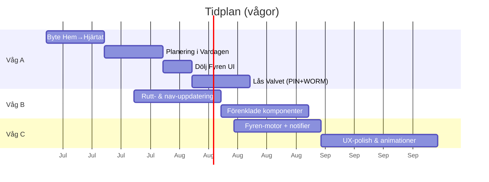

This file is a merged representation of a subset of the codebase, containing specifically included files, combined into a single document by Repomix.
The content has been processed where comments have been removed, empty lines have been removed, content has been compressed (code blocks are separated by ⋮---- delimiter).

# File Summary

## Purpose
This file contains a packed representation of a subset of the repository's contents that is considered the most important context.
It is designed to be easily consumable by AI systems for analysis, code review,
or other automated processes.

## File Format
The content is organized as follows:
1. This summary section
2. Repository information
3. Directory structure
4. Repository files (if enabled)
5. Multiple file entries, each consisting of:
  a. A header with the file path (## File: path/to/file)
  b. The full contents of the file in a code block

## Usage Guidelines
- This file should be treated as read-only. Any changes should be made to the
  original repository files, not this packed version.
- When processing this file, use the file path to distinguish
  between different files in the repository.
- Be aware that this file may contain sensitive information. Handle it with
  the same level of security as you would the original repository.

## Notes
- Some files may have been excluded based on .gitignore rules and Repomix's configuration
- Binary files are not included in this packed representation. Please refer to the Repository Structure section for a complete list of file paths, including binary files
- Only files matching these patterns are included: docs/DOC-INDEX.md, docs/evaluations/2026-06-16-supermodule-ui-masterplan.md, docs/evaluations/2026-06-15-fas19-masterplan-v2.md, docs/evaluations/SENASTE-SAMMANFATTNING.md, docs/evaluations/SESSION-INDEX.md, docs/external-ai/design/UI-WAVE-ROADMAP.md, docs/external-ai/LIFE-OS-BUILD-STATE.md, docs/MODUL-FUNKTIONS-REGISTER.md, .context/system-plan.md, docs/external-ai/imports/gap-matrix-2026-06-16.md, docs/external-ai/imports/deep-research-ide.md, docs/external-ai/leveranser/ui-design/**
- Files matching patterns in .gitignore are excluded
- Files matching default ignore patterns are excluded
- Code comments have been removed from supported file types
- Empty lines have been removed from all files
- Content has been compressed - code blocks are separated by ⋮---- delimiter
- Files are sorted by Git change count (files with more changes are at the bottom)

# Files

## File: .context/system-plan.md
````markdown
# Livskompassen v2 - System Plan (Canonical)

Denna fil ar aktiv systemplan. Root-filen `system_plan.md` ar endast en pekare.

**När det känns rörigt:** färdiga analysprompter och Sacred-register → [`docs/SYSTEMKONTROLL.md`](../docs/SYSTEMKONTROLL.md). **Git / grenar:** [`docs/GIT-LATHUND.md`](../docs/GIT-LATHUND.md) · [`docs/BRANCH-KARTA.md`](../docs/BRANCH-KARTA.md).

## Fas 1 (Cleanup): Sanering & Mappstruktur
- [x] Git-branch `cleanup-phase-1` - saker arbetskopia
- [x] `.context/` systemlagar (arkitektur, sakerhet, databas, design)
- [x] `.gitignore` - secrets, `dist/`, `functions/lib/`, genererad kod
- [x] Borttaget fran git: `vertex-sa.json`, `server/.env`, `spejaren.js`, `server.js`, build-artefakter
- [x] Frontend merge fran `livskompassen-v2` (`main.tsx`, layout, Kompis)
- [x] Rensat: tomma placeholders, trasig `agentEngine.ts`, session-artefakter -> `docs/archive/`
- [x] Agent Cards: 8 produktroller + deterministisk `routeFromDcap` -> executor
- [x] Sakerhet: auth pa `knowledgeVaultQuery`, webhook-secret pa `notifyNewFile`
- [x] Enhetligt `GCP_PROJECT_ID` via `functions/src/config.ts`
- [x] HOME-klonens unika `src`-integration (firebase, store, vault-chat)
- [x] Vault-sidor portade till `src/modules/` (verklighetsvalvet, kompasser, safe_harbor, ekonomi)
- [x] Aktiv backend konsoliderad till `functions/` (legacy `server/` arkiverad)
- [x] Redundanta projektkartor raderade (v2, PROD, drive-download, cursor-workspace, HOME-klon)

## Fas 2 (Moduler): App-shell + aktivering
- [x] BrowserRouter + routes (`/`, `/kompasser`, `/valv`, `/hamn`, `/ekonomi`, `/dagbok`, `/kunskap`, `/barnen`)
- [x] FloatingDock navigation med aktiv route + long-press Shield (3 sek)
- [x] AuthProvider (Firebase Anonymous) + AuthGate pa kansliga moduler
- [x] Zero Footprint: vault unlock reset vid visibilitychange + timeout + `invalidateSession` callable
- [x] Kunskapsvalv: `/kunskap` + Tidshjulet + auth-felhantering
- [x] Kompasser: morgon/dag/kvall-floden + Firestore checkins
- [x] Safe Harbor: BIFF-formular via `analyzeMessage` callable
- [x] Verklighetsvalvet: long-press gate, PIN (lokal/env), VaultLog WORM
- [x] Dagbok: DagbokPage + journal-persistens
- [x] Barnens livsloggar: `/barnen`, PIN, Firestore `children_logs`
- [x] Telefon-MVP: `vite --host` i dev-script + `manifest.webmanifest` (lägg till på hemskärm)
- [x] Firestore rules: checkins, journal, reality_vault, children_logs

## Kladd-konsolidering (2026-05-21)

- [x] Notebook #1–#7 → [`docs/archive/kladd/Kladd-2026-05-21-PERSONAL-MASTER.md`](docs/archive/kladd/Kladd-2026-05-21-PERSONAL-MASTER.md)
- [x] Minne-kandidater → [`docs/archive/kladd/Kladd-2026-05-21-kampspar-kandidater.md`](docs/archive/kladd/Kladd-2026-05-21-kampspar-kandidater.md)
- [x] Gap-tabeller i alla `.context/modules/*.md` + `src/modules/*/module_plan.md` (ingen kod)
- [x] Back-merge Kladd → `[MODUL]-SPEC.md` (§8, §12–13, Kladd-synk)
- [x] Nya SPEC: [`Ekonomi-SPEC.md`](docs/specs/modules/Ekonomi-SPEC.md), [`Core-SPEC.md`](docs/specs/modules/Core-SPEC.md)
- [x] [`docs/specs/p2-flode.md`](docs/specs/p2-flode.md) synkad mot kod
- [x] Grunder Fas A — [`docs/specs/modules/grunder-slides/`](docs/specs/modules/grunder-slides/) + [`INVENTAR.md`](docs/specs/modules/grunder-slides/INVENTAR.md)
- [x] Grunder U1–U5 + Fas C — [`docs/archive/evaluations-2026-05/GRUNDER-UTVARDERING-RESULTAT.md`](docs/archive/evaluations-2026-05/GRUNDER-UTVARDERING-RESULTAT.md)
- [ ] Manuell ingest av minne-poster (opt-in trauma-policy)
- [ ] Implementation per modul när användaren säger *kör [modul]*
- [x] **Del B (2026-05-24):** [`docs/MODUL-FUNKTIONS-REGISTER.md`](../docs/MODUL-FUNKTIONS-REGISTER.md) + doc-drift-synk — `/planering` live på `main`

## Aktuell status
- [x] Design-tokens och fargpalett
- [x] Bas-layout med Sub-Synaptic Background
- [x] KompisAvatar
- [x] Bento Grid dashboard
- [x] Floating Dock (routing)
- [x] Interaktivt Tidshjul (bas-UI pa `/kunskap`)
- [x] Mobil-dashboard (`--host`)
- [x] Verklighetsvalv UI (long-press + PIN + VaultLog)

## Fas 3 (Firebase-synk)
- [x] Firestore rules + indexes deployade
- [x] Functions deployade; `notifyNewFile` deployad (G6 E2E **done** 2026-05-22)
- [x] Firebase Hosting: https://gen-lang-client-0481875058.web.app
- [x] Dokumentation: `docs/FIREBASE_SYNC.md`
- [ ] Manuell smoke i app (#3 Valv, #4 Barnen, #2d bilaga) — sanning: [`docs/SMOKE_RESULTS.md`](../docs/SMOKE_RESULTS.md) **Current truth**
- [x] `NOTIFY_WEBHOOK_SECRET` + Drive E2E → `kb_docs` (G6 **done** 2026-05-22)

## Drive wire-up (Apps Script → notifyNewFile)
- [x] Kod redo: Script Properties i `sorter.gs`, webhook-secret fail-closed, `docs/DRIVE_AUTOMATION.md`
- [x] G6 Drive E2E — `kb_docs` PASS 2026-05-22 ([`GCP-FAS4-RUNBOOK.md`](docs/GCP-FAS4-RUNBOOK.md) steg 2)

## Firebase Fas 3 (synk)
- [x] `.firebaserc` rättad; Firestore rules + indexes deployade
- [x] Modul-Functions deployade (`europe-west1`); Hosting live — se `docs/DEPLOY.md`, `docs/FIREBASE_SYNC.md`
- [x] `notifyNewFile` — G6 **done** 2026-05-22 (`kb_docs` E2E)
- [x] Manuell smoke minimum (#1, #2, #18) **PASS** 2026-05-27
- [x] Manuell smoke #2d **PASS** 2026-06-06 (USER)
- [ ] Manuell smoke #3, #4 valfritt USER — autorun PASS 2026-06-06 · [`docs/SMOKE_RESULTS.md`](../docs/SMOKE_RESULTS.md) **Current truth**

## Data Connect
- Deployat (example-schema); **appmoduler använder Firestore** — DC avvaktas tills ekonomi (se `docs/FIREBASE_SYNC.md`)

## Modulmappning (`.context/modules/`)

| Modul | Route | Kontextfil | Kod |
| --- | --- | --- | --- |
| Verklighetsvalvet | `/valvet` (Fyren + WebAuthn) | `.context/modules/verklighetsvalvet.md` | `src/modules/features/lifeJournal/evidence/vault/` |
| Hjärtat (Dagbok) | `/hjartat` (legacy `/dagbok`) | `.context/modules/dagbokshubben.md` | `src/modules/features/lifeJournal/diary/` |
| Familjen / Barnen | `/familjen` | `.context/modules/barnens_livsloggar.md` | `src/modules/features/family/children/` |
| Speglings-Systemet | `/hjartat?tab=speglar` | `.context/modules/speglingssystemet.md` | `src/modules/features/lifeJournal/diary/mirror/` |
| MåBra | `/mabra` | `.context/modules/mabra_sidan.md` | `src/modules/features/dailyLife/wellbeing/mabra/` |
| Kompis / Kunskap | Valv PIN → `/valvet?vaultTab=kunskapsbank` | `.context/modules/kompis.md` | `src/modules/features/lifeJournal/evidence/kompis/` |

## Permanent minne (låst princip)

**Konsoliderad:** 2026-05-21 — se [`docs/archive/repomix/KONSOLIDERING-2026-05-21.md`](docs/archive/repomix/KONSOLIDERING-2026-05-21.md).

Livskompassen ska **aldrig glömma** användarens WORM-data — ingen tidsgräns, utan arkitekturinvariant.

| Collection | Roll | Glömmer? |
|------------|------|----------|
| `children_logs` | Barnens livslogg + fysiologi | Nej — append-only WORM |
| `reality_vault` | Bevis (Sanningens Sköld) | Nej — append-only WORM |
| `journal` | Dagbok Lager 1 | Nej — append-only WORM |
| `kampspar` / `kb_docs` | Kunskapsvalvet (RAG) | WORM create; separat retention — **ersätter inte** barn/valv |
| `dossier_snapshots` | Bevisad export | WORM snapshot |

**Tre kunskapsytor** (se `arkitektur-beslut.md` §1.5) — blanda aldrig RAG mellan silor.

**Repomix → kanon (legacy):** `vault`→`reality_vault`, `kids_records`→`children_logs`, `diary`→`journal`. Mock `Kampspar`-typ ≠ `KampsparEntry` (G11).

**Idag (live — [`docs/GCP-INVENTORY-LATEST.md`](../docs/GCP-INVENTORY-LATEST.md), audit 2026-05-31):**
- Kunskap RAG — smoke PASS; ANN G2/G3 **VERIFY PASS** (**173 vectors**, west1 defaults)
- `valvChatQuery` — **deployad** (G1 **done**); smoke:valv PASS
- Dossier `generateDossier` — **klart** (smoke PASS)
- `notifyNewFile` — **deployad**; G6 **done** 2026-05-22
- Vävaren HITL — `approveWeaverMetadata` / `rejectWeaverMetadata` **deployade**; `weaver_pending` rules + UI enligt PMIR 2026-05-31
- Legacy Python us-central1 — **0 fn kvar** (FAS4 steg 1–5 **done** 2026-05-22)
- Retention G5 **done**; mock Kampspar G11 **done**

**GAP G1–G14:** **done** (2026-05-22) — [`Arkiv-GAP-REGISTER.md`](docs/specs/modules/Arkiv-GAP-REGISTER.md). Ny backlog utanför G-serien dokumenteras separat.

**Sacred:** Permanent minne + korrekt silo = Zero Footprint + Kill Switch.

## Kommande fas
- [x] WebAuthn gate + Shake-to-Kill (15 m/s²) + Fyren progress
- [x] Vävaren async tagging (Gemini 1.5 Pro → reality_vault) + kampsparRag
- [x] Barnens: Kasper/Arvid, Balansmätare, fysiologi, JSON export
- [x] Barnens *kör barnen* **done** — Spara som bevis + `sourceRef`, tredjepart-filter, Dossier-länk (`/familjen`)
- [x] Speglings-Systemet: ACT + VIVIR + valvjämförelse (`/speglar`)
- [x] `weaveJournalEntry` + hosting deploy (natt-batch — se `docs/NATT-CI.md`, historik: `docs/archive/OVERNIGHT_REPORT.md`)
- [x] Minneloggning (uppladdning, tidsstampel, vektorisering) — **klart:** ingestKnowledgeDocument, ingestKampsparEntry, KunskapsvalvFileIngest, Kunskap RAG; Vector Search ANN VERIFY PASS (G2/G3)
- [x] Kompasser notebook #1–#5 → låst SPEC; MVP *kör kompasser* **done** (AuthGate, tids-default, Paralys, KASAM, broar)
- [x] Dossier notebook #1–#4 → låst SPEC; UI wizard + `generateDossier` backend **done** — deploy `functions:generateDossier` + rules
- [x] Ekonomi kopplad till Firestore (`transactions` WORM + `economy_profiles`)
- [x] Måbra-sidan MVP — hub + 4-7-8 andning + `mabra_sessions` (SPEC **done** 2026-05; se `docs/specs/modules/Mabra-SPEC.md`, `.context/modules/mabra_sidan.md`)
- [x] Måbra fas 2a — reframing self_critical (4 steg + valfri 1-min andning, `exerciseType: reframing`)
- [x] Måbra fas 2b — AkutLanding panic_rsd + panik-andning UX (tid kvar, fas-copy)
- [x] Måbra fas 2c — hub-complete + Dagbok bro `?from=mabra&energy=low`
- [x] Måbra fas 2d — ACT ValuesCompass + `mabra_progress/{uid}`
- [x] Måbra fas 2e — coach callable + opt-in UI + Speglar guardrail
- [x] Måbra fas 2f — Web Speech sv-SE (reframing + coach)

## Life OS orchestrering (2026-05-23)

- [x] Locked UX smoke + P1 design-moduler (D3, D11–D14, D16–D20, D22–D23, D29)
- [x] Tema E tokens + `HomeHeroKanon` / `LivskompassHero` på Hem
- [x] Evaluations A–F + 6 modul-rapporter (`docs/archive/evaluations-2026-05-23/`)
- [x] `npm run smoke:all` + `.context/design-modules-mockup.md`
- [x] Manuell smoke minimum (#1, #2, #18) **PASS** 2026-05-27; #19–20 **STATIC PASS** 2026-05-29
- [x] Manuell smoke #2d **PASS** 2026-06-06 (USER)
- [ ] Manuell smoke #3, #4 valfritt USER — autorun PASS 2026-06-06 · [`docs/SMOKE_RESULTS.md`](../docs/SMOKE_RESULTS.md) **Current truth**

## Fas 5 — Verifiering + polish (2026-05-31, post git-trunk)

**Kanon:** [`docs/SMOKE_RESULTS.md`](../docs/SMOKE_RESULTS.md) · checklista [`docs/evaluations/2026-05-31-fas5a-user-checklist.md`](../docs/evaluations/2026-05-31-fas5a-user-checklist.md)

| Del | Status |
|-----|--------|
| **5A** Prod-verifiering (Vävaren HITL, smoke #3/#4/#2d) | Agent prep **PASS** — manuell USER kvar |
| **5B** Valv/Hamn UI (Visa brus, ankare-filter, forensik-ingress) | **done** 2026-05-31 på `main` |
| **5C** Inkorg I1/I3 produktbeslut | **DEFER** — [`docs/evaluations/2026-05-31-fas5c-inkorg-beslut.md`](../docs/evaluations/2026-05-31-fas5c-inkorg-beslut.md) |
| **5D** Projekt P2 / Barnporten / Life OS Fas D | Backlog — [`docs/evaluations/2026-05-31-fas5d-backlog.md`](../docs/evaluations/2026-05-31-fas5d-backlog.md) |

## Life OS kopplingar (backlog — komihåg 2026-05-26)

**Kanon:** [`docs/design/LIFE-OS-KOPPLINGAR-KOMIHAG.md`](../docs/design/LIFE-OS-KOPPLINGAR-KOMIHAG.md) · Landning: [`docs/evaluations/2026-05-26-session-landning.md`](../docs/evaluations/2026-05-26-session-landning.md)

- [x] **LifeHubPreset (Fas A)** — 4 presets i `src/modules/core/lifeOs/`, Hem-väljare, `materialFlags` per route
- [x] **RoutineTemplate + ModuleLink (Fas B)** — `routineTemplates.ts`, `RoutinesPanel` på `/planering`, deep links
- [x] **MaterialPack (Fas C)** — `materialPacks.ts`, `MaterialPackShortcuts` på Familjen/MåBra/Hamn
- [x] **Projekt P1 (del)** — `projects`, `project_blocks`, `/projekt/:id`, `projectId` på kanban
- [ ] **Projekt P2+ / Fas D** — regler, bild-uppladdning, widget-sheet, full MaterialPack-editor
- [ ] Implementation: `kör kopplingar C` · `kör projekt P1` · se komihåg för fasering

## Fas 6 — Input Superhub (Superdagbok) · **AVSLUTAD**

**Status:** `[x]` **AVSLUTAD** 2026-06-14 — MåBra Superhub (Fas 6A→6E) implementerad och låst i `.context/locked-ux-features.md` §11.

| Del | Status |
|-----|--------|
| **6A** Router-skelett (`MabraInputSuperModule`, `/mabra/input`, lägesväxlare) | **done** |
| **6B** Vit + minneslista (`vit_*`, `EmotionalMemoryListPanel`) | **done** |
| **6C** Reflection + RAM → explicit save (`reflection_tool`, `exercise_note`) | **done** |
| **6D** Inkast + dagbok bridge (`inkast`, `dagbok_bridge`) | **done** |
| **6E** Lås UX/arkitektur (locked-ux + systemplan) | **done** 2026-06-14 |

**Problem:** Inmatning, uppladdning och reflektion är utspridda (Dagbok, Inkast, känslominnen, Valv, Barnen, MåBra, planering, ekonomi, arbetsliv m.fl.) — för många ingångar huller och buller.

**Mål:** En **Universal Input Hub (Supermodul) per pelare/zon** med **meny för läge** — byt funktion utan att byta sida (t.ex. Dagbok ↔ minne ↔ Inkast ↔ reflektion ↔ filuppladdning).

---

### Arkitekturlagar (Livskompassen 3.0 — obligatoriska)

#### 1. Konsolidering och supermoduler

Alla användarinmatningar — **dagboksanteckningar, minnen, snabb inkorg/Inkast, reflektioner och filuppladdningar** — **MÅSTE** centraliseras till polymorfa **Universal Input Hubs (Supermoduler)**.

- Vi **slutar bygga spridda inmatningsformulär** i enskilda moduler.
- Nya inmatningsflöden får endast tillkomma som **lägen (modes)** inuti en godkänd Superhub — inte som fristående formulär.
- Befintliga formulär migreras zon för zon till respektive hub; duplicerade ingångar avvecklas efter migrering.

#### 2. Kontextmedvetna zoner

Varje Superhub **MÅSTE** anpassa sig dynamiskt till sin pelare/zon:

| Zon / pelare | Exempel på hub |
| --- | --- |
| MåBra (Vit) | Super-MåBra Input |
| Barnsidan / Familjen | Super-Familjen Input |
| Ekonomi | Super-Ekonomi Input |
| Arbetsliv | Super-Arbetsliv Input |
| Planering | Super-Planering Input |
| Hjärtat (Dagbok) | Superdagbok |

Anpassning sker via:

- **CSS-variabler ("Färgburkar")** — Obsidian Calm-tokens per zon (`tailwind.config.js`, semantiska `--surface`, `--accent`, glow per silo).
- **Specifik metadatataggning** — varje sparat objekt bär zon, läge, `content_class` (U6) och silo-säker routing; ingen cross-RAG.

#### 3. Nödvändig djupanalys (före implementation)

Innan en Superhub implementeras i **någon** kategori **MÅSTE** en djupgående kod- och komponentanalys av den aktuella kategorin utföras:

1. Kartlägg alla befintliga inmatningsvägar, duplicerade formulär och beroenden.
2. Dokumentera säkerhetsgränser: WORM, silo (U1), HITL, Zero Footprint, offline-policy.
3. Skriv migrationsplan + smoke-kriterier; godkänn plan **innan** kod.
4. Referera [`docs/specs/modules/Arkiv-GAP-REGISTER.md`](../docs/specs/modules/Arkiv-GAP-REGISTER.md), relevant `*-SPEC.md` och `.context/locked-ux-features.md`.

**Utan godkänd analys — ingen Superhub-implementation i zonen.**

#### 4. Strikt låsningsmekanism (WORM och nollhallucinationer)

När en Superhub-modul har **implementerats, testats och godkänts** av teknikledaren betraktas den som **låst**.

- **Ingen AI-agent** får ändra, omstrukturera eller modifiera hubbens **kärnlogik** utan **uttryckligt, åsidosättande tillstånd** från teknikledaren (Pontus).
- Låsning registreras i `.context/locked-ux-features.md` + zon-specifik eval i `docs/evaluations/` + obligatorisk smoke (`npm run smoke:locked-ux` m.fl.).
- WORM-semantik på evidens/minne bevaras; Superhub får **aldrig** införa `update`/`delete` på låsta samlingar.
- Syfte: **noll hallucinationer**, deterministisk stabilitet, inga oreviewade refactors som urholkar säkerhet eller UX.

---

### Obligatorisk leveransordning (per zon)

1. Djupanalys + eval-dokument (`docs/evaluations/`)
2. Superhub-spec (lägen, API, metadata, Färgburkar)
3. Migrering av befintliga inmatningsflöden
4. Smoke + manuell verifiering
5. **Lås** — registrera i locked-ux; därefter endast bugfix med PMIR + explicit OK

### Referenser (nuläge)

- Känslominne (delsteg): `/mabra/projekt/emotional_memory` · `src/modules/features/emotional-memory/`
- Design: Obsidian Calm · [`docs/design/COLOR-POLICY.md`](../docs/design/COLOR-POLICY.md)
- Innehåll/routing: U6 · [`docs/INNEHALL-REGISTER.md`](../docs/INNEHALL-REGISTER.md)
- Framtida kickoff-eval: `docs/evaluations/` (skapas vid start av Fas 6 per zon)
- **MåBra djupanalys (2026-06-14):** [`docs/evaluations/2026-06-14-fas6-mabra-superhub-djupanalys.md`](../docs/evaluations/2026-06-14-fas6-mabra-superhub-djupanalys.md)
- **MåBra Superhub SPEC (låst 2026-06-14):** [`docs/specs/modules/Mabra-INPUT-SUPERHUB-SPEC.md`](../docs/specs/modules/Mabra-INPUT-SUPERHUB-SPEC.md) — Fas 6A→E **AVSLUTAD** · locked-ux §11

## Fas 7 — Super-Familjen Input · **AVSLUTAD**

**Status:** `[x]` **AVSLUTAD** 2026-06-14 — Familjen Superhub (Fas 7A→7E) implementerad och låst i `.context/locked-ux-features.md` §12.

| Del | Status |
|-----|--------|
| **7A** Router-skelett (`FamiljenInputSuperModule`, lägesväxlare, `barnfokus`) | **done** |
| **7B** Delegates stund + fysiologi + offline-fel | **done** |
| **7C** Delegates observation + vardagsstruktur; avveckla duplicerad input | **done** |
| **7D** Shadow mount + produktionstest (`?superhub=true`) | **done** |
| **7E** Standardvy + legacy-borttagning + lås UX/arkitektur | **done** 2026-06-14 |

**Spec:** [`docs/specs/Familjen-INPUT-SUPERHUB-SPEC.md`](../docs/specs/Familjen-INPUT-SUPERHUB-SPEC.md) · **Eval:** [`docs/evaluations/Familjen-INPUT-SUPERHUB-EVAL.md`](../docs/evaluations/Familjen-INPUT-SUPERHUB-EVAL.md)

## Fas 8 — Super-Ekonomi Input · **AVSLUTAD**

**Status:** `[x]` **AVSLUTAD** 2026-06-14 — Ekonomi Superhub (Fas 8A→8E) låst i `.context/locked-ux-features.md` §14.

| Del | Status |
|-----|--------|
| **8A** Router-skelett (`EkonomiInputSuperModule`) | **done** |
| **8B** Mikrosteg + profil delegates | **done** |
| **8C** Kuvert + spar + matprep delegates | **done** |
| **8D** Impuls + inkast | **done** |
| **8E** Shadow→Live på `/vardagen?tab=ekonomi` | **done** 2026-06-14 |

**Spec:** [`docs/specs/Ekonomi-INPUT-SUPERHUB-SPEC.md`](../docs/specs/Ekonomi-INPUT-SUPERHUB-SPEC.md) · **GAP:** F8 **done** i [`Arkiv-GAP-REGISTER.md`](../docs/specs/modules/Arkiv-GAP-REGISTER.md)

## Fas 9 — Super-Planering Input · **AVSLUTAD**

**Status:** `[x]` **AVSLUTAD** 2026-06-14 — Planering Superhub (Fas 9A→9C + W3) låst i `.context/locked-ux-features.md` §15.

| Del | Status |
|-----|--------|
| **9A** Djupanalys + SPEC | **done** |
| **9B** `PlaneringInputSuperModule` + lägesväxlare | **done** |
| **9C** Delegates: task_quick, inkast, quick_list | **done** |
| **W3** `/planering/input` i AppRoutes + länk från PlaneringPage | **done** 2026-06-14 |

**Spec:** [`docs/specs/Planering-INPUT-SUPERHUB-SPEC.md`](../docs/specs/Planering-INPUT-SUPERHUB-SPEC.md)

## Fas 10 — Super-Arbetsliv Input · **AVSLUTAD**

**Status:** `[x]` **AVSLUTAD** 2026-06-14 — Arbetsliv Superhub (Fas 10A→10C + W3) låst i `.context/locked-ux-features.md` §16.

| Del | Status |
|-----|--------|
| **10A** Djupanalys + SPEC | **done** |
| **10B** `ArbetslivInputSuperModule` + lägesväxlare | **done** |
| **10C** Delegates: stampla, tid, logg | **done** |
| **W3** `/arbetsliv/input` + legacy redirect från `/arbetsliv` | **done** 2026-06-14 |

**Spec:** [`docs/specs/Arbetsliv-INPUT-SUPERHUB-SPEC.md`](../docs/specs/Arbetsliv-INPUT-SUPERHUB-SPEC.md)

## Fas 11 — Superdagbok (Hjärtat) · **AVSLUTAD**

**Status:** `[x]` **AVSLUTAD** 2026-06-14 — Superdagbok (Fas 11A→11C + W5) låst i `.context/locked-ux-features.md` §17.

| Del | Status |
|-----|--------|
| **11A** Djupanalys + SPEC | **done** |
| **11B** `DagbokInputSuperModule` + lägesväxlare | **done** |
| **11C** Delegates: reflektion, quick_mirror, arkiv | **done** |
| **W5** `/hjartat/input` i AppRoutes + HjartatPage embed | **done** 2026-06-14 |

**Spec:** [`docs/specs/Superdagbok-INPUT-SUPERHUB-SPEC.md`](../docs/specs/Superdagbok-INPUT-SUPERHUB-SPEC.md)

## Fas 12 — Nästa (efter superhub-kö)

**Kanon:** [`docs/SYSTEM_PLAN_v2.md`](../docs/SYSTEM_PLAN_v2.md) · **Gate 12A** smoke:orkester + hosting deploy 2026-06-14.

| Prioritet | Spår | Status |
|-----------|------|--------|
| **12B** | Adaptiv Hemkompass — superhub-broar från Hem | **done** 2026-06-14 |
| **12C** | Säkerhet P2 — vault-gate `weeklySummary` / `compass` | backlog |
| **12D** | Dossier BBIC `reportType` | backlog |
````

## File: docs/external-ai/leveranser/ui-design/2026-06-15-b1-valv-spec.md
````markdown
# Leverans B1-2 — Valv SuperModule SPEC (ChatBox-equivalent)

**Datum:** 2026-06-15  
**Agent:** Cursor CHECKPOINT  
**Full SPEC:** [`docs/evaluations/2026-06-15-valv-supermodule-spec.md`](../../evaluations/2026-06-15-valv-supermodule-spec.md)

Se evaluations-filen för wireframes, URL-tabell, faser 1A–1E och checklista.
````

## File: docs/external-ai/leveranser/ui-design/2026-06-15-b1-valv-vision.md
````markdown
# Leverans B1-1 — Valv vision + inventering (ChatBox-equivalent)

**Datum:** 2026-06-15  
**Agent:** Cursor CHECKPOINT (ersätter Opus chatt 1)  
**Repomix:** `exports/repomix-valv/repomix-valv-komplett-2026-06-15.md`

---

## Sammanfattning

Valv har redan `ValvInputSuperModule` med tier primary/more, URL-synk i `ValvetRoutePage`, och förenklad `VaultSamlaHub`. Kvarvarande arbete: polish Fas 1C–1E, zonväljare forensik, export index.

Beslut sparade i:
- `docs/evaluations/2026-06-15-valv-vision-beslut.md`
- `docs/evaluations/2026-06-15-valv-ui-design-lock.md`

---

## Död kod / deprecated (Valv-relaterat)

| Fil | Status | Åtgärd |
|-----|--------|--------|
| `zones/ValvInboxZone.tsx` | @deprecated | Behåll re-export; granska via `valvMode=granska` |
| `InkastDirectPanel.tsx` | @deprecated | Defer — CaptureSuperModule kanon |
| `vaultTabs.ts` LEGACY_INBOX | Kommentar | Redirect → `granska` i route |
| `ValvZoneModulValjare` | LIVE | Saknade `forensik` i picker — **fix i B1** |
| `VaultMonsterPanel` etc. | **LOCKED** | Rör ej |

---

## LIVE kärna

- `VaultPage.tsx` — gate + `ValvInputSuperModule`
- `valvInputModes.ts` — 7 lägen, tier, `canonicalValvRoute`
- `ValvSuperModule.tsx` — zon-router
- `VaultSamlaHub.tsx` — inkast + pending badge + manuell post fold
- `ValvForensikZone.tsx` — progressive disclosure
````

## File: docs/external-ai/leveranser/ui-design/2026-06-15-b2-hjartat.md
````markdown
# Leverans B2 — Hjärtat UI

Se [`docs/evaluations/2026-06-15-hjartat-ui-spec.md`](../../evaluations/2026-06-15-hjartat-ui-spec.md)
````

## File: docs/external-ai/leveranser/ui-design/2026-06-15-b3-familjen.md
````markdown
# Leverans B3 — Familjen UI

Se [`docs/evaluations/2026-06-15-familjen-ui-spec.md`](../../evaluations/2026-06-15-familjen-ui-spec.md)
````

## File: docs/external-ai/leveranser/ui-design/2026-06-15-b4-vardagen.md
````markdown
# Leverans B4 — Vardagen UI

Se [`docs/evaluations/2026-06-15-vardagen-ui-spec.md`](../../evaluations/2026-06-15-vardagen-ui-spec.md)
````

## File: docs/external-ai/leveranser/ui-design/2026-06-15-checkpoint-b1.md
````markdown
# CHECKPOINT B1 — Valv UI

**Datum:** 2026-06-15  
**Resultat:** **PASS** (beslut + SPEC godkända; implementation påbörjad i Cursor)

## Granskade leveranser

| Fil | Bedömning |
|-----|-----------|
| `leveranser/ui-design/2026-06-15-b1-valv-vision.md` | PASS |
| `leveranser/ui-design/2026-06-15-b1-valv-spec.md` | PASS |

## Sparade beslut

- `docs/evaluations/2026-06-15-valv-vision-beslut.md`
- `docs/evaluations/2026-06-15-valv-ui-design-lock.md`
- `docs/evaluations/2026-06-15-valv-supermodule-spec.md`

## Implementation

Fas 1A–1E enligt SPEC. Smoke efter varje fas-block.

## Nästa steg

Efter B1 smoke PASS → B2 Hjärtat enligt `UI-WAVE-ROADMAP.md`.
````

## File: docs/external-ai/leveranser/ui-design/README.md
````markdown
# Leveranser — UI & Design (Körfält B)

Spara svar från design-/UI-agenten här.

**Format:** `YYYY-MM-DD-kortnamn.md`

**Exempel:**
- `2026-06-15-b1-valv-vision.md` · `2026-06-15-b1-valv-spec.md`
- `2026-06-15-b2-hjartat.md` · `2026-06-15-b3-familjen.md` · `2026-06-15-b4-vardagen.md`
- `2026-06-15-nav-vag-a-spec.md`
- `2026-06-16-modulkarta-v2.md`
- `2026-06-17-fyren-publikt-chrome.md`

**Efter leverans:** Pontus godkänner → Cursor implementerar → `npm run smoke:locked-ux`

Koordinering: [`../UI-DESIGN-HANDOFF.md`](../UI-DESIGN-HANDOFF.md)
````

## File: docs/evaluations/2026-06-15-fas19-masterplan-v2.md
````markdown
# Fas 19 — Masterplan v2 (slutgiltig)

**Datum:** 2026-06-15 · **Status:** Godkänd — implementation Fas 19.1–19.6  
**Ersätter:** [`FAS19-UTKASTPLAN.md`](../archive/evaluations-fas19-2026-06/FAS19-UTKASTPLAN.md)  
**Regel:** [`.cursor/rules/fas19-masterplan-guard.mdc`](../../.cursor/rules/fas19-masterplan-guard.mdc)

---

## 1. Executive summary

Livskompassen v2 har levererat Fas 13–18 (WORM, superhubbar, inkast, Kunskap våg 24, Android cap sync) med grön smoke-baseline. Fas 19 fokuserar på **tre parallella spår** utan att bryta Sacred eller locked UX: **(A)** MåBra hybrid-8 pelarnav + hex→tokens, **(B)** projekt-hjärna med arkiv-först doc-synk, **(C)** säkerhets-P0 (`unlockVault`, App Check coverage) före polish. Pontus val: hybrid-8, JOY-17→19.4, evolution_ledger dual-write→19.5.

---

## 2. Vision + DONE/LÅST

Se Cursor-plan och pre-flight syntes. G1–G16 **done** · Superhub §11–§17 **låst** · tre silos **PASS**.

---

## 3. Implementation-vågor

| Våg | Innehåll | Smoke |
|-----|----------|-------|
| **19.1** | Doc-synk + `unlockVault` P0 + App Check guards + LEG-VAULT read-fix | `smoke:valv-security`, `smoke:inkast`, `smoke:locked-ux` |
| **19.2** | M3.0-B hybrid-8 pelarkort | `smoke:mabra`, `smoke:design-modules`, `smoke:modulvaljare` |
| **19.3** | Hex→tokens P0 + typecheck expansion | `typecheck:core-strict`, `smoke:design-modules` |
| **19.4** | JOY-17 + mabraCoach bank-synk | `smoke:innehall`, `smoke:mabra` |
| **19.5** | evolution_ledger dual-write | `smoke:evolution-discovery` |
| **19.6** | Arkiv-batch PMIR | `orkester:night` |

---

## 4. Glömda funktioner

| ID | Beslut | Våg |
|----|--------|-----|
| M3.0-B hybrid-8 | Implementera | 19.2 |
| JOY-17 prod-wire | Implementera | 19.4 |
| EVO-LEDGER dual-write | Implementera | 19.5 |
| M3.0-C Fitness/Näring | Defer | 19.N+ |
| LEG-VAULT | Behåll | — |
| BP-PUSH | Defer | TBD |

---

## 5. Kostnadsgate

Scripts/orkester:night default · prod callable-smoke en silo i taget · PMIR före merge.

---

*Fullständig pre-flight syntes: Cursor-plan `fas_19_masterplan_v2_48298370.plan.md` (intern).*
````

## File: docs/evaluations/SENASTE-SAMMANFATTNING.md
````markdown
# Senaste sammanfattning — systemstatus

**Datum:** 2026-06-18 · **Gren:** `main` @ `ba2a1b3aa`+  
**Kanon:** [`2026-06-15-fas19-masterplan-v2.md`](./2026-06-15-fas19-masterplan-v2.md) · **Smoke:** [`SMOKE_RESULTS.md`](../SMOKE_RESULTS.md)

---

## Nuläge i en mening

**Fas 19 sprint DONE** (19.1–19.6) · P1/P2 Flow **LOCK** · MåBra 19.2–19.5 smoke PASS. **Nästa:** system-gap-syntes (Deep Research + Flow/krediter) · DEFER: M3.0-C Fitness/Näring, AI-assistent UI.


---

## Fas 19 sprint (2026-06-18)

| Våg | Status | Eval |
|-----|--------|------|
| 19.1 security | **LOCK** | `2026-06-18-fas19-vag-19.1.md` |
| 19.2 MåBra hybrid-8 | smoke PASS | `2026-06-18-fas19-vag-19.2.md` |
| 19.3 hex→tokens | smoke PASS | `2026-06-18-fas19-vag-19.3.md` |
| 19.4 JOY-17 bankId | smoke PASS | `2026-06-18-fas19-vag-19.4.md` |
| 19.5 evolution_ledger | smoke PASS | `2026-06-18-fas19-vag-19.5.md` |
| 19.6 arkiv-batch | **done** | `2026-06-18-fas19-leverans.md` |

**Nästa research-våg:** `GEMINI-DEEP-RESEARCH-SYSTEM-AUDIT-MASTER` → `2026-06-18-system-gap-syntes.md`
---

## Levererat (Fas 13–23)

| Område | Status |
|--------|--------|
| WORM + vault-gate | **done** Fas 13 |
| Superhubbar Fas 6–11 | **done** |
| Fas 19 masterplan-v2 | **done** + deploy 2026-06-15 |
| Fas 20 doc-synk + arkiv-batch 2 | **done** |
| Fas 21 guards + JOY-17 + Oracle tokens | **done** + deploy 2026-06-15 |
| Fas 22 hex→tokens P0 + typecheck | **done** + hosting deploy 2026-06-15 |
| Fas 19.5 evolution_ledger dual-write | **done** 2026-06-15 |
| Fas 23 USER smoke + Valv biometri + Familjen scroll | **done** 2026-06-15 |
| Fas 19.6 arkiv-batch PMIR | **done** 2026-06-15 |
| Fas 24 Hex P2 (Barnporten + Dossier print) | **done** 2026-06-15 |
| `orkester:night` + `typecheck:core-strict` | **PASS** 2026-06-15 |

---

## Fas 23 (klart)

| Spår | Leverans |
|-----|----------|
| 23.1 | Familjen en scroll-yta på mobil · flow-hub desktop · `smoke:locked-ux` guard |
| 23.2 | Valv biometri — App Check i CI-build · WebAuthn `firebaseapp.com` · tydliga fel |
| 23.3 | USER smoke #3 + #4 **PASS** · doc-synk SMOKE_RESULTS + SENASTE + SYSTEM_PLAN_v2 |

**USER:** #3 Valv biometri + arkiv · #4 Barnen scroll + Barnfokus spara — båda **PASS** 2026-06-15.

---

## Fas 22 (klart)

| Spår | Leverans |
|-----|----------|
| 22.1 | Hex→tokens — MabraHistoryView, ArchiveHub, DailyTasksList, diary supermodule, ImmersiveExperienceShell, VisualCompassWidget |
| 22.2 | Doc-synk — SENASTE-SAMMANFATTNING, SYSTEM_PLAN_v2, SMOKE_RESULTS |
| 22.3 | `typecheck:core-strict` + `src/modules/morning/**` |

---

## Fas 19.5 (klart)

| Spår | Leverans |
|-----|----------|
| 19.5 | `evolution_ledger` dual-write — [`2026-06-15-fas19-5-evolution-ledger-dual-write.md`](./2026-06-15-fas19-5-evolution-ledger-dual-write.md) |

---

## Öppet (backlog)

| ID | Beskrivning | Gate |
|----|-------------|------|
| Hex P2 | Barnporten zon-gradient, dossier print-HTML | **done** 2026-06-15 |
| M3.0-C | Fitness/Näring | PMIR · masterplan defer |
| App Check | Console Enforce | valfritt extra lager (kod redan fail-closed) |

---

## App Check sanning

- **Kod:** `APP_CHECK_ENFORCE=true` (fail-closed) — **PÅ**
- **Console Enforce:** **INTE** på (medvetet)
- **CI hosting:** `VITE_APP_CHECK_RECAPTCHA_SITE_KEY` i workflow (Fas 23.2)
````

## File: docs/evaluations/SESSION-INDEX.md
````markdown
# Sessionsindex — evaluations

**Aktuell status (1 sida):** [`SENASTE-SAMMANFATTNING.md`](./SENASTE-SAMMANFATTNING.md) · **Öppet per modul:** [`../MODUL-GAP-OVERSIKT.md`](../MODUL-GAP-OVERSIKT.md)

| Session | Datum | Nyckelfiler | Status |
|---------|-------|-------------|--------|
| S1 Grunder | 2026-05-22 | [`archive/evaluations-2026-05/`](../archive/evaluations-2026-05/) | Stängd |
| S2 Systemkontroll | 2026-05-23 | [`archive/evaluations-2026-05-23/`](../archive/evaluations-2026-05-23/) | Historik |
| S3 Docs Del B | 2026-05-24 | [`DOC-DRIFT-RAPPORT.md`](../DOC-DRIFT-RAPPORT.md), [`archive/CONSOLIDATION-PLAN.md`](../archive/CONSOLIDATION-PLAN.md) | Stängd |
| S4 Theme Pack J | 2026-05-26 | [`2026-05-26-session-landning.md`](./2026-05-26-session-landning.md) | Stängd |
| S5 Android | 2026-05-27 | [`2026-05-27-android-landning.md`](./2026-05-27-android-landning.md) | Delvis (smoke) |
| S6 Modul-batch | 2026-05-29 | `*-cursor-plan.md` (**closed**), [`pmir-modul-rollout-batch.md`](../archive/evaluations-fas20-2026-06/2026-05-29-pmir-modul-rollout-batch.md) | Stängd i kod · öppet i [`MODUL-GAP-OVERSIKT`](../MODUL-GAP-OVERSIKT.md) |
| S7 Content | 2026-05-29 | [`content-autorun-program.md`](../archive/evaluations-fas20-2026-06/2026-05-29-content-autorun-program.md), [`content-autorun-vag-8-ingest.md`](./2026-05-29-content-autorun-vag-8-ingest.md) | Ingest öppen |
| S8 Vävaren HITL | 2026-05-31 | [`2026-05-31-pmir-session-rniv.md`](./2026-05-31-pmir-session-rniv.md) | Mergad till `main` · functions live · rules/hosting vid behov |
| S9 Fas 13 | 2026-06-15 | [`archive/evaluations-fas22-2026-06/`](../archive/evaluations-fas22-2026-06/) (`fas13-vag-*`, leverans) | **arkiverad** 2026-06-16 |
| S10 Fas 14–16 | 2026-06-15 | [`archive/evaluations-fas22-2026-06/`](../archive/evaluations-fas22-2026-06/) (`fas14-*`) | **arkiverad** 2026-06-16 |
| S11 Fas 17–18 | 2026-06-15 | [`fas17-typecheck-shared.md`](./2026-06-15-fas17-typecheck-shared.md), [`fas18-android-cap-sync.md`](./2026-06-15-fas18-android-cap-sync.md) | **done** |
| S12 Fas 19 | 2026-06-15 | [`2026-06-15-fas19-masterplan-v2.md`](./2026-06-15-fas19-masterplan-v2.md), `fas19-theme-lab-mabra`, `fas19-credits-audit`, `fas19-repo-inventory` | **done** · arkiv 19.6 **done** 2026-06-15 |
| S13 Backend djupanalys | 2026-06-15 | [`2026-06-15-backend-djupanalys.md`](./2026-06-15-backend-djupanalys.md) | Kartlagd · åtgärd #1–8 öppen |
| S14 Arkitektur + nav | 2026-06-15 | [`2026-06-15-arkitektur-nav-analys.md`](./2026-06-15-arkitektur-nav-analys.md), [`gpt-handoff/03-GPT-FORTSATTNING-PROMPT.md`](../gpt-handoff/03-GPT-FORTSATTNING-PROMPT.md) | **open** · F1–F5 ej implementerat |

**Fas 19.6 arkiv-batch:** [`../archive/evaluations-fas19-6-2026-06/README.md`](../archive/evaluations-fas19-6-2026-06/README.md) · manifest [`2026-06-15-fas19-archive-pmir.md`](./2026-06-15-fas19-archive-pmir.md)

**Orkester natt (24–28):** [`archive/evaluations-2026-05/ORKESTER-NATT-ROLLING.md`](../archive/evaluations-2026-05/ORKESTER-NATT-ROLLING.md) · **Senaste:** [`../archive/evaluations-fas19-2026-06/2026-05-29-orkester-natt.md`](../archive/evaluations-fas19-2026-06/2026-05-29-orkester-natt.md)

**Helhetsstatus A (2026-05-31):** [`2026-05-31-A-helhetsstatus.md`](./2026-05-31-A-helhetsstatus.md)

**Stängda arkiv:** [`archive/evaluations-closed-2026-05-29/`](../archive/evaluations-closed-2026-05-29/) (vertex-spec, äldre PMIR)

**Mall ny modul-plan:** [`MALL-cursor-plan.md`](./MALL-cursor-plan.md)
````

## File: docs/external-ai/imports/deep-research-ide.md
````markdown
# Sammanfattning  
För ett “mobile Life OS” med nordisk, minimalistisk estetik rekommenderas en stabil komponentbas (design tokens för färg/typografi/spacing) och en modulär arkitektur med tydliga supermoduler (Hjärtat, Vardagen, Familjen, Valvet, samt bakgrunds‑“Fyren”). En tvärplattformslösning ger snabbare utveckling och enhetligt UI, medan native tvåkodbas–lösningar innebär större underhållskostnad. Vi bygger först ett enkelt ramverk med kärnkomponenter och design tokens (färgpalett, typsnitt, enhetligt radavstånd) som garanterar kontrast och läsbarhet (WCAG-standard). Accessibility (skärmläsare, roller/etiketter) och prestanda budgetar definieras tidigt, och alla delar testas automatiskt (CI/CD med linting, enhetstester, e2e-tester). Utifrån våra tidigare visioner och teknisk insikt föreslås Flutter för hög UI-konsistens och animationsprestanda, men React Native kan övervägas om JS-expertis är prioriterad.

## 1. Front-end-stack: iOS/Android native vs React Native vs Flutter  
- **Natív (SwiftUI/Jetpack Compose)** – Bäst prestanda och direkt åtkomst till plattforms-API:er. Kräver dubbla kodbaser och mer utvecklingstid. Passar om man inte behöver code sharing mellan plattformar.  
- **React Native** – JavaScript/TypeScript, stort ekosystem, snabb onboarding för webbutvecklare. Stora moduler och paket finns, och nyarkitekturen Fabric/Hermes har förbättrat prestandan. Risk för små inkonsekvenser i UI (eftersom native-komponenter återanvänds). Överbryggningslagret (JSI) ger låg latens.  
- **Flutter** – Dart och eget renderingsteam (Impeller) ger pixelperfekt, konsekvent UI och sömlösa animationer. Mycket effektivt för grafikintensiva vyer och “design-led” appar. Större baspaket vid första install (8–12 MB) men ger identiskt utseende på iOS/Android. Dart är starkt typat med null-säkerhet.  

**Rekommendation (i prioriterad ordning):** För Livskompassen, där UI-konsistens och animationskvalitet är centralt (”nordiskt ceremoniellt”), väger Flutter tungt tack vare sin enhetliga renderingsengine och förutsägbara frame rate. React Native är också moget och har snabbare ramp-up om teamet har JavaScript/React-kompetens. Native kan ge marginalfördelar i prestanda, men kostnaden för två kodbaser anses för hög.  

## 2. Komponentbibliotek och design tokens  
Komponenter och designbeslut modelleras med återanvändbara tokens (färg, typografi, avstånd). Dessa tokens (”primär färg”, ”sekundär knappradius”, ”h1-typografi” etc.) gör stilsystemet enhetligt och enkelt att uppdatera. Nedan skiss på viktiga komponenter och token-kategorier:  

| Komponent        | Funktion/Beskrivning                         | Design Tokens & Stilar           | Accessibility (WCAG)      | Exempel-API (props)                   |
|------------------|---------------------------------------------|----------------------------------|---------------------------|---------------------------------------|
| **Button (Knapp)**    | Tryckbar knapp (primär/sekundär stil)         | Färg: `color-primary`, `color-on-primary`; Hörnradie: `radius-sm`; Textstorlek: `font-size-md`; Padding: `space-md` | `accessibilityRole="button"`, `enabled/disabled`-state, etikett  | `<Button label="Nästa steg" onPress={...} accessibilityLabel="Nästa steg"/>` |
| **Card (Kort)**      | Grupperad behållare med skugga/bakgrund       | Bakgrund: `surface-color`; Skuggor: `shadow-sm`; Avstånd (padding): `space-lg`         | `accessible={true}`, `accessibilityRole="none"` (layout kompo.), kontrast <br> minst 4.5:1 mellan text och bakgrund | `<View style={{...cardStyle}}><Text>Uppgift</Text></View>` |
| **Navbar / Tabbar** | Navigationsfält överst/underst (ikoner + text) | Height: `height-md`; Bakgrund: `surface-color`; Färger: `color-primary`, `color-text`   | `accessibilityRole="tab"`, `accessibilityLabel`, markerad state       | `<TabBar tabs={["Hemma","Familj"]} activeIndex={0} onChange={...}/>` |
| **Kanban (Planering)** | Tre spalter (Göra, Pågående, Klart) med drag/drop  | Bakgrund kolumner: `surface-light`; Stödytor: `border-color`; Överföringsanimation: ease-in      | Drag&drop: fokusfångst på rader, `accessibilityHint` för instruktioner| `<KanbanBoard columns={cols} cards={cards} onMove={...}/>` |
| **Valvet (Modal)**    | Låst vy bakom PIN-kod (sensitiv vy)          | Bakgrund: `surface-dark-translucent`; Kort/botton: `color-warning` för känslig åtg. | `accessibilityViewIsModal={true}`, `accessibilityLabel="Lås upp Valvet"`, secureTextEntry vid PIN | `<Modal visible locked PIN={<PINInput onSubmit={...}/>}>…</Modal>` |
| **Fyren (Kapacitetsindikator)**| Visualisering av dagskapacitet (t.ex. cirkeldiagram eller stapel) | Färg: `color-accent` (kapacitet), `color-secondary` för tom del; Linjebredd: `stroke-md` | `accessibilityLabel="Kapacitetsindikator"`, `aria-valuenow`, etc.| `<CapacityIndicator value={50} max={100} label="Kapacitet idag"/>` |
| **CTA Microsteg**     | Flytande knapp för att lägga till nästa liten åtgärd | Färg: `color-primary`; Ikon: +; Storlek: `size-lg`; Elevation/shadow för fokus| `accessibilityRole="button"`, `accessibilityLabel="Lägg till mikrosteg"` | `<FloatingActionButton icon="plus" onPress={addStep} />` |

**Design Tokens:** Enhetligt system av tokens för färger, typografi och avstånd. Färgpaletten är monokromatisk/minimal enligt nordisk stil (mörk bas, ljus text, en accentfärg), exempel: *Primär: Mörk marinblå (#1A232B)*, *Sekundär grå (#676F7E)*, *Text: Vit/off-white*, *Highlight: Ljus guld (#CDAB4F)*. Typografi: Sans-serif, en fontfamilj men olika vikt (t.ex. 400, 600) och skalor (h1=24sp, body=16sp). Spacing skala: multipler av 4/8 sp. Tokens gör omdesign enkelt (t.ex. skift till mörkt läge).

**Tillgänglighet:** Alla UI-element får `accessibilityRole` och `accessibilityLabel`, och kontrast följer WCAG AA (minst 4.5:1 för normal text). React Native stöder ARIA-liknande egenskaper: `accessible`, `accessibilityHint` etc. Exempel: tryckbar knapp med `accessibilityRole="button"` och lämplig `accessibilityLabel`. 

## 3. Modul-arkitektur och datasilos  
Vi delar in appen i *supermoduler* efter UX-konceptet (“Hjärtat”, “Vardagen”, “Familjen”, “Valvet”, plus systemmodulen “Fyren” som kör i bakgrunden). Varje modul kapslar sin vy, logik och data helt för sig (tre separata datasilos för Kunskap/Barn/Valv). Ingen direkt dataflöde eller API-samtal korsar dessa silo-gränser (”no cross-RAG” för barnloggar, kunskapsbank och Valvet) – detta motsvarar en strikt säkringsprincip, likt hur data silas i företag. Arkitekturen kan vara monorepo med underpaket eller fler repo, men med tydliga gränssnitt (t.ex. events eller REST-förfrågningar) mellan modulerna.

   - **Hjärtat (Startskärm):** Central hub med dagens fokus och “nästa åtgärd”. Komponent för kapacitetsläge (Fyren-hämtar data via bakgrundstjänst). 
   - **Vardagen (Planering):** Hanterar dagliga Kanban-flödet (P3-metoden). Här finns Kanban-komponent, dagslistor mm. Planering visas på `/planering?tab=handling` enligt krav.  
   - **Familjen:** Inriktad på barn och familjerelationer. (Barnfokus-regler och logghantering gäller).  
   - **Valvet:** Låst del för känslig data (spara bevis, dokument). Öppnas via PIN, följer WORM (append-only logg) – lagras krypterat i Keychain/Keystore.  
   - **Fyren:** Bakgrundsmotor för dagskapacitet och användarens förutsättning (”dagsform”). Körs globalt (Context/Service) och matar indikatorer i Hjärtat/Vardagen.

Dataflödet illustreras nedan (mermaid): användare interagerar med UI-komponenter i respektive moduler; modulerna kommunicerar endast när det är nödvändigt (t.ex. Hjärtat kan trigga fram nästa åtgärd i Vardagen), men Valvet-modulen delar ingen data med andra moduler för att följa silo-regeln. 

```mermaid
flowchart LR
  U[Användare]
  subgraph Hjärtat
    H[Hjärta-skärm]
  end
  subgraph Vardagen
    V[Vardag/Kanban]
  end
  subgraph Familjen
    F[Familj-skärm]
  end
  subgraph Valvet
    L[Valv-skärm (låst)]
  end
  Fyren((Fyren bakgrund))
  U --> H & V & F & L
  H -->|`nästa steg`| V
  V --> H 
  H --- Fyren
  V --- Fyren
  F -->|Barn-loggar| Fyren
  L -.-> Fyren
```

## 4. Implementeringsplan (vågor A/B/C)  

| Vågor | Åtgärder (toppprioritering)                | Påverkar låsta regler? | Cursor-integr.  | Upplevd före/efter (1 mening)                                         | Est. (T-shirt) | Risk |
|-------|-------------------------------------------|------------------------|----------------|---------------------------------------------------------------------|---------------|------|
| **Våg A (snabb vinst)** | 1. **Byt Hem (/) till Hjärtat:** / ersätts av Hjärtat-skärmen. (`F1`) **2. Flytta Planering till Vardagen:** `/planering?tab=handling` visas under Vardagen och ta bort egen flik. (`F2`) **3. Dölja/deaktivera fyren-punkt:** gör Fyren-data osynlig i UI (bakgrundsprocess) men ej synlig label. (`F4`) **4. Lås Valvet (bakgrund):** implementera PIN-skydd och show encryption skjul. (`F5`) | Nej | F1, F2, F4, F5 | **Före:** Hem-sida och planeringsnav tveksamma, osäkert nästa steg. **Efter:** Startat på Hjärtat med klar nästa åtgärd, enkel flytt av planering, Valvet skyddat. | M/L | Låg |
| **Våg B (ar-konsolidering)** | 1. **Slå ihop routes:** förenkla rutt-lista, ta bort överflödiga (`PMIR`). 2. **Hub-struktur:** flytta gemensamma menyer/ikonryggar till nav (ex. undermeny Hjärtat ↔ Vardagen). 3. **Förfinad komponentstruktur:** utgående från hem-flight (F1/F2) skala upp komponenter (t.ex. Kanban, Card). | Kanske | F1, F2 (om justeringen behövs), ev. F3 | **Före:** Fragmenterat navigationsflöde, dubbletter. **Efter:** Minskat  antal klick, centraliserat nav – bättre orientering. | L/XL | Medel |
| **Våg C (strategisk)** | 1. **Fyren som global motor:** Låta Fyren-modulen skala kapacitetsberäkning och ge notifieringar. 2. **UX-polish:** implementera fler micro-animeringar (se 6) och grafiska förbättringar utifrån moodboard. 3. **Supermodulsförstärkning:** Eventuellt separata pipelines för varje modul (monorepo), mer testisolering. | Nej (t.h.d) | (F1/F2 om ej klart) | **Före:** Fyrens effekter “på skaft” i bakgrunden, enstaka animationer. **Efter:** Konsekvent kapacitetsupplevelse, fylligare animationer, tydlig moduluppdelning. | XL/XXL | Hög |

**För varje våg A-åtgärd:** användarupplevelse blir *tydligare*. Exempel: Att **ersätta hemskärmen med Hjärtat** ger direkt “dagsfokus” vid appstart (förbättrar måluppfyllelse). Detta bryter ingen regel (säger bara att Hem flyttar), involverar Cursor-F1 för route-ändring. Att **flytta Planering** in i Vardagen gör appen mer logisk, samma regel (P3-tab finns kvar) – här krävs Cursor-F2 för att justera frontend-slingan. Att **valvet låses** minskar synlig information, men är krävande för WORM (ingen regelbrytning – ej auto-lyfta barnlogg), kräver F5 i Cursor. “Dölja Fyren” handlar om att inte visa för front-end (håller plausible deniability) – ingen regelbrytning, kan göras utan Cursor-ändring (skrivning i state). Se ovan för detaljer om Cursor-F integrering.

**Svar på frågorna:** 
- **Planering som egen modul eller under Vardagen?** Den bör ligga *under* Vardagen-fliken (Planering är en del av vardagsläge, enligt BARNFOKUS_P3-regeln: `/planering?tab=handling` låst). Vi tar bort separat knapp, för att inte spränga kognitiv struktur.  
- **Behålla Hem (`/`) eller ersätta med Hjärtat?** Vi ersätter Hem med Hjärtat som första skärm; / behåller tekniskt (kan redirectas) men ska inte vara synlig för användaren. (Därmed gör vi Fjärnalternativet till bakgrunds-sida.)  
- **Visa Fyren publikt utan att avslöja allt?** Visa bara en diskret statusindikator (t.ex. färg/våg) för kapacitetsnivå utan siffror eller detaljer (göm låsta data). E.g. en tonad ikon eller ring vid Hjärtats rubrik, ingen extra text, för att bibehålla plausible deniability. Själva beräkningen körs i bakgrunden, men UI visar bara t.ex. *”kapacitet ok/varnar”* utan inblick i varför. Ingen regel bryts (Vi avslöjar inget, följer behörighet).

## 5. Mockup-riktningar (färg/typografi/ikoner)  
**Riktning A (Ljus minimalism):** Vit/ljusgrå bakgrund, mörkblå/grå typografi, ett varmt guldfärgat accent (inkast/nål för ceremoniell touch). Typografi: Sans-serif (t.ex. **Roboto** eller **Helvetica Neue**, läsbar och modern), monotona ikoner med fina linjer. Micro-interaktioner: mjuka in-/uttoningar för övergångar, knapptryck med kort feedback (t.ex. knappstuds). Animation: uppskattande animation vid avslutat mikrosteg (t.ex. checkmark som dyker upp).  

**Riktning B (Mörk dramatisk):** Mörk bakgrund (#1A232B) med ljus text (#ECEFF1). Accentfärg: blekmintgrön eller pudrig guld för puls/ikoner för att ge ceremoniell värme. Typsnitt med mer personlighet, t.ex. **Neue Haas Grotesk** för rubriker, kombinerat med neutralt **Noto Sans** för brödtext (ensamt typsnitt helst). Animeringar: subtil highlight av aktiv tabb (ikonskift ljusstyrka), drag&drop-kort med skuggbelysning. Valvet-öppning: *“dörröppning”-animering med bakgrundsdimma* för dramatik (ändå återhållsamt).  

**Riktning C (Organisk lutning):** Naturnära färger: djupgrön eller kallblå som huvud, med elfenbensfärg för bakgrund och vita inslag. Ikoner med rundare kanter (kan matcha *ceremoniellt* tema, typ blommönster abstrakt?). Typsnitt: **Montserrat** (varm rundhet) och **Lora** (för längre text), för ett nordiskt hantverk-känsla. Animeringar: flytande övergångar (lätt böljande rörelse vid sidbyte), feedback med lätt gungning (t.ex. lätt vobblande knapp vid tryck), och ha en “fyranimation” (t.ex. fyren blinkar kort när kapacitet sträcker gräns). Vi följer IKEA/Finn Juhl-stilkoncept (funktionalitet + stil).  

*Illustrerade riktningar:* (schematiska, ej faktiska designer)  

- *Hjärtat-startskärm:* Visar stora ”God morgon” hälsning, dagens fokus (mikrosteg) och nästa aktion som CTA, med diskret kapacitetsindikator vid rubriken.  
- *Vardagen/Planering:* Tre kolumner med minimal header, flyttbara kort. P3-kanban-länkar på tabbar.  
- *Valvet (låst):* Halvt genomskinlig panel över grå bakgrund, för inmatning av PIN. Låsikon i bakgrund, text “Valvet är låst”.  
- *Familje-hub:* Knytetill medlemsikoner, barnens statuslistor. T.ex. cirklar med barnbilder (silhouetter) och färger som signalerar deras aktiviteter.  
- *Fyren-indikator:* En liten rund ikon med färgton ändras (grön – bra kapacitet, röd – varning), utan siffra. Klickbar för kort förklaring (tooltip) men ingen detaljerad data.  

**Mikrointeraktioner:** Knapptryck får kort “puff” eller färgskift. Dra kort i Kanban får lätt skugga & skalning (e.g. skalar upp lite). Fyllnads-animation i kapacitetsindikatorn visar progress (sekundär fyllnad). Vi undviker distraherande effekter – varje animation är *ändamålsenlig* (t.ex. “skräddarsydd” för feedback). 



## 6. QA, prestanda och säkerhet  
**QA-checklista:** Automatisk testsvit med enhetstester (Jest) och komponenttester. UI-tests med Detox (animeringsstöd, swipe etc). Säkerställ a11y (skärmläsartest, gränssnitt utan mus/tangentbord, kontrastmätningar). Funktionstester: kontrollera PIN-lås, WORM-logg (kan ej redigera), offline-läge. 
**Prestandamål:** Snabb first screen (<2 s), 60fps-interaktion (UI animationer <16ms). Minimera minne/batteri: ge bleeder regler (avsluta nya objekt, caching). Utgå från React Natives riktlinjer (skript + plugin kan göras optimeringsbart). Mät med profiler (Dykt biljetter för fram- och bakgrundsprcesser).
**Valvet/WORM-säkerhet:** All data i Valvet säkras i device Keychain/Keystore. WORM betyder *append-only*: ingen data kan ändras eller tas bort efter inmatning utan överträdelser spåras. Vi lägger till revisionslogg (tamper-evident timestamps) och retention-policy. PIN-koden (och biometriska data) behandlas som högt känsliga uppgifter (klassificeras enligt GDPR/HIPAA).  
**Prestanda:** Sätt budgetar för APK-storlek (<25 MB vid release), snabba kallstarter. Lazy-load bilder (SVG-ikoner i stället för raster), återanvänd komponenter. 
**Säkerhetskontroller:** Inga känsliga fält i klartext (kryptera lokalt). Inga hårdkodade hemligheter. Använd HTTPS för alla bakgrundskall. Valvet är isolerat: tillträde kräver PIN + enhetens autentisering (FaceID om tillgängligt). WORM-loggen göres oföränderlig (skriv-skydd, markera ändringsförsök).

## 7. CI/CD, testning och release  
**CI/CD-pipeline:** GitHub Actions (eller liknande) kör linting (ESLint/TS), enhetstester (Jest) och UI-tester (Detox) vid varje commit. Byggar automatiskt både iOS- och Android-paket. Efter testgrön, automatisera distribution till testkanaler (TestFlight, Firebase App Distribution). Fastlane kan hantera signering/spridning. Mätkod-coverage och rapportera fail/nästa steg via Slack eller issue tracker. Varje PR kräver godkännande *och* grön CI för att merges.  
**Testmiljö:** Enhetstest (70 %) för logik/komponenter, integrationstest (20 %) för vyflöden, och e2e (10 %) för kritiska use cases. Automatisk regressionstest körs på emulatorer i pipeline.  
**Release-gating:** Gated release när alla tester passerar; kodreview obligatorisk. Dessutom pre-release betatest med slumpade användare ger feedback. *Performance-budgetar* i pipelinen: t.ex. larm om app-uppstart > 3s på genomsnittstelefon. *Säkerhetsskanning*: kör SAST (ex. npm audit, MobSF) regelbundet och Snyk på beroenden.  

**Källor:** Branschriktlinjer för komponentbaserade design tokens, React Native-dokumentation om tillgänglighet, samt jämförelser Flutter vs React Native har legat till grund för rekommendationerna. Resultatet är ett modulärt, testat system med lågt kognitivt golv och tydliga nästa steg för användaren.
````

## File: docs/MODUL-FUNKTIONS-REGISTER.md
````markdown
# Modul- & funktionsregister — Livskompassen v2

**Syfte:** En sammanställd sanning — modul, route, backend, spec, smoke.  
**Uppdaterad:** 2026-06-18 (Fas 19 sprint · 3-zon routes · P1/P2 LOCK)  
**Regel:** Status **kod** verifieras med grep/smoke; docs kan vara historiska — se [`evaluations/SENASTE-SAMMANFATTNING.md`](./evaluations/SENASTE-SAMMANFATTNING.md).

---

## Tre silos (minne — U1)

| Silo | Collection | Callable / pipeline | Cross-RAG |
|------|------------|---------------------|-----------|
| **Kunskap** | `kampspar`, `kb_docs` | `knowledgeVaultQuery`, `notifyNewFile` → `driveIngestSynapse` | **Aldrig** Valv/Barnen |
| **Valv** | `reality_vault` | `valvChatQuery`, `analyzeMessage` | **Aldrig** Kunskap/Barnen |
| **Barnen** | `children_logs` | `childrenLogsQuery` | **Aldrig** Kunskap/Valv |

Kanon: [`.context/arkiv-minne.md`](../.context/arkiv-minne.md) · [`grunder-kanon.mdc`](../.cursor/rules/grunder-kanon.mdc)

---

## SynapseBus (sammankopplat minne — händelsestyrt)

| Trigger | Handler | Status | Effekt |
|---------|---------|--------|--------|
| `drive_file_ingested` | `driveIngestSynapse` | **live** | Drive → `kb_docs` (självsortering) |
| `journal_woven` | `journalWovenSynapse` | **live** (opt-in) | `optIn===true` → `kampspar` |
| `dcap_alert` | `dcapAlertSynapse` | **live** | Risk → `dcap_alerts` WORM |
| `user_overwhelm` | `paralysBrytarenSynapse` | **live** | Ett mikrosteg |

Koppling: `notifyNewFile` → `emitSynapse(drive_file_ingested)` — `functions/src/index.ts`

---

## Frontend-moduler

| Modul (mapp) | Kluster | Route(s) | Nyckelfunktioner | Spec | Smoke |
|--------------|---------|----------|------------------|------|-------|
| **core** | övrigt | `/`, `/dev/themes`, `/widget/*` | App-shell, Fyren, drawer (`navTruth`), Zero Footprint | `Core-SPEC.md` | `smoke:locked-ux`, `smoke:design-modules` |
| **wellbeing/compasses** | vardag | `/vardagen?tab=kompasser`, legacy `/liv` → redirect | Morgon/dag/kväll, checkins, `vardagenTab=ekonomi` | `De-3-Kompasserna-SPEC.md` | `smoke:compass` |
| **evidence/kompis** | valv | Valv `kunskapsbank` | Kunskapsvalv, Tidshjul, RAG | `Kunskap-SPEC.md` | `smoke:kunskap`, `smoke:tidshjul` |
| **wellbeing/economy** | vardag | `/vardagen?tab=ekonomi`, legacy `/ekonomi` → redirect | Veckopeng, matlåda, sparmål (`EconomySavingsPanel`) | `Ekonomi-SPEC.md` | manuell #18 · `smoke:arbetsliv` |
| **diary/diary** | hjärtat | `/hjartat`, legacy `/dagbok` → redirect | Hjärtat-hub, journal | `Dagbok-SPEC.md` | — |
| **evidence/vault** | valv | `/valvet?vaultTab=…`, legacy `/valv` → redirect | WORM, Mönster, Orkester, Vävaren HITL, PIN | `Verklighetsvalvet-SPEC.md` | `smoke:locked-ux`, `smoke:valv` |
| **evidence/vaultChat** | valv | Bevis → Sök | Valv-Chat (egen silo) | `Valv-Chat-SPEC.md` | `smoke:valv` |
| **diary/mirror** | hjärtat | `/hjartat?tab=speglar` | Speglar, Zero Footprint | `Speglar-SPEC.md` | `smoke:speglar` |
| **family/safeHarbor** | hamn | `/familjen?tab=hamn`, legacy `/hamn` → redirect | BIFF, Grey Rock, `TryggHamnHub` | `SafeHarbor-SPEC.md` | `smoke:design-modules` |
| **family/children** | familj | `/familjen?tab=reflektion|livslogg|…` | Barnfokus, livslogg | `Barnen-SPEC.md` | `smoke:locked-ux`, `smoke:children` |
| **barnporten** | plan | (PWA `/barnporten`) | HITL promote — delvis | `BARNPORTEN-SPEC.md` | `smoke:locked-ux` |
| **wellbeing/mabra** | vardag | `/vardagen?tab=mabra`, legacy `/mabra` → redirect | Daglig Mix, KBT, immersive tools | `Mabra-SPEC.md` | `smoke:mabra` |
| **admin/planning** | livsos | `/planering` | P3 Kanban | `PLANERING-P3-KANBAN-SPEC.md` | `smoke:locked-ux` |
| **admin/projects** | livsos | `/projekt` | Projekt + block | `PROJEKT-SPEC.md` | hybrid |
| **evidence/vault/dossier** | valv | `/dossier` | Dossier-Generator | `Dossier-SPEC.md` | `smoke:dossier` |
| **widgets** | övrigt | `/widget/*` | WH1 inspelning | `WIDGET-BAR-SPEC.md` | `smoke:locked-ux` |
| **admin/stampla** | arbetsliv | `/arbetsliv?tab=stampla` | Stämpelklocka | `stampla/module_plan.md` | `smoke:stampla` |
| **arbetsliv** | arbetsliv | `/vardagen?tab=arbetsliv`, legacy `/arbetsliv` → redirect | Tid, logg, lönespec vardag, Valv-länkar | `arbetsliv/module_plan.md` | `smoke:arbetsliv` |
| **drogfrihet** | livsstod | `/vardagen?tab=drogfrihet`, legacy `/drogfrihet` → redirect | Idag, stöd, reflektion | `Drogfrihet-SPEC.md` | — |
| **inkast** | hem | `/#inkast-lite` | Smart Inkast Lite (G10 · **låst** 2026-06-06) | [`2026-06-06-inkast-lockdown.md`](./evaluations/2026-06-06-inkast-lockdown.md) | `smoke:inkast` · `smoke:inbox` |

---

## Backend callables (urval)

| Callable | Silo / roll |
|----------|-------------|
| `knowledgeVaultQuery` | Kunskap RAG |
| `valvChatQuery` | Valv RAG |
| `childrenLogsQuery` | Barnen RAG |
| `analyzeMessage` | BIFF / analys (Hamn, Valv Orkester) |
| `notifyNewFile` | Drive webhook → synapse |
| `ingestWidgetRecording` | WH1 → `reality_vault` |
| `generateDossier` | Dossier snapshots |
| `weaveJournalEntry` | Vävaren async → `weaver_pending` (HITL) |
| `approveWeaverMetadata` / `rejectWeaverMetadata` | Vävaren godkänn/avvisa → `reality_vault` metadata |
| `journalWovenToKampspar` | Dagbok → minne (opt-in) |
| `speglingsMirror` | Speglar |
| `mabraCoach` | MåBra |
| `invalidateSession` | Zero Footprint |
| `getInboxQueue` / `confirmInboxItem` | Självsorterande inkorg (G10) |
| `getEntityProfileRegistry` | Entiteter (G9) |
| `addEntityProfile` | Manuell aktör — append-only metadata (G9) |
| `processBrusfilter` | P1 Brusfilter — Valv Orkester + Inkast HITL (**LOCK** 2026-06-17) |
| `invalidateSession` | Zero Footprint session kill (**LOCK** F19.1) |


Full lista: `functions/src/index.ts` · live deploy: [`GCP-INVENTORY-LATEST.md`](./GCP-INVENTORY-LATEST.md)

---

## Sacred Features (oförändrade)

Verklighetsvalvet · Sanningens Sköld · Morgonkompassen · Dossier-Generator · Speglings-Systemet · Zero Footprint · Kill Switch — [`.context/security.md`](../.context/security.md)

---

## Implementation kö

| Register | Syfte |
|----------|--------|
| [`specs/modules/Arkiv-GAP-REGISTER.md`](./specs/modules/Arkiv-GAP-REGISTER.md) | G1–G16 **done** (kod) |
| [`GCP-INVENTORY-LATEST.md`](./GCP-INVENTORY-LATEST.md) | Live moln |

**Öppet (produkt):** manuell smoke #3, #4, #2d — [`SMOKE_RESULTS.md`](./SMOKE_RESULTS.md) **Current truth**; opt-in minne-ingest; Barnporten full PWA-route. **Modul-GAP-översikt:** [`MODUL-GAP-OVERSIKT.md`](./MODUL-GAP-OVERSIKT.md).

---

## Parked (git — ej på main)

| Branch | Innehåll |
|--------|----------|
| `feat/mabra-fragekort` | Frågekort — produktbeslut |
| `feat/*` inkorg | Se [`BRANCH-KARTA.md`](./BRANCH-KARTA.md) |
````

## File: docs/evaluations/2026-06-16-supermodule-ui-masterplan.md
````markdown
# Supermodule + UI Masterplan — Körfält B

**Datum:** 2026-06-16 · **Status:** B1 LOCK · Våg 2 Nav micro **klar** 2026-06-16  
**Kanon:** [`2026-06-15-fas19-masterplan-v2.md`](./2026-06-15-fas19-masterplan-v2.md) (backend/Fas 19–24 — peka dit, duplicera ej) · [`UI-WAVE-ROADMAP.md`](../external-ai/UI-WAVE-ROADMAP.md) · [`LIFE-OS-BUILD-STATE.md`](../external-ai/LIFE-OS-BUILD-STATE.md)

---

## Vision

Livskompassen är ett neuroanpassat Life OS — avancerat under huven (WORM, tre silos, ADK, kapacitetsdata) men **ett steg i taget** i gränssnittet via InputSuperModule-mönstret och Obsidian Calm 2.0. Fyren styr dagsform och kapacitet i bakgrunden; den är inte en femte «plats». Målbild: fyra zoner (Hjärtat, Familjen, Vardagen, Valvet) plus tyst Fyren — kortaste vägen från överbelastning till nästa mikrosteg.

---

## Redan DONE (rör ej)

| Område | Referens |
|--------|----------|
| Fas 13–24 baseline (WORM, smoke, deploy) | [`SENASTE-SAMMANFATTNING.md`](./SENASTE-SAMMANFATTNING.md) |
| 6 supermodule-routers (jun 2026) | [`2026-06-06-supermodule-master-plan.md`](../archive/evaluations-fas20-2026-06/2026-06-06-supermodule-master-plan.md) — Capture, Speglar, ValvSuper, DagbokSuper, PlaneringSuper, BarnfokusSuper |
| Körfält A LOCK (CP-1–CP-7) | [`LIFE-OS-BUILD-STATE.md`](../external-ai/LIFE-OS-BUILD-STATE.md) |
| Nav Våg A F1/F2/F4/F5 | [`2026-06-15-arkitektur-nav-analys.md`](./2026-06-15-arkitektur-nav-analys.md) |
| B2/B3/B4 wave-1 polish | [`2026-06-15-hjartat-ui-spec.md`](./2026-06-15-hjartat-ui-spec.md) · familj/vardagen-specs |
| Valv B1 kod (Fas 1A–1E) | `ValvInputSuperModule`, `valvInputModes`, export i `vault/index.ts`, `ValvZoneModulValjare` inkl. forensik |

---

## Konflikter — lösta beslut (chatt vs repo)

| Konflikt | Vision (chatt) | Repo-sanning | **Beslut** |
|----------|----------------|--------------|------------|
| Hem `/` vs Hjärtat | `/` = Hjärtat | `HomePage` + CaptureSuperModule kvar på `/` | **DEFER** — PMIR (widgets, inkast). Efter B1 LOCK |
| Planering i dock | Ej toppnivå-identitet | Handling-slot → `/planering?tab=handling` | **KEEP** — P3 lock + snabb Kanban. Mental modell: Vardagen-verktyg |
| Launcher Handling | Bort | Våg A F1 done | **DONE** — rör ej |
| Dock «Dagbok» vs Hjärtat | Hjärtat | Label via `navTruth` «dagbok» | **Våg 2** — copy-fix only |
| B2–B4 mockups | Full redesign | Wave-1 polish i prod | **DONE** wave-1; ChatBox mockups parallellt, ej prod utan CHECKPOINT |
| Supermoduler jun vs B1 | 5 done | `ValvInputSuperModule` = nytt UX-lager | **Båda** — router done 2026-06-06; B1 = navigation/lägesväljare |
| Fyren plats vs motor | Bakgrund | Dock-handle + widget-genvägar | **DELVIS** — Våg A F4; full motor **DEFER** (Våg C) |
| Körfält A | — | LOCK | **MUST NOT** ny backend/WORM/rules utan PMIR |

---

## WIP / nästa 3 vågor

| Våg | Scope | Gate |
|-----|-------|------|
| **1 — B1 LOCK** | Manuell checklista §7 i [`2026-06-15-valv-supermodule-spec.md`](./2026-06-15-valv-supermodule-spec.md) + smoke + `snapshot_locked_module.sh valv` | CHECKPOINT PASS |
| **2 — Nav micro** | F3: Familjen tab+inputMode dedupe · F2: dock-label «Hjärtat» · F4 rest: neutral Valv-copy i FyrenWidgetBar publikt | Frontend only |
| **3 — Nav Våg B** | H1 `/ekonomi`→Vardagen · H2 MåBra-ingång · H3 `/arkiv` · H4 drogfrihet launcher | **DONE** 2026-06-16 — [`2026-06-16-nav-vag3-pmir.md`](./2026-06-16-nav-vag3-pmir.md) |

**Defer:** Hem→Hjärtat redirect · global Fyren kapacitetsgrind (Våg C) · M3.0-C · Upload unified steg 2 (`InkastDirectPanel`).

---

## Per zon — SuperModule + nästa steg

| Zon | SuperModule(s) | Status | Nästa steg |
|-----|----------------|--------|------------|
| **Valv** | `ValvInputSuperModule` → `ValvSuperModule` | **LOCK** (B1 2026-06-16) | Våg 2 endast med explicit OK + snapshot |
| **Hjärtat** | `DagbokInputSuperModule`, `SpeglarSuperModule` | B2 + **Våg 2 F2** done | — |
| **Familjen** | `FamiljenInputSuperModule`, `BarnfokusSuperModule` | B3 + **Våg 2 F3** done | Våg 3 efter PMIR |
| **Vardagen** | Mabra/Ekonomi/Planering/Arbetsliv InputSuperModules | B4 done | Våg 3 H1–H2 efter PMIR |
| **Hem `/`** | `CaptureSuperModule` | Legacy | DEFER merge → Hjärtat |
| **Fyren** | Widget + dock-handle | **Våg 2 F4** done | Våg C defer |

ChatBox-leveranser (wireframes): [`docs/external-ai/leveranser/ui-design/`](../external-ai/leveranser/ui-design/) — B1–B4 2026-06-15.

---

## KEEP · DEFER · MUST NOT

**KEEP:** Locked UX §1–17 ([`.context/locked-ux-features.md`](../../.context/locked-ux-features.md)) · P3 Kanban `/planering` · dock Handling-slot · tre silos · `SaveAsEvidencePrompt` HITL · Mönster/Orkester/Kunskapsbank/Aktörskarta · WH1/WH2 ikoner.

**DEFER:** Hem→Hjärtat · Nav H1–H4 utan PMIR · Fyren global kapacitetsmotor · M3.0-C · ChatBox full redesign → prod.

**MUST NOT:** Cross-RAG · auto-promote barn→Valv · backend/callables/rules i Körfält B · ta bort supermodule-delegates · streak/XP · publikt Valv-terminologi i drawer/dock.

---

## Smoke per våg

| Våg | Kommandon |
|-----|-----------|
| **1 B1** | `npm run build` · `smoke:locked-ux` · `smoke:valv` · `smoke:entities` · `smoke:orkester` · `smoke:valv-mode` |
| **2 Nav micro** | `smoke:locked-ux` · `smoke:children` · `npm run build` |
| **3 Nav H** | `smoke:locked-ux` · `smoke:design-modules` · `smoke:mabra` · PMIR-godkänd merge-smoke |

---

## Ett steg att godkänna nu

**Godkänn: Våg 3 PMIR** — routing H1 `/ekonomi`→Vardagen, H2 MåBra-ingång, H3 `/arkiv`, H4 drogfrihet launcher. Skriv PMIR enligt [`MERGE-IMPACT-RAPPORT.md`](../MERGE-IMPACT-RAPPORT.md) **före** kod.

Våg 2 **klar** 2026-06-16 — F2 header «Hjärtat», F3 Familjen kompakt nav på reflektion/livslogg, F4 neutral Kompis-copy publikt. Smoke: locked-ux + children + build PASS.

B1 **klar** — snapshot `~/Livskompassen-snapshots/2026-06-16-valv`.
````

## File: docs/external-ai/design/UI-WAVE-ROADMAP.md
````markdown
# UI-våg B1–B4 — modul för modul (Körfält B)

**Status:** Aktiv från 2026-06-15  
**Körfält A:** LOCK (CP-1–CP-6) — rör ej backend/WORM utan PMIR  
**Kanon:** [`UI-DESIGN-HANDOFF.md`](./UI-DESIGN-HANDOFF.md) · [`CHECKPOINT-PROTOCOL.md`](../CHECKPOINT-PROTOCOL.md)

---

## Ordning

| Våg | Modul | Route | ChatBox-leverans | Cursor smoke |
|-----|-------|-------|------------------|--------------|
| **B1** | Valv | `/valvet` | `VALV-VISION` + `VALV-SUPERMODULE-SPEC` | `smoke:locked-ux` · `smoke:valv` · `smoke:entities` · `smoke:orkester` |
| **B2** | Hjärtat | `/hjartat` | `HJARTAT-UI-SPEC` | `smoke:locked-ux` · `npm run build` |
| **B3** | Familjen | `/familjen` | `FAMILJEN-UI-SPEC` | `smoke:locked-ux` |
| **B4** | Vardagen | `/vardagen` + subroutes | `VARDAGEN-UI-SPEC` | `smoke:locked-ux` · `smoke:design-modules` |

**Defer:** Nav Våg B (H1–H4 routing), Våg C Fyren-strategi, MåBra hybrid-8.

---

## Ritual (upprepa per våg)

1. ChatBox: master-prompt + repomix + `PHASE-08` (B1) eller modul-SPEC
2. Spara rå output → `leveranser/ui-design/YYYY-MM-DD-b{N}-{modul}.md`
3. Cursor CHECKPOINT: PASS/REVISE → `docs/evaluations/`
4. Cursor: implementera godkänd del (ett fas-steg i taget)
5. Smoke PASS → uppdatera `LIFE-OS-BUILD-STATE.md`
6. Vid LOCK → `snapshot_locked_module.sh <modul>`

---

## Filägarskap

| Område | ChatBox | Cursor |
|--------|---------|--------|
| `docs/evaluations/*-ui-*.md` | Utkast i leverans | Sanning efter godkännande |
| `src/modules/features/lifeJournal/evidence/vault/**` | SPEC only (B1) | Impl |
| `src/modules/features/lifeJournal/diary/**` | SPEC (B2) | Impl |
| `src/modules/features/family/**` | SPEC (B3) | Impl — **ej** `BARNFOKUS_QUESTIONS` |
| `src/modules/features/dailyLife/**` | SPEC (B4) | Impl — **ej** P3 Kanban-logik |
| `functions/**` | **Nej** | Endast med explicit order |

---

## Repomix

| Modul | Kommando | Fil |
|-------|----------|-----|
| Valv | `npm run repomix:valv-komplett` | `exports/repomix-valv/repomix-valv-komplett-*.md` |
| Övriga | `npm run chatbot:pack:ui-design` | `exports/chatbot-handoff/ui-design-pack.md` |

---

## Locked UX (alla vågar)

- Valv: Mönster, Orkester, Kunskapsbank, Aktörskarta
- Familjen: Barnfokus, `FamiljenInputSuperModule`, `BARNFOKUS_QUESTIONS`
- Planering: P3 Kanban på `/planering`
- Barnporten: HITL → Valv via `SaveAsEvidencePrompt`
````

## File: docs/external-ai/imports/gap-matrix-2026-06-16.md
````markdown
# Gap-matris — GPT Life OS vs Livskompassen3.0

**Datum:** 2026-06-16 · **Källor:** GPT-mockup, `deep-research-ide.md`, PHASE-09 steg 1–3  
**Stack-beslut:** React + Vite + Capacitor KEEP — Flutter/RN REJECT  
**Leveranser:** [`steg1`](../leveranser/2026-06-16-fas-09-gap-steg1.md) · [`steg2`](../leveranser/2026-06-16-fas-09-gap-steg2-wave2-polish.md) · [`steg3`](../leveranser/2026-06-16-fas-09-gap-steg3-leverans.md) · [`vision`](../leveranser/2026-06-16-fas-09-life-os-vision.md)

---

## KEEP (redan rätt — lås)

| Område | Repo |
|--------|------|
| 4 zoner + bakgrunds-Fyren | `navTruth.ts`, supermodule-ui-masterplan |
| InputSuperModule (7 hubs + 6 routers) | `src/modules/**` |
| Obsidian `#020617`–`#050b14` + guld `#d4af37` | `index.css`, COLOR-POLICY |
| Cinzel hub-rubriker (`font-display-serif`) | `typeScale.ts` — inte Cormorant i prod |
| P3 Kanban `/planering?tab=handling` | Locked UX §14 |
| Valv B1 LOCK | `ValvInputSuperModule`, WORM |
| Tre silos, no cross-RAG | grunder-kanon |
| 4-zons dock + Fyren center-handle | `FloatingDock.tsx` |
| Privat single-user, anti-XP | Governance |
| Aktiv flik-linje guld (ej fylld teal-knapp) | MENU-DRAWER-KANON |

---

## Gap per zon (PHASE-09 steg 1)

| Zon | KEEP | DEFER | REJECT |
|-----|------|-------|--------|
| Idé | Silos, AI-prompt backend | AI-assistent UI | — |
| UX-flöde | Barnfokus, P3 Kanban | Daglig linje, UX-diagram | — |
| UI-design | Obsidian Calm, tokens | Wave-2 polish | Teal primär chrome, hårdkodade hex |
| Wireframes | 4-tab nav, modulskärmar | States, hover | 5-tab nav, Hem→Hjärtat utan PMIR |
| Designsystem | Struktur, låsta ikoner | States, mikrocopy | — |
| Navigation | Kompass, max 4 flikar | — | Cross-RAG nav, Hem→Hjärtat merge |
| Sammanfattning | Privat, fokus, anti-XP | — | — |

---

## BUILD (nästa — i ordning)

| # | Vad | Gate | Status 2026-06-16 |
|---|-----|------|-------------------|
| 1 | Nav Våg 3 H1–H4 | PMIR | **Implementerad** — [`nav-vag3-pmir`](../../evaluations/2026-06-16-nav-vag3-pmir.md) |
| 2 | Fas 19.3 hex→tokens | Efter Våg 3 smoke | **Våg 1 klar** — zon-shells + accent-alpha tokens |
| 3 | Fas 19.2 MåBra hybrid-8 | Efter tokens | **Klar** — 8 pelarkort + zon-shell tokens |
| 4 | Upload unified steg 2 | Efter 19.2 | WIP |
| 5 | UI wave-2 polish | Efter tokens — se lista nedan | SPEC klar (steg 2) |
| 6 | Life OS-loop copy/routing | Efter polish | DEFER |

### BUILD #5 — wave-2 polish (DEFER, ej prod än)

**Idé/moduler:** expanders per modul · status-ikonindikatorer · «Endast för mig»-badge  
**UX-flöde:** flödespilar · guld/cream position-highlight · tooltips · «dagens röda tråd»-banner  
**UI:** guldaccent aktiv/notis · dim gray microcopy/disabled  
**Wireframes:** knappstates (pressed/focus) · bildinlägg-ram i dagbok · nav-skugga dark mode  
**Komponenter:** sekundär glow hover · kort-ikonknappar · mikrocopy · guld loading-spinner  
**Navigation:** notis-badge på Mer · utökad touch-yta  
**Sammanfattning:** guld-checklista (utan wow-animation)

**Zon-wireframes (repo):** se [`2026-06-16-fas-09-life-os-vision.md`](../leveranser/2026-06-16-fas-09-life-os-vision.md) § B1–B4.

---

## DEFER

- Hem `/` → Hjärtat merge (egen PMIR)
- AI-assistent UI (väntar `sharedRules.ts` prompt-policy)
- Fyren global kapacitetsmotor (Våg C)
- M3.0-C Fitness/Näring
- Design-arkiv ~400 filer (hygiene våg D, PMIR)
- Detox e2e / Flutter CI
- Kanban flip cards (ny interaktionsmodell — P3 låst)
- Wow-faktor-animationer (ADHD-säkerhet)
- Liten kompassikon vid punktlista (D1 — kräver godkännande)

---

## REJECT

| Förslag | Skäl |
|---------|------|
| Flutter / React Native omskrivning | Stack + Capacitor investerat |
| Teal `#2E6466` / mid-teal som aktiv chrome eller gradient-bakgrund | COLOR-POLICY |
| Ljus/nature-tema | Obsidian Calm lock |
| GPT 5-tab nav (Home\|Plan\|Fyren\|Journal\|More) | Dock+drawer kanon |
| Ta bort Handling-slot / P3 | Locked UX |
| Cross-RAG / auto-promote barn→Valv | U1 + locked UX |
| Streak/XP / gamification-ton | Governance |
| Kompass-rotation vid appstart | D1 `LivskompassMark` låst |
| Hem→Hjärtat merge utan PMIR | Superhub-beslut |

---

## GPT-mockup → repo-mappning

| Mockup | Repo idag | Åtgärd |
|--------|-----------|--------|
| Hem + dagens fokus | `/` Capture + Hjärtat | Polish; merge DEFER |
| Planering 3 kolumner | P3 Kanban | Polish only (ej flip cards) |
| Dagbok | `/hjartat?tab=reflektion` | KEEP |
| Familj | `/familjen` superhub | Wave-2 polish |
| Ekonomi | `/vardagen?tab=ekonomi` | Våg 3 redirect |
| Valvet | `/valvet` B1 LOCK | Visuell förfining only |
| Bottom nav 5 ikoner | Dock 4 + drawer | Mappa intent, ej 1:1 |
````

## File: docs/DOC-INDEX.md
````markdown
# DOC-INDEX — var hittar jag vad?

**Senast uppdaterad:** 2026-06-17 (Gemini Custom Gem master instruction)  
**Regel:** Om två filer säger olika saker — **register vinner** (se tabell nedan).

---

## 1. Vad gäller nu? (läs dessa först)

| Fråga | Fil |
|-------|-----|
| Vad är LOCK / WIP / nästa steg? | [`docs/external-ai/LIFE-OS-BUILD-STATE.md`](external-ai/LIFE-OS-BUILD-STATE.md) |
| Backend låsning + första analys | [`docs/evaluations/2026-06-16-backend-masterplan-exekvering.md`](evaluations/2026-06-16-backend-masterplan-exekvering.md) |
| UI-körplan (Körfält B) | [`docs/evaluations/2026-06-16-supermodule-ui-masterplan.md`](evaluations/2026-06-16-supermodule-ui-masterplan.md) |
| Backend Fas 19–24 | [`docs/evaluations/2026-06-15-fas19-masterplan-v2.md`](evaluations/2026-06-15-fas19-masterplan-v2.md) |
| 1-sides status | [`docs/evaluations/SENASTE-SAMMANFATTNING.md`](evaluations/SENASTE-SAMMANFATTNING.md) |
| Routes + moduler | [`docs/MODUL-FUNKTIONS-REGISTER.md`](MODUL-FUNKTIONS-REGISTER.md) |
| Låst UX (får inte tas bort) | [`.context/locked-ux-features.md`](../.context/locked-ux-features.md) |

**Nästa arbetsgren:** Backend FREEZE — första bevisanalys via Valv Inkast (ingen ny feature utan PMIR).

---

## 2. Var lägger jag nya filer?

| Typ | Mapp | Exempel |
|-----|------|---------|
| Beslut / eval | `docs/evaluations/` | `2026-06-16-nav-pmir.md` |
| Modul-SPEC | `docs/specs/modules/` | `Mabra-INPUT-SUPERHUB-SPEC.md` |
| Design (aktiv) | `docs/design/` | endast KEEP enligt register |
| ChatBox-leverans | `docs/external-ai/leveranser/` | `2026-06-16-fas-09-vision.md` |
| Extern granskning (Prompt G) | [`docs/external-ai/bifoga/06-backend-masterplan-review/`](external-ai/bifoga/06-backend-masterplan-review/) — `npm run chatbot:sync:backend-review` |
| Handoff (genereras) | `exports/chatbot-handoff/` | `npm run chatbot:pack:handoff` |
| NotebookLM (genereras) | `exports/google-ai-pro/notebooklm/` | `npm run notebooklm:pack:all` |
| Arkiv (historik) | `docs/archive/` | flyttade utkast — **inte** sanning |
| Äldre Gemini-handoff | `docs/archive/gemini-handoff-2026-06/` | superseded av `external-ai/leveranser/` |

---

## 3. Vad är arkiv vs aktiv?

| Mapp | Roll |
|------|------|
| `docs/archive/` | Historik — läs för kontext, bygg inte härifrån |
| `docs/archive/design-2026-06/` | Reserverad för design-flytt (icons-proposals m.m.) |
| `exports/` | **Regenereras** — bifoga till ChatBox, redigera inte manuellt |
| `docs/external-ai/bifoga/` | Speglad kopia för ChatBox upload — `npm run chatbot:sync:bifoga` |
| `exports/google-ai-pro/notebooklm/` | NotebookLM kärna-pack — `npm run notebooklm:sync` |

---

## 4. AI-verktyg — vilket för vad?

| Verktyg | När | Pack / prompt |
|---------|-----|----------------|
| **Cursor** | Prod-kod, smoke, LOCK | — |
| **Gemini Custom Gem** | CTO/arkitekt, orkester | [`GEMINI-ORKESTER-MASTER-PROMPT.md`](external-ai/GEMINI-ORKESTER-MASTER-PROMPT.md) + [`gemini-kunskap/`](external-ai/gemini-kunskap/) |
| **Gemini chat (utan Gem)** | Tech Lead en session i taget | [`google-ai-pro/GEMINI-TECH-LEAD.md`](google-ai-pro/GEMINI-TECH-LEAD.md) |
| **ChatBox** | SPEC, PMIR, wireframes | `exports/chatbot-handoff/` + `bifoga/` |
| **Google AI Studio** | Design-remix + mockup-bild | `npm run design:pack` + `docs/ai-studio/DESIGN-REMIX-PROMPT.md` |
| **NotebookLM** | Research, motsägelser | `npm run notebooklm:pack:all` → `exports/google-ai-pro/notebooklm/` |
| **Google Flow** | AI-tunga pipelines (Dossier, Brusfilter) | Gem levererar nodgraf — se [`GEMINI-GEM-KNOWLEDGE.md`](external-ai/GEMINI-GEM-KNOWLEDGE.md) §4 |

Se [`docs/external-ai/MODEL-PICKER.md`](external-ai/MODEL-PICKER.md).

---

## 5. Design — vad är aktivt?

Kanon: [`docs/external-ai/DESIGN-KEEP-REGISTER.md`](external-ai/DESIGN-KEEP-REGISTER.md)

**~83 aktiva filer** i `docs/design/` (KEEP enligt [`DESIGN-KEEP-REGISTER.md`](external-ai/DESIGN-KEEP-REGISTER.md)). Lab/utkast ligger i `docs/archive/design-2026-06/` (~244 filer). Rör inte arkiverade icons-proposals utan hygiene-PMIR.

---

## 6. Kommandon (handoff)

```bash
cd /Users/Livskompassen/StudioProjects/Livskompassen3.0
npm run chatbot:pack:handoff    # alla ChatBox-repomixar
npm run chatbot:sync:bifoga     # speglar till bifoga/
npm run notebooklm:pack:all     # NotebookLM kärna (inkl. repomix + system_sync)
npm run gemini:sync:kunskap     # Gemini kunskap-mapp (upload till Gem)
npm run gemini:pack:all         # Gem + NotebookLM + kunskap-sync
```

Bifoga-mapp: `docs/external-ai/bifoga/` — se [`bifoga/README.md`](external-ai/bifoga/README.md).  
NotebookLM: [`NOTEBOOKLM-LATHUND.md`](external-ai/NOTEBOOKLM-LATHUND.md).

---

## 7. Kanon-tier (planering-kanon-guard)

1. `.context/system-plan.md`
2. `docs/specs/modules/Arkiv-GAP-REGISTER.md`
3. `docs/BRANCH-KARTA.md`
4. `docs/evaluations/` (senaste indexerade)
5. `.context/locked-ux-features.md`
6. `docs/INNEHALL-REGISTER.md`
7. `docs/SYSTEM_PLAN_v2.md`
8. `docs/evaluations/2026-06-15-fas19-masterplan-v2.md`
````

## File: docs/external-ai/LIFE-OS-BUILD-STATE.md
````markdown
# LIFE-OS-BUILD-STATE (levande sanning)

Uppdateras vid varje CHECKPOINT. Register vinner över minne.

**Senast uppdaterad:** 2026-06-18 (P4 + P6 LOCK efter smoke E2E)

| Komponent | Nyckelfiler | Status | Smoke | CHECKPOINT |
|-----------|-------------|--------|-------|------------|
| Security core (WORM + vault + guards) | `firestore.rules`, `unlockVault.ts`, `callableGuards.ts` | **LOCK** | valv-security + locked-ux 2026-06-18 | **CP-1** · **F19.1** |
| Locked UX §11–17 | `.context/locked-ux-features.md` | **LOCK** | locked-ux PASS 2026-06-16 | **CP-1** |
| G10 Inkast backend | `inboxClassifier.ts`, `submitInkastLite.ts`, `inkastStorageOnFinalize.ts` | **LOCK** | inkast + inbox + inkast-upload 2026-06-16 | **CP-3** |
| G10 Inkast UI (CapturePanel + filer) | `CapturePanel.tsx`, `CaptureSuperModule.tsx` | **LOCK** | inkast PASS 2026-06-16 | **CP-4** |
| Upload unified (Valv DirectPanel) | `InkastDirectPanel.tsx`, `VaultInkastCompact.tsx` | **LOCK** | inkast-upload + valv-compact 2026-06-16 | **CP-4b** |
| SynapseBus (4 triggers) | `synapseBus.ts`, synapse handlers | **LOCK** | synapse-triggers + orkester 2026-06-16 | **CP-5** |
| ADK Manifest runtime | `adk/manifest.ts`, `registry.ts`, `orchestrator.ts` | **LOCK** | manifest + orkester 2026-06-16 | **CP-5b** |
| Valv chat E2E | `valvChatAgent.ts`, `valvChatQuery` | **LOCK** | valv-chat-e2e 2026-06-16 | **CP-8** |
| App Check (kod) | `appCheck.ts`, `callableGuards.ts` | **LOCK** | tier1 2026-06-16 | **CP-6** |
| Valv modul | `evidence/vault/` | **LOCK** | B1 + valv-mode 2026-06-16 | **B1** |
| **P1 Brusfilter v1 (Valv Orkester)** | `processBrusfilter.ts`, `VaultOrkesterPanel.tsx` | **LOCK** | orkester 2026-06-17 | **P1** |
| **P1 Brusfilter v2 (Inkast HITL)** | `InkastBrusfilterPreview.tsx`, `CapturePanel.tsx` | **LOCK** | inkast 2026-06-17 | **P1b** |
| CI deploy | `.github/workflows/firebase-hosting-main.yml` | **LOCK** | smoke:tier1 + functions deploy | **CP-9** |
| **P2 Dossier v2 (AI foreword)** | `dossierAiForeword.ts`, `generateDossierInternal.ts` | **LOCK** | dossier 2026-06-17 | **P2** |
| **P3 Flow-assist (Mönster metadata)** | `assistPatternMetadata`, `VaultMonsterPanel.tsx`, `patternScanService.ts` | **LOCK** | pattern-metadata + orkester 2026-06-18 | **P3** |
| **P4 MåBra bank_parafras** | `mabraCoach` mode `bank_parafras`, `VitCardFlowPanel`, `VitMemoryFlowPanel` | **LOCK** | smoke:mabra E2E PASS 2026-06-18 | **P4** |
| **P6 Dossier Flow-tidslinje** | `dossierAiForeword.ts`, `generateDossierInternal.ts`, `DossierPage.tsx` | **LOCK** | smoke:dossier E2E PASS 2026-06-18 | **P6** |
| Fas 19.1 security sprint | `invalidateSession` guard, D14 ParentReminderFooter | **LOCK** | valv-security 2026-06-18 | **F19.1** |
| **Fas 19.2–19.5 (MåBra)** | hybrid-8, hex→tokens, JOY-17, evolution_ledger dual-write | **LOCK** | mabra + modulvaljare + evolution + innehall 2026-06-18 | **F19.2–19.5** |
| Wave 29.1 barn-epistemik | `childObservationEpistemics.ts`, `saveChildrenLog` | **LOCK** | smoke:barn-epistemik 2026-06-18 | **V1** |
| MB-PLAY-54321 | `MabraGrounding54321Wizard.tsx`, `grounding54321Play.ts` | **LOCK** | smoke:mabra 2026-06-18 | **V2** |
| MB-REF-rsd-04 | `rsdErrorCopy.ts`, `mabraCoachService.ts`, `mabraContentBank.ts` | **LOCK** | smoke:mabra + innehall 2026-06-18 | **V3** |
| Planering modulpinnar | `planningModulePinStorage.ts`, `PinnedPlaneringModuleSlot.tsx` | **LOCK** | locked-ux + planering 2026-06-18 | **PLAN-PIN** |
| Barnporten barn-PWA | `barnportenRollout.ts`, `BarnportenPausedPanel.tsx` | **PAUSED** (`BARNPORTEN_CHILD_PWA_ROLLOUT_ENABLED=false`) | locked-ux 2026-06-18 | **V4** |
| App Check Console Enforce | Firebase Console → Enforce | **LOCK** | Pontus Console 2026-06-17 | **V6** |
| M3.0-C Fitness/Näring | evolution_hub | **DEFER** | — | **F19.N+** |
| BP-PUSH (FCM barn) | — | **DEFER** | — | **V6** |
| AI-assistent UI | — | **DEFER** | — | — |

## Statusförklaring

- **LOCK** — smoke PASS, får inte refaktoreras utan explicit OK + snapshot
- **FREEZE** — backend-kärnan låst; endast bugfix + content ingest efter KEEP
- **PAUSED** — implementerat men avstängt via flagga; kräver Pontus OK + PMIR för enable
- **DEFER** — medvetet senarelagt

## Nästa steg (Pontus)

1. **Använd:** Familjen livslogg med citat/tolkning; MåBra 5-4-3-2-1-lek; Valv Mönster Flow-assist
2. **Använd:** Dossier med AI-tidslinje (`includeAiForeword`) i Valv
3. **DEFER:** BP-PUSH, barn-PWA rollout, M3.0-C Fitness/Näring, AI-assistent UI
4. **Leverans:** `docs/evaluations/2026-06-18-produktkomplett-leverans.md`
````
