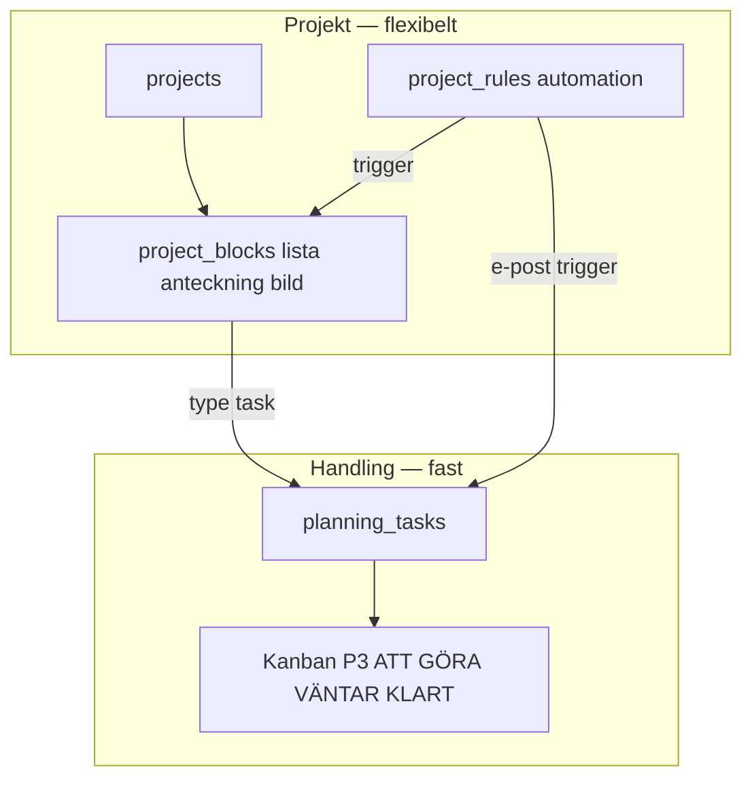
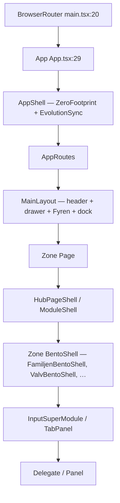

This file is a merged representation of a subset of the codebase, containing specifically included files, combined into a single document by Repomix.
The content has been processed where comments have been removed, empty lines have been removed, content has been compressed (code blocks are separated by ⋮---- delimiter).

# File Summary

## Purpose
This file contains a packed representation of a subset of the repository's contents that is considered the most important context.
It is designed to be easily consumable by AI systems for analysis, code review,
or other automated processes.

## File Format
The content is organized as follows:
1. This summary section
2. Repository information
3. Directory structure
4. Repository files (if enabled)
5. Multiple file entries, each consisting of:
  a. A header with the file path (## File: path/to/file)
  b. The full contents of the file in a code block

## Usage Guidelines
- This file should be treated as read-only. Any changes should be made to the
  original repository files, not this packed version.
- When processing this file, use the file path to distinguish
  between different files in the repository.
- Be aware that this file may contain sensitive information. Handle it with
  the same level of security as you would the original repository.

## Notes
- Some files may have been excluded based on .gitignore rules and Repomix's configuration
- Binary files are not included in this packed representation. Please refer to the Repository Structure section for a complete list of file paths, including binary files
- Only files matching these patterns are included: docs/evaluations/2026-06-16-supermodule-ui-masterplan.md, docs/evaluations/2026-06-15-arkitektur-nav-analys.md, docs/design/references/MENU-DRAWER-KANON.md, docs/design/references/DOCK-KANON.md, docs/design/PLANERING-PROJEKT-HYBRID.md, src/modules/core/navigation/navTruth.ts, src/modules/core/navigation/headerPageLabel.ts, src/modules/core/layout/FloatingDock.tsx, src/modules/core/layout/NavigationDrawer.tsx, src/modules/core/components/FyrenWidgetBar.tsx, src/modules/core/routing/AppRoutes.tsx, src/modules/shell/LivLauncherGrid.tsx
- Files matching patterns in .gitignore are excluded
- Files matching default ignore patterns are excluded
- Code comments have been removed from supported file types
- Empty lines have been removed from all files
- Content has been compressed - code blocks are separated by ⋮---- delimiter
- Files are sorted by Git change count (files with more changes are at the bottom)

# Files

## File: docs/design/references/DOCK-KANON.md
````markdown
# Botten-dock — KANON

**Beslut 2026-05-23:** Mittknappen visar **endast kompass** — ordet **「Hamn」** ska **inte** synas i UI.

---

## Tre zoner (klassisk dock i mockups)

| Position | Synligt | `aria-label` (skärmläsare) |
|----------|---------|------------------------------|
| Vänster | Ikon + **Familjen** | Familjen |
| **Mitten** | **Kompass-ikon endast** (guld ring) — **ingen synlig text** | **`Hem`** (aria-label) |
| Höger | Ikon + **Dagbok** | Dagbok (`/dagbok`) — **inte** Valv-etikett i dock |

**Route mitten:** `/` (hem) — inte `/hamn` i dock (Hamn-innehåll nås via menyn eller hem-kort).

**Snabbtryck mitten (ej hem):** kort sammanfattning av aktuell sida. **Håll 3s** på kompass → låst beviszon (`/valvet`) — utan synlig «Valv»-text i dock.

---

## CSS

```css
.dock-center__label { display: none; } /* Hamn-text bort */
.dock-center { min-width: 56px; }      /* kompensera utan text */
```

Satellit-orbit (nuvarande `CompassHubOrb`): centrum behåller `aria-label`; synlig etikett **Kompass** eller **ingen** — aldrig Hamn.

---

## Ingen båge under kompass

| Bort (2026-05-23) | Kvar |
|-------------------|------|
| Halvcirkel / upphöjd båge bakom mitt-knappen | Platt `dock-nav--hub` |
| Ellipse-glow `.dock-orbit-stage::before` | Rund kompass-platta (cirkel) |

Valv-ikon: **valvbåge** — se [`VALV-ICON-KANON.md`](./VALV-ICON-KANON.md). Mockup: [`dock-flat-valv-arch.png`](./dock-flat-valv-arch.png).

---

## Mockups

Eldre bilder kan visa 「Hamn」 under kompassen eller **sköld+bock** på Valv — **ignorera** vid implementation.
````

## File: docs/design/references/MENU-DRAWER-KANON.md
````markdown
# Sidomeny (hamburger) — KANON

**Status:** **Låst** 2026-05-27 — uppdaterad 2026-05-31 (hub-konsolidering).  
**Bild:** [`MENU-DRAWER-KANON.png`](./MENU-DRAWER-KANON.png) *(referens; UI kan sakna Valv-växlare i publikt läge)*

---

## Visuellt

| Element | Spec |
|---------|------|
| **Bakgrund** | Samma nordiska skymningsfoto som hem (blur + mörk overlay ~55%) |
| **Bredd** | ~68% skärm, glid in från vänster |
| **DOM** | `<aside class="nav-drawer">` före `.nav-drawer__backdrop` (drawer `z-[201]`, backdrop `z-[200]`) |
| **Header** | `LIVSKOMPASSEN` serif guld + dekoration (tre rutor) |
| **Stäng** | Guld `×` uppe vänster |
| **Lägesväxlare** | **Ingen** i publikt läge. I Valv: en diskret **Vardag**-knapp (tillbaka), **inte** synlig **Valv**-flik |
| **Snabbåtgärder** | **Ej** i drawer (`nav-drawer__quick-grid` borttagen). Snabbvägar via Fyren-widget / hubbar |
| **Rad** | Cirkel-ikon guld (48px hub / 36px sub) · etikett · chevron |
| **Aktiv rad** | **Guld** bakgrundsstreck (inte turkos/teal) |
| **Sektion** | Rubrik **Vardag** eller **Valv** efter aktivt läge |

---

## Läge Vardag (publikt — standard)

Visas när Valv **inte** är upplåst (endast Vardag-sektion).

**Supersidor (2026-06-01):** fyra drawer-rader — flikar väljs **inuti shell-sidor** (`?tab=`), inte som drawer-underrader.

| Drawer-rad | Route | Inuti sidan (ej drawer) |
|------------|-------|-------------------------|
| **Hem — Skriv** | `/` | CapturePanel · ReviewQueue · adaptiva kort |
| **Liv och göra** | `/liv` | Kompasser · MåBra · Handling (P3 Kanban) · Projekt · Arbetsliv |
| **Familj och gränser** | `/familj` | Reflektion (Barnfokus default) · Livslogg · Tillsammans · Barnporten · Hamn · Drogfrihet |
| **Inställningar** | `/installningar` | Allmänt · Rensa enheten |

**Legacy redirects:** `/mabra`, `/planering`, `/hamn`, `/familjen`, `/arbetsliv`, `/drogfrihet`, `/vardagen` → motsvarande `/liv?tab=` eller `/familj?tab=`.

**Dagbok / Reflektion:** `/dagbok` kvar (Fyren-kompass + Valv-bevis). Reflektion nås även via Familj-shell.

**MUST NOT:** publik `/vardagen?tab=kunskap` — Kunskap endast via Valv `kunskapsbank`.  
**MUST NOT:** exponera Valv (växlare, Valv-flik, snabbchips) i publikt drawer-läge.

---

## Läge Valv (PIN i VaultPage)

Visas när `isVaultUnlocked` eller `hasVaultGate()` — **under** Vardag-sektionen (båda syns samtidigt).

**Platta rader** (ingen accordion-grupp i drawer):

| Menyrad | Öppnar | Inuti VaultPage |
|---------|--------|-----------------|
| Spara & sök | `vaultTab=logga` | Logga · Sök |
| Mönster | `vaultTab=monster` | Mönster · Meddelanden/SMS-analys (Orkester) |
| Kunskapsbank | `vaultTab=kunskapsbank` | Kunskapsbank · Aktörskarta |
| Rapporter | `vaultTab=dossier` | Dossier · export |
| Djupare | `vaultTab=hamn_analys` | Forensik-flikar (Hamn, Speglar, …) |

*(Legacy namn **Pansaret** = zoner Spara & sök + Mönster + Rapporter i VaultPage.)*

Alla Valv-rader → `/valvet?vaultTab=…` (utom `/dossier` full vy via sida).

**Tillbaka:** `DrawerModeToggle` med **Vardag** → `/` (Hem — Skriv).

---

## Beteende

| Gest | Resultat |
|------|----------|
| Öppna | Hamburgermeny i header (`AppHeaderBar`) |
| Publikt | Endast Vardag-sektion — ingen Valv-växlare |
| Valv upplåst | **Vardag + Valv** i samma drawer · **Vardag**-knapp → Hem |
| Hub utan drawer-barn | Rad → hub-path; flikar i sidan |
| Valv-rad | Navigera → PIN-gate om stängt → Valv-baksida |
| Stäng | `×`, swipe vänster, tap utanför, route change |

Widget-routes `/widget/*` ingår **inte** i drawer (deep links / PWA).

---

## Implementation

| Komponent | Fil |
|-----------|-----|
| `NavigationDrawer` | `src/modules/core/layout/NavigationDrawer.tsx` (Vardag + Valv när `vaultOpen`) |
| `DrawerModeToggle` | `src/modules/core/layout/DrawerModeToggle.tsx` (`showValvShell`) |
| `DrawerHubAccordion` | `src/modules/core/layout/DrawerHubAccordion.tsx` |
| Sanning | `src/modules/core/navigation/navTruth.ts` |
| Hub-flikar (synk med nav) | `src/modules/core/navigation/hubTabs.tsx` · `getNavChildren` · `hooks/useHubTab.ts` |
| Göra-flikar | `src/modules/core/navigation/GoraHubTabBar.tsx` |
| Ikoner | `src/modules/core/navigation/drawerNav.ts` |

Kanon: [`COLOR-POLICY.md`](../COLOR-POLICY.md) — aktiv rad endast **guld** `#d4af37`.
````

## File: docs/design/PLANERING-PROJEKT-HYBRID.md
````markdown
# Planering + Projekt — bekräftat upplägg (låst)

**Beslut:** 2026-05-23 — *«det upplägget ska vi absolut ha»*  
**Princip:** **Handling ligger fast** (kanban) · **Projekt** är flexibelt (lista, anteckning, bild, egna planeringar)

---

## Två lager (får inte slås ihop)



| Lager | Vad | Route |
|-------|-----|-------|
| **Handling (fast)** | Alla **uppgifter** med status — alltid samma 3 kolumner | `/planering` (default) eller `/planering/handling` |
| **Projekt (flex)** | **Mappar** du skapar — listor, anteckningar, bilder, egna planer | `/projekt` · `/projekt/:id` |
| **Regler** | E-post/automation → projekt eller handling | `/projekt/regler` |
| **Inkorg** | Mejl → kort/uppgift | `/planering/inkorg` |

**Handling försvinner inte** när du skapar projekt — uppgifter **syns alltid** i kanban (ev. filter «per projekt»).

---

## Navigation (Planering-modulen)

| Flik | Innehåll |
|------|----------|
| **Handling** | P3 Kanban — **fast, primär** |
| **Projekt** | Hub + egna planeringar |
| **Inkorg** | P1 e-post |
| **Regler** | P4 automation |

Kalender: ikon i header → `/planering/kalender` (P2).

---

## Widget v2 (fast)

- **+ / Nytt projekt** → samma picker som `/projekt/ny`
- **Lista · Anteckning · Bild** → skapar block i valt/nytt projekt
- **Uppgift** → skapar `planning_tasks` → **Handling-kanban**
- Tyst inspelning · Planering · Valv kvar

Mockup: [`galleri/widget/v2/W1-kompakt-projekt.png`](./galleri/widget/v2/W1-kompakt-projekt.png)

---

## Kanonbilder

| Del | Fil |
|-----|-----|
| Handling kanban | [`references/PLANERING-P3-KANBAN-KANON.png`](./references/PLANERING-P3-KANBAN-KANON.png) |
| Projekt regler | [`references/PROJEKT-P4-REGLER-KANON.png`](./references/PROJEKT-P4-REGLER-KANON.png) |
| Nytt projekt picker | [`references/PROJEKT-NY-PICKER.png`](./references/PROJEKT-NY-PICKER.png) |

---

## Spec-filer

- [`PROJEKT-SPEC.md`](./PROJEKT-SPEC.md)
- [`PLANERINGSSIDA-SPEC.md`](./PLANERINGSSIDA-SPEC.md)
- [`planering/PLANERING-P3-KANBAN-SPEC.md`](./planering/PLANERING-P3-KANBAN-SPEC.md)
- [`WIDGET-BAR-SPEC.md`](./WIDGET-BAR-SPEC.md)

## Kod (plan)

- `src/modules/planering/` — kanban, inkorg, kalender
- `src/modules/projekt/` — hub, blocks, regler
- `FyrenWidgetBar.tsx` — v2
````

## File: src/modules/core/navigation/headerPageLabel.ts
````typescript
export function getHeaderPageLabel(pathname: string, search = ''): string | null
````

## File: docs/evaluations/2026-06-16-supermodule-ui-masterplan.md
````markdown
# Supermodule + UI Masterplan — Körfält B

**Datum:** 2026-06-16 · **Status:** B1 LOCK · Våg 2 Nav micro **klar** 2026-06-16  
**Kanon:** [`2026-06-15-fas19-masterplan-v2.md`](./2026-06-15-fas19-masterplan-v2.md) (backend/Fas 19–24 — peka dit, duplicera ej) · [`UI-WAVE-ROADMAP.md`](../external-ai/UI-WAVE-ROADMAP.md) · [`LIFE-OS-BUILD-STATE.md`](../external-ai/LIFE-OS-BUILD-STATE.md)

---

## Vision

Livskompassen är ett neuroanpassat Life OS — avancerat under huven (WORM, tre silos, ADK, kapacitetsdata) men **ett steg i taget** i gränssnittet via InputSuperModule-mönstret och Obsidian Calm 2.0. Fyren styr dagsform och kapacitet i bakgrunden; den är inte en femte «plats». Målbild: fyra zoner (Hjärtat, Familjen, Vardagen, Valvet) plus tyst Fyren — kortaste vägen från överbelastning till nästa mikrosteg.

---

## Redan DONE (rör ej)

| Område | Referens |
|--------|----------|
| Fas 13–24 baseline (WORM, smoke, deploy) | [`SENASTE-SAMMANFATTNING.md`](./SENASTE-SAMMANFATTNING.md) |
| 6 supermodule-routers (jun 2026) | [`2026-06-06-supermodule-master-plan.md`](../archive/evaluations-fas20-2026-06/2026-06-06-supermodule-master-plan.md) — Capture, Speglar, ValvSuper, DagbokSuper, PlaneringSuper, BarnfokusSuper |
| Körfält A LOCK (CP-1–CP-7) | [`LIFE-OS-BUILD-STATE.md`](../external-ai/LIFE-OS-BUILD-STATE.md) |
| Nav Våg A F1/F2/F4/F5 | [`2026-06-15-arkitektur-nav-analys.md`](./2026-06-15-arkitektur-nav-analys.md) |
| B2/B3/B4 wave-1 polish | [`2026-06-15-hjartat-ui-spec.md`](./2026-06-15-hjartat-ui-spec.md) · familj/vardagen-specs |
| Valv B1 kod (Fas 1A–1E) | `ValvInputSuperModule`, `valvInputModes`, export i `vault/index.ts`, `ValvZoneModulValjare` inkl. forensik |

---

## Konflikter — lösta beslut (chatt vs repo)

| Konflikt | Vision (chatt) | Repo-sanning | **Beslut** |
|----------|----------------|--------------|------------|
| Hem `/` vs Hjärtat | `/` = Hjärtat | `HomePage` + CaptureSuperModule kvar på `/` | **DEFER** — PMIR (widgets, inkast). Efter B1 LOCK |
| Planering i dock | Ej toppnivå-identitet | Handling-slot → `/planering?tab=handling` | **KEEP** — P3 lock + snabb Kanban. Mental modell: Vardagen-verktyg |
| Launcher Handling | Bort | Våg A F1 done | **DONE** — rör ej |
| Dock «Dagbok» vs Hjärtat | Hjärtat | Label via `navTruth` «dagbok» | **Våg 2** — copy-fix only |
| B2–B4 mockups | Full redesign | Wave-1 polish i prod | **DONE** wave-1; ChatBox mockups parallellt, ej prod utan CHECKPOINT |
| Supermoduler jun vs B1 | 5 done | `ValvInputSuperModule` = nytt UX-lager | **Båda** — router done 2026-06-06; B1 = navigation/lägesväljare |
| Fyren plats vs motor | Bakgrund | Dock-handle + widget-genvägar | **DELVIS** — Våg A F4; full motor **DEFER** (Våg C) |
| Körfält A | — | LOCK | **MUST NOT** ny backend/WORM/rules utan PMIR |

---

## WIP / nästa 3 vågor

| Våg | Scope | Gate |
|-----|-------|------|
| **1 — B1 LOCK** | Manuell checklista §7 i [`2026-06-15-valv-supermodule-spec.md`](./2026-06-15-valv-supermodule-spec.md) + smoke + `snapshot_locked_module.sh valv` | CHECKPOINT PASS |
| **2 — Nav micro** | F3: Familjen tab+inputMode dedupe · F2: dock-label «Hjärtat» · F4 rest: neutral Valv-copy i FyrenWidgetBar publikt | Frontend only |
| **3 — Nav Våg B** | H1 `/ekonomi`→Vardagen · H2 MåBra-ingång · H3 `/arkiv` · H4 drogfrihet launcher | **DONE** 2026-06-16 — [`2026-06-16-nav-vag3-pmir.md`](./2026-06-16-nav-vag3-pmir.md) |

**Defer:** Hem→Hjärtat redirect · global Fyren kapacitetsgrind (Våg C) · M3.0-C · Upload unified steg 2 (`InkastDirectPanel`).

---

## Per zon — SuperModule + nästa steg

| Zon | SuperModule(s) | Status | Nästa steg |
|-----|----------------|--------|------------|
| **Valv** | `ValvInputSuperModule` → `ValvSuperModule` | **LOCK** (B1 2026-06-16) | Våg 2 endast med explicit OK + snapshot |
| **Hjärtat** | `DagbokInputSuperModule`, `SpeglarSuperModule` | B2 + **Våg 2 F2** done | — |
| **Familjen** | `FamiljenInputSuperModule`, `BarnfokusSuperModule` | B3 + **Våg 2 F3** done | Våg 3 efter PMIR |
| **Vardagen** | Mabra/Ekonomi/Planering/Arbetsliv InputSuperModules | B4 done | Våg 3 H1–H2 efter PMIR |
| **Hem `/`** | `CaptureSuperModule` | Legacy | DEFER merge → Hjärtat |
| **Fyren** | Widget + dock-handle | **Våg 2 F4** done | Våg C defer |

ChatBox-leveranser (wireframes): [`docs/external-ai/leveranser/ui-design/`](../external-ai/leveranser/ui-design/) — B1–B4 2026-06-15.

---

## KEEP · DEFER · MUST NOT

**KEEP:** Locked UX §1–17 ([`.context/locked-ux-features.md`](../../.context/locked-ux-features.md)) · P3 Kanban `/planering` · dock Handling-slot · tre silos · `SaveAsEvidencePrompt` HITL · Mönster/Orkester/Kunskapsbank/Aktörskarta · WH1/WH2 ikoner.

**DEFER:** Hem→Hjärtat · Nav H1–H4 utan PMIR · Fyren global kapacitetsmotor · M3.0-C · ChatBox full redesign → prod.

**MUST NOT:** Cross-RAG · auto-promote barn→Valv · backend/callables/rules i Körfält B · ta bort supermodule-delegates · streak/XP · publikt Valv-terminologi i drawer/dock.

---

## Smoke per våg

| Våg | Kommandon |
|-----|-----------|
| **1 B1** | `npm run build` · `smoke:locked-ux` · `smoke:valv` · `smoke:entities` · `smoke:orkester` · `smoke:valv-mode` |
| **2 Nav micro** | `smoke:locked-ux` · `smoke:children` · `npm run build` |
| **3 Nav H** | `smoke:locked-ux` · `smoke:design-modules` · `smoke:mabra` · PMIR-godkänd merge-smoke |

---

## Ett steg att godkänna nu

**Godkänn: Våg 3 PMIR** — routing H1 `/ekonomi`→Vardagen, H2 MåBra-ingång, H3 `/arkiv`, H4 drogfrihet launcher. Skriv PMIR enligt [`MERGE-IMPACT-RAPPORT.md`](../MERGE-IMPACT-RAPPORT.md) **före** kod.

Våg 2 **klar** 2026-06-16 — F2 header «Hjärtat», F3 Familjen kompakt nav på reflektion/livslogg, F4 neutral Kompis-copy publikt. Smoke: locked-ux + children + build PASS.

B1 **klar** — snapshot `~/Livskompassen-snapshots/2026-06-16-valv`.
````

## File: src/modules/core/components/FyrenWidgetBar.tsx
````typescript
import type { CSSProperties, ReactNode } from 'react';
import { Link, useLocation } from 'react-router-dom';
import { clsx } from 'clsx';
import { hasVaultGate } from '../auth/sessionService';
import { NAV_PATHS } from '../navigation/navTruth';
import { useStore } from '../store';
import { DrawerL2Icon, type DrawerL2HubId } from '../ui/drawerL2Icons/DrawerL2Icon';
import { FyrenProgressRing } from '../ui/FyrenProgressRing';
import { FyrenShortcutMicIcon, FyrenShortcutNoteIcon } from '../ui/widget-icons';
import { useFyrenWidget } from './fyrenWidgetContext';
⋮----
type WidgetIconKind = 'mic' | 'note';
⋮----
type WidgetAction = {
  id: string;
  label: string;
  to: string;
  hubId?: DrawerL2HubId;
  widgetIcon?: WidgetIconKind;
};
⋮----
function resolveWidgetActionLabel(action: WidgetAction, vaultSessionOpen: boolean): string
⋮----
function WidgetIcon(
⋮----
function ActionTile({
  label,
  to,
  icon,
  tabIndex,
  onNavigate,
}: {
  label: string;
  to: string;
  icon: ReactNode;
  tabIndex: number;
onNavigate: ()
⋮----
className=
````

## File: docs/evaluations/2026-06-15-arkitektur-nav-analys.md
````markdown
# Arkitektur + navigation — READ-ONLY analys — 2026-06-15

**Status:** Våg A implementerad + deployad 2026-06-15 (F1–F5, smoke PASS, hosting live)  
**Källa:** Cursor-analys mot `gpt-pack-01-arkitektur.md` + levande kod  
**Relaterat:** [`docs/gpt-handoff/README.md`](../gpt-handoff/README.md) Pack 01 · GPT målbild 4 platser + Fyren i bakgrunden  
**Transkript:** Cursor agent `39bf9ea8-d5a0-466d-af02-a629d4644ff0`

## Sammanfattning (3 rader)

- Säkerhet OK: WORM, tre RAG-silos, supermodule-mönster.
- Problem: 12–18 upplevda hubbar vs målbild 4 + bakgrunds-Fyren.
- **Våg A godkänd:** F1 (launcher Handling bort), F2 (dock Hjärtat), F4 (neutral Fyren-label), F5 (snabbare Kanban).

## Låsta regler (rör ej utan PMIR)

Barnfokus · P3 Kanban · Valv Mönster/Orkester · Valv HITL · plausible deniability i drawer.

## Nästa steg

1. ~~Pontus: godkänn Våg A~~ **Klart 2026-06-15**
2. ~~Cursor Agent: implementera F1→F2→F4→F5 + `npm run smoke:locked-ux`~~ **Klart 2026-06-15** (commit `f11d2c946`, hosting deploy)
3. Våg B: PMIR innan routing-sammanslagningar (H1–H4)
4. Våg C: strategiska Fyren-beslut (B1–B3) — defer

---

# Livskompassen 3.0 — Arkitekturanalys (READ-ONLY)

Analysen bygger på levande kod i repot (primärt `AppRoutes.tsx`, `navTruth.ts`, supermoduler, `firestore.rules`, callable-lager). Ingen kod har ändrats.

---

## 1. Zon- och router-karta

### Kanoniska zoner (produkt)

| Zon | Route | Understruktur |
|-----|-------|---------------|
| **Hem** | `/` | `HomePage` + `CaptureSuperModule` |
| **Hjärtat** | `/hjartat` | `?tab=reflektion` (dagbok) · `?tab=speglar` |
| **Vardagen** | `/vardagen` | Launcher + inline `kompasser` / `ekonomi` |
| **Familjen** | `/familjen` | 6 hub-tabs (`reflektion`, `livslogg`, …) |
| **Valvet** | `/valvet` | `vaultTab` + `valvMode` (PIN-gate i `VaultPage`) |

Legacy-redirects håller gamla paths (`/dagbok`, `/liv`, `/valv`, `/hamn`) utanför parallella världar — se ```146:168:src/modules/core/routing/AppRoutes.tsx``` och ```194:205:src/modules/core/routing/AppRoutes.tsx```.

### Alla separata "platser" idag (utöver kanon)

Utöver de fyra zonerna + Hem finns **minst 20 egna routes** som användaren kan nå:

| Kategori | Routes |
|----------|--------|
| Vardagsmoduler (egna sidor) | `/mabra/*`, `/planering`, `/planering/kalender`, `/planering/input`, `/projekt` (+ under), `/arbetsliv/input`, `/ekonomi`, `/morgon` |
| AI / meta | `/kompis`, `/orakel`, `/reflection` |
| Arkiv / legacy | `/arkiv`, `/oversikt`, `/dashboard` |
| Barn | `/barnporten`, `/barnporten/foralder-trygg` |
| System | `/installningar`, `/widget/*`, `/dev/*` |

Full lista i ```274:532:src/modules/core/routing/AppRoutes.tsx```.

### Komponenthierarki



**Exempel kedjor:**

- **Familjen → Barnfokus:** `FamiljenPage` → `ModuleShell` → `FamiljenBentoShell` → `FamiljenInputSuperModule` → `FamiljenBarnfokusDelegate` (```139:141:src/modules/core/pages/FamiljenPage.tsx```)
- **Valv → Inkast:** `ValvetRoutePage` → `HubPageShell` → `VaultPage` → `ValvInputSuperModule` → `ValvSuperModule` (```93:112:src/modules/core/pages/ValvetRoutePage.tsx```, ```235:245:src/modules/features/lifeJournal/evidence/vault/components/VaultPage.tsx```)
- **Hjärtat → Reflektion:** `DagbokPage` → `ModuleShell` → `DagbokInputSuperModule` → `DagbokReflektionDelegate` (```47:50:src/modules/core/pages/DagbokPage.tsx```)

---

## 2. Hub-räkning

### Navigationsskikt (vad användaren *ser*)

| Skikt | Antal distinkta val | Källa |
|-------|---------------------|-------|
| **FloatingDock** | **4** zoner | Vardagen · Familjen · Dagbok · Handling (```17:57:src/modules/core/layout/FloatingDock.tsx```) |
| **Drawer — Vardag** | **4** rader | Hem · Liv och göra · Familj · Inställningar (```88:225:src/modules/core/navigation/navTruth.ts```) |
| **Drawer — Valv** | **6** rader (endast vid unlock) | Samla · Analysera · Kunskap · Vit · Exportera · Forensik (```258:313:src/modules/core/navigation/navTruth.ts```, ```186:233:src/modules/core/layout/NavigationDrawer.tsx```) |
| **LivLauncher** | **6** kort | Kompasser · Ekonomi · MåBra · Handling · Projekt · Arbetsliv (```43:80:src/modules/shell/LivLauncherGrid.tsx```) |
| **FyrenWidgetBar** | **8** genvägar | Inkast · Snabbval · Inspelning · Anteckning · Lista · Planering · **Valv** · Projekt (```20:39:src/modules/core/components/FyrenWidgetBar.tsx```) |
| **Familjen hub-tabs** | **6** | Barnfokus · Livslogg · Tillsammans · Barnporten · Hamn · Drogfrihet (```33:40:src/modules/core/pages/FamiljenPage.tsx```) |
| **Valv input modes** | **7** | spara · granska · analysera · kunskap · vit · rapporter · mer (```13:94:src/modules/features/lifeJournal/evidence/vault/supermodule/valvInputModes.ts```) |

### Jämförelse med målbild

| Målbild | Nuläge |
|---------|--------|
| 4 platser + Fyren i bakgrunden | **4 i dock** — men **6 launcher-kort**, **8 Fyren-genvägar**, **6 Familjen-tabs**, **6–7 Valv-lägen**, plus **egna routes** för MåBra/Planering/Projekt/Arbetsliv/Ekonomi/Kompis/Morgon/Barnporten |
| Fyren = kapacitetsgrind, inte plats | Fyren är **synlig primärnav** (dock-handle + widget-panel med "Valv", "Planering", "Projekt") — ```66:68:src/modules/core/layout/FloatingDock.tsx```, ```37:37:src/modules/core/components/FyrenWidgetBar.tsx``` |

**Slutsats:** Arkitekturen *säger* 3-zon + Valv, men användaren upplever **12–18 mentala "världar"** beroende på skikt (dock → launcher → hub-tab → inputMode → Valv-zone).

---

## 3. Supermoduler

### InputSuperModule-karta

| SuperModule | Zon / Route | Delegates / lägen | Klick dock → första handling* |
|-------------|-------------|-------------------|-------------------------------|
| `FamiljenInputSuperModule` | `/familjen?tab=reflektion\|livslogg` | 6 modes: barnfokus, livslogg_stund, fysiologi, livslogg_observation, vardagsstruktur, inkast (```24:78:src/modules/features/family/children/supermodule/familjenInputModes.ts```) | **2** (dock Familjen → skriv i Barnfokus) |
| `DagbokInputSuperModule` | `/hjartat` (embedded) · `/hjartat/input` | reflektion, quick_mirror, arkiv (```20:48:src/modules/features/lifeJournal/diary/supermodule/dagbokInputModes.ts```) | **2** |
| `EkonomiInputSuperModule` | `/vardagen?tab=ekonomi` | 9 modes, kapacitetsfiltrerade (saldo, mikrosteg, kuvert, impuls, …) (```28:58:src/modules/features/dailyLife/wellbeing/economy/supermodule/ekonomiInputModes.ts```) | **3** (dock Vardagen → kort Ekonomi → formulär) |
| `MabraInputSuperModule` | `/mabra/input` | 9 modes (checkin + vit_* + mer…) (```24:89:src/modules/features/dailyLife/wellbeing/mabra/supermodule/mabraInputModes.ts```) | **3–4** (dock Vardagen → MåBra-kort → hub → ev. input) |
| `PlaneringInputSuperModule` | `/planering/input` · embedded i `/planering?tab=handling` | task_quick, inkast, quick_list (```18:46:src/modules/features/admin/planning/supermodule/planeringInputModes.ts```) | **2–4** (dock Handling direkt; första gången `GoraModulValjare` +1 — ```79:83:src/modules/features/admin/planning/components/PlaneringPage.tsx```) |
| `ArbetslivInputSuperModule` | `/arbetsliv/input` | stampla, inkomster, tid (```18:43:src/modules/features/dailyLife/arbetsliv/supermodule/arbetslivInputModes.ts```) | **3** (Vardagen → Arbetsliv-kort → stämpel) |
| `ValvInputSuperModule` | `/valvet` (efter PIN) | 7 valvModes → `ValvSuperModule` per zon (```37:94:src/modules/features/lifeJournal/evidence/vault/supermodule/valvInputModes.ts```) | **2+** (Fyren 3s-håll / widget Valv → biometri → spara) |
| `CaptureSuperModule` | `/` (Hem) | hem-capture, planering, … | **1** (redan på Hem) |

\*Klick = navigationssteg, inte inmatning/spar.

### InputRoutes (skugg-rutter)

| Fil | Mount | Path |
|-----|-------|------|
| `DagbokInputRoutes` | `/hjartat/*` | `/hjartat/input` (```16:28:src/modules/features/lifeJournal/diary/routing/DagbokInputRoutes.tsx```) |
| `PlaneringInputRoutes` | `/planering/*` | `/planering/input` (```14:26:src/modules/features/admin/planning/routing/PlaneringInputRoutes.tsx```) |
| `ArbetslivInputRoutes` | `/arbetsliv/*` | `/arbetsliv/input` |
| `MabraRoutes` | `/mabra/*` | `/mabra/input` + 10+ under-vyer (```22:39:src/modules/features/dailyLife/wellbeing/mabra/routing/MabraRoutes.tsx```) |

**Observation:** Universal Input är implementerat konsekvent (thin router + delegates), men **monteras på olika djup** — ibland inline i hub (`Familjen`, `Hjärtat`), ibland egen route (`/mabra`, `/planering/input`), ibland launcher-steg emellan.

---

## 4. Navigation & kognitiv belastning

### Dubbel/trippel navigation

| Problem | Var |
|---------|-----|
| **Dock + Launcher** | Dock "Vardagen" → 6 kort till *samma* moduler som egna dock-zoner (Handling finns både i dock **och** launcher) |
| **Dock "Dagbok" vs produkt "Hjärtat"** | Label "Dagbok" i dock (```36:38:src/modules/core/layout/FloatingDock.tsx```) men zon heter Hjärtat i `NAV_PATHS` |
| **Drawer vs Dock** | 4 drawer-rader överlappar delvis dock; drawer har dessutom Inställningar som dock saknar |
| **Hub-tabs + InputMode-picker** | Familjen: `HubDropdownNav` (6 tabs) **+** `FamiljenInputModePicker` (6 modes) på samma vy (```118:141:src/modules/core/pages/FamiljenPage.tsx```) |
| **Planering: tab-bar + modulväljare + Kanban** | `GoraHubTabBar` + `GoraModulValjare` + P3 Kanban (```69:83:src/modules/features/admin/planning/components/PlaneringPage.tsx```) |
| **Fyren som fjärde nav-lager** | Widget-panel ovanför dock med 8 genvägar — inkl. duplicerade Planering/Projekt/Valv (```103:108:src/modules/core/layout/MainLayout.tsx```) |

### evolution_hub / useCapacityGate / CognitiveLoadStrip — styr de UI?

| Mekanism | Vad den gör | Styr navigation? |
|----------|-------------|------------------|
| `useCapacityGate` | Lyssnar `user_capability_state` (kapacitet + `economy_advanced`) (```21:48:src/modules/core/store/useCapacityGate.ts```) | **Delvis** — främst Ekonomi (`useEconomyLevel`, `EkonomiInputSuperModule` filtrerar modes) |
| `useEvolutionStore` | Lyssnar `evolution_hub` — feature flags, barnporten-nivå, ålderssegment (```107:124:src/modules/core/store/useEvolutionStore.ts```) | **Delvis** — Barnporten-segmentering, `economy_advanced`, hem-kort (`AdaptiveMemoryCards`) |
| `CognitiveLoadStrip` | Statisk copy "Ett steg i taget" (```9:24:src/modules/core/ui/CognitiveLoadStrip.tsx```) | **Nej** — informativ, ingen kapacitetslogik |
| Planering Kanban | P3 låst på `/planering` | **Ej verifierat** att `planning_kanban`-flagga döljer Kanban — ingen grep-träff i frontend utöver ekonomi |

**Slutsats:** Kapacitetsmotorerna finns och fungerar för **Ekonomi + Barnporten**, men **styr inte globalt** vilken hub användaren ser. Den största kognitiva kostnaden (för många nav-skikt) är **ostyrd**.

---

## 5. Siloisolering (U1)

### Callable → agent → RAG-lib

| Callable | Agent | RAG-lib | Collections |
|----------|-------|---------|-------------|
| `knowledgeVaultQuery` | `knowledgeVaultAgent` | `kampsparQueryRag` | `kampspar`, `kb_docs` (```63:67:functions/src/callables/knowledge.ts```, ```4:4:functions/src/agents/knowledgeVaultAgent.ts```) |
| `valvChatQuery` | `valvChatAgent` | `vaultRag` | `reality_vault` (```155:169:functions/src/callables/valv.ts```, ```3:3:functions/src/agents/valvChatAgent.ts```) |
| `childrenLogsQuery` | `childrenLogsAgent` | `childrenLogsQueryRag` | `children_logs` (```72:75:functions/src/callables/knowledge.ts```, ```3:3:functions/src/agents/childrenLogsAgent.ts```) |

### Guards

| Guard | Roll |
|-------|------|
| `barnenModuleRouteGuard` | `knowledgeVaultQuery` redirectar barn-intent → Familjen (```54:60:functions/src/callables/knowledge.ts```) |
| `mabraCoachGuard` | Ex/konflikt → Speglar, inte MåBra-coach (```29:41:functions/src/lib/mabraCoachGuard.ts```, klient-speglad i `src/.../mabra/lib/mabraCoachGuard.ts`) |
| `assertVaultSession` | `valvChatQuery`, dossier, mönster-rescan kräver vault-session (```155:157:functions/src/callables/valv.ts```) |

### Cross-read-risker (markerade)

| Risk | Status | Detalj |
|------|--------|--------|
| User-RAG silo-blandning | **Låg** | Separata RAG-libs med collection-scope |
| **Vävaren** (`kampsparRag.ts`) | **Medveten** | Läser `journal` + `reality_vault` för metadata-tagging — ej användar-chat (```12:23:functions/src/lib/kampsparRag.ts```) |
| **Dossier** | **Medveten** | Användarvalda källor kan korsa silos (`dossier/types.ts`) |
| **Vit → Kunskap** | **Guarderad** | MåBra-coach redirectar konflikt till Speglar; U6 förbjuder Vit→kampspar auto-ingest |
| **entityProfileBundle** | **Låg** | Metadata delas i alla tre agenter — append-only aktörskarta, ej RAG-cross |

---

## 6. WORM (U3)

### Firestore rules

```268:271:firestore.rules
    match /reality_vault/{docId} {
      allow read: if isOwnerVault();
      allow create: if isOwnerCreateVault() && isValidRealityVaultCreate();
      allow update, delete: if false;
```

```293:296:firestore.rules
    match /children_logs/{docId} {
      allow read: if isOwnerSensitive() && isParentVisibleChildLog();
      allow create: if isOwnerCreateSensitive() && isValidChildrenVisibility() && isValidChildrenLogCreate();
      allow update, delete: if false;
```

`wormKeysOnly` begränsar fält vid create (```82:95:firestore.rules```, ```110:125:firestore.rules```).

### Klient

- `saveVaultLog` / `saveChildrenLog` → endast `guardedAddDoc` (```297:311:src/modules/core/firebase/firestore.ts```, ```333:359:src/modules/core/firebase/firestore.ts```)
- **Ingen** `updateDoc`/`deleteDoc` mot dessa collections i `src/` (grep: 0 träffar)
- Offline-skriv blockeras för Valv + barnloggar (```68:68:src/modules/core/firebase/offlineWritePolicy.ts```)

**Append-only:** Ja, i rules + klient. Server-side Admin SDK kan fortfarande skriva (t.ex. synapser) — ej verifierat i denna analys utan functions-audit.

---

## 7. Valv säkerhetsmodell

### Upplåsning

| Steg | Mekanism |
|------|----------|
| 1 | WebAuthn (web) eller native biometri (Capacitor) via `openValvViaFyren` (```43:76:src/modules/core/auth/valvFyrenGate.ts```) |
| 2 | `setVaultGate()` → `sessionStorage` (```24:34:src/modules/core/auth/sessionService.ts```) |
| 3 | Server: `issueVaultSession` → `assertVaultSession` på känsliga callables (```155:157:functions/src/callables/valv.ts```) |
| 4 | `VaultPage`: `hasVaultGate()` → annars `VaultLockedGate` (```171:185:src/modules/features/lifeJournal/evidence/vault/components/VaultPage.tsx```) |

### Plausible deniability

| Krav | Status |
|------|--------|
| Drawer Valv-sektion endast vid unlock | **Ja** — `vaultOpen ? DRAWER_VALV_ITEMS` (```186:233:src/modules/core/layout/NavigationDrawer.tsx```) |
| Ingen `?tab=bevis` på Hjärtat | **Ja** — redirect till `/valvet` (```172:191:src/modules/core/routing/AppRoutes.tsx```) |
| `HIDE_BEVIS_TAB` default true | **Ja** (```1:2:src/modules/core/navigation/navFlags.ts```) |

### Publikt läge — exponeras valv/bevis/arkiv?

| UI-element | Exponerar? |
|------------|------------|
| FloatingDock | **Nej** — ingen Valv-knapp |
| NavigationDrawer (låst) | **Nej** Valv-sektion |
| **FyrenWidgetBar** | **Ja** — action `label: 'Valv'` (```37:37:src/modules/core/components/FyrenWidgetBar.tsx```) |
| **KompisHeaderVaultButton** | **Ja** — aria "Kunskapsbank **i Valv**" (```48:49:src/modules/core/components/KompisHeaderVaultButton.tsx```) |
| Hem inkast → granska | Länkar `/valvet?valvMode=granska` (```519:522:src/modules/inkast/api/inkastService.ts```) — når PIN-gate, men ordet "granska/bevis" syns i capture-flöden |
| ValvetRoutePage rubrik | "Sanningsarkivet" / "Arkiv" (```95:97:src/modules/core/pages/ValvetRoutePage.tsx```) — endast efter route-hit |

**Slutsats:** Drawer håller plausible deniability. **Fyren-chrome bryter delvis** genom synlig "Valv"-label och Kompis-knapp som nämner Valv — även innan unlock.

---

## 8. Rekommendationer (arkitektur only)

Prioriterat efter att **minska mentala lager** — inte polish.

### Behåll (fungerar, låst UX)

| Element | Varför | Locked UX-risk |
|---------|--------|----------------|
| 3-zon + separat `/valvet` | Korrekt silo + PIN | — |
| `InputSuperModule`-mönster | Ett läge i taget, tunna delegates | Barnfokus-delegate intakt |
| P3 Kanban på `/planering?tab=handling` | Design lock | **Rör ej** |
| Valv Mönster/Orkester + HITL-bro | Locked § | **Rör ej** |
| WORM rules + `guardedAddDoc` | Säkerhetsfundament | — |
| Tre separata RAG-callables | U1-efterlevnad | — |

### Förenkla navigation (hög prioritet)

| # | Åtgärd | Mentala lager ↓ | Locked UX |
|---|--------|-----------------|-----------|
| **F1** | **Ta bort Handling från launcher** — dock har redan dedikerad Handling-slot | −1 dubbelväg till samma Kanban | P3 oförändrad (dock → `/planering`) |
| **F2** | **Döp om dock "Dagbok" → "Hjärtat"** — matcha zon-språk | −1 begreppsglidning | Speglar/Dagbok oförändrat |
| **F3** | **Slå ihop Familjen tab + inputMode** på reflektion/livslogg — visa bara supermodule-picker, göm redundant `HubDropdownNav` när supermodule räcker | −1 skikt | **Barnfokus** kvar som default mode |
| **F4** | **Fyren widget: dölj "Valv"-label i publikt läge** — visa neutral "Lås upp" / ikon utan ord | Plausible deniability ↑ | PIN-flöde oförändrat |
| **F5** | **Planering: hoppa över `GoraModulValjare` efter första besök** (redan delvis: `picked=1`) — gör dock-Handling → Kanban direkt default | −1–2 klick | P3 Kanban kvar |

### Slå ihop hubbar (medel prioritet — kräver PMIR)

| # | Åtgärd | Effekt | Locked UX |
|---|--------|--------|-----------|
| **H1** | **Routing: `/ekonomi` → `/vardagen?tab=ekonomi`** (legacy `/ekonomi` finns parallellt idag) | −1 "värld" | Ekonomi supermodule oförändrad |
| **H2** | **Routing: `/mabra` → under `/vardagen?module=mabra`** eller behåll route men ta bort från launcher (endast Vardagen-ingång) | −1 mental hub | MåBra-innehåll oförändrat |
| **H3** | **Arkiv `/arkiv` → Valv-zone eller deprecate** | −1 legacy hub | Valv-flikar oförändrade |
| **H4** | **Drogfrihet: Familjen-tab OK** — men överväg att inte ha egen launcher-redirect (`livLauncherRoutes` har `drogfrihet → familjen`) | Redan delvis | — |

### Flytta Fyren till bakgrund (strategiskt — målbild)

| # | Åtgärd | Effekt | Locked UX |
|---|--------|--------|-----------|
| **B1** | **Fyren = kapacitetsring + mikrosteg-förslag** (data från `evolution_hub` + `user_capability_state`) — inte 8-nav-panel | Fyren slutar konkurrera med dock | WH1/WH2 ikoner låsta |
| **B2** | **Global kapacitetsgrind:** vid låg kapacitet, visa endast Hem + ett mikrosteg-kort (Paralys-Brytaren) — dölj launcher-grid | Direkt väg överbelastad → handling | Kräver designbeslut + smoke |
| **B3** | **Kompis-knapp:** kort tryck → Speglar/Hem, inte Kunskapsbank — Kunskap endast i Valv-drawer efter unlock | −1 publik Valv-hint | Kunskapsbank-panel oförändrat bakom PIN |

### Defer

| # | Varför vänta |
|---|-------------|
| **D1** | Slå ihop `/kompis`, `/orakel`, `/reflection` — oklart produktvärde vs risk |
| **D2** | Ta bort `/oversikt` + `/dashboard` — behöver inventering av användning |
| **D3** | En enda `inputMode`-URL över alla zoner — stor refactor, liten UX-vinst vs F1–F5 |
| **D4** | Vector Search silo-audit — ej blockerande för nav-förenkling |

---

## Sammanfattning

Livskompassen har **korrekt djup arkitektur** (zoner, WORM, tre RAG-silos, supermodule-delegates) men **för många navigeringslager** mellan känsla av överbelastning och första mikrosteg. Dock visar 4 zoner — bra — men launcher (6), Fyren (8), hub-tabs (6+) och separata fullsid-routes (MåBra, Planering, Projekt, …) skapar **12–18 upplevda hubbar** mot målbildens **4 + bakgrunds-Fyren**.

Kapacitetsdata (`evolution_hub`, `useCapacityGate`) **styr Ekonomi och Barnporten** men **inte** vilken navigation som visas — `CognitiveLoadStrip` är copy, inte grind.

**Snabbaste arkitekturvinst utan locked UX-risk:** F1 + F2 + F4 + F5 (minska dubbelnav, neutralisera publik Valv-text, kortare väg till Kanban).

---

*Osäkerhet som kräver runtime-smoke (ej körd här):* `npm run smoke:locked-ux`, `npm run smoke:orkester` för att verifiera att nav-redirects inte bryter Barnfokus/Valv-flikar.
````

## File: src/modules/core/layout/FloatingDock.tsx
````typescript
import { useLocation, useNavigate } from 'react-router-dom';
import { getNavTruthById, NAV_PATHS } from '../navigation/navTruth';
import { DrawerL2Icon, type DrawerL2HubId } from '../ui/drawerL2Icons/DrawerL2Icon';
import { FyrenDockHandle } from '../components/FyrenWidgetBar';
import { DockNavButton } from './DockNavButton';
import { resolveHeaderPanelStyle } from './headerPanelStyle';
⋮----
type DockZone = {
  id: string;
  label: string;
  to: string;
  drawerIcon: DrawerL2HubId;
  match: (pathname: string, search: string) => boolean;
};
⋮----
active=
````

## File: src/modules/core/layout/NavigationDrawer.tsx
````typescript
import { clsx } from 'clsx';
import { memo, useEffect, useRef, useCallback } from 'react';
import { createPortal } from 'react-dom';
import { useLocation, useNavigate } from 'react-router-dom';
import { ChevronRight, Lock, X } from 'lucide-react';
import { hasVaultGate } from '../auth/sessionService';
import { endVaultSession } from '../security/vaultSessionLifecycle';
import { useStore } from '../store';
import { LivskompassMark } from '../ui/LivskompassMark';
import { isDrawerLinkActive } from './DrawerHubAccordion';
import { DrawerModeToggle } from './DrawerModeToggle';
import { DRAWER_VARDAG_ITEMS, DRAWER_VALV_ITEMS } from '../navigation/drawerNav';
import { useDrawerRecentNav } from '../navigation/hooks/useDrawerRecentNav';
import { isVardagDrawerRowActive } from './drawerFromNavTruth';
⋮----
const onKey = (e: KeyboardEvent) =>
⋮----
const handleTouchStart = (clientX: number) =>
⋮----
const handleTouchEnd = (clientX: number) =>
⋮----
const handleBackToVardag = () =>
⋮----
const handleLockVaultImmediately = () =>
⋮----
const navigateDrawerPath = (path: string) =>
⋮----
const handleVardagRowClick = (item: (typeof DRAWER_VARDAG_ITEMS)[number]) =>
⋮----
onTouchStart=
````

## File: src/modules/shell/LivLauncherGrid.tsx
````typescript
import type { LucideIcon } from 'lucide-react';
import {
  ChevronRight,
  Clock,
  FolderKanban,
  Sparkles,
  Sprout,
  Wallet,
} from 'lucide-react';
import { clsx } from 'clsx';
import type { CalmCardGlow } from '@/shared/ui/BentoCard';
import {
  LIV_LAUNCHER_EXTERNAL,
  LIV_LAUNCHER_INLINE_TABS,
} from './livLauncherRoutes';
import { LIV_LAUNCHER_PREVIEWS } from './livLauncherPreviews';
⋮----
export type LivLauncherId =
  | 'kompasser'
  | 'ekonomi'
  | 'mabra'
  | 'projekt'
  | 'arbetsliv';
⋮----
type LauncherCardDef = {
  id: LivLauncherId;
  label: string;
  hint: string;
  icon: LucideIcon;
  glow: CalmCardGlow;
  external?: boolean;
};
⋮----
type LivLauncherGridProps = {
  activeId: LivLauncherId;
  onSelect: (id: LivLauncherId) => void;
};
⋮----
export function LivLauncherGrid(
⋮----
className=
````

## File: src/modules/core/navigation/navTruth.ts
````typescript
import { HIDE_BEVIS_TAB } from './navFlags';
⋮----
import {
  FORENSIC_VAULT_TAB_IDS,
  forensicVaultTabLabel,
  LEGACY_INBOX_VAULT_TAB,
  MAIN_VAULT_TAB_IDS,
  parseVaultTab,
} from '@/features/lifeJournal/evidence/vault/utils/vaultTabs';
import {
  resolveValvInputModeFromVaultTab,
  vaultTabForValvInputMode,
} from '@/features/lifeJournal/evidence/vault/supermodule/valvInputModes';
import {
  DAGBOK_BEVIS_DRAWER_LABEL,
  VALV_DRAWER_HINTS,
  VALV_KUNSKAP_DRAWER_LEAF,
  VALV_ZONE_LABELS,
  VAULT_MAIN_TAB_LABELS,
} from '../copy/valvNavCopy';
⋮----
export type NavDrawerSection = 'vardag' | 'valv';
⋮----
export type NavTruthEntry = {
  id: string;
  label: string;
  path: string;
  section: NavDrawerSection;
  inDrawer: boolean;
  requiresVaultPin?: boolean;
  parentId?: string;
  isGroupHeader?: boolean;
  drawerHint?: string;
  omitWhenHideBevis?: boolean;
  inDock?: boolean;
  fyrenHomeQuick?: boolean;
  themeId?: string;
};
⋮----
export function vaultDrawerPath(vaultTab: string): string
⋮----
function valvLeaf(
  id: string,
  vaultTab: string,
  parentId: string,
  label?: string,
  inDrawer = false,
): NavTruthEntry
⋮----
export function isDrawerEntryVisible(entry: NavTruthEntry, vaultSessionOpen = false): boolean
⋮----
export function getVisibleDrawerTruth(section: NavDrawerSection, vaultSessionOpen = false): NavTruthEntry[]
⋮----
export function getNavTruthById(id: string): NavTruthEntry | undefined
⋮----
export function getDrawerChildren(parentId: string, section: NavDrawerSection, vaultSessionOpen = false): NavTruthEntry[]
⋮----
export function getNavChildren(parentId: string, section: NavDrawerSection): NavTruthEntry[]
⋮----
export function getDrawerRoots(section: NavDrawerSection, vaultSessionOpen = false): NavTruthEntry[]
⋮----
export function drawerHubHasChildren(hubId: string, section: NavDrawerSection, vaultSessionOpen = false): boolean
````

## File: src/modules/core/routing/AppRoutes.tsx
````typescript
import { lazy, Suspense } from 'react';
import { Routes, Route, Navigate, useLocation } from 'react-router-dom';
import { MainLayout } from '../layout/MainLayout';
import { WidgetRoutes } from '@/features/widgets/routing/WidgetRoutes';
import { ProtectedModule } from '../../../components/layout/ProtectedModule';
⋮----
import { LIV_LAUNCHER_EXTERNAL, resolveLivLegacyTabRedirect } from '@/modules/shell/livLauncherRoutes';
import {
  clusterTabNavigateTarget,
  valvetNavigateTarget,
  type LifeJournalTabKey,
} from '../navigation/navigationRegistry';
import { NAV_PATHS, vaultDrawerPath } from '../navigation/navTruth';
import { ForalderTryggGuard } from '@/features/onboarding/barnporten/components/ForalderTryggGuard';
⋮----
function RouteFallback()
⋮----
function RedirectToLifeJournalTab(
⋮----
/** Blockera `?tab=bevis` på Hjärtat — skicka till Valvet. */
⋮----
/** Legacy `/valv` och `/kunskap` → Valvet (separat silo). */
⋮----
/** Legacy `/hamn` → Familjen; `?tab=analys` → Valv forensic (hamn_analys). */
⋮----
<Navigate to=
⋮----
function RedirectArkivToValvet()
````
