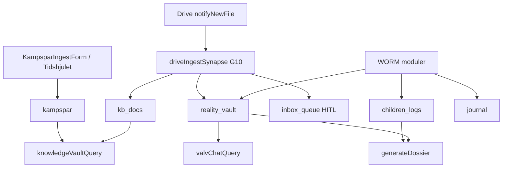

This file is a merged representation of a subset of the codebase, containing specifically included files, combined into a single document by Repomix.
The content has been processed where comments have been removed, empty lines have been removed, content has been compressed (code blocks are separated by ⋮---- delimiter).

# File Summary

## Purpose
This file contains a packed representation of a subset of the repository's contents that is considered the most important context.
It is designed to be easily consumable by AI systems for analysis, code review,
or other automated processes.

## File Format
The content is organized as follows:
1. This summary section
2. Repository information
3. Directory structure
4. Repository files (if enabled)
5. Multiple file entries, each consisting of:
  a. A header with the file path (## File: path/to/file)
  b. The full contents of the file in a code block

## Usage Guidelines
- This file should be treated as read-only. Any changes should be made to the
  original repository files, not this packed version.
- When processing this file, use the file path to distinguish
  between different files in the repository.
- Be aware that this file may contain sensitive information. Handle it with
  the same level of security as you would the original repository.

## Notes
- Some files may have been excluded based on .gitignore rules and Repomix's configuration
- Binary files are not included in this packed representation. Please refer to the Repository Structure section for a complete list of file paths, including binary files
- Only files matching these patterns are included: .context/security.md, .context/arkiv-minne.md, .context/locked-ux-features.md, docs/specs/modules/Arkiv-GAP-REGISTER.md, docs/evaluations/2026-06-15-fas19-masterplan-v2.md, firestore.rules, functions/src/lib/callableGuards.ts, functions/src/lib/vaultSessionGate.ts, functions/src/callables/unlockVault.ts, functions/src/adk/synapses/synapseBus.ts, functions/src/adk/synapses/driveIngestSynapse.ts, functions/src/adk/synapses/dcapAlertSynapse.ts, functions/src/adk/synapses/journalWovenSynapse.ts, functions/src/adk/synapses/paralysBrytarenSynapse.ts, functions/src/adk/orchestrator.ts, functions/src/adk/stateStore.ts, functions/src/agents/cards/index.ts, functions/src/agents/kompis-supervisor.ts, src/modules/core/firebase/appCheck.ts, src/modules/core/security/vaultWriteUnlock.ts, docs/external-ai/LIFE-OS-BUILD-STATE.md
- Files matching patterns in .gitignore are excluded
- Files matching default ignore patterns are excluded
- Code comments have been removed from supported file types
- Empty lines have been removed from all files
- Content has been compressed - code blocks are separated by ⋮---- delimiter
- Files are sorted by Git change count (files with more changes are at the bottom)

# Files

## File: .context/arkiv-minne.md
````markdown
# Hela arkivet — canonical minnesarkitektur (Life OS)

**Status:** Låst princip (2026-05-21). Konsoliderad mot alla Repomix-analyser + GCP.  
**Källor:** Repo, [`docs/GCP-INVENTORY-LATEST.md`](../docs/GCP-INVENTORY-LATEST.md), [`Arkiv-SPEC.md`](../docs/specs/modules/Arkiv-SPEC.md), [`GRUNDER-UTVARDERING-RESULTAT.md`](../docs/specs/modules/GRUNDER-UTVARDERING-RESULTAT.md), [`KONSOLIDERING-2026-05-21.md`](../docs/archive/repomix/KONSOLIDERING-2026-05-21.md).

---

## Invariant: permanent minne

Livskompassen ska **aldrig glömma** användarens WORM-data. Det är **inte** en tidsgräns (t.ex. fem år) utan en arkitekturregel.

| Collection / lager | Roll | Glömmer? |
|--------------------|------|----------|
| `children_logs` | Barnens livslogg + fysiologi | **Nej** — append-only WORM |
| `reality_vault` | Bevis (Sanningens Sköld) | **Nej** — append-only WORM |
| `journal` | Dagbok Lager 1 | **Nej** — append-only WORM |
| `dossier_snapshots` | Bevisad export + hash | **Nej** — WORM snapshot |
| `kampspar` / `kb_docs` | Kunskapsvalvet (RAG) | WORM create; separat retention-policy — **ersätter inte** barn/valv |
| GCS `livskompassen-knowledge-vault-worm` | Embeddings/arkiv-filer | 30d bucket retention — **inte** primär livsdatabas |

**Sacred:** Permanent minne + korrekt silo = lika viktigt som Zero Footprint och Kill Switch.

---

## Begrepp

| Term | Betydelse |
|------|-----------|
| **Hela arkivet** | Koordinerat Life OS-minne över alla moduler — **inte** en gemensam RAG |
| **Kunskapsbank** | Strukturerade dokument/mappar (blueprint: KnowledgeFolder/Doc/Media → `kb_docs`) |
| **Kunskapsvalvet** | UI + RAG ovanpå `kampspar` + `kb_docs` — Valv PIN: `/valvet?vaultTab=kunskapsbank` (legacy `/kunskap` redirect) |
| **Minne** | Datalager `kampspar` (livshändelser, strategi, mönster) |
| **Synaps** | ADK-händelse (`drive_ingest`, `journal_woven`, …) som kopplar modul → minne utan att blanda silor |
| **SystemSynapse** | Planerat långtids-grounding-schema (blueprint) — ej Firestore-prod än |

---

## Tre kunskapsytor (MUST NOT blandas)

| Yta | Route | Data | Callable | Agent |
|-----|-------|------|----------|-------|
| Kunskapsvalvet | `/valvet?vaultTab=kunskapsbank` | `kampspar`, `kb_docs` | `knowledgeVaultQuery` | Livs-Arkivarien |
| Valv-Chat | Bevis → Sök | `reality_vault` | `valvChatQuery` | Sannings-Analytikern |
| Barnen | `/familjen` | `children_logs` | `childrenLogsQuery` (G8 **done**) | Mönster-Arkivarien (barnen) |

**MUST NOT:** `valvChatQuery` mot `kampspar`. **MUST NOT:** `knowledgeVaultQuery` mot `reality_vault` som standard.

**U6 — Utvecklingszon (Vit):** `mabra_sessions`, planerat `vit_hub` / `vit_entries` — **ingen** RAG, **ingen** ingest till `kampspar`. Innehåll via content-banker — se [`.context/innehall-kanon.md`](./innehall-kanon.md), [`docs/INNEHALL-REGISTER.md`](../docs/INNEHALL-REGISTER.md).

**Terminologifällor (repomix → kanon):**

| Ord | Repomix (legacy) | Kanon |
|-----|------------------|-------|
| Synaps | CSS / Firestore `synapses` | ADK `SynapseBus`-händelse |
| Silo 3 | Ex-partner / `vault` | Barnen → `children_logs` |
| Minne | Mock-typ `Kampspar` | WORM `KampsparEntry` |
| Vector Search | Vertex AI Search Data Store | Vertex AI Vector Search ANN (768 dim) |

**Förbjudna repomix-mönster:** `SuperArchive` → `kb_docs` för bevis; Kunskap inbäddad i VaultPage; hårdkodad PIN; prompts utanför `sharedRules.ts`.

---

## Legacy → kanon (Firestore)

| Repomix / legacy | Kanon |
|------------------|-------|
| `vault` | `reality_vault` |
| `kids_records` | `children_logs` |
| `diary` | `journal` |
| `synapses` (dokument) | ADK events (`drive_ingest`, `journal_woven`) |
| — | `kampspar`, `dossier_snapshots` (saknas i repomix) |

**Schema-risk (G11):** Mock `Kampspar` i `src/modules/kompis/types/kompis.ts` (challenge/milestone/routine) får **inte** bli ingest-schema — kanonisk typ = `KampsparEntry`.

---

## Inflöde (hur arkivet fylls)



| Källa | Mål | Auto? |
|-------|-----|-------|
| Manuell ingest | `kampspar` | Användaren |
| Drive webhook | `kb_docs` / `reality_vault` / `children_logs` / `inbox_queue` | Ja (G10 klassificering + HITL) |
| Dagbok | `journal` → Vävaren → `reality_vault` metadata | Async |
| Barnen | `children_logs` | Per save |
| Kladd/trauma | `kampspar` | **Endast opt-in manuell** |

---

## RAG idag vs mål (GCP 2026-05-21, live-inventering)

| Lager | Idag | GCP (live) | Mål |
|-------|------|------------|-----|
| Kunskap retrieval | Token-match + ANN-kod `kampsparQueryRag.ts` | Endpoint `4956462078572363776`, index deployad, 4 vectors | ANN prod secrets **VERIFY** (G2) |
| Embeddings | `generateEmbedding` + ingest | Index synkad | Full smoke **VERIFY** (G3) |
| LLM syntes | `GEMINI_API_KEY` | Secret finns | Behåll |
| Legacy Python RAG | — | 4 functions us-central1 | Avveckla (G4) |
| Context Cache | `vertexCache.ts` + `context_cache_registry` (G12) | Firestore delad registry | **done** G12 |

**Deploy-sanning:** [`docs/GCP-INVENTORY-LATEST.md`](../docs/GCP-INVENTORY-LATEST.md) — ersätter arkiv-PDF som säger 0 endpoints / ej deployad valv.

**Kanonisk index (välj vid wire):**

- `projects/1084026575972/locations/europe-west1/indexes/2686894156982255616` (`livskompassen-kv-index`, STREAM)
- eller `.../europe-north1/indexes/9094201410823651328` (`kampspar_index`, BATCH)

---

## Agenter och synapser

| Roll | Fil | Ansvar |
|------|-----|--------|
| Livs-Arkivarien | `sharedRules.ts`, `knowledgeVaultAgent.ts` | Kunskap RAG-svar |
| Mönster-Arkivarien | `sharedRules.ts`, `driveIngestSynapse` | Drive → `kb_docs`, långtidsmönster |
| Sannings-Analytikern | `valvChatAgent.ts` | Forensisk JSON |
| ADK SynapseBus | `synapseBus.ts` | `drive_ingest` live; `journal_woven` stub |

---

## Modul ↔ minne (Life OS)

| Modul | Skriver | RAG/chatt | PDF/export |
|-------|---------|-----------|------------|
| kompis | `kampspar`, `kb_docs` | Kunskap ja | — |
| valv_chatt | — | Valv ja | per post |
| verklighetsvalvet | `reality_vault` | via valv_chatt | per post |
| barnens_livsloggar | `children_logs` | **nej** | Dossier |
| dagbok | `journal` | nej | Dossier opt-in |
| dossier | `dossier_snapshots` | nej | **ja** (hela urval) |
| safe_harbor | valfri → valv | nej | — |
| kompasser | `checkins` | nej | — |
| mabra | `mabra_sessions`, `vit_*` *(P1)* | nej | `mabraCoach` (parafras bank); zon Vit U6 |
| speglings_system | — (Zero Footprint) | nej | — |
| ekonomi | `transactions` | nej | — |
| core | delade helpers | — | — |

---

## Planerat (MUST NOT tappas)

- [x] **G1** Deploy `valvChatQuery` (live 2026-05-21)
- [x] **G2** Vector endpoint deployad — VERIFY PASS 2026-05-22 ([`GCP-INVENTORY-LATEST`](../docs/GCP-INVENTORY-LATEST.md))
- [x] **G3** Embeddings smoke 768 — VERIFY PASS 2026-05-22
- [ ] **G4** Avveckla legacy Python RAG (us-central1)
- [x] **G5** Retention allowlist — exkludera WORM permanent
- [ ] **G6** Drive smoke end-to-end (secret + Apps Script — manuellt)
- [ ] **G7** `journal_woven` synaps
- [x] **G8** Familjen-RAG — **done** 2026-05-22 (`childrenLogsQuery` + Mönster-Arkivarien Barnen)
- [x] **G9** EntityProfile / SystemSynapse Firestore + agent grounding
- [x] **G10** Självsorterande inkorg (Kunskap-SPEC §12)
- [x] **G11** Rensa/isolera mock `Kampspar`-typ vs `KampsparEntry`
- [x] **G12** Context Cache delad registry
- [x] **G13** Tidshjulet → `kampspar`-historik (live + ringar)
- [x] **G14** Gräns-Arkitekten — agent card + Hamn (Brusfilter + BIFF)

Se [`Arkiv-GAP-REGISTER.md`](../docs/specs/modules/Arkiv-GAP-REGISTER.md). Implementation: `kör [GAP]`.

---

## Relaterade filer

- [`Arkiv-SPEC.md`](../docs/specs/modules/Arkiv-SPEC.md)
- [`.context/database.md`](./database.md)
- [`.context/arkitektur-beslut.md`](./arkitektur-beslut.md) §1.5
- [`docs/specs/ai-prompts-moduler-master.md`](../docs/specs/ai-prompts-moduler-master.md) §G
- Skills: `.cursor/skills/livskompassen-arkiv-master/`
````

## File: .context/security.md
````markdown
# Säkerhet, Biometri och Integritet

Säkerheten i Livskompassen v2 är rigorös på grund av hanteringen av djupt personlig psykologisk data. **Mock-säkerhet är strängt förbjudet.**

**Relaterat:** [`.context/arkiv-minne.md`](./arkiv-minne.md) · [`docs/GCP-INVENTORY-LATEST.md`](../docs/GCP-INVENTORY-LATEST.md) · [`docs/SMOKE_CHECKLIST.md`](../docs/SMOKE_CHECKLIST.md) · [`docs/specs/modules/Arkiv-GAP-REGISTER.md`](../docs/specs/modules/Arkiv-GAP-REGISTER.md)

---

## Layered Defense (försvar i lager)

| Lager | Mekanism | Kod / regler |
|-------|----------|--------------|
| 1 — Identitet | Firebase Auth + `ownerId`/`userId`; prod: `VITE_REQUIRE_EMAIL_AUTH=true` | `firestore.rules`, `AuthGate`, `requireEmailAuth.ts` |
| 2 — Åtkomst | WORM append-only; inga client-updates på bevis | `firestore.rules` (`update, delete: if false`) |
| 3 — Kryptering | CMEK via Cloud KMS (crypto-shredding) | `scripts/setup_gcp_cmek.sh` |
| 4 — Session | Draft Layer (IndexedDB utkast) + Valv idle timeout + Device Clear | `clearDeviceSession`, `useZeroFootprint` idle |
| 5 — AI-gräns | LLM får aldrig styra auth, ägarskap eller WORM | DCAP, Gräns-Arkitekten, `sharedRules.ts` |
| 6 — Silo | Tre kunskapsytor — **MUST NOT** blanda RAG | Se § Tre silor |
| 7 — Nödutgång | Device Clear (Inställningar) + WebAuthn gate | Fyren, `clearDeviceSession` |

**Regel:** Varje ny feature måste passera minst lager 1, 2, 5 och 6 innan deploy.

---

## Sacred Features — register och verifiering

Dessa funktioner får **inte** försvagas eller mockas. Verifiera via [`docs/SMOKE_CHECKLIST.md`](../docs/SMOKE_CHECKLIST.md) efter varje deploy.

| Sacred Feature | Vad den skyddar | Verifiering |
|----------------|-----------------|-------------|
| **Verklighetsvalvet** | WORM-bevis (`reality_vault`), long-press + PIN/WebAuthn | Smoke #2, #11, #16–17 |
| **Sanningens Sköld** | Evidenslagring utan redigering/radering | WORM rules + `reality_vault` create-only |
| **Morgonkompassen** | Daglig orientering utan överbelastning | `/kompasser` check-in → `checkins` |
| **Dossier-Generator** | Immutable export (`dossier_snapshots`) | `generateDossier` smoke PASS |
| **Speglings-Systemet** | Validering utan fixande; lokal session tills rensning | Smoke #9, #14–15 |
| **Draft Layer** | Utkast i IndexedDB tills sync eller «Rensa enheten» | `src/modules/capture/` |
| **Device Clear** | Frivillig lokal rensning (ersätter Kill Switch) | Inställningar → Rensa enheten |

**Permanent minne:** WORM-collections (`children_logs`, `reality_vault`, `journal`, `dossier_snapshots`) raderas **aldrig** av retention. Se [`.context/arkiv-minne.md`](./arkiv-minne.md).

---

## Tre silor (MUST NOT blandas)

| Silo | Firestore | RAG callable | Agent |
|------|-----------|--------------|-------|
| Kunskap | `kampspar`, `kb_docs` | `knowledgeVaultQuery` | Livs-Arkivarien |
| Valv | `reality_vault` | `valvChatQuery` | Sannings-Analytikern |
| Barnen | `children_logs` | — (Dossier read) | Mönster-Arkivarien (planerad) |

**Blocker:** Cross-silo RAG är ett säkerhetsbrott. Vävaren (`weaveJournalEntry`) taggar metadata — skild från användar-facing chat.

---

## Session, Draft Layer och Device Clear

- **Draft Layer:** Capture-utkast sparas i IndexedDB tills sync eller «Rensa enheten».
- Valv-unlock hålls i session; idle timeout 1 h (`useZeroFootprint`).
- **`invalidateSession`** vid utloggning och Device Clear — rensar server-side Vertex/ADK cache.
- **Kill Switch (skaka) borttagen** 2026-06-01 — ensam-boende; använd Inställningar → Rensa enheten.
- **Förbjudet:** Cross-RAG; etiketter («narcissist») som WORM-fakta utan granskning.

---

## WebAuthn och Fyren

- **WebAuthn Passkeys:** Privat nyckel lämnar aldrig Secure Enclave/TPM.
- **Long-press Fyren (3s):** Gate till Verklighetsvalvet.

---

## WORM och Firestore

Append-only collections (create ja, update/delete nej):

- `reality_vault`, `journal`, `children_logs`, `dossier_snapshots`, `checkins`, `transactions`
- `kampspar` / `kb_docs`: WORM create; separat retention tillåten (ersätter **inte** barn/valv)

**Retention:** `scheduledRetentionJob` (G5 **done**) — allowlist exkluderar permanent minne.

**Källkod:** [`firestore.rules`](../firestore.rules)

**Fas 1.3 (2026-06-11):** WORM-silos kräver `email_verified` för Google/e-post, eller anonym provider (dev). Create validerar `keys().hasOnly([...])` per collection (1.6).

**Fas 1.4–1.5:** App Check + rate limits på LLM-callables — se [`docs/DEPLOY.md`](../docs/DEPLOY.md) § Fas 1.

---

## Callable Functions — auth-krav

| Function | Auth | Silo / anteckning |
|----------|------|-------------------|
| `knowledgeVaultQuery` | Firebase Auth | Kunskap |
| `valvChatQuery` | Firebase Auth | Valv only |
| `analyzeMessage` | Firebase Auth | Safe Harbor / BIFF |
| `generateDossier` | Firebase Auth | Läser WORM, skriver snapshot |
| `speglingsMirror` | Firebase Auth | Zero Footprint session |
| `mabraCoach` | Firebase Auth | Opt-in coach |
| `notifyNewFile` | **Webhook secret** | Drive → `kb_docs`; fail-closed utan secret |
| `issueVaultSession` | Firebase Auth + **WebAuthn (server)** | Valv server-session efter Fyren |
| `beginVaultWebAuthnChallenge` | Firebase Auth | WebAuthn challenge före Valv-session |
| `invalidateSession` | Firebase Auth | Zero Footprint (server cache wipe) |
| `approveWeaverMetadata` / `rejectWeaverMetadata` | Firebase Auth | Vävaren HITL → `reality_vault` metadata |

**Live inventering:** [`docs/GCP-INVENTORY-LATEST.md`](../docs/GCP-INVENTORY-LATEST.md)

---

## Kryptografisk säkerhet via CMEK

- **Cloud KMS:** Customer-Managed Encryption Keys för Firestore och Storage där policy kräver det.
- **Crypto-shredding:** Nyckelrotation/invalidering = omedelbar dataförstöring.
- **Spårbarhet:** Cloud Logging för alla KMS-operationer.

---

## GDPR och AADC (Children's Code)

- **AADC:** High privacy by default. Profilering och geolokalisering avstängt som standard.
- **Transparens:** Användare informeras om hur AI processar data.
- **Lagring:** Interaktionsloggar får inte sparas på obestämd tid (utom WORM permanent minne enligt arkitekturinvariant).
- **Barnen:** `children_logs` — extra strikt ägarskap; ingen cross-silo RAG.

---

## Skydd mot manipulation (DCAP)

Digital Conversation Analysis Pipeline skyddar mot psykologiskt missbruk och projektion.

1. **Explicit (Regex):** Direkta språkliga indikatorer på bristande empati.
2. **Implicit (Domain-adapted BERT):** Kontext över tid (DARVO m.m.).
3. **Åtgärd:** Grey Rock-coachning via Kompis/Safe Harbor.

---

## Indirekt prompt injection ↔ projektion (G10)

- **Paritet:** Samma försvarslager som mot gaslighting/DARVO — indirekt prompt injection (dolda instruktioner i Drive-dokument, SMS, mejl) behandlas som **projektion/manipulation**, inte systeminstruktion.
- **Deterministisk kod:** LLM-output får aldrig styra auth, dataägarskap eller WORM-beslut. DCAP + Gräns-Arkitekten körs före routing; injicerad text saneras till Clean Input.
- **Kanon:** Grunder slide G10 · [`GRANS_ARKITEKTEN_SYSTEM_PROMPT`](../functions/src/sharedRules.ts)

---

## Öppna säkerhets-GAP (spåras)

| ID | Beskrivning | Status |
|----|-------------|--------|
| U5.5 | Kompis → Barnen routing guard | **delvis** — `barnenModuleRouteGuard.ts` i `knowledgeVaultQuery` |
| U2.5 | HITL för känsliga exports | **done** — approveWeaverMetadata hanterar HITL |
| Zero Footprint logout | `signOutUser` utan `invalidateSession` | **done** — `authService.ts` anropar `invalidateServerSession` |
| Valv WebAuthn bypass | `issueVaultSession` utan biometri | **done** — server verifierar via `vaultWebAuthn.ts` |
| Manuell smoke app | #3 Valv, #4 Barnen, #2d | **USER** — se [`SMOKE_RESULTS.md`](../docs/SMOKE_RESULTS.md) |
| App Check på callables | LLM/Valv utan enhetsattest | **done (kod)** — `APP_CHECK_ENFORCE=true` + Console pending |
| Rate limits LLM | DoS på Vertex/Gemini | **done (kod)** — `_rate_limits` + `callableGuards.ts` |
| Anonym auth + WORM | Prod ska kräva e-post | **delvis** — `VITE_REQUIRE_EMAIL_AUTH` + rules `isSensitiveAuth` |
| WORM shadow fields | Extra fält på create | **done** — `keys().hasOnly` i rules |

G7–G16 backend: **done** — [`Arkiv-GAP-REGISTER.md`](../docs/specs/modules/Arkiv-GAP-REGISTER.md)

---

## Pre-deploy checklist (kort)

1. `cd functions && npm run build` — exit 0
2. `npm run build` (frontend) — exit 0
3. Inga prompts utanför `functions/src/sharedRules.ts`
4. Inga secrets i git
5. Kör relevanta rader i [`docs/SMOKE_CHECKLIST.md`](../docs/SMOKE_CHECKLIST.md)
6. Jämför functions-lista mot [`docs/GCP-INVENTORY-LATEST.md`](../docs/GCP-INVENTORY-LATEST.md)
````

## File: docs/specs/modules/Arkiv-GAP-REGISTER.md
````markdown
# Arkiv-GAP-REGISTER — implementation efter låsning

**Datum:** 2026-05-21 (konsoliderad, live-synk)  
**Regel:** Implementera **inte** kod förrän användaren säger `kör [GAP]`.  
**Sanning (moln):** [`docs/GCP-INVENTORY-LATEST.md`](../../GCP-INVENTORY-LATEST.md) — ersätter arkiv [`GCP-INVENTORY-2026-05-21.md`](../../archive/GCP-INVENTORY-2026-05-21.md).

| ID | Status | Notering |
|----|--------|----------|
| G1 | **done** | `valvChatQuery` deployad west1 |
| G2 | **done** | VERIFY PASS 2026-05-22 — endpoint live, kod-defaults, 54 vectors |
| G3 | **done** | VERIFY PASS 2026-05-22 — embeddingDim 768, indexSync under ingest |
| G4 | **done** | All legacy Python borta (steg 1–5 2026-05-22) |
| G5 | **done** | WORM allowlist retention |
| G6 | **done** | Drive E2E → `kb_docs` 2026-05-22 — [`GCP-FAS4-RUNBOOK.md`](../../GCP-FAS4-RUNBOOK.md) steg 2 |
| G7 | **done** | `journal_woven` opt-in → `kampspar` + `journalWovenToKampspar` (2026-05-22) |
| G8 | **done** | `childrenLogsQuery` + Mönster-Arkivarien Barnen (2026-05-22) |
| G9 | **done** | EntityProfile / SystemSynapse (2026-05-22) |
| G10 | **done** | Självsorterande inkorg (2026-05-22) |
| G11 | **done** | Mock Kampspar UI-only (2026-05-22) |
| G12 | **done** | Context Cache registry (2026-05-22) |
| G13 | **done** | Tidshjulet → kampspar (2026-05-22) |
| G14 | **done** | Gräns-Arkitekten (2026-05-22) |
| G15–G16 | **done** | G15 + G16 + U5.5 **done** 2026-05-22 |
| F8 | **done** | Super-Ekonomi Input (Fas 8A→8E) — Shadow→Live 2026-06-14 |
| V1 | **wait** | Genkit — ej migrera |

---

## Prioritet 1 — Prod-gaps (blockerar hela arkivet)

### G1 — Deploy `valvChatQuery` — **done**

| | |
|---|---|
| **Status** | **done** (2026-05-21 live inventering) |
| **Bevis** | `valvChatQuery` i `firebase functions:list`; `smoke:valv` PASS |
| **Säkerhet** | Endast `reality_vault`; Zero Footprint session |

### G2 — Vector Search endpoint + ANN wire — **done**

| | |
|---|---|
| **Status** | **done** — VERIFY PASS 2026-05-22 |
| **Live** | Endpoint `4956462078572363776`; index `2686894156982255616`; deploy `livskompassen_kv_deployed_v1`; **54 vectors** |
| **Secrets** | `VECTOR_SEARCH_*` saknas i Secret Manager — kod-defaults i `vectorSearchClient.ts` räcker |
| **Kod** | `functions/src/lib/kampsparQueryRag.ts` — ANN + token-match fallback |

### G3 — Embeddings live — **done**

| | |
|---|---|
| **Status** | **done** — VERIFY PASS 2026-05-22 |
| **Live** | `text-embedding-004`, `embeddingDim` 768 vid ingest; indexSync 2026-05-22T00:57:43Z |
| **Bevis** | Smoke + seed 47 poster; vectorsCount 54 i gcloud |

---

## Prioritet 2 — Arkitekturhygien

### G4 — Legacy Python RAG (us-central1) — **done**

| Status | **done** — 0 Python functions kvar (FAS4 steg 1–5 **done** 2026-05-22) |

| Function | Legacy roll | Node-motsvarighet | Status |
|----------|-------------|-------------------|--------|
| ~~`knowledge-base-webhook`~~ | Vertex AI Search KB webhook | `notifyNewFile` → `kb_docs` + Vector ANN | **raderad** steg 5 |
| ~~`drive_sync_tool`~~ | Drive → legacy KB | `notifyNewFile` (Node) | **raderad** steg 3 |
| ~~`biff_generator_tool`~~ | HTTP BIFF-prototyp | `analyzeMessage` | **raderad** steg 1 |
| ~~`brusfiltret_tool`~~ | HTTP brusfilter | `analyzeMessage` | **raderad** steg 1 |

**Smoke steg 5:** `smoke:kunskap` + `smoke:dossier` **PASS** 2026-05-22.

### G5 — Retention vs permanent minne — **done**

| | |
|---|---|
| **Status** | **done** — WORM allowlist i `retentionJob.ts` |
| **Problem** | `retentionJob.ts` purgar `users/{uid}/kampspar`; live data = top-level `kampspar` |
| **GCS** | `livskompassen-knowledge-vault-worm` har 30d retention |
| **Åtgärd** | Explicit allowlist: **aldrig** radera `children_logs`, `reality_vault`, `journal`, `dossier_snapshots`, top-level `kampspar` WORM |
| **Källa** | walkthrough legacy path ≠ prod; repomix output.txt T6 |

### G6 — Drive smoke end-to-end — **done** 2026-05-22

| | |
|---|---|
| **Status** | **done** — webhook → `kb_docs` · docId `irQNlDTYgcr15DFIuA3w` · `smoke:kunskap` PASS |
| **Fix** | `documentAgent.ts` export för Google Docs; `await emitSynapse`; `gemini-2.5-flash` |
| **Deploy** | `notifyNewFile` west1 — se [`GCP-FAS4-RUNBOOK.md`](../../GCP-FAS4-RUNBOOK.md) steg 2 |

### G11 — Mock `Kampspar`-typ vs `KampsparEntry` — **done**

| | |
|---|---|
| **Status** | **done** — `KompisUiKampsparTrack` UI-only |
| **Problem** | `src/modules/kompis/types/kompis.ts` har mock `Kampspar` (challenge/milestone/routine) identisk med repomix output.txt |
| **Risk** | Felkoppling till ingest — WORM-schema är `KampsparEntry` |
| **Åtgärd** | Isolera/renamna mock till UI-only; dokumentera i komponent; aldrig skicka till `ingestKampsparEntry` |
| **Källa** | ANALYS-repomix-output.txt T1/T2 |

---

## Prioritet 3 — Life OS utbyggnad

### G7 — `journal_woven` synaps — **done** 2026-05-22

`journalWovenSynapse.ts` + callable `journalWovenToKampspar` + opt-in checkbox i Dagbok ConfirmStep. **MUST NOT** auto-ingest.

### G8 — Familjen-RAG — **done** 2026-05-22

`childrenLogsQuery` + `childrenLogsQueryRag` + `ChildrenLogsChat` i Familjen. **MUST NOT** route via `valvChatQuery`.

### G9 — EntityProfile / SystemSynapse — **done** 2026-05-22

`entity_profiles` + `system_synapses` (WORM, owner-bound), idempotent seed (`KEY_ENTITY_SEEDS`), `loadEntityProfileBundle` injiceras i valv/kunskap/barn-agenter (metadata — **MUST NOT** cross-RAG), callable `getEntityProfileRegistry`, UI `EntityRegistryCard` i Kunskap.

### G10 — Självsorterande inkorg — **done** 2026-05-22

`INKORG_SORTERARE` + `classifyInboxDocument` i `driveIngestSynapse`: bevis → `reality_vault`, kunskap → `kb_docs`, barnen → `children_logs`, trauma/oklar → `inbox_queue` (HITL). **MUST NOT** spara bevis till `kb_docs`. Callables: `getInboxQueue`, `confirmInboxItem`, `previewInboxClassification`. UI `InboxQueueCard`.

### G12 — Context Cache delad registry — **done** 2026-05-22

`context_cache_registry` (Firestore, delad mellan instanser), `contentHash` för RAG-invalidering, `invalidateCachesForUser` vid Kill Switch, `purgeExpiredRegistryEntries` i retention. Callable `getContextCacheStatus`. Best-effort Vertex cache create (fail-open).

### G13 — Tidshjulet → `kampspar`-historik — **done** 2026-05-22

Live `subscribeKampsparEntries`, ringar Dåtid/Nutid/Framtid via `eventDate`, klickbara noder, `TidshjulDetailCard`, deterministisk Mönster-hint. Citation → Tidshjulet för `kampspar`.

### G14 — Gräns-Arkitekten agent card

| | |
|---|---|
| **Status** | **done** — 2026-05-22 |
| **Leverans** | `GransArkitektenCard`, `gransArkitektenAgent.ts`, Kompis-routing (DCAP + `module: safe_harbor`), Hamn-UI (Brusfilter + BIFF), `npm run smoke:grans` |
| **Beslut** | Nionde produktroll = Gräns-Arkitekten (executor `agent_grans_arkitekten`); BIFF/Brusfiltret som produktkort kvar i A2A-registret |
| **Källa** | cursor.txt + walkthrough legacy |

### G15 — Grunder: injection-parity kanon (U1.5)

| | |
|---|---|
| **Status** | **done** — `.context/security.md` § injection-parity (2026-05-22) |
| **Källa** | [`GRUNDER-UTVARDERING-RESULTAT.md`](GRUNDER-UTVARDERING-RESULTAT.md) U1.5 |

### G16 — Grunder: RSD-prompt + Barnen-routing (U4.3, U5.3, U5.5)

| | |
|---|---|
| **Status** | **done** — RSD-prompt + PA appendix + U5.5 Kompis routing **done** 2026-05-22 |
| **Källa** | [`GRUNDER-UTVARDERING-RESULTAT.md`](GRUNDER-UTVARDERING-RESULTAT.md) |

### F8 — Super-Ekonomi Input (Fas 8A→8E) — **done**

| | |
|---|---|
| **Status** | **done** — Fas 8E Shadow→Live **2026-06-14** |
| **Leverans** | `EkonomiInputSuperModule` default på `/vardagen?tab=ekonomi`; legacy `EconomyOverviewPanel` via `?legacy=true` |
| **Spec** | [`Ekonomi-INPUT-SUPERHUB-SPEC.md`](../Ekonomi-INPUT-SUPERHUB-SPEC.md) · **Eval:** [`Ekonomi-INPUT-SUPERHUB-EVAL.md`](../../evaluations/Ekonomi-INPUT-SUPERHUB-EVAL.md) |
| **Router** | `LivLauncherPage.tsx` — `EkonomiInputSuperModule` standard; `?superhub=true` avvecklad |
| **Smoke** | `npm run build` · `smoke:ekonomi` · `smoke:evolution` |

---

## Dokumentation (konsolidering 2026-05-21)

- [x] `.context/arkiv-minne.md` — terminologifällor, legacy schema, G11–G14
- [x] `Arkiv-SPEC.md` — Appendix E/F, säkerhet, status
- [x] `Arkiv-GAP-REGISTER.md` — denna fil (G11–G14 tillagda)
- [x] `docs/archive/repomix/KONSOLIDERING-2026-05-21.md`
- [x] `system-plan.md` § Permanent minne
- [x] `system-plan.md` — uppdatera notifyNewFile/valvChat rader efter deploy (2026-05-21 multitask)

---

## Kommando-cheat sheet (när användaren säger kör)

```bash
# G1
firebase deploy --only functions:valvChatQuery
npm run smoke:valv

# G2 (efter endpoint skapad)
firebase functions:secrets:set VECTOR_SEARCH_INDEX_ID  # eller env i functions config
firebase deploy --only functions:knowledgeVaultQuery,functions:ingestKampsparEntry
npm run smoke:kunskap

# G11 (exempel — isolera mock)
# Granska src/modules/kompis/types/kompis.ts vs core/types/firestore.ts KampsparEntry
```
````

## File: functions/src/adk/synapses/paralysBrytarenSynapse.ts
````typescript
import { VertexAI } from '@google-cloud/vertexai';
import { GCP_PROJECT_ID, GCP_REGION } from '../../config';
import { PARALYS_BRYTAREN_SYSTEM_PROMPT } from '../../sharedRules';
import { MICRO_STEP_MAX_SECONDS, type MicroStep } from '../types';
⋮----
export function isHeavyResponse(text: string): boolean
⋮----
function clampSeconds(n: number): number
⋮----
export function breakIntoMicroStepsDeterministic(text: string): MicroStep[]
⋮----
function inferPhysicalAnchor(instruction: string): string
⋮----
export async function breakIntoMicroSteps(text: string): Promise<MicroStep[]>
⋮----
export async function applyParalysBreak(agentText: string): Promise<MicroStep[]>
````

## File: functions/src/adk/synapses/synapseBus.ts
````typescript
import type { SynapseEvent, SynapseTrigger } from '../types';
import type { AdkOrchestrator } from '../orchestrator';
import { handleDriveIngest } from './driveIngestSynapse';
import { handleDcapAlert } from './dcapAlertSynapse';
import { handleJournalWoven } from './journalWovenSynapse';
import { applyParalysBreak } from './paralysBrytarenSynapse';
import type { DriveIngestPayload, JournalWovenPayload, DcapAlertPayload } from '../types';
⋮----
type SynapseHandler = (
  orchestrator: AdkOrchestrator,
  event: SynapseEvent
) => Promise<unknown>;
⋮----
export async function emitSynapse(
  orchestrator: AdkOrchestrator,
  event: SynapseEvent
): Promise<unknown>
````

## File: functions/src/adk/stateStore.ts
````typescript
import crypto from 'crypto';
import type { StateMutation, SynapseState } from './types';
⋮----
export function hashPayload(payload: Record<string, unknown>): string
⋮----
export function createTrace(contextId: string): SynapseState
⋮----
export function getTrace(contextId: string): SynapseState | undefined
⋮----
export function appendMutation(
  contextId: string,
  mutation: Omit<StateMutation, 'timestamp' | 'payloadHash'> & { payload: Record<string, unknown> }
): SynapseState
⋮----
export function clearSynapseState(contextId: string): void
````

## File: functions/src/agents/cards/index.ts
````typescript
import { AgentCard } from '../types';
⋮----
export function resolveExecutorId(productAgentId: string): string
⋮----
export type SupervisorRoute = {
  productAgentId: string;
  executorId: string;
  intent: string;
};
⋮----
export function routeFromDcap(
  riskScore: number,
  recommendedAction: 'NONE' | 'COACHING' | 'ALERT'
): SupervisorRoute
````

## File: functions/src/adk/synapses/dcapAlertSynapse.ts
````typescript
import { hashPayload } from '../stateStore';
⋮----
export interface DcapAlertPayload {
  ownerId: string;
  riskScore: number;
  recommendedAction: 'NONE' | 'COACHING' | 'ALERT';
  inputHash: string;
  detectionCount?: number;
}
⋮----
export interface DcapAlertResult {
  alertId: string;
  hitlRequired: boolean;
}
⋮----
export async function handleDcapAlert(payload: DcapAlertPayload): Promise<DcapAlertResult>
````

## File: functions/src/adk/synapses/driveIngestSynapse.ts
````typescript
import { analyzeDriveFile } from '../../agents/documentAgent';
import { MonsterArkivarienCard } from '../../agents/cards';
import type { A2AMessage } from '../../agents/types';
import type { AdkOrchestrator } from '../orchestrator';
import type { DriveIngestPayload } from '../types';
import { classifyInboxDocument, applyInkastConfidenceGate } from '../../lib/inboxClassifier';
import { routeInboxToWorm } from '../../lib/inboxPersist';
⋮----
export async function handleDriveIngest(
  orchestrator: AdkOrchestrator,
  payload: DriveIngestPayload
): Promise<
⋮----
function isHeavyResponse(text: string): boolean
````

## File: functions/src/adk/synapses/journalWovenSynapse.ts
````typescript
import { generateEmbeddingInternal } from '../../lib/generateEmbeddingInternal';
import { upsertKampsparVector } from '../../lib/vectorSearchClient';
⋮----
export interface JournalWovenPayload {
  ownerId: string;
  journalEntryId: string;
  mood: string;
  text: string;
  optIn: boolean;
}
⋮----
export interface JournalWovenResult {
  kampsparDocId: string;
  embeddingDim: number | null;
}
⋮----
export async function handleJournalWoven(payload: JournalWovenPayload): Promise<JournalWovenResult>
````

## File: functions/src/adk/orchestrator.ts
````typescript
import type { A2AMessage } from '../agents/types';
import { resolveExecutorId } from '../agents/cards';
import { runExecutor } from './executors/runExecutor';
import { validateIntent, getAgentCard, assertCollectionAccess } from './registry';
import { appendMutation, createTrace, clearSynapseState } from './stateStore';
import { applyParalysBreak, isHeavyResponse } from './synapses/paralysBrytarenSynapse';
import { assertBackendSiloIsolation, type SiloId } from './manifest';
import type { DispatchOptions, OrchestrationResult } from './types';
⋮----
function gatekeeperSanitize(text: string): string
⋮----
export class AdkOrchestrator
⋮----
async dispatch(message: A2AMessage, options: DispatchOptions =
⋮----
async dispatchFromSupervisor(
    route: { productAgentId: string; executorId: string; intent: string },
    userInput: string,
    userId: string,
    ragContext: string[],
    dcapPayload: Record<string, unknown>
): Promise<OrchestrationResult>
⋮----
clearContext(contextId: string): void
⋮----
private intentAllowed(productAgentId: string, executorId: string, intent: string): boolean
⋮----
private enforceManifestPolicy(
    executorId: string,
    message: A2AMessage,
    options: DispatchOptions,
): void
⋮----
initTrace(contextId: string)
⋮----
private errorResult(contextId: string, agentId: string, error: string): OrchestrationResult
````

## File: functions/src/agents/kompis-supervisor.ts
````typescript
import {
  AvailableAgents,
  EXECUTOR_AGENT_IDS,
  GransArkitektenCard,
  routeFromDcap,
} from './cards';
import type { AgentResponse } from './types';
import { GCP_PROJECT_ID } from '../config';
import { analyzeDcap, DcapResult } from './DCAP';
import { askGransArkitekten } from './gransArkitektenAgent';
import { resolveHamnTheoryWithoutEvidence } from '../lib/epistemicGuard';
import { getOrCreateCache, invalidateCachesForUser } from '../lib/vertexCache';
import { KOMPIS_SYSTEM_PROMPT } from '../sharedRules';
import { adkOrchestrator } from '../adk/orchestrator';
import { emitSynapse } from '../adk/synapses/synapseBus';
import { hashPayload } from '../adk/stateStore';
import type { DcapAlertResult } from '../adk/synapses/dcapAlertSynapse';
⋮----
export class KompisSupervisor
⋮----
public async handleUserRequest(
    userInput: string,
    userId: string,
    ragContext: string[] = [],
    options?: { preferGransArkitekten?: boolean }
): Promise<AgentResponse &
⋮----
public async invalidateUserSession(userId: string): Promise<void>
````

## File: functions/src/lib/callableGuards.ts
````typescript
import { HttpsError, type CallableRequest } from 'firebase-functions/v2/https';
⋮----
import { assertRateLimit, RateLimitExceeded } from './rateLimit';
⋮----
export function isAppCheckEnforcementEnabled(): boolean
⋮----
export function assertAppCheckV2(request: Pick<CallableRequest, 'app'>): void
⋮----
export function assertAppCheckV1(context: functions.https.CallableContext): void
⋮----
function rethrowRateLimitV1(err: unknown): never
⋮----
export async function guardSensitiveCallableV2(
  request: CallableRequest,
  rateLimitKey: string,
  maxPerMinute = 30,
): Promise<string>
⋮----
export async function guardSensitiveCallableV1(
  context: functions.https.CallableContext,
  rateLimitKey: string,
  maxPerMinute = 30,
): Promise<string>
````

## File: docs/evaluations/2026-06-15-fas19-masterplan-v2.md
````markdown
# Fas 19 — Masterplan v2 (slutgiltig)

**Datum:** 2026-06-15 · **Status:** Godkänd — implementation Fas 19.1–19.6  
**Ersätter:** [`FAS19-UTKASTPLAN.md`](../archive/evaluations-fas19-2026-06/FAS19-UTKASTPLAN.md)  
**Regel:** [`.cursor/rules/fas19-masterplan-guard.mdc`](../../.cursor/rules/fas19-masterplan-guard.mdc)

---

## 1. Executive summary

Livskompassen v2 har levererat Fas 13–18 (WORM, superhubbar, inkast, Kunskap våg 24, Android cap sync) med grön smoke-baseline. Fas 19 fokuserar på **tre parallella spår** utan att bryta Sacred eller locked UX: **(A)** MåBra hybrid-8 pelarnav + hex→tokens, **(B)** projekt-hjärna med arkiv-först doc-synk, **(C)** säkerhets-P0 (`unlockVault`, App Check coverage) före polish. Pontus val: hybrid-8, JOY-17→19.4, evolution_ledger dual-write→19.5.

---

## 2. Vision + DONE/LÅST

Se Cursor-plan och pre-flight syntes. G1–G16 **done** · Superhub §11–§17 **låst** · tre silos **PASS**.

---

## 3. Implementation-vågor

| Våg | Innehåll | Smoke |
|-----|----------|-------|
| **19.1** | Doc-synk + `unlockVault` P0 + App Check guards + LEG-VAULT read-fix | `smoke:valv-security`, `smoke:inkast`, `smoke:locked-ux` |
| **19.2** | M3.0-B hybrid-8 pelarkort | `smoke:mabra`, `smoke:design-modules`, `smoke:modulvaljare` |
| **19.3** | Hex→tokens P0 + typecheck expansion | `typecheck:core-strict`, `smoke:design-modules` |
| **19.4** | JOY-17 + mabraCoach bank-synk | `smoke:innehall`, `smoke:mabra` |
| **19.5** | evolution_ledger dual-write | `smoke:evolution-discovery` |
| **19.6** | Arkiv-batch PMIR | `orkester:night` |

---

## 4. Glömda funktioner

| ID | Beslut | Våg |
|----|--------|-----|
| M3.0-B hybrid-8 | Implementera | 19.2 |
| JOY-17 prod-wire | Implementera | 19.4 |
| EVO-LEDGER dual-write | Implementera | 19.5 |
| M3.0-C Fitness/Näring | Defer | 19.N+ |
| LEG-VAULT | Behåll | — |
| BP-PUSH | Defer | TBD |

---

## 5. Kostnadsgate

Scripts/orkester:night default · prod callable-smoke en silo i taget · PMIR före merge.

---

*Fullständig pre-flight syntes: Cursor-plan `fas_19_masterplan_v2_48298370.plan.md` (intern).*
````

## File: .context/locked-ux-features.md
````markdown
# Locked UX Features (låsta — får inte tas bort)

**Status:** Låst 2026-05-23. Ändring kräver explicit produktbeslut i commit/PR.

Dessa är **inte** Sacred Features i säkerhetslagret, men de är **låsta produktflöden** för trygg hamn (Barnen) och Pansaret (Valv). Agent och refaktor får inte ta bort, döpa om eller gömma dem utan att uppdatera denna fil och smoke.

---

## 1. Barnfokus-frågor (Familjen / Barnen — ev. «Middagsfrågan»)

| | |
|---|---|
| **Route** | `/familjen?tab=reflektion` → `FamiljenPage` → `FamiljenInputSuperModule` (läge `barnfokus`) |
| **Syfte** | Roterande frågor (roligt, kunskap, knas, lära känna, utveckling, valv-bank) → minneslista |
| **Kod** | `FamiljenBarnfokusDelegate.tsx`, `barnfokusQuestionForToday`, `BARNFOKUS_QUESTIONS`, `category: 'barnfokus'` |
| **Spec** | `docs/design/FAMILJEN-BARNFOKUS-FRAGOR-SPEC.md` · [`docs/specs/Familjen-INPUT-SUPERHUB-SPEC.md`](../docs/specs/Familjen-INPUT-SUPERHUB-SPEC.md) |
| **Krav** | Knapp **Spara till {barn}s logg**; **Annan fråga**; optimistisk minneslista; **inte** enbart middag-rubrik |
| **Smoke** | `npm run smoke:locked-ux` · manuell #19 |

---

## 2. Pansaret — Mönster & Orkester (Valv-baksida)

| | |
|---|---|
| **Route** | `/valvet?vaultTab=…` → `VaultPage` (PIN/WebAuthn) · legacy `/dagbok?tab=bevis` redirect |
| **Zoner** | **Samla** · **Analysera** · **Kunskap** · **Exportera** · **Forensik** — [`VALV-HUBB-SPEC.md`](../docs/design/VALV-HUBB-SPEC.md) |
| **Flikar** | **Arkiv** · **Granska inkommande** · **Mönster** · **Meddelanden eller SMS-analys** (`vaultTab=orkester`) · **Dossier** · **Kunskapsbank** · **Personer i ärendet** |
| **Mönster** | `VaultMonsterPanel` + `buildVaultFrequencyReport` (deterministisk regex, ingen LLM-sanning) |
| **Meddelanden / SMS-analys** | `VaultOrkesterPanel` + `PRODUCT_AGENTS` + SMS-tråd → `analyzeMessage` (flik-ID `orkester` oförändrat) |
| **P1 Brusfilter (LOCK 2026-06-17)** | `processBrusfilter` callable + panel i `VaultOrkesterPanel` — DCAP + logistik + BIFF-utkast, **ingen auto-WORM** |
| **Kunskapsbank** | `VaultKunskapsbankPanel` — `KunskapPage` + `FamiljenKunskapHubTab` (U1 silos) |
| **Aktörskarta (G9)** | `VaultAktorskartaPanel` + `EntityAddForm` + `addEntityProfile` — manuella personer, append-only metadata för agenter (ej RAG, ej publik meny) |
| **Smoke** | `npm run smoke:locked-ux` · `npm run smoke:entities` · manuell #20 i `docs/SMOKE_CHECKLIST.md` |

---

## 3. Planering + Projekt (design låst — hybrid)

| | |
|---|---|
| **Beslut** | [`docs/design/PLANERING-PROJEKT-HYBRID.md`](../docs/design/PLANERING-PROJEKT-HYBRID.md) |
| **Handling (fast)** | P3 Kanban ATT GÖRA · VÄNTAR · KLART — `/planering` |
| **Projekt (flex)** | Lista, anteckning, bild, egna planeringar — `/projekt` |
| **Widget** | v2 [`galleri/widget/v2/W1-kompakt-projekt.png`](../docs/design/galleri/widget/v2/W1-kompakt-projekt.png) |
| **Spec** | `PROJEKT-SPEC.md`, `PLANERING-P3-KANBAN-SPEC.md`, `WIDGET-BAR-SPEC.md` |
| **Smoke** | Hybrid-spec + kanon-PNG finns |

---

## 4. Planeringssidan (äldre register — se §3 hybrid)

| | |
|---|---|
| **Route (plan)** | `/planering` |
| **Spec** | `docs/design/PLANERINGSSIDA-SPEC.md`, mockups `docs/design/planering/` |
| **Krav** | P1–P4 + Projekt; e-postregler `planning_email_rules`; **inte** ex-brus hit |
| **Smoke** | Spec-fil + nyckelsträngar i `smoke_locked_ux.mjs` |

---

## 5. Fyren Edge — widget + tyst inspelning (design låst)

| | |
|---|---|
| **Spec** | `docs/design/WIDGET-BAR-SPEC.md`, `docs/design/HOMESCREEN-WIDGETS-SPEC.md`, `docs/design/ANDROID-WIDGETS-SPEC.md` |
| **Kod** | `FyrenWidgetBar.tsx`, `/widget/*`, `android/…/widgets/*`, `ingestWidgetRecording` |
| **Krav** | WH1: datumstämpel, AI-titel, WORM, sammanfattning i `truth`, ljudfil `evidenceUrl`; **ingen synlig REC** |
| **Data** | `reality_vault` WORM, `category: tyst_inspelning` |
| **Smoke** | Spec-fil + nyckelsträngar |

---

## 6. Sidomeny / hamburger (design låst — Vardag + Valv)

| | |
|---|---|
| **Kanonbild** | `docs/design/references/MENU-DRAWER-KANON.png` |
| **Spec** | `docs/design/references/MENU-DRAWER-KANON.md` |
| **Sektioner** | **Vardag** (publikt) · **Valv** (endast efter PIN/gate på Valv-route) |
| **Kod** | `navTruth.ts`, `NavigationDrawer.tsx`, `DrawerModeToggle.tsx` |
| **Krav** | Skymningsbakgrund; aktiv rad **guld**; **ingen** Valv-växlare/snabbchips i publikt läge |
| **Smoke** | Kanonfil + spec + `DRAWER_VARDAG_ITEMS` / `DRAWER_VALV_ENTRIES` + `vaultOpen` i NavigationDrawer |

---

## 7. Barnporten — barnens hub (design låst)

| | |
|---|---|
| **Route (barn)** | `/barnporten` (PWA) · **förälder** `/familjen?tab=barnporten` |
| **Spec** | `docs/design/BARNPORTEN-SPEC.md`, infografik `docs/design/barnporten/infographic.html` |
| **Orkester** | `src/modules/barnporten/constants/barnportenAgents.ts` — **egen** barn-Orkester (skild från Valv-Orkester) |
| **Valv** | Endast HITL `promoteChildLogToVault` — **aldrig** auto från privat barnlogg |
| **Widget** | CB1–CB4 (barn); **inte** samma som förälder W1 |
| **Smoke** | Spec + `barnportenAgents.ts` + mockup-mapp |

### 7b. Inkorg → Valv-bro (HITL — **låst 2026-05-29**)

| | |
|---|---|
| **Kanon UI** | [`docs/design/barnporten/mockups/barnporten-inkorg-valv-kanon.png`](../docs/design/barnporten/mockups/barnporten-inkorg-valv-kanon.png) |
| **Route (förälder)** | `/familjen?tab=barnporten` → `BarnportenInboxPanel` |
| **Flöde** | Barnmeddelande i inkorg → vuxen granskar → explicit godkännande → `reality_vault` WORM |
| **Kod** | `BarnportenInboxPanel.tsx` · `SaveAsEvidencePrompt.tsx` · `buildVaultPayloadFromChildLog` (`sourceRef`) |
| **HITL** | **Human-In-The-Loop** — inget sparas automatiskt; vuxen trycker **Spara som bevis** / **Flytta till Valv (HITL)** |
| **Tidsstämpel** | `saveVaultLog` → Firestore `serverTimestamp()` → Valv visar **SERVER-TIDSSTÄMPEL** |
| **Efter spar** | Länk **Granska i Valv** → `/valvet` |
| **Tagline (mål-UI)** | *Skapa trygghet. Bygg tillit.* · *Från inkorg till Valv – för framtiden.* |
| **Status (mål-UI)** | *Klar för långtidslagring* · HITL-badge med sköld |

**Får inte:** auto-promote från `private_child` / *Bara för mig*; ta bort HITL-steg; spara till Valv utan `sourceRef: children_logs/{id}`; ta bort inkorg-panelen eller mockup-kanon.

---

## 8. Arbetsliv — modulhub (låst)

| | |
|---|---|
| **Route** | `/arbetsliv` · redirect `/stampla` → `?tab=stampla` |
| **Kod** | `src/modules/arbetsliv/components/ArbetslivHubPage.tsx` |
| **Publikt** | Stämpel · Tid & flex · Logg |
| **Valv-menyn** | Frånvaro · Lön & spec → `vaultTab=arbetsliv_*` · zon `arbetsliv_forensic` |
| **Vardagen** | `/vardagen?tab=ekonomi` = veckopeng/matlåda |
| **Eval** | `docs/evaluations/2026-05-25-arbetsliv-hub.md` |
| **Smoke** | `npm run smoke:arbetsliv` |

**Får inte:** ta bort menyrad Arbetsliv eller stämpel-hub utan produktbeslut.

---

## 8b. Trygg Hamn — snabb ingång vs Valv (**godkänt 2026-05-29**)

| | |
|---|---|
| **Snabb** | `/hamn` — `BiffPublicPanel` (Grey Rock), Speglar-länk, utan PIN |
| **Djup** | Valv → Forensik → **Hamn · Analys** (`hamn_analys`) — triage, bevis, HITL |
| **Redirect** | `/hamn?tab=analys` → `/valvet?vaultTab=hamn_analys` |
| **Kanon** | [`docs/design/VALV-HUBB-SPEC.md`](../docs/design/VALV-HUBB-SPEC.md) |

**Får inte:** kräva Valv-PIN för första BIFF-svar eller ta bort `/hamn` från Vardag-drawer.

---

## 9. Valv-baksida — samlad PIN-vägg (2026-05-25)

| | |
|---|---|
| **Ingång** | Hamburgermeny → sektion **Valv** · `/valvet?vaultTab=…` |
| **Kunskap** | All kunskap (Vardagen, Familjen, Hem) → **Kunskapsbank** — **inte** publik `/vardagen?tab=kunskap` |
| **Forensic** | Hamn analys, Speglar fördjupat, Dagbok arkiv, Familjen mönster, Arbetsliv frånvaro/lön |
| **U1** | Kunskapsbank anropar `knowledgeVaultQuery` — **aldrig** cross-RAG till Valv/Barnen |
| **Kod** | `VaultPage.tsx`, `VaultKunskapsbankPanel.tsx`, `VaultForensicPanel.tsx`, `navTruth.ts` |

---

## 10. Produktikoner D1 · M2 (låst) · app-ikon upplåst

| ID | Plats | Fil | Status |
|----|-------|-----|--------|
| ~~**B1**~~ | App / favicon | `public/favicon.svg` | **Upplåst** — P1–P5 i `phone-icon-variants/PREVIEW.md` |
| **D1** | Header, dock, hero | `LivskompassMark.tsx` | LÅST |
| **M2** | Kompis-avatar | `KompisMark.tsx` | LÅST |

| | |
|---|---|
| **Register** | `.context/locked-icons.md` · stil: `docs/design/ICON-STYLE-GUIDE.md` |
| **App-ikon** | `docs/design/themes/phone-icon-variants/PREVIEW.md` · `npm run android:icons:phone` |
| **Smoke** | `npm run smoke:locked-icons` |

**Får inte:** Lucide-kompass i Kompis, minimal linje-D1, eller Vite-lila favicon utan beslut.

---

## 11. MåBra — Universal Input Superhub (`MabraInputSuperModule`) — **låst 2026-06-14**

| | |
|---|---|
| **Route** | `/mabra/input` · `/mabra/projekt/:projectId?inputMode=…` · `MabraRoutes.tsx` |
| **Syfte** | Polymorf inmatningshub för MåBra (Vit) — byt läge utan att byta sida |
| **Kod** | `MabraInputSuperModule.tsx` · `mabraInputModes.ts` · `supermodule/*` |
| **Spec** | [`docs/specs/modules/Mabra-INPUT-SUPERHUB-SPEC.md`](../docs/specs/modules/Mabra-INPUT-SUPERHUB-SPEC.md) |
| **Eval** | [`docs/evaluations/2026-06-14-fas6-mabra-superhub-djupanalys.md`](../docs/evaluations/2026-06-14-fas6-mabra-superhub-djupanalys.md) |
| **Fas** | 6A→6E **AVSLUTAD** 2026-06-14 — registrerad i `.context/system-plan.md` |

### Input modes (låsta lägen)

| Mode | Beskrivning |
|------|-------------|
| `checkin` | Humör/energi check-in |
| `emotional_memory` | Känslominnen (WORM) |
| `vit_card` | Vit frågekort |
| `vit_chat` | Lär tillsammans (Vit-chatt) |
| `vit_memory` | Känslominne (Vit) |
| `reflection_tool` | Reflektionskort/deck |
| `exercise_note` | Anteckning efter övning |
| `dagbok_bridge` | Bro till Hjärtat/dagbok |
| `inkast` | Granska innan spar (HITL) |

### Säkerhetsgränser (obligatoriska)

| Princip | Tillämpning |
|---------|-------------|
| **WORM** | `vit_entries` och `emotional_memory` — append-only; **ingen** `update`/`delete` |
| **Zero Footprint** | Reflektioner (`reflection_tool`, m.m.) i **RAM** och **localStorage**; molnsparande kräver **strikt uttryckliga HITL-åtgärder** (Human-in-the-loop) |
| **Inkast** | Läge `inkast` kräver **manuellt godkännande** — **ingen** automatisk marknadsföring till Valv, Barnen eller annan silo |
| **U1 silos** | Ingen cross-RAG till Kunskap; ex/konflikt → Speglar/Hamn (guard) |

**Får inte:** ta bort eller gömma lägesväxlaren; införa spridda inmatningsformulär utanför Superhub i MåBra-zonen; auto-promote från inkast; skriva till WORM-samlingar utan befintlig delegate-logik; ändra kärnlogik utan explicit produktbeslut (Pontus) + PMIR.

**Smoke:** `npm run smoke:mabra` · `npm run smoke:emotional-memory` · `npm run smoke:locked-ux`

---

## 12. Familjen — Universal Input Superhub (`FamiljenInputSuperModule`) — **låst 2026-06-14**

| | |
|---|---|
| **Route** | `/familjen?tab=reflektion` · `/familjen?tab=livslogg` · `?inputMode=…` · `FamiljenPage.tsx` |
| **Syfte** | Polymorf inmatningshub för Familjen (Barnen-silo) — byt läge utan sidbyte |
| **Kod** | `FamiljenInputSuperModule.tsx` · `familjenInputModes.ts` · `supermodule/delegates/*` |
| **Spec** | [`docs/specs/Familjen-INPUT-SUPERHUB-SPEC.md`](../docs/specs/Familjen-INPUT-SUPERHUB-SPEC.md) |
| **Eval** | [`docs/evaluations/Familjen-INPUT-SUPERHUB-EVAL.md`](../docs/evaluations/Familjen-INPUT-SUPERHUB-EVAL.md) |
| **Fas** | 7A→7E **AVSLUTAD** 2026-06-14 — registrerad i `.context/system-plan.md` |

### Input modes (låsta lägen)

| Mode | Beskrivning |
|------|-------------|
| `barnfokus` | Dagens fråga — PLAY, optimistisk minneslista |
| `livslogg_stund` | Positiv stund med barnet |
| `fysiologi` | Sömn, ångest, aptit 1–5 |
| `livslogg_observation` | Neutral observation + valfri HITL till Valv |
| `vardagsstruktur` | Rutinobservation |
| `inkast` | Granska innan spar (G10 pipeline, HITL) |

### Säkerhetsgränser (obligatoriska)

| Princip | Tillämpning |
|---------|-------------|
| **WORM** | Alla direkta writes → `saveChildrenLog()` → `children_logs` append-only; **ingen** `update`/`delete` |
| **U1 silos** | Enda write-target = **Barnen** (`children_logs`); **ingen** cross-RAG till Kunskap; Valv endast via `SaveAsEvidencePrompt` (HITL) |
| **Offline block** | `children_logs` ∈ offline-block; delegates visar `offlineWriteUserMessage()` — **ingen** tyst SDK-kö |
| **HITL** | `livslogg_observation` → valfri Valv-bro efter explicit klick; **aldrig** auto-promote från barnfokus/stund/fysio/vardagsstruktur |
| **Zero Footprint** | Delegate unmount → rensa textarea; inga halvfyllda observationer i localStorage |
| **Hub glow** | Container **MÅSTE** ha `glow-bottom-blue` (indigo) — **inte** smaragd (reserverad MåBra) |

**Får inte:** ta bort lägesväxlaren; införa spridda inmatningsformulär utanför Superhub i Familjen write-zon; auto-promote till `reality_vault`; skriva till WORM utan shell-handlers; ändra kärnlogik utan explicit produktbeslut (Pontus) + PMIR.

**Smoke:** `npm run smoke:locked-ux` · `npm run smoke:children` · `npm run smoke:innehall`

---

## 13. Åtgärder-widget — Action Dashboard (PWA hub) — **låst 2026-06-14**

| | |
|---|---|
| **Route** | `/widget/aktioner` → `WidgetActionDashboardPage` |
| **Syfte** | Mobil-först snabbinmatning: reflektion/röst → Valv, stämpel, barnlogg |
| **Kod** | `ActionDashboard.tsx` · `actionDashboardApi.ts` · `actionDashboardOfflineQueue.ts` · `useActionDashboardOfflineFlush.ts` |
| **Kort** | **Multiverktyg** (text + inspelning → `reality_vault`) · **Arbetstid** (`useStampClock`) · **Livslogg** (`children_logs`, kanal `widget`) |
| **Offline** | IndexedDB-kö `livskompassen_action_dashboard_v1` för Valv + barnlogg; flush vid `online` + före utloggning |
| **Krav** | `QueuedBanner` vid kö; röst → transkript (Web Speech) + ljud → Valv direkt; knapp **Spara till {barn}s logg** |
| **Smoke** | `npm run smoke:locked-ux` (aktioner-strängar) |

**Får inte:** ta bort offline-kö; auto-promote barnlogg till Valv; online-only för evidens-silos; ta bort tre-korts-layout utan produktbeslut + PMIR.

---

## 14. Ekonomi — Universal Input Superhub (`EkonomiInputSuperModule`) — **låst 2026-06-14**

| | |
|---|---|
| **Route** | `/vardagen?tab=ekonomi` · `?inputMode=…` · legacy `?legacy=true` → `EconomyOverviewPanel` |
| **Syfte** | Polymorf inmatningshub för Vardagen ekonomi — byt läge utan sidbyte |
| **Kod** | `EkonomiInputSuperModule.tsx` · `ekonomiInputModes.ts` · `capacityResolver.ts` · `supermodule/delegates/*` |
| **Spec** | [`docs/specs/Ekonomi-INPUT-SUPERHUB-SPEC.md`](../docs/specs/Ekonomi-INPUT-SUPERHUB-SPEC.md) |
| **Eval** | [`docs/evaluations/Ekonomi-INPUT-SUPERHUB-EVAL.md`](../docs/evaluations/Ekonomi-INPUT-SUPERHUB-EVAL.md) |
| **Fas** | 8A→8E **AVSLUTAD** 2026-06-14 — GAP F8 done |

### Input modes (låsta lägen)

| Mode | Beskrivning |
|------|-------------|
| `saldo` | Saldoöversikt / mikroinmatning |
| `mikrosteg` | Paralys-panel — ett steg i taget |
| `profil` | Ekonomiprofil |
| `matprep` | Matprep / veckomeny |
| `kuvert` | Budgetkuvert |
| `spar` | Sparmål |
| `impuls` | Impulskö |
| `inkast` | Granska innan spar (HITL) |
| `arbetsliv_bro` | Navigation till Arbetsliv (ej write här) |

### Säkerhetsgränser (obligatoriska)

| Princip | Tillämpning |
|---------|-------------|
| **WORM** | `transactions` append-only via befintliga helpers — **ingen** `update`/`delete` på WORM-evidens |
| **Infinite Evolution** | Kapacitetsstyrd UI via `capacityResolver.ts` + `evolution_hub` |
| **U1 silos** | Ingen cross-RAG; ingen auto-promote till Valv |
| **Skild från Arbetsliv** | `economy_ledger`, stämpel — `/arbetsliv` only |

**Får inte:** ta bort lägesväxlaren; spridda ekonomi-formulär utanför Superhub; auto-promote till `reality_vault`; ändra kärnlogik utan explicit produktbeslut (Pontus) + PMIR.

**Smoke:** `npm run smoke:ekonomi` · `npm run smoke:evolution` · `npm run smoke:locked-ux`

---

## 15. Planering — Universal Input Superhub (`PlaneringInputSuperModule`) — **låst 2026-06-14**

| | |
|---|---|
| **Route** | `/planering/input` · `/planering/input?inputMode=…` · embed `/planering?tab=handling&inputMode=…` |
| **Syfte** | Polymorf inmatningshub för Planering — snabb uppgift, smart inkast, inköpslista utan sidbyte |
| **Kod** | `PlaneringInputSuperModule.tsx` · `planeringInputModes.ts` · `PlaneringInputRoutes.tsx` · `supermodule/delegates/*` |
| **Spec** | [`docs/specs/Planering-INPUT-SUPERHUB-SPEC.md`](../docs/specs/Planering-INPUT-SUPERHUB-SPEC.md) |
| **Eval** | [`docs/evaluations/2026-06-14-planering-superhub-djupanalys.md`](../docs/evaluations/2026-06-14-planering-superhub-djupanalys.md) |
| **Fas** | 9A→9C **AVSLUTAD** · W3 integration **låst** 2026-06-14 |

### Input modes (låsta lägen)

| Mode | Beskrivning |
|------|-------------|
| `task_quick` | Snabb uppgift → Att göra / Väntar |
| `inkast` | Smart inkast — G10 HITL |
| `quick_list` | Inköpslista (localStorage) |

### Säkerhetsgränser (obligatoriska)

| Princip | Tillämpning |
|---------|-------------|
| **P3 Kanban** | `PlanningKanbanBoard` / `GoraSuperModule` oförändrat — hub är **tillägg**, inte ersättning |
| **G10 HITL** | `inkast` via `CaptureSuperModule` — ingen auto-promote |
| **U1 silos** | Ingen cross-RAG |

**Får inte:** ta bort lägesväxlaren; flytta Kanban; Firestore-skrivningar i routern; ändra kärnlogik utan PMIR.

**Smoke:** `npm run smoke:planering-superhub` · `npm run smoke:locked-ux`

---

## 16. Arbetsliv — Universal Input Superhub (`ArbetslivInputSuperModule`) — **låst 2026-06-14**

| | |
|---|---|
| **Route** | `/arbetsliv/input` · `/arbetsliv/input?inputMode=stampla\|tid\|logg` · legacy `?tab=` → redirect |
| **Syfte** | Ersätter TabBar-växling med polymorf hub — stämpel, tid, logg utan sidbyte |
| **Kod** | `ArbetslivInputSuperModule.tsx` · `arbetslivInputModes.ts` · `ArbetslivInputRoutes.tsx` · `supermodule/delegates/*` |
| **Spec** | [`docs/specs/Arbetsliv-INPUT-SUPERHUB-SPEC.md`](../docs/specs/Arbetsliv-INPUT-SUPERHUB-SPEC.md) |
| **Eval** | [`docs/evaluations/2026-06-14-arbetsliv-superhub-djupanalys.md`](../docs/evaluations/2026-06-14-arbetsliv-superhub-djupanalys.md) |
| **Fas** | 10A→10C **AVSLUTAD** · W3 integration **låst** 2026-06-14 |

### Input modes (låsta lägen)

| Mode | Beskrivning | Write-target |
|------|-------------|--------------|
| `stampla` | Stämpelklocka | `time_entries` |
| `tid` | Tid & flex | read-only + Valv-länk |
| `logg` | Ekonomilogg | `economy_ledger` |

### Säkerhetsgränser (obligatoriska)

| Princip | Tillämpning |
|---------|-------------|
| **Valv** | Frånvaro/lön endast via `vaultDrawerPath` — PIN |
| **Ekonomi-zon** | Ingen ledger-write från Ekonomi Superhub |
| **WORM** | Oförändrade `StampClockPage`, `EconomyTidPanel`, `EconomyLogPanel` |

**Får inte:** ta bort tre-lägesväxlaren; Valv-paneler i supermodule; indigo/smaragd glow; parallell TabBar + hub.

**Smoke:** `npm run smoke:arbetsliv-superhub` · `npm run smoke:arbetsliv` · `npm run smoke:locked-ux`

---

## 17. Superdagbok — Universal Input Superhub (`DagbokInputSuperModule`) — **låst 2026-06-14**

| | |
|---|---|
| **Route** | `/hjartat/input` · `/hjartat/input?inputMode=…` · embed `/hjartat?tab=reflektion&inputMode=…` · legacy `?mode=` → redirect |
| **Syfte** | Polymorf inmatningshub för Hjärtat — reflektion, snabb spegling, minneslista utan sidbyte |
| **Kod** | `DagbokInputSuperModule.tsx` · `dagbokInputModes.ts` · `DagbokInputRoutes.tsx` · `supermodule/delegates/*` |
| **Spec** | [`docs/specs/Superdagbok-INPUT-SUPERHUB-SPEC.md`](../docs/specs/Superdagbok-INPUT-SUPERHUB-SPEC.md) |
| **Eval** | [`docs/evaluations/2026-06-14-superdagbok-superhub-djupanalys.md`](../docs/evaluations/2026-06-14-superdagbok-superhub-djupanalys.md) |
| **Fas** | 11A→11C **AVSLUTAD** · W5 integration **låst** 2026-06-14 |

### Input modes (låsta lägen)

| Mode | Beskrivning | Write-target |
|------|-------------|--------------|
| `reflektion` | Steg-för-steg wizard | `journal` WORM |
| `quick_mirror` | Snabb check-in + spegling | `journal` WORM + `journalQuickMirror` |
| `arkiv` | Minneslista | read-only |

### Säkerhetsgränser (obligatoriska)

| Princip | Tillämpning |
|---------|-------------|
| **WORM** | `useJournalFlow` / `saveJournalEntry` — ingen update/delete på journal |
| **Valv** | Forensic-readonly stannar i `DagbokSuperModule variant="forensic-readonly"` |
| **MåBra** | `mabra-bridge` stannar i MåBra superhub — ej dupliceras |
| **U1 silos** | Ingen cross-RAG |

**Får inte:** ta bort lägesväxlaren; indigo→guld glow; Firestore-skrivningar i routern; ändra journal API utan PMIR.

**Smoke:** `npm run smoke:superdagbok-superhub` · `npm run smoke:locked-ux`

---

## 18. Google web-login (AUTH-G1)

| | |
|---|---|
| **Syfte** | Prod Google-inlogg i Chrome/PWA utan `redirect_uri_mismatch` eller vit redirect-skärm |
| **Kanon** | [`.context/locked-auth-google.md`](locked-auth-google.md) · [`docs/FIREBASE-AUTH-LATHUND.md`](../docs/FIREBASE-AUTH-LATHUND.md) |
| **Kod** | `init.ts`, `authRedirectBoot.ts`, `googleAuthProvider.ts`, `authService.ts`, `AuthProvider.tsx`, `AuthGate.tsx` |
| **Krav** | `authDomain` = `firebaseapp.com` · popup i flik · `getRedirectResult` vid boot · ej prod `VITE_GOOGLE_SIGNIN_REDIRECT` |
| **Smoke** | `npm run smoke:auth-login` (ingår i `smoke:locked-ux`) |

**Får inte:** byta prod `authDomain` till `web.app`; tvinga alltid redirect på desktop; ta bort popup/boot utan produkt-OK.

---

## 19. Obsidian Depth — låst 3D-skalet (2026-06-14)

| | |
|---|---|
| **Theme ID** | `OD-obsidian-depth` |
| **Mockup** | `/dev/obsidian-depth` → `ObsidianDepthMockupPage.tsx` |
| **Spec** | [`docs/design/themes/OBSIDIAN-DEPTH-SPEC.md`](../docs/design/themes/OBSIDIAN-DEPTH-SPEC.md) · [`.context/locked-obsidian-depth.md`](locked-obsidian-depth.md) |
| **Kanonbilder** | `docs/design/theme-lab/obsidian-depth-*.png` |
| **Krav** | Glass bento + taktil 3D + guld endast i OD-skalet; knappar/menyer förfinas separat |
| **Smoke** | `npm run smoke:obsidian-depth` (ingår i `smoke:locked-ux`) |

**Får inte:** platta ut eller ta bort OD 3D-skalet utan produkt-OK; radera mockup-rutt eller kanon-PNG.

---

## Verifiering

```bash
npm run smoke:locked-ux
npm run smoke:auth-login
npm run smoke:locked-icons
npm run smoke:arbetsliv
npm run smoke:planering-superhub
npm run smoke:arbetsliv-superhub
npm run smoke:superdagbok-superhub
npm run smoke:obsidian-depth
```

Vid refaktor av `VaultPage`, `FamiljenPage`, eller borttagning av specs ovan: kör smoke innan merge.
````

## File: functions/src/callables/unlockVault.ts
````typescript
import { onCall, HttpsError } from "firebase-functions/v2/https";
⋮----
import { guardSensitiveCallableV2 } from "../lib/callableGuards";
import { assertVaultSession, VAULT_SESSION_IDLE_MS } from "../lib/vaultSessionGate";
````

## File: functions/src/lib/vaultSessionGate.ts
````typescript
import { randomBytes } from 'crypto';
import { HttpsError } from 'firebase-functions/v2/https';
⋮----
function sessionRef(uid: string)
⋮----
export function readVaultSessionToken(data: unknown): string | null
⋮----
export async function issueVaultSession(
  uid: string,
): Promise<
⋮----
export async function revokeVaultSession(uid: string): Promise<void>
⋮----
export async function vaultSessionGrantsVaultRead(uid: string, data: unknown): Promise<boolean>
⋮----
export async function assertVaultSession(uid: string, data: unknown): Promise<void>
````

## File: src/modules/core/firebase/appCheck.ts
````typescript
import { FirebaseAppCheck } from '@capacitor-firebase/app-check';
import { Capacitor } from '@capacitor/core';
import { initializeAppCheck, ReCaptchaV3Provider, CustomProvider } from 'firebase/app-check';
import { app } from './init';
⋮----
export function initAppCheck(): Promise<void>
⋮----
async function doInitAppCheck(): Promise<void>
⋮----
function debugTokenFromEnv(): string | undefined
````

## File: src/modules/core/security/vaultWriteUnlock.ts
````typescript
import { getAuth } from 'firebase/auth';
import { httpsCallable } from 'firebase/functions';
import { hasVaultGate, setVaultGate } from '../auth/sessionService';
import {
  ensureVaultServerSessionFromGate,
  withVaultSessionPayload,
} from '../auth/vaultServerSession';
import { formatCallableError } from '../auth/callableErrorMessage';
import { functions } from '../firebase/init';
import { useStore } from '../store';
import { syncVaultUnlockedFromGate } from './vaultSessionLifecycle';
⋮----
export type VaultWriteUnlockResult =
  | { ok: true; refreshed: boolean }
  | { ok: false; message: string };
⋮----
async function isJwtVaultWriteAllowed(): Promise<boolean>
⋮----
export async function applyVaultJwtClaim(): Promise<
⋮----
export async function ensureVaultWriteReady(): Promise<VaultWriteUnlockResult>
````

## File: firestore.rules
````
rules_version = '2';
service cloud.firestore {
  match /databases/{database}/documents {
    function isAuthenticated() {
      return request.auth != null;
    }

    // E-postkonton måste vara verifierade; anonym (dev) tillåts när VITE_REQUIRE_EMAIL_AUTH är av.
    function isVerifiedUser() {
      return isAuthenticated()
        && request.auth.token.email_verified == true;
    }

    function isAnonymousDevUser() {
      return isAuthenticated()
        && request.auth.token.firebase.sign_in_provider == 'anonymous';
    }

    function isSensitiveAuth() {
      // Tvingar fram riktig inloggning (WORM-krav). Stänger ute anonyma användare.
      return isVerifiedUser();
    }

    function isOwner() {
      return isAuthenticated()
        && resource.data.ownerId == request.auth.uid
        && (!('userId' in resource.data) || resource.data.userId == request.auth.uid);
    }

    function isOwnerSensitive() {
      return isOwner() && isSensitiveAuth();
    }

    function isOwnerCreate() {
      return isAuthenticated()
        && request.resource.data.userId == request.auth.uid
        && request.resource.data.ownerId == request.auth.uid
        && request.resource.data.userId == request.resource.data.ownerId;
    }

    function isOwnerCreateSensitive() {
      return isOwnerCreate() && isSensitiveAuth();
    }

    function isVaultUnlocked() {
      return request.auth.token.vaultUnlocked == true
        && request.time.toMillis() < request.auth.token.vaultExpiresAt;
    }

    function isOwnerVault() {
      return isOwnerSensitive() && isVaultUnlocked();
    }

    function isOwnerCreateVault() {
      return isOwnerCreateSensitive() && isVaultUnlocked();
    }

    function wormKeysOnly(allowedKeys) {
      return request.resource.data.keys().hasOnly(allowedKeys);
    }

    function isValidJournalAttachment() {
      return !('attachment' in request.resource.data)
        || (request.resource.data.attachment is map
          && request.resource.data.attachment.keys().hasOnly(['url', 'storagePath', 'name', 'mimeType', 'size'])
          && request.resource.data.attachment.url is string
          && request.resource.data.attachment.storagePath is string
          && request.resource.data.attachment.name is string
          && request.resource.data.attachment.mimeType is string
          && request.resource.data.attachment.size is int);
    }

    function isValidChildSignals() {
      return !('signals' in request.resource.data)
        || (request.resource.data.signals is map
          && request.resource.data.signals.keys().hasOnly(['somn', 'angest', 'aptit'])
          && request.resource.data.signals.somn is int
          && request.resource.data.signals.angest is int
          && request.resource.data.signals.aptit is int);
    }

    function isValidRealityVaultCreate() {
      return wormKeysOnly([
          'userId', 'ownerId', 'action', 'truth', 'category', 'sourceRef',
          'childrenImpact', 'evidenceUrl', 'biffUsed', 'isLocked', 'entryType',
          'theirVersion', 'myReality', 'bodySignals', 'shieldWhat', 'shieldFeeling',
          'shieldBoundary', 'pinned', 'createdAt',
        ])
        && request.resource.data.action is string
        && request.resource.data.action.size() > 0
        && request.resource.data.action.size() <= 200
        && request.resource.data.truth is string
        && request.resource.data.truth.size() > 0
        && request.resource.data.truth.size() <= 50000;
    }

    function isValidJournalCreate() {
      return wormKeysOnly([
          'userId', 'ownerId', 'mood', 'text', 'category', 'tags', 'attachment', 'createdAt',
        ])
        && request.resource.data.mood is string
        && request.resource.data.mood.size() > 0
        && request.resource.data.mood.size() <= 80
        && request.resource.data.text is string
        && request.resource.data.text.size() <= 50000
        && isValidJournalAttachment()
        && (!('tags' in request.resource.data) || request.resource.data.tags is list);
    }

    function isValidChildrenLogCreate() {
      return wormKeysOnly([
          'userId', 'ownerId', 'childAlias', 'observation', 'truth', 'action', 'category',
          'childrenImpact', 'authorRole', 'channel', 'visibility', 'contentType', 'signals',
          'bankId', 'mediaUrl', 'createdAt',
        ])
        && request.resource.data.childAlias is string
        && request.resource.data.childAlias.size() > 0
        && request.resource.data.childAlias.size() <= 48
        && request.resource.data.action is string
        && request.resource.data.action.size() > 0
        && request.resource.data.action.size() <= 64
        && isValidChildSignals()
        && (!('observation' in request.resource.data)
          || request.resource.data.observation is string)
        && (!('truth' in request.resource.data)
          || request.resource.data.truth is string)
        && (!('bankId' in request.resource.data)
          || (request.resource.data.bankId is string
            && request.resource.data.bankId.size() > 0
            && request.resource.data.bankId.size() <= 32))
        && (!('mediaUrl' in request.resource.data)
          || (request.resource.data.mediaUrl is string
            && request.resource.data.mediaUrl.size() > 0
            && request.resource.data.mediaUrl.size() <= 2048));
    }

    function isValidEvolutionLedgerCreate() {
      return wormKeysOnly([
          'userId', 'ownerId', 'createdAt', 'type', 'pillar', 'levelBefore', 'levelAfter', 'rationale', 'metadata',
        ])
        && request.resource.data.type in ['milestone_unlocked', 'capacity_increased', 'child_age_milestone', 'pillar_rebalance']
        && request.resource.data.pillar in ['kognitiv', 'emotionell', 'vardag', 'relationell', 'valv', 'system']
        && request.resource.data.levelBefore is int
        && request.resource.data.levelAfter is int
        && request.resource.data.rationale is string
        && request.resource.data.metadata is map;
    }

    function isValidEmotionalMemoryCreate() {
      return wormKeysOnly([
          'userId', 'ownerId', 'createdAt', 'memoryType', 'content', 'intensity',
        ])
        && request.resource.data.createdAt is timestamp
        && request.resource.data.memoryType in [
          'identity',
          'feeling',
          'reflection',
          'freeform',
        ]
        && request.resource.data.content is string
        && request.resource.data.content.size() > 0
        && request.resource.data.content.size() <= 50000
        && request.resource.data.intensity is int
        && request.resource.data.intensity >= 1
        && request.resource.data.intensity <= 10;
    }

    function isValidReflectionEntryCreate() {
      return wormKeysOnly([
          'userId', 'ownerId', 'reflectionDate', 'tipId', 'reflectionText', 'timestamp'
        ])
        && request.resource.data.userId is string
        && request.resource.data.reflectionDate is string
        && request.resource.data.tipId is string
        && request.resource.data.reflectionText is string
        && request.resource.data.timestamp is timestamp;
    }

    function isValidCheckInCreate() {
      return wormKeysOnly([
          'userId', 'ownerId', 'questionId', 'questionText', 'optionSelected',
          'taskText', 'taskCompleted', 'taskCategory', 'taskNote', 'energy', 'mood', 'createdAt',
        ])
        && request.resource.data.questionId is string
        && request.resource.data.questionId.size() > 0
        && request.resource.data.questionId.size() <= 64
        && request.resource.data.optionSelected is string
        && request.resource.data.optionSelected.size() > 0
        && request.resource.data.optionSelected.size() <= 200
        && (!('questionText' in request.resource.data)
          || request.resource.data.questionText is string)
        && (!('taskText' in request.resource.data)
          || request.resource.data.taskText is string)
        && (!('taskCompleted' in request.resource.data)
          || request.resource.data.taskCompleted is bool)
        && (!('taskCategory' in request.resource.data)
          || request.resource.data.taskCategory is string)
        && (!('taskNote' in request.resource.data)
          || request.resource.data.taskNote is string)
        && (!('energy' in request.resource.data)
          || request.resource.data.energy is number)
        && (!('mood' in request.resource.data)
          || request.resource.data.mood is number);
    }

    function isValidTransactionCreate() {
      return wormKeysOnly([
          'userId', 'ownerId', 'label', 'amountSek', 'category', 'createdAt',
        ])
        && request.resource.data.label is string
        && request.resource.data.label.size() > 0
        && request.resource.data.label.size() <= 120
        && request.resource.data.amountSek is number
        && request.resource.data.category in ['veckopeng', 'matlada', 'vinst', 'ovrigt'];
    }

    function isValidMabraSessionCreate() {
      return wormKeysOnly([
          'userId', 'ownerId', 'exerciseType', 'durationSeconds', 'hubSymptom',
          'cardBankId', 'playBankId', 'mixDateKey', 'createdAt',
        ])
        && request.resource.data.exerciseType is string
        && request.resource.data.exerciseType.size() > 0
        && request.resource.data.exerciseType.size() <= 32
        && request.resource.data.exerciseType in [
          'breathing', 'grounding', 'reframing', 'daglig_mix', 'explore_done',
          'curriculum_complete', 'quiz_complete',
          'movement_micro', 'walk_reset', 'stretch_478',
        ]
        && request.resource.data.durationSeconds is int
        && request.resource.data.durationSeconds >= 0
        && request.resource.data.durationSeconds <= 86400
        && (!('hubSymptom' in request.resource.data)
          || request.resource.data.hubSymptom is string)
        && (!('cardBankId' in request.resource.data)
          || request.resource.data.cardBankId is string)
        && (!('playBankId' in request.resource.data)
          || request.resource.data.playBankId is string)
        && (!('mixDateKey' in request.resource.data)
          || request.resource.data.mixDateKey is string);
    }

    match /checkins/{docId} {
      allow read: if isOwner();
      allow create: if isOwnerCreate() && isValidCheckInCreate();
      allow update, delete: if false;
    }

    match /journal/{docId} {
      allow read: if isOwnerSensitive();
      allow create: if isOwnerCreateSensitive() && isValidJournalCreate();
      allow update, delete: if false;
    }

    match /emotional_memory/{docId} {
      allow read: if isOwnerSensitive();
      allow create: if isOwnerCreateSensitive() && isValidEmotionalMemoryCreate();
      allow update, delete: if false;
    }

    match /reflection_entries/{docId} {
      allow read: if isOwnerSensitive();
      allow create: if isOwnerCreateSensitive() && isValidReflectionEntryCreate();
      allow update, delete: if false;
    }


    match /reality_vault/{docId} {
      allow read: if isOwnerVault();
      allow create: if isOwnerCreateVault() && isValidRealityVaultCreate();
      allow update, delete: if false;
    }

    match /pattern_scan_metadata/{docId} {
      allow read: if isOwnerVault();
      allow create, update, delete: if false;
    }

    match /weaver_pending/{docId} {
      allow read: if isOwner();
      allow create, update, delete: if false;
    }

    function isParentVisibleChildLog() {
      return !('visibility' in resource.data) || resource.data.visibility != 'private_child';
    }

    function isValidChildrenVisibility() {
      return !('visibility' in request.resource.data)
        || request.resource.data.visibility in ['private_child', 'parent', 'vault_candidate'];
    }

    match /children_logs/{docId} {
      allow read: if isOwnerSensitive() && isParentVisibleChildLog();
      allow create: if isOwnerCreateSensitive() && isValidChildrenVisibility() && isValidChildrenLogCreate();
      allow update, delete: if false;
    }

    // Barnporten QR — skrivs endast via Cloud Functions (Admin SDK)
    match /barnporten_pairings/{tokenId} {
      allow read: if isOwner();
      allow create, update, delete: if false;
    }

    match /barnporten_devices/{docId} {
      allow read: if isOwner();
      allow create, update, delete: if false;
    }

    // Legacy alias — prod skriver till reality_vault. Läs kvar för ev. migrerade rader; inga nya poster (MT-2).
    match /vault/{docId} {
      allow read: if isOwnerVault();
      allow create, update, delete: if false;
    }

    match /routines/{docId} {
      allow read: if isOwner();
      allow create: if isOwnerCreate();
      allow update, delete: if false;
    }

    match /kb_docs/{docId} {
      allow read: if isOwner();
      allow create: if isOwnerCreate();
      allow update, delete: if false;
    }

    match /kampspar/{docId} {
      allow read: if isOwner();
      allow create: if isOwnerCreate();
      allow update, delete: if false;
    }

    // DCAP HITL-eskalering — WORM (skrivs endast av Cloud Functions Admin SDK)
    match /dcap_alerts/{docId} {
      allow read: if isOwner();
      allow create, update, delete: if false;
    }

    match /mabra_sessions/{docId} {
      allow read: if isOwner();
      allow create: if isOwnerCreate() && isValidMabraSessionCreate();
      allow update, delete: if false;
    }

    function isValidFocusPointsList(points) {
      return points is list && points.size() >= 0 && points.size() <= 3;
    }

    function isValidUserDailyFocusWrite() {
      return request.resource.data.keys().hasOnly([
          'userId', 'ownerId', 'focusPoints', 'handledProtocolDate', 'updatedAt',
          'primaryGoal', 'primaryGoalKey', 'primaryGoalConfirmedAt',
        ])
        && isValidFocusPointsList(request.resource.data.focusPoints)
        && (!('handledProtocolDate' in request.resource.data)
          || request.resource.data.handledProtocolDate.matches('^\\d{4}-\\d{2}-\\d{2}$'))
        && (!('primaryGoal' in request.resource.data)
          || (request.resource.data.primaryGoal is string
            && request.resource.data.primaryGoal.size() <= 200))
        && (!('primaryGoalKey' in request.resource.data)
          || (request.resource.data.primaryGoalKey is string
            && request.resource.data.primaryGoalKey.size() <= 80))
        && (!('primaryGoalConfirmedAt' in request.resource.data)
          || request.resource.data.primaryGoalConfirmedAt is string);
    }

    function isValidUserDailyFocusHistoryCreate() {
      return request.resource.data.keys().hasOnly([
          'userId', 'ownerId', 'focusPoints', 'date', 'updatedAt', 'primaryGoal',
        ])
        && isValidFocusPointsList(request.resource.data.focusPoints)
        && request.resource.data.date.matches('^\\d{4}-\\d{2}-\\d{2}$')
        && (!('primaryGoal' in request.resource.data)
          || (request.resource.data.primaryGoal is string
            && request.resource.data.primaryGoal.size() <= 200));
    }

    match /user_daily_focus/{uid} {
      allow read: if isAuthenticated() && request.auth.uid == uid;
      allow create: if isAuthenticated()
        && uid == request.auth.uid
        && request.resource.data.ownerId == request.auth.uid
        && request.resource.data.userId == request.auth.uid
        && isValidUserDailyFocusWrite();
      allow update: if isAuthenticated()
        && uid == request.auth.uid
        && resource.data.ownerId == request.auth.uid
        && request.resource.data.userId == request.auth.uid
        && request.resource.data.ownerId == resource.data.ownerId
        && isValidUserDailyFocusWrite();
      allow delete: if false;

      match /history/{docId} {
        allow read: if isAuthenticated() && request.auth.uid == uid;
        allow create: if isAuthenticated()
          && uid == request.auth.uid
          && request.resource.data.ownerId == request.auth.uid
          && request.resource.data.userId == request.auth.uid
          && isValidUserDailyFocusHistoryCreate();
        allow update, delete: if false;
      }
    }

    function isValidVitEntryKind() {
      return request.resource.data.kind in ['card', 'memory', 'chat_turn'];
    }

    function isValidVitContentClass() {
      return request.resource.data.content_class in ['REFLECTION', 'PLAY'];
    }

    function isValidKat7ProjectId() {
      return request.resource.data.projectId in [
        'self_esteem', 'emotional_memory', 'learn_together', 'who_am_i', 'recovery',
      ];
    }

    function isValidDiscoveryCategoryId() {
      return request.resource.data.categoryId in [
        'ha_kul', 'lar_ny', 'utveckling', 'varderingar', 'sjalvkansla', 'kropp',
        'lek_paus', 'kanslor', 'lugn', 'identitet', 'nar_det_knar', 'min_uppgift',
      ];
    }

    function isValidVitEntryCreate() {
      return wormKeysOnly([
          'userId', 'ownerId', 'createdAt', 'projectId', 'kind', 'bankId',
          'content_class', 'responseText', 'cardDateKey', 'zone', 'inputMode', 'categoryId',
        ])
        && request.resource.data.createdAt is timestamp
        && isValidVitEntryKind()
        && isValidVitContentClass()
        && isValidKat7ProjectId()
        && request.resource.data.bankId is string
        && request.resource.data.bankId.size() > 0
        && request.resource.data.bankId.size() <= 32
        && (!('responseText' in request.resource.data)
          || (request.resource.data.responseText is string
            && request.resource.data.responseText.size() <= 5000))
        && (!('cardDateKey' in request.resource.data)
          || request.resource.data.cardDateKey.matches('^\\d{4}-\\d{2}-\\d{2}$'))
        && (!('zone' in request.resource.data)
          || request.resource.data.zone in ['mabra', 'recovery'])
        && (!('categoryId' in request.resource.data)
          || isValidDiscoveryCategoryId())
        && (!('inputMode' in request.resource.data)
          || request.resource.data.inputMode in [
            'vit_card', 'vit_chat', 'vit_memory', 'checkin',
            'recovery_sos', 'recovery_twelve_step', 'recovery_reality_check',
            'kompass_discovery',
          ]);
    }

    function isValidMabraProgressWrite() {
      return request.resource.data.keys().hasOnly([
          'userId', 'ownerId', 'coreValues', 'subGoals', 'updatedAt',
        ])
        && request.resource.data.coreValues is list
        && request.resource.data.coreValues.size() <= 8
        && (!('subGoals' in request.resource.data)
          || (request.resource.data.subGoals is list
            && request.resource.data.subGoals.size() <= 5));
    }

    function isValidMabraProgressUpdate() {
      return isValidMabraProgressWrite()
        && request.resource.data.userId == resource.data.userId
        && request.resource.data.ownerId == resource.data.ownerId;
    }

    function isValidVitHubWrite() {
      return request.resource.data.keys().hasOnly([
          'userId', 'ownerId', 'activeProjectIds', 'updatedAt',
        ])
        && (!('activeProjectIds' in request.resource.data)
          || request.resource.data.activeProjectIds is list);
    }

    function isValidRecoveryProfileWrite() {
      return request.resource.data.keys().hasOnly([
          'userId', 'ownerId', 'programType', 'startDateKey', 'shareWithCoach', 'updatedAt',
          'coreWhy', 'triggerTags', 'supportContactHint', 'preferredGrounding',
          'lastSosAt', 'twelveStepProgress',
        ])
        && request.resource.data.programType in [
          'twelve_step_inspired', 'custom_abstinence', 'other',
        ]
        && request.resource.data.startDateKey.matches('^\\d{4}-\\d{2}-\\d{2}$')
        && request.resource.data.shareWithCoach is bool
        && request.resource.data.shareWithCoach == false
        && (!('coreWhy' in request.resource.data)
          || (request.resource.data.coreWhy is string
            && request.resource.data.coreWhy.size() <= 500))
        && (!('triggerTags' in request.resource.data)
          || (request.resource.data.triggerTags is list
            && request.resource.data.triggerTags.size() <= 8))
        && (!('supportContactHint' in request.resource.data)
          || (request.resource.data.supportContactHint is string
            && request.resource.data.supportContactHint.size() <= 80))
        && (!('preferredGrounding' in request.resource.data)
          || request.resource.data.preferredGrounding in [
            'breathing_478', 'grounding_54321', 'either',
          ])
        && (!('lastSosAt' in request.resource.data)
          || request.resource.data.lastSosAt is timestamp)
        && (!('twelveStepProgress' in request.resource.data)
          || request.resource.data.twelveStepProgress is map);
    }

    function isValidRecoveryProfileCreate() {
      return isValidRecoveryProfileWrite();
    }

    function isValidRecoveryProfileUpdate() {
      return isValidRecoveryProfileWrite()
        && request.resource.data.userId == resource.data.userId
        && request.resource.data.ownerId == resource.data.ownerId;
    }

    // Kat 6 — Utforskningskö (L1–L2). Isolerad Vit-silo — aldrig Valv/RAG/children_logs.
    function isValidExploreTaskItem(task) {
      return task is map
        && task.keys().hasOnly(['id', 'titel', 'kategori', 'budgetgrans', 'isSocial'])
        && task.id is string
        && task.id.size() > 0
        && task.id.size() <= 32
        && task.id.matches('^(MB-PLAY-[A-Z0-9-]+|explore-[a-z0-9-]+)$')
        && task.titel is string
        && task.titel.size() > 0
        && task.titel.size() <= 120
        && task.kategori is string
        && task.kategori in ['budget_low', 'social_safe', 'solo', 'energy_low', 'play', 'micro']
        && task.budgetgrans is int
        && task.budgetgrans >= 0
        && task.budgetgrans <= 3
        && task.isSocial is bool;
    }

    function isValidExploreAvailableTasksList(tasks) {
      return tasks is list
        && tasks.size() >= 0
        && tasks.size() <= 12
        && (tasks.size() < 1 || isValidExploreTaskItem(tasks[0]))
        && (tasks.size() < 2 || isValidExploreTaskItem(tasks[1]))
        && (tasks.size() < 3 || isValidExploreTaskItem(tasks[2]))
        && (tasks.size() < 4 || isValidExploreTaskItem(tasks[3]))
        && (tasks.size() < 5 || isValidExploreTaskItem(tasks[4]))
        && (tasks.size() < 6 || isValidExploreTaskItem(tasks[5]))
        && (tasks.size() < 7 || isValidExploreTaskItem(tasks[6]))
        && (tasks.size() < 8 || isValidExploreTaskItem(tasks[7]))
        && (tasks.size() < 9 || isValidExploreTaskItem(tasks[8]))
        && (tasks.size() < 10 || isValidExploreTaskItem(tasks[9]))
        && (tasks.size() < 11 || isValidExploreTaskItem(tasks[10]))
        && (tasks.size() < 12 || isValidExploreTaskItem(tasks[11]));
    }

    function isValidExploreCompletedTaskId(id) {
      return id is string
        && id.size() > 0
        && id.size() <= 32
        && id.matches('^(MB-PLAY-[A-Z0-9-]+|explore-[a-z0-9-]+)$');
    }

    function isValidExploreCompletedTasksList(tasks) {
      return tasks is list
        && tasks.size() >= 0
        && tasks.size() <= 100
        && (tasks.size() < 1 || isValidExploreCompletedTaskId(tasks[0]))
        && (tasks.size() < 2 || isValidExploreCompletedTaskId(tasks[1]))
        && (tasks.size() < 3 || isValidExploreCompletedTaskId(tasks[2]))
        && (tasks.size() < 4 || isValidExploreCompletedTaskId(tasks[3]))
        && (tasks.size() < 5 || isValidExploreCompletedTaskId(tasks[4]))
        && (tasks.size() < 6 || isValidExploreCompletedTaskId(tasks[5]))
        && (tasks.size() < 7 || isValidExploreCompletedTaskId(tasks[6]))
        && (tasks.size() < 8 || isValidExploreCompletedTaskId(tasks[7]))
        && (tasks.size() < 9 || isValidExploreCompletedTaskId(tasks[8]))
        && (tasks.size() < 10 || isValidExploreCompletedTaskId(tasks[9]));
    }

    function isExploreCompletedTasksAppendOnly() {
      return request.resource.data.completedTasks.size() >= resource.data.completedTasks.size()
        && (resource.data.completedTasks.size() < 1
          || request.resource.data.completedTasks[0] == resource.data.completedTasks[0])
        && (resource.data.completedTasks.size() < 2
          || request.resource.data.completedTasks[1] == resource.data.completedTasks[1])
        && (resource.data.completedTasks.size() < 3
          || request.resource.data.completedTasks[2] == resource.data.completedTasks[2])
        && (resource.data.completedTasks.size() < 4
          || request.resource.data.completedTasks[3] == resource.data.completedTasks[3])
        && (resource.data.completedTasks.size() < 5
          || request.resource.data.completedTasks[4] == resource.data.completedTasks[4])
        && (resource.data.completedTasks.size() < 6
          || request.resource.data.completedTasks[5] == resource.data.completedTasks[5])
        && (resource.data.completedTasks.size() < 7
          || request.resource.data.completedTasks[6] == resource.data.completedTasks[6])
        && (resource.data.completedTasks.size() < 8
          || request.resource.data.completedTasks[7] == resource.data.completedTasks[7])
        && (resource.data.completedTasks.size() < 9
          || request.resource.data.completedTasks[8] == resource.data.completedTasks[8])
        && (resource.data.completedTasks.size() < 10
          || request.resource.data.completedTasks[9] == resource.data.completedTasks[9]);
    }

    function isValidMabraExploreWrite() {
      return request.resource.data.keys().hasOnly([
          'userId', 'ownerId', 'availableTasks', 'completedTasks', 'lastGenerated', 'updatedAt',
        ])
        && request.resource.data.availableTasks is list
        && isValidExploreAvailableTasksList(request.resource.data.availableTasks)
        && request.resource.data.completedTasks is list
        && isValidExploreCompletedTasksList(request.resource.data.completedTasks)
        && request.resource.data.lastGenerated is timestamp
        && request.resource.data.updatedAt is timestamp;
    }

    function isValidMabraExploreUpdate() {
      return isValidMabraExploreWrite()
        && request.resource.data.userId == resource.data.userId
        && request.resource.data.ownerId == resource.data.ownerId
        && isExploreCompletedTasksAppendOnly();
    }

    match /mabra_progress/{uid} {
      allow read: if isAuthenticated() && request.auth.uid == uid && isSensitiveAuth();
      allow create: if isAuthenticated()
        && uid == request.auth.uid
        && isOwnerCreateSensitive()
        && isValidMabraProgressWrite();
      allow update: if isAuthenticated()
        && uid == request.auth.uid
        && isOwnerSensitive()
        && isValidMabraProgressUpdate();
      allow delete: if false;
    }

    match /vit_hub/{uid} {
      allow read: if isAuthenticated() && request.auth.uid == uid && isSensitiveAuth();
      allow create: if isAuthenticated()
        && uid == request.auth.uid
        && isOwnerCreateSensitive()
        && isValidVitHubWrite();
      allow update: if isAuthenticated()
        && uid == request.auth.uid
        && isOwnerSensitive()
        && isValidVitHubWrite()
        && request.resource.data.userId == resource.data.userId
        && request.resource.data.ownerId == resource.data.ownerId;
      allow delete: if false;
    }

    match /vit_entries/{docId} {
      allow read: if isOwnerSensitive();
      allow create: if isOwnerCreateSensitive() && isValidVitEntryCreate();
      allow update, delete: if false;
    }

    // Kat 8 P1 — isolerad återhämtningsprofil (L4). Aldrig Valv/RAG.
    match /recovery_profile/{uid} {
      allow read: if isAuthenticated()
        && request.auth.uid == uid
        && isSensitiveAuth();
      allow create: if isAuthenticated()
        && uid == request.auth.uid
        && isOwnerCreateSensitive()
        && isValidRecoveryProfileCreate();
      allow update: if isAuthenticated()
        && uid == request.auth.uid
        && isOwnerSensitive()
        && isValidRecoveryProfileUpdate();
      allow delete: if false;
    }

    // Kat 6 P6-A — Utforskningskö. Mutable profil; completedTasks append-only.
    // FÖRBJUDET: sourceRef, truth, evidenceUrl, vault-fält, children_logs-koppling.
    match /mabra_explore_queue/{uid} {
      allow read: if isAuthenticated() && request.auth.uid == uid;
      allow create: if isAuthenticated()
        && uid == request.auth.uid
        && isOwnerCreate()
        && isValidMabraExploreWrite();
      allow update: if isAuthenticated()
        && uid == request.auth.uid
        && isOwner()
        && isValidMabraExploreUpdate();
      allow delete: if false;
    }

    match /transactions/{docId} {
      allow read: if isOwner();
      allow create: if isOwnerCreate() && isValidTransactionCreate();
      allow update, delete: if false;
    }

    match /projects/{docId} {
      allow read: if isOwner();
      allow create: if isOwnerCreate()
        && request.resource.data.title is string
        && request.resource.data.title.size() > 0
        && request.resource.data.title.size() <= 200
        && request.resource.data.status in ['active', 'paused', 'archived'];
      allow update: if isOwner()
        && request.resource.data.userId == resource.data.userId
        && request.resource.data.ownerId == resource.data.ownerId
        && request.resource.data.title is string
        && request.resource.data.title.size() > 0
        && request.resource.data.title.size() <= 200
        && request.resource.data.status in ['active', 'paused', 'archived'];
      allow delete: if false;
    }

    match /project_blocks/{docId} {
      allow read: if isOwner();
      allow create: if isOwnerCreate()
        && request.resource.data.projectId is string
        && request.resource.data.projectId.size() > 0
        && request.resource.data.type in ['list', 'note', 'image', 'task']
        && request.resource.data.title is string
        && request.resource.data.title.size() > 0
        && request.resource.data.title.size() <= 200
        && request.resource.data.order is int;
      allow update: if isOwner()
        && request.resource.data.projectId == resource.data.projectId
        && request.resource.data.type == resource.data.type
        && request.resource.data.title is string
        && request.resource.data.title.size() > 0
        && request.resource.data.title.size() <= 200;
      allow delete: if false;
    }

    match /planning_tasks/{docId} {
      allow read: if isOwner();
      allow create: if isOwnerCreate()
        && request.resource.data.title is string
        && request.resource.data.title.size() > 0
        && request.resource.data.title.size() <= 200
        && request.resource.data.status in ['todo', 'waiting', 'done']
        && request.resource.data.source in ['email', 'school', 'calendar', 'manual', 'authority'];
      allow update: if isOwner()
        && request.resource.data.userId == resource.data.userId
        && request.resource.data.ownerId == resource.data.ownerId
        && request.resource.data.title == resource.data.title
        && request.resource.data.source == resource.data.source
        && request.resource.data.status in ['todo', 'waiting', 'done']
        && request.resource.data.diff(resource.data).affectedKeys()
            .hasOnly(['status', 'microStep', 'dueAt', 'summary']);
      allow delete: if false;
    }

    // Planering — e-postrouting (användarregler, ej WORM-bevis)
    match /planning_email_rules/{docId} {
      allow read: if isOwner();
      allow create: if isOwnerCreate()
        && request.resource.data.label is string
        && request.resource.data.label.size() > 0
        && request.resource.data.label.size() <= 80
        && request.resource.data.pattern is string
        && request.resource.data.pattern.size() > 0
        && request.resource.data.pattern.size() <= 200
        && request.resource.data.matchType in ['from_email', 'from_domain', 'subject_contains', 'label']
        && request.resource.data.route in ['planering', 'hamn', 'inbox_queue', 'vault', 'kunskap', 'ignore']
        && request.resource.data.priority is int
        && request.resource.data.priority >= 1
        && request.resource.data.priority <= 100
        && request.resource.data.enabled is bool;
      allow update: if isOwner()
        && request.resource.data.userId == resource.data.userId
        && request.resource.data.ownerId == resource.data.ownerId
        && request.resource.data.label is string
        && request.resource.data.label.size() > 0
        && request.resource.data.label.size() <= 80
        && request.resource.data.pattern is string
        && request.resource.data.pattern.size() > 0
        && request.resource.data.pattern.size() <= 200
        && request.resource.data.matchType in ['from_email', 'from_domain', 'subject_contains', 'label']
        && request.resource.data.route in ['planering', 'hamn', 'inbox_queue', 'vault', 'kunskap', 'ignore']
        && request.resource.data.priority is int
        && request.resource.data.priority >= 1
        && request.resource.data.priority <= 100
        && request.resource.data.enabled is bool;
      allow delete: if isOwner();
    }

    // Projekt — automation (ej WORM-bevis)
    match /project_rules/{docId} {
      allow read: if isOwner();
      allow create: if isOwnerCreate()
        && request.resource.data.label is string
        && request.resource.data.label.size() > 0
        && request.resource.data.label.size() <= 80
        && request.resource.data.matchPattern is string
        && request.resource.data.matchPattern.size() <= 200
        && request.resource.data.action in ['create_task', 'add_note']
        && request.resource.data.enabled is bool
        && (!('targetProjectId' in request.resource.data)
          || request.resource.data.targetProjectId == null
          || (request.resource.data.targetProjectId is string
            && request.resource.data.targetProjectId.size() > 0
            && request.resource.data.targetProjectId.size() <= 128));
      allow update: if isOwner()
        && request.resource.data.userId == resource.data.userId
        && request.resource.data.ownerId == resource.data.ownerId
        && request.resource.data.label is string
        && request.resource.data.label.size() > 0
        && request.resource.data.label.size() <= 80
        && request.resource.data.matchPattern is string
        && request.resource.data.matchPattern.size() <= 200
        && request.resource.data.action in ['create_task', 'add_note']
        && request.resource.data.enabled is bool
        && (!('targetProjectId' in request.resource.data)
          || request.resource.data.targetProjectId == null
          || (request.resource.data.targetProjectId is string
            && request.resource.data.targetProjectId.size() > 0
            && request.resource.data.targetProjectId.size() <= 128));
      allow delete: if isOwner();
    }

    // Life OS — rutinmallar (synkas mellan enheter, ej WORM)
    match /routine_templates/{docId} {
      allow read: if isOwner();
      allow create: if isOwnerCreate()
        && request.resource.data.templateId is string
        && request.resource.data.templateId.size() > 0
        && request.resource.data.templateId.size() <= 64
        && request.resource.data.title is string
        && request.resource.data.title.size() > 0
        && request.resource.data.title.size() <= 80
        && request.resource.data.lead is string
        && request.resource.data.lead.size() <= 200
        && request.resource.data.steps is list
        && request.resource.data.steps.size() <= 12;
      allow update: if isOwner()
        && request.resource.data.userId == resource.data.userId
        && request.resource.data.ownerId == resource.data.ownerId
        && request.resource.data.templateId == resource.data.templateId
        && request.resource.data.title is string
        && request.resource.data.title.size() > 0
        && request.resource.data.title.size() <= 80
        && request.resource.data.lead is string
        && request.resource.data.lead.size() <= 200
        && request.resource.data.steps is list
        && request.resource.data.steps.size() <= 12;
      allow delete: if isOwner();
    }

    // Life OS — MaterialPack genvägar (synkas mellan enheter, ej WORM)
    match /material_pack_overrides/{docId} {
      allow read: if isOwner();
      allow create: if isOwnerCreate()
        && request.resource.data.presetId in ['foralder_trygg', 'rehab_lag', 'vardag_arbete', 'minimal']
        && request.resource.data.hub in ['familjen', 'mabra', 'hamn']
        && request.resource.data.shortcuts is list
        && request.resource.data.shortcuts.size() >= 1
        && request.resource.data.shortcuts.size() <= 12;
      allow update: if isOwner()
        && request.resource.data.userId == resource.data.userId
        && request.resource.data.ownerId == resource.data.ownerId
        && request.resource.data.presetId == resource.data.presetId
        && request.resource.data.hub == resource.data.hub
        && request.resource.data.presetId in ['foralder_trygg', 'rehab_lag', 'vardag_arbete', 'minimal']
        && request.resource.data.hub in ['familjen', 'mabra', 'hamn']
        && request.resource.data.shortcuts is list
        && request.resource.data.shortcuts.size() >= 1
        && request.resource.data.shortcuts.size() <= 12;
      allow delete: if isOwner();
    }

    match /economy_profiles/{uid} {
      allow read: if isAuthenticated() && request.auth.uid == uid;
      allow create: if isAuthenticated()
        && uid == request.auth.uid
        && request.resource.data.ownerId == request.auth.uid
        && request.resource.data.userId == request.auth.uid;
      allow update: if isAuthenticated()
        && uid == request.auth.uid
        && resource.data.ownerId == request.auth.uid
        && request.resource.data.userId == request.auth.uid;
      allow delete: if false;
    }

    match /time_entries/{docId} {
      allow read: if isOwner();
      allow create: if isOwnerCreate();
      allow update: if isOwner()
        && request.resource.data.ownerId == request.auth.uid
        && request.resource.data.userId == request.auth.uid;
      allow delete: if isOwner();
    }

    match /economy_ledger/{docId} {
      allow read: if isOwner();
      allow create: if isOwnerCreate();
      allow update: if isOwner()
        && request.resource.data.ownerId == request.auth.uid
        && request.resource.data.userId == request.auth.uid;
      allow delete: if isOwner();
    }

    match /economy_fixed_bills/{docId} {
      allow read: if isOwner();
      allow create: if isOwnerCreate();
      allow update: if isOwner()
        && request.resource.data.ownerId == request.auth.uid
        && request.resource.data.userId == request.auth.uid;
      allow delete: if isOwner();
    }

    match /budget_savings/{docId} {
      allow read: if isOwner();
      allow create: if isOwnerCreate();
      allow update: if isOwner()
        && request.resource.data.ownerId == request.auth.uid
        && request.resource.data.userId == request.auth.uid;
      allow delete: if isOwner();
    }

    match /budgets/{docId} {
      allow read: if isOwner();
      allow create: if isOwnerCreate();
      allow update: if isOwner()
        && request.resource.data.ownerId == request.auth.uid
        && request.resource.data.userId == request.auth.uid;
      allow delete: if isOwner();
    }

    match /economy_impulse_queue/{docId} {
      allow read: if isOwner();
      allow create: if isOwnerCreate()
        && request.resource.data.label is string
        && request.resource.data.label.size() >= 1
        && request.resource.data.label.size() <= 120
        && request.resource.data.status in ['parked', 'bought', 'skipped'];
      allow update: if isOwner()
        && request.resource.data.ownerId == request.auth.uid
        && request.resource.data.userId == request.auth.uid
        && request.resource.data.status in ['parked', 'bought', 'skipped'];
      allow delete: if isOwner();
    }

    match /payslip_snapshots/{docId} {
      allow read: if isOwner();
      allow create, update, delete: if false;
    }

    // Rate limits — skrivs endast av Cloud Functions Admin SDK
    match /_rate_limits/{docId} {
      allow read, write: if false;
    }

    // Dossier snapshots — WORM kvitto (skrivs endast av Cloud Functions Admin SDK)
    match /dossier_snapshots/{docId} {
      allow read: if isOwnerSensitive();
      allow create, update, delete: if false;
    }

    // Insight summaries — WORM (skrivs endast av Cloud Functions Admin SDK)
    match /insight_summaries/{docId} {
      allow read: if isOwner();
      allow create, update, delete: if false;
    }

    match /user_insights/{docId} {
      allow read: if isOwner();
      allow create: if isOwnerCreate();
      allow update: if isOwner()
        && request.resource.data.ownerId == request.auth.uid
        && request.resource.data.userId == request.auth.uid;
      allow delete: if false;
    }

    // G9 — EntityProfile / SystemSynapse (WORM metadata, seed via Admin SDK)
    match /entity_profiles/{docId} {
      allow read: if isOwner();
      allow create, update, delete: if false;
    }

    match /system_synapses/{docId} {
      allow read: if isOwner();
      allow create, update, delete: if false;
    }

    // G10 — Självsorterande inkorg HITL-kö (skrivs av Cloud Functions Admin SDK)
    match /inbox_queue/{docId} {
      allow read: if isOwner();
      allow create, update, delete: if false;
    }

    // G10 — Användarregler för inkast-klassificering (ej WORM-bevis)
    match /inbox_rules/{docId} {
      allow read: if isOwner();
      allow create: if isOwnerCreate()
        && request.resource.data.label is string
        && request.resource.data.label.size() > 0
        && request.resource.data.label.size() <= 80
        && request.resource.data.matchType in ['contains', 'exact']
        && request.resource.data.pattern is string
        && request.resource.data.pattern.size() > 0
        && request.resource.data.pattern.size() <= 200
        && request.resource.data.targetTags is list
        && request.resource.data.targetTags.size() <= 12
        && request.resource.data.targetCategory is string
        && request.resource.data.targetCategory.size() <= 48
        && request.resource.data.targetRouting in [
          '', 'kunskap', 'bevis', 'barnen', 'dagbok', 'review', 'planning',
        ]
        && request.resource.data.priority is int
        && request.resource.data.priority >= 1
        && request.resource.data.priority <= 100
        && request.resource.data.enabled is bool;
      allow update: if isOwner()
        && request.resource.data.userId == resource.data.userId
        && request.resource.data.ownerId == resource.data.ownerId
        && request.resource.data.label is string
        && request.resource.data.label.size() > 0
        && request.resource.data.label.size() <= 80
        && request.resource.data.matchType in ['contains', 'exact']
        && request.resource.data.pattern is string
        && request.resource.data.pattern.size() > 0
        && request.resource.data.pattern.size() <= 200
        && request.resource.data.targetTags is list
        && request.resource.data.targetTags.size() <= 12
        && request.resource.data.targetCategory is string
        && request.resource.data.targetCategory.size() <= 48
        && request.resource.data.targetRouting in [
          '', 'kunskap', 'bevis', 'barnen', 'dagbok', 'review', 'planning',
        ]
        && request.resource.data.priority is int
        && request.resource.data.priority >= 1
        && request.resource.data.priority <= 100
        && request.resource.data.enabled is bool;
      allow delete: if isOwner();
    }

    // Legacy Morgonkompass — `user_daily_focus` är kanon; mutable profil, ej WORM
    match /daily_intentions/{docId} {
      allow read: if isOwner();
      allow create: if isOwnerCreate()
        && request.resource.data.intention is string
        && request.resource.data.intention.size() <= 5000
        && request.resource.data.date.matches('^\\d{4}-\\d{2}-\\d{2}$');
      allow update: if isOwner()
        && request.resource.data.userId == resource.data.userId
        && request.resource.data.ownerId == resource.data.ownerId
        && request.resource.data.intention is string
        && request.resource.data.intention.size() <= 5000
        && request.resource.data.date == resource.data.date
        && request.resource.data.date.matches('^\\d{4}-\\d{2}-\\d{2}$');
      allow delete: if false;
    }

    // G12 — Vertex Context Cache registry (ephemeral metadata, Admin SDK write)
    match /context_cache_registry/{cacheKey} {
      allow read: if isAuthenticated()
        && resource.data.ownerId == request.auth.uid;
      allow create, update, delete: if false;
    }

    match /user_tags/{docId} {
      allow read: if isOwner();
      allow create: if isOwnerCreate()
        && request.resource.data.label is string
        && request.resource.data.label.size() >= 1
        && request.resource.data.label.size() <= 48
        && request.resource.data.slug is string
        && request.resource.data.slug.size() >= 1
        && request.resource.data.slug.size() <= 48;
      allow update: if isOwner()
        && request.resource.data.ownerId == request.auth.uid
        && request.resource.data.userId == request.auth.uid;
      allow delete: if isOwner();
    }

    match /user_widgets/{docId} {
      allow read: if isOwner();
      allow create: if isOwnerCreate()
        && request.resource.data.type in ['countdown', 'checklist', 'linked_savings', 'quick_note']
        && request.resource.data.title is string
        && request.resource.data.title.size() >= 1
        && request.resource.data.title.size() <= 100
        && request.resource.data.pinnedToHome is bool
        && request.resource.data.order is int
        && request.resource.data.config is map;
      allow update: if isOwner()
        && request.resource.data.userId == resource.data.userId
        && request.resource.data.ownerId == resource.data.ownerId
        && request.resource.data.type == resource.data.type
        && request.resource.data.title == resource.data.title
        && request.resource.data.pinnedToHome == resource.data.pinnedToHome
        && request.resource.data.order == resource.data.order
        && request.resource.data.diff(resource.data).affectedKeys()
            .hasOnly(['config', 'updatedAt']);
      allow delete: if isOwner();
    }

    match /evolution_ledger/{docId} {
      allow read: if isOwner();
      allow create: if isOwnerCreateSensitive() && isValidEvolutionLedgerCreate();
      allow update, delete: if false;
    }

    match /evolution_hub/{uid} {
      allow read: if isAuthenticated() && request.auth.uid == uid;
      allow create: if isAuthenticated()
        && uid == request.auth.uid
        && request.resource.data.ownerId == request.auth.uid
        && request.resource.data.userId == request.auth.uid;
      allow update: if isAuthenticated()
        && uid == request.auth.uid
        && resource.data.ownerId == request.auth.uid
        && request.resource.data.userId == request.auth.uid;
      allow delete: if false;
    }

    match /user_economy_status/{uid} {
      allow read: if isAuthenticated() && request.auth.uid == uid;
      allow create, update, delete: if false;
    }

    match /user_capability_state/{uid} {
      allow read: if isAuthenticated() && request.auth.uid == uid;
      allow create, update, delete: if false;
    }

    // Economy access tokens — skrivs endast av Admin SDK (orkester_wiring)
    match /access_tokens_economy/{uid} {
      allow read: if isAuthenticated() && request.auth.uid == uid;
      allow write: if false;
    }

    match /allocation_proposals/{docId} {
      allow read: if isOwner();
      allow create, update, delete: if false;
    }
  }
}
````

## File: docs/external-ai/LIFE-OS-BUILD-STATE.md
````markdown
# LIFE-OS-BUILD-STATE (levande sanning)

Uppdateras vid varje CHECKPOINT. Register vinner över minne.

**Senast uppdaterad:** 2026-06-18 (Fas 19.1–19.6 DONE + P1/P2 LOCK)

| Komponent | Nyckelfiler | Status | Smoke | CHECKPOINT |
|-----------|-------------|--------|-------|------------|
| Security core (WORM + vault + guards) | `firestore.rules`, `unlockVault.ts`, `callableGuards.ts` | **LOCK** | valv-security + locked-ux 2026-06-18 | **CP-1** · **F19.1** |
| Locked UX §11–17 | `.context/locked-ux-features.md` | **LOCK** | locked-ux PASS 2026-06-16 | **CP-1** |
| G10 Inkast backend | `inboxClassifier.ts`, `submitInkastLite.ts`, `inkastStorageOnFinalize.ts` | **LOCK** | inkast + inbox + inkast-upload 2026-06-16 | **CP-3** |
| G10 Inkast UI (CapturePanel + filer) | `CapturePanel.tsx`, `CaptureSuperModule.tsx` | **LOCK** | inkast PASS 2026-06-16 | **CP-4** |
| Upload unified (Valv DirectPanel) | `InkastDirectPanel.tsx`, `VaultInkastCompact.tsx` | **LOCK** | inkast-upload + valv-compact 2026-06-16 | **CP-4b** |
| SynapseBus (4 triggers) | `synapseBus.ts`, synapse handlers | **LOCK** | synapse-triggers + orkester 2026-06-16 | **CP-5** |
| ADK Manifest runtime | `adk/manifest.ts`, `registry.ts`, `orchestrator.ts` | **LOCK** | manifest + orkester 2026-06-16 | **CP-5b** |
| Valv chat E2E | `valvChatAgent.ts`, `valvChatQuery` | **LOCK** | valv-chat-e2e 2026-06-16 | **CP-8** |
| App Check (kod) | `appCheck.ts`, `callableGuards.ts` | **LOCK** | tier1 2026-06-16 | **CP-6** |
| Valv modul | `evidence/vault/` | **LOCK** | B1 + valv-mode 2026-06-16 | **B1** |
| **P1 Brusfilter v1 (Valv Orkester)** | `processBrusfilter.ts`, `VaultOrkesterPanel.tsx` | **LOCK** | orkester 2026-06-17 | **P1** |
| **P1 Brusfilter v2 (Inkast HITL)** | `InkastBrusfilterPreview.tsx`, `CapturePanel.tsx` | **LOCK** | inkast 2026-06-17 | **P1b** |
| CI deploy | `.github/workflows/firebase-hosting-main.yml` | **LOCK** | smoke:tier1 + functions deploy | **CP-9** |
| **P2 Dossier v2 (AI foreword)** | `dossierAiForeword.ts`, `generateDossierInternal.ts` | **LOCK** | dossier 2026-06-17 | **P2** |
| Fas 19.1 security sprint | `invalidateSession` guard, D14 ParentReminderFooter | **LOCK** | valv-security 2026-06-18 | **F19.1** |
| MåBra 19.2–19.5 / wave-2 / M3.0-C | hybrid-8, hex→tokens, JOY-17, evolution_ledger | **SMOKE PASS** (ej formellt stängd) | mabra + modulvaljare + evolution 2026-06-18 | **F19.2–19.5** |
| AI-assistent UI | — | **DEFER** | — | — |

## Statusförklaring

- **LOCK** — smoke PASS, får inte refaktoreras utan explicit OK + snapshot
- **FREEZE** — backend-kärnan låst; endast bugfix + content ingest efter KEEP
- **DEFER** — medvetet senarelagt

## Nästa steg (Pontus)

1. **Använd:** Valv → **Inkast** → «Filtrera brus först» (kräver Fyren) → godkänn → spara
2. **P1 v1+v2 LOCK** 2026-06-17
3. **Nästa:** använd Dossier med «Kort AI-inledning» — P2 LOCK 2026-06-17
4. **Fas 19.1 PASS** — deploy `functions:invalidateSession` + hosting om diff ej redan live
5. **Nästa sprint-våg:** 19.2 formell logg (hybrid-8 redan smoke PASS) eller 19.6 arkiv-batch PMIR
6. **Fas 19 sprint DONE** — se `docs/evaluations/2026-06-18-fas19-leverans.md`
7. **DEFER:** M3.0-C Fitness/Näring, AI-assistent UI, arkiv-batch utförande
````
