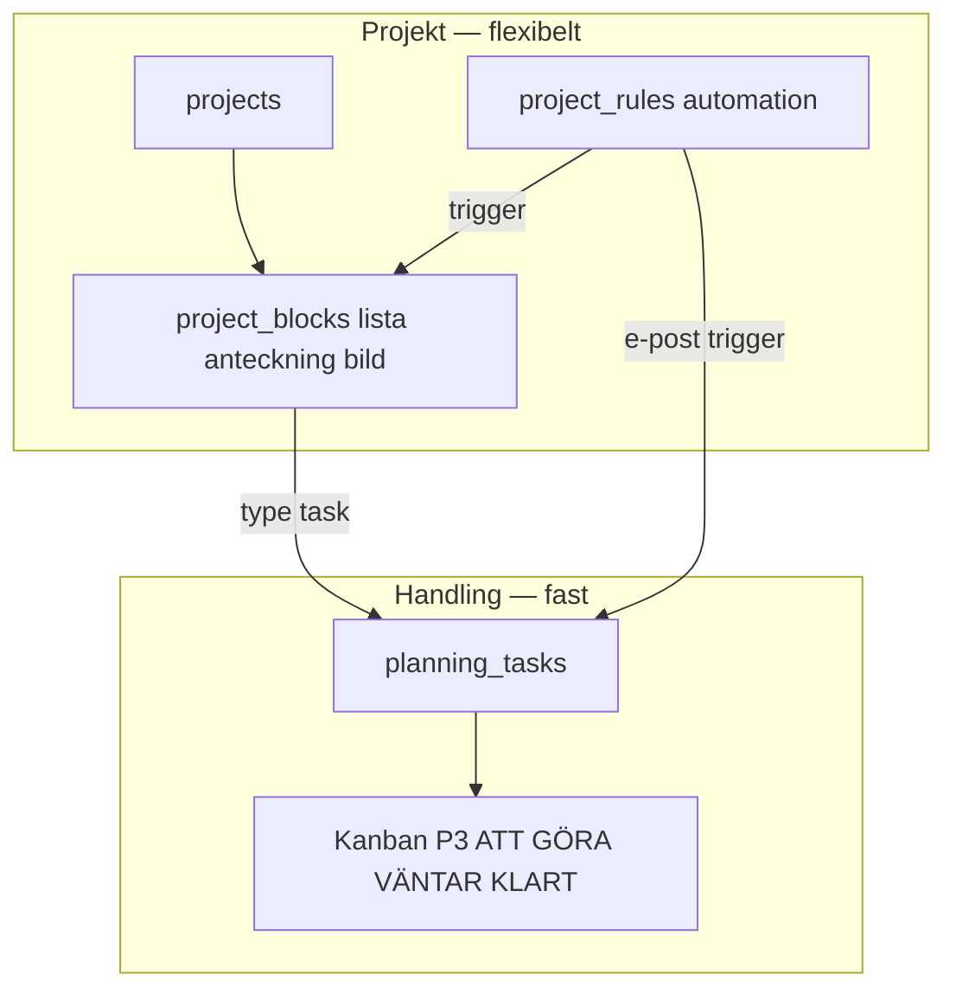
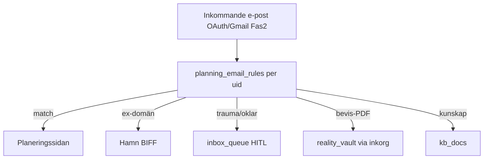
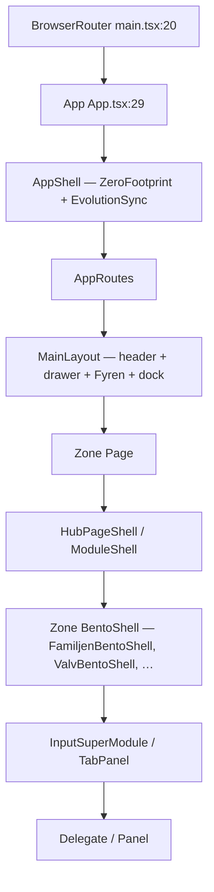
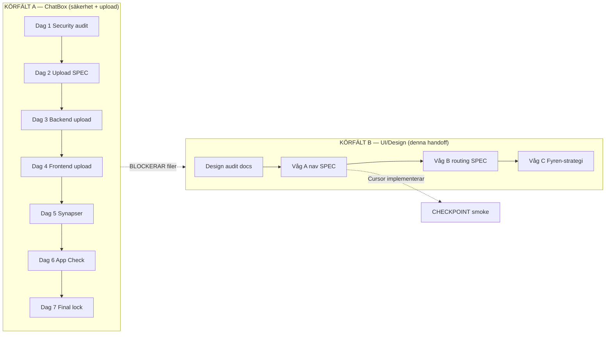

This file is a merged representation of a subset of the codebase, containing specifically included files, combined into a single document by Repomix.
The content has been processed where comments have been removed, empty lines have been removed, content has been compressed (code blocks are separated by ⋮---- delimiter).

# File Summary

## Purpose
This file contains a packed representation of a subset of the repository's contents that is considered the most important context.
It is designed to be easily consumable by AI systems for analysis, code review,
or other automated processes.

## File Format
The content is organized as follows:
1. This summary section
2. Repository information
3. Directory structure
4. Repository files (if enabled)
5. Multiple file entries, each consisting of:
  a. A header with the file path (## File: path/to/file)
  b. The full contents of the file in a code block

## Usage Guidelines
- This file should be treated as read-only. Any changes should be made to the
  original repository files, not this packed version.
- When processing this file, use the file path to distinguish
  between different files in the repository.
- Be aware that this file may contain sensitive information. Handle it with
  the same level of security as you would the original repository.

## Notes
- Some files may have been excluded based on .gitignore rules and Repomix's configuration
- Binary files are not included in this packed representation. Please refer to the Repository Structure section for a complete list of file paths, including binary files
- Only files matching these patterns are included: docs/external-ai/design/UI-DESIGN-HANDOFF.md, docs/external-ai/LIFE-OS-BUILD-STATE.md, docs/external-ai/chatbox/CHATBOX-LATHUND.md, docs/external-ai/DESIGN-KEEP-REGISTER.md, docs/evaluations/2026-06-15-arkitektur-nav-analys.md, docs/evaluations/2026-06-15-fas19-masterplan-v2.md, .context/locked-ux-features.md, .context/design-language.md, .context/locked-icons.md, docs/design/COLOR-POLICY.md, docs/design/ICON-STYLE-GUIDE.md, docs/design/PLANERING-PROJEKT-HYBRID.md, docs/design/PLANERINGSSIDA-SPEC.md, docs/design/WIDGET-BAR-SPEC.md, docs/design/BARNPORTEN-SPEC.md, docs/design/VALV-HUBB-SPEC.md, docs/design/FAMILJEN-HUB-SPEC.md, docs/design/references/MENU-DRAWER-KANON.md, docs/design/references/DOCK-KANON.md, docs/design/references/KOMPASS-TRE-TIDPUNKTER.md, docs/gpt-handoff/README.md, src/modules/core/navigation/navTruth.ts, src/modules/core/layout/FloatingDock.tsx, src/modules/core/components/FyrenWidgetBar.tsx, src/modules/shell/LivLauncherGrid.tsx, src/modules/shell/livLauncherPreviews.tsx, src/modules/core/routing/AppRoutes.tsx, src/modules/features/admin/planning/components/PlaneringPage.tsx
- Files matching patterns in .gitignore are excluded
- Files matching default ignore patterns are excluded
- Code comments have been removed from supported file types
- Empty lines have been removed from all files
- Content has been compressed - code blocks are separated by ⋮---- delimiter
- Files are sorted by Git change count (files with more changes are at the bottom)

# Files

## File: .context/design-language.md
````markdown
# Visuell Estetik och Designspråk

**Canonical:** [`docs/specs/design-master.md`](../docs/specs/design-master.md)  
**Aktivt tema:** **Theme Pack I** (default) + **Pack J** (auto per hub) — [`THEME-I-SPEC.md`](../docs/design/themes/I-architect-vault/THEME-I-SPEC.md) · [`J-PACK-EIGHT-HUBS.md`](../docs/design/themes/J-PACK-EIGHT-HUBS.md)

## Theme Pack I (prod 2026-05-24)

| ID | Modul |
|----|-------|
| I-stone | Hem, Valv, Widget expanded |
| I-alchemical | Kompass, Rutiner, Budget |
| I-skymning | MåBra, KBT, Familjen |
| I-hamn | Hamn |
| I-glass | Widget peek |

**Runtime:** `src/modules/core/theme/themeRegistry.ts` · **Preview:** `/dev/themes`  
**Default:** `E-skymning-prod` · **Auto per route:** `moduleThemeMap.ts` (hel-E)

## Estetik (Tema E prod — `E-skymning-prod`)

- Bakgrund: skog-teal `#0a1614`, skymning `#12151f`, kompass-skiva `#0d3b3b`, guld `#d4af37`
- Typografi: **Cinzel** (hub-rubriker via `font-display-serif`), **Outfit** (övriga rubriker), **Inter** (bröd)
- Dock: klassisk triad (`VITE_DOCK_MODE=classic` default) — [`DOCK-KANON.md`](../docs/design/references/DOCK-KANON.md)
- Skala: [`TYPE-SCALE.md`](../docs/design/TYPE-SCALE.md) · `HubPageShell`
- Smart widget: `FyrenSmartWidgetBar` — hidden / peek / expanded
- Progressive disclosure — ett steg i taget
- **Förbjudet globalt:** indigo/lila text-accent, natur-tapeter

## Ikoner (Premium Helros)

- **Låst:** D1 kompass · M2 Kompis — [`.context/locked-icons.md`](locked-icons.md) · app-ikon upplåst (P1–P5)
- **Stilguide:** [`docs/design/ICON-STYLE-GUIDE.md`](../docs/design/ICON-STYLE-GUIDE.md)
- **Övriga chrome:** `docs/design/icons-proposals/2026-05-26-v4-round2-dna/` · hub v5 `2026-05-29-gold-hub-v5/`

## Centrala Element

- **LivskompassHero:** guld kompass-hub på Hem
- **FyrenSmartWidgetBar:** klocka, Fokus·Struktur·Närvaro, WORM-routes
- **Sub-Synaptisk Bakgrund:** `AmbientBackground` + `data-theme-bg`

## Tailwind / CSS

- Tokens: `themeRegistry.ts` → `applyTheme()` → `:root` + `html[data-theme]`
- Glass: guld border 2px, accent-glow på widget-ikoner
- Chrome (dock/widget/meny): [CHROME-POLICY.md](../docs/design/CHROME-POLICY.md) · **låst ember:** [CHROME-EMBER-KANON.md](../docs/design/CHROME-EMBER-KANON.md) · nav: `navTruth.ts`
- Hub-färger (J-pack): se [COLOR-POLICY.md](../docs/design/COLOR-POLICY.md)
````

## File: .context/locked-icons.md
````markdown
# Låsta ikoner (produkt — 2026-05-29)

**Status:** D1 + M2 låsta. App-ikon: **P7** (vault-sacred-3d, prod 2026-05-29) · P6 · P8-alpha.

| ID | Plats | Komponent / fil | Status |
|----|-------|-----------------|--------|
| **D1** Gold stack | Header lockup, dock-mitt, hero-centrum, drawer-mark | `LivskompassMark.tsx` · `LivskompassBrandLockup.tsx` | LÅST |
| **M2** Orakelöga | Kompis-avatar (header) | `KompisMark.tsx` | LÅST |
| **WH1** Inspelning | Fyren strip + PWA shortcut | `FyrenShortcutMicIcon.tsx` · `drawer-inspelning.svg` · `wh-inspelning.svg` | LÅST 2026-06-14 |
| **WH2** Anteckning | Fyren strip + hub-kontext + PWA | `FyrenShortcutNoteIcon.tsx` · `drawer-anteckning.svg` · `wh-anteckning.svg` | LÅST 2026-06-14 |
| ~~**B1**~~ | Legacy | `d1-helros-2026-05-26-archive` | Arkiverad |

## Hub chrome v5 (G1 default)

- Generator: `npm run icons:proposals-v5`
- Prod: `public/icons/chrome/v5-g1-*.svg` · `ChromeV5Icon`
- Stilar G1–G5: Theme Lab (`lk.chromeIconStyle`)

## Telefonikoner

| ID | Fil |
|----|-----|
| **P7** | `vault-sacred-3d-2026-05-source.png` → `P7-vault-sacred-1024.png` (**prod**) |
| **P7-alpha** | `P7-vault-sacred-alpha-1024.png` (transparent) |
| **P6** | `P6-gold-emboss-1024.png` |
| **P8-alpha** | `P8-orbit-hub-alpha-1024.png` |

`npm run icons:phone-export` · `npm run android:icons:phone`

## Fyren WH1 / WH2 (glyph-lås)

- **WH1:** mikrofon (kapsel + båge + ställ), **ingen REC-prick** — `WIDGET-BAR-SPEC.md`
- **WH2:** dokument + vikt hörn + penna
- **Fyren in-app:** inline `FyrenShortcutMicIcon` / `FyrenShortcutNoteIcon` i `FyrenWidgetBar.tsx` (`widgetIcon: 'mic' | 'note'`) — **inte** extern `shortcutSrc` till gamla D1-placeholders
- **PWA/hemskärm:** `public/icons/shortcuts/wh-*.svg` (48px, samma glyph)

## Smoke

`npm run smoke:locked-icons` · `npm run smoke:locked-ux`
````

## File: .context/locked-ux-features.md
````markdown
# Locked UX Features (låsta — får inte tas bort)

**Status:** Låst 2026-05-23. Ändring kräver explicit produktbeslut i commit/PR.

Dessa är **inte** Sacred Features i säkerhetslagret, men de är **låsta produktflöden** för trygg hamn (Barnen) och Pansaret (Valv). Agent och refaktor får inte ta bort, döpa om eller gömma dem utan att uppdatera denna fil och smoke.

---

## 1. Barnfokus-frågor (Familjen / Barnen — ev. «Middagsfrågan»)

| | |
|---|---|
| **Route** | `/familjen?tab=reflektion` → `FamiljenPage` → `FamiljenInputSuperModule` (läge `barnfokus`) |
| **Syfte** | Roterande frågor (roligt, kunskap, knas, lära känna, utveckling, valv-bank) → minneslista |
| **Kod** | `FamiljenBarnfokusDelegate.tsx`, `barnfokusQuestionForToday`, `BARNFOKUS_QUESTIONS`, `category: 'barnfokus'` |
| **Spec** | `docs/design/FAMILJEN-BARNFOKUS-FRAGOR-SPEC.md` · [`docs/specs/Familjen-INPUT-SUPERHUB-SPEC.md`](../docs/specs/Familjen-INPUT-SUPERHUB-SPEC.md) |
| **Krav** | Knapp **Spara till {barn}s logg**; **Annan fråga**; optimistisk minneslista; **inte** enbart middag-rubrik |
| **Smoke** | `npm run smoke:locked-ux` · manuell #19 |

---

## 2. Pansaret — Mönster & Orkester (Valv-baksida)

| | |
|---|---|
| **Route** | `/valvet?vaultTab=…` → `VaultPage` (PIN/WebAuthn) · legacy `/dagbok?tab=bevis` redirect |
| **Zoner** | **Samla** · **Analysera** · **Kunskap** · **Exportera** · **Forensik** — [`VALV-HUBB-SPEC.md`](../docs/design/VALV-HUBB-SPEC.md) |
| **Flikar** | **Arkiv** · **Granska inkommande** · **Mönster** · **Meddelanden eller SMS-analys** (`vaultTab=orkester`) · **Dossier** · **Kunskapsbank** · **Personer i ärendet** |
| **Mönster** | `VaultMonsterPanel` + `buildVaultFrequencyReport` (deterministisk regex, ingen LLM-sanning) |
| **Meddelanden / SMS-analys** | `VaultOrkesterPanel` + `PRODUCT_AGENTS` + SMS-tråd → `analyzeMessage` (flik-ID `orkester` oförändrat) |
| **P1 Brusfilter (LOCK 2026-06-17)** | `processBrusfilter` callable + panel i `VaultOrkesterPanel` — DCAP + logistik + BIFF-utkast, **ingen auto-WORM** |
| **Kunskapsbank** | `VaultKunskapsbankPanel` — `KunskapPage` + `FamiljenKunskapHubTab` (U1 silos) |
| **Aktörskarta (G9)** | `VaultAktorskartaPanel` + `EntityAddForm` + `addEntityProfile` — manuella personer, append-only metadata för agenter (ej RAG, ej publik meny) |
| **Smoke** | `npm run smoke:locked-ux` · `npm run smoke:entities` · manuell #20 i `docs/SMOKE_CHECKLIST.md` |

---

## 3. Planering + Projekt (design låst — hybrid)

| | |
|---|---|
| **Beslut** | [`docs/design/PLANERING-PROJEKT-HYBRID.md`](../docs/design/PLANERING-PROJEKT-HYBRID.md) |
| **Handling (fast)** | P3 Kanban ATT GÖRA · VÄNTAR · KLART — `/planering` |
| **Projekt (flex)** | Lista, anteckning, bild, egna planeringar — `/projekt` |
| **Widget** | v2 [`galleri/widget/v2/W1-kompakt-projekt.png`](../docs/design/galleri/widget/v2/W1-kompakt-projekt.png) |
| **Spec** | `PROJEKT-SPEC.md`, `PLANERING-P3-KANBAN-SPEC.md`, `WIDGET-BAR-SPEC.md` |
| **Smoke** | Hybrid-spec + kanon-PNG finns |

---

## 4. Planeringssidan (äldre register — se §3 hybrid)

| | |
|---|---|
| **Route (plan)** | `/planering` |
| **Spec** | `docs/design/PLANERINGSSIDA-SPEC.md`, mockups `docs/design/planering/` |
| **Krav** | P1–P4 + Projekt; e-postregler `planning_email_rules`; **inte** ex-brus hit |
| **Smoke** | Spec-fil + nyckelsträngar i `smoke_locked_ux.mjs` |

---

## 5. Fyren Edge — widget + tyst inspelning (design låst)

| | |
|---|---|
| **Spec** | `docs/design/WIDGET-BAR-SPEC.md`, `docs/design/HOMESCREEN-WIDGETS-SPEC.md`, `docs/design/ANDROID-WIDGETS-SPEC.md` |
| **Kod** | `FyrenWidgetBar.tsx`, `/widget/*`, `android/…/widgets/*`, `ingestWidgetRecording` |
| **Krav** | WH1: datumstämpel, AI-titel, WORM, sammanfattning i `truth`, ljudfil `evidenceUrl`; **ingen synlig REC** |
| **Data** | `reality_vault` WORM, `category: tyst_inspelning` |
| **Smoke** | Spec-fil + nyckelsträngar |

---

## 6. Sidomeny / hamburger (design låst — Vardag + Valv)

| | |
|---|---|
| **Kanonbild** | `docs/design/references/MENU-DRAWER-KANON.png` |
| **Spec** | `docs/design/references/MENU-DRAWER-KANON.md` |
| **Sektioner** | **Vardag** (publikt) · **Valv** (endast efter PIN/gate på Valv-route) |
| **Kod** | `navTruth.ts`, `NavigationDrawer.tsx`, `DrawerModeToggle.tsx` |
| **Krav** | Skymningsbakgrund; aktiv rad **guld**; **ingen** Valv-växlare/snabbchips i publikt läge |
| **Smoke** | Kanonfil + spec + `DRAWER_VARDAG_ITEMS` / `DRAWER_VALV_ENTRIES` + `vaultOpen` i NavigationDrawer |

---

## 7. Barnporten — barnens hub (design låst)

| | |
|---|---|
| **Route (barn)** | `/barnporten` (PWA) · **förälder** `/familjen?tab=barnporten` |
| **Spec** | `docs/design/BARNPORTEN-SPEC.md`, infografik `docs/design/barnporten/infographic.html` |
| **Orkester** | `src/modules/barnporten/constants/barnportenAgents.ts` — **egen** barn-Orkester (skild från Valv-Orkester) |
| **Valv** | Endast HITL `promoteChildLogToVault` — **aldrig** auto från privat barnlogg |
| **Widget** | CB1–CB4 (barn); **inte** samma som förälder W1 |
| **Smoke** | Spec + `barnportenAgents.ts` + mockup-mapp |

### 7b. Inkorg → Valv-bro (HITL — **låst 2026-05-29**)

| | |
|---|---|
| **Kanon UI** | [`docs/design/barnporten/mockups/barnporten-inkorg-valv-kanon.png`](../docs/design/barnporten/mockups/barnporten-inkorg-valv-kanon.png) |
| **Route (förälder)** | `/familjen?tab=barnporten` → `BarnportenInboxPanel` |
| **Flöde** | Barnmeddelande i inkorg → vuxen granskar → explicit godkännande → `reality_vault` WORM |
| **Kod** | `BarnportenInboxPanel.tsx` · `SaveAsEvidencePrompt.tsx` · `buildVaultPayloadFromChildLog` (`sourceRef`) |
| **HITL** | **Human-In-The-Loop** — inget sparas automatiskt; vuxen trycker **Spara som bevis** / **Flytta till Valv (HITL)** |
| **Tidsstämpel** | `saveVaultLog` → Firestore `serverTimestamp()` → Valv visar **SERVER-TIDSSTÄMPEL** |
| **Efter spar** | Länk **Granska i Valv** → `/valvet` |
| **Tagline (mål-UI)** | *Skapa trygghet. Bygg tillit.* · *Från inkorg till Valv – för framtiden.* |
| **Status (mål-UI)** | *Klar för långtidslagring* · HITL-badge med sköld |

**Får inte:** auto-promote från `private_child` / *Bara för mig*; ta bort HITL-steg; spara till Valv utan `sourceRef: children_logs/{id}`; ta bort inkorg-panelen eller mockup-kanon.

---

## 8. Arbetsliv — modulhub (låst)

| | |
|---|---|
| **Route** | `/arbetsliv` · redirect `/stampla` → `?tab=stampla` |
| **Kod** | `src/modules/arbetsliv/components/ArbetslivHubPage.tsx` |
| **Publikt** | Stämpel · Tid & flex · Logg |
| **Valv-menyn** | Frånvaro · Lön & spec → `vaultTab=arbetsliv_*` · zon `arbetsliv_forensic` |
| **Vardagen** | `/vardagen?tab=ekonomi` = veckopeng/matlåda |
| **Eval** | `docs/evaluations/2026-05-25-arbetsliv-hub.md` |
| **Smoke** | `npm run smoke:arbetsliv` |

**Får inte:** ta bort menyrad Arbetsliv eller stämpel-hub utan produktbeslut.

---

## 8b. Trygg Hamn — snabb ingång vs Valv (**godkänt 2026-05-29**)

| | |
|---|---|
| **Snabb** | `/hamn` — `BiffPublicPanel` (Grey Rock), Speglar-länk, utan PIN |
| **Djup** | Valv → Forensik → **Hamn · Analys** (`hamn_analys`) — triage, bevis, HITL |
| **Redirect** | `/hamn?tab=analys` → `/valvet?vaultTab=hamn_analys` |
| **Kanon** | [`docs/design/VALV-HUBB-SPEC.md`](../docs/design/VALV-HUBB-SPEC.md) |

**Får inte:** kräva Valv-PIN för första BIFF-svar eller ta bort `/hamn` från Vardag-drawer.

---

## 9. Valv-baksida — samlad PIN-vägg (2026-05-25)

| | |
|---|---|
| **Ingång** | Hamburgermeny → sektion **Valv** · `/valvet?vaultTab=…` |
| **Kunskap** | All kunskap (Vardagen, Familjen, Hem) → **Kunskapsbank** — **inte** publik `/vardagen?tab=kunskap` |
| **Forensic** | Hamn analys, Speglar fördjupat, Dagbok arkiv, Familjen mönster, Arbetsliv frånvaro/lön |
| **U1** | Kunskapsbank anropar `knowledgeVaultQuery` — **aldrig** cross-RAG till Valv/Barnen |
| **Kod** | `VaultPage.tsx`, `VaultKunskapsbankPanel.tsx`, `VaultForensicPanel.tsx`, `navTruth.ts` |

---

## 10. Produktikoner D1 · M2 (låst) · app-ikon upplåst

| ID | Plats | Fil | Status |
|----|-------|-----|--------|
| ~~**B1**~~ | App / favicon | `public/favicon.svg` | **Upplåst** — P1–P5 i `phone-icon-variants/PREVIEW.md` |
| **D1** | Header, dock, hero | `LivskompassMark.tsx` | LÅST |
| **M2** | Kompis-avatar | `KompisMark.tsx` | LÅST |

| | |
|---|---|
| **Register** | `.context/locked-icons.md` · stil: `docs/design/ICON-STYLE-GUIDE.md` |
| **App-ikon** | `docs/design/themes/phone-icon-variants/PREVIEW.md` · `npm run android:icons:phone` |
| **Smoke** | `npm run smoke:locked-icons` |

**Får inte:** Lucide-kompass i Kompis, minimal linje-D1, eller Vite-lila favicon utan beslut.

---

## 11. MåBra — Universal Input Superhub (`MabraInputSuperModule`) — **låst 2026-06-14**

| | |
|---|---|
| **Route** | `/mabra/input` · `/mabra/projekt/:projectId?inputMode=…` · `MabraRoutes.tsx` |
| **Syfte** | Polymorf inmatningshub för MåBra (Vit) — byt läge utan att byta sida |
| **Kod** | `MabraInputSuperModule.tsx` · `mabraInputModes.ts` · `supermodule/*` |
| **Spec** | [`docs/specs/modules/Mabra-INPUT-SUPERHUB-SPEC.md`](../docs/specs/modules/Mabra-INPUT-SUPERHUB-SPEC.md) |
| **Eval** | [`docs/evaluations/2026-06-14-fas6-mabra-superhub-djupanalys.md`](../docs/evaluations/2026-06-14-fas6-mabra-superhub-djupanalys.md) |
| **Fas** | 6A→6E **AVSLUTAD** 2026-06-14 — registrerad i `.context/system-plan.md` |

### Input modes (låsta lägen)

| Mode | Beskrivning |
|------|-------------|
| `checkin` | Humör/energi check-in |
| `emotional_memory` | Känslominnen (WORM) |
| `vit_card` | Vit frågekort |
| `vit_chat` | Lär tillsammans (Vit-chatt) |
| `vit_memory` | Känslominne (Vit) |
| `reflection_tool` | Reflektionskort/deck |
| `exercise_note` | Anteckning efter övning |
| `dagbok_bridge` | Bro till Hjärtat/dagbok |
| `inkast` | Granska innan spar (HITL) |

### Säkerhetsgränser (obligatoriska)

| Princip | Tillämpning |
|---------|-------------|
| **WORM** | `vit_entries` och `emotional_memory` — append-only; **ingen** `update`/`delete` |
| **Zero Footprint** | Reflektioner (`reflection_tool`, m.m.) i **RAM** och **localStorage**; molnsparande kräver **strikt uttryckliga HITL-åtgärder** (Human-in-the-loop) |
| **Inkast** | Läge `inkast` kräver **manuellt godkännande** — **ingen** automatisk marknadsföring till Valv, Barnen eller annan silo |
| **U1 silos** | Ingen cross-RAG till Kunskap; ex/konflikt → Speglar/Hamn (guard) |

**Får inte:** ta bort eller gömma lägesväxlaren; införa spridda inmatningsformulär utanför Superhub i MåBra-zonen; auto-promote från inkast; skriva till WORM-samlingar utan befintlig delegate-logik; ändra kärnlogik utan explicit produktbeslut (Pontus) + PMIR.

**Smoke:** `npm run smoke:mabra` · `npm run smoke:emotional-memory` · `npm run smoke:locked-ux`

---

## 12. Familjen — Universal Input Superhub (`FamiljenInputSuperModule`) — **låst 2026-06-14**

| | |
|---|---|
| **Route** | `/familjen?tab=reflektion` · `/familjen?tab=livslogg` · `?inputMode=…` · `FamiljenPage.tsx` |
| **Syfte** | Polymorf inmatningshub för Familjen (Barnen-silo) — byt läge utan sidbyte |
| **Kod** | `FamiljenInputSuperModule.tsx` · `familjenInputModes.ts` · `supermodule/delegates/*` |
| **Spec** | [`docs/specs/Familjen-INPUT-SUPERHUB-SPEC.md`](../docs/specs/Familjen-INPUT-SUPERHUB-SPEC.md) |
| **Eval** | [`docs/evaluations/Familjen-INPUT-SUPERHUB-EVAL.md`](../docs/evaluations/Familjen-INPUT-SUPERHUB-EVAL.md) |
| **Fas** | 7A→7E **AVSLUTAD** 2026-06-14 — registrerad i `.context/system-plan.md` |

### Input modes (låsta lägen)

| Mode | Beskrivning |
|------|-------------|
| `barnfokus` | Dagens fråga — PLAY, optimistisk minneslista |
| `livslogg_stund` | Positiv stund med barnet |
| `fysiologi` | Sömn, ångest, aptit 1–5 |
| `livslogg_observation` | Neutral observation + valfri HITL till Valv |
| `vardagsstruktur` | Rutinobservation |
| `inkast` | Granska innan spar (G10 pipeline, HITL) |

### Säkerhetsgränser (obligatoriska)

| Princip | Tillämpning |
|---------|-------------|
| **WORM** | Alla direkta writes → `saveChildrenLog()` → `children_logs` append-only; **ingen** `update`/`delete` |
| **U1 silos** | Enda write-target = **Barnen** (`children_logs`); **ingen** cross-RAG till Kunskap; Valv endast via `SaveAsEvidencePrompt` (HITL) |
| **Offline block** | `children_logs` ∈ offline-block; delegates visar `offlineWriteUserMessage()` — **ingen** tyst SDK-kö |
| **HITL** | `livslogg_observation` → valfri Valv-bro efter explicit klick; **aldrig** auto-promote från barnfokus/stund/fysio/vardagsstruktur |
| **Zero Footprint** | Delegate unmount → rensa textarea; inga halvfyllda observationer i localStorage |
| **Hub glow** | Container **MÅSTE** ha `glow-bottom-blue` (indigo) — **inte** smaragd (reserverad MåBra) |

**Får inte:** ta bort lägesväxlaren; införa spridda inmatningsformulär utanför Superhub i Familjen write-zon; auto-promote till `reality_vault`; skriva till WORM utan shell-handlers; ändra kärnlogik utan explicit produktbeslut (Pontus) + PMIR.

**Smoke:** `npm run smoke:locked-ux` · `npm run smoke:children` · `npm run smoke:innehall`

---

## 13. Åtgärder-widget — Action Dashboard (PWA hub) — **låst 2026-06-14**

| | |
|---|---|
| **Route** | `/widget/aktioner` → `WidgetActionDashboardPage` |
| **Syfte** | Mobil-först snabbinmatning: reflektion/röst → Valv, stämpel, barnlogg |
| **Kod** | `ActionDashboard.tsx` · `actionDashboardApi.ts` · `actionDashboardOfflineQueue.ts` · `useActionDashboardOfflineFlush.ts` |
| **Kort** | **Multiverktyg** (text + inspelning → `reality_vault`) · **Arbetstid** (`useStampClock`) · **Livslogg** (`children_logs`, kanal `widget`) |
| **Offline** | IndexedDB-kö `livskompassen_action_dashboard_v1` för Valv + barnlogg; flush vid `online` + före utloggning |
| **Krav** | `QueuedBanner` vid kö; röst → transkript (Web Speech) + ljud → Valv direkt; knapp **Spara till {barn}s logg** |
| **Smoke** | `npm run smoke:locked-ux` (aktioner-strängar) |

**Får inte:** ta bort offline-kö; auto-promote barnlogg till Valv; online-only för evidens-silos; ta bort tre-korts-layout utan produktbeslut + PMIR.

---

## 14. Ekonomi — Universal Input Superhub (`EkonomiInputSuperModule`) — **låst 2026-06-14**

| | |
|---|---|
| **Route** | `/vardagen?tab=ekonomi` · `?inputMode=…` · legacy `?legacy=true` → `EconomyOverviewPanel` |
| **Syfte** | Polymorf inmatningshub för Vardagen ekonomi — byt läge utan sidbyte |
| **Kod** | `EkonomiInputSuperModule.tsx` · `ekonomiInputModes.ts` · `capacityResolver.ts` · `supermodule/delegates/*` |
| **Spec** | [`docs/specs/Ekonomi-INPUT-SUPERHUB-SPEC.md`](../docs/specs/Ekonomi-INPUT-SUPERHUB-SPEC.md) |
| **Eval** | [`docs/evaluations/Ekonomi-INPUT-SUPERHUB-EVAL.md`](../docs/evaluations/Ekonomi-INPUT-SUPERHUB-EVAL.md) |
| **Fas** | 8A→8E **AVSLUTAD** 2026-06-14 — GAP F8 done |

### Input modes (låsta lägen)

| Mode | Beskrivning |
|------|-------------|
| `saldo` | Saldoöversikt / mikroinmatning |
| `mikrosteg` | Paralys-panel — ett steg i taget |
| `profil` | Ekonomiprofil |
| `matprep` | Matprep / veckomeny |
| `kuvert` | Budgetkuvert |
| `spar` | Sparmål |
| `impuls` | Impulskö |
| `inkast` | Granska innan spar (HITL) |
| `arbetsliv_bro` | Navigation till Arbetsliv (ej write här) |

### Säkerhetsgränser (obligatoriska)

| Princip | Tillämpning |
|---------|-------------|
| **WORM** | `transactions` append-only via befintliga helpers — **ingen** `update`/`delete` på WORM-evidens |
| **Infinite Evolution** | Kapacitetsstyrd UI via `capacityResolver.ts` + `evolution_hub` |
| **U1 silos** | Ingen cross-RAG; ingen auto-promote till Valv |
| **Skild från Arbetsliv** | `economy_ledger`, stämpel — `/arbetsliv` only |

**Får inte:** ta bort lägesväxlaren; spridda ekonomi-formulär utanför Superhub; auto-promote till `reality_vault`; ändra kärnlogik utan explicit produktbeslut (Pontus) + PMIR.

**Smoke:** `npm run smoke:ekonomi` · `npm run smoke:evolution` · `npm run smoke:locked-ux`

---

## 15. Planering — Universal Input Superhub (`PlaneringInputSuperModule`) — **låst 2026-06-14**

| | |
|---|---|
| **Route** | `/planering/input` · `/planering/input?inputMode=…` · embed `/planering?tab=handling&inputMode=…` |
| **Syfte** | Polymorf inmatningshub för Planering — snabb uppgift, smart inkast, inköpslista utan sidbyte |
| **Kod** | `PlaneringInputSuperModule.tsx` · `planeringInputModes.ts` · `PlaneringInputRoutes.tsx` · `supermodule/delegates/*` |
| **Spec** | [`docs/specs/Planering-INPUT-SUPERHUB-SPEC.md`](../docs/specs/Planering-INPUT-SUPERHUB-SPEC.md) |
| **Eval** | [`docs/evaluations/2026-06-14-planering-superhub-djupanalys.md`](../docs/evaluations/2026-06-14-planering-superhub-djupanalys.md) |
| **Fas** | 9A→9C **AVSLUTAD** · W3 integration **låst** 2026-06-14 |

### Input modes (låsta lägen)

| Mode | Beskrivning |
|------|-------------|
| `task_quick` | Snabb uppgift → Att göra / Väntar |
| `inkast` | Smart inkast — G10 HITL |
| `quick_list` | Inköpslista (localStorage) |

### Säkerhetsgränser (obligatoriska)

| Princip | Tillämpning |
|---------|-------------|
| **P3 Kanban** | `PlanningKanbanBoard` / `GoraSuperModule` oförändrat — hub är **tillägg**, inte ersättning |
| **G10 HITL** | `inkast` via `CaptureSuperModule` — ingen auto-promote |
| **U1 silos** | Ingen cross-RAG |

**Får inte:** ta bort lägesväxlaren; flytta Kanban; Firestore-skrivningar i routern; ändra kärnlogik utan PMIR.

**Smoke:** `npm run smoke:planering-superhub` · `npm run smoke:locked-ux`

---

## 16. Arbetsliv — Universal Input Superhub (`ArbetslivInputSuperModule`) — **låst 2026-06-14**

| | |
|---|---|
| **Route** | `/arbetsliv/input` · `/arbetsliv/input?inputMode=stampla\|tid\|logg` · legacy `?tab=` → redirect |
| **Syfte** | Ersätter TabBar-växling med polymorf hub — stämpel, tid, logg utan sidbyte |
| **Kod** | `ArbetslivInputSuperModule.tsx` · `arbetslivInputModes.ts` · `ArbetslivInputRoutes.tsx` · `supermodule/delegates/*` |
| **Spec** | [`docs/specs/Arbetsliv-INPUT-SUPERHUB-SPEC.md`](../docs/specs/Arbetsliv-INPUT-SUPERHUB-SPEC.md) |
| **Eval** | [`docs/evaluations/2026-06-14-arbetsliv-superhub-djupanalys.md`](../docs/evaluations/2026-06-14-arbetsliv-superhub-djupanalys.md) |
| **Fas** | 10A→10C **AVSLUTAD** · W3 integration **låst** 2026-06-14 |

### Input modes (låsta lägen)

| Mode | Beskrivning | Write-target |
|------|-------------|--------------|
| `stampla` | Stämpelklocka | `time_entries` |
| `tid` | Tid & flex | read-only + Valv-länk |
| `logg` | Ekonomilogg | `economy_ledger` |

### Säkerhetsgränser (obligatoriska)

| Princip | Tillämpning |
|---------|-------------|
| **Valv** | Frånvaro/lön endast via `vaultDrawerPath` — PIN |
| **Ekonomi-zon** | Ingen ledger-write från Ekonomi Superhub |
| **WORM** | Oförändrade `StampClockPage`, `EconomyTidPanel`, `EconomyLogPanel` |

**Får inte:** ta bort tre-lägesväxlaren; Valv-paneler i supermodule; indigo/smaragd glow; parallell TabBar + hub.

**Smoke:** `npm run smoke:arbetsliv-superhub` · `npm run smoke:arbetsliv` · `npm run smoke:locked-ux`

---

## 17. Superdagbok — Universal Input Superhub (`DagbokInputSuperModule`) — **låst 2026-06-14**

| | |
|---|---|
| **Route** | `/hjartat/input` · `/hjartat/input?inputMode=…` · embed `/hjartat?tab=reflektion&inputMode=…` · legacy `?mode=` → redirect |
| **Syfte** | Polymorf inmatningshub för Hjärtat — reflektion, snabb spegling, minneslista utan sidbyte |
| **Kod** | `DagbokInputSuperModule.tsx` · `dagbokInputModes.ts` · `DagbokInputRoutes.tsx` · `supermodule/delegates/*` |
| **Spec** | [`docs/specs/Superdagbok-INPUT-SUPERHUB-SPEC.md`](../docs/specs/Superdagbok-INPUT-SUPERHUB-SPEC.md) |
| **Eval** | [`docs/evaluations/2026-06-14-superdagbok-superhub-djupanalys.md`](../docs/evaluations/2026-06-14-superdagbok-superhub-djupanalys.md) |
| **Fas** | 11A→11C **AVSLUTAD** · W5 integration **låst** 2026-06-14 |

### Input modes (låsta lägen)

| Mode | Beskrivning | Write-target |
|------|-------------|--------------|
| `reflektion` | Steg-för-steg wizard | `journal` WORM |
| `quick_mirror` | Snabb check-in + spegling | `journal` WORM + `journalQuickMirror` |
| `arkiv` | Minneslista | read-only |

### Säkerhetsgränser (obligatoriska)

| Princip | Tillämpning |
|---------|-------------|
| **WORM** | `useJournalFlow` / `saveJournalEntry` — ingen update/delete på journal |
| **Valv** | Forensic-readonly stannar i `DagbokSuperModule variant="forensic-readonly"` |
| **MåBra** | `mabra-bridge` stannar i MåBra superhub — ej dupliceras |
| **U1 silos** | Ingen cross-RAG |

**Får inte:** ta bort lägesväxlaren; indigo→guld glow; Firestore-skrivningar i routern; ändra journal API utan PMIR.

**Smoke:** `npm run smoke:superdagbok-superhub` · `npm run smoke:locked-ux`

---

## 18. Google web-login (AUTH-G1)

| | |
|---|---|
| **Syfte** | Prod Google-inlogg i Chrome/PWA utan `redirect_uri_mismatch` eller vit redirect-skärm |
| **Kanon** | [`.context/locked-auth-google.md`](locked-auth-google.md) · [`docs/FIREBASE-AUTH-LATHUND.md`](../docs/FIREBASE-AUTH-LATHUND.md) |
| **Kod** | `init.ts`, `authRedirectBoot.ts`, `googleAuthProvider.ts`, `authService.ts`, `AuthProvider.tsx`, `AuthGate.tsx` |
| **Krav** | `authDomain` = `firebaseapp.com` · popup i flik · `getRedirectResult` vid boot · ej prod `VITE_GOOGLE_SIGNIN_REDIRECT` |
| **Smoke** | `npm run smoke:auth-login` (ingår i `smoke:locked-ux`) |

**Får inte:** byta prod `authDomain` till `web.app`; tvinga alltid redirect på desktop; ta bort popup/boot utan produkt-OK.

---

## 19. Obsidian Depth — låst 3D-skalet (2026-06-14)

| | |
|---|---|
| **Theme ID** | `OD-obsidian-depth` |
| **Mockup** | `/dev/obsidian-depth` → `ObsidianDepthMockupPage.tsx` |
| **Spec** | [`docs/design/themes/OBSIDIAN-DEPTH-SPEC.md`](../docs/design/themes/OBSIDIAN-DEPTH-SPEC.md) · [`.context/locked-obsidian-depth.md`](locked-obsidian-depth.md) |
| **Kanonbilder** | `docs/design/theme-lab/obsidian-depth-*.png` |
| **Krav** | Glass bento + taktil 3D + guld endast i OD-skalet; knappar/menyer förfinas separat |
| **Smoke** | `npm run smoke:obsidian-depth` (ingår i `smoke:locked-ux`) |

**Får inte:** platta ut eller ta bort OD 3D-skalet utan produkt-OK; radera mockup-rutt eller kanon-PNG.

---

## 20. Diskret näringsintag (MåBra M3.0-C+)

| | |
|---|---|
| **Route** | `/mabra/verktyg/nutrition` · inställningar `/installningar?tab=naring` |
| **Syfte** | Snabb logg mat/dryck, mjuka nudges, valfri trend/rytm — utan kaloriräkning eller Valv-export |
| **Spec** | [`docs/specs/modules/NARING-INTAG-SPEC.md`](../docs/specs/modules/NARING-INTAG-SPEC.md) |
| **Kod** | `MabraNutritionPanel`, `MabraNutritionQuickLog`, `mabraNutritionNudges`, `NutritionSettingsPanel` |
| **Krav** | Kärnläge från start; trend/analys/makron endast via inställningar; lokal intagslogg |
| **Smoke** | `npm run smoke:mabra` · `npm run smoke:locked-ux` |

**Får inte:** kaloriräkning som standard; auto-export till Valv; streak/XP; ta bort snabb logg utan PMIR.

---

## Verifiering

```bash
npm run smoke:locked-ux
npm run smoke:auth-login
npm run smoke:locked-icons
npm run smoke:arbetsliv
npm run smoke:planering-superhub
npm run smoke:arbetsliv-superhub
npm run smoke:superdagbok-superhub
npm run smoke:obsidian-depth
```

Vid refaktor av `VaultPage`, `FamiljenPage`, eller borttagning av specs ovan: kör smoke innan merge.
````

## File: docs/design/references/DOCK-KANON.md
````markdown
# Botten-dock — KANON

**Beslut 2026-05-23:** Mittknappen visar **endast kompass** — ordet **「Hamn」** ska **inte** synas i UI.

---

## Tre zoner (klassisk dock i mockups)

| Position | Synligt | `aria-label` (skärmläsare) |
|----------|---------|------------------------------|
| Vänster | Ikon + **Familjen** | Familjen |
| **Mitten** | **Kompass-ikon endast** (guld ring) — **ingen synlig text** | **`Hem`** (aria-label) |
| Höger | Ikon + **Dagbok** | Dagbok (`/dagbok`) — **inte** Valv-etikett i dock |

**Route mitten:** `/` (hem) — inte `/hamn` i dock (Hamn-innehåll nås via menyn eller hem-kort).

**Snabbtryck mitten (ej hem):** kort sammanfattning av aktuell sida. **Håll 3s** på kompass → låst beviszon (`/valvet`) — utan synlig «Valv»-text i dock.

---

## CSS

```css
.dock-center__label { display: none; } /* Hamn-text bort */
.dock-center { min-width: 56px; }      /* kompensera utan text */
```

Satellit-orbit (nuvarande `CompassHubOrb`): centrum behåller `aria-label`; synlig etikett **Kompass** eller **ingen** — aldrig Hamn.

---

## Ingen båge under kompass

| Bort (2026-05-23) | Kvar |
|-------------------|------|
| Halvcirkel / upphöjd båge bakom mitt-knappen | Platt `dock-nav--hub` |
| Ellipse-glow `.dock-orbit-stage::before` | Rund kompass-platta (cirkel) |

Valv-ikon: **valvbåge** — se [`VALV-ICON-KANON.md`](./VALV-ICON-KANON.md). Mockup: [`dock-flat-valv-arch.png`](./dock-flat-valv-arch.png).

---

## Mockups

Eldre bilder kan visa 「Hamn」 under kompassen eller **sköld+bock** på Valv — **ignorera** vid implementation.
````

## File: docs/design/references/KOMPASS-TRE-TIDPUNKTER.md
````markdown
# Tre kompasser — tid på dygnet (sammanhängande familj)

**Bas (solnedgång):** [`KOMPASS-SOLNEDGANG-BAS.png`](./KOMPASS-SOLNEDGANG-BAS.png)  
**Familj:** Samma geometriska kompassros — olika **himmel + glöd** per läge.

| ID | Tid | Bakgrund | Kompass-glöd | App-ikon |
|----|-----|----------|--------------|----------|
| **K1 — Kväll** | 17–21 | Djup blå, sol precis under horisont | Varm amber, stjärnor täta | `kompass-tid-kvall-appicon.png` |
| **K2 — Skymning/gryning** | 21–05 / 05–07 | Teal-skog + mörkblå (Tema E hem) | Guld `#d4af37`, subtila stjärnor | `kompass-tid-skymning-appicon.png` |
| **K3 — Soluppgång** | 05–09 | Rosa-orange horisont, kall blå upptill | Guld med ljus kant, få stjärnor | `kompass-tid-soluppgang-appicon.png` |

Hub-mockups (kompass på hemskärm): `references/kompass-tid/`

---

## Kompass-hub — inga ord på skivan

| Före | Efter |
|------|--------|
| Pill `budget` | **Bort** — diskret **mynt-stack**-ikon (L1 emboss), ingen text |
| Pill `rutiner` | Kvar |
| Pill `personlig utveckling` | Kvar (ev. kortare «utveckling» på smal skärm) |

---

## Dock & «Hamn»

| Plats | Beslut |
|-------|--------|
| **Dock mitten** | **Endast kompass-ikon** — ingen text (varken Hamn eller Hem) |
| `aria-label` | **`Hem`** (skärmläsare) |
| **Sidomeny** | **Trygg hamn** (modulnamn) — inte bara «Hamn»; route `/hamn` oförändrad |
| Route `/hamn` | Behåll internt — produkt «Trygg hamn» i UI |

Se [`DOCK-KANON.md`](./DOCK-KANON.md).

---

## Implementation

- `LivskompassHero` väljer kompass-asset via `getCompassThemeByTime()` → K1/K2/K3
- `public/icons/app-icon-{kvall,skymning,soluppgang}.png` eller en dynamisk PWA-ikon (senare)
- Mynt: SVG emboss, opacity 0.85, **ingen** label
````

## File: docs/design/references/MENU-DRAWER-KANON.md
````markdown
# Sidomeny (hamburger) — KANON

**Status:** **Låst** 2026-05-27 — uppdaterad 2026-05-31 (hub-konsolidering).  
**Bild:** [`MENU-DRAWER-KANON.png`](./MENU-DRAWER-KANON.png) *(referens; UI kan sakna Valv-växlare i publikt läge)*

---

## Visuellt

| Element | Spec |
|---------|------|
| **Bakgrund** | Samma nordiska skymningsfoto som hem (blur + mörk overlay ~55%) |
| **Bredd** | ~68% skärm, glid in från vänster |
| **DOM** | `<aside class="nav-drawer">` före `.nav-drawer__backdrop` (drawer `z-[201]`, backdrop `z-[200]`) |
| **Header** | `LIVSKOMPASSEN` serif guld + dekoration (tre rutor) |
| **Stäng** | Guld `×` uppe vänster |
| **Lägesväxlare** | **Ingen** i publikt läge. I Valv: en diskret **Vardag**-knapp (tillbaka), **inte** synlig **Valv**-flik |
| **Snabbåtgärder** | **Ej** i drawer (`nav-drawer__quick-grid` borttagen). Snabbvägar via Fyren-widget / hubbar |
| **Rad** | Cirkel-ikon guld (48px hub / 36px sub) · etikett · chevron |
| **Aktiv rad** | **Guld** bakgrundsstreck (inte turkos/teal) |
| **Sektion** | Rubrik **Vardag** eller **Valv** efter aktivt läge |

---

## Läge Vardag (publikt — standard)

Visas när Valv **inte** är upplåst (endast Vardag-sektion).

**Supersidor (2026-06-01):** fyra drawer-rader — flikar väljs **inuti shell-sidor** (`?tab=`), inte som drawer-underrader.

| Drawer-rad | Route | Inuti sidan (ej drawer) |
|------------|-------|-------------------------|
| **Hem — Skriv** | `/` | CapturePanel · ReviewQueue · adaptiva kort |
| **Liv och göra** | `/liv` | Kompasser · MåBra · Handling (P3 Kanban) · Projekt · Arbetsliv |
| **Familj och gränser** | `/familj` | Reflektion (Barnfokus default) · Livslogg · Tillsammans · Barnporten · Hamn · Drogfrihet |
| **Inställningar** | `/installningar` | Allmänt · Rensa enheten |

**Legacy redirects:** `/mabra`, `/planering`, `/hamn`, `/familjen`, `/arbetsliv`, `/drogfrihet`, `/vardagen` → motsvarande `/liv?tab=` eller `/familj?tab=`.

**Dagbok / Reflektion:** `/dagbok` kvar (Fyren-kompass + Valv-bevis). Reflektion nås även via Familj-shell.

**MUST NOT:** publik `/vardagen?tab=kunskap` — Kunskap endast via Valv `kunskapsbank`.  
**MUST NOT:** exponera Valv (växlare, Valv-flik, snabbchips) i publikt drawer-läge.

---

## Läge Valv (PIN i VaultPage)

Visas när `isVaultUnlocked` eller `hasVaultGate()` — **under** Vardag-sektionen (båda syns samtidigt).

**Platta rader** (ingen accordion-grupp i drawer):

| Menyrad | Öppnar | Inuti VaultPage |
|---------|--------|-----------------|
| Spara & sök | `vaultTab=logga` | Logga · Sök |
| Mönster | `vaultTab=monster` | Mönster · Meddelanden/SMS-analys (Orkester) |
| Kunskapsbank | `vaultTab=kunskapsbank` | Kunskapsbank · Aktörskarta |
| Rapporter | `vaultTab=dossier` | Dossier · export |
| Djupare | `vaultTab=hamn_analys` | Forensik-flikar (Hamn, Speglar, …) |

*(Legacy namn **Pansaret** = zoner Spara & sök + Mönster + Rapporter i VaultPage.)*

Alla Valv-rader → `/valvet?vaultTab=…` (utom `/dossier` full vy via sida).

**Tillbaka:** `DrawerModeToggle` med **Vardag** → `/` (Hem — Skriv).

---

## Beteende

| Gest | Resultat |
|------|----------|
| Öppna | Hamburgermeny i header (`AppHeaderBar`) |
| Publikt | Endast Vardag-sektion — ingen Valv-växlare |
| Valv upplåst | **Vardag + Valv** i samma drawer · **Vardag**-knapp → Hem |
| Hub utan drawer-barn | Rad → hub-path; flikar i sidan |
| Valv-rad | Navigera → PIN-gate om stängt → Valv-baksida |
| Stäng | `×`, swipe vänster, tap utanför, route change |

Widget-routes `/widget/*` ingår **inte** i drawer (deep links / PWA).

---

## Implementation

| Komponent | Fil |
|-----------|-----|
| `NavigationDrawer` | `src/modules/core/layout/NavigationDrawer.tsx` (Vardag + Valv när `vaultOpen`) |
| `DrawerModeToggle` | `src/modules/core/layout/DrawerModeToggle.tsx` (`showValvShell`) |
| `DrawerHubAccordion` | `src/modules/core/layout/DrawerHubAccordion.tsx` |
| Sanning | `src/modules/core/navigation/navTruth.ts` |
| Hub-flikar (synk med nav) | `src/modules/core/navigation/hubTabs.tsx` · `getNavChildren` · `hooks/useHubTab.ts` |
| Göra-flikar | `src/modules/core/navigation/GoraHubTabBar.tsx` |
| Ikoner | `src/modules/core/navigation/drawerNav.ts` |

Kanon: [`COLOR-POLICY.md`](../COLOR-POLICY.md) — aktiv rad endast **guld** `#d4af37`.
````

## File: docs/design/BARNPORTEN-SPEC.md
````markdown
# Barnporten — barnens hub (PWA · widget · Valv-bro)

**Status:** Låst design + modulplan 2026-05-23 (implementation P1)  
**Produktnamn (UI):** **Barnporten** · undertitel *Din trygga hamn*  
**Route (barn):** `/barnporten` · **Route (förälder):** `/familjen?tab=barnporten` (inbox)  
**Install:** PWA på barnens telefon/surfplatta (egen manifest, egen ikon)  
**Tema:** Varm skymning (mjukare än föräldra-Valv) — guld/amber, **ingen** turkos/lila, **ingen** juridisk monospace för barn  
**Kanon UI (barn-hub):** [`references/BARNPORTEN-HUB-KANON.png`](./references/BARNPORTEN-HUB-KANON.png) — 2×2 kort: Prata · Skriv till pappa · Humör · Bara för mig

---

## Syfte

En **egen, lågaffektiv hub** där barn (Kasper, Arvid) själva kan:

| Åtgärd | Barn ser | Förälder ser |
|--------|----------|--------------|
| **Säga / skriva av sig** | Röst eller text, valfri emoji | Notis i Barnporten-inkorg (Familjen) |
| **Skriva till pappa** | Direkt meddelande (inte chat med ex) | `children_logs` + push valfritt |
| **Humör / kort check-in** | 1–5 eller emoji, ett tryck | Balansmätare-input (fysiologi-kompatibelt) |
| **Bara för mig** | Privat dagbok i barnsilo | **Inte** läst av förälder utan barn delar |
| **Jobba med mig själv** | Valbar mini-övning (andning, ett steg) | Aggregerad trend endast (AADC) |
| **Allvarligt / tryggt vuxen** | “Jag behöver prata med pappa” | Kö → förälder kan **flytta till Valv** (HITL) |

**Skild från:** förälderns diskreta inspelning (W1), Hamn/BIFF, Kunskap-RAG, ex-konflikt.

---

## Systemkarta (infografik)

Se [`barnporten/infographic.html`](./barnporten/infographic.html) (interaktiv) och diagram nedan.

```mermaid
flowchart TB
  subgraph childDevice [Barnens enhet]
    PWA[Barnporten PWA]
    CW[Barn-widget CB1]
    PWA --- CW
  end

  subgraph silo3 [Silo 3 — Barnen]
    CL[(children_logs WORM)]
    BP_INBOX[barnporten_inbox förälder]
  end

  subgraph siloVault [Silo — Valv bevis]
    RV[(reality_vault WORM)]
    HITL[Förälder godkänner flytt]
  end

  subgraph parentApp [Förälder Livskompassen]
    FAM[/familjen Barnporten-flik]
    VALV[/dagbok Valv + Orkester]
    BP_ORCH[Barnporten-Orkester panel]
  end

  PWA -->|append authorRole child| CL
  CW -->|snabb post| CL
  CL --> BP_INBOX
  BP_INBOX --> FAM
  FAM -->|Allvarligt → Spara som bevis| HITL
  HITL --> RV
  CL -.->|mönster export| BP_ORCH
  BP_ORCH --> VALV
  VALV -->|Mönster Orkester| parentOrch[Föräldra-Orkester]
```

**Regel:** Barnets råtext **korsar aldrig** Kunskap-RAG eller Hamn. Valv endast via explicit förälder-HITL eller barnets “dela som bevis” (ålder/kapacitet + PIN förälder).

---

## Barn-widget (4 varianter — välj en)

| ID | Namn | Gest | Bäst för |
|----|------|------|----------|
| **CB1** | **Stjärn-prick** | Enkeltryck öppna · långtryck “snabb avsig” | Yngre barn, diskret |
| **CB2** | **Hjärta-båge** | Nedre kant, samma som W2 men varmare färg | Surfplatta |
| **CB3** | **Kompass-mini** | Liten kompass nere till höger (barnversion) | Känner igen pappas app |
| **CB4** | **Ingen widget** | Endast hemskärms-PWA-ikon | Skolor som blockerar overlay |

**Rekommendation:** **CB1** — ingen inspelning utan barnets vetskap (skillnad mot förälder W1).

Mockups: [`barnporten/mockups/`](./barnporten/mockups/)

---

## Hub-skärmar (barn)

| Skärm | Route | Innehåll |
|-------|-------|----------|
| **Hem** | `/barnporten` | 4 stora kort: Prata · Skriv till pappa · Humör · Bara för mig |
| **Prata av** | `/barnporten/prata` | Röst → STT → redigera → spara |
| **Skriv** | `/barnporten/meddelande` | Text + valfri bild (ingen kamera default) |
| **Humör** | `/barnporten/humör` | 5 ikoner + valfri en rad text |
| **Mitt rum** | `/barnporten/mitt-rum` | Privat lista, låst med barn-PIN enkel |
| **Steg** | `/barnporten/steg` | Ett mikrosteg från Steg-Kompisen |
| **Orkester** | `/barnporten/kompis` | Trygg-Kompisen m.fl. (barnsäkra agenter) |

---

## Barnporten-Orkester (egen, liten)

**Registry:** `src/modules/barnporten/constants/barnportenAgents.ts` (`BARNPORTEN_AGENTS`)  
**UI (barn):** `BarnportenKompisPanel.tsx` — max 3 agenter synliga, inga juridiska roller.

| Agent | Roll | Får inte |
|-------|------|----------|
| **Trygg-Kompisen** | Validera känsla, inget fixande | Diagnos, “mamma är…” |
| **Speglingen** | “Du verkar känna…” | Råd om vårdnadskonflikt |
| **Steg-Kompisen** | Ett litet nästa steg | Långa listor |
| **Röst-Vännen** | Uppmuntra prata/spela in | Spara utan barn trycker Spara |

**Förälder-Orkester (Valv):** analyserar **endast** poster som HITL godkänts till `reality_vault` eller aggregerad `children_logs` export — **inte** privat “Bara för mig”.

Panel (förälder): `BarnportenOrkesterPanel.tsx` på `/familjen?tab=barnporten` — länk till Valv Mönster/Orkester.

---

## Datamodell

### Utökning `children_logs` (append-only WORM)

| Fält | Typ | Kommentar |
|------|-----|-----------|
| `authorRole` | `'child' \| 'parent'` | Obligatorisk för Barnporten |
| `channel` | `'barnporten' \| 'familjen' \| 'middag'` | Routing |
| `visibility` | `'private_child' \| 'parent' \| 'vault_candidate'` | Default `parent` för meddelande till pappa |
| `childAlias` | string | Kasper / Arvid |
| `contentType` | `'text' \| 'voice' \| 'mood' \| 'step'` | |
| `storageRef` | string? | Voice i Storage, CMEK |
| `vaultLinkId` | string? | Satt efter HITL till `reality_vault` |

### Ny (valfritt P2): `barnporten_devices`

| Fält | Syfte |
|------|--------|
| `childAlias` | Vem enheten tillhör |
| `deviceId` | PWA install-id |
| `parentApprovedAt` | Förälder kopplade enheten |

---

## Valv-koppling (direkt men skyddad)

| Flöde | Steg |
|-------|------|
| **Barn → pappa** | `children_logs` visibility `parent` → Familjen inkorg |
| **Barn “allvarligt”** | Flag `vault_candidate` → förälder ser banner “Granska i Valv?” |
| **Förälder godkänner** | `promoteChildLogToVault(logId)` → `reality_vault` + `sourceRef` + WORM-tidsstämpel |
| **Mönster** | `buildVaultFrequencyReport` på valv-poster; barnaggregat **deterministiskt** separat |
| **Orkester** | Barnporten-agenter i barn-UI; Valv-Orkester får `sourceSilo: barnporten` filter |

**Förbjudet:** Auto-promote barnets privat dagbok till Valv. Auto-RAG till Kunskap.

### Inkorg → Valv-bro (låst UX — HITL)

**Kanon UI:** [`mockups/barnporten-inkorg-valv-kanon.png`](./mockups/barnporten-inkorg-valv-kanon.png)  
**Register:** [`.context/locked-ux-features.md`](../../.context/locked-ux-features.md) §7b

Förälderns vy på `/familjen?tab=barnporten`:

| Zon | Innehåll |
|-----|----------|
| **Inkorg** | Meddelande från barn (alias, tid, text) — `BarnportenInboxPanel` |
| **Valv-kort** | *Klar för långtidslagring* · **SERVER-TIDSSTÄMPEL** efter godkänt spar |
| **HITL** | Sköld + *Human-In-The-Loop aktiverad. En vuxen granskar innan lagring.* |
| **Åtgärder** | **Flytta till Valv (HITL)** → `SaveAsEvidencePrompt` → **Spara som bevis** · **Granska i Valv** efter spar |

**Implementation idag:** `SaveAsEvidencePrompt` + `buildVaultPayloadFromChildLog` (`sourceRef: children_logs/{id}`) + `saveVaultLog` (`serverTimestamp`).  
**Mål-UI (mockup):** tvåkorts-layout med pil Inkorg → Valv, tagline *Skapa trygghet. Bygg tillit.*

---

## Install (PWA)

| Steg | Teknik |
|------|--------|
| Manifest | `public/barnporten-manifest.webmanifest` |
| Scope | `/barnporten/*` |
| Ikon | `docs/design/barnporten/mockups/barnporten-app-icon.png` |
| Auth | Barn enkel PIN + förälder kopplar enhet (QR engångskod planerad) |
| Offline | Kö i IndexedDB → synk när online |

---

## BYGGS vs IDÉ

| **BYGGS P1** | **IDÉ P2** |
|--------------|------------|
| Spec + mockups + locked smoke | QR koppla enhet |
| `barnportenAgents.ts` | Push till förälder |
| Familjen-flik inkorg (read-only lista) | Barn redigerar efter spar |
| CB1 widget design | CB2–CB4 |
| `authorRole` + `channel` i save | Full STT pipeline |

---

## Låsning

Registrerad i [`.context/locked-ux-features.md`](../../.context/locked-ux-features.md) §3–5.  
Smoke: `npm run smoke:locked-ux` (spec + agent-registry).

---

## Mockups & infografik

| Fil | Innehåll |
|-----|----------|
| [infographic.html](./barnporten/infographic.html) | Systemflöde för byggteam |
| [mockups/barnporten-hero-hub.png](./barnporten/mockups/barnporten-hero-hub.png) | Barn-hem |
| [mockups/barnporten-widget-CB1.png](./barnporten/mockups/barnporten-widget-CB1.png) | Stjärn-widget |
| [mockups/barnporten-skriv-till-pappa.png](./barnporten/mockups/barnporten-skriv-till-pappa.png) | Meddelande |
| [mockups/barnporten-orkester.png](./barnporten/mockups/barnporten-orkester.png) | Trygg-Kompisen |
| [mockups/barnporten-valv-bro.png](./barnporten/mockups/barnporten-valv-bro.png) | Förälder: till Valv (äldre) |
| [mockups/barnporten-inkorg-valv-kanon.png](./barnporten/mockups/barnporten-inkorg-valv-kanon.png) | **Kanon** Inkorg → Valv HITL (låst §7b) |

**Välj:** skriv `valt barnporten CB1` + ev. hub-layout.
````

## File: docs/design/COLOR-POLICY.md
````markdown
# Färgpolicy — inga blå/turkosa accenter (globalt)

**Datum:** 2026-05-23 · uppdaterad **2026-05-25** (Theme Pack I + J hub-auto)  
**Beslut:** Avveckla indigo, cyan, teal, electric blue i **kärn-UI** (Valv, Widget, BIFF, dock).

## Ersättning

| Tidigare | Ny riktning |
|----------|-------------|
| `--accent-secondary: #818cf8` (indigo) | Guld `#d4af37` eller varm amber `#f59e0b` |
| Cyber Emerald `#2dd4bf` som primär | Endast **success**-state sparsamt, eller varm grön `#6b8f71` |
| Tema C / E aurora blå-grön | **Theme Pack I** + F/G/H mockups |

## Aktiva teman — runtime (Theme Pack I)

| ID | Namn | Användning |
|----|------|------------|
| **I-stone** | Architect Stone | Hem, Valv, Widget expanded, Planering |
| **I-alchemical** | Alchemical Gold | Kompass, Rutiner, Budget |
| **I-skymning** | Nordic Skymning | MåBra, KBT, Familjen (**modul-scoped mint**) |
| **I-hamn** | Trygg Hamn | Hamn |
| **I-glass** | Dual Glass | Widget peek |

**Registry:** `src/modules/core/theme/themeRegistry.ts` · **Preview:** `/dev/themes`

### Theme Pack J — auto per hub (2026-05-25)

När **Auto-modul** är på i Inställningar sätter `moduleThemeMap.ts` hub-tema (lavendel MåBra, amber Planering, varm Familjen, …). Se [`themes/J-PACK-EIGHT-HUBS.md`](themes/J-PACK-EIGHT-HUBS.md).

| Route | J-tema | Accent (primär) |
|-------|--------|-----------------|
| `/mabra` | `J-mabra-lavendel` | Lavendel + guld — **inte** mint |
| `/planering` | `J-planering-fyren` | Amber / guld |
| `/familjen` | `J-familjen-varm` | Rose-gold / varm |

**Sidomeny:** aktiv rad alltid **guld** — oberoende av hub-tema.

### Legacy — I-skymning mint (referens)

**I-skymning** mint `#4fd1c5` finns kvar i registry för lab/preview — **inte** prod-default för `/mabra` när J-pack auto är aktivt.

## Legacy mockups (referens)

| ID | Namn | Användning |
|----|------|------------|
| **F** | Guld Pansar | Valv-typografi, juridisk känsla |
| **G** | Varm Hamn | Barnfokus mockups |
| **H** | Grafit Grey Rock | BIFF, minimal kontrast |

**Kompass:** Behålls i alla (guld-emblem).

## Arkiverade (referens only)

Tema A–E i `docs/design/themes/` — använd **inte** blå accenter i Valv/Widget globalt.
````

## File: docs/design/FAMILJEN-HUB-SPEC.md
````markdown
# Familjen — hub & underflikar (design lock)

**Route:** `/familjen` · **Kod:** `src/modules/barnens_livsloggar/components/FamiljenPage.tsx`

## Fem underflikar

| Flik | Syfte |
|------|--------|
| **Reflektion** | Barnfokus-frågor (låst), balans 7 d, fråga livslogg-RAG per barn |
| **Livslogg** | Fysiologi, observationer, tidslinje, bevis-val → Valv |
| **Tillsammans** | Familjeöversikt, veckodiagram, dagens ankare |
| **Mönster** | Deterministisk frekvens i barnloggar + länk Valv Mönster |
| **Kunskapshub** | Sök: Hela Minnet · Valv · Barnloggar · Uppladdade filer |

## Kunskapshub (kritisk)

- **Hela Minnet:** `knowledgeVaultQuery` (kampspar + kb_docs)
- **Valv-Chat:** `valvChatQuery` (kräver valv-PIN)
- **Barnloggar:** `childrenLogsQuery` (barn-silo)
- **Filer:** `KunskapsvalvFileIngest` → text: `ingestKampsparEntry` · PDF/bild: `ingestKnowledgeDocument` (Gemini) — samma bank överallt

**Regel:** Filuppladdning i Familjen (och framtida moduler) ska använda `KunskapsvalvFileIngest` — inte parallell index.

## Låst UX

- Barnfokus: `BarnfokusFraganPanel`, knapp **Spara till {barn}s logg**, minneslista under formulär
- Se `.context/locked-ux-features.md` §1

## URL

`?tab=reflektion|livslogg|tillsammans|monster|kunskap`

## Funktionsutbyggnad (plan — ej C-aurora-design)

**Kanon:** [`FAMILJEN-BARN-SIDOR-FUNKTIONER.md`](./FAMILJEN-BARN-SIDOR-FUNKTIONER.md)  
**Referens (funktion endast):** [`themes/C-nordic-aurora/03-barnfokus.png`](./themes/C-nordic-aurora/03-barnfokus.png) — familje-dashboard, barnprofil (stunder/om/favoriter), formulär «Ny stund» med humör, bild och «spara som ankare».

| Område | Status |
|--------|--------|
| Dagens ankare + veckodiagram | Delvis (`FamiljenTillsammansTab`) |
| Barnprofil-flikar (Stunder/Om/Favoriter) | **Finns** på Livslogg |
| Ny stund (sheet, humör, ankare-toggle) | P2 |

Låst barnfokus (`BarnfokusFraganPanel`) ska **inte** ersättas — kompletteras.

## Visuell polish (2026-05)

- CSS: `.familjen-hub` i `src/index.css` — aurora (emerald), guld ankare, barn-chips
- Mockup-nära utan nature-regnbåge (Obsidian Calm + emerald accent)
- **Visuell** riktning: Obsidian Calm — **inte** Nordic-aurora-glass från `03-barnfokus.png`
````

## File: docs/design/ICON-STYLE-GUIDE.md
````markdown
# Ikonstil — Premium Helros (kanon från 2026-05-26)

**Låsta produktikoner:** [`.context/locked-icons.md`](../../.context/locked-icons.md) (D1 · M2). **App-ikon upplåst** — [`phone-icon-variants/PREVIEW.md`](./themes/phone-icon-variants/PREVIEW.md)  
**Chrome (meny/dock/hero):** [`icons-proposals/2026-05-26-v4-round2-dna/`](./icons-proposals/2026-05-26-v4-round2-dna/) — 10×10 kategorier, D1-skiva + unik glyph. `npm run icons:proposals-v4`  
**Hub v5:** [`icons-proposals/2026-05-29-gold-hub-v5/`](./icons-proposals/2026-05-29-gold-hub-v5/) · `npm run icons:proposals-v5`  
**Regen-källa B1/D1/M2:** [`icons-proposals/2026-05-26-v2-premium/`](./icons-proposals/2026-05-26-v2-premium/) (internt för v4-script, ej prod-mall)

## Referensbilder

| | |
|---|---|
| Hem-kompass | `docs/design/galleri/KOMPASS-LOCKED-kanon.png` |
| Låst trio | `docs/design/icons-proposals/2026-05-26-v2-premium/` |

## Visuellt språk

| Element | Värde |
|---------|--------|
| Disk / bakgrund | **D1-låst:** `#3d3420` → `#141210` → `#080808`; alternativ teal-kant `#1e3a35` |
| Metall | Linear guld `#f5e6b8` → `#d4af37` → `#8a6b1a` |
| Eld / aktiv | `#fff3c4` → `#e8a020` / `#ffb74d` |
| Glöd | `feGaussianBlur` 1–6px, vit-guld prick |
| Ringar | Dubbel: solid + `stroke-dasharray` |
| Geometri | 8-spets ros, sacred linjer 45°, stjärna nordost |
| Storlek UI | 24×24 (meny/dock), 32×32 (hero-orbit), 48×48 (mark), 512 app |

## Nivåer

| Nivå | Användning | Detalj |
|------|------------|--------|
| **L3** | Appikon (telefon/PWA) | P1–P5 kompassvarianter — ej B1 Kanon ros som mall |
| **Android** | PNG 1024 | `npm run android:icons:phone -- <png>` → `mipmap-*/ic_launcher*.png` |
| **L2** | D1, M2, Valv, hub-ikoner | Disk + guld + 1 accent |
| **L1** | Hero-orbit, små submenyer | Förenklad emboss, `currentColor` + disk valfritt |

## Teknik (React)

- SVG i `src/modules/core/ui/` eller modul-`components/`.
- Unika gradient-`id` via `useId()` när samma sida har flera instanser.
- `aria-hidden` på dekoration; `aria-label` på interaktiv knapp runt ikon.
- Lucide endast för **tillfälliga** states (laddar, chevron, stäng) — inte hub-chrome.

## Färger per hub (Pack J)

Hub-ikoner kan ta **disk-tint** från hub (teal Familjen, hamn-guld, etc.) men behåll **guldlinje** — se [`COLOR-POLICY.md`](./COLOR-POLICY.md).

## Checklista ny ikon

1. Matchar L2/L3-tabellen ovan?
2. Fungerar på 24px (testa i `preview.html`)?
3. Registrerad i [`theme-lab/ICON-DECISIONS.md`](./theme-lab/ICON-DECISIONS.md)?
4. Inte samma form som låst D1/M2 (ingen förvirring)?

## Förbjudet utan beslut

- Vite-lila / generisk SPA-favicon
- Rena Lucide-hubbar (Compass, Users) i drawer/dock när premium-ersättare finns
- Flat enfärg utan disk (utom loader/chevron)
````

## File: docs/design/PLANERING-PROJEKT-HYBRID.md
````markdown
# Planering + Projekt — bekräftat upplägg (låst)

**Beslut:** 2026-05-23 — *«det upplägget ska vi absolut ha»*  
**Princip:** **Handling ligger fast** (kanban) · **Projekt** är flexibelt (lista, anteckning, bild, egna planeringar)

---

## Två lager (får inte slås ihop)



| Lager | Vad | Route |
|-------|-----|-------|
| **Handling (fast)** | Alla **uppgifter** med status — alltid samma 3 kolumner | `/planering` (default) eller `/planering/handling` |
| **Projekt (flex)** | **Mappar** du skapar — listor, anteckningar, bilder, egna planer | `/projekt` · `/projekt/:id` |
| **Regler** | E-post/automation → projekt eller handling | `/projekt/regler` |
| **Inkorg** | Mejl → kort/uppgift | `/planering/inkorg` |

**Handling försvinner inte** när du skapar projekt — uppgifter **syns alltid** i kanban (ev. filter «per projekt»).

---

## Navigation (Planering-modulen)

| Flik | Innehåll |
|------|----------|
| **Handling** | P3 Kanban — **fast, primär** |
| **Projekt** | Hub + egna planeringar |
| **Inkorg** | P1 e-post |
| **Regler** | P4 automation |

Kalender: ikon i header → `/planering/kalender` (P2).

---

## Widget v2 (fast)

- **+ / Nytt projekt** → samma picker som `/projekt/ny`
- **Lista · Anteckning · Bild** → skapar block i valt/nytt projekt
- **Uppgift** → skapar `planning_tasks` → **Handling-kanban**
- Tyst inspelning · Planering · Valv kvar

Mockup: [`galleri/widget/v2/W1-kompakt-projekt.png`](./galleri/widget/v2/W1-kompakt-projekt.png)

---

## Kanonbilder

| Del | Fil |
|-----|-----|
| Handling kanban | [`references/PLANERING-P3-KANBAN-KANON.png`](./references/PLANERING-P3-KANBAN-KANON.png) |
| Projekt regler | [`references/PROJEKT-P4-REGLER-KANON.png`](./references/PROJEKT-P4-REGLER-KANON.png) |
| Nytt projekt picker | [`references/PROJEKT-NY-PICKER.png`](./references/PROJEKT-NY-PICKER.png) |

---

## Spec-filer

- [`PROJEKT-SPEC.md`](./PROJEKT-SPEC.md)
- [`PLANERINGSSIDA-SPEC.md`](./PLANERINGSSIDA-SPEC.md)
- [`planering/PLANERING-P3-KANBAN-SPEC.md`](./planering/PLANERING-P3-KANBAN-SPEC.md)
- [`WIDGET-BAR-SPEC.md`](./WIDGET-BAR-SPEC.md)

## Kod (plan)

- `src/modules/planering/` — kanban, inkorg, kalender
- `src/modules/projekt/` — hub, blocks, regler
- `FyrenWidgetBar.tsx` — v2
````

## File: docs/design/PLANERINGSSIDA-SPEC.md
````markdown
# Planeringssidan — spec (e-post · kalender · handling)

**Route (plan):** `/planering`  
**Kluster:** Nytt sidokluster **Planering** (Calendar-ikon) eller flik under Vardagen — **produktbeslut vid implementation**.  
**Tema:** **E — Nordic Skymning** (guldtext, ingen turkos/lila) + Valv-typografi från F.  
**Visuellt:** Samma språk som [`references/E-home-hero-kanon.png`](./references/E-home-hero-kanon.png) — ikoner **L2 line gold** (inte kompass-emboss).

---

## Syfte

En **affärslogisk hub** för:

- E-post som handlar om **schema, myndighet, skola, advokat, ekonomi** (inte ex-brus → Hamn).
- **Kalender** (hämtning, lämning, möten, deadlines).
- **Uppgifter/atoms** (Paralys-Brytaren-kompatibla, ett steg i taget).

**Skild från:** Valv (bevis-WORM), Kunskap (RAG), Barnen (barnsilo), Hamn (ex/BIFF).

---

## E-postkoppling — hur det fungerar

### Princip: regler, inte “all e-post”



### Regeltyper (Firestore: `planning_email_rules`)

| Fält | Exempel |
|------|---------|
| `matchType` | `from_email` · `from_domain` · `subject_contains` · `label` (Gmail) |
| `pattern` | `@advokat.se`, `skola@`, `Tingsrätt` |
| `route` | `planering` · `hamn` · `inbox_queue` · `vault` · `kunskap` · `ignore` |
| `priority` | 1–100 (lägst vinner vid konflikt) |
| `enabled` | bool |

### Förslag: standardregler (opt-in vid första öppning)

| Regel | Route | Varför |
|-------|-------|--------|
| Avsändare = **mamma/ex** (din lista) | `hamn` | BIFF, inte planering |
| `@skola.` / `förskola` / `grundskola` | `planering` | Schema, utvecklingssamtal |
| `advokat` / `jurist` / `tingsrätt` | `planering` | Handling |
| `Kronofogden` / `Försäkringskassan` | `planering` | Ekonomi/deadline |
| Bilaga PDF + ämne “beslut” | `vault` + länk i planering | Bevis |
| Okänt | `inbox_queue` | Du godkänner (G10 finns) |

### Fas 1 (utan Gmail OAuth)

| Metod | Status |
|-------|--------|
| **Manuell “Klistra in e-post”** på Planeringssidan | **BYGGS** |
| **Vidarebefordran** till dedikerad adress (Cloud Function) | **IDÉ · Fas 2** |
| **Gmail API + OAuth** med regelmotor | **IDÉ · Fas 2** |

### Fas 2 (Gmail)

- Scope: `gmail.readonly` + filter labels `Livskompassen/Planering`
- Användaren skapar filter i Gmail: `from:skola@*` → label → synkas till app
- **Zero Footprint:** förhandsvisning i RAM; känsliga trådar sparas endast vid explicit “Spara till Valv”

---

## Planeringssidan — moduler (innehåll)

| Flik / sektion | Funktion | Data |
|----------------|----------|------|
| **Inkorg** | Filtrerad lista (endast `route: planering`) | `planning_messages` eller `inbox_queue` med tag |
| **Kalender** | Vecka/dag, hämtning, möten | `planning_events` eller export Google Calendar |
| **Handling** | Uppgifter + deadlines, ett mikrosteg | `planning_tasks` WORM-light eller `checkins`-lik |
| **Regler** | Redigera e-postregler | `planning_email_rules` |

### Kopplingar till befintligt

| Befintligt | Bro |
|----------|-----|
| `InboxQueueCard` (Kunskap) | Delar `confirmInboxItem` — planering är **egen route** |
| `analyzeMessage` | Från planering-inkorg → “Öppna i Hamn” med `prefilledMessage` |
| `generateDossier` | Export valda trådar + kalender + tasks |
| Paralys-Brytaren | “Bryt uppgift” på handling-rad |

---

## Fyra versioner — Planeringssidan

| ID | Namn | Layout | Bäst för |
|----|------|--------|----------|
| **P1** | **Trippel-flik** | Inkorg \| Kalender \| Handling (tabs) | Tydlig ADHD-struktur |
| **P2** | **Dags-tidslinje** | En vertikal dag: e-post nålar + händelser + uppgifter | “Vad händer idag?” |
| **P3** | **Byrå-kanban** · **KANON** | Att göra \| Väntar \| Klart + under-nav | **Default** `/planering` — se [`planering/PLANERING-P3-KANBAN-SPEC.md`](./planering/PLANERING-P3-KANBAN-SPEC.md) |
| **P4** | **Handlingskö** | En lista med regelfilter överst + snabb “Lägg till” | Backup om kanban känns tungt |

Mockups: `docs/design/planering/variants/` · kanon [`references/PLANERING-P3-KANBAN-KANON.png`](./references/PLANERING-P3-KANBAN-KANON.png)

**Rekommendation:** **P3** som huvudvy + **P1 inkorg** + **P2 kalender** som delroutes (hybrid).

---

## Fyra versioner — Widget bar

| ID | Namn | Placering | Diskret inspelning |
|----|------|-----------|-------------------|
| **W1** | **Kant-prick** | Höger kant, 3px guld-prick | Dubbeltryck prick → tyst inspelning (ingen REC-röd) |
| **W2** | **Nedre båge** | Halvmåne längs nedre kant | Långtryck båge 1s → inspelning |
| **W3** | **Kompass-dock** | Integrerad i FloatingDock (extra micro-läge) | Håll Kompass 1s (ej 3s valv) → inspelning |
| **W4** | **Volym-hörn** | Osynlig zon nedre höger 12×12px | Trippeltryck → inspelning, skärm oförändrad |

Mockups: `docs/design/planering/variants/W1–W4.png`

### Tyst inspelning (alla W-varianter)

| Krav | Implementation |
|------|----------------|
| Barnen ser inte REC | Ingen röd prick; valfritt svart skärm-läge / “viloläge”-overlay för dig |
| Bevis | `reality_vault` WORM, `category: tyst_inspelning`, `startedAt` server timestamp |
| Etik | Endast där lag tillåter; app visar **inte** juridisk rådgivning — kort info i inställningar |
| Stopp | Samma diskreta gest eller volym upp igen |

Spec: [`WIDGET-BAR-SPEC.md`](./WIDGET-BAR-SPEC.md) (uppdateras).

---

## Tema E — Nordic Skymning (uppdaterat)

| Token | Värde |
|-------|-------|
| Bakgrund | Skymning `#12151f` → `#1a1f2e` (varm horisont, **ej** lila) |
| Text rubriker | **Guld** `#d4af37` |
| Text bröd | Cream `#f5f0e8` |
| Accenter | Amber `#f59e0b` — **ingen** turkos, **ingen** lila |
| Menyer | Obsidian glass `border-white/10` |
| Kompass/loggor | Guld F-stil |

---

## IDÉER & tillägg (backlog)

| IDÉ | Beskrivning | Fas |
|-----|-------------|-----|
| **Deadline från PDF** | Vävaren extraherar datum → `planning_events` | 2 |
| **ICS-export** | Dela kalender med advokat | 2 |
| **Påminnelse hämtning** | Push 30 min före (PWA) | 2 |
| **Mall “svar skola”** | Neutral logistik, kopiera | 1 |
| **Widget → Planering** | fjärde ikon i expanderad widget | 1 |
| **Koppla en kalender** | Google Calendar read-only | 2 |
| **Uppgift → ekonomi** | Förfallen faktura → `/vardagen?tab=ekonomi` | 3 |
| **L-01 Kopplingssystem** | Rutiner, modullänkar, 4 exempelhubbar — se [`LIFE-OS-KOPPLINGAR-KOMIHAG.md`](./LIFE-OS-KOPPLINGAR-KOMIHAG.md) | A–D |

---

## BYGGS vs IDÉ (sammanfattning)

| **BYGGS (P1)** | **IDÉ** |
|----------------|---------|
| Route `/planering` + P1 trippel-flik UI | Gmail OAuth |
| `planning_email_rules` + manuell inkorg | Auto-forward adress |
| Widget W1 + tyst inspelning | W2–W4 (välj efter mockup) |
| Tema E tokens (guldtext) | Google Calendar sync |
| Klistra in e-post → planering | Handlingshub full (e-post+kallelse) |

---

## Nästa steg

1. Välj **P1–P4** och **W1–W4** i galleriet.  
2. Skriv `valt planering P? W?` + `valt tema E`.  
3. Implementation: modul `src/modules/planering/` + `FyrenWidgetBar.tsx`.
````

## File: docs/design/VALV-HUBB-SPEC.md
````markdown
# Valv hubb — Konflikt & bevis (IA våg 1)

**Datum:** 2026-05-29  
**Status:** Implementerad i kod (`vaultTabs.ts`, `VaultPage.tsx`)  
**Låst UX:** Mönster, Orkester, Kunskapsbank, Aktörskarta — **får inte tas bort** ([`.context/locked-ux-features.md`](../../.context/locked-ux-features.md))

---

## Princip

Samma `vaultTab`-IDs och callables som tidigare. Endast **zon-navigation** (färre val åt gången) och drawer-grupper ändras.

| Zon (UI) | Flikar (`vaultTab`) | Användning |
|----------|---------------------|------------|
| **Samla** | `logga`, `sok` | Bevis, sms, triage, Valv-Chat |
| **Analysera** | `monster`, `orkester` | Mönster, agent-orkester |
| **Kunskap** | `kunskapsbank`, `aktorskarta` | RAG fakta, nyckelpersoner (G9) |
| **Exportera** | `dossier` | Dossier-generator (+ `/dossier` i drawer) |
| **Forensik** | `hamn_analys`, `speglar_fordjupat`, … | Djup analys Hamn/Speglar/Arbetsliv |

## Produktbeslut — Hamn vs Valv (**godkänt 2026-05-29**)

| Lager | Route | Roll |
|-------|-------|------|
| **Snabb ingång** | `/hamn` (Vardag-drawer) | Grey Rock/BIFF-svar, Speglar-bro, låg friktion — **ingen** riskpanel eller auto-bevis |
| **Djup + bevis** | Valv → zon **Forensik** · `hamn_analys` | Full BIFF Triage, DCAP, *Spara som bevis*, Orkester, Mönster, Dossier |

**MUST NOT:** flytta publik BIFF till Valv-only eller kräva PIN för första Grey Rock-svar.  
**MUST:** `?tab=analys` på `/hamn` redirectar till Valv `hamn_analys` (redan i `TryggHamnHub.tsx`).  
**Handoff:** `valvHandoff` i Hamn-text → mjuk länk till Valv (ingen auto-WORM).

---

## Triggers (våg 2)

| Källa | Trigger | Effekt |
|-------|---------|--------|
| Dagbok | `shouldShowValvHandoff` | `HandoffBox` → `/dagbok?tab=bevis` |
| Hamn BIFF | samma | HandoffBox efter klistra-in |
| Valv logga | samma + `shouldSuggestVaultPatternScan` | Handoff + länk till Mönster |

Ingen auto-WORM från Lager 1.

---

## Budget

Deterministiska regex/DCAP — **inte** LLM per tangenttryckning.

---

## Kunskapsbank — layoutreferens (**godkänd 2026-06-19**)

Pontus: upplägget i Kunskapsbank-fliken är **snugg, proffsigt och på god väg** — använd som mall för framtida Valv-zoner.

| Aspekt | Kanon |
|--------|-------|
| Route | `/valvet?vaultTab=kunskapsbank` |
| Header | Kompakt `HubPageShell` + `KunskapsbankHeader compact` — **ingen** triple-banner |
| Scroll | En sidscroll — **ingen** nästad `calm-scroll-island` |
| Innehåll | `BentoCard` + `CalmCollapsible` för arkiv/upload |

Full spec + skärmbild: [`references/KUNSKAPSBANK-VALV-KANON.md`](./references/KUNSKAPSBANK-VALV-KANON.md) · [`kunskapsbank-valv-kanon-ref.png`](./references/kunskapsbank-valv-kanon-ref.png)

---

## Smoke

`npm run smoke:locked-ux` · `npm run smoke:orkester`
````

## File: docs/design/WIDGET-BAR-SPEC.md
````markdown
# Widget Bar — Fyren Edge (spec)

**Status:** P0 implementerad (in-app `FyrenWidgetBar` + hemskärms-genvägar)  
**Hemskärm:** [`HOMESCREEN-WIDGETS-SPEC.md`](./HOMESCREEN-WIDGETS-SPEC.md) — WH1–WH5  
**Tema:** E — Nordic Skymning (guld, diskret)  
**Varianter:** W1–W4 — se [`planering/variants/README.md`](./planering/variants/README.md)

## Beteende (W1 — rekommenderad default)

| Gest | Resultat |
|------|----------|
| **Kollapsad** | 3px guld-prick höger kant — nästan osynlig |
| **Enkeltryck** | Tunn vertikal strip (guldikoner) |
| **Dubbeltryck prick** | **Tyst inspelning** start/stopp |
| **Long-press prick 3s** | Fyren → Valv (befintligt) |

## Åtgärder (v2 — kompakt + Projekt)

| Ikon | Etikett | Dataflöde | Status |
|------|---------|-----------|------|
| **+ Projekt** | Nytt projekt | `/projekt/ny` picker (lista, anteckning, bild…) | **KLAR** (route) |
| Öra / våg (diskret) | Tyst inspelning | `reality_vault` WORM | **KLAR** |
| Lista | Snabb lista | Nytt projekt-block `list` | **KLAR** (→ `/projekt/ny`) |
| Penna | Anteckning | Block `note` eller Valv | **KLAR** |
| Bild | Foto | Block `image` + Storage | **BYGGS** |
| Kalender | Planering | `/planering` (kanban) | **KLAR** |
| Valv | Bevis | `/dagbok?tab=bevis` + PIN | **KLAR** |

Mockup: [`galleri/widget/v2/W1-kompakt-projekt.png`](./galleri/widget/v2/W1-kompakt-projekt.png)  
Äldre enklare W1–W4: [`galleri/widget/`](./galleri/widget/) (behålls som referens).

### Tyst inspelning — krav

- **Ingen** röd REC, ingen pulserande mic på skärmen som barn kan se.
- Valfritt: dimmad “skärmsläckare”-overlay för dig (svart 5% brightness) — skärmen ser ut som av.
- Ljudfil: `vault_evidence/{uid}/discreet/{timestamp}.webm` + WORM-post `category: tyst_inspelning`.
- Stopp: samma dubbeltryck eller volym-knapp (inställning).
- Kort etisk notis första gången (inte JADE — fakta om lag eget ansvar).

## W2–W4 (alternativ)

| ID | Activation inspelning |
|----|------------------------|
| W2 | Långtryck nedre båge 1s |
| W3 | Håll dock-Kompass 1s |
| W4 | Trippeltryck nedre höger hörn 12×12px |

## Säkerhet

- Auth krävs
- Kill switch avbryter inspelning + raderar buffer
- **Ej** spara till `children_logs` automatiskt — valfritt efteråt “Spara som bevis”
- Silo: **inte** Kunskap-RAG

## Kod

```
src/modules/core/components/FyrenWidgetBar.tsx
src/modules/widgets/pages/WidgetRecordPage.tsx    // WH1
src/modules/widgets/hooks/useWidgetVaultRecording.ts
src/modules/widgets/api/widgetVaultRecording.ts
functions: ingestWidgetRecording
public/manifest.webmanifest → shortcuts[]
```

Monteras i `MainLayout`. WH1 pipeline: se [`HOMESCREEN-WIDGETS-SPEC.md`](./HOMESCREEN-WIDGETS-SPEC.md).
````

## File: docs/evaluations/2026-06-15-arkitektur-nav-analys.md
````markdown
# Arkitektur + navigation — READ-ONLY analys — 2026-06-15

**Status:** Våg A implementerad + deployad 2026-06-15 (F1–F5, smoke PASS, hosting live)  
**Källa:** Cursor-analys mot `gpt-pack-01-arkitektur.md` + levande kod  
**Relaterat:** [`docs/gpt-handoff/README.md`](../gpt-handoff/README.md) Pack 01 · GPT målbild 4 platser + Fyren i bakgrunden  
**Transkript:** Cursor agent `39bf9ea8-d5a0-466d-af02-a629d4644ff0`

## Sammanfattning (3 rader)

- Säkerhet OK: WORM, tre RAG-silos, supermodule-mönster.
- Problem: 12–18 upplevda hubbar vs målbild 4 + bakgrunds-Fyren.
- **Våg A godkänd:** F1 (launcher Handling bort), F2 (dock Hjärtat), F4 (neutral Fyren-label), F5 (snabbare Kanban).

## Låsta regler (rör ej utan PMIR)

Barnfokus · P3 Kanban · Valv Mönster/Orkester · Valv HITL · plausible deniability i drawer.

## Nästa steg

1. ~~Pontus: godkänn Våg A~~ **Klart 2026-06-15**
2. ~~Cursor Agent: implementera F1→F2→F4→F5 + `npm run smoke:locked-ux`~~ **Klart 2026-06-15** (commit `f11d2c946`, hosting deploy)
3. Våg B: PMIR innan routing-sammanslagningar (H1–H4)
4. Våg C: strategiska Fyren-beslut (B1–B3) — defer

---

# Livskompassen 3.0 — Arkitekturanalys (READ-ONLY)

Analysen bygger på levande kod i repot (primärt `AppRoutes.tsx`, `navTruth.ts`, supermoduler, `firestore.rules`, callable-lager). Ingen kod har ändrats.

---

## 1. Zon- och router-karta

### Kanoniska zoner (produkt)

| Zon | Route | Understruktur |
|-----|-------|---------------|
| **Hem** | `/` | `HomePage` + `CaptureSuperModule` |
| **Hjärtat** | `/hjartat` | `?tab=reflektion` (dagbok) · `?tab=speglar` |
| **Vardagen** | `/vardagen` | Launcher + inline `kompasser` / `ekonomi` |
| **Familjen** | `/familjen` | 6 hub-tabs (`reflektion`, `livslogg`, …) |
| **Valvet** | `/valvet` | `vaultTab` + `valvMode` (PIN-gate i `VaultPage`) |

Legacy-redirects håller gamla paths (`/dagbok`, `/liv`, `/valv`, `/hamn`) utanför parallella världar — se ```146:168:src/modules/core/routing/AppRoutes.tsx``` och ```194:205:src/modules/core/routing/AppRoutes.tsx```.

### Alla separata "platser" idag (utöver kanon)

Utöver de fyra zonerna + Hem finns **minst 20 egna routes** som användaren kan nå:

| Kategori | Routes |
|----------|--------|
| Vardagsmoduler (egna sidor) | `/mabra/*`, `/planering`, `/planering/kalender`, `/planering/input`, `/projekt` (+ under), `/arbetsliv/input`, `/ekonomi`, `/morgon` |
| AI / meta | `/kompis`, `/orakel`, `/reflection` |
| Arkiv / legacy | `/arkiv`, `/oversikt`, `/dashboard` |
| Barn | `/barnporten`, `/barnporten/foralder-trygg` |
| System | `/installningar`, `/widget/*`, `/dev/*` |

Full lista i ```274:532:src/modules/core/routing/AppRoutes.tsx```.

### Komponenthierarki



**Exempel kedjor:**

- **Familjen → Barnfokus:** `FamiljenPage` → `ModuleShell` → `FamiljenBentoShell` → `FamiljenInputSuperModule` → `FamiljenBarnfokusDelegate` (```139:141:src/modules/core/pages/FamiljenPage.tsx```)
- **Valv → Inkast:** `ValvetRoutePage` → `HubPageShell` → `VaultPage` → `ValvInputSuperModule` → `ValvSuperModule` (```93:112:src/modules/core/pages/ValvetRoutePage.tsx```, ```235:245:src/modules/features/lifeJournal/evidence/vault/components/VaultPage.tsx```)
- **Hjärtat → Reflektion:** `DagbokPage` → `ModuleShell` → `DagbokInputSuperModule` → `DagbokReflektionDelegate` (```47:50:src/modules/core/pages/DagbokPage.tsx```)

---

## 2. Hub-räkning

### Navigationsskikt (vad användaren *ser*)

| Skikt | Antal distinkta val | Källa |
|-------|---------------------|-------|
| **FloatingDock** | **4** zoner | Vardagen · Familjen · Dagbok · Handling (```17:57:src/modules/core/layout/FloatingDock.tsx```) |
| **Drawer — Vardag** | **4** rader | Hem · Liv och göra · Familj · Inställningar (```88:225:src/modules/core/navigation/navTruth.ts```) |
| **Drawer — Valv** | **6** rader (endast vid unlock) | Samla · Analysera · Kunskap · Vit · Exportera · Forensik (```258:313:src/modules/core/navigation/navTruth.ts```, ```186:233:src/modules/core/layout/NavigationDrawer.tsx```) |
| **LivLauncher** | **6** kort | Kompasser · Ekonomi · MåBra · Handling · Projekt · Arbetsliv (```43:80:src/modules/shell/LivLauncherGrid.tsx```) |
| **FyrenWidgetBar** | **8** genvägar | Inkast · Snabbval · Inspelning · Anteckning · Lista · Planering · **Valv** · Projekt (```20:39:src/modules/core/components/FyrenWidgetBar.tsx```) |
| **Familjen hub-tabs** | **6** | Barnfokus · Livslogg · Tillsammans · Barnporten · Hamn · Drogfrihet (```33:40:src/modules/core/pages/FamiljenPage.tsx```) |
| **Valv input modes** | **7** | spara · granska · analysera · kunskap · vit · rapporter · mer (```13:94:src/modules/features/lifeJournal/evidence/vault/supermodule/valvInputModes.ts```) |

### Jämförelse med målbild

| Målbild | Nuläge |
|---------|--------|
| 4 platser + Fyren i bakgrunden | **4 i dock** — men **6 launcher-kort**, **8 Fyren-genvägar**, **6 Familjen-tabs**, **6–7 Valv-lägen**, plus **egna routes** för MåBra/Planering/Projekt/Arbetsliv/Ekonomi/Kompis/Morgon/Barnporten |
| Fyren = kapacitetsgrind, inte plats | Fyren är **synlig primärnav** (dock-handle + widget-panel med "Valv", "Planering", "Projekt") — ```66:68:src/modules/core/layout/FloatingDock.tsx```, ```37:37:src/modules/core/components/FyrenWidgetBar.tsx``` |

**Slutsats:** Arkitekturen *säger* 3-zon + Valv, men användaren upplever **12–18 mentala "världar"** beroende på skikt (dock → launcher → hub-tab → inputMode → Valv-zone).

---

## 3. Supermoduler

### InputSuperModule-karta

| SuperModule | Zon / Route | Delegates / lägen | Klick dock → första handling* |
|-------------|-------------|-------------------|-------------------------------|
| `FamiljenInputSuperModule` | `/familjen?tab=reflektion\|livslogg` | 6 modes: barnfokus, livslogg_stund, fysiologi, livslogg_observation, vardagsstruktur, inkast (```24:78:src/modules/features/family/children/supermodule/familjenInputModes.ts```) | **2** (dock Familjen → skriv i Barnfokus) |
| `DagbokInputSuperModule` | `/hjartat` (embedded) · `/hjartat/input` | reflektion, quick_mirror, arkiv (```20:48:src/modules/features/lifeJournal/diary/supermodule/dagbokInputModes.ts```) | **2** |
| `EkonomiInputSuperModule` | `/vardagen?tab=ekonomi` | 9 modes, kapacitetsfiltrerade (saldo, mikrosteg, kuvert, impuls, …) (```28:58:src/modules/features/dailyLife/wellbeing/economy/supermodule/ekonomiInputModes.ts```) | **3** (dock Vardagen → kort Ekonomi → formulär) |
| `MabraInputSuperModule` | `/mabra/input` | 9 modes (checkin + vit_* + mer…) (```24:89:src/modules/features/dailyLife/wellbeing/mabra/supermodule/mabraInputModes.ts```) | **3–4** (dock Vardagen → MåBra-kort → hub → ev. input) |
| `PlaneringInputSuperModule` | `/planering/input` · embedded i `/planering?tab=handling` | task_quick, inkast, quick_list (```18:46:src/modules/features/admin/planning/supermodule/planeringInputModes.ts```) | **2–4** (dock Handling direkt; första gången `GoraModulValjare` +1 — ```79:83:src/modules/features/admin/planning/components/PlaneringPage.tsx```) |
| `ArbetslivInputSuperModule` | `/arbetsliv/input` | stampla, inkomster, tid (```18:43:src/modules/features/dailyLife/arbetsliv/supermodule/arbetslivInputModes.ts```) | **3** (Vardagen → Arbetsliv-kort → stämpel) |
| `ValvInputSuperModule` | `/valvet` (efter PIN) | 7 valvModes → `ValvSuperModule` per zon (```37:94:src/modules/features/lifeJournal/evidence/vault/supermodule/valvInputModes.ts```) | **2+** (Fyren 3s-håll / widget Valv → biometri → spara) |
| `CaptureSuperModule` | `/` (Hem) | hem-capture, planering, … | **1** (redan på Hem) |

\*Klick = navigationssteg, inte inmatning/spar.

### InputRoutes (skugg-rutter)

| Fil | Mount | Path |
|-----|-------|------|
| `DagbokInputRoutes` | `/hjartat/*` | `/hjartat/input` (```16:28:src/modules/features/lifeJournal/diary/routing/DagbokInputRoutes.tsx```) |
| `PlaneringInputRoutes` | `/planering/*` | `/planering/input` (```14:26:src/modules/features/admin/planning/routing/PlaneringInputRoutes.tsx```) |
| `ArbetslivInputRoutes` | `/arbetsliv/*` | `/arbetsliv/input` |
| `MabraRoutes` | `/mabra/*` | `/mabra/input` + 10+ under-vyer (```22:39:src/modules/features/dailyLife/wellbeing/mabra/routing/MabraRoutes.tsx```) |

**Observation:** Universal Input är implementerat konsekvent (thin router + delegates), men **monteras på olika djup** — ibland inline i hub (`Familjen`, `Hjärtat`), ibland egen route (`/mabra`, `/planering/input`), ibland launcher-steg emellan.

---

## 4. Navigation & kognitiv belastning

### Dubbel/trippel navigation

| Problem | Var |
|---------|-----|
| **Dock + Launcher** | Dock "Vardagen" → 6 kort till *samma* moduler som egna dock-zoner (Handling finns både i dock **och** launcher) |
| **Dock "Dagbok" vs produkt "Hjärtat"** | Label "Dagbok" i dock (```36:38:src/modules/core/layout/FloatingDock.tsx```) men zon heter Hjärtat i `NAV_PATHS` |
| **Drawer vs Dock** | 4 drawer-rader överlappar delvis dock; drawer har dessutom Inställningar som dock saknar |
| **Hub-tabs + InputMode-picker** | Familjen: `HubDropdownNav` (6 tabs) **+** `FamiljenInputModePicker` (6 modes) på samma vy (```118:141:src/modules/core/pages/FamiljenPage.tsx```) |
| **Planering: tab-bar + modulväljare + Kanban** | `GoraHubTabBar` + `GoraModulValjare` + P3 Kanban (```69:83:src/modules/features/admin/planning/components/PlaneringPage.tsx```) |
| **Fyren som fjärde nav-lager** | Widget-panel ovanför dock med 8 genvägar — inkl. duplicerade Planering/Projekt/Valv (```103:108:src/modules/core/layout/MainLayout.tsx```) |

### evolution_hub / useCapacityGate / CognitiveLoadStrip — styr de UI?

| Mekanism | Vad den gör | Styr navigation? |
|----------|-------------|------------------|
| `useCapacityGate` | Lyssnar `user_capability_state` (kapacitet + `economy_advanced`) (```21:48:src/modules/core/store/useCapacityGate.ts```) | **Delvis** — främst Ekonomi (`useEconomyLevel`, `EkonomiInputSuperModule` filtrerar modes) |
| `useEvolutionStore` | Lyssnar `evolution_hub` — feature flags, barnporten-nivå, ålderssegment (```107:124:src/modules/core/store/useEvolutionStore.ts```) | **Delvis** — Barnporten-segmentering, `economy_advanced`, hem-kort (`AdaptiveMemoryCards`) |
| `CognitiveLoadStrip` | Statisk copy "Ett steg i taget" (```9:24:src/modules/core/ui/CognitiveLoadStrip.tsx```) | **Nej** — informativ, ingen kapacitetslogik |
| Planering Kanban | P3 låst på `/planering` | **Ej verifierat** att `planning_kanban`-flagga döljer Kanban — ingen grep-träff i frontend utöver ekonomi |

**Slutsats:** Kapacitetsmotorerna finns och fungerar för **Ekonomi + Barnporten**, men **styr inte globalt** vilken hub användaren ser. Den största kognitiva kostnaden (för många nav-skikt) är **ostyrd**.

---

## 5. Siloisolering (U1)

### Callable → agent → RAG-lib

| Callable | Agent | RAG-lib | Collections |
|----------|-------|---------|-------------|
| `knowledgeVaultQuery` | `knowledgeVaultAgent` | `kampsparQueryRag` | `kampspar`, `kb_docs` (```63:67:functions/src/callables/knowledge.ts```, ```4:4:functions/src/agents/knowledgeVaultAgent.ts```) |
| `valvChatQuery` | `valvChatAgent` | `vaultRag` | `reality_vault` (```155:169:functions/src/callables/valv.ts```, ```3:3:functions/src/agents/valvChatAgent.ts```) |
| `childrenLogsQuery` | `childrenLogsAgent` | `childrenLogsQueryRag` | `children_logs` (```72:75:functions/src/callables/knowledge.ts```, ```3:3:functions/src/agents/childrenLogsAgent.ts```) |

### Guards

| Guard | Roll |
|-------|------|
| `barnenModuleRouteGuard` | `knowledgeVaultQuery` redirectar barn-intent → Familjen (```54:60:functions/src/callables/knowledge.ts```) |
| `mabraCoachGuard` | Ex/konflikt → Speglar, inte MåBra-coach (```29:41:functions/src/lib/mabraCoachGuard.ts```, klient-speglad i `src/.../mabra/lib/mabraCoachGuard.ts`) |
| `assertVaultSession` | `valvChatQuery`, dossier, mönster-rescan kräver vault-session (```155:157:functions/src/callables/valv.ts```) |

### Cross-read-risker (markerade)

| Risk | Status | Detalj |
|------|--------|--------|
| User-RAG silo-blandning | **Låg** | Separata RAG-libs med collection-scope |
| **Vävaren** (`kampsparRag.ts`) | **Medveten** | Läser `journal` + `reality_vault` för metadata-tagging — ej användar-chat (```12:23:functions/src/lib/kampsparRag.ts```) |
| **Dossier** | **Medveten** | Användarvalda källor kan korsa silos (`dossier/types.ts`) |
| **Vit → Kunskap** | **Guarderad** | MåBra-coach redirectar konflikt till Speglar; U6 förbjuder Vit→kampspar auto-ingest |
| **entityProfileBundle** | **Låg** | Metadata delas i alla tre agenter — append-only aktörskarta, ej RAG-cross |

---

## 6. WORM (U3)

### Firestore rules

```268:271:firestore.rules
    match /reality_vault/{docId} {
      allow read: if isOwnerVault();
      allow create: if isOwnerCreateVault() && isValidRealityVaultCreate();
      allow update, delete: if false;
```

```293:296:firestore.rules
    match /children_logs/{docId} {
      allow read: if isOwnerSensitive() && isParentVisibleChildLog();
      allow create: if isOwnerCreateSensitive() && isValidChildrenVisibility() && isValidChildrenLogCreate();
      allow update, delete: if false;
```

`wormKeysOnly` begränsar fält vid create (```82:95:firestore.rules```, ```110:125:firestore.rules```).

### Klient

- `saveVaultLog` / `saveChildrenLog` → endast `guardedAddDoc` (```297:311:src/modules/core/firebase/firestore.ts```, ```333:359:src/modules/core/firebase/firestore.ts```)
- **Ingen** `updateDoc`/`deleteDoc` mot dessa collections i `src/` (grep: 0 träffar)
- Offline-skriv blockeras för Valv + barnloggar (```68:68:src/modules/core/firebase/offlineWritePolicy.ts```)

**Append-only:** Ja, i rules + klient. Server-side Admin SDK kan fortfarande skriva (t.ex. synapser) — ej verifierat i denna analys utan functions-audit.

---

## 7. Valv säkerhetsmodell

### Upplåsning

| Steg | Mekanism |
|------|----------|
| 1 | WebAuthn (web) eller native biometri (Capacitor) via `openValvViaFyren` (```43:76:src/modules/core/auth/valvFyrenGate.ts```) |
| 2 | `setVaultGate()` → `sessionStorage` (```24:34:src/modules/core/auth/sessionService.ts```) |
| 3 | Server: `issueVaultSession` → `assertVaultSession` på känsliga callables (```155:157:functions/src/callables/valv.ts```) |
| 4 | `VaultPage`: `hasVaultGate()` → annars `VaultLockedGate` (```171:185:src/modules/features/lifeJournal/evidence/vault/components/VaultPage.tsx```) |

### Plausible deniability

| Krav | Status |
|------|--------|
| Drawer Valv-sektion endast vid unlock | **Ja** — `vaultOpen ? DRAWER_VALV_ITEMS` (```186:233:src/modules/core/layout/NavigationDrawer.tsx```) |
| Ingen `?tab=bevis` på Hjärtat | **Ja** — redirect till `/valvet` (```172:191:src/modules/core/routing/AppRoutes.tsx```) |
| `HIDE_BEVIS_TAB` default true | **Ja** (```1:2:src/modules/core/navigation/navFlags.ts```) |

### Publikt läge — exponeras valv/bevis/arkiv?

| UI-element | Exponerar? |
|------------|------------|
| FloatingDock | **Nej** — ingen Valv-knapp |
| NavigationDrawer (låst) | **Nej** Valv-sektion |
| **FyrenWidgetBar** | **Ja** — action `label: 'Valv'` (```37:37:src/modules/core/components/FyrenWidgetBar.tsx```) |
| **KompisHeaderVaultButton** | **Ja** — aria "Kunskapsbank **i Valv**" (```48:49:src/modules/core/components/KompisHeaderVaultButton.tsx```) |
| Hem inkast → granska | Länkar `/valvet?valvMode=granska` (```519:522:src/modules/inkast/api/inkastService.ts```) — når PIN-gate, men ordet "granska/bevis" syns i capture-flöden |
| ValvetRoutePage rubrik | "Sanningsarkivet" / "Arkiv" (```95:97:src/modules/core/pages/ValvetRoutePage.tsx```) — endast efter route-hit |

**Slutsats:** Drawer håller plausible deniability. **Fyren-chrome bryter delvis** genom synlig "Valv"-label och Kompis-knapp som nämner Valv — även innan unlock.

---

## 8. Rekommendationer (arkitektur only)

Prioriterat efter att **minska mentala lager** — inte polish.

### Behåll (fungerar, låst UX)

| Element | Varför | Locked UX-risk |
|---------|--------|----------------|
| 3-zon + separat `/valvet` | Korrekt silo + PIN | — |
| `InputSuperModule`-mönster | Ett läge i taget, tunna delegates | Barnfokus-delegate intakt |
| P3 Kanban på `/planering?tab=handling` | Design lock | **Rör ej** |
| Valv Mönster/Orkester + HITL-bro | Locked § | **Rör ej** |
| WORM rules + `guardedAddDoc` | Säkerhetsfundament | — |
| Tre separata RAG-callables | U1-efterlevnad | — |

### Förenkla navigation (hög prioritet)

| # | Åtgärd | Mentala lager ↓ | Locked UX |
|---|--------|-----------------|-----------|
| **F1** | **Ta bort Handling från launcher** — dock har redan dedikerad Handling-slot | −1 dubbelväg till samma Kanban | P3 oförändrad (dock → `/planering`) |
| **F2** | **Döp om dock "Dagbok" → "Hjärtat"** — matcha zon-språk | −1 begreppsglidning | Speglar/Dagbok oförändrat |
| **F3** | **Slå ihop Familjen tab + inputMode** på reflektion/livslogg — visa bara supermodule-picker, göm redundant `HubDropdownNav` när supermodule räcker | −1 skikt | **Barnfokus** kvar som default mode |
| **F4** | **Fyren widget: dölj "Valv"-label i publikt läge** — visa neutral "Lås upp" / ikon utan ord | Plausible deniability ↑ | PIN-flöde oförändrat |
| **F5** | **Planering: hoppa över `GoraModulValjare` efter första besök** (redan delvis: `picked=1`) — gör dock-Handling → Kanban direkt default | −1–2 klick | P3 Kanban kvar |

### Slå ihop hubbar (medel prioritet — kräver PMIR)

| # | Åtgärd | Effekt | Locked UX |
|---|--------|--------|-----------|
| **H1** | **Routing: `/ekonomi` → `/vardagen?tab=ekonomi`** (legacy `/ekonomi` finns parallellt idag) | −1 "värld" | Ekonomi supermodule oförändrad |
| **H2** | **Routing: `/mabra` → under `/vardagen?module=mabra`** eller behåll route men ta bort från launcher (endast Vardagen-ingång) | −1 mental hub | MåBra-innehåll oförändrat |
| **H3** | **Arkiv `/arkiv` → Valv-zone eller deprecate** | −1 legacy hub | Valv-flikar oförändrade |
| **H4** | **Drogfrihet: Familjen-tab OK** — men överväg att inte ha egen launcher-redirect (`livLauncherRoutes` har `drogfrihet → familjen`) | Redan delvis | — |

### Flytta Fyren till bakgrund (strategiskt — målbild)

| # | Åtgärd | Effekt | Locked UX |
|---|--------|--------|-----------|
| **B1** | **Fyren = kapacitetsring + mikrosteg-förslag** (data från `evolution_hub` + `user_capability_state`) — inte 8-nav-panel | Fyren slutar konkurrera med dock | WH1/WH2 ikoner låsta |
| **B2** | **Global kapacitetsgrind:** vid låg kapacitet, visa endast Hem + ett mikrosteg-kort (Paralys-Brytaren) — dölj launcher-grid | Direkt väg överbelastad → handling | Kräver designbeslut + smoke |
| **B3** | **Kompis-knapp:** kort tryck → Speglar/Hem, inte Kunskapsbank — Kunskap endast i Valv-drawer efter unlock | −1 publik Valv-hint | Kunskapsbank-panel oförändrat bakom PIN |

### Defer

| # | Varför vänta |
|---|-------------|
| **D1** | Slå ihop `/kompis`, `/orakel`, `/reflection` — oklart produktvärde vs risk |
| **D2** | Ta bort `/oversikt` + `/dashboard` — behöver inventering av användning |
| **D3** | En enda `inputMode`-URL över alla zoner — stor refactor, liten UX-vinst vs F1–F5 |
| **D4** | Vector Search silo-audit — ej blockerande för nav-förenkling |

---

## Sammanfattning

Livskompassen har **korrekt djup arkitektur** (zoner, WORM, tre RAG-silos, supermodule-delegates) men **för många navigeringslager** mellan känsla av överbelastning och första mikrosteg. Dock visar 4 zoner — bra — men launcher (6), Fyren (8), hub-tabs (6+) och separata fullsid-routes (MåBra, Planering, Projekt, …) skapar **12–18 upplevda hubbar** mot målbildens **4 + bakgrunds-Fyren**.

Kapacitetsdata (`evolution_hub`, `useCapacityGate`) **styr Ekonomi och Barnporten** men **inte** vilken navigation som visas — `CognitiveLoadStrip` är copy, inte grind.

**Snabbaste arkitekturvinst utan locked UX-risk:** F1 + F2 + F4 + F5 (minska dubbelnav, neutralisera publik Valv-text, kortare väg till Kanban).

---

*Osäkerhet som kräver runtime-smoke (ej körd här):* `npm run smoke:locked-ux`, `npm run smoke:orkester` för att verifiera att nav-redirects inte bryter Barnfokus/Valv-flikar.
````

## File: docs/evaluations/2026-06-15-fas19-masterplan-v2.md
````markdown
# Fas 19 — Masterplan v2 (slutgiltig)

**Datum:** 2026-06-15 · **Status:** Godkänd — implementation Fas 19.1–19.6  
**Ersätter:** [`FAS19-UTKASTPLAN.md`](../archive/evaluations-fas19-2026-06/FAS19-UTKASTPLAN.md)  
**Regel:** [`.cursor/rules/fas19-masterplan-guard.mdc`](../../.cursor/rules/fas19-masterplan-guard.mdc)

---

## 1. Executive summary

Livskompassen v2 har levererat Fas 13–18 (WORM, superhubbar, inkast, Kunskap våg 24, Android cap sync) med grön smoke-baseline. Fas 19 fokuserar på **tre parallella spår** utan att bryta Sacred eller locked UX: **(A)** MåBra hybrid-8 pelarnav + hex→tokens, **(B)** projekt-hjärna med arkiv-först doc-synk, **(C)** säkerhets-P0 (`unlockVault`, App Check coverage) före polish. Pontus val: hybrid-8, JOY-17→19.4, evolution_ledger dual-write→19.5.

---

## 2. Vision + DONE/LÅST

Se Cursor-plan och pre-flight syntes. G1–G16 **done** · Superhub §11–§17 **låst** · tre silos **PASS**.

---

## 3. Implementation-vågor

| Våg | Innehåll | Smoke |
|-----|----------|-------|
| **19.1** | Doc-synk + `unlockVault` P0 + App Check guards + LEG-VAULT read-fix | `smoke:valv-security`, `smoke:inkast`, `smoke:locked-ux` |
| **19.2** | M3.0-B hybrid-8 pelarkort | `smoke:mabra`, `smoke:design-modules`, `smoke:modulvaljare` |
| **19.3** | Hex→tokens P0 + typecheck expansion | `typecheck:core-strict`, `smoke:design-modules` |
| **19.4** | JOY-17 + mabraCoach bank-synk | `smoke:innehall`, `smoke:mabra` |
| **19.5** | evolution_ledger dual-write | `smoke:evolution-discovery` |
| **19.6** | Arkiv-batch PMIR | `orkester:night` |

---

## 4. Glömda funktioner

| ID | Beslut | Våg |
|----|--------|-----|
| M3.0-B hybrid-8 | Implementera | 19.2 |
| JOY-17 prod-wire | Implementera | 19.4 |
| EVO-LEDGER dual-write | Implementera | 19.5 |
| M3.0-C Fitness/Näring | Defer | 19.N+ |
| LEG-VAULT | Behåll | — |
| BP-PUSH | Defer | TBD |

---

## 5. Kostnadsgate

Scripts/orkester:night default · prod callable-smoke en silo i taget · PMIR före merge.

---

*Fullständig pre-flight syntes: Cursor-plan `fas_19_masterplan_v2_48298370.plan.md` (intern).*
````

## File: docs/external-ai/chatbox/CHATBOX-LATHUND.md
````markdown
# ChatBox AI — Lathund (7 dagar)

Kort översikt utan prompter. Detaljer och prompter: [`README.md`](../README.md) · [`CHECKPOINT-PROTOCOL.md`](../CHECKPOINT-PROTOCOL.md).

**Syfte:** Spara Cursor/Google-krediter. Tung analys och kod i **ChatBox AI**. Cursor för granskning, smoke, låsning och deploy.

**Parallellt UI/design:** [`UI-DESIGN-HANDOFF.md`](../design/UI-DESIGN-HANDOFF.md) — annat körfält, samma projektplan, inga filkrockar.

---

## Innan du börjar

| Vad | Var |
|-----|-----|
| Modellval | [`MODEL-PICKER.md`](./MODEL-PICKER.md) |
| Status LOCK/OPEN | [`LIFE-OS-BUILD-STATE.md`](../LIFE-OS-BUILD-STATE.md) |
| Repomix + bifoga-mappar | `npm run chatbot:pack:all` |
| Bifoga-filer (register m.m.) | [`bifoga/`](../bifoga/) — `npm run chatbot:sync:bifoga` |
| Lokal backup-mapp | `~/Livskompassen-snapshots/` |

**Regel:** Max **2 parallella** ChatBox-chattar. Kod från två chattar på samma fil = nej.

---

## Ritual efter varje ChatBox-chatt (CHECKPOINT)

1. Spara svaret i `leveranser/`
2. Granska i Cursor — applicera bara godkända ändringar
3. Kör smoke (se tabell per dag nedan)
4. Uppdatera `LIFE-OS-BUILD-STATE.md` (LOCK om PASS)
5. Städa filer om det passar — [`REPO-HYGIENE.md`](../REPO-HYGIENE.md)
6. Om LOCK → `./scripts/snapshot_locked_module.sh <modul>`
7. Uppdatera `CHECKPOINT-LOG.md`
8. Först då — nästa ChatBox-chatt

---

## 7 dagar — vad, modell, leverans, smoke

### Dag 1 — Säkerhetslås (audit, ingen ny kod)

| | |
|---|---|
| **Modell** | Claude Opus 4.8 |
| **Repomix** | `exports/chatbot-handoff/chatbot-pack-security.md` |
| **Gör** | Inventera WORM, vault-gate, synapser, DCAP, locked UX |
| **Leverans** | `SECURITY-LOCK-MANIFEST.md` |
| **Smoke** | `smoke:valv-security` · `smoke:locked-ux` |
| **Parallellt OK** | Sonar 2 — App Check-research (egen chatt, bara docs) |

---

### Dag 2 — Upload SPEC (ingen kod än)

| | |
|---|---|
| **Modell** | Claude Opus 4.8 |
| **Repomix** | `exports/gemini-handoff/konsolidering-upload/` |
| **Gör** | En canonical upload-väg frontend + backend; behåll 3 silos |
| **Leverans** | `UPLOAD-UNIFIED-SPEC.md` |
| **Smoke** | Ingen kod — du godkänner SPEC manuellt |
| **Extra** | Design-audit kan köras här — [`PHASE-DESIGN-AUDIT.md`](./phases/PHASE-DESIGN-AUDIT.md) |

---

### Dag 3 — Backend upload

| | |
|---|---|
| **Modell** | GPT-5.5 eller Gemini 3.1 Pro |
| **Vänta** | Dag 2 godkänd |
| **Gör** | `inkastSourceModule`, audio-MIME, Storage onFinalize, confidence 0.75 |
| **Smoke** | `functions build` · `smoke:inkast` · `smoke:inbox` |

---

### Dag 4 — Frontend upload

| | |
|---|---|
| **Modell** | Claude Sonnet 4.6 |
| **Helprompt** | [`PHASE-04-FULL-PROMPT.md`](./phases/PHASE-04-FULL-PROMPT.md) |
| **Vänta** | Dag 3 klar (CHECKPOINT-3 PASS) |
| **Gör** | Filer i `CapturePanel` över alla Superhubs |
| **Smoke** | `npm run build` · `smoke:locked-ux` |
| **Snapshot** | `snapshot_locked_module.sh upload-unified` om LOCK |

---

### Dag 5 — Synapse-lås

| | |
|---|---|
| **Chatt 1** | Grok 4.20 — analys → `SYNAPSE-LOCK-SPEC.md` |
| **Chatt 2** | GPT-5.5 — kod om luckor |
| **Gör** | Idempotens, silo-routing, ingen fjärde RAG |
| **Smoke** | `smoke:orkester` |
| **Snapshot** | `snapshot_locked_module.sh synapser` om LOCK |

---

### Dag 6 — App Check + deploy-förberedelse

| | |
|---|---|
| **Chatt 1** | Sonar 2 — Firebase Console-steg |
| **Chatt 2** | GPT-5.4 — deploy-checklista |
| **Du manuellt** | App Check Enforce i Firebase Console |
| **Leverans** | `DEPLOY-CHATBOT-WAVE.md` |

---

### Dag 7 — Final lås

| | |
|---|---|
| **Modell** | GPT-5.4 Mini |
| **Bifoga** | [`bifoga/01-register/`](.../bifoga/01-register/) + [`02-leveranser/`](.../bifoga/02-leveranser/) + [`04-repomix/`](.../bifoga/04-repomix/) · kör `npm run chatbot:sync:bifoga` först |
| **Gör** | `LIFE-OS-CORE-LOCKED.md`, design-städlista, PMIR-utkast |
| **Smoke** | `smoke:orkester` · `smoke:locked-ux` |
| **Arkivera** | Sammanfattning → `docs/evaluations/` |

---

## När en modul är LOCK

1. Smoke PASS
2. Rad i `LIFE-OS-BUILD-STATE.md` = LOCK
3. Rad i `LIFE-OS-CORE-LOCKED.md`
4. **Lokal kopia:** `./scripts/snapshot_locked_module.sh valv|inkast|synapser|upload-unified`
5. Fråga Cursor om git commit + push (du godkänner)

| Modul | Snapshot-kommando |
|-------|-------------------|
| Valv | `snapshot_locked_module.sh valv` |
| Inkast (redan låst) | `snapshot_locked_module.sh inkast` |
| Synapser | `snapshot_locked_module.sh synapser` |
| Upload unified | `snapshot_locked_module.sh upload-unified` |

---

## Städning (löpande)

- **KEEP** — aktiv design/specs: [`DESIGN-KEEP-REGISTER.md`](../DESIGN-KEEP-REGISTER.md)
- **ARCHIVE** — gamla mockups → `docs/archive/design-2026-06/` (flytta, radera inte direkt)
- Logga i `HYGIENE-LOG.md`

Största städ-kandidater: `docs/design/icons-proposals/`, `redesign-proposals/`, oanvända `themes/`.

---

## Medvetet senare (spara krediter)

MåBra hybrid-8 (Fas 19.2), hex-tokens, evolution_ledger, Projekt P2+ — **efter** upload + synapse är låsta.

---

## Vad som redan är klart i projektet

- G1–G16 done · G10 Inkast låst 2026-06-06
- 4 synapser live
- **Öppet:** upload inte enhetlig, audio-MIME, Storage trigger, App Check Console Enforce

---

## Snabbstart Dag 1

1. `npm run chatbot:pack:all`
2. ChatBox → Opus 4.8 → ny chatt
3. Öppna `PHASE-01-security-lock.md` (prompt där om du behöver)
4. Efter svar → CHECKPOINT i Cursor

*Prompter finns i `PHASE-0X-*.md` och `CHATBOT-MASTER-PROMPT.md` — denna lathund refererar bara till dem.*
````

## File: docs/external-ai/design/UI-DESIGN-HANDOFF.md
````markdown
# UI & Design — handoff till extern agent

**Syfte:** Ge en design-/UI-agent **hela projektplanen** (ChatBox 7 dagar + nav-vågor) så navigation, moduler och visuellt formspråk kan planeras **parallellt** utan att krocka med säkerhet/upload-arbetet.

**Start här:** [`UI-DESIGN-MASTER-PROMPT.md`](./UI-DESIGN-MASTER-PROMPT.md) · Repomix: `npm run chatbot:pack:ui-design` → `exports/chatbot-handoff/ui-design-pack.md`

**Aktiv modul-våg (B1–B4):** [`UI-WAVE-ROADMAP.md`](./UI-WAVE-ROADMAP.md) · Valv-fas-prompt: [`PHASE-08-valv-ui.md`](../chatbox/phases/PHASE-08-valv-ui.md)

---

## Två parallella körfält (MUST)



| Körfält | Var | Agent | Output |
|---------|-----|-------|--------|
| **A** | [`CHATBOX-LATHUND.md`](../chatbox/CHATBOX-LATHUND.md) | ChatBox (Opus/GPT/Grok…) | Kod + audit → `leveranser/` |
| **B** | **Denna fil** | ChatBox / GPT / Cursor Theme Lab | SPEC + wireframes → `leveranser/ui-design/` |

**Regel:** Körfält A **äger** backend, WORM, upload-logik, synapser. Körfält B **äger** navigation, layout, copy, Obsidian Calm — men **implementerar inte** utan Cursor CHECKPOINT.

---

## Vad design-agenten får vs inte får

### Får (Körfält B)

- Förenkla **upplevd navigation** (dock, drawer, launcher, hub-tabs)
- Obsidian Calm 2.0 — tokens, spacing, hierarki
- Wireframes / beslutsmemo för zoner (Hjärtat, Vardagen, Familjen, Valvet)
- Plausible deniability i **publikt chrome** (Fyren-label, Kompis-knapp)
- Design-hygien: KEEP vs ARCHIVE enligt [`DESIGN-KEEP-REGISTER.md`](../DESIGN-KEEP-REGISTER.md)
- Prioritera **Våg A** från [`2026-06-15-arkitektur-nav-analys.md`](../evaluations/2026-06-15-arkitektur-nav-analys.md)

### Får INTE (utan PMIR + Pontus OK)

- Röra `firestore.rules`, callables, synapser, DCAP-routing
- Cross-RAG eller fjärde silo
- Ta bort **Locked UX**: Barnfokus, Valv Mönster/Orkester, P3 Kanban, Barnporten HITL
- Byta ikoner D1/M2/WH1/WH2
- Implementera upload/backend — vänta tills Körfält A Dag 3–4 är LOCK
- Två agenter samtidigt på **samma fil**

---

## Filägarskap — undvik krockar

| Fil / område | Ägare | Design får |
|--------------|-------|------------|
| `functions/src/**` | Körfält A | **Nej** — endast läsa |
| `firestore.rules` | Körfält A | **Nej** |
| `src/modules/inkast/**` (logik) | Körfält A | **Nej** tills Dag 4 LOCK |
| `CapturePanel` (layout/copy) | B efter A Dag 4 | SPEC nu, kod efter LOCK |
| `FloatingDock`, `navTruth.ts`, `LivLauncherGrid` | Körfält B | Ja — Våg A |
| `FyrenWidgetBar`, drawer | Körfält B | Ja — F4 m.fl. |
| `AppRoutes.tsx` (redirects H1–H4) | B efter PMIR | SPEC i Våg B, kod efter godkännande |
| Valv-paneler (Mönster, Orkester…) | **Låst** | Endast copy/layout inuti — ingen borttagning |
| `docs/design/**` | Körfält B | Ja — specs + arkivförslag |

Uppdatera [`LIFE-OS-BUILD-STATE.md`](../LIFE-OS-BUILD-STATE.md) när något blir LOCK.

---

## ChatBox 7-dagarsplan (Körfält A) — referens för design

Design-agenten ska **känna till** denna plan men **inte duplicera** arbetet.

| Dag | Fokus | Design relevant? |
|-----|-------|------------------|
| 1 | Security audit | Nej (parallellt: design audit OK) |
| 2 | Upload SPEC | Läs SPEC — rör inte CapturePanel-kod |
| 3 | Backend upload | **Blockera** inkast/backend |
| 4 | Frontend upload | **Vänta** — därefter layout på CapturePanel |
| 5 | Synapse-lås | **Blockera** `functions/src/adk/**` |
| 6 | App Check deploy | **Blockera** `appCheck.ts` |
| 7 | Final lock + hygien | Koordinera design-städlista |

Detaljer: [`CHATBOX-LATHUND.md`](../chatbox/CHATBOX-LATHUND.md)

---

## Nav & moduler — prioriterad designväg

Källa: [`docs/evaluations/2026-06-15-arkitektur-nav-analys.md`](../evaluations/2026-06-15-arkitektur-nav-analys.md) (Våg A **godkänd** 2026-06-15)

### Våg A — design-agent levererar SPEC (Cursor kodar)

| ID | Åtgärd | Nyckelfiler | Locked UX-risk |
|----|--------|-------------|----------------|
| **F1** | Ta bort Handling från launcher (dock räcker) | `LivLauncherGrid`, `livLauncherRoutes` | Nej — P3 kvar |
| **F2** | Dock «Dagbok» → «Hjärtat» | `FloatingDock`, `navTruth.ts` | Nej |
| **F4** | Neutral Fyren-label i publikt läge | `FyrenWidgetBar` | Nej — PIN oförändrat |
| **F5** | Kortare väg till Kanban | `PlaneringPage`, launcher | Nej — P3 kvar |

**Leveransformat:** en fil `NAV-VAG-A-SPEC.md` med före/efter, mock/wireframe-beskrivning, fil-lista, smoke: `npm run smoke:locked-ux`.

### Våg B — SPEC only, PMIR innan kod

H1–H4 (routing `/ekonomi`, `/mabra`, `/arkiv` …). Design-agent **får planera**, Cursor **implementerar inte** förrän Pontus godkänt PMIR.

### Våg C — defer tills core lock

B1–B3 (Fyren som kapacitetsmotor, global paralys-grind). Strategiskt — dokumentera alternativ, implementera inte.

### Medvetet senare (båda körfält)

MåBra hybrid-8, hex-tokens, evolution_ledger UI, Projekt P2+ — **efter** upload + synapse LOCK (Körfält A).

---

## Målbild navigation (4 platser)

| Plats | Route | Design-roll |
|-------|-------|-------------|
| **Hjärtat** | `/hjartat` | Primär start — dagens fokus, reflektion |
| **Familjen** | `/familjen` | Barnfokus, livslogg, Hamn |
| **Vardagen** | `/vardagen` | Kompasser, MåBra, Handling, Ekonomi … |
| **Valvet** | `/valvet` | PIN-gated — publikt endast 🔒 neutral hint |

**Fyren** = bakgrundssystem (kapacitet, mikrosteg) — **inte** en femte dock-plats.

Kartläggning GPT → kod: [`docs/gpt-handoff/README.md`](../gpt-handoff/README.md)

---

## Ritual för design-agent (CHECKPOINT B)

1. Spara leverans → `docs/external-ai/leveranser/ui-design/YYYY-MM-DD-kortnamn.md`
2. Pontus: Godkänn / Ändra X / Defer
3. Cursor: implementera **endast** godkänd Våg A (ett steg i taget)
4. Smoke: `npm run smoke:locked-ux` · ev. `smoke:design-modules`
5. Uppdatera `LIFE-OS-BUILD-STATE.md` om nav-våg blir LOCK
6. **Inte** starta Våg B-kod utan PMIR

---

## Repomix — vad som bifogas

```bash
npm run chatbot:pack:ui-design
```

| Innehåll | Varför |
|----------|--------|
| Denna handoff + BUILD-STATE + arkitektur-eval | Helhetsplan |
| `docs/design/*` (KEEP-specs) | Aktiv designkanon |
| `navTruth`, dock, drawer, launcher, routes | Nav-sanning |
| `.context/locked-ux-features.md` | Hårda gränser |

**Bifoga INTE** samtidigt `chatbot-pack-security.md` i samma chatt — det blir för tungt och blandar körfält.

---

## Snabbstart (ett steg)

1. `npm run chatbot:pack:ui-design`
2. Ny chatt (Sonnet 4.6 eller Opus 4.8 för SPEC)
3. Klistra [`UI-DESIGN-MASTER-PROMPT.md`](./UI-DESIGN-MASTER-PROMPT.md)
4. Bifoga `exports/chatbot-handoff/ui-design-pack.md`
5. Be om **`NAV-VAG-A-SPEC.md`** som första leverans
````

## File: docs/external-ai/DESIGN-KEEP-REGISTER.md
````markdown
# DESIGN-KEEP-REGISTER — vad som är aktivt

Filer i `docs/design/` som **används nu** — rör ej vid städning.

## Specs & policy (KEEP)

- `docs/design/COLOR-POLICY.md`
- `docs/design/CHROME-POLICY.md`
- `docs/design/CHROME-EMBER-KANON.md`
- `docs/design/TYPE-SCALE.md`
- `docs/design/ICON-STYLE-GUIDE.md`
- `docs/design/KOMPASS-MODUL-SPEC.md`
- `docs/design/PLANERING-PROJEKT-HYBRID.md`
- `docs/design/PLANERINGSSIDA-SPEC.md`
- `docs/design/WIDGET-BAR-SPEC.md`
- `docs/design/BARNPORTEN-SPEC.md`
- `docs/design/VALV-HUBB-SPEC.md`
- `docs/design/FAMILJEN-HUB-SPEC.md`
- `docs/design/ANDROID-WIDGETS-SPEC.md`
- `docs/design/HOMESCREEN-WIDGETS-SPEC.md`
- `docs/design/MABRA-PROJEKT-VIT-HUB-SPEC.md`
- `docs/design/planering/PLANERING-P3-KANBAN-SPEC.md`

## References / kanon (KEEP)

- `docs/design/references/MENU-DRAWER-KANON.md`
- `docs/design/references/DOCK-KANON.md`
- `docs/design/references/VALV-ICON-KANON.md`
- `docs/design/references/KOMPASS-TRE-TIDPUNKTER.md`

## Galleri — låst widget (KEEP)

- `docs/design/galleri/widget/v2/` — W1–W4 (locked UX hybrid)
- `docs/design/galleri/barnporten/` — barnporten-infografik
- `docs/design/galleri/README.md`

## Tema — aktivt (KEEP)

- `src/styles/obsidian-calm-2.css` (kod — inte i design-mappen)
- `docs/design/themes/phone-icon-variants/PREVIEW.md`
- `docs/design/theme-lab/` (om aktiv Theme Lab-session)

## Ikoner låsta (KEEP — kod)

- `.context/locked-icons.md` — D1, M2, WH1, WH2

## ARKIV-KANDIDATER (zon för zon)

| Mapp | Antal (ca) | Destinationsförslag |
|------|------------|---------------------|
| `docs/design/icons-proposals/` | 200+ SVG | `docs/archive/design-2026-06/icons-proposals/` |
| `docs/design/redesign-proposals/` | STYLE A/B/C | `docs/archive/design-2026-06/redesign-proposals/` |
| `docs/design/themes/` (ej aktiv) | A-sacred, B-elevated, E-aurora, kognitiv-skold | `docs/archive/design-2026-06/themes/` |
| `docs/design/compact/` | gamla modul-mockups | `docs/archive/design-2026-06/compact/` |

**Regel:** Flytta, radera inte — förrän Pontus godkänt HYGIENE-LOG-rad.
````

## File: docs/external-ai/LIFE-OS-BUILD-STATE.md
````markdown
# LIFE-OS-BUILD-STATE (levande sanning)

Uppdateras vid varje CHECKPOINT. Register vinner över minne.

**Senast uppdaterad:** 2026-06-18 (P4 + P6 LOCK efter smoke E2E)

| Komponent | Nyckelfiler | Status | Smoke | CHECKPOINT |
|-----------|-------------|--------|-------|------------|
| Security core (WORM + vault + guards) | `firestore.rules`, `unlockVault.ts`, `callableGuards.ts` | **LOCK** | valv-security + locked-ux 2026-06-18 | **CP-1** · **F19.1** |
| Locked UX §11–17 | `.context/locked-ux-features.md` | **LOCK** | locked-ux PASS 2026-06-16 | **CP-1** |
| G10 Inkast backend | `inboxClassifier.ts`, `submitInkastLite.ts`, `inkastStorageOnFinalize.ts` | **LOCK** | inkast + inbox + inkast-upload 2026-06-16 | **CP-3** |
| G10 Inkast UI (CapturePanel + filer) | `CapturePanel.tsx`, `CaptureSuperModule.tsx` | **LOCK** | inkast PASS 2026-06-16 | **CP-4** |
| Upload unified (Valv DirectPanel) | `InkastDirectPanel.tsx`, `VaultInkastCompact.tsx` | **LOCK** | inkast-upload + valv-compact 2026-06-16 | **CP-4b** |
| SynapseBus (4 triggers) | `synapseBus.ts`, synapse handlers | **LOCK** | synapse-triggers + orkester 2026-06-16 | **CP-5** |
| ADK Manifest runtime | `adk/manifest.ts`, `registry.ts`, `orchestrator.ts` | **LOCK** | manifest + orkester 2026-06-16 | **CP-5b** |
| Valv chat E2E | `valvChatAgent.ts`, `valvChatQuery` | **LOCK** | valv-chat-e2e 2026-06-16 | **CP-8** |
| App Check (kod) | `appCheck.ts`, `callableGuards.ts` | **LOCK** | tier1 2026-06-16 | **CP-6** |
| Valv modul | `evidence/vault/` | **LOCK** | B1 + valv-mode 2026-06-16 | **B1** |
| **P1 Brusfilter v1 (Valv Orkester)** | `processBrusfilter.ts`, `VaultOrkesterPanel.tsx` | **LOCK** | orkester 2026-06-17 | **P1** |
| **P1 Brusfilter v2 (Inkast HITL)** | `InkastBrusfilterPreview.tsx`, `CapturePanel.tsx` | **LOCK** | inkast 2026-06-17 | **P1b** |
| CI deploy | `.github/workflows/firebase-hosting-main.yml` | **LOCK** | smoke:tier1 + functions deploy | **CP-9** |
| **P2 Dossier v2 (AI foreword)** | `dossierAiForeword.ts`, `generateDossierInternal.ts` | **LOCK** | dossier 2026-06-17 | **P2** |
| **P3 Flow-assist (Mönster metadata)** | `assistPatternMetadata`, `VaultMonsterPanel.tsx`, `patternScanService.ts` | **LOCK** | pattern-metadata + orkester 2026-06-18 | **P3** |
| **P4 MåBra bank_parafras** | `mabraCoach` mode `bank_parafras`, `VitCardFlowPanel`, `VitMemoryFlowPanel` | **LOCK** | smoke:mabra E2E PASS 2026-06-18 | **P4** |
| **P6 Dossier Flow-tidslinje** | `dossierAiForeword.ts`, `generateDossierInternal.ts`, `DossierPage.tsx` | **LOCK** | smoke:dossier E2E PASS 2026-06-18 | **P6** |
| Fas 19.1 security sprint | `invalidateSession` guard, D14 ParentReminderFooter | **LOCK** | valv-security 2026-06-18 | **F19.1** |
| **Fas 19.2–19.5 (MåBra)** | hybrid-8, hex→tokens, JOY-17, evolution_ledger dual-write | **LOCK** | mabra + modulvaljare + evolution + innehall 2026-06-18 | **F19.2–19.5** |
| Wave 29.1 barn-epistemik | `childObservationEpistemics.ts`, `saveChildrenLog` | **LOCK** | smoke:barn-epistemik 2026-06-18 | **V1** |
| MB-PLAY-54321 | `MabraGrounding54321Wizard.tsx`, `grounding54321Play.ts` | **LOCK** | smoke:mabra 2026-06-18 | **V2** |
| MB-REF-rsd-04 | `rsdErrorCopy.ts`, `mabraCoachService.ts`, `mabraContentBank.ts` | **LOCK** | smoke:mabra + innehall 2026-06-18 | **V3** |
| Planering modulpinnar | `planningModulePinStorage.ts`, `PinnedPlaneringModuleSlot.tsx` | **LOCK** | locked-ux + planering 2026-06-18 | **PLAN-PIN** |
| Barnporten barn-PWA | `barnportenRollout.ts`, `BarnportenPausedPanel.tsx` | **PAUSED** (`BARNPORTEN_CHILD_PWA_ROLLOUT_ENABLED=false`) | locked-ux 2026-06-18 | **V4** |
| App Check Console Enforce | Firebase Console → Enforce | **LOCK** | Pontus Console 2026-06-17 | **V6** |
| M3.0-C Fitness/Näring | evolution_hub | **DEFER** | — | **F19.N+** |
| BP-PUSH (FCM barn) | — | **DEFER** | — | **V6** |
| AI-assistent UI | — | **DEFER** | — | — |

## Statusförklaring

- **LOCK** — smoke PASS, får inte refaktoreras utan explicit OK + snapshot
- **FREEZE** — backend-kärnan låst; endast bugfix + content ingest efter KEEP
- **PAUSED** — implementerat men avstängt via flagga; kräver Pontus OK + PMIR för enable
- **DEFER** — medvetet senarelagt

## Nästa steg (Pontus)

1. **Använd:** Familjen livslogg med citat/tolkning; MåBra 5-4-3-2-1-lek; Valv Mönster Flow-assist
2. **Använd:** Dossier med AI-tidslinje (`includeAiForeword`) i Valv
3. **DEFER:** BP-PUSH, barn-PWA rollout, M3.0-C Fitness/Näring, AI-assistent UI
4. **Leverans:** `docs/evaluations/2026-06-18-produktkomplett-leverans.md`
````

## File: docs/gpt-handoff/README.md
````markdown
# GPT-handoff — RepoMix-paket för extern arkitekturgranskning

Fem kuraterade RepoMix-exportfiler för GPT (eller annan extern granskare). Fokus: **arkitektur, navigation, silos och AI-koppling** — inte dekorativa UI-komponenter.

**Senast uppdaterad:** 2026-06-15  
**Levande status:** [`docs/external-ai/LIFE-OS-BUILD-STATE.md`](../external-ai/LIFE-OS-BUILD-STATE.md) · CHECKPOINT CP-1–CP-4 PASS  
**Körplan:** [`docs/evaluations/2026-06-15-fas19-masterplan-v2.md`](../evaluations/2026-06-15-fas19-masterplan-v2.md)  
**Nav-analys (Våg A klar):** [`docs/evaluations/2026-06-15-arkitektur-nav-analys.md`](../evaluations/2026-06-15-arkitektur-nav-analys.md)

---

## Nuläge (kort)

| Område | Status 2026-06-15 |
|--------|-------------------|
| WORM + Valv-säkerhet | **LOCK** (CP-1, `smoke:valv-security`) |
| Locked UX §11–17 | **LOCK** (`smoke:locked-ux`) |
| G10 Inkast backend + UI | **LOCK** (CP-3, CP-4) |
| Nav Våg A (F1, F2, F4, F5) | **Implementerad + deployad** |
| Nav Våg B (H1–H4) | **Öppen** — kräver PMIR |
| Upload unified (Valv DirectPanel) | **WIP** — defer till steg 2 |
| Fas 19.2–19.6 (MåBra hybrid-8, hex→tokens, …) | **Planerad** — se masterplan |

---

## Läsordning

| Steg | Pack | Fil | När |
|------|------|-----|-----|
| 1 | Arkitektur | `exports/gpt-handoff/repomix/gpt-pack-01-arkitektur.md` | **Börja här** |
| 2 | Valvet | `gpt-pack-02-valvet.md` | Efter pack 1 |
| 3 | Planering | `gpt-pack-03-planering.md` | Efter pack 2 |
| 4 | Hjärtat | `gpt-pack-04-hjartat.md` | Senare |
| 5 | Familjen | `gpt-pack-05-familjen.md` | Senare |

Efter pack 01: använd [03-GPT-FORTSATTNING-PROMPT.md](./03-GPT-FORTSATTNING-PROMPT.md) för **Våg B**-beslut (PMIR).

---

## Generera packs

```bash
cd /Users/Livskompassen/StudioProjects/Livskompassen3.0

# Endast arkitektur (rekommenderat först)
npm run gpt-handoff:pack:01

# Valvet eller planering
npm run gpt-handoff:pack:02
npm run gpt-handoff:pack:03

# Alla fem
npm run gpt-handoff:pack:all
```

Genererade filer hamnar i `exports/gpt-handoff/repomix/` (gitignored). Kör `pack:all` efter större arkitekturändringar så token-storlek i tabellen nedan stämmer.

Pack 01 inkluderar sedan 2026-06-15 även: `capture/`, `inkast/`, Fas-19-eval, arkitektur-nav-analys och `LIFE-OS-BUILD-STATE`.

### Ungefärlig storlek (tokens)

| Pack | Tokens (ca) | Filer (ca) | Notering |
|------|-------------|------------|----------|
| 01 Arkitektur | ~170k | 129 | + inkast/capture + eval-docs |
| 02 Valvet | ~133k | 110 | + inkast callables + upload SPEC |
| 03 Planering | ~71k | 83 | oförändrad kärna |
| 04 Hjärtat | ~21k | 74 | komprimerad |
| 05 Familjen | ~33k | 99 | komprimerad |

---

## Kartläggning: GPT-termer → Livskompassen

| GPT förväntar | Faktiskt i repo |
|---|---|
| `BottomNav` | `FloatingDock.tsx` + `DockNavButton.tsx` |
| `AppShell` | Inline i `App.tsx` |
| `Router` | `AppRoutes.tsx` |
| `/features/vault` | `src/modules/features/lifeJournal/evidence/vault/` |
| `/planering` | `src/modules/features/admin/planning/` |
| Zon-paths | `navTruth.ts` → `/hjartat`, `/vardagen`, `/familjen`, `/valvet` |
| Inkast / Smart capture | `src/modules/capture/` + `src/modules/inkast/` + `submitInkastLite` |

### Dock (efter Våg A 2026-06-15)

| Slot | Label | Route |
|------|-------|-------|
| 1 | Liv och göra | `/vardagen` |
| 2 | Familjen | `/familjen` |
| 3 | **Hjärtat** (tidigare "Dagbok") | `/hjartat` |
| 4 | Handling | `/planering?tab=handling&picked=1` |

Launcher (`LivLauncherGrid`): **5 kort** — Handling borttagen (F1); Kanban nås via dock.

---

## Vad GPT ska verifiera (översikt)

### Pack 1 — Arkitektur
- Tre produktzoner + Valv-silo (`NAV_PATHS`, `AppRoutes`)
- Plausible deniability: Valv i drawer endast när `vaultSessionOpen`; Fyren visar **"Lås upp"** i publikt läge (F4)
- Tre silos: `knowledgeVaultQuery`, `valvChatQuery`, `childrenLogsQuery`
- WORM-signaler i types + `firestore.rules`
- Ingen cross-RAG: separata RAG-libs + route guards
- G10 Inkast: `CapturePanel` → `submitInkastLite` → DCAP-routing (ej auto-promote till Valv)

### Pack 2 — Valvet
- PIN + WebAuthn + server session (`unlockVault` P0 — CP-1)
- WORM `reality_vault` — append-only
- HITL: `SaveAsEvidencePrompt` + `InkastBarnenValvBridge` — aldrig auto-promote barn→valv
- Låsta paneler: Mönster, Orkester, Aktörskarta, Kunskapsbank

### Pack 3 — Planering
- P3 Kanban fast på `/planering?tab=handling`
- Kognitiv grind via `evolution_hub` + `useCapacityGate`
- Paralys-panel vid låg kapacitet
- `picked=1` hoppar över modulväljare (F5)

### Pack 4 — Hjärtat
- Hub `/hjartat` — reflektion + speglar (legacy `/dagbok` redirect)
- Zero Footprint för speglar

### Pack 5 — Familjen
- Barnfokus låst (`BARNFOKUS_QUESTIONS`)
- Barnporten inkorg → Valv HITL
- `children_logs` WORM

---

## Klistra-in-prompter

| Pack | Prompt-fil |
|------|------------|
| 01 | [01-ARKITEKTUR-PROMPT.md](./01-ARKITEKTUR-PROMPT.md) |
| 02 | [02-VALVET-PROMPT.md](./02-VALVET-PROMPT.md) |
| 03 | [03-PLANERING-PROMPT.md](./03-PLANERING-PROMPT.md) |
| 04 | [04-HJARTAT-PROMPT.md](./04-HJARTAT-PROMPT.md) |
| 05 | [05-FAMILJEN-PROMPT.md](./05-FAMILJEN-PROMPT.md) |
| Våg B (efter 01) | [03-GPT-FORTSATTNING-PROMPT.md](./03-GPT-FORTSATTNING-PROMPT.md) |

---

## Relation till andra handoffs

| Pipeline | Syfte | Kommando |
|----------|-------|----------|
| **gpt-handoff** (denna) | Arkitektur, nav, silos, säkerhet | `npm run gpt-handoff:pack:all` |
| **gemini-handoff** | Modulvis design/innehåll | `npm run gemini:pack` |
| **chatbot-handoff** | UI-design + Obsidian Calm | `npm run chatbot:pack` |

Gemini påverkas inte av GPT-handoff. Delad kanon: `.context/locked-ux-features.md`, `docs/design/references/MENU-DRAWER-KANON.md`.
````

## File: src/modules/core/navigation/navTruth.ts
````typescript
import { HIDE_BEVIS_TAB } from './navFlags';
⋮----
import {
  FORENSIC_VAULT_TAB_IDS,
  forensicVaultTabLabel,
  LEGACY_INBOX_VAULT_TAB,
  MAIN_VAULT_TAB_IDS,
  parseVaultTab,
} from '@/features/lifeJournal/evidence/vault/utils/vaultTabs';
import {
  resolveValvInputModeFromVaultTab,
  vaultTabForValvInputMode,
} from '@/features/lifeJournal/evidence/vault/supermodule/valvInputModes';
import {
  DAGBOK_BEVIS_DRAWER_LABEL,
  VALV_DRAWER_HINTS,
  VALV_KUNSKAP_DRAWER_LEAF,
  VALV_ZONE_LABELS,
  VAULT_MAIN_TAB_LABELS,
} from '../copy/valvNavCopy';
⋮----
export type NavDrawerSection = 'vardag' | 'valv';
⋮----
export type NavTruthEntry = {
  id: string;
  label: string;
  path: string;
  section: NavDrawerSection;
  inDrawer: boolean;
  requiresVaultPin?: boolean;
  parentId?: string;
  isGroupHeader?: boolean;
  drawerHint?: string;
  omitWhenHideBevis?: boolean;
  inDock?: boolean;
  fyrenHomeQuick?: boolean;
  themeId?: string;
};
⋮----
export function vaultDrawerPath(vaultTab: string): string
⋮----
function valvLeaf(
  id: string,
  vaultTab: string,
  parentId: string,
  label?: string,
  inDrawer = false,
): NavTruthEntry
⋮----
export function isDrawerEntryVisible(entry: NavTruthEntry, vaultSessionOpen = false): boolean
⋮----
export function getVisibleDrawerTruth(section: NavDrawerSection, vaultSessionOpen = false): NavTruthEntry[]
⋮----
export function getNavTruthById(id: string): NavTruthEntry | undefined
⋮----
export function getDrawerChildren(parentId: string, section: NavDrawerSection, vaultSessionOpen = false): NavTruthEntry[]
⋮----
export function getNavChildren(parentId: string, section: NavDrawerSection): NavTruthEntry[]
⋮----
export function getDrawerRoots(section: NavDrawerSection, vaultSessionOpen = false): NavTruthEntry[]
⋮----
export function drawerHubHasChildren(hubId: string, section: NavDrawerSection, vaultSessionOpen = false): boolean
````

## File: src/modules/features/admin/planning/components/PlaneringPage.tsx
````typescript
import { lazy, Suspense, useEffect, useMemo, useState } from 'react';
import { Link, useLocation, useNavigate, useSearchParams } from 'react-router-dom';
import { Calendar, LayoutGrid, PenLine } from 'lucide-react';
import { clsx } from 'clsx';
import { HubPageShell } from '@/core/layout/HubPageShell';
import { GoraHubTabBar } from '@/core/navigation/GoraHubTabBar';
import { BentoCard } from '@/shared/ui/BentoCard';
import { PLANERING_TAGLINE, PLANERING_MORE_TABS } from '../constants';
import type { PlaneringTab } from '../types';
import { parsePlaneringTab, PLANERING_HUB_LEAD, PLANERING_VIEW_TITLES } from '../planeringHubConfig';
import { PlanningKanbanBoard } from './PlanningKanbanBoard';
import { usePlaneringHubLayout } from '../usePlaneringHubLayout';
import { LivBackLink } from '@/modules/shell/LivBackLink';
import { PlaneringNextStepSelect } from './PlaneringNextStepSelect';
import { PlaneringMoreTabsBar } from './PlaneringMoreTabsBar';
import { PlaneringErrorBoundary } from './PlaneringErrorBoundary';
import { PlaneringBentoShell } from './PlaneringBentoShell';
import { PlaneringHubCollapsible } from './PlaneringHubCollapsible';
import {
  hasSeenGoraModulValjare,
  markGoraModulValjareSeen,
} from '../utils/goraModulValjareStorage';
import {
  isPlaneringInputMode,
  type PlaneringInputMode,
} from '../supermodule/planeringInputModes';
⋮----
function PlaneringPanelFallback()
````

## File: src/modules/shell/LivLauncherGrid.tsx
````typescript
import type { LucideIcon } from 'lucide-react';
import {
  ChevronRight,
  Clock,
  FolderKanban,
  Sparkles,
  Sprout,
  Wallet,
} from 'lucide-react';
import { clsx } from 'clsx';
import type { CalmCardGlow } from '@/shared/ui/BentoCard';
import {
  LIV_LAUNCHER_EXTERNAL,
  LIV_LAUNCHER_INLINE_TABS,
} from './livLauncherRoutes';
import { LIV_LAUNCHER_PREVIEWS } from './livLauncherPreviews';
⋮----
export type LivLauncherId =
  | 'kompasser'
  | 'ekonomi'
  | 'mabra'
  | 'projekt'
  | 'arbetsliv';
⋮----
type LauncherCardDef = {
  id: LivLauncherId;
  label: string;
  hint: string;
  icon: LucideIcon;
  glow: CalmCardGlow;
  external?: boolean;
};
⋮----
type LivLauncherGridProps = {
  activeId: LivLauncherId;
  onSelect: (id: LivLauncherId) => void;
};
⋮----
export function LivLauncherGrid(
⋮----
className=
````

## File: src/modules/shell/livLauncherPreviews.tsx
````typescript
import type { ReactNode } from 'react';
⋮----
type LivLauncherId =
  | 'kompasser'
  | 'ekonomi'
  | 'mabra'
  | 'projekt'
  | 'arbetsliv';
````

## File: src/modules/core/layout/FloatingDock.tsx
````typescript
import { useCallback } from 'react';
⋮----
import type { CSSProperties } from 'react';
import { useLocation, useNavigate } from 'react-router-dom';
import { clsx } from 'clsx';
import { Landmark, PenLine, Inbox } from 'lucide-react';
import { openValvViaFyren } from '../auth/valvFyrenGate';
import { NAV_PATHS } from '../navigation/navTruth';
import { useLongPress } from '../hooks/useLongPress';
import { useStore } from '../store';
import { DrawerL2Icon } from '../ui/drawerL2Icons/DrawerL2Icon';
import { FyrenProgressRing } from '../ui/FyrenProgressRing';
import { LivskompassMark } from '../ui/LivskompassMark';
import { FyrenDockHandle } from '../components/FyrenWidgetBar';
import { DockNavButton } from './DockNavButton';
import { useHeaderPanelStyle } from './headerPanelStyle';
⋮----
export function FloatingDock()
⋮----
onClick=
````

## File: src/modules/core/components/FyrenWidgetBar.tsx
````typescript
import { useCallback, useEffect, useState, type CSSProperties, type ReactNode } from 'react';
import { Link, useLocation } from 'react-router-dom';
import { clsx } from 'clsx';
import { LayoutPanelLeft } from 'lucide-react';
import { hasVaultGate } from '../auth/sessionService';
import { NAV_PATHS } from '../navigation/navTruth';
import { useStore } from '../store';
import { DrawerL2Icon, type DrawerL2HubId } from '../ui/drawerL2Icons/DrawerL2Icon';
import { FyrenProgressRing } from '../ui/FyrenProgressRing';
import { FyrenShortcutMicIcon, FyrenShortcutNoteIcon } from '../ui/widget-icons';
import { useFyrenWidget } from './fyrenWidgetContext';
import { readFyrenSideQuickHidden, setFyrenSideQuickHidden } from './FyrenSideQuickDock';
⋮----
type WidgetIconKind = 'mic' | 'note';
⋮----
type WidgetAction = {
  id: string;
  label: string;
  to: string;
  hubId?: DrawerL2HubId;
  widgetIcon?: WidgetIconKind;
};
⋮----
function resolveWidgetActionLabel(action: WidgetAction, vaultSessionOpen: boolean): string
⋮----
function WidgetIcon(
⋮----
function ActionTile({
  label,
  to,
  icon,
  tabIndex,
  onNavigate,
}: {
  label: string;
  to: string;
  icon: ReactNode;
  tabIndex: number;
onNavigate: ()
⋮----
className=
⋮----
setFyrenSideQuickHidden(false);
setOpen(false);
````

## File: src/modules/core/routing/AppRoutes.tsx
````typescript
import { lazy, Suspense } from 'react';
import { Routes, Route, Navigate, useLocation } from 'react-router-dom';
import { MainLayout } from '../layout/MainLayout';
import { WidgetRoutes } from '@/features/widgets/routing/WidgetRoutes';
import { ProtectedModule } from '../../../components/layout/ProtectedModule';
⋮----
import { LIV_LAUNCHER_EXTERNAL, resolveLivLegacyTabRedirect } from '@/modules/shell/livLauncherRoutes';
import {
  clusterTabNavigateTarget,
  valvetNavigateTarget,
  type LifeJournalTabKey,
} from '../navigation/navigationRegistry';
import { NAV_PATHS, vaultDrawerPath } from '../navigation/navTruth';
import { ForalderTryggGuard } from '@/features/onboarding/barnporten/components/ForalderTryggGuard';
⋮----
function RouteFallback()
⋮----
function RedirectToLifeJournalTab(
⋮----
/** Blockera `?tab=bevis` på Hjärtat — skicka till Valvet. */
⋮----
/** Legacy `/valv` och `/kunskap` → Valvet (separat silo). */
⋮----
/** Legacy `/hamn` → Familjen; `?tab=analys` → Valv forensic (hamn_analys). */
⋮----
<Navigate to=
⋮----
function RedirectArkivToValvet()
````
