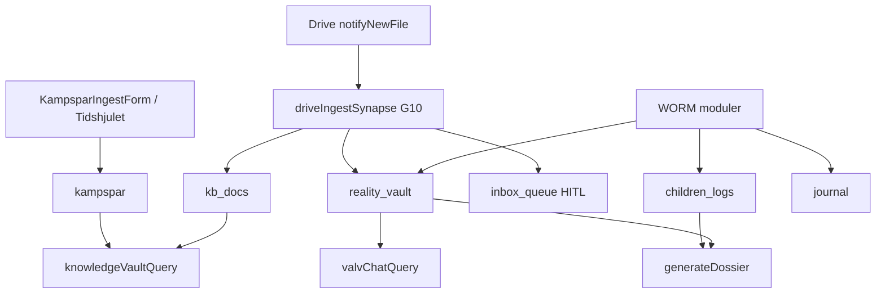

This file is a merged representation of a subset of the codebase, containing specifically included files, combined into a single document by Repomix.

<file_summary>
This section contains a summary of this file.

<purpose>
This file contains a packed representation of a subset of the repository's contents that is considered the most important context.
It is designed to be easily consumable by AI systems for analysis, code review,
or other automated processes.
</purpose>

<file_format>
The content is organized as follows:
1. This summary section
2. Repository information
3. Directory structure
4. Repository files (if enabled)
5. Multiple file entries, each consisting of:
  - File path as an attribute
  - Full contents of the file
</file_format>

<usage_guidelines>
- This file should be treated as read-only. Any changes should be made to the
  original repository files, not this packed version.
- When processing this file, use the file path to distinguish
  between different files in the repository.
- Be aware that this file may contain sensitive information. Handle it with
  the same level of security as you would the original repository.
</usage_guidelines>

<notes>
- Some files may have been excluded based on .gitignore rules and Repomix's configuration
- Binary files are not included in this packed representation. Please refer to the Repository Structure section for a complete list of file paths, including binary files
- Only files matching these patterns are included: docs/design/VALV-HUBB-SPEC.md, docs/design/references/VALV-ICON-KANON.md, docs/specs/modules/Verklighetsvalvet-SPEC.md, .context/locked-ux-features.md, .context/arkiv-minne.md, docs/gemini-handoff/V1-valv-zone-wireframe.md, docs/gemini-handoff/M2-valv-drawer-copy.md, docs/gemini-handoff/valv/V1-PROMPT.md, src/modules/features/lifeJournal/evidence/vault/**, src/modules/features/lifeJournal/evidence/knowledge/components/VaultKunskapsbankPanel.tsx, src/modules/core/navigation/navTruth.ts
- Files matching patterns in .gitignore are excluded
- Files matching default ignore patterns are excluded
- Files are sorted by Git change count (files with more changes are at the bottom)
</notes>

</file_summary>

<directory_structure>
.context/
  arkiv-minne.md
  locked-ux-features.md
docs/
  design/
    references/
      VALV-ICON-KANON.md
    VALV-HUBB-SPEC.md
  gemini-handoff/
    valv/
      V1-PROMPT.md
    M2-valv-drawer-copy.md
    V1-valv-zone-wireframe.md
  specs/
    modules/
      Verklighetsvalvet-SPEC.md
src/
  modules/
    core/
      navigation/
        navTruth.ts
    features/
      lifeJournal/
        evidence/
          knowledge/
            components/
              VaultKunskapsbankPanel.tsx
          vault/
            api/
              dcapAlertService.ts
              patternScanMetadataApi.ts
              patternScanService.ts
              processBrusfilterService.ts
            components/
              zones/
                ValvAnalyseraZone.tsx
                ValvExporteraZone.tsx
                ValvForensikZone.tsx
                ValvInboxZone.tsx
                ValvKunskapZone.tsx
                ValvSamlaZone.tsx
                ValvVitZone.tsx
              AdkAgentRegistryPanel.tsx
              KunskapsbankHeader.tsx
              OrkesterAgentTrio.tsx
              PansaretHeader.tsx
              valv.css
              ValvBentoShell.tsx
              ValvSuperModule.tsx
              ValvZoneModulValjare.tsx
              VaultDcapAlertsPanel.tsx
              VaultEntryForm.tsx
              VaultErrorBoundary.tsx
              VaultForensicPanel.tsx
              VaultInkastCompact.tsx
              VaultLogList.tsx
              VaultMonsterPanel.tsx
              VaultOrkesterPanel.tsx
              VaultOverviewPanel.tsx
              VaultPage.tsx
              VaultPatternHandoff.tsx
              VaultSamlaDriveHint.tsx
              VaultSamlaHub.tsx
              VaultSettingsPage.tsx
              VaultValvBreadcrumb.tsx
              VaultVitHubPanel.tsx
              VitDevelopmentPanel.tsx
              VitEntryFilterBar.tsx
              VitEntryList.tsx
              VitMabraPassPanel.tsx
              VitRecentOverview.tsx
              WeaverPendingVaultBanner.tsx
            constants/
              productAgents.ts
              vaultEntry.ts
              vavarenCopy.ts
            dossier/
              api/
                dossierService.ts
              components/
                DossierPage.tsx
              utils/
                dossierCandidates.ts
                exportDossierPrint.ts
              index.ts
              module_plan.md
              README.md
              types.ts
            hooks/
              useDcapAlerts.ts
              usePatternScanMetadata.ts
            supermodule/
              ValvInputModePicker.tsx
              valvInputModes.ts
              ValvInputSuperModule.tsx
              valvLastModeStorage.ts
            types/
              vaultEntry.ts
            utils/
              exportVaultRecord.ts
              normalizeVaultLog.ts
              smsThreadParse.ts
              valvZoneModulValjareStorage.ts
              vaultPatternHighlight.ts
              vaultPatternScan.ts
              vaultTabs.ts
            index.ts
            module_plan.md
            README.md
</directory_structure>

<files>
This section contains the contents of the repository's files.

<file path=".context/arkiv-minne.md">
# Hela arkivet — canonical minnesarkitektur (Life OS)

**Status:** Låst princip (2026-05-21). Konsoliderad mot alla Repomix-analyser + GCP.  
**Källor:** Repo, [`docs/GCP-INVENTORY-LATEST.md`](../docs/GCP-INVENTORY-LATEST.md), [`Arkiv-SPEC.md`](../docs/specs/modules/Arkiv-SPEC.md), [`GRUNDER-UTVARDERING-RESULTAT.md`](../docs/specs/modules/GRUNDER-UTVARDERING-RESULTAT.md), [`KONSOLIDERING-2026-05-21.md`](../docs/archive/repomix/KONSOLIDERING-2026-05-21.md).

---

## Invariant: permanent minne

Livskompassen ska **aldrig glömma** användarens WORM-data. Det är **inte** en tidsgräns (t.ex. fem år) utan en arkitekturregel.

| Collection / lager | Roll | Glömmer? |
|--------------------|------|----------|
| `children_logs` | Barnens livslogg + fysiologi | **Nej** — append-only WORM |
| `reality_vault` | Bevis (Sanningens Sköld) | **Nej** — append-only WORM |
| `journal` | Dagbok Lager 1 | **Nej** — append-only WORM |
| `dossier_snapshots` | Bevisad export + hash | **Nej** — WORM snapshot |
| `kampspar` / `kb_docs` | Kunskapsvalvet (RAG) | WORM create; separat retention-policy — **ersätter inte** barn/valv |
| GCS `livskompassen-knowledge-vault-worm` | Embeddings/arkiv-filer | 30d bucket retention — **inte** primär livsdatabas |

**Sacred:** Permanent minne + korrekt silo = lika viktigt som Zero Footprint och Kill Switch.

---

## Begrepp

| Term | Betydelse |
|------|-----------|
| **Hela arkivet** | Koordinerat Life OS-minne över alla moduler — **inte** en gemensam RAG |
| **Kunskapsbank** | Strukturerade dokument/mappar (blueprint: KnowledgeFolder/Doc/Media → `kb_docs`) |
| **Kunskapsvalvet** | UI + RAG ovanpå `kampspar` + `kb_docs` — Valv PIN: `/valvet?vaultTab=kunskapsbank` (legacy `/kunskap` redirect) |
| **Minne** | Datalager `kampspar` (livshändelser, strategi, mönster) |
| **Synaps** | ADK-händelse (`drive_ingest`, `journal_woven`, …) som kopplar modul → minne utan att blanda silor |
| **SystemSynapse** | Planerat långtids-grounding-schema (blueprint) — ej Firestore-prod än |

---

## Tre kunskapsytor (MUST NOT blandas)

| Yta | Route | Data | Callable | Agent |
|-----|-------|------|----------|-------|
| Kunskapsvalvet | `/valvet?vaultTab=kunskapsbank` | `kampspar`, `kb_docs` | `knowledgeVaultQuery` | Livs-Arkivarien |
| Valv-Chat | Bevis → Sök | `reality_vault` | `valvChatQuery` | Sannings-Analytikern |
| Barnen | `/familjen` | `children_logs` | `childrenLogsQuery` (G8 **done**) | Mönster-Arkivarien (barnen) |

**MUST NOT:** `valvChatQuery` mot `kampspar`. **MUST NOT:** `knowledgeVaultQuery` mot `reality_vault` som standard.

**U6 — Utvecklingszon (Vit):** `mabra_sessions`, planerat `vit_hub` / `vit_entries` — **ingen** RAG, **ingen** ingest till `kampspar`. Innehåll via content-banker — se [`.context/innehall-kanon.md`](./innehall-kanon.md), [`docs/INNEHALL-REGISTER.md`](../docs/INNEHALL-REGISTER.md).

**Terminologifällor (repomix → kanon):**

| Ord | Repomix (legacy) | Kanon |
|-----|------------------|-------|
| Synaps | CSS / Firestore `synapses` | ADK `SynapseBus`-händelse |
| Silo 3 | Ex-partner / `vault` | Barnen → `children_logs` |
| Minne | Mock-typ `Kampspar` | WORM `KampsparEntry` |
| Vector Search | Vertex AI Search Data Store | Vertex AI Vector Search ANN (768 dim) |

**Förbjudna repomix-mönster:** `SuperArchive` → `kb_docs` för bevis; Kunskap inbäddad i VaultPage; hårdkodad PIN; prompts utanför `sharedRules.ts`.

---

## Legacy → kanon (Firestore)

| Repomix / legacy | Kanon |
|------------------|-------|
| `vault` | `reality_vault` |
| `kids_records` | `children_logs` |
| `diary` | `journal` |
| `synapses` (dokument) | ADK events (`drive_ingest`, `journal_woven`) |
| — | `kampspar`, `dossier_snapshots` (saknas i repomix) |

**Schema-risk (G11):** Mock `Kampspar` i `src/modules/kompis/types/kompis.ts` (challenge/milestone/routine) får **inte** bli ingest-schema — kanonisk typ = `KampsparEntry`.

---

## Inflöde (hur arkivet fylls)



| Källa | Mål | Auto? |
|-------|-----|-------|
| Manuell ingest | `kampspar` | Användaren |
| Drive webhook | `kb_docs` / `reality_vault` / `children_logs` / `inbox_queue` | Ja (G10 klassificering + HITL) |
| Dagbok | `journal` → Vävaren → `reality_vault` metadata | Async |
| Barnen | `children_logs` | Per save |
| Kladd/trauma | `kampspar` | **Endast opt-in manuell** |

---

## RAG idag vs mål (GCP 2026-05-21, live-inventering)

| Lager | Idag | GCP (live) | Mål |
|-------|------|------------|-----|
| Kunskap retrieval | Token-match + ANN-kod `kampsparQueryRag.ts` | Endpoint `4956462078572363776`, index deployad, 4 vectors | ANN prod secrets **VERIFY** (G2) |
| Embeddings | `generateEmbedding` + ingest | Index synkad | Full smoke **VERIFY** (G3) |
| LLM syntes | `GEMINI_API_KEY` | Secret finns | Behåll |
| Legacy Python RAG | — | 4 functions us-central1 | Avveckla (G4) |
| Context Cache | `vertexCache.ts` + `context_cache_registry` (G12) | Firestore delad registry | **done** G12 |

**Deploy-sanning:** [`docs/GCP-INVENTORY-LATEST.md`](../docs/GCP-INVENTORY-LATEST.md) — ersätter arkiv-PDF som säger 0 endpoints / ej deployad valv.

**Kanonisk index (välj vid wire):**

- `projects/1084026575972/locations/europe-west1/indexes/2686894156982255616` (`livskompassen-kv-index`, STREAM)
- eller `.../europe-north1/indexes/9094201410823651328` (`kampspar_index`, BATCH)

---

## Agenter och synapser

| Roll | Fil | Ansvar |
|------|-----|--------|
| Livs-Arkivarien | `sharedRules.ts`, `knowledgeVaultAgent.ts` | Kunskap RAG-svar |
| Mönster-Arkivarien | `sharedRules.ts`, `driveIngestSynapse` | Drive → `kb_docs`, långtidsmönster |
| Sannings-Analytikern | `valvChatAgent.ts` | Forensisk JSON |
| ADK SynapseBus | `synapseBus.ts` | `drive_ingest` live; `journal_woven` stub |

---

## Modul ↔ minne (Life OS)

| Modul | Skriver | RAG/chatt | PDF/export |
|-------|---------|-----------|------------|
| kompis | `kampspar`, `kb_docs` | Kunskap ja | — |
| valv_chatt | — | Valv ja | per post |
| verklighetsvalvet | `reality_vault` | via valv_chatt | per post |
| barnens_livsloggar | `children_logs` | **nej** | Dossier |
| dagbok | `journal` | nej | Dossier opt-in |
| dossier | `dossier_snapshots` | nej | **ja** (hela urval) |
| safe_harbor | valfri → valv | nej | — |
| kompasser | `checkins` | nej | — |
| mabra | `mabra_sessions`, `vit_*` *(P1)* | nej | `mabraCoach` (parafras bank); zon Vit U6 |
| speglings_system | — (Zero Footprint) | nej | — |
| ekonomi | `transactions` | nej | — |
| core | delade helpers | — | — |

---

## Planerat (MUST NOT tappas)

- [x] **G1** Deploy `valvChatQuery` (live 2026-05-21)
- [x] **G2** Vector endpoint deployad — VERIFY PASS 2026-05-22 ([`GCP-INVENTORY-LATEST`](../docs/GCP-INVENTORY-LATEST.md))
- [x] **G3** Embeddings smoke 768 — VERIFY PASS 2026-05-22
- [ ] **G4** Avveckla legacy Python RAG (us-central1)
- [x] **G5** Retention allowlist — exkludera WORM permanent
- [ ] **G6** Drive smoke end-to-end (secret + Apps Script — manuellt)
- [ ] **G7** `journal_woven` synaps
- [x] **G8** Familjen-RAG — **done** 2026-05-22 (`childrenLogsQuery` + Mönster-Arkivarien Barnen)
- [x] **G9** EntityProfile / SystemSynapse Firestore + agent grounding
- [x] **G10** Självsorterande inkorg (Kunskap-SPEC §12)
- [x] **G11** Rensa/isolera mock `Kampspar`-typ vs `KampsparEntry`
- [x] **G12** Context Cache delad registry
- [x] **G13** Tidshjulet → `kampspar`-historik (live + ringar)
- [x] **G14** Gräns-Arkitekten — agent card + Hamn (Brusfilter + BIFF)

Se [`Arkiv-GAP-REGISTER.md`](../docs/specs/modules/Arkiv-GAP-REGISTER.md). Implementation: `kör [GAP]`.

---

## Relaterade filer

- [`Arkiv-SPEC.md`](../docs/specs/modules/Arkiv-SPEC.md)
- [`.context/database.md`](./database.md)
- [`.context/arkitektur-beslut.md`](./arkitektur-beslut.md) §1.5
- [`docs/specs/ai-prompts-moduler-master.md`](../docs/specs/ai-prompts-moduler-master.md) §G
- Skills: `.cursor/skills/livskompassen-arkiv-master/`
</file>

<file path="docs/design/references/VALV-ICON-KANON.md">
# Valv-ikon — KANON (ny)

**Beslut 2026-05-23:** Ersätter **sköld + bock** i dock/meny.  
**Gammal (ej använd):** [`VALV-DOCK-OLD-shield-ref.png`](./VALV-DOCK-OLD-shield-ref.png)

---

## Ny ikon

| | |
|---|---|
| **Form** | **Valvbåge** — klassisk båge + pelare + döröppning (line gold) |
| **Inte** | Sköld, hänglås som primär, bock i sköld |
| **Kod** | `src/modules/core/ui/ValvArchIcon.tsx` |
| **PNG** | [`valv-icon-kanon.png`](./valv-icon-kanon.png) |

Samma språk som sidomeny-kanon (valvbåge), inte Bevis-sköld.

---

## Dock — ingen båge

| Bort | Kvar |
|------|------|
| Halvcirkel / båge bakom mitt-kompass | Platt glas-lista `dock-nav--hub` |
| Ellipse-glow under orbit (`dock-orbit-stage::before`) | Rund kompass-platta (cirkel, **inte** båge) |
| Text «Hamn» under kompass | Endast kompass-ikon · `aria-label="Hem"` |

Se [`DOCK-KANON.md`](./DOCK-KANON.md).

---

## Mockup dock (mål)

[`dock-flat-valv-arch.png`](./dock-flat-valv-arch.png) — Familjen · kompass · Valv (båge-ikon), **utan** upphöjd båge.
</file>

<file path="docs/design/VALV-HUBB-SPEC.md">
# Valv hubb — Konflikt & bevis (IA våg 1)

**Datum:** 2026-05-29  
**Status:** Implementerad i kod (`vaultTabs.ts`, `VaultPage.tsx`)  
**Låst UX:** Mönster, Orkester, Kunskapsbank, Aktörskarta — **får inte tas bort** ([`.context/locked-ux-features.md`](../../.context/locked-ux-features.md))

---

## Princip

Samma `vaultTab`-IDs och callables som tidigare. Endast **zon-navigation** (färre val åt gången) och drawer-grupper ändras.

| Zon (UI) | Flikar (`vaultTab`) | Användning |
|----------|---------------------|------------|
| **Samla** | `logga`, `sok` | Bevis, sms, triage, Valv-Chat |
| **Analysera** | `monster`, `orkester` | Mönster, agent-orkester |
| **Kunskap** | `kunskapsbank`, `aktorskarta` | RAG fakta, nyckelpersoner (G9) |
| **Exportera** | `dossier` | Dossier-generator (+ `/dossier` i drawer) |
| **Forensik** | `hamn_analys`, `speglar_fordjupat`, … | Djup analys Hamn/Speglar/Arbetsliv |

## Produktbeslut — Hamn vs Valv (**godkänt 2026-05-29**)

| Lager | Route | Roll |
|-------|-------|------|
| **Snabb ingång** | `/hamn` (Vardag-drawer) | Grey Rock/BIFF-svar, Speglar-bro, låg friktion — **ingen** riskpanel eller auto-bevis |
| **Djup + bevis** | Valv → zon **Forensik** · `hamn_analys` | Full BIFF Triage, DCAP, *Spara som bevis*, Orkester, Mönster, Dossier |

**MUST NOT:** flytta publik BIFF till Valv-only eller kräva PIN för första Grey Rock-svar.  
**MUST:** `?tab=analys` på `/hamn` redirectar till Valv `hamn_analys` (redan i `TryggHamnHub.tsx`).  
**Handoff:** `valvHandoff` i Hamn-text → mjuk länk till Valv (ingen auto-WORM).

---

## Triggers (våg 2)

| Källa | Trigger | Effekt |
|-------|---------|--------|
| Dagbok | `shouldShowValvHandoff` | `HandoffBox` → `/dagbok?tab=bevis` |
| Hamn BIFF | samma | HandoffBox efter klistra-in |
| Valv logga | samma + `shouldSuggestVaultPatternScan` | Handoff + länk till Mönster |

Ingen auto-WORM från Lager 1.

---

## Budget

Deterministiska regex/DCAP — **inte** LLM per tangenttryckning.

---

## Kunskapsbank — layoutreferens (**godkänd 2026-06-19**)

Pontus: upplägget i Kunskapsbank-fliken är **snugg, proffsigt och på god väg** — använd som mall för framtida Valv-zoner.

| Aspekt | Kanon |
|--------|-------|
| Route | `/valvet?vaultTab=kunskapsbank` |
| Header | Kompakt `HubPageShell` + `KunskapsbankHeader compact` — **ingen** triple-banner |
| Scroll | En sidscroll — **ingen** nästad `calm-scroll-island` |
| Innehåll | `BentoCard` + `CalmCollapsible` för arkiv/upload |

Full spec + skärmbild: [`references/KUNSKAPSBANK-VALV-KANON.md`](./references/KUNSKAPSBANK-VALV-KANON.md) · [`kunskapsbank-valv-kanon-ref.png`](./references/kunskapsbank-valv-kanon-ref.png)

---

## Smoke

`npm run smoke:locked-ux` · `npm run smoke:orkester`
</file>

<file path="docs/gemini-handoff/valv/V1-PROMPT.md">
# V1 — Klistra in i Gemini (efter master-prompt + repomix)

```
UPPDRAG V1 — Valv hubb zoner (Samla / Analysera / Kunskap / Exportera / Forensik)

Läs VALV-HUBB-SPEC, Verklighetsvalvet-SPEC och locked-ux-features.

Leverera:
1. Wireframe VaultPage med zon-tabs + befintliga vaultTab (logga, sok, monster, orkester, kunskapsbank, aktorskarta, dossier, hamn_analys …).
2. Progressive disclosure: max 5 flikar synliga; resten under "Mer" om nödvändigt.
3. Handoff-copy: när ska UI peka till /hamn vs stanna i Valv hamn_analys?
4. Tabell KEEP / DEFER / REJECT för Vävaren polish (1 rad ingress per zon, breadcrumb, tomma tillstånd).
5. Gap-tabell: nuvarande fil | saknas | nästa Cursor-steg.

MUST NOT: ta bort Mönster/Orkester; kräva PIN för första Grey Rock på /hamn; cross-RAG mellan silos.

Output: markdown-fil V1-valv-zone-wireframe.md (uppdatera befintlig) + valfria ASCII-wireframes.
```

---

## V2 — NotebookLM (valfritt, efter google-ai-pro:pack)

```
UPPDRAG V2 — Valv gap vs kanon

Baserat på uppladdade källor:
1. Lista 5 SÄKRA UI-förbättringar i Valv utan firestore.rules-ändring.
2. Lista 3 FÖRBJUDNA förslag (U1-brott) med exempel.
3. Gap-tabell: Vävaren polish | finns i kod | nästa fil att röra.
```
</file>

<file path="docs/gemini-handoff/M2-valv-drawer-copy.md">
# M2 — Valv-drawer etiketter (Gemini handoff)

**Datum:** 2026-05-30  
**Status:** Delvis integrerat — endast KEEP-rader i prod.

| groupId | Label (prod) | drawerHint (Gemini KEEP) | Status |
|---------|--------------|--------------------------|--------|
| `valv_grp_samla` | Samla | Objektiv registrering av skriftliga meddelanden och logistik. | **Integrerad** |
| `valv_grp_analysera` | Analysera | Strukturerad kartläggning av återkommande mönster och beteenden. | **Integrerad** |
| `valv_grp_kunskap` | Kunskapsbank | RAG-underlag, lagrum och verifierad aktörskarta (G9). | **Integrerad** (hint) |
| `valv_grp_exportera` | Exportera | Sammanställning av material för manuell delning med juridisk part. | REJECT — låst zonnamn |
| `valv_grp_forensik` | Forensik | Tidsstämplat material med obruten versionshistorik. | **Integrerad** (hint) |

Övriga grupper behåller befintliga `drawerHint` i `navTruth.ts`.
</file>

<file path="docs/gemini-handoff/V1-valv-zone-wireframe.md">
# V1 — Valv zon-navigation (wireframe)

**Status:** Integrerad — `vaultTabs.ts`, `VaultPage.tsx`, `getVaultZoneTabBarItems()`  
**Gemini-svar:** [`V1-valv-gemini-svar.md`](./V1-valv-gemini-svar.md)

## Zon-flöde

```
Valv (PIN)
├── [Samla]     logga · sok
├── [Analysera] monster · orkester  ← LÅST UX
├── [Kunskap]   kunskapsbank · aktorskarta
├── [Exportera] dossier
└── [Forensik]  hamn_analys · speglar_fordjupat · …
```

Max 5 zoner i tab bar; underflikar per aktiv zon.

## Ingress (`VALV_ZONE_INGRESS`)

| Zon | Copy |
|-----|------|
| Samla | Samla in bevis och sök i loggen. |
| Analysera | Mönster och Orkester — över tid, inte i stunden. |
| Kunskap | Fakta bakom PIN: Kunskapsbank och Aktörskarta. |
| Exportera | Dossier för export och översikt. |
| Forensik | Hamn och fördjupad analys — ett steg i taget. |

## Handoff Hamn vs Valv

| Situation | UI |
|-----------|-----|
| Första Grey Rock / BIFF | `/hamn` (ingen PIN) |
| Spara bevis, triage | Valv → Samla |
| Mönster över tid | Valv → Analysera |
| RAG fakta | Valv → Kunskapsbank (PIN) |
| Djup Hamn-analys | Valv → Forensik → hamn_analys |
| /hamn?tab=analys | Redirect + PIN → hamn_analys |

**MUST NOT:** PIN för första `/hamn`; ta bort Mönster/Orkester.

## Vävaren polish

- **DONE:** zon-ingress, breadcrumb, villkorsstyrd panel-render
- **DONE:** sms-tråd bekräftelse i `VaultEntryForm`
- **DONE:** BBIC selectable i `DossierPage`
</file>

<file path="docs/specs/modules/Verklighetsvalvet-SPEC.md">
# Verklighetsvalvet-SPEC

Källa: konsoliderad från 5 notebook-svar (2026-05) + Kladd 2026-05-21 + kodgranskning.  
Konsoliderad till [`.context/modules/verklighetsvalvet.md`](../../../.context/modules/verklighetsvalvet.md).  
**Kladd-master:** [`Kladd-2026-05-21-PERSONAL-MASTER.md`](../../archive/kladd/Kladd-2026-05-21-PERSONAL-MASTER.md) §D–§H.

## 1. Syfte och användarbehov

**Sacred Feature — Sanningens Sköld (Lager 2).** WORM-bevisbank mot gaslighting: append-only, tidsstämplade sanningar med objektiv struktur (tvåspalt, tresteg, magkänsel). Skyddar verklighetsuppfattning utan JADE — fakta före tolkning.

**Strikt skild från Dagbok (Lager 1):** dagboken är mjuk och helande; valvet är kallt, forensiskt och juridiskt orienterat. **Plausible deniability:** appen ska kunna framstå som vanlig dagbok utåt; valv nås via **Fyren** (dold gest).

## 2. Route och ingång

| | |
|---|---|
| **Route (primär)** | `/dagbok?tab=bevis` — `VaultPage` inbäddad i `HjartatPage` |
| **Redirect** | `/valv` → `/dagbok?tab=bevis` |
| **AuthGate** | Ja (Firebase Auth) |
| **Kluster** | Hjärtat (flikar: Reflektion \| Bevis \| Speglar) |
| **Fyren (dold ingång)** | **3s långtryck** på **dock BookOpen** → WebAuthn (`authenticateVaultGate`) → `setVaultGate()` → `/dagbok?tab=bevis` |
| **Synlig ingång idag** | Flik **Bevis** i Hjärtat + `ClusterGrid` länk — **svagare** plausible deniability (se §14) |
| **Standalone `/valv`** | Kräver `hasVaultGate()` — annars instruktion om Fyren |

**Ingen egen Shield-ikon i dock** — Fyren sitter på BookOpen (Variant B i notebook = aktiv kod).

## 3. UX-flöde (Progressive Disclosure)

**Ett steg i taget vid stress/ångest.**

### Ingång och auth

1. **Fyren:** 3s long-press BookOpen → WebAuthn → navigera till bevis-flik.
2. **Valv-gate:** WebAuthn via Fyren (3s long-press) → `issueVaultSession` server-token. Ingen client-PIN i prod (`VITE_VAULT_PIN` borttagen).
3. **Upplåst valv:** flikar **Logga \| Sök** (Valv-Chat).

### Inmatning (flik Logga)

Välj `entryType` → fyll fält → spara → lista uppdateras.

| `entryType` | UI | Sparade fält |
|-------------|-----|--------------|
| `simple` | Enkel text | `truth` |
| `two_column` | Hens version / min verklighet | `theirVersion`, `myReality`, `truth` (kombinerad) |
| `three_shield` | Vad händer / känsla / gräns (progressive) | `shieldWhat`, `shieldFeeling`, `shieldBoundary`, `truth` |
| `body_signal` | Text-chips (`BODY_SIGNALS`) + valfri notering | `bodySignals[]`, `truth` |

**Media:** en fil via `uploadVaultEvidence` → Storage `vault_evidence/{uid}/` → `evidenceUrl` (singular, **inte** `mediaUrls[]`).

**Röst:** Web Speech API (`sv-SE`) — transkriberad text **appendas till `truth`**, ingen ljud-Blob till Storage.

**Inte i valv-form idag:** `childImpact` / "Barnens citat" — det hör till `children_logs` (Barnen).

### Sök (flik Sök)

`ValvChatPanel` → `valvChatQuery` → Sannings-Analytikern. Session **nollställs** vid flikbyte/unmount (`useValvChatSession`).

### Stäng och panik

- **Stäng:** låser valv, rensar gate, tillbaka till Reflektion (`/dagbok`).
- **Flikbyte** från Bevis: `clearVaultGate()` + `setVaultUnlocked(false)` i `HjartatPage`.
- **Shake-to-Kill:** global `useShakeToKill` — tröskel **15 m/s²**, debounce **2s** → `executeKillSwitch()` + navigera `/`.

## 4. Visuell design (Obsidian Calm)

Canonical: [`docs/specs/design-master.md`](../design-master.md)

| Element | Token |
|---------|--------|
| Bakgrund | `#020617` (slate-950) |
| Yta / glass | `#0f172a` + blur |
| Aktiv / accent | `#FDE68A` (guld) |
| Fortsätt | `#818CF8` (indigo) |
| Spara / fakta | `#2DD4BF` (emerald) |
| Typografi | Outfit + Inter |

**Förbjudet:** lila (utöver indigo), turkos, regnbåge, naturteman, ljusa bakgrunder, count-up, gamification.

**Magkänsel:** text-chips — **inte** SVG-ikoner (notebook #5).

## 5. Datamodell (Firestore, WORM)

Skrivskydd via Security Rules: `create` med `ownerId == auth.uid`; `update, delete: if false`. Klient: `assertWormPayload` blockerar mutationsfält.

### Collection: `reality_vault`

| Fält | Typ | Notering |
|------|-----|----------|
| `ownerId` | string | Krävs (via `withUserId`) |
| `userId` | string | Spegel av ownerId |
| `action` | string | `'bevis'` (standard från form) |
| `truth` | string | Huvudtext / sammanfattning |
| `category` | string? | Valfri kategori |
| `entryType` | string? | `simple`, `two_column`, `three_shield`, `body_signal` |
| `theirVersion` | string? | Tvåspalt |
| `myReality` | string? | Tvåspalt |
| `shieldWhat/Feeling/Boundary` | string? | Tresteg |
| `bodySignals` | string[]? | Magkänsel |
| `evidenceUrl` | string? | **En** media-URL (Storage) |
| `isLocked` | boolean | Sätts `true` vid create (`saveVaultLog`) |
| `weaverTags` | object? | Async från Vävaren (`vävaren_metadata`) |
| `createdAt` | timestamp | server-side |

**Async från Dagbok:** `weaveJournalEntry` → `category: vävaren_metadata` (filtreras bort i Valv-Chat RAG som standard).

**Drive idag:** `notifyNewFile` / ingest → **`kb_docs`** (Kunskap) — **inte** auto till `reality_vault`.

## 6. Backend och agenter

Prompts **endast** i [`functions/src/sharedRules.ts`](../../../functions/src/sharedRules.ts).

| Callable / lib | Roll |
|----------------|------|
| Klient `saveVaultLog` | Direkt Firestore `addDoc` → `reality_vault` — **inte** callable |
| `uploadVaultEvidence` | Storage → `evidenceUrl` |
| `weaveJournalEntry` | Dagbok → async WORM i `reality_vault` |
| `valvChatQuery` | `valvChatAgent` + `fetchVaultEvidenceForQuery` (token-match) → JSON `{ answer, citations[] }` |
| `getVaultLogs` | Klient-read för lista + Speglar |

**Valv-Chat agent:** **Sannings-Analytikern** — **inte** Livs-Arkivarien / Mönster-Arkivarien.

**RAG:** token-match på senaste ~100 poster (`vaultRag.ts`); exkluderar `vävaren_metadata`. **Ingen** ANN/Vector Search i MVP.

**PDF:** klient `exportVaultRecordAsPdf` (utskriftsdialog) per post — **inte** server-side BBIC batch.

**Planerat:** `generateDossier` (Dossier-modul), Drive → valv med manuellt godkännande, `notifyNewFile`-webhook för valv-kandidater.

## 7. Säkerhet

| Kontroll | Status |
|----------|--------|
| AuthGate + Firestore `ownerId` | **done** |
| WORM `reality_vault` (rules + `assertWormPayload`) | **done** |
| Fyren: WebAuthn + `setVaultGate` | **done** (client MVP) |
| PIN-gate före innehåll | **done** |
| Session lock vid flikbyte (`HjartatPage`) | **done** |
| Valv-Chat RAM-reset (`useValvChatSession`) | **done** |
| Kill Switch + shake | **done** (15 m/s², 2s debounce) |
| Zero Footprint idle (`useZeroFootprint` 5 min) | **partial** |
| PIN-hash i `localStorage` | **done** (medvetet avvägning vs full Zero Footprint) |
| CMEK / crypto-shredding | **planned** (drift/GCP) |
| Duress-PIN | **planned** (ej MVP) |

**Inte i MVP:** dold decoy-PIN, justerbar shake-tröskel i UI.

## 8. Status idag vs planerat

| Område | Status |
|--------|--------|
| Fyren 3s + progress ring på BookOpen | **done** |
| WebAuthn vid Fyren | **done** (client MVP) |
| PIN setup/verify i VaultPage | **done** |
| WORM rules + client guard | **done** |
| Enkel / tvåspalt / tresteg / magkänsel | **done** |
| Media upload (`evidenceUrl`) | **done** |
| Röst → text i `truth` | **done** |
| VaultLogList + per-post PDF | **done** |
| Valv-Chat (Sök-flik, `valvChatQuery`) | **done** |
| Stäng → Lager 1, flikbyte låser | **done** |
| Shake-to-Kill | **done** |
| Synlig Bevis-flik i Hjärtat | **done** (produktgap vs plausible deniability) |
| Klickbara citations i Valv-Chat | **planned** |
| Dölj Bevis-flik (endast Fyren) | **planned** (beslut §14) |
| Drive → `reality_vault` (manuellt) | **planned** |
| `generateDossier` multi-källa + hash | **done** (deploy callable) |
| BBIC `reportType` / mass-mall | **planned** fas 2 |
| Sanningens Ankare (pinned WORM-poster) | **planned** |
| CMEK-verifiering i drift | **planned** |
| Duress-PIN | **planned** |

## 9. Acceptanskriterier

| # | Kriterium | Kod-status |
|---|-----------|------------|
| 1 | Firestore Rules blockerar `update`/`delete` på `reality_vault` | **done** |
| 2 | Spara via klient `saveVaultLog` med `serverTimestamp` | **done** |
| 3 | Fyren 3s BookOpen → WebAuthn → bevis-flik | **done** |
| 4 | PIN krävs före form/lista | **done** |
| 5 | Alla fyra `entryType` sparbar | **done** |
| 6 | Media → Storage → `evidenceUrl` | **done** |
| 7 | Röst fyller text, ingen ljudfil | **done** |
| 8 | Valv-Chat läser endast `reality_vault` (exkl. vävaren) | **done** |
| 9 | Chat nollställs vid flikbyte/unmount | **done** |
| 10 | Per-post PDF (print) | **done** |
| 11 | Flikbyte från Bevis låser session | **done** |
| 12 | Shake → kill switch + `/` | **done** |
| 13 | Klickbara citations | **planned** |
| 14 | Dold Bevis-flik (Fyren only) | **planned** |
| 15 | BBIC/Dossier mass-export | **planned** |

## 10. Kopplingar till andra moduler

| Modul | Relation |
|-------|----------|
| **Dagbok** | Vävaren async → `vävaren_metadata`; Fyren delad ingång |
| **Valv-Chat** | Flik Sök i `VaultPage`; se [`Valv-Chat-SPEC.md`](./Valv-Chat-SPEC.md) |
| **Speglings-Systemet** | `getVaultLogs` + `matchVaultEvidence` i EvidenceCompare |
| **Hamn / BIFF** | `SafeHarborPage` kan `saveVaultLog` (valfri bevis-post) |
| **Kunskap / Minne** | **Skild** — Drive → `kb_docs`; **ingen** gemensam RAG med Valv-Chat |
| **Dossier** | Planerad aggregation från `reality_vault` + journal + barnen |
| **Barnen** | `childrenImpact` i `children_logs` — **inte** i valv-form |

## 11. Navigation

- **Dock:** BookOpen kort klick → `/dagbok` (Reflektion); **Fyren** 3s → `/dagbok?tab=bevis`
- **Kluster:** Hjärtat — Reflektion \| Bevis \| Speglar
- **Redirects:** `/valv` → `/dagbok?tab=bevis`
- **ClusterGrid:** länk "Verklighetsvalvet" → `?tab=bevis` (synlig idag)
- **Mål (§14):** dölj synlig Bevis-flik — endast Fyren

## 12. Tidigare diskussioner att bevara (vision)

- **Plausible deniability:** yttre granskare ser dagbok; valv via dold gest.
- **Tvåspaltssystemet:** hens version vs min verklighet — JADE-stop via struktur.
- **Trestegs-sköld:** objektivt → känsla → gräns (progressive disclosure).
- **Magkänsel:** somatosensorisk ankring under hypervigilans.
- **Sanningens Ankare:** pinned WORM-poster som referens vid gaslighting (planerat).
- **BBIC / juridisk dossier:** batch-export via Dossier — inte MVP per-post print.
- **Drive som kladd:** auto till Kunskap; valv kräver mänskligt godkännande.

## 13. Avvisade eller alternativa idéer

- **Google Apps Script / Kalkylark** — avvisat; Firebase Firestore.
- **Callable `saveVaultLog`** — avvisat; klient WORM create med rules.
- **`mediaUrls[]` / flera filer per post i MVP** — avvisat; en `evidenceUrl`.
- **Röstmemo som ljudfil i Storage** — avvisat; transkribera till `truth`.
- **Gemensam databas dagbok + valv** — avvisat; separata collections.
- **Redigera/radera bevis** — avvisat (WORM).
- **Valv-Chat → Kunskapsvalv RAG** — avvisat (cross-contamination).
- **Drive auto → `reality_vault`** — avvisat; manuellt godkännande (§14).
- **Shield som egen dock-ikon (Variant A)** — avvisat; Fyren på BookOpen.
- **Magkänsel SVG-ikoner** — avvisat; text-chips.
- **Livs-Arkivarien i Valv-Chat** — avvisat; Sannings-Analytikern.
- **Stjärnbilder / gamification** — avvisat (Kladd §G).
- **Nordisk skymning grön UI** — avvisat; Obsidian Calm.
- **GAS / FastAPI / Kalkylark-WORM** — avvisat; Firebase Functions + Firestore.
- **Auto Storage → Agentic Vision → valv** — avvisat MVP; manuellt godkännande.

## 14. Kladd-synk (2026-05-21)

**Källa:** [`Kladd-2026-05-21-PERSONAL-MASTER.md`](../../archive/kladd/Kladd-2026-05-21-PERSONAL-MASTER.md) §D–§H.

| Prioritet bevis | Status produkt |
|-----------------|----------------|
| Orosanmälan 2026-03-05 | Användaren laddar PDF manuellt |
| Skola Ann/Lena, barnsamtal | Manuellt + ev. Barnen `skola` |
| SMS tvåspalt som PDF-export | **done** entry modes; metod: hel tråd |
| Vävaren-godkännande före permanent tagg | **done** 2026-05-31 — `weaver_pending` + HITL |

## 15. Öppna produktbeslut (låsta 2026-05)

| # | Fråga | Beslut | Låst |
|---|-------|--------|------|
| 1 | Drive → `reality_vault` | **Manuellt godkännande**; Drive-auto endast till `kb_docs` | **Ja** |
| 2 | PDF-export | **Klient per post nu**; BBIC/mass via **Dossier callable** senare | **Ja** |
| 3 | Valv-Chat session | **Nollställ vid flikbyte** (behåll `useValvChatSession`) | **Ja** |
| 4 | Auth | **WebAuthn + PIN**; duress-PIN **inte** MVP | **Ja** |
| 5 | Synlig Bevis-flik | **Dölj** — implementera när **Fyren sitter i muskelminnet**; synlig flik tills dess | **Ja** |

---

**Module plan (kod):** [`src/modules/verklighetsvalvet/module_plan.md`](../../../src/modules/verklighetsvalvet/module_plan.md)  
**Valv-Chat:** [`docs/specs/modules/Valv-Chat-SPEC.md`](./Valv-Chat-SPEC.md)  
**Prompter:** [`docs/specs/ai-prompts-heart.md`](../ai-prompts-heart.md), [`docs/specs/ai-prompts-moduler-master.md`](../ai-prompts-moduler-master.md)  
**Flöde:** [`docs/specs/hjartat-flode.md`](../hjartat-flode.md)
</file>

<file path="src/modules/features/lifeJournal/evidence/vault/api/dcapAlertService.ts">
import { httpsCallable, type FunctionsError } from 'firebase/functions';
import { functions } from '@/core/firebase/init';
import { withVaultSessionPayload } from '@/core/auth/vaultServerSession';

export type DcapReviewDecision = 'acknowledged' | 'dismissed';

const resolveDcapAlertCallable = httpsCallable<
  { alertId: string; decision: DcapReviewDecision; vaultSessionToken?: string },
  { reviewId: string; alreadyReviewed: boolean }
>(functions, 'resolveDcapAlert');

export async function resolveDcapAlert(
  alertId: string,
  decision: DcapReviewDecision = 'acknowledged',
): Promise<{ reviewId: string; alreadyReviewed: boolean }> {
  try {
    const result = await resolveDcapAlertCallable(
      withVaultSessionPayload({ alertId, decision }),
    );
    return result.data;
  } catch (error) {
    const fnError = error as FunctionsError;
    throw new Error(fnError.message || 'Kunde inte markera larm som granskat.');
  }
}
</file>

<file path="src/modules/features/lifeJournal/evidence/vault/api/patternScanMetadataApi.ts">
import { collection, getDocs, limit, query, where } from 'firebase/firestore';
import { db } from '@/core/firebase/firestore';
import { FIRESTORE_COLLECTIONS } from '@/core/types/firestore';

export type PatternScanMetadataRow = {
  id: string;
  sourceRef: string;
  techniques: string[];
  patternIds: string[];
  libraryVersion: string;
  scanLayer: 'REGEX' | 'DCAP';
};

export function buildTechniquesByLogId(
  rows: readonly PatternScanMetadataRow[],
): Map<string, string[]> {
  const map = new Map<string, Set<string>>();
  for (const row of rows) {
    const set = map.get(row.sourceRef) ?? new Set<string>();
    for (const t of row.techniques) set.add(t);
    map.set(row.sourceRef, set);
  }
  const out = new Map<string, string[]>();
  for (const [ref, set] of map) {
    out.set(ref, [...set].sort((a, b) => a.localeCompare(b, 'sv')));
  }
  return out;
}

export async function fetchPatternScanMetadata(uid: string): Promise<PatternScanMetadataRow[]> {
  const ref = collection(db, FIRESTORE_COLLECTIONS.pattern_scan_metadata);
  const snap = await getDocs(query(ref, where('userId', '==', uid), limit(500)));
  return snap.docs.map((doc) => {
    const data = doc.data();
    return {
      id: doc.id,
      sourceRef: String(data.sourceRef ?? ''),
      techniques: Array.isArray(data.techniques) ? data.techniques.map(String) : [],
      patternIds: Array.isArray(data.patternIds) ? data.patternIds.map(String) : [],
      libraryVersion: String(data.libraryVersion ?? ''),
      scanLayer: data.scanLayer === 'DCAP' ? 'DCAP' : 'REGEX',
    };
  });
}
</file>

<file path="src/modules/features/lifeJournal/evidence/vault/api/patternScanService.ts">
import { httpsCallable } from 'firebase/functions';
import { functions } from '@/core/firebase/init';
import { withVaultSessionPayload } from '@/core/auth/vaultServerSession';

type RescanResult = { written: number; libraryVersion: string };

type AssistResult = RescanResult & { docId?: string | null };

const rescanCallable = httpsCallable<Record<string, never>, RescanResult>(
  functions,
  'rescanPatternMetadata',
);

const assistCallable = httpsCallable<{ sourceRef?: string }, AssistResult>(
  functions,
  'assistPatternMetadata',
);

export async function rescanPatternMetadata(): Promise<RescanResult> {
  const result = await rescanCallable(withVaultSessionPayload<Record<string, never>>({}));
  return result.data;
}

/** P3 Flow-assist — kompletterande FLOW-lager (metadata sidecar). */
export async function assistPatternMetadata(sourceRef?: string): Promise<AssistResult> {
  const result = await assistCallable(
    withVaultSessionPayload<{ sourceRef?: string }>(sourceRef ? { sourceRef } : {}),
  );
  return result.data;
}
</file>

<file path="src/modules/features/lifeJournal/evidence/vault/api/processBrusfilterService.ts">
import { httpsCallable, type FunctionsError } from 'firebase/functions';
import { functions } from '@/core/firebase/init';
import { withVaultSessionPayload } from '@/core/auth/vaultServerSession';

export type BrusfilterRecommendedAction = 'INGEN' | 'VARNING';

export interface ProcessBrusfilterResult {
  dcap_analysis: {
    risk_score: number;
    recommended_action: BrusfilterRecommendedAction;
  };
  isolated_logistics: string;
  biff_draft_reply: string;
}

type ProcessBrusfilterPayload = {
  raw_input_text: string;
  vaultSessionToken?: string;
};

const processBrusfilterCallable = httpsCallable<
  ProcessBrusfilterPayload,
  ProcessBrusfilterResult
>(functions, 'processBrusfilter');

export async function callProcessBrusfilter(rawInputText: string): Promise<ProcessBrusfilterResult> {
  try {
    const result = await processBrusfilterCallable(
      withVaultSessionPayload({ raw_input_text: rawInputText.trim() }),
    );
    return result.data;
  } catch (error) {
    console.error('Fel vid anrop till processBrusfilter:', error);
    const fnError = error as FunctionsError;
    if (fnError.code === 'functions/unauthenticated') {
      throw new Error('Autentisering krävs för Brusfilter.');
    }
    if (fnError.code === 'functions/permission-denied') {
      throw new Error('Lås upp Valvet via Fyren (3 sek) och biometri innan du filtrerar brus.');
    }
    if (fnError.code === 'functions/resource-exhausted') {
      throw new Error('För många försök — vänta en minut och försök igen.');
    }
    throw new Error(fnError.message || 'Brusfilter misslyckades. Försök igen senare.');
  }
}
</file>

<file path="src/modules/features/lifeJournal/evidence/vault/components/zones/ValvAnalyseraZone.tsx">
import { lazy, Suspense } from 'react';
import { TabBar } from '@/core/ui/TabBar';
import { HubPanelSkeleton } from '@/core/ui/HubPanelSkeleton';
import { HubErrorBoundary } from '@/shared/ui/HubErrorBoundary';
import { getAnalyseraVaultTabBarItems } from '@/core/navigation/tabRegistry';
import { useVaultStore } from '@/core/store/useVaultStore';
import { useStore } from '@/core/store';
import { PansaretHeader } from '../PansaretHeader';
import type { AnalyseraVaultTab } from '../../utils/vaultTabs';

const VaultMonsterPanel = lazy(() =>
  import('../VaultMonsterPanel').then((m) => ({ default: m.VaultMonsterPanel })),
);
const VaultOrkesterPanel = lazy(() =>
  import('../VaultOrkesterPanel').then((m) => ({ default: m.VaultOrkesterPanel })),
);

function ValvPanelFallback() {
  return <HubPanelSkeleton label="Laddar analys…" lines={5} />;
}

export type ValvAnalyseraZoneProps = {
  tab: AnalyseraVaultTab;
  onTabChange: (tab: AnalyseraVaultTab) => void;
  onTechniqueSelect?: (technique: string) => void;
};

/** Locked UX — Mönster + Orkester (Pansaret). */
export function ValvAnalyseraZone({ tab, onTabChange, onTechniqueSelect }: ValvAnalyseraZoneProps) {
  const { logs } = useVaultStore();
  const userId = useStore((s) => s.user?.uid);

  return (
    <HubErrorBoundary
      title="Analys kunde inte laddas"
      glow="blue"
      logTag="ValvAnalyseraZone"
    >
      <div className="valv-zone-stack mb-3 space-y-3">
        <TabBar
          size="compact"
          tabs={getAnalyseraVaultTabBarItems()}
          active={tab}
          onChange={onTabChange}
        />
        <Suspense fallback={<ValvPanelFallback />}>
          {tab === 'orkester' ? (
            <VaultOrkesterPanel logs={logs} />
          ) : (
            <>
              <PansaretHeader />
              <VaultMonsterPanel
                logs={logs}
                userId={userId}
                onTechniqueSelect={onTechniqueSelect}
              />
            </>
          )}
        </Suspense>
      </div>
    </HubErrorBoundary>
  );
}
</file>

<file path="src/modules/features/lifeJournal/evidence/vault/components/zones/ValvExporteraZone.tsx">
import { DossierPage } from '../../dossier';
import { HubErrorBoundary } from '@/shared/ui/HubErrorBoundary';

/** Exportera — Dossier embedded i Valv. */
export function ValvExporteraZone() {
  return (
    <HubErrorBoundary title="Dossier kunde inte laddas" glow="blue" logTag="ValvExporteraZone">
      <div className="valv-zone-stack">
        <DossierPage embedded />
      </div>
    </HubErrorBoundary>
  );
}
</file>

<file path="src/modules/features/lifeJournal/evidence/vault/components/zones/ValvInboxZone.tsx">
import { InboxReviewQueue } from '@/modules/inkast/components/InboxReviewQueue';

/**
 * @deprecated Fas 1B — granska sker via ValvInputSuperModule + InboxReviewQueue.
 */
export function ValvInboxZone({ onBevisConfirmed }: { onBevisConfirmed?: (docId: string) => void }) {
  return (
    <div className="valv-zone-stack space-y-4 animate-fade-in">
      <InboxReviewQueue compact={false} prioritizeBevis onBevisConfirmed={onBevisConfirmed} />
    </div>
  );
}
</file>

<file path="src/modules/features/lifeJournal/evidence/vault/components/zones/ValvKunskapZone.tsx">
import { TabBar } from '@/core/ui/TabBar';
import { HubErrorBoundary } from '@/shared/ui/HubErrorBoundary';
import { getKunskapVaultTabBarItems } from '@/core/navigation/tabRegistry';
import { VaultAktorskartaPanel } from '../../../knowledge/components/VaultAktorskartaPanel';
import { VaultKanonDocsPanel } from '../../../knowledge/components/VaultKanonDocsPanel';
import { VaultKunskapsbankPanel } from '../../../knowledge/components/VaultKunskapsbankPanel';
import {
  AKTORSKARTA_VAULT_TAB,
  DOCS_VAULT_TAB,
  KUNSKAP_VAULT_TAB,
  type KunskapVaultTab,
} from '../../utils/vaultTabs';

export type ValvKunskapZoneProps = {
  tab: KunskapVaultTab;
  onTabChange: (tab: KunskapVaultTab) => void;
};

/** Locked UX — Kunskapsbank + Aktörskarta (G9) + Kanon docs (A2.7). */
export function ValvKunskapZone({ tab, onTabChange }: ValvKunskapZoneProps) {
  return (
    <HubErrorBoundary
      title="Kunskap kunde inte laddas"
      glow="blue"
      logTag="ValvKunskapZone"
    >
      <div className="valv-zone-stack mb-3 space-y-3">
        <TabBar
          size="compact"
          tabs={getKunskapVaultTabBarItems()}
          active={tab}
          onChange={onTabChange}
        />
        {tab === AKTORSKARTA_VAULT_TAB ? (
          <VaultAktorskartaPanel />
        ) : tab === DOCS_VAULT_TAB ? (
          <VaultKanonDocsPanel />
        ) : tab === KUNSKAP_VAULT_TAB ? (
          <VaultKunskapsbankPanel />
        ) : null}
      </div>
    </HubErrorBoundary>
  );
}
</file>

<file path="src/modules/features/lifeJournal/evidence/vault/components/zones/ValvSamlaZone.tsx">
import { useEffect, useState } from 'react';
import { Button } from '@/design-system';
import { TabBar } from '@/core/ui/TabBar';
import { HubErrorBoundary } from '@/shared/ui/HubErrorBoundary';
import { getSamlaVaultTabBarItems } from '@/core/navigation/tabRegistry';
import { useVaultStore } from '@/core/store/useVaultStore';
import { ValvChatPanel } from '@/features/lifeJournal/evidence/vaultChat';
import { VaultLogList } from '../VaultLogList';
import { VaultSamlaHub } from '../VaultSamlaHub';
import { WeaverPendingVaultBanner } from '../WeaverPendingVaultBanner';
import { usePatternScanMetadata } from '../../hooks/usePatternScanMetadata';
import type { SamlaVaultTab } from '../../utils/vaultTabs';

export type ValvSamlaZoneProps = {
  tab: SamlaVaultTab;
  onTabChange: (tab: SamlaVaultTab) => void;
  userId: string;
  gateOk: boolean;
  highlightLogId: string | null;
  onBevisConfirmed: (docId: string) => void | Promise<void>;
  onCitationClick: (docId: string) => void;
  onOpenGranska?: () => void;
  techniqueFilter?: string | null;
  onClearTechniqueFilter?: () => void;
};

export function ValvSamlaZone({
  tab,
  onTabChange,
  userId,
  gateOk,
  highlightLogId,
  onBevisConfirmed,
  onCitationClick,
  onOpenGranska,
  techniqueFilter = null,
  onClearTechniqueFilter,
}: ValvSamlaZoneProps) {
  const [anchorsOnly, setAnchorsOnly] = useState(false);
  const [manualEntryOpen, setManualEntryOpen] = useState(false);
  const { logs, loadFirstLogsPage } = useVaultStore();
  const { techniquesByLogId } = usePatternScanMetadata(userId);

  useEffect(() => {
    if (techniqueFilter) setAnchorsOnly(false);
  }, [techniqueFilter]);

  return (
    <HubErrorBoundary
      title="Samla kunde inte laddas"
      glow="blue"
      logTag="ValvSamlaZone"
    >
      <div className="valv-samla-stack mb-3 space-y-3">
        <TabBar
          size="compact"
          tabs={getSamlaVaultTabBarItems()}
          active={tab}
          onChange={onTabChange}
        />
        {tab === 'sok' ? (
          <ValvChatPanel
            active={gateOk}
            onCitationClick={onCitationClick}
            logs={logs}
          />
        ) : (
          <>
            <WeaverPendingVaultBanner userId={userId} onApproved={() => loadFirstLogsPage(userId)} />
            <VaultSamlaHub
              userId={userId}
              onBevisConfirmed={(docId) => void onBevisConfirmed(docId)}
              onOpenGranska={onOpenGranska}
              manualEntryOpen={manualEntryOpen}
              onManualEntryOpenChange={setManualEntryOpen}
            />
            <div className="valv-samla-filter-row flex flex-wrap items-center justify-between gap-2 px-0.5">
              <p className="text-xs font-medium uppercase tracking-wider text-text-dim">Arkivlista</p>
              <div className="flex flex-wrap items-center gap-2">
                {techniqueFilter ? (
                  <Button
                    variant="ghost"
                    size="sm"
                    className="valv-technique-filter-chip text-accent"
                    aria-pressed
                    onClick={onClearTechniqueFilter}
                  >
                    Filter: #{techniqueFilter} · Rensa
                  </Button>
                ) : null}
                <Button
                  variant="ghost"
                  size="sm"
                  className={anchorsOnly ? 'text-accent' : undefined}
                  aria-pressed={anchorsOnly}
                  onClick={() => setAnchorsOnly((v) => !v)}
                >
                  {anchorsOnly ? 'Visa alla bevis' : 'Endast ankare'}
                </Button>
              </div>
            </div>
            <VaultLogList
              highlightLogId={highlightLogId}
              anchorsOnly={anchorsOnly}
              techniqueFilter={techniqueFilter}
              persistedTechniquesByLogId={techniquesByLogId}
              onLogFirstBevis={() => {
                setManualEntryOpen(true);
                requestAnimationFrame(() => {
                  document.getElementById('vault-samla-entry')?.scrollIntoView({ behavior: 'smooth', block: 'start' });
                });
              }}
            />
          </>
        )}
      </div>
    </HubErrorBoundary>
  );
}
</file>

<file path="src/modules/features/lifeJournal/evidence/vault/components/KunskapsbankHeader.tsx">
import { BookOpen } from 'lucide-react';

type KunskapsbankHeaderProps = {
  compact?: boolean;
};

/** Kunskapsbank-zon — egen del av Valv (U1 Kunskap-silo, PIN). */
export function KunskapsbankHeader({ compact = false }: KunskapsbankHeaderProps) {
  if (compact) {
    return (
      <div className="flex items-center gap-2 px-1">
        <BookOpen className="h-4 w-4 shrink-0 text-accent" aria-hidden />
        <p className="font-display text-sm text-accent">Kunskapsbanken</p>
        <span className="text-[10px] text-text-dim">· Fakta och minne</span>
      </div>
    );
  }

  return (
    <div className="elongated-module elongated-module--gold mb-1 flex items-start gap-3 p-4">
      <BookOpen className="mt-0.5 h-5 w-5 shrink-0 text-accent" aria-hidden />
      <div>
        <p className="font-display text-base text-accent">Kunskapsbanken</p>
        <p className="mt-1 text-xs text-text-muted">
          Fakta och minne bakom PIN — separat från bevisvalvet. Ställ en fråga först; öppna
          filarkiv eller Tidshjul vid behov.
        </p>
      </div>
    </div>
  );
}
</file>

<file path="src/modules/features/lifeJournal/evidence/vault/components/OrkesterAgentTrio.tsx">
import { Loader2 } from 'lucide-react';
import { AgentRegistryCard } from '@/shared/agents/components/AgentRegistryCard';
import type { AgentRegistryCard as AgentCardData } from '@/shared/agents/types/agentRegistry';
import { useAgentRegistry } from '@/shared/agents/hooks/useAgentRegistry';
import { fallbackTrioAgents } from '@/shared/agents/utils/agentRegistryFallback';

const TRIO_IDS = ['agent_brusfiltret', 'agent_biff_skolden', 'agent_sannings_analytikern'] as const;

const TRIO_ACTION_LABELS: Record<(typeof TRIO_IDS)[number], string> = {
  agent_brusfiltret: 'Öppna Brusfilter',
  agent_biff_skolden: 'Öppna BIFF-svar',
  agent_sannings_analytikern: 'Öppna Sannings-Analytikern',
};

type Props = {
  onAgentAction?: (agentId: string) => void;
};

/** D17 — tre primära agenter; klickbara när onAgentAction ges. */
export function OrkesterAgentTrio({ onAgentAction }: Props) {
  const { agents, loading, agentNameById } = useAgentRegistry();

  const trioFromRegistry = agents.filter((a) =>
    TRIO_IDS.includes(a.metadata.id as (typeof TRIO_IDS)[number]),
  );
  const source = trioFromRegistry.length >= 3 ? trioFromRegistry : fallbackTrioAgents();

  const display = TRIO_IDS.map((id) => source.find((a) => a.metadata.id === id)).filter(
    (a): a is AgentCardData => Boolean(a),
  );

  if (loading && display.length === 0) {
    return (
      <p className="mb-4 flex items-center justify-center gap-2 py-4 text-xs text-text-dim">
        <Loader2 className="h-3.5 w-3.5 animate-spin" aria-hidden />
        Laddar Orkester-trio…
      </p>
    );
  }

  return (
    <div className="mb-4 grid grid-cols-1 gap-2 sm:grid-cols-3">
      {display.map((agent) => {
        const actionLabel = TRIO_ACTION_LABELS[agent.metadata.id as (typeof TRIO_IDS)[number]];
        return (
          <AgentRegistryCard
            key={agent.metadata.id}
            agent={agent}
            agentNameById={agentNameById}
            compact
            onAction={onAgentAction && actionLabel ? onAgentAction : undefined}
            actionLabel={onAgentAction ? actionLabel : undefined}
          />
        );
      })}
    </div>
  );
}
</file>

<file path="src/modules/features/lifeJournal/evidence/vault/components/PansaretHeader.tsx">
import { Shield } from 'lucide-react';

/** D16 — Pansaret-rubrik (Mönster-flik). */
export function PansaretHeader() {
  return (
    <div className="elongated-module elongated-module--gold mb-4 flex items-start gap-3 p-4">
      <Shield className="mt-0.5 h-5 w-5 shrink-0 text-accent" aria-hidden />
      <div>
        <p className="font-display text-base text-accent">Det Digitala Pansaret</p>
        <p className="mt-1 text-xs text-text-muted">
          Frekvens och mönster från dina låsta poster — deterministiskt, inte gissning.
        </p>
      </div>
    </div>
  );
}
</file>

<file path="src/modules/features/lifeJournal/evidence/vault/components/ValvBentoShell.tsx">
import type { ReactNode } from 'react';
import { Shield } from 'lucide-react';
import { clsx } from 'clsx';
import './valv.css';

type Props = {
  children: ReactNode;
  className?: string;
  /** Visa zon-pill "VALV" under hub-header */
  showZonePill?: boolean;
};

/**
 * Obsidian Calm Bento — visuellt skal för Valv (indigo/gold forensic silo).
 * Bakgrund: radiell gradient + svag sköld-ikon (ingen logik).
 */
export function ValvBentoShell({
  children,
  className,
  showZonePill = true,
}: Props) {
  return (
    <div className={clsx('valv-bento-shell', className)}>
      <Shield className="valv-bg-watermark" strokeWidth={0.75} aria-hidden />
      <div className="valv-bento-shell__content">
        {showZonePill ? (
          <div className="valv-zone-strip" aria-hidden>
            <span className="valv-zone-pill">Valv</span>
          </div>
        ) : null}
        {children}
      </div>
    </div>
  );
}
</file>

<file path="src/modules/features/lifeJournal/evidence/vault/components/ValvSuperModule.tsx">
import { ValvAnalyseraZone } from './zones/ValvAnalyseraZone';
import { ValvExporteraZone } from './zones/ValvExporteraZone';
import { ValvForensikZone } from './zones/ValvForensikZone';
import { ValvKunskapZone } from './zones/ValvKunskapZone';
import { ValvSamlaZone } from './zones/ValvSamlaZone';
import { ValvVitZone } from './zones/ValvVitZone';
import {
  KUNSKAP_VAULT_TAB,
  type AnalyseraVaultTab,
  type ForensicVaultTab,
  type KunskapVaultTab,
  type SamlaVaultTab,
  type ValvZone,
  type VaultTab,
  isAnalyseraVaultTab,
  isForensicVaultTab,
  isKunskapVaultTab,
  isSamlaVaultTab,
} from '../utils/vaultTabs';

export type ValvSuperVariant = ValvZone;

export type ValvSuperModuleProps = {
  variant: ValvSuperVariant;
  vaultTab: VaultTab;
  userId: string;
  gateOk: boolean;
  highlightLogId: string | null;
  onBevisConfirmed: (docId: string) => void | Promise<void>;
  onCitationClick: (docId: string) => void;
  onVaultTabChange: (tab: VaultTab) => void;
  /** Öppna granskningskö (ValvInputSuperModule granska-läge). */
  onOpenGranska?: () => void;
  techniqueFilter?: string | null;
  onTechniqueSelect?: (technique: string) => void;
  onClearTechniqueFilter?: () => void;
};

/**
 * Canonical router för Valv-zoner.
 * VaultPage behåller gate + zon-TabBar; sub-TabBar lever i zoner (Fas 2).
 */
export function ValvSuperModule({
  variant,
  vaultTab,
  userId,
  gateOk,
  highlightLogId,
  onBevisConfirmed,
  onCitationClick,
  onVaultTabChange,
  onOpenGranska,
  techniqueFilter,
  onTechniqueSelect,
  onClearTechniqueFilter,
}: ValvSuperModuleProps) {
  switch (variant) {
    case 'samla': {
      const tab: SamlaVaultTab = isSamlaVaultTab(vaultTab) ? vaultTab : 'logga';
      return (
        <ValvSamlaZone
          tab={tab}
          onTabChange={(next) => onVaultTabChange(next)}
          userId={userId}
          gateOk={gateOk}
          highlightLogId={highlightLogId}
          onBevisConfirmed={onBevisConfirmed}
          onCitationClick={onCitationClick}
          onOpenGranska={onOpenGranska}
          techniqueFilter={techniqueFilter}
          onClearTechniqueFilter={onClearTechniqueFilter}
        />
      );
    }
    case 'analysera': {
      const tab: AnalyseraVaultTab = isAnalyseraVaultTab(vaultTab) ? vaultTab : 'monster';
      return <ValvAnalyseraZone tab={tab} onTabChange={onVaultTabChange} onTechniqueSelect={onTechniqueSelect} />;
    }
    case 'kunskap': {
      const tab: KunskapVaultTab = isKunskapVaultTab(vaultTab) ? vaultTab : KUNSKAP_VAULT_TAB;
      return <ValvKunskapZone tab={tab} onTabChange={onVaultTabChange} />;
    }
    case 'vit':
      return <ValvVitZone userId={userId} />;
    case 'exportera':
      return <ValvExporteraZone />;
    case 'forensik': {
      const tab: ForensicVaultTab = isForensicVaultTab(vaultTab) ? vaultTab : 'hamn_analys';
      return <ValvForensikZone tab={tab} onTabChange={onVaultTabChange} gateOk={gateOk} />;
    }
    default:
      return null;
  }
}
</file>

<file path="src/modules/features/lifeJournal/evidence/vault/components/ValvZoneModulValjare.tsx">
import { ExamplePreviewCard } from '@/shared/ui/ExamplePreviewCard';
import { VALV_ZONE_INGRESS, VALV_ZONE_LABELS } from '@/core/copy/valvNavCopy';
import type { ValvZone } from '../utils/vaultTabs';
import { markValvZoneModulValjareSeen } from '../utils/valvZoneModulValjareStorage';

const PICKER_ZONES = [
  'samla',
  'analysera',
  'kunskap',
  'vit',
  'exportera',
  'forensik',
] as const satisfies readonly ValvZone[];

type PickerZone = (typeof PICKER_ZONES)[number];

const ZONE_TONE: Record<PickerZone, 'gold' | 'emerald' | 'indigo' | 'lavender'> = {
  samla: 'gold',
  analysera: 'indigo',
  kunskap: 'gold',
  vit: 'lavender',
  exportera: 'emerald',
  forensik: 'indigo',
};

function ZoneIngressPreview({ zone }: { zone: ValvZone }) {
  return (
    <p className="text-[10px] leading-relaxed text-text-muted">{VALV_ZONE_INGRESS[zone]}</p>
  );
}

type Props = {
  onSelect: (zone: ValvZone) => void;
  onSkip?: () => void;
};

/** Första PIN-session — välj zon innan TabBar. */
export function ValvZoneModulValjare({ onSelect, onSkip }: Props) {
  const go = (zone: ValvZone) => {
    markValvZoneModulValjareSeen();
    onSelect(zone);
  };

  const skip = () => {
    markValvZoneModulValjareSeen();
    onSkip?.();
  };

  return (
    <div className="space-y-4">
      <p className="text-sm text-text-muted">
        Valvet har zoner — välj var du vill börja. Flikar och Mönster/Orkester finns kvar efter valet.
      </p>
      <div className="grid gap-3 sm:grid-cols-2 lg:grid-cols-3">
        {PICKER_ZONES.map((zone) => (
          <ExamplePreviewCard
            key={zone}
            title={VALV_ZONE_LABELS[zone]}
            lead={VALV_ZONE_INGRESS[zone]}
            preview={<ZoneIngressPreview zone={zone} />}
            ctaLabel={`Öppna ${VALV_ZONE_LABELS[zone]}`}
            tone={ZONE_TONE[zone]}
            onStart={() => go(zone)}
          />
        ))}
      </div>
      {onSkip ? (
        <button type="button" onClick={skip} className="text-xs text-text-dim hover:text-text-muted">
          Visa alla zoner direkt (Samla)
        </button>
      ) : null}
    </div>
  );
}
</file>

<file path="src/modules/features/lifeJournal/evidence/vault/components/VaultForensicPanel.tsx">
import { useCallback, useEffect, useState } from 'react';
import { useStore } from '@/core/store';
import { EmptyState } from '@/core/ui/EmptyState';
import { getPeriodEconomySummary, type PeriodEconomySummary } from '@/core/firebase/economyFirestore';
import { HamnForensicPanel } from '@/features/family/safeHarbor/components/BiffPublicPanel';
import { DagbokSuperModule } from '@/features/lifeJournal/diary/diary/components/DagbokSuperModule';
import { SpeglarSuperModule } from '@/features/lifeJournal/diary/mirror';
import { FamiljenMonsterTab } from '@/features/family/children/components/familjen/FamiljenMonsterTab';
import { useFamiljenShell } from '@/features/family/children/hooks/useFamiljenShell';
import { VaultEconomyPanel } from '@/modules/valv_ekonomi';
import { EconomyPeriodSummary } from '@/features/dailyLife/wellbeing/economy/components/EconomyPeriodSummary';
import { EconomyPayslipCard } from '@/features/dailyLife/wellbeing/economy/components/EconomyPayslipCard';
import { FORENSIC_TAB_INGRESS, type ForensicVaultTab } from '../utils/vaultTabs';

function ArbetslivLonForensic() {
  const user = useStore((s) => s.user);
  const [summary, setSummary] = useState<PeriodEconomySummary | null>(null);
  const [loading, setLoading] = useState(true);

  const reload = useCallback(async () => {
    if (!user) return;
    setLoading(true);
    try {
      setSummary(await getPeriodEconomySummary(user.uid));
    } finally {
      setLoading(false);
    }
  }, [user]);

  useEffect(() => {
    void reload();
  }, [reload]);

  return (
    <div className="space-y-4">
      <EconomyPeriodSummary summary={summary} loading={loading} />
      <EconomyPayslipCard />
    </div>
  );
}

type Props = {
  tab: ForensicVaultTab;
};

/** Forensic paneler på Valv-baksidan — PIN redan upplåst i VaultPage. */
export function VaultForensicPanel({ tab }: Props) {
  const shell = useFamiljenShell();

  const ingress = (
    <p className="mb-3 text-sm text-text-muted">{FORENSIC_TAB_INGRESS[tab]}</p>
  );

  switch (tab) {
    case 'hamn_analys':
      return (
        <>
          {ingress}
          <HamnForensicPanel initialMessage="" />
        </>
      );
    case 'speglar_fordjupat':
      return (
        <>
          {ingress}
          <SpeglarSuperModule variant="forensic" />
        </>
      );
    case 'dagbok_arkiv':
      return (
        <>
          {ingress}
          <DagbokSuperModule variant="forensic-readonly" />
        </>
      );
    case 'familjen_monster':
      return shell.user ? (
        <>
          {ingress}
          <FamiljenMonsterTab shell={shell} />
        </>
      ) : (
        <EmptyState message="Logga in för att visa familjemönster." />
      );
    case 'arbetsliv_franvaro':
      return (
        <>
          {ingress}
          <VaultEconomyPanel />
        </>
      );
    case 'arbetsliv_lon':
      return (
        <>
          {ingress}
          <ArbetslivLonForensic />
        </>
      );
    default:
      return null;
  }
}
</file>

<file path="src/modules/features/lifeJournal/evidence/vault/components/VaultInkastCompact.tsx">
import { CaptureSuperModule } from '@/modules/capture/CaptureSuperModule';

type Props = {
  onQueued?: () => void;
  onPersistedBevis?: (docId: string) => void;
};

/** Kompakt Inkast i Valv Samla — delegerar till CaptureSuperModule. */
export function VaultInkastCompact({ onQueued, onPersistedBevis }: Props) {
  return (
    <CaptureSuperModule
      variant="valv-compact"
      onQueued={onQueued}
      onPersistedBevis={onPersistedBevis}
    />
  );
}
</file>

<file path="src/modules/features/lifeJournal/evidence/vault/components/VaultMonsterPanel.tsx">
/** @locked-ux Valv Mönster — do not remove; see `.context/locked-ux-features.md` */
import { useMemo, useState } from 'react';
import { BarChart3, Loader2, RefreshCw } from 'lucide-react';
import { ModuleHelpFromRegistry } from '@/core/help/ModuleHelpFromRegistry';
import { BentoCard } from '@/shared/ui/BentoCard';
import { CalmCollapsible } from '@/core/ui/CalmCollapsible';
import { EmptyState } from '@/core/ui/EmptyState';
import type { VaultLog } from '@/core/types/firestore';
import { buildVaultFrequencyReport } from '../utils/vaultPatternScan';
import { usePatternScanMetadata } from '../hooks/usePatternScanMetadata';
import { rescanPatternMetadata, assistPatternMetadata } from '../api/patternScanService';

type Props = {
  logs: (VaultLog & { id: string })[];
  userId?: string;
  /** Klick på frekvensrad → filtrera arkiv (Mönster → Samla). */
  onTechniqueSelect?: (technique: string) => void;
};

function BarRow({
  label,
  count,
  max,
  onSelect,
}: {
  label: string;
  count: number;
  max: number;
  onSelect?: () => void;
}) {
  const width = max > 0 ? Math.round((count / max) * 100) : 0;
  const inner = (
    <>
      <div className="flex justify-between text-xs text-text-dim">
        <span>{label}</span>
        <span>{count}</span>
      </div>
      <div className="h-2 overflow-hidden rounded-full bg-surface-3/50">
        <div
          className="h-full rounded-full bg-accent/70 transition-all"
          style={{ width: `${width}%` }}
        />
      </div>
    </>
  );

  if (!onSelect) {
    return <div className="space-y-1">{inner}</div>;
  }

  return (
    <button
      type="button"
      onClick={onSelect}
      className="valv-monster-bar w-full space-y-1 rounded-lg border border-transparent px-1 py-1 text-left transition-colors hover:border-accent/25 hover:bg-accent/5 focus-visible:outline-none focus-visible:ring-2 focus-visible:ring-accent/40"
      title={`Visa arkivposter med #${label}`}
    >
      {inner}
    </button>
  );
}

export function VaultMonsterPanel({ logs, userId, onTechniqueSelect }: Props) {
  const { techniquesByLogId, libraryVersion, reload } = usePatternScanMetadata(userId);
  const [rescanning, setRescanning] = useState(false);
  const [assisting, setAssisting] = useState(false);
  const [rescanMsg, setRescanMsg] = useState<string | null>(null);

  const report = useMemo(
    () => buildVaultFrequencyReport(logs, techniquesByLogId),
    [logs, techniquesByLogId],
  );
  const maxTechnique = report.topTechniques[0]?.count ?? 0;
  const maxMonth = Math.max(...report.monthlyCounts.map((m) => m.count), 1);

  const handleRescan = async () => {
    if (!userId || rescanning || assisting) return;
    setRescanning(true);
    setRescanMsg(null);
    try {
      const { written } = await rescanPatternMetadata();
      await reload();
      setRescanMsg(written > 0 ? `${written} nya sidecar-poster sparade.` : 'Inga nya träffar att spara.');
    } catch {
      setRescanMsg('Skanna om misslyckades — kontrollera Valv-session.');
    } finally {
      setRescanning(false);
    }
  };

  const handleFlowAssist = async () => {
    if (!userId || rescanning || assisting) return;
    setAssisting(true);
    setRescanMsg(null);
    try {
      const { written } = await assistPatternMetadata();
      await reload();
      setRescanMsg(
        written > 0
          ? `Flow-assist: ${written} kompletterande sidecar-poster.`
          : 'Flow-assist: inga nya mönster utöver regex.',
      );
    } catch {
      setRescanMsg('Flow-assist misslyckades — kontrollera Valv-session.');
    } finally {
      setAssisting(false);
    }
  };

  if (logs.length === 0) {
    return (
      <BentoCard title="Mönster" description="Pansaret · deterministisk frekvens" icon={<BarChart3 className="h-4 w-4" />} glow="gold">
        <EmptyState message="Inga valvposter ännu. Spara under Arkiv — frekvensen visas här." />
      </BentoCard>
    );
  }

  return (
    <div className="space-y-4">
      <div className="flex justify-end">
        <ModuleHelpFromRegistry moduleId="valv_monster" />
      </div>
      <BentoCard
        title="Frekvensanalys"
        description="Pansaret · regex + valfri Flow-assist (metadata)"
        icon={<BarChart3 className="h-4 w-4" />}
        glow="gold"
      >
        <p className="text-sm text-text-muted">
          {report.totalPosts} poster · {report.smsLikePosts} kommunikationsrelaterade ·
          deterministisk skanning av dina låsta texter i arkivet.
        </p>
        <div className="mt-4 space-y-3">
          {report.topTechniques.length === 0 ? (
            <p className="text-sm text-text-dim">
              Inga kända manipulationstaktiker hittades i befintliga poster (bra tecken, eller
              kortare texter).
            </p>
          ) : (
            report.topTechniques.map(({ technique, count }) => (
              <BarRow
                key={technique}
                label={technique}
                count={count}
                max={maxTechnique}
                onSelect={
                  onTechniqueSelect ? () => onTechniqueSelect(technique) : undefined
                }
              />
            ))
          )}
        </div>
        <div className="mt-4 flex flex-wrap items-center gap-2 border-t border-border/40 pt-3">
          <button
            type="button"
            disabled={!userId || rescanning || assisting}
            onClick={() => void handleRescan()}
            className="inline-flex items-center gap-1.5 rounded-lg border border-accent/30 bg-accent/5 px-3 py-1.5 text-xs text-accent hover:bg-accent/10 disabled:opacity-40"
          >
            {rescanning ? (
              <Loader2 className="h-3.5 w-3.5 animate-spin" aria-hidden />
            ) : (
              <RefreshCw className="h-3.5 w-3.5" aria-hidden />
            )}
            Skanna om (batch)
          </button>
          <button
            type="button"
            disabled={!userId || rescanning || assisting}
            onClick={() => void handleFlowAssist()}
            className="inline-flex items-center gap-1.5 rounded-lg border border-border/50 bg-surface-3/40 px-3 py-1.5 text-xs text-text-muted hover:border-accent/30 hover:text-accent disabled:opacity-40"
          >
            {assisting ? (
              <Loader2 className="h-3.5 w-3.5 animate-spin" aria-hidden />
            ) : null}
            Flow-assist (kompletterande)
          </button>
          <span className="text-[10px] text-text-dim">Bibliotek {libraryVersion}</span>
          {rescanMsg ? <span className="text-[10px] text-text-muted">{rescanMsg}</span> : null}
        </div>
      </BentoCard>

      <CalmCollapsible title="Poster per månad" meta="Tidsfrekvens" defaultOpen={false} glow="gold">
        <div className="space-y-3">
          {report.monthlyCounts.map(({ month, count }) => (
            <BarRow key={month} label={month} count={count} max={maxMonth} />
          ))}
        </div>
      </CalmCollapsible>

      <CalmCollapsible title="Kategorier i valvet" meta="Fördelning" defaultOpen={false} glow="gold">
        <div className="space-y-2 text-sm text-text-muted">
          {Object.entries(report.categoryCounts).map(([cat, count]) => (
            <p key={cat}>
              {cat}: <span className="text-accent">{count}</span>
            </p>
          ))}
        </div>
      </CalmCollapsible>
    </div>
  );
}

export { buildVaultFrequencyReport };
</file>

<file path="src/modules/features/lifeJournal/evidence/vault/components/VaultOverviewPanel.tsx">
import { useEffect, useState } from 'react';
import { Archive, Clock, Inbox } from 'lucide-react';
import { BentoCard } from '@/shared/ui/BentoCard';
import { listDraftsByStatus } from '@/modules/capture/draftQueue';

type Props = {
  pendingInbox: number | null;
  onOpenReview: () => void;
};

/** Kompakt granskningsstatus — inga zon-länkar (Fas 1B; navigera via lägesväxlare / drawer). */
export function VaultOverviewPanel({ pendingInbox, onOpenReview }: Props) {
  const [localPending, setLocalPending] = useState(0);

  useEffect(() => {
    void (async () => {
      try {
        const [pending, review, failed] = await Promise.all([
          listDraftsByStatus('pending'),
          listDraftsByStatus('review'),
          listDraftsByStatus('failed'),
        ]);
        setLocalPending(pending.length + review.length + failed.length);
      } catch {
        setLocalPending(0);
      }
    })();
  }, [pendingInbox]);

  return (
    <BentoCard title="Arkiv-översikt" icon={<Archive className="h-4 w-4" />}>
      <ul className="space-y-2 text-sm text-text-muted">
        <li className="flex items-center gap-2">
          <Inbox className="h-3.5 w-3.5 text-gold" aria-hidden />
          Granskning i molnet
          {pendingInbox != null && pendingInbox > 0 ? (
            <button type="button" className="text-gold underline-offset-2 hover:underline" onClick={onOpenReview}>
              {pendingInbox} väntar
            </button>
          ) : (
            <span className="text-text-dim">— inget väntar</span>
          )}
        </li>
        {localPending > 0 && (
          <li className="flex items-center gap-2">
            <Clock className="h-3.5 w-3.5 text-gold" aria-hidden />
            Lokala utkast: {localPending}
          </li>
        )}
      </ul>
    </BentoCard>
  );
};
</file>

<file path="src/modules/features/lifeJournal/evidence/vault/components/VaultSamlaHub.tsx">
import { memo, useCallback, useEffect, useState } from 'react';
import { Loader2 } from 'lucide-react';
import './valv.css';
import { CalmCollapsible } from '@/core/ui/CalmCollapsible';
import { fetchInboxQueue } from '../../kompis/api/inboxService';
import { listDraftsByStatus } from '@/modules/capture/draftQueue';
import { useVaultStore } from '@/core/store/useVaultStore';
import { VaultEntryForm } from './VaultEntryForm';
import { VaultInkastCompact } from './VaultInkastCompact';
import { VaultSamlaDriveHint } from './VaultSamlaDriveHint';
import { InboxReviewQueue } from '@/modules/inkast/components/InboxReviewQueue';

type Props = {
  userId: string;
  onBevisConfirmed: (docId: string) => void;
  /** Canonical väg till granskningskö (ValvInputSuperModule). */
  onOpenGranska?: () => void;
  manualEntryOpen?: boolean;
  onManualEntryOpenChange?: (open: boolean) => void;
};

/** A2.1 — primär: Inkast + granska. Sekundär: manuell post + Drive (CalmCollapsible). */
export const VaultSamlaHub = memo(function VaultSamlaHub({
  userId,
  onBevisConfirmed,
  onOpenGranska,
  manualEntryOpen,
  onManualEntryOpenChange,
}: Props) {
  const [pendingInbox, setPendingInbox] = useState<number | null>(null);
  const [localPending, setLocalPending] = useState(0);
  const { saving, error: saveError, saveLog } = useVaultStore();

  const refreshPendingCount = useCallback(async () => {
    try {
      const items = await fetchInboxQueue();
      setPendingInbox(items.length);
    } catch {
      setPendingInbox(null);
    }
  }, []);

  useEffect(() => {
    void refreshPendingCount();
    void (async () => {
      try {
        const [pending, review, failed] = await Promise.all([
          listDraftsByStatus('pending'),
          listDraftsByStatus('review'),
          listDraftsByStatus('failed'),
        ]);
        setLocalPending(pending.length + review.length + failed.length);
      } catch {
        setLocalPending(0);
      }
    })();
  }, [refreshPendingCount]);

  const handleBevisConfirmed = (docId: string) => {
    onBevisConfirmed(docId);
    void refreshPendingCount();
  };

  const openReview = () => {
    onOpenGranska?.();
  };

  const pendingTotal = (pendingInbox ?? 0) + localPending;

  return (
    <div className="valv-samla-panel space-y-4">
      <VaultInkastCompact
        onQueued={openReview}
        onPersistedBevis={handleBevisConfirmed}
      />

      {onOpenGranska && pendingInbox === null ? (
        <p className="flex items-center gap-2 text-xs text-text-dim">
          <Loader2 className="h-3.5 w-3.5 animate-spin" aria-hidden />
          Räknar väntande poster…
        </p>
      ) : null}

      {pendingTotal > 0 ? (
        <InboxReviewQueue
          compact={false}
          prioritizeBevis
          onBevisConfirmed={handleBevisConfirmed}
        />
      ) : null}

      <CalmCollapsible
        title="Manuell post"
        meta="Append-only"
        defaultOpen={false}
        open={manualEntryOpen}
        onOpenChange={onManualEntryOpenChange}
        glow="blue"
      >
        <div id="vault-samla-entry" className="space-y-3">
          <p className="text-xs text-text-dim">Tvåspalt eller enkel text — sparas oföränderligt i arkivet.</p>
          <VaultEntryForm userId={userId} saving={saving} onSave={(input) => saveLog(userId, input)} />
          {saveError ? <p className="text-sm text-danger">{saveError}</p> : null}
        </div>
      </CalmCollapsible>

      <CalmCollapsible
        title="Drive & oklara filer"
        meta={pendingInbox != null && pendingInbox > 0 ? `${pendingInbox} i kö` : 'Manuellt godkännande'}
        defaultOpen={false}
        glow="blue"
      >
        <VaultSamlaDriveHint
          embedded
          pendingCount={pendingInbox ?? undefined}
          onOpenQueue={openReview}
        />
      </CalmCollapsible>
    </div>
  );
});
</file>

<file path="src/modules/features/lifeJournal/evidence/vault/components/VaultSettingsPage.tsx">
import { Settings } from 'lucide-react';
import { HubPageShell } from '@/core/layout/HubPageShell';
import { InboxRuleManager } from '@/features/admin/inboxRules/components/InboxRuleManager';
import { CognitiveLoadStrip } from '@/core/ui/CognitiveLoadStrip';

export function VaultSettingsPage() {
  return (
    <HubPageShell
      eyebrow="Valv"
      title="Inställningar"
      lead="Automatiska regler för inkorgen och Valv-konfiguration."
      headerAside={<Settings className="h-5 w-5 text-text-dim" strokeWidth={1.5} />}
      lockViewport
    >
      <div className="mx-auto max-w-5xl space-y-4 pb-12">
        <CognitiveLoadStrip
          label="Valvet Inställningar"
          hint="Dessa regler tillämpas automatiskt på filer som matas in via Drive-to-Vault."
        />
        <main className="mt-2 animate-fade-in space-y-6">
          <InboxRuleManager />
        </main>
      </div>
    </HubPageShell>
  );
}
</file>

<file path="src/modules/features/lifeJournal/evidence/vault/components/VitDevelopmentPanel.tsx">
import type { VitEntryKind } from '@/core/types/firestore';
import {
  VIT_HUB_DEVELOPMENT_HINT,
  VIT_HUB_STAT_DAYS_HINT,
} from '@/features/dailyLife/wellbeing/mabra/lib/vitHubCopy';
import type { VitHubStats } from '@/features/dailyLife/wellbeing/mabra/lib/vitHubStats';

const KIND_LABELS: Record<VitEntryKind, string> = {
  card: 'Frågekort',
  memory: 'Känslominne',
  chat_turn: 'Dialog',
};

type Props = {
  stats: VitHubStats;
};

/** P5 — deterministisk veckoaktivitet + typ-fördelning, ingen streak/LLM. */
export function VitDevelopmentPanel({ stats }: Props) {
  const maxWeekCount = Math.max(1, ...stats.weeklyActivity.map((w) => w.count));
  const hasKindData = Object.values(stats.kindCounts).some((n) => n > 0);

  if (stats.totalEntries === 0 && stats.sessionCount === 0) {
    return null;
  }

  return (
    <section className="rounded-xl border border-border bg-surface/30 p-4" aria-label="Utveckling">
      <h2 className="text-xs font-medium uppercase tracking-wider text-text-muted">Utveckling</h2>
      <p className="mt-1 text-[10px] text-text-dim">{VIT_HUB_DEVELOPMENT_HINT}</p>

      {stats.weeklyActivity.length > 0 ? (
        <div className="mt-4" role="img" aria-label="Aktivitet senaste fyra veckorna">
          <ul className="flex items-end justify-between gap-2">
            {stats.weeklyActivity.map((week) => {
              const heightPct = week.count > 0 ? Math.max(12, (week.count / maxWeekCount) * 100) : 4;
              return (
                <li key={week.weekKey} className="flex min-w-0 flex-1 flex-col items-center gap-1">
                  <span className="text-[10px] tabular-nums text-text-dim">{week.count || '—'}</span>
                  <div
                    className="w-full max-w-[2.5rem] rounded-t-md border border-border-strong/40 bg-accent/20 transition-[height]"
                    style={{ height: `${heightPct}px` }}
                    aria-hidden
                  />
                  <span className="truncate text-[9px] uppercase tracking-wide text-text-dim">
                    {week.label}
                  </span>
                </li>
              );
            })}
          </ul>
          <p className="mt-2 text-[10px] text-text-dim">{VIT_HUB_STAT_DAYS_HINT}</p>
        </div>
      ) : null}

      {hasKindData ? (
        <ul className="mt-4 flex flex-wrap gap-2" aria-label="Fördelning per typ">
          {(Object.entries(stats.kindCounts) as [VitEntryKind, number][])
            .filter(([, count]) => count > 0)
            .map(([kind, count]) => (
              <li
                key={kind}
                className="rounded-full border border-border-strong px-3 py-1 text-xs text-text-muted"
              >
                {KIND_LABELS[kind]}: {count}
              </li>
            ))}
        </ul>
      ) : null}
    </section>
  );
}
</file>

<file path="src/modules/features/lifeJournal/evidence/vault/components/VitEntryFilterBar.tsx">
import { clsx } from 'clsx';
import type { VitEntryKind } from '@/core/types/firestore';
import { MABRA_PROJECTS, type MabraProjectId } from '@/features/dailyLife/wellbeing/mabra/constants/mabraProjects';
import {
  DISCOVERY_BENTO_CATALOG,
  type DiscoveryCategoryId,
} from '@/features/dailyLife/wellbeing/compasses/content/discoveryBentoCatalog';
import type { VitEntryFilter, VitKindFilter } from '@/features/dailyLife/wellbeing/mabra/lib/filterVitEntries';

const KIND_OPTIONS: { id: VitKindFilter; label: string }[] = [
  { id: 'all', label: 'Alla' },
  { id: 'card', label: 'Frågekort' },
  { id: 'memory', label: 'Känslominne' },
  { id: 'chat_turn', label: 'Dialog' },
];

type Props = {
  filter: VitEntryFilter;
  kindCounts: Record<VitEntryKind, number>;
  categoryCounts: Partial<Record<DiscoveryCategoryId, number>>;
  totalCount: number;
  filteredCount: number;
  onKindChange: (kind: VitKindFilter) => void;
  onProjectChange: (projectId: MabraProjectId | 'all') => void;
  onCategoryChange: (categoryId: DiscoveryCategoryId | 'all') => void;
  onReset: () => void;
};

export function VitEntryFilterBar({
  filter,
  kindCounts,
  categoryCounts,
  totalCount,
  filteredCount,
  onKindChange,
  onProjectChange,
  onCategoryChange,
  onReset,
}: Props) {
  const hasActiveFilter =
    filter.kind !== 'all' || filter.projectId !== 'all' || filter.categoryId !== 'all';

  return (
    <div className="space-y-3">
      <div className="flex flex-wrap items-center gap-2" role="group" aria-label="Filtrera typ">
        {KIND_OPTIONS.map((option) => {
          const count =
            option.id === 'all'
              ? totalCount
              : kindCounts[option.id as VitEntryKind] ?? 0;
          const active = filter.kind === option.id;
          return (
            <button
              key={option.id}
              type="button"
              onClick={() => onKindChange(option.id)}
              className={clsx(
                'rounded-full border px-3 py-1 text-xs transition',
                active
                  ? 'border-accent/45 bg-accent/10 text-accent'
                  : 'border-border-strong text-text-dim hover:border-accent/25',
              )}
              aria-pressed={active}
            >
              {option.label}
              <span className="ml-1 tabular-nums opacity-70">({count})</span>
            </button>
          );
        })}
      </div>

      <label className="block text-xs text-text-muted">
        Projekt
        <select
          className="input-glass mt-1 w-full rounded-xl px-3 py-2 text-sm"
          value={filter.projectId}
          onChange={(e) => onProjectChange(e.target.value as MabraProjectId | 'all')}
          aria-label="Filtrera projekt"
        >
          <option value="all">Alla projekt ({totalCount})</option>
          {MABRA_PROJECTS.map((project) => (
            <option key={project.id} value={project.id}>
              {project.title}
            </option>
          ))}
        </select>
      </label>

      <label className="block text-xs text-text-muted">
        Kompass-deck
        <select
          className="input-glass mt-1 w-full rounded-xl px-3 py-2 text-sm"
          value={filter.categoryId}
          onChange={(e) => onCategoryChange(e.target.value as DiscoveryCategoryId | 'all')}
          aria-label="Filtrera kompass-kategori"
        >
          <option value="all">Alla kategorier</option>
          {DISCOVERY_BENTO_CATALOG.map((cat) => (
            <option key={cat.id} value={cat.id}>
              {cat.label_sv} ({categoryCounts[cat.id] ?? 0})
            </option>
          ))}
        </select>
      </label>

      <p className="text-[10px] uppercase tracking-wider text-text-dim">
        Visar {filteredCount} av {totalCount}
        {hasActiveFilter ? (
          <>
            {' '}
            ·{' '}
            <button type="button" onClick={onReset} className="text-accent underline-offset-2 hover:underline">
              Rensa filter
            </button>
          </>
        ) : null}
      </p>
    </div>
  );
}
</file>

<file path="src/modules/features/lifeJournal/evidence/vault/components/VitEntryList.tsx">
import type { VitEntryRow } from '@/core/types/firestore';
import { vitProjectTitle } from '@/features/dailyLife/wellbeing/mabra/lib/vitHubStats';

const KIND_LABELS = {
  card: 'Frågekort',
  memory: 'Känslominne',
  chat_turn: 'Dialog',
} as const;

function formatEntryDate(entry: VitEntryRow): string {
  return entry.cardDateKey ?? entry.createdAt?.slice(0, 10) ?? '—';
}

type Props = {
  entries: VitEntryRow[];
  emptyMessage: string;
  maxHeightClass?: string;
};

export function VitEntryList({ entries, emptyMessage, maxHeightClass = 'max-h-80' }: Props) {
  if (entries.length === 0) {
    return <p className="mt-2 text-sm text-text-dim">{emptyMessage}</p>;
  }

  return (
    <ul className={`calm-scroll-island mt-3 space-y-2 overflow-y-auto pr-1 ${maxHeightClass}`}>
      {entries.map((entry) => (
        <li
          key={entry.id}
          className="rounded-lg border border-border-strong/60 bg-surface-2/40 px-3 py-2 text-sm"
        >
          <p className="text-[10px] uppercase tracking-wide text-text-dim">
            {vitProjectTitle(entry.projectId)} · {KIND_LABELS[entry.kind]} · {entry.bankId} ·{' '}
            {formatEntryDate(entry)}
          </p>
          <p className="mt-1 whitespace-pre-wrap text-text-muted">
            {entry.responseText?.trim() || '— (inget skrivet svar)'}
          </p>
        </li>
      ))}
    </ul>
  );
}
</file>

<file path="src/modules/features/lifeJournal/evidence/vault/components/VitMabraPassPanel.tsx">
import { VIT_HUB_MOOD_HINT } from '@/features/dailyLife/wellbeing/mabra/lib/vitHubCopy';
import type { VitHubStats } from '@/features/dailyLife/wellbeing/mabra/lib/vitHubStats';

const SYMPTOM_LABELS: Record<string, string> = {
  panic_rsd: 'Panik / RSD',
  self_critical: 'Självkritik',
  find_self: 'Hitta mig',
  ovrigt: 'Övrigt',
};

type Props = {
  stats: VitHubStats;
};

/** P5 — MåBra-pass per symptom (senaste 30), deterministisk — inte humör-skala. */
export function VitMabraPassPanel({ stats }: Props) {
  if (stats.sessionCount === 0) return null;

  const entries = Object.entries(stats.symptomCounts).sort(([, a], [, b]) => b - a);
  const maxCount = Math.max(1, ...entries.map(([, c]) => c));

  return (
    <section className="rounded-xl border border-border bg-surface/30 p-4" aria-label="MåBra-pass">
      <h2 className="text-xs font-medium uppercase tracking-wider text-text-muted">
        MåBra-pass (symptom)
      </h2>
      <p className="mt-1 text-[10px] text-text-dim">{VIT_HUB_MOOD_HINT}</p>
      <ul className="mt-3 space-y-2">
        {entries.map(([key, count]) => {
          const widthPct = Math.max(8, (count / maxCount) * 100);
          return (
            <li key={key}>
              <div className="flex items-center justify-between gap-2 text-xs text-text-muted">
                <span>{SYMPTOM_LABELS[key] ?? key}</span>
                <span className="tabular-nums text-text-dim">{count}</span>
              </div>
              <div className="mt-1 h-1.5 overflow-hidden rounded-full bg-surface-2">
                <div
                  className="h-full rounded-full bg-accent/40"
                  style={{ width: `${widthPct}%` }}
                  aria-hidden
                />
              </div>
            </li>
          );
        })}
      </ul>
    </section>
  );
}
</file>

<file path="src/modules/features/lifeJournal/evidence/vault/components/VitRecentOverview.tsx">
import type { VitEntryRow } from '@/core/types/firestore';
import type { MabraProjectId } from '@/features/dailyLife/wellbeing/mabra/constants/mabraProjects';
import type { VitEntryFilter } from '@/features/dailyLife/wellbeing/mabra/lib/filterVitEntries';
import { VIT_HUB_KRAVLOST } from '@/features/dailyLife/wellbeing/mabra/lib/vitHubCopy';
import { VitEntryList } from './VitEntryList';

type Props = {
  entries: VitEntryRow[];
  onOpenEntry: (filter: VitEntryFilter) => void;
};

/** P4 översikt — senaste 3 poster, ingen streak. */
export function VitRecentOverview({ entries, onOpenEntry }: Props) {
  const recent = entries.slice(0, 3);

  if (recent.length === 0) {
    return (
      <section className="rounded-xl border border-border bg-surface/30 p-4" aria-label="Senaste">
        <h2 className="text-xs font-medium uppercase tracking-wider text-text-muted">Senaste</h2>
        <p className="mt-2 text-sm text-text-dim">Inget sparat ännu — börja i MåBra när du vill.</p>
      </section>
    );
  }

  return (
    <section className="rounded-xl border border-border bg-surface/30 p-4" aria-label="Senaste">
      <h2 className="text-xs font-medium uppercase tracking-wider text-text-muted">Senaste</h2>
      <p className="mt-1 text-[10px] text-text-dim">{VIT_HUB_KRAVLOST}</p>
      <VitEntryList entries={recent} emptyMessage="" maxHeightClass="max-h-none" />
      <ul className="mt-2 flex flex-wrap gap-2">
        {recent.map((entry) => (
          <li key={`jump-${entry.id}`}>
            <button
              type="button"
              onClick={() =>
                onOpenEntry({
                  kind: entry.kind,
                  projectId: entry.projectId as MabraProjectId,
                  categoryId: 'all',
                })
              }
              className="rounded-full border border-border-strong px-3 py-1 text-[10px] text-text-dim transition hover:border-accent/30 hover:text-accent"
            >
              Visa i listan
            </button>
          </li>
        ))}
      </ul>
    </section>
  );
}
</file>

<file path="src/modules/features/lifeJournal/evidence/vault/components/WeaverPendingVaultBanner.tsx">
import { useEffect, useState } from 'react';
import { Button } from '@/design-system';
import type { WeaverPendingRow } from '@/features/lifeJournal/diary/diary/api/weaverApprovalService';
import {
  approveWeaverMetadata,
  rejectWeaverMetadata,
  subscribeWeaverPendingForUser,
} from '@/features/lifeJournal/diary/diary/api/weaverApprovalService';
import { normalizeStringArray } from '../utils/normalizeVaultLog';
import {
  VAVAREN_APPROVAL_HINT,
  VAVAREN_APPROVAL_TITLE,
  VAVAREN_PENDING_VAULT_INTRO,
} from '../constants/vavarenCopy';

type Props = {
  userId: string;
  onApproved?: () => void;
};

export function WeaverPendingVaultBanner({ userId, onApproved }: Props) {
  const [rows, setRows] = useState<WeaverPendingRow[]>([]);
  const [busyId, setBusyId] = useState<string | null>(null);

  useEffect(() => {
    if (!userId) return;
    return subscribeWeaverPendingForUser(userId, setRows);
  }, [userId]);

  if (rows.length === 0) return null;

  const handleApprove = async (pendingId: string) => {
    setBusyId(pendingId);
    try {
      await approveWeaverMetadata(pendingId);
      onApproved?.();
    } finally {
      setBusyId(null);
    }
  };

  const handleDismiss = async (pendingId: string) => {
    setBusyId(pendingId);
    try {
      await rejectWeaverMetadata(pendingId);
    } finally {
      setBusyId(null);
    }
  };

  return (
    <div className="valv-pending-banner space-y-2">
      <p className="text-xs text-text-dim">{VAVAREN_PENDING_VAULT_INTRO}</p>
      {rows.map((row) => (
        <div
          key={row.id}
          className="valv-pending-card rounded-xl border border-gold/25 bg-gold/5 px-3 py-3 text-sm"
        >
          <p className="text-text-muted">{VAVAREN_APPROVAL_TITLE}</p>
          <p className="mt-1 text-xs text-text-dim">{VAVAREN_APPROVAL_HINT}</p>
          <div className="mt-2 flex flex-wrap gap-1">
            {normalizeStringArray(row.weaverTags?.emotions).map((e) => (
              <span
                key={`${row.id}-e-${e}`}
                className="rounded-full border border-indigo-400/25 px-2 py-0.5 text-[10px] text-indigo-200/90"
              >
                {e}
              </span>
            ))}
          </div>
          <div className="mt-2 flex flex-wrap gap-2">
            <Button
              variant="accent"
              size="sm"
              disabled={busyId === row.id}
              onClick={() => void handleApprove(row.id)}
            >
              Godkänn
            </Button>
            <Button
              variant="ghost"
              size="sm"
              disabled={busyId === row.id}
              onClick={() => void handleDismiss(row.id)}
            >
              Hoppa över
            </Button>
          </div>
        </div>
      ))}
    </div>
  );
}
</file>

<file path="src/modules/features/lifeJournal/evidence/vault/constants/productAgents.ts">
/** Produktroller (AGENTS.md) — UI-register för Orkester-fliken; routing sker i functions. */
import { MICRO_STEP_PANEL_TITLE } from '@/core/copy/compassWidgetLabels';

export const PRODUCT_AGENTS = [
  {
    id: 'agent_sannings_analytikern',
    name: 'Sannings-Analytikern',
    role: 'Bevis & VIVIR',
    focus: 'Valv, strikt JSON',
  },
  {
    id: 'agent_monster_arkivarien',
    name: 'Mönster-Arkivarien',
    role: 'Frekvens & makro',
    focus: 'SMS-trådar, långsiktiga mönster',
  },
  {
    id: 'agent_grans_arkitekten',
    name: 'Gräns-Arkitekten',
    role: 'BIFF + DCAP',
    focus: 'Hamn, Grey Rock',
  },
  {
    id: 'agent_biff_skolden',
    name: 'BIFF-Skölden',
    role: 'Neutralt svar',
    focus: 'Kort, fast kommunikation',
  },
  {
    id: 'agent_brusfiltret',
    name: 'Brusfiltret',
    role: 'Clean Input',
    focus: 'Fakta ur manipulation',
  },
  {
    id: 'agent_livs_arkivarien',
    name: 'Livs-Arkivarien',
    role: 'Minne & sök',
    focus: 'Kunskapsvalvet',
  },
  {
    id: 'agent_paralys_brytaren',
    name: MICRO_STEP_PANEL_TITLE,
    role: 'Ett mikrosteg',
    focus: 'Kompasser',
  },
  {
    id: 'agent_rsd_kylaren',
    name: 'RSD-Kylaren',
    role: 'Alternativ',
    focus: 'Kalla triggers',
  },
] as const;
</file>

<file path="src/modules/features/lifeJournal/evidence/vault/constants/vaultEntry.ts">
import type { VaultEntryType } from '../types/vaultEntry';

export const BODY_SIGNALS = [
  'Tung över axlarna',
  'Klump i magen',
  'Svårt att andas',
] as const;

export const VAULT_ENTRY_MODES: { id: VaultEntryType; label: string }[] = [
  { id: 'simple', label: 'Enkel' },
  { id: 'two_column', label: 'Tvåspalt' },
  { id: 'three_shield', label: 'Tresteg' },
  { id: 'body_signal', label: 'Magkänsel' },
];

export const SHIELD_STEPS = [
  { key: 'what', label: 'Vad händer?', placeholder: 'Objektivt, utan tolkning...' },
  { key: 'feeling', label: 'Vad känner jag?', placeholder: 'Kroppsligt eller emotionellt...' },
  { key: 'boundary', label: 'Hur vill jag att det ska vara?', placeholder: 'Gräns eller önskat tillstånd...' },
] as const;
</file>

<file path="src/modules/features/lifeJournal/evidence/vault/constants/vavarenCopy.ts">
/**
 * User-facing copy for dagbok → pending → godkänd `vävaren_metadata` (NAMN-AUDIT 2026-05-31).
 */
export const VAVAREN_SAVED_HINT =
  'Sparad. Förslag på taggar nedan — inget i arkiv förrän du godkänner.';

/** Tom — valfri Minne-rad förklaras i ConfirmStep-checkbox. */
export const VAVAREN_CONFIRM_HINT = '';

export const VAVAREN_APPROVAL_TITLE = 'Förslag på taggar';

export const VAVAREN_APPROVAL_HINT =
  'AI-förslag — inte dina ord. Godkänn för att spara i arkiv.';

export const VAVAREN_APPROVAL_LOADING = 'Analyserar…';

export const VAVAREN_APPROVAL_SAVED = 'Taggar sparade i arkiv.';

export const VAVAREN_APPROVAL_DISMISS = 'Förslaget avvisades — inget sparades i arkiv.';

export const VAVAREN_APPROVAL_APPROVE_BUTTON = 'Spara taggar';

export const VAVAREN_PENDING_VAULT_INTRO =
  'Dagboksposter väntar på godkännande innan AI-taggar sparas i arkivet.';

export const VAVAREN_LOG_CATEGORY_LABEL = 'Taggar från dagbok';

export const VAVAREN_LOG_DISCLAIMER =
  'AI-förslag — inte dina ord och inte beviskropp. Sparades efter ditt godkännande.';

export const VAVAREN_VALVCHAT_HINT =
  'Sök använder dina låsta poster. Taggar från dagboken ingår inte.';

export const VAVAREN_DOSSIER_CHECKBOX = 'Kort AI-inledning före rapporten';

export const VAVAREN_DOSSIER_HINT =
  'Bevisdelen är ordagrant från arkivet. Försättet och tidslinjen genereras av AI (Gemini) — påverkar inte WORM-hashen.';

/** Dagbok «kom ihåg» — rad om taggar när Valv är öppet. */
export const VAVAREN_DAGBOK_ARCHIVE_LINE =
  'Extra i arkiv (kräver upplåst Valv): taggar och valfri sparning i Minne.';
</file>

<file path="src/modules/features/lifeJournal/evidence/vault/dossier/api/dossierService.ts">
import { httpsCallable, type FunctionsError } from 'firebase/functions';
import { functions } from '@/core/firebase/init';
import { withVaultSessionPayload } from '@/core/auth/vaultServerSession';
import type { GenerateDossierInput, GenerateDossierResult } from '../types';

const generateDossierCallable = httpsCallable<GenerateDossierInput, GenerateDossierResult>(
  functions,
  'generateDossier',
);

export async function generateDossier(
  input: GenerateDossierInput,
): Promise<GenerateDossierResult> {
  try {
    const result = await generateDossierCallable(
      withVaultSessionPayload<GenerateDossierInput>(input),
    );
    return result.data;
  } catch (error) {
    const fnError = error as FunctionsError;
    if (fnError.code === 'functions/not-found' || fnError.code === 'functions/unimplemented') {
      throw new Error(
        'Backend generateDossier är inte deployad än. Wizard och urval är klara — nästa steg är Cloud Function + dossier_snapshots.',
      );
    }
    if (fnError.code === 'functions/unauthenticated') {
      throw new Error('Autentisering krävs för att generera dossier.');
    }
    throw new Error(fnError.message || 'Kunde inte generera dossier.');
  }
}
</file>

<file path="src/modules/features/lifeJournal/evidence/vault/dossier/utils/dossierCandidates.ts">
import type { VaultLog } from '@/core/types/firestore';
import type { ChildrenLogEntry } from '@/features/family/children/types';
import type { DossierCandidateDoc, DossierSourceKey, GenerateDossierInput } from '../types';

export function isoDateOnly(iso: string): string {
  return iso.slice(0, 10);
}

export function inDateRange(createdAt: string | undefined, from: string, to: string): boolean {
  if (!createdAt) return false;
  const day = isoDateOnly(createdAt);
  return day >= from && day <= to;
}

export function defaultDateRange(): { dateFrom: string; dateTo: string } {
  const to = new Date();
  const from = new Date();
  from.setMonth(from.getMonth() - 3);
  return {
    dateFrom: from.toISOString().slice(0, 10),
    dateTo: to.toISOString().slice(0, 10),
  };
}

export function shiftMonths(isoDate: string, months: number): string {
  const d = new Date(`${isoDate}T12:00:00`);
  d.setMonth(d.getMonth() + months);
  return d.toISOString().slice(0, 10);
}

function vaultTitle(log: VaultLog & { id: string }): string {
  return log.category?.trim() || log.action || 'Valv-post';
}

function vaultPreview(log: VaultLog): string {
  const parts = [log.truth, log.myReality, log.theirVersion].filter(Boolean);
  const text = parts.join(' · ') || log.childrenImpact || '';
  return text.length > 160 ? `${text.slice(0, 160)}…` : text;
}

export function vaultToCandidate(log: VaultLog & { id: string }): DossierCandidateDoc {
  return {
    id: log.id,
    kind: 'reality_vault',
    createdAt: log.createdAt,
    title: vaultTitle(log),
    preview: vaultPreview(log),
    category: log.category,
  };
}

export function childrenToCandidate(log: ChildrenLogEntry): DossierCandidateDoc {
  const title = [log.childAlias, log.category || log.action].filter(Boolean).join(' · ') || 'Barnlogg';
  const preview =
    log.observation || log.truth || log.childrenImpact || 'Fysiologi/logg';
  return {
    id: log.id,
    kind: 'children_logs',
    createdAt: log.createdAt ?? '',
    title,
    preview: preview.length > 160 ? `${preview.slice(0, 160)}…` : preview,
    category: log.category,
  };
}

export function journalToCandidate(entry: {
  id: string;
  mood?: string;
  text?: string;
  createdAt?: string;
}): DossierCandidateDoc {
  const mood = entry.mood ? `Humör: ${entry.mood}. ` : '';
  const text = String(entry.text ?? '');
  return {
    id: entry.id,
    kind: 'journal',
    createdAt: entry.createdAt ?? '',
    title: 'Dagbok',
    preview: `${mood}${text}`.slice(0, 160),
  };
}

export function filterCandidates(
  docs: DossierCandidateDoc[],
  dateFrom: string,
  dateTo: string,
  enabledSources: Record<DossierSourceKey, boolean>,
  categoryFilter: string[],
  techniqueFilter: string[] = [],
  techniquesByVaultId?: ReadonlyMap<string, readonly string[]>,
): DossierCandidateDoc[] {
  return docs.filter((doc) => {
    if (!enabledSources[doc.kind]) return false;
    if (!inDateRange(doc.createdAt, dateFrom, dateTo)) return false;
    if (categoryFilter.length > 0 && doc.category) {
      if (!categoryFilter.some((tag) => doc.category?.toLowerCase().includes(tag.toLowerCase()))) {
        return false;
      }
    } else if (categoryFilter.length > 0 && !doc.category) {
      return false;
    }
    if (techniqueFilter.length > 0) {
      if (doc.kind !== 'reality_vault') return false;
      const techniques = techniquesByVaultId?.get(doc.id) ?? [];
      if (!techniqueFilter.some((t) => techniques.includes(t))) return false;
    }
    return true;
  });
}

export function collectTechniqueTags(
  techniquesByVaultId: ReadonlyMap<string, readonly string[]>,
): string[] {
  const tags = new Set<string>();
  for (const techniques of techniquesByVaultId.values()) {
    for (const t of techniques) tags.add(t);
  }
  return [...tags].sort((a, b) => a.localeCompare(b, 'sv'));
}

export function collectCategoryTags(docs: DossierCandidateDoc[]): string[] {
  const tags = new Set<string>();
  for (const doc of docs) {
    if (doc.category?.trim()) tags.add(doc.category.trim());
  }
  return [...tags].sort((a, b) => a.localeCompare(b, 'sv'));
}

export function groupIncludedIds(
  docs: DossierCandidateDoc[],
  included: Set<string>,
): GenerateDossierInput['includedDocIds'] {
  const ids: GenerateDossierInput['includedDocIds'] = {
    reality_vault: [],
    children_logs: [],
    journal: [],
  };
  for (const doc of docs) {
    if (!included.has(doc.id)) continue;
    ids[doc.kind].push(doc.id);
  }
  return ids;
}
</file>

<file path="src/modules/features/lifeJournal/evidence/vault/dossier/utils/exportDossierPrint.ts">
import type { DossierCandidateDoc, DossierReportType } from '../types';
import {
  createSafeHtml,
  DOSSIER_PRINT_STYLES,
  escapeHtml,
  printSecurely,
} from '@/shared/utils/secureExport';

export interface DossierPrintInput {
  selected: DossierCandidateDoc[];
  reportType: DossierReportType;
  includeAiForeword: boolean;
  childLabel: string;
}

async function computeSHA256(text: string): Promise<string> {
  const encoder = new TextEncoder();
  const data = encoder.encode(text);
  const hashBuffer = await window.crypto.subtle.digest('SHA-256', data);
  const hashArray = Array.from(new Uint8Array(hashBuffer));
  return hashArray.map((b) => b.toString(16).padStart(2, '0')).join('');
}

function mapToBBIC(category: string | undefined): string {
  const cat = (category || '').toLowerCase();
  if (['skola', 'utbildning', 'förskola'].includes(cat)) return 'Barnets behov: Utbildning';
  if (['hälsa', 'sömn', 'bvc', 'läkare', 'sjuk', 'vård'].includes(cat)) return 'Barnets behov: Hälsa';
  if (['känslor', 'ångest', 'bråk', 'rädd', 'oro'].includes(cat)) return 'Barnets behov: Känslomässig utveckling';
  if (['omsorg', 'vårdnad', 'mat', 'kläder', 'rutin', 'överlämning'].includes(cat)) {
    return 'Föräldraförmåga: Grundläggande omsorg';
  }
  if (['kommunikation', 'biff', 'konflikt', 'hot'].includes(cat)) {
    return 'Föräldraförmåga: Konflikthantering & Kommunikation';
  }
  if (['ekonomi', 'pengar', 'underhåll'].includes(cat)) return 'Familj och miljö: Ekonomi';
  return 'Övriga observationer';
}

function renderDossierRow(d: DossierCandidateDoc): string {
  return `<tr class="dossier-row">
    <td class="dossier-cell-date">${escapeHtml(d.createdAt.slice(0, 10))}</td>
    <td class="dossier-cell-kind">${escapeHtml(d.kind.toUpperCase().replace('_', ' '))}</td>
    <td class="dossier-cell-title">${escapeHtml(d.title)}</td>
    <td class="dossier-cell-preview">${escapeHtml(d.preview)}</td>
  </tr>`;
}

function buildRowsHtml(
  sorted: DossierCandidateDoc[],
  reportType: DossierReportType,
): string {
  if (reportType !== 'BBIC') {
    return sorted.map(renderDossierRow).join('');
  }

  const grouped: Record<string, DossierCandidateDoc[]> = {};
  for (const d of sorted) {
    const bbicCat = mapToBBIC(d.category);
    if (!grouped[bbicCat]) grouped[bbicCat] = [];
    grouped[bbicCat].push(d);
  }

  let rowsHtml = '';
  for (const [catName, items] of Object.entries(grouped)) {
    rowsHtml += `<tr class="dossier-bbic-header"><td colspan="4">${escapeHtml(catName)}</td></tr>`;
    rowsHtml += items.map(renderDossierRow).join('');
  }
  return rowsHtml;
}

export async function buildDossierPrintHtml(input: DossierPrintInput): Promise<{
  html: string;
  hash: string;
}> {
  const sorted = [...input.selected].sort((a, b) => a.createdAt.localeCompare(b.createdAt));
  const textCorpus = sorted
    .map((d) => `[${d.createdAt.slice(0, 10)}] ${d.title}: ${d.preview}`)
    .join('\n');
  const hash = await computeSHA256(textCorpus);

  const rowsHtml = buildRowsHtml(sorted, input.reportType);
  const aiForewordHtml = input.includeAiForeword
    ? `<div class="dossier-ai-foreword">
        <strong>Neutral Sammanställning (Vävaren):</strong> Denna dossier är strukturerad med stöd av Livskompassens AI. Posterna nedan är oföränderliga och kryptografiskt säkrade användardata (WORM), medan eventuella AI-taggar och urvalshjälp har utförts i syfte att neutralt och objektivt presentera kronologin för juridiska ombud eller socialtjänst. Målet är att skilja känsla från dokumenterad fakta.
      </div>`
    : '';

  const childLabel = escapeHtml(input.childLabel || 'Hela familjen');
  const reportLabel = escapeHtml(
    input.reportType === 'LEGAL'
      ? 'Juridisk Kronologi (Fakta & Tidsstämplar)'
      : 'BBIC-strukturerad rapport',
  );
  const hashSafe = escapeHtml(hash);

  const content = `
    <div class="dossier-header">
      <h1 class="dossier-title">Stabilitets- och Beviskronologi</h1>
      <p class="dossier-subtitle">Genererad via Livskompassen — Formellt och oföränderligt underlag (låsta poster)</p>
      <div class="dossier-meta-grid">
        <div><strong>Barn/Område:</strong> ${childLabel}</div>
        <div><strong>Rapporttyp:</strong> ${reportLabel}</div>
        <div><strong>Exportdatum:</strong> ${escapeHtml(new Date().toLocaleString('sv-SE'))}</div>
        <div><strong>Antal inkluderade poster:</strong> ${input.selected.length} st</div>
        <div class="dossier-hash-block">
          <strong>KRYPTOGRAFISK BEVIS-HASH (SHA-256):</strong><br/>
          ${hashSafe}<br/>
          <span class="dossier-hash-note">
            *Denna hash säkrar att innehållet i dokumentet inte har modifierats eller manipulerats sedan exporttillfället i Livskompassen.
          </span>
        </div>
      </div>
      ${aiForewordHtml}
    </div>
    <table>
      <thead>
        <tr>
          <th style="width: 12%">Datum</th>
          <th style="width: 15%">Källa</th>
          <th style="width: 25%">Kategori</th>
          <th>Observation / Bevisfakta</th>
        </tr>
      </thead>
      <tbody>
        ${rowsHtml}
      </tbody>
    </table>
    <div class="dossier-footer">
      Dokumentet är krypterat och verifierat. Livskompassen använder strikt dataseparering och låsta poster för att säkra beviskedjor.
    </div>
  `;

  const html = createSafeHtml(
    content,
    `Stabilitets- och Beviskronologi — ${childLabel}`,
    DOSSIER_PRINT_STYLES,
  );

  return { html, hash };
}

export async function printDossierFallback(input: DossierPrintInput): Promise<string> {
  const { html, hash } = await buildDossierPrintHtml(input);
  printSecurely(html, `Stabilitets- och Beviskronologi — ${input.childLabel || 'Hela familjen'}`);
  return hash;
}
</file>

<file path="src/modules/features/lifeJournal/evidence/vault/dossier/index.ts">
export { DossierPage } from './components/DossierPage';
</file>

<file path="src/modules/features/lifeJournal/evidence/vault/dossier/module_plan.md">
# dossier — module plan

## Overview

Dossier-Generator — Sacred Feature. Samlad WORM-export till PDF med hash + `dossier_snapshots`.

**Route:** `/dossier` (AuthGate + Fyren A) · **Canonical:** [`docs/specs/modules/Dossier-SPEC.md`](../../../docs/specs/modules/Dossier-SPEC.md), `.context/modules/evidence/vault/dossier.md`

## Låsta beslut (#1–#4)

Se Dossier-SPEC tabell. Fyren A, backend PDF, snapshot WORM evigt, hela dokument i granskning.

## Status

| Area | Kladd 2026-05-21 | Kod | Status |
|------|------------------|-----|--------|
| Wizard + period/källor | Ombud/soc export | Ja | **done** |
| `generateDossier` + hash | Sacred Feature | Ja | **done** |
| `dossier_snapshots` WORM | Evigt snapshot | Ja | **done** |
| BBIC `reportType` | §I.4 öppen | Ja | **done** |
| Flik Dossier i Valv | Logga/Sök/Dossier | Ja | **done** |
| Bro från Barnen | Kladd | Nej | **planned** |
| Vävaren försätt opt-in | AI endast försätt | Nej | **planned** |
| Async `dossier_jobs` | Lång kö | Nej | **planned** |

**Källa:** [`Kladd-2026-05-21-PERSONAL-MASTER.md`](../../docs/archive/kladd/Kladd-2026-05-21-PERSONAL-MASTER.md)

## Files

| Path | Role | Status |
|------|------|--------|
| `components/DossierPage.tsx` | Wizard: period → källor → granskning → generera | **done** (UI) |
| `types.ts` | Input/result types | **done** |
| `utils/dossierCandidates.ts` | Filter, kandidatlista | **done** |
| `api/dossierService.ts` | `generateDossier` callable | **done** |
| `functions/src/lib/generateDossierInternal.ts` | Hash, PDF, snapshot, signed URL / pdfBase64 | **done** |
| `scripts/smoke_dossier.mjs` | E2E smoke | **done** |

## Relaterad kod (snabbexport)

| Path | Roll |
|------|------|
| `verklighetsvalvet/utils/exportVaultRecord.ts` | Per-post print-PDF |
| `barnens_livsloggar/utils/exportBalansReport.ts` | JSON Balans |

## Deploy

```bash
firebase deploy --only firestore:rules,storage,functions:generateDossier
```

## Smoke

```bash
npm run smoke:dossier
```

Se [`docs/SMOKE_RESULTS.md`](../../../docs/SMOKE_RESULTS.md) § Dossier smoke.

## Nästa fas

1. Bro *Skapa Dossier* i Barnen (Valv-flik klar)
2. GCP: `signBlob` för signed URL (valfritt — base64 fungerar)
3. Async `dossier_jobs` om PDF > ~10 s
3. Vävaren opt-in försätt (AI)
4. BBIC `reportType`

## Security

Fyren A, explicit trigger, Zero Footprint on unmount/Klar, ingen auto-delning.
</file>

<file path="src/modules/features/lifeJournal/evidence/vault/dossier/README.md">
# dossier

> Sacred Feature — Dossier-Generator. Formell WORM-sammanställning (PDF) för ombud/myndighet.

## Syfte

Aggregerar valv + barnen (+ valfritt journal) utan manuell omskrivning. Kanonisk hash, snapshot WORM, PDF Storage TTL ~24 h.

## Route och ingång

| | |
|---|---|
| **Route** | `/dossier` |
| **AuthGate** | ja + Fyren A |
| **Dock** | ingen ikon |

## Viktiga filer

| Fil | Roll |
|-----|------|
| `components/DossierPage.tsx` | Wizard: period → källor → granska → generera |
| `api/dossierService.ts` | `generateDossier` callable |
| `utils/dossierCandidates.ts` | Kandidatfiltrering |

**Relaterad export (andra moduler):**

- `verklighetsvalvet/utils/exportVaultRecord.ts` — PDF per valv-post
- `barnens_livsloggar/utils/exportBalansReport.ts` — JSON Balans

## Data

| | |
|---|---|
| **Läser** | `reality_vault`, `children_logs`, opt-in `journal` |
| **Skriver** | `dossier_snapshots` (WORM), PDF i Storage (kortlivad) |

## Beror på

- `core` — auth, Fyren, layout
- `functions/` — pdf-lib PDF-generering

## Kopplingar

- **verklighetsvalvet** — primär beviskälla
- **barnens_livsloggar** — valfri källa
- **dagbok** — opt-in med varning i UI

## Minne / AI

| | |
|---|---|
| **Permanent lagring** | `dossier_snapshots` — WORM export-metadata |
| **RAG / chatt** | Nej — aggregerar valda källor |
| **PDF / samlad export** | **Ja** — närmast "hela arkivet + PDF" idag |
| **Planerat** | BBIC-mall, Kunskapskällor opt-in |

## Mer läsning

- [module_plan.md](./module_plan.md)
- [Kontext (.context)](../../../.context/modules/evidence/vault/dossier.md)
- [Dossier-SPEC](../../../docs/specs/modules/Dossier-SPEC.md)
- [p2-flode](../../../docs/specs/p2-flode.md)
</file>

<file path="src/modules/features/lifeJournal/evidence/vault/dossier/types.ts">
export type DossierReportType = 'LEGAL' | 'BBIC';

export type DossierSourceKey = 'reality_vault' | 'children_logs' | 'journal';

export type DossierSources = Record<DossierSourceKey, boolean>;

export type DossierWizardStep = 'period' | 'sources' | 'review' | 'result';

export type DossierDocKind = DossierSourceKey;

export interface DossierCandidateDoc {
  id: string;
  kind: DossierDocKind;
  createdAt: string;
  title: string;
  preview: string;
  category?: string;
}

export interface GenerateDossierInput {
  dateFrom: string;
  dateTo: string;
  sources: DossierSources;
  reportType: DossierReportType;
  includeAiForeword: boolean;
  categoryFilter?: string[];
  /** Filtrera reality_vault via pattern_scan_metadata sidecar (t.ex. DARVO). */
  techniqueFilter?: string[];
  includedDocIds: {
    reality_vault: string[];
    children_logs: string[];
    journal: string[];
  };
}

export interface DossierTimelineRow {
  date: string;
  fact: string;
  sourceRef?: string;
}

export interface DossierAiForewordPreview {
  foreword: string;
  timeline: DossierTimelineRow[];
}

export interface GenerateDossierResult {
  dossierId: string;
  documentHash: string;
  downloadUrl?: string;
  pdfBase64?: string;
  jobId?: string;
  status: 'ready' | 'pending';
  /** P6 — AI-försätt + tidslinje (utanför documentHash). */
  aiForeword?: DossierAiForewordPreview;
}
</file>

<file path="src/modules/features/lifeJournal/evidence/vault/hooks/useDcapAlerts.ts">
import { useCallback, useEffect, useState } from 'react';
import { collection, onSnapshot, query, where, limit } from 'firebase/firestore';
import { db } from '@/core/firebase/firestore';

export type DcapAlertRow = {
  id: string;
  riskScore: number;
  recommendedAction: string;
  status: string;
  createdAt?: { toDate?: () => Date };
};

type UseDcapAlertsOptions = {
  /** Valv PIN-gated — ingen lyssning utan upplåst session. */
  enabled?: boolean;
};

/** P1.4 — Valv PIN-gated DCAP HITL review list (exkluderar redan granskade). */
export function useDcapAlerts(userId: string | undefined, options: UseDcapAlertsOptions = {}) {
  const { enabled = true } = options;
  const [alerts, setAlerts] = useState<DcapAlertRow[]>([]);
  const [loading, setLoading] = useState(true);
  const [reviewedAlertIds, setReviewedAlertIds] = useState<Set<string>>(() => new Set());

  const recomputePending = useCallback(
    (rawAlerts: DcapAlertRow[], reviewed: Set<string>) =>
      rawAlerts.filter(
        (row) => row.status === 'pending_human_review' && !reviewed.has(row.id),
      ),
    [],
  );

  useEffect(() => {
    if (!userId || !enabled) {
      setAlerts([]);
      setReviewedAlertIds(new Set());
      setLoading(false);
      return;
    }

    setLoading(true);
    let rawAlerts: DcapAlertRow[] = [];
    let reviewed = new Set<string>();

    const alertsQuery = query(
      collection(db, 'dcap_alerts'),
      where('ownerId', '==', userId),
      limit(30),
    );
    const reviewsQuery = query(
      collection(db, 'dcap_alert_reviews'),
      where('ownerId', '==', userId),
      limit(60),
    );

    const sync = () => {
      setAlerts(recomputePending(rawAlerts, reviewed));
      setLoading(false);
    };

    const unsubAlerts = onSnapshot(
      alertsQuery,
      (snap) => {
        rawAlerts = snap.docs.map((docSnap) => {
          const data = docSnap.data();
          return {
            id: docSnap.id,
            riskScore: typeof data.riskScore === 'number' ? data.riskScore : 0,
            recommendedAction: String(data.recommendedAction ?? ''),
            status: String(data.status ?? ''),
            createdAt: data.createdAt,
          };
        });
        sync();
      },
      () => {
        rawAlerts = [];
        sync();
      },
    );

    const unsubReviews = onSnapshot(
      reviewsQuery,
      (snap) => {
        reviewed = new Set(
          snap.docs
            .map((docSnap) => docSnap.data().alertId)
            .filter((id): id is string => typeof id === 'string' && id.length > 0),
        );
        setReviewedAlertIds(reviewed);
        sync();
      },
      () => {
        reviewed = new Set();
        sync();
      },
    );

    return () => {
      unsubAlerts();
      unsubReviews();
    };
  }, [userId, enabled, recomputePending]);

  return { alerts, loading, reviewedAlertIds };
}
</file>

<file path="src/modules/features/lifeJournal/evidence/vault/hooks/usePatternScanMetadata.ts">
import { useCallback, useEffect, useMemo, useState } from 'react';
import {
  buildTechniquesByLogId,
  fetchPatternScanMetadata,
  type PatternScanMetadataRow,
} from '../api/patternScanMetadataApi';
import { TACTIC_LIBRARY_VERSION } from '@/shared/patterns/tacticPatternLibrary';

export function usePatternScanMetadata(userId: string | undefined) {
  const [rows, setRows] = useState<PatternScanMetadataRow[]>([]);
  const [loading, setLoading] = useState(false);

  const reload = useCallback(async () => {
    if (!userId) {
      setRows([]);
      return;
    }
    setLoading(true);
    try {
      setRows(await fetchPatternScanMetadata(userId));
    } finally {
      setLoading(false);
    }
  }, [userId]);

  useEffect(() => {
    void reload();
  }, [reload]);

  const techniquesByLogId = useMemo(() => buildTechniquesByLogId(rows), [rows]);

  const libraryVersion =
    rows.find((r) => r.libraryVersion)?.libraryVersion ?? TACTIC_LIBRARY_VERSION;

  return { rows, techniquesByLogId, libraryVersion, loading, reload };
}
</file>

<file path="src/modules/features/lifeJournal/evidence/vault/supermodule/valvInputModes.ts">
import { VIT_VAULT_TAB_LABEL } from '@/core/copy/valvNavCopy';
import {
  KUNSKAP_VAULT_TAB,
  LEGACY_INBOX_VAULT_TAB,
  VIT_VAULT_TAB,
  parseVaultTab,
  resolveValvZone,
  type ValvZone,
  type VaultTab,
} from '../utils/vaultTabs';

/** Primära Valv-lägen — ersätter synlig 7-zons TabBar (inkl. borttagen inbox-zon). */
export const VALV_INPUT_MODE_IDS = [
  'spara',
  'granska',
  'analysera',
  'kunskap',
  'vit',
  'rapporter',
  'mer',
] as const;

export type ValvInputMode = (typeof VALV_INPUT_MODE_IDS)[number];

export const DEFAULT_VALV_INPUT_MODE: ValvInputMode = 'spara';

export type ValvInputModeDef = {
  id: ValvInputMode;
  label: string;
  description: string;
  /** Primär rad vs native «Mer…» (Fas 1B). */
  tier: 'primary' | 'more';
  zone: ValvZone;
  defaultVaultTab: VaultTab;
};

export const VALV_INPUT_MODES: ValvInputModeDef[] = [
  {
    id: 'spara',
    label: 'Inkast',
    description: 'Släpp fil eller text — spara till arkiv',
    tier: 'primary',
    zone: 'samla',
    defaultVaultTab: 'logga',
  },
  {
    id: 'granska',
    label: 'Granska',
    description: 'Godkänn inkommande till WORM',
    tier: 'primary',
    zone: 'samla',
    defaultVaultTab: 'logga',
  },
  {
    id: 'analysera',
    label: 'Analysera',
    description: 'Mönster och meddelanden',
    tier: 'primary',
    zone: 'analysera',
    defaultVaultTab: 'monster',
  },
  {
    id: 'kunskap',
    label: 'Kunskap',
    description: 'Kunskapsbank och personer',
    tier: 'primary',
    zone: 'kunskap',
    defaultVaultTab: KUNSKAP_VAULT_TAB,
  },
  {
    id: 'vit',
    label: VIT_VAULT_TAB_LABEL,
    description: 'Frågekort och reflektioner — personlig utveckling',
    tier: 'more',
    zone: 'vit',
    defaultVaultTab: VIT_VAULT_TAB,
  },
  {
    id: 'rapporter',
    label: 'Rapporter',
    description: 'Dossier och export',
    tier: 'more',
    zone: 'exportera',
    defaultVaultTab: 'dossier',
  },
  {
    id: 'mer',
    label: 'Mer',
    description: 'Hamn, Speglar och djupare vyer',
    tier: 'more',
    zone: 'forensik',
    defaultVaultTab: 'hamn_analys',
  },
];

export const VALV_INPUT_MODES_PRIMARY = VALV_INPUT_MODES.filter((m) => m.tier === 'primary');
export const VALV_INPUT_MODES_MORE = VALV_INPUT_MODES.filter((m) => m.tier === 'more');

const MODE_BY_ID = Object.fromEntries(VALV_INPUT_MODES.map((m) => [m.id, m])) as Record<
  ValvInputMode,
  ValvInputModeDef
>;

export function valvInputModeDef(mode: ValvInputMode): ValvInputModeDef {
  return MODE_BY_ID[mode];
}

export function parseValvInputMode(raw: string | null): ValvInputMode {
  if (raw && (VALV_INPUT_MODE_IDS as readonly string[]).includes(raw)) {
    return raw as ValvInputMode;
  }
  return DEFAULT_VALV_INPUT_MODE;
}

/** Legacy `?samlaView=granska` · `?vaultTab=inbox` → granska-läge. */
export function parseValvInputModeFromSearch(
  valvMode: string | null,
  samlaView: string | null,
  vaultTabRaw?: string | null,
): ValvInputMode {
  if (samlaView === 'granska') return 'granska';
  if (vaultTabRaw === LEGACY_INBOX_VAULT_TAB) return 'granska';
  if (valvMode && (VALV_INPUT_MODE_IDS as readonly string[]).includes(valvMode)) {
    return valvMode as ValvInputMode;
  }
  if (vaultTabRaw) {
    return resolveValvInputModeFromVaultTab(parseVaultTab(vaultTabRaw));
  }
  return DEFAULT_VALV_INPUT_MODE;
}

export function resolveValvInputModeFromVaultTab(tab: VaultTab): ValvInputMode {
  const zone = resolveValvZone(tab);
  if (zone === 'samla') {
    return DEFAULT_VALV_INPUT_MODE;
  }
  const match = VALV_INPUT_MODES.find((m) => m.zone === zone);
  return match?.id ?? DEFAULT_VALV_INPUT_MODE;
}

export function valvModeMatchesVaultTab(mode: ValvInputMode, tab: VaultTab): boolean {
  if (mode === 'granska') {
    return resolveValvZone(tab) === 'samla';
  }
  return valvInputModeDef(mode).zone === resolveValvZone(tab);
}

export function vaultTabForValvInputMode(mode: ValvInputMode, currentTab?: VaultTab): VaultTab {
  const def = valvInputModeDef(mode);
  if (mode === 'granska') return 'logga';
  if (mode === 'spara' && currentTab === 'sok') return 'sok';
  if (currentTab && resolveValvZone(currentTab) === def.zone) {
    return currentTab;
  }
  return def.defaultVaultTab;
}

/** Kanon URL-par — valvMode vinner (Fas 1B). */
export function canonicalValvRoute(
  valvModeRaw: string | null,
  vaultTabRaw?: string | null,
  samlaViewRaw?: string | null,
): { vaultTab: VaultTab; valvMode: ValvInputMode } {
  const mode = parseValvInputModeFromSearch(valvModeRaw, samlaViewRaw ?? null, vaultTabRaw ?? null);
  const parsedTab = parseVaultTab(vaultTabRaw === LEGACY_INBOX_VAULT_TAB ? null : (vaultTabRaw ?? null));
  const tab = vaultTabForValvInputMode(mode, parsedTab);
  return { vaultTab: tab, valvMode: mode };
}

export function buildValvSearchParams(
  valvMode: ValvInputMode,
  vaultTab?: VaultTab,
): URLSearchParams {
  const { vaultTab: tab, valvMode: mode } = canonicalValvRoute(valvMode, vaultTab);
  const params = new URLSearchParams();
  params.set('valvMode', mode);
  params.set('vaultTab', tab);
  return params;
}
</file>

<file path="src/modules/features/lifeJournal/evidence/vault/supermodule/valvLastModeStorage.ts">
import type { ValvInputMode } from './valvInputModes';

const STORAGE_KEY = 'livskompassen_valv_last_input_mode_v1';

export function readValvLastInputMode(): ValvInputMode | null {
  try {
    const raw = localStorage.getItem(STORAGE_KEY);
    return raw as ValvInputMode | null;
  } catch {
    return null;
  }
}

export function writeValvLastInputMode(mode: ValvInputMode): void {
  try {
    localStorage.setItem(STORAGE_KEY, mode);
  } catch {
    /* best-effort */
  }
}
</file>

<file path="src/modules/features/lifeJournal/evidence/vault/types/vaultEntry.ts">
export type VaultEntryType = 'simple' | 'two_column' | 'three_shield' | 'body_signal';

export type VaultLogInput = {
  action: string;
  category?: string;
  truth: string;
  entryType?: VaultEntryType;
  theirVersion?: string;
  myReality?: string;
  bodySignals?: string[];
  shieldWhat?: string;
  shieldFeeling?: string;
  shieldBoundary?: string;
  evidenceUrl?: string;
  pinned?: boolean;
};
</file>

<file path="src/modules/features/lifeJournal/evidence/vault/utils/exportVaultRecord.ts">
import type { VaultLog } from '@/core/types/firestore';
import {
  escapeHtml,
  createSafeHtml,
  printSecurely,
  DEFAULT_PRINT_STYLES,
} from '@/shared/utils/secureExport';

/**
 * Formats a vault log record into plain text
 * No HTML characters are used here - escaping happens during print
 */
function formatRecord(log: VaultLog & { id: string }): string {
  const lines = [
    'LIVSKOMPASSEN — ARKIV (LÅST POST)',
    `Datum: ${(log.createdAt ?? '').slice(0, 19)}`,
    `Kategori: ${log.category ?? 'bevis'}`,
    `Typ: ${log.entryType ?? 'simple'}`,
    '',
    log.truth ?? '',
  ];

  if (log.theirVersion || log.myReality) {
    lines.push(
      '',
      '--- Tvåspalt ---',
      `Hens version: ${log.theirVersion ?? '—'}`,
      `Min verklighet: ${log.myReality ?? '—'}`
    );
  }

  if (log.evidenceUrl) {
    lines.push('', `Media: ${log.evidenceUrl}`);
  }

  return lines.join('\n');
}

/**
 * Creates safe HTML for displaying the vault record
 * All user-provided content is properly escaped to prevent XSS attacks
 */
function createVaultRecordHtml(log: VaultLog & { id: string }): string {
  const plainText = formatRecord(log);

  // Split lines and create proper HTML with escaping
  const htmlLines = plainText.split('\n').map((line) => {
    const escaped = escapeHtml(line);
    if (line.startsWith('LIVSKOMPASSEN')) {
      return `<h1>${escaped}</h1>`;
    }
    if (line.startsWith('---')) {
      return `<hr><h2>${escaped}</h2>`;
    }
    if (line === '') {
      return '';
    }
    return `<p>${escaped}</p>`;
  });

  const content = htmlLines.join('\n');

  const html = createSafeHtml(
    content,
    `Valv-bevis - ${escapeHtml(log.category ?? 'bevis')}`,
    DEFAULT_PRINT_STYLES
  );

  return html;
}

/**
 * Exports a vault record as a printable PDF
 * Opens a print dialog where user can save as PDF
 * All content is properly XSS-protected with HTML escaping
 */
export function exportVaultRecordAsPdf(log: VaultLog & { id: string }): void {
  try {
    const html = createVaultRecordHtml(log);
    printSecurely(
      html,
      `Valv-bevis-${(log.createdAt ?? '').slice(0, 10)}`
    );
  } catch (error) {
    console.error('Failed to export vault record as PDF:', error);
  }
}
</file>

<file path="src/modules/features/lifeJournal/evidence/vault/utils/normalizeVaultLog.ts">
import type { VaultLog, WeaverTags } from '@/core/types/firestore';

export function normalizeStringArray(value: unknown): string[] {
  if (Array.isArray(value)) {
    return value.filter((v): v is string => typeof v === 'string' && v.length > 0);
  }
  if (typeof value === 'string' && value.trim()) {
    return value
      .split(/[,;|]/)
      .map((s) => s.trim())
      .filter(Boolean);
  }
  return [];
}

function normalizeWeaverTags(raw: unknown): WeaverTags | undefined {
  if (!raw || typeof raw !== 'object') return undefined;
  const wt = raw as Record<string, unknown>;
  return {
    emotions: normalizeStringArray(wt.emotions),
    actors: normalizeStringArray(wt.actors),
    threatLevel:
      wt.threatLevel === 'low' ||
      wt.threatLevel === 'medium' ||
      wt.threatLevel === 'high' ||
      wt.threatLevel === 'none'
        ? wt.threatLevel
        : 'none',
    threatScore: typeof wt.threatScore === 'number' ? wt.threatScore : undefined,
    ragAnchors: Array.isArray(wt.ragAnchors) ? (wt.ragAnchors as WeaverTags['ragAnchors']) : [],
    model: 'gemini-1.5-pro',
    journalEntryId: typeof wt.journalEntryId === 'string' ? wt.journalEntryId : '',
  };
}

/** Säker normalisering — legacy Firestore-rader får inte krascha list-UI. */
export function normalizeVaultLogFields(
  log: VaultLog & { id: string; weaverTags?: unknown },
): VaultLog & { id: string; weaverTags?: WeaverTags } {
  const { weaverTags: _rawWeaver, bodySignals: _rawSignals, ...rest } = log;
  const weaverTags = normalizeWeaverTags(_rawWeaver);
  return {
    ...rest,
    truth: typeof log.truth === 'string' ? log.truth : String(log.truth ?? ''),
    bodySignals: normalizeStringArray(_rawSignals ?? log.bodySignals),
    ...(weaverTags ? { weaverTags } : {}),
  };
}
</file>

<file path="src/modules/features/lifeJournal/evidence/vault/utils/smsThreadParse.ts">
/** Heuristisk uppdelning av inklistrad sms-tråd till tvåspalt (Hens / Min). */
export function parseSmsThreadToTwoColumn(raw: string): {
  theirVersion: string;
  myReality: string;
} | null {
  const text = raw.trim();
  if (text.length < 20) return null;

  const lines = text.split(/\r?\n/).map((l) => l.trim()).filter(Boolean);
  if (lines.length < 2) return null;

  const mineMarkers = /^(jag|mig|min|mitt|mina|me|i)\b/i;
  const theirMarkers = /^(hen|de|du|dom)\b/i;

  const mine: string[] = [];
  const theirs: string[] = [];
  let bucket: 'mine' | 'theirs' | 'unknown' = 'unknown';

  for (const line of lines) {
    const headerMatch = line.match(/^([^:]{1,40}):\s*(.+)$/);
    if (headerMatch) {
      const who = headerMatch[1]!.trim();
      const body = headerMatch[2]!.trim();
      if (mineMarkers.test(who) || /^jag$/i.test(who)) {
        mine.push(body);
        bucket = 'mine';
      } else {
        theirs.push(body);
        bucket = 'theirs';
      }
      continue;
    }

    if (theirMarkers.test(line)) {
      theirs.push(line);
      bucket = 'theirs';
    } else if (mineMarkers.test(line)) {
      mine.push(line);
      bucket = 'mine';
    } else if (bucket === 'theirs') {
      theirs.push(line);
    } else if (bucket === 'mine') {
      mine.push(line);
    } else {
      theirs.push(line);
      bucket = 'theirs';
    }
  }

  if (mine.length === 0 && theirs.length === 0) return null;

  return {
    theirVersion: theirs.join('\n') || text,
    myReality: mine.join('\n') || '',
  };
}
</file>

<file path="src/modules/features/lifeJournal/evidence/vault/utils/valvZoneModulValjareStorage.ts">
export const VALV_ZONE_MODULVALJARE_SEEN_KEY = 'lk_valv_zone_modulvaljare_seen_v1';

export function hasSeenValvZoneModulValjare(): boolean {
  try {
    return localStorage.getItem(VALV_ZONE_MODULVALJARE_SEEN_KEY) === 'true';
  } catch {
    return false;
  }
}

export function markValvZoneModulValjareSeen(): void {
  try {
    localStorage.setItem(VALV_ZONE_MODULVALJARE_SEEN_KEY, 'true');
  } catch {
    /* ignore */
  }
}
</file>

<file path="src/modules/features/lifeJournal/evidence/vault/utils/vaultPatternHighlight.ts">
/**
 * vaultPatternHighlight.ts
 * Klientsides mönster-highlight för VaultLogList (Fas 3 / Obsidian Calm-palett).
 * Rör INTE Firestore, WORM, eller säkerhetssilor.
 */

export type HighlightCategory = 'stress' | 'calm' | 'danger' | 'anchor' | 'gaslighting';

interface PatternGroup {
  category: HighlightCategory;
  /** Tailwind-klasser applicerade på matchad span */
  className: string;
  terms: readonly string[];
}

/**
 * Kurerat ordbibliotek — Obsidian Calm-palett.
 * Amber/röd = stress/fara, Blå/grön = lugn/ankare, Violett = manipulation.
 */
const PATTERN_GROUPS: PatternGroup[] = [
  {
    category: 'stress',
    // Dämpad bärnstensgul — varningssignal utan skrik
    className: 'bg-amber-900/30 text-amber-200 rounded px-0.5',
    terms: [
      'ångest', 'stress', 'panik', 'rädsla', 'orolig', 'oro', 'spänd',
      'ilska', 'arg', 'frustrerad', 'utmattad', 'överväldigad', 'ensam',
      'hopplös', 'hjälplös', 'skam', 'skuld', 'fel', 'misslyckad',
    ],
  },
  {
    category: 'danger',
    // Dämpad rosaröd — konkret hotindikator
    className: 'bg-rose-900/30 text-rose-200 rounded px-0.5',
    terms: [
      'hot', 'hotade', 'rädd', 'slag', 'slår', 'skrek', 'skrek åt',
      'kränkning', 'kränkte', 'förnedring', 'tvingas', 'tvingade',
      'kontroll', 'isolering', 'förbjöd', 'nekade', 'bestraffning',
    ],
  },
  {
    category: 'gaslighting',
    // Dämpad lila — kognitiv manipulation
    className: 'bg-violet-900/30 text-violet-200 rounded px-0.5',
    terms: [
      'inbillar dig', 'inbillar', 'du hittar på', 'hittar på',
      'överdrivet', 'dramatiserar', 'dramatisk', 'paranoid',
      'minns fel', 'minns inte', 'det hände inte',
      'det sa jag aldrig', 'du missförstår',
    ],
  },
  {
    category: 'calm',
    // Dämpad cyan — återhämtning och lugn
    className: 'bg-cyan-900/25 text-cyan-200 rounded px-0.5',
    terms: [
      'lugnare', 'lugn', 'vila', 'sov', 'sömn', 'avslappnad',
      'trygg', 'trygghet', 'ro', 'bättre', 'glad', 'lättad',
      'tacksamhet', 'tacksam', 'hopp',
    ],
  },
  {
    category: 'anchor',
    // Dämpad grön — sanningsankare
    className: 'bg-emerald-900/25 text-emerald-200 rounded px-0.5',
    terms: [
      'bevis', 'vittne', 'vittnen', 'dokumenterat', 'dokumenterade',
      'sant', 'sanning', 'faktum', 'fakta', 'verkligen', 'verklig',
      'skärmdump', 'inspelning', 'logg',
    ],
  },
];

// Pre-compiled regex per grupp för prestanda
const COMPILED_GROUPS = PATTERN_GROUPS.map((group) => ({
  ...group,
  regex: new RegExp(
    `\\b(${group.terms.map((t) => t.replace(/[.*+?^${}()|[\]\\]/g, '\\$&')).join('|')})\\b`,
    'gi',
  ),
}));

export type HighlightSpan = {
  text: string;
  className?: string;
  category?: HighlightCategory;
};

/**
 * Delar upp `text` i spans med highlight-klasser där mönsterord matchar.
 * Returnerar en array av { text, className? } som renderas som <span>-element.
 */
export function highlightPatterns(text: string): HighlightSpan[] {
  if (!text) return [{ text }];

  // Samla alla matchningar med deras position
  type Match = { start: number; end: number; className: string; category: HighlightCategory };
  const matches: Match[] = [];

  for (const group of COMPILED_GROUPS) {
    group.regex.lastIndex = 0;
    let m: RegExpExecArray | null;
    while ((m = group.regex.exec(text)) !== null) {
      // Undvik överlappning — ta bara den grupp som träffar först
      const start = m.index;
      const end = m.index + m[0].length;
      const overlap = matches.some((ex) => ex.start < end && ex.end > start);
      if (!overlap) {
        matches.push({ start, end, className: group.className, category: group.category });
      }
    }
  }

  if (matches.length === 0) return [{ text }];

  matches.sort((a, b) => a.start - b.start);

  const spans: HighlightSpan[] = [];
  let cursor = 0;
  for (const match of matches) {
    if (match.start > cursor) {
      spans.push({ text: text.slice(cursor, match.start) });
    }
    spans.push({
      text: text.slice(match.start, match.end),
      className: match.className,
      category: match.category,
    });
    cursor = match.end;
  }
  if (cursor < text.length) {
    spans.push({ text: text.slice(cursor) });
  }

  return spans;
}
</file>

<file path="src/modules/features/lifeJournal/evidence/vault/utils/vaultPatternScan.ts">
import type { VaultLog } from '@/core/types/firestore';
import {
  scanTextForTactics,
  type VaultTechnique,
  TACTIC_LIBRARY_VERSION,
} from '@/shared/patterns/tacticPatternLibrary';
import { normalizeStringArray } from './normalizeVaultLog';

export type { VaultTechnique };
export { TACTIC_LIBRARY_VERSION };

function logText(log: VaultLog): string {
  return [
    log.truth,
    log.theirVersion,
    log.myReality,
    log.shieldWhat,
    log.shieldFeeling,
    log.shieldBoundary,
    ...(normalizeStringArray(log.bodySignals)),
  ]
    .filter(Boolean)
    .join('\n');
}

export type VaultFrequencyReport = {
  totalPosts: number;
  smsLikePosts: number;
  techniqueCounts: Record<string, number>;
  categoryCounts: Record<string, number>;
  monthlyCounts: { month: string; count: number }[];
  topTechniques: { technique: string; count: number }[];
  libraryVersion: string;
};

export function buildVaultFrequencyReport(
  logs: (VaultLog & { id: string })[],
  persistedTechniquesByLogId?: ReadonlyMap<string, readonly string[]>,
): VaultFrequencyReport {
  const techniqueCounts: Record<string, number> = {};
  const categoryCounts: Record<string, number> = {};
  const monthMap = new Map<string, number>();
  let smsLikePosts = 0;

  for (const log of logs) {
    const text = logText(log);
    const category = log.category || 'okategoriserad';
    categoryCounts[category] = (categoryCounts[category] ?? 0) + 1;

    const month = (log.createdAt ?? '').slice(0, 7) || 'okänd';
    monthMap.set(month, (monthMap.get(month) ?? 0) + 1);

    if (/sms|mejl|meddelande|kommunikation/i.test(`${category} ${log.action}`)) {
      smsLikePosts += 1;
    }

    const techniques = new Set<string>();
    for (const m of scanTextForTactics(text)) {
      techniques.add(m.technique);
    }
    const persisted = persistedTechniquesByLogId?.get(log.id);
    if (persisted) {
      for (const t of persisted) techniques.add(t);
    }

    for (const technique of techniques) {
      techniqueCounts[technique] = (techniqueCounts[technique] ?? 0) + 1;
    }
  }

  const monthlyCounts = [...monthMap.entries()]
    .sort(([a], [b]) => a.localeCompare(b))
    .slice(-6)
    .map(([month, count]) => ({ month, count }));

  const topTechniques = Object.entries(techniqueCounts)
    .sort(([, a], [, b]) => b - a)
    .slice(0, 8)
    .map(([technique, count]) => ({ technique, count }));

  return {
    totalPosts: logs.length,
    smsLikePosts,
    techniqueCounts,
    categoryCounts,
    monthlyCounts,
    topTechniques,
    libraryVersion: TACTIC_LIBRARY_VERSION,
  };
}

export function scanTechniquesForLog(log: VaultLog): VaultTechnique[] {
  const matches = scanTextForTactics(logText(log));
  return [...new Set(matches.map((m) => m.technique))];
}

export function scanTechniquesForText(text: string): VaultTechnique[] {
  return [...new Set(scanTextForTactics(text).map((m) => m.technique))];
}

/** True om posten matchar taktik (live-regex + valfri sidecar-metadata). */
export function logHasTechnique(
  log: VaultLog & { id: string },
  technique: string,
  persistedTechniquesByLogId?: ReadonlyMap<string, readonly string[]>,
): boolean {
  const techniques = new Set<string>(scanTechniquesForLog(log));
  const persisted = persistedTechniquesByLogId?.get(log.id);
  if (persisted) {
    for (const t of persisted) techniques.add(t);
  }
  return techniques.has(technique);
}
</file>

<file path="src/modules/features/lifeJournal/evidence/vault/utils/vaultTabs.ts">
import { BookOpen, ScrollText, Users } from 'lucide-react';
import { FORENSIC_VAULT_TAB_LABELS } from '@/core/copy/valvNavCopy';

export { VALV_ZONE_INGRESS, FORENSIC_TAB_INGRESS } from '@/core/copy/valvNavCopy';

/** Samla — arkiv + triage/chat. */
export const SAMLA_VAULT_TAB_IDS = ['logga', 'sok'] as const;

/** Analysera — mönster + orkester (locked UX). */
export const ANALYSERA_VAULT_TAB_IDS = ['monster', 'orkester'] as const;

/** Exportera — dossier. */
export const EXPORTERA_VAULT_TAB_IDS = ['dossier'] as const;

/** Legacy union — alla huvudflikar utom kunskap/forensik. */
export const PANSARET_VAULT_TAB_IDS = [
  ...SAMLA_VAULT_TAB_IDS,
  ...ANALYSERA_VAULT_TAB_IDS,
  ...EXPORTERA_VAULT_TAB_IDS,
] as const;

export type SamlaVaultTab = (typeof SAMLA_VAULT_TAB_IDS)[number];
export type AnalyseraVaultTab = (typeof ANALYSERA_VAULT_TAB_IDS)[number];
export type ExporteraVaultTab = (typeof EXPORTERA_VAULT_TAB_IDS)[number];

export const KUNSKAP_VAULT_TAB = 'kunskapsbank' as const;
export const AKTORSKARTA_VAULT_TAB = 'aktorskarta' as const;
export const DOCS_VAULT_TAB = 'docs' as const;

export const KUNSKAP_VAULT_TAB_IDS = [KUNSKAP_VAULT_TAB, AKTORSKARTA_VAULT_TAB, DOCS_VAULT_TAB] as const;
export type KunskapVaultTab = (typeof KUNSKAP_VAULT_TAB_IDS)[number];

/** Utvecklingszon (Vit) — separat från bevis-WORM. */
export const VIT_VAULT_TAB = 'mitt_vit' as const;
export const VIT_VAULT_TAB_IDS = [VIT_VAULT_TAB] as const;
export type VitVaultTab = (typeof VIT_VAULT_TAB_IDS)[number];

/** Synliga zoner i TabBar / ValvInputSuperModule (inbox borttagen — granska-läge i samla). */
export const VALV_ZONE_VISIBLE_IDS = [
  'samla',
  'analysera',
  'kunskap',
  'vit',
  'exportera',
  'forensik',
] as const;

/** Legacy drawer/deep link — mappa till `valvMode=granska`, inte forensic tab. */
export const LEGACY_INBOX_VAULT_TAB = 'inbox' as const;

/** @deprecated inbox-zon — använd granska-läge i ValvInputSuperModule. */
export const VALV_ZONE_IDS = [...VALV_ZONE_VISIBLE_IDS] as const;

export type ValvZone = (typeof VALV_ZONE_VISIBLE_IDS)[number];

export type PansaretVaultTab = (typeof PANSARET_VAULT_TAB_IDS)[number];

export const MAIN_VAULT_TAB_IDS = [...PANSARET_VAULT_TAB_IDS, ...KUNSKAP_VAULT_TAB_IDS] as const;

export const FORENSIC_VAULT_TAB_IDS = [
  'hamn_analys',
  'speglar_fordjupat',
  'dagbok_arkiv',
  'familjen_monster',
  'arbetsliv_franvaro',
  'arbetsliv_lon',
] as const;

export type MainVaultTab = (typeof MAIN_VAULT_TAB_IDS)[number];
export type ForensicVaultTab = (typeof FORENSIC_VAULT_TAB_IDS)[number];
export type VaultTab = MainVaultTab | ForensicVaultTab | VitVaultTab;

export function resolveValvZone(tab: VaultTab): ValvZone {
  if (isVitVaultTab(tab)) return 'vit';
  if (isKunskapVaultTab(tab)) return 'kunskap';
  if (isForensicVaultTab(tab)) return 'forensik';
  if ((EXPORTERA_VAULT_TAB_IDS as readonly string[]).includes(tab)) return 'exportera';
  if ((ANALYSERA_VAULT_TAB_IDS as readonly string[]).includes(tab)) return 'analysera';
  return 'samla';
}

export function isSamlaVaultTab(tab: VaultTab): tab is SamlaVaultTab {
  return (SAMLA_VAULT_TAB_IDS as readonly string[]).includes(tab);
}

export function isAnalyseraVaultTab(tab: VaultTab): tab is AnalyseraVaultTab {
  return (ANALYSERA_VAULT_TAB_IDS as readonly string[]).includes(tab);
}

export function isExporteraVaultTab(tab: VaultTab): tab is ExporteraVaultTab {
  return (EXPORTERA_VAULT_TAB_IDS as readonly string[]).includes(tab);
}

export function isKunskapVaultTab(tab: VaultTab): tab is KunskapVaultTab {
  return (KUNSKAP_VAULT_TAB_IDS as readonly string[]).includes(tab);
}

export function isVitVaultTab(tab: VaultTab): tab is VitVaultTab {
  return (VIT_VAULT_TAB_IDS as readonly string[]).includes(tab);
}

export function isPansaretVaultTab(tab: VaultTab): tab is PansaretVaultTab {
  return (PANSARET_VAULT_TAB_IDS as readonly string[]).includes(tab);
}

const ALL_VAULT_TABS = new Set<string>([
  ...MAIN_VAULT_TAB_IDS,
  ...FORENSIC_VAULT_TAB_IDS,
  ...VIT_VAULT_TAB_IDS,
]);

export function parseVaultTab(raw: string | null): VaultTab {
  if (raw && ALL_VAULT_TABS.has(raw)) return raw as VaultTab;
  return 'logga';
}

export function isForensicVaultTab(tab: VaultTab): tab is ForensicVaultTab {
  return (FORENSIC_VAULT_TAB_IDS as readonly string[]).includes(tab);
}

export function forensicVaultTabLabel(tab: ForensicVaultTab): string {
  return FORENSIC_VAULT_TAB_LABELS[tab];
}

export const VAULT_TAB_ICONS = {
  kunskapsbank: BookOpen,
  aktorskarta: Users,
  docs: ScrollText,
} as const;
</file>

<file path="src/modules/features/lifeJournal/evidence/vault/index.ts">
export { VaultPage, parseVaultTab, type VaultTab } from './components/VaultPage';
export { ValvSuperModule, type ValvSuperVariant } from './components/ValvSuperModule';
// ValvInputSuperModule is loaded lazily inside VaultPage (React.lazy). Re-exporting
// it statically here pulled it into the main vault chunk and defeated the code-split
// (Vite [INEFFECTIVE_DYNAMIC_IMPORT]); it is not consumed via this barrel.
export {
  buildValvSearchParams,
  canonicalValvRoute,
  parseValvInputMode,
  parseValvInputModeFromSearch,
  type ValvInputMode,
} from './supermodule/valvInputModes';
</file>

<file path="src/modules/features/lifeJournal/evidence/vault/module_plan.md">
# verklighetsvalvet — module plan

## Overview

Sacred Feature: WORM evidence vault (Verklighetsvalvet / Sanningens Sköld). Route `/dagbok?tab=bevis`; redirect `/valv`. Dold ingång via Fyren (3s long-press BookOpen + WebAuthn + PIN).

Canonical: `.context/modules/evidence/vault.md` · Spec: `docs/specs/modules/Verklighetsvalvet-SPEC.md`

## Files

| Path | Role |
|------|------|
| `components/VaultEntryForm.tsx` | Enkel/tvåspalt/tresteg/magkänsel + media + röst |
| `components/VaultPage.tsx` | PIN gate, Logga/Sök/**Mönster/Orkester**/Dossier, Stäng → Reflektion |
| `components/VaultMonsterPanel.tsx` | Låst UX — deterministisk frekvens (Pansaret) |
| `components/VaultOrkesterPanel.tsx` | Låst UX — agentregister + SMS mönstersökning |
| `components/VaultLogList.tsx` | Append-only lista + PDF-knapp per post |
| `utils/exportVaultRecord.ts` | Per-post PDF via utskriftsdialog |
| `constants/vaultEntry.ts` | BODY_SIGNALS, VAULT_ENTRY_MODES, SHIELD_STEPS |
| `constants/vavarenCopy.ts` | Vävaren — användarcopy (Fas 1.5) |
| `types/vaultEntry.ts` | VaultEntryType, VaultLogInput |
| `../diary/diary/components/HjartatPage.tsx` | Bevis-flik, session lock vid flikbyte |
| `../core/layout/FloatingDock.tsx` | Fyren — 3s progress + WebAuthn |
| `../core/auth/webauthn.ts` | Passkey-gate (client MVP) |
| `../core/security/clearDeviceSession.ts` | Device Clear — Inställningar (ersätter shake-to-kill) |
| `../core/hooks/useSpeechToText.ts` | Röst → text i truth |
| `../core/firebase/firestore.ts` | `assertWormPayload`, `saveVaultLog`, `getVaultLogs` |
| `../core/firebase/storage.ts` | `uploadVaultEvidence` → `vault_evidence/{uid}/` |
| `../evidence/vaultChat/` | ValvChatPanel, `useValvChatSession`, `valvChatQuery` |

## Status

| Area | Kladd 2026-05-21 | Kod | Status |
|------|------------------|-----|--------|
| Fyren 3s + WORM | Dold ingång, Sanningens Sköld | Ja | **done** |
| Tvåspalt / tresteg / magkänsel | Hens version vs sanning | Ja | **done** |
| Storage `evidenceUrl` | PDF/sms-export, ej Drive-auto | Ja | **done** |
| Shake-to-Kill | Panik + iOS-test | Ja | **done** |
| Orosanmälan + skolbevis | §D beviskandidater | Manuell | **use now** |
| Vävaren godkännande | HITL före `vävaren_metadata` i Valv | **done** 2026-05-31 |
| Vävaren copy / tydlighet (Fas 1.5) | Arkiv, Sök, dagbok, Dossier | `vavarenCopy.ts` | **done** 2026-05-29 |
| Dölj Bevis-flik | Plausible deniability | Nej | **planned** |
| BBIC-filter export | Soc/jurist | Nej | **planned** (Dossier fas 2) |
| Sanningens Ankare landning | Notebook | Nej | **planned** |
| Auto Storage-analys | Notebook vision | Nej | **rejected** |

**Källa:** [`Kladd-2026-05-21-PERSONAL-MASTER.md`](../../docs/archive/kladd/Kladd-2026-05-21-PERSONAL-MASTER.md)

## Produktbeslut (låsta 2026-05)

1. Drive → valv: manuellt godkännande (Drive-auto → kb_docs)
2. PDF: klient per post; Dossier callable senare
3. Valv-Chat: nollställ vid flikbyte
4. WebAuthn + PIN; duress-PIN senare
5. Dölj Bevis-flik när Fyren sitter i muskelminnet

## Fas 1.5 — Vävaren UX polish (2026-05-29, lokal)

| # | Leverans | Status |
|---|----------|--------|
| 1 | `constants/vavarenCopy.ts` — gemensam copy | **done** |
| 2 | `VaultLogList` — tydlig etikett för `vävaren_metadata` + weaverTags | **done** |
| 3 | `ValvChatPanel` — förklarar att Sök exkluderar AI-taggar | **done** |
| 4 | Dagbok `SavedStep` / `ConfirmStep` — bakgrundstaggning förklarad | **done** |
| 5 | `DossierPage` — tydligare AI-försätt-checkbox | **done** |

**Ej i Fas 1.5:** godkännande-flöde, `firestore.rules`, borttag av Mönster/Orkester/Kunskapsbank.

## Nästa fas (implementera när användaren säger kör)

1. Dölj Bevis-flik + ClusterGrid-länk (Fyren only, feature flag)
2. Klickbara citations i ValvChatPanel
3. Drive-ingest med manuellt godkännande → `reality_vault`
4. ~~Full Dossier-generator~~ → **done** (`DossierPage` + `generateDossier`; kvar: BBIC-mall, Vävaren försätt)
5. Sanningens Ankare (`pinned`) + citation UX

## Security notes

- Fyren + WebAuthn + `issueVaultSession` (server gate för Valv-callables)
- `vaultSessionLifecycle.ts` — `endVaultSession` vid Stäng/idle; `ensureVaultSessionReady` efter refresh
- Demo PIN: borttagen — Valv via `issueVaultSession` (server gate)
- Zero Footprint: vault unlock + chat rensas vid flikbyte/kill switch
- Evidence: en fil per post (`evidenceUrl`); Storage uid-scoped
- Valv-Chat: isolerad från `knowledgeVaultQuery`
</file>

<file path="src/modules/features/lifeJournal/evidence/vault/README.md">
# verklighetsvalvet

> Sacred Feature — Sanningens Sköld. WORM-bevisbank (Lager 2) mot gaslighting.

## Syfte

Append-only, tidsstämplade sanningar. Skild från Dagbok (Lager 1). Plausible deniability via **Fyren** (dold ingång).

## Route och ingång

| | |
|---|---|
| **Route** | `/dagbok?tab=bevis` (redirect `/valv`) |
| **AuthGate** | ja |
| **Fyren** | 3s long-press BookOpen → WebAuthn → PIN → bevis |
| **Flik Bevis** | Synlig idag; mål: endast Fyren |

## Viktiga filer

| Fil | Roll |
|-----|------|
| `components/VaultPage.tsx` | PIN, flikar Logga \| Sök |
| `components/VaultEntryForm.tsx` | 4 inmatningslägen + media + röst |
| `components/VaultLogList.tsx` | Append-only lista + PDF/post |
| `utils/exportVaultRecord.ts` | Klient-PDF per post |
| `types/vaultEntry.ts` | Entry-typer |

**Valv-Chat:** `../evidence/vaultChat/` (Sök-flik)

## Data

| Collection | Innehåll |
|------------|----------|
| `reality_vault` | WORM-bevis (action, truth, category, media, …) |

**Klient:** `saveVaultLog`, `uploadVaultEvidence`  
**Callable:** `valvChatQuery` (via valv_chatt)

## Beror på

- `core` — PinGate, WebAuthn, EvidenceMediaAttach, firestore
- `valv_chatt` — Sök-flik i VaultPage

## Kopplingar

- **Dagbok** — Hjärtat-kluster, Vävaren
- **Speglings_system** — EvidenceCompare
- **safe_harbor** — spara BIFF som bevis
- **dossier** — aggregering till PDF

## Minne / AI

| | |
|---|---|
| **Permanent lagring** | `reality_vault` — WORM, glömmer inte |
| **RAG / chatt** | Valv-Chat via `valvChatQuery` (**deploy saknas i prod**) |
| **PDF / samlad export** | per post + Dossier |
| **Planerat** | klickbara citations |

## Mer läsning

- [module_plan.md](./module_plan.md)
- [Kontext (.context)](../../../.context/modules/evidence/vault.md)
- [Verklighetsvalvet-SPEC](../../../docs/specs/modules/Verklighetsvalvet-SPEC.md)
- [valv_chatt README](../evidence/vaultChat/README.md)
</file>

<file path=".context/locked-ux-features.md">
# Locked UX Features (låsta — får inte tas bort)

**Status:** Låst 2026-05-23. Ändring kräver explicit produktbeslut i commit/PR.

Dessa är **inte** Sacred Features i säkerhetslagret, men de är **låsta produktflöden** för trygg hamn (Barnen) och Pansaret (Valv). Agent och refaktor får inte ta bort, döpa om eller gömma dem utan att uppdatera denna fil och smoke.

---

## 1. Barnfokus-frågor (Familjen / Barnen — ev. «Middagsfrågan»)

| | |
|---|---|
| **Route** | `/familjen?tab=reflektion` → `FamiljenPage` → `FamiljenInputSuperModule` (läge `barnfokus`) |
| **Syfte** | Roterande frågor (roligt, kunskap, knas, lära känna, utveckling, valv-bank) → minneslista |
| **Kod** | `FamiljenBarnfokusDelegate.tsx`, `barnfokusQuestionForToday`, `BARNFOKUS_QUESTIONS`, `category: 'barnfokus'` |
| **Spec** | `docs/design/FAMILJEN-BARNFOKUS-FRAGOR-SPEC.md` · [`docs/specs/Familjen-INPUT-SUPERHUB-SPEC.md`](../docs/specs/Familjen-INPUT-SUPERHUB-SPEC.md) |
| **Krav** | Knapp **Spara till {barn}s logg**; **Annan fråga**; optimistisk minneslista; **inte** enbart middag-rubrik |
| **Smoke** | `npm run smoke:locked-ux` · manuell #19 |

---

## 2. Pansaret — Mönster & Orkester (Valv-baksida)

| | |
|---|---|
| **Route** | `/valvet?vaultTab=…` → `VaultPage` (PIN/WebAuthn) · legacy `/dagbok?tab=bevis` redirect |
| **Zoner** | **Samla** · **Analysera** · **Kunskap** · **Exportera** · **Forensik** — [`VALV-HUBB-SPEC.md`](../docs/design/VALV-HUBB-SPEC.md) |
| **Flikar** | **Arkiv** · **Granska inkommande** · **Mönster** · **Meddelanden eller SMS-analys** (`vaultTab=orkester`) · **Dossier** · **Kunskapsbank** · **Personer i ärendet** |
| **Mönster** | `VaultMonsterPanel` + `buildVaultFrequencyReport` (deterministisk regex, ingen LLM-sanning) |
| **Meddelanden / SMS-analys** | `VaultOrkesterPanel` + `PRODUCT_AGENTS` + SMS-tråd → `analyzeMessage` (flik-ID `orkester` oförändrat) |
| **P1 Brusfilter (LOCK 2026-06-17)** | `processBrusfilter` callable + panel i `VaultOrkesterPanel` — DCAP + logistik + BIFF-utkast, **ingen auto-WORM** |
| **Kunskapsbank** | `VaultKunskapsbankPanel` — `KunskapPage` + `FamiljenKunskapHubTab` (U1 silos) |
| **Aktörskarta (G9)** | `VaultAktorskartaPanel` + `EntityAddForm` + `addEntityProfile` — manuella personer, append-only metadata för agenter (ej RAG, ej publik meny) |
| **Smoke** | `npm run smoke:locked-ux` · `npm run smoke:entities` · manuell #20 i `docs/SMOKE_CHECKLIST.md` |

---

## 3. Planering + Projekt (design låst — hybrid)

| | |
|---|---|
| **Beslut** | [`docs/design/PLANERING-PROJEKT-HYBRID.md`](../docs/design/PLANERING-PROJEKT-HYBRID.md) |
| **Handling (fast)** | P3 Kanban ATT GÖRA · VÄNTAR · KLART — `/planering` |
| **Projekt (flex)** | Lista, anteckning, bild, egna planeringar — `/projekt` |
| **Widget** | v2 [`galleri/widget/v2/W1-kompakt-projekt.png`](../docs/design/galleri/widget/v2/W1-kompakt-projekt.png) |
| **Spec** | `PROJEKT-SPEC.md`, `PLANERING-P3-KANBAN-SPEC.md`, `WIDGET-BAR-SPEC.md` |
| **Smoke** | Hybrid-spec + kanon-PNG finns |

---

## 4. Planeringssidan (äldre register — se §3 hybrid)

| | |
|---|---|
| **Route (plan)** | `/planering` |
| **Spec** | `docs/design/PLANERINGSSIDA-SPEC.md`, mockups `docs/design/planering/` |
| **Krav** | P1–P4 + Projekt; e-postregler `planning_email_rules`; **inte** ex-brus hit |
| **Smoke** | Spec-fil + nyckelsträngar i `smoke_locked_ux.mjs` |

---

## 5. Fyren Edge — widget + tyst inspelning (design låst)

| | |
|---|---|
| **Spec** | `docs/design/WIDGET-BAR-SPEC.md`, `docs/design/HOMESCREEN-WIDGETS-SPEC.md`, `docs/design/ANDROID-WIDGETS-SPEC.md` |
| **Kod** | `FyrenWidgetBar.tsx`, `/widget/*`, `android/…/widgets/*`, `ingestWidgetRecording` |
| **Krav** | WH1: datumstämpel, AI-titel, WORM, sammanfattning i `truth`, ljudfil `evidenceUrl`; **ingen synlig REC** |
| **Data** | `reality_vault` WORM, `category: tyst_inspelning` |
| **Smoke** | Spec-fil + nyckelsträngar |

---

## 6. Sidomeny / hamburger (design låst — Vardag + Valv)

| | |
|---|---|
| **Kanonbild** | `docs/design/references/MENU-DRAWER-KANON.png` |
| **Spec** | `docs/design/references/MENU-DRAWER-KANON.md` |
| **Sektioner** | **Vardag** (publikt) · **Valv** (endast efter PIN/gate på Valv-route) |
| **Kod** | `navTruth.ts`, `NavigationDrawer.tsx`, `DrawerModeToggle.tsx` |
| **Krav** | Skymningsbakgrund; aktiv rad **guld**; **ingen** Valv-växlare/snabbchips i publikt läge |
| **Smoke** | Kanonfil + spec + `DRAWER_VARDAG_ITEMS` / `DRAWER_VALV_ENTRIES` + `vaultOpen` i NavigationDrawer |

---

## 7. Barnporten — barnens hub (design låst)

| | |
|---|---|
| **Route (barn)** | `/barnporten` (PWA) · **förälder** `/familjen?tab=barnporten` |
| **Spec** | `docs/design/BARNPORTEN-SPEC.md`, infografik `docs/design/barnporten/infographic.html` |
| **Orkester** | `src/modules/barnporten/constants/barnportenAgents.ts` — **egen** barn-Orkester (skild från Valv-Orkester) |
| **Valv** | Endast HITL `promoteChildLogToVault` — **aldrig** auto från privat barnlogg |
| **Widget** | CB1–CB4 (barn); **inte** samma som förälder W1 |
| **Smoke** | Spec + `barnportenAgents.ts` + mockup-mapp |

### 7b. Inkorg → Valv-bro (HITL — **låst 2026-05-29**)

| | |
|---|---|
| **Kanon UI** | [`docs/design/barnporten/mockups/barnporten-inkorg-valv-kanon.png`](../docs/design/barnporten/mockups/barnporten-inkorg-valv-kanon.png) |
| **Route (förälder)** | `/familjen?tab=barnporten` → `BarnportenInboxPanel` |
| **Flöde** | Barnmeddelande i inkorg → vuxen granskar → explicit godkännande → `reality_vault` WORM |
| **Kod** | `BarnportenInboxPanel.tsx` · `SaveAsEvidencePrompt.tsx` · `buildVaultPayloadFromChildLog` (`sourceRef`) |
| **HITL** | **Human-In-The-Loop** — inget sparas automatiskt; vuxen trycker **Spara som bevis** / **Flytta till Valv (HITL)** |
| **Tidsstämpel** | `saveVaultLog` → Firestore `serverTimestamp()` → Valv visar **SERVER-TIDSSTÄMPEL** |
| **Efter spar** | Länk **Granska i Valv** → `/valvet` |
| **Tagline (mål-UI)** | *Skapa trygghet. Bygg tillit.* · *Från inkorg till Valv – för framtiden.* |
| **Status (mål-UI)** | *Klar för långtidslagring* · HITL-badge med sköld |

**Får inte:** auto-promote från `private_child` / *Bara för mig*; ta bort HITL-steg; spara till Valv utan `sourceRef: children_logs/{id}`; ta bort inkorg-panelen eller mockup-kanon.

---

## 8. Arbetsliv — modulhub (låst)

| | |
|---|---|
| **Route** | `/arbetsliv` · redirect `/stampla` → `?tab=stampla` |
| **Kod** | `src/modules/arbetsliv/components/ArbetslivHubPage.tsx` |
| **Publikt** | Stämpel · Tid & flex · Logg |
| **Valv-menyn** | Frånvaro · Lön & spec → `vaultTab=arbetsliv_*` · zon `arbetsliv_forensic` |
| **Vardagen** | `/vardagen?tab=ekonomi` = veckopeng/matlåda |
| **Eval** | `docs/evaluations/2026-05-25-arbetsliv-hub.md` |
| **Smoke** | `npm run smoke:arbetsliv` |

**Får inte:** ta bort menyrad Arbetsliv eller stämpel-hub utan produktbeslut.

---

## 8b. Trygg Hamn — snabb ingång vs Valv (**godkänt 2026-05-29**)

| | |
|---|---|
| **Snabb** | `/hamn` — `BiffPublicPanel` (Grey Rock), Speglar-länk, utan PIN |
| **Djup** | Valv → Forensik → **Hamn · Analys** (`hamn_analys`) — triage, bevis, HITL |
| **Redirect** | `/hamn?tab=analys` → `/valvet?vaultTab=hamn_analys` |
| **Kanon** | [`docs/design/VALV-HUBB-SPEC.md`](../docs/design/VALV-HUBB-SPEC.md) |

**Får inte:** kräva Valv-PIN för första BIFF-svar eller ta bort `/hamn` från Vardag-drawer.

---

## 9. Valv-baksida — samlad PIN-vägg (2026-05-25)

| | |
|---|---|
| **Ingång** | Hamburgermeny → sektion **Valv** · `/valvet?vaultTab=…` |
| **Kunskap** | All kunskap (Vardagen, Familjen, Hem) → **Kunskapsbank** — **inte** publik `/vardagen?tab=kunskap` |
| **Forensic** | Hamn analys, Speglar fördjupat, Dagbok arkiv, Familjen mönster, Arbetsliv frånvaro/lön |
| **U1** | Kunskapsbank anropar `knowledgeVaultQuery` — **aldrig** cross-RAG till Valv/Barnen |
| **Kod** | `VaultPage.tsx`, `VaultKunskapsbankPanel.tsx`, `VaultForensicPanel.tsx`, `navTruth.ts` |

---

## 10. Produktikoner D1 · M2 (låst) · app-ikon upplåst

| ID | Plats | Fil | Status |
|----|-------|-----|--------|
| ~~**B1**~~ | App / favicon | `public/favicon.svg` | **Upplåst** — P1–P5 i `phone-icon-variants/PREVIEW.md` |
| **D1** | Header, dock, hero | `LivskompassMark.tsx` | LÅST |
| **M2** | Kompis-avatar | `KompisMark.tsx` | LÅST |

| | |
|---|---|
| **Register** | `.context/locked-icons.md` · stil: `docs/design/ICON-STYLE-GUIDE.md` |
| **App-ikon** | `docs/design/themes/phone-icon-variants/PREVIEW.md` · `npm run android:icons:phone` |
| **Smoke** | `npm run smoke:locked-icons` |

**Får inte:** Lucide-kompass i Kompis, minimal linje-D1, eller Vite-lila favicon utan beslut.

---

## 11. MåBra — Universal Input Superhub (`MabraInputSuperModule`) — **låst 2026-06-14**

| | |
|---|---|
| **Route** | `/mabra/input` · `/mabra/projekt/:projectId?inputMode=…` · `MabraRoutes.tsx` |
| **Syfte** | Polymorf inmatningshub för MåBra (Vit) — byt läge utan att byta sida |
| **Kod** | `MabraInputSuperModule.tsx` · `mabraInputModes.ts` · `supermodule/*` |
| **Spec** | [`docs/specs/modules/Mabra-INPUT-SUPERHUB-SPEC.md`](../docs/specs/modules/Mabra-INPUT-SUPERHUB-SPEC.md) |
| **Eval** | [`docs/evaluations/2026-06-14-fas6-mabra-superhub-djupanalys.md`](../docs/evaluations/2026-06-14-fas6-mabra-superhub-djupanalys.md) |
| **Fas** | 6A→6E **AVSLUTAD** 2026-06-14 — registrerad i `.context/system-plan.md` |

### Input modes (låsta lägen)

| Mode | Beskrivning |
|------|-------------|
| `checkin` | Humör/energi check-in |
| `emotional_memory` | Känslominnen (WORM) |
| `vit_card` | Vit frågekort |
| `vit_chat` | Lär tillsammans (Vit-chatt) |
| `vit_memory` | Känslominne (Vit) |
| `reflection_tool` | Reflektionskort/deck |
| `exercise_note` | Anteckning efter övning |
| `dagbok_bridge` | Bro till Hjärtat/dagbok |
| `inkast` | Granska innan spar (HITL) |

### Säkerhetsgränser (obligatoriska)

| Princip | Tillämpning |
|---------|-------------|
| **WORM** | `vit_entries` och `emotional_memory` — append-only; **ingen** `update`/`delete` |
| **Zero Footprint** | Reflektioner (`reflection_tool`, m.m.) i **RAM** och **localStorage**; molnsparande kräver **strikt uttryckliga HITL-åtgärder** (Human-in-the-loop) |
| **Inkast** | Läge `inkast` kräver **manuellt godkännande** — **ingen** automatisk marknadsföring till Valv, Barnen eller annan silo |
| **U1 silos** | Ingen cross-RAG till Kunskap; ex/konflikt → Speglar/Hamn (guard) |

**Får inte:** ta bort eller gömma lägesväxlaren; införa spridda inmatningsformulär utanför Superhub i MåBra-zonen; auto-promote från inkast; skriva till WORM-samlingar utan befintlig delegate-logik; ändra kärnlogik utan explicit produktbeslut (Pontus) + PMIR.

**Smoke:** `npm run smoke:mabra` · `npm run smoke:emotional-memory` · `npm run smoke:locked-ux`

---

## 12. Familjen — Universal Input Superhub (`FamiljenInputSuperModule`) — **låst 2026-06-14**

| | |
|---|---|
| **Route** | `/familjen?tab=reflektion` · `/familjen?tab=livslogg` · `?inputMode=…` · `FamiljenPage.tsx` |
| **Syfte** | Polymorf inmatningshub för Familjen (Barnen-silo) — byt läge utan sidbyte |
| **Kod** | `FamiljenInputSuperModule.tsx` · `familjenInputModes.ts` · `supermodule/delegates/*` |
| **Spec** | [`docs/specs/Familjen-INPUT-SUPERHUB-SPEC.md`](../docs/specs/Familjen-INPUT-SUPERHUB-SPEC.md) |
| **Eval** | [`docs/evaluations/Familjen-INPUT-SUPERHUB-EVAL.md`](../docs/evaluations/Familjen-INPUT-SUPERHUB-EVAL.md) |
| **Fas** | 7A→7E **AVSLUTAD** 2026-06-14 — registrerad i `.context/system-plan.md` |

### Input modes (låsta lägen)

| Mode | Beskrivning |
|------|-------------|
| `barnfokus` | Dagens fråga — PLAY, optimistisk minneslista |
| `livslogg_stund` | Positiv stund med barnet |
| `fysiologi` | Sömn, ångest, aptit 1–5 |
| `livslogg_observation` | Neutral observation + valfri HITL till Valv |
| `vardagsstruktur` | Rutinobservation |
| `inkast` | Granska innan spar (G10 pipeline, HITL) |

### Säkerhetsgränser (obligatoriska)

| Princip | Tillämpning |
|---------|-------------|
| **WORM** | Alla direkta writes → `saveChildrenLog()` → `children_logs` append-only; **ingen** `update`/`delete` |
| **U1 silos** | Enda write-target = **Barnen** (`children_logs`); **ingen** cross-RAG till Kunskap; Valv endast via `SaveAsEvidencePrompt` (HITL) |
| **Offline block** | `children_logs` ∈ offline-block; delegates visar `offlineWriteUserMessage()` — **ingen** tyst SDK-kö |
| **HITL** | `livslogg_observation` → valfri Valv-bro efter explicit klick; **aldrig** auto-promote från barnfokus/stund/fysio/vardagsstruktur |
| **Zero Footprint** | Delegate unmount → rensa textarea; inga halvfyllda observationer i localStorage |
| **Hub glow** | Container **MÅSTE** ha `glow-bottom-blue` (indigo) — **inte** smaragd (reserverad MåBra) |

**Får inte:** ta bort lägesväxlaren; införa spridda inmatningsformulär utanför Superhub i Familjen write-zon; auto-promote till `reality_vault`; skriva till WORM utan shell-handlers; ändra kärnlogik utan explicit produktbeslut (Pontus) + PMIR.

**Smoke:** `npm run smoke:locked-ux` · `npm run smoke:children` · `npm run smoke:innehall`

---

## 13. Åtgärder-widget — Action Dashboard (PWA hub) — **låst 2026-06-14**

| | |
|---|---|
| **Route** | `/widget/aktioner` → `WidgetActionDashboardPage` |
| **Syfte** | Mobil-först snabbinmatning: reflektion/röst → Valv, stämpel, barnlogg |
| **Kod** | `ActionDashboard.tsx` · `actionDashboardApi.ts` · `actionDashboardOfflineQueue.ts` · `useActionDashboardOfflineFlush.ts` |
| **Kort** | **Multiverktyg** (text + inspelning → `reality_vault`) · **Arbetstid** (`useStampClock`) · **Livslogg** (`children_logs`, kanal `widget`) |
| **Offline** | IndexedDB-kö `livskompassen_action_dashboard_v1` för Valv + barnlogg; flush vid `online` + före utloggning |
| **Krav** | `QueuedBanner` vid kö; röst → transkript (Web Speech) + ljud → Valv direkt; knapp **Spara till {barn}s logg** |
| **Smoke** | `npm run smoke:locked-ux` (aktioner-strängar) |

**Får inte:** ta bort offline-kö; auto-promote barnlogg till Valv; online-only för evidens-silos; ta bort tre-korts-layout utan produktbeslut + PMIR.

---

## 14. Ekonomi — Universal Input Superhub (`EkonomiInputSuperModule`) — **låst 2026-06-14**

| | |
|---|---|
| **Route** | `/vardagen?tab=ekonomi` · `?inputMode=…` · legacy `?legacy=true` → `EconomyOverviewPanel` |
| **Syfte** | Polymorf inmatningshub för Vardagen ekonomi — byt läge utan sidbyte |
| **Kod** | `EkonomiInputSuperModule.tsx` · `ekonomiInputModes.ts` · `capacityResolver.ts` · `supermodule/delegates/*` |
| **Spec** | [`docs/specs/Ekonomi-INPUT-SUPERHUB-SPEC.md`](../docs/specs/Ekonomi-INPUT-SUPERHUB-SPEC.md) |
| **Eval** | [`docs/evaluations/Ekonomi-INPUT-SUPERHUB-EVAL.md`](../docs/evaluations/Ekonomi-INPUT-SUPERHUB-EVAL.md) |
| **Fas** | 8A→8E **AVSLUTAD** 2026-06-14 — GAP F8 done |

### Input modes (låsta lägen)

| Mode | Beskrivning |
|------|-------------|
| `saldo` | Saldoöversikt / mikroinmatning |
| `mikrosteg` | Paralys-panel — ett steg i taget |
| `profil` | Ekonomiprofil |
| `matprep` | Matprep / veckomeny |
| `kuvert` | Budgetkuvert |
| `spar` | Sparmål |
| `impuls` | Impulskö |
| `inkast` | Granska innan spar (HITL) |
| `arbetsliv_bro` | Navigation till Arbetsliv (ej write här) |

### Säkerhetsgränser (obligatoriska)

| Princip | Tillämpning |
|---------|-------------|
| **WORM** | `transactions` append-only via befintliga helpers — **ingen** `update`/`delete` på WORM-evidens |
| **Infinite Evolution** | Kapacitetsstyrd UI via `capacityResolver.ts` + `evolution_hub` |
| **U1 silos** | Ingen cross-RAG; ingen auto-promote till Valv |
| **Skild från Arbetsliv** | `economy_ledger`, stämpel — `/arbetsliv` only |

**Får inte:** ta bort lägesväxlaren; spridda ekonomi-formulär utanför Superhub; auto-promote till `reality_vault`; ändra kärnlogik utan explicit produktbeslut (Pontus) + PMIR.

**Smoke:** `npm run smoke:ekonomi` · `npm run smoke:evolution` · `npm run smoke:locked-ux`

---

## 15. Planering — Universal Input Superhub (`PlaneringInputSuperModule`) — **låst 2026-06-14**

| | |
|---|---|
| **Route** | `/planering/input` · `/planering/input?inputMode=…` · embed `/planering?tab=handling&inputMode=…` |
| **Syfte** | Polymorf inmatningshub för Planering — snabb uppgift, smart inkast, inköpslista utan sidbyte |
| **Kod** | `PlaneringInputSuperModule.tsx` · `planeringInputModes.ts` · `PlaneringInputRoutes.tsx` · `supermodule/delegates/*` |
| **Spec** | [`docs/specs/Planering-INPUT-SUPERHUB-SPEC.md`](../docs/specs/Planering-INPUT-SUPERHUB-SPEC.md) |
| **Eval** | [`docs/evaluations/2026-06-14-planering-superhub-djupanalys.md`](../docs/evaluations/2026-06-14-planering-superhub-djupanalys.md) |
| **Fas** | 9A→9C **AVSLUTAD** · W3 integration **låst** 2026-06-14 |

### Input modes (låsta lägen)

| Mode | Beskrivning |
|------|-------------|
| `task_quick` | Snabb uppgift → Att göra / Väntar |
| `inkast` | Smart inkast — G10 HITL |
| `quick_list` | Inköpslista (localStorage) |

### Säkerhetsgränser (obligatoriska)

| Princip | Tillämpning |
|---------|-------------|
| **P3 Kanban** | `PlanningKanbanBoard` / `GoraSuperModule` oförändrat — hub är **tillägg**, inte ersättning |
| **G10 HITL** | `inkast` via `CaptureSuperModule` — ingen auto-promote |
| **U1 silos** | Ingen cross-RAG |

**Får inte:** ta bort lägesväxlaren; flytta Kanban; Firestore-skrivningar i routern; ändra kärnlogik utan PMIR.

**Smoke:** `npm run smoke:planering-superhub` · `npm run smoke:locked-ux`

---

## 16. Arbetsliv — Universal Input Superhub (`ArbetslivInputSuperModule`) — **låst 2026-06-14**

| | |
|---|---|
| **Route** | `/arbetsliv/input` · `/arbetsliv/input?inputMode=stampla\|tid\|logg` · legacy `?tab=` → redirect |
| **Syfte** | Ersätter TabBar-växling med polymorf hub — stämpel, tid, logg utan sidbyte |
| **Kod** | `ArbetslivInputSuperModule.tsx` · `arbetslivInputModes.ts` · `ArbetslivInputRoutes.tsx` · `supermodule/delegates/*` |
| **Spec** | [`docs/specs/Arbetsliv-INPUT-SUPERHUB-SPEC.md`](../docs/specs/Arbetsliv-INPUT-SUPERHUB-SPEC.md) |
| **Eval** | [`docs/evaluations/2026-06-14-arbetsliv-superhub-djupanalys.md`](../docs/evaluations/2026-06-14-arbetsliv-superhub-djupanalys.md) |
| **Fas** | 10A→10C **AVSLUTAD** · W3 integration **låst** 2026-06-14 |

### Input modes (låsta lägen)

| Mode | Beskrivning | Write-target |
|------|-------------|--------------|
| `stampla` | Stämpelklocka | `time_entries` |
| `tid` | Tid & flex | read-only + Valv-länk |
| `logg` | Ekonomilogg | `economy_ledger` |

### Säkerhetsgränser (obligatoriska)

| Princip | Tillämpning |
|---------|-------------|
| **Valv** | Frånvaro/lön endast via `vaultDrawerPath` — PIN |
| **Ekonomi-zon** | Ingen ledger-write från Ekonomi Superhub |
| **WORM** | Oförändrade `StampClockPage`, `EconomyTidPanel`, `EconomyLogPanel` |

**Får inte:** ta bort tre-lägesväxlaren; Valv-paneler i supermodule; indigo/smaragd glow; parallell TabBar + hub.

**Smoke:** `npm run smoke:arbetsliv-superhub` · `npm run smoke:arbetsliv` · `npm run smoke:locked-ux`

---

## 17. Superdagbok — Universal Input Superhub (`DagbokInputSuperModule`) — **låst 2026-06-14**

| | |
|---|---|
| **Route** | `/hjartat/input` · `/hjartat/input?inputMode=…` · embed `/hjartat?tab=reflektion&inputMode=…` · legacy `?mode=` → redirect |
| **Syfte** | Polymorf inmatningshub för Hjärtat — reflektion, snabb spegling, minneslista utan sidbyte |
| **Kod** | `DagbokInputSuperModule.tsx` · `dagbokInputModes.ts` · `DagbokInputRoutes.tsx` · `supermodule/delegates/*` |
| **Spec** | [`docs/specs/Superdagbok-INPUT-SUPERHUB-SPEC.md`](../docs/specs/Superdagbok-INPUT-SUPERHUB-SPEC.md) |
| **Eval** | [`docs/evaluations/2026-06-14-superdagbok-superhub-djupanalys.md`](../docs/evaluations/2026-06-14-superdagbok-superhub-djupanalys.md) |
| **Fas** | 11A→11C **AVSLUTAD** · W5 integration **låst** 2026-06-14 |

### Input modes (låsta lägen)

| Mode | Beskrivning | Write-target |
|------|-------------|--------------|
| `reflektion` | Steg-för-steg wizard | `journal` WORM |
| `quick_mirror` | Snabb check-in + spegling | `journal` WORM + `journalQuickMirror` |
| `arkiv` | Minneslista | read-only |

### Säkerhetsgränser (obligatoriska)

| Princip | Tillämpning |
|---------|-------------|
| **WORM** | `useJournalFlow` / `saveJournalEntry` — ingen update/delete på journal |
| **Valv** | Forensic-readonly stannar i `DagbokSuperModule variant="forensic-readonly"` |
| **MåBra** | `mabra-bridge` stannar i MåBra superhub — ej dupliceras |
| **U1 silos** | Ingen cross-RAG |

**Får inte:** ta bort lägesväxlaren; indigo→guld glow; Firestore-skrivningar i routern; ändra journal API utan PMIR.

**Smoke:** `npm run smoke:superdagbok-superhub` · `npm run smoke:locked-ux`

---

## 18. Google web-login (AUTH-G1)

| | |
|---|---|
| **Syfte** | Prod Google-inlogg i Chrome/PWA utan `redirect_uri_mismatch` eller vit redirect-skärm |
| **Kanon** | [`.context/locked-auth-google.md`](locked-auth-google.md) · [`docs/FIREBASE-AUTH-LATHUND.md`](../docs/FIREBASE-AUTH-LATHUND.md) |
| **Kod** | `init.ts`, `authRedirectBoot.ts`, `googleAuthProvider.ts`, `authService.ts`, `AuthProvider.tsx`, `AuthGate.tsx` |
| **Krav** | `authDomain` = `firebaseapp.com` · popup i flik · `getRedirectResult` vid boot · ej prod `VITE_GOOGLE_SIGNIN_REDIRECT` |
| **Smoke** | `npm run smoke:auth-login` (ingår i `smoke:locked-ux`) |

**Får inte:** byta prod `authDomain` till `web.app`; tvinga alltid redirect på desktop; ta bort popup/boot utan produkt-OK.

---

## 19. Obsidian Depth — låst 3D-skalet (2026-06-14)

| | |
|---|---|
| **Theme ID** | `OD-obsidian-depth` |
| **Mockup** | `/dev/obsidian-depth` → `ObsidianDepthMockupPage.tsx` |
| **Spec** | [`docs/design/themes/OBSIDIAN-DEPTH-SPEC.md`](../docs/design/themes/OBSIDIAN-DEPTH-SPEC.md) · [`.context/locked-obsidian-depth.md`](locked-obsidian-depth.md) |
| **Kanonbilder** | `docs/design/theme-lab/obsidian-depth-*.png` |
| **Krav** | Glass bento + taktil 3D + guld endast i OD-skalet; knappar/menyer förfinas separat |
| **Smoke** | `npm run smoke:obsidian-depth` (ingår i `smoke:locked-ux`) |

**Får inte:** platta ut eller ta bort OD 3D-skalet utan produkt-OK; radera mockup-rutt eller kanon-PNG.

---

## 20. Diskret näringsintag (MåBra M3.0-C+)

| | |
|---|---|
| **Route** | `/mabra/verktyg/nutrition` · inställningar `/installningar?tab=naring` |
| **Syfte** | Snabb logg mat/dryck, mjuka nudges, valfri trend/rytm — utan kaloriräkning eller Valv-export |
| **Spec** | [`docs/specs/modules/NARING-INTAG-SPEC.md`](../docs/specs/modules/NARING-INTAG-SPEC.md) |
| **Kod** | `MabraNutritionPanel`, `MabraNutritionQuickLog`, `mabraNutritionNudges`, `NutritionSettingsPanel` |
| **Krav** | Kärnläge från start; trend/analys/makron endast via inställningar; lokal intagslogg |
| **Smoke** | `npm run smoke:mabra` · `npm run smoke:locked-ux` |

**Får inte:** kaloriräkning som standard; auto-export till Valv; streak/XP; ta bort snabb logg utan PMIR.

---


---

## 21. Bästa design — Header + Dock + Hem (ME-basta-design prod)

| | |
|---|---|
| **Tema** | `ME-basta-design` · `app-shell--basta-design` |
| **Spec** | [`docs/design/BASTA-DESIGN-CHROME-LOCK.md`](../docs/design/BASTA-DESIGN-CHROME-LOCK.md) · paritet [`BASTA-DESIGN-V2-PARITY.md`](../docs/design/BASTA-DESIGN-V2-PARITY.md) |
| **Header** | `BastaDesignHeader` — grid: meny+Resurser vänster · Livskompassen center · inställningar/konto/öga höger |
| **Dock** | `BastaDesignDock` → `BastaDesignDockBar` (`basta-dock-bar--v2`) — Anteckning · Familj · kompass · Mentil · Inkast |
| **Hem** | `BastaDesignHome` + `BastaDesignHero` (v2-sektioner på `/`) |
| **Förbjudet** | Resurser i dock eller höger header-actions · krympa dock · byta header/dock-komponenter |
| **Smoke** | `npm run smoke:basta-dock-lock` (ingår i `smoke:locked-ux`) |

**Får inte:** bryta header-grid, flytta Resurser till höger, ta bort hem-sektioner eller hero-kompass utan Pontus OK.

## Verifiering

```bash
npm run smoke:locked-ux
npm run smoke:auth-login
npm run smoke:locked-icons
npm run smoke:arbetsliv
npm run smoke:planering-superhub
npm run smoke:arbetsliv-superhub
npm run smoke:superdagbok-superhub
npm run smoke:obsidian-depth
```

Vid refaktor av `VaultPage`, `FamiljenPage`, eller borttagning av specs ovan: kör smoke innan merge.
</file>

<file path="src/modules/core/navigation/navTruth.ts">
/* PROTECTED CORE COMPONENT: DO NOT MODIFY, REFRACTOR, OR REMOVE UI ELEMENTS. THIS FILE IS LOCKED FOR ARCHITECTURAL STABILITY. */
import { HIDE_BEVIS_TAB } from './navFlags';

/** Kärn-sanning för routes — inga överlappande paths tillåtna. */
export const NAV_PATHS = {
  HOME: '/',
  HJARTAT: '/hjartat',
  VALVET: '/valvet',
  VARDAGEN: '/vardagen',
  FAMILJEN: '/familjen',
  BARNEN: '/barnen',
} as const;
import {
  FORENSIC_VAULT_TAB_IDS,
  forensicVaultTabLabel,
  LEGACY_INBOX_VAULT_TAB,
  MAIN_VAULT_TAB_IDS,
  parseVaultTab,
} from '@/features/lifeJournal/evidence/vault/utils/vaultTabs';
import {
  resolveValvInputModeFromVaultTab,
  vaultTabForValvInputMode,
} from '@/features/lifeJournal/evidence/vault/supermodule/valvInputModes';
import {
  DAGBOK_BEVIS_DRAWER_LABEL,
  VALV_DRAWER_HINTS,
  VALV_KUNSKAP_DRAWER_LEAF,
  VALV_ZONE_LABELS,
  VAULT_MAIN_TAB_LABELS,
} from '../copy/valvNavCopy';

/** Bevis-etikett — endast Valv-drawer; Hjärtat har ingen bevis-flik. */
export { DAGBOK_BEVIS_DRAWER_LABEL };

export type NavDrawerSection = 'vardag' | 'valv';

export type NavTruthEntry = {
  id: string;
  label: string;
  path: string;
  section: NavDrawerSection;
  inDrawer: boolean;
  requiresVaultPin?: boolean;
  parentId?: string;
  isGroupHeader?: boolean;
  drawerHint?: string;
  omitWhenHideBevis?: boolean;
  inDock?: boolean;
  fyrenHomeQuick?: boolean;
  themeId?: string;
};

export function vaultDrawerPath(vaultTab: string): string {
  if (vaultTab === LEGACY_INBOX_VAULT_TAB) {
    return `${NAV_PATHS.VALVET}?valvMode=granska&vaultTab=logga`;
  }
  const tab = parseVaultTab(vaultTab);
  const mode = resolveValvInputModeFromVaultTab(tab);
  const canonicalTab = vaultTabForValvInputMode(mode, tab);
  return `${NAV_PATHS.VALVET}?vaultTab=${canonicalTab}&valvMode=${mode}`;
}

const VAULT_MAIN_LABELS = { ...VAULT_MAIN_TAB_LABELS } as Record<
  (typeof MAIN_VAULT_TAB_IDS)[number],
  string
>;

function valvLeaf(
  id: string,
  vaultTab: string,
  parentId: string,
  label?: string,
  inDrawer = false,
): NavTruthEntry {
  return {
    id,
    label: label ?? VAULT_MAIN_LABELS[vaultTab as keyof typeof VAULT_MAIN_LABELS] ?? vaultTab,
    path: vaultDrawerPath(vaultTab),
    section: 'valv',
    inDrawer,
    requiresVaultPin: true,
    parentId,
  };
}

export const NAV_TRUTH: NavTruthEntry[] = [
  // —— Vardag ——
  { id: 'hem', label: 'Hem — Skriv', path: '/', section: 'vardag', inDrawer: true, themeId: 'J-fyren-hem' },
  {
    id: 'vardagen',
    label: 'Liv och göra',
    path: '/vardagen',
    section: 'vardag',
    inDrawer: true,
    themeId: 'J-vardagen-orbit',
  },
  {
    id: 'vardagen_kompasser',
    label: 'Kompasser',
    path: '/vardagen?tab=kompasser',
    section: 'vardag',
    inDrawer: false,
    parentId: 'vardagen',
  },
  {
    id: 'vardagen_mabra',
    label: 'MåBra',
    path: '/mabra',
    section: 'vardag',
    inDrawer: false,
    parentId: 'vardagen',
  },
  {
    id: 'vardagen_handling',
    label: 'Handling',
    path: '/planering?tab=handling',
    section: 'vardag',
    inDrawer: false,
    parentId: 'vardagen',
  },
  {
    id: 'vardagen_arbetsliv',
    label: 'Arbetsliv',
    path: '/arbetsliv/input',
    section: 'vardag',
    inDrawer: false,
    parentId: 'vardagen',
  },
  {
    id: 'vardagen_ekonomi',
    label: 'Plånbok',
    path: '/vardagen?tab=ekonomi',
    section: 'vardag',
    inDrawer: false,
    parentId: 'vardagen',
  },
  {
    id: 'familjen',
    label: 'Familj och gränser',
    path: '/familj',
    section: 'vardag',
    inDrawer: true,
    inDock: true,
    themeId: 'J-familjen-varm',
  },
  {
    id: 'familjen_reflektion',
    label: 'Barnfokus',
    path: '/familjen?tab=reflektion',
    section: 'vardag',
    inDrawer: false,
    parentId: 'familjen',
  },
  {
    id: 'familjen_livslogg',
    label: 'Livslogg',
    path: '/familjen?tab=livslogg',
    section: 'vardag',
    inDrawer: false,
    parentId: 'familjen',
  },
  {
    id: 'familjen_tillsammans',
    label: 'Tillsammans',
    path: '/familjen?tab=tillsammans',
    section: 'vardag',
    inDrawer: false,
    parentId: 'familjen',
  },
  {
    id: 'familjen_barnporten',
    label: 'Barnporten',
    path: '/familjen?tab=barnporten',
    section: 'vardag',
    inDrawer: false,
    parentId: 'familjen',
  },
  {
    id: 'familjen_hamn',
    label: 'Trygg hamn',
    path: '/familjen?tab=hamn',
    section: 'vardag',
    inDrawer: false,
    parentId: 'familjen',
  },
  {
    id: 'familjen_drogfrihet',
    label: 'Drogfrihet',
    path: '/familjen?tab=drogfrihet',
    section: 'vardag',
    inDrawer: false,
    parentId: 'familjen',
  },
  {
    id: 'dagbok',
    label: 'Hjärtat',
    path: NAV_PATHS.HJARTAT,
    section: 'vardag',
    inDrawer: false,
    fyrenHomeQuick: true,
    themeId: 'J-valv-pansar',
  },
  {
    id: 'dagbok_reflektion',
    label: 'Reflektion',
    path: `${NAV_PATHS.HJARTAT}?tab=reflektion`,
    section: 'vardag',
    inDrawer: false,
    parentId: 'dagbok',
  },
  {
    id: 'dagbok_speglar',
    label: 'Speglar',
    path: `${NAV_PATHS.HJARTAT}?tab=speglar`,
    section: 'vardag',
    inDrawer: false,
    parentId: 'dagbok',
  },
  {
    id: 'installningar',
    label: 'Inställningar',
    path: '/installningar',
    section: 'vardag',
    inDrawer: true,
  },
  {
    id: 'installningar_allmant',
    label: 'Allmänt',
    path: '/installningar?tab=allmant',
    section: 'vardag',
    inDrawer: false,
    parentId: 'installningar',
  },
  {
    id: 'installningar_naring',
    label: 'Näring',
    path: '/installningar?tab=naring',
    section: 'vardag',
    inDrawer: false,
    parentId: 'installningar',
  },
  {
    id: 'installningar_drogfrihet',
    label: 'Drogfrihet',
    path: '/installningar?tab=drogfrihet',
    section: 'vardag',
    inDrawer: false,
    parentId: 'installningar',
  },
  {
    id: 'arbetsliv',
    label: 'Arbetsliv',
    path: '/arbetsliv/input',
    section: 'vardag',
    inDrawer: false,
  },
  {
    id: 'arbetsliv_stampla',
    label: 'Stämpel',
    path: '/arbetsliv/input',
    section: 'vardag',
    inDrawer: false,
    parentId: 'arbetsliv',
  },
  {
    id: 'arbetsliv_tid',
    label: 'Tid',
    path: '/arbetsliv/input?inputMode=tid',
    section: 'vardag',
    inDrawer: false,
    parentId: 'arbetsliv',
  },
  {
    id: 'arbetsliv_inkomster',
    label: 'Inkomster',
    path: '/arbetsliv/input?inputMode=inkomster',
    section: 'vardag',
    inDrawer: false,
    parentId: 'arbetsliv',
  },

  // —— Valv (PIN) ——
  {
    id: 'valv_samla',
    label: VALV_ZONE_LABELS.samla,
    path: vaultDrawerPath('logga'),
    section: 'valv',
    inDrawer: true,
    requiresVaultPin: true,
    themeId: 'J-valv-pansar',
    drawerHint: VALV_DRAWER_HINTS.samla,
  },
  {
    id: 'valv_analysera',
    label: VALV_ZONE_LABELS.analysera,
    path: vaultDrawerPath('monster'),
    section: 'valv',
    inDrawer: true,
    requiresVaultPin: true,
    drawerHint: VALV_DRAWER_HINTS.analysera,
  },
  {
    id: 'valv_kunskap_nav',
    label: VALV_ZONE_LABELS.kunskap,
    path: vaultDrawerPath('kunskapsbank'),
    section: 'valv',
    inDrawer: true,
    requiresVaultPin: true,
    drawerHint: VALV_DRAWER_HINTS.kunskap,
  },
  {
    id: 'valv_vit',
    label: VALV_ZONE_LABELS.vit,
    path: vaultDrawerPath('mitt_vit'),
    section: 'valv',
    inDrawer: true,
    requiresVaultPin: true,
    drawerHint: VALV_DRAWER_HINTS.vit,
  },
  {
    id: 'valv_exportera',
    label: VALV_ZONE_LABELS.exportera,
    path: vaultDrawerPath('dossier'),
    section: 'valv',
    inDrawer: true,
    requiresVaultPin: true,
    drawerHint: VALV_DRAWER_HINTS.exportera,
  },
  {
    id: 'valv_forensik',
    label: VALV_ZONE_LABELS.forensik,
    path: vaultDrawerPath('hamn_analys'),
    section: 'valv',
    inDrawer: true,
    requiresVaultPin: true,
    drawerHint: VALV_DRAWER_HINTS.forensik,
  },
  {
    id: 'valv_grp_samla',
    label: VALV_ZONE_LABELS.samla,
    path: '',
    section: 'valv',
    inDrawer: false,
    isGroupHeader: true,
    requiresVaultPin: true,
    themeId: 'J-valv-pansar',
    drawerHint: VALV_DRAWER_HINTS.samla,
  },
  valvLeaf('valv_arkiv', 'logga', 'valv_grp_samla'),
  {
    id: 'valv_granska',
    label: 'Granska',
    path: `${NAV_PATHS.VALVET}?valvMode=granska&vaultTab=logga`,
    section: 'valv',
    inDrawer: false,
    requiresVaultPin: true,
    parentId: 'valv_grp_samla',
  },
  valvLeaf('valv_triage', 'sok', 'valv_grp_samla'),
  {
    id: 'valv_grp_analysera',
    label: VALV_ZONE_LABELS.analysera,
    path: '',
    section: 'valv',
    inDrawer: false,
    isGroupHeader: true,
    requiresVaultPin: true,
    drawerHint: VALV_DRAWER_HINTS.analysera,
  },
  valvLeaf('valv_monster', 'monster', 'valv_grp_analysera'),
  valvLeaf('valv_orkester', 'orkester', 'valv_grp_analysera'),
  {
    id: 'valv_grp_exportera',
    label: VALV_ZONE_LABELS.exportera,
    path: '',
    section: 'valv',
    inDrawer: false,
    isGroupHeader: true,
    requiresVaultPin: true,
    drawerHint: VALV_DRAWER_HINTS.exportera,
  },
  valvLeaf('valv_dossier', 'dossier', 'valv_grp_exportera'),
  {
    id: 'valv_dossier_export',
    label: 'Dossier · full vy',
    path: '/dossier',
    section: 'valv',
    inDrawer: false,
    requiresVaultPin: true,
    parentId: 'valv_grp_exportera',
  },
  {
    id: 'valv_grp_kunskap',
    label: VALV_ZONE_LABELS.kunskap,
    path: '',
    section: 'valv',
    inDrawer: false,
    isGroupHeader: true,
    requiresVaultPin: true,
    drawerHint: VALV_DRAWER_HINTS.kunskap,
  },
  valvLeaf(
    'valv_kunskapsbank',
    'kunskapsbank',
    'valv_grp_kunskap',
    VALV_KUNSKAP_DRAWER_LEAF.kunskapsbank,
  ),
  valvLeaf(
    'valv_aktorskarta',
    'aktorskarta',
    'valv_grp_kunskap',
    VALV_KUNSKAP_DRAWER_LEAF.aktorskarta,
  ),
  valvLeaf('valv_docs', 'docs', 'valv_grp_kunskap', VALV_KUNSKAP_DRAWER_LEAF.docs),
  {
    id: 'valv_grp_forensik',
    label: VALV_ZONE_LABELS.forensik,
    path: '',
    section: 'valv',
    isGroupHeader: true,
    requiresVaultPin: true,
    drawerHint: VALV_DRAWER_HINTS.forensik,
    inDrawer: false,
  },
  ...FORENSIC_VAULT_TAB_IDS.map((tab) => ({
    id: `valv_${tab}`,
    label: forensicVaultTabLabel(tab),
    path: vaultDrawerPath(tab),
    section: 'valv' as const,
    inDrawer: false,
    requiresVaultPin: true,
    parentId: 'valv_grp_forensik',
  })),
];

export const DRAWER_NAV_TRUTH = NAV_TRUTH.filter((e) => e.inDrawer);

export function isDrawerEntryVisible(entry: NavTruthEntry, vaultSessionOpen = false): boolean {
  if (entry.omitWhenHideBevis && HIDE_BEVIS_TAB && !vaultSessionOpen) return false;
  return true;
}

export function getVisibleDrawerTruth(section: NavDrawerSection, vaultSessionOpen = false): NavTruthEntry[] {
  return DRAWER_NAV_TRUTH.filter((e) => e.section === section && isDrawerEntryVisible(e, vaultSessionOpen));
}

export const DRAWER_VARDAG_ENTRIES = getVisibleDrawerTruth('vardag');
export const DRAWER_VALV_ENTRIES = getVisibleDrawerTruth('valv');

export const DRAWER_HUB_TRUTH = DRAWER_NAV_TRUTH.filter((e) => !e.parentId && isDrawerEntryVisible(e));

export function getNavTruthById(id: string): NavTruthEntry | undefined {
  return NAV_TRUTH.find((e) => e.id === id);
}

export function getDrawerChildren(parentId: string, section: NavDrawerSection, vaultSessionOpen = false): NavTruthEntry[] {
  return getVisibleDrawerTruth(section, vaultSessionOpen).filter((e) => e.parentId === parentId);
}

export function getNavChildren(parentId: string, section: NavDrawerSection): NavTruthEntry[] {
  return NAV_TRUTH.filter((e) => e.section === section && e.parentId === parentId);
}

export function getDrawerRoots(section: NavDrawerSection, vaultSessionOpen = false): NavTruthEntry[] {
  const visible = getVisibleDrawerTruth(section, vaultSessionOpen);
  if (section === 'valv') return visible.filter((e) => !e.parentId && !e.isGroupHeader);
  return visible.filter((e) => !e.parentId);
}

export function drawerHubHasChildren(hubId: string, section: NavDrawerSection, vaultSessionOpen = false): boolean {
  return getDrawerChildren(hubId, section, vaultSessionOpen).length > 0;
}
</file>

<file path="src/modules/features/lifeJournal/evidence/knowledge/components/VaultKunskapsbankPanel.tsx">
import { useCallback, useState } from 'react';
import { Link } from 'react-router-dom';
import { KunskapPage, type KunskapEntriesMeta } from '../../kompis/components/KunskapPage';
import { AutonomousArchivePanel } from '../../kompis/components/AutonomousArchivePanel';
import { FamiljenKunskapHubTab } from '@/features/family/children/components/familjen/FamiljenKunskapHubTab';
import { useFamiljenShell } from '@/features/family/children/hooks/useFamiljenShell';
import { BentoCard } from '@/shared/ui/BentoCard';
import { EmptyState } from '@/core/ui/EmptyState';
import { CalmCollapsible } from '@/core/ui/CalmCollapsible';
import { KunskapsbankHeader } from '../../vault/components/KunskapsbankHeader';
import { vaultDrawerPath } from '@/core/navigation/navTruth';
import { BookOpen, RefreshCw } from 'lucide-react';
import { Button } from '@/design-system';

type TabRequest = 'chat' | 'tidshjul';

/** Samlad Kunskapsbank bakom Valv-PIN — Kunskapsvalv + Familjen-upload (U1 silos oförändrade). */
export function VaultKunskapsbankPanel() {
  const shell = useFamiljenShell();
  const [focusKampsparId, setFocusKampsparId] = useState<string | null>(null);
  const [requestTab, setRequestTab] = useState<TabRequest | null>(null);
  const [entriesMeta, setEntriesMeta] = useState<KunskapEntriesMeta | null>(null);

  const handleEntriesMeta = useCallback((meta: KunskapEntriesMeta) => {
    setEntriesMeta(meta);
  }, []);

  const showEmptyState =
    entriesMeta &&
    !entriesMeta.loading &&
    !entriesMeta.error &&
    entriesMeta.count === 0;

  const showNetworkError = Boolean(entriesMeta?.error);
  const archiveMeta =
    entriesMeta && !entriesMeta.loading
      ? `${entriesMeta.count} poster`
      : entriesMeta?.loading
        ? 'Laddar…'
        : undefined;

  return (
    <div className="valv-zone-stack space-y-4">
      <KunskapsbankHeader compact />

      {showNetworkError && (
        <div className="rounded-xl border border-amber-500/30 bg-amber-500/5 px-4 py-3">
          <div className="flex flex-wrap items-center gap-3">
            <p className="text-sm text-amber-200/90">{entriesMeta?.error}</p>
            <Button
              type="button"
              variant="secondary"
              size="sm"
              className="inline-flex items-center gap-1.5"
              onClick={() => entriesMeta?.reload()}
              disabled={entriesMeta?.loading}
            >
              <RefreshCw className="h-3 w-3" aria-hidden />
              Försök igen
            </Button>
          </div>
        </div>
      )}

      {showEmptyState && (
        <BentoCard
          glow="blue"
          title="Ditt minne är tomt"
          description="Sök i dina sparade anteckningar — börja med en post"
          icon={<BookOpen className="h-4 w-4" />}
        >
          <EmptyState
            message="Lägg till rutiner, milstolpar eller fakta under Tidshjulet. Därefter kan du ställa frågor i Kunskapsvalv-fliken."
            action={
              <Button type="button" variant="secondary" onClick={() => setRequestTab('tidshjul')}>
                Öppna Tidshjulet
              </Button>
            }
          />
        </BentoCard>
      )}

      <BentoCard glow="blue" bare noHover className="!p-0">
        <div className="p-4 sm:p-5">
          <KunskapPage
            embedded
            focusKampsparId={focusKampsparId}
            onFocusKampsparConsumed={() => setFocusKampsparId(null)}
            requestTab={requestTab}
            onRequestTabConsumed={() => setRequestTab(null)}
            onEntriesMeta={handleEntriesMeta}
          />
        </div>
      </BentoCard>

      <CalmCollapsible title="Filarkiv" meta={archiveMeta} defaultOpen={false} glow="blue">
        <AutonomousArchivePanel sharedKampspar={entriesMeta?.entries} />
      </CalmCollapsible>

      {shell.user ? (
        <CalmCollapsible title="Familjen — kunskap och uppladdning" meta="Per barn" defaultOpen={false} glow="blue">
          <FamiljenKunskapHubTab activeChild={shell.activeChild} />
        </CalmCollapsible>
      ) : null}

      <p className="px-1 text-[10px] text-text-dim">
        Personregister:{' '}
        <Link to={vaultDrawerPath('aktorskarta')} className="text-accent/80 hover:text-accent">
          Aktörskarta
        </Link>
      </p>
    </div>
  );
}
</file>

<file path="src/modules/features/lifeJournal/evidence/vault/components/zones/ValvForensikZone.tsx">
import { useState } from 'react';
import { Button } from '@/design-system';
import { TabBar } from '@/core/ui/TabBar';
import { HubErrorBoundary } from '@/shared/ui/HubErrorBoundary';
import { getForensicVaultTabBarItems } from '@/core/navigation/tabRegistry';
import { VaultForensicPanel } from '../VaultForensicPanel';
import { VaultDcapAlertsPanel } from '../VaultDcapAlertsPanel';
import type { ForensicVaultTab } from '../../utils/vaultTabs';

export type ValvForensikZoneProps = {
  tab: ForensicVaultTab;
  onTabChange: (tab: ForensicVaultTab) => void;
  gateOk: boolean;
};

/** Progressive disclosure — visa aktiv flik + expandera till alla 6 vid behov. */
export function ValvForensikZone({ tab, onTabChange, gateOk }: ValvForensikZoneProps) {
  const [showAllTabs, setShowAllTabs] = useState(false);
  const allTabs = getForensicVaultTabBarItems();
  const visibleTabs = showAllTabs ? allTabs : allTabs.filter((t) => t.id === tab);

  return (
    <HubErrorBoundary
      title="Forensik kunde inte laddas"
      glow="blue"
      logTag="ValvForensikZone"
    >
      <div className="mb-3 flex flex-wrap items-center gap-2">
        <TabBar
          size="compact"
          tabs={visibleTabs}
          active={tab}
          onChange={onTabChange}
        />
        {!showAllTabs ? (
          <Button type="button" variant="ghost" size="sm" onClick={() => setShowAllTabs(true)}>
            Visa fler
          </Button>
        ) : (
          <Button type="button" variant="ghost" size="sm" onClick={() => setShowAllTabs(false)}>
            Färre flikar
          </Button>
        )}
      </div>
      <section className="valv-zone-stack mb-4" aria-label="DCAP säkerhetsgranskning">
        <p className="mb-2 font-display-serif text-xs uppercase tracking-[0.2em] text-accent-dim">
          Säkerhetsgranskning
        </p>
        <p className="mb-3 text-xs text-text-muted">
          Väntande DCAP-eskaleringar — granska manuellt innan åtgärd. Hash-only logg.
        </p>
        <VaultDcapAlertsPanel gateOk={gateOk} />
      </section>
      <VaultForensicPanel tab={tab} />
    </HubErrorBoundary>
  );
}
</file>

<file path="src/modules/features/lifeJournal/evidence/vault/components/zones/ValvVitZone.tsx">
import { VaultVitHubPanel } from '../VaultVitHubPanel';
import { HubErrorBoundary } from '@/shared/ui/HubErrorBoundary';
import { VALV_VIT_ZONE_ERROR_TITLE } from '@/modules/core/copy/valvNavCopy';

export type ValvVitZoneProps = {
  userId: string;
};

/** P2 — Min utveckling (personlig silo, ej bevis-WORM). */
export function ValvVitZone({ userId }: ValvVitZoneProps) {
  return (
    <HubErrorBoundary title={VALV_VIT_ZONE_ERROR_TITLE} glow="green" logTag="ValvVitZone">
      <div className="valv-zone-stack">
        <VaultVitHubPanel userId={userId} />
      </div>
    </HubErrorBoundary>
  );
}
</file>

<file path="src/modules/features/lifeJournal/evidence/vault/components/AdkAgentRegistryPanel.tsx">
import { Loader2, Network, RefreshCw } from 'lucide-react';
import { Button } from '@/design-system';
import { BentoCard } from '@/shared/ui/BentoCard';
import { AgentRegistryCard } from '@/shared/agents/components/AgentRegistryCard';
import { useAgentRegistry } from '@/shared/agents/hooks/useAgentRegistry';

/** Live ADK AgentCard-registret — delad fetch via AgentRegistryProvider. */
export function AdkAgentRegistryPanel() {
  const { agents, loading, error, usedFallback, reload, agentNameById } = useAgentRegistry();

  const sortedAgents = [...agents].sort((a, b) =>
    a.metadata.name.localeCompare(b.metadata.name, 'sv'),
  );

  return (
    <BentoCard
      title="Assistentroller"
      description="Live ADK-registret — vilka agenter som finns och vad de gör"
      icon={<Network className="h-4 w-4" />}
      glow="blue"
    >
      <div className="mb-3 flex items-center justify-between gap-2">
        <p className="text-xs text-text-dim">
          {usedFallback
            ? 'Offline-läge — visar lokal lista tills molnet svarar.'
            : 'Hämtat från backend AgentCards (A2A).'}
        </p>
        <Button
          type="button"
          variant="ghost"
          size="sm"
          className="inline-flex items-center gap-1.5 text-[10px] uppercase tracking-widest disabled:opacity-50"
          onClick={() => void reload()}
          disabled={loading}
          aria-label="Uppdatera agentregistret"
        >
          {loading ? (
            <Loader2 className="h-3 w-3 animate-spin" aria-hidden />
          ) : (
            <RefreshCw className="h-3 w-3" aria-hidden />
          )}
          Uppdatera
        </Button>
      </div>

      {loading && agents.length === 0 && (
        <p className="flex items-center gap-2 text-sm text-text-muted" role="status">
          <Loader2 className="h-4 w-4 animate-spin shrink-0" aria-hidden />
          Laddar assistenter…
        </p>
      )}

      {error && (
        <p className="mb-3 text-xs text-danger" role="status">
          {error}
        </p>
      )}

      {!loading || agents.length > 0 ? (
        <ul className="space-y-2">
          {sortedAgents.map((agent) => (
            <li key={agent.metadata.id}>
              <AgentRegistryCard agent={agent} agentNameById={agentNameById} />
            </li>
          ))}
        </ul>
      ) : null}
    </BentoCard>
  );
}
</file>

<file path="src/modules/features/lifeJournal/evidence/vault/components/VaultDcapAlertsPanel.tsx">
import { useCallback, useState } from 'react';
import { ShieldCheck } from 'lucide-react';
import { Button } from '@/design-system';
import { useStore } from '@/core/store';
import { EmptyState } from '@/core/ui/EmptyState';
import { HubPanelSkeleton } from '@/core/ui/HubPanelSkeleton';
import { resolveDcapAlert } from '../api/dcapAlertService';
import { useDcapAlerts } from '../hooks/useDcapAlerts';

type Props = {
  /** Valv upplåst — ingen Firestore-lyssning utan gate. */
  gateOk: boolean;
};

function formatRecommendedAction(action: string): string {
  switch (action) {
    case 'ALERT':
      return 'Eskalering';
    case 'COACHING':
      return 'Coachning';
    case 'NONE':
      return 'Ingen åtgärd';
    default:
      return action;
  }
}

/** P1.4 — Granskningskö för DCAP HITL-eskalering (Valv PIN + session-gated resolve). */
export function VaultDcapAlertsPanel({ gateOk }: Props) {
  const userId = useStore((s) => s.user?.uid);
  const { alerts, loading } = useDcapAlerts(userId, { enabled: gateOk });
  const [busyId, setBusyId] = useState<string | null>(null);
  const [error, setError] = useState<string | null>(null);

  const handleAcknowledge = useCallback(async (alertId: string) => {
    setBusyId(alertId);
    setError(null);
    try {
      await resolveDcapAlert(alertId, 'acknowledged');
    } catch (err) {
      setError(err instanceof Error ? err.message : 'Granskning misslyckades.');
    } finally {
      setBusyId(null);
    }
  }, []);

  if (!gateOk) {
    return (
      <EmptyState message="Lås upp Valvet via Fyren för att se säkerhetsgranskningar." />
    );
  }

  if (loading) {
    return <HubPanelSkeleton label="Läser säkerhetsgranskning…" lines={2} />;
  }

  if (alerts.length === 0) {
    return (
      <EmptyState message="Inga väntande DCAP-granskningar. Hash-only logg — ingen rå text lagras." />
    );
  }

  return (
    <div className="space-y-3">
      {error ? (
        <p className="text-xs text-rose-300/90" role="alert">
          {error}
        </p>
      ) : null}
      <ul className="space-y-3">
        {alerts.map((alert) => (
          <li
            key={alert.id}
            className="rounded-xl border border-border/30 bg-surface-2/70 p-3 text-sm"
          >
            <div className="flex items-start justify-between gap-3">
              <div className="min-w-0">
                <p className="font-sans text-text">
                  Risk {alert.riskScore} · {formatRecommendedAction(alert.recommendedAction)}
                </p>
                <p className="mt-1 text-xs text-text-dim">
                  Väntar på manuell granskning. Ingen rå text exponeras — endast risk och åtgärd.
                </p>
              </div>
              <Button
                type="button"
                variant="ghost"
                size="sm"
                className="shrink-0 inline-flex items-center gap-1.5"
                disabled={busyId === alert.id}
                onClick={() => void handleAcknowledge(alert.id)}
              >
                <ShieldCheck className="h-3.5 w-3.5" aria-hidden />
                {busyId === alert.id ? 'Sparar…' : 'Granskad'}
              </Button>
            </div>
          </li>
        ))}
      </ul>
    </div>
  );
}
</file>

<file path="src/modules/features/lifeJournal/evidence/vault/components/VaultEntryForm.tsx">
import { useCallback, useEffect, useRef, useState } from 'react';
import { useLocation } from 'react-router-dom';
import { ImagePlus, Loader2, Mic, MicOff, Plus } from 'lucide-react';
import { Button } from '@/design-system';
import { uploadVaultEvidence } from '@/core/firebase/storage';
import { useSpeechToText } from '@/core/hooks/useSpeechToText';
import { shouldSuggestVaultPatternScan } from '@/core/triggers/valvHandoff';
import { BODY_SIGNALS, SHIELD_STEPS, VAULT_ENTRY_MODES } from '../constants/vaultEntry';
import type { VaultEntryType, VaultLogInput } from '../types/vaultEntry';
import { HandoffBox } from '@/features/lifeJournal/diary/diary/components/HandoffBox';
import { shouldShowValvHandoff } from '@/core/triggers/valvHandoff';
import { OfflineWriteBlockedError } from '@/core/firebase/offlineWritePolicy';
import { WormSaveConfirmSheet } from '@/core/security/WormSaveConfirmSheet';
import { VaultPatternHandoff } from './VaultPatternHandoff';
import { parseSmsThreadToTwoColumn } from '../utils/smsThreadParse';

type VaultEntryFormProps = {
  userId: string;
  saving: boolean;
  onSave: (input: VaultLogInput) => Promise<void>;
};

export function VaultEntryForm({ userId, saving, onSave }: VaultEntryFormProps) {
  const location = useLocation();
  const [mode, setMode] = useState<VaultEntryType>('simple');
  const [category, setCategory] = useState('');
  const [truth, setTruth] = useState('');
  const [theirVersion, setTheirVersion] = useState('');
  const [myReality, setMyReality] = useState('');
  const [selectedSignals, setSelectedSignals] = useState<string[]>([]);
  const [shieldStep, setShieldStep] = useState(0);
  const [shieldWhat, setShieldWhat] = useState('');
  const [shieldFeeling, setShieldFeeling] = useState('');
  const [shieldBoundary, setShieldBoundary] = useState('');
  const [pendingFile, setPendingFile] = useState<File | null>(null);
  const [uploading, setUploading] = useState(false);
  const [attachError, setAttachError] = useState<string | null>(null);
  const [pinned, setPinned] = useState(false);
  const [smsThreadPaste, setSmsThreadPaste] = useState('');
  const [smsThreadSplitNotice, setSmsThreadSplitNotice] = useState(false);
  const [wormConfirmOpen, setWormConfirmOpen] = useState(false);
  const fileInputRef = useRef<HTMLInputElement>(null);

  useEffect(() => {
    const handoff = (location.state as { vaultHandoffText?: string } | null)?.vaultHandoffText;
    if (!handoff?.trim()) return;
    setTruth((prev) => (prev.trim() ? prev : handoff.trim()));
  }, [location.state]);

  const appendVoice = useCallback(
    (chunk: string) => {
      if (!chunk) return;
      const line = `Röstmemo: ${chunk}`;
      setTruth((prev) => (prev.trim() ? `${prev.trim()}\n${line}` : line));
    },
    [],
  );

  const { supported, isListening, start, stop } = useSpeechToText({
    lang: 'sv-SE',
    onFinal: appendVoice,
  });

  const resetForm = () => {
    setTruth('');
    setTheirVersion('');
    setMyReality('');
    setSelectedSignals([]);
    setShieldStep(0);
    setShieldWhat('');
    setShieldFeeling('');
    setShieldBoundary('');
    setPendingFile(null);
    setAttachError(null);
    setPinned(false);
  };

  const toggleSignal = (signal: string) => {
    setSelectedSignals((prev) =>
      prev.includes(signal) ? prev.filter((s) => s !== signal) : [...prev, signal],
    );
  };

  const withEvidence = (payload: VaultLogInput, evidenceUrl?: string): VaultLogInput => {
    let next = evidenceUrl ? { ...payload, evidenceUrl } : payload;
    if (pinned) next = { ...next, pinned: true };
    return next;
  };

  const buildPayload = (evidenceUrl?: string): VaultLogInput | null => {
    const cat = category.trim() || 'allmänt';

    if (mode === 'simple') {
      if (!truth.trim() && !evidenceUrl) return null;
      return withEvidence(
        { action: 'bevis', category: cat, truth: truth.trim() || 'Bifogat bevis', entryType: 'simple' },
        evidenceUrl,
      );
    }

    if (mode === 'two_column') {
      if (!theirVersion.trim() && !myReality.trim() && !evidenceUrl) return null;
      const combined = `Hens version: ${theirVersion.trim() || '—'}\nMin verklighet: ${myReality.trim() || '—'}`;
      return withEvidence(
        {
          action: 'bevis',
          category: cat,
          truth: combined,
          entryType: 'two_column',
          theirVersion: theirVersion.trim(),
          myReality: myReality.trim(),
        },
        evidenceUrl,
      );
    }

    if (mode === 'three_shield') {
      if (!shieldWhat.trim() || !shieldFeeling.trim() || !shieldBoundary.trim()) return null;
      const combined = `${shieldWhat.trim()} | ${shieldFeeling.trim()} | ${shieldBoundary.trim()}`;
      return withEvidence(
        {
          action: 'bevis',
          category: cat,
          truth: combined,
          entryType: 'three_shield',
          shieldWhat: shieldWhat.trim(),
          shieldFeeling: shieldFeeling.trim(),
          shieldBoundary: shieldBoundary.trim(),
        },
        evidenceUrl,
      );
    }

    if (mode === 'body_signal') {
      if (selectedSignals.length === 0 && !truth.trim() && !evidenceUrl) return null;
      const note = truth.trim();
      const combined = [...selectedSignals, note].filter(Boolean).join(' — ');
      return withEvidence(
        {
          action: 'bevis',
          category: cat,
          truth: combined || selectedSignals.join(', ') || 'Magkänsel + bevis',
          entryType: 'body_signal',
          bodySignals: selectedSignals,
        },
        evidenceUrl,
      );
    }

    return null;
  };

  const handleSubmit = async () => {
    setAttachError(null);
    setUploading(true);
    try {
      let evidenceUrl: string | undefined;
      if (pendingFile) {
        evidenceUrl = await uploadVaultEvidence(userId, pendingFile);
      }
      const payload = buildPayload(evidenceUrl);
      if (!payload) return;
      await onSave(payload);
      resetForm();
      setWormConfirmOpen(false);
    } catch (err) {
      if (err instanceof Error && err.message === 'vault-save-failed') {
        setAttachError('Kunde inte spara till valvet. Försök igen.');
      } else if (err instanceof OfflineWriteBlockedError) {
        setAttachError(err.message);
      } else {
        setAttachError('Kunde inte ladda upp bilaga. Försök igen.');
      }
    } finally {
      setUploading(false);
    }
  };

  const requestSave = () => {
    if (!canSave) return;
    setWormConfirmOpen(true);
  };

  const canSaveSimple = truth.trim().length > 0 || Boolean(pendingFile);
  const canSaveTwo = theirVersion.trim() || myReality.trim() || Boolean(pendingFile);
  const canSaveShield =
    shieldStep === 2 && shieldWhat.trim() && shieldFeeling.trim() && shieldBoundary.trim();
  const canSaveBody = selectedSignals.length > 0 || truth.trim() || Boolean(pendingFile);

  const canSave =
    mode === 'simple'
      ? canSaveSimple
      : mode === 'two_column'
        ? Boolean(canSaveTwo)
        : mode === 'three_shield'
          ? canSaveShield
          : canSaveBody;

  const busy = saving || uploading;
  const handoffText = [truth, theirVersion, myReality, shieldWhat].join(' ');
  const showPatternHandoff = shouldSuggestVaultPatternScan(handoffText);
  const showValvHandoff = shouldShowValvHandoff(handoffText);

  return (
    <div className="space-y-4">
      <label className="block text-xs text-text-muted">
        Typ av post
        <select
          value={mode}
          onChange={(e) => {
            setMode(e.target.value as VaultEntryType);
            setShieldStep(0);
          }}
          className="input-glass mt-1 w-full rounded-xl px-3 py-2 text-sm"
        >
          {VAULT_ENTRY_MODES.map(({ id, label }) => (
            <option key={id} value={id}>
              {label}
            </option>
          ))}
        </select>
      </label>

      <input
        value={category}
        onChange={(e) => setCategory(e.target.value)}
        placeholder="Kategori (valfritt)"
        className="input-glass rounded-xl px-3 py-2 w-full"
        list="vault-category-suggestions"
      />
      <datalist id="vault-category-suggestions">
        <option value="kommunikation" />
        <option value="vårdnad" />
        <option value="skola" />
        <option value="ekonomi" />
        <option value="allmänt" />
      </datalist>

      {showValvHandoff && <HandoffBox />}
      {showPatternHandoff && <VaultPatternHandoff />}

      {mode === 'simple' && (
        <textarea
          value={truth}
          onChange={(e) => setTruth(e.target.value)}
          placeholder="Sanning / bevis (fakta, datum, händelse)..."
          rows={4}
          className="input-glass rounded-xl px-3 py-2 resize-none w-full"
        />
      )}

      {mode === 'two_column' && (
        <div className="space-y-3">
          <div className="rounded-xl border border-border-subtle bg-surface/30 p-3">
            <p className="mb-2 text-[10px] uppercase tracking-widest text-text-dim">
              Klistra hel sms-tråd
            </p>
            <textarea
              value={smsThreadPaste}
              onChange={(e) => {
                setSmsThreadPaste(e.target.value);
                if (smsThreadSplitNotice) setSmsThreadSplitNotice(false);
              }}
              placeholder="Klistra hela konversationen — rader med «Namn:» delas automatiskt"
              rows={3}
              className="input-glass w-full resize-none rounded-xl px-3 py-2 text-sm"
            />
            <Button
              type="button"
              variant="ghost"
              size="sm"
              className="mt-2"
              disabled={smsThreadPaste.trim().length < 20}
              onClick={() => {
                const parsed = parseSmsThreadToTwoColumn(smsThreadPaste);
                if (parsed) {
                  setTheirVersion(parsed.theirVersion);
                  setMyReality(parsed.myReality);
                  setSmsThreadPaste('');
                  setSmsThreadSplitNotice(true);
                }
              }}
            >
              Dela i två kolumner
            </Button>
            {smsThreadSplitNotice ? (
              <p className="mt-2 text-xs text-accent/90" role="status">
                Tråden är uppdelad i två kolumner. Granska innan du sparar.
              </p>
            ) : null}
          </div>
        <div className="grid gap-3 sm:grid-cols-2">
          <div>
            <p className="mb-1 text-[10px] uppercase tracking-widest text-text-dim">Hens version</p>
            <textarea
              value={theirVersion}
              onChange={(e) => setTheirVersion(e.target.value)}
              placeholder="Agerande / påstående..."
              rows={4}
              className="input-glass rounded-xl px-3 py-2 resize-none w-full"
            />
          </div>
          <div>
            <p className="mb-1 text-[10px] uppercase tracking-widest text-text-dim">Min verklighet</p>
            <textarea
              value={myReality}
              onChange={(e) => setMyReality(e.target.value)}
              placeholder="Fakta jag dokumenterar..."
              rows={4}
              className="input-glass rounded-xl px-3 py-2 resize-none w-full"
            />
          </div>
        </div>
        </div>
      )}

      {mode === 'three_shield' && (
        <div className="space-y-3">
          {SHIELD_STEPS.map((step, idx) => {
            if (idx !== shieldStep) return null;
            const value =
              idx === 0 ? shieldWhat : idx === 1 ? shieldFeeling : shieldBoundary;
            const setValue =
              idx === 0 ? setShieldWhat : idx === 1 ? setShieldFeeling : setShieldBoundary;
            return (
              <div key={step.key}>
                <p className="mb-2 text-xs uppercase tracking-widest text-accent">
                  Steg {idx + 1} — {step.label}
                </p>
                <textarea
                  value={value}
                  onChange={(e) => setValue(e.target.value)}
                  placeholder={step.placeholder}
                  rows={3}
                  className="input-glass rounded-xl px-3 py-2 resize-none w-full"
                />
                <div className="mt-2 flex gap-2">
                  {idx > 0 && (
                    <Button type="button" variant="ghost" onClick={() => setShieldStep(idx - 1)}>
                      Tillbaka
                    </Button>
                  )}
                  {idx < 2 ? (
                    <Button
                      type="button"
                      variant="secondary"
                      disabled={!value.trim()}
                      onClick={() => setShieldStep(idx + 1)}
                    >
                      Fortsätt
                    </Button>
                  ) : null}
                </div>
              </div>
            );
          })}
        </div>
      )}

      {mode === 'body_signal' && (
        <div className="space-y-3">
          <label className="block text-xs text-text-muted">
            Magkänsel — lägg till signal
            <select
              className="input-glass mt-1 w-full rounded-xl px-3 py-2 text-sm"
              value=""
              onChange={(e) => {
                const v = e.target.value;
                if (v) toggleSignal(v);
              }}
            >
              <option value="">Välj signal…</option>
              {BODY_SIGNALS.filter((s) => !selectedSignals.includes(s)).map((signal) => (
                <option key={signal} value={signal}>
                  {signal}
                </option>
              ))}
            </select>
          </label>
          {selectedSignals.length > 0 && (
            <div className="flex flex-wrap items-center gap-2 text-xs text-text-dim">
              <span>Valda: {selectedSignals.join(', ')}</span>
              <button
                type="button"
                className="text-accent/80 underline"
                onClick={() => setSelectedSignals([])}
              >
                Rensa
              </button>
            </div>
          )}
          <textarea
            value={truth}
            onChange={(e) => setTruth(e.target.value)}
            placeholder="Valfri kort notering..."
            rows={2}
            className="input-glass rounded-xl px-3 py-2 resize-none w-full"
          />
        </div>
      )}

      <div className="glass-card space-y-2 p-3">
        <p className="text-[10px] uppercase tracking-widest text-text-dim">Bifoga bevis</p>
        <div className="flex flex-wrap items-center gap-2">
          <Button
            type="button"
            variant="ghost"
            onClick={() => fileInputRef.current?.click()}
          >
            <ImagePlus className="h-4 w-4" />
            Skärmdump
          </Button>
          <input
            ref={fileInputRef}
            type="file"
            accept="image/png,image/jpeg,image/webp,image/gif"
            className="sr-only"
            onChange={(e) => setPendingFile(e.target.files?.[0] ?? null)}
          />
          {supported && (
            <Button type="button" variant="ghost" onClick={isListening ? stop : start}>
              {isListening ? <MicOff className="h-4 w-4" /> : <Mic className="h-4 w-4" />}
              Röstmemo
            </Button>
          )}
        </div>
        {pendingFile && (
          <p className="text-xs text-text-muted">Vald fil: {pendingFile.name}</p>
        )}
        {attachError && <p className="text-xs text-danger">{attachError}</p>}
      </div>

      <label className="flex items-center gap-2 text-xs text-text-dim">
        <input
          type="checkbox"
          checked={pinned}
          onChange={(e) => setPinned(e.target.checked)}
          className="rounded border-border-strong"
        />
        Sanningens Ankare — fäst post (read-only i Morgonkompassen)
      </label>

      {wormConfirmOpen ? (
        <WormSaveConfirmSheet
          busy={busy || uploading}
          onConfirm={() => void handleSubmit()}
          onCancel={() => setWormConfirmOpen(false)}
        />
      ) : (
        <Button
          type="button"
          variant="success"
          onClick={requestSave}
          disabled={busy || !canSave}
        >
          <span className="inline-flex items-center gap-2">
            <span className="inline-flex h-4 w-4 shrink-0 items-center justify-center" aria-hidden>
              {busy || uploading ? <Loader2 className="h-4 w-4 animate-spin" /> : <Plus className="h-4 w-4" />}
            </span>
            <span>Spara bevis</span>
          </span>
        </Button>
      )}
    </div>
  );
}
</file>

<file path="src/modules/features/lifeJournal/evidence/vault/components/VaultErrorBoundary.tsx">
import { Component, type ErrorInfo, type ReactNode } from 'react';
import { ErrorFallback, type ErrorFallbackGlow } from '@/design-system';

type Props = {
  children: ReactNode;
  onReset?: () => void;
  glow?: ErrorFallbackGlow;
};

type State = { hasError: boolean };

/** Fångar render-krasch i Valv — vit skärm → återställning utan att tappa PIN-session. */
export class VaultErrorBoundary extends Component<Props, State> {
  state: State = { hasError: false };

  static getDerivedStateFromError(): State {
    return { hasError: true };
  }

  componentDidCatch(error: Error, info: ErrorInfo) {
    console.error('[Valv] render error', error, info.componentStack);
  }

  render() {
    if (this.state.hasError) {
      return (
        <ErrorFallback
          title="Något gick fel i Valv-vyn"
          body="Dina sparade bevis påverkas inte. Ladda om vyn eller gå tillbaka till Valv om felet kvarstår."
          glow={this.props.glow ?? 'blue'}
          onRetry={() => {
            this.setState({ hasError: false });
            this.props.onReset?.();
          }}
        />
      );
    }
    return this.props.children;
  }
}
</file>

<file path="src/modules/features/lifeJournal/evidence/vault/components/VaultLogList.tsx">
import { memo, useEffect, useRef, type Ref } from 'react';
import { FileDown, Loader2, Lock } from 'lucide-react';
import { Button } from '@/design-system';
import { BentoCard } from '@/shared/ui/BentoCard';
import './valv.css';
import { EmptyState } from '@/core/ui/EmptyState';
import { HubPanelSkeleton } from '@/core/ui/HubPanelSkeleton';
import { useVaultStore } from '@/core/store/useVaultStore';
import type { VaultLog, WeaverTags } from '@/core/types/firestore';
import {
  VAVAREN_LOG_CATEGORY_LABEL,
  VAVAREN_LOG_DISCLAIMER,
} from '../constants/vavarenCopy';
import { exportVaultRecordAsPdf } from '../utils/exportVaultRecord';
import { normalizeStringArray } from '../utils/normalizeVaultLog';
import { scanTechniquesForLog, logHasTechnique } from '../utils/vaultPatternScan';
import { highlightPatterns } from '../utils/vaultPatternHighlight';

type VaultLogRow = VaultLog & { id: string; weaverTags?: WeaverTags };

function resolveLogTechniques(
  log: VaultLogRow,
  persistedTechniquesByLogId?: ReadonlyMap<string, readonly string[]>,
): string[] {
  const persisted = persistedTechniquesByLogId?.get(log.id);
  if (persisted && persisted.length > 0) return [...persisted];
  return scanTechniquesForLog(log);
}

function isVavarenMetadata(log: VaultLog): boolean {
  return log.category === 'vävaren_metadata';
}

type VaultLogListProps = {
  highlightLogId?: string | null;
  /** Tom lista — scroll till Samla-formuläret ovan. */
  onLogFirstBevis?: () => void;
  /** V2 — visa endast Sanningens Ankare (`pinned`). */
  anchorsOnly?: boolean;
  /** Sidecar-taktik från pattern_scan_metadata (prioriteras framför live-regex). */
  persistedTechniquesByLogId?: ReadonlyMap<string, readonly string[]>;
  /** Filtrera arkiv efter taktik (från Mönster drill-down). */
  techniqueFilter?: string | null;
};

function asText(value: unknown): string {
  if (value == null) return '';
  if (typeof value === 'string') return value;
  if (typeof value === 'number' || typeof value === 'boolean') return String(value);
  return String(value);
}

function formatLogBody(log: VaultLog): string {
  if (log.entryType === 'two_column' && (log.theirVersion || log.myReality)) {
    return `Hens: ${asText(log.theirVersion) || '—'}\nMin: ${asText(log.myReality) || '—'}`;
  }
  if (log.entryType === 'three_shield') {
    return [log.shieldWhat, log.shieldFeeling, log.shieldBoundary]
      .map(asText)
      .filter(Boolean)
      .join(' · ');
  }
  if (log.entryType === 'body_signal') {
    const signals = normalizeStringArray(log.bodySignals);
    if (signals.length > 0) {
      const truth = asText(log.truth);
      return `${signals.join(', ')}${truth ? ` — ${truth}` : ''}`;
    }
  }
  return asText(log.truth);
}

function formatLogDate(createdAt: VaultLog['createdAt'] | undefined): string {
  if (typeof createdAt === 'string') return createdAt.slice(0, 10);
  if (createdAt == null) return '—';
  return String(createdAt).slice(0, 10);
}

function formatServerTimestamp(createdAt: VaultLog['createdAt'] | undefined): string {
  if (typeof createdAt === 'string') return createdAt;
  if (createdAt == null) return '—';
  return String(createdAt);
}

const LogRow = memo(function LogRow({
  log,
  highlightLogId,
  highlightRef,
  persistedTechniquesByLogId,
}: {
  log: VaultLogRow;
  highlightLogId?: string | null;
  highlightRef: Ref<HTMLLIElement>;
  persistedTechniquesByLogId?: ReadonlyMap<string, readonly string[]>;
}) {
  const vavaren = isVavarenMetadata(log);
  const weaverTags = (log as VaultLogRow).weaverTags;
  const tags = vavaren ? [] : resolveLogTechniques(log, persistedTechniquesByLogId);
  
  return (
    <li
      key={log.id}
      ref={log.id === highlightLogId ? highlightRef : undefined}
      className={`valv-log-row ${
        log.pinned ? 'valv-log-row--anchor' : ''
      } ${log.id === highlightLogId ? 'valv-log-row--highlight' : ''} ${
        vavaren ? 'valv-log-row--vavaren' : ''
      }`}
    >
      <div className="flex items-start justify-between gap-2">
        <div>
          <div className="valv-log-stamp mb-1">
            <Lock className="text-indigo-400/60" size={12} />
            <p>SERVER-TIDSSTÄMPEL · {formatServerTimestamp(log.createdAt)}</p>
          </div>
          <p className="valv-log-meta font-mono">ID · {log.id.slice(0, 12)}…</p>
          <p className="valv-log-meta mt-1">
            {log.pinned ? 'Ankare · ' : ''}
            {vavaren ? VAVAREN_LOG_CATEGORY_LABEL : (log.category ?? 'allmänt')}
            {!vavaren && log.entryType ? ` · ${log.entryType}` : ''} · {formatLogDate(log.createdAt)}
          </p>
          {vavaren && (
            <p className="mt-1 text-[10px] text-indigo-200/80">{VAVAREN_LOG_DISCLAIMER}</p>
          )}
        </div>
        <Button
          type="button"
          variant="ghost"
          size="sm"
          className="shrink-0 py-1 px-2"
          onClick={() => exportVaultRecordAsPdf(log)}
          title="Exportera som PDF (utskrift)"
        >
          <FileDown className="h-3 w-3" /> PDF
        </Button>
      </div>
      <p className={`mt-2 whitespace-pre-wrap ${vavaren ? 'text-indigo-100/90' : 'text-text-muted'}`}>
        {vavaren
          ? formatLogBody(log)
          : highlightPatterns(formatLogBody(log)).map((span, i) =>
              span.className ? (
                <span
                  key={i}
                  className={span.className}
                  title={span.category}
                >
                  {span.text}
                </span>
              ) : (
                span.text
              ),
            )}
      </p>
      {vavaren && weaverTags && (
        <div className="mt-3 flex flex-wrap gap-1">
          {normalizeStringArray(weaverTags.emotions).map((e) => (
            <span
              key={`e-${e}`}
              className="rounded-full border border-indigo-400/25 px-2 py-0.5 text-[10px] text-indigo-200/90"
            >
              {e}
            </span>
          ))}
          {normalizeStringArray(weaverTags.actors).map((a) => (
            <span
              key={`a-${a}`}
              className="rounded-full border border-border px-2 py-0.5 text-[10px] text-text-muted"
            >
              {a}
            </span>
          ))}
          {weaverTags.threatLevel && weaverTags.threatLevel !== 'none' && (
            <span className="rounded-full border border-amber-500/30 px-2 py-0.5 text-[10px] text-amber-200/90">
              hot: {weaverTags.threatLevel}
            </span>
          )}
        </div>
      )}
      {tags.length > 0 && (
        <div className="mt-3 flex flex-wrap gap-1">
          {tags.map((tag) => (
            <span
              key={tag}
              className="rounded-full border border-accent/20 px-2 py-0.5 text-[10px] text-accent/80"
            >
              #{tag}
            </span>
          ))}
        </div>
      )}
      {log.evidenceUrl && (
        <a
          href={log.evidenceUrl}
          target="_blank"
          rel="noopener noreferrer"
          className="mt-3 inline-block text-xs text-accent-secondary hover:underline"
        >
          Visa bifogat bevis
        </a>
      )}
    </li>
  );
});

export const VaultLogList = memo(function VaultLogList({
  highlightLogId,
  onLogFirstBevis,
  anchorsOnly = false,
  persistedTechniquesByLogId,
  techniqueFilter = null,
}: VaultLogListProps) {
  const { logs, loading, hasMore, loadingMore, loadMoreLogs } = useVaultStore();
  const highlightRef = useRef<HTMLLIElement>(null);
  let visible = anchorsOnly ? logs.filter((l) => l.pinned) : logs;
  if (techniqueFilter) {
    visible = visible.filter((log) =>
      logHasTechnique(log, techniqueFilter, persistedTechniquesByLogId),
    );
  }
  const pinned = visible.filter((l) => l.pinned);
  const rest = anchorsOnly ? [] : visible.filter((l) => !l.pinned);

  useEffect(() => {
    if (!highlightLogId) return;
    const timer = window.setTimeout(() => {
      highlightRef.current?.scrollIntoView({ behavior: 'smooth', block: 'center' });
    }, 120);
    return () => window.clearTimeout(timer);
  }, [highlightLogId, logs.length]);

  return (
    <BentoCard
      title="Bevisarkiv"
      glow="blue"
      depth
      noHover
      className="mt-4"
    >
      {onLogFirstBevis && (
        <div className="mb-3 flex justify-end">
          <Button type="button" variant="secondary" size="sm" onClick={onLogFirstBevis}>
            Logga bevis
          </Button>
        </div>
      )}
      {loading && visible.length === 0 ? (
        <HubPanelSkeleton label="Laddar bevisarkiv…" lines={4} />
      ) : visible.length === 0 ? (
        <EmptyState
          message={
            techniqueFilter
              ? `Inga poster med #${techniqueFilter} i arkivet.`
              : anchorsOnly
                ? 'Inga ankare markerade ännu. Kryssa i «Sanningens Ankare» när du loggar bevis.'
                : 'Inga poster i arkivet ännu. Öppna «Manuell post» ovan eller tryck «Logga bevis».'
          }
        />
      ) : (
        <div className="space-y-4">
          {pinned.length > 0 && (
            <div>
              <p className="mb-2 flex items-center gap-1.5 text-[10px] uppercase tracking-widest text-accent/80">
                <Lock size={10} className="text-accent/60" /> Sanningens Ankare
              </p>
              <ul className="valv-log-list">
                {pinned.map((log) => (
                  <LogRow
                    key={log.id}
                    log={log}
                    highlightLogId={highlightLogId}
                    highlightRef={highlightRef}
                    persistedTechniquesByLogId={persistedTechniquesByLogId}
                  />
                ))}
              </ul>
            </div>
          )}
          <ul className="valv-log-list">
          {rest.map((log) => (
            <LogRow
              key={log.id}
              log={log}
              highlightLogId={highlightLogId}
              highlightRef={highlightRef}
              persistedTechniquesByLogId={persistedTechniquesByLogId}
            />
          ))}
        </ul>
          {hasMore && (
            <div className="mt-4 flex justify-center">
              <Button
                type="button"
                variant="ghost"
                size="sm"
                onClick={() => {
                  const uid = logs[0]?.ownerId;
                  if (uid) {
                    void loadMoreLogs(uid);
                  }
                }}
                disabled={loadingMore}
              >
                {loadingMore ? (
                  <>
                    <Loader2 className="mr-1 inline h-3 w-3 animate-spin" />
                    Laddar fler…
                  </>
                ) : (
                  'Visa fler'
                )}
              </Button>
            </div>
          )}
        </div>
      )}
    </BentoCard>
  );
});
</file>

<file path="src/modules/features/lifeJournal/evidence/vault/components/VaultPatternHandoff.tsx">
import { BarChart3 } from 'lucide-react';
import { ButtonLink } from '@/design-system';
import { vaultDrawerPath } from '@/core/navigation/navTruth';

/** Efter logg eller vid mönster-nyckelord — länk till Mönster (ingen auto-analys). */
export function VaultPatternHandoff({ className = '' }: { className?: string }) {
  return (
    <aside
      className={`journal-handoff ${className}`.trim()}
      role="note"
      aria-label="Förslag om mönsteranalys"
    >
      <div className="journal-handoff__header">
        <BarChart3 className="h-4 w-4 shrink-0 text-accent" aria-hidden />
        <p className="journal-handoff__title">Leta mönster i bevisen?</p>
      </div>
      <p className="journal-handoff__body">
        När du har flera poster kan Mönster-fliken visa upprepningar över tid. Inget körs automatiskt.
      </p>
      <ButtonLink to={vaultDrawerPath('monster')} variant="ghost" className="journal-handoff__cta">
        Öppna Mönster →
      </ButtonLink>
    </aside>
  );
}
</file>

<file path="src/modules/features/lifeJournal/evidence/vault/components/VaultSamlaDriveHint.tsx">
import { HardDrive } from 'lucide-react';
import { Button } from '@/design-system';
import { BentoCard } from '@/shared/ui/BentoCard';

type Props = {
  pendingCount?: number;
  onOpenQueue: () => void;
  /** Inuti CalmCollapsible — ingen extra BentoCard. */
  embedded?: boolean;
};

/** G10 — Drive hamnar i granskningskö; ingen auto-WORM till reality_vault (SPEC §14). */
export function VaultSamlaDriveHint({ pendingCount, onOpenQueue, embedded = false }: Props) {
  const body = (
    <>
      <p className="text-xs text-text-dim">
        Filer från Google Drive sparas <strong className="font-normal text-text-muted">inte</strong>{' '}
        automatiskt som bevis. De hamnar i granskningskö — välj «→ Arkiv» när du är redo.
      </p>
      <Button type="button" variant="secondary" size="sm" className="mt-3" onClick={onOpenQueue}>
        {pendingCount != null && pendingCount > 0
          ? `Öppna granskningskö (${pendingCount})`
          : 'Öppna granskningskö'}
      </Button>
    </>
  );

  if (embedded) {
    return <div className="space-y-2">{body}</div>;
  }

  return (
    <BentoCard
      title="Drive & oklara filer"
      description="Manuellt godkännande"
      icon={<HardDrive className="h-4 w-4 text-accent" />}
    >
      {body}
    </BentoCard>
  );
}
</file>

<file path="src/modules/features/lifeJournal/evidence/vault/components/VaultValvBreadcrumb.tsx">
import {
  forensicVaultTabLabel,
  isAnalyseraVaultTab,
  isExporteraVaultTab,
  isForensicVaultTab,
  isKunskapVaultTab,
  isVitVaultTab,
  isSamlaVaultTab,
  type ValvZone,
  type VaultTab,
} from '../utils/vaultTabs';
import { VIT_VAULT_TAB_LABEL } from '@/core/copy/valvNavCopy';
import { getVaultZoneTabBarItems, vaultMainTabLabel } from '@/core/navigation/tabRegistry';

type VaultValvBreadcrumbProps = {
  zone: ValvZone;
  vaultTab: VaultTab;
};

const ZONE_LABEL = Object.fromEntries(
  getVaultZoneTabBarItems().map((z) => [z.id, z.label]),
) as Record<ValvZone, string>;

/** Valv › zon › underflik — synkad med drawer-grupper. */
export function VaultValvBreadcrumb({ zone, vaultTab }: VaultValvBreadcrumbProps) {
  const parts: string[] = ['Valv', ZONE_LABEL[zone] ?? zone];

  if (isSamlaVaultTab(vaultTab) || isAnalyseraVaultTab(vaultTab) || isExporteraVaultTab(vaultTab)) {
    parts.push(vaultMainTabLabel(vaultTab));
  } else if (isKunskapVaultTab(vaultTab)) {
    parts.push(vaultMainTabLabel(vaultTab));
  } else if (isVitVaultTab(vaultTab)) {
    parts.push(VIT_VAULT_TAB_LABEL);
  } else if (isForensicVaultTab(vaultTab)) {
    parts.push(forensicVaultTabLabel(vaultTab));
  }

  return (
    <p
      className="min-w-0 truncate text-xs uppercase tracking-widest text-text-dim"
      aria-label={parts.join(', ')}
      title={parts.join(' · ')}
    >
      {parts.join(' · ')}
    </p>
  );
}
</file>

<file path="src/modules/features/lifeJournal/evidence/vault/dossier/components/DossierPage.tsx">
import { useCallback, useEffect, useMemo, useState } from 'react';
import { useSearchParams } from 'react-router-dom';
import { FileText, Loader2, Lock, ShieldAlert } from 'lucide-react';
import { Button, ButtonLink } from '@/design-system';
import { BentoCard } from '@/shared/ui/BentoCard';
import { CalmCollapsible } from '@/core/ui/CalmCollapsible';
import { EmptyState } from '@/core/ui/EmptyState';
import { HubPanelSkeleton } from '@/core/ui/HubPanelSkeleton';
import { StepIndicator } from '@/core/ui/StepIndicator';
import { useStore } from '@/core/store';
import { hasVaultGate } from '@/core/auth/sessionService';
import {
  getChildrenLogs,
  getJournalEntries,
  getAllVaultLogs,
} from '@/core/firebase/firestore';
import type {
  DossierCandidateDoc,
  DossierReportType,
  DossierSources,
  DossierWizardStep,
  GenerateDossierResult,
} from '../types';
import {
  childrenToCandidate,
  collectCategoryTags,
  collectTechniqueTags,
  defaultDateRange,
  filterCandidates,
  groupIncludedIds,
  journalToCandidate,
  shiftMonths,
  vaultToCandidate,
} from '../utils/dossierCandidates';
import { generateDossier } from '../api/dossierService';
import {
  buildTechniquesByLogId,
  fetchPatternScanMetadata,
} from '../../api/patternScanMetadataApi';
import {
  VAVAREN_DOSSIER_CHECKBOX,
  VAVAREN_DOSSIER_HINT,
} from '../../constants/vavarenCopy';
import { printDossierFallback } from '../utils/exportDossierPrint';

const INITIAL_SOURCES: DossierSources = {
  reality_vault: true,
  children_logs: true,
  journal: false,
};

const JOURNAL_WARNING =
  'Dagboken kan innehålla emotionella reflektioner. Inkludera endast om ditt ombud uttryckligen begärt det — annars riskerar det juridiska fokuset att tunnas ut.';

const DOSSIER_WIZARD_STEPS = [
  { key: 'period', label: 'Period' },
  { key: 'sources', label: 'Källor' },
  { key: 'review', label: 'Granska' },
] as const;

function resetWizardState() {
  return {
    step: 'period' as DossierWizardStep,
    dateFrom: defaultDateRange().dateFrom,
    dateTo: defaultDateRange().dateTo,
    sources: { ...INITIAL_SOURCES },
    journalAck: false,
    categoryFilter: [] as string[],
    techniqueFilter: [] as string[],
    reportType: 'LEGAL' as DossierReportType,
    includeAiForeword: false,
    includedIds: new Set<string>(),
    candidates: [] as DossierCandidateDoc[],
    loadingDocs: false,
    generating: false,
    error: null as string | null,
    result: null as GenerateDossierResult | null,
  };
}

export function DossierPage({ embedded = false }: { embedded?: boolean }) {
  const [searchParams] = useSearchParams();
  const user = useStore((s) => s.user);
  const isVaultUnlocked = useStore((s) => s.ui.isVaultUnlocked);
  const vaultOpen = embedded || isVaultUnlocked || hasVaultGate();

  const [step, setStep] = useState<DossierWizardStep>('period');
  const [dateFrom, setDateFrom] = useState(defaultDateRange().dateFrom);
  const [dateTo, setDateTo] = useState(defaultDateRange().dateTo);
  const [sources, setSources] = useState<DossierSources>({ ...INITIAL_SOURCES });
  const [journalAck, setJournalAck] = useState(false);
  const [categoryFilter, setCategoryFilter] = useState<string[]>([]);
  const [techniqueFilter, setTechniqueFilter] = useState<string[]>([]);
  const [techniquesByVaultId, setTechniquesByVaultId] = useState<Map<string, string[]>>(
    () => new Map(),
  );
  const [reportType, setReportType] = useState<DossierReportType>('LEGAL');
  const [includeAiForeword, setIncludeAiForeword] = useState(false);
  const [showTimelinePreview, setShowTimelinePreview] = useState(true);
  const [includedIds, setIncludedIds] = useState<Set<string>>(() => new Set());
  const [allCandidates, setAllCandidates] = useState<DossierCandidateDoc[]>([]);
  const [loadingDocs, setLoadingDocs] = useState(false);
  const [generating, setGenerating] = useState(false);
  const [error, setError] = useState<string | null>(null);
  const [result, setResult] = useState<GenerateDossierResult | null>(null);

  const clearSession = useCallback(() => {
    const fresh = resetWizardState();
    setStep(fresh.step);
    setDateFrom(fresh.dateFrom);
    setDateTo(fresh.dateTo);
    setSources(fresh.sources);
    setJournalAck(fresh.journalAck);
    setCategoryFilter(fresh.categoryFilter);
    setTechniqueFilter(fresh.techniqueFilter);
    setTechniquesByVaultId(new Map());
    setReportType(fresh.reportType);
    setIncludeAiForeword(fresh.includeAiForeword);
    setShowTimelinePreview(true);
    setIncludedIds(fresh.includedIds);
    setAllCandidates(fresh.candidates);
    setLoadingDocs(fresh.loadingDocs);
    setGenerating(fresh.generating);
    setError(fresh.error);
    setResult(fresh.result);
  }, []);

  useEffect(() => () => clearSession(), [clearSession]);

  const deepLinkChild = searchParams.get('child');
  const deepLinkSources = searchParams.get('sources');

  useEffect(() => {
    if (!user || !vaultOpen) return;
    void fetchPatternScanMetadata(user.uid).then((rows) => {
      setTechniquesByVaultId(buildTechniquesByLogId(rows));
    });
  }, [user, vaultOpen]);

  useEffect(() => {
    if (deepLinkSources === 'children_logs') {
      setSources({
        reality_vault: false,
        children_logs: true,
        journal: false,
      });
    }
  }, [deepLinkSources]);

  const filteredDocs = useMemo(
    () =>
      filterCandidates(
        allCandidates,
        dateFrom,
        dateTo,
        sources,
        categoryFilter,
        techniqueFilter,
        techniquesByVaultId,
      ),
    [allCandidates, dateFrom, dateTo, sources, categoryFilter, techniqueFilter, techniquesByVaultId],
  );

  const categoryTags = useMemo(() => collectCategoryTags(allCandidates), [allCandidates]);
  const techniqueTags = useMemo(
    () => collectTechniqueTags(techniquesByVaultId),
    [techniquesByVaultId],
  );

  const loadCandidates = useCallback(async () => {
    if (!user) return;
    setLoadingDocs(true);
    setError(null);
    try {
      const [vault, children, journal, patternRows] = await Promise.all([
        getAllVaultLogs(user.uid),
        getChildrenLogs(user.uid),
        getJournalEntries(user.uid),
        fetchPatternScanMetadata(user.uid),
      ]);
      setTechniquesByVaultId(buildTechniquesByLogId(patternRows));
      const docs: DossierCandidateDoc[] = [
        ...vault.map(vaultToCandidate),
        ...children.map((row) =>
          childrenToCandidate(row as Parameters<typeof childrenToCandidate>[0]),
        ),
        ...journal.map((row) =>
          journalToCandidate(row as { id: string; mood?: string; text?: string; createdAt?: string }),
        ),
      ];
      setAllCandidates(docs);
      const visible = filterCandidates(
        docs,
        dateFrom,
        dateTo,
        sources,
        categoryFilter,
        techniqueFilter,
        buildTechniquesByLogId(patternRows),
      );
      let ids = visible.map((d) => d.id);
      if (deepLinkChild) {
        const childDocs = visible.filter(
          (d) => d.kind === 'children_logs' && d.title.startsWith(deepLinkChild),
        );
        if (childDocs.length > 0) ids = childDocs.map((d) => d.id);
      }
      setIncludedIds(new Set(ids));
    } catch {
      setError('Kunde inte läsa bevis från databasen.');
    } finally {
      setLoadingDocs(false);
    }
  }, [user, dateFrom, dateTo, sources, categoryFilter, techniqueFilter, deepLinkChild]);

  useEffect(() => {
    if (step !== 'review' || !user || !vaultOpen) return;
    void loadCandidates();
  }, [step, user, vaultOpen, loadCandidates]);

  useEffect(() => {
    if (step !== 'review') return;
    const visible = filterCandidates(
      allCandidates,
      dateFrom,
      dateTo,
      sources,
      categoryFilter,
      techniqueFilter,
      techniquesByVaultId,
    );
    setIncludedIds((prev) => {
      const next = new Set<string>();
      for (const doc of visible) {
        if (prev.has(doc.id)) next.add(doc.id);
      }
      if (next.size === 0 && visible.length > 0) {
        return new Set(visible.map((d) => d.id));
      }
      return next;
    });
  }, [step, allCandidates, dateFrom, dateTo, sources, categoryFilter, techniqueFilter, techniquesByVaultId]);

  const toggleDoc = (id: string) => {
    setIncludedIds((prev) => {
      const next = new Set(prev);
      if (next.has(id)) next.delete(id);
      else next.add(id);
      return next;
    });
  };

  const toggleTechnique = (tag: string) => {
    setTechniqueFilter((prev) =>
      prev.includes(tag) ? prev.filter((t) => t !== tag) : [...prev, tag],
    );
  };

  const toggleCategory = (tag: string) => {
    setCategoryFilter((prev) =>
      prev.includes(tag) ? prev.filter((t) => t !== tag) : [...prev, tag],
    );
  };

  const downloadFromResult = (gen: GenerateDossierResult) => {
    if (gen.downloadUrl) {
      window.open(gen.downloadUrl, '_blank', 'noopener,noreferrer');
      return;
    }
    if (gen.pdfBase64) {
      const win = window.open('', '_blank');
      if (!win) throw new Error('Webbläsaren blockerade popup-fönstret.');
      win.location.href = `data:application/pdf;base64,${gen.pdfBase64}`;
      win.focus();
    }
  };

  const handleGenerateDossier = async () => {
    if (!user) return;
    const selected = filteredDocs.filter((d) => includedIds.has(d.id));
    if (selected.length === 0) {
      setError('Välj minst en post att exportera.');
      return;
    }

    setGenerating(true);
    setError(null);

    try {
      const gen = await generateDossier({
        dateFrom,
        dateTo,
        sources,
        reportType,
        includeAiForeword,
        categoryFilter: categoryFilter.length > 0 ? categoryFilter : undefined,
        techniqueFilter: techniqueFilter.length > 0 ? techniqueFilter : undefined,
        includedDocIds: groupIncludedIds(selected, includedIds),
      });
      downloadFromResult(gen);
      setResult(gen);
      setStep('result');
    } catch (backendErr) {
      const message = backendErr instanceof Error ? backendErr.message : 'Generering misslyckades.';
      if (!message.includes('inte deployad')) {
        setError(message);
        setGenerating(false);
        return;
      }
      await handleLocalPrintFallback(selected);
      return;
    } finally {
      setGenerating(false);
    }
  };

  // —— Lokal utskrift (fallback när callable saknas) ——
  const handleLocalPrintFallback = async (selected: DossierCandidateDoc[]) => {
    setGenerating(true);
    setError(null);

    try {
      const hash = await printDossierFallback({
        selected,
        reportType,
        includeAiForeword,
        childLabel: deepLinkChild || 'Hela familjen',
      });

      setResult({
        dossierId: hash.slice(0, 12).toUpperCase(),
        documentHash: hash,
        status: 'ready',
      });
      setStep('result');
    } catch (err) {
      setError(err instanceof Error ? err.message : 'Kunde inte generera utskrift.');
    } finally {
      setGenerating(false);
    }
  };

  if (!vaultOpen) {
    return (
      <div className={`valv-zone-stack ${embedded ? 'space-y-4' : 'space-y-6'}`}>
        <BentoCard title="Dossier-Generator" icon={<Lock className="h-4 w-4" />}>
          <p className="mb-4 text-sm text-text-muted">
            Dossier kräver upplåst Valv (Fyren). I bottenmenyn: tryck på <strong>Hjärtat</strong>{' '}
            (bok-ikonen) och <strong>håll 3 sekunder</strong>, eller öppna Valvet och tryck <strong>Lås upp Valvet (biometri)</strong>.
          </p>
          <ButtonLink to="/valvet" variant="secondary" size="sm" className="inline-flex">
            Öppna Arkiv
          </ButtonLink>
        </BentoCard>
      </div>
    );
  }

  return (
    <div className={`valv-zone-stack ${embedded ? 'space-y-4' : 'space-y-6'}`}>
      <BentoCard
        title={embedded ? 'Dossier' : 'Dossier-Generator'}
        description={embedded ? 'Samlad arkiv-export' : undefined}
        icon={<FileText className="h-4 w-4" />}
        glow="blue"
      >
        {!embedded && (
          <p className="mb-4 text-sm text-text-muted">
            Samlad arkiv-export. Inget skickas automatiskt; du laddar ner din PDF när du är redo.
          </p>
        )}
        {embedded && (
          <p className="mb-4 text-sm text-text-muted">
            Inget skickas automatiskt. Du sparar eller skriver ut PDF lokalt på din enhet.
          </p>
        )}

        {step !== 'result' ? (
          <StepIndicator steps={[...DOSSIER_WIZARD_STEPS]} currentKey={step} />
        ) : null}

        {step === 'period' && (
          <div className="space-y-4">
            <p className="text-xs text-text-dim font-semibold uppercase tracking-wider">
              Steg 1 av 3 — Tidsperiod
            </p>
            <div className="grid gap-3 sm:grid-cols-2">
              <label className="block text-sm">
                <span className="text-text-muted">Från</span>
                <input
                  type="date"
                  value={dateFrom}
                  onChange={(e) => setDateFrom(e.target.value)}
                  className="input-glass mt-1 w-full rounded-lg px-3 py-2 text-sm"
                />
              </label>
              <label className="block text-sm">
                <span className="text-text-muted">Till</span>
                <input
                  type="date"
                  value={dateTo}
                  onChange={(e) => setDateTo(e.target.value)}
                  className="input-glass mt-1 w-full rounded-lg px-3 py-2 text-sm"
                />
              </label>
            </div>
            <div className="flex flex-wrap gap-2">
              <Button
                type="button"
                variant="ghost"
                size="sm"
                onClick={() => {
                  setDateTo(defaultDateRange().dateTo);
                  setDateFrom(shiftMonths(defaultDateRange().dateTo, -3));
                }}
              >
                Senaste 3 månaderna
              </Button>
              <Button
                type="button"
                variant="ghost"
                size="sm"
                onClick={() => {
                  setDateTo(defaultDateRange().dateTo);
                  setDateFrom(shiftMonths(defaultDateRange().dateTo, -6));
                }}
              >
                Senaste 6 månaderna
              </Button>
            </div>
            <Button type="button" variant="accent" className="w-full" onClick={() => setStep('sources')}>
              Fortsätt
            </Button>
          </div>
        )}

        {step === 'sources' && (
          <div className="space-y-4">
            <p className="text-xs text-text-dim font-semibold uppercase tracking-wider">
              Steg 2 av 3 — Källor & Filter
            </p>
            <label className="flex items-center gap-2 text-sm cursor-pointer">
              <input
                type="checkbox"
                checked={sources.reality_vault}
                onChange={(e) =>
                  setSources((s) => ({ ...s, reality_vault: e.target.checked }))
                }
                className="rounded border-border accent-accent"
              />
              Arkiv (bevisloggar)
            </label>
            <label className="flex items-center gap-2 text-sm cursor-pointer">
              <input
                type="checkbox"
                checked={sources.children_logs}
                onChange={(e) =>
                  setSources((s) => ({ ...s, children_logs: e.target.checked }))
                }
                className="rounded border-border accent-accent"
              />
              Barnens livsloggar
            </label>
            <label className="flex items-start gap-2 text-sm cursor-pointer">
              <input
                type="checkbox"
                checked={sources.journal}
                onChange={(e) => {
                  const on = e.target.checked;
                  setSources((s) => ({ ...s, journal: on }));
                  if (!on) setJournalAck(false);
                }}
                className="mt-1 rounded border-border accent-accent"
              />
              <span>
                Dagboken (privat journal)
                <span className="mt-1 block text-xs text-danger/80">{JOURNAL_WARNING}</span>
              </span>
            </label>

            {sources.journal && (
              <label className="flex items-start gap-2 rounded-lg border border-danger/30 bg-danger/5 p-3 text-sm cursor-pointer">
                <input
                  type="checkbox"
                  checked={journalAck}
                  onChange={(e) => setJournalAck(e.target.checked)}
                  className="mt-1 accent-danger"
                />
                <span className="text-text-muted leading-relaxed">
                  Jag förstår risken och vill inkludera min privata dagbok i detta underlag.
                </span>
              </label>
            )}

            <CalmCollapsible title="Valfria filter" meta="Taktik & kategori" defaultOpen={false} glow="blue">
              {techniqueTags.length > 0 ? (
                <div className="mb-3">
                  <p className="mb-2 text-xs text-text-dim">
                    Filtrera valv på taktik (sidecar-metadata)
                  </p>
                  <div className="flex flex-wrap gap-2">
                    {techniqueTags.map((tag) => (
                      <button
                        key={tag}
                        type="button"
                        onClick={() => toggleTechnique(tag)}
                        className={
                          techniqueFilter.includes(tag)
                            ? 'rounded-full border border-accent/40 bg-accent/15 px-3 py-1 text-xs text-accent cursor-pointer'
                            : 'rounded-full border border-border px-3 py-1 text-xs text-text-muted cursor-pointer hover:border-accent/25'
                        }
                      >
                        {tag}
                      </button>
                    ))}
                  </div>
                </div>
              ) : (
                <p className="text-xs text-text-dim">Inga taktik-taggar i sidecar ännu.</p>
              )}

              {categoryTags.length > 0 ? (
                <div>
                  <p className="mb-2 text-xs text-text-dim">Filtrera på kategori/tag</p>
                  <div className="flex flex-wrap gap-2">
                    {categoryTags.map((tag) => (
                      <button
                        key={tag}
                        type="button"
                        onClick={() => toggleCategory(tag)}
                        className={
                          categoryFilter.includes(tag)
                            ? 'rounded-full bg-amber-500/25 px-3 py-1 text-xs text-amber-100 cursor-pointer border border-accent/40'
                            : 'rounded-full border border-border px-3 py-1 text-xs text-text-muted cursor-pointer hover:border-accent/25'
                        }
                      >
                        {tag}
                      </button>
                    ))}
                  </div>
                </div>
              ) : null}
            </CalmCollapsible>

            <CalmCollapsible title="AI-förord & tidslinje" meta="Valfritt" defaultOpen={false} glow="blue">
              <label className="flex cursor-pointer items-start gap-2 text-sm text-text-dim">
                <input
                  type="checkbox"
                  checked={includeAiForeword}
                  onChange={(e) => {
                    setIncludeAiForeword(e.target.checked);
                    if (!e.target.checked) setShowTimelinePreview(false);
                  }}
                  className="mt-0.5 rounded border-border accent-accent"
                />
                <span>
                  {VAVAREN_DOSSIER_CHECKBOX}
                  <span className="mt-1 block text-xs text-text-muted">{VAVAREN_DOSSIER_HINT}</span>
                </span>
              </label>

              {includeAiForeword ? (
                <label className="mt-3 flex cursor-pointer items-start gap-2 text-sm text-text-dim pl-1">
                  <input
                    type="checkbox"
                    checked={showTimelinePreview}
                    onChange={(e) => setShowTimelinePreview(e.target.checked)}
                    className="mt-0.5 rounded border-border accent-accent"
                  />
                  <span>
                    Visa AI-tidslinje i förhandsgranskning
                    <span className="mt-1 block text-xs text-text-muted">
                      Efter export — sammanfattning utanför WORM-hash.
                    </span>
                  </span>
                </label>
              ) : null}
            </CalmCollapsible>

            <select
              value={reportType}
              onChange={(e) => setReportType(e.target.value as DossierReportType)}
              className="input-glass w-full rounded-lg px-3 py-2 text-sm"
              aria-label="Rapporttyp"
            >
              <option value="LEGAL">Juridisk kronologi (Fakta & tidsstämplar)</option>
              <option value="BBIC">BBIC-struktur (föräldraförmåga & hälsa)</option>
            </select>

            <div className="flex gap-2">
              <Button type="button" variant="ghost" size="sm" className="flex-1" onClick={() => setStep('period')}>
                Tillbaka
              </Button>
              <Button
                type="button"
                variant="accent"
                size="sm"
                className="flex-1"
                disabled={sources.journal && !journalAck}
                onClick={() => setStep('review')}
              >
                Granska urval
              </Button>
            </div>
          </div>
        )}

        {step === 'review' && (
          <div className="space-y-4">
            <p className="text-xs text-text-dim font-semibold uppercase tracking-wider">
              Steg 3 av 3 — Bekräfta kronologiskt urval
            </p>
            {loadingDocs ? (
              <HubPanelSkeleton label="Läser in dina loggade händelser…" lines={5} />
            ) : filteredDocs.length === 0 ? (
              <EmptyState message="Inga poster hittades för den valda tidsperioden och källorna. Gå tillbaka och utöka ditt sökfönster." />
            ) : (
              <div className="space-y-2">
                <p className="text-xs text-text-dim">
                  Bocka av de rader du vill utesluta från exporten. Totalt {includedIds.size} av{' '}
                  {filteredDocs.length} valda.
                </p>
                <ul className="max-h-80 space-y-2 overflow-y-auto pr-1 border border-border/60 rounded-xl p-2 bg-black/20">
                  {filteredDocs.map((doc) => (
                    <li
                      key={`${doc.kind}-${doc.id}`}
                      className="rounded-lg border border-border bg-surface-2 p-3 transition-colors hover:border-accent/20"
                    >
                      <label className="flex cursor-pointer gap-3">
                        <input
                          type="checkbox"
                          checked={includedIds.has(doc.id)}
                          onChange={() => toggleDoc(doc.id)}
                          className="mt-1 shrink-0 accent-accent"
                        />
                        <span className="min-w-0 flex-1">
                          <span className="block text-xs font-semibold text-accent">
                            {doc.title}
                          </span>
                          <span className="text-[10px] text-text-dim">
                            {doc.createdAt.slice(0, 10)} ·{' '}
                            {doc.kind.toUpperCase().replace('_', ' ')}
                          </span>
                          <span className="mt-1 block text-xs text-text-muted leading-relaxed line-clamp-2">
                            {doc.preview}
                          </span>
                        </span>
                      </label>
                    </li>
                  ))}
                </ul>
              </div>
            )}
            <p className="flex items-start gap-2 text-xs text-success-light">
              <ShieldAlert className="mt-0.5 h-3.5 w-3.5 shrink-0 text-success" />
              Säkerhetsprincip: PDF-genereringen sker krypterat i din webbläsare. Ingenting skickas
              till motparten eller sociala myndigheter.
            </p>
            {error && <p className="text-sm text-danger text-center">{error}</p>}
            <div className="flex gap-2">
              <Button type="button" variant="ghost" size="sm" className="flex-1" onClick={() => setStep('sources')}>
                Tillbaka
              </Button>
              <button
                type="button"
                disabled={generating || includedIds.size === 0}
                onClick={() => {
                  const isSure = window.confirm(
                    "Är du helt säker på att du vill skapa och ladda ner denna känsliga Dossier?\n\nDetta skapar ett permanent och låst spår i valvet."
                  );
                  if (isSure) {
                    void handleGenerateDossier();
                  }
                }}
                className="flex-1 rounded-lg bg-emerald-500/25 py-2 text-sm font-semibold text-emerald-100 disabled:opacity-40 cursor-pointer"
              >
                {generating ? (
                  <span className="inline-flex items-center justify-center gap-2">
                    <Loader2 className="h-4 w-4 animate-spin" />
                    Genererar PDF…
                  </span>
                ) : (
                  'Lås & Skriv ut (PDF)'
                )}
              </button>
            </div>
          </div>
        )}

        {step === 'result' && result && (
          <div className="space-y-4 animate-fade-in">
            <div className="rounded-xl border border-success/30 bg-success/5 p-4 text-center">
              <p className="text-sm font-semibold text-success">Dossier skapad & verifierad!</p>
              <p className="mt-1 text-xs text-text-muted">
                Dokumentet öppnades i en ny flik och utskriftsdialogen har startat. Spara den som en
                PDF lokalt på din enhet.
              </p>
            </div>

            <div className="rounded-xl border border-border-strong bg-surface-2 p-4 space-y-2 text-xs tabular-nums">
              <p className="text-text-dim uppercase tracking-wider text-[10px]">
                Äkthetsverifiering (låst post)
              </p>
              <div className="flex justify-between">
                <span className="text-text-muted">Dossier ID:</span>
                <span className="font-mono text-text font-semibold">{result.dossierId}</span>
              </div>
              <div className="space-y-1">
                <span className="text-text-muted">SHA-256 Hash:</span>
                <p className="font-mono text-[9px] text-accent bg-black/30 p-2 rounded border border-border break-all">
                  {result.documentHash}
                </p>
              </div>
            </div>

            {includeAiForeword &&
              showTimelinePreview &&
              result.aiForeword &&
              result.aiForeword.timeline.length > 0 && (
                <div className="rounded-xl border border-accent-secondary/25 bg-accent-secondary/5 p-4 space-y-3">
                  <p className="text-[10px] font-semibold uppercase tracking-wider text-accent-secondary/90">
                    AI-tidslinje (förhandsgranskning)
                  </p>
                  <p className="text-xs text-text-muted leading-relaxed line-clamp-6">
                    {result.aiForeword.foreword}
                  </p>
                  <ul className="max-h-48 space-y-2 overflow-y-auto pr-1">
                    {result.aiForeword.timeline.map((row, idx) => (
                      <li
                        key={`${row.date}-${idx}`}
                        className="rounded-lg border border-border bg-surface-2/80 px-3 py-2 text-xs"
                      >
                        <span className="font-mono text-accent">{row.date}</span>
                        <span className="mt-0.5 block text-text-muted">{row.fact}</span>
                        {row.sourceRef && (
                          <span className="mt-1 block font-mono text-[10px] text-text-dim">
                            ref: {row.sourceRef}
                          </span>
                        )}
                      </li>
                    ))}
                  </ul>
                  <p className="text-[10px] text-text-dim">
                    Sammanfattning — bevisdelen i PDF är ordagrant WORM.
                  </p>
                </div>
              )}

            <div className="flex gap-2 pt-2">
              <Button
                type="button"
                variant="accent"
                size="sm"
                className="flex-1 justify-center"
                onClick={() => void handleGenerateDossier()}
              >
                Skriv ut / Spara igen
              </Button>
              <Button
                type="button"
                variant="ghost"
                size="sm"
                className="flex-1 justify-center"
                onClick={clearSession}
              >
                Klar — rensa från enheten
              </Button>
            </div>
          </div>
        )}
      </BentoCard>
    </div>
  );
}
</file>

<file path="src/modules/features/lifeJournal/evidence/vault/supermodule/ValvInputModePicker.tsx">
import { ChevronDown } from 'lucide-react';
import {
  VALV_INPUT_MODES_MORE,
  VALV_INPUT_MODES_PRIMARY,
  valvInputModeDef,
  type ValvInputMode,
} from './valvInputModes';

export type ValvInputModePickerProps = {
  activeMode: ValvInputMode;
  onChange: (mode: ValvInputMode) => void;
};

/** Primära lägen som pills + «Mer…» select (Fas 1B — samma mönster som Familjen). */
export function ValvInputModePicker({ activeMode, onChange }: ValvInputModePickerProps) {
  const activeMeta = valvInputModeDef(activeMode);
  const isMoreMode = activeMeta.tier === 'more';

  return (
    <div className="familjen-mode-picker min-w-0 flex-1" aria-label="Valv-lägen">
      <div className="familjen-mode-picker__pills" role="tablist">
        {VALV_INPUT_MODES_PRIMARY.map((mode) => {
          const isActive = activeMode === mode.id;
          return (
            <button
              key={mode.id}
              type="button"
              role="tab"
              aria-selected={isActive}
              onClick={() => onChange(mode.id)}
              className={`od-depth__pill ${isActive ? 'od-depth__pill--active' : ''}`}
              title={mode.description}
            >
              {mode.label}
            </button>
          );
        })}
      </div>

      <label className="familjen-mode-picker__more">
        <span className="sr-only">Fler Valv-lägen</span>
        <select
          value={isMoreMode ? activeMode : ''}
          onChange={(e) => {
            const next = e.target.value as ValvInputMode;
            if (next) onChange(next);
          }}
          className={`od-depth__mode-select ${isMoreMode ? 'od-depth__mode-select--active' : ''}`}
          aria-label="Fler Valv-lägen"
        >
          <option value="" disabled={isMoreMode}>
            {isMoreMode ? activeMeta.label : 'Mer…'}
          </option>
          {VALV_INPUT_MODES_MORE.map((mode) => (
            <option key={mode.id} value={mode.id}>
              {mode.label} — {mode.description}
            </option>
          ))}
        </select>
        <ChevronDown className="familjen-mode-picker__chevron" aria-hidden />
      </label>
    </div>
  );
}
</file>

<file path="src/modules/features/lifeJournal/evidence/vault/components/VaultOrkesterPanel.tsx">
/** @locked MOD-VALV-ORKESTER — låst modul; unlock via docs/evaluations/*-unlock-MOD-VALV-ORKESTER.md
 * @locked-ux Valv Orkester — do not remove; see `.context/locked-ux-features.md` */
import { useCallback, useEffect, useMemo, useRef, useState } from 'react';
import { useNavigate } from 'react-router-dom';
import { Check, Copy, Filter, Loader2, Shield } from 'lucide-react';
import { Button } from '@/design-system';
import { ModuleHelpFromRegistry } from '@/core/help/ModuleHelpFromRegistry';
import { BentoCard } from '@/shared/ui/BentoCard';
import { CalmCollapsible } from '@/core/ui/CalmCollapsible';
import { AgentRoutingBadge } from '@/shared/agents/components/AgentRoutingBadge';
import { AgentRegistryProvider } from '@/shared/agents/hooks/useAgentRegistry';
import {
  analyzeBiffMessageInVault,
  type GransAnalysis,
} from '@/features/family/safeHarbor/api/biffService';
import type { VaultLog } from '@/core/types/firestore';
import { AdkAgentRegistryPanel } from './AdkAgentRegistryPanel';
import { OrkesterAgentTrio } from './OrkesterAgentTrio';
import { scanTechniquesForLog } from '../utils/vaultPatternScan';
import {
  callProcessBrusfilter,
  type ProcessBrusfilterResult,
} from '../api/processBrusfilterService';

const RAW_INPUT_MAX = 8000;

type Props = {
  logs?: (VaultLog & { id: string })[];
};

function BrusfilterRiskBadge({
  riskScore,
  recommendedAction,
}: {
  riskScore: number;
  recommendedAction: ProcessBrusfilterResult['dcap_analysis']['recommended_action'];
}) {
  const isWarning = recommendedAction === 'VARNING';
  return (
    <span
      className={`inline-flex items-center gap-1.5 rounded-full border px-2.5 py-1 text-[10px] uppercase tracking-widest ${
        isWarning
          ? 'border-accent/35 bg-surface-3/60 text-accent/90'
          : 'border-border/40 bg-surface-2/50 text-text-dim'
      }`}
      aria-label={`DCAP riskpoäng ${riskScore}`}
    >
      <Shield className="h-3 w-3 shrink-0 opacity-80" aria-hidden />
      DCAP {riskScore}/100
      {isWarning ? ' · Varning' : ''}
    </span>
  );
}

export function VaultOrkesterPanel({ logs = [] }: Props) {
  const navigate = useNavigate();
  const brusfilterRef = useRef<HTMLDivElement>(null);
  const brusfilterInputRef = useRef<HTMLTextAreaElement>(null);

  const [rawInput, setRawInput] = useState('');
  const [brusLoading, setBrusLoading] = useState(false);
  const [brusError, setBrusError] = useState<string | null>(null);
  const [brusResult, setBrusResult] = useState<ProcessBrusfilterResult | null>(null);
  const [copiedReply, setCopiedReply] = useState(false);

  const [thread, setThread] = useState('');
  const [loading, setLoading] = useState(false);
  const [error, setError] = useState<string | null>(null);
  const [grans, setGrans] = useState<GransAnalysis | null>(null);
  const [riskScore, setRiskScore] = useState<number | null>(null);
  const [agentName, setAgentName] = useState<string | null>(null);

  const registeredDocs = useMemo(
    () =>
      logs
        .filter((log) =>
          /sms|mejl|kommunikation|myndighet|dokument/i.test(
            `${log.category ?? ''} ${log.action ?? ''}`,
          ),
        )
        .slice(0, 8),
    [logs],
  );

  useEffect(() => {
    return () => {
      setRawInput('');
      setBrusResult(null);
      setThread('');
      setGrans(null);
      setRiskScore(null);
      setAgentName(null);
      setBrusError(null);
      setError(null);
    };
  }, []);

  const handleBrusfilter = async () => {
    const text = rawInput.trim();
    if (!text) return;
    setBrusLoading(true);
    setBrusError(null);
    setBrusResult(null);
    setCopiedReply(false);
    try {
      const result = await callProcessBrusfilter(text);
      setBrusResult(result);
    } catch (err) {
      setBrusError(err instanceof Error ? err.message : 'Brusfilter misslyckades.');
    } finally {
      setBrusLoading(false);
    }
  };

  const handleCopyReply = async () => {
    if (!brusResult?.biff_draft_reply) return;
    try {
      await navigator.clipboard.writeText(brusResult.biff_draft_reply);
      setCopiedReply(true);
      window.setTimeout(() => setCopiedReply(false), 2000);
    } catch {
      setBrusError('Kunde inte kopiera till urklipp.');
    }
  };

  const handleScan = async () => {
    if (!thread.trim()) return;
    setLoading(true);
    setError(null);
    setGrans(null);
    setRiskScore(null);
    setAgentName(null);
    try {
      const result = await analyzeBiffMessageInVault(thread);
      setGrans(result.data?.gransAnalysis ?? null);
      setRiskScore(result.dcap?.riskScore ?? null);
      setAgentName(result.data?.agentName ?? null);
    } catch (err) {
      setError(err instanceof Error ? err.message : 'Mönstersökning misslyckades.');
    } finally {
      setLoading(false);
    }
  };

  const showBrusWarningBorder = brusResult?.dcap_analysis.recommended_action === 'VARNING';

  const handleTrioAgentAction = useCallback(
    (agentId: string) => {
      if (agentId === 'agent_sannings_analytikern') {
        navigate('/valvet?vaultTab=sok');
        return;
      }
      if (agentId === 'agent_brusfiltret' || agentId === 'agent_biff_skolden') {
        brusfilterRef.current?.scrollIntoView({ behavior: 'smooth', block: 'start' });
        window.setTimeout(() => brusfilterInputRef.current?.focus(), 350);
      }
    },
    [navigate],
  );

  return (
    <AgentRegistryProvider>
    <div className="valv-zone-stack space-y-4">
      <div className="flex justify-end">
        <ModuleHelpFromRegistry moduleId="valv_orkester" />
      </div>
      <OrkesterAgentTrio onAgentAction={handleTrioAgentAction} />

      <CalmCollapsible
        title="P1 Brusfilter"
        meta="Logistik och BIFF"
        defaultOpen={true}
        glow="blue"
        unmountOnHide={false}
      >
        <div ref={brusfilterRef} id="orkester-brusfilter">
          <BentoCard
            description="Rå inkommande meddelande — logistik och BIFF utan JADE"
            icon={<Filter className="h-4 w-4" />}
            glow="blue"
          >
        <p className="mb-3 text-sm text-text-muted">
          Klistra in sms eller mejl. Brusfiltret extraherar ren logistik (~10 %) och föreslår ett kort
          Grey Rock-svar. Inget sparas automatiskt.
        </p>
        <textarea
          ref={brusfilterInputRef}
          value={rawInput}
          onChange={(e) => setRawInput(e.target.value.slice(0, RAW_INPUT_MAX))}
          placeholder="Klistra in meddelande från motparten…"
          maxLength={RAW_INPUT_MAX}
          disabled={brusLoading}
          className="input-glass min-h-[120px] w-full resize-y rounded-xl px-3 py-2 text-sm"
          aria-label="Rå inkommande meddelande"
        />
        <div className="mt-1 flex items-center justify-between gap-2">
          <p className="text-[10px] uppercase tracking-widest text-text-dim">
            {rawInput.length}/{RAW_INPUT_MAX}
          </p>
          <Button
            type="button"
            variant="accent"
            className="inline-flex items-center gap-2 disabled:opacity-50"
            onClick={() => void handleBrusfilter()}
            disabled={brusLoading || !rawInput.trim()}
          >
            {brusLoading ? <Loader2 className="h-4 w-4 animate-spin" aria-hidden /> : null}
            Filtrera bort brus
          </Button>
        </div>

        {brusLoading && (
          <p className="mt-3 flex items-center gap-2 text-sm text-text-dim" role="status">
            <Loader2 className="h-4 w-4 animate-spin shrink-0" aria-hidden />
            Bearbetar med Brusfilter…
          </p>
        )}

        {brusError && (
          <p className="mt-3 text-sm text-danger" role="alert">
            {brusError}
          </p>
        )}

        {brusResult && !brusLoading && (
          <div
            className={`mt-4 space-y-3 pt-4 ${
              showBrusWarningBorder
                ? 'rounded-xl border border-accent/20 bg-surface-2/30 p-3'
                : 'border-t border-border/30'
            }`}
          >
            <div className="flex flex-wrap items-center gap-2">
              <BrusfilterRiskBadge
                riskScore={brusResult.dcap_analysis.risk_score}
                recommendedAction={brusResult.dcap_analysis.recommended_action}
              />
              <AgentRoutingBadge
                productAgentName="Brusfiltret"
                executorName="Gräns-Arkitekten"
              />
              {showBrusWarningBorder && (
                <p className="text-[10px] uppercase tracking-widest text-text-dim">
                  Eskaleringsrisk — svara kort, ingen JADE
                </p>
              )}
            </div>

            <div className="grid gap-3 md:grid-cols-2">
              <BentoCard
                title="Isolerad Logistik (10%)"
                glow="blue"
                className="!p-4"
                noHover
              >
                <p className="whitespace-pre-wrap text-sm text-text-muted">
                  {brusResult.isolated_logistics.trim() || 'Ingen ren logistik extraherad.'}
                </p>
              </BentoCard>

              <BentoCard
                title="Färdigt BIFF Svarsförslag"
                glow="blue"
                className="!p-4"
                noHover
              >
                <p className="whitespace-pre-wrap text-sm text-text">
                  {brusResult.biff_draft_reply}
                </p>
                <Button
                  type="button"
                  variant="ghost"
                  size="sm"
                  className="mt-3 inline-flex items-center gap-1.5"
                  onClick={() => void handleCopyReply()}
                >
                  {copiedReply ? (
                    <Check className="h-3 w-3 text-success" aria-hidden />
                  ) : (
                    <Copy className="h-3 w-3" aria-hidden />
                  )}
                  {copiedReply ? 'Kopierad' : 'Kopiera text'}
                </Button>
              </BentoCard>
            </div>
          </div>
        )}
          </BentoCard>
        </div>
      </CalmCollapsible>

      <CalmCollapsible title="ADK & assistentroller" meta="Registry" defaultOpen={false} glow="blue">
        <section aria-labelledby="vault-orkester-assistentroller">
          <h3 id="vault-orkester-assistentroller" className="sr-only">
            Assistentroller
          </h3>
          <AdkAgentRegistryPanel />
        </section>
      </CalmCollapsible>

      {registeredDocs.length > 0 && (
        <CalmCollapsible
          title="Registrerade dokument"
          meta={`${registeredDocs.length} poster`}
          defaultOpen={false}
          glow="blue"
        >
          <ul className="space-y-2">
            {registeredDocs.map((log) => {
              const tags = scanTechniquesForLog(log);
              return (
                <li key={log.id} className="calm-card glow-bottom-blue border border-border/30 p-3 text-sm">
                  <p className="text-[10px] uppercase tracking-widest text-text-dim">
                    {log.category ?? 'dokument'} · {(log.createdAt ?? '').slice(0, 10)}
                  </p>
                  <p className="mt-1 line-clamp-2 text-text-muted">
                    {(log.truth ?? '').slice(0, 120) || '—'}
                  </p>
                  {tags.length > 0 && (
                    <div className="mt-2 flex flex-wrap gap-1">
                      {tags.map((tag) => (
                        <span
                          key={tag}
                          className="rounded-full border border-accent/20 px-2 py-0.5 text-[10px] text-accent/80"
                        >
                          #{tag}
                        </span>
                      ))}
                    </div>
                  )}
                </li>
              );
            })}
          </ul>
        </CalmCollapsible>
      )}

      <CalmCollapsible title="Mönstersökning i SMS-tråd" meta="BIFF + DCAP" defaultOpen={false} glow="blue">
      <div id="orkester-monstersokning">
        <p className="mb-3 text-sm text-text-muted">
          Exportera gärna hela tråden som text/PDF först (iMazing/Decipher). Kör sedan sökning
          här — resultatet är vägledning, inte dom.
        </p>
        <textarea
          value={thread}
          onChange={(e) => setThread(e.target.value)}
          placeholder="Klistra in sms-tråden här…"
          rows={8}
          className="input-glass rounded-xl px-3 py-2"
          disabled={loading}
        />
        <Button
          type="button"
          variant="accent"
          className="mt-3 disabled:opacity-50"
          onClick={handleScan}
          disabled={loading || !thread.trim()}
        >
          {loading ? <Loader2 className="h-4 w-4 animate-spin" /> : null}
          Kör mönstersökning
        </Button>
        {error && <p className="mt-2 text-sm text-danger">{error}</p>}

        {(riskScore != null || grans) && (
          <div className="mt-4 space-y-3 border-t border-border-strong pt-4 text-sm">
            <AgentRoutingBadge agentName={agentName ?? 'Gräns-Arkitekten'} />
            {riskScore != null && (
              <p>
                DCAP riskpoäng: <span className="text-accent">{riskScore}</span>/100
              </p>
            )}
            {grans?.techniques?.length ? (
              <div>
                <p className="text-xs uppercase tracking-widest text-text-dim">Taktiker</p>
                <ul className="mt-1 list-inside list-disc text-text-muted">
                  {grans.techniques.map((t) => (
                    <li key={t}>{t}</li>
                  ))}
                </ul>
              </div>
            ) : null}
            {grans?.cleanFacts?.length ? (
              <div>
                <p className="text-xs uppercase tracking-widest text-text-dim">Rena fakta</p>
                <ul className="mt-1 list-inside list-disc text-text-muted">
                  {grans.cleanFacts.map((f) => (
                    <li key={f}>{f}</li>
                  ))}
                </ul>
              </div>
            ) : null}
            {grans?.emotionalBait?.length ? (
              <div>
                <p className="text-xs uppercase tracking-widest text-text-dim">Känslomässigt bete</p>
                <ul className="mt-1 list-inside list-disc text-text-muted">
                  {grans.emotionalBait.map((b) => (
                    <li key={b}>{b}</li>
                  ))}
                </ul>
              </div>
            ) : null}
          </div>
        )}
      </div>
      </CalmCollapsible>
    </div>
    </AgentRegistryProvider>
  );
}
</file>

<file path="src/modules/features/lifeJournal/evidence/vault/components/VaultVitHubPanel.tsx">
import { useCallback, useEffect, useMemo, useState } from 'react';
import { useSearchParams } from 'react-router-dom';
import { Download, Printer, Sparkles } from 'lucide-react';
import { Button, ButtonLink, textStyles } from '@/design-system';
import { BentoCard } from '@/shared/ui/BentoCard';
import { EmptyState } from '@/core/ui/EmptyState';
import { HubPanelSkeleton } from '@/core/ui/HubPanelSkeleton';
import { listMabraSessionsRecent } from '@/core/firebase/firestore';
import { getVitHub, listVitEntries } from '@/core/firebase/vitHubFirestore';
import type { VitEntryRow } from '@/core/types/firestore';
import type { MabraProjectId } from '@/features/dailyLife/wellbeing/mabra/constants/mabraProjects';
import { MABRA_PROJECTS } from '@/features/dailyLife/wellbeing/mabra/constants/mabraProjects';
import {
  buildVitHubExportReport,
  downloadVitHubReportJson,
  printVitHubReport,
} from '@/features/dailyLife/wellbeing/mabra/lib/exportVitHubReport';
import {
  DEFAULT_VIT_ENTRY_FILTER,
  countByKind,
  discoveryCategoryLabel,
  filterVitEntries,
  parseVitCategoryFilter,
  parseVitKindFilter,
  parseVitProjectFilter,
  type VitEntryFilter,
  type VitKindFilter,
} from '@/features/dailyLife/wellbeing/mabra/lib/filterVitEntries';
import {
  computeVitHubStats,
  vitProjectTitle,
  type VitHubStats,
} from '@/features/dailyLife/wellbeing/mabra/lib/vitHubStats';
import {
  VIT_HUB_KRAVLOST,
  VIT_HUB_STAT_DAYS_HINT,
  VIT_HUB_STAT_DAYS_LABEL,
  VIT_HUB_TAGLINE,
} from '@/features/dailyLife/wellbeing/mabra/lib/vitHubCopy';
import { VIT_VAULT_TAB_LABEL } from '@/core/copy/valvNavCopy';
import { VIT_VAULT_TAB } from '../utils/vaultTabs';
import { VitEntryFilterBar } from './VitEntryFilterBar';
import { VitEntryList } from './VitEntryList';
import { VitRecentOverview } from './VitRecentOverview';
import { VitDevelopmentPanel } from './VitDevelopmentPanel';
import { VitMabraPassPanel } from './VitMabraPassPanel';

export { VAULT_VIT_TAB_LINK, vitHubFilteredLink } from '@/features/dailyLife/wellbeing/mabra/lib/vitHubLinks';

type Props = {
  userId: string;
};

const KIND_FILTER_LABELS = {
  all: 'Alla typer',
  card: 'Frågekort',
  memory: 'Känslominne',
  chat_turn: 'Dialog',
} as const;

function filterLabel(filter: VitEntryFilter): string | undefined {
  const parts: string[] = [];
  if (filter.kind !== 'all') parts.push(KIND_FILTER_LABELS[filter.kind]);
  if (filter.projectId !== 'all') parts.push(vitProjectTitle(filter.projectId));
  if (filter.categoryId !== 'all') parts.push(discoveryCategoryLabel(filter.categoryId));
  return parts.length ? parts.join(' · ') : undefined;
}

/** P2+ Mitt Vit — filter, minneslista, export. */
export function VaultVitHubPanel({ userId }: Props) {
  const [searchParams, setSearchParams] = useSearchParams();
  const [loading, setLoading] = useState(true);
  const [error, setError] = useState<string | null>(null);
  const [stats, setStats] = useState<VitHubStats | null>(null);
  const [entries, setEntries] = useState<VitEntryRow[]>([]);
  const [filter, setFilter] = useState<VitEntryFilter>(() => ({
    kind: parseVitKindFilter(searchParams.get('vitKind')),
    projectId: parseVitProjectFilter(searchParams.get('vitProject')),
    categoryId: parseVitCategoryFilter(searchParams.get('vitCategory')),
  }));

  const syncFilterToUrl = useCallback(
    (next: VitEntryFilter) => {
      const params = new URLSearchParams(searchParams);
      params.set('vaultTab', VIT_VAULT_TAB);
      if (next.kind === 'all') params.delete('vitKind');
      else params.set('vitKind', next.kind);
      if (next.projectId === 'all') params.delete('vitProject');
      else params.set('vitProject', next.projectId);
      if (next.categoryId === 'all') params.delete('vitCategory');
      else params.set('vitCategory', next.categoryId);
      setSearchParams(params, { replace: true });
    },
    [searchParams, setSearchParams],
  );

  const applyFilter = useCallback(
    (next: VitEntryFilter) => {
      setFilter(next);
      syncFilterToUrl(next);
    },
    [syncFilterToUrl],
  );

  useEffect(() => {
    setFilter({
      kind: parseVitKindFilter(searchParams.get('vitKind')),
      projectId: parseVitProjectFilter(searchParams.get('vitProject')),
      categoryId: parseVitCategoryFilter(searchParams.get('vitCategory')),
    });
  }, [searchParams]);

  const reload = useCallback(async () => {
    setLoading(true);
    setError(null);
    try {
      const [hub, loadedEntries, sessions] = await Promise.all([
        getVitHub(userId),
        listVitEntries(userId, { limit: 50 }),
        listMabraSessionsRecent(userId, 30),
      ]);
      setEntries(loadedEntries);
      setStats(
        computeVitHubStats({
          entries: loadedEntries,
          activeProjectIds: hub?.activeProjectIds,
          sessions,
        }),
      );
    } catch {
      setError('Kunde inte hämta Vit hub just nu.');
      setStats(null);
    } finally {
      setLoading(false);
    }
  }, [userId]);

  useEffect(() => {
    void reload();
  }, [reload]);

  const filteredEntries = useMemo(() => filterVitEntries(entries, filter), [entries, filter]);
  const kindCounts = useMemo(() => countByKind(entries), [entries]);
  const activeFilterLabel = filterLabel(filter);

  if (loading) {
    return <HubPanelSkeleton label="Hämtar din Vit hub…" lines={5} />;
  }

  if (error || !stats) {
    return (
      <EmptyState
        message={error ?? 'Ingen data.'}
        action={
          <Button type="button" variant="secondary" size="sm" onClick={() => void reload()}>
            Försök igen
          </Button>
        }
      />
    );
  }

  const mabraHref = '/mabra';
  const exportReport = {
    ...buildVitHubExportReport(filteredEntries, {
      ...stats,
      totalEntries: filteredEntries.length,
      recentEntries: filteredEntries.slice(0, 3),
    }),
    title: activeFilterLabel
      ? `${VIT_VAULT_TAB_LABEL} — ${activeFilterLabel}`
      : `${VIT_VAULT_TAB_LABEL} — personlig export`,
  };

  return (
    <div className="valv-zone-stack space-y-4">
      <BentoCard glow="green" bare noHover className="!p-0">
        <div className="rounded-xl border border-border-strong border-b-2 border-b-emerald-500/50 bg-surface-2/60 px-4 py-3 shadow-[0_4px_20px_-2px_rgba(16,185,129,0.15)]">
          <p className={`flex items-center gap-2 ${textStyles.eyebrow}`}>
            <Sparkles className="h-4 w-4" aria-hidden />
            {VIT_VAULT_TAB_LABEL}
          </p>
          <p className="mt-1 text-xs text-text-dim">{VIT_HUB_TAGLINE}</p>
          <p className="mt-1 text-[10px] text-text-dim">{VIT_HUB_KRAVLOST}</p>
        </div>
      </BentoCard>

      <section className="grid gap-3 sm:grid-cols-3" aria-label="Statistik">
        <StatTile label="Sparade svar" value={stats.totalEntries} />
        <StatTile label={VIT_HUB_STAT_DAYS_LABEL} value={stats.activeDays} hint={VIT_HUB_STAT_DAYS_HINT} />
        <StatTile label="MåBra-pass" value={stats.sessionCount} hint="Senaste 30" />
      </section>

      <VitRecentOverview entries={entries} onOpenEntry={applyFilter} />

      <VitDevelopmentPanel stats={stats} />

      <BentoCard title="Minneslista" glow="green" bare noHover className="!p-0">
      <section className="rounded-xl border border-border bg-surface/30 p-4" aria-label="Minneslista">
        <h2 className={textStyles.eyebrow}>Minneslista</h2>
        <VitEntryFilterBar
          filter={filter}
          kindCounts={kindCounts}
          categoryCounts={stats.categoryCounts}
          totalCount={entries.length}
          filteredCount={filteredEntries.length}
          onKindChange={(kind: VitKindFilter) => applyFilter({ ...filter, kind })}
          onProjectChange={(projectId: MabraProjectId | 'all') =>
            applyFilter({ ...filter, projectId })
          }
          onCategoryChange={(categoryId) => applyFilter({ ...filter, categoryId })}
          onReset={() => applyFilter(DEFAULT_VIT_ENTRY_FILTER)}
        />
        {entries.length === 0 ? (
          <EmptyState
            message="Inga sparade svar ännu."
            action={
              <ButtonLink to={mabraHref} variant="secondary" size="sm">
                Öppna MåBra
              </ButtonLink>
            }
          />
        ) : (
          <VitEntryList
            entries={filteredEntries}
            emptyMessage="Inget matchar filtret — prova «Alla» eller Rensa filter."
          />
        )}
      </section>
      </BentoCard>

      <section className="rounded-xl border border-border bg-surface/30 p-4" aria-label="Projekt">
        <h2 className="text-xs font-medium uppercase tracking-wider text-text-muted">Projekt</h2>
        <ul className="mt-3 space-y-2">
          {MABRA_PROJECTS.map((project) => {
            const count = stats.projectCounts[project.id] ?? 0;
            const active = stats.activeProjectIds.includes(project.id);
            const isFiltered = filter.projectId === project.id;
            return (
              <li key={project.id}>
                <button
                  type="button"
                  onClick={() =>
                    applyFilter({
                      ...filter,
                      projectId: isFiltered ? 'all' : project.id,
                    })
                  }
                  className={`flex w-full items-center justify-between gap-2 rounded-lg border px-3 py-2 text-left text-sm transition ${
                    isFiltered
                      ? 'border-accent/40 bg-accent/10 text-accent'
                      : 'border-border-strong/50 text-text hover:border-accent/25'
                  }`}
                >
                  <span>{project.title}</span>
                  <span className="shrink-0 text-xs text-text-dim">
                    {count > 0 ? `${count} svar` : active ? 'Påbörjat' : '—'}
                  </span>
                </button>
              </li>
            );
          })}
        </ul>
        <ButtonLink to={mabraHref} variant="ghost" size="sm" className="mt-3 inline-flex">
          Fortsätt i MåBra
        </ButtonLink>
      </section>

      <VitMabraPassPanel stats={stats} />

      <section className="rounded-xl border border-border bg-surface/30 p-4" aria-label="Export">
        <h2 className="text-xs font-medium uppercase tracking-wider text-text-muted">Export</h2>
        <p className="mt-2 text-xs text-text-dim">
          Till dig själv — inte dossier eller bevis mot ex.
          {activeFilterLabel ? ` Exporterar filter: ${activeFilterLabel}.` : null}
        </p>
        <div className="mt-3 flex flex-wrap gap-2">
          <Button
            type="button"
            variant="accent"
            size="sm"
            className="inline-flex items-center gap-2"
            onClick={() => printVitHubReport(exportReport)}
            disabled={filteredEntries.length === 0}
          >
            <Printer className="h-3.5 w-3.5" aria-hidden />
            Skriv ut / PDF
          </Button>
          <Button
            type="button"
            variant="ghost"
            size="sm"
            className="inline-flex items-center gap-2"
            onClick={() => downloadVitHubReportJson(exportReport)}
            disabled={filteredEntries.length === 0}
          >
            <Download className="h-3.5 w-3.5" aria-hidden />
            Ladda ner JSON
          </Button>
        </div>
      </section>
    </div>
  );
}

function StatTile({
  label,
  value,
  hint,
}: {
  label: string;
  value: number;
  hint?: string;
}) {
  return (
    <div className="rounded-xl border border-border-strong bg-surface-2/50 px-3 py-3 text-center">
      <p className="text-2xl font-medium tabular-nums text-accent">{value}</p>
      <p className={`${textStyles.eyebrow} mt-2`}>{label}</p>
      {hint ? <p className="mt-1 text-[10px] text-text-dim">{hint}</p> : null}
    </div>
  );
}
</file>

<file path="src/modules/features/lifeJournal/evidence/vault/supermodule/ValvInputSuperModule.tsx">
import { useCallback, lazy, Suspense, type ReactNode } from 'react';
import { ModuleHelpFromRegistry } from '@/core/help/ModuleHelpFromRegistry';
import { BentoCard } from '@/shared/ui/BentoCard';
import { HubErrorBoundary } from '@/shared/ui/HubErrorBoundary';
import { HubPanelSkeleton } from '@/core/ui/HubPanelSkeleton';
import '../components/valv.css';
import { ValvInputModePicker } from './ValvInputModePicker';
import {
  DEFAULT_VALV_INPUT_MODE,
  valvInputModeDef,
  type ValvInputMode,
} from './valvInputModes';
import { writeValvLastInputMode } from './valvLastModeStorage';
import type { VaultTab } from '../utils/vaultTabs';

const InboxReviewQueue = lazy(() =>
  import('@/modules/inkast/components/InboxReviewQueue').then((m) => ({ default: m.InboxReviewQueue })),
);
const InkastDirectPanel = lazy(() =>
  import('@/modules/capture/InkastDirectPanel').then((m) => ({ default: m.InkastDirectPanel })),
);
const ValvSuperModule = lazy(() =>
  import('../components/ValvSuperModule').then((m) => ({ default: m.ValvSuperModule })),
);

function ValvZoneSuspense({ children }: { children: ReactNode }) {
  return <Suspense fallback={<HubPanelSkeleton lines={5} />}>{children}</Suspense>;
}

export type ValvInputSuperModuleProps = {
  activeMode: ValvInputMode;
  onModeChange: (mode: ValvInputMode) => void;
  vaultTab: VaultTab;
  userId: string;
  gateOk: boolean;
  highlightLogId: string | null;
  onBevisConfirmed: (docId: string) => void | Promise<void>;
  onCitationClick: (docId: string) => void;
  onVaultTabChange: (tab: VaultTab) => void;
  techniqueFilter?: string | null;
  onTechniqueSelect?: (technique: string) => void;
  onClearTechniqueFilter?: () => void;
};

/**
 * Canonical Valv navigation — primära lägen + «Mer…» (Fas 1B).
 * Granska ersätter separat inbox-zon och `?samlaView=granska`.
 * Spara (B1): InkastDirectPanel direkt — unified "en väg in", WORM-only append.
 */
export function ValvInputSuperModule({
  activeMode,
  onModeChange,
  vaultTab,
  userId,
  gateOk,
  highlightLogId,
  onBevisConfirmed,
  onCitationClick,
  onVaultTabChange,
  techniqueFilter,
  onTechniqueSelect,
  onClearTechniqueFilter,
}: ValvInputSuperModuleProps) {
  const setMode = useCallback(
    (mode: ValvInputMode) => {
      writeValvLastInputMode(mode);
      onModeChange(mode);
    },
    [onModeChange],
  );

  const renderZoneContent = () => {
    if (activeMode === 'granska') {
      return (
        <ValvZoneSuspense>
          <InboxReviewQueue
            prioritizeBevis
            onBevisConfirmed={(docId) => {
              void onBevisConfirmed(docId);
              setMode(DEFAULT_VALV_INPUT_MODE);
            }}
            onBack={() => setMode('spara')}
          />
        </ValvZoneSuspense>
      );
    }

    if (activeMode === 'spara') {
      return (
        <ValvZoneSuspense>
          <InkastDirectPanel
            tone="valv"
            sourceModule="valv_samla"
            onQueued={() => setMode('granska')}
            onPersistedBevis={(docId) => void onBevisConfirmed(docId)}
            queueHintAsButton
          />
        </ValvZoneSuspense>
      );
    }

    return (
      <ValvZoneSuspense>
        <ValvSuperModule
          variant={valvInputModeDef(activeMode).zone}
          vaultTab={vaultTab}
          userId={userId}
          gateOk={gateOk}
          highlightLogId={highlightLogId}
          onBevisConfirmed={onBevisConfirmed}
          onCitationClick={onCitationClick}
          onVaultTabChange={onVaultTabChange}
          onOpenGranska={() => setMode('granska')}
          techniqueFilter={techniqueFilter}
          onTechniqueSelect={onTechniqueSelect}
          onClearTechniqueFilter={onClearTechniqueFilter}
        />
      </ValvZoneSuspense>
    );
  };

  return (
    <HubErrorBoundary
      title="Valv-inmatning kunde inte laddas"
      glow="blue"
      backTo="/valvet"
      backLabel="Till Valvet"
      logTag="ValvInputSuperModule"
    >
    <BentoCard
      glow="blue"
      depth
      noHover
      bare
      className="!p-4 sm:!p-5"
    >
      <div className="mb-3 flex min-w-0 items-center justify-between gap-2">
        <ValvInputModePicker activeMode={activeMode} onChange={setMode} />
        <ModuleHelpFromRegistry moduleId="valv" mode={activeMode} className="shrink-0" />
      </div>

      <div className="mt-2 pr-1">
        {renderZoneContent()}
      </div>
    </BentoCard>
    </HubErrorBoundary>
  );
}
</file>

<file path="src/modules/features/lifeJournal/evidence/vault/components/valv.css">
@tailwind components;

/* Valv hub — Obsidian Calm Bento (indigo/gold forensic) */

@layer components {
  .valv-bento-shell {
    @apply relative isolate min-h-0 overflow-x-hidden;
    background-color: var(--color-obsidian-surface);
    background-image: var(--zone-gradient-valv);
  }

  .valv-bg-watermark {
    @apply pointer-events-none fixed left-1/2 top-1/2 z-0 -translate-x-1/2 -translate-y-1/2 text-accent;
    width: min(100vw, 1100px);
    height: min(100vw, 1100px);
    max-width: 1100px;
    max-height: 1100px;
    opacity: 0.04;
  }

  .valv-bento-shell__content {
    @apply relative z-10 space-y-4;
  }

  .valv-page-shell {
    @apply space-y-4;
  }

  .valv-page-shell__chrome {
    @apply rounded-2xl border px-3 py-2;
    border-color: var(--color-indigo-20);
    background: linear-gradient(
      180deg,
      var(--color-panel-obsidian-55) 0%,
      var(--color-panel-obsidian-70) 100%
    );
    backdrop-filter: blur(10px);
    -webkit-backdrop-filter: blur(10px);
  }

  .valv-page-shell__intro {
    box-shadow:
      inset 0 1px 0 rgba(255, 255, 255, 0.03),
      0 10px 30px -22px rgba(0, 0, 0, 0.6);
  }

  .valv-page-shell__loading {
    @apply rounded-2xl border;
    border-color: var(--color-indigo-20);
    background: linear-gradient(
      180deg,
      var(--color-panel-obsidian-55) 0%,
      var(--color-panel-obsidian-75) 100%
    );
  }

  .valv-zone-intro {
    @apply rounded-2xl border px-3 py-2;
    border-color: var(--color-indigo-20);
    background: linear-gradient(
      180deg,
      var(--color-panel-obsidian-55) 0%,
      var(--color-panel-obsidian-75) 100%
    );
    backdrop-filter: blur(10px);
    -webkit-backdrop-filter: blur(10px);
  }

  .valv-zone-intro__header {
    @apply mb-1 flex items-center gap-2;
  }

  .valv-zone-intro__eyebrow {
    @apply text-[10px] uppercase tracking-[0.18em] text-accent;
  }

  .valv-zone-intro__title {
    @apply text-sm font-medium text-text;
  }

  .valv-zone-intro__lead {
    @apply text-xs leading-relaxed text-text-dim;
  }

  .valv-zone-strip {
    @apply mb-1 flex items-center justify-center;
  }

  .valv-zone-pill {
    @apply rounded-full border px-3 py-1 text-[0.65rem] font-semibold uppercase tracking-[0.1em] text-accent;
    border-color: var(--color-accent-gold-35);
    background: var(--color-shell-scrim-35);
  }

  .valv-forensic-header {
    @apply mb-3 space-y-1 border-b border-border-strong/60 pb-3;
  }

  .valv-forensic-eyebrow {
    @apply font-display-serif text-[10px] uppercase tracking-[0.22em] text-accent;
  }

  .valv-forensic-title {
    @apply font-display-serif text-base uppercase tracking-[0.2em] text-text;
  }

  .valv-forensic-lead {
    @apply text-xs leading-relaxed text-text-dim;
  }

  .valv-log-list {
    @apply space-y-2;
  }

  .valv-log-row {
    @apply rounded-xl border p-3 text-sm transition-all duration-200;
    border-color: var(--color-indigo-22);
    background: linear-gradient(
      165deg,
      var(--color-panel-obsidian-85) 0%,
      var(--color-panel-obsidian-75) 100%
    );
    box-shadow:
      inset 0 1px 0 rgba(255, 255, 255, 0.04),
      0 4px 14px -4px rgba(0, 0, 0, 0.45);
  }

  .valv-log-row:hover {
    border-color: var(--color-indigo-38);
  }

  .valv-log-row--anchor {
    border-color: var(--color-gold-35);
    background: linear-gradient(
      165deg,
      var(--color-panel-ember-70) 0%,
      var(--color-panel-obsidian-80) 100%
    );
  }

  .valv-log-row--highlight {
    @apply ring-2 ring-accent/45;
  }

  .valv-log-row--vavaren {
    border-color: var(--color-accent-gold-30);
    background: linear-gradient(
      165deg,
      var(--color-panel-obsidian-75) 0%,
      var(--color-panel-obsidian-85) 100%
    );
  }

  .valv-log-stamp {
    @apply flex items-center gap-1.5 font-mono text-[10px] uppercase tracking-widest text-text-dim;
  }

  .valv-log-meta {
    @apply text-[10px] uppercase tracking-widest text-text-dim;
  }

  .valv-samla-panel {
    @apply rounded-2xl border p-3;
    border-color: var(--color-indigo-20);
    background: linear-gradient(
      180deg,
      var(--color-panel-obsidian-55) 0%,
      var(--color-panel-obsidian-75) 100%
    );
    backdrop-filter: blur(14px);
    -webkit-backdrop-filter: blur(14px);
  }

  .valv-technique-filter-chip {
    border-color: var(--color-gold-35);
  }

  .valv-samla-stack {
    @apply rounded-2xl border p-3;
    border-color: var(--color-indigo-20);
    background: linear-gradient(
      180deg,
      var(--color-panel-obsidian-50) 0%,
      var(--color-panel-obsidian-75) 100%
    );
    backdrop-filter: blur(14px);
    -webkit-backdrop-filter: blur(14px);
  }

  .valv-zone-stack {
    @apply rounded-2xl border p-3;
    border-color: var(--color-indigo-20);
    background: linear-gradient(
      180deg,
      var(--color-panel-obsidian-50) 0%,
      var(--color-panel-obsidian-75) 100%
    );
    backdrop-filter: blur(14px);
    -webkit-backdrop-filter: blur(14px);
  }

  .valv-pending-banner {
    @apply rounded-2xl border p-3;
    border-color: var(--color-gold-25);
    background: linear-gradient(
      180deg,
      var(--color-panel-ember-70) 0%,
      var(--color-panel-obsidian-80) 100%
    );
  }

  .valv-pending-card {
    box-shadow:
      inset 0 1px 0 rgba(255, 255, 255, 0.04),
      0 6px 16px -8px rgba(0, 0, 0, 0.5);
  }

  .valv-monster-bar {
    cursor: pointer;
  }

  /* Desktop — bredare arkivlista och bevisrader i grid (Z1 Valv primärvy på dator) */
  @media (min-width: 1024px) {
    .valvet-route-page--desktop .valv-log-list {
      display: grid;
      grid-template-columns: repeat(2, minmax(0, 1fr));
      gap: 0.75rem;
    }

    .valvet-route-page--desktop .valv-log-list > * {
      margin-top: 0;
    }
  }

  @media (min-width: 1280px) {
    .valvet-route-page--desktop .valv-log-list {
      grid-template-columns: repeat(3, minmax(0, 1fr));
    }
  }

  /* Desktop — typografi-skala för bättre läsbarhet på dator (HEAVY tier polish) */
  @media (min-width: 1024px) {
    .valvet-route-page--desktop .valv-forensic-title {
      @apply text-lg;
    }

    .valvet-route-page--desktop .valv-forensic-lead {
      @apply text-sm;
    }

    .valvet-route-page--desktop .valv-log-row {
      @apply p-4;
    }
  }

  /* Mobil / G85 — mer innehållsbredd utan att ta bort element */
  @media (max-width: 639px) {
    .valvet-route-page .valv-page-shell__chrome,
    .valvet-route-page .valv-zone-intro {
      @apply px-2;
    }

    .valvet-route-page .valv-page-shell__chrome {
      @apply flex-wrap;
    }
  }
}
</file>

<file path="src/modules/features/lifeJournal/evidence/vault/components/VaultPage.tsx">
/** @locked MOD-VALV-HUB — låst modul; unlock via docs/evaluations/*-unlock-MOD-VALV-HUB.md */
import { Lock, ShieldAlert, X, Settings } from 'lucide-react';
import { Button } from '@/design-system';
import { useState, useEffect, useCallback, lazy, Suspense } from 'react';
import { useNavigate } from 'react-router-dom';
import { NAV_PATHS } from '@/core/navigation/navTruth';
import { VALV_ZONE_INGRESS, VALV_ZONE_LABELS } from '@/core/copy/valvNavCopy';
import { VAULT_UI_NAME } from '@/core/copy/evidenceCopy';
import { BentoCard } from '@/shared/ui/BentoCard';
import { useStore } from '@/core/store';
import { useVaultStore } from '@/core/store/useVaultStore';
import { hasVaultGate } from '@/core/auth/sessionService';
import { ensureVaultSessionReady, endVaultSession } from '@/core/security/vaultSessionLifecycle';

import { VaultValvBreadcrumb } from './VaultValvBreadcrumb';
import { VaultErrorBoundary } from './VaultErrorBoundary';
import { VaultLockedGate } from '@/core/components/VaultLockedGate';
import { VaultCountdown } from '@/core/security/VaultCountdown';
import { ValvBentoShell } from './ValvBentoShell';
const ValvInputSuperModule = lazy(() => import('../supermodule/ValvInputSuperModule').then(m => ({ default: m.ValvInputSuperModule })));
import { PinnedPlaneringModuleSlot } from '@/features/admin/planning/components/PinnedPlaneringModuleSlot';
import { type ValvInputMode, canonicalValvRoute } from '../supermodule/valvInputModes';
import { resolveValvZone, type VaultTab } from '../utils/vaultTabs';

export type { VaultTab, MainVaultTab, ValvZone } from '../utils/vaultTabs';
export { parseVaultTab } from '../utils/vaultTabs';

type VaultPageProps = {
  embedded?: boolean;
  onClose?: () => void;
  vaultTab?: VaultTab;
  valvMode?: ValvInputMode;
  onVaultTabChange?: (tab: VaultTab) => void;
  onValvModeChange?: (mode: ValvInputMode) => void;
};

export function VaultPage(props: VaultPageProps) {
  return (
    <VaultErrorBoundary glow="blue">
      <VaultPageInner {...props} />
    </VaultErrorBoundary>
  );
}

function VaultPageInner({
  embedded = false,
  onClose,
  vaultTab: propVaultTab,
  valvMode: propValvMode,
  onVaultTabChange,
  onValvModeChange,
}: VaultPageProps) {
  const navigate = useNavigate();
  const setVaultUnlocked = useStore((s) => s.setVaultUnlocked);
  const user = useStore((s) => s.user);
  const { loadFirstLogsPage, logs, hasMore: logsHasMore, loadingMore, loadMoreLogs } = useVaultStore();

  const [internalVaultTab, setInternalVaultTab] = useState<VaultTab>('logga');
  const [internalValvMode, setInternalValvMode] = useState<ValvInputMode>('spara');

  const vaultTab = propVaultTab ?? internalVaultTab;
  const valvMode = propValvMode ?? internalValvMode;

  const [highlightLogId, setHighlightLogId] = useState<string | null>(null);
  const [techniqueFilter, setTechniqueFilter] = useState<string | null>(null);
  const [sessionSyncError, setSessionSyncError] = useState<string | null>(null);
  const gateOk = hasVaultGate();
  const valvZone = resolveValvZone(vaultTab);

  const setVaultTab = useCallback(
    (next: VaultTab) => {
      setInternalVaultTab(next);
      onVaultTabChange?.(next);
    },
    [onVaultTabChange],
  );

  const setValvMode = useCallback(
    (mode: ValvInputMode) => {
      setInternalValvMode(mode);
      onValvModeChange?.(mode);
    },
    [onValvModeChange],
  );

  const applyCanonicalRoute = useCallback(
    (mode: ValvInputMode, tab?: VaultTab) => {
      const { vaultTab: nextTab, valvMode: nextMode } = canonicalValvRoute(mode, tab ?? vaultTab);
      setValvMode(nextMode);
      setVaultTab(nextTab);
    },
    [setValvMode, setVaultTab, vaultTab],
  );

  const handleCitationClick = (docId: string) => {
    setHighlightLogId(docId);
    applyCanonicalRoute('spara', 'logga');
  };

  const handleBevisConfirmed = async (docId: string) => {
    setHighlightLogId(docId);
    applyCanonicalRoute('spara', 'logga');
    if (user) {
      try {
        await loadFirstLogsPage(user.uid);
      } catch {
        /* best-effort refresh */
      }
    }
  };

  const handleTechniqueSelect = useCallback(
    (technique: string) => {
      setTechniqueFilter(technique);
      applyCanonicalRoute('spara', 'logga');
    },
    [applyCanonicalRoute],
  );

  const handleClearTechniqueFilter = useCallback(() => {
    setTechniqueFilter(null);
  }, []);

  useEffect(() => {
    if (!gateOk) {
      setVaultUnlocked(false);
    }
  }, [gateOk, setVaultUnlocked]);

  useEffect(() => {
    if (!gateOk || !user) return;
    setVaultUnlocked(true);
    setSessionSyncError(null);
    void ensureVaultSessionReady().then((ok) => {
      if (!ok) {
        setSessionSyncError('Valv-session kunde inte synkas. Försök låsa upp igen via Fyren.');
      }
    });
  }, [gateOk, user, setVaultUnlocked]);

  useEffect(() => {
    if (gateOk && user) {
      void loadFirstLogsPage(user.uid);
    }
  }, [gateOk, user, loadFirstLogsPage]);

  useEffect(() => {
    if (!highlightLogId || logs.some((l) => l.id === highlightLogId)) return;
    if (!logsHasMore || loadingMore) return;
    if (user) {
      void loadMoreLogs(user.uid);
    }
  }, [highlightLogId, logs, logsHasMore, loadingMore, loadMoreLogs, user]);

  const handleCloseToLayer1 = () => {
    setVaultTab('logga');
    void endVaultSession().finally(() => {
      if (embedded && onClose) {
        onClose();
      } else {
        navigate(NAV_PATHS.HJARTAT);
      }
    });
  };

  if (!gateOk) {
    return (
      <ValvBentoShell showZonePill={false}>
        <BentoCard
          title={embedded ? 'Valv · Baksida' : VAULT_UI_NAME}
          description="Skyddad zon — biometri krävs"
          icon={<ShieldAlert className="h-4 w-4" />}
          glow="blue"
          depth
          noHover
        >
          <VaultLockedGate variant="card" />
        </BentoCard>
      </ValvBentoShell>
    );
  }

  if (!user) {
    return (
      <ValvBentoShell showZonePill={false}>
        <BentoCard
          title={VAULT_UI_NAME}
          icon={<Lock className="h-4 w-4" />}
          glow="blue"
          depth
          noHover
        >
          <p className="text-sm text-text-dim">Ansluter till valvet…</p>
        </BentoCard>
      </ValvBentoShell>
    );
  }

  return (
    <ValvBentoShell showZonePill={false}>
      <div className="valv-page-shell space-y-4">
        <div className="valv-page-shell__chrome flex min-w-0 items-start justify-between gap-2 px-1">
          <div className="min-w-0 flex-1">
            <VaultValvBreadcrumb zone={valvZone} vaultTab={vaultTab} />
          </div>
          <div className="flex shrink-0 items-center gap-1">
            <VaultCountdown />
            <Button
              type="button"
              variant="ghost"
              size="sm"
              className="flex items-center gap-1"
              onClick={() => navigate('/valvet/installningar')}
              title="Valv-inställningar"
            >
              <Settings className="h-3 w-3" /> Inställningar
            </Button>
            <Button
              type="button"
              variant="ghost"
              size="sm"
              className="flex items-center gap-1"
              onClick={handleCloseToLayer1}
              title="Stäng valv — tillbaka till vardag"
            >
              <X className="h-3 w-3" /> Stäng
            </Button>
          </div>
        </div>

        {sessionSyncError ? (
          <p className="rounded-xl border border-accent/30 bg-surface-2/80 px-3 py-2 text-xs text-text-muted">
            {sessionSyncError}
          </p>
        ) : null}

        <section className="valv-zone-intro valv-page-shell__intro" aria-label="Valv zonöversikt">
          <div className="valv-zone-intro__header">
            <span className="valv-zone-intro__eyebrow">Zon</span>
            <span className="valv-zone-intro__title">{VALV_ZONE_LABELS[valvZone]}</span>
          </div>
          <p className="valv-zone-intro__lead">{VALV_ZONE_INGRESS[valvZone]}</p>
        </section>

        {vaultTab === 'logga' ? (
          <PinnedPlaneringModuleSlot targetId="valv.logga" />
        ) : null}
        {vaultTab === 'kunskapsbank' ? (
          <PinnedPlaneringModuleSlot targetId="valv.kunskapsbank" />
        ) : null}

        <Suspense fallback={<div className="valv-page-shell__loading p-4 text-center text-sm text-text-muted">Laddar valv-verktyg...</div>}>
          <ValvInputSuperModule
            activeMode={valvMode}
            onModeChange={setValvMode}
            vaultTab={vaultTab}
            userId={user.uid}
            gateOk={gateOk}
            highlightLogId={highlightLogId}
            onBevisConfirmed={handleBevisConfirmed}
            onCitationClick={handleCitationClick}
            onVaultTabChange={setVaultTab}
            techniqueFilter={techniqueFilter}
            onTechniqueSelect={handleTechniqueSelect}
            onClearTechniqueFilter={handleClearTechniqueFilter}
          />
        </Suspense>
      </div>
    </ValvBentoShell>
  );
}
</file>

</files>
