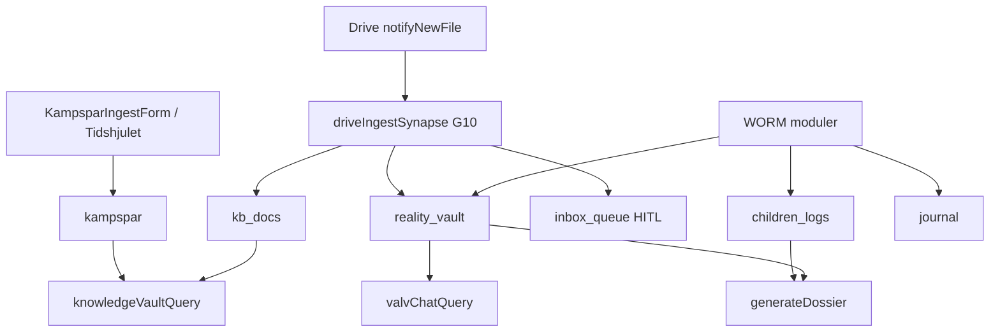

This file is a merged representation of a subset of the codebase, containing specifically included files, combined into a single document by Repomix.
The content has been processed where comments have been removed, empty lines have been removed, content has been compressed (code blocks are separated by ⋮---- delimiter).

# File Summary

## Purpose
This file contains a packed representation of a subset of the repository's contents that is considered the most important context.
It is designed to be easily consumable by AI systems for analysis, code review,
or other automated processes.

## File Format
The content is organized as follows:
1. This summary section
2. Repository information
3. Directory structure
4. Repository files (if enabled)
5. Multiple file entries, each consisting of:
  a. A header with the file path (## File: path/to/file)
  b. The full contents of the file in a code block

## Usage Guidelines
- This file should be treated as read-only. Any changes should be made to the
  original repository files, not this packed version.
- When processing this file, use the file path to distinguish
  between different files in the repository.
- Be aware that this file may contain sensitive information. Handle it with
  the same level of security as you would the original repository.

## Notes
- Some files may have been excluded based on .gitignore rules and Repomix's configuration
- Binary files are not included in this packed representation. Please refer to the Repository Structure section for a complete list of file paths, including binary files
- Only files matching these patterns are included: docs/external-ai/repomix/KARNKOD-SYSTEMPLAN-PREAMBLE.md, .context/system-plan.md, docs/SYSTEM_PLAN_v2.md, docs/SYSTEMKONTROLL.md, docs/MODUL-FUNKTIONS-REGISTER.md, docs/MODUL-GAP-OVERSIKT.md, docs/specs/modules/Arkiv-GAP-REGISTER.md, docs/evaluations/2026-06-15-fas19-masterplan-v2.md, docs/architecture/INFINITE_EVOLUTION.md, docs/INNEHALL-REGISTER.md, docs/DEPLOY.md, docs/GCP-INVENTORY-LATEST.md, .context/architecture.md, .context/arkiv-minne.md, .context/security.md, .context/database.md, .context/agents.md, .context/innehall-kanon.md, .context/domän-covert-narcissism.md, .context/locked-ux-features.md, AGENTS.md, docs/external-ai/LIFE-OS-BUILD-STATE.md, docs/external-ai/SYNAPSE-LOCK-SPEC.md, docs/external-ai/SECURITY-LOCK-MANIFEST.md, docs/archive/evaluations-2026-05/GRUNDER-UTVARDERING-RESULTAT.md, firestore.rules, storage.rules, firebase.json, package.json, functions/package.json, functions/tsconfig.json, functions/src/**, src/modules/core/types/firestore.ts, src/modules/core/firebase/init.ts, src/modules/core/firebase/firestore.ts, src/modules/core/firebase/evolutionLedgerFirestore.ts, src/modules/core/auth/**, src/modules/core/security/**, src/modules/core/store/useEvolutionStore.ts, src/modules/core/store/useCapacityGate.ts, src/modules/core/evolution/**, src/modules/core/hooks/useEvolutionSync.ts
- Files matching patterns in .gitignore are excluded
- Files matching default ignore patterns are excluded
- Code comments have been removed from supported file types
- Empty lines have been removed from all files
- Content has been compressed - code blocks are separated by ⋮---- delimiter
- Files are sorted by Git change count (files with more changes are at the bottom)

# Files

## File: .context/agents.md
````markdown
# Agentroller (Canonical)

## Produktroller
- Sannings-Analytikern: klinisk bevisanalys med strikt JSON.
- Brusfiltret: tvattar affektivt brus till fakta och tidslinje.
- BIFF-Skolden: producerar Brief, Informative, Friendly, Firm svar.
- Paralys-Brytaren: ett mikrosteg for exekutiv avlastning.
- RSD-Kylaren: rationella alternativ vid avvisningstriggers.
- Uppgifts-Krossaren: atomiserar uppgifter till testbara steg.
- Speglings-Coachen: validerar utan fixande.
- Monster-Arkivarien: forensisk langtidanalys av bevismaterial.

## Runtime-koppling
- Agent cards: `functions/src/agents/cards/index.ts`
- ADK (orkestrering, synapser, executors): `functions/src/adk/` — `synapseBus.ts` + `emitSynapse`; Cursor-regel `.cursor/rules/synapser-adk.mdc`
- Supervisor-routing: `functions/src/agents/kompis-supervisor.ts` → `AdkOrchestrator`
- Centrala AI-regler: `functions/src/sharedRules.ts` (`getAgentSystemPrompt`)

## Hard rules
- Ingen hardkodad prompt utanfor `functions/src/sharedRules.ts`.
- Ingen LLM-baserad auktorisationslogik.
- Bevara WORM, CMEK och Zero Footprint.
````

## File: .context/architecture.md
````markdown
# Systemets Övergripande Vision och Arkitektur

Livskompassen v2 representerar en fundamental utveckling från en traditionell applikation för personlig utveckling till ett avancerat, prediktivt och autonomt ekosystem.

## Kärnkomponenter
- **Kompis:** En empatisk, AI-driven navigatör som interagerar med användaren genom ett visuellt gränssnitt.
- **Sub-Synaptiska Nätverket:** En underliggande neural arkitektur som kopplar samman och analyserar livsdata såsom rutiner, budgetar och Minne (användarens utmaningar och milstolpar).

## Arkitektoniskt Paradigmskifte
Systemet designas som ett distribuerat multi-agent ekosystem där specialiserade agenter samarbetar under strikt orkestrering. Det bygger på:
- **Google Cloud Vertex AI Agent Engine**
- **Agent2Agent-protokollet (A2A)** för sömlös kommunikation mellan oberoende AI-moduler.

## Multi-Agent Ekosystem (A2A)
Arkitekturen bygger på tre fundamentala koncept:
1.  **AgentCards:** Maskinläsbara visitkort som beskriver en agents specifika förmågor (skills), metadata och förväntad input. Kompis agerar supervisor och delegerar via dessa.
2.  **AgentExecutors:** Servande logik som tar emot A2A-meddelanden, exekverar verktyg, strömmar partiella resultat och returnerar strukturerad data (artefakter) utan att dela privat minne.
3.  **Hierarkisk orkestrering & Gatekeeper-agenter:** Gatekeepers agerar barriär mellan backend-specialister och frontend. De validerar artefakter mot säkerhetskriterier och rensar PII innan data når UI.

## Asynkron Långtidsanalys i Bakgrunden
För djupa, autonoma analyser (ex. 5-timmars prediktiv analys):
- **Teknologi:** Händelsestyrda **Cloud Run Jobs** orkestrerade av **Cloud Scheduler** och **Cloud Tasks**.
- **Konfiguration:** Cloud Run-tjänstens CPU sätts till "always-allocated" med tillåten exekveringstid upp till 24 timmar.
- **Utlösare:**
    - *Tidsstyrd:* Cloud Scheduler (ex. 09:00 varje morgon för batch-inferens).
    - *Händelsestyrd:* Cloud Tasks (ex. triggas direkt av en panikattack registrerad i Minneet).

## Kostnadsoptimering & Modellanvändning
- **Context Caching:** Använd Vertex AI Context Caching för RAG för att spara/återanvända förberäknade tokens (raderas inom 24h).
- **Model Routing:**
    - Lågkomplexitet: Gemini 3.1 Flash-Lite.
    - Högkomplexitet (DCAP, prediktiv analys): Gemini 3.1 Pro.
- **Consumption Options:** "Batch inference" eller "Flex" för bakgrundsjobb. "PayGo" för realtids-Kompis.
````

## File: .context/arkiv-minne.md
````markdown
# Hela arkivet — canonical minnesarkitektur (Life OS)

**Status:** Låst princip (2026-05-21). Konsoliderad mot alla Repomix-analyser + GCP.  
**Källor:** Repo, [`docs/GCP-INVENTORY-LATEST.md`](../docs/GCP-INVENTORY-LATEST.md), [`Arkiv-SPEC.md`](../docs/specs/modules/Arkiv-SPEC.md), [`GRUNDER-UTVARDERING-RESULTAT.md`](../docs/specs/modules/GRUNDER-UTVARDERING-RESULTAT.md), [`KONSOLIDERING-2026-05-21.md`](../docs/archive/repomix/KONSOLIDERING-2026-05-21.md).

---

## Invariant: permanent minne

Livskompassen ska **aldrig glömma** användarens WORM-data. Det är **inte** en tidsgräns (t.ex. fem år) utan en arkitekturregel.

| Collection / lager | Roll | Glömmer? |
|--------------------|------|----------|
| `children_logs` | Barnens livslogg + fysiologi | **Nej** — append-only WORM |
| `reality_vault` | Bevis (Sanningens Sköld) | **Nej** — append-only WORM |
| `journal` | Dagbok Lager 1 | **Nej** — append-only WORM |
| `dossier_snapshots` | Bevisad export + hash | **Nej** — WORM snapshot |
| `kampspar` / `kb_docs` | Kunskapsvalvet (RAG) | WORM create; separat retention-policy — **ersätter inte** barn/valv |
| GCS `livskompassen-knowledge-vault-worm` | Embeddings/arkiv-filer | 30d bucket retention — **inte** primär livsdatabas |

**Sacred:** Permanent minne + korrekt silo = lika viktigt som Zero Footprint och Kill Switch.

---

## Begrepp

| Term | Betydelse |
|------|-----------|
| **Hela arkivet** | Koordinerat Life OS-minne över alla moduler — **inte** en gemensam RAG |
| **Kunskapsbank** | Strukturerade dokument/mappar (blueprint: KnowledgeFolder/Doc/Media → `kb_docs`) |
| **Kunskapsvalvet** | UI + RAG ovanpå `kampspar` + `kb_docs` — Valv PIN: `/valvet?vaultTab=kunskapsbank` (legacy `/kunskap` redirect) |
| **Minne** | Datalager `kampspar` (livshändelser, strategi, mönster) |
| **Synaps** | ADK-händelse (`drive_ingest`, `journal_woven`, …) som kopplar modul → minne utan att blanda silor |
| **SystemSynapse** | Planerat långtids-grounding-schema (blueprint) — ej Firestore-prod än |

---

## Tre kunskapsytor (MUST NOT blandas)

| Yta | Route | Data | Callable | Agent |
|-----|-------|------|----------|-------|
| Kunskapsvalvet | `/valvet?vaultTab=kunskapsbank` | `kampspar`, `kb_docs` | `knowledgeVaultQuery` | Livs-Arkivarien |
| Valv-Chat | Bevis → Sök | `reality_vault` | `valvChatQuery` | Sannings-Analytikern |
| Barnen | `/familjen` | `children_logs` | `childrenLogsQuery` (G8 **done**) | Mönster-Arkivarien (barnen) |

**MUST NOT:** `valvChatQuery` mot `kampspar`. **MUST NOT:** `knowledgeVaultQuery` mot `reality_vault` som standard.

**U6 — Utvecklingszon (Vit):** `mabra_sessions`, planerat `vit_hub` / `vit_entries` — **ingen** RAG, **ingen** ingest till `kampspar`. Innehåll via content-banker — se [`.context/innehall-kanon.md`](./innehall-kanon.md), [`docs/INNEHALL-REGISTER.md`](../docs/INNEHALL-REGISTER.md).

**Terminologifällor (repomix → kanon):**

| Ord | Repomix (legacy) | Kanon |
|-----|------------------|-------|
| Synaps | CSS / Firestore `synapses` | ADK `SynapseBus`-händelse |
| Silo 3 | Ex-partner / `vault` | Barnen → `children_logs` |
| Minne | Mock-typ `Kampspar` | WORM `KampsparEntry` |
| Vector Search | Vertex AI Search Data Store | Vertex AI Vector Search ANN (768 dim) |

**Förbjudna repomix-mönster:** `SuperArchive` → `kb_docs` för bevis; Kunskap inbäddad i VaultPage; hårdkodad PIN; prompts utanför `sharedRules.ts`.

---

## Legacy → kanon (Firestore)

| Repomix / legacy | Kanon |
|------------------|-------|
| `vault` | `reality_vault` |
| `kids_records` | `children_logs` |
| `diary` | `journal` |
| `synapses` (dokument) | ADK events (`drive_ingest`, `journal_woven`) |
| — | `kampspar`, `dossier_snapshots` (saknas i repomix) |

**Schema-risk (G11):** Mock `Kampspar` i `src/modules/kompis/types/kompis.ts` (challenge/milestone/routine) får **inte** bli ingest-schema — kanonisk typ = `KampsparEntry`.

---

## Inflöde (hur arkivet fylls)



| Källa | Mål | Auto? |
|-------|-----|-------|
| Manuell ingest | `kampspar` | Användaren |
| Drive webhook | `kb_docs` / `reality_vault` / `children_logs` / `inbox_queue` | Ja (G10 klassificering + HITL) |
| Dagbok | `journal` → Vävaren → `reality_vault` metadata | Async |
| Barnen | `children_logs` | Per save |
| Kladd/trauma | `kampspar` | **Endast opt-in manuell** |

---

## RAG idag vs mål (GCP 2026-05-21, live-inventering)

| Lager | Idag | GCP (live) | Mål |
|-------|------|------------|-----|
| Kunskap retrieval | Token-match + ANN-kod `kampsparQueryRag.ts` | Endpoint `4956462078572363776`, index deployad, 4 vectors | ANN prod secrets **VERIFY** (G2) |
| Embeddings | `generateEmbedding` + ingest | Index synkad | Full smoke **VERIFY** (G3) |
| LLM syntes | `GEMINI_API_KEY` | Secret finns | Behåll |
| Legacy Python RAG | — | 4 functions us-central1 | Avveckla (G4) |
| Context Cache | `vertexCache.ts` + `context_cache_registry` (G12) | Firestore delad registry | **done** G12 |

**Deploy-sanning:** [`docs/GCP-INVENTORY-LATEST.md`](../docs/GCP-INVENTORY-LATEST.md) — ersätter arkiv-PDF som säger 0 endpoints / ej deployad valv.

**Kanonisk index (välj vid wire):**

- `projects/1084026575972/locations/europe-west1/indexes/2686894156982255616` (`livskompassen-kv-index`, STREAM)
- eller `.../europe-north1/indexes/9094201410823651328` (`kampspar_index`, BATCH)

---

## Agenter och synapser

| Roll | Fil | Ansvar |
|------|-----|--------|
| Livs-Arkivarien | `sharedRules.ts`, `knowledgeVaultAgent.ts` | Kunskap RAG-svar |
| Mönster-Arkivarien | `sharedRules.ts`, `driveIngestSynapse` | Drive → `kb_docs`, långtidsmönster |
| Sannings-Analytikern | `valvChatAgent.ts` | Forensisk JSON |
| ADK SynapseBus | `synapseBus.ts` | `drive_ingest` live; `journal_woven` stub |

---

## Modul ↔ minne (Life OS)

| Modul | Skriver | RAG/chatt | PDF/export |
|-------|---------|-----------|------------|
| kompis | `kampspar`, `kb_docs` | Kunskap ja | — |
| valv_chatt | — | Valv ja | per post |
| verklighetsvalvet | `reality_vault` | via valv_chatt | per post |
| barnens_livsloggar | `children_logs` | **nej** | Dossier |
| dagbok | `journal` | nej | Dossier opt-in |
| dossier | `dossier_snapshots` | nej | **ja** (hela urval) |
| safe_harbor | valfri → valv | nej | — |
| kompasser | `checkins` | nej | — |
| mabra | `mabra_sessions`, `vit_*` *(P1)* | nej | `mabraCoach` (parafras bank); zon Vit U6 |
| speglings_system | — (Zero Footprint) | nej | — |
| ekonomi | `transactions` | nej | — |
| core | delade helpers | — | — |

---

## Planerat (MUST NOT tappas)

- [x] **G1** Deploy `valvChatQuery` (live 2026-05-21)
- [x] **G2** Vector endpoint deployad — VERIFY PASS 2026-05-22 ([`GCP-INVENTORY-LATEST`](../docs/GCP-INVENTORY-LATEST.md))
- [x] **G3** Embeddings smoke 768 — VERIFY PASS 2026-05-22
- [ ] **G4** Avveckla legacy Python RAG (us-central1)
- [x] **G5** Retention allowlist — exkludera WORM permanent
- [ ] **G6** Drive smoke end-to-end (secret + Apps Script — manuellt)
- [ ] **G7** `journal_woven` synaps
- [x] **G8** Familjen-RAG — **done** 2026-05-22 (`childrenLogsQuery` + Mönster-Arkivarien Barnen)
- [x] **G9** EntityProfile / SystemSynapse Firestore + agent grounding
- [x] **G10** Självsorterande inkorg (Kunskap-SPEC §12)
- [x] **G11** Rensa/isolera mock `Kampspar`-typ vs `KampsparEntry`
- [x] **G12** Context Cache delad registry
- [x] **G13** Tidshjulet → `kampspar`-historik (live + ringar)
- [x] **G14** Gräns-Arkitekten — agent card + Hamn (Brusfilter + BIFF)

Se [`Arkiv-GAP-REGISTER.md`](../docs/specs/modules/Arkiv-GAP-REGISTER.md). Implementation: `kör [GAP]`.

---

## Relaterade filer

- [`Arkiv-SPEC.md`](../docs/specs/modules/Arkiv-SPEC.md)
- [`.context/database.md`](./database.md)
- [`.context/arkitektur-beslut.md`](./arkitektur-beslut.md) §1.5
- [`docs/specs/ai-prompts-moduler-master.md`](../docs/specs/ai-prompts-moduler-master.md) §G
- Skills: `.cursor/skills/livskompassen-arkiv-master/`
````

## File: .context/database.md
````markdown
# Databas och Kunskapsvalvet

Grunden för Livskompassen v2 är "Kunskapsvalvet" (The Knowledge Vault), implementerat för extrem säkerhet och snabb semantisk hämtning (RAG).

**Canonical arkiv:** [`.context/arkiv-minne.md`](./arkiv-minne.md) · **GCP live:** [`docs/GCP-INVENTORY-LATEST.md`](../docs/GCP-INVENTORY-LATEST.md)

## Tre silor (MUST NOT blandas)

| Silo | Firestore | RAG callable | Agent |
|------|-----------|--------------|-------|
| Kunskap | `kampspar`, `kb_docs` | `knowledgeVaultQuery` | Livs-Arkivarien |
| Valv | `reality_vault` | `valvChatQuery` | Sannings-Analytikern |
| Barnen | `children_logs` | — (Dossier read) | Plan: Mönster-Arkivarien |

## Databasarkitektur

- **Teknologi:** Cloud Firestore (appmoduler); Data Connect avvaktas för ekonomi.
- **Säkerhetskrav:** Customer-Managed Encryption Keys (CMEK) via Cloud KMS där bucket/Firestore policy kräver det (`scripts/setup_gcp_cmek.sh`, `gs://livskompassenv2`).
- **Permanent minne:** WORM collections (`children_logs`, `reality_vault`, `journal`, `dossier_snapshots`) — retention får **inte** radera dessa.

## Vektorsökning och RAG (repo vs GCP 2026-05-22)

| Lager | Repo | GCP |
|-------|------|-----|
| Retrieval (prod) | ANN + token-match fallback [`kampsparQueryRag.ts`](../functions/src/lib/kampsparQueryRag.ts) | Endpoint live west1 |
| Vector Search index | [`vectorSearchClient.ts`](../functions/src/lib/vectorSearchClient.ts) defaults | **west1 kanonisk**, 102 vectors |
| Embeddings | `generateEmbeddingInternal.ts` | Buckets `livskompassen-knowledge-vault-*` |
| Inbäddningsmodell | `text-embedding-004` | 768 dim |
| LLM syntes | `GEMINI_API_KEY` secret | Satt på `knowledgeVaultQuery` |

**Kanoniskt index (prod):**

- `projects/1084026575972/locations/europe-west1/indexes/2686894156982255616` (`livskompassen-kv-index`)
- Endpoint `4956462078572363776`, deployed `livskompassen_kv_deployed_v1`

**Avvecklas:** `kampspar_index` north1 (BATCH, 0 endpoints) — se [`GCP-KONSOLIDERING-BESLUT.md`](../docs/GCP-KONSOLIDERING-BESLUT.md).

**GAP:** G2/G3/G4 **done** (2026-05-22). Öppet: G7–G14 i [`Arkiv-GAP-REGISTER.md`](../docs/specs/modules/Arkiv-GAP-REGISTER.md).

## Kunskapsbank (blueprint → kod)

`firebase-blueprint.json`: `KnowledgeFolder`, `KnowledgeDoc`, `KnowledgeMedia` → runtime: `kb_docs` + Drive `folderId`, `driveFileId`.

## Kontextuell isolering

- Agenter läser endast sin silo (Valv-Chat ≠ Kunskap).
- Vävaren (`kampsparRag.ts`) läser journal+valv+kampspar för **metadata-tagging** — skild från användar-facing Kunskap-chat.
- Memory Management: ADK SynapseBus + Zero Footprint (`clearSynapseState`).

## Legacy (GCP, avvecklad)

Python functions `us-central1`: **0 kvar** (G4 **done** 2026-05-22). Se [`LEGACY-KB-MIGRATION-2026-05-22.md`](../docs/LEGACY-KB-MIGRATION-2026-05-22.md).
````

## File: .context/domän-covert-narcissism.md
````markdown
# Domän — dold narcissism, barn och bevis (kanon för byggare)

**Version:** 2026-06-14 · **Status:** aktiv röd tråd · **Upload-prior:** ~80% bevis/HCF-covert

**Full analys:** [`docs/evaluations/2026-06-01-superhub-domän-covert-narcissism.md`](../docs/evaluations/2026-06-01-superhub-domän-covert-narcissism.md)

**Cursor-regel:** [`.cursor/rules/domän-covert-narcissism.mdc`](../.cursor/rules/domän-covert-narcissism.mdc) (alwaysApply)

---

## Kort

Pontus case: medföräldraskap med **högkonflikt**, **covert** (dold) dynamik hos kvinnlig motpart — offerroll, perfekt fasad utåt, gaslighting, DARVO, triangulering, tyst straff/invalidation. Barn ska skyddas utan lojalitetspress. Bevis = **beteende + datum** i Valv — **aldrig** diagnosetiketter i WORM eller mot myndigheter.

**~80% av inkast** förväntas vara bevis, sms/mejl, tidslinjer eller teorier om dessa mönster. Systemet ska anta denna lins när routing är oklar (fail-closed → Granska).

---

## Täckning idag (RAG + bank + Hamn wire)

| Område | Var | Status |
|--------|-----|--------|
| Covert taktik (generellt + HCF) | `cn-001`–`015` | **KEEP + ingest** |
| Barn i HCF (lojalitet, PA, invalidation) | `bh-001`–`008`, barn-referens seed | **KEEP + ingest** |
| DARVO, love bombing, triangulering, projektion | `043`–`047` | **KEEP + ingest** |
| BIFF, Grey Rock, JADE, parallel parenting | `005`–`006`, `cn-009`–`012` | **KEEP + ingest** |
| Profil (Kasper, Arvid, vårdnad, taktiker) | Kampspar-PROFIL-SEED | **ingest** |
| Hoovering, smear, flying monkeys, trauma bonding | `cn-016`–`019` | **KEEP + ingest** (våg 21) |
| Maternal-image fasad | `cn-020` | **KEEP + ingest + Hamn wire** (våg 22) |
| Ekonomisk kontroll | `cn-021` | **KEEP + ingest + Hamn wire** (våg 22) |
| Juridik / LVU / vårdnad (svensk kontext) | `jur-001`–`004`, `ep-001`–`005` | **KEEP + ingest** (våg 21) |
| Runtime DCAP | `DCAP.ts`, `mabraCoachGuard` | **live** |
| Inkast-heuristik | `inboxClassifier.ts` | **live** |
| Hamn taktik-signal (deterministisk) | `hamnTaktikWire.ts` → Taktik-lexikon | **live** (written_only_escalation, hoover, smear, ekonomisk_kontroll, maternal_fasad, trauma_bonding, juridik_hot) |

---

## Luckor (efter våg 21–22)

Våg **21** och **22** bank + ingest + Hamn-wire **klara** 2026-06-14. Kvarvarande luckor:

| Lucka | Bank/RAG | Hamn wire | Status |
|-------|----------|-----------|--------|
| Hoovering / återkontakt efter gräns | `cn-016` | hoovering | **done** |
| Smear / flying monkeys | `cn-017`, `cn-018` | smear (+ utökade sv-mönster) | **done** |
| Ekonomisk kontroll | `cn-021` | ekonomisk_kontroll | **done** |
| Maternal-image fasad | `cn-020` | maternal_fasad | **done** |
| Juridisk weaponization (vårdnad, LVU) | `jur-001`–`004` | juridik_hot | **done** |
| Trauma bonding (djupare cykel) | `cn-019` | trauma_bonding | **done** |
| Valv Mönster: auto-tag per teknik | cn-* library refs | REGEX sidecar | **done** (pattern_scan_metadata → Dossier) |

Kurator: `specialist-kunskap-seed` · Dirigent vid osäkerhet.

---

## Modul-mappning

| Behov | Modul | Silo |
|-------|-------|------|
| Ex-sms → svar | Hamn (BIFF) | ephemeral → Valv om sparat |
| Validera gaslighting | Speglar | Zero Footprint |
| Bevis, mönster, dossier | Valv (`ValvInputSuperModule`) | `reality_vault` WORM |
| Barnobservation | Familjen Barnfokus | `children_logs` |
| Metod/fakta | Kunskapsbank (PIN) | `kampspar` RAG |

---

## MUST NOT

- Cross-RAG mellan silor (U1)
- «Narcissist» i WORM, prod-coaching eller soc-skrivelser
- PA-autodiagnos i Barnen
- Auto-promote barnlogg → Valv
- BIFF-coaching i Kunskap RAG (→ Hamn)

---

## Smoke

`npm run smoke:innehall` · `npm run smoke:hamn` · `npm run smoke:locked-ux`
````

## File: .context/innehall-kanon.md
````markdown
# Innehållskanon — låst med Grunder (U6)

**Status:** Låst princip (2026-05-25). Konsoliderar U1 silos + Utvecklingszon utan fjärde RAG.

**Register:** [`docs/INNEHALL-REGISTER.md`](../docs/INNEHALL-REGISTER.md) · **Smoke:** `npm run smoke:innehall` (ingår i `smoke:orkester`)

---

## U6 — Innehållszoner (MUST)

| Zon | `content_class` | RAG? | Kurator |
|-----|-----------------|------|---------|
| Kunskap | `FACT` | Ja — `knowledgeVaultQuery` | `specialist-kunskap-seed` |
| Valv | `EVIDENCE` | Ja — `valvChatQuery` | Ingest/HITL — ingen lek-bank |
| Barnen | `EVIDENCE`, `PLAY` | `childrenLogsQuery` — ej Kunskap | `specialist-barn-lek` *(planerad)* |
| Utveckling (Vit) | `REFLECTION`, `PLAY` | **Nej** — ingen export till Kunskap | `specialist-mabra-curator` |

**Dirigent:** `specialist-innehall-dirigent` — klassar, skriver inte innehåll.

---

## MUST NOT

- Fjärde RAG-silo eller “sök överallt”
- LLM skapar `FACT` i prod utan `Kunskap-CONTENT-SEED` + ingest
- LLM skapar frågekort/lek i prod utan `Mabra-CONTENT-BANK` + `bankId` (P1)
- `FACT` i MåBra-bank · `PLAY` som WORM-bevis i Valv
- Auto-ingest `vit_*` → Vector Search / `kampspar`

---

## Content-banker (dokumentsanning)

| Bank | Fil |
|------|-----|
| MåBra | `docs/specs/modules/Mabra-CONTENT-BANK.md` |
| Kunskap | `docs/specs/modules/Kunskap-CONTENT-SEED.md` |
| Barnen lek | `docs/specs/modules/Barnen-PLAY-BANK.md` |

**Runtime prompts:** endast `functions/src/sharedRules.ts` — kuratorer ändrar inte prompts utan explicit order.

---

## Modul ↔ innehåll

| Modul | Tillåtna klasser | Callable / data |
|-------|------------------|-----------------|
| `/mabra` | REFLECTION, PLAY | `mabraCoach`, `mabra_sessions`, `vit_entries` *(P1)* |
| Kunskap/Kompis | FACT | `knowledgeVaultQuery`, `kampspar`, `kb_docs` |
| `/familjen` | PLAY (frågor), EVIDENCE (logg) | `children_logs` |
| Valv/Hamn/Speglar | EVIDENCE, Hamn BIFF | WORM / guardrails |

Se [`arkiv-minne.md`](./arkiv-minne.md) för permanent minne vs Utvecklingszon.
````

## File: .context/locked-ux-features.md
````markdown
# Locked UX Features (låsta — får inte tas bort)

**Status:** Låst 2026-05-23. Ändring kräver explicit produktbeslut i commit/PR.

Dessa är **inte** Sacred Features i säkerhetslagret, men de är **låsta produktflöden** för trygg hamn (Barnen) och Pansaret (Valv). Agent och refaktor får inte ta bort, döpa om eller gömma dem utan att uppdatera denna fil och smoke.

---

## 1. Barnfokus-frågor (Familjen / Barnen — ev. «Middagsfrågan»)

| | |
|---|---|
| **Route** | `/familjen?tab=reflektion` → `FamiljenPage` → `FamiljenInputSuperModule` (läge `barnfokus`) |
| **Syfte** | Roterande frågor (roligt, kunskap, knas, lära känna, utveckling, valv-bank) → minneslista |
| **Kod** | `FamiljenBarnfokusDelegate.tsx`, `barnfokusQuestionForToday`, `BARNFOKUS_QUESTIONS`, `category: 'barnfokus'` |
| **Spec** | `docs/design/FAMILJEN-BARNFOKUS-FRAGOR-SPEC.md` · [`docs/specs/Familjen-INPUT-SUPERHUB-SPEC.md`](../docs/specs/Familjen-INPUT-SUPERHUB-SPEC.md) |
| **Krav** | Knapp **Spara till {barn}s logg**; **Annan fråga**; optimistisk minneslista; **inte** enbart middag-rubrik |
| **Smoke** | `npm run smoke:locked-ux` · manuell #19 |

---

## 2. Pansaret — Mönster & Orkester (Valv-baksida)

| | |
|---|---|
| **Route** | `/valvet?vaultTab=…` → `VaultPage` (PIN/WebAuthn) · legacy `/dagbok?tab=bevis` redirect |
| **Zoner** | **Samla** · **Analysera** · **Kunskap** · **Exportera** · **Forensik** — [`VALV-HUBB-SPEC.md`](../docs/design/VALV-HUBB-SPEC.md) |
| **Flikar** | **Arkiv** · **Granska inkommande** · **Mönster** · **Meddelanden eller SMS-analys** (`vaultTab=orkester`) · **Dossier** · **Kunskapsbank** · **Personer i ärendet** |
| **Mönster** | `VaultMonsterPanel` + `buildVaultFrequencyReport` (deterministisk regex, ingen LLM-sanning) |
| **Meddelanden / SMS-analys** | `VaultOrkesterPanel` + `PRODUCT_AGENTS` + SMS-tråd → `analyzeMessage` (flik-ID `orkester` oförändrat) |
| **P1 Brusfilter (LOCK 2026-06-17)** | `processBrusfilter` callable + panel i `VaultOrkesterPanel` — DCAP + logistik + BIFF-utkast, **ingen auto-WORM** |
| **Kunskapsbank** | `VaultKunskapsbankPanel` — `KunskapPage` + `FamiljenKunskapHubTab` (U1 silos) |
| **Aktörskarta (G9)** | `VaultAktorskartaPanel` + `EntityAddForm` + `addEntityProfile` — manuella personer, append-only metadata för agenter (ej RAG, ej publik meny) |
| **Smoke** | `npm run smoke:locked-ux` · `npm run smoke:entities` · manuell #20 i `docs/SMOKE_CHECKLIST.md` |

---

## 3. Planering + Projekt (design låst — hybrid)

| | |
|---|---|
| **Beslut** | [`docs/design/PLANERING-PROJEKT-HYBRID.md`](../docs/design/PLANERING-PROJEKT-HYBRID.md) |
| **Handling (fast)** | P3 Kanban ATT GÖRA · VÄNTAR · KLART — `/planering` |
| **Projekt (flex)** | Lista, anteckning, bild, egna planeringar — `/projekt` |
| **Widget** | v2 [`galleri/widget/v2/W1-kompakt-projekt.png`](../docs/design/galleri/widget/v2/W1-kompakt-projekt.png) |
| **Spec** | `PROJEKT-SPEC.md`, `PLANERING-P3-KANBAN-SPEC.md`, `WIDGET-BAR-SPEC.md` |
| **Smoke** | Hybrid-spec + kanon-PNG finns |

---

## 4. Planeringssidan (äldre register — se §3 hybrid)

| | |
|---|---|
| **Route (plan)** | `/planering` |
| **Spec** | `docs/design/PLANERINGSSIDA-SPEC.md`, mockups `docs/design/planering/` |
| **Krav** | P1–P4 + Projekt; e-postregler `planning_email_rules`; **inte** ex-brus hit |
| **Smoke** | Spec-fil + nyckelsträngar i `smoke_locked_ux.mjs` |

---

## 5. Fyren Edge — widget + tyst inspelning (design låst)

| | |
|---|---|
| **Spec** | `docs/design/WIDGET-BAR-SPEC.md`, `docs/design/HOMESCREEN-WIDGETS-SPEC.md`, `docs/design/ANDROID-WIDGETS-SPEC.md` |
| **Kod** | `FyrenWidgetBar.tsx`, `/widget/*`, `android/…/widgets/*`, `ingestWidgetRecording` |
| **Krav** | WH1: datumstämpel, AI-titel, WORM, sammanfattning i `truth`, ljudfil `evidenceUrl`; **ingen synlig REC** |
| **Data** | `reality_vault` WORM, `category: tyst_inspelning` |
| **Smoke** | Spec-fil + nyckelsträngar |

---

## 6. Sidomeny / hamburger (design låst — Vardag + Valv)

| | |
|---|---|
| **Kanonbild** | `docs/design/references/MENU-DRAWER-KANON.png` |
| **Spec** | `docs/design/references/MENU-DRAWER-KANON.md` |
| **Sektioner** | **Vardag** (publikt) · **Valv** (endast efter PIN/gate på Valv-route) |
| **Kod** | `navTruth.ts`, `NavigationDrawer.tsx`, `DrawerModeToggle.tsx` |
| **Krav** | Skymningsbakgrund; aktiv rad **guld**; **ingen** Valv-växlare/snabbchips i publikt läge |
| **Smoke** | Kanonfil + spec + `DRAWER_VARDAG_ITEMS` / `DRAWER_VALV_ENTRIES` + `vaultOpen` i NavigationDrawer |

---

## 7. Barnporten — barnens hub (design låst)

| | |
|---|---|
| **Route (barn)** | `/barnporten` (PWA) · **förälder** `/familjen?tab=barnporten` |
| **Spec** | `docs/design/BARNPORTEN-SPEC.md`, infografik `docs/design/barnporten/infographic.html` |
| **Orkester** | `src/modules/barnporten/constants/barnportenAgents.ts` — **egen** barn-Orkester (skild från Valv-Orkester) |
| **Valv** | Endast HITL `promoteChildLogToVault` — **aldrig** auto från privat barnlogg |
| **Widget** | CB1–CB4 (barn); **inte** samma som förälder W1 |
| **Smoke** | Spec + `barnportenAgents.ts` + mockup-mapp |

### 7b. Inkorg → Valv-bro (HITL — **låst 2026-05-29**)

| | |
|---|---|
| **Kanon UI** | [`docs/design/barnporten/mockups/barnporten-inkorg-valv-kanon.png`](../docs/design/barnporten/mockups/barnporten-inkorg-valv-kanon.png) |
| **Route (förälder)** | `/familjen?tab=barnporten` → `BarnportenInboxPanel` |
| **Flöde** | Barnmeddelande i inkorg → vuxen granskar → explicit godkännande → `reality_vault` WORM |
| **Kod** | `BarnportenInboxPanel.tsx` · `SaveAsEvidencePrompt.tsx` · `buildVaultPayloadFromChildLog` (`sourceRef`) |
| **HITL** | **Human-In-The-Loop** — inget sparas automatiskt; vuxen trycker **Spara som bevis** / **Flytta till Valv (HITL)** |
| **Tidsstämpel** | `saveVaultLog` → Firestore `serverTimestamp()` → Valv visar **SERVER-TIDSSTÄMPEL** |
| **Efter spar** | Länk **Granska i Valv** → `/valvet` |
| **Tagline (mål-UI)** | *Skapa trygghet. Bygg tillit.* · *Från inkorg till Valv – för framtiden.* |
| **Status (mål-UI)** | *Klar för långtidslagring* · HITL-badge med sköld |

**Får inte:** auto-promote från `private_child` / *Bara för mig*; ta bort HITL-steg; spara till Valv utan `sourceRef: children_logs/{id}`; ta bort inkorg-panelen eller mockup-kanon.

---

## 8. Arbetsliv — modulhub (låst)

| | |
|---|---|
| **Route** | `/arbetsliv` · redirect `/stampla` → `?tab=stampla` |
| **Kod** | `src/modules/arbetsliv/components/ArbetslivHubPage.tsx` |
| **Publikt** | Stämpel · Tid & flex · Logg |
| **Valv-menyn** | Frånvaro · Lön & spec → `vaultTab=arbetsliv_*` · zon `arbetsliv_forensic` |
| **Vardagen** | `/vardagen?tab=ekonomi` = veckopeng/matlåda |
| **Eval** | `docs/evaluations/2026-05-25-arbetsliv-hub.md` |
| **Smoke** | `npm run smoke:arbetsliv` |

**Får inte:** ta bort menyrad Arbetsliv eller stämpel-hub utan produktbeslut.

---

## 8b. Trygg Hamn — snabb ingång vs Valv (**godkänt 2026-05-29**)

| | |
|---|---|
| **Snabb** | `/hamn` — `BiffPublicPanel` (Grey Rock), Speglar-länk, utan PIN |
| **Djup** | Valv → Forensik → **Hamn · Analys** (`hamn_analys`) — triage, bevis, HITL |
| **Redirect** | `/hamn?tab=analys` → `/valvet?vaultTab=hamn_analys` |
| **Kanon** | [`docs/design/VALV-HUBB-SPEC.md`](../docs/design/VALV-HUBB-SPEC.md) |

**Får inte:** kräva Valv-PIN för första BIFF-svar eller ta bort `/hamn` från Vardag-drawer.

---

## 9. Valv-baksida — samlad PIN-vägg (2026-05-25)

| | |
|---|---|
| **Ingång** | Hamburgermeny → sektion **Valv** · `/valvet?vaultTab=…` |
| **Kunskap** | All kunskap (Vardagen, Familjen, Hem) → **Kunskapsbank** — **inte** publik `/vardagen?tab=kunskap` |
| **Forensic** | Hamn analys, Speglar fördjupat, Dagbok arkiv, Familjen mönster, Arbetsliv frånvaro/lön |
| **U1** | Kunskapsbank anropar `knowledgeVaultQuery` — **aldrig** cross-RAG till Valv/Barnen |
| **Kod** | `VaultPage.tsx`, `VaultKunskapsbankPanel.tsx`, `VaultForensicPanel.tsx`, `navTruth.ts` |

---

## 10. Produktikoner D1 · M2 (låst) · app-ikon upplåst

| ID | Plats | Fil | Status |
|----|-------|-----|--------|
| ~~**B1**~~ | App / favicon | `public/favicon.svg` | **Upplåst** — P1–P5 i `phone-icon-variants/PREVIEW.md` |
| **D1** | Header, dock, hero | `LivskompassMark.tsx` | LÅST |
| **M2** | Kompis-avatar | `KompisMark.tsx` | LÅST |

| | |
|---|---|
| **Register** | `.context/locked-icons.md` · stil: `docs/design/ICON-STYLE-GUIDE.md` |
| **App-ikon** | `docs/design/themes/phone-icon-variants/PREVIEW.md` · `npm run android:icons:phone` |
| **Smoke** | `npm run smoke:locked-icons` |

**Får inte:** Lucide-kompass i Kompis, minimal linje-D1, eller Vite-lila favicon utan beslut.

---

## 11. MåBra — Universal Input Superhub (`MabraInputSuperModule`) — **låst 2026-06-14**

| | |
|---|---|
| **Route** | `/mabra/input` · `/mabra/projekt/:projectId?inputMode=…` · `MabraRoutes.tsx` |
| **Syfte** | Polymorf inmatningshub för MåBra (Vit) — byt läge utan att byta sida |
| **Kod** | `MabraInputSuperModule.tsx` · `mabraInputModes.ts` · `supermodule/*` |
| **Spec** | [`docs/specs/modules/Mabra-INPUT-SUPERHUB-SPEC.md`](../docs/specs/modules/Mabra-INPUT-SUPERHUB-SPEC.md) |
| **Eval** | [`docs/evaluations/2026-06-14-fas6-mabra-superhub-djupanalys.md`](../docs/evaluations/2026-06-14-fas6-mabra-superhub-djupanalys.md) |
| **Fas** | 6A→6E **AVSLUTAD** 2026-06-14 — registrerad i `.context/system-plan.md` |

### Input modes (låsta lägen)

| Mode | Beskrivning |
|------|-------------|
| `checkin` | Humör/energi check-in |
| `emotional_memory` | Känslominnen (WORM) |
| `vit_card` | Vit frågekort |
| `vit_chat` | Lär tillsammans (Vit-chatt) |
| `vit_memory` | Känslominne (Vit) |
| `reflection_tool` | Reflektionskort/deck |
| `exercise_note` | Anteckning efter övning |
| `dagbok_bridge` | Bro till Hjärtat/dagbok |
| `inkast` | Granska innan spar (HITL) |

### Säkerhetsgränser (obligatoriska)

| Princip | Tillämpning |
|---------|-------------|
| **WORM** | `vit_entries` och `emotional_memory` — append-only; **ingen** `update`/`delete` |
| **Zero Footprint** | Reflektioner (`reflection_tool`, m.m.) i **RAM** och **localStorage**; molnsparande kräver **strikt uttryckliga HITL-åtgärder** (Human-in-the-loop) |
| **Inkast** | Läge `inkast` kräver **manuellt godkännande** — **ingen** automatisk marknadsföring till Valv, Barnen eller annan silo |
| **U1 silos** | Ingen cross-RAG till Kunskap; ex/konflikt → Speglar/Hamn (guard) |

**Får inte:** ta bort eller gömma lägesväxlaren; införa spridda inmatningsformulär utanför Superhub i MåBra-zonen; auto-promote från inkast; skriva till WORM-samlingar utan befintlig delegate-logik; ändra kärnlogik utan explicit produktbeslut (Pontus) + PMIR.

**Smoke:** `npm run smoke:mabra` · `npm run smoke:emotional-memory` · `npm run smoke:locked-ux`

---

## 12. Familjen — Universal Input Superhub (`FamiljenInputSuperModule`) — **låst 2026-06-14**

| | |
|---|---|
| **Route** | `/familjen?tab=reflektion` · `/familjen?tab=livslogg` · `?inputMode=…` · `FamiljenPage.tsx` |
| **Syfte** | Polymorf inmatningshub för Familjen (Barnen-silo) — byt läge utan sidbyte |
| **Kod** | `FamiljenInputSuperModule.tsx` · `familjenInputModes.ts` · `supermodule/delegates/*` |
| **Spec** | [`docs/specs/Familjen-INPUT-SUPERHUB-SPEC.md`](../docs/specs/Familjen-INPUT-SUPERHUB-SPEC.md) |
| **Eval** | [`docs/evaluations/Familjen-INPUT-SUPERHUB-EVAL.md`](../docs/evaluations/Familjen-INPUT-SUPERHUB-EVAL.md) |
| **Fas** | 7A→7E **AVSLUTAD** 2026-06-14 — registrerad i `.context/system-plan.md` |

### Input modes (låsta lägen)

| Mode | Beskrivning |
|------|-------------|
| `barnfokus` | Dagens fråga — PLAY, optimistisk minneslista |
| `livslogg_stund` | Positiv stund med barnet |
| `fysiologi` | Sömn, ångest, aptit 1–5 |
| `livslogg_observation` | Neutral observation + valfri HITL till Valv |
| `vardagsstruktur` | Rutinobservation |
| `inkast` | Granska innan spar (G10 pipeline, HITL) |

### Säkerhetsgränser (obligatoriska)

| Princip | Tillämpning |
|---------|-------------|
| **WORM** | Alla direkta writes → `saveChildrenLog()` → `children_logs` append-only; **ingen** `update`/`delete` |
| **U1 silos** | Enda write-target = **Barnen** (`children_logs`); **ingen** cross-RAG till Kunskap; Valv endast via `SaveAsEvidencePrompt` (HITL) |
| **Offline block** | `children_logs` ∈ offline-block; delegates visar `offlineWriteUserMessage()` — **ingen** tyst SDK-kö |
| **HITL** | `livslogg_observation` → valfri Valv-bro efter explicit klick; **aldrig** auto-promote från barnfokus/stund/fysio/vardagsstruktur |
| **Zero Footprint** | Delegate unmount → rensa textarea; inga halvfyllda observationer i localStorage |
| **Hub glow** | Container **MÅSTE** ha `glow-bottom-blue` (indigo) — **inte** smaragd (reserverad MåBra) |

**Får inte:** ta bort lägesväxlaren; införa spridda inmatningsformulär utanför Superhub i Familjen write-zon; auto-promote till `reality_vault`; skriva till WORM utan shell-handlers; ändra kärnlogik utan explicit produktbeslut (Pontus) + PMIR.

**Smoke:** `npm run smoke:locked-ux` · `npm run smoke:children` · `npm run smoke:innehall`

---

## 13. Åtgärder-widget — Action Dashboard (PWA hub) — **låst 2026-06-14**

| | |
|---|---|
| **Route** | `/widget/aktioner` → `WidgetActionDashboardPage` |
| **Syfte** | Mobil-först snabbinmatning: reflektion/röst → Valv, stämpel, barnlogg |
| **Kod** | `ActionDashboard.tsx` · `actionDashboardApi.ts` · `actionDashboardOfflineQueue.ts` · `useActionDashboardOfflineFlush.ts` |
| **Kort** | **Multiverktyg** (text + inspelning → `reality_vault`) · **Arbetstid** (`useStampClock`) · **Livslogg** (`children_logs`, kanal `widget`) |
| **Offline** | IndexedDB-kö `livskompassen_action_dashboard_v1` för Valv + barnlogg; flush vid `online` + före utloggning |
| **Krav** | `QueuedBanner` vid kö; röst → transkript (Web Speech) + ljud → Valv direkt; knapp **Spara till {barn}s logg** |
| **Smoke** | `npm run smoke:locked-ux` (aktioner-strängar) |

**Får inte:** ta bort offline-kö; auto-promote barnlogg till Valv; online-only för evidens-silos; ta bort tre-korts-layout utan produktbeslut + PMIR.

---

## 14. Ekonomi — Universal Input Superhub (`EkonomiInputSuperModule`) — **låst 2026-06-14**

| | |
|---|---|
| **Route** | `/vardagen?tab=ekonomi` · `?inputMode=…` · legacy `?legacy=true` → `EconomyOverviewPanel` |
| **Syfte** | Polymorf inmatningshub för Vardagen ekonomi — byt läge utan sidbyte |
| **Kod** | `EkonomiInputSuperModule.tsx` · `ekonomiInputModes.ts` · `capacityResolver.ts` · `supermodule/delegates/*` |
| **Spec** | [`docs/specs/Ekonomi-INPUT-SUPERHUB-SPEC.md`](../docs/specs/Ekonomi-INPUT-SUPERHUB-SPEC.md) |
| **Eval** | [`docs/evaluations/Ekonomi-INPUT-SUPERHUB-EVAL.md`](../docs/evaluations/Ekonomi-INPUT-SUPERHUB-EVAL.md) |
| **Fas** | 8A→8E **AVSLUTAD** 2026-06-14 — GAP F8 done |

### Input modes (låsta lägen)

| Mode | Beskrivning |
|------|-------------|
| `saldo` | Saldoöversikt / mikroinmatning |
| `mikrosteg` | Paralys-panel — ett steg i taget |
| `profil` | Ekonomiprofil |
| `matprep` | Matprep / veckomeny |
| `kuvert` | Budgetkuvert |
| `spar` | Sparmål |
| `impuls` | Impulskö |
| `inkast` | Granska innan spar (HITL) |
| `arbetsliv_bro` | Navigation till Arbetsliv (ej write här) |

### Säkerhetsgränser (obligatoriska)

| Princip | Tillämpning |
|---------|-------------|
| **WORM** | `transactions` append-only via befintliga helpers — **ingen** `update`/`delete` på WORM-evidens |
| **Infinite Evolution** | Kapacitetsstyrd UI via `capacityResolver.ts` + `evolution_hub` |
| **U1 silos** | Ingen cross-RAG; ingen auto-promote till Valv |
| **Skild från Arbetsliv** | `economy_ledger`, stämpel — `/arbetsliv` only |

**Får inte:** ta bort lägesväxlaren; spridda ekonomi-formulär utanför Superhub; auto-promote till `reality_vault`; ändra kärnlogik utan explicit produktbeslut (Pontus) + PMIR.

**Smoke:** `npm run smoke:ekonomi` · `npm run smoke:evolution` · `npm run smoke:locked-ux`

---

## 15. Planering — Universal Input Superhub (`PlaneringInputSuperModule`) — **låst 2026-06-14**

| | |
|---|---|
| **Route** | `/planering/input` · `/planering/input?inputMode=…` · embed `/planering?tab=handling&inputMode=…` |
| **Syfte** | Polymorf inmatningshub för Planering — snabb uppgift, smart inkast, inköpslista utan sidbyte |
| **Kod** | `PlaneringInputSuperModule.tsx` · `planeringInputModes.ts` · `PlaneringInputRoutes.tsx` · `supermodule/delegates/*` |
| **Spec** | [`docs/specs/Planering-INPUT-SUPERHUB-SPEC.md`](../docs/specs/Planering-INPUT-SUPERHUB-SPEC.md) |
| **Eval** | [`docs/evaluations/2026-06-14-planering-superhub-djupanalys.md`](../docs/evaluations/2026-06-14-planering-superhub-djupanalys.md) |
| **Fas** | 9A→9C **AVSLUTAD** · W3 integration **låst** 2026-06-14 |

### Input modes (låsta lägen)

| Mode | Beskrivning |
|------|-------------|
| `task_quick` | Snabb uppgift → Att göra / Väntar |
| `inkast` | Smart inkast — G10 HITL |
| `quick_list` | Inköpslista (localStorage) |

### Säkerhetsgränser (obligatoriska)

| Princip | Tillämpning |
|---------|-------------|
| **P3 Kanban** | `PlanningKanbanBoard` / `GoraSuperModule` oförändrat — hub är **tillägg**, inte ersättning |
| **G10 HITL** | `inkast` via `CaptureSuperModule` — ingen auto-promote |
| **U1 silos** | Ingen cross-RAG |

**Får inte:** ta bort lägesväxlaren; flytta Kanban; Firestore-skrivningar i routern; ändra kärnlogik utan PMIR.

**Smoke:** `npm run smoke:planering-superhub` · `npm run smoke:locked-ux`

---

## 16. Arbetsliv — Universal Input Superhub (`ArbetslivInputSuperModule`) — **låst 2026-06-14**

| | |
|---|---|
| **Route** | `/arbetsliv/input` · `/arbetsliv/input?inputMode=stampla\|tid\|logg` · legacy `?tab=` → redirect |
| **Syfte** | Ersätter TabBar-växling med polymorf hub — stämpel, tid, logg utan sidbyte |
| **Kod** | `ArbetslivInputSuperModule.tsx` · `arbetslivInputModes.ts` · `ArbetslivInputRoutes.tsx` · `supermodule/delegates/*` |
| **Spec** | [`docs/specs/Arbetsliv-INPUT-SUPERHUB-SPEC.md`](../docs/specs/Arbetsliv-INPUT-SUPERHUB-SPEC.md) |
| **Eval** | [`docs/evaluations/2026-06-14-arbetsliv-superhub-djupanalys.md`](../docs/evaluations/2026-06-14-arbetsliv-superhub-djupanalys.md) |
| **Fas** | 10A→10C **AVSLUTAD** · W3 integration **låst** 2026-06-14 |

### Input modes (låsta lägen)

| Mode | Beskrivning | Write-target |
|------|-------------|--------------|
| `stampla` | Stämpelklocka | `time_entries` |
| `tid` | Tid & flex | read-only + Valv-länk |
| `logg` | Ekonomilogg | `economy_ledger` |

### Säkerhetsgränser (obligatoriska)

| Princip | Tillämpning |
|---------|-------------|
| **Valv** | Frånvaro/lön endast via `vaultDrawerPath` — PIN |
| **Ekonomi-zon** | Ingen ledger-write från Ekonomi Superhub |
| **WORM** | Oförändrade `StampClockPage`, `EconomyTidPanel`, `EconomyLogPanel` |

**Får inte:** ta bort tre-lägesväxlaren; Valv-paneler i supermodule; indigo/smaragd glow; parallell TabBar + hub.

**Smoke:** `npm run smoke:arbetsliv-superhub` · `npm run smoke:arbetsliv` · `npm run smoke:locked-ux`

---

## 17. Superdagbok — Universal Input Superhub (`DagbokInputSuperModule`) — **låst 2026-06-14**

| | |
|---|---|
| **Route** | `/hjartat/input` · `/hjartat/input?inputMode=…` · embed `/hjartat?tab=reflektion&inputMode=…` · legacy `?mode=` → redirect |
| **Syfte** | Polymorf inmatningshub för Hjärtat — reflektion, snabb spegling, minneslista utan sidbyte |
| **Kod** | `DagbokInputSuperModule.tsx` · `dagbokInputModes.ts` · `DagbokInputRoutes.tsx` · `supermodule/delegates/*` |
| **Spec** | [`docs/specs/Superdagbok-INPUT-SUPERHUB-SPEC.md`](../docs/specs/Superdagbok-INPUT-SUPERHUB-SPEC.md) |
| **Eval** | [`docs/evaluations/2026-06-14-superdagbok-superhub-djupanalys.md`](../docs/evaluations/2026-06-14-superdagbok-superhub-djupanalys.md) |
| **Fas** | 11A→11C **AVSLUTAD** · W5 integration **låst** 2026-06-14 |

### Input modes (låsta lägen)

| Mode | Beskrivning | Write-target |
|------|-------------|--------------|
| `reflektion` | Steg-för-steg wizard | `journal` WORM |
| `quick_mirror` | Snabb check-in + spegling | `journal` WORM + `journalQuickMirror` |
| `arkiv` | Minneslista | read-only |

### Säkerhetsgränser (obligatoriska)

| Princip | Tillämpning |
|---------|-------------|
| **WORM** | `useJournalFlow` / `saveJournalEntry` — ingen update/delete på journal |
| **Valv** | Forensic-readonly stannar i `DagbokSuperModule variant="forensic-readonly"` |
| **MåBra** | `mabra-bridge` stannar i MåBra superhub — ej dupliceras |
| **U1 silos** | Ingen cross-RAG |

**Får inte:** ta bort lägesväxlaren; indigo→guld glow; Firestore-skrivningar i routern; ändra journal API utan PMIR.

**Smoke:** `npm run smoke:superdagbok-superhub` · `npm run smoke:locked-ux`

---

## 18. Google web-login (AUTH-G1)

| | |
|---|---|
| **Syfte** | Prod Google-inlogg i Chrome/PWA utan `redirect_uri_mismatch` eller vit redirect-skärm |
| **Kanon** | [`.context/locked-auth-google.md`](locked-auth-google.md) · [`docs/FIREBASE-AUTH-LATHUND.md`](../docs/FIREBASE-AUTH-LATHUND.md) |
| **Kod** | `init.ts`, `authRedirectBoot.ts`, `googleAuthProvider.ts`, `authService.ts`, `AuthProvider.tsx`, `AuthGate.tsx` |
| **Krav** | `authDomain` = `firebaseapp.com` · popup i flik · `getRedirectResult` vid boot · ej prod `VITE_GOOGLE_SIGNIN_REDIRECT` |
| **Smoke** | `npm run smoke:auth-login` (ingår i `smoke:locked-ux`) |

**Får inte:** byta prod `authDomain` till `web.app`; tvinga alltid redirect på desktop; ta bort popup/boot utan produkt-OK.

---

## 19. Obsidian Depth — låst 3D-skalet (2026-06-14)

| | |
|---|---|
| **Theme ID** | `OD-obsidian-depth` |
| **Mockup** | `/dev/obsidian-depth` → `ObsidianDepthMockupPage.tsx` |
| **Spec** | [`docs/design/themes/OBSIDIAN-DEPTH-SPEC.md`](../docs/design/themes/OBSIDIAN-DEPTH-SPEC.md) · [`.context/locked-obsidian-depth.md`](locked-obsidian-depth.md) |
| **Kanonbilder** | `docs/design/theme-lab/obsidian-depth-*.png` |
| **Krav** | Glass bento + taktil 3D + guld endast i OD-skalet; knappar/menyer förfinas separat |
| **Smoke** | `npm run smoke:obsidian-depth` (ingår i `smoke:locked-ux`) |

**Får inte:** platta ut eller ta bort OD 3D-skalet utan produkt-OK; radera mockup-rutt eller kanon-PNG.

---

## 20. Diskret näringsintag (MåBra M3.0-C+)

| | |
|---|---|
| **Route** | `/mabra/verktyg/nutrition` · inställningar `/installningar?tab=naring` |
| **Syfte** | Snabb logg mat/dryck, mjuka nudges, valfri trend/rytm — utan kaloriräkning eller Valv-export |
| **Spec** | [`docs/specs/modules/NARING-INTAG-SPEC.md`](../docs/specs/modules/NARING-INTAG-SPEC.md) |
| **Kod** | `MabraNutritionPanel`, `MabraNutritionQuickLog`, `mabraNutritionNudges`, `NutritionSettingsPanel` |
| **Krav** | Kärnläge från start; trend/analys/makron endast via inställningar; lokal intagslogg |
| **Smoke** | `npm run smoke:mabra` · `npm run smoke:locked-ux` |

**Får inte:** kaloriräkning som standard; auto-export till Valv; streak/XP; ta bort snabb logg utan PMIR.

---

## Verifiering

```bash
npm run smoke:locked-ux
npm run smoke:auth-login
npm run smoke:locked-icons
npm run smoke:arbetsliv
npm run smoke:planering-superhub
npm run smoke:arbetsliv-superhub
npm run smoke:superdagbok-superhub
npm run smoke:obsidian-depth
```

Vid refaktor av `VaultPage`, `FamiljenPage`, eller borttagning av specs ovan: kör smoke innan merge.
````

## File: .context/security.md
````markdown
# Säkerhet, Biometri och Integritet

Säkerheten i Livskompassen v2 är rigorös på grund av hanteringen av djupt personlig psykologisk data. **Mock-säkerhet är strängt förbjudet.**

**Relaterat:** [`.context/arkiv-minne.md`](./arkiv-minne.md) · [`docs/GCP-INVENTORY-LATEST.md`](../docs/GCP-INVENTORY-LATEST.md) · [`docs/SMOKE_CHECKLIST.md`](../docs/SMOKE_CHECKLIST.md) · [`docs/specs/modules/Arkiv-GAP-REGISTER.md`](../docs/specs/modules/Arkiv-GAP-REGISTER.md)

---

## Layered Defense (försvar i lager)

| Lager | Mekanism | Kod / regler |
|-------|----------|--------------|
| 1 — Identitet | Firebase Auth + `ownerId`/`userId`; prod: `VITE_REQUIRE_EMAIL_AUTH=true` | `firestore.rules`, `AuthGate`, `requireEmailAuth.ts` |
| 2 — Åtkomst | WORM append-only; inga client-updates på bevis | `firestore.rules` (`update, delete: if false`) |
| 3 — Kryptering | CMEK via Cloud KMS (crypto-shredding) | `scripts/setup_gcp_cmek.sh` |
| 4 — Session | Draft Layer (IndexedDB utkast) + Valv idle timeout + Device Clear | `clearDeviceSession`, `useZeroFootprint` idle |
| 5 — AI-gräns | LLM får aldrig styra auth, ägarskap eller WORM | DCAP, Gräns-Arkitekten, `sharedRules.ts` |
| 6 — Silo | Tre kunskapsytor — **MUST NOT** blanda RAG | Se § Tre silor |
| 7 — Nödutgång | Device Clear (Inställningar) + WebAuthn gate | Fyren, `clearDeviceSession` |

**Regel:** Varje ny feature måste passera minst lager 1, 2, 5 och 6 innan deploy.

---

## Sacred Features — register och verifiering

Dessa funktioner får **inte** försvagas eller mockas. Verifiera via [`docs/SMOKE_CHECKLIST.md`](../docs/SMOKE_CHECKLIST.md) efter varje deploy.

| Sacred Feature | Vad den skyddar | Verifiering |
|----------------|-----------------|-------------|
| **Verklighetsvalvet** | WORM-bevis (`reality_vault`), long-press + PIN/WebAuthn | Smoke #2, #11, #16–17 |
| **Sanningens Sköld** | Evidenslagring utan redigering/radering | WORM rules + `reality_vault` create-only |
| **Morgonkompassen** | Daglig orientering utan överbelastning | `/kompasser` check-in → `checkins` |
| **Dossier-Generator** | Immutable export (`dossier_snapshots`) | `generateDossier` smoke PASS |
| **Speglings-Systemet** | Validering utan fixande; lokal session tills rensning | Smoke #9, #14–15 |
| **Draft Layer** | Utkast i IndexedDB tills sync eller «Rensa enheten» | `src/modules/capture/` |
| **Device Clear** | Frivillig lokal rensning (ersätter Kill Switch) | Inställningar → Rensa enheten |

**Permanent minne:** WORM-collections (`children_logs`, `reality_vault`, `journal`, `dossier_snapshots`) raderas **aldrig** av retention. Se [`.context/arkiv-minne.md`](./arkiv-minne.md).

---

## Tre silor (MUST NOT blandas)

| Silo | Firestore | RAG callable | Agent |
|------|-----------|--------------|-------|
| Kunskap | `kampspar`, `kb_docs` | `knowledgeVaultQuery` | Livs-Arkivarien |
| Valv | `reality_vault` | `valvChatQuery` | Sannings-Analytikern |
| Barnen | `children_logs` | — (Dossier read) | Mönster-Arkivarien (planerad) |

**Blocker:** Cross-silo RAG är ett säkerhetsbrott. Vävaren (`weaveJournalEntry`) taggar metadata — skild från användar-facing chat.

---

## Session, Draft Layer och Device Clear

- **Draft Layer:** Capture-utkast sparas i IndexedDB tills sync eller «Rensa enheten».
- Valv-unlock hålls i session; idle timeout 1 h (`useZeroFootprint`).
- **`invalidateSession`** vid utloggning och Device Clear — rensar server-side Vertex/ADK cache.
- **Kill Switch (skaka) borttagen** 2026-06-01 — ensam-boende; använd Inställningar → Rensa enheten.
- **Förbjudet:** Cross-RAG; etiketter («narcissist») som WORM-fakta utan granskning.

---

## WebAuthn och Fyren

- **WebAuthn Passkeys:** Privat nyckel lämnar aldrig Secure Enclave/TPM.
- **Long-press Fyren (3s):** Gate till Verklighetsvalvet.

---

## WORM och Firestore

Append-only collections (create ja, update/delete nej):

- `reality_vault`, `journal`, `children_logs`, `dossier_snapshots`, `checkins`, `transactions`
- `kampspar` / `kb_docs`: WORM create; separat retention tillåten (ersätter **inte** barn/valv)

**Retention:** `scheduledRetentionJob` (G5 **done**) — allowlist exkluderar permanent minne.

**Källkod:** [`firestore.rules`](../firestore.rules)

**Fas 1.3 (2026-06-11):** WORM-silos kräver `email_verified` för Google/e-post, eller anonym provider (dev). Create validerar `keys().hasOnly([...])` per collection (1.6).

**Fas 1.4–1.5:** App Check + rate limits på LLM-callables — se [`docs/DEPLOY.md`](../docs/DEPLOY.md) § Fas 1.

---

## Callable Functions — auth-krav

| Function | Auth | Silo / anteckning |
|----------|------|-------------------|
| `knowledgeVaultQuery` | Firebase Auth | Kunskap |
| `valvChatQuery` | Firebase Auth | Valv only |
| `analyzeMessage` | Firebase Auth | Safe Harbor / BIFF |
| `generateDossier` | Firebase Auth | Läser WORM, skriver snapshot |
| `speglingsMirror` | Firebase Auth | Zero Footprint session |
| `mabraCoach` | Firebase Auth | Opt-in coach |
| `notifyNewFile` | **Webhook secret** | Drive → `kb_docs`; fail-closed utan secret |
| `issueVaultSession` | Firebase Auth + **WebAuthn (server)** | Valv server-session efter Fyren |
| `beginVaultWebAuthnChallenge` | Firebase Auth | WebAuthn challenge före Valv-session |
| `invalidateSession` | Firebase Auth | Zero Footprint (server cache wipe) |
| `approveWeaverMetadata` / `rejectWeaverMetadata` | Firebase Auth | Vävaren HITL → `reality_vault` metadata |

**Live inventering:** [`docs/GCP-INVENTORY-LATEST.md`](../docs/GCP-INVENTORY-LATEST.md)

---

## Kryptografisk säkerhet via CMEK

- **Cloud KMS:** Customer-Managed Encryption Keys för Firestore och Storage där policy kräver det.
- **Crypto-shredding:** Nyckelrotation/invalidering = omedelbar dataförstöring.
- **Spårbarhet:** Cloud Logging för alla KMS-operationer.

---

## GDPR och AADC (Children's Code)

- **AADC:** High privacy by default. Profilering och geolokalisering avstängt som standard.
- **Transparens:** Användare informeras om hur AI processar data.
- **Lagring:** Interaktionsloggar får inte sparas på obestämd tid (utom WORM permanent minne enligt arkitekturinvariant).
- **Barnen:** `children_logs` — extra strikt ägarskap; ingen cross-silo RAG.

---

## Skydd mot manipulation (DCAP)

Digital Conversation Analysis Pipeline skyddar mot psykologiskt missbruk och projektion.

1. **Explicit (Regex):** Direkta språkliga indikatorer på bristande empati.
2. **Implicit (Domain-adapted BERT):** Kontext över tid (DARVO m.m.).
3. **Åtgärd:** Grey Rock-coachning via Kompis/Safe Harbor.

---

## Indirekt prompt injection ↔ projektion (G10)

- **Paritet:** Samma försvarslager som mot gaslighting/DARVO — indirekt prompt injection (dolda instruktioner i Drive-dokument, SMS, mejl) behandlas som **projektion/manipulation**, inte systeminstruktion.
- **Deterministisk kod:** LLM-output får aldrig styra auth, dataägarskap eller WORM-beslut. DCAP + Gräns-Arkitekten körs före routing; injicerad text saneras till Clean Input.
- **Kanon:** Grunder slide G10 · [`GRANS_ARKITEKTEN_SYSTEM_PROMPT`](../functions/src/sharedRules.ts)

---

## Öppna säkerhets-GAP (spåras)

| ID | Beskrivning | Status |
|----|-------------|--------|
| U5.5 | Kompis → Barnen routing guard | **delvis** — `barnenModuleRouteGuard.ts` i `knowledgeVaultQuery` |
| U2.5 | HITL för känsliga exports | **done** — approveWeaverMetadata hanterar HITL |
| Zero Footprint logout | `signOutUser` utan `invalidateSession` | **done** — `authService.ts` anropar `invalidateServerSession` |
| Valv WebAuthn bypass | `issueVaultSession` utan biometri | **done** — server verifierar via `vaultWebAuthn.ts` |
| Manuell smoke app | #3 Valv, #4 Barnen, #2d | **USER** — se [`SMOKE_RESULTS.md`](../docs/SMOKE_RESULTS.md) |
| App Check på callables | LLM/Valv utan enhetsattest | **done (kod)** — `APP_CHECK_ENFORCE=true` + Console pending |
| Rate limits LLM | DoS på Vertex/Gemini | **done (kod)** — `_rate_limits` + `callableGuards.ts` |
| Anonym auth + WORM | Prod ska kräva e-post | **delvis** — `VITE_REQUIRE_EMAIL_AUTH` + rules `isSensitiveAuth` |
| WORM shadow fields | Extra fält på create | **done** — `keys().hasOnly` i rules |

G7–G16 backend: **done** — [`Arkiv-GAP-REGISTER.md`](../docs/specs/modules/Arkiv-GAP-REGISTER.md)

---

## Pre-deploy checklist (kort)

1. `cd functions && npm run build` — exit 0
2. `npm run build` (frontend) — exit 0
3. Inga prompts utanför `functions/src/sharedRules.ts`
4. Inga secrets i git
5. Kör relevanta rader i [`docs/SMOKE_CHECKLIST.md`](../docs/SMOKE_CHECKLIST.md)
6. Jämför functions-lista mot [`docs/GCP-INVENTORY-LATEST.md`](../docs/GCP-INVENTORY-LATEST.md)
````

## File: docs/architecture/INFINITE_EVOLUTION.md
````markdown
# Lagen om Evig Tillväxt (The Infinite Evolution Engine)

Livskompassen är inte ett statiskt verktyg; det är ett självuppbyggande, evolutionärt ekosystem som växer och anpassar sig i takt med användarens kapacitet och familjens livscykel. Detta dokument fastställer de oförstörbara reglerna och mekanismerna för denna motor.

---

## 1. De 5 Pelarna

Evolutionen mäts och drivs framåt balanserats över fem fundamentala områden:

1. **Kognitiv Grund (Cognitive Foundation)**
  - *Fokus*: Dygnsrytm, orientering, exekutiv avlastning och mental närvaro.
  - *Källor*: `checkins` (Morgonkompassen), slutförande av `user_daily_focus`.
  - *Evolution*: Från grundläggande paralysbrytning till proaktivt dygnsrytmsskapande.
2. **Emotionell Puls (Emotional Pulse)**
  - *Fokus*: Psykologisk återhämtning, självmedkänsla och känsloreglering.
  - *Källor*: `journal` (Hjärtat), `mabra_sessions` (KBT/ACT), `vit_entries` (Reflection/Play).
  - *Evolution*: Från akut stresshantering till djupgående värderingsstyrt liv (ACT).
3. **Vardagens Arkitektur (Everyday Architecture)**
  - *Fokus*: Ekonomi, tidshantering, matprepp och logistisk struktur.
  - *Källor*: `transactions`, `economy_ledger`, `budget_savings`, `time_entries`.
  - *Evolution*: Från skuld- och stressfri baskonsumtion till avancerade smarta verktyg och impulsfördröjning.
4. **Relationell Trygghet (Relational Security)**
  - *Fokus*: Tryggt föräldraskap, BBIC-fakta, neutral kommunikation och nätverksstöd.
  - *Källor*: `children_logs` (fysiologi/livslogg), `barnporten` interaktioner.
  - *Evolution*: Anpassar verktyg och gränssnitt i takt med att barnen växer.
5. **Valvets Integritet (Vault Integrity)**
  - *Fokus*: Oförändrad sanning, forensisk mönsteranalys och digitalt självförsvar.
  - *Källor*: `reality_vault` (WORM-bevis), `dossier_snapshots`.
  - *Evolution*: Från reaktiv bevisinsamling till strukturerad och hash-säkrad dossierframställning.

---

## 2. Oförstörbar WORM-Säkerhet (Progressive History)

Varje framsteg, nivåökning och upplåsning måste vila på en permanent och manipuleringssäker grund.

- **Princip**: Historiska framsteg får aldrig kunna raderas eller skrivas över.
- **Implementering**: 
  - `**evolution_ledger`**: En WORM (Write Once, Read Many) Firestore-samling. Alla händelser (milstolpar, nivåändringar, ålderskliv) sparas som separata, oföränderliga dokument.
  - `**evolution_hub**`: En mutable samling (`evolution_hub/{userId}`) som representerar det *nuvarande* konsoliderade tillståndet. Inga uppdateringar av det aktiva tillståndet i `evolution_hub` får göras utan att en motsvarande permanent logg skrivs till `evolution_ledger`.
- **Säkerhetsregler**: Firestore rules nekar strikt `update` och `delete` på `evolution_ledger`.

---

## 3. Adaptiv Barnporten (Ålderssegmentering)

Barnportens verktyg och gränssnitt för Kasper och Arvid växer med dem för att garantera ett åldersadekvat stöd.


| Ålderssegment          | Ålder    | Tillgängliga verktyg & UX                                           | Datadrivet syfte                                 |
| ---------------------- | -------- | ------------------------------------------------------------------- | ------------------------------------------------ |
| **Småbarn & Förskola** | 3–5 år   | Mood-ikoner, rita känslor, bubbel-andning (UX)                      | Känslomässig identifiering utan textkrav         |
| **Tidig Skolgång**     | 6–9 år   | Enkel textinmatning, skriva till förälder, enkla checklistor        | Grundläggande kommunikation & trygghet           |
| **Pre-teen**           | 10–13 år | Journaling, personliga mål, röstanteckningar, guidade självövningar | Autonomi, reflektion och kognitiv struktur       |
| **Tonåring**           | 14+ år   | Fullt livs-OS, tonårs-chatt, veckopeng/ekonomisimulering            | Ansvarstagande, avancerat stöd & direkt feedback |


---

## 4. Kapacitetsstyrd Ekonomi & Planering

Avancerade planerings- och ekonomiverktyg låses upp dynamiskt endast när användarens kognitiva grund och emotionella puls visar stabil kapacitet. Detta skyddar mot överväldigande (ADHD/GAD-sårbarhet).

- **Kapacitetsindikatorer**:
  - `checkins` (Morgonkompassen) > 4 unika dagar per kalendervecka.
  - Avklarade `planning_tasks` > 5 per vecka.
  - Stabil stress-/mående-indikator i MåBra under de senaste 14 dagarna.
- **Nivåer**:
  - **Nivå 1 (Rehab/Lugn)**: 
    - *Planering*: Endast ett konkret mikrosteg i taget visas (Paralys-Panel). Full Kanban är dold för att undvika överväldigande.
    - *Ekonomi*: Enkel saldoövervakning samt snabbknappar för veckopeng/matlåda. Inga avancerade sparmål eller budgetkuvert syns.
  - **Nivå 2 (Aktiv Planering & Struktur)**:
    - *Planering*: Full Kanban och projektblock låses upp.
    - *Ekonomi*: Sparmål (`budget_savings`) och kuvertmetodik (`budgets`) blir synliga.
  - **Nivå 3 (Evolutionär Optimering)**:
    - *Planering*: Avancerade e-post- och projektregler aktiveras.
    - *Ekonomi*: Impulsfördröjnings-kö (`economy_impulse_queue`) och intelligenta spar-simuleringar blir tillgängliga.

---

## 5. Riktlinjer för AI-Agenter

1. **Undvik statisk kod**: Skapa aldrig vyer som antar en fixerad uppsättning verktyg. Kontrollera alltid aktiva feature-flaggor via `evolution_hub`.
2. **Respektera Silos**: Även om tillståndet är sammankopplat i evolutionen, får rådata *aldrig* korsläsas mellan Kunskap, Valv och Barnen.
3. **Bevara WORM**: Förändra aldrig nivåer utan att skriva en utförlig milstolpe till `evolution_ledger`.
````

## File: docs/archive/evaluations-2026-05/GRUNDER-UTVARDERING-RESULTAT.md
````markdown
# Grunder — utvärderingsresultat (U1–U5, Fas C)

**Datum:** 2026-05-22  
**Källor:** [`GRUNDER-UTVARDERING-UNDERAGENTER.md`](./GRUNDER-UTVARDERING-UNDERAGENTER.md), [`grunder-slides/INVENTAR.md`](./grunder-slides/INVENTAR.md), kod + specs  
**GCP-synk:** [`docs/GCP-KONSOLIDERING-BESLUT.md`](../../GCP-KONSOLIDERING-BESLUT.md)

---

## Slutrapport

### Stämmer med Grunder (runtime)

- **DCAP före LLM** — `kompis-supervisor.ts` → `analyzeDcap` → `routeFromDcap`
- **Tre silos + WORM** — separata RAG-vägar; Firestore append-only
- **Gräns-Arkitekten** — JADE/DARVO/gaslighting i `GRANS_ARKITEKTEN_SYSTEM_PROMPT`
- **BIFF/Grey Rock vid akut risk** — `riskScore >= 70` / ALERT → BIFF intent
- **Zero Footprint + Kill Switch** — `invalidateSession`, `useZeroFootprint`
- **Drive → kb_docs** — `driveIngestSynapse.ts` (ej `reality_vault`)
- **Gamification avvisad** — G05, G42 i INVENTAR

### Största GAP (prioritet)

1. ~~**U1.5** — Indirect prompt injection ↔ projektion (G10)~~ — **done** 2026-05-22 (`.context/security.md`)
2. ~~**U4.3** — RSD-Kylaren dedikerad prompt~~ — **done** 2026-05-22 (`RSD_KYLAREN_SYSTEM_PROMPT`)
3. ~~**U5.3** — Parental alienation (G52) i Barnen-SPEC~~ — **done** 2026-05-22 (Appendix A)
4. ~~**U5.5** — Kompis routing till Barnen-modul (neutral ton)~~ — **done** 2026-05-22 (`barnenModuleRouteGuard` + `moduleRoute`)
5. ~~**U2.5** — Human-in-the-loop (G38); `dcap_alert` stub~~ — **done** 2026-05-22 (`dcapAlertSynapse` + `dcap_alerts` WORM + SafeHarbor HITL-notis)

### Nästa runtime (endast efter `kör [GAP]`)

- ~~RSD dedikerad prompt i `sharedRules.ts`~~ — **done** 2026-05-22
- ~~PA-referens i `Barnen-SPEC.md` § appendix~~ — **done** 2026-05-22
- ~~Injection-parity notis i `.context/security.md`~~ — **done** 2026-05-22
- ~~`runExecutor.ts` → `gemini-2.5-flash`~~ — **done** 2026-05-22
- ~~Kompis → Barnen routing (U5.5)~~ — **done** 2026-05-22
- ~~HITL eskalering (U2.5)~~ — **done** 2026-05-22

**Ej starta:** Genkit/Dotprompt (G01, G28, G29 vision-only). **Nästa arkiv-GAP:** G8–G14.

---

## U1 — Hotvektorer

- **U1.1: PASS** — `kompis-supervisor.ts:22-40`
- **U1.2: PASS** — `cards/index.ts:278-283`
- **U1.3: PASS** — `sharedRules.ts:9-11`
- **U1.4: PASS** — Brusfiltret + BIFF → `agent_grans_arkitekten`
- **U1.5: PASS** — injection-parity dokumenterad i `.context/security.md` (2026-05-22)

**Sammanfattning:** Hotvektor-försvar live via DCAP + Gräns-Arkitekten; injection-parity odokumenterad.

---

## U2 — Systemförsvar

- **U2.1: PASS** — ALERT → BIFF
- **U2.2: PASS** — Inga LLM auth-beslut
- **U2.3: PASS** — `dcap_alert` live i `dcapAlertSynapse.ts` (2026-05-22)
- **U2.4: PASS** — Kill Switch + Zero Footprint
- **U2.5: PASS** — HITL: WORM `dcap_alerts` + `hitlRequired` i SafeHarbor (2026-05-22)

**Sammanfattning:** Circuit breaker + BIFF live; HITL eskalering **done** (fas 1 — ingen extern notifiering).

---

## U3 — Life-OS och lager

- **U3.1: PASS** — Tre silor separata query-vägar
- **U3.2: PASS** — WORM i `firestore.rules`
- **U3.3: PASS** — Offentliga moduler utan valv-RAG
- **U3.4: PASS** — Drive → `kb_docs`
- **U3.5: PASS** — Gamification avvisat (G05, G42)

**Sammanfattning:** Life-OS-lager och silo stämmer mot arkiv-minne.

---

## U4 — Orkester och agenter

- **U4.1: PASS** — 10 cards
- **U4.2: PASS** — 2 executors
- **U4.3: PASS** — `RSD_KYLAREN_SYSTEM_PROMPT` i `sharedRules.ts` (2026-05-22)
- **U4.4: PASS** — 0 `.prompt`-filer
- **U4.5: PASS** — Genkit vision-only

**Sammanfattning:** ADK + cards matchar; RSD-prompt prioritet 1.

---

## U5 — Barn och domän

- **U5.1: PASS** — `children_logs` WORM owner-bound
- **U5.2: PASS** — Ingen cross-RAG med kampspar/valv
- **U5.3: PASS** — G52 PA appendix i `Barnen-SPEC.md` (2026-05-22)
- **U5.4: PASS** — Dossier aggregerar barn-data
- **U5.5: PASS** — `barnenModuleRouteGuard` → `moduleRoute` `/familjen` (2026-05-22)

**Sammanfattning:** Silo 3 säker; PA-dokumentation och Kompis-routing **done** (2026-05-22).

---

## Relaterade filer

| Fil | Åtgärd |
|-----|--------|
| [`GRUNDER-SYSTEMET-ANALYS.md`](./GRUNDER-SYSTEMET-ANALYS.md) | Kanon per slide G01–G52 |
| [`grunder-slides/INVENTAR.md`](./grunder-slides/INVENTAR.md) | Fas A register |
| [`Arkiv-GAP-REGISTER.md`](./Arkiv-GAP-REGISTER.md) | G15–G16 Grunder-GAP tillagda |

**BLOCKED:** Inget — read-only U1–U5 klart.
````

## File: docs/evaluations/2026-06-15-fas19-masterplan-v2.md
````markdown
# Fas 19 — Masterplan v2 (slutgiltig)

**Datum:** 2026-06-15 · **Status:** Godkänd — implementation Fas 19.1–19.6  
**Ersätter:** [`FAS19-UTKASTPLAN.md`](../archive/evaluations-fas19-2026-06/FAS19-UTKASTPLAN.md)  
**Regel:** [`.cursor/rules/fas19-masterplan-guard.mdc`](../../.cursor/rules/fas19-masterplan-guard.mdc)

---

## 1. Executive summary

Livskompassen v2 har levererat Fas 13–18 (WORM, superhubbar, inkast, Kunskap våg 24, Android cap sync) med grön smoke-baseline. Fas 19 fokuserar på **tre parallella spår** utan att bryta Sacred eller locked UX: **(A)** MåBra hybrid-8 pelarnav + hex→tokens, **(B)** projekt-hjärna med arkiv-först doc-synk, **(C)** säkerhets-P0 (`unlockVault`, App Check coverage) före polish. Pontus val: hybrid-8, JOY-17→19.4, evolution_ledger dual-write→19.5.

---

## 2. Vision + DONE/LÅST

Se Cursor-plan och pre-flight syntes. G1–G16 **done** · Superhub §11–§17 **låst** · tre silos **PASS**.

---

## 3. Implementation-vågor

| Våg | Innehåll | Smoke |
|-----|----------|-------|
| **19.1** | Doc-synk + `unlockVault` P0 + App Check guards + LEG-VAULT read-fix | `smoke:valv-security`, `smoke:inkast`, `smoke:locked-ux` |
| **19.2** | M3.0-B hybrid-8 pelarkort | `smoke:mabra`, `smoke:design-modules`, `smoke:modulvaljare` |
| **19.3** | Hex→tokens P0 + typecheck expansion | `typecheck:core-strict`, `smoke:design-modules` |
| **19.4** | JOY-17 + mabraCoach bank-synk | `smoke:innehall`, `smoke:mabra` |
| **19.5** | evolution_ledger dual-write | `smoke:evolution-discovery` |
| **19.6** | Arkiv-batch PMIR | `orkester:night` |

---

## 4. Glömda funktioner

| ID | Beslut | Våg |
|----|--------|-----|
| M3.0-B hybrid-8 | Implementera | 19.2 |
| JOY-17 prod-wire | Implementera | 19.4 |
| EVO-LEDGER dual-write | Implementera | 19.5 |
| M3.0-C Fitness/Näring | Defer | 19.N+ |
| LEG-VAULT | Behåll | — |
| BP-PUSH | Defer | TBD |

---

## 5. Kostnadsgate

Scripts/orkester:night default · prod callable-smoke en silo i taget · PMIR före merge.

---

*Fullständig pre-flight syntes: Cursor-plan `fas_19_masterplan_v2_48298370.plan.md` (intern).*
````

## File: docs/external-ai/repomix/KARNKOD-SYSTEMPLAN-PREAMBLE.md
````markdown
# Livskompassen — Avskalad Repomix: Kärnkod + Systemplan

**Genererad pack:** `exports/repomix/karnkod-systemplan.md`  
**Kör om:** `npm run repomix:karnkod-systemplan`

---

## Vad denna fil innehåller

Detta är **inte** hela repot. Det är ett avskalat handoff-paket för extern AI eller arkitektgranskning:

| Lager | Innehåll | Varför |
|-------|----------|--------|
| **Backend (100 % kärna)** | Hela `functions/src/**` | Callables, ADK, RAG, DCAP, ingest, WORM-logik |
| **Säkerhetsregler** | `firestore.rules`, `storage.rules`, `sharedRules.ts` | Deterministisk auth — LLM får inte besluta |
| **Systemplan (hela)** | `.context/system-plan.md`, `docs/SYSTEM_PLAN_v2.md`, Fas 19 masterplan | Fas 1–23 checkbox-historik + aktiv körplan |
| **Minnesarkitektur** | `.context/arkiv-minne.md`, GAP-register, INFINITE_EVOLUTION | Tre silos, WORM, självlärande ingest |
| **Frontend (minimal)** | Auth, Firebase init, typer, evolution store | Kontext för klient↔server — **ingen** full UI |

**Uteslutet medvetet:** design-galleri, fullständiga sidkomponenter, smoke-scripts, `.npm-cache`, Android-native, test-fixtures.

---

## Varför självlärande + säkerhet är kärnan (inte polish)

Livskompassen är ett **Life OS för högkonflikt, neuroinklusion och bevisarkivering**. Pontus behov:

1. **Bevis får aldrig försvinna** — sms, mönster, barnobservationer, journal → WORM (`reality_vault`, `children_logs`, `journal`).
2. **Systemet ska bli smartare över tid** — nya filer, dagbok, Drive → klassificeras och hamnar i **rätt silo** utan manuell copy-paste.
3. **Säkerhet före bekvämlighet** — LLM får aldrig blanda bevis med faktabank eller barnlogg (cross-RAG = juridiskt och psykologiskt farligt).
4. **Zero Footprint** — speglar, session, synapse-state rensas vid logout/panic (motpart får inte läsa RAM).

Utan (2) blir appen en statisk journal. Utan (3)–(4) blir den ett läckage. **Självlärande måste byggas innanför silo-gränserna.**

---

## Självlärande system — i detalj

### Begrepp

| Term | Betydelse i Livskompassen |
|------|---------------------------|
| **Självlärande** | Automatisk ingest + routing: nya källor → DCAP/klassificering i **kod** → rätt collection + vector (Kunskap) eller WORM (Valv/Barnen) |
| **Minnes-Arkitekten** | Cursor-agent + backend-pipeline som väver händelser utan cross-RAG |
| **Synaps (ADK)** | Händelse på `SynapseBus` — kopplar modul → minne deterministiskt |
| **Tre silos (U1)** | Kunskap (`kampspar`/`kb_docs`) · Valv (`reality_vault`) · Barnen (`children_logs`) |
| **DCAP (U2)** | Riskklassning **före** LLM — `routeFromDcap`, `resolveExecutorId` |
| **WORM (U3)** | Append-only — inga `update`/`delete` på bevis |
| **Evolution Engine** | `evolution_hub` + `evolution_ledger` — kapacitetsstyrd UI, barn-ålderssegment, ekonomi-gating |

### Live synapser (backend)

| Trigger | Handler | Effekt |
|---------|---------|--------|
| `drive_file_ingested` | `driveIngestSynapse` | Drive/Inkast → G10-klassificering → kb_docs **eller** reality_vault **eller** children_logs **eller** inbox_queue (HITL) |
| `journal_woven` | `journalWovenSynapse` | Opt-in dagbok → `kampspar` + vector (Kunskap-silo) |
| `dcap_alert` | `dcapAlertSynapse` | Risk ≥70 → `dcap_alerts` WORM + HITL |
| `user_overwhelm` | `paralysBrytarenSynapse` | Ett mikrosteg (kognitiv avlastning) |

Kedja: `notifyNewFile` / `submitInkastLite` → `emitSynapse` → synapse handler → Firestore + (ev.) Vertex vector.

### Säkerhetslager (deterministiskt)

```
Användarinmatning
    → DCAP / inboxClassifier (kod)
    → routeFromDcap → executor / silo
    → callableGuards (App Check + rate limit)
    → firestore.rules (WORM keys().hasOnly)
    → AdkOrchestrator + manifest (silo-isolation)
    → gatekeeperSanitize (PII bort)
    → Zero Footprint (clearSynapseState vid logout)
```

**LLM roll:** parafras, sammanfattning, BIFF-utkast — **aldrig** auth, silo-val eller WORM-beslut.

### Innehållsklass (U6)

| Klass | Zon | Kurator | RAG? |
|-------|-----|---------|------|
| FACT | Kunskap | specialist-kunskap-seed | Ja (`kampspar`) |
| REFLECTION / PLAY | MåBra (Vit) | specialist-mabra-curator | Nej |
| EVIDENCE | Valv / Barnen | ingest | WORM, separat query |

Prod-coach **MUST** parafrasera godkänd bank med `bankId` — ingen hallucinerad fakta.

---

## Viktigaste filer (snabbnavigering)

### Backend entry & regler

| Fil | Roll |
|-----|------|
| `functions/src/index.ts` | Alla callables + triggers export |
| `functions/src/sharedRules.ts` | **Enda** prompt-kanon för agenter |
| `functions/src/agents/DCAP.ts` | Risk + routing före LLM |
| `functions/src/agents/cards/index.ts` | AgentCards → executor mapping |
| `firestore.rules` | WORM, userId, verified email |

### ADK & synapser

| Fil | Roll |
|-----|------|
| `functions/src/adk/orchestrator.ts` | A2A dispatch, PII-gatekeeper |
| `functions/src/adk/synapses/synapseBus.ts` | emitSynapse, trigger registry |
| `functions/src/adk/synapses/driveIngestSynapse.ts` | Multi-silo Drive/Inkast ingest (G10) |
| `functions/src/adk/manifest.ts` | Backend silo-isolation asserts |

### RAG (tre separata queries)

| Fil | Silo |
|-----|------|
| `functions/src/lib/kampsparQueryRag.ts` | Kunskap |
| `functions/src/lib/vaultRag.ts` | Valv-bevis |
| `functions/src/lib/childrenLogsQueryRag.ts` | Barnen |

### Ingest & inkast

| Fil | Roll |
|-----|------|
| `functions/src/lib/submitInkastLite.ts` | Smart Inkast entry |
| `functions/src/lib/inboxClassifier.ts` | Dokumentklassificering |
| `functions/src/lib/analyzeUploadForKnowledge.ts` | Kunskap-kandidat |
| `functions/src/triggers/inkastStorageOnFinalize.ts` | Storage → pipeline |

### Systemplan & status

| Fil | Roll |
|-----|------|
| `.context/system-plan.md` | Fas 1–5 detalj + permanent minne |
| `docs/SYSTEM_PLAN_v2.md` | Fas 9–23 aktiv styrning |
| `docs/evaluations/2026-06-15-fas19-masterplan-v2.md` | **Enda körplan** Fas 19+ |
| `docs/specs/modules/Arkiv-GAP-REGISTER.md` | G1–G16 done/open (sanning) |
| `docs/MODUL-FUNKTIONS-REGISTER.md` | Modul ↔ route ↔ callable |

---

## Läsordning för extern AI

1. Denna preamble  
2. `.context/arkiv-minne.md` + `.context/security.md`  
3. `docs/SYSTEM_PLAN_v2.md` (status) + Fas 19 masterplan (nästa steg)  
4. `functions/src/index.ts` → ADK → synapser → RAG-lib  
5. `firestore.rules` (WORM-validering)

**Regel:** Jämför alltid påståenden mot `Arkiv-GAP-REGISTER.md` och levande kod — docs kan ligga efter.

---

## Relaterade packs (djupdyk per zon)

| npm script | Fokus |
|------------|-------|
| `npm run gpt-handoff:pack:01` | Arkitektur + routing |
| `npm run gpt-handoff:pack:02` | Valv + WORM |
| `npm run chatbot:pack:security` | Synapser + säkerhet (litet) |
| `npm run gemini:pack` | Modulvis (kompass, valv, inkast …) |
````

## File: docs/external-ai/LIFE-OS-BUILD-STATE.md
````markdown
# LIFE-OS-BUILD-STATE (levande sanning)

Uppdateras vid varje CHECKPOINT. Register vinner över minne.

**Senast uppdaterad:** 2026-06-18 (P4 + P6 LOCK efter smoke E2E)

| Komponent | Nyckelfiler | Status | Smoke | CHECKPOINT |
|-----------|-------------|--------|-------|------------|
| Security core (WORM + vault + guards) | `firestore.rules`, `unlockVault.ts`, `callableGuards.ts` | **LOCK** | valv-security + locked-ux 2026-06-18 | **CP-1** · **F19.1** |
| Locked UX §11–17 | `.context/locked-ux-features.md` | **LOCK** | locked-ux PASS 2026-06-16 | **CP-1** |
| G10 Inkast backend | `inboxClassifier.ts`, `submitInkastLite.ts`, `inkastStorageOnFinalize.ts` | **LOCK** | inkast + inbox + inkast-upload 2026-06-16 | **CP-3** |
| G10 Inkast UI (CapturePanel + filer) | `CapturePanel.tsx`, `CaptureSuperModule.tsx` | **LOCK** | inkast PASS 2026-06-16 | **CP-4** |
| Upload unified (Valv DirectPanel) | `InkastDirectPanel.tsx`, `VaultInkastCompact.tsx` | **LOCK** | inkast-upload + valv-compact 2026-06-16 | **CP-4b** |
| SynapseBus (4 triggers) | `synapseBus.ts`, synapse handlers | **LOCK** | synapse-triggers + orkester 2026-06-16 | **CP-5** |
| ADK Manifest runtime | `adk/manifest.ts`, `registry.ts`, `orchestrator.ts` | **LOCK** | manifest + orkester 2026-06-16 | **CP-5b** |
| Valv chat E2E | `valvChatAgent.ts`, `valvChatQuery` | **LOCK** | valv-chat-e2e 2026-06-16 | **CP-8** |
| App Check (kod) | `appCheck.ts`, `callableGuards.ts` | **LOCK** | tier1 2026-06-16 | **CP-6** |
| Valv modul | `evidence/vault/` | **LOCK** | B1 + valv-mode 2026-06-16 | **B1** |
| **P1 Brusfilter v1 (Valv Orkester)** | `processBrusfilter.ts`, `VaultOrkesterPanel.tsx` | **LOCK** | orkester 2026-06-17 | **P1** |
| **P1 Brusfilter v2 (Inkast HITL)** | `InkastBrusfilterPreview.tsx`, `CapturePanel.tsx` | **LOCK** | inkast 2026-06-17 | **P1b** |
| CI deploy | `.github/workflows/firebase-hosting-main.yml` | **LOCK** | smoke:tier1 + functions deploy | **CP-9** |
| **P2 Dossier v2 (AI foreword)** | `dossierAiForeword.ts`, `generateDossierInternal.ts` | **LOCK** | dossier 2026-06-17 | **P2** |
| **P3 Flow-assist (Mönster metadata)** | `assistPatternMetadata`, `VaultMonsterPanel.tsx`, `patternScanService.ts` | **LOCK** | pattern-metadata + orkester 2026-06-18 | **P3** |
| **P4 MåBra bank_parafras** | `mabraCoach` mode `bank_parafras`, `VitCardFlowPanel`, `VitMemoryFlowPanel` | **LOCK** | smoke:mabra E2E PASS 2026-06-18 | **P4** |
| **P6 Dossier Flow-tidslinje** | `dossierAiForeword.ts`, `generateDossierInternal.ts`, `DossierPage.tsx` | **LOCK** | smoke:dossier E2E PASS 2026-06-18 | **P6** |
| Fas 19.1 security sprint | `invalidateSession` guard, D14 ParentReminderFooter | **LOCK** | valv-security 2026-06-18 | **F19.1** |
| **Fas 19.2–19.5 (MåBra)** | hybrid-8, hex→tokens, JOY-17, evolution_ledger dual-write | **LOCK** | mabra + modulvaljare + evolution + innehall 2026-06-18 | **F19.2–19.5** |
| Wave 29.1 barn-epistemik | `childObservationEpistemics.ts`, `saveChildrenLog` | **LOCK** | smoke:barn-epistemik 2026-06-18 | **V1** |
| MB-PLAY-54321 | `MabraGrounding54321Wizard.tsx`, `grounding54321Play.ts` | **LOCK** | smoke:mabra 2026-06-18 | **V2** |
| MB-REF-rsd-04 | `rsdErrorCopy.ts`, `mabraCoachService.ts`, `mabraContentBank.ts` | **LOCK** | smoke:mabra + innehall 2026-06-18 | **V3** |
| Planering modulpinnar | `planningModulePinStorage.ts`, `PinnedPlaneringModuleSlot.tsx` | **LOCK** | locked-ux + planering 2026-06-18 | **PLAN-PIN** |
| Barnporten barn-PWA | `barnportenRollout.ts`, `BarnportenPausedPanel.tsx` | **PAUSED** (`BARNPORTEN_CHILD_PWA_ROLLOUT_ENABLED=false`) | locked-ux 2026-06-18 | **V4** |
| App Check Console Enforce | Firebase Console → Enforce | **LOCK** | Pontus Console 2026-06-17 | **V6** |
| M3.0-C Fitness/Näring | evolution_hub | **DEFER** | — | **F19.N+** |
| BP-PUSH (FCM barn) | — | **DEFER** | — | **V6** |
| AI-assistent UI | — | **DEFER** | — | — |

## Statusförklaring

- **LOCK** — smoke PASS, får inte refaktoreras utan explicit OK + snapshot
- **FREEZE** — backend-kärnan låst; endast bugfix + content ingest efter KEEP
- **PAUSED** — implementerat men avstängt via flagga; kräver Pontus OK + PMIR för enable
- **DEFER** — medvetet senarelagt

## Nästa steg (Pontus)

1. **Använd:** Familjen livslogg med citat/tolkning; MåBra 5-4-3-2-1-lek; Valv Mönster Flow-assist
2. **Använd:** Dossier med AI-tidslinje (`includeAiForeword`) i Valv
3. **DEFER:** BP-PUSH, barn-PWA rollout, M3.0-C Fitness/Näring, AI-assistent UI
4. **Leverans:** `docs/evaluations/2026-06-18-produktkomplett-leverans.md`
````

## File: docs/external-ai/SECURITY-LOCK-MANIFEST.md
````markdown
# SECURITY-LOCK-MANIFEST (ChatBox PHASE-01)

**Datum:** 2026-06-15 · **CHECKPOINT-1:** PASS (smoke:valv-security, smoke:locked-ux)

Källa: [`leveranser/2026-06-15-fas-01-security.md`](./leveranser/2026-06-15-fas-01-security.md)

## Sammanfattning

| Område | Status | Smoke CP-1 |
|--------|--------|------------|
| WORM collections | **LOCK** | valv-security PASS |
| Dual vault gate | **LOCK** | valv-security PASS |
| callableGuards + App Check (kod) | **LOCK** | valv-security PASS |
| App Check Console Enforce | **LOCK** | Pontus 2026-06-15 — PHASE-06 |
| SynapseBus + silo-routing | **LOCK** | pre-existing |
| routeFromDcap / resolveExecutorId | **LOCK** | pre-existing |
| Locked UX §11–17 | **LOCK** | locked-ux PASS |

## Öppna luckor → rätt fas

| Lucka | Fas |
|-------|-----|
| App Check Enforce i Firebase Console | PHASE-06 |
| Upload/silo test för nya dokumenttyper | PHASE-03–05 |
| DCAP e2e (redan kod — verifiera vid synapse) | PHASE-05 |

**Ingen prod-kod ändrad vid CP-1** — audit only, som planerat.
````

## File: docs/external-ai/SYNAPSE-LOCK-SPEC.md
````markdown
# SYNAPSE-LOCK-SPEC

Syfte: Dokumentera och härda synapse-kedjan i Livskompassen v2, med fokus på säkerhet, siloskydd, idempotens och korrekt hantering av edge cases.

Kanon: `functions/src/adk/synapses/` · smoke: `npm run smoke:orkester`

---

## 1. Synapse-trigger till handler till silo

| Trigger (SynapseEvent) | Handler Function | Target Silo / Collection |
|------------------------|------------------|--------------------------|
| `drive_file_ingested` | `handleDriveIngest` | `kb_docs` (Kunskap), `reality_vault` (Valv), `children_logs` (Barnen), `inbox_queue` (trauma/LVU) |
| `dcap_alert` | `handleDcapAlert` | `dcap_alerts` (WORM, Valv ownership) |
| `journal_woven` | `handleJournalWoven` | `kampspar` (Kunskap, WORM create only) |
| `user_overwhelm` | `applyParalysBreak` | Mikrosteg (session/ephemeral — Paralys-Brytaren) |

Koppling: `notifyNewFile` → `emitSynapse(..., drive_file_ingested)`.

---

## 2. Edge cases i synapseflödet

- **Bevis utan aktiv vault session:**  
  Drive background ingest sätter `hasVaultSession: false` → `routeInboxToWorm` köar bevis till `inbox_queue` tills användaren bekräftar med öppet Valv (HITL via `confirmInboxQueueItem`). Ingen direkt skrivning till `reality_vault` utan session.

- **Trauma, LVU eller osäkra inkast:**  
  `requiresHumanReview` + `classifyInboxDocument` → `inbox_queue`. Ingen automatisk placering i `kb_docs` eller `reality_vault`.

- **Ingen cross-silo auto-promote:**  
  Barnlogg (`children_logs`) får ej autotransfereras till Valv eller Kunskap utan explicit HITL.

- **WORM-skydd:**  
  `reality_vault`, `children_logs`, `journal`, `dossier_snapshots`, `dcap_alerts` — append-only. Uppdateringar och borttagningar förbjudna via klient.

- **Bevis → aldrig kb_docs:**  
  G10: bevis-routing går till `reality_vault` eller kö — **MUST NOT** auto `kb_docs` för bevis.

---

## 3. Idempotens och deduplicering

- `hashPayload(payload)` i `stateStore.ts` — SHA-256 prefix (16 tecken), ingen rå PII i synapstillstånd.

- **Drive ingest:** `persistVaultFromInbox` deduplicerar via `sourceRef` (drive file id).

- **DCAP alert:** deduplicering via `ownerId` + `inputHash` före insert i `dcap_alerts`.

- **Journal woven:** deduplicering via `ownerId` + `journalEntryId` + `source: journal_woven` före insert i `kampspar`.

- **Inbox queue:** deduplicering via `ownerId` + `driveFileId` + `status: pending`.

---

## 4. DCAP-flödet och eskalering

- DCAP analyserar input före LLM (`routeFromDcap`, `classifyInboxDocument`).

- Vid risk ≥70 eller `recommendedAction === 'ALERT'` → WORM-post i `dcap_alerts` med `hitlRequired`.

- `user_overwhelm` / Paralys-Brytaren: mikrosteg vid tungt agentsvar (orchestrator + `breakDownResponse` callable).

- DCAP har högsta prioritet — LLM får inte styra WORM-routing eller auth.

---

## Sammanfattning

- Fyra synapse-triggers: `drive_file_ingested`, `dcap_alert`, `journal_woven`, `user_overwhelm`
- Varje trigger → dedikerad handler med tydliga silo-gränser
- Edge case: bevis utan vault session → `inbox_queue`; trauma → HITL
- Idempotens: hash + collection-specifika dedup-nycklar
- DCAP eskalerar till `dcap_alerts` WORM vid tröskel

---

## Referensfiler

- `functions/src/adk/synapses/synapseBus.ts`
- `functions/src/adk/synapses/driveIngestSynapse.ts`
- `functions/src/adk/synapses/dcapAlertSynapse.ts`
- `functions/src/adk/synapses/journalWovenSynapse.ts`
- `functions/src/adk/synapses/paralysBrytarenSynapse.ts`
- `functions/src/adk/stateStore.ts`
- `functions/src/lib/inboxPersist.ts` (`routeInboxToWorm`)
- `functions/src/lib/vaultSessionGate.ts`
- `firestore.rules` (WORM)
- `.context/security.md`
````

## File: docs/DEPLOY.md
````markdown
# Deploy (Livskompassen3.0)

Kanonisk rot: `Livskompassen3.0/` (projektrot med `firebase.json`).

Firebase-projekt: `gen-lang-client-0481875058`  
Region (Functions): `europe-west1`

## Förutsättningar

1. **Auth-domäner + Google:** [`FIREBASE-AUTH-LATHUND.md`](./FIREBASE-AUTH-LATHUND.md) (Console-steg du gör själv).
2. `.env` i projektroten med alla `VITE_FIREBASE_*` från [Firebase Console → Project settings](https://console.firebase.google.com/project/gen-lang-client-0481875058/settings/general).
3. Firebase CLI inloggad: `firebase login` och `firebase use gen-lang-client-0481875058`.
4. **Authentication → Anonymous** aktiverad i Firebase Console.

## YOLO-vakt (MUST före deploy)

**Kanon:** [`YOLO-VAKT-GATE.md`](./YOLO-VAKT-GATE.md)

1. Read-only audit: `/yolo-vakt` → **GO / NO-GO**
2. Automatiserad gate: `npm run smoke:yolo` (PASS krävs)
3. Pontus OK vid PMIR-stopp (rules, Barnporten kanon-UI, Sacred UX)

```bash
npm run smoke:yolo
firebase deploy --only hosting   # eller named functions enligt tabell nedan
```

**Snabb dev:** `YOLO_SKIP_BUILD=1 npm run smoke:yolo`

---

## Bygg (lokalt)

```bash
cd /Users/Livskompassen/StudioProjects/Livskompassen3.0
cd functions && npm run build && cd ..
npm run build
```

## Deploy — Firestore + Storage + modul-Functions

**Full inventering (35 fn):** [`GCP-INVENTORY-LATEST.md`](./GCP-INVENTORY-LATEST.md)

```bash
cd /Users/Livskompassen/StudioProjects/Livskompassen3.0
firebase deploy --only firestore:rules,firestore:indexes
firebase deploy --only storage
firebase deploy --only functions:beginVaultWebAuthnChallenge,functions:issueVaultSession,functions:analyzeMessage,functions:invalidateSession,functions:generateEmbedding,functions:ingestKampsparEntry,functions:ingestKnowledgeDocument,functions:knowledgeVaultQuery,functions:valvChatQuery,functions:childrenLogsQuery,functions:getEntityProfileRegistry,functions:addEntityProfile,functions:scheduledRetentionJob,functions:weaveJournalEntry,functions:approveWeaverMetadata,functions:confirmInboxItem,functions:speglingsMirror,functions:generateDossier,functions:ingestWidgetRecording,functions:createBarnportenPairing,functions:claimBarnportenPairing --force
```

**Valv-session:** `beginVaultWebAuthnChallenge` + `issueVaultSession` måste deployas tillsammans — smoke: `npm run smoke:locked-ux`, `npm run smoke:valv-gate`.

**Hjärtat (Speglar):** `speglingsMirror` måste deployas för AI-spegling i prod.

**Storage:** `storage.rules` krävs för valv-media (`vault_evidence/{uid}/**`) och projektbilder (`project_media/{uid}/{projectId}/**`).

**Första gången:** Aktivera Storage i [Firebase Console → Storage](https://console.firebase.google.com/project/gen-lang-client-0481875058/storage) (*Get Started*), välj region (t.ex. `europe-west1`), sedan:

```bash
firebase deploy --only storage
```

Utan aktiverad Storage + deploy misslyckas skärmdump-uppladdning i prod.

Valfritt i samma körning (redan i repo, ej kritisk för hjärtat): `breakDownResponse`, `getAgentRegistry`, `generateDossier`.

**Dossier smoke:** `npm run smoke:dossier` efter deploy av `functions:generateDossier`. Om signed URL failar i loggar: Functions service account behöver `iam.serviceAccounts.signBlob` — appen faller tillbaka till `pdfBase64` i svaret.

**Obs:** En full deploy `firebase deploy --only functions` inkluderar `notifyNewFile`, som kräver secret (se nedan).

**Kunskap / Gemini:** Projektet `gen-lang-client-*` har ofta **ingen** Vertex Publisher-modellåtkomst (404 i loggar). RAG-fallback fungerar utan LLM. För full syntes:

```bash
# 1) Skapa nyckel på https://aistudio.google.com/apikey (server-only, aldrig VITE_*)
firebase functions:secrets:set GEMINI_API_KEY

# 2) I functions/src/index.ts — lägg till secrets på knowledgeVaultQuery:
#    { region: 'europe-west1', secrets: ['GEMINI_API_KEY'] }

firebase deploy --only functions:knowledgeVaultQuery
npm run smoke:kunskap
```

### `notifyNewFile` (Drive-webhook)

Kräver secret innan deploy:

```bash
# Generera värde (spara i password manager — committa aldrig)
openssl rand -base64 32

# Interaktivt — klistra in värdet när CLI frågar
firebase functions:secrets:set NOTIFY_WEBHOOK_SECRET

firebase deploy --only functions:notifyNewFile
```

Samma värde ska sättas som `WEBHOOK_SECRET` i Apps Script (se [DRIVE_AUTOMATION.md](./DRIVE_AUTOMATION.md)).

## Fas 1 — Säkerhetshårdning (2026-06-11)

### 1.2 Prod: kräv e-postinloggning

Bygg hosting med flaggan satt (Vite bäddar in vid build — inte runtime):

```bash
VITE_REQUIRE_EMAIL_AUTH=true npm run build
firebase deploy --only hosting
```

- Lokalt/dev: lämna flaggan **av** i `.env` — anonym auth fungerar fortfarande.
- Prod (valfritt): stäng av **Authentication → Anonymous** i Firebase Console när du kör e-postkrav.

### 1.3 Firestore: `email_verified`

Regler på WORM-silos (`journal`, `reality_vault`, `children_logs`, `dossier_snapshots` read): Google/e-post måste vara **verifierade**; anonym provider tillåts fortfarande för dev/smoke.

```bash
firebase deploy --only firestore:rules
```

### 1.4 Firebase App Check

**Console (engångs):**

1. [Firebase Console → App Check](https://console.firebase.google.com/project/gen-lang-client-0481875058/appcheck) → registrera **Web**-appen.
2. Provider: **reCAPTCHA v3** — kopiera **site key** (visas bara i Console under web-appen, inte via API) till `.env`: `VITE_APP_CHECK_RECAPTCHA_SITE_KEY=…`
   - Prod-hosting måste byggas om med nyckeln innan `APP_CHECK_ENFORCE=true` fungerar för riktiga användare (klienten initierar App Check i `main.tsx` → `initAppCheck()`).
   - Functions: `APP_CHECK_ENFORCE=true` i `functions/.env.gen-lang-client-0481875058` (gitignored) laddas vid deploy.
3. Lokal dev: App Check → **Manage debug tokens** → lägg token i `.env`: `VITE_APP_CHECK_DEBUG_TOKEN=…`
4. **Android:** registrera `com.livskompassen.app` med **Play Integrity** (Capacitor) — samma App Check-projekt.
5. När web+Android skickar tokens: aktivera enforcement på **Cloud Functions** i App Check-konsolen.

**Functions (prod enforcement):**

```bash
# Sätt env på berörda functions (exempel — upprepa per LLM-callable eller via firebase.json)
firebase functions:config:set appcheck.enforce=true   # legacy — prefer env APP_CHECK_ENFORCE

# Rekommenderat: Firebase Functions v2 env (Google Cloud Console → Cloud Run / Functions)
# APP_CHECK_ENFORCE=true
```

Kod: fail-open tills `APP_CHECK_ENFORCE=true` (eller `FUNCTIONS_EMULATOR=true` → alltid öppen). Deploy berörda callables efter aktivering:

```bash
cd functions && npm run build && cd ..
firebase deploy --only functions:issueVaultSession,functions:beginVaultWebAuthnChallenge,functions:valvChatQuery,functions:analyzeMessage,functions:knowledgeVaultQuery,functions:childrenLogsQuery,functions:speglingsMirror,functions:mabraCoach,functions:generateDossier,functions:weaveJournalEntry,functions:ingestWidgetRecording,functions:generateEmbedding,functions:ingestKnowledgeDocument
```

### 1.5 Rate limits (LLM callables)

Per-UID sliding window (60 s) via Firestore `_rate_limits` — ingen klientåtkomst. Deploy samma functions som ovan. Överskridande → `resource-exhausted`.

### 1.6 WORM field allowlists

`firestore.rules` använder `keys().hasOnly([...])` på create för `journal`, `reality_vault`, `children_logs`. Smoke: `npm run smoke:vault-worm`.

## Deploy — Hosting (SPA)

Efter frontend-ändringar:

```bash
npm run build
firebase deploy --only hosting
```

**Produktions-URL:** https://gen-lang-client-0481875058.web.app  
Alternativ: https://gen-lang-client-0481875058.firebaseapp.com

## Smoke-test (manuellt)

Se [SMOKE_CHECKLIST.md](./SMOKE_CHECKLIST.md). Kräver inloggad app (Anonymous Auth) och Firestore Console.

## Felsökning

| Problem | Åtgärd |
|---------|--------|
| `.firebaserc` parse-fel | Filen ska börja med `{` (inte `¨{`) |
| `NOTIFY_WEBHOOK_SECRET` 404 vid functions-deploy | Sätt secret (ovan) innan `notifyNewFile` |
| `knowledgeVaultQuery(us-central1)` konflikt | Använd `--force` vid deploy av functions-listan ovan, eller radera gammal region manuellt |
| API key-varning vid functions-build | Sätt Vertex/Gemini-credentials i GCP för prod; lokalt kan varningen ignoreras om deploy lyckas |

## Cloud Agent (Cursor) — deploy + säkerhet

När deploy körs från **Cursor cloud agent** (ej Mac-terminal):

1. **Auth:** MCP `firebase_login` → Pontus öppnar `auth.firebase.tools` → klistrar **engångs** authorization code i chat. Koden sparas **aldrig** i repo.
2. **Gate:** `npm run build` + `YOLO_SKIP_BUILD=1 npm run smoke:yolo` (eller full `smoke:yolo`).
3. **Named deploy** — inte full `firebase deploy` utan scope.
4. **Audit (MUST):** `docs/evaluations/YYYY-MM-DD-yolo-audit.md` + rad i `docs/SMOKE_RESULTS.md`.
5. **Orkester:** uppdatera `.orkester/fas22-state.json` med `deploy`, `sha`, `jobId`.

```bash
firebase use gen-lang-client-0481875058
firebase deploy --only hosting
```

**MUST NOT:** committa `.env`, service-account JSON, `FIREBASE_TOKEN`, eller Firebase auth codes.

**Verifiering efter deploy:** hard refresh (`Cmd+Shift+R`) på https://gen-lang-client-0481875058.web.app
````

## File: docs/GCP-INVENTORY-LATEST.md
````markdown
# GCP / Firebase-inventering — LIVE (senast)

**Datum:** 2026-06-16 (refresh efter backend Våg 3) · tidigare 2026-06-15  
**Projekt:** `gen-lang-client-0481875058` (number `1084026575972`)  
**Metod:** `firebase functions:list`, `gcloud ai indexes list`, `gcloud ai index-endpoints describe`  
**Beslut:** [`GCP-KONSOLIDERING-BESLUT.md`](GCP-KONSOLIDERING-BESLUT.md)  
**Ersätter för beslut:** [`docs/archive/GCP-INVENTORY-2026-05-21.md`](archive/GCP-INVENTORY-2026-05-21.md)  
**Backend Våg 2:** [`evaluations/2026-06-15-backend-vag2-hardening.md`](evaluations/2026-06-15-backend-vag2-hardening.md)  
**Backend Våg 3:** [`evaluations/2026-06-16-backend-vag3-security-hygiene.md`](evaluations/2026-06-16-backend-vag3-security-hygiene.md)

---

## Sammanfattning

| Fynd | Status | Gap |
|------|--------|-----|
| `valvChatQuery` deployad (west1) | **done** | G1 |
| Vector endpoint + `livskompassen_kv_deployed_v1` | **done** | G2 **VERIFY PASS** |
| Index west1, **173 vectors** | **done** | G3 **VERIFY PASS** (sync 2026-05-31) |
| `NOTIFY_WEBHOOK_SECRET` | **finns** | G6 **done** — E2E kb_docs 2026-05-22 |
| Vävaren HITL callables | **deployade** | `approveWeaverMetadata`, `rejectWeaverMetadata` |
| Legacy Python (0 fn kvar) | **avvecklad** | G4 **done** — steg 1–5 2026-05-22 |
| Compute Engine VMs | **0** | — |
| `@cursor/sdk` | **saknas** | **WAIT** (Natt-CI) |
| `issueVaultSession` | **deployad** | Valv server-session + WebAuthn (P1) |
| `beginVaultWebAuthnChallenge` | **deployad** | WebAuthn challenge före Valv-session |
| `createBarnportenPairing` / `claimBarnportenPairing` | **deployad** | Barnporten QR |
| `user_widgets` rules | **deployad** | WH1–WH4 widget-sparning |
| Callable guards Våg 2 | **deployad** | `getAgentRegistry`, Barnporten pairings, `generatePayslip`, `analyzeProjectImage` |
| `user_overwhelm` emitter | **deployad** | `breakDownResponse` → `emitSynapse` |
| `inbox_rules` + `daily_intentions` rules | **deployad** | Backend Våg 3 — se vag3 eval |
| App Check enforce | **LOCK** | Console + `APP_CHECK_ENFORCE=true` (Fas 14B) |

---

## Deployade Cloud Functions

**Totalt:** 50 functions live (`firebase functions:list` 2026-06-16) · **44 v2 europe-west1** + **1 v2 us-east1** + **5 v1** · Node.js 20  
**Källa:** `functions/src/index.ts` (exporter) · verifiera live: `firebase functions:list`

### v1 kvar (5)

| Function | Trigger | Roll |
|----------|---------|------|
| `ingestKampsparEntry` | callable | Kunskap ingest |
| `ingestKnowledgeDocument` | callable | Kunskap ingest |
| `notifyNewFile` | HTTPS webhook | Drive → synapse |
| `scheduledGeneratePayslip` | scheduled | Arbetsliv cron |
| `scheduledRetentionJob` | scheduled | GDPR retention |

### Callable / HTTP (v2 — urval; full lista live)

| Function | Version | Silo / roll |
|----------|---------|-------------|
| `addEntityProfile` | v2 | G9 entiteter |
| `analyzeMessage` | v2 | BIFF / Hamn |
| `approveWeaverMetadata` | v2 | Vävaren HITL |
| `childrenLogsQuery` | v2 | Barnen RAG |
| `confirmInboxItem` | v2 | G10 inkorg |
| `crushTask` | v2 | Uppgifts-Krossaren |
| `dismissInboxItem` | v2 | G10 inkorg |
| `generateWeeklyInsights` | v2 | Veckoinsikter (vault-gated) |
| `generateWeeklySummary` | v2 | Veckosammanfattning |
| `parseVoiceCommand` | v2 | Inkast röst |
| `unlockVault` | v2 | JWT vault claims |
| `analyzeProjectImage` | v2 | Projekt OCR |
| `breakDownResponse` | v2 | Paralys → `user_overwhelm` synapse |
| `calculateSmartAllocation` | v2 | Ekonomi |
| `chatWithKompis` | v2 | Kompis |
| `generateCompassInsight` | v2 | Morgonkompass |
| `issueVaultSessionViaBiometric` | v2 | Native biometric session |
| `mabraEconomySync` | v2 | Firestore trigger |
| `onVaultCreatePatternScan` | v2 | Firestore trigger |
| `rescanPatternMetadata` | v2 | Mönster |
| `writePatternScanMetadataCallable` | v2 | Mönster metadata |
| `generateDossier` | v2 | Dossier export |
| `generateEmbedding` | v2 | Vector |
| `generatePayslip` | v2 | Arbetsliv |
| `getAgentRegistry` | v2 | A2A |
| `getContextCacheStatus` | v2 | G12 cache |
| `getEntityProfileRegistry` | v2 | G9 entiteter |
| `getInboxQueue` | v2 | G10 inkorg |
| `ingestWidgetRecording` | v2 | WH1 → valv |
| `invalidateSession` | v2 | Zero Footprint |
| `beginVaultWebAuthnChallenge` | v2 | WebAuthn challenge (Valv) |
| `createBarnportenPairing` | v2 | Barnporten QR skapa |
| `claimBarnportenPairing` | v2 | Barnporten QR claim |
| `issueVaultSession` | v2 | Valv server-session gate (WebAuthn) |
| `journalQuickMirror` | v2 | Dagbok snabb |
| `journalWovenToKampspar` | v2 | G7 opt-in |
| `knowledgeVaultQuery` | v2 | Kunskap RAG |
| `mabraCoach` | v2 | MåBra |
| `previewInboxClassification` | v2 | G10 inkorg |
| `rejectWeaverMetadata` | v2 | Vävaren HITL |
| `speglingsMirror` | v2 | Speglar |
| `submitInkastLite` | v2 | Inkast |
| `weaveJournalEntry` | v2 | Vävaren journal |
| `onInkastEvidenceFinalized` | v2 | Storage trigger (us-east1) — bevis finalisering |

*Övriga v1 (ej i tabell ovan): `ingestKampsparEntry`, `ingestKnowledgeDocument`, `notifyNewFile`, `scheduledGeneratePayslip`, `scheduledRetentionJob` — se §v1 kvar.*

Full lista live: `firebase functions:list --project gen-lang-client-0481875058`

### Python legacy — **DEPRECATED G4 (avvecklad steg 5)**

| Function | Region | Status |
|----------|--------|--------|
| ~~`knowledge-base-webhook`~~ | us-central1 | **raderad** steg 5 2026-05-22 |
| ~~`drive_sync_tool`~~ | us-central1 | **raderad** steg 3 |
| ~~`biff_generator_tool`~~ | us-central1 | **raderad** steg 1 |
| ~~`brusfiltret_tool`~~ | us-central1 | **raderad** steg 1 |

**Ersatt av:** Node stack (europe-west1). **Smoke steg 5:** `smoke:kunskap` + `smoke:dossier` **PASS** 2026-05-22.

---

## Vertex AI Vector Search

### west1 — **KEEP (kanonisk)**

| Resurs | ID / namn | Status |
|--------|-----------|--------|
| Index | `2686894156982255616` (`livskompassen-kv-index`, STREAM, 768 dim) | aktiv |
| Endpoint | `4956462078572363776` (`livskompassen-kv-endpoint`) | aktiv |
| Deployed index | `livskompassen_kv_deployed_v1` | synkad 2026-05-31T00:19:07Z |
| Vectors count | **173** | live (2026-05-31) |

### north1 — **avvecklad steg 6**

| Resurs | ID | Status |
|--------|-----|--------|
| ~~Index~~ | ~~`9094201410823651328`~~ (`kampspar_index`) | **raderad** 2026-05-22 |
| Endpoints | — | 0 (oförändrat) |

**Repo defaults:** [`functions/src/lib/vectorSearchClient.ts`](../functions/src/lib/vectorSearchClient.ts)

---

## Cloud Storage (10 buckets efter legacy-städ 2026-05-22)

| Bucket | Storlek (ca) | Beslut |
|--------|--------------|--------|
| `gen-lang-client-0481875058.firebasestorage.app` | 13 KB | **KEEP** |
| `livskompassen-knowledge-vault-embeddings` | 0 | **KEEP** |
| `livskompassen-knowledge-vault-worm` | 0 | **KEEP** |
| `livskompassenv2` | 0 | **KEEP** (CMEK) |
| `gcf-v2-*` europe-west1 | system | **KEEP** |
| `gen-lang-client-0481875058` | 20 KB | **KEEP** |
| `gen-lang-client-0481875058_cloudbuild` | — | **KEEP** (system) |

Legacy buckets raderade steg 6–7 (2026-05-22) — se arkiv [`GCP-INVENTORY-2026-05-21.md`](archive/GCP-INVENTORY-2026-05-21.md).

---

## Compute Engine

**0 instances** — inga VMs att stänga.

---

## Secret Manager (namn endast)

| Secret | Status | Beslut |
|--------|--------|--------|
| `GEMINI_API_KEY` | finns | **KEEP** |
| `NOTIFY_WEBHOOK_SECRET` | finns | **KEEP** |

---

## SDK / npm (repo)

| Paket | Beslut |
|-------|--------|
| `@cursor/sdk` | **WAIT** — Natt-CI, ej installerad |
| `@dataconnect/generated` | **WAIT** |
| `@google-cloud/notebooks` | **DEPRECATE** (0 imports) |

---

## GAP-status

| ID | Status |
|----|--------|
| G1–G3 | **done** |
| G4 | **done** | All legacy Python borta (steg 1–5) |
| G5 | **done** |
| G6 | **done** | E2E kb_docs PASS 2026-05-22 |
| G7 | **done** | `journal_woven` opt-in 2026-05-22 |
| G8 | **done** | `childrenLogsQuery` Familjen-RAG 2026-05-22 |
| G9 | **done** | EntityProfile / SystemSynapse (2026-05-22) |
| G10 | **done** | Självsorterande inkorg (2026-05-22) |
| G11 | **done** | Mock Kampspar UI-only (2026-05-22) |
| G12 | **done** | Context Cache registry (2026-05-22) |
| G13 | **done** | Tidshjulet → kampspar (2026-05-22) |
| G14 | **done** | Gräns-Arkitekten (2026-05-22) |
| G15 | **done** | Injection-parity i `.context/security.md` 2026-05-22 |
| G16 | **done** | RSD-prompt + PA appendix + U5.5 barn routing **done** 2026-05-22 |
| V1 Genkit | **wait** |

Ny backlog utanför G-serien: [`MODUL-GAP-OVERSIKT.md`](MODUL-GAP-OVERSIKT.md)

---

## Nästa steg (underhåll)

1. **Periodisk refresh** — kör kommandon nedan efter större deploy
2. **Manuell smoke i app** — [`SMOKE_RESULTS.md`](SMOKE_RESULTS.md) **Current truth**
3. **`@cursor/sdk`:** **WAIT** — [`docs/NATT-CI.md`](NATT-CI.md)

---

## Uppdateringskommando

```bash
cd /Users/Livskompassen/StudioProjects/Livskompassen3.0
firebase functions:list --project gen-lang-client-0481875058
gcloud ai indexes list --region=europe-west1 --project=gen-lang-client-0481875058
gcloud ai index-endpoints describe 4956462078572363776 --region=europe-west1 --project=gen-lang-client-0481875058
gcloud storage ls --project=gen-lang-client-0481875058
gcloud compute instances list --project=gen-lang-client-0481875058
gcloud secrets list --project=gen-lang-client-0481875058
```
````

## File: docs/MODUL-FUNKTIONS-REGISTER.md
````markdown
# Modul- & funktionsregister — Livskompassen v2

**Syfte:** En sammanställd sanning — modul, route, backend, spec, smoke.  
**Uppdaterad:** 2026-06-18 (Fas 19 sprint · 3-zon routes · P1/P2 LOCK)  
**Regel:** Status **kod** verifieras med grep/smoke; docs kan vara historiska — se [`evaluations/SENASTE-SAMMANFATTNING.md`](./evaluations/SENASTE-SAMMANFATTNING.md).

---

## Tre silos (minne — U1)

| Silo | Collection | Callable / pipeline | Cross-RAG |
|------|------------|---------------------|-----------|
| **Kunskap** | `kampspar`, `kb_docs` | `knowledgeVaultQuery`, `notifyNewFile` → `driveIngestSynapse` | **Aldrig** Valv/Barnen |
| **Valv** | `reality_vault` | `valvChatQuery`, `analyzeMessage` | **Aldrig** Kunskap/Barnen |
| **Barnen** | `children_logs` | `childrenLogsQuery` | **Aldrig** Kunskap/Valv |

Kanon: [`.context/arkiv-minne.md`](../.context/arkiv-minne.md) · [`grunder-kanon.mdc`](../.cursor/rules/grunder-kanon.mdc)

---

## SynapseBus (sammankopplat minne — händelsestyrt)

| Trigger | Handler | Status | Effekt |
|---------|---------|--------|--------|
| `drive_file_ingested` | `driveIngestSynapse` | **live** | Drive → `kb_docs` (självsortering) |
| `journal_woven` | `journalWovenSynapse` | **live** (opt-in) | `optIn===true` → `kampspar` |
| `dcap_alert` | `dcapAlertSynapse` | **live** | Risk → `dcap_alerts` WORM |
| `user_overwhelm` | `paralysBrytarenSynapse` | **live** | Ett mikrosteg |

Koppling: `notifyNewFile` → `emitSynapse(drive_file_ingested)` — `functions/src/index.ts`

---

## Frontend-moduler

| Modul (mapp) | Kluster | Route(s) | Nyckelfunktioner | Spec | Smoke |
|--------------|---------|----------|------------------|------|-------|
| **core** | övrigt | `/`, `/dev/themes`, `/widget/*` | App-shell, Fyren, drawer (`navTruth`), Zero Footprint | `Core-SPEC.md` | `smoke:locked-ux`, `smoke:design-modules` |
| **wellbeing/compasses** | vardag | `/vardagen?tab=kompasser`, legacy `/liv` → redirect | Morgon/dag/kväll, checkins, `vardagenTab=ekonomi` | `De-3-Kompasserna-SPEC.md` | `smoke:compass` |
| **evidence/kompis** | valv | Valv `kunskapsbank` | Kunskapsvalv, Tidshjul, RAG | `Kunskap-SPEC.md` | `smoke:kunskap`, `smoke:tidshjul` |
| **wellbeing/economy** | vardag | `/vardagen?tab=ekonomi`, legacy `/ekonomi` → redirect | Veckopeng, matlåda, sparmål (`EconomySavingsPanel`) | `Ekonomi-SPEC.md` | manuell #18 · `smoke:arbetsliv` |
| **diary/diary** | hjärtat | `/hjartat`, legacy `/dagbok` → redirect | Hjärtat-hub, journal | `Dagbok-SPEC.md` | — |
| **evidence/vault** | valv | `/valvet?vaultTab=…`, legacy `/valv` → redirect | WORM, Mönster, Orkester, Vävaren HITL, PIN | `Verklighetsvalvet-SPEC.md` | `smoke:locked-ux`, `smoke:valv` |
| **evidence/vaultChat** | valv | Bevis → Sök | Valv-Chat (egen silo) | `Valv-Chat-SPEC.md` | `smoke:valv` |
| **diary/mirror** | hjärtat | `/hjartat?tab=speglar` | Speglar, Zero Footprint | `Speglar-SPEC.md` | `smoke:speglar` |
| **family/safeHarbor** | hamn | `/familjen?tab=hamn`, legacy `/hamn` → redirect | BIFF, Grey Rock, `TryggHamnHub` | `SafeHarbor-SPEC.md` | `smoke:design-modules` |
| **family/children** | familj | `/familjen?tab=reflektion|livslogg|…` | Barnfokus, livslogg | `Barnen-SPEC.md` | `smoke:locked-ux`, `smoke:children` |
| **barnporten** | plan | (PWA `/barnporten`) | HITL promote — delvis | `BARNPORTEN-SPEC.md` | `smoke:locked-ux` |
| **wellbeing/mabra** | vardag | `/vardagen?tab=mabra`, legacy `/mabra` → redirect | Daglig Mix, KBT, immersive tools | `Mabra-SPEC.md` | `smoke:mabra` |
| **admin/planning** | livsos | `/planering` | P3 Kanban | `PLANERING-P3-KANBAN-SPEC.md` | `smoke:locked-ux` |
| **admin/projects** | livsos | `/projekt` | Projekt + block | `PROJEKT-SPEC.md` | hybrid |
| **evidence/vault/dossier** | valv | `/dossier` | Dossier-Generator | `Dossier-SPEC.md` | `smoke:dossier` |
| **widgets** | övrigt | `/widget/*` | WH1 inspelning | `WIDGET-BAR-SPEC.md` | `smoke:locked-ux` |
| **admin/stampla** | arbetsliv | `/arbetsliv?tab=stampla` | Stämpelklocka | `stampla/module_plan.md` | `smoke:stampla` |
| **arbetsliv** | arbetsliv | `/vardagen?tab=arbetsliv`, legacy `/arbetsliv` → redirect | Tid, logg, lönespec vardag, Valv-länkar | `arbetsliv/module_plan.md` | `smoke:arbetsliv` |
| **drogfrihet** | livsstod | `/vardagen?tab=drogfrihet`, legacy `/drogfrihet` → redirect | Idag, stöd, reflektion | `Drogfrihet-SPEC.md` | — |
| **inkast** | hem | `/#inkast-lite` | Smart Inkast Lite (G10 · **låst** 2026-06-06) | [`2026-06-06-inkast-lockdown.md`](./evaluations/2026-06-06-inkast-lockdown.md) | `smoke:inkast` · `smoke:inbox` |

---

## Backend callables (urval)

| Callable | Silo / roll |
|----------|-------------|
| `knowledgeVaultQuery` | Kunskap RAG |
| `valvChatQuery` | Valv RAG |
| `childrenLogsQuery` | Barnen RAG |
| `analyzeMessage` | BIFF / analys (Hamn, Valv Orkester) |
| `notifyNewFile` | Drive webhook → synapse |
| `ingestWidgetRecording` | WH1 → `reality_vault` |
| `generateDossier` | Dossier snapshots |
| `weaveJournalEntry` | Vävaren async → `weaver_pending` (HITL) |
| `approveWeaverMetadata` / `rejectWeaverMetadata` | Vävaren godkänn/avvisa → `reality_vault` metadata |
| `journalWovenToKampspar` | Dagbok → minne (opt-in) |
| `speglingsMirror` | Speglar |
| `mabraCoach` | MåBra |
| `invalidateSession` | Zero Footprint |
| `getInboxQueue` / `confirmInboxItem` | Självsorterande inkorg (G10) |
| `getEntityProfileRegistry` | Entiteter (G9) |
| `addEntityProfile` | Manuell aktör — append-only metadata (G9) |
| `processBrusfilter` | P1 Brusfilter — Valv Orkester + Inkast HITL (**LOCK** 2026-06-17) |
| `invalidateSession` | Zero Footprint session kill (**LOCK** F19.1) |


Full lista: `functions/src/index.ts` · live deploy: [`GCP-INVENTORY-LATEST.md`](./GCP-INVENTORY-LATEST.md)

---

## Sacred Features (oförändrade)

Verklighetsvalvet · Sanningens Sköld · Morgonkompassen · Dossier-Generator · Speglings-Systemet · Zero Footprint · Kill Switch — [`.context/security.md`](../.context/security.md)

---

## Implementation kö

| Register | Syfte |
|----------|--------|
| [`specs/modules/Arkiv-GAP-REGISTER.md`](./specs/modules/Arkiv-GAP-REGISTER.md) | G1–G16 **done** (kod) |
| [`GCP-INVENTORY-LATEST.md`](./GCP-INVENTORY-LATEST.md) | Live moln |

**Öppet (produkt):** manuell smoke #3, #4, #2d — [`SMOKE_RESULTS.md`](./SMOKE_RESULTS.md) **Current truth**; opt-in minne-ingest; Barnporten full PWA-route. **Modul-GAP-översikt:** [`MODUL-GAP-OVERSIKT.md`](./MODUL-GAP-OVERSIKT.md).

---

## Parked (git — ej på main)

| Branch | Innehåll |
|--------|----------|
| `feat/mabra-fragekort` | Frågekort — produktbeslut |
| `feat/*` inkorg | Se [`BRANCH-KARTA.md`](./BRANCH-KARTA.md) |
````

## File: docs/MODUL-GAP-OVERSIKT.md
````markdown
# Modul-GAP — översikt (2026-06-15)

**Syfte:** En sida — vad som är **klart i kod**, vad som är **öppet per modul**, och vad som körs **autonomt** vs **kräver dig**.

**Senaste leverans:** Fas 19 masterplan-v2 **levererad** · Fas 13–18 sprint **done** · [`2026-06-15-fas19-masterplan-v2.md`](./evaluations/2026-06-15-fas19-masterplan-v2.md) · [`SENASTE-SAMMANFATTNING.md`](./evaluations/SENASTE-SAMMANFATTNING.md)

**Arkiv (G1–G16):** [`specs/modules/Arkiv-GAP-REGISTER.md`](./specs/modules/Arkiv-GAP-REGISTER.md) — alla **done**.  
**Modulregister:** [`MODUL-FUNKTIONS-REGISTER.md`](./MODUL-FUNKTIONS-REGISTER.md) · **Cursor-plan mall:** [`evaluations/MALL-cursor-plan.md`](./evaluations/MALL-cursor-plan.md)  
**Plan-register:** [`evaluations/2026-05-26-session-landning.md`](./evaluations/2026-05-26-session-landning.md)  
**PMIR batch:** [`evaluations/2026-05-29-pmir-modul-rollout-batch.md`](./evaluations/2026-05-29-pmir-modul-rollout-batch.md)  
**Master YOLO (hela kön):** [`MASTER-YOLO-AUTORUN.md`](./MASTER-YOLO-AUTORUN.md) · `npm run master:yolo` · state [`.orkester/master-state.json`](../.orkester/master-state.json)

---

## Cursor-planer (2026-05-29) — **`closed`** (plan)

Alla planfiler har `status: closed` överst. **Öppet arbete finns endast i tabellen Modul-GAP nedan** — inte i planerna.

| Modul | Plan | Plan-status | Smoke 2026-05-29 |
|-------|------|-------------|------------------|
| Dagbok | [`dagbok-vertex-plan`](./evaluations/2026-05-29-dagbok-vertex-plan.md) | **closed** | build · orkester · locked-ux **PASS** |
| Planering | [`planering-cursor-plan`](./evaluations/2026-05-29-planering-cursor-plan.md) | **closed** | locked-ux **PASS** |
| MåBra | [`mabra-cursor-plan`](./evaluations/2026-05-29-mabra-cursor-plan.md) | **closed** | build · orkester **PASS** |
| Projekt | [`projekt-cursor-plan`](./evaluations/2026-05-29-projekt-cursor-plan.md) | **closed** | locked-ux **PASS** |
| Kunskap | [`kunskap-cursor-plan`](./evaluations/2026-05-29-kunskap-cursor-plan.md) | **closed** | orkester/innehall **PASS** |
| Barnporten | [`barnporten-cursor-plan`](./evaluations/2026-05-29-barnporten-cursor-plan.md) | **closed** | locked-ux **PASS** |
| Valv Samla | [`valv-samla-cursor-plan`](./evaluations/2026-05-29-valv-samla-cursor-plan.md) | **closed** (delvis kod) | locked-ux **PASS** |
| Valv Privacy | [`valv-privacy-cursor-plan`](./evaluations/2026-05-29-valv-privacy-cursor-plan.md) | **closed** (deferred 2.1) | — |
| Kompass widget | [`kompass-widget-snabbstart-plan`](./evaluations/2026-05-29-kompass-widget-snabbstart-plan.md) | **closed** | K1 integrerad |

---

## Arkiv-GAP (backend / minne)

| ID | Status | Kort |
|----|--------|------|
| G1–G16 | **done** | Valv-RAG, Vector ANN, Drive E2E, journal_woven opt-in, Barnen-RAG, inkorg, Tidshjul, m.m. |
| V1 | **wait** | Genkit-migrering — ej påbörjad |

---

## Modul-GAP (produkt / UI) — öppet

| Modul | Route | Gap / nästa | Kommando / vem |
|-------|-------|-------------|----------------|
| **dagbok** | `/hjartat` · `/hjartat/input` | Superdagbok §17 **done** Fas 11 · Fas 13 WORM medium **done** | — |
| **mabra** | `/vardagen?tab=mabra` | M3.0-B hybrid-8 **done** Fas 19.2 · M3.0-C näring **done** kod+rules (deploy rules USER 2026-06-19) · hex→tokens P0 **done** Fas 22 | `smoke:mabra` |
| **planering** | `/vardagen?tab=handling` · `/planering/input` | Superhub §15 **done** · kalender P2 **done** | — |
| **arbetsliv** | `/vardagen?tab=arbetsliv` · `/arbetsliv/input` | Superhub §16 **done** Fas 10 | — |
| **ekonomi** | `/vardagen?tab=ekonomi` | Superhub §14 **done** Fas 8 | — |
| **projekt** | `/projekt` | MaterialPack + Familjen-mount **done** · `project_rules` **done** | — |
| **kompis/kunskap** | Valv `kunskapsbank` | våg 24 ingest **done** Fas 16 · våg 8 **partial** (53 FACT) | [`CONTENT-WAVES.md`](./content/CONTENT-WAVES.md) |
| **barnporten** | `/barnporten` | CB2–CB4 + QR **done** · Våg C push **defer** | USER #4 valfritt re-verify |
| **valv** | `/valvet` | Vault-gate 12C **done** Fas 13 · unlockVault P0 **done** Fas 19.1 | `smoke:valv-security` |
| **core** | `/` | Hemkompass 12B **done** · Adaptiv broar live | — |
| **inkast** | Hem · Valv Samla | Inkast I1–I3 **done** Fas 15 · `InboxReviewQueue` kanon | `smoke:inkast` |
| **liv** | `/vardagen` | LivSuper launcher **done** | — |
| **dossier** | Valv `dossier` | BBIC `reportType` **done** Fas 13 (12D) | [`fas13-vag-3-evidence-e2e`](./evaluations/2026-06-15-fas13-vag-3-evidence-e2e.md) |
| **hamn** | `/familjen?tab=hamn` | BIFF via `TryggHamnHub` · Gräns-Arkitekten G14 **done** | `smoke:design-modules` |
| **auth/android** | app | cap sync **done** Fas 18 · native Google USER-test öppen | [`.context/android-capacitor.md`](../.context/android-capacitor.md) |
| **evolution** | hub | `evolution_ledger` dual-write | **done** Fas 19.5 | `smoke:evolution-discovery` |

**Låst UX:** Barnfokus, Valv Mönster/Orkester/Kunskapsbank, Planering P3, ikoner B1/D1/M2 — `npm run smoke:locked-ux` **PASS**.

---

## Autorun (ingen LLM)

```bash
npm run orkester:night
```

---

## Kräver dig

1. **Fas 5A #3 Valv** — **PASS** 2026-06-07 (USER) · [`SMOKE_RESULTS.md`](./SMOKE_RESULTS.md)
2. **Fas 5A #4 Barnporten** — **PASS** 2026-06-06 (USER · Motorola) · [`SMOKE_RESULTS.md`](./SMOKE_RESULTS.md)
3. **Valfritt USER** — superhub snabbtest · [`2026-05-29-smoke-manuell.md`](./evaluations/2026-05-29-smoke-manuell.md)

---

## Ett steg i taget (Fas 20 — 2026-06-15)

| Prioritet | Gör |
|-----------|-----|
| 1 | **Doc-synk:** Tier-1 hubbar (denna fil + `SYSTEM_PLAN_v2` + `SESSION-INDEX`) |
| 2 | **Hex→tokens P0** enligt masterplan 19.3 → Fas 20 |
| 3 | **Arkiv 19.6:** Läs PMIR — [`2026-06-15-fas19-archive-pmir.md`](./evaluations/2026-06-15-fas19-archive-pmir.md) |
| 4 | **Valfritt USER:** Motorola #3 Valv · #4 Barnporten · native Google |
````

## File: docs/SYSTEMKONTROLL.md
````markdown
# Systemkontroll — röda tråden, säkerhet och fas

**Syfte:** När det känns rörigt — ett ställe att starta, färdiga analysprompter, och var sanningen bor. Du behöver inte minnas hela projektet; kör en analys och spara resultatet.

**Senast uppdaterad:** 2026-06-15

---

## När ska du använda detta?

| Situation | Kör analys |
|-----------|------------|
| "Har vi tappat något viktigt?" | **A** Helhetsstatus |
| Deploy eller mycket kod ändrats | **B** Sacred Features + säkerhet |
| Osäker på moln vs dokumentation | **C** GCP live-synk · lathund [`MOLN-KREDITER-LATHUND.md`](./MOLN-KREDITER-LATHUND.md) |
| Grunder / Life OS / silos känns oklara | **D** Grunder (U1–U5) |
| Många filer, kladd, flera chattar | **E** Kaos → samlad rapport |
| **Nattpass / batch utan LLM** | **`npm run orkester:night`** → [`ORKESTER-AUTORUN.md`](./ORKESTER-AUTORUN.md) |

**Ett steg i taget:** Välj **en** bokstav. Klistra in prompten i Cursor (`Cmd + I`). Spara svaret enligt [Var sparas resultat?](#var-sparas-resultat) nedan.

---

## Start här — kanon (läs inte allt, peka bara)

| Tier | Fil | Vad den säger |
|------|-----|----------------|
| **0 — Fas & prioritering** | [`SYSTEM_PLAN_v2.md`](./SYSTEM_PLAN_v2.md) · historik [`.context/system-plan.md`](../.context/system-plan.md) | Fas 9–19 levererat; **Fas 20** doc-synk nästa |
| **0b — Git / merge** | [`GIT-LATHUND.md`](./GIT-LATHUND.md), [`MERGE-IMPACT-RAPPORT.md`](./MERGE-IMPACT-RAPPORT.md), [`BRANCH-KARTA.md`](./BRANCH-KARTA.md) | En `main`-trunk; PMIR före merge/stängning |
| **0c — Moln & krediter** | [`MOLN-KREDITER-LATHUND.md`](./MOLN-KREDITER-LATHUND.md), [`WORKFLOW_AND_AI_CREDITS.md`](./WORKFLOW_AND_AI_CREDITS.md) | GCP vs Cursor vs gratis; rutiner; molncheck |
| **1 — Säkerhet & Sacred** | [`.context/security.md`](../.context/security.md) | Layered Defense, WORM, silos, Device Clear |
| **2 — Minne & silos** | [`.context/arkiv-minne.md`](../.context/arkiv-minne.md) | Permanent minne, tre kunskapsytor |
| **3 — Live moln** | [`GCP-INVENTORY-LATEST.md`](./GCP-INVENTORY-LATEST.md) | Functions, indexes, secrets (ersätter arkiv) |
| **4 — Implementation kö** | [`specs/modules/Arkiv-GAP-REGISTER.md`](./specs/modules/Arkiv-GAP-REGISTER.md) | `kör [GAP]` — vad som är open/done |
| **5 — Senaste grunder** | [`archive/evaluations-2026-05/GRUNDER-UTVARDERING-RESULTAT.md`](./archive/evaluations-2026-05/GRUNDER-UTVARDERING-RESULTAT.md) | U1–U5 PASS/GAP (2026-05-22) |
| **6 — Manuell smoke** | [`SMOKE_CHECKLIST.md`](./SMOKE_CHECKLIST.md) | 17 tester efter deploy |
| **7 — Dokumentindex** | [`README.md`](./README.md) | Alla länkar tier 1–4 |
| **7b — Innehåll fakta/lek** | [`INNEHALL-REGISTER.md`](./INNEHALL-REGISTER.md) | Dirigent + content-banker, ingen silo 4 RAG |

**Röda tråden i en mening:** DCAP före LLM · tre silor (Kunskap / Valv / Barnen) · **U6** innehåll (FACT/REFLECTION/PLAY/EVIDENCE, Vit utan RAG) · WORM på bevis · Zero Footprint + Device Clear · inga LLM-beslut om auth eller ägarskap · **domän covert/HCF:** [`.context/domän-covert-narcissism.md`](../.context/domän-covert-narcissism.md) + Kunskap våg 20 (`cn-*`, `bh-*`).

---

## Sacred Features — snabbregister

Verifiera mot kod + [`SMOKE_CHECKLIST.md`](./SMOKE_CHECKLIST.md). Detaljer i [`.context/security.md`](../.context/security.md).

| Feature | Route / mekanism | Collection / callable |
|---------|------------------|------------------------|
| Verklighetsvalvet | Shield 3s → PIN/WebAuthn → `/valv` | `reality_vault` WORM |
| Sanningens Sköld | Samma som valv — create-only | Firestore rules |
| Morgonkompassen | `/kompasser` | `checkins` |
| Dossier-Generator | wizard + export | `generateDossier` → `dossier_snapshots` |
| Speglings-Systemet | `/speglar` | `speglingsMirror`, Zero Footprint session |
| Zero Footprint | blur / timeout / logout | `invalidateSession`, synapse clear |
| Device Clear | Inställningar → Rensa enheten | `clearDeviceSession`, lokal rensning |

**Permanent minne (får inte raderas av retention):** `children_logs`, `reality_vault`, `journal`, `dossier_snapshots`.

## Locked UX Features (låsta produktflöden)

Får **inte** tas bort vid refaktor. Register: [`.context/locked-ux-features.md`](../.context/locked-ux-features.md). Guard: `npm run smoke:locked-ux`.

| Feature | Route | Verifiering |
|---------|-------|-------------|
| **Middagsfrågan** | `/familjen` | Smoke #19 · minneslista + `category: middag` |
| **Valv Mönster** | `/dagbok?tab=bevis` → flik Mönster | Smoke #20 · `VaultMonsterPanel` |
| **Valv Orkester** | samma → flik Orkester | Smoke #20 · SMS mönstersökning |

---

## Var sparas resultat?

Efter varje analys: spara en **ny** fil (lägg inte över gamla utvärderingar).

```
docs/evaluations/YYYY-MM-DD-[A|B|C|D|E]-kort-namn.md
```

**Mall för rapportfil:**

```markdown
# Systemkontroll — [A/B/C/D/E] — YYYY-MM-DD

**Trigger:** (varför du körde)
**Källor lästa:** (lista filer)

## Sammanfattning (3–5 rader)

## PASS

## GAP / risk

## Rekommenderat nästa steg (max 1)

## Blocker
```

Skapa mappen `docs/evaluations/` vid behov. Historik: [`archive/evaluations-2026-05/`](./archive/evaluations-2026-05/).

---

## Färdiga prompter för Cursor

Kopiera **hela** blocket inklusive källistan. Använd `Cmd + I` (inline) eller `Cmd + L` (agent).

---

### A — Helhetsstatus (fas, röda tråden, vad som är öppet)

```
Du är Editorial Technical Architect för Livskompassen v2.

Läs och jämför (read-only):
- .context/system-plan.md
- .context/security.md
- .context/arkiv-minne.md
- docs/GCP-INVENTORY-LATEST.md
- docs/specs/modules/Arkiv-GAP-REGISTER.md
- AGENTS.md

Leverera en rapport på svenska:
1) Aktuell fas enligt system-plan (checkboxar som fortfarande är [ ])
2) Röda tråden — stämmer runtime (DCAP, silos, WORM, Zero Footprint) mot dokumentation?
3) Sacred Features — finns alla sju kvar i kod/routes/rules? (tabell PASS/GAP)
4) Top 3 öppna GAP (G9–G14 eller system-plan [ ])
5) Ett enda rekommenderat nästa steg

Spara inte filer själv — ge markdown jag kan klistra in i docs/evaluations/YYYY-MM-DD-A-helhetsstatus.md

Jämför mot hela projektets kontext. Arbeta autonomt och sluta inte förrän rapporten är komplett och verifierad mot kod (grep/read), inte bara docs.
```

---

### B — Sacred Features + Layered Defense (efter deploy eller stor ändring)

```
Du är Editorial Technical Architect. Read-only säkerhetsaudit.

Källor:
- .context/security.md
- firestore.rules
- functions/src/index.ts (callables, auth)
- src: Zero Footprint, Device Clear, AuthGate, Verklighetsvalvet, Safe Harbor
- docs/SMOKE_CHECKLIST.md

Rapport:
1) Layered Defense lager 1–7 — PASS/GAP per lager med fil:rad
2) Sacred Features-tabell (7 st) — PASS/GAP + hur verifiera (smoke #)
3) Tre silor — någon cross-RAG eller fel collection i callables?
4) WORM — vilka collections har update/delete:false i rules?
5) Förbjudet som hittats (mock auth, LLM auth, prompts utanför sharedRules.ts)

Ingen kodändring. Markdown för docs/evaluations/YYYY-MM-DD-B-sacred-security.md

Jämför mot hela projektets kontext. Arbeta autonomt och sluta inte förrän alla sju Sacred Features är kontrollerade i kod.
```

---

### C — GCP live vs dokumentation (drift)

```
Read-only GCP-drift audit för Livskompassen.

Jämför:
- docs/GCP-INVENTORY-LATEST.md
- docs/GCP-KONSOLIDERING-BESLUT.md
- docs/specs/modules/Arkiv-GAP-REGISTER.md (G1–G14 status)
- firebase.json, .firebaserc
- functions/src/index.ts exports

Om möjligt: firebase functions:list / gcloud (beskriv kommando, kör om du har åtkomst).

Rapport:
1) Functions i docs vs deployad lista — match/mismatch
2) GAP-register G1–G14 — stämmer status med inventering?
3) Secrets/env som dokumentation säger saknas men kod-defaults använder
4) En drift-lista: "dokument säger X, kod/moln säger Y"
5) Ett rekommenderat steg (uppdatera doc ELLER deploy ELLER inget)

Markdown för docs/evaluations/YYYY-MM-DD-C-gcp-drift.md

Jämför mot hela projektets kontext. Arbeta autonomt och sluta inte förrän drift-listan är explicit.
```

---

### D — Grunder / Life OS (U1–U5)

```
Read-only Grunder-utvärdering (uppdatering av U1–U5).

Källor:
- docs/specs/modules/GRUNDER-SYSTEMET-ANALYS.md
- docs/archive/evaluations-2026-05/GRUNDER-UTVARDERING-RESULTAT.md (baseline)
- functions/src/agents/, sharedRules.ts, kompis-supervisor, runExecutor
- .context/arkiv-minne.md

För varje U1–U5: PASS / GAP / fil:rad-bevis.
Jämför mot baseline 2026-05-22 — vad är nytt sedan dess?

Markdown för docs/evaluations/YYYY-MM-DD-D-grunder.md

Jämför mot hela projektets kontext. Arbeta autonomt och sluta inte förrän U1–U5 alla har status.
```

---

### E — Kaos → samlad orientering (många ändringar / flera chattar)

```
Jag känner att projektet är rörigt. Syntetisera UTAN att implementera kod.

Läs:
- .context/system-plan.md
- docs/README.md
- git log -20 --oneline (senaste commits)
- git status / diff --stat (ostadigt arbete)

Leverera ETT orienteringsdokument:
1) Var är vi i fas? (1 mening)
2) Vad ändrades senast (commits + unstaged)?
3) Vad är fortfarande sanning (3–5 filer att lita på)
4) Vad är troligen föråldrat eller duplicerat (max 5 punkter)
5) Sacred Features — snabb PASS/GAP
6) Exakt ETT nästa steg jag ska göra manuellt

Markdown för docs/evaluations/YYYY-MM-DD-E-kaos.md

Jämför mot hela projektets kontext. Arbeta autonomt och sluta inte förrän orienteringen är actionable med ett steg.
```

---

## Manuell koll (utan AI) — 5 minuter

Kör när du vill dubbelkolla utan Cursor:

1. **Bygg:** `cd functions && npm run build && cd .. && npm run build` — ska exit 0.
2. **Fas:** Öppna [`.context/system-plan.md`](../.context/system-plan.md) — sök `[ ]` (öppna punkter).
3. **Smoke:** [`SMOKE_CHECKLIST.md`](./SMOKE_CHECKLIST.md) — minst #1–7 om du använt appen nyligen.
4. **GAP:** [`Arkiv-GAP-REGISTER.md`](./specs/modules/Arkiv-GAP-REGISTER.md) — rader med status **open**.
5. **Resultat:** [`SMOKE_RESULTS.md`](./SMOKE_RESULTS.md) — senaste körning.

---

## Systemplan — vad betyder "vi är fortfarande där"?

| Du menar | Kolla här |
|---------|-----------|
| Fas 1–2 cleanup/moduler | `system-plan.md` — sektionerna Fas 1, Fas 2, Kladd-konsolidering |
| Fas 3 Firebase deploy | `system-plan.md` — Fas 3, `[ ]` smoke / notifyNewFile |
| Arkiv / minne / Vector | `system-plan.md` — "Permanent minne", "Idag (live)" |
| GCP Fas 4 | [`GCP-FAS4-RUNBOOK.md`](./GCP-FAS4-RUNBOOK.md) |
| Produkt-MVP klar per modul | [`src/modules/README.md`](../src/modules/README.md) + respektive `*-SPEC.md` |

**Aktuell huvudfas (2026-06-15):** Fas 22 **levererad** (hex→tokens P0, hosting deploy). **Nästa:** evolution_ledger dual-write (19.5) · USER Motorola-smoke. **Status:** [`evaluations/SENASTE-SAMMANFATTNING.md`](./evaluations/SENASTE-SAMMANFATTNING.md) · **Smoke:** [`SMOKE_RESULTS.md`](./SMOKE_RESULTS.md). G1–G16 **done** — `Arkiv-GAP-REGISTER.md`.

---

## Relaterade kommandon (terminal)

| Syfte | Kommando |
|-------|----------|
| Lokal app | `npm run dev` → http://localhost:5173 |
| Functions build | `cd functions && npm run build` |
| Lint | `npx eslint .` |
| Smoke script (om finns) | se `package.json` scripts + `docs/SMOKE_RESULTS.md` |

---

## Underhåll av detta dokument

Uppdatera **datum överst** när:
- en ny standardanalys (A–E) läggs till,
- Sacred Features eller system-plan ändrar fas,
- `docs/evaluations/` får ny mallbehov.

**Ägare:** du + Cursor — ingen automatisk sync.
````

## File: functions/src/adk/synapses/driveIngestSynapse.ts
````typescript
import { analyzeDriveFile } from '../../agents/documentAgent';
import { MonsterArkivarienCard } from '../../agents/cards';
import type { A2AMessage } from '../../agents/types';
import type { AdkOrchestrator } from '../orchestrator';
import type { DriveIngestPayload } from '../types';
import { classifyInboxDocument, applyInkastConfidenceGate } from '../../lib/inboxClassifier';
import { routeInboxToWorm } from '../../lib/inboxPersist';
⋮----
export async function handleDriveIngest(
  orchestrator: AdkOrchestrator,
  payload: DriveIngestPayload
): Promise<
⋮----
function isHeavyResponse(text: string): boolean
````

## File: functions/src/adk/synapses/journalWovenSynapse.ts
````typescript
import { generateEmbeddingInternal } from '../../lib/generateEmbeddingInternal';
import { upsertKampsparVector } from '../../lib/vectorSearchClient';
⋮----
export interface JournalWovenPayload {
  ownerId: string;
  journalEntryId: string;
  mood: string;
  text: string;
  optIn: boolean;
}
⋮----
export interface JournalWovenResult {
  kampsparDocId: string;
  embeddingDim: number | null;
}
⋮----
export async function handleJournalWoven(payload: JournalWovenPayload): Promise<JournalWovenResult>
````

## File: functions/src/adk/synapses/widgetRecordingIngestSynapse.ts
````typescript
import { MonsterArkivarienCard } from '../../agents/cards';
import type { A2AMessage } from '../../agents/types';
import type { AdkOrchestrator } from '../orchestrator';
import type { WidgetRecordingIngestedPayload } from '../types';
import {
  buildInboxClassifyBlob,
  classifyInboxDocument,
  applyInkastConfidenceGate,
  type InboxClassification,
} from '../../lib/inboxClassifier';
import { routeInboxToWorm } from '../../lib/inboxPersist';
import {
  blockWidgetKunskapRouting,
  buildWidgetVaultTruth,
} from '../../lib/widgetRecordingCommit';
⋮----
export interface WidgetRecordingIngestResult {
  analysis: { title: string; summary: string; category: string };
  classification: InboxClassification;
  action: 'queued' | 'persisted';
  collection?: string;
  docId?: string;
  queueId?: string;
}
⋮----
export async function handleWidgetRecordingIngest(
  orchestrator: AdkOrchestrator,
  payload: WidgetRecordingIngestedPayload,
  geminiApiKey?: string,
): Promise<WidgetRecordingIngestResult>
````

## File: functions/src/adk/index.ts
````typescript

````

## File: functions/src/adk/manifest.ts
````typescript
export type SiloId = 'kunskap' | 'valv' | 'barnen' | 'vardag' | 'core';
⋮----
export type DomainId = 'K' | 'V' | 'F' | 'L' | 'C';
⋮----
export type SynapseTrigger =
  | 'drive_file_ingested'
  | 'journal_woven'
  | 'dcap_alert'
  | 'user_overwhelm'
  | 'widget_recording_ingested';
⋮----
export interface BackendDomainContract {
  readonly id: DomainId;
  readonly silo: SiloId;
  readonly wormCollections: readonly string[];
  readonly mutableCollections: readonly string[];
  readonly adminOnlyCollections: readonly string[];
  readonly allowedCrossReads: readonly SiloId[];
  readonly requiresVaultUnlock: boolean;
}
⋮----
export class BackendManifestError extends Error
⋮----
constructor(message: string)
⋮----
export function resolveBackendCollectionDomain(
  collection: string,
): BackendDomainContract | undefined
⋮----
export function assertBackendSiloIsolation(fromSilo: SiloId, toSilo: SiloId): void
⋮----
export function assertBackendWorm(
  collection: string,
  operation: 'update' | 'delete',
): boolean
⋮----
export function assertBackendCollectionAccess(
  domainId: DomainId,
  collection: string,
): boolean
⋮----
export function getBackendWormCollections(): string[]
````

## File: functions/src/adk/registry.ts
````typescript
import {
  AvailableAgents,
  resolveExecutorId,
  type SupervisorRoute,
  routeFromDcap,
} from '../agents/cards';
import type { AgentCard } from '../agents/types';
import {
  assertBackendCollectionAccess,
  assertBackendSiloIsolation,
  resolveBackendCollectionDomain,
  type SiloId,
} from './manifest';
⋮----
export function getAgentCard(agentId: string): AgentCard | undefined
⋮----
export function listAgentCards(): AgentCard[]
⋮----
export function validateIntent(agentId: string, intent: string): boolean
⋮----
export function assertCollectionAccess(agentId: string, collection: string): boolean
````

## File: functions/src/agents/cards/index.ts
````typescript
import { AgentCard } from '../types';
⋮----
export function resolveExecutorId(productAgentId: string): string
⋮----
export type SupervisorRoute = {
  productAgentId: string;
  executorId: string;
  intent: string;
};
⋮----
export function routeFromDcap(
  riskScore: number,
  recommendedAction: 'NONE' | 'COACHING' | 'ALERT'
): SupervisorRoute
````

## File: functions/src/agents/childrenLogsAgent.ts
````typescript
import { MONSTER_ARKIVARIEN_BARNEN_SYSTEM_PROMPT } from '../sharedRules';
import { loadBarnenEntityBundle } from '../lib/entityProfileStore';
import { fetchChildrenLogsForQuery } from '../lib/childrenLogsQueryRag';
import { createGenAI } from '../lib/genaiClient';
⋮----
export interface ChildrenLogCitation {
  docId: string;
  childAlias: string;
  date: string;
  excerpt: string;
}
⋮----
export interface ChildrenLogsQueryResult {
  answer: string;
  citations: ChildrenLogCitation[];
  silo: 'barnen';
}
⋮----
function buildContextBlock(chunks: Awaited<ReturnType<typeof fetchChildrenLogsForQuery>>): string
⋮----
function parseChildrenLogsJson(
  raw: string,
  allowed: Map<string, ChildrenLogCitation>
): ChildrenLogsQueryResult | null
⋮----
function buildDegradedResponse(
  chunks: Awaited<ReturnType<typeof fetchChildrenLogsForQuery>>
): ChildrenLogsQueryResult
⋮----
export async function askChildrenLogsQuery(
  uid: string,
  question: string,
  childAlias?: string,
  geminiApiKey?: string
): Promise<ChildrenLogsQueryResult>
````

## File: functions/src/agents/documentAgent.ts
````typescript
import { google, drive_v3 } from 'googleapis';
import { LIVSKOMPASSEN_SYSTEM_CONFIG } from '../sharedRules';
import { createGenAI } from '../lib/genaiClient';
⋮----
async function downloadDriveFileBuffer(
  drive: drive_v3.Drive,
  fileId: string,
  mimeType: string
): Promise<
⋮----
export const analyzeDriveFile = async (fileId: string, fileName: string, mimeType: string): Promise<string> =>
````

## File: functions/src/agents/gransArkitektenAgent.ts
````typescript
import type { DcapResult } from './DCAP';
import { GRANS_ARKITEKTEN_SYSTEM_PROMPT } from '../sharedRules';
import { createGenAI } from '../lib/genaiClient';
⋮----
export interface GransArkitektenResult {
  cleanFacts: string[];
  emotionalBait: string[];
  greyRockReply: string;
  techniques: string[];
  coachingNote: string;
  theoryWithoutEvidence?: boolean;
}
⋮----
export function parseGransJson(raw: string, dcap: DcapResult): GransArkitektenResult
⋮----
function buildFallback(dcap: DcapResult): GransArkitektenResult
⋮----
export async function askGransArkitekten(
  message: string,
  dcap: DcapResult,
  geminiApiKey?: string
): Promise<GransArkitektenResult>
````

## File: functions/src/agents/knowledgeVaultAgent.ts
````typescript
import { LIVS_ARKIVARIEN_SYSTEM_PROMPT } from '../sharedRules';
import { createGenAI } from '../lib/genaiClient';
import { loadKunskapEntityBundle } from '../lib/entityProfileStore';
import { fetchKampsparEvidenceForQuery } from '../lib/kampsparQueryRag';
⋮----
export interface KnowledgeVaultCitation {
  docId: string;
  collection: 'kampspar' | 'kb_docs';
  date: string;
  title: string;
  excerpt: string;
}
⋮----
export interface KnowledgeVaultResult {
  answer: string;
  citations: KnowledgeVaultCitation[];
  moduleRoute?: {
    path: string;
    label: string;
    silo: 'barnen';
  };
}
⋮----
function buildContextBlock(chunks: Awaited<ReturnType<typeof fetchKampsparEvidenceForQuery>>): string
⋮----
function citationKey(c: KnowledgeVaultCitation): string
⋮----
function parseKnowledgeVaultJson(
  raw: string,
  allowed: Map<string, KnowledgeVaultCitation>
): KnowledgeVaultResult | null
⋮----
function buildDegradedResponse(chunks: KampsparEvidenceChunk[]): KnowledgeVaultResult
⋮----
type KampsparEvidenceChunk = Awaited<ReturnType<typeof fetchKampsparEvidenceForQuery>>[number];
⋮----
export async function askKnowledgeVaultWithRag(
  uid: string,
  question: string,
  geminiApiKey?: string
): Promise<KnowledgeVaultResult>
````

## File: functions/src/agents/kompis-supervisor.ts
````typescript
import {
  AvailableAgents,
  EXECUTOR_AGENT_IDS,
  GransArkitektenCard,
  routeFromDcap,
} from './cards';
import type { AgentResponse } from './types';
import { GCP_PROJECT_ID } from '../config';
import { analyzeDcap, DcapResult } from './DCAP';
import { askGransArkitekten, parseGransJson, type GransArkitektenResult } from './gransArkitektenAgent';
import { resolveHamnTheoryWithoutEvidence } from '../lib/epistemicGuard';
import { getOrCreateCache, invalidateCachesForUser } from '../lib/vertexCache';
import { KOMPIS_SYSTEM_PROMPT } from '../sharedRules';
import { adkOrchestrator } from '../adk/orchestrator';
import { emitSynapse } from '../adk/synapses/synapseBus';
import { hashPayload } from '../adk/stateStore';
import type { DcapAlertResult } from '../adk/synapses/dcapAlertSynapse';
⋮----
export class KompisSupervisor
⋮----
public async handleUserRequest(
    userInput: string,
    userId: string,
    ragContext: string[] = [],
    options?: { preferGransArkitekten?: boolean }
): Promise<AgentResponse &
⋮----
public async invalidateUserSession(userId: string): Promise<void>
````

## File: functions/src/agents/types.ts
````typescript
export interface AgentMetadata {
  id: string;
  name: string;
  description: string;
  version: string;
}
⋮----
export interface AgentCapability {
  name: string;
  description: string;
  parameters: Record<string, any>;
}
⋮----
export interface AgentCard {
  metadata: AgentMetadata;
  capabilities: AgentCapability[];
  dataAccessPolicy: {
    canAccessPII: boolean;
    allowedCollections: string[];
  };
}
⋮----
export interface A2AMessage {
  fromAgentId: string;
  toAgentId: string;
  timestamp: string;
  intent: string;
  payload: Record<string, any>;
  contextId?: string;
}
⋮----
export interface AgentResponse {
  agentId: string;
  status: 'SUCCESS' | 'ERROR' | 'DELEGATED';
  data?: any;
  error?: string;
  delegatedTo?: string;
}
````

## File: functions/src/callables/adaptation.ts
````typescript
import { onCall, HttpsError } from 'firebase-functions/v2/https';
import { guardSensitiveCallableV2 } from '../lib/callableGuards';
import { isAdaptationLayerEnabled } from '../lib/adaptationLayerGate';
import {
  ensureAdaptationPrefsDoc,
  getAdaptationPrefsDoc,
  recordAdaptationSignalForUser,
} from '../lib/adaptationPrefsStore';
import type { AdaptationSilo } from '../../../shared/adaptation/adaptationTypes';
````

## File: functions/src/callables/adaptationSemantic.ts
````typescript
import { onCall, HttpsError } from 'firebase-functions/v2/https';
import { guardSensitiveCallableV2 } from '../lib/callableGuards';
import { isAdaptationSemanticEnabled } from '../lib/adaptationSemanticGate';
import { getAdaptationSemanticProfileDoc } from '../lib/adaptationSemanticStore';
import { rebuildAdaptationSemanticProfileForUser } from '../lib/adaptationSemanticRebuild';
````

## File: functions/src/callables/biffRewriteDraft.ts
````typescript
import { onCall, HttpsError } from 'firebase-functions/v2/https';
import { createGenAI } from '../lib/genaiClient';
import { guardSensitiveCallableV2 } from '../lib/callableGuards';
import { geminiApiKey } from '../lib/geminiSecret';
import { BIFF_REWRITE_DRAFT_SYSTEM_PROMPT } from '../sharedRules';
import {
  biffRewriteDraftFallback,
  parseBiffRewriteDraftJson,
  type BiffRewriteDraftResult,
} from '../lib/biffRewriteDraftParse';
⋮----
import { BIFF_REWRITE_RESPONSE_SCHEMA } from '../schemas/biffRewrite';
⋮----
export type BiffRewriteContext = 'dagbok' | 'hamn' | 'inkast';
````

## File: functions/src/callables/dcapAlert.ts
````typescript
import { onCall, HttpsError } from 'firebase-functions/v2/https';
import { guardSensitiveCallableV2 } from '../lib/callableGuards';
import { assertVaultSession } from '../lib/vaultSessionGate';
import {
  resolveDcapAlertForUser,
  type DcapReviewDecision,
} from '../lib/dcapAlertReview';
````

## File: functions/src/callables/evolutionLedger.ts
````typescript
import { onCall, HttpsError } from 'firebase-functions/v2/https';
import { guardSensitiveCallableV2 } from '../lib/callableGuards';
import { recordDiscoveryMilestoneServer } from '../lib/recordDiscoveryMilestoneServer';
````

## File: functions/src/callables/generateKompassrad.ts
````typescript
import { onCall, HttpsError } from 'firebase-functions/v2/https';
import { createGenAI } from '../lib/genaiClient';
import { guardSensitiveCallableV2 } from '../lib/callableGuards';
import { geminiApiKey } from '../lib/geminiSecret';
import {
  appendAdaptationSemanticContext,
  loadAdaptationSemanticContext,
} from '../lib/adaptationSemanticContext';
import { KOMPASSRAD_SYSTEM_PROMPT } from '../sharedRules';
⋮----
export type KompassradFlow = 'morgon' | 'dag' | 'kvall';
⋮----
export interface GenerateKompassradResult {
  advice: string;
  tag: 'biff' | 'no-jade' | 'parallel' | 'rest';
  flow: KompassradFlow;
}
⋮----
function parseFlow(value: unknown): KompassradFlow
⋮----
function fallback(flow: KompassradFlow): GenerateKompassradResult
````

## File: functions/src/callables/inbox.ts
````typescript
import { onCall, HttpsError } from 'firebase-functions/v2/https';
import { geminiApiKey } from '../lib/geminiSecret';
import { guardSensitiveCallableV2 } from '../lib/callableGuards';
import { classifyInboxDocument, buildInboxClassifyBlob } from '../lib/inboxClassifier';
import {
  confirmInboxQueueItem,
  dismissInboxQueueItem,
  listPendingInboxQueue,
  reprocessVaultInboxQueue as reprocessVaultInboxQueueForUser,
} from '../lib/inboxPersist';
import { submitInkastLiteForUser } from '../lib/submitInkastLite';
import { assertVaultSession } from '../lib/vaultSessionGate';
import {
  normalizeInkastSourceModule,
  stripInjectedSourceModuleFromText,
} from '../lib/inkastSourceModule';
````

## File: functions/src/callables/journalSilentReflection.ts
````typescript
import { onCall, HttpsError } from 'firebase-functions/v2/https';
import { createGenAI } from '../lib/genaiClient';
import { guardSensitiveCallableV2 } from '../lib/callableGuards';
import { geminiApiKey } from '../lib/geminiSecret';
import { JOURNAL_SILENT_REFLECTION_PROMPT } from '../sharedRules';
⋮----
export interface JournalSilentReflectionResult {
  prompt: string;
}
````

## File: functions/src/callables/pipelineStudio.ts
````typescript
import { onCall, HttpsError } from 'firebase-functions/v2/https';
import { guardSensitiveCallableV2 } from '../lib/callableGuards';
import { appendPipelineRun, type PipelineRunStatus } from '../lib/pipelineRunStore';
````

## File: functions/src/callables/processBrusfilter.ts
````typescript
import { onCall, HttpsError } from 'firebase-functions/v2/https';
import { createGenAI } from '../lib/genaiClient';
import { guardSensitiveCallableV2 } from '../lib/callableGuards';
import { assertVaultSession } from '../lib/vaultSessionGate';
import { geminiApiKey } from '../lib/geminiSecret';
import { adkOrchestrator } from '../adk';
import { emitSynapse } from '../adk/synapses/synapseBus';
import { hashPayload } from '../adk/stateStore';
⋮----
import { BRUSFILTER_RESPONSE_SCHEMA } from '../schemas/brusfilter';
import { BRUSFILTER_SYSTEM_INSTRUCTION } from '../sharedRules';
⋮----
export type BrusfilterRecommendedAction = 'INGEN' | 'VARNING';
⋮----
export interface ProcessBrusfilterResult {
  dcap_analysis: {
    risk_score: number;
    recommended_action: BrusfilterRecommendedAction;
  };
  isolated_logistics: string;
  biff_draft_reply: string;
}
⋮----
function stripJsonFences(raw: string): string
⋮----
/** Plocka första JSON-objektet om modellen lägger till brus före/efter. */
function extractJsonObject(raw: string): string
⋮----
function normalizeRecommendedAction(
  value: unknown,
  riskScore: number,
): BrusfilterRecommendedAction
⋮----
function clampRiskScore(value: unknown): number
⋮----
function buildBrusfilterFallback(): ProcessBrusfilterResult
⋮----
function parseBrusfilterResponse(raw: string): ProcessBrusfilterResult
⋮----
/**
 * P1 Brusfilter — Valv-gated, read-only LLM-pipeline (ingen WORM-skrivning).
 */
````

## File: functions/src/callables/projectMedia.ts
````typescript
import { onCall, HttpsError } from 'firebase-functions/v2/https';
⋮----
import { createGenAI } from '../lib/genaiClient';
import { guardSensitiveCallableV2 } from '../lib/callableGuards';
import { OCR_PROMPT } from '../sharedRules';
````

## File: functions/src/callables/shared.ts
````typescript
import { KompisSupervisor } from '../agents/kompis-supervisor';
⋮----
export function trimSpeglingsMirror(text: string): string
````

## File: functions/src/callables/unlockVault.ts
````typescript
import { onCall, HttpsError } from "firebase-functions/v2/https";
⋮----
import { guardSensitiveCallableV2 } from "../lib/callableGuards";
import { assertVaultSession, VAULT_SESSION_IDLE_MS } from "../lib/vaultSessionGate";
````

## File: functions/src/callables/valv.ts
````typescript
import { onCall, HttpsError, type CallableRequest } from 'firebase-functions/v2/https';
⋮----
import { askValvChat } from '../agents/valvChatAgent';
import { generateDossierInternal } from '../lib/generateDossierInternal';
import { rescanAllVaultPatternMetadata, writePatternScanMetadata, assistAllVaultFlowPatternMetadata, assistFlowPatternMetadataForSource, TACTIC_LIBRARY_VERSION } from '../lib/patternScanMetadata';
import { addUserEntityProfile, loadEntityProfileBundle } from '../lib/entityProfileStore';
import {
  assertVaultSession,
  issueVaultSession as createVaultSession,
} from '../lib/vaultSessionGate';
import {
  beginVaultBiometricChallenge,
  consumeVaultBiometricChallenge,
} from '../lib/vaultBiometricChallenge';
import {
  assertVaultWebAuthnContext,
  beginVaultWebAuthnChallenge,
  verifyVaultWebAuthnResponse,
} from '../lib/vaultWebAuthn';
import { assertAppCheckV2, guardSensitiveCallableV2 } from '../lib/callableGuards';
import { assertRateLimit } from '../lib/rateLimit';
import { geminiApiKey } from '../lib/geminiSecret';
import type { EntityRole } from '../lib/entityProfileTypes';
import type {
  AuthenticationResponseJSON,
  RegistrationResponseJSON,
} from '@simplewebauthn/server';
⋮----
async function guardAssistPatternMetadata(request: CallableRequest): Promise<string>
⋮----
function readWebAuthnResponse(data: unknown): RegistrationResponseJSON | AuthenticationResponseJSON
````

## File: functions/src/callables/voiceCommand.ts
````typescript
import { onCall, HttpsError } from 'firebase-functions/v2/https';
⋮----
import { createGenAI } from '../lib/genaiClient';
import { guardSensitiveCallableV2 } from '../lib/callableGuards';
import { submitInkastLiteForUser } from '../lib/submitInkastLite';
import { VOICE_COMMAND_SYSTEM_PROMPT } from '../sharedRules';
````

## File: functions/src/economy/vendor/__fixtures__/taxTable32-2026.json
````json
{"source":"SKVFS 2025:20 Tabell 32 kolumn 1","brackets":[{"min":1,"max":2000,"col1":0},{"min":2001,"max":2100,"col1":150},{"min":2101,"max":2200,"col1":152},{"min":2201,"max":2300,"col1":162},{"min":2301,"max":2400,"col1":173},{"min":2401,"max":2500,"col1":183},{"min":2501,"max":2600,"col1":194},{"min":2601,"max":2700,"col1":204},{"min":2701,"max":2800,"col1":215},{"min":2801,"max":2900,"col1":217},{"min":2901,"max":3000,"col1":227},{"min":3001,"max":3100,"col1":238},{"min":3101,"max":3200,"col1":248},{"min":3201,"max":3300,"col1":259},{"min":3301,"max":3400,"col1":269},{"min":3401,"max":3500,"col1":272},{"min":3501,"max":3600,"col1":282},{"min":3601,"max":3700,"col1":293},{"min":3701,"max":3800,"col1":303},{"min":3801,"max":3900,"col1":314},{"min":3901,"max":4000,"col1":324},{"min":4001,"max":4100,"col1":326},{"min":4101,"max":4200,"col1":337},{"min":4201,"max":4300,"col1":347},{"min":4301,"max":4400,"col1":358},{"min":4401,"max":4500,"col1":368},{"min":4501,"max":4600,"col1":379},{"min":4601,"max":4700,"col1":381},{"min":4701,"max":4800,"col1":391},{"min":4801,"max":4900,"col1":402},{"min":4901,"max":5000,"col1":412},{"min":5001,"max":5100,"col1":422},{"min":5101,"max":5200,"col1":432},{"min":5201,"max":5300,"col1":442},{"min":5301,"max":5400,"col1":444},{"min":5401,"max":5500,"col1":454},{"min":5501,"max":5600,"col1":464},{"min":5601,"max":5700,"col1":474},{"min":5701,"max":5800,"col1":484},{"min":5801,"max":5900,"col1":494},{"min":5901,"max":6000,"col1":496},{"min":6001,"max":6100,"col1":506},{"min":6101,"max":6200,"col1":516},{"min":6201,"max":6300,"col1":526},{"min":6301,"max":6400,"col1":536},{"min":6401,"max":6500,"col1":546},{"min":6501,"max":6600,"col1":548},{"min":6601,"max":6700,"col1":558},{"min":6701,"max":6800,"col1":568},{"min":6801,"max":6900,"col1":578},{"min":6901,"max":7000,"col1":588},{"min":7001,"max":7100,"col1":598},{"min":7101,"max":7200,"col1":602},{"min":7201,"max":7300,"col1":622},{"min":7301,"max":7400,"col1":642},{"min":7401,"max":7500,"col1":662},{"min":7501,"max":7600,"col1":682},{"min":7601,"max":7700,"col1":702},{"min":7701,"max":7800,"col1":722},{"min":7801,"max":7900,"col1":742},{"min":7901,"max":8000,"col1":762},{"min":8001,"max":8100,"col1":782},{"min":8101,"max":8200,"col1":802},{"min":8201,"max":8300,"col1":822},{"min":8301,"max":8400,"col1":842},{"min":8401,"max":8500,"col1":862},{"min":8501,"max":8600,"col1":882},{"min":8601,"max":8700,"col1":903},{"min":8701,"max":8800,"col1":922},{"min":8801,"max":8900,"col1":943},{"min":8901,"max":9000,"col1":962},{"min":9001,"max":9100,"col1":983},{"min":9101,"max":9200,"col1":1003},{"min":9201,"max":9300,"col1":1023},{"min":9301,"max":9400,"col1":1043},{"min":9401,"max":9500,"col1":1063},{"min":9501,"max":9600,"col1":1083},{"min":9601,"max":9700,"col1":1103},{"min":9701,"max":9800,"col1":1123},{"min":9801,"max":9900,"col1":1143},{"min":9901,"max":10000,"col1":1163},{"min":10001,"max":10100,"col1":1183},{"min":10101,"max":10200,"col1":1203},{"min":10201,"max":10300,"col1":1223},{"min":10301,"max":10400,"col1":1243},{"min":10401,"max":10500,"col1":1263},{"min":10501,"max":10600,"col1":1283},{"min":10601,"max":10700,"col1":1303},{"min":10701,"max":10800,"col1":1323},{"min":10801,"max":10900,"col1":1343},{"min":10901,"max":11000,"col1":1363},{"min":11001,"max":11100,"col1":1383},{"min":11101,"max":11200,"col1":1403},{"min":11201,"max":11300,"col1":1423},{"min":11301,"max":11400,"col1":1443},{"min":11401,"max":11500,"col1":1463},{"min":11501,"max":11600,"col1":1483},{"min":11601,"max":11700,"col1":1503},{"min":11701,"max":11800,"col1":1523},{"min":11801,"max":11900,"col1":1543},{"min":11901,"max":12000,"col1":1563},{"min":12001,"max":12100,"col1":1583},{"min":12101,"max":12200,"col1":1603},{"min":12201,"max":12300,"col1":1623},{"min":12301,"max":12400,"col1":1643},{"min":12401,"max":12500,"col1":1663},{"min":12501,"max":12600,"col1":1683},{"min":12601,"max":12700,"col1":1703},{"min":12701,"max":12800,"col1":1723},{"min":12801,"max":12900,"col1":1743},{"min":12901,"max":13000,"col1":1763},{"min":13001,"max":13100,"col1":1783},{"min":13101,"max":13200,"col1":1803},{"min":13201,"max":13300,"col1":1823},{"min":13301,"max":13400,"col1":1843},{"min":13401,"max":13500,"col1":1864},{"min":13501,"max":13600,"col1":1884},{"min":13601,"max":13700,"col1":1904},{"min":13701,"max":13800,"col1":1923},{"min":13801,"max":13900,"col1":1942},{"min":13901,"max":14000,"col1":1962},{"min":14001,"max":14100,"col1":1981},{"min":14101,"max":14200,"col1":2000},{"min":14201,"max":14300,"col1":2020},{"min":14301,"max":14400,"col1":2039},{"min":14401,"max":14500,"col1":2058},{"min":14501,"max":14600,"col1":2078},{"min":14601,"max":14700,"col1":2097},{"min":14701,"max":14800,"col1":2116},{"min":14801,"max":14900,"col1":2136},{"min":14901,"max":15000,"col1":2155},{"min":15001,"max":15100,"col1":2174},{"min":15101,"max":15200,"col1":2193},{"min":15201,"max":15300,"col1":2213},{"min":15301,"max":15400,"col1":2232},{"min":15401,"max":15500,"col1":2251},{"min":15501,"max":15600,"col1":2271},{"min":15601,"max":15700,"col1":2290},{"min":15701,"max":15800,"col1":2309},{"min":15801,"max":15900,"col1":2329},{"min":15901,"max":16000,"col1":2348},{"min":16001,"max":16100,"col1":2372},{"min":16101,"max":16200,"col1":2395},{"min":16201,"max":16300,"col1":2419},{"min":16301,"max":16400,"col1":2442},{"min":16401,"max":16500,"col1":2466},{"min":16501,"max":16600,"col1":2490},{"min":16601,"max":16700,"col1":2513},{"min":16701,"max":16800,"col1":2537},{"min":16801,"max":16900,"col1":2560},{"min":16901,"max":17000,"col1":2584},{"min":17001,"max":17100,"col1":2607},{"min":17101,"max":17200,"col1":2631},{"min":17201,"max":17300,"col1":2654},{"min":17301,"max":17400,"col1":2678},{"min":17401,"max":17500,"col1":2702},{"min":17501,"max":17600,"col1":2725},{"min":17601,"max":17700,"col1":2749},{"min":17701,"max":17800,"col1":2772},{"min":17801,"max":17900,"col1":2796},{"min":17901,"max":18000,"col1":2819},{"min":18001,"max":18100,"col1":2843},{"min":18101,"max":18200,"col1":2866},{"min":18201,"max":18300,"col1":2890},{"min":18301,"max":18400,"col1":2913},{"min":18401,"max":18500,"col1":2937},{"min":18501,"max":18600,"col1":2961},{"min":18601,"max":18700,"col1":2984},{"min":18701,"max":18800,"col1":3008},{"min":18801,"max":18900,"col1":3031},{"min":18901,"max":19000,"col1":3055},{"min":19001,"max":19100,"col1":3078},{"min":19101,"max":19200,"col1":3102},{"min":19201,"max":19300,"col1":3125},{"min":19301,"max":19400,"col1":3149},{"min":19401,"max":19500,"col1":3173},{"min":19501,"max":19600,"col1":3196},{"min":19601,"max":19700,"col1":3220},{"min":19701,"max":19800,"col1":3243},{"min":19801,"max":19900,"col1":3267},{"min":19901,"max":20000,"col1":3290},{"min":20001,"max":20200,"col1":3337},{"min":20201,"max":20400,"col1":3384},{"min":20401,"max":20600,"col1":3432},{"min":20601,"max":20800,"col1":3479},{"min":20801,"max":21000,"col1":3526},{"min":21001,"max":21200,"col1":3573},{"min":21201,"max":21400,"col1":3620},{"min":21401,"max":21600,"col1":3667},{"min":21601,"max":21800,"col1":3714},{"min":21801,"max":22000,"col1":3761},{"min":22001,"max":22200,"col1":3808},{"min":22201,"max":22400,"col1":3855},{"min":22401,"max":22600,"col1":3903},{"min":22601,"max":22800,"col1":3950},{"min":22801,"max":23000,"col1":3997},{"min":23001,"max":23200,"col1":4045},{"min":23201,"max":23400,"col1":4094},{"min":23401,"max":23600,"col1":4143},{"min":23601,"max":23800,"col1":4191},{"min":23801,"max":24000,"col1":4240},{"min":24001,"max":24200,"col1":4289},{"min":24201,"max":24400,"col1":4338},{"min":24401,"max":24600,"col1":4386},{"min":24601,"max":24800,"col1":4435},{"min":24801,"max":25000,"col1":4484},{"min":25001,"max":25200,"col1":4533},{"min":25201,"max":25400,"col1":4581},{"min":25401,"max":25600,"col1":4630},{"min":25601,"max":25800,"col1":4679},{"min":25801,"max":26000,"col1":4728},{"min":26001,"max":26200,"col1":4776},{"min":26201,"max":26400,"col1":4825},{"min":26401,"max":26600,"col1":4874},{"min":26601,"max":26800,"col1":4923},{"min":26801,"max":27000,"col1":4972},{"min":27001,"max":27200,"col1":5020},{"min":27201,"max":27400,"col1":5069},{"min":27401,"max":27600,"col1":5118},{"min":27601,"max":27800,"col1":5166},{"min":27801,"max":28000,"col1":5215},{"min":28001,"max":28200,"col1":5264},{"min":28201,"max":28400,"col1":5313},{"min":28401,"max":28600,"col1":5362},{"min":28601,"max":28800,"col1":5410},{"min":28801,"max":29000,"col1":5459},{"min":29001,"max":29200,"col1":5508},{"min":29201,"max":29400,"col1":5556},{"min":29401,"max":29600,"col1":5605},{"min":29601,"max":29800,"col1":5654},{"min":29801,"max":30000,"col1":5703},{"min":30001,"max":30200,"col1":5751},{"min":30201,"max":30400,"col1":5800},{"min":30401,"max":30600,"col1":5849},{"min":30601,"max":30800,"col1":5898},{"min":30801,"max":31000,"col1":5947},{"min":31001,"max":31200,"col1":5995},{"min":31201,"max":31400,"col1":6044},{"min":31401,"max":31600,"col1":6093},{"min":31601,"max":31800,"col1":6141},{"min":31801,"max":32000,"col1":6190},{"min":32001,"max":32200,"col1":6239},{"min":32201,"max":32400,"col1":6288},{"min":32401,"max":32600,"col1":6337},{"min":32601,"max":32800,"col1":6385},{"min":32801,"max":33000,"col1":6434},{"min":33001,"max":33200,"col1":6483},{"min":33201,"max":33400,"col1":6531},{"min":33401,"max":33600,"col1":6580},{"min":33601,"max":33800,"col1":6629},{"min":33801,"max":34000,"col1":6678},{"min":34001,"max":34200,"col1":6726},{"min":34201,"max":34400,"col1":6775},{"min":34401,"max":34600,"col1":6824},{"min":34601,"max":34800,"col1":6873},{"min":34801,"max":35000,"col1":6922},{"min":35001,"max":35200,"col1":6970},{"min":35201,"max":35400,"col1":7019},{"min":35401,"max":35600,"col1":7068},{"min":35601,"max":35800,"col1":7116},{"min":35801,"max":36000,"col1":7165},{"min":36001,"max":36200,"col1":7214},{"min":36201,"max":36400,"col1":7263},{"min":36401,"max":36600,"col1":7312},{"min":36601,"max":36800,"col1":7360},{"min":36801,"max":37000,"col1":7409},{"min":37001,"max":37200,"col1":7458},{"min":37201,"max":37400,"col1":7506},{"min":37401,"max":37600,"col1":7555},{"min":37601,"max":37800,"col1":7604},{"min":37801,"max":38000,"col1":7653},{"min":38001,"max":38200,"col1":7701},{"min":38201,"max":38400,"col1":7750},{"min":38401,"max":38600,"col1":7799},{"min":38601,"max":38800,"col1":7848},{"min":38801,"max":39000,"col1":7896},{"min":39001,"max":39200,"col1":7945},{"min":39201,"max":39400,"col1":7993},{"min":39401,"max":39600,"col1":8042},{"min":39601,"max":39800,"col1":8090},{"min":39801,"max":40000,"col1":8151},{"min":40001,"max":40200,"col1":8215},{"min":40201,"max":40400,"col1":8279},{"min":40401,"max":40600,"col1":8343},{"min":40601,"max":40800,"col1":8407},{"min":40801,"max":41000,"col1":8471},{"min":41001,"max":41200,"col1":8535},{"min":41201,"max":41400,"col1":8599},{"min":41401,"max":41600,"col1":8663},{"min":41601,"max":41800,"col1":8727},{"min":41801,"max":42000,"col1":8791},{"min":42001,"max":42200,"col1":8855},{"min":42201,"max":42400,"col1":8919},{"min":42401,"max":42600,"col1":8983},{"min":42601,"max":42800,"col1":9047},{"min":42801,"max":43000,"col1":9111},{"min":43001,"max":43200,"col1":9175},{"min":43201,"max":43400,"col1":9239},{"min":43401,"max":43600,"col1":9303},{"min":43601,"max":43800,"col1":9367},{"min":43801,"max":44000,"col1":9431},{"min":44001,"max":44200,"col1":9495},{"min":44201,"max":44400,"col1":9559},{"min":44401,"max":44600,"col1":9623},{"min":44601,"max":44800,"col1":9687},{"min":44801,"max":45000,"col1":9751},{"min":45001,"max":45200,"col1":9815},{"min":45201,"max":45400,"col1":9879},{"min":45401,"max":45600,"col1":9943},{"min":45601,"max":45800,"col1":10007},{"min":45801,"max":46000,"col1":10071},{"min":46001,"max":46200,"col1":10135},{"min":46201,"max":46400,"col1":10199},{"min":46401,"max":46600,"col1":10263},{"min":46601,"max":46800,"col1":10327},{"min":46801,"max":47000,"col1":10391},{"min":47001,"max":47200,"col1":10455},{"min":47201,"max":47400,"col1":10519},{"min":47401,"max":47600,"col1":10583},{"min":47601,"max":47800,"col1":10647},{"min":47801,"max":48000,"col1":10711},{"min":48001,"max":48200,"col1":10775},{"min":48201,"max":48400,"col1":10839},{"min":48401,"max":48600,"col1":10903},{"min":48601,"max":48800,"col1":10967},{"min":48801,"max":49000,"col1":11031},{"min":49001,"max":49200,"col1":11095},{"min":49201,"max":49400,"col1":11159},{"min":49401,"max":49600,"col1":11223},{"min":49601,"max":49800,"col1":11287},{"min":49801,"max":50000,"col1":11351},{"min":50001,"max":50200,"col1":11415},{"min":50201,"max":50400,"col1":11479},{"min":50401,"max":50600,"col1":11543},{"min":50601,"max":50800,"col1":11607},{"min":50801,"max":51000,"col1":11671},{"min":51001,"max":51200,"col1":11735},{"min":51201,"max":51400,"col1":11799},{"min":51401,"max":51600,"col1":11863},{"min":51601,"max":51800,"col1":11927},{"min":51801,"max":52000,"col1":11991},{"min":52001,"max":52200,"col1":12055},{"min":52201,"max":52400,"col1":12119},{"min":52401,"max":52600,"col1":12183},{"min":52601,"max":52800,"col1":12247},{"min":52801,"max":53000,"col1":12311},{"min":53001,"max":53200,"col1":12375},{"min":53201,"max":53400,"col1":12439},{"min":53401,"max":53600,"col1":12503},{"min":53601,"max":53800,"col1":12567},{"min":53801,"max":54000,"col1":12631},{"min":54001,"max":54200,"col1":12695},{"min":54201,"max":54400,"col1":12759},{"min":54401,"max":54600,"col1":12823},{"min":54601,"max":54800,"col1":12887},{"min":54801,"max":55000,"col1":12951},{"min":55001,"max":55200,"col1":13048},{"min":55201,"max":55400,"col1":13152},{"min":55401,"max":55600,"col1":13256},{"min":55601,"max":55800,"col1":13360},{"min":55801,"max":56000,"col1":13464},{"min":56001,"max":56200,"col1":13568},{"min":56201,"max":56400,"col1":13672},{"min":56401,"max":56600,"col1":13776},{"min":56601,"max":56800,"col1":13880},{"min":56801,"max":57000,"col1":13984},{"min":57001,"max":57200,"col1":14088},{"min":57201,"max":57400,"col1":14192},{"min":57401,"max":57600,"col1":14296},{"min":57601,"max":57800,"col1":14400},{"min":57801,"max":58000,"col1":14504},{"min":58001,"max":58200,"col1":14608},{"min":58201,"max":58400,"col1":14712},{"min":58401,"max":58600,"col1":14816},{"min":58601,"max":58800,"col1":14920},{"min":58801,"max":59000,"col1":15024},{"min":59001,"max":59200,"col1":15128},{"min":59201,"max":59400,"col1":15232},{"min":59401,"max":59600,"col1":15336},{"min":59601,"max":59800,"col1":15440},{"min":59801,"max":60000,"col1":15544},{"min":60001,"max":60200,"col1":15648},{"min":60201,"max":60400,"col1":15752},{"min":60401,"max":60600,"col1":15856},{"min":60601,"max":60800,"col1":15960},{"min":60801,"max":61000,"col1":16064},{"min":61001,"max":61200,"col1":16168},{"min":61201,"max":61400,"col1":16272},{"min":61401,"max":61600,"col1":16376},{"min":61601,"max":61800,"col1":16480},{"min":61801,"max":62000,"col1":16584},{"min":62001,"max":62200,"col1":16688},{"min":62201,"max":62400,"col1":16792},{"min":62401,"max":62600,"col1":16896},{"min":62601,"max":62800,"col1":17000},{"min":62801,"max":63000,"col1":17104},{"min":63001,"max":63200,"col1":17208},{"min":63201,"max":63400,"col1":17312},{"min":63401,"max":63600,"col1":17416},{"min":63601,"max":63800,"col1":17520},{"min":63801,"max":64000,"col1":17624},{"min":64001,"max":64200,"col1":17728},{"min":64201,"max":64400,"col1":17832},{"min":64401,"max":64600,"col1":17936},{"min":64601,"max":64800,"col1":18040},{"min":64801,"max":65000,"col1":18144},{"min":65001,"max":65200,"col1":18248},{"min":65201,"max":65400,"col1":18352},{"min":65401,"max":65600,"col1":18456},{"min":65601,"max":65800,"col1":18560},{"min":65801,"max":66000,"col1":18664},{"min":66001,"max":66200,"col1":18768},{"min":66201,"max":66400,"col1":18872},{"min":66401,"max":66600,"col1":18976},{"min":66601,"max":66800,"col1":19080},{"min":66801,"max":67000,"col1":19184},{"min":67001,"max":67200,"col1":19288},{"min":67201,"max":67400,"col1":19392},{"min":67401,"max":67600,"col1":19496},{"min":67601,"max":67800,"col1":19600},{"min":67801,"max":68000,"col1":19704},{"min":68001,"max":68200,"col1":19808},{"min":68201,"max":68400,"col1":19912},{"min":68401,"max":68600,"col1":20016},{"min":68601,"max":68800,"col1":20120},{"min":68801,"max":69000,"col1":20224},{"min":69001,"max":69200,"col1":20328},{"min":69201,"max":69400,"col1":20432},{"min":69401,"max":69600,"col1":20536},{"min":69601,"max":69800,"col1":20640},{"min":69801,"max":70000,"col1":20744},{"min":70001,"max":70200,"col1":20848},{"min":70201,"max":70400,"col1":20952},{"min":70401,"max":70600,"col1":21056},{"min":70601,"max":70800,"col1":21160},{"min":70801,"max":71000,"col1":21264},{"min":71001,"max":71200,"col1":21368},{"min":71201,"max":71400,"col1":21472},{"min":71401,"max":71600,"col1":21576},{"min":71601,"max":71800,"col1":21680},{"min":71801,"max":72000,"col1":21784},{"min":72001,"max":72200,"col1":21888},{"min":72201,"max":72400,"col1":21992},{"min":72401,"max":72600,"col1":22096},{"min":72601,"max":72800,"col1":22200},{"min":72801,"max":73000,"col1":22304},{"min":73001,"max":73200,"col1":22408},{"min":73201,"max":73400,"col1":22512},{"min":73401,"max":73600,"col1":22616},{"min":73601,"max":73800,"col1":22720},{"min":73801,"max":74000,"col1":22824},{"min":74001,"max":74200,"col1":22928},{"min":74201,"max":74400,"col1":23032},{"min":74401,"max":74600,"col1":23136},{"min":74601,"max":74800,"col1":23240},{"min":74801,"max":75000,"col1":23344},{"min":75001,"max":75200,"col1":23448},{"min":75201,"max":75400,"col1":23552},{"min":75401,"max":75600,"col1":23656},{"min":75601,"max":75800,"col1":23760},{"min":75801,"max":76000,"col1":23864},{"min":76001,"max":76200,"col1":23968},{"min":76201,"max":76400,"col1":24072},{"min":76401,"max":76600,"col1":24176},{"min":76601,"max":76800,"col1":24280},{"min":76801,"max":77000,"col1":24384},{"min":77001,"max":77200,"col1":24488},{"min":77201,"max":77400,"col1":24592},{"min":77401,"max":77600,"col1":24696},{"min":77601,"max":77800,"col1":24800},{"min":77801,"max":78000,"col1":24904},{"min":78001,"max":78200,"col1":25008},{"min":78201,"max":78400,"col1":25112},{"min":78401,"max":78600,"col1":25216},{"min":78601,"max":78800,"col1":25320},{"min":78801,"max":79000,"col1":25424},{"min":79001,"max":79200,"col1":25528},{"min":79201,"max":79400,"col1":25632},{"min":79401,"max":79600,"col1":25736},{"min":79601,"max":79800,"col1":25840},{"min":79801,"max":80000,"col1":25944},{"min":80001,"max":80200,"col1":32},{"min":80201,"max":80400,"col1":33},{"min":80401,"max":81200,"col1":33},{"min":81201,"max":84000,"col1":33},{"min":84001,"max":84600,"col1":33},{"min":84601,"max":85000,"col1":34},{"min":85001,"max":85400,"col1":34},{"min":85401,"max":88000,"col1":34},{"min":88001,"max":89400,"col1":34},{"min":89401,"max":90400,"col1":35},{"min":90401,"max":91200,"col1":35},{"min":91201,"max":91800,"col1":35},{"min":91801,"max":92200,"col1":35},{"min":92201,"max":94800,"col1":35},{"min":94801,"max":95800,"col1":36},{"min":95801,"max":97000,"col1":36},{"min":97001,"max":98400,"col1":36},{"min":98401,"max":99800,"col1":36},{"min":99801,"max":101000,"col1":36},{"min":101001,"max":102000,"col1":37},{"min":102001,"max":102200,"col1":37},{"min":102201,"max":106800,"col1":37},{"min":106801,"max":107800,"col1":37},{"min":107801,"max":108200,"col1":38},{"min":108201,"max":109200,"col1":38},{"min":109201,"max":109400,"col1":38},{"min":109401,"max":114600,"col1":38},{"min":114601,"max":115800,"col1":38},{"min":115801,"max":116800,"col1":39},{"min":116801,"max":117200,"col1":39},{"min":117201,"max":121000,"col1":39},{"min":121001,"max":122000,"col1":39},{"min":122001,"max":125200,"col1":39},{"min":125201,"max":126600,"col1":40},{"min":126601,"max":128800,"col1":40},{"min":128801,"max":130600,"col1":40},{"min":130601,"max":135200,"col1":40},{"min":135201,"max":136000,"col1":40},{"min":136001,"max":137600,"col1":41},{"min":137601,"max":140200,"col1":41},{"min":140201,"max":143400,"col1":41},{"min":143401,"max":149000,"col1":41},{"min":149001,"max":150800,"col1":42},{"min":150801,"max":151400,"col1":42},{"min":151401,"max":153200,"col1":42},{"min":153201,"max":162000,"col1":42},{"min":162001,"max":164600,"col1":42},{"min":164601,"max":166600,"col1":43},{"min":166601,"max":176800,"col1":43},{"min":176801,"max":180200,"col1":43},{"min":180201,"max":184000,"col1":43},{"min":184001,"max":185800,"col1":44},{"min":185801,"max":186200,"col1":44},{"min":186201,"max":199200,"col1":44},{"min":199201,"max":208600,"col1":44},{"min":208601,"max":209000,"col1":45},{"min":209001,"max":211000,"col1":45},{"min":211001,"max":218200,"col1":45},{"min":218201,"max":222800,"col1":45},{"min":222801,"max":240800,"col1":45},{"min":240801,"max":243600,"col1":46},{"min":243601,"max":252400,"col1":46},{"min":252401,"max":255400,"col1":46},{"min":255401,"max":264000,"col1":46},{"min":264001,"max":284600,"col1":46},{"min":284601,"max":287800,"col1":47},{"min":287801,"max":291200,"col1":47},{"min":291201,"max":328400,"col1":47},{"min":328401,"max":334400,"col1":47},{"min":334401,"max":344200,"col1":47},{"min":344201,"max":347800,"col1":47},{"min":347801,"max":351800,"col1":48},{"min":351801,"max":420800,"col1":48},{"min":420801,"max":447200,"col1":48},{"min":447201,"max":452400,"col1":49},{"min":452401,"max":455600,"col1":49},{"min":455601,"max":459800,"col1":49},{"min":459801,"max":541000,"col1":49},{"min":541001,"max":626200,"col1":49},{"min":626201,"max":633200,"col1":50},{"min":633201,"max":714400,"col1":50},{"min":714401,"max":757400,"col1":50},{"min":757401,"max":766400,"col1":50},{"min":766401,"max":1043600,"col1":50},{"min":1043601,"max":1055600,"col1":51},{"min":1055601,"max":1262600,"col1":51},{"min":1262601,"max":1655800,"col1":51},{"min":1655801,"max":51,"col1":51}]}
````

## File: functions/src/economy/vendor/generatePayslipCore.ts
````typescript

````

## File: functions/src/economy/vendor/livsmedel2026.ts
````typescript

````

## File: functions/src/economy/vendor/payAbsenceRules.ts
````typescript

````

## File: functions/src/economy/vendor/payTimeRules.ts
````typescript

````

## File: functions/src/economy/vendor/taxTable32.ts
````typescript

````

## File: functions/src/economy/vendor/timeMath.ts
````typescript

````

## File: functions/src/economy/calculateSmartAllocation.ts
````typescript
import { onCall, HttpsError } from 'firebase-functions/v2/https';
⋮----
import { GCP_REGION } from '../config';
import { guardSensitiveCallableV2 } from '../lib/callableGuards';
import { capacityScoreToScale10 } from '../../../shared/evolution/capacityScore';
````

## File: functions/src/economy/generatePayslipInternal.ts
````typescript
import {
  buildMonthlyPayslip,
  getPayslipPeriodForPayday,
  type PayslipResult,
} from './vendor/generatePayslipCore';
import type { TimeEntryLike } from './vendor/payTimeRules';
⋮----
function mapTimeEntry(id: string, data: FirebaseFirestore.DocumentData): TimeEntryLike
⋮----
async function loadTimeEntries(uid: string): Promise<TimeEntryLike[]>
⋮----
async function loadMonthlySalary(uid: string): Promise<number | undefined>
⋮----
export type GeneratePayslipOptions = {
  referenceDate?: Date;
  period?: { from: string; to: string };
};
⋮----
export async function generatePayslipInternal(
  uid: string,
  options: GeneratePayslipOptions = {},
): Promise<
⋮----
export async function generatePayslipsForAllProfiles(referenceDate = new Date()): Promise<number>
````

## File: functions/src/economy/mabraEconomySync.ts
````typescript
import { onDocumentWritten } from 'firebase-functions/v2/firestore';
⋮----
import { GCP_REGION } from '../config';
import { handleDcapAlert } from '../adk/synapses/dcapAlertSynapse';
import {
  CAPACITY_PLANNING_KANBAN_THRESHOLD,
  MAABRA_MOOD_ENERGY_THRESHOLD,
  moodEnergyAverageToNormalized,
} from '../../../shared/evolution/capacityScore';
````

## File: functions/src/jobs/barnportenAgeEvalJob.ts
````typescript
import { onSchedule } from 'firebase-functions/v2/scheduler';
⋮----
import { GCP_REGION } from '../config';
import { evaluateBarnportenBracketsForUser } from '../lib/barnportenAgeEvaluator';
````

## File: functions/src/jobs/retentionJob.ts
````typescript
import { Firestore, Timestamp } from '@google-cloud/firestore';
⋮----
import { GCP_PROJECT_ID } from '../config';
import { purgeExpiredRegistryEntries } from '../lib/contextCacheRegistry';
⋮----
interface PurgeResult {
  collection: string;
  deletedCount: number;
  prunedVectorIds: string[];
}
⋮----
function getCutoffTimestamp(): Timestamp
⋮----
export function isWormProtectedCollection(collection: string): boolean
⋮----
async function purgeFirestoreCollection(
  db: Firestore,
  userId: string,
  collection: string,
  cutoff: Timestamp
): Promise<PurgeResult>
⋮----
async function removeVectors(vectorIds: string[]): Promise<void>
⋮----
export default async function runRetention(): Promise<void>
````

## File: functions/src/lib/adaptationCoachTone.ts
````typescript
import type { CoachTone } from '../../../shared/adaptation/adaptationTypes';
import { DEFAULT_ADAPTATION_PREFS } from '../../../shared/adaptation/adaptationTypes';
import { isAdaptationLayerEnabled } from './adaptationLayerGate';
import { getAdaptationPrefsDoc } from './adaptationPrefsStore';
⋮----
export async function resolveCoachToneForUser(uid: string): Promise<CoachTone>
````

## File: functions/src/lib/adaptationLayerGate.ts
````typescript
import { ADAPTATION_LAYER_FLAG } from '../../../shared/adaptation/adaptationTypes';
⋮----
export async function isAdaptationLayerEnabled(uid: string): Promise<boolean>
````

## File: functions/src/lib/adaptationPrefsLedgerServer.ts
````typescript
import {
  adaptationLedgerDedupKey,
  adaptationLedgerDedupKeyFromStored,
  collectLedgerEntriesFromPrefsDiff,
  prefsLedgerFingerprint,
} from '../../../shared/adaptation/adaptationLedgerSync';
import type {
  AdaptationLedgerSource,
  AdaptationLedgerWriteInput,
  AdaptationPrefsDoc,
  AdaptationSilo,
} from '../../../shared/adaptation/adaptationTypes';
⋮----
async function loadExistingDedupKeys(
  db: admin.firestore.Firestore,
  userId: string,
): Promise<Set<string>>
⋮----
async function appendLedgerEntry(
  db: admin.firestore.Firestore,
  entry: AdaptationLedgerWriteInput,
  existingKeys: Set<string>,
): Promise<void>
⋮----
export async function syncAdaptationPrefsToLedgerServer(
  db: admin.firestore.Firestore,
  userId: string,
  prev: AdaptationPrefsDoc | null,
  next: AdaptationPrefsDoc,
  source: AdaptationLedgerSource = 'system',
  silo: AdaptationSilo = 'core',
): Promise<void>
````

## File: functions/src/lib/adaptationPrefsStore.ts
````typescript
import {
  DEFAULT_ADAPTATION_PREFS,
  type AdaptationPrefsDoc,
  type AdaptationSilo,
} from '../../../shared/adaptation/adaptationTypes';
⋮----
export function normalizeAdaptationPrefs(
  uid: string,
  data: admin.firestore.DocumentData | undefined,
): AdaptationPrefsDoc
⋮----
export async function getAdaptationPrefsDoc(
  uid: string,
): Promise<AdaptationPrefsDoc | null>
⋮----
export async function ensureAdaptationPrefsDoc(uid: string): Promise<AdaptationPrefsDoc>
⋮----
export interface RecordAdaptationSignalInput {
  signalKey: string;
  increment?: number;
  value?: number | string | boolean;
  silo?: AdaptationSilo;
}
⋮----
export async function recordAdaptationSignalForUser(
  uid: string,
  input: RecordAdaptationSignalInput,
): Promise<AdaptationPrefsDoc>
````

## File: functions/src/lib/adaptationSemanticContext.ts
````typescript
import { isAdaptationSemanticEnabled } from './adaptationSemanticGate';
import { getAdaptationSemanticProfileDoc } from './adaptationSemanticStore';
⋮----
export async function loadAdaptationSemanticContext(uid: string): Promise<string | null>
⋮----
export function appendAdaptationSemanticContext(
  baseSystemInstruction: string,
  adaptationContext: string | null | undefined,
): string
````

## File: functions/src/lib/adaptationSemanticGate.ts
````typescript
import { ADAPTATION_SEMANTIC_FLAG } from '../../../shared/adaptation/adaptationSemanticTypes';
import { isAdaptationLayerEnabled } from './adaptationLayerGate';
⋮----
function semanticFlagEnabled(data: admin.firestore.DocumentData | undefined): boolean
⋮----
export async function isAdaptationSemanticEnabled(uid: string): Promise<boolean>
````

## File: functions/src/lib/adaptationSemanticRebuild.ts
````typescript
import { prefsLedgerFingerprint } from '../../../shared/adaptation/adaptationLedgerSync';
import {
  buildSemanticProfileFromPrefs,
  type AdaptationSemanticProfileDoc,
} from '../../../shared/adaptation/adaptationSemanticTypes';
import { getAdaptationPrefsDoc } from './adaptationPrefsStore';
import {
  getAdaptationSemanticProfileDoc,
  saveAdaptationSemanticProfileDoc,
} from './adaptationSemanticStore';
import {
  adaptationLedgerDedupKey,
  adaptationLedgerDedupKeyFromStored,
} from '../../../shared/adaptation/adaptationLedgerSync';
⋮----
async function appendSemanticIndexedLedger(
  userId: string,
  profile: AdaptationSemanticProfileDoc,
): Promise<void>
⋮----
export interface RebuildAdaptationSemanticResult {
  profile: AdaptationSemanticProfileDoc;
  changed: boolean;
  skipped: boolean;
}
⋮----
export async function rebuildAdaptationSemanticProfileForUser(
  uid: string,
): Promise<RebuildAdaptationSemanticResult>
````

## File: functions/src/lib/adaptationSemanticStore.ts
````typescript
import type { AdaptationSemanticProfileDoc } from '../../../shared/adaptation/adaptationSemanticTypes';
import { ADAPTATION_SEMANTIC_REBUILD_VERSION } from '../../../shared/adaptation/adaptationSemanticTypes';
⋮----
export function normalizeAdaptationSemanticProfile(
  uid: string,
  data: admin.firestore.DocumentData | undefined,
): AdaptationSemanticProfileDoc | null
⋮----
export async function getAdaptationSemanticProfileDoc(
  uid: string,
): Promise<AdaptationSemanticProfileDoc | null>
⋮----
export async function saveAdaptationSemanticProfileDoc(
  profile: AdaptationSemanticProfileDoc,
): Promise<void>
````

## File: functions/src/lib/analyzeUploadForKnowledge.ts
````typescript
import { createGenAI } from './genaiClient';
⋮----
export async function analyzeUploadForKnowledge(
  buffer: Buffer,
  mimeType: string,
  fileName: string,
): Promise<
````

## File: functions/src/lib/barnenModuleRouteGuard.ts
````typescript
export function shouldRouteKompisToBarnen(text: string | undefined): boolean
````

## File: functions/src/lib/barnportenAgeEvaluator.ts
````typescript
type AgeBracket = 'toddler_preschool' | 'early_school' | 'pre_teen' | 'teen';
⋮----
function bracketFromAgeYears(ageYears: number): AgeBracket
⋮----
function ageFromBirthDate(birthDate: string, now = new Date()): number | null
⋮----
export async function evaluateBarnportenBracketsForUser(uid: string): Promise<
````

## File: functions/src/lib/barnportenPairing.ts
````typescript
import { randomBytes } from 'crypto';
⋮----
function pairingToken(): string
⋮----
function assertChildAlias(raw: unknown): string
⋮----
function assertDeviceId(raw: unknown): string
⋮----
export type BarnportenPairingCreateResult = {
  token: string;
  childAlias: string;
  expiresAt: string;
  pairUrl: string;
};
⋮----
export async function createBarnportenPairingForUser(
  uid: string,
  childAliasRaw: unknown,
  origin: string,
): Promise<BarnportenPairingCreateResult>
⋮----
export type BarnportenPairingClaimResult = {
  childAlias: string;
  deviceId: string;
  deviceDocId: string;
};
⋮----
export async function claimBarnportenPairingForUser(
  uid: string,
  tokenRaw: unknown,
  deviceIdRaw: unknown,
  deviceLabelRaw?: unknown,
): Promise<BarnportenPairingClaimResult>
````

## File: functions/src/lib/biffRewriteDraftParse.ts
````typescript
export type BiffRewriteToneCheck = 'pass' | 'still_emotional' | 'too_long';
⋮----
export type BiffRewriteDraftResult = {
  cleanedText: string;
  toneCheck: BiffRewriteToneCheck;
};
⋮----
function stripJsonFences(raw: string): string
⋮----
function extractJsonObject(raw: string): string
⋮----
function normalizeToneCheck(value: unknown): BiffRewriteToneCheck
⋮----
export function biffRewriteDraftFallback(draft: string): BiffRewriteDraftResult
⋮----
export function parseBiffRewriteDraftJson(raw: string, draft: string): BiffRewriteDraftResult
````

## File: functions/src/lib/childObservationEpistemics.ts
````typescript
export type EpistemicKind = 'citat' | 'tolkning';
⋮----
export function hasEpistemicPrefix(text: string): boolean
⋮----
export function formatChildObservation(text: string, kind: EpistemicKind): string
⋮----
export function inferEpistemicKind(input: {
  authorRole?: string;
  category?: string;
  channel?: string;
}): EpistemicKind
⋮----
export function isParentVisibleChildLog(data:
````

## File: functions/src/lib/childrenLogsQueryRag.ts
````typescript
import { isParentVisibleChildLog } from './childObservationEpistemics';
⋮----
function tokenize(text: string): string[]
⋮----
function formatDate(value: unknown): string
⋮----
function searchableText(data: admin.firestore.DocumentData): string
⋮----
function excerptForDoc(data: admin.firestore.DocumentData): string
⋮----
export interface ChildrenLogEvidenceChunk {
  docId: string;
  childAlias: string;
  date: string;
  action: string;
  excerpt: string;
  body: string;
}
⋮----
/**
 * Barnen-silo RAG — läser ENDAST `children_logs`. MUST NOT anropa valv/kampspar.
 */
export async function fetchChildrenLogsForQuery(
  uid: string,
  question: string,
  childAlias?: string,
  limit = 12
): Promise<ChildrenLogEvidenceChunk[]>
````

## File: functions/src/lib/contextCacheRegistry.ts
````typescript
import { createHash } from 'crypto';
⋮----
export interface ContextCacheRegistryDoc {
  cacheKey: string;
  ownerId: string;
  cacheId: string;
  contentHash: string;
  expiresAt: admin.firestore.Timestamp;
  createdAt: admin.firestore.Timestamp;
}
⋮----
export interface CachedContextRecord {
  cacheId: string;
  expiresAt: Date;
  contentHash: string;
}
⋮----
export function hashCacheContent(systemInstruction: string, backgroundDocuments: string[]): string
⋮----
export function resolveOwnerIdFromCacheKey(cacheKey: string): string
⋮----
function docToRecord(data: admin.firestore.DocumentData): CachedContextRecord
⋮----
export async function getRegistryEntry(
  cacheKey: string,
  contentHash: string
): Promise<CachedContextRecord | null>
⋮----
export async function setRegistryEntry(input: {
  cacheKey: string;
  ownerId: string;
  cacheId: string;
  contentHash: string;
  expiresAt: Date;
}): Promise<void>
⋮----
export async function deleteRegistryEntry(cacheKey: string): Promise<void>
⋮----
/** Zero Footprint — alla cache-nycklar för användare (Kill Switch). */
export async function deleteRegistryEntriesForUser(ownerId: string): Promise<number>
⋮----
export async function purgeExpiredRegistryEntries(): Promise<number>
⋮----
export async function listRegistryEntriesForUser(
  ownerId: string
): Promise<Array<
````

## File: functions/src/lib/dossierCanonicalHash.ts
````typescript
import { Timestamp, type DocumentData } from 'firebase-admin/firestore';
⋮----
export type DossierCollection = 'reality_vault' | 'children_logs' | 'journal';
⋮----
export interface CanonicalDossierEntry {
  collection: DossierCollection;
  docId: string;
  createdAt: string;
  payload: Record<string, string>;
}
⋮----
function normalizeTimestamp(value: unknown): string
⋮----
function pickStringFields(
  data: DocumentData,
  keys: readonly string[],
): Record<string, string>
⋮----
function stableStringify(payload: Record<string, string>): string
⋮----
export function toCanonicalEntry(
  collection: DossierCollection,
  docId: string,
  data: DocumentData,
): CanonicalDossierEntry
⋮----
export function buildCanonicalString(entries: CanonicalDossierEntry[]): string
⋮----
export function sha256Hex(content: string): string
⋮----
export function computeDocumentHash(entries: CanonicalDossierEntry[]): string
````

## File: functions/src/lib/dossierPdf.ts
````typescript
import { PDFDocument, StandardFonts, rgb } from 'pdf-lib';
import type { CanonicalDossierEntry } from './dossierCanonicalHash';
import type { DossierAiForewordResult } from './dossierAiForeword';
⋮----
function wrapText(text: string): string[]
⋮----
function entryBody(entry: CanonicalDossierEntry): string
⋮----
type PdfBuildOptions = {
  dossierId: string;
  documentHash: string;
  generatedAtIso: string;
  reportType: string;
  dateFrom: string;
  dateTo: string;
  includeAiForeword: boolean;
  aiForeword?: DossierAiForewordResult;
  entries: CanonicalDossierEntry[];
  tacticSummary?: { technique: string; count: number }[];
};
⋮----
export async function buildDossierPdf(options: PdfBuildOptions): Promise<Uint8Array>
⋮----
const drawLine = (text: string, bold = false) =>
⋮----
const drawBlock = (text: string, bold = false) =>
````

## File: functions/src/lib/entityProfileStore.ts
````typescript
import {
  KEY_ENTITY_SEEDS,
  SYSTEM_SYNAPSE_SEEDS,
  type EntityProfileDoc,
  type EntityRole,
  type SystemSynapseDoc,
} from './entityProfileTypes';
⋮----
export interface EntityProfileBundle {
  profiles: EntityProfileDoc[];
  synapses: SystemSynapseDoc[];
  contextBlock: string;
}
⋮----
function docToEntityProfile(
  id: string,
  data: admin.firestore.DocumentData
): EntityProfileDoc
⋮----
function docToSystemSynapse(id: string, data: admin.firestore.DocumentData): SystemSynapseDoc
⋮----
export function buildEntityGroundingContextBlock(
  profiles: EntityProfileDoc[],
  synapses: SystemSynapseDoc[]
): string
⋮----
async function hasEntityProfiles(uid: string): Promise<boolean>
⋮----
export async function ensureEntityProfilesSeeded(uid: string): Promise<
⋮----
export async function loadEntityProfileBundle(uid: string): Promise<EntityProfileBundle>
⋮----
export async function loadKunskapEntityBundle(uid: string): Promise<EntityProfileBundle>
⋮----
export async function loadBarnenEntityBundle(uid: string): Promise<EntityProfileBundle>
⋮----
export interface AddEntityProfileInput {
  displayName: string;
  role: EntityRole;
  aliases?: string[];
  groundingNotes?: string;
}
⋮----
export interface AddEntityProfileResult {
  entityKey: string;
  displayName: string;
  role: EntityRole;
  aliases: string[];
}
⋮----
function slugifyEntityKey(displayName: string): string
⋮----
function normalizeAliases(raw: string[] | undefined, displayName: string): string[]
⋮----
const push = (value: string) =>
⋮----
function validateAddEntityInput(input: AddEntityProfileInput): AddEntityProfileInput
⋮----
/** Append-only — användardefinierade personer (WORM via Admin SDK, klient skriver ej). */
export async function addUserEntityProfile(
  uid: string,
  rawInput: AddEntityProfileInput
): Promise<AddEntityProfileResult>
⋮----
export function resolveEntityKeysInText(
  text: string,
  profiles: EntityProfileDoc[]
): string[]
````

## File: functions/src/lib/entityProfileTypes.ts
````typescript
export type EntityRole = 'MOTPART' | 'BARN' | 'ANVANDARE' | 'NATVERK' | 'MYNDIGHET' | 'SKOLA';
⋮----
export type SystemSynapseCategory =
  | 'INTEGRITY'
  | 'GROWTH'
  | 'SECURITY'
  | 'BIOGRAPHY'
  | 'COGNITIVE'
  | 'SENSOR'
  | 'PROTECTION';
⋮----
export type HallucinationRisk = 'LOW' | 'MEDIUM' | 'HIGH';
⋮----
export interface EntityProfileDoc {
  ownerId: string;
  userId: string;
  entityKey: string;
  role: EntityRole;
  displayName: string;
  aliases: string[];
  category?: string;
  behavioralPatterns: string[];
  groundingNotes?: string;
  isKeyEntity: boolean;
  source: 'seed' | 'user';
  createdAt?: FirebaseFirestore.Timestamp;
}
⋮----
export interface SystemSynapseDoc {
  ownerId: string;
  userId: string;
  title: string;
  category: SystemSynapseCategory;
  analysis: string;
  groundingPoints: string[];
  hallucinationRisk: HallucinationRisk;
  relatedEntityKeys?: string[];
  source: 'seed' | 'agent';
  createdAt?: FirebaseFirestore.Timestamp;
}
⋮----
export interface EntityProfileSeedEntry {
  entityKey: string;
  role: EntityRole;
  displayName: string;
  aliases: string[];
  category?: string;
  behavioralPatterns?: string[];
  groundingNotes?: string;
}
````

## File: functions/src/lib/epistemicGuard.ts
````typescript
import type { DcapResult } from '../agents/DCAP';
import type { GransArkitektenResult } from '../agents/gransArkitektenAgent';
⋮----
function normalizeForMatch(text: string): string
⋮----
function isPlaceholderFact(fact: string): boolean
⋮----
export function hasGroundedCleanFact(message: string, cleanFacts: string[]): boolean
⋮----
export function hasDcapObservationInMessage(message: string, dcap: DcapResult): boolean
⋮----
/**
 * Hamn/BIFF epistemisk guard — ephemeral-only (ingen WORM-läsning).
 * Kod vinner över LLM om resolver säger true.
 */
export function resolveHamnTheoryWithoutEvidence(
  message: string,
  grans: GransArkitektenResult,
  dcap: DcapResult,
  llmExplicit?: boolean,
): boolean
````

## File: functions/src/lib/evolutionHubLedgerServer.ts
````typescript
import {
  collectLedgerEntriesFromHubDiff,
  hubLedgerFingerprint,
  ledgerEntryDedupKey,
  ledgerEntryDedupKeyFromStored,
  type EvolutionHubDoc,
  type LedgerWriteInput,
} from '../../../shared/evolution/evolutionHubLedgerSync';
⋮----
async function loadExistingDedupKeys(
  db: admin.firestore.Firestore,
  userId: string,
): Promise<Set<string>>
⋮----
async function appendLedgerEntry(
  db: admin.firestore.Firestore,
  entry: LedgerWriteInput,
  existingKeys: Set<string>,
): Promise<void>
⋮----
export async function syncEvolutionHubToLedgerServer(
  db: admin.firestore.Firestore,
  userId: string,
  prev: EvolutionHubDoc | null,
  next: EvolutionHubDoc,
): Promise<void>
````

## File: functions/src/lib/geminiSecret.ts
````typescript
import { defineSecret } from 'firebase-functions/params';
````

## File: functions/src/lib/genaiClient.ts
````typescript
import { GoogleGenAI } from '@google/genai';
import { GCP_PROJECT_ID, GCP_REGION } from '../config';
⋮----
export function createGenAI(apiKeyOverride?: string): GoogleGenAI
````

## File: functions/src/lib/generateDossierInternal.ts
````typescript
import { randomUUID } from 'crypto';
import { isParentVisibleChildLog } from './childObservationEpistemics';
import {
  buildCanonicalString,
  computeDocumentHash,
  sha256Hex,
  toCanonicalEntry,
  type CanonicalDossierEntry,
  type DossierCollection,
} from './dossierCanonicalHash';
import { buildDossierPdf } from './dossierPdf';
import { generateDossierAiForeword, type DossierAiForewordResult } from './dossierAiForeword';
import {
  PATTERN_SCAN_METADATA_COLLECTION,
} from './patternScanMetadata';
⋮----
export type GenerateDossierInput = {
  dateFrom: string;
  dateTo: string;
  sources: {
    reality_vault: boolean;
    children_logs: boolean;
    journal: boolean;
  };
  reportType: 'LEGAL' | 'BBIC';
  includeAiForeword: boolean;
  categoryFilter?: string[];
  techniqueFilter?: string[];
  includedDocIds: {
    reality_vault: string[];
    children_logs: string[];
    journal: string[];
  };
};
⋮----
export type GenerateDossierResult = {
  dossierId: string;
  documentHash: string;
  downloadUrl?: string;
  pdfBase64?: string;
  status: 'ready' | 'pending';
  jobId?: string;
  aiForeword?: DossierAiForewordResult;
};
⋮----
function assertIsoDate(value: unknown, field: string): string
⋮----
function assertIdList(value: unknown): string[]
⋮----
function docDayInRange(createdAtIso: string, dateFrom: string, dateTo: string): boolean
⋮----
async function fetchOwnedDoc(
  uid: string,
  collection: DossierCollection,
  docId: string,
  dateFrom?: string,
  dateTo?: string,
): Promise<CanonicalDossierEntry | null>
⋮----
async function fetchVaultPatternContext(
  uid: string,
  vaultIds: string[],
): Promise<
⋮----
export async function generateDossierInternal(
  uid: string,
  raw: GenerateDossierInput,
  geminiApiKey?: string,
): Promise<GenerateDossierResult>
⋮----
const loadBatch = async (collection: DossierCollection, ids: string[]) =>
````

## File: functions/src/lib/generateEmbeddingInternal.ts
````typescript
import { GCP_PROJECT_ID } from '../config';
⋮----
export async function generateEmbeddingInternal(text: string): Promise<number[]>
````

## File: functions/src/lib/inboxPersist.ts
````typescript
import { requiresHumanReview, type InboxClassification } from './inboxClassifier';
import { formatChildObservation, inferEpistemicKind } from './childObservationEpistemics';
import { persistKbDocFromDrive, type PersistKbDocInput } from './persistKbDoc';
import { isKunskapFactApproved } from './kunskapContentBankGate';
import { assertServerWormPayload, CHILDREN_LOG_ALLOWED_KEYS, driveInboxSourceRef, REALITY_VAULT_ALLOWED_KEYS } from './wormPayload';
⋮----
export interface InboxQueueDoc {
  ownerId: string;
  userId: string;
  driveFileId: string;
  fileName: string;
  mimeType: string;
  proposedRouting: string;
  tags: string[];
  category: string;
  confidence: number;
  summary: string;
  traumaSensitive: boolean;
  rationale: string;
  analysisExcerpt: string;
  childAlias?: string | null;
  status: 'pending' | 'confirmed' | 'dismissed';
  persistedCollection?: string | null;
  persistedDocId?: string | null;
  createdAt?: FirebaseFirestore.Timestamp;
  reviewedAt?: FirebaseFirestore.Timestamp;
}
⋮----
export async function persistInboxQueueItem(input: {
  ownerId: string;
  driveFileId: string;
  fileName: string;
  mimeType: string;
  classification: InboxClassification;
  analysisExcerpt: string;
  evidenceUrl?: string;
}): Promise<
⋮----
export async function persistVaultFromInbox(input: {
  ownerId: string;
  fileName: string;
  driveFileId: string;
  mimeType: string;
  classification: InboxClassification;
  analysisText: string;
  evidenceUrl?: string;
  sourceRef?: string;
  action?: string;
  category?: string;
  truthOverride?: string;
}): Promise<
⋮----
export async function persistChildrenLogFromInbox(input: {
  ownerId: string;
  driveFileId: string;
  fileName: string;
  classification: InboxClassification;
  analysisText: string;
  sourceRef?: string;
}): Promise<
⋮----
function mapInkastCategoryToJournal(category: string, tags: string[]): string
⋮----
export async function persistJournalFromInbox(input: {
  ownerId: string;
  classification: InboxClassification;
  analysisText: string;
}): Promise<
⋮----
export async function persistKunskapFromInbox(
  kbInput: PersistKbDocInput,
  classification: InboxClassification
): Promise<
⋮----
export async function persistPlaneringFromInbox(input: {
  ownerId: string;
  classification: InboxClassification;
  analysisText: string;
}): Promise<
⋮----
export async function routeInboxToWorm(input: {
  ownerId: string;
  fileId: string;
  fileName: string;
  mimeType: string;
  classification: InboxClassification;
  analysisText: string;
  optInTrauma?: boolean;
  evidenceUrl?: string;
  hasVaultSession: boolean;
  isVerified: boolean;
  allowBarnenAutoPersist?: boolean;
  sourceRef?: string;
  vaultAction?: string;
  vaultCategory?: string;
  truthOverride?: string;
}): Promise<
⋮----
export type InboxQueueItem = InboxQueueDoc & { id: string };
⋮----
export async function listPendingInboxQueue(uid: string): Promise<InboxQueueItem[]>
⋮----
export async function confirmInboxQueueItem(input: {
  uid: string;
  queueId: string;
  routing: 'kunskap' | 'bevis' | 'barnen' | 'dagbok' | 'planning';
  childAlias?: string;
  overrideTags?: string[];
  overrideCategory?: string;
}): Promise<
⋮----
export async function reprocessVaultInboxQueue(uid: string): Promise<
⋮----
export async function dismissInboxQueueItem(uid: string, queueId: string): Promise<void>
````

## File: functions/src/lib/ingestKampsparInternal.ts
````typescript
import { generateEmbeddingInternal } from './generateEmbeddingInternal';
import { upsertKampsparVector } from './vectorSearchClient';
⋮----
export type IngestKampsparPayload = {
  title: string;
  content: string;
  category?: string;
  entryType?: string;
  tags?: string[];
  source?: string;
  eventDate?: string;
};
⋮----
export async function ingestKampsparForUser(
  uid: string,
  input: IngestKampsparPayload,
): Promise<
````

## File: functions/src/lib/inkastConstants.ts
````typescript
export function isInkastAudioMime(mimeType: string): boolean
````

## File: functions/src/lib/inkastSourceModule.ts
````typescript
export function stripInjectedSourceModuleFromText(text: string): string
⋮----
export function normalizeInkastSourceModule(raw: string | undefined): string | undefined
````

## File: functions/src/lib/journalQuickMirrorParse.ts
````typescript
export type JournalQuickMirrorResult = {
  mirrorLine: string;
  microStep: string;
  suggestMode: 'snabb' | 'reflektera' | 'none';
  toneCheck: 'pass' | 'too_fixing' | 'too_long';
};
⋮----
export function parseJournalQuickMirrorJson(raw: string): JournalQuickMirrorResult
⋮----
export function journalQuickMirrorFallback(mood: string, quickText?: string): JournalQuickMirrorResult
````

## File: functions/src/lib/kampsparRag.ts
````typescript
import { generateEmbeddingInternal } from './generateEmbeddingInternal';
import { isVectorSearchConfigured, queryKampsparVectorNeighbors } from './vectorSearchClient';
⋮----
function truncate(text: string, max = 120): string
⋮----
async function fetchFirestoreRag(uid: string): Promise<string[]>
⋮----
async function fetchVectorRagExcerpts(uid: string, text: string): Promise<string[]>
⋮----
export async function fetchWeaverRagContext(uid: string, journalText: string): Promise<string>
````

## File: functions/src/lib/kbtTransformatorParse.ts
````typescript
export type KbtTransformResult = {
  distortion: string;
  clinicalFact: string;
  compassionateRewrite: string;
};
⋮----
export function parseKbtTransformJson(raw: string): KbtTransformResult
⋮----
export function kbtTransformFallback(thought: string): KbtTransformResult
````

## File: functions/src/lib/kunskapContentBankGate.ts
````typescript
import type { InboxClassification } from './inboxClassifier';
⋮----
export function isKunskapFactApproved(classification: InboxClassification): boolean
````

## File: functions/src/lib/mabraCapacityParafras.ts
````typescript
import type { CoachTone } from '../../../shared/adaptation/adaptationTypes';
import { capacityScoreToScale10 } from '../../../shared/evolution/capacityScore';
import {
  parafraseCoachFromBank,
  type MabraCoachBankEntry,
  type MabraCoachExercise,
  type MabraCoachHub,
} from './mabraContentBank';
⋮----
export type CapacityBand = 'low' | 'mid' | 'high';
⋮----
export function normalizeCapacityScore(raw: number | undefined): number
⋮----
export function toCapacityBand(score: number): CapacityBand
⋮----
export async function fetchUserCapacityScore(uid: string): Promise<number>
⋮----
function firstSentence(text: string): string
⋮----
export type CapacityAwareCoachResult = {
  coach: string;
  capacityBand: CapacityBand;
  microSteps?: string[];
  coachToneApplied?: CoachTone;
};
⋮----
export function parafraseCoachFromBankWithCapacity(
  entry: MabraCoachBankEntry,
  band: CapacityBand,
  hubSymptom?: MabraCoachHub,
  exerciseType?: MabraCoachExercise,
  coachTone: CoachTone = 'standard',
): CapacityAwareCoachResult
````

## File: functions/src/lib/mabraCoachGuard.ts
````typescript
export function shouldRedirectMabraCoachToSpeglar(text: string | undefined): boolean
````

## File: functions/src/lib/mabraContentBank.ts
````typescript
import type { CoachTone } from '../../../shared/adaptation/adaptationTypes';
⋮----
export type MabraCoachHub = 'panic_rsd' | 'self_critical' | 'find_self';
export type MabraCoachVitHub = MabraCoachHub | 'who_am_i' | 'emotional_memory' | 'learn_together';
export type MabraCoachExercise = 'breathing' | 'grounding' | 'reframing';
⋮----
export type MabraCoachBankEntry = {
  bankId: string;
  content_class: 'REFLECTION';
  source_tier: 'P1' | 'product_copy' | 'psychoeducation_general';
  status: 'KEEP';
  hub?: MabraCoachVitHub;
  lens: string;
  text_sv: string;
};
⋮----
export function getMabraCoachBankEntry(bankId: string): MabraCoachBankEntry | undefined
⋮----
export function resolveCoachBankId(
  hubSymptom: MabraCoachHub,
  exerciseType: MabraCoachExercise,
  requestedBankId?: string,
): string
⋮----
export function resolveVitChatBankId(seedPrompt?: string, requestedBankId?: string): string | undefined
⋮----
function firstSentence(text: string): string
⋮----
function buildAck(
  hubSymptom?: MabraCoachHub,
  exerciseType?: MabraCoachExercise,
  coachTone: CoachTone = 'standard',
): string
⋮----
export function resolveGoalAssistBankId(
  draftGoal?: string,
  requestedBankId?: string,
): string
⋮----
export function parafraseGoalAssist(
  entry: MabraCoachBankEntry,
  draftGoal?: string,
): string
⋮----
export function parafraseRsdErrorFromBank(entry: MabraCoachBankEntry): string
⋮----
export function resolveRsdErrorBankId(requestedBankId?: string): string
⋮----
export function resolveBankParafrasBankId(bankId: string): string
⋮----
export function parafraseCoachFromBank(
  entry: MabraCoachBankEntry,
  hubSymptom?: MabraCoachHub,
  exerciseType?: MabraCoachExercise,
  coachTone: CoachTone = 'standard',
): string
````

## File: functions/src/lib/patternScanMetadata.ts
````typescript
import {
  patternIdsHash,
  scanTextForTactics,
  TACTIC_LIBRARY_VERSION,
  uniqueKunskapFactIds,
  uniqueTechniques,
  type TacticMatch,
} from './tacticPatternLibrary';
import {
  dcapGatePatternAssist,
  suggestPatternIdsViaLlm,
  tacticMatchesFromLlmPatternIds,
} from './patternMetadataAssist';
⋮----
export type PatternScanLayer = 'REGEX' | 'DCAP' | 'FLOW';
⋮----
export type PatternScanMetadataInput = {
  userId: string;
  sourceRef: string;
  text: string;
  scanLayer?: PatternScanLayer;
};
⋮----
function vaultLogSearchableText(data: admin.firestore.DocumentData): string
⋮----
async function duplicateExists(
  sourceRef: string,
  libraryVersion: string,
  scanLayer: PatternScanLayer,
  patternHash: string,
): Promise<boolean>
⋮----
async function loadVaultScanContext(
  userId: string,
  sourceRef: string,
  _text: string,
): Promise<
⋮----
async function existingPatternIdsForSource(sourceRef: string): Promise<Set<string>>
⋮----
export async function writePatternScanMetadataFromMatches(
  input: PatternScanMetadataInput,
  matches: TacticMatch[],
): Promise<string | null>
⋮----
export async function writePatternScanMetadata(
  input: PatternScanMetadataInput,
): Promise<string | null>
⋮----
export async function assistFlowPatternMetadataForSource(
  userId: string,
  sourceRef: string,
  geminiApiKey?: string,
): Promise<string | null>
⋮----
export async function assistAllVaultFlowPatternMetadata(
  uid: string,
  geminiApiKey?: string,
  limit = 25,
): Promise<number>
⋮----
export async function rescanAllVaultPatternMetadata(uid: string): Promise<number>
````

## File: functions/src/lib/persistKbDoc.ts
````typescript
export interface PersistKbDocInput {
  ownerId: string;
  title: string;
  content: string;
  driveFileId: string;
  mimeType: string;
  folderId?: string;
  embeddingDim?: number;
  inboxTags?: string[];
  inboxCategory?: string;
  proposedRouting?: string;
}
⋮----
export async function persistKbDocFromDrive(input: PersistKbDocInput): Promise<
````

## File: functions/src/lib/pipelineRunStore.ts
````typescript
import { getFirestore, FieldValue, type FieldValue as FieldValueType } from 'firebase-admin/firestore';
⋮----
export type PipelineRunStatus = 'spawned' | 'PASS' | 'FAIL' | 'validated' | 'exported';
⋮----
export interface PipelineRunRecord {
  userId: string;
  ownerId: string;
  toolId: string;
  status: PipelineRunStatus;
  schemaVersion: string;
  smokeTier?: number;
  commitSha?: string;
  errorCode?: string;
  createdAt: FieldValueType;
}
⋮----
export async function appendPipelineRun(
  uid: string,
  data: Omit<PipelineRunRecord, 'userId' | 'ownerId' | 'createdAt'>,
): Promise<string>
````

## File: functions/src/lib/rateLimit.ts
````typescript
import { HttpsError } from 'firebase-functions/v2/https';
⋮----
export class RateLimitExceeded extends Error
⋮----
constructor(message = 'För många förfrågningar. Vänta en stund.')
⋮----
function assertMemoryRateLimit(key: string, maxCalls: number, windowMs: number): void
⋮----
export async function assertRateLimit(
  uid: string,
  action: string,
  maxCalls: number,
  windowMs = DEFAULT_WINDOW_MS,
): Promise<void>
````

## File: functions/src/lib/recordDiscoveryMilestoneServer.ts
````typescript
import {
  ledgerEntryDedupKey,
  ledgerEntryDedupKeyFromStored,
} from '../../../shared/evolution/evolutionHubLedgerSync';
⋮----
export async function recordDiscoveryMilestoneServer(
  userId: string,
  categoryId: string,
  firstBankId: string,
): Promise<
````

## File: functions/src/lib/submitInkastLite.ts
````typescript
import { randomUUID } from 'crypto';
import {
  classifyInboxDocument,
  buildManualInkastClassification,
  buildInboxClassifyBlob,
  applyInkastConfidenceGate,
  type InboxClassification,
  type InboxRouting,
} from './inboxClassifier';
import { routeInboxToWorm } from './inboxPersist';
import { analyzeUploadForKnowledge } from './analyzeUploadForKnowledge';
import { uploadInkastEvidence } from './uploadInkastEvidence';
import { normalizeInkastSourceModule, stripInjectedSourceModuleFromText } from './inkastSourceModule';
import { INKAST_AUDIO_MIMES, isInkastAudioMime } from './inkastConstants';
import { transcribeInkastAudio } from './transcribeInkastAudio';
⋮----
export type SubmitInkastLiteInput = {
  text?: string;
  fileName?: string;
  mimeType?: string;
  base64?: string;
  base64Files?: string[];
  mimeTypes?: string[];
  fileNames?: string[];
  optInTrauma?: boolean;
  sourceModule?: string;
  manualRouting?: Exclude<InboxRouting, 'review'>;
  manualCategory?: string;
  manualTags?: string[];
  manualComment?: string;
  manualChildAlias?: string;
};
⋮----
export type SubmitInkastLiteItemResult = {
  classification: InboxClassification;
  action: 'queued' | 'persisted';
  collection?: string;
  docId?: string;
  queueId?: string;
  fileId: string;
  fileName: string;
  evidenceUrl?: string;
};
⋮----
export type SubmitInkastLiteResult = {
  items: SubmitInkastLiteItemResult[];
  processed: number;
  persisted: number;
  queued: number;
  failed: number;
  errors: Array<{ fileName: string; error: string }>;
};
⋮----
type ManualInkastOverride = {
  routing: Exclude<InboxRouting, 'review'>;
  category?: string;
  tags?: string[];
  comment?: string;
  childAlias?: string;
};
⋮----
function normalizeManualTags(raw: unknown): string[] | undefined
⋮----
function resolveManualOverride(input: SubmitInkastLiteInput): ManualInkastOverride | undefined
⋮----
type InkastFileJob = {
  fileName: string;
  mimeType: string;
  base64: string;
};
⋮----
function resolveClassification(
  classifyBlob: string,
  fileName: string,
  analysisText: string,
  manual: ManualInkastOverride | undefined,
  geminiApiKey?: string
): Promise<InboxClassification> | InboxClassification
⋮----
async function finalizeClassification(
  classification: InboxClassification | Promise<InboxClassification>,
  manual: ManualInkastOverride | undefined
): Promise<InboxClassification>
⋮----
function isPlainTextMime(mimeType: string, fileName: string): boolean
⋮----
function normalizeMimeType(raw: unknown, fileName: string): string
⋮----
function resolveFileJobs(input: SubmitInkastLiteInput): InkastFileJob[]
⋮----
async function extractAnalysisFromBuffer(
  buffer: Buffer,
  mimeType: string,
  fileName: string
): Promise<string>
⋮----
async function processOneInkastFile(
  ownerId: string,
  job: InkastFileJob,
  sourceModule: string | undefined,
  optInTrauma: boolean,
  manual: ManualInkastOverride | undefined,
  geminiApiKey: string | undefined,
  hasVaultSession: boolean,
  isVerified: boolean
): Promise<SubmitInkastLiteItemResult>
⋮----
async function processTextInkast(
  ownerId: string,
  text: string,
  fileName: string,
  sourceModule: string | undefined,
  optInTrauma: boolean,
  manual: ManualInkastOverride | undefined,
  geminiApiKey: string | undefined,
  hasVaultSession: boolean,
  isVerified: boolean
): Promise<SubmitInkastLiteItemResult>
⋮----
export async function submitInkastLiteForUser(
  ownerId: string,
  input: SubmitInkastLiteInput,
  geminiApiKey: string | undefined,
  hasVaultSession: boolean,
  isVerified: boolean
): Promise<SubmitInkastLiteResult>
````

## File: functions/src/lib/tacticPatternLibrary.ts
````typescript

````

## File: functions/src/lib/transcribeInkastAudio.ts
````typescript
import { createGenAI } from './genaiClient';
import { INKAST_MAX_AUDIO_BYTES } from './inkastConstants';
⋮----
export async function transcribeInkastAudio(
  buffer: Buffer,
  mimeType: string,
  fileName: string,
): Promise<string>
````

## File: functions/src/lib/uploadInkastEvidence.ts
````typescript
import { randomUUID } from 'crypto';
⋮----
export async function uploadInkastEvidence(input: {
  ownerId: string;
  fileName: string;
  mimeType: string;
  buffer: Buffer;
}): Promise<string>
````

## File: functions/src/lib/vaultBiometricChallenge.ts
````typescript
import { createHash, randomBytes, timingSafeEqual } from 'crypto';
import { HttpsError } from 'firebase-functions/v2/https';
⋮----
function challengeRef(uid: string)
⋮----
function hashProof(proof: string): string
⋮----
function safeEqualHex(a: string, b: string): boolean
⋮----
export async function beginVaultBiometricChallenge(uid: string): Promise<
⋮----
export async function consumeVaultBiometricChallenge(
  uid: string,
  input: {
    challengeId: unknown;
    challengeProof: unknown;
    platform: 'android' | 'ios';
  },
): Promise<void>
````

## File: functions/src/lib/vaultRag.ts
````typescript
function tokenize(text: string): string[]
⋮----
function formatDate(value: unknown): string
⋮----
function searchableText(data: admin.firestore.DocumentData): string
⋮----
export interface VaultEvidenceChunk {
  docId: string;
  date: string;
  excerpt: string;
  truth: string;
}
⋮----
/** Vault-scoped RAG: token-match + vävaren-filter, fallback till senaste poster. */
export async function fetchVaultEvidenceForQuery(
  uid: string,
  question: string,
  limit = 12
): Promise<VaultEvidenceChunk[]>
````

## File: functions/src/lib/vaultSessionGate.ts
````typescript
import { randomBytes } from 'crypto';
import { HttpsError } from 'firebase-functions/v2/https';
⋮----
function sessionRef(uid: string)
⋮----
export function readVaultSessionToken(data: unknown): string | null
⋮----
export async function issueVaultSession(
  uid: string,
): Promise<
⋮----
export async function revokeVaultSession(uid: string): Promise<void>
⋮----
async function clearVaultJwtClaims(uid: string): Promise<void>
⋮----
async function refreshVaultJwtClaims(uid: string, serverExpiresAt: string): Promise<void>
⋮----
export async function vaultSessionGrantsVaultRead(uid: string, data: unknown): Promise<boolean>
⋮----
export async function assertVaultSession(uid: string, data: unknown): Promise<void>
````

## File: functions/src/lib/vaultWebAuthn.ts
````typescript
import {
  generateAuthenticationOptions,
  generateRegistrationOptions,
  verifyAuthenticationResponse,
  verifyRegistrationResponse,
} from '@simplewebauthn/server';
import type {
  AuthenticationResponseJSON,
  PublicKeyCredentialCreationOptionsJSON,
  PublicKeyCredentialRequestOptionsJSON,
  RegistrationResponseJSON,
  WebAuthnCredential,
} from '@simplewebauthn/server';
import { HttpsError } from 'firebase-functions/v2/https';
⋮----
type StoredVaultCredential = {
  credentialID: string;
  credentialPublicKey: string;
  counter: number;
  transports?: string[];
};
⋮----
type StoredChallenge = {
  challenge: string;
  flow: 'registration' | 'authentication';
  expiresAt: string;
};
⋮----
function credentialRef(uid: string)
⋮----
function challengeRef(uid: string)
⋮----
function allowedOrigins(): string[]
⋮----
function allowedRpIds(): string[]
⋮----
export function assertVaultWebAuthnContext(data: unknown):
⋮----
function parseStoredCredential(data: FirebaseFirestore.DocumentData): StoredVaultCredential | null
⋮----
async function loadStoredCredentials(uid: string): Promise<StoredVaultCredential[]>
⋮----
async function storeChallenge(uid: string, challenge: string, flow: StoredChallenge['flow']): Promise<void>
⋮----
async function consumeChallenge(uid: string, flow: StoredChallenge['flow']): Promise<string>
⋮----
export async function beginVaultWebAuthnChallenge(
  uid: string,
  origin: string,
  rpID: string,
  forceRegistration = false,
): Promise<
⋮----
function toWebAuthnCredential(stored: StoredVaultCredential): WebAuthnCredential
⋮----
function isRegistrationResponse(
  response: RegistrationResponseJSON | AuthenticationResponseJSON,
): response is RegistrationResponseJSON
⋮----
async function appendRegisteredCredential(
  uid: string,
  credential: WebAuthnCredential,
  credentialDeviceType: string,
  credentialBackedUp: boolean,
): Promise<void>
⋮----
async function updateCredentialCounter(
  uid: string,
  credentialId: string,
  newCounter: number,
): Promise<void>
⋮----
export async function verifyVaultWebAuthnResponse(
  uid: string,
  webAuthnResponse: RegistrationResponseJSON | AuthenticationResponseJSON,
  _origin: string,
  _rpID: string,
): Promise<void>
````

## File: functions/src/lib/vertexCache.ts
````typescript
import { VertexAI, HarmCategory, HarmBlockThreshold } from '@google-cloud/vertexai';
import { GCP_PROJECT_ID, GCP_REGION } from '../config';
import {
  deleteRegistryEntriesForUser,
  deleteRegistryEntry,
  getRegistryEntry,
  hashCacheContent,
  resolveOwnerIdFromCacheKey,
  setRegistryEntry,
} from './contextCacheRegistry';
⋮----
export interface ContextCacheOptions {
  systemInstruction: string;
  backgroundDocuments: string[];
  ttlSeconds?: number;
}
⋮----
export interface CachedContext {
  cacheId: string;
  expiresAt: Date;
}
⋮----
export async function getOrCreateCache(
  cacheKey: string,
  options: ContextCacheOptions
): Promise<CachedContext | null>
⋮----
/**
 * Genererar svar med cachat kontext. Fallback till null om cache saknas.
 */
export async function generateWithCache(
  cachedContext: CachedContext,
  userMessage: string
): Promise<string>
⋮----
/** Ogiltigförklara en nyckel (Firestore + best-effort Vertex delete). */
export async function invalidateCache(cacheKey: string): Promise<void>
⋮----
export async function invalidateCachesForUser(ownerId: string): Promise<number>
````

## File: functions/src/lib/widgetRecordingAnalyze.ts
````typescript
import { createGenAI } from './genaiClient';
⋮----
export type WidgetRecordingAnalysis = {
  title: string;
  summary: string;
  category: string;
};
⋮----
export function widgetRecordingFallback(
  transcript: string,
  recordedAtIso: string,
): WidgetRecordingAnalysis
⋮----
function parseAnalysisJson(raw: string): WidgetRecordingAnalysis | null
⋮----
export async function analyzeWidgetRecording(
  transcript: string,
  recordedAtIso: string,
  durationSeconds: number | undefined,
  geminiApiKey?: string,
): Promise<WidgetRecordingAnalysis>
````

## File: functions/src/lib/widgetRecordingCommit.ts
````typescript
import type { WidgetRecordingAnalysis } from './widgetRecordingAnalyze';
⋮----
export type WidgetRecordingMetadata = {
  vem: string;
  vad: string;
  varfor: string;
};
⋮----
export function buildWidgetVaultTruth(input: {
  analysis: WidgetRecordingAnalysis;
  transcript: string;
  recordedAtIso: string;
  evidenceUrl: string;
  durationSeconds?: number;
  metadata?: WidgetRecordingMetadata;
}): string
⋮----
export function blockWidgetKunskapRouting<T extends { routing: string; rationale: string }>(
  classification: T,
): T
````

## File: functions/src/lib/wormPayload.ts
````typescript
export type InboxSourceKind = 'drive' | 'storage' | 'widget';
⋮----
export function buildInboxSourceRef(kind: InboxSourceKind | string, rawId: string): string
⋮----
export function driveInboxSourceRef(driveFileId: string): string
⋮----
export function storageInboxSourceRef(storagePath: string): string
⋮----
export function assertServerWormPayload(
  data: Record<string, unknown>,
  context: string,
  allowedKeys: Set<string> = REALITY_VAULT_ALLOWED_KEYS,
): void
````

## File: functions/src/schemas/biffRewrite.ts
````typescript
export type BiffToneCheck = 'pass' | 'still_emotional' | 'too_long';
⋮----
export interface BiffRewriteResponse {
  cleanedText: string;
  toneCheck: BiffToneCheck;
}
⋮----
export function validateBiffRewriteResponse(value: unknown): BiffRewriteResponse | null
````

## File: functions/src/schemas/brusfilter.ts
````typescript
export type BrusfilterRecommendedAction = 'INGEN' | 'VARNING';
⋮----
export interface BrusfilterResponse {
  dcap_analysis: {
    risk_score: number;
    recommended_action: BrusfilterRecommendedAction;
  };
  isolated_logistics: string;
  biff_draft_reply: string;
}
⋮----
export function validateBrusfilterResponse(value: unknown): BrusfilterResponse | null
````

## File: functions/src/schemas/dossierForeword.ts
````typescript
export interface DossierTimelineRow {
  date: string;
  fact: string;
  sourceRef?: string;
}
⋮----
export interface DossierForewordResponse {
  foreword: string;
  timeline: DossierTimelineRow[];
}
⋮----
export function validateDossierForewordResponse(value: unknown): DossierForewordResponse | null
````

## File: functions/src/schemas/index.ts
````typescript
export type P1FlowToolId = (typeof P1_FLOW_TOOL_IDS)[number];
````

## File: functions/src/schemas/inkastClassify.ts
````typescript
export type InboxRouting =
  | 'kunskap'
  | 'bevis'
  | 'barnen'
  | 'dagbok'
  | 'review'
  | 'planning';
⋮----
export interface InkastClassifyResponse {
  routing: InboxRouting;
  tags: string[];
  category: string;
  confidence: number;
  summary: string;
  traumaSensitive: boolean;
  childAlias?: string;
  rationale: string;
}
⋮----
export function validateInkastClassifyResponse(value: unknown): InkastClassifyResponse | null
````

## File: functions/src/schemas/patternAssist.ts
````typescript
export interface PatternAssistResponse {
  pattern_ids: string[];
}
⋮----
export function validatePatternAssistResponse(
  value: unknown,
  allowedIds: Set<string>,
): PatternAssistResponse | null
````

## File: functions/src/schemas/valvChat.ts
````typescript
export interface ValvChatCitation {
  docId: string;
  date: string;
  excerpt: string;
}
⋮----
export interface ValvChatResponse {
  answer: string;
  citations: ValvChatCitation[];
  theoryWithoutEvidence?: boolean;
}
⋮----
export function validateValvChatResponse(
  value: unknown,
  allowedDocIds: Set<string>,
): ValvChatResponse | null
````

## File: functions/src/triggers/inkastStorageOnFinalize.ts
````typescript
import { onObjectFinalized } from 'firebase-functions/v2/storage';
⋮----
import { randomUUID } from 'crypto';
import { GCP_STORAGE_BUCKET, GCP_STORAGE_TRIGGER_REGION } from '../config';
import {
  classifyInboxDocument,
  applyInkastConfidenceGate,
} from '../lib/inboxClassifier';
import { routeInboxToWorm } from '../lib/inboxPersist';
import { transcribeInkastAudio } from '../lib/transcribeInkastAudio';
import { analyzeUploadForKnowledge } from '../lib/analyzeUploadForKnowledge';
import { isInkastAudioMime } from '../lib/inkastConstants';
````

## File: functions/src/triggers/onAdaptationPrefsWrite.ts
````typescript
import { onDocumentWritten } from 'firebase-functions/v2/firestore';
⋮----
import { GCP_REGION } from '../config';
import { syncAdaptationPrefsToLedgerServer } from '../lib/adaptationPrefsLedgerServer';
import { normalizeAdaptationPrefs } from '../lib/adaptationPrefsStore';
import { isAdaptationSemanticEnabled } from '../lib/adaptationSemanticGate';
import { rebuildAdaptationSemanticProfileForUser } from '../lib/adaptationSemanticRebuild';
import { prefsLedgerFingerprint } from '../../../shared/adaptation/adaptationLedgerSync';
import type { AdaptationPrefsDoc } from '../../../shared/adaptation/adaptationTypes';
````

## File: functions/src/triggers/onEvolutionHubWrite.ts
````typescript
import { onDocumentWritten } from 'firebase-functions/v2/firestore';
⋮----
import { GCP_REGION } from '../config';
import { syncEvolutionHubToLedgerServer } from '../lib/evolutionHubLedgerServer';
import type { EvolutionHubDoc } from '../../../shared/evolution/evolutionHubLedgerSync';
````

## File: functions/src/triggers/patternScanOnVaultCreate.ts
````typescript
import { onDocumentCreated } from 'firebase-functions/v2/firestore';
import { GCP_REGION } from '../config';
import { writePatternScanMetadata } from '../lib/patternScanMetadata';
````

## File: functions/src/config.ts
````typescript

````

## File: functions/src/expertPrompts.ts
````typescript
import {
  ADHD_COACH_SYSTEM_PROMPT,
  KOMPIS_SYSTEM_PROMPT,
  REALITY_CHECKER_SYSTEM_PROMPT,
} from './sharedRules';
````

## File: functions/src/sharedRules.ts
````typescript
export function getAgentSystemPrompt(agentId: string, intent?: string): string
````

## File: functions/tsconfig.json
````json
{
  "compilerOptions": {
    "module": "commonjs",
    "noImplicitReturns": true,
    "noUnusedLocals": true,
    "outDir": "lib",
    "sourceMap": true,
    "strict": true,
    "target": "es2021",
    "esModuleInterop": true,
    "skipLibCheck": true,
    "resolveJsonModule": true
  },
  "compileOnSave": true,
  "include": [
    "src",
    "../shared/economy/**/*.ts",
    "../shared/patterns/**/*.ts",
    "../shared/evolution/**/*.ts",
    "../shared/adaptation/**/*.ts"
  ],
  "exclude": ["../shared/**/*.test.ts"]
}
````

## File: src/modules/core/auth/AccountAuthMenu.tsx
````typescript
import { useEffect, useState } from 'react';
import { createPortal } from 'react-dom';
import { Fingerprint, LogOut, ShieldCheck, X } from 'lucide-react';
import { HeaderLockGlyph, HeaderShieldGlyph } from '../ui/HeaderChromeGlyphs';
import { useStore } from '../store';
import { EmailAuthPanel } from './EmailAuthPanel';
import { FingerprintUnlockPanel } from './FingerprintUnlockPanel';
import { signOutUser } from './authService';
import { getExpectedLoginEmail } from './googleAuthProvider';
import {
  disableAppUnlock,
  enableAppUnlock,
  isAppUnlockSupported,
} from './appUnlock';
import { isAppUnlockEnabled, isAppUnlockedThisSession } from './appUnlockPrefs';
⋮----
type Props = {
  open?: boolean;
  onOpenChange?: (open: boolean) => void;
  compactTrigger?: boolean;
};
⋮----
const onKey = (e: KeyboardEvent) =>
⋮----
<FingerprintUnlockPanel compact autoTry onSuccess=
⋮----
setBiometricBusy(true);
try {
if (next)
const ok = await enableAppUnlock();
setBiometricOn(ok);
````

## File: src/modules/core/auth/appUnlock.ts
````typescript
import {
  APP_UNLOCK_PASSKEY_KEY,
  clearAppUnlockSession,
  markAppUnlockedThisSession,
  setAppUnlockEnabled,
} from './appUnlockPrefs';
⋮----
function randomChallenge(): BufferSource
⋮----
function rpId(): string
⋮----
export function isAppUnlockSupported(): boolean
⋮----
export async function authenticateAppUnlock(): Promise<boolean>
⋮----
export async function enableAppUnlock(): Promise<boolean>
⋮----
export function disableAppUnlock(): void
````

## File: src/modules/core/auth/AppUnlockGate.tsx
````typescript
import { useState, type ReactNode } from 'react';
import { createPortal } from 'react-dom';
import { useStore } from '../store';
import { isAppUnlockSupported } from './appUnlock';
import { FingerprintUnlockPanel } from './FingerprintUnlockPanel';
import { isAppUnlockEnabled, isAppUnlockedThisSession, markAppUnlockedThisSession } from './appUnlockPrefs';
⋮----
type Props = {
  children: ReactNode;
};
⋮----
export function AppUnlockGate(
⋮----
{createPortal(
        <div className="app-unlock-gate" role="dialog" aria-label="Lås upp Livskompassen">
          <FingerprintUnlockPanel
            autoTry
onSuccess=
````

## File: src/modules/core/auth/appUnlockPrefs.ts
````typescript
export function isAppUnlockEnabled(): boolean
⋮----
export function setAppUnlockEnabled(enabled: boolean): void
⋮----
export function isAppUnlockedThisSession(): boolean
⋮----
export function markAppUnlockedThisSession(): void
⋮----
export function clearAppUnlockSession(): void
⋮----
export function markFingerprintSetupPending(): void
⋮----
export function consumeFingerprintSetupPending(): boolean
````

## File: src/modules/core/auth/AuthGate.tsx
````typescript
import type { ReactNode } from 'react';
import { Link } from 'react-router-dom';
import { useStore } from '../store';
import { BentoCard } from '@/shared/ui/BentoCard';
import { Lock } from 'lucide-react';
import { EmailAuthPanel } from './EmailAuthPanel';
import { isEmailAuthRequired, isVerifiedEmailUser } from './requireEmailAuth';
⋮----
type Props = {
  children: ReactNode;
  variant?: 'default' | 'widget';
};
⋮----
export function AuthGate(
````

## File: src/modules/core/auth/callableErrorMessage.ts
````typescript
export function formatCallableError(err: unknown): string
````

## File: src/modules/core/auth/capacitorPlatform.ts
````typescript
import { Capacitor } from '@capacitor/core';
⋮----
export function isCapacitorNative(): boolean
⋮----
export function isCapacitorAndroid(): boolean
````

## File: src/modules/core/auth/EmailAuthPanel.tsx
````typescript
import { useState } from 'react';
import { Fingerprint, Loader2, Lock, Mail } from 'lucide-react';
import { BentoCard } from '@/shared/ui/BentoCard';
import { FirebaseError } from 'firebase/app';
import {
  linkOrCreateEmailAccount,
  mapAuthError,
  signInWithEmail,
  signInWithGoogle,
} from './authService';
import { enableAppUnlock, isAppUnlockSupported } from './appUnlock';
import { isAppUnlockEnabled, markFingerprintSetupPending } from './appUnlockPrefs';
import { getExpectedLoginEmail } from './googleAuthProvider';
⋮----
type Mode = 'create' | 'signin';
⋮----
type Props = {
  compact?: boolean;
  defaultMode?: Mode;
  onSuccess?: () => void;
};
⋮----
const handleGoogle = async () =>
⋮----
// Kompakt Google-knapp = Logga in på befintligt konto — inte koppla anonym uid.
⋮----
const handleSubmit = async (e: React.FormEvent) =>
⋮----
onChange=
⋮----
setShowAltAuth(true);
setError(null);
setSuccess(null);
⋮----
setShowAltAuth(false);
⋮----
setMode('create');
````

## File: src/modules/core/auth/FingerprintUnlockPanel.tsx
````typescript
import { useCallback, useEffect, useState } from 'react';
import { Fingerprint, Loader2 } from 'lucide-react';
import { BentoCard } from '@/shared/ui/BentoCard';
import { authenticateAppUnlock } from './appUnlock';
import { markAppUnlockedThisSession } from './appUnlockPrefs';
⋮----
type Props = {
  compact?: boolean;
  autoTry?: boolean;
  onSuccess?: () => void;
};
````

## File: src/modules/core/auth/googleAuthProvider.ts
````typescript
import { GoogleAuthProvider } from 'firebase/auth';
import { isCapacitorNative } from './capacitorPlatform';
⋮----
export function createGoogleProvider(): GoogleAuthProvider
⋮----
export function getExpectedLoginEmail(): string | null
⋮----
export function markSkipAnonymousOnce(): void
⋮----
export function consumeSkipAnonymousOnce(): boolean
⋮----
export function isStandalonePwa(): boolean
⋮----
export function shouldUseGoogleRedirect(): boolean
````

## File: src/modules/core/auth/index.ts
````typescript

````

## File: src/modules/core/auth/nativeBiometricAuth.ts
````typescript
import { BiometricAuth, BiometryType } from '@aparajita/capacitor-biometric-auth';
import { isCapacitorNative, getCapacitorPlatform } from '../platform/capacitorPlatform';
⋮----
export type NativeBiometricResult =
  | { ok: true; platform: 'android' | 'ios' }
  | { ok: false; message: string; reason: 'unavailable' | 'cancelled' | 'error' };
⋮----
export async function isNativeBiometricAvailable(): Promise<boolean>
⋮----
export async function performNativeBiometric(): Promise<NativeBiometricResult>
⋮----
iosFallbackTitle: '', // tom = döljer "Use Passcode"-knappen på iOS
⋮----
function buildUnavailableHint(biometryType: BiometryType): string
⋮----
function classifyBiometricError(err: unknown): NativeBiometricResult
````

## File: src/modules/core/auth/nativeGoogleAuth.ts
````typescript
import { FirebaseAuthentication } from '@capacitor-firebase/authentication';
import {
  GoogleAuthProvider,
  linkWithCredential,
  signInWithCredential,
  type User,
} from 'firebase/auth';
import { auth } from '../firebase/init';
import { getExpectedLoginEmail } from './googleAuthProvider';
import { isCapacitorAndroid } from './capacitorPlatform';
⋮----
async function fetchNativeGoogleCredential()
⋮----
export async function capacitorGoogleSignIn(linkAnonymous: boolean): Promise<User>
⋮----
export async function tryCompletePendingNativeGoogleSignIn(): Promise<User | null>
⋮----
export async function capacitorNativeSignOut(): Promise<void>
````

## File: src/modules/core/auth/requireEmailAuth.ts
````typescript
export function isEmailAuthRequired(): boolean
⋮----
export function isVerifiedEmailUser(isAnonymous: boolean, email?: string): boolean
````

## File: src/modules/core/auth/sessionService.ts
````typescript
import { httpsCallable } from 'firebase/functions';
import { functions, auth } from '../firebase/init';
import { clearVaultServerSession } from './vaultServerSession';
import type { VaultZoneId } from '../security/vaultZones';
import { vaultZoneStorageKey, ALL_VAULT_ZONE_IDS } from '../security/vaultZones';
⋮----
export async function invalidateServerSession(): Promise<void>
⋮----
export function setVaultGate(): void
⋮----
export function clearVaultGate(): void
⋮----
export function hasVaultGate(): boolean
⋮----
export function setVaultZone(zone: VaultZoneId): void
⋮----
export function clearVaultZone(zone: VaultZoneId): void
⋮----
export function hasVaultZone(zone: VaultZoneId): boolean
⋮----
export function clearAllVaultZones(): void
````

## File: src/modules/core/auth/valvFyrenGate.ts
````typescript
import type { NavigateFunction } from 'react-router-dom';
import { NAV_PATHS } from '../navigation/navTruth';
import { setVaultGate, clearVaultGate } from './sessionService';
import { isWebAuthnReliable, performVaultWebAuthnForSession } from './vaultWebAuthnClient';
import { issueVaultServerSession, issueVaultSessionAfterNativeBiometric } from './vaultServerSession';
import { applyVaultJwtClaim } from '../security/vaultWriteUnlock';
import { isEmailAuthRequired } from './requireEmailAuth';
import { isCapacitorNative } from '../platform/capacitorPlatform';
import { useStore } from '../store';
⋮----
type OpenValvViaFyrenOptions = {
  pathname?: string;
  search?: string;
  onDenied?: (message: string) => void;
};
⋮----
export async function openValvViaFyren(
  navigate: NavigateFunction,
  options?: OpenValvViaFyrenOptions,
): Promise<boolean>
⋮----
// ── GREN 2: Native Biometric (Capacitor Android / iOS — fallback) ──────────
⋮----
// ── GREN 3: Ingen autentisering tillgänglig ─────────────────────────────────
````

## File: src/modules/core/auth/vaultServerSession.ts
````typescript
import { httpsCallable } from 'firebase/functions';
import type {
  AuthenticationResponseJSON,
  RegistrationResponseJSON,
} from '@simplewebauthn/browser';
import { functions } from '../firebase/init';
import { getVaultWebAuthnContext, isWebAuthnReliable, performVaultWebAuthnForSession } from './vaultWebAuthnClient';
import { formatCallableError } from './callableErrorMessage';
import { isCapacitorNative } from '../platform/capacitorPlatform';
import { performNativeBiometric } from './nativeBiometricAuth';
⋮----
type VaultSessionIssueResult = {
  vaultSessionToken?: string;
  expiresAt?: string;
};
⋮----
type VaultSessionIssuePayload = {
  webAuthnResponse: RegistrationResponseJSON | AuthenticationResponseJSON;
  rpID: string;
  origin: string;
};
⋮----
export function getVaultSessionToken(): string | null
⋮----
export function clearVaultServerSession(): void
⋮----
export async function ensureVaultServerSession(): Promise<boolean>
⋮----
type VaultSessionTokenField = { vaultSessionToken?: string };
⋮----
interface VaultCallablePayloadBase {}
⋮----
export function withVaultSessionPayload<T extends VaultCallablePayloadBase>(
  payload: T,
): T & VaultSessionTokenField
⋮----
export type VaultSessionIssueOutcome =
  | { ok: true }
  | { ok: false; message: string };
⋮----
export async function issueVaultServerSession(
  webAuthnResponse: RegistrationResponseJSON | AuthenticationResponseJSON,
): Promise<VaultSessionIssueOutcome>
⋮----
type BiometricSessionPayload = {
  platform: 'android' | 'ios';
  challengeId: string;
  challengeProof: string;
};
⋮----
type BiometricChallengeResult = {
  challengeId: string;
  challengeProof: string;
  expiresAt: string;
};
⋮----
export async function issueVaultSessionAfterNativeBiometric(): Promise<VaultSessionIssueOutcome>
⋮----
export async function issueVaultSessionViaBiometric(
  _platform: 'android' | 'ios',
): Promise<VaultSessionIssueOutcome>
⋮----
export async function ensureVaultServerSessionFromGate(): Promise<VaultSessionIssueOutcome>
````

## File: src/modules/core/auth/vaultWebAuthnClient.ts
````typescript
import {
  startAuthentication,
  startRegistration,
} from '@simplewebauthn/browser';
import { isCapacitorNative } from '../platform/capacitorPlatform';
import type {
  AuthenticationResponseJSON,
  PublicKeyCredentialCreationOptionsJSON,
  PublicKeyCredentialRequestOptionsJSON,
  RegistrationResponseJSON,
} from '@simplewebauthn/browser';
import { httpsCallable } from 'firebase/functions';
import { functions } from '../firebase/init';
import { formatCallableError } from './callableErrorMessage';
⋮----
type BeginVaultWebAuthnResult = {
  flow: 'registration' | 'authentication';
  options: PublicKeyCredentialCreationOptionsJSON | PublicKeyCredentialRequestOptionsJSON;
};
⋮----
type BeginVaultWebAuthnPayload = {
  rpID: string;
  origin: string;
  forceRegistration?: boolean;
};
⋮----
export type VaultWebAuthnSessionResult =
  | { ok: true; response: RegistrationResponseJSON | AuthenticationResponseJSON }
  | { ok: false; message: string };
⋮----
function rpId(): string
⋮----
export async function isWebAuthnReliable(): Promise<boolean>
⋮----
function formatWebAuthnClientError(err: unknown): string
⋮----
async function beginVaultChallenge(
  forceRegistration: boolean,
): Promise<BeginVaultWebAuthnResult>
⋮----
async function runRegistration(): Promise<RegistrationResponseJSON | AuthenticationResponseJSON>
⋮----
function isRecoverableAuthError(err: unknown): boolean
⋮----
export async function performVaultWebAuthnForSession(): Promise<VaultWebAuthnSessionResult>
⋮----
export function getVaultWebAuthnContext():
````

## File: src/modules/core/auth/webauthn.ts
````typescript
import { isCapacitorNative } from '../platform/capacitorPlatform';
import { isWebAuthnReliable } from './vaultWebAuthnClient';
import { performNativeBiometric } from './nativeBiometricAuth';
⋮----
function randomChallenge(): BufferSource
⋮----
function rpId(): string
⋮----
export async function authenticateVaultGate(): Promise<boolean>
⋮----
export type UniversalGateResult = { ok: boolean };
⋮----
export async function authenticateVaultGateUniversal(): Promise<UniversalGateResult>
````

## File: src/modules/core/evolution/access_manager.ts
````typescript
import { useState, useEffect } from 'react';
import { doc, onSnapshot, Timestamp } from 'firebase/firestore';
import { db } from '../firebase/firestore';
import { useStore } from '../store';
import { FIRESTORE_COLLECTIONS } from '../types/firestore';
⋮----
export interface AccessTokenEconomyDoc {
  userId: string;
  ownerId: string;
  granted: boolean;
  reason: string;
  scoreAtGrant: number;
  updatedAt: Timestamp | string;
  grantedAt?: Timestamp | string;
}
⋮----
export interface EconomyAccessState {
  isEconomyAdvancedUnlocked: boolean;
  updatedAt: string | null;
  isLoading: boolean;
  error: string | null;
}
⋮----
export function useEconomyAccess(): EconomyAccessState
````

## File: src/modules/core/evolution/capability_engine.ts
````typescript
import type { MabraProgress } from '../types/firestore';
⋮----
export function calculateCapacityScore(progress: MabraProgress | null): number
````

## File: src/modules/core/evolution/capacity_engine.ts
````typescript
import { collection, query, where, getDocs, getDocsFromCache } from 'firebase/firestore';
import { db } from '../firebase/firestore';
import { FIRESTORE_COLLECTIONS, type CheckIn } from '../types/firestore';
⋮----
export function calculateScoreFromDocs(docs: any[]): number
⋮----
export async function calculateCapacityScore(uid: string): Promise<number>
````

## File: src/modules/core/firebase/evolutionLedgerFirestore.ts
````typescript
import { getFunctions, httpsCallable } from 'firebase/functions';
import { app } from './init';
import type { DiscoveryCategoryId } from '@/features/dailyLife/wellbeing/compasses/content/discoveryBentoCatalog';
import type { EvolutionHubDoc } from '../types/firestore';
⋮----
function milestoneCacheKey(userId: string, categoryId: DiscoveryCategoryId): string
⋮----
function readMilestoneCache(userId: string, categoryId: DiscoveryCategoryId): boolean
⋮----
function writeMilestoneCache(userId: string, categoryId: DiscoveryCategoryId): void
⋮----
export async function recordDiscoveryMilestoneIfNew(
  userId: string,
  categoryId: DiscoveryCategoryId,
  firstBankId: string,
): Promise<boolean>
⋮----
export async function syncEvolutionHubToLedger(
  _userId: string,
  _prev: EvolutionHubDoc | null,
  _next: EvolutionHubDoc,
): Promise<void>
⋮----
export async function recordPillarCapacityIncreases(
  userId: string,
  prev: EvolutionHubDoc | null,
  next: EvolutionHubDoc,
): Promise<void>
⋮----
export async function recordFeatureUnlocks(
  userId: string,
  prev: EvolutionHubDoc | null,
  next: EvolutionHubDoc,
): Promise<void>
⋮----
export async function recordChildAgeMilestones(
  userId: string,
  prev: EvolutionHubDoc | null,
  next: EvolutionHubDoc,
): Promise<void>
⋮----
export async function recordBarnportenLevelIncrease(
  userId: string,
  prev: EvolutionHubDoc | null,
  next: EvolutionHubDoc,
): Promise<void>
⋮----
export async function recordUnlockedPackChanges(
  userId: string,
  prev: EvolutionHubDoc | null,
  next: EvolutionHubDoc,
): Promise<void>
⋮----
export async function mergeEvolutionHub(
  userId: string,
  patch: Record<string, unknown>,
): Promise<void>
````

## File: src/modules/core/firebase/init.ts
````typescript
import { initializeApp } from 'firebase/app';
import {
  browserLocalPersistence,
  browserPopupRedirectResolver,
  initializeAuth,
} from 'firebase/auth';
import { getFunctions } from 'firebase/functions';
````

## File: src/modules/core/hooks/useEvolutionSync.ts
````typescript
import { useEffect } from 'react';
import { doc, onSnapshot } from 'firebase/firestore';
import { db } from '../firebase/firestore';
import { useStore } from '../store';
import { useEvolutionStore } from '../store/useEvolutionStore';
import { FIRESTORE_COLLECTIONS, type EvolutionHubDoc } from '../types/firestore';
⋮----
export function useEvolutionSync(): void
````

## File: src/modules/core/security/ClearDevicePanel.tsx
````typescript
import { useState } from 'react';
import { Trash2 } from 'lucide-react';
import { clearDeviceSession } from '../security/clearDeviceSession';
⋮----
onClick=
````

## File: src/modules/core/security/clearDeviceSession.ts
````typescript
import { useStore } from '../store';
import { clearAllVaultZones, invalidateServerSession } from '../auth/sessionService';
import { VAULT_PIN_STORAGE_KEY } from './vaultPin';
import { clearAllDrafts } from '../../capture/draftQueue';
import { clearSpeglarSession } from '@/features/lifeJournal/diary/mirror/utils/speglarSessionStorage';
import { clearDrogfrihetCounter } from '@/features/dailyLife/drogfrihet/lib/drogfrihetCounter';
import { clearMaterialPackLocalCache } from '../lifeOs/materialPackApi';
⋮----
export async function clearDeviceSession(): Promise<void>
````

## File: src/modules/core/security/useVaultZoneIdle.ts
````typescript
import { useEffect } from 'react';
import { clearVaultZone, VAULT_SESSION_IDLE_MS, type VaultZoneId } from '../auth/sessionService';
⋮----
export function useVaultZoneIdle(
  zone: VaultZoneId,
  active: boolean,
  onIdle?: () => void,
  idleMs = DEFAULT_IDLE_MS,
)
⋮----
const bump = () =>
````

## File: src/modules/core/security/vaultPin.ts
````typescript

````

## File: src/modules/core/security/vaultSessionLifecycle.ts
````typescript
import { clearSpeglarSession } from '@/features/lifeJournal/diary/mirror/utils/speglarSessionStorage';
import { clearAllVaultZones, hasVaultGate, invalidateServerSession } from '../auth/sessionService';
import { ensureVaultServerSession } from '../auth/vaultServerSession';
import { useStore } from '../store';
import { useVaultStore } from '../store/useVaultStore';
⋮----
type EndVaultSessionOptions = {
  invalidateServer?: boolean;
  closeDrawer?: boolean;
};
⋮----
export async function endVaultSession(options?: EndVaultSessionOptions): Promise<void>
⋮----
export function syncVaultUnlockedFromGate(): void
⋮----
export async function ensureVaultSessionReady(): Promise<boolean>
````

## File: src/modules/core/security/vaultWriteUnlock.ts
````typescript
import { getAuth } from 'firebase/auth';
import { httpsCallable } from 'firebase/functions';
import { hasVaultGate, setVaultGate } from '../auth/sessionService';
import {
  ensureVaultServerSessionFromGate,
  withVaultSessionPayload,
} from '../auth/vaultServerSession';
import { formatCallableError } from '../auth/callableErrorMessage';
import { functions } from '../firebase/init';
import { useStore } from '../store';
import { syncVaultUnlockedFromGate } from './vaultSessionLifecycle';
⋮----
export type VaultWriteUnlockResult =
  | { ok: true; refreshed: boolean }
  | { ok: false; message: string };
⋮----
async function isJwtVaultWriteAllowed(): Promise<boolean>
⋮----
export async function applyVaultJwtClaim(): Promise<
⋮----
export async function ensureVaultWriteReady(): Promise<VaultWriteUnlockResult>
````

## File: src/modules/core/security/VaultZoneGate.tsx
````typescript
import { useCallback, useEffect, useState, type ReactNode } from 'react';
import { Fingerprint, Lock } from 'lucide-react';
import { BentoCard } from '@/shared/ui/BentoCard';
import {
  hasVaultGate,
  hasVaultZone,
  setVaultZone,
  clearVaultZone,
  type VaultZoneId,
} from '../auth/sessionService';
import { authenticateVaultGateUniversal } from '../auth/webauthn';
import {
  applyVaultJwtClaim,
} from './vaultWriteUnlock';
import {
  ensureVaultServerSessionFromGate,
} from '../auth/vaultServerSession';
import { useVaultZoneIdle } from './useVaultZoneIdle';
⋮----
type Props = {
  zone: VaultZoneId;
  title?: string;
  description?: string;
  clearOnUnmount?: boolean;
  onLock?: () => void;
  onUnlocked?: () => void;
  children: ReactNode;
};
⋮----
export function VaultZoneGate({
  zone,
  title = 'Lås upp analys',
  description = 'Fingeravtryck eller Face ID. Håll Kompis-ögat i toppmenyn i 3 sek — samma session i 1 timme.',
  clearOnUnmount = true,
  onLock,
  onUnlocked,
  children,
}: Props)
⋮----
const tryUnlock = async () =>
````

## File: src/modules/core/security/vaultZones.ts
````typescript
export type VaultZoneId =
  | 'valv_core'
  | 'hamn_forensic'
  | 'speglar_forensic'
  | 'familjen_forensic'
  | 'dagbok_forensic'
  | 'arbetsliv_forensic';
⋮----
export function vaultZoneStorageKey(zone: VaultZoneId): string
````

## File: src/modules/core/security/WormSaveConfirmSheet.tsx
````typescript
import { Loader2, Shield } from 'lucide-react';
⋮----
type Props = {
  contextLabel?: string;
  busy?: boolean;
  onConfirm: () => void;
  onCancel: () => void;
};
````

## File: src/modules/core/store/useCapacityGate.ts
````typescript
import { create } from 'zustand';
import { doc, onSnapshot } from 'firebase/firestore';
import { db } from '../firebase/firestore';
import { FIRESTORE_COLLECTIONS, type UserCapabilityState } from '../types/firestore';
import { normalizeStoredCapacityScore } from '../../../../shared/evolution/capacityScore';
⋮----
export interface CapacityGateState {
  isEconomyAdvancedUnlocked: boolean;
  capacityScore: number;
  isLoading: boolean;
  error: string | null;
  listenToCapacityState: (uid: string) => () => void;
  reset: () => void;
}
⋮----
function startFirestoreListener(uid: string, set: (partial: Partial<CapacityGateState>) => void): void
⋮----
function releaseListener(): void
⋮----
export const useIsEconomyAdvancedUnlocked = ()
export const useCapacityScore = ()
export const useIsCapacityLoading = ()
export const useCapacityError = ()
export const useListenToCapacityState = ()
````

## File: src/modules/core/store/useEvolutionStore.ts
````typescript
import { create } from 'zustand';
import { doc, onSnapshot } from 'firebase/firestore';
import { db } from '../firebase/firestore';
import { FIRESTORE_COLLECTIONS, type EvolutionHubDoc } from '../types/firestore';
⋮----
export interface EvolutionState {
  doc: EvolutionHubDoc | null;
  isLoading: boolean;
  isInitialized: boolean;
  error: string | null;
  barnportenLevel: number;
  unlockedPacks: string[];
  hasSeenLevel2Animation: boolean;
  setDoc: (doc: EvolutionHubDoc | null, options?: { userId?: string }) => void;
  setLoading: (loading: boolean) => void;
  setError: (error: string | null) => void;
  listenToEvolutionHub: (uid: string) => () => void;
  setHasSeenLevel2Animation: (seen: boolean) => void;
  hasFeature: (flag: string) => boolean;
  hasUnlockedPack: (packId: string) => boolean;
  getChildBracket: (alias: string) => 'toddler_preschool' | 'early_school' | 'pre_teen' | 'teen';
}
````

## File: AGENTS.md
````markdown
# Livskompassen Cursor Agent Brief

## Project Overview

Livskompassen v2 is a Life OS and multi-agent ecosystem for Lagen om Autonomi, Clean Input, cognitive offloading, and secure evidence handling. Kompis is the user-facing AI navigator; the backend protects user data through Layered Defense, deterministic code, Firebase, Google Cloud, and Vertex/Gemini.

This repository is the current source of truth for React/Vite frontend work, Firebase configuration, Cloud Functions, Data Connect output, and AI-agent orchestration. Legacy Express routes live in `docs/archive/server-legacy/` only.

## Before Writing Code

1. Read `.context/system-plan.md` to confirm the current phase and active risks.
2. Read `.context/domän-covert-narcissism.md` when working on Valv, Inkast, Hamn, Mönster, or upload routing (~80% HCF/covert bevis-prior).
3. Read `.context/arkiv-minne.md` for Hela arkivet / permanent minne / three silos (required for RAG, Dossier, or cross-module memory work).
4. Read `.context/architecture.md`, `.context/arkitektur-beslut.md`, `.context/security.md`, `.context/database.md`, `.context/design-language.md`, and `.context/agents.md`.
5. Apply the relevant `.cursor/rules/*.mdc` files before editing.
6. For substantial changes, prepare a REASONS plan: Requirements, Entities, Approach, Structure, Operations, Norms, Safeguards.
7. Preserve Sacred Features: Verklighetsvalvet, Sanningens Sköld, Morgonkompassen, Dossier-Generator, Speglings-Systemet, Draft Layer, and Device Clear. Kill Switch (shake-to-kill) removed 2026-06-01 — see `.context/security.md`.
8. Preserve **Locked UX Features** (do not remove): Middagsfrågan; Valv **Mönster** + **Orkester**; design locks for **Planering**, **Fyren widget**, **Barnporten** (barn PWA + egen Orkester + Valv HITL). Register: [`.context/locked-ux-features.md`](.context/locked-ux-features.md). Verify: `npm run smoke:locked-ux`.

## Stack

- Frontend: React, TypeScript, Vite, Tailwind CSS, Zustand.
- Backend: Firebase Cloud Functions, Google Cloud, Vertex AI, Gemini.
- Data: Firestore/Data Connect, RAG-oriented evidence structures, immutable snapshots.
- AI: Kompis Supervisor, A2A agent cards, DCAP, shared prompt rules in `functions/src/sharedRules.ts`.
- Tooling: Cursor rules/hooks/MCP and Firebase plugin in `.cursor/settings.json`.

## Development

- **Frontend:** `npm run dev` from repo root (Vite, port 5173).
- **Functions:** `npm run build` from `functions/` compiles TypeScript.
- **Lint:** `npx eslint .` from repo root (`eslint.config.js`).

## Cursor Cloud specific instructions

- The startup dependency refresh uses `npm ci --legacy-peer-deps` at the repo root because current npm strict peer resolution rejects the existing `firebase@12` and `@capacitor-firebase/authentication@6` peer range combination. Do not remove that flag until those package ranges are aligned.
- Cloud shells may resolve `node` through `/exec-daemon` even after `nvm use`; when testing Functions runtime behavior, put the Node 20 nvm binary first in `PATH` before running `functions` commands.
- Local app smoke tests need the ignored `.env` Firebase Web SDK values from `.env.example` / the active Firebase app config; do not commit `.env`.
- Android Gradle builds need `ANDROID_HOME` / `ANDROID_SDK_ROOT`; in Cursor Cloud the SDK is under `$HOME/android-sdk` when present.

## Cursor Subagents

Built-in: `explore`, `bash`, `browser` — use for research, shell, browser (do not duplicate).

### Orkester (nattpass)

`npm run orkester:night` eller Conductor — [`docs/ORKESTER-AUTORUN.md`](docs/ORKESTER-AUTORUN.md) · [`.cursor/agents/orkester-conductor.md`](.cursor/agents/orkester-conductor.md)

| Fas | Agent | Trigger |
|-----|-------|---------|
| 1–4 | ux-guardian, adk-weaver, security-auditor, smoke-runner | orkester nattpass |
| 5 | Zone-builders (Z1, Z3+6, Z5+2, Z4) | `/specialist-valv-builder` etc. |
| 6 | `specialist-verifier` | `/specialist-verifier` |
| 7 | Conductor rapport | — |

### Slutbygge (zon)

| Agent | Zon | Trigger |
|-------|-----|---------|
| `specialist-valv-builder` | Z1 Valv | `/specialist-valv-builder` |
| `specialist-hjartat-inkast-builder` | Z3+6 Hjärtat+Inkast | `/specialist-hjartat-inkast-builder` |
| `specialist-familjen-hamn-builder` | Z5+2 Familjen+Hamn | `/specialist-familjen-hamn-builder` |
| `specialist-vardagen-builder` | Z4 Vardagen | `/specialist-vardagen-builder` |
| `specialist-verifier` | Alla (efter build) | `/specialist-verifier` |

Deploy efter PASS: skill [`.cursor/skills/livskompassen-deploy/SKILL.md`](.cursor/skills/livskompassen-deploy/SKILL.md) — inte subagent.

### Innehåll (routing)

- **`specialist-innehall-dirigent`** — klassar FACT/REFLECTION/PLAY/EVIDENCE; kanon [`docs/INNEHALL-REGISTER.md`](docs/INNEHALL-REGISTER.md)
- **MåBra-innehåll:** `specialist-mabra-curator` — REFLECTION/PLAY → [`docs/specs/modules/Mabra-CONTENT-BANK.md`](docs/specs/modules/Mabra-CONTENT-BANK.md).
- **Kunskap-fakta:** `specialist-kunskap-seed` — FACT → [`docs/specs/modules/Kunskap-CONTENT-SEED.md`](docs/specs/modules/Kunskap-CONTENT-SEED.md) (ingest separat).
- Keep direct edits in the parent agent unless a separate isolated exploration is clearly useful.

### CTO Custom Modes (2026-06 audit)

Pontus-godkända dagliga bollplank — regler i `.cursor/rules/backend-ingest-logic.mdc`, `chameleon-ui-modularity.mdc`, `ai-cognitive-companion.mdc`.

| Agent | Slash-kommando (syns i `/`-menyn) | Subagent | Fokus |
|-------|-----------------------------------|----------|-------|
| YOLO-vakt | `/yolo-vakt` | `.cursor/agents/yolo-vakt.md` | Read-only säkerhetsaudit |
| Minnes-Arkitekten | `/minnes-arkitekten` | `.cursor/agents/minnes-arkitekten.md` | Auto kunskaps-ingest |
| Design-Labbet | `/design-labbet` | `.cursor/agents/design-labbet.md` | Chameleon UI |
| Android-Kompis | `/android-kompis` | `.cursor/agents/android-kompis.md` | G85, cap sync, deploy |

**Viktigt:** `/`-menyn läser **`.cursor/commands/*.md`**. `.cursor/agents/` är subagents (Task-delegation). Båda pekar på samma roll — använd slash-kommandot i chatten.

## Skills & rules (uppgift → vägledning)

| Uppgift | Skill | Cursor rule |
| --- | --- | --- |
| ADK synapser, auto-ingest | `livskompassen-synapser-adk` | `synapser-adk.mdc` |
| RAG, silo, cross-read | `livskompassen-memory-silo-guard`, `livskompassen-rag-retrieval` | `memory-silo.mdc` |
| Vector Search ANN | `livskompassen-vector-search` | — |
| Hela arkivet / Dossier-minne | `livskompassen-arkiv-master` | `livskompassen-core.mdc` |
| Agent cards / prompts | `livskompassen-memory-agents` | `backend-agents.mdc` |
| Deploy / Firebase | plugin `firebase-basics` | `firebase-workflow.mdc`, **`deploy-paminnelser.mdc`** |
| Planering / dubbelarbete | — | **`planering-kanon-guard.mdc`** |
| Firestore rules / WORM | plugin `firebase-firestore-standard` | `security-firestore.mdc` |
| Natt-/batch-autorun | — | `orkester-autorun.mdc`, `grunder-kanon.mdc`, `anti-hallucination.mdc` |
| Innehåll fakta/lek (U6) | — | `innehall-register.mdc`, `grunder-kanon.mdc` |
| Modulutökning (cursor-plan) | — | [`docs/evaluations/MALL-cursor-plan.md`](docs/evaluations/MALL-cursor-plan.md) + `*-SPEC.md` + `module_plan.md` |

Kanon för arkitektur och säkerhet: `.context/` (system-plan, arkiv-minne, security). Dokumentationsindex: [`docs/README.md`](docs/README.md). **Systemkontroll / röda tråden:** [`docs/SYSTEMKONTROLL.md`](docs/SYSTEMKONTROLL.md). **Fas 19 gate (pre-flight):** [`.cursor/rules/fas19-masterplan-guard.mdc`](.cursor/rules/fas19-masterplan-guard.mdc) · [`docs/prompts/FAS19-PREFLIGHT-SUPERPROMPT.md`](docs/prompts/FAS19-PREFLIGHT-SUPERPROMPT.md).  
Live GCP-sanning: [`docs/GCP-INVENTORY-LATEST.md`](docs/GCP-INVENTORY-LATEST.md).  
GCP-konsolidering: [`docs/GCP-KONSOLIDERING-BESLUT.md`](docs/GCP-KONSOLIDERING-BESLUT.md).

## Product Agent Roles

| Role | Responsibility |
| --- | --- |
| Sannings-Analytikern | Clinical evidence analysis and strict JSON output. |
| Brusfiltret | Converts emotionally loaded input into clean facts and timeline data. |
| BIFF-Skölden | Produces Brief, Informative, Friendly, Firm Grey Rock communication. |
| Paralys-Brytaren | Reduces executive dysfunction by showing exactly one micro-step. |
| RSD-Kylaren | Provides rational alternatives for rejection-sensitive triggers. |
| Uppgifts-Krossaren | Breaks overwhelming tasks into small, testable action atoms. |
| Speglings-Coachen | Validates without fixing and separates emotion from evidence. |
| Mönster-Arkivarien | Performs forensic long-term pattern analysis across evidence and Drive inputs. |

These roles are project terminology in Cursor now. Runtime backend implementation happens through `functions/src/agents/`, `functions/src/agents/cards/`, and `functions/src/sharedRules.ts`.

## Git & merge (HARD)

- **Single trunk:** develop on `main`; push only `origin` (Livskompassen3.0). Never push `origin-old`.
- Before merge/branch delete: write **Pre-Merge Impact Report** per [`docs/MERGE-IMPACT-RAPPORT.md`](docs/MERGE-IMPACT-RAPPORT.md) (följer med / försvinner / regelanalys).
- Analyze: `.context/system-plan.md`, `grunder-kanon.mdc`, `locked-ux-features.md`, `.context/security.md` (Sacred, WORM, silos).
- Run `npm run smoke:locked-ux` on `main` before calling merge complete.
- **Wait for user OK** ("godkänn merge") before merge, push, or `git push origin --delete`.
- Rule: [`.cursor/rules/git-main-trunk.mdc`](.cursor/rules/git-main-trunk.mdc) (`alwaysApply`). Quick ref: [`docs/GIT-LATHUND.md`](docs/GIT-LATHUND.md). Branches: [`docs/BRANCH-KARTA.md`](docs/BRANCH-KARTA.md).

## Hard Rules

- Do not commit secrets, `.env`, service-account keys, OAuth tokens, or credential JSON files.
- Do not hardcode agent prompts outside `functions/src/sharedRules.ts`.
- Do not use LLM output as the source of truth for authorization, data ownership, or immutable evidence decisions.
- Do not degrade Sacred Features or weaken Device Clear, Draft Layer, or Verklighetsvalvet behavior.
- Do not introduce nature-themed UI. Use Obsidian Calm and Nordic Dusk.
- Keep changes tightly scoped to the requested task and preserve unrelated user work.
````

## File: firebase.json
````json
{
  "auth": {
    "providers": {
      "anonymous": true,
      "emailPassword": true
    }
  },
  "firestore": {
    "rules": "firestore.rules",
    "indexes": "firestore.indexes.json"
  },
  "storage": {
    "rules": "storage.rules"
  },
  "functions": [
    {
      "source": "functions",
      "codebase": "default",
      "ignore": [
        "node_modules",
        ".git",
        "firebase-debug.log",
        "firebase-debug.*.log"
      ]
    }
  ],
  "emulators": {
    "dataconnect": {
      "dataDir": "dataconnect/.dataconnect/peliteData"
    }
  },
  "dataconnect": {
    "source": "dataconnect"
  },
  "hosting": {
    "site": "gen-lang-client-0481875058",
    "public": "dist",
    "ignore": ["firebase.json", "**/.*", "**/node_modules/**"],
    "headers": [
      {
        "source": "/index.html",
        "headers": [{ "key": "Cache-Control", "value": "no-cache, no-store, must-revalidate" }]
      },
      {
        "source": "/assets/**",
        "headers": [{ "key": "Cache-Control", "value": "public, max-age=31536000, immutable" }]
      }
    ],
    "rewrites": [{ "source": "**", "destination": "/index.html" }]
  }
}
````

## File: storage.rules
````
rules_version = '2';

service firebase.storage {
  match /b/{bucket}/o {
    // WORM evidence media — uid-scoped, append-only (create + read, no update/delete)
    match /vault_evidence/{userId}/{allPaths=**} {
      allow read: if request.auth != null && request.auth.uid == userId;
      allow create: if request.auth != null && request.auth.uid == userId;
      allow update, delete: if false;
    }

    // Projekt bildblock — uid + projectId scoped (P2)
    match /project_media/{userId}/{projectId}/{allPaths=**} {
      allow read: if request.auth != null && request.auth.uid == userId;
      allow create: if request.auth != null && request.auth.uid == userId;
      allow update, delete: if false;
    }

    // Barnlivslogg-foto — ActionDashboard / widget (uid + childAlias scoped)
    match /children_logs_media/{userId}/{childAlias}/{fileName} {
      allow read: if request.auth != null && request.auth.uid == userId;
      allow create: if request.auth != null && request.auth.uid == userId;
      allow update, delete: if false;
    }

    // Dagbok Lager 1 — personliga minnen (WORM, skild från vault_evidence)
    match /users/{userId}/journal_memories/{entryId}/{allPaths=**} {
      allow read: if request.auth != null && request.auth.uid == userId;
      allow create: if request.auth != null && request.auth.uid == userId;
      allow update, delete: if false;
    }

    // Dossier PDF — skrivs av generateDossier (Admin SDK); nedladdning via signed URL
    match /dossier_exports/{userId}/{fileName} {
      allow read: if request.auth != null
        && request.auth.uid == userId
        && request.auth.token.vaultUnlocked == true
        && request.time.toMillis() < request.auth.token.vaultExpiresAt;
      allow write: if false;
    }
  }
}
````

## File: docs/INNEHALL-REGISTER.md
````markdown
# Innehållsregister — fakta, lek och utveckling (1 sida)

**Version:** 2026-05-27 · **Status:** **LÅST** med Grunder **U6** (`.cursor/rules/grunder-kanon.mdc`, `.cursor/rules/innehall-register.mdc`).

**Syfte:** Hålla isär **fakta**, **reflektion/lek** och **bevis** så LLM inte blir sanning. Ingen fjärde RAG-silo — **Utvecklingszon (Vit)** utan cross-RAG. **Smoke:** `npm run smoke:innehall`.

**Dirigent:** `.cursor/agents/specialist-innehall-dirigent.md` · **Kanon silos:** [`.context/arkiv-minne.md`](../.context/arkiv-minne.md) · **Röda tråden:** [`SYSTEMKONTROLL.md`](./SYSTEMKONTROLL.md)

---

## Tre RAG-silor + en utvecklingszon

| Zon | `content_class` | Data (Firestore) | RAG / callable | Kurator-agent |
|-----|-----------------|------------------|----------------|---------------|
| **Kunskap** | `FACT` | `kampspar`, `kb_docs` | `knowledgeVaultQuery` | `specialist-kunskap-seed` |
| **Valv** | `EVIDENCE` | `reality_vault` | `valvChatQuery` | *(ingen content-kurator — bevis via ingest/HITL)* |
| **Barnen** | `EVIDENCE` + `PLAY` | `children_logs` | `childrenLogsQuery` | `specialist-barn-lek` **aktiv** |
| **Utveckling (Vit)** | `REFLECTION`, `PLAY` | `mabra_sessions`, `vit_hub` / `vit_entries` *(P1)* | **Ingen** export till Kunskap | `specialist-mabra-curator` |

**MUST NOT:** `FACT` i MåBra-bank utan ingest till Kunskap · `PLAY` i `reality_vault` · auto-ingest Vit → Vector Search · “sök överallt”-UI.

---

## `content_class` — snabbgrind

| Klass | Exempel | LLM i produktion |
|-------|---------|------------------|
| **FACT** | Lagstöd, metod, diagnos-info med tier | RAG + citation JSON |
| **REFLECTION** | Frågekort, självkänsla, KBT light | Parafras KEEP + `bankId` |
| **PLAY** | Microlek ≤2 min, offline | Deterministisk UI, ingen sanning |
| **EVIDENCE** | SMS, möte, observation barn | WORM, dossier — **inte** kurator-lek |

**Skoj + fakta samma dag:** OK i UX · **inte** i samma post utan klass + **inte** i samma RAG-query.

---

## Content-banker (dokument → kod)

| Bank | Fil | Status | Implementation |
|------|-----|--------|----------------|
| MåBra | [`specs/modules/Mabra-CONTENT-BANK.md`](./specs/modules/Mabra-CONTENT-BANK.md) | **aktiv** | P1: `vit_entries` + `bankId` |
| MåBra Daglig mix | [`specs/modules/Mabra-CONTENT-BANK.md`](./specs/modules/Mabra-CONTENT-BANK.md) § Daglig mix | **aktiv** | `dagligMixCatalog.ts` · DM-* · ingen streak/RAG |
| Drogfrihet | [`specs/modules/Mabra-CONTENT-BANK.md`](./specs/modules/Mabra-CONTENT-BANK.md) § Drogfrihet + [`Drogfrihet-SPEC.md`](./specs/modules/Drogfrihet-SPEC.md) | **aktiv** | `drogfrihetCatalog.ts` · DF-REF-* · hub `/drogfrihet` |
| Kunskap seed | [`specs/modules/Kunskap-CONTENT-SEED.md`](./specs/modules/Kunskap-CONTENT-SEED.md) | **aktiv** | 199 FACT manifest · våg 32 KEEP 2026-06-19 · våg 8 extension 048–057 KEEP 2026-06-20 · våg 27 ingest **PASS** 2026-06-16 · [`CONTENT-WAVES.md`](./content/CONTENT-WAVES.md) |
| Barnen lek | [`specs/modules/Barnen-PLAY-BANK.md`](./specs/modules/Barnen-PLAY-BANK.md) | **aktiv** | `barnfokusCatalog.ts` BP-PLAY-01..21 · ej Valv-promote |

**Fält per KEEP-post (alla banker):** `id`, `status`, `content_class`, `source_tier`, `text_sv`, `why`.

---

## Dirigent — när du är osäker

| Du säger / har | Dirigent pekar till |
|----------------|---------------------|
| “Kurera frågekort / självkänsla / lek” | `kör mabra curator` |
| “Fakta, artikel, referens till Kunskap” | `kör kunskap seed` |
| “Barnfråga, lek med pojkarna” | `kör barn lek` *(när bank finns)* |
| “SMS, bevis, dossier” | **Hamn / Valv** — ingen innehållskurator |
| “Ex, gaslighting, BIFF” | **Speglar / Hamn** — ROUTE_SPEGLAR |

Trigger: `dirigera innehåll: …` · Agent: `specialist-innehall-dirigent`

---

## Runtime (ändras inte av kuratorer)

| Roll | Var | Läser bank? |
|------|-----|-------------|
| Måbra-coach | `mabraCoach` | Parafras MåBra KEEP |
| KBT-Transformator | `mabraCoach` transformator | Reframing, ej ny fakta |
| Livs-Arkivarien | Kunskap RAG | `kampspar` / `kb_docs` |
| Paralys / Uppgifts | ADK / Planering | Ej content-bank |

Prompts: endast `functions/src/sharedRules.ts`.

---

## Smoke (efter kod som rör zon)

| Zon | Kommando |
|-----|----------|
| MåBra | `npm run smoke:mabra` |
| Kunskap | `npm run smoke:kunskap` |
| Låst UX (Barnfokus) | `npm run smoke:locked-ux` |
| Silo-grind | `npm run smoke:orkester` |

---

## Kunskap seed — KEEP 2026-05-29

**Kurator:** `specialist-kunskap-seed` · **Klass:** FACT · **Silo:** `kampspar` / `kb_docs` · **Callable:** `knowledgeVaultQuery` only.

| id | content_class | source_tier | status | category |
|----|---------------|-------------|--------|----------|
| kunskap-fact-001 | FACT | P2 | KEEP | adhd_vardag |
| kunskap-fact-002 | FACT | P2 | KEEP | adhd_vardag |
| kunskap-fact-003 | FACT | P2 | KEEP | medforaldraskap |
| kunskap-fact-004 | FACT | P2 | KEEP | medforaldraskap |
| kunskap-fact-005 | FACT | P1 | KEEP | kommunikation_metod |
| kunskap-fact-006 | FACT | P1 | KEEP | kommunikation_metod |
| kunskap-fact-007 | FACT | P2 | KEEP | barn_neuro |
| kunskap-fact-008 | FACT | P2 | KEEP | barn_neuro |
| kunskap-fact-009 | FACT | P1 | KEEP | ekonomi_vardag |
| kunskap-fact-010 | FACT | P2 | KEEP | juridik_logistik |
| kunskap-fact-011 | FACT | psychoeducation_general | KEEP | medforaldraskap |
| kunskap-fact-012 | FACT | psychoeducation_general | KEEP | medforaldraskap |
| kunskap-fact-013 | FACT | product_copy | KEEP | juridik_overview |
| kunskap-fact-014 | FACT | psychoeducation_general | KEEP | medforaldraskap |
| kunskap-fact-015 | FACT | P2 | KEEP | medforaldraskap |
| kunskap-fact-016 | FACT | P2 | KEEP | adhd_vardag |
| kunskap-fact-017 | FACT | P2 | KEEP | adhd_vardag |
| kunskap-fact-018 | FACT | psychoeducation_general | KEEP | adhd_vardag |
| kunskap-fact-019 | FACT | P2 | KEEP | adhd_vardag |
| kunskap-fact-020 | FACT | psychoeducation_general | KEEP | adhd_vardag |
| kunskap-fact-021 | FACT | psychoeducation_general | KEEP | adhd_vardag |
| kunskap-fact-022 | FACT | product_copy | KEEP | produkt_sakerhet |
| kunskap-fact-023 | FACT | product_copy | KEEP | produkt_arkitektur |
| kunskap-fact-024 | FACT | P2 | KEEP | medforaldraskap |
| kunskap-fact-025 | FACT | product_copy | KEEP | dagbok_produkt |
| kunskap-fact-df-001 … 006 | FACT | P1/P2 | KEEP | beroende |

**Kanon i bank:** [`specs/modules/Kunskap-CONTENT-SEED.md`](./specs/modules/Kunskap-CONTENT-SEED.md) — batchar 2026-05-27, 2026-05-29, våg 24 (2026-06-15).

### Våg 24 ingest (2026-06-15)

| id | content_class | source_tier | status | category |
|----|---------------|-------------|--------|----------|
| kunskap-fact-jur-005 | FACT | P2 | **ingest** | juridik_overview |
| kunskap-fact-jur-006 | FACT | P2 | **ingest** | juridik_overview |
| kunskap-fact-jur-007 | FACT | P2 | **ingest** | juridik_overview |
| kunskap-fact-ep-006 | FACT | P2 | **ingest** | epistemik_produkt |
| kunskap-fact-cn-022 | FACT | P1 | **ingest** | covert_taktik |
| kunskap-fact-bh-013 | FACT | P2 | **ingest** | barn_hcf |

**MUST NOT:** ingest utan mänsklig granskning · BIFF-svar på konkret sms (→ Speglar/Hamn) · cross-RAG till `reality_vault` / `children_logs`.

### Våg 25 ingest (2026-06-16)

| id | content_class | source_tier | status | category |
|----|---------------|-------------|--------|----------|
| kunskap-fact-soc-001 | FACT | P2 | **ingest** | myndighet_soc |
| kunskap-fact-skol-001 | FACT | P2 | **ingest** | skola_myndighet |
| kunskap-fact-bup-001 | FACT | P2 | **ingest** | barn_hcf |
| kunskap-fact-bh-014 | FACT | P2 | **ingest** | barn_hcf |
| kunskap-fact-ep-007 | FACT | P2 | **ingest** | epistemik_produkt |
| kunskap-fact-jur-008 | FACT | P2 | **ingest** | juridik_overview |

### Våg 26 ingest (2026-06-16)

| id | content_class | source_tier | status | category |
|----|---------------|-------------|--------|----------|
| kunskap-fact-cop-001 | FACT | P2 | **ingest** | medforaldraskap_logistik |
| kunskap-fact-cop-002 | FACT | P2 | **ingest** | medforaldraskap_logistik |
| kunskap-fact-cop-003 | FACT | P2 | **ingest** | medforaldraskap_logistik |
| kunskap-fact-cop-004 | FACT | P2 | **ingest** | medforaldraskap_logistik |
| kunskap-fact-cop-005 | FACT | P1 | **ingest** | kommunikation_metod |
| kunskap-fact-ep-008 | FACT | P2 | **ingest** | epistemik_produkt |

### Våg 27 ingest (2026-06-16)

| id | content_class | source_tier | status | category |
|----|---------------|-------------|--------|----------|
| kunskap-fact-gad-036 | FACT | P1 | **ingest** | gad_angest |
| kunskap-fact-gad-037 | FACT | P1 | **ingest** | gad_angest |
| kunskap-fact-gad-038 | FACT | P1 | **ingest** | kanslor_vagus |
| kunskap-fact-gad-039 | FACT | P1 | **ingest** | gad_angest |
| kunskap-fact-adhd-029 | FACT | P2 | **ingest** | adhd_vardag |
| kunskap-fact-adhd-030 | FACT | P2 | **ingest** | adhd_vardag |
| kunskap-fact-eko-001 | FACT | P2 | **ingest** | ekonomi_vardag |
| kunskap-fact-eko-002 | FACT | P2 | **ingest** | ekonomi_vardag |
| kunskap-fact-eko-003 | FACT | P2 | **ingest** | ekonomi_vardag |
| kunskap-fact-eko-004 | FACT | P2 | **ingest** | ekonomi_vardag |
| kunskap-fact-eko-005 | FACT | P2 | **ingest** | ekonomi_vardag |
| kunskap-fact-eko-006 | FACT | P2 | **ingest** | ekonomi_vardag |
| kunskap-fact-eko-007 | FACT | P2 | **ingest** | ekonomi_vardag |
| kunskap-fact-eko-008 | FACT | P2 | **ingest** | ekonomi_vardag |
| kunskap-fact-cop-006 | FACT | P2 | **ingest** | medforaldraskap |
| kunskap-fact-cop-007 | FACT | P1 | **ingest** | medforaldraskap_logistik |
| kunskap-fact-jur-009 | FACT | P2 | **ingest** | juridik_logistik |
| kunskap-fact-bh-015 | FACT | P1 | **ingest** | barn_hcf |
| kunskap-fact-bh-016 | FACT | P1 | **ingest** | barn_hcf |
| kunskap-fact-bh-017 | FACT | P1 | **ingest** | barn_hcf |
| kunskap-fact-bh-018 | FACT | P1 | **ingest** | barn_hcf |
| kunskap-fact-bh-019 | FACT | P1 | **ingest** | barn_hcf |
| kunskap-fact-bh-020 | FACT | P1 | **ingest** | barn_hcf |

### MåBra våg 27 KEEP (2026-06-16)

MB-REF-GAD-07, MB-REF-GAD-08, MB-REF-ADHD-05, MB-REF-ADHD-06, MB-REF-ADHD-07, MB-PLAY-GAD-02, MB-PLAY-GAD-03, MB-PLAY-GAD-04 — bank KEEP; prod-wire vid curriculum/daglig mix PMIR.


### Kunskap våg 28 KEEP (2026-06-18)

| bankId | content_class | source_tier | status | category |
|--------|---------------|-------------|--------|----------|
| kunskap-fact-eko-009 | FACT | P1 | **ingest** | ekonomi_vardag |
| kunskap-fact-cop-006 | FACT | P1 | **ingest** (STRENGTHEN) | medforaldraskap |
| kunskap-fact-cn-048 | FACT | P2 | **ingest** | covert_taktik |

### MåBra våg 28 KEEP (2026-06-18)

MB-PLAY-54321, MB-REF-rsd-04 — bank KEEP; prod-wire wizard/UI PMIR separat.

### Barnen PLAY våg 27 KEEP (2026-06-16)

BP-PLAY-25..29 — bank KEEP; **catalog wire done** våg 29.3 (`barnfokusCatalog` + `barnfokusQuestionsForBracket`).

---

## Nästa steg (implementation)

1. ~~P1 `vit_hub` / `vit_entries` från MåBra-bank~~ — **done** våg 9 (2026-06-06)  
2. ~~Exportera `kunskap-fact-001`–`010` till JSON-manifest → `seed_kampspar_profile.mjs`~~ — **done** våg 8  
3. ~~P2 Valv-flik «Mitt Vit» + statistik~~ — **done** våg 10 (2026-06-06)  
4. ~~P3 «Lär tillsammans» chatt via `mabraCoach` + silo-guard~~ — **done** våg 11 (2026-06-06)  
5. ~~PDF-export Mitt Vit / känslominne-UI~~ — **done** våg 12 (2026-06-06)  
6. ~~Minnes-filter / polish i Valv Mitt Vit~~ — **done** våg 13 (2026-06-06)  
7. ~~Harmonisera Vit-hub copy: ingen skuld-streak~~ — **done** våg 14 (2026-06-06)  
8. ~~Vit översikt P4 — senaste 3 + MåBra→Valv bro~~ — **done** våg 15 (2026-06-06)


### Kunskap våg 8 extension KEEP (2026-06-20)

| id | content_class | source_tier | status | category |
|----|---------------|-------------|--------|----------|
| kunskap-fact-048 … 057 | FACT | P2/product_copy | **KEEP** | produkt_sakerhet, barn_neuro, juridik_logistik, adhd_vardag, gad_angest, produkt_arkitektur |

**Ingest:** `npm run export:kunskap-seed` → mänsklig granskning → `npm run seed:kunskap-facts`

**Utskrift:** lägg vid [`SKOGSPAKET-LATHUND.md`](./SKOGSPAKET-LATHUND.md) om du jobbar på distans.

### Kunskap våg 32 KEEP (2026-06-19)

| id | content_class | source_tier | status | category |
|----|---------------|-------------|--------|----------|
| kunskap-fact-kan-001 … kan-020 | FACT | P1/P2/psychoeducation | **KEEP** | kanslor_vagus, gad_angest, neuro_psyk, psykologi_grund |
| kunskap-fact-psy-001 … psy-015 | FACT | P1/P2/psychoeducation | **KEEP** | psykologi_grund, neuro_psyk |

**Curriculum:** CUR-FEEL-02 (kan-004, kan-005, kan-006, kan-012) · **Ingest:** `npm run export:kunskap-seed` → `npm run seed:kunskap-facts`
````

## File: docs/SYSTEM_PLAN_v2.md
````markdown
# Livskompassen — System Plan v2 (Fas 9+)

**Datum:** 2026-06-15 (Fas 23 USER smoke **levererad** · hex P2 nästa)  
**Kanon:** Aktiv styrning Fas 9–19. Historik Fas 1–7 → [`.context/system-plan.md`](../.context/system-plan.md) · **Fas 19:** [`evaluations/2026-06-15-fas19-masterplan-v2.md`](./evaluations/2026-06-15-fas19-masterplan-v2.md)  
**Sanning:** GCP → [`GCP-INVENTORY-LATEST.md`](./GCP-INVENTORY-LATEST.md) · GAP → [`specs/modules/Arkiv-GAP-REGISTER.md`](./specs/modules/Arkiv-GAP-REGISTER.md) · Smoke → [`SMOKE_RESULTS.md`](./SMOKE_RESULTS.md)  
**Audit:** [`evaluations/2026-06-14-fas9-systemanalys.md`](./evaluations/2026-06-14-fas9-systemanalys.md)

---

## Röda tråden (oförändrad)

DCAP före LLM · tre silos (Kunskap / Valv / Barnen) · **U6** innehåll (FACT / REFLECTION / PLAY / EVIDENCE) · WORM på bevis · Zero Footprint · Superhub per zon · inga LLM-beslut om auth eller ägarskap.

**Systemkontroll:** [`SYSTEMKONTROLL.md`](./SYSTEMKONTROLL.md) · **Git:** [`GIT-LATHUND.md`](./GIT-LATHUND.md)

---

## Nuvarande status

### Fas 1–5 — Klart (sammanfattning)

Fas 1–3: cleanup, modul-shell, Firebase-synk (Hosting live, Functions west1, Firestore rules). Grunder U1–U5 **PASS** 2026-05-22. Arkiv-GAP G1–G16 **done**. Life OS kopplingar Fas A–C (presets, rutiner, MaterialPack) + Projekt P1 delvis. Locked UX smoke + design-moduler. Manuell smoke minimum (#1, #2, #18, #2d, #3, #4) **PASS** enligt [`SMOKE_RESULTS.md`](./SMOKE_RESULTS.md).

Detaljerad checkbox-historik: [`.context/system-plan.md`](../.context/system-plan.md) Fas 1–5.

---

### Fas 6 — MåBra Superhub — AVSLUTAD 2026-06-14

| Del | Status |
|-----|--------|
| **6A** Router-skelett (`MabraInputSuperModule`, `/mabra/input`, lägesväxlare) | **done** |
| **6B** Vit + minneslista (`vit_*`, `EmotionalMemoryListPanel`) | **done** |
| **6C** Reflection + RAM → explicit save (`reflection_tool`, `exercise_note`) | **done** |
| **6D** Inkast + dagbok bridge (`inkast`, `dagbok_bridge`) | **done** |
| **6E** Lås UX/arkitektur | **done** 2026-06-14 |

**Låst:** `.context/locked-ux-features.md` §11  
**Spec:** [`specs/modules/Mabra-INPUT-SUPERHUB-SPEC.md`](./specs/modules/Mabra-INPUT-SUPERHUB-SPEC.md)  
**Eval:** [`evaluations/2026-06-14-fas6-mabra-superhub-djupanalys.md`](./evaluations/2026-06-14-fas6-mabra-superhub-djupanalys.md)

---

### Fas 7 — Familjen Superhub — AVSLUTAD 2026-06-14

| Del | Status |
|-----|--------|
| **7A** Router-skelett (`FamiljenInputSuperModule`, lägesväxlare, `barnfokus`) | **done** |
| **7B** Delegates stund + fysiologi + offline-fel | **done** |
| **7C** Delegates observation + vardagsstruktur; avveckla duplicerad input | **done** |
| **7D** Shadow mount + produktionstest (`?superhub=true`) | **done** |
| **7E** Standardvy + legacy-borttagning + lås UX/arkitektur | **done** 2026-06-14 |

**Låst:** `.context/locked-ux-features.md` §12  
**Spec:** [`specs/Familjen-INPUT-SUPERHUB-SPEC.md`](./specs/Familjen-INPUT-SUPERHUB-SPEC.md)  
**Eval:** [`evaluations/Familjen-INPUT-SUPERHUB-EVAL.md`](./evaluations/Familjen-INPUT-SUPERHUB-EVAL.md)

---

### Fas 8 — Super-Ekonomi Input — AVSLUTAD 2026-06-14

| Del | Status |
|-----|--------|
| **8A** Spec + router-skelett (`EkonomiInputSuperModule`) | **done** |
| **8B** Mikrosteg + profil delegates | **done** |
| **8C** Kuvert + spar + matprep delegates | **done** |
| **8D** Impuls + inkast (`CaptureSuperModule` variant `ekonomi`) | **done** |
| **8E** Shadow→Live på `/vardagen?tab=ekonomi` | **done** 2026-06-14 |

**GAP:** F8 **done** — [`Arkiv-GAP-REGISTER.md`](./specs/modules/Arkiv-GAP-REGISTER.md)  
**Låst:** `.context/locked-ux-features.md` §14  
**Spec:** [`specs/Ekonomi-INPUT-SUPERHUB-SPEC.md`](./specs/Ekonomi-INPUT-SUPERHUB-SPEC.md)  
**Eval:** [`evaluations/Ekonomi-INPUT-SUPERHUB-EVAL.md`](./evaluations/Ekonomi-INPUT-SUPERHUB-EVAL.md)

---

### Fas 9 — Super-Planering Input — AVSLUTAD 2026-06-14

| Del | Status |
|-----|--------|
| **9A** Djupanalys + SPEC | **done** |
| **9B** `PlaneringInputSuperModule` + lägesväxlare | **done** |
| **9C** Delegates: task_quick, inkast, quick_list | **done** |
| **W3** `/planering/input` live + länk från PlaneringPage | **done** 2026-06-14 |

**Låst:** `.context/locked-ux-features.md` §15  
**Spec:** [`specs/Planering-INPUT-SUPERHUB-SPEC.md`](./specs/Planering-INPUT-SUPERHUB-SPEC.md)  
**Eval:** [`evaluations/2026-06-14-planering-superhub-djupanalys.md`](./evaluations/2026-06-14-planering-superhub-djupanalys.md)

---

### Fas 10 — Super-Arbetsliv Input — AVSLUTAD 2026-06-14

| Del | Status |
|-----|--------|
| **10A** Djupanalys + SPEC | **done** |
| **10B** `ArbetslivInputSuperModule` + lägesväxlare | **done** |
| **10C** Delegates: stampla, tid, logg | **done** |
| **W3** `/arbetsliv/input` + legacy redirect | **done** 2026-06-14 |

**Låst:** `.context/locked-ux-features.md` §16  
**Spec:** [`specs/Arbetsliv-INPUT-SUPERHUB-SPEC.md`](./specs/Arbetsliv-INPUT-SUPERHUB-SPEC.md)  
**Eval:** [`evaluations/2026-06-14-arbetsliv-superhub-djupanalys.md`](./evaluations/2026-06-14-arbetsliv-superhub-djupanalys.md)

---

### Fas 11 — Superdagbok (Hjärtat) — AVSLUTAD 2026-06-14

| Del | Status |
|-----|--------|
| **11A** Djupanalys + SPEC | **done** |
| **11B** `DagbokInputSuperModule` + lägesväxlare | **done** |
| **11C** Delegates: reflektion, quick_mirror, arkiv | **done** |
| **W5** `/hjartat/input` + HjartatPage embed | **done** 2026-06-14 |

**Låst:** `.context/locked-ux-features.md` §17  
**Spec:** [`specs/Superdagbok-INPUT-SUPERHUB-SPEC.md`](./specs/Superdagbok-INPUT-SUPERHUB-SPEC.md)  
**Eval:** [`archive/evaluations-fas19-2026-06/2026-06-14-superdagbok-superhub-djupanalys.md`](./archive/evaluations-fas19-2026-06/2026-06-14-superdagbok-superhub-djupanalys.md)

---

### Arkitekturcompliance (2026-06-14 audit)

| Princip | Status | Kritiska GAP |
|---------|--------|--------------|
| **WORM** | PASS (3 medium) | `inboxPersist.ts` schema drift; `VaultService.saveVaultEntry` alternate path; `evolution_ledger` append ej implementerad |
| **Tre silos (U1)** | PASS (fix 2026-06-14) | `chatWithKompis` vault-läsning borttagen; `weeklySummary`/`compass` backlog |
| **Plausible deniability** | GAP (delvis fix) | `RecentIntakeWidget` gated; `/arkiv`, legacy supermodule backlog |
| **Obsidian Calm** | Delvis | 16 feature-filer med hårdkodade hex (Oracle, QuickCapture värst) |
| **3-zonsystem** | Live | Parallella routes: `/dashboard`, `/orakel`, `/mabra` vs launcher |

Full audit: [`evaluations/2026-06-14-fas9-systemanalys.md`](./evaluations/2026-06-14-fas9-systemanalys.md)

---

### Tech debt register (prioriterad)

| Prioritet | Uppgift | Status |
|-----------|---------|--------|
| **P0** | Ta bort `@google-cloud/notebooks`, `@types/react-router-dom`, `@google/generative-ai` | **done** 2026-06-14 |
| **P0** | Fixa ESLint hook-varningar (RoutinesPanel, useDrogfrihetCounter, WidgetRecordPage) | **done** 2026-06-14 |
| **P0** | Rensa `middagsQuestionForToday` + stale README | **done** 2026-06-14 |
| **P1** | Gate `RecentIntakeWidget` + `chatWithKompis` vault-silo | **done** 2026-06-14 |
| **P2** | Konsolidera `/oversikt` vs `/dashboard` | Backlog |
| **P2** | Vite lazy-load Valv/Familjen | Backlog |
| **P2** | Expandera `typecheck:core-strict` till `features/` | Backlog |

Kanon förbättringsplan: [`evaluations/2026-06-11-FOEBATTRINGSPLAN-HELAPP.md`](./evaluations/2026-06-11-FOEBATTRINGSPLAN-HELAPP.md)

---

### Smoke & deploy (senast verifierat)

**Current truth:** [`SMOKE_RESULTS.md`](./SMOKE_RESULTS.md) · Fas 23 gate **2026-06-15**

| Kategori | Status |
|----------|--------|
| `npm run build` | **PASS** |
| `smoke:locked-ux` | **PASS** |
| `smoke:orkester` | **PASS** (gate 12A) |
| `smoke:planering-superhub` | **PASS** |
| `smoke:arbetsliv-superhub` | **PASS** |
| `smoke:superdagbok-superhub` | **PASS** |
| Manuell #3 Valv, #4 Barnporten | **PASS** (USER 2026-06-15 · Fas 23) |
| `typecheck:core-strict` | **PASS** (Fas 22) |

**Hosting:** https://gen-lang-client-0481875058.web.app

---

### Modulstatus per zon (kort)

| Zon | Route | Backend | Öppet |
|-----|-------|---------|-------|
| **Hjärtat** | `/hjartat` · `/hjartat/input` | journal WORM, Vävaren HITL, speglingsMirror | — (Superdagbok **done** §17) |
| **Vardagen** | `/vardagen` · `/planering/input` · `/arbetsliv/input` | kompasser, ekonomi, mabraCoach | Hex→tokens P0 (Fas 20) |
| **Familjen** | `/familjen` | childrenLogsQuery, analyzeMessage | Push defer · PDF export partial |
| **Valv** | `/valvet` | valvChatQuery, generateDossier, EntityProfile | Arkiv-batch 19.6 PMIR |
| **Barnporten** | `/barnporten` | pairing callables | Push notifications defer |

**SynapseBus:** Alla 4 handlers **live** (driveIngest, journalWoven, dcapAlert, paralysBrytaren).

Produkt-GAP: [`MODUL-GAP-OVERSIKT.md`](./MODUL-GAP-OVERSIKT.md)

---

## Kommande moduler (Fas 12+)

**Superhub per zon:** **KLART** (Fas 6–11 · locked-ux §11–§17).

| Prioritet | Modul | Fas | Status | Spec / kanon |
|-----------|-------|-----|--------|--------------|
| **1** | Adaptiv Hemkompass — superhub-broar från Hem | **12B** | **done** 2026-06-14 | `homeSuperhubRoutes.ts` · `HomeSuperhubShortcuts` |
| 2 | Vault-gate P2 (`weeklySummary`, `compass`) | **12C** | **done** 2026-06-15 | [`2026-06-15-fas13-vag-1-security-12c.md`](./evaluations/2026-06-15-fas13-vag-1-security-12c.md) |
| 3 | Dossier BBIC `reportType` | **12D** | **done** 2026-06-15 | [`2026-06-15-fas13-vag-3-evidence-e2e.md`](./evaluations/2026-06-15-fas13-vag-3-evidence-e2e.md) |
| — | Kunskap våg 8 (63 FACT bank — ingest 048–057 pending) | — | kurator | [`2026-06-20-yolo-d-kunskap-vag8.md`](./evaluations/2026-06-20-yolo-d-kunskap-vag8.md) |
| — | Barnporten push (Våg C) | — | defer | — |
| — | Genkit migration (V1) | — | **wait** | [`Arkiv-GAP-REGISTER.md`](./specs/modules/Arkiv-GAP-REGISTER.md) |

### Produkt-backlog (övrigt)

- Route-konsolidering `/oversikt` vs `/dashboard` (P2)
- Vite chunk-split Valv/Familjen (P2)
- `typecheck:core-strict` utökning (P2)

---

## Fas 13–19 (levererat) · Fas 20 (nästa)

| Fas | Leverans | Status | Kanon |
|-----|----------|--------|-------|
| **13** | Vault-gate 12C · Dossier BBIC 12D · WORM medium | **done** 2026-06-15 | [`2026-06-15-fas13-leverans.md`](./evaluations/2026-06-15-fas13-leverans.md) · våg 0–6 `fas13-vag-*` |
| **14** | Drawer IA · weekly/compass vault-gate · security 14B | **done** 2026-06-15 | [`2026-06-15-fas14-leverans.md`](./evaluations/2026-06-15-fas14-leverans.md) · `fas14-chat*` |
| **15** | Inkast I1–I3 · chat0 baseline · parallel handoff | **done** 2026-06-15 | [`2026-06-15-fas15-inkast-i1-i3.md`](./evaluations/2026-06-15-fas15-inkast-i1-i3.md) · [`fas15-inkast-i2.md`](./evaluations/2026-06-15-fas15-inkast-i2.md) |
| **16** | Kunskap våg 24 ingest · innehåll U6 | **done** 2026-06-15 | [`2026-06-15-fas16-wave24-ingest.md`](./evaluations/2026-06-15-fas16-wave24-ingest.md) |
| **17** | Shared `typecheck:core-strict` expansion | **done** 2026-06-15 | [`2026-06-15-fas17-typecheck-shared.md`](./evaluations/2026-06-15-fas17-typecheck-shared.md) |
| **18** | Android cap sync · App Check enforce (kod) | **done** 2026-06-15 | [`2026-06-15-fas18-android-cap-sync.md`](./evaluations/2026-06-15-fas18-android-cap-sync.md) · [`fas14b-appcheck-enforce.md`](./evaluations/2026-06-15-fas14b-appcheck-enforce.md) |
| **19** | Masterplan-v2 · M3.0-B hybrid-8 · unlockVault P0 · doc-synk 19.1 | **done** 2026-06-15 | [`2026-06-15-fas19-masterplan-v2.md`](./evaluations/2026-06-15-fas19-masterplan-v2.md) · `fas19-*` eval-serie |
| **20** | Doc-synk · arkiv-batch 2 | **done** 2026-06-15 | [`archive/evaluations-fas20-2026-06/`](./archive/evaluations-fas20-2026-06/) |
| **21** | App Check guards · JOY-17 · arkiv-batch 3 · Oracle tokens | **done** 2026-06-15 | [`2026-06-15-fas21-callables-guard-inventory.md`](./evaluations/2026-06-15-fas21-callables-guard-inventory.md) |
| **22** | Hex→tokens P0 · doc-synk · typecheck expansion | **done** 2026-06-15 | [`SMOKE_RESULTS.md`](./SMOKE_RESULTS.md) Fas 22-rad |
| **23** | USER smoke #3/#4 · Valv biometri (App Check CI) · Familjen scroll | **done** 2026-06-15 | [`SMOKE_RESULTS.md`](./SMOKE_RESULTS.md) Fas 23-rad |
| **19.5** | `evolution_ledger` dual-write | **done** 2026-06-15 | [`2026-06-15-fas19-5-evolution-ledger-dual-write.md`](./evaluations/2026-06-15-fas19-5-evolution-ledger-dual-write.md) |
| 19.6 | Arkiv-batch PMIR | **done** 2026-06-15 | [`2026-06-15-fas19-archive-pmir.md`](./evaluations/2026-06-15-fas19-archive-pmir.md) · [`archive/evaluations-fas19-6-2026-06/`](./archive/evaluations-fas19-6-2026-06/) |

**Eval-serie Fas 13–19 (aktiv mapp):** [`evaluations/`](./evaluations/) — planerad arkiv: [`archive/evaluations-fas19-2026-06/`](./archive/evaluations-fas19-2026-06/) (efter 19.6 PMIR).

**Fas 20 (levererad):** Tier-1 doc-synk · hex→tokens P0 (delvis) · arkiv-batch 2.

**Fas 21 (levererad 2026-06-15):** App Check guards (6 callables) · JOY-17 prod-wire · arkiv-batch 3 · Oracle hex→tokens · deploy hosting + functions.

**Fas 22 (levererad 2026-06-15):** Hex→tokens P0 · doc-synk · `typecheck:core-strict` (+morning) · hosting deploy.

**Fas 23 (levererad 2026-06-15):** Familjen scroll (23.1) · Valv biometri + App Check CI (23.2) · USER #3/#4 PASS + doc-synk (23.3).

**Nästa våg:** App Check Console (USER) · content våg 31 verify.

---

## Arkitekturlagar (Superhub — obligatoriska)

Källa: [`.context/system-plan.md`](../.context/system-plan.md) § Fas 6 Arkitekturlagar.

1. **Konsolidering:** All inmatning centraliseras till Universal Input Hubs per zon — inga nya spridda formulär.
2. **Kontextmedvetna zoner:** CSS Färgburkar (Obsidian Calm) + metadata (`zone`, `inputMode`, `content_class`, silo-säker routing).
3. **Djupanalys före implementation:** Kartlägg ingångar, WORM/silo-gränser, smoke-kriterier — godkänn plan innan kod.
4. **Strikt låsning:** Efter godkänd leverans — registrera i `locked-ux-features.md`; kärnlogik ändras endast med explicit OK (Pontus) + PMIR.

**Leveransordning per zon:** Djupanalys → SPEC → migrering → smoke → lås.

---

## Referenser

| Dokument | Roll |
|----------|------|
| [`SYSTEMKONTROLL.md`](./SYSTEMKONTROLL.md) | Analysprompter A–E, Sacred register |
| [`specs/modules/Arkiv-GAP-REGISTER.md`](./specs/modules/Arkiv-GAP-REGISTER.md) | G1–G16 + F8 done |
| [`.context/locked-ux-features.md`](../.context/locked-ux-features.md) | Låsta produktflöden §1–17 |
| [`INNEHALL-REGISTER.md`](./INNEHALL-REGISTER.md) | U6 content_class routing |
| [`evaluations/2026-06-11-FOEBATTRINGSPLAN-HELAPP.md`](./evaluations/2026-06-11-FOEBATTRINGSPLAN-HELAPP.md) | Master förbättringsplan |
| [`BRANCH-KARTA.md`](./BRANCH-KARTA.md) | Git trunk `main` |
````

## File: functions/src/adk/synapses/dcapAlertSynapse.ts
````typescript
import { hashPayload } from '../stateStore';
import { analyzeDcapTrend, type EscalationResult } from '../../lib/dcapEscalation';
import { monitor } from '../../lib/monitoring';
⋮----
export interface DcapAlertPayload {
  ownerId: string;
  riskScore: number;
  recommendedAction: 'NONE' | 'COACHING' | 'ALERT';
  inputHash: string;
  detectionCount?: number;
}
⋮----
export interface DcapAlertResult {
  alertId: string;
  hitlRequired: boolean;
  escalation?: EscalationResult;
}
⋮----
export async function handleDcapAlert(payload: DcapAlertPayload): Promise<DcapAlertResult>
````

## File: functions/src/adk/synapses/kasamAggregationSynapse.ts
````typescript
export interface KasamAggregationPayload {
  ownerId: string;
  triggerSource: string;
}
⋮----
export interface KasamAggregationResult {
  docId: string;
  aggregatedAt: string;
}
⋮----
export async function handleKasamAggregation(payload: KasamAggregationPayload): Promise<KasamAggregationResult>
````

## File: functions/src/adk/synapses/paralysBrytarenSynapse.ts
````typescript
import { createGenAI } from '../../lib/genaiClient';
import { GEMINI_FLASH } from '../../lib/modelRouter';
import { PARALYS_BRYTAREN_SYSTEM_PROMPT } from '../../sharedRules';
import { MICRO_STEP_MAX_SECONDS, type MicroStep } from '../types';
⋮----
export function isHeavyResponse(text: string): boolean
⋮----
function clampSeconds(n: number): number
⋮----
export function breakIntoMicroStepsDeterministic(text: string): MicroStep[]
⋮----
function inferPhysicalAnchor(instruction: string): string
⋮----
export async function breakIntoMicroSteps(text: string): Promise<MicroStep[]>
⋮----
export async function applyParalysBreak(agentText: string): Promise<MicroStep[]>
````

## File: functions/src/adk/synapses/synapseBus.ts
````typescript
import type { SynapseEvent, SynapseTrigger } from '../types';
import type { AdkOrchestrator } from '../orchestrator';
import { handleDriveIngest } from './driveIngestSynapse';
import { handleDcapAlert } from './dcapAlertSynapse';
import { handleJournalWoven } from './journalWovenSynapse';
import { handleWidgetRecordingIngest } from './widgetRecordingIngestSynapse';
import { applyParalysBreak } from './paralysBrytarenSynapse';
import { handleKasamAggregation } from './kasamAggregationSynapse';
import type {
  DriveIngestPayload,
  JournalWovenPayload,
  DcapAlertPayload,
  WidgetRecordingIngestedPayload,
  KasamAggregationPayload,
} from '../types';
⋮----
type SynapseHandler = (
  orchestrator: AdkOrchestrator,
  event: SynapseEvent
) => Promise<unknown>;
⋮----
export async function emitSynapse(
  orchestrator: AdkOrchestrator,
  event: SynapseEvent
): Promise<unknown>
````

## File: functions/src/adk/orchestrator.ts
````typescript
import type { A2AMessage } from '../agents/types';
import { resolveExecutorId } from '../agents/cards';
import { runExecutor } from './executors/runExecutor';
import { validateIntent, getAgentCard, assertCollectionAccess } from './registry';
import { appendMutation, createTrace, clearSynapseState } from './stateStore';
import { applyParalysBreak, isHeavyResponse } from './synapses/paralysBrytarenSynapse';
import { assertBackendSiloIsolation, type SiloId } from './manifest';
import type { DispatchOptions, OrchestrationResult } from './types';
⋮----
function gatekeeperSanitize(text: string): string
⋮----
export class AdkOrchestrator
⋮----
async dispatch(message: A2AMessage, options: DispatchOptions =
⋮----
async dispatchFromSupervisor(
    route: { productAgentId: string; executorId: string; intent: string },
    userInput: string,
    userId: string,
    ragContext: string[],
    dcapPayload: Record<string, unknown>
): Promise<OrchestrationResult>
⋮----
async clearContext(contextId: string): Promise<void>
⋮----
private intentAllowed(productAgentId: string, executorId: string, intent: string): boolean
⋮----
private enforceManifestPolicy(
    executorId: string,
    message: A2AMessage,
    options: DispatchOptions,
): void
⋮----
async initTrace(contextId: string)
⋮----
private async errorResult(contextId: string, agentId: string, error: string): Promise<OrchestrationResult>
````

## File: functions/src/adk/stateStore.ts
````typescript
import crypto from 'crypto';
import { getFirestore, FieldValue } from 'firebase-admin/firestore';
import type { StateMutation, SynapseState } from './types';
⋮----
export function hashPayload(payload: Record<string, unknown>): string
⋮----
export async function createTrace(contextId: string): Promise<SynapseState>
⋮----
export async function getTrace(contextId: string): Promise<SynapseState | undefined>
⋮----
export async function appendMutation(
  contextId: string,
  mutation: Omit<StateMutation, 'timestamp' | 'payloadHash'> & { payload: Record<string, unknown> }
): Promise<SynapseState>
⋮----
export async function clearSynapseState(contextId: string): Promise<void>
````

## File: functions/src/adk/types.ts
````typescript
import type { AgentResponse, A2AMessage } from '../agents/types';
⋮----
export interface MicroStep {
  instruction: string;
  estimatedSeconds: number;
  physicalAnchor: string;
}
⋮----
export interface StateMutation {
  fromAgentId: string;
  toAgentId: string;
  intent: string;
  payloadHash: string;
  timestamp: string;
}
⋮----
export interface SynapseState {
  contextId: string;
  traceId: string;
  mutations: StateMutation[];
  createdAt: string;
}
⋮----
export type SynapseTrigger =
  | 'drive_file_ingested'
  | 'journal_woven'
  | 'dcap_alert'
  | 'user_overwhelm'
  | 'widget_recording_ingested'
  | 'kasam_aggregation';
⋮----
export interface SynapseEvent {
  trigger: SynapseTrigger;
  contextId?: string;
  payload: Record<string, unknown>;
}
⋮----
export interface DispatchOptions {
  ragContext?: string[];
  applyParalysBreak?: boolean;
  productAgentId?: string;
  targetCollections?: string[];
}
⋮----
export interface OrchestrationResult {
  response: AgentResponse;
  microSteps?: MicroStep[];
  state: SynapseState;
  rawAgentText?: string;
}
⋮----
export type ExecutorFn = (
  message: A2AMessage,
  ragContext: string[]
) => Promise<string>;
⋮----
export interface DriveIngestPayload {
  fileId: string;
  fileName: string;
  mimeType: string;
  ownerId?: string;
  optInTrauma?: boolean;
}
⋮----
export interface JournalWovenPayload {
  ownerId: string;
  journalEntryId: string;
  mood: string;
  text: string;
  optIn: boolean;
}
⋮----
export interface DcapAlertPayload {
  ownerId: string;
  riskScore: number;
  recommendedAction: 'NONE' | 'COACHING' | 'ALERT';
  inputHash: string;
  detectionCount?: number;
}
⋮----
export interface WidgetRecordingIngestedPayload {
  ownerId: string;
  transcript: string;
  recordedAtIso: string;
  durationSeconds?: number;
  evidenceUrl: string;
  sourceRef: string;
  storagePath?: string;
  analysis: { title: string; summary: string; category: string };
  metadata: { vem: string; vad: string; varfor: string };
  hasVaultSession: boolean;
}
⋮----
export interface KasamAggregationPayload {
  ownerId: string;
  triggerSource: string;
}
````

## File: functions/src/agents/DCAP.ts
````typescript
import { genkit, z } from 'genkit';
import { vertexAI, gemini15Flash } from '@genkit-ai/vertexai';
import { DCAP_SEMANTIC_LAYER_SYSTEM_PROMPT } from '../sharedRules';
import { scanTextForTactics, type VaultTechnique } from '../lib/tacticPatternLibrary';
⋮----
export type ManipulationTechnique =
  | 'DARVO'
  | 'GASLIGHTING'
  | 'LOVE_BOMBING'
  | 'SILENT_TREATMENT'
  | 'JADE_BAIT'
  | 'THREAT'
  | 'HOOVERING'
  | 'SMEAR'
  | 'ECONOMIC_CONTROL'
  | 'MATERNAL_FACADE'
  | 'TRAUMA_BONDING'
  | 'LEGAL_PRESSURE'
  | 'UNKNOWN';
⋮----
function vaultTechniqueToDcap(technique: VaultTechnique): ManipulationTechnique
⋮----
export interface DcapDetection {
  technique: ManipulationTechnique;
  matchedPattern: string;
  confidence: 'HIGH' | 'MEDIUM' | 'LOW';
  layer: 'REGEX' | 'SEMANTIC';
}
⋮----
export interface DcapResult {
  riskScore: number;
  detections: DcapDetection[];
  greyRockResponse?: string;
  recommendedAction: 'NONE' | 'COACHING' | 'ALERT';
}
⋮----
function runRegexLayer(text: string):
⋮----
async function runSemanticLayer(
  text: string,
  projectId: string
): Promise<
⋮----
export async function analyzeDcap(text: string, projectId: string): Promise<DcapResult>
````

## File: functions/src/agents/valvChatAgent.ts
````typescript
import { SANNING_ANALYTIKERN_SYSTEM_PROMPT } from '../sharedRules';
import { loadEntityProfileBundle } from '../lib/entityProfileStore';
import { fetchVaultEvidenceForQuery } from '../lib/vaultRag';
import { createGenAI } from '../lib/genaiClient';
import { GEMINI_PRO } from '../lib/modelRouter';
import {
  VALV_CHAT_READ_TOOLS,
  validateValvChatResponse,
  type ValvChatCitation,
  type ValvChatResponse,
} from '../schemas/valvChat';
⋮----
function buildContextBlock(
  chunks: Awaited<ReturnType<typeof fetchVaultEvidenceForQuery>>,
): string
⋮----
function buildPrompt(question: string, entityBlock: string, contextBlock: string): string
⋮----
async function runValvChatGeneration(
  prompt: string,
  allowedDocIds: Set<string>,
  uid: string,
  enableTools: boolean,
): Promise<ValvChatResponse>
⋮----
function tryParseJson(raw: string): unknown
⋮----
export async function askValvChat(uid: string, question: string): Promise<ValvChatResponse>
````

## File: functions/src/agents/vertexAgent.ts
````typescript
import {
  DAGBOK_SNABB_COACHEN_SYSTEM_PROMPT,
  LIVSKOMPASSEN_SYSTEM_CONFIG,
  KBT_TRANSFORMATOR_SYSTEM_PROMPT,
  MABRA_COACHEN_SYSTEM_PROMPT,
  VIT_CHAT_COACH_SYSTEM_PROMPT,
  SPEGLINGS_COACHEN_SYSTEM_PROMPT,
  UPPGIFTS_KROSSAREN_SYSTEM_PROMPT,
  VOICE_TO_VAULT_SYSTEM_PROMPT,
  MABRA_NUTRITION_COACH_SYSTEM_PROMPT,
  MABRA_MOVEMENT_COACH_SYSTEM_PROMPT,
} from '../sharedRules';
import { createGenAI } from '../lib/genaiClient';
import { GEMINI_PRO, GEMINI_FLASH } from '../lib/modelRouter';
import { appendAdaptationSemanticContext } from '../lib/adaptationSemanticContext';
import {
  journalQuickMirrorFallback,
  parseJournalQuickMirrorJson,
  type JournalQuickMirrorResult,
} from '../lib/journalQuickMirrorParse';
import {
  kbtTransformFallback,
  parseKbtTransformJson,
  type KbtTransformResult,
} from '../lib/kbtTransformatorParse';
import {
  type MabraCoachBankEntry,
  type MabraCoachExercise,
  type MabraCoachHub,
  parafraseCoachFromBank,
} from '../lib/mabraContentBank';
import type { CoachTone } from '../../../shared/adaptation/adaptationTypes';
⋮----
export const askKnowledgeVault = async (prompt: string): Promise<string> =>
⋮----
function mirrorFeelingFallback(reflection: string): string
⋮----
export function isSpeglingsFallback(text: string, reflection: string): boolean
⋮----
function vitChatFallback(projectId: string, bankEntry?: MabraCoachBankEntry): string
⋮----
export const askVitChatCoach = async (
  projectId: string,
  userMessage: string,
  bankEntry: MabraCoachBankEntry | undefined,
  geminiApiKey?: string,
): Promise<string> =>
⋮----
export const askMabraCoach = async (
  hubSymptom: MabraCoachHub,
  exerciseType: MabraCoachExercise,
  bankEntry: MabraCoachBankEntry,
  optionalNote?: string,
  geminiApiKey?: string,
  adaptationContext?: string | null,
  coachTone: CoachTone = 'standard',
): Promise<string> =>
⋮----
export const askMabraNutritionCoach = async (
  message: string,
  geminiApiKey?: string,
): Promise<string> =>
⋮----
export const askMabraMovementCoach = async (
  message: string,
  geminiApiKey?: string,
): Promise<string> =>
⋮----
export const askKbtTransformator = async (
  thought: string,
  geminiApiKey?: string,
): Promise<KbtTransformResult> =>
⋮----
export const askSpeglingsCoach = async (
  reflection: string,
  mood?: string,
  geminiApiKey?: string
): Promise<string> =>
⋮----
export const askDagbokSnabbCoach = async (
  mood: string,
  tags: string[],
  optionalText?: string,
  geminiApiKey?: string,
): Promise<JournalQuickMirrorResult> =>
⋮----
export const askUppgiftsKrossaren = async (
  task: string,
  geminiApiKey?: string,
): Promise<string[]> =>
⋮----
export interface VoiceToVaultResult {
  intent: 'task' | 'vault_fact';
  summary: string;
  confidence: number;
  originalText: string;
}
⋮----
export const askVoiceParser = async (
  transcribedText: string,
  geminiApiKey?: string,
): Promise<VoiceToVaultResult> =>
````

## File: functions/src/agents/weaverAgent.ts
````typescript
import { VÄVAREN_SYSTEM_PROMPT } from '../sharedRules';
import { fetchWeaverRagContext } from '../lib/kampsparRag';
import { createGenAI } from '../lib/genaiClient';
import { GEMINI_PRO } from '../lib/modelRouter';
import { createWeaverPending } from '../lib/weaverPending';
⋮----
export type ThreatLevel = 'none' | 'low' | 'medium' | 'high';
⋮----
export interface WeaverResult {
  emotions: string[];
  actors: string[];
  threatLevel: ThreatLevel;
  threatScore?: number;
  ragAnchors: { source: string; docId: string; excerpt?: string }[];
}
⋮----
async function fetchRagContext(uid: string, text: string): Promise<string>
⋮----
function parseWeaverJson(raw: string): WeaverResult | null
⋮----
export async function weaveJournalEntry(
  uid: string,
  journalEntryId: string,
  mood: string,
  text: string
): Promise<
````

## File: functions/src/callables/compass.ts
````typescript
import { onCall, HttpsError } from 'firebase-functions/v2/https';
⋮----
import { guardSensitiveCallableV2 } from '../lib/callableGuards';
import { vaultSessionGrantsVaultRead } from '../lib/vaultSessionGate';
import { geminiApiKey } from '../lib/geminiSecret';
import { GoogleGenAI } from '@google/genai';
import { KOMPASS_INSIKT_SYSTEM_PROMPT } from '../sharedRules';
import { GEMINI_FLASH } from '../lib/modelRouter';
⋮----
export interface CompassInsightResponse {
  journalCount: number;
  vaultCount: number;
  streak: number;
  dominantEmotion: string | null;
  latestInsight: string;
  recommendedPhase: 'morgon' | 'dag' | 'kvall';
  generatedAt: string;
}
⋮----
function computeStreak(journalDocs: admin.firestore.DocumentData[]): number
⋮----
async function generateInsightFromLLM(data: {
  journalCount: number;
  vaultCount: number;
  streak: number;
  emotions: string[];
}): Promise<
````

## File: functions/src/callables/generateWeeklyInsights.ts
````typescript
import { onCall, HttpsError } from 'firebase-functions/v2/https';
⋮----
import { guardSensitiveCallableV2 } from '../lib/callableGuards';
import { vaultSessionGrantsVaultRead } from '../lib/vaultSessionGate';
import { geminiApiKey } from '../lib/geminiSecret';
import { GoogleGenAI } from '@google/genai';
import { getAgentSystemPrompt } from '../sharedRules';
import { GEMINI_PRO } from '../lib/modelRouter';
⋮----
const formatInsights = (docs: admin.firestore.DocumentData[]) =>
⋮----
const formatFocus = (docs: admin.firestore.DocumentData[]) =>
⋮----
const formatVault = (docs: admin.firestore.DocumentData[]) =>
````

## File: functions/src/callables/knowledge.ts
````typescript
import { onCall, HttpsError } from 'firebase-functions/v2/https';
⋮----
import { askKnowledgeVaultWithRag } from '../agents/knowledgeVaultAgent';
import { askChildrenLogsQuery } from '../agents/childrenLogsAgent';
import { geminiApiKey } from '../lib/geminiSecret';
import { generateEmbeddingInternal } from '../lib/generateEmbeddingInternal';
import { listRegistryEntriesForUser } from '../lib/contextCacheRegistry';
import { analyzeUploadForKnowledge } from '../lib/analyzeUploadForKnowledge';
import { ingestKampsparForUser } from '../lib/ingestKampsparInternal';
import {
  BARNEN_MODULE_REDIRECT_MESSAGE,
  BARNEN_MODULE_ROUTE,
  shouldRouteKompisToBarnen,
} from '../lib/barnenModuleRouteGuard';
import { KNOWLEDGE_UPLOAD_MIMES, MAX_KNOWLEDGE_UPLOAD_BASE64_CHARS } from './shared';
import { guardSensitiveCallableV1, guardSensitiveCallableV2 } from '../lib/callableGuards';
````

## File: functions/src/callables/kompis.ts
````typescript
import { onCall, HttpsError } from 'firebase-functions/v2/https';
⋮----
import { guardSensitiveCallableV2 } from '../lib/callableGuards';
import { geminiApiKey } from '../lib/geminiSecret';
import { GoogleGenAI } from '@google/genai';
import { EXPERT_PROMPTS } from '../expertPrompts';
import { GEMINI_FLASH } from '../lib/modelRouter';
⋮----
export interface ChatMessage {
  role: 'user' | 'model';
  parts: { text: string }[];
}
⋮----
export interface ChatWithKompisRequest {
  history: ChatMessage[];
  message: string;
  expertId?: string;
}
⋮----
export interface ChatWithKompisResponse {
  reply: string;
}
````

## File: functions/src/callables/weeklySummary.ts
````typescript
import { onCall, HttpsError } from 'firebase-functions/v2/https';
⋮----
import { guardSensitiveCallableV2 } from '../lib/callableGuards';
import { vaultSessionGrantsVaultRead } from '../lib/vaultSessionGate';
import { geminiApiKey } from '../lib/geminiSecret';
import { GoogleGenAI } from '@google/genai';
import { GEMINI_FLASH } from '../lib/modelRouter';
⋮----
const formatEntries = (docs: admin.firestore.DocumentData[]) =>
````

## File: functions/src/jobs/transactionsAnalysisJob.ts
````typescript
import { onSchedule } from 'firebase-functions/v2/scheduler';
⋮----
import { GCP_REGION } from '../config';
import { ingestKampsparForUser } from '../lib/ingestKampsparInternal';
import { createGenAI } from '../lib/genaiClient';
````

## File: functions/src/lib/appCheckEnforcement.ts
````typescript
import { HttpsError } from 'firebase-functions/v2/https';
import type { CallableRequest } from 'firebase-functions/v2/https';
import { monitor } from './monitoring';
⋮----
export type AppCheckMode = 'log' | 'warn' | 'enforce';
⋮----
export function assertAppCheck(
  request: CallableRequest,
  functionName: string
): void
⋮----
export function getAppCheckStatus():
````

## File: functions/src/lib/callableGuards.ts
````typescript
import { HttpsError, type CallableRequest } from 'firebase-functions/v2/https';
⋮----
import { assertRateLimit, RateLimitExceeded } from './rateLimit';
⋮----
export function isAppCheckEnforcementEnabled(): boolean
⋮----
export function assertAppCheckV2(request: Pick<CallableRequest, 'app'>): void
⋮----
export function assertAppCheckV1(context: functions.https.CallableContext): void
⋮----
function rethrowRateLimitV1(err: unknown): never
⋮----
export async function guardSensitiveCallableV2(
  request: CallableRequest,
  rateLimitKey: string,
  maxPerMinute = 30,
): Promise<string>
⋮----
export async function guardSensitiveCallableV1(
  context: functions.https.CallableContext,
  rateLimitKey: string,
  maxPerMinute = 30,
): Promise<string>
````

## File: functions/src/lib/circuitBreaker.ts
````typescript
import { monitor } from './monitoring';
⋮----
export type CircuitState = 'CLOSED' | 'OPEN' | 'HALF_OPEN';
⋮----
export interface CircuitBreakerConfig {
  failureThreshold: number;
  cooldownMs: number;
  windowMs: number;
}
⋮----
interface CircuitRecord {
  state: CircuitState;
  failures: number[];
  lastFailure: number;
  openedAt: number;
}
⋮----
export function registerCircuit(agentId: string, config?: Partial<CircuitBreakerConfig>): void
⋮----
export function canCall(agentId: string): boolean
⋮----
export function recordSuccess(agentId: string): void
⋮----
export function recordFailure(agentId: string): void
⋮----
export function getCircuitState(agentId: string):
⋮----
export function resetAllCircuits(): void
⋮----
function getOrCreateRecord(agentId: string): CircuitRecord
⋮----
export async function withCircuitBreaker<T>(
  agentId: string,
  fn: () => Promise<T>
): Promise<T>
````

## File: functions/src/lib/dossierAiForeword.ts
````typescript
import { HttpsError } from 'firebase-functions/v2/https';
import { createGenAI } from './genaiClient';
import { GEMINI_PRO } from './modelRouter';
import type { CanonicalDossierEntry } from './dossierCanonicalHash';
⋮----
import { DOSSIER_FOREWORD_RESPONSE_SCHEMA } from '../schemas/dossierForeword';
⋮----
export type DossierTimelineRow = {
  date: string;
  fact: string;
  sourceRef?: string;
};
⋮----
export type DossierAiForewordResult = {
  foreword: string;
  timeline: DossierTimelineRow[];
};
⋮----
function extractJsonObject(raw: string): string
⋮----
function summarizeEntriesForLlm(
  entries: CanonicalDossierEntry[],
  techniquesByDocId?: Map<string, string[]>,
): string
⋮----
function buildFallbackForeword(
  entries: CanonicalDossierEntry[],
  dateFrom: string,
  dateTo: string,
  reportType: string,
): DossierAiForewordResult
⋮----
function parseAiForeword(raw: string, fallback: DossierAiForewordResult): DossierAiForewordResult
⋮----
export type DossierAiForewordOptions = {
  techniquesByDocId?: Map<string, string[]>;
  tacticSummary?: { technique: string; count: number }[];
};
⋮----
export async function generateDossierAiForeword(
  entries: CanonicalDossierEntry[],
  dateFrom: string,
  dateTo: string,
  reportType: string,
  geminiApiKey?: string,
  options?: DossierAiForewordOptions,
): Promise<DossierAiForewordResult>
````

## File: functions/src/lib/inboxClassifier.ts
````typescript
import { INKORG_SORTERARE_SYSTEM_PROMPT } from '../sharedRules';
import {
  normalizeInkastSourceModule,
  stripInjectedSourceModuleFromText,
} from './inkastSourceModule';
import { createGenAI } from './genaiClient';
import { INKAST_CONFIDENCE_THRESHOLD } from './inkastConstants';
⋮----
export type InboxRouting = 'kunskap' | 'bevis' | 'barnen' | 'dagbok' | 'review' | 'planning';
⋮----
export interface InboxClassification {
  routing: InboxRouting;
  tags: string[];
  category: string;
  confidence: number;
  summary: string;
  traumaSensitive: boolean;
  childAlias?: string;
  rationale: string;
}
⋮----
function parseClassificationJson(raw: string): InboxClassification | null
⋮----
// Normalise Swedish alias 'planering' → canonical 'planning' (prompt alignment guard).
⋮----
/** Deterministisk försortering — fail-safe innan LLM (anti-hallucination). */
export function heuristicInboxClassify(
  analysisText: string,
  fileName: string
): InboxClassification | null
⋮----
export function buildInboxClassifyBlob(analysisText: string, sourceModule?: string): string
⋮----
export async function classifyInboxDocument(
  analysisText: string,
  fileName: string,
  geminiApiKey?: string
): Promise<InboxClassification>
⋮----
export function applyInkastConfidenceGate(
  classification: InboxClassification,
): InboxClassification
⋮----
export function requiresHumanReview(
  classification: InboxClassification,
  optInTrauma?: boolean
): boolean
⋮----
export function isManualInkastClassification(classification: InboxClassification): boolean
⋮----
export function buildManualInkastClassification(input: {
  routing: Exclude<InboxRouting, 'review'>;
  category?: string;
  tags?: string[];
  comment?: string;
  analysisExcerpt?: string;
  childAlias?: string;
}): InboxClassification
````

## File: functions/src/lib/kampsparQueryRag.ts
````typescript
import { generateEmbeddingInternal } from './generateEmbeddingInternal';
import { isVectorSearchConfigured, queryKampsparVectorNeighbors } from './vectorSearchClient';
⋮----
function formatDate(value: unknown): string
⋮----
export interface KampsparEvidenceChunk {
  docId: string;
  collection: 'kampspar' | 'kb_docs';
  date: string;
  title: string;
  excerpt: string;
  content: string;
}
⋮----
function chunkFromDoc(
  collectionName: 'kampspar' | 'kb_docs',
  id: string,
  data: admin.firestore.DocumentData
): KampsparEvidenceChunk
⋮----
async function fetchKampsparEvidenceAnn(
  uid: string,
  question: string,
  limit: number
): Promise<KampsparEvidenceChunk[]>
⋮----
export async function fetchKampsparEvidenceForQuery(
  uid: string,
  question: string,
  limit = 12
): Promise<KampsparEvidenceChunk[]>
````

## File: functions/src/lib/modelRouter.ts
````typescript
export type GeminiTier = 'flash' | 'pro' | 'lite';
⋮----
export function selectModel(tier: GeminiTier): string
⋮----
export function autoSelectTier(intent: string, executorId?: string): GeminiTier
````

## File: functions/src/lib/monitoring.ts
````typescript
import { GCP_PROJECT_ID, GCP_REGION } from '../config';
⋮----
export type Severity = 'DEBUG' | 'INFO' | 'WARNING' | 'ERROR' | 'CRITICAL';
⋮----
export interface MetricEntry {
  metric: string;
  value: number;
  labels: Record<string, string>;
  timestamp: string;
}
⋮----
export interface AlertCondition {
  metric: string;
  threshold: number;
  window: string;
  severity: Severity;
}
⋮----
function structuredLog(severity: Severity, message: string, metadata?: Record<string, unknown>): void
⋮----
function trackLatency(functionName: string, startMs: number, metadata?: Record<string, unknown>): void
⋮----
function trackError(functionName: string, error: unknown, metadata?: Record<string, unknown>): void
⋮----
function trackVertexQuota(tokensUsed: number, model: string, metadata?: Record<string, unknown>): void
⋮----
function trackWormWrite(collection: string, docId: string, userId: string): void
⋮----
function trackDcapAlert(riskScore: number, action: string, userId: string): void
⋮----
function trackAgentInvocation(agentId: string, durationMs: number, success: boolean): void
````

## File: functions/src/lib/patternMetadataAssist.ts
````typescript
import { HttpsError } from 'firebase-functions/v2/https';
import { createGenAI } from './genaiClient';
import { GEMINI_PRO } from './modelRouter';
import {
  TACTIC_PATTERN_DEFS,
  type TacticMatch,
  compileTacticPatterns,
} from './tacticPatternLibrary';
⋮----
import { PATTERN_ASSIST_RESPONSE_SCHEMA, validatePatternAssistResponse } from '../schemas/patternAssist';
import { PATTERN_ASSIST_SYSTEM } from '../sharedRules';
⋮----
function extractJsonObject(raw: string): string
⋮----
/** Deterministisk DCAP-före-LLM — ingen modell beslutar auth eller WORM. */
export function dcapGatePatternAssist(text: string):
⋮----
function buildCatalogPrompt(): string
⋮----
function matchesFromPatternIds(text: string, patternIds: string[]): TacticMatch[]
⋮----
function parsePatternIds(raw: string): string[]
⋮----
export async function suggestPatternIdsViaLlm(
  text: string,
  geminiApiKey?: string,
): Promise<string[]>
⋮----
export function tacticMatchesFromLlmPatternIds(text: string, patternIds: string[]): TacticMatch[]
````

## File: functions/src/lib/vaultRagTokenFallback.ts
````typescript
function tokenize(text: string): string[]
⋮----
function searchableText(log: any): string
⋮----
export function matchVaultEvidence(
  vivirText: string,
  vaultLogs: any[]
):
````

## File: functions/src/lib/vectorSearchClient.ts
````typescript
import { GCP_PROJECT_ID } from '../config';
⋮----
export function kampsparDatapointId(docId: string): string
⋮----
export function parseKampsparDatapointId(datapointId: string): string | null
⋮----
export function vaultDatapointId(docId: string): string
⋮----
export function parseVaultDatapointId(datapointId: string): string | null
⋮----
function getIndexId(): string
⋮----
function getAnnConfig():
⋮----
export function isVectorSearchConfigured(): boolean
⋮----
export async function queryKampsparVectorNeighbors(
  embedding: number[],
  neighborCount = 12
): Promise<string[]>
⋮----
export async function queryVaultVectorNeighbors(
  embedding: number[],
  neighborCount = 20
): Promise<string[]>
⋮----
export async function upsertKampsparVector(docId: string, embedding: number[]): Promise<void>
⋮----
export async function upsertVaultVector(docId: string, embedding: number[]): Promise<void>
````

## File: functions/src/lib/weaverPending.ts
````typescript
import type { WeaverResult } from '../agents/weaverAgent';
import { assertServerWormPayload, REALITY_VAULT_ALLOWED_KEYS } from './wormPayload';
⋮----
export type WeaverPendingDoc = {
  userId: string;
  ownerId: string;
  journalEntryId: string;
  sourceMood: string;
  sourceTextPreview: string;
  truth: string;
  weaverTags: WeaverResult & { model: string; journalEntryId: string };
  status: 'pending';
  createdAt: FirebaseFirestore.FieldValue;
};
⋮----
export async function createWeaverPending(input: {
  uid: string;
  journalEntryId: string;
  sourceMood: string;
  sourceText: string;
  tags: WeaverResult;
}): Promise<
⋮----
async function assertPendingOwner(uid: string, pendingId: string)
⋮----
export async function approveWeaverPending(
  uid: string,
  pendingId: string,
): Promise<
⋮----
export async function rejectWeaverPending(uid: string, pendingId: string): Promise<void>
⋮----
export async function listPendingWeaverForUser(uid: string, limit = 20)
````

## File: functions/src/lib/wormHashChain.ts
````typescript
import crypto from 'crypto';
⋮----
import { monitor } from './monitoring';
⋮----
export interface HashChainEntry {
  entryHash: string;
  previousHash: string;
  chainIndex: number;
  collection: string;
  docId: string;
  userId: string;
  createdAt: FirebaseFirestore.Timestamp;
}
⋮----
export function computeEntryHash(payload: Record<string, unknown>): string
⋮----
export function computeChainHash(previousHash: string, entryHash: string, chainIndex: number): string
⋮----
export async function appendToHashChain(
  userId: string,
  collection: string,
  docId: string,
  payload: Record<string, unknown>
): Promise<HashChainEntry>
⋮----
export async function verifyHashChain(
  userId: string,
  collection: string
): Promise<
````

## File: functions/src/index.ts
````typescript

````

## File: src/modules/core/auth/AuthProvider.tsx
````typescript
import { useEffect, type ReactNode } from 'react';
import {
  onAuthStateChanged,
  signInAnonymously,
  signOut,
} from 'firebase/auth';
import { auth } from '../firebase/init';
import { googleRedirectBoot } from '../firebase/authRedirectBoot';
import { useStore } from '../store';
import { isCapacitorAndroid } from './capacitorPlatform';
import { tryCompletePendingNativeGoogleSignIn } from './nativeGoogleAuth';
import { consumeSkipAnonymousOnce } from './googleAuthProvider';
import { isEmailAuthRequired } from './requireEmailAuth';
import { enableAppUnlock, isAppUnlockSupported } from './appUnlock';
import { consumeFingerprintSetupPending } from './appUnlockPrefs';
import { toast } from '../store/toastStore';
import { mapAuthError } from './authService';
import { FirebaseError } from 'firebase/app';
⋮----
export function AuthProvider(
⋮----
/* ignore */
````

## File: src/modules/core/auth/authService.ts
````typescript
import {
  EmailAuthProvider,
  linkWithCredential,
  linkWithPopup,
  linkWithRedirect,
  createUserWithEmailAndPassword,
  signInWithEmailAndPassword,
  signInWithPopup,
  signInWithRedirect,
  signOut,
  type User,
} from 'firebase/auth';
import { auth } from '../firebase/init';
import { clearAppUnlockSession } from './appUnlockPrefs';
import { endVaultSession } from '../security/vaultSessionLifecycle';
import { toast } from '../store/toastStore';
import { FirebaseError } from 'firebase/app';
import { clearSpeglarSession } from '@/features/lifeJournal/diary/mirror/utils/speglarSessionStorage';
import { clearMaterialPackLocalCache } from '../lifeOs/materialPackApi';
import { isCapacitorNative } from './capacitorPlatform';
import { capacitorGoogleSignIn, capacitorNativeSignOut } from './nativeGoogleAuth';
import {
  createGoogleProvider,
  markSkipAnonymousOnce,
  shouldUseGoogleRedirect,
} from './googleAuthProvider';
import { clearAllDrafts } from '../../capture/draftQueue';
import { flushBarnportenOfflineQueue } from '@/features/onboarding/barnporten/api/saveBarnportenLog';
import { flushActionDashboardQueue } from '@/features/widgets/api/actionDashboardApi';
import { clearAllPendingBarnportenLogs } from '@/features/onboarding/barnporten/api/barnportenOfflineQueue';
import { clearPendingActionDashboardItemsForUser } from '@/features/widgets/api/actionDashboardOfflineQueue';
import { resetAdaptationSignalThrottle } from '../adaptation/adaptationSignalThrottle';
import { useAdaptationStore } from '../store/useAdaptationStore';
⋮----
export function mapAuthError(code: string): string
⋮----
export async function linkOrCreateEmailAccount(email: string, password: string): Promise<User>
⋮----
export async function signInWithEmail(email: string, password: string): Promise<User>
⋮----
export type SignInWithGoogleOptions = {
  linkAnonymous?: boolean;
};
⋮----
export async function signInWithGoogle(options: SignInWithGoogleOptions =
⋮----
const prepareGoogleSignIn = async (): Promise<void> =>
⋮----
const signInExistingGoogle = async (): Promise<User | null> =>
⋮----
export async function signOutUser(): Promise<void>
````

## File: src/modules/core/auth/useZeroFootprint.ts
````typescript
import { useEffect } from 'react';
import { useStore } from '../store';
import { hasVaultGate, VAULT_SESSION_IDLE_MS } from './sessionService';
import { endVaultSession, syncVaultUnlockedFromGate } from '../security/vaultSessionLifecycle';
⋮----
export function useZeroFootprint()
⋮----
const endVaultSessionIdle = () =>
⋮----
const bump = () =>
⋮----
const lockOnHidden = () =>
````

## File: src/modules/core/types/firestore.ts
````typescript
export type IsoDateTime = string;
⋮----
export type ThreatLevel = 'none' | 'low' | 'medium' | 'high';
⋮----
export interface RagAnchor {
  source: 'journal' | 'reality_vault';
  docId: string;
  excerpt?: string;
}
⋮----
export interface WeaverTags {
  emotions: string[];
  actors: string[];
  threatLevel: ThreatLevel;
  threatScore?: number;
  ragAnchors: RagAnchor[];
  model: 'gemini-1.5-pro';
  journalEntryId: string;
}
⋮----
export interface VaultLog {
  userId: string;
  ownerId?: string;
  category?: string;
  action: string;
  truth: string;
  sourceRef?: string;
  childrenImpact?: string;
  evidenceUrl?: string;
  biffUsed?: boolean;
  isLocked?: boolean;
  entryType?: 'simple' | 'two_column' | 'three_shield' | 'body_signal';
  theirVersion?: string;
  myReality?: string;
  bodySignals?: string[];
  shieldWhat?: string;
  shieldFeeling?: string;
  shieldBoundary?: string;
  pinned?: boolean;
  createdAt: IsoDateTime;
}
⋮----
export interface CheckIn {
  userId: string;
  questionId: string;
  questionText?: string;
  optionSelected: string;
  taskText?: string;
  taskCompleted?: boolean;
  taskCategory?: string;
  taskNote?: string;
  energy?: number;
  mood?: number;
  createdAt: IsoDateTime;
}
⋮----
export type CheckInRow = CheckIn & { id: string };
⋮----
export interface KnowledgeDoc {
  userId: string;
  folderId: string;
  title: string;
  content: string;
  source?: string;
  driveFileId?: string;
  mimeType?: string;
  category?: string | null;
  tags?: string[];
  inboxTags?: string[];
  inboxCategory?: string | null;
  embeddingDim?: number | null;
  createdAt: IsoDateTime;
}
⋮----
export interface KbDocEntryRow extends KnowledgeDoc {
  id: string;
}
⋮----
export interface KampsparEntry {
  userId: string;
  title: string;
  content: string;
  category?: string | null;
  entryType?: string | null;
  tags?: string[];
  source?: string;
  eventDate?: string | null;
  embeddingDim?: number | null;
  createdAt: IsoDateTime;
}
⋮----
export interface KampsparEntryRow extends KampsparEntry {
  id: string;
}
⋮----
export interface Routine {
  userId: string;
  text: string;
  completed?: boolean;
  createdAt: IsoDateTime;
}
⋮----
export interface MabraSession {
  userId: string;
  exerciseType: string;
  durationSeconds: number;
  hubSymptom?: string;
  createdAt: IsoDateTime;
}
⋮----
export interface MabraProgress {
  userId: string;
  ownerId: string;
  coreValues: string[];
  updatedAt?: IsoDateTime;
}
⋮----
export type VitEntryKind = 'card' | 'memory' | 'chat_turn';
⋮----
export type VitContentClass = 'REFLECTION' | 'PLAY';
⋮----
export interface VitHubDoc {
  userId: string;
  ownerId: string;
  activeProjectIds?: string[];
  updatedAt?: IsoDateTime;
}
⋮----
export interface VitEntry {
  userId: string;
  ownerId: string;
  projectId: string;
  kind: VitEntryKind;
  bankId: string;
  content_class: VitContentClass;
  responseText?: string;
  cardDateKey?: string;
  categoryId?: string;
  createdAt: IsoDateTime;
}
⋮----
export interface VitEntryRow extends VitEntry {
  id: string;
}
⋮----
export type EmotionalMemoryType = 'identity' | 'feeling' | 'reflection' | 'freeform';
⋮----
export interface EmotionalMemoryEntry {
  userId: string;
  ownerId: string;
  createdAt: IsoDateTime;
  memoryType: EmotionalMemoryType;
  content: string;
  intensity: number;
}
⋮----
export interface EmotionalMemoryRow extends EmotionalMemoryEntry {
  id: string;
}
⋮----
export interface JournalEntry {
  id: string;
  mood: string;
  text: string;
  userId?: string;
  ownerId?: string;
  createdAt?: IsoDateTime;
}
⋮----
export interface EconomyTransaction {
  userId: string;
  ownerId: string;
  label: string;
  amountSek: number;
  category: 'veckopeng' | 'matlada' | 'vinst' | 'ovrigt';
  createdAt: IsoDateTime;
}
⋮----
export type EconomyLedgerType = 'utgift' | 'inkomst';
⋮----
export interface EconomyLedgerEntry {
  userId: string;
  ownerId: string;
  date: string;
  category: string;
  description: string;
  amountSek: number;
  type: EconomyLedgerType;
  createdAt: IsoDateTime;
  updatedAt?: IsoDateTime;
}
⋮----
export interface EconomyLedgerRow extends EconomyLedgerEntry {
  id: string;
}
⋮----
export interface EconomyFixedBill {
  userId: string;
  ownerId: string;
  name: string;
  amountSek: number;
  createdAt: IsoDateTime;
  updatedAt?: IsoDateTime;
}
⋮----
export interface EconomyFixedBillRow extends EconomyFixedBill {
  id: string;
}
⋮----
export interface BudgetSavings {
  userId: string;
  ownerId: string;
  title: string;
  targetSek: number;
  currentSek: number;
  tag?: 'family' | 'general';
  createdAt: IsoDateTime;
  updatedAt?: IsoDateTime;
}
⋮----
export interface EconomyMealPrepItem {
  id: string;
  text: string;
  done: boolean;
}
⋮----
export interface EconomyImpulseItem {
  userId: string;
  ownerId: string;
  label: string;
  parkedAt: IsoDateTime;
  remindAt: IsoDateTime;
  status: 'parked' | 'bought' | 'skipped';
  createdAt: IsoDateTime;
  updatedAt?: IsoDateTime;
}
⋮----
export interface EconomyImpulseRow extends EconomyImpulseItem {
  id: string;
}
⋮----
export interface BudgetEnvelope {
  userId: string;
  ownerId: string;
  title: string;
  allocatedSek: number;
  spentSek: number;
  createdAt: IsoDateTime;
  updatedAt?: IsoDateTime;
}
⋮----
export interface BudgetEnvelopeRow extends BudgetEnvelope {
  id: string;
}
⋮----
export interface BudgetSavingsRow extends BudgetSavings {
  id: string;
}
⋮----
export interface EconomyProfile {
  userId: string;
  ownerId: string;
  weeklyBudgetSek: number;
  mealBoxPresetSek: number;
  monthlySalarySek?: number;
  hourlyRateSek?: number;
  flexHoursTarget?: number;
  defaultBreakMinutes?: number;
  mealPrepItems?: EconomyMealPrepItem[];
  updatedAt?: IsoDateTime;
}
⋮----
export interface TimeEntry {
  userId: string;
  ownerId: string;
  date: string;
  clockIn: string;
  clockOut?: string | null;
  category: string;
  breakMinutes: number;
  scopePercent: number;
  hoursWorked: number;
  isOpen: boolean;
  createdAt: IsoDateTime;
  updatedAt?: IsoDateTime;
}
⋮----
export interface TimeEntryRow extends TimeEntry {
  id: string;
}
⋮----
export interface PayslipSnapshot {
  userId: string;
  ownerId: string;
  payslipId: string;
  periodFrom: string;
  periodTo: string;
  periodLabel: string;
  baseSalarySek: number;
  grossBeforeDeductionsSek: number;
  absenceDeductionSek: number;
  taxableGrossSek: number;
  taxSek: number;
  netSalarySek: number;
  expectedIncomeAdjustmentSek: number;
  hourlyRateSek: number;
  pbb2026Sek: number;
  karensDaysLast365: number;
  karensWaived: boolean;
  absenceLines: Array<{
    date: string;
    category: string;
    description: string;
    deductionSek: number;
    expectedIncomeSek: number;
  }>;
  taxTable: number;
  taxColumn: number;
  isLocked: boolean;
  status: string;
  createdAt: IsoDateTime;
}
⋮----
export interface PayslipSnapshotRow extends PayslipSnapshot {
  id: string;
}
⋮----
export interface UserWidget {
  userId: string;
  ownerId: string;
  type: 'countdown' | 'checklist' | 'linked_savings' | 'quick_note';
  title: string;
  pinnedToHome: boolean;
  order: number;
  config: {
    targetDate?: string;
    savingsGoalId?: string;
    checklistItems?: { id: string; text: string; done: boolean }[];
    noteText?: string;
  };
  createdAt: IsoDateTime;
}
⋮----
export interface UserWidgetRow extends UserWidget {
  id: string;
}
⋮----
export type EvolutionPillar = 'kognitiv' | 'emotionell' | 'vardag' | 'relationell' | 'valv' | 'system';
export type EvolutionMilestoneType = 'milestone_unlocked' | 'capacity_increased' | 'child_age_milestone' | 'pillar_rebalance' | 'covert_tactic_detected';
⋮----
export interface EvolutionLedgerEntry {
  userId: string;
  ownerId: string;
  createdAt: IsoDateTime;
  type: EvolutionMilestoneType;
  pillar: EvolutionPillar;
  levelBefore: number;
  levelAfter: number;
  rationale: string;
  metadata: Record<string, unknown>;
}
⋮----
export interface EvolutionLedgerRow extends EvolutionLedgerEntry {
  id: string;
}
⋮----
export interface ChildAgeState {
  ageYears: number;
  currentBracket: 'toddler_preschool' | 'early_school' | 'pre_teen' | 'teen';
  lastUpdated: IsoDateTime;
  barnportenLevel?: number;
  birthDate?: string;
}
⋮----
export interface EvolutionPillarState {
  level: number;
  score: number;
}
⋮----
export interface EvolutionHubDoc {
  userId: string;
  ownerId: string;
  updatedAt: IsoDateTime;
  barnportenLevel?: number;
  pillars: {
    kognitiv: EvolutionPillarState;
    emotionell: EvolutionPillarState;
    vardag: EvolutionPillarState;
    relationell: EvolutionPillarState;
    valv: EvolutionPillarState;
  };
  childrenAgeState: {
    kasper: ChildAgeState;
    arvid: ChildAgeState;
  };
  unlockedFeatureFlags: string[];
  unlockedPacks?: string[];
}
⋮----
export interface Project {
  userId: string;
  ownerId: string;
  title: string;
  status: 'active' | 'paused' | 'archived';
  primaryBlockType?: 'list' | 'note' | 'image' | 'video' | 'task';
  createdAt: IsoDateTime;
  updatedAt?: IsoDateTime;
}
⋮----
export interface ProjectRow extends Project {
  id: string;
}
⋮----
export type UserTag = {
  label: string;
  slug: string;
  description?: string;
};
⋮----
export type UserTagRow = UserTag & { id: string };
⋮----
export interface UserEconomyStatus {
  userId: string;
  ownerId: string;
  economy_advanced: boolean;
  lastUpdated: IsoDateTime;
}
⋮----
export interface UserCapabilityState {
  userId: string;
  ownerId: string;
  capacityScore: number;
  economy_advanced: boolean;
  lastUpdated: IsoDateTime;
}
⋮----
export interface AllocationProposal {
  userId: string;
  ownerId: string;
  amount: number;
  reasoning: string;
  createdAt: IsoDateTime;
  expiresAt: IsoDateTime;
}
````

## File: firestore.rules
````
rules_version = '2';
service cloud.firestore {
  match /databases/{database}/documents {
    function isAuthenticated() {
      return request.auth != null;
    }

    // E-postkonton måste vara verifierade; anonym (dev) tillåts när VITE_REQUIRE_EMAIL_AUTH är av.
    function isVerifiedUser() {
      return isAuthenticated()
        && request.auth.token.email_verified == true;
    }

    function isAnonymousDevUser() {
      return isAuthenticated()
        && request.auth.token.firebase.sign_in_provider == 'anonymous';
    }

    function isSensitiveAuth() {
      // Tvingar fram riktig inloggning (WORM-krav). Stänger ute anonyma användare.
      return isVerifiedUser();
    }

    function isOwner() {
      return isAuthenticated()
        && resource.data.ownerId == request.auth.uid
        && (!('userId' in resource.data) || resource.data.userId == request.auth.uid);
    }

    function isOwnerSensitive() {
      return isOwner() && isSensitiveAuth();
    }

    function isOwnerCreate() {
      return isAuthenticated()
        && request.resource.data.userId == request.auth.uid
        && request.resource.data.ownerId == request.auth.uid
        && request.resource.data.userId == request.resource.data.ownerId;
    }

    function isOwnerCreateSensitive() {
      return isOwnerCreate() && isSensitiveAuth();
    }

    function isVaultUnlocked() {
      return request.auth.token.vaultUnlocked == true
        && request.time.toMillis() < request.auth.token.vaultExpiresAt;
    }

    function isOwnerVault() {
      return isOwnerSensitive() && isVaultUnlocked();
    }

    function isOwnerCreateVault() {
      return isOwnerCreateSensitive() && isVaultUnlocked();
    }

    function wormKeysOnly(allowedKeys) {
      return request.resource.data.keys().hasOnly(allowedKeys);
    }

    function isValidJournalAttachment() {
      return !('attachment' in request.resource.data)
        || (request.resource.data.attachment is map
          && request.resource.data.attachment.keys().hasOnly(['url', 'storagePath', 'name', 'mimeType', 'size'])
          && request.resource.data.attachment.url is string
          && request.resource.data.attachment.storagePath is string
          && request.resource.data.attachment.name is string
          && request.resource.data.attachment.mimeType is string
          && request.resource.data.attachment.size is int);
    }

    function isValidChildSignals() {
      return !('signals' in request.resource.data)
        || (request.resource.data.signals is map
          && request.resource.data.signals.keys().hasOnly(['somn', 'angest', 'aptit'])
          && request.resource.data.signals.somn is int
          && request.resource.data.signals.somn >= 1
          && request.resource.data.signals.somn <= 5
          && request.resource.data.signals.angest is int
          && request.resource.data.signals.angest >= 1
          && request.resource.data.signals.angest <= 5
          && request.resource.data.signals.aptit is int
          && request.resource.data.signals.aptit >= 1
          && request.resource.data.signals.aptit <= 5);
    }

    function isValidRealityVaultCreate() {
      return wormKeysOnly([
          'userId', 'ownerId', 'action', 'truth', 'category', 'sourceRef',
          'childrenImpact', 'evidenceUrl', 'biffUsed', 'isLocked', 'entryType',
          'theirVersion', 'myReality', 'bodySignals', 'shieldWhat', 'shieldFeeling',
          'shieldBoundary', 'pinned', 'journalEntryId', 'sourceMood', 'weaverTags',
          'createdAt',
        ])
        && request.resource.data.action is string
        && request.resource.data.action.size() > 0
        && request.resource.data.action.size() <= 200
        && request.resource.data.truth is string
        && request.resource.data.truth.size() > 0
        && request.resource.data.truth.size() <= 50000
        && (!('journalEntryId' in request.resource.data)
          || (request.resource.data.category == 'vävaren_metadata'
            && request.resource.data.journalEntryId is string
            && request.resource.data.journalEntryId.size() > 0
            && request.resource.data.journalEntryId.size() <= 128))
        && (!('sourceMood' in request.resource.data)
          || (request.resource.data.category == 'vävaren_metadata'
            && request.resource.data.sourceMood is string
            && request.resource.data.sourceMood.size() <= 80))
        && (!('weaverTags' in request.resource.data)
          || (request.resource.data.category == 'vävaren_metadata'
            && request.resource.data.weaverTags is map));
    }

    function isValidJournalCreate() {
      return wormKeysOnly([
          'userId', 'ownerId', 'mood', 'text', 'category', 'tags', 'attachment', 'createdAt',
        ])
        && request.resource.data.mood is string
        && request.resource.data.mood.size() > 0
        && request.resource.data.mood.size() <= 80
        && request.resource.data.text is string
        && request.resource.data.text.size() <= 50000
        && isValidJournalAttachment()
        && (!('tags' in request.resource.data) || request.resource.data.tags is list);
    }

    function isValidChildrenLogCreate() {
      return wormKeysOnly([
          'userId', 'ownerId', 'childAlias', 'observation', 'truth', 'action', 'category',
          'childrenImpact', 'authorRole', 'channel', 'visibility', 'contentType', 'signals',
          'bankId', 'mediaUrl', 'sourceRef', 'createdAt',
        ])
        && request.resource.data.childAlias is string
        && request.resource.data.childAlias.size() > 0
        && request.resource.data.childAlias.size() <= 48
        && request.resource.data.action is string
        && request.resource.data.action.size() > 0
        && request.resource.data.action.size() <= 64
        && isValidChildSignals()
        && (!('observation' in request.resource.data)
          || (request.resource.data.observation is string
            && request.resource.data.observation.size() <= 50000))
        && (!('truth' in request.resource.data)
          || (request.resource.data.truth is string
            && request.resource.data.truth.size() <= 50000))
        && (!('sourceRef' in request.resource.data)
          || (request.resource.data.sourceRef is string
            && request.resource.data.sourceRef.size() > 0
            && request.resource.data.sourceRef.size() <= 256))
        && (!('bankId' in request.resource.data)
          || (request.resource.data.bankId is string
            && request.resource.data.bankId.size() > 0
            && request.resource.data.bankId.size() <= 32))
        && (!('mediaUrl' in request.resource.data)
          || (request.resource.data.mediaUrl is string
            && request.resource.data.mediaUrl.size() > 0
            && request.resource.data.mediaUrl.size() <= 2048));
    }

    function isValidEvolutionLedgerCreate() {
      return wormKeysOnly([
          'userId', 'ownerId', 'createdAt', 'type', 'pillar', 'levelBefore', 'levelAfter', 'rationale', 'metadata',
        ])
        && request.resource.data.type in ['milestone_unlocked', 'capacity_increased', 'child_age_milestone', 'pillar_rebalance']
        && request.resource.data.pillar in ['kognitiv', 'emotionell', 'vardag', 'relationell', 'valv', 'system']
        && request.resource.data.levelBefore is int
        && request.resource.data.levelAfter is int
        && request.resource.data.rationale is string
        && request.resource.data.metadata is map;
    }

    function isValidPipelineRunCreate() {
      return wormKeysOnly([
          'userId', 'ownerId', 'createdAt', 'toolId', 'status', 'schemaVersion', 'smokeTier', 'commitSha', 'errorCode',
        ])
        && request.resource.data.toolId is string
        && request.resource.data.status in ['spawned', 'PASS', 'FAIL', 'validated', 'exported']
        && request.resource.data.schemaVersion is string;
    }

    function isValidAdaptationLedgerCreate() {
      return wormKeysOnly([
          'userId', 'ownerId', 'createdAt', 'type', 'source', 'silo', 'rationale', 'metadata',
        ])
        && request.resource.data.type in [
          'pref_updated', 'signal_recorded', 'semantic_indexed', 'feature_flagged',
        ]
        && request.resource.data.source in ['user', 'system', 'callable']
        && request.resource.data.silo in ['kunskap', 'valv', 'barnen', 'vardag', 'core']
        && request.resource.data.rationale is string
        && request.resource.data.rationale.size() > 0
        && request.resource.data.rationale.size() <= 500
        && request.resource.data.metadata is map;
    }

    function isValidAdaptationPrefsBase() {
      return request.resource.data.coachTone in ['minimal', 'standard', 'detailed']
        && request.resource.data.uiDensity in ['paralys', 'normal', 'full']
        && request.resource.data.routingDefaults is map
        && request.resource.data.routingDefaults.size() <= 24
        && request.resource.data.dismissedHints is list
        && request.resource.data.dismissedHints.size() <= 64
        && request.resource.data.inferredSignals is map
        && request.resource.data.inferredSignals.size() <= 48;
    }

    function isValidAdaptationPrefsCreate() {
      return wormKeysOnly([
          'userId', 'ownerId', 'coachTone', 'uiDensity', 'routingDefaults',
          'dismissedHints', 'inferredSignals', 'updatedAt',
        ])
        && isValidAdaptationPrefsBase();
    }

    function isValidAdaptationPrefsUpdate() {
      return request.resource.data.diff(resource.data).affectedKeys()
          .hasOnly([
            'coachTone', 'uiDensity', 'routingDefaults', 'dismissedHints',
            'inferredSignals', 'updatedAt',
          ])
        && isValidAdaptationPrefsBase()
        && request.resource.data.userId == resource.data.userId
        && request.resource.data.ownerId == resource.data.ownerId;
    }

    function isValidEmotionalMemoryCreate() {
      return wormKeysOnly([
          'userId', 'ownerId', 'createdAt', 'memoryType', 'content', 'intensity',
        ])
        && request.resource.data.createdAt is timestamp
        && request.resource.data.memoryType in [
          'identity',
          'feeling',
          'reflection',
          'freeform',
        ]
        && request.resource.data.content is string
        && request.resource.data.content.size() > 0
        && request.resource.data.content.size() <= 50000
        && request.resource.data.intensity is int
        && request.resource.data.intensity >= 1
        && request.resource.data.intensity <= 10;
    }

    function isValidReflectionEntryCreate() {
      return wormKeysOnly([
          'userId', 'ownerId', 'reflectionDate', 'tipId', 'reflectionText', 'timestamp'
        ])
        && request.resource.data.userId is string
        && request.resource.data.reflectionDate is string
        && request.resource.data.tipId is string
        && request.resource.data.reflectionText is string
        && request.resource.data.timestamp is timestamp;
    }

    function isValidCheckInCreate() {
      return wormKeysOnly([
          'userId', 'ownerId', 'questionId', 'questionText', 'optionSelected',
          'taskText', 'taskCompleted', 'taskCategory', 'taskNote', 'energy', 'mood', 'createdAt',
        ])
        && request.resource.data.questionId is string
        && request.resource.data.questionId.size() > 0
        && request.resource.data.questionId.size() <= 64
        && request.resource.data.optionSelected is string
        && request.resource.data.optionSelected.size() > 0
        && request.resource.data.optionSelected.size() <= 200
        && (!('questionText' in request.resource.data)
          || request.resource.data.questionText is string)
        && (!('taskText' in request.resource.data)
          || request.resource.data.taskText is string)
        && (!('taskCompleted' in request.resource.data)
          || request.resource.data.taskCompleted is bool)
        && (!('taskCategory' in request.resource.data)
          || request.resource.data.taskCategory is string)
        && (!('taskNote' in request.resource.data)
          || request.resource.data.taskNote is string)
        && (!('energy' in request.resource.data)
          || request.resource.data.energy is number)
        && (!('mood' in request.resource.data)
          || request.resource.data.mood is number);
    }

    function isValidTransactionCreate() {
      return wormKeysOnly([
          'userId', 'ownerId', 'label', 'amountSek', 'category', 'createdAt',
        ])
        && request.resource.data.label is string
        && request.resource.data.label.size() > 0
        && request.resource.data.label.size() <= 120
        && request.resource.data.amountSek is number
        && request.resource.data.category in ['veckopeng', 'matlada', 'vinst', 'ovrigt'];
    }

    function isValidMabraSessionCreate() {
      return wormKeysOnly([
          'userId', 'ownerId', 'exerciseType', 'durationSeconds', 'hubSymptom',
          'cardBankId', 'playBankId', 'mixDateKey', 'createdAt',
        ])
        && request.resource.data.exerciseType is string
        && request.resource.data.exerciseType.size() > 0
        && request.resource.data.exerciseType.size() <= 32
        && request.resource.data.exerciseType in [
          'breathing', 'grounding', 'reframing', 'daglig_mix', 'explore_done',
          'curriculum_complete', 'quiz_complete',
          'movement_micro', 'walk_reset', 'stretch_478',
        ]
        && request.resource.data.durationSeconds is int
        && request.resource.data.durationSeconds >= 0
        && request.resource.data.durationSeconds <= 86400
        && (!('hubSymptom' in request.resource.data)
          || request.resource.data.hubSymptom is string)
        && (!('cardBankId' in request.resource.data)
          || request.resource.data.cardBankId is string)
        && (!('playBankId' in request.resource.data)
          || request.resource.data.playBankId is string)
        && (!('mixDateKey' in request.resource.data)
          || request.resource.data.mixDateKey is string);
    }

    match /checkins/{docId} {
      allow read: if isOwner();
      allow create: if isOwnerCreate() && isValidCheckInCreate();
      allow update, delete: if false;
    }

    match /journal/{docId} {
      allow read: if isOwnerSensitive();
      allow create: if isOwnerCreateSensitive() && isValidJournalCreate();
      allow update, delete: if false;
    }

    match /emotional_memory/{docId} {
      allow read: if isOwnerSensitive();
      allow create: if isOwnerCreateSensitive() && isValidEmotionalMemoryCreate();
      allow update, delete: if false;
    }

    match /reflection_entries/{docId} {
      allow read: if isOwnerSensitive();
      allow create: if isOwnerCreateSensitive() && isValidReflectionEntryCreate();
      allow update, delete: if false;
    }


    match /reality_vault/{docId} {
      allow read: if isOwnerVault();
      allow create: if isOwnerCreateVault() && isValidRealityVaultCreate();
      allow update, delete: if false;
    }

    match /pattern_scan_metadata/{docId} {
      allow read: if isOwnerVault();
      allow create, update, delete: if false;
    }

    match /weaver_pending/{docId} {
      allow read: if isOwner();
      allow create, update, delete: if false;
    }

    function isParentVisibleChildLog() {
      return !('visibility' in resource.data) || resource.data.visibility != 'private_child';
    }

    function isValidChildrenVisibility() {
      return !('visibility' in request.resource.data)
        || request.resource.data.visibility in ['private_child', 'parent', 'vault_candidate'];
    }

    match /children_logs/{docId} {
      allow read: if isOwnerSensitive() && isParentVisibleChildLog();
      allow create: if isOwnerCreateSensitive() && isValidChildrenVisibility() && isValidChildrenLogCreate();
      allow update, delete: if false;
    }

    // Barnporten QR — skrivs endast via Cloud Functions (Admin SDK)
    match /barnporten_pairings/{tokenId} {
      allow read: if isOwnerSensitive();
      allow create, update, delete: if false;
    }

    match /barnporten_devices/{docId} {
      allow read: if isOwnerSensitive();
      allow create, update, delete: if false;
    }

    // Legacy alias — prod skriver till reality_vault. Läs kvar för ev. migrerade rader; inga nya poster (MT-2).
    match /vault/{docId} {
      allow read: if isOwnerVault();
      allow create, update, delete: if false;
    }

    match /routines/{docId} {
      allow read: if isOwner();
      allow create: if isOwnerCreate();
      allow update, delete: if false;
    }

    match /kb_docs/{docId} {
      allow read: if isOwner();
      allow create: if isOwnerCreate();
      allow update, delete: if false;
    }

    match /kampspar/{docId} {
      allow read: if isOwner();
      allow create: if isOwnerCreate();
      allow update, delete: if false;
    }

    // DCAP HITL-eskalering — WORM (skrivs endast av Cloud Functions Admin SDK)
    match /dcap_alerts/{docId} {
      allow read: if isOwner();
      allow create, update, delete: if false;
    }

    // DCAP HITL-granskning — append-only via resolveDcapAlert callable
    match /dcap_alert_reviews/{docId} {
      allow read: if isOwner();
      allow create, update, delete: if false;
    }

    match /mabra_sessions/{docId} {
      allow read: if isOwner();
      allow create: if isOwnerCreate() && isValidMabraSessionCreate();
      allow update, delete: if false;
    }

    function isValidFocusPointsList(points) {
      return points is list && points.size() >= 0 && points.size() <= 3;
    }

    function isValidUserDailyFocusWrite() {
      return request.resource.data.keys().hasOnly([
          'userId', 'ownerId', 'focusPoints', 'handledProtocolDate', 'updatedAt',
          'primaryGoal', 'primaryGoalKey', 'primaryGoalConfirmedAt',
        ])
        && isValidFocusPointsList(request.resource.data.focusPoints)
        && (!('handledProtocolDate' in request.resource.data)
          || request.resource.data.handledProtocolDate.matches('^\\d{4}-\\d{2}-\\d{2}$'))
        && (!('primaryGoal' in request.resource.data)
          || (request.resource.data.primaryGoal is string
            && request.resource.data.primaryGoal.size() <= 200))
        && (!('primaryGoalKey' in request.resource.data)
          || (request.resource.data.primaryGoalKey is string
            && request.resource.data.primaryGoalKey.size() <= 80))
        && (!('primaryGoalConfirmedAt' in request.resource.data)
          || request.resource.data.primaryGoalConfirmedAt is string);
    }

    function isValidUserDailyFocusHistoryCreate() {
      return request.resource.data.keys().hasOnly([
          'userId', 'ownerId', 'focusPoints', 'date', 'updatedAt', 'primaryGoal',
        ])
        && isValidFocusPointsList(request.resource.data.focusPoints)
        && request.resource.data.date.matches('^\\d{4}-\\d{2}-\\d{2}$')
        && (!('primaryGoal' in request.resource.data)
          || (request.resource.data.primaryGoal is string
            && request.resource.data.primaryGoal.size() <= 200));
    }

    match /user_daily_focus/{uid} {
      allow read: if isAuthenticated() && request.auth.uid == uid;
      allow create: if isAuthenticated()
        && uid == request.auth.uid
        && request.resource.data.ownerId == request.auth.uid
        && request.resource.data.userId == request.auth.uid
        && isValidUserDailyFocusWrite();
      allow update: if isAuthenticated()
        && uid == request.auth.uid
        && resource.data.ownerId == request.auth.uid
        && request.resource.data.userId == request.auth.uid
        && request.resource.data.ownerId == resource.data.ownerId
        && isValidUserDailyFocusWrite();
      allow delete: if false;

      match /history/{docId} {
        allow read: if isAuthenticated() && request.auth.uid == uid;
        allow create: if isAuthenticated()
          && uid == request.auth.uid
          && request.resource.data.ownerId == request.auth.uid
          && request.resource.data.userId == request.auth.uid
          && isValidUserDailyFocusHistoryCreate();
        allow update, delete: if false;
      }
    }

    function isValidVitEntryKind() {
      return request.resource.data.kind in ['card', 'memory', 'chat_turn'];
    }

    function isValidVitContentClass() {
      return request.resource.data.content_class in ['REFLECTION', 'PLAY'];
    }

    function isValidKat7ProjectId() {
      return request.resource.data.projectId in [
        'self_esteem', 'emotional_memory', 'learn_together', 'who_am_i', 'recovery', 'ekonomi'
      ];
    }

    function isValidDiscoveryCategoryId() {
      return request.resource.data.categoryId in [
        'ha_kul', 'lar_ny', 'utveckling', 'varderingar', 'sjalvkansla', 'kropp',
        'lek_paus', 'kanslor', 'lugn', 'identitet', 'nar_det_knar', 'min_uppgift',
      ];
    }

    function isValidVitEntryCreate() {
      return wormKeysOnly([
          'userId', 'ownerId', 'createdAt', 'projectId', 'kind', 'bankId',
          'content_class', 'responseText', 'cardDateKey', 'zone', 'inputMode', 'categoryId',
        ])
        && request.resource.data.createdAt is timestamp
        && isValidVitEntryKind()
        && isValidVitContentClass()
        && isValidKat7ProjectId()
        && request.resource.data.bankId is string
        && request.resource.data.bankId.size() > 0
        && request.resource.data.bankId.size() <= 32
        && (!('responseText' in request.resource.data)
          || (request.resource.data.responseText is string
            && request.resource.data.responseText.size() <= 5000))
        && (!('cardDateKey' in request.resource.data)
          || request.resource.data.cardDateKey.matches('^\\d{4}-\\d{2}-\\d{2}$'))
        && (!('zone' in request.resource.data)
          || request.resource.data.zone in ['mabra', 'recovery'])
        && (!('categoryId' in request.resource.data)
          || isValidDiscoveryCategoryId())
        && (!('inputMode' in request.resource.data)
          || request.resource.data.inputMode in [
            'vit_card', 'vit_chat', 'vit_memory', 'checkin',
            'recovery_sos', 'recovery_twelve_step', 'recovery_reality_check',
            'kompass_discovery',
          ]);
    }

    function isValidMabraProgressWrite() {
      return request.resource.data.keys().hasOnly([
          'userId', 'ownerId', 'coreValues', 'subGoals', 'updatedAt',
        ])
        && request.resource.data.coreValues is list
        && request.resource.data.coreValues.size() <= 8
        && (!('subGoals' in request.resource.data)
          || (request.resource.data.subGoals is list
            && request.resource.data.subGoals.size() <= 5));
    }

    function isValidMabraProgressUpdate() {
      return isValidMabraProgressWrite()
        && request.resource.data.userId == resource.data.userId
        && request.resource.data.ownerId == resource.data.ownerId;
    }

    function isValidVitHubWrite() {
      return request.resource.data.keys().hasOnly([
          'userId', 'ownerId', 'activeProjectIds', 'updatedAt',
        ])
        && (!('activeProjectIds' in request.resource.data)
          || request.resource.data.activeProjectIds is list);
    }

    function isValidRecoveryProfileWrite() {
      return request.resource.data.keys().hasOnly([
          'userId', 'ownerId', 'programType', 'startDateKey', 'shareWithCoach', 'updatedAt',
          'coreWhy', 'triggerTags', 'supportContactHint', 'preferredGrounding',
          'lastSosAt', 'twelveStepProgress',
        ])
        && request.resource.data.programType in [
          'twelve_step_inspired', 'custom_abstinence', 'other',
        ]
        && request.resource.data.startDateKey.matches('^\\d{4}-\\d{2}-\\d{2}$')
        && request.resource.data.shareWithCoach is bool
        && request.resource.data.shareWithCoach == false
        && (!('coreWhy' in request.resource.data)
          || (request.resource.data.coreWhy is string
            && request.resource.data.coreWhy.size() <= 500))
        && (!('triggerTags' in request.resource.data)
          || (request.resource.data.triggerTags is list
            && request.resource.data.triggerTags.size() <= 8))
        && (!('supportContactHint' in request.resource.data)
          || (request.resource.data.supportContactHint is string
            && request.resource.data.supportContactHint.size() <= 80))
        && (!('preferredGrounding' in request.resource.data)
          || request.resource.data.preferredGrounding in [
            'breathing_478', 'grounding_54321', 'either',
          ])
        && (!('lastSosAt' in request.resource.data)
          || request.resource.data.lastSosAt is timestamp)
        && (!('twelveStepProgress' in request.resource.data)
          || request.resource.data.twelveStepProgress is map);
    }

    function isValidRecoveryProfileCreate() {
      return isValidRecoveryProfileWrite();
    }

    function isValidRecoveryProfileUpdate() {
      return isValidRecoveryProfileWrite()
        && request.resource.data.userId == resource.data.userId
        && request.resource.data.ownerId == resource.data.ownerId;
    }

    // Kat 6 — Utforskningskö (L1–L2). Isolerad Vit-silo — aldrig Valv/RAG/children_logs.
    function isValidExploreTaskItem(task) {
      return task is map
        && task.keys().hasOnly(['id', 'titel', 'kategori', 'budgetgrans', 'isSocial'])
        && task.id is string
        && task.id.size() > 0
        && task.id.size() <= 32
        && task.id.matches('^(MB-PLAY-[A-Z0-9-]+|explore-[a-z0-9-]+)$')
        && task.titel is string
        && task.titel.size() > 0
        && task.titel.size() <= 120
        && task.kategori is string
        && task.kategori in ['budget_low', 'social_safe', 'solo', 'energy_low', 'play', 'micro']
        && task.budgetgrans is int
        && task.budgetgrans >= 0
        && task.budgetgrans <= 3
        && task.isSocial is bool;
    }

    function isValidExploreAvailableTasksList(tasks) {
      return tasks is list
        && tasks.size() >= 0
        && tasks.size() <= 12
        && (tasks.size() < 1 || isValidExploreTaskItem(tasks[0]))
        && (tasks.size() < 2 || isValidExploreTaskItem(tasks[1]))
        && (tasks.size() < 3 || isValidExploreTaskItem(tasks[2]))
        && (tasks.size() < 4 || isValidExploreTaskItem(tasks[3]))
        && (tasks.size() < 5 || isValidExploreTaskItem(tasks[4]))
        && (tasks.size() < 6 || isValidExploreTaskItem(tasks[5]))
        && (tasks.size() < 7 || isValidExploreTaskItem(tasks[6]))
        && (tasks.size() < 8 || isValidExploreTaskItem(tasks[7]))
        && (tasks.size() < 9 || isValidExploreTaskItem(tasks[8]))
        && (tasks.size() < 10 || isValidExploreTaskItem(tasks[9]))
        && (tasks.size() < 11 || isValidExploreTaskItem(tasks[10]))
        && (tasks.size() < 12 || isValidExploreTaskItem(tasks[11]));
    }

    function isValidExploreCompletedTaskId(id) {
      return id is string
        && id.size() > 0
        && id.size() <= 32
        && id.matches('^(MB-PLAY-[A-Z0-9-]+|explore-[a-z0-9-]+)$');
    }

    function isValidExploreCompletedTasksList(tasks) {
      return tasks is list
        && tasks.size() >= 0
        && tasks.size() <= 100
        && (tasks.size() < 1 || isValidExploreCompletedTaskId(tasks[0]))
        && (tasks.size() < 2 || isValidExploreCompletedTaskId(tasks[1]))
        && (tasks.size() < 3 || isValidExploreCompletedTaskId(tasks[2]))
        && (tasks.size() < 4 || isValidExploreCompletedTaskId(tasks[3]))
        && (tasks.size() < 5 || isValidExploreCompletedTaskId(tasks[4]))
        && (tasks.size() < 6 || isValidExploreCompletedTaskId(tasks[5]))
        && (tasks.size() < 7 || isValidExploreCompletedTaskId(tasks[6]))
        && (tasks.size() < 8 || isValidExploreCompletedTaskId(tasks[7]))
        && (tasks.size() < 9 || isValidExploreCompletedTaskId(tasks[8]))
        && (tasks.size() < 10 || isValidExploreCompletedTaskId(tasks[9]));
    }

    function isExploreCompletedTasksAppendOnly() {
      return request.resource.data.completedTasks.size() >= resource.data.completedTasks.size()
        && (resource.data.completedTasks.size() < 1
          || request.resource.data.completedTasks[0] == resource.data.completedTasks[0])
        && (resource.data.completedTasks.size() < 2
          || request.resource.data.completedTasks[1] == resource.data.completedTasks[1])
        && (resource.data.completedTasks.size() < 3
          || request.resource.data.completedTasks[2] == resource.data.completedTasks[2])
        && (resource.data.completedTasks.size() < 4
          || request.resource.data.completedTasks[3] == resource.data.completedTasks[3])
        && (resource.data.completedTasks.size() < 5
          || request.resource.data.completedTasks[4] == resource.data.completedTasks[4])
        && (resource.data.completedTasks.size() < 6
          || request.resource.data.completedTasks[5] == resource.data.completedTasks[5])
        && (resource.data.completedTasks.size() < 7
          || request.resource.data.completedTasks[6] == resource.data.completedTasks[6])
        && (resource.data.completedTasks.size() < 8
          || request.resource.data.completedTasks[7] == resource.data.completedTasks[7])
        && (resource.data.completedTasks.size() < 9
          || request.resource.data.completedTasks[8] == resource.data.completedTasks[8])
        && (resource.data.completedTasks.size() < 10
          || request.resource.data.completedTasks[9] == resource.data.completedTasks[9]);
    }

    function isValidMabraExploreWrite() {
      return request.resource.data.keys().hasOnly([
          'userId', 'ownerId', 'availableTasks', 'completedTasks', 'lastGenerated', 'updatedAt',
        ])
        && request.resource.data.availableTasks is list
        && isValidExploreAvailableTasksList(request.resource.data.availableTasks)
        && request.resource.data.completedTasks is list
        && isValidExploreCompletedTasksList(request.resource.data.completedTasks)
        && request.resource.data.lastGenerated is timestamp
        && request.resource.data.updatedAt is timestamp;
    }

    function isValidMabraExploreUpdate() {
      return isValidMabraExploreWrite()
        && request.resource.data.userId == resource.data.userId
        && request.resource.data.ownerId == resource.data.ownerId
        && isExploreCompletedTasksAppendOnly();
    }

    match /mabra_progress/{uid} {
      allow read: if isAuthenticated() && request.auth.uid == uid && isSensitiveAuth();
      allow create: if isAuthenticated()
        && uid == request.auth.uid
        && isOwnerCreateSensitive()
        && isValidMabraProgressWrite();
      allow update: if isAuthenticated()
        && uid == request.auth.uid
        && isOwnerSensitive()
        && isValidMabraProgressUpdate();
      allow delete: if false;
    }

    match /vit_hub/{uid} {
      allow read: if isAuthenticated() && request.auth.uid == uid && isSensitiveAuth();
      allow create: if isAuthenticated()
        && uid == request.auth.uid
        && isOwnerCreateSensitive()
        && isValidVitHubWrite();
      allow update: if isAuthenticated()
        && uid == request.auth.uid
        && isOwnerSensitive()
        && isValidVitHubWrite()
        && request.resource.data.userId == resource.data.userId
        && request.resource.data.ownerId == resource.data.ownerId;
      allow delete: if false;
    }

    match /vit_entries/{docId} {
      allow read: if isOwnerSensitive();
      allow create: if isOwnerCreateSensitive() && isValidVitEntryCreate();
      allow update, delete: if false;
    }

    // Kat 8 P1 — isolerad återhämtningsprofil (L4). Aldrig Valv/RAG.
    match /recovery_profile/{uid} {
      allow read: if isAuthenticated()
        && request.auth.uid == uid
        && isSensitiveAuth();
      allow create: if isAuthenticated()
        && uid == request.auth.uid
        && isOwnerCreateSensitive()
        && isValidRecoveryProfileCreate();
      allow update: if isAuthenticated()
        && uid == request.auth.uid
        && isOwnerSensitive()
        && isValidRecoveryProfileUpdate();
      allow delete: if false;
    }

    function isValidMabraNutritionDayWrite() {
      return request.resource.data.keys().hasOnly([
          'userId', 'ownerId', 'dateKey', 'waterGlasses', 'proteinMarked',
          'omega3Marked', 'mealMarked', 'updatedAt',
        ])
        && request.resource.data.dateKey is string
        && request.resource.data.dateKey.size() == 10
        && request.resource.data.waterGlasses is int
        && request.resource.data.waterGlasses >= 0
        && request.resource.data.waterGlasses <= 12
        && request.resource.data.proteinMarked is bool
        && request.resource.data.omega3Marked is bool
        && request.resource.data.mealMarked is bool
        && request.resource.data.updatedAt is timestamp;
    }

    // Kat 2 P6-B — Näring & vätska (mutable profil, ej WORM / ej Valv).
    match /mabra_nutrition_log/{uid}/days/{dateKey} {
      allow read: if isAuthenticated() && request.auth.uid == uid;
      allow create: if isAuthenticated()
        && uid == request.auth.uid
        && isOwnerCreate()
        && isValidMabraNutritionDayWrite()
        && request.resource.data.dateKey == dateKey;
      allow update: if isAuthenticated()
        && uid == request.auth.uid
        && isOwner()
        && isValidMabraNutritionDayWrite()
        && request.resource.data.dateKey == resource.data.dateKey
        && request.resource.data.userId == resource.data.userId
        && request.resource.data.ownerId == resource.data.ownerId;
      allow delete: if false;
    }

    // Kat 6 P6-A — Utforskningskö. Mutable profil; completedTasks append-only.
    // FÖRBJUDET: sourceRef, truth, evidenceUrl, vault-fält, children_logs-koppling.
    match /mabra_explore_queue/{uid} {
      allow read: if isAuthenticated() && request.auth.uid == uid;
      allow create: if isAuthenticated()
        && uid == request.auth.uid
        && isOwnerCreate()
        && isValidMabraExploreWrite();
      allow update: if isAuthenticated()
        && uid == request.auth.uid
        && isOwner()
        && isValidMabraExploreUpdate();
      allow delete: if false;
    }

    match /transactions/{docId} {
      allow read: if isOwner();
      allow create: if isOwnerCreate() && isValidTransactionCreate();
      allow update, delete: if false;
    }

    match /projects/{docId} {
      allow read: if isOwner();
      allow create: if isOwnerCreate()
        && request.resource.data.title is string
        && request.resource.data.title.size() > 0
        && request.resource.data.title.size() <= 200
        && request.resource.data.status in ['active', 'paused', 'archived'];
      allow update: if isOwner()
        && request.resource.data.userId == resource.data.userId
        && request.resource.data.ownerId == resource.data.ownerId
        && request.resource.data.title is string
        && request.resource.data.title.size() > 0
        && request.resource.data.title.size() <= 200
        && request.resource.data.status in ['active', 'paused', 'archived'];
      allow delete: if false;
    }

    match /project_blocks/{docId} {
      allow read: if isOwner();
      allow create: if isOwnerCreate()
        && request.resource.data.projectId is string
        && request.resource.data.projectId.size() > 0
        && request.resource.data.type in ['list', 'note', 'image', 'task']
        && request.resource.data.title is string
        && request.resource.data.title.size() > 0
        && request.resource.data.title.size() <= 200
        && request.resource.data.order is int;
      allow update: if isOwner()
        && request.resource.data.projectId == resource.data.projectId
        && request.resource.data.type == resource.data.type
        && request.resource.data.title is string
        && request.resource.data.title.size() > 0
        && request.resource.data.title.size() <= 200;
      allow delete: if false;
    }

    match /planning_tasks/{docId} {
      allow read: if isOwner();
      allow create: if isOwnerCreate()
        && request.resource.data.title is string
        && request.resource.data.title.size() > 0
        && request.resource.data.title.size() <= 200
        && request.resource.data.status in ['todo', 'waiting', 'done']
        && request.resource.data.source in ['email', 'school', 'calendar', 'manual', 'authority'];
      allow update: if isOwner()
        && request.resource.data.userId == resource.data.userId
        && request.resource.data.ownerId == resource.data.ownerId
        && request.resource.data.title == resource.data.title
        && request.resource.data.source == resource.data.source
        && request.resource.data.status in ['todo', 'waiting', 'done']
        && request.resource.data.diff(resource.data).affectedKeys()
            .hasOnly(['status', 'microStep', 'dueAt', 'summary']);
      allow delete: if false;
    }

    // Planering — e-postrouting (användarregler, ej WORM-bevis)
    match /planning_email_rules/{docId} {
      allow read: if isOwner();
      allow create: if isOwnerCreate()
        && request.resource.data.label is string
        && request.resource.data.label.size() > 0
        && request.resource.data.label.size() <= 80
        && request.resource.data.pattern is string
        && request.resource.data.pattern.size() > 0
        && request.resource.data.pattern.size() <= 200
        && request.resource.data.matchType in ['from_email', 'from_domain', 'subject_contains', 'label']
        && request.resource.data.route in ['planering', 'hamn', 'inbox_queue', 'vault', 'kunskap', 'ignore']
        && request.resource.data.priority is int
        && request.resource.data.priority >= 1
        && request.resource.data.priority <= 100
        && request.resource.data.enabled is bool;
      allow update: if isOwner()
        && request.resource.data.userId == resource.data.userId
        && request.resource.data.ownerId == resource.data.ownerId
        && request.resource.data.label is string
        && request.resource.data.label.size() > 0
        && request.resource.data.label.size() <= 80
        && request.resource.data.pattern is string
        && request.resource.data.pattern.size() > 0
        && request.resource.data.pattern.size() <= 200
        && request.resource.data.matchType in ['from_email', 'from_domain', 'subject_contains', 'label']
        && request.resource.data.route in ['planering', 'hamn', 'inbox_queue', 'vault', 'kunskap', 'ignore']
        && request.resource.data.priority is int
        && request.resource.data.priority >= 1
        && request.resource.data.priority <= 100
        && request.resource.data.enabled is bool;
      allow delete: if isOwner();
    }

    // Projekt — automation (ej WORM-bevis)
    match /project_rules/{docId} {
      allow read: if isOwner();
      allow create: if isOwnerCreate()
        && request.resource.data.label is string
        && request.resource.data.label.size() > 0
        && request.resource.data.label.size() <= 80
        && request.resource.data.matchPattern is string
        && request.resource.data.matchPattern.size() <= 200
        && request.resource.data.action in ['create_task', 'add_note']
        && request.resource.data.enabled is bool
        && (!('targetProjectId' in request.resource.data)
          || request.resource.data.targetProjectId == null
          || (request.resource.data.targetProjectId is string
            && request.resource.data.targetProjectId.size() > 0
            && request.resource.data.targetProjectId.size() <= 128));
      allow update: if isOwner()
        && request.resource.data.userId == resource.data.userId
        && request.resource.data.ownerId == resource.data.ownerId
        && request.resource.data.label is string
        && request.resource.data.label.size() > 0
        && request.resource.data.label.size() <= 80
        && request.resource.data.matchPattern is string
        && request.resource.data.matchPattern.size() <= 200
        && request.resource.data.action in ['create_task', 'add_note']
        && request.resource.data.enabled is bool
        && (!('targetProjectId' in request.resource.data)
          || request.resource.data.targetProjectId == null
          || (request.resource.data.targetProjectId is string
            && request.resource.data.targetProjectId.size() > 0
            && request.resource.data.targetProjectId.size() <= 128));
      allow delete: if isOwner();
    }

    // Life OS — rutinmallar (synkas mellan enheter, ej WORM)
    match /routine_templates/{docId} {
      allow read: if isOwner();
      allow create: if isOwnerCreate()
        && request.resource.data.templateId is string
        && request.resource.data.templateId.size() > 0
        && request.resource.data.templateId.size() <= 64
        && request.resource.data.title is string
        && request.resource.data.title.size() > 0
        && request.resource.data.title.size() <= 80
        && request.resource.data.lead is string
        && request.resource.data.lead.size() <= 200
        && request.resource.data.steps is list
        && request.resource.data.steps.size() <= 12;
      allow update: if isOwner()
        && request.resource.data.userId == resource.data.userId
        && request.resource.data.ownerId == resource.data.ownerId
        && request.resource.data.templateId == resource.data.templateId
        && request.resource.data.title is string
        && request.resource.data.title.size() > 0
        && request.resource.data.title.size() <= 80
        && request.resource.data.lead is string
        && request.resource.data.lead.size() <= 200
        && request.resource.data.steps is list
        && request.resource.data.steps.size() <= 12;
      allow delete: if isOwner();
    }

    // Life OS — MaterialPack genvägar (synkas mellan enheter, ej WORM)
    match /material_pack_overrides/{docId} {
      allow read: if isOwner();
      allow create: if isOwnerCreate()
        && request.resource.data.presetId in ['foralder_trygg', 'rehab_lag', 'vardag_arbete', 'minimal']
        && request.resource.data.hub in ['familjen', 'mabra', 'hamn']
        && request.resource.data.shortcuts is list
        && request.resource.data.shortcuts.size() >= 1
        && request.resource.data.shortcuts.size() <= 12;
      allow update: if isOwner()
        && request.resource.data.userId == resource.data.userId
        && request.resource.data.ownerId == resource.data.ownerId
        && request.resource.data.presetId == resource.data.presetId
        && request.resource.data.hub == resource.data.hub
        && request.resource.data.presetId in ['foralder_trygg', 'rehab_lag', 'vardag_arbete', 'minimal']
        && request.resource.data.hub in ['familjen', 'mabra', 'hamn']
        && request.resource.data.shortcuts is list
        && request.resource.data.shortcuts.size() >= 1
        && request.resource.data.shortcuts.size() <= 12;
      allow delete: if isOwner();
    }

    match /economy_profiles/{uid} {
      allow read: if isAuthenticated() && request.auth.uid == uid;
      allow create: if isAuthenticated()
        && uid == request.auth.uid
        && request.resource.data.ownerId == request.auth.uid
        && request.resource.data.userId == request.auth.uid;
      allow update: if isAuthenticated()
        && uid == request.auth.uid
        && resource.data.ownerId == request.auth.uid
        && request.resource.data.userId == request.auth.uid;
      allow delete: if false;
    }

    match /time_entries/{docId} {
      allow read: if isOwner();
      allow create: if isOwnerCreate();
      allow update: if isOwner()
        && request.resource.data.ownerId == request.auth.uid
        && request.resource.data.userId == request.auth.uid;
      allow delete: if isOwner();
    }

    match /economy_ledger/{docId} {
      allow read: if isOwner();
      allow create: if isOwnerCreate();
      allow update: if isOwner()
        && request.resource.data.ownerId == request.auth.uid
        && request.resource.data.userId == request.auth.uid;
      allow delete: if isOwner();
    }

    match /economy_fixed_bills/{docId} {
      allow read: if isOwner();
      allow create: if isOwnerCreate();
      allow update: if isOwner()
        && request.resource.data.ownerId == request.auth.uid
        && request.resource.data.userId == request.auth.uid;
      allow delete: if isOwner();
    }

    match /budget_savings/{docId} {
      allow read: if isOwner();
      allow create: if isOwnerCreate();
      allow update: if isOwner()
        && request.resource.data.ownerId == request.auth.uid
        && request.resource.data.userId == request.auth.uid;
      allow delete: if isOwner();
    }

    match /budgets/{docId} {
      allow read: if isOwner();
      allow create: if isOwnerCreate();
      allow update: if isOwner()
        && request.resource.data.ownerId == request.auth.uid
        && request.resource.data.userId == request.auth.uid;
      allow delete: if isOwner();
    }

    match /economy_impulse_queue/{docId} {
      allow read: if isOwner();
      allow create: if isOwnerCreate()
        && request.resource.data.label is string
        && request.resource.data.label.size() >= 1
        && request.resource.data.label.size() <= 120
        && request.resource.data.status in ['parked', 'bought', 'skipped'];
      allow update: if isOwner()
        && request.resource.data.ownerId == request.auth.uid
        && request.resource.data.userId == request.auth.uid
        && request.resource.data.status in ['parked', 'bought', 'skipped'];
      allow delete: if isOwner();
    }

    match /payslip_snapshots/{docId} {
      allow read: if isOwner();
      allow create, update, delete: if false;
    }

    // Rate limits — skrivs endast av Cloud Functions Admin SDK
    match /_rate_limits/{docId} {
      allow read, write: if false;
    }

    // Dossier snapshots — WORM kvitto (skrivs endast av Cloud Functions Admin SDK)
    match /dossier_snapshots/{docId} {
      allow read: if isOwnerVault();
      allow create, update, delete: if false;
    }

    // Insight summaries — WORM (skrivs endast av Cloud Functions Admin SDK)
    match /insight_summaries/{docId} {
      allow read: if isOwner();
      allow create, update, delete: if false;
    }

    match /user_insights/{docId} {
      allow read: if isOwner();
      allow create: if isOwnerCreate();
      allow update: if isOwner()
        && request.resource.data.ownerId == request.auth.uid
        && request.resource.data.userId == request.auth.uid;
      allow delete: if false;
    }

    // G9 — EntityProfile / SystemSynapse (WORM metadata, seed via Admin SDK)
    match /entity_profiles/{docId} {
      allow read: if isOwner();
      allow create, update, delete: if false;
    }

    match /system_synapses/{docId} {
      allow read: if isOwner();
      allow create, update, delete: if false;
    }

    // G10 — Självsorterande inkorg HITL-kö (skrivs av Cloud Functions Admin SDK)
    match /inbox_queue/{docId} {
      allow read: if isOwner();
      allow create, update, delete: if false;
    }

    // G10 — Användarregler för inkast-klassificering (ej WORM-bevis)
    match /inbox_rules/{docId} {
      allow read: if isOwner();
      allow create: if isOwnerCreate()
        && request.resource.data.label is string
        && request.resource.data.label.size() > 0
        && request.resource.data.label.size() <= 80
        && request.resource.data.matchType in ['contains', 'exact']
        && request.resource.data.pattern is string
        && request.resource.data.pattern.size() > 0
        && request.resource.data.pattern.size() <= 200
        && request.resource.data.targetTags is list
        && request.resource.data.targetTags.size() <= 12
        && request.resource.data.targetCategory is string
        && request.resource.data.targetCategory.size() <= 48
        && request.resource.data.targetRouting in [
          '', 'kunskap', 'bevis', 'barnen', 'dagbok', 'review', 'planning',
        ]
        && request.resource.data.priority is int
        && request.resource.data.priority >= 1
        && request.resource.data.priority <= 100
        && request.resource.data.enabled is bool;
      allow update: if isOwner()
        && request.resource.data.userId == resource.data.userId
        && request.resource.data.ownerId == resource.data.ownerId
        && request.resource.data.label is string
        && request.resource.data.label.size() > 0
        && request.resource.data.label.size() <= 80
        && request.resource.data.matchType in ['contains', 'exact']
        && request.resource.data.pattern is string
        && request.resource.data.pattern.size() > 0
        && request.resource.data.pattern.size() <= 200
        && request.resource.data.targetTags is list
        && request.resource.data.targetTags.size() <= 12
        && request.resource.data.targetCategory is string
        && request.resource.data.targetCategory.size() <= 48
        && request.resource.data.targetRouting in [
          '', 'kunskap', 'bevis', 'barnen', 'dagbok', 'review', 'planning',
        ]
        && request.resource.data.priority is int
        && request.resource.data.priority >= 1
        && request.resource.data.priority <= 100
        && request.resource.data.enabled is bool;
      allow delete: if isOwner();
    }

    // Legacy Morgonkompass — `user_daily_focus` är kanon; mutable profil, ej WORM
    match /daily_intentions/{docId} {
      allow read: if isOwner();
      allow create: if isOwnerCreate()
        && request.resource.data.intention is string
        && request.resource.data.intention.size() <= 5000
        && request.resource.data.date.matches('^\\d{4}-\\d{2}-\\d{2}$');
      allow update: if isOwner()
        && request.resource.data.userId == resource.data.userId
        && request.resource.data.ownerId == resource.data.ownerId
        && request.resource.data.intention is string
        && request.resource.data.intention.size() <= 5000
        && request.resource.data.date == resource.data.date
        && request.resource.data.date.matches('^\\d{4}-\\d{2}-\\d{2}$');
      allow delete: if false;
    }

    // G12 — Vertex Context Cache registry (ephemeral metadata, Admin SDK write)
    match /context_cache_registry/{cacheKey} {
      allow read: if isAuthenticated()
        && resource.data.ownerId == request.auth.uid;
      allow create, update, delete: if false;
    }

    match /user_tags/{docId} {
      allow read: if isOwner();
      allow create: if isOwnerCreate()
        && request.resource.data.label is string
        && request.resource.data.label.size() >= 1
        && request.resource.data.label.size() <= 48
        && request.resource.data.slug is string
        && request.resource.data.slug.size() >= 1
        && request.resource.data.slug.size() <= 48;
      allow update: if isOwner()
        && request.resource.data.ownerId == request.auth.uid
        && request.resource.data.userId == request.auth.uid;
      allow delete: if isOwner();
    }

    match /user_widgets/{docId} {
      allow read: if isOwner();
      allow create: if isOwnerCreate()
        && request.resource.data.type in ['countdown', 'checklist', 'linked_savings', 'quick_note']
        && request.resource.data.title is string
        && request.resource.data.title.size() >= 1
        && request.resource.data.title.size() <= 100
        && request.resource.data.pinnedToHome is bool
        && request.resource.data.order is int
        && request.resource.data.config is map;
      allow update: if isOwner()
        && request.resource.data.userId == resource.data.userId
        && request.resource.data.ownerId == resource.data.ownerId
        && request.resource.data.type == resource.data.type
        && request.resource.data.title == resource.data.title
        && request.resource.data.pinnedToHome == resource.data.pinnedToHome
        && request.resource.data.order == resource.data.order
        && request.resource.data.diff(resource.data).affectedKeys()
            .hasOnly(['config', 'updatedAt']);
      allow delete: if isOwner();
    }

    match /evolution_ledger/{docId} {
      allow read: if isOwner();
      // Admin SDK only — onEvolutionHubWrite + recordDiscoveryMilestone callable (P0.1)
      allow create: if false;
      allow update, delete: if false;
    }

    match /pipeline_runs/{docId} {
      allow read: if isOwner();
      allow create: if isOwnerCreateSensitive() && isValidPipelineRunCreate();
      allow update, delete: if false;
    }

    match /evolution_hub/{uid} {
      allow read: if isAuthenticated() && request.auth.uid == uid;
      allow create: if isAuthenticated()
        && uid == request.auth.uid
        && request.resource.data.ownerId == request.auth.uid
        && request.resource.data.userId == request.auth.uid;
      allow update: if isAuthenticated()
        && uid == request.auth.uid
        && resource.data.ownerId == request.auth.uid
        && request.resource.data.userId == request.auth.uid
        && !request.resource.data.diff(resource.data).affectedKeys().hasAny(['unlockedFeatureFlags']);
      allow delete: if false;
    }

    match /adaptation_prefs/{uid} {
      allow read: if isAuthenticated() && request.auth.uid == uid && isSensitiveAuth();
      allow create: if isAuthenticated()
        && uid == request.auth.uid
        && isOwnerCreateSensitive()
        && isValidAdaptationPrefsCreate();
      allow update: if isAuthenticated()
        && uid == request.auth.uid
        && isOwnerSensitive()
        && isValidAdaptationPrefsUpdate();
      allow delete: if false;
    }

    match /adaptation_ledger/{docId} {
      allow read: if isOwner();
      allow create: if isOwnerCreateSensitive() && isValidAdaptationLedgerCreate();
      allow update, delete: if false;
    }

    match /adaptation_semantic_profile/{uid} {
      allow read: if isAuthenticated() && request.auth.uid == uid && isSensitiveAuth();
      allow create, update, delete: if false;
    }

    match /user_economy_status/{uid} {
      allow read: if isAuthenticated() && request.auth.uid == uid;
      allow create, update, delete: if false;
    }

    match /user_capability_state/{uid} {
      allow read: if isAuthenticated() && request.auth.uid == uid;
      allow create, update, delete: if false;
    }

    // Economy access tokens — skrivs endast av Admin SDK (orkester_wiring)
    match /access_tokens_economy/{uid} {
      allow read: if isAuthenticated() && request.auth.uid == uid;
      allow write: if false;
    }

    match /allocation_proposals/{docId} {
      allow read: if isOwner();
      allow create, update, delete: if false;
    }
  }
}
````

## File: .context/system-plan.md
````markdown
# Livskompassen v2 - System Plan (Canonical)

Denna fil ar aktiv systemplan. Root-filen `system_plan.md` ar endast en pekare.

**När det känns rörigt:** färdiga analysprompter och Sacred-register → [`docs/SYSTEMKONTROLL.md`](../docs/SYSTEMKONTROLL.md). **Git / grenar:** [`docs/GIT-LATHUND.md`](../docs/GIT-LATHUND.md) · [`docs/BRANCH-KARTA.md`](../docs/BRANCH-KARTA.md).

## Fas 1 (Cleanup): Sanering & Mappstruktur
- [x] Git-branch `cleanup-phase-1` - saker arbetskopia
- [x] `.context/` systemlagar (arkitektur, sakerhet, databas, design)
- [x] `.gitignore` - secrets, `dist/`, `functions/lib/`, genererad kod
- [x] Borttaget fran git: `vertex-sa.json`, `server/.env`, `spejaren.js`, `server.js`, build-artefakter
- [x] Frontend merge fran `livskompassen-v2` (`main.tsx`, layout, Kompis)
- [x] Rensat: tomma placeholders, trasig `agentEngine.ts`, session-artefakter -> `docs/archive/`
- [x] Agent Cards: 8 produktroller + deterministisk `routeFromDcap` -> executor
- [x] Sakerhet: auth pa `knowledgeVaultQuery`, webhook-secret pa `notifyNewFile`
- [x] Enhetligt `GCP_PROJECT_ID` via `functions/src/config.ts`
- [x] HOME-klonens unika `src`-integration (firebase, store, vault-chat)
- [x] Vault-sidor portade till `src/modules/` (verklighetsvalvet, kompasser, safe_harbor, ekonomi)
- [x] Aktiv backend konsoliderad till `functions/` (legacy `server/` arkiverad)
- [x] Redundanta projektkartor raderade (v2, PROD, drive-download, cursor-workspace, HOME-klon)

## Fas 2 (Moduler): App-shell + aktivering
- [x] BrowserRouter + routes (`/`, `/kompasser`, `/valv`, `/hamn`, `/ekonomi`, `/dagbok`, `/kunskap`, `/barnen`)
- [x] FloatingDock navigation med aktiv route + long-press Shield (3 sek)
- [x] AuthProvider (Firebase Anonymous) + AuthGate pa kansliga moduler
- [x] Zero Footprint: vault unlock reset vid visibilitychange + timeout + `invalidateSession` callable
- [x] Kunskapsvalv: `/kunskap` + Tidshjulet + auth-felhantering
- [x] Kompasser: morgon/dag/kvall-floden + Firestore checkins
- [x] Safe Harbor: BIFF-formular via `analyzeMessage` callable
- [x] Verklighetsvalvet: long-press gate, PIN (lokal/env), VaultLog WORM
- [x] Dagbok: DagbokPage + journal-persistens
- [x] Barnens livsloggar: `/barnen`, PIN, Firestore `children_logs`
- [x] Telefon-MVP: `vite --host` i dev-script + `manifest.webmanifest` (lägg till på hemskärm)
- [x] Firestore rules: checkins, journal, reality_vault, children_logs

## Kladd-konsolidering (2026-05-21)

- [x] Notebook #1–#7 → [`docs/archive/kladd/Kladd-2026-05-21-PERSONAL-MASTER.md`](docs/archive/kladd/Kladd-2026-05-21-PERSONAL-MASTER.md)
- [x] Minne-kandidater → [`docs/archive/kladd/Kladd-2026-05-21-kampspar-kandidater.md`](docs/archive/kladd/Kladd-2026-05-21-kampspar-kandidater.md)
- [x] Gap-tabeller i alla `.context/modules/*.md` + `src/modules/*/module_plan.md` (ingen kod)
- [x] Back-merge Kladd → `[MODUL]-SPEC.md` (§8, §12–13, Kladd-synk)
- [x] Nya SPEC: [`Ekonomi-SPEC.md`](docs/specs/modules/Ekonomi-SPEC.md), [`Core-SPEC.md`](docs/specs/modules/Core-SPEC.md)
- [x] [`docs/specs/p2-flode.md`](docs/specs/p2-flode.md) synkad mot kod
- [x] Grunder Fas A — [`docs/specs/modules/grunder-slides/`](docs/specs/modules/grunder-slides/) + [`INVENTAR.md`](docs/specs/modules/grunder-slides/INVENTAR.md)
- [x] Grunder U1–U5 + Fas C — [`docs/archive/evaluations-2026-05/GRUNDER-UTVARDERING-RESULTAT.md`](docs/archive/evaluations-2026-05/GRUNDER-UTVARDERING-RESULTAT.md)
- [ ] Manuell ingest av minne-poster (opt-in trauma-policy)
- [ ] Implementation per modul när användaren säger *kör [modul]*
- [x] **Del B (2026-05-24):** [`docs/MODUL-FUNKTIONS-REGISTER.md`](../docs/MODUL-FUNKTIONS-REGISTER.md) + doc-drift-synk — `/planering` live på `main`

## Aktuell status
- [x] Design-tokens och fargpalett
- [x] Bas-layout med Sub-Synaptic Background
- [x] KompisAvatar
- [x] Bento Grid dashboard
- [x] Floating Dock (routing)
- [x] Interaktivt Tidshjul (bas-UI pa `/kunskap`)
- [x] Mobil-dashboard (`--host`)
- [x] Verklighetsvalv UI (long-press + PIN + VaultLog)

## Fas 3 (Firebase-synk)
- [x] Firestore rules + indexes deployade
- [x] Functions deployade; `notifyNewFile` deployad (G6 E2E **done** 2026-05-22)
- [x] Firebase Hosting: https://gen-lang-client-0481875058.web.app
- [x] Dokumentation: `docs/FIREBASE_SYNC.md`
- [ ] Manuell smoke i app (#3 Valv, #4 Barnen, #2d bilaga) — sanning: [`docs/SMOKE_RESULTS.md`](../docs/SMOKE_RESULTS.md) **Current truth**
- [x] `NOTIFY_WEBHOOK_SECRET` + Drive E2E → `kb_docs` (G6 **done** 2026-05-22)

## Drive wire-up (Apps Script → notifyNewFile)
- [x] Kod redo: Script Properties i `sorter.gs`, webhook-secret fail-closed, `docs/DRIVE_AUTOMATION.md`
- [x] G6 Drive E2E — `kb_docs` PASS 2026-05-22 ([`GCP-FAS4-RUNBOOK.md`](docs/GCP-FAS4-RUNBOOK.md) steg 2)

## Firebase Fas 3 (synk)
- [x] `.firebaserc` rättad; Firestore rules + indexes deployade
- [x] Modul-Functions deployade (`europe-west1`); Hosting live — se `docs/DEPLOY.md`, `docs/FIREBASE_SYNC.md`
- [x] `notifyNewFile` — G6 **done** 2026-05-22 (`kb_docs` E2E)
- [x] Manuell smoke minimum (#1, #2, #18) **PASS** 2026-05-27
- [x] Manuell smoke #2d **PASS** 2026-06-06 (USER)
- [ ] Manuell smoke #3, #4 valfritt USER — autorun PASS 2026-06-06 · [`docs/SMOKE_RESULTS.md`](../docs/SMOKE_RESULTS.md) **Current truth**

## Data Connect
- Deployat (example-schema); **appmoduler använder Firestore** — DC avvaktas tills ekonomi (se `docs/FIREBASE_SYNC.md`)

## Modulmappning (`.context/modules/`)

| Modul | Route | Kontextfil | Kod |
| --- | --- | --- | --- |
| Verklighetsvalvet | `/valvet` (Fyren + WebAuthn) | `.context/modules/verklighetsvalvet.md` | `src/modules/features/lifeJournal/evidence/vault/` |
| Hjärtat (Dagbok) | `/hjartat` (legacy `/dagbok`) | `.context/modules/dagbokshubben.md` | `src/modules/features/lifeJournal/diary/` |
| Familjen / Barnen | `/familjen` | `.context/modules/barnens_livsloggar.md` | `src/modules/features/family/children/` |
| Speglings-Systemet | `/hjartat?tab=speglar` | `.context/modules/speglingssystemet.md` | `src/modules/features/lifeJournal/diary/mirror/` |
| MåBra | `/mabra` | `.context/modules/mabra_sidan.md` | `src/modules/features/dailyLife/wellbeing/mabra/` |
| Kompis / Kunskap | Valv PIN → `/valvet?vaultTab=kunskapsbank` | `.context/modules/kompis.md` | `src/modules/features/lifeJournal/evidence/kompis/` |

## Permanent minne (låst princip)

**Konsoliderad:** 2026-05-21 — se [`docs/archive/repomix/KONSOLIDERING-2026-05-21.md`](docs/archive/repomix/KONSOLIDERING-2026-05-21.md).

Livskompassen ska **aldrig glömma** användarens WORM-data — ingen tidsgräns, utan arkitekturinvariant.

| Collection | Roll | Glömmer? |
|------------|------|----------|
| `children_logs` | Barnens livslogg + fysiologi | Nej — append-only WORM |
| `reality_vault` | Bevis (Sanningens Sköld) | Nej — append-only WORM |
| `journal` | Dagbok Lager 1 | Nej — append-only WORM |
| `kampspar` / `kb_docs` | Kunskapsvalvet (RAG) | WORM create; separat retention — **ersätter inte** barn/valv |
| `dossier_snapshots` | Bevisad export | WORM snapshot |

**Tre kunskapsytor** (se `arkitektur-beslut.md` §1.5) — blanda aldrig RAG mellan silor.

**Repomix → kanon (legacy):** `vault`→`reality_vault`, `kids_records`→`children_logs`, `diary`→`journal`. Mock `Kampspar`-typ ≠ `KampsparEntry` (G11).

**Idag (live — [`docs/GCP-INVENTORY-LATEST.md`](../docs/GCP-INVENTORY-LATEST.md), audit 2026-05-31):**
- Kunskap RAG — smoke PASS; ANN G2/G3 **VERIFY PASS** (**173 vectors**, west1 defaults)
- `valvChatQuery` — **deployad** (G1 **done**); smoke:valv PASS
- Dossier `generateDossier` — **klart** (smoke PASS)
- `notifyNewFile` — **deployad**; G6 **done** 2026-05-22
- Vävaren HITL — `approveWeaverMetadata` / `rejectWeaverMetadata` **deployade**; `weaver_pending` rules + UI enligt PMIR 2026-05-31
- Legacy Python us-central1 — **0 fn kvar** (FAS4 steg 1–5 **done** 2026-05-22)
- Retention G5 **done**; mock Kampspar G11 **done**

**GAP G1–G14:** **done** (2026-05-22) — [`Arkiv-GAP-REGISTER.md`](docs/specs/modules/Arkiv-GAP-REGISTER.md). Ny backlog utanför G-serien dokumenteras separat.

**Sacred:** Permanent minne + korrekt silo = Zero Footprint + Kill Switch.

## Kommande fas
- [x] WebAuthn gate + Shake-to-Kill (15 m/s²) + Fyren progress
- [x] Vävaren async tagging (Gemini 1.5 Pro → reality_vault) + kampsparRag
- [x] Barnens: Kasper/Arvid, Balansmätare, fysiologi, JSON export
- [x] Barnens *kör barnen* **done** — Spara som bevis + `sourceRef`, tredjepart-filter, Dossier-länk (`/familjen`)
- [x] Speglings-Systemet: ACT + VIVIR + valvjämförelse (`/speglar`)
- [x] `weaveJournalEntry` + hosting deploy (natt-batch — se `docs/NATT-CI.md`, historik: `docs/archive/OVERNIGHT_REPORT.md`)
- [x] Minneloggning (uppladdning, tidsstampel, vektorisering) — **klart:** ingestKnowledgeDocument, ingestKampsparEntry, KunskapsvalvFileIngest, Kunskap RAG; Vector Search ANN VERIFY PASS (G2/G3)
- [x] Kompasser notebook #1–#5 → låst SPEC; MVP *kör kompasser* **done** (AuthGate, tids-default, Paralys, KASAM, broar)
- [x] Dossier notebook #1–#4 → låst SPEC; UI wizard + `generateDossier` backend **done** — deploy `functions:generateDossier` + rules
- [x] Ekonomi kopplad till Firestore (`transactions` WORM + `economy_profiles`)
- [x] Måbra-sidan MVP — hub + 4-7-8 andning + `mabra_sessions` (SPEC **done** 2026-05; se `docs/specs/modules/Mabra-SPEC.md`, `.context/modules/mabra_sidan.md`)
- [x] Måbra fas 2a — reframing self_critical (4 steg + valfri 1-min andning, `exerciseType: reframing`)
- [x] Måbra fas 2b — AkutLanding panic_rsd + panik-andning UX (tid kvar, fas-copy)
- [x] Måbra fas 2c — hub-complete + Dagbok bro `?from=mabra&energy=low`
- [x] Måbra fas 2d — ACT ValuesCompass + `mabra_progress/{uid}`
- [x] Måbra fas 2e — coach callable + opt-in UI + Speglar guardrail
- [x] Måbra fas 2f — Web Speech sv-SE (reframing + coach)

## Life OS orchestrering (2026-05-23)

- [x] Locked UX smoke + P1 design-moduler (D3, D11–D14, D16–D20, D22–D23, D29)
- [x] Tema E tokens + `HomeHeroKanon` / `LivskompassHero` på Hem
- [x] Evaluations A–F + 6 modul-rapporter (`docs/archive/evaluations-2026-05-23/`)
- [x] `npm run smoke:all` + `.context/design-modules-mockup.md`
- [x] Manuell smoke minimum (#1, #2, #18) **PASS** 2026-05-27; #19–20 **STATIC PASS** 2026-05-29
- [x] Manuell smoke #2d **PASS** 2026-06-06 (USER)
- [ ] Manuell smoke #3, #4 valfritt USER — autorun PASS 2026-06-06 · [`docs/SMOKE_RESULTS.md`](../docs/SMOKE_RESULTS.md) **Current truth**

## Fas 5 — Verifiering + polish (2026-05-31, post git-trunk)

**Kanon:** [`docs/SMOKE_RESULTS.md`](../docs/SMOKE_RESULTS.md) · checklista [`docs/evaluations/2026-05-31-fas5a-user-checklist.md`](../docs/evaluations/2026-05-31-fas5a-user-checklist.md)

| Del | Status |
|-----|--------|
| **5A** Prod-verifiering (Vävaren HITL, smoke #3/#4/#2d) | Agent prep **PASS** — manuell USER kvar |
| **5B** Valv/Hamn UI (Visa brus, ankare-filter, forensik-ingress) | **done** 2026-05-31 på `main` |
| **5C** Inkorg I1/I3 produktbeslut | **DEFER** — [`docs/evaluations/2026-05-31-fas5c-inkorg-beslut.md`](../docs/evaluations/2026-05-31-fas5c-inkorg-beslut.md) |
| **5D** Projekt P2 / Barnporten / Life OS Fas D | Backlog — [`docs/evaluations/2026-05-31-fas5d-backlog.md`](../docs/evaluations/2026-05-31-fas5d-backlog.md) |

## Life OS kopplingar (backlog — komihåg 2026-05-26)

**Kanon:** [`docs/design/LIFE-OS-KOPPLINGAR-KOMIHAG.md`](../docs/design/LIFE-OS-KOPPLINGAR-KOMIHAG.md) · Landning: [`docs/evaluations/2026-05-26-session-landning.md`](../docs/evaluations/2026-05-26-session-landning.md)

- [x] **LifeHubPreset (Fas A)** — 4 presets i `src/modules/core/lifeOs/`, Hem-väljare, `materialFlags` per route
- [x] **RoutineTemplate + ModuleLink (Fas B)** — `routineTemplates.ts`, `RoutinesPanel` på `/planering`, deep links
- [x] **MaterialPack (Fas C)** — `materialPacks.ts`, `MaterialPackShortcuts` på Familjen/MåBra/Hamn
- [x] **Projekt P1 (del)** — `projects`, `project_blocks`, `/projekt/:id`, `projectId` på kanban
- [x] **Projekt P2+ / Fas D** — regler, bild-uppladdning, widget-sheet, full MaterialPack-editor
- [ ] Implementation: `kör kopplingar C` · `kör projekt P1` · se komihåg för fasering

## Fas 6 — Input Superhub (Superdagbok) · **AVSLUTAD**

**Status:** `[x]` **AVSLUTAD** 2026-06-14 — MåBra Superhub (Fas 6A→6E) implementerad och låst i `.context/locked-ux-features.md` §11.

| Del | Status |
|-----|--------|
| **6A** Router-skelett (`MabraInputSuperModule`, `/mabra/input`, lägesväxlare) | **done** |
| **6B** Vit + minneslista (`vit_*`, `EmotionalMemoryListPanel`) | **done** |
| **6C** Reflection + RAM → explicit save (`reflection_tool`, `exercise_note`) | **done** |
| **6D** Inkast + dagbok bridge (`inkast`, `dagbok_bridge`) | **done** |
| **6E** Lås UX/arkitektur (locked-ux + systemplan) | **done** 2026-06-14 |

**Problem:** Inmatning, uppladdning och reflektion är utspridda (Dagbok, Inkast, känslominnen, Valv, Barnen, MåBra, planering, ekonomi, arbetsliv m.fl.) — för många ingångar huller och buller.

**Mål:** En **Universal Input Hub (Supermodul) per pelare/zon** med **meny för läge** — byt funktion utan att byta sida (t.ex. Dagbok ↔ minne ↔ Inkast ↔ reflektion ↔ filuppladdning).

---

### Arkitekturlagar (Livskompassen 3.0 — obligatoriska)

#### 1. Konsolidering och supermoduler

Alla användarinmatningar — **dagboksanteckningar, minnen, snabb inkorg/Inkast, reflektioner och filuppladdningar** — **MÅSTE** centraliseras till polymorfa **Universal Input Hubs (Supermoduler)**.

- Vi **slutar bygga spridda inmatningsformulär** i enskilda moduler.
- Nya inmatningsflöden får endast tillkomma som **lägen (modes)** inuti en godkänd Superhub — inte som fristående formulär.
- Befintliga formulär migreras zon för zon till respektive hub; duplicerade ingångar avvecklas efter migrering.

#### 2. Kontextmedvetna zoner

Varje Superhub **MÅSTE** anpassa sig dynamiskt till sin pelare/zon:

| Zon / pelare | Exempel på hub |
| --- | --- |
| MåBra (Vit) | Super-MåBra Input |
| Barnsidan / Familjen | Super-Familjen Input |
| Ekonomi | Super-Ekonomi Input |
| Arbetsliv | Super-Arbetsliv Input |
| Planering | Super-Planering Input |
| Hjärtat (Dagbok) | Superdagbok |

Anpassning sker via:

- **CSS-variabler ("Färgburkar")** — Obsidian Calm-tokens per zon (`tailwind.config.js`, semantiska `--surface`, `--accent`, glow per silo).
- **Specifik metadatataggning** — varje sparat objekt bär zon, läge, `content_class` (U6) och silo-säker routing; ingen cross-RAG.

#### 3. Nödvändig djupanalys (före implementation)

Innan en Superhub implementeras i **någon** kategori **MÅSTE** en djupgående kod- och komponentanalys av den aktuella kategorin utföras:

1. Kartlägg alla befintliga inmatningsvägar, duplicerade formulär och beroenden.
2. Dokumentera säkerhetsgränser: WORM, silo (U1), HITL, Zero Footprint, offline-policy.
3. Skriv migrationsplan + smoke-kriterier; godkänn plan **innan** kod.
4. Referera [`docs/specs/modules/Arkiv-GAP-REGISTER.md`](../docs/specs/modules/Arkiv-GAP-REGISTER.md), relevant `*-SPEC.md` och `.context/locked-ux-features.md`.

**Utan godkänd analys — ingen Superhub-implementation i zonen.**

#### 4. Strikt låsningsmekanism (WORM och nollhallucinationer)

När en Superhub-modul har **implementerats, testats och godkänts** av teknikledaren betraktas den som **låst**.

- **Ingen AI-agent** får ändra, omstrukturera eller modifiera hubbens **kärnlogik** utan **uttryckligt, åsidosättande tillstånd** från teknikledaren (Pontus).
- Låsning registreras i `.context/locked-ux-features.md` + zon-specifik eval i `docs/evaluations/` + obligatorisk smoke (`npm run smoke:locked-ux` m.fl.).
- WORM-semantik på evidens/minne bevaras; Superhub får **aldrig** införa `update`/`delete` på låsta samlingar.
- Syfte: **noll hallucinationer**, deterministisk stabilitet, inga oreviewade refactors som urholkar säkerhet eller UX.

---

### Obligatorisk leveransordning (per zon)

1. Djupanalys + eval-dokument (`docs/evaluations/`)
2. Superhub-spec (lägen, API, metadata, Färgburkar)
3. Migrering av befintliga inmatningsflöden
4. Smoke + manuell verifiering
5. **Lås** — registrera i locked-ux; därefter endast bugfix med PMIR + explicit OK

### Referenser (nuläge)

- Känslominne (delsteg): `/mabra/projekt/emotional_memory` · `src/modules/features/emotional-memory/`
- Design: Obsidian Calm · [`docs/design/COLOR-POLICY.md`](../docs/design/COLOR-POLICY.md)
- Innehåll/routing: U6 · [`docs/INNEHALL-REGISTER.md`](../docs/INNEHALL-REGISTER.md)
- Framtida kickoff-eval: `docs/evaluations/` (skapas vid start av Fas 6 per zon)
- **MåBra djupanalys (2026-06-14):** [`docs/evaluations/2026-06-14-fas6-mabra-superhub-djupanalys.md`](../docs/evaluations/2026-06-14-fas6-mabra-superhub-djupanalys.md)
- **MåBra Superhub SPEC (låst 2026-06-14):** [`docs/specs/modules/Mabra-INPUT-SUPERHUB-SPEC.md`](../docs/specs/modules/Mabra-INPUT-SUPERHUB-SPEC.md) — Fas 6A→E **AVSLUTAD** · locked-ux §11

## Fas 7 — Super-Familjen Input · **AVSLUTAD**

**Status:** `[x]` **AVSLUTAD** 2026-06-14 — Familjen Superhub (Fas 7A→7E) implementerad och låst i `.context/locked-ux-features.md` §12.

| Del | Status |
|-----|--------|
| **7A** Router-skelett (`FamiljenInputSuperModule`, lägesväxlare, `barnfokus`) | **done** |
| **7B** Delegates stund + fysiologi + offline-fel | **done** |
| **7C** Delegates observation + vardagsstruktur; avveckla duplicerad input | **done** |
| **7D** Shadow mount + produktionstest (`?superhub=true`) | **done** |
| **7E** Standardvy + legacy-borttagning + lås UX/arkitektur | **done** 2026-06-14 |

**Spec:** [`docs/specs/Familjen-INPUT-SUPERHUB-SPEC.md`](../docs/specs/Familjen-INPUT-SUPERHUB-SPEC.md) · **Eval:** [`docs/evaluations/Familjen-INPUT-SUPERHUB-EVAL.md`](../docs/evaluations/Familjen-INPUT-SUPERHUB-EVAL.md)

## Fas 8 — Super-Ekonomi Input · **AVSLUTAD**

**Status:** `[x]` **AVSLUTAD** 2026-06-14 — Ekonomi Superhub (Fas 8A→8E) låst i `.context/locked-ux-features.md` §14.

| Del | Status |
|-----|--------|
| **8A** Router-skelett (`EkonomiInputSuperModule`) | **done** |
| **8B** Mikrosteg + profil delegates | **done** |
| **8C** Kuvert + spar + matprep delegates | **done** |
| **8D** Impuls + inkast | **done** |
| **8E** Shadow→Live på `/vardagen?tab=ekonomi` | **done** 2026-06-14 |

**Spec:** [`docs/specs/Ekonomi-INPUT-SUPERHUB-SPEC.md`](../docs/specs/Ekonomi-INPUT-SUPERHUB-SPEC.md) · **GAP:** F8 **done** i [`Arkiv-GAP-REGISTER.md`](../docs/specs/modules/Arkiv-GAP-REGISTER.md)

## Fas 9 — Super-Planering Input · **AVSLUTAD**

**Status:** `[x]` **AVSLUTAD** 2026-06-14 — Planering Superhub (Fas 9A→9C + W3) låst i `.context/locked-ux-features.md` §15.

| Del | Status |
|-----|--------|
| **9A** Djupanalys + SPEC | **done** |
| **9B** `PlaneringInputSuperModule` + lägesväxlare | **done** |
| **9C** Delegates: task_quick, inkast, quick_list | **done** |
| **W3** `/planering/input` i AppRoutes + länk från PlaneringPage | **done** 2026-06-14 |

**Spec:** [`docs/specs/Planering-INPUT-SUPERHUB-SPEC.md`](../docs/specs/Planering-INPUT-SUPERHUB-SPEC.md)

## Fas 10 — Super-Arbetsliv Input · **AVSLUTAD**

**Status:** `[x]` **AVSLUTAD** 2026-06-14 — Arbetsliv Superhub (Fas 10A→10C + W3) låst i `.context/locked-ux-features.md` §16.

| Del | Status |
|-----|--------|
| **10A** Djupanalys + SPEC | **done** |
| **10B** `ArbetslivInputSuperModule` + lägesväxlare | **done** |
| **10C** Delegates: stampla, tid, logg | **done** |
| **W3** `/arbetsliv/input` + legacy redirect från `/arbetsliv` | **done** 2026-06-14 |

**Spec:** [`docs/specs/Arbetsliv-INPUT-SUPERHUB-SPEC.md`](../docs/specs/Arbetsliv-INPUT-SUPERHUB-SPEC.md)

## Fas 11 — Superdagbok (Hjärtat) · **AVSLUTAD**

**Status:** `[x]` **AVSLUTAD** 2026-06-14 — Superdagbok (Fas 11A→11C + W5) låst i `.context/locked-ux-features.md` §17.

| Del | Status |
|-----|--------|
| **11A** Djupanalys + SPEC | **done** |
| **11B** `DagbokInputSuperModule` + lägesväxlare | **done** |
| **11C** Delegates: reflektion, quick_mirror, arkiv | **done** |
| **W5** `/hjartat/input` i AppRoutes + HjartatPage embed | **done** 2026-06-14 |

**Spec:** [`docs/specs/Superdagbok-INPUT-SUPERHUB-SPEC.md`](../docs/specs/Superdagbok-INPUT-SUPERHUB-SPEC.md)

## Fas 12 — Nästa (efter superhub-kö)

**Kanon:** [`docs/SYSTEM_PLAN_v2.md`](../docs/SYSTEM_PLAN_v2.md) · **Gate 12A** smoke:orkester + hosting deploy 2026-06-14.

| Prioritet | Spår | Status |
|-----------|------|--------|
| **12B** | Adaptiv Hemkompass — superhub-broar från Hem | **done** 2026-06-14 |
| **12C** | Säkerhet P2 — vault-gate `weeklySummary` / `compass` | **done** |
| **12D** | Dossier BBIC `reportType` | backlog |

## Fas 23 — Etapp 2 (Kognitiv Avlastning & Töm Skallen)

**Kanon:** `docs/FAS23-SPRINT-PLAN.md` · `docs/ROADMAP-FUTURES.md` · `docs/specs/modules/Globalt-Pansarlage.md`

| Prioritet | Spår | Status |
|-----------|------|--------|
| **23A** | **Globalt Pansarläge (Survival Mode)** — extrem offloading | TODO |
| **23B** | **Töm Skallen-vy (Inkast-Dyk)** | TODO |
| **23C** | **"Sista Utvägen" (MåBra Akut)** — SOS Ankare | TODO |
| **23D** | Paralys-Brytaren i Planering | TODO |
| **23E** | Tyst Läge (Darkest Mode) i Superdagbok | TODO |

*Detta markerar övergången från Etapp 1 (Stealth/Burn/Blur) till Etapp 2. Alla superhubbar är konsoliderade (Fas 6-11) och vi bygger nu kognitiva skyddsnät som följer WORM och Three-Silo designen.*
````

## File: docs/specs/modules/Arkiv-GAP-REGISTER.md
````markdown
# Arkiv-GAP-REGISTER — implementation efter låsning

**Datum:** 2026-05-21 (konsoliderad, live-synk)  
**Regel:** Implementera **inte** kod förrän användaren säger `kör [GAP]`.  
**Sanning (moln):** [`docs/GCP-INVENTORY-LATEST.md`](../../GCP-INVENTORY-LATEST.md) — ersätter arkiv [`GCP-INVENTORY-2026-05-21.md`](../../archive/GCP-INVENTORY-2026-05-21.md).

| ID | Status | Notering |
|----|--------|----------|
| G1 | **done** | `valvChatQuery` deployad west1 |
| G2 | **done** | VERIFY PASS 2026-05-22 — endpoint live, kod-defaults, 54 vectors |
| G3 | **done** | VERIFY PASS 2026-05-22 — embeddingDim 768, indexSync under ingest |
| G4 | **done** | All legacy Python borta (steg 1–5 2026-05-22) |
| G5 | **done** | WORM allowlist retention |
| G6 | **done** | Drive E2E → `kb_docs` 2026-05-22 — [`GCP-FAS4-RUNBOOK.md`](../../GCP-FAS4-RUNBOOK.md) steg 2 |
| G7 | **done** | `journal_woven` opt-in → `kampspar` + `journalWovenToKampspar` (2026-05-22) |
| G8 | **done** | `childrenLogsQuery` + Mönster-Arkivarien Barnen (2026-05-22) |
| G9 | **done** | EntityProfile / SystemSynapse (2026-05-22) |
| G10 | **done** | Självsorterande inkorg (2026-05-22) |
| G11 | **done** | Mock Kampspar UI-only (2026-05-22) |
| G12 | **done** | Context Cache registry (2026-05-22) |
| G13 | **done** | Tidshjulet → kampspar (2026-05-22) |
| G14 | **done** | Gräns-Arkitekten (2026-05-22) |
| G15–G16 | **done** | G15 + G16 + U5.5 **done** 2026-05-22 |
| G17 | **done** | Zero Footprint **blur** — `visibilitychange`/`pagehide` → `endVaultSession({ closeDrawer: true })` i [`useZeroFootprint.ts`](../../../src/modules/core/auth/useZeroFootprint.ts). PMIR [`2026-06-21-pmir-g17-blur.md`](../../evaluations/2026-06-21-pmir-g17-blur.md) · YOLO polish session 4. |
| F8 | **done** | Super-Ekonomi Input (Fas 8A→8E) — Shadow→Live 2026-06-14 |
| V1 | **wait** | Genkit — ej migrera |

---

## Prioritet 1 — Prod-gaps (blockerar hela arkivet)

### G1 — Deploy `valvChatQuery` — **done**

| | |
|---|---|
| **Status** | **done** (2026-05-21 live inventering) |
| **Bevis** | `valvChatQuery` i `firebase functions:list`; `smoke:valv` PASS |
| **Säkerhet** | Endast `reality_vault`; Zero Footprint session |

### G2 — Vector Search endpoint + ANN wire — **done**

| | |
|---|---|
| **Status** | **done** — VERIFY PASS 2026-05-22 |
| **Live** | Endpoint `4956462078572363776`; index `2686894156982255616`; deploy `livskompassen_kv_deployed_v1`; **54 vectors** |
| **Secrets** | `VECTOR_SEARCH_*` saknas i Secret Manager — kod-defaults i `vectorSearchClient.ts` räcker |
| **Kod** | `functions/src/lib/kampsparQueryRag.ts` — ANN + token-match fallback |

### G3 — Embeddings live — **done**

| | |
|---|---|
| **Status** | **done** — VERIFY PASS 2026-05-22 |
| **Live** | `text-embedding-004`, `embeddingDim` 768 vid ingest; indexSync 2026-05-22T00:57:43Z |
| **Bevis** | Smoke + seed 47 poster; vectorsCount 54 i gcloud |

---

## Prioritet 2 — Arkitekturhygien

### G4 — Legacy Python RAG (us-central1) — **done**

| Status | **done** — 0 Python functions kvar (FAS4 steg 1–5 **done** 2026-05-22) |

| Function | Legacy roll | Node-motsvarighet | Status |
|----------|-------------|-------------------|--------|
| ~~`knowledge-base-webhook`~~ | Vertex AI Search KB webhook | `notifyNewFile` → `kb_docs` + Vector ANN | **raderad** steg 5 |
| ~~`drive_sync_tool`~~ | Drive → legacy KB | `notifyNewFile` (Node) | **raderad** steg 3 |
| ~~`biff_generator_tool`~~ | HTTP BIFF-prototyp | `analyzeMessage` | **raderad** steg 1 |
| ~~`brusfiltret_tool`~~ | HTTP brusfilter | `analyzeMessage` | **raderad** steg 1 |

**Smoke steg 5:** `smoke:kunskap` + `smoke:dossier` **PASS** 2026-05-22.

### G5 — Retention vs permanent minne — **done**

| | |
|---|---|
| **Status** | **done** — WORM allowlist i `retentionJob.ts` |
| **Problem** | `retentionJob.ts` purgar `users/{uid}/kampspar`; live data = top-level `kampspar` |
| **GCS** | `livskompassen-knowledge-vault-worm` har 30d retention |
| **Åtgärd** | Explicit allowlist: **aldrig** radera `children_logs`, `reality_vault`, `journal`, `dossier_snapshots`, top-level `kampspar` WORM |
| **Källa** | walkthrough legacy path ≠ prod; repomix output.txt T6 |

### G6 — Drive smoke end-to-end — **done** 2026-05-22

| | |
|---|---|
| **Status** | **done** — webhook → `kb_docs` · docId `irQNlDTYgcr15DFIuA3w` · `smoke:kunskap` PASS |
| **Fix** | `documentAgent.ts` export för Google Docs; `await emitSynapse`; `gemini-2.5-flash` |
| **Deploy** | `notifyNewFile` west1 — se [`GCP-FAS4-RUNBOOK.md`](../../GCP-FAS4-RUNBOOK.md) steg 2 |

### G11 — Mock `Kampspar`-typ vs `KampsparEntry` — **done**

| | |
|---|---|
| **Status** | **done** — `KompisUiKampsparTrack` UI-only |
| **Problem** | `src/modules/kompis/types/kompis.ts` har mock `Kampspar` (challenge/milestone/routine) identisk med repomix output.txt |
| **Risk** | Felkoppling till ingest — WORM-schema är `KampsparEntry` |
| **Åtgärd** | Isolera/renamna mock till UI-only; dokumentera i komponent; aldrig skicka till `ingestKampsparEntry` |
| **Källa** | ANALYS-repomix-output.txt T1/T2 |

---

## Prioritet 3 — Life OS utbyggnad

### G7 — `journal_woven` synaps — **done** 2026-05-22

`journalWovenSynapse.ts` + callable `journalWovenToKampspar` + opt-in checkbox i Dagbok ConfirmStep. **MUST NOT** auto-ingest.

### G8 — Familjen-RAG — **done** 2026-05-22

`childrenLogsQuery` + `childrenLogsQueryRag` + `ChildrenLogsChat` i Familjen. **MUST NOT** route via `valvChatQuery`.

### G9 — EntityProfile / SystemSynapse — **done** 2026-05-22

`entity_profiles` + `system_synapses` (WORM, owner-bound), idempotent seed (`KEY_ENTITY_SEEDS`), `loadEntityProfileBundle` injiceras i valv/kunskap/barn-agenter (metadata — **MUST NOT** cross-RAG), callable `getEntityProfileRegistry`, UI `EntityRegistryCard` i Kunskap.

### G10 — Självsorterande inkorg — **done** 2026-05-22

`INKORG_SORTERARE` + `classifyInboxDocument` i `driveIngestSynapse`: bevis → `reality_vault`, kunskap → `kb_docs`, barnen → `children_logs`, trauma/oklar → `inbox_queue` (HITL). **MUST NOT** spara bevis till `kb_docs`. Callables: `getInboxQueue`, `confirmInboxItem`, `previewInboxClassification`. UI `InboxQueueCard`.

### G12 — Context Cache delad registry — **done** 2026-05-22

`context_cache_registry` (Firestore, delad mellan instanser), `contentHash` för RAG-invalidering, `invalidateCachesForUser` vid Kill Switch, `purgeExpiredRegistryEntries` i retention. Callable `getContextCacheStatus`. Best-effort Vertex cache create (fail-open).

### G13 — Tidshjulet → `kampspar`-historik — **done** 2026-05-22

Live `subscribeKampsparEntries`, ringar Dåtid/Nutid/Framtid via `eventDate`, klickbara noder, `TidshjulDetailCard`, deterministisk Mönster-hint. Citation → Tidshjulet för `kampspar`.

### G14 — Gräns-Arkitekten agent card

| | |
|---|---|
| **Status** | **done** — 2026-05-22 |
| **Leverans** | `GransArkitektenCard`, `gransArkitektenAgent.ts`, Kompis-routing (DCAP + `module: safe_harbor`), Hamn-UI (Brusfilter + BIFF), `npm run smoke:grans` |
| **Beslut** | Nionde produktroll = Gräns-Arkitekten (executor `agent_grans_arkitekten`); BIFF/Brusfiltret som produktkort kvar i A2A-registret |
| **Källa** | cursor.txt + walkthrough legacy |

### G15 — Grunder: injection-parity kanon (U1.5)

| | |
|---|---|
| **Status** | **done** — `.context/security.md` § injection-parity (2026-05-22) |
| **Källa** | [`GRUNDER-UTVARDERING-RESULTAT.md`](GRUNDER-UTVARDERING-RESULTAT.md) U1.5 |

### G16 — Grunder: RSD-prompt + Barnen-routing (U4.3, U5.3, U5.5)

| | |
|---|---|
| **Status** | **done** — RSD-prompt + PA appendix + U5.5 Kompis routing **done** 2026-05-22 |
| **Källa** | [`GRUNDER-UTVARDERING-RESULTAT.md`](GRUNDER-UTVARDERING-RESULTAT.md) |

### F8 — Super-Ekonomi Input (Fas 8A→8E) — **done**

| | |
|---|---|
| **Status** | **done** — Fas 8E Shadow→Live **2026-06-14** |
| **Leverans** | `EkonomiInputSuperModule` default på `/vardagen?tab=ekonomi`; legacy `EconomyOverviewPanel` via `?legacy=true` |
| **Spec** | [`Ekonomi-INPUT-SUPERHUB-SPEC.md`](../Ekonomi-INPUT-SUPERHUB-SPEC.md) · **Eval:** [`Ekonomi-INPUT-SUPERHUB-EVAL.md`](../../evaluations/Ekonomi-INPUT-SUPERHUB-EVAL.md) |
| **Router** | `LivLauncherPage.tsx` — `EkonomiInputSuperModule` standard; `?superhub=true` avvecklad |
| **Smoke** | `npm run build` · `smoke:ekonomi` · `smoke:evolution` |

---

### G17 — Zero Footprint blur (tab-byte) — **done**

| | |
|---|---|
| **Status** | **done** — YOLO polish session 4 (2026-06-21) |
| **Kod** | [`useZeroFootprint.ts`](../../../src/modules/core/auth/useZeroFootprint.ts) — `visibilitychange` + `pagehide` → `endVaultSession({ closeDrawer: true })` |
| **PMIR** | [`2026-06-21-pmir-g17-blur.md`](../../evaluations/2026-06-21-pmir-g17-blur.md) |
| **Smoke** | `smoke:valv-security`, `smoke:plausible-deniability`, `smoke:locked-ux` |

---

## Dokumentation (konsolidering 2026-05-21)

- [x] `.context/arkiv-minne.md` — terminologifällor, legacy schema, G11–G14
- [x] `Arkiv-SPEC.md` — Appendix E/F, säkerhet, status
- [x] `Arkiv-GAP-REGISTER.md` — denna fil (G11–G14 tillagda)
- [x] `docs/archive/repomix/KONSOLIDERING-2026-05-21.md`
- [x] `system-plan.md` § Permanent minne
- [x] `system-plan.md` — uppdatera notifyNewFile/valvChat rader efter deploy (2026-05-21 multitask)

---

## Kommando-cheat sheet (när användaren säger kör)

```bash
# G1
firebase deploy --only functions:valvChatQuery
npm run smoke:valv

# G2 (efter endpoint skapad)
firebase functions:secrets:set VECTOR_SEARCH_INDEX_ID  # eller env i functions config
firebase deploy --only functions:knowledgeVaultQuery,functions:ingestKampsparEntry
npm run smoke:kunskap

# G11 (exempel — isolera mock)
# Granska src/modules/kompis/types/kompis.ts vs core/types/firestore.ts KampsparEntry
```
````

## File: functions/src/callables/agents.ts
````typescript
import { onCall, HttpsError } from 'firebase-functions/v2/https';
⋮----
import {
  askMabraCoach,
  askVitChatCoach,
  askKbtTransformator,
  askSpeglingsCoach,
  askDagbokSnabbCoach,
  askUppgiftsKrossaren,
} from '../agents/vertexAgent';
import { weaveJournalEntry as runWeaver } from '../agents/weaverAgent';
import { approveWeaverPending, rejectWeaverPending } from '../lib/weaverPending';
import { adkOrchestrator, listAgentCards } from '../adk';
import type { MicroStep } from '../adk/types';
import { emitSynapse } from '../adk/synapses/synapseBus';
import {
  generatePayslipInternal,
  generatePayslipsForAllProfiles,
} from '../economy/generatePayslipInternal';
import {
  MABRA_SPEGLAR_REDIRECT_MESSAGE,
  shouldRedirectMabraCoachToSpeglar,
} from '../lib/mabraCoachGuard';
import { analyzeWidgetRecording } from '../lib/widgetRecordingAnalyze';
import { type WidgetRecordingMetadata } from '../lib/widgetRecordingCommit';
import { revokeVaultSession, readVaultSessionToken, assertVaultSession } from '../lib/vaultSessionGate';
import {
  claimBarnportenPairingForUser,
  createBarnportenPairingForUser,
} from '../lib/barnportenPairing';
import { supervisor, trimSpeglingsMirror } from './shared';
import { guardSensitiveCallableV2 } from '../lib/callableGuards';
import { resolveCoachToneForUser } from '../lib/adaptationCoachTone';
import { loadAdaptationSemanticContext } from '../lib/adaptationSemanticContext';
import {
  fetchUserCapacityScore,
  parafraseCoachFromBankWithCapacity,
  toCapacityBand,
} from '../lib/mabraCapacityParafras';
import {
  getMabraCoachBankEntry,
  parafraseGoalAssist,
  parafraseRsdErrorFromBank,
  resolveBankParafrasBankId,
  resolveCoachBankId,
  resolveGoalAssistBankId,
  resolveRsdErrorBankId,
  resolveVitChatBankId,
  type MabraCoachExercise,
  type MabraCoachHub,
} from '../lib/mabraContentBank';
⋮----
function invalidBankIdError(message: string): HttpsError
⋮----
async function clearVaultJwtClaims(uid: string): Promise<void>
````

## File: functions/src/jobs/firestoreBackupJob.ts
````typescript
import { GCP_PROJECT_ID, GCP_REGION } from '../config';
import { monitor } from '../lib/monitoring';
⋮----
export interface BackupResult {
  success: boolean;
  outputUri: string;
  collections: readonly string[];
  durationMs: number;
  error?: string;
}
⋮----
export async function runFirestoreBackup(): Promise<BackupResult>
⋮----
export async function verifyBackupHealth(): Promise<
````

## File: functions/src/lib/costTracker.ts
````typescript
import { monitor } from './monitoring';
⋮----
export interface TokenUsage {
  inputTokens: number;
  outputTokens: number;
  model: string;
  functionName: string;
  userId: string;
}
⋮----
export interface CostEntry {
  userId: string;
  model: string;
  functionName: string;
  inputTokens: number;
  outputTokens: number;
  estimatedCostUsd: number;
  createdAt: FirebaseFirestore.Timestamp;
}
⋮----
function estimateCost(usage: TokenUsage): number
⋮----
export async function trackTokenUsage(usage: TokenUsage): Promise<void>
⋮----
export async function getUserCostSummary(
  userId: string,
  days: number = 30
): Promise<
````

## File: functions/src/lib/dcapAlertReview.ts
````typescript
import { onDcapReviewFeedback } from './dcapEscalation';
⋮----
export type DcapReviewDecision = 'acknowledged' | 'dismissed';
⋮----
export async function resolveDcapAlertForUser(
  uid: string,
  alertId: string,
  decision: DcapReviewDecision,
): Promise<
````

## File: functions/src/lib/dcapEscalation.ts
````typescript
import { monitor } from './monitoring';
⋮----
export interface DcapTrendEntry {
  alertId: string;
  riskScore: number;
  action: string;
  createdAt: FirebaseFirestore.Timestamp;
  reviewed: boolean;
  decision?: string;
}
⋮----
export interface DcapEscalationState {
  ownerId: string;
  tier: 'monitor' | 'elevated' | 'critical' | 'external';
  alertCount30d: number;
  avgRiskScore30d: number;
  highRiskCount30d: number;
  lastEscalatedAt: FirebaseFirestore.Timestamp | null;
  lastAlertAt: FirebaseFirestore.Timestamp;
  updatedAt: FirebaseFirestore.Timestamp;
}
⋮----
export interface EscalationResult {
  tier: DcapEscalationState['tier'];
  shouldGenerateDossier: boolean;
  shouldNotifyExternal: boolean;
  trendSummary: {
    alertCount30d: number;
    avgRiskScore30d: number;
    highRiskCount30d: number;
    escalationReason: string;
  };
}
⋮----
export async function analyzeDcapTrend(ownerId: string): Promise<EscalationResult>
⋮----
function determineTier(
  alertCount: number,
  avgRisk: number,
  highRiskCount: number
): DcapEscalationState['tier']
⋮----
function buildEscalationReason(
  tier: DcapEscalationState['tier'],
  alertCount: number,
  avgRisk: number,
  highRiskCount: number
): string
⋮----
async function persistEscalationState(ownerId: string, result: EscalationResult): Promise<void>
⋮----
export async function onDcapReviewFeedback(
  ownerId: string,
  _alertId: string,
  _decision: 'acknowledged' | 'dismissed'
): Promise<EscalationResult>
````

## File: src/modules/core/firebase/firestore.ts
````typescript
import {
  addDoc,
  collection,
  deleteDoc,
  doc,
  getDoc,
  getDocs,
  getFirestore,
  initializeFirestore,
  limit,
  onSnapshot,
  orderBy,
  persistentLocalCache,
  persistentMultipleTabManager,
  query,
  serverTimestamp,
  setDoc,
  startAfter,
  Timestamp,
  updateDoc,
  where,
  type CollectionReference,
  type DocumentData,
  type DocumentReference,
  type QueryDocumentSnapshot,
  type SetOptions,
  type UpdateData,
  type WithFieldValue,
} from 'firebase/firestore';
import { app } from './init';
import { assertOfflineWriteAllowed } from './offlineWritePolicy';
import {
  ManifestViolationError,
  assertSiloIsolation,
  assertWorm,
  type SiloId,
} from '../manifest';
import type {
  CheckIn,
  CheckInRow,
  KampsparEntryRow,
  KbDocEntryRow,
  MabraSession,
  UserWidget,
  UserWidgetRow,
  VaultLog,
  WeaverTags,
} from '../types/firestore';
import { FIRESTORE_COLLECTIONS } from '../types/firestore';
import {
  normalizeStringArray,
  normalizeVaultLogFields,
} from '@/features/lifeJournal/evidence/vault/utils/normalizeVaultLog';
import {
  formatChildObservation,
  inferEpistemicKind,
  type EpistemicKind,
} from '@/features/family/children/utils/childObservationEpistemics';
import { ensureVaultWriteReady } from '../security/vaultWriteUnlock';
⋮----
function initFirestoreDb()
⋮----
type FirestorePayload = Record<string, unknown>;
⋮----
function assertWormPayload(data: FirestorePayload, context: string): void
⋮----
type FirestoreWriteOp = 'create' | 'update' | 'delete';
⋮----
interface CrossSiloContext {
  readonly fromSilo: SiloId;
  readonly toSilo: SiloId;
}
⋮----
export function assertArchitectureWrite(
  collectionId: string,
  operation: FirestoreWriteOp,
  crossSilo?: CrossSiloContext,
): void
⋮----
function guardedAddDoc(
  ref: CollectionReference,
  data: WithFieldValue<DocumentData>,
): ReturnType<typeof addDoc>
⋮----
function guardedSetDoc(
  ref: DocumentReference,
  data: WithFieldValue<DocumentData>,
  options?: SetOptions,
): Promise<void>
⋮----
function guardedUpdateDoc(
  ref: DocumentReference,
  data: UpdateData<DocumentData>,
): Promise<void>
⋮----
function guardedDeleteDoc(ref: DocumentReference): Promise<void>
⋮----
function omitUndefinedFields(data: FirestorePayload): FirestorePayload
⋮----
function withUserId(userId: string, data: FirestorePayload): FirestorePayload
⋮----
function ownerScopedQuery(ref: ReturnType<typeof collection>, ownerId: string)
⋮----
function normalizeCreatedAt(value: unknown): string
⋮----
function sortByCreatedAtDesc<T extends
⋮----
export async function saveCheckIn(userId: string, checkIn: Omit<CheckIn, 'userId' | 'createdAt'>)
⋮----
export async function saveMabraCheckIn(
  userId: string,
  checkIn: {
    energy: number;
    mood: number;
    notes?: string;
  }
)
⋮----
export async function getLatestMabraCheckIn(userId: string): Promise<CheckInRow | null>
⋮----
export async function getRecentCheckIns(userId: string, limit = 20): Promise<CheckInRow[]>
⋮----
export type JournalAttachmentWrite = {
  url: string;
  storagePath: string;
  name: string;
  mimeType: string;
  size: number;
};
⋮----
export function createJournalEntryId(): string
⋮----
export async function saveJournalEntry(
  userId: string,
  entry: {
    mood: string;
    text: string;
    category?: string;
    tags?: string[];
    attachment?: JournalAttachmentWrite;
  },
  options?: { entryId?: string },
): Promise<string>
⋮----
export async function saveVaultLog(
  userId: string,
  log: Omit<VaultLog, 'userId' | 'createdAt'>
)
⋮----
export async function saveEvolutionLedger(
  userId: string,
  entry: Omit<import('../types/firestore').EvolutionLedgerEntry, 'userId' | 'ownerId' | 'createdAt'>
)
⋮----
export async function saveChildrenLog(
  userId: string,
  log: {
    childAlias: string;
    observation: string;
    childrenImpact?: string;
    category?: string;
    action?: string;
    signals?: { somn: number; angest: number; aptit: number };
    authorRole?: 'child' | 'parent';
    channel?: 'barnporten' | 'familjen' | 'middag' | 'widget';
    visibility?: 'private_child' | 'parent' | 'vault_candidate';
    contentType?: 'text' | 'voice' | 'mood' | 'step' | 'image';
    mediaUrl?: string;
    bankId?: string;
    epistemicKind?: EpistemicKind;
  }
)
⋮----
export async function saveMabraSession(
  userId: string,
  session: {
    exerciseType:
      | 'breathing'
      | 'grounding'
      | 'reframing'
      | 'daglig_mix'
      | 'explore_done'
      | 'movement_micro'
      | 'walk_reset'
      | 'stretch_478';
    durationSeconds: number;
    hubSymptom?: string;
    cardBankId?: string;
    playBankId?: string;
    mixDateKey?: string;
  }
)
⋮----
export async function listMabraSessionsRecent(
  userId: string,
  max = 30,
): Promise<Pick<MabraSession, 'hubSymptom' | 'exerciseType' | 'createdAt'>[]>
⋮----
export async function getMabraProgress(userId: string): Promise<
⋮----
export async function saveMabraProgress(userId: string, coreValues: string[])
⋮----
export type VaultLogsCursor = QueryDocumentSnapshot<DocumentData>;
⋮----
export type VaultLogsPage = {
  logs: (VaultLog & { id: string })[];
  nextCursor: VaultLogsCursor | null;
  hasMore: boolean;
};
⋮----
export type GetVaultLogsOptions = {
  limit?: number;
  cursor?: VaultLogsCursor;
};
⋮----
function mapVaultLogDoc(d: QueryDocumentSnapshot<DocumentData>): VaultLog &
⋮----
export async function getVaultLogs(
  userId: string,
  options?: GetVaultLogsOptions,
): Promise<VaultLogsPage>
⋮----
export async function getAllVaultLogs(userId: string): Promise<(VaultLog &
⋮----
export async function getChildrenLogs(userId: string)
⋮----
function normalizeJournalAttachment(raw: unknown):
  | { url: string; storagePath: string; name: string; mimeType: string; size: number }
  | undefined {
  if (!raw || typeof raw !== 'object') return undefined;
⋮----
function normalizeJournalEntry(id: string, data: Record<string, unknown>)
⋮----
export async function getJournalEntries(userId: string)
⋮----
function mapKampsparDoc(
  d: { id: string; data: () => import('firebase/firestore').DocumentData },
  userId: string
): KampsparEntryRow
⋮----
export async function getKampsparEntries(userId: string): Promise<KampsparEntryRow[]>
⋮----
/** G13 — live Tidshjulet: real-time kampspar listener (silo: kunskap only). */
export function subscribeKampsparEntries(
  userId: string,
  onData: (rows: KampsparEntryRow[]) => void,
  onError?: (err: Error) => void
): () => void
⋮----
function mapKbDocDoc(
  d: { id: string; data: () => import('firebase/firestore').DocumentData },
  userId: string,
): KbDocEntryRow
⋮----
export async function getKbDocsEntries(userId: string): Promise<KbDocEntryRow[]>
⋮----
export function subscribeKbDocsEntries(
  userId: string,
  onData: (rows: KbDocEntryRow[]) => void,
  onError?: (err: Error) => void,
): () => void
⋮----
export async function saveEconomyTransaction(
  userId: string,
  tx: { label: string; amountSek: number; category: 'veckopeng' | 'matlada' | 'vinst' | 'ovrigt' },
)
⋮----
export async function getEconomyTransactions(userId: string, limit = 30)
⋮----
export async function getEconomyProfile(userId: string)
⋮----
export async function setEconomyProfile(
  userId: string,
  profile: { weeklyBudgetSek: number; mealBoxPresetSek: number },
)
⋮----
export async function saveUserWidget(
  userId: string,
  widget: Omit<UserWidget, 'userId' | 'ownerId' | 'createdAt'>
): Promise<string>
⋮----
export async function updateUserWidgetConfig(
  _userId: string,
  widgetId: string,
  config: UserWidget['config']
): Promise<void>
⋮----
export async function deleteUserWidget(userId: string, widgetId: string): Promise<void>
⋮----
export function subscribeUserWidgets(
  userId: string,
  onData: (widgets: UserWidgetRow[]) => void
): () => void
````

## File: functions/src/adk/executors/runExecutor.ts
````typescript
import type { A2AMessage } from '../../agents/types';
import { getAgentSystemPrompt } from '../../sharedRules';
import { createGenAI } from '../../lib/genaiClient';
import { selectModel, autoSelectTier } from '../../lib/modelRouter';
import { getOrCreateCache, generateWithCache } from '../../lib/vertexCache';
⋮----
function buildUserPrompt(message: A2AMessage): string
⋮----
export async function runExecutor(
  executorId: string,
  message: A2AMessage,
  ragContext: string[] = []
): Promise<string>
````

## File: functions/package.json
````json
{
  "name": "functions",
  "scripts": {
    "build": "tsc",
    "build:watch": "tsc --watch",
    "serve": "npm run build && firebase emulators:start --only functions",
    "shell": "npm run build && firebase functions:shell",
    "start": "npm run shell",
    "deploy": "firebase deploy --only functions",
    "logs": "firebase functions:log"
  },
  "engines": {
    "node": "20"
  },
  "main": "lib/functions/src/index.js",
  "dependencies": {
    "@genkit-ai/vertexai": "^1.0.0",
    "@google-cloud/aiplatform": "^6.8.1",
    "@google-cloud/firestore": "^7.9.0",
    "@google-cloud/vertexai": "^1.12.0",
    "@google/genai": "^2.3.0",
    "@simplewebauthn/server": "^13.3.1",
    "firebase-admin": "^12.1.0",
    "firebase-functions": "5.1.1",
    "genkit": "^1.0.0",
    "googleapis": "^171.4.0",
    "pdf-lib": "^1.17.1",
    "zod": "^3.23.8"
  },
  "devDependencies": {
    "firebase-functions-test": "^3.1.0",
    "typescript": "^5.0.0"
  },
  "private": true
}
````

## File: package.json
````json
{
  "name": "livskompassen-v2",
  "private": true,
  "version": "1.0.0",
  "type": "module",
  "scripts": {
    "dev": "vite --host",
    "build": "tsc -b && vite build",
    "build:web": "vite build",
    "android:smoke-prep": "npm run cap:sync",
    "android:live": "node scripts/android_dev.mjs",
    "cap:sync": "npm run build:web && npx cap sync android",
    "cap:sync:prod": "CAPACITOR_SERVER_URL=https://gen-lang-client-0481875058.web.app npm run build:web && npx cap sync android",
    "android:open": "npx cap open android",
    "android:run": "npm run cap:sync && npx cap run android",
    "android:run:prod": "npm run cap:sync:prod && npx cap run android",
    "android:icons": "./scripts/generate_android_launcher_icons.sh",
    "android:icons:phone": "./scripts/generate_android_launcher_icons.sh docs/design/themes/app-icon-phone-vault-sacred-1024.png",
    "phone-icons:preview": "open docs/design/themes/phone-icon-variants/PREVIEW.md",
    "gallery:redesign": "bash scripts/open_redesign_gallery.sh",
    "ui:wave1": "node scripts/build_ui_wave1.mjs",
    "ui:wave2": "node scripts/build_ui_wave2_ref.mjs",
    "kognitiv-skold:generate": "node scripts/generate_kognitiv_skold_variants.mjs",
    "kognitiv-skold:preview": "npm run kognitiv-skold:generate && node scripts/export_kognitiv_skold_previews.mjs && open docs/design/themes/kognitiv-skold-variants/PREVIEW.md",
    "icons:proposals-v3": "node scripts/generate_icon_proposals_v3.mjs",
    "icons:proposals-v4": "node scripts/generate_icon_proposals_v4.mjs",
    "icons:proposals-v5": "node scripts/generate_gold_hub_icons_v5.mjs && node scripts/sync_v5_chrome_public.mjs",
    "icons:proposals-v6": "node scripts/icons-proposals-v6.mjs",
    "icons:brand-assets": "node scripts/copy_gold_brand_assets.mjs",
    "icons:phone-export": "node scripts/export_phone_icon_variants.mjs",
    "icons:hero-orbit-export": "node scripts/export_hero_orbit_assets.mjs",
    "preview": "vite preview",
    "lint": "eslint .",
    "figma:code-connect:parse": "figma connect parse --config figma.config.json",
    "figma:code-connect:publish": "figma connect publish --config figma.config.json",
    "figma:code-connect:apply-nodes": "node scripts/figma/apply-code-connect-nodes.mjs",
    "typecheck:core-strict": "tsc -p tsconfig.core-strict.json --noEmit",
    "sync:system": "node scripts/sync_system_docs.mjs",
    "smoke:kunskap": "node scripts/smoke_kunskap.mjs",
    "smoke:speglar": "node scripts/smoke_speglar.mjs",
    "smoke:dossier": "node scripts/smoke_dossier.mjs",
    "smoke:compass": "node scripts/smoke_compass.mjs",
    "smoke:copy-audit": "node scripts/smoke_copy_audit.mjs",
    "smoke:mabra": "node scripts/smoke_mabra.mjs",
    "smoke:emotional-memory": "node scripts/smoke_emotional_memory.mjs",
    "smoke:adaptation": "node scripts/smoke_adaptation.mjs",
    "smoke:adaptation-l3a": "node scripts/smoke_adaptation_l3a.mjs",
    "smoke:valv": "node scripts/smoke_valv_chat.mjs",
    "smoke:valv-gate": "node scripts/smoke_valv_session_gate.mjs",
    "smoke:valv-mode": "node scripts/smoke_valv_mode_sync.mjs",
    "smoke:valv-security": "node scripts/smoke_valv_security.mjs",
    "smoke:plausible-deniability": "node scripts/smoke_plausible_deniability.mjs",
    "smoke:children": "node scripts/smoke_children_logs.mjs",
    "smoke:barn-epistemik": "node scripts/smoke_barn_epistemik.mjs",
    "smoke:child-moment": "node scripts/smoke_child_moment.mjs",
    "smoke:entities": "node scripts/smoke_entity_profiles.mjs",
    "smoke:inbox": "node scripts/smoke_inbox_sort.mjs",
    "smoke:widget-ingest": "node scripts/smoke_widget_ingest.mjs",
    "smoke:inkast": "node scripts/smoke_inkast_lockdown.mjs",
    "smoke:inkast-vardag": "node scripts/smoke_inkast_vardag.mjs",
    "smoke:inkast-fas2": "node scripts/smoke_inkast_fas2.mjs",
    "smoke:projekt-regler": "node scripts/smoke_projekt_regler.mjs",
    "smoke:planering-gora-e": "node scripts/smoke_planering_gora_e.mjs",
    "smoke:cache": "node scripts/smoke_context_cache.mjs",
    "smoke:tidshjul": "node scripts/smoke_tidshjul.mjs",
    "smoke:grans": "node scripts/smoke_grans_arkitekt.mjs",
    "smoke:epistemic-guard": "node scripts/smoke_epistemic_guard.mjs",
    "smoke:pattern-library": "node scripts/smoke_pattern_library_parity.mjs",
    "smoke:pattern-metadata": "node scripts/smoke_pattern_metadata.mjs",
    "smoke:life-os-links": "node scripts/smoke_life_os_links.mjs",
    "smoke:stampla": "node scripts/smoke_stampla.mjs",
    "smoke:economy-vendor": "node scripts/smoke_economy_vendor_contract.mjs",
    "smoke:arbetsliv": "node scripts/smoke_arbetsliv_hub.mjs",
    "smoke:planering-superhub": "node scripts/smoke_planering_superhub.mjs",
    "smoke:arbetsliv-superhub": "node scripts/smoke_arbetsliv_superhub.mjs",
    "smoke:superdagbok-superhub": "node scripts/smoke_superdagbok_superhub.mjs",
    "smoke:vault-worm": "node scripts/smoke_vault_worm.mjs",
    "smoke:dcap-alerts-worm": "node scripts/smoke_dcap_alerts_worm.mjs",
    "smoke:rollout": "node scripts/smoke_rollout_cursor_native.mjs",
    "rollout:night": "node scripts/rollout_autorun.mjs",
    "smoke:locked-ux": "node scripts/smoke_locked_ux.mjs",
    "smoke:chrome-header": "node scripts/smoke_chrome_header.mjs",
    "smoke:yolo": "node scripts/smoke_yolo_gate.mjs",
    "smoke:obsidian-depth": "node scripts/smoke_obsidian_depth.mjs",
    "smoke:brusfiltret-lab": "node scripts/smoke_brusfiltret_lab.mjs",
    "smoke:obsidian-forge": "node scripts/smoke_obsidian_forge.mjs",
    "smoke:design-freeport": "node scripts/smoke_design_freeport.mjs",
    "smoke:discovery-deck": "node scripts/smoke_discovery_deck.mjs",
    "smoke:evolution-discovery": "node scripts/smoke_evolution_discovery.mjs",
    "smoke:auth-login": "node scripts/smoke_auth_login.mjs",
    "smoke:superhub": "node scripts/smoke_superhub.mjs",
    "smoke:locked-icons": "node scripts/smoke_locked_icons.mjs",
    "smoke:design-modules": "node scripts/smoke_design_modules.mjs",
    "smoke:modulvaljare": "node scripts/smoke_modulvaljare.mjs",
    "smoke:journal-2d": "node scripts/smoke_journal_2d.mjs",
    "smoke:hamn": "node scripts/smoke_hamn.mjs",
    "smoke:ekonomi": "node scripts/smoke_ekonomi.mjs",
    "smoke:innehall": "node scripts/smoke_innehall_register.mjs",
    "smoke:mdc": "node scripts/smoke_mdc_rules.mjs",
    "smoke:functions-pin": "node scripts/smoke_functions_runtime_pin.mjs",
    "smoke:prompts": "node scripts/validate-prompts.mjs",
    "smoke:guard": "node scripts/validate-prompts.mjs",
    "smoke:manifest": "node scripts/smoke_manifest_violation.mjs",
    "smoke:orkester": "node scripts/smoke_orkester_wiring.mjs",
    "smoke:agents-ui": "node scripts/smoke_agents_ui.mjs",
    "test:agents-ui": "npx vitest run src/modules/shared/agents/utils/resolveExecutorDisplay.test.ts src/modules/shared/agents/utils/routingBadgeText.test.ts",
    "test:e2e": "playwright test",
    "test:e2e:locked-ux": "playwright test e2e/locked-ux-public.spec.ts e2e/obsidian-calm-tokens.spec.ts",
    "test:e2e:install": "playwright install chromium",
    "smoke:e2e-locked-ux": "node scripts/smoke_e2e_locked_ux.mjs",
    "smoke:valv-chat-e2e": "node scripts/smoke_valv_chat_e2e.mjs",
    "smoke:inkast-upload": "node scripts/smoke_inkast_upload.mjs",
    "smoke:confirm-inbox": "node scripts/smoke_confirm_inbox.mjs",
    "smoke:weaver-hitl": "node scripts/smoke_weaver_hitl.mjs",
    "smoke:synapse-triggers": "node scripts/smoke_synapse_triggers.mjs",
    "smoke:biff-rewrite": "node scripts/smoke_biff_rewrite.mjs",
    "smoke:dcap-routing": "node scripts/smoke_dcap_routing.mjs",
    "smoke:tier1": "npm run smoke:locked-ux && npm run smoke:design-modules && npm run smoke:manifest && npm run smoke:functions-pin && npm run smoke:orkester && npm run smoke:agents-ui && npm run smoke:innehall && npm run smoke:mdc && npm run smoke:adaptation && npm run smoke:synapse-triggers && npm run smoke:inkast-upload && npm run smoke:weaver-hitl && npm run smoke:biff-rewrite && npm run smoke:prompts",
    "smoke:predeploy": "npm run smoke:tier1 && npm run smoke:valv-security && npm run smoke:plausible-deniability && npm run smoke:locked-icons && npm run smoke:barn-epistemik && npm run smoke:epistemic-guard && npm run smoke:dcap-routing && npm run smoke:e2e-locked-ux",
    "smoke:predeploy:live": "npm run smoke:predeploy && npm run smoke:valv-gate && npm run smoke:children && npm run smoke:vault-worm && npm run smoke:dcap-alerts-worm && npm run smoke:inbox",
    "smoke:predeploy:build": "cd functions && npm run build && cd .. && npm run build && npm run smoke:predeploy",
    "smoke:super-yolo": "npm run smoke:predeploy:build && npm run smoke:valv-chat-e2e && npm run smoke:confirm-inbox && npm run smoke:weaver-hitl && npm run smoke:entities && npm run smoke:evolution-discovery && npm run smoke:epistemic-guard && npm run smoke:barn-epistemik && npm run smoke:domän-specialister",
    "smoke:evolution": "node scripts/smoke_evolution.mjs",
    "smoke:tier2": "npm run smoke:tier1 && npm run smoke:valv-security && npm run smoke:android-platform && npm run smoke:auth-login && npm run smoke:inkast-vardag && npm run smoke:hamn && npm run smoke:grans && npm run smoke:compass && npm run smoke:content-mabra-static && npm run smoke:pattern-metadata && npm run smoke:confirm-inbox && npm run smoke:design-freeport",
    "orkester:night": "node scripts/orkester_autorun.mjs",
    "master:yolo": "node scripts/master_yolo_init.mjs",
    "fas19:autorun": "node scripts/fas19_autorun_init.mjs",
    "fas20:autorun": "node scripts/fas20_autorun_init.mjs",
    "fas21:autorun": "node scripts/fas21_autorun_init.mjs",
    "fas22:autorun": "node scripts/fas22_autorun_init.mjs",
    "fas23:domain-autorun": "node scripts/fas23_domain_autorun_init.mjs",
    "smoke:domän-specialister": "node scripts/smoke_domän_specialister.mjs",
    "smoke:android-platform": "node scripts/smoke_android_platform.mjs",
    "content:night": "node scripts/content_autorun.mjs",
    "export:kunskap-seed": "node scripts/export_kunskap_seed_manifest.mjs",
    "smoke:content-waves": "node scripts/smoke_content_waves.mjs",
    "smoke:content-mabra-static": "node scripts/smoke_content_mabra_static.mjs",
    "smoke:all": "npm run smoke:locked-ux && npm run smoke:design-modules && npm run smoke:plausible-deniability && npm run smoke:valv-gate && npm run smoke:vault-worm && npm run smoke:kunskap && npm run smoke:speglar && npm run smoke:dossier && npm run smoke:compass && npm run smoke:discovery-deck && npm run smoke:mabra && npm run smoke:valv && npm run smoke:children && npm run smoke:grans && npm run smoke:hamn && npm run smoke:inkast && npm run smoke:economy-vendor && npm run smoke:valv-security && npm run smoke:orkester && npm run smoke:innehall && npm run smoke:content-waves && npm run smoke:entities",
    "audit:vertex-agents": "node scripts/list_vertex_agents.mjs",
    "seed:kampspar": "node scripts/seed_kampspar_profile.mjs --verify",
    "seed:barn-referens": "node scripts/seed_kampspar_profile.mjs --manifest=barn-referens --skip-existing",
    "seed:kunskap-facts": "node scripts/seed_kampspar_profile.mjs --manifest=kunskap-facts --skip-existing",
    "check:main-trunk": "node scripts/check_main_trunk.mjs",
    "build:lathund-html": "node scripts/build_lathund_html.mjs",
    "notebooklm:sync": "node scripts/sync_notebooklm.mjs",
    "notebooklm:pack:all": "npm run chatbot:pack:handoff && npm run sync:system && npm run research:sync:handoff && npm run notebooklm:sync",
    "research:sync:handoff": "node scripts/sync_research_handoff.mjs",
    "google-ai-pro:pack": "npm run notebooklm:pack:all",
    "gemini:pack": "node scripts/pack_gemini_repomix.mjs",
    "gemini:pack:valv": "node scripts/pack_gemini_valv.mjs",
    "repomix:valv-komplett": "node scripts/pack_valv_komplett_repomix.mjs",
    "repomix:karnkod-systemplan": "node scripts/pack_karnkod_systemplan_repomix.mjs",
    "gemini:pack:konsolidering": "node scripts/pack_gemini_konsolidering_upload.mjs",
    "gemini:pack:refresh": "npm run gemini:pack && npm run gemini:pack:valv && npm run gemini:pack:konsolidering && npm run ai-studio:pack",
    "chatbot:pack:security": "node scripts/pack_chatbot_security.mjs",
    "chatbot:pack:ui-design": "node scripts/pack_ui_design_handoff.mjs",
    "chatbot:pack:life-os-vision": "node scripts/pack_chatbot_life_os_vision.mjs",
    "chatbot:pack:supermodules": "node scripts/pack_chatbot_supermodules.mjs",
    "chatbot:pack:nav-wave3": "node scripts/pack_chatbot_nav_wave3.mjs",
    "chatbot:pack:design-tokens": "node scripts/pack_chatbot_design_tokens.mjs",
    "chatbot:pack:hygiene": "node scripts/pack_chatbot_hygiene.mjs",
    "chatbot:pack:handoff": "npm run chatbot:pack:security && npm run chatbot:pack:ui-design && npm run chatbot:pack:life-os-vision && npm run chatbot:pack:supermodules && npm run chatbot:pack:nav-wave3 && npm run chatbot:pack:design-tokens && npm run chatbot:pack:hygiene",
    "chatbot:sync:bifoga": "node scripts/sync_chatbox_bifoga.mjs",
    "chatbot:sync:backend-review": "node scripts/sync_backend_masterplan_review.mjs",
    "chatbot:pack:all": "npm run gemini:pack:refresh && npm run chatbot:pack:handoff && npm run chatbot:sync:bifoga",
    "gemini:pack:all": "npm run gemini:pack:refresh && npm run notebooklm:pack:all && npm run gemini:sync:kunskap",
    "gemini:sync:kunskap": "node scripts/sync_gemini_kunskap.mjs",
    "ai-studio:pack": "node scripts/pack_ai_studio_repomix.mjs",
    "pipeline:validate": "node scripts/pipeline-studio/validate.mjs",
    "pipeline:export": "node scripts/pipeline-studio/export.mjs",
    "pipeline:cursor-pack": "node scripts/pipeline-studio/cursor_pack.mjs",
    "pipeline:worktree": "node scripts/pipeline-studio/worktree_spawn.mjs",
    "pipeline:run-smoke": "node scripts/pipeline-studio/run_smoke.mjs",
    "cursor:pipeline": "node scripts/cursor_pipeline/orchestrator.mjs",
    "cursor:pipeline:pack:agents": "node scripts/cursor_pipeline/pack_agents.mjs",
    "cursor:pipeline:autorun": "CURSOR_PIPELINE_AUTORUN=1 node scripts/cursor_pipeline/orchestrator.mjs",
    "design:pack": "node scripts/pack_design_repomix.mjs",
    "antigravity:pack": "node scripts/pack_antigravity_repomix.mjs",
    "gpt-handoff:pack": "node scripts/pack_gpt_handoff_repomix.mjs",
    "gpt-handoff:pack:01": "node scripts/pack_gpt_handoff_repomix.mjs --only 01",
    "gpt-handoff:pack:02": "node scripts/pack_gpt_handoff_repomix.mjs --only 02",
    "gpt-handoff:pack:03": "node scripts/pack_gpt_handoff_repomix.mjs --only 03",
    "gpt-handoff:pack:all": "node scripts/pack_gpt_handoff_repomix.mjs",
    "cursor:pipeline:pack:copilot": "node scripts/cursor_pipeline/pack_copilot_rules.mjs",
    "integration:sync:all": "npm run gemini:pack:all && npm run chatbot:sync:bifoga && npm run sync:system && npm run research:sync:handoff",
    "integration:preflight": "npm run integration:sync:all && npm run smoke:mdc && npm run smoke:projekt-regler",
    "integration:night": "npm run orkester:night && npm run integration:sync:all",
    "integration:stale-check": "node scripts/integration_stale_check.mjs",
    "integration:install-night": "bash scripts/integration_install_night.sh"
  },
  "dependencies": {
    "@aparajita/capacitor-biometric-auth": "^10.0.0",
    "@capacitor-firebase/app-check": "^8.3.0",
    "@capacitor-firebase/authentication": "^8.2.0",
    "@capacitor/android": "^8.3.4",
    "@capacitor/app": "^8.1.0",
    "@capacitor/core": "^8.3.4",
    "@dataconnect/generated": "file:src/dataconnect-generated",
    "@simplewebauthn/browser": "^13.3.0",
    "@tanstack-query-firebase/react": "^2.1.1",
    "clsx": "^2.1.1",
    "date-fns": "^4.1.0",
    "firebase": "^12.13.0",
    "framer-motion": "^11.0.24",
    "lucide-react": "^0.368.0",
    "qrcode": "^1.5.4",
    "react": "^18.2.0",
    "react-dom": "^18.2.0",
    "react-is": "^19.2.7",
    "react-markdown": "^10.1.0",
    "react-router-dom": "^7.15.1",
    "recharts": "^3.8.1",
    "remark-gfm": "^4.0.1",
    "tailwind-merge": "^2.2.2",
    "zustand": "^5.0.13"
  },
  "devDependencies": {
    "@capacitor/cli": "^8.3.4",
    "@eslint/js": "^10.0.1",
    "@figma/code-connect": "^1.4.8",
    "@playwright/test": "^1.61.0",
    "@types/qrcode": "^1.5.6",
    "@types/react": "^18.2.66",
    "@types/react-dom": "^18.2.22",
    "@vitejs/plugin-react": "^4.2.1",
    "autoprefixer": "^10.4.19",
    "eslint": "^10.4.0",
    "eslint-plugin-react-hooks": "^7.1.1",
    "eslint-plugin-react-refresh": "^0.5.3",
    "globals": "^17.6.0",
    "marked": "^18.0.5",
    "postcss": "^8.4.38",
    "sharp": "^0.34.5",
    "tailwindcss": "^3.4.3",
    "typescript": "^6.0.3",
    "typescript-eslint": "^8.59.4",
    "vite": "^8.0.16",
    "vite-plugin-pwa": "^1.3.0",
    "workbox-core": "^7.4.1",
    "workbox-window": "^7.4.1",
    "yaml": "^2.9.0"
  }
}
````
